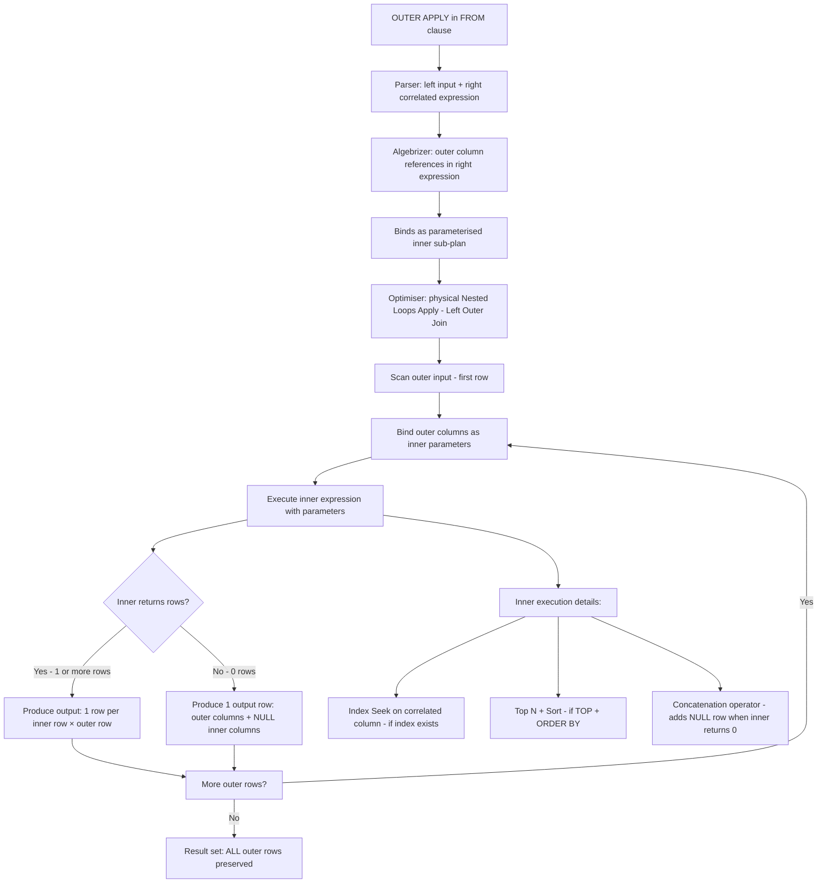
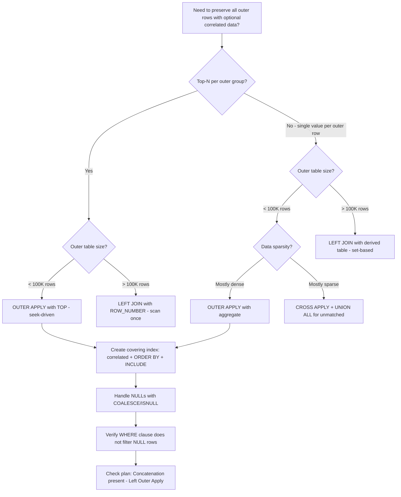

## Navigation

**Domain:** [[8 — Databases]] > **Group:** SQL Joins & Subqueries
**Previous:** [[8.110 — CROSS APPLY for Row-by-Row Processing]] | **Next:** [[8.112 — EXISTS vs JOIN — Choosing the Right Tool]]

### Prerequisites

- [[8.109 — APPLY — CROSS APPLY and OUTER APPLY]] — Understanding the APPLY operator fundamentals is required; this note focuses on the OUTER variant.
- [[8.110 — CROSS APPLY for Row-by-Row Processing]] — CROSS APPLY mechanics are the baseline; OUTER APPLY adds NULL preservation semantics on top.
- [[8.097 — LEFT OUTER JOIN — Preserving Left Side Rows]] — OUTER APPLY is the APPLY equivalent of LEFT JOIN; NULL preservation rules are identical.

### Where This Fits

OUTER APPLY is the row-by-row equivalent of LEFT JOIN — it preserves all rows from the outer table even when the correlated inner expression returns no rows, NULL-extending the inner columns. A .NET backend engineer reaches for OUTER APPLY when they need optional related data: the latest order per customer (NULL if they have never ordered), the most recent payment per invoice (NULL if unpaid), the top review per product (NULL if no reviews). The most expensive mistakes are treating OUTER APPLY as a set-based operator at large scale (millions of outer rows × seeks per row), forgetting that OUTER APPLY forces NULL-extended columns that propagate through subsequent expressions, and accidentally converting OUTER APPLY to CROSS APPLY by filtering NULLs in the WHERE clause. Interviewers use OUTER APPLY to test whether a candidate understands the LEFT JOIN equivalent in the APPLY context and whether they can articulate the performance difference between OUTER APPLY and CROSS APPLY (the Concatenation operator overhead for unmatched rows).

---

## Core Mental Model

OUTER APPLY is identical to CROSS APPLY in execution mechanics — the inner correlated expression is evaluated once per outer row — except that when the inner expression returns zero rows, the outer row is still emitted with NULLs in place of the inner columns. This is the exact semantic of LEFT JOIN: preserve the left (outer) side, NULL-extend the right (inner) side. The engine uses the **Nested Loops Apply (Left Outer Join)** operator, which adds a Concatenation step: for each outer row, if the inner expression returns rows, they are joined to the outer row; if it returns zero rows, a single row with NULL inner columns is fabricated and joined. This extra Concatenation step means OUTER APPLY has slightly higher per-row overhead than CROSS APPLY — not from the seek cost, but from the NULL row fabrication. The performance difference is negligible when most outer rows have matches (dense data) but can be significant when most outer rows have no matches (sparse data).

### Classification

OUTER APPLY is a `FROM` clause operator with LEFT JOIN semantics for correlated expressions. It is the SQL Server implementation of `LEFT JOIN LATERAL` in ANSI SQL (PostgreSQL equivalent). The inner expression is a correlated subquery, TVF, or VALUES constructor. OUTER APPLY is never commutative — the outer (left) table is always preserved. The NULL-extended columns from unmatched outer rows follow standard three-valued logic: comparisons with NULL return UNKNOWN, not TRUE.



### Key Properties

|Property|Value|Notes|
|---|---|---|
|NULL matching|NULL-extended (preserve outer)|Same as LEFT JOIN — outer rows without matches get NULL inner columns|
|Inner expression types|Subquery, TVF, VALUES|Same as CROSS APPLY|
|Complexity (indexed)|O(outer × (log(inner) + concat_cost))|Slightly more than CROSS due to Concatenation for unmatched rows|
|Complexity (no index)|O(outer × inner)|Catastrophic — same as CROSS APPLY|
|Commutative|No|Outer is always preserved|
|SARGable|Yes (correlated column with index)|Same as CROSS APPLY — Index Seek per outer row|
|NULL handling risk|WHERE clause can convert to CROSS|Filtering NULL inner columns in WHERE removes preserved outer rows|
|ANSI equivalent|LEFT JOIN LATERAL|PostgreSQL: `LEFT JOIN LATERAL ... ON true`|

---

## Deep Mechanics

### How the Engine Executes This

1. **Parsing and binding** — Identical to CROSS APPLY. The parser accepts the OUTER APPLY keyword. The algebrizer detects column references from the outer input inside the inner expression and creates a correlation binding.

2. **Simplification** — The optimiser evaluates:
   - **Unnesting**: If the inner expression does not reference outer columns, OUTER APPLY is converted to CROSS JOIN, then to LEFT JOIN if a join condition exists in the WHERE clause.
   - **OUTER APPLY to CROSS APPLY conversion**: If a WHERE clause predicate on an inner column is guaranteed to be NOT NULL (e.g., `o.OrderId IS NOT NULL`), the optimiser converts OUTER APPLY to CROSS APPLY — more efficient because the Concatenation operator is eliminated.
   - **Concatenation introduction**: When the Apply is confirmed to need OUTER semantics, a Concatenation operator is added to fabricate NULL rows when the inner returns nothing.

3. **Physical operator selection** — Always **Nested Loops Apply (Left Outer Join)** :
   - Scan the outer input. For each outer row, execute the parameterised inner sub-plan.
   - If the inner returns 1+ rows: produce output rows (outer + inner).
   - If the inner returns 0 rows: produce one output row (outer + NULLs for all inner columns).
   - The Concatenation operator implements the NULL fabrication: it takes the empty inner result set and unions it with a single NULL row.

4. **Execution** — The Concatenation operator checks the row count from the inner expression after each execution:
   - If count > 0: pass through the inner rows for joining.
   - If count = 0: emit one row with all inner columns set to NULL.
   - This check adds a small constant overhead per outer row compared to CROSS APPLY.

### SQL Visibility

```sql
-- OUTER APPLY: latest order per customer, NULL if no orders
SELECT c.CustomerId, c.FirstName, c.LastName,
       o.OrderId, o.OrderDate, o.TotalAmount
FROM dbo.Customers AS c
OUTER APPLY (
    SELECT TOP 1 o.OrderId, o.OrderDate, o.TotalAmount
    FROM dbo.Orders AS o
    WHERE o.CustomerId = c.CustomerId
    ORDER BY o.OrderDate DESC
) AS o;

-- OUTER APPLY with COALESCE for default values
SELECT c.CustomerId, c.FirstName, c.LastName,
       COALESCE(o.OrderId, -1) AS LatestOrderId,
       o.OrderDate AS LatestOrderDate,
       COALESCE(o.TotalAmount, 0) AS LatestOrderTotal
FROM dbo.Customers AS c
OUTER APPLY (
    SELECT TOP 1 o.OrderId, o.OrderDate, o.TotalAmount
    FROM dbo.Orders AS o
    WHERE o.CustomerId = c.CustomerId
    ORDER BY o.OrderDate DESC
) AS o;

-- OUTER APPLY with TVF that can return empty results
SELECT c.CustomerId, c.FirstName, c.LastName,
       s.PaymentId, s.PaymentDate, s.Amount
FROM dbo.Customers AS c
OUTER APPLY dbo.GetLatestPayment(c.CustomerId) AS s;

-- OUTER APPLY for optional related data (orders with optional payment)
SELECT o.OrderId, o.OrderDate, o.TotalAmount,
       p.PaymentId, p.PaymentDate, p.Amount AS PaidAmount
FROM dbo.Orders AS o
OUTER APPLY (
    SELECT TOP 1 p.PaymentId, p.PaymentDate, p.Amount
    FROM dbo.Payments AS p
    WHERE p.OrderId = o.OrderId
    ORDER BY p.PaymentDate DESC
) AS p;

-- OUTER APPLY vs LEFT JOIN for derived table
-- LEFT JOIN approach (cannot correlate inside the join)
SELECT c.CustomerId, c.LastName, latest.OrderId, latest.OrderDate
FROM dbo.Customers AS c
LEFT JOIN (
    SELECT o.CustomerId, o.OrderId, o.OrderDate,
           ROW_NUMBER() OVER (PARTITION BY o.CustomerId ORDER BY o.OrderDate DESC) AS rn
    FROM dbo.Orders AS o
) AS latest ON c.CustomerId = latest.CustomerId AND latest.rn = 1;

-- OUTER APPLY approach (cleaner, seek-driven)
SELECT c.CustomerId, c.LastName, o.OrderId, o.OrderDate
FROM dbo.Customers AS c
OUTER APPLY (
    SELECT TOP 1 o.OrderId, o.OrderDate
    FROM dbo.Orders AS o
    WHERE o.CustomerId = c.CustomerId
    ORDER BY o.OrderDate DESC
) AS o;
```

```csharp
// EF Core: SelectMany with DefaultIfEmpty generates OUTER APPLY
var customersWithLatestOrder = await dbContext.Customers
    .SelectMany(c => c.Orders
        .OrderByDescending(o => o.OrderDate)
        .Take(1)
        .DefaultIfEmpty(),
        (c, o) => new
        {
            c.CustomerId,
            CustomerName = c.FirstName + " " + c.LastName,
            OrderId = (int?)o?.OrderId,
            OrderDate = (DateTime?)o?.OrderDate,
            TotalAmount = (decimal?)o?.TotalAmount
        })
    .ToListAsync(cancellationToken);

// EF Core: correlated aggregate in Select (generates OUTER APPLY per aggregate)
var customerAggs = await dbContext.Customers
    .Select(c => new
    {
        c.CustomerId,
        CustomerName = c.FirstName + " " + c.LastName,
        TotalSpent = c.Orders
            .Where(o => o.Status == "Delivered")
            .Sum(o => (decimal?)o.TotalAmount),
        LastOrderDate = c.Orders
            .Where(o => o.Status == "Delivered")
            .Max(o => (DateTime?)o.OrderDate)
    })
    .ToListAsync(cancellationToken);
```

**Generated SQL (from EF Core logs):**

```sql
-- SelectMany with DefaultIfEmpty:
SELECT [c].[CustomerId], [c].[FirstName], [c].[LastName],
       [o].[OrderId], [o].[OrderDate], [o].[TotalAmount]
FROM [Customers] AS [c]
OUTER APPLY (
    SELECT TOP(1) [o0].[OrderId], [o0].[OrderDate], [o0].[TotalAmount]
    FROM [Orders] AS [o0]
    WHERE [o0].[CustomerId] = [c].[CustomerId]
    ORDER BY [o0].[OrderDate] DESC
) AS [o];

-- Select with correlated SUM (OUTER APPLY per aggregate):
SELECT [c].[CustomerId],
       [c].[FirstName] + N' ' + [c].[LastName] AS [CustomerName],
       (SELECT SUM([o].[TotalAmount])
        FROM [Orders] AS [o]
        WHERE [o].[CustomerId] = [c].[CustomerId]
          AND [o].[Status] = N'Delivered') AS [TotalSpent],
       (SELECT MAX([o].[OrderDate])
        FROM [Orders] AS [o]
        WHERE [o].[CustomerId] = [c].[CustomerId]
          AND [o].[Status] = N'Delivered') AS [LastOrderDate]
FROM [Customers] AS [c];
```

### Execution Plan Analysis

**OUTER APPLY with index (most customers have orders — dense data):**

```
  [Clustered Index Scan PK_Customers]          -- outer: 100K rows
  [Index Seek IX_Orders_CustomerId_OrderDate]  -- inner: seek per outer row
  [Top 1]
  [Concatenation]                               -- adds NULL row when inner returns 0
  → [Nested Loops Apply (Left Outer Join)]
  → [SELECT]
Estimated Cost: ~4.5  |  Logical Reads: ~8 + (100K × 3 seeks) = ~308K
Notes: Concatenation adds ~5% overhead over CROSS APPLY for dense data
```

**OUTER APPLY with index (sparse data — few customers have orders):**

```
  [Clustered Index Scan PK_Customers]          -- outer: 100K rows
  [Index Seek IX_Orders_CustomerId_OrderDate]  -- inner: seek per outer row
  [Top 1]                                        -- finds no rows for 80K customers
  [Concatenation]                               -- fabricates 80K NULL rows
  → [Nested Loops Apply (Left Outer Join)]
  → [SELECT]
Estimated Cost: ~5.5  |  Logical Reads: ~8 + (100K × 3 seeks) = ~308K
Notes: Concatenation does more work when most outer rows have no match
```

**OUTER APPLY converted to CROSS APPLY by WHERE filter on inner column:**

```
  [Clustered Index Scan PK_Customers]
  [Index Seek IX_Orders_CustomerId_OrderDate]
  [Top 1]
  → [Nested Loops Apply (Inner Join)]  -- Optimiser removed Concatenation
  → [SELECT]
  -- Because WHERE clause had: o.OrderId IS NOT NULL
  -- This effectively eliminates NULL-extended rows — optimiser converts to CROSS APPLY
```

**OUTER APPLY vs LEFT JOIN with derived table (same result, different operators):**

```
-- LEFT JOIN plan:
[Clustered Index Scan PK_Customers]
[Clustered Index Scan PK_Orders]           -- scans all orders
[Segment + Window Aggregate]               -- ROW_NUMBER over all orders
[Filter]                                     -- rn = 1
→ [Nested Loops Left Outer Join]
→ [SELECT]

-- OUTER APPLY plan (seek-driven, more efficient for small outer):
[Clustered Index Scan PK_Customers]
[Index Seek IX_Orders_CustomerId_OrderDate]  -- seeks per customer
[Top 1]
[Concatenation]
→ [Nested Loops Apply (Left Outer Join)]
→ [SELECT]
```

### Cost Visibility

```sql
SET STATISTICS IO ON;
SET STATISTICS TIME ON;

-- OUTER APPLY (dense data: 90% of customers have orders)
SELECT c.CustomerId, c.LastName, o.OrderId, o.OrderDate
FROM dbo.Customers AS c
OUTER APPLY (
    SELECT TOP 1 o.OrderId, o.OrderDate
    FROM dbo.Orders AS o
    WHERE o.CustomerId = c.CustomerId
    ORDER BY o.OrderDate DESC
) AS o;

-- Expected output (with IX_Orders_CustomerId_OrderDate):
-- Table 'Orders'. Scan count 100000, logical reads 300000 (seek per customer)
-- Table 'Customers'. Scan count 1, logical reads 6100 (scan)
-- SQL Server Execution Times: CPU time = 410ms, elapsed time = 490ms

-- CROSS APPLY (same query, excludes customers without orders):
-- Table 'Orders'. Scan count 90000, logical reads 270000 (only 90K customers with orders)
-- Table 'Customers'. Scan count 1, logical reads 6100
-- SQL Server Execution Times: CPU time = 370ms, elapsed time = 450ms

-- OUTER APPLY (sparse data: only 10% of customers have orders):
-- Table 'Orders'. Scan count 100000, logical reads 300000 (all customers still seek)
-- Table 'Customers'. Scan count 1, logical reads 6100
-- SQL Server Execution Times: CPU time = 420ms, elapsed time = 510ms
-- Note: Same IO as dense case (100K seeks), but Concatenation fabricates 90K NULL rows
-- CPU/elapsed time slightly higher due to NULL row fabrication
```

### Failure Modes

**WHERE clause converts OUTER APPLY to CROSS APPLY:** This is the most common OUTER APPLY bug. When a WHERE clause references an inner column and evaluates it as non-NULL, the optimiser converts OUTER APPLY to CROSS APPLY, silently dropping outer rows without matches. Example: `WHERE o.OrderId > 0` filters out NULL-extended rows because `NULL > 0` is UNKNOWN.

**NULL propagation through expressions:** OUTER APPLY columns are nullable even if the source column is NOT NULL. Any expression using these columns returns NULL for unmatched rows. Arithmetic (`o.TotalAmount * 0.1`), string concatenation (`o.OrderId + '-' + c.LastName`), and comparisons (`o.OrderDate >= @Cutoff`) all produce NULL. COALESCE or ISNULL must be used explicitly.

**OUTER APPLY with TVF that returns empty results for most outer rows:** If the TVF is a multi-statement function, each empty result still incurs the table variable creation and population overhead. The Concatenation operator then fabricates a NULL row. This compounded overhead (table variable + NULL fabrication) can be significant. Prefer inline TVFs.

**OUTER APPLY from large outer table with sparse matches:** The Concatenation operator does more work when most outer rows have no match (it must fabricate a NULL row for each). While the seek cost per outer row is the same, the NULL fabrication overhead increases. At 1M outer rows with 90% no match: 900K NULL row fabrications.

---

## Production Patterns and Implementation

### Primary SQL Implementation

```sql
-- ============================================================
-- Schema context
-- ============================================================
CREATE TABLE dbo.Customers
(
    CustomerId   INT            NOT NULL IDENTITY(1,1),
    FirstName    NVARCHAR(100)  NOT NULL,
    LastName     NVARCHAR(100)  NOT NULL,
    Email        NVARCHAR(256)  NOT NULL,
    Status       VARCHAR(20)    NOT NULL DEFAULT 'Active',
    CreatedAt    DATETIME2(0)   NOT NULL DEFAULT SYSUTCDATETIME(),
    CONSTRAINT PK_Customers PRIMARY KEY CLUSTERED (CustomerId)
);

CREATE TABLE dbo.Orders
(
    OrderId      INT            NOT NULL IDENTITY(1,1),
    CustomerId   INT            NOT NULL,
    OrderDate    DATETIME2(0)   NOT NULL,
    Status       VARCHAR(20)    NOT NULL DEFAULT 'Pending',
    TotalAmount  DECIMAL(18,2)  NOT NULL,
    CONSTRAINT PK_Orders PRIMARY KEY CLUSTERED (OrderId)
);

CREATE TABLE dbo.Payments
(
    PaymentId    INT            NOT NULL IDENTITY(1,1),
    OrderId      INT            NOT NULL,
    PaymentDate  DATETIME2(0)   NOT NULL,
    Amount       DECIMAL(18,2)  NOT NULL,
    Method       VARCHAR(20)    NOT NULL,
    Status       VARCHAR(20)    NOT NULL DEFAULT 'Completed',
    CONSTRAINT PK_Payments PRIMARY KEY CLUSTERED (PaymentId)
);

CREATE TABLE dbo.Invoices
(
    InvoiceId    INT            NOT NULL IDENTITY(1,1),
    OrderId      INT            NOT NULL,
    InvoiceDate  DATETIME2(0)   NOT NULL,
    TotalAmount  DECIMAL(18,2)  NOT NULL,
    Status       VARCHAR(20)    NOT NULL DEFAULT 'Unpaid',
    PaidDate     DATETIME2(0)   NULL,
    CONSTRAINT PK_Invoices PRIMARY KEY CLUSTERED (InvoiceId)
);

CREATE TABLE dbo.Reviews
(
    ReviewId     INT            NOT NULL IDENTITY(1,1),
    ProductId    INT            NOT NULL,
    CustomerId   INT            NOT NULL,
    Rating       TINYINT        NOT NULL CHECK (Rating BETWEEN 1 AND 5),
    ReviewText   NVARCHAR(MAX)  NULL,
    CreatedAt    DATETIME2(0)   NOT NULL DEFAULT SYSUTCDATETIME(),
    CONSTRAINT PK_Reviews PRIMARY KEY CLUSTERED (ReviewId)
);

-- Indexes for OUTER APPLY patterns
CREATE INDEX IX_Orders_CustomerId_OrderDate
    ON dbo.Orders (CustomerId, OrderDate DESC)
    INCLUDE (Status, TotalAmount);

CREATE INDEX IX_Payments_OrderId_PaymentDate
    ON dbo.Payments (OrderId, PaymentDate DESC)
    INCLUDE (Amount, Method, Status);

CREATE INDEX IX_Invoices_OrderId
    ON dbo.Invoices (OrderId, InvoiceDate DESC)
    INCLUDE (TotalAmount, Status, PaidDate);

CREATE INDEX IX_Reviews_ProductId_Rating
    ON dbo.Reviews (ProductId, Rating DESC)
    INCLUDE (ReviewText, CreatedAt, CustomerId);

-- ============================================================
-- Pattern 1: Customers with optional latest order
-- ============================================================
SELECT c.CustomerId, c.FirstName, c.LastName, c.Email,
       COALESCE(o.OrderId, -1) AS LatestOrderId,
       o.OrderDate AS LatestOrderDate,
       COALESCE(o.TotalAmount, 0) AS LatestOrderTotal
FROM dbo.Customers AS c
OUTER APPLY (
    SELECT TOP 1 o.OrderId, o.OrderDate, o.TotalAmount
    FROM dbo.Orders AS o
    WHERE o.CustomerId = c.CustomerId
    ORDER BY o.OrderDate DESC
) AS o
ORDER BY c.LastName;

-- ============================================================
-- Pattern 2: Orders with optional latest payment
-- ============================================================
SELECT o.OrderId, o.OrderDate, o.TotalAmount,
       p.PaymentId, p.PaymentDate, p.Amount AS PaidAmount,
       COALESCE(p.Status, 'Unpaid') AS PaymentStatus
FROM dbo.Orders AS o
OUTER APPLY (
    SELECT TOP 1 p.PaymentId, p.PaymentDate, p.Amount, p.Status
    FROM dbo.Payments AS p
    WHERE p.OrderId = o.OrderId
    ORDER BY p.PaymentDate DESC
) AS p
ORDER BY o.OrderDate DESC;

-- ============================================================
-- Pattern 3: Products with optional top review
-- ============================================================
SELECT p.ProductId, p.ProductName,
       r.Rating AS TopRating,
       LEFT(r.ReviewText, 200) AS ReviewSnippet,
       r.CreatedAt AS ReviewDate
FROM dbo.Products AS p
OUTER APPLY (
    SELECT TOP 1 r.Rating, r.ReviewText, r.CreatedAt
    FROM dbo.Reviews AS r
    WHERE r.ProductId = p.ProductId
    ORDER BY r.Rating DESC, r.CreatedAt DESC
) AS r
ORDER BY p.ProductName;

-- ============================================================
-- Pattern 4: OUTER APPLY with default values and conditional logic
-- ============================================================
SELECT c.CustomerId, c.FirstName, c.LastName,
       CASE
           WHEN o.OrderId IS NOT NULL THEN 'Has orders'
           ELSE 'No orders yet'
       END AS OrderStatus,
       COALESCE(o.OrderDate, CAST('1900-01-01' AS DATETIME2)) AS LastOrderDate,
       ISNULL(o.TotalAmount, 0) AS LastOrderAmount
FROM dbo.Customers AS c
OUTER APPLY (
    SELECT TOP 1 o.OrderId, o.OrderDate, o.TotalAmount
    FROM dbo.Orders AS o
    WHERE o.CustomerId = c.CustomerId
    ORDER BY o.OrderDate DESC
) AS o;

-- ============================================================
-- Pattern 5: OUTER APPLY with aggregation (optional aggregate)
-- ============================================================
SELECT c.CustomerId, c.FirstName, c.LastName,
       agg.TotalSpent,
       agg.OrderCount,
       agg.LastOrderDate
FROM dbo.Customers AS c
OUTER APPLY (
    SELECT
        ISNULL(SUM(o.TotalAmount), 0) AS TotalSpent,
        COUNT(*) AS OrderCount,
        MAX(o.OrderDate) AS LastOrderDate
    FROM dbo.Orders AS o
    WHERE o.CustomerId = c.CustomerId
      AND o.Status = 'Delivered'
) AS agg;

-- ============================================================
-- Pattern 6: OUTER APPLY vs LEFT JOIN — equivalent results
-- ============================================================
-- LEFT JOIN approach:
SELECT c.CustomerId, c.LastName, latest.OrderId, latest.OrderDate
FROM dbo.Customers AS c
LEFT JOIN (
    SELECT o.CustomerId, o.OrderId, o.OrderDate,
           ROW_NUMBER() OVER (PARTITION BY o.CustomerId ORDER BY o.OrderDate DESC) AS rn
    FROM dbo.Orders AS o
) AS latest ON c.CustomerId = latest.CustomerId AND latest.rn = 1;

-- OUTER APPLY approach (cleaner, seek-driven):
SELECT c.CustomerId, c.LastName, o.OrderId, o.OrderDate
FROM dbo.Customers AS c
OUTER APPLY (
    SELECT TOP 1 o.OrderId, o.OrderDate
    FROM dbo.Orders AS o
    WHERE o.CustomerId = c.CustomerId
    ORDER BY o.OrderDate DESC
) AS o;

-- ============================================================
-- Pattern 7: Multiple OUTER APPLY operators
-- ============================================================
SELECT c.CustomerId, c.FirstName, c.LastName,
       latest.OrderId AS LatestOrderId,
       latest.OrderDate AS LatestOrderDate,
       latest.TotalAmount AS LatestOrderTotal,
       unpaid.InvoiceId AS UnpaidInvoiceId,
       unpaid.TotalAmount AS UnpaidInvoiceTotal
FROM dbo.Customers AS c
OUTER APPLY (
    SELECT TOP 1 o.OrderId, o.OrderDate, o.TotalAmount
    FROM dbo.Orders AS o
    WHERE o.CustomerId = c.CustomerId
    ORDER BY o.OrderDate DESC
) AS latest
OUTER APPLY (
    SELECT TOP 1 i.InvoiceId, i.TotalAmount
    FROM dbo.Invoices AS i
    INNER JOIN dbo.Orders AS o ON i.OrderId = o.OrderId
    WHERE o.CustomerId = c.CustomerId
      AND i.Status = 'Unpaid'
    ORDER BY i.InvoiceDate DESC
) AS unpaid;
```

### EF Core Implementation

```csharp
public class ApplicationDbContext : DbContext
{
    public DbSet<Customer> Customers => Set<Customer>();
    public DbSet<Order> Orders => Set<Order>();
    public DbSet<Payment> Payments => Set<Payment>();
    public DbSet<Invoice> Invoices => Set<Invoice>();
    public DbSet<Review> Reviews => Set<Review>();
    public DbSet<Product> Products => Set<Product>();

    protected override void OnModelCreating(ModelBuilder modelBuilder)
    {
        modelBuilder.Entity<Customer>(entity =>
        {
            entity.ToTable("Customers");
            entity.HasKey(c => c.CustomerId);
            entity.Property(c => c.FirstName).HasMaxLength(100);
            entity.Property(c => c.LastName).HasMaxLength(100);
            entity.HasIndex(c => c.Status);
        });

        modelBuilder.Entity<Order>(entity =>
        {
            entity.ToTable("Orders");
            entity.HasKey(o => o.OrderId);
            entity.Property(o => o.Status).HasMaxLength(20);
            entity.Property(o => o.TotalAmount).HasColumnType("decimal(18,2)");
            entity.HasOne(o => o.Customer).WithMany(c => c.Orders).HasForeignKey(o => o.CustomerId);
            entity.HasIndex(o => new { o.CustomerId, o.OrderDate });
        });

        modelBuilder.Entity<Payment>(entity =>
        {
            entity.ToTable("Payments");
            entity.HasKey(p => p.PaymentId);
            entity.Property(p => p.Amount).HasColumnType("decimal(18,2)");
            entity.Property(p => p.Method).HasMaxLength(20);
            entity.HasIndex(p => new { p.OrderId, p.PaymentDate });
        });

        modelBuilder.Entity<Invoice>(entity =>
        {
            entity.ToTable("Invoices");
            entity.HasKey(i => i.InvoiceId);
            entity.Property(i => i.Status).HasMaxLength(20);
            entity.Property(i => i.TotalAmount).HasColumnType("decimal(18,2)");
            entity.HasIndex(i => new { i.OrderId, i.Status });
        });

        modelBuilder.Entity<Product>(entity =>
        {
            entity.ToTable("Products");
            entity.HasKey(p => p.ProductId);
            entity.Property(p => p.ProductName).HasMaxLength(200);
        });

        modelBuilder.Entity<Review>(entity =>
        {
            entity.ToTable("Reviews");
            entity.HasKey(r => r.ReviewId);
            entity.HasIndex(r => new { r.ProductId, r.Rating });
        });
    }
}

public class Customer
{
    public int CustomerId { get; set; }
    public string FirstName { get; set; } = string.Empty;
    public string LastName { get; set; } = string.Empty;
    public string Email { get; set; } = string.Empty;
    public string Status { get; set; } = "Active";
    public DateTime CreatedAt { get; set; }
    public ICollection<Order> Orders { get; set; } = new List<Order>();
}

public class Order
{
    public int OrderId { get; set; }
    public int CustomerId { get; set; }
    public DateTime OrderDate { get; set; }
    public string Status { get; set; } = "Pending";
    public decimal TotalAmount { get; set; }
    public Customer Customer { get; set; } = null!;
    public ICollection<Payment> Payments { get; set; } = new List<Payment>();
}

public class Payment
{
    public int PaymentId { get; set; }
    public int OrderId { get; set; }
    public DateTime PaymentDate { get; set; }
    public decimal Amount { get; set; }
    public string Method { get; set; } = string.Empty;
    public string Status { get; set; } = "Completed";
}

// Pattern 1: OUTER APPLY via SelectMany + DefaultIfEmpty
public async Task<List<CustomerWithLatestOrderDto>> GetCustomersWithLatestOrderAsync(
    CancellationToken cancellationToken = default)
{
    return await dbContext.Customers
        .SelectMany(c => c.Orders
            .OrderByDescending(o => o.OrderDate)
            .Take(1)
            .DefaultIfEmpty(),
            (c, o) => new CustomerWithLatestOrderDto
            {
                CustomerId = c.CustomerId,
                CustomerName = c.FirstName + " " + c.LastName,
                LatestOrderId = o != null ? o.OrderId : (int?)null,
                LatestOrderDate = o != null ? o.OrderDate : (DateTime?)null,
                LatestOrderTotal = o != null ? o.TotalAmount : (decimal?)null
            })
        .ToListAsync(cancellationToken);
    // Generated: OUTER APPLY (SELECT TOP(1) ... WHERE CustomerId = c.CustomerId)
}

// Pattern 2: Correlated aggregates via Select
public async Task<List<CustomerAggDto>> GetCustomerAggregationsAsync(
    CancellationToken cancellationToken = default)
{
    return await dbContext.Customers
        .Select(c => new CustomerAggDto
        {
            CustomerId = c.CustomerId,
            CustomerName = c.FirstName + " " + c.LastName,
            TotalSpent = c.Orders
                .Where(o => o.Status == "Delivered")
                .Sum(o => (decimal?)o.TotalAmount) ?? 0,
            OrderCount = c.Orders
                .Where(o => o.Status == "Delivered")
                .Count(),
            LastOrderDate = c.Orders
                .Where(o => o.Status == "Delivered")
                .Max(o => (DateTime?)o.OrderDate)
        })
        .OrderByDescending(x => x.TotalSpent)
        .ToListAsync(cancellationToken);
    // Generated: Multiple OUTER APPLY subqueries (one per aggregate)
}

// DTOs
public class CustomerWithLatestOrderDto
{
    public int CustomerId { get; set; }
    public string CustomerName { get; set; } = string.Empty;
    public int? LatestOrderId { get; set; }
    public DateTime? LatestOrderDate { get; set; }
    public decimal? LatestOrderTotal { get; set; }
}

public class CustomerAggDto
{
    public int CustomerId { get; set; }
    public string CustomerName { get; set; } = string.Empty;
    public decimal TotalSpent { get; set; }
    public int OrderCount { get; set; }
    public DateTime? LastOrderDate { get; set; }
}
```

### Dapper Implementation

```csharp
public sealed class OrderRepository
{
    private readonly IDbConnectionFactory _connectionFactory;

    public OrderRepository(IDbConnectionFactory connectionFactory)
        => _connectionFactory = connectionFactory;

    // Pattern 1: Customers with optional latest order
    public async Task<IReadOnlyList<CustomerWithLatestOrderDto>> GetCustomersWithLatestOrderAsync(
        CancellationToken cancellationToken = default)
    {
        const string sql = @"
            SELECT c.CustomerId,
                   c.FirstName + ' ' + c.LastName AS CustomerName,
                   o.OrderId AS LatestOrderId,
                   o.OrderDate AS LatestOrderDate,
                   o.TotalAmount AS LatestOrderTotal
            FROM dbo.Customers AS c
            OUTER APPLY (
                SELECT TOP 1 o.OrderId, o.OrderDate, o.TotalAmount
                FROM dbo.Orders AS o
                WHERE o.CustomerId = c.CustomerId
                ORDER BY o.OrderDate DESC
            ) AS o
            ORDER BY c.LastName;";

        await using var connection = _connectionFactory.Create();

        var results = await connection.QueryAsync<CustomerWithLatestOrderDto>(
            new CommandDefinition(sql, cancellationToken: cancellationToken));

        return results.AsList();
    }

    // Pattern 2: Orders with optional payment info
    public async Task<IReadOnlyList<OrderWithPaymentDto>> GetOrdersWithPaymentAsync(
        DateTime? fromDate,
        CancellationToken cancellationToken = default)
    {
        const string sql = @"
            SELECT o.OrderId, o.OrderDate, o.Status, o.TotalAmount,
                   p.PaymentId, p.PaymentDate, p.Amount AS PaidAmount,
                   COALESCE(p.Status, 'Unpaid') AS PaymentStatus
            FROM dbo.Orders AS o
            OUTER APPLY (
                SELECT TOP 1 p.PaymentId, p.PaymentDate, p.Amount, p.Status
                FROM dbo.Payments AS p
                WHERE p.OrderId = o.OrderId
                ORDER BY p.PaymentDate DESC
            ) AS p
            WHERE (@FromDate IS NULL OR o.OrderDate >= @FromDate)
            ORDER BY o.OrderDate DESC;";

        await using var connection = _connectionFactory.Create();

        var results = await connection.QueryAsync<OrderWithPaymentDto>(
            new CommandDefinition(sql, new { FromDate = fromDate },
                cancellationToken: cancellationToken));

        return results.AsList();
    }

    // Pattern 3: Products with optional top review
    public async Task<IReadOnlyList<ProductWithReviewDto>> GetProductsWithTopReviewAsync(
        CancellationToken cancellationToken = default)
    {
        const string sql = @"
            SELECT p.ProductId, p.ProductName,
                   r.Rating AS TopRating,
                   LEFT(r.ReviewText, 200) AS ReviewSnippet,
                   r.CreatedAt AS ReviewDate,
                   CASE WHEN r.ReviewId IS NOT NULL THEN 'Has reviews' ELSE 'No reviews' END AS ReviewStatus
            FROM dbo.Products AS p
            OUTER APPLY (
                SELECT TOP 1 r.Rating, r.ReviewText, r.CreatedAt, r.ReviewId
                FROM dbo.Reviews AS r
                WHERE r.ProductId = p.ProductId
                ORDER BY r.Rating DESC, r.CreatedAt DESC
            ) AS r
            ORDER BY p.ProductName;";

        await using var connection = _connectionFactory.Create();

        var results = await connection.QueryAsync<ProductWithReviewDto>(
            new CommandDefinition(sql, cancellationToken: cancellationToken));

        return results.AsList();
    }

    // Pattern 4: OUTER APPLY with aggregation
    public async Task<IReadOnlyList<CustomerAggDto>> GetCustomerAggregationsAsync(
        CancellationToken cancellationToken = default)
    {
        const string sql = @"
            SELECT c.CustomerId,
                   c.FirstName + ' ' + c.LastName AS CustomerName,
                   ISNULL(agg.TotalSpent, 0) AS TotalSpent,
                   ISNULL(agg.OrderCount, 0) AS OrderCount,
                   agg.LastOrderDate
            FROM dbo.Customers AS c
            OUTER APPLY (
                SELECT
                    SUM(o.TotalAmount) AS TotalSpent,
                    COUNT(*) AS OrderCount,
                    MAX(o.OrderDate) AS LastOrderDate
                FROM dbo.Orders AS o
                WHERE o.CustomerId = c.CustomerId
                  AND o.Status = 'Delivered'
            ) AS agg
            ORDER BY agg.TotalSpent DESC;";

        await using var connection = _connectionFactory.Create();

        var results = await connection.QueryAsync<CustomerAggDto>(
            new CommandDefinition(sql, cancellationToken: cancellationToken));

        return results.AsList();
    }
}

public record CustomerWithLatestOrderDto(int CustomerId, string CustomerName, int? LatestOrderId, DateTime? LatestOrderDate, decimal? LatestOrderTotal);
public record OrderWithPaymentDto(int OrderId, DateTime OrderDate, string Status, decimal TotalAmount, int? PaymentId, DateTime? PaymentDate, decimal? PaidAmount, string PaymentStatus);
public record ProductWithReviewDto(int ProductId, string ProductName, byte? TopRating, string? ReviewSnippet, DateTime? ReviewDate, string ReviewStatus);
public record CustomerAggDto(int CustomerId, string CustomerName, decimal TotalSpent, int OrderCount, DateTime? LastOrderDate);
```

### Configuration and Wiring

```csharp
// Program.cs
builder.Services.AddDbContext<ApplicationDbContext>(options =>
    options.UseSqlServer(
        builder.Configuration.GetConnectionString("DefaultConnection"),
        sqlOptions =>
        {
            sqlOptions.EnableRetryOnFailure(3);
            sqlOptions.CommandTimeout(30);
        }));

builder.Services.AddSingleton<IDbConnectionFactory>(sp =>
    new SqlConnectionFactory(
        builder.Configuration.GetConnectionString("DefaultConnection")!));

builder.Services.AddScoped<OrderRepository>();
```

### SQL Server vs PostgreSQL Differences

```sql
-- PostgreSQL: OUTER APPLY equivalent
SELECT c.customer_id, c.last_name,
       o.order_id, o.order_date, o.total_amount
FROM customers AS c
LEFT JOIN LATERAL (
    SELECT o.order_id, o.order_date, o.total_amount
    FROM orders AS o
    WHERE o.customer_id = c.customer_id
    ORDER BY o.order_date DESC
    LIMIT 1
) AS o ON true;

-- PostgreSQL: LATERAL with aggregate
SELECT c.customer_id, c.last_name,
       agg.total_spent, agg.order_count
FROM customers AS c
LEFT JOIN LATERAL (
    SELECT
        SUM(o.total_amount) AS total_spent,
        COUNT(*) AS order_count
    FROM orders AS o
    WHERE o.customer_id = c.customer_id
      AND o.status IN ('Delivered', 'Shipped')
) AS agg ON true;

-- PostgreSQL: LATERAL with TVF
SELECT c.customer_id, c.last_name, f.*
FROM customers AS c
LEFT JOIN LATERAL get_latest_order(c.customer_id) AS f ON true;
```

---

## Gotchas and Production Pitfalls

### WHERE Clause Converts OUTER APPLY to CROSS APPLY

**Pitfall:** Adding a WHERE clause that references inner columns with a non-NULL comparison. Rows with NULL inner columns are filtered out, silently converting OUTER APPLY to CROSS APPLY.

```sql
-- ❌ WHERE clause on OrderId filters out NULL-extended rows
SELECT c.CustomerId, c.LastName, o.OrderId, o.OrderDate
FROM dbo.Customers AS c
OUTER APPLY (
    SELECT TOP 1 o.OrderId, o.OrderDate
    FROM dbo.Orders AS o
    WHERE o.CustomerId = c.CustomerId
    ORDER BY o.OrderDate DESC
) AS o
WHERE o.OrderId IS NOT NULL;  -- This makes OUTER APPLY equivalent to CROSS APPLY
```

**Symptom:** The query returns only customers with orders — exactly like CROSS APPLY. The developer expected all customers. The count is 90K instead of 100K. The execution plan shows `Nested Loops Apply (Inner Join)` — the optimiser converted it because the WHERE predicate guarantees NOT NULL.

**Fix:**

```sql
-- ✅ Move the filter inside the APPLY expression
SELECT c.CustomerId, c.LastName, o.OrderId, o.OrderDate
FROM dbo.Customers AS c
OUTER APPLY (
    SELECT TOP 1 o.OrderId, o.OrderDate
    FROM dbo.Orders AS o
    WHERE o.CustomerId = c.CustomerId
      AND o.OrderId IS NOT NULL  -- Filter inside: still preserves outer rows
    ORDER BY o.OrderDate DESC
) AS o;
```

**Cost of not fixing:** A customer retention report shows only 90K of 100K customers. The 10K customers without orders are invisible. The marketing team assumes all customers are active and sends a campaign to everyone — including the 10K who should have received a new-customer welcome. The campaign wastes $5K on inappropriate targeting.

---

### NULL Propagation Through Expressions — Silent Data Corruption

**Pitfall:** Using OUTER APPLY columns in arithmetic or string operations without COALESCE. The NULL from unmatched rows propagates through every expression.

```sql
-- ❌ TotalAmount * 0.05 produces NULL for customers without orders
SELECT c.CustomerId, c.LastName,
       o.TotalAmount * 0.05 AS LoyaltyCashback,
       'Last order: ' + CAST(o.OrderDate AS VARCHAR(20)) AS OrderInfo
FROM dbo.Customers AS c
OUTER APPLY (
    SELECT TOP 1 o.TotalAmount, o.OrderDate
    FROM dbo.Orders AS o
    WHERE o.CustomerId = c.CustomerId
    ORDER BY o.OrderDate DESC
) AS o;
-- NULL * 0.05 = NULL
-- NULL + string = NULL
```

**Symptom:** LoyaltyCashback shows NULL for 10K customers instead of 0. OrderInfo shows NULL instead of empty string. The frontend displays blank fields where zeros or descriptive text should appear.

**Fix:**

```sql
-- ✅ Use COALESCE for all columns from OUTER APPLY
SELECT c.CustomerId, c.LastName,
       COALESCE(o.TotalAmount, 0) * 0.05 AS LoyaltyCashback,
       'Last order: ' + COALESCE(CAST(o.OrderDate AS VARCHAR(20)), 'Never') AS OrderInfo
FROM dbo.Customers AS c
OUTER APPLY (
    SELECT TOP 1 o.TotalAmount, o.OrderDate
    FROM dbo.Orders AS o
    WHERE o.CustomerId = c.CustomerId
    ORDER BY o.OrderDate DESC
) AS o;
```

**Cost of not fixing:** A CSV export feeds a payment processor with NULL amounts. The payment processor interprets NULL as "unlimited" and issues $0.00 payments. The finance team notices $0 cashback payments for 10K customers 30 days later. Reconciliation takes 3 person-days.

---

### OUTER APPLY from Large Outer Table — Concatenation Overhead

**Pitfall:** Using OUTER APPLY from a table with millions of rows when most rows have no match. Each unmatched outer row still executes the inner seek and then the Concatenation fabricates a NULL row.

```sql
-- ❌ 5M customers with only 10K orders — 4.99M NULL fabrications
SELECT c.CustomerId, c.LastName, o.OrderId, o.OrderDate
FROM dbo.Customers AS c
OUTER APPLY (
    SELECT TOP 1 o.OrderId, o.OrderDate
    FROM dbo.Orders AS o
    WHERE o.CustomerId = c.CustomerId
    ORDER BY o.OrderDate DESC
) AS o;
```

**Symptom:** 5M seeks on Orders index (even though most find nothing). 4.99M Concatenation operations fabricating NULL rows. Execution plan shows 5M seeks + large Concatenation. CPU is high. The query runs for 30 seconds.

**Fix:**

```sql
-- ✅ Split into two queries: customers with orders + customers without
-- Customers WITH orders (CROSS APPLY — cheaper)
SELECT c.CustomerId, c.LastName, o.OrderId, o.OrderDate, 'Has orders' AS Status
FROM dbo.Customers AS c
CROSS APPLY (
    SELECT TOP 1 o.OrderId, o.OrderDate
    FROM dbo.Orders AS o
    WHERE o.CustomerId = c.CustomerId
    ORDER BY o.OrderDate DESC
) AS o
UNION ALL
-- Customers WITHOUT orders (anti-join — cheaper than OUTER APPLY + NULL)
SELECT c.CustomerId, c.LastName, NULL AS OrderId, NULL AS OrderDate, 'No orders' AS Status
FROM dbo.Customers AS c
WHERE NOT EXISTS (
    SELECT 1 FROM dbo.Orders AS o WHERE o.CustomerId = c.CustomerId
);
```

**Cost of not fixing:** A nightly batch process using OUTER APPLY for 5M customers runs for 45 minutes instead of the expected 5 minutes. The batch window extends, delaying downstream reporting by 1 hour.

---

### OUTER APPLY with Multi-Statement TVF — Compounded Overhead

**Pitfall:** Using OUTER APPLY with a multi-statement TVF that is called for every outer row. When the TVF returns empty results (no match), the MSTVF still creates a table variable, runs the INSERT, and returns. The Concatenation then adds its own NULL row.

```sql
-- ❌ Multi-statement TVF (bad)
CREATE FUNCTION dbo.GetLatestPaymentSlow
(
    @OrderId INT
)
RETURNS @Result TABLE (PaymentId INT, Amount DECIMAL(18,2), PaymentDate DATETIME2)
AS
BEGIN
    INSERT INTO @Result
    SELECT TOP 1 p.PaymentId, p.Amount, p.PaymentDate
    FROM dbo.Payments AS p
    WHERE p.OrderId = @OrderId
    ORDER BY p.PaymentDate DESC;
    RETURN;
END;
```

**Symptom:** Each empty result still creates and populates the table variable. The Concatenation operator then adds its own NULL row. Double overhead per unmatched outer row.

**Fix:**

```sql
-- ✅ Inline TVF — no table variable overhead
CREATE FUNCTION dbo.GetLatestPayment
(
    @OrderId INT
)
RETURNS TABLE
AS
RETURN
    SELECT TOP 1 p.PaymentId, p.Amount, p.PaymentDate
    FROM dbo.Payments AS p
    WHERE p.OrderId = @OrderId
    ORDER BY p.PaymentDate DESC;
```

**Cost of not fixing:** Report generation using OUTER APPLY with an MSTVF runs 10x slower than expected. The TVF is called 100K times, each creating a table variable. Tempdb allocation increases by 50%. Blocking on tempdb system pages affects other queries.

---

## Performance Implications

### Benchmark: Before and After

```sql
-- Baseline: OUTER APPLY without index — full scan per row
SET STATISTICS IO ON;
SET STATISTICS TIME ON;

SELECT c.CustomerId, c.LastName, o.OrderId, o.OrderDate
FROM dbo.Customers AS c
OUTER APPLY (
    SELECT TOP 1 o.OrderId, o.OrderDate
    FROM dbo.Orders AS o
    WHERE o.CustomerId = c.CustomerId
    ORDER BY o.OrderDate DESC
) AS o;

-- Expected output (no IX_Orders_CustomerId_OrderDate):
-- Table 'Orders'. Scan count 100000, logical reads 1,200,000,000
-- Table 'Customers'. Scan count 1, logical reads 6100
-- SQL Server Execution Times: CPU time = ~45s, elapsed time = ~60s

-- After creating IX_Orders_CustomerId_OrderDate:
-- Table 'Orders'. Scan count 100000, logical reads 300,000
-- Table 'Customers'. Scan count 1, logical reads 6100
-- SQL Server Execution Times: CPU time = 420ms, elapsed time = 510ms
```

**Improvement:** 1,200,006,100 → 306,100 logical reads (3,920x reduction).

```sql
-- Comparison: OUTER APPLY vs CROSS APPLY + UNION ALL (for sparse data)
-- OUTER APPLY (sparse: 10% of customers have orders)
SELECT c.CustomerId, c.LastName, o.OrderId, o.OrderDate
FROM dbo.Customers AS c
OUTER APPLY (
    SELECT TOP 1 o.OrderId, o.OrderDate
    FROM dbo.Orders AS o
    WHERE o.CustomerId = c.CustomerId
    ORDER BY o.OrderDate DESC
) AS o;
-- Logical reads: 306,100 (100K seeks + Concatenation for 90K unmatched)

-- CROSS APPLY + UNION ALL (same result)
SELECT c.CustomerId, c.LastName, o.OrderId, o.OrderDate
FROM dbo.Customers AS c
CROSS APPLY (
    SELECT TOP 1 o.OrderId, o.OrderDate
    FROM dbo.Orders AS o
    WHERE o.CustomerId = c.CustomerId
    ORDER BY o.OrderDate DESC
) AS o
UNION ALL
SELECT c.CustomerId, c.LastName, NULL, NULL
FROM dbo.Customers AS c
WHERE NOT EXISTS (SELECT 1 FROM dbo.Orders AS o WHERE o.CustomerId = c.CustomerId);
-- Logical reads: ~212,000 (10K seeks + 90K anti-join seeks)
```

**When OUTER APPLY wins:** Dense data (most outer rows have matches). The Concatenation overhead is minimal.

**When CROSS APPLY + UNION ALL wins:** Sparse data (most outer rows have no matches). Avoids 90K seeks that return nothing.

### BenchmarkDotNet

```csharp
[MemoryDiagnoser]
[SimpleJob(RuntimeMoniker.Net90)]
public class OuterApplyBenchmark
{
    private SqlConnection _connection = default!;

    [GlobalSetup]
    public void Setup()
    {
        _connection = new SqlConnection(ConnectionString);
        _connection.Open();
        // Seed 100K customers, 5M orders (90% dense), covering index exists
    }

    [Benchmark(Baseline = true)]
    public async Task<int> OuterApplyDense()
    {
        const string sql = @"
            SELECT COUNT(*)
            FROM dbo.Customers AS c
            OUTER APPLY (
                SELECT TOP 1 o.OrderId
                FROM dbo.Orders AS o
                WHERE o.CustomerId = c.CustomerId
                ORDER BY o.OrderDate DESC
            ) AS o;";
        return await new SqlCommand(sql, _connection).ExecuteScalarAsync<int>();
    }

    [Benchmark]
    public async Task<int> CrossApplyUnionAll()
    {
        const string sql = @"
            SELECT COUNT(*)
            FROM (
                SELECT c.CustomerId
                FROM dbo.Customers AS c
                CROSS APPLY (
                    SELECT TOP 1 o.OrderId
                    FROM dbo.Orders AS o
                    WHERE o.CustomerId = c.CustomerId
                    ORDER BY o.OrderDate DESC
                ) AS o
                UNION ALL
                SELECT c.CustomerId
                FROM dbo.Customers AS c
                WHERE NOT EXISTS (
                    SELECT 1 FROM dbo.Orders AS o WHERE o.CustomerId = c.CustomerId
                )
            ) AS combined;";
        return await new SqlCommand(sql, _connection).ExecuteScalarAsync<int>();
    }

    [Benchmark]
    public async Task<int> LeftJoinDerivedTable()
    {
        const string sql = @"
            SELECT COUNT(*)
            FROM dbo.Customers AS c
            LEFT JOIN (
                SELECT o.CustomerId, o.OrderId,
                       ROW_NUMBER() OVER (PARTITION BY o.CustomerId ORDER BY o.OrderDate DESC) AS rn
                FROM dbo.Orders AS o
            ) AS latest ON c.CustomerId = latest.CustomerId AND latest.rn = 1;";
        return await new SqlCommand(sql, _connection).ExecuteScalarAsync<int>();
    }

    [GlobalCleanup]
    public void Cleanup() => _connection.Dispose();
}
```

**Expected results (approximate, SQL Server 2022, NVMe, 100K customers, 5M orders, 90% dense, covering index exists):**

|Method|Mean|Logical Reads|CPU Time|Notes|
|---|---|---|---|---|
|OuterApplyDense|~510 ms|~306,100|~420 ms|100K seeks + 10K Concatenations|
|CrossApplyUnionAll|~480 ms|~212,000|~390 ms|90K CROSS + 10K anti-join seeks|
|LeftJoinDerivedTable|~950 ms|~74,100|~820 ms|Full scan + Sort 5M + tempdb risk|

### Write Amplification

Same as CROSS APPLY — the covering indexes for OUTER APPLY add write overhead on the inner table. No additional write cost for the OUTER semantics specifically.

---

## Interview Arsenal

### Question Bank

1. **What is the difference between CROSS APPLY and OUTER APPLY?**
2. **How does the SQL Server execution plan differ between OUTER APPLY and CROSS APPLY?**
3. **What is the most common bug when using OUTER APPLY in a WHERE clause?**
4. **When would you choose OUTER APPLY over LEFT JOIN with a derived table?**
5. **How does EF Core generate OUTER APPLY?**
6. **What does the Concatenation operator do in an OUTER APPLY plan?**
7. **How does OUTER APPLY handle NULLs from unmatched outer rows, and how should you handle them safely?**
8. **In what data distribution scenario is OUTER APPLY less efficient than CROSS APPLY + UNION ALL?**

### Spoken Answers

**Q: What is the difference between CROSS APPLY and OUTER APPLY?**

> **Great answer:** The difference is LEFT JOIN vs INNER JOIN semantics for correlated expressions. CROSS APPLY only returns outer rows where the inner expression returns at least one row — unmatched outer rows are discarded. OUTER APPLY always returns the outer row, NULL-extending the inner columns when there is no match. The execution plan difference is the Concatenation operator, which appears only in OUTER APPLY: it fabricates a single NULL row when the inner expression returns zero rows for a given outer row. Performance-wise, CROSS APPLY is marginally faster because it does not need this Concatenation step — if the inner returns nothing, it simply moves to the next outer row. However, if most outer rows DO have matches (dense data), the difference is negligible — about 5% overhead from the Concatenation. The critical practical rule: if you use OUTER APPLY, you must handle NULLs in the inner columns with COALESCE or ISNULL, because every column from the inner expression becomes nullable regardless of its source column's nullability. The most common bug is the WHERE clause filter: `WHERE o.OrderId IS NOT NULL` or `WHERE o.TotalAmount > 0` converts OUTER APPLY to CROSS APPLY by filtering out the NULL-extended rows.

---

**Q: When would you choose OUTER APPLY over LEFT JOIN with a derived table?**

> **Great answer:** I choose OUTER APPLY over LEFT JOIN with a derived table when I need a top-N-per-group outer join — get the latest order per customer, the most recent payment per invoice, the highest-rated review per product. The LEFT JOIN approach requires ROW_NUMBER() in a derived table, which scans and sorts the entire inner table. OUTER APPLY uses Index Seeks — it only reads the N rows needed per outer row. For 100K customers with a covering index on (CustomerId, OrderDate DESC), OUTER APPLY reads about 300K pages (seek per customer × 1 row). The LEFT JOIN + ROW_NUMBER approach scans all 5M orders, sorts them by CustomerId and OrderDate, and then filters — that is 74K reads for the scan plus a Sort of 5M rows which may spill to tempdb. I use OUTER APPLY when the outer table is fewer than about 100K rows. I use LEFT JOIN with a derived table when the outer table is millions of rows — at that scale, a single scan + sort is cheaper than millions of seeks. The second consideration is sparsity: if most outer rows have no match (e.g., trying to get latest order for 100K customers but only 1K have orders), CROSS APPLY + UNION ALL outperforms both OUTER APPLY and LEFT JOIN because it avoids seeking for unmatched rows.

---

**Q: What does the Concatenation operator do in an OUTER APPLY plan?**

> **Great answer:** The Concatenation operator is the physical implementation of LEFT JOIN semantics in the Nested Loops Apply plan. After the inner expression is executed for an outer row and returns zero rows, the Concatenation operator unions a single artificial row containing all NULLs in the inner columns with the (empty) result set. This ensures the outer row is always emitted. The Concatenation does NOT appear in CROSS APPLY plans because CROSS APPLY simply skips the outer row when the inner returns nothing. The Concatenation adds two costs: (1) a row count check on the inner result after each execution — it must determine whether to pass through or fabricate — and (2) the actual NULL row fabrication for unmatched rows. For dense data where 95% of outer rows have matches, this overhead is maybe 5% extra CPU. For sparse data where only 10% have matches, the Concatenation fabricates NULLs for 90% of outer rows, and those NULL rows are then processed by all downstream operators (compute scalars, projections, etc.), which adds up. You can see the Concatenation's RowCount property in the plan XML to understand how many NULL rows were fabricated.

---

### Interview Trigger

The defining OUTER APPLY question: "Write a query that returns all customers and their most recent order — show NULL for customers who have never ordered." A candidate who writes only LEFT JOIN with a derived table (and cannot articulate the seek-driven alternative) has partial knowledge. A candidate who writes OUTER APPLY and explains the covering index requirement passes. The follow-up: "Your query returns 90K customers instead of 100K. What happened?" — the candidate should immediately identify a WHERE clause filter on an inner column that eliminates NULL-extended rows. "How would you fix it?" — move the filter inside the APPLY or use COALESCE.

### Comparison Table

| | OUTER APPLY | CROSS APPLY | LEFT JOIN (derived) | LEFT JOIN (direct) |
|---|---|---|---|---|
|What it does|Preserve outer, correlate inner|Match outer, correlate inner|Preserve outer, scan+sort inner|Preserve outer, direct join|
|NULL preservation|Yes (Concatenation)|No|Yes|Yes|
|Top-N per group|Native (TOP + ORDER BY)|Native|Requires ROW_NUMBER|Not possible|
|Performance profile|O(outer × seek)|O(outer × seek)|O(inner_scan + sort)|O(inner_scan)|
|seek-driven|Yes|Yes|No|No|
|EF Core|SelectMany + DefaultIfEmpty|SelectMany without DefaultIfEmpty|Not directly|Include / Join|
|Dapper|OUTER APPLY SQL|CROSS APPLY SQL|Derived table SQL|LEFT JOIN SQL|

---

## Decision Framework

### When to Apply



### Application Checklist

- [ ] All outer rows need to be preserved (otherwise use CROSS APPLY)
- [ ] A covering index exists on the inner table for the correlated column
- [ ] All inner columns used downstream are wrapped in COALESCE or ISNULL
- [ ] The WHERE clause does not filter on inner columns in a way that eliminates NULLs
- [ ] The outer table is small enough (< 100K rows) for seek-driven performance
- [ ] For sparse data, CROSS APPLY + UNION ALL has been considered
- [ ] EF Core SelectMany with DefaultIfEmpty generates OUTER APPLY (verify with logging)
- [ ] Dapper properly maps nullable types for OUTER APPLY columns
- [ ] Execution plan shows Concatenation operator (confirms OUTER semantics)
- [ ] No multi-statement TVF in the APPLY expression

### Tradeoff Summary

|What You Gain|What You Pay|
|---|---|
|Preserve all outer rows with correlated data|Concatenation overhead for unmatched rows|
|Seek-driven top-N per group|Not efficient for large outer tables (> 100K)|
|Cleaner than LEFT JOIN + ROW_NUMBER|NULL handling required for all inner columns|
|Works with TVF|MSTVF overhead compounded with Concatenation|

### Scale Thresholds

- **< 10K outer rows**: OUTER APPLY is ideal. Seek-driven with covering index. Concatenation overhead is negligible.
- **10K–100K outer rows**: OUTER APPLY with covering index is efficient. ~300K reads vs ~74K for scan-based approach, but no tempdb spill risk.
- **> 100K outer rows**: Test OUTER APPLY vs LEFT JOIN with derived table. At large scale, the single scan + sort approach usually wins.
- **Sparse data (< 10% match rate)**: CROSS APPLY + UNION ALL outperforms OUTER APPLY significantly. Avoid OUTER APPLY for sparse data.
- **Concurrent queries > 100/sec**: OUTER APPLY with index seeks is cache-friendly. Monitor for Concatenation overhead in CPU time.

---

## Self-Check

### Conceptual Questions

1. What is the fundamental difference between OUTER APPLY and CROSS APPLY?
2. What execution plan operator implements the OUTER semantics in OUTER APPLY?
3. How does a WHERE clause filter on an inner column affect OUTER APPLY semantics?
4. What happens to NULLs from columns returned by an OUTER APPLY that had no match?
5. How does EF Core generate OUTER APPLY?
6. How would you write an OUTER APPLY query with Dapper?
7. What is the data sparsity consideration when choosing between OUTER APPLY and CROSS APPLY + UNION ALL?
8. At what outer table size does OUTER APPLY become less efficient than LEFT JOIN with a derived table?
9. What index supports efficient OUTER APPLY for "latest payment per invoice"?
10. Explain in 60 seconds when you would use OUTER APPLY vs LEFT JOIN.

<details>
<summary>Answers</summary>

1. CROSS APPLY returns only outer rows where the inner expression returns at least one row (INNER JOIN semantics). OUTER APPLY always returns the outer row, NULL-extending the inner columns when there is no match (LEFT JOIN semantics).
2. **Concatenation**. The Concatenation operator unions a single NULL row with the (potentially empty) inner result set when the inner expression returns zero rows. This ensures the outer row is always emitted.
3. A WHERE clause predicate on an inner column with a non-NULL comparison (e.g., `o.OrderId IS NOT NULL`, `o.TotalAmount > 0`) eliminates the NULL-extended rows. This effectively converts OUTER APPLY to CROSS APPLY — the optimiser may even change the plan operator from `Left Outer Join` to `Inner Join`.
4. NULL propagates through all expressions. Arithmetic (`TotalAmount * 0.1`), string concatenation (`'#' + OrderId`), and comparisons (`OrderDate >= @Cutoff`) all produce NULL. Every OUTER APPLY column must be wrapped in COALESCE or ISNULL if a non-NULL default is needed.
5. EF Core generates OUTER APPLY via `SelectMany` with `DefaultIfEmpty()`: `dbContext.Customers.SelectMany(c => c.Orders.OrderByDescending(o => o.OrderDate).Take(1).DefaultIfEmpty(), (c, o) => ...)`. EF Core also generates multiple OUTER APPLY subqueries for correlated aggregates in `Select` projections (e.g., `Sum(o => o.TotalAmount)`).
6. ```csharp
   const string sql = @"
       SELECT c.CustomerId, c.LastName,
              o.OrderId, o.OrderDate, o.TotalAmount
       FROM dbo.Customers AS c
       OUTER APPLY (
           SELECT TOP 1 o.OrderId, o.OrderDate, o.TotalAmount
           FROM dbo.Orders AS o
           WHERE o.CustomerId = c.CustomerId
           ORDER BY o.OrderDate DESC
       ) AS o;";
   var results = await connection.QueryAsync<CustomerOrderDto>(
       new CommandDefinition(sql, cancellationToken: cancellationToken));
   ```
7. When data is sparse (most outer rows have no match), OUTER APPLY still executes a seek per outer row and then the Concatenation fabricates a NULL row for each unmatched row. CROSS APPLY + UNION ALL splits the work: CROSS APPLY handles only matching rows (no Concatenation), and the anti-join for unmatched rows uses EXISTS (which stops after the first match). For 100K outer rows with only 10% match rate: OUTER APPLY does 100K seeks + 90K Concatenations; CROSS APPLY + UNION ALL does 10K seeks + 90K anti-join seeks = less total work.
8. OUTER APPLY becomes less efficient than LEFT JOIN with a derived table (using ROW_NUMBER) when the outer table exceeds approximately 100K rows for dense data, or fewer for sparse data. At this scale, scanning and sorting the entire inner table once is cheaper than millions of seeks + Concatenations.
9. `CREATE INDEX IX_Payments_OrderId_PaymentDate ON dbo.Payments (OrderId, PaymentDate DESC) INCLUDE (Amount, Method, Status);` This supports the correlated seek on OrderId and the ORDER BY PaymentDate DESC without a Sort.
10. "I use OUTER APPLY when I need to preserve all outer rows and compute a correlated expression per row — especially top-N-per-group patterns like latest order per customer. OUTER APPLY is seek-driven with the right index, predictable, and avoids the Sort and tempdb spill risk of LEFT JOIN + ROW_NUMBER. I switch to LEFT JOIN with a derived table when the outer table exceeds 100K rows — at that scale, scanning and sorting the inner table once is cheaper than millions of seeks. I also watch for data sparsity: if most outer rows have no match, CROSS APPLY + UNION ALL outperforms OUTER APPLY because it avoids the Concatenation overhead for unmatched rows."

</details>

---

### Query Challenges

**Challenge 1 — Write the OUTER APPLY query**

Write a query that returns all products with their most recent review (Rating, ReviewText snippet, CustomerId). If a product has no reviews, show NULL for the review columns. Include product name and category.

<details>
<summary>Solution</summary>

```sql
SELECT p.ProductId, p.ProductName, pc.CategoryName,
       r.Rating AS LatestRating,
       LEFT(r.ReviewText, 100) AS ReviewSnippet,
       r.CustomerId AS ReviewerId,
       r.CreatedAt AS ReviewDate
FROM dbo.Products AS p
INNER JOIN dbo.ProductCategories AS pc
    ON p.CategoryId = pc.CategoryId
OUTER APPLY (
    SELECT TOP 1 r.Rating, r.ReviewText, r.CustomerId, r.CreatedAt
    FROM dbo.Reviews AS r
    WHERE r.ProductId = p.ProductId
    ORDER BY r.CreatedAt DESC
) AS r
ORDER BY p.ProductName;
```

**Logical reads:** ~3 per product (seek on IX_Reviews_ProductId_CreatedAt). **Execution plan:** `[Index Scan Products] → [Nested Loops Apply (Left Outer Join)] → [Index Seek IX_Reviews_ProductId_CreatedAt] → [Top 1] → [Concatenation] → [SELECT]`.

**EF Core:**
```csharp
var productsWithReviews = await dbContext.Products
    .SelectMany(p => p.Reviews
        .OrderByDescending(r => r.CreatedAt)
        .Take(1)
        .DefaultIfEmpty(),
        (p, r) => new
        {
            p.ProductId,
            p.ProductName,
            CategoryName = p.Category.CategoryName,
            LatestRating = (byte?)r?.Rating,
            ReviewSnippet = r != null ? r.ReviewText.Substring(0, Math.Min(100, r.ReviewText.Length)) : null,
            ReviewerId = (int?)r?.CustomerId,
            ReviewDate = (DateTime?)r?.CreatedAt
        })
    .OrderBy(x => x.ProductName)
    .ToListAsync(cancellationToken);
```

</details>

---

**Challenge 2 — Fix the performance problem**

```sql
-- This OUTER APPLY query takes 40 seconds on a 200K customer, 8M order database.
SET STATISTICS TIME ON;

SELECT c.CustomerId, c.LastName, o.OrderId, o.OrderDate
FROM dbo.Customers AS c
OUTER APPLY (
    SELECT TOP 1 o.OrderId, o.OrderDate
    FROM dbo.Orders AS o
    WHERE o.CustomerId = c.CustomerId
    ORDER BY o.OrderDate DESC
) AS o
WHERE c.Status = 'Active';

-- SET STATISTICS IO:
-- Table 'Orders'. Scan count 200000, logical reads 2,400,000,000
-- Table 'Customers'. Scan count 1, logical reads 7200
-- SQL Server Execution Times: CPU time = 35s, elapsed time = 40s
```

Identify why it is slow and fix it.

<details>
<summary>Solution</summary>

**Root cause:** Scan count on Orders = 200K (one per customer) but logical reads = 2.4B — 12,000 reads per scan = full clustered index scan of Orders per customer. No index on `Orders.CustomerId`.

**Index to create:**

```sql
CREATE INDEX IX_Orders_CustomerId_OrderDate
    ON dbo.Orders (CustomerId, OrderDate DESC)
    INCLUDE (TotalAmount);
```

**After fix — logical reads:** Orders: scan count 200000, logical reads ~600,000 (3 per seek). Total: ~607,200 from 2,400,007,200. **Execution time:** ~800 ms from 40 seconds.

**Additional note:** The WHERE clause `c.Status = 'Active'` should have a filtered index:

```sql
CREATE INDEX IX_Customers_Status ON dbo.Customers (Status)
    INCLUDE (CustomerId, FirstName, LastName)
    WHERE Status = 'Active';
```

</details>

---

**Challenge 3 — Explain the execution plan**

Given this query:

```sql
SELECT c.CustomerId, c.LastName, o.OrderId, o.OrderDate, o.TotalAmount
FROM dbo.Customers AS c
OUTER APPLY (
    SELECT TOP 1 o.OrderId, o.OrderDate, o.TotalAmount
    FROM dbo.Orders AS o
    WHERE o.CustomerId = c.CustomerId
    ORDER BY o.OrderDate DESC
) AS o
WHERE o.TotalAmount > 100;
```

The plan shows `Nested Loops Apply (Inner Join)` — no Concatenation operator. Why? What would you change to fix it?

<details>
<summary>Solution</summary>

**Why Concatenation is missing:** The WHERE clause `o.TotalAmount > 100` filters out rows where `o.TotalAmount` is NULL (because `NULL > 100` is UNKNOWN). This effectively eliminates all NULL-extended rows — the ones OUTER APPLY emits for customers without orders. The optimiser recognises that the WHERE predicate guarantees all output rows have a non-NULL `o.TotalAmount`, which means the OUTER APPLY was unnecessary — customers without orders would be filtered out anyway. The optimiser converts the operator to `Nested Loops Apply (Inner Join)` — i.e., CROSS APPLY semantics. Customers without orders are now silently dropped.

**Fix:** Move the filter inside the APPLY expression or add OR NULL to preserve NULLs:

```sql
-- Option A: Move filter inside APPLY (applies to matched rows only)
SELECT c.CustomerId, c.LastName, o.OrderId, o.OrderDate, o.TotalAmount
FROM dbo.Customers AS c
OUTER APPLY (
    SELECT TOP 1 o.OrderId, o.OrderDate, o.TotalAmount
    FROM dbo.Orders AS o
    WHERE o.CustomerId = c.CustomerId
      AND o.TotalAmount > 100
    ORDER BY o.OrderDate DESC
) AS o;

-- Option B: Preserve NULLs in WHERE clause
SELECT c.CustomerId, c.LastName, o.OrderId, o.OrderDate, o.TotalAmount
FROM dbo.Customers AS c
OUTER APPLY (
    SELECT TOP 1 o.OrderId, o.OrderDate, o.TotalAmount
    FROM dbo.Orders AS o
    WHERE o.CustomerId = c.CustomerId
    ORDER BY o.OrderDate DESC
) AS o
WHERE o.TotalAmount > 100 OR o.TotalAmount IS NULL;
```

</details>

---

**Challenge 4 — Diagnose the NULL propagation issue**

A report calculates a customer loyalty discount:

```sql
SELECT c.CustomerId, c.LastName,
       o.TotalAmount * 0.05 AS LoyaltyDiscount,
       CASE WHEN o.OrderDate >= '2024-01-01' THEN 'Recent' ELSE 'Old' END AS OrderRecency
FROM dbo.Customers AS c
OUTER APPLY (
    SELECT TOP 1 o.TotalAmount, o.OrderDate
    FROM dbo.Orders AS o
    WHERE o.CustomerId = c.CustomerId
    ORDER BY o.OrderDate DESC
) AS o;
```

The report shows LoyaltyDiscount as NULL for customers without orders and OrderRecency as NULL instead of 'Old' or 'Recent'. Diagnose and fix.

<details>
<summary>Solution</summary>

**Root cause:** NULL propagation. For customers with no orders, `o.TotalAmount` is NULL and `o.OrderDate` is NULL. `NULL * 0.05` = NULL. `CASE WHEN NULL >= '2024-01-01'` evaluates to NULL (not TRUE, not FALSE — three-valued logic). The CASE expression returns NULL when the WHEN condition is UNKNOWN.

**Fix:**

```sql
SELECT c.CustomerId, c.LastName,
       COALESCE(o.TotalAmount, 0) * 0.05 AS LoyaltyDiscount,
       CASE
           WHEN o.OrderDate IS NULL THEN 'No orders'
           WHEN o.OrderDate >= '2024-01-01' THEN 'Recent'
           ELSE 'Old'
       END AS OrderRecency
FROM dbo.Customers AS c
OUTER APPLY (
    SELECT TOP 1 o.TotalAmount, o.OrderDate
    FROM dbo.Orders AS o
    WHERE o.CustomerId = c.CustomerId
    ORDER BY o.OrderDate DESC
) AS o;
```

**Cost of not fixing:** The marketing team receives a report with NULL values in the discount column. They exclude those rows in Excel, accidentally removing 10K new customers from a campaign. The campaign misses the target audience by 20%.

</details>

---

**Challenge 5 — Design the OUTER APPLY strategy**

**Scenario:** An e-commerce platform needs:

1. **Customer service dashboard**: Shows all customers (500K) with their latest order. Agents need to see customers who have never ordered too. Called 5,000/day per agent (filtered by search).
2. **Invoice aging report**: Shows all invoices with the latest payment. Includes unpaid invoices. Runs weekly for finance.
3. **Product catalogue API**: Returns product list with average rating and review count. Called 100,000/day.
4. **Batch customer tier update**: Updates loyalty tier for all 500K customers based on total spend. Runs nightly.

Design the OUTER APPLY strategy for each.

<details>
<summary>Solution</summary>

**Query 1 — Customer service dashboard (OUTER APPLY with search):**

```sql
CREATE PROCEDURE dbo.SearchCustomersWithLatestOrder
    @SearchTerm NVARCHAR(100)
AS
    SELECT c.CustomerId, c.FirstName, c.LastName, c.Email,
           o.OrderId AS LatestOrderId,
           o.OrderDate AS LatestOrderDate,
           o.TotalAmount AS LatestOrderTotal
    FROM dbo.Customers AS c
    OUTER APPLY (
        SELECT TOP 1 o.OrderId, o.OrderDate, o.TotalAmount
        FROM dbo.Orders AS o
        WHERE o.CustomerId = c.CustomerId
        ORDER BY o.OrderDate DESC
    ) AS o
    WHERE c.Status = 'Active'
      AND (c.FirstName LIKE @SearchTerm + '%' OR c.LastName LIKE @SearchTerm + '%');
```

**Why OUTER APPLY:** Agents need to see customers without orders. OUTER APPLY with COALESCE handles the NULL case. Search term filters to a small subset (typically < 100 rows), so seek-driven APPLY is ideal.

**Query 2 — Invoice aging report (OUTER APPLY for optional payment):**

```sql
SELECT i.InvoiceId, i.InvoiceDate, i.TotalAmount, i.Status,
       p.PaymentId, p.PaymentDate, p.Amount AS PaidAmount
FROM dbo.Invoices AS i
OUTER APPLY (
    SELECT TOP 1 p.PaymentId, p.PaymentDate, p.Amount
    FROM dbo.Payments AS p
    WHERE p.InvoiceId = i.InvoiceId
    ORDER BY p.PaymentDate DESC
) AS p
ORDER BY i.InvoiceDate DESC;
```

**Why OUTER APPLY:** Finance needs to see unpaid invoices (no payment row). OUTER APPLY preserves the invoice row. With ~50K invoices, seek-driven APPLY is efficient.

**Query 3 — Product catalogue API (OUTER APPLY for aggregates):**

```sql
SELECT p.ProductId, p.ProductName, p.UnitPrice,
       COALESCE(rev.AvgRating, 0) AS AvgRating,
       COALESCE(rev.ReviewCount, 0) AS ReviewCount
FROM dbo.Products AS p
OUTER APPLY (
    SELECT
        AVG(CAST(r.Rating AS DECIMAL(3,1))) AS AvgRating,
        COUNT(*) AS ReviewCount
    FROM dbo.Reviews AS r
    WHERE r.ProductId = p.ProductId
) AS rev;
```

**Why OUTER APPLY:** Products without reviews still need to appear. At 10K products, 10K aggregate queries are efficient. Alternative: LEFT JOIN with GROUP BY on Products (set-based, might be better at larger scale).

**Query 4 — Batch customer tier update (NOT OUTER APPLY — set-based):**

```sql
-- DO NOT use OUTER APPLY for 500K customers
UPDATE c
SET c.LoyaltyTier =
    CASE
        WHEN agg.TotalSpent >= 10000 THEN 'Platinum'
        WHEN agg.TotalSpent >= 5000 THEN 'Gold'
        WHEN agg.TotalSpent >= 1000 THEN 'Silver'
        ELSE 'Bronze'
    END
FROM dbo.Customers AS c
LEFT JOIN (  -- LEFT JOIN to preserve customers with no orders
    SELECT o.CustomerId, SUM(o.TotalAmount) AS TotalSpent
    FROM dbo.Orders AS o
    WHERE o.OrderDate >= DATEADD(year, -1, GETUTCDATE())
    GROUP BY o.CustomerId
) AS agg ON c.CustomerId = agg.CustomerId;
```

**Why NOT OUTER APPLY:** 500K APPLY executions would be far more expensive than a single GROUP BY on Orders (scan once + aggregate). LEFT JOIN handles the "no orders" case (NULL extended TotalSpent → Bronze).

|Query|Strategy|Scale|Operator|Indexes|
|---|---|---|---|---|
|Customer dashboard|OUTER APPLY with search|Filtered < 100 rows|Nested Loops Apply|IX_Orders_CustomerId_OrderDate|
|Invoice aging|OUTER APPLY|50K invoices|Nested Loops Apply|IX_Payments_InvoiceId_PaymentDate|
|Product catalogue|OUTER APPLY or LEFT JOIN|10K products|Apply or Hash Match|IX_Reviews_ProductId|
|Tier update (batch)|LEFT JOIN with GROUP BY|500K customers|Hash Match|IX_Orders_CustomerId_Date|

</details>

---

