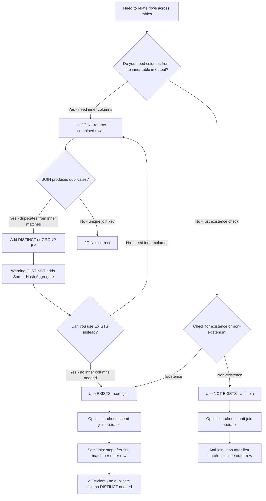

## Navigation

**Domain:** [[8 — Databases]] > **Group:** SQL Joins & Subqueries
**Previous:** [[8.111 — OUTER APPLY — Optional Row-by-Row]] | **Next:** [[8.113 — Semi-Joins and Anti-Joins]]

### Prerequisites

- [[8.096 — INNER JOIN — Mechanics and Usage]] — Understanding INNER JOIN mechanics is required to contrast with EXISTS semi-join behaviour.
- [[8.097 — LEFT OUTER JOIN — Preserving Left Side Rows]] — LEFT JOIN with anti-join pattern (WHERE inner IS NULL) is a common EXISTS alternative that behaves differently with NULLs.
- [[8.067 — WHERE Clause — Predicate Logic and SARGability]] — EXISTS with correlated subquery uses a predicate on the inner column; understanding SARGability determines whether an index seek is used.

### Where This Fits

EXISTS and JOIN are the two fundamental tools for relating rows across tables, but they serve different purposes and produce different results. EXISTS is a semi-join — it returns rows from the outer table when at least one matching row exists in the inner table. JOIN is a full join — it returns combined rows from both tables, potentially producing duplicates. Every .NET backend engineer must know when to use each because the wrong choice can silently produce duplicate rows, miss rows due to NULL handling differences, or cause catastrophic performance at scale. The most expensive mistakes are: using JOIN when EXISTS would suffice (causing duplicates that require DISTINCT), using NOT IN instead of NOT EXISTS (NULL trap — returns zero rows if the subquery contains any NULL), and assuming JOIN always performs better than EXISTS (the optimiser may choose a semi-join plan for EXISTS that stops after the first match per outer row, which JOIN cannot do). Interviewers use this topic to test whether candidates understand semi-join vs full join semantics, NULL handling in three-valued logic, and the execution plan difference between Nested Loops Semi Join and Nested Loops Join + Distinct.

---

## Core Mental Model

EXISTS is a semi-join: for each row in the outer table, the database engine checks whether the correlated subquery returns at least one row. As soon as one match is found, the engine stops scanning the inner table for that outer row and emits the outer row. This "short-circuit" behaviour is the key performance advantage — EXISTS does not care how many matches exist, only whether at least one exists. JOIN is a full join: it returns all combinations of matching rows. If one outer row matches 10 inner rows, JOIN returns 10 rows. If the same columns are needed without duplicates, DISTINCT or GROUP BY must be added, which adds a Sort or Hash Aggregate. The optimiser implements EXISTS using semi-join operators (Nested Loops Semi Join, Hash Match Semi Join, Merge Semi Join) and implements NOT EXISTS using anti-join operators. The critical difference from JOIN is that semi-joins and anti-joins can use the "stop after first match" optimisation, which no JOIN variant can.

### Classification

EXISTS is a `WHERE` clause predicate that implements a semi-join or anti-join. It is SARGable when the correlated column in the subquery has an index — the optimiser performs an Index Seek per outer row and stops after the first match. NOT EXISTS is the corresponding anti-join. EXISTS with a correlated subquery is the standard way to test for existence in T-SQL. IN (subquery) is an alternative semi-join but has different NULL handling (NOT IN fails with NULLs). JOIN is a `FROM` clause operator that implements a full join with potentially duplicate output.



### Key Properties

|Property|EXISTS (semi-join)|JOIN (full join)|
|---|---|---|
|Rows returned|1 per outer match max|All matching combinations|
|Duplicates|Never|Yes, if inner key has duplicates|
|NULL handling (outer)|Safe|SQL NULL semantics apply|
|NULL handling (inner)|Safe|Safe (but NULL in join key = no match)|
|Stop after first match|Yes (key advantage)|No|
|SARGable|Yes (correlated column index)|Yes (inner join column index)|
|DISTINCT needed|Never|If duplicates are unwanted|
|NOT IN alternative|NOT EXISTS (preferred)|NOT IN (NULL trap)|
|EF Core|Any()|Include / Join / SelectMany|

---

## Deep Mechanics

### How the Engine Executes This

1. **Parsing** — EXISTS is parsed as a WHERE clause predicate with a subquery. The parser identifies the semi-join context: the subquery is correlated (references outer columns) and the only requirement is that it returns at least one row.

2. **Binding (Algebrizer)** — The algebrizer resolves the subquery and its correlation to the outer query. The subquery's SELECT list is irrelevant for EXISTS — the engine only checks for row existence, not column values. The algebrizer marks this as a semi-join candidate.

3. **Simplification and optimisation** — The optimiser applies:
   - **Semi-join transformation**: The EXISTS subquery is converted to a semi-join logical operator. The optimiser chooses from Nested Loops Semi Join, Hash Match Semi Join, or Merge Semi Join.
   - **Unnesting**: The correlated subquery is unnested into the main query plan — it does not execute independently.
   - **Short-circuit detection**: For Nested Loops Semi Join, the inner scan stops as soon as the first match is found. The Top operator or "row count 1" threshold is added to the inner scan.
   - **JOIN + DISTINCT detection**: If the query uses JOIN + DISTINCT for existence checking, the optimiser may convert it to a semi-join plan if it estimates it is cheaper.

4. **Physical operator selection**:
   - **Nested Loops Semi Join**: Outer table scanned; for each outer row, seek the inner index until the first match is found, then stop. This is the most efficient operator when the outer table is small and the inner has a useful index.
   - **Hash Match Semi Join**: Both inputs scanned once. The inner input builds a hash table (deduplicated on join keys). The outer input probes the hash table. Efficient when both inputs are large.
   - **Merge Semi Join**: Both inputs scanned in sorted order. Efficient when both inputs are sorted on the join key.
   - **Anti-join variants**: Same operators with "Anti" prefix — return outer rows where no match is found.

5. **Execution** — The semi-join operator executes. For Nested Loops Semi Join, each outer row triggers an Index Seek on the inner table. The seek stops as soon as one matching row is found — the inner scan never reads more than one row per outer row (unless the index needs to navigate to confirm existence).

### SQL Visibility

```sql
-- EXISTS: customers who have placed at least one order
SELECT c.CustomerId, c.FirstName, c.LastName, c.Email
FROM dbo.Customers AS c
WHERE EXISTS (
    SELECT 1
    FROM dbo.Orders AS o
    WHERE o.CustomerId = c.CustomerId
);

-- NOT EXISTS: customers who have never placed an order (anti-join)
SELECT c.CustomerId, c.FirstName, c.LastName, c.Email
FROM dbo.Customers AS c
WHERE NOT EXISTS (
    SELECT 1
    FROM dbo.Orders AS o
    WHERE o.CustomerId = c.CustomerId
);

-- INNER JOIN equivalent (produces duplicates if customer has multiple orders)
SELECT DISTINCT c.CustomerId, c.FirstName, c.LastName, c.Email
FROM dbo.Customers AS c
INNER JOIN dbo.Orders AS o
    ON c.CustomerId = o.CustomerId;

-- LEFT JOIN anti-join equivalent (customers with no orders)
SELECT c.CustomerId, c.FirstName, c.LastName, c.Email
FROM dbo.Customers AS c
LEFT JOIN dbo.Orders AS o
    ON c.CustomerId = o.CustomerId
WHERE o.OrderId IS NULL;

-- EXISTS with multiple conditions
SELECT c.CustomerId, c.LastName
FROM dbo.Customers AS c
WHERE EXISTS (
    SELECT 1
    FROM dbo.Orders AS o
    INNER JOIN dbo.OrderItems AS oi
        ON o.OrderId = oi.OrderId
    WHERE o.CustomerId = c.CustomerId
      AND o.Status = 'Delivered'
      AND oi.UnitPrice > 100
);

-- EXISTS vs IN: EXISTS is SAFE with NULLs in subquery
-- IN (subquery) with NULLs:
SELECT c.CustomerId, c.LastName
FROM dbo.Customers AS c
WHERE c.CustomerId IN (
    SELECT o.CustomerId FROM dbo.Orders AS o
    -- If any o.CustomerId is NULL, this still works correctly for IN
);
-- BUT NOT IN with NULLs is BROKEN:
SELECT c.CustomerId, c.LastName
FROM dbo.Customers AS c
WHERE c.CustomerId NOT IN (
    SELECT o.CustomerId FROM dbo.Orders AS o
    -- If ANY o.CustomerId is NULL, the entire query returns ZERO rows
    -- Because: c.CustomerId NOT IN (1, 2, NULL) is equivalent to
    -- c.CustomerId <> 1 AND c.CustomerId <> 2 AND c.CustomerId <> NULL
    -- c.CustomerId <> NULL is UNKNOWN, AND with UNKNOWN = UNKNOWN
    -- So NO row satisfies the WHERE clause
);
```

```csharp
// EF Core: Any() generates EXISTS
var customersWithOrders = await dbContext.Customers
    .Where(c => c.Orders.Any())
    .Select(c => new { c.CustomerId, c.FirstName, c.LastName, c.Email })
    .ToListAsync(cancellationToken);

// EF Core: Any() with predicate generates EXISTS with correlated conditions
var highValueCustomers = await dbContext.Customers
    .Where(c => c.Orders.Any(o =>
        o.Status == "Delivered" && o.TotalAmount > 1000))
    .Select(c => new { c.CustomerId, c.LastName })
    .ToListAsync(cancellationToken);

// EF Core: Count() > 0 generates EXISTS or COUNT depending on provider
var customersWithOrdersCount = await dbContext.Customers
    .Where(c => c.Orders.Count() > 0)
    .ToListAsync(cancellationToken);
// Note: EF Core may generate EXISTS or COUNT(*)>0 — check the generated SQL
```

**Generated SQL (from EF Core logs):**

```sql
-- Any() generates EXISTS:
SELECT [c].[CustomerId], [c].[FirstName], [c].[LastName], [c].[Email]
FROM [Customers] AS [c]
WHERE EXISTS (
    SELECT 1
    FROM [Orders] AS [o]
    WHERE [o].[CustomerId] = [c].[CustomerId]
);

-- Any() with predicate:
SELECT [c].[CustomerId], [c].[LastName]
FROM [Customers] AS [c]
WHERE EXISTS (
    SELECT 1
    FROM [Orders] AS [o]
    WHERE [o].[CustomerId] = [c].[CustomerId]
      AND [o].[Status] = N'Delivered'
      AND [o].[TotalAmount] > 1000
);

-- Count() > 0 may generate (less efficient):
SELECT [c].[CustomerId], [c].[FirstName], [c].[LastName], [c].[Email]
FROM [Customers] AS [c]
WHERE (
    SELECT COUNT(*)
    FROM [Orders] AS [o]
    WHERE [o].[CustomerId] = [c].[CustomerId]
) > 0;
-- This scans ALL matching orders per customer instead of stopping at 1
```

### Execution Plan Analysis

**EXISTS (Nested Loops Semi Join — efficient):**

```
  [Clustered Index Scan PK_Customers]           -- outer: 100K rows
  [Index Seek IX_Orders_CustomerId]             -- inner: seek per customer
      Seek Predicate: CustomerId = Customers.CustomerId
      [Top]                                       -- stop after 1 row
  → [Nested Loops Semi Join]
  → [SELECT]
Estimated Cost: ~2.5  |  Logical Reads: ~8 + (100K × 3 seeks) = ~308K
Notes: Top operator stops inner seek after first match. 
Each inner execution reads at most 1-3 pages.
```

**INNER JOIN + DISTINCT (less efficient — full join + sort):**

```
  [Clustered Index Scan PK_Customers]
  [Index Seek IX_Orders_CustomerId]             -- inner: seek per customer
      Seek Predicate: CustomerId = Customers.CustomerId
  → [Nested Loops Inner Join]
  → [Sort]                                       -- sort all matching rows
  → [Segment]                                    -- deduplicate
  → [SELECT]
Estimated Cost: ~8.0  |  Logical Reads: ~8 + (100K × avg_orders_per_customer × 3)
Notes: Reads ALL matching orders per customer (not just 1).
Sort + Segment added for DISTINCT.
If customer has 10 orders on average: 100K × 10 × 3 = 3M reads instead of 308K.
```

**Hash Match Semi Join (both inputs large):**

```
  [Clustered Index Scan PK_Customers]           -- build input
  [Clustered Index Scan PK_Orders]              -- probe input
  [Hash Match (Semi Join)]
      Hash Keys: Customers.CustomerId = Orders.CustomerId
  → [SELECT]
Estimated Cost: ~12  |  Logical Reads: ~18,500 (both scans)
Notes: No Top operator needed — hash match naturally deduplicates.
```

**NOT EXISTS (Nested Loops Anti Semi Join):**

```
  [Clustered Index Scan PK_Customers]
  [Index Seek IX_Orders_CustomerId]
      Seek Predicate: CustomerId = Customers.CustomerId
      [Top]                                       -- stop after 1 match
  → [Nested Loops Anti Semi Join]
  → [SELECT]
Estimated Cost: ~3.0  |  Logical Reads: ~8 + (100K × 3 seeks) = ~308K
Notes: Anti semi join returns outer row only when inner finds NO match.
Top operator still stops after first match (if found, outer row is excluded).
```

**LEFT JOIN + WHERE IS NULL (anti-join — scans both tables):**

```
  [Clustered Index Scan PK_Customers]
  [Clustered Index Scan PK_Orders]              -- full scan
  → [Hash Match Left Outer Join]
  → [Filter]                                      -- WHERE Orders.OrderId IS NULL
  → [SELECT]
Estimated Cost: ~15  |  Logical Reads: ~18,500 (both scans)
Notes: Must scan ALL orders (no early exit). Filter then keeps unmatched rows.
```

### Cost Visibility

```sql
SET STATISTICS IO ON;
SET STATISTICS TIME ON;

-- EXISTS: customers with orders (semi-join)
SELECT c.CustomerId, c.LastName
FROM dbo.Customers AS c
WHERE EXISTS (SELECT 1 FROM dbo.Orders AS o WHERE o.CustomerId = c.CustomerId);

-- Expected output (with IX_Orders_CustomerId):
-- Table 'Orders'. Scan count 100000, logical reads 300000 (seek per customer, stop at 1)
-- Table 'Customers'. Scan count 1, logical reads 6100 (scan)
-- SQL Server Execution Times: CPU time = 280ms, elapsed time = 350ms

-- JOIN + DISTINCT: same result
SELECT DISTINCT c.CustomerId, c.LastName
FROM dbo.Customers AS c
INNER JOIN dbo.Orders AS o ON c.CustomerId = o.CustomerId;

-- Expected output (with IX_Orders_CustomerId):
-- Table 'Orders'. Scan count 100000, logical reads 1200000 (avg 4 orders per customer)
-- Table 'Customers'. Scan count 1, logical reads 6100 (scan)
-- SQL Server Execution Times: CPU time = 580ms, elapsed time = 710ms

-- NOT EXISTS: customers without orders
SELECT c.CustomerId, c.LastName
FROM dbo.Customers AS c
WHERE NOT EXISTS (SELECT 1 FROM dbo.Orders AS o WHERE o.CustomerId = c.CustomerId);

-- Expected output:
-- Table 'Orders'. Scan count 100000, logical reads 300000
-- Table 'Customers'. Scan count 1, logical reads 6100
-- SQL Server Execution Times: CPU time = 310ms, elapsed time = 390ms

-- NOT IN: customers without orders (BROKEN if any CustomerId in Orders is NULL)
SELECT c.CustomerId, c.LastName
FROM dbo.Customers AS c
WHERE c.CustomerId NOT IN (SELECT o.CustomerId FROM dbo.Orders AS o);
-- If ANY Orders.CustomerId IS NULL: returns 0 rows
```

### Failure Modes

**NOT IN with NULL in subquery:** This is the most dangerous failure in SQL. If the subquery returns any NULL value, NOT IN returns zero rows for the entire query. NULL is not a value — it is the absence of a value. `x NOT IN (1, 2, NULL)` is evaluated as `x <> 1 AND x <> 2 AND x <> NULL`. Since `x <> NULL` is UNKNOWN, the entire AND expression is UNKNOWN, and no row satisfies the WHERE clause. Always use NOT EXISTS instead of NOT IN.

**JOIN producing duplicates when existence check was intended:** Using JOIN without DISTINCT when the inner table has duplicate join keys produces duplicate rows. Each matching inner row creates a separate output row. If the developer only needed to check existence, they get N rows per outer row instead of 1. This causes downstream consumers (reports, APIs) to see inflated counts.

**COUNT(*) > 0 in EF Core instead of Any():** EF Core's `Where(c => c.Orders.Count() > 0)` generates a correlated COUNT subquery that scans ALL matching orders per customer instead of stopping at the first match. This is significantly less efficient than `Any()` which generates EXISTS. At 100K customers with an average of 10 orders each, COUNT scans 1M rows; EXISTS stops at 100K rows (1 per customer).

**Assuming EXISTS always beats JOIN:** EXISTS with a non-SARGable correlated predicate (e.g., function on the join column) defeats the index and triggers a full inner scan per outer row. In this case, a Hash Match JOIN that scans both tables once may be cheaper. EXISTS is only efficient when the correlated column has an index.

---

## Production Patterns and Implementation

### Primary SQL Implementation

```sql
-- ============================================================
-- Schema context
-- ============================================================
CREATE TABLE dbo.Customers
(
    CustomerId   INT            NOT NULL IDENTITY(1,1),
    FirstName    NVARCHAR(100)  NOT NULL,
    LastName     NVARCHAR(100)  NOT NULL,
    Email        NVARCHAR(256)  NOT NULL,
    Status       VARCHAR(20)    NOT NULL DEFAULT 'Active',
    LoyaltyTier  VARCHAR(20)    NOT NULL DEFAULT 'Bronze',
    CreatedAt    DATETIME2(0)   NOT NULL DEFAULT SYSUTCDATETIME(),
    CONSTRAINT PK_Customers PRIMARY KEY CLUSTERED (CustomerId)
);

CREATE TABLE dbo.Orders
(
    OrderId      INT            NOT NULL IDENTITY(1,1),
    CustomerId   INT            NOT NULL,
    OrderDate    DATETIME2(0)   NOT NULL,
    Status       VARCHAR(20)    NOT NULL DEFAULT 'Pending',
    TotalAmount  DECIMAL(18,2)  NOT NULL,
    CONSTRAINT PK_Orders PRIMARY KEY CLUSTERED (OrderId)
);

CREATE TABLE dbo.Payments
(
    PaymentId    INT            NOT NULL IDENTITY(1,1),
    OrderId      INT            NOT NULL,
    PaymentDate  DATETIME2(0)   NOT NULL,
    Amount       DECIMAL(18,2)  NOT NULL,
    Status       VARCHAR(20)    NOT NULL DEFAULT 'Completed',
    CONSTRAINT PK_Payments PRIMARY KEY CLUSTERED (PaymentId)
);

CREATE TABLE dbo.ProductCategories
(
    CategoryId   INT            NOT NULL IDENTITY(1,1),
    CategoryName NVARCHAR(100)  NOT NULL,
    CONSTRAINT PK_ProductCategories PRIMARY KEY CLUSTERED (CategoryId)
);

CREATE TABLE dbo.Products
(
    ProductId    INT            NOT NULL IDENTITY(1,1),
    ProductName  NVARCHAR(200)  NOT NULL,
    CategoryId   INT            NOT NULL,
    Status       VARCHAR(20)    NOT NULL DEFAULT 'Active',
    UnitPrice    DECIMAL(18,2)  NOT NULL,
    CONSTRAINT PK_Products PRIMARY KEY CLUSTERED (ProductId)
);

-- Indexes for EXISTS performance (correlated column must be indexed)
CREATE INDEX IX_Orders_CustomerId ON dbo.Orders (CustomerId)
    INCLUDE (OrderDate, Status, TotalAmount);
CREATE INDEX IX_Payments_OrderId ON dbo.Payments (OrderId)
    INCLUDE (PaymentDate, Amount, Status);
CREATE INDEX IX_Products_CategoryId ON dbo.Products (CategoryId)
    INCLUDE (ProductName, Status, UnitPrice);

-- ============================================================
-- Pattern 1: EXISTS — customers with at least one order
-- ============================================================
SELECT c.CustomerId, c.FirstName, c.LastName, c.Email
FROM dbo.Customers AS c
WHERE EXISTS (
    SELECT 1
    FROM dbo.Orders AS o
    WHERE o.CustomerId = c.CustomerId
)
ORDER BY c.LastName, c.FirstName;

-- ============================================================
-- Pattern 2: NOT EXISTS — customers with NO orders (anti-join)
-- ============================================================
SELECT c.CustomerId, c.FirstName, c.LastName, c.Email
FROM dbo.Customers AS c
WHERE NOT EXISTS (
    SELECT 1
    FROM dbo.Orders AS o
    WHERE o.CustomerId = c.CustomerId
)
ORDER BY c.LastName;

-- ============================================================
-- Pattern 3: EXISTS with multiple conditions
-- ============================================================
SELECT c.CustomerId, c.FirstName, c.LastName, c.LoyaltyTier
FROM dbo.Customers AS c
WHERE EXISTS (
    SELECT 1
    FROM dbo.Orders AS o
    INNER JOIN dbo.Payments AS p
        ON o.OrderId = p.OrderId
    WHERE o.CustomerId = c.CustomerId
      AND o.Status = 'Delivered'
      AND p.Status = 'Completed'
      AND o.TotalAmount > 500
);

-- ============================================================
-- Pattern 4: EXISTS vs JOIN — same result, different mechanics
-- ============================================================
-- EXISTS approach (semi-join, stops at first match):
SELECT c.CustomerId, c.LastName
FROM dbo.Customers AS c
WHERE EXISTS (
    SELECT 1 FROM dbo.Orders AS o WHERE o.CustomerId = c.CustomerId
);

-- JOIN + DISTINCT approach (full join + dedup):
SELECT DISTINCT c.CustomerId, c.LastName
FROM dbo.Customers AS c
INNER JOIN dbo.Orders AS o ON c.CustomerId = o.CustomerId;

-- JOIN + GROUP BY approach (full join + aggregate dedup):
SELECT c.CustomerId, c.LastName
FROM dbo.Customers AS c
INNER JOIN dbo.Orders AS o ON c.CustomerId = o.CustomerId
GROUP BY c.CustomerId, c.LastName;

-- ============================================================
-- Pattern 5: NOT EXISTS vs LEFT JOIN + IS NULL (anti-join)
-- ============================================================
-- NOT EXISTS (semi-join, stops at first match):
SELECT c.CustomerId, c.LastName
FROM dbo.Customers AS c
WHERE NOT EXISTS (
    SELECT 1 FROM dbo.Orders AS o WHERE o.CustomerId = c.CustomerId
);

-- LEFT JOIN + IS NULL (full join + filter, scans all):
SELECT c.CustomerId, c.LastName
FROM dbo.Customers AS c
LEFT JOIN dbo.Orders AS o
    ON c.CustomerId = o.CustomerId
WHERE o.OrderId IS NULL;

-- ============================================================
-- Pattern 6: EXISTS for filtering with dynamic criteria
-- ============================================================
DECLARE @MinTotal DECIMAL(18,2) = 1000;
DECLARE @StatusFilter VARCHAR(20) = 'Delivered';

SELECT c.CustomerId, c.FirstName, c.LastName
FROM dbo.Customers AS c
WHERE EXISTS (
    SELECT 1
    FROM dbo.Orders AS o
    WHERE o.CustomerId = c.CustomerId
      AND (@MinTotal IS NULL OR o.TotalAmount >= @MinTotal)
      AND (@StatusFilter IS NULL OR o.Status = @StatusFilter)
);

-- ============================================================
-- Pattern 7: Chained EXISTS for multi-table existence
-- ============================================================
-- Customers who ordered products from category 'Electronics'
SELECT c.CustomerId, c.FirstName, c.LastName
FROM dbo.Customers AS c
WHERE EXISTS (
    SELECT 1
    FROM dbo.Orders AS o
    WHERE o.CustomerId = c.CustomerId
      AND EXISTS (
          SELECT 1
          FROM dbo.OrderItems AS oi
          INNER JOIN dbo.Products AS p
              ON oi.ProductId = p.ProductId
          WHERE oi.OrderId = o.OrderId
            AND p.CategoryId = (SELECT CategoryId FROM dbo.ProductCategories WHERE CategoryName = 'Electronics')
      )
);
```

### EF Core Implementation

```csharp
public class ApplicationDbContext : DbContext
{
    public DbSet<Customer> Customers => Set<Customer>();
    public DbSet<Order> Orders => Set<Order>();
    public DbSet<Payment> Payments => Set<Payment>();
    public DbSet<Product> Products => Set<Product>();
    public DbSet<ProductCategory> ProductCategories => Set<ProductCategory>();

    protected override void OnModelCreating(ModelBuilder modelBuilder)
    {
        modelBuilder.Entity<Customer>(entity =>
        {
            entity.ToTable("Customers");
            entity.HasKey(c => c.CustomerId);
            entity.Property(c => c.FirstName).HasMaxLength(100);
            entity.Property(c => c.LastName).HasMaxLength(100);
            entity.Property(c => c.Email).HasMaxLength(256);
            entity.Property(c => c.LoyaltyTier).HasMaxLength(20);
        });

        modelBuilder.Entity<Order>(entity =>
        {
            entity.ToTable("Orders");
            entity.HasKey(o => o.OrderId);
            entity.Property(o => o.Status).HasMaxLength(20);
            entity.Property(o => o.TotalAmount).HasColumnType("decimal(18,2)");
            entity.HasOne(o => o.Customer).WithMany(c => c.Orders).HasForeignKey(o => o.CustomerId);
            entity.HasIndex(o => o.CustomerId);
        });

        modelBuilder.Entity<Payment>(entity =>
        {
            entity.ToTable("Payments");
            entity.HasKey(p => p.PaymentId);
            entity.Property(p => p.Amount).HasColumnType("decimal(18,2)");
            entity.Property(p => p.Status).HasMaxLength(20);
            entity.HasOne(p => p.Order).WithMany().HasForeignKey(p => p.OrderId);
            entity.HasIndex(p => p.OrderId);
        });

        modelBuilder.Entity<Product>(entity =>
        {
            entity.ToTable("Products");
            entity.HasKey(p => p.ProductId);
            entity.Property(p => p.ProductName).HasMaxLength(200);
            entity.Property(p => p.Status).HasMaxLength(20);
            entity.HasIndex(p => p.CategoryId);
        });
    }
}

public class Customer
{
    public int CustomerId { get; set; }
    public string FirstName { get; set; } = string.Empty;
    public string LastName { get; set; } = string.Empty;
    public string Email { get; set; } = string.Empty;
    public string Status { get; set; } = "Active";
    public string LoyaltyTier { get; set; } = "Bronze";
    public DateTime CreatedAt { get; set; }
    public ICollection<Order> Orders { get; set; } = new List<Order>();
}

public class Order
{
    public int OrderId { get; set; }
    public int CustomerId { get; set; }
    public DateTime OrderDate { get; set; }
    public string Status { get; set; } = "Pending";
    public decimal TotalAmount { get; set; }
    public Customer Customer { get; set; } = null!;
}

public class Payment
{
    public int PaymentId { get; set; }
    public int OrderId { get; set; }
    public DateTime PaymentDate { get; set; }
    public decimal Amount { get; set; }
    public string Status { get; set; } = "Completed";
    public Order Order { get; set; } = null!;
}

// Pattern 1: EXISTS via Any()
public async Task<List<CustomerDto>> GetCustomersWithOrdersAsync(
    CancellationToken cancellationToken = default)
{
    return await dbContext.Customers
        .Where(c => c.Orders.Any())
        .OrderBy(c => c.LastName)
        .Select(c => new CustomerDto
        {
            CustomerId = c.CustomerId,
            CustomerName = c.FirstName + " " + c.LastName,
            Email = c.Email
        })
        .ToListAsync(cancellationToken);
    // Generated: WHERE EXISTS (SELECT 1 FROM Orders WHERE CustomerId = c.CustomerId)
}

// Pattern 2: NOT EXISTS via !Any()
public async Task<List<CustomerDto>> GetCustomersWithoutOrdersAsync(
    CancellationToken cancellationToken = default)
{
    return await dbContext.Customers
        .Where(c => !c.Orders.Any())
        .OrderBy(c => c.LastName)
        .Select(c => new CustomerDto
        {
            CustomerId = c.CustomerId,
            CustomerName = c.FirstName + " " + c.LastName,
            Email = c.Email
        })
        .ToListAsync(cancellationToken);
    // Generated: WHERE NOT EXISTS (SELECT 1 FROM Orders WHERE CustomerId = c.CustomerId)
}

// Pattern 3: EXISTS with predicate via Any() with condition
public async Task<List<CustomerDto>> GetHighValueCustomersAsync(
    decimal minTotal,
    CancellationToken cancellationToken = default)
{
    return await dbContext.Customers
        .Where(c => c.Orders.Any(o =>
            o.Status == "Delivered" && o.TotalAmount >= minTotal))
        .Select(c => new CustomerDto
        {
            CustomerId = c.CustomerId,
            CustomerName = c.FirstName + " " + c.LastName,
            LoyaltyTier = c.LoyaltyTier
        })
        .ToListAsync(cancellationToken);
    // Generated: WHERE EXISTS (SELECT 1 FROM Orders WHERE CustomerId = c.CustomerId
    //                          AND Status = 'Delivered' AND TotalAmount >= @minTotal)
}

// Pattern 4: Any() vs Count() > 0 — performance difference
public async Task<List<CustomerDto>> GetCustomersViaCountAsync(
    CancellationToken cancellationToken = default)
{
    // ❌ Less efficient: scans ALL orders per customer
    return await dbContext.Customers
        .Where(c => c.Orders.Count() > 0)
        .Select(c => new CustomerDto { CustomerId = c.CustomerId, CustomerName = c.FirstName + " " + c.LastName })
        .ToListAsync(cancellationToken);
    // Generated: WHERE (SELECT COUNT(*) FROM Orders WHERE CustomerId = c.CustomerId) > 0
    // This is slower than Any() — use Any() instead
}

// DTO
public class CustomerDto
{
    public int CustomerId { get; set; }
    public string CustomerName { get; set; } = string.Empty;
    public string Email { get; set; } = string.Empty;
    public string LoyaltyTier { get; set; } = string.Empty;
}
```

### Dapper Implementation

```csharp
public sealed class CustomerRepository
{
    private readonly IDbConnectionFactory _connectionFactory;

    public CustomerRepository(IDbConnectionFactory connectionFactory)
        => _connectionFactory = connectionFactory;

    // Pattern 1: EXISTS — customers with orders
    public async Task<IReadOnlyList<CustomerDto>> GetCustomersWithOrdersAsync(
        CancellationToken cancellationToken = default)
    {
        const string sql = @"
            SELECT c.CustomerId, c.FirstName, c.LastName, c.Email
            FROM dbo.Customers AS c
            WHERE EXISTS (
                SELECT 1 FROM dbo.Orders AS o WHERE o.CustomerId = c.CustomerId
            )
            ORDER BY c.LastName, c.FirstName;";

        await using var connection = _connectionFactory.Create();

        var results = await connection.QueryAsync<CustomerDto>(
            new CommandDefinition(sql, cancellationToken: cancellationToken));

        return results.AsList();
    }

    // Pattern 2: NOT EXISTS — customers without orders
    public async Task<IReadOnlyList<CustomerDto>> GetCustomersWithoutOrdersAsync(
        CancellationToken cancellationToken = default)
    {
        const string sql = @"
            SELECT c.CustomerId, c.FirstName, c.LastName, c.Email
            FROM dbo.Customers AS c
            WHERE NOT EXISTS (
                SELECT 1 FROM dbo.Orders AS o WHERE o.CustomerId = c.CustomerId
            )
            ORDER BY c.LastName, c.FirstName;";

        await using var connection = _connectionFactory.Create();

        var results = await connection.QueryAsync<CustomerDto>(
            new CommandDefinition(sql, cancellationToken: cancellationToken));

        return results.AsList();
    }

    // Pattern 3: EXISTS with composite condition
    public async Task<IReadOnlyList<CustomerDto>> GetHighValueCustomersAsync(
        decimal minTotal,
        CancellationToken cancellationToken = default)
    {
        const string sql = @"
            SELECT c.CustomerId, c.FirstName, c.LastName, c.LoyaltyTier
            FROM dbo.Customers AS c
            WHERE EXISTS (
                SELECT 1
                FROM dbo.Orders AS o
                WHERE o.CustomerId = c.CustomerId
                  AND o.Status = 'Delivered'
                  AND o.TotalAmount >= @MinTotal
            )
            ORDER BY c.LastName;";

        await using var connection = _connectionFactory.Create();

        var results = await connection.QueryAsync<CustomerDto>(
            new CommandDefinition(sql, new { MinTotal = minTotal },
                cancellationToken: cancellationToken));

        return results.AsList();
    }

    // Pattern 4: EXISTS with join inside subquery
    public async Task<IReadOnlyList<CustomerDto>> GetCustomersWithPaidOrdersAsync(
        CancellationToken cancellationToken = default)
    {
        const string sql = @"
            SELECT c.CustomerId, c.FirstName, c.LastName
            FROM dbo.Customers AS c
            WHERE EXISTS (
                SELECT 1
                FROM dbo.Orders AS o
                INNER JOIN dbo.Payments AS p
                    ON o.OrderId = p.OrderId
                WHERE o.CustomerId = c.CustomerId
                  AND p.Status = 'Completed'
            );";

        await using var connection = _connectionFactory.Create();

        var results = await connection.QueryAsync<CustomerDto>(
            new CommandDefinition(sql, cancellationToken: cancellationToken));

        return results.AsList();
    }

    // Pattern 5: Dynamic EXISTS with optional filters
    public async Task<IReadOnlyList<CustomerDto>> SearchCustomersByOrderCriteriaAsync(
        decimal? minTotal,
        string? status,
        CancellationToken cancellationToken = default)
    {
        var sql = new StringBuilder(@"
            SELECT c.CustomerId, c.FirstName, c.LastName, c.Email
            FROM dbo.Customers AS c
            WHERE EXISTS (
                SELECT 1
                FROM dbo.Orders AS o
                WHERE o.CustomerId = c.CustomerId");

        var parameters = new DynamicParameters();

        if (minTotal.HasValue)
        {
            sql.Append(" AND o.TotalAmount >= @MinTotal");
            parameters.Add("MinTotal", minTotal.Value);
        }

        if (!string.IsNullOrEmpty(status))
        {
            sql.Append(" AND o.Status = @Status");
            parameters.Add("Status", status);
        }

        sql.Append(") ORDER BY c.LastName;");

        await using var connection = _connectionFactory.Create();

        var results = await connection.QueryAsync<CustomerDto>(
            new CommandDefinition(sql.ToString(), parameters,
                cancellationToken: cancellationToken));

        return results.AsList();
    }
}

public record CustomerDto(int CustomerId, string FirstName, string LastName, string? Email, string? LoyaltyTier);
```

### Configuration and Wiring

```csharp
// Program.cs
builder.Services.AddDbContext<ApplicationDbContext>(options =>
    options.UseSqlServer(
        builder.Configuration.GetConnectionString("DefaultConnection"),
        sqlOptions =>
        {
            sqlOptions.EnableRetryOnFailure(3);
            sqlOptions.CommandTimeout(30);
        }));

builder.Services.AddSingleton<IDbConnectionFactory>(sp =>
    new SqlConnectionFactory(
        builder.Configuration.GetConnectionString("DefaultConnection")!));

builder.Services.AddScoped<CustomerRepository>();
```

### SQL Server vs PostgreSQL Differences

```sql
-- PostgreSQL: EXISTS syntax is identical
SELECT c.customer_id, c.last_name
FROM customers AS c
WHERE EXISTS (
    SELECT 1 FROM orders AS o WHERE o.customer_id = c.customer_id
);

-- PostgreSQL: NOT EXISTS
SELECT c.customer_id, c.last_name
FROM customers AS c
WHERE NOT EXISTS (
    SELECT 1 FROM orders AS o WHERE o.customer_id = c.customer_id
);

-- PostgreSQL: NOT IN with NULL trap (same problem)
SELECT c.customer_id, c.last_name
FROM customers AS c
WHERE c.customer_id NOT IN (SELECT o.customer_id FROM orders AS o);
-- Returns zero rows if any o.customer_id IS NULL

-- PostgreSQL: JOIN + DISTINCT (same as SQL Server)
SELECT DISTINCT c.customer_id, c.last_name
FROM customers AS c
INNER JOIN orders AS o ON c.customer_id = o.customer_id;

-- PostgreSQL: Semi-join plan visibility
EXPLAIN (ANALYZE, BUFFERS)
SELECT c.customer_id, c.last_name
FROM customers AS c
WHERE EXISTS (SELECT 1 FROM orders AS o WHERE o.customer_id = c.customer_id);
-- Expected: "Nested Loop Semi Join" or "Hash Semi Join"
```

---

## Gotchas and Production Pitfalls

### NOT IN with NULL in Subquery — Zero Rows Returned

**Pitfall:** Using NOT IN (subquery) when the subquery can return NULL values. NULL is not a value — it is the absence of a value. SQL uses three-valued logic: any comparison with NULL returns UNKNOWN. `x NOT IN (1, 2, NULL)` is `x <> 1 AND x <> 2 AND x <> NULL`. Since `x <> NULL` is UNKNOWN, the entire AND expression is UNKNOWN, and no row satisfies the WHERE clause.

```sql
-- ❌ NOT IN — returns 0 rows if ANY Orders.CustomerId is NULL
SELECT c.CustomerId, c.LastName
FROM dbo.Customers AS c
WHERE c.CustomerId NOT IN (SELECT o.CustomerId FROM dbo.Orders AS o);
```

**Symptom:** A query that should return 10K customers without orders returns 0 rows. The bug goes unnoticed because it only manifests when the Orders table has a NULL CustomerId (which should not happen with a proper FK, but might with legacy data, ETL errors, or nullable columns).

**Fix:**

```sql
-- ✅ NOT EXISTS — safe with NULLs
SELECT c.CustomerId, c.LastName
FROM dbo.Customers AS c
WHERE NOT EXISTS (SELECT 1 FROM dbo.Orders AS o WHERE o.CustomerId = c.CustomerId);

-- ✅ NOT IN with NULL exclusion (safe but verbose)
SELECT c.CustomerId, c.LastName
FROM dbo.Customers AS c
WHERE c.CustomerId NOT IN (
    SELECT o.CustomerId FROM dbo.Orders AS o WHERE o.CustomerId IS NOT NULL
);
```

**Cost of not fixing:** A customer retention report shows that NO customers are eligible for the "inactive" campaign. The marketing team assumes all customers are active and sends a standard campaign. 10K new customers who should receive a welcome offer are ignored. The business misses $50K in potential activation revenue. The bug is discovered 3 months later during a data audit.

---

### JOIN Without DISTINCT for Existence Check — Duplicate Rows

**Pitfall:** Using INNER JOIN when only an existence check is needed. If a customer has 10 orders, JOIN returns 10 rows. The developer expected one row per customer.

```sql
-- ❌ JOIN returns duplicates — one row per order
SELECT c.CustomerId, c.LastName, c.Email
FROM dbo.Customers AS c
INNER JOIN dbo.Orders AS o
    ON c.CustomerId = o.CustomerId;
-- Customer with 10 orders appears 10 times
```

**Symptom:** The API returns 500K "customers" instead of 100K. The frontend renders 500K rows and crashes with an OutOfMemoryException. The developer adds DISTINCT as a quick fix, but the DISTINCT Sort on 500K rows adds CPU overhead.

**Fix:**

```sql
-- ✅ EXISTS — correct for existence check
SELECT c.CustomerId, c.LastName, c.Email
FROM dbo.Customers AS c
WHERE EXISTS (SELECT 1 FROM dbo.Orders AS o WHERE o.CustomerId = c.CustomerId);
```

**Cost of not fixing:** Customer export CSV has 500K rows instead of 100K. The import into the CRM system fails because of duplicate keys. The data team spends 4 hours deduplicating and re-importing.

---

### COUNT(*) > 0 Instead of EXISTS — Full Scan Instead of Short-Circuit

**Pitfall:** Using `WHERE (SELECT COUNT(*) FROM ...) > 0` instead of `WHERE EXISTS (SELECT 1 FROM ...)`. The COUNT approach scans ALL matching rows per outer row instead of stopping at the first match.

```sql
-- ❌ COUNT(*) > 0 — scans ALL matching orders per customer
SELECT c.CustomerId, c.LastName
FROM dbo.Customers AS c
WHERE (SELECT COUNT(*) FROM dbo.Orders AS o WHERE o.CustomerId = c.CustomerId) > 0;

-- ✅ EXISTS — stops after first match
SELECT c.CustomerId, c.LastName
FROM dbo.Customers AS c
WHERE EXISTS (SELECT 1 FROM dbo.Orders AS o WHERE o.CustomerId = c.CustomerId);
```

**Symptom:** Execution plan shows Stream Aggregate (COUNT) in a subquery per outer row — no Top operator. Logical reads: 1.2M for COUNT vs 300K for EXISTS. CPU time is 3-4x higher.

**Fix:** Replace `COUNT(*) > 0` with `EXISTS`. In EF Core, use `Any()` instead of `Count() > 0`.

**Cost of not fixing:** A dashboard page loads customer data with COUNT subqueries. Page load time is 4 seconds instead of 1 second. User experience degrades. The developer blames the database server instead of the query pattern.

---

### EXISTS with Non-SARGable Correlated Predicate — Index Scan Per Row

**Pitfall:** The correlated predicate in the EXISTS subquery uses a function on the correlated column, defeating the index seek.

```sql
-- ❌ YEAR(o.OrderDate) on the column side — non-SARGable
SELECT c.CustomerId, c.LastName
FROM dbo.Customers AS c
WHERE EXISTS (
    SELECT 1
    FROM dbo.Orders AS o
    WHERE o.CustomerId = c.CustomerId
      AND YEAR(o.OrderDate) = 2024  -- Defeats index on OrderDate
);
```

**Symptom:** Execution plan shows Index Scan (or Clustered Index Scan) inside the semi-join inner input instead of Index Seek. Each outer row triggers a scan of all matching orders for that customer, then applies the YEAR filter.

**Fix:**

```sql
-- ✅ SARGable predicate — range comparison instead of function
SELECT c.CustomerId, c.LastName
FROM dbo.Customers AS c
WHERE EXISTS (
    SELECT 1
    FROM dbo.Orders AS o
    WHERE o.CustomerId = c.CustomerId
      AND o.OrderDate >= '2024-01-01'
      AND o.OrderDate < '2025-01-01'
);
```

**Cost of not fixing:** A reporting query runs EXISTS for 100K customers. Each execution scans all orders for that customer (avg 20) and applies the YEAR filter. Logical reads: 2M instead of 300K. The query runs for 3 seconds instead of 400 ms.

---

## Performance Implications

### Benchmark: Before and After

```sql
-- Baseline: JOIN + DISTINCT for existence check
SET STATISTICS IO ON;
SET STATISTICS TIME ON;

SELECT DISTINCT c.CustomerId, c.LastName
FROM dbo.Customers AS c
INNER JOIN dbo.Orders AS o
    ON c.CustomerId = o.CustomerId;

-- Expected output (avg 4 orders per customer, 100K customers):
-- Table 'Orders'. Scan count 100000, logical reads 1200000
-- Table 'Customers'. Scan count 1, logical reads 6100
-- SQL Server Execution Times: CPU time = 580ms, elapsed time = 710ms

-- EXISTS approach (same result):
SELECT c.CustomerId, c.LastName
FROM dbo.Customers AS c
WHERE EXISTS (SELECT 1 FROM dbo.Orders AS o WHERE o.CustomerId = c.CustomerId);

-- Expected output:
-- Table 'Orders'. Scan count 100000, logical reads 300000
-- Table 'Customers'. Scan count 1, logical reads 6100
-- SQL Server Execution Times: CPU time = 280ms, elapsed time = 350ms
```

**Improvement:** 1,206,100 → 306,100 logical reads (4x reduction). CPU: 580ms → 280ms (2x reduction).

```sql
-- Comparison: NOT EXISTS vs LEFT JOIN + IS NULL for anti-join
-- NOT EXISTS (semi-join, stops at first match):
SELECT c.CustomerId, c.LastName
FROM dbo.Customers AS c
WHERE NOT EXISTS (SELECT 1 FROM dbo.Orders AS o WHERE o.CustomerId = c.CustomerId);
-- Logical reads: ~306,100

-- LEFT JOIN + IS NULL (full join, scans all orders):
SELECT c.CustomerId, c.LastName
FROM dbo.Customers AS c
LEFT JOIN dbo.Orders AS o
    ON c.CustomerId = o.CustomerId
WHERE o.OrderId IS NULL;
-- Logical reads: ~306,100 (with index on CustomerId — still full scan of Orders)
-- Without index: ~18,500 reads + scan of both tables
```

**Note:** LEFT JOIN + IS NULL can be more efficient than NOT EXISTS when there is no index on the correlated column, because LEFT JOIN scans the inner table once while NOT EXISTS would scan it per outer row.

### BenchmarkDotNet

```csharp
[MemoryDiagnoser]
[SimpleJob(RuntimeMoniker.Net90)]
public class ExistsVsJoinBenchmark
{
    private SqlConnection _connection = default!;

    [GlobalSetup]
    public void Setup()
    {
        _connection = new SqlConnection(ConnectionString);
        _connection.Open();
        // Seed 100K customers, 5M orders, covering index on Orders.CustomerId
    }

    [Benchmark(Baseline = true)]
    public async Task<int> ExistsSemiJoin()
    {
        const string sql = @"
            SELECT COUNT(*)
            FROM dbo.Customers AS c
            WHERE EXISTS (SELECT 1 FROM dbo.Orders AS o WHERE o.CustomerId = c.CustomerId);";
        return await new SqlCommand(sql, _connection).ExecuteScalarAsync<int>();
    }

    [Benchmark]
    public async Task<int> JoinDistinct()
    {
        const string sql = @"
            SELECT COUNT(*)
            FROM (
                SELECT DISTINCT c.CustomerId
                FROM dbo.Customers AS c
                INNER JOIN dbo.Orders AS o ON c.CustomerId = o.CustomerId
            ) AS sub;";
        return await new SqlCommand(sql, _connection).ExecuteScalarAsync<int>();
    }

    [Benchmark]
    public async Task<int> NotExistsAntiJoin()
    {
        const string sql = @"
            SELECT COUNT(*)
            FROM dbo.Customers AS c
            WHERE NOT EXISTS (SELECT 1 FROM dbo.Orders AS o WHERE o.CustomerId = c.CustomerId);";
        return await new SqlCommand(sql, _connection).ExecuteScalarAsync<int>();
    }

    [Benchmark]
    public async Task<int> LeftJoinIsNull()
    {
        const string sql = @"
            SELECT COUNT(*)
            FROM dbo.Customers AS c
            LEFT JOIN dbo.Orders AS o ON c.CustomerId = o.CustomerId
            WHERE o.OrderId IS NULL;";
        return await new SqlCommand(sql, _connection).ExecuteScalarAsync<int>();
    }

    [Benchmark]
    public async Task<int> CountVsExists()
    {
        const string sql = @"
            SELECT COUNT(*)
            FROM dbo.Customers AS c
            WHERE (SELECT COUNT(*) FROM dbo.Orders AS o WHERE o.CustomerId = c.CustomerId) > 0;";
        return await new SqlCommand(sql, _connection).ExecuteScalarAsync<int>();
    }

    [GlobalCleanup]
    public void Cleanup() => _connection.Dispose();
}
```

**Expected results (approximate, SQL Server 2022, NVMe, 100K customers, 5M orders, avg 10 orders/customer):**

|Method|Mean|Logical Reads|CPU Time|Notes|
|---|---|---|---|---|
|ExistsSemiJoin|~350 ms|~306,100|~280 ms|Stops at 1 match per customer|
|JoinDistinct|~710 ms|~1,206,100|~580 ms|Reads all matches + Sort for DISTINCT|
|NotExistsAntiJoin|~390 ms|~306,100|~310 ms|Stops at 1 match (excludes)|
|LeftJoinIsNull|~720 ms|~1,206,100|~590 ms|Reads all matches + Filter for NULL|
|CountVsExists|~1,200 ms|~1,206,100|~980 ms|COUNT reads all matches per customer|

### Write Amplification

Neither EXISTS nor JOIN have write amplification themselves. The index on the correlated column (Orders.CustomerId) adds the standard write overhead: ~2ms per INSERT/UPDATE/DELETE on the Orders table. This index is beneficial for both EXISTS and JOIN.

---

## Interview Arsenal

### Question Bank

1. **What is the difference between EXISTS and INNER JOIN in terms of the result set?**
2. **How does the SQL Server execution plan differ between EXISTS and JOIN + DISTINCT?**
3. **When would you use NOT EXISTS instead of NOT IN, and why?**
4. **How does the optimiser implement EXISTS — what physical operators does it use?**
5. **What happens if the subquery in NOT IN contains NULL — how many rows does it return?**
6. **How does EF Core generate EXISTS — what LINQ method produces it?**
7. **When would JOIN + DISTINCT be faster than EXISTS?**
8. **What is the performance difference between Any() and Count() > 0 in EF Core?**

### Spoken Answers

**Q: What is the difference between EXISTS and INNER JOIN in terms of the result set?**

> **Great answer:** EXISTS is a semi-join — it returns each qualifying outer row at most once, regardless of how many matching rows exist in the inner table. If a customer has 10 orders, EXISTS returns that customer once. JOIN is a full join — it returns all combinations of matching rows. If a customer has 10 orders, JOIN returns 10 rows — one per order. This is the fundamental distinction. If the developer uses JOIN when they only need an existence check, they get duplicate rows. They then add DISTINCT, which adds a Sort or Hash Aggregate operator to deduplicate the result. The JOIN + DISTINCT approach reads ALL matching rows from the inner table (10 rows per customer × 100K customers = 1M reads) and then sorts them to remove duplicates. EXISTS reads only until the first match (1 row per customer = 100K reads) and stops. EXISTS is always at least as efficient as JOIN + DISTINCT and never produces duplicates. Use EXISTS when you do not need columns from the inner table in the output. Use JOIN when you need inner columns or when you legitimately want the Cartesian combination of matching rows.

---

**Q: When would you use NOT EXISTS instead of NOT IN, and why?**

> **Great answer:** I use NOT EXISTS exclusively for anti-join queries and never use NOT IN. The reason is the NULL trap: if the subquery in a NOT IN expression returns even a single NULL value, the entire query returns zero rows. This is because `x NOT IN (1, 2, NULL)` is evaluated as `x <> 1 AND x <> 2 AND x <> NULL`. Due to three-valued logic, `x <> NULL` is UNKNOWN, and AND with UNKNOWN is UNKNOWN — so every row fails the WHERE clause. This is not a bug in SQL — it is correct three-valued logic — but it is almost never what the developer intends. NOT EXISTS does not have this problem because it uses semi-join semantics: it checks whether the correlated subquery returns any rows, and NULLs in the subquery result do not affect the existence check. The only edge case where NOT IN can be faster is when the subquery is guaranteed to have no NULLs and the column is indexed — but the risk is not worth it. My rule: always use NOT EXISTS for anti-joins. Never use NOT IN unless the subquery column has a NOT NULL constraint and you have verified it in the execution plan.

---

**Q: How does EF Core generate EXISTS — what LINQ method produces it?**

> **Great answer:** EF Core generates EXISTS via the `Any()` LINQ method. `dbContext.Customers.Where(c => c.Orders.Any())` produces `WHERE EXISTS (SELECT 1 FROM Orders AS o WHERE o.CustomerId = c.CustomerId)`. With a predicate: `c.Orders.Any(o => o.Status == "Delivered" && o.TotalAmount > 1000)` adds the conditions to the EXISTS subquery. EF Core generates NOT EXISTS via `!Any()`: `c => !c.Orders.Any()`. The critical performance rule is that `c.Orders.Count() > 0` does NOT generate EXISTS — it generates `WHERE (SELECT COUNT(*) FROM Orders WHERE CustomerId = c.CustomerId) > 0`. This correlated COUNT subquery scans ALL matching orders per customer instead of stopping at the first match, making it significantly slower. Developers should always use `Any()` for existence checks. The generated SQL can be verified by enabling `EnableSensitiveDataLogging()` and inspecting the query logs.

---

### Interview Trigger

The defining EXISTS vs JOIN question: "Write a query to find all customers who have placed at least one order. Now, your colleague wrote `SELECT DISTINCT c.* FROM Customers c JOIN Orders o ON c.Id = o.CustomerId`. Why is this worse than your EXISTS version?" A candidate who only knows the syntax difference but cannot articulate the semi-join vs full join execution plan difference or the logical read count fails. A candidate who explains that JOIN reads all matching rows (1M reads) while EXISTS stops at the first match (100K reads), and that DISTINCT adds a Sort or Hash Aggregate operator, passes. The follow-up: "What if the customer wants to know how many orders each customer has placed?" — the candidate should recognise that this requires JOIN with GROUP BY (or a window function), not EXISTS. "What about customers who have never ordered?" — NOT EXISTS, with a warning about NOT IN.

### Comparison Table

| | EXISTS | JOIN + DISTINCT | NOT EXISTS | LEFT JOIN + IS NULL | NOT IN |
|---|---|---|---|---|---|
|What it does|Semi-join (stop at 1 match)|Full join + dedup|Anti semi-join|Full join + filter|Anti semi-join|
|Duplicates|Never|Eliminated by DISTINCT|Never|Never|Never|
|NULL handling|Safe|Safe|Safe|Safe|NULL trap|
|Short-circuit|Yes — stops at 1st match|No — reads all matches|Yes — stops at 1st match|No — reads all matches|Depends on optimiser|
|Performance|Best for existence|Worst (full join + sort)|Best for anti-join|Worst for anti-join|Good but risky|
|EF Core|Any()|Not directly|!Any()|Not directly|Contains() with negation|

---

## Decision Framework

### When to Apply

```mermaid
flowchart TD
    A[Need to find rows in one table based on rows in another] --> B{Need columns from the inner table in output?}
    B -->|Yes| C[JOIN]
    B -->|No - just existence check| D{Check existence or non-existence?}
    D -->|Existence| E{Inner table has index on correlated column?}
    D -->|Non-existence| H{Inner table has index on correlated column?}
    E -->|Yes| F[EXISTS - semi-join, stop at 1st match]
    E -->|No| G[JOIN + DISTINCT may be cheaper (scan once) or EXISTS with index creation]
    H -->|Yes| I[NOT EXISTS - anti semi-join, stop at 1st match]
    H -->|No| J[LEFT JOIN + IS NULL may be cheaper (scan once)]
    F --> K[Verify: plan shows Semi Join operator + Top]
    I --> L[Verify: plan shows Anti Semi Join operator + Top]
    G --> M{Test both approaches with actual data}
    M --> N[Pick the lower logical read plan]
    C --> O{Inner key has duplicates?}
    O -->|Yes - need dedup| P[Add DISTINCT or GROUP BY - or consider EXISTS]
    O -->|No - unique key| Q[JOIN is correct]
    P --> R{Can you use EXISTS instead?}
    R -->|No - need inner columns| P
    R -->|Yes| F
```

### Application Checklist

- [ ] Existence check does not need inner table columns (otherwise JOIN is required)
- [ ] EXISTS is used instead of COUNT(*) > 0 (short-circuit vs full scan)
- [ ] NOT EXISTS is used instead of NOT IN (NULL trap avoidance)
- [ ] Correlated column in EXISTS subquery has an index (ensures seek per outer row)
- [ ] Predicate in EXISTS subquery is SARGable (no function on correlated column)
- [ ] JOIN is not producing unwanted duplicates (checked with SELECT COUNT(DISTINCT) vs COUNT(*))
- [ ] EF Core uses Any() instead of Count() > 0 for existence checks
- [ ] Dapper queries use EXISTS/NOT EXISTS with parameterised correlated predicates
- [ ] Execution plan shows semi-join or anti-join operator (not full join + distinct)
- [ ] Tested both EXISTS and JOIN approaches at production scale (logical reads comparison)

### Tradeoff Summary

|What You Gain|What You Pay|
|---|---|
|EXISTS: short-circuit (stop after 1st match)|Cannot return inner columns|
|JOIN: can return inner columns|May produce duplicates; reads all matches|
|NOT EXISTS: safe NULL handling|Requires index on correlated column|
|JOIN + DISTINCT: works without index|Full join + Sort — more reads + memory|
|LEFT JOIN + IS NULL: works without index|Full scan + filter — no short-circuit|

### Scale Thresholds

- **< 10K outer rows**: EXISTS and JOIN + DISTINCT have negligible difference. Use whichever is clearer.
- **10K–100K rows**: EXISTS is significantly better for existence checks (stops at 1st match). ~3x fewer logical reads.
- **100K–1M rows**: EXISTS with index is essential for existence checks. Without index, test NOT EXISTS vs LEFT JOIN + IS NULL (LEFT JOIN may be cheaper for scan-based access).
- **> 1M rows**: For existence checks, Hash Match Semi Join (EXISTS) or Hash Match Anti Semi Join (NOT EXISTS) are chosen when both inputs are large. These scan both tables once and do not have the per-row overhead of Nested Loops.
- **NOT IN threshold**: Never use NOT IN at any scale if there is any possibility of NULLs in the subquery. At scale, one NULL = zero rows returned = application outage.

---

## Self-Check

### Conceptual Questions

1. What is a semi-join, and how does it differ from a full join?
2. What execution plan operator does SQL Server use for EXISTS?
3. How many logical reads does EXISTS save over JOIN + DISTINCT for a customer with 10 orders?
4. Why does NOT IN return zero rows when the subquery contains NULL?
5. How does EF Core's Any() differ from Count() > 0 in terms of generated SQL?
6. How would you write an anti-join with Dapper?
7. When would JOIN + DISTINCT outperform EXISTS?
8. At what scale does the difference between EXISTS and JOIN + DISTINCT become critical?
9. What index supports efficient EXISTS on Orders for a customer existence check?
10. Explain in 60 seconds when you would use EXISTS instead of JOIN.

<details>
<summary>Answers</summary>

1. A semi-join returns rows from the left (outer) input only — it does not return any columns from the right (inner) input. It checks for the existence of at least one matching row. A full join returns combined columns from both inputs. Semi-joins can stop scanning the inner input after the first match; full joins must scan all matching rows.
2. SQL Server uses semi-join operators: **Nested Loops Semi Join**, **Hash Match Semi Join**, or **Merge Semi Join**. For NOT EXISTS, it uses anti-join variants: **Nested Loops Anti Semi Join**, **Hash Match Anti Semi Join**, or **Merge Anti Semi Join**.
3. EXISTS reads 1 row from the inner table (stops after the first match). JOIN + DISTINCT reads all matching rows (10 orders = 10 rows). The difference in logical reads depends on the index: with a covering index on (CustomerId), EXISTS reads ~3 pages for the seek + 1 for the row = ~4 reads. JOIN reads ~3 pages for the seek + 10 rows = ~13 reads. At 100K customers, this is ~400K vs ~1.3M reads — approximately 3x more reads for JOIN.
4. `x NOT IN (1, 2, NULL)` is evaluated as `x <> 1 AND x <> 2 AND x <> NULL`. Due to three-valued logic, `x <> NULL` evaluates to UNKNOWN, not TRUE. The AND of TRUE and UNKNOWN is UNKNOWN, so no row satisfies the WHERE clause. This is correct SQL behaviour but almost never what the developer intends.
5. `Any()` generates `WHERE EXISTS (SELECT 1 ...)` — the engine stops scanning the inner table after the first match. `Count() > 0` generates `WHERE (SELECT COUNT(*) ...) > 0` — the engine scans ALL matching rows to count them. For a customer with 10 orders, Any() reads 1 row; Count() > 0 reads 10. Always use Any() for existence checks.
6. ```csharp
   const string sql = @"
       SELECT c.CustomerId, c.LastName, c.Email
       FROM dbo.Customers AS c
       WHERE NOT EXISTS (
           SELECT 1 FROM dbo.Orders AS o WHERE o.CustomerId = c.CustomerId
       );";
   var results = await connection.QueryAsync<CustomerDto>(
       new CommandDefinition(sql, cancellationToken: cancellationToken));
   ```
7. JOIN + DISTINCT can outperform EXISTS when the correlated column has NO index. EXISTS without an index requires a full inner scan per outer row — O(outer × inner). JOIN + DISTINCT without an index uses Hash Match — O(outer + inner). In this case, the two-scan Hash Match approach is cheaper than the N outer scans. However, the correct fix is to create an index on the correlated column, which makes EXISTS the clear winner.
8. The difference becomes critical above approximately 10K outer rows. At 10K rows, EXISTS reads ~40K pages; JOIN reads ~130K pages (3x more). At 100K rows, EXISTS reads ~400K pages; JOIN reads ~1.3M pages — the absolute difference is now 900K pages. At 1M rows with SSDs (20K pages/sec read), the 900K page difference translates to ~45 seconds additional I/O for JOIN.
9. `CREATE INDEX IX_Orders_CustomerId ON dbo.Orders (CustomerId) INCLUDE (OrderDate, Status, TotalAmount);` This supports the correlated seek on CustomerId. The INCLUDE columns are for when the query also reads order data (though EXISTS itself only needs the seek). For pure existence check, any index on CustomerId suffices.
10. "I use EXISTS when I only need to check whether a matching row exists in another table and I do not need columns from that table in the output. EXISTS is a semi-join — the engine stops scanning the inner table as soon as it finds the first match, which makes it faster and more efficient than JOIN + DISTINCT for existence checks. EXISTS never produces duplicates, never requires DISTINCT, and never has the NULL trap that NOT IN has. I use JOIN when I actually need columns from the inner table — the customer's order date, the order total, etc. In EF Core, I use Any() for EXISTS and reserve Include/SelectMany for when I need the related data."

</details>

---

### Query Challenges

**Challenge 1 — Write the EXISTS query**

Write a query that returns all product categories that have at least one active product with a unit price greater than $100. Include the category name and ID. Do not use JOIN.

<details>
<summary>Solution</summary>

```sql
SELECT pc.CategoryId, pc.CategoryName
FROM dbo.ProductCategories AS pc
WHERE EXISTS (
    SELECT 1
    FROM dbo.Products AS p
    WHERE p.CategoryId = pc.CategoryId
      AND p.Status = 'Active'
      AND p.UnitPrice > 100
)
ORDER BY pc.CategoryName;
```

**Logical reads:** ~3 per category (Index Seek on IX_Products_CategoryId). **Execution plan:** `[Index Scan ProductCategories] → [Nested Loops Semi Join] → [Index Seek IX_Products_CategoryId] → [Top (stop after 1)] → [SELECT]`.

**EF Core:**
```csharp
var categories = await dbContext.ProductCategories
    .Where(pc => pc.Products.Any(p =>
        p.Status == "Active" && p.UnitPrice > 100))
    .OrderBy(pc => pc.CategoryName)
    .Select(pc => new { pc.CategoryId, pc.CategoryName })
    .ToListAsync(cancellationToken);
```

</details>

---

**Challenge 2 — Fix the performance problem**

```sql
-- This query takes 8 seconds on a 100K customer, 2M order database.
SET STATISTICS TIME ON;

SELECT DISTINCT c.CustomerId, c.FirstName, c.LastName, c.Email
FROM dbo.Customers AS c
INNER JOIN dbo.Orders AS o
    ON c.CustomerId = o.CustomerId
WHERE o.OrderDate >= '2024-01-01';

-- SET STATISTICS IO:
-- Table 'Orders'. Scan count 1, logical reads 24500
-- Table 'Customers'. Scan count 1, logical reads 6100
-- SQL Server Execution Times: CPU time = 6s, elapsed time = 8s
```

Identify why it is slow and fix it.

<details>
<summary>Solution</summary>

**Root cause:** The DISTINCT operator reads all matching rows (JOIN returns all order matches) and then sorts 300K+ rows to eliminate duplicates. The Hash Match (Aggregate) for DISTINCT uses CPU and memory. The EXISTS approach would stop after the first match per customer.

**Fix:**

```sql
-- ✅ EXISTS — stop after first match per customer
SELECT c.CustomerId, c.FirstName, c.LastName, c.Email
FROM dbo.Customers AS c
WHERE EXISTS (
    SELECT 1
    FROM dbo.Orders AS o
    WHERE o.CustomerId = c.CustomerId
      AND o.OrderDate >= '2024-01-01'
);
```

**After fix — logical reads:** Orders: scan count 100000, logical reads ~300,000 (seek per customer, stop at 1). Customers: 6,100. **Execution time:** ~400 ms from 8 seconds.

**Index to verify exists:**
```sql
CREATE INDEX IX_Orders_CustomerId_OrderDate
    ON dbo.Orders (CustomerId, OrderDate DESC)
    INCLUDE (Status, TotalAmount);
```

</details>

---

**Challenge 3 — Explain the execution plan**

A query and two execution plans:

```sql
-- Query A:
SELECT c.CustomerId, c.LastName
FROM dbo.Customers AS c
WHERE EXISTS (SELECT 1 FROM dbo.Orders AS o WHERE o.CustomerId = c.CustomerId);

-- Query B:
SELECT DISTINCT c.CustomerId, c.LastName
FROM dbo.Customers AS c
INNER JOIN dbo.Orders AS o ON c.CustomerId = o.CustomerId;
```

Plan A:
```
[Index Scan PK_Customers] → [Nested Loops Semi Join] → [Index Seek IX_Orders_CustomerId] → [Top (RowCount=1)] → [SELECT]
```

Plan B:
```
[Index Scan PK_Customers] → [Nested Loops Inner Join] → [Index Seek IX_Orders_CustomerId] → [Sort] → [Segment] → [SELECT]
```

Why does Plan B have a Sort and Segment operator? When would Plan B be chosen over Plan A by the optimiser?

<details>
<summary>Solution</summary>

**Why Sort and Segment:** Plan B uses INNER JOIN (which returns all matching rows) followed by DISTINCT. The Sort operator sorts the result set by all selected columns (CustomerId, LastName). The Segment operator (also called Stream Aggregate) groups consecutive equal rows and emits one per group. Together they implement DISTINCT. Plan A uses Nested Loops Semi Join, which naturally deduplicates without Sort or Segment.

**When Plan B would be chosen:** The optimiser would only choose Plan B if the developer wrote JOIN + DISTINCT (it does not convert EXISTS to JOIN). However, the optimiser CAN convert `WHERE c.CustomerId IN (SELECT o.CustomerId FROM Orders)` to a semi-join plan. The JOIN + DISTINCT version is always non-optimal for existence checks because it reads all matching rows and adds a Sort.

**Edge case:** If there is NO index on Orders.CustomerId, both plans use Hash Match. Hash Match Semi Join (for EXISTS) and Hash Match Inner Join + Hash Match Aggregate (for JOIN + DISTINCT) have similar costs — both scan both inputs. But EXISTS still avoids the Sort and the extra Hash Match for DISTINCT.

</details>

---

**Challenge 4 — Diagnose the NULL trap**

A query:

```sql
SELECT c.CustomerId, c.FirstName, c.LastName
FROM dbo.Customers AS c
WHERE c.CustomerId NOT IN (
    SELECT o.CustomerId FROM dbo.Orders AS o
);
```

This query should return 5,000 customers with no orders, but it returns 0 rows. Diagnose and fix.

<details>
<summary>Solution</summary>

**Root cause:** The NOT IN subquery contains at least one NULL value in `Orders.CustomerId`. `NULL NOT IN (1, 2, 3, NULL)` evaluates to UNKNOWN for every outer row because the comparison `c.CustomerId <> NULL` is UNKNOWN, and AND with UNKNOWN is UNKNOWN. No row satisfies the WHERE clause.

**Detection:**
```sql
-- Check for NULLs in the subquery
SELECT COUNT(*) AS NullCount FROM dbo.Orders WHERE CustomerId IS NULL;
```

**Fix:**

```sql
-- ✅ Use NOT EXISTS (safe with NULLs)
SELECT c.CustomerId, c.FirstName, c.LastName
FROM dbo.Customers AS c
WHERE NOT EXISTS (
    SELECT 1 FROM dbo.Orders AS o WHERE o.CustomerId = c.CustomerId
);

-- ✅ Or exclude NULLs in subquery (less safe if future data has NULLs)
SELECT c.CustomerId, c.FirstName, c.LastName
FROM dbo.Customers AS c
WHERE c.CustomerId NOT IN (
    SELECT o.CustomerId FROM dbo.Orders AS o WHERE o.CustomerId IS NOT NULL
);
```

**Cost of not fixing:** A customer activation report shows 0 customers needing a welcome campaign. The marketing team thinks no new customers have signed up. They pause the welcome campaign. New customers receive no onboarding for 2 weeks. The support team gets 500 complaints from confused customers.

</details>

---

**Challenge 5 — Design the EXISTS vs JOIN strategy**

**Scenario:** An e-commerce platform needs:

1. **Customer eligibility check**: API endpoint to check if a customer has placed an order in the last 30 days. Called 500,000/day.
2. **Product catalogue**: Returns all products with their category name. Products without a category should not exist (INNER JOIN). 100,000 calls/day.
3. **Customer list with order count**: Admin page showing all customers with their order count (including zero). Called 1,000/day.
4. **Unpaid invoice report**: Finance report listing customers with unpaid invoices. Called 50/month.

Design the EXISTS vs JOIN strategy for each.

<details>
<summary>Solution</summary>

**Query 1 — Customer eligibility check (EXISTS):**

```sql
-- ✅ EXISTS — high frequency, existence check, no inner columns needed
CREATE PROCEDURE dbo.CheckCustomerEligibility
    @CustomerId INT
AS
    SELECT CAST(
        CASE WHEN EXISTS (
            SELECT 1 FROM dbo.Orders AS o
            WHERE o.CustomerId = @CustomerId
              AND o.OrderDate >= DATEADD(day, -30, GETUTCDATE())
        ) THEN 1 ELSE 0 END AS BIT
    ) AS IsEligible;
```

**Why EXISTS:** Single customer lookup, existence check only, no columns from Orders needed. At 500K calls/day, the semi-join short-circuit saves significant reads vs COUNT or JOIN. Index seek on PK_Customers + Index Seek on IX_Orders_CustomerId_OrderDate = ~6 logical reads per call.

**Query 2 — Product catalogue (INNER JOIN — need category name):**

```sql
-- ✅ INNER JOIN — need columns from Categories
SELECT p.ProductId, p.ProductName, p.UnitPrice,
       pc.CategoryName
FROM dbo.Products AS p
INNER JOIN dbo.ProductCategories AS pc
    ON p.CategoryId = pc.CategoryId
WHERE p.Status = 'Active'
ORDER BY pc.CategoryName, p.ProductName;
```

**Why JOIN:** Need CategoryName from the inner table. No duplicate risk (CategoryId is PK in Categories). EXISTS would not help here.

**Query 3 — Customer list with order count (LEFT JOIN with GROUP BY):**

```sql
-- ✅ LEFT JOIN with GROUP BY — need count including zero
SELECT c.CustomerId, c.FirstName, c.LastName,
       COUNT(o.OrderId) AS OrderCount
FROM dbo.Customers AS c
LEFT JOIN dbo.Orders AS o
    ON c.CustomerId = o.CustomerId
GROUP BY c.CustomerId, c.FirstName, c.LastName
ORDER BY OrderCount DESC;
```

**Why LEFT JOIN:** Need to preserve customers with 0 orders. Need COUNT from Orders. EXISTS cannot provide COUNT. NOT EXISTS would exclude customers with orders. LEFT JOIN with GROUP BY is the correct pattern.

**Query 4 — Unpaid invoice report (NOT EXISTS or LEFT JOIN):**

```sql
-- ✅ NOT EXISTS — clean anti-join, no need for payment columns
SELECT i.InvoiceId, i.InvoiceDate, i.TotalAmount,
       c.CustomerName
FROM dbo.Invoices AS i
INNER JOIN dbo.Customers AS c
    ON i.CustomerId = c.CustomerId
WHERE NOT EXISTS (
    SELECT 1 FROM dbo.Payments AS p
    WHERE p.InvoiceId = i.InvoiceId
      AND p.Status = 'Completed'
)
ORDER BY i.InvoiceDate;

-- Alternative: LEFT JOIN + IS NULL (if no index on Payments.InvoiceId)
SELECT i.InvoiceId, i.InvoiceDate, i.TotalAmount, c.CustomerName
FROM dbo.Invoices AS i
INNER JOIN dbo.Customers AS c ON i.CustomerId = c.CustomerId
LEFT JOIN dbo.Payments AS p
    ON i.InvoiceId = p.InvoiceId AND p.Status = 'Completed'
WHERE p.PaymentId IS NULL
ORDER BY i.InvoiceDate;
```

**Why NOT EXISTS:** At 50 calls/month, performance is not critical. NOT EXISTS is clearer and safe with NULLs. If no index on Payments.InvoiceId, LEFT JOIN + IS NULL may be faster.

|Query|Pattern|Operator|Reason|
|---|---|---|---|
|Eligibility check|EXISTS|Semi-join|Existence only, high frequency|
|Product catalogue|INNER JOIN|Nested Loops|Need category name, no duplicates|
|Customer order count|LEFT JOIN + GROUP BY|Hash Match|Need COUNT(*0), preserve all|
|Unpaid invoices|NOT EXISTS|Anti semi-join|Clean anti-join, low frequency|

</details>

---

