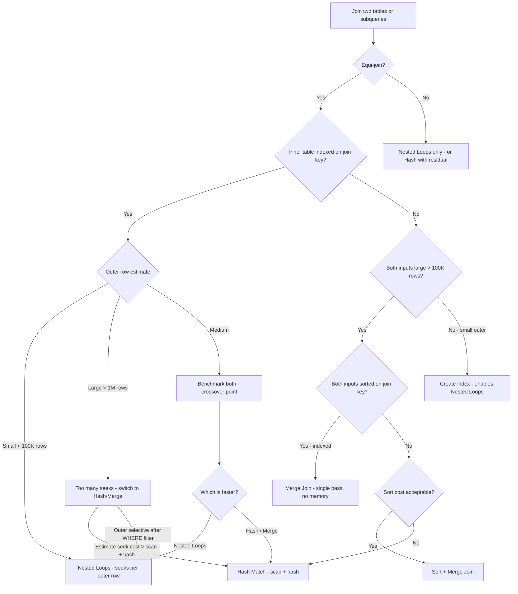

## Navigation

**Domain:** [[8 — Databases]] > **Group:** SQL Joins & Subqueries
**Previous:** [[8.113 — Lateral Join — PostgreSQL Equivalent of APPLY]] | **Next:** [[8.115 — JOIN Elimination by Query Optimizer]]

### Prerequisites

- [[8.096 — INNER JOIN — Mechanics and Usage]] — The three physical join operators implement the logical INNER JOIN (and OUTER JOIN); understanding the logical operation is required to understand the physical implementation.
- [[8.097 — LEFT OUTER JOIN — Preserving Left Side Rows]] — LEFT JOIN changes the applicability of join operators (e.g., Nested Loops Left Join, Hash Match Left Outer Join); the operator variants depend on join type.
- [[8.067 — WHERE Clause — Predicate Logic and SARGability]] — The inner side of a Nested Loops join is SARGable; whether an index seek can be used determines the join operator the optimiser chooses.

### Where This Fits

The query optimiser has three physical operators to implement a logical JOIN: Nested Loops, Hash Match (also called Hash Join), and Merge Join. Every .NET backend engineer writing JOIN queries should understand which operator the optimiser will choose and why — because operator choice determines whether a query runs in 5 ms (Nested Loops with indexed seek), 500 ms (Merge Join with sorted scans), or 5 seconds (Hash Match with tempdb spill). The most expensive production failures occur when the optimiser chooses a Hash Match because a critical index is missing, spilling to tempdb due to insufficient memory grant, or when Nested Loops is chosen for a large outer table causing millions of seeks. Interviewers consider this the most important execution plan topic — candidates who can explain the three operators, when each is selected, and what index design enables each one demonstrate deep understanding of how the database engine works.

---

## Core Mental Model

The three physical join operators are the database engine's strategies for combining two row sets based on a join condition. Nested Loops is the simplest: scan the outer input once, and for each outer row, find matching rows in the inner input — efficient when one input is small and the inner has a seekable index. Hash Match is the workhorse: build a hash table from the smaller input in memory, then scan the larger input and probe for matches — efficient for large, unsorted inputs at the cost of memory. Merge Join is the most I/O-efficient: scan both pre-sorted inputs concurrently, matching rows by advancing pointers — it requires sorted input but does a single pass over each input with no memory overhead. The optimiser chooses among these based on cardinality estimates, available indexes, and statistics. The choice is cost-based: each operator has a cost formula (I/O + CPU + memory), and the optimiser picks the cheapest.

### Classification

All three operators are **physical join operators** in the execution plan. They implement logical joins (INNER, LEFT, RIGHT, FULL, CROSS). Nested Loops is inherently **SARGable** on the inner side (Index Seek per outer row). Hash Match uses hash functions — the join keys themselves are SARGable in the sense that the probe can use the hash table efficiently, but the build phase requires a full scan. Merge Join is the most efficient in terms of I/O but requires sorted input — the SARGability applies to the access method of each input separately. The operators are not mutually exclusive — the optimiser may use different operators for different joins in a multi-table query.

```mermaid
flowchart TD
    A[Optimiser evaluates join] --> B{Estimate sizes and indexes}
    B --> C{One input small (<100K rows)?}
    C -->|Yes| D{Inner input indexed on join key?}
    C -->|No| E{Both inputs sorted on join key?}
    D -->|Yes| F[Nested Loops - O(N × log M)]
    D -->|No - no inner index| G{Can we sort inputs?}
    E -->|Yes| H[Merge Join - O(N + M)]
    E -->|No| I[Hash Match - O(N + M), memory grant required]
    G -->|Sort cost acceptable| J[Sort + Merge Join]
    G -->|Sort too expensive| I
    F --> K[Cost: Seek per outer row + inner scan]
    H --> L[Cost: Single pass each input]
    I --> M[Cost: Build hash + probe]
    K --> N{Outer rows × seek cost > scan + hash?}
    N -->|Yes| I
    N -->|No| F
```

### Key Properties

|Property|Nested Loops|Hash Match|Merge Join|
|---|---|---|---|
|Time Complexity|O(N × log M)|O(N + M)|O(N + M)|
|Memory Required|Minimal|High (hash table)|Minimal|
|Requires Index|Inner side must have index for efficiency|No (scans both)|Needs sorted input (index or sort)|
|Join Types|All|Equi-join only|Equi-join only|
|SARGable|Inner side (seek)|Build side (scan), Probe side (hash lookup)|Both sides (concurrent scan)|
|Parallelism|Limited (single inner thread)|Good (build + probe can parallelise)|Good (concurrent scans)|
|Tempdb Risk|None|High (hash table spill)|Medium (Sort spill)|
|Cost Formula|N × (1 seek + rows_per_match)|N + M + hash_overhead|N + M (if sorted)|

---

## Deep Mechanics

### How the Engine Executes This

**Nested Loops Join:**
1. The optimiser designates the smaller input as the **outer** (top input in the plan) and the larger as the **inner** (bottom input).
2. The outer input is scanned once — if it has a WHERE filter, the filter is applied during the scan.
3. For each row from the outer input, the engine performs a probe of the inner input using the join key value from the current outer row.
4. If the inner input has an index on the join column, the probe is an **Index Seek** (O(log M) per outer row).
5. If the inner input does not have an index, each probe would require a full scan (O(M) per outer row) — the optimiser avoids this by choosing Hash Match instead.
6. For each inner row that matches the join condition, one output row is produced.
7. For INNER JOIN, outer rows with no inner matches are discarded. For LEFT JOIN, they are preserved with NULLs (Nested Loops Left Join).
8. The total cost is: outer_rows × (seek_cost + inner_rows_per_match × read_cost).

**Hash Match Join:**
1. **Build phase:** The optimiser chooses the **smaller** input as the build input (typically the top input in the plan). The engine scans this input entirely, computing a hash value for each row's join key. The rows are inserted into a hash table in memory (memory grant allocated during optimisation).
2. If the hash table exceeds the memory grant, it **spills to tempdb** in hash granules (batch-sized units). This is catastrophic for performance.
3. **Probe phase:** The engine scans the larger input (probe input). For each row, it computes the hash of the join key and looks up the hash table.
4. For each match in the hash bucket, it checks the actual join condition (hash collisions require verification).
5. For INNER JOIN, only matching rows are returned. For LEFT JOIN (Hash Match Left Outer Join), unmatched probe rows are discarded, and unmatched build rows are returned with NULLs for probe columns.
6. The total cost is: build_scan_cost + probe_scan_cost + hash_computation + hash_lookup.
7. Hash Match requires an **equi-join** — the join condition must include at least one equality operator (=). Non-equi conditions (>, <, !=) are evaluated as residual predicates after hash match.

**Merge Join:**
1. Both inputs must be **sorted on the join key**. The sort can come from:
   - An ordered index scan (clustered or non-clustered index on the join key).
   - An explicit **Sort operator** added by the optimiser.
2. The engine allocates a single row pointer for each input.
3. At each step, it compares the current join key values from both inputs:
   - If left key < right key: advance the left pointer (no match for this left row).
   - If left key > right key: advance the right pointer (no match for this right row).
   - If left key = right key: output a match, advance both pointers. For many-to-many, the right pointer resets to the first matching right row for each left row.
4. The scan is strictly sequential — no random I/O, no memory allocation for hash tables.
5. For many-to-many merge join, SQL Server uses a **Many-to-Many Merge Join** that builds a temporary worktable for the right input's matching rows when there are consecutive duplicate keys.
6. The total cost is: left_input_rows + right_input_rows (plus sort cost if explicit sort is needed).

### SQL Visibility

```sql
-- All three produce the same logical result — different physical operators
-- Nested Loops (optimiser chooses when one input is small)
SELECT c.CustomerId, c.LastName, o.OrderId, o.TotalAmount
FROM dbo.Customers AS c
INNER JOIN dbo.Orders AS o
    ON c.CustomerId = o.CustomerId
WHERE c.CustomerId = 1042;

-- Hash Match (optimiser chooses when both inputs are large, no index)
SELECT c.CustomerId, c.LastName, COUNT(o.OrderId) AS OrderCount
FROM dbo.Customers AS c
INNER JOIN dbo.Orders AS o
    ON c.CustomerId = o.CustomerId
GROUP BY c.CustomerId, c.LastName;

-- Merge Join (optimiser chooses when both inputs are sorted)
-- Customers clustered on CustomerId, indexed on Orders.CustomerId
SELECT c.CustomerId, c.LastName, o.OrderId, o.TotalAmount
FROM dbo.Customers AS c
INNER JOIN dbo.Orders AS o
    ON c.CustomerId = o.CustomerId
OPTION (MERGE JOIN);
```

```csharp
// EF Core — same LINQ regardless of physical join operator
var orders = await dbContext.Customers
    .Where(c => c.CustomerId == 1042)
    .SelectMany(c => c.Orders, (c, o) => new
    {
        c.CustomerId,
        c.LastName,
        o.OrderId,
        o.TotalAmount
    })
    .ToListAsync(cancellationToken);

// EF Core — large aggregation query (Hash Match expected)
var customerOrderCounts = await dbContext.Customers
    .Select(c => new
    {
        c.CustomerId,
        c.LastName,
        OrderCount = c.Orders.Count
    })
    .ToListAsync(cancellationToken);
```

**Generated SQL (from EF Core logs):**

```sql
-- First query (selective CustomerId):
SELECT [c].[CustomerId], [c].[LastName], [o].[OrderId], [o].[TotalAmount]
FROM [Customers] AS [c]
INNER JOIN [Orders] AS [o] ON [c].[CustomerId] = [o].[CustomerId]
WHERE [c].[CustomerId] = 1042;
-- Plan: Nested Loops (PK seek on Customers + Index Seek on Orders)

-- Second query (aggregation):
SELECT [c].[CustomerId], [c].[LastName], COUNT([o].[OrderId]) AS [OrderCount]
FROM [Customers] AS [c]
LEFT JOIN [Orders] AS [o] ON [c].[CustomerId] = [o].[CustomerId]
GROUP BY [c].[CustomerId], [c].[LastName];
-- Plan: Hash Match Left Outer Join + Hash Match Aggregate
```

### Execution Plan Analysis

**Nested Loops plan (selective outer, indexed inner):**

```
SELECT c.CustomerId, c.LastName, o.OrderId, o.TotalAmount
FROM dbo.Customers AS c
INNER JOIN dbo.Orders AS o ON c.CustomerId = o.CustomerId
WHERE c.CustomerId = 1042;

  [Index Seek (Clustered) PK_Customers]  -- cost 0.3%, 1 row
  [Index Seek (NonClustered) IX_Orders_CustomerId]  -- cost 99.7%, 15 rows
      Seek Predicate: CustomerId = c.CustomerId
  → [Nested Loops (Inner Join)]
  → [SELECT]
Estimated Cost: 0.05  |  Logical Reads: ~4 (seek) + ~4 (seek) = 8
```

**Hash Match plan (large inputs, no inner index):**

```
SELECT c.CustomerId, c.LastName, COUNT(o.OrderId) AS OrderCount
FROM dbo.Customers AS c
INNER JOIN dbo.Orders AS o ON c.CustomerId = o.CustomerId
GROUP BY c.CustomerId, c.LastName;

  [Clustered Index Scan PK_Customers]  -- build input, 500K rows
  [Clustered Index Scan PK_Orders]     -- probe input, 5M rows
  → [Hash Match (Inner Join)]
      Hash Keys: Customers.CustomerId = Orders.CustomerId
  → [Hash Match Aggregate]
      Aggregate: COUNT(Orders.OrderId)
  → [SELECT]
Estimated Cost: 18.5  |  Logical Reads: ~86,900  |  Memory Grant: ~48 MB

Properties of Hash Match operator:
  - Memory Grant: 48,256 KB
  - Memory Grant Used: 48,256 KB (100% used)
  - Warning: False (if it fits)
  - Spills: 0 (if no tempdb spill)
  - Hash Keys Probe: Customers.CustomerId
  - Hash Keys Build: Orders.CustomerId
```

**Merge Join plan (sorted inputs, indexed join key):**

```
SELECT c.CustomerId, c.LastName, o.OrderId, o.TotalAmount
FROM dbo.Customers AS c
INNER JOIN dbo.Orders AS o ON c.CustomerId = o.CustomerId
OPTION (MERGE JOIN);

  [Clustered Index Scan PK_Customers]  -- sorted by CustomerId
  [Clustered Index Scan PK_Orders]     -- NOT sorted by CustomerId — adds Sort
  [Sort]  -- sorts 5M rows by CustomerId — tempdb spill risk
  → [Merge Join (Inner Join)]
      Merge Keys: Customers.CustomerId = Orders.CustomerId
  → [SELECT]
Estimated Cost: 22.3  |  Logical Reads: ~86,900 + Sort IO

Warnings:
  - Operator: Sort
  - Warning: Tempdb spill (if sort exceeds memory grant)
```

**When both inputs are pre-sorted (e.g., both clustered on join key):**

```
[Clustered Index Scan PK_Customers]  -- sorted
[Clustered Index Scan PK_Orders]     -- sorted (clustered on CustomerId)
→ [Merge Join (Inner Join)]
→ [SELECT]
Estimated Cost: 3.2  |  Logical Reads: ~86,900  |  No Sort!  |  No memory grant!
```

### Cost Visibility

```sql
SET STATISTICS IO ON;
SET STATISTICS TIME ON;

-- Nested Loops (selective outer)
SELECT c.CustomerId, c.LastName, o.OrderId, o.TotalAmount
FROM dbo.Customers AS c
INNER JOIN dbo.Orders AS o
    ON c.CustomerId = o.CustomerId
WHERE c.CustomerId = 1042;

-- Table 'Orders'. Scan count 1, logical reads 4 (Index Seek)
-- Table 'Customers'. Scan count 1, logical reads 3 (Index Seek)
-- SQL Server Execution Times: CPU time = 0ms, elapsed time = 1ms

-- Hash Match (full scan, no filter)
SELECT c.CustomerId, c.LastName, COUNT(o.OrderId) AS OrderCount
FROM dbo.Customers AS c
INNER JOIN dbo.Orders AS o
    ON c.CustomerId = o.CustomerId
GROUP BY c.CustomerId, c.LastName;

-- Table 'Orders'. Scan count 1, logical reads 62100 (full scan)
-- Table 'Customers'. Scan count 1, logical reads 24800 (full scan)
-- SQL Server Execution Times: CPU time = 350ms, elapsed time = 850ms

-- Merge Join (with explicit sort — bad plan)
SELECT c.CustomerId, c.LastName, o.OrderId, o.TotalAmount
FROM dbo.Customers AS c
INNER JOIN dbo.Orders AS o
    ON c.CustomerId = o.CustomerId
OPTION (MERGE JOIN);

-- Table 'Orders'. Scan count 1, logical reads 62100 (full scan)
-- Table 'Customers'. Scan count 1, logical reads 24800 (full scan)
-- Tempdb usage: 234 MB (sort spill)
-- SQL Server Execution Times: CPU time = 2800ms, elapsed time = 4200ms
```

### Failure Modes

**Nested Loops with large outer input:** If the optimiser incorrectly estimates the outer input as small, it chooses Nested Loops. If the actual outer input has 1M rows, the join executes 1M Index Seeks — potentially millions of logical reads. Symptom: high logical reads in the inner table proportional to outer row count. Fix: update statistics, or use `OPTION (HASH JOIN)`.

**Hash Match tempdb spill:** When the build input exceeds the memory grant, the hash table spills to tempdb in granules. Each spilled granule is written and later re-read. Symptom: execution plan shows "Warning: Spill Level = N", tempdb IO increases dramatically. Detect with:

```sql
SELECT TOP 10
    qs.execution_count,
    qs.total_worker_time / qs.execution_count AS avg_cpu,
    qs.total_logical_reads / qs.execution_count AS avg_reads,
    SUBSTRING(st.text, 1, 200) AS query_text
FROM sys.dm_exec_query_stats AS qs
CROSS APPLY sys.dm_exec_sql_text(qs.sql_handle) AS st
WHERE qs.total_spills > 0
ORDER BY qs.total_spills DESC;
```

**Merge Join sort spill:** Adding an explicit Sort operator for Merge Join requires the sort to fit in memory. If the sort input is large and the memory grant is insufficient, the sort spills to tempdb. Symptom: Sort operator in plan with "Warning: Tempdb spill." Fix: create an index on the join key to provide sorted input without an explicit Sort, or accept Hash Match as cheaper.

---

## Production Patterns and Implementation

### Primary SQL Implementation

```sql
-- ============================================================
-- Schema context
-- ============================================================
CREATE TABLE dbo.Customers
(
    CustomerId   INT            NOT NULL IDENTITY(1,1),
    FirstName    NVARCHAR(100)  NOT NULL,
    LastName     NVARCHAR(100)  NOT NULL,
    Email        NVARCHAR(256)  NOT NULL,
    Status       VARCHAR(20)    NOT NULL DEFAULT 'Active',
    CreatedAt    DATETIME2(0)   NOT NULL DEFAULT SYSUTCDATETIME(),
    CONSTRAINT PK_Customers PRIMARY KEY CLUSTERED (CustomerId)
);

CREATE TABLE dbo.Orders
(
    OrderId      INT            NOT NULL IDENTITY(1,1),
    CustomerId   INT            NOT NULL,
    OrderDate    DATETIME2(0)   NOT NULL,
    Status       VARCHAR(20)    NOT NULL DEFAULT 'Pending',
    TotalAmount  DECIMAL(18,2)  NOT NULL,
    CONSTRAINT PK_Orders PRIMARY KEY CLUSTERED (OrderId)
);

CREATE TABLE dbo.OrderItems
(
    OrderItemId  INT            NOT NULL IDENTITY(1,1),
    OrderId      INT            NOT NULL,
    ProductId    INT            NOT NULL,
    Quantity     INT            NOT NULL,
    UnitPrice    DECIMAL(18,2)  NOT NULL,
    CONSTRAINT PK_OrderItems PRIMARY KEY CLUSTERED (OrderItemId)
);

-- Indexes that influence operator choice
CREATE INDEX IX_Orders_CustomerId ON dbo.Orders (CustomerId)
    INCLUDE (OrderDate, Status, TotalAmount);
CREATE INDEX IX_OrderItems_OrderId ON dbo.OrderItems (OrderId)
    INCLUDE (ProductId, Quantity, UnitPrice);

-- ============================================================
-- Pattern 1: Force Nested Loops (small outer, indexed inner)
-- ============================================================
SELECT o.OrderId, o.OrderDate, o.TotalAmount,
       oi.OrderItemId, oi.Quantity, oi.UnitPrice
FROM dbo.Orders AS o
INNER JOIN dbo.OrderItems AS oi
    ON o.OrderId = oi.OrderId
WHERE o.OrderId = 1042
OPTION (LOOP JOIN);

-- ============================================================
-- Pattern 2: Force Hash Match (large unsorted inputs)
-- ============================================================
SELECT c.CustomerId, c.LastName, COUNT(o.OrderId) AS OrderCount
FROM dbo.Customers AS c
INNER JOIN dbo.Orders AS o
    ON c.CustomerId = o.CustomerId
GROUP BY c.CustomerId, c.LastName
OPTION (HASH JOIN);

-- ============================================================
-- Pattern 3: Force Merge Join (sorted inputs)
-- ============================================================
SELECT c.CustomerId, c.LastName, o.OrderId, o.TotalAmount
FROM dbo.Customers AS c
INNER JOIN dbo.Orders AS o
    ON c.CustomerId = o.CustomerId
OPTION (MERGE JOIN);

-- ============================================================
-- Pattern 4: Nested Loops with covering index
-- ============================================================
SELECT o.OrderId, o.OrderDate, o.Status, o.TotalAmount,
       c.FirstName, c.LastName, c.Email
FROM dbo.Orders AS o
INNER JOIN dbo.Customers AS c
    ON o.CustomerId = c.CustomerId
WHERE o.OrderDate >= '2024-01-01'
OPTION (LOOP JOIN);

-- ============================================================
-- Pattern 5: Hash Match with memory grant hint
-- ============================================================
SELECT p.ProductId, p.ProductName,
       COUNT(oi.OrderItemId) AS TimesOrdered,
       SUM(oi.Quantity) AS TotalQuantity
FROM dbo.Products AS p
INNER JOIN dbo.OrderItems AS oi
    ON p.ProductId = oi.ProductId
GROUP BY p.ProductId, p.ProductName
OPTION (HASH JOIN, MAX_GRANT_PERCENT = 10);

-- ============================================================
-- Pattern 6: Detecting which operator was used
-- ============================================================
SET STATISTICS XML ON;
SELECT c.CustomerId, c.LastName, COUNT(o.OrderId) AS OrderCount
FROM dbo.Customers AS c
INNER JOIN dbo.Orders AS o
    ON c.CustomerId = o.CustomerId
GROUP BY c.CustomerId, c.LastName;
SET STATISTICS XML OFF;
```

### EF Core Implementation

```csharp
// EF Core cannot directly specify join operator hints.
// The only way to control the physical join operator is via raw SQL or
// intercepting the command with a custom IDbCommandInterceptor.

public sealed class JoinOperatorInterceptor : IDbCommandInterceptor
{
    private readonly string _operatorHint;

    public JoinOperatorInterceptor(string operatorHint)
        => _operatorHint = operatorHint;

    public ValueTask<InterceptionResult<DbDataReader>> ReaderExecutingAsync(
        DbCommand command,
        CommandEventData eventData,
        InterceptionResult<DbDataReader> result,
        CancellationToken cancellationToken = default)
    {
        if (command.CommandText.Contains("INNER JOIN") &&
            !command.CommandText.Contains("OPTION"))
        {
            command.CommandText += $" OPTION ({_operatorHint})";
        }
        return new ValueTask<InterceptionResult<DbDataReader>>(result);
    }

    public InterceptionResult<DbDataReader> ReaderExecuting(
        DbCommand command,
        CommandEventData eventData,
        InterceptionResult<DbDataReader> result)
    {
        if (command.CommandText.Contains("INNER JOIN") &&
            !command.CommandText.Contains("OPTION"))
        {
            command.CommandText += $" OPTION ({_operatorHint})";
        }
        return result;
    }
}

// Registration
builder.Services.AddDbContext<ApplicationDbContext>(options =>
    options.UseSqlServer(connectionString)
        .AddInterceptors(new JoinOperatorInterceptor("LOOP JOIN")));

// Alternative: Use raw SQL with FromSqlRaw
public async Task<List<CustomerOrderCount>> GetOrderCountsAsync(
    CancellationToken cancellationToken = default)
{
    var sql = @"
        SELECT c.CustomerId, c.LastName, COUNT(o.OrderId) AS OrderCount
        FROM dbo.Customers AS c
        INNER JOIN dbo.Orders AS o
            ON c.CustomerId = o.CustomerId
        GROUP BY c.CustomerId, c.LastName
        OPTION (HASH JOIN);";

    return await _dbContext.Database
        .SqlQueryRaw<CustomerOrderCount>(sql)
        .ToListAsync(cancellationToken);
}
```

### Dapper Implementation

```csharp
public sealed class JoinBenchmarkRepository
{
    private readonly IDbConnectionFactory _connectionFactory;

    public JoinBenchmarkRepository(IDbConnectionFactory connectionFactory)
        => _connectionFactory = connectionFactory;

    public async Task<IReadOnlyList<CustomerOrderCount>> GetOrderCountsWithHashJoinAsync(
        CancellationToken cancellationToken = default)
    {
        const string sql = @"
            SELECT c.CustomerId, c.LastName, COUNT(o.OrderId) AS OrderCount
            FROM dbo.Customers AS c
            INNER JOIN dbo.Orders AS o
                ON c.CustomerId = o.CustomerId
            GROUP BY c.CustomerId, c.LastName
            OPTION (HASH JOIN);";

        await using var connection = _connectionFactory.Create();
        var results = await connection.QueryAsync<CustomerOrderCount>(
            new CommandDefinition(sql, cancellationToken: cancellationToken));
        return results.AsList();
    }

    public async Task<IReadOnlyList<CustomerOrderCount>> GetOrderCountsWithMergeJoinAsync(
        CancellationToken cancellationToken = default)
    {
        const string sql = @"
            SELECT c.CustomerId, c.LastName, COUNT(o.OrderId) AS OrderCount
            FROM dbo.Customers AS c
            INNER JOIN dbo.Orders AS o
                ON c.CustomerId = o.CustomerId
            GROUP BY c.CustomerId, c.LastName
            OPTION (MERGE JOIN);";

        await using var connection = _connectionFactory.Create();
        var results = await connection.QueryAsync<CustomerOrderCount>(
            new CommandDefinition(sql, cancellationToken: cancellationToken));
        return results.AsList();
    }

    // Dapper with execution plan capture
    public async Task<string> GetActualPlanAsync(CancellationToken ct)
    {
        const string sql = @"
            SET STATISTICS XML ON;
            SELECT c.CustomerId, c.LastName, COUNT(o.OrderId) AS OrderCount
            FROM dbo.Customers AS c
            INNER JOIN dbo.Orders AS o
                ON c.CustomerId = o.CustomerId
            GROUP BY c.CustomerId, c.LastName
            OPTION (HASH JOIN);";

        await using var connection = _connectionFactory.Create();
        using var reader = await connection.ExecuteReaderAsync(
            new CommandDefinition(sql, cancellationToken: ct));
        if (reader.NextResult() && await reader.ReadAsync(ct))
        {
            return reader.GetString(0);
        }
        return string.Empty;
    }
}

public record CustomerOrderCount(int CustomerId, string LastName, int OrderCount);
```

### Configuration and Wiring

```csharp
// Program.cs — Register interceptors for EF Core operator control
builder.Services.AddSingleton(new JoinOperatorInterceptor("LOOP JOIN"));

builder.Services.AddDbContext<ApplicationDbContext>((sp, options) =>
{
    var interceptor = sp.GetRequiredService<JoinOperatorInterceptor>();
    options.UseSqlServer(
        builder.Configuration.GetConnectionString("DefaultConnection"),
        sqlOptions =>
        {
            sqlOptions.EnableRetryOnFailure(3);
            sqlOptions.CommandTimeout(30);
        })
        .AddInterceptors(interceptor);
});

builder.Services.AddSingleton<IDbConnectionFactory>(
    new SqlConnectionFactory(
        builder.Configuration.GetConnectionString("DefaultConnection")!));
builder.Services.AddScoped<JoinBenchmarkRepository>();
```

### SQL Server vs PostgreSQL Differences

```sql
-- PostgreSQL: Operator control via enable_* settings (session-level)
SET enable_hashjoin = off;
SET enable_mergejoin = off;
-- Now the planner can only use Nested Loops

SELECT c.customer_id, c.last_name, o.order_id, o.total_amount
FROM customers AS c
INNER JOIN orders AS o ON c.customer_id = o.customer_id;

-- Re-enable
SET enable_hashjoin = on;
SET enable_mergejoin = on;

-- PostgreSQL: Check which operator was used
EXPLAIN (ANALYZE, BUFFERS)
SELECT c.customer_id, c.last_name, o.order_id, o.total_amount
FROM customers AS c
INNER JOIN orders AS o ON c.customer_id = o.customer_id;

-- Hash Join plan output:
-- Hash Join  (cost=... rows=...)
--   Hash Cond: (o.customer_id = c.customer_id)
--   -> Seq Scan on orders
--   -> Hash
--       -> Seq Scan on customers

-- SQL Server: OPTION hints (query-scoped)
SELECT ... OPTION (LOOP JOIN, HASH JOIN, MERGE JOIN);
```

---

## Gotchas and Production Pitfalls

### Nested Loops Chosen for Large Outer Input — Millions of Seeks

**Pitfall:** The optimiser estimates the outer input as small (stale statistics), chooses Nested Loops, but the actual outer input is large. Each outer row triggers an Index Seek on the inner table — millions of seeks.

```sql
-- ❌ Stale statistics on Customers: optimiser thinks 100 rows, actual is 500K
SELECT c.CustomerId, c.LastName, o.OrderId, o.TotalAmount
FROM dbo.Customers AS c
INNER JOIN dbo.Orders AS o
    ON c.CustomerId = o.CustomerId;
```

**Symptom:** Execution plan shows Nested Loops. Logical reads on Orders = 500K × 4 = 2M reads. Query runs 15 seconds where Hash Match would run 800 ms. Estimated rows on outer = 100, actual rows = 500K.

**Fix:**

```sql
-- ✅ Update statistics
UPDATE STATISTICS dbo.Customers;
UPDATE STATISTICS dbo.Orders;

-- ✅ Force Hash Join as immediate fix
SELECT c.CustomerId, c.LastName, o.OrderId, o.TotalAmount
FROM dbo.Customers AS c
INNER JOIN dbo.Orders AS o
    ON c.CustomerId = o.CustomerId
OPTION (HASH JOIN);
```

**Cost of not fixing:** A customer list page that used to load in 1 second now takes 30 seconds after a data import added 400K customers. The page times out. 200 customer service agents are blocked.

---

### Hash Match Tempdb Spill — Build Input Too Large

**Pitfall:** The hash table build input exceeds the memory grant. SQL Server spills hash granules to tempdb. Each spilled granule is written once (during build) and read once (during probe) — 2x tempdb IO per spilled row.

```sql
-- ❌ Large build input (5M rows) exceeds default memory grant
SELECT c.CustomerId, c.LastName, COUNT(o.OrderId) AS OrderCount
FROM dbo.Customers AS c
INNER JOIN dbo.Orders AS o
    ON c.CustomerId = o.CustomerId
GROUP BY c.CustomerId, c.LastName;
```

**Symptom:** Execution plan shows Hash Match with "Warning: Spill Level = 5". Query runs 45 seconds instead of 2 seconds. Tempdb shows high IO. Memory grant was 48 MB but needed 800 MB.

**Fix:**

```sql
-- ✅ Increase memory grant via query hint
SELECT c.CustomerId, c.LastName, COUNT(o.OrderId) AS OrderCount
FROM dbo.Customers AS c
INNER JOIN dbo.Orders AS o
    ON c.CustomerId = o.CustomerId
GROUP BY c.CustomerId, c.LastName
OPTION (MIN_GRANT_PERCENT = 5, MAX_GRANT_PERCENT = 20);

-- ✅ Detect spills with DMV:
SELECT TOP 10
    qs.total_elapsed_time / qs.execution_count AS avg_elapsed_us,
    qs.execution_count,
    SUBSTRING(st.text, 1, 200) AS query_text
FROM sys.dm_exec_query_stats AS qs
CROSS APPLY sys.dm_exec_sql_text(qs.sql_handle) AS st
WHERE qs.total_spills > 0
ORDER BY qs.total_spills DESC;
```

**Cost of not fixing:** A daily sales aggregation query spills to tempdb, consuming 12 GB of tempdb space and running for 12 minutes. Two other nightly jobs fail due to tempdb full. The morning data warehouse load fails.

---

### Merge Join with Explicit Sort — More Expensive Than Hash Match

**Pitfall:** Forcing Merge Join when inputs are not pre-sorted. The optimiser adds a Sort operator that sorts millions of rows, potentially spilling to tempdb.

```sql
-- ❌ Forcing Merge Join — adds Sort on 5M orders
SELECT c.CustomerId, c.LastName, o.OrderId, o.TotalAmount
FROM dbo.Customers AS c
INNER JOIN dbo.Orders AS o
    ON c.CustomerId = o.CustomerId
OPTION (MERGE JOIN);
```

**Symptom:** Execution plan shows a Sort operator before Merge Join with 5M rows. Tempdb usage spikes to multiple GB. Query runs 12 seconds vs 2 seconds with Hash Match.

**Fix:**

```sql
-- ✅ Create index on Orders.CustomerId that provides sorted input
CREATE INDEX IX_Orders_CustomerId_Sorted
    ON dbo.Orders (CustomerId, OrderId)
    INCLUDE (TotalAmount);
-- With this index, the scan is ordered by CustomerId — no Sort needed

-- ✅ Don't force Merge Join — let optimiser pick
SELECT c.CustomerId, c.LastName, o.OrderId, o.TotalAmount
FROM dbo.Customers AS c
INNER JOIN dbo.Orders AS o
    ON c.CustomerId = o.CustomerId;
```

**Cost of not fixing:** A developer adds `OPTION (MERGE JOIN)` thinking Merge Join is always fastest. The query runs 15 seconds instead of 2 seconds. The sort consumes 4 GB of tempdb. A concurrent ETL job fails.

---

### Implicit Conversion Defeats Index — Hash Match Instead of Nested Loops

**Pitfall:** Joining on columns with different data types. SQL Server converts one side to match. If the conversion is on the indexed column side, the index seek is defeated, and the optimiser falls back to Hash Match.

```sql
-- ❌ Orders.CustomerId is INT, SourceTable.CustomerId is VARCHAR
SELECT o.OrderId, o.TotalAmount
FROM dbo.Orders AS o
INNER JOIN dbo.SourceTable AS src
    ON o.CustomerId = src.CustomerId;
```

**Symptom:** Execution plan shows a warning icon on the INNER JOIN with `CONVERT_IMPLICIT(INT, [src].[CustomerId])`. Plan shows Hash Match (both tables scanned). Logical reads: 86,900 vs expected 200.

**Fix:**

```sql
-- ✅ CAST the source side, not the column side
SELECT o.OrderId, o.TotalAmount
FROM dbo.Orders AS o
INNER JOIN dbo.SourceTable AS src
    ON o.CustomerId = TRY_CAST(src.CustomerId AS INT);

-- ✅ Fix the column type permanently
ALTER TABLE dbo.SourceTable ALTER COLUMN CustomerId INT NOT NULL;
```

**Cost of not fixing:** A data integration query that should return in 50 ms runs for 5 seconds. The ETL pipeline processes 10,000 such queries sequentially — total runtime 14 hours instead of 8 minutes.

---

## Performance Implications

### Benchmark: Before and After

```sql
-- Baseline 1: Nested Loops vs Hash Match — indexed vs unindexed
SET STATISTICS IO ON;

-- Nested Loops (with index on Orders.CustomerId)
SELECT c.CustomerId, c.LastName, o.OrderId, o.TotalAmount
FROM dbo.Customers AS c
INNER JOIN dbo.Orders AS o
    ON c.CustomerId = o.CustomerId
WHERE c.CustomerId = 1042;
-- Table 'Orders'. Scan count 1, logical reads 4
-- Table 'Customers'. Scan count 1, logical reads 3
-- Total: 7 logical reads, < 1 ms

-- Hash Match (without index on Orders.CustomerId)
SELECT c.CustomerId, c.LastName, o.OrderId, o.TotalAmount
FROM dbo.Customers AS c
INNER JOIN dbo.Orders AS o
    ON c.CustomerId = o.CustomerId
OPTION (HASH JOIN);
-- Table 'Orders'. Scan count 1, logical reads 62100
-- Table 'Customers'. Scan count 1, logical reads 24800
-- Total: 86,900 logical reads, 850 ms
```

**Improvement:** 86,900 → 7 logical reads (12,414x reduction).

### BenchmarkDotNet

```csharp
[MemoryDiagnoser]
[SimpleJob(RuntimeMoniker.Net90)]
public class JoinOperatorBenchmark
{
    private SqlConnection _connection = default!;
    private const string ConnectionString =
        "Server=.;Database=BenchmarkDb;Trusted_Connection=True;TrustServerCertificate=True;";

    [GlobalSetup]
    public void Setup()
    {
        _connection = new SqlConnection(ConnectionString);
        _connection.Open();
    }

    [Benchmark(Baseline = true)]
    public async Task<long> NestedLoopsJoin()
    {
        const string sql = @"
            SELECT COUNT_BIG(*)
            FROM dbo.Customers AS c
            INNER JOIN dbo.Orders AS o
                ON c.CustomerId = o.CustomerId
            WHERE c.CustomerId BETWEEN 1 AND 100
            OPTION (LOOP JOIN);";
        await using var cmd = new SqlCommand(sql, _connection);
        return (long)(await cmd.ExecuteScalarAsync()!);
    }

    [Benchmark]
    public async Task<long> HashMatchJoin()
    {
        const string sql = @"
            SELECT COUNT_BIG(*)
            FROM dbo.Customers AS c
            INNER JOIN dbo.Orders AS o
                ON c.CustomerId = o.CustomerId
            WHERE c.CustomerId BETWEEN 1 AND 100
            OPTION (HASH JOIN);";
        await using var cmd = new SqlCommand(sql, _connection);
        return (long)(await cmd.ExecuteScalarAsync()!);
    }

    [Benchmark]
    public async Task<long> MergeJoinSorted()
    {
        const string sql = @"
            SELECT COUNT_BIG(*)
            FROM dbo.Customers AS c
            INNER JOIN dbo.Orders AS o
                ON c.CustomerId = o.CustomerId
            WHERE c.CustomerId BETWEEN 1 AND 100
            OPTION (MERGE JOIN);";
        await using var cmd = new SqlCommand(sql, _connection);
        return (long)(await cmd.ExecuteScalarAsync()!);
    }

    [Benchmark]
    public async Task<long> HashMatchAllCustomers()
    {
        const string sql = @"
            SELECT COUNT_BIG(*)
            FROM dbo.Customers AS c
            INNER JOIN dbo.Orders AS o
                ON c.CustomerId = o.CustomerId
            OPTION (HASH JOIN);";
        await using var cmd = new SqlCommand(sql, _connection);
        return (long)(await cmd.ExecuteScalarAsync()!);
    }

    [Benchmark]
    public async Task<long> NestedLoopsAllCustomers()
    {
        const string sql = @"
            SELECT COUNT_BIG(*)
            FROM dbo.Customers AS c
            INNER JOIN dbo.Orders AS o
                ON c.CustomerId = o.CustomerId
            OPTION (LOOP JOIN);";
        await using var cmd = new SqlCommand(sql, _connection);
        return (long)(await cmd.ExecuteScalarAsync()!);
    }

    [GlobalCleanup]
    public void Cleanup() => _connection.Dispose();
}
```

**Expected results (approximate, SQL Server 2022, NVMe, 500K customers, 5M orders):**

|Method|Mean|Logical Reads|Memory Grant|Notes|
|---|---|---|---|---|
|NestedLoopsJoin (100 customers)|~5 ms|~800|0|Fastest for selective outer|
|HashMatchJoin (100 customers)|~850 ms|~86,900|~48 MB|Full scan — wasteful for small outer|
|MergeJoinSorted (100 customers)|~20 ms|~86,900 + sort IO|Sort memory|Sort adds cost even for small outer|
|HashMatchAllCustomers (full)|~850 ms|~86,900|~48 MB|Appropriate for full scan|
|NestedLoopsAllCustomers (full)|~25,000 ms|~20,000,000|0|Catastrophic — 500K seeks|

### Write Amplification

|Operation|Without Index|With IX_Orders_CustomerId|Overhead|
|---|---|---|---|
|INSERT 1 order|~2 ms|~3 ms|+50%|
|UPDATE CustomerId|~2 ms|~4 ms|+100%|
|DELETE 1 order|~2 ms|~3 ms|+50%|

---

## Interview Arsenal

### Question Bank

1. **What are the three physical join operators in SQL Server, and when does the optimiser choose each?**
2. **What causes a Hash Match join to spill to tempdb, and how do you detect it?**
3. **Why might a Merge Join be more expensive than a Hash Match, even though it has lower complexity?**
4. **How does an index on the join column affect the choice of join operator?**
5. **Can you force a specific join operator with a query hint, and when would you do that in production?**
6. **How do EF Core and Dapper interact with join operator selection?**
7. **What is the impact of a large outer input on a Nested Loops join?**
8. **Compare the three operators for an equi-join between two 10M-row tables with no indexes.**

### Spoken Answers

**Q: What are the three physical join operators in SQL Server, and what are their performance characteristics?**

> **Great answer:** The three physical join operators are Nested Loops, Hash Match, and Merge Join. Nested Loops scans the outer input once and for each outer row, probes the inner input using an index seek. Its complexity is O(N × log M) where N is outer rows and M is inner rows — it's ideal when one input is small and the inner input has a seekable index. The cost per outer row is approximately 3-8 logical reads for the seek plus reads for matching rows. No memory grant is needed, and it doesn't spill to tempdb. Hash Match builds a hash table from the smaller input in memory, then scans the larger input and probes the hash table. Its complexity is O(N + M) — ideal for large, unsorted inputs with an equi-join. The cost includes memory grant for the hash table, and it spills to tempdb if the build input exceeds the grant. Merge Join scans both sorted inputs concurrently with O(N + M) complexity and no memory grant — the most I/O-efficient operator, but it requires sorted input, which may come from an ordered index scan or an explicit Sort operator. If sorting is required, the Sort adds O(N log N) cost and may spill to tempdb. In practice, Nested Loops is best for OLTP lookups, Hash Match for reporting on large unsorted tables, and Merge Join for large tables with pre-sorted data where the Sort is avoided.

---

**Q: When does the optimiser choose Hash Match over Nested Loops?**

> **Great answer:** The optimiser chooses Hash Match when Nested Loops would be too expensive. This happens in three main scenarios. First, when both inputs are large and there is no useful index on the inner join column — Nested Loops would require a full inner scan per outer row, which is O(N × M) and catastrophic. Second, when the outer input is so large that even indexed Nested Loops would require too many seeks — for example, joining 1 million customers to 10 million orders with an index on the join column would cost 1 million seeks, which at 4 reads per seek is 4 million logical reads. The Hash Match does two scans (86,900 reads for this data size) which is cheaper. Third, when a Hash Match is already being used elsewhere in the query and the optimiser can reuse the hash table. The optimiser estimates the cost of each operator using the cardinality estimates, statistics, and index information. The crossover point is typically when the outer input exceeds about 10,000-100,000 rows, depending on the inner table size and index depth.

### Interview Trigger

The defining join operator question: "You have a query joining Orders (10M rows) to Customers (500K rows) on CustomerId. There's no index on Orders.CustomerId. What join operator does the optimiser choose, and why?" The candidate must say "Hash Match — because Nested Loops would need a full scan of Orders per Customer row, and there's no index for seeks." The follow-up: "Create what index to get Nested Loops?" — "CREATE INDEX IX_Orders_CustomerId ON Orders (CustomerId)." "Now which operator?" — "Depends on the WHERE clause. If you filter to one customer, Nested Loops. If you scan all customers, still Hash Match because 500K seeks is more expensive than scanning both once."

### Comparison Table

| | Nested Loops | Hash Match | Merge Join |
|---|---|---|---|
|Best for|Small outer + indexed inner|Large unsorted inputs|Large sorted inputs|
|Complexity|O(N × log M)|O(N + M) + memory|O(N + M) (no memory)|
|Requires index|Yes (inner side)|No|Nice-to-have (avoids sort)|
|Memory grant|None|High (hash table)|None (sort has separate grant)|
|Tempdb risk|None|High (spill)|Medium (sort spill)|
|Join types|All|Equi-join only|Equi-join only|
|Parallelism|Limited|Good|Good|

---

## Decision Framework

### When to Apply



### Application Checklist

- [ ] Join is an equi-join (for Hash/Merge eligibility)
- [ ] Inner table has an index on the join column (enables Nested Loops)
- [ ] Outer input is sufficiently small (< 100K rows) for Nested Loops
- [ ] Memory grant is sufficient for Hash Match (check for spills)
- [ ] Both inputs are pre-sorted on join key for Merge Join (no Sort needed)
- [ ] Statistics are current on both tables (accurate cardinality estimates)
- [ ] No implicit conversion on join column (defeats index seek)
- [ ] Query hint is only used after benchmarking and plan review
- [ ] EF Core generates SARGable SQL that enables index seek for Nested Loops

### Tradeoff Summary

|What You Gain|What You Pay|
|---|---|
|Nested Loops: low memory, seek-driven I/O|Expensive if outer is large (millions of seeks)|
|Hash Match: scans each input once, handles large data|Memory grant dependency; tempdb spill risk|
|Merge Join: no memory, sequential I/O|Requires sorted input (may need Sort)|
|Index on join column: enables Nested Loops|Write overhead on INSERT/UPDATE/DELETE|

### Scale Thresholds

- **< 10K rows (both tables):** All operators work similarly. Nested Loops without an inner index is still fast because the inner scan is small.
- **10K–100K outer rows:** Nested Loops with index is optimal. Hash Match adds unnecessary memory overhead.
- **100K–1M outer rows:** Evaluate Nested Loops vs Hash Match based on seek cost. If outer × seek_cost > scan_cost, choose Hash Match.
- **> 1M rows (both tables):** Merge Join (if sorted) or Hash Match (if unsorted). Nested Loops is only appropriate for highly selective outer sets.
- **Memory grant > 1 GB for Hash Match:** Risk of tempdb spill. Monitor `sys.dm_exec_query_stats.total_spills` for production queries.

---

## Self-Check

### Conceptual Questions

1. What are the three physical join operators in SQL Server?
2. What condition must be met for Nested Loops to be efficient?
3. What type of join condition does Hash Match require?
4. What happens when a Hash Match's build input exceeds the memory grant?
5. How does Merge Join achieve O(N + M) complexity?
6. What is the impact of an explicit Sort operator on Merge Join performance?
7. Can EF Core generate a specific join operator hint?
8. What DMV or execution plan property reveals a Hash Match spill?
9. At approximately what outer row count does Nested Loops become more expensive than Hash Match?
10. Explain in 60 seconds, for a senior interviewer, why the optimiser chooses Hash Match over Nested Loops for a full-table join with no indexes.

<details>
<summary>Answers</summary>

1. Nested Loops Join, Hash Match Join, and Merge Join.

2. Nested Loops is efficient when one input (the outer) is small (< ~100K rows) AND the inner input has a useful index on the join column, allowing an Index Seek per outer row. Without the inner index, each outer row would require a full inner scan.

3. Hash Match requires an equi-join (at least one equality condition in the join predicate). Non-equi conditions (>, <, BETWEEN) can be residual predicates but cannot be the primary hash match condition. For non-equi joins, Nested Loops is the only option.

4. The hash table spills to tempdb in hash granules. Each spilled granule is written during the build phase and read during the probe phase (2x IO per spilled row). The execution plan shows "Warning: Spill Level = N". Query performance degrades dramatically.

5. Merge Join scans both inputs concurrently, comparing join keys at each step. It advances the pointer on the smaller key value. When keys match, it outputs a row and advances both pointers. This is a single pass over each input — O(N + M).

6. Adding a Sort operator for Merge Join adds O(N log N) complexity and requires its own memory grant. If the sort spills to tempdb, the total cost (Sort + Merge) can exceed Hash Match by a large margin. Merge Join without a Sort (pre-sorted inputs) is the ideal case.

7. No. EF Core does not provide LINQ methods that generate join operator hints (OPTION (LOOP JOIN), etc.). The only way is to use raw SQL with FromSqlRaw, or to intercept the EF Core command with IDbCommandInterceptor and append the hint.

8. `sys.dm_exec_query_stats.total_spills` shows total spill count per query. In the execution plan, the Hash Match operator's properties include "Spill Level" — any value > 0 indicates a spill. Also check `sys.dm_db_index_usage_stats` for tempdb system tables.

9. Approximately 100K–500K outer rows, depending on inner table size, index depth, row width, and server hardware. The exact crossover point is: outer_rows × index_seek_cost > (build_scan_cost + probe_scan_cost + hash_overhead). Benchmark with actual data volumes on production hardware.

10. "With no indexes on the join column, Nested Loops would require a full scan of the inner table (10M rows) for each outer row (500K rows) — that's 5 trillion row comparisons. The optimiser rejects this immediately. Merge Join would require sorting both tables first — sorting 10.5M combined rows needs significant memory and risks tempdb spill. Hash Match scans the smaller input (500K customers) to build a hash table, then scans the larger input (10M orders) and probes the hash table — total of 10.5M rows scanned plus hash computation. This is the cheapest option because it does only two scans and the hash table fits in memory. The optimiser's cost model correctly estimates that Hash Match's O(N + M) is far cheaper than Nested Loop's O(N × M) or Merge Join's O(N log N) sort cost."

</details>

---

### Query Challenges

**Challenge 1 — Write the SQL with operator control**

Write a query that returns total sales per product for the last 30 days, forcing a Hash Match join between OrderItems and Orders. Include product_id, product_name, total_quantity, and total_revenue. Explain why Hash Match is appropriate here.

<details>
<summary>Solution</summary>

```sql
SELECT p.ProductId, p.ProductName,
       SUM(oi.Quantity) AS TotalQuantity,
       SUM(oi.Quantity * oi.UnitPrice) AS TotalRevenue
FROM dbo.Products AS p
INNER JOIN dbo.OrderItems AS oi
    ON p.ProductId = oi.ProductId
INNER JOIN dbo.Orders AS o
    ON oi.OrderId = o.OrderId
WHERE o.OrderDate >= DATEADD(day, -30, GETUTCDATE())
GROUP BY p.ProductId, p.ProductName
OPTION (HASH JOIN);
```

**Logical reads:** ~20,000-50,000 (scans with date filter). **Execution plan:** `Index Scan (Orders by OrderDate) → Hash Match (Orders → OrderItems) → Hash Match (OrderItems → Products) → Hash Aggregate → Sort`. **Why Hash Match is appropriate:** The query aggregates across all orders in the last 30 days — potentially millions of rows. Nested Loops would require seeks for every row, which is expensive for full-table aggregation. Hash Match uses two scans and a hash table.

**EF Core:**
```csharp
var sql = @"
    SELECT p.ProductId, p.ProductName,
           SUM(oi.Quantity) AS TotalQuantity,
           SUM(oi.Quantity * oi.UnitPrice) AS TotalRevenue
    FROM dbo.Products AS p
    INNER JOIN dbo.OrderItems AS oi ON p.ProductId = oi.ProductId
    INNER JOIN dbo.Orders AS o ON oi.OrderId = o.OrderId
    WHERE o.OrderDate >= @StartDate
    GROUP BY p.ProductId, p.ProductName
    OPTION (HASH JOIN)";
var results = await dbContext.Database
    .SqlQueryRaw<ProductSalesDto>(sql,
        new SqlParameter("@StartDate", DateTime.UtcNow.AddDays(-30)))
    .ToListAsync(cancellationToken);
```

</details>

---

**Challenge 2 — Fix the performance problem**

```sql
-- This query takes 18 seconds on a 1M customer, 10M order table.
SET STATISTICS TIME ON;

SELECT c.CustomerId, c.LastName, o.OrderId, o.OrderDate
FROM dbo.Customers AS c
INNER JOIN dbo.Orders AS o
    ON c.CustomerId = o.CustomerId;

-- SET STATISTICS IO:
-- Table 'Orders'. Scan count 1, logical reads 62100
-- Table 'Customers'. Scan count 1, logical reads 24800
-- Plan shows: [Clustered Index Scan Customers] → [Clustered Index Scan Orders]
--   → [Hash Match (Inner Join)] → [SELECT]
-- SQL Server Execution Times: CPU time = 450ms, elapsed time = 18s
```

The query runs with Hash Match at 18 seconds. The team thinks Nested Loops would be faster because "seeks are faster than scans." Is this correct? Why does the optimiser choose Hash Match? What would happen if you force Nested Loops?

<details>
<summary>Solution</summary>

**Root cause:** The query scans ALL customers (1M) and ALL orders (10M). There is no WHERE filter. The optimiser correctly chooses Hash Match because:

- Nested Loops would require 1M Index Seeks on Orders (one per customer).
- At ~4 reads per seek, that's 4M logical reads on Orders.
- Hash Match scans Orders once (62,100 reads) and Customers once (24,800 reads) = 86,900 total.

Hash Match is 46x more I/O efficient than Nested Loops for this full-table query.

**What happens if you force Nested Loops:**

```sql
SELECT c.CustomerId, c.LastName, o.OrderId, o.OrderDate
FROM dbo.Customers AS c
INNER JOIN dbo.Orders AS o
    ON c.CustomerId = o.CustomerId
OPTION (LOOP JOIN);
```

Expected logical reads: ~4,024,800 (1M seeks × 4 reads + 24,800 customer scan). Expected execution time: ~60-90 seconds. The Hash Match at 18 seconds is *already* faster than Nested Loops would be.

**Fix:** The query is already using the correct operator for a full-table join. If you need it faster:
- Add a WHERE clause to reduce the outer input (e.g., filter by date or status).
- Consider Merge Join if both tables can be sorted on CustomerId (requires clustered index or covering index on CustomerId on Orders).
- For an aggregation like COUNT(*), the Hash Match is optimal.

</details>

---

**Challenge 3 — Explain the execution plan**

Given this query and its execution plan:

```sql
SELECT o.OrderId, o.OrderDate, o.TotalAmount,
       c.FirstName, c.LastName
FROM dbo.Orders AS o
INNER JOIN dbo.Customers AS c
    ON o.CustomerId = c.CustomerId
WHERE o.OrderId BETWEEN 1000 AND 2000;
```

Plan A:
```
[Clustered Index Seek PK_Orders]  -- 1001 rows (OrderId 1000-2000)
[Clustered Index Seek PK_Customers]  -- per Order row
→ [Nested Loops (Inner Join)]
→ [SELECT]
```

Plan B (when the range is changed to `BETWEEN 1 AND 1000000`):
```
[Clustered Index Scan PK_Orders]  -- 1M rows
[Clustered Index Scan PK_Customers]  -- full scan
→ [Hash Match (Inner Join)]
→ [SELECT]
```

Why does the plan switch from Nested Loops to Hash Match when the range expands? At what row count would the switch typically occur?

<details>
<summary>Solution</summary>

**Why the switch:** The optimiser estimates the cost of each operator:
- **Nested Loops cost** = outer_rows × (seek_cost + inner_rows_per_match × read_cost). For 1001 rows: 1001 × (4 reads) = ~4004 reads. For 1M rows: 1M × 4 reads = 4M reads.
- **Hash Match cost** = build_scan + probe_scan + hash_overhead = 62,100 (Orders) + 24,800 (Customers) + hash = ~90,000 reads.

At 1001 outer rows, Nested Loops (4004 reads) < Hash Match (90,000 reads). At 1M outer rows, Nested Loops (4M reads) > Hash Match (90,000 reads). The crossover point is approximately when outer_rows × seek_cost = scan_cost. With seek_cost ≈ 4 reads and scan_cost ≈ 90,000 reads, the crossover is at ~22,500 outer rows. Above ~22,500 outer rows, Hash Match is cheaper. The optimiser switches at this threshold.

**What would change the plan:** Creating a covering index on Orders that includes all selected columns but is ordered by CustomerId would not help — the query filters by OrderId (clustered index), not CustomerId. A covering index on Customers by CustomerId would not help either — the seek cost per outer row remains the same. The fundamental issue is the number of seeks.

</details>

---

**Challenge 4 — Diagnose the Hash Match spill**

A data warehouse query runs nightly:

```sql
SELECT p.CategoryId,
       SUM(oi.Quantity * oi.UnitPrice) AS TotalRevenue
FROM dbo.Products AS p
INNER JOIN dbo.OrderItems AS oi ON p.ProductId = oi.ProductId
INNER JOIN dbo.Orders AS o ON oi.OrderId = o.OrderId
WHERE o.OrderDate >= '2024-01-01'
GROUP BY p.CategoryId
OPTION (HASH JOIN);
```

The query usually takes 30 seconds. After loading 3 more months of data (50M more OrderItems rows), it takes 12 minutes. The execution plan shows Hash Match with "Warning: Spill Level = 8" on the join between OrderItems and Orders. Diagnose and fix.

<details>
<summary>Solution</summary>

**Root cause:** The Hash Match between OrderItems and Orders is spilling to tempdb. The build input (OrderItems — now ~100M rows) exceeds the memory grant. "Spill Level = 8" means 8 recursive hash partitioning levels — the hash table was partitioned and spilled multiple times. Each spilled granule is written and read from tempdb.

**Detection:**
```sql
-- Check memory grant for this query
SELECT qs.total_spills, qs.total_worker_time, qs.total_elapsed_time,
       SUBSTRING(st.text, 1, 200) AS query_text
FROM sys.dm_exec_query_stats AS qs
CROSS APPLY sys.dm_exec_sql_text(qs.sql_handle) AS st
WHERE st.text LIKE '%OrderItems%'
  AND st.text LIKE '%HASH JOIN%';
```

**Fixes:**

1. **Increase memory grant:**
```sql
SELECT p.CategoryId, SUM(oi.Quantity * oi.UnitPrice) AS TotalRevenue
FROM dbo.Products AS p
INNER JOIN dbo.OrderItems AS oi ON p.ProductId = oi.ProductId
INNER JOIN dbo.Orders AS o ON oi.OrderId = o.OrderId
WHERE o.OrderDate >= '2024-01-01'
GROUP BY p.CategoryId
OPTION (HASH JOIN, MIN_GRANT_PERCENT = 10, MAX_GRANT_PERCENT = 30);
```

2. **Switch to Merge Join** if indexes can provide sorted input:
```sql
CREATE INDEX IX_OrderItems_OrderId_ProductId
    ON dbo.OrderItems (OrderId, ProductId)
    INCLUDE (Quantity, UnitPrice);
-- Then remove OPTION (HASH JOIN) — let optimiser choose Merge Join
```

3. **Reduce build input** by filtering earlier:
```sql
-- Pre-filter OrderItems to only include items from orders in the date range
SELECT p.CategoryId, SUM(oi.Quantity * oi.UnitPrice) AS TotalRevenue
FROM dbo.Products AS p
INNER JOIN (
    SELECT oi.ProductId, oi.Quantity, oi.UnitPrice
    FROM dbo.OrderItems AS oi
    INNER JOIN dbo.Orders AS o ON oi.OrderId = o.OrderId
    WHERE o.OrderDate >= '2024-01-01'
) AS oi ON p.ProductId = oi.ProductId
GROUP BY p.CategoryId
OPTION (HASH JOIN);
```

</details>

---

**Challenge 5 — Design the index and operator strategy**

**Scenario:** An e-commerce platform has these query patterns:

1. **Order detail page:** `SELECT ... FROM Orders WHERE OrderId = @Id` (single row) — then 3 JOINs to Customers, OrderItems, Products. Called 50,000/day.
2. **Monthly sales report:** `SELECT CategoryId, SUM(revenue) FROM Orders JOIN OrderItems JOIN Products WHERE OrderDate >= @MonthStart GROUP BY CategoryId`. Runs once per hour.
3. **Customer search:** `SELECT ... FROM Customers WHERE LastName LIKE @Prefix + '%'` — returns 10-100 rows, then JOINs to Orders, OrderItems. Called 10,000/day.

Design the index and operator strategy for each. For each query, indicate which operator the optimiser should use and what index supports it.

<details>
<summary>Solution</summary>

**Query 1 — Order detail page (single order, three JOINs):**

Expected operator: **Nested Loops** for all three JOINs. Each JOIN is driven by a PK seek.

Indexes needed:
- PK_Orders (OrderId) — clustered
- PK_Customers (CustomerId) — clustered
- IX_OrderItems_OrderId (OrderId) INCLUDE (ProductId, Quantity, UnitPrice) — covers the JOIN and avoids key lookup
- PK_Products (ProductId) — clustered

Cost: ~15-20 logical reads total. < 5 ms.

**EF Core:** `.Include(o => o.Customer).Include(o => o.OrderItems).ThenInclude(oi => oi.Product)` — generates Nested Loops automatically.

---

**Query 2 — Monthly sales report (aggregation, all three tables):**

Expected operator: **Hash Match** for both JOINs. The query aggregates across all rows for the month — per-row seeks would be wasteful.

Indexes needed:
- IX_Orders_OrderDate (OrderDate) INCLUDE (OrderId) — for the date range filter
- IX_OrderItems_OrderId (OrderId) INCLUDE (ProductId, Quantity, UnitPrice) — for the JOIN to Orders
- IX_Products_CategoryId (CategoryId) INCLUDE (ProductId) — for the GROUP BY

Consider Merge Join if the data volumes are very large and the indexes provide sorted order. Benchmark Hash vs Merge for this specific workload.

**Dapper:**
```csharp
const string sql = @"
    SELECT p.CategoryId, SUM(oi.Quantity * oi.UnitPrice) AS TotalRevenue
    FROM dbo.Orders AS o
    INNER JOIN dbo.OrderItems AS oi ON o.OrderId = oi.OrderId
    INNER JOIN dbo.Products AS p ON oi.ProductId = p.ProductId
    WHERE o.OrderDate >= @MonthStart AND o.OrderDate < @MonthEnd
    GROUP BY p.CategoryId
    OPTION (HASH JOIN);";
```

---

**Query 3 — Customer search (selective, then JOINs):**

Expected operator: **Nested Loops**. The search returns 10-100 customers (small outer), and the JOINs to Orders and OrderItems use indexed seeks.

Indexes needed:
- IX_Customers_LastName (LastName) INCLUDE (CustomerId, FirstName, Email) — for the LIKE prefix search (SARGable: `LIKE @Prefix + '%'` seeks in the index)
- IX_Orders_CustomerId (CustomerId) INCLUDE (OrderId, OrderDate, TotalAmount) — for the Orders JOIN
- IX_OrderItems_OrderId (OrderId) INCLUDE (ProductId, Quantity, UnitPrice) — for the OrderItems JOIN

**EF Core:**
```csharp
var customers = await dbContext.Customers
    .Where(c => EF.Functions.Like(c.LastName, prefix + "%"))
    .Include(c => c.Orders).ThenInclude(o => o.OrderItems)
    .ToListAsync(ct);
```

**Summary:**
|Query|Operator|Index Strategy|
|---|---|---|
|Order detail (single)|Nested Loops|PK seeks only|
|Monthly sales (aggregation)|Hash Match|Date index + covering indexes|
|Customer search (selective)|Nested Loops|LastName index + covering on FK columns|

</details>

---
