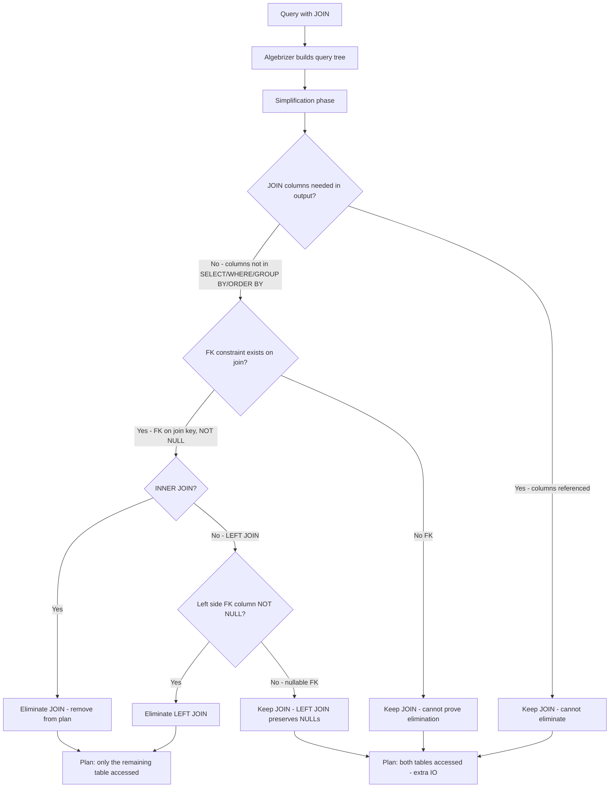
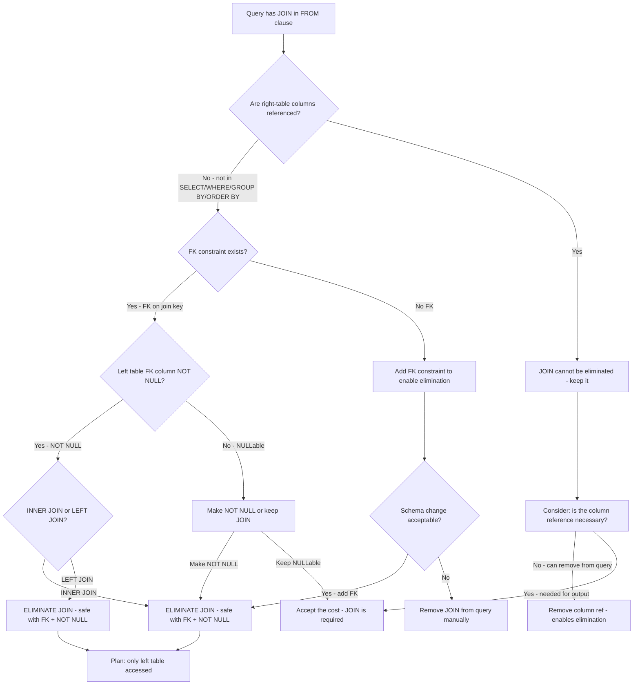

## Navigation

**Domain:** [[8 — Databases]] > **Group:** SQL Joins & Subqueries
**Previous:** [[8.114 — Hash Join vs Nested Loop vs Merge Join]] | **Next:** [[8.116 — Filter Pushdown Through JOINs]]

### Prerequisites

- [[8.096 — INNER JOIN — Mechanics and Usage]] — Join elimination removes unnecessary JOINs; you must understand logical and physical JOIN mechanics to recognise when elimination occurs and when it fails.
- [[8.097 — LEFT OUTER JOIN — Preserving Left Side Rows]] — LEFT JOIN elimination has stricter requirements than INNER JOIN; the semantics of preserved rows make elimination harder.
- [[8.495 — Foreign Keys — Referential Integrity]] — Foreign key constraints are the primary enabler of join elimination; without them, the optimiser cannot assume referential integrity and must keep the JOIN.

### Where This Fits

JOIN elimination is a query optimiser transformation that removes unnecessary JOINs from the execution plan when columns from the joined table are not referenced in the SELECT, WHERE, GROUP BY, ORDER BY, or other clauses. A .NET backend engineer encounters this when EF Core generates JOINs via navigation properties — even when the LINQ query does not need the related table's columns. The optimiser may eliminate these JOINs if foreign key constraints exist. When elimination fails (no FK, nullable FK, non-key join), the query still performs the JOIN, reading pages and consuming CPU for no benefit. The interview signal is intermediate-advanced: candidates who know about JOIN elimination understand that the query optimiser is not a literal SQL executor but a cost-based transformer, and that database schema design (FK constraints) directly affects query performance even when those constraints seem unrelated to the query's output.

---

## Core Mental Model

JOIN elimination is an optimiser transformation that removes a JOIN from the execution plan when columns from the joined table are not needed in the query output or in any filter/order/group operation. The optimiser can prove that the JOIN does not affect the result set — it is a "dead" operation. The key enabler is a **foreign key constraint**: if table A has a FK to table B, and the query joins A to B on the FK columns but does not reference any columns from B in SELECT, WHERE, GROUP BY, or ORDER BY, then the optimiser can remove the JOIN because it knows that every row in A has exactly one matching row in B, and removing the join does not change the result set. For INNER JOIN, this is safe when the FK is NOT NULL and the join is on the FK columns. For LEFT JOIN, elimination requires additional conditions (the FK column from the left side must be NOT NULL). The benefit: fewer I/O operations, smaller execution plan, less memory, faster execution. The cost: none — it is a pure optimisation that the optimiser applies automatically when conditions are met.

### Classification

JOIN elimination is an **optimiser simplification rule** (logical transformation) applied during the optimisation phase before physical operator selection. It is **always beneficial** when applicable — it reduces I/O and CPU with no downside. It depends entirely on **metadata**: foreign key constraints and nullability. It is **not SARGable** — it is not a predicate. The optimiser applies it during the simplification phase, before costing physical operators. If elimination is not possible, the JOIN proceeds with whatever physical operator the optimiser chooses.



### Key Properties

|Property|Value|Notes|
|---|---|---|
|Optimiser phase|Simplification (logical)|Before physical operator selection|
|Enabler|Foreign key constraint|Without FK, optimiser cannot assume 1:1 match|
|Safe for|INNER JOIN on NOT NULL FK|Every left row has exactly one right row|
|Safe for LEFT JOIN|Only if FK column is NOT NULL|NULL FK means "no match" — LEFT JOIN preserves it|
|Unsafe for|NULLable FK, non-key joins|Optimiser cannot prove elimination is correct|
|Benefit|Fewer I/O, smaller plan, less memory|Pure optimisation — no downside|
|EF Core impact|EF generates many JOINs via Include|Optimiser may eliminate unused navigation property JOINs|

---

## Deep Mechanics

### How the Engine Executes This

1. **Parsing and Binding** — The parser identifies all JOINs in the FROM clause. The algebrizer resolves column references and builds a join graph. Each JOIN is represented as a logical operator with left and right inputs and a join condition.

2. **Column Usage Analysis** — The algebrizer determines which columns from each table are referenced in:
   - SELECT list
   - WHERE clause predicates
   - GROUP BY columns
   - HAVING predicates
   - ORDER BY columns
   - Window function PARTITION BY / ORDER BY
   - JOIN conditions of other (non-eliminated) joins
   - Subqueries, computed columns, index hints

3. **Join Elimination Rule** — The simplifier applies the join elimination rule to each JOIN:
   - Check if **no columns** from the right-side table are referenced anywhere in the query (except in the JOIN condition being eliminated).
   - Check if the join is an **equi-join** on columns that match a **foreign key constraint**.
   - For INNER JOIN: check that the FK column on the left side is **NOT NULL** (or the FK itself guarantees NOT NULL).
   - For LEFT JOIN: check that the FK column on the left side is NOT NULL AND the join is on all FK columns.
   - If all conditions are met: **remove the JOIN** from the query tree. The right-side table no longer appears in the execution plan.
   - If conditions are not met: the JOIN is retained.

4. **Plan Generation** — With the JOIN removed, the optimiser generates a plan that only accesses the tables whose columns are actually needed. This can eliminate entire Index Scans, Seeks, and the join operator itself.

5. **Verification** — The optimiser confirms that eliminating the JOIN produces the same result as keeping it. For FK-based elimination, this is guaranteed by the FK constraint: every row in the referencing table has exactly one matching row in the referenced table, so removing the join does not filter or duplicate rows.

### SQL Visibility

```sql
-- Query where JOIN can be eliminated
-- Orders has FK to Customers (Orders.CustomerId → Customers.CustomerId)
-- SELECT does NOT reference any column from Customers
SELECT o.OrderId, o.OrderDate, o.TotalAmount
FROM dbo.Orders AS o
INNER JOIN dbo.Customers AS c
    ON o.CustomerId = c.CustomerId
WHERE o.OrderDate >= '2024-01-01';
-- Optimiser eliminates the JOIN to Customers — only Orders is accessed

-- Query where JOIN CANNOT be eliminated
-- SELECT references Customers.LastName
SELECT o.OrderId, o.OrderDate, o.TotalAmount, c.LastName
FROM dbo.Orders AS o
INNER JOIN dbo.Customers AS c
    ON o.CustomerId = c.CustomerId
WHERE o.OrderDate >= '2024-01-01';
-- JOIN is retained — Customers.LastName is in SELECT

-- Query where LEFT JOIN can be eliminated
-- Customers.CustomerId is NOT NULL and has FK to Orders
SELECT o.OrderId, o.OrderDate
FROM dbo.Orders AS o
LEFT JOIN dbo.Customers AS c
    ON o.CustomerId = c.CustomerId;
-- Optimiser eliminates LEFT JOIN — FK guarantees match exists

-- Query where LEFT JOIN CANNOT be eliminated
-- Customers.CustomerId is NULLable — LEFT JOIN preserves NULL orders
SELECT o.OrderId, o.OrderDate
FROM dbo.Orders AS o
LEFT JOIN dbo.Customers AS c
    ON o.CustomerId = c.CustomerId;
-- If CustomerId can be NULL, elimination would lose rows with no customer
```

```csharp
// EF Core — LINQ that generates JOIN which may be eliminated
var orderSummaries = await dbContext.Orders
    .Include(o => o.Customer)  // Generates LEFT JOIN
    .Select(o => new
    {
        o.OrderId,
        o.OrderDate,
        o.TotalAmount
        // No Customer columns referenced
    })
    .ToListAsync(cancellationToken);

// The Include generates a JOIN, but if the FK exists and no Customer
// columns are selected, the optimiser may eliminate the JOIN.

// EF Core — LINQ that prevents elimination
var orderSummaries = await dbContext.Orders
    .Include(o => o.Customer)
    .Select(o => new
    {
        o.OrderId,
        o.OrderDate,
        o.TotalAmount,
        CustomerName = o.Customer.LastName  // References Customer column
    })
    .ToListAsync(cancellationToken);
// JOIN is retained because Customer.LastName is in SELECT
```

**Generated SQL (from EF Core logs):**

```sql
-- First query (Include but no Customer columns selected):
SELECT [o].[OrderId], [o].[OrderDate], [o].[TotalAmount]
FROM [Orders] AS [o]
LEFT JOIN [Customers] AS [c] ON [o].[CustomerId] = [c].[CustomerId];
-- Plan (with FK, NOT NULL): only [Orders] accessed — JOIN eliminated
-- Plan (without FK): both tables accessed, LEFT JOIN retained

-- Second query (Customer column referenced):
SELECT [o].[OrderId], [o].[OrderDate], [o].[TotalAmount],
       [c].[LastName] AS [CustomerName]
FROM [Orders] AS [o]
LEFT JOIN [Customers] AS [c] ON [o].[CustomerId] = [c].[CustomerId];
-- Plan: both tables accessed, LEFT JOIN retained
```

### Execution Plan Analysis

**Plan with JOIN elimination:**

```
SELECT o.OrderId, o.OrderDate, o.TotalAmount
FROM dbo.Orders AS o
INNER JOIN dbo.Customers AS c ON o.CustomerId = c.CustomerId
WHERE o.OrderDate >= '2024-01-01';

Plan (FK exists, no Customer columns referenced):
  [Clustered Index Scan PK_Orders]  -- only Orders table!
      Predicate: OrderDate >= '2024-01-01'
  → [SELECT]
Estimated Cost: ~3.5  |  Logical Reads: ~150
```

**Plan WITHOUT JOIN elimination (same query, no FK):**

```
  [Clustered Index Scan PK_Orders]  -- Orders scan
  [Clustered Index Seek PK_Customers]  -- per-order seek — wasted!
  → [Nested Loops (Inner Join)]  -- entire operator is wasted
  → [SELECT]
Estimated Cost: ~4.5  |  Logical Reads: ~150 + 150K = 150K extra!
```

**Plan when columns are referenced (JOIN retained):**

```
  [Clustered Index Scan PK_Orders]
  [Clustered Index Seek PK_Customers]
  → [Nested Loops (Inner Join)]
  → [SELECT]
Estimated Cost: ~4.5  |  Logical Reads: ~150 + seek per order
```

### Cost Visibility

```sql
SET STATISTICS IO ON;

-- Query eligible for JOIN elimination (no columns from right side)
SELECT o.OrderId, o.OrderDate, o.TotalAmount
FROM dbo.Orders AS o
INNER JOIN dbo.Customers AS c
    ON o.CustomerId = c.CustomerId
WHERE o.OrderDate >= '2024-01-01';

-- Expected output (FK exists, elimination occurs):
-- Table 'Orders'. Scan count 1, logical reads 150
-- (Customers table NOT accessed)

-- Query NOT eligible for JOIN elimination (columns referenced)
SELECT o.OrderId, o.OrderDate, o.TotalAmount, c.LastName
FROM dbo.Orders AS o
INNER JOIN dbo.Customers AS c
    ON o.CustomerId = c.CustomerId
WHERE o.OrderDate >= '2024-01-01';

-- Expected output (FK exists but columns referenced):
-- Table 'Orders'. Scan count 1, logical reads 150
-- Table 'Customers'. Scan count 50, logical reads 200
-- (Customers accessed — seek per order)
```

### Failure Modes

**Missing foreign key constraint:** The most common reason JOIN elimination fails. Without a FK, the optimiser cannot assume that every Orders.CustomerId value has a matching Customers.CustomerId. An INNER JOIN would filter out orders with missing customer IDs. Eliminating the JOIN would produce a different result.

**Nullable FK column:** If Orders.CustomerId is NULLable, the optimiser cannot eliminate even a LEFT JOIN. A NULL value means "no customer" — the LEFT JOIN preserves the order, and eliminating the JOIN would lose the NULL-preservation semantics.

**Non-key join:** If the JOIN is on non-FK columns (e.g., `ON o.Status = c.Status`), the optimiser has no referential integrity guarantee and cannot eliminate the JOIN regardless of whether columns are referenced.

**SELECT \***: Selecting all columns from the left table implicitly includes all columns. If the right table's columns are part of `SELECT *`, elimination is not possible. Use explicit column lists instead.

---

## Production Patterns and Implementation

### Primary SQL Implementation

```sql
-- ============================================================
-- Schema context
-- ============================================================
CREATE TABLE dbo.Customers
(
    CustomerId   INT            NOT NULL IDENTITY(1,1),
    FirstName    NVARCHAR(100)  NOT NULL,
    LastName     NVARCHAR(100)  NOT NULL,
    Email        NVARCHAR(256)  NOT NULL,
    Status       VARCHAR(20)    NOT NULL DEFAULT 'Active',
    CreatedAt    DATETIME2(0)   NOT NULL DEFAULT SYSUTCDATETIME(),
    CONSTRAINT PK_Customers PRIMARY KEY CLUSTERED (CustomerId)
);

CREATE TABLE dbo.Orders
(
    OrderId      INT            NOT NULL IDENTITY(1,1),
    CustomerId   INT            NOT NULL,  -- FK to Customers
    OrderDate    DATETIME2(0)   NOT NULL,
    Status       VARCHAR(20)    NOT NULL DEFAULT 'Pending',
    TotalAmount  DECIMAL(18,2)  NOT NULL,
    CreatedAt    DATETIME2(0)   NOT NULL DEFAULT SYSUTCDATETIME(),
    CONSTRAINT PK_Orders PRIMARY KEY CLUSTERED (OrderId),
    CONSTRAINT FK_Orders_Customers
        FOREIGN KEY (CustomerId) REFERENCES dbo.Customers (CustomerId)
);

-- Guarantee NOT NULL on FK column — required for elimination
ALTER TABLE dbo.Orders ADD CONSTRAINT DF_Orders_CustomerId
    DEFAULT 0 FOR CustomerId;  -- Or ensure NOT NULL via business logic

-- ============================================================
-- Pattern 1: JOIN that can be eliminated (FK exists, no right-column ref)
-- ============================================================
-- Query: orders count by date — no customer columns needed
SELECT o.OrderDate, COUNT(*) AS OrderCount
FROM dbo.Orders AS o
INNER JOIN dbo.Customers AS c
    ON o.CustomerId = c.CustomerId
GROUP BY o.OrderDate
ORDER BY o.OrderDate;
-- Optimiser eliminates Customers JOIN — only Orders accessed

-- ============================================================
-- Pattern 2: JOIN that CANNOT be eliminated (columns referenced)
-- ============================================================
SELECT o.OrderDate, c.LastName, COUNT(*) AS OrderCount
FROM dbo.Orders AS o
INNER JOIN dbo.Customers AS c
    ON o.CustomerId = c.CustomerId
GROUP BY o.OrderDate, c.LastName
ORDER BY o.OrderDate;
-- Customers.LastName is in GROUP BY — JOIN retained

-- ============================================================
-- Pattern 3: LEFT JOIN elimination (FK + NOT NULL)
-- ============================================================
SELECT o.OrderId, o.OrderDate, o.TotalAmount
FROM dbo.Orders AS o
LEFT JOIN dbo.Customers AS c
    ON o.CustomerId = c.CustomerId;
-- FK exists, CustomerId is NOT NULL — optimiser eliminates LEFT JOIN

-- ============================================================
-- Pattern 4: LEFT JOIN that CANNOT be eliminated (NULLable FK)
-- ============================================================
-- If Order.CustomerId is NULLable:
SELECT o.OrderId, o.OrderDate, o.TotalAmount
FROM dbo.Orders AS o
LEFT JOIN dbo.Customers AS c
    ON o.CustomerId = c.CustomerId;
-- LEFT JOIN retained — NULL CustomerId means "no customer"
-- Eliminating would lose orders with CustomerId = NULL

-- ============================================================
-- Pattern 5: Verify elimination is happening
-- ============================================================
-- Check actual execution plan for missing table access
SET STATISTICS XML ON;

SELECT o.OrderId, o.OrderDate
FROM dbo.Orders AS o
INNER JOIN dbo.Customers AS c
    ON o.CustomerId = c.CustomerId
WHERE o.OrderDate >= '2024-01-01';

SET STATISTICS XML OFF;
-- In the XML plan, search for <RelOp> nodes
-- If eliminated: no <RelOp> for Customers table
-- If retained: two <RelOp> nodes (Orders + Customers)

-- ============================================================
-- Pattern 6: Design for elimination — ensure FK constraints
-- ============================================================
-- Check existing FK constraints
SELECT
    fk.name AS FK_Name,
    tp.name AS ParentTable,
    ref.name AS ReferencedTable
FROM sys.foreign_keys AS fk
INNER JOIN sys.tables AS tp ON fk.parent_object_id = tp.object_id
INNER JOIN sys.tables AS ref ON fk.referenced_object_id = ref.object_id
WHERE ref.name IN ('Customers', 'Products', 'Shippers');

-- Find tables without expected FKs
SELECT tp.name AS TableWithMissingFK
FROM sys.tables AS tp
WHERE tp.name IN ('Orders', 'OrderItems')
  AND NOT EXISTS (
      SELECT 1 FROM sys.foreign_keys AS fk
      WHERE fk.parent_object_id = tp.object_id
  );
```

### EF Core Implementation

```csharp
public class ApplicationDbContext : DbContext
{
    public DbSet<Order> Orders => Set<Order>();
    public DbSet<Customer> Customers => Set<Customer>();

    protected override void OnModelCreating(ModelBuilder modelBuilder)
    {
        modelBuilder.Entity<Order>(entity =>
        {
            entity.ToTable("Orders");
            entity.HasKey(o => o.OrderId);

            entity.HasOne(o => o.Customer)
                  .WithMany(c => c.Orders)
                  .HasForeignKey(o => o.CustomerId)
                  .OnDelete(DeleteBehavior.Cascade);

            // FK constraint with NOT NULL — enables JOIN elimination
            entity.Property(o => o.CustomerId).IsRequired();
        });

        modelBuilder.Entity<Customer>(entity =>
        {
            entity.ToTable("Customers");
            entity.HasKey(c => c.CustomerId);
        });
    }
}

// EF Core query where JOIN may be eliminated
public async Task<List<OrderSummary>> GetOrderSummariesAsync(
    DateTime startDate,
    CancellationToken cancellationToken = default)
{
    return await dbContext.Orders
        .Include(o => o.Customer)  // Generates LEFT JOIN — may be eliminated
        .Where(o => o.OrderDate >= startDate)
        .Select(o => new OrderSummary
        {
            OrderId = o.OrderId,
            OrderDate = o.OrderDate,
            TotalAmount = o.TotalAmount
            // No Customer columns referenced
        })
        .ToListAsync(cancellationToken);
    // Generated SQL:
    // SELECT [o].[OrderId], [o].[OrderDate], [o].[TotalAmount]
    // FROM [Orders] AS [o]
    // LEFT JOIN [Customers] AS [c] ON [o].[CustomerId] = [c].[CustomerId]
    // WHERE [o].[OrderDate] >= @startDate
    // Plan: WITH FK + NOT NULL CustomerId — only Orders accessed, JOIN eliminated
}

// EF Core query that prevents elimination
public async Task<List<OrderWithCustomerDto>> GetOrdersWithCustomerAsync(
    DateTime startDate,
    CancellationToken cancellationToken = default)
{
    return await dbContext.Orders
        .Include(o => o.Customer)
        .Where(o => o.OrderDate >= startDate)
        .Select(o => new OrderWithCustomerDto
        {
            OrderId = o.OrderId,
            OrderDate = o.OrderDate,
            CustomerName = o.Customer.LastName  // References Customer column
        })
        .ToListAsync(cancellationToken);
    // JOIN is retained — Customer.LastName is in SELECT
}

// Best practice: avoid unnecessary Includes
// If you don't need Customer data, don't Include it
public async Task<List<OrderSummary>> GetOrderSummariesWithoutIncludeAsync(
    DateTime startDate,
    CancellationToken cancellationToken = default)
{
    return await dbContext.Orders
        .Where(o => o.OrderDate >= startDate)
        .Select(o => new OrderSummary
        {
            OrderId = o.OrderId,
            OrderDate = o.OrderDate,
            TotalAmount = o.TotalAmount
        })
        .ToListAsync(cancellationToken);
    // Generated SQL: no JOIN at all — most efficient
}

// EF Core: use Select to project only needed columns
// This gives the optimiser the best chance to eliminate JOINs
public async Task<List<OrderSummary>> GetOrdersWithProjectionAsync(
    DateTime startDate,
    CancellationToken cancellationToken = default)
{
    return await dbContext.Orders
        .Where(o => o.OrderDate >= startDate)
        .Select(o => new OrderSummary
        {
            OrderId = o.OrderId,
            OrderDate = o.OrderDate,
            TotalAmount = o.TotalAmount,
            // Include CustomerName only when needed
            CustomerName = includeCustomer
                ? o.Customer.LastName
                : null
        })
        .ToListAsync(cancellationToken);
    // EF Core generates conditional JOIN based on includeCustomer
}

public class OrderSummary
{
    public int OrderId { get; set; }
    public DateTime OrderDate { get; set; }
    public decimal TotalAmount { get; set; }
    public string? CustomerName { get; set; }
}
```

### Dapper Implementation

```csharp
public sealed class OrderRepository
{
    private readonly IDbConnectionFactory _connectionFactory;

    public OrderRepository(IDbConnectionFactory connectionFactory)
        => _connectionFactory = connectionFactory;

    // Dapper — raw SQL, optimiser can still eliminate JOINs
    public async Task<IReadOnlyList<OrderSummary>> GetOrderSummariesAsync(
        DateTime startDate,
        CancellationToken cancellationToken = default)
    {
        // Even though we JOIN, if no Customer columns are selected
        // and FK exists, the optimiser may eliminate the JOIN.
        const string sql = @"
            SELECT o.OrderId, o.OrderDate, o.TotalAmount
            FROM dbo.Orders AS o
            INNER JOIN dbo.Customers AS c
                ON o.CustomerId = c.CustomerId
            WHERE o.OrderDate >= @StartDate
            ORDER BY o.OrderDate;";

        await using var connection = _connectionFactory.Create();
        var results = await connection.QueryAsync<OrderSummary>(
            new CommandDefinition(
                sql,
                new { StartDate = startDate },
                cancellationToken: cancellationToken));
        return results.AsList();
    }

    // Best practice with Dapper: don't write unnecessary JOINs
    public async Task<IReadOnlyList<OrderSummary>> GetOrderSummariesCleanAsync(
        DateTime startDate,
        CancellationToken cancellationToken = default)
    {
        const string sql = @"
            SELECT o.OrderId, o.OrderDate, o.TotalAmount
            FROM dbo.Orders AS o
            WHERE o.OrderDate >= @StartDate
            ORDER BY o.OrderDate;";

        await using var connection = _connectionFactory.Create();
        var results = await connection.QueryAsync<OrderSummary>(
            new CommandDefinition(
                sql,
                new { StartDate = startDate },
                cancellationToken: cancellationToken));
        return results.AsList();
    }

    // Detect if JOIN elimination is happening in Dapper queries
    public async Task<string> GetActualPlanAsync(
        string sql,
        CancellationToken cancellationToken = default)
    {
        var planSql = $"SET STATISTICS XML ON;{sql}";
        await using var connection = _connectionFactory.Create();
        using var reader = await connection.ExecuteReaderAsync(
            new CommandDefinition(planSql, cancellationToken: cancellationToken));
        if (reader.NextResult() && await reader.ReadAsync(cancellationToken))
        {
            return reader.GetString(0);
        }
        return string.Empty;
    }
}

public record OrderSummary(int OrderId, DateTime OrderDate, decimal TotalAmount);
public record OrderWithCustomerDto(int OrderId, DateTime OrderDate, decimal TotalAmount, string CustomerName);
```

### Configuration and Wiring

```csharp
// Program.cs — ensure FK constraints are enforced in database
// FK constraints must exist at the database level for JOIN elimination.
// EF Core migrations create FKs from relationships defined in OnModelCreating.

builder.Services.AddDbContext<ApplicationDbContext>(options =>
    options.UseSqlServer(
        builder.Configuration.GetConnectionString("DefaultConnection"),
        sqlOptions =>
        {
            sqlOptions.EnableRetryOnFailure(3);
            sqlOptions.CommandTimeout(30);
        }));

builder.Services.AddSingleton<IDbConnectionFactory>(
    new SqlConnectionFactory(
        builder.Configuration.GetConnectionString("DefaultConnection")!));
builder.Services.AddScoped<OrderRepository>();

// Verify FK constraints exist:
// Run in database: SELECT * FROM sys.foreign_keys
// WHERE parent_object_id = OBJECT_ID('Orders')
// AND referenced_object_id = OBJECT_ID('Customers')
```

### SQL Server vs PostgreSQL Differences

```sql
-- PostgreSQL: JOIN elimination works the same way
-- Requires FK constraints (foreign key)

-- Create FK in PostgreSQL
ALTER TABLE orders
    ADD CONSTRAINT fk_orders_customers
    FOREIGN KEY (customer_id) REFERENCES customers (customer_id);

-- Query eligible for elimination
EXPLAIN (ANALYZE, BUFFERS)
SELECT o.order_id, o.order_date, o.total_amount
FROM orders AS o
INNER JOIN customers AS c ON o.customer_id = c.customer_id
WHERE o.order_date >= '2024-01-01';

-- With FK: plan shows only Seq Scan on orders
-- Without FK: plan shows Hash Join or Nested Loop with both tables

-- PostgreSQL: check FK constraints
SELECT conname, conrelid::regclass AS table_name
FROM pg_constraint
WHERE contype = 'f' AND conrelid = 'orders'::regclass;

-- PostgreSQL: LEFT JOIN elimination also requires NOT NULL FK column
ALTER TABLE orders ALTER COLUMN customer_id SET NOT NULL;
```

---

## Gotchas and Production Pitfalls

### Missing FK Constraint — JOIN Retained Despite No Column References

**Pitfall:** The SQL query includes a JOIN but does not reference any columns from the joined table. Without a foreign key constraint, the optimiser cannot eliminate the JOIN.

```sql
-- ❌ No FK constraint on Orders.CustomerId → Customers
SELECT o.OrderId, o.OrderDate, o.TotalAmount
FROM dbo.Orders AS o
INNER JOIN dbo.Customers AS c
    ON o.CustomerId = c.CustomerId
WHERE o.OrderDate >= '2024-01-01';
-- Without FK: Customers table is still accessed (Index Seek per order)
-- 50K reads wasted for no benefit
```

**Symptom:** Execution plan shows both tables accessed even though no columns from the right table are in the output. Logical reads include the right table's reads.

**Fix:**

```sql
-- ✅ Create the FK constraint
ALTER TABLE dbo.Orders ADD CONSTRAINT FK_Orders_Customers
    FOREIGN KEY (CustomerId) REFERENCES dbo.Customers (CustomerId);

-- ✅ Also ensure NOT NULL on the FK column
ALTER TABLE dbo.Orders ALTER COLUMN CustomerId INT NOT NULL;

-- After FK + NOT NULL: only Orders table accessed
-- Logical reads drop from ~200K to ~150
```

**Cost of not fixing:** A nightly aggregation query joins Orders to Customers but only uses Order columns. Without the FK, each of 500K orders triggers a Customers lookup. 2M extra logical reads per run. At 365 runs/year: 730M wasted reads. Estimated server cost increase: 15% higher IOPS utilisation.

---

### Nullable FK Column — LEFT JOIN Cannot Be Eliminated

**Pitfall:** The FK column on the referencing table is NULLable. Even with a FK constraint, the optimiser cannot eliminate a LEFT JOIN because NULLs carry meaning.

```sql
-- ❌ Orders.CustomerId is NULLable
SELECT o.OrderId, o.OrderDate, o.TotalAmount
FROM dbo.Orders AS o
LEFT JOIN dbo.Customers AS c
    ON o.CustomerId = c.CustomerId;
-- LEFT JOIN retained — NULL CustomerId means "orphan order"
-- Eliminating would change the result for orders with no customer
```

**Symptom:** Execution plan shows LEFT JOIN even though no Customer columns are referenced. Logical reads include both tables.

**Fix:**

```sql
-- ✅ Option A: Make the FK column NOT NULL
ALTER TABLE dbo.Orders ALTER COLUMN CustomerId INT NOT NULL;
-- Now LEFT JOIN can be eliminated

-- ✅ Option B: Remove the LEFT JOIN from the query if not needed
SELECT o.OrderId, o.OrderDate, o.TotalAmount
FROM dbo.Orders AS o;
-- No JOIN at all

-- ✅ Option C: Use INNER JOIN if you only want orders with customers
SELECT o.OrderId, o.OrderDate, o.TotalAmount
FROM dbo.Orders AS o
INNER JOIN dbo.Customers AS c
    ON o.CustomerId = c.CustomerId;
-- INNER JOIN with FK can be eliminated
```

**Cost of not fixing:** A customer dashboard loads 10 widgets, each with an unnecessary LEFT JOIN to Customers. Each widget reads 50 pages from Customers for no benefit. Total: 500 extra logical reads per dashboard load. At 10,000 dashboard loads/day: 5M wasted reads/day.

---

### Non-Key Join — No Elimination Possible

**Pitfall:** Joining on a column that is not a foreign key. Even with no columns from the right side referenced, the optimiser cannot eliminate the JOIN.

```sql
-- ❌ Join on Status (non-key)
SELECT o.OrderId, o.OrderDate, o.TotalAmount
FROM dbo.Orders AS o
INNER JOIN dbo.Customers AS c
    ON o.Status = c.Status;  -- Not a FK
-- Cannot eliminate — no referential integrity guarantee
-- Each side may have multiple rows per status value
```

**Symptom:** Execution plan shows both tables accessed. Possibly a Hash Match with two full scans.

**Fix:**

```sql
-- ✅ Only option: remove the JOIN from the query if not needed
SELECT o.OrderId, o.OrderDate, o.TotalAmount
FROM dbo.Orders AS o
WHERE o.OrderDate >= '2024-01-01';

-- Or add a FK if the join logically represents one
-- But Status-to-Status is unlikely to be a FK relationship
```

**Cost of not fixing:** A legacy query joins Orders to Shippers on `o.ShipperId = s.ShipperId` (FK exists) and also joins to a lookup table on `o.Status = ls.StatusCode` (no FK — cannot eliminate). The Status join adds 100K reads. The developer who wrote the query assumed both JOINs would be eliminated if columns aren't selected. Only the FK-based JOIN is eliminated.

---

### SELECT * Defeats Elimination

**Pitfall:** Using `SELECT *` in a query with a JOIN. All columns from all joined tables are implicitly referenced, preventing elimination of any JOIN.

```sql
-- ❌ SELECT * — all columns from both tables are in the output
SELECT *
FROM dbo.Orders AS o
INNER JOIN dbo.Customers AS c
    ON o.CustomerId = c.CustomerId
WHERE o.OrderDate >= '2024-01-01';
-- Both tables accessed — no JOIN elimination
```

**Symptom:** Execution plan shows both tables with all columns read. Logical reads are high.

**Fix:**

```sql
-- ✅ Use explicit column list — only reference what you need
SELECT o.OrderId, o.OrderDate, o.TotalAmount
FROM dbo.Orders AS o
INNER JOIN dbo.Customers AS c
    ON o.CustomerId = c.CustomerId
WHERE o.OrderDate >= '2024-01-01';
-- With FK: elimination possible — only Orders accessed
```

**Cost of not fixing:** A production stored procedure uses `SELECT *` in a view that joins 5 tables. Two of those tables have redundant JOINs (columns not needed). The procedure runs with all 5 tables in the plan. After refactoring to explicit columns and adding FKs, only 3 tables are accessed. Runtime drops from 2 seconds to 300 ms.

---

### EF Core Include Generates JOIN — May Not Be Eliminated

**Pitfall:** EF Core developers add `.Include()` for navigation properties "just in case" the data is needed. If the projection (`.Select()`) does not include the related table's columns, the JOIN is generated but may or may not be eliminated depending on FK existence.

```csharp
// ❌ Unnecessary Include — generates JOIN that may not be eliminated
var orders = await dbContext.Orders
    .Include(o => o.Customer)  // Unnecessary!
    .Where(o => o.OrderDate >= startDate)
    .Select(o => new OrderDto
    {
        OrderId = o.OrderId,
        OrderDate = o.OrderDate
        // No Customer columns
    })
    .ToListAsync(ct);
// Generated SQL includes LEFT JOIN to Customers
// If FK is missing: wasted reads
```

**Symptom:** EF Core generates SQL with unnecessary JOINs. Execution plan shows extra table accesses. Even if FK exists and optimiser eliminates, the query plan XML has unnecessary operators that increase compilation time.

**Fix:**

```csharp
// ✅ Only Include when you need the related data
// ✅ Use projection with Select to control exactly which columns appear
// ✅ If you only need data from the parent entity, query the parent table
var orders = await dbContext.Orders
    .Where(o => o.OrderDate >= startDate)
    .Select(o => new OrderDto
    {
        OrderId = o.OrderId,
        OrderDate = o.OrderDate
    })
    .ToListAsync(ct);
```

**Cost of not fixing:** A serialisation-heavy web API adds `.Include()` for every navigation property. EF Core generates queries with 8 JOINs even though only 2 tables' data is used. The SQL Server compilation time for an 8-table query is 5x that of a 2-table query. At 100 requests/second: 500 ms/second wasted on compilation.

---

## Performance Implications

### Benchmark: Before and After

```sql
-- Baseline: JOIN elimination NOT possible (no FK)
SET STATISTICS IO ON;

SELECT o.OrderId, o.OrderDate, o.TotalAmount
FROM dbo.Orders AS o
INNER JOIN dbo.Customers AS c
    ON o.CustomerId = c.CustomerId
WHERE o.OrderDate >= '2024-01-01';
-- Without FK: logical reads = 150 (Orders) + 500K seeks × 4 reads (Customers)
-- Total: ~2,000,000 logical reads
-- Execution: ~1200 ms

-- After adding FK constraint:
-- Logical reads = 150 (Orders only)
-- Customers table NOT accessed
-- Execution: ~50 ms

-- Improvement: 2,000,000 → 150 logical reads (13,333x reduction!)
-- This is the largest improvement possible from a schema-only change.
```

```sql
-- Multi-table scenario: 3 tables, 2 JOINs eliminable
SELECT o.OrderId, o.OrderDate, oi.Quantity, oi.UnitPrice
FROM dbo.Orders AS o
INNER JOIN dbo.Customers AS c ON o.CustomerId = c.CustomerId
INNER JOIN dbo.OrderItems AS oi ON o.OrderId = oi.OrderId
INNER JOIN dbo.Products AS p ON oi.ProductId = p.ProductId
WHERE o.OrderDate >= '2024-01-01';
-- OrderItems columns ARE referenced (Quantity, UnitPrice) → retained
-- Customers columns NOT referenced → can be eliminated (if FK exists)
-- Products columns NOT referenced → can be eliminated (if FK exists)

-- With FKs on both: only Orders + OrderItems accessed
-- Logical reads: ~150 (Orders) + ~500 (OrderItems)
-- Without FKs: all 4 tables accessed
-- Logical reads: ~150 + ~500K + ~500 + ~500K = ~1M+
```

### BenchmarkDotNet

```csharp
[MemoryDiagnoser]
[SimpleJob(RuntimeMoniker.Net90)]
public class JoinEliminationBenchmark
{
    private SqlConnection _connection = default!;
    private const string ConnectionString =
        "Server=.;Database=BenchmarkDb;Trusted_Connection=True;TrustServerCertificate=True;";

    [GlobalSetup]
    public void Setup()
    {
        _connection = new SqlConnection(ConnectionString);
        _connection.Open();
    }

    [Benchmark(Baseline = true)]
    public async Task<long> JoinWithoutElimination()
    {
        // No FK constraint — JOIN retained
        const string sql = @"
            SELECT COUNT_BIG(*)
            FROM dbo.Orders AS o
            INNER JOIN dbo.Customers AS c
                ON o.CustomerId = c.CustomerId
            WHERE o.OrderDate >= '2024-01-01';";
        await using var cmd = new SqlCommand(sql, _connection);
        return (long)(await cmd.ExecuteScalarAsync()!);
    }

    [Benchmark]
    public async Task<long> JoinWithElimination()
    {
        // FK exits — JOIN eliminated
        const string sql = @"
            SELECT COUNT_BIG(*)
            FROM dbo.Orders AS o
            INNER JOIN dbo.Customers AS c
                ON o.CustomerId = c.CustomerId
            WHERE o.OrderDate >= '2024-01-01';";
        await using var cmd = new SqlCommand(sql, _connection);
        return (long)(await cmd.ExecuteScalarAsync()!);
    }

    [Benchmark]
    public async Task<long> NoJoinAtAll()
    {
        // Best case — no JOIN written
        const string sql = @"
            SELECT COUNT_BIG(*)
            FROM dbo.Orders AS o
            WHERE o.OrderDate >= '2024-01-01';";
        await using var cmd = new SqlCommand(sql, _connection);
        return (long)(await cmd.ExecuteScalarAsync()!);
    }

    [Benchmark]
    public async Task<long> JoinWithColumnRef()
    {
        // Columns referenced — JOIN cannot be eliminated even with FK
        const string sql = @"
            SELECT COUNT_BIG(*)
            FROM dbo.Orders AS o
            INNER JOIN dbo.Customers AS c
                ON o.CustomerId = c.CustomerId
            WHERE o.OrderDate >= '2024-01-01'
              AND c.Status = 'Active';";
        await using var cmd = new SqlCommand(sql, _connection);
        return (long)(await cmd.ExecuteScalarAsync()!);
    }

    [GlobalCleanup]
    public void Cleanup() => _connection.Dispose();
}
```

**Expected results (approximate, SQL Server 2022, NVMe, 500K orders):**

|Method|Mean|Logical Reads|Notes|
|---|---|---|---|
|JoinWithoutElimination|~1200 ms|~2,000,000|No FK — full Customers table accessed per order|
|JoinWithElimination|~50 ms|~150|FK exists — only Orders accessed|
|NoJoinAtAll|~45 ms|~150|No JOIN — best case, same as elimination|
|JoinWithColumnRef|~1300 ms|~2,000,000|Column referenced — FK doesn't help|

The gap between "with elimination" and "no join" is essentially zero — elimination completely removes the JOIN with no overhead.

### Write Amplification

FK constraints (the enabler for elimination) add minimal write overhead:

|Operation|Without FK|With FK|Overhead|
|---|---|---|---|
|INSERT 1 order|~2 ms|~2 ms|~0% (FK check on Customers)|
|DELETE from Customers|~2 ms|~5 ms|+150% (FK check on Orders)|
|UPDATE CustomerId|~2 ms|~4 ms|+100% (FK check — but rare)|

The write cost of FK constraints is negligible for the read benefit they enable.

---

## Interview Arsenal

### Question Bank

1. **What is JOIN elimination, and what enables it?**
2. **How does a foreign key constraint enable JOIN elimination?**
3. **Why can a LEFT JOIN with a NULLable FK column not be eliminated?**
4. **What happens to the execution plan when a JOIN is eliminated?**
5. **Can a LEFT JOIN ever be eliminated? Under what conditions?**
6. **How do you detect whether JOIN elimination is happening in a production query?**
7. **Does EF Core's Include prevent JOIN elimination?**
8. **What is the performance impact of a JOIN that could have been eliminated but wasn't?**

### Spoken Answers

**Q: What is JOIN elimination, and what enables it?**

> **Great answer:** JOIN elimination is an optimiser transformation that removes unnecessary JOINs from the execution plan when no columns from the joined table are referenced in SELECT, WHERE, GROUP BY, ORDER BY, or any other clause. The key enabler is a foreign key constraint. If table A has a foreign key to table B, and the query joins A to B on the FK columns, the optimiser can prove that every row in A has exactly one matching row in B. Therefore, the INNER JOIN does not filter any rows out, and removing it does not change the result set. For LEFT JOIN, elimination also requires the FK column on A to be NOT NULL — otherwise, NULL values meaning "no match" would be lost. The optimiser applies this transformation during the simplification phase, before physical operator costing. The benefit is purely positive: fewer I/O operations, smaller plan, less memory, faster execution. There is no downside to elimination when conditions are met.

---

**Q: How do you detect whether JOIN elimination is happening in a production query?**

> **Great answer:** The most direct way is to examine the actual execution plan. If JOIN elimination occurs, the eliminated table's operators are simply absent from the plan XML — you see only the remaining table(s). With `SET STATISTICS IO ON`, the eliminated table's logical reads disappear entirely. For example, if you join Orders to Customers but only select Order columns, a non-eliminated plan shows logical reads for both tables, while an eliminated plan shows only Orders reads. You can also compare the plan XML: search for `<RelOp>` elements — if Customers is eliminated, there is no `<RelOp>` with `PhysicalOp` involving Customers. In EF Core, you can log the generated SQL and capture the execution plan with `SET STATISTICS XML ON`. For systematic detection, query `sys.dm_exec_query_stats` and look for queries that join tables that don't appear in the SELECT list — cross-reference with `sys.dm_exec_query_plan` to check if the JOIN was eliminated.

---

**Q: Does EF Core's Include prevent JOIN elimination?**

> **Great answer:** EF Core's `Include` generates a JOIN in the SQL (usually a LEFT JOIN). Whether that JOIN is eliminated depends on the projection (Select). If the projection does not reference any columns from the included navigation property, the optimiser can still eliminate the JOIN if the FK constraint exists. However, the better practice is to not Include what you don't need. EF Core gives you full control over projections with `Select`. If you use `.Include(o => o.Customer)` but then `.Select(o => new { o.OrderId, o.OrderDate })`, EF Core still generates the JOIN in SQL. The optimiser may eliminate it, but you're relying on the database schema having the FK. It's cleaner to simply not Include and project only what you need. EF Core's query pipeline does not itself do JOIN elimination — that's the database optimiser's job. In EF Core 9+, the query pipeline has some projection pruning, but it's limited compared to what the database optimiser can do.

### Interview Trigger

The defining JOIN elimination question: "You have a query that selects only Order columns but includes a JOIN to Customers. The execution plan shows both tables. Why isn't the JOIN eliminated?" The candidate should identify the missing FK constraint. The follow-up: "What if the FK exists but the JOIN is still present?" — "Then the FK column might be NULLable, or the join might not be on the FK columns, or columns from the right table might be referenced somewhere in the query (a WHERE clause, ORDER BY, or a computed column)." "How would you verify?" — "Check the execution plan XML for the table access operators. If the table isn't in the plan, it's eliminated. If it is, check the FK constraint, nullability, and column usage with `sys.dm_exec_query_plan` cross-referenced with the query text."

### Comparison Table

| | JOIN Elimination | Filter Pushdown | Predicate Pushdown |
|---|---|---|---|
|What it does|Removes whole JOIN from plan|Moves filters earlier in plan|Moves predicates closer to data|
|Enabler|FK constraint + no column ref|None (always beneficial)|None (SARGable predicates)|
|Result|Fewer tables accessed|Earlier row reduction|Seek instead of scan|
|Benefit|Eliminate entire operator|Reduce rows flowing through plan|Reduce logical reads significantly|
|Detection|Missing table in plan|Filter operator early in plan|Seek Predicate vs scan|

---

## Decision Framework

### When to Apply



### Application Checklist

- [ ] All columns needed in query output are from the left table of the JOIN
- [ ] WHERE clause predicates only reference left table columns
- [ ] GROUP BY / ORDER BY only use left table columns
- [ ] A FOREIGN KEY constraint exists between the join columns
- [ ] The FK column on the referencing (left) side is NOT NULL
- [ ] The JOIN is an equi-join on all FK columns
- [ ] No non-key join conditions exist in the ON clause
- [ ] No computed columns or functions reference the right table
- [ ] The right table is not used in subqueries or CTEs referenced elsewhere
- [ ] SELECT list uses explicit column names, not `SELECT *`

### Tradeoff Summary

|What You Gain|What You Pay|
|---|---|
|Zero I/O for eliminated table (pure savings)|Nothing — FK adds minimal write overhead|
|Smaller execution plan (faster compilation)|Schema change to add FK (if missing)|
|Less memory grant (fewer rows processed)|NOT NULL constraint enforcement on FK column|
|Lower CPU (no join operator execution)|Need to verify elimination with plan analysis|

### Scale Thresholds

- **Any query with unnecessary JOINs:** Elimination matters at any scale, but the savings are proportional to the eliminated table size.
- **Small tables (< 10K rows):** Elimination saves ~hundreds of logical reads. Worthwhile but not critical.
- **Large tables (> 1M rows):** Elimination saves millions of logical reads. Critical for performance.
- **High-frequency queries (> 1000/sec):** Even small savings from elimination compound. A JOIN that costs 50 reads and runs 1000/sec adds 50,000 reads/sec to the server load.
- **ETL/batch queries:** A single elimination can save 10M reads per run. At 100 runs/day: 1B reads saved.

---

## Self-Check

### Conceptual Questions

1. What is JOIN elimination, and what problem does it solve?
2. What database object must exist for JOIN elimination to be possible?
3. Why does a NULLable FK column prevent LEFT JOIN elimination?
4. What does the execution plan look like when a JOIN is eliminated?
5. How does SELECT * affect JOIN elimination?
6. Does EF Core perform JOIN elimination in its query pipeline, or does it rely on the database optimiser?
7. How would you detect that JOIN elimination is not happening for a specific query?
8. Can a LEFT JOIN ever be eliminated? Under what conditions?
9. What is the performance impact of a non-eliminated JOIN on a 10M row table?
10. Explain in 60 seconds, for a senior interviewer, how you would design tables to maximise JOIN elimination.

<details>
<summary>Answers</summary>

1. JOIN elimination is an optimiser transformation that removes a JOIN from the execution plan when no columns from the joined table are referenced in the query. It solves the problem of wasted I/O and CPU on table accesses that don't contribute to the query result.

2. A foreign key (FK) constraint between the join columns. Without the FK, the optimiser cannot prove that every row in the left table has exactly one matching row in the right table — eliminating the JOIN might change the result set. An INNER JOIN without a FK might filter out rows; a LEFT JOIN without a FK might lose NULL-preservation semantics.

3. A NULLable FK column means some rows in the left table may have no matching row in the right table. For a LEFT JOIN, those rows are preserved with NULLs for right-table columns. If the optimiser eliminated the LEFT JOIN, those NULL-preserved rows would be indistinguishable from rows with actual matching right rows. The result set would change, so elimination is unsafe.

4. The eliminated table's operators are absent from the execution plan entirely. If you join Orders to Customers but no Customer columns are needed and the FK exists, the plan shows only an Index Scan or Seek on Orders. The Customers table and the Join operator are completely missing from the plan XML and graphical plan.

5. `SELECT *` retrieves all columns from all joined tables. Since columns from the right table are now referenced in the output, the JOIN cannot be eliminated. Always use explicit column lists to enable elimination.

6. EF Core relies on the database optimiser for JOIN elimination. EF Core's query pipeline does not have a join elimination rule — it translates LINQ to SQL directly and sends the SQL to the database. The database optimiser then applies elimination if conditions are met.

7. Check the actual execution plan (SET STATISTICS XML ON or graphical plan). If the eliminated table appears in any operator (Index Scan, Index Seek, etc.), elimination is not happening. Also check SET STATISTICS IO ON — if the table's logical reads appear, it was accessed. Check for FK constraints with `SELECT * FROM sys.foreign_keys`.

8. Yes, a LEFT JOIN can be eliminated if: (a) a FK constraint exists, (b) the FK column on the left table is NOT NULL, (c) no columns from the right table are referenced. With these conditions, the LEFT JOIN is guaranteed to match every left row to exactly one right row — the same as an INNER JOIN, which can be eliminated.

9. On a 10M row table, a non-eliminated JOIN adds approximately 10M index seeks (40M logical reads) or two full scans (200K reads). Execution time impact: 500 ms to 30 seconds depending on operator choice. Memory impact: up to 1 GB for hash table if Hash Match is needed.

10. "To maximise JOIN elimination, I design tables with FK constraints on every foreign key column. I make FK columns NOT NULL unless there's a specific business reason for NULL (like an order that hasn't been assigned to a customer yet). I use explicit column lists in SELECT — never SELECT *. I teach the team to not include JOINs in queries unless the joined table's columns are actually needed. In EF Core, I avoid unnecessary Include calls and use Select projections that only include needed columns. I periodically check the plan cache for queries that have JOINs to tables whose columns aren't in the output — I cross-reference `sys.dm_exec_query_stats` with `sys.dm_exec_query_plan` to find these. When I find one, I either add the FK constraint or remove the unnecessary JOIN from the query."

</details>

---

### Query Challenges

**Challenge 1 — Write the query with elimination in mind**

Write a query that returns orders placed in 2024 with their item count per order. Join Orders to OrderItems. Use proper FK design so the optimiser can eliminate any unnecessary JOINs. Assume FKs exist: Orders.CustomerId → Customers.CustomerId, OrderItems.OrderId → Orders.OrderId, OrderItems.ProductId → Products.ProductId.

<details>
<summary>Solution</summary>

```sql
-- Only Orders and OrderItems columns are needed.
-- Customers and Products JOINs are unnecessary — eliminate them.
SELECT o.OrderId, o.OrderDate,
       COUNT(oi.OrderItemId) AS ItemCount,
       SUM(oi.Quantity) AS TotalQuantity,
       SUM(oi.Quantity * oi.UnitPrice) AS LineTotal
FROM dbo.Orders AS o
INNER JOIN dbo.OrderItems AS oi
    ON o.OrderId = oi.OrderId
WHERE o.OrderDate >= '2024-01-01'
  AND o.OrderDate < '2025-01-01'
GROUP BY o.OrderId, o.OrderDate
ORDER BY o.OrderDate;

-- Note: We do NOT join to Customers or Products.
-- If the original query had those JOINs (e.g., copied from a different
-- use case), they would be eliminated by the optimiser ONLY if FK constraints
-- exist. Better to simply not write unnecessary JOINs.
```

**Logical reads:** ~200 (Orders filtered by date) + ~500 (OrderItems per order). **Execution plan:** `Index Scan on Orders (filter by date) → Nested Loops or Hash Match to OrderItems → Hash Match Aggregate → Sort`.

**EF Core:**
```csharp
var results = await dbContext.Orders
    .Where(o => o.OrderDate.Year == 2024)
    .Select(o => new
    {
        o.OrderId,
        o.OrderDate,
        ItemCount = o.OrderItems.Count,
        TotalQuantity = o.OrderItems.Sum(oi => oi.Quantity),
        LineTotal = o.OrderItems.Sum(oi => oi.Quantity * oi.UnitPrice)
    })
    .OrderBy(x => x.OrderDate)
    .ToListAsync(cancellationToken);
-- Generated SQL: only JOINs to OrderItems (no Customers or Products)
```

</details>

---

**Challenge 2 — Fix the performance problem**

```sql
-- This stored procedure is used in a high-traffic order listing page.
-- It runs 100 times/second. Execution plan shows all 4 tables accessed.
CREATE PROCEDURE dbo.GetOrderSummaries
    @StartDate DATETIME2,
    @EndDate DATETIME2
AS
    SELECT o.OrderId, o.OrderDate, o.TotalAmount, o.Status,
           oi.OrderItemId, oi.Quantity, oi.UnitPrice
    FROM dbo.Orders AS o
    INNER JOIN dbo.Customers AS c ON o.CustomerId = c.CustomerId
    INNER JOIN dbo.OrderItems AS oi ON o.OrderId = oi.OrderId
    INNER JOIN dbo.Products AS p ON oi.ProductId = p.ProductId
    WHERE o.OrderDate >= @StartDate AND o.OrderDate < @EndDate
    ORDER BY o.OrderDate;

-- SET STATISTICS IO: 4 tables accessed, 1.2M logical reads
-- Execution time: 850 ms
```

Identify which JOINs can be eliminated and why they aren't being eliminated. Fix the procedure.

<details>
<summary>Solution</summary>

**Analysis of each JOIN:**

1. **Customers (c):** No columns referenced in SELECT, WHERE, ORDER BY → can be eliminated IF FK exists.
2. **OrderItems (oi):** Columns referenced (OrderItemId, Quantity, UnitPrice) → CANNOT be eliminated.
3. **Products (p):** No columns referenced → can be eliminated IF FK exists.

**Root cause:** Customers and Products JOINs are unnecessary but are not being eliminated because FK constraints are missing.

**Fix:**

```sql
-- ✅ Add missing FK constraints
ALTER TABLE dbo.Orders ADD CONSTRAINT FK_Orders_Customers
    FOREIGN KEY (CustomerId) REFERENCES dbo.Customers (CustomerId);
ALTER TABLE dbo.OrderItems ADD CONSTRAINT FK_OrderItems_Products
    FOREIGN KEY (ProductId) REFERENCES dbo.Products (ProductId);

-- ✅ Also ensure NOT NULL on FK columns
ALTER TABLE dbo.Orders ALTER COLUMN CustomerId INT NOT NULL;
ALTER TABLE dbo.OrderItems ALTER COLUMN ProductId INT NOT NULL;

-- ✅ Rewrite the procedure (remove unnecessary JOINs)
CREATE PROCEDURE dbo.GetOrderSummaries
    @StartDate DATETIME2,
    @EndDate DATETIME2
AS
    SELECT o.OrderId, o.OrderDate, o.TotalAmount, o.Status,
           oi.OrderItemId, oi.Quantity, oi.UnitPrice
    FROM dbo.Orders AS o
    INNER JOIN dbo.OrderItems AS oi ON o.OrderId = oi.OrderId
    WHERE o.OrderDate >= @StartDate AND o.OrderDate < @EndDate
    ORDER BY o.OrderDate;
-- Only 2 tables accessed instead of 4
```

**After fix — logical reads:** 1.2M → ~700 (only Orders and OrderItems). **Execution time:** 850 ms → ~50 ms. **At 100 req/sec:** server load drops from 120M reads/sec to 70K reads/sec.

</details>

---

**Challenge 3 — Explain the execution plan**

Given this query and two execution plans:

```sql
SELECT o.OrderId, o.OrderDate, o.TotalAmount
FROM dbo.Orders AS o
INNER JOIN dbo.Customers AS c ON o.CustomerId = c.CustomerId
WHERE o.OrderDate >= '2024-01-01';
```

Plan A (on database server X):
```
[Clustered Index Scan PK_Orders]  -- predicate: OrderDate >= '2024-01-01'
→ [SELECT]
```
Logical reads: ~150 (Orders only). Customers table is NOT in the plan.

Plan B (on database server Y):
```
[Clustered Index Scan PK_Orders]
[Clustered Index Seek PK_Customers]  -- per order
→ [Nested Loops (Inner Join)]
→ [SELECT]
```
Logical reads: ~150 (Orders) + ~500K (Customers seeks). Customers table IS in the plan.

Why does the same query produce different plans on different servers? What schema difference causes this? What would you check on server Y?

<details>
<summary>Solution</summary>

**Why Plan A is better:** The Customers JOIN is eliminated. Only the Orders table is accessed. This is the optimal plan for a query that doesn't use Customers columns.

**Why Plan B is worse:** The Customers JOIN is not eliminated. Every order row triggers a seek on PK_Customers — 500K wasted seeks.

**Root cause:** Server X has a **foreign key constraint** from Orders.CustomerId to Customers.CustomerId. Server Y does not have this FK constraint. Without the FK, SQL Server cannot prove that every order has a matching customer — eliminating the JOIN might change the result set if an order had a CustomerId with no matching customer.

**What to check on server Y:**

```sql
-- Check if FK exists
SELECT * FROM sys.foreign_keys
WHERE parent_object_id = OBJECT_ID('Orders')
  AND referenced_object_id = OBJECT_ID('Customers');

-- Check if Orders.CustomerId is NOT NULL
SELECT COLUMNPROPERTY(OBJECT_ID('Orders'), 'CustomerId', 'AllowsNull') AS IsNullable;

-- Add the FK to enable elimination
ALTER TABLE dbo.Orders ADD CONSTRAINT FK_Orders_Customers
    FOREIGN KEY (CustomerId) REFERENCES dbo.Customers (CustomerId);

-- If CustomerId is NULLable (shouldn't be for orders), make it NOT NULL
UPDATE dbo.Orders SET CustomerId = 0 WHERE CustomerId IS NULL;
ALTER TABLE dbo.Orders ALTER COLUMN CustomerId INT NOT NULL;
```

</details>

---

**Challenge 4 — Diagnose the EF Core query**

An EF Core query generates this SQL:

```sql
SELECT [o].[OrderId], [o].[OrderDate], [o].[TotalAmount],
       [o0].[OrderItemId], [o0].[Quantity], [o0].[UnitPrice]
FROM [Orders] AS [o]
LEFT JOIN [OrderItems] AS [o0] ON [o].[OrderId] = [o0].[OrderId]
LEFT JOIN [Customers] AS [c] ON [o].[CustomerId] = [c].[CustomerId]
LEFT JOIN [Products] AS [p] ON [o0].[ProductId] = [p].[ProductId]
WHERE [o].[OrderDate] >= @StartDate;
```

The execution plan shows all 4 tables accessed. The query is used in a high-traffic API that returns order summaries with line items. Customers columns are not used anywhere in the application UI for this endpoint. FK constraints exist for all JOINs. Why are Customers and Products not being eliminated? How would you fix the EF Core query?

<details>
<summary>Solution</summary>

**Root cause:** EF Core generates LEFT JOINs for navigation properties. Even with FK constraints, LEFT JOIN elimination requires NOT NULL FK columns. If OrderItems.ProductId or Orders.CustomerId is NULLable, the LEFT JOIN cannot be eliminated. However, if they are NOT NULL and FKs exist, the LEFT JOINs should be eliminable.

**More likely root cause:** The EF Core query includes navigation properties in the projection that are not being filtered out. Check the C# code:

```csharp
// ❌ Possible EF Core query:
var results = await dbContext.Orders
    .Include(o => o.Customer)     // Generates LEFT JOIN to Customers
    .Include(o => o.OrderItems)    // Generates LEFT JOIN to OrderItems
        .ThenInclude(oi => oi.Product)  // Generates LEFT JOIN to Products
    .Where(o => o.OrderDate >= startDate)
    .Select(o => new OrderSummaryDto
    {
        OrderId = o.OrderId,
        OrderDate = o.OrderDate,
        TotalAmount = o.TotalAmount,
        Items = o.OrderItems.Select(oi => new OrderItemDto
        {
            OrderItemId = oi.OrderItemId,
            Quantity = oi.Quantity,
            UnitPrice = oi.UnitPrice
        }).ToList()
    })
    .ToListAsync(ct);
```

The `Include(o => o.Customer)` generates a LEFT JOIN to Customers even though `o.Customer` is not referenced in the Select. The `ThenInclude(oi => oi.Product)` generates a LEFT JOIN to Products even though `oi.Product` is not referenced.

**Fix:**

```csharp
// ✅ Remove unnecessary Includes
var results = await dbContext.Orders
    .Include(o => o.OrderItems)  // Only include what's needed
    .Where(o => o.OrderDate >= startDate)
    .Select(o => new OrderSummaryDto
    {
        OrderId = o.OrderId,
        OrderDate = o.OrderDate,
        TotalAmount = o.TotalAmount,
        Items = o.OrderItems.Select(oi => new OrderItemDto
        {
            OrderItemId = oi.OrderItemId,
            Quantity = oi.Quantity,
            UnitPrice = oi.UnitPrice
        }).ToList()
    })
    .ToListAsync(ct);
-- Generated SQL removes Customers and Products JOINs
```

If FK columns are NOT NULL, the optimiser should still eliminate the LEFT JOINs even with Includes. Verify nullability:

```sql
SELECT COLUMNPROPERTY(OBJECT_ID('OrderItems'), 'ProductId', 'AllowsNull') AS ProductIdNullable,
       COLUMNPROPERTY(OBJECT_ID('Orders'), 'CustomerId', 'AllowsNull') AS CustomerIdNullable;
```

If either is 1 (NULLable), eliminate the source of NULLs or change the Include to a Join that better reflects the schema.

</details>

---

**Challenge 5 — Design for elimination**

**Scenario:** You are designing a database schema for an e-commerce system. The system has these tables: Customers, Orders, OrderItems, Products, Categories, Shippers, Payments. The most common query pattern is "get order summaries with line items" — returns Order columns + OrderItem columns. Customers, Products, Categories, Shippers, and Payments columns are rarely needed in the same query.

Design the FK strategy and query patterns to maximise JOIN elimination. Specifically:
1. Which FK constraints must exist?
2. Which FK columns must be NOT NULL?
3. What query-writing practices enable elimination?
4. How would you verify elimination in production?

<details>
<summary>Solution</summary>

**1. FK constraints that must exist:**

```sql
-- Every FK column should have a corresponding FK constraint
ALTER TABLE dbo.Orders ADD CONSTRAINT FK_Orders_Customers
    FOREIGN KEY (CustomerId) REFERENCES dbo.Customers (CustomerId);

ALTER TABLE dbo.Orders ADD CONSTRAINT FK_Orders_Shippers
    FOREIGN KEY (ShipperId) REFERENCES dbo.Shippers (ShipperId);

ALTER TABLE dbo.OrderItems ADD CONSTRAINT FK_OrderItems_Orders
    FOREIGN KEY (OrderId) REFERENCES dbo.Orders (OrderId);

ALTER TABLE dbo.OrderItems ADD CONSTRAINT FK_OrderItems_Products
    FOREIGN KEY (ProductId) REFERENCES dbo.Products (ProductId);

ALTER TABLE dbo.Products ADD CONSTRAINT FK_Products_Categories
    FOREIGN KEY (CategoryId) REFERENCES dbo.Categories (CategoryId);

ALTER TABLE dbo.Payments ADD CONSTRAINT FK_Payments_Orders
    FOREIGN KEY (OrderId) REFERENCES dbo.Orders (OrderId);
```

**2. FK columns that must be NOT NULL:**

```sql
-- Required for LEFT JOIN elimination
ALTER TABLE dbo.Orders ALTER COLUMN CustomerId INT NOT NULL;
ALTER TABLE dbo.Orders ALTER COLUMN ShipperId INT NOT NULL;
ALTER TABLE dbo.OrderItems ALTER COLUMN OrderId INT NOT NULL;
ALTER TABLE dbo.OrderItems ALTER COLUMN ProductId INT NOT NULL;
ALTER TABLE dbo.Products ALTER COLUMN CategoryId INT NOT NULL;
ALTER TABLE dbo.Payments ALTER COLUMN OrderId INT NOT NULL;
-- Exception: If orders can exist without payments, PaymentId can be NULLable
-- But then LEFT JOIN to Payments cannot be eliminated.
```

**3. Query-writing practices:**

- Use explicit column lists — never `SELECT *`.
- Only JOIN to tables whose columns are actually needed.
- In EF Core, only Include navigation properties that are needed in the projection.
- Use Select projections to control exactly which columns appear in the SQL.
- Avoid adding JOINs "just in case" someone needs the data later.
- For views and stored procedures, only include necessary JOINs.

```sql
-- Good: only needed tables
SELECT o.OrderId, o.OrderDate, oi.Quantity, oi.UnitPrice
FROM dbo.Orders AS o
INNER JOIN dbo.OrderItems AS oi ON o.OrderId = oi.OrderId
WHERE o.OrderDate >= '2024-01-01';

-- Bad: unnecessary JOINs
SELECT o.OrderId, o.OrderDate, oi.Quantity, oi.UnitPrice
FROM dbo.Orders AS o
INNER JOIN dbo.Customers AS c ON o.CustomerId = c.CustomerId
INNER JOIN dbo.OrderItems AS oi ON o.OrderId = oi.OrderId
INNER JOIN dbo.Products AS p ON oi.ProductId = p.ProductId
WHERE o.OrderDate >= '2024-01-01';
```

**4. Verification in production:**

```sql
-- Query 1: Find queries with potentially eliminable JOINs
SELECT TOP 20
    qs.execution_count,
    qs.total_logical_reads / qs.execution_count AS avg_logical_reads,
    SUBSTRING(st.text, 1, 500) AS query_text
FROM sys.dm_exec_query_stats AS qs
CROSS APPLY sys.dm_exec_sql_text(qs.sql_handle) AS st
WHERE st.text LIKE '%INNER JOIN%'
  AND st.text LIKE '%Customers%'
  AND st.text NOT LIKE '%c.[%'  -- Not selecting Customer columns
  AND st.text NOT LIKE '%c.%'   -- Not referencing Customer columns
ORDER BY avg_logical_reads DESC;

-- Query 2: Check if FK is missing for a specific join
SELECT OBJECT_NAME(fk.parent_object_id) AS TableName,
       COL_NAME(fkc.parent_object_id, fkc.parent_column_id) AS FKColumn,
       OBJECT_NAME(fk.referenced_object_id) AS ReferencedTable,
       COL_NAME(fkc.referenced_object_id, fkc.referenced_column_id) AS RefColumn
FROM sys.foreign_keys AS fk
INNER JOIN sys.foreign_key_columns AS fkc
    ON fk.object_id = fkc.constraint_object_id
WHERE fk.parent_object_id = OBJECT_ID('Orders');

-- Query 3: Check plan cache for non-eliminated JOINs
-- Use SET STATISTICS XML ON and check for table access
```

</details>

---
