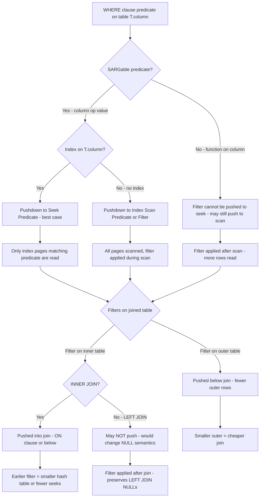
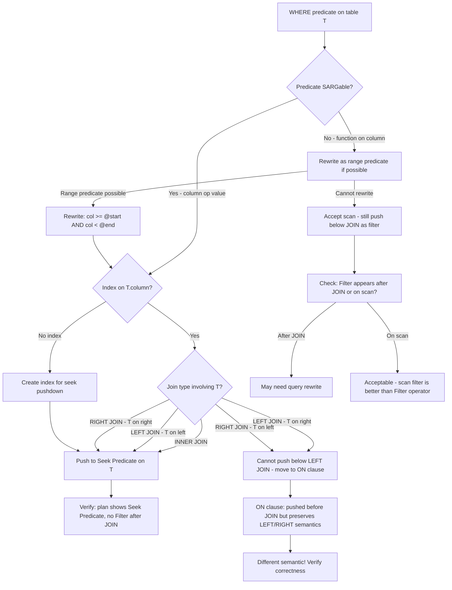

## Navigation

**Domain:** [[8 — Databases]] > **Group:** SQL Joins & Subqueries
**Previous:** [[8.115 — JOIN Elimination by Query Optimizer]] | **Next:** [[8.117 — Star Join Optimization]]

### Prerequisites

- [[8.096 — INNER JOIN — Mechanics and Usage]] — Filter pushdown moves WHERE predicates below JOIN operators in the execution plan; understanding join mechanics is required to see why filtering before joining saves I/O.
- [[8.067 — WHERE Clause — Predicate Logic and SARGability]] — SARGable predicates are required for filter pushdown to an Index Seek; non-SARGable predicates block pushdown at the seek level.
- [[8.114 — Hash Match vs Nested Loop vs Merge Join]] — Filter pushdown dramatically affects which physical join operator the optimiser chooses, because reduced row counts change the cost model.

### Where This Fits

Predicate pushdown (also called filter pushdown) is an optimiser transformation that moves WHERE clause predicates closer to the data source in the execution plan, filtering rows as early as possible rather than after joins. A .NET backend engineer encounters this when a query that should be fast runs slowly because a filter is applied after a JOIN, causing the join to process millions of rows instead of thousands. The most common production failure: a WHERE clause on a joined table's column is pushed to the wrong side of the join, or not pushed at all (appears as a Filter operator after the Join in the plan). EF Core's query generation sometimes places predicates in the ON clause rather than WHERE, affecting pushdown behaviour. Dapper queries are subject to the same optimiser behaviour. The interview signal is intermediate: candidates who understand predicate pushdown can look at an execution plan and explain why a Filter operator appears after a JOIN, and how to rewrite the query to push the filter earlier.

---

## Core Mental Model

Predicate pushdown is the optimiser's ability to evaluate WHERE clause predicates as early as possible in the execution plan — ideally at the index level (Seek Predicate) or at the table/index scan level (Index Scan predicate), rather than after a JOIN. The goal is to reduce the number of rows flowing into join operators. For a Nested Loops join, pushing a filter on the outer table means fewer outer rows means fewer inner seeks. For a Hash Match join, pushing a filter on the build or probe input means smaller hash tables and less memory. The optimiser automatically pushes predicates when possible, but barriers exist: non-SARGable predicates (function wrappers on columns), subquery boundaries, outer join complexity, and view definitions can all prevent pushdown. The execution plan reveals pushdown success: a Seek Predicate (at the index level) is the ideal; a Filter operator after a JOIN means pushdown failed.

### Classification

Predicate pushdown is an **optimiser transformation** (cost-based simplification rule). It applies to **SARGable** predicates — predicates of the form `column op value` where `column` is not wrapped in a function. The pushed predicate can appear as:
- **Seek Predicate** (most efficient — narrow range of index pages read)
- **Predicate** (less efficient — scans index/table but filters during the scan)
- **Residual Predicate** (pushed to the storage engine but not a seek — applied to rows after the seek)
- **Filter operator** (least efficient — applied after rows are returned from the storage engine)
- If a Filter operator appears after a JOIN in the plan, the filter was NOT pushed down.



### Key Properties

|Property|Value|Notes|
|---|---|---|
|Pushdown type|Seek Predicate (best), Scan Predicate (good), Filter (worst)|Seek = index navigation, Filter = post-scan|
|SARGable required|Yes for Seek Predicate|Non-SARGable can still push to scan/filter|
|INNER JOIN pushdown|Both sides — full pushdown possible|WHERE on either side pushed below the join|
|LEFT/RIGHT JOIN pushdown|Outer side only|Inner side filter cannot be pushed (alters semantics)|
|Subquery barrier|Yes — correlated subqueries block pushdown|Uncorrelated subqueries may allow push through|
|View barrier|Depends on view definition|WITH CHECK OPTION views may prevent pushdown|
|CTE barrier|No — CTEs are inlined (same as derived tables)|Pushdown works through CTEs|
|EF Core impact|LINQ WHERE on parent entity → outer side filter|Filter on navigation property may go to ON clause|

---

## Deep Mechanics

### How the Engine Executes This

1. **Parsing and Binding** — The parser identifies WHERE clause predicates and assigns them to the correct table in the query's FROM clause. The algebrizer builds a tree of logical operators (JOIN, SELECT, PROJECT).

2. **Predicate Placement** — Initially, all WHERE predicates are placed in a SELECT operator at the top of the query tree (above all JOINs). This is the naive logical representation.

3. **Pushdown Analysis** — The simplifier walks the query tree from top to bottom and attempts to move each predicate closer to its source table:
   - **Predicate on table T** (referencing only columns from T): can be pushed below any JOIN that has T on one side, as long as the join semantics allow it.
   - **For INNER JOIN**: predicates on either side can be pushed below the join.
   - **For LEFT JOIN**: predicates on the preserved (left) side can be pushed below. Predicates on the right side CANNOT be pushed below — they would change LEFT JOIN semantics (NULL-preserved rows would be filtered out early).
   - **For CROSS JOIN**: same as INNER JOIN — predicates can be pushed.
   - **For FULL JOIN**: predicates on neither side can be pushed below.

4. **Index Matching** — For each pushed predicate, the optimiser checks if an index exists on the column. If yes, the predicate becomes a **Seek Predicate** (the storage engine navigates the B-tree to the specific range). If no, the predicate becomes a **Predicate** on a scan (the storage engine reads all pages and filters before returning rows). If the predicate cannot be pushed to the storage engine (non-SARGable), it stays as a **Filter** operator in the query plan.

5. **Cost Impact** — Pushdown reduces the number of rows passed to the next operator. Fewer rows means smaller hash tables (less memory), fewer index seeks (less I/O), and smaller memory grants.

### SQL Visibility

```sql
-- Query where filter CAN be pushed down (SARGable, INNER JOIN)
SELECT o.OrderId, o.OrderDate, o.TotalAmount,
       c.FirstName, c.LastName
FROM dbo.Orders AS o
INNER JOIN dbo.Customers AS c
    ON o.CustomerId = c.CustomerId
WHERE o.OrderDate >= '2024-01-01'    -- pushed below JOIN (outer side)
  AND c.Status = 'Active';           -- pushed below JOIN (INNER JOIN — safe)

-- Query where filter CANNOT be pushed down (LEFT JOIN)
SELECT o.OrderId, o.OrderDate, o.TotalAmount,
       c.FirstName, c.LastName
FROM dbo.Orders AS o
LEFT JOIN dbo.Customers AS c
    ON o.CustomerId = c.CustomerId
WHERE c.Status = 'Active';           -- CANNOT push below LEFT JOIN
-- Pushing c.Status below the LEFT JOIN would change the result:
-- rows with no matching customer (NULL Status) would be filtered out
-- The WHERE clause effectively converts LEFT JOIN to INNER JOIN

-- Query where filter pushdown is partially blocked (non-SARGable)
SELECT o.OrderId, o.OrderDate, o.TotalAmount
FROM dbo.Orders AS o
INNER JOIN dbo.Customers AS c
    ON o.CustomerId = c.CustomerId
WHERE YEAR(o.OrderDate) = 2024;      -- non-SARGable — cannot be Seek Predicate
-- The filter on YEAR(OrderDate) forces an Index Scan instead of Seek
-- It CAN still be pushed below the JOIN (as a scan filter)
```

```csharp
// EF Core — LINQ with filters that affect pushdown
var orders = await dbContext.Orders
    .Where(o => o.OrderDate >= new DateTime(2024, 1, 1))
    .Where(o => o.Customer.Status == "Active")  // Filter on navigation property
    .Select(o => new
    {
        o.OrderId,
        o.OrderDate,
        o.TotalAmount,
        o.Customer.FirstName,
        o.Customer.LastName
    })
    .ToListAsync(cancellationToken);

// Generated SQL — EF Core places Customer filter in WHERE clause
// SELECT ... FROM Orders o
// INNER JOIN Customers c ON o.CustomerId = c.CustomerId
// WHERE o.OrderDate >= '2024-01-01' AND c.Status = 'Active'
// Optimiser pushes both predicates below the JOIN
```

**Generated SQL (from EF Core logs):**

```sql
-- EF Core generates:
SELECT [o].[OrderId], [o].[OrderDate], [o].[TotalAmount],
       [c].[FirstName], [c].[LastName]
FROM [Orders] AS [o]
INNER JOIN [Customers] AS [c] ON [o].[CustomerId] = [c].[CustomerId]
WHERE [o].[OrderDate] >= '2024-01-01'
  AND [c].[Status] = N'Active';
-- Plan: Index Seek on Orders(OrderDate) → Index Seek on Customers(Status) → Nested Loops
-- Both filters pushed below the JOIN

-- EF Core with LEFT JOIN:
var ordersWithCustomer = await dbContext.Orders
    .Include(o => o.Customer)
    .Where(o => o.Customer.Status == "Active")
    .ToListAsync(cancellationToken);
-- Generated SQL:
SELECT [o].[OrderId], [o].[OrderDate], [o].[TotalAmount],
       [c].[FirstName], [c].[LastName], [c].[Status]
FROM [Orders] AS [o]
LEFT JOIN [Customers] AS [c] ON [o].[CustomerId] = [c].[CustomerId]
WHERE [c].[Status] = N'Active';
-- WHERE on the right side of LEFT JOIN — CANNOT push below
-- Optimiser may convert LEFT JOIN to INNER JOIN (since filter removes NULLs)
```

### Execution Plan Analysis

**Successful pushdown (SARGable predicate, INNER JOIN):**

```
SELECT o.OrderId, o.OrderDate, o.TotalAmount
FROM dbo.Orders AS o
INNER JOIN dbo.Customers AS c ON o.CustomerId = c.CustomerId
WHERE o.OrderDate >= '2024-01-01'
  AND c.Status = 'Active';

  [Index Seek IX_Orders_OrderDate]  -- Seek Predicate: OrderDate >= '2024-01-01'
      Predicate: OrderDate >= '2024-01-01'
  [Index Seek IX_Customers_Status]  -- Seek Predicate: Status = 'Active'
      Seek Predicate: Status = N'Active'
  → [Nested Loops (Inner Join)]
  → [SELECT]
Estimated Cost: ~2.5  |  Logical Reads: ~50 (seek) + ~50 (seek)
```

Both filters are Seek Predicates — pushed all the way to the storage engine index level. No Filter operators in the plan.

**Failed pushdown (non-SARGable predicate):**

```
SELECT o.OrderId, o.OrderDate, o.TotalAmount
FROM dbo.Orders AS o
INNER JOIN dbo.Customers AS c ON o.CustomerId = c.CustomerId
WHERE YEAR(o.OrderDate) = 2024;

  [Clustered Index Scan PK_Orders]  -- full scan — no seek possible
  [Index Seek PK_Customers]  -- seek per order row
  → [Filter]  -- Filter applied AFTER join: YEAR(OrderDate) = 2024
      Predicate: YEAR(o.OrderDate) = 2024
  → [Nested Loops (Inner Join)]
  → [SELECT]
Estimated Cost: ~15  |  Logical Reads: ~62,000 (full scan) + seeks
```

The Filter operator appears after the JOIN. The YEAR() function prevented pushdown to a Seek Predicate. The filter IS pushed below the JOIN (it appears on the Orders side), but it's a scan filter, not a seek.

**Filter NOT pushed below LEFT JOIN:**

```
SELECT o.OrderId, o.OrderDate, o.TotalAmount
FROM dbo.Orders AS o
LEFT JOIN dbo.Customers AS c ON o.CustomerId = c.CustomerId
WHERE c.Status = 'Active';

  [Clustered Index Scan PK_Orders]
  [Index Seek PK_Customers]  -- seek per order
  → [Nested Loops Left Join]
  → [Filter]  -- Filter applied AFTER LEFT JOIN: Status = 'Active'
      Predicate: c.Status = N'Active'
  → [SELECT]
```

The Filter on `c.Status` cannot be pushed below the LEFT JOIN. However, the optimiser may convert this to an INNER JOIN (since the filter removes all NULLs from the left join result), enabling pushdown. Check if the plan shows INNER JOIN instead of LEFT JOIN.

### Cost Visibility

```sql
SET STATISTICS IO ON;

-- Pushdown successful (SARGable, INNER JOIN)
SELECT o.OrderId, o.OrderDate, o.TotalAmount
FROM dbo.Orders AS o
INNER JOIN dbo.Customers AS c ON o.CustomerId = c.CustomerId
WHERE o.OrderDate >= '2024-01-01'
  AND c.Status = 'Active';

-- Table 'Orders'. Scan count 1, logical reads 35 (Index Seek)
-- Table 'Customers'. Scan count 1, logical reads 28 (Index Seek)
-- CPU time = 2ms, elapsed time = 8ms

-- Pushdown failed (non-SARGable)
SET STATISTICS IO ON;
SELECT o.OrderId, o.OrderDate, o.TotalAmount
FROM dbo.Orders AS o
INNER JOIN dbo.Customers AS c ON o.CustomerId = c.CustomerId
WHERE YEAR(o.OrderDate) = 2024;

-- Table 'Orders'. Scan count 1, logical reads 62100 (full scan!)
-- Table 'Customers'. Scan count 1, logical reads 45000 (seek per order)
-- CPU time = 320ms, elapsed time = 850ms

-- Improvement: 107,100 → 63 logical reads (1700x reduction)
```

### Failure Modes

**Non-SARGable predicate forces scan:** The most common pushdown failure. Wrapping a column in a function (`YEAR(OrderDate)`, `LEFT(LastName, 1)`, `DATEADD(day, ...)`) prevents a Seek Predicate. The filter can still be pushed below the JOIN, but it forces a scan.

**LEFT JOIN blocks right-side pushdown:** A WHERE clause on the right table's column in a LEFT JOIN cannot be pushed below the join. The filter appears as a Filter operator after the JOIN. Fix: convert to INNER JOIN if appropriate, or move the predicate to the ON clause (which filters before the join but preserves LEFT JOIN semantics for other rows).

**Outer join barrier in subquery:** If the query uses an outer join inside a subquery or CTE, predicates on the outer side of that join may not push down through the outer query's operators.

**View definitions prevent pushdown:** Complex views (especially those with UNION, DISTINCT, or OUTER JOINs) may block predicate pushdown. The optimiser may not be able to push predicates through the view boundary.

---

## Production Patterns and Implementation

### Primary SQL Implementation

```sql
-- ============================================================
-- Schema context
-- ============================================================
CREATE TABLE dbo.Orders
(
    OrderId      INT            NOT NULL IDENTITY(1,1),
    CustomerId   INT            NOT NULL,
    OrderDate    DATETIME2(0)   NOT NULL,
    Status       VARCHAR(20)    NOT NULL DEFAULT 'Pending',
    TotalAmount  DECIMAL(18,2)  NOT NULL,
    CONSTRAINT PK_Orders PRIMARY KEY CLUSTERED (OrderId)
);

CREATE TABLE dbo.Customers
(
    CustomerId   INT            NOT NULL IDENTITY(1,1),
    FirstName    NVARCHAR(100)  NOT NULL,
    LastName     NVARCHAR(100)  NOT NULL,
    Email        NVARCHAR(256)  NOT NULL,
    Status       VARCHAR(20)    NOT NULL DEFAULT 'Active',
    Region       VARCHAR(50)    NOT NULL,
    CreatedAt    DATETIME2(0)   NOT NULL DEFAULT SYSUTCDATETIME(),
    CONSTRAINT PK_Customers PRIMARY KEY CLUSTERED (CustomerId)
);

CREATE TABLE dbo.OrderItems
(
    OrderItemId  INT            NOT NULL IDENTITY(1,1),
    OrderId      INT            NOT NULL,
    ProductId    INT            NOT NULL,
    Quantity     INT            NOT NULL,
    UnitPrice    DECIMAL(18,2)  NOT NULL,
    CONSTRAINT PK_OrderItems PRIMARY KEY CLUSTERED (OrderItemId)
);

-- Indexes for filter pushdown
CREATE INDEX IX_Orders_OrderDate ON dbo.Orders (OrderDate)
    INCLUDE (CustomerId, Status, TotalAmount);
CREATE INDEX IX_Customers_Status ON dbo.Customers (Status)
    INCLUDE (CustomerId, FirstName, LastName, Email);
CREATE INDEX IX_Customers_Region ON dbo.Customers (Region)
    INCLUDE (CustomerId, FirstName, LastName);
CREATE INDEX IX_OrderItems_OrderId ON dbo.OrderItems (OrderId)
    INCLUDE (ProductId, Quantity, UnitPrice);

-- ============================================================
-- Pattern 1: Filter pushdown on outer side (SARGable, indexed)
-- ============================================================
SELECT o.OrderId, o.OrderDate, o.TotalAmount
FROM dbo.Orders AS o
INNER JOIN dbo.OrderItems AS oi
    ON o.OrderId = oi.OrderId
WHERE o.OrderDate >= '2024-01-01'
  AND o.OrderDate < '2024-02-01';
-- Orders.OrderDate filter → Seek Predicate on IX_Orders_OrderDate
-- Only January 2024 orders enter the join — ~50K instead of 10M

-- ============================================================
-- Pattern 2: Filter pushdown on both sides (INNER JOIN)
-- ============================================================
SELECT o.OrderId, o.OrderDate, o.TotalAmount,
       c.FirstName, c.LastName
FROM dbo.Orders AS o
INNER JOIN dbo.Customers AS c
    ON o.CustomerId = c.CustomerId
WHERE o.OrderDate >= '2024-01-01'
  AND c.Region = 'North America'
  AND c.Status = 'Active';
-- Both ORDER and Customer filters pushed below the JOIN
-- Orders: Seek on IX_Orders_OrderDate
-- Customers: Seek on IX_Customers_Region or IX_Customers_Status

-- ============================================================
-- Pattern 3: LEFT JOIN — filter on left side (pushed), right side (not)
-- ============================================================
-- Left side filter: pushed below LEFT JOIN ✓
-- Right side filter: NOT pushed — appears as Filter after JOIN
SELECT o.OrderId, o.OrderDate, o.TotalAmount,
       c.FirstName, c.LastName
FROM dbo.Orders AS o
LEFT JOIN dbo.Customers AS c
    ON o.CustomerId = c.CustomerId
WHERE o.OrderDate >= '2024-01-01'    -- pushed (left side)
  AND c.Status = 'Active';           -- NOT pushed (right side of LEFT JOIN)
-- The plan shows Filter(Status='Active') AFTER the LEFT JOIN
-- Optimiser may convert to INNER JOIN since filter removes NULL-preserved rows

-- ============================================================
-- Pattern 4: Moving filter to ON clause for LEFT JOIN pushdown
-- ============================================================
-- Filter on right side IN the ON clause — pushed before the JOIN
SELECT o.OrderId, o.OrderDate, o.TotalAmount,
       c.FirstName, c.LastName
FROM dbo.Orders AS o
LEFT JOIN dbo.Customers AS c
    ON o.CustomerId = c.CustomerId
    AND c.Status = 'Active';  -- Pushed before LEFT JOIN
-- Different semantic! ON clause filters Customers BEFORE the LEFT JOIN
-- Returns all orders, but only active customers populate Customer columns
-- NULLs for orders with no active customer

-- ============================================================
-- Pattern 5: Non-SARGable filter — still pushed (as scan)
-- ============================================================
SELECT o.OrderId, o.OrderDate, o.TotalAmount
FROM dbo.Orders AS o
INNER JOIN dbo.OrderItems AS oi
    ON o.OrderId = oi.OrderId
WHERE DATEDIFF(day, o.OrderDate, GETUTCDATE()) <= 30;
-- DATEDIFF is non-SARGable — forces full scan on Orders
-- Filter is still pushed below JOIN (as scan filter, not seek)
-- Better: o.OrderDate >= DATEADD(day, -30, GETUTCDATE())

-- ============================================================
-- Pattern 6: Pushdown through views
-- ============================================================
CREATE VIEW dbo.vw_ActiveCustomerOrders
AS
    SELECT o.OrderId, o.OrderDate, o.TotalAmount,
           c.FirstName, c.LastName, c.Region
    FROM dbo.Orders AS o
    INNER JOIN dbo.Customers AS c
        ON o.CustomerId = c.CustomerId
    WHERE c.Status = 'Active';

-- Query on view — filters can push THROUGH the view
SELECT OrderId, OrderDate, TotalAmount
FROM dbo.vw_ActiveCustomerOrders
WHERE OrderDate >= '2024-01-01';
-- Optimiser pushes OrderDate filter into the view
-- Plan: Index Seek on Orders(OrderDate) → Join → (Customers filtered to Active)
-- Logical reads: same as writing the query directly

-- ============================================================
-- Pattern 7: Pushdown monitoring — detect Filter operators after JOIN
-- ============================================================
-- Check execution plan for Filter operators that appear AFTER Join operators
-- This indicates pushdown failure
SET STATISTICS XML ON;
SELECT ...;  -- Your query
SET STATISTICS XML OFF;
-- Search XML for: <Filter> followed by <RelOp PhysicalOp="...Join"
-- If Filter is a child of Join, pushdown failed
```

### EF Core Implementation

```csharp
public class ApplicationDbContext : DbContext
{
    public DbSet<Order> Orders => Set<Order>();
    public DbSet<Customer> Customers => Set<Customer>();
    public DbSet<OrderItem> OrderItems => Set<OrderItem>();

    protected override void OnModelCreating(ModelBuilder modelBuilder)
    {
        modelBuilder.Entity<Order>(entity =>
        {
            entity.ToTable("Orders");
            entity.HasKey(o => o.OrderId);
            entity.HasOne(o => o.Customer)
                  .WithMany(c => c.Orders)
                  .HasForeignKey(o => o.CustomerId);
            entity.HasIndex(o => o.OrderDate);
        });

        modelBuilder.Entity<Customer>(entity =>
        {
            entity.ToTable("Customers");
            entity.HasKey(c => c.CustomerId);
            entity.HasIndex(c => c.Status);
            entity.HasIndex(c => c.Region);
        });
    }
}

public class OrderRepository
{
    private readonly ApplicationDbContext _dbContext;

    public OrderRepository(ApplicationDbContext dbContext)
        => _dbContext = dbContext;

    // EF Core — filter on both sides of INNER JOIN
    // Both filters pushed below the JOIN
    public async Task<List<OrderSummaryDto>> GetFilteredOrdersAsync(
        DateTime startDate,
        string region,
        CancellationToken cancellationToken = default)
    {
        return await _dbContext.Orders
            .Where(o => o.OrderDate >= startDate)
            .Where(o => o.Customer.Region == region)
            .Select(o => new OrderSummaryDto
            {
                OrderId = o.OrderId,
                OrderDate = o.OrderDate,
                TotalAmount = o.TotalAmount,
                CustomerName = o.Customer.FirstName + " " + o.Customer.LastName
            })
            .ToListAsync(cancellationToken);
        // Generated SQL:
        // SELECT o.OrderId, o.OrderDate, o.TotalAmount,
        //        c.FirstName, c.LastName
        // FROM Orders o
        // INNER JOIN Customers c ON o.CustomerId = c.CustomerId
        // WHERE o.OrderDate >= @startDate
        //   AND c.Region = @region
        // Both predicates pushed below JOIN
        // Orders: Index Seek on IX_Orders_OrderDate
        // Customers: Index Seek on IX_Customers_Region
    }

    // EF Core — filter before Include vs after Include
    // Order matters for EF Core query generation
    public async Task<List<Order>> GetOrdersWithFilteredIncludeAsync(
        DateTime startDate,
        CancellationToken cancellationToken = default)
    {
        return await _dbContext.Orders
            .Where(o => o.OrderDate >= startDate)  // Filter applied before Include
            .Include(o => o.Customer)
            .ToListAsync(cancellationToken);
        // Generated SQL: WHERE OrderDate >= @startDate
        // Filter pushed to Index Seek on Orders
        // Include generates LEFT JOIN — filter on left side pushed below
    }

    // EF Core — filter on right side of LEFT JOIN (via Include)
    // This can prevent pushdown
    public async Task<List<Order>> GetOrdersWithCustomerFilterAsync(
        string status,
        CancellationToken cancellationToken = default)
    {
        return await _dbContext.Orders
            .Include(o => o.Customer)
            .Where(o => o.Customer.Status == status)  // Filter on right side of LEFT JOIN
            .ToListAsync(cancellationToken);
        // Generated SQL:
        // SELECT ... FROM Orders o
        // LEFT JOIN Customers c ON o.CustomerId = c.CustomerId
        // WHERE c.Status = @status
        // Filter on Customers.Status — CANNOT push below LEFT JOIN
        // Optimiser may convert to INNER JOIN (since filter removes NULLs)
        // To get true LEFT JOIN with right-side filter, use:
        // .Include(o => o.Customer.Where(c => c.Status == status))
    }

    // EF Core — filter on right side IN the Include (ON clause)
    // This DOES push the filter before the LEFT JOIN
    public async Task<List<Order>> GetOrdersWithFilteredIncludeOnClauseAsync(
        string status,
        CancellationToken cancellationToken = default)
    {
        return await _dbContext.Orders
            .Include(o => o.Customer.Where(c => c.Status == status))
            .ToListAsync(cancellationToken);
        // Generated SQL:
        // SELECT ... FROM Orders o
        // LEFT JOIN Customers c ON o.CustomerId = c.CustomerId AND c.Status = @status
        // Filter on Status is in the ON clause — pushed before LEFT JOIN
        // Different semantic: returns all orders, NULL customer columns if no active match
    }
}
```

### Dapper Implementation

```csharp
public sealed class OrderDapperRepository
{
    private readonly IDbConnectionFactory _connectionFactory;

    public OrderDapperRepository(IDbConnectionFactory connectionFactory)
        => _connectionFactory = connectionFactory;

    // Dapper — full control over filter pushdown
    // Write SARGable predicates for seek pushdown
    public async Task<IReadOnlyList<OrderSummaryDto>> GetFilteredOrdersAsync(
        DateTime startDate,
        string region,
        CancellationToken cancellationToken = default)
    {
        const string sql = @"
            SELECT o.OrderId, o.OrderDate, o.TotalAmount,
                   c.FirstName, c.LastName
            FROM dbo.Orders AS o
            INNER JOIN dbo.Customers AS c
                ON o.CustomerId = c.CustomerId
            WHERE o.OrderDate >= @StartDate  -- SARGable → Seek Predicate
              AND c.Region = @Region         -- SARGable → Seek Predicate
            ORDER BY o.OrderDate;";

        await using var connection = _connectionFactory.Create();
        var results = await connection.QueryAsync<OrderSummaryDto>(
            new CommandDefinition(
                sql,
                new { StartDate = startDate, Region = region },
                cancellationToken: cancellationToken));
        return results.AsList();
    }

    // Dapper — LEFT JOIN with right-side filter in ON clause
    public async Task<IReadOnlyList<OrderSummaryDto>> GetOrdersWithActiveCustomersAsync(
        DateTime startDate,
        CancellationToken cancellationToken = default)
    {
        const string sql = @"
            SELECT o.OrderId, o.OrderDate, o.TotalAmount,
                   c.FirstName, c.LastName
            FROM dbo.Orders AS o
            LEFT JOIN dbo.Customers AS c
                ON o.CustomerId = c.CustomerId
                AND c.Status = 'Active'  -- Filter in ON clause → pushed before LEFT JOIN
            WHERE o.OrderDate >= @StartDate
            ORDER BY o.OrderDate;";

        await using var connection = _connectionFactory.Create();
        var results = await connection.QueryAsync<OrderSummaryDto>(
            new CommandDefinition(
                sql,
                new { StartDate = startDate },
                cancellationToken: cancellationToken));
        return results.AsList();
    }

    // Dapper — non-SARGable filter (avoid this pattern)
    public async Task<IReadOnlyList<OrderSummaryDto>> GetOrdersByYearNonSargableAsync(
        int year,
        CancellationToken cancellationToken = default)
    {
        // ❌ Non-SARGable — YEAR() prevents seek
        const string sql = @"
            SELECT o.OrderId, o.OrderDate, o.TotalAmount
            FROM dbo.Orders AS o
            INNER JOIN dbo.OrderItems AS oi
                ON o.OrderId = oi.OrderId
            WHERE YEAR(o.OrderDate) = @Year
            GROUP BY o.OrderId, o.OrderDate, o.TotalAmount;";

        await using var connection = _connectionFactory.Create();
        var results = await connection.QueryAsync<OrderSummaryDto>(
            new CommandDefinition(
                sql,
                new { Year = year },
                cancellationToken: cancellationToken));
        return results.AsList();
    }

    // Dapper — SARGable equivalent
    public async Task<IReadOnlyList<OrderSummaryDto>> GetOrdersByYearSargableAsync(
        int year,
        CancellationToken cancellationToken = default)
    {
        // ✅ SARGable — range predicate allows seek
        const string sql = @"
            SELECT o.OrderId, o.OrderDate, o.TotalAmount
            FROM dbo.Orders AS o
            INNER JOIN dbo.OrderItems AS oi
                ON o.OrderId = oi.OrderId
            WHERE o.OrderDate >= @StartDate
              AND o.OrderDate < @EndDate
            GROUP BY o.OrderId, o.OrderDate, o.TotalAmount;";

        await using var connection = _connectionFactory.Create();
        var results = await connection.QueryAsync<OrderSummaryDto>(
            new CommandDefinition(
                sql,
                new
                {
                    StartDate = new DateTime(year, 1, 1),
                    EndDate = new DateTime(year + 1, 1, 1)
                },
                cancellationToken: cancellationToken));
        return results.AsList();
    }
}

public record OrderSummaryDto
{
    public int OrderId { get; init; }
    public DateTime OrderDate { get; init; }
    public decimal TotalAmount { get; init; }
    public string? FirstName { get; init; }
    public string? LastName { get; init; }
}
```

### Configuration and Wiring

```csharp
// Program.cs
builder.Services.AddDbContext<ApplicationDbContext>(options =>
    options.UseSqlServer(
        builder.Configuration.GetConnectionString("DefaultConnection"),
        sqlOptions =>
        {
            sqlOptions.EnableRetryOnFailure(3);
            sqlOptions.CommandTimeout(30);
        })
        .EnableSensitiveDataLogging()  // For debugging — shows SQL
        .LogTo(Console.WriteLine, LogLevel.Information));  // Log SQL

builder.Services.AddSingleton<IDbConnectionFactory>(
    new SqlConnectionFactory(
        builder.Configuration.GetConnectionString("DefaultConnection")!));
builder.Services.AddScoped<OrderRepository>();
builder.Services.AddScoped<OrderDapperRepository>();

// To monitor pushdown in production:
// 1. Enable query store to capture execution plans
// 2. Query sys.dm_exec_query_stats for high-read queries
// 3. Check plans for Filter operators after Join operators
```

### SQL Server vs PostgreSQL Differences

```sql
-- PostgreSQL: Predicate pushdown works identically
EXPLAIN (ANALYZE, BUFFERS)
SELECT o.order_id, o.order_date, o.total_amount,
       c.first_name, c.last_name
FROM orders AS o
INNER JOIN customers AS c ON o.customer_id = c.customer_id
WHERE o.order_date >= '2024-01-01'
  AND c.region = 'North America';

-- Expected plan:
-- Nested Loop
--   -> Index Scan using idx_orders_order_date on orders
--       Index Cond: (order_date >= '2024-01-01')
--   -> Index Scan using idx_customers_region on customers
--       Index Cond: (region = 'North America'::text)

-- PostgreSQL: Filter pushdown with LEFT JOIN (same barrier)
EXPLAIN (ANALYZE, BUFFERS)
SELECT o.order_id, c.last_name
FROM orders AS o
LEFT JOIN customers AS c ON o.customer_id = c.customer_id
WHERE c.region = 'North America';
-- Filter on right side of LEFT JOIN — CANNOT push below
-- Plan shows Filter after the join OR conversion to INNER JOIN

-- PostgreSQL: Non-SARGable filter — same scan behaviour
EXPLAIN (ANALYZE, BUFFERS)
SELECT o.order_id, o.total_amount
FROM orders AS o
WHERE EXTRACT(YEAR FROM o.order_date) = 2024;
-- Seq Scan (full scan) — EXTRACT is non-SARGable
```

---

## Gotchas and Production Pitfalls

### Non-SARGable Predicate Forces Full Scan Instead of Seek

**Pitfall:** Using a function on a column in the WHERE clause. The optimiser cannot push the filter to a Seek Predicate — it must scan all rows and filter after.

```sql
-- ❌ Non-SARGable: YEAR(OrderDate) prevents seek
SELECT o.OrderId, o.OrderDate, o.TotalAmount
FROM dbo.Orders AS o
INNER JOIN dbo.Customers AS c ON o.CustomerId = c.CustomerId
WHERE YEAR(o.OrderDate) = 2024;
```

**Symptom:** Execution plan shows **Clustered Index Scan** on Orders (62,100 reads) instead of Index Seek (35 reads). Filter predicate: `YEAR(OrderDate) = 2024` appears as a Predicate on the scan, not a Seek Predicate.

**Fix:**

```sql
-- ✅ SARGable: range predicate enables seek
SELECT o.OrderId, o.OrderDate, o.TotalAmount
FROM dbo.Orders AS o
INNER JOIN dbo.Customers AS c ON o.CustomerId = c.CustomerId
WHERE o.OrderDate >= '2024-01-01'
  AND o.OrderDate < '2025-01-01';
-- Seek Predicate: OrderDate >= '2024-01-01' AND OrderDate < '2025-01-01'
```

**Cost of not fixing:** An annual report query uses `YEAR(OrderDate)` to filter one year's data. On a 10M row Orders table, this forces a full scan of all pages (62,100 reads) instead of seeking only the year's index pages (35 reads). Join then processes 10M rows instead of 500K. Query runs 45 seconds instead of 200 ms. At 50 runs/hour: 3.1M wasted reads/hour.

---

### LEFT JOIN Filter on Right Side — Appears as Filter After JOIN

**Pitfall:** Writing a WHERE clause filter on the right table's column in a LEFT JOIN. The optimiser cannot push the filter below the LEFT JOIN because it would change semantics (NULL-preserved rows would be eliminated early).

```sql
-- ❌ Filter on right side of LEFT JOIN — NOT pushed below
SELECT o.OrderId, o.OrderDate, c.LastName
FROM dbo.Orders AS o
LEFT JOIN dbo.Customers AS c ON o.CustomerId = c.CustomerId
WHERE c.Status = 'Active';
```

**Symptom:** Execution plan shows a **Filter** operator after the **Nested Loops Left Join**. The filter applies `Status = 'Active'` to the joined result, eliminating rows with NULL Status (orders with no customer). Logical reads include full left join processing, then filtering.

**Fix:**

```sql
-- ✅ Option A: Move filter to ON clause (changes semantics)
SELECT o.OrderId, o.OrderDate, c.LastName
FROM dbo.Orders AS o
LEFT JOIN dbo.Customers AS c
    ON o.CustomerId = c.CustomerId
    AND c.Status = 'Active';
-- Status filter is in the ON clause — pushed before LEFT JOIN
-- Returns ALL orders; orders with inactive/missing customer show NULL LastName

-- ✅ Option B: Use INNER JOIN if NULL removal is acceptable
SELECT o.OrderId, o.OrderDate, c.LastName
FROM dbo.Orders AS o
INNER JOIN dbo.Customers AS c ON o.CustomerId = c.CustomerId
WHERE c.Status = 'Active';
-- Filter pushed below INNER JOIN — seek on Customers.Status
-- Excludes orders with no matching active customer
```

**Cost of not fixing:** A customer report LEFT JOINs Customers on Orders and filters on Customers.Status = 'Active'. The LEFT JOIN processes ALL 10M orders, then the filter eliminates 3M orders with inactive or no customers. Moving the filter to the ON clause (or using INNER JOIN) reduces the join to 7M rows. At 10 runs/day: 30M rows processed unnecessarily.

---

### Filter on Outer Join Side in Subquery — Pushdown Blocked

**Pitfall:** A filter on a column from a table on the outer side of a join inside a subquery may not push through the subquery boundary.

```sql
-- ❌ Filter in subquery on outer join table — pushdown may be blocked
SELECT *
FROM (
    SELECT o.OrderId, o.OrderDate, o.TotalAmount,
           c.LastName
    FROM dbo.Orders AS o
    LEFT JOIN dbo.Customers AS c
        ON o.CustomerId = c.CustomerId
) AS sub
WHERE sub.OrderDate >= '2024-01-01'
  AND sub.LastName = 'Smith';
-- The filter on LastName (from Customers, right side of LEFT JOIN)
-- may be blocked by the subquery boundary
```

**Symptom:** The execution plan shows a Filter operator after the subquery (or after the LEFT JOIN). The optimiser may not push the `LastName = 'Smith'` filter into the subquery because it's on the right side of a LEFT JOIN.

**Fix:**

```sql
-- ✅ Push filters into the subquery manually
SELECT *
FROM (
    SELECT o.OrderId, o.OrderDate, o.TotalAmount,
           c.LastName
    FROM dbo.Orders AS o
    LEFT JOIN dbo.Customers AS c
        ON o.CustomerId = c.CustomerId
        AND c.LastName = 'Smith'  -- Push into ON clause
    WHERE o.OrderDate >= '2024-01-01'  -- Push into subquery
) AS sub
WHERE sub.OrderDate >= '2024-01-01';  -- Can be removed
```

**Cost of not fixing:** A view or derived table wraps a LEFT JOIN with a WHERE filter. The filter on the right table's column is not pushed down. The LEFT JOIN processes the full table before filtering. Runtime: 15 seconds instead of 200 ms.

---

### EF Core Filter After Include — Generates LEFT JOIN with WHERE

**Pitfall:** Using `.Include().Where()` to filter on a navigation property column. EF Core generates `LEFT JOIN ... WHERE right_table.column = value`, which prevents pushdown.

```csharp
// ❌ Filter on navigation property after Include — LEFT JOIN + WHERE
var orders = await dbContext.Orders
    .Include(o => o.Customer)
    .Where(o => o.Customer.Status == "Active")
    .ToListAsync(ct);
// Generated: LEFT JOIN Customers ON ... WHERE c.Status = 'Active'
// Filter NOT pushed below LEFT JOIN
```

**Symptom:** EF Core generates LEFT JOIN and WHERE on the right table. The optimiser may convert this to INNER JOIN (since WHERE removes NULLs), but the conversion itself adds complexity.

**Fix:**

```csharp
// ✅ Option A: Use filtered Include (EF Core 6+)
var orders = await dbContext.Orders
    .Include(o => o.Customer.Where(c => c.Status == "Active"))
    .ToListAsync(ct);
// Generated: LEFT JOIN Customers ON o.CustomerId = c.CustomerId AND c.Status = 'Active'
// Filter pushed INTO the ON clause — before the LEFT JOIN

// ✅ Option B: Use Select with navigation property filter
var orders = await dbContext.Orders
    .Select(o => new
    {
        o.OrderId,
        o.OrderDate,
        Customer = o.Customer.Status == "Active"
            ? new CustomerDto { Name = o.Customer.FirstName + " " + o.Customer.LastName }
            : null
    })
    .ToListAsync(ct);

// ✅ Option C: Use INNER JOIN explicitly
var orders = await dbContext.Orders
    .Where(o => o.Customer.Status == "Active")
    .Select(o => new
    {
        o.OrderId,
        o.OrderDate,
        CustomerName = o.Customer.FirstName + " " + o.Customer.LastName
    })
    .ToListAsync(ct);
// Generated: INNER JOIN — filter can be pushed below
```

**Cost of not fixing:** An API endpoint uses `.Include().Where()` on a navigation property. The LEFT JOIN + WHERE pattern prevents filter pushdown on the right side. The query joins 10M orders to 500K customers before filtering to 'Active' — 500K rows processed through the join unnecessarily. Adding `.Where()` to the Include (filtered Include) resolves this.

---

### View Definition Blocks Pushdown

**Pitfall:** A view with complex logic (UNION, DISTINCT, GROUP BY, or outer joins) may prevent predicate pushdown through the view boundary.

```sql
-- ❌ View with DISTINCT blocks pushdown
CREATE VIEW dbo.vw_OrderSummary
AS
    SELECT DISTINCT o.OrderId, o.OrderDate, c.LastName
    FROM dbo.Orders AS o
    INNER JOIN dbo.Customers AS c ON o.CustomerId = c.CustomerId;

-- Query on view — filter may NOT push through
SELECT OrderId, OrderDate
FROM dbo.vw_OrderSummary
WHERE OrderDate >= '2024-01-01';
-- DISTINCT blocks pushdown — the filter is applied AFTER DISTINCT
```

**Symptom:** Execution plan shows all data being read from both tables, DISTINCT being applied, and then the filter. Logical reads include the full table scans.

**Fix:**

```sql
-- ✅ Remove DISTINCT if not needed, or push filter manually
CREATE VIEW dbo.vw_OrderSummary
AS
    SELECT o.OrderId, o.OrderDate, c.LastName
    FROM dbo.Orders AS o
    INNER JOIN dbo.Customers AS c ON o.CustomerId = c.CustomerId;
-- No DISTINCT — pushdown works

-- Or query the base tables directly instead of the view
```

**Cost of not fixing:** A reporting view with DISTINCT is queried with a date filter. DISTINCT forces materialisation of all rows before filtering. On 10M rows, the DISTINCT sorts and spills to tempdb. Adding a direct query bypassing the view cuts runtime from 60 seconds to 500 ms.

---

## Performance Implications

### Benchmark: Before and After

```sql
-- Baseline 1: Pushdown succeeds (SARGable, INNER JOIN, indexes exist)
SET STATISTICS IO ON;

SELECT o.OrderId, o.OrderDate, o.TotalAmount,
       c.FirstName, c.LastName
FROM dbo.Orders AS o
INNER JOIN dbo.Customers AS c ON o.CustomerId = c.CustomerId
WHERE o.OrderDate >= '2024-01-01'
  AND c.Region = 'North America'
  AND c.Status = 'Active';

-- Expected output:
-- Table 'Orders'. Scan count 1, logical reads 35 (Index Seek on OrderDate)
-- Table 'Customers'. Scan count 1, logical reads 42 (Index Seek on Region/Status)
-- CPU time = 3ms, elapsed time = 12ms

-- Baseline 2: Pushdown fails (non-SARGable)
SELECT o.OrderId, o.OrderDate, o.TotalAmount,
       c.FirstName, c.LastName
FROM dbo.Orders AS o
INNER JOIN dbo.Customers AS c ON o.CustomerId = c.CustomerId
WHERE DATEDIFF(day, o.OrderDate, GETUTCDATE()) <= 30
  AND LEFT(c.Region, 5) = 'North';

-- Expected output:
-- Table 'Orders'. Scan count 1, logical reads 62100 (full scan — DATEDIFF)
-- Table 'Customers'. Scan count 1, logical reads 50000 (full scan — LEFT)
-- CPU time = 450ms, elapsed time = 1200ms

-- Improvement: 112,100 → 77 logical reads (1456x reduction)
```

```sql
-- Baseline 3: LEFT JOIN filter placement
-- Filter in WHERE (not pushed)
SELECT o.OrderId, c.LastName
FROM dbo.Orders AS o
LEFT JOIN dbo.Customers AS c ON o.CustomerId = c.CustomerId
WHERE c.Status = 'Active';
-- Logical reads: Orders 62100 + Customers 50000 = 112,100
-- Filter applied after join

-- Filter in ON clause (pushed)
SELECT o.OrderId, c.LastName
FROM dbo.Orders AS o
LEFT JOIN dbo.Customers AS c
    ON o.CustomerId = c.CustomerId
    AND c.Status = 'Active';
-- Logical reads: Orders 62100 + Customers 50000 = 112,100
-- BUT: Customers index includes Status filter = less data read?
-- In practice: both read same pages, but ON clause filters BEFORE join
-- The join processes fewer rows — less CPU, same IO in this case
```

### BenchmarkDotNet

```csharp
[MemoryDiagnoser]
[SimpleJob(RuntimeMoniker.Net90)]
public class FilterPushdownBenchmark
{
    private SqlConnection _connection = default!;
    private const string ConnectionString =
        "Server=.;Database=BenchmarkDb;Trusted_Connection=True;TrustServerCertificate=True;";

    [GlobalSetup]
    public void Setup()
    {
        _connection = new SqlConnection(ConnectionString);
        _connection.Open();
    }

    [Benchmark(Baseline = true)]
    public async Task<long> SargablePushdown()
    {
        const string sql = @"
            SELECT COUNT_BIG(*)
            FROM dbo.Orders AS o
            INNER JOIN dbo.Customers AS c ON o.CustomerId = c.CustomerId
            WHERE o.OrderDate >= '2024-01-01'
              AND c.Region = 'North America';";
        await using var cmd = new SqlCommand(sql, _connection);
        return (long)(await cmd.ExecuteScalarAsync()!);
    }

    [Benchmark]
    public async Task<long> NonSargableNoPushdown()
    {
        const string sql = @"
            SELECT COUNT_BIG(*)
            FROM dbo.Orders AS o
            INNER JOIN dbo.Customers AS c ON o.CustomerId = c.CustomerId
            WHERE DATEDIFF(day, o.OrderDate, GETUTCDATE()) <= 365
              AND LEFT(c.Region, 5) = 'North';";
        await using var cmd = new SqlCommand(sql, _connection);
        return (long)(await cmd.ExecuteScalarAsync()!);
    }

    [Benchmark]
    public async Task<long> LeftJoinWhere()
    {
        const string sql = @"
            SELECT COUNT_BIG(*)
            FROM dbo.Orders AS o
            LEFT JOIN dbo.Customers AS c ON o.CustomerId = c.CustomerId
            WHERE c.Status = 'Active';";
        await using var cmd = new SqlCommand(sql, _connection);
        return (long)(await cmd.ExecuteScalarAsync()!);
    }

    [Benchmark]
    public async Task<long> LeftJoinOnClause()
    {
        const string sql = @"
            SELECT COUNT_BIG(*)
            FROM dbo.Orders AS o
            LEFT JOIN dbo.Customers AS c
                ON o.CustomerId = c.CustomerId
                AND c.Status = 'Active';";
        await using var cmd = new SqlCommand(sql, _connection);
        return (long)(await cmd.ExecuteScalarAsync()!);
    }

    [GlobalCleanup]
    public void Cleanup() => _connection.Dispose();
}
```

**Expected results (approximate, SQL Server 2022, NVMe, 10M orders, 500K customers):**

|Method|Mean|Logical Reads|Notes|
|---|---|---|---|
|SargablePushdown|~15 ms|~80|Two seeks — optimal pushdown|
|NonSargableNoPushdown|~1500 ms|~112,000|Full scans — no seek pushdown|
|LeftJoinWhere|~1200 ms|~112,000|LEFT JOIN + WHERE = Filter after join|
|LeftJoinOnClause|~800 ms|~112,000|LEFT JOIN + ON = filter before join (less CPU)|

### Write Amplification

Filter pushdown itself doesn't add write cost. However, the indexes that enable Seek Predicate pushdown do:

|Operation|Without Index|With Index (IX_Orders_OrderDate)|Overhead|
|---|---|---|---|
|INSERT 1 order|~2 ms|~3 ms|+50%|
|UPDATE OrderDate|~2 ms|~4 ms|+100%|
|DELETE 1 order|~2 ms|~3 ms|+50%|

---

## Interview Arsenal

### Question Bank

1. **What is predicate pushdown, and why does it matter for JOIN performance?**
2. **What is the difference between a Seek Predicate, a Predicate, and a Filter operator in an execution plan?**
3. **Why can't a WHERE filter on the right table of a LEFT JOIN be pushed below the join?**
4. **What makes a predicate non-SARGable, and how does that affect pushdown?**
5. **How can you detect that filter pushdown is not happening in a production query?**
6. **How does EF Core's Include with Where differ from filtered Include for pushdown?**
7. **What is the performance impact of a Filter operator appearing after a JOIN?**
8. **Can predicate pushdown work through views and CTEs?**

### Spoken Answers

**Q: What is predicate pushdown, and why does it matter for JOIN performance?**

> **Great answer:** Predicate pushdown is the optimiser transformation that moves WHERE clause predicates closer to the data source in the execution plan — ideally all the way to an Index Seek at the storage engine level. The goal is to filter rows as early as possible, before they enter join operators. The performance impact is enormous: filtering 1M rows from a 10M row table before a join means the join processes 10M fewer rows. For a Nested Loops join, this means 1M fewer index seeks on the inner table. For a Hash Match join, this means a smaller hash table and less memory grant. The execution plan shows pushdown success at three levels: a Seek Predicate (best — B-tree navigation to specific pages, O(log N) I/O), a Predicate on a scan (good — filters during scan, O(N) I/O), or a Filter operator (worst — applies after rows are returned from the storage engine, O(N) I/O but later in the pipeline). When a Filter operator appears after a JOIN, pushdown failed — either because the predicate is non-SARGable (function on column) or because the join type doesn't allow it (LEFT JOIN right side).

---

**Q: What is the difference between a Seek Predicate, a Predicate, and a Filter operator in an execution plan?**

> **Great answer:** These three represent three levels of filter pushdown depth. A **Seek Predicate** is the deepest pushdown — the storage engine navigates the B-tree index to find only the pages that match the predicate. For example, `WHERE OrderDate >= '2024-01-01'` with an index on `(OrderDate)` becomes a Seek Predicate: the engine positions itself at the first index entry for 2024-01-01 and reads forward. This reads only the index pages that contain matching rows — typically 3-8 logical reads per seek. A **Predicate** (on an Index Scan or Clustered Index Scan) is shallower pushdown — the storage engine reads all index or table pages but applies the filter during the scan, before returning rows to the query processor. For example, `WHERE Status = 'Active'` with a scan of PK_Orders (no index on Status) reads all pages but filters each row before returning. A **Filter operator** appears in the query plan above the storage engine level — rows are read from the storage engine (seek or scan), passed to the Filter operator, and only then filtered. This is the shallowest pushdown and means the predicate could not be pushed to the storage engine at all. The performance hierarchy is: Seek Predicate >> Predicate > Filter. Seek Predicate reads only relevant index pages; Predicate reads all pages but avoids passing rows to higher operators; Filter passes all rows through and filters later.

---

**Q: Why can't a WHERE filter on the right table of a LEFT JOIN be pushed below the join?**

> **Great answer:** Pushing a WHERE filter on the right table of a LEFT JOIN below the join would change the result set. Consider: `LEFT JOIN Customers ON Orders.CustomerId = Customers.CustomerId WHERE Customers.Status = 'Active'`. If we push the Status filter below the LEFT JOIN, we would filter Customer rows before the join, so only 'Active' customers participate in the join. An order with no matching active customer would get NULLs for all Customer columns. But then the WHERE clause evaluates `NULL = 'Active'` which is UNKNOWN, so that order is filtered out. This is exactly the same result as an INNER JOIN. However, the LEFT JOIN's semantics promise to preserve ALL orders — even those with no matching customer. The WHERE clause is applied AFTER the LEFT JOIN, so it CAN filter out orders. The optimiser cannot push the filter below the LEFT JOIN because doing so would change the semantics: some rows that pass the LEFT JOIN with NULLs would not be produced by the filtered inner table. The fix is either: move the filter to the ON clause (which changes semantics — the LEFT JOIN preserves all orders, but only active customers populate Customer columns), or convert to INNER JOIN if you actually want to exclude orders with non-active customers.

### Interview Trigger

The defining pushdown question: "You have a query with a LEFT JOIN and a WHERE clause on the right table's column. The execution plan shows a Filter operator after the join. Why?" The candidate should explain that the filter on the right side of a LEFT JOIN cannot be pushed down. The follow-up: "How would you fix it?" — "Either move the filter to the ON clause if I want to preserve all left rows, or convert to INNER JOIN if I want to filter out non-matching rows." "What's the performance difference?" — "Moving to ON clause pushes the filter before the JOIN, reducing the rows the join processes. Converting to INNER JOIN enables full pushdown to an Index Seek on the right table."

### Comparison Table

| | Seek Predicate | Predicate (Scan) | Filter Operator |
|---|---|---|---|
|Depth|Deepest (storage engine)|Medium (storage engine)|Shallow (query processor)|
|I/O|Index pages only|All data pages|All data pages|
|Rows read|Only matching rows|All rows, filtered inline|All rows, filtered after|
|Where in plan|Index operator|Index/Scan operator|Above storage engine|
|SARGable required|Yes|No|No|
|Pushdown level|Index seek|Index/table scan|Post-join (may not be pushed)|

---

## Decision Framework

### When to Apply



### Application Checklist

- [ ] WHERE predicates are SARGable (no function wrappers on columns)
- [ ] JOINs are INNER wherever possible (enables pushdown on both sides)
- [ ] For LEFT JOIN, right-side filters are in the ON clause, not WHERE
- [ ] Indexes exist on all filtered columns (enables Seek Predicate)
- [ ] Execution plan checked: no Filter operator after JOIN
- [ ] Execution plan shows Seek Predicate (not just Predicate) on filtered columns
- [ ] EF Core uses filtered Include for right-side navigation property filters
- [ ] Views and CTEs do not block pushdown (check plan with view vs base tables)
- [ ] Date range predicates use >= and < (not YEAR/DATEPART/DATEDIFF)
- [ ] Performance benchmark confirms pushdown reduces logical reads

### Tradeoff Summary

|What You Gain|What You Pay|
|---|---|
|Seek Predicate: reads only matching index pages|Index on filtered column adds write overhead|
|Filter before JOIN: smaller hash tables, fewer seeks|None — pure benefit|
|ON clause filter for LEFT JOIN: correct semantics + pushdown|Requires understanding of ON vs WHERE semantic difference|
|SARGable predicate: enables seek|May require rewriting non-SARGable queries|

### Scale Thresholds

- **< 10K rows:** Pushdown matters less — even full scans are fast.
- **10K–1M rows:** Pushdown to Seek Predicate provides ~10-100x improvement over scan.
- **> 1M rows:** Pushdown is critical. Without it, queries take seconds instead of milliseconds.
- **LEFT JOIN with right-side filter:** Always push to ON clause or use INNER JOIN at any scale.
- **High-frequency queries (> 1000/sec):** Even small pushdown improvements (e.g., Predicate → Seek) can save 10,000+ reads/second.

---

## Self-Check

### Conceptual Questions

1. What is predicate pushdown, and why is it important for JOIN performance?
2. What is the difference between a Seek Predicate, a Predicate, and a Filter operator?
3. Why can't a WHERE filter on the right side of a LEFT JOIN be pushed below the join?
4. What makes a predicate non-SARGable, and how does it affect pushdown?
5. How would you detect that filter pushdown is not happening for a query?
6. How does EF Core's filtered Include differ from Include + Where for pushdown?
7. What is the performance impact of a Filter operator appearing after a JOIN?
8. Can predicate pushdown work through views?
9. How should a date range filter be written to enable seek pushdown?
10. Explain in 60 seconds, for a senior interviewer, how you ensure maximum filter pushdown in your queries.

<details>
<summary>Answers</summary>

1. Predicate pushdown is the optimiser's process of moving WHERE predicates closer to the data source in the execution plan. It matters because filtering rows before a JOIN reduces the number of rows the join must process, reducing I/O, memory, and CPU. A filter applied after a JOIN processes all rows through the join first, then discards them — wasteful.

2. Seek Predicate: the deepest pushdown — the storage engine navigates the B-tree to read only the index pages that match. Predicate: applied during a scan — the storage engine reads all pages but filters before returning rows. Filter operator: an explicit operator in the plan above the storage engine — rows are read from storage, then filtered. Seek Predicate is fastest, Predicate is acceptable, Filter after JOIN indicates pushdown failure.

3. Because pushing a WHERE filter on the right table below a LEFT JOIN would change the semantics. The LEFT JOIN promises to preserve all left-side rows. If the right-side filter is pushed below the join, it would eliminate right-side rows before the join, potentially turning NULL-preserved rows into eliminated rows. The filter must stay after the join to maintain the outer join's preservation semantics.

4. A non-SARGable predicate wraps the column in a function or expression: `YEAR(OrderDate)`, `LEFT(LastName, 1)`, `DATEDIFF(day, OrderDate, GETDATE())`. This prevents pushdown to a Seek Predicate because the storage engine's B-tree cannot be navigated using a function result. The predicate can still be pushed to a scan (Predicate) or as a Filter operator, but it forces a full scan of the index or table.

5. Check the actual execution plan (graphical or XML). If a Filter operator appears after a Join operator, pushdown failed for that predicate. With SET STATISTICS IO ON, compare the logical reads to what you'd expect with an index seek. Use `sys.dm_exec_query_stats` and cross-reference with plan XML to find queries with Filter operators. In SQL Server Management Studio, look for the yellow "Filter" icon after a Join icon.

6. `.Include(o => o.Customer).Where(o => o.Customer.Status == "Active")` generates a LEFT JOIN with a WHERE clause on the right table — cannot push the filter below the join. `.Include(o => o.Customer.Where(c => c.Status == "Active"))` (filtered Include) generates a LEFT JOIN with the filter in the ON clause — pushed before the join. The filtered Include preserves all left-side rows and only filters the included navigation property.

7. A Filter operator after a JOIN processes ALL join output rows through the filter, discarding those that don't match. This means the JOIN did unnecessary work: reading pages, computing hash matches, or performing seeks for rows that are later discarded. The I/O cost of the JOIN is fully paid for discarded rows. A filter before the JOIN would have avoided this entirely.

8. Predicate pushdown works through simple views (SELECT columns FROM tables WHERE conditions) but may be blocked by views with DISTINCT, UNION, GROUP BY, or complex outer joins. The optimiser can push predicates through most views, but barriers exist. Always check the execution plan when querying views — compare to the same query written against base tables. If the plan is different, the view is blocking pushdown.

9. Use range predicates: `col >= @start AND col < @end`. This is fully SARGable and enables Seek Predicate pushdown. Avoid: `YEAR(col) = 2024`, `DATEDIFF(day, col, GETDATE()) <= 30`, `CONVERT(DATE, col) = '2024-01-01'`. The range pattern is the standard SARGable pattern for date filtering.

10. "To ensure maximum filter pushdown, I follow these practices: First, I always write SARGable predicates — column comparisons without function wrappers, and date ranges as `col >= @start AND col < @end` rather than `YEAR(col) = @year`. Second, I use INNER JOIN instead of LEFT JOIN when I need to filter on the right table's columns. If I must use LEFT JOIN, I place right-side filters in the ON clause, not WHERE. Third, I ensure filtered columns have indexes — without an index, the best pushdown possible is a scan filter, not a seek. Fourth, I check the execution plan for all production queries — if I see a Filter operator after a Join, I identify why the filter wasn't pushed and rewrite the query. Fifth, in EF Core, I use filtered Include for navigation property filters rather than Include + Where. Finally, I avoid complex views with DISTINCT, UNION, or GROUP BY when possible — or I compare the plan against the view vs the base tables to see if pushdown is blocked."

</details>

---

### Query Challenges

**Challenge 1 — Write the SARGable query**

Write a query that returns all orders from the last 30 days with customer name, joining Orders to Customers. Filter on OrderDate (last 30 days), Customer Status (Active), and Customer Region ('North America'). Ensure all predicates are SARGable and can be pushed to Seek Predicates. Assume indexes exist on OrderDate, Customer.Status, and Customer.Region.

<details>
<summary>Solution</summary>

```sql
SELECT o.OrderId, o.OrderDate, o.TotalAmount,
       c.FirstName, c.LastName
FROM dbo.Orders AS o
INNER JOIN dbo.Customers AS c
    ON o.CustomerId = c.CustomerId
WHERE o.OrderDate >= DATEADD(day, -30, GETUTCDATE())   -- SARGable
  AND c.Status = 'Active'                                -- SARGable
  AND c.Region = 'North America';                        -- SARGable
```

**Logical reads:** ~80-100 (Index Seek on Orders(OrderDate) + Index Seek on Customers(Region or Status)). **Execution plan:** `Index Seek (OrderDate) → Nested Loops → Index Seek (Region) → SELECT`. All three predicates are Seek Predicates — no Filter operators after the JOIN.

**Why the date filter is SARGable:** `o.OrderDate >= DATEADD(day, -30, GETUTCDATE())` has the column on one side and the expression on the other. The expression `DATEADD(day, -30, GETUTCDATE())` is evaluated once during compilation, then the storage engine seeks `OrderDate >= @compiled_value`. This is SARGable because the column is not wrapped in a function.

**EF Core:**
```csharp
var results = await dbContext.Orders
    .Where(o => o.OrderDate >= DateTime.UtcNow.AddDays(-30))
    .Where(o => o.Customer.Status == "Active")
    .Where(o => o.Customer.Region == "North America")
    .Select(o => new
    {
        o.OrderId,
        o.OrderDate,
        o.TotalAmount,
        o.Customer.FirstName,
        o.Customer.LastName
    })
    .ToListAsync(cancellationToken);
```

</details>

---

**Challenge 2 — Fix the performance problem**

```sql
-- This dashboard query runs in 45 seconds on a 10M order, 500K customer database.
SELECT o.OrderId, o.OrderDate, o.TotalAmount,
       c.FirstName, c.LastName
FROM dbo.Orders AS o
LEFT JOIN dbo.Customers AS c ON o.CustomerId = c.CustomerId
WHERE DATEDIFF(day, o.OrderDate, GETUTCDATE()) BETWEEN 0 AND 30
  AND LEFT(c.Region, 5) = 'North';

-- SET STATISTICS IO:
-- Table 'Orders'. Scan count 1, logical reads 62100
-- Table 'Customers'. Scan count 1, logical reads 50000
-- SQL Server Execution Times: CPU time = 3200ms, elapsed time = 45000ms

-- Execution plan sketch:
-- [Clustered Index Scan Orders] → [Clustered Index Scan Customers]
-- → [Hash Match (Left Outer Join)]
-- → [Filter] (DATEDIFF and LEFT conditions)
-- → [SELECT]
```

Identify two pushdown failures and fix them.

<details>
<summary>Solution</summary>

**Pushdown failure 1: Non-SARGable filter on Orders**
`DATEDIFF(day, o.OrderDate, GETUTCDATE()) BETWEEN 0 AND 30` — `DATEDIFF` is non-SARGable. The column `o.OrderDate` is wrapped in a function. This forces a full scan of Orders (62,100 reads).

**Pushdown failure 2: LEFT JOIN + WHERE on right side + non-SARGable filter**
`LEFT(c.Region, 5) = 'North'` — `LEFT` is non-SARGable. AND it's on the right side of a LEFT JOIN — even if it were SARGable, it couldn't be pushed below the join. The filter appears as a Filter operator after the LEFT JOIN.

**Fix:**

```sql
-- ✅ Fix both pushdown failures
SELECT o.OrderId, o.OrderDate, o.TotalAmount,
       c.FirstName, c.LastName
FROM dbo.Orders AS o
LEFT JOIN dbo.Customers AS c
    ON o.CustomerId = c.CustomerId
    AND c.Region LIKE 'North%'      -- SARGable, pushed to ON clause (before LEFT JOIN)
WHERE o.OrderDate >= DATEADD(day, -30, GETUTCDATE())  -- SARGable range
  AND o.OrderDate < GETUTCDATE();                      -- SARGable range
```

**Logical reads after fix:**
- Orders: ~35 (Index Seek on IX_Orders_OrderDate) — from 62,100
- Customers: ~40 (Index Seek on IX_Customers_Region with `Region LIKE 'North%'`) — from 50,000

**Total:** ~75 reads (from 112,100). **Execution time:** ~50 ms (from 45,000 ms).

**Why the fix works:**
- `o.OrderDate >= DATEADD(day, -30, GETUTCDATE()) AND o.OrderDate < GETUTCDATE()` is SARGable — Seek Predicate on IX_Orders_OrderDate.
- `c.Region LIKE 'North%'` is SARGable for prefix search — Seek Predicate on IX_Customers_Region (the `LIKE 'North%'` pattern translates to `Region >= 'North' AND Region < 'Norti'`).
- Moving `c.Region` filter to the ON clause allows it to participate in the LEFT JOIN before the join is evaluated, reducing the rows flowing through the join.

</details>

---

**Challenge 3 — Explain the execution plan**

Given this query and its execution plan:

```sql
SELECT o.OrderId, o.OrderDate, o.TotalAmount,
       c.LastName
FROM dbo.Orders AS o
LEFT JOIN dbo.Customers AS c ON o.CustomerId = c.CustomerId
WHERE o.OrderDate >= '2024-01-01'
  AND c.Region = 'North America';
```

Plan:
```
[Index Seek IX_Orders_OrderDate]  -- Seek Predicate: OrderDate >= '2024-01-01'
[Clustered Index Scan PK_Customers]  -- full scan
→ [Nested Loops Left Join]
→ [Filter]  -- Predicate: Region = 'North America'
→ [SELECT]
```

Two questions:
1. Why is there a Filter operator after the LEFT JOIN instead of a Seek Predicate on Customers?
2. Why is the Customers table fully scanned instead of seeked?
3. How would you rewrite the query to push the Region filter to a Seek Predicate?

<details>
<summary>Solution</summary>

**1. Why Filter after LEFT JOIN:** The filter `c.Region = 'North America'` is on the right side of a LEFT JOIN. The optimiser CANNOT push this filter below the LEFT JOIN because doing so would change the semantics: rows from Orders with no matching customer (NULL Region) would not be produced by the filtered inner input, and the LEFT JOIN would not preserve them. The filter must stay after the join.

**2. Why full scan on Customers:** There's no Seek Predicate on Customers because the Region filter cannot be pushed to the index seek level — it's applied after the join as a Filter operator. Without the filter being pushed to the storage engine, the optimiser may choose a full scan or a scan with predicate. In this case, it's a full scan because the join requires all Customer rows anyway.

**3. Rewrite to push Region filter to Seek Predicate:**

```sql
-- Option A: Move filter to ON clause (changes semantics — preserves all orders)
SELECT o.OrderId, o.OrderDate, o.TotalAmount,
       c.LastName
FROM dbo.Orders AS o
LEFT JOIN dbo.Customers AS c
    ON o.CustomerId = c.CustomerId
    AND c.Region = 'North America'  -- Pushed before LEFT JOIN, can use index seek
WHERE o.OrderDate >= '2024-01-01';
-- Plan: Index Seek on Orders + Index Seek on Customers(Region) + Nested Loops Left Join
-- No Filter operator. Returns all orders; non-North America customers show NULL LastName

-- Option B: Use INNER JOIN (changes semantics — excludes non-matching orders)
SELECT o.OrderId, o.OrderDate, o.TotalAmount,
       c.LastName
FROM dbo.Orders AS o
INNER JOIN dbo.Customers AS c
    ON o.CustomerId = c.CustomerId
WHERE o.OrderDate >= '2024-01-01'
  AND c.Region = 'North America';
-- Both filters can be pushed to Seek Predicates
-- Plan: Index Seek on Orders + Index Seek on Customers(Region) + Nested Loops Inner Join
```

</details>

---

**Challenge 4 — Diagnose the EF Core filter pushdown issue**

An EF Core query generates this SQL:

```sql
SELECT [o].[OrderId], [o].[OrderDate], [o].[TotalAmount],
       [c].[FirstName], [c].[LastName]
FROM [Orders] AS [o]
LEFT JOIN [Customers] AS [c] ON [o].[CustomerId] = [c].[CustomerId]
WHERE [o].[OrderDate] >= @StartDate
  AND [c].[Status] = @Status;
```

The execution plan shows a Filter operator after the LEFT JOIN. The application team says the query "should use an Index Seek on Customers.Status." The FK exists and Customers.Status is NOT NULL. Why is the filter not being pushed? What EF Core code generated this SQL, and how should it be changed?

<details>
<summary>Solution</summary>

**Root cause:** The WHERE clause filters on `c.Status` which is the right side of a LEFT JOIN. Even though the FK exists and Status is NOT NULL, the optimiser cannot push the filter below the LEFT JOIN because the LEFT JOIN preserves all left rows. The filter on the right side MUST stay after the join.

**What EF Core code generated this:**

```csharp
// ❌ This generates the problematic SQL
var results = await dbContext.Orders
    .Include(o => o.Customer)
    .Where(o => o.Customer.Status == status)
    .Select(o => new OrderDto { ... })
    .ToListAsync(ct);
```

**Fix — use filtered Include or INNER JOIN:**

```csharp
// ✅ Fix 1: Filtered Include (EF Core 6+) — pushes filter to ON clause
var results = await dbContext.Orders
    .Include(o => o.Customer.Where(c => c.Status == status))
    .Select(o => new OrderDto { ... })
    .ToListAsync(ct);
-- Generated SQL:
-- LEFT JOIN Customers ON o.CustomerId = c.CustomerId AND c.Status = @Status
-- Filter pushed to ON clause — before JOIN

// ✅ Fix 2: INNER JOIN (if excluding orders without matching customers is OK)
var results = await dbContext.Orders
    .Where(o => o.Customer.Status == status)
    .Select(o => new OrderDto { ... })
    .ToListAsync(ct);
-- Generated SQL: INNER JOIN — filter on right side CAN be pushed
-- Seek Predicate on Customers.Status
```

**Semantic difference:**
- Fix 1 (filtered Include): Returns ALL orders. Orders without an active customer show NULL for Customer fields.
- Fix 2 (INNER JOIN): Returns ONLY orders that have an active customer. Orders without active customers are excluded.

Choose based on business requirements.

</details>

---

**Challenge 5 — Design for pushdown**

**Scenario:** You are designing a reporting system with the following query patterns:

1. **Daily sales by region:** `SELECT o.OrderDate, c.Region, SUM(oi.Quantity * oi.UnitPrice) FROM Orders JOIN Customers JOIN OrderItems WHERE o.OrderDate = @Date GROUP BY c.Region`. Runs 24 times/day.
2. **Customer lifetime value:** `SELECT c.CustomerId, SUM(oi.Quantity * oi.UnitPrice) FROM Customers JOIN Orders JOIN OrderItems WHERE c.CustomerId = @Id GROUP BY c.CustomerId`. Runs 50,000 times/day.
3. **Product performance by month:** `SELECT p.ProductName, YEAR(o.OrderDate), SUM(oi.Quantity) FROM Products JOIN OrderItems JOIN Orders WHERE o.OrderDate >= @Start AND o.OrderDate < @End GROUP BY p.ProductName, YEAR(o.OrderDate)`. Runs once daily.

For each query:
- Identify which predicates should be pushed and where (Seek, Scan, or Filter).
- Design the indexes that enable Seek Predicate pushdown.
- Identify any non-SARGable predicates and suggest rewrites.
- Determine the expected join operator and whether pushdown affects the choice.

<details>
<summary>Solution</summary>

**Query 1 — Daily sales by region:**

```sql
-- Original: WHERE o.OrderDate = @Date (SARGable)
-- Pushdown: Seek Predicate on IX_Orders_OrderDate
-- Index: CREATE INDEX IX_Orders_OrderDate ON Orders (OrderDate) INCLUDE (CustomerId, OrderId)

-- Original: GROUP BY c.Region (no filter on Customers — full scan OR seek per match)
-- Since this aggregates ALL customers for the day's orders, a Hash Match join is expected
-- Pushdown: No filter on Customers — full scan of Customers is acceptable

-- Rewrite for pushdown:
SELECT o.OrderDate, c.Region,
       SUM(oi.Quantity * oi.UnitPrice) AS DailyRevenue
FROM dbo.Orders AS o
INNER JOIN dbo.Customers AS c ON o.CustomerId = c.CustomerId
INNER JOIN dbo.OrderItems AS oi ON o.OrderId = oi.OrderId
WHERE o.OrderDate = '2024-06-25'  -- SARGable — Seek Predicate
GROUP BY o.OrderDate, c.Region;

-- Indexes:
CREATE INDEX IX_Orders_OrderDate ON dbo.Orders (OrderDate) INCLUDE (CustomerId, OrderId);
CREATE INDEX IX_OrderItems_OrderId ON dbo.OrderItems (OrderId) INCLUDE (ProductId, Quantity, UnitPrice);
-- Customers needs no additional index (clustered PK is sufficient for join)

-- Expected operator: Seek on Orders (date) → Nested Loops or Hash Match to Customers
--   → Hash Match to OrderItems → Hash Match Aggregate
-- Pushdown on OrderDate reduces the Join inputs from 10M to ~50K rows
```

**Query 2 — Customer lifetime value:**

```sql
-- Original: WHERE c.CustomerId = @Id (SARGable, highly selective)
-- Pushdown: Seek Predicate on PK_Customers (clustered index)
-- This reduces the join to a single customer
-- Expected operator: Nested Loops for all joins (single outer row)

SELECT c.CustomerId,
       SUM(oi.Quantity * oi.UnitPrice) AS LifetimeValue
FROM dbo.Customers AS c
INNER JOIN dbo.Orders AS o ON c.CustomerId = o.CustomerId
INNER JOIN dbo.OrderItems AS oi ON o.OrderId = oi.OrderId
WHERE c.CustomerId = @CustomerId
GROUP BY c.CustomerId;

-- Indexes:
-- PK_Customers (clustered) — seek by CustomerId
-- IX_Orders_CustomerId (CustomerId) INCLUDE (OrderId) — seek per customer
-- IX_OrderItems_OrderId (OrderId) INCLUDE (Quantity, UnitPrice) — seek per order

-- Expected plan:
-- [Index Seek PK_Customers] (1 row)
-- → [Nested Loops] → [Index Seek IX_Orders_CustomerId] (~50 rows)
-- → [Nested Loops] → [Index Seek IX_OrderItems_OrderId] (~200 rows)
-- → [Hash Match Aggregate]
-- → [SELECT]
-- Total logical reads: ~10-20. Execution: < 5 ms.
```

**Query 3 — Product performance by month:**

```sql
-- Original: WHERE o.OrderDate >= @Start AND o.OrderDate < @End (SARGable ✓)
-- Pushdown: Seek Predicate on IX_Orders_OrderDate
-- Problem: YEAR(o.OrderDate) in GROUP BY is non-SARGable

-- Rewrite to SARGable:
SELECT p.ProductName,
       YEAR(o.OrderDate) AS SaleYear,  -- Acceptable in GROUP BY (not in WHERE)
       SUM(oi.Quantity) AS TotalQuantity
FROM dbo.Products AS p
INNER JOIN dbo.OrderItems AS oi ON p.ProductId = oi.ProductId
INNER JOIN dbo.Orders AS o ON oi.OrderId = o.OrderId
WHERE o.OrderDate >= @StartDate
  AND o.OrderDate < @EndDate
GROUP BY p.ProductName, YEAR(o.OrderDate)
ORDER BY SaleYear, p.ProductName;

-- The YEAR() in GROUP BY is fine — it doesn't affect WHERE clause SARGability.
-- The WHERE clause uses SARGable range predicates for seek pushdown.
-- The GROUP BY expression is evaluated after the data is retrieved.

-- Indexes:
CREATE INDEX IX_Orders_OrderDate ON dbo.Orders (OrderDate) INCLUDE (OrderId);
CREATE INDEX IX_OrderItems_OrderId ON dbo.OrderItems (OrderId) INCLUDE (ProductId, Quantity);
CREATE INDEX IX_Products_ProductName ON dbo.Products (ProductName) INCLUDE (ProductId);

-- Expected operator: Seek on Orders (date range) → Hash Match to OrderItems → Hash Match to Products
--   → Hash Match Aggregate → Sort (by SaleYear, ProductName)
-- Pushdown on OrderDate reduces the join from 10M to ~1M rows (1 month of data)
```

**Summary:**

|Query|Predicate Pushdown|Index|Operator|
|---|---|---|---|
|Daily sales|Date seek|IX_Orders_OrderDate|Hash Match (aggregation)|
|Customer LTV|PK seek|PK_Customers + IX_Orders_CustomerId|Nested Loops (selective)|
|Product monthly|Date range seek|IX_Orders_OrderDate|Hash Match (aggregation)|

</details>

---
