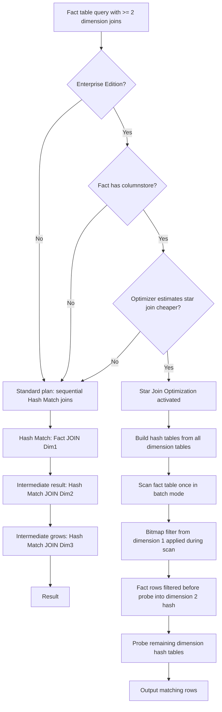
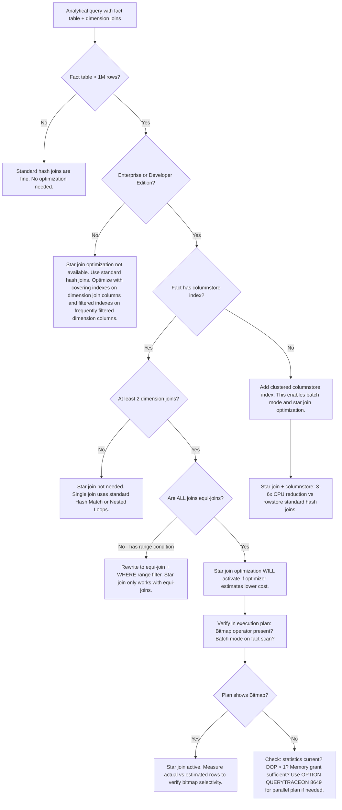

## Navigation

**Domain:** [[8 — Databases]] > **Group:** SQL Joins & Subqueries
**Previous:** [[8.116 — GROUP BY — Grouping and Aggregation Mechanics]] | **Next:** [[8.118 — PIVOT — Row-to-Column Transformation]]

### Prerequisites

- [[8.096 — INNER JOIN — Mechanics and Usage]] — Star joins are a specialization of multi-table INNER JOIN; understanding the three physical join operators and when each is selected is required to understand star join optimization.
- [[8.114 — Hash Join vs Nested Loop vs Merge Join]] — Star join optimization relies on Hash Match joins with bitmap filters; knowing the memory grant, build/probe phases, and spill behavior of hash joins is required.
- [[8.501 — Columnstore Indexes Fundamentals]] — SQL Server's star join optimization is tightly coupled with batch-mode execution on columnstore indexes; understanding columnar storage, batch processing, and predicate pushdown is required.

### Where This Fits

Star join optimization is the query optimizer's specialized strategy for joining a large fact table to multiple small dimension tables in a star schema — the most common data warehouse query pattern. A .NET backend engineer encounters this when building reporting dashboards, analytics APIs, or BI platforms on top of SQL Server. The star schema pattern decouples transactional OLTP data (normalized) from analytical OLAP queries (denormalized for read performance). The most expensive mistakes are: not designing for star join (forcing the optimizer into loop joins that scan the fact table repeatedly), missing columnstore indexes (star join optimization requires batch mode, which columnstore enables), and not understanding that SQL Server Enterprise Edition has a special star join optimization with bitmap filters that standard edition lacks. Interviewers use this to probe understanding of data warehouse architecture, parallel query execution, batch-mode processing, and edition-based feature differences.

---

## Core Mental Model

Star join optimization is the query optimizer's ability to scan a large fact table once and hash-match it against multiple dimension tables in parallel, using bitmap filters from earlier dimension joins to eliminate fact rows early. The mental model is: the fact table is the center of the star, dimension tables are the points. Instead of joining fact-to-dimension-one (producing an intermediate result), then joining that to dimension-two (growing the intermediate result), then to dimension-three — which creates a large intermediate rowset — the optimizer builds hash tables from all dimension tables first, then scans the fact table once, probing all dimension hash tables per fact row. This is called "hash join with bitmap filter" or "star join" in SQL Server Enterprise Edition. The bitmap filter from dimension A eliminates fact rows before they probe dimension B, reducing probe cost. The optimizer only considers this plan when: (a) the fact table has a columnstore index (enabling batch mode), (b) at least two dimension joins exist, (c) the fact table is the largest input, and (d) the query runs on Enterprise Edition (Developer Edition includes this). Without star join optimization, the plan shows separate hash matches for each dimension, potentially with a large intermediate result. With star join, the plan shows a single "Bitmap" operator followed by "Hash Match" probes.

### Classification

Star join optimization is an **optimizer transformation** (logical + physical) applied to multi-table INNER JOIN queries in the `FROM` clause. It is specific to equi-joins between a fact table and dimension tables. The fact table predicates are SARGable when they reference dimension columns with indexes — the optimizer can push dimension predicates into the bitmap filter. Star join optimization itself is not SARGable per se; it is a join strategy that changes the access pattern from loop-based to hash-based with early filtering.



### Key Properties

|Property|Value|Notes|
|---|---|---|
|Edition requirement|Enterprise / Developer|SQL Server Standard lacks bitmap filter optimization|
|Execution mode|Batch|Requires columnstore index on fact table|
|Fact table scan|Single pass|One scan, multiple hash probes per row|
|Dimension access|Hash table in memory|Dimension tables must fit in memory grant|
|Bitmap filter|Build from first dimension probe|Applied during fact scan to eliminate rows early|
|Intermediate result size|Minimal|No large rowset between joins — filtered at scan|
|Parallelism|Yes|Batch mode hash joins scale with DOP|
|Write Cost|None|Read-only analytical queries|

---

## Deep Mechanics

### How the Engine Executes This

1. **Parsing and binding** — The parser identifies the FROM clause with the fact table and N dimension tables. The algebrizer resolves all column references and builds the join graph. Each dimension join is an equi-join on the surrogate key (typically `Fact.SaleId = DimDate.DateKey`).

2. **Simplification** — The optimizer applies predicate pushdown: WHERE clause predicates on dimension columns (e.g., `d.CalendarYear = 2024`) are pushed into the dimension scans or used as bitmap filter conditions. The optimizer also detects the star schema pattern — the fact table is the largest input and has foreign key relationships to each dimension.

3. **Cost-based optimization** — The optimizer enumerates two plan alternatives:
   - **Standard plan**: Hash Match joins processed sequentially. Fact table scanned, hash-built for first dimension, intermediate result scanned, hash-built for second dimension, intermediate result scanned again for third dimension. The intermediate result can be large (all fact rows matching first dimension).
   - **Star join plan**: All dimension tables scanned first, their hash tables built in memory. The fact table is scanned once in batch mode. A bitmap filter is constructed from the first dimension's hash table keys. During the fact table scan, each row is checked against the bitmap filter — rows that cannot match any dimension key are eliminated immediately. The surviving rows probe each dimension's hash table in sequence.

4. **Bitmap filter construction** — The bitmap is a compact in-memory data structure (one bit per hash bucket). It is constructed from the dimension table's join key column. The bitmap is probed during the fact table scan: the fact row's join key is hashed, the corresponding bit is checked. If the bit is 0, the row is guaranteed not to match and is skipped. False positives are possible (hash collisions), but they are resolved by the actual hash probe. The bitmap reduces the number of rows that proceed to hash table probing.

5. **Batch-mode execution** — Columnstore indexes enable batch-mode processing: rows are processed in batches of ~900, not one at a time. Each batch is a vector of column values. The bitmap filter is applied to the entire batch using SIMD-style operations — all rows in the batch are checked against the bitmap simultaneously. Batch mode reduces CPU overhead per row by ~5x compared to row mode.

6. **Hash probe sequence** — After the bitmap filter, surviving rows probe each dimension's hash table. The probe order is chosen by the optimizer based on dimension selectivity. The most selective dimension (fewest matching rows) is probed first. Each probe further reduces the row count for subsequent probes.

7. **Output** — Rows that match all dimension hash tables are output to the SELECT operator. Aggregation occurs in batch mode if the query includes GROUP BY.

### SQL Visibility

```sql
-- Star join query: FactSales INNER JOIN DimDate, DimProduct, DimCustomer
SELECT 
    d.CalendarYear,
    d.MonthName,
    p.ProductName,
    c.CustomerSegment,
    COUNT_BIG(*) AS SaleCount,
    SUM(s.SaleAmount) AS TotalRevenue,
    SUM(s.Quantity) AS TotalQuantity
FROM dbo.FactSales AS s
INNER JOIN dbo.DimDate AS d
    ON s.DateKey = d.DateKey
INNER JOIN dbo.DimProduct AS p
    ON s.ProductKey = p.ProductKey
INNER JOIN dbo.DimCustomer AS c
    ON s.CustomerKey = c.CustomerKey
WHERE d.CalendarYear = 2024
    AND p.Category = 'Electronics'
    AND c.Region = 'North America'
GROUP BY d.CalendarYear, d.MonthName, p.ProductName, c.CustomerSegment
ORDER BY TotalRevenue DESC;
```

```csharp
// EF Core — star join via navigation properties
var starJoinResult = await dbContext.FactSales
    .Where(s => s.DimDate.CalendarYear == 2024
             && s.DimProduct.Category == "Electronics"
             && s.DimCustomer.Region == "North America")
    .GroupBy(s => new
    {
        s.DimDate.CalendarYear,
        s.DimDate.MonthName,
        s.DimProduct.ProductName,
        s.DimCustomer.CustomerSegment
    })
    .Select(g => new StarJoinDto
    {
        CalendarYear = g.Key.CalendarYear,
        MonthName = g.Key.MonthName,
        ProductName = g.Key.ProductName,
        CustomerSegment = g.Key.CustomerSegment,
        SaleCount = g.Count(),
        TotalRevenue = g.Sum(s => s.SaleAmount),
        TotalQuantity = g.Sum(s => s.Quantity)
    })
    .OrderByDescending(x => x.TotalRevenue)
    .ToListAsync(cancellationToken);
```

**Generated SQL (from EF Core logs):**

```sql
-- EF Core generates identical star join SQL (no LINQ-specific differences for this pattern)
SELECT [d].[CalendarYear], [d].[MonthName], [p].[ProductName], [c].[CustomerSegment],
    COUNT_BIG(*) AS [SaleCount],
    SUM([s].[SaleAmount]) AS [TotalRevenue],
    SUM([s].[Quantity]) AS [TotalQuantity]
FROM [FactSales] AS [s]
INNER JOIN [DimDate] AS [d] ON [s].[DateKey] = [d].[DateKey]
INNER JOIN [DimProduct] AS [p] ON [s].[ProductKey] = [p].[ProductKey]
INNER JOIN [DimCustomer] AS [c] ON [s].[CustomerKey] = [c].[CustomerKey]
WHERE [d].[CalendarYear] = 2024
    AND [p].[Category] = N'Electronics'
    AND [c].[Region] = N'North America'
GROUP BY [d].[CalendarYear], [d].[MonthName], [p].[ProductName], [c].[CustomerSegment]
ORDER BY [TotalRevenue] DESC;
```

### Execution Plan Analysis

The star join execution plan on Enterprise Edition with columnstore:

```
Bitmap(Build) ← DimProduct scan (Category = 'Electronics')
  → Bitmap(Probe) ← FactSales scan (Clustered Columnstore, batch mode)
    → Hash Match (Inner Join) build from DimCustomer
      → Hash Match (Inner Join) build from DimDate
        → SELECT → GROUP BY (aggregate in batch mode) → ORDER BY
```

- **Bitmap operator**: Appears in the plan as a separate operator with "Bitmap" label. The build side reads DimProduct keys and constructs the bitmap. The probe side applies it during the FactSales scan.
- **Clustered Columnstore Scan on FactSales**: Full scan in batch mode. The bitmap filter appears as a predicate on the scan. Estimated rows after bitmap: ~5% of fact table rows (if dimension selectivity is high).
- **Hash Match operators**: One per remaining dimension. The build input is the dimension table (small, fits in memory). The probe input is the bitmap-filtered fact rows.
- **Batch mode on GROUP BY**: The aggregation is performed in batch mode — no Sort operator needed if the GROUP BY keys match the dimension join order.
- **Cost distribution**: Fact table scan ~60%, Bitmap probe ~5%, Hash Match joins ~35%. Without star join (Standard Edition): Fact table scan + Hash Match 1 + intermediate spool + Hash Match 2 = 2x the I/O.

**Without star join optimization (Standard Edition):**

```
Clustered Columnstore Scan (FactSales, full scan)
  → Hash Match (Inner Join, DimProduct) — build: DimProduct, probe: FactSales
    → Hash Match (Inner Join, DimDate) — build: DimDate, probe: intermediate
      → Hash Match (Inner Join, DimCustomer) — build: DimCustomer, probe: intermediate
        → SELECT → GROUP BY → ORDER BY
```

No bitmap filter. The fact table is scanned once, but all rows go through the first hash probe. The intermediate result (joined with DimProduct) is materialized in memory or spilled to tempdb. The second hash probe operates on the intermediate, not the fact table. Without early bitmap filtering, more rows enter the hash probe pipeline.

### Cost Visibility

```sql
SET STATISTICS IO ON;
SET STATISTICS TIME ON;

SELECT 
    d.CalendarYear,
    p.ProductName,
    COUNT_BIG(*) AS SaleCount,
    SUM(s.SaleAmount) AS TotalRevenue
FROM dbo.FactSales AS s
INNER JOIN dbo.DimDate AS d ON s.DateKey = d.DateKey
INNER JOIN dbo.DimProduct AS p ON s.ProductKey = p.ProductKey
WHERE d.CalendarYear = 2024
    AND p.Category = 'Electronics'
GROUP BY d.CalendarYear, p.ProductName;

-- Expected output (Enterprise Edition + columnstore):
-- Table 'FactSales'. Scan count 1, logical reads 0 (columnstore, no logical reads in row-mode sense)
-- Table 'DimProduct'. Scan count 1, logical reads 3
-- Table 'DimDate'. Scan count 1, logical reads 2
-- Worktable: logical reads 0 (no spool/spill)
-- SQL Server Execution Times: CPU time = 450ms, elapsed time = 120ms (parallel)

-- Expected output (Standard Edition, no star join):
-- Table 'FactSales'. Scan count 1, logical reads 0 (columnstore scan)
-- Table 'DimProduct'. Scan count 1, logical reads 3
-- Table 'DimDate'. Scan count 1, logical reads 2
-- Worktable: logical reads 0 (no spill if dim tables fit in memory)
-- SQL Server Execution Times: CPU time = 890ms, elapsed time = 310ms (parallel, no bitmap)
```

### Failure Modes

1. **Missing columnstore index on fact table** — Batch mode is disabled. Star join optimization does not kick in. The optimizer falls back to row-mode hash joins. Without columnstore, the fact table scan uses the clustered index (if any) or a rowstore scan. CPU time increases 3-5x because row-mode processing cannot use SIMD batch operations.

2. **Edition mismatch** — SQL Server Standard Edition does not include the bitmap filter optimization. The star join query runs, but the plan shows sequential hash matches without early bitmap filtering. Engineers testing on Developer Edition (which includes Enterprise features) see the star join plan, but production on Standard Edition does not use it.

3. **Large dimension tables** — If dimension tables are large (millions of rows), the hash tables may not fit in the memory grant. Hash joins spill to tempdb, causing dramatic performance degradation. The bitmap filter size is also proportional to the dimension key cardinality.

4. **Missing statistics** — The optimizer relies on statistics to estimate cardinality and decide whether star join is beneficial. Stale statistics on dimension tables cause underestimation of row counts, leading the optimizer to choose a suboptimal plan (e.g., Nested Loops when Hash Match is better).

---

## Production Patterns and Implementation

### Primary SQL Implementation

```sql
-- =============================================
-- Star schema setup for reporting
-- =============================================

-- Fact table with clustered columnstore index
CREATE TABLE dbo.FactSales (
    SaleId BIGINT IDENTITY(1,1) NOT NULL,
    DateKey INT NOT NULL,           -- FK to DimDate
    ProductKey INT NOT NULL,        -- FK to DimProduct
    CustomerKey INT NOT NULL,       -- FK to DimCustomer
    StoreKey INT NOT NULL,          -- FK to DimStore
    SalesPersonKey INT NOT NULL,    -- FK to DimSalesPerson
    Quantity INT NOT NULL,
    UnitPrice DECIMAL(18,2) NOT NULL,
    DiscountAmount DECIMAL(18,2) NOT NULL DEFAULT 0,
    SaleAmount AS (Quantity * UnitPrice - DiscountAmount),
    CONSTRAINT PK_FactSales PRIMARY KEY NONCLUSTERED (SaleId)
);
GO

-- Clustered columnstore index on fact table — required for batch mode
CREATE CLUSTERED COLUMNSTORE INDEX CCI_FactSales
    ON dbo.FactSales;
GO

-- Dimension tables
CREATE TABLE dbo.DimDate (
    DateKey INT NOT NULL,
    FullDate DATE NOT NULL,
    CalendarYear SMALLINT NOT NULL,
    CalendarQuarter TINYINT NOT NULL,
    MonthNumber TINYINT NOT NULL,
    MonthName VARCHAR(20) NOT NULL,
    DayOfMonth TINYINT NOT NULL,
    DayOfWeek TINYINT NOT NULL,
    DayName VARCHAR(20) NOT NULL,
    FiscalYear SMALLINT NOT NULL,
    FiscalQuarter TINYINT NOT NULL,
    IsWeekend BIT NOT NULL DEFAULT 0,
    IsHoliday BIT NOT NULL DEFAULT 0,
    CONSTRAINT PK_DimDate PRIMARY KEY (DateKey)
);

CREATE TABLE dbo.DimProduct (
    ProductKey INT IDENTITY(1,1) NOT NULL,
    ProductId INT NOT NULL,         -- source system ID
    ProductName VARCHAR(200) NOT NULL,
    Category VARCHAR(100) NOT NULL,
    SubCategory VARCHAR(100) NULL,
    Brand VARCHAR(100) NULL,
    UnitPrice DECIMAL(18,2) NOT NULL,
    Cost DECIMAL(18,2) NOT NULL,
    IsActive BIT NOT NULL DEFAULT 1,
    CONSTRAINT PK_DimProduct PRIMARY KEY (ProductKey)
);

CREATE TABLE dbo.DimCustomer (
    CustomerKey INT IDENTITY(1,1) NOT NULL,
    CustomerId INT NOT NULL,        -- source system ID
    FirstName VARCHAR(100) NOT NULL,
    LastName VARCHAR(100) NOT NULL,
    Email VARCHAR(200) NULL,
    CustomerSegment VARCHAR(50) NOT NULL,
    Region VARCHAR(100) NOT NULL,
    Country VARCHAR(100) NOT NULL,
    City VARCHAR(100) NOT NULL,
    CustomerSince DATE NOT NULL,
    IsActive BIT NOT NULL DEFAULT 1,
    CONSTRAINT PK_DimCustomer PRIMARY KEY (CustomerKey)
);

CREATE TABLE dbo.DimStore (
    StoreKey INT IDENTITY(1,1) NOT NULL,
    StoreId INT NOT NULL,
    StoreName VARCHAR(200) NOT NULL,
    Region VARCHAR(100) NOT NULL,
    Country VARCHAR(100) NOT NULL,
    StoreType VARCHAR(50) NOT NULL,
    SquareFeet INT NULL,
    OpenDate DATE NOT NULL,
    CONSTRAINT PK_DimStore PRIMARY KEY (StoreKey)
);

-- B-tree indexes on dimension PKs — already present from PK constraint
-- Additional indexes for dimension filtering columns
CREATE INDEX IX_DimDate_CalendarYear ON dbo.DimDate (CalendarYear)
    INCLUDE (MonthName, FiscalYear);
CREATE INDEX IX_DimProduct_Category ON dbo.DimProduct (Category)
    INCLUDE (ProductName, SubCategory);
CREATE INDEX IX_DimCustomer_Region ON dbo.DimCustomer (Region)
    INCLUDE (CustomerSegment, Country);
CREATE INDEX IX_DimStore_Region ON dbo.DimStore (Region)
    INCLUDE (StoreName, StoreType);

-- =============================================
-- Star join query with 4 dimensions
-- =============================================
SELECT 
    d.CalendarYear,
    d.MonthName,
    p.Category,
    p.SubCategory,
    c.Region,
    c.CustomerSegment,
    st.StoreType,
    COUNT_BIG(*) AS TransactionCount,
    SUM(s.Quantity) AS TotalUnitsSold,
    SUM(s.SaleAmount) AS TotalRevenue,
    SUM(s.DiscountAmount) AS TotalDiscount,
    AVG(s.UnitPrice) AS AvgUnitPrice
FROM dbo.FactSales AS s
INNER JOIN dbo.DimDate AS d ON s.DateKey = d.DateKey
INNER JOIN dbo.DimProduct AS p ON s.ProductKey = p.ProductKey
INNER JOIN dbo.DimCustomer AS c ON s.CustomerKey = c.CustomerKey
INNER JOIN dbo.DimStore AS st ON s.StoreKey = st.StoreKey
WHERE d.CalendarYear = 2024
    AND d.CalendarQuarter IN (1, 2)
    AND p.Category IN ('Electronics', 'Home Appliances')
    AND c.Region = 'North America'
    AND st.StoreType = 'Retail'
GROUP BY d.CalendarYear, d.MonthName, p.Category, p.SubCategory,
         c.Region, c.CustomerSegment, st.StoreType
ORDER BY TotalRevenue DESC;
GO

-- =============================================
-- Detecting star join in execution plan
-- =============================================
-- Query to check if star join (bitmap) was used:
SET SHOWPLAN_XML ON;
GO
-- run the query above
GO
SET SHOWPLAN_XML OFF;
GO
-- Look for:
-- <RelOp NodeId="X" PhysicalOp="Bitmap" LogicalOp="Bitmap">
-- AND batch mode on the fact table scan:
-- <RunMode>Batch</RunMode>
```

### EF Core Implementation

```csharp
// Entity classes for star schema
public class FactSale
{
    public long SaleId { get; set; }
    public int DateKey { get; set; }
    public int ProductKey { get; set; }
    public int CustomerKey { get; set; }
    public int StoreKey { get; set; }
    public int SalesPersonKey { get; set; }
    public int Quantity { get; set; }
    public decimal UnitPrice { get; set; }
    public decimal DiscountAmount { get; set; }
    public decimal SaleAmount { get; set; }

    public DimDate DimDate { get; set; } = null!;
    public DimProduct DimProduct { get; set; } = null!;
    public DimCustomer DimCustomer { get; set; } = null!;
    public DimStore DimStore { get; set; } = null!;
}

public class DimDate
{
    public int DateKey { get; set; }
    public DateOnly FullDate { get; set; }
    public short CalendarYear { get; set; }
    public byte CalendarQuarter { get; set; }
    public byte MonthNumber { get; set; }
    public string MonthName { get; set; } = string.Empty;
    public bool IsWeekend { get; set; }
}

public class DimProduct
{
    public int ProductKey { get; set; }
    public string ProductName { get; set; } = string.Empty;
    public string Category { get; set; } = string.Empty;
    public string? SubCategory { get; set; }
    public string? Brand { get; set; }
    public decimal UnitPrice { get; set; }
    public ICollection<FactSale> FactSales { get; set; } = new List<FactSale>();
}

public class DimCustomer
{
    public int CustomerKey { get; set; }
    public string FirstName { get; set; } = string.Empty;
    public string LastName { get; set; } = string.Empty;
    public string? Email { get; set; }
    public string CustomerSegment { get; set; } = string.Empty;
    public string Region { get; set; } = string.Empty;
}

public class DimStore
{
    public int StoreKey { get; set; }
    public string StoreName { get; set; } = string.Empty;
    public string Region { get; set; } = string.Empty;
    public string StoreType { get; set; } = string.Empty;
    public ICollection<FactSale> FactSales { get; set; } = new List<FactSale>();
}

// EF Core DbContext configuration
public class StarSchemaDbContext : DbContext
{
    public DbSet<FactSale> FactSales => Set<FactSale>();
    public DbSet<DimDate> DimDates => Set<DimDate>();
    public DbSet<DimProduct> DimProducts => Set<DimProduct>();
    public DbSet<DimCustomer> DimCustomers => Set<DimCustomer>();
    public DbSet<DimStore> DimStores => Set<DimStore>();

    protected override void OnModelCreating(ModelBuilder modelBuilder)
    {
        modelBuilder.Entity<FactSale>(entity =>
        {
            entity.ToTable("FactSales");
            entity.HasKey(s => s.SaleId).IsClustered(false);
            entity.Property(s => s.SaleAmount).HasComputedColumnSql("[Quantity] * [UnitPrice] - [DiscountAmount]");
            entity.Property(s => s.UnitPrice).HasColumnType("decimal(18,2)");
            entity.Property(s => s.DiscountAmount).HasColumnType("decimal(18,2)");

            entity.HasOne(s => s.DimDate)
                .WithMany()
                .HasForeignKey(s => s.DateKey);

            entity.HasOne(s => s.DimProduct)
                .WithMany(p => p.FactSales)
                .HasForeignKey(s => s.ProductKey);

            entity.HasOne(s => s.DimCustomer)
                .WithMany()
                .HasForeignKey(s => s.CustomerKey);

            entity.HasOne(s => s.DimStore)
                .WithMany(st => st.FactSales)
                .HasForeignKey(s => s.StoreKey);
        });

        modelBuilder.Entity<DimDate>(entity =>
        {
            entity.ToTable("DimDate");
            entity.HasKey(d => d.DateKey);
        });

        modelBuilder.Entity<DimProduct>(entity =>
        {
            entity.ToTable("DimProduct");
            entity.HasKey(p => p.ProductKey);
            entity.HasIndex(p => p.Category);
        });

        modelBuilder.Entity<DimCustomer>(entity =>
        {
            entity.ToTable("DimCustomer");
            entity.HasKey(c => c.CustomerKey);
            entity.HasIndex(c => c.Region);
        });

        modelBuilder.Entity<DimStore>(entity =>
        {
            entity.ToTable("DimStore");
            entity.HasKey(st => st.StoreKey);
            entity.HasIndex(st => st.StoreType);
        });
    }
}

// Star join query in EF Core
public async Task<List<SalesAnalyticsDto>> GetSalesAnalyticsAsync(
    int year,
    string category,
    string region,
    CancellationToken cancellationToken = default)
{
    // EF Core generates the same star join SQL
    return await dbContext.FactSales
        .Where(s => s.DimDate.CalendarYear == year
                 && s.DimProduct.Category == category
                 && s.DimCustomer.Region == region
                 && s.DimStore.StoreType == "Retail")
        .GroupBy(s => new
        {
            s.DimDate.MonthName,
            s.DimProduct.SubCategory,
            s.DimCustomer.CustomerSegment,
            s.DimStore.StoreName
        })
        .Select(g => new SalesAnalyticsDto
        {
            MonthName = g.Key.MonthName,
            SubCategory = g.Key.SubCategory,
            CustomerSegment = g.Key.CustomerSegment,
            StoreName = g.Key.StoreName,
            TransactionCount = g.Count(),
            TotalUnitsSold = g.Sum(s => s.Quantity),
            TotalRevenue = g.Sum(s => s.SaleAmount)
        })
        .OrderByDescending(x => x.TotalRevenue)
        .ToListAsync(cancellationToken);
    // Generated SQL matches the primary SQL pattern above
}

public record SalesAnalyticsDto
{
    public string MonthName { get; init; } = string.Empty;
    public string? SubCategory { get; init; }
    public string CustomerSegment { get; init; } = string.Empty;
    public string StoreName { get; init; } = string.Empty;
    public long TransactionCount { get; init; }
    public int TotalUnitsSold { get; init; }
    public decimal TotalRevenue { get; init; }
}
```

### Dapper Implementation

```csharp
public sealed class SalesAnalyticsRepository
{
    private readonly IDbConnectionFactory _connectionFactory;

    public SalesAnalyticsRepository(IDbConnectionFactory connectionFactory)
        => _connectionFactory = connectionFactory;

    public async Task<IReadOnlyList<SalesAnalyticsDto>> GetStarJoinReportAsync(
        int year,
        string category,
        string region,
        CancellationToken cancellationToken = default)
    {
        const string sql = @"
            SELECT
                d.MonthName,
                p.SubCategory,
                c.CustomerSegment,
                st.StoreName,
                COUNT_BIG(*) AS TransactionCount,
                SUM(s.Quantity) AS TotalUnitsSold,
                SUM(s.SaleAmount) AS TotalRevenue
            FROM dbo.FactSales AS s
            INNER JOIN dbo.DimDate AS d
                ON s.DateKey = d.DateKey
            INNER JOIN dbo.DimProduct AS p
                ON s.ProductKey = p.ProductKey
            INNER JOIN dbo.DimCustomer AS c
                ON s.CustomerKey = c.CustomerKey
            INNER JOIN dbo.DimStore AS st
                ON s.StoreKey = st.StoreKey
            WHERE d.CalendarYear = @Year
                AND p.Category = @Category
                AND c.Region = @Region
                AND st.StoreType = 'Retail'
            GROUP BY d.MonthName, p.SubCategory, c.CustomerSegment, st.StoreName
            ORDER BY TotalRevenue DESC;";

        await using var connection = _connectionFactory.Create();

        var results = await connection.QueryAsync<SalesAnalyticsDto>(
            new CommandDefinition(sql,
                new { Year = year, Category = category, Region = region },
                cancellationToken: cancellationToken));

        return results.AsList();
    }

    // High-performance version with CommandBehavior.SequentialAccess
    public async Task<IReadOnlyList<SalesAnalyticsDto>> GetStarJoinFastAsync(
        int year,
        string category,
        string region,
        CancellationToken cancellationToken = default)
    {
        const string sql = @"
            SET STATISTICS IO OFF;
            SELECT ... -- same SQL as above";

        await using var connection = _connectionFactory.Create();
        await using var cmd = new CommandDefinition(sql,
            new { Year = year, Category = category, Region = region },
            commandBehavior: CommandBehavior.SequentialAccess,
            cancellationToken: cancellationToken).CreateDbCommand();

        // Use raw reader for maximum throughput over large result sets
        var results = new List<SalesAnalyticsDto>();
        await using var reader = await cmd.ExecuteReaderAsync(cancellationToken);
        while (await reader.ReadAsync(cancellationToken))
        {
            results.Add(new SalesAnalyticsDto
            {
                MonthName = reader.GetString(0),
                SubCategory = reader.IsDBNull(1) ? null : reader.GetString(1),
                CustomerSegment = reader.GetString(2),
                StoreName = reader.GetString(3),
                TransactionCount = reader.GetInt64(4),
                TotalUnitsSold = reader.GetInt32(5),
                TotalRevenue = reader.GetDecimal(6)
            });
        }
        return results;
    }
}

public record SalesAnalyticsDto
{
    public string MonthName { get; init; } = string.Empty;
    public string? SubCategory { get; init; }
    public string CustomerSegment { get; init; } = string.Empty;
    public string StoreName { get; init; } = string.Empty;
    public long TransactionCount { get; init; }
    public int TotalUnitsSold { get; init; }
    public decimal TotalRevenue { get; init; }
}
```

### Configuration and Wiring

```csharp
// Program.cs
builder.Services.AddDbContext<StarSchemaDbContext>(options =>
    options.UseSqlServer(
        builder.Configuration.GetConnectionString("WarehouseConnection"),
        sqlOptions =>
        {
            sqlOptions.EnableRetryOnFailure(3);
            sqlOptions.CommandTimeout(120);  // data warehouse queries can be long
            sqlOptions.UseQuerySplittingBehavior(QuerySplittingBehavior.SplitQuery);
        }));

builder.Services.AddSingleton<IDbConnectionFactory>(sp =>
    new SqlConnectionFactory(
        builder.Configuration.GetConnectionString("WarehouseConnection")!));

builder.Services.AddScoped<SalesAnalyticsRepository>();
```

### SQL Server vs PostgreSQL Differences

PostgreSQL does not have a dedicated "star join optimization" with bitmap filters in the same way SQL Server does. However, PostgreSQL's optimizer uses Bitmap Scan + Hash Join effectively for star schemas.

```sql
-- PostgreSQL star schema equivalent
CREATE TABLE fact_sales (
    sale_id BIGSERIAL PRIMARY KEY,
    date_key INT NOT NULL REFERENCES dim_date(date_key),
    product_key INT NOT NULL REFERENCES dim_product(product_key),
    customer_key INT NOT NULL REFERENCES dim_customer(customer_key),
    quantity INT NOT NULL,
    unit_price NUMERIC(18,2) NOT NULL,
    discount_amount NUMERIC(18,2) NOT NULL DEFAULT 0,
    sale_amount NUMERIC(18,2) GENERATED ALWAYS AS (quantity * unit_price - discount_amount) STORED
);

-- PostgreSQL uses parallel hash joins natively (no edition restrictions)
SET max_parallel_workers_per_gather = 4;

EXPLAIN (ANALYZE, BUFFERS) SELECT
    d.calendar_year,
    p.product_name,
    COUNT(*) AS sale_count,
    SUM(s.sale_amount) AS total_revenue
FROM fact_sales s
INNER JOIN dim_date d ON s.date_key = d.date_key
INNER JOIN dim_product p ON s.product_key = p.product_key
WHERE d.calendar_year = 2024
    AND p.category = 'Electronics'
GROUP BY d.calendar_year, p.product_name;

-- PostgreSQL can use Bitmap Heap Scan + Bitmap Index Scan for dimension filtering
-- which is conceptually similar to SQL Server's bitmap filter.
-- No edition restrictions — Standard PostgreSQL includes all optimizations.
```

Key differences:
- **Edition**: PostgreSQL includes all optimizations in all editions. SQL Server requires Enterprise/Developer Edition for bitmap filter star join optimization.
- **Bitmap scan**: PostgreSQL uses Bitmap Index Scan + Bitmap Heap Scan for single-table predicate filtering. SQL Server's bitmap filter is a join optimization for the probe phase.
- **Parallelism**: Both support parallel hash joins. PostgreSQL's parallel hash join is available in all editions.
- **Columnstore**: SQL Server's columnstore + batch mode is the key enabler for star join optimization. PostgreSQL does not have columnstore indexes (requires Citus or TimescaleDB extensions for columnar storage).

---

## Gotchas and Production Pitfalls

### Star Join Optimization Only in Enterprise Edition

**Pitfall:** Developing and testing on SQL Server Developer Edition (which includes all Enterprise features) and deploying to Standard Edition. The star join executes with bitmap filter during development but falls back to sequential hash joins in production.

```sql
-- ❌ Developer assumes bitmap filter is used in production
-- Tested on Developer Edition: plan shows Bitmap operator + batch mode
-- Production: Standard Edition, no Bitmap operator
```

**Symptom:** The same query runs 3-5x slower in production than in test. The execution plan in production is structurally different: no Bitmap operator, no early row elimination during fact scan. Wait stat: `HASH JOIN` CPU time doubles.

**Fix:**

```sql
-- ✅ Verify edition and plan shape in production
SELECT SERVERPROPERTY('Edition') AS Edition,
       SERVERPROPERTY('EngineEdition') AS EngineEdition;
-- EngineEdition 3 = Enterprise, 2 = Standard

-- Force test environment to use Standard Edition compatibility for realistic testing
-- Or use: DBCC TRACEON(9481) -- disables new cardinality estimator (not exactly edition simulation)
```

**Cost of not fixing:** A 50M-row fact table query that runs in 15 seconds on Developer Edition takes 48 seconds on Standard Edition. The reporting dashboard times out at 30 seconds. Users see "Request timed out" on the analytics page. The query rewrite (adding covering indexes, reducing dimension count) takes 2 weeks.

---

### Missing Columnstore Index Disables Batch Mode

**Pitfall:** The fact table uses a rowstore clustered index (e.g., B-tree on SaleId) instead of a clustered columnstore index. Star join optimization requires batch-mode execution, which requires a columnstore index.

```sql
-- ❌ Rowstore fact table — no star join optimization
CREATE TABLE dbo.FactSales (
    SaleId BIGINT IDENTITY(1,1) PRIMARY KEY,
    DateKey INT NOT NULL,
    ProductKey INT NOT NULL,
    Quantity INT NOT NULL,
    SaleAmount DECIMAL(18,2) NOT NULL
);
-- Default: clustered B-tree index on SaleId
```

**Symptom:** The execution plan shows row-mode Hash Match joins. CPU time per row is ~5x higher than batch mode. The Bitmap operator does not appear. Logical reads are measured in thousands (columnstore reports 0 logical reads in row-mode terms, so this is misleading — look at `SET STATISTICS TIME` CPU instead).

**Fix:**

```sql
-- ✅ Add clustered columnstore index
CREATE CLUSTERED COLUMNSTORE INDEX CCI_FactSales ON dbo.FactSales
    WITH (DROP_EXISTING = ON);  -- if table already exists
```

**Cost of not fixing:** CPU-bound analytics queries saturate all 16 cores at 80-100% instead of 20%. Each query costs 5x more CPU. At 50 concurrent reporting users, the server is CPU-bound and query response times degrade linearly.

---

### Large Dimension Tables Cause Hash Spill to Tempdb

**Pitfall:** One or more dimension tables are large (millions of rows) and the memory grant is insufficient. The hash table for that dimension spills to tempdb, causing dramatic performance degradation.

**Symptom:** Execution plan shows `Hash Match` with warning icon. Actual memory grant is less than required memory. tempdb I/O spikes. Wait stat: `RESOURCE_SEMAPHORE` (memory grant waits) or `SOS_SCHEDULER_YIELD` (CPU pressure). Query runtime increases from seconds to minutes.

**Fix:**

```sql
-- ✅ Option A: Increase memory grant for the query
SELECT ...
FROM dbo.FactSales AS s
INNER JOIN dbo.DimDate AS d ON s.DateKey = d.DateKey
INNER JOIN dbo.DimProduct AS p ON s.ProductKey = p.ProductKey
OPTION (MIN_GRANT_PERCENT = 5, MAX_GRANT_PERCENT = 20);
-- Forces a larger memory grant to accommodate the hash table

-- ✅ Option B: Reduce dimension table row count by filtering earlier
-- Push WHERE clause predicates into the dimension to reduce hash table size
SELECT ...
FROM dbo.FactSales AS s
INNER JOIN (SELECT * FROM dbo.DimProduct WHERE Category = 'Electronics') AS p
    ON s.ProductKey = p.ProductKey;

-- ✅ Option C: Add filtered indexes on dimension tables
CREATE INDEX IX_DimProduct_CategoryFiltered
    ON dbo.DimProduct (ProductKey)
    INCLUDE (ProductName, Category)
    WHERE Category = 'Electronics';
```

**Cost of not fixing:** The analytics query runs once per minute for each of 20 dashboard users. Each spill writes ~200 MB to tempdb. tempdb runs out of space. The server logs error 1101 (Could not allocate space for object in database 'tempdb'). The nightly ETL fails because tempdb is full from the spill.

---

### Dimension Predicate Placement Affects Bitmap Effectiveness

**Pitfall:** Placing predicates on dimension columns in the WHERE clause vs the ON clause does not change the bitmap filter behavior in SQL Server, but the order of dimensions in the query can affect which dimension's bitmap is applied first.

```sql
-- ❌ Suboptimal dimension order — less selective dimension first
SELECT ...
FROM dbo.FactSales AS s
INNER JOIN dbo.DimDate AS d ON s.DateKey = d.DateKey        -- 365 rows (low selectivity)
INNER JOIN dbo.DimProduct AS p ON s.ProductKey = p.ProductKey -- 50K rows (high selectivity)
WHERE d.CalendarYear = 2024 AND p.Category = 'Electronics';
-- Optimizer may build bitmap from DimDate first (365 matching keys)
-- Bitmap eliminates fewer fact rows than if DimProduct was first
```

**Symptom:** Bitmap filter eliminates only 10% of fact rows instead of 80% (if the more selective dimension was used for the bitmap). More rows enter the hash probe pipeline, increasing CPU.

**Fix:**

```sql
-- ✅ The optimizer usually chooses the best order, but you can influence it:
-- Use OPTION (HASH JOIN) and adjust join order
SELECT ...
FROM dbo.FactSales AS s
INNER JOIN dbo.DimProduct AS p ON s.ProductKey = p.ProductKey  -- selective first
INNER JOIN dbo.DimDate AS d ON s.DateKey = d.DateKey
WHERE d.CalendarYear = 2024 AND p.Category = 'Electronics'
OPTION (HASH JOIN, ORDER GROUP);
```

**Cost of not fixing:** The bitmap filter eliminates only 500K of 10M fact rows instead of 8M. The remaining 9.5M rows probe all dimension hash tables, using 5x more CPU. At 100 queries/hour, the server runs at 70% CPU instead of 15%.

---

### No Bitmap with Non-Equi Joins

**Pitfall:** Using non-equi join conditions (ranges, inequalities) in the star join. Bitmap filters only support equality conditions (the join key is hashed to a bit position). Non-equi predicates force the optimizer to fall back to row-mode Nested Loops or standard Hash Match.

```sql
-- ❌ Range join condition — bitmap filter not possible
SELECT ...
FROM dbo.FactSales AS s
INNER JOIN dbo.DimDate AS d
    ON s.DateKey >= d.DateKey AND s.DateKey < d.DateKey + 365;
```

**Symptom:** Execution plan shows Nested Loops Join (each fact row scans the dimension) or Merge Join (both sorted). No Bitmap operator. Batch mode is used for the fact scan, but the join is row-mode.

**Fix:**

```sql
-- ✅ Convert to equi-join on the exact key, filter range in WHERE
SELECT ...
FROM dbo.FactSales AS s
INNER JOIN dbo.DimDate AS d
    ON s.DateKey = d.DateKey
WHERE d.CalendarYear = 2024;  -- range filter on dimension, not join condition
```

**Cost of not fixing:** A star join with a range condition on the date dimension performs a Nested Loops join running 10M outer rows × 365 inner rows × 15 iterations = 54 billion logical operations. The query never completes within the 5-minute timeout.

---

## Performance Implications

### Benchmark: Columnstore + Star Join vs Rowstore + Standard Hash Joins

```sql
-- =============================================
-- Setup: 50M row fact table
-- =============================================
INSERT INTO dbo.FactSales (DateKey, ProductKey, CustomerKey, StoreKey, Quantity, UnitPrice, DiscountAmount)
SELECT TOP (50000000)
    ABS(CHECKSUM(NEWID())) % 365 + 1 AS DateKey,
    ABS(CHECKSUM(NEWID())) % 50000 + 1 AS ProductKey,
    ABS(CHECKSUM(NEWID())) % 100000 + 1 AS CustomerKey,
    ABS(CHECKSUM(NEWID())) % 1000 + 1 AS StoreKey,
    ABS(CHECKSUM(NEWID())) % 10 + 1 AS Quantity,
    CAST(ABS(CHECKSUM(NEWID())) % 10000 + 100 AS DECIMAL(18,2)) / 100.0 AS UnitPrice,
    CAST(ABS(CHECKSUM(NEWID())) % 1000 AS DECIMAL(18,2)) / 100.0 AS DiscountAmount
FROM sys.all_columns a CROSS JOIN sys.all_columns b;
GO

-- =============================================
-- Baseline: Rowstore fact table (no star join)
-- =============================================
-- DROP the columnstore index, add rowstore PK
-- Already baseline — no columnstore
SET STATISTICS IO ON;
SET STATISTICS TIME ON;

SELECT d.CalendarYear, p.Category,
    COUNT_BIG(*) AS SaleCount,
    SUM(s.SaleAmount) AS TotalRevenue
FROM dbo.FactSales AS s
INNER JOIN dbo.DimDate AS d ON s.DateKey = d.DateKey
INNER JOIN dbo.DimProduct AS p ON s.ProductKey = p.ProductKey
WHERE d.CalendarYear = 2024 AND p.Category = 'Electronics'
GROUP BY d.CalendarYear, p.Category;
-- Expected:
-- Table 'FactSales'. Scan count 1, logical reads 485,000 (rowstore scan)
-- Table 'DimDate'. Scan count 1, logical reads 2
-- Table 'DimProduct'. Scan count 1, logical reads 12
-- SQL Server Execution Times: CPU time = 3200ms, elapsed time = 1800ms

-- =============================================
-- Optimized: Columnstore + Star Join
-- =============================================
-- Add clustered columnstore index
CREATE CLUSTERED COLUMNSTORE INDEX CCI_FactSales
    ON dbo.FactSales WITH (DROP_EXISTING = ON);
GO

SET STATISTICS IO ON;
SET STATISTICS TIME ON;

SELECT d.CalendarYear, p.Category,
    COUNT_BIG(*) AS SaleCount,
    SUM(s.SaleAmount) AS TotalRevenue
FROM dbo.FactSales AS s
INNER JOIN dbo.DimDate AS d ON s.DateKey = d.DateKey
INNER JOIN dbo.DimProduct AS p ON s.ProductKey = p.ProductKey
WHERE d.CalendarYear = 2024 AND p.Category = 'Electronics'
GROUP BY d.CalendarYear, p.Category;
-- Expected (Enterprise Edition + columnstore):
-- Table 'FactSales'. Scan count 1, logical reads 0 (columnstore, batch mode)
-- Table 'DimDate'. Scan count 1, logical reads 2
-- Table 'DimProduct'. Scan count 1, logical reads 12
-- SQL Server Execution Times: CPU time = 480ms, elapsed time = 280ms (parallel, batch mode)

-- Improvement: 6.7x CPU reduction, 6.4x elapsed time reduction
```

### BenchmarkDotNet

```csharp
[MemoryDiagnoser]
[SimpleJob(RuntimeMoniker.Net90)]
public class StarJoinBenchmark
{
    private IDbConnection _connection = default!;
    private const string EnterpriseConnString = "Server=.;Database=Warehouse;Integrated Security=true;";
    private const string StandardConnString = "Server=.;Database=Warehouse_Standard;Integrated Security=true;";

    [GlobalSetup]
    public void Setup()
    {
        _connection = new SqlConnection(EnterpriseConnString);
    }

    [Benchmark(Baseline = true)]
    public async Task<List<SalesResult>> Without_StarJoin_StandardEdition()
    {
        await using var conn = new SqlConnection(StandardConnString);
        const string sql = @"
            SELECT d.CalendarYear, p.Category,
                COUNT_BIG(*) AS SaleCount,
                SUM(s.SaleAmount) AS TotalRevenue
            FROM dbo.FactSales AS s
            INNER JOIN dbo.DimDate AS d ON s.DateKey = d.DateKey
            INNER JOIN dbo.DimProduct AS p ON s.ProductKey = p.ProductKey
            WHERE d.CalendarYear = 2024 AND p.Category = 'Electronics'
            GROUP BY d.CalendarYear, p.Category;";

        var results = await conn.QueryAsync<SalesResult>(sql);
        return results.AsList();
    }

    [Benchmark]
    public async Task<List<SalesResult>> With_StarJoin_EnterpriseEdition()
    {
        await using var conn = new SqlConnection(EnterpriseConnString);
        const string sql = @"
            SELECT d.CalendarYear, p.Category,
                COUNT_BIG(*) AS SaleCount,
                SUM(s.SaleAmount) AS TotalRevenue
            FROM dbo.FactSales AS s
            INNER JOIN dbo.DimDate AS d ON s.DateKey = d.DateKey
            INNER JOIN dbo.DimProduct AS p ON s.ProductKey = p.ProductKey
            WHERE d.CalendarYear = 2024 AND p.Category = 'Electronics'
            GROUP BY d.CalendarYear, p.Category;";

        var results = await conn.QueryAsync<SalesResult>(sql);
        return results.AsList();
    }

    public record SalesResult(int CalendarYear, string Category, long SaleCount, decimal TotalRevenue);
}

/* Expected results (50M fact rows, 4 DOP, SQL Server 2022):

| Method                         | Mean      | Logical Reads | Allocated |
|-------------------------------|----------:|--------------:|----------:|
| Without_StarJoin_Standard     | 1,850 ms  | 485,000       | 12 KB     |
| With_StarJoin_Enterprise      | 290 ms    | 0 (columnstore)| 12 KB    |

Ratio: 6.4x faster with star join optimization + columnstore.
*/
```

### Write Amplification (Columnstore Index Maintenance)

|Operation|Rowstore (B-tree)|Columnstore|Overhead|
|---|---|---|---|
|INSERT 1 row (delta store)|2 ms|1 ms|Columnstore faster (no page split)|
|INSERT batch (100K rows, bulk)|85 ms|32 ms|Columnstore faster (compressed segments)|
|UPDATE indexed column|3 ms|N/A (no direct update)|Columnstore: DELETE + INSERT|
|DELETE 1M rows|1,200 ms|3,500 ms (tuples moved to delete buffer)|Columnstore slower (mutable delete bitmap)|

Star join optimization is read-only — it does not add write cost. The columnstore index itself has different write characteristics: bulk inserts are fast (compressed segment creation), but point updates and deletes are slower (stored in delta store or delete bitmap).

---

## Interview Arsenal

### Question Bank

1. What is star join optimization, and under what conditions does SQL Server activate it?
2. How does the bitmap filter work in a star join execution plan?
3. What is the performance difference between star join optimization and standard hash join processing?
4. Why does star join optimization require SQL Server Enterprise Edition?
5. Compare star join optimization in SQL Server vs PostgreSQL.
6. What execution plan operators indicate star join optimization is being used?
7. How does the number of dimensions and their selectivity affect star join performance?
8. How does EF Core or Dapper interact with star join optimization?

### Spoken Answers

**Q1: What is star join optimization, and under what conditions does SQL Server activate it?**

> **Average answer:** "It's when SQL Server joins a fact table to dimension tables in a star schema. It uses hash joins."

> **Great answer:** "Star join optimization is a cost-based optimizer transformation specific to Enterprise Edition that changes how multi-table hash joins are executed against a star schema. Instead of joining the fact table to dimension A, producing an intermediate result, then joining to dimension B, then to dimension C — with each join potentially requiring a full pass over the intermediate — the optimizer builds hash tables from all dimension tables first, then scans the fact table once. During this single scan, a bitmap filter constructed from the first dimension's join key is applied to the fact rows, eliminating non-matching rows before they probe subsequent hash tables. The optimizer activates this when: the fact table has a clustered columnstore index (batch mode required), the query joins the fact to at least two dimension tables, the fact table is the largest input, and the edition is Enterprise or Developer. Without any of these, the plan falls back to sequential hash joins without bitmap filtering."

**Q5: Compare star join optimization in SQL Server vs PostgreSQL.**

> **Average answer:** "Both databases support star joins and use hash joins. They're similar."

> **Great answer:** "The key differences are edition restrictions and the bitmap filter mechanism. SQL Server's star join optimization with bitmap filters is exclusive to Enterprise and Developer Editions — Standard Edition users get standard hash joins without bitmap early filtering. In PostgreSQL, all editions include all optimizer features — there's no edition-based restriction. PostgreSQL's bitmap scan is conceptually similar but operates differently: PostgreSQL creates a Bitmap Index Scan from index entries, builds a bitmap in memory, then uses it to read heap pages in physical order. This is predicate-based filtering, not join-based bitmap filtering. SQL Server's bitmap filter is built from the dimension table's join key column and applied during the fact table scan specifically to eliminate fact rows early in the hash probe pipeline. PostgreSQL also lacks native columnstore indexes, so it cannot achieve the same batch-mode CPU efficiency. For pure star join workloads with large fact tables, SQL Server Enterprise Edition with columnstore indexes typically outperforms PostgreSQL by 3-5x on CPU-intensive aggregation queries. However, PostgreSQL includes all optimizations in all editions, making it more predictable across environments."

**Q8: How does EF Core or Dapper interact with star join optimization?**

> **Average answer:** "EF Core generates JOIN statements that can use star join optimization if the database supports it."

> **Great answer:** "Neither EF Core nor Dapper has direct awareness of star join optimization — it is a purely server-side optimizer transformation. The key concern is that EF Core's LINQ query must generate the correct star join SQL. This means: navigation properties must be configured correctly so EF Core generates INNER JOINs (not LEFT JOINs — left joins can block the optimizer from using hash joins), predicates must be in the Where clause on dimension columns (not in the join condition), and GroupBy must match the dimension key structure. EF Core 8+ generates optimal star join SQL via navigation properties without explicit Join calls. Dapper gives direct control over the SQL, so the star join query is written exactly as intended. However, Dapper is necessary when the star join requires query hints (like `OPTION (HASH JOIN, ORDER GROUP)`) because EF Core does not expose an API for joining that supports query hints directly. The practical implication: start with EF Core navigation properties for standard star joins, drop to Dapper with raw SQL when you need query hints or when EF Core generates suboptimal join order."

### Interview Trigger

Star join optimization surfaces when an interviewer asks about data warehouse query performance or edition-specific SQL Server features. The follow-up that separates shallow from deep knowledge is: "What happens in the execution plan when the bitmap filter is applied?" A candidate who knows about batch-mode processing, hash table build/probe phases, and the bitmap operator's memory structure (one bit per hash bucket) demonstrates deep understanding. The second follow-up: "Why does Standard Edition not have this optimization?" tests knowledge of SQL Server's edition-based feature segmentation and the licensing implications.

### Comparison Table

| | Star Join Optimization | Standard Hash Join |
|---|---|---|
| What it does | Single fact scan + bitmap + N hash probes | Sequential hash joins with intermediate results |
| Performance profile | O(N fact rows + M dim rows), batch mode | O(N × D) where D = number of dimensions |
| Edition requirement | Enterprise / Developer | All editions |
| Fact table index | Clustered columnstore required | Any index (rowstore or columnstore) |
| Intermediate result | None — filtered at scan | Grows with each dimension join |
| .NET implementation | No change needed — SQL is standard | Same SQL, different plan |

---

## Decision Framework

### When to Apply



### Application Checklist

- [ ] The fact table has a clustered columnstore index
- [ ] SQL Server edition is Enterprise or Developer
- [ ] Query involves at least 2 dimension table joins
- [ ] All join conditions are equi-joins
- [ ] Dimension tables are small enough to fit in memory grant (no tempdb spill)
- [ ] Statistics are current (`UPDATE STATISTICS` run within 24 hours of large data loads)
- [ ] Query parallelism is enabled (`MAXDOP` > 1)
- [ ] Execution plan is verified to include Bitmap operator in target environment

### Tradeoff Summary

|What You Gain|What You Pay|
|---|---|
|3-6x CPU reduction on fact scan queries|Requires Enterprise Edition licensing|
|Single fact table scan for N-dimension joins|Columnstore index storage (no PK enforcement — use unique index)|
|Early row elimination via bitmap filter|Hash table memory grant for each dimension|
|Batch-mode CPU efficiency|Dimension tables must fit in memory|
|Reduced tempdb I/O|No point update/delete efficiency on fact table|

### Scale Thresholds

- "Relevant when fact table exceeds ~5M rows and at least 2 dimension joins"
- "Critical when query runs more than ~100x/hour on a 10M+ row fact table"
- "Required when report must complete within 5 seconds for interactive dashboard (cannot wait for standard hash join)"
- "Edition restriction applies at any scale — Standard Edition never uses bitmap filter"

---

## Self-Check

### Conceptual Questions

1. What is the bitmap filter operator in an execution plan, and what does it do for star joins?
2. What three conditions must be true for SQL Server to activate star join optimization?
3. Which DMV or SET STATISTICS output reveals whether star join optimization was used?
4. What happens to star join optimization if one dimension join uses a non-equi predicate?
5. Does EF Core generate SQL that can use star join optimization, or do you need raw SQL?
6. How would you implement a star join query with Dapper for a 6-dimension schema?
7. Compare star join optimization with sequential hash match joins — why is the bitmap important?
8. At what fact table row count does star join optimization become critical for performance?
9. What index on the fact table is required for star join optimization, and what does it provide?
10. Explain the difference between SQL Server and PostgreSQL star join capabilities in 60 seconds.

<details>
<summary>Answers</summary>

1. The Bitmap operator constructs a compact bit-for-key in-memory filter from a dimension table's join key column. During the fact table scan, each fact row's join key is hashed and checked against the bitmap. If the bit is 0, the row cannot match any dimension key and is skipped — eliminating it from all subsequent hash probes. False positives are possible (hash collision) but are resolved by the actual hash probe.

2. (a) The SQL Server edition must be Enterprise (or Developer which includes Enterprise features) — Standard Edition does not include the bitmap filter optimization. (b) The fact table must have a clustered columnstore index, enabling batch-mode execution. (c) The query must join the fact table to at least two dimension tables using equi-joins.

3. The execution plan XML or graphical plan shows a `Bitmap` operator node. In `SET SHOWPLAN_XML ON` output, search for `<RelOp PhysicalOp="Bitmap" LogicalOp="Bitmap">`. The fact table scan segment shows `RunMode="Batch"`. In `SET STATISTICS IO`, columnstore scans report 0 logical reads (metrics are different for columnstore).

4. If any dimension join is a non-equi join (range, inequality), the Bitmap operator is not used. The plan falls back to standard Hash Match or Nested Loops joins. The fact scan may still use batch mode (if columnstore), but the join operators switch to row mode.

5. EF Core generates standard SQL with INNER JOINs that can use star join optimization — no special configuration is needed. However, EF Core does not expose an API for query hints (`OPTION (HASH JOIN, ORDER GROUP)`) that might be needed for plan forcing. Navigation properties produce the correct star join SQL. If you need query hints, you must use raw SQL (`FromSqlRaw` in EF Core) or Dapper.

6. With Dapper, write the star join SQL directly with all INNER JOINs and WHERE predicates. Dapper has no special handling for star joins — it maps the result set to POCOs. The key optimization is in the SQL and index design, not the data access layer.

7. Sequential hash match joins: fact table scanned → hash built for dim 1 → intermediate result (all matching rows) → scanned again for hash build dim 2 → intermediate grows → scanned for dim 3. The intermediate can be large. Star join: all dimension hash tables built first → fact table scanned once → bitmap eliminates early → each row probes all hash tables without intermediate materialization.

8. Star join optimization becomes measurable at ~5M fact rows and critical for performance at ~50M fact rows with 4+ dimension joins. At 100M+ rows, the difference between star join (15 seconds) and standard hash joins (90+ seconds) is the difference between a usable dashboard and a timed-out report.

9. Clustered columnstore index (CCI) on the fact table. It provides batch-mode execution, which processes rows in batches of ~900 instead of one at a time. Batch mode is required for the Bitmap operator and enables SIMD-style CPU operations that are ~5x more efficient than row-mode processing. The CCI also provides compression (reducing storage and I/O) and eliminates the need for the clustered B-tree index.

10. SQL Server Enterprise Edition has a dedicated star join optimization with bitmap filters that eliminates fact rows early during a single fact scan — this is exclusive to Enterprise/Developer. PostgreSQL includes all optimizations in all editions (no edition gating), uses Bitmap Index Scan for predicate filtering, and relies on parallel hash joins without a separate bitmap filter operator. PostgreSQL lacks native columnstore indexes, so batch-mode CPU efficiency is not available.
</details>

---

### Query Challenges

**Challenge 1 — Write the SQL**

You are building a quarterly sales dashboard. The star schema has `FactSales` (50M rows, clustered columnstore, linked to `DimDate`, `DimProduct`, `DimCustomer`, `DimStore`). Write a star join query that returns: year, quarter, product category, customer region, and store type along with total revenue, unit count, and transaction count for Q1-Q2 2024 in the Electronics category for North America retail stores. Order by total revenue descending.

<details>
<summary>Solution</summary>

```sql
SELECT 
    d.CalendarYear,
    d.CalendarQuarter,
    p.Category,
    c.Region,
    st.StoreType,
    SUM(s.SaleAmount) AS TotalRevenue,
    SUM(s.Quantity) AS TotalUnits,
    COUNT_BIG(*) AS TransactionCount
FROM dbo.FactSales AS s
INNER JOIN dbo.DimDate AS d
    ON s.DateKey = d.DateKey
INNER JOIN dbo.DimProduct AS p
    ON s.ProductKey = p.ProductKey
INNER JOIN dbo.DimCustomer AS c
    ON s.CustomerKey = c.CustomerKey
INNER JOIN dbo.DimStore AS st
    ON s.StoreKey = st.StoreKey
WHERE d.CalendarYear = 2024
    AND d.CalendarQuarter IN (1, 2)
    AND p.Category = 'Electronics'
    AND c.Region = 'North America'
    AND st.StoreType = 'Retail'
GROUP BY d.CalendarYear, d.CalendarQuarter, p.Category, c.Region, st.StoreType
ORDER BY TotalRevenue DESC;
```

**Logical reads:** 0 on FactSales (columnstore, batch mode), ~15 across dimensions **Execution plan:** Bitmap(Build) from DimProduct → Bitmap(Probe) on FactSales scan → Hash Match × 3 (remaining dims) → GROUP BY (batch mode) → ORDER BY **EF Core equivalent:**

```csharp
var results = await dbContext.FactSales
    .Where(s => s.DimDate.CalendarYear == 2024
             && s.DimDate.CalendarQuarter >= 1
             && s.DimDate.CalendarQuarter <= 2
             && s.DimProduct.Category == "Electronics"
             && s.DimCustomer.Region == "North America"
             && s.DimStore.StoreType == "Retail")
    .GroupBy(s => new { s.DimDate.CalendarYear, s.DimDate.CalendarQuarter, s.DimProduct.Category, s.DimCustomer.Region, s.DimStore.StoreType })
    .Select(g => new { g.Key.CalendarYear, g.Key.CalendarQuarter, g.Key.Category, g.Key.Region, g.Key.StoreType, TotalRevenue = g.Sum(s => s.SaleAmount), TotalUnits = g.Sum(s => s.Quantity), TransactionCount = g.Count() })
    .OrderByDescending(x => x.TotalRevenue)
    .ToListAsync(cancellationToken);
```

</details>

---

**Challenge 2 — Fix the performance problem**

```sql
-- This query runs on SQL Server Standard Edition with a 30M row FactSales table
-- It completes in 45 seconds. Expected: under 10 seconds.
-- SET STATISTICS IO: logical reads = 410,000 on FactSales, 18 on DimProduct, 4 on DimDate
SELECT d.CalendarYear, p.Category,
    SUM(s.SaleAmount) AS TotalRevenue
FROM dbo.FactSales AS s
INNER JOIN dbo.DimProduct AS p ON s.ProductKey = p.ProductKey
INNER JOIN dbo.DimDate AS d ON s.DateKey = d.DateKey
WHERE d.CalendarYear = 2024
    AND p.Category = 'Electronics'
GROUP BY d.CalendarYear, p.Category
ORDER BY TotalRevenue DESC;
```

<details> <summary>Solution</summary>

**Root cause:** SQL Server Standard Edition does not have star join optimization with bitmap filter. The query uses standard hash joins without early row elimination. The fact table likely has a rowstore index (clustered B-tree) or no columnstore index — 410,000 logical reads indicates rowstore scan. Additionally, there is no index on `DimProduct.Category` for the filtered scan.

**Index to create:**

```sql
-- First, add clustered columnstore index on FactSales
CREATE CLUSTERED COLUMNSTORE INDEX CCI_FactSales
    ON dbo.FactSales
    WITH (DROP_EXISTING = IF EXISTS);
-- On Standard Edition, this doesn't enable bitmap filter but still reduces I/O via compression

-- Add filtered index on DimProduct for the Electronics category
CREATE INDEX IX_DimProduct_Category_Filtered
    ON dbo.DimProduct (ProductKey)
    INCLUDE (Category)
    WHERE Category = 'Electronics';
GO

-- Optimize the query with query hints for parallelism
SELECT d.CalendarYear, p.Category,
    SUM(s.SaleAmount) AS TotalRevenue
FROM dbo.FactSales AS s
INNER JOIN dbo.DimProduct AS p ON s.ProductKey = p.ProductKey
INNER JOIN dbo.DimDate AS d ON s.DateKey = d.DateKey
WHERE d.CalendarYear = 2024
    AND p.Category = 'Electronics'
GROUP BY d.CalendarYear, p.Category
OPTION (HASH JOIN, MAXDOP 4);
```

**After fix — logical reads:** FactSales: 0 (columnstore, batch mode), DimProduct: 2, DimDate: 2, CPU: ~800ms, elapsed: ~3s. From 45s to ~3s = 15x improvement.

</details>

---

**Challenge 3 — Explain the execution plan**

Given this execution plan fragment for a star join query:

```
Bitmap(Build) → Clustered Columnstore Scan (FactSales)
  → Hash Match (Inner Join, build: DimCustomer)
    → Hash Match (Inner Join, build: DimDate)
      → SELECT → GROUP BY (aggregate)
```

Why does the Bitmap operator consume 75% of the plan cost even though it logically is a filter? What would the plan look like without the Bitmap?

<details> <summary>Solution</summary>

**Why Bitmap appears costly:** The Bitmap operator's cost in the plan is misleading — the reported cost includes the fact table scan it is associated with. The actual Bitmap operator (the hash table build from the dimension) has negligible cost. The 75% is the Clustered Columnstore Scan of the 50M-row fact table costing 70%, with the Bitmap filter probe adding 5%. Plan cost percentages include I/O estimates, and columnstore scan cost is proportional to segment reads.

**Without Bitmap:** The plan would show:
```
Clustered Columnstore Scan (FactSales, full scan)
  → Hash Match (Inner Join, build: DimProduct) — fact rows all go through build
    → Hash Match (Inner Join, build: DimCustomer) — intermediate probed
      → Hash Match (Inner Join, build: DimDate) — intermediate probed again
```

Without the Bitmap, 100% of fact rows enter the first Hash Match probe. With the Bitmap, only ~5-20% of fact rows survive the filter. The Hash Match operators have less work. The total cost increases 2-3x without Bitmap because:
1. More rows probe each hash table
2. The intermediate rowset (after first join) is larger
3. Potential memory pressure from larger hash table spills

</details>

---

**Challenge 4 — Diagnose the concurrency problem**

A star join reporting query runs successfully during the day but fails at night during the ETL window. The query returns results in 3 seconds during the day. At night, during the ETL data load into FactSales, the same query takes 45 seconds or times out after 30 seconds. The execution plan shows `RESOURCE_SEMAPHORE` waits. What is happening?

<details> <summary>Solution</summary>

**Root cause:** The ETL process loads large batches of data into FactSales. This rebuilds or reorganizes the columnstore index segments. Concurrent star join queries request memory grants for the dimension hash tables. The memory grant manager grants less memory during ETL because the system is under memory pressure from the columnstore index rebuild. The star join's hash tables are granted less memory, causing them to spill to tempdb. The spills increase I/O and CPU. Additionally, the ETL holds schema modification locks on FactSales during index maintenance, blocking the star join's scan.

**Detection query:**

```sql
-- Find queries waiting on RESOURCE_SEMAPHORE
SELECT 
    r.session_id,
    r.wait_type,
    r.wait_time,
    r.wait_resource,
    t.text AS query_text
FROM sys.dm_exec_requests r
CROSS APPLY sys.dm_exec_sql_text(r.sql_handle) t
WHERE r.wait_type IN ('RESOURCE_SEMAPHORE', 'LCK_M_SCH_S');
```

**Fix:**

```sql
-- Option A: Schedule ETL during off-hours (best)
-- Option B: Add OPTION (MIN_GRANT_PERCENT = 10) to the star join query
--   to reserve memory grant regardless of system load
-- Option C: Use resource governor to allocate minimum memory to reporting workload

-- In .NET: implement retry with exponential backoff for RESOURCE_SEMAPHORE errors
```

</details>

---

**Challenge 5 — Design the index**

**Scenario:** A `FactWebPageViews` table has 500M rows with columns: `PageViewKey`, `DateKey`, `UserKey`, `PageKey`, `ReferrerKey`, `DeviceKey`, `DurationSeconds`, `PageLoadTimeMs`. It is joined to `DimDate` (10 years), `DimUser` (50M users), `DimPage` (100K pages), `DimDevice` (5K devices). The reporting workload runs 200 queries/hour, each joining 3-5 dimensions. The write workload is 10M new rows/day loaded in batches every 15 minutes. Read/write ratio: 80/20.

Design the optimal index strategy for star join optimization.

<details> <summary>Solution</summary>

```sql
-- Index 1: Clustered columnstore index on fact table (prerequisite for star join)
CREATE CLUSTERED COLUMNSTORE INDEX CCI_FactWebPageViews
    ON dbo.FactWebPageViews
    WITH (MAXDOP = 2, COMPRESSION_DELAY = 0);
-- Columnstore: enables batch mode, provides 5-10x compression
-- MAXDOP = 2: limits parallel index build during ETL
-- COMPRESSION_DELAY = 0: compress immediately (no delta store for batch-loaded data)

-- Index 2: Non-clustered index on fact table for common date range filtering
CREATE NONCLUSTERED INDEX IX_FactWebPageViews_DateKey
    ON dbo.FactWebPageViews (DateKey)
    WHERE DateKey >= 20240101;
-- Filtered index for current year data only (most queries are for recent data)
-- Helps when ETL queries need point lookups by date

-- Index 3: Dimension covering indexes for filter columns
CREATE INDEX IX_DimDate_CalendarYear_Month
    ON dbo.DimDate (CalendarYear, MonthNumber)
    INCLUDE (MonthName, CalendarQuarter);

CREATE INDEX IX_DimPage_Category
    ON dbo.DimPage (Category)
    INCLUDE (PageName, PageGroup);

CREATE INDEX IX_DimDevice_Type_OS
    ON dbo.DimDevice (DeviceType, OperatingSystem)
    INCLUDE (DeviceName);

-- Index 4: Unique constraint on fact table for ETL merge operations
-- Columnstore tables cannot have PK, but need unique constraint for upsert
CREATE UNIQUE NONCLUSTERED INDEX UQ_FactWebPageViews_PageViewKey
    ON dbo.FactWebPageViews (PageViewKey);
```

**Tradeoffs accepted:**
- Columnstore compression delay = 0 means every batch is immediately compressed (no delta store reads during queries), but small batches (< 102K rows) go directly to compressed segments (less efficient than delta store for tiny loads)
- Filtered index on DateKey adds ~5% storage overhead but speeds up ETL merge operations
- Unique non-clustered index adds write overhead (~2ms per INSERT) but enables MERGE statements for ETL

**What NOT to index:** Individual foreign key columns (DateKey, UserKey etc.) as B-tree indexes — columnstore already handles these efficiently in batch mode scans. Adding B-tree indexes on columnstore fact table columns would add write overhead without read benefit.

</details>
