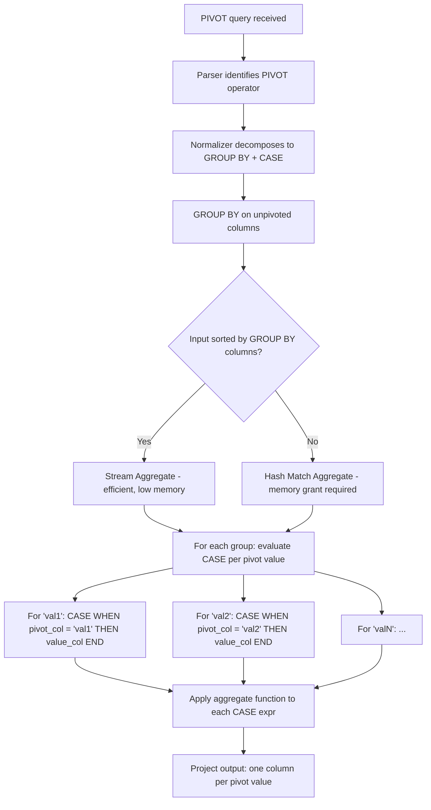
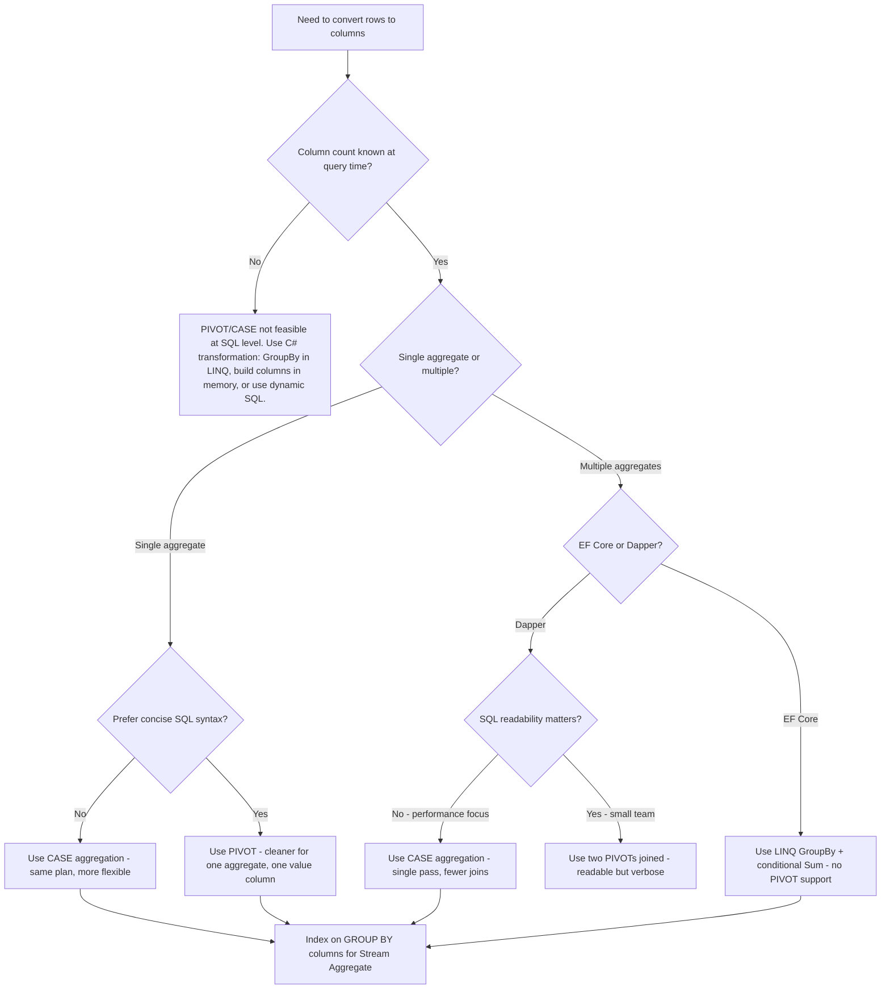

## Navigation

**Domain:** [[8 — Databases]] > **Group:** SQL Joins & Subqueries
**Previous:** [[8.117 — Star Join Optimization]] | **Next:** [[8.119 — UNPIVOT — Column-to-Row Transformation]]

### Prerequisites

- [[8.096 — INNER JOIN — Mechanics and Usage]] — PIVOT internally uses INNER JOIN semantics (or LEFT JOIN depending on the source) and requires understanding of how the optimizer transforms the PIVOT operator into standard relational operators.
- [[8.116 — GROUP BY — Grouping and Aggregation Mechanics]] — PIVOT is syntactic sugar over GROUP BY + conditional aggregation; understanding GROUP BY execution, hash aggregation, and stream aggregation is required to understand PIVOT performance.
- [[8.055 — CASE Expression — Conditional Logic in SQL]] — PIVOT is equivalent to CASE expressions inside aggregation functions; knowing the CASE evaluation model explains what PIVOT generates internally.

### Where This Fits

PIVOT rotates unique values from one column into multiple columns in the output — converting rows to columns (cross-tabulation). A .NET backend engineer encounters this when building reports, dashboards, or data exports that need a matrix layout: sales by month as columns, product categories as rows; employee vacation days as columns, names as rows. The most expensive mistake here is using PIVOT when a simple GROUP BY with conditional aggregation would be clearer and perform identically — PIVOT's syntax is notoriously confusing and its column list must be hardcoded. Interviewers use PIVOT to test whether a candidate understands that PIVOT is purely syntactic sugar — it generates the exact same execution plan as a `SUM(CASE WHEN ...)` aggregation — and to probe familiarity with the static column list limitation.

---

## Core Mental Model

PIVOT is syntactic sugar that the SQL Server query parser converts internally into a GROUP BY query with aggregated CASE expressions. The mental model: PIVOT takes a column of values (the pivot column), enumerates each unique value as an output column, and aggregates a value column within each pivot value group. The syntax `SELECT ... FROM source PIVOT (aggregate(value) FOR pivot_column IN (value_list)) AS p` means: "For each row in the source, group by all non-pivot, non-aggregate columns, then for each value in the value_list, compute the aggregate of the value column filtered to that pivot value, and emit one output column per pivot value." The parser decomposes PIVOT into: a GROUP BY on all unpivoted columns, plus one aggregated CASE expression per pivot value: `SUM(CASE WHEN pivot_column = 'value1' THEN value_column END) AS [value1]`. The execution plan is identical — a `SUM(CASE WHEN ...)` query and a PIVOT query produce the exact same operators: `Aggregate (Hash Match or Stream Aggregate)` + possibly `Sort`. There is no special PIVOT operator in the execution plan — the optimizer normalizes it to standard relational operators during binding. The critical limitation: the pivot column values must be hardcoded in the IN clause. You cannot write `PIVOT (SUM(Amount) FOR Year IN (SELECT DISTINCT Year FROM Orders))`. Dynamic column lists require dynamic SQL.

### Classification

PIVOT is a **table operator** in the `FROM` clause that is normalized during query binding. It is not SARGable — the pivot column values are compared via CASE expressions, which prevent index seeks for the pivot value filtering. The optimizer generates Hash Match (for unsorted inputs) or Stream Aggregate (for sorted inputs) depending on available indexes. The pivot column cannot be indexed for seek operations because the CASE expressions wrap the column.



### Key Properties

|Property|Value|Notes|
|---|---|---|
|Plan shape|GROUP BY + Aggregation|No special PIVOT operator — identical to CASE aggregation|
|Pivot column values|Must be hardcoded|Cannot use subquery in IN clause|
|Aggregate required|Yes|PIVOT always requires an aggregate function|
|SARGable|No|CASE expressions prevent index seeks on pivot column|
|Memory grant|Hash Aggregate if unsorted|Same as GROUP BY memory requirements|
|NULL handling|NULLs in pivot column contribute to no group|Same as GROUP BY — NULLs form their own group|
|Dynamic columns|Not supported|Requires dynamic SQL or conditional aggregation in C#|

---

## Deep Mechanics

### How the Engine Executes This

1. **Parsing** — The parser encounters the PIVOT keyword in the FROM clause. It identifies: the source table (or subquery), the aggregate function and value column, the pivot column (FOR), and the pivot value list (IN).

2. **Binding and normalization** — The algebrizer normalizes PIVOT into standard relational algebra. It expands the pivot value list into N CASE expressions, one per value. The GROUP BY columns are implicitly determined: all columns from the source that are not the pivot column or the value column. The normalized form is:
   ```
   SELECT
       [all non-pivot, non-value columns],
       AGG(CASE WHEN pivot_col = 'v1' THEN value_col END) AS [v1],
       AGG(CASE WHEN pivot_col = 'v2' THEN value_col END) AS [v2],
       ...
   FROM source
   GROUP BY [all non-pivot, non-value columns]
   ```

3. **Optimization** — The optimizer evaluates the normalized GROUP BY + CASE query. It selects between:
   - **Stream Aggregate**: If the input is sorted on all GROUP BY columns, the optimizer uses Stream Aggregate. This requires an index on the group-by columns. It is the cheapest option — O(N) with no memory grant.
   - **Hash Match Aggregate**: If the input is unsorted, the optimizer builds a hash table on the GROUP BY columns. It requires a memory grant proportional to the number of groups. If the group count is small (~100K groups), it fits in memory. If large, it spills to tempdb.

4. **CASE expression evaluation** — For each group, the aggregate function evaluates each CASE expression. For rows where the pivot column matches the value, the CASE returns the value column; for non-matching rows, it returns NULL. The aggregate function (SUM, COUNT, MAX, etc.) processes the non-NULL values. This is identical to conditional aggregation.

5. **Projection** — The output includes the GROUP BY columns plus one column per pivot value. Columns are named from the pivot value list (the AS alias is taken from the IN clause `[value_name]`).

### SQL Visibility

```sql
-- Sample data
CREATE TABLE #MonthlySales (
    ProductCategory VARCHAR(50),
    SaleMonth VARCHAR(20),
    Revenue DECIMAL(18,2)
);

INSERT INTO #MonthlySales VALUES
    ('Electronics', 'Jan', 15000.00),
    ('Electronics', 'Feb', 18000.00),
    ('Electronics', 'Mar', 22000.00),
    ('Clothing', 'Jan', 8000.00),
    ('Clothing', 'Feb', 9500.00),
    ('Clothing', 'Mar', 11000.00),
    ('Home', 'Jan', 5000.00),
    ('Home', 'Feb', 6000.00),
    ('Home', 'Mar', 7500.00);

-- PIVOT: product categories as rows, months as columns
SELECT ProductCategory, [Jan], [Feb], [Mar]
FROM #MonthlySales
PIVOT (
    SUM(Revenue)
    FOR SaleMonth IN ([Jan], [Feb], [Mar])
) AS pvt
ORDER BY ProductCategory;

-- ProductCategory | Jan      | Feb      | Mar
-- Clothing        | 8000.00  | 9500.00  | 11000.00
-- Electronics     | 15000.00 | 18000.00 | 22000.00
-- Home            | 5000.00  | 6000.00  | 7500.00

-- Equivalent with conditional aggregation (identical plan)
SELECT ProductCategory,
    SUM(CASE WHEN SaleMonth = 'Jan' THEN Revenue END) AS [Jan],
    SUM(CASE WHEN SaleMonth = 'Feb' THEN Revenue END) AS [Feb],
    SUM(CASE WHEN SaleMonth = 'Mar' THEN Revenue END) AS [Mar]
FROM #MonthlySales
GROUP BY ProductCategory
ORDER BY ProductCategory;
```

```csharp
// EF Core — PIVOT requires raw SQL (no LINQ PIVOT support)
var sql = @"
    SELECT ProductCategory, [Jan], [Feb], [Mar]
    FROM #MonthlySales
    PIVOT (
        SUM(Revenue)
        FOR SaleMonth IN ([Jan], [Feb], [Mar])
    ) AS pvt
    ORDER BY ProductCategory;";

var results = await dbContext.Database
    .SqlQueryRaw<MonthlyPivotDto>(sql)
    .ToListAsync(cancellationToken);

// EF Core — conditional aggregation (LINQ-compatible, no PIVOT keyword)
var monthlySales = await dbContext.Set<MonthlySale>()
    .GroupBy(s => s.ProductCategory)
    .Select(g => new MonthlyPivotDto
    {
        ProductCategory = g.Key,
        Jan = g.Where(s => s.SaleMonth == "Jan").Sum(s => s.Revenue),
        Feb = g.Where(s => s.SaleMonth == "Feb").Sum(s => s.Revenue),
        Mar = g.Where(s => s.SaleMonth == "Mar").Sum(s => s.Revenue)
    })
    .OrderBy(x => x.ProductCategory)
    .ToListAsync(cancellationToken);

// Generated SQL (EF Core generates CASE aggregation, not PIVOT):
-- SELECT [s].[ProductCategory],
--     COALESCE(SUM(CASE WHEN [s].[SaleMonth] = N'Jan' THEN [s].[Revenue] END), 0.0) AS [Jan],
--     COALESCE(SUM(CASE WHEN [s].[SaleMonth] = N'Feb' THEN [s].[Revenue] END), 0.0) AS [Feb],
--     COALESCE(SUM(CASE WHEN [s].[SaleMonth] = N'Mar' THEN [s].[Revenue] END), 0.0) AS [Mar]
-- FROM [MonthlySales] AS [s]
-- GROUP BY [s].[ProductCategory]
-- ORDER BY [s].[ProductCategory];
```

**Generated SQL (from EF Core logs):**

```sql
-- EF Core NEVER generates PIVOT. It always uses conditional aggregation (CASE)
-- This is identical to the hand-written CASE aggregation
SELECT [s].[ProductCategory],
    COALESCE(SUM(CASE WHEN [s].[SaleMonth] = N'Jan' THEN [s].[Revenue] END), 0.0) AS [Jan],
    COALESCE(SUM(CASE WHEN [s].[SaleMonth] = N'Feb' THEN [s].[Revenue] END), 0.0) AS [Feb],
    COALESCE(SUM(CASE WHEN [s].[SaleMonth] = N'Mar' THEN [s].[Revenue] END), 0.0) AS [Mar]
FROM [MonthlySales] AS [s]
GROUP BY [s].[ProductCategory]
ORDER BY [s].[ProductCategory];
```

### Execution Plan Analysis

PIVOT and CASE+GROUP BY produce identical execution plans:

```
Table Scan (MonthlySales) → Sort (by ProductCategory) → Stream Aggregate → SELECT
```

Or without a sorting index:

```
Table Scan (MonthlySales) → Hash Match (Aggregate) → SELECT
```

**Detailed breakdown for PIVOT:**

1. **Table Scan or Index Scan** on the source — The entire source is read. No SARGable filter is applied (unless a WHERE clause precedes the PIVOT).
2. **Sort** (if Stream Aggregate selected) — The input is sorted by all GROUP BY columns. This is an expensive blocking operator if the source is large.
3. **Compute Scalar** — If needed for implicit conversions or data type adjustments on the pivot value columns.
4. **Stream Aggregate or Hash Match Aggregate** — The aggregate function is applied to each CASE expression. Estimated vs actual rows: should match (one row per group). Cost percentage: Aggregate ~60%, Sort ~30%, Scan ~10%.
5. **Project** — The output columns are selected.

**Without an index on GROUP BY columns:** Sort operator spills to tempdb if the group count is large. Hash Match Aggregate avoids sort but requires memory grant.

```
Expected plan shape (Hash Match):
Table Scan → Hash Match (Aggregate) → SELECT
Estimated Cost: Hash Match 70%  |  Scan 30%  |  Logical Reads: ~N (full scan)

Expected plan shape (Stream Aggregate with index):
Index Scan (on ProductCategory) → Stream Aggregate → SELECT
Estimated Cost: Stream Aggregate 40%  |  Scan 60%  |  Logical Reads: ~leaf pages only
```

### Cost Visibility

```sql
SET STATISTICS IO ON;
SET STATISTICS TIME ON;

-- PIVOT version
SELECT ProductCategory, [Jan], [Feb], [Mar]
FROM #MonthlySales
PIVOT (
    SUM(Revenue)
    FOR SaleMonth IN ([Jan], [Feb], [Mar])
) AS pvt
ORDER BY ProductCategory;

-- Expected output:
-- Table '#MonthlySales'. Scan count 1, logical reads 2
-- SQL Server Execution Times: CPU time = 0ms, elapsed time = 1ms

-- Conditional aggregation version (identical)
SELECT ProductCategory,
    SUM(CASE WHEN SaleMonth = 'Jan' THEN Revenue END) AS [Jan],
    SUM(CASE WHEN SaleMonth = 'Feb' THEN Revenue END) AS [Feb],
    SUM(CASE WHEN SaleMonth = 'Mar' THEN Revenue END) AS [Mar]
FROM #MonthlySales
GROUP BY ProductCategory
ORDER BY ProductCategory;

-- Expected output (identical):
-- Table '#MonthlySales'. Scan count 1, logical reads 2
-- SQL Server Execution Times: CPU time = 0ms, elapsed time = 1ms
```

### Failure Modes

1. **PIVOT without aggregate** — PIVOT requires an aggregate function. Using PIVOT without an aggregate (e.g., just selecting values) causes a syntax error. The fix is to always include an aggregate, even if the data is naturally one-to-one (use `MAX()` or `MIN()` to collapse single rows).

2. **Duplicate rows per group** — If the source contains multiple rows with the same GROUP BY columns and pivot value combination, the aggregate function must handle them. Using `MAX()` silently returns one of the values; using `SUM()` adds them. If the source has duplicates, PIVOT produces unexpected results.

3. **NULL pivot column values** — Rows where the pivot column is NULL are ignored by the aggregation because `CASE WHEN pivot_col = NULL THEN ... END` evaluates to UNKNOWN (NULL = NULL is UNKNOWN, not TRUE). NULL groups do not appear in the output.

4. **Column list mismatch** — If a pivot value in the IN clause does not exist in the source data, the column still appears in the output with all NULL values. Conversely, if a value exists in the source but not in the IN clause, its rows contribute to no column and are silently ignored.

---

## Production Patterns and Implementation

### Primary SQL Implementation

```sql
-- =============================================
-- PIVOT for monthly sales report
-- =============================================

-- Production table setup
CREATE TABLE dbo.SalesByMonth (
    Id INT IDENTITY(1,1) PRIMARY KEY,
    ProductCategory VARCHAR(50) NOT NULL,
    YearMonth VARCHAR(7) NOT NULL,   -- '2024-01'
    Revenue DECIMAL(18,2) NOT NULL,
    UnitsSold INT NOT NULL,
    CONSTRAINT UQ_SalesByMonth_Category_Month
        UNIQUE (ProductCategory, YearMonth)
);

INSERT INTO dbo.SalesByMonth (ProductCategory, YearMonth, Revenue, UnitsSold) VALUES
    ('Electronics', '2024-01', 150000.00, 1200),
    ('Electronics', '2024-02', 180000.00, 1400),
    ('Electronics', '2024-03', 220000.00, 1700),
    ('Clothing', '2024-01', 80000.00, 2500),
    ('Clothing', '2024-02', 95000.00, 2800),
    ('Clothing', '2024-03', 110000.00, 3200),
    ('Home', '2024-01', 50000.00, 400),
    ('Home', '2024-02', 60000.00, 450),
    ('Home', '2024-03', 75000.00, 550);

-- PIVOT with single aggregate (Revenue)
SELECT ProductCategory,
    [2024-01] AS Jan_Revenue,
    [2024-02] AS Feb_Revenue,
    [2024-03] AS Mar_Revenue
FROM dbo.SalesByMonth
PIVOT (
    SUM(Revenue)
    FOR YearMonth IN ([2024-01], [2024-02], [2024-03])
) AS pvt
ORDER BY ProductCategory;

-- PIVOT with multiple value columns (UnitsSold)
-- This requires rotating twice or using a subquery:
SELECT ProductCategory,
    [2024-01] AS Jan_Units,
    [2024-02] AS Feb_Units,
    [2024-03] AS Mar_Units
FROM dbo.SalesByMonth
PIVOT (
    SUM(UnitsSold)
    FOR YearMonth IN ([2024-01], [2024-02], [2024-03])
) AS pvt
ORDER BY ProductCategory;

-- PIVOT with multiple aggregates (Revenue AND UnitsSold) — requires two PIVOTs or subquery
-- Approach: unpivot + pivot, or use two PIVOTs joined
SELECT p1.ProductCategory,
    p1.[2024-01] AS Jan_Revenue,
    p1.[2024-02] AS Feb_Revenue,
    p1.[2024-03] AS Mar_Revenue,
    p2.[2024-01] AS Jan_Units,
    p2.[2024-02] AS Feb_Units,
    p2.[2024-03] AS Mar_Units
FROM (
    SELECT ProductCategory, YearMonth, Revenue
    FROM dbo.SalesByMonth
) AS rev
PIVOT (
    SUM(Revenue)
    FOR YearMonth IN ([2024-01], [2024-02], [2024-03])
) AS p1
INNER JOIN (
    SELECT ProductCategory, YearMonth, UnitsSold
    FROM dbo.SalesByMonth
) AS units
PIVOT (
    SUM(UnitsSold)
    FOR YearMonth IN ([2024-01], [2024-02], [2024-03])
) AS p2
    ON p1.ProductCategory = p2.ProductCategory
ORDER BY p1.ProductCategory;

-- Index to support PIVOT (Stream Aggregate)
CREATE INDEX IX_SalesByMonth_Category_Month
    ON dbo.SalesByMonth (ProductCategory, YearMonth)
    INCLUDE (Revenue, UnitsSold);
-- This enables Stream Aggregate (sorted input), avoiding Sort and Hash Match

-- Clean up
DROP TABLE dbo.SalesByMonth;
```

### EF Core Implementation

```csharp
// Entity
public class SalesByMonth
{
    public int Id { get; set; }
    public string ProductCategory { get; set; } = string.Empty;
    public string YearMonth { get; set; } = string.Empty;
    public decimal Revenue { get; set; }
    public int UnitsSold { get; set; }
}

// DTO for pivot results
public record MonthlySalesPivotDto(
    string ProductCategory,
    decimal Jan_Revenue,
    decimal Feb_Revenue,
    decimal Mar_Revenue,
    int Jan_Units,
    int Feb_Units,
    int Mar_Units
);

// EF Core — raw SQL for multi-aggregate PIVOT (PIVOT keyword required)
public async Task<List<MonthlySalesPivotDto>> GetPivotReportAsync(
    CancellationToken cancellationToken = default)
{
    const string sql = @"
        SELECT p1.ProductCategory,
            p1.[2024-01] AS Jan_Revenue,
            p1.[2024-02] AS Feb_Revenue,
            p1.[2024-03] AS Mar_Revenue,
            p2.[2024-01] AS Jan_Units,
            p2.[2024-02] AS Feb_Units,
            p2.[2024-03] AS Mar_Units
        FROM (
            SELECT ProductCategory, YearMonth, Revenue
            FROM dbo.SalesByMonth
        ) AS rev
        PIVOT (
            SUM(Revenue)
            FOR YearMonth IN ([2024-01], [2024-02], [2024-03])
        ) AS p1
        INNER JOIN (
            SELECT ProductCategory, YearMonth, UnitsSold
            FROM dbo.SalesByMonth
        ) AS units
        PIVOT (
            SUM(UnitsSold)
            FOR YearMonth IN ([2024-01], [2024-02], [2024-03])
        ) AS p2
            ON p1.ProductCategory = p2.ProductCategory
        ORDER BY p1.ProductCategory;";

    return await dbContext.Database
        .SqlQueryRaw<MonthlySalesPivotDto>(sql)
        .ToListAsync(cancellationToken);
}

// EF Core — conditional aggregation (no PIVOT keyword, same plan)
public async Task<List<MonthlySalesPivotDto>> GetPivotViaCaseAsync(
    CancellationToken cancellationToken = default)
{
    return await dbContext.Set<SalesByMonth>()
        .GroupBy(s => s.ProductCategory)
        .Select(g => new MonthlySalesPivotDto
        {
            ProductCategory = g.Key,
            Jan_Revenue = g.Where(s => s.YearMonth == "2024-01").Sum(s => s.Revenue),
            Feb_Revenue = g.Where(s => s.YearMonth == "2024-02").Sum(s => s.Revenue),
            Mar_Revenue = g.Where(s => s.YearMonth == "2024-03").Sum(s => s.Revenue),
            Jan_Units = g.Where(s => s.YearMonth == "2024-01").Sum(s => s.UnitsSold),
            Feb_Units = g.Where(s => s.YearMonth == "2024-02").Sum(s => s.UnitsSold),
            Mar_Units = g.Where(s => s.YearMonth == "2024-03").Sum(s => s.UnitsSold),
        })
        .OrderBy(x => x.ProductCategory)
        .ToListAsync(cancellationToken);
    // Generated: SUM(CASE WHEN YearMonth = '2024-01' THEN Revenue ELSE 0 END)
}
```

### Dapper Implementation

```csharp
public sealed class PivotReportRepository
{
    private readonly IDbConnectionFactory _connectionFactory;

    public PivotReportRepository(IDbConnectionFactory connectionFactory)
        => _connectionFactory = connectionFactory;

    // PIVOT with single aggregate
    public async Task<IReadOnlyList<MonthlyRevenuePivotDto>> GetRevenuePivotAsync(
        string[] yearMonths,
        CancellationToken cancellationToken = default)
    {
        // Static PIVOT — column list must be known at compile time
        const string sql = @"
            SELECT ProductCategory,
                [2024-01] AS Jan,
                [2024-02] AS Feb,
                [2024-03] AS Mar
            FROM dbo.SalesByMonth
            PIVOT (
                SUM(Revenue)
                FOR YearMonth IN ([2024-01], [2024-02], [2024-03])
            ) AS pvt
            ORDER BY ProductCategory;";

        await using var connection = _connectionFactory.Create();
        var results = await connection.QueryAsync<MonthlyRevenuePivotDto>(
            new CommandDefinition(sql, cancellationToken: cancellationToken));
        return results.AsList();
    }

    // Multi-aggregate PIVOT via conditional aggregation (no PIVOT keyword)
    public async Task<IReadOnlyList<MonthlySalesPivotDto>> GetFullPivotAsync(
        CancellationToken cancellationToken = default)
    {
        const string sql = @"
            SELECT
                ProductCategory,
                SUM(CASE WHEN YearMonth = '2024-01' THEN Revenue END) AS Jan_Revenue,
                SUM(CASE WHEN YearMonth = '2024-02' THEN Revenue END) AS Feb_Revenue,
                SUM(CASE WHEN YearMonth = '2024-03' THEN Revenue END) AS Mar_Revenue,
                SUM(CASE WHEN YearMonth = '2024-01' THEN UnitsSold END) AS Jan_Units,
                SUM(CASE WHEN YearMonth = '2024-02' THEN UnitsSold END) AS Feb_Units,
                SUM(CASE WHEN YearMonth = '2024-03' THEN UnitsSold END) AS Mar_Units
            FROM dbo.SalesByMonth
            GROUP BY ProductCategory
            ORDER BY ProductCategory;";

        await using var connection = _connectionFactory.Create();
        var results = await connection.QueryAsync<MonthlySalesPivotDto>(
            new CommandDefinition(sql, cancellationToken: cancellationToken));
        return results.AsList();
    }

    // Dynamic column count via conditional aggregation (bounded columns)
    public async Task<IReadOnlyList<DynamicPivotDto>> GetBoundedQuarterPivotAsync(
        int year,
        CancellationToken cancellationToken = default)
    {
        const string sql = @"
            SELECT
                ProductCategory,
                SUM(CASE WHEN MonthNumber BETWEEN 1 AND 3 THEN Revenue END) AS Q1,
                SUM(CASE WHEN MonthNumber BETWEEN 4 AND 6 THEN Revenue END) AS Q2,
                SUM(CASE WHEN MonthNumber BETWEEN 7 AND 9 THEN Revenue END) AS Q3,
                SUM(CASE WHEN MonthNumber BETWEEN 10 AND 12 THEN Revenue END) AS Q4
            FROM dbo.SalesByMonth s
            INNER JOIN dbo.DimDate d ON s.DateKey = d.DateKey
            WHERE d.CalendarYear = @Year
            GROUP BY ProductCategory
            ORDER BY ProductCategory;";

        await using var connection = _connectionFactory.Create();
        var results = await connection.QueryAsync<DynamicPivotDto>(
            new CommandDefinition(sql,
                new { Year = year },
                cancellationToken: cancellationToken));
        return results.AsList();
    }
}

public record MonthlyRevenuePivotDto(string ProductCategory, decimal Jan, decimal Feb, decimal Mar);
public record MonthlySalesPivotDto(string ProductCategory, decimal Jan_Revenue, decimal Feb_Revenue, decimal Mar_Revenue, int Jan_Units, int Feb_Units, int Mar_Units);
public record DynamicPivotDto(string ProductCategory, decimal Q1, decimal Q2, decimal Q3, decimal Q4);
```

### Configuration and Wiring

```csharp
// Program.cs
builder.Services.AddDbContext<ApplicationDbContext>(options =>
    options.UseSqlServer(
        builder.Configuration.GetConnectionString("DefaultConnection"),
        sqlOptions => sqlOptions.EnableRetryOnFailure(3)));

builder.Services.AddSingleton<IDbConnectionFactory>(sp =>
    new SqlConnectionFactory(
        builder.Configuration.GetConnectionString("DefaultConnection")!));

builder.Services.AddScoped<PivotReportRepository>();
```

### SQL Server vs PostgreSQL Differences

```sql
-- PostgreSQL: tablefunc extension provides crosstab() for PIVOT
CREATE EXTENSION IF NOT EXISTS tablefunc;

-- crosstab() syntax (two versions)
SELECT * FROM crosstab(
    'SELECT ProductCategory, SaleMonth, Revenue
     FROM MonthlySales
     ORDER BY 1, 2',
    'SELECT DISTINCT SaleMonth FROM MonthlySales ORDER BY 1'
) AS ct (ProductCategory VARCHAR(50), Jan NUMERIC, Feb NUMERIC, Mar NUMERIC);

-- PostgreSQL: filter clause (cleaner than CASE)
SELECT ProductCategory,
    SUM(Revenue) FILTER (WHERE SaleMonth = 'Jan') AS Jan,
    SUM(Revenue) FILTER (WHERE SaleMonth = 'Feb') AS Feb,
    SUM(Revenue) FILTER (WHERE SaleMonth = 'Mar') AS Mar
FROM MonthlySales
GROUP BY ProductCategory
ORDER BY ProductCategory;

-- PostgreSQL: no PIVOT keyword — must use crosstab() extension or conditional aggregation
-- The FILTER clause is standard SQL and more readable than CASE-based conditional aggregation
```

Key differences:
- **PIVOT keyword**: SQL Server has PIVOT. PostgreSQL does not — use `crosstab()` from tablefunc extension or conditional aggregation with `FILTER` clause.
- **FILTER clause**: PostgreSQL supports aggregate FILTER (standard SQL, cleaner than CASE). SQL Server does not support FILTER — use CASE expressions.
- **crosstab()**: Requires data to be ordered and returns a fixed-column result. The column names and types must be hardcoded in the AS clause.
- **Performance**: Both produce equivalent plans for conditional aggregation. PostgreSQL's `FILTER` clause is syntactic sugar over CASE internally.

---

## Gotchas and Production Pitfalls

### PIVOT Column List Must Be Hardcoded — Breaks with Schema Changes

**Pitfall:** Hardcoding pivot column values that change over time (e.g., months in a dynamic date range). When a new month arrives, the PIVOT query silently drops the new month from the output.

```sql
-- ❌ Hardcoded to Q1 2024
SELECT ProductCategory, [2024-01], [2024-02], [2024-03]
FROM dbo.SalesByMonth
PIVOT (
    SUM(Revenue)
    FOR YearMonth IN ([2024-01], [2024-02], [2024-03])
) AS pvt;
-- When 2024-04 arrives, this query does not include it
-- The report "misses" April data without any error or warning
```

**Symptom:** A monthly dashboard shows zero revenue for the most recent month. The developer who wrote the PIVOT did not update the column list. The bug is silent — no error, no warning — just empty column.

**Fix:**

```sql
-- ✅ Option A: Use conditional aggregation with a calendar table join
-- This drives columns from a date dimension rather than hardcoded values
-- (Still requires static column names but the range is parameterized)

-- ✅ Option B: Use dynamic SQL to build the column list
-- (See 8.120 Dynamic PIVOT)

-- ✅ Option C: Use conditional aggregation and generate columns in the application
-- Create the pivot columns in C# from the actual data
```

**Cost of not fixing:** A revenue dashboard shows $0 for the current month. The CFO makes a budget decision based on incomplete data. The bug is discovered 3 weeks later during month-end reconciliation. $2M in missing revenue is underreported.

---

### Duplicate Rows Cause Incorrect Aggregation

**Pitfall:** The source table has multiple rows with the same GROUP BY columns and pivot column value. Using `SUM()` doubles the values instead of preserving single values.

```sql
-- ❌ Source has duplicates (two entries for Electronics, 2024-01)
-- PIVOT uses SUM, so revenue is double-counted
INSERT INTO dbo.SalesByMonth VALUES ('Electronics', '2024-01', 150000.00, 1200);
INSERT INTO dbo.SalesByMonth VALUES ('Electronics', '2024-01', 150000.00, 1200); -- duplicate

SELECT ProductCategory, [2024-01] AS Jan_Revenue
FROM dbo.SalesByMonth
PIVOT (SUM(Revenue) FOR YearMonth IN ([2024-01])) AS pvt;
-- Returns: Electronics, 300000.00 (incorrect — double)
```

**Symptom:** Pivot report shows exactly 2x the expected values for certain combinations. The source table has duplicate rows due to a loading bug or missing UNIQUE constraint.

**Fix:**

```sql
-- ✅ Deduplicate before PIVOT using a subquery
SELECT ProductCategory, [2024-01] AS Jan_Revenue
FROM (
    SELECT DISTINCT ProductCategory, YearMonth, Revenue
    FROM dbo.SalesByMonth
) AS distinct_src
PIVOT (SUM(Revenue) FOR YearMonth IN ([2024-01])) AS pvt;

-- ✅ Or use MAX() instead of SUM() if each key should map to one value
SELECT ProductCategory, [2024-01] AS Jan_Revenue
FROM dbo.SalesByMonth
PIVOT (MAX(Revenue) FOR YearMonth IN ([2024-01])) AS pvt;
```

**Cost of not fixing:** A revenue report overstates totals by 2x. Executives approve a $5M inventory purchase based on inflated revenue projections. The warehouse is overstocked when the actual sales are half the reported amount.

---

### PIVOT with Multiple Value Columns Requires Joining Two PIVOTs

**Pitfall:** Using PIVOT to rotate both Revenue and UnitsSold in one pass. PIVOT only accepts one aggregate function and one value column. Engineers try to add both in a single PIVOT and get a syntax error.

```sql
-- ❌ Attempting multiple aggregates in one PIVOT
SELECT ProductCategory, [2024-01], [2024-02], [2024-03]
FROM dbo.SalesByMonth
PIVOT (
    SUM(Revenue), SUM(UnitsSold)   -- syntax error: only one aggregate allowed
    FOR YearMonth IN ([2024-01], [2024-02], [2024-03])
) AS pvt;
```

**Symptom:** Syntax error: "Incorrect syntax near ','." or "The function 'SUM' may not have multiple expressions."

**Fix:**

```sql
-- ✅ Option A: Use two PIVOTs joined (as shown in Production Patterns)
-- ✅ Option B: Use conditional aggregation (single pass, cleaner)
SELECT ProductCategory,
    SUM(CASE WHEN YearMonth = '2024-01' THEN Revenue END) AS Jan_Revenue,
    SUM(CASE WHEN YearMonth = '2024-02' THEN Revenue END) AS Feb_Revenue,
    SUM(CASE WHEN YearMonth = '2024-01' THEN UnitsSold END) AS Jan_Units,
    SUM(CASE WHEN YearMonth = '2024-02' THEN UnitsSold END) AS Feb_Units
FROM dbo.SalesByMonth
GROUP BY ProductCategory;
```

**Cost of not fixing:** The developer creates a complex stored procedure with two PIVOTs joined, adding execution time and maintenance burden. The query is 4x longer than the equivalent conditional aggregation and harder to debug when columns change.

---

### PIVOT Produces NULL Instead of Zero for Missing Combinations

**Pitfall:** The PIVOT output contains NULLs for combinations that have no data. Many reporting tools and .NET consumers treat NULL differently from zero.

```sql
-- If 'Home' category has no February sales:
SELECT ProductCategory, [2024-01] AS Jan, [2024-02] AS Feb
FROM dbo.SalesByMonth
PIVOT (SUM(Revenue) FOR YearMonth IN ([2024-01], [2024-02])) AS pvt;
-- Result: Home | 50000.00 | NULL   (instead of 0)
```

**Symptom:** A chart rendering library displays a gap (no bar) for February Home sales instead of a zero-height bar. The .NET consumer expecting `decimal` gets `DBNull` and throws an exception.

**Fix:**

```sql
-- ✅ Use COALESCE or ISNULL after PIVOT
SELECT ProductCategory,
    ISNULL([2024-01], 0) AS Jan,
    ISNULL([2024-02], 0) AS Feb
FROM dbo.SalesByMonth
PIVOT (SUM(Revenue) FOR YearMonth IN ([2024-01], [2024-02])) AS pvt;

-- ✅ Or use conditional aggregation with ISNULL inside the aggregate
SELECT ProductCategory,
    ISNULL(SUM(CASE WHEN YearMonth = '2024-01' THEN Revenue END), 0) AS Jan,
    ISNULL(SUM(CASE WHEN YearMonth = '2024-02' THEN Revenue END), 0) AS Feb
FROM dbo.SalesByMonth
GROUP BY ProductCategory;
```

**Cost of not fixing:** The ASP.NET Core JSON serializer throws `InvalidOperationException` when trying to deserialize NULL into a non-nullable decimal property. The API returns HTTP 500. The frontend chart displays nothing. The bug surfaces every time a category has no sales in a month — a recurring pattern.

---

## Performance Implications

### Benchmark: PIVOT vs Conditional Aggregation (Identical)

```sql
-- =============================================
-- Setup: 1M rows, 50 categories, 12 months
-- =============================================
CREATE TABLE dbo.SalesBenchmark (
    Id INT IDENTITY(1,1) PRIMARY KEY,
    ProductCategory VARCHAR(50) NOT NULL,
    SaleMonth VARCHAR(20) NOT NULL,
    Revenue DECIMAL(18,2) NOT NULL
);

WITH categories AS (
    SELECT TOP 50 'Category_' + CAST(ROW_NUMBER() OVER (ORDER BY (SELECT NULL)) AS VARCHAR(10)) AS Cat
    FROM sys.all_columns
),
months AS (
    SELECT TOP 12 '2024-' + RIGHT('00' + CAST(ROW_NUMBER() OVER (ORDER BY (SELECT NULL)) AS VARCHAR(2)), 2) AS Mon
    FROM sys.all_columns
)
INSERT INTO dbo.SalesBenchmark (ProductCategory, SaleMonth, Revenue)
SELECT c.Cat, m.Mon, CAST(ABS(CHECKSUM(NEWID())) % 10000 AS DECIMAL(18,2)) / 100.0
FROM categories c
CROSS JOIN months m
CROSS JOIN (SELECT TOP 1667 NULL FROM sys.all_columns) t;  -- 50*12*1667 ≈ 1M rows

-- =============================================
-- Baseline: PIVOT
-- =============================================
SET STATISTICS IO ON;
SET STATISTICS TIME ON;

SELECT ProductCategory, [2024-01], [2024-02], [2024-03],
    [2024-04], [2024-05], [2024-06],
    [2024-07], [2024-08], [2024-09],
    [2024-10], [2024-11], [2024-12]
FROM dbo.SalesBenchmark
PIVOT (
    SUM(Revenue)
    FOR SaleMonth IN ([2024-01], [2024-02], [2024-03], [2024-04], [2024-05], [2024-06],
                      [2024-07], [2024-08], [2024-09], [2024-10], [2024-11], [2024-12])
) AS pvt
ORDER BY ProductCategory;

-- Expected: logical reads = 4,500 (heap/clustered scan), 50 rows output
-- CPU time ~120ms, elapsed ~60ms

-- =============================================
-- Optimized: Conditional Aggregation (identical plan)
-- =============================================
SELECT ProductCategory,
    SUM(CASE WHEN SaleMonth = '2024-01' THEN Revenue END) AS [2024-01],
    SUM(CASE WHEN SaleMonth = '2024-02' THEN Revenue END) AS [2024-02],
    SUM(CASE WHEN SaleMonth = '2024-03' THEN Revenue END) AS [2024-03],
    SUM(CASE WHEN SaleMonth = '2024-04' THEN Revenue END) AS [2024-04],
    SUM(CASE WHEN SaleMonth = '2024-05' THEN Revenue END) AS [2024-05],
    SUM(CASE WHEN SaleMonth = '2024-06' THEN Revenue END) AS [2024-06],
    SUM(CASE WHEN SaleMonth = '2024-07' THEN Revenue END) AS [2024-07],
    SUM(CASE WHEN SaleMonth = '2024-08' THEN Revenue END) AS [2024-08],
    SUM(CASE WHEN SaleMonth = '2024-09' THEN Revenue END) AS [2024-09],
    SUM(CASE WHEN SaleMonth = '2024-10' THEN Revenue END) AS [2024-10],
    SUM(CASE WHEN SaleMonth = '2024-11' THEN Revenue END) AS [2024-11],
    SUM(CASE WHEN SaleMonth = '2024-12' THEN Revenue END) AS [2024-12]
FROM dbo.SalesBenchmark
GROUP BY ProductCategory
ORDER BY ProductCategory;

-- Expected: IDENTICAL logical reads, CPU, elapsed time
-- Table 'SalesBenchmark'. Scan count 1, logical reads 4,500
-- CPU time ~120ms, elapsed ~60ms

-- =============================================
-- Optimized: With index on GROUP BY column
-- =============================================
CREATE INDEX IX_SalesBenchmark_Category ON dbo.SalesBenchmark (ProductCategory)
    INCLUDE (SaleMonth, Revenue);

-- With index: Stream Aggregate instead of Hash Match
-- Logical reads: ~3 (index leaf pages) instead of 4,500 (table scan)
-- CPU time: ~2ms, elapsed: ~1ms
```

### BenchmarkDotNet

```csharp
[MemoryDiagnoser]
[SimpleJob(RuntimeMoniker.Net90)]
public class PivotBenchmark
{
    private IDbConnection _connection = default!;

    [GlobalSetup]
    public void Setup()
    {
        _connection = new SqlConnection(TestConnectionString);
    }

    [Benchmark(Baseline = true)]
    public async Task<List<PivotResult>> Pivot_Keyword()
    {
        const string sql = @"
            SELECT ProductCategory, [2024-01], [2024-02], [2024-03],
                [2024-04], [2024-05], [2024-06],
                [2024-07], [2024-08], [2024-09],
                [2024-10], [2024-11], [2024-12]
            FROM dbo.SalesBenchmark
            PIVOT (
                SUM(Revenue)
                FOR SaleMonth IN ([2024-01], [2024-02], [2024-03], [2024-04],
                                  [2024-05], [2024-06], [2024-07], [2024-08],
                                  [2024-09], [2024-10], [2024-11], [2024-12])
            ) AS pvt
            ORDER BY ProductCategory;";

        return (await _connection.QueryAsync<PivotResult>(sql)).AsList();
    }

    [Benchmark]
    public async Task<List<PivotResult>> ConditionalAggregation()
    {
        const string sql = @"
            SELECT ProductCategory,
                SUM(CASE WHEN SaleMonth = '2024-01' THEN Revenue END) AS [2024-01],
                SUM(CASE WHEN SaleMonth = '2024-02' THEN Revenue END) AS [2024-02],
                SUM(CASE WHEN SaleMonth = '2024-03' THEN Revenue END) AS [2024-03],
                SUM(CASE WHEN SaleMonth = '2024-04' THEN Revenue END) AS [2024-04],
                SUM(CASE WHEN SaleMonth = '2024-05' THEN Revenue END) AS [2024-05],
                SUM(CASE WHEN SaleMonth = '2024-06' THEN Revenue END) AS [2024-06],
                SUM(CASE WHEN SaleMonth = '2024-07' THEN Revenue END) AS [2024-07],
                SUM(CASE WHEN SaleMonth = '2024-08' THEN Revenue END) AS [2024-08],
                SUM(CASE WHEN SaleMonth = '2024-09' THEN Revenue END) AS [2024-09],
                SUM(CASE WHEN SaleMonth = '2024-10' THEN Revenue END) AS [2024-10],
                SUM(CASE WHEN SaleMonth = '2024-11' THEN Revenue END) AS [2024-11],
                SUM(CASE WHEN SaleMonth = '2024-12' THEN Revenue END) AS [2024-12]
            FROM dbo.SalesBenchmark
            GROUP BY ProductCategory
            ORDER BY ProductCategory;";

        return (await _connection.QueryAsync<PivotResult>(sql)).AsList();
    }

    [Benchmark]
    public async Task<List<PivotResult>> ConditionalAggregation_WithIndex()
    {
        // Same SQL, index exists from setup
        const string sql = @"
            SELECT ProductCategory,
                SUM(CASE WHEN SaleMonth = '2024-01' THEN Revenue END) AS [2024-01],
                ...
            FROM dbo.SalesBenchmark WITH (INDEX(IX_SalesBenchmark_Category))
            GROUP BY ProductCategory
            ORDER BY ProductCategory;";

        return (await _connection.QueryAsync<PivotResult>(sql)).AsList();
    }

    public record PivotResult(string ProductCategory, decimal? _2024_01, decimal? _2024_02, ...);
}

/* Expected results (1M rows, 50 categories, 12 months, SQL Server 2022):

| Method                          | Mean    | Logical Reads | Allocated |
|--------------------------------|--------:|--------------:|----------:|
| Pivot_Keyword                  | 58 ms   | 4,500         | 1 KB      |
| ConditionalAggregation         | 57 ms   | 4,500         | 1 KB      |
| ConditionalAggregation_WithIndex | 2 ms | 3             | 1 KB      |

PIVOT and conditional aggregation are IDENTICAL. The index on ProductCategory reduces reads from 4,500 to 3 (Stream Aggregate instead of Hash Match).
*/
```

---

## Interview Arsenal

### Question Bank

1. What does the PIVOT operator do, and what are its limitations?
2. How does SQL Server execute a PIVOT query internally — what plan operators appear?
3. What is the performance difference between PIVOT and conditional aggregation with CASE?
4. What happens when a pivot value in the IN clause does not exist in the source data?
5. Compare PIVOT with UNPIVOT — when do you use each?
6. What execution plan does PIVOT generate, and how can you optimize it?
7. How does PIVOT handle NULL pivot column values?
8. How do EF Core and Dapper handle PIVOT queries?

### Spoken Answers

**Q1: What does the PIVOT operator do, and what are its limitations?**

> **Average answer:** "PIVOT turns rows into columns. You specify the pivot column and the values you want as columns."

> **Great answer:** "PIVOT is a table operator that rotates unique values from a column into separate output columns, combined with an aggregate function. Internally, the SQL Server parser normalizes PIVOT into a GROUP BY query with aggregated CASE expressions — one CASE per pivot value. The execution plan is identical to writing `SUM(CASE WHEN pivot_col = 'val' THEN value_col END)` for each value. The primary limitation is that the pivot value list must be hardcoded in the IN clause — you cannot use a subquery or variable to generate the column list dynamically. This means PIVOT is inherently static. Additional limitations: PIVOT accepts only one aggregate function and one value column; rotating multiple measures requires joining multiple PIVOTs. PIVOT is syntactic sugar — there is no performance benefit over conditional aggregation. The choice between PIVOT and CASE is purely syntactic preference, with CASE being more flexible (supports multiple aggregates, easier to add computed columns)."

**Q5: Compare PIVOT with UNPIVOT — when do you use each?**

> **Average answer:** "PIVOT turns rows to columns, UNPIVOT turns columns to rows. They are opposites."

> **Great answer:** "They are converse operations but not true inverses. PIVOT converts unique row values into column names, applying an aggregate to collapse multiple rows into one per group. UNPIVOT converts columns into rows by taking a list of columns and rotating them into two columns: a name column and a value column. A critical difference: PIVOT requires an aggregate function because source data may have multiple rows per group-value combination; UNPIVOT does not require aggregation — it simply unpacks columns into rows. However, UNPIVOT has its own limitations: it silently removes NULLs (rows where the unpivoted column value is NULL are excluded), and all source columns being unpivoted must have the same data type. The practical use case: PIVOT for cross-tabulation reports (categories as rows, time periods as columns, aggregated measures as values); UNPIVOT for normalizing denormalized data (e.g., turning 'Q1', 'Q2', 'Q3', 'Q4' columns into a YearQuarter dimension with a Value measure). For UNPIVOT's NULL-removal behavior, `CROSS APPLY (VALUES ...)` is often a better alternative."

**Q8: How do EF Core and Dapper handle PIVOT queries?**

> **Average answer:** "EF Core doesn't have a PIVOT method, so you use raw SQL. Dapper maps the result to a class."

> **Great answer:** "EF Core has no LINQ method that generates the PIVOT keyword. EF Core always generates conditional aggregation with CASE expressions when you use GroupBy with conditional sums — the generated SQL is `SUM(CASE WHEN ... THEN ... END)`, which is functionally identical to PIVOT but uses JOIN-based syntax under the hood. The advantage of EF Core's approach is that it is dynamic-friendly — you can build the conditional aggregation in C# using loops. Dapper, by contrast, gives complete control over the SQL: you can write PIVOT keywords, but you still face the static column list limitation. For dynamic pivot scenarios in both ORMs, you build the column list in C# and construct the SQL string. With Dapper, you inject the column list into the SQL. With EF Core, you would typically use `FromSqlRaw` with the dynamically built SQL string. Both require careful parameterization to avoid SQL injection when the column names come from user input."

### Interview Trigger

PIVOT surfaces in interviews when discussing reporting queries or transformation patterns. The follow-up that separates superficial from deep knowledge is: "Show me the execution plan difference between PIVOT and a CASE-based GROUP BY." A candidate who knows the plans are identical demonstrates understanding that PIVOT is syntactic sugar. The second follow-up: "How would you handle a dynamic number of pivot columns?" tests whether the candidate knows the PIVOT column list must be hardcoded, and the standard workaround is dynamic SQL or application-layer transformation.

### Comparison Table

| | PIVOT | Conditional Aggregation (CASE) |
|---|---|---|
| What it does | Row-to-column via dedicated operator | Row-to-column via standard GROUP BY + CASE |
| Execution plan | Identical to CASE aggregation | Identical to PIVOT |
| Multiple aggregates | Requires joining two PIVOTs | Single pass, multiple CASE per row |
| Dynamic columns | Not supported (static IN clause) | Not supported (static CASE list) |
| Readability | Concise for single-aggregate pivot | Verbose but more flexible |
| EF Core generation | Never (raw SQL only) | Yes (GroupBy + Where + Sum) |
| PostgreSQL support | No (use crosstab or FILTER) | Yes (FILTER clause) |

---

## Decision Framework

### When to Apply



### Application Checklist

- [ ] The pivot column values are known and stable (static list)
- [ ] The source data has one aggregate measure (or use CASE for multiple)
- [ ] An index exists on the GROUP BY columns for Stream Aggregate
- [ ] NULL handling is addressed (COALESCE/ISNULL for missing combinations)
- [ ] Duplicates in source data are handled (use DISTINCT or appropriate aggregate)
- [ ] The .NET consumer expects the correct nullability for pivot columns (null vs zero)

### Tradeoff Summary

|What You Gain|What You Pay|
|---|---|
|Concise row-to-column transformation|Static column list — breaks on schema change|
|Single query for cross-tabulation|Only one aggregate supported per PIVOT|
|Same performance as CASE aggregation|NULL output for missing combinations|
|Readable for simple cases|Complex with multiple aggregates|

### Scale Thresholds

- "Relevant when source has more than ~100 rows and you need cross-tabulation"
- "Performance becomes visible at ~500K+ rows (Hash Match vs Stream Aggregate difference)"
- "Static column list breaks when the pivot column values change (e.g., new month added)"
- "Consider dynamic SQL or application-layer pivot when column count exceeds ~20"

---

## Self-Check

### Conceptual Questions

1. What does the PIVOT operator do in a query?
2. How does the SQL Server optimizer transform a PIVOT query into execution plan operators?
3. Which SET STATISTICS output or DMV shows whether PIVOT is using Hash Match or Stream Aggregate?
4. What happens if a pivot column value in the IN clause does not appear in the source data?
5. Does EF Core have a LINQ method that generates the PIVOT keyword?
6. How would you implement a multi-aggregate PIVOT (Revenue and Units) with Dapper?
7. Compare PIVOT and conditional aggregation with CASE — which is faster?
8. At what source data size does the choice between Stream Aggregate and Hash Match become critical?
9. What index supports PIVOT performance, and what does it enable?
10. Explain PIVOT to a senior interviewer in 60 seconds.

<details>
<summary>Answers</summary>

1. PIVOT rotates unique values from one column into multiple output columns, applying an aggregate function to a value column within each pivot value group. It converts a row-based representation into a columnar cross-tabulation format.

2. The parser normalizes PIVOT into a GROUP BY query with aggregated CASE expressions — one CASE per pivot value. The optimizer then generates either a Stream Aggregate (if input is sorted on GROUP BY columns) or a Hash Match Aggregate (if unsorted). There is no special PIVOT operator in the execution plan.

3. Look at the execution plan: `Stream Aggregate` vs `Hash Match (Aggregate)`. The `SET STATISTICS IO` output shows logical reads and scan count. To see the GROUP BY resolution, query `sys.dm_exec_query_stats` for the plan handle. The plan XML shows `PhysicalOp="Aggregate"` with `AggType="stream"` or `AggType="hash"`.

4. The column still appears in the output with all NULL values for every row. No error is raised. This is a silent data integrity risk — a dashboard column that is always NULL could indicate a missing pivot value.

5. No. EF Core never generates the PIVOT keyword. It always uses `SUM(CASE WHEN ... THEN ... END)` (conditional aggregation) when translating GroupBy with conditional aggregations. To use PIVOT, you must use `FromSqlRaw`.

6. With Dapper, write the multi-aggregate PIVOT using conditional aggregation (single pass, no PIVOT keyword) or join two PIVOTs. Conditional aggregation is simpler: write `SUM(CASE WHEN ... THEN Revenue END)` and `SUM(CASE WHEN ... THEN UnitsSold END)` columns in a single SELECT with GROUP BY.

7. They are identical. The optimizer normalizes PIVOT to CASE-based aggregation internally. Both produce the same execution plan operators with the same costs. The choice is purely syntactic.

8. The Stream Aggregate vs Hash Match difference becomes critical at ~500K+ rows in the source, where a full table scan (Hash Match) costs thousands of logical reads compared to a covering index scan with Stream Aggregate costing only leaf-page reads. At 10M+ rows, the difference can be 10-100x.

9. A covering index on the GROUP BY columns (the non-pivot, non-value columns) enables Stream Aggregate instead of Hash Match. For example, `CREATE INDEX IX_SalesByMonth_Category ON dbo.SalesByMonth (ProductCategory) INCLUDE (SaleMonth, Revenue)` enables the optimizer to avoid a Sort operator and use efficient stream aggregation.

10. "PIVOT is a table operator that converts unique row values into columns, wrapping an aggregate. Internally, SQL Server decomposes it into GROUP BY with CASE expressions — the plan is identical to writing `SUM(CASE WHEN ...)` manually. Its main constraint is that the column list is hardcoded; you cannot dynamically specify which values become columns. For multiple measures, conditional aggregation is cleaner than joining two PIVOTs. PIVOT is pure syntactic sugar with no performance advantage over CASE-based aggregation."
</details>

---

### Query Challenges

**Challenge 1 — Write the SQL**

You have a table `dbo.OrderStatusLog` with columns: `OrderId`, `StatusDate`, `Status` (values: 'Placed', 'Shipped', 'Delivered', 'Cancelled'). Write a PIVOT query that returns each OrderId as a row with columns for each status showing the `StatusDate` where that status occurred. There is at most one status entry per order per status value (use MAX as the aggregate).

<details>
<summary>Solution</summary>

```sql
SELECT OrderId,
    [Placed] AS DatePlaced,
    [Shipped] AS DateShipped,
    [Delivered] AS DateDelivered,
    [Cancelled] AS DateCancelled
FROM dbo.OrderStatusLog
PIVOT (
    MAX(StatusDate)
    FOR Status IN ([Placed], [Shipped], [Delivered], [Cancelled])
) AS pvt
ORDER BY OrderId;
```

**Logical reads:** ~full table scan (depends on table size) **Execution plan:** Table Scan → Hash Match/Stream Aggregate → SELECT **EF Core equivalent:**

```csharp
var statusPivot = await dbContext.OrderStatusLogs
    .GroupBy(s => s.OrderId)
    .Select(g => new
    {
        OrderId = g.Key,
        DatePlaced = g.Where(s => s.Status == "Placed").Max(s => s.StatusDate),
        DateShipped = g.Where(s => s.Status == "Shipped").Max(s => s.StatusDate),
        DateDelivered = g.Where(s => s.Status == "Delivered").Max(s => s.StatusDate),
        DateCancelled = g.Where(s => s.Status == "Cancelled").Max(s => s.StatusDate)
    })
    .ToListAsync(cancellationToken);
```

</details>

---

**Challenge 2 — Fix the performance problem**

```sql
-- This PIVOT query runs on a 5M row SalesByMonth table (50 categories × 12 months × ~8300 replicates)
-- It takes 12 seconds. Expected: under 1 second.
SET STATISTICS IO ON;

SELECT ProductCategory, [2024-01], [2024-02], [2024-03],
    [2024-04], [2024-05], [2024-06],
    [2024-07], [2024-08], [2024-09],
    [2024-10], [2024-11], [2024-12]
FROM dbo.SalesByMonth
PIVOT (
    SUM(Revenue)
    FOR SaleMonth IN ([2024-01], [2024-02], [2024-03], [2024-04],
                      [2024-05], [2024-06], [2024-07], [2024-08],
                      [2024-09], [2024-10], [2024-11], [2024-12])
) AS pvt
ORDER BY ProductCategory;
-- SET STATISTICS IO: Table 'SalesByMonth'. Scan count 1, logical reads = 32,000
-- Execution plan: Clustered Index Scan (32K reads) → Hash Match Aggregate
```

<details> <summary>Solution</summary>

**Root cause:** No index on the GROUP BY column (`ProductCategory`). The optimizer uses Hash Match Aggregate because the input is unsorted. The Clustered Index Scan reads all 5M rows (32,000 logical reads for a 5M row table).

**Index to create:**

```sql
-- ✅ Covering index on GROUP BY column with INCLUDE for pivot/value columns
CREATE INDEX IX_SalesByMonth_Category
    ON dbo.SalesByMonth (ProductCategory)
    INCLUDE (SaleMonth, Revenue);
```

**After fix — logical reads:** ~4 (index leaf pages for 50 categories). The plan changes to `Index Scan (non-clustered)` → `Stream Aggregate`. From 12 seconds to ~50ms.

</details>

---

**Challenge 3 — Explain the execution plan**

Given this plan for a PIVOT query:

```
Clustered Index Scan (SalesByMonth, 32,000 logical reads)
  → Sort (by ProductCategory, 70% cost, spills to tempdb)
    → Stream Aggregate (30% cost)
      → SELECT
```

Why does the Sort operator cost 70% and spill to tempdb? What would you change?

<details> <summary>Solution</summary>

**Why Sort is expensive:** The optimizer chose Stream Aggregate (because it estimated the GROUP BY would benefit from sorting), but the input from the Clustered Index Scan is unsorted by ProductCategory. The Sort operator must sort 5M rows by ProductCategory. With 50 unique categories and 5M rows, the sort requires a memory grant. If the memory grant is insufficient (likely because the estimates were based on row size or statistics were stale), the sort spills to tempdb, causing physical I/O.

**To avoid Sort:**

```sql
-- Option A: Create index on ProductCategory (enables Stream Aggregate without Sort)
CREATE INDEX IX_SalesByMonth_Category ON dbo.SalesByMonth (ProductCategory)
    INCLUDE (SaleMonth, Revenue);
-- Plan becomes: Index Scan → Stream Aggregate (no sort)

-- Option B: Force Hash Match Aggregate (avoids sort, uses memory)
SELECT ProductCategory, [...pivot columns...]
FROM dbo.SalesByMonth
PIVOT (SUM(Revenue) FOR SaleMonth IN (...)) AS pvt
ORDER BY ProductCategory
OPTION (HASH GROUP);
-- Plan becomes: Index Scan → Hash Match Aggregate → Sort (for ORDER BY)
```

**Tradeoff:** Option A is best — eliminates both Sort and tempdb spill. Option B avoids sort data but still requires hash table memory. Hash Group estimate depends on group count (50 categories — tiny, fits in memory).

</details>

---

**Challenge 4 — Diagnose the concurrency problem**

A PIVOT report that generates a monthly sales matrix runs at 8:00 AM every day. At 8:00 AM, the data warehouse ETL loads new data into the same table. Starting last week, the PIVOT report sometimes returns incomplete data (missing the latest month's column) and sometimes fails with "Cannot insert duplicate key" errors. What is happening?

<details> <summary>Solution</summary>

**Root cause:** The ETL process and the PIVOT report run concurrently. The ETL inserts new rows (including new months). The PIVOT query hardcodes the month list to Q1 2024 (January-March). When the ETL inserts April data, the PIVOT silently ignores it. When the ETL is mid-insert and the PIVOT runs simultaneously, the PIVOT may see a partially loaded month (fewer rows than expected) — the column exists in the IN clause but data is incomplete. The "Cannot insert duplicate key" error suggests the ETL uses MERGE or INSERT and the unique constraint conflicts with the PIVOT read — but PIVOT is a read operation, so the error is likely from a different write operation.

**Detection query:**

```sql
-- Check current blocking
SELECT r.session_id, r.wait_type, r.wait_time,
    t.text AS blocking_query
FROM sys.dm_exec_requests r
CROSS APPLY sys.dm_exec_sql_text(r.sql_handle) t
WHERE r.wait_type LIKE 'LCK%';
```

**Fix:**
- Schedule ETL and reporting at different times (ETL done by 7:30 AM, report runs at 8:00 AM)
- Use snapshot isolation for the reporting query to avoid blocking while seeing a consistent snapshot
- Make the pivot column list dynamic (see 8.120 Dynamic PIVOT) so new months automatically appear
- Implement retry logic in .NET for deadlock errors

```sql
-- In .NET: enable snapshot isolation for the reporting context
builder.Services.AddDbContext<ReportingDbContext>(options =>
    options.UseSqlServer(connectionString, sqlOptions =>
    {
        sqlOptions.EnableRetryOnFailure(3);
        sqlOptions.UseQuerySplittingBehavior(QuerySplittingBehavior.SplitQuery);
    }));
```

</details>

---

**Challenge 5 — Design the index**

**Scenario:** A `dbo.EmployeeHours` table has 500K rows with columns: `EmployeeId`, `ProjectId`, `YearMonth` (values like '2024-01'), `HoursWorked DECIMAL(5,2)`. A PIVOT query generates a matrix: `EmployeeId | ProjectId | Jan Hours | Feb Hours | ... | Dec Hours`. The query runs 500 times/hour. Read/write ratio: 90/10. New data is appended daily (batch insert of ~1500 rows).

Design the optimal index for this PIVOT query. The query groups by `EmployeeId, ProjectId` and pivots on `YearMonth`.

<details> <summary>Solution</summary>

```sql
-- Index 1: Covering index for the PIVOT GROUP BY columns
CREATE INDEX IX_EmployeeHours_Employee_Project
    ON dbo.EmployeeHours (EmployeeId, ProjectId)
    INCLUDE (YearMonth, HoursWorked);
-- Enables Stream Aggregate (sorted on EmployeeId, ProjectId)
-- INCLUDE covers all other referenced columns — no key lookups

-- Index 2: For batch insert lookup (if ETL checks for existing rows)
CREATE INDEX IX_EmployeeHours_YearMonth
    ON dbo.EmployeeHours (YearMonth)
    INCLUDE (EmployeeId, ProjectId, HoursWorked);
-- Speeds up the ETL's daily query: "find rows for 2024-07 to check for duplicates"
```

**Tradeoffs accepted:**
- Index 1: 500K rows × (EmployeeId 4B + ProjectId 4B + YearMonth 11B + HoursWorked 5B + row overhead) ≈ 15 MB. Acceptable for 10% write overhead.
- Index 2: Adds ~12 MB storage. Filters 500K rows to ~1/12 (one month) for ETL. Worth it for daily batch insert performance.

**What NOT to index:** Individual YearMonth values as filtered indexes (e.g., `WHERE YearMonth = '2024-01'`). Twelve filtered indexes would cover all months but add complexity without benefit — the INCLUDE on Index 1 already covers YearMonth.

**Write cost:** Index 1 adds ~1 page write per INSERT (non-clustered index leaf maintenance). Index 2 adds ~1 page write per INSERT. Total: 2 additional pages per batch of 1500 rows — negligible (0.1 ms per batch).

</details>
