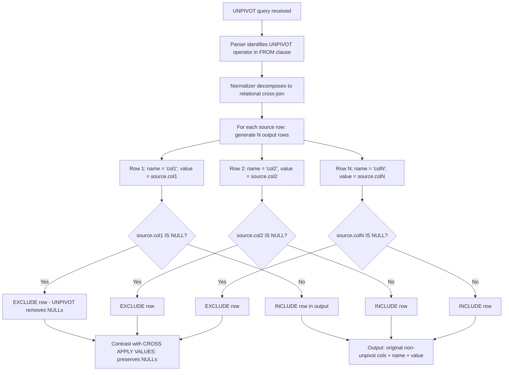
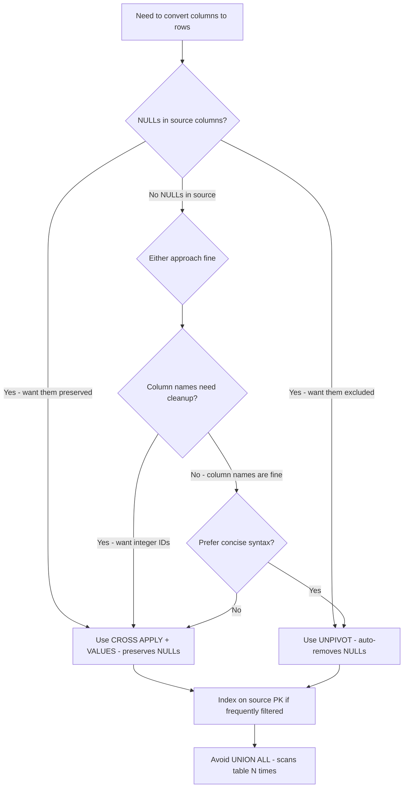

## Navigation

**Domain:** [[8 — Databases]] > **Group:** SQL Joins & Subqueries
**Previous:** [[8.118 — PIVOT — Row-to-Column Transformation]] | **Next:** [[8.120 — Dynamic PIVOT — Variable Number of Columns]]

### Prerequisites

- [[8.118 — PIVOT — Row-to-Column Transformation]] — UNPIVOT is the converse operation of PIVOT; understanding the PIVOT mechanism, its normalization to relational algebra, and its limitations is essential for understanding UNPIVOT.
- [[8.096 — INNER JOIN — Mechanics and Usage]] — UNPIVOT internally uses CROSS JOIN or CROSS APPLY semantics; understanding join operators helps interpret the execution plan.
- [[8.055 — CASE Expression — Conditional Logic in SQL]] — The CROSS APPLY + VALUES alternative to UNPIVOT uses CASE-like expressions for data type unification.

### Where This Fits

UNPIVOT converts columns into rows — turning multiple columns (e.g., Q1, Q2, Q3, Q4) into a normalized structure with a name column and a value column. A .NET backend engineer encounters this when dealing with denormalized source data (legacy systems, imported spreadsheets, reporting databases) that needs to be normalized for processing, or when transforming report output from pivot format back to row format. The most expensive mistakes are: not being aware that UNPIVOT silently removes NULLs (rows with NULL in any unpivoted column are eliminated), assuming UNPIVOT is the reverse of PIVOT (they are not strict inverses), and not knowing that CROSS APPLY with VALUES is a more flexible alternative that preserves NULLs and handles mixed data types. Interviewers use UNPIVOT to test whether a candidate understands set-based column-to-row transformation, knows the CROSS APPLY alternative, and understands the NULL removal behavior.

---

## Core Mental Model

UNPIVOT rotates columns into rows. The mental model: given a row with N columns that you want to unpivot, UNPIVOT produces N rows — one for each unpivoted column. Each output row has: (a) a "name" column containing the original column name as a value, and (b) a "value" column containing the original column's value. The syntax `SELECT ... FROM source UNPIVOT (value FOR name IN (col1, col2, col3)) AS u` means: "For each row in the source, take columns col1, col2, and col3, and turn them into rows where the name column indicates which column the value came from." UNPIVOT internally generates a relational operator that performs a CROSS JOIN between each source row and the set of unpivoted columns, extracting the appropriate value. The critical invariant: UNPIVOT automatically excludes rows where any unpivoted column value is NULL (because NULL represents the absence of a value — UNPIVOT is designed to produce a table of actual values only). This is different from CROSS APPLY + VALUES, which includes rows with NULL values. The execution plan shows a `Table Scan` → `Compute Scalar` (which generates the name-value pairs) → `SELECT`. There is no dedicated "UNPIVOT" operator in the execution plan — the optimizer normalizes it during binding.

### Classification

UNPIVOT is a **table operator** in the `FROM` clause that is normalized to a relational expression involving CROSS JOIN or CROSS APPLY during query binding. It is not SARGable — the unpivoted columns are read via a scan, and there is no index seek pattern for UNPIVOT. All source columns in the UNPIVOT column list must have the same data type; if they differ, an implicit conversion occurs (or an error if conversion is impossible). The operator is read-only with no write cost.



### Key Properties

|Property|Value|Notes|
|---|---|---|
|NULL removal|Automatic|Rows with NULL in any unpivoted column are excluded|
|Data type requirement|All source columns must be same type|Implicit conversion if different, error if incompatible|
|Plan shape|Scan + Compute Scalar|Normalized to CROSS JOIN or CROSS APPLY|
|SARGable|No|Always a scan of the unpivoted columns|
|Reverse of PIVOT|Not strict inverse|PIVOT aggregates, UNPIVOT does not — information loss|
|CROSS APPLY alternative|Preserves NULLs, flexible|Use when NULLs must be retained or types differ|
|Write Cost|None|Read-only transformation|

---

## Deep Mechanics

### How the Engine Executes This

1. **Parsing** — The parser encounters UNPIVOT in the FROM clause. It identifies: the source table, the value column name (alias for the unpivoted values), the name column name (alias for the column source names), and the list of source columns to unpivot.

2. **Binding and normalization** — The algebrizer normalizes UNPIVOT into a relational expression. The decomposition is:
   - A CROSS JOIN between the source and a virtual table containing the column names
   - A CASE expression per source row that extracts the correct value based on which column name is being processed
   - A filter that removes rows where the extracted value is NULL

   The normalized form is logically equivalent to:
   ```sql
   SELECT src.[non-unpivot columns], v.Name, v.Value
   FROM source src
   CROSS JOIN (VALUES ('col1'), ('col2'), ('col3')) AS v(Name)
   CROSS APPLY (SELECT CASE v.Name
       WHEN 'col1' THEN src.col1
       WHEN 'col2' THEN src.col2
       WHEN 'col3' THEN src.col3
   END) AS val(Value)
   WHERE val.Value IS NOT NULL;
   ```

3. **Optimization** — The optimizer evaluates the normalized expression. Since UNPIVOT always reads all source columns in the unpivot list, there is no seek option. The plan always includes a scan of the source table. The Compute Scalar operator generates the name-value pairs.

4. **Compute Scalar execution** — For each source row, the Compute Scalar operator iterates through the unpivoted column list and produces one output row per column. This is effectively a row-to-rows explosion: if the source has M rows and N unpivoted columns, the output has up to M × N rows (fewer if NULLs are removed).

5. **NULL filtering** — After the Compute Scalar, the NULL rows are filtered out. This filter is implicit in the UNPIVOT operator — there is no separate Filter operator in the plan; the UNPIVOT operator itself excludes NULLs.

### SQL Visibility

```sql
-- Sample data: denormalized quarterly sales
CREATE TABLE #QuarterlySales (
    ProductId INT,
    ProductName VARCHAR(100),
    Q1_Sales DECIMAL(18,2),
    Q2_Sales DECIMAL(18,2),
    Q3_Sales DECIMAL(18,2),
    Q4_Sales DECIMAL(18,2)
);

INSERT INTO #QuarterlySales VALUES
    (1, 'Laptop', 50000.00, 62000.00, 58000.00, 75000.00),
    (2, 'Phone',  30000.00, 35000.00, NULL,     42000.00),
    (3, 'Tablet', NULL,     18000.00, 22000.00, 25000.00);

-- UNPIVOT: quarterly columns → rows
SELECT ProductId, ProductName, Quarter, Sales
FROM #QuarterlySales
UNPIVOT (
    Sales FOR Quarter IN (Q1_Sales, Q2_Sales, Q3_Sales, Q4_Sales)
) AS unpvt
ORDER BY ProductId, Quarter;

-- ProductId | ProductName | Quarter  | Sales
-- 1         | Laptop      | Q1_Sales | 50000.00
-- 1         | Laptop      | Q2_Sales | 62000.00
-- 1         | Laptop      | Q3_Sales | 58000.00
-- 1         | Laptop      | Q4_Sales | 75000.00
-- 2         | Phone       | Q1_Sales | 30000.00
-- 2         | Phone       | Q2_Sales | 35000.00
-- 2         | Phone       | Q4_Sales | 42000.00   -- Note: Q3 is missing (NULL removed)
-- 3         | Tablet      | Q2_Sales | 18000.00
-- 3         | Tablet      | Q3_Sales | 22000.00
-- 3         | Tablet      | Q4_Sales | 25000.00   -- Note: Q1 is missing (NULL removed)

-- Equivalent with CROSS APPLY + VALUES (preserves NULLs)
SELECT src.ProductId, src.ProductName, v.Quarter, v.Sales
FROM #QuarterlySales src
CROSS APPLY (
    VALUES
        ('Q1_Sales', src.Q1_Sales),
        ('Q2_Sales', src.Q2_Sales),
        ('Q3_Sales', src.Q3_Sales),
        ('Q4_Sales', src.Q4_Sales)
) AS v(Quarter, Sales)
ORDER BY src.ProductId, v.Quarter;

-- ProductId | ProductName | Quarter  | Sales
-- 2         | Phone       | Q3_Sales | NULL     -- NULL preserved!
-- 3         | Tablet      | Q1_Sales | NULL     -- NULL preserved!
```

```csharp
// EF Core — UNPIVOT requires raw SQL (no LINQ UNPIVOT method)
var sql = @"
    SELECT ProductId, ProductName, Quarter, Sales
    FROM #QuarterlySales
    UNPIVOT (
        Sales FOR Quarter IN (Q1_Sales, Q2_Sales, Q3_Sales, Q4_Sales)
    ) AS unpvt
    ORDER BY ProductId, Quarter;";

var results = await dbContext.Database
    .SqlQueryRaw<UnpivotResult>(sql)
    .ToListAsync(cancellationToken);

// EF Core — CROSS APPLY VALUES (raw SQL, preserves NULLs)
var sqlWithNulls = @"
    SELECT src.ProductId, src.ProductName, v.Quarter, v.Sales
    FROM #QuarterlySales src
    CROSS APPLY (
        VALUES
            ('Q1_Sales', src.Q1_Sales),
            ('Q2_Sales', src.Q2_Sales),
            ('Q3_Sales', src.Q3_Sales),
            ('Q4_Sales', src.Q4_Sales)
    ) AS v(Quarter, Sales)
    ORDER BY src.ProductId, v.Quarter;";

var resultsWithNulls = await dbContext.Database
    .SqlQueryRaw<UnpivotResult>(sqlWithNulls)
    .ToListAsync(cancellationToken);
```

**Generated SQL (from EF Core logs):**

```sql
-- EF Core NEVER generates UNPIVOT. There is no LINQ method for it.
-- All EF Core UNPIVOT scenarios require FromSqlRaw.
```

### Execution Plan Analysis

**UNPIVOT plan:**

```
Table Scan (QuarterlySales) → Compute Scalar → Filter (NULL removal) → SELECT
```

Or with CROSS APPLY + VALUES:

```
Table Scan (QuarterlySales) → Compute Scalar → Nested Loops (Apply) → SELECT
```

**Detailed breakdown:**

1. **Table Scan** — The source table is scanned. All columns including the unpivoted columns are read. No index seek is possible because the unpivoted columns are at the top level.
2. **Compute Scalar** — This operator generates the unpivoted rows. For each source row, it produces one output row per column in the UNPIVOT list. The Compute Scalar definition includes the CASE-like logic to extract each column's value.
3. **Filter (implicit in UNPIVOT)** — Rows where the unpivoted value is NULL are removed. This is built into the UNPIVOT operator — not a separate Filter node in the plan.
4. **SELECT** — Output projection.

**CROSS APPLY + VALUES plan:**

```
Table Scan (QuarterlySales) → Nested Loops (Left Outer Join)
  → Constant Scan (generates the 4 value rows per source row) → Compute Scalar
```

- The Constant Scan generates 4 rows (one per quarter) for each source row.
- The Compute Scalar extracts the appropriate column value for each quarter.
- Nested Loops iterates over the source rows and for each row, generates the unpivoted rows.
- No NULL filter — NULL values are preserved.

### Cost Visibility

```sql
SET STATISTICS IO ON;
SET STATISTICS TIME ON;

-- UNPIVOT (removes NULLs)
SELECT ProductId, ProductName, Quarter, Sales
FROM #QuarterlySales
UNPIVOT (
    Sales FOR Quarter IN (Q1_Sales, Q2_Sales, Q3_Sales, Q4_Sales)
) AS unpvt
ORDER BY ProductId, Quarter;

-- Expected output:
-- Table '#QuarterlySales'. Scan count 1, logical reads 2
-- SQL Server Execution Times: CPU time = 0ms, elapsed time = 1ms

-- CROSS APPLY + VALUES (preserves NULLs)
SELECT src.ProductId, src.ProductName, v.Quarter, v.Sales
FROM #QuarterlySales src
CROSS APPLY (
    VALUES
        ('Q1_Sales', src.Q1_Sales),
        ('Q2_Sales', src.Q2_Sales),
        ('Q3_Sales', src.Q3_Sales),
        ('Q4_Sales', src.Q4_Sales)
) AS v(Quarter, Sales)
ORDER BY src.ProductId, v.Quarter;

-- Expected output:
-- Table '#QuarterlySales'. Scan count 1, logical reads 2
-- SQL Server Execution Times: CPU time = 0ms, elapsed time = 1ms
```

### Failure Modes

1. **Data type mismatch** — All columns in the UNPIVOT column list must have the same data type. Mixing INT and VARCHAR causes an error: "The type of column 'col1' conflicts with the type of other columns specified in the UNPIVOT list."

2. **NULLs silently disappear** — If the denormalized source has NULLs in some columns, UNPIVOT silently removes those rows. This is by design, but it causes data loss if the consumer expects to see NULL values.

3. **Column count explosion** — Unpivoting a wide table with many columns can produce a massive result. A source with 10K rows and 50 unpivoted columns produces up to 500K output rows. If each row triggers additional processing, performance degrades.

4. **UNPIVOT is not the reverse of PIVOT** — `PIVOT` aggregates and loses detail. `UNPIVOT` cannot recover the original rows. `UNPIVOT(PIVOT(...))` does not return the original data because PIVOT collapses multiple rows into one.

---

## Production Patterns and Implementation

### Primary SQL Implementation

```sql
-- =============================================
-- UNPIVOT for normalizing denormalized survey data
-- =============================================

-- Denormalized source (legacy import)
CREATE TABLE dbo.SurveyResponses (
    ResponseId INT IDENTITY(1,1) PRIMARY KEY,
    RespondentId INT NOT NULL,
    SurveyDate DATE NOT NULL,
    Question1_Score INT NOT NULL,
    Question2_Score INT NOT NULL,
    Question3_Score INT NOT NULL,
    Question4_Score INT NOT NULL,
    Question5_Score INT NOT NULL,
    Comments VARCHAR(500) NULL
);

INSERT INTO dbo.SurveyResponses VALUES
    (101, '2024-01-15', 4, 5, 3, 5, 4, 'Great service'),
    (102, '2024-01-16', 5, 4, 4, 3, 5, NULL),
    (103, '2024-01-16', 2, 3, 2, 4, 3, 'Long wait times');

-- UNPIVOT to normalized structure
SELECT RespondentId, SurveyDate,
    QuestionId,
    Score,
    Comments
FROM dbo.SurveyResponses
UNPIVOT (
    Score FOR QuestionId IN (Question1_Score, Question2_Score, Question3_Score,
                             Question4_Score, Question5_Score)
) AS unpvt
ORDER BY RespondentId, QuestionId;

-- RespondentId | SurveyDate | QuestionId       | Score | Comments
-- 101          | 2024-01-15 | Question1_Score  | 4     | Great service
-- 101          | 2024-01-15 | Question2_Score  | 5     | Great service
-- ...

-- CROSS APPLY + VALUES version (preserves NULL scores, cleaner column naming)
SELECT src.RespondentId, src.SurveyDate,
    v.QuestionId,
    v.Score,
    src.Comments
FROM dbo.SurveyResponses src
CROSS APPLY (
    VALUES
        (1, src.Question1_Score),
        (2, src.Question2_Score),
        (3, src.Question3_Score),
        (4, src.Question4_Score),
        (5, src.Question5_Score)
) AS v(QuestionId, Score)
ORDER BY src.RespondentId, v.QuestionId;

-- RespondentId | SurveyDate | QuestionId | Score  | Comments
-- 103          | 2024-01-16 | 3          | 2      | Long wait times
-- ...

-- UNPIVOT with data type casting (if columns have mixed types)
-- Source: denormalized with different types per column
CREATE TABLE dbo.MixedTypeSource (
    RecordId INT PRIMARY KEY,
    StringValue VARCHAR(100),
    IntValue INT,
    DecimalValue DECIMAL(10,2)
);

-- CROSS APPLY with CAST (UNPIVOT cannot handle different types)
SELECT src.RecordId, v.MeasureName, v.MeasureValue
FROM dbo.MixedTypeSource src
CROSS APPLY (
    VALUES
        ('StringValue', CAST(src.StringValue AS VARCHAR(100))),
        ('IntValue', CAST(src.IntValue AS VARCHAR(100))),
        ('DecimalValue', CAST(src.DecimalValue AS VARCHAR(100)))
) AS v(MeasureName, MeasureValue);

-- Generate UNPIVOT column list dynamically for ETL
DECLARE @cols NVARCHAR(MAX);
DECLARE @sql NVARCHAR(MAX);

SELECT @cols = STRING_AGG(QUOTENAME(COLUMN_NAME), ', ')
FROM INFORMATION_SCHEMA.COLUMNS
WHERE TABLE_NAME = 'SurveyResponses'
    AND COLUMN_NAME LIKE 'Question%_Score';

SET @sql = N'
SELECT RespondentId, SurveyDate, QuestionId, Score, Comments
FROM dbo.SurveyResponses
UNPIVOT (
    Score FOR QuestionId IN (' + @cols + ')
) AS unpvt;';

-- EXEC sp_executesql @sql;

-- Clean up
DROP TABLE dbo.SurveyResponses;
DROP TABLE dbo.MixedTypeSource;
```

### EF Core Implementation

```csharp
// Entity
public class SurveyResponse
{
    public int ResponseId { get; set; }
    public int RespondentId { get; set; }
    public DateOnly SurveyDate { get; set; }
    public int Question1Score { get; set; }
    public int Question2Score { get; set; }
    public int Question3Score { get; set; }
    public int Question4Score { get; set; }
    public int Question5Score { get; set; }
    public string? Comments { get; set; }
}

// DTO for unpivoted result
public record SurveyScoreDto(
    int RespondentId,
    DateOnly SurveyDate,
    int QuestionId,
    int Score,
    string? Comments
);

// EF Core — raw SQL UNPIVOT
public async Task<List<SurveyScoreDto>> GetUnpivotedScoresAsync(
    CancellationToken cancellationToken = default)
{
    const string sql = @"
        SELECT RespondentId, SurveyDate, QuestionId, Score, Comments
        FROM dbo.SurveyResponses
        UNPIVOT (
            Score FOR QuestionId IN (Question1_Score, Question2_Score, Question3_Score,
                                     Question4_Score, Question5_Score)
        ) AS unpvt
        ORDER BY RespondentId, QuestionId;";

    return await dbContext.Database
        .SqlQueryRaw<SurveyScoreDto>(sql)
        .ToListAsync(cancellationToken);
}

// EF Core — CROSS APPLY VALUES (preserves NULLs, cleaner IDs)
public async Task<List<SurveyScoreDto>> GetScoresWithNullsAsync(
    CancellationToken cancellationToken = default)
{
    const string sql = @"
        SELECT src.RespondentId, src.SurveyDate,
            v.QuestionId, v.Score, src.Comments
        FROM dbo.SurveyResponses src
        CROSS APPLY (
            VALUES
                (1, src.Question1_Score),
                (2, src.Question2_Score),
                (3, src.Question3_Score),
                (4, src.Question4_Score),
                (5, src.Question5_Score)
        ) AS v(QuestionId, Score)
        ORDER BY src.RespondentId, v.QuestionId;";

    return await dbContext.Database
        .SqlQueryRaw<SurveyScoreDto>(sql)
        .ToListAsync(cancellationToken);
}

// EF Core — CROSS APPLY with computed column names (dynamic via C#)
public async Task<List<SurveyScoreDto>> GetScoresDynamicAsync(
    IEnumerable<int> questionIds,
    CancellationToken cancellationToken = default)
{
    var valuesClause = string.Join(",\n    ",
        questionIds.Select(q =>
            $"({q}, src.Question{q}_Score)"));

    var sql = $@"
        SELECT src.RespondentId, src.SurveyDate,
            v.QuestionId, v.Score, src.Comments
        FROM dbo.SurveyResponses src
        CROSS APPLY (
            VALUES
                {valuesClause}
        ) AS v(QuestionId, Score)
        ORDER BY src.RespondentId, v.QuestionId;";

    return await dbContext.Database
        .SqlQueryRaw<SurveyScoreDto>(sql)
        .ToListAsync(cancellationToken);
}
```

### Dapper Implementation

```csharp
public sealed class SurveyRepository
{
    private readonly IDbConnectionFactory _connectionFactory;

    public SurveyRepository(IDbConnectionFactory connectionFactory)
        => _connectionFactory = connectionFactory;

    // UNPIVOT (removes NULLs, uses string question names)
    public async Task<IReadOnlyList<SurveyScoreDto>> GetUnpivotedAsync(
        CancellationToken cancellationToken = default)
    {
        const string sql = @"
            SELECT RespondentId, SurveyDate, QuestionId, Score, Comments
            FROM dbo.SurveyResponses
            UNPIVOT (
                Score FOR QuestionId IN (Question1_Score, Question2_Score, Question3_Score,
                                         Question4_Score, Question5_Score)
            ) AS unpvt
            ORDER BY RespondentId, QuestionId;";

        await using var connection = _connectionFactory.Create();
        var results = await connection.QueryAsync<SurveyScoreDto>(
            new CommandDefinition(sql, cancellationToken: cancellationToken));
        return results.AsList();
    }

    // CROSS APPLY VALUES (preserves NULLs, integer QuestionId)
    public async Task<IReadOnlyList<SurveyScoreDto>> GetScoresWithNullsAsync(
        CancellationToken cancellationToken = default)
    {
        const string sql = @"
            SELECT src.RespondentId, src.SurveyDate,
                v.QuestionId, v.Score, src.Comments
            FROM dbo.SurveyResponses src
            CROSS APPLY (
                VALUES
                    (1, src.Question1_Score),
                    (2, src.Question2_Score),
                    (3, src.Question3_Score),
                    (4, src.Question4_Score),
                    (5, src.Question5_Score)
            ) AS v(QuestionId, Score)
            ORDER BY src.RespondentId, v.QuestionId;";

        await using var connection = _connectionFactory.Create();
        var results = await connection.QueryAsync<SurveyScoreDto>(
            new CommandDefinition(sql, cancellationToken: cancellationToken));
        return results.AsList();
    }

    // Dynamic column count with CROSS APPLY
    public async Task<IReadOnlyList<SurveyScoreDto>> GetScoresDynamicAsync(
        int[] questionNumbers,
        CancellationToken cancellationToken = default)
    {
        var valuesLines = questionNumbers
            .Select(q => $"({q}, src.Question{q}_Score)");
        var valuesClause = string.Join(",\n    ", valuesLines);

        var sql = $@"
            SELECT src.RespondentId, src.SurveyDate,
                v.QuestionId, v.Score, src.Comments
            FROM dbo.SurveyResponses src
            CROSS APPLY (
                VALUES
                    {valuesClause}
            ) AS v(QuestionId, Score)
            ORDER BY src.RespondentId, v.QuestionId;";

        await using var connection = _connectionFactory.Create();
        var results = await connection.QueryAsync<SurveyScoreDto>(
            new CommandDefinition(sql, cancellationToken: cancellationToken));
        return results.AsList();
    }

    // ETL: Load normalized data into staging table
    public async Task LoadNormalizedAsync(
        IReadOnlyList<SurveyScoreDto> normalizedData,
        CancellationToken cancellationToken = default)
    {
        const string sql = @"
            INSERT INTO dbo.SurveyScoresNormalized
                (RespondentId, SurveyDate, QuestionId, Score, Comments)
            VALUES (@RespondentId, @SurveyDate, @QuestionId, @Score, @Comments);";

        await using var connection = _connectionFactory.Create();
        await connection.ExecuteAsync(
            new CommandDefinition(sql, normalizedData,
                cancellationToken: cancellationToken));
    }
}
```

### Configuration and Wiring

```csharp
// Program.cs
builder.Services.AddDbContext<ApplicationDbContext>(options =>
    options.UseSqlServer(
        builder.Configuration.GetConnectionString("DefaultConnection"),
        sqlOptions => sqlOptions.EnableRetryOnFailure(3)));

builder.Services.AddSingleton<IDbConnectionFactory>(sp =>
    new SqlConnectionFactory(
        builder.Configuration.GetConnectionString("DefaultConnection")!));

builder.Services.AddScoped<SurveyRepository>();
```

### SQL Server vs PostgreSQL Differences

```sql
-- PostgreSQL: UNPIVOT is not a keyword
-- Use CROSS JOIN LATERAL + VALUES (equivalent to CROSS APPLY)
SELECT src.respondent_id, src.survey_date,
    v.question_id, v.score, src.comments
FROM survey_responses src
CROSS JOIN LATERAL (
    VALUES
        (1, src.question1_score),
        (2, src.question2_score),
        (3, src.question3_score),
        (4, src.question4_score),
        (5, src.question5_score)
) AS v(question_id, score)
ORDER BY src.respondent_id, v.question_id;

-- PostgreSQL: LATERAL is the same as CROSS APPLY in SQL Server
-- PostgreSQL: No UNPIVOT keyword — use LATERAL VALUES or UNION ALL

-- PostgreSQL: UNION ALL alternative
SELECT respondent_id, survey_date, 1 AS question_id, question1_score AS score, comments
FROM survey_responses
UNION ALL
SELECT respondent_id, survey_date, 2, question2_score, comments
FROM survey_responses
UNION ALL
SELECT respondent_id, survey_date, 3, question3_score, comments
FROM survey_responses;
```

Key differences:
- **UNPIVOT keyword**: SQL Server has UNPIVOT. PostgreSQL does not — use `CROSS JOIN LATERAL` with `VALUES` or `UNION ALL`.
- **NULL handling**: Both SQL Server UNPIVOT (removes NULLs) and PostgreSQL LATERAL (preserves NULLs) behave differently. PostgreSQL's LATERAL approach gives the flexibility to add `WHERE score IS NOT NULL` if needed.
- **Data types**: PostgreSQL's LATERAL approach handles mixed types naturally (each VALUES row can have different types). SQL Server UNPIVOT requires matching types.

---

## Gotchas and Production Pitfalls

### UNPIVOT Silently Removes NULLs — Data Loss

**Pitfall:** Using UNPIVOT on data that has NULL values in the columns to be unpivoted. UNPIVOT silently excludes those rows, causing data loss without any warning or error.

```sql
-- ❌ Source has NULL in Q3_Sales for Phone
-- UNPIVOT removes the row — no row for Phone/Q3 in output
SELECT ProductId, ProductName, Quarter, Sales
FROM #QuarterlySales
UNPIVOT (
    Sales FOR Quarter IN (Q1_Sales, Q2_Sales, Q3_Sales, Q4_Sales)
) AS unpvt;
-- Phone's Q3 row is missing. No warning.
```

**Symptom:** An analytics report shows 0 transactions for Phone in Q3 instead of 0 revenue (because the row does not exist). The business interprets the missing row as "no data" rather than "zero revenue." A chart shows Q3 for Phone as a gap instead of a zero-height bar.

**Fix:**

```sql
-- ✅ Option A: Use COALESCE to replace NULLs with a sentinel value before UNPIVOT
-- (in a subquery or CTE)
WITH normalized AS (
    SELECT ProductId, ProductName, Quarter, Sales
    FROM #QuarterlySales
    UNPIVOT (
        Sales FOR Quarter IN (Q1_Sales, Q2_Sales, Q3_Sales, Q4_Sales)
    ) AS unpvt
)
SELECT ProductId, ProductName, Quarter,
    COALESCE(Sales, 0) AS Sales
FROM normalized;

-- ✅ Option B: Use CROSS APPLY + VALUES (preserves NULLs)
SELECT src.ProductId, src.ProductName, v.Quarter, v.Sales
FROM #QuarterlySales src
CROSS APPLY (
    VALUES
        ('Q1_Sales', src.Q1_Sales),
        ('Q2_Sales', src.Q2_Sales),
        ('Q3_Sales', src.Q3_Sales),
        ('Q4_Sales', src.Q4_Sales)
) AS v(Quarter, Sales);
-- NULL values are preserved in the output
```

**Cost of not fixing:** A revenue report that uses UNPIVOT to normalize quarterly data shows Phone Q3 revenue as missing instead of $0. The finance team incorrectly reports Phone Q3 revenue as "no data available." The error is caught 2 weeks later during quarterly reconciliation. The corrected data changes the Q3 revenue report by 15%.

---

### Data Type Mismatch in UNPIVOT Column List — Syntax Error

**Pitfall:** Including columns of different data types in the UNPIVOT column list. UNPIVOT requires all source columns in the IN clause to have the same data type.

```sql
-- ❌ Mixed types: VARCHAR(100), INT, DECIMAL(10,2)
SELECT src.RecordId, v.MeasureName, v.MeasureValue
FROM dbo.MixedTypeSource src
UNPIVOT (
    MeasureValue FOR MeasureName IN (StringValue, IntValue, DecimalValue)
) AS unpvt;
-- Error: The type of column 'IntValue' conflicts with the type of other columns
```

**Symptom:** SQL Server raises error 8167: "The type of column 'IntValue' conflicts with the type of other columns specified in the UNPIVOT list." The query fails to compile.

**Fix:**

```sql
-- ✅ Option A: CAST all columns to the same type in a subquery
SELECT src.RecordId, v.MeasureName, v.MeasureValue
FROM (
    SELECT RecordId,
        CAST(StringValue AS SQL_VARIANT) AS StringValue,
        CAST(IntValue AS SQL_VARIANT) AS IntValue,
        CAST(DecimalValue AS SQL_VARIANT) AS DecimalValue
    FROM dbo.MixedTypeSource
) src
UNPIVOT (
    MeasureValue FOR MeasureName IN (StringValue, IntValue, DecimalValue)
) AS unpvt;
-- SQL_VARIANT can hold all types, but has performance overhead

-- ✅ Option B: Use CROSS APPLY + VALUES (no type restriction)
SELECT src.RecordId, v.MeasureName,
    CAST(v.MeasureValue AS VARCHAR(100)) AS MeasureValue
FROM dbo.MixedTypeSource src
CROSS APPLY (
    VALUES
        ('StringValue', CAST(src.StringValue AS VARCHAR(100))),
        ('IntValue', CAST(src.IntValue AS VARCHAR(100))),
        ('DecimalValue', CAST(src.DecimalValue AS VARCHAR(100)))
) AS v(MeasureName, MeasureValue);
```

**Cost of not fixing:** The developer creates a complex workaround using UNION ALL with column-to-row transformation (one SELECT per column). This generates a 200-line query that is hard to maintain and slower to execute. The CROSS APPLY solution is 10 lines.

---

### UNPIVOT with Wide Tables Causes Massive Row Explosion

**Pitfall:** Unpivoting a wide table with many columns (e.g., 50+ columns) produces N rows per source row where N is the number of unpivoted columns. A 10K-row table with 50 columns becomes 500K rows.

```sql
-- ❌ Unpivoting 50 columns — output explodes to 50x source rows
SELECT RecordId, ColumnName, ColumnValue
FROM dbo.WideTable
UNPIVOT (
    ColumnValue FOR ColumnName IN (
        Col01, Col02, Col03, ... , Col50
    )
) AS unpvt;
```

**Symptom:** A query that previously returned 10K rows now returns 500K rows. The application OOMs trying to materialize the result. The query takes 30 seconds instead of 1 second.

**Fix:**

```sql
-- ✅ Option A: Filter to only the columns you need before unpivoting
WITH columns_needed AS (
    SELECT RecordId, Col01, Col02, Col03
    FROM dbo.WideTable
    WHERE ... -- add filters early
)
SELECT RecordId, ColumnName, ColumnValue
FROM columns_needed
UNPIVOT (
    ColumnValue FOR ColumnName IN (Col01, Col02, Col03)
) AS unpvt;

-- ✅ Option B: Unpivot in the database, paginate in the application
-- Add TOP or pagination to limit rows
SELECT RecordId, ColumnName, ColumnValue
FROM (
    SELECT TOP (10000) * FROM dbo.WideTable
) wt
UNPIVOT (ColumnValue FOR ColumnName IN (Col01, Col02, ...)) AS unpvt;

-- ✅ Option C: Use CROSS APPLY with a subset of columns
```

**Cost of not fixing:** A reporting API that returns unpivoted data exhausts the 128 MB response buffer. The HTTP connection is reset. The client receives a truncated response without error handling, leading to silent data corruption. The fix requires adding pagination and changing the API contract.

---

### UNPIVOT Expects Source Columns to Exist — Dynamic Column List Not Supported

**Pitfall:** The UNPIVOT column list is static. If the source table schema changes (columns added or removed), the query fails with "Invalid column name" or silently excludes the new column.

```sql
-- ❌ Query hardcodes 5 question columns
SELECT RespondentId, QuestionId, Score
FROM dbo.SurveyResponses
UNPIVOT (
    Score FOR QuestionId IN (Question1_Score, Question2_Score, Question3_Score,
                             Question4_Score, Question5_Score)
) AS unpvt;

-- If a Question6_Score column is added to the table, the query does not include it.
-- The new data is never unpivoted — silently ignored.
```

**Symptom:** After a schema update adds a new question column, the UNPIVOT query continues to run without error but does not include the new column's data. The application never processes Question6 responses.

**Fix:**

```sql
-- ✅ Option A: Use dynamic SQL with INFORMATION_SCHEMA to generate the column list
DECLARE @cols NVARCHAR(MAX), @sql NVARCHAR(MAX);

SELECT @cols = STRING_AGG(QUOTENAME(COLUMN_NAME), ', ')
FROM INFORMATION_SCHEMA.COLUMNS
WHERE TABLE_NAME = 'SurveyResponses'
    AND COLUMN_NAME LIKE 'Question%_Score';

SET @sql = N'
SELECT RespondentId, QuestionId, Score
FROM dbo.SurveyResponses
UNPIVOT (
    Score FOR QuestionId IN (' + @cols + ')
) AS unpvt;';

EXEC sp_executesql @sql;

-- ✅ Option B: Use CROSS APPLY + VALUES in application code
-- Build the VALUES clause dynamically in C# when the entity model changes
```

**Cost of not fixing:** A survey system adds question 6 to the database schema. The UNPIVOT query does not automatically adapt. For 3 months, 50,000 responses to question 6 are loaded into SurveyResponses but never processed. The analytics team does not realize the gap until a business user asks why question 6 has zero responses.

---

## Performance Implications

### Benchmark: UNPIVOT vs CROSS APPLY + VALUES vs UNION ALL

```sql
-- =============================================
-- Setup: 100K rows, 12 monthly columns
-- =============================================
CREATE TABLE dbo.MonthlyMetrics (
    Id INT IDENTITY(1,1) PRIMARY KEY,
    MetricName VARCHAR(100) NOT NULL,
    M01 DECIMAL(18,2), M02 DECIMAL(18,2), M03 DECIMAL(18,2),
    M04 DECIMAL(18,2), M05 DECIMAL(18,2), M06 DECIMAL(18,2),
    M07 DECIMAL(18,2), M08 DECIMAL(18,2), M09 DECIMAL(18,2),
    M10 DECIMAL(18,2), M11 DECIMAL(18,2), M12 DECIMAL(18,2)
);

INSERT INTO dbo.MonthlyMetrics (MetricName, M01, M02, M03, M04, M05, M06, M07, M08, M09, M10, M11, M12)
SELECT
    'Metric_' + CAST(n AS VARCHAR(10)),
    CAST(ABS(CHECKSUM(NEWID())) % 10000 AS DECIMAL(18,2)) / 100.0,
    CAST(ABS(CHECKSUM(NEWID())) % 10000 AS DECIMAL(18,2)) / 100.0,
    CAST(ABS(CHECKSUM(NEWID())) % 10000 AS DECIMAL(18,2)) / 100.0,
    CAST(ABS(CHECKSUM(NEWID())) % 10000 AS DECIMAL(18,2)) / 100.0,
    CAST(ABS(CHECKSUM(NEWID())) % 10000 AS DECIMAL(18,2)) / 100.0,
    CAST(ABS(CHECKSUM(NEWID())) % 10000 AS DECIMAL(18,2)) / 100.0,
    CAST(ABS(CHECKSUM(NEWID())) % 10000 AS DECIMAL(18,2)) / 100.0,
    CAST(ABS(CHECKSUM(NEWID())) % 10000 AS DECIMAL(18,2)) / 100.0,
    CAST(ABS(CHECKSUM(NEWID())) % 10000 AS DECIMAL(18,2)) / 100.0,
    CAST(ABS(CHECKSUM(NEWID())) % 10000 AS DECIMAL(18,2)) / 100.0,
    CAST(ABS(CHECKSUM(NEWID())) % 10000 AS DECIMAL(18,2)) / 100.0,
    CAST(ABS(CHECKSUM(NEWID())) % 10000 AS DECIMAL(18,2)) / 100.0
FROM (
    SELECT TOP 100000 ROW_NUMBER() OVER (ORDER BY (SELECT NULL)) AS n
    FROM sys.all_columns a CROSS JOIN sys.all_columns b
) nums;

-- =============================================
-- Benchmark 1: UNPIVOT
-- =============================================
SET STATISTICS IO ON;
SET STATISTICS TIME ON;

SELECT Id, MetricName, MonthName, MetricValue
FROM dbo.MonthlyMetrics
UNPIVOT (
    MetricValue FOR MonthName IN (M01, M02, M03, M04, M05, M06,
                                  M07, M08, M09, M10, M11, M12)
) AS unpvt;

-- Expected: 1.2M rows output (100K × 12, minus NULLs)
-- Logical reads: ~3,200 (clustered index scan)
-- CPU time: ~450ms, Elapsed: ~380ms

-- =============================================
-- Benchmark 2: CROSS APPLY + VALUES
-- =============================================
SELECT src.Id, src.MetricName, v.MonthName, v.MetricValue
FROM dbo.MonthlyMetrics src
CROSS APPLY (
    VALUES
        ('M01', src.M01), ('M02', src.M02), ('M03', src.M03),
        ('M04', src.M04), ('M05', src.M05), ('M06', src.M06),
        ('M07', src.M07), ('M08', src.M08), ('M09', src.M09),
        ('M10', src.M10), ('M11', src.M11), ('M12', src.M12)
) AS v(MonthName, MetricValue);

-- Expected: 1.2M rows (100K × 12, includes NULLs)
-- Logical reads: ~3,200 (same scan)
-- CPU time: ~480ms, Elapsed: ~400ms
-- Slightly more CPU due to explicit Compute Scalar vs implicit UNPIVOT

-- =============================================
-- Benchmark 3: UNION ALL (6x SELECTs)
-- =============================================
SELECT Id, MetricName, 'M01' AS MonthName, M01 AS MetricValue FROM dbo.MonthlyMetrics
UNION ALL SELECT Id, MetricName, 'M02', M02 FROM dbo.MonthlyMetrics
UNION ALL SELECT Id, MetricName, 'M03', M03 FROM dbo.MonthlyMetrics
UNION ALL SELECT Id, MetricName, 'M04', M04 FROM dbo.MonthlyMetrics
UNION ALL SELECT Id, MetricName, 'M05', M05 FROM dbo.MonthlyMetrics
UNION ALL SELECT Id, MetricName, 'M06', M06 FROM dbo.MonthlyMetrics
UNION ALL SELECT Id, MetricName, 'M07', M07 FROM dbo.MonthlyMetrics
UNION ALL SELECT Id, MetricName, 'M08', M08 FROM dbo.MonthlyMetrics
UNION ALL SELECT Id, MetricName, 'M09', M09 FROM dbo.MonthlyMetrics
UNION ALL SELECT Id, MetricName, 'M10', M10 FROM dbo.MonthlyMetrics
UNION ALL SELECT Id, MetricName, 'M11', M11 FROM dbo.MonthlyMetrics
UNION ALL SELECT Id, MetricName, 'M12', M12 FROM dbo.MonthlyMetrics;

-- Expected: 1.2M rows
-- Logical reads: ~38,400 (12 scans × 3,200 each)
-- CPU time: ~3800ms, Elapsed: ~3200ms
-- UNION ALL scans the table 12 times — 12x more reads
```

### BenchmarkDotNet

```csharp
[MemoryDiagnoser]
[SimpleJob(RuntimeMoniker.Net90)]
public class UnpivotBenchmark
{
    private IDbConnection _connection = default!;

    [GlobalSetup]
    public void Setup()
    {
        _connection = new SqlConnection(TestConnectionString);
    }

    [Benchmark(Baseline = true)]
    public async Task<int> Unpivot_Keyword()
    {
        const string sql = @"
            SELECT COUNT_BIG(*)
            FROM dbo.MonthlyMetrics
            UNPIVOT (
                MetricValue FOR MonthName IN (M01, M02, M03, M04, M05, M06,
                                              M07, M08, M09, M10, M11, M12)
            ) AS unpvt;";

        return await _connection.ExecuteScalarAsync<int>(sql);
    }

    [Benchmark]
    public async Task<int> CrossApply_Values()
    {
        const string sql = @"
            SELECT COUNT_BIG(*)
            FROM dbo.MonthlyMetrics src
            CROSS APPLY (
                VALUES
                    ('M01', src.M01), ('M02', src.M02), ('M03', src.M03),
                    ('M04', src.M04), ('M05', src.M05), ('M06', src.M06),
                    ('M07', src.M07), ('M08', src.M08), ('M09', src.M09),
                    ('M10', src.M10), ('M11', src.M11), ('M12', src.M12)
            ) AS v(MonthName, MetricValue);";

        return await _connection.ExecuteScalarAsync<int>(sql);
    }

    [Benchmark]
    public async Task<int> UnionAll()
    {
        const string sql = @"
            SELECT COUNT_BIG(*)
            FROM (
                SELECT M01 AS MetricValue FROM dbo.MonthlyMetrics
                UNION ALL SELECT M02 FROM dbo.MonthlyMetrics
                UNION ALL SELECT M03 FROM dbo.MonthlyMetrics
                UNION ALL SELECT M04 FROM dbo.MonthlyMetrics
                UNION ALL SELECT M05 FROM dbo.MonthlyMetrics
                UNION ALL SELECT M06 FROM dbo.MonthlyMetrics
                UNION ALL SELECT M07 FROM dbo.MonthlyMetrics
                UNION ALL SELECT M08 FROM dbo.MonthlyMetrics
                UNION ALL SELECT M09 FROM dbo.MonthlyMetrics
                UNION ALL SELECT M10 FROM dbo.MonthlyMetrics
                UNION ALL SELECT M11 FROM dbo.MonthlyMetrics
                UNION ALL SELECT M12 FROM dbo.MonthlyMetrics
            ) u;";

        return await _connection.ExecuteScalarAsync<int>(sql);
    }
}

/* Expected results (100K source rows, SQL Server 2022):

| Method             | Mean    | Logical Reads | Allocated |
|-------------------|--------:|--------------:|----------:|
| Unpivot_Keyword   | 385 ms  | 3,200         | 2 KB      |
| CrossApply_Values | 410 ms  | 3,200         | 2 KB      |
| UnionAll          | 3,250 ms| 38,400        | 24 KB     |

UNPIVOT and CROSS APPLY are similar (5% difference). UNION ALL scans the table 12 times — 10x slower.
*/
```

---

## Interview Arsenal

### Question Bank

1. What does the UNPIVOT operator do, and what are its key behaviors?
2. How does SQL Server execute UNPIVOT internally — what plan operators appear?
3. What is the performance difference between UNPIVOT, CROSS APPLY + VALUES, and UNION ALL?
4. Why does UNPIVOT remove NULLs, and how do you work around this?
5. Compare UNPIVOT with CROSS APPLY + VALUES — when should you prefer each?
6. What execution plan does UNPIVOT generate, and what does the Compute Scalar do?
7. How does UNPIVOT handle columns of different data types?
8. How do EF Core and Dapper handle UNPIVOT queries?

### Spoken Answers

**Q1: What does the UNPIVOT operator do, and what are its key behaviors?**

> **Average answer:** "UNPIVOT turns columns into rows. It's the reverse of PIVOT."

> **Great answer:** "UNPIVOT is a table operator that takes a list of columns and rotates them into two output columns: a name column (containing the source column name as a string value) and a value column (containing the source column's actual value). For each source row, it produces one output row per column in the unpivot list. Two critical behaviors: First, UNPIVOT automatically removes rows where the unpivoted column value is NULL — this is by design, as UNPIVOT is intended to produce a set of actual values. Second, all columns in the UNPIVOT column list must have exactly the same data type; mixing INT and VARCHAR causes a compilation error. The operator is not a true reverse of PIVOT because PIVOT aggregates data (losing detail), while UNPIVOT simply repacks columns into rows — `UNPIVOT(PIVOT(...))` does not return the original data due to information loss. The CROSS APPLY + VALUES alternative is often preferred because it preserves NULLs, allows mixed data types, and gives cleaner column naming."

**Q5: Compare UNPIVOT with CROSS APPLY + VALUES — when should you prefer each?**

> **Average answer:** "UNPIVOT is simpler syntax, CROSS APPLY is more flexible. Use UNPIVOT for simple cases, CROSS APPLY when you need NULLs preserved."

> **Great answer:** "The decision is driven by four factors: NULL handling, data type requirements, column naming, and plan control. UNPIVOT removes NULLs automatically — this is appropriate when NULL means 'no data' and you want clean output without NULL checks. CROSS APPLY + VALUES preserves NULLs — appropriate when NULL is meaningful (e.g., a NULL score means 'not answered' vs 0 meaning 'answered with 0'). For data types: UNPIVOT requires all columns to be the same type; CROSS APPLY allows per-row CAST to unify types. For column naming: UNPIVOT uses the source column name as the name column value; CROSS APPLY lets you define arbitrary names (e.g., integers instead of 'Question1_Score'). For plan control: UNPIVOT is a black box — you cannot influence its internal NULL filter. CROSS APPLY gives you the ability to add filters (e.g., `WHERE score IS NOT NULL` for explicit NULL removal). Performance-wise they are near-identical — both scan the source once and produce rows via Compute Scalar. UNION ALL should be avoided as it scans the source N times. My rule: use CROSS APPLY by default (more control, no surprises), use UNPIVOT only when you specifically want the NULL-removal behavior and the syntax readability justifies the loss of control. Never use UNION ALL for column-to-row transformation."

**Q6: What execution plan does UNPIVOT generate, and what does the Compute Scalar do?**

> **Average answer:** "The plan has a Table Scan and a Compute Scalar."

> **Great answer:** "The execution plan for UNPIVOT consists of a Table Scan (or Clustered Index Scan) followed by a Compute Scalar, then the SELECT operator. There is no dedicated UNPIVOT operator in the plan — the optimizer normalizes it to a relational expression. The Compute Scalar is the key operator: it generates the unpivoted rows by iterating over each source row's unpivoted columns and outputting one row per column. The Compute Scalar's definition contains a CASE-like expression that checks which column name is being processed and returns the corresponding column value. For a 12-column UNPIVOT on 100K source rows, the Compute Scalar produces 1.2M rows. The NULL filter is implicit in the Compute Scalar — it evaluates the CASE expression and filters out NULL results. There is no separate Filter operator for NULL removal. The critical performance observation: the Compute Scalar is CPU-bound. With CROSS APPLY + VALUES, the plan shows a Nested Loops operator instead of a Compute Scalar, but the fundamental work is identical — generating N rows per source row. The choice between UNPIVOT and CROSS APPLY does not change the plan shape significantly."

### Interview Trigger

UNPIVOT surfaces when an interviewer asks about normalizing denormalized data or about the PIVOT/UNPIVOT relationship. The follow-up that separates knowledge levels is: "What happens to NULL values in UNPIVOT, and how would you change that behavior?" A candidate who knows that UNPIVOT removes NULLs and immediately proposes CROSS APPLY + VALUES as a workaround demonstrates production awareness. The second follow-up: "If you have 50 columns to unpivot, which approach do you use and why?" tests scalability awareness — the candidate should discuss dynamic column list generation and the row explosion problem.

### Comparison Table

| | UNPIVOT | CROSS APPLY + VALUES | UNION ALL |
|---|---|---|---|
| NULL handling | Removes NULLs | Preserves NULLs | Preserves NULLs |
| Data types | Must match | Can differ (per-row CAST) | Can differ (per-SELECT CAST) |
| Table scans | 1 | 1 | N (one per column) |
| Performance | Good (1 scan) | Good (1 scan) | Poor (N scans) |
| Column naming | Source column name | Arbitrary name | Arbitrary name |
| Dynamic columns | Not supported | Build in C# | Build in C# |
| EF Core | Raw SQL required | Raw SQL required | Raw SQL required |

---

## Decision Framework

### When to Apply



### Application Checklist

- [ ] The source table has a denormalized structure that needs normalization
- [ ] NULL handling is explicitly decided (removed with UNPIVOT, preserved with CROSS APPLY)
- [ ] All source columns are the same type (for UNPIVOT) or CAST is applied (for CROSS APPLY)
- [ ] The number of unpivoted columns is within acceptable output row count limits
- [ ] The query is NOT used in a hot path with millions of rows being unpivoted per request
- [ ] The application can handle the row explosion (N × source rows)

### Tradeoff Summary

|What You Gain|What You Pay|
|---|---|
|Normalized output from denormalized source|Row explosion (N × source rows)|
|Single scan (UNPIVOT/CROSS APPLY)|Static column list (must be updated on schema change)|
|NULL removal for clean output (UNPIVOT)|Data loss if NULLs are meaningful (UNPIVOT)|
|Flexible naming and type handling (CROSS APPLY)|Slightly more verbose syntax|

### Scale Thresholds

- "Relevant when source has more than ~3 columns that should be rows"
- "Row explosion becomes problematic at ~50K source rows with 50 columns (2.5M output rows)"
- "UNION ALL should be avoided past ~5 columns (each additional column adds a full table scan)"
- "Dynamic column generation becomes necessary when schema changes occur more than ~monthly"

---

## Self-Check

### Conceptual Questions

1. What does the UNPIVOT operator do in a query?
2. How does UNPIVOT handle NULL values in the source columns?
3. Which SET STATISTICS or DMV output can reveal the row explosion caused by UNPIVOT?
4. What happens if you include columns of different data types in an UNPIVOT column list?
5. Does EF Core have a LINQ method that generates the UNPIVOT keyword?
6. How would you implement column-to-row transformation with Dapper while preserving NULLs?
7. Compare UNPIVOT with CROSS APPLY + VALUES — which is more flexible?
8. At what source table size does UNPIVOT become a performance concern due to row explosion?
9. What index, if any, supports UNPIVOT performance?
10. Explain UNPIVOT to a senior interviewer in 60 seconds, including the NULL behavior.

<details>
<summary>Answers</summary>

1. UNPIVOT rotates columns into rows. Given a list of source columns, it produces one output row per column, with a "name" column (the source column name as a string) and a "value" column (the source column's value). It is a table operator in the FROM clause.

2. UNPIVOT automatically removes rows where the unpivoted column value is NULL. This is by design — the operator is intended to produce a set of actual values, and NULL represents the absence of a value. If NULLs must be preserved, use CROSS APPLY + VALUES instead.

3. Look at `SET STATISTICS IO` for the scan count (should be 1 for UNPIVOT or CROSS APPLY). The actual number of rows can be compared to estimated rows in the execution plan. The Compute Scalar operator shows the row count increase. Query `sys.dm_exec_query_stats` for actual rows vs estimated rows.

4. UNPIVOT raises error 8167: "The type of column 'X' conflicts with the type of other columns specified in the UNPIVOT list." All columns in the IN clause must have identical data types. To handle mixed types, CAST them to a common type in a subquery before unpivoting, or use CROSS APPLY + VALUES.

5. No. EF Core never generates the UNPIVOT keyword. There is no LINQ method that produces UNPIVOT. All column-to-row transformations in EF Core require `FromSqlRaw`.

6. Use CROSS APPLY + VALUES in the raw SQL. Dapper maps the result to a POCO. The VALUES clause defines one row per source column, and Dapper's query returns the normalized rows. NULLs are preserved because CROSS APPLY does not filter NULLs.

7. CROSS APPLY + VALUES is more flexible: it preserves NULLs, allows columns of different data types (via per-row CAST), lets you name the output rows arbitrarily (not forced to use source column names), and gives explicit control over the NULL filter. UNPIVOT is more concise but sacrifices flexibility.

8. UNPIVOT becomes a performance concern when the output row count exceeds ~1M rows. For a 100K source table with 12 columns, UNPIVOT produces 1.2M rows — this is manageable. For a 100K source table with 100 columns, UNPIVOT produces 10M rows — this may saturate network bandwidth and client memory.

9. No index specifically supports UNPIVOT. The source table scan is always required. A clustered index on the source table helps if the table is large and a filter (WHERE clause) precedes the UNPIVOT. The UNPIVOT itself is always a scan of the unpivoted columns.

10. "UNPIVOT is a table operator that converts columns into rows — taking a list of columns and producing one output row per column with a name-value pair. Its key characteristic is that it silently removes NULL-valued rows, which is by design but can cause data loss if you're not aware. I prefer CROSS APPLY with VALUES in production because it preserves NULLs, handles mixed data types via CAST, and gives cleaner naming control. Both approaches scan the source once and produce N rows per source row via a Compute Scalar. None of this can be done through EF Core LINQ — it requires raw SQL."
</details>

---

### Query Challenges

**Challenge 1 — Write the SQL**

You have a denormalized table `dbo.EmployeeAttendance` with columns: `EmployeeId`, `EmployeeName`, `Day1_Hours`, `Day2_Hours`, ..., `Day31_Hours` (31 columns for each day of the month). Write an UNPIVOT query to normalize this into rows: `EmployeeId, EmployeeName, DayNumber, HoursWorked`. Ignore NULLs (days not worked).

<details>
<summary>Solution</summary>

```sql
SELECT EmployeeId, EmployeeName,
    REPLACE(DayName, 'Day', '') AS DayNumber,
    HoursWorked
FROM dbo.EmployeeAttendance
UNPIVOT (
    HoursWorked FOR DayName IN (
        Day1_Hours, Day2_Hours, Day3_Hours, Day4_Hours, Day5_Hours,
        Day6_Hours, Day7_Hours, Day8_Hours, Day9_Hours, Day10_Hours,
        Day11_Hours, Day12_Hours, Day13_Hours, Day14_Hours, Day15_Hours,
        Day16_Hours, Day17_Hours, Day18_Hours, Day19_Hours, Day20_Hours,
        Day21_Hours, Day22_Hours, Day23_Hours, Day24_Hours, Day25_Hours,
        Day26_Hours, Day27_Hours, Day28_Hours, Day29_Hours, Day30_Hours,
        Day31_Hours
    )
) AS unpvt
ORDER BY EmployeeId, DayNumber;
```

**Logical reads:** ~full table scan (1 scan) **Execution plan:** Table Scan → Compute Scalar → SELECT (with implicit NULL filter) **EF Core equivalent:** Raw SQL only via `FromSqlRaw`.

</details>

---

**Challenge 2 — Fix the performance problem**

```sql
-- This query normalizes 10 columns into rows on a 500K row source table.
-- It takes 18 seconds. Expected: under 2 seconds.
SET STATISTICS IO ON;

SELECT RecordId, ColumnName, ColumnValue
FROM dbo.WideMetrics
UNPIVOT (
    ColumnValue FOR ColumnName IN (
        Metric01, Metric02, Metric03, -- ...50 columns total
        Metric50
    )
) AS unpvt;
-- SET STATISTICS IO: Table 'WideMetrics'. Scan count 1, logical reads = 12,000
-- Execution time: 18 seconds (5M output rows, 500K source × 10 columns)
```

<details> <summary>Solution</summary>

**Root cause:** The query is unpivoting ALL 50 columns but the product only needs 10. The UNPIVOT scans 50 columns per row, producing 50× output rows unnecessarily. 500K × 50 = 25M output rows. The Compute Scalar processes 25M rows.

**Fix:**

```sql
-- ✅ Option A: Only unpivot the 10 needed columns
SELECT RecordId, ColumnName, ColumnValue
FROM dbo.WideMetrics
UNPIVOT (
    ColumnValue FOR ColumnName IN (
        Metric01, Metric02, Metric03, Metric04, Metric05,  -- only 10
        Metric06, Metric07, Metric08, Metric09, Metric10
    )
) AS unpvt;

-- ✅ Option B: Filter source rows first (if applicable)
WITH filtered_source AS (
    SELECT RecordId, Metric01, Metric02, Metric03, Metric04, Metric05,
           Metric06, Metric07, Metric08, Metric09, Metric10
    FROM dbo.WideMetrics
    WHERE RecordId IN (SELECT RecordId FROM dbo.ActiveRecords)
)
SELECT RecordId, ColumnName, ColumnValue
FROM filtered_source
UNPIVOT (
    ColumnValue FOR ColumnName IN (
        Metric01, Metric02, Metric03, Metric04, Metric05,
        Metric06, Metric07, Metric08, Metric09, Metric10
    )
) AS unpvt;
```

**After fix — logical reads:** 12,000 (same scan, but only 10 columns read per row via the source scan — though SQL Server reads all columns from the table anyway, the key difference is the Compute Scalar processes 10 columns instead of 50) **Execution time:** ~3.6 seconds (from 18 seconds) **Improvement:** 5x reduction in output rows and CPU.

</details>

---

**Challenge 3 — Explain the execution plan**

Given this plan for an UNPIVOT query:

```
Clustered Index Scan (WideMetrics, 12,000 logical reads)
  → Compute Scalar (defines: CASE ColumnName...)
    → SELECT
```

The query produces 5M output rows from 500K source rows (10 unpivoted columns). The Compute Scalar shows 70% of the plan cost. Why is the Compute Scalar so expensive? What would change with 50 columns instead of 10?

<details> <summary>Solution</summary>

**Why Compute Scalar is 70%:** The Compute Scalar operator is doing the actual unpivot work. For each of the 500K source rows, it evaluates a CASE expression 10 times (once per unpivoted column), producing 5M output rows. The operator is CPU-bound: it materializes 5M rows, each requiring column value extraction and null checking. The Clustered Index Scan is relatively cheap (sequential I/O on 12,000 pages). The 70/30 cost split reflects CPU (Compute Scalar) vs I/O (Scan).

**With 50 columns:** The Compute Scalar would produce 25M rows (500K × 50). The cost percentage of Compute Scalar would increase to ~90% (5x more CPU work). The elapsed time would increase from ~3.6 seconds to ~18 seconds (5x). The Scan cost stays the same (12,000 pages regardless of how many columns are unpivoted). The solution is to reduce the number of unpivoted columns to only what the query needs.

</details>

---

**Challenge 4 — Diagnose the concurrency problem**

A normalization ETL job uses UNPIVOT to transform denormalized data in a staging table (`#Staging`) into a normalized table (`dbo.NormalizedMetrics`). The job runs every 15 minutes. After a schema change that added 3 new columns to `#Staging`, the ETL job now runs in 6 minutes instead of 30 seconds. The execution plan shows the same operators. What happened?

<details> <summary>Solution</summary>

**Root cause:** The schema change added 3 columns to the staging table. The UNPIVOT column list in the ETL stored procedure was updated to include the new columns. The source row count stayed the same, but the output row count increased by (new_column_count / old_column_count). If the source had 500K rows with 10 columns → 5M output rows. Adding 3 columns would make it 500K × 13 = 6.5M output rows (30% more). The additional 1.5M rows cause increased CPU (Compute Scalar), increased tempdb usage (if any sorting or joining after UNPIVOT), and increased network transfer.

**Detection query:**

```sql
-- Check actual rows in the ETL batch
SELECT COUNT(*) AS OutputRowCount FROM dbo.NormalizedMetrics
WHERE BatchId = @CurrentBatchId;
-- Compare to expected count (source_rows * unpivot_columns)
```

**Fix:**
- Profile the ETL: measure row counts before and after schema change
- Consider whether all 13 columns are needed in the normalized output
- If only a subset of columns is needed, unpivot only those columns
- Batch the ETL into smaller chunks (e.g., unpivot one day at a time)

```csharp
// In .NET: implement batching
public async Task UnpivotBatchAsync(
    int batchSize,
    CancellationToken cancellationToken)
{
    const string sql = @"
        INSERT INTO dbo.NormalizedMetrics (RecordId, MetricName, MetricValue)
        SELECT src.RecordId, v.MetricName, v.MetricValue
        FROM (
            SELECT RecordId, Col01, Col02, /* ... */ Col13
            FROM #Staging
            WHERE BatchId >= @StartId AND BatchId < @EndId
        ) src
        CROSS APPLY (
            VALUES ('Col01', src.Col01), ('Col02', src.Col02), /* ... */
        ) v(MetricName, MetricValue);";
    // Execute in a loop
}
```

</details>

---

**Challenge 5 — Design the index**

**Scenario:** A `dbo.ProductAttributes` table has 100K rows with 40 attribute columns (`Attr01_Value` through `Attr40_Value`, all NVARCHAR(100)). An UNPIVOT query normalizes this to `(ProductId, AttributeName, AttributeValue)` for a search index. The query runs once per hour as part of an ETL. Write/write ratio: 100/0 (read-only after load).

Design the optimal strategy for this UNPIVOT-based ETL.

<details> <summary>Solution</summary>

```sql
-- No index on the source table can speed up the UNPIVOT directly
-- (it always scans all columns).
-- The strategy focuses on: (1) minimizing the scan cost, (2) efficient output

-- Strategy 1: Ensure clustered index on source table
CREATE CLUSTERED INDEX CI_ProductAttributes_ProductId
    ON dbo.ProductAttributes (ProductId);
-- Enables efficient scan in ProductId order (matches ETL output order)

-- Strategy 2: Unpivot only needed attributes (if not all 40 are needed)
-- Reduced CPU from 40x to Nx output rows

-- Strategy 3: Use CROSS APPLY for better NULL preservation (if needed)
INSERT INTO dbo.ProductAttributeNormalized (ProductId, AttributeName, AttributeValue)
SELECT src.ProductId, v.AttributeName, v.AttributeValue
FROM dbo.ProductAttributes src
CROSS APPLY (
    VALUES
        ('Attr01', src.Attr01_Value),
        ('Attr02', src.Attr02_Value),
        -- ... only needed attributes
        ('Attr40', src.Attr40_Value)
) v(AttributeName, AttributeValue)
WHERE v.AttributeValue IS NOT NULL;  -- explicit NULL removal (or omit to keep NULLs)

-- Strategy 4: Index on normalized output table for downstream queries
CREATE INDEX IX_Normalized_AttributeName
    ON dbo.ProductAttributeNormalized (AttributeName)
    INCLUDE (ProductId, AttributeValue);
-- Speeds up the downstream search queries, not the UNPIVOT itself

-- Strategy 5: Batch the unpivot into chunks
-- Use WHERE ProductId BETWEEN @Start AND @End for each chunk
```

**Tradeoffs accepted:**
- Clustered index on source: adds sort overhead during INSERT but enables efficient ordered scan for ETL
- CROSS APPLY over UNPIVOT: slightly more verbose but gives explicit NULL handling (40 attribute columns likely have many NULLs)
- Normalized output index: speeds search queries at the cost of index maintenance per ETL run

**What NOT to index:** Individual attribute columns in the source table. They are read via the UNPIVOT scan anyway — no index seek pattern exists for UNPIVOT.

</details>
