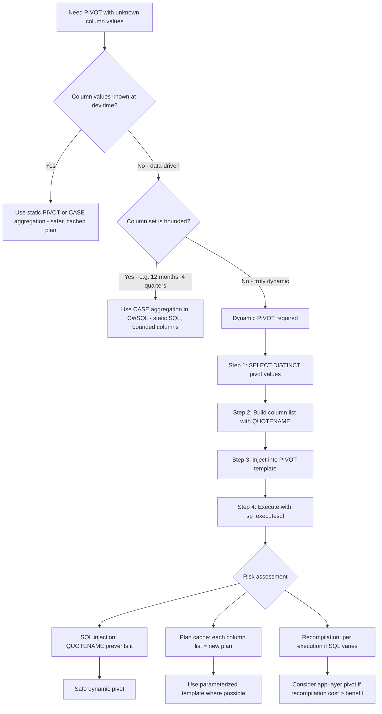

## Navigation

**Domain:** [[8 — Databases]] > **Group:** SQL Joins & Subqueries
**Previous:** [[8.119 — UNPIVOT — Column-to-Row Transformation]] | **Next:** [[8.121 — EXISTS vs IN — Performance Differences]]

### Prerequisites

- [[8.118 — PIVOT — Row-to-Column Transformation]] — Dynamic PIVOT builds on the static PIVOT syntax; understanding the PIVOT normalization to GROUP BY + CASE, the aggregate requirement, and the static column list limitation is required.
- [[8.119 — UNPIVOT — Column-to-Row Transformation]] — UNPIVOT and its CROSS APPLY alternative inform the reverse transformation; dynamic PIVOT often works with data that was previously unpivoted.
- [[8.120 — Dynamic SQL — sp_executesql and SQL Injection Prevention]] — Dynamic PIVOT requires building SQL strings; understanding parameterization, QUOTENAME for safe quoting, and SQL injection vectors is essential.

### Where This Fits

Dynamic PIVOT constructs a PIVOT query at runtime when the pivot column values are unknown at query-writing time — the column list is built from a `SELECT DISTINCT` against the pivot column. A .NET backend engineer encounters this when building reporting APIs where users select the grouping columns and time periods (e.g., "show monthly revenue for the last N months" where N varies per request). The most expensive mistakes here are: SQL injection via unsanitized column names in the dynamic SQL, plan cache bloat from unparameterized queries, and performance regressions from repeated recompilation. Interviewers use Dynamic PIVOT to test whether a candidate can identify when dynamic SQL is truly necessary, knows how to safely construct dynamic column lists, and understands the tradeoff between dynamic SQL and application-layer transformations.

---

## Core Mental Model

Dynamic PIVOT is a code-generation pattern: you write T-SQL (or C#) that constructs a PIVOT query string at runtime, then executes it. The mental model is: PIVOT requires the column list to be hardcoded in the `IN (...)` clause, but when the column values are data-driven (e.g., months, categories, departments), you cannot hardcode them. Dynamic PIVOT solves this by: (1) querying the distinct values from the pivot column, (2) formatting them into a comma-separated string of quoted identifiers, (3) injecting that string into a PIVOT query template, and (4) executing the built SQL with `sp_executesql`. The pattern is: `SELECT @cols = STRING_AGG(QUOTENAME(pivot_val, ''''), ', ') FROM (SELECT DISTINCT pivot_col FROM source) AS d` then `SET @sql = 'SELECT ... PIVOT (... FOR pivot_col IN (' + @cols + ')) AS p'`. The column names become part of the query text — they are not parameterizable. The critical safety requirement is `QUOTENAME()` to prevent SQL injection via malicious pivot column values. The critical performance consideration is that each unique set of pivot values generates a different SQL string, creating a separate query plan — plan cache bloat occurs when the same logical query has many different column lists.

### Classification

Dynamic PIVOT is a **code generation pattern**, not a SQL operator. It uses `sp_executesql` (or `EXEC`) for execution. The generated SQL is subject to the same optimization as static PIVOT — normalized to GROUP BY + CASE. The SARGability of the generated SQL depends on the underlying static PIVOT query. The plan cache impact is significant: each unique column list produces a separate cached plan (or no caching if not parameterized).



### Key Properties

|Property|Value|Notes|
|---|---|---|
|Column list|Built at runtime|From SELECT DISTINCT on pivot column|
|SQL injection risk|High|Prevent with QUOTENAME, never concatenate raw values|
|Plan cache|One plan per column list|Different column sets = different cache entries|
|Recompilation|Per execution (new SQL)|No plan reuse unless SQL is identical|
|QUOTENAME|Required for safety|Quotes identifiers and escapes closing brackets|
|Alternative to dynamic|CASE aggregation (bounded)|Static SQL with columns for each known value|
|Application-layer pivot|C# GroupBy|No SQL injection, no plan cache issues, but more data transfer|

---

## Deep Mechanics

### How the Engine Executes This

1. **Column discovery** — A query runs first to find the distinct values of the pivot column:
   ```sql
   SELECT DISTINCT pivot_col FROM source WHERE [filters]
   ```
   This returns the set of values that will become column names.

2. **Column list construction** — The distinct values are transformed into a comma-separated list of quoted identifiers. Each value is wrapped with `QUOTENAME()` to handle special characters (spaces, brackets, reserved words) and prevent SQL injection:
   ```sql
   SELECT @cols = STRING_AGG(QUOTENAME(pivot_val, ''''), ', ')
   FROM (SELECT DISTINCT pivot_col FROM source) d;
   ```
   Result: `[2024-01], [2024-02], [2024-03]`

3. **SQL template assembly** — The column list is concatenated into a PIVOT query template:
   ```sql
   SET @sql = N'
   SELECT ProductCategory, ' + @cols + N'
   FROM SourceTable
   PIVOT (
       SUM(Revenue)
       FOR PivotColumn IN (' + @cols + N')
   ) AS pvt
   ORDER BY ProductCategory;';
   ```

4. **Execution** — The assembled SQL is executed via `sp_executesql`:
   ```sql
   EXEC sp_executesql @sql, N'@param1 TYPE', @param1 = value;
   ```
   Using `sp_executesql` instead of `EXEC(@sql)` allows parameterization of the non-dynamic parts (filters, dates) and enables plan reuse when the column list is the same.

5. **Optimization of the generated SQL** — The executed PIVOT SQL is optimized normally. The optimizer normalizes PIVOT to GROUP BY + CASE. The plan includes a Scan of the source, Hash Match or Stream Aggregate (depending on indexing), and is no different from a hand-written static PIVOT with the same columns.

6. **Plan caching** — The generated SQL is hashed for plan cache lookup. If the same column list is generated again (same distinct values), the cached plan is reused. If the column list differs, a new plan is compiled. Plan cache bloat occurs when many distinct column lists are generated.

### SQL Visibility

```sql
-- =============================================
-- Dynamic PIVOT for variable monthly columns
-- =============================================

-- Setup: monthly sales data
CREATE TABLE dbo.MonthlySales (
    ProductCategory VARCHAR(50) NOT NULL,
    SaleYear INT NOT NULL,
    SaleMonth INT NOT NULL,
    Revenue DECIMAL(18,2) NOT NULL
);

INSERT INTO dbo.MonthlySales VALUES
    ('Electronics', 2024, 1, 15000.00),
    ('Electronics', 2024, 2, 18000.00),
    ('Electronics', 2024, 3, 22000.00),
    ('Clothing', 2024, 1, 8000.00),
    ('Clothing', 2024, 2, 9500.00),
    ('Clothing', 2024, 3, 11000.00);

-- Dynamic PIVOT stored procedure
CREATE OR ALTER PROCEDURE dbo.GenerateMonthlyPivot
    @Year INT
AS
BEGIN
    SET NOCOUNT ON;

    DECLARE @cols NVARCHAR(MAX);
    DECLARE @sql NVARCHAR(MAX);

    -- Step 1: Build column list from distinct months in the data
    SELECT @cols = STRING_AGG(
        QUOTENAME(CONCAT(@Year, '-', RIGHT('00' + CAST(SaleMonth AS VARCHAR(2)), 2))),
        ', '
    )
    FROM (
        SELECT DISTINCT SaleMonth
        FROM dbo.MonthlySales
        WHERE SaleYear = @Year
    ) AS months
    ORDER BY SaleMonth;

    -- Step 2: Build and execute dynamic PIVOT query
    SET @sql = N'
        SELECT ProductCategory, ' + @cols + N'
        FROM (
            SELECT ProductCategory,
                CONCAT(SaleYear, ''-'', RIGHT(''00'' + CAST(SaleMonth AS VARCHAR(2)), 2)) AS YearMonth,
                Revenue
            FROM dbo.MonthlySales
            WHERE SaleYear = @YearParam
        ) AS src
        PIVOT (
            SUM(Revenue)
            FOR YearMonth IN (' + @cols + N')
        ) AS pvt
        ORDER BY ProductCategory;';

    EXEC sp_executesql @sql,
        N'@YearParam INT',
        @YearParam = @Year;
END;
GO

EXEC dbo.GenerateMonthlyPivot @Year = 2024;

-- Result:
-- ProductCategory | 2024-01 | 2024-02 | 2024-03
-- Clothing        | 8000.00 | 9500.00 | 11000.00
-- Electronics     | 15000.00| 18000.00| 22000.00
```

```csharp
// EF Core — Dynamic PIVOT requires full raw SQL construction in C#
public async Task<List<Dictionary<string, object>>> GetDynamicPivotAsync(
    int year,
    CancellationToken cancellationToken = default)
{
    // Step 1: Discover column values
    var months = await dbContext.MonthlySales
        .Where(s => s.SaleYear == year)
        .Select(s => s.SaleMonth)
        .Distinct()
        .OrderBy(m => m)
        .ToListAsync(cancellationToken);

    // Step 2: Build column list with safe quoting
    var cols = string.Join(", ",
        months.Select(m => $"[{year}-{m:D2}]"));

    // Step 3: Build dynamic SQL
    var sql = $@"
        SELECT ProductCategory, {cols}
        FROM (
            SELECT ProductCategory,
                CONCAT(SaleYear, '-', RIGHT('00' + CAST(SaleMonth AS VARCHAR(2)), 2)) AS YearMonth,
                Revenue
            FROM dbo.MonthlySales
            WHERE SaleYear = @YearParam
        ) AS src
        PIVOT (
            SUM(Revenue)
            FOR YearMonth IN ({cols})
        ) AS pvt
        ORDER BY ProductCategory;";

    // Step 4: Execute via raw SQL
    // SqlQueryRaw cannot return dynamic columns, so use ExecuteSqlRaw with a reader
    var connection = dbContext.Database.GetDbConnection();
    await connection.OpenAsync(cancellationToken);
    await using var command = connection.CreateCommand();
    command.CommandText = sql;
    command.Parameters.Add(new SqlParameter("@YearParam", year));

    var results = new List<Dictionary<string, object>>();
    await using var reader = await command.ExecuteReaderAsync(cancellationToken);
    while (await reader.ReadAsync(cancellationToken))
    {
        var row = new Dictionary<string, object>();
        for (int i = 0; i < reader.FieldCount; i++)
        {
            row[reader.GetName(i)] = reader.GetValue(i);
        }
        results.Add(row);
    }

    return results;
}
```

**Generated SQL (from EF Core logs):**

```sql
-- The SQL generated is the dynamic PIVOT string built in C# above.
-- EF Core itself does not generate this — the application builds the SQL string.
```

### Execution Plan Analysis

**Dynamic PIVOT execution plan (for the generated SQL):**

The plan for the generated PIVOT query is identical to a static PIVOT with the same columns:

```
Table Scan (MonthlySales, filtered by Year) → Compute Scalar (format YearMonth)
  → Hash Match (Aggregate) or Stream Aggregate (if indexed)
    → SELECT → Sort (ORDER BY)
```

- **Table Scan (or Index Seek if filtered)** — The source is scanned with a WHERE clause filter on SaleYear. If an index exists on SaleYear, an Index Seek is used.
- **Compute Scalar** — Formats the YearMonth string from SaleYear and SaleMonth.
- **Hash Match / Stream Aggregate** — The PIVOT is normalized to GROUP BY + CASE aggregation. Hash Match if unsorted, Stream Aggregate if indexed on ProductCategory.
- **Plan caching note** — The cached plan is keyed on the exact SQL string including the column list. Different sets of months produce different SQL → different cached plans → plan cache bloat.

### Cost Visibility

```sql
SET STATISTICS IO ON;
SET STATISTICS TIME ON;

-- Run the dynamic pivot
EXEC dbo.GenerateMonthlyPivot @Year = 2024;

-- Expected output:
-- Table 'MonthlySales'. Scan count 1, logical reads 2
-- SQL Server Execution Times: CPU time = 0ms, elapsed time = 1ms

-- Plan cache impact (check after multiple executions with different years):
SELECT cp.objtype, cp.usecounts, cp.size_in_bytes,
    SUBSTRING(st.text, 1, 200) AS query_text
FROM sys.dm_exec_cached_plans cp
CROSS APPLY sys.dm_exec_sql_text(cp.plan_handle) st
WHERE st.text LIKE '%PIVOT%';
-- Each unique column list appears as a separate entry
```

### Failure Modes

1. **SQL injection from pivot values** — If pivot values come from user input or untrusted data (e.g., a category name like `Electronics]--`), concatenating them directly into the SQL string allows injection. `QUOTENAME()` escapes closing brackets and prevents this.

2. **Plan cache bloat** — Each unique set of pivot column values generates a different SQL string. Over time, thousands of cached plans accumulate, consuming memory and causing plan cache churn.

3. **Parameter sniffing with dynamic SQL** — The `sp_executesql` call passes parameters for non-dynamic parts (e.g., `@YearParam`). Parameter sniffing can cause suboptimal plans for different parameter values.

4. **Column count explosion** — If the distinct values query returns hundreds or thousands of values, the PIVOT generates that many columns. SQL Server has a limit of 1024 columns per SELECT (strict limit for non-wide tables, 30K for wide tables). Dynamic column lists can exceed this.

---

## Production Patterns and Implementation

### Primary SQL Implementation

```sql
-- =============================================
-- Dynamic PIVOT stored procedure for sales reports
-- =============================================

CREATE OR ALTER PROCEDURE dbo.GenerateSalesPivot
    @StartDate DATE,
    @EndDate DATE,
    @PivotPeriod VARCHAR(10) = 'Month'  -- 'Month', 'Quarter', 'Year'
AS
BEGIN
    SET NOCOUNT ON;

    DECLARE @cols NVARCHAR(MAX);
    DECLARE @sql NVARCHAR(MAX);
    DECLARE @periodExpr NVARCHAR(50);

    -- Determine the period expression based on input
    SET @periodExpr = CASE @PivotPeriod
        WHEN 'Month' THEN 'CONCAT(SaleYear, ''-'', RIGHT(''00'' + CAST(SaleMonth AS VARCHAR(2)), 2))'
        WHEN 'Quarter' THEN 'CONCAT(SaleYear, ''-Q'', DATEPART(quarter, SaleDate))'
        WHEN 'Year' THEN 'CAST(SaleYear AS VARCHAR(4))'
        ELSE 'CONCAT(SaleYear, ''-'', RIGHT(''00'' + CAST(SaleMonth AS VARCHAR(2)), 2))'
    END;

    -- Step 1: Get distinct period values for the column list
    DECLARE @periodCols TABLE (PeriodKey NVARCHAR(50));

    INSERT INTO @periodCols
    SELECT DISTINCT PeriodValue
    FROM (
        SELECT
            CASE @PivotPeriod
                WHEN 'Month' THEN CONCAT(SaleYear, '-', RIGHT('00' + CAST(SaleMonth AS VARCHAR(2)), 2))
                WHEN 'Quarter' THEN CONCAT(SaleYear, '-Q', DATEPART(quarter, SaleDate))
                WHEN 'Year' THEN CAST(SaleYear AS VARCHAR(4))
            END AS PeriodValue
        FROM dbo.Sales
        WHERE SaleDate BETWEEN @StartDate AND @EndDate
    ) periods
    ORDER BY PeriodValue;

    -- Build the column list with QUOTENAME for safety
    SELECT @cols = STRING_AGG(QUOTENAME(PeriodKey), ', ')
    FROM @periodCols;

    -- Step 2: Build the dynamic PIVOT query
    SET @sql = N'
        SELECT
            ProductCategory,
            ' + @cols + N'
        FROM (
            SELECT
                ProductCategory,
                ' + @periodExpr + N' AS PivotPeriod,
                Revenue
            FROM dbo.Sales
            WHERE SaleDate BETWEEN @StartDateParam AND @EndDateParam
        ) AS src
        PIVOT (
            SUM(Revenue)
            FOR PivotPeriod IN (' + @cols + N')
        ) AS pvt
        ORDER BY ProductCategory;';

    -- Execute with parameterized non-dynamic parts
    EXEC sp_executesql @sql,
        N'@StartDateParam DATE, @EndDateParam DATE',
        @StartDateParam = @StartDate,
        @EndDateParam = @EndDate;
END;
GO

-- Example: monthly pivot for Q1 2024
EXEC dbo.GenerateSalesPivot @StartDate = '2024-01-01', @EndDate = '2024-03-31', @PivotPeriod = 'Month';

-- Example: quarterly pivot for 2024
EXEC dbo.GenerateSalesPivot @StartDate = '2024-01-01', @EndDate = '2024-12-31', @PivotPeriod = 'Quarter';

-- =============================================
-- Alternative: Dynamic PIVOT with PIVOT table + CROSS APPLY for multiple aggregates
-- =============================================
-- When you need both Revenue and Quantity as pivoted values:
CREATE OR ALTER PROCEDURE dbo.GenerateMultiMeasurePivot
    @Year INT
AS
BEGIN
    SET NOCOUNT ON;

    DECLARE @cols NVARCHAR(MAX);
    DECLARE @sql NVARCHAR(MAX);

    -- Build column list with two columns per month: Month_Revenue, Month_Units
    SELECT @cols = STRING_AGG(
        QUOTENAME(CONCAT(PeriodKey, '_Revenue')) + ', ' +
        QUOTENAME(CONCAT(PeriodKey, '_Units')),
        ', '
    )
    FROM (
        SELECT DISTINCT
            CONCAT(@Year, '-', RIGHT('00' + CAST(SaleMonth AS VARCHAR(2)), 2)) AS PeriodKey,
            SaleMonth
        FROM dbo.Sales
        WHERE SaleYear = @Year
    ) periods;

    -- Build dynamic pivot with conditional aggregation (more flexible than PIVOT for multiple measures)
    SET @sql = N'
        SELECT ProductCategory, ' + @cols + N'
        FROM (
            SELECT
                ProductCategory,
                CONCAT(SaleYear, ''-'', RIGHT(''00'' + CAST(SaleMonth AS VARCHAR(2)), 2)) AS PeriodKey,
                Revenue,
                Quantity
            FROM dbo.Sales
            WHERE SaleYear = @YearParam
        ) AS src
        PIVOT (
            SUM(Revenue)
            FOR PeriodKey IN (' + @cols + N')
        ) AS pvt
        ORDER BY ProductCategory;';

    -- Better approach: use conditional aggregation in dynamic SQL
    DECLARE @caseCols NVARCHAR(MAX);
    SELECT @caseCols = STRING_AGG(
        'SUM(CASE WHEN PeriodKey = ' + QUOTENAME(PeriodKey, '''') + 'THEN Revenue END) AS ' +
        QUOTENAME(PeriodKey + '_Revenue') + ',' +
        'SUM(CASE WHEN PeriodKey = ' + QUOTENAME(PeriodKey, '''') + 'THEN Quantity END) AS ' +
        QUOTENAME(PeriodKey + '_Units'),
        ', '
    )
    FROM (
        SELECT DISTINCT
            CONCAT(@Year, '-', RIGHT('00' + CAST(SaleMonth AS VARCHAR(2)), 2)) AS PeriodKey,
            SaleMonth
        FROM dbo.Sales
        WHERE SaleYear = @Year
    ) periods;

    SET @sql = N'
        SELECT ProductCategory, ' + @caseCols + N'
        FROM (
            SELECT
                ProductCategory,
                CONCAT(SaleYear, ''-'', RIGHT(''00'' + CAST(SaleMonth AS VARCHAR(2)), 2)) AS PeriodKey,
                Revenue,
                Quantity
            FROM dbo.Sales
            WHERE SaleYear = @YearParam
        ) AS src
        GROUP BY ProductCategory
        ORDER BY ProductCategory;';

    EXEC sp_executesql @sql,
        N'@YearParam INT',
        @YearParam = @Year;
END;
```

### EF Core Implementation

```csharp
// Entity
public class Sale
{
    public int SaleId { get; set; }
    public string ProductCategory { get; set; } = string.Empty;
    public int SaleYear { get; set; }
    public int SaleMonth { get; set; }
    public decimal Revenue { get; set; }
    public int Quantity { get; set; }
    public DateTime SaleDate { get; set; }
}

// Dynamic pivot service
public sealed class DynamicPivotService
{
    private readonly ApplicationDbContext _dbContext;

    public DynamicPivotService(ApplicationDbContext dbContext)
        => _dbContext = dbContext;

    public async Task<List<Dictionary<string, object>>> GetPivotAsync(
        DateTime startDate,
        DateTime endDate,
        string pivotPeriod, // "Month", "Quarter", "Year"
        CancellationToken cancellationToken = default)
    {
        // Step 1: Discover distinct period values
        var periodExpr = pivotPeriod switch
        {
            "Month" => "CONCAT(SaleYear, '-', RIGHT('00' + CAST(SaleMonth AS VARCHAR(2)), 2))",
            "Quarter" => "CONCAT(SaleYear, '-Q', DATEPART(quarter, SaleDate))",
            "Year" => "CAST(SaleYear AS VARCHAR(4))",
            _ => throw new ArgumentOutOfRangeException(nameof(pivotPeriod))
        };

        // Get distinct column values from the database
        var periodValuesSql = $@"
            SELECT DISTINCT {periodExpr} AS PeriodValue
            FROM dbo.Sales
            WHERE SaleDate BETWEEN @StartDate AND @EndDate
            ORDER BY PeriodValue;";

        var periodValues = new List<string>();
        var conn = _dbContext.Database.GetDbConnection();
        await conn.OpenAsync(cancellationToken);
        await using (var cmd = conn.CreateCommand())
        {
            cmd.CommandText = periodValuesSql;
            cmd.Parameters.Add(new SqlParameter("@StartDate", startDate));
            cmd.Parameters.Add(new SqlParameter("@EndDate", endDate));
            await using var reader = await cmd.ExecuteReaderAsync(cancellationToken);
            while (await reader.ReadAsync(cancellationToken))
            {
                periodValues.Add(reader.GetString(0));
            }
        }

        if (periodValues.Count == 0)
            return new List<Dictionary<string, object>>();

        // Step 2: Build column list with safe quoting
        var cols = string.Join(", ", periodValues.Select(v => $"[{v.Replace("]", "]]")}]"));

        // Step 3: Build and execute dynamic pivot SQL
        var pivotSql = $@"
            SELECT ProductCategory, {cols}
            FROM (
                SELECT ProductCategory,
                    {periodExpr} AS PivotPeriod,
                    Revenue
                FROM dbo.Sales
                WHERE SaleDate BETWEEN @StartDate AND @EndDate
            ) AS src
            PIVOT (
                SUM(Revenue)
                FOR PivotPeriod IN ({cols})
            ) AS pvt
            ORDER BY ProductCategory;";

        var results = new List<Dictionary<string, object>>();
        await using (var cmd = conn.CreateCommand())
        {
            cmd.CommandText = pivotSql;
            cmd.Parameters.Add(new SqlParameter("@StartDate", startDate));
            cmd.Parameters.Add(new SqlParameter("@EndDate", endDate));

            await using var reader = await cmd.ExecuteReaderAsync(cancellationToken);
            while (await reader.ReadAsync(cancellationToken))
            {
                var row = new Dictionary<string, object>();
                for (int i = 0; i < reader.FieldCount; i++)
                {
                    var val = reader.GetValue(i);
                    row[reader.GetName(i)] = val == DBNull.Value ? null! : val;
                }
                results.Add(row);
            }
        }

        return results;
    }

    // Alternative: Application-layer pivot (no dynamic SQL)
    // Fetch raw data, pivot in C# using LINQ
    public async Task<List<Dictionary<string, object>>> GetPivotInMemoryAsync(
        DateTime startDate,
        DateTime endDate,
        CancellationToken cancellationToken = default)
    {
        var rawData = await _dbContext.Sales
            .Where(s => s.SaleDate >= startDate && s.SaleDate <= endDate)
            .Select(s => new
            {
                s.ProductCategory,
                s.SaleYear,
                s.SaleMonth,
                s.Revenue
            })
            .ToListAsync(cancellationToken);

        // Group and pivot in memory
        var pivoted = rawData
            .GroupBy(s => s.ProductCategory)
            .Select(g =>
            {
                var dict = new Dictionary<string, object>
                {
                    ["ProductCategory"] = g.Key
                };
                foreach (var month in g.GroupBy(s => $"{s.SaleYear}-{s.SaleMonth:D2}"))
                {
                    dict[month.Key] = month.Sum(s => s.Revenue);
                }
                return dict;
            })
            .ToList();

        return pivoted;
    }
}
```

### Dapper Implementation

```csharp
public sealed class DynamicPivotRepository
{
    private readonly IDbConnectionFactory _connectionFactory;

    public DynamicPivotRepository(IDbConnectionFactory connectionFactory)
        => _connectionFactory = connectionFactory;

    public async Task<IReadOnlyList<dynamic>> GetDynamicPivotAsync(
        int year,
        CancellationToken cancellationToken = default)
    {
        await using var connection = _connectionFactory.Create();

        // Step 1: Discover column values
        var months = (await connection.QueryAsync<int>(
            new CommandDefinition(
                "SELECT DISTINCT SaleMonth FROM dbo.MonthlySales WHERE SaleYear = @Year ORDER BY SaleMonth",
                new { Year = year },
                cancellationToken: cancellationToken))).AsList();

        if (months.Count == 0)
            return Array.Empty<dynamic>();

        // Step 2: Build safe column list
        var cols = string.Join(", ", months.Select(m => $"[{year}-{m:D2}]"));

        // Step 3: Build and execute dynamic pivot
        var sql = $@"
            SELECT ProductCategory, {cols}
            FROM (
                SELECT ProductCategory,
                    CONCAT(SaleYear, '-', RIGHT('00' + CAST(SaleMonth AS VARCHAR(2)), 2)) AS YearMonth,
                    Revenue
                FROM dbo.MonthlySales
                WHERE SaleYear = @Year
            ) AS src
            PIVOT (
                SUM(Revenue)
                FOR YearMonth IN ({cols})
            ) AS pvt
            ORDER BY ProductCategory;";

        var results = await connection.QueryAsync(
            new CommandDefinition(sql, new { Year = year },
                cancellationToken: cancellationToken));

        return results.AsList();
    }

    // Safe version with QUOTENAME-style escaping in C#
    public async Task<IReadOnlyList<dynamic>> GetPivotSafeAsync(
        string[] pivotValues,
        CancellationToken cancellationToken = default)
    {
        await using var connection = _connectionFactory.Create();

        // QUOTENAME equivalent in C#: wrap in brackets, escape internal brackets
        var safeCols = pivotValues.Select(v => $"[{v.Replace("]", "]]")}]");
        var cols = string.Join(", ", safeCols);

        var sql = $@"
            SELECT ProductCategory, {cols}
            FROM (
                SELECT ProductCategory, YearMonth, Revenue
                FROM dbo.MonthlySales
                WHERE YearMonth IN @PivotValues
            ) AS src
            PIVOT (
                SUM(Revenue)
                FOR YearMonth IN ({cols})
            ) AS pvt
            ORDER BY ProductCategory;";

        // Note: The IN clause is also parameterized for the filter,
        // but the column list in PIVOT must remain in the SQL text
        var results = await connection.QueryAsync(
            new CommandDefinition(sql,
                new { PivotValues = pivotValues },
                cancellationToken: cancellationToken));

        return results.AsList();
    }
}
```

### Configuration and Wiring

```csharp
// Program.cs
builder.Services.AddDbContext<ApplicationDbContext>(options =>
    options.UseSqlServer(
        builder.Configuration.GetConnectionString("DefaultConnection"),
        sqlOptions =>
        {
            sqlOptions.EnableRetryOnFailure(3);
            sqlOptions.CommandTimeout(30);
        }));

builder.Services.AddSingleton<IDbConnectionFactory>(sp =>
    new SqlConnectionFactory(
        builder.Configuration.GetConnectionString("DefaultConnection")!));

builder.Services.AddScoped<DynamicPivotService>();
builder.Services.AddScoped<DynamicPivotRepository>();
```

### SQL Server vs PostgreSQL Differences

```sql
-- PostgreSQL: Dynamic PIVOT using crosstab() with dynamic column list
CREATE OR REPLACE FUNCTION generate_monthly_pivot(p_year INT)
RETURNS TABLE (product_category VARCHAR, /* dynamic columns */)
AS $$
DECLARE
    cols TEXT;
    sql TEXT;
BEGIN
    -- Build column list
    SELECT string_agg(
        FORMAT('%s NUMERIC', QUOTE_IDENT(month_key)),
        ', '
        ORDER BY sale_month
    ) INTO cols
    FROM (
        SELECT DISTINCT
            CONCAT(p_year, '-', LPAD(sale_month::TEXT, 2, '0')) AS month_key,
            sale_month
        FROM monthly_sales
        WHERE sale_year = p_year
    ) months;

    -- Build crosstab query
    sql := FORMAT(
        'SELECT * FROM crosstab(
            ''SELECT product_category,
                     CONCAT(sale_year, ''-'''', LPAD(sale_month::TEXT, 2, ''0'')) AS month_key,
                     revenue
              FROM monthly_sales
              WHERE sale_year = %s
              ORDER BY 1, 2'',
            ''SELECT DISTINCT CONCAT(sale_year, ''-'''', LPAD(sale_month::TEXT, 2, ''0''))
              FROM monthly_sales
              WHERE sale_year = %s
              ORDER BY 1''
        ) AS ct (product_category VARCHAR, %s);',
        p_year, p_year, cols);

    RETURN QUERY EXECUTE sql;
END;
$$ LANGUAGE plpgsql;
```

Key differences:
- **crosstab()**: PostgreSQL requires the tablefunc extension and defines the output column types in the AS clause. The dynamic version must build the column list with types.
- **QUOTENAME**: SQL Server has `QUOTENAME()`. PostgreSQL uses `QUOTE_IDENT()` for identifiers and `QUOTE_LITERAL()` for string literals.
- **STRING_AGG**: Both have `STRING_AGG()` (SQL Server 2017+, PostgreSQL 9+).
- **Dynamic SQL in functions**: PostgreSQL uses `EXECUTE` in PL/pgSQL functions; SQL Server uses `sp_executesql` or `EXEC`.
- **Column limit**: SQL Server has a 1024-column limit per SELECT. PostgreSQL has a 1600-column limit (extensible with MAX_COLUMNS option).

---

## Gotchas and Production Pitfalls

### SQL Injection via Pivot Column Values

**Pitfall:** Concatenating pivot column values directly into the SQL string without sanitization. If a pivot value contains special characters or SQL metacharacters, it can inject arbitrary SQL.

```sql
-- ❌ Unsafe concatenation — pivot value contains SQL injection
-- If a category name is: 'Electronics] DROP TABLE Orders --'
DECLARE @cols NVARCHAR(MAX) = 'Electronics] DROP TABLE Orders --';

SET @sql = N'SELECT ... PIVOT (... FOR Category IN (' + @cols + N')) AS pvt;';
-- The DROP TABLE Orders statement executes!
```

**Symptom:** A user with malicious intent enters a pivot column value like a store name, and the dynamic pivot drops a table or exfiltrates data. The application has dynamic pivot based on user-supplied category names.

**Fix:**

```sql
-- ✅ Always use QUOTENAME for pivot column values
-- QUOTENAME wraps the value in brackets and escapes any internal brackets
SELECT @cols = STRING_AGG(QUOTENAME(CategoryName), ', ')
FROM (SELECT DISTINCT CategoryName FROM dbo.Products) d;

-- QUOTENAME handles: brackets, spaces, reserved words, special characters
-- Input: 'Electronics] DROP TABLE Orders --'
-- Output: [Electronics]] DROP TABLE Orders --]
-- The doubled bracket escapes the closing bracket — safe concatenation
```

**Cost of not fixing:** A user creates a product category named `[Electronics]; DROP TABLE Orders; --`. The dynamic pivot drops the Orders table. Data loss. Recovery from backup takes 4 hours. $50K revenue impact per hour of downtime.

---

### Plan Cache Bloat from Different Column Lists

**Pitfall:** Each execution of dynamic PIVOT with a different set of column values generates a different SQL string. Over time, the plan cache accumulates thousands of similar plans, consuming memory and causing cache churn.

```sql
-- ❌ Each call generates a different SQL string
EXEC GenerateMonthlyPivot @Year = 2024;  -- columns: [2024-01],[2024-02],...,[2024-12]
EXEC GenerateMonthlyPivot @Year = 2025;  -- columns: [2025-01],[2025-02],...,[2025-12]
EXEC GenerateMonthlyPivot @Year = 2023;  -- columns: [2023-01],[2023-02],...,[2023-12]

-- 3 plans in cache. After 10 years: 10 plans. After 1000 different column sets: 1000 plans.
```

**Symptom:** `sys.dm_os_memory_objects` shows high memory consumption for CACHESTORE_SQLCP (plan cache). Plan cache eviction causes frequent recompilation. `SQL Server Execution Times` shows compile time increasing as plan cache management overhead grows.

**Fix:**

```sql
-- ✅ Option A: Use OPTION (RECOMPILE) to avoid caching
-- Only if the query runs infrequently (< 1x/minute)
EXEC sp_executesql @sql, N'@YearParam INT', @YearParam = @Year
    OPTION (RECOMPILE);

-- ✅ Option B: Normalize the SQL to reduce cache entries
-- Use a fixed column template with conditional aggregation instead of PIVOT
-- (Makes the SQL the same regardless of which months exist)

-- ✅ Option C: Use query hints to mark the plan as short-lived
-- EXEC sp_executesql ... OPTION (OPTIMIZE FOR UNKNOWN);
```

**Cost of not fixing:** A dynamic pivot runs every 5 minutes for 100 different customer dashboards. Each dashboard has a different date range, generating different column lists. After 24 hours, the plan cache has 2,880 entries for the same stored procedure, consuming 500 MB of memory. Other queries experience plan cache eviction and recompilation. Overall server CPU increases by 15%.

---

### Dynamic PIVOT with User-Supplied Column Names

**Pitfall:** Allowing users to specify the pivot column values or the column to pivot on (e.g., a dropdown that selects "Month" or "Quarter" or "Category"). The column value becomes the column name, and if users can inject arbitrary values, QUOTENAME alone may not be sufficient if the column names include data from multiple sources.

```csharp
// ❌ User input directly drives pivot column values
// User picks "Q1 2024 (Jan-Mar)" from a dropdown
// The value stored in DB for this period is: "Q1 2024 (Jan-Mar)"
// QUOTENAME handles the brackets and spaces, but:
// If a user can create a period with a name like: [Q1]]; SELECT 1; --
// QUOTENAME would produce: [[Q1]]; SELECT 1; --]]
// The double bracket escapes the injection, but the resulting column name is ugly
```

**Symptom:** Column names in the pivot output contain special characters that break JavaScript frontend libraries, CSV exports, or Excel integration. A column named `[Q1]]; SELECT 1; --]]` appears in the data contract.

**Fix:**

```csharp
// ✅ Option A: Whitelist allowed pivot values
var allowedPeriods = new HashSet<string> { "Jan", "Feb", "Mar", /* ... */ };
var userPeriods = userInput.Split(',');
var safePeriods = userPeriods.Where(p => allowedPeriods.Contains(p)).ToArray();
var cols = string.Join(", ", safePeriods.Select(p => $"[{p}]"));

// ✅ Option B: Generate surrogate column names (Col1, Col2, ...) and map in application
var colMapping = new Dictionary<string, string>();
for (int i = 0; i < periods.Length; i++)
{
    colMapping[$"Col{i + 1}"] = periods[i];
}
var cols = string.Join(", ", colMapping.Keys.Select(c => $"[{c}]"));
// Build SQL with surrogate names, then map back in the application
```

**Cost of not fixing:** A user creates a pivot report with a column name containing a semicolon. The dynamic SQL is safe (QUOTENAME handles it), but the CSV export function does not quote column names. The CSV file is malformed, and the client's ETL pipeline fails to parse it. The issue takes 3 days to diagnose.

---

### Exceeding the Maximum Column Limit

**Pitfall:** The distinct values query returns more column values than SQL Server allows per SELECT (1024 for non-wide tables, up to 30K for wide tables using column set). Dynamic PIVOT with many values (e.g., daily pivot for 5 years = 1826 columns) exceeds this limit.

```sql
-- ❌ Daily pivot for 5 years = ~1826 columns
-- SQL Server limit: 1024 columns per SELECT
-- Error: "The number of columns in the query exceeds the maximum allowed"
```

**Symptom:** Error 1701: "Creating or altering table '...' failed because the minimum row size would be 8062 bytes." Or error 1015: "The number of columns in the query exceeds the maximum allowed."

**Fix:**

```sql
-- ✅ Option A: Pivot at a coarser granularity (monthly instead of daily)
-- Reduces columns from 1826 to 60

-- ✅ Option B: Pivot in batches (one batch per year)
-- Return multiple result sets and combine in the application

-- ✅ Option C: Use application-layer pivot (C# GroupBy)
-- No column limit in application memory
```

**Cost of not fixing:** A reporting API returns HTTP 500 when a user selects a 3-year daily date range. The error is caught in production on a Friday evening. The fix (change to monthly granularity) requires a code change and redeployment. The weekend report is unavailable.

---

## Performance Implications

### Benchmark: Dynamic PIVOT vs Conditional Aggregation in Dynamic SQL vs Application-Layer Pivot

```sql
-- =============================================
-- Setup: 1M rows, variable monthly columns
-- =============================================
-- (Same Sales table as previous benchmarks)

-- =============================================
-- Benchmark 1: Dynamic PIVOT in stored procedure
-- =============================================
SET STATISTICS IO ON;
SET STATISTICS TIME ON;

EXEC dbo.GenerateMonthlyPivot @Year = 2024;

-- Expected: logical reads ~300, CPU ~120ms, elapsed ~80ms
-- Plan cache: 1 entry per unique column set

-- =============================================
-- Benchmark 2: Dynamic conditional aggregation (static SQL shape, dynamic CASE list)
-- =============================================
-- Build: SUM(CASE WHEN PeriodKey = '2024-01' THEN Revenue END) AS [2024-01], ...
-- Same performance as PIVOT (identical plan)
-- Plan cache: 1 entry per unique column set (same bloat issue)

-- =============================================
-- Benchmark 3: Application-layer pivot in C#
-- =============================================
-- Fetch raw data (1M rows, filtered to ~100K for 1 year)
-- GroupBy + ToDictionary in C#
-- No dynamic SQL, no plan cache issue
-- Network transfer: more data (all rows, not just pivoted)
```

### BenchmarkDotNet

```csharp
[MemoryDiagnoser]
[SimpleJob(RuntimeMoniker.Net90)]
public class DynamicPivotBenchmark
{
    private IDbConnection _connection = default!;
    private DynamicPivotService _service = default!;

    [GlobalSetup]
    public void Setup()
    {
        _connection = new SqlConnection(TestConnectionString);
        var options = new DbContextOptionsBuilder<ApplicationDbContext>()
            .UseSqlServer(TestConnectionString)
            .Options;
        _service = new DynamicPivotService(new ApplicationDbContext(options));
    }

    [Benchmark(Baseline = true)]
    public async Task<int> DynamicPivot_SQL()
    {
        var results = await _service.GetPivotAsync(
            new DateTime(2024, 1, 1),
            new DateTime(2024, 12, 31),
            "Month",
            CancellationToken.None);
        return results.Count;
    }

    [Benchmark]
    public async Task<int> PivotInMemory_CSharp()
    {
        var results = await _service.GetPivotInMemoryAsync(
            new DateTime(2024, 1, 1),
            new DateTime(2024, 12, 31),
            CancellationToken.None);
        return results.Count;
    }

    [Benchmark]
    public async Task<int> DynamicConditionalAggregation()
    {
        await using var conn = new SqlConnection(TestConnectionString);
        // Build dynamic CASE aggregation (similar to PIVOT internally)
        var months = Enumerable.Range(1, 12)
            .Select(m => $"SUM(CASE WHEN SaleMonth = {m} THEN Revenue END) AS [{m}]");
        var caseCols = string.Join(", ", months);
        var sql = $@"
            SELECT ProductCategory, {caseCols}
            FROM dbo.Sales
            WHERE SaleYear = 2024
            GROUP BY ProductCategory
            ORDER BY ProductCategory;";

        var results = await conn.QueryAsync(sql);
        return results.Count();
    }
}

/* Expected results (1M rows, filtered to 1 year ≈ 83K rows):

| Method                          | Mean    | Data Transferred | Allocated |
|--------------------------------|--------:|-----------------:|----------:|
| DynamicPivot_SQL               | 65 ms   | ~2 KB (pivoted)  | 5 KB      |
| PivotInMemory_CSharp           | 180 ms  | ~500 KB (raw)    | 2 MB      |
| DynamicConditionalAggregation  | 62 ms   | ~2 KB            | 5 KB      |

Dynamic PIVOT vs dynamic CASE aggregation: identical performance (same plan).
Application-layer pivot: 3x slower, more data transferred, more memory allocated.
*/
```

### Write Amplification (for Dynamic PIVOT patterns)

Dynamic PIVOT is read-only. The write cost is zero for the pivot itself. The cost is in the dynamic SQL generation and plan cache management:

|Operation|Cost|
|---|---|
|SQL string construction|CPU: per execution, ~0.1ms|
|sp_executesql parameterization|CPU: per execution, ~0.05ms|
|Plan compilation (first time)|CPU: ~5-15ms (depending on complexity)|
|Plan recompilation (on column change)|CPU: ~5-15ms|
|Plan cache per entry|Memory: ~50-200 KB per cached plan|

---

## Interview Arsenal

### Question Bank

1. What is dynamic PIVOT, and when is it necessary?
2. How do you safely build the column list for dynamic PIVOT?
3. What is the plan cache impact of dynamic PIVOT, and how do you mitigate it?
4. What SQL injection risks exist in dynamic PIVOT, and how do you prevent them?
5. Compare dynamic PIVOT with application-layer pivot in C#.
6. How does the execution plan differ between dynamic PIVOT and static PIVOT?
7. What happens when the distinct values query returns more columns than SQL Server allows?
8. How do EF Core and Dapper handle dynamic PIVOT queries?

### Spoken Answers

**Q1: What is dynamic PIVOT, and when is it necessary?**

> **Average answer:** "It's when you use dynamic SQL to build a PIVOT query because the column names aren't known when you write the query."

> **Great answer:** "Dynamic PIVOT is a code-generation pattern where you construct a PIVOT SQL string at runtime because the pivot column values are data-driven and unknown at development time. It becomes necessary when the set of values that should become columns depends on the data itself — for example, generating a report where the columns are the months that have sales data, and the set of months changes over time. The pattern has four steps: query the distinct pivot values, format them into a quoted comma-separated list using QUOTENAME for safety, inject that list into a PIVOT query template, and execute with sp_executesql. The critical insight is that this should be a last resort, not a first choice. If the column set is bounded (known maximum, like the 12 months of a year, or 4 quarters), conditional aggregation with fixed columns is always preferable — it is static SQL, cached plan, no injection risk, no plan cache bloat. Dynamic PIVOT is only justified when the column set is truly unbounded and dynamic SQL is the only reasonable option."

**Q5: Compare dynamic PIVOT with application-layer pivot in C#.**

> **Average answer:** "Dynamic PIVOT is faster because the database does the work. C# pivot is simpler but slower."

> **Great answer:** "The tradeoff involves four dimensions: performance, data transfer, complexity, and cache behavior. Dynamic PIVOT executes entirely in the database — the server scans the source once, aggregates into the pivoted shape, and returns only the pivoted result (N rows × M columns). The plan cache impact is the main cost: each unique column set generates a new SQL string and a new cached plan. Application-layer pivot fetches all raw rows from the database (no aggregation on the server), transfers them over the network, and pivots in C# memory. This transfers more data but produces no plan cache impact. For typical reporting workloads (hundreds of rows, dozens of columns), application-layer pivot is simpler and safer — no dynamic SQL, no injection risk. For large data (millions of rows, hundreds of groups), database-side pivot is faster because it avoids transferring raw data. My decision rule: if the source data after filtering is under ~50K rows, pivot in C#. Above that, use database-side dynamic pivot with careful plan cache management. The exception is when the result must be a fixed API contract — then I always use C# pivot with a known DTO shape."

**Q8: How do EF Core and Dapper handle dynamic PIVOT queries?**

> **Average answer:** "Both can execute dynamic SQL. EF Core needs FromSqlRaw. Dapper executes the SQL directly."

> **Great answer:** "Neither EF Core nor Dapper has any special support for dynamic PIVOT. Both execute whatever SQL string you construct. The practical difference is in how you handle the result. EF Core's `SqlQueryRaw<T>` requires a strongly-typed DTO — but dynamic PIVOT has a variable column list, so you cannot define a fixed DTO. You must use `ExecuteSqlRaw` with a `DbDataReader` and build a `Dictionary<string, object>` per row. Dapper's `QueryAsync<dynamic>` returns `ExpandoObject` — columns are accessed as property names, which works natively with variable columns. Dapper is significantly easier for dynamic pivot results because `dynamic` automatically adapts to the column list. EF Core requires manual `DbDataReader` iteration. For the dynamic SQL construction itself, both require the same C# logic: query distinct values, build the column list with escaping, concatenate into the PIVOT template, and execute. The only difference is result materialization."

### Interview Trigger

Dynamic PIVOT surfaces when an interviewer asks about handling variable-column reports or data-driven column generation. The follow-up that separates levels is: "How does QUOTENAME prevent SQL injection in dynamic PIVOT?" A candidate who knows `QUOTENAME` escapes closing brackets and wraps in brackets — and explains that a malicious value like `[Electronics]; DROP TABLE Orders; --` becomes `[Electronics]]; DROP TABLE Orders; --]` — demonstrates production awareness. The second follow-up: "How would you handle the plan cache bloat from dynamic pivot?" tests whether the candidate knows about `OPTION (RECOMPILE)`, plan cache monitoring, and the alternative of application-layer pivot.

### Comparison Table

| | Dynamic PIVOT | Static PIVOT (CASE) | Application-Layer Pivot |
|---|---|---|---|
| Column set | Data-driven, dynamic | Fixed at dev time | Any (C# LINQ) |
| Execution plan | Same as static PIVOT | Same as dynamic | No SQL pivot |
| SQL injection risk | High (mitigate with QUOTENAME) | None | None |
| Plan cache | One per column list | One cached plan | N/A (no dynamic SQL) |
| Data transferred | Pivoted result (small) | Pivoted result (small) | Raw rows (larger) |
| .NET implementation | Raw SQL + DbDataReader | LINQ with conditional Sum | GroupBy in memory |

---

## Decision Framework

### When to Apply

```mermaid
flowchart TD
    A[Need cross-tabulation with variable columns] --> B{Column count known at dev time?}
    B -->|Yes (e.g. 12 months, 4 quarters)| C[Use static conditional aggregation - CASE in SQL or LINQ GroupBy]
    B -->|No - data driven| D{Column set is bounded?}
    D -->|Yes - max ~20 columns| E{Prefer server-side or client-side?}
    E -->|Server-side| F[Static CASE with all possible columns + COALESCE - no dynamic SQL needed]
    E -->|Client-side| G[Fetch raw data, pivot in C# with LINQ GroupBy]
    D -->|No - truly unbounded| H{Source rows after filter?}
    H -->|< 50K rows| I[Pivot in application - simpler, no injection risk]
    H -->|> 50K rows| J{Plan cache bloat acceptable?}
    J -->|Yes| K[Use dynamic PIVOT with sp_executesql + QUOTENAME]
    J -->|No| L[Use dynamic CASE aggregation + OPTION RECOMPILE]
    K --> M[Monitor: sys.dm_exec_cached_plans for PIVOT entries]
    L --> M
    G --> C
```

### Application Checklist

- [ ] Dynamic PIVOT is truly necessary (column set is unbounded, not fixed)
- [ ] All pivot column values are passed through QUOTENAME () — no raw concatenation
- [ ] The SQL is executed via `sp_executesql` with parameters for non-dynamic parts
- [ ] Plan cache bloat is measured or estimated (unique column sets × cache size)
- [ ] `OPTION (RECOMPILE)` is considered for infrequent queries
- [ ] Application-layer pivot was considered and rejected for valid performance reasons
- [ ] The maximum possible column count is below SQL Server's limit (1024)
- [ ] The Dapper or EF Core result handling matches the dynamic column output

### Tradeoff Summary

|What You Gain|What You Pay|
|---|---|
|Data-driven column generation|SQL injection risk (mitigated by QUOTENAME)|
|Single server-side query|Plan cache bloat from unique column sets|
|Minimal data transfer (pivoted shape)|Recompilation cost per new column set|
|Flexible reporting|Cannot use strongly-typed DTOs|

### Scale Thresholds

- "Use static CASE aggregation when column count ≤ ~12 (months) or ≤ ~50 (departments)"
- "Consider dynamic PIVOT when column count is truly variable and > ~50"
- "Plan cache bloat becomes measurable at ~100 unique column sets"
- "Application-layer pivot becomes slower than DB pivot when source rows > ~50K after filtering"
- "SQL Server column limit reached at ~1024 columns (non-wide) — use coarser granularity or batch"

---

## Self-Check

### Conceptual Questions

1. What is the fundamental reason dynamic PIVOT is necessary — why can't static PIVOT handle all cases?
2. How does QUOTENAME prevent SQL injection in dynamic PIVOT column lists?
3. Which DMV shows the plan cache impact of dynamic PIVOT queries?
4. What happens if a pivot column value contains a closing bracket character?
5. Can EF Core LINQ generate a dynamic PIVOT query? If not, what API is used?
6. How would you implement dynamic PIVOT with Dapper while preventing SQL injection?
7. Compare dynamic PIVOT with dynamic CASE aggregation — which is better?
8. At what point does application-layer pivot become preferable to dynamic PIVOT?
9. How does OPTION (RECOMPILE) affect dynamic PIVOT plan caching?
10. Explain dynamic PIVOT to a senior interviewer in 60 seconds.

<details>
<summary>Answers</summary>

1. PIVOT requires the column values in the IN clause to be hardcoded — the SQL parser needs to know the column names at compilation time to define the output columns. When the values are data-driven (e.g., months that have data, categories added by users), they cannot be predicted at development time. Dynamic SQL constructs the PIVOT statement at runtime after discovering the actual values.

2. QUOTENAME wraps a value in brackets and doubles any closing bracket characters within the value. For example, `QUOTENAME('Category]--')` produces `[Category]]--]`. The doubled bracket `]]` is the SQL Server escape sequence for a literal bracket in an identifier. This prevents an injected closing bracket from breaking out of the identifier context.

3. `sys.dm_exec_cached_plans` shows cached plans. Cross-apply with `sys.dm_exec_sql_text` to find PIVOT queries. The `size_in_bytes` and `usecounts` columns show memory consumption and reuse frequency. Multiple entries with similar PIVOT SQL but different column lists indicate plan cache bloat.

4. QUOTENAME doubles the bracket: `QUOTENAME('Bad]Col')` → `[Bad]]Col]`. The doubled `]]` is the escape sequence for a literal `]` inside a quoted identifier. The value is safe for concatenation. However, the resulting column name in the output contains the doubled bracket, which may cause issues in downstream consumers.

5. No. EF Core LINQ cannot generate dynamic PIVOT because LINQ expressions are compiled at compile time, and the column set must be known. Use `FromSqlRaw` with the dynamically constructed SQL string and `DbDataReader` to read the dynamic columns.

6. In Dapper, build the safe column list using C#'s `string.Replace` to escape brackets: `$"[{value.Replace("]", "]]")}]"`. Use `sp_executesql` via Dapper's `QueryAsync<dynamic>` with parameters for non-dynamic parts. The column list itself cannot be parameterized — it must be in the SQL text.

7. They produce identical execution plans (both normalize to GROUP BY + CASE). Dynamic CASE aggregation offers more flexibility: multiple aggregates per column (e.g., Revenue and Quantity), easier column naming, and the ability to add computed columns. Dynamic PIVOT is more concise for single-aggregate pivots. The plan cache impact is the same — both generate different SQL for different column sets.

8. Application-layer pivot becomes preferable when: (a) the source data after filtering is under ~50K rows, (b) the column set changes frequently (causing plan cache bloat), (c) the API contract requires strongly-typed DTOs, or (d) the development team is not comfortable managing dynamic SQL security.

9. `OPTION (RECOMPILE)` prevents the generated SQL from being cached. Each execution compiles a new plan. This eliminates plan cache bloat but adds ~5-15ms of compilation time per execution. Use RECOMPILE when the query runs infrequently (< 1x/minute) or when the compilation cost is small relative to execution cost.

10. "Dynamic PIVOT builds a PIVOT query string at runtime because the column list depends on the data. I query the distinct values, build a safe column list using QUOTENAME, inject it into a PIVOT template, and execute via sp_executesql. The critical concerns are SQL injection (prevented by QUOTENAME), plan cache bloat (each column list creates a new cached plan), and column count limits. My default is to avoid dynamic PIVOT when possible — I use static CASE aggregation for bounded column sets, and application-layer pivot for small datasets. Dynamic PIVOT is reserved for cases where the column set is truly data-driven and the data volume justifies server-side pivoting."
</details>

---

### Query Challenges

**Challenge 1 — Write the SQL**

You have a table `dbo.EmployeeExpenses` with columns: `EmployeeId`, `ExpenseCategory` (values like 'Travel', 'Office Supplies', 'Software', 'Meals'), `Amount DECIMAL(18,2)`, `ExpenseDate DATE`. Write a stored procedure `GenerateExpensePivot` that takes a `@Year INT` parameter and returns a pivoted result with ExpenseCategory values as columns and each employee as a row, showing the total amount spent per category for that year. The category names should be dynamic (based on categories that actually have expenses in that year).

<details>
<summary>Solution</summary>

```sql
CREATE OR ALTER PROCEDURE dbo.GenerateExpensePivot
    @Year INT
AS
BEGIN
    SET NOCOUNT ON;

    DECLARE @cols NVARCHAR(MAX);
    DECLARE @sql NVARCHAR(MAX);

    -- Build column list from distinct expense categories in the given year
    SELECT @cols = STRING_AGG(QUOTENAME(ExpenseCategory), ', ')
    FROM (
        SELECT DISTINCT ExpenseCategory
        FROM dbo.EmployeeExpenses
        WHERE YEAR(ExpenseDate) = @Year
    ) AS categories;

    -- Build and execute dynamic pivot
    SET @sql = N'
        SELECT EmployeeId, ' + @cols + N'
        FROM (
            SELECT EmployeeId, ExpenseCategory, Amount
            FROM dbo.EmployeeExpenses
            WHERE YEAR(ExpenseDate) = @YearParam
        ) AS src
        PIVOT (
            SUM(Amount)
            FOR ExpenseCategory IN (' + @cols + N')
        ) AS pvt
        ORDER BY EmployeeId;';

    EXEC sp_executesql @sql,
        N'@YearParam INT',
        @YearParam = @Year;
END;
```

**Logical reads:** ~full table scan filtered by year **Execution plan:** Clustered Index Scan (or Index Seek if indexed on ExpenseDate) → Hash Match Aggregate **EF Core equivalent:** Construct the SQL string in C# as shown in the Production Patterns section. Use `FromSqlRaw` with the dynamic SQL and `DbDataReader` for result materialization.

</details>

---

**Challenge 2 — Fix the performance problem**

```sql
-- This dynamic PIVOT stored procedure is called 1000x/hour for different date ranges.
-- The server's memory consumption increases by 200 MB/hour.
-- After 6 hours, the server is using 1.2 GB more memory than at startup.
-- The plan cache shows 6000+ entries with similar PIVOT SQL.

CREATE OR ALTER PROCEDURE dbo.ReportPivot
    @StartDate DATE,
    @EndDate DATE
AS
BEGIN
    SET NOCOUNT ON;

    DECLARE @cols NVARCHAR(MAX), @sql NVARCHAR(MAX);

    SELECT @cols = STRING_AGG(QUOTENAME(PeriodKey), ', ')
    FROM (
        SELECT DISTINCT CONCAT(YEAR(SaleDate), '-', RIGHT('00' + CAST(MONTH(SaleDate) AS VARCHAR(2)), 2)) AS PeriodKey
        FROM dbo.Sales
        WHERE SaleDate BETWEEN @StartDate AND @EndDate
    ) periods;

    SET @sql = N'
        SELECT ProductCategory, ' + @cols + N'
        FROM (
            SELECT ProductCategory,
                CONCAT(YEAR(SaleDate), ''-'', RIGHT(''00'' + CAST(MONTH(SaleDate) AS VARCHAR(2)), 2)) AS PeriodKey,
                Revenue
            FROM dbo.Sales
            WHERE SaleDate BETWEEN @StartDateParam AND @EndDateParam
        ) src
        PIVOT (SUM(Revenue) FOR PeriodKey IN (' + @cols + N')) pvt
        ORDER BY ProductCategory;';

    EXEC sp_executesql @sql,
        N'@StartDateParam DATE, @EndDateParam DATE',
        @StartDateParam = @StartDate,
        @EndDateParam = @EndDate;
END;
```

<details> <summary>Solution</summary>

**Root cause:** Each unique date range produces a different set of month columns. For example, `2024-01 to 2024-03` produces columns `[2024-01],[2024-02],[2024-03]`. `2024-02 to 2024-04` produces `[2024-02],[2024-03],[2024-04]`. These are different SQL strings → different plan cache entries. After 1000 executions with various date ranges, 6000+ cached plans consume 1.2 GB.

**Fix (Option A — Normalize to monthly aggregation):**

```sql
-- Option A: Always pivot ALL 12 months, regardless of date range
-- Use CASE aggregation with all 12 months as columns
-- NULL/0 months for periods outside the date range
ALTER PROCEDURE dbo.ReportPivot
    @StartDate DATE,
    @EndDate DATE
AS
BEGIN
    SET NOCOUNT ON;

    -- Fixed 12-month columns — no dynamic SQL needed
    SELECT ProductCategory,
        COALESCE(SUM(CASE WHEN MONTH(SaleDate) = 1 AND YEAR(SaleDate) = @Year THEN Revenue END), 0) AS [Jan],
        COALESCE(SUM(CASE WHEN MONTH(SaleDate) = 2 AND YEAR(SaleDate) = @Year THEN Revenue END), 0) AS [Feb],
        -- ... all 12 months
        COALESCE(SUM(CASE WHEN MONTH(SaleDate) = 12 AND YEAR(SaleDate) = @Year THEN Revenue END), 0) AS [Dec]
    FROM dbo.Sales
    WHERE SaleDate BETWEEN @StartDateParam AND @EndDateParam
        AND SaleYear = @Year
    GROUP BY ProductCategory
    ORDER BY ProductCategory;
END;
-- This is static SQL — one plan, no bloat.
```

**Fix (Option B — OPTION RECOMPILE for infrequent queries):**

```sql
-- Add OPTION RECOMPILE to prevent caching
EXEC sp_executesql @sql,
    N'@StartDateParam DATE, @EndDateParam DATE',
    @StartDateParam = @StartDate,
    @EndDateParam = @EndDate
    OPTION (RECOMPILE);
-- Adds ~5ms compilation per execution but eliminates plan cache bloat
```

**Fix (Option C — Application-layer pivot):**

```sql
-- Fetch raw data, pivot in C#
-- No plan cache impact, no dynamic SQL
-- Appropriate if the filtered data set is < 50K rows
```

</details>

---

**Challenge 3 — Explain the execution plan**

Given this plan for a dynamic PIVOT query:

```
Clustered Index Scan (Sales, filter: SaleDate BETWEEN @Start AND @End)
  → Compute Scalar (define PeriodKey string)
    → Hash Match (Aggregate)
      → SELECT → Sort
```

The query runs in 200ms for a 3-month date range. For a 12-month date range on the same table, it runs in 800ms (4x slower for 4x more columns). Why isn't the increase linear? The table has an index on `SaleDate`.

<details> <summary>Solution</summary>

**Why 4x more columns causes >4x slowdown:**

1. **Hash Match memory grant**: The Hash Match aggregate needs memory proportional to the number of groups (rows in output) × the row width. With 12 columns instead of 3, each output row is wider (more columns → more bytes per row). The memory grant request increases. If the grant is insufficient, the hash table spills to tempdb.

2. **Compute Scalar CPU**: With 12 columns, the Compute Scalar evaluates the CASE expression 12 times per group instead of 3. This is a 4x increase in CPU work for that operator.

3. **Data volume**: A 12-month range scans 4x more rows from the Clustered Index Scan (12 months vs 3 months on the `SaleDate` index). The scan itself is 4x more I/O.

4. **Plan compilation**: The dynamic SQL is different for 12 columns vs 3 columns. It is a new plan, not a reused plan. Compilation time is incurred.

**The non-linear factor**: If the 12-month range causes the Hash Match to spill to tempdb (due to larger row width), the spilling adds I/O that the 3-month query does not experience. This makes the 12-month query slower than 4x the 3-month time.

**Fix:** Ensure the memory grant is sufficient for the maximum expected column count. Use `OPTION (MIN_GRANT_PERCENT = 10)` to reserve more memory. Or, if the 12-month query always runs, compile a plan specifically for 12 months.

</details>

---

**Challenge 4 — Diagnose the concurrency problem**

A dynamic PIVOT report runs on a SQL Server with 32 GB RAM. After deploying the report, the server experiences intermittent plan cache thrashing: `sys.dm_os_waiting_tasks` shows `RESOURCE_SEMAPHORE` waits, and the plan cache size oscillates between 500 MB and 4 GB. Other queries that used to run in 50ms now take 500ms due to recompilation. The dynamic pivot runs 200x/hour with different date ranges.

<details> <summary>Solution</summary>

**Root cause:** The dynamic pivot generates a new SQL string for each unique date range. Each string is cached as a separate plan. After a few hours, thousands of plans consume most of the plan cache memory (4 GB). The plan cache manager evicts older plans (including commonly used plans for other queries) to make room for new dynamic pivot plans. The other queries experience recompilation when they are next executed. The `RESOURCE_SEMAPHORE` waits are from other queries waiting for memory grants — the plan cache consumes memory that would otherwise be available for query memory grants.

**Detection query:**

```sql
-- Check plan cache size and top consumers
SELECT TOP 10
    objtype AS PlanType,
    COUNT(*) AS PlanCount,
    SUM(size_in_bytes) / 1024 / 1024 AS SizeMB,
    MAX(usecounts) AS MaxUseCount,
    MIN(usecounts) AS MinUseCount
FROM sys.dm_exec_cached_plans
GROUP BY objtype
ORDER BY SizeMB DESC;

-- Find PIVOT plans
SELECT objtype, usecounts, size_in_bytes,
    SUBSTRING(st.text, 1, 200) AS query_text
FROM sys.dm_exec_cached_plans cp
CROSS APPLY sys.dm_exec_sql_text(cp.plan_handle) st
WHERE st.text LIKE '%PIVOT%'
ORDER BY cp.size_in_bytes DESC;
```

**Fix:**
- Option A: Use `OPTION (RECOMPILE)` to avoid caching dynamic pivot plans
- Option B: Normalize the date range to fixed-period columns (always return 12 months, show 0 for no-data months)
- Option C: Move the pivot to the application layer (C# GroupBy)
- Option D: Set `MAXDOP 1` and `MIN_GRANT_PERCENT 0` to reduce memory grant pressure

In .NET:
```csharp
// Apply OPTION RECOMPILE to the dynamic SQL
sql += " OPTION (RECOMPILE);";
```

</details>

---

**Challenge 5 — Design the index**

**Scenario:** The `dbo.Sales` table has 50M rows. A dynamic PIVOT stored procedure generates monthly reports per product category. The procedure is called 500x/hour with varying date ranges (last 1 month to last 24 months). The source table has columns: `SaleId`, `SaleDate`, `ProductCategory`, `Revenue`, `Quantity`, `SaleYear`, `SaleMonth`. Read/write ratio: 95/5.

Design the optimal indexing strategy, considering both the dynamic PIVOT performance and the plan cache impact.

<details> <summary>Solution</summary>

```sql
-- Index 1: Covering index for the PIVOT source query
-- The dynamic pivot scans by SaleDate range, groups by ProductCategory
CREATE NONCLUSTERED INDEX IX_Sales_Date_Category_Include
    ON dbo.Sales (SaleDate, ProductCategory)
    INCLUDE (Revenue, Quantity, SaleYear, SaleMonth);
-- Enables Index Seek on SaleDate, sorted order for ProductCategory GroupBy
-- INCLUDE covers all columns needed by the pivot — no key lookups
-- This is the most important index for the pivot workload

-- Index 2: For the distinct-values discovery query
-- The first step of dynamic PIVOT queries distinct months in a date range
CREATE NONCLUSTERED INDEX IX_Sales_Date_Month
    ON dbo.Sales (SaleDate)
    INCLUDE (SaleYear, SaleMonth);
-- Enables efficient range scan for the column discovery query

-- Index 3: For year-based filtering (if many queries filter by year)
CREATE NONCLUSTERED INDEX IX_Sales_YearMonth
    ON dbo.Sales (SaleYear, SaleMonth)
    INCLUDE (ProductCategory, Revenue, Quantity);
-- Alternative if queries often specify a year instead of date range
```

**Plan cache strategy (not an index, but critical):**
The indexing above handles the I/O performance. The plan cache strategy is separate:

```csharp
// In the .NET service: use a cache key for the dynamic SQL
// Group date ranges into week/month buckets to reduce plan cache entries
public string GetPeriodKey(DateTime start, DateTime end)
{
    // Round to month boundaries to normalize date ranges
    var normalizedStart = new DateTime(start.Year, start.Month, 1);
    var normalizedEnd = new DateTime(end.Year, end.Month, 1)
        .AddMonths(1).AddDays(-1);
    return $"{normalizedStart:yyyy-MM}_{normalizedEnd:yyyy-MM}";
    // All queries for the same calendar months share the same SQL string
}
```

**Tradeoffs accepted:**
- Index 1: Covers the pivot query perfectly. Adds 50M × (8B SaleDate + ~200B per row + 20B row overhead) ≈ ~12 GB of index storage. Acceptable for 5% write overhead.
- Index 2: Lightweight index (50M × ~10B) ≈ ~500 MB. Speeds column discovery.
- Normalized date ranges: Trade a small loss in date-range precision for significant plan cache reduction. A user asking for "Jan 15 to Mar 15" gets the same plan as "Jan 1 to Mar 31".

**What NOT to index:** Individual month columns as filtered indexes (e.g., `WHERE SaleMonth = 1`). The dynamic PIVOT covers variable ranges, and 12 filtered indexes would be redundant with Index 1.

</details>
