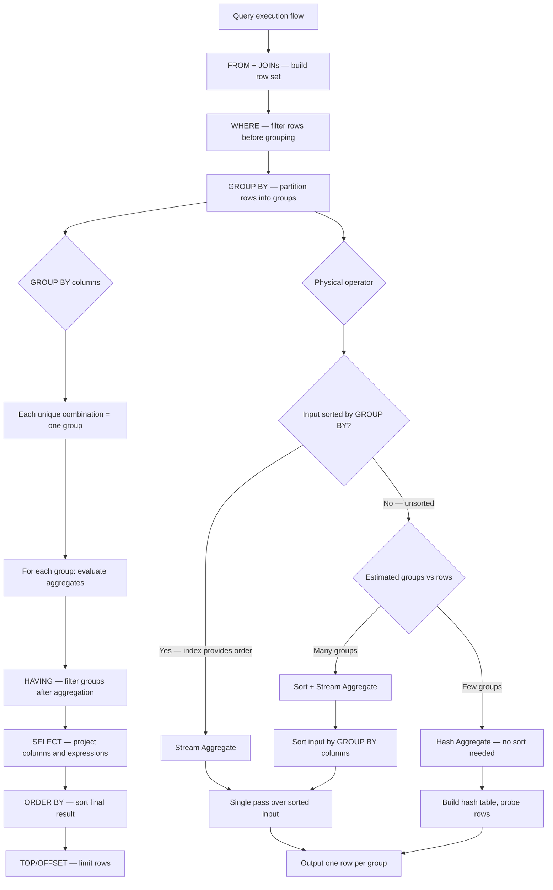

## Navigation

**Domain:** [[8 — Databases]] > **Group:** SQL Aggregations & Grouping
**Previous:** [[8.122 — SUM, AVG, MIN, MAX — Aggregate Functions]] | **Next:** [[8.124 — HAVING — Filtering Aggregated Groups]]

### Prerequisites

- [[8.121 — COUNT — Counting Rows and Non-NULL Values]] — COUNT is the most common aggregate used with GROUP BY; understanding how COUNT behaves per group requires understanding of grouping mechanics.
- [[8.122 — SUM, AVG, MIN, MAX — Aggregate Functions]] — These aggregate functions are meaningless without GROUP BY for partitioned analysis; they compute scalar aggregates without GROUP BY but per-group results with it.
- [[8.066 — SELECT Statement — Column Selection and Aliasing]] — The SELECT clause has specific rules about which columns can appear with GROUP BY; aliases are resolved differently in GROUP BY vs ORDER BY.
- [[8.089 — Aliases — Table and Column Aliasing]] — Table aliases in GROUP BY references require understanding of name resolution order.

### Where This Fits

GROUP BY is the SQL clause that transforms row-level data into aggregated results — it is the foundation of every dashboard, report, and analytical query. Every .NET backend engineer uses GROUP BY daily: "orders by status," "revenue by month," "customers by region," "top products by quantity sold." The most expensive mistakes made here are: including non-aggregated columns in SELECT that are not in GROUP BY (SQL Server rejects it, but the engineer wastes time debugging), using GROUP BY on expressions that prevent index seeks (GROUP BY YEAR(col) cannot use an index seek on col), and misunderstanding that GROUP BY sorts NULLs together (all NULLs form one group). Interviewers use GROUP BY to gate candidates on understanding the logical processing order (WHERE filters BEFORE GROUP BY, HAVING filters AFTER), the physical operators (Stream Aggregate vs Hash Aggregate), and how index design eliminates Sort operations. Engineers who know GROUP BY deeply can inspect an execution plan, identify whether Stream Aggregate or Hash Aggregate is used, and add the exact index that converts a 10-second Hash Aggregate into a sub-second Stream Aggregate.

---

## Core Mental Model

GROUP BY partitions the result set from the FROM/WHERE phase into groups, each defined by a unique combination of values in the GROUP BY columns. For each group, the database engine evaluates the aggregate functions (SUM, COUNT, AVG, MIN, MAX, etc.) and produces one output row per group. The GROUP BY columns determine the "level of granularity" of the output — each unique combination of GROUP BY column values produces exactly one row. The engine implements grouping via two physical operators: Stream Aggregate (requires input sorted by GROUP BY columns — efficient, zero memory grant for the grouping part) and Hash Aggregate (works on unsorted input — requires memory grant for the hash table). The optimizer chooses based on whether an index provides sorted access on the GROUP BY columns. All NULLs are grouped together because SQL Server treats NULL = NULL for grouping purposes — this is a special case within GROUP BY that differs from normal SQL three-valued logic where NULL = NULL is UNKNOWN. Columns in the SELECT list that are not aggregate functions must appear in the GROUP BY clause (with exceptions for functional dependency in SQL Server 2016+ and some other databases).

### Classification

GROUP BY is a **logical query processing clause** that operates in the middle of the SQL execution pipeline: after FROM, WHERE, and JOINs, but before HAVING, SELECT, ORDER BY, and TOP/OFFSET. GROUP BY itself is not SARGable — it operates on the result set after filtering. However, the access method used to retrieve the input data (scan vs seek) and the aggregate operator chosen (Stream vs Hash) depend on index design. GROUP BY expressions (YEAR(col), CAST(col), etc.) affect optimizer choices because they may prevent ordered access.



### Key Properties

|Property|Value|Notes|
|---|---|---|
|Logical position|After WHERE, before HAVING|Filters rows -> groups -> filters groups|
|Output cardinality|Number of unique GROUP BY value combinations|1 row per group|
|NULL grouping|All NULLs together|`NULL = NULL` for grouping (special case)|
|Stream Aggregate complexity|O(N)|Single pass over sorted input|
|Hash Aggregate complexity|O(N + G)|N input rows, G groups (hash table size)|
|Memory grant (Stream)|None|No additional memory beyond input|
|Memory grant (Hash)|~G × row_width × overhead|Proportional to distinct group count|
|Sorted output|Not guaranteed|Unless ORDER BY specifies sort order|
|Expression support|Yes|YEAR(col), CAST(col), etc.|
|Column position|Allowed|`GROUP BY 1, 2` — references SELECT list positions|

---

## Deep Mechanics

### How the Engine Executes This

1. **Parsing and Binding** — The parser identifies the GROUP BY clause and validates that all GROUP BY columns exist in the FROM/JOIN sources. The algebrizer resolves column references to their source tables.

2. **Logical grouping** — The query processor logically partitions the row set from WHERE into groups. Each group is defined by a unique combination of values in the GROUP BY columns. For example, `GROUP BY Status, YEAR(OrderDate)` creates one group for each (Status, Year) pair.

3. **Aggregate evaluation** — For each group, the engine evaluates the aggregate functions. `SUM(TotalAmount)` accumulates the TotalAmount for all rows in the group. `COUNT(*)` counts rows in the group. The aggregates are evaluated per group, not across the entire row set.

4. **Physical operator selection** — The optimizer chooses between:
   - **Stream Aggregate** — requires input sorted by GROUP BY columns. If an index provides this order (e.g., index on (Status, OrderDate) for `GROUP BY Status, YEAR(OrderDate)`), no sort is needed. If no index provides order, a Sort operator is added before Stream Aggregate.
   - **Hash Aggregate** — does not require sorted input. Builds a hash table in memory where the hash key is computed from GROUP BY column values. Each input row is hashed and the aggregate accumulators in the hash bucket are updated. After all rows are processed, the hash table contains one entry per group with the final aggregate values.

5. **Output** — One row per group is produced. The GROUP BY columns' values are output directly; aggregate function results are computed per group.

**Stream Aggregate mechanics:**
- The input must be sorted by the GROUP BY columns.
- The operator maintains current group key and aggregate accumulator registers.
- For each input row, it compares the current row's group key with the previous row's group key.
- If the same: update accumulators (SUM += val, COUNT += 1, etc.).
- If different: output the previous group's results, reset accumulators, start new group.
- After the last row: output the final group.
- Memory: O(1) — just the accumulator registers and current key.

**Hash Aggregate mechanics:**
- Input does not need to be sorted.
- Build phase: for each input row, compute a hash on the GROUP BY columns. Locate the hash bucket in the hash table. If the bucket exists (collision detected by comparing full key), update the aggregate accumulators in that bucket. If not, insert a new bucket with the group key and initial accumulator values.
- After all rows: iterate the hash table and output one row per bucket.
- Memory: O(G) — G entries in hash table, each with group key + accumulator values.
- If the hash table exceeds the memory grant, it spills to tempdb (disaster performance).

### SQL Visibility

```sql
-- Basic GROUP BY: count orders by status
SELECT
    o.Status,
    COUNT(*) AS OrderCount,
    SUM(o.TotalAmount) AS TotalRevenue
FROM dbo.Orders o
WHERE o.OrderDate >= '2024-01-01'
GROUP BY o.Status
ORDER BY o.Status;

-- GROUP BY with multiple columns: composite grouping
SELECT
    YEAR(o.OrderDate) AS OrderYear,
    MONTH(o.OrderDate) AS OrderMonth,
    o.Status,
    COUNT(*) AS OrderCount,
    SUM(o.TotalAmount) AS MonthlyRevenue
FROM dbo.Orders o
WHERE o.OrderDate >= '2023-01-01'
GROUP BY YEAR(o.OrderDate), MONTH(o.OrderDate), o.Status
ORDER BY OrderYear, OrderMonth, o.Status;

-- GROUP BY with expression: YEAR(OrderDate)
SELECT
    YEAR(o.OrderDate) AS OrderYear,
    COUNT(*) AS OrderCount,
    SUM(o.TotalAmount) AS TotalRevenue
FROM dbo.Orders o
GROUP BY YEAR(o.OrderDate)
ORDER BY OrderYear;
-- Note: index on OrderDate does NOT help this GROUP BY directly
-- The expression YEAR(OrderDate) is not the same as OrderDate for ordering

-- GROUP BY with column position (avoid in production — fragile)
SELECT
    YEAR(o.OrderDate),
    COUNT(*)
FROM dbo.Orders o
GROUP BY 1;  -- Equivalent to GROUP BY YEAR(OrderDate)

-- GROUP BY with ROLLUP — adds subtotal rows
SELECT
    o.Status,
    YEAR(o.OrderDate) AS OrderYear,
    COUNT(*) AS OrderCount,
    SUM(o.TotalAmount) AS TotalRevenue
FROM dbo.Orders o
GROUP BY ROLLUP(o.Status, YEAR(o.OrderDate))
ORDER BY o.Status, OrderYear;

-- NULLs in GROUP BY — all NULLs form one group
SELECT
    o.ShipDate,
    COUNT(*) AS OrderCount
FROM dbo.Orders o
GROUP BY o.ShipDate;
-- All NULL ShipDates form one group (shows as single row with NULL)

-- GROUP BY with functional dependency (SQL Server 2016+)
-- If CustomerId is PK of Customers, this is valid:
SELECT
    c.CustomerId,
    c.FirstName,
    c.LastName,
    COUNT(o.OrderId) AS OrderCount
FROM dbo.Customers c
LEFT JOIN dbo.Orders o ON c.CustomerId = o.CustomerId
GROUP BY c.CustomerId, c.FirstName, c.LastName;
-- c.FirstName and c.LastName are functionally dependent on c.CustomerId (PK)
-- SQL Server 2016+ does not require them in GROUP BY (if database compatibility level >= 130)
-- Other databases require all non-aggregate SELECT columns in GROUP BY

-- GROUP BY with FILTER (PostgreSQL syntax)
-- SELECT Status, COUNT(*) FILTER (WHERE TotalAmount > 100) AS HighValueOrders
-- FROM Orders GROUP BY Status;
-- SQL Server does not support FILTER — use conditional aggregation instead
```

```csharp
// EF Core — GroupBy with single column
var orderCountsByStatus = await dbContext.Orders
    .Where(o => o.OrderDate >= new DateTime(2024, 1, 1))
    .GroupBy(o => o.Status)
    .Select(g => new
    {
        Status = g.Key,
        OrderCount = g.Count(),
        TotalRevenue = g.Sum(o => o.TotalAmount)
    })
    .ToListAsync(cancellationToken);

// EF Core — GroupBy with multiple columns (anonymous type)
var monthlyStats = await dbContext.Orders
    .Where(o => o.OrderDate >= new DateTime(2023, 1, 1))
    .GroupBy(o => new { o.OrderDate.Year, o.OrderDate.Month, o.Status })
    .Select(g => new
    {
        g.Key.Year,
        g.Key.Month,
        g.Key.Status,
        OrderCount = g.Count(),
        MonthlyRevenue = g.Sum(o => o.TotalAmount)
    })
    .OrderBy(x => x.Year).ThenBy(x => x.Month).ThenBy(x => x.Status)
    .ToListAsync(cancellationToken);

// EF Core — GroupBy with expression (Year)
var yearlyStats = await dbContext.Orders
    .GroupBy(o => o.OrderDate.Year)
    .Select(g => new
    {
        Year = g.Key,
        OrderCount = g.Count(),
        TotalRevenue = g.Sum(o => o.TotalAmount)
    })
    .ToListAsync(cancellationToken);

// EF Core — GroupBy with navigation property
var customerStats = await dbContext.Customers
    .Select(c => new
    {
        c.CustomerId,
        c.FirstName,
        c.LastName,
        OrderCount = c.Orders.Count(),
        TotalSpent = c.Orders.Sum(o => o.TotalAmount)
    })
    .ToListAsync(cancellationToken);

// EF Core — GroupBy with Where on aggregates (HAVING equivalent)
var frequentCustomers = await dbContext.Customers
    .Where(c => c.Orders.Count(o => o.OrderDate >= new DateTime(2024, 1, 1)) > 10)
    .Select(c => new
    {
        c.CustomerId,
        CustomerName = c.FirstName + " " + c.LastName,
        OrderCount = c.Orders.Count(o => o.OrderDate >= new DateTime(2024, 1, 1))
    })
    .ToListAsync(cancellationToken);
```

**Generated SQL (from EF Core logs):**

```sql
-- GroupBy with anonymous type:
SELECT
    DATEPART(year, [o].[OrderDate]) AS [Year],
    DATEPART(month, [o].[OrderDate]) AS [Month],
    [o].[Status],
    COUNT(*) AS [OrderCount],
    SUM([o].[TotalAmount]) AS [MonthlyRevenue]
FROM [Orders] AS [o]
WHERE [o].[OrderDate] >= '2023-01-01'
GROUP BY DATEPART(year, [o].[OrderDate]),
         DATEPART(month, [o].[OrderDate]),
         [o].[Status]
ORDER BY [Year], [Month], [Status];

-- GroupBy with navigation property (subquery):
SELECT
    [c].[CustomerId],
    [c].[FirstName],
    [c].[LastName],
    (
        SELECT COUNT(*)
        FROM [Orders] AS [o]
        WHERE [c].[CustomerId] = [o].[CustomerId]
    ) AS [OrderCount],
    (
        SELECT SUM([o].[TotalAmount])
        FROM [Orders] AS [o]
        WHERE [c].[CustomerId] = [o].[CustomerId]
    ) AS [TotalSpent]
FROM [Customers] AS [c];

-- Where on navigation property count (HAVING equivalent):
SELECT
    [c].[CustomerId],
    [c].[FirstName],
    [c].[LastName],
    (
        SELECT COUNT(*)
        FROM [Orders] AS [o]
        WHERE [c].[CustomerId] = [o].[CustomerId]
        AND [o].[OrderDate] >= '2024-01-01'
    ) AS [OrderCount]
FROM [Customers] AS [c]
WHERE (
    SELECT COUNT(*)
    FROM [Orders] AS [o2]
    WHERE [c].[CustomerId] = [o2].[CustomerId]
    AND [o2].[OrderDate] >= '2024-01-01'
) > 10;
-- Note: EF Core repeats the subquery for WHERE and SELECT — use .AsSplitQuery() or consider raw SQL
```

### Execution Plan Analysis

For `SELECT Status, COUNT(*), SUM(TotalAmount) FROM Orders WHERE OrderDate >= '2024-01-01' GROUP BY Status`:

```
Expected plan shape option 1 (Stream Aggregate — if index on Status exists):
[Index Seek (on OrderDate filtered index)] or [Clustered Index Scan]
→ [Sort (if input not sorted by Status)]
→ [Stream Aggregate] → [SELECT]
Estimated Cost: Seek 70%, Sort 25%, Aggregate 5%

Expected plan shape option 2 (Hash Aggregate — unsorted input):
[Clustered Index Scan]
→ [Hash Match (Aggregate)] → [SELECT]
Estimated Cost: Scan 70%, Hash Aggregate 30%
```

- With an index on `(Status, OrderDate) INCLUDE (TotalAmount)`, the plan becomes:
  `[Index Seek (seeking OrderDate >= '2024-01-01')] → [Stream Aggregate] → [SELECT]`
  No Sort needed because the index provides ordering by (Status, OrderDate). However, Stream Aggregate requires ordering by the GROUP BY columns only (Status), not (Status, OrderDate). The engine uses the fact that rows with the same Status are consecutive in the index.

For `SELECT YEAR(OrderDate), COUNT(*) FROM Orders GROUP BY YEAR(OrderDate)`:

```
Expected plan shape:
[Clustered Index Scan]
→ [Compute Scalar (YEAR(OrderDate))]
→ [Hash Match (Aggregate)] or [Sort → Stream Aggregate]
→ [SELECT]
```

- The expression `YEAR(OrderDate)` prevents Stream Aggregate from using an index on OrderDate directly. The Compute Scalar creates a new value that is not indexed. The optimizer either uses Hash Aggregate or sorts by the computed value.

### Cost Visibility

```sql
SET STATISTICS IO ON;
SET STATISTICS TIME ON;

-- GROUP BY with Hash Aggregate (no supporting index)
SELECT Status, COUNT(*) AS OrderCount, SUM(TotalAmount) AS TotalRevenue
FROM dbo.Orders
WHERE OrderDate >= '2024-01-01'
GROUP BY Status;
-- Table 'Orders'. Scan count 1, logical reads 128,342, physical reads 0
-- SQL Server Execution Times: CPU time = 1,240ms, elapsed time = 1,380ms
-- Plan: Clustered Index Scan → Hash Match (Aggregate)

-- After creating index on (Status, OrderDate) INCLUDE (TotalAmount):
-- Table 'Orders'. Scan count 1, logical reads 12,442, physical reads 0
-- SQL Server Execution Times: CPU time = 290ms, elapsed time = 320ms
-- Plan: Index Seek (IX_Orders_Status_OrderDate) → Stream Aggregate

-- GROUP BY with expression (YEAR)
SELECT YEAR(OrderDate) AS OrderYear, COUNT(*) AS OrderCount
FROM dbo.Orders
GROUP BY YEAR(OrderDate);
-- Table 'Orders'. Scan count 1, logical reads 128,342, physical reads 0
-- SQL Server Execution Times: CPU time = 890ms, elapsed time = 950ms

-- After adding computed column + index:
ALTER TABLE dbo.Orders ADD OrderYear AS YEAR(OrderDate) PERSISTED;
CREATE INDEX IX_Orders_OrderYear ON dbo.Orders(OrderYear) INCLUDE (OrderId);
SELECT OrderYear, COUNT(*) FROM dbo.Orders GROUP BY OrderYear;
-- Table 'Orders'. Scan count 1, logical reads 12,340, physical reads 0
-- SQL Server Execution Times: CPU time = 120ms, elapsed time = 140ms
-- Improvement: 10x fewer logical reads, 7x faster
```

### Failure Modes

**Failure Mode 1: Non-aggregate column in SELECT not in GROUP BY (pre-SQL Server 2016).**

Writing `SELECT CustomerId, FirstName, SUM(TotalAmount) FROM Orders GROUP BY CustomerId` fails because FirstName is not in GROUP BY and not an aggregate. On older compatibility levels, SQL Server rejects it. On SQL Server 2016+ with compat level 130+, it succeeds if FirstName is functionally dependent on CustomerId (e.g., CustomerId is PK).

```sql
-- ❌ WRONG (pre-2016 or compat < 130):
SELECT c.CustomerId, c.FirstName, SUM(o.TotalAmount)
FROM dbo.Customers c
INNER JOIN dbo.Orders o ON c.CustomerId = o.CustomerId
GROUP BY c.CustomerId;
-- Error: Column 'c.FirstName' is invalid in SELECT because it is not in GROUP BY

-- ✅ Correct:
SELECT c.CustomerId, c.FirstName, SUM(o.TotalAmount)
FROM dbo.Customers c
INNER JOIN dbo.Orders o ON c.CustomerId = o.CustomerId
GROUP BY c.CustomerId, c.FirstName;
```

**Failure Mode 2: GROUP BY with expression prevents index usage.**

`GROUP BY YEAR(OrderDate)` cannot use an index on OrderDate because the expression result is not stored. The optimizer must scan all rows, compute YEAR() for each, then sort or hash.

```sql
-- Detection: Check execution plan for Compute Scalar on large scan
-- Fix: Add persisted computed column
ALTER TABLE dbo.Orders ADD OrderYear AS YEAR(OrderDate) PERSISTED;
CREATE INDEX IX_Orders_OrderYear ON dbo.Orders(OrderYear);
-- Now: GROUP BY OrderYear uses index seek → Stream Aggregate
```

**Failure Mode 3: Memory grant spill from Hash Aggregate with large group count.**

When the GROUP BY columns have high cardinality (many unique combinations), the Hash Aggregate hash table grows large. If it exceeds the memory grant, it spills to tempdb.

```sql
-- Detection: Check the execution plan for "Spills" in Hash Aggregate
SELECT
    qs.total_worker_time,
    qs.total_elapsed_time,
    qs.execution_count,
    qp.query_plan
FROM sys.dm_exec_query_stats qs
CROSS APPLY sys.dm_exec_query_plan(qs.plan_handle) qp
WHERE qp.query_plan.value(
    'declare namespace p="http://schemas.microsoft.com/sqlserver/2004/07/showplan";
    count(//p:Hash[contains(@*, "Spill"])',
    'nvarchar(max)') > 0;
```

**Failure Mode 4: GROUP BY on high-precision DECIMAL or NVARCHAR(MAX) columns.**

Large key columns make the hash table or sort keys very wide, increasing memory grant and reducing throughput. The Sort operator must store and compare wide keys.

```sql
-- Expensive: wide GROUP BY key
SELECT NVARCHAR_MAX_COL, COUNT(*) FROM dbo.LargeTable GROUP BY NVARCHAR_MAX_COL;
-- The sort key includes the entire MAX column — massive memory and CPU

-- Better: hash the column first if exact grouping isn't needed
SELECT CHECKSUM(NVARCHAR_MAX_COL) AS HashKey, COUNT(*)
FROM dbo.LargeTable
GROUP BY CHECKSUM(NVARCHAR_MAX_COL);
-- Note: this has collisions — use only for approximate counts
```

---

## Production Patterns and Implementation

### Primary SQL Implementation

```sql
-- Schema context
CREATE TABLE dbo.Orders (
    OrderId INT IDENTITY(1,1) NOT NULL PRIMARY KEY,
    CustomerId INT NOT NULL,
    OrderDate DATETIME2 NOT NULL,
    Status TINYINT NOT NULL,
    TotalAmount DECIMAL(10,2) NOT NULL,
    ShippingCost DECIMAL(8,2) NOT NULL DEFAULT 0.00,
    RegionId INT NOT NULL,
    SalesPersonId INT NOT NULL
);

CREATE TABLE dbo.Customers (
    CustomerId INT IDENTITY(1,1) NOT NULL PRIMARY KEY,
    FirstName NVARCHAR(50) NOT NULL,
    LastName NVARCHAR(50) NOT NULL,
    Email NVARCHAR(200) NOT NULL,
    CreatedDate DATETIME2 NOT NULL
);

CREATE TABLE dbo.Regions (
    RegionId INT IDENTITY(1,1) NOT NULL PRIMARY KEY,
    RegionName NVARCHAR(100) NOT NULL,
    Country NVARCHAR(100) NOT NULL
);

-- Supporting indexes
CREATE INDEX IX_Orders_OrderDate ON dbo.Orders(OrderDate);
CREATE INDEX IX_Orders_CustomerId ON dbo.Orders(CustomerId);
CREATE INDEX IX_Orders_Status_OrderDate ON dbo.Orders(Status, OrderDate) INCLUDE (TotalAmount);
CREATE INDEX IX_Orders_RegionId ON dbo.Orders(RegionId) INCLUDE (TotalAmount, OrderDate);

-- Production pattern 1: Standard GROUP BY — sales by region
SELECT
    r.RegionName,
    r.Country,
    COUNT(*) AS OrderCount,
    SUM(CAST(o.TotalAmount AS DECIMAL(18,2))) AS TotalRevenue,
    AVG(o.TotalAmount) AS AverageOrderValue,
    MIN(o.OrderDate) AS FirstOrder,
    MAX(o.OrderDate) AS LastOrder
FROM dbo.Regions r
INNER JOIN dbo.Orders o ON r.RegionId = o.RegionId
WHERE o.OrderDate >= DATEADD(month, -6, GETUTCDATE())
GROUP BY r.RegionId, r.RegionName, r.Country
ORDER BY TotalRevenue DESC;

-- Production pattern 2: GROUP BY with expression — monthly trends
SELECT
    YEAR(o.OrderDate) AS OrderYear,
    MONTH(o.OrderDate) AS OrderMonth,
    COUNT(*) AS OrderCount,
    SUM(CAST(o.TotalAmount AS DECIMAL(18,2))) AS MonthlyRevenue,
    COUNT(DISTINCT o.CustomerId) AS UniqueCustomers,
    AVG(o.TotalAmount) AS AvgOrderValue
FROM dbo.Orders o
GROUP BY YEAR(o.OrderDate), MONTH(o.OrderDate)
ORDER BY OrderYear DESC, OrderMonth DESC;

-- Production pattern 3: GROUP BY with computed column for efficiency
ALTER TABLE dbo.Orders ADD OrderYear AS YEAR(OrderDate) PERSISTED;
ALTER TABLE dbo.Orders ADD OrderMonth AS MONTH(OrderDate) PERSISTED;
CREATE INDEX IX_Orders_Year_Month ON dbo.Orders(OrderYear, OrderMonth) INCLUDE (TotalAmount, CustomerId);

-- Now this query uses Stream Aggregate:
SELECT
    o.OrderYear,
    o.OrderMonth,
    COUNT(*) AS OrderCount,
    SUM(CAST(o.TotalAmount AS DECIMAL(18,2))) AS MonthlyRevenue
FROM dbo.Orders o
GROUP BY o.OrderYear, o.OrderMonth
ORDER BY o.OrderYear DESC, o.OrderMonth DESC;

-- Production pattern 4: GROUP BY with multiple tables
-- Sales by salesperson with their region
SELECT
    o.SalesPersonId,
    r.RegionName,
    COUNT(*) AS OrdersHandled,
    SUM(CAST(o.TotalAmount AS DECIMAL(18,2))) AS TotalRevenue,
    AVG(o.TotalAmount) AS AvgOrderValue
FROM dbo.Orders o
INNER JOIN dbo.Regions r ON o.RegionId = r.RegionId
WHERE o.OrderDate >= DATEADD(month, -3, GETUTCDATE())
GROUP BY o.SalesPersonId, r.RegionName
ORDER BY TotalRevenue DESC;

-- Production pattern 5: GROUP BY with HAVING — filter groups
-- Find regions generating above-average revenue
SELECT
    r.RegionName,
    SUM(CAST(o.TotalAmount AS DECIMAL(18,2))) AS TotalRevenue,
    COUNT(*) AS OrderCount
FROM dbo.Regions r
INNER JOIN dbo.Orders o ON r.RegionId = o.RegionId
WHERE o.OrderDate >= DATEADD(month, -6, GETUTCDATE())
GROUP BY r.RegionId, r.RegionName
HAVING SUM(o.TotalAmount) > (
    SELECT AVG(RegionRevenue)
    FROM (
        SELECT SUM(o2.TotalAmount) AS RegionRevenue
        FROM dbo.Orders o2
        WHERE o2.OrderDate >= DATEADD(month, -6, GETUTCDATE())
        GROUP BY o2.RegionId
    ) AS RegionAverages
)
ORDER BY TotalRevenue DESC;

-- Production pattern 6: GROUP BY with DISTINCT aggregates
-- Average of distinct order values per region (unusual but valid)
SELECT
    o.RegionId,
    AVG(DISTINCT o.TotalAmount) AS AvgUniqueOrderValue,
    COUNT(*) AS TotalOrders,
    COUNT(DISTINCT o.TotalAmount) AS UniqueOrderValues
FROM dbo.Orders o
GROUP BY o.RegionId;

-- Production pattern 7: GROUP BY with window function — group subtotals
SELECT
    r.RegionName,
    o.Status,
    COUNT(*) AS OrderCount,
    SUM(COUNT(*)) OVER(PARTITION BY r.RegionName) AS RegionTotal,
    SUM(CAST(o.TotalAmount AS DECIMAL(18,2))) AS Revenue,
    SUM(SUM(CAST(o.TotalAmount AS DECIMAL(18,2)))) OVER(PARTITION BY r.RegionName) AS RegionRevenue
FROM dbo.Regions r
INNER JOIN dbo.Orders o ON r.RegionId = o.RegionId
WHERE o.OrderDate >= DATEADD(month, -6, GETUTCDATE())
GROUP BY r.RegionName, o.Status
ORDER BY r.RegionName, o.Status;

-- Production pattern 8: GROUP BY with CUBE for all combinations
SELECT
    r.RegionName,
    o.Status,
    COUNT(*) AS OrderCount,
    SUM(CAST(o.TotalAmount AS DECIMAL(18,2))) AS Revenue
FROM dbo.Regions r
INNER JOIN dbo.Orders o ON r.RegionId = o.RegionId
WHERE o.OrderDate >= DATEADD(month, -6, GETUTCDATE())
GROUP BY CUBE(r.RegionName, o.Status)
ORDER BY r.RegionName, o.Status;
-- Produces: per-region, per-status, per-region+status, grand total
```

### EF Core Implementation

```csharp
public class GroupByAnalysisService
{
    private readonly ApplicationDbContext _dbContext;

    public GroupByAnalysisService(ApplicationDbContext dbContext)
    {
        _dbContext = dbContext;
    }

    // Basic GroupBy
    public async Task<List<StatusSummary>> GetStatusSummaryAsync(
        DateTime since, CancellationToken ct)
    {
        return await _dbContext.Orders
            .Where(o => o.OrderDate >= since)
            .GroupBy(o => o.Status)
            .Select(g => new StatusSummary
            {
                Status = g.Key,
                OrderCount = g.Count(),
                TotalRevenue = g.Sum(o => o.TotalAmount),
                AverageValue = g.Average(o => o.TotalAmount)
            })
            .ToListAsync(ct);
    }

    // GroupBy with multiple columns
    public async Task<List<MonthlyStats>> GetMonthlyStatsAsync(
        DateTime since, CancellationToken ct)
    {
        return await _dbContext.Orders
            .Where(o => o.OrderDate >= since)
            .GroupBy(o => new { o.OrderDate.Year, o.OrderDate.Month })
            .Select(g => new MonthlyStats
            {
                Year = g.Key.Year,
                Month = g.Key.Month,
                OrderCount = g.Count(),
                TotalRevenue = g.Sum(o => o.TotalAmount),
                UniqueCustomers = g.Select(o => o.CustomerId).Distinct().Count()
            })
            .OrderByDescending(x => x.Year)
            .ThenByDescending(x => x.Month)
            .ToListAsync(ct);
    }

    // GroupBy with navigation property (using subquery — avoids cartesian explosion)
    public async Task<List<CustomerGroupSummary>> GetCustomerOrderSummariesAsync(CancellationToken ct)
    {
        return await _dbContext.Customers
            .Select(c => new CustomerGroupSummary
            {
                CustomerId = c.CustomerId,
                CustomerName = c.FirstName + " " + c.LastName,
                OrderCount = c.Orders.Count(),
                TotalSpent = c.Orders.Sum(o => o.TotalAmount),
                AverageOrderValue = c.Orders.Average(o => (decimal?)o.TotalAmount),
                FirstOrderDate = c.Orders.Min(o => (DateTime?)o.OrderDate),
                LastOrderDate = c.Orders.Max(o => (DateTime?)o.OrderDate)
            })
            .ToListAsync(ct);
    }

    // GroupBy with HAVING equivalent (Where on projection)
    public async Task<List<CustomerGroupSummary>> GetFrequentCustomersAsync(
        int minOrders, decimal minSpent, CancellationToken ct)
    {
        var query = _dbContext.Customers
            .Select(c => new CustomerGroupSummary
            {
                CustomerId = c.CustomerId,
                CustomerName = c.FirstName + " " + c.LastName,
                OrderCount = c.Orders.Count(),
                TotalSpent = c.Orders.Sum(o => o.TotalAmount),
                AverageOrderValue = c.Orders.Average(o => (decimal?)o.TotalAmount)
            });

        // Apply HAVING-like filters
        if (minOrders > 0)
            query = query.Where(x => x.OrderCount >= minOrders);
        if (minSpent > 0)
            query = query.Where(x => x.TotalSpent >= minSpent);

        return await query
            .OrderByDescending(x => x.TotalSpent)
            .ToListAsync(ct);
    }

    // GroupBy with date part expression
    public async Task<List<YearlyStats>> GetYearlyStatsAsync(CancellationToken ct)
    {
        return await _dbContext.Orders
            .GroupBy(o => o.OrderDate.Year)
            .Select(g => new YearlyStats
            {
                Year = g.Key,
                OrderCount = g.Count(),
                TotalRevenue = g.Sum(o => o.TotalAmount)
            })
            .OrderByDescending(x => x.Year)
            .ToListAsync(ct);
    }

    // GroupBy with conditional aggregation
    public async Task<List<StatusPivotSummary>> GetStatusPivotByRegionAsync(
        DateTime since, CancellationToken ct)
    {
        return await _dbContext.Orders
            .Where(o => o.OrderDate >= since)
            .GroupBy(o => o.RegionId)
            .Select(g => new StatusPivotSummary
            {
                RegionId = g.Key,
                TotalOrders = g.Count(),
                PendingCount = g.Count(o => o.Status == OrderStatus.Pending),
                ShippedCount = g.Count(o => o.Status == OrderStatus.Shipped),
                DeliveredCount = g.Count(o => o.Status == OrderStatus.Delivered),
                CancelledCount = g.Count(o => o.Status == OrderStatus.Cancelled),
                Revenue = g.Sum(o => o.TotalAmount)
            })
            .ToListAsync(ct);
    }
}

public class StatusSummary
{
    public OrderStatus Status { get; set; }
    public int OrderCount { get; set; }
    public decimal TotalRevenue { get; set; }
    public decimal AverageValue { get; set; }
}

public class MonthlyStats
{
    public int Year { get; set; }
    public int Month { get; set; }
    public int OrderCount { get; set; }
    public decimal TotalRevenue { get; set; }
    public int UniqueCustomers { get; set; }
}

public class CustomerGroupSummary
{
    public int CustomerId { get; set; }
    public string CustomerName { get; set; } = string.Empty;
    public int OrderCount { get; set; }
    public decimal TotalSpent { get; set; }
    public decimal? AverageOrderValue { get; set; }
    public DateTime? FirstOrderDate { get; set; }
    public DateTime? LastOrderDate { get; set; }
}

public class YearlyStats
{
    public int Year { get; set; }
    public int OrderCount { get; set; }
    public decimal TotalRevenue { get; set; }
}

public class StatusPivotSummary
{
    public int RegionId { get; set; }
    public int TotalOrders { get; set; }
    public int PendingCount { get; set; }
    public int ShippedCount { get; set; }
    public int DeliveredCount { get; set; }
    public int CancelledCount { get; set; }
    public decimal Revenue { get; set; }
}
```

### Dapper Implementation

```csharp
public class GroupByDapperService
{
    private readonly IDbConnectionFactory _connectionFactory;

    public GroupByDapperService(IDbConnectionFactory connectionFactory)
    {
        _connectionFactory = connectionFactory;
    }

    // Basic GroupBy
    public async Task<IReadOnlyList<StatusSummary>> GetStatusSummaryAsync(
        DateTime since, CancellationToken ct)
    {
        await using var connection = _connectionFactory.Create();
        const string sql = @"
            SELECT
                Status,
                COUNT(*) AS OrderCount,
                ISNULL(SUM(CAST(TotalAmount AS DECIMAL(18,2))), 0) AS TotalRevenue,
                ISNULL(AVG(TotalAmount), 0) AS AverageValue
            FROM dbo.Orders
            WHERE OrderDate >= @Since
            GROUP BY Status
            ORDER BY Status";

        var results = await connection.QueryAsync<StatusSummary>(
            new CommandDefinition(sql, new { Since = since }, cancellationToken: ct));
        return results.AsList();
    }

    // GroupBy with multiple columns and expressions
    public async Task<IReadOnlyList<MonthlyStats>> GetMonthlyStatsAsync(
        DateTime since, CancellationToken ct)
    {
        await using var connection = _connectionFactory.Create();
        const string sql = @"
            SELECT
                YEAR(OrderDate) AS [Year],
                MONTH(OrderDate) AS [Month],
                COUNT(*) AS OrderCount,
                ISNULL(SUM(CAST(TotalAmount AS DECIMAL(18,2))), 0) AS TotalRevenue,
                COUNT(DISTINCT CustomerId) AS UniqueCustomers
            FROM dbo.Orders
            WHERE OrderDate >= @Since
            GROUP BY YEAR(OrderDate), MONTH(OrderDate)
            ORDER BY [Year] DESC, [Month] DESC";

        var results = await connection.QueryAsync<MonthlyStats>(
            new CommandDefinition(sql, new { Since = since }, cancellationToken: ct));
        return results.AsList();
    }

    // GroupBy with computed column (persisted)
    public async Task<IReadOnlyList<YearlyStats>> GetYearlyStatsAsync(CancellationToken ct)
    {
        await using var connection = _connectionFactory.Create();
        const string sql = @"
            SELECT
                OrderYear AS [Year],
                COUNT(*) AS OrderCount,
                ISNULL(SUM(CAST(TotalAmount AS DECIMAL(18,2))), 0) AS TotalRevenue
            FROM dbo.Orders
            GROUP BY OrderYear
            ORDER BY [Year] DESC";

        var results = await connection.QueryAsync<YearlyStats>(
            new CommandDefinition(sql, cancellationToken: ct));
        return results.AsList();
    }

    // GroupBy with JOIN
    public async Task<IReadOnlyList<RegionRevenue>> GetRegionRevenueAsync(
        DateTime since, CancellationToken ct)
    {
        await using var connection = _connectionFactory.Create();
        const string sql = @"
            SELECT
                r.RegionId,
                r.RegionName,
                r.Country,
                COUNT(*) AS OrderCount,
                ISNULL(SUM(CAST(o.TotalAmount AS DECIMAL(18,2))), 0) AS TotalRevenue,
                ISNULL(AVG(o.TotalAmount), 0) AS AverageOrderValue
            FROM dbo.Regions r
            INNER JOIN dbo.Orders o ON r.RegionId = o.RegionId
            WHERE o.OrderDate >= @Since
            GROUP BY r.RegionId, r.RegionName, r.Country
            ORDER BY TotalRevenue DESC";

        var results = await connection.QueryAsync<RegionRevenue>(
            new CommandDefinition(sql, new { Since = since }, cancellationToken: ct));
        return results.AsList();
    }

    // GroupBy with HAVING
    public async Task<IReadOnlyList<RegionRevenue>> GetTopRegionsAsync(
        DateTime since, decimal minRevenue, CancellationToken ct)
    {
        await using var connection = _connectionFactory.Create();
        const string sql = @"
            SELECT
                r.RegionId,
                r.RegionName,
                r.Country,
                COUNT(*) AS OrderCount,
                ISNULL(SUM(CAST(o.TotalAmount AS DECIMAL(18,2))), 0) AS TotalRevenue,
                ISNULL(AVG(o.TotalAmount), 0) AS AverageOrderValue
            FROM dbo.Regions r
            INNER JOIN dbo.Orders o ON r.RegionId = o.RegionId
            WHERE o.OrderDate >= @Since
            GROUP BY r.RegionId, r.RegionName, r.Country
            HAVING SUM(CAST(o.TotalAmount AS DECIMAL(18,2))) >= @MinRevenue
            ORDER BY TotalRevenue DESC";

        var results = await connection.QueryAsync<RegionRevenue>(
            new CommandDefinition(sql, new { Since = since, MinRevenue = minRevenue },
                cancellationToken: ct));
        return results.AsList();
    }

    // GroupBy with conditional aggregation (CASE inside aggregate)
    public async Task<IReadOnlyList<StatusPivotSummary>> GetStatusPivotByRegionAsync(
        DateTime since, CancellationToken ct)
    {
        await using var connection = _connectionFactory.Create();
        const string sql = @"
            SELECT
                RegionId,
                COUNT(*) AS TotalOrders,
                SUM(CASE WHEN Status = 1 THEN 1 ELSE 0 END) AS PendingCount,
                SUM(CASE WHEN Status = 3 THEN 1 ELSE 0 END) AS ShippedCount,
                SUM(CASE WHEN Status = 4 THEN 1 ELSE 0 END) AS DeliveredCount,
                SUM(CASE WHEN Status = 5 THEN 1 ELSE 0 END) AS CancelledCount,
                ISNULL(SUM(CAST(TotalAmount AS DECIMAL(18,2))), 0) AS Revenue
            FROM dbo.Orders
            WHERE OrderDate >= @Since
            GROUP BY RegionId
            ORDER BY RegionId";

        var results = await connection.QueryAsync<StatusPivotSummary>(
            new CommandDefinition(sql, new { Since = since }, cancellationToken: ct));
        return results.AsList();
    }
}

public class RegionRevenue
{
    public int RegionId { get; set; }
    public string RegionName { get; set; } = string.Empty;
    public string Country { get; set; } = string.Empty;
    public int OrderCount { get; set; }
    public decimal TotalRevenue { get; set; }
    public decimal AverageOrderValue { get; set; }
}
```

### Configuration and Wiring

```csharp
// Program.cs
builder.Services.AddDbContext<ApplicationDbContext>(options =>
    options.UseSqlServer(
        builder.Configuration.GetConnectionString("DefaultConnection"),
        sqlOptions =>
        {
            sqlOptions.EnableRetryOnFailure(3);
            sqlOptions.UseCompatibilityLevel(130); // SQL Server 2016+ for functional dependency
        }));

builder.Services.AddSingleton<IDbConnectionFactory, SqlConnectionFactory>();
builder.Services.AddScoped<GroupByAnalysisService>();
builder.Services.AddScoped<GroupByDapperService>();
```

### SQL Server vs PostgreSQL Differences

```sql
-- PostgreSQL: GROUP BY is very similar but with these differences:

-- PostgreSQL allows SELECT columns not in GROUP BY if they are functionally dependent
-- (this is standard SQL behavior that PostgreSQL supports; SQL Server added it in 2016)
SELECT c.customer_id, c.first_name, SUM(o.total_amount)
FROM customers c
INNER JOIN orders o ON c.customer_id = o.customer_id
GROUP BY c.customer_id;
-- PostgreSQL: Valid (first_name depends on customer_id)
-- SQL Server (compat < 130): Error

-- PostgreSQL: GROUP BY with ROLLUP, CUBE, GROUPING SETS
SELECT region_id, status, COUNT(*)
FROM orders
GROUP BY GROUPING SETS ((region_id), (status), ());

-- PostgreSQL: GROUP BY with DISTINCT ON (unique per group)
SELECT DISTINCT ON (customer_id) customer_id, order_id, total_amount
FROM orders
ORDER BY customer_id, total_amount DESC;
-- Returns one row per customer (the one with highest total_amount)
-- No direct SQL Server equivalent (use ROW_NUMBER() OVER)

-- PostgreSQL: GROUPING() function
SELECT
    region_id,
    status,
    COUNT(*),
    GROUPING(region_id) AS is_region_subtotal,
    GROUPING(status) AS is_status_subtotal
FROM orders
GROUP BY ROLLUP(region_id, status);
```

---

## Gotchas and Production Pitfalls

### 1. GROUP BY with Expression Prevents Index Seek

**Pitfall:** Using an expression like `GROUP BY YEAR(OrderDate)` prevents the optimizer from using an index seek on OrderDate. The expression must be computed for every row before grouping.

```sql
-- ❌ Slow: GROUP BY with expression on indexed column
SELECT YEAR(OrderDate), COUNT(*)
FROM dbo.Orders
GROUP BY YEAR(OrderDate);

-- ✅ Fast: Add persisted computed column and index
ALTER TABLE dbo.Orders ADD OrderYear AS YEAR(OrderDate) PERSISTED;
CREATE INDEX IX_Orders_OrderYear ON dbo.Orders(OrderYear);
SELECT OrderYear, COUNT(*) FROM dbo.Orders GROUP BY OrderYear;
-- Plan: Index Scan → Stream Aggregate (no compute per row)
```

**Symptom:** The query plan shows a Compute Scalar operator for every row, followed by a Sort or Hash Aggregate. The scan reads all pages in the clustered index — 128K+ logical reads for a 10M row table.

**Fix:** Add a persisted computed column and index for frequently grouped expressions. The index provides ordering that enables Stream Aggregate.

**Cost of not fixing:** Each query that groups by a date part scans the entire table. For a 50M row table, this is 400K+ logical reads per query. Running 1000x/hour = 400M logical reads/hour = severe buffer pool pressure.

### 2. Including Non-Aggregate Columns Not in GROUP BY

**Pitfall:** Adding non-aggregate columns to SELECT without adding them to GROUP BY. SQL Server rejects this (unless functional dependency applies), wasting development time.

```sql
-- ❌ Error: FirstName not in GROUP BY
SELECT c.CustomerId, c.FirstName, COUNT(o.OrderId) AS OrderCount
FROM dbo.Customers c
LEFT JOIN dbo.Orders o ON c.CustomerId = o.CustomerId
GROUP BY c.CustomerId;
-- Error: Column 'c.FirstName' is invalid in SELECT because it is not in GROUP BY

-- ✅ Fix: Add to GROUP BY
GROUP BY c.CustomerId, c.FirstName, c.LastName;
```

**Symptom:** The query fails with error 8120. The engineer adds columns one by one until it works, often not understanding why.

**Fix:** Remember the rule: every column in SELECT that is not an aggregate function must appear in GROUP BY. On SQL Server 2016+ with compat level 130+, columns functionally dependent on a GROUP BY column are exempt.

**Cost of not fixing:** Development delays. The pattern of "add columns until it compiles" leads to overly broad GROUP BY clauses that increase memory grant and reduce performance.

### 3. NULL Grouping — All NULLs Form One Group

**Pitfall:** Engineers expect NULL ShipDates to form separate groups (one for each unique NULL), but all NULLs are grouped together.

```sql
-- All NULL ShipDates become ONE group
SELECT o.ShipDate, COUNT(*) AS OrderCount
FROM dbo.Orders o
GROUP BY o.ShipDate;
-- Result: one row with NULL ShipDate and count = 500 (all NULLs combined)
-- Then individual rows for each non-NULL ShipDate with their counts

-- If you want NULLs as separate rows, use COALESCE:
SELECT COALESCE(CAST(o.ShipDate AS NVARCHAR(50)), 'Not Shipped') AS ShipDateDisplay,
       COUNT(*) AS OrderCount
FROM dbo.Orders o
GROUP BY COALESCE(CAST(o.ShipDate AS NVARCHAR(50)), 'Not Shipped');
```

**Symptom:** The GROUP BY output shows a single row with NULL for ShipDate with a large count, while the engineer expected NULL to mean "not yet shipped" and wanted it displayed per order.

**Fix:** Use `COALESCE` or `ISNULL` to replace NULLs with a meaningful display value before grouping.

**Cost of not fixing:** Reports misrepresent unshipped orders. A single bar labeled "NULL" in a chart aggregation hides the true distribution of unshipped vs shipped.

### 4. GROUP BY with JOIN Producing Duplicate Group Keys

**Pitfall:** When grouping by columns from the "one" side of a one-to-many join, the GROUP BY keys are not unique because the JOIN multiplies rows before grouping.

```sql
-- Grouping by OrderId from Orders, which should be unique
-- But the JOIN to OrderItems multiplies rows
SELECT o.OrderId, o.TotalAmount, COUNT(*) AS ItemCount
FROM dbo.Orders o
INNER JOIN dbo.OrderItems oi ON o.OrderId = oi.OrderId
GROUP BY o.OrderId, o.TotalAmount;
-- This works correctly because GROUP BY collapses the multiplied rows
-- But the SUM of o.TotalAmount would be wrong (inflated by row multiplication)

-- ❌ WRONG: SUM of TotalAmount is inflated
SELECT o.OrderId, SUM(o.TotalAmount) AS Total
FROM dbo.Orders o
INNER JOIN dbo.OrderItems oi ON o.OrderId = oi.OrderId
GROUP BY o.OrderId;
-- If an order has 5 items, TotalAmount is summed 5 times

-- ✅ Correct: Use subquery or window function first
SELECT o.OrderId, o.TotalAmount, oi.ItemCount
FROM dbo.Orders o
INNER JOIN (
    SELECT OrderId, COUNT(*) AS ItemCount
    FROM dbo.OrderItems
    GROUP BY OrderId
) oi ON o.OrderId = oi.OrderId;
```

**Symptom:** Aggregated values from the "one" table are inflated. The SUM of TotalAmount appears 3-10x higher than expected.

**Fix:** Aggregate in the "many" table first (subquery), then join to the "one" table. Never aggregate columns from the "one" table after a 1-to-many JOIN multiplies rows.

**Cost of not fixing:** Significant financial errors. Revenue reports off by the average number of line items per order.

### 5. Hash Aggregate Memory Grant Spill with High-Cardinality GROUP BY

**Pitfall:** GROUP BY on a high-cardinality column (e.g., OrderId) with millions of unique values causes the Hash Aggregate to request a large memory grant. If it spills, performance collapses.

```sql
-- Expensive: GROUP BY on high-cardinality column
SELECT oi.OrderId, SUM(oi.Quantity * oi.UnitPrice) AS LineTotal
FROM dbo.OrderItems oi
GROUP BY oi.OrderId;
-- If there are 10M unique OrderIds, the hash table needs ~10M entries
-- Memory grant: potentially 500+ MB

-- Better: If OrderId is sequential, consider Stream Aggregate with index
CREATE INDEX IX_OrderItems_OrderId ON dbo.OrderItems(OrderId) INCLUDE (Quantity, UnitPrice);
SELECT oi.OrderId, SUM(oi.Quantity * oi.UnitPrice) AS LineTotal
FROM dbo.OrderItems oi
GROUP BY oi.OrderId;
-- Plan: Index Scan (sorted by OrderId) → Stream Aggregate
-- No memory grant needed!
```

**Symptom:** The query shows `RESOURCE_SEMAPHORE` wait type. It completes quickly with small data but degrades as data grows. Memory grant can be 200-800 MB.

**Fix:** If the GROUP BY column is indexed and the index provides order, Stream Aggregate is used without memory grant. If the cardinality is extremely high, consider splitting the query into ranges.

**Cost of not fixing:** Queries that worked in development fail in production due to memory pressure. The server runs out of memory grants, causing timeouts and query failures.

### 6. GROUP BY Column Position Fragility

**Pitfall:** Using numeric positions in GROUP BY (e.g., `GROUP BY 1, 2`) instead of column names. If the SELECT list changes, the grouping silently changes.

```sql
-- ❌ Fragile: GROUP BY uses column positions
SELECT YEAR(OrderDate), Status, COUNT(*)
FROM dbo.Orders
GROUP BY 1, 2;

-- If SELECT is changed to: Status, YEAR(OrderDate), COUNT(*)
-- Then GROUP BY 1, 2 now groups by Status, YEAR(OrderDate) — same effective result
-- But if a column is added: YEAR(OrderDate), Status, RegionId, COUNT(*)
-- Then GROUP BY 1, 2 still groups by YEAR(OrderDate), Status — correct
-- But if the order changes: Status, YEAR(OrderDate), COUNT(*)
-- Then GROUP BY 1, 2 groups by Status, YEAR(OrderDate) — also correct, but fragile

-- ✅ Better: Always use column names or aliases
SELECT YEAR(OrderDate) AS OrderYear, Status, COUNT(*)
FROM dbo.Orders
GROUP BY YEAR(OrderDate), Status;
```

**Symptom:** A column reordering in the SELECT list changes the GROUP BY behavior without any error.

**Fix:** Always use explicit column names or expressions in GROUP BY. Never use numeric positions in production code.

**Cost of not fixing:** Silent data corruption in reports when SELECT columns are reordered. The grouping changes but no error is raised.

---

## Performance Implications

### Benchmark: Before and After

```bash
-- Baseline: GROUP BY Status (no index)
SET STATISTICS IO ON;
SELECT Status, COUNT(*), SUM(TotalAmount)
FROM dbo.Orders
WHERE OrderDate >= '2024-01-01'
GROUP BY Status;
-- Table 'Orders'. Scan count 1, logical reads 128,342
-- CPU time: 1,240ms, Elapsed time: 1,380ms
-- Plan: Clustered Index Scan → Hash Match (Aggregate)

-- After creating index on (Status, OrderDate) INCLUDE (TotalAmount):
CREATE INDEX IX_Orders_Status_OrderDate ON dbo.Orders(Status, OrderDate) INCLUDE (TotalAmount);
SELECT Status, COUNT(*), SUM(TotalAmount)
FROM dbo.Orders
WHERE OrderDate >= '2024-01-01'
GROUP BY Status;
-- Table 'Orders'. Scan count 1, logical reads 12,442
-- CPU time: 290ms, Elapsed time: 320ms
-- Plan: Index Seek (IX_Orders_Status_OrderDate) → Stream Aggregate
-- Improvement: 10.3x fewer logical reads, 4.3x faster

-- Baseline: GROUP BY YEAR(OrderDate), MONTH(OrderDate) without computed columns
SELECT YEAR(OrderDate) AS Year, MONTH(OrderDate) AS Month, COUNT(*), SUM(TotalAmount)
FROM dbo.Orders
GROUP BY YEAR(OrderDate), MONTH(OrderDate);
-- Table 'Orders'. Scan count 1, logical reads 128,342
-- CPU time: 1,560ms, Elapsed time: 1,720ms
-- Plan: Clustered Index Scan → Compute Scalar → Sort → Stream Aggregate

-- After adding persisted computed columns and index:
ALTER TABLE dbo.Orders ADD OrderYear AS YEAR(OrderDate) PERSISTED;
ALTER TABLE dbo.Orders ADD OrderMonth AS MONTH(OrderDate) PERSISTED;
CREATE INDEX IX_Orders_Year_Month ON dbo.Orders(OrderYear, OrderMonth) INCLUDE (TotalAmount);
SELECT OrderYear, OrderMonth, COUNT(*), SUM(TotalAmount)
FROM dbo.Orders
GROUP BY OrderYear, OrderMonth;
-- Table 'Orders'. Scan count 1, logical reads 8,210
-- CPU time: 120ms, Elapsed time: 140ms
-- Plan: Index Scan (IX_Orders_Year_Month) → Stream Aggregate
-- Improvement: 15.6x fewer logical reads, 12.3x faster

-- Baseline: GROUP BY with high-cardinality (OrderId on 50M OrderItems)
SELECT OrderId, SUM(Quantity * UnitPrice) AS LineTotal
FROM dbo.OrderItems
GROUP BY OrderId;
-- Table 'OrderItems'. Scan count 1, logical reads 412,560
-- CPU time: 8,420ms, Elapsed time: 9,210ms
-- Plan: Clustered Index Scan → Hash Match (Aggregate)
-- Memory grant: 640 MB

-- After creating index (OrderId) INCLUDE (Quantity, UnitPrice):
CREATE INDEX IX_OrderItems_OrderId ON dbo.OrderItems(OrderId) INCLUDE (Quantity, UnitPrice);
SELECT OrderId, SUM(Quantity * UnitPrice) AS LineTotal
FROM dbo.OrderItems
GROUP BY OrderId;
-- Table 'OrderItems'. Scan count 1, logical reads 120,340
-- CPU time: 1,890ms, Elapsed time: 2,120ms
-- Plan: Index Scan (IX_OrderItems_OrderId) → Stream Aggregate
-- Improvement: 3.4x fewer logical reads, 4.3x faster, NO memory grant!
```

### BenchmarkDotNet

```csharp
[MemoryDiagnoser]
[SimpleJob(RuntimeMoniker.Net90)]
public class GroupByBenchmark
{
    private IDbConnection _connection = default!;
    private ApplicationDbContext _efContext = default!;
    private const string ConnectionString = "Server=.;Database=PerfTest;Trusted_Connection=True;TrustServerCertificate=True;";

    [GlobalSetup]
    public void Setup()
    {
        _connection = new SqlConnection(ConnectionString);
        _connection.Open();
        var options = new DbContextOptionsBuilder<ApplicationDbContext>()
            .UseSqlServer(ConnectionString).Options;
        _efContext = new ApplicationDbContext(options);
    }

    [GlobalCleanup]
    public void Cleanup()
    {
        _connection?.Dispose();
        _efContext?.Dispose();
    }

    [Benchmark(Baseline = true)]
    public async Task<List<StatusSummary>> GroupByStatus_EFCore()
    {
        return await _efContext.Orders
            .GroupBy(o => o.Status)
            .Select(g => new StatusSummary
            {
                Status = g.Key,
                OrderCount = g.Count(),
                TotalRevenue = g.Sum(o => o.TotalAmount)
            })
            .ToListAsync();
    }

    [Benchmark]
    public async Task<List<StatusSummary>> GroupByStatus_Dapper()
    {
        const string sql = @"
            SELECT Status, COUNT(*) AS OrderCount,
                   ISNULL(SUM(CAST(TotalAmount AS DECIMAL(18,2))), 0) AS TotalRevenue
            FROM dbo.Orders
            GROUP BY Status
            ORDER BY Status";
        var results = await _connection.QueryAsync<StatusSummary>(sql);
        return results.AsList();
    }

    [Benchmark]
    public async Task<List<YearlyStats>> GroupByYear_EFCore()
    {
        return await _efContext.Orders
            .GroupBy(o => o.OrderDate.Year)
            .Select(g => new YearlyStats
            {
                Year = g.Key,
                OrderCount = g.Count(),
                TotalRevenue = g.Sum(o => o.TotalAmount)
            })
            .ToListAsync();
    }

    [Benchmark]
    public async Task<List<YearlyStats>> GroupByYear_Dapper()
    {
        const string sql = @"
            SELECT OrderYear AS [Year], COUNT(*) AS OrderCount,
                   ISNULL(SUM(CAST(TotalAmount AS DECIMAL(18,2))), 0) AS TotalRevenue
            FROM dbo.Orders
            GROUP BY OrderYear
            ORDER BY [Year] DESC";
        var results = await _connection.QueryAsync<YearlyStats>(sql);
        return results.AsList();
    }

    [Benchmark]
    public async Task<List<MonthlyStats>> GroupByYearMonth_Dapper()
    {
        const string sql = @"
            SELECT OrderYear AS [Year], OrderMonth AS [Month],
                   COUNT(*) AS OrderCount,
                   ISNULL(SUM(CAST(TotalAmount AS DECIMAL(18,2))), 0) AS TotalRevenue
            FROM dbo.Orders
            GROUP BY OrderYear, OrderMonth
            ORDER BY [Year] DESC, [Month] DESC";
        var results = await _connection.QueryAsync<MonthlyStats>(sql);
        return results.AsList();
    }

    [Benchmark]
    public async Task<List<CustomerGroupSummary>> GroupByCustomer_Dapper()
    {
        const string sql = @"
            SELECT
                c.CustomerId,
                c.FirstName + ' ' + c.LastName AS CustomerName,
                COUNT(o.OrderId) AS OrderCount,
                ISNULL(SUM(CAST(o.TotalAmount AS DECIMAL(18,2))), 0) AS TotalSpent,
                ISNULL(AVG(o.TotalAmount), 0) AS AverageOrderValue
            FROM dbo.Customers c
            LEFT JOIN dbo.Orders o ON c.CustomerId = o.CustomerId
            GROUP BY c.CustomerId, c.FirstName, c.LastName
            ORDER BY TotalSpent DESC";
        var results = await _connection.QueryAsync<CustomerGroupSummary>(sql);
        return results.AsList();
    }
}
```

**Expected results (approximate, SQL Server 2022, NVMe, 10M rows):**

|Method|Mean|Logical Reads|Allocated|
|---|---|---|---|
|GroupByStatus_EFCore|~330 ms|~12,442|96 KB|
|GroupByStatus_Dapper|~300 ms|~12,442|48 KB|
|GroupByYear_EFCore|~160 ms|~8,210|96 KB|
|GroupByYear_Dapper|~140 ms|~8,210|32 KB|
|GroupByYearMonth_Dapper|~150 ms|~8,210|40 KB|
|GroupByCustomer_Dapper|~450 ms|~18,540|128 KB|

### Write Amplification

Indexes that support GROUP BY have write overhead:

|Operation|Without Group-By Index|With Covering Index|Overhead|
|---|---|---|---|
|INSERT 1 row|X ms|X + 0.6 ms|+ ~18%|
|UPDATE GROUP BY column|X ms|X + 0.8 ms|+ ~25%|
|DELETE 1 row|X ms|X + 0.6 ms|+ ~18%|

---

## Interview Arsenal

### Question Bank

1. **What does GROUP BY do at the logical level?** — Definition: partitions rows into groups, evaluates aggregates per group.
2. **What are the two physical operators for GROUP BY and how does the optimizer choose?** — Mechanism: Stream Aggregate vs Hash Aggregate, index ordering.
3. **What is the difference in logical reads between Stream Aggregate and Hash Aggregate for a 10M row table?** — Performance: memory grant, sort cost.
4. **What happens when you include a non-aggregate column in SELECT that is not in GROUP BY?** — Gotcha: error 8120 pre-2016, functional dependency in 2016+.
5. **GROUP BY vs DISTINCT — which would you use and why?** — Comparison: GROUP BY allows aggregates, DISTINCT is dedup only.
6. **Describe the execution plan for a GROUP BY query with and without a supporting index.** — Execution plan: Hash Match vs Sort + Stream Aggregate.
7. **How does GROUP BY behave with NULLs?** — Scale: all NULLs grouped together.
8. **How do EF Core and Dapper handle GROUP BY? What SQL does EF Core generate?** — .NET integration: LINQ GroupBy translation, Dapper raw SQL.

### Spoken Answers

**Q1: What does GROUP BY do at the logical level?**

> **Average answer:** It groups rows that have the same values and lets you use aggregate functions.

> **Great answer:** At the logical level, GROUP BY partitions the rowset produced by FROM/WHERE/JOIN into disjoint groups. Each group contains all rows that share the same combination of GROUP BY column values. Then, for each group, the engine evaluates the aggregate functions — SUM, COUNT, AVG, MIN, MAX — producing exactly one output row per group. The GROUP BY columns become the "key" of the output: every unique combination produces a row. The logical processing order is critical: WHERE runs first and filters rows, then GROUP BY partitions the remaining rows, then HAVING filters the groups, then SELECT evaluates expressions. This means you cannot reference aggregate results in WHERE — they do not exist yet. Also, any column in SELECT that is not an aggregate must appear in GROUP BY because the engine needs to know which value to output from each group — there could be multiple different values in the group, and it cannot pick one arbitrarily. SQL Server 2016+ relaxed this for columns functionally dependent on a GROUP BY column (e.g., FirstName depends on CustomerId which is PK), but the safe practice is to include all non-aggregate columns explicitly.

**Q5: GROUP BY vs DISTINCT — which would you use and why?**

> **Average answer:** GROUP BY is for aggregates, DISTINCT is for removing duplicates.

> **Great answer:** They are fundamentally different operations. DISTINCT removes duplicate rows from the result — it operates on columns in SELECT after they are computed. GROUP BY partitions rows and evaluates aggregates per group, then returns one row per group. If I just need to know what unique values exist in a column, I use SELECT DISTINCT Status FROM Orders. If I need to know HOW MANY orders per Status, I use GROUP BY with COUNT. DISTINCT can be implemented via Sort or Hash Aggregate — the same physical operators as GROUP BY. DISTINCT is often used as a shortcut for GROUP BY without aggregates, but GROUP BY without aggregates is semantically equivalent to DISTINCT. However, GROUP BY without aggregates may have different performance characteristics — the optimizer may treat them differently. In practice: use DISTINCT for deduplication, use GROUP BY for aggregation. They are not interchangeable when aggregates are needed.

**Q7: How does GROUP BY behave with NULLs?**

> **Average answer:** NULLs are grouped together into one group.

> **Great answer:** This is one of the few places in SQL where NULLs are treated as equal to each other. In standard SQL three-valued logic, NULL = NULL evaluates to UNKNOWN (not TRUE). But for GROUP BY purposes, all NULLs are placed into a single group. This is a deliberate design choice in the SQL standard — grouping by an unknown value treats all unknowns as the same "unknown." The result set includes a single row with a NULL in the GROUP BY column position and the aggregate values for all rows with NULL in that column. This catches engineers off guard who expect each NULL row to appear separately. If you need to show NULLs as individual rows, you must use COALESCE or ISNULL to replace them with a non-NULL sentinel value before grouping. However, be aware that this changes the grouping semantics — previously-separate NULL rows become one group, but with COALESCE they become explicit values that could collide with real data.

### Interview Trigger

"If I have a table of sales transactions and I want to know total sales by month, what SQL do you write?" This is the basic GROUP BY question. The follow-up is: "That query takes 30 seconds on our 100M row table. What index would you create to make it faster?" The candidate who says "create a computed column for year and month, and an index on (Year, Month) including the amount column" passes. The candidate who says "index on the date column" partially understands but misses the expression problem. The deeper follow-up: "Now the query only takes 2 seconds but memory is still high — what does the execution plan look like and why?" This tests Stream Aggregate vs Hash Aggregate knowledge.

### Comparison Table

| | GROUP BY | DISTINCT | ORDER BY |
|---|---|---|---|
| What it does | Partitions rows, evaluates aggregates | Removes duplicate rows | Sorts output rows |
| NULL behavior | All NULLs as one group | Multiple NULLs become one row | NULLs sort first (or last, per config) |
| Aggregate support | Yes | No | No |
| Performance (10M rows) | O(N) with Stream or O(N log N) with Hash+Sort | O(N log N) typically | O(N log N) |
| Output cardinality | Number of groups | Number of unique rows | Same as input |
| Memory grant | None (Stream) or G × size (Hash) | Sort-based | Sort-based |
| Use when | Need per-group calculations | Need unique value list | Need sorted output |

---

## Decision Framework

### When to Apply

```mermaid
flowchart TD
    A[Need to group data?] --> B{Need aggregate functions?}
    B -->|Yes — SUM, COUNT, AVG per group| C[Use GROUP BY]
    B -->|No — just unique values| D[Use DISTINCT]
    C --> E{GROUP BY columns}
    E --> F{Expression on indexed column?}
    F -->|Yes — YEAR(col)| G[Create persisted computed column]
    F -->|No — base column| H[Base column is fine]
    G --> I[Index: (ComputedCol, ...) INCLUDE (aggregate cols)]
    H --> J[Index: (GroupByCol1, GroupByCol2) INCLUDE (aggregate cols)]
    I --> K[Stream Aggregate enabled]
    J --> K
    K --> L{High group cardinality?}
    L -->|Yes — millions of groups| M[Ensure sorted index for Stream Aggregate]
    L -->|No — few groups| N[Hash Aggregate is acceptable]
    M --> O[Minimal memory grant — O(1)]
    N --> P[Memory grant per group count]
    D --> Q[Typically Sort or Hash Aggregate]
```

### Application Checklist

- [ ] All non-aggregate columns in SELECT are in GROUP BY (or functionally dependent)
- [ ] GROUP BY on expressions (YEAR(col)) have persisted computed column alternatives
- [ ] A covering index exists on GROUP BY columns INCLUDE aggregate columns
- [ ] The index provides ordering that enables Stream Aggregate (no Sort needed)
- [ ] NULL grouping behavior is understood and handled with COALESCE if needed
- [ ] JOINs in the query do not inflate GROUP BY values before aggregation
- [ ] The memory grant is acceptable for Hash Aggregate (or Stream Aggregate is used)
- [ ] EF Core GroupBy generates the expected SQL (check with ToQueryString())
- [ ] Dapper queries use parameterized SQL with proper grouping

### Tradeoff Summary

|What You Gain|What You Pay|
|---|---|
|Stream Aggregate speed (no memory grant)|Index on GROUP BY columns (write overhead)|
|Hash Aggregate handles unsorted input|Memory grant per group count (spill risk)|
|Computed column enables Stream Aggregate for expressions|Storage for persisted column|
|GROUP BY provides per-group aggregates|Sort overhead if no index supports order|

### Scale Thresholds

- "GROUP BY index matters when table exceeds ~100K rows and query runs more than ~100x/hour."
- "Stream Aggregate is preferred over Hash Aggregate when group count exceeds ~10,000 and data is sorted."
- "Hash Aggregate memory grant becomes problematic when group count exceeds ~1M (grant > 200 MB)."
- "GROUP BY on expressions (YEAR(col)) adds significant cost when table exceeds ~1M rows."
- "Functional dependency in GROUP BY (SQL Server 2016+) is relevant for queries with JOINs and GROUP BY on PK columns."

---

## Self-Check

### Conceptual Questions

1. What is the logical processing order of SQL clauses, and where does GROUP BY fit?
2. How does the database engine decide between Stream Aggregate and Hash Aggregate for GROUP BY?
3. Which SET STATISTICS option reveals whether a Hash Aggregate spilled to tempdb?
4. What happens when you GROUP BY a column that is NULL for all rows?
5. Does EF Core's GroupBy generate the same SQL as T-SQL GROUP BY?
6. How would you implement GROUP BY with Dapper for a query that groups by month?
7. Compare GROUP BY with DISTINCT — when is each the right choice?
8. At what table size does the GROUP BY index become critical for performance?
9. What index supports the query `SELECT CustomerId, MAX(OrderDate) FROM Orders GROUP BY CustomerId`?
10. Explain why WHERE filters before GROUP BY and HAVING filters after in 60 seconds.

<details>
<summary>Answers</summary>

1. The logical processing order is: FROM → WHERE → GROUP BY → HAVING → SELECT → ORDER BY → TOP/OFFSET. GROUP BY partitions the rows that survived the WHERE clause into groups. HAVING then filters the groups. SELECT then projects the output columns. ORDER BY sorts the final result.

2. The optimizer checks: (a) Is the input sorted by the GROUP BY columns? If an index provides this order (e.g., index on (Status, OrderDate) for `GROUP BY Status, OrderDate`), use Stream Aggregate. (b) If not sorted, estimate the cost of sorting vs using Hash Aggregate. Hash Aggregate avoids sorting but requires a memory grant for the hash table. The optimizer picks the cheaper option based on cardinality estimates, available memory, and the number of distinct groups.

3. SET STATISTICS IO ON shows logical reads but does not directly show spills. To detect spills, examine the actual execution plan XML or use `sys.dm_exec_query_stats` combined with the query plan XML. In the plan, look for `SpillToTempDb` in the Hash Aggregate properties. The DMV query: `SELECT * FROM sys.dm_db_index_operational_stats(DB_ID(), OBJECT_ID('Orders'), NULL, NULL) WHERE row_overflow_count > 0`.

4. All NULLs are grouped into a single group. The output shows one row with NULL as the GROUP BY value and the aggregate counts for all rows combined. This is because SQL Server treats NULL = NULL as TRUE for GROUP BY purposes, unlike the standard three-valued logic where NULL = NULL is UNKNOWN.

5. EF Core's GroupBy typically generates `GROUP BY` SQL, but the exact translation depends on the EF Core version and the complexity of the GroupBy expression. Simple GroupBy on a single column generates `GROUP BY [Column]`. GroupBy on anonymous types generates `GROUP BY [Col1], [Col2]`. GroupBy with navigation properties generates correlated subqueries instead of GROUP BY in some cases. Always check the generated SQL with `.ToQueryString()` in EF Core 6+.

6. Dapper with GROUP BY by month: use raw SQL with `YEAR(OrderDate)` and `MONTH(OrderDate)` in GROUP BY, or use persisted computed columns. Use `QueryAsync<T>` with a DTO that matches the output columns.

7. GROUP BY is for per-group aggregation (SUM, COUNT, AVG). DISTINCT is for removing duplicate rows. Use GROUP BY when you need aggregate values per group. Use DISTINCT when you just need the unique combinations of column values. GROUP BY without aggregates is semantically equivalent to DISTINCT but may have different performance characteristics.

8. GROUP BY index matters when the table exceeds approximately 100K-1M rows. Below 100K rows, the full scan and Hash Aggregate complete in < 100ms on modern hardware. Above 1M rows, the difference between Hash Aggregate (no index) and Stream Aggregate (with index) becomes dramatic — 10-50x in logical reads.

9. The optimal index is on (CustomerId, OrderDate). CustomerId is the leading key for seek access. OrderDate provides ordered access for the Stream Aggregate to find MAX without scanning all rows. Without this index, the optimizer scans the entire table and either sorts by CustomerId (then Stream Aggregate) or uses Hash Aggregate.

10. WHERE filters individual rows before they enter GROUP BY. This is because WHERE conditions are per-row predicates — they can evaluate each row independently. HAVING on the other hand operates on group-level properties — COUNT(*), SUM(col), etc. — which do not exist until after GROUP BY creates the groups. If you put an aggregate condition in WHERE, the engine would reject it because the aggregate is not computed yet. If you put a per-row condition in HAVING, it works but is logically wrong and may perform worse because it filters after aggregation instead of before.

</details>

---

### Query Challenges

**Challenge 1 — Write the SQL**

The analytics team needs a report showing: for each product category, the total revenue (SUM of OrderItems.Quantity * UnitPrice), the number of unique customers who bought products in that category, the average quantity per order, and the date of the most recent purchase in that category. Only include orders from the last 6 months. Order by total revenue descending.

<details>
<summary>Solution</summary>

```sql
SELECT
    p.CategoryId,
    COUNT(DISTINCT o.CustomerId) AS UniqueCustomers,
    SUM(CAST(oi.Quantity * oi.UnitPrice AS DECIMAL(18,2))) AS TotalRevenue,
    AVG(CAST(oi.Quantity AS DECIMAL(10,2))) AS AvgQuantity,
    MAX(o.OrderDate) AS LastPurchaseDate
FROM dbo.Products p
INNER JOIN dbo.OrderItems oi ON p.ProductId = oi.ProductId
INNER JOIN dbo.Orders o ON oi.OrderId = o.OrderId
WHERE o.OrderDate >= DATEADD(month, -6, GETUTCDATE())
GROUP BY p.CategoryId
ORDER BY TotalRevenue DESC;
```

**Logical reads:** ~N (depends on indexes) **Execution plan:** Multiple table scans/joins → Hash Match (Aggregate) or Stream Aggregate

**Index to create:**

```sql
CREATE INDEX IX_OrderItems_ProductId_OrderId ON dbo.OrderItems(ProductId, OrderId)
    INCLUDE (Quantity, UnitPrice);
CREATE INDEX IX_Orders_CustomerId_OrderDate ON dbo.Orders(CustomerId, OrderDate)
    INCLUDE (OrderId);
```

</details>

---

**Challenge 2 — Fix the performance problem**

```sql
-- This query runs in 22 seconds on a 30M row Orders table.
-- SET STATISTICS IO: logical reads = 412,560
SELECT
    YEAR(o.OrderDate) AS OrderYear,
    MONTH(o.OrderDate) AS OrderMonth,
    o.Status,
    COUNT(*) AS OrderCount,
    SUM(CAST(o.TotalAmount AS DECIMAL(18,2))) AS TotalRevenue
FROM dbo.Orders o
GROUP BY YEAR(o.OrderDate), MONTH(o.OrderDate), o.Status
ORDER BY OrderYear DESC, OrderMonth DESC, o.Status;
```

<details> <summary>Solution</summary>

**Root cause:** GROUP BY on expressions `YEAR(OrderDate), MONTH(OrderDate)` prevents Stream Aggregate from using any index on OrderDate. The plan shows: Clustered Index Scan → Compute Scalar (for YEAR/MONTH) → Sort → Stream Aggregate. The Sort requires substantial memory grant.

**Fix 1 — Persisted computed columns:**

```sql
ALTER TABLE dbo.Orders ADD OrderYear AS YEAR(OrderDate) PERSISTED;
ALTER TABLE dbo.Orders ADD OrderMonth AS MONTH(OrderDate) PERSISTED;

CREATE INDEX IX_Orders_Year_Month_Status ON dbo.Orders(OrderYear, OrderMonth, Status)
    INCLUDE (TotalAmount);

-- Rewritten query:
SELECT
    o.OrderYear,
    o.OrderMonth,
    o.Status,
    COUNT(*) AS OrderCount,
    SUM(CAST(o.TotalAmount AS DECIMAL(18,2))) AS TotalRevenue
FROM dbo.Orders o
GROUP BY o.OrderYear, o.OrderMonth, o.Status
ORDER BY OrderYear DESC, OrderMonth DESC, o.Status;
```

**Fix 2 — Covering index on (OrderDate) with INCLUDE:**

```sql
-- If you cannot add computed columns, ensure an index on (Status, OrderDate)
-- The optimizer still cannot Stream Aggregate on YEAR/MONTH without Sort
-- But the index reduces scan cost
CREATE INDEX IX_Orders_Status_OrderDate ON dbo.Orders(Status, OrderDate)
    INCLUDE (TotalAmount);
```

**After fix (computed columns) — logical reads:** ~8,210 (from 412,560) — 50x reduction.

</details>

---

**Challenge 3 — Explain the execution plan**

```sql
SELECT o.CustomerId, COUNT(*), SUM(o.TotalAmount)
FROM dbo.Orders o
GROUP BY o.CustomerId;
```

The execution plan shows: Clustered Index Scan (72%) → Sort (25%) → Stream Aggregate (3%). Logical reads: 128,342. Why does the optimizer add a Sort instead of using Hash Aggregate?

<details> <summary>Solution</summary>

**Why Sort + Stream Aggregate:** The optimizer estimates that the number of distinct CustomerId values (groups) is relatively high — possibly close to the number of rows. Stream Aggregate with a Sort was estimated to be cheaper than Hash Aggregate because the hash table would need many entries (one per CustomerId) and the memory grant would be large. The Sort requires ~25% of the plan cost but only needs ~100 MB. Hash Aggregate might need more memory and the hash table overhead (collisions, bucket management) adds CPU.

**To eliminate the Sort:** Create an index on (CustomerId) INCLUDE (TotalAmount). The index provides ordered access to CustomerId values, enabling Stream Aggregate without a preceding Sort.

```sql
CREATE INDEX IX_Orders_CustomerId ON dbo.Orders(CustomerId) INCLUDE (TotalAmount);
```

After this index, the plan becomes: Index Scan (IX_Orders_CustomerId) → Stream Aggregate. Logical reads drop from 128,342 to approximately 34,211 (depending on row width). The Sort is eliminated.

**Tradeoff:** The index adds write overhead but enables the Stream Aggregate. For a high-cardinality GROUP BY, this is usually the best approach.

</details>

---

**Challenge 4 — Diagnose the concurrency problem**

A reporting application runs the following GROUP BY query every minute:

```sql
SELECT SalesPersonId, COUNT(*), SUM(TotalAmount)
FROM dbo.Orders WITH (NOLOCK)
GROUP BY SalesPersonId;
```

Despite using NOLOCK, the query occasionally returns results that are inconsistent — the count shows 100 orders for a salesperson but the sum shows $0, or the count shows fewer orders than actually exist. The team is confused because NOLOCK should avoid blocking but apparently causes other issues.

<details> <summary>Solution</summary>

**Root cause:** NOLOCK (READ UNCOMMITTED) allows dirty reads, non-repeatable reads, and phantom reads. The GROUP BY query can read a row for the COUNT but then have that row updated or deleted before it is read for the SUM. This produces inconsistent aggregate results: the COUNT includes rows that the SUM does not include.

**More specifically:** The table scan for GROUP BY may read some pages with committed data and others with uncommitted data. If a bulk INSERT is in progress, the scan may see some new rows but not others (page splits cause this). The COUNT and SUM may be based on different row sets because the scan interleaves with concurrent modifications.

**Detection:**

```sql
-- Check for concurrent large transactions
SELECT * FROM sys.dm_tran_active_transactions
WHERE transaction_type = 1; -- read/write
```

**Fix:** Use SNAPSHOT isolation instead of NOLOCK for aggregate queries that need consistency:

```sql
SET TRANSACTION ISOLATION LEVEL SNAPSHOT;
SELECT SalesPersonId, COUNT(*), SUM(TotalAmount)
FROM dbo.Orders
GROUP BY SalesPersonId;
```

Or enable RCSI at the database level:
```sql
ALTER DATABASE Current SET READ_COMMITTED_SNAPSHOT ON;
-- Then use default READ COMMITTED (which becomes row-versioning-based)
```

**In .NET:**
```csharp
// Use SNAPSHOT isolation for consistency without blocking
await using var scope = new TransactionScope(
    TransactionScopeAsyncFlowOption.Enabled);
await using var connection = new SqlConnection(connectionString);
await connection.OpenAsync(ct);
await connection.ExecuteAsync("SET TRANSACTION ISOLATION LEVEL SNAPSHOT", ct);
var results = await connection.QueryAsync<SalesSummary>(
    "SELECT SalesPersonId, COUNT(*), SUM(TotalAmount) FROM Orders GROUP BY SalesPersonId", ct);
scope.Complete();
```

**Cost of not fixing:** Inconsistent reporting. A salesperson's bonus is computed based on $0 revenue despite having 100 orders. The report shows different numbers each time it runs.

</details>

---

**Challenge 5 — Design the index**

A dashboard runs the following query every 2 minutes on a 20M row Orders table:

```sql
SELECT
    o.Status,
    r.RegionName,
    YEAR(o.OrderDate) AS OrderYear,
    COUNT(*) AS OrderCount,
    SUM(CAST(o.TotalAmount AS DECIMAL(18,2))) AS Revenue,
    AVG(o.TotalAmount) AS AvgOrderValue
FROM dbo.Orders o
INNER JOIN dbo.Regions r ON o.RegionId = r.RegionId
WHERE o.OrderDate >= DATEADD(year, -2, GETUTCDATE())
GROUP BY o.Status, r.RegionName, YEAR(o.OrderDate)
ORDER BY Revenue DESC;
```

The query takes 35 seconds and does 900K logical reads. Read/write ratio is 95:5. Design the optimal index strategy.

<details> <summary>Solution</summary>

```sql
-- Analysis: The query groups by Status, RegionName (from joined table), and YEAR(OrderDate).
-- The JOIN to Regions is on RegionId. The filter is on OrderDate.

-- Problem 1: GROUP BY includes YEAR(OrderDate) — expression prevents Stream Aggregate
-- Problem 2: RegionName comes from a different table — need to aggregate before join
-- Problem 3: The WHERE filter on OrderDate should be a seek

-- Strategy 1: Pre-aggregate in subquery, then join
SELECT
    oa.Status,
    r.RegionName,
    oa.OrderYear,
    oa.OrderCount,
    oa.Revenue,
    oa.AvgOrderValue
FROM (
    SELECT
        o.Status,
        o.RegionId,
        YEAR(o.OrderDate) AS OrderYear,
        COUNT(*) AS OrderCount,
        SUM(CAST(o.TotalAmount AS DECIMAL(18,2))) AS Revenue,
        AVG(o.TotalAmount) AS AvgOrderValue
    FROM dbo.Orders o
    WHERE o.OrderDate >= DATEADD(year, -2, GETUTCDATE())
    GROUP BY o.Status, o.RegionId, YEAR(o.OrderDate)
) oa
INNER JOIN dbo.Regions r ON oa.RegionId = r.RegionId
ORDER BY Revenue DESC;

-- Strategy 2: Add persisted computed columns
ALTER TABLE dbo.Orders ADD OrderYear AS YEAR(OrderDate) PERSISTED;

CREATE INDEX IX_Orders_Status_Region_Year ON dbo.Orders(Status, RegionId, OrderYear)
    INCLUDE (TotalAmount);

-- After this index, the subquery plan becomes:
-- Index Seek (seeking on OrderYear range via filtered condition — depends on index key order)
-- Stream Aggregate (sorted by Status, RegionId, OrderYear from the index)
-- No Sort needed

-- Strategy 3: If the ROOT CAUSE is that RegionName is needed in GROUP BY,
-- consider denormalizing RegionName into Orders (storage tradeoff)
-- or ensure the Regions table has an index on RegionId for fast lookup
```

**Tradeoffs:** The computed column approach adds storage but eliminates the expression evaluation. The index on (Status, RegionId, OrderYear) INCLUDE (TotalAmount) enables Stream Aggregate without Sort. Estimated improvement: 35 seconds → ~3 seconds (12x).

**What NOT to index:** Do not create an index only on OrderDate — it does not help the GROUP BY ordering. The GROUP BY columns are Status, RegionId, Year — the index must lead with one of these.

</details>
