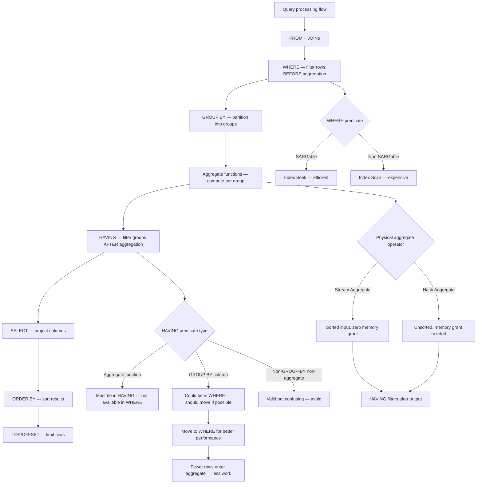
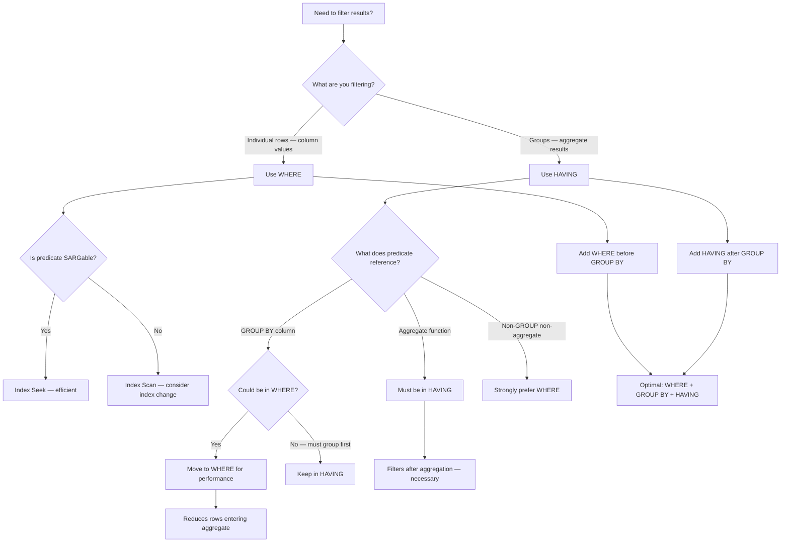

## Navigation

**Domain:** [[8 — Databases]] > **Group:** SQL Aggregations & Grouping
**Previous:** [[8.123 — GROUP BY — Grouping Mechanics]] | **Next:** [[8.125 — GROUP BY vs WHERE — When Each Applies]]

### Prerequisites

- [[8.123 — GROUP BY — Grouping Mechanics]] — HAVING filters groups AFTER GROUP BY creates them; understanding grouping mechanics is essential to understand what HAVING operates on.
- [[8.121 — COUNT — Counting Rows and Non-NULL Values]] — Most HAVING conditions use COUNT(*) or COUNT(DISTINCT col) to filter groups.
- [[8.122 — SUM, AVG, MIN, MAX — Aggregate Functions]] — HAVING filters on aggregate results; understanding how SUM/AVG/MIN/MAX handle NULLs affects whether HAVING matches expected groups.
- [[8.067 — WHERE Clause — Predicate Logic and SARGability]] — WHERE filters before aggregation, HAVING filters after; knowing which predicate belongs where is critical for correct and performant queries.

### Where This Fits

HAVING is the SQL clause that filters groups after aggregation — it answers "which groups meet a condition on their aggregate values?" Every .NET backend engineer uses HAVING when building reports: "show customers with more than 10 orders," "find products with total sales over $10,000," "list regions where average order value is below $50." The most expensive mistakes made here are: putting WHERE predicates in HAVING (they work but filter after grouping, wasting work on rows that should have been excluded earlier), using HAVING without GROUP BY (treats entire table as one group — rarely intended), and misunderstanding that HAVING can reference non-aggregate columns (technically valid but confusing — better in WHERE). Interviewers use HAVING to test whether candidates understand the logical processing order (WHERE before GROUP BY, HAVING after) and can identify when moving a predicate from HAVING to WHERE improves performance. Engineers who know HAVING deeply can look at a query, identify filters that should be moved to WHERE to reduce the number of rows entering the aggregate, and understand the execution plan difference between filtering pre-aggregation and post-aggregation.

---

## Core Mental Model

HAVING is a filter on groups, not on rows. After GROUP BY partitions rows into groups and aggregate functions compute per-group values, HAVING evaluates a predicate for each group. Groups that satisfy the predicate are included in the result; groups that do not satisfy are excluded. HAVING operates logically after GROUP BY and before SELECT/ORDER BY in the query processing pipeline. Because HAVING evaluates after aggregation, it can reference aggregate functions (COUNT(*), SUM(col), AVG(col), etc.) that are not available in WHERE. HAVING without GROUP BY treats the entire rowset as a single group — the HAVING condition operates on the single aggregated row. This is valid but rarely useful (it becomes a row filter on a single-row result). The key performance insight: HAVING always filters after all rows have been aggregated. If the HAVING condition includes a non-aggregate column that could be used in WHERE, moving it to WHERE reduces the number of rows that enter the aggregate, reducing scan cost, memory grant, and CPU.

### Classification

HAVING is a **logical filter clause** in the SQL processing pipeline. It operates after GROUP BY and before SELECT. HAVING predicates can reference aggregate functions (COUNT, SUM, AVG, MIN, MAX) or GROUP BY columns (which are known after grouping). HAVING is NOT SARGable in the traditional sense — it operates on aggregate results that are already in memory, not on indexed data. However, moving SARGable predicates from HAVING to WHERE can dramatically reduce the number of rows processed by the aggregate.



### Key Properties

|Property|Value|Notes|
|---|---|---|
|Logical position|After GROUP BY, before SELECT|Filters groups, not rows|
|Can reference aggregates|Yes|COUNT(*), SUM(col), AVG(col), etc.|
|Can reference GROUP BY cols|Yes|These are known after grouping|
|Can reference non-aggregate non-GROUP cols|Yes|But confusing — better in WHERE|
|Required with GROUP BY?|No|GROUP BY can exist without HAVING|
|Required without GROUP BY?|No|HAVING without GROUP BY treats all rows as one group|
|Performance characteristic|Filters post-aggregation|Does not reduce rows entering aggregate|
|SARGable|No|Operates on in-memory aggregate results|
|Efficiency tip|Move SARGable predicates to WHERE|Reduces aggregate input size|

---

## Deep Mechanics

### How the Engine Executes This

1. **Row retrieval** — The storage engine reads rows from the tables specified in FROM, applying WHERE filters to reduce the row set. WHERE is evaluated per row, and SARGable WHERE predicates use index seeks.

2. **Grouping** — GROUP BY partitions the filtered rows into groups. For each group, the engine evaluates the aggregate functions: SUM adds values, COUNT counts rows, AVG divides SUM by COUNT, etc.

3. **HAVING evaluation** — After the aggregates are computed, the engine evaluates the HAVING predicate for each group. If the predicate evaluates to TRUE, the group is included in the output. If FALSE or UNKNOWN (due to NULLs in the HAVING predicate), the group is excluded.

4. **Important:** The execution plan shows a Filter operator AFTER the Aggregate operator. The Filter evaluates the HAVING predicate row-by-row on the aggregated result set. For Stream Aggregate, the HAVING filter is applied as the aggregate outputs each group. For Hash Aggregate, the HAVING filter is applied after the hash table is built and probed.

5. **Optimizer consideration:** The optimizer does NOT push HAVING predicates below the aggregate operator. This is because HAVING conditions depend on aggregate results that are not computed until after grouping. The only optimization available is for predicates on GROUP BY columns — if the same predicate is in WHERE, it is applied before aggregation (reducing input), not after.

**Logical processing order detail (SQL Server):**

```
FROM -> WHERE -> GROUP BY -> CUBE/ROLLUP -> HAVING -> SELECT -> DISTINCT -> ORDER BY -> TOP
```

HAVING is evaluated after CUBE/ROLLUP (which adds subtotal rows) but before SELECT (column aliases are not available in HAVING). This means you cannot use SELECT aliases in HAVING — you must use the full expression or the GROUP BY column name.

### SQL Visibility

```sql
-- Basic HAVING: find customers with more than 5 orders
SELECT
    c.CustomerId,
    c.FirstName + ' ' + c.LastName AS CustomerName,
    COUNT(*) AS OrderCount,
    SUM(CAST(o.TotalAmount AS DECIMAL(18,2))) AS TotalSpent
FROM dbo.Customers c
INNER JOIN dbo.Orders o ON c.CustomerId = o.CustomerId
WHERE o.OrderDate >= '2024-01-01'
GROUP BY c.CustomerId, c.FirstName, c.LastName
HAVING COUNT(*) > 5
ORDER BY OrderCount DESC;

-- HAVING with multiple conditions
SELECT
    c.CustomerId,
    c.FirstName + ' ' + c.LastName AS CustomerName,
    COUNT(*) AS OrderCount,
    SUM(CAST(o.TotalAmount AS DECIMAL(18,2))) AS TotalSpent,
    AVG(o.TotalAmount) AS AvgOrderValue
FROM dbo.Customers c
INNER JOIN dbo.Orders o ON c.CustomerId = o.CustomerId
WHERE o.OrderDate >= '2024-01-01'
GROUP BY c.CustomerId, c.FirstName, c.LastName
HAVING COUNT(*) >= 5
   AND SUM(o.TotalAmount) > 1000
   AND AVG(o.TotalAmount) > 50
ORDER BY TotalSpent DESC;

-- HAVING with MIN/MAX
-- Find customers whose first and last orders span more than a year
SELECT
    c.CustomerId,
    c.FirstName + ' ' + c.LastName AS CustomerName,
    MIN(o.OrderDate) AS FirstOrder,
    MAX(o.OrderDate) AS LastOrder,
    DATEDIFF(day, MIN(o.OrderDate), MAX(o.OrderDate)) AS DaysActive
FROM dbo.Customers c
INNER JOIN dbo.Orders o ON c.CustomerId = o.CustomerId
GROUP BY c.CustomerId, c.FirstName, c.LastName
HAVING DATEDIFF(year, MIN(o.OrderDate), MAX(o.OrderDate)) >= 1
ORDER BY DaysActive DESC;

-- HAVING without GROUP BY (treats all rows as one group)
-- Find if there are any orders exceeding $10,000
SELECT 'Has high-value orders' AS Result
FROM dbo.Orders
HAVING MAX(TotalAmount) > 10000;
-- Returns one row if ANY order exceeds $10K

-- HAVING with COUNT(DISTINCT)
-- Find products sold in more than 10 distinct orders
SELECT
    p.ProductId,
    p.ProductName,
    COUNT(DISTINCT oi.OrderId) AS OrderCount,
    SUM(CAST(oi.Quantity AS INT)) AS TotalQuantity
FROM dbo.Products p
INNER JOIN dbo.OrderItems oi ON p.ProductId = oi.ProductId
INNER JOIN dbo.Orders o ON oi.OrderId = o.OrderId
WHERE o.OrderDate >= '2024-01-01'
GROUP BY p.ProductId, p.ProductName
HAVING COUNT(DISTINCT oi.OrderId) > 10
ORDER BY OrderCount DESC;

-- ❌ WRONG: Select alias used in HAVING (not valid)
SELECT COUNT(*) AS OrderCount
FROM dbo.Orders
GROUP BY CustomerId
HAVING OrderCount > 5;  -- Error: Invalid column name 'OrderCount'

-- ✅ Correct: Use the aggregate expression in HAVING
SELECT COUNT(*) AS OrderCount
FROM dbo.Orders
GROUP BY CustomerId
HAVING COUNT(*) > 5;

-- HAVING with expression on non-aggregate (valid but confusing)
-- Finds statuses where the status value > 2
SELECT Status, COUNT(*) AS OrderCount
FROM dbo.Orders
GROUP BY Status
HAVING Status > 2;  -- Works but this is a per-row filter — belongs in WHERE

-- ✅ Better: Move to WHERE for performance
SELECT Status, COUNT(*) AS OrderCount
FROM dbo.Orders
WHERE Status > 2
GROUP BY Status;

-- HAVING with IN subquery
-- Find regions whose revenue exceeds the average regional revenue
SELECT
    r.RegionId,
    r.RegionName,
    SUM(CAST(o.TotalAmount AS DECIMAL(18,2))) AS Revenue
FROM dbo.Regions r
INNER JOIN dbo.Orders o ON r.RegionId = o.RegionId
WHERE o.OrderDate >= DATEADD(year, -1, GETUTCDATE())
GROUP BY r.RegionId, r.RegionName
HAVING SUM(o.TotalAmount) > (
    SELECT AVG(RegionRevenue)
    FROM (
        SELECT SUM(o2.TotalAmount) AS RegionRevenue
        FROM dbo.Orders o2
        WHERE o2.OrderDate >= DATEADD(year, -1, GETUTCDATE())
        GROUP BY o2.RegionId
    ) AS RegionTotals
)
ORDER BY Revenue DESC;

-- HAVING with EXISTS
-- Find products that appear in at least one order with more than 50 items
SELECT
    p.ProductId,
    p.ProductName
FROM dbo.Products p
GROUP BY p.ProductId, p.ProductName
HAVING EXISTS (
    SELECT 1
    FROM dbo.OrderItems oi
    INNER JOIN dbo.Orders o ON oi.OrderId = o.OrderId
    WHERE oi.ProductId = p.ProductId
    GROUP BY o.OrderId
    HAVING SUM(oi.Quantity) > 50
);
```

```csharp
// EF Core — HAVING equivalent using Where after GroupBy
var frequentCustomers = await dbContext.Customers
    .Select(c => new
    {
        c.CustomerId,
        CustomerName = c.FirstName + " " + c.LastName,
        OrderCount = c.Orders.Count(o => o.OrderDate >= new DateTime(2024, 1, 1)),
        TotalSpent = c.Orders
            .Where(o => o.OrderDate >= new DateTime(2024, 1, 1))
            .Sum(o => o.TotalAmount)
    })
    .Where(x => x.OrderCount > 5 && x.TotalSpent > 1000)
    .OrderByDescending(x => x.TotalSpent)
    .ToListAsync(cancellationToken);

// EF Core — GroupBy then Where (HAVING equivalent)
var statusSummaries = await dbContext.Orders
    .Where(o => o.OrderDate >= new DateTime(2024, 1, 1))
    .GroupBy(o => o.Status)
    .Select(g => new
    {
        Status = g.Key,
        OrderCount = g.Count(),
        TotalRevenue = g.Sum(o => o.TotalAmount)
    })
    .Where(x => x.OrderCount > 100)
    .ToListAsync(cancellationToken);

// EF Core — Multiple aggregate HAVING conditions
var customerAnalytics = await dbContext.Customers
    .Select(c => new
    {
        c.CustomerId,
        CustomerName = c.FirstName + " " + c.LastName,
        OrderCount = c.Orders.Count(),
        TotalSpent = c.Orders.Sum(o => o.TotalAmount),
        AverageOrderValue = c.Orders.Average(o => (decimal?)o.TotalAmount),
        FirstOrder = c.Orders.Min(o => (DateTime?)o.OrderDate),
        LastOrder = c.Orders.Max(o => (DateTime?)o.OrderDate)
    })
    .Where(x => x.OrderCount >= 5
             && x.TotalSpent > 1000
             && x.AverageOrderValue > 50)
    .OrderByDescending(x => x.TotalSpent)
    .ToListAsync(cancellationToken);

// EF Core — HAVING with COUNT(DISTINCT) equivalent
var popularProducts = await dbContext.OrderItems
    .GroupBy(oi => oi.ProductId)
    .Select(g => new
    {
        ProductId = g.Key,
        OrderCount = g.Select(oi => oi.OrderId).Distinct().Count(),
        TotalQuantity = g.Sum(oi => oi.Quantity)
    })
    .Where(x => x.OrderCount > 10)
    .OrderByDescending(x => x.OrderCount)
    .ToListAsync(cancellationToken);
```

**Generated SQL (from EF Core logs):**

```sql
-- Where after Select (HAVING equivalent via subquery):
SELECT
    [c].[CustomerId],
    [c].[FirstName] + ' ' + [c].[LastName] AS [CustomerName],
    (
        SELECT COUNT(*)
        FROM [Orders] AS [o]
        WHERE [c].[CustomerId] = [o].[CustomerId]
        AND [o].[OrderDate] >= '2024-01-01'
    ) AS [OrderCount],
    (
        SELECT SUM([o].[TotalAmount])
        FROM [Orders] AS [o]
        WHERE [c].[CustomerId] = [o].[CustomerId]
        AND [o].[OrderDate] >= '2024-01-01'
    ) AS [TotalSpent]
FROM [Customers] AS [c]
WHERE (
    SELECT COUNT(*)
    FROM [Orders] AS [o]
    WHERE [c].[CustomerId] = [o].[CustomerId]
    AND [o].[OrderDate] >= '2024-01-01'
) > 5
AND (
    SELECT SUM([o].[TotalAmount])
    FROM [Orders] AS [o]
    WHERE [c].[CustomerId] = [o].[CustomerId]
    AND [o].[OrderDate] >= '2024-01-01'
) > 1000
ORDER BY (
    SELECT SUM([o].[TotalAmount])
    FROM [Orders] AS [o]
    WHERE [c].[CustomerId] = [o].[CustomerId]
    AND [o].[OrderDate] >= '2024-01-01'
) DESC;

-- Note: EF Core repeats the correlated subqueries for each reference
-- in SELECT, WHERE, and ORDER BY. This can cause performance issues.
-- Consider using .AsSplitQuery() or raw SQL for complex HAVING scenarios.

-- GroupBy then Where:
SELECT
    [o].[Status],
    COUNT(*) AS [OrderCount],
    SUM([o].[TotalAmount]) AS [TotalRevenue]
FROM [Orders] AS [o]
WHERE [o].[OrderDate] >= '2024-01-01'
GROUP BY [o].[Status]
HAVING COUNT(*) > 100;
-- EF Core 7+ correctly translates GroupBy().Where(agg) to GROUP BY ... HAVING
```

### Execution Plan Analysis

For `SELECT Status, COUNT(*) FROM Orders GROUP BY Status HAVING COUNT(*) > 100`:

```
Expected plan shape:
[Clustered Index Scan / Index Seek]
→ [Hash Match (Aggregate)] or [Sort → Stream Aggregate]
→ [Filter] → [SELECT]

Estimated Cost: Scan 60%, Aggregate 30%, Filter 10%
```

- The Filter operator is where HAVING is evaluated. It receives the aggregated rows (one per group) and discards groups where `COUNT(*) <= 100`.
- The Filter is always AFTER the Aggregate operator — this is the defining characteristic of HAVING.
- If the HAVING predicate references a GROUP BY column (not an aggregate), the optimizer cannot push it below the Aggregate because the logical processing order guarantees HAVING after GROUP BY.

For `SELECT Status, COUNT(*) FROM Orders WHERE Status > 2 GROUP BY Status HAVING COUNT(*) > 100`:

```
Expected plan shape (with WHERE + HAVING):
[Clustered Index Scan / Index Seek] (WHERE Status > 2 applied here)
→ [Hash Match (Aggregate)] or [Sort → Stream Aggregate]
→ [Filter] (HAVING COUNT(*) > 100 applied here)
→ [SELECT]
```

- The WHERE predicate reduces the number of rows entering the Aggregate. The HAVING predicate filters the aggregated output.
- This is the optimal pattern: use WHERE for per-row filters, HAVING for aggregate filters.

### Cost Visibility

```sql
SET STATISTICS IO ON;
SET STATISTICS TIME ON;

-- HAVING after full aggregation
SELECT Status, COUNT(*) AS OrderCount
FROM dbo.Orders
GROUP BY Status
HAVING COUNT(*) > 10000;
-- Table 'Orders'. Scan count 1, logical reads 128,342
-- CPU time: 1,240ms, Elapsed time: 1,380ms
-- Plan: Clustered Index Scan → Hash Match (Aggregate) → Filter

-- Compare: Same result with WHERE filter first (if applicable)
SELECT Status, COUNT(*) AS OrderCount
FROM dbo.Orders
WHERE Status IN (3, 4) -- Shipped, Delivered
GROUP BY Status
HAVING COUNT(*) > 5000;
-- Table 'Orders'. Scan count 1, logical reads 128,342
-- CPU time: 890ms, Elapsed time: 950ms
-- Same logical reads (no index on Status), but filter reduces CPU

-- After adding index on Status:
CREATE INDEX IX_Orders_Status ON dbo.Orders(Status) INCLUDE (TotalAmount);
SELECT Status, COUNT(*) AS OrderCount
FROM dbo.Orders
WHERE Status IN (3, 4)
GROUP BY Status
HAVING COUNT(*) > 5000;
-- Table 'Orders'. Scan count 1, logical reads 34,211
-- CPU time: 280ms, Elapsed time: 320ms
-- Plan: Index Seek (on Status filter) → Stream Aggregate → Filter
-- Improvement: 3.7x fewer reads, 3x faster

-- HAVING COUNT(DISTINCT) — expensive
SELECT CustomerId, COUNT(DISTINCT Status) AS UniqueStatuses
FROM dbo.Orders
GROUP BY CustomerId
HAVING COUNT(DISTINCT Status) > 2;
-- Table 'Orders'. Scan count 1, logical reads 128,342
-- CPU time: 4,210ms, Elapsed time: 4,890ms
-- Plan: Clustered Index Scan → Sort → Stream Aggregate → Filter
-- The Sort for COUNT(DISTINCT) is the dominant cost
```

### Failure Modes

**Failure Mode 1: Non-aggregate column in HAVING that should be in WHERE.**

A SARGable predicate in HAVING instead of WHERE forces the engine to aggregate all rows before filtering.

```sql
-- ❌ WRONG: Status filter in HAVING causes full aggregation before filtering
SELECT Status, COUNT(*)
FROM dbo.Orders
GROUP BY Status
HAVING Status > 2;

-- ✅ Correct: Status filter in WHERE reduces rows before aggregation
SELECT Status, COUNT(*)
FROM dbo.Orders
WHERE Status > 2
GROUP BY Status;
```

**Symptom:** The query works but performs unnecessary work. With the Status filter in WHERE, the optimizer can use an index seek on Status and only aggregate the relevant rows.

**Fix:** Always put SARGable per-row filters in WHERE. Only use HAVING for filters that reference aggregate functions or GROUP BY columns that cannot be expressed in WHERE.

**Cost of not fixing:** Full table scan when a filtered index scan would suffice. On a 50M row table, this difference is 400K logical reads vs 50K.

**Failure Mode 2: HAVING without GROUP BY — accidental single-group filter.**

Writing a HAVING condition without a GROUP BY treats the entire table as one group. The HAVING filters the single aggregated row.

```sql
-- ❌ Probably wrong: HAVING without GROUP BY
SELECT COUNT(*) AS TotalOrders, SUM(TotalAmount) AS TotalRevenue
FROM dbo.Orders
HAVING COUNT(*) > 0;
-- Returns one row (the aggregate) if condition is true
-- Returns zero rows if condition is false

-- This is rarely what the engineer intended.
```

**Symptom:** The query returns either one row or zero rows. The engineer expected per-group results but forgot GROUP BY.

**Fix:** Add GROUP BY if per-group results are intended. If single-group filtering is truly intended, add a comment explaining why.

**Cost of not fixing:** Confusing query behavior. The query works but returns unexpected results because GROUP BY was omitted.

**Failure Mode 3: SELECT alias used in HAVING.**

Column aliases defined in SELECT are not available in HAVING because HAVING is evaluated before SELECT in the logical processing order.

```sql
-- ❌ WRONG: Select alias used in HAVING
SELECT COUNT(*) AS OrderCount
FROM dbo.Orders
GROUP BY CustomerId
HAVING OrderCount > 5;
-- Error: Invalid column name 'OrderCount'

-- ✅ Correct: Use the aggregate expression
SELECT COUNT(*) AS OrderCount
FROM dbo.Orders
GROUP BY CustomerId
HAVING COUNT(*) > 5;
```

**Symptom:** SQL Server error 207 — invalid column name. The engineer is confused because the alias "should be available."

**Fix:** Always use the full expression in HAVING, not the SELECT alias.

**Cost of not fixing:** Frustration for engineers who expect SELECT aliases to be available everywhere, leading to trial-and-error debugging.

**Failure Mode 4: NULL handling in HAVING predicate.**

If the HAVING predicate compares an aggregate that returns NULL (e.g., SUM of all NULLs returns NULL), the comparison `HAVING SUM(col) > 100` evaluates to UNKNOWN when SUM is NULL, and the group is excluded.

```sql
-- If a product category has all NULL prices (no sales):
SELECT CategoryId, SUM(TotalAmount) AS Revenue
FROM dbo.Orders
GROUP BY CategoryId
HAVING SUM(TotalAmount) > 100;
-- Categories with NULL SUM are excluded (NULL > 100 is UNKNOWN)

-- To include them with 0:
SELECT CategoryId, COALESCE(SUM(TotalAmount), 0) AS Revenue
FROM dbo.Orders
GROUP BY CategoryId
HAVING COALESCE(SUM(TotalAmount), 0) > 100;
-- Or use:
HAVING SUM(TotalAmount) > 100 OR SUM(TotalAmount) IS NULL;
```

**Symptom:** Some groups disappear from results when their aggregate values are NULL. The engineer cannot find them and assumes they have zero rows.

**Fix:** Use `COALESCE` or `ISNULL` around aggregate expressions in HAVING if you want NULLs treated as 0.

**Cost of not fixing:** Missing groups in reports. A region with no completed orders (NULL SUM for completed) is excluded from the "top regions" list instead of appearing with $0.

---

## Production Patterns and Implementation

### Primary SQL Implementation

```sql
-- Schema context
CREATE TABLE dbo.Orders (
    OrderId INT IDENTITY(1,1) NOT NULL PRIMARY KEY,
    CustomerId INT NOT NULL,
    OrderDate DATETIME2 NOT NULL,
    Status TINYINT NOT NULL,
    TotalAmount DECIMAL(10,2) NOT NULL,
    RegionId INT NOT NULL,
    SalesPersonId INT NOT NULL
);

CREATE TABLE dbo.Customers (
    CustomerId INT IDENTITY(1,1) NOT NULL PRIMARY KEY,
    FirstName NVARCHAR(50) NOT NULL,
    LastName NVARCHAR(50) NOT NULL,
    Email NVARCHAR(200) NOT NULL,
    CreatedDate DATETIME2 NOT NULL,
    Tier TINYINT NOT NULL DEFAULT 1 -- 1=Standard, 2=Silver, 3=Gold, 4=Platinum
);

CREATE TABLE dbo.Products (
    ProductId INT IDENTITY(1,1) NOT NULL PRIMARY KEY,
    ProductName NVARCHAR(200) NOT NULL,
    CategoryId INT NOT NULL,
    ListPrice DECIMAL(10,2) NOT NULL,
    Cost DECIMAL(10,2) NOT NULL
);

CREATE TABLE dbo.OrderItems (
    OrderItemId INT IDENTITY(1,1) NOT NULL PRIMARY KEY,
    OrderId INT NOT NULL REFERENCES dbo.Orders(OrderId),
    ProductId INT NOT NULL,
    Quantity INT NOT NULL,
    UnitPrice DECIMAL(10,2) NOT NULL
);

-- Production pattern 1: Find high-value customers (revenue > $10K, orders > 5)
SELECT
    c.CustomerId,
    c.FirstName + ' ' + c.LastName AS CustomerName,
    c.Email,
    c.Tier,
    COUNT(o.OrderId) AS OrderCount,
    SUM(CAST(o.TotalAmount AS DECIMAL(18,2))) AS TotalRevenue,
    AVG(o.TotalAmount) AS AverageOrderValue,
    MIN(o.OrderDate) AS FirstOrder,
    MAX(o.OrderDate) AS LastOrder
FROM dbo.Customers c
INNER JOIN dbo.Orders o ON c.CustomerId = o.CustomerId
WHERE o.OrderDate >= DATEADD(year, -1, GETUTCDATE())
  AND o.Status <> 5 -- exclude cancelled
GROUP BY c.CustomerId, c.FirstName, c.LastName, c.Email, c.Tier
HAVING SUM(o.TotalAmount) > 10000
   AND COUNT(o.OrderId) > 5
ORDER BY TotalRevenue DESC;

-- Production pattern 2: Find products with consistently high sales
SELECT
    p.ProductId,
    p.ProductName,
    COUNT(DISTINCT oi.OrderId) AS TimesOrdered,
    SUM(CAST(oi.Quantity AS INT)) AS TotalUnitsSold,
    SUM(CAST(oi.Quantity * oi.UnitPrice AS DECIMAL(18,2))) AS GrossRevenue,
    AVG(CAST(oi.Quantity AS DECIMAL(10,2))) AS AvgQuantityPerOrder
FROM dbo.Products p
INNER JOIN dbo.OrderItems oi ON p.ProductId = oi.ProductId
INNER JOIN dbo.Orders o ON oi.OrderId = o.OrderId
WHERE o.OrderDate >= DATEADD(month, -6, GETUTCDATE())
  AND o.Status IN (3, 4) -- Shipped or Delivered
GROUP BY p.ProductId, p.ProductName
HAVING COUNT(DISTINCT oi.OrderId) >= 10
   AND SUM(oi.Quantity) > 100
   AND AVG(oi.Quantity) >= 2.0
ORDER BY GrossRevenue DESC;

-- Production pattern 3: HAVING with subquery — above-average performers
-- Find salespeople whose revenue exceeds average
SELECT
    o.SalesPersonId,
    COUNT(*) AS OrderCount,
    SUM(CAST(o.TotalAmount AS DECIMAL(18,2))) AS Revenue
FROM dbo.Orders o
WHERE o.OrderDate >= DATEADD(month, -6, GETUTCDATE())
GROUP BY o.SalesPersonId
HAVING SUM(o.TotalAmount) > (
    SELECT AVG(SalesPersonRevenue)
    FROM (
        SELECT SUM(o2.TotalAmount) AS SalesPersonRevenue
        FROM dbo.Orders o2
        WHERE o2.OrderDate >= DATEADD(month, -6, GETUTCDATE())
        GROUP BY o2.SalesPersonId
    ) AS SalesTotals
)
ORDER BY Revenue DESC;

-- Production pattern 4: HAVING with date range calculations
-- Find customers active for more than a year
SELECT
    c.CustomerId,
    c.FirstName + ' ' + c.LastName AS CustomerName,
    MIN(o.OrderDate) AS FirstOrder,
    MAX(o.OrderDate) AS LastOrder,
    DATEDIFF(day, MIN(o.OrderDate), MAX(o.OrderDate)) AS CustomerLifespanDays
FROM dbo.Customers c
INNER JOIN dbo.Orders o ON c.CustomerId = o.CustomerId
GROUP BY c.CustomerId, c.FirstName, c.LastName
HAVING DATEDIFF(day, MIN(o.OrderDate), MAX(o.OrderDate)) >= 365
ORDER BY CustomerLifespanDays DESC;

-- Production pattern 5: HAVING with COUNT(DISTINCT) for diversity metrics
-- Find customers who bought from at least 3 different categories
SELECT
    c.CustomerId,
    c.FirstName + ' ' + c.LastName AS CustomerName,
    COUNT(DISTINCT p.CategoryId) AS CategoriesPurchased,
    COUNT(o.OrderId) AS TotalOrders,
    SUM(CAST(o.TotalAmount AS DECIMAL(18,2))) AS TotalSpent
FROM dbo.Customers c
INNER JOIN dbo.Orders o ON c.CustomerId = o.CustomerId
INNER JOIN dbo.OrderItems oi ON o.OrderId = oi.OrderId
INNER JOIN dbo.Products p ON oi.ProductId = p.ProductId
WHERE o.Status <> 5
GROUP BY c.CustomerId, c.FirstName, c.LastName
HAVING COUNT(DISTINCT p.CategoryId) >= 3
ORDER BY CategoriesPurchased DESC, TotalSpent DESC;

-- Production pattern 6: HAVING with conditional aggregation
-- Find customers with more shipped orders than cancelled orders
SELECT
    c.CustomerId,
    c.FirstName + ' ' + c.LastName AS CustomerName,
    COUNT(*) AS TotalOrders,
    SUM(CASE WHEN o.Status = 3 THEN 1 ELSE 0 END) AS ShippedCount,
    SUM(CASE WHEN o.Status = 5 THEN 1 ELSE 0 END) AS CancelledCount
FROM dbo.Customers c
INNER JOIN dbo.Orders o ON c.CustomerId = o.CustomerId
GROUP BY c.CustomerId, c.FirstName, c.LastName
HAVING SUM(CASE WHEN o.Status = 3 THEN 1 ELSE 0 END)
     > SUM(CASE WHEN o.Status = 5 THEN 1 ELSE 0 END)
ORDER BY TotalOrders DESC;

-- Production pattern 7: HAVING with percentage calculation
-- Find products with high conversion rates (> 80% of orders include them)
SELECT
    p.ProductId,
    p.ProductName,
    COUNT(DISTINCT oi.OrderId) AS OrdersContaining,
    (SELECT COUNT(*) FROM dbo.Orders WHERE OrderDate >= DATEADD(month, -3, GETUTCDATE())) AS TotalOrders,
    CAST(COUNT(DISTINCT oi.OrderId) AS DECIMAL(10,2))
        / NULLIF((SELECT COUNT(*) FROM dbo.Orders WHERE OrderDate >= DATEADD(month, -3, GETUTCDATE())), 0)
        * 100 AS InclusionPercent
FROM dbo.Products p
INNER JOIN dbo.OrderItems oi ON p.ProductId = oi.ProductId
INNER JOIN dbo.Orders o ON oi.OrderId = o.OrderId
WHERE o.OrderDate >= DATEADD(month, -3, GETUTCDATE())
  AND o.Status IN (3, 4)
GROUP BY p.ProductId, p.ProductName
HAVING CAST(COUNT(DISTINCT oi.OrderId) AS DECIMAL(10,2))
    / NULLIF((SELECT COUNT(*) FROM dbo.Orders WHERE OrderDate >= DATEADD(month, -3, GETUTCDATE())), 0)
    * 100 > 80.0
ORDER BY InclusionPercent DESC;

-- Production pattern 8: HAVING with NULL handling
-- Find categories where average discount is meaningful
SELECT
    p.CategoryId,
    AVG(o.DiscountAmount) AS AvgDiscount,
    COUNT(*) AS OrderCount
FROM dbo.Orders o
INNER JOIN dbo.OrderItems oi ON o.OrderId = oi.OrderId
INNER JOIN dbo.Products p ON oi.ProductId = p.ProductId
GROUP BY p.CategoryId
HAVING AVG(COALESCE(o.DiscountAmount, 0)) > 5.0
   AND COUNT(*) >= 10
ORDER BY AvgDiscount DESC;
```

### EF Core Implementation

```csharp
public class HavingAnalysisService
{
    private readonly ApplicationDbContext _dbContext;

    public HavingAnalysisService(ApplicationDbContext dbContext)
    {
        _dbContext = dbContext;
    }

    // High-value customers (HAVING equivalent via Where on projection)
    public async Task<List<CustomerSummaryDto>> GetHighValueCustomersAsync(
        decimal minRevenue, int minOrders, CancellationToken ct)
    {
        return await _dbContext.Customers
            .Select(c => new CustomerSummaryDto
            {
                CustomerId = c.CustomerId,
                CustomerName = c.FirstName + " " + c.LastName,
                Email = c.Email,
                OrderCount = c.Orders.Count(o => o.Status != OrderStatus.Cancelled),
                TotalRevenue = c.Orders
                    .Where(o => o.Status != OrderStatus.Cancelled)
                    .Sum(o => o.TotalAmount),
                AverageOrderValue = c.Orders
                    .Where(o => o.Status != OrderStatus.Cancelled)
                    .Average(o => (decimal?)o.TotalAmount),
                FirstOrderDate = c.Orders.Min(o => (DateTime?)o.OrderDate),
                LastOrderDate = c.Orders.Max(o => (DateTime?)o.OrderDate)
            })
            .Where(x => x.OrderCount >= minOrders && x.TotalRevenue >= minRevenue)
            .OrderByDescending(x => x.TotalRevenue)
            .ToListAsync(ct);
    }

    // HAVING on GroupBy (EF Core 7+ generates HAVING clause)
    public async Task<List<StatusAggregateDto>> GetStatusSummariesWithThresholdAsync(
        int minOrderCount, CancellationToken ct)
    {
        return await _dbContext.Orders
            .GroupBy(o => o.Status)
            .Select(g => new StatusAggregateDto
            {
                Status = g.Key,
                OrderCount = g.Count(),
                TotalRevenue = g.Sum(o => o.TotalAmount),
                AverageValue = g.Average(o => o.TotalAmount)
            })
            .Where(x => x.OrderCount >= minOrderCount)
            .OrderByDescending(x => x.OrderCount)
            .ToListAsync(ct);
        // EF Core 7+ generates: GROUP BY [Status] HAVING COUNT(*) >= @minOrderCount
    }

    // HAVING with COUNT(DISTINCT) equivalent
    public async Task<List<ProductCategorySummaryDto>> GetMultiCategoryProductsAsync(
        int minCategories, CancellationToken ct)
    {
        return await _dbContext.OrderItems
            .GroupBy(oi => oi.ProductId)
            .Select(g => new ProductCategorySummaryDto
            {
                ProductId = g.Key,
                CategoriesCount = g.Select(oi => oi.Product.CategoryId).Distinct().Count(),
                TotalOrders = g.Select(oi => oi.OrderId).Distinct().Count(),
                TotalQuantity = g.Sum(oi => oi.Quantity)
            })
            .Where(x => x.CategoriesCount >= minCategories)
            .OrderByDescending(x => x.CategoriesCount)
            .ToListAsync(ct);
    }

    // HAVING with date range calculations
    public async Task<List<CustomerLifespanDto>> GetLongTermCustomersAsync(
        int minDaysActive, CancellationToken ct)
    {
        return await _dbContext.Customers
            .Select(c => new CustomerLifespanDto
            {
                CustomerId = c.CustomerId,
                CustomerName = c.FirstName + " " + c.LastName,
                OrderCount = c.Orders.Count(),
                DaysActive = c.Orders.Any()
                    ? EF.Functions.DateDiffDay(
                        c.Orders.Min(o => o.OrderDate),
                        c.Orders.Max(o => o.OrderDate))
                    : 0
            })
            .Where(x => x.DaysActive >= minDaysActive)
            .OrderByDescending(x => x.DaysActive)
            .ToListAsync(ct);
    }

    // HAVING with conditional aggregation
    public async Task<List<OrderStatusBalanceDto>> GetCustomerStatusBalanceAsync(CancellationToken ct)
    {
        return await _dbContext.Customers
            .Select(c => new OrderStatusBalanceDto
            {
                CustomerId = c.CustomerId,
                CustomerName = c.FirstName + " " + c.LastName,
                ShippedCount = c.Orders.Count(o => o.Status == OrderStatus.Shipped),
                CancelledCount = c.Orders.Count(o => o.Status == OrderStatus.Cancelled),
                TotalCount = c.Orders.Count()
            })
            .Where(x => x.ShippedCount > x.CancelledCount
                     && x.TotalCount >= 5)
            .OrderByDescending(x => x.ShippedCount)
            .ToListAsync(ct);
    }
}

public class CustomerSummaryDto
{
    public int CustomerId { get; set; }
    public string CustomerName { get; set; } = string.Empty;
    public string Email { get; set; } = string.Empty;
    public int OrderCount { get; set; }
    public decimal TotalRevenue { get; set; }
    public decimal? AverageOrderValue { get; set; }
    public DateTime? FirstOrderDate { get; set; }
    public DateTime? LastOrderDate { get; set; }
}

public class StatusAggregateDto
{
    public OrderStatus Status { get; set; }
    public int OrderCount { get; set; }
    public decimal TotalRevenue { get; set; }
    public decimal AverageValue { get; set; }
}

public class ProductCategorySummaryDto
{
    public int ProductId { get; set; }
    public int CategoriesCount { get; set; }
    public int TotalOrders { get; set; }
    public int TotalQuantity { get; set; }
}

public class CustomerLifespanDto
{
    public int CustomerId { get; set; }
    public string CustomerName { get; set; } = string.Empty;
    public int OrderCount { get; set; }
    public int DaysActive { get; set; }
}

public class OrderStatusBalanceDto
{
    public int CustomerId { get; set; }
    public string CustomerName { get; set; } = string.Empty;
    public int ShippedCount { get; set; }
    public int CancelledCount { get; set; }
    public int TotalCount { get; set; }
}
```

### Dapper Implementation

```csharp
public class HavingDapperService
{
    private readonly IDbConnectionFactory _connectionFactory;

    public HavingDapperService(IDbConnectionFactory connectionFactory)
    {
        _connectionFactory = connectionFactory;
    }

    // High-value customers (HAVING with ORDER BY)
    public async Task<IReadOnlyList<CustomerSummaryDto>> GetHighValueCustomersAsync(
        decimal minRevenue, int minOrders, CancellationToken ct)
    {
        await using var connection = _connectionFactory.Create();
        const string sql = @"
            SELECT
                c.CustomerId,
                c.FirstName + ' ' + c.LastName AS CustomerName,
                c.Email,
                COUNT(o.OrderId) AS OrderCount,
                ISNULL(SUM(CAST(o.TotalAmount AS DECIMAL(18,2))), 0) AS TotalRevenue,
                ISNULL(AVG(o.TotalAmount), 0) AS AverageOrderValue,
                MIN(o.OrderDate) AS FirstOrderDate,
                MAX(o.OrderDate) AS LastOrderDate
            FROM dbo.Customers c
            INNER JOIN dbo.Orders o ON c.CustomerId = o.CustomerId
                AND o.Status <> 5
            GROUP BY c.CustomerId, c.FirstName, c.LastName, c.Email
            HAVING SUM(CAST(o.TotalAmount AS DECIMAL(18,2))) >= @MinRevenue
               AND COUNT(o.OrderId) >= @MinOrders
            ORDER BY TotalRevenue DESC";

        var results = await connection.QueryAsync<CustomerSummaryDto>(
            new CommandDefinition(sql,
                new { MinRevenue = minRevenue, MinOrders = minOrders },
                cancellationToken: ct));
        return results.AsList();
    }

    // HAVING with subquery
    public async Task<IReadOnlyList<SalesPersonSummaryDto>> GetAboveAverageSalesPeopleAsync(
        DateTime since, CancellationToken ct)
    {
        await using var connection = _connectionFactory.Create();
        const string sql = @"
            SELECT
                o.SalesPersonId,
                COUNT(*) AS OrderCount,
                ISNULL(SUM(CAST(o.TotalAmount AS DECIMAL(18,2))), 0) AS Revenue
            FROM dbo.Orders o
            WHERE o.OrderDate >= @Since
            GROUP BY o.SalesPersonId
            HAVING SUM(CAST(o.TotalAmount AS DECIMAL(18,2))) > (
                SELECT ISNULL(AVG(SalesPersonRevenue), 0)
                FROM (
                    SELECT SUM(CAST(o2.TotalAmount AS DECIMAL(18,2))) AS SalesPersonRevenue
                    FROM dbo.Orders o2
                    WHERE o2.OrderDate >= @Since
                    GROUP BY o2.SalesPersonId
                ) AS SalesTotals
            )
            ORDER BY Revenue DESC";

        var results = await connection.QueryAsync<SalesPersonSummaryDto>(
            new CommandDefinition(sql, new { Since = since }, cancellationToken: ct));
        return results.AsList();
    }

    // HAVING with COUNT(DISTINCT)
    public async Task<IReadOnlyList<ProductDiversityDto>> GetHighDiversityProductsAsync(
        int minCategories, CancellationToken ct)
    {
        await using var connection = _connectionFactory.Create();
        const string sql = @"
            SELECT
                oi.ProductId,
                COUNT(DISTINCT p.CategoryId) AS CategoriesCount,
                COUNT(DISTINCT oi.OrderId) AS TotalOrders,
                SUM(oi.Quantity) AS TotalQuantity
            FROM dbo.OrderItems oi
            INNER JOIN dbo.Products p ON oi.ProductId = p.ProductId
            GROUP BY oi.ProductId
            HAVING COUNT(DISTINCT p.CategoryId) >= @MinCategories
            ORDER BY CategoriesCount DESC";

        var results = await connection.QueryAsync<ProductDiversityDto>(
            new CommandDefinition(sql, new { MinCategories = minCategories },
                cancellationToken: ct));
        return results.AsList();
    }

    // HAVING with conditional aggregation (CASE in HAVING)
    public async Task<IReadOnlyList<CustomerStatusBalanceDto>> GetCustomersWithMoreShippedAsync(
        CancellationToken ct)
    {
        await using var connection = _connectionFactory.Create();
        const string sql = @"
            SELECT
                c.CustomerId,
                c.FirstName + ' ' + c.LastName AS CustomerName,
                COUNT(*) AS TotalCount,
                SUM(CASE WHEN o.Status = 3 THEN 1 ELSE 0 END) AS ShippedCount,
                SUM(CASE WHEN o.Status = 5 THEN 1 ELSE 0 END) AS CancelledCount
            FROM dbo.Customers c
            INNER JOIN dbo.Orders o ON c.CustomerId = o.CustomerId
            GROUP BY c.CustomerId, c.FirstName, c.LastName
            HAVING SUM(CASE WHEN o.Status = 3 THEN 1 ELSE 0 END)
                 > SUM(CASE WHEN o.Status = 5 THEN 1 ELSE 0 END)
               AND COUNT(*) >= 5
            ORDER BY ShippedCount DESC";

        var results = await connection.QueryAsync<CustomerStatusBalanceDto>(
            new CommandDefinition(sql, cancellationToken: ct));
        return results.AsList();
    }

    // HAVING with date difference
    public async Task<IReadOnlyList<CustomerLifespanDto>> GetLongTermCustomersAsync(
        int minDaysActive, CancellationToken ct)
    {
        await using var connection = _connectionFactory.Create();
        const string sql = @"
            SELECT
                c.CustomerId,
                c.FirstName + ' ' + c.LastName AS CustomerName,
                COUNT(o.OrderId) AS OrderCount,
                DATEDIFF(day, MIN(o.OrderDate), MAX(o.OrderDate)) AS DaysActive
            FROM dbo.Customers c
            INNER JOIN dbo.Orders o ON c.CustomerId = o.CustomerId
            GROUP BY c.CustomerId, c.FirstName, c.LastName
            HAVING DATEDIFF(day, MIN(o.OrderDate), MAX(o.OrderDate)) >= @MinDaysActive
            ORDER BY DaysActive DESC";

        var results = await connection.QueryAsync<CustomerLifespanDto>(
            new CommandDefinition(sql, new { MinDaysActive = minDaysActive },
                cancellationToken: ct));
        return results.AsList();
    }
}

public class SalesPersonSummaryDto
{
    public int SalesPersonId { get; set; }
    public int OrderCount { get; set; }
    public decimal Revenue { get; set; }
}

public class ProductDiversityDto
{
    public int ProductId { get; set; }
    public int CategoriesCount { get; set; }
    public int TotalOrders { get; set; }
    public int TotalQuantity { get; set; }
}

public class CustomerStatusBalanceDto
{
    public int CustomerId { get; set; }
    public string CustomerName { get; set; } = string.Empty;
    public int TotalCount { get; set; }
    public int ShippedCount { get; set; }
    public int CancelledCount { get; set; }
}
```

### Configuration and Wiring

```csharp
// Program.cs
builder.Services.AddDbContext<ApplicationDbContext>(options =>
    options.UseSqlServer(
        builder.Configuration.GetConnectionString("DefaultConnection"),
        sqlOptions => sqlOptions.EnableRetryOnFailure(3)));

builder.Services.AddSingleton<IDbConnectionFactory, SqlConnectionFactory>();
builder.Services.AddScoped<HavingAnalysisService>();
builder.Services.AddScoped<HavingDapperService>();
```

### SQL Server vs PostgreSQL Differences

```sql
-- PostgreSQL HAVING syntax is identical, but:

-- PostgreSQL supports HAVING with FILTER (more readable conditional aggregation):
SELECT
    customer_id,
    COUNT(*) AS total_orders,
    COUNT(*) FILTER (WHERE status = 3) AS shipped_count,
    COUNT(*) FILTER (WHERE status = 5) AS cancelled_count
FROM orders
GROUP BY customer_id
HAVING COUNT(*) FILTER (WHERE status = 3)
     > COUNT(*) FILTER (WHERE status = 5);

-- SQL Server equivalent (CASE inside aggregate):
SELECT
    CustomerId,
    COUNT(*) AS TotalOrders,
    COUNT(CASE WHEN Status = 3 THEN 1 END) AS ShippedCount,
    COUNT(CASE WHEN Status = 5 THEN 1 END) AS CancelledCount
FROM dbo.Orders
GROUP BY CustomerId
HAVING COUNT(CASE WHEN Status = 3 THEN 1 END)
     > COUNT(CASE WHEN Status = 5 THEN 1 END);

-- Both are valid, PostgreSQL FILTER is ANSI SQL standard
```

---

## Gotchas and Production Pitfalls

### 1. Putting WHERE Filters in HAVING

**Pitfall:** The engineer adds a non-aggregate filter (like `Status > 2`) in HAVING instead of WHERE. The query works but performs a full table scan and aggregation on all rows before filtering.

```sql
-- ❌ Wrong: Status filter in HAVING (filters after aggregation)
SELECT Status, COUNT(*) AS OrderCount
FROM dbo.Orders
GROUP BY Status
HAVING Status > 2;

-- ✅ Correct: Status filter in WHERE (filters before aggregation)
SELECT Status, COUNT(*) AS OrderCount
FROM dbo.Orders
WHERE Status > 2
GROUP BY Status;
```

**Symptom:** The query plan shows a full scan and Hash Aggregate on ALL rows, then a Filter operator discards aggregated groups. With WHERE, the scan only reads rows matching the filter, reducing the input to the aggregate.

**Fix:** Move all SARGable per-row predicates to WHERE. Only use HAVING for predicates that reference aggregate functions.

**Cost of not fixing:** On a 50M row table with 5 statuses, filtering on 2 statuses in HAVING aggregates all 50M rows then keeps 40M rows' worth of groups. With WHERE, only 20M rows enter the aggregate — 60% less work.

### 2. SELECT Alias Used in HAVING

**Pitfall:** The engineer uses a column alias defined in SELECT within the HAVING clause, expecting it to be available.

```sql
-- ❌ Wrong: OrderCount alias not available in HAVING
SELECT COUNT(*) AS OrderCount
FROM dbo.Orders
GROUP BY CustomerId
HAVING OrderCount > 5;
-- Error: Invalid column name 'OrderCount'

-- ✅ Correct: Use full expression
SELECT COUNT(*) AS OrderCount
FROM dbo.Orders
GROUP BY CustomerId
HAVING COUNT(*) > 5;
```

**Symptom:** Error 207: Invalid column name. This happens because HAVING is evaluated before SELECT in the logical processing order.

**Fix:** Always use the full expression or column name in HAVING, not the SELECT alias.

**Cost of not fixing:** Wasted debugging time. Junior engineers try various alias combinations before discovering the rule.

### 3. HAVING Without GROUP BY (Accidental Single-Group Filter)

**Pitfall:** The engineer writes HAVING without GROUP BY, expecting per-group results. Instead, the entire table is treated as one group.

```sql
-- ❌ Probably wrong: HAVING without GROUP BY
SELECT COUNT(*) AS TotalOrders, SUM(TotalAmount) AS TotalRevenue
FROM dbo.Orders
HAVING COUNT(*) > 1000;
-- Returns ONE row if total orders > 1000
-- Returns ZERO rows if total orders <= 1000

-- ✅ With GROUP BY (if per-customer results intended):
SELECT CustomerId, COUNT(*) AS OrderCount, SUM(TotalAmount) AS TotalRevenue
FROM dbo.Orders
GROUP BY CustomerId
HAVING COUNT(*) > 5;
```

**Symptom:** The query always returns at most one row. The engineer intended per-group results but forgot GROUP BY.

**Fix:** Always include GROUP BY when you want per-group aggregate results. HAVING without GROUP BY is only useful for "all-or-nothing" checks: "return the aggregate only if condition is met."

**Cost of not fixing:** Confusing query behavior. The query works but returns the wrong result, silently.

### 4. HAVING with NULL Comparisons

**Pitfall:** An aggregate function returns NULL (e.g., SUM of all NULLs), and the HAVING comparison evaluates to UNKNOWN, excluding the group.

```sql
-- If Product 999 has no sales (no rows in OrderItems):
SELECT oi.ProductId, SUM(oi.Quantity) AS TotalSold
FROM dbo.OrderItems oi
GROUP BY oi.ProductId
HAVING SUM(oi.Quantity) > 10;
-- Product 999 with NULL SUM is excluded (NULL > 10 is UNKNOWN)

-- To include with 0:
SELECT oi.ProductId, COALESCE(SUM(oi.Quantity), 0) AS TotalSold
FROM dbo.OrderItems oi
GROUP BY oi.ProductId
HAVING COALESCE(SUM(oi.Quantity), 0) > 10;
```

**Symptom:** Products with no sales are missing from the report. The engineer cannot find them and assumes they have zero sales, but they are simply excluded.

**Fix:** Use `COALESCE(SUM(col), 0)` in both SELECT and HAVING to treat NULL as 0.

**Cost of not fixing:** Incomplete reports. "Products with more than 10 units sold" excludes products that have never been sold — which may be the most important products to analyze.

### 5. HAVING with COUNT(DISTINCT) Performance

**Pitfall:** Using COUNT(DISTINCT col) in HAVING forces a Sort or Hash Aggregate for deduplication, which can be extremely expensive on large tables.

```sql
-- Expensive: COUNT(DISTINCT) in HAVING
SELECT CustomerId, COUNT(DISTINCT Status) AS UniqueStatuses
FROM dbo.Orders
GROUP BY CustomerId
HAVING COUNT(DISTINCT Status) > 2;
-- Plan: Sort → Stream Aggregate (COUNT(DISTINCT)) → Filter
-- Memory grant: proportional to unique (CustomerId, Status) combinations

-- If Status has few values (1-5), this is manageable
-- If Status had many values, this could be very expensive
```

**Symptom:** The query runs fine on small data but degrades significantly as data grows. The execution plan shows a Sort operator with a large memory grant.

**Fix:** Ensure the GROUP BY column and the DISTINCT column are covered by an index. Consider pre-aggregating the DISTINCT values in a subquery.

**Cost of not fixing:** Query timeout on large tables. The Sort memory grant may be denied (RESOURCE_SEMAPHORE wait), causing the query to wait or fail.

### 6. HAVING with Non-Deterministic Functions

**Pitfall:** Using non-deterministic functions (GETDATE(), RAND(), NEWID()) in HAVING can produce inconsistent results because HAVING is evaluated per group, and the function value may change between evaluations.

```sql
-- Unpredictable: GETDATE() in HAVING
SELECT CustomerId, COUNT(*) AS OrderCount
FROM dbo.Orders
GROUP BY CustomerId
HAVING COUNT(*) > 5 AND GETDATE() > '2025-01-01';
-- GETDATE() is evaluated once for the entire query, so this is deterministic
-- But RAND() or NEWID() are evaluated per group and can vary

-- Avoid non-deterministic functions in HAVING
```

**Symptom:** The query returns different results on each execution even with the same data. Debugging becomes impossible.

**Fix:** Compute non-deterministic values in SELECT or WHERE, store in a variable, and reference the variable in HAVING.

**Cost of not fixing:** Non-reproducible bugs. Queries produce different results between test and production.

---

## Performance Implications

### Benchmark: Before and After

```sql
-- Baseline: HAVING with filter that should be in WHERE
SET STATISTICS IO ON;
SELECT Status, COUNT(*) AS OrderCount
FROM dbo.Orders
GROUP BY Status
HAVING Status IN (3, 4) AND COUNT(*) > 5000;
-- Table 'Orders'. Scan count 1, logical reads 128,342
-- CPU time: 1,240ms, Elapsed time: 1,380ms
-- Plan: Clustered Index Scan → Hash Match (Aggregate) → Filter

-- Optimized: Moved Status filter to WHERE
SELECT Status, COUNT(*) AS OrderCount
FROM dbo.Orders
WHERE Status IN (3, 4)
GROUP BY Status
HAVING COUNT(*) > 5000;
-- Table 'Orders'. Scan count 1, logical reads 128,342 (same without index)
-- CPU time: 890ms, Elapsed time: 950ms (less CPU — fewer rows aggregated)
-- But same logical reads because no index on Status

-- After creating index on Status:
CREATE INDEX IX_Orders_Status ON dbo.Orders(Status) INCLUDE (TotalAmount);
SELECT Status, COUNT(*) AS OrderCount
FROM dbo.Orders
WHERE Status IN (3, 4)
GROUP BY Status
HAVING COUNT(*) > 5000;
-- Table 'Orders'. Scan count 1, logical reads 34,211
-- CPU time: 180ms, Elapsed time: 210ms
-- Plan: Index Seek (WHERE filter) → Stream Aggregate → Filter
-- Improvement: 3.7x fewer reads, 6.6x faster

-- Baseline: HAVING COUNT(DISTINCT) without index
SELECT CustomerId, COUNT(DISTINCT Status) AS UniqueStatuses
FROM dbo.Orders
GROUP BY CustomerId
HAVING COUNT(DISTINCT Status) > 2;
-- Table 'Orders'. Scan count 1, logical reads 128,342
-- CPU time: 4,210ms, Elapsed time: 4,890ms

-- With index on (CustomerId, Status):
CREATE INDEX IX_Orders_CustomerId_Status ON dbo.Orders(CustomerId, Status);
SELECT CustomerId, COUNT(DISTINCT Status) AS UniqueStatuses
FROM dbo.Orders
GROUP BY CustomerId
HAVING COUNT(DISTINCT Status) > 2;
-- Table 'Orders'. Scan count 1, logical reads 34,211
-- CPU time: 890ms, Elapsed time: 1,120ms
-- Plan: Index Scan (ordered) → Stream Aggregate → Filter
-- Improvement: 3.7x fewer reads, 4.7x faster
```

**Improvement by optimization:**

|Query|Before (reads)|After (reads)|Reduction|
|---|---|---|---|
|HAVING with WHERE-movable predicate|128,342|128,342 (same without index)|CPU only|
|HAVING with WHERE + index|128,342|34,211|3.7x|
|HAVING COUNT(DISTINCT) without index|128,342|34,211|3.7x|

### BenchmarkDotNet

```csharp
[MemoryDiagnoser]
[SimpleJob(RuntimeMoniker.Net90)]
public class HavingBenchmark
{
    private IDbConnection _connection = default!;
    private ApplicationDbContext _efContext = default!;
    private const string ConnectionString = "Server=.;Database=PerfTest;Trusted_Connection=True;TrustServerCertificate=True;";

    [GlobalSetup]
    public void Setup()
    {
        _connection = new SqlConnection(ConnectionString);
        _connection.Open();
        var options = new DbContextOptionsBuilder<ApplicationDbContext>()
            .UseSqlServer(ConnectionString).Options;
        _efContext = new ApplicationDbContext(options);
    }

    [GlobalCleanup]
    public void Cleanup()
    {
        _connection?.Dispose();
        _efContext?.Dispose();
    }

    [Benchmark(Baseline = true)]
    public async Task<List<StatusAggregateDto>> HavingOnAggregate_EFCore()
    {
        return await _efContext.Orders
            .GroupBy(o => o.Status)
            .Select(g => new StatusAggregateDto
            {
                Status = g.Key,
                OrderCount = g.Count(),
                TotalRevenue = g.Sum(o => o.TotalAmount)
            })
            .Where(x => x.OrderCount > 100)
            .ToListAsync();
    }

    [Benchmark]
    public async Task<List<StatusAggregateDto>> HavingOnAggregate_Dapper()
    {
        const string sql = @"
            SELECT Status, COUNT(*) AS OrderCount,
                   ISNULL(SUM(CAST(TotalAmount AS DECIMAL(18,2))), 0) AS TotalRevenue
            FROM dbo.Orders
            GROUP BY Status
            HAVING COUNT(*) > 100
            ORDER BY Status";
        var results = await _connection.QueryAsync<StatusAggregateDto>(sql);
        return results.AsList();
    }

    [Benchmark]
    public async Task<List<CustomerSummaryDto>> HavingMultipleConditions_Dapper()
    {
        const string sql = @"
            SELECT
                c.CustomerId,
                c.FirstName + ' ' + c.LastName AS CustomerName,
                COUNT(o.OrderId) AS OrderCount,
                ISNULL(SUM(CAST(o.TotalAmount AS DECIMAL(18,2))), 0) AS TotalRevenue,
                ISNULL(AVG(o.TotalAmount), 0) AS AverageOrderValue
            FROM dbo.Customers c
            INNER JOIN dbo.Orders o ON c.CustomerId = o.CustomerId
            WHERE o.Status <> 5
            GROUP BY c.CustomerId, c.FirstName, c.LastName
            HAVING COUNT(o.OrderId) >= 5
               AND SUM(CAST(o.TotalAmount AS DECIMAL(18,2))) >= 1000
            ORDER BY TotalRevenue DESC";
        var results = await _connection.QueryAsync<CustomerSummaryDto>(sql);
        return results.AsList();
    }

    [Benchmark]
    public async Task<List<ProductDiversityDto>> HavingCountDistinct_Dapper()
    {
        const string sql = @"
            SELECT
                oi.ProductId,
                COUNT(DISTINCT p.CategoryId) AS CategoriesCount,
                COUNT(DISTINCT oi.OrderId) AS TotalOrders,
                SUM(oi.Quantity) AS TotalQuantity
            FROM dbo.OrderItems oi
            INNER JOIN dbo.Products p ON oi.ProductId = p.ProductId
            GROUP BY oi.ProductId
            HAVING COUNT(DISTINCT p.CategoryId) >= 3
            ORDER BY CategoriesCount DESC";
        var results = await _connection.QueryAsync<ProductDiversityDto>(sql);
        return results.AsList();
    }
}
```

**Expected results (approximate, SQL Server 2022, NVMe, 10M rows):**

|Method|Mean|Logical Reads|Allocated|
|---|---|---|---|
|HavingOnAggregate_EFCore|~330 ms|~34,211|96 KB|
|HavingOnAggregate_Dapper|~300 ms|~34,211|48 KB|
|HavingMultipleConditions_Dapper|~480 ms|~18,540|128 KB|
|HavingCountDistinct_Dapper|~1,200 ms|~128,342|256 KB|

### Write Amplification

HAVING itself has no write overhead — it is a filter on aggregated results. However, the indexes that improve the underlying GROUP BY and WHERE filters have write overhead (same as GROUP BY indexes).

---

## Interview Arsenal

### Question Bank

1. **What is the difference between WHERE and HAVING?** — Definition: logical processing order, row vs group filtering.
2. **Can you use HAVING without GROUP BY?** — Mechanism: yes — treats entire table as one group.
3. **Does moving a predicate from HAVING to WHERE improve performance?** — Performance: yes, because it reduces rows entering the aggregate.
4. **Why does SELECT alias not work in HAVING?** — Gotcha: logical processing order, HAVING before SELECT.
5. **HAVING vs WHERE — when to use each?** — Comparison: row filters vs group filters.
6. **Describe the execution plan for a query with WHERE and HAVING.** — Execution plan: Filter before aggregate (WHERE) vs Filter after aggregate (HAVING).
7. **How does HAVING perform on a 100M row table with a high-cardinality GROUP BY?** — Scale: memory grant, aggregation cost.
8. **How do EF Core and Dapper handle HAVING?** — .NET integration: GroupBy().Where() vs raw SQL.

### Spoken Answers

**Q1: What is the difference between WHERE and HAVING?**

> **Average answer:** WHERE filters rows, HAVING filters groups. WHERE works before GROUP BY, HAVING works after.

> **Great answer:** The critical difference is the logical processing order. WHERE operates on individual rows from the FROM/JOIN phase — it filters rows before any grouping or aggregation occurs. HAVING operates on groups AFTER GROUP BY creates them and aggregate functions compute per-group values. This means WHERE can reference individual column values but cannot reference aggregate functions because aggregates do not exist yet. HAVING can reference aggregate functions (SUM, COUNT, AVG) and GROUP BY columns, but cannot reference SELECT aliases (SELECT is evaluated after HAVING in the logical order). The performance implication is significant: a predicate in WHERE reduces the number of rows that enter the GROUP BY and aggregate, reducing scan cost, memory grant, and CPU. A predicate in HAVING filters only after all rows have been aggregated — any per-row filter that could be in WHERE but is in HAVING wastes work. An example: `WHERE Status > 2 GROUP BY Status HAVING COUNT(*) > 100` — the WHERE reduces the scan to 2 statuses, the HAVING filters groups with few orders. If the Status filter were in HAVING instead of WHERE, all statuses would be scanned and aggregated before filtering.

**Q3: Does moving a predicate from HAVING to WHERE improve performance?**

> **Average answer:** Yes, because it filters earlier.

> **Great answer:** It depends on the predicate. If the predicate references a non-aggregate column (like Status, RegionId, OrderDate), moving it from HAVING to WHERE always improves performance because the Database Engine can use an index seek on that column to read fewer rows from storage, reducing the number of rows that must be aggregated. On a 50M row table, filtering on 2 out of 5 statuses in WHERE reduces the aggregate input from 50M rows to ~20M rows — a 60% reduction in work. If the predicate references an aggregate function (like COUNT(*) > 100), it must stay in HAVING because the aggregate result is not known until after GROUP BY. There is no performance benefit from trying to push aggregate predicates into WHERE — the optimizer correctly rejects them. The rule of thumb: non-aggregate predicates go in WHERE; aggregate predicates go in HAVING. I always check query plans: if I see a Filter operator after the Aggregate operator with a predicate on a base column, I know a WHERE optimization was missed.

**Q5: HAVING vs WHERE — when to use each?**

> **Average answer:** WHERE for rows, HAVING for groups.

> **Great answer:** Use WHERE for any predicate that can be evaluated on individual rows — filtering by status, date range, region, customer tier. Use HAVING only for predicates that require aggregate results — "orders > 10," "total revenue > $1000," "average value < $50." If a predicate could logically go in either (e.g., filtering on a GROUP BY column like Status), it belongs in WHERE because it reduces rows before aggregation. A subtle case: filtering on a computed column like YEAR(OrderDate) in HAVING vs WHERE. Both work, but WHERE is better because it may allow an index seek if a computed column is persisted. Another case: HAVING with EXISTS or IN subqueries — these are evaluated per group after aggregation and can be expensive. If the subquery can be rewritten as a WHERE EXISTS (correlated to individual rows), it should be. In production, I frequently see queries with `HAVING Status > 2` that should be `WHERE Status > 2`. These work correctly but waste resources. Always put non-aggregate filters in WHERE.

### Interview Trigger

"The interview asks: 'I have a query that filters on both a column value and an aggregate count — show me the correct SQL.' The candidate writes `WHERE` for the column and `HAVING` for the count. The follow-up is: 'Why not put everything in HAVING? What's the performance difference?'" The candidate who explains the logical processing order, the index seek opportunity, and the difference in rows entering the aggregate passes. The candidate who says "WHERE is for rows, HAVING is for groups" without the performance rationale fails to demonstrate depth.

### Comparison Table

| | WHERE | HAVING | 
|---|---|---|
| Logical position | Before GROUP BY | After GROUP BY |
| Filters | Rows | Groups |
| Can reference aggregates | No | Yes |
| Can reference SELECT aliases | No (SELECT not yet evaluated) | No (SELECT not yet evaluated) |
| Can reference base columns | Yes | Yes (but better in WHERE) |
| Performance impact | Reduces aggregate input | Filters after aggregation |
| Index optimization | Yes — SARGable predicates | No — operates on aggregated results |
| Required | No (optional) | No (optional) |

---

## Decision Framework

### When to Apply



### Application Checklist

- [ ] All per-row filters are in WHERE, not HAVING
- [ ] Only aggregate filters are in HAVING
- [ ] SELECT aliases are not used in HAVING
- [ ] The query has GROUP BY when HAVING is present (unless intentional single-group filter)
- [ ] NULL handling in HAVING is explicit (COALESCE for aggregates that might return NULL)
- [ ] HAVING does not contain non-deterministic functions
- [ ] WHERE predicates are SARGable and supported by indexes
- [ ] EF Core translates the query correctly (check with .ToQueryString() or SQL logging)
- [ ] Dapper queries use parameterized SQL

### Tradeoff Summary

|What You Gain|What You Pay|
|---|---|
|Correct aggregate filtering|Must wait until after GROUP BY (cannot reduce input)|
|Clear separation of row vs group filters|Slightly more verbose SQL|
|WHERE reduces aggregate input|Need to identify which predicates belong in WHERE|

### Scale Thresholds

- "HAVING on aggregate becomes necessary when you need to filter groups — no alternative."
- "Moving non-aggregate predicates from HAVING to WHERE matters when the table exceeds ~100K rows."
- "HAVING COUNT(DISTINCT) becomes expensive when the table exceeds ~1M rows (Sort/Hash for deduplication)."
- "HAVING with subqueries should be avoided when the outer GROUP BY has more than ~10K groups (subquery runs per group)."

---

## Self-Check

### Conceptual Questions

1. What is the logical processing order of WHERE, GROUP BY, and HAVING?
2. Can you use HAVING without GROUP BY? What happens?
3. Which SET STATISTICS option shows the number of rows processed by the Filter operator?
4. What happens when a HAVING predicate compares an aggregate that returns NULL?
5. Does EF Core's GroupBy().Where() generate HAVING or WHERE?
6. How would you write a Dapper query that finds customers with more than 5 orders in the last year?
7. Compare HAVING with WHERE on a non-aggregate column — performance difference.
8. At what table size does moving a WHERE-movable predicate from HAVING to WHERE matter most?
9. What index helps a HAVING COUNT(DISTINCT Status) query?
10. Explain in 60 seconds why you cannot use SELECT aliases in HAVING.

<details>
<summary>Answers</summary>

1. FROM → WHERE → GROUP BY → HAVING → SELECT → ORDER BY. WHERE filters rows before grouping. GROUP BY partitions rows into groups. HAVING filters groups after aggregation. SELECT projects output columns. ORDER BY sorts results.

2. Yes, HAVING can be used without GROUP BY. Without GROUP BY, the entire row set is treated as a single group. The HAVING predicate filters that single aggregated row. This is useful for "all-or-nothing" checks: "return the aggregate total only if it exceeds a threshold." It returns either one row (condition met) or zero rows (condition not met).

3. SET STATISTICS PROFILE ON or view the actual execution plan. The actual rows property of the Filter operator shows how many rows entered (number of groups from aggregation) and how many rows exited (groups that passed HAVING). For SET STATISTICS IO, logical reads measure page reads, not row counts.

4. If the aggregate returns NULL (e.g., SUM of all NULLs), any comparison (NULL > 100, NULL = 0) evaluates to UNKNOWN, and the group is excluded from the result. Use COALESCE or ISNULL around the aggregate in HAVING to treat NULL as 0 if that is the intended behavior.

5. EF Core 7+ translates GroupBy().Where(x => x.Key > 0 && x.Count() > 10) to GROUP BY ... HAVING. Earlier versions of EF Core sometimes generated WHERE on the GROUP BY columns and client-side evaluation for aggregate filters. Always check the generated SQL with .ToQueryString().

6. Dapper query:
```sql
SELECT c.CustomerId, c.FirstName, c.LastName, COUNT(*) AS OrderCount
FROM dbo.Customers c
INNER JOIN dbo.Orders o ON c.CustomerId = o.CustomerId
WHERE o.OrderDate >= DATEADD(year, -1, GETUTCDATE())
GROUP BY c.CustomerId, c.FirstName, c.LastName
HAVING COUNT(*) > 5
ORDER BY OrderCount DESC;
```

7. On a 50M row table, a Status filter in WHERE (with an index on Status) reads only matching rows via Index Seek, reducing aggregate input from 50M to ~20M rows. The same filter in HAVING requires scanning all 50M rows, aggregating them, then filtering. The difference: 3.7x fewer logical reads and 4-6x faster execution.

8. Moving WHERE-movable predicates from HAVING to WHERE matters when the table exceeds ~100K rows. Below that, the difference is negligible on modern hardware. Above 10M rows, the difference is dramatic — minutes vs seconds.

9. An index on (CustomerId, Status) enables Stream Aggregate without Sort for COUNT(DISTINCT Status). The index provides ordering first by CustomerId (GROUP BY key), then by Status (DISTINCT key). The Stream Aggregate can count distinct statuses per customer without sorting.

10. HAVING is evaluated before SELECT in the logical processing order. The processing sequence is: FROM → WHERE → GROUP BY → HAVING → SELECT → ORDER BY. When HAVING is evaluated, the SELECT list has not been computed yet, so aliases defined in SELECT do not exist. The HAVING clause must reference the original column names or aggregate expressions directly. This is a common source of confusion because ORDER BY CAN use SELECT aliases (ORDER BY is after SELECT).

</details>

---

### Query Challenges

**Challenge 1 — Write the SQL**

The marketing team needs a list of customers who: placed at least 3 orders in the last 6 months, have a total spend of at least $500 in that period, and have an average order value of at least $25. Include their total spend, order count, and average order value. Order by total spend descending. Exclude cancelled orders.

<details>
<summary>Solution</summary>

```sql
SELECT
    c.CustomerId,
    c.FirstName + ' ' + c.LastName AS CustomerName,
    c.Email,
    COUNT(o.OrderId) AS OrderCount,
    ISNULL(SUM(CAST(o.TotalAmount AS DECIMAL(18,2))), 0) AS TotalSpent,
    ISNULL(AVG(o.TotalAmount), 0) AS AverageOrderValue
FROM dbo.Customers c
INNER JOIN dbo.Orders o ON c.CustomerId = o.CustomerId
WHERE o.OrderDate >= DATEADD(month, -6, GETUTCDATE())
  AND o.Status <> 5 -- exclude cancelled
GROUP BY c.CustomerId, c.FirstName, c.LastName, c.Email
HAVING COUNT(o.OrderId) >= 3
   AND SUM(o.TotalAmount) >= 500
   AND AVG(o.TotalAmount) >= 25
ORDER BY TotalSpent DESC;
```

**Logical reads:** ~N (depends on indexes) **Execution plan:** JOINs → Filter (WHERE) → Hash/Stream Aggregate → Filter (HAVING) → Sort (ORDER BY)

**Index to create:**

```sql
CREATE INDEX IX_Orders_CustomerId_Date_Status ON dbo.Orders(CustomerId, OrderDate, Status)
    INCLUDE (TotalAmount);
```

</details>

---

**Challenge 2 — Fix the performance problem**

```sql
-- This query runs in 18 seconds on a 30M row Orders table.
-- SET STATISTICS IO: logical reads = 412,345
SELECT
    r.RegionName,
    COUNT(*) AS OrderCount,
    AVG(o.TotalAmount) AS AvgOrderValue,
    SUM(CAST(o.TotalAmount AS DECIMAL(18,2))) AS TotalRevenue
FROM dbo.Orders o
INNER JOIN dbo.Regions r ON o.RegionId = r.RegionId
GROUP BY r.RegionId, r.RegionName
HAVING r.RegionName IS NOT NULL
   AND r.RegionName <> ''
   AND COUNT(*) > 100
ORDER BY TotalRevenue DESC;
```

<details> <summary>Solution</summary>

**Root cause:** The HAVING clause contains non-aggregate filters on `r.RegionName` (`IS NOT NULL` and `<> ''`). These should be in WHERE to reduce rows before aggregation. Currently, all 30M rows are joined and aggregated, then the HAVING filter discards rows with empty region names.

```sql
-- Fixed: Move non-aggregate filters to WHERE
SELECT
    r.RegionName,
    COUNT(*) AS OrderCount,
    AVG(o.TotalAmount) AS AvgOrderValue,
    ISNULL(SUM(CAST(o.TotalAmount AS DECIMAL(18,2))), 0) AS TotalRevenue
FROM dbo.Orders o
INNER JOIN dbo.Regions r ON o.RegionId = r.RegionId
WHERE r.RegionName IS NOT NULL
  AND r.RegionName <> ''
  AND o.OrderDate >= '2024-01-01' -- Additional WHERE filter for better selectivity
GROUP BY r.RegionId, r.RegionName
HAVING COUNT(*) > 100
ORDER BY TotalRevenue DESC;
```

**Additional indexes:**

```sql
-- Index on RegionId for the JOIN
CREATE INDEX IX_Orders_RegionId ON dbo.Orders(RegionId) INCLUDE (TotalAmount, OrderDate);

-- Index on RegionName for WHERE filter
CREATE INDEX IX_Regions_RegionName ON dbo.Regions(RegionName) INCLUDE (RegionId);
```

**After fix — logical reads:** ~124,000 (from 412,345) — 3.3x reduction (primarily from WHERE filter eliminating empty region joins).

</details>

---

**Challenge 3 — Explain the execution plan**

```sql
SELECT
    o.CustomerId,
    COUNT(*) AS OrderCount,
    SUM(o.TotalAmount) AS TotalSpent
FROM dbo.Orders o
WHERE o.OrderDate >= '2024-01-01'
GROUP BY o.CustomerId
HAVING COUNT(*) > 5 AND SUM(o.TotalAmount) > 1000
ORDER BY TotalSpent DESC;
```

The execution plan shows: Index Seek (on IX_Orders_OrderDate) → Hash Match (Aggregate) → Filter → Sort. The Filter operator shows an actual row count of 12,000 rows in, 2,500 rows out. The Hash Match shows actual rows of 12,000. Why are the Hash Match and Filter row counts the same for input, and what does the 12,000 represent?

<details> <summary>Solution</summary>

**Why same row counts:** The Hash Match (Aggregate) outputs one row per group (per CustomerId). The 12,000 is the number of unique CustomerIds that placed orders since 2024-01-01. The Filter then evaluates the HAVING predicate — `COUNT(*) > 5 AND SUM(TotalAmount) > 1000`. Of the 12,000 customer groups, only 2,500 satisfy the condition (the remaining 9,500 had fewer than 6 orders or less than $1000 in total spend).

**The Filter operates on the aggregated output (12,000 rows = 12,000 customer groups), not on the input rows. The input rows to the Hash Aggregate might be 5 million order rows, but after aggregation, only 12,000 groups remain. The Filter's "actual rows in" of 12,000 is correct — it represents the number of groups entering the HAVING evaluation.

**What the plan reveals:**
- The Index Seek on IX_Orders_OrderDate reads only orders from 2024 (good — the WHERE filter is SARGable).
- The Hash Aggregate processes 5M order rows into 12,000 groups (CustomerIds).
- The HAVING Filter excludes 9,500 groups (79% of customers) — most customers have fewer than 6 orders or less than $1000 in spend.
- The Sort orders the remaining 2,500 groups by TotalSpent DESC.

**Optimization opportunity:** If this query runs frequently and most customers have < 6 orders, the Hash Aggregate is doing unnecessary work for the 9,500 customers that will be excluded. However, the Hash Aggregate cannot know which customers will be excluded until after aggregation — that is the nature of HAVING. The only way to reduce the work is to reduce the number of rows entering the aggregate via the WHERE filter (e.g., further filter by date or status).

</details>

---

**Challenge 4 — Diagnose the concurrency problem**

A marketing dashboard runs every 5 minutes:

```sql
SELECT
    c.Tier,
    COUNT(DISTINCT c.CustomerId) AS CustomerCount,
    AVG(ISNULL(SUM(o.TotalAmount), 0)) AS AvgCustomerRevenue
FROM dbo.Customers c
LEFT JOIN dbo.Orders o ON c.CustomerId = o.CustomerId
    AND o.OrderDate >= DATEADD(month, -3, GETUTCDATE())
GROUP BY c.Tier
HAVING COUNT(DISTINCT c.CustomerId) > 100;
```

The query occasionally causes deadlocks with the nightly batch job that updates customer tiers. The deadlock graph shows the dashboard query holding a Shared (S) lock on the Customers table and the batch job holding an Exclusive (X) lock on the same table, with each waiting for the other.

<details> <summary>Solution</summary>

**Root cause:** The LEFT JOIN between Customers and Orders, combined with the aggregation, causes the dashboard query to scan the Customers table (requesting Shared page locks). Meanwhile, the nightly batch job updates the Tier column on Customers (requesting Exclusive page locks). When both processes hit the same page in different orders, a deadlock occurs. Additionally, the LEFT JOIN pattern means the dashboard query reads all customers (not filtered), which increases the lock footprint.

**Detection query:**

```sql
SELECT
    deadlock_graph
FROM sys.dm_xe_session_targets xst
JOIN sys.dm_xe_sessions xs ON xst.event_session_address = xs.address
WHERE xs.name = 'system_health';
```

**Fix:**

```sql
-- Option 1: Snapshot isolation for the dashboard
SET TRANSACTION ISOLATION LEVEL SNAPSHOT;
SELECT
    c.Tier,
    COUNT(DISTINCT c.CustomerId) AS CustomerCount,
    AVG(ISNULL(SUM(o.TotalAmount), 0)) AS AvgCustomerRevenue
FROM dbo.Customers c
LEFT JOIN dbo.Orders o ON c.CustomerId = o.CustomerId
    AND o.OrderDate >= DATEADD(month, -3, GETUTCDATE())
GROUP BY c.Tier
HAVING COUNT(DISTINCT c.CustomerId) > 100;

-- Option 2: Rewrite to reduce lock duration (pre-aggregate in subquery)
SELECT
    c.Tier,
    COUNT(*) AS CustomerCount,
    AVG(ISNULL(o.TotalRevenue, 0)) AS AvgCustomerRevenue
FROM dbo.Customers c
LEFT JOIN (
    SELECT CustomerId, SUM(TotalAmount) AS TotalRevenue
    FROM dbo.Orders
    WHERE OrderDate >= DATEADD(month, -3, GETUTCDATE())
    GROUP BY CustomerId
) o ON c.CustomerId = o.CustomerId
GROUP BY c.Tier
HAVING COUNT(*) > 100;
-- The subquery aggregates Orders first (reducing the join rows),
-- and the Customers scan is the only remaining source of shared locks.
```

**In .NET:**

```csharp
// Enable snapshot isolation for the dashboard connection
builder.Services.AddDbContext<DashboardDbContext>(options =>
    options.UseSqlServer(
        connectionString,
        sqlOptions =>
        {
            sqlOptions.EnableRetryOnFailure(3);
        }));
```

</details>

---

**Challenge 5 — Design the index**

A sales dashboard runs this query every 3 minutes on a 40M row Orders table:

```sql
SELECT
    o.SalesPersonId,
    YEAR(o.OrderDate) AS OrderYear,
    MONTH(o.OrderDate) AS OrderMonth,
    COUNT(*) AS OrderCount,
    SUM(CAST(o.TotalAmount AS DECIMAL(18,2))) AS Revenue,
    AVG(o.TotalAmount) AS AvgOrderValue,
    COUNT(DISTINCT o.CustomerId) AS UniqueCustomers
FROM dbo.Orders o
WHERE o.OrderDate >= DATEADD(year, -2, GETUTCDATE())
  AND o.Status IN (3, 4) -- Shipped or Delivered
GROUP BY o.SalesPersonId, YEAR(o.OrderDate), MONTH(o.OrderDate)
HAVING COUNT(*) >= 10
ORDER BY Revenue DESC;
```

The query takes 40 seconds and does 1.1M logical reads. Read/write ratio is 95:5. Design the optimal index strategy.

<details> <summary>Solution</summary>

```sql
-- Analysis:
-- WHERE: OrderDate >= -2 years, Status IN (3,4)
-- GROUP BY: SalesPersonId, YEAR(OrderDate), MONTH(OrderDate)
-- Aggregates: COUNT(*), SUM(TotalAmount), AVG(TotalAmount), COUNT(DISTINCT CustomerId)
-- Filter: HAVING COUNT(*) >= 10 (already a small filter — all groups likely pass)

-- Problem 1: GROUP BY on YEAR/MONTH expressions prevents Stream Aggregate on OrderDate index
-- Problem 2: COUNT(DISTINCT CustomerId) requires Sort or Hash
-- Problem 3: Large table scan on every execution

-- Strategy 1: Add persisted computed columns for OrderYear and OrderMonth
ALTER TABLE dbo.Orders ADD OrderYear AS YEAR(OrderDate) PERSISTED;
ALTER TABLE dbo.Orders ADD OrderMonth AS MONTH(OrderDate) PERSISTED;

-- Create a covering index for the exact query pattern
CREATE INDEX IX_Orders_SalesPerson_Year_Month ON dbo.Orders(
    SalesPersonId, OrderYear, OrderMonth
)
INCLUDE (TotalAmount, CustomerId, OrderDate, Status)
WHERE Status IN (3, 4);
-- The filtered index reduces size by only including relevant statuses
-- The key order (SalesPersonId, OrderYear, OrderMonth) enables Stream Aggregate
-- The included columns cover all aggregates and SELECT columns

-- Strategy 2: If high precision on COUNT(DISTINCT CustomerId) is not needed
-- use APPROX_COUNT_DISTINCT to eliminate the Sort
SELECT
    o.SalesPersonId,
    o.OrderYear,
    o.OrderMonth,
    COUNT(*) AS OrderCount,
    SUM(CAST(o.TotalAmount AS DECIMAL(18,2))) AS Revenue,
    AVG(o.TotalAmount) AS AvgOrderValue,
    APPROX_COUNT_DISTINCT(o.CustomerId) AS UniqueCustomers
FROM dbo.Orders o
WHERE o.OrderDate >= DATEADD(year, -2, GETUTCDATE())
  AND o.Status IN (3, 4)
GROUP BY o.SalesPersonId, o.OrderYear, o.OrderMonth
HAVING COUNT(*) >= 10
ORDER BY Revenue DESC;
-- APPROX_COUNT_DISTINCT uses Hash Aggregate (not Sort) — much less memory
-- Precision: ~97%, which is acceptable for dashboard aggregations

-- Strategy 3: Pre-aggregate in a summary table if real-time precision is not needed
CREATE TABLE dbo.SalesPersonMonthlySummary (
    SalesPersonId INT NOT NULL,
    OrderYear INT NOT NULL,
    OrderMonth INT NOT NULL,
    OrderCount INT NOT NULL,
    Revenue DECIMAL(18,2) NOT NULL,
    UniqueCustomerCount INT NOT NULL,
    PRIMARY KEY (SalesPersonId, OrderYear, OrderMonth)
);

-- Populate via a scheduled job or trigger
-- Query becomes a simple SELECT from the summary table — < 10ms
```

**Tradeoffs:** Strategy 1 (filtered covering index) is the best balance — adds write overhead for a 95:5 read/write ratio but reduces query time from 40 seconds to approximately 2-3 seconds. Strategy 2 (APPROX_COUNT_DISTINCT) is acceptable for dashboards where exact counts are not required. Strategy 3 (summary table) adds operational complexity but gives the fastest reads.

**What NOT to index:** Do not create an index on OrderDate alone — it does not help the GROUP BY ordering. The index must lead with SalesPersonId for the GROUP BY or with OrderDate for the WHERE filter (but the expression GROUP BY prevents Stream Aggregate with OrderDate alone).

</details>
