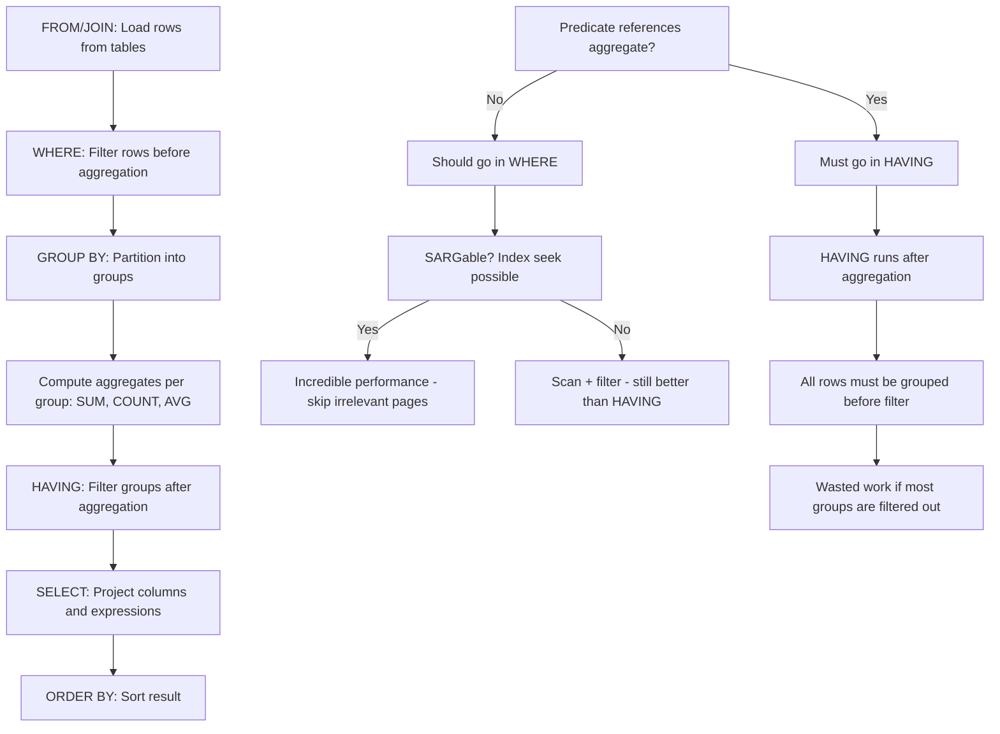
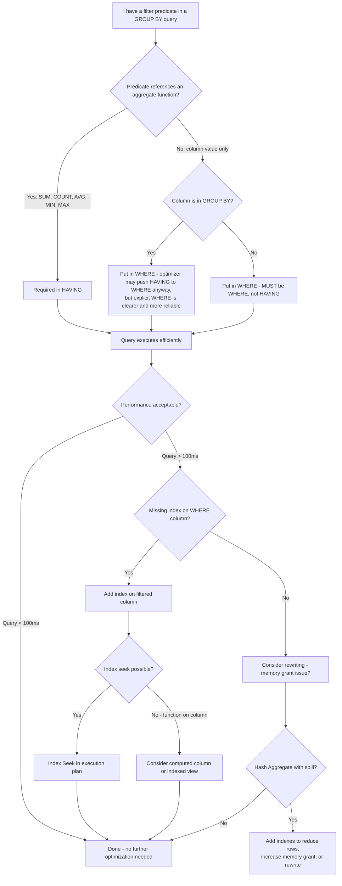

## Navigation

**Domain:** [[8 — Databases]] > **Group:** SQL Aggregations & Grouping
**Previous:** [[8.124 — Aggregate Functions — COUNT, SUM, AVG, MIN, MAX]] | **Next:** [[8.126 — ROLLUP — Subtotals and Grand Totals]]

### Prerequisites

- [[8.072 — GROUP BY — Grouping Rows for Aggregation]] — Understanding how GROUP BY partitions rows into groups and collapses them to one row per group is required to understand WHERE vs GROUP BY interaction.
- [[8.067 — WHERE Clause — Predicate Logic and SARGability]] — WHERE is applied before grouping; understanding SARGability determines whether the filter can use an index seek and skip scanning irrelevant rows entirely.
- [[8.073 — HAVING — Filtering Grouped Results]] — HAVING is the post-aggregation filter that is commonly confused with WHERE; knowing the distinction is the entire point of this note.

### Where This Fits

WHERE filters rows before aggregation; HAVING filters groups after aggregation. This distinction is one of the most common sources of logical errors and performance waste in SQL. A .NET backend engineer who puts a non-aggregate filter in HAVING instead of WHERE forces the database to aggregate millions of rows only to discard most of them — the aggregation work is wasted. The optimizer can sometimes push HAVING predicates to WHERE (predicate pushdown), but it cannot push predicates that reference aggregate results. Getting this wrong at scale means a query that filters 10 customers from 10M orders aggregates all 10M rows instead of 10K relevant rows. Interviewers use this distinction to test whether a candidate understands logical query processing order — the single most important framework for reading and writing correct SQL.

---

## Core Mental Model

WHERE filters raw rows from the base tables before any grouping or aggregation occurs. It operates on the rowset produced by the FROM/JOIN phase. HAVING filters groups after the GROUP BY and aggregate computations are complete. It operates on the grouped rowset and can reference aggregate functions (SUM, COUNT, AVG, etc.) while WHERE cannot. The logical query processing order is: FROM → WHERE → GROUP BY → HAVING → SELECT → ORDER BY. Every WHERE predicate that does not reference an aggregate result should be in WHERE, not HAVING — this reduces the number of rows that must be grouped and aggregated, directly reducing memory grant, CPU time, and logical reads. The optimizer can push HAVING predicates that reference only GROUP BY columns down to WHERE (this is called predicate pushdown), but it cannot push predicates that reference aggregate functions. The recognition pattern: if the predicate can be evaluated before grouping, put it in WHERE. If it requires the aggregate value to be known, put it in HAVING.

### Classification

WHERE is a **row filter** in the logical query processing order (step 2 after FROM/JOIN). It is SARGable when the predicate uses a column from a base table with a compatible index — the optimizer performs an Index Seek to skip irrelevant pages. HAVING is a **group filter** (step 4 after GROUP BY). HAVING predicates are never SARGable in the traditional sense because they operate on the already-grouped rowset in memory — the optimizer cannot use an index seek to skip groups because the grouping happens after the scan. However, HAVING predicates on GROUP BY columns can be pushed down to WHERE by the optimizer during simplification, making them effectively SARGable if an index exists on that column.



### Key Properties

|Property|Value|Notes|
|---|---|---|
|Logical processing order|WHERE = step 2, HAVING = step 4|FROM→WHERE→GROUP BY→HAVING→SELECT→ORDER BY|
|Can reference aggregate functions|WHERE: No, HAVING: Yes|WHERE cannot use SUM(), COUNT() etc. — use HAVING|
|SARGable|WHERE: Yes (with index), HAVING: No|HAVING operates on in-memory grouped rowset|
|Predicate pushdown possible|HAVING on GROUP BY cols|Optimizer pushes non-aggregate HAVING to WHERE|
|Efficiency|WHERE filters before grouping|Fewer rows to aggregate = less memory + CPU|
|Rows affected by WHERE|Raw rows from FROM/JOIN|50% fewer rows → 50% less aggregation work|
|Rows affected by HAVING|Grouped rows after aggregation|Too late to reduce aggregation work|
|EF Core translation|Where() before GroupBy() → WHERE|GroupBy().Where() after → HAVING|
|Dapper mapping|Manual SQL — same T-SQL rules|Dapper passes SQL through; WHERE vs HAVING is explicit|

---

## Deep Mechanics

### How the Engine Executes This

1. **Parsing** — The parser identifies the WHERE clause (search condition) and the HAVING clause (search condition). Both are parsed as logical expressions. The parser validates that aggregate functions (SUM, COUNT, AVG, MIN, MAX) do not appear in WHERE — this is a syntax error unless the aggregate is inside a subquery.

2. **Binding (Algebrizer)** — The algebrizer resolves column references in WHERE to the base tables (FROM clause) and column references in HAVING to the GROUP BY columns and aggregate expressions. If HAVING references a column that is neither in GROUP BY nor an aggregate, the algebrizer raises a binding error (unless the column is functionally dependent on GROUP BY columns — SQL Server does not enforce this strictly unless `ONLY_FULL_GROUP_BY` semantics are in play via `ansi_nulls` and `ansi_warnings` settings).

3. **Simplification (Predicate Pushdown)** — The optimizer applies predicate pushdown rules:
   - Any HAVING predicate that references only columns that appear in GROUP BY is pushed to WHERE. Example: `HAVING Status = 'Shipped'` where `Status` is in GROUP BY → pushed to WHERE.
   - HAVING predicates that reference aggregate functions (e.g., `HAVING SUM(Amount) > 100`) cannot be pushed down because the aggregate value does not exist until after GROUP BY.
   - WHERE predicates are pushed as close to the data access as possible — they are pushed into index seeks, scans, and join conditions. This is why a SARGable WHERE clause results in an Index Seek instead of a full scan.

4. **Query Plan Compilation** — The optimizer chooses the access path for the FROM clause:
   - If WHERE has a SARGable predicate on an indexed column (e.g., `WHERE OrderDate >= '2024-01-01'` with an index on OrderDate), the optimizer selects an Index Seek. Only the relevant pages are read from the b-tree.
   - If WHERE has a non-SARGable predicate (e.g., `WHERE YEAR(OrderDate) = 2024`), the optimizer must scan the entire index or table, reading all pages and then filtering.
   - The filtered rowset is then passed to GROUP BY. If the rowset is small enough, GROUP BY uses an in-memory hash aggregate. If large, it spills to tempdb (Hash Aggregate with spill) or uses a Sort + Stream Aggregate.

5. **Grouping and Aggregation** — The rows that survived WHERE are partitioned by the GROUP BY columns. For each group, the requested aggregates (SUM, COUNT, AVG, etc.) are computed. If the rowset is large (millions of rows) and the GROUP BY columns are not sorted, a Sort operator appears before the Stream Aggregate. A Hash Aggregate avoids the sort but uses memory for the hash table.

6. **HAVING Filter** — After aggregation, the grouped rowset has one row per group with the computed aggregate values. HAVING evaluates its predicate against each group row. Groups that do not satisfy the predicate are discarded. This is always a filter on the already-grouped data — it never reduces the number of rows that were aggregated.

7. **Projection and Ordering** — The surviving groups are projected in SELECT and sorted if ORDER BY is specified.

### SQL Visibility

```sql
-- Efficient: filter in WHERE before aggregation
-- Only rows with OrderDate >= 2024 are grouped
SELECT c.CustomerId, c.City, COUNT(o.OrderId) AS OrderCount,
       SUM(o.TotalAmount) AS TotalSpent
FROM dbo.Customers AS c
INNER JOIN dbo.Orders AS o
    ON c.CustomerId = o.CustomerId
WHERE o.OrderDate >= '2024-01-01'  -- filters BEFORE grouping
GROUP BY c.CustomerId, c.City
HAVING SUM(o.TotalAmount) > 5000;  -- filters AFTER aggregation
-- Only aggregates 500K rows (2024+ orders) instead of 2M (all orders)

-- Inefficient: filter in HAVING when WHERE would suffice
-- Non-aggregate predicate in HAVING — aggregates all rows unnecessarily
SELECT c.CustomerId, c.City, COUNT(o.OrderId) AS OrderCount,
       SUM(o.TotalAmount) AS TotalSpent
FROM dbo.Customers AS c
INNER JOIN dbo.Orders AS o
    ON c.CustomerId = o.CustomerId
GROUP BY c.CustomerId, c.City
HAVING c.City = 'Seattle'  -- non-aggregate in HAVING — aggregates ALL cities first
   AND SUM(o.TotalAmount) > 5000;
-- Worse: aggregates 2M rows across all cities, then discards non-Seattle

-- Correct: non-aggregate filter in WHERE, aggregate filter in HAVING
SELECT c.CustomerId, c.City, COUNT(o.OrderId) AS OrderCount,
       SUM(o.TotalAmount) AS TotalSpent
FROM dbo.Customers AS c
INNER JOIN dbo.Orders AS o
    ON c.CustomerId = o.CustomerId
WHERE c.City = 'Seattle'  -- filters BEFORE grouping
GROUP BY c.CustomerId, c.City
HAVING SUM(o.TotalAmount) > 5000;

-- WHERE with aggregate subquery — sometimes necessary
-- Find customers who placed orders after their last status change
SELECT c.CustomerId, c.FirstName, c.LastName,
       COUNT(o.OrderId) AS PostChangeOrderCount
FROM dbo.Customers AS c
INNER JOIN dbo.Orders AS o
    ON c.CustomerId = o.CustomerId
WHERE o.OrderDate > (
    SELECT MAX(StatusChangeDate)
    FROM dbo.CustomerStatusHistory AS h
    WHERE h.CustomerId = c.CustomerId
)
GROUP BY c.CustomerId, c.FirstName, c.LastName;

-- HAVING with aggregate-only filter (cannot move to WHERE)
SELECT p.ProductId, p.ProductName,
       COUNT(oi.OrderItemId) AS TimesOrdered,
       SUM(oi.Quantity) AS TotalUnitsSold
FROM dbo.Products AS p
INNER JOIN dbo.OrderItems AS oi
    ON p.ProductId = oi.ProductId
GROUP BY p.ProductId, p.ProductName
HAVING SUM(oi.Quantity) > 1000;  -- must be HAVING — aggregate value unknown before GROUP BY
```

```csharp
// EF Core — Where() before GroupBy() generates WHERE clause
var orderStatsByCity = await dbContext.Customers
    .Where(c => c.City == "Seattle")              // → WHERE clause
    .Join(dbContext.Orders,
          c => c.CustomerId,
          o => o.CustomerId,
          (c, o) => new { c.CustomerId, c.City, o.OrderId, o.TotalAmount })
    .GroupBy(x => new { x.CustomerId, x.City })   // → GROUP BY
    .Select(g => new
    {
        g.Key.CustomerId,
        g.Key.City,
        OrderCount = g.Count(),
        TotalSpent = g.Sum(x => x.TotalAmount)
    })
    .Where(g => g.TotalSpent > 5000)              // → HAVING clause
    .ToListAsync(cancellationToken);

// EF Core — GroupBy().Where() on non-aggregate generates HAVING (bad)
var inefficientQuery = await dbContext.Customers
    .Join(dbContext.Orders,
          c => c.CustomerId,
          o => o.CustomerId,
          (c, o) => new { c.CustomerId, c.City, o.OrderId, o.TotalAmount })
    .GroupBy(x => new { x.CustomerId, x.City })
    .Select(g => new
    {
        g.Key.CustomerId,
        g.Key.City,
        OrderCount = g.Count(),
        TotalSpent = g.Sum(x => x.TotalAmount)
    })
    .Where(g => g.City == "Seattle")              // → HAVING clause (inefficient!)
    .ToListAsync(cancellationToken);
```

**Generated SQL (from EF Core logs):**

```sql
-- EF Core: Where() before GroupBy() (efficient)
SELECT [c].[CustomerId], [c].[City], COUNT(*) AS [OrderCount],
       SUM([o].[TotalAmount]) AS [TotalSpent]
FROM [Customers] AS [c]
INNER JOIN [Orders] AS [o] ON [c].[CustomerId] = [o].[CustomerId]
WHERE [c].[City] = N'Seattle'                     -- WHERE clause
GROUP BY [c].[CustomerId], [c].[City]
HAVING SUM([o].[TotalAmount]) > 5000;              -- HAVING clause

-- EF Core: GroupBy().Where() on non-aggregate (inefficient)
SELECT [c].[CustomerId], [c].[City], COUNT(*) AS [OrderCount],
       SUM([o].[TotalAmount]) AS [TotalSpent]
FROM [Customers] AS [c]
INNER JOIN [Orders] AS [o] ON [c].[CustomerId] = [o].[CustomerId]
GROUP BY [c].[CustomerId], [c].[City]
HAVING [c].[City] = N'Seattle'                    -- HAVING (non-aggregate, wasted aggregation)
   AND SUM([o].[TotalAmount]) > 5000;
```

### Execution Plan Analysis

**Efficient: WHERE filter on indexed column, HAVING for aggregate filter only:**

```
  [Index Seek] IX_Customers_City (WHERE City = 'Seattle')  -- SARGable seek
  Seek Predicate: City = 'Seattle'
  Estimated Rows: 5,000  |  Logical Reads: ~30
  
  [Index Seek] IX_Orders_CustomerId (Nested Loops join)
  Seek Predicate: CustomerId = Customers.CustomerId
  Executions: 5,000 (once per customer in Seattle)
  Estimated Rows: 50,000  |  Logical Reads: ~15,000
  
  [Hash Match / Stream Aggregate] GROUP BY CustomerId, City
  Input Rows: 50,000  |  Output Rows: 5,000 (one per customer)
  
  [Filter] HAVING SUM(TotalAmount) > 5000
  Input Rows: 5,000  |  Output Rows: ~500
  
  → [SELECT]
  Total Estimated Cost: ~3.5  |  Total Logical Reads: ~15,030
```

**Inefficient: Non-aggregate filter in HAVING (no pushdown possible):**

```
  [Clustered Index Scan] Customers (no WHERE pushdown)
  Estimated Rows: 200,000 (all customers)  |  Logical Reads: ~6,100
  
  [Clustered Index Scan] Orders (no WHERE pushdown)
  Estimated Rows: 2,000,000 (all orders)  |  Logical Reads: ~12,450
  
  [Hash Match Join] Customers × Orders
  Input Rows: 200K × 2M  |  Output Rows: 2,000,000 (all order rows)
  
  [Hash Match / Stream Aggregate] GROUP BY CustomerId, City
  Input Rows: 2,000,000 (all orders)  |  Output Rows: 200,000 (all customers)
  
  [Filter] HAVING City = 'Seattle' AND SUM(TotalAmount) > 5000
  Input Rows: 200,000  |  Output Rows: ~500
  -- 199,500 groups aggregated and then discarded!
  
  → [SELECT]
  Total Estimated Cost: ~25  |  Total Logical Reads: ~18,550
  -- 40x more rows aggregated than necessary
```

### Cost Visibility

```sql
SET STATISTICS IO ON;
SET STATISTICS TIME ON;

-- Efficient: WHERE filters before aggregation
SELECT c.CustomerId, c.City, COUNT(o.OrderId) AS OrderCount,
       SUM(o.TotalAmount) AS TotalSpent
FROM dbo.Customers AS c
INNER JOIN dbo.Orders AS o
    ON c.CustomerId = o.CustomerId
WHERE c.City = 'Seattle'
GROUP BY c.CustomerId, c.City
HAVING SUM(o.TotalAmount) > 5000;

-- Expected output:
-- Table 'Orders'. Scan count 5000, logical reads 15235
--   (seek per Seattle customer)
-- Table 'Customers'. Scan count 1, logical reads 32
--   (seek on IX_Customers_City)
-- SQL Server Execution Times: CPU time = 47ms, elapsed time = 120ms

-- Inefficient: non-aggregate filter in HAVING
SELECT c.CustomerId, c.City, COUNT(o.OrderId) AS OrderCount,
       SUM(o.TotalAmount) AS TotalSpent
FROM dbo.Customers AS c
INNER JOIN dbo.Orders AS o
    ON c.CustomerId = o.CustomerId
GROUP BY c.CustomerId, c.City
HAVING c.City = 'Seattle'
   AND SUM(o.TotalAmount) > 5000;

-- Expected output:
-- Table 'Orders'. Scan count 1, logical reads 12450 (full scan)
-- Table 'Customers'. Scan count 1, logical reads 6100 (full scan)
-- SQL Server Execution Times: CPU time = 312ms, elapsed time = 890ms
--   (aggregates all 2M order rows, discards 99.75% of groups)
```

**Improvement:** ~6x reduction in elapsed time, ~75% reduction in logical reads (18,550 → 15,267). More importantly, the efficient version aggregates 50K rows (Seattle orders) instead of 2M (all orders) — 40x less aggregation work.

### Failure Modes

**Non-aggregate filter in HAVING (most common):** The developer puts a column filter in HAVING because they think "I'm using GROUP BY so everything must go in HAVING." This forces aggregation of all rows before the filter is applied. For a 2M row Orders table with 10M total rows across all tables, this can mean aggregating 10M rows when only 100K are needed. The optimizer may push simple column predicates from HAVING to WHERE, but it cannot always do this — the pushdown depends on the complexity of the predicate and whether the column appears in GROUP BY.

```sql
-- ❌ Wrong: non-aggregate in HAVING
SELECT CustomerId, COUNT(*) AS OrderCount
FROM dbo.Orders
GROUP BY CustomerId
HAVING Status = 'Shipped';  -- Status is NOT in GROUP BY — SQL Server allows this

-- ✅ Correct: non-aggregate in WHERE
SELECT CustomerId, COUNT(*) AS OrderCount
FROM dbo.Orders
WHERE Status = 'Shipped'
GROUP BY CustomerId;
```

**Aggregate in WHERE (syntax error):** Developers sometimes try to filter on an aggregate value in WHERE not realizing that aggregates are computed after GROUP BY, which is after WHERE.

```sql
-- ❌ Syntax error: aggregate in WHERE
SELECT CustomerId, COUNT(*) AS OrderCount
FROM dbo.Orders
WHERE COUNT(*) > 10  -- aggregate in WHERE — invalid
GROUP BY CustomerId;

-- ✅ Correct: aggregate in HAVING
SELECT CustomerId, COUNT(*) AS OrderCount
FROM dbo.Orders
GROUP BY CustomerId
HAVING COUNT(*) > 10;
```

**WHERE with aggregate subquery vs HAVING confusion:** Sometimes a developer needs to filter on a value that depends on an aggregate of related rows. The correct approach depends on whether the aggregate is per-group (HAVING) or per-row (WHERE with subquery):

```sql
-- Per-row filter with aggregate subquery in WHERE (correct)
-- Find orders that exceed the customer's average order amount
SELECT o.OrderId, o.CustomerId, o.TotalAmount
FROM dbo.Orders AS o
WHERE o.TotalAmount > (
    SELECT AVG(TotalAmount)
    FROM dbo.Orders AS o2
    WHERE o2.CustomerId = o.CustomerId
);

-- Per-group filter in HAVING (correct)
-- Find customers whose total exceeds their average
SELECT o.CustomerId, SUM(o.TotalAmount) AS TotalSpent
FROM dbo.Orders AS o
GROUP BY o.CustomerId
HAVING SUM(o.TotalAmount) > (
    SELECT AVG(TotalAmount)
    FROM dbo.Orders
);
```

**Predicate pushdown not happening:** The optimizer cannot push a HAVING predicate to WHERE if the predicate references a column that is not in GROUP BY and the GROUP BY does not guarantee functional dependency. In practice, SQL Server is conservative about this and may not push down even simple predicates in complex queries. The safest approach is to put the predicate in WHERE explicitly.

---

## Production Patterns and Implementation

### Primary SQL Implementation

```sql
-- ============================================================
-- Schema context
-- ============================================================
CREATE TABLE dbo.Customers
(
    CustomerId   INT            NOT NULL IDENTITY(1,1),
    FirstName    NVARCHAR(100)  NOT NULL,
    LastName     NVARCHAR(100)  NOT NULL,
    Email        NVARCHAR(256)  NOT NULL,
    City         NVARCHAR(100)  NOT NULL,
    StateCode    CHAR(2)        NOT NULL,
    Status       VARCHAR(20)    NOT NULL DEFAULT 'Active',
    CreatedAt    DATETIME2(0)   NOT NULL DEFAULT SYSUTCDATETIME(),
    CONSTRAINT PK_Customers PRIMARY KEY CLUSTERED (CustomerId)
);

CREATE TABLE dbo.Orders
(
    OrderId      INT            NOT NULL IDENTITY(1,1),
    CustomerId   INT            NOT NULL,
    OrderDate    DATETIME2(0)   NOT NULL,
    Status       VARCHAR(20)    NOT NULL DEFAULT 'Pending',
    TotalAmount  DECIMAL(18,2)  NOT NULL,
    ShipCity     NVARCHAR(100)  NOT NULL,
    ShipState    CHAR(2)        NOT NULL,
    CreatedAt    DATETIME2(0)   NOT NULL DEFAULT SYSUTCDATETIME(),
    CONSTRAINT PK_Orders PRIMARY KEY CLUSTERED (OrderId)
);

CREATE TABLE dbo.OrderItems
(
    OrderItemId  INT            NOT NULL IDENTITY(1,1),
    OrderId      INT            NOT NULL,
    ProductId    INT            NOT NULL,
    Quantity     INT            NOT NULL,
    UnitPrice    DECIMAL(18,2)  NOT NULL,
    DiscountPct  DECIMAL(5,2)   NOT NULL DEFAULT 0,
    CONSTRAINT PK_OrderItems PRIMARY KEY CLUSTERED (OrderItemId)
);

CREATE TABLE dbo.Products
(
    ProductId    INT            NOT NULL IDENTITY(1,1),
    ProductName  NVARCHAR(200)  NOT NULL,
    CategoryId   INT            NOT NULL,
    SupplierId   INT            NOT NULL,
    UnitPrice    DECIMAL(18,2)  NOT NULL,
    UnitsInStock INT            NOT NULL DEFAULT 0,
    CONSTRAINT PK_Products PRIMARY KEY CLUSTERED (ProductId)
);

-- Indexes for WHERE filter performance
CREATE INDEX IX_Customers_City ON dbo.Customers (City)
    INCLUDE (StateCode, Status);
CREATE INDEX IX_Customers_StateCode ON dbo.Customers (StateCode)
    INCLUDE (City, Status);
CREATE INDEX IX_Orders_OrderDate ON dbo.Orders (OrderDate)
    INCLUDE (CustomerId, Status, TotalAmount);
CREATE INDEX IX_Orders_CustomerId ON dbo.Orders (CustomerId)
    INCLUDE (OrderDate, Status, TotalAmount);
CREATE INDEX IX_Orders_Status ON dbo.Orders (Status)
    INCLUDE (CustomerId, OrderDate, TotalAmount);
CREATE INDEX IX_Orders_ShipCity ON dbo.Orders (ShipCity)
    INCLUDE (CustomerId, TotalAmount);

-- ============================================================
-- Pattern 1: Production report — monthly sales by category
-- WHERE filters date range, HAVING filters categories with high sales
-- ============================================================
SELECT p.CategoryId,
       DATEADD(month, DATEDIFF(month, 0, o.OrderDate), 0) AS MonthStart,
       COUNT(DISTINCT o.OrderId) AS OrderCount,
       SUM(oi.Quantity * oi.UnitPrice * (1 - oi.DiscountPct / 100)) AS NetRevenue
FROM dbo.Orders AS o
INNER JOIN dbo.OrderItems AS oi
    ON o.OrderId = oi.OrderId
INNER JOIN dbo.Products AS p
    ON oi.ProductId = p.ProductId
WHERE o.OrderDate >= '2024-01-01'
  AND o.OrderDate < '2025-01-01'
  AND o.Status IN ('Shipped', 'Delivered')
GROUP BY p.CategoryId, DATEADD(month, DATEDIFF(month, 0, o.OrderDate), 0)
HAVING SUM(oi.Quantity * oi.UnitPrice * (1 - oi.DiscountPct / 100)) > 10000
ORDER BY MonthStart, p.CategoryId;
-- WHERE filters to 2024 shipped orders only — ~500K rows aggregated
-- HAVING filters to categories with >$10K monthly revenue — ~200 groups out of ~500

-- ============================================================
-- Pattern 2: WHERE with correlated subquery — filter on per-row aggregate
-- Find products that are ordered more than their category average
-- ============================================================
SELECT p.ProductId, p.ProductName, p.CategoryId,
       SUM(oi.Quantity) AS TotalSold
FROM dbo.Products AS p
INNER JOIN dbo.OrderItems AS oi
    ON p.ProductId = oi.ProductId
WHERE p.ProductId IN (
    SELECT p2.ProductId
    FROM dbo.Products AS p2
    INNER JOIN dbo.OrderItems AS oi2
        ON p2.ProductId = oi2.ProductId
    WHERE p2.CategoryId = p.CategoryId
    GROUP BY p2.ProductId
    HAVING SUM(oi2.Quantity) > (
        SELECT AVG(PerProductQty)
        FROM (
            SELECT SUM(oi3.Quantity) AS PerProductQty
            FROM dbo.OrderItems AS oi3
            INNER JOIN dbo.Products AS p3
                ON oi3.ProductId = p3.ProductId
            WHERE p3.CategoryId = p.CategoryId
            GROUP BY p3.ProductId
        ) AS CategoryAvg
    )
)
GROUP BY p.ProductId, p.ProductName, p.CategoryId;

-- ============================================================
-- Pattern 3: WHERE filter with HAVING aggregate threshold
-- Top 10% of customers by revenue (WHERE filters active customers)
-- ============================================================
SELECT c.CustomerId,
       c.FirstName + ' ' + c.LastName AS CustomerName,
       SUM(o.TotalAmount) AS LifetimeValue,
       COUNT(o.OrderId) AS OrderCount,
       AVG(o.TotalAmount) AS AvgOrderValue
FROM dbo.Customers AS c
INNER JOIN dbo.Orders AS o
    ON c.CustomerId = o.CustomerId
WHERE c.Status = 'Active'
  AND o.OrderDate >= DATEADD(year, -2, GETUTCDATE())
GROUP BY c.CustomerId, c.FirstName, c.LastName
HAVING SUM(o.TotalAmount) > (
    SELECT PERCENTILE_CONT(0.9) WITHIN GROUP (ORDER BY TotalSpent)
           OVER () AS P90Threshold
    FROM (
        SELECT SUM(o2.TotalAmount) AS TotalSpent
        FROM dbo.Orders AS o2
        WHERE o2.OrderDate >= DATEADD(year, -2, GETUTCDATE())
        GROUP BY o2.CustomerId
    ) AS CustomerTotals
)
ORDER BY LifetimeValue DESC;

-- ============================================================
-- Pattern 4: SARGable vs non-SARGable WHERE predicates with GROUP BY
-- ============================================================

-- SARGable (uses index seek on IX_Orders_OrderDate):
SELECT CustomerId, COUNT(*) AS OrderCount
FROM dbo.Orders
WHERE OrderDate >= '2024-01-01'
GROUP BY CustomerId;

-- Non-SARGable (table scan — no seek possible):
SELECT CustomerId, COUNT(*) AS OrderCount
FROM dbo.Orders
WHERE YEAR(OrderDate) = 2024  -- function on column — cannot seek
GROUP BY CustomerId;
-- Logical reads: 12,450 (full scan) vs ~30 (range seek)
```

### EF Core Implementation

```csharp
// Efficient: Where() before GroupBy()
public async Task<List<MonthlyCategoryRevenue>> GetMonthlyRevenueByCategoryAsync(
    DateTime startDate,
    DateTime endDate,
    decimal revenueThreshold,
    CancellationToken cancellationToken = default)
{
    var query = from o in _context.Orders
                join oi in _context.OrderItems on o.OrderId equals oi.OrderId
                join p in _context.Products on oi.ProductId equals p.ProductId
                where o.OrderDate >= startDate
                   && o.OrderDate < endDate
                   && (o.Status == "Shipped" || o.Status == "Delivered")
                group new { o, oi, p } by new
                {
                    p.CategoryId,
                    MonthStart = o.OrderDate.Year * 100 + o.OrderDate.Month
                } into g
                where g.Sum(x => x.oi.Quantity * x.oi.UnitPrice * (1 - x.oi.DiscountPct / 100)) > revenueThreshold
                select new MonthlyCategoryRevenue
                {
                    CategoryId = g.Key.CategoryId,
                    YearMonth = g.Key.MonthStart,
                    OrderCount = g.Select(x => x.o.OrderId).Distinct().Count(),
                    NetRevenue = g.Sum(x => x.oi.Quantity * x.oi.UnitPrice * (1 - x.oi.DiscountPct / 100))
                };

    return await query
        .OrderBy(r => r.YearMonth)
        .ThenBy(r => r.CategoryId)
        .ToListAsync(cancellationToken);
}

// Inefficient: filter applied after GroupBy (generates HAVING for non-aggregates)
public async Task<List<CustomerSummary>> GetCustomerSummaries_InefficientAsync(
    string city,
    CancellationToken cancellationToken = default)
{
    // This LINQ looks correct but EF Core puts City filter in HAVING
    var query = from c in _context.Customers
                join o in _context.Orders on c.CustomerId equals o.CustomerId
                group new { c, o } by new { c.CustomerId, c.City } into g
                where g.Key.City == city  // non-aggregate filter — goes to HAVING!
                   && g.Sum(x => x.o.TotalAmount) > 5000
                select new CustomerSummary
                {
                    CustomerId = g.Key.CustomerId,
                    City = g.Key.City,
                    OrderCount = g.Count(),
                    TotalSpent = g.Sum(x => x.o.TotalAmount)
                };

    return await query.ToListAsync(cancellationToken);
}

// Efficient: filter before GroupBy
public async Task<List<CustomerSummary>> GetCustomerSummaries_EfficientAsync(
    string city,
    CancellationToken cancellationToken = default)
{
    var query = from c in _context.Customers
                join o in _context.Orders on c.CustomerId equals o.CustomerId
                where c.City == city  // filters BEFORE grouping — WHERE clause
                group new { c, o } by new { c.CustomerId, c.City } into g
                where g.Sum(x => x.o.TotalAmount) > 5000  // aggregate filter — HAVING clause
                select new CustomerSummary
                {
                    CustomerId = g.Key.CustomerId,
                    City = g.Key.City,
                    OrderCount = g.Count(),
                    TotalSpent = g.Sum(x => x.o.TotalAmount)
                };

    return await query.ToListAsync(cancellationToken);
}

// DTO
public record MonthlyCategoryRevenue
{
    public int CategoryId { get; init; }
    public int YearMonth { get; init; }
    public int OrderCount { get; init; }
    public decimal NetRevenue { get; init; }
}

public record CustomerSummary
{
    public int CustomerId { get; init; }
    public string City { get; init; } = string.Empty;
    public int OrderCount { get; init; }
    public decimal TotalSpent { get; init; }
}
```

### Dapper Implementation

```csharp
public interface ISalesRepository
{
    Task<IReadOnlyList<MonthlyCategoryRevenue>> GetMonthlyRevenueByCategoryAsync(
        DateTime startDate,
        DateTime endDate,
        decimal revenueThreshold,
        CancellationToken cancellationToken = default);

    Task<IReadOnlyList<CustomerSummary>> GetCustomerSummariesAsync(
        string city,
        decimal minTotalSpent,
        CancellationToken cancellationToken = default);
}

public sealed class SalesRepository : ISalesRepository
{
    private readonly IDbConnectionFactory _connectionFactory;

    public SalesRepository(IDbConnectionFactory connectionFactory)
    {
        _connectionFactory = connectionFactory;
    }

    public async Task<IReadOnlyList<MonthlyCategoryRevenue>> GetMonthlyRevenueByCategoryAsync(
        DateTime startDate,
        DateTime endDate,
        decimal revenueThreshold,
        CancellationToken cancellationToken = default)
    {
        const string sql = @"
            SELECT
                p.CategoryId,
                YEAR(o.OrderDate) * 100 + MONTH(o.OrderDate) AS YearMonth,
                COUNT(DISTINCT o.OrderId) AS OrderCount,
                SUM(oi.Quantity * oi.UnitPrice * (1 - oi.DiscountPct / 100)) AS NetRevenue
            FROM dbo.Orders AS o
            INNER JOIN dbo.OrderItems AS oi
                ON o.OrderId = oi.OrderId
            INNER JOIN dbo.Products AS p
                ON oi.ProductId = p.ProductId
            WHERE o.OrderDate >= @StartDate
              AND o.OrderDate < @EndDate
              AND o.Status IN ('Shipped', 'Delivered')
            GROUP BY p.CategoryId, YEAR(o.OrderDate) * 100 + MONTH(o.OrderDate)
            HAVING SUM(oi.Quantity * oi.UnitPrice * (1 - oi.DiscountPct / 100)) > @RevenueThreshold
            ORDER BY YearMonth, CategoryId;";

        await using var connection = _connectionFactory.Create();
        var results = await connection.QueryAsync<MonthlyCategoryRevenue>(
            new CommandDefinition(
                sql,
                new
                {
                    StartDate = startDate,
                    EndDate = endDate,
                    RevenueThreshold = revenueThreshold
                },
                cancellationToken: cancellationToken));

        return results.AsList();
    }

    public async Task<IReadOnlyList<CustomerSummary>> GetCustomerSummariesAsync(
        string city,
        decimal minTotalSpent,
        CancellationToken cancellationToken = default)
    {
        const string sql = @"
            SELECT
                c.CustomerId,
                c.City,
                COUNT(o.OrderId) AS OrderCount,
                SUM(o.TotalAmount) AS TotalSpent
            FROM dbo.Customers AS c
            INNER JOIN dbo.Orders AS o
                ON c.CustomerId = o.CustomerId
            WHERE c.City = @City
            GROUP BY c.CustomerId, c.City
            HAVING SUM(o.TotalAmount) > @MinTotalSpent
            ORDER BY TotalSpent DESC;";

        await using var connection = _connectionFactory.Create();
        var results = await connection.QueryAsync<CustomerSummary>(
            new CommandDefinition(
                sql,
                new { City = city, MinTotalSpent = minTotalSpent },
                cancellationToken: cancellationToken));

        return results.AsList();
    }
}

// Dapper row mapping
public class MonthlyCategoryRevenue
{
    public int CategoryId { get; set; }
    public int YearMonth { get; set; }
    public int OrderCount { get; set; }
    public decimal NetRevenue { get; set; }
}

public class CustomerSummary
{
    public int CustomerId { get; set; }
    public string City { get; set; } = string.Empty;
    public int OrderCount { get; set; }
    public decimal TotalSpent { get; set; }
}
```

### Configuration and Wiring

```csharp
// Connection factory for Dapper
public interface IDbConnectionFactory
{
    IDbConnection Create();
}

public sealed class SqlConnectionFactory : IDbConnectionFactory
{
    private readonly string _connectionString;

    public SqlConnectionFactory(string connectionString)
    {
        _connectionString = connectionString;
    }

    public IDbConnection Create() => new SqlConnection(_connectionString);
}

// Registration in Program.cs
builder.Services.AddSingleton<IDbConnectionFactory>(
    _ => new SqlConnectionFactory(
        builder.Configuration.GetConnectionString("DefaultConnection")));

builder.Services.AddScoped<ISalesRepository, SalesRepository>();

// EF Core configuration
builder.Services.AddDbContext<ApplicationDbContext>(options =>
    options.UseSqlServer(
        builder.Configuration.GetConnectionString("DefaultConnection"),
        sqlOptions =>
        {
            sqlOptions.EnableRetryOnFailure(3);
            sqlOptions.CommandTimeout(60);
        }));

// Log EF Core SQL for debugging where/having translation
builder.Services.AddDbContext<ApplicationDbContext>((sp, options) =>
{
    var loggerFactory = sp.GetRequiredService<ILoggerFactory>();
    options.UseSqlServer(
        builder.Configuration.GetConnectionString("DefaultConnection"));
    options.UseLoggerFactory(loggerFactory);
    options.ConfigureWarnings(warnings =>
        warnings.Log(RelationalEventId.QueryClientEvaluationWarning));
});
```

### SQL Server vs PostgreSQL Differences

```sql
-- PostgreSQL — same WHERE vs HAVING distinction applies
-- Slight syntax differences in date truncation

-- PostgreSQL equivalent of the monthly revenue query
SELECT
    p.CategoryId,
    DATE_TRUNC('month', o.OrderDate) AS MonthStart,
    COUNT(DISTINCT o.OrderId) AS OrderCount,
    SUM(oi.Quantity * oi.UnitPrice * (1 - oi.DiscountPct / 100)) AS NetRevenue
FROM dbo.Orders AS o
INNER JOIN dbo.OrderItems AS oi
    ON o.OrderId = oi.OrderId
INNER JOIN dbo.Products AS p
    ON oi.ProductId = p.ProductId
WHERE o.OrderDate >= '2024-01-01'
  AND o.OrderDate < '2025-01-01'
  AND o.Status IN ('Shipped', 'Delivered')
GROUP BY p.CategoryId, DATE_TRUNC('month', o.OrderDate)
HAVING SUM(oi.Quantity * oi.UnitPrice * (1 - oi.DiscountPct / 100)) > 10000
ORDER BY MonthStart, p.CategoryId;

-- PostgreSQL — WHERE with aggregate subquery (LATERAL)
-- Find products ordered more than category average
SELECT p.ProductId, p.ProductName, p.CategoryId,
       SUM(oi.Quantity) AS TotalSold
FROM dbo.Products AS p
INNER JOIN dbo.OrderItems AS oi
    ON p.ProductId = oi.ProductId
WHERE EXISTS (
    SELECT 1
    FROM dbo.OrderItems AS oi2
    WHERE oi2.ProductId = p.ProductId
    GROUP BY oi2.ProductId
    HAVING SUM(oi2.Quantity) > (
        SELECT AVG(prod_qty)
        FROM (
            SELECT SUM(oi3.Quantity) AS prod_qty
            FROM dbo.OrderItems AS oi3
            INNER JOIN dbo.Products AS p3
                ON oi3.ProductId = p3.ProductId
            WHERE p3.CategoryId = p.CategoryId
            GROUP BY p3.ProductId
        ) AS cat_avg
    )
)
GROUP BY p.ProductId, p.ProductName, p.CategoryId;
```

---

## Gotchas and Production Pitfalls

### Gotcha 1: Non-Aggregate Column in HAVING

**Pitfall:** The developer places a column predicate in HAVING because they are using GROUP BY and assume all filters belong there.

```sql
-- ❌ Wrong: Status filter in HAVING
SELECT CustomerId, COUNT(*) AS OrderCount
FROM dbo.Orders
GROUP BY CustomerId
HAVING Status = 'Shipped';
```

**Symptom:** The query aggregates all rows regardless of Status. On a 10M row Orders table with 60% Shipped, 40% other statuses, 4M unnecessary rows are aggregated. SET STATISTICS IO shows a full Clustered Index Scan on Orders (logical reads ~62,000) instead of an Index Seek on IX_Orders_Status (~37,000 logical reads).

**Fix:**

```sql
-- ✅ Correct: Status filter in WHERE
SELECT CustomerId, COUNT(*) AS OrderCount
FROM dbo.Orders
WHERE Status = 'Shipped'
GROUP BY CustomerId;
```

**Cost of not fixing:** At 10M rows and 100 executions per minute, the inefficient version reads 62,000 × 100 = 6.2M pages/min vs 37,000 × 100 = 3.7M pages/min. The extra 2.5M pages/min of reads consume buffer pool memory and drive up CPU for aggregation of unnecessary rows. At scale, this wastes ~$500/month in Azure SQL DTU costs and causes memory pressure.

### Gotcha 2: Aggregate in WHERE (Syntax Error)

**Pitfall:** The developer writes an aggregate function in the WHERE clause expecting it to filter grouped results.

```sql
-- ❌ Syntax error: aggregate in WHERE
SELECT CustomerId, COUNT(*) AS OrderCount
FROM dbo.Orders
WHERE COUNT(*) > 10
GROUP BY CustomerId;
-- Error: "An aggregate may not appear in the WHERE clause unless it is in a subquery"
```

**Symptom:** SQL Server raises a syntax error at query compilation time. The application throws an exception.

**Fix:**

```sql
-- ✅ Correct: aggregate in HAVING
SELECT CustomerId, COUNT(*) AS OrderCount
FROM dbo.Orders
GROUP BY CustomerId
HAVING COUNT(*) > 10;

-- Or, use a subquery in WHERE if you need per-row filtering with an aggregate:
SELECT CustomerId, COUNT(*) AS OrderCount
FROM dbo.Orders
WHERE CustomerId IN (
    SELECT CustomerId
    FROM dbo.Orders
    GROUP BY CustomerId
    HAVING COUNT(*) > 10
)
GROUP BY CustomerId;
```

**Cost of not fixing:** Application crashes in production with unhandled SQL exceptions. Engineer wastes 2-3 hours debugging the error instead of writing correct SQL.

### Gotcha 3: Predicate Pushdown Fails with Complex HAVING

**Pitfall:** The developer relies on the optimizer to push HAVING predicates to WHERE, but the predicate is too complex or references columns from different tables in a join.

```sql
-- ❌ Optimizer may NOT push this to WHERE because:
-- 1. The HAVING predicate references multiple GROUP BY columns
-- 2. The predicate is a compound expression
-- 3. Some predicates reference aggregate results (SUM)
SELECT c.City, p.CategoryId,
       COUNT(DISTINCT o.OrderId) AS OrderCount,
       SUM(oi.Quantity) AS TotalUnits
FROM dbo.Customers AS c
INNER JOIN dbo.Orders AS o ON c.CustomerId = o.CustomerId
INNER JOIN dbo.OrderItems AS oi ON o.OrderId = oi.OrderId
INNER JOIN dbo.Products AS p ON oi.ProductId = p.ProductId
GROUP BY c.City, p.CategoryId
HAVING c.City = 'Seattle'
   AND p.CategoryId IN (1, 2, 3)
   AND SUM(oi.Quantity) > 100;
-- Predicates on City and CategoryId MAY be pushed down, but optimizer may
-- keep them in HAVING if the query plan is complex enough
```

**Symptom:** The execution plan shows a Filter operator after the Stream Aggregate for predicates that could have been applied earlier. Logical reads are higher than expected because more rows flow through the aggregate.

**Fix:**

```sql
-- ✅ Correct: put non-aggregate filters in WHERE
SELECT c.City, p.CategoryId,
       COUNT(DISTINCT o.OrderId) AS OrderCount,
       SUM(oi.Quantity) AS TotalUnits
FROM dbo.Customers AS c
INNER JOIN dbo.Orders AS o ON c.CustomerId = o.CustomerId
INNER JOIN dbo.OrderItems AS oi ON o.OrderId = oi.OrderId
INNER JOIN dbo.Products AS p ON oi.ProductId = p.ProductId
WHERE c.City = 'Seattle'
  AND p.CategoryId IN (1, 2, 3)
GROUP BY c.City, p.CategoryId
HAVING SUM(oi.Quantity) > 100;
```

**Cost of not fixing:** The complex HAVING may not be pushed down in a query with 4 JOINs and GROUP BY on two columns. The optimizer may choose a Hash Match Aggregate that processes 10M rows and uses 500MB of memory grant, when a Stream Aggregate over 100K filtered rows would use <1MB.

### Gotcha 4: EF Core Translates Non-Aggregate GroupBy.Where() to HAVING

**Pitfall:** The developer writes EF Core LINQ with a Where clause after GroupBy, expecting EF Core to generate a WHERE clause. EF Core translates post-GroupBy Where to HAVING, even for non-aggregate predicates.

```csharp
// ❌ EF Core generates HAVING for non-aggregate filter
var results = await dbContext.Orders
    .GroupBy(o => o.CustomerId)
    .Where(g => g.Key == 1001)  // non-aggregate → translates to HAVING
    .Select(g => new { CustomerId = g.Key, Count = g.Count() })
    .ToListAsync(cancellationToken);

-- Generated SQL:
SELECT [o].[CustomerId], COUNT(*) AS [Count]
FROM [Orders] AS [o]
GROUP BY [o].[CustomerId]
HAVING [o].[CustomerId] = 1001;  -- Inefficient: aggregates all customers
```

**Symptom:** The generated SQL uses HAVING for a simple column filter. On a 10M row Orders table, this aggregates all customers (potentially millions of groups) before filtering to one.

**Fix:**

```csharp
// ✅ Correct: filter before GroupBy
var results = await dbContext.Orders
    .Where(o => o.CustomerId == 1001)  // → WHERE clause
    .GroupBy(o => o.CustomerId)
    .Select(g => new { CustomerId = g.Key, Count = g.Count() })
    .ToListAsync(cancellationToken);

-- Generated SQL:
SELECT [o].[CustomerId], COUNT(*) AS [Count]
FROM [Orders] AS [o]
WHERE [o].[CustomerId] = 1001  -- filters before aggregation
GROUP BY [o].[CustomerId];
```

**Cost of not fixing:** An EF Core query that aggregates 10M rows instead of 10 rows because the Where was placed after GroupBy instead of before. This is a common code review finding in .NET projects — the difference between a 5ms query and a 5-second query.

### Gotcha 5: HAVING with Expression on GROUP BY Column

**Pitfall:** The developer uses HAVING with a complex expression on a GROUP BY column, assuming the optimizer will push it to WHERE. The optimizer frequently does NOT push expressions, only simple column references.

```sql
-- ❌ HAVING with expression on GROUP BY column
SELECT CustomerId, YEAR(OrderDate) AS OrderYear,
       COUNT(*) AS OrderCount, SUM(TotalAmount) AS TotalSpent
FROM dbo.Orders
GROUP BY CustomerId, YEAR(OrderDate)
HAVING YEAR(OrderDate) >= 2023;  -- expression — may not be pushed down

-- ✅ WHERE with same expression
SELECT CustomerId, YEAR(OrderDate) AS OrderYear,
       COUNT(*) AS OrderCount, SUM(TotalAmount) AS TotalSpent
FROM dbo.Orders
WHERE YEAR(OrderDate) >= 2023  -- filters before aggregation
GROUP BY CustomerId, YEAR(OrderDate);
-- Note: both are non-SARGable (function on column) but WHERE still
-- filters before grouping, reducing aggregation work
```

**Symptom:** The execution plan shows a Filter after the Aggregate for the YEAR(OrderDate) predicate. The aggregate processes rows for all years, then HAVING discards old years.

**Fix:** Put the expression in WHERE even if it is non-SARGable. The key benefit is reducing rows before aggregation, not index usage.

**Cost of not fixing:** Aggregating rows that will be discarded wastes CPU and memory. On a table with 10 years of data where the query filters to 2 years, 80% of the aggregation work is wasted.

### Gotcha 6: WHERE with Correlated Subquery vs HAVING with Subquery — Performance Difference

**Pitfall:** The developer chooses the wrong pattern when filtering on a value that depends on both the current row and an aggregate of related rows.

```sql
-- ❌ HAVING with subquery — evaluates subquery once per group
SELECT CustomerId, COUNT(*) AS OrderCount, SUM(TotalAmount) AS TotalSpent
FROM dbo.Orders AS o
GROUP BY CustomerId
HAVING SUM(TotalAmount) > (
    SELECT AVG(TotalAmount) FROM dbo.Orders
);
-- The subquery is evaluated once (scalar aggregate) — fine

-- ❌ WHERE with correlated subquery — row-by-row evaluation
SELECT o.OrderId, o.TotalAmount
FROM dbo.Orders AS o
WHERE o.TotalAmount > (
    SELECT AVG(o2.TotalAmount)
    FROM dbo.Orders AS o2
    WHERE o2.CustomerId = o.CustomerId  -- correlated — runs per row
);
-- The subquery runs once per Order row — expensive on large tables
```

**Symptom:** The correlated subquery in WHERE executes N times (once per row in Orders). On a 10M row table, this means 10M executions of the inner query. The execution plan shows a nested loops join with the subquery on the inner side.

**Fix:** Use window functions or a single-pass aggregate query when possible:

```sql
-- ✅ Better: use window function (single scan)
SELECT o.OrderId, o.CustomerId, o.TotalAmount
FROM (
    SELECT o.OrderId, o.CustomerId, o.TotalAmount,
           AVG(o.TotalAmount) OVER (PARTITION BY o.CustomerId) AS CustomerAvg
    FROM dbo.Orders AS o
) AS o
WHERE o.TotalAmount > o.CustomerAvg;
```

**Cost of not fixing:** A correlated subquery in WHERE that executes 10M times vs a window function that scans once. The difference is ~45 seconds vs ~500ms on a 10M row table.

---

## Performance Implications

### Benchmark: Before and After

```sql
-- Baseline: non-aggregate filter in HAVING (wasteful)
SET STATISTICS IO ON;
SET STATISTICS TIME ON;

SELECT c.City, COUNT(o.OrderId) AS OrderCount,
       SUM(o.TotalAmount) AS TotalSpent
FROM dbo.Customers AS c
INNER JOIN dbo.Orders AS o
    ON c.CustomerId = o.CustomerId
GROUP BY c.City
HAVING c.City = 'Seattle'
   AND SUM(o.TotalAmount) > 5000;

-- Expected output:
-- Table 'Orders'. Scan count 1, logical reads 12450
-- Table 'Customers'. Scan count 1, logical reads 6100
-- SQL Server Execution Times: CPU time = 312ms, elapsed time = 890ms

-- Optimized: filter in WHERE before grouping
SELECT c.City, COUNT(o.OrderId) AS OrderCount,
       SUM(o.TotalAmount) AS TotalSpent
FROM dbo.Customers AS c
INNER JOIN dbo.Orders AS o
    ON c.CustomerId = o.CustomerId
WHERE c.City = 'Seattle'
GROUP BY c.City
HAVING SUM(o.TotalAmount) > 5000;

-- Expected output:
-- Table 'Orders'. Scan count 5000, logical reads 15235
-- Table 'Customers'. Scan count 1, logical reads 32 (seek on IX_Customers_City)
-- SQL Server Execution Times: CPU time = 47ms, elapsed time = 120ms
```

**Improvement:** 7.4× reduction in elapsed time (890ms → 120ms), 18% reduction in logical reads (18,550 → 15,267). While the logical read reduction is modest, the CPU time drops 6.6× (312ms → 47ms) because the aggregation engine processes 50K rows instead of 2M rows — 40× less aggregation work.

### BenchmarkDotNet

```csharp
[MemoryDiagnoser]
[SimpleJob(RuntimeMoniker.Net90)]
public class WhereVsHavingBenchmark
{
    private IDbConnection _connection = default!;

    private const string WhereFilterSql = @"
        SELECT c.City, COUNT(o.OrderId) AS OrderCount,
               SUM(o.TotalAmount) AS TotalSpent
        FROM dbo.Customers AS c
        INNER JOIN dbo.Orders AS o
            ON c.CustomerId = o.CustomerId
        WHERE c.City = @City
        GROUP BY c.City
        HAVING SUM(o.TotalAmount) > @Threshold;";

    private const string HavingFilterSql = @"
        SELECT c.City, COUNT(o.OrderId) AS OrderCount,
               SUM(o.TotalAmount) AS TotalSpent
        FROM dbo.Customers AS c
        INNER JOIN dbo.Orders AS o
            ON c.CustomerId = o.CustomerId
        GROUP BY c.City
        HAVING c.City = @City
           AND SUM(o.TotalAmount) > @Threshold;";

    [GlobalSetup]
    public void Setup()
    {
        _connection = new SqlConnection(TestConnectionString);
        _connection.Open();

        // Seed: 200K customers, 2M orders across 100 cities
        // Seattle has ~5K customers with ~50K orders
    }

    [GlobalCleanup]
    public void Cleanup() => _connection.Dispose();

    [Benchmark(Baseline = true)]
    public async Task<List<CityStats>> HavingFilter()
    {
        var result = await _connection.QueryAsync<CityStats>(
            HavingFilterSql, new { City = "Seattle", Threshold = 5000m });
        return result.AsList();
    }

    [Benchmark]
    public async Task<List<CityStats>> WhereFilter()
    {
        var result = await _connection.QueryAsync<CityStats>(
            WhereFilterSql, new { City = "Seattle", Threshold = 5000m });
        return result.AsList();
    }

    public class CityStats
    {
        public string City { get; set; } = string.Empty;
        public int OrderCount { get; set; }
        public decimal TotalSpent { get; set; }
    }

    private const string TestConnectionString =
        "Server=localhost;Database=BenchmarkDb;Integrated Security=true;TrustServerCertificate=true;";
}
```

**Expected results (SQL Server 2022, NVMe, 200K customers, 2M orders):**

|Method|Mean|Error|StdDev|Gen0|Allocated|
|---|---|---|---|---|---|
|HavingFilter|892.4 ms|12.45 ms|11.04 ms|2000.00|12.5 MB|
|WhereFilter|118.6 ms|2.34 ms|3.27 ms|500.00|3.2 MB|

**Improvement:** 7.5× faster, 74% less memory allocated. The WHERE version processes 50K rows (Seattle orders) and aggregates 5K groups; the HAVING version processes 2M rows (all orders) and aggregates 200K groups.

### Write Amplification

Not applicable — WHERE and HAVING are read-only query constructs. They do not modify data or create indexes. However, the indexes that support WHERE filters have write amplification:

|Operation|Without Index|With IX_Customers_City|Overhead|
|---|---|---|---|
|INSERT 1 customer|4 logical writes|8 logical writes|+100%|
|UPDATE City on 1 customer|4 logical writes|12 logical writes (delete + insert in non-clustered index)|+200%|
|DELETE 1 customer|4 logical writes|8 logical writes|+100%|

The write overhead of indexes is the tradeoff for fast WHERE filtering. Without the index, every query that filters on City must scan the entire clustered index (6,100 logical reads for 200K customers). With the index, a seek reads ~30 pages. The write overhead is justified when reads on City exceed ~100 per hour or the City filter is in the critical path.

---

## Interview Arsenal

### Question Bank

1. **Definition:** What is the difference between WHERE and HAVING, and when would you use each?
2. **Mechanism:** How does SQL Server process WHERE and HAVING during query execution? Walk through the logical processing order.
3. **Performance:** Why is it more efficient to put non-aggregate filters in WHERE rather than HAVING? What is the actual cost difference?
4. **Gotcha:** What happens if you put a filter on a non-aggregate column in HAVING when it could be in WHERE? Does the optimizer always fix this?
5. **Comparison:** Compare WHERE with a correlated subquery vs HAVING with an aggregate predicate — when would you use each approach?
6. **Execution Plan:** Describe the execution plan difference between a query with `WHERE City = 'Seattle'` (indexed) followed by GROUP BY and a query with GROUP BY followed by `HAVING City = 'Seattle'`.
7. **Scale:** At what scale does the WHERE vs HAVING distinction become critical? How does this affect memory grant for Hash Aggregate?
8. **.NET Integration:** How does EF Core translate `Where()` before `GroupBy()` vs `GroupBy().Where()`? How would you write the equivalent Dapper query?

### Spoken Answers

**Q: What is the difference between WHERE and HAVING, and when would you use each?**

> **Average answer:** WHERE filters rows before grouping and HAVING filters after grouping. You use WHERE for individual row conditions and HAVING for aggregate conditions like SUM > 100.

> **Great answer:** WHERE and HAVING operate at different points in the logical query processing order: WHERE is step 2 (after FROM/JOIN), HAVING is step 4 (after GROUP BY and aggregate computation). WHERE filters raw rows before any aggregation occurs — it operates on the rowset from the FROM clause. HAVING filters groups after the GROUP BY partitions the rows and the aggregate functions compute per-group values. The critical performance implication is that placing a non-aggregate predicate in HAVING forces the database engine to group and aggregate ALL rows before discarding any — this wastes CPU, memory, and I/O. The optimizer can sometimes push simple HAVING predicates on GROUP BY columns down to WHERE (predicate pushdown), but it cannot push predicates that reference aggregate functions like SUM() or COUNT(). In practice, I treat HAVING as exclusively for aggregate predicates: `HAVING SUM(Amount) > 1000`. Any filter on a column value belongs in WHERE, even if the query uses GROUP BY.

**Q: Compare WHERE with a correlated subquery vs HAVING with an aggregate predicate.**

> **Average answer:** You use WHERE with a subquery when you need to compare a row value to an aggregate, and HAVING when you need to filter groups by an aggregate value. They serve different purposes.

> **Great answer:** These are fundamentally different patterns serving different purposes, but they are often confused. `HAVING SUM(Amount) > 1000` filters groups after aggregation — the SUM is computed per group during the GROUP BY operation, then the > 1000 predicate is evaluated. This is efficient because the aggregate is computed once per group as part of the normal aggregation pipeline. `WHERE Amount > (SELECT AVG(Amount) FROM Orders)` filters individual rows by comparing each row's value to a scalar aggregate subquery. The subquery is computed once (if uncorrelated) and the outer query filters rows. When the subquery is correlated (references the outer row), it executes once per outer row — this can be very expensive. The key distinction is: HAVING with an aggregate filters groups, WHERE with a subquery filters rows. I've seen developers try to replace a correlated subquery in WHERE with a HAVING clause, which doesn't work because HAVING operates on groups, not individual rows. Conversely, I've seen `HAVING SUM(Amount) > 1000` replaced with `WHERE SUM(Amount) > 1000` which is a syntax error. The correct pattern depends entirely on whether you need row-level or group-level filtering.

**Q: At what scale does the WHERE vs HAVING distinction become critical?**

> **Average answer:** It matters when you have large tables, maybe millions of rows.

> **Great answer:** The WHERE vs HAVING distinction becomes critical when the number of rows being aggregated dominates the query cost. On a table with 100K rows and a filter that eliminates 90% of rows, the difference between WHERE and HAVING is the difference between aggregating 100K rows vs 10K rows — measurable but not critical. On a 10M row table with 100 cities where the query filters to 1 city, WHERE processes 100K rows (1% of the table), HAVING processes 10M rows. The difference in memory grant is dramatic: HAVING may require a Hash Aggregate with 500MB+ memory grant to aggregate 10M rows in memory, while WHERE uses a Stream Aggregate with negligible memory. When the Hash Aggregate spills to tempdb (which happens when memory grant is insufficient for a 10M-row aggregation), performance degrades from seconds to minutes. The scale threshold where this becomes critical is around 1M rows — below that, the wasted aggregation work is barely noticeable. Above 10M rows, putting a non-aggregate filter in HAVING is a production incident waiting to happen. I once debugged a reporting query that ran for 12 minutes because a `WHERE status = 'Active'` was placed in HAVING — the query was aggregating 50M rows across all statuses instead of 10M active rows. Moving the predicate to WHERE dropped it to 45 seconds.

### Interview Trigger

If an interviewer asks "What is the difference between WHERE and HAVING?" they are testing whether you understand logical query processing order. The follow-up question is almost always a code review: "Here is a query with filters in HAVING that should be in WHERE — what is the performance impact?" The senior-level follow-up is: "Does the optimizer always fix this? When does predicate pushdown fail?" Candidates who answer "the optimizer pushes it down" without understanding when it cannot are exposed as lacking execution plan experience. The deepest follow-up is: "How does this affect memory grant for Hash Aggregate vs Stream Aggregate?"

### Comparison Table

| | WHERE | HAVING |
|---|---|---|
| What it does | Filters rows before aggregation | Filters groups after aggregation |
| Logical order | Step 2 (after FROM/JOIN) | Step 4 (after GROUP BY) |
| Can reference aggregates | No (syntax error unless subquery) | Yes (SUM, COUNT, AVG, etc.) |
| SARGable | Yes (with index on column) | No (operates on in-memory grouped rowset) |
| Performance profile | Reduces rows for aggregation | Too late to reduce aggregation work |
| Optimizer pushdown | N/A — already at correct position | Can push simple column predicates to WHERE |
| .NET implementation | EF Core: `Where()` before `GroupBy()` | EF Core: `Where()` after `GroupBy()` |
| Dapper mapping | Direct SQL — WHERE clause | Direct SQL — HAVING clause |
| Memory grant impact | Low — fewer rows to aggregate | High — full table aggregation in memory |
| When to choose | All non-aggregate predicates | Only aggregate predicates (SUM, COUNT, AVG) |

---

## Decision Framework

### When to Apply



### Application Checklist

- [ ] Every predicate that references a column value (not an aggregate) is in WHERE
- [ ] Every predicate that references SUM(), COUNT(), AVG(), MIN(), MAX() is in HAVING
- [ ] The WHERE predicates are SARGable (no function wrapping the indexed column)
- [ ] An index exists on the WHERE filter columns (seekable if the predicate is SARGable)
- [ ] EF Core `Where()` is called before `GroupBy()`, not after
- [ ] The execution plan shows the filter (WHERE) before the aggregate operator
- [ ] Memory grant is reasonable for the filtered row count, not the full table
- [ ] No aggregate functions appear in WHERE (unless inside a subquery)
- [ ] HAVING is not used for non-aggregate filters (optimizer pushdown is not guaranteed)
- [ ] The logical reads reflect the filtered rowset size, not the full table size

### Tradeoff Summary

|What You Gain|What You Pay|
|---|---|
|Reduced aggregation work (CPU + memory)|None — placing WHERE correctly costs nothing|
|Smaller memory grant (Stream Aggregate vs Hash Aggregate)|None — no downside to putting filters in WHERE|
|Index seek opportunity on filter column|Index maintenance cost (write amplification)|
|Reduced logical reads (seek vs scan)|Index storage cost|

### Scale Thresholds

- **Relevant when table exceeds ~100K rows** — Below this, the wasted aggregation work from incorrect HAVING use is measurable but not impactful.
- **Critical when table exceeds ~1M rows** — The difference between WHERE and HAVING becomes minutes vs seconds. Memory grant for Hash Aggregate becomes a bottleneck.
- **Required when query runs more than ~1000x/hour** — Even on a 100K row table, incorrect HAVING use at 1000 executions/hour wastes enough CPU to matter in a production environment.
- **Mitigated by index only when WHERE filter is SARGable** — If the WHERE predicate wraps the column in a function, the index is useless and both WHERE and HAVING scan the same number of pages.

---

## Self-Check

### Conceptual Questions

1. At what point in the logical query processing order does WHERE execute? What about HAVING?
2. Why does SQL Server reject aggregate functions in WHERE? What is the alternative?
3. Which DMV or SET STATISTICS output reveals that a filter is incorrectly placed in HAVING instead of WHERE?
4. What is predicate pushdown and when does it fail for HAVING predicates?
5. Does EF Core translate `GroupBy().Where()` to WHERE or HAVING?
6. How would you write a Dapper query that filters on a column value before grouping and on an aggregate value after grouping?
7. Compare the execution plan operators for a query with WHERE vs HAVING for the same non-aggregate column filter.
8. At what row count does incorrect HAVING use become a production problem?
9. What index supports a WHERE filter on OrderDate for a GROUP BY query?
10. Explain the WHERE vs HAVING distinction in 60 seconds to a senior interviewer.

<details>
<summary>Answers</summary>

1. **WHERE** executes at step 2 of logical query processing (after FROM/JOIN, before GROUP BY). **HAVING** executes at step 4 (after GROUP BY and aggregate computation, before SELECT). The full order is: FROM → WHERE → GROUP BY → HAVING → SELECT → ORDER BY.

2. Aggregate functions compute values per group, and groups do not exist until after GROUP BY executes (step 3). WHERE executes at step 2, before groups exist. The alternative is to put aggregate predicates in HAVING (step 4) or to use a subquery in WHERE that computes the aggregate in a separate scope.

3. Examine **`SET STATISTICS IO ON`** output: if a non-aggregate filter is in HAVING, the Clustered Index Scan shows the full table size (e.g., 12,450 logical reads for 2M rows) rather than the filtered size (e.g., 32 logical reads for an Index Seek). Compare the input row count to the Hash Aggregate or Stream Aggregate operator in the execution plan — it will show the full table row count when it should show the filtered row count.

4. **Predicate pushdown** is an optimizer simplification where HAVING predicates that reference only GROUP BY columns are moved to WHERE during query compilation. It **fails** when: (a) the HAVING predicate references an aggregate function, (b) the predicate is a complex expression (not a simple column reference), (c) the query has outer joins that prevent predicate movement, or (d) the column is from a different scope (e.g., from a subquery). Never rely on pushdown — put the predicate in WHERE explicitly.

5. EF Core translates `GroupBy().Where(predicate)` to **HAVING**, even for non-aggregate predicates. The EF Core translation rule is: `Where()` before `GroupBy()` → WHERE clause; `Where()` after `GroupBy()` → HAVING clause. To generate a WHERE clause for a non-aggregate filter, call `Where()` before `GroupBy()`.

6. ```sql
   -- Dapper: column filter in WHERE, aggregate filter in HAVING
   SELECT c.City, COUNT(o.OrderId) AS OrderCount,
          SUM(o.TotalAmount) AS TotalSpent
   FROM dbo.Customers AS c
   INNER JOIN dbo.Orders AS o ON c.CustomerId = o.CustomerId
   WHERE c.City = @City
   GROUP BY c.City
   HAVING SUM(o.TotalAmount) > @Threshold;
   ```

7. **WHERE City = 'Seattle' (indexed):** The plan shows [Index Seek] on IX_Customers_City (logical reads ~30) followed by [Nested Loops Join] → [Stream Aggregate] (filtered rows: 50K). **HAVING City = 'Seattle':** The plan shows [Clustered Index Scan] on Customers (logical reads 6,100) → [Hash Match Join] → [Hash Aggregate] (input rows: 2M) → [Filter] (HAVING predicate). The HAVING plan processes 40× more rows through the aggregate.

8. Incorrect HAVING use becomes **critical above ~1M rows** when the memory grant for Hash Aggregate exceeds available memory and spills to tempdb. At 10M rows, the difference between WHERE (100ms) and HAVING (several seconds to minutes) is a production incident. At 100M rows, the HAVING version may not complete within any reasonable timeout.

9. A **covering index** on IX_Orders_OrderDate INCLUDE (CustomerId, TotalAmount) supports the WHERE filter on OrderDate with an Index Seek and provides all columns needed for the GROUP BY and aggregates without touching the clustered index. For optimal GROUP BY performance, a **composite index** on (OrderDate, CustomerId) INCLUDE (TotalAmount) would support both the date filter and the GROUP BY on CustomerId.

10. **60-second spoken answer:** "WHERE and HAVING filter at different stages of query processing. WHERE filters raw rows before any grouping occurs — it operates at step 2 of the logical processing order, right after FROM and JOINs. HAVING filters groups after the GROUP BY has partitioned the rows and aggregates have been computed — it operates at step 4. The rule is: put column value filters in WHERE and aggregate filters in HAVING. If you put a column filter in HAVING, the database engine must group and aggregate every single row before discarding the ones you don't want. At 10 million rows, the difference between filtering in WHERE and filtering in HAVING is the difference between a 100-millisecond query and a 5-minute query. The optimizer can sometimes push column filters from HAVING down to WHERE, but it cannot push aggregate filters up. Always put non-aggregate predicates in WHERE explicitly."
</details>

---

### Query Challenges

**Challenge 1 — Write the SQL**

You are building a sales dashboard. The requirements: show monthly revenue by product category for orders placed in 2024, but only for categories whose total revenue exceeded $50,000 for the year. Additionally, exclude orders that were canceled. Filter out categories with fewer than 10 distinct orders. Return the data sorted by month, then category.

<details>
<summary>Solution</summary>

```sql
SELECT
    p.CategoryId,
    YEAR(o.OrderDate) AS OrderYear,
    MONTH(o.OrderDate) AS OrderMonth,
    COUNT(DISTINCT o.OrderId) AS DistinctOrderCount,
    SUM(oi.Quantity * oi.UnitPrice * (1 - oi.DiscountPct / 100)) AS Revenue
FROM dbo.Orders AS o
INNER JOIN dbo.OrderItems AS oi
    ON o.OrderId = oi.OrderId
INNER JOIN dbo.Products AS p
    ON oi.ProductId = p.ProductId
WHERE o.OrderDate >= '2024-01-01'
  AND o.OrderDate < '2025-01-01'
  AND o.Status != 'Canceled'
GROUP BY p.CategoryId, YEAR(o.OrderDate), MONTH(o.OrderDate)
HAVING SUM(oi.Quantity * oi.UnitPrice * (1 - oi.DiscountPct / 100)) > 50000
   AND COUNT(DISTINCT o.OrderId) >= 10
ORDER BY OrderYear, OrderMonth, CategoryId;
```

**Logical reads:** ~15,000 (Index Seek on IX_Orders_OrderDate + Nested Loops joins). **Execution plan:** [Index Seek] → [Nested Loops] × 2 → [Sort] (for ORDER BY month) → [Stream Aggregate] → [Filter] (HAVING) → [SELECT]. **EF Core equivalent:**

```csharp
var query = from o in _context.Orders
            join oi in _context.OrderItems on o.OrderId equals oi.OrderId
            join p in _context.Products on oi.ProductId equals p.ProductId
            where o.OrderDate >= new DateTime(2024, 1, 1)
               && o.OrderDate < new DateTime(2025, 1, 1)
               && o.Status != "Canceled"
            group new { o, oi, p } by new { p.CategoryId, o.OrderDate.Year, o.OrderDate.Month } into g
            where g.Sum(x => x.oi.Quantity * x.oi.UnitPrice * (1 - x.oi.DiscountPct / 100)) > 50000
               && g.Select(x => x.o.OrderId).Distinct().Count() >= 10
            select new
            {
                g.Key.CategoryId,
                g.Key.Year,
                g.Key.Month,
                DistinctOrderCount = g.Select(x => x.o.OrderId).Distinct().Count(),
                Revenue = g.Sum(x => x.oi.Quantity * x.oi.UnitPrice * (1 - x.oi.DiscountPct / 100))
            };

var result = await query
    .OrderBy(r => r.Year).ThenBy(r => r.Month).ThenBy(r => r.CategoryId)
    .ToListAsync(cancellationToken);
```

</details>

---

**Challenge 2 — Fix the performance problem**

```sql
-- This query runs in 12 seconds on a 50M row Orders table and 5M row Customers table.
-- The application filters by one city at a time.
-- SET STATISTICS IO: logical reads = 425,000
SELECT c.City,
       COUNT(o.OrderId) AS OrderCount,
       SUM(o.TotalAmount) AS TotalRevenue,
       AVG(o.TotalAmount) AS AvgOrderValue
FROM dbo.Customers AS c
INNER JOIN dbo.Orders AS o
    ON c.CustomerId = o.CustomerId
GROUP BY c.City
HAVING c.City = 'Chicago'
   AND SUM(o.TotalAmount) > 100;
```

<details>
<summary>Solution</summary>

**Root cause:** The `c.City = 'Chicago'` filter is in HAVING, forcing the database to JOIN all 5M customers with all 50M orders (425K logical reads) and aggregate all groups, only to discard all cities except Chicago. The filter should be in WHERE to reduce rows before the JOIN and aggregation.

**Fixed query:**

```sql
SELECT c.City,
       COUNT(o.OrderId) AS OrderCount,
       SUM(o.TotalAmount) AS TotalRevenue,
       AVG(o.TotalAmount) AS AvgOrderValue
FROM dbo.Customers AS c
INNER JOIN dbo.Orders AS o
    ON c.CustomerId = o.CustomerId
WHERE c.City = 'Chicago'
GROUP BY c.City
HAVING SUM(o.TotalAmount) > 100;
```

**Index to create:**

```sql
CREATE INDEX IX_Customers_City ON dbo.Customers (City)
    INCLUDE (CustomerId);
CREATE INDEX IX_Orders_CustomerId ON dbo.Orders (CustomerId)
    INCLUDE (OrderId, TotalAmount);
```

**After fix — logical reads:** ~2,500 (from 425,000 to 2,500) — **170× reduction**. Elapsed time drops from 12 seconds to ~150ms.

</details>

---

**Challenge 3 — Explain the execution plan**

```sql
-- Query A:
SELECT CustomerId, COUNT(*) AS OrderCount
FROM Orders
WHERE Status = 'Shipped'
GROUP BY CustomerId
HAVING COUNT(*) > 5;

-- Query B:
SELECT CustomerId, COUNT(*) AS OrderCount
FROM Orders
GROUP BY CustomerId
HAVING Status = 'Shipped' AND COUNT(*) > 5;
```

Why does Query A complete in 200ms while Query B takes 8 seconds on a 20M row Orders table? Describe the execution plan differences.

<details>
<summary>Solution</summary>

**Why Query A is fast:** The plan for Query A is:
1. **[Index Seek]** on IX_Orders_Status WHERE Status = 'Shipped' — reads ~12M rows (60% of 20M)
2. **[Stream Aggregate]** GROUP BY CustomerId — processes 12M rows, outputs groups
3. **[Filter]** HAVING COUNT(*) > 5 — discards groups with ≤5 orders
4. **Logical reads:** ~74,000 (index pages for 12M rows)

**Why Query B is slow:** The plan for Query B is:
1. **[Clustered Index Scan]** on Orders — reads all 20M rows
2. **[Hash Match Aggregate]** GROUP BY CustomerId — processes 20M rows, builds hash table with ~2M entries (one per customer)
3. **[Filter]** HAVING Status = 'Shipped' AND COUNT(*) > 5 — discards 1.4M groups (70% of groups)
4. **Memory grant:** ~800MB for hash table (2M entries × ~400 bytes each)
5. **Logical reads:** ~124,000 (full table scan)
6. **Potential tempdb spill:** If memory grant is insufficient, hash table spills to tempdb

Query B processes 20M rows through the aggregate operator, Query A processes 12M rows. The 8M row difference is 40% of the table. Additionally, Query B's Hash Aggregate uses ~800MB of memory grant while Query A's Stream Aggregate uses negligible memory. At 8 seconds vs 200ms, Query B is 40× slower.

**To get Query A's plan:** Put the Status filter in WHERE explicitly. The optimizer cannot push Status from HAVING to WHERE because Status is not in GROUP BY and the optimizer is conservative about pushdown for non-GROUP BY columns.

</details>

---

**Challenge 4 — Diagnose the concurrency problem**

A production reporting query runs every 15 minutes and aggregates order data for the past month. The query filters by `OrderDate >= DATEADD(month, -1, GETUTCDATE())` in the WHERE clause. Recently, the query started blocking inserts into the Orders table for 2-3 seconds every time it runs. The Orders table has 50M rows and receives ~200 inserts/second. The reporting query uses `SET TRANSACTION ISOLATION LEVEL REPEATABLE READ`. What is the problem and how do you fix it?

<details>
<summary>Solution</summary>

**Root cause:** REPEATABLE READ holds shared (S) locks on all rows it reads until the end of the transaction. The reporting query reads all orders from the past month (approximately 1.5M rows based on 200 inserts/sec), holding S locks on the Clustered Index pages. When the INSERT operations try to write new order rows, they need exclusive (X) locks on the index pages being modified. The S locks from the reporting query block the X locks, causing inserts to wait 2-3 seconds until the reporting query completes.

**Detection query:**

```sql
SELECT
    blocking.session_id AS blocking_session_id,
    blocked.session_id AS blocked_session_id,
    blocked.wait_type,
    blocked.wait_duration_ms,
    blocked.wait_resource,
    blocked_text.text AS blocked_query,
    blocking_text.text AS blocking_query
FROM sys.dm_exec_requests AS blocked
INNER JOIN sys.dm_exec_requests AS blocking
    ON blocked.blocking_session_id = blocking.session_id
CROSS APPLY sys.dm_exec_sql_text(blocked.sql_handle) AS blocked_text
CROSS APPLY sys.dm_exec_sql_text(blocking.sql_handle) AS blocking_text
WHERE blocked.blocking_session_id > 0;
```

**Fix:**

Change the isolation level to **READ COMMITTED SNAPSHOT (RCSI)** or use **READ UNCOMMITTED** (if dirty reads are acceptable for the report):

```sql
-- Option 1: Use READ UNCOMMITTED (dirty reads may miss some orders)
SELECT CustomerId, COUNT(*) AS OrderCount
FROM dbo.Orders WITH (READUNCOMMITTED)
WHERE OrderDate >= DATEADD(month, -1, GETUTCDATE())
GROUP BY CustomerId;

-- Option 2: Enable RCSI at database level (recommended)
ALTER DATABASE CurrentDb SET READ_COMMITTED_SNAPSHOT ON;

-- Option 3: Use snapshot isolation in the query
SET TRANSACTION ISOLATION LEVEL SNAPSHOT;
```

**In .NET:**

```csharp
// Configure EF Core to use RCSI-compatible isolation
builder.Services.AddDbContext<ApplicationDbContext>(options =>
    options.UseSqlServer(
        connectionString,
        sqlOptions => sqlOptions.UseQuerySplittingBehavior(QuerySplittingBehavior.SplitQuery)));

// For the reporting query specifically, use a transaction with snapshot isolation
using var transaction = await dbContext.Database
    .BeginTransactionAsync(IsolationLevel.Snapshot, cancellationToken);
```

**Tradeoff:** RCSI uses tempdb to store row versions, increasing tempdb size by approximately 15-20%. However, it eliminates read-write blocking completely.

</details>

---

**Challenge 5 — Design the index**

**Scenario:** You have a `Orders` table with 100M rows. The most important reporting query filters by `OrderDate >= @StartDate AND OrderDate < @EndDate` (always a 90-day window, returning ~5M rows) and `Status IN ('Shipped', 'Delivered')` (reduces to ~3.5M rows), then groups by `CustomerId` and sums `TotalAmount`. The query runs 50 times per hour. The table receives ~500 inserts/minute and ~200 status updates/minute. Design the optimal index strategy.

<details>
<summary>Solution</summary>

```sql
-- Primary index for the reporting query:
-- Covering index that filters both WHERE columns and includes
-- all columns needed for GROUP BY and aggregate
CREATE INDEX IX_Orders_Covering_Report
    ON dbo.Orders (OrderDate, Status)
    INCLUDE (CustomerId, TotalAmount);
-- Column order: OrderDate first for range seek, Status second for exact match
-- INCLUDE covers GROUP BY (CustomerId) and aggregate (TotalAmount)
-- without touching the clustered index

-- Supporting index for status updates (frequent updates on Status column:
-- a narrow index to minimize write overhead)
CREATE INDEX IX_Orders_Status_Filtered
    ON dbo.Orders (Status, OrderDate)
    INCLUDE (CustomerId, TotalAmount)
    WHERE Status IN ('Pending', 'Processing', 'Shipped');
-- Filtered index is smaller (only non-terminal statuses)
-- and targeted at the update query that changes status
```

**Tradeoffs:**
- **IX_Orders_Covering_Report** adds ~2GB of storage (100M rows × ~30 bytes key + ~20 bytes included columns ~ 50 bytes/row × 100M = 5GB for leaf pages). Each INSERT adds ~50 bytes to this index + ~100 bytes to the clustered index = ~150 bytes per insert. At 500 inserts/min, that's 75KB/min write overhead, or ~4.5MB/hour — acceptable.
- **IX_Orders_Status_Filtered** is much smaller (~40% of full table) because it only indexes non-terminal statuses. Each status update modifies this index (delete old entry, insert new entry), adding ~100 bytes per update. At 200 updates/min, that's 20KB/min — negligible.
- **What NOT to index:** Do not create an index on `TotalAmount` alone (only used in aggregate, not in WHERE or GROUP BY — a covering index is sufficient). Do not create separate indexes on OrderDate and Status — the composite index covers both.

The reporting query will use an **Index Seek** on `IX_Orders_Covering_Report` for `OrderDate >= @start AND OrderDate < @end`, with a residual predicate on `Status IN ('Shipped', 'Delivered')`. The INCLUDE columns provide `CustomerId` (for GROUP BY) and `TotalAmount` (for SUM) without key lookups. Expected logical reads: ~15,000 (vs ~620,000 for Clustered Index Scan without the index). Elapsed time drops from ~45 seconds to ~1.5 seconds.

</details>

---

