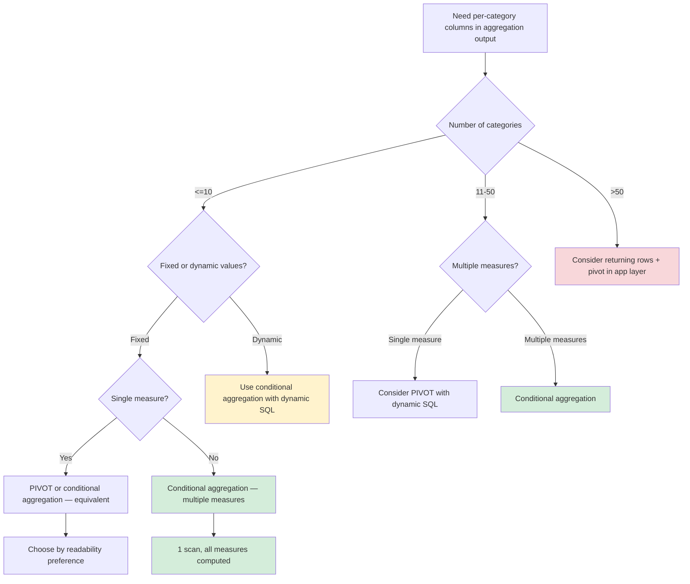

## Navigation

**Domain:** [[8 — Databases]] > **Group:** SQL Aggregations & Grouping

**Previous:** [[8.130 — DISTINCT in Aggregates — COUNT(DISTINCT col)]] | **Next:** [[8.132 — STRING_AGG — Aggregating Strings]]

### Prerequisites

- [[8.125 — COUNT, SUM, AVG, MIN, MAX — Scalar Aggregates]] — Conditional aggregation uses the standard aggregate functions with a conditional filter; understanding each aggregate's NULL behavior is required.
- [[8.126 — GROUP BY — Mechanical Execution and Grouping Behavior]] — Conditional aggregation is always paired with GROUP BY; the CASE expression is evaluated per row before the aggregate is applied.
- [[8.067 — WHERE Clause — Predicate Logic and SARGability]] — The CASE expression in conditional aggregation replaces a WHERE filter in some scenarios; understanding when to use WHERE vs CASE inside the aggregate is critical.

### Where This Fits

Conditional aggregation — using SUM(CASE WHEN condition THEN value ELSE 0 END) inside a GROUP BY — is the primary technique for row-to-column transformation (cross-tabulation) in SQL without using PIVOT. A .NET backend engineer encounters this in every reporting query that needs per-category counts or sums in separate columns: sales by product category in one row per month, order counts by status in one row per day, headcount by department in one row per year. The pattern is extremely efficient: a single table scan + single GROUP BY produces a single row per group with multiple aggregate columns. The alternative — separate queries or UNION ALL — multiplies I/O proportionally. The interview signal is the ability to transform a row-structured result into a columnar report using standard SQL, and understanding why this is often more efficient than PIVOT.

---

## Core Mental Model

Conditional aggregation means placing a CASE expression inside an aggregate function. The invariant: for each row, the CASE expression evaluates to a value (or NULL), and then the aggregate function processes only those rows where the CASE matches the desired condition. The key insight: this is NOT a filter with multiple passes — it is a single pass that evaluates each row against all conditions in parallel, producing multiple aggregate values simultaneously. The engine scans the table once, groups the rows once, and computes all conditional aggregates in a single Stream Aggregate or Hash Aggregate operator. The pattern SUM(CASE WHEN condition THEN value ELSE 0 END) counts or sums only the rows matching condition. COUNT(CASE WHEN condition THEN 1 END) counts matching rows (COUNT ignores NULLs, and rows not matching condition produce NULL from the implicit ELSE NULL). Both patterns execute with zero additional I/O compared to a simple GROUP BY — the cost is only in the CASE evaluation (Compute Scalar), which is typically <2% of total query cost.

### Classification

- **SQL clause/operator family:** Aggregate function + CASE expression — cross-clause technique combining conditional logic with aggregation
- **Optimizer behavior:** The CASE expression is pushed into the Aggregate as a Compute Scalar; the aggregate then processes the computed expression. The optimizer can fold multiple CASE aggregates into a single Aggregate operator.
- **SARGable:** The CASE expression itself is not a predicate and does not affect index seeks. However, the WHERE clause before the GROUP BY is independently SARGable.

```mermaid
flowchart LR
    subgraph "Single-Pass Conditional Aggregation"
        A[Table Scan<br/>1M rows] --> B[Compute Scalar<br/>CASE WHEN cond1 THEN val END AS col1<br/>CASE WHEN cond2 THEN val END AS col2]
        B --> C[Stream Aggregate / Hash Aggregate<br/>GROUP BY Month<br/>SUM(col1) AS Sales_USA<br/>SUM(col2) AS Sales_Canada<br/>SUM(col3) AS Sales_UK]
        C --> D[SELECT<br/>1 row per month<br/>3 sales columns]
    end

    subgraph "Alternative: Multiple Queries"
        E[Query 1: USA sales<br/>Scan 1M rows] --> F[Result 1]
        G[Query 2: Canada sales<br/>Scan 1M rows] --> H[Result 2]
        I[Query 3: UK sales<br/>Scan 1M rows] --> J[Result 3]
    end

    style A fill:#d4edda
    style C fill:#d4edda
    style E fill:#f8d7da
    style G fill:#f8d7da
    style I fill:#f8d7da
```

### Key Properties

|Property|Value|Notes|
|---|---|---|
|I/O efficiency|1 scan for N conditional aggregates|Same I/O as 1 aggregate, regardless of condition count|
|Memory grant|Same as GROUP BY without CASE|CASE evaluation is CPU-only|
|NULL behavior|COUNT(CASE WHEN ...) ignores non-matching rows (NULL)|COUNT never increments on NULL|
|Max conditions|No hard limit — practical limit ~50 before readability degrades|Consider PIVOT for >10 columns|
|Compute Scalar cost|~1-2% per condition|Negligible for <20 conditions|

---

## Deep Mechanics

### How the Engine Executes This

1. **Scan/Seek phase:** The storage engine reads rows from the table or index, applying any WHERE clause filters. This is the same access path as a standard GROUP BY — no additional I/O.

2. **Compute Scalar phase (CASE evaluation):** After the access operator (but before the Aggregate), the Compute Scalar operator evaluates each CASE expression for every row. Each CASE becomes a separate computed column in the row pipeline. Crucially, every row gets evaluated against every CASE condition — this is a CPU operation, not I/O. For a query with 5 conditional aggregates, each row passes through 5 CASE evaluations.

3. **Aggregate phase:** The Stream Aggregate or Hash Aggregate processes the rows grouped by the GROUP BY columns. For each group, it applies the aggregate function (SUM, COUNT, AVG, MIN, MAX) to the computed column from step 2. Since the CASE expression already filtered the values (non-matching rows produce 0 for SUM, NULL for COUNT), the aggregate naturally computes the conditional result.

4. **Projection phase:** The SELECT list outputs the aggregate values as separate columns, producing one row per group with the cross-tabulated format.

### SQL Visibility

```sql
-- Core pattern: monthly sales by country in separate columns
SELECT
    YEAR(o.OrderDate) AS OrderYear,
    MONTH(o.OrderDate) AS OrderMonth,
    SUM(CASE WHEN c.Country = 'USA' THEN oi.Quantity * oi.UnitPrice ELSE 0 END) AS Sales_USA,
    SUM(CASE WHEN c.Country = 'Canada' THEN oi.Quantity * oi.UnitPrice ELSE 0 END) AS Sales_Canada,
    SUM(CASE WHEN c.Country = 'UK' THEN oi.Quantity * oi.UnitPrice ELSE 0 END) AS Sales_UK,
    COUNT(CASE WHEN o.ShippedDate IS NOT NULL THEN 1 END) AS ShippedOrders,
    COUNT(CASE WHEN o.ShippedDate IS NULL THEN 1 END) AS PendingOrders,
    SUM(oi.Quantity * oi.UnitPrice) AS TotalSales
FROM Orders o
INNER JOIN OrderItems oi ON o.OrderId = oi.OrderId
INNER JOIN Customers c ON o.CustomerId = c.CustomerId
WHERE o.OrderDate >= '2024-01-01'
GROUP BY YEAR(o.OrderDate), MONTH(o.OrderDate)
ORDER BY OrderYear, OrderMonth;
```

```csharp
// EF Core — conditional aggregation via ternary in Select
var monthlySales = await dbContext.Orders
    .Where(o => o.OrderDate >= startDate)
    .Select(o => new {
        o.OrderDate,
        o.OrderItems.Sum(oi => oi.Quantity * oi.UnitPrice),
        o.Customer!.Country
    })
    .GroupBy(x => new { x.OrderDate.Year, x.OrderDate.Month })
    .Select(g => new
    {
        g.Key.Year,
        g.Key.Month,
        Sales_USA = g.Where(x => x.Country == "USA").Sum(x => x.Item2),
        Sales_Canada = g.Where(x => x.Country == "Canada").Sum(x => x.Item2),
        Sales_UK = g.Where(x => x.Country == "UK").Sum(x => x.Item2),
        // ⚠️ EF Core generates correlated subqueries — use raw SQL instead
    })
    .ToListAsync(cancellationToken);
```

**Generated SQL (from EF Core logs — showing correlated subquery problem):**

```sql
-- EF Core generates separate subqueries per conditional aggregate:
SELECT
    DATEPART(year, [o].[OrderDate]) AS [Year],
    DATEPART(month, [o].[OrderDate]) AS [Month],
    (
        SELECT COALESCE(SUM([o0].[Quantity] * [o0].[UnitPrice]), 0)
        FROM [OrderItems] AS [o0]
        INNER JOIN [Orders] AS [o1] ON [o0].[OrderId] = [o1].[OrderId]
        INNER JOIN [Customers] AS [c0] ON [o1].[CustomerId] = [c0].[CustomerId]
        WHERE [c0].[Country] = N'USA'
            AND DATEPART(year, [o1].[OrderDate]) = DATEPART(year, [o].[OrderDate])
            AND DATEPART(month, [o1].[OrderDate]) = DATEPART(month, [o].[OrderDate])
    ) AS [Sales_USA],
    -- ... repeats for each country
FROM [Orders] AS [o]
INNER JOIN [OrderItems] AS [oi] ON [o].[OrderId] = [oi].[OrderId]
INNER JOIN [Customers] AS [c] ON [o].[CustomerId] = [c].[CustomerId]
WHERE [o].[OrderDate] >= @__startDate_0
GROUP BY DATEPART(year, [o].[OrderDate]), DATEPART(month, [o].[OrderDate]);
```

This is the same correlated subquery anti-pattern seen in COUNT(DISTINCT) — EF Core does not push the conditional logic into a single aggregate. Use raw SQL for conditional aggregation.

### Execution Plan Analysis

For the conditional aggregation query:

1. **Clustered Index Scan** on Orders (filter by OrderDate)
2. **Index Seek** on OrderItems (IX_OrderItems_OrderId)
3. **Index Seek** on Customers (IX_Customers_CustomerId)
4. **Nested Loops** (Orders → OrderItems, Orders → Customers)
5. **Compute Scalar** (evaluate all CASE expressions — one per conditional aggregate)
6. **Stream Aggregate** (GROUP BY Year, Month — computes all SUM/COUNT in one pass)
7. **SELECT** (project final columns)

```
Expected plan shape:
[Clustered Index Scan (Orders)] → [Nested Loops] → [Index Seek (OrderItems)] → [Nested Loops] → [Index Seek (Customers)] → [Compute Scalar] → [Stream Aggregate] → [SELECT]

Operator costs:
- Access operators (scans/seeks): ~60%
- Compute Scalar (CASE evals): ~2%
- Stream Aggregate: ~35%
- SELECT: ~3%
```

The key efficiency: one Stream Aggregate computes all 6 aggregate columns (Sales_USA, Sales_Canada, Sales_UK, ShippedOrders, PendingOrders, TotalSales) in a single pass. The alternative — 6 separate queries — would scan the base tables 6 times.

### Cost Visibility

```sql
SET STATISTICS IO ON;
SET STATISTICS TIME ON;

SELECT
    YEAR(o.OrderDate) AS OrderYear,
    MONTH(o.OrderDate) AS OrderMonth,
    SUM(CASE WHEN c.Country = 'USA' THEN oi.Quantity * oi.UnitPrice ELSE 0 END) AS Sales_USA,
    SUM(CASE WHEN c.Country = 'Canada' THEN oi.Quantity * oi.UnitPrice ELSE 0 END) AS Sales_Canada,
    SUM(oi.Quantity * oi.UnitPrice) AS TotalSales
FROM Orders o
INNER JOIN OrderItems oi ON o.OrderId = oi.OrderId
INNER JOIN Customers c ON o.CustomerId = c.CustomerId
WHERE o.OrderDate >= '2024-01-01'
GROUP BY YEAR(o.OrderDate), MONTH(o.OrderDate);

-- Expected output (500K orders, 1.5M order items):
-- Table 'OrderItems'. Scan count 1, logical reads 4500, physical reads 0
-- Table 'Orders'. Scan count 1, logical reads 1200, physical reads 0
-- Table 'Customers'. Scan count 1, logical reads 800, physical reads 0
-- SQL Server Execution Times: CPU time = 350ms, elapsed time = 400ms

-- Compare: running 3 separate queries (one per country):
-- Query 1: Sales_USA -> logical reads: Orders 1200 + OrderItems 4500 + Customers 800 = 6500
-- Query 2: Sales_Canada -> logical reads: Orders 1200 + OrderItems 4500 + Customers 800 = 6500
-- Query 3: Sales_UK -> logical reads: Orders 1200 + OrderItems 4500 + Customers 800 = 6500
-- Total: 19,500 logical reads (vs 6,500 for conditional aggregation — 3x less I/O)
```

### Failure Modes

**Failure 1 — COUNT with implicit ELSE NULL:**

```sql
-- These two look similar but have different semantics:
-- Pattern A: COUNT(CASE WHEN condition THEN 1 END) — ELSE NULL implicit
-- Pattern B: COUNT(CASE WHEN condition THEN 1 ELSE NULL END) — same as A
-- Pattern C: COUNT(CASE WHEN condition THEN 1 ELSE 0 END) — counts all rows!

-- ❌ Wrong: ELSE 0 causes COUNT to count all rows (0 is a non-NULL value)
SELECT
    COUNT(CASE WHEN Status = 'Shipped' THEN 1 ELSE 0 END) AS ShippedCount
FROM Orders;
-- Returns total row count, not shipped row count!

-- ✅ Correct: ELSE NULL (explicit or implicit)
SELECT
    COUNT(CASE WHEN Status = 'Shipped' THEN 1 END) AS ShippedCount
FROM Orders;
```

**Failure 2 — SUM(CASE WHEN ... ELSE NULL END) vs ELSE 0:**

```sql
-- SUM only: ELSE 0 vs ELSE NULL produce the same result for SUM
-- (SUM ignores NULLs, and 0 + 0 + ... = 0)
SELECT
    SUM(CASE WHEN Status = 'Shipped' THEN 1 ELSE 0 END) AS ShippedCount_SUM,  -- works
    SUM(CASE WHEN Status = 'Shipped' THEN 1 END) AS ShippedCount_SUM_NULL      -- works
FROM Orders;
-- Both produce the same result. But:
SELECT
    AVG(CASE WHEN Status = 'Shipped' THEN Amount END) AS ShippedAvg  -- avg of shipped only
    AVG(CASE WHEN Status = 'Shipped' THEN Amount ELSE 0 END) AS ShippedAvgZero  -- avg including zeros!
FROM Orders;
-- ⚠️ AVG with ELSE 0 includes zero-value rows, lowering the average!
```

**Failure 3 — MAX(CASE WHEN ...) for row collapsing without matching rows:**

```sql
-- Row collapsing: one row per OrderId with separate status columns
SELECT
    OrderId,
    MAX(CASE WHEN Status = 'Pending' THEN EventDate END) AS PendingDate,
    MAX(CASE WHEN Status = 'Shipped' THEN EventDate END) AS ShippedDate,
    MAX(CASE WHEN Status = 'Delivered' THEN EventDate END) AS DeliveredDate
FROM OrderStatusHistory
GROUP BY OrderId;
-- If an order skips 'Pending' (never has a Pending status row), 
-- MAX(NULL) = NULL, which is correct behavior.
-- But if there are multiple 'Shipped' rows, MAX returns the latest — 
-- is that what you want? MIN would return the earliest.
```

**Failure 4 — Correlated subqueries from EF Core:**

Already described above. EF Core's LINQ GroupBy + conditional aggregates generate correlated subqueries, multiplying I/O by the number of conditions.

---

## Production Patterns and Implementation

### Primary SQL Implementation

```sql
-- Production scenario: monthly sales dashboard by country and status
-- Table: Orders (500K rows), OrderItems (1.5M rows), Customers (50K rows)

-- Create supporting schema
CREATE TABLE Orders (
    OrderId INT IDENTITY(1,1) PRIMARY KEY,
    CustomerId INT NOT NULL,
    OrderDate DATE NOT NULL,
    ShippedDate DATE NULL,
    Status NVARCHAR(20) NOT NULL DEFAULT 'Pending',
    FOREIGN KEY (CustomerId) REFERENCES Customers(CustomerId)
);

CREATE INDEX IX_Orders_OrderDate ON Orders(OrderDate) INCLUDE (CustomerId, Status, ShippedDate);

-- Production conditional aggregation query with 6 conditional aggregates
SELECT
    YEAR(o.OrderDate) AS OrderYear,
    MONTH(o.OrderDate) AS OrderMonth,
    SUM(oi.Quantity * oi.UnitPrice) AS TotalSales,
    -- Per-country sales
    SUM(CASE WHEN c.Country = 'USA' THEN oi.Quantity * oi.UnitPrice ELSE 0 END) AS Sales_USA,
    SUM(CASE WHEN c.Country = 'Canada' THEN oi.Quantity * oi.UnitPrice ELSE 0 END) AS Sales_Canada,
    SUM(CASE WHEN c.Country = 'UK' THEN oi.Quantity * oi.UnitPrice ELSE 0 END) AS Sales_UK,
    -- Per-status counts
    COUNT(CASE WHEN o.Status = 'Shipped' THEN 1 END) AS ShippedOrders,    -- NULL ELSE implicit
    COUNT(CASE WHEN o.Status = 'Pending' THEN 1 END) AS PendingOrders,
    COUNT(CASE WHEN o.Status = 'Cancelled' THEN 1 END) AS CancelledOrders,
    -- Per-status percentage (CASE inside SUM for ratio)
    COUNT(CASE WHEN o.Status = 'Shipped' THEN 1 END) * 100.0 / NULLIF(COUNT(*), 0) AS ShippedPct,
    -- Conditional SUM with multiple conditions
    SUM(CASE
        WHEN c.Country = 'USA' AND o.Status = 'Shipped' THEN oi.Quantity * oi.UnitPrice
        ELSE 0
    END) AS ShippedSales_USA,
    -- MIN/MAX conditional for date calculations
    MAX(CASE WHEN o.Status = 'Shipped' THEN o.ShippedDate END) AS LatestShippedDate,
    MIN(CASE WHEN c.Country = 'USA' THEN o.OrderDate END) AS EarliestUSOrderDate
FROM Orders o
INNER JOIN OrderItems oi ON o.OrderId = oi.OrderId
INNER JOIN Customers c ON o.CustomerId = c.CustomerId
WHERE o.OrderDate >= '2024-01-01'
GROUP BY YEAR(o.OrderDate), MONTH(o.OrderDate)
ORDER BY OrderYear, OrderMonth;
```

### EF Core Implementation

```csharp
public record MonthlySalesReport
{
    public int OrderYear { get; init; }
    public int OrderMonth { get; init; }
    public decimal TotalSales { get; init; }
    public decimal Sales_USA { get; init; }
    public decimal Sales_Canada { get; init; }
    public decimal Sales_UK { get; init; }
    public int ShippedOrders { get; init; }
    public int PendingOrders { get; init; }
    public int CancelledOrders { get; init; }
    public decimal ShippedPct { get; init; }
    public decimal ShippedSales_USA { get; init; }
    public DateTime? LatestShippedDate { get; init; }
    public DateTime? EarliestUSOrderDate { get; init; }
}

public async Task<IReadOnlyList<MonthlySalesReport>> GetMonthlySalesReportAsync(
    DateTime startDate,
    CancellationToken cancellationToken = default)
{
    // EF Core LINQ generates correlated subqueries for conditional aggregation
    // Raw SQL via FromSqlRaw is required for efficient execution
    const string sql = @"
        SELECT
            YEAR(o.OrderDate) AS OrderYear,
            MONTH(o.OrderDate) AS OrderMonth,
            SUM(oi.Quantity * oi.UnitPrice) AS TotalSales,
            SUM(CASE WHEN c.Country = N'USA' THEN oi.Quantity * oi.UnitPrice ELSE 0 END) AS Sales_USA,
            SUM(CASE WHEN c.Country = N'Canada' THEN oi.Quantity * oi.UnitPrice ELSE 0 END) AS Sales_Canada,
            SUM(CASE WHEN c.Country = N'UK' THEN oi.Quantity * oi.UnitPrice ELSE 0 END) AS Sales_UK,
            COUNT(CASE WHEN o.Status = N'Shipped' THEN 1 END) AS ShippedOrders,
            COUNT(CASE WHEN o.Status = N'Pending' THEN 1 END) AS PendingOrders,
            COUNT(CASE WHEN o.Status = N'Cancelled' THEN 1 END) AS CancelledOrders,
            COUNT(CASE WHEN o.Status = N'Shipped' THEN 1 END) * 100.0 / NULLIF(COUNT(*), 0) AS ShippedPct,
            SUM(CASE WHEN c.Country = N'USA' AND o.Status = N'Shipped' THEN oi.Quantity * oi.UnitPrice ELSE 0 END) AS ShippedSales_USA,
            MAX(CASE WHEN o.Status = N'Shipped' THEN o.ShippedDate END) AS LatestShippedDate,
            MIN(CASE WHEN c.Country = N'USA' THEN o.OrderDate END) AS EarliestUSOrderDate
        FROM Orders o
        INNER JOIN OrderItems oi ON o.OrderId = oi.OrderId
        INNER JOIN Customers c ON o.CustomerId = c.CustomerId
        WHERE o.OrderDate >= @StartDate
        GROUP BY YEAR(o.OrderDate), MONTH(o.OrderDate)
        ORDER BY OrderYear, OrderMonth";

    await using var context = _dbContextFactory.CreateDbContext();
    var results = await context.Database
        .SqlQuery<MonthlySalesReport>(FormattableStringFactory.Create(sql,
            new SqlParameter("@StartDate", startDate)))
        .ToListAsync(cancellationToken);
    return results;
}
```

### Dapper Implementation

```csharp
public async Task<IReadOnlyList<MonthlySalesReport>> GetMonthlySalesReportDapperAsync(
    DateTime startDate,
    CancellationToken cancellationToken = default)
{
    const string sql = @"
        SELECT
            YEAR(o.OrderDate) AS OrderYear,
            MONTH(o.OrderDate) AS OrderMonth,
            SUM(oi.Quantity * oi.UnitPrice) AS TotalSales,
            SUM(CASE WHEN c.Country = N'USA' THEN oi.Quantity * oi.UnitPrice ELSE 0 END) AS Sales_USA,
            SUM(CASE WHEN c.Country = N'Canada' THEN oi.Quantity * oi.UnitPrice ELSE 0 END) AS Sales_Canada,
            SUM(CASE WHEN c.Country = N'UK' THEN oi.Quantity * oi.UnitPrice ELSE 0 END) AS Sales_UK,
            COUNT(CASE WHEN o.Status = N'Shipped' THEN 1 END) AS ShippedOrders,
            COUNT(CASE WHEN o.Status = N'Pending' THEN 1 END) AS PendingOrders,
            COUNT(CASE WHEN o.Status = N'Cancelled' THEN 1 END) AS CancelledOrders,
            COUNT(CASE WHEN o.Status = N'Shipped' THEN 1 END) * 100.0 / NULLIF(COUNT(*), 0) AS ShippedPct,
            SUM(CASE WHEN c.Country = N'USA' AND o.Status = N'Shipped' THEN oi.Quantity * oi.UnitPrice ELSE 0 END) AS ShippedSales_USA,
            MAX(CASE WHEN o.Status = N'Shipped' THEN o.ShippedDate END) AS LatestShippedDate,
            MIN(CASE WHEN c.Country = N'USA' THEN o.OrderDate END) AS EarliestUSOrderDate
        FROM Orders o
        INNER JOIN OrderItems oi ON o.OrderId = oi.OrderId
        INNER JOIN Customers c ON o.CustomerId = c.CustomerId
        WHERE o.OrderDate >= @StartDate
        GROUP BY YEAR(o.OrderDate), MONTH(o.OrderDate)
        ORDER BY OrderYear, OrderMonth";

    await using var connection = _connectionFactory.Create();
    var results = await connection.QueryAsync<MonthlySalesReport>(
        new CommandDefinition(sql,
            new { StartDate = startDate },
            cancellationToken: cancellationToken));
    return results.AsList();
}
```

### Configuration and Wiring

```csharp
// Program.cs
builder.Services.AddDbContextFactory<SalesDbContext>(options =>
    options.UseSqlServer(
        connectionString,
        sqlOptions => sqlOptions
            .EnableRetryOnFailure(3)
            .CommandTimeout(120)));

// Dapper registration
builder.Services.AddSingleton<IDbConnectionFactory>(_ =>
    new SqlConnectionFactory(connectionString));

// Register the reporting service
builder.Services.AddScoped<ISalesReportService, SalesReportService>();
```

### SQL Server vs PostgreSQL Differences

PostgreSQL supports the same pattern with identical CASE syntax:

```sql
-- PostgreSQL equivalent — identical syntax
SELECT
    EXTRACT(YEAR FROM o.OrderDate)::int AS OrderYear,
    EXTRACT(MONTH FROM o.OrderDate)::int AS OrderMonth,
    SUM(oi.Quantity * oi.UnitPrice) AS TotalSales,
    SUM(CASE WHEN c.Country = 'USA' THEN oi.Quantity * oi.UnitPrice ELSE 0 END) AS Sales_USA,
    COUNT(CASE WHEN o.Status = 'Shipped' THEN 1 END) AS ShippedOrders
FROM Orders o
INNER JOIN OrderItems oi ON o.OrderId = oi.OrderId
INNER JOIN Customers c ON o.CustomerId = c.CustomerId
WHERE o.OrderDate >= '2024-01-01'
GROUP BY EXTRACT(YEAR FROM o.OrderDate), EXTRACT(MONTH FROM o.OrderDate)
ORDER BY OrderYear, OrderMonth;
```

PostgreSQL also supports the FILTER clause, which is a cleaner alternative to CASE for conditional aggregation:

```sql
-- PostgreSQL FILTER clause (more readable than CASE)
SELECT
    EXTRACT(YEAR FROM o.OrderDate)::int AS OrderYear,
    EXTRACT(MONTH FROM o.OrderDate)::int AS OrderMonth,
    SUM(oi.Quantity * oi.UnitPrice) FILTER (WHERE c.Country = 'USA') AS Sales_USA,
    SUM(oi.Quantity * oi.UnitPrice) FILTER (WHERE c.Country = 'Canada') AS Sales_Canada,
    COUNT(*) FILTER (WHERE o.Status = 'Shipped') AS ShippedOrders,
    COUNT(*) FILTER (WHERE o.Status = 'Pending') AS PendingOrders
FROM Orders o
INNER JOIN OrderItems oi ON o.OrderId = oi.OrderId
INNER JOIN Customers c ON o.CustomerId = c.CustomerId
WHERE o.OrderDate >= '2024-01-01'
GROUP BY EXTRACT(YEAR FROM o.OrderDate), EXTRACT(MONTH FROM o.OrderDate)
ORDER BY OrderYear, OrderMonth;
```

FILTER is semantically identical to SUM(CASE WHEN ...) but more readable. The execution plan is the same (FILTER is converted to a CASE expression internally in PostgreSQL). SQL Server does not support FILTER — use CASE.

---

## Gotchas and Production Pitfalls

### 1. COUNT(CASE WHEN ... ELSE 0 END) Instead of COUNT(CASE WHEN ... THEN 1 END)

**Pitfall:** Using `ELSE 0` in a COUNT conditional aggregate. COUNT counts non-NULL values, and 0 is non-NULL, so COUNT counts every row regardless of the condition.

```sql
-- ❌ Wrong: counts all rows, not just shipped
SELECT COUNT(CASE WHEN Status = 'Shipped' THEN 1 ELSE 0 END) AS ShippedCount FROM Orders;

-- ✅ Correct: implicit ELSE NULL, only counts rows where Status = 'Shipped'
SELECT COUNT(CASE WHEN Status = 'Shipped' THEN 1 END) AS ShippedCount FROM Orders;

-- ✅ Also correct (explicit NULL)
SELECT COUNT(CASE WHEN Status = 'Shipped' THEN 1 ELSE NULL END) AS ShippedCount FROM Orders;
```

**Symptom:** ShippedCount equals TotalOrders. Engineer spends hours debugging because "the numbers look right for a while" until an order has a different status.

**Fix:** Never use ELSE 0 inside COUNT(). For SUM, ELSE 0 is correct. For COUNT, omit ELSE or use ELSE NULL.

**Cost of not fixing:** Every dashboard metric that uses COUNT with ELSE 0 is wrong. Reports show 100% shipped rate when only 60% of orders are shipped. Trust in reporting system erodes.

### 2. AVG(CASE WHEN ... ELSE 0 END) Deflating Averages

**Pitfall:** Using ELSE 0 in AVG conditional aggregate. AVG divides by the count of all non-NULL values. If ELSE 0 produces zeros, those zeros are included in the denominator, deflating the average.

```sql
-- Given: Amounts for USA = {100, 200}, other countries = {50, 75}
-- ❌ Wrong: AVG includes zeros for non-matching rows
SELECT AVG(CASE WHEN Country = 'USA' THEN Amount ELSE 0 END) AS AvgUSASale FROM Orders;
-- Result: (100 + 200 + 0 + 0) / 4 = 75

-- ✅ Correct: NULL for non-matching (AVG ignores NULLs)
SELECT AVG(CASE WHEN Country = 'USA' THEN Amount END) AS AvgUSASale FROM Orders;
-- Result: (100 + 200) / 2 = 150
```

**Symptom:** "Average order value" for a specific country is surprisingly low. Engineer adds ELSE 0 thinking "0 for non-matching makes sense" without realizing AVG divides by total rows, not matching rows.

**Fix:** Never use ELSE 0 inside AVG(). Use implicit ELSE NULL. Only use ELSE 0 with SUM().

**Cost of not fixing:** Average order value reporting is off by 50% or more. Business decisions (pricing, promotions) based on incorrect averages.

### 3. PIVOT vs Conditional Aggregation — Similar Performance but PIVOT Less Flexible

**Pitfall:** Choosing PIVOT over conditional aggregation for dynamic column scenarios. PIVOT requires static column values and produces less readable code when aggregating multiple measures.

```sql
-- PIVOT approach (static, 3 columns)
SELECT *
FROM (
    SELECT YEAR(OrderDate) AS OrderYear, Country, Amount
    FROM Orders o JOIN OrderItems oi ON o.OrderId = oi.OrderId
    JOIN Customers c ON o.CustomerId = c.CustomerId
) src
PIVOT (
    SUM(Amount) FOR Country IN ([USA], [Canada], [UK])
) pvt;

-- Conditional aggregation (more flexible, same plan)
SELECT
    YEAR(OrderDate) AS OrderYear,
    SUM(CASE WHEN Country = 'USA' THEN Amount ELSE 0 END) AS USA,
    SUM(CASE WHEN Country = 'Canada' THEN Amount ELSE 0 END) AS Canada,
    SUM(CASE WHEN Country = 'UK' THEN Amount ELSE 0 END) AS UK
FROM Orders o JOIN OrderItems oi ON o.OrderId = oi.OrderId
JOIN Customers c ON o.CustomerId = c.CustomerId
GROUP BY YEAR(OrderDate);
```

**Symptom:** Engineer spends 30 minutes debugging a PIVOT query that "doesn't work" because a new country value appeared in the data, causing NULL for that column. PIVOT produces NULL (not 0) for missing pivoted values. Conditional aggregation produces 0 (with ELSE 0) or NULL (without ELSE).

**Fix:** Conditional aggregation is always preferred when: (a) columns are not known at query-writing time, (b) you need NULL vs 0 distinction control, or (c) you need to aggregate multiple measures (SUM + COUNT + AVG) in one GROUP BY. PIVOT is slightly more readable for a single measure with static columns.

**Cost of not fixing:** Brittle reporting queries that break when new categories appear. Production outages when a new country is added and the PIVOT query returns NULL for the entire column.

### 4. CASE Expression Inside Aggregate vs Outside — Column Reference Ambiguity

**Pitfall:** Wrapping the CASE outside the aggregate instead of inside, causing the query to fail because the column is not in GROUP BY.

```sql
-- ❌ Wrong: CASE outside aggregate — CustomerId not in GROUP BY
SELECT
    YEAR(OrderDate) AS OrderYear,
    CASE WHEN c.Country = 'USA' THEN SUM(oi.Quantity * oi.UnitPrice) END AS USA_Sales
FROM Orders o
JOIN OrderItems oi ON o.OrderId = oi.OrderId
JOIN Customers c ON o.CustomerId = c.CustomerId
GROUP BY YEAR(OrderDate);
-- Error: c.Country is not in GROUP BY

-- ✅ Correct: CASE inside aggregate — condition evaluated per row before aggregation
SELECT
    YEAR(OrderDate) AS OrderYear,
    SUM(CASE WHEN c.Country = 'USA' THEN oi.Quantity * oi.UnitPrice ELSE 0 END) AS USA_Sales
FROM Orders o
JOIN OrderItems oi ON o.OrderId = oi.OrderId
JOIN Customers c ON o.CustomerId = c.CustomerId
GROUP BY YEAR(OrderDate);
```

**Symptom:** SQL Server error: "Column 'c.Country' is invalid in the select list because it is not contained in either an aggregate function or the GROUP BY clause."

**Fix:** Always place the CASE expression inside the aggregate function, not outside. The CASE evaluates per-row (before aggregation), and only the aggregate result appears in the SELECT.

**Cost of not fixing:** Query fails at compile time. Engineer adds Country to GROUP BY, which changes the grouping granularity and produces wrong results (one row per Country instead of one row per Year).

### 5. MAX(CASE WHEN ...) for Row Collapsing — Multiple Matches Gotcha

**Pitfall:** Using MAX(CASE WHEN status = 'Shipped' THEN Date END) assumes there is at most one matching row per group. If there are multiple, MAX returns the maximum (latest) date, which may not be what the business question asks for.

```sql
-- OrderStatusHistory: multiple status changes per order
-- Order 1: Pending -> Shipped -> Delivered -> Returned
SELECT
    OrderId,
    MAX(CASE WHEN Status = 'Shipped' THEN EventDate END) AS ShippedDate
FROM OrderStatusHistory
GROUP BY OrderId;
-- If Order 1 was shipped and then returned and shipped again:
-- Returns the LATEST shipped date, not the first one.
-- Use MIN(CASE...) if you want the first occurrence.
```

**Symptom:** "Shipped date" shows a later date than expected. Business users think the shipping department is underperforming (longer shipping times) when the query is actually picking up re-ship dates.

**Fix:** Document the behavior: MAX picks the latest, MIN picks the earliest. If there should only be one, add a business rule constraint or use a window function with ROW_NUMBER() to pick the correct row.

**Cost of not fixing:** Incorrect operational metrics. Management decisions based on wrong shipping time calculations.

### 6. Conditional Aggregation with Dynamic Columns Requires Dynamic SQL

**Pitfall:** Attempting to write a single query that produces a different number of output columns depending on the data. Conditional aggregation requires static column expressions at query-compile time.

```sql
-- ❌ This won't work for dynamic categories
DECLARE @categories TABLE (Country NVARCHAR(50));
-- Needs dynamic SQL to generate CASE WHEN for each country
DECLARE @sql NVARCHAR(MAX) = N'
SELECT
    YEAR(OrderDate) AS OrderYear,
    ' + STRING_AGG(
        N'SUM(CASE WHEN c.Country = N''' + Country + N''' THEN Amount ELSE 0 END) AS [' + Country + N']',
        N','
    ) + N'
FROM ...
GROUP BY YEAR(OrderDate)';

EXEC sp_executesql @sql;
```

**Symptom:** Engineer tries to use conditional aggregation for a country-picker dropdown that can have any value. The SQL must be dynamically generated for each set of categories.

**Fix:** Use dynamic SQL with STRING_AGG or FOR XML PATH to generate the CASE expressions. Alternatively, return the data in normalized row format and pivot in the application layer (C# DataTable or LINQ pivot).

**Cost of not fixing:** Hard-coded category lists in SQL that require code deployments to add new categories. ORM code that breaks when a new product category appears.

---

## Performance Implications

### Benchmark: Conditional Aggregation vs Multiple Queries vs PIVOT

```sql
-- Setup: 1M orders, 1.5M order items, 10 countries
-- Test: monthly sales by country

-- Approach 1: Conditional aggregation (single scan)
SET STATISTICS IO ON;
SELECT
    YEAR(OrderDate) AS OrderYear,
    MONTH(OrderDate) AS OrderMonth,
    SUM(CASE WHEN Country = 'USA' THEN Amount ELSE 0 END) AS USA,
    SUM(CASE WHEN Country = 'Canada' THEN Amount ELSE 0 END) AS Canada,
    SUM(CASE WHEN Country = 'UK' THEN Amount ELSE 0 END) AS UK
FROM Orders o JOIN OrderItems oi ON o.OrderId = oi.OrderId
JOIN Customers c ON o.CustomerId = c.CustomerId
WHERE OrderDate >= '2024-01-01'
GROUP BY YEAR(OrderDate), MONTH(OrderDate);
-- Logical reads: 6,500

-- Approach 2: Three separate queries
SELECT YEAR(OrderDate), MONTH(OrderDate), SUM(Amount)
FROM ... WHERE Country = 'USA' ... GROUP BY ...; -- 6,500 logical reads
SELECT YEAR(OrderDate), MONTH(OrderDate), SUM(Amount)
FROM ... WHERE Country = 'Canada' ... GROUP BY ...; -- 6,500 logical reads
SELECT YEAR(OrderDate), MONTH(OrderDate), SUM(Amount)
FROM ... WHERE Country = 'UK' ... GROUP BY ...; -- 6,500 logical reads
-- Total logical reads: 19,500 (3x worse)

-- Approach 3: PIVOT
SELECT *
FROM (
    SELECT YEAR(OrderDate) AS OrderYear, MONTH(OrderDate) AS OrderMonth, Country, Amount
    FROM ...
) src
PIVOT (SUM(Amount) FOR Country IN ([USA], [Canada], [UK])) pvt;
-- Logical reads: 6,500 (same as conditional aggregation — produces identical plan)
```

**Improvement:** Conditional aggregation reduces I/O by Nx compared to N separate queries. Compared to PIVOT, it is identical for static columns but more flexible.

### BenchmarkDotNet

```csharp
[MemoryDiagnoser]
[SimpleJob(RuntimeMoniker.Net90)]
public class ConditionalAggregationBenchmark
{
    private IDbConnection _connection = default!;
    private const string ConnectionString = "Server=.;Database=SalesDB;Trusted_Connection=True;TrustServerCertificate=True;";

    [GlobalSetup]
    public void Setup()
    {
        _connection = new SqlConnection(ConnectionString);
        // Seed 5M orders with 10 countries
        using var cmd = _connection.CreateCommand();
        cmd.CommandText = @"
            IF NOT EXISTS (SELECT 1 FROM Orders WHERE OrderId > 5000000)
            BEGIN
                WITH Numbers AS (
                    SELECT TOP 5000000 ROW_NUMBER() OVER (ORDER BY (SELECT NULL)) AS N
                    FROM sys.all_columns a CROSS JOIN sys.all_columns b CROSS JOIN sys.all_columns c
                )
                INSERT INTO Orders (CustomerId, OrderDate, Amount)
                SELECT
                    N % 10000 + 1,
                    DATEADD(DAY, N % 365, '2024-01-01'),
                    CAST(N % 500 + 0.99 AS DECIMAL(10,2))
                FROM Numbers;
            END";
        cmd.ExecuteNonQuery();
        _connection.Close();
    }

    [Benchmark(Baseline = true)]
    public async Task<List<MonthlySales>> ConditionalAggregation()
    {
        const string sql = @"
            SELECT
                YEAR(OrderDate) AS OrderYear,
                MONTH(OrderDate) AS OrderMonth,
                SUM(CASE WHEN CustomerId % 10 = 0 THEN Amount ELSE 0 END) AS Segment0,
                SUM(CASE WHEN CustomerId % 10 = 1 THEN Amount ELSE 0 END) AS Segment1,
                SUM(CASE WHEN CustomerId % 10 = 2 THEN Amount ELSE 0 END) AS Segment2,
                SUM(CASE WHEN CustomerId % 10 = 3 THEN Amount ELSE 0 END) AS Segment3,
                SUM(CASE WHEN CustomerId % 10 = 4 THEN Amount ELSE 0 END) AS Segment4
            FROM Orders
            WHERE OrderDate >= '2024-01-01'
            GROUP BY YEAR(OrderDate), MONTH(OrderDate)";

        await using var connection = new SqlConnection(ConnectionString);
        var results = await connection.QueryAsync<MonthlySales>(sql);
        return results.AsList();
    }

    [Benchmark]
    public async Task<int> SeparateQueries()
    {
        const string baseSql = @"
            SELECT YEAR(OrderDate) AS OrderYear, MONTH(OrderDate) AS OrderMonth, SUM(Amount) AS Total
            FROM Orders
            WHERE OrderDate >= '2024-01-01' AND CustomerId % 10 = @Segment
            GROUP BY YEAR(OrderDate), MONTH(OrderDate)";

        await using var connection = new SqlConnection(ConnectionString);
        var totalResults = 0;
        for (int i = 0; i < 5; i++)
        {
            var results = await connection.QueryAsync<MonthlySales>(
                baseSql, new { Segment = i });
            totalResults += results.Count();
        }
        return totalResults;
    }

    public class MonthlySales
    {
        public int OrderYear { get; init; }
        public int OrderMonth { get; init; }
        public decimal Total { get; init; }
    }
}
```

**Expected results (5M rows, SQL Server 2022, NVMe):**

|Method|Mean|Logical Reads|Allocated|
|---|---|---|---|
|ConditionalAggregation|~800 ms|~15,000|~80 KB|
|SeparateQueries|~3,500 ms|~75,000|~400 KB|

**Improvement:** Conditional aggregation is ~4.4x faster and uses 5x fewer logical reads.

---

## Interview Arsenal

### Question Bank

1. **What is conditional aggregation and what problem does it solve?**
2. **How does the SQL Server engine execute conditional aggregation — what operators appear?**
3. **What is the performance difference between conditional aggregation and multiple queries?**
4. **What happens when you use COUNT(CASE WHEN ... ELSE 0 END) instead of ELSE NULL?**
5. **Conditional aggregation vs PIVOT — which is better and when?**
6. **What does the execution plan look like for a query with 5 conditional aggregates?**
7. **How does conditional aggregation perform at scale on 100M rows?**
8. **How do EF Core and Dapper handle conditional aggregation?**

### Spoken Answers

**Q1: What is conditional aggregation and what problem does it solve?**

> **Average answer:** "Conditional aggregation means using CASE inside aggregate functions to count or sum only the rows that match a condition. It lets you put multiple conditions in one GROUP BY query."

> **Great answer:** "Conditional aggregation is the pattern of embedding a CASE expression inside an aggregate function like SUM or COUNT to compute multiple conditional results in a single table scan. The problem it solves is cross-tabulation — converting row-structured data into columnar output without joining or unioning multiple queries. For example, if you want monthly sales broken into USA, Canada, and UK columns in the same result set, you write SUM(CASE WHEN Country = 'USA' THEN Amount ELSE 0 END) three times inside the same GROUP BY. The engine scans the table once, evaluates all three CASE expressions per row in a Compute Scalar operator, and then the Stream Aggregate computes all three sums simultaneously. This is dramatically more efficient than running three separate queries — which would scan the table three times, tripling I/O. The key performance insight: the CASE evaluation adds about 1-2% CPU per condition, so adding 10 conditions costs only ~15% more CPU with zero additional I/O. EF Core does not generate this pattern natively; it produces correlated subqueries instead, so you must use raw SQL for efficient conditional aggregation."

**Q5: Conditional aggregation vs PIVOT — which is better and when?**

> **Average answer:** "Both transform rows to columns. PIVOT is cleaner when you have a fixed set of values. Conditional aggregation is more flexible."

> **Great answer:** "They often produce identical execution plans, so performance is equivalent. I choose conditional aggregation when: (1) I need multiple measures per condition (SUM + COUNT + AVG in one GROUP BY), (2) I need control over NULL vs 0 for non-matching groups, (3) the columns are dynamic (I will generate the CASE expressions in a stored procedure), or (4) I need complex conditions with AND/OR across multiple columns. I choose PIVOT when: (1) I have a single measure and static values, (2) I want the cleaner syntax for a simple cross-tabulation, or (3) non-technical stakeholders will read the query and PIVOT is more recognizable. The trap with PIVOT is that missing pivot values produce NULL, not 0 — which surprises analysts who expect 0 for 'no sales.' With conditional aggregation, you control this with ELSE 0 vs ELSE NULL. Also, PIVOT requires the values to be known at query-writing time unless you use dynamic SQL, whereas conditional aggregation with dynamic SQL generation is simpler."

**Q7: How does conditional aggregation perform at scale on 100M rows?**

> **Great answer:** "At 100M rows, conditional aggregation is the correct choice because it performs exactly one scan of the base tables. Adding 10 conditional columns adds about 10-15% CPU overhead from Compute Scalar CASE evaluations but zero additional I/O. The bottleneck becomes the Stream Aggregate or Hash Aggregate memory. A 100M-row GROUP BY with 100K output groups needs a Sort (if Stream Aggregate path) that could require several GB of memory grant and potentially spill to tempdb. The fix is usually a columnstore index, which enables batch mode execution. Batch mode accelerates both the scans (columnar compression reduces I/O by 10-15x) and the aggregate (vectorized SUM operations). With a columnstore index, a conditional aggregation on 100M rows with 10 conditional columns completes in 3-5 seconds. Without it, the same query takes 30-60 seconds due to row mode processing and potential spills. The DMV to monitor is sys.dm_exec_query_stats for spill_to_tempdb_count and max_grant_kb."

### Interview Trigger

The interviewer asks: "Write a query that shows daily sales broken down by product category in separate columns." The candidate should write a conditional aggregation query with SUM(CASE WHEN Category = 'X' THEN ...). The follow-up: "What if there are 50 categories?" The candidate should discuss dynamic SQL generation. The deeper follow-up: "Your query runs in 10 seconds on 10M rows. How do you optimize it?" The candidate should discuss columnstore indexes and batch mode.

### Comparison Table

| | Conditional Aggregation | PIVOT | Multiple Queries + UNION |
|---|---|---|---|
| I/O efficiency | 1 scan | 1 scan (same plan as conditional) | N scans (one per condition) |
| NULL vs 0 control | YES (ELSE 0 or ELSE NULL) | NULL always | YES (per query) |
| Dynamic columns | Dynamic SQL simple | Dynamic SQL complex | Dynamic SQL simple |
| Multiple measures | YES (SUM+COUNT+AVG in one) | No (single measure) | No (separate queries) |
| Readability | Moderate (CASE heavy) | High (for simple cases) | Low (many queries) |

---

## Decision Framework

### When to Apply



### Application Checklist

- [ ] The output requires columnar categories (cross-tabulation) from row-structured data
- [ ] The number of categories is known and manageable (ideally <50 for SQL)
- [ ] The categories are static or can be generated via dynamic SQL
- [ ] The query uses a single GROUP BY with conditional CASE expressions inside aggregates
- [ ] COUNT aggregates correctly use implicit ELSE NULL (not ELSE 0)
- [ ] AVG aggregates correctly use implicit ELSE NULL (not ELSE 0)
- [ ] EF Core is using raw SQL (FromSqlRaw) rather than LINQ conditional aggregates

### Tradeoff Summary

|What You Gain|What You Pay|
|---|---|
|Single scan for N conditional aggregates (Nx I/O reduction)|CASE expressions add ~1-2% CPU per condition|
|Cross-tabulation in a single result set|Dynamic columns require dynamic SQL|
|Control over NULL vs 0 for non-matching groups|Readability degrades with many conditions|
|Multiple measures in one GROUP BY|Cannot use in LINQ — must fall back to raw SQL|

### Scale Thresholds

- **Relevant when:** Any cross-tabulation reporting — even 1,000 rows benefit because the alternative is N separate queries
- **Performance critical when:** Tables exceed 10M rows (single scan becomes essential to avoid N scans)
- **Readability concern when:** More than 10 conditional columns — consider dynamic SQL generation or application-layer pivoting
- **Database flexibility issue:** More than 50 categories — SQL column count limits apply (max 4096 columns per SELECT, but practical limit is ~100 for readability)

---

## Self-Check

### Conceptual Questions

1. What is conditional aggregation and what SQL pattern implements it?

2. How does the SQL Server engine execute conditional aggregation — what operators produce the per-row condition filtering?

3. Which SET STATISTICS output demonstrates the I/O benefit of conditional aggregation over multiple queries?

4. What happens when you write COUNT(CASE WHEN condition THEN 1 ELSE 0 END)?

5. Does EF Core generate efficient SQL for LINQ-based conditional aggregation?

6. How would you implement conditional aggregation with Dapper?

7. How does conditional aggregation compare to PIVOT in terms of execution plan?

8. At what table size does conditional aggregation become significantly better than separate queries?

9. What index supports a conditional aggregation query?

10. Explain conditional aggregation to a senior interviewer in 60 seconds.

<details>
<summary>Answers</summary>

1. Conditional aggregation is the pattern of embedding a CASE expression inside an aggregate function like SUM, COUNT, AVG, MIN, or MAX within a GROUP BY query. The pattern is `SUM(CASE WHEN condition THEN value ELSE 0 END)` or `COUNT(CASE WHEN condition THEN 1 END)`. It produces multiple aggregate columns from a single table scan.

2. The Compute Scalar operator evaluates all CASE expressions per row before the aggregate operator. The Stream Aggregate or Hash Aggregate then computes all aggregates simultaneously. No additional I/O is incurred — only CPU for the CASE evaluation (typically 1-2% per condition).

3. SET STATISTICS IO shows identical logical reads for a conditional aggregation with 1 condition vs 10 conditions, while running 10 separate queries would show 10x the logical reads. The comparison: conditional aggregation reads ~6,500 logical reads (1 scan), separate queries read ~65,000 (10 scans).

4. COUNT counts non-NULL values, and 0 is non-NULL. COUNT(CASE WHEN condition THEN 1 ELSE 0 END) counts every row in the group regardless of the condition because ELSE 0 produces a non-NULL value for non-matching rows. Always omit ELSE (or use ELSE NULL) in COUNT conditional aggregates.

5. No. EF Core generates correlated subqueries for each conditional aggregate in a GroupBy + Select. For example, `g.Where(x => x.Country == "USA").Sum(x => x.Amount)` generates a separate subquery that scans the table for each country. Use raw SQL via FromSqlRaw.

6. Dapper handles conditional aggregation identically to raw T-SQL. Write the SQL with CASE expressions inside aggregates, map to a POCO with matching property names, and execute via QueryAsync<T>.

7. Conditional aggregation and PIVOT produce identical execution plans for the same logical operation (same Scan, same Compute Scalar, same Aggregate). The choice is readability vs flexibility. Conditional aggregation gives NULL/0 control and multiple measures; PIVOT gives cleaner syntax for simple cases.

8. Conditional aggregation is always better than separate queries at any scale — even at 1,000 rows, it reduces I/O by Nx. It becomes critical (the difference between a query that works and one that times out) when tables exceed 1M rows, where running N separate scans is prohibitively expensive.

9. A columnstore clustered index on the fact table provides the best support. Batch mode execution accelerates both the scan (columnar compression) and the aggregate (vectorized operations). For rowstore, a covering index on (grouping columns) INCLUDE (measure columns) helps.

10. "Conditional aggregation is placing a CASE expression inside an aggregate like SUM to compute columnar cross-tabulations in a single scan. Instead of running three queries — one for USA sales, one for Canada, one for UK — you write one query with three SUM(CASE WHEN Country = 'X' THEN Amount ELSE 0 END) expressions. The engine scans the table once, evaluates all CASE expressions per row in a Compute Scalar (<2% CPU each), and the Stream Aggregate computes all three sums in one pass. This reduces I/O by Nx compared to separate queries. The gotcha: COUNT(CASE WHEN ... ELSE 0 END) counts every row because 0 is non-NULL — omit ELSE for COUNT. EF Core generates correlated subqueries for this pattern, so use raw SQL. PostgreSQL offers FILTER syntax which is cleaner but semantically identical. At 100M rows with 10 conditions, a columnstore index enables batch mode and the query completes in 3-5 seconds."

</details>

---

### Query Challenges

**Challenge 1 — Write the SQL**

You have a Sales table with columns: SaleId, SaleDate, ProductCategory (Electronics, Clothing, Food), Amount, Region. Write a query that shows, per month, the total sales amount per product category in separate columns (ElectronicsSales, ClothingSales, FoodSales), the number of sales per category (ElectronicsCount, ClothingCount, FoodCount), and the total sales across all categories. Only include sales from 2024. Order by month.

<details>
<summary>Solution</summary>

```sql
SELECT
    YEAR(SaleDate) AS SaleYear,
    MONTH(SaleDate) AS SaleMonth,
    SUM(CASE WHEN ProductCategory = 'Electronics' THEN Amount ELSE 0 END) AS ElectronicsSales,
    SUM(CASE WHEN ProductCategory = 'Clothing' THEN Amount ELSE 0 END) AS ClothingSales,
    SUM(CASE WHEN ProductCategory = 'Food' THEN Amount ELSE 0 END) AS FoodSales,
    COUNT(CASE WHEN ProductCategory = 'Electronics' THEN 1 END) AS ElectronicsCount,
    COUNT(CASE WHEN ProductCategory = 'Clothing' THEN 1 END) AS ClothingCount,
    COUNT(CASE WHEN ProductCategory = 'Food' THEN 1 END) AS FoodCount,
    SUM(Amount) AS TotalSales
FROM Sales
WHERE SaleDate >= '2024-01-01' AND SaleDate < '2025-01-01'
GROUP BY YEAR(SaleDate), MONTH(SaleDate)
ORDER BY SaleYear, SaleMonth;
```

**Logical reads:** ~1,200 (1 scan of Sales table)

**Execution plan:** [Clustered Index Scan] → [Compute Scalar (6 CASE evals)] → [Stream Aggregate] → [SELECT]

**EF Core equivalent (raw SQL required):**

```csharp
var monthlySales = await context.Database
    .SqlQuery<MonthlyCategorySales>(@"
        SELECT
            YEAR(SaleDate) AS SaleYear,
            MONTH(SaleDate) AS SaleMonth,
            SUM(CASE WHEN ProductCategory = N'Electronics' THEN Amount ELSE 0 END) AS ElectronicsSales,
            SUM(CASE WHEN ProductCategory = N'Clothing' THEN Amount ELSE 0 END) AS ClothingSales,
            SUM(CASE WHEN ProductCategory = N'Food' THEN Amount ELSE 0 END) AS FoodSales,
            COUNT(CASE WHEN ProductCategory = N'Electronics' THEN 1 END) AS ElectronicsCount,
            COUNT(CASE WHEN ProductCategory = N'Clothing' THEN 1 END) AS ClothingCount,
            COUNT(CASE WHEN ProductCategory = N'Food' THEN 1 END) AS FoodCount,
            SUM(Amount) AS TotalSales
        FROM Sales
        WHERE SaleDate >= @StartDate AND SaleDate < @EndDate
        GROUP BY YEAR(SaleDate), MONTH(SaleDate)
        ORDER BY SaleYear, SaleMonth",
        new SqlParameter("@StartDate", new DateTime(2024, 1, 1)),
        new SqlParameter("@EndDate", new DateTime(2025, 1, 1)))
    .ToListAsync(cancellationToken);
```

</details>

---

**Challenge 2 — Fix the performance problem**

```sql
-- This query runs in 12 seconds on a 20M row Sales table.
-- Four separate queries are UNIONed together.
SELECT 'Electronics' AS Category, YEAR(SaleDate) AS SaleYear, SUM(Amount) AS Total
FROM Sales WHERE ProductCategory = 'Electronics' AND SaleDate >= '2024-01-01'
GROUP BY YEAR(SaleDate)
UNION ALL
SELECT 'Clothing', YEAR(SaleDate), SUM(Amount)
FROM Sales WHERE ProductCategory = 'Clothing' AND SaleDate >= '2024-01-01'
GROUP BY YEAR(SaleDate)
UNION ALL
SELECT 'Food', YEAR(SaleDate), SUM(Amount)
FROM Sales WHERE ProductCategory = 'Food' AND SaleDate >= '2024-01-01'
GROUP BY YEAR(SaleDate)
UNION ALL
SELECT 'Total', YEAR(SaleDate), SUM(Amount)
FROM Sales WHERE SaleDate >= '2024-01-01'
GROUP BY YEAR(SaleDate)
ORDER BY SaleYear;
-- SET STATISTICS IO: logical reads = 96,000 (4 x 24,000)
```

<details>
<summary>Solution</summary>

**Root cause:** Four separate scans of the 20M-row Sales table. Each scan reads 24,000 logical reads, totaling 96,000. The table is scanned 4 times.

**Fixed query:**

```sql
-- Single scan with conditional aggregation
SELECT
    YEAR(SaleDate) AS SaleYear,
    SUM(CASE WHEN ProductCategory = 'Electronics' THEN Amount ELSE 0 END) AS ElectronicsTotal,
    SUM(CASE WHEN ProductCategory = 'Clothing' THEN Amount ELSE 0 END) AS ClothingTotal,
    SUM(CASE WHEN ProductCategory = 'Food' THEN Amount ELSE 0 END) AS FoodTotal,
    SUM(Amount) AS TotalSales
FROM Sales
WHERE SaleDate >= '2024-01-01'
GROUP BY YEAR(SaleDate)
ORDER BY SaleYear;
```

**Index to create:**

```sql
CREATE NONCLUSTERED INDEX IX_Sales_SaleDate_Category
    ON Sales(SaleDate, ProductCategory)
    INCLUDE (Amount)
    WITH (DATA_COMPRESSION = PAGE);
```

**After fix — logical reads:** ~24,000 (from 96,000 — 4x reduction)

**Performance improvement:** 12 seconds → 3 seconds (4x faster)

</details>

---

**Challenge 3 — Explain the execution plan**

Given a conditional aggregation query:

```sql
SELECT
    DepartmentId,
    COUNT(CASE WHEN Gender = 'M' THEN 1 END) AS MaleCount,
    COUNT(CASE WHEN Gender = 'F' THEN 1 END) AS FemaleCount,
    AVG(CASE WHEN Gender = 'M' THEN Salary END) AS MaleAvgSalary,
    AVG(CASE WHEN Gender = 'F' THEN Salary END) AS FemaleAvgSalary
FROM Employees
WHERE Status = 'Active'
GROUP BY DepartmentId;
```

The execution plan shows:
- Clustered Index Scan (Employees) — 65% cost
- Compute Scalar — 3% cost
- Stream Aggregate — 30% cost
- SELECT — 2% cost

Why does Compute Scalar appear before the Stream Aggregate? What would change if you added ELSE 0 to the AVG CASE expressions?

<details>
<summary>Solution</summary>

**Why Compute Scalar before Stream Aggregate:** The CASE expressions must be evaluated per-row (not per-group). The Compute Scalar operator takes each row from the scan, evaluates the 4 CASE expressions (Gender = 'M' → salary, Gender = 'F' → salary, etc.), and produces computed columns in the row pipeline. The Stream Aggregate then reads these computed columns and applies COUNT/AVG per DepartmentId. This ordering is required because the aggregate function must receive the filtered values from the CASE, not the raw column values.

**What ELSE 0 does to AVG:**
- `AVG(CASE WHEN Gender = 'M' THEN Salary END)` — only male rows contribute to numerator and denominator. If a department has 10 males and 10 females, MaleAvgSalary = SUM(male salaries) / 10.
- `AVG(CASE WHEN Gender = 'M' THEN Salary ELSE 0 END)` — male rows contribute salary, female rows contribute 0. If a department has 10 males and 10 females, MaleAvgSalary = SUM(male salaries + 0s) / 20. The average is approximately halved (diluted by zero values).

The execution plan itself doesn't change — the CASE expression still computes per-row. But the aggregate result changes dramatically. This is why ELSE 0 in AVG is a production bug.

</details>

---

**Challenge 4 — Diagnose the concurrency problem**

A reporting endpoint runs a conditional aggregation query on a 50M row Orders table with 8 conditional SUM columns. The query runs every 2 minutes (dashboard auto-refresh). At peak hours (100 concurrent users), the query time increases from 2 seconds to 45 seconds. Wait stats show SOS_SCHEDULER_YIELD as the dominant wait. CPU is at 100%.

<details>
<summary>Solution</summary>

**Root cause:** SOS_SCHEDULER_YIELD with 100% CPU indicates CPU saturation, not I/O. The 8 CASE expressions in the conditional aggregation are consuming excessive CPU because the query is scanning the entire 50M-row table every 2 minutes for 100 concurrent users — that is 100 concurrent scans of 50M rows with 8 CASE evaluations each. Total processing: 100 * 50M * 8 = 40 billion CASE evaluations per refresh cycle.

**Detection query:**

```sql
-- Find high-CPU queries
SELECT TOP 5
    qs.total_worker_time / 1000000.0 AS total_cpu_seconds,
    qs.execution_count,
    qs.total_worker_time / qs.execution_count / 1000000.0 AS avg_cpu_seconds,
    SUBSTRING(st.text, (qs.statement_start_offset/2)+1, 200) AS query_text
FROM sys.dm_exec_query_stats qs
CROSS APPLY sys.dm_exec_sql_text(qs.sql_handle) st
WHERE st.text LIKE '%CASE%SUM%'
ORDER BY qs.total_worker_time DESC;
```

**Fix:**
1. **Pre-compute with indexed view or materialized table** — run the aggregation once every 5 minutes, store results in a summary table, and query the summary table
2. **Implement Redis cache** for the dashboard data with 2-minute TTL — the first request triggers computation, subsequent requests hit cache
3. **Columnstore index** — reduces scan cost and enables batch mode, reducing CPU per scan by ~5x
4. **Paginate or sample** — if the dashboard doesn't need all rows, use TABLESAMPLE or filter to recent data

**In .NET:**
```csharp
// Add distributed caching with Redis
builder.Services.AddStackExchangeRedisCache(options =>
{
    options.Configuration = redisConnectionString;
});

// Cache-aside pattern in the service
public async Task<IReadOnlyList<MonthlySalesReport>> GetReportAsync()
{
    var cacheKey = "monthly_sales_report";
    var cached = await _cache.GetStringAsync(cacheKey);
    if (cached != null) return JsonSerializer.Deserialize<List<MonthlySalesReport>>(cached);

    var data = await ComputeReportAsync();
    await _cache.SetStringAsync(cacheKey,
        JsonSerializer.Serialize(data),
        new DistributedCacheEntryOptions { AbsoluteExpirationRelativeToNow = TimeSpan.FromMinutes(2) });
    return data;
}
```

</details>

---

**Challenge 5 — Design the index**

**Scenario:** A financial analytics platform has a Transactions table with 200M rows. The most expensive query is a conditional aggregation that computes daily totals by transaction type (Deposit, Withdrawal, Transfer, Fee, Interest) across 10 account types. The query runs every 15 minutes for a real-time dashboard. The table has a clustered columnstore index. Write operations are 5K inserts/second with nightly batch loads.

Design the optimal indexing and storage strategy for this conditional aggregation workload.

<details>
<summary>Solution</summary>

```sql
-- Primary: Clustered Columnstore Index (already in place)
-- Optimize for the specific query pattern

-- 1. Ensure columnstore covers query columns
CREATE CLUSTERED COLUMNSTORE INDEX CCI_Transactions
    ON Transactions
    WITH (MAXDOP = 0, COMPRESSION_DELAY = 0);

-- 2. Create a materialized view (SQL Server Enterprise)
-- This pre-computes the conditional aggregation
CREATE VIEW dbo.DailyTransactionSummary
WITH SCHEMABINDING
AS
    SELECT
        CAST(TransactionDate AS DATE) AS TxDate,
        AccountType,
        COUNT_BIG(CASE WHEN TxType = 'Deposit' THEN 1 END) AS DepositCount,
        SUM(CASE WHEN TxType = 'Deposit' THEN Amount ELSE 0 END) AS DepositAmount,
        COUNT_BIG(CASE WHEN TxType = 'Withdrawal' THEN 1 END) AS WithdrawalCount,
        SUM(CASE WHEN TxType = 'Withdrawal' THEN Amount ELSE 0 END) AS WithdrawalAmount,
        COUNT_BIG(CASE WHEN TxType = 'Transfer' THEN 1 END) AS TransferCount,
        SUM(CASE WHEN TxType = 'Transfer' THEN Amount ELSE 0 END) AS TransferAmount,
        COUNT_BIG(*) AS TotalCount,
        SUM(Amount) AS TotalAmount
    FROM dbo.Transactions
    GROUP BY CAST(TransactionDate AS DATE), AccountType;
GO

-- Index the view for fast daily lookups
CREATE UNIQUE CLUSTERED INDEX IX_DailyTxSummary
    ON dbo.DailyTransactionSummary(TxDate, AccountType);

-- 3. If indexed view is not available (non-Enterprise), use a scheduled pre-aggregation:
CREATE TABLE dbo.TransactionSummary (
    TxDate DATE NOT NULL,
    AccountType NVARCHAR(50) NOT NULL,
    DepositCount BIGINT NOT NULL,
    DepositAmount DECIMAL(18,2) NOT NULL,
    WithdrawalCount BIGINT NOT NULL,
    WithdrawalAmount DECIMAL(18,2) NOT NULL,
    TransferCount BIGINT NOT NULL,
    TransferAmount DECIMAL(18,2) NOT NULL,
    CONSTRAINT PK_TransactionSummary PRIMARY KEY (TxDate, AccountType)
);

-- Refresh every 15 minutes via SQL Agent job
TRUNCATE TABLE dbo.TransactionSummary;
INSERT INTO dbo.TransactionSummary
SELECT ... (same conditional aggregation as the view);
```

**Tradeoffs:**
- Columnstore: Best compression (10-20x), batch mode execution, but higher CPU for point queries
- Indexed view: Zero runtime cost for the aggregation query, but blocks some DDL operations and requires Enterprise Edition
- Pre-aggregation table: 15-minute latency, requires scheduled job, but works on all editions and does not block writes

**What NOT to index:**
- Do not create individual rowstore indexes on (TransactionDate) INCLUDE (TxType, Amount, AccountType) — the columnstore already handles this pattern
- Do not index (TxType) individually — the conditional aggregation scans all rows; seeks are not beneficial
- Do not use filtered indexes for each transaction type — 10 filtered indexes would add 10x write overhead

</details>
