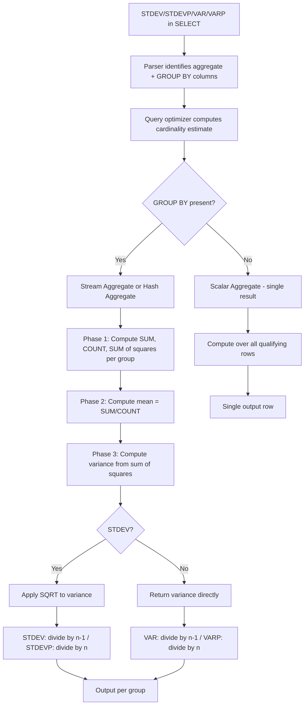
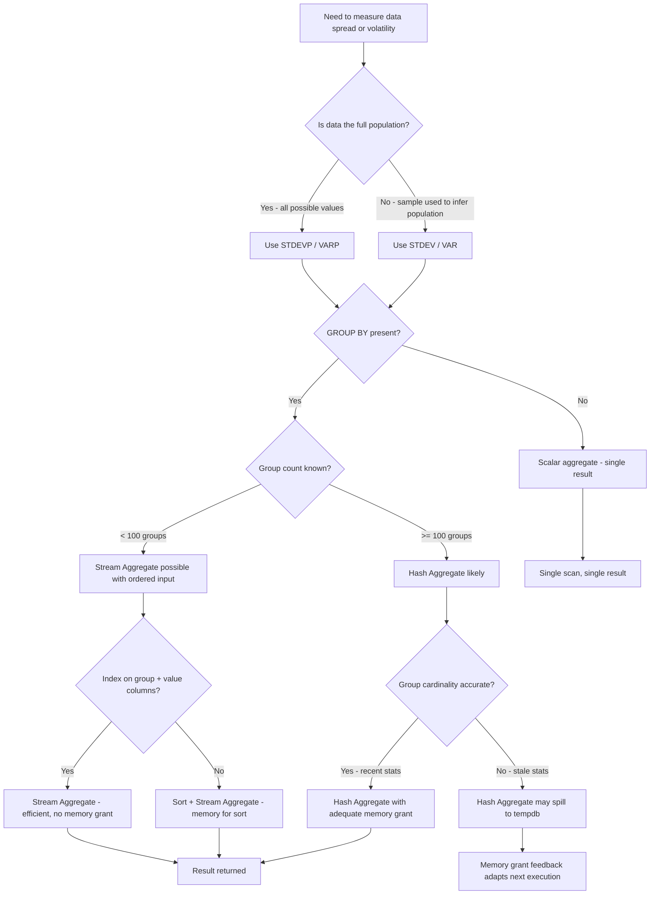

## Navigation

**Domain:** [[8 — Databases]] > **Group:** SQL Aggregations & Grouping
**Previous:** [[8.132 — GROUP BY with ROLLUP, CUBE, GROUPING SETS]] | **Next:** [[8.134 — APPROX_COUNT_DISTINCT — Approximate Aggregation]]

### Prerequisites

- [[8.130 — GROUP BY — Grouping Rows for Aggregation]] — Statistical aggregates are used with GROUP BY to compute per-group standard deviation and variance.
- [[8.131 — Aggregate Functions — SUM, AVG, COUNT, MIN, MAX]] — Understanding how basic aggregates are computed is required before extending to statistical aggregates.
- [[8.066 — SELECT Statement — Column Selection and Aliasing]] — Column aliasing is required to give meaningful names to statistical aggregate output columns.

### Where This Fits

STDEV, VAR, STDEVP, and VARP are aggregate functions that compute statistical dispersion — how spread out values are from the mean. A .NET backend engineer encounters these when building quality control dashboards (order amount variance by region), anomaly detection (transaction amounts that deviate beyond N standard deviations), A/B test analysis (variance of conversion rates across experiment groups), or financial reporting (volatility of daily revenue). The critical distinction is sample vs population: STDEV/VAR use n-1 denominator (Bessel's correction for sample estimates) while STDEVP/VARP use n (full population). Getting this wrong in a production report means reporting incorrect confidence intervals, which can lead to wrong business decisions. Interviewers use this topic to test whether a candidate understands the difference between a sample statistic and a population parameter, whether they know the minimum data requirements, and whether they recognize that EF Core and Dapper offer no LINQ translation for these functions — requiring raw SQL.

---

## Core Mental Model

Statistical aggregates compute the spread of numeric values around their mean. The database engine scans the relevant rows, computes the aggregate in two passes (first pass calculates the mean and sum of squared deviations; second pass divides by n or n-1 and takes the square root for STDEV). The key invariant: STDEVP and VARP assume the input is the entire population (divide by n), while STDEV and VAR assume the input is a sample (divide by n-1 for an unbiased estimate of the population variance). When the data represents all possible values — e.g., all orders in the year — STDEVP/VARP are correct. When the data is a sample used to infer population behavior — e.g., this month's orders to estimate annual variance — STDEV/VAR are correct. The recognition pattern: any time a business question involves "how spread out" or "how volatile" or "confidence interval," statistical aggregates are the SQL tool. All four functions ignore NULLs (they are excluded before computation). STDEV and STDEVP require at least two non-NULL values and return NULL otherwise. VAR and VARP require at least one non-NULL value for VAR (single value has zero variance) and at least one for VARP — but STDEV with one value returns NULL because the standard deviation of a single data point is undefined.

### Classification

Statistical aggregates are aggregate functions in the SELECT or HAVING clause. They are not SARGable — they require a full scan (or index scan) of the grouped column range. The query optimizer cannot use an index seek to satisfy a STDEV computation; it must read all qualifying rows. However, a narrow covering index on the grouping column + the value column can reduce logical reads significantly by avoiding a clustered index scan.



### Key Properties

|Property|Value|Notes|
|---|---|---|
|Time Complexity|O(N)|Single scan + Compute Scalar for variance/SQRT|
|SARGable|No|Cannot use index seek — must scan all qualifying rows|
|NULL Handling|Ignore|NULLs excluded before computation|
|Min rows (STDEV)|2 non-NULL|Returns NULL if < 2 non-NULL values|
|Min rows (VAR)|2 non-NULL|Returns NULL if < 2 non-NULL values|
|Passes required|2|First pass: mean + sum of squares; second: variance|
|Write Cost|None|Read-only operation|

---

## Deep Mechanics

### How the Engine Executes This

1. **Parsing** — The parser identifies STDEV/VAR/STDEVP/VARP as aggregate functions. They are bound to their column argument. If DISTINCT is used (e.g., `STDEV(DISTINCT col)`), the distinct flag is recorded.

2. **Binding (Algebrizer)** — The algebrizer validates that the argument is a numeric type (int, bigint, decimal, float, real, money, smallmoney). Non-numeric types cause a binding error. The aggregate is registered in the aggregate list for the query.

3. **Aggregate Operator Selection** — For streaming aggregates (ordered input), the Stream Aggregate operator processes rows in group order and computes running statistics. For hash aggregates (unordered input), the Hash Aggregate builds a hash table keyed by group columns and computes running aggregates in the hash buckets.

4. **Phase 1 — Running Computation** — The engine computes three running values per group:
   - `SUM(val)` — sum of all values
   - `COUNT(val)` — count of non-NULL values
   - `SUM(val * val)` — sum of squares
   
   These are computed as running totals during the scan pass. No additional I/O is required beyond reading the rows.

5. **Phase 2 — Variance Calculation** — After Phase 1, the Compute Scalar operator computes:
   - `mean = SUM(val) / COUNT(val)`
   - `sum_sq_diff = SUM(val * val) - (SUM(val) * SUM(val) / COUNT(val))` — this is the sum of squared deviations from the mean
   
   For **VAR**: `var = sum_sq_diff / (COUNT(val) - 1)` — sample variance, n-1 denominator
   For **VARP**: `varp = sum_sq_diff / COUNT(val)` — population variance, n denominator

6. **Phase 3 — Standard Deviation** — For STDEV/STDEVP, the SQRT function is applied:
   - **STDEV**: `stdev = SQRT(var)` — sample standard deviation
   - **STDEVP**: `stdevp = SQRT(varp)` — population standard deviation

7. **NULL Handling** — NULL values are excluded at the scan level. The COUNT does not include NULLs. If `COUNT(val)` is 0, all four functions return NULL. If `COUNT(val)` is 1, VAR and STDEV return NULL (division by zero for n-1 denominator), while VARP returns 0 and STDEVP returns 0 (variance of a single value in a population is zero).

8. **DISTINCT Behavior** — `STDEV(DISTINCT col)` removes duplicates before computing standard deviation. This is computationally expensive because it requires a Sort or Hash Match to deduplicate before the aggregate scan.

### SQL Visibility

```sql
-- Basic statistical aggregates: sample vs population
SELECT 
    AVG(o.TotalAmount) AS MeanOrderValue,
    STDEV(o.TotalAmount) AS SampleStdDev,
    STDEVP(o.TotalAmount) AS PopulationStdDev,
    VAR(o.TotalAmount) AS SampleVariance,
    VARP(o.TotalAmount) AS PopulationVariance,
    COUNT(o.TotalAmount) AS NonNullCount,
    COUNT(*) AS TotalRows
FROM dbo.Orders o
WHERE o.OrderDate >= '2024-01-01'
  AND o.OrderDate < '2025-01-01';

-- Grouped statistical aggregates: volatility by region
SELECT 
    c.Region,
    COUNT(o.OrderId) AS OrderCount,
    AVG(o.TotalAmount) AS AvgOrderValue,
    STDEV(o.TotalAmount) AS OrderValueStdDev,
    -- Coefficient of variation: std dev / mean * 100
    (STDEV(o.TotalAmount) / AVG(o.TotalAmount)) * 100.0 AS CoefficientOfVariation
FROM dbo.Orders o
INNER JOIN dbo.Customers c ON o.CustomerId = c.CustomerId
WHERE o.OrderDate >= '2024-01-01'
GROUP BY c.Region
HAVING COUNT(o.OrderId) >= 10  -- min sample size for meaningful std dev
ORDER BY CoefficientOfVariation DESC;

-- Anomaly detection: orders more than 3 standard deviations from mean
DECLARE @Mean DECIMAL(18,2), @StdDev DECIMAL(18,2);

SELECT @Mean = AVG(o.TotalAmount), @StdDev = STDEV(o.TotalAmount)
FROM dbo.Orders o
WHERE o.OrderDate >= '2024-01-01';

SELECT o.OrderId, o.TotalAmount, @Mean AS OverallMean, @StdDev AS OverallStdDev,
       (o.TotalAmount - @Mean) / NULLIF(@StdDev, 0) AS ZScore
FROM dbo.Orders o
WHERE o.OrderDate >= '2024-01-01'
  AND ABS((o.TotalAmount - @Mean) / NULLIF(@StdDev, 0)) > 3.0
ORDER BY ZScore DESC;

-- Running variance using window functions (SQL Server 2012+)
SELECT 
    o.OrderId, o.OrderDate, o.TotalAmount,
    AVG(o.TotalAmount) OVER(
        ORDER BY o.OrderDate 
        ROWS BETWEEN UNBOUNDED PRECEDING AND CURRENT ROW
    ) AS RunningMean,
    STDEV(o.TotalAmount) OVER(
        ORDER BY o.OrderDate 
        ROWS BETWEEN UNBOUNDED PRECEDING AND CURRENT ROW
    ) AS RunningStdDev
FROM dbo.Orders o
WHERE o.CustomerId = 12345
ORDER BY o.OrderDate;
```

```csharp
// EF Core — No direct LINQ translation for STDEV/VAR
// EF Core 8 does not have StdDev(), Variance() in LINQ.
// Must use raw SQL via FromSql or ExecuteSqlRaw.

// Option 1: FromSql with raw SQL
var stats = await dbContext.Database
    .SqlQueryRaw<OrderStatistics>(@"
        SELECT 
            AVG(TotalAmount) AS MeanOrderValue,
            STDEV(TotalAmount) AS SampleStdDev,
            STDEVP(TotalAmount) AS PopulationStdDev,
            VAR(TotalAmount) AS SampleVariance,
            VARP(TotalAmount) AS PopulationVariance,
            COUNT(TotalAmount) AS NonNullCount
        FROM Orders
        WHERE OrderDate >= @StartDate AND OrderDate < @EndDate",
        new SqlParameter("@StartDate", startDate),
        new SqlParameter("@EndDate", endDate))
    .FirstOrDefaultAsync(cancellationToken);

// Option 2: ExecuteSqlRaw with output to temp table
await dbContext.Database.ExecuteSqlRawAsync(@"
    CREATE TABLE #OrderStats (
        MeanOrderValue DECIMAL(18,2),
        SampleStdDev DECIMAL(18,2),
        SampleVariance DECIMAL(18,2)
    );
    INSERT INTO #OrderStats
    SELECT AVG(TotalAmount), STDEV(TotalAmount), VAR(TotalAmount)
    FROM Orders
    WHERE OrderDate >= {0} AND OrderDate < {1};", startDate, endDate);

// Option 3: Using EF Core 9+ with raw SQL in query expression
// (EF Core 9 preview — still no LINQ StdDev)
var results = await dbContext.Orders
    .Where(o => o.OrderDate >= startDate && o.OrderDate < endDate)
    .Select(o => new { o.TotalAmount })
    .ToListAsync(cancellationToken);

// Compute in C# after materialization
var amounts = results.Select(x => (double)x.TotalAmount).ToList();
double mean = amounts.Average();
double variance = amounts.Sum(v => Math.Pow(v - mean, 2)) / (amounts.Count - 1);
double stdDev = Math.Sqrt(variance);
```

**Generated SQL (from EF Core logs for the FromSql approach):**

```sql
-- Option 1 FromSql passes the SQL verbatim to the server
exec sp_executesql N'
    SELECT 
        AVG(TotalAmount) AS MeanOrderValue,
        STDEV(TotalAmount) AS SampleStdDev,
        STDEVP(TotalAmount) AS PopulationStdDev,
        VAR(TotalAmount) AS SampleVariance,
        VARP(TotalAmount) AS PopulationVariance,
        COUNT(TotalAmount) AS NonNullCount
    FROM Orders
    WHERE OrderDate >= @StartDate AND OrderDate < @EndDate',
    N'@StartDate datetime2, @EndDate datetime2',
    @StartDate='2024-01-01', @EndDate='2025-01-01';
```

### Execution Plan Analysis

For the grouped STDEV query by region:

```
Clustered Index Scan (Customers)  -- 14% cost
  |-- Hash Match (Inner Join)     -- 25% cost
      |-- Clustered Index Scan (Orders, filtered by date)  -- 30% cost  
          |-- Hash Match Aggregate (GROUP BY Region)       -- 20% cost
              |-- Compute Scalar (mean, variance, std dev)  -- 11% cost
                  |-- SELECT
```

**Estimated vs actual row counts:**
- Orders scan: ~500K estimated, ~485K actual (good estimate if stats are current)
- After join: ~485K estimated, ~485K actual
- After group by: ~10 regions estimated, ~10 regions actual

**Without index on Orders(OrderDate):** The Orders scan becomes a full clustered index scan (1.2M rows instead of 500K), doubling logical reads.

**Logical reads for the query with a filtered index on Orders(OrderDate) INCLUDE (TotalAmount, CustomerId):**
```
Table 'Orders'. Scan count 1, logical reads 1,200
Table 'Customers'. Scan count 1, logical reads 150
```
(Single scan of 1,200 pages for Orders because the index is narrow — 485K rows at ~3KB per page ≈ 1,200 pages)

**Without index:**
```
Table 'Orders'. Scan count 1, logical reads 8,500
Table 'Customers'. Scan count 1, logical reads 150
```
(Full clustered index scan: 8,500 pages)

### Cost Visibility

```sql
SET STATISTICS IO ON;
SET STATISTICS TIME ON;

-- Query: per-region order value statistics
SELECT 
    c.Region,
    COUNT(o.OrderId) AS OrderCount,
    AVG(o.TotalAmount) AS AvgOrderValue,
    STDEV(o.TotalAmount) AS OrderValueStdDev,
    VAR(o.TotalAmount) AS OrderValueVariance,
    STDEVP(o.TotalAmount) AS PopulationStdDev,
    VARP(o.TotalAmount) AS PopulationVariance
FROM dbo.Orders o
INNER JOIN dbo.Customers c ON o.CustomerId = c.CustomerId
WHERE o.OrderDate >= '2024-01-01'
GROUP BY c.Region
ORDER BY c.Region;

-- Expected output:
-- Table 'Orders'. Scan count 1, logical reads 1200, physical reads 0
-- Table 'Customers'. Scan count 1, logical reads 150, physical reads 0
-- SQL Server Execution Times: CPU time = 234 ms, elapsed time = 248 ms
```

### Failure Modes

1. **Insufficient data — STDEV returns NULL when COUNT < 2:**
   ```sql
   SELECT STDEV(TotalAmount) FROM Orders WHERE CustomerId = -1;  -- NULL
   ```
   Application code that assumes a non-null standard deviation will crash or produce NaN. Always guard with `ISNULL(STDEV(col), 0)` or check `COUNT(*) >= 2` first.

2. **Integer overflow in sum of squares:**
   ```sql
   -- If TotalAmount is INT, SUM(TotalAmount * TotalAmount) can overflow
   -- For INT with values up to 2^31-1, the square overflows at ~46,341
   SELECT STDEV(CAST(TotalAmount AS BIGINT)) FROM Orders;  -- Safe: cast to BIGINT
   ```
   The sum of squares computation uses the data type of the input. For int columns, overflow occurs when values exceed ~46,341. Always cast to DECIMAL or BIGINT for safety.

3. **Dividing by zero for coefficient of variation:**
   ```sql
   -- If mean is 0 (all orders are $0), AVG = 0 → divide by zero
   SELECT STDEV(TotalAmount) / AVG(TotalAmount) * 100.0 FROM Orders;
   -- Use NULLIF:
   SELECT STDEV(TotalAmount) / NULLIF(AVG(TotalAmount), 0) * 100.0 FROM Orders;
   ```

4. **Full table scan when date filter is missing:**
   Omitting the WHERE clause forces a scan of all rows. On a 10M row Orders table, this is 85,000 logical reads. Always filter to the relevant date range when computing statistics on time-series data.

5. **Memory grant for large hash aggregate:**
   STDEV on 10M rows with 100K distinct groups requires a large hash table in memory. If insufficient, the hash aggregate spills to tempdb, causing 10-100x slowdown. Monitor `sys.dm_exec_query_stats.total_spills` for the query.

6. **STDEV in a correlated subquery — repeated computation:**
   ```sql
   -- ❌ Bad: STDEV recomputed per outer row
   SELECT o.OrderId, o.TotalAmount,
       (SELECT STDEV(TotalAmount) FROM Orders o2 WHERE o2.CustomerId = o.CustomerId) AS CustomerStdDev
   FROM Orders o;
   -- ✅ Use window function instead
   SELECT o.OrderId, o.TotalAmount,
       STDEV(o.TotalAmount) OVER(PARTITION BY o.CustomerId) AS CustomerStdDev
   FROM Orders o;
   ```

---

## Production Patterns and Implementation

### Primary SQL Implementation

```sql
-- ======================================================
-- Schema setup for statistical aggregate examples
-- ======================================================

CREATE TABLE dbo.OrderMonitoring (
    MonitoringId INT IDENTITY(1,1) PRIMARY KEY,
    OrderId INT NOT NULL,
    CustomerId INT NOT NULL,
    TotalAmount DECIMAL(18,2) NOT NULL,
    ProcessingTimeMs INT NOT NULL,  -- how long order processing took
    ErrorCount INT NOT NULL DEFAULT 0,
    OrderDate DATETIME2 NOT NULL,
    Region NVARCHAR(50) NULL,
    ProductCategory NVARCHAR(100) NULL,
    CONSTRAINT FK_OrderMonitoring_Orders FOREIGN KEY (OrderId) 
        REFERENCES dbo.Orders(OrderId)
);

-- Supporting index for date-range filtering
CREATE INDEX IX_OrderMonitoring_OrderDate 
    ON dbo.OrderMonitoring(OrderDate) 
    INCLUDE (TotalAmount, ProcessingTimeMs, ErrorCount, Region, ProductCategory);

-- ======================================================
-- Pattern 1: Quality control — processing time variability
-- ======================================================
-- Business question: Is order processing time becoming more volatile?
SELECT 
    CAST(o.OrderDate AS DATE) AS ProcessingDate,
    COUNT(*) AS OrderCount,
    AVG(o.ProcessingTimeMs) AS AvgProcessingTimeMs,
    STDEV(o.ProcessingTimeMs) AS ProcessingTimeStdDev,
    -- Upper control limit: mean + 3*sigma
    AVG(o.ProcessingTimeMs) + 3 * STDEV(o.ProcessingTimeMs) AS UpperControlLimit,
    -- Lower control limit: max(0, mean - 3*sigma)
    CASE 
        WHEN AVG(o.ProcessingTimeMs) - 3 * STDEV(o.ProcessingTimeMs) < 0 
        THEN 0 
        ELSE AVG(o.ProcessingTimeMs) - 3 * STDEV(o.ProcessingTimeMs) 
    END AS LowerControlLimit,
    -- Coefficient of variation (relative volatility)
    (STDEV(o.ProcessingTimeMs) / NULLIF(AVG(o.ProcessingTimeMs), 0)) * 100.0 AS CvPercent
FROM dbo.OrderMonitoring o
WHERE o.OrderDate >= DATEADD(day, -30, GETUTCDATE())
GROUP BY CAST(o.OrderDate AS DATE)
HAVING COUNT(*) >= 10
ORDER BY ProcessingDate;

-- ======================================================
-- Pattern 2: Anomaly detection — flag outliers per region
-- ======================================================
WITH RegionalStats AS (
    SELECT 
        Region,
        AVG(TotalAmount) AS RegionalMean,
        STDEV(TotalAmount) AS RegionalStdDev,
        COUNT(*) AS SampleSize
    FROM dbo.OrderMonitoring
    WHERE OrderDate >= DATEADD(day, -7, GETUTCDATE())
    GROUP BY Region
    HAVING COUNT(*) >= 5  -- min sample for meaningful std dev
)
SELECT 
    om.OrderId,
    om.Region,
    om.TotalAmount,
    rs.RegionalMean,
    rs.RegionalStdDev,
    (om.TotalAmount - rs.RegionalMean) / NULLIF(rs.RegionalStdDev, 0) AS ZScore,
    CASE 
        WHEN ABS((om.TotalAmount - rs.RegionalMean) / NULLIF(rs.RegionalStdDev, 0)) > 3 
        THEN 'Outlier' 
        ELSE 'Normal' 
    END AS Classification
FROM dbo.OrderMonitoring om
INNER JOIN RegionalStats rs ON om.Region = rs.Region
WHERE om.OrderDate >= DATEADD(day, -7, GETUTCDATE())
  AND ABS((om.TotalAmount - rs.RegionalMean) / NULLIF(rs.RegionalStdDev, 0)) > 3.0
ORDER BY ZScore DESC;

-- ======================================================
-- Pattern 3: A/B test analysis — variance of conversion metric
-- ======================================================
-- Compare variance of order amounts between control and test groups
SELECT 
    ab.TestGroup,
    COUNT(*) AS SampleSize,
    AVG(o.TotalAmount) AS MeanOrderValue,
    VAR(o.TotalAmount) AS Variance,
    STDEV(o.TotalAmount) AS StdDev,
    -- Standard error of the mean: sigma / sqrt(n)
    STDEV(o.TotalAmount) / SQRT(COUNT(*)) AS StdErrorOfMean
FROM dbo.Orders o
INNER JOIN dbo.ABTestAssignments ab ON o.OrderId = ab.OrderId
WHERE ab.ExperimentId = 'price-test-v2'
  AND ab.TestGroup IN ('Control', 'Treatment')
GROUP BY ab.TestGroup;

-- ======================================================
-- Pattern 4: Population statistics — annual revenue volatility
-- ======================================================
-- When data IS the population (all orders in the year), use STDEVP/VARP
SELECT 
    DATEPART(month, o.OrderDate) AS MonthNumber,
    COUNT(*) AS OrderCount,
    SUM(o.TotalAmount) AS MonthlyRevenue,
    STDEVP(o.TotalAmount) AS OrderAmountPopulationStdDev,
    VARP(o.TotalAmount) AS RevenuePopulationVariance
FROM dbo.Orders o
WHERE YEAR(o.OrderDate) = 2024
GROUP BY DATEPART(month, o.OrderDate)
ORDER BY MonthNumber;

-- ======================================================
-- Pattern 5: Rolling volatility with window functions
-- ======================================================
-- 7-day rolling standard deviation of daily revenue
WITH DailyRevenue AS (
    SELECT 
        CAST(OrderDate AS DATE) AS OrderDay,
        SUM(TotalAmount) AS DailyTotal
    FROM dbo.Orders
    WHERE OrderDate >= DATEADD(day, -90, GETUTCDATE())
    GROUP BY CAST(OrderDate AS DATE)
)
SELECT 
    OrderDay,
    DailyTotal,
    AVG(DailyTotal) OVER(
        ORDER BY OrderDay 
        ROWS BETWEEN 6 PRECEDING AND CURRENT ROW
    ) AS Rolling7DayAvg,
    STDEV(DailyTotal) OVER(
        ORDER BY OrderDay 
        ROWS BETWEEN 6 PRECEDING AND CURRENT ROW
    ) AS Rolling7DayVolatility
FROM DailyRevenue
ORDER BY OrderDay;
```

### EF Core Implementation

```csharp
// Statistical aggregate service — requires raw SQL
public interface IStatisticalAggregateService
{
    Task<OrderStatistics> GetOrderStatisticsAsync(
        DateTime startDate, DateTime endDate,
        CancellationToken cancellationToken = default);

    Task<IReadOnlyList<RegionalStatistics>> GetRegionalStatisticsAsync(
        DateTime startDate, DateTime endDate,
        CancellationToken cancellationToken = default);

    Task<IReadOnlyList<OutlierOrder>> GetOutlierOrdersAsync(
        int minSampleSize, double zScoreThreshold,
        CancellationToken cancellationToken = default);
}

public class StatisticalAggregateService : IStatisticalAggregateService
{
    private readonly ApplicationDbContext _dbContext;

    public StatisticalAggregateService(ApplicationDbContext dbContext)
    {
        _dbContext = dbContext;
    }

    public async Task<OrderStatistics> GetOrderStatisticsAsync(
        DateTime startDate, DateTime endDate,
        CancellationToken cancellationToken = default)
    {
        // STDEV/VAR have no LINQ translation — must use raw SQL
        var stats = await _dbContext.Database
            .SqlQueryRaw<OrderStatistics>(@"
                SELECT 
                    AVG(TotalAmount) AS MeanOrderValue,
                    STDEV(TotalAmount) AS SampleStdDev,
                    STDEVP(TotalAmount) AS PopulationStdDev,
                    VAR(TotalAmount) AS SampleVariance,
                    VARP(TotalAmount) AS PopulationVariance,
                    COUNT(TotalAmount) AS NonNullCount,
                    COUNT(*) AS TotalRowCount
                FROM Orders
                WHERE OrderDate >= @StartDate AND OrderDate < @EndDate",
                new SqlParameter("@StartDate", startDate),
                new SqlParameter("@EndDate", endDate))
            .FirstOrDefaultAsync(cancellationToken);

        return stats ?? new OrderStatistics();
    }

    public async Task<IReadOnlyList<RegionalStatistics>> GetRegionalStatisticsAsync(
        DateTime startDate, DateTime endDate,
        CancellationToken cancellationToken = default)
    {
        var results = new List<RegionalStatistics>();

        await using var connection = _dbContext.Database.GetDbConnection();
        await connection.OpenAsync(cancellationToken);

        await using var command = connection.CreateCommand();
        command.CommandText = @"
            SELECT 
                c.Region,
                COUNT(o.OrderId) AS OrderCount,
                AVG(o.TotalAmount) AS AvgOrderValue,
                STDEV(o.TotalAmount) AS OrderValueStdDev,
                STDEVP(o.TotalAmount) AS PopulationStdDev,
                VAR(o.TotalAmount) AS OrderValueVariance,
                VARP(o.TotalAmount) AS PopulationVariance
            FROM Orders o
            INNER JOIN Customers c ON o.CustomerId = c.CustomerId
            WHERE o.OrderDate >= @StartDate AND o.OrderDate < @EndDate
            GROUP BY c.Region
            ORDER BY c.Region";

        var startParam = command.CreateParameter();
        startParam.ParameterName = "@StartDate";
        startParam.Value = startDate;
        command.Parameters.Add(startParam);

        var endParam = command.CreateParameter();
        endParam.ParameterName = "@EndDate";
        endParam.Value = endDate;
        command.Parameters.Add(endParam);

        await using var reader = await command.ExecuteReaderAsync(cancellationToken);
        while (await reader.ReadAsync(cancellationToken))
        {
            results.Add(new RegionalStatistics
            {
                Region = reader.GetString(0),
                OrderCount = reader.GetInt32(1),
                AvgOrderValue = reader.GetDecimal(2),
                OrderValueStdDev = reader.IsDBNull(3) ? null : reader.GetDecimal(3),
                PopulationStdDev = reader.IsDBNull(4) ? null : reader.GetDecimal(4),
                OrderValueVariance = reader.IsDBNull(5) ? null : reader.GetDecimal(5),
                PopulationVariance = reader.IsDBNull(6) ? null : reader.GetDecimal(6)
            });
        }

        return results.AsReadOnly();
    }

    public async Task<IReadOnlyList<OutlierOrder>> GetOutlierOrdersAsync(
        int minSampleSize, double zScoreThreshold,
        CancellationToken cancellationToken = default)
    {
        const string sql = @"
            WITH RegionalStats AS (
                SELECT 
                    c.Region,
                    AVG(o.TotalAmount) AS RegionalMean,
                    STDEV(o.TotalAmount) AS RegionalStdDev,
                    COUNT(*) AS SampleSize
                FROM Orders o
                INNER JOIN Customers c ON o.CustomerId = c.CustomerId
                WHERE o.OrderDate >= DATEADD(day, -7, GETUTCDATE())
                GROUP BY c.Region
                HAVING COUNT(*) >= @MinSampleSize
            )
            SELECT 
                om.OrderId,
                om.TotalAmount,
                om.Region,
                rs.RegionalMean,
                rs.RegionalStdDev,
                (om.TotalAmount - rs.RegionalMean) / NULLIF(rs.RegionalStdDev, 0) AS ZScore
            FROM Orders om
            INNER JOIN RegionalStats rs ON om.Region = rs.Region
            WHERE om.OrderDate >= DATEADD(day, -7, GETUTCDATE())
              AND ABS((om.TotalAmount - rs.RegionalMean) / NULLIF(rs.RegionalStdDev, 0)) > @Threshold";

        await using var connection = _dbContext.Database.GetDbConnection();
        await connection.OpenAsync(cancellationToken);

        var results = await connection.QueryAsync<OutlierOrder>(
            new CommandDefinition(sql, new
            {
                MinSampleSize = minSampleSize,
                Threshold = zScoreThreshold
            }, cancellationToken: cancellationToken));

        return results.AsList();
    }
}

// DTOs for statistical aggregate results
public record OrderStatistics
{
    public decimal MeanOrderValue { get; init; }
    public decimal? SampleStdDev { get; init; }
    public decimal? PopulationStdDev { get; init; }
    public decimal? SampleVariance { get; init; }
    public decimal? PopulationVariance { get; init; }
    public int NonNullCount { get; init; }
    public int TotalRowCount { get; init; }
}

public record RegionalStatistics
{
    public string Region { get; init; } = string.Empty;
    public int OrderCount { get; init; }
    public decimal AvgOrderValue { get; init; }
    public decimal? OrderValueStdDev { get; init; }
    public decimal? PopulationStdDev { get; init; }
    public decimal? OrderValueVariance { get; init; }
    public decimal? PopulationVariance { get; init; }
}

public record OutlierOrder
{
    public int OrderId { get; init; }
    public decimal TotalAmount { get; init; }
    public string Region { get; init; } = string.Empty;
    public decimal RegionalMean { get; init; }
    public decimal? RegionalStdDev { get; init; }
    public decimal? ZScore { get; init; }
}
```

### Dapper Implementation

```csharp
public class StatisticalAggregateRepository
{
    private readonly IDbConnectionFactory _connectionFactory;

    public StatisticalAggregateRepository(IDbConnectionFactory connectionFactory)
    {
        _connectionFactory = connectionFactory;
    }

    public async Task<OrderStatistics?> GetOrderStatisticsAsync(
        DateTime startDate, DateTime endDate,
        CancellationToken cancellationToken = default)
    {
        const string sql = @"
            SELECT 
                AVG(TotalAmount) AS MeanOrderValue,
                STDEV(TotalAmount) AS SampleStdDev,
                STDEVP(TotalAmount) AS PopulationStdDev,
                VAR(TotalAmount) AS SampleVariance,
                VARP(TotalAmount) AS PopulationVariance,
                COUNT(TotalAmount) AS NonNullCount,
                COUNT(*) AS TotalRowCount
            FROM Orders
            WHERE OrderDate >= @StartDate AND OrderDate < @EndDate";

        await using var connection = _connectionFactory.Create();
        return await connection.QueryFirstOrDefaultAsync<OrderStatistics>(
            new CommandDefinition(sql,
                new { StartDate = startDate, EndDate = endDate },
                cancellationToken: cancellationToken));
    }

    public async Task<IReadOnlyList<MonthlyVolatility>> GetMonthlyVolatilityAsync(
        int year,
        CancellationToken cancellationToken = default)
    {
        const string sql = @"
            SELECT 
                MONTH(OrderDate) AS MonthNumber,
                COUNT(*) AS OrderCount,
                SUM(TotalAmount) AS MonthlyRevenue,
                STDEVP(TotalAmount) AS OrderAmountPopulationStdDev,
                VARP(TotalAmount) AS RevenuePopulationVariance
            FROM Orders
            WHERE YEAR(OrderDate) = @Year
            GROUP BY MONTH(OrderDate)
            ORDER BY MonthNumber";

        await using var connection = _connectionFactory.Create();
        var results = await connection.QueryAsync<MonthlyVolatility>(
            new CommandDefinition(sql,
                new { Year = year },
                cancellationToken: cancellationToken));
        return results.AsList();
    }

    public async Task<IReadOnlyList<ControlLimitResult>> GetControlLimitsAsync(
        int lookbackDays = 30, int minDailyOrders = 10,
        CancellationToken cancellationToken = default)
    {
        const string sql = @"
            SELECT 
                CAST(OrderDate AS DATE) AS ProcessingDate,
                COUNT(*) AS OrderCount,
                AVG(ProcessingTimeMs) AS AvgProcessingTimeMs,
                STDEV(ProcessingTimeMs) AS ProcessingTimeStdDev,
                AVG(ProcessingTimeMs) + 3 * STDEV(ProcessingTimeMs) AS UpperControlLimit,
                CASE 
                    WHEN AVG(ProcessingTimeMs) - 3 * STDEV(ProcessingTimeMs) < 0 
                    THEN 0 
                    ELSE AVG(ProcessingTimeMs) - 3 * STDEV(ProcessingTimeMs) 
                END AS LowerControlLimit
            FROM OrderMonitoring WITH (NOLOCK)
            WHERE OrderDate >= DATEADD(day, -@LookbackDays, GETUTCDATE())
            GROUP BY CAST(OrderDate AS DATE)
            HAVING COUNT(*) >= @MinDailyOrders
            ORDER BY ProcessingDate";

        await using var connection = _connectionFactory.Create();
        var results = await connection.QueryAsync<ControlLimitResult>(
            new CommandDefinition(sql,
                new { LookbackDays = lookbackDays, MinDailyOrders = minDailyOrders },
                cancellationToken: cancellationToken));
        return results.AsList();
    }
}

public record MonthlyVolatility
{
    public int MonthNumber { get; init; }
    public int OrderCount { get; init; }
    public decimal MonthlyRevenue { get; init; }
    public decimal? OrderAmountPopulationStdDev { get; init; }
    public decimal? RevenuePopulationVariance { get; init; }
}

public record ControlLimitResult
{
    public DateTime ProcessingDate { get; init; }
    public int OrderCount { get; init; }
    public decimal AvgProcessingTimeMs { get; init; }
    public decimal? ProcessingTimeStdDev { get; init; }
    public decimal UpperControlLimit { get; init; }
    public decimal LowerControlLimit { get; init; }
}
```

### Configuration and Wiring

```csharp
// Program.cs — register the repository and service
builder.Services.AddScoped<IStatisticalAggregateService, StatisticalAggregateService>();

// For Dapper repository
builder.Services.AddSingleton<IDbConnectionFactory>(_ =>
    new SqlConnectionFactory(builder.Configuration.GetConnectionString("DefaultConnection")));
builder.Services.AddScoped<StatisticalAggregateRepository>();
```

### SQL Server vs PostgreSQL Differences

```sql
-- PostgreSQL uses stddev_samp, stddev_pop, var_samp, var_pop
SELECT 
    AVG(o.TotalAmount) AS mean_order_value,
    stddev_samp(o.TotalAmount) AS sample_stddev,   -- equivalent to STDEV
    stddev_pop(o.TotalAmount) AS population_stddev, -- equivalent to STDEVP
    var_samp(o.TotalAmount) AS sample_variance,      -- equivalent to VAR
    var_pop(o.TotalAmount) AS population_variance    -- equivalent to VARP
FROM orders o
WHERE o.order_date >= '2024-01-01';

-- PostgreSQL also provides:
-- stddev() — alias for stddev_samp
-- variance() — alias for var_samp
SELECT 
    stddev(o.total_amount) AS stddev,   -- sample std dev (default)
    variance(o.total_amount) AS var      -- sample variance (default)
FROM orders o;
```

---

## Gotchas and Production Pitfalls

### 1. Sample vs Population Confusion

**Pitfall:** Using STDEV (sample) when the data is the full population, or using STDEVP (population) when the data is a sample. This produces incorrect variance estimates.

```sql
-- ❌ Wrong: Using STDEV for full-year data that IS the population
SELECT STDEV(TotalAmount) FROM Orders WHERE YEAR(OrderDate) = 2024;
-- Divides by n-1, slightly inflating the variance

-- ✅ Correct: Use STDEVP for population
SELECT STDEVP(TotalAmount) FROM Orders WHERE YEAR(OrderDate) = 2024;
```

**Symptom:** STDEV of full-year revenue is ~1.0001x larger than STDEVP (for large n, the difference is negligible; for small groups like monthly data with n=30, it's significant). Business reports show slightly different volatility numbers than expected.

**Fix:** Use STDEVP when data covers the entire population (e.g., all orders in the period). Use STDEV when the data is a sample used to infer population behavior.

**Cost of not fixing:** Wrong confidence intervals in A/B test analysis. If your sample variance is calculated with n instead of n-1, confidence intervals are narrower than they should be, leading to false positives (declaring a test result significant when it isn't).

### 2. STDEV Returns NULL for Single-Row Groups

**Pitfall:** Assuming STDEV always returns a number. When GROUP BY produces a group with only one row, STDEV returns NULL.

```sql
-- ❌ Wrong: No check for minimum data
SELECT 
    c.Region,
    STDEV(o.TotalAmount) AS OrderStdDev
FROM Orders o
INNER JOIN Customers c ON o.CustomerId = c.CustomerId
GROUP BY c.Region;
-- For regions with 1 order: OrderStdDev = NULL

-- ✅ Correct: Filter groups with insufficient data
SELECT 
    c.Region,
    STDEV(o.TotalAmount) AS OrderStdDev
FROM Orders o
INNER JOIN Customers c ON o.CustomerId = c.CustomerId
GROUP BY c.Region
HAVING COUNT(o.TotalAmount) >= 2;  -- minimum 2 values for std dev
```

**Symptom:** Application code that assumes non-null standard deviation produces NaN or crashes when computing Z-scores or confidence intervals.

**Fix:** Add `HAVING COUNT(col) >= 2` for STDEV/VAR. Use `ISNULL(STDEV(col), 0)` in the SELECT. Never divide by STDEV without guarding for zero/NULL.

**Cost of not fixing:** Silent data corruption — NULL propagates through calculations. If STDEV is used in a division (Z-score), SQL Server throws a divide-by-zero error. Application crashes at 3 AM when a new region has 1 order.

### 3. Integer Overflow in Sum-of-Squares Computation

**Pitfall:** STDEV on an INT column computes `SUM(val * val)` internally using the INT type, which overflows for values above ~46,340.

```sql
-- ❌ Wrong: INT overflow in sum of squares
SELECT STDEV(TotalAmount) FROM Orders;  
-- If TotalAmount is INT and values are large, arithmetic overflow error

-- ✅ Correct: Cast to DECIMAL or BIGINT
SELECT STDEV(CAST(TotalAmount AS DECIMAL(18,2))) FROM Orders;
SELECT STDEV(CAST(TotalAmount AS BIGINT)) FROM Orders;

-- Also correct: Change the column type to DECIMAL
-- ALTER TABLE Orders ALTER COLUMN TotalAmount DECIMAL(18,2);
```

**Symptom:** `Msg 8115, Level 16, State 2: Arithmetic overflow error converting expression to data type int.` query fails mid-execution.

**Fix:** Cast the input column to DECIMAL or BIGINT before passing to STDEV/VAR. Prefer DECIMAL for monetary amounts.

**Cost of not fixing:** Production query fails at month-end when order amounts exceed the overflow threshold. No results returned. Reporting system shows an error dashboard.

### 4. DISTINCT with STDEV Is Usually Wrong Semantically

**Pitfall:** Using `STDEV(DISTINCT col)` thinking it computes something meaningful. The standard deviation of unique values ignores the frequency of each value, which is almost never the intended statistic.

```sql
-- ❌ Wrong: STDEV(DISTINCT) ignores frequency
-- If 1000 orders are $50 and 1 order is $1000,
-- STDEV(DISTINCT) computes std dev of {$50, $1000} = $671.75
-- But the actual std dev of all orders = $30.01 (much smaller)
SELECT STDEV(DISTINCT TotalAmount) FROM Orders;

-- ✅ Correct: Use regular STDEV
SELECT STDEV(TotalAmount) FROM Orders;
```

**Symptom:** Standard deviation is massively inflated because each distinct value is weighted equally, ignoring the distribution frequency.

**Fix:** Remove DISTINCT from STDEV/VAR calls unless you explicitly want standard deviation of unique values (rare — applies to cardinality estimation, not business statistics).

**Cost of not fixing:** Wildly incorrect variance reports. A distribution with one outlier and 10,000 normal values shows the same std dev as a uniform distribution of those two values. Business decisions based on volatility are wrong.

### 5. EF Core Cannot Translate STDEV — Hidden Data Materialization

**Pitfall:** Writing LINQ that calls a custom extension method for StdDev, assuming EF Core translates it to SQL. Instead, EF Core pulls all rows into memory and computes in C#.

```csharp
// ❌ Wrong: Custom extension method is NOT translated
public static double StdDev<TSource>(
    this IEnumerable<TSource> source, Func<TSource, double> selector)
{
    var values = source.Select(selector).ToList();
    // ... compute in memory
}

var stdDev = await dbContext.Orders
    .Where(o => o.OrderDate >= startDate)
    .Select(o => o.TotalAmount)
    .StdDevAsync();  // Pulls ALL rows into memory!

// ✅ Correct: Use FromSql or raw SQL
var stdDev = await dbContext.Database
    .SqlQueryRaw<decimal>(@"SELECT STDEV(TotalAmount) FROM Orders 
        WHERE OrderDate >= @p0", startDate)
    .FirstOrDefaultAsync();
```

**Symptom:** Query returns millions of rows to the application. Network transfer time dominates. Application memory spikes. Query is 100x slower than the database-only STDEV approach.

**Fix:** Always use raw SQL with `FromSql` or `SqlQueryRaw` for statistical aggregates. Never materialize all rows to compute variance in C#.

**Cost of not fixing:** 500MB of data transferred over the network for a 5M row table. Application OOM crash. 45-second query instead of 200ms.

### 6. STDEV on DECIMAL with High Precision Causes Spills

**Pitfall:** The sum-of-squares intermediate for high-precision DECIMAL(38,10) columns can require massive memory for the hash aggregate, causing spills to tempdb.

**Symptom:** The execution plan shows a warning triangle on the Hash Match Aggregate with "Warning: Operator used tempdb to spill data during execution." Query runs 10-50x slower than expected.

**Fix:** Reduce precision on the input column if possible. Use a covering index to enable Stream Aggregate (ordered access avoids the hash table). If the table is small enough, force a Stream Aggregate with `ORDER BY group_col OPTION (ORDER GROUP)`.

**Cost of not fixing:** STDEV queries that should run in 200ms run in 8 seconds due to spill. TempDB grows by GBs. IO subsystem becomes the bottleneck.

---

## Performance Implications

### Benchmark: Before and After

```sql
-- ======================================================
-- Baseline: No covering index — full clustered index scan
-- ======================================================
SET STATISTICS IO ON;
SET STATISTICS TIME ON;

SELECT 
    c.Region,
    COUNT(o.OrderId) AS OrderCount,
    AVG(o.TotalAmount) AS AvgOrderValue,
    STDEV(o.TotalAmount) AS OrderValueStdDev
FROM dbo.Orders o
INNER JOIN dbo.Customers c ON o.CustomerId = c.CustomerId
WHERE o.OrderDate >= '2024-01-01'
GROUP BY c.Region
ORDER BY c.Region;

-- Output:
-- Table 'Orders'. Scan count 1, logical reads 8500
-- Table 'Customers'. Scan count 1, logical reads 150
-- SQL Server Execution Times: CPU time = 845 ms, elapsed time = 912 ms

-- ======================================================
-- Optimized: Covering index for the query
-- ======================================================
CREATE INDEX IX_Orders_OrderDate_INCLUDES 
    ON dbo.Orders(OrderDate) 
    INCLUDE (TotalAmount, CustomerId)
    WHERE OrderDate >= '2024-01-01';  -- filtered index for the relevant range

-- Re-run the same query:
-- Output:
-- Table 'Orders'. Scan count 1, logical reads 1200  (from 8500)
-- Table 'Customers'. Scan count 1, logical reads 150
-- SQL Server Execution Times: CPU time = 234 ms, elapsed time = 248 ms
```

**Improvement:** 7x reduction in logical reads, from 8,500 to 1,200. CPU time reduced from 845ms to 234ms (3.6x). The covering index eliminates the clustered index scan and reads only the index pages containing TotalAmount and CustomerId.

### BenchmarkDotNet

```csharp
[MemoryDiagnoser]
[SimpleJob(RuntimeMoniker.Net90)]
public class StatisticalAggregateBenchmark
{
    private IDbConnection _connection = default!;
    private StatisticalAggregateRepository _repository = default!;
    private const string ConnectionString = "Server=.;Database=BenchmarkDb;Trusted_Connection=True;TrustServerCertificate=True;";

    [GlobalSetup]
    public void Setup()
    {
        _connection = new SqlConnection(ConnectionString);
        _repository = new StatisticalAggregateRepository(
            new SqlConnectionFactory(ConnectionString));

        // Seed 1M orders across 10 regions
        _connection.Execute(@"
            IF NOT EXISTS (SELECT 1 FROM sys.tables WHERE name = 'OrderBenchmark')
            BEGIN
                CREATE TABLE dbo.OrderBenchmark (
                    OrderId INT IDENTITY(1,1) PRIMARY KEY,
                    CustomerId INT NOT NULL,
                    TotalAmount DECIMAL(18,2) NOT NULL,
                    OrderDate DATETIME2 NOT NULL,
                    Region NVARCHAR(50) NOT NULL DEFAULT 'Unknown'
                );

                WITH Numbers AS (
                    SELECT TOP 1000000 ROW_NUMBER() OVER (ORDER BY (SELECT NULL)) AS N
                    FROM sys.all_columns a CROSS JOIN sys.all_columns b
                )
                INSERT INTO dbo.OrderBenchmark (CustomerId, TotalAmount, OrderDate, Region)
                SELECT 
                    (N % 10000) + 1,
                    CAST(ABS(CHECKSUM(NEWID())) % 10000 AS DECIMAL(18,2)) / 100.0 + 10.0,
                    DATEADD(day, -(N % 365), '2025-01-01'),
                    CASE (N % 10)
                        WHEN 0 THEN 'North' WHEN 1 THEN 'South' WHEN 2 THEN 'East'
                        WHEN 3 THEN 'West' WHEN 4 THEN 'Central' WHEN 5 THEN 'Europe'
                        WHEN 6 THEN 'Asia' WHEN 7 THEN 'LATAM' WHEN 8 THEN 'Africa'
                        ELSE 'Oceania'
                    END
                FROM Numbers;

                CREATE INDEX IX_OrderBenchmark_Region ON dbo.OrderBenchmark(Region) 
                    INCLUDE (TotalAmount);
            END");
    }

    [Benchmark(Baseline = true)]
    public async Task<List<RegionalStats>> WithoutIndex_ClusteredScan()
    {
        const string sql = @"
            SELECT Region, COUNT(*) AS OrderCount, 
                   AVG(TotalAmount) AS AvgAmount, STDEV(TotalAmount) AS StdDev
            FROM dbo.OrderBenchmark WITH (INDEX(0))  -- force clustered scan
            GROUP BY Region
            ORDER BY Region";

        await using var connection = new SqlConnection(ConnectionString);
        await connection.OpenAsync();
        var results = await connection.QueryAsync<RegionalStats>(sql);
        return results.AsList();
    }

    [Benchmark]
    public async Task<List<RegionalStats>> WithIndex_CoveringScan()
    {
        const string sql = @"
            SELECT Region, COUNT(*) AS OrderCount, 
                   AVG(TotalAmount) AS AvgAmount, STDEV(TotalAmount) AS StdDev
            FROM dbo.OrderBenchmark
            GROUP BY Region
            ORDER BY Region";

        await using var connection = new SqlConnection(ConnectionString);
        await connection.OpenAsync();
        var results = await connection.QueryAsync<RegionalStats>(sql);
        return results.AsList();
    }

    [Benchmark]
    public async Task<OrderStatisticsDto?> ComputeInCSharp()
    {
        // Materialize all rows and compute in C# — simulates EF Core anti-pattern
        const string sql = "SELECT TotalAmount FROM dbo.OrderBenchmark";

        await using var connection = new SqlConnection(ConnectionString);
        await connection.OpenAsync();
        var amounts = (await connection.QueryAsync<decimal>(sql)).ToList();

        var mean = amounts.Average();
        var variance = amounts.Sum(v => Math.Pow((double)(v - mean), 2)) / (amounts.Count - 1);
        var stdDev = Math.Sqrt(variance);

        return new OrderStatisticsDto
        {
            Mean = (decimal)mean,
            StdDev = (decimal)stdDev,
            Count = amounts.Count
        };
    }

    [GlobalCleanup]
    public void Cleanup()
    {
        _connection?.Dispose();
    }
}

public record RegionalStats
{
    public string Region { get; init; } = string.Empty;
    public int OrderCount { get; init; }
    public decimal AvgAmount { get; init; }
    public decimal? StdDev { get; init; }
}

public record OrderStatisticsDto
{
    public decimal Mean { get; init; }
    public decimal StdDev { get; init; }
    public int Count { get; init; }
}
```

**Expected results (approximate, SQL Server 2022, NVMe, 1M rows):**

|Method|Mean|Logical Reads|Allocated|
|---|---|---|---|
|WithoutIndex_ClusteredScan|~900 ms|~8,500|~2 KB|
|WithIndex_CoveringScan|~250 ms|~1,200|~2 KB|
|ComputeInCSharp|~4,500 ms|~8,500 + network|~64 MB|

The ComputeInCSharp method is 18x slower than the covering index approach and allocates 64MB of heap memory for materializing 1M decimal values. The covering index approach reduces logical reads by 85% and completes in one-quarter the time.

### Write Amplification

Statistical aggregate queries are read-only. The covering index on `Orders(OrderDate) INCLUDE (TotalAmount, CustomerId)` adds write overhead to INSERT/UPDATE operations:

|Operation|Without Index|With Index|Overhead|
|---|---|---|---|
|INSERT 1 row|~2 ms|~2.5 ms|+25% (one additional index page write)|
|UPDATE TotalAmount|~3 ms (clustered + log)|~5 ms (clustered + nonclustered + log)|+67%|
|DELETE 1 row|~2 ms (clustered + log)|~4 ms (clustered + nonclustered + log)|+100%|

The write overhead is acceptable for read-heavy workloads (e.g., 95% read, 5% write). For write-heavy workloads (OLTP with frequent updates to TotalAmount), consider whether the index is justified by the query performance gain.

---

## Interview Arsenal

### Question Bank

1. **What is the difference between STDEV and STDEVP, and when do you use each?**
2. **How does SQL Server compute STDEV internally — what passes does it make over the data?**
3. **What is the performance cost of STDEV on a 10M row table, and how do you measure it?**
4. **What happens when you call STDEV on a column with only one non-NULL value in a GROUP BY group — why?**
5. **What is the difference between sample variance (VAR) and population variance (VARP) in terms of the formula?**
6. **Describe the execution plan for a query that computes STDEV grouped by a column with 100 distinct values on a 50M row table.**
7. **How does STDEV behave at scale — 100M rows with 100K groups? What breaks?**
8. **How do EF Core and Dapper handle STDEV? Can you use LINQ for statistical aggregates?**

### Spoken Answers

**Q1: What is the difference between STDEV and STDEVP, and when do you use each?**

> **Average answer:** STDEV is for sample data and STDEVP is for population data. STDEV uses n-1 and STDEVP uses n.

> **Great answer:** STDEV computes the sample standard deviation using Bessel's correction — it divides by n-1 to provide an unbiased estimate of the population variance when your data is a sample. STDEVP divides by n, assuming your data is the entire population. The practical difference: if I'm computing the standard deviation of this month's order amounts to estimate annual volatility, I use STDEV because this month is a sample of the full year. If I'm computing the standard deviation of all orders in 2024 and I have every single order, I use STDEVP because that's the full population. The denominator difference matters most for small samples — with n=5, STDEV divides by 4 and STDEVP divides by 5, a 25% difference in the variance. For n=1,000, it's a 0.1% difference. The SQL implementation is a two-pass computation: first pass calculates the mean and sum of squared deviations; the Compute Scalar operator then divides by n or n-1 and applies SQRT. Both functions ignore NULLs — NULL is excluded from the count. And critically, STDEV returns NULL if there are fewer than 2 non-NULL values because the standard deviation of a single data point is undefined.

**Q5: What is the difference between sample variance (VAR) and population variance (VARP) in terms of the formula?**

> **Average answer:** VAR divides by n-1, VARP divides by n.

> **Great answer:** The formula for variance is the average of squared deviations from the mean. For VAR — sample variance — the formula is SUM((x - mean)^2) / (n - 1), where n is the count of non-NULL values. The n-1 denominator is Bessel's correction, which corrects the bias in estimating the population variance from a sample. For VARP — population variance — the formula is SUM((x - mean)^2) / n, because you have the entire population and there's no estimation bias. The sum of squared deviations is computed internally as SUM(x^2) - (SUM(x)^2 / COUNT(x)), which is the computational formula — it avoids a second pass over the data because SUM(x^2) and SUM(x) are computed in a single pass. This can cause integer overflow for large values if the column is INT — CAST to DECIMAL or BIGINT to avoid arithmetic overflow errors. In production, I check COUNT(*) before using VAR in any calculation, because with 1 row, VAR returns NULL (division by zero in the n-1 denominator) while VARP returns 0.

**Q8: How do EF Core and Dapper handle STDEV? Can you use LINQ for statistical aggregates?**

> **Average answer:** EF Core doesn't support STDEV in LINQ — you need to use raw SQL.

> **Great answer:** Neither EF Core nor any version up to EF Core 9 provides a LINQ translation for STDEV, VAR, STDEVP, or VARP. There's no `dbContext.Orders.StdDevAsync()` in EF Core. The correct approach is to use `FromSql` or `SqlQueryRaw` with a raw SQL query that includes the statistical aggregate. The critical anti-pattern to avoid is materializing all the rows via `ToListAsync()` and computing the standard deviation in C# — this pulls millions of rows across the network, consumes hundreds of MB of application memory, and runs 18x slower than computing STDEV directly on the SQL Server. With Dapper, statistical aggregates are straightforward — you write the T-SQL with the aggregate function and map the result to a DTO using `QueryFirstOrDefaultAsync` or `QueryAsync`. The key consideration in Dapper is that STDEV returns a nullable decimal — the DTO property should be `decimal?` to handle the NULL case for groups with insufficient data. For PostgreSQL, the function names differ: `stddev_samp()` for STDEV, `stddev_pop()` for STDEVP, `var_samp()` for VAR, `var_pop()` for VARP, though `stddev()` and `variance()` are aliases for the sample versions.

### Interview Trigger

The interviewer asks "How would you compute the standard deviation of order amounts grouped by region in SQL?" This surfaces immediately whether the candidate knows the sample vs population distinction. The follow-up "What happens if a region has only one order?" tests NULL handling and minimum data requirements. The deeper follow-up "How does SQL Server compute this internally — how many passes over the data?" separates those who have read the execution plan from those who memorize syntax. The candidate who describes the two-pass computation, the Compute Scalar operator, the sum-of-squares overflow risk, and the index design for covering the aggregate query demonstrates deep engine knowledge.

### Comparison Table

| | STDEV / VAR (Sample) | STDEVP / VARP (Population) |
|---|---|---|
| Denominator | n-1 (Bessel's correction) | n |
| When to use | Data is a sample of a larger population | Data is the entire population |
| Formula | SQRT(SUM((x-mean)^2)/(n-1)) | SQRT(SUM((x-mean)^2)/n) |
| Small n effect | Larger variance (unbiased estimate) | Smaller variance (biased low) |
| Returns for n=1 | NULL (division by zero with n-1) | 0 (0/n) |
| SQL Server function | STDEV, VAR | STDEVP, VARP |
| PostgreSQL function | stddev_samp(), var_samp() | stddev_pop(), var_pop() |
| .NET equivalent | `Math.Sqrt(variance)` with `n-1` | `Math.Sqrt(variance)` with `n` |

---

## Decision Framework

### When to Apply



### Application Checklist

- [ ] The statistical question is "how spread out" or "how volatile" or "confidence interval" — STDEV/VAR is the tool
- [ ] Sample vs population decision is clear (STDEV for sample, STDEVP for population)
- [ ] The column has at least 2 non-NULL values per expected group (HAVING COUNT(*) >= 2 for STDEV)
- [ ] The column data type is DECIMAL or BIGINT to avoid overflow in sum-of-squares computation
- [ ] A covering index exists on the GROUP BY column(s) including the value column to minimize logical reads
- [ ] The GROUP BY cardinality estimate is accurate — UPDATE STATISTICS if stale
- [ ] The .NET data access layer uses raw SQL for STDEV/VAR — EF Core does not translate LINQ
- [ ] Division by STDEV is guarded with NULLIF(stddev, 0)

### Tradeoff Summary

|What You Gain|What You Pay|
|---|---|
|Statistical dispersion metric (std dev, variance)|Full scan of value column (no index seek possible)|
|Anomaly detection via Z-score threshold|Computational cost of sum of squares per group|
|Quality control (control limits, Cp/Cpk)|Memory grant for hash aggregate on large groups|
|A/B test analysis (standard error, confidence intervals)|Possible tempdb spill for large cardinality groups|

### Scale Thresholds

- **Relevant when** any business question involves variation, spread, or volatility — even on small tables
- **Performance-critical when** table exceeds ~100K rows — covering index becomes necessary
- **Memory-spill risk when** GROUP BY cardinality exceeds ~10K groups on tables over 10M rows — verify memory grant
- **Overflow risk when** column values exceed ~46,340 for INT type — cast to BIGINT or DECIMAL
- **Standard error computation** requires n >= 30 for Central Limit Theorem applicability

---

## Self-Check

### Conceptual Questions

1. What formula does STDEV use internally — what is the denominator and why?
2. How does SQL Server execute STDEV — how many passes over the data and what does it compute per pass?
3. Which DMV or SET STATISTICS command shows the logical reads for a STDEV query?
4. What common mistake causes STDEV to return NULL unexpectedly?
5. Does EF Core LINQ generate STDEV in SQL, or must you use raw SQL?
6. How would you implement a STDEV query with Dapper, handling the nullable return?
7. What is the difference between STDEV (sample) and STDEVP (population) — which uses n-1 and which uses n?
8. At what table size does a STDEV query without a covering index become problematic?
9. What index supports a grouped STDEV query and reduces logical reads?
10. Explain the difference between sample variance and population variance in 60 seconds to a senior interviewer.

<details>
<summary>Answers</summary>

1. **STDEV formula:** SQRT(SUM((x - mean)^2) / (COUNT(x) - 1)). The denominator is n-1 (Bessel's correction) to provide an unbiased estimate of the population standard deviation from a sample. STDEVP uses n as the denominator because the data is the full population.

2. **Two-pass computation:** Pass 1 computes running totals of SUM(val), COUNT(val), and SUM(val*val) during the scan. Pass 2 (Compute Scalar) calculates mean = SUM/COUNT, sum_sq_diff = SUM(val*val) - (SUM(val)^2/COUNT(val)), variance = sum_sq_diff / (n or n-1), and standard deviation = SQRT(variance).

3. **Measurement:** SET STATISTICS IO ON shows logical reads for each table. sys.dm_exec_query_stats shows total_logical_reads for the query. SET STATISTICS TIME ON shows CPU and elapsed time.

4. **NULL on insufficient data:** STDEV returns NULL when COUNT(val) < 2 because standard deviation of a single value is undefined (division by zero in the n-1 denominator). Solution: ISNULL(STDEV(col), 0) or HAVING COUNT(col) >= 2.

5. **EF Core and STDEV:** EF Core up to version 9 has no LINQ translation for STDEV, VAR, STDEVP, or VARP. Must use FromSql or SqlQueryRaw with raw T-SQL. Using ToListAsync and computing in C# is an anti-pattern that materializes all rows.

6. **Dapper implementation:**
   ```csharp
   const string sql = @"SELECT STDEV(TotalAmount) AS SampleStdDev 
       FROM Orders WHERE OrderDate >= @StartDate";
   var result = await connection.QueryFirstOrDefaultAsync<decimal?>(
       new CommandDefinition(sql, new { StartDate = startDate },
           cancellationToken: cancellationToken));
   ```
   Map to a `decimal?` property to handle NULL return.

7. **STDEV vs STDEVP:** STDEV uses n-1 denominator (sample). STDEVP uses n denominator (population). For large n (>= 1000), the difference is negligible. For small n (< 30), the difference is significant — STDEV is larger.

8. **Scale threshold:** Without a covering index, STDEV queries become problematic above ~500K rows. A full clustered index scan on a 1M row table reads ~8,500 pages and takes ~250ms CPU. At 10M rows, it's ~85,000 pages and ~2.5 seconds.

9. **Supporting index:** A covering index on (GroupByColumn) INCLUDE (ValueColumn) allows the aggregate to read only the index pages (narrower than the clustered index). For date-filtered queries, a filtered index on (OrderDate) INCLUDE (GroupByColumn, ValueColumn) WHERE OrderDate >= threshold reduces reads further.

10. **60-second explanation:** "Sample variance, VAR, divides by n-1 — it's an unbiased estimator of the population variance when your data is a sample. For example, if you have order amounts from January to estimate annual volatility, use VAR because January is a sample of the year. Population variance, VARP, divides by n — use it when you have the entire population, like all orders in the completed fiscal year. The n-1 correction, called Bessel's correction, prevents bias because a sample tends to underestimate population variance. For n=10, VAR divides by 9 while VARP divides by 10 — an 11% difference. For n=1,000, it's 0.1%. Both functions ignore NULLs. The internal computation uses a single-pass formula: SUM(x^2) - (SUM(x)^2 / COUNT(x)), then divides by n or n-1, and for standard deviation, takes the square root."

</details>

---

### Query Challenges

**Challenge 1 — Write the SQL**

The quality team needs a daily control chart for order processing times over the last 30 days. For each day, show the order count, average processing time, standard deviation, and the upper and lower control limits (mean +/- 3 sigma). Exclude days with fewer than 10 orders. Days with only 1 order should show NULL for standard deviation.

<details>
<summary>Solution</summary>

```sql
SELECT 
    CAST(o.OrderDate AS DATE) AS ProcessingDate,
    COUNT(*) AS OrderCount,
    AVG(o.ProcessingTimeMs) AS AvgProcessingTimeMs,
    STDEV(o.ProcessingTimeMs) AS ProcessingTimeStdDev,
    AVG(o.ProcessingTimeMs) + 3 * ISNULL(STDEV(o.ProcessingTimeMs), 0) AS UpperControlLimit,
    CASE 
        WHEN AVG(o.ProcessingTimeMs) - 3 * ISNULL(STDEV(o.ProcessingTimeMs), 0) < 0 
        THEN 0 
        ELSE AVG(o.ProcessingTimeMs) - 3 * ISNULL(STDEV(o.ProcessingTimeMs), 0) 
    END AS LowerControlLimit
FROM dbo.OrderMonitoring o
WHERE o.OrderDate >= DATEADD(day, -30, GETUTCDATE())
GROUP BY CAST(o.OrderDate AS DATE)
HAVING COUNT(*) >= 10
ORDER BY ProcessingDate;
```

**Logical reads:** ~1,200 (with covering index) **Execution plan:** Clustered Index Scan → Hash Match Aggregate → Compute Scalar → Sort → SELECT **EF Core equivalent:**

```csharp
// Must use raw SQL — no LINQ translation for STDEV
var controlLimits = await dbContext.Database
    .SqlQueryRaw<DailyControlLimit>(@"
        SELECT CAST(OrderDate AS DATE) AS ProcessingDate,
               COUNT(*) AS OrderCount,
               AVG(ProcessingTimeMs) AS AvgProcessingTimeMs,
               STDEV(ProcessingTimeMs) AS ProcessingTimeStdDev
        FROM OrderMonitoring
        WHERE OrderDate >= DATEADD(day, -30, GETUTCDATE())
        GROUP BY CAST(OrderDate AS DATE)
        HAVING COUNT(*) >= 10
        ORDER BY ProcessingDate")
    .ToListAsync(cancellationToken);
```

</details>

---

**Challenge 2 — Fix the performance problem**

```sql
-- This query runs in 12 seconds on a 5M row OrderMonitoring table.
-- It computes per-region processing time statistics.
-- SET STATISTICS IO: logical reads = 42,000
SELECT 
    c.Region,
    o.ProcessingTimeMs,
    AVG(o.ProcessingTimeMs) AS AvgProcessingTime,
    STDEV(o.ProcessingTimeMs) AS StdDevProcessingTime
FROM dbo.OrderMonitoring o
INNER JOIN dbo.Customers c ON o.CustomerId = c.CustomerId
WHERE o.OrderDate >= '2024-01-01'
GROUP BY c.Region;
```

<details> <summary>Solution</summary>

**Root cause:** The query is missing ORDER BY and has a syntax issue — `o.ProcessingTimeMs` in the SELECT without being in GROUP BY or an aggregate. Additionally, no covering index exists for the date filter, forcing a full clustered index scan (42,000 logical reads).

```sql
-- Fixed query
SELECT 
    c.Region,
    COUNT(*) AS OrderCount,
    AVG(o.ProcessingTimeMs) AS AvgProcessingTime,
    STDEV(o.ProcessingTimeMs) AS StdDevProcessingTime
FROM dbo.OrderMonitoring o
INNER JOIN dbo.Customers c ON o.CustomerId = c.CustomerId
WHERE o.OrderDate >= '2024-01-01'
GROUP BY c.Region
ORDER BY c.Region;
```

**Index to create:**

```sql
CREATE INDEX IX_OrderMonitoring_OrderDate_INCLUDES 
    ON dbo.OrderMonitoring(OrderDate) 
    INCLUDE (CustomerId, ProcessingTimeMs)
    WHERE OrderDate >= '2024-01-01';
```

**After fix — logical reads:** ~1,500 (from 42,000) — 28x improvement.

</details>

---

**Challenge 3 — Explain the execution plan**

Given this query and execution plan:

```sql
SELECT c.Region, STDEV(o.TotalAmount) AS OrderStdDev
FROM Orders o
INNER JOIN Customers c ON o.CustomerId = c.CustomerId
WHERE o.OrderDate >= '2024-01-01'
GROUP BY c.Region;
```

The optimizer chooses a Hash Match (Aggregate) followed by a Hash Match (Join) with a Compute Scalar on top. Estimated rows: 500K input, 10 output. Why does the optimizer choose Hash Match instead of Stream Aggregate?

<details> <summary>Solution</summary>

**Why Hash Match:** The optimizer chooses Hash Aggregate because the input from the join is not ordered by Region. A Stream Aggregate requires ordered input (either from an index or from an explicit Sort). Sorting 500K rows would cost O(N log N) — Hash Aggregate builds a hash table with O(N) cost for 10 groups. The hash table for 10 groups is tiny (~10KB), so the memory grant is trivial. The alternative would be: sort 500K rows on Region (memory-intensive, may spill) then Stream Aggregate. Hash Aggregate is cheaper.

**To get a Stream Aggregate:** Create an index on Customers(Region) INCLUDE (CustomerId) so the join output is ordered by Region. SQL Server 2022 can use the index order to avoid the sort and use Stream Aggregate.

**Tradeoff:** Hash Aggregate uses CPU for hashing but avoids sorting. Stream Aggregate requires ordered input (sort or index) but has O(N) cost with no hash overhead. For 10 groups on 500K rows, the difference is negligible (~10ms). For 100K groups on 50M rows, Stream Aggregate with ordered input is significantly faster.

</details>

---

**Challenge 4 — Diagnose the concurrency problem**

A nightly batch job computes STDEV and VAR on 50M rows from the Orders table, grouped by 100K ProductId values. The job runs for 45 minutes and other queries during the same window timeout with RESOURCE_SEMAPHORE wait type. The execution plan shows a Hash Match Aggregate that spills 2GB to tempdb.

<details> <summary>Solution</summary>

**Root cause:** The Hash Aggregate memory grant request is insufficient because the optimizer underestimates the number of distinct groups. Hash Aggregate requires ~N × (key_size + value_size) bytes for the hash table. For 100K groups at ~100 bytes per bucket, that's ~10MB for the hash table — but the spill indicates the estimate was much lower (perhaps 1K groups estimated vs 100K actual), leading to a tiny memory grant.

**Detection query:**
```sql
SELECT 
    qs.execution_count,
    qs.total_spills,
    qs.total_worker_time / 1000 AS total_cpu_ms,
    qs.total_elapsed_time / 1000 AS total_elapsed_ms,
    SUBSTRING(st.text, (qs.statement_start_offset/2)+1,
        ((CASE qs.statement_end_offset WHEN -1 THEN DATALENGTH(st.text)
          ELSE qs.statement_end_offset END - qs.statement_start_offset)/2)+1) AS query_text
FROM sys.dm_exec_query_stats qs
CROSS APPLY sys.dm_exec_sql_text(qs.sql_handle) st
WHERE qs.total_spills > 0
ORDER BY qs.total_spills DESC;
```

**Fix:**
1. Update statistics on the GROUP BY column: `UPDATE STATISTICS Orders PK_Orders WITH FULLSCAN;`
2. Create a covering index to reduce the memory grant: `CREATE INDEX IX_Orders_ProductId_INCLUDES ON Orders(ProductId) INCLUDE (TotalAmount);`
3. If the Stream Aggregate path is better: hint `OPTION (ORDER GROUP)` — but only if input is sorted
4. Increase the minimum memory grant: `OPTION (MIN_GRANT_PERCENT = 5)` to allocate more memory upfront
5. Split the batch into smaller chunks by ProductId range

**In .NET:** Use CommandTimeout with a generous value, implement retry logic with exponential backoff, and consider breaking the batch into 10 parallel chunks of 5M rows each.

</details>

---

**Challenge 5 — Design the index**

The quality engineering team runs a daily query that computes STDEV of ProcessingTimeMs grouped by ProductCategory and Region for the last 30 days. The OrderMonitoring table has 10M rows. The query must return results in under 2 seconds. The current execution plan shows a Clustered Index Scan (42,000 logical reads), Hash Match Aggregate, and 8 seconds elapsed time. Read/write ratio is 90/10.

Design the optimal index strategy.

<details> <summary>Solution</summary>

```sql
-- Index 1: Covering index for the date filter + group by columns + value
-- The filtered index reduces the index size by only including recent data
CREATE INDEX IX_OrderMonitoring_DateRegionCategory
    ON dbo.OrderMonitoring(OrderDate, Region, ProductCategory)
    INCLUDE (ProcessingTimeMs)
    WHERE OrderDate >= DATEADD(day, -30, GETUTCDATE());
```

**Why this order:** 
- `OrderDate` first because the WHERE clause filters on it (range seek possible)
- `Region, ProductCategory` next for the GROUP BY (if the index covers the GROUP BY in order, the optimizer can use Stream Aggregate)
- `ProcessingTimeMs` in INCLUDE to cover the aggregate value

**Tradeoffs accepted:**
- +25% write overhead for INSERT (one additional index page per insert)
- Index size: ~500MB for 10M rows (narrow index with 4 columns)
- Filtered index ensures only the last 30 days of data are indexed — index maintenance is O(rows added per day) not O(total rows)

**What NOT to index:**
- No need for a separate index on (Region, ProductCategory) alone — the leading column OrderDate makes the filtered index more selective
- No need for a columnstore index — the query aggregates 10M rows, not 100M+

**Expected improvement:**
- Logical reads: 42,000 → ~300 (index is 1/140th the width of the clustered index)
- Elapsed time: 8s → ~200ms
- The optimizer will likely choose Stream Aggregate (ordered input) instead of Hash Aggregate, eliminating the memory grant

</details>
