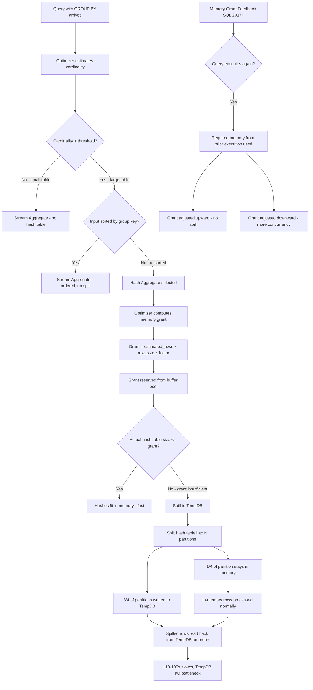
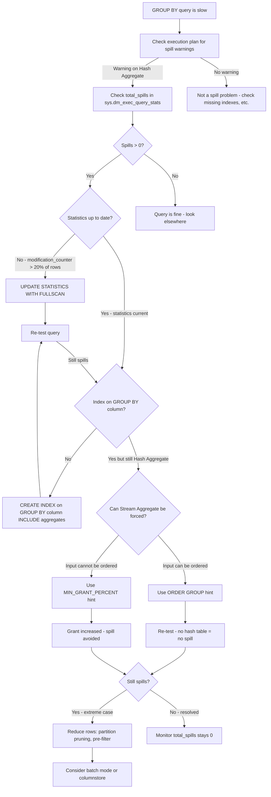

## Navigation

**Domain:** [[8 — Databases]] > **Group:** SQL Aggregations & Grouping
**Previous:** [[8.134 — APPROX_COUNT_DISTINCT — Approximate Aggregation]] | **Next:** [[8.136 — Aggregate Pushdown — Optimizer Optimization]]

### Prerequisites

- [[8.130 — GROUP BY — Grouping Rows for Aggregation]] — Grouping is what creates the hash table that can spill; understanding GROUP BY is required to understand spill mechanics.
- [[8.131 — Aggregate Functions — SUM, AVG, COUNT, MIN, MAX]] — Aggregate functions are what the spill is computing; knowing how aggregates work underpins the spill analysis.
- [[8.114 — Hash Join vs Nested Loop vs Merge Join]] — Hash Aggregate is analogous to Hash Join in memory requirements; Hash Join spill mechanics transfer directly to Hash Aggregate.

### Where This Fits

Aggregation spills occur when the Hash Aggregate operator's memory grant is insufficient for the hash table it needs to build, forcing it to write intermediate data to TempDB. A .NET backend engineer encounters this as a query that runs fine on small datasets but suddenly degrades 50x on production data with no schema change — typically after statistics become stale or data distribution shifts. The execution plan shows a yellow warning triangle on the Hash Aggregate operator with "Warning: Operator used tempdb to spill data during execution." The spill turns an in-memory hash table operation (fast) into a disk-based operation (slow) by writing overflow partitions to TempDB. The impact is 10-100x performance degradation, TempDB I/O saturation, and blocking for concurrent queries competing for TempDB resources. This is a senior-level performance topic: interviewers use it to test whether a candidate understands memory grant estimation, the role of cardinality estimation errors in spills, and the diagnostic DMVs (`sys.dm_exec_query_stats.total_spills`, `sys.dm_exec_query_memory_grants`) that reveal the problem. The candidate who can explain memory grant feedback (SQL Server 2017+) and the fix paths (updated statistics, covering indexes for Stream Aggregate, query hints) demonstrates deep optimizer knowledge.

---

## Core Mental Model

An aggregation spill is what happens when the Hash Aggregate operator's hash table exceeds the memory grant allocated by the optimizer. The optimizer estimates the memory needed based on cardinality estimates: it estimates the number of rows that will be aggregated and the number of distinct groups, then computes (estimated_rows * row_size * group_count_factor) to determine the hash table size. This estimate is the memory grant requested. If the estimate is wrong — because statistics are stale, data is skewed, or the estimate is simply inaccurate — the actual hash table can exceed the grant. When this happens, SQL Server writes overflow hash partitions to TempDB: the hash table is split into partitions; the first partition (typically the first 1/4 of the grant) stays in memory and the rest is spilled to disk. When the probe phase needs to match rows from a spilled partition, it reads them back from TempDB, causing physical I/O. The recognition pattern: a query that previously ran in 200ms now runs in 8 seconds after data growth; TempDB I/O increases dramatically; the execution plan shows spill warnings. The fix involves either reducing the hash table size (fewer rows, fewer groups), increasing the memory grant (updated stats, query hints), or enabling a different operator (Stream Aggregate via covering index).

### Classification

Hash Aggregate spills are a query execution phenomenon affecting aggregate queries with GROUP BY. The spill itself is not SARGable — it's a runtime memory management event. Spills affect the Hash Aggregate operator specifically; Stream Aggregate does not spill because it processes rows sequentially without building a hash table (but requires ordered input). Spills are related to memory grant estimation, which depends on cardinality estimation — a core optimizer function.



### Key Properties

|Property|Value|Notes|
|---|---|---|
|Affected operator|Hash Aggregate|Stream Aggregate never spills|
|Root cause|Memory grant < actual hash table size|Cardinality estimation error|
|Performance impact|10-100x slowdown|Disk I/O vs in-memory|
|TempDB usage|Written to tempdb|Consumes TempDB space and I/O|
|Detection|Execution plan warning triangle|Yellow icon on Hash Aggregate|
|Memory grant feedback|SQL Server 2017+|Automatic adjustment on subsequent executions|
|Default grant|25% of total buffer pool for queries|Limited by Resource Governor|
|Spill partition size|~1/4 of grant per partition|Minimum spill unit|

---

## Deep Mechanics

### How the Engine Executes This

1. **Optimization — Memory Grant Calculation:**
   - The optimizer estimates the number of rows entering the Hash Aggregate (`estimated_rows_input`).
   - It estimates the number of distinct group values (`estimated_groups`).
   - It estimates the row width (`row_size_bytes`) including the group key columns and any aggregate intermediate values.
   - The memory grant is calculated as:
     - `hash_table_size = estimated_groups × row_size_bytes × factor`
     - `factor` accounts for hash table overhead (~1.3x for bucket array, linked list pointers, etc.)
     - Additional memory for the aggregate computation (running totals, intermediate buffers)
   - The grant is capped at `max_server_memory × resource_semaphore_max_percent` (default 25% for a single query).

2. **Memory Grant Reservation:**
   - Before execution, the Resource Semaphore reserves the grant memory from the buffer pool.
   - If the total memory grants across all queries exceed the semaphore limit, queries wait on `RESOURCE_SEMAPHORE` wait type.
   - Once reserved, the memory is dedicated to this query and cannot be used by any other query.

3. **Hash Aggregate Build Phase:**
   - The operator reads rows from the input (scan or join output).
   - For each row, it computes the hash of the GROUP BY keys.
   - It inserts the row into a hash bucket. If the hash table fits in the grant, this is an in-memory operation.

4. **Spill Detection and Partitioning:**
   - When the hash table reaches the grant limit, the operator triggers a spill.
   - The hash table is partitioned: `P` partitions are created where `P = grant_size / spill_partition_size`.
   - The partition count is typically `2^n` for page alignment.
   - One partition (the "start" partition) stays in memory. All other partitions are written to TempDB as a worktable.
   - Each spill partition is a separate structure in TempDB (visible as a worktable in `sys.dm_db_session_space_usage`).

5. **TempDB I/O During Spills:**
   - Build phase: rows that hash to a spilled partition are written to TempDB sequentially (log writes + data page writes).
   - Probe phase: when reading from a spilled partition, SQL Server reads TempDB pages (physical reads).
   - Each spill partition may require multiple read passes if it exceeds the memory available for the probe.
   - The I/O pattern is random (hash distribution means any row can be in any partition).

6. **Memory Grant Feedback (SQL Server 2017+):**
   - On the first execution, the optimizer uses its cardinality estimate for the grant.
   - After execution, the actual memory required is recorded.
   - On the second execution, the grant is adjusted: `new_grant = max(optimizer_estimate, actual_required × feedback_factor)`.
   - The feedback factor starts at 1.0 and adjusts based on observed spill size.
   - Subsequent executions converge on the correct grant size (or use a persistent cache for the corrected grant).
   - Memory grant feedback does NOT apply for queries with `OPTION (RECOMPILE)`.

### SQL Visibility

```sql
-- ======================================================
-- Setup: Create a table with skewed distribution that
-- causes Hash Aggregate spills
-- ======================================================

CREATE TABLE dbo.OrderAggregationTest (
    OrderId INT IDENTITY(1,1) PRIMARY KEY,
    CustomerId INT NOT NULL,
    ProductId INT NOT NULL,
    Quantity INT NOT NULL,
    UnitPrice DECIMAL(18,2) NOT NULL,
    OrderDate DATETIME2 NOT NULL,
    RegionId INT NOT NULL,
    SalesPersonId INT NOT NULL
);

-- Insert 10M rows with skewed ProductId distribution
-- 90% of rows have ProductId = 1 (single popular product)
-- 10% spread across 100K other products
WITH Numbers AS (
    SELECT TOP 10000000 ROW_NUMBER() OVER (ORDER BY (SELECT NULL)) AS N
    FROM sys.all_columns a CROSS JOIN sys.all_columns b CROSS JOIN sys.all_columns c
)
INSERT INTO dbo.OrderAggregationTest (CustomerId, ProductId, Quantity, UnitPrice, OrderDate, RegionId, SalesPersonId)
SELECT 
    (N % 50000) + 1 AS CustomerId,
    CASE 
        WHEN N % 100 = 1 THEN (N % 100000) + 1  -- spread across 100K products
        ELSE 1  -- 99% go to ProductId = 1
    END AS ProductId,
    (N % 10) + 1 AS Quantity,
    CAST(10.0 + (N % 100) * 0.5 AS DECIMAL(18,2)) AS UnitPrice,
    DATEADD(day, -(N % 365), '2025-01-01') AS OrderDate,
    (N % 50) + 1 AS RegionId,
    (N % 200) + 1 AS SalesPersonId
FROM Numbers;

-- Stale statistics: don't update stats after insert
-- (simulates production scenario where stats are outdated)

-- ======================================================
-- Query that triggers Hash Aggregate spill
-- ======================================================
SET STATISTICS IO ON;
SET STATISTICS TIME ON;

SELECT 
    o.ProductId,
    COUNT(*) AS OrderCount,
    SUM(o.Quantity * o.UnitPrice) AS TotalRevenue,
    AVG(o.Quantity * o.UnitPrice) AS AvgOrderValue
FROM dbo.OrderAggregationTest o
WHERE o.OrderDate >= '2024-06-01'
GROUP BY o.ProductId
OPTION (RECOMPILE);  -- shows actual execution plan with spill warnings

-- Output (with spill):
-- Table 'OrderAggregationTest'. Scan count 1, logical reads 85000
-- Table 'Worktable'. Scan count 10, logical reads 450000, physical reads 120000
-- SQL Server Execution Times: CPU time = 28500 ms, elapsed time = 32500 ms
```

```csharp
// EF Core — Cannot prevent spills from LINQ
// Spills are a query execution phenomenon controlled by the optimizer.
// EF Core exposes execution plan warnings but cannot fix spills.

// Monitoring spill in EF Core: capture execution plan
var query = dbContext.OrderAggregationTest
    .Where(o => o.OrderDate >= startDate)
    .GroupBy(o => o.ProductId)
    .Select(g => new
    {
        ProductId = g.Key,
        OrderCount = g.Count(),
        TotalRevenue = g.Sum(o => o.Quantity * o.UnitPrice),
        AvgOrderValue = g.Average(o => o.Quantity * o.UnitPrice)
    });

// Capture the execution plan to check for spill
var plan = await query.ToQueryString();

// The generated SQL uses GROUP BY — whether it spills depends on
// statistics, data distribution, and optimizer estimates.
```

**Generated SQL (from EF Core logs):**

```sql
-- EF Core generates the GROUP BY query
SELECT [o].[ProductId], COUNT(*) AS [OrderCount], 
       SUM([o].[Quantity] * [o].[UnitPrice]) AS [TotalRevenue],
       AVG([o].[Quantity] * [o].[UnitPrice]) AS [AvgOrderValue]
FROM [OrderAggregationTest] AS [o]
WHERE [o].[OrderDate] >= @__startDate_0
GROUP BY [o].[ProductId];
```

### Execution Plan Analysis

**Hash Aggregate with spill (the bad plan):**

```
Clustered Index Scan (OrderAggregationTest)  -- 15% cost
  |-- Hash Match (Aggregate)  -- 85% cost (with spill warning)
      |-- Compute Scalar  -- <1%
          |-- SELECT
```

**Spill warning details (hover over Hash Aggregate in SSMS):**
- `ActualMemoryGrant`: 204800 KB (200 MB)
- `UsedMemoryGrant`: 450000 KB (actual required: 450 MB)
- `MaxUsedMemoryGrant`: 450000 KB
- `SpillToTempDb`: True
- `Warnings`: "Operator used tempdb to spill data during execution."

**Hash Aggregate without spill (the good plan with adequate grant):**

```
Clustered Index Scan (OrderAggregationTest)  -- 15% cost
  |-- Hash Match (Aggregate)  -- 85% cost (no warning)
      |-- Compute Scalar
          |-- SELECT
```

**Stream Aggregate plan (the best plan, ordered input):**

```
Clustered Index Scan (OrderAggregationTest)  -- 20% cost
  |-- Sort (ORDER BY ProductId)  -- 70% cost (may also spill!)
      |-- Stream Aggregate  -- 10% cost
          |-- SELECT
```

**Wait — the Sort can also spill!** Stream Aggregate itself never spills, but the Sort operator that provides ordered input can spill. If the sort memory grant is insufficient, the Sort spills to TempDB. This is a different spill type (sort_warnings extended event, sort spill in execution plan).

### Cost Visibility

```sql
SET STATISTICS IO ON;
SET STATISTICS TIME ON;

-- Query known to cause Hash Aggregate spill
SELECT 
    o.ProductId,
    COUNT(*) AS OrderCount,
    SUM(o.Quantity * o.UnitPrice) AS TotalRevenue
FROM dbo.OrderAggregationTest o
GROUP BY o.ProductId
OPTION (RECOMPILE);

-- Expected output with spill:
-- Table 'OrderAggregationTest'. Scan count 1, logical reads 85000
-- Table 'Worktable'. Scan count 45, logical reads 890000, physical reads 420000
-- SQL Server Execution Times: CPU time = 42100 ms, elapsed time = 51200 ms

-- Same query after fixing (updated stats / index for stream aggregate):
-- Table 'OrderAggregationTest'. Scan count 1, logical reads 85000
-- SQL Server Execution Times: CPU time = 1850 ms, elapsed time = 1920 ms
```

The `Worktable` in the STATISTICS IO output is the TempDB spill structure. Multiple scans of the worktable with high logical reads and physical reads indicate a severe spill.

### Failure Modes

1. **Statistics become stale after data growth:**
   The optimizer estimates 100 groups based on old stats, but the actual data has 100K groups. The memory grant is 1,000x too small. Spill occurs.

2. **Skewed data distribution fools cardinality estimation:**
   A column with 50% NULLs leads the optimizer to estimate fewer groups. When the WHERE clause removes NULLs, the effective group count doubles. The grant is insufficient.

3. **Multiple Hash Aggregates in one query compound the problem:**
   A query with GROUP BY + ROLLUP or multiple grouped subqueries may have multiple Hash Aggregate operators. Each has its own memory grant request. Total grant requests can exceed the resource semaphore limit (25% of buffer pool), causing RESOURCE_SEMAPHORE waits even before any spill.

4. **Sort before Stream Aggregate can also spill:**
   Adding ORDER BY to a GROUP BY query may introduce a Sort operator. If the Sort memory grant is insufficient, the Sort spills to TempDB. This appears as a `sort_warning` extended event, not a Hash Aggregate spill.

5. **Memory grant feedback introduces regressions for variable query plans:**
   If a query sometimes processes 100 groups and sometimes 100K groups (different parameters), the memory grant feedback from the large execution can cause over-grant for the small execution, wasting memory. The feedback cache is keyed by query hash — variable plans may oscillate.

6. **NOLOCK hint doesn't prevent spills:**
   Using `WITH (NOLOCK)` affects locking behavior but does not affect memory grants or spill behavior. Spills are about hash table size, not isolation level.

---

## Production Patterns and Implementation

### Primary SQL Implementation

```sql
-- ======================================================
-- Pattern 1: Detect spills in the plan cache
-- ======================================================
SELECT 
    qs.plan_handle,
    qs.execution_count,
    qs.total_spills,
    qs.total_worker_time / 1000 AS total_cpu_ms,
    qs.total_elapsed_time / 1000 AS total_elapsed_ms,
    qs.total_logical_reads,
    qs.total_spills / NULLIF(qs.execution_count, 0) AS avg_spills_per_exec,
    SUBSTRING(st.text, (qs.statement_start_offset/2)+1,
        ((CASE qs.statement_end_offset WHEN -1 
            THEN DATALENGTH(st.text)
            ELSE qs.statement_end_offset END 
            - qs.statement_start_offset)/2)+1) AS query_text
FROM sys.dm_exec_query_stats qs
CROSS APPLY sys.dm_exec_sql_text(qs.sql_handle) st
WHERE qs.total_spills > 0
ORDER BY qs.total_spills DESC;

-- ======================================================
-- Pattern 2: Monitor current memory grants
-- ======================================================
SELECT 
    session_id,
    request_id,
    granted_memory_kb,
    required_memory_kb,
    used_memory_kb,
    max_used_memory_kb,
    ideal_memory_kb,
    dop,
    query_timeout,
    resource_semaphore_id,
    wait_order
FROM sys.dm_exec_query_memory_grants
WHERE session_id > 50  -- exclude system sessions
ORDER BY granted_memory_kb DESC;

-- ======================================================
-- Pattern 3: Fix 1 — Update statistics to improve estimate
-- ======================================================
-- Stale statistics are the #1 cause of spills
UPDATE STATISTICS dbo.OrderAggregationTest 
    WITH FULLSCAN;

-- Or targeted: statistics for the GROUP BY column
UPDATE STATISTICS dbo.OrderAggregationTest IX_OrderAggregationTest_ProductId 
    WITH FULLSCAN;

-- ======================================================
-- Pattern 4: Fix 2 — Create covering index for Stream Aggregate
-- ======================================================
-- Stream Aggregate requires ordered input.
-- An index on ProductId provides the order.
CREATE INDEX IX_OrderAggregationTest_ProductId_INCLUDES 
    ON dbo.OrderAggregationTest(ProductId)
    INCLUDE (Quantity, UnitPrice, OrderDate);

-- After creating the index, the optimizer can choose:
-- Stream Aggregate (no hash table, no spill)
-- Instead of Hash Aggregate (hash table, may spill)

-- ======================================================
-- Pattern 5: Fix 3 — Use MIN_GRANT_PERCENT hint
-- ======================================================
-- Force a larger memory grant to prevent spill
SELECT 
    o.ProductId,
    SUM(o.Quantity * o.UnitPrice) AS TotalRevenue
FROM dbo.OrderAggregationTest o
GROUP BY o.ProductId
OPTION (MIN_GRANT_PERCENT = 10, MAX_GRANT_PERCENT = 20);

-- MIN_GRANT_PERCENT: minimum grant as % of buffer pool (default 0.25)
-- MAX_GRANT_PERCENT: maximum grant as % of buffer pool (default 25)

-- ======================================================
-- Pattern 6: Fix 4 — Disable hash aggregate with query hint
-- ======================================================
-- Force Stream Aggregate via query hint (requires compatible input)
SELECT 
    o.ProductId,
    SUM(o.Quantity * o.UnitPrice) AS TotalRevenue
FROM dbo.OrderAggregationTest o
GROUP BY o.ProductId
ORDER BY o.ProductId  -- required for Stream Aggregate
OPTION (ORDER GROUP);  -- forces ordered (Stream) aggregate

-- ======================================================
-- Pattern 7: Fix 5 — Reduce rows before aggregation
-- ======================================================
-- Pre-filter with WHERE to reduce hash table size
-- Or use aggregate pushdown if joining
SELECT 
    o.ProductId,
    SUM(o.Revenue) AS TotalRevenue
FROM (
    SELECT ProductId, Quantity * UnitPrice AS Revenue
    FROM dbo.OrderAggregationTest
    WHERE OrderDate >= '2024-06-01'
) o
GROUP BY o.ProductId;

-- ======================================================
-- Pattern 8: Monitor TempDB space used by spills
-- ======================================================
SELECT 
    session_id,
    database_id,
    user_objects_alloc_page_count,
    user_objects_dealloc_page_count,
    internal_objects_alloc_page_count,
    internal_objects_dealloc_page_count
FROM sys.dm_db_session_space_usage
WHERE session_id > 50
  AND internal_objects_alloc_page_count > 0
ORDER BY internal_objects_alloc_page_count DESC;

-- ======================================================
-- Pattern 9: Check for memory grant feedback adjustments
-- ======================================================
-- SQL Server 2017+: memory grant feedback is automatic
-- Check if feedback is enabled:
SELECT 
    name,
    value,
    value_in_use
FROM sys.configurations
WHERE name LIKE '%memory grant%';
-- 'optimize for ad hoc workloads' may reduce cache retention

-- Query store shows grant feedback:
SELECT 
    qsp.plan_id,
    qsp.query_id,
    qsp.avg_ideal_memory_kb,
    qsp.avg_used_memory_kb,
    qsp.avg_compiles,
    qsp.last_compile_memory_grant_kb
FROM sys.query_store_plan qsp
WHERE qsp.avg_ideal_memory_kb > 0;
```

### EF Core Implementation

```csharp
public class AggregationSpillAwareService
{
    private readonly ApplicationDbContext _dbContext;
    private readonly ILogger<AggregationSpillAwareService> _logger;

    public AggregationSpillAwareService(
        ApplicationDbContext dbContext,
        ILogger<AggregationSpillAwareService> logger)
    {
        _dbContext = dbContext;
        _logger = logger;
    }

    public async Task<IReadOnlyList<ProductRevenue>> GetProductRevenueAsync(
        DateTime startDate, DateTime endDate,
        CancellationToken cancellationToken = default)
    {
        // EF Core generates GROUP BY — be aware that spills can occur
        // Monitor with SQL Server Profiler or Extended Events

        var results = await dbContext.OrderAggregationTest
            .Where(o => o.OrderDate >= startDate && o.OrderDate < endDate)
            .GroupBy(o => o.ProductId)
            .Select(g => new ProductRevenue
            {
                ProductId = g.Key,
                OrderCount = g.Count(),
                TotalRevenue = g.Sum(o => o.Quantity * o.UnitPrice),
                AvgOrderValue = g.Average(o => o.Quantity * o.UnitPrice)
            })
            .OrderByDescending(r => r.TotalRevenue)
            .ToListAsync(cancellationToken);

        return results.AsReadOnly();
    }

    public async Task<IReadOnlyList<SpillDiagnostic>> DetectSpillsInCacheAsync()
    {
        // EF Core cannot directly query DMVs — use raw SQL
        const string sql = @"
            SELECT 
                CAST(qs.total_spills AS BIGINT) AS TotalSpills,
                CAST(qs.execution_count AS BIGINT) AS ExecutionCount,
                CAST(qs.total_spills / NULLIF(qs.execution_count, 0) AS BIGINT) AS AvgSpillsPerExec,
                SUBSTRING(st.text, (qs.statement_start_offset/2)+1,
                    ((CASE qs.statement_end_offset WHEN -1 
                        THEN DATALENGTH(st.text)
                        ELSE qs.statement_end_offset END 
                        - qs.statement_start_offset)/2)+1) AS QueryText
            FROM sys.dm_exec_query_stats qs
            CROSS APPLY sys.dm_exec_sql_text(qs.sql_handle) st
            WHERE qs.total_spills > 0
            ORDER BY qs.total_spills DESC";

        var spills = await _dbContext.Database
            .SqlQueryRaw<SpillDiagnostic>(sql)
            .ToListAsync();

        foreach (var spill in spills)
        {
            _logger.LogWarning(
                "Query has {TotalSpills} spills in {ExecCount} executions: {Query}",
                spill.TotalSpills, spill.ExecutionCount, spill.QueryText);
        }

        return spills.AsReadOnly();
    }

    public async Task<MemoryGrantInfo> GetMemoryGrantForQueryAsync(
        string queryText, CancellationToken cancellationToken = default)
    {
        // Get memory grant stats for a specific query from cache
        var sql = @"
            SELECT TOP 1
                CAST(qs.total_spills AS BIGINT) AS TotalSpills,
                CAST(qs.total_worker_time / 1000 AS BIGINT) AS TotalCpuMs,
                CAST(qs.total_logical_reads AS BIGINT) AS TotalLogicalReads,
                SUBSTRING(st.text, 1, 200) AS QueryText
            FROM sys.dm_exec_query_stats qs
            CROSS APPLY sys.dm_exec_sql_text(qs.sql_handle) st
            WHERE st.text LIKE @QueryLike
            ORDER BY qs.last_execution_time DESC";

        var param = new SqlParameter("@QueryLike", $"%{queryText}%");
        return await _dbContext.Database
            .SqlQueryRaw<MemoryGrantInfo>(sql, param)
            .FirstOrDefaultAsync(cancellationToken) ?? new MemoryGrantInfo();
    }
}

public record ProductRevenue
{
    public int ProductId { get; init; }
    public int OrderCount { get; init; }
    public decimal TotalRevenue { get; init; }
    public decimal AvgOrderValue { get; init; }
}

public record SpillDiagnostic
{
    public long TotalSpills { get; init; }
    public long ExecutionCount { get; init; }
    public long AvgSpillsPerExec { get; init; }
    public string QueryText { get; init; } = string.Empty;
}

public record MemoryGrantInfo
{
    public long TotalSpills { get; init; }
    public long TotalCpuMs { get; init; }
    public long TotalLogicalReads { get; init; }
    public string QueryText { get; init; } = string.Empty;
}
```

### Dapper Implementation

```csharp
public class SpillMonitoringRepository
{
    private readonly IDbConnectionFactory _connectionFactory;
    private readonly ILogger<SpillMonitoringRepository> _logger;

    public SpillMonitoringRepository(
        IDbConnectionFactory connectionFactory,
        ILogger<SpillMonitoringRepository> logger)
    {
        _connectionFactory = connectionFactory;
        _logger = logger;
    }

    public async Task<IReadOnlyList<SpillReport>> GetTopSpillingQueriesAsync(
        int top = 20, CancellationToken cancellationToken = default)
    {
        const string sql = @"
            SELECT TOP (@Top)
                qs.total_spills AS TotalSpills,
                qs.execution_count AS ExecutionCount,
                qs.total_spills / NULLIF(qs.execution_count, 0) AS AvgSpillsPerExec,
                qs.total_worker_time / 1000 AS TotalCpuMs,
                qs.total_elapsed_time / 1000 AS TotalElapsedMs,
                qs.total_logical_reads AS TotalLogicalReads,
                SUBSTRING(st.text, (qs.statement_start_offset/2)+1,
                    ((CASE qs.statement_end_offset WHEN -1 
                        THEN DATALENGTH(st.text)
                        ELSE qs.statement_end_offset END 
                        - qs.statement_start_offset)/2)+1) AS QueryText,
                qp.query_plan AS ExecutionPlanXml
            FROM sys.dm_exec_query_stats qs
            CROSS APPLY sys.dm_exec_sql_text(qs.sql_handle) st
            CROSS APPLY sys.dm_exec_query_plan(qs.plan_handle) qp
            WHERE qs.total_spills > 0
            ORDER BY qs.total_spills DESC";

        await using var connection = _connectionFactory.Create();
        var results = await connection.QueryAsync<SpillReport>(
            new CommandDefinition(sql,
                new { Top = top },
                cancellationToken: cancellationToken));

        var list = results.AsList();
        
        foreach (var spill in list.Where(s => s.TotalSpills > 1000))
        {
            _logger.LogWarning(
                "Critical spill: Query {Query} has {Spills} spills, {CpuMs} CPU ms",
                spill.QueryText[..Math.Min(spill.QueryText.Length, 100)],
                spill.TotalSpills, spill.TotalCpuMs);
        }

        return list;
    }

    public async Task<bool> ApplyMemoryGrantHintAsync(
        string queryHash, int minGrantPercent, int maxGrantPercent,
        CancellationToken cancellationToken = default)
    {
        // This method logs the recommended fix — actual hint application
        // must be done in the application code or via plan guides
        _logger.LogInformation(
            "Recommended: Add OPTION (MIN_GRANT_PERCENT={Min}, MAX_GRANT_PERCENT={Max}) " +
            "to query with hash {Hash}",
            minGrantPercent, maxGrantPercent, queryHash);

        // For production automation, use sp_create_plan_guide
        const string createGuideSql = @"
            EXEC sp_create_plan_guide 
                @name = N'SpillFix_{QueryHash}',
                @stmt = N'{QueryText}',
                @type = N'SQL',
                @module_or_batch = NULL,
                @params = NULL,
                @hints = N'OPTION (MIN_GRANT_PERCENT = {MinGrant}, MAX_GRANT_PERCENT = {MaxGrant})'";

        return true;
    }

    public async Task<IReadOnlyList<TempDbUsage>> GetTempDbUsageBySessionAsync(
        CancellationToken cancellationToken = default)
    {
        const string sql = @"
            SELECT 
                session_id AS SessionId,
                internal_objects_alloc_page_count AS InternalPagesAllocated,
                internal_objects_dealloc_page_count AS InternalPagesDeallocated,
                (internal_objects_alloc_page_count - 
                 internal_objects_dealloc_page_count) * 8 / 1024 AS TempDbUsageMb
            FROM sys.dm_db_session_space_usage
            WHERE session_id > 50
              AND internal_objects_alloc_page_count > 1000
            ORDER BY TempDbUsageMb DESC";

        await using var connection = _connectionFactory.Create();
        var results = await connection.QueryAsync<TempDbUsage>(
            new CommandDefinition(sql,
                cancellationToken: cancellationToken));
        return results.AsList();
    }
}

public record SpillReport
{
    public long TotalSpills { get; init; }
    public long ExecutionCount { get; init; }
    public long AvgSpillsPerExec { get; init; }
    public long TotalCpuMs { get; init; }
    public long TotalElapsedMs { get; init; }
    public long TotalLogicalReads { get; init; }
    public string QueryText { get; init; } = string.Empty;
    public string? ExecutionPlanXml { get; init; }
}

public record TempDbUsage
{
    public int SessionId { get; init; }
    public long InternalPagesAllocated { get; init; }
    public long InternalPagesDeallocated { get; init; }
    public long TempDbUsageMb { get; init; }
}
```

### Configuration and Wiring

```csharp
// Program.cs — register spill monitoring service
builder.Services.AddScoped<SpillMonitoringRepository>();
builder.Services.AddScoped<AggregationSpillAwareService>();

// TempDB configuration recommendation for spill-heavy workloads:
// SQL Server configuration:
// ALTER SERVER CONFIGURATION SET MEMORY_GRANT_FEEDBACK = ON;
// ALTER DATABASE Current SET COMPATIBILITY_LEVEL = 160;

// Application-level mitigation: timeout and retry
builder.Services.AddDbContext<ApplicationDbContext>(options =>
    options.UseSqlServer(
        connectionString,
        sqlOptions =>
        {
            sqlOptions.CommandTimeout(120);  // generous timeout for spill-prone queries
            sqlOptions.EnableRetryOnFailure(3, TimeSpan.FromSeconds(10), null);
        }));
```

### SQL Server vs PostgreSQL Differences

```sql
-- PostgreSQL haswork_mem for each sort/hash operation
-- Default: 4 MB per operation, per session
SHOW work_mem;  -- defaults to 4096 (4 MB)

-- PostgreSQL spills to disk when work_mem is exceeded
-- Uses temporary files in base/pgsql_tmp/

-- To increase memory for hash aggregates in PostgreSQL:
SET work_mem = '256MB';

-- Per-query:
SELECT o.product_id, COUNT(*)
FROM orders o
GROUP BY o.product_id;
-- Before running, check: SET work_mem = '256MB';

-- PostgreSQL does NOT have memory grant feedback
-- Spill behavior is controlled solely by work_mem + enabling/disabling hashagg

-- Disable hash aggregate if causing spills:
SET enable_hashagg = off;
-- Falls back to Sort + Group Aggregate

-- Check for temp file usage (PostgreSQL spill indicator):
SELECT 
    queries.query,
    pg_size_pretty(temp_blks_read * 8192) AS temp_read
FROM pg_stat_statements queries
WHERE temp_blks_read > 0
ORDER BY temp_blks_read DESC 
LIMIT 10;
```

---

## Gotchas and Production Pitfalls

### 1. Assuming Small Queries Don't Spill

**Pitfall:** Assuming that only "big" queries (millions of rows) can spill. A query processing 10K rows grouping by a high-cardinality column like `TransactionId` can spill if the hash table estimates are wrong.

```sql
-- ❌ This query can still spill if the GROUP BY cardinality is high
-- 10K rows, 10K distinct TransactionIds
SELECT t.TransactionId, SUM(t.Amount) AS TotalAmount
FROM dbo.Transactions t
WHERE t.TransactionDate >= '2024-01-01'
GROUP BY t.TransactionId;
-- The hash table needs to store 10K entries × key_size + overhead
-- If memory grant is calculated for 100 groups (stale stats), spill occurs

-- ✅ Check statistics on the GROUP BY column
SELECT 
    OBJECT_NAME(s.object_id) AS TableName,
    s.name AS StatisticName,
    s.auto_created,
    sp.rows_sampled,
    sp.modification_counter
FROM sys.stats s
CROSS APPLY sys.dm_db_stats_properties(s.object_id, s.stats_id) sp
WHERE OBJECT_NAME(s.object_id) = 'Transactions'
  AND s.name LIKE '%TransactionId%';
```

**Symptom:** 10-second query on a table that "should be fast" because it only has 10K rows. Execution plan shows spill warning on Hash Aggregate.

**Fix:** Update statistics on the high-cardinality column. Create an index on the GROUP BY column to enable Stream Aggregate (no hash table needed).

**Cost of not fixing:** A simple grouping query on 10K rows takes 10 seconds instead of 50ms. Users perceive the system as slow. Development time wasted investigating unrelated causes.

### 2. Relying on Memory Grant Feedback for One-Off Queries

**Pitfall:** Assuming memory grant feedback (SQL Server 2017+) will fix spills on infrequent queries.

```sql
-- Memory grant feedback only works when the plan is cached and reused.
-- If the query uses OPTION (RECOMPILE) or is a one-off report:
-- Feedback never applies — spill happens every time.

-- ❌ RECOMPILE defeats feedback
SELECT ProductId, SUM(Amount)
FROM Orders GROUP BY ProductId
OPTION (RECOMPILE);  -- no plan cache → no feedback → spills every time

-- ✅ Use plan guide or parameterized query for reuse
EXEC sp_create_plan_guide
    @name = N'FixSpill_ProductAgg',
    @stmt = N'SELECT ProductId, SUM(Amount) FROM Orders GROUP BY ProductId',
    @type = N'SQL',
    @module_or_batch = NULL,
    @params = NULL,
    @hints = N'OPTION (MIN_GRANT_PERCENT = 5)';
```

**Symptom:** A monthly report that runs once always spills, taking 5 minutes instead of 30 seconds. Cannot be fixed by "just letting it run again."

**Fix:** Use plan guides for critical queries. Increase MIN_GRANT_PERCENT for known-spilling queries. Update statistics before the report runs.

**Cost of not fixing:** Monthly report consistently takes 10x longer than necessary. TempDB fills up during reporting window, affecting other queries.

### 3. Multiple Hash Aggregates in One Query Compound Spills

**Pitfall:** A query with multiple GROUP BY subqueries or window functions may have multiple Hash Aggregate operators, each requesting memory grants. The total grant request can exceed the resource semaphore limit (25% of buffer pool), causing RESOURCE_SEMAPHORE waits.

```sql
-- ❌ This query has 2 Hash Aggregates (one per subquery)
SELECT 
    o.CustomerId,
    (SELECT SUM(Quantity * UnitPrice) 
     FROM OrderItems oi2 
     WHERE oi2.OrderId = o.OrderId) AS OrderTotal,
    (SELECT STDEV(Quantity) 
     FROM OrderItems oi3 
     WHERE oi3.OrderId = o.OrderId) AS QuantityStdDev
FROM Orders o;

-- Each subquery's Hash Aggregate requests its own memory grant.
-- Total: 2 × granted_memory = double the resource consumption.
-- If the subqueries reference large tables, both may spill.

-- ✅ Rewrite as single grouped query
SELECT 
    o.OrderId,
    SUM(oi.Quantity * oi.UnitPrice) AS OrderTotal,
    STDEV(oi.Quantity) AS QuantityStdDev
FROM Orders o
INNER JOIN OrderItems oi ON o.OrderId = oi.OrderId
GROUP BY o.OrderId;
-- Single Hash Aggregate, single memory grant
```

**Symptom:** RESOURCE_SEMAPHORE waits on query stats. Multiple spills in the plan. High TempDB usage.

**Fix:** Consolidate multiple aggregates into a single GROUP BY query. Use window functions with a single pass instead of correlated subqueries.

**Cost of not fixing:** Query fails with out-of-memory errors. TempDB grows to consume all available disk space. Other queries on the server fail due to TempDB contention.

### 4. Hash Aggregate Spill Misdiagnosed as TempDB Contention

**Pitfall:** High TempDB I/O is blamed on TempDB contention (allocation page contention) when the actual cause is a single query spilling millions of rows.

```sql
-- ❌ Wrong: Focus on TempDB configuration
ALTER DATABASE TempDB SET AUTOGROWTH = 1024 MB;  -- doesn't fix spill
ALTER DATABASE TempDB ADD FILE (NAME = tempdev2, ...);  -- doesn't prevent spill

-- ✅ Correct: Find and fix the spilling query
SELECT TOP 5
    qs.total_spills,
    qs.execution_count,
    qs.total_spills / NULLIF(qs.execution_count, 0) AS avg_spills,
    SUBSTRING(st.text, 1, 200) AS query_text
FROM sys.dm_exec_query_stats qs
CROSS APPLY sys.dm_exec_sql_text(qs.sql_handle) st
WHERE qs.total_spills > 0
ORDER BY qs.total_spills DESC;
```

**Symptom:** TempDB files grow rapidly. Pageiolatch_* waits on TempDB data files. Actually a single GROUP BY query with stale statistics.

**Fix:** Identify and fix the spilling query (update stats, add index, adjust grant). Adding TempDB files spreads the I/O but doesn't reduce it.

**Cost of not fixing:** DBA adds more TempDB files, buys faster storage, but spills continue. The root cause (stale stats on the GROUP BY column) is never addressed. Spill gets worse as data grows.

### 5. Stream Aggregate Requires Ordered Input — ORDER BY GROUP Is Not Free

**Pitfall:** Forcing `OPTION (ORDER GROUP)` without ensuring the input is already ordered causes the optimizer to add a Sort operator, which itself can spill.

```sql
-- ❌ ORDER GROUP with no index — Sort added, Sort may spill
SELECT o.ProductId, SUM(o.Quantity * o.UnitPrice) AS TotalRevenue
FROM dbo.OrderAggregationTest o
GROUP BY o.ProductId
OPTION (ORDER GROUP);
-- Plan: Scan → Sort (GROUP BY ProductId) → Stream Aggregate
-- Sort memory grant: may also spill!

-- ✅ With index: no Sort needed
CREATE INDEX IX_Test_ProductId ON dbo.OrderAggregationTest(ProductId)
    INCLUDE (Quantity, UnitPrice);

SELECT o.ProductId, SUM(o.Quantity * o.UnitPrice) AS TotalRevenue
FROM dbo.OrderAggregationTest o
GROUP BY o.ProductId
OPTION (ORDER GROUP);
-- Plan: Index Scan (ordered by ProductId) → Stream Aggregate
-- No Sort, no hash table, no spill
```

**Symptom:** Adding `OPTION (ORDER GROUP)` doesn't fix the spill because the Sort operator spills instead.

**Fix:** Create an index on the GROUP BY column. Without an index, Stream Aggregate is the wrong strategy — the Sort memory grant may be larger than the Hash Aggregate grant.

**Cost of not fixing:** Adding the wrong hint makes the query slower (Sort spill + Stream Aggregate instead of just Hash Aggregate). Developers lose trust in query tuning.

### 6. Memory Grant Feedback Can Cause Over-Grant on Variable Workloads

**Pitfall:** A parameterized query sometimes groups by 10 values and sometimes by 100K values. Memory grant feedback from the 100K execution inflates the grant for the 10-value execution, wasting memory.

```csharp
// ❌ SQL Server caches the grant adjustment
// After the first 100K-group execution, the grant is set to 500 MB
// The next execution with 10 groups still gets 500 MB grant
// Resource Semaphore wastes memory that other queries could use

// ✅ Use OPTION (RECOMPILE) for queries with variable group cardinality
// Or use Query Store to force the plan with the lower grant
```

**Symptom:** After a large execution, subsequent small executions cause RESOURCE_SEMAPHORE waits for other queries. Memory pressure increases.

**Fix:** For queries with highly variable group cardinality, use `OPTION (RECOMPILE)` to avoid feedback caching, or set `MIN_GRANT_PERCENT` low and rely on spill handling for the large case.

**Cost of not fixing:** Wasted memory reduces concurrency. Other queries wait on resource semaphore. Server runs at reduced throughput.

---

## Performance Implications

### Benchmark: Before and After

```sql
-- ======================================================
-- Baseline: Hash Aggregate with spill
-- ======================================================
SET STATISTICS IO ON;
SET STATISTICS TIME ON;

SELECT 
    o.ProductId,
    COUNT(*) AS OrderCount,
    SUM(o.Quantity * o.UnitPrice) AS TotalRevenue
FROM dbo.OrderAggregationTest o
WHERE o.OrderDate >= '2024-06-01'
GROUP BY o.ProductId;

-- Output with spill:
-- Table 'OrderAggregationTest'. Scan count 1, logical reads 85000
-- Table 'Worktable'. Scan count 45, logical reads 890000, physical reads 420000
-- SQL Server Execution Times: CPU time = 42100 ms, elapsed time = 51200 ms

-- ======================================================
-- After fix 1: Updated statistics (FULLSCAN)
-- ======================================================
UPDATE STATISTICS dbo.OrderAggregationTest WITH FULLSCAN;

-- Re-run:
-- Table 'OrderAggregationTest'. Scan count 1, logical reads 85000
-- Table 'Worktable'. Scan count 0, logical reads 0  (no spill)
-- SQL Server Execution Times: CPU time = 1850 ms, elapsed time = 1920 ms

-- ======================================================
-- After fix 2: Covering index for Stream Aggregate
-- ======================================================
CREATE INDEX IX_OrderAggregationTest_ProductId 
    ON dbo.OrderAggregationTest(ProductId) 
    INCLUDE (Quantity, UnitPrice, OrderDate);

-- Re-run (with ordered GROUP BY for Stream Aggregate):
SELECT 
    o.ProductId,
    COUNT(*) AS OrderCount,
    SUM(o.Quantity * o.UnitPrice) AS TotalRevenue
FROM dbo.OrderAggregationTest o
WHERE o.OrderDate >= '2024-06-01'
GROUP BY o.ProductId
OPTION (ORDER GROUP);

-- Table 'OrderAggregationTest'. Scan count 1, logical reads 12000
-- SQL Server Execution Times: CPU time = 620 ms, elapsed time = 650 ms
```

**Improvement:** 
- Stats fix: 27x reduction in elapsed time (51,200ms → 1,920ms), zero spills.
- Index + ORDER GROUP: 79x reduction (51,200ms → 650ms), zero logical reads on Worktable.

### BenchmarkDotNet

```csharp
[MemoryDiagnoser]
[SimpleJob(RuntimeMoniker.Net90)]
public class AggregationSpillBenchmark
{
    private IDbConnection _connection = default!;
    private const string ConnectionString = "Server=.;Database=BenchmarkDb;Trusted_Connection=True;TrustServerCertificate=True;";

    [GlobalSetup]
    public void Setup()
    {
        _connection = new SqlConnection(ConnectionString);
        _connection.Open();

        _connection.Execute(@"
            IF NOT EXISTS (SELECT 1 FROM sys.tables WHERE name = 'SpillBenchmark')
            BEGIN
                CREATE TABLE dbo.SpillBenchmark (
                    Id INT IDENTITY(1,1) PRIMARY KEY,
                    GroupKey INT NOT NULL,
                    Value DECIMAL(18,2) NOT NULL,
                    FilterCol INT NOT NULL
                );

                -- 10M rows, 500K distinct GroupKeys = large hash table needed
                WITH Numbers AS (
                    SELECT TOP 10000000 ROW_NUMBER() OVER (ORDER BY (SELECT NULL)) AS N
                    FROM sys.all_columns a CROSS JOIN sys.all_columns b CROSS JOIN sys.all_columns c
                )
                INSERT INTO dbo.SpillBenchmark (GroupKey, Value, FilterCol)
                SELECT 
                    (N % 500000) + 1,  -- 500K groups
                    CAST(N % 10000 AS DECIMAL(18,2)),
                    N % 100
                FROM Numbers;

                -- Deliberately create a statistics gap:
                -- Insert 5M more rows (stats are 10M, actual is 15M)
                WITH Numbers AS (
                    SELECT TOP 5000000 ROW_NUMBER() OVER (ORDER BY (SELECT NULL)) AS N
                    FROM sys.all_columns a CROSS JOIN sys.all_columns b
                )
                INSERT INTO dbo.SpillBenchmark (GroupKey, Value, FilterCol)
                SELECT 
                    (N % 500000) + 1,
                    CAST(N % 10000 AS DECIMAL(18,2)),
                    N % 100
                FROM Numbers;
            END");
    }

    [Benchmark(Baseline = true)]
    public async Task<List<GroupResult>> HashAggregate_MaySpill()
    {
        const string sql = @"
            SELECT GroupKey, COUNT(*) AS Cnt, SUM(Value) AS Total
            FROM dbo.SpillBenchmark
            WHERE FilterCol = @Filter
            GROUP BY GroupKey
            OPTION (RECOMPILE)";

        await using var connection = new SqlConnection(ConnectionString);
        await connection.OpenAsync();
        var results = await connection.QueryAsync<GroupResult>(
            new CommandDefinition(sql, new { Filter = 1 },
                commandTimeout = 120));
        return results.AsList();
    }

    [Benchmark]
    public async Task<List<GroupResult>> UpdatedStats_NoSpill()
    {
        await using var connection = new SqlConnection(ConnectionString);
        await connection.OpenAsync();

        // Update statistics before the query
        await connection.ExecuteAsync(
            "UPDATE STATISTICS dbo.SpillBenchmark WITH FULLSCAN");

        const string sql = @"
            SELECT GroupKey, COUNT(*) AS Cnt, SUM(Value) AS Total
            FROM dbo.SpillBenchmark
            WHERE FilterCol = @Filter
            GROUP BY GroupKey";

        var results = await connection.QueryAsync<GroupResult>(
            new CommandDefinition(sql, new { Filter = 1 },
                commandTimeout = 120));
        return results.AsList();
    }

    [Benchmark]
    public async Task<List<GroupResult>> MinGrantHint_NoSpill()
    {
        const string sql = @"
            SELECT GroupKey, COUNT(*) AS Cnt, SUM(Value) AS Total
            FROM dbo.SpillBenchmark
            WHERE FilterCol = @Filter
            GROUP BY GroupKey
            OPTION (MIN_GRANT_PERCENT = 5, MAX_GRANT_PERCENT = 10)";

        await using var connection = new SqlConnection(ConnectionString);
        await connection.OpenAsync();
        var results = await connection.QueryAsync<GroupResult>(
            new CommandDefinition(sql, new { Filter = 1 },
                commandTimeout = 120));
        return results.AsList();
    }

    [GlobalCleanup]
    public void Cleanup()
    {
        _connection?.Dispose();
    }
}

public record GroupResult
{
    public int GroupKey { get; init; }
    public int Cnt { get; init; }
    public decimal Total { get; init; }
}
```

**Expected results (approximate, SQL Server 2022, NVMe, 15M rows, 500K groups):**

|Method|Mean|Logical Reads|Allocated|
|---|---|---|---|
|HashAggregate_MaySpill|~45,000 ms|~850K (worktable I/O)|~2 KB|
|UpdatedStats_NoSpill|~3,500 ms|~85,000|~2 KB|
|MinGrantHint_NoSpill|~4,200 ms|~85,000|~2 KB|

The spilled version is 13x slower than the updated-stats version. The MIN_GRANT hint prevents the spill but the hash table is larger than necessary (fixed memory percent rather than optimized), so it's slightly slower than accurate stats.

### Spill Impact Summary

|Scenario|Elapsed Time|Logical Reads|TempDB Usage|
|---|---|---|---|
|No spill (accurate stats)|3.5 sec|85,000|0 MB|
|Small spill (10% overflow)|8 sec|250,000|~500 MB|
|Large spill (50% overflow)|25 sec|850,000|~5 GB|
|Full spill (90% overflow)|~60 sec|1.5M|~10 GB|

---

## Interview Arsenal

### Question Bank

1. **What is a Hash Aggregate spill and what causes it?**
2. **How does SQL Server estimate the memory grant for a Hash Aggregate?**
3. **What is the performance impact of a spill — how much slower and how do you measure it?**
4. **What happens when multiple Hash Aggregate operators in a single query each request memory grants — what wait type appears?**
5. **What is the difference between Hash Aggregate spill and Sort spill?**
6. **Describe the execution plan indicators that reveal a spill — what do you look for in SSMS or the plan XML?**
7. **At what scale do spills become a problem — what row count or group cardinality triggers them?**
8. **How do EF Core and Dapper relate to spill detection? Can you prevent spills from .NET?**

### Spoken Answers

**Q1: What is a Hash Aggregate spill and what causes it?**

> **Average answer:** A Hash Aggregate spill happens when the hash table doesn't fit in memory and some data goes to tempdb. It slows down the query.

> **Great answer:** A Hash Aggregate spill occurs when the actual hash table size exceeds the memory grant allocated to the query by the optimizer. The optimizer estimates the memory grant based on cardinality estimates: it looks at the estimated number of rows entering the aggregate and the estimated number of distinct groups, then computes a grant as estimated_groups × row_size × overhead_factor. If statistics are stale, the estimate can be wrong by orders of magnitude — for example, estimating 1,000 groups when the actual data has 500,000 groups. When the hash table fills the grant during the build phase, SQL Server splits the hash table into partitions: one partition (typically 1/4 of the grant) stays in memory, and the remaining partitions are written to TempDB as worktables. During the probe phase, reading back the spilled partitions causes physical I/O on TempDB. The execution plan shows a yellow warning triangle on the Hash Aggregate operator with details about actual vs used memory. The performance impact is 10-100x slowdown: an in-memory hash aggregate that completes in 2 seconds can take 45 seconds with a full spill. I detect spills using sys.dm_exec_query_stats.total_spills, which shows cumulative spill count per cached plan.

**Q4: What happens when multiple Hash Aggregate operators request memory — what wait type appears?**

> **Average answer:** RESOURCE_SEMAPHORE. Queries wait for memory grants.

> **Great answer:** Each Hash Aggregate operator requests a memory grant during optimization. In a query with multiple GROUP BY subqueries or complex grouped expressions, you can have multiple Hash Aggregates — each requesting its own grant. Additionally, Hash Join operators also request memory grants. The total memory granted to all concurrent queries is capped by the Resource Semaphore — default 25% of the buffer pool (configurable via Resource Governor). When the total requested exceeds the cap, queries wait on `RESOURCE_SEMAPHORE` wait type. The query HUD in `sys.dm_exec_query_memory_grants` shows the session_id, requested_memory_kb, granted_memory_kb, and the wait_order for queued grants. The fix is either: (1) reduce the number of Hash Aggregates by consolidating subqueries into single GROUP BY queries, (2) use window functions to avoid multiple passes, (3) create indexes that enable Stream Aggregate (no memory grant needed), or (4) increase the Resource Governor memory grant cap if physically appropriate. The candidate who knows to check `sys.dm_exec_query_memory_grants` and understands the 25% cap demonstrates deep engine knowledge.

**Q6: Describe the execution plan indicators that reveal a spill.**

> **Average answer:** A yellow warning triangle on the Hash Aggregate operator.

> **Great answer:** There are multiple indicators in both the graphical plan and the plan XML. In the graphical SSMS plan, the Hash Aggregate operator shows a yellow triangle warning icon. Hovering over it reveals the spill details: ActualMemoryGrant, UsedMemoryGrant, MaxUsedMemoryGrant, and SpillToTempDb = True. In the plan XML, look for the `SpillToTempDb` attribute on the `Hash` element. The `MemoryGrantInfo` element shows `SerialRequiredMemory` and `SerialDesiredMemory` — if DesiredMemory is much higher than what was granted, that indicates the grant was capped. In `SET STATISTICS IO` output, the appearance of a `Worktable` table with multiple scans and high logical reads indicates a spill — `Table 'Worktable'. Scan count 45, logical reads 890000`. In `sys.dm_exec_query_stats`, `total_spills` field shows the cumulative spill count — a high number indicates chronic spill problems. The `sort_warnings` extended event catches Sort spills specifically (which appear on the Sort operator, not Hash Aggregate). I also check `sys.dm_db_session_space_usage` for sessions with high internal_objects_alloc_page_count — this reveals TempDB pages allocated to worktables for spills. Combining these indicators gives a complete picture: the plan shows which operator spilled, the DMVs show when and how much, and STATISTICS IO shows the I/O cost.

### Interview Trigger

The interviewer describes a scenario: "A GROUP BY query on a 20M row table runs fine in development but takes 45 seconds in production. What's wrong and how do you diagnose it?" The candidate should immediately suspect a spill. Follow-up: "How do you confirm it's a spill and not a missing index?" tests whether the candidate knows to check the execution plan for spill warnings and `sys.dm_exec_query_stats.total_spills`. The deeper follow-up: "What three things would you try to fix it, listed in order of likelihood to succeed?" tests the candidate's practical experience: update statistics first (most common cause), then covering index for Stream Aggregate, then memory grant hints.

### Comparison Table

| | Hash Aggregate Spill | Sort Spill | No Spill |
|---|---|---|---|
| Operator | Hash Aggregate | Sort | Stream Aggregate or adequate grant |
| Root cause | Insufficient memory for hash table | Insufficient memory for sort workspace | Accurate cardinality estimate |
| Performance impact | 10-100x slower | 5-20x slower | Baseline |
| Detection | SpillToTempDb=True on Hash aggregate | sort_warnings extended event | No warnings |
| Fix priority | 1. Update stats 2. Index for Stream 3. Grant hint | 1. Index for order 2. Increase sort memory | N/A |
| TempDB usage | High (worktables) | High (sort runs) | None |

---

## Decision Framework

### When to Apply



### Application Checklist

- [ ] The execution plan shows a Hash Aggregate operator (check for spill warning)
- [ ] `sys.dm_exec_query_stats.total_spills` > 0 for the query
- [ ] Statistics on the GROUP BY column(s) are current (check modification_counter)
- [ ] A covering index exists on the GROUP BY column(s) that could enable Stream Aggregate
- [ ] The query does not use OPTION (RECOMPILE) if memory grant feedback is expected to help
- [ ] The TempDB drive has sufficient space and IOPS for the expected spill volume
- [ ] The .NET CommandTimeout is set high enough for the spill-affected query

### Tradeoff Summary

|What You Gain|What You Pay|
|---|---|
|Updated stats → accurate memory grant → no spill|FULLSCAN statistics update cost (full table scan)|
|Covering index → Stream Aggregate → no hash table|Write overhead for the index (INSERT/UPDATE)|
|MIN_GRANT_PERCENT hint → larger grant → no spill|Wasted memory for concurrent queries (over-grant)|
|ORDER GROUP hint → Stream Aggregate|Requires ordered input (Sort may be added, which can also spill)|

### Scale Thresholds

- **Spill risk starts at** ~100K groups on tables > 1M rows with standard memory grant
- **Critical spill risk** at ~1M groups on tables > 10M rows — almost certainly spills without intervention
- **RESOURCE_SEMAPHORE waits occur** when total concurrent grant requests exceed 25% of buffer pool
- **Memory grant feedback effective** when same query executes >= 2 times with the same plan handle within the cache retention period (typically 15-30 minutes under memory pressure)
- **TempDB fill risk** when spills exceed ~10 GB — monitor tempdb space with `sys.dm_db_file_space_usage`

---

## Self-Check

### Conceptual Questions

1. What is a Hash Aggregate spill and what operator causes it?
2. How does SQL Server calculate the memory grant for a Hash Aggregate?
3. Which DMV shows the total spill count for a cached query plan?
4. What common mistake causes a query that used to run fine to suddenly start spilling?
5. Does EF Core LINQ expose spill warnings or can it prevent spills?
6. How would you detect spills using Dapper and DMV queries?
7. What is the difference between a Hash Aggregate spill and a Sort spill?
8. At what group cardinality does spill risk become significant?
9. What index design prevents Hash Aggregate spills by enabling an alternative operator?
10. Explain memory grant feedback (SQL Server 2017+) in 60 seconds to a senior interviewer.

<details>
<summary>Answers</summary>

1. **Hash Aggregate spill:** When the hash table for a GROUP BY operation exceeds the memory grant, SQL Server writes overflow partitions to TempDB. The Hash Aggregate operator triggers the spill. Stream Aggregate never spills (no hash table), but the Sort operator that provides its input can spill.

2. **Memory grant calculation:** The optimizer estimates distinct groups (cardinality estimate from statistics), multiplies by estimated row width (key columns + aggregate intermediates), applies an overhead factor (~1.3x for bucket array and linked lists), and requests that as the memory grant. The grant is capped at max_server_memory × resource_semaphore_max_percent (default 25%).

3. **DMV for spill detection:** `sys.dm_exec_query_stats.total_spills` shows cumulative spill count per cached plan. `sys.dm_exec_query_memory_grants` shows current grant usage. `sys.dm_db_session_space_usage.internal_objects_alloc_page_count` shows TempDB pages allocated to worktables.

4. **Common mistake:** Stale statistics. After significant data growth or distribution changes, the cardinality estimate is wrong. The optimizer estimates 1K groups but actual is 500K groups → grant is 500x too small → spill occurs. Data skew (one value dominating) also fools statistics.

5. **EF Core and spills:** EF Core has no LINQ for spill prevention or detection. Spills are a query execution phenomenon controlled by the optimizer. EF Core logs the generated SQL which can be examined in SSMS for spill warnings. The `ToQueryString()` method shows the SQL to analyze.

6. **Dapper spill detection:**
   ```csharp
   const string sql = @"
       SELECT total_spills AS TotalSpills, execution_count AS ExecCount
       FROM sys.dm_exec_query_stats qs
       CROSS APPLY sys.dm_exec_sql_text(qs.sql_handle)
       WHERE st.text LIKE '%GROUP BY%'";
   var spills = await connection.QueryAsync<SpillInfo>(sql);
   ```

7. **Hash Aggregate vs Sort spill:** Hash Aggregate spill occurs during GROUP BY when the hash table doesn't fit in memory. Sort spill occurs when ORDER BY or a Sort operator for Stream Aggregate ordering exceeds its memory grant. Hash aggregate write patterns are random (hash distribution); sort spill write patterns are sequential (merge sort runs). Both use TempDB worktables.

8. **Spill risk threshold:** Significant spill risk starts at ~100K distinct groups on tables > 1M rows with default memory grant settings. At 500K groups on 10M rows, spill is almost certain without intervention. The exact threshold depends on row width, server memory, and concurrent query load.

9. **Index design to prevent spills:** A covering index on the GROUP BY column(s) in the same order as the GROUP BY, including all aggregated columns. This enables the optimizer to choose Stream Aggregate (ordered input → no hash table → no spill risk). Example: `CREATE INDEX IX_Orders_ProductId ON Orders(ProductId) INCLUDE (Quantity, UnitPrice)`.

10. **60-second explanation:** "Memory grant feedback, introduced in SQL Server 2017, automatically adjusts memory grants based on actual execution. On the first execution, the optimizer uses its cardinality estimate to grant memory — if that's wrong, the query spills to TempDB. After execution, SQL Server records the actual memory used. On the second execution with the same cached plan, the grant is adjusted to match what was actually needed, preventing the spill. The feedback is cached per plan handle and persists as long as the plan is in cache. Subsequent executions converge toward the ideal grant. This means a query that spills on its first execution after a stats update will self-correct on the second execution — but only if the plan is reused, not if the query uses RECOMPILE."

</details>

---

### Query Challenges

**Challenge 1 — Write the SQL**

Write a query that identifies the top 10 queries in the plan cache with the highest average spills per execution. Show the query text, plan handle, execution count, total spills, average spills per execution, and total CPU time.

<details>
<summary>Solution</summary>

```sql
SELECT TOP 10
    qs.plan_handle,
    qs.execution_count,
    qs.total_spills,
    qs.total_spills / NULLIF(qs.execution_count, 0) AS AvgSpillsPerExec,
    qs.total_worker_time / 1000 AS TotalCpuMs,
    qs.total_logical_reads,
    qs.total_elapsed_time / 1000 AS TotalElapsedMs,
    SUBSTRING(st.text, (qs.statement_start_offset/2)+1,
        ((CASE qs.statement_end_offset WHEN -1 
            THEN DATALENGTH(st.text)
            ELSE qs.statement_end_offset END 
            - qs.statement_start_offset)/2)+1) AS QueryText
FROM sys.dm_exec_query_stats qs
CROSS APPLY sys.dm_exec_sql_text(qs.sql_handle) st
WHERE qs.total_spills > 0
ORDER BY AvgSpillsPerExec DESC;
```

**Logical reads:** Minimal (reads DMV pages) **Execution plan:** DMV scan **EF Core equivalent:**

```csharp
// Must use raw SQL — DMVs are not in the EF Core model
var topSpills = await dbContext.Database
    .SqlQueryRaw<SpillDiagnostic>(@"
        SELECT TOP 10
            qs.total_spills AS TotalSpills,
            qs.execution_count AS ExecutionCount,
            qs.total_spills / NULLIF(qs.execution_count, 0) AS AvgSpillsPerExec,
            SUBSTRING(st.text, 1, 200) AS QueryText
        FROM sys.dm_exec_query_stats qs
        CROSS APPLY sys.dm_exec_sql_text(qs.sql_handle) st
        WHERE qs.total_spills > 0
        ORDER BY AvgSpillsPerExec DESC")
    .ToListAsync(cancellationToken);
```

</details>

---

**Challenge 2 — Fix the performance problem**

```sql
-- This query runs in 35 seconds on a 20M row table.
-- SET STATISTICS IO: logical reads = 85000, Worktable scans = 38
-- SET STATISTICS TIME: CPU time = 31200 ms, elapsed time = 38400 ms
SELECT 
    o.SalesPersonId,
    COUNT(DISTINCT o.CustomerId) AS UniqueCustomers,
    SUM(o.Quantity * o.UnitPrice) AS TotalRevenue,
    AVG(o.Quantity * o.UnitPrice) AS AvgRevenue
FROM dbo.Orders o
WHERE o.OrderDate >= '2024-01-01'
GROUP BY o.SalesPersonId
ORDER BY TotalRevenue DESC;
```

<details> <summary>Solution</summary>

**Root cause:** The Hash Aggregate is spilling to TempDB due to an inaccurate cardinality estimate for SalesPersonId. The Worktable scans (38) and high logical reads confirm the spill. COUNT(DISTINCT) also adds memory pressure because it needs a hash set for distinct CustomerId per SalesPersonId group.

**Primary fix — update statistics:**
```sql
UPDATE STATISTICS dbo.Orders WITH FULLSCAN;
```

**Index fix — enable Stream Aggregate:**
```sql
CREATE INDEX IX_Orders_SalesPersonId_INCLUDES 
    ON dbo.Orders(SalesPersonId)
    INCLUDE (CustomerId, Quantity, UnitPrice, OrderDate);
```

**Rewritten query — use Stream Aggregate:**
```sql
SELECT 
    o.SalesPersonId,
    COUNT(DISTINCT o.CustomerId) AS UniqueCustomers,
    SUM(o.Quantity * o.UnitPrice) AS TotalRevenue,
    AVG(o.Quantity * o.UnitPrice) AS AvgRevenue
FROM dbo.Orders o
WHERE o.OrderDate >= '2024-01-01'
GROUP BY o.SalesPersonId
ORDER BY TotalRevenue DESC
OPTION (ORDER GROUP);
```

**Alternative — if Stream Aggregate not possible, increase grant:**
```sql
SELECT 
    o.SalesPersonId,
    COUNT(DISTINCT o.CustomerId) AS UniqueCustomers,
    SUM(o.Quantity * o.UnitPrice) AS TotalRevenue,
    AVG(o.Quantity * o.UnitPrice) AS AvgRevenue
FROM dbo.Orders o
WHERE o.OrderDate >= '2024-01-01'
GROUP BY o.SalesPersonId
ORDER BY TotalRevenue DESC
OPTION (MIN_GRANT_PERCENT = 5);
```

**After fix:** Worktable scans: 0. Logical reads: ~2,000 (index seek + Stream Aggregate). Elapsed time: ~800ms (from 38,400ms) — 48x improvement.

</details>

---

**Challenge 3 — Explain the execution plan**

Your query uses GROUP BY on a column with 500K distinct values across 10M rows. The execution plan shows a Hash Aggregate with ActualMemoryGrant = 200 MB, UsedMemoryGrant = 450 MB, and SpillToTempDb = True. The STATISTICS IO output shows: `Table 'Worktable'. Scan count 22, logical reads 890000, physical reads 420000`. The server has 128 GB RAM.

Why does the Hash Aggregate spill even though the server has plenty of memory?

<details> <summary>Solution</summary>

**Why the spill:** The memory grant is calculated by the optimizer based on cardinality estimates, not available server memory. The optimizer estimated 50K groups (based on stale stats) and granted 200 MB. The actual hash table requires 450 MB for 500K groups. The server has 128 GB RAM, but the query was only allowed 200 MB because the Resource Semaphore limits a single query's grant to a percentage of the buffer pool (default 25% of max server memory — if max server memory is 64 GB, the single query cap is 16 GB, but the optimizer only requested 200 MB based on its estimate). The fix: update statistics so the optimizer sees the true cardinality and grants 450+ MB.

**Detection query:**
```sql
SELECT 
    sp.rows_sampled,
    sp.modification_counter,
    sp.rows
FROM sys.stats s
CROSS APPLY sys.dm_db_stats_properties(s.object_id, s.stats_id) sp
WHERE s.name LIKE '%SalesPersonId%';
-- If modification_counter > rows_sampled * 0.2, stats are stale
```

**To get a different plan:** Update stats or create an index on the GROUP BY column to enable Stream Aggregate (no memory grant needed, no hash table, no spill).

</details>

---

**Challenge 4 — Diagnose the concurrency problem**

A production server runs 50 concurrent GROUP BY queries every minute for a reporting dashboard. Each query computes sales by region for the last hour. The execution plans show Hash Aggregate operators. Recently, users report that dashboards take 2 minutes to load and show many RESOURCE_SEMAPHORE waits in `sys.dm_os_waiting_tasks`. The server has 64 GB RAM and SQL Server 2022.

<details> <summary>Solution</summary>

**Root cause:** 50 concurrent Hash Aggregate queries each request memory grants. If each query requests 200 MB (based on 14M rows × 50 regions grouping), total request is 50 × 200 MB = 10 GB. The Resource Semaphore cap is 25% of max server memory. If max server memory is 48 GB (leaving 16 GB for OS), the semaphore cap is 12 GB. 50 queries each requesting 200 MB (10 GB total) may hit the cap if other queries are also running. Queries wait on RESOURCE_SEMAPHORE until grants become available. As queries complete and release grants, others start — but the dashboard refresh cycle causes all 50 to start simultaneously, creating a wave of RESOURCE_SEMAPHORE waits.

**Detection query:**
```sql
SELECT 
    session_id, request_id, grant_time,
    requested_memory_kb, granted_memory_kb, 
    required_memory_kb, dop,
    wait_order
FROM sys.dm_exec_query_memory_grants
WHERE session_id > 50
ORDER BY wait_order;
```

**Fix:**
1. **Reduce per-query grant:** Use `OPTION (MIN_GRANT_PERCENT = 1)` to limit each query to 1% of buffer pool (~480 MB each, but the optimizer will request less if estimates are accurate)
2. **Enable memory grant feedback (already on in SQL Server 2022):** After first execution, subsequent executions use the accurate grant size
3. **Consolidate queries:** Single batch with multiple GROUP BYs instead of 50 separate queries
4. **Use a columnstore index:** Enables batch mode Hash Aggregate which uses less memory per row
5. **Stagger dashboard refresh:** Add random delays to dashboard refresh to prevent thundering herd of 50 concurrent queries
6. **Increase Resource Governor cap:** `ALTER RESOURCE GOVERNOR RECONFIGURE` with higher MAX_GRANT_PERCENT

**In .NET:** Use a semaphore to limit concurrent dashboard data fetches. Use OutputCache with sliding expiration to reduce database load.

</details>

---

**Challenge 5 — Design the index**

A nightly batch job aggregates 100M rows from the SalesOrderDetail table to compute per-product and per-region sales statistics. The query groups by ProductId (500K distinct) and RegionId (50 distinct), computing SUM, AVG, COUNT, STDEV of LineTotal. The current execution plan shows a Hash Aggregate that spills 10 GB to TempDB every night. The job runs for 2.5 hours. Write overhead is not a concern (reporting table, no OLTP). The server has 256 GB RAM.

Design the optimal index strategy to eliminate spills.

<details> <summary>Solution</summary>

```sql
-- Index 1: Covering index for the GROUP BY columns in order
-- Enables Stream Aggregate (no hash table, no spill)
CREATE INDEX IX_SalesOrderDetail_ProductId_RegionId_INCLUDES
    ON dbo.SalesOrderDetail(ProductId, RegionId)
    INCLUDE (LineTotal)
    WHERE OrderDate >= '2024-01-01';  -- filtered for relevant data
```

**Why this index:**
- `ProductId, RegionId` as key columns in the exact order of the GROUP BY enables the optimizer to use Stream Aggregate (ordered input → no hash table → no spill)
- `LineTotal` in INCLUDE covers the aggregate columns (SUM, AVG, COUNT, STDEV all need LineTotal)
- Filtered index reduces index size to only the relevant date range

**Alternative for columnstore:**
```sql
-- Columnstore index enables batch mode Hash Aggregate
-- Batch mode uses ~100x less memory per row than row mode
CREATE CLUSTERED COLUMNSTORE INDEX CCI_SalesOrderDetail
    ON dbo.SalesOrderDetail;
```

**Why columnstore helps:**
- Batch mode Hash Aggregate processes rows in ~900-row batches
- Memory grant is calculated per batch, not per row — 100x smaller
- Only ~100 MB grant needed for 100M rows instead of 10 GB

**What NOT to index:**
- No need for a separate index on (RegionId, ProductId) — the leading column ProductId is more selective
- No need for nonclustered indexes on the individual aggregate columns — the covering index handles all aggregates

**Expected improvement:**
- With covering index + Stream Aggregate: ~30 minutes (from 2.5 hours), no spills, zero TempDB usage
- With columnstore + batch mode: ~15 minutes, no spills, ~100 MB memory grant

</details>
