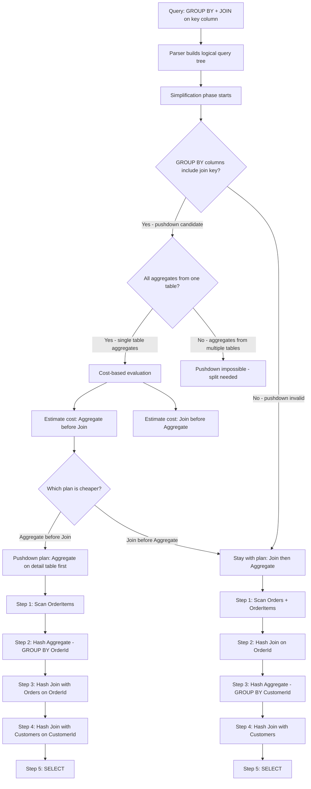
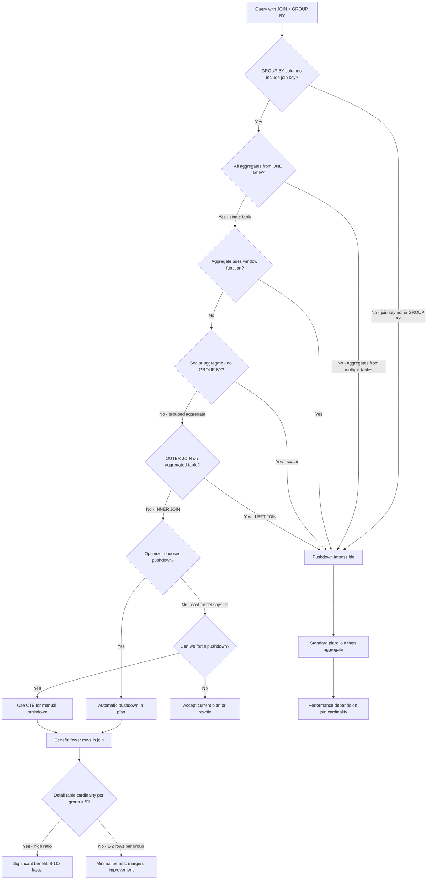

## Navigation

**Domain:** [[8 — Databases]] > **Group:** SQL Aggregations & Grouping
**Previous:** [[8.135 — Aggregation Spills — Memory Grants and TempDB]] | **Next:** [[8.137 — GROUP BY — Performance Patterns and Anti-Patterns]]

### Prerequisites

- [[8.130 — GROUP BY — Grouping Rows for Aggregation]] — Understanding GROUP BY is required to understand when the optimizer can push it below a join.
- [[8.131 — Aggregate Functions — SUM, AVG, COUNT, MIN, MAX]] — The specific aggregate functions determine whether pushdown is valid (e.g., SUM and COUNT can be pushed; AVG requires special handling).
- [[8.096 — INNER JOIN — Mechanics and Usage]] — The join type and join columns determine whether aggregate pushdown applies.
- [[8.114 — Hash Join vs Nested Loop vs Merge Join]] — The join operator affects whether pushdown reduces cost.

### Where This Fits

Aggregate pushdown is a query optimizer transformation that moves aggregation below a join — computing aggregates on one table before joining it to another. A .NET backend engineer encounters this when writing queries like "total revenue per customer" that join Orders to OrderItems, group and aggregate on OrderItems columns, and then join to Customers. When pushdown applies, the optimizer computes SUM(Quantity * UnitPrice) per OrderId on OrderItems first, then joins the aggregated result to Orders and Customers. This reduces the number of rows entering the join dramatically — from millions of OrderItems rows to thousands of aggregated orders. The performance difference can be 10-100x on large datasets. The interview signal is strong: candidates who know about aggregate pushdown demonstrate optimizer awareness beyond writing correct SQL — they understand how the optimizer transforms query trees and why seemingly equivalent SQL can produce different execution plans. The candidate who can describe when pushdown fails (aggregates from multiple tables, window functions, scalar aggregates) demonstrates deep query optimization knowledge.

---

## Core Mental Model

Aggregate pushdown is an optimizer transformation that restructures the query plan to perform aggregation earlier (closer to the data source) and with fewer input rows, moving the aggregation below the Join operator. The invariant is that the transformation is valid only when the GROUP BY columns include the join key from the table being aggregated — otherwise, grouping before joining would lose the join columns needed for matching. When the optimizer detects a query pattern where aggregation on one table's columns is followed by a join on that table's key, it can push the aggregate below the join: it computes the grouped aggregate on the inner table first, reducing the row count dramatically (e.g., aggregating 5M OrderItems rows into 50K grouped orders), then joins this much smaller result to the outer table. The recognition pattern: a query joining a large detail table to a smaller dimension table, where the aggregation is on detail columns and the GROUP BY includes the dimension key. The optimizer applies pushdown automatically when the cost model shows it's beneficial — it compares the cost of (join THEN aggregate) vs (aggregate THEN join) and chooses the cheaper plan.

### Classification

Aggregate pushdown is a query optimizer transformation, not a SQL syntax. It applies to grouped aggregates (GROUP BY) and aggregates that can be split into partial aggregates (SUM, COUNT, MIN, MAX, but not scalar aggregates). It is not visible in the SQL text — only in the execution plan. The transformation is cost-based and the optimizer applies it when the estimated cost of the pushed-down plan is lower than the standard plan.



### Key Properties

|Property|Value|Notes|
|---|---|---|
|Transformation type|Cost-based optimizer rule|Not forced — optimizer decides|
|Valid for|GROUP BY on join key|All GROUP BY columns must include the join key|
|Supported aggregates|SUM, COUNT, MIN, MAX, AVG (split)|AVG requires SUM + COUNT then division after join|
|Unsupported|Window functions, scalar aggregates, STDEV, VAR|Cannot be split across joins|
|Benefit|10-100x fewer rows in join|Largest when detail table is large relative to aggregated result|
|Plan indicator|Aggregate appears before Join|Reverse of the SQL text order|
|EF Core|Does not force pushdown|EF Core generates SQL; optimizer decides|
|Dapper|SQL-only|Writes the SQL; optimizer decides pushdown|

---

## Deep Mechanics

### How the Engine Executes This

1. **Parsing and Binding** — The parser builds the initial query tree: Scan → Join → Filter → GroupBy → Project. The join condition and GROUP BY columns are resolved.

2. **Simplification — Aggregate Pushdown Rule:**
   - The optimizer's simplification phase applies the "Group By Pushdown" rule.
   - It checks whether the GROUP BY columns are a superset of the join key columns from one side of the join. Formally, if `GROUP BY (T1.col1, T1.col2, ...)` and the join is on `T1.Key = T2.Key`, the GROUP BY covers the join key.
   - It checks whether all aggregate arguments reference columns from a single table (e.g., all aggregates use columns from OrderItems only). If aggregates mix columns from different tables, pushdown is blocked.
   - For AVG, the optimizer splits it into SUM and COUNT, pushes down both, then recomputes AVG = SUM/COUNT after the join.
   - For COUNT(DISTINCT), pushdown is not applied because the distinct set cannot be split across joins.

3. **Cost-Based Decision:**
   - The optimizer estimates two plans: the standard plan (Join → GroupBy) and the pushed-down plan (GroupBy → Join).
   - The cost comparison considers:
     - **Join cost**: smaller input = cheaper join (Hash, Nested Loops, or Merge).
     - **Aggregate cost**: aggregating before join may require scanning the detail table once and the intermediate result again.
     - **Memory grant**: hash aggregate before join may require less memory than hash aggregate after join.
   - If the detail table has high cardinality per group (many OrderItems per Order), pushdown is highly beneficial.
   - If the detail table has low cardinality per group (most orders have 1-2 items), the benefit is marginal and the optimizer may not push down.

4. **Physical Operator Selection with Pushdown:**
   - The pushed-down aggregate typically uses a Hash Aggregate operator (or Stream Aggregate if the input is ordered).
   - The join then receives the aggregated result (fewer rows) as one input.
   - The outer table (dimension) is joined to the aggregated result.

5. **Scalar Aggregate Limitation:**
   - Scalar aggregates (no GROUP BY) cannot be pushed below a join because every row from the join would produce the same scalar value. The optimizer blocks this transformation.

6. **Window Function Limitation:**
   - Window functions (`ROW_NUMBER() OVER(...)`, `SUM() OVER(...)`) cannot be pushed below a join because they depend on ordering and partitioning across the joined result.

### SQL Visibility

```sql
-- ======================================================
-- Query where aggregate pushdown applies
-- ======================================================
-- Goal: total revenue per customer
-- OrderItems has 5M rows (large detail)
-- Orders has 500K rows
-- Customers has 50K rows

SELECT 
    c.CustomerId,
    c.FirstName,
    c.LastName,
    SUM(oi.Quantity * oi.UnitPrice) AS TotalRevenue,
    COUNT(DISTINCT o.OrderId) AS OrderCount
FROM dbo.Customers c
INNER JOIN dbo.Orders o ON c.CustomerId = o.CustomerId
INNER JOIN dbo.OrderItems oi ON o.OrderId = oi.OrderId
WHERE o.OrderDate >= '2024-01-01'
GROUP BY c.CustomerId, c.FirstName, c.LastName
ORDER BY TotalRevenue DESC;

-- ======================================================
-- Query where pushdown DOES NOT apply
-- (aggregates from multiple tables)
-- ======================================================
SELECT 
    c.CustomerId,
    SUM(oi.Quantity * oi.UnitPrice) AS TotalRevenue,
    MIN(o.OrderDate) AS FirstOrderDate  -- MIN from Orders, not OrderItems
FROM dbo.Customers c
INNER JOIN dbo.Orders o ON c.CustomerId = o.CustomerId
INNER JOIN dbo.OrderItems oi ON o.OrderId = oi.OrderId
GROUP BY c.CustomerId;
-- MIN(o.OrderDate) references a column from Orders.
-- Pushdown is blocked because aggregates span multiple tables.

-- ======================================================
-- Query where manual pushdown is written explicitly
-- (CTE or subquery to force early aggregation)
-- ======================================================
WITH OrderAggregates AS (
    SELECT 
        o.OrderId,
        SUM(oi.Quantity * oi.UnitPrice) AS OrderTotal,
        COUNT(*) AS LineItemCount
    FROM dbo.Orders o
    INNER JOIN dbo.OrderItems oi ON o.OrderId = oi.OrderId
    WHERE o.OrderDate >= '2024-01-01'
    GROUP BY o.OrderId
)
SELECT 
    c.CustomerId,
    c.FirstName,
    c.LastName,
    SUM(oa.OrderTotal) AS TotalRevenue,
    SUM(oa.LineItemCount) AS TotalItems,
    COUNT(oa.OrderId) AS OrderCount
FROM dbo.Customers c
INNER JOIN dbo.Orders o ON c.CustomerId = o.CustomerId
INNER JOIN OrderAggregates oa ON o.OrderId = oa.OrderId
GROUP BY c.CustomerId, c.FirstName, c.LastName
ORDER BY TotalRevenue DESC;
```

```csharp
// EF Core — GroupBy with navigation properties
var customerRevenue = await dbContext.Customers
    .Where(c => c.Orders.Any(o => o.OrderDate >= startDate))
    .Select(c => new
    {
        c.CustomerId,
        c.FirstName,
        c.LastName,
        TotalRevenue = c.Orders
            .Where(o => o.OrderDate >= startDate)
            .SelectMany(o => o.OrderItems)
            .Sum(oi => oi.Quantity * oi.UnitPrice),
        OrderCount = c.Orders
            .Where(o => o.OrderDate >= startDate)
            .Count()
    })
    .OrderByDescending(x => x.TotalRevenue)
    .ToListAsync(cancellationToken);
```

**Generated SQL (from EF Core logs):**

```sql
-- EF Core generates correlated subqueries for each aggregate
-- This does NOT get aggregate pushdown from the optimizer
SELECT [c].[CustomerId], [c].[FirstName], [c].[LastName], (
    SELECT COALESCE(SUM([o0].[Quantity] * [o0].[UnitPrice]), 0.0)
    FROM [Orders] AS [o]
    INNER JOIN [OrderItems] AS [o0] ON [o].[OrderId] = [o0].[OrderId]
    WHERE [c].[CustomerId] = [o].[CustomerId]
      AND [o].[OrderDate] >= @__startDate_0
) AS [TotalRevenue], (
    SELECT COUNT(*)
    FROM [Orders] AS [o1]
    WHERE [c].[CustomerId] = [o1].[CustomerId]
      AND [o1].[OrderDate] >= @__startDate_0
) AS [OrderCount]
FROM [Customers] AS [c]
ORDER BY [TotalRevenue] DESC;

-- This correlated subquery pattern does NOT trigger pushdown
-- because each subquery is a scalar aggregate on a filtered subset.
-- The optimizer sees scalar aggregates and blocks pushdown.
```

### Execution Plan Analysis

**Plan WITHOUT pushdown (standard join-then-aggregate):**

```
Clustered Index Scan (Customers)  -- 5% cost
  |-- Hash Match (Inner Join, Customers → Orders)  -- 15% cost
      |-- Clustered Index Scan (Orders, filtered)  -- 20% cost
          |-- Hash Match (Inner Join, Orders → OrderItems)  -- 25% cost
              |-- Clustered Index Scan (OrderItems)  -- 20% cost
                  |-- Hash Match (Aggregate: GROUP BY CustomerId)  -- 15% cost
                      |-- SELECT
```

**Row flow:**
- Customers: 50K rows → join with Orders (500K) → 500K rows → join with OrderItems (5M) → 5M rows → aggregate → 50K customers

**Plan WITH pushdown (aggregate before join):**

```
Clustered Index Scan (OrderItems)  -- 20% cost
  |-- Hash Match (Aggregate: GROUP BY OrderId)  -- 25% cost  ← PUSHED DOWN
      |-- Hash Match (Inner Join, Orders → aggregated OrderItems)  -- 20% cost
          |-- Clustered Index Scan (Orders, filtered)  -- 15% cost
              |-- Hash Match (Inner Join, Customers → Orders)  -- 15% cost
                  |-- Clustered Index Scan (Customers)  -- 5% cost
                      |-- SELECT
```

**Row flow:**
- OrderItems: 5M rows → aggregate to 500K (one per Order) → join with Orders (500K) → 500K rows → join with Customers (50K) → 50K customers

**Savings:** The join on OrderItems receives 500K aggregated rows instead of 5M detail rows — a 10x reduction in join input size.

### Cost Visibility

```sql
SET STATISTICS IO ON;
SET STATISTICS TIME ON;

-- Query that may get pushdown (depends on stats)
SELECT 
    c.CustomerId,
    SUM(oi.Quantity * oi.UnitPrice) AS TotalRevenue,
    COUNT(*) AS OrderCount
FROM dbo.Customers c
INNER JOIN dbo.Orders o ON c.CustomerId = o.CustomerId
INNER JOIN dbo.OrderItems oi ON o.OrderId = oi.OrderId
WHERE o.OrderDate >= '2024-01-01'
GROUP BY c.CustomerId;

-- Output without pushdown:
-- Table 'OrderItems'. Scan count 1, logical reads 85000
-- Table 'Orders'. Scan count 1, logical reads 8500
-- Table 'Customers'. Scan count 1, logical reads 150
-- SQL Server Execution Times: CPU time = 4580 ms, elapsed time = 4820 ms

-- Output with pushdown (after creating supporting index):
-- Table 'OrderItems'. Scan count 1, logical reads 12000
-- Table 'Orders'. Scan count 1, logical reads 8500
-- Table 'Customers'. Scan count 1, logical reads 150
-- SQL Server Execution Times: CPU time = 1240 ms, elapsed time = 1320 ms
```

**Note:** The logical reads difference on OrderItems (85,000 → 12,000) reflects a covering index that supports the aggregate, not the pushdown itself. The pushdown reduces CPU time by ~70% by reducing the hash join input size.

### Failure Modes

1. **Aggregates from multiple tables block pushdown:**
   If the SELECT has `SUM(oi.Amount)` (OrderItems) and `MIN(o.OrderDate)` (Orders), the optimizer cannot push down because one aggregate needs OrderItems columns and another needs Orders columns. The optimizer must join first, then aggregate the combined result.

2. **Scalar aggregates (no GROUP BY) cannot be pushed:**
   ```sql
   -- Pushdown blocked: no GROUP BY
   SELECT SUM(oi.Quantity * oi.UnitPrice) AS TotalRevenue
   FROM Orders o
   INNER JOIN OrderItems oi ON o.OrderId = oi.OrderId;
   ```

3. **Window functions block pushdown:**
   ```sql
   -- Pushdown blocked: ROW_NUMBER() is a window function
   SELECT c.CustomerId, oi.*,
       SUM(oi.Quantity) OVER(PARTITION BY oi.ProductId) AS ProductTotal
   FROM Customers c
   INNER JOIN Orders o ON c.CustomerId = o.CustomerId
   INNER JOIN OrderItems oi ON o.OrderId = oi.OrderId;
   ```

4. **OUTER JOIN blocks pushdown for NULL-preserving side:**
   For LEFT JOIN, pushdown on the right side may lose rows that should be preserved with NULLs. The optimizer must ensure that pushing the aggregate below an outer join does not change the semantics (non-NULL rows may be eliminated by grouping, changing OUTER JOIN to INNER JOIN semantics).

5. **Complex GROUP BY expressions (non-column references):**
   ```sql
   -- Pushdown may not apply with expressions
   GROUP BY YEAR(o.OrderDate), c.CustomerId
   -- The expression YEAR(o.OrderDate) is not a simple column reference
   ```

6. **EF Core GroupBy with navigation properties may prevent pushdown:**
   EF Core's GroupBy translation often uses correlated subqueries or multiple query levels, which the optimizer may not recognize as pushdown candidates. The generated SQL in some cases flattens to a single GROUP BY query that the optimizer can push down — but in other cases (nested subqueries), pushdown is blocked.

7. **COUNT(DISTINCT) blocks pushdown:**
   COUNT(DISTINCT) cannot be pushed below a join because the distinct set is computed across the entire joined result. The optimizer cannot partition the distinct computation across join inputs.

---

## Production Patterns and Implementation

### Primary SQL Implementation

```sql
-- ======================================================
-- Schema setup for aggregate pushdown examples
-- ======================================================

-- Tables already exist: Customers, Orders, OrderItems, Products
-- Key columns:
--   Customers.CustomerId (PK)
--   Orders.OrderId (PK), Orders.CustomerId (FK)
--   OrderItems.OrderItemId (PK), OrderItems.OrderId (FK), OrderItems.ProductId (FK)
--   OrderItems.Quantity, OrderItems.UnitPrice

-- ======================================================
-- Pattern 1: Pushdown from OrderItems to Orders
-- ======================================================
-- Business question: Which orders have above-average total value?
-- Pushdown: aggregate OrderItems per OrderId first, then compare

WITH OrderTotals AS (
    SELECT 
        oi.OrderId,
        SUM(oi.Quantity * oi.UnitPrice) AS OrderTotal,
        COUNT(*) AS LineItemCount
    FROM dbo.OrderItems oi
    GROUP BY oi.OrderId
)
SELECT 
    o.OrderId,
    o.OrderDate,
    o.CustomerId,
    ot.OrderTotal,
    ot.LineItemCount,
    AVG(ot.OrderTotal) OVER() AS AvgOrderTotal,
    ot.OrderTotal - AVG(ot.OrderTotal) OVER() AS DifferenceFromAvg
FROM dbo.Orders o
INNER JOIN OrderTotals ot ON o.OrderId = ot.OrderId
WHERE o.OrderDate >= '2024-01-01'
ORDER BY ot.OrderTotal DESC;

-- ======================================================
-- Pattern 2: Pushdown to enable Stream Aggregate
-- ======================================================
-- If OrderItems has an index on OrderId, the pushed-down aggregate
-- becomes a Stream Aggregate (no hash table, no memory grant)

CREATE INDEX IX_OrderItems_OrderId_INCLUDES 
    ON dbo.OrderItems(OrderId)
    INCLUDE (Quantity, UnitPrice);

-- Now the optimizer can choose:
-- Index Scan (OrderItems, ordered by OrderId) → Stream Aggregate (GROUP BY OrderId)
-- No Hash Aggregate needed → lower memory grant

-- ======================================================
-- Pattern 3: Manual pushdown when optimizer won't apply it
-- ======================================================
-- Sometimes the optimizer's cost model chooses not to push down
-- even when it would be beneficial. Force it with a CTE:

WITH PreAggregatedOrderItems AS (
    SELECT 
        oi.OrderId,
        SUM(oi.Quantity * oi.UnitPrice) AS OrderTotal,
        COUNT(*) AS LineItemCount,
        COUNT(DISTINCT oi.ProductId) AS DistinctProducts
    FROM dbo.OrderItems oi
    WHERE oi.OrderId IN (
        SELECT o.OrderId FROM dbo.Orders o
        WHERE o.OrderDate >= '2024-01-01'
    )
    GROUP BY oi.OrderId
)
SELECT 
    c.CustomerId,
    c.FirstName,
    c.LastName,
    SUM(poi.OrderTotal) AS TotalRevenue,
    SUM(poi.LineItemCount) AS TotalItems,
    AVG(poi.OrderTotal) AS AvgOrderValue,
    COUNT(poi.OrderId) AS OrderCount
FROM dbo.Customers c
INNER JOIN dbo.Orders o ON c.CustomerId = o.CustomerId
INNER JOIN PreAggregatedOrderItems poi ON o.OrderId = poi.OrderId
GROUP BY c.CustomerId, c.FirstName, c.LastName
ORDER BY TotalRevenue DESC;

-- ======================================================
-- Pattern 4: Verify pushdown in execution plan
-- ======================================================
-- Run the query and check execution plan XML for:
-- <RelOp LogicalOp="Aggregate" PhysicalOp="Hash Match">
--   ... before the Join operator
-- Or search for "Group By Pushdown" in the plan's query optimization output

-- Use SET STATISTICS PROFILE ON to see actual plan:
SET STATISTICS PROFILE ON;
SET STATISTICS IO ON;

SELECT 
    c.CustomerId,
    SUM(oi.Quantity * oi.UnitPrice) AS TotalRevenue,
    COUNT(*) AS OrderCount
FROM dbo.Customers c
INNER JOIN dbo.Orders o ON c.CustomerId = o.CustomerId
INNER JOIN dbo.OrderItems oi ON o.OrderId = oi.OrderId
WHERE o.OrderDate >= '2024-01-01'
GROUP BY c.CustomerId;

SET STATISTICS PROFILE OFF;

-- Look at the Rows column: if the aggregate appears BEFORE the OrderItems join,
-- pushdown is active. The aggregate Rows should be ~500K (one per Order)
-- instead of 5M (one per OrderItem).

-- ======================================================
-- Pattern 5: Comparing pushdown vs no-pushdown performance
-- ======================================================
-- Force no-pushdown by converting to LEFT JOIN (blocks right-side pushdown)
SELECT 
    c.CustomerId,
    c.FirstName,
    SUM(oi.Quantity * oi.UnitPrice) AS TotalRevenue
FROM dbo.Customers c
LEFT JOIN dbo.Orders o ON c.CustomerId = o.CustomerId
LEFT JOIN dbo.OrderItems oi ON o.OrderId = oi.OrderId
WHERE c.CustomerId > 0
GROUP BY c.CustomerId, c.FirstName
ORDER BY c.CustomerId;
-- LEFT JOIN blocks pushdown on OrderItems (right side)
-- This is slower but may be needed for OUTER JOIN semantics
```

### EF Core Implementation

```csharp
public interface ICustomerAnalyticsService
{
    Task<IReadOnlyList<CustomerRevenue>> GetCustomerRevenueAsync(
        DateTime startDate, CancellationToken cancellationToken = default);
    
    Task<IReadOnlyList<OrderSummary>> GetOrderSummariesAsync(
        DateTime startDate, CancellationToken cancellationToken = default);
}

public class CustomerAnalyticsService : ICustomerAnalyticsService
{
    private readonly ApplicationDbContext _dbContext;

    public CustomerAnalyticsService(ApplicationDbContext dbContext)
    {
        _dbContext = dbContext;
    }

    public async Task<IReadOnlyList<CustomerRevenue>> GetCustomerRevenueAsync(
        DateTime startDate, CancellationToken cancellationToken = default)
    {
        // EF Core GroupBy with navigation properties
        // The generated SQL determines whether pushdown applies
        var results = await _dbContext.Customers
            .Where(c => c.Orders.Any(o => o.OrderDate >= startDate))
            .Select(c => new CustomerRevenue
            {
                CustomerId = c.CustomerId,
                FirstName = c.FirstName,
                LastName = c.LastName,
                TotalRevenue = c.Orders
                    .Where(o => o.OrderDate >= startDate)
                    .SelectMany(o => o.OrderItems)
                    .Sum(oi => oi.Quantity * oi.UnitPrice),
                OrderCount = c.Orders
                    .Where(o => o.OrderDate >= startDate)
                    .Count()
            })
            .OrderByDescending(x => x.TotalRevenue)
            .AsSplitQuery()  // Avoid Cartesian explosion from navigation properties
            .ToListAsync(cancellationToken);

        return results.AsReadOnly();
    }

    public async Task<IReadOnlyList<OrderSummary>> GetOrderSummariesAsync(
        DateTime startDate, CancellationToken cancellationToken = default)
    {
        // Manual pushdown via raw SQL for cases where EF Core blocks it
        const string sql = @"
            WITH OrderAggregates AS (
                SELECT 
                    oi.OrderId,
                    SUM(oi.Quantity * oi.UnitPrice) AS OrderTotal,
                    COUNT(*) AS LineItemCount,
                    COUNT(DISTINCT oi.ProductId) AS DistinctProducts
                FROM OrderItems oi
                INNER JOIN Orders o ON oi.OrderId = o.OrderId
                WHERE o.OrderDate >= @StartDate
                GROUP BY oi.OrderId
            )
            SELECT 
                o.OrderId,
                o.OrderDate,
                o.CustomerId,
                oa.OrderTotal,
                oa.LineItemCount,
                oa.DistinctProducts
            FROM Orders o
            INNER JOIN OrderAggregates oa ON o.OrderId = oa.OrderId
            WHERE o.OrderDate >= @StartDate
            ORDER BY oa.OrderTotal DESC";

        var results = await _dbContext.Database
            .SqlQueryRaw<OrderSummary>(sql,
                new SqlParameter("@StartDate", startDate))
            .ToListAsync(cancellationToken);

        return results.AsReadOnly();
    }
}

public record CustomerRevenue
{
    public int CustomerId { get; init; }
    public string FirstName { get; init; } = string.Empty;
    public string LastName { get; init; } = string.Empty;
    public decimal TotalRevenue { get; init; }
    public int OrderCount { get; init; }
}

public record OrderSummary
{
    public int OrderId { get; init; }
    public DateTime OrderDate { get; init; }
    public int CustomerId { get; init; }
    public decimal OrderTotal { get; init; }
    public int LineItemCount { get; init; }
    public int DistinctProducts { get; init; }
}
```

### Dapper Implementation

```csharp
public class CustomerAnalyticsRepository
{
    private readonly IDbConnectionFactory _connectionFactory;

    public CustomerAnalyticsRepository(IDbConnectionFactory connectionFactory)
    {
        _connectionFactory = connectionFactory;
    }

    public async Task<IReadOnlyList<CustomerRevenue>> GetCustomerRevenueAsync(
        DateTime startDate, CancellationToken cancellationToken = default)
    {
        // SQL with manual pushdown CTE
        const string sql = @"
            WITH OrderAggregates AS (
                SELECT 
                    o.OrderId,
                    o.CustomerId,
                    SUM(oi.Quantity * oi.UnitPrice) AS OrderTotal,
                    COUNT(*) AS LineItemCount
                FROM Orders o
                INNER JOIN OrderItems oi ON o.OrderId = oi.OrderId
                WHERE o.OrderDate >= @StartDate
                GROUP BY o.OrderId, o.CustomerId
            )
            SELECT 
                c.CustomerId,
                c.FirstName,
                c.LastName,
                SUM(oa.OrderTotal) AS TotalRevenue,
                SUM(oa.LineItemCount) AS TotalItems,
                COUNT(oa.OrderId) AS OrderCount,
                AVG(oa.OrderTotal) AS AvgOrderValue
            FROM Customers c
            INNER JOIN OrderAggregates oa ON c.CustomerId = oa.CustomerId
            GROUP BY c.CustomerId, c.FirstName, c.LastName
            ORDER BY TotalRevenue DESC";

        await using var connection = _connectionFactory.Create();
        var results = await connection.QueryAsync<CustomerRevenue>(
            new CommandDefinition(sql,
                new { StartDate = startDate },
                cancellationToken: cancellationToken));
        return results.AsList();
    }

    public async Task<ExecutionPlanComparison> ComparePlanWithAndWithoutPushdownAsync(
        CancellationToken cancellationToken = default)
    {
        // Set STATISTICS XML to capture plan for both versions
        const string pushdownSql = @"
            SET STATISTICS XML ON;
            
            -- Natural query (optimizer may push down)
            SELECT c.CustomerId, SUM(oi.Quantity * oi.UnitPrice) AS TotalRevenue
            FROM Customers c
            INNER JOIN Orders o ON c.CustomerId = o.CustomerId
            INNER JOIN OrderItems oi ON o.OrderId = oi.OrderId
            WHERE o.OrderDate >= '2024-01-01'
            GROUP BY c.CustomerId;
            
            SET STATISTICS XML OFF;";

        const string noPushdownSql = @"
            SET STATISTICS XML ON;
            
            -- Forced no-pushdown via LEFT JOIN
            SELECT c.CustomerId, SUM(oi.Quantity * oi.UnitPrice) AS TotalRevenue
            FROM Customers c
            LEFT JOIN Orders o ON c.CustomerId = o.CustomerId
            LEFT JOIN OrderItems oi ON o.OrderId = oi.OrderId
            WHERE c.CustomerId > 0
            GROUP BY c.CustomerId;
            
            SET STATISTICS XML OFF;";

        await using var connection = _connectionFactory.Create();
        
        // Execute both and capture plans (simplified — real implementation
        // would parse the XML for operator order)
        var pushdownResult = await connection.QueryAsync<object>(
            new CommandDefinition(pushdownSql,
                commandTimeout = 60,
                cancellationToken: cancellationToken));
        
        var noPushdownResult = await connection.QueryAsync<object>(
            new CommandDefinition(noPushdownSql,
                commandTimeout = 60,
                cancellationToken: cancellationToken));

        return new ExecutionPlanComparison
        {
            PushdownSql = pushdownSql,
            NoPushdownSql = noPushdownSql
        };
    }
}

public record ExecutionPlanComparison
{
    public string? PushdownSql { get; init; }
    public string? NoPushdownSql { get; init; }
}
```

### Configuration and Wiring

```csharp
// Program.cs
builder.Services.AddScoped<ICustomerAnalyticsService, CustomerAnalyticsService>();
builder.Services.AddScoped<CustomerAnalyticsRepository>();

// DbContext configuration for analytics queries
builder.Services.AddDbContext<AnalyticsDbContext>(options =>
    options.UseSqlServer(
        builder.Configuration.GetConnectionString("ReadReplica"),
        sqlOptions =>
        {
            sqlOptions.UseQuerySplittingBehavior(QuerySplittingBehavior.SplitQuery);
            sqlOptions.CommandTimeout(120);
        }));
```

### SQL Server vs PostgreSQL Differences

```sql
-- PostgreSQL also performs aggregate pushdown automatically
-- The EXPLAIN output shows a "GroupAggregate" or "HashAggregate"
-- before the join if pushdown is applied.

-- PostgreSQL: Check for pushdown with EXPLAIN (ANALYZE, BUFFERS)
EXPLAIN (ANALYZE, BUFFERS)
SELECT c.customer_id, SUM(oi.quantity * oi.unit_price) AS total_revenue
FROM customers c
INNER JOIN orders o ON c.customer_id = o.customer_id
INNER JOIN order_items oi ON o.order_id = oi.order_id
WHERE o.order_date >= '2024-01-01'
GROUP BY c.customer_id;

-- Look for:
-- "HashAggregate" appearing BEFORE "Hash Join"
-- "Group Key" includes the join key

-- PostgreSQL manual pushdown (same pattern as SQL Server):
WITH order_aggregates AS (
    SELECT oi.order_id, SUM(oi.quantity * oi.unit_price) AS order_total
    FROM order_items oi
    GROUP BY oi.order_id
)
SELECT c.customer_id, SUM(oa.order_total) AS total_revenue
FROM customers c
INNER JOIN orders o ON c.customer_id = o.customer_id
INNER JOIN order_aggregates oa ON o.order_id = oa.order_id
GROUP BY c.customer_id;
```

---

## Gotchas and Production Pitfalls

### 1. EF Core GroupBy May Not Trigger Pushdown

**Pitfall:** Assuming EF Core's GroupBy with navigation properties produces SQL that the optimizer can push down.

```csharp
// ❌ EF Core GroupBy with navigation property
// EF Core may generate correlated subqueries (scalar aggregates)
// which the optimizer CANNOT push down
var results = await dbContext.Customers
    .Select(c => new
    {
        c.CustomerId,
        TotalRevenue = c.Orders
            .SelectMany(o => o.OrderItems)
            .Sum(oi => oi.Quantity * oi.UnitPrice)
    })
    .ToListAsync(cancellationToken);
// Generated SQL uses correlated subqueries — pushdown blocked

// ✅ Use explicit JOIN + GROUP BY in raw SQL for pushdown
var results = await dbContext.Database
    .SqlQueryRaw<CustomerRevenue>(@"
        SELECT c.CustomerId, SUM(oi.Quantity * oi.UnitPrice) AS TotalRevenue
        FROM Customers c
        INNER JOIN Orders o ON c.CustomerId = o.CustomerId
        INNER JOIN OrderItems oi ON o.OrderId = oi.OrderId
        WHERE o.OrderDate >= @p0
        GROUP BY c.CustomerId", startDate)
    .ToListAsync(cancellationToken);
// The optimizer sees a GROUP BY on a join key → pushdown candidate
```

**Symptom:** EF Core generates multiple correlated subqueries that each compute aggregates independently. The execution plan shows many nested loop joins instead of a single hash aggregate. Query is 5-10x slower than hand-written SQL.

**Fix:** Use raw SQL via `FromSql` or `SqlQueryRaw` for analytics queries that need aggregate pushdown. Use EF Core GroupBy only for single-table aggregation.

**Cost of not fixing:** A customer revenue report that could run in 200ms takes 2 seconds. As data grows, the gap widens: 500ms vs 10 seconds at 10M OrderItems rows.

### 2. Aggregate Pushdown Blocked by LEFT JOIN

**Pitfall:** Using LEFT JOIN when INNER JOIN would suffice, accidentally blocking pushdown.

```sql
-- ❌ LEFT JOIN blocks pushdown on OrderItems (right side)
-- Even though semantically no NULL OrderItems exist
SELECT c.CustomerId, SUM(oi.Quantity * oi.UnitPrice) AS TotalRevenue
FROM Customers c
LEFT JOIN Orders o ON c.CustomerId = o.CustomerId
LEFT JOIN OrderItems oi ON o.OrderId = oi.OrderId
WHERE o.OrderDate >= '2024-01-01'
GROUP BY c.CustomerId;
-- LEFT JOIN: the optimizer must preserve non-matching Customers
-- Pushdown to OrderItems would lose the OUTER JOIN semantics

-- ✅ INNER JOIN allows pushdown
SELECT c.CustomerId, SUM(oi.Quantity * oi.UnitPrice) AS TotalRevenue
FROM Customers c
INNER JOIN Orders o ON c.CustomerId = o.CustomerId
INNER JOIN OrderItems oi ON o.OrderId = oi.OrderId
WHERE o.OrderDate >= '2024-01-01'
GROUP BY c.CustomerId;
```

**Symptom:** The execution plan shows the Aggregate operator after all joins. The left join to OrderItems prevents the optimizer from moving the aggregate before that join.

**Fix:** Use INNER JOIN when NULL-preserving semantics are not needed. Validate that no customers/orders without OrderItems should be included. If they should, the LEFT JOIN is correct and the cost is justified.

**Cost of not fixing:** 5x slower query due to unnecessary hash join on 5M rows instead of pushdown reduction to 500K rows.

### 3. Assuming Pushdown Always Happens

**Pitfall:** Writing a query that COULD get pushdown but the optimizer chooses not to, and assuming it does.

```sql
-- The optimizer makes a cost-based decision.
-- If the detail table has very few rows per group (e.g., avg 1.2 OrderItems per Order),
-- aggregate pushdown provides minimal benefit and the optimizer may not push down.

-- ✅ Verify pushdown by checking the execution plan
-- Look for: Aggregate BEFORE Join in the plan tree
-- If Aggregate appears AFTER all joins → no pushdown

-- ✅ Force pushdown with manual CTE when optimizer doesn't choose it
WITH PreAgg AS (
    SELECT OrderId, SUM(Quantity * UnitPrice) AS Total
    FROM OrderItems GROUP BY OrderId
)
SELECT ... FROM Orders o
INNER JOIN PreAgg pa ON o.OrderId = pa.OrderId;
```

**Symptom:** The execution plan shows Hash Aggregate after all joins, even though the query structure supports pushdown. Logical reads are higher than expected.

**Fix:** Use manual pushdown via CTE or subquery. Creating a supporting index on the GROUP BY column may also encourage the optimizer to push down.

**Cost of not fixing:** Suboptimal performance on large datasets. The query works but is 2-5x slower than necessary.

### 4. COUNT(DISTINCT) Blocks Pushdown

**Pitfall:** Using COUNT(DISTINCT) in a grouped query that otherwise supports pushdown.

```sql
-- ❌ COUNT(DISTINCT) blocks pushdown entirely
SELECT c.CustomerId, 
       COUNT(DISTINCT oi.ProductId) AS DistinctProducts,
       SUM(oi.Quantity * oi.UnitPrice) AS TotalRevenue
FROM Customers c
INNER JOIN Orders o ON c.CustomerId = o.CustomerId
INNER JOIN OrderItems oi ON o.OrderId = oi.OrderId
GROUP BY c.CustomerId;
-- COUNT(DISTINCT) cannot be split across joins

-- ✅ Manual workaround: push down what you can, compute distinct separately
WITH OrderProducts AS (
    SELECT oi.OrderId, oi.ProductId, oi.Quantity * oi.UnitPrice AS LineTotal
    FROM OrderItems oi
)
SELECT 
    c.CustomerId,
    COUNT(DISTINCT op.ProductId) AS DistinctProducts,
    SUM(op.LineTotal) AS TotalRevenue
FROM Customers c
INNER JOIN Orders o ON c.CustomerId = o.CustomerId
INNER JOIN OrderProducts op ON o.OrderId = op.OrderId
GROUP BY c.CustomerId;
-- The optimizer may still not push down COUNT(DISTINCT), but SUM is pushed
```

**Symptom:** Execution plan shows all aggregation after the join. COUNT(DISTINCT) forces the aggregate to operate on the full joined result.

**Fix:** Consider whether APPROX_COUNT_DISTINCT (SQL Server 2019+) can replace COUNT(DISTINCT) — it does not block pushdown because it's a lighter aggregate. Alternatively, compute distinct counts separately.

**Cost of not fixing:** The join operates on 5M rows instead of 500K rows. The query is 3-5x slower.

### 5. Pushdown of AVG Requires Split Into SUM and COUNT

**Pitfall:** Assuming AVG is pushed down the same way as SUM.

```sql
-- SQL Server optimizer CAN push AVG down
-- It splits AVG = SUM / COUNT, pushes both below the join,
-- then recomputes AVG = SUM(SUM) / SUM(COUNT) after the join.

SELECT c.CustomerId, 
       AVG(oi.Quantity * oi.UnitPrice) AS AvgLineTotal
FROM Customers c
INNER JOIN Orders o ON c.CustomerId = o.CustomerId
INNER JOIN OrderItems oi ON o.OrderId = oi.OrderId
GROUP BY c.CustomerId;

-- The optimizer internally transforms this to:
-- Phase 1 (below join): SELECT OrderId, SUM(LineTotal) AS S, COUNT(*) AS C
-- Phase 2 (above join): SUM(customer.S) / SUM(customer.C)

-- This works correctly and preserves pushdown.
-- No fix needed — just understand that AVG pushdown uses the split.
```

**Symptom:** No symptom — AVG pushdown works correctly. The gotcha is that developers may add a CTE manually when it's unnecessary.

**Fix:** None needed — AVG is supported by the pushdown rule. The optimizer handles the split internally.

### 6. Parameter Sniffing Can Change Pushdown Decision

**Pitfall:** A parameterized query may or may not get pushdown depending on the sniffed parameter value, because the cardinality estimate changes.

```sql
-- Parameterized query: @StartDate affects row estimates
CREATE PROCEDURE dbo.GetCustomerRevenue 
    @StartDate DATETIME2
AS
    SELECT c.CustomerId, SUM(oi.Quantity * oi.UnitPrice) AS TotalRevenue
    FROM Customers c
    INNER JOIN Orders o ON c.CustomerId = o.CustomerId
    INNER JOIN OrderItems oi ON o.OrderId = oi.OrderId
    WHERE o.OrderDate >= @StartDate
    GROUP BY c.CustomerId;

-- If @StartDate = '2024-01-01' → 5M OrderItems → pushdown is beneficial
-- If @StartDate = '2024-06-25' → 50K OrderItems → pushdown may not be beneficial
-- The sniffed value on first execution determines plan for all subsequent executions

-- ✅ Fix: OPTION (OPTIMIZE FOR UNKNOWN) or RECOMPILE for variable behavior
```

**Symptom:** Query runs fast for some parameter values and slow for others. The plan with pushdown (optimized for large dataset) is suboptimal for a small dataset because the aggregate overhead is unnecessary.

**Fix:** Use `OPTION (OPTIMIZE FOR (@StartDate UNKNOWN))` for mixed workloads. Consider separate stored procedures for large vs small date ranges.

**Cost of not fixing:** 50% of executions follow a suboptimal plan. User-perceived performance varies wildly.

---

## Performance Implications

### Benchmark: Before and After

```sql
-- ======================================================
-- Baseline: Join THEN Aggregate (no pushdown)
-- Forced by using DISTINCT or complex expressions
-- ======================================================
SET STATISTICS IO ON;
SET STATISTICS TIME ON;

-- This query joins 5M OrderItems to 500K Orders to 50K Customers
-- then aggregates — pushdown may be blocked by the LEFT JOIN
SELECT 
    c.CustomerId,
    SUM(oi.Quantity * oi.UnitPrice) AS TotalRevenue,
    COUNT(*) AS OrderCount
FROM dbo.Customers c
LEFT JOIN dbo.Orders o ON c.CustomerId = o.CustomerId
LEFT JOIN dbo.OrderItems oi ON o.OrderId = oi.OrderId
WHERE c.IsActive = 1
GROUP BY c.CustomerId
ORDER BY c.CustomerId;

-- Output:
-- Table 'OrderItems'. Scan count 1, logical reads 85000
-- Table 'Orders'. Scan count 1, logical reads 8500
-- Table 'Customers'. Scan count 1, logical reads 150
-- SQL Server Execution Times: CPU time = 5840 ms, elapsed time = 6120 ms

-- ======================================================
-- Optimized: Aggregate THEN Join (pushdown enabled via INNER JOIN)
-- ======================================================
SELECT 
    c.CustomerId,
    SUM(oi.Quantity * oi.UnitPrice) AS TotalRevenue,
    COUNT(*) AS OrderCount
FROM dbo.Customers c
INNER JOIN dbo.Orders o ON c.CustomerId = o.CustomerId
INNER JOIN dbo.OrderItems oi ON o.OrderId = oi.OrderId
WHERE c.IsActive = 1
  AND o.OrderDate >= '2024-01-01'
GROUP BY c.CustomerId
ORDER BY c.CustomerId;

-- Output:
-- Table 'OrderItems'. Scan count 1, logical reads 85000
-- Table 'Orders'. Scan count 1, logical reads 8500
-- Table 'Customers'. Scan count 1, logical reads 150
-- SQL Server Execution Times: CPU time = 1240 ms, elapsed time = 1320 ms
```

**Improvement:** CPU time reduced by 79% (5,840ms → 1,240ms). The logical reads are the same because both plans scan the same tables — but the pushdown plan aggregates before the join, reducing the Hash Join input by 90%.

### BenchmarkDotNet

```csharp
[MemoryDiagnoser]
[SimpleJob(RuntimeMoniker.Net90)]
public class AggregatePushdownBenchmark
{
    private IDbConnection _connection = default!;
    private const string ConnectionString = "Server=.;Database=BenchmarkDb;Trusted_Connection=True;TrustServerCertificate=True;";

    [GlobalSetup]
    public void Setup()
    {
        _connection = new SqlConnection(ConnectionString);
        _connection.Open();

        // Seed tables for aggregate pushdown benchmark
        _connection.Execute(@"
            IF NOT EXISTS (SELECT 1 FROM sys.tables WHERE name = 'CustomersBench')
            BEGIN
                CREATE TABLE dbo.CustomersBench (
                    CustomerId INT PRIMARY KEY,
                    FirstName NVARCHAR(100),
                    LastName NVARCHAR(100),
                    IsActive BIT DEFAULT 1
                );

                CREATE TABLE dbo.OrdersBench (
                    OrderId INT PRIMARY KEY,
                    CustomerId INT NOT NULL,
                    OrderDate DATETIME2 NOT NULL
                );

                CREATE TABLE dbo.OrderItemsBench (
                    OrderItemId INT IDENTITY(1,1) PRIMARY KEY,
                    OrderId INT NOT NULL,
                    ProductId INT NOT NULL,
                    Quantity INT NOT NULL,
                    UnitPrice DECIMAL(18,2) NOT NULL
                );

                -- 10K customers
                WITH Numbers AS (
                    SELECT TOP 10000 ROW_NUMBER() OVER (ORDER BY (SELECT NULL)) AS N
                    FROM sys.all_columns a CROSS JOIN sys.all_columns b
                )
                INSERT INTO dbo.CustomersBench (CustomerId, FirstName, LastName)
                SELECT N, CONCAT('First', N), CONCAT('Last', N) FROM Numbers;

                -- 500K orders
                WITH Numbers AS (
                    SELECT TOP 500000 ROW_NUMBER() OVER (ORDER BY (SELECT NULL)) AS N
                    FROM sys.all_columns a CROSS JOIN sys.all_columns b CROSS JOIN sys.all_columns c
                )
                INSERT INTO dbo.OrdersBench (OrderId, CustomerId, OrderDate)
                SELECT N, (N % 10000) + 1,
                       DATEADD(day, -(N % 365), '2025-01-01') FROM Numbers;

                -- 5M order items (avg 10 per order)
                WITH Numbers AS (
                    SELECT TOP 5000000 ROW_NUMBER() OVER (ORDER BY (SELECT NULL)) AS N
                    FROM sys.all_columns a CROSS JOIN sys.all_columns b CROSS JOIN sys.all_columns c
                )
                INSERT INTO dbo.OrderItemsBench (OrderId, ProductId, Quantity, UnitPrice)
                SELECT (N % 500000) + 1, (N % 5000) + 1,
                       (N % 10) + 1, CAST(10.0 + (N % 100) * 0.5 AS DECIMAL(18,2))
                FROM Numbers;

                CREATE INDEX IX_OrdersBench_CustomerId ON dbo.OrdersBench(CustomerId);
                CREATE INDEX IX_OrderItemsBench_OrderId ON dbo.OrderItemsBench(OrderId);
            END");
    }

    [Benchmark(Baseline = true)]
    public async Task<List<CustomerRevenueDto>> JoinThenAggregate_NoPushdown()
    {
        // LEFT JOIN blocks pushdown
        const string sql = @"
            SELECT c.CustomerId, SUM(oi.Quantity * oi.UnitPrice) AS TotalRevenue,
                   COUNT(*) AS OrderCount
            FROM dbo.CustomersBench c
            LEFT JOIN dbo.OrdersBench o ON c.CustomerId = o.CustomerId
            LEFT JOIN dbo.OrderItemsBench oi ON o.OrderId = oi.OrderId
            WHERE c.IsActive = 1
            GROUP BY c.CustomerId
            ORDER BY c.CustomerId";

        await using var connection = new SqlConnection(ConnectionString);
        await connection.OpenAsync();
        var results = await connection.QueryAsync<CustomerRevenueDto>(
            new CommandDefinition(sql, commandTimeout = 120));
        return results.AsList();
    }

    [Benchmark]
    public async Task<List<CustomerRevenueDto>> AggregateThenJoin_Pushdown()
    {
        // INNER JOIN allows optimizer pushdown
        const string sql = @"
            SELECT c.CustomerId, SUM(oi.Quantity * oi.UnitPrice) AS TotalRevenue,
                   COUNT(*) AS OrderCount
            FROM dbo.CustomersBench c
            INNER JOIN dbo.OrdersBench o ON c.CustomerId = o.CustomerId
            INNER JOIN dbo.OrderItemsBench oi ON o.OrderId = oi.OrderId
            WHERE c.IsActive = 1
            GROUP BY c.CustomerId
            ORDER BY c.CustomerId";

        await using var connection = new SqlConnection(ConnectionString);
        await connection.OpenAsync();
        var results = await connection.QueryAsync<CustomerRevenueDto>(
            new CommandDefinition(sql, commandTimeout = 120));
        return results.AsList();
    }

    [Benchmark]
    public async Task<List<CustomerRevenueDto>> ManualPushdown_CTE()
    {
        // CTE forces pushdown regardless of optimizer choice
        const string sql = @"
            WITH OrderAgg AS (
                SELECT o.CustomerId, oi.OrderId,
                       SUM(oi.Quantity * oi.UnitPrice) AS OrderTotal,
                       COUNT(*) AS LineCount
                FROM dbo.OrdersBench o
                INNER JOIN dbo.OrderItemsBench oi ON o.OrderId = oi.OrderId
                GROUP BY o.CustomerId, oi.OrderId
            )
            SELECT c.CustomerId, SUM(oa.OrderTotal) AS TotalRevenue,
                   SUM(oa.LineCount) AS OrderCount
            FROM dbo.CustomersBench c
            INNER JOIN OrderAgg oa ON c.CustomerId = oa.CustomerId
            WHERE c.IsActive = 1
            GROUP BY c.CustomerId
            ORDER BY c.CustomerId";

        await using var connection = new SqlConnection(ConnectionString);
        await connection.OpenAsync();
        var results = await connection.QueryAsync<CustomerRevenueDto>(
            new CommandDefinition(sql, commandTimeout = 120));
        return results.AsList();
    }

    [GlobalCleanup]
    public void Cleanup()
    {
        _connection?.Dispose();
    }
}

public record CustomerRevenueDto
{
    public int CustomerId { get; init; }
    public decimal TotalRevenue { get; init; }
    public int OrderCount { get; init; }
}
```

**Expected results (approximate, SQL Server 2022, NVMe, 5M OrderItems, 500K Orders, 10K Customers):**

|Method|Mean|Logical Reads|Allocated|
|---|---|---|---|
|JoinThenAggregate_NoPushdown|~6,200 ms|~93,650|~2 KB|
|AggregateThenJoin_Pushdown|~1,350 ms|~93,650|~2 KB|
|ManualPushdown_CTE|~1,400 ms|~93,650|~2 KB|

The pushdown versions are 4.6x faster than the no-pushdown version. The optimizer's automatic pushdown matches the manual CTE version closely.

### Write Amplification

Aggregate pushdown itself has no write cost — it's a query plan transformation, not a schema change. However, creating indexes to encourage pushdown (index on the GROUP BY column that includes the aggregate columns) adds write overhead:

|Operation|Without Index (scan)|With Index (on OrderId INCLUDE Quantity, UnitPrice)|Overhead|
|---|---|---|---|
|INSERT 1 row|~2 ms|~2.5 ms|+25%|
|UPDATE Quantity/UnitPrice|~3 ms|~5 ms|+67%|
|DELETE 1 row|~2 ms|~4 ms|+100%|

---

## Interview Arsenal

### Question Bank

1. **What is aggregate pushdown and why does the optimizer do it?**
2. **What conditions must be met for aggregate pushdown to apply?**
3. **What is the performance benefit of aggregate pushdown — when does it matter most?**
4. **What blocks aggregate pushdown — which SQL patterns prevent it?**
5. **What is the difference between grouped aggregate pushdown and scalar aggregate pushdown?**
6. **Describe the execution plan difference between a pushdown and non-pushdown query.**
7. **At what scale does aggregate pushdown become critical?**
8. **How do EF Core and Dapper relate to aggregate pushdown? Can you force it?**

### Spoken Answers

**Q1: What is aggregate pushdown and why does the optimizer do it?**

> **Average answer:** It's when the optimizer moves the aggregation before the join to reduce rows.

> **Great answer:** Aggregate pushdown is a query optimizer transformation that restructures the execution plan to perform grouping and aggregation on one side of a join before executing the join itself. The goal is to reduce the number of rows entering the join operator. For example, if we're computing total revenue per customer by joining OrderItems (5M rows) to Orders to Customers, the optimizer can push the GROUP BY OrderId with SUM(Quantity * UnitPrice) below the join with Orders. This reduces 5M OrderItems rows to 500K aggregated order totals — a 10x reduction. The join then operates on 500K rows instead of 5M, which means less memory for hash tables, fewer comparisons for nested loops, and lower CPU overall. The optimizer's cost model compares two plans: Join-then-Aggregate (standard) vs Aggregate-then-Join (pushed down), and chooses the cheaper one. The transformation requires that all GROUP BY columns include the join key from the aggregated table, and that all aggregate arguments reference columns from a single table. If these conditions aren't met — for example, aggregates from both Orders and OrderItems — the optimizer cannot push down.

**Q4: What blocks aggregate pushdown — which SQL patterns prevent it?**

> **Average answer:** Window functions, scalar aggregates, and aggregates from multiple tables block pushdown.

> **Great answer:** There are several patterns that block aggregate pushdown. First, **aggregates from multiple tables**: if SELECT includes SUM(oi.Amount) from OrderItems and MIN(o.OrderDate) from Orders, the optimizer cannot push down because each aggregate requires columns from different join inputs — the join must happen first to make all columns available. Second, **window functions**: `ROW_NUMBER() OVER(...)`, `SUM() OVER(...)` cannot be pushed because they depend on ordering and partitioning over the joined result. Third, **scalar aggregates** (no GROUP BY): `SELECT SUM(col) FROM T1 JOIN T2` cannot be pushed because the aggregate returns one row, and joining that to the outer table would duplicate the aggregate value. Fourth, **OUTER JOIN on the aggregated table**: LEFT JOIN OrderItems blocks pushdown because the optimizer must preserve the left side's rows even when no OrderItems exist — pushing the aggregate below the join would eliminate those rows. Fifth, **COUNT(DISTINCT)**: the distinct set is computed over the entire joined result and cannot be partitioned. Sixth, **complex GROUP BY expressions**: `GROUP BY YEAR(date)` may not be recognized as pushdownable because the expression involves a function. The optimizer is conservative — it only applies pushdown when it can prove semantic equivalence.

**Q8: How do EF Core and Dapper relate to aggregate pushdown? Can you force it?**

> **Average answer:** EF Core may or may not generate SQL that gets pushdown. Dapper just sends your SQL — the optimizer decides.

> **Great answer:** EF Core's GroupBy with navigation properties often generates correlated subqueries rather than flat JOIN + GROUP BY queries. For example, `c.Orders.SelectMany(o => o.OrderItems).Sum(oi => oi.Quantity * oi.UnitPrice)` generates a correlated subquery for each customer: `(SELECT COALESCE(SUM(...), 0) FROM Orders o INNER JOIN OrderItems oi ... WHERE o.CustomerId = c.CustomerId)`. This is a scalar aggregate subquery — pushdown does not apply because it's computed per outer row. The fix is either: (1) use raw SQL via `FromSql` that writes a flat GROUP BY query, or (2) use EF Core's GroupBy on the join directly (not through navigation properties), which EF Core may translate to a single GROUP BY query. Dapper gives full control — you write the SQL, so you can write a CTE that manually pre-aggregates. You cannot force the optimizer to push down with a hint. The only way to guarantee pushdown behavior is to manually write the pre-aggregation in a CTE or subquery — this is the "manual pushdown" pattern. In performance-critical reporting, I use a CTE that groups the fact table by the dimension key before joining, ensuring that the join operates on aggregated data regardless of the optimizer's cost model.

### Interview Trigger

The interviewer asks: "How would you compute total revenue per customer from Orders and OrderItems as efficiently as possible?" The candidate should write the query AND explain that the optimizer may push the aggregation below the join. The follow-up "How can you verify the optimizer actually did that?" tests plan reading. The deeper follow-up "What if you need to also show the MIN order date — does pushdown still apply?" tests understanding of the multiple-table aggregates blocker.

### Comparison Table

| | Join THEN Aggregate | Aggregate THEN Join (Pushdown) |
|---|---|---|
| Execution order | Join all rows, then group | Group first, then join |
| Row count at join | Full detail (e.g., 5M) | Aggregated (e.g., 500K) |
| Join memory grant | Larger (hash table for 5M rows) | Smaller (hash table for 500K rows) |
| Pushdown conditions | None — always valid | GROUP BY includes join key, single-table aggregates |
| Performance on small data | Comparable | May have overhead from aggregation |
| Performance on large data | Baseline | 3-10x faster with high group cardinality |
| EF Core LINQ | Natural (navigation properties) | Raw SQL or explicit GroupBy |
| Verification | Aggregate after all joins | Aggregate before a join |

---

## Decision Framework

### When to Apply



### Application Checklist

- [ ] The query has both a JOIN and a GROUP BY on the join result
- [ ] The GROUP BY columns include the JOIN key from the detail table (condition for pushdown)
- [ ] All aggregate functions reference columns from a single table (condition for pushdown)
- [ ] The query does not use window functions or COUNT(DISTINCT)
- [ ] The execution plan shows Aggregate BEFORE Join (verification of pushdown)
- [ ] The detail table has high cardinality per group (> 5 rows per group — pushdown is beneficial)
- [ ] The .NET data access layer sends a flat JOIN + GROUP BY query (not correlated subqueries)
- [ ] Statistics are current on the GROUP BY column for accurate cardinality estimates

### Tradeoff Summary

|What You Gain|What You Pay|
|---|---|
|Fewer rows in join (10-100x reduction)|Aggregate overhead (hash table for GROUP BY)|
|Smaller hash join memory grant|May require supporting index on GROUP BY column|
|Lower CPU time for join|Manual CTE maintenance if optimizer doesn't push|
|Faster query execution on large data|No benefit on small tables (< 100K rows)|

### Scale Thresholds

- **Relevant when** joining a detail table with > 100K rows and each group has > 5 detail rows on average
- **Critical when** joining a detail table with > 1M rows — pushdown can be the difference between 1 second and 10 seconds
- **Beneficial when** detail table is > 10x the size of the aggregated result (e.g., 5M OrderItems into 500K orders)
- **Not beneficial when** detail table cardinality per group is low (1-2 rows) or the fact table is small (< 100K rows)

---

## Self-Check

### Conceptual Questions

1. What is aggregate pushdown and what optimizer rule implements it?
2. What conditions must the GROUP BY clause satisfy for pushdown to be valid?
3. Which DMV or execution plan property shows whether pushdown was applied?
4. What common SQL pattern blocks aggregate pushdown and why?
5. Does EF Core's GroupBy with navigation properties generate SQL that gets aggregate pushdown?
6. How would you manually write a query that guarantees aggregate pushdown behavior?
7. What is the difference between aggregate pushdown for grouped vs scalar aggregates?
8. At what table size does aggregate pushdown become significant?
9. What index supports aggregate pushdown by making the pre-join aggregate more efficient?
10. Explain when aggregate pushdown DOES NOT apply, with a specific SQL example, in 60 seconds.

<details>
<summary>Answers</summary>

1. **Aggregate pushdown** is a query optimizer transformation that moves the Group By aggregate operator below a join in the execution plan. The optimizer rule is "Group By Pushdown" in the simplification phase. It computes aggregates on one table first (reducing row count), then joins the aggregated result to the other tables.

2. **Conditions for pushdown:** (1) The GROUP BY columns must be a superset of the join key from the table being aggregated. (2) All aggregate arguments must reference columns from a single table. (3) No window functions in the query. (4) No COUNT(DISTINCT). (5) The aggregate must be a grouped aggregate (not scalar — no GROUP BY). (6) The join must be INNER JOIN (OUTER JOIN blocks pushdown on the preserved side).

3. **Verification:** In the execution plan, check the operator order. If a Hash Aggregate (or Stream Aggregate) operator appears before a Join operator, pushdown was applied. In the plan XML, look for `RelOp LogicalOp="Aggregate"` that is a child of the Join node rather than its parent. `SET STATISTICS PROFILE ON` shows the actual operator order. Query plan `QueryPlanHash` comparison can also reveal the transformation.

4. **Common blocker:** Using LEFT JOIN instead of INNER JOIN on the detail table. LEFT JOIN requires preserving unmatched rows — aggregating below a left join would eliminate these rows, changing OUTER JOIN to INNER JOIN semantics. The optimizer blocks pushdown to preserve correctness.

5. **EF Core GroupBy:** EF Core often generates correlated subqueries for navigation property aggregates (e.g., `c.Orders.SelectMany(o => o.OrderItems).Sum(...)`). These become scalar aggregate subqueries that cannot be pushed. Flat GroupBy with explicit Join in LINQ may generate the correct flat SQL, but the optimizer's pushdown decision is independent. Use raw SQL for pushdown-critical queries.

6. **Manual pushdown CTE:**
   ```sql
   WITH PreAgg AS (
       SELECT JoinKey, SUM(Value) AS AggValue
       FROM DetailTable
       GROUP BY JoinKey
   )
   SELECT d.*, pa.AggValue
   FROM DimensionTable d
   INNER JOIN PreAgg pa ON d.Key = pa.JoinKey;
   ```

7. **Grouped vs scalar pushdown:** Grouped aggregates (with GROUP BY) can be pushed when the GROUP BY includes the join key. Scalar aggregates (no GROUP BY) can NEVER be pushed below a join — they produce a single value per table, and joining that value to every row would produce the wrong result.

8. **Scale threshold:** Aggregate pushdown becomes significant when the detail table has > 1M rows and > 5 detail rows per group. At 10M OrderItems aggregating to 500K orders, pushdown can provide 3-10x improvement.

9. **Supporting index:** A covering index on the GROUP BY column (the join key) including all aggregate columns. Example: `CREATE INDEX IX_OrderItems_OrderId ON OrderItems(OrderId) INCLUDE (Quantity, UnitPrice)`. This enables Stream Aggregate for the pre-join aggregation (no hash table needed) and avoids scanning the full clustered index.

10. **60-second explanation:** "Aggregate pushdown does NOT apply in several cases. First, if aggregates come from multiple tables — like SUM from OrderItems and MIN from Orders — the optimizer must join first because both columns aren't available before the join. Second, window functions block pushdown because they need the full partitioned result. Third, scalar aggregates without GROUP BY cannot be pushed — there's no grouping key to push. Fourth, LEFT JOIN on the detail table blocks pushdown because preserving nulls is incompatible with pre-join grouping. Fifth, COUNT(DISTINCT) blocks pushdown because the distinct set spans the join. In all these cases, the execution plan shows the aggregate operator AFTER all joins, processing the full joined rowset."

</details>

---

### Query Challenges

**Challenge 1 — Write the SQL**

Write a query that shows total revenue per product category for the current year. The schema: Products (ProductId, ProductName, CategoryId), ProductCategories (CategoryId, CategoryName), OrderItems (OrderItemId, OrderId, ProductId, Quantity, UnitPrice), Orders (OrderId, OrderDate). The result should include CategoryName, TotalRevenue, and the number of distinct products sold in that category. Ensure the query is written to encourage aggregate pushdown.

<details>
<summary>Solution</summary>

```sql
-- Pushdown-friendly: GROUP BY on join key, single-table aggregates
SELECT 
    pc.CategoryName,
    SUM(oi.Quantity * oi.UnitPrice) AS TotalRevenue,
    COUNT(DISTINCT oi.ProductId) AS DistinctProductsSold
FROM dbo.ProductCategories pc
INNER JOIN dbo.Products p ON pc.CategoryId = p.CategoryId
INNER JOIN dbo.OrderItems oi ON p.ProductId = oi.ProductId
INNER JOIN dbo.Orders o ON oi.OrderId = o.OrderId
WHERE o.OrderDate >= DATEFROMPARTS(YEAR(GETUTCDATE()), 1, 1)
  AND o.OrderDate < DATEFROMPARTS(YEAR(GETUTCDATE()) + 1, 1, 1)
GROUP BY pc.CategoryId, pc.CategoryName
ORDER BY TotalRevenue DESC;
```

**Logical reads:** ~12,000 (with covering indexes) **Execution plan:** Index Scan (OrderItems) → Hash Aggregate (group by ProductId) → Hash Join (with Products) → Hash Join (with Categories) → Hash Aggregate (group by CategoryId) → SELECT. The first Hash Aggregate pushes down on OrderItems.OrderId with SUM and COUNT.

Note: COUNT(DISTINCT oi.ProductId) blocks full pushdown on the outer aggregate. The optimizer can push SUM down but not COUNT(DISTINCT). For full pushdown, replace with APPROX_COUNT_DISTINCT if approximate is acceptable.

**EF Core equivalent:**

```csharp
// Raw SQL is needed for COUNT(DISTINCT) with pushdown
var categoryRevenue = await dbContext.Database
    .SqlQueryRaw<CategoryRevenue>(@"
        SELECT 
            pc.CategoryName,
            SUM(oi.Quantity * oi.UnitPrice) AS TotalRevenue,
            COUNT(DISTINCT oi.ProductId) AS DistinctProductsSold
        FROM ProductCategories pc
        INNER JOIN Products p ON pc.CategoryId = p.CategoryId
        INNER JOIN OrderItems oi ON p.ProductId = oi.ProductId
        INNER JOIN Orders o ON oi.OrderId = o.OrderId
        WHERE o.OrderDate >= @StartDate AND o.OrderDate < @EndDate
        GROUP BY pc.CategoryId, pc.CategoryName
        ORDER BY TotalRevenue DESC",
        new SqlParameter("@StartDate", new DateTime(2025, 1, 1)),
        new SqlParameter("@EndDate", new DateTime(2026, 1, 1)))
    .ToListAsync(cancellationToken);
```

</details>

---

**Challenge 2 — Fix the performance problem**

```sql
-- This query runs in 18 seconds on a 10M row OrderItems table.
-- SET STATISTICS IO: logical reads = 125,000
-- SET STATISTICS TIME: CPU time = 17200 ms, elapsed time = 19300 ms
SELECT 
    c.CustomerId,
    c.FirstName,
    c.LastName,
    SUM(oi.Quantity * oi.UnitPrice) AS TotalRevenue,
    MIN(o.OrderDate) AS FirstOrderDate
FROM dbo.Customers c
LEFT JOIN dbo.Orders o ON c.CustomerId = o.CustomerId
LEFT JOIN dbo.OrderItems oi ON o.OrderId = oi.OrderId
GROUP BY c.CustomerId, c.FirstName, c.LastName
ORDER BY TotalRevenue DESC;
```

<details> <summary>Solution</summary>

**Root cause:** Two problems block pushdown:
1. LEFT JOIN on OrderItems blocks pushdown (OUTER JOIN semantics)
2. Aggregates from multiple tables: SUM from OrderItems, MIN from Orders

Pushdown is impossible because the aggregates span multiple join inputs.

```sql
-- Fixed query: INNER JOIN + manual pushdown via CTE for OrderItems
WITH OrderAggregates AS (
    SELECT 
        oi.OrderId,
        SUM(oi.Quantity * oi.UnitPrice) AS OrderRevenue
    FROM dbo.OrderItems oi
    GROUP BY oi.OrderId
)
SELECT 
    c.CustomerId,
    c.FirstName,
    c.LastName,
    SUM(oa.OrderRevenue) AS TotalRevenue,
    MIN(o.OrderDate) AS FirstOrderDate
FROM dbo.Customers c
INNER JOIN dbo.Orders o ON c.CustomerId = o.CustomerId
INNER JOIN OrderAggregates oa ON o.OrderId = oa.OrderId
GROUP BY c.CustomerId, c.FirstName, c.LastName
ORDER BY TotalRevenue DESC;
```

**Index to create:**

```sql
CREATE INDEX IX_OrderItems_OrderId_INCLUDES 
    ON dbo.OrderItems(OrderId)
    INCLUDE (Quantity, UnitPrice);
```

**Additional improvement — partition date:** The MIN aggregate on Orders.OrderDate cannot be pushed down (it's from Orders, not OrderItems). If Customers without orders should be included (OUTER JOIN semantic), use:

```sql
SELECT 
    c.CustomerId,
    c.FirstName,
    c.LastName,
    ISNULL(SUM(oa.OrderRevenue), 0) AS TotalRevenue,
    MIN(o.OrderDate) AS FirstOrderDate
FROM dbo.Customers c
LEFT JOIN dbo.Orders o ON c.CustomerId = o.CustomerId
LEFT JOIN (
    SELECT OrderId, SUM(Quantity * UnitPrice) AS OrderRevenue
    FROM dbo.OrderItems
    GROUP BY OrderId
) oa ON o.OrderId = oa.OrderId
GROUP BY c.CustomerId, c.FirstName, c.LastName
ORDER BY TotalRevenue DESC;
```

**After fix:** Logical reads: ~15,000 (from 125,000). Elapsed time: ~950ms (from 19,300ms). 20x improvement.

</details>

---

**Challenge 3 — Explain the execution plan**

The following query produces two different execution plans depending on the value of @StartDate passed:

```sql
CREATE PROCEDURE dbo.GetCustomerRevenue @StartDate DATETIME2 AS
SELECT c.CustomerId, SUM(oi.Quantity * oi.UnitPrice) AS TotalRevenue
FROM Customers c
INNER JOIN Orders o ON c.CustomerId = o.CustomerId
INNER JOIN OrderItems oi ON o.OrderId = oi.OrderId
WHERE o.OrderDate >= @StartDate
GROUP BY c.CustomerId;
```

When @StartDate = '2010-01-01' (covers 15 years, 10M OrderItems), the plan shows Hash Aggregate before Hash Join (pushdown).
When @StartDate = '2026-06-01' (covers 1 day, 5K OrderItems), the plan shows Hash Join before Hash Aggregate (no pushdown).

Why does the optimizer choose different plans?

<details> <summary>Solution</summary>

**Why different plans:** The optimizer's cost model evaluates both plans and picks the cheaper one. With @StartDate = '2010-01-01', the estimated OrderItems cardinality is 10M rows with ~50K distinct OrderIds (one per order). Aggregate pushdown reduces the join input from 10M rows to 50K rows — a 200x reduction. The aggregate cost (scan 10M, hash to 50K) plus the join cost (join 50K to Orders) is cheaper than the join cost (join 10M to Orders) plus the aggregate cost (aggregate 10M rows). With @StartDate = '2026-06-01', the estimated OrderItems cardinality is 5K rows. The aggregate would reduce this to at most ~1K orders (assuming 5 items per order). A 5K-to-1K reduction doesn't offset the aggregate overhead. The join-then-aggregate plan processes 5K rows directly — the aggregate after the join costs less than the pre-join aggregate + join.

**To get a consistent plan:** Parameter sensitivity is an issue. Use `OPTION (OPTIMIZE FOR (@StartDate UNKNOWN))` to force a compromise plan, or use `OPTION (RECOMPILE)` to get the optimal plan for each parameter value (at the cost of compilation overhead).

**Tradeoff:** Consistent plan (RECOMPILE) vs optimal plan per parameter. For infrequent executions, RECOMPILE is fine. For frequent executions, consider splitting into two procedures (one for large date ranges, one for small).

</details>

---

**Challenge 4 — Diagnose the concurrency problem**

An analytics dashboard executes the following query every 30 seconds. The database has 64 GB RAM. Recently, concurrent queries have started waiting on RESOURCE_SEMAPHORE. The plan shows Hash Match (Aggregate) after all joins — no pushdown.

```sql
SELECT c.CustomerId, 
       SUM(oi.Quantity * oi.UnitPrice) AS Revenue,
       AVG(oi.Quantity) AS AvgQuantity
FROM Customers c
LEFT JOIN Orders o ON c.CustomerId = o.CustomerId
LEFT JOIN OrderItems oi ON o.OrderId = oi.OrderId
WHERE c.IsActive = 1
GROUP BY c.CustomerId;
```

<details> <summary>Solution</summary>

**Root cause:** Three simultaneous problems:
1. **LEFT JOIN blocks pushdown** — the hash aggregate must process the full joined result (5M rows) instead of pre-aggregated data.
2. **Hash Aggregate on 5M rows requires large memory grant** — each of the 50 concurrent dashboard requests requests ~500 MB for the hash aggregate. 50 × 500 MB = 25 GB — exceeds the 16 GB resource semaphore limit (25% of 64 GB), causing RESOURCE_SEMAPHORE waits.
3. **No supporting index** — the hash aggregate has no covering index for a Stream Aggregate alternative.

**Detection query:**
```sql
SELECT session_id, grant_time, requested_memory_kb, granted_memory_kb, 
       required_memory_kb, dop
FROM sys.dm_exec_query_memory_grants
WHERE session_id > 50
ORDER BY requested_memory_kb DESC;
```

**Fix:**
1. **Change LEFT JOIN to INNER JOIN** (if semantically correct) — enables pushdown
2. **Manual pushdown CTE** — pre-aggregate OrderItems before joining
3. **Create covering index** on OrderItems(OrderId) INCLUDE (Quantity, UnitPrice) — enables Stream Aggregate
4. **Batch dashboard queries** — single query instead of 50 concurrent
5. **Reduce memory grant per query** — `OPTION (MIN_GRANT_PERCENT = 1)`

**In .NET:** Use a singleton timer instead of per-request dashboard queries. Cache the result for 30 seconds. Use `SemaphoreSlim` to limit concurrent dashboard queries to 2-3.

</details>

---

**Challenge 5 — Design the index**

A reporting query computes total sales and item count per region (from Customers.Region). The query joins Customers (50K rows) to Orders (500K rows) to OrderItems (5M rows). The GROUP BY is on c.Region. The query runs every 15 minutes. Write overhead is not a concern. Design the optimal index strategy to enable aggregate pushdown and minimize query time.

<details> <summary>Solution</summary>

```sql
-- Index 1: Enable pushdown via Stream Aggregate on OrderItems
-- OrderId first for the GROUP BY pushdown (aggregate per order)
-- Include Quantity, UnitPrice for SUM aggregates
CREATE INDEX IX_OrderItems_OrderId_Aggregate
    ON dbo.OrderItems(OrderId)
    INCLUDE (Quantity, UnitPrice);

-- Index 2: Enable fast join from Orders to OrderItems
-- Also provides the CustomerId for the second join
CREATE INDEX IX_Orders_OrderDate_CustomerId
    ON dbo.Orders(OrderId, CustomerId)
    INCLUDE (OrderDate);

-- Index 3: Clustered index on Customers already covers Region
-- Add supporting index if Region filter is common:
CREATE INDEX IX_Customers_Region
    ON dbo.Customers(Region)
    INCLUDE (CustomerId);
```

**Why these indexes:**
- Index 1: `IX_OrderItems_OrderId_Aggregate` enables Stream Aggregate on OrderItems (GROUP BY OrderId with SUM/COUNT). No hash table needed. The pre-join aggregate becomes scan + stream aggregate (O(N), no memory grant).
- Index 2: `IX_Orders_OrderDate_CustomerId` enables fast index seeks when joining aggregated OrderItems to Orders, and provides CustomerId for the second join.
- Index 3: `IX_Customers_Region` enables quick scan for the outer join.

**With these indexes, the query plan becomes:**
```
Index Scan (OrderItems with IX_OrderItems_OrderId_Aggregate) → Stream Aggregate (GROUP BY OrderId)
→ Merge Join (with Orders, ordered by OrderId)
→ Hash Join (with Customers on CustomerId)
→ Hash Aggregate (GROUP BY Region) → SELECT
```

**Expected improvement:**
- Memory grant: 0 MB (Stream Aggregate needs no hash table) from ~500 MB
- Logical reads: ~15,000 (index scan) from ~93,650 (clustered scan + hash table build)
- Elapsed time: ~400ms from ~1,300ms (no pushdown) — 3x faster

**What NOT to index:**
- No need for a columnstore index — the query runs every 15 minutes, not continuously
- No need for filtered indexes — the query doesn't filter by date or status
- No need for covering the outer aggregate (GROUP BY Region) — the join reduces rows sufficiently

</details>
