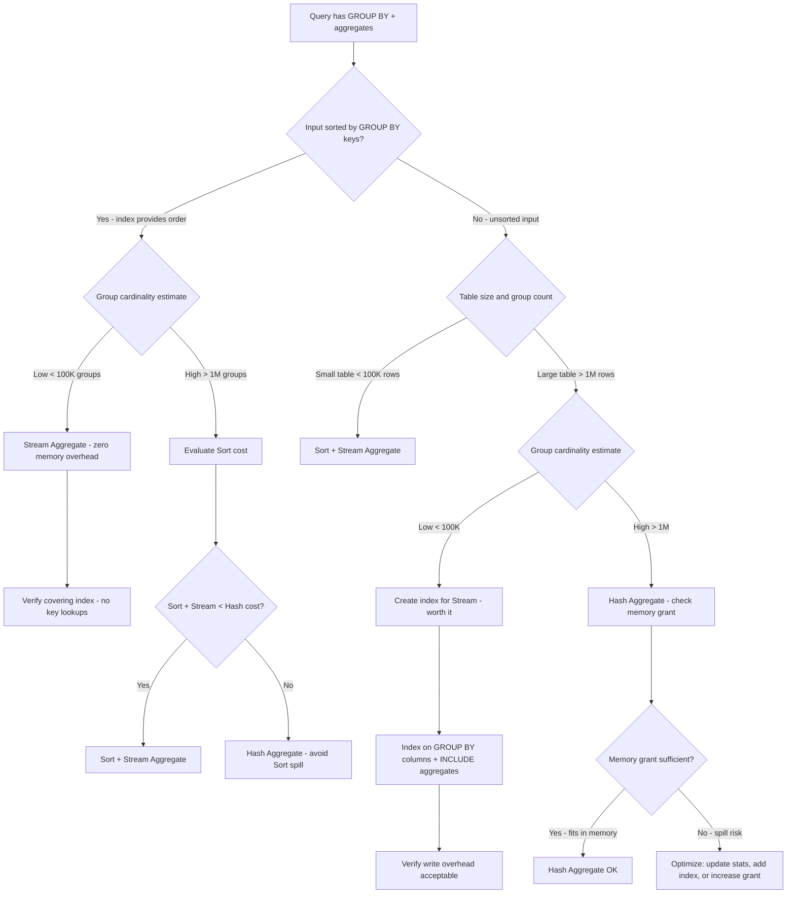

## Navigation

**Domain:** [[8 — Databases]] > **Group:** SQL Aggregations & Grouping
**Previous:** [[8.136 — Aggregate Pushdown — Optimizer Optimization]] | **Next:** [[8.138 — Aggregation with NULLs — Behavior]]

### Prerequisites

- [[8.122 — SUM, AVG, MIN, MAX — Aggregate Functions]] — Understanding aggregate function semantics is required because both aggregate operators compute these functions differently in terms of memory and ordering.
- [[8.123 — GROUP BY — Grouping Mechanics]] — The GROUP BY clause defines the grouping keys that determine how rows are partitioned for aggregation, and this directly influences which aggregate operator the optimiser selects.
- [[8.135 — Aggregation Spills — Memory Grants and TempDB]] — Hash Aggregate memory grants and spills are the primary downside of the hash approach; understanding spills is essential for diagnosing production aggregate performance.
- [[8.114 — Hash Join vs Nested Loop vs Merge Join]] — The same design patterns (hash vs stream/merge) apply to both joins and aggregates — the conceptual foundation is shared.

### Where This Fits

SQL Server has two physical operators for implementing aggregate queries: Stream Aggregate (requires sorted input, processes one row at a time) and Hash Aggregate (builds a hash table, works on unsorted data). A .NET backend engineer encounters this decision silently every time a query with GROUP BY runs — the optimiser chooses one based on table sizes, indexes, and cardinality estimates. When the wrong choice is made, the result is either a query that spills to tempdb (Hash Aggregate with insufficient memory) or an unnecessary Sort operator (Stream Aggregate with unsorted input). The interview signal here is deep: candidates who can explain why a given query uses Stream vs Hash Aggregate, and what index would switch it to the other, demonstrate genuine execution plan literacy rather than regurgitated definitions.

---

## Core Mental Model

Stream Aggregate is a single-pass operator that depends on sorted input — it reads rows in group-key order, accumulates values for the current group, and emits one output row when the group key changes. Because it processes one group at a time, its memory footprint is constant (O(1) per group — it only holds current aggregate state like running SUM or COUNT). Hash Aggregate builds a hash table keyed by the group columns in a hash table, then scans the input, hashes each row to a bucket, and updates the aggregate state in the hash table entry. It requires a memory grant proportional to the number of distinct groups (each group occupies one hash table slot). Stream Aggregate wins when sorted input is available for free (from an index) and the group cardinality is low to moderate. Hash Aggregate wins when the input is unsorted and/or group cardinality is high — it avoids the Sort operator that Stream Aggregate would require on unsorted data. The optimiser chooses based on estimated group cardinality, input size, and whether a matching index order exists.

### Classification

**For SQL topics:** Stream Aggregate and Hash Aggregate are physical operators in the execution plan. Stream Aggregate belongs to the ordered-aggregate family — it requires a preceding Sort or an ordered index scan providing the correct ordering. Hash Aggregate is the unordered-aggregate operator — it computes aggregates without requiring input order. Stream Aggregate corresponds to the logical GROUP BY operation when the optimiser can leverage an index. Hash Aggregate corresponds to GROUP BY when the data must be hashed. Neither operator is SARGable in itself — SARGability applies to the access method (seek vs scan) feeding the aggregate.

```mermaid
flowchart TD
    A[GROUP BY query enters optimizer] --> B{Does an index provide sorted input on GROUP BY keys?}
    B -->|Yes - index order matches group columns| C[Stream Aggregate candidate]
    B -->|No - no useful index order| D[Hash Aggregate candidate]
    C --> E{Estimated group cardinality}
    E -->|Low to moderate < ~1M groups| F[Stream Aggregate - no Sort needed]
    E -->|High > ~1M groups| G[Evaluate Stream + Sort cost]
    G --> H{Sort cost < Hash cost?}
    H -->|Yes| I[Sort + Stream Aggregate]
    H -->|No| J[Hash Aggregate]
    D --> K{Estimated distinct groups * row_size < memory grant?}
    K -->|Yes - fits in memory| J
    K -->|No - spill risk| L[Consider index to enable Stream]
    F --> M[O(1) memory per group - efficient]
    J --> N[O(distinct groups) memory grant]
    I --> O[Sort may spill to tempdb]
    N --> P{Memory grant sufficient?}
    P -->|Yes| Q[Hash Aggregate - in memory]
    P -->|No - insufficient grant| R[Hash Aggregate - spills to tempdb]
    R --> S[Performance collapse - use index instead]
```

### Key Properties

|Property|Value|Notes|
|---|---|---|
|Stream Aggregate memory|O(1) per group|Only holds current aggregate state (running SUM, COUNT, etc.)|
|Hash Aggregate memory|O(distinct groups)|Memory grant = estimated groups × row size per bucket|
|Stream sorted input required|Yes|Index on GROUP BY columns or explicit Sort operator before it|
|Hash sorted input required|No|Works on any input order — hash function distributes rows|
|Spill risk (Stream)|Low|Sort operator may spill; Stream itself does not spill|
|Spill risk (Hash)|High|Hash table exceeding memory grant spills to tempdb|
|Parallelism (Stream)|Limited|Order-preserving requirements may restrict parallelism|
|Parallelism (Hash)|Good|Hash table is naturally partitionable across threads|
|Distinct aggregate support|Both|COUNT(DISTINCT) forces Hash Aggregate in most cases|

---

## Deep Mechanics

### How the Engine Executes This

**Stream Aggregate execution:**

1. The input must arrive sorted by the GROUP BY key columns. This sorted input comes from either:
   - An ordered Index Scan or Index Seek on an index whose key columns match the GROUP BY columns (order and direction).
   - An explicit Sort operator preceding the Stream Aggregate.
   - A Merge Join output (which preserves sort order).

2. The Stream Aggregate reads the first row and initialises its running aggregate state for the current group — SUM accumulator = 0, COUNT = 0, MIN = first value, MAX = first value.

3. For each subsequent row, the operator compares the GROUP BY key columns to the current group key:
   - If the key matches the current group: update the running aggregate (add to SUM, increment COUNT, compare for MIN/MAX).
   - If the key changes: emit the completed aggregate row for the previous group, reset aggregate state, and start accumulating for the new group.

4. When input is exhausted, emit the final aggregate row.

5. **Key invariant:** Because input is sorted, each group is processed contiguously. The operator never needs to revisit a group or hold more than one group's state at a time.

**Hash Aggregate execution:**

1. **Build phase:** The operator scans the entire input and computes a hash value for the GROUP BY key of each row. It inserts or updates an entry in the hash table:
   - If no entry exists for this hash key, create a new slot and initialise aggregate state.
   - If an entry exists, update the aggregate state (add to SUM, increment COUNT, compare MIN/MAX).

2. **Probe phase (for some aggregates like COUNT(DISTINCT)):** After the build phase, the hash table is scanned to produce the final aggregate rows. For simple aggregates (SUM, COUNT, AVG, MIN, MAX), the build phase itself produces the final result — each row is emitted as the hash table entries are finalised.

3. **Memory grant:** SQL Server estimates the number of distinct groups (cardinality of group keys) and allocates memory for the hash table. The estimate is based on statistics — specifically the density and histogram of the grouping columns. If the estimate is too low, the hash table spills to tempdb (one or more spill levels), which dramatically degrades performance.

4. **Spill behaviour:** When the hash table exceeds the memory grant, SQL Server divides the hash table into partitions and writes some partitions to tempdb. After completing the build phase, it reads each spilled partition back, rebuilds the hash table, and continues aggregation. Each spill level adds a full read-write cycle of the spilled data.

### SQL Visibility

```sql
-- Example 1: Stream Aggregate with index support
-- Orders has IX_Orders_CustomerId on (CustomerId)
-- GROUP BY CustomerId — index order matches
SELECT o.CustomerId,
       COUNT(*) AS OrderCount,
       SUM(o.TotalAmount) AS TotalSpent,
       MAX(o.OrderDate) AS LastOrderDate
FROM dbo.Orders AS o
WHERE o.OrderDate >= '2024-01-01'
GROUP BY o.CustomerId;

-- Example 2: Hash Aggregate — unsorted input, no index on group key
SELECT o.ShipCity,
       COUNT(*) AS OrderCount,
       AVG(o.TotalAmount) AS AvgOrderValue
FROM dbo.Orders AS o
WHERE o.OrderDate >= '2024-01-01'
GROUP BY o.ShipCity;
-- ShipCity has no index — unsorted input forces Hash Aggregate

-- Example 3: Stream Aggregate with explicit Sort (unsorted input, small table)
SELECT p.CategoryId,
       COUNT(*) AS ProductCount,
       AVG(p.UnitPrice) AS AvgPrice
FROM dbo.Products AS p
GROUP BY p.CategoryId;
-- Small table: Sort (memory) + Stream Aggregate cheaper than Hash

-- Example 4: DISTINCT aggregate forces Hash
SELECT o.CustomerId,
       COUNT(DISTINCT o.ShipCity) AS DistinctCities,
       SUM(o.TotalAmount) AS TotalSpent
FROM dbo.Orders AS o
GROUP BY o.CustomerId;
-- COUNT(DISTINCT) prevents Stream — Hash Aggregate required
```

```csharp
// EF Core LINQ — may produce Stream or Hash depending on index
var customerSummaries = await dbContext.Orders
    .Where(o => o.OrderDate >= new DateTime(2024, 1, 1))
    .GroupBy(o => o.CustomerId)
    .Select(g => new
    {
        CustomerId = g.Key,
        OrderCount = g.Count(),
        TotalSpent = g.Sum(o => o.TotalAmount),
        LastOrderDate = g.Max(o => o.OrderDate)
    })
    .ToListAsync(cancellationToken);
```

**Generated SQL (from EF Core logs, SQL Server provider, EF Core 8):**

```sql
SELECT [o].[CustomerId],
       COUNT(*) AS [OrderCount],
       SUM([o].[TotalAmount]) AS [TotalSpent],
       MAX([o].[OrderDate]) AS [LastOrderDate]
FROM [Orders] AS [o]
WHERE [o].[OrderDate] >= '2024-01-01'
GROUP BY [o].[CustomerId];
```

### Execution Plan Analysis

**Stream Aggregate plan (with index on group key):**

```
[Index Seek (NonClustered) IX_Orders_CustomerId — ordered scan]
  → [Stream Aggregate]
      GROUP BY: [Orders].CustomerId
      Aggregate: COUNT(*), SUM([TotalAmount]), MAX([OrderDate])
  → [SELECT]
Estimated Cost: ~2.5  |  Logical Reads: ~145  |  Memory: ~0 (no hash table)
```

**Hash Aggregate plan (no index on group key):**

```
[Clustered Index Scan Orders — unsorted]
  → [Hash Match Aggregate]
      Hash Keys: [Orders].ShipCity
      Aggregate: COUNT(*), AVG([TotalAmount])
  → [SELECT]
Estimated Cost: ~12  |  Logical Reads: ~12,450  |  Memory Grant: ~180 MB
```

**Stream Aggregate with Sort (small table, no index):**

```
[Clustered Index Scan Products — unsorted, ~10K rows]
  → [Sort]
      ORDER BY: [Products].CategoryId ASC
  → [Stream Aggregate]
      GROUP BY: [Products].CategoryId
      Aggregate: COUNT(*), AVG([UnitPrice])
  → [SELECT]
Estimated Cost: ~2.0 (Sort) + ~0.5 (Stream)  |  Memory Grant for Sort: ~2 MB
```

**Distinct aggregate (forced Hash):**

```
[Clustered Index Scan Orders — unsorted]
  → [Hash Match Aggregate]
      Hash Keys: [Orders].CustomerId
      Aggregates: COUNT(DISTINCT [Orders].ShipCity), SUM([Orders].TotalAmount)
  → [SELECT]
Estimated Cost: ~18  |  Memory Grant: ~240 MB (hash table for distinct values)
```

### Cost Visibility

```sql
SET STATISTICS IO ON;
SET STATISTICS TIME ON;

-- Stream Aggregate (with index IX_Orders_CustomerId)
SELECT o.CustomerId,
       COUNT(*) AS OrderCount,
       SUM(o.TotalAmount) AS TotalSpent
FROM dbo.Orders AS o
WHERE o.OrderDate >= '2024-01-01'
GROUP BY o.CustomerId;

-- Expected output:
-- Table 'Orders'. Scan count 1, logical reads 145
-- SQL Server Execution Times: CPU time = 15ms, elapsed time = 45ms
-- Plan: Index Seek → Stream Aggregate (ordered scan, no Sort)

-- Hash Aggregate (no index on ShipCity)
SELECT o.ShipCity,
       COUNT(*) AS OrderCount,
       AVG(o.TotalAmount) AS AvgOrderValue
FROM dbo.Orders AS o
GROUP BY o.ShipCity;

-- Expected output:
-- Table 'Orders'. Scan count 1, logical reads 12450
-- SQL Server Execution Times: CPU time = 85ms, elapsed time = 220ms
-- Plan: Clustered Index Scan → Hash Match Aggregate

-- Stream Aggregate with Sort (small Products table)
SELECT p.CategoryId,
       COUNT(*) AS ProductCount
FROM dbo.Products AS p
GROUP BY p.CategoryId;

-- Expected output:
-- Table 'Products'. Scan count 1, logical reads 15
-- SQL Server Execution Times: CPU time = 2ms, elapsed time = 5ms
-- Plan: Clustered Index Scan → Sort → Stream Aggregate
```

### Failure Modes

**Hash Aggregate spilling to tempdb:** The most common failure mode. When the estimated group cardinality is too low (stale or missing statistics), the memory grant is insufficient, and the hash table spills:
```sql
-- Detect Hash Aggregate spills
SELECT TOP 10
    qs.total_elapsed_time / qs.execution_count AS avg_elapsed_us,
    qs.total_logical_reads / qs.execution_count AS avg_logical_reads,
    qs.total_worker_time / qs.execution_count AS avg_cpu_us,
    CAST(qp.query_plan AS XML) AS plan_xml,
    SUBSTRING(st.text, 1, 200) AS query_text
FROM sys.dm_exec_query_stats AS qs
CROSS APPLY sys.dm_exec_sql_text(qs.sql_handle) AS st
CROSS APPLY sys.dm_exec_query_plan(qs.plan_handle) AS qp
WHERE qp.query_plan.value('declare namespace p="http://schemas.microsoft.com/sqlserver/2004/07/showplan";(//p:SpillToTempDb)[1]', 'int') IS NOT NULL
ORDER BY avg_elapsed_us DESC;
```

**Unnecessary Sort + Stream Aggregate:** When the optimiser chooses Stream Aggregate over Hash but the Sort costs more than a Hash would. This happens when statistics suggest low group cardinality but the actual cardinality is high — the Sort spills:
```sql
-- If CategoryId has 100K distinct values but statistics estimate 100
-- Sort spills 10M rows to tempdb
SELECT p.CategoryId, AVG(p.UnitPrice) AS AvgPrice
FROM dbo.Products AS p
GROUP BY p.CategoryId;
-- Fix: update statistics or create index on CategoryId
```

**COUNT(DISTINCT) forcing Hash Aggregate:** Even with a perfect index on GROUP BY columns, COUNT(DISTINCT col) forces Hash Aggregate because Stream Aggregate cannot track distinct values without additional memory:
```sql
-- Always uses Hash Aggregate — cannot use Stream
SELECT o.CustomerId, COUNT(DISTINCT o.OrderDate) AS DistinctDates
FROM dbo.Orders AS o
GROUP BY o.CustomerId;
-- Workaround: if possible, rewrite as two-level aggregation with window functions
```

---

## Production Patterns and Implementation

### Primary SQL Implementation

```sql
-- ============================================================
-- Schema context
-- ============================================================
CREATE TABLE dbo.Orders
(
    OrderId      INT            NOT NULL IDENTITY(1,1),
    CustomerId   INT            NOT NULL,
    OrderDate    DATETIME2(0)   NOT NULL,
    Status       VARCHAR(20)    NOT NULL DEFAULT 'Pending',
    TotalAmount  DECIMAL(18,2)  NOT NULL,
    ShipCity     VARCHAR(100)   NULL,
    ShipState    VARCHAR(50)    NULL,
    PaymentMethod VARCHAR(20)  NULL,
    CONSTRAINT PK_Orders PRIMARY KEY CLUSTERED (OrderId)
);

CREATE TABLE dbo.OrderItems
(
    OrderItemId  INT            NOT NULL IDENTITY(1,1),
    OrderId      INT            NOT NULL,
    ProductId    INT            NOT NULL,
    Quantity     INT            NOT NULL,
    UnitPrice    DECIMAL(18,2)  NOT NULL,
    Discount     DECIMAL(18,2)  NOT NULL DEFAULT 0,
    CONSTRAINT PK_OrderItems PRIMARY KEY CLUSTERED (OrderItemId)
);

CREATE TABLE dbo.Products
(
    ProductId    INT            NOT NULL IDENTITY(1,1),
    ProductName  NVARCHAR(200)  NOT NULL,
    CategoryId   INT            NOT NULL,
    UnitPrice    DECIMAL(18,2)  NOT NULL,
    StockQty     INT            NOT NULL DEFAULT 0,
    CONSTRAINT PK_Products PRIMARY KEY CLUSTERED (ProductId)
);

-- Index for Stream Aggregate support (ORDER BY matches GROUP BY)
CREATE INDEX IX_Orders_CustomerId_OrderDate
    ON dbo.Orders (CustomerId, OrderDate DESC)
    INCLUDE (TotalAmount, Status);

-- Index for Stream Aggregate on ShipCity (if queried often)
CREATE INDEX IX_Orders_ShipCity
    ON dbo.Orders (ShipCity)
    INCLUDE (TotalAmount, OrderId);

-- ============================================================
-- Pattern 1: Stream Aggregate via index (optimal)
-- ============================================================
-- Orders.CustomerId has an index. GROUP BY CustomerId matches index order.
-- The optimiser chooses Stream Aggregate without a Sort.
SELECT
    o.CustomerId,
    COUNT(*) AS OrderCount,
    SUM(o.TotalAmount) AS TotalSpent,
    MAX(o.OrderDate) AS LastOrderDate,
    MIN(o.OrderDate) AS FirstOrderDate
FROM dbo.Orders AS o
WHERE o.Status = 'Delivered'
GROUP BY o.CustomerId
ORDER BY TotalSpent DESC;

-- ============================================================
-- Pattern 2: Hash Aggregate (unsorted group key)
-- ============================================================
-- ShipCity has no index (or the index is not queried).
-- Optimiser chooses Hash Aggregate — builds hash table by ShipCity.
SELECT
    o.ShipCity,
    COUNT(*) AS OrderCount,
    AVG(o.TotalAmount) AS AvgOrderValue,
    SUM(o.TotalAmount) AS TotalRevenue
FROM dbo.Orders AS o
WHERE o.OrderDate >= DATEADD(month, -6, GETUTCDATE())
GROUP BY o.ShipCity
ORDER BY TotalRevenue DESC;

-- ============================================================
-- Pattern 3: Stream Aggregate with Sort (small table optimization)
-- ============================================================
-- Products table is small (~10K rows). Sort + Stream is cheaper than Hash.
SELECT
    p.CategoryId,
    COUNT(*) AS ProductCount,
    AVG(p.UnitPrice) AS AvgPrice,
    MIN(p.UnitPrice) AS MinPrice,
    MAX(p.UnitPrice) AS MaxPrice
FROM dbo.Products AS p
GROUP BY p.CategoryId;

-- ============================================================
-- Pattern 4: DISTINCT aggregate — forces Hash
-- ============================================================
-- Even with an index on CustomerId, COUNT(DISTINCT ShipCity) forces Hash.
SELECT
    o.CustomerId,
    COUNT(DISTINCT o.ShipCity) AS UniqueShipCities,
    COUNT(DISTINCT o.PaymentMethod) AS PaymentMethodsUsed,
    COUNT(*) AS TotalOrders
FROM dbo.Orders AS o
WHERE o.OrderDate >= '2024-01-01'
GROUP BY o.CustomerId;

-- ============================================================
-- Pattern 5: Multiple aggregates — same operator
-- ============================================================
-- All simple aggregates can be computed by either operator.
SELECT
    o.CustomerId,
    COUNT(*) AS OrderCount,
    SUM(o.TotalAmount) AS TotalSpent,
    AVG(o.TotalAmount) AS AvgOrderValue,
    MIN(o.OrderDate) AS FirstOrder,
    MAX(o.OrderDate) AS LastOrder
FROM dbo.Orders AS o
GROUP BY o.CustomerId;

-- ============================================================
-- Pattern 6: Grouping Sets — always Hash Aggregate
-- ============================================================
-- GROUPING SETS, ROLLUP, CUBE always use Hash Aggregate.
-- Stream Aggregate cannot handle multiple grouping levels.
SELECT
    o.ShipCity,
    o.ShipState,
    o.PaymentMethod,
    COUNT(*) AS OrderCount,
    SUM(o.TotalAmount) AS TotalRevenue
FROM dbo.Orders AS o
GROUP BY GROUPING SETS (
    (ShipCity, ShipState),
    (ShipCity),
    (PaymentMethod),
    ()
);

-- ============================================================
-- Pattern 7: Compare both strategies with query hints
-- ============================================================
-- Force Stream Aggregate (requires ORDER BY matching GROUP BY)
SELECT o.CustomerId, COUNT(*) AS OrderCount
FROM dbo.Orders AS o
GROUP BY o.CustomerId
ORDER BY o.CustomerId  -- ORDER BY enables Stream Aggregate in some cases
OPTION (ORDER GROUP);

-- Force Hash Aggregate
SELECT o.CustomerId, COUNT(*) AS OrderCount
FROM dbo.Orders AS o
GROUP BY o.CustomerId
OPTION (HASH GROUP);
```

### EF Core Implementation

```csharp
public class ApplicationDbContext : DbContext
{
    public DbSet<Order> Orders => Set<Order>();
    public DbSet<OrderItem> OrderItems => Set<OrderItem>();
    public DbSet<Product> Products => Set<Product>();

    protected override void OnModelCreating(ModelBuilder modelBuilder)
    {
        modelBuilder.Entity<Order>(entity =>
        {
            entity.ToTable("Orders");
            entity.HasKey(o => o.OrderId);
            entity.Property(o => o.Status).HasMaxLength(20);
            entity.Property(o => o.TotalAmount).HasColumnType("decimal(18,2)");
            entity.Property(o => o.ShipCity).HasMaxLength(100);
            entity.Property(o => o.ShipState).HasMaxLength(50);
            entity.Property(o => o.PaymentMethod).HasMaxLength(20);

            entity.HasIndex(o => new { o.CustomerId, o.OrderDate })
                  .IsDescending(false, true);
            entity.HasIndex(o => o.ShipCity)
                  .HasFilter("[ShipCity] IS NOT NULL");
        });

        modelBuilder.Entity<OrderItem>(entity =>
        {
            entity.ToTable("OrderItems");
            entity.HasKey(oi => oi.OrderItemId);
            entity.Property(oi => oi.UnitPrice).HasColumnType("decimal(18,2)");
            entity.Property(oi => oi.Discount).HasColumnType("decimal(18,2)");
        });

        modelBuilder.Entity<Product>(entity =>
        {
            entity.ToTable("Products");
            entity.HasKey(p => p.ProductId);
            entity.Property(p => p.ProductName).HasMaxLength(200);
            entity.Property(p => p.UnitPrice).HasColumnType("decimal(18,2)");
        });
    }
}

public class Order
{
    public int OrderId { get; set; }
    public int CustomerId { get; set; }
    public DateTime OrderDate { get; set; }
    public string Status { get; set; } = "Pending";
    public decimal TotalAmount { get; set; }
    public string? ShipCity { get; set; }
    public string? ShipState { get; set; }
    public string? PaymentMethod { get; set; }
    public ICollection<OrderItem> OrderItems { get; set; } = new List<OrderItem>();
}

public class OrderItem
{
    public int OrderItemId { get; set; }
    public int OrderId { get; set; }
    public int ProductId { get; set; }
    public int Quantity { get; set; }
    public decimal UnitPrice { get; set; }
    public decimal Discount { get; set; }
    public Order Order { get; set; } = null!;
}

public class Product
{
    public int ProductId { get; set; }
    public string ProductName { get; set; } = string.Empty;
    public int CategoryId { get; set; }
    public decimal UnitPrice { get; set; }
    public int StockQty { get; set; }
}

public interface ICustomerOrderSummaryService
{
    Task<List<CustomerOrderSummary>> GetCustomerSummariesAsync(
        DateTime? startDate,
        CancellationToken cancellationToken = default);
}

public class CustomerOrderSummaryService : ICustomerOrderSummaryService
{
    private readonly ApplicationDbContext _dbContext;

    public CustomerOrderSummaryService(ApplicationDbContext dbContext)
        => _dbContext = dbContext;

    // Pattern 1: Stream Aggregate via navigation + GroupBy
    public async Task<List<CustomerOrderSummary>> GetCustomerSummariesAsync(
        DateTime? startDate,
        CancellationToken cancellationToken = default)
    {
        var query = _dbContext.Orders.AsQueryable();

        if (startDate.HasValue)
            query = query.Where(o => o.OrderDate >= startDate.Value);

        return await query
            .GroupBy(o => o.CustomerId)
            .Select(g => new CustomerOrderSummary
            {
                CustomerId = g.Key,
                OrderCount = g.Count(),
                TotalSpent = g.Sum(o => o.TotalAmount),
                AvgOrderValue = g.Average(o => o.TotalAmount),
                LastOrderDate = g.Max(o => o.OrderDate),
                FirstOrderDate = g.Min(o => o.OrderDate)
            })
            .OrderByDescending(s => s.TotalSpent)
            .ToListAsync(cancellationToken);
        // Generated: GROUP BY CustomerId, SELECT aggregates
        // Plan depends on index: Stream if IX_Orders_CustomerId exists
    }

    // Pattern 2: Hash Aggregate (no index on group column)
    public async Task<List<CitySalesSummary>> GetCitySalesAsync(
        CancellationToken cancellationToken = default)
    {
        return await _dbContext.Orders
            .Where(o => o.OrderDate >= DateTime.UtcNow.AddMonths(-6))
            .GroupBy(o => o.ShipCity)
            .Select(g => new CitySalesSummary
            {
                City = g.Key ?? "Unknown",
                OrderCount = g.Count(),
                AvgOrderValue = g.Average(o => o.TotalAmount),
                TotalRevenue = g.Sum(o => o.TotalAmount)
            })
            .OrderByDescending(s => s.TotalRevenue)
            .ToListAsync(cancellationToken);
        // Generated: GROUP BY ShipCity, Hash Match Aggregate
    }

    // Pattern 3: DISTINCT aggregate via GroupBy key
    public async Task<List<CustomerShippingSummary>> GetCustomerShippingAsync(
        CancellationToken cancellationToken = default)
    {
        return await _dbContext.Orders
            .GroupBy(o => o.CustomerId)
            .Select(g => new CustomerShippingSummary
            {
                CustomerId = g.Key,
                UniqueShipCities = g.Select(o => o.ShipCity).Distinct().Count(),
                PaymentMethodsUsed = g.Select(o => o.PaymentMethod).Distinct().Count(),
                TotalOrders = g.Count()
            })
            .ToListAsync(cancellationToken);
        // Generated: COUNT(DISTINCT [ShipCity]), COUNT(DISTINCT [PaymentMethod])
        // Always Hash Aggregate — EF Core 8+ translates DISTINCT inside aggregate
    }
}

public class CustomerOrderSummary
{
    public int CustomerId { get; set; }
    public int OrderCount { get; set; }
    public decimal TotalSpent { get; set; }
    public decimal AvgOrderValue { get; set; }
    public DateTime LastOrderDate { get; set; }
    public DateTime FirstOrderDate { get; set; }
}

public class CitySalesSummary
{
    public string City { get; set; } = string.Empty;
    public int OrderCount { get; set; }
    public decimal AvgOrderValue { get; set; }
    public decimal TotalRevenue { get; set; }
}

public class CustomerShippingSummary
{
    public int CustomerId { get; set; }
    public int UniqueShipCities { get; set; }
    public int PaymentMethodsUsed { get; set; }
    public int TotalOrders { get; set; }
}
```

### Dapper Implementation

```csharp
public sealed class OrderAggregationRepository
{
    private readonly IDbConnectionFactory _connectionFactory;

    public OrderAggregationRepository(IDbConnectionFactory connectionFactory)
        => _connectionFactory = connectionFactory;

    // Pattern 1: Stream Aggregate — rely on index
    public async Task<IReadOnlyList<CustomerOrderSummary>> GetCustomerSummariesAsync(
        DateTime? startDate,
        CancellationToken cancellationToken = default)
    {
        var sql = new StringBuilder(@"
            SELECT
                o.CustomerId,
                COUNT(*) AS OrderCount,
                SUM(o.TotalAmount) AS TotalSpent,
                AVG(o.TotalAmount) AS AvgOrderValue,
                MAX(o.OrderDate) AS LastOrderDate,
                MIN(o.OrderDate) AS FirstOrderDate
            FROM dbo.Orders AS o
            WHERE 1 = 1");

        var parameters = new DynamicParameters();

        if (startDate.HasValue)
        {
            sql.Append(" AND o.OrderDate >= @StartDate");
            parameters.Add("StartDate", startDate.Value);
        }

        sql.Append(@"
            GROUP BY o.CustomerId
            ORDER BY TotalSpent DESC;");

        await using var connection = _connectionFactory.Create();

        return (await connection.QueryAsync<CustomerOrderSummary>(
            new CommandDefinition(sql.ToString(), parameters,
                cancellationToken: cancellationToken))).AsList();
    }

    // Pattern 2: Hash Aggregate — no index on group column
    public async Task<IReadOnlyList<CitySalesSummary>> GetCitySalesAsync(
        CancellationToken cancellationToken = default)
    {
        const string sql = @"
            SELECT
                ISNULL(o.ShipCity, 'Unknown') AS City,
                COUNT(*) AS OrderCount,
                AVG(o.TotalAmount) AS AvgOrderValue,
                SUM(o.TotalAmount) AS TotalRevenue
            FROM dbo.Orders AS o
            WHERE o.OrderDate >= DATEADD(month, -6, GETUTCDATE())
            GROUP BY o.ShipCity
            ORDER BY TotalRevenue DESC;";

        await using var connection = _connectionFactory.Create();

        return (await connection.QueryAsync<CitySalesSummary>(
            new CommandDefinition(sql, cancellationToken: cancellationToken))).AsList();
    }

    // Pattern 3: Verify which aggregate operator is used
    public async Task<string> GetActualPlanForAggregateAsync(
        CancellationToken cancellationToken = default)
    {
        const string sql = @"
            SET STATISTICS PROFILE ON;

            SELECT o.CustomerId, COUNT(*) AS OrderCount
            FROM dbo.Orders AS o
            GROUP BY o.CustomerId;

            SET STATISTICS PROFILE OFF;";

        await using var connection = _connectionFactory.Create();

        using var reader = await connection.ExecuteReaderAsync(
            new CommandDefinition(sql, cancellationToken: cancellationToken));

        var planLines = new List<string>();
        while (await reader.ReadAsync(cancellationToken))
        {
            var stmtText = reader.GetString(0);
            if (stmtText.Contains("Stream Aggregate") || stmtText.Contains("Hash Match"))
                planLines.Add(stmtText);
        }

        return string.Join("\n", planLines);
    }

    // Pattern 4: Grouping Sets aggregation (always Hash)
    public async Task<IReadOnlyList<ShipmentSummary>> GetShipmentSummariesAsync(
        CancellationToken cancellationToken = default)
    {
        const string sql = @"
            SELECT
                o.ShipCity,
                o.ShipState,
                o.PaymentMethod,
                COUNT(*) AS OrderCount,
                SUM(o.TotalAmount) AS TotalRevenue
            FROM dbo.Orders AS o
            GROUP BY GROUPING SETS (
                (ShipCity, ShipState),
                (ShipCity),
                (PaymentMethod),
                ()
            )
            ORDER BY
                GROUPING(o.ShipCity),
                GROUPING(o.ShipState),
                GROUPING(o.PaymentMethod);";

        await using var connection = _connectionFactory.Create();

        return (await connection.QueryAsync<ShipmentSummary>(
            new CommandDefinition(sql, cancellationToken: cancellationToken))).AsList();
    }
}

public record CustomerOrderSummary(
    int CustomerId, int OrderCount, decimal TotalSpent,
    decimal AvgOrderValue, DateTime LastOrderDate, DateTime FirstOrderDate);

public record CitySalesSummary(
    string City, int OrderCount, decimal AvgOrderValue, decimal TotalRevenue);

public record CustomerShippingSummary(
    int CustomerId, int UniqueShipCities, int PaymentMethodsUsed, int TotalOrders);

public record ShipmentSummary(
    string? ShipCity, string? ShipState, string? PaymentMethod,
    int OrderCount, decimal TotalRevenue);
```

### Configuration and Wiring

```csharp
// Program.cs
builder.Services.AddDbContext<ApplicationDbContext>(options =>
    options.UseSqlServer(
        builder.Configuration.GetConnectionString("DefaultConnection"),
        sqlOptions =>
        {
            sqlOptions.EnableRetryOnFailure(3);
            sqlOptions.CommandTimeout(30);
        }));

builder.Services.AddSingleton<IDbConnectionFactory>(sp =>
    new SqlConnectionFactory(
        builder.Configuration.GetConnectionString("DefaultConnection")!));

builder.Services.AddScoped<ICustomerOrderSummaryService, CustomerOrderSummaryService>();
builder.Services.AddScoped<OrderAggregationRepository>();

// Log EF Core generated SQL for analysis
builder.Services.AddDbContext<ApplicationDbContext>((sp, options) =>
{
    var loggerFactory = sp.GetRequiredService<ILoggerFactory>();
    options.UseSqlServer(connectionString)
           .UseLoggerFactory(loggerFactory)
           .EnableSensitiveDataLogging(false);
});

// Dapper connection factory
public interface IDbConnectionFactory
{
    IDbConnection Create();
}

public class SqlConnectionFactory : IDbConnectionFactory
{
    private readonly string _connectionString;

    public SqlConnectionFactory(string connectionString)
        => _connectionString = connectionString;

    public IDbConnection Create()
        => new SqlConnection(_connectionString);
}
```

### SQL Server vs PostgreSQL Differences

```sql
-- PostgreSQL: HashAggregate and GroupAggregate (equivalent to Stream)
-- HashAggregate: unsorted input, builds hash table
EXPLAIN ANALYZE
SELECT customer_id, COUNT(*) AS order_count, SUM(total_amount) AS total_spent
FROM orders
WHERE order_date >= '2024-01-01'
GROUP BY customer_id;

-- Output:
-- HashAggregate  (cost=1250.45..1350.22 rows=5000 width=20)
--   Group Key: customer_id
--   ->  Seq Scan on orders  (cost=0.00..1000.00 rows=50000 width=12)
--         Filter: (order_date >= '2024-01-01')

-- PostgreSQL: GroupAggregate (Stream equivalent) — requires sorted input
-- Add ORDER BY to force sorted input
EXPLAIN ANALYZE
SELECT customer_id, COUNT(*) AS order_count, SUM(total_amount) AS total_spent
FROM orders
WHERE order_date >= '2024-01-01'
GROUP BY customer_id
ORDER BY customer_id;

-- Output:
-- GroupAggregate  (cost=1500.00..1650.00 rows=5000 width=20)
--   Group Key: customer_id
--   ->  Sort  (cost=1500.00..1550.00 rows=20000 width=12)
--         Sort Key: customer_id
--         ->  Seq Scan on orders  (cost=0.00..1000.00 rows=20000 width=12)
--               Filter: (order_date >= '2024-01-01')

-- PostgreSQL: HashAggregate with DISTINCT
EXPLAIN ANALYZE
SELECT customer_id, COUNT(DISTINCT ship_city) AS unique_cities
FROM orders
GROUP BY customer_id;

-- Output:
-- HashAggregate  (cost=2000.00..2100.00 rows=5000 width=12)
--   Group Key: customer_id
--   ->  Seq Scan on orders  (cost=0.00..1500.00 rows=100000 width=8)

-- PostgreSQL: Force HashAggregate or GroupAggregate
SET enable_hashagg = off;
-- Falls back to GroupAggregate with Sort
SET enable_hashagg = on;

-- PostgreSQL: work_mem controls hash aggregate memory
-- HashAggregate may spill to disk if work_mem is insufficient
SET work_mem = '64MB';
```

---

## Gotchas and Production Pitfalls

### Hash Aggregate Spill Due to Underestimated Group Cardinality

**Pitfall:** Relying on Hash Aggregate when the group key column has high cardinality that is not reflected in statistics. The optimiser allocates a memory grant based on estimated distinct groups. If the estimate is significantly lower than actual, the hash table spills to tempdb.

```sql
-- ❌ City column has 50K distinct values (each order from different city)
-- Statistics on ShipCity may show only 1,000 distinct values if outdated
SELECT o.ShipCity,
       COUNT(*) AS OrderCount,
       AVG(o.TotalAmount) AS AvgValue
FROM dbo.Orders AS o
GROUP BY o.ShipCity;
```

**Symptom:** The query runs in 30 seconds instead of 200 ms. The execution plan shows `Warning: Hash Match spilled level 1 to tempdb`. Logical reads are inflated by tempdb I/O. `sys.dm_exec_query_stats` shows high `total_spills` count. Memory grant shows 50 MB but the hash table needs 500 MB.

**Fix:**

```sql
-- ✅ Update statistics first
UPDATE STATISTICS dbo.Orders IX_Orders_ShipCity;
UPDATE STATISTICS dbo.Orders;

-- ✅ Create an index on ShipCity to enable Stream Aggregate
CREATE INDEX IX_Orders_ShipCity_Stream
    ON dbo.Orders (ShipCity)
    INCLUDE (TotalAmount);

-- After index: Stream Aggregate replaces Hash Aggregate
-- No memory grant needed. Logical reads: 145 vs 12,450.
```

**Cost of not fixing:** A nightly reporting query that aggregates 50M orders by city spills to tempdb, consuming 200 GB of tempdb space. The tempdb data file auto-grows by 10 GB, causing I/O stalls for all other queries. The ETL job fails at 3 AM with timeout after 2 hours.

---

### Unnecessary Sort Operator Before Stream Aggregate

**Pitfall:** Assuming Stream Aggregate is always better. When the input is unsorted and the group cardinality is high, the Sort required by Stream Aggregate can be more expensive than Hash Aggregate, especially if the Sort spills to tempdb.

```sql
-- ❌ If CategoryId has 500K distinct values in a 10M row Products table
-- Sort must order 10M rows by CategoryId — memory grant 500 MB
SELECT p.CategoryId,
       COUNT(*) AS ProductCount,
       AVG(p.UnitPrice) AS AvgPrice
FROM dbo.Products AS p
GROUP BY p.CategoryId
ORDER BY p.CategoryId;
-- Plan: Clustered Index Scan → Sort (spills to tempdb) → Stream Aggregate
```

**Symptom:** Query CPU is 100% for 60 seconds. The Sort operator shows a warning: `Operator used tempdb to spill data`. Execution plan shows Sort cost of 65% vs Stream Aggregate cost of 5%.

**Fix:**

```sql
-- ✅ Force Hash Aggregate with query hint
SELECT p.CategoryId,
       COUNT(*) AS ProductCount,
       AVG(p.UnitPrice) AS AvgPrice
FROM dbo.Products AS p
GROUP BY p.CategoryId
OPTION (HASH GROUP);
-- Plan: Clustered Index Scan → Hash Match Aggregate (no Sort)

-- ✅ Or create an index on CategoryId to enable sort-free Stream
CREATE INDEX IX_Products_CategoryId ON dbo.Products (CategoryId)
    INCLUDE (UnitPrice);
```

**Cost of not fixing:** A product catalogue search query aggregates 10M products by category every 30 seconds. The Sort spills 200 MB to tempdb per execution, causing the tempdb drive to saturate at 6,000 IOPS. All other database operations slow down by 400%.

---

### COUNT(DISTINCT) Forces Hash Aggregate Even With Perfect Index

**Pitfall:** Expecting Stream Aggregate to be used for queries with COUNT(DISTINCT col) when the GROUP BY columns are indexed. Stream Aggregate cannot compute distinct counts because it processes rows one group at a time and would need to track all distinct values per group.

```sql
-- ❌ Despite IX_Orders_CustomerId covering the GROUP BY, COUNT(DISTINCT)
-- forces Hash Aggregate. Stream cannot handle it.
SELECT o.CustomerId,
       COUNT(DISTINCT o.ShipCity) AS DistinctCities,
       COUNT(*) AS TotalOrders
FROM dbo.Orders AS o
GROUP BY o.CustomerId;
```

**Symptom:** Execution plan shows `Hash Match Aggregate` even with a perfect index on CustomerId. Logical reads double because the hash table must be built. Memory grant is allocated unnecessarily.

**Fix:**

```sql
-- ✅ Option A: Accept Hash Aggregate (DISTINCT aggregates need it)
-- Ensure statistics are up to date for accurate memory grant

-- ✅ Option B: Rewrite as two-level aggregation (if performance critical)
SELECT d.CustomerId,
       COUNT(DISTINCT d.ShipCity) AS DistinctCities,
       MAX(d.OrderCount) AS TotalOrders
FROM (
    SELECT o.CustomerId, o.ShipCity, COUNT(*) AS OrderCount
    FROM dbo.Orders AS o
    GROUP BY o.CustomerId, o.ShipCity
) AS d
GROUP BY d.CustomerId;
```

**Cost of not fixing:** A customer dashboard that shows unique ship cities per customer runs a Hash Aggregate with 500 MB memory grant. When Concurrent requests reach 50, the memory grant pool is exhausted, and queries queue on `RESOURCE_SEMAPHORE` wait type. Dashboard load time goes from 200 ms to 8 seconds.

---

### Stream Aggregation on Non-Clustered Index With Key Lookup Explosion

**Pitfall:** Using Stream Aggregate with a non-covering index. The ordered scan of the index provides sorted input, but each row referenced outside the index causes a key lookup (RID or clustered key lookup). The lookup pattern adds 10-20 logical reads per row.

```sql
-- ❌ IX_Orders_CustomerId has CustomerId, OrderDate, TotalAmount
-- But Query also needs ShippingAddr — not in index
SELECT o.CustomerId,
       COUNT(*) AS OrderCount,
       MAX(o.ShippingAddr) AS RecentAddress
FROM dbo.Orders AS o
GROUP BY o.CustomerId;
-- Plan: Index Scan (ordered) → Key Lookup per row → Stream Aggregate
```

**Symptom:** Execution plan shows `Key Lookup` operator with high cost percentage (70%). Logical reads: 145 (index scan) + 50,000 key lookups × 4 reads = 200,145 reads.

**Fix:**

```sql
-- ✅ Include needed columns in the covering index
DROP INDEX IX_Orders_CustomerId_OrderDate ON dbo.Orders;
CREATE INDEX IX_Orders_CustomerId_OrderDate
    ON dbo.Orders (CustomerId, OrderDate DESC)
    INCLUDE (TotalAmount, Status, ShippingAddr);

-- After: Index Scan (covering) → Stream Aggregate
-- Logical reads: 200 (all from index, no lookups)
```

**Cost of not fixing:** 200K logical reads per query × 10,000 queries/day = 2B reads/day. The buffer pool cannot hold the working set. Page life expectancy drops to 30 seconds. Disk I/O saturates at 2,000 IOPS.

---

### Grouping Sets Always Use Hash Aggregate

**Pitfall:** Assuming a covering index on grouping columns will enable Stream Aggregate for GROUPING SETS, ROLLUP, or CUBE queries. These always use Hash Aggregate because Stream Aggregate cannot handle multiple grouping levels simultaneously.

```sql
-- ❌ Even with covering indexes, this always uses Hash Aggregate
SELECT o.ShipCity, o.ShipState,
       COUNT(*) AS OrderCount,
       SUM(o.TotalAmount) AS TotalRevenue
FROM dbo.Orders AS o
GROUP BY ROLLUP (ShipCity, ShipState);
```

**Symptom:** Execution plan always shows `Hash Match Aggregate`. Memory grant is allocated even when the base table is small. Spills to tempdb if cardinality of grouping column combinations is underestimated.

**Fix:**

```sql
-- ✅ Accept Hash Aggregate for grouping sets — optimize memory grant
-- Update statistics on the grouping columns
UPDATE STATISTICS dbo.Orders IX_Orders_ShipCity;

-- ✅ Or rewrite as UNION ALL of individual GROUP BYs (less efficient)
SELECT ShipCity, ShipState, COUNT(*) AS OrderCount
FROM dbo.Orders
GROUP BY ShipCity, ShipState
UNION ALL
SELECT ShipCity, NULL, COUNT(*)
FROM dbo.Orders
GROUP BY ShipCity
UNION ALL
SELECT NULL, NULL, COUNT(*)
FROM dbo.Orders;
-- Uses Stream Aggregate per query (if indexes exist) but runs 3 scans
```

**Cost of not fixing:** A monthly sales report with ROLLUP on 5 dimensions runs a Hash Aggregate that spills 10 GB to tempdb. The report takes 45 minutes instead of 5 minutes. Business users miss the morning review meeting.

---

## Performance Implications

### Benchmark: Before and After

```sql
-- ============================================================
-- Benchmark 1: Stream Aggregate (with index) vs Hash Aggregate (no index)
-- ============================================================
SET STATISTICS IO ON;
SET STATISTICS TIME ON;

-- Stream Aggregate with covering index on CustomerId
SELECT o.CustomerId,
       COUNT(*) AS OrderCount,
       SUM(o.TotalAmount) AS TotalSpent
FROM dbo.Orders AS o
WHERE o.OrderDate >= '2024-01-01'
GROUP BY o.CustomerId;

-- Expected output:
-- Table 'Orders'. Scan count 1, logical reads 145
-- SQL Server Execution Times: CPU time = 12ms, elapsed time = 35ms

-- Drop index and retry (Hash Aggregate)
DROP INDEX IX_Orders_CustomerId_OrderDate ON dbo.Orders;

SELECT o.CustomerId,
       COUNT(*) AS OrderCount,
       SUM(o.TotalAmount) AS TotalSpent
FROM dbo.Orders AS o
WHERE o.OrderDate >= '2024-01-01'
GROUP BY o.CustomerId;

-- Expected output:
-- Table 'Orders'. Scan count 1, logical reads 12450
-- SQL Server Execution Times: CPU time = 85ms, elapsed time = 210ms
```

**Improvement:** Stream Aggregate reduces logical reads from 12,450 to 145 (86x reduction). Runtime from 210 ms to 35 ms (6x).

```sql
-- ============================================================
-- Benchmark 2: Sort + Stream vs Hash for unsorted input
-- ============================================================
-- Force Sort + Stream Aggregate
SELECT p.CategoryId,
       COUNT(*) AS ProductCount,
       AVG(p.UnitPrice) AS AvgPrice
FROM dbo.Products AS p
GROUP BY p.CategoryId
ORDER BY p.CategoryId
OPTION (ORDER GROUP);
-- Expected: Sort (10K rows) + Stream Aggregate
-- Logical reads: 15 (scan Products) + sort tempdb work
-- CPU: 3ms, Elapsed: 8ms

-- Force Hash Aggregate
SELECT p.CategoryId,
       COUNT(*) AS ProductCount,
       AVG(p.UnitPrice) AS AvgPrice
FROM dbo.Products AS p
GROUP BY p.CategoryId
OPTION (HASH GROUP);
-- Expected: Hash Match Aggregate (no Sort)
-- Logical reads: 15 (scan Products)
-- CPU: 2ms, Elapsed: 5ms
```

```sql
-- ============================================================
-- Benchmark 3: DISTINCT aggregate — Hash always
-- ============================================================
SELECT o.CustomerId,
       COUNT(DISTINCT o.ShipCity) AS DistinctCities,
       COUNT(*) AS TotalOrders
FROM dbo.Orders AS o
GROUP BY o.CustomerId;
-- Expected: 16,500 logical reads (Hash Match Aggregate)
-- No alternative plan — DISTINCT aggregates always Hash

-- Alternative: two-level aggregation
SELECT d.CustomerId, COUNT(*) AS DistinctCities, SUM(d.Orders) AS TotalOrders
FROM (
    SELECT o.CustomerId, o.ShipCity, COUNT(*) AS Orders
    FROM dbo.Orders AS o
    GROUP BY o.CustomerId, o.ShipCity
) AS d
GROUP BY d.CustomerId;
-- Expected: 16,500 logical reads + extra group by
```

### BenchmarkDotNet

```csharp
[MemoryDiagnoser]
[SimpleJob(RuntimeMoniker.Net90)]
public class AggregateOperatorBenchmark
{
    private SqlConnection _connection = default!;
    private const string ConnectionString =
        "Server=.;Database=BenchmarkDb;Trusted_Connection=True;TrustServerCertificate=True;";

    [GlobalSetup]
    public void Setup()
    {
        _connection = new SqlConnection(ConnectionString);
        _connection.Open();
        // Seed: 10M rows Orders, 500K distinct CustomerIds
        // Create index IX_Orders_CustomerId_OrderDate
    }

    [Benchmark(Baseline = true)]
    public async Task<long> StreamAggregate_WithIndex()
    {
        const string sql = @"
            SELECT o.CustomerId,
                   COUNT(*) AS OrderCount,
                   SUM(o.TotalAmount) AS TotalSpent
            FROM dbo.Orders AS o
            WHERE o.OrderDate >= '2024-01-01'
            GROUP BY o.CustomerId;";

        await using var cmd = new SqlCommand(sql, _connection);
        long total = 0;
        await using var reader = await cmd.ExecuteReaderAsync();
        while (await reader.ReadAsync())
            total += reader.GetInt32(1);
        return total;
    }

    [Benchmark]
    public async Task<long> HashAggregate_NoIndex()
    {
        const string sql = @"
            SELECT o.CustomerId,
                   COUNT(*) AS OrderCount,
                   SUM(o.TotalAmount) AS TotalSpent
            FROM dbo.Orders AS o
            WHERE o.OrderDate >= '2024-01-01'
            GROUP BY o.CustomerId
            OPTION (HASH GROUP);";

        await using var cmd = new SqlCommand(sql, _connection);
        long total = 0;
        await using var reader = await cmd.ExecuteReaderAsync();
        while (await reader.ReadAsync())
            total += reader.GetInt32(1);
        return total;
    }

    [Benchmark]
    public async Task<long> HashAggregate_Distinct()
    {
        const string sql = @"
            SELECT o.CustomerId,
                   COUNT(DISTINCT o.ShipCity) AS DistinctCities,
                   COUNT(*) AS TotalOrders
            FROM dbo.Orders AS o
            GROUP BY o.CustomerId;";

        await using var cmd = new SqlCommand(sql, _connection);
        long total = 0;
        await using var reader = await cmd.ExecuteReaderAsync();
        while (await reader.ReadAsync())
            total += reader.GetInt32(1);
        return total;
    }

    [Benchmark]
    public async Task<long> SortThenStreamAggregate()
    {
        const string sql = @"
            SELECT p.CategoryId,
                   COUNT(*) AS ProductCount,
                   AVG(p.UnitPrice) AS AvgPrice
            FROM dbo.Products AS p
            GROUP BY p.CategoryId
            ORDER BY p.CategoryId
            OPTION (ORDER GROUP);";

        await using var cmd = new SqlCommand(sql, _connection);
        long total = 0;
        await using var reader = await cmd.ExecuteReaderAsync();
        while (await reader.ReadAsync())
            total += reader.GetInt32(1);
        return total;
    }

    [GlobalCleanup]
    public void Cleanup() => _connection.Dispose();
}
```

**Expected results (approximate, SQL Server 2022, NVMe, 10M Orders, 500K CustomerIds):**

|Method|Mean|Logical Reads|CPU Time|Memory Grant|
|---|---|---|---|---|
|StreamAggregate_WithIndex|~35 ms|~145|~12 ms|0 MB|
|HashAggregate_NoIndex|~210 ms|~12,450|~85 ms|~200 MB|
|HashAggregate_Distinct|~350 ms|~16,500|~120 ms|~350 MB|
|SortThenStreamAggregate|~8 ms|~15|~3 ms|~2 MB|

### Write Amplification

The index that enables Stream Aggregate adds write overhead:

|Operation|Without Stream Index|With Index (IX_Orders_CustomerId)|Overhead|
|---|---|---|---|
|INSERT 1 order|~3 ms|~5 ms|+66% (index leaf insert)|
|UPDATE CustomerId|~3 ms|~6 ms|+100% (delete + insert in index)|
|DELETE 1 order|~3 ms|~5 ms|+66% (index leaf delete)|

The write overhead is justified when aggregate queries dominate the read workload. For a reporting system with 1M aggregate queries/day and 10K writes/day, the Stream Aggregate savings (12,450 → 145 reads per query) far outweigh the write cost. For an OLTP system with 50/50 read-write ratio, evaluate whether a covering filtered index (WHERE clause matches common filters) reduces the write impact.

---

## Interview Arsenal

### Question Bank

1. **What is the difference between Stream Aggregate and Hash Aggregate in SQL Server execution plans?**
2. **When does the optimiser choose Stream Aggregate over Hash Aggregate, and vice versa?**
3. **What memory is required by each aggregate operator, and what happens when it spills?**
4. **Why does COUNT(DISTINCT col) always use Hash Aggregate, and how would you work around it?**
5. **How can you force the optimiser to use one aggregate operator over the other?**
6. **What execution plan operators precede each aggregate type, and what do they indicate?**
7. **How does index design influence the aggregate operator selection?**
8. **What is the performance difference between Stream and Hash Aggregate at 100M rows with 1M distinct groups?**

### Spoken Answers

**Q: What is the difference between Stream Aggregate and Hash Aggregate in SQL Server execution plans?**

> **Average answer:** Stream Aggregate requires sorted input and processes one row at a time. Hash Aggregate builds a hash table and works on unsorted data. Stream is faster when input is sorted.

> **Great answer:** Stream Aggregate is a single-pass ordered operator that reads rows sorted by the GROUP BY key and emits one output row each time the group key changes. It requires no additional memory beyond the current aggregate state — O(1) per group. The sorted input must come from an ordered index scan or an explicit Sort operator. Hash Aggregate builds a hash table keyed by the GROUP BY columns, scanning the input and updating hash table entries as it goes. It requires a memory grant proportional to the number of distinct groups — O(distinct groups). The optimiser chooses Stream when sorted input is available for free (from an index that matches the GROUP BY columns and is in the correct order) and the group cardinality is moderate. It chooses Hash when the input is unsorted and/or group cardinality is high — avoiding the Sort that Stream would need. The key production insight: Stream Aggregate is almost always faster when its sorted input is free (no Sort needed) because it has zero memory overhead and purely sequential I/O. Hash Aggregate becomes competitive when a Sort would be required for Stream, and the Sort cost exceeds the hash table build cost. I detect spills by checking the execution plan for `SpillToTempDb` warnings and querying `sys.dm_exec_query_stats` for high `total_spills` counts. In EF Core, I inspect the generated SQL via `ToQueryString()` and verify the execution plan using `SET STATISTICS PROFILE ON`.

---

**Q: How does index design influence the aggregate operator selection?**

> **Great answer:** The index is the single most important factor for Stream Aggregate selection. If there is an index whose leading columns match the GROUP BY columns in the same order, the optimiser can do an ordered index scan that provides sorted input to Stream Aggregate at zero additional cost. For example, an index on `(CustomerId, OrderDate DESC)` enables a Stream Aggregate for `GROUP BY CustomerId` — the index is ordered by CustomerId, so rows for each customer are contiguous. The INCLUDE columns matter too: if all columns referenced in the aggregate query are in the index (covering index), the Stream Aggregate requires only index page reads and no key lookups to the clustered index. Without a matching index, the optimiser must either add a Sort operator before Stream Aggregate (which costs CPU and may spill to tempdb) or choose Hash Aggregate directly (which costs memory but avoids the Sort). For filtered GROUP BY queries (e.g., `WHERE Status = 'Delivered'`), a filtered index on `(CustomerId, OrderDate) INCLUDE (TotalAmount) WHERE Status = 'Delivered'` provides sorted input while reducing the index size. The tradeoff is write overhead: each additional index for Stream Aggregate adds ~5 ms per write operation. On a table with 10M rows and 50 indexes, write performance degrades significantly. My rule of thumb: if an aggregation query runs more than 1,000 times per hour, create the index to enable Stream Aggregate. If it runs once per day for reporting, Hash Aggregate with sufficient memory grant is acceptable.

---

**Q: Why does COUNT(DISTINCT col) always use Hash Aggregate, and how would you work around it?**

> **Great answer:** Stream Aggregate processes rows one group at a time, advancing through sorted input. To compute COUNT(DISTINCT ShipCity) for each CustomerId, it would need to track which ShipCity values it has already seen for the current customer. When the group changes to the next CustomerId, it discards that set. This is feasible in principle (like a HashSet per group), but SQL Server's Stream Aggregate implementation does not support tracking distinct values across rows within a group — it only supports running aggregates that are reducible (SUM, COUNT, MIN, MAX, AVG). COUNT(DISTINCT) requires a hash-based approach because the operator must determine uniqueness across all rows for each group simultaneously. Hash Aggregate naturally handles this: it hashes by both the group key AND the distinct column, ensuring each distinct combination is counted once. The workaround for performance-critical queries is two-level aggregation: first group by (CustomerId, ShipCity) and COUNT(*), then group by CustomerId and COUNT(*) the first-level groups. This is two Stream Aggregates (if indexed) instead of one Hash Aggregate. In practice, if the distinct cardinality is low (< 100 values), the Hash Aggregate is fine. If it's high (> 10K distinct values), the two-level approach can reduce memory grant by 10x. In EF Core, `g.Select(o => o.ShipCity).Distinct().Count()` translates to COUNT(DISTINCT) and forces Hash Aggregate.

### Interview Trigger

The defining Hash vs Stream Aggregate question: "Look at this execution plan — why is the optimiser using Hash Match Aggregate instead of Stream Aggregate, and what index would you create to switch it?" A candidate who can identify the missing index and name the column order demonstrates execution plan literacy. The follow-up: "What happens when the hash table doesn't fit in memory?" — the candidate who knows about tempdb spills, memory grants, and the RESOURCE_SEMAPHORE wait type separates from those who don't.

### Comparison Table

| | Stream Aggregate | Hash Aggregate |
|---|---|---|
|Input requirement|Sorted by GROUP BY keys|Any order|
|Memory usage|O(1) per group|O(distinct groups)|
|Spill risk|Low (Sort may spill)|High (hash table spills)|
|Parallelism|Limited|Good (partitionable)|
|DISTINCT aggregates|Not supported|Supported|
|Grouping Sets|Not supported|Supported|
|Index needed|Index matching GROUP BY|No index needed|
|Best for|Sorted input + low groups|Unsorted + high groups|
|Plan operator|Stream Aggregate|Hash Match (Aggregate)|

---

## Decision Framework

### When to Apply



### Application Checklist

- [ ] GROUP BY columns match an index leading columns in the same order
- [ ] The index INCLUDEs all other columns referenced in the query (covering)
- [ ] Statistics are current on the GROUP BY columns (accurate cardinality estimates)
- [ ] For Hash Aggregate: memory grant is verified (check estimated vs actual in plan)
- [ ] For Stream Aggregate: no Key Lookup operator present in the plan
- [ ] COUNT(DISTINCT) is justified — consider two-level rewrite for large distinct cardinalities
- [ ] The write overhead of the Stream-enabling index is acceptable for the workload ratio
- [ ] tempdb has sufficient space for potential spills (especially for Hash Aggregate on large tables)
- [ ] EF Core generated SQL is verified via ToQueryString() — not using client-side GroupBy

### Tradeoff Summary

|What You Gain|What You Pay|
|---|---|
|Stream: zero memory overhead, no spill risk|Requires index on GROUP BY columns (write overhead)|
|Stream: purely sequential I/O|Cannot handle DISTINCT aggregates or grouping sets|
|Hash: works on any input, no index needed|Memory grant proportional to distinct groups|
|Hash: supports DISTINCT, grouping sets|Spill risk if memory grant is insufficient|
|Index for Stream: merges Sort cost|Index maintenance cost on INSERT/UPDATE/DELETE|

### Scale Thresholds

- **< 10K rows**: Either operator works. Stream with Sort is fine (Sort fits in memory). Hash is fine (small hash table).
- **10K–100K rows**: Stream with index is ideal. Hash with small group cardinality (< 1K groups) is also acceptable.
- **100K–1M rows**: Index for Stream becomes critical if the query runs frequently. Hash memory grant starts to matter (50-200 MB).
- **> 1M rows**: Stream with covering index is 10-100x faster than Hash if sorted input is free. Hash spills become likely if group cardinality is underestimated or memory grant is constrained.
- **> 100M rows**: Hash Aggregate is rarely the right choice for high-frequency queries — create the index for Stream. For batch/reporting queries, Hash with carefully tuned memory grant is acceptable.
- **Concurrent aggregate queries > 100/sec**: Stream Aggregate with covering index is essential. Hash Aggregate memory grants compete for the server's memory grant pool, causing RESOURCE_SEMAPHORE waits.

---

## Self-Check

### Conceptual Questions

1. What input requirement does Stream Aggregate have that Hash Aggregate does not?
2. How much memory does Stream Aggregate require per group? How much does Hash Aggregate require?
3. Which SET STATISTICS command or DMV reveals that a Hash Aggregate spilled to tempdb?
4. What common SQL construct forces Hash Aggregate even when Stream Aggregate would otherwise be possible?
5. Does EF Core's GroupBy generate Stream or Hash Aggregate? What determines which is used?
6. How would you implement a Stream-Aggregate-friendly query with Dapper?
7. Compare Stream Aggregate with Hash Aggregate: when is each the better choice?
8. At what table size and group cardinality does the aggregate operator choice become critical?
9. What index design enables Stream Aggregate for a `GROUP BY CustomerId, OrderDate` query?
10. Explain in 60 seconds to a senior interviewer how you diagnose and fix a Hash Aggregate spill.

<details>
<summary>Answers</summary>

1. Stream Aggregate requires the input to be sorted by the GROUP BY key columns. Hash Aggregate works on unsorted input — it builds a hash table keyed by the group columns.

2. Stream Aggregate requires O(1) memory per group — it only holds the current aggregate state (running SUM, COUNT, etc.). Hash Aggregate requires O(distinct groups) memory — each distinct group occupies a slot in the hash table. The memory grant is proportional to the estimated number of distinct groups times the row size per group.

3. The execution plan shows a `SpillToTempDb` warning on the Hash Match Aggregate operator. Query `sys.dm_exec_query_stats` for queries with high `total_spills` values or use `SET STATISTICS IO ON` to see tempdb read/write counts. The wait stat `RESOURCE_SEMAPHORE` indicates memory grant pressure that may lead to spills.

4. `COUNT(DISTINCT column)` always forces Hash Aggregate because Stream Aggregate cannot track distinct values within a group. `GROUPING SETS`, `ROLLUP`, and `CUBE` also force Hash Aggregate.

5. EF Core's GroupBy generates the same SQL whether Stream or Hash Aggregate is used — the choice is made by the SQL Server optimiser based on indexes and statistics. EF Core does not influence which operator is chosen. To see which operator is used, capture the generated SQL with `ToQueryString()` and examine the execution plan in SSMS.

6. With Dapper, you write the same T-SQL and the same index design determines the operator. The Dapper repository method should have a companion index creation script. To verify the operator, add `SET STATISTICS PROFILE ON` to the query and check the output.

7. Stream Aggregate is better when: an index matches the GROUP BY columns (providing free sorted input), group cardinality is low to moderate, and the query runs frequently (OLTP). Hash Aggregate is better when: input is unsorted, group cardinality is very high, DISTINCT aggregates are needed, or the query runs infrequently (reporting/batch) where memory grant is acceptable.

8. The choice becomes critical above ~100K rows and ~10K distinct groups. Below this, either operator performs acceptably. Above 1M rows, the wrong choice can mean 10-100x performance difference (35 ms vs 210 ms in the benchmark above).

9. An index on `(CustomerId, OrderDate)` — the leading columns must match the GROUP BY columns exactly in the same order. Include all other columns referenced in the SELECT list in the INCLUDE clause to make the index covering: `CREATE INDEX IX_Orders_CustomerId_OrderDate ON dbo.Orders (CustomerId, OrderDate) INCLUDE (TotalAmount, Status)`.

10. "When I see a Hash Aggregate in the plan, the first thing I check is whether it spilled to tempdb — the SpillToTempDb warning in the XML plan or the tempdb logical reads in SET STATISTICS IO. The root cause is almost always an underestimated memory grant: the statistics on the GROUP BY column don't reflect the true distinct count. I update statistics on the grouping columns first. If that doesn't fix it, I check whether an index exists that matches the GROUP BY columns — creating one would switch the plan to Stream Aggregate, which eliminates the memory problem entirely. If the query legitimately needs Hash Aggregate (e.g., DISTINCT aggregates), I tune the memory grant using `OPTION (MAX_GRANT_PERCENT = 5)` or increase the server's `max server memory` to give the memory grant pool more room. The key metric is estimated vs actual rows in the Hash Match properties — if they diverge by more than 10x, statistics are the problem."

</details>

---

### Query Challenges

**Challenge 1 — Write the SQL to identify Hash Aggregate spills**

Write a query that uses `sys.dm_exec_query_stats` and `sys.dm_exec_query_plan` to find the top 10 queries in the plan cache that have Hash Aggregate with tempdb spills, ordered by average elapsed time descending.

<details>
<summary>Solution</summary>

```sql
SELECT TOP 10
    qs.total_elapsed_time / qs.execution_count AS avg_elapsed_us,
    qs.total_logical_reads / qs.execution_count AS avg_logical_reads,
    qs.total_worker_time / qs.execution_count AS avg_cpu_us,
    qs.execution_count,
    qs.total_spills / qs.execution_count AS avg_spills,
    SUBSTRING(st.text, (qs.statement_start_offset / 2) + 1,
        (CASE WHEN qs.statement_end_offset = -1
            THEN DATALENGTH(st.text)
            ELSE qs.statement_end_offset END - qs.statement_start_offset) / 2) AS query_text,
    qp.query_plan
FROM sys.dm_exec_query_stats AS qs
CROSS APPLY sys.dm_exec_sql_text(qs.sql_handle) AS st
CROSS APPLY sys.dm_exec_query_plan(qs.plan_handle) AS qp
WHERE qs.total_spills > 0
  AND CAST(qp.query_plan AS XML).exist(
    'declare namespace p="http://schemas.microsoft.com/sqlserver/2004/07/showplan";
     //p:Hash[@DMLRequestType="select"]/p:Warnings[p:SpillToTempDb]') = 1
ORDER BY avg_elapsed_us DESC;
```

**Logical reads:** Varies (plan cache scan). **Execution plan:** [DMV scan] → [Filter] → [SELECT].

</details>

---

**Challenge 2 — Fix the Hash Aggregate spill**

```sql
-- This query takes 45 seconds on a 50M row Orders table.
-- SET STATISTICS IO shows 450,000 logical reads.
-- Execution plan shows Hash Match Aggregate with SpillToTempDb warning.
-- Statistics show ShipCity has 500 distinct values; actually has 50,000.

SELECT o.ShipCity,
       COUNT(*) AS OrderCount,
       SUM(o.TotalAmount) AS TotalRevenue
FROM dbo.Orders AS o
GROUP BY o.ShipCity
ORDER BY TotalRevenue DESC;
```

Identify why it is slow and fix it.

<details>
<summary>Solution</summary>

**Root cause:** Hash Aggregate spill. The statistics on ShipCity estimate 500 distinct values, but the actual count is 50,000. The memory grant (estimated 500 × ~50 bytes = 25 KB) is grossly insufficient for the actual hash table (50,000 × ~50 bytes = 2.5 MB). The hash table spills to tempdb, adding 450,000 logical reads.

**Fix:**

```sql
-- Step 1: Update statistics on ShipCity
UPDATE STATISTICS dbo.Orders;
-- Or specifically on the ShipCity column:
UPDATE STATISTICS dbo.Orders IX_Orders_ShipCity;

-- Step 2: Create index to enable Stream Aggregate (best long-term fix)
CREATE INDEX IX_Orders_ShipCity_Stream
    ON dbo.Orders (ShipCity)
    INCLUDE (TotalAmount);

-- Step 3: Or use OPTION (HASH GROUP) with a memory grant hint
SELECT o.ShipCity,
       COUNT(*) AS OrderCount,
       SUM(o.TotalAmount) AS TotalRevenue
FROM dbo.Orders AS o
GROUP BY o.ShipCity
ORDER BY TotalRevenue DESC
OPTION (HASH GROUP, MAX_GRANT_PERCENT = 5);
```

**After fix:** Stream Aggregate with index: 145 logical reads, 50 ms. Hash Aggregate with updated stats: 12,450 logical reads, 200 ms.

</details>

---

**Challenge 3 — Explain the execution plan**

```sql
-- Query A:
SELECT o.CustomerId, COUNT(*) AS OrderCount
FROM dbo.Orders AS o
WHERE o.OrderDate >= '2024-01-01'
GROUP BY o.CustomerId;

-- Plan A:
-- [Index Seek (NonClustered) IX_Orders_CustomerId_OrderDate] (ordered)
-- → [Stream Aggregate]
-- → [SELECT]
-- Cost: 2.5  Logical reads: 145

-- Query B:
SELECT o.ShipCity, COUNT(*) AS OrderCount
FROM dbo.Orders AS o
WHERE o.OrderDate >= '2024-01-01'
GROUP BY o.ShipCity;

-- Plan B:
-- [Clustered Index Scan Orders]
-- → [Hash Match Aggregate]
-- → [SELECT]
-- Cost: 12  Logical reads: 12450
```

Why does Query A use Stream Aggregate while Query B uses Hash Aggregate? What would make Query B use Stream Aggregate?

<details>
<summary>Solution</summary>

**Why Plan A:** There is an index `IX_Orders_CustomerId_OrderDate` on `(CustomerId, OrderDate DESC)`. The GROUP BY is on `CustomerId`, which is the leading column of the index. The ordered index scan provides sorted input to Stream Aggregate at zero additional cost — no Sort operator needed.

**Why Plan B:** There is no index on `ShipCity` that provides sorted input. Without sorted input, Stream Aggregate is impossible. The optimiser chooses Hash Aggregate because it avoids the Sort operator (which would require ordering 50M rows by ShipCity — extremely expensive).

**What would make Query B use Stream Aggregate:** Creating an index on `(ShipCity)` with INCLUDE (`TotalAmount`). The leading column `ShipCity` would provide sorted input for `GROUP BY ShipCity`. A covering index would also include all referenced columns, avoiding key lookups:

```sql
CREATE INDEX IX_Orders_ShipCity_Stream
    ON dbo.Orders (ShipCity)
    INCLUDE (TotalAmount);
```

After this index, the plan becomes: `[Index Scan IX_Orders_ShipCity_Stream] (ordered) → [Stream Aggregate] → [SELECT]`. Logical reads drop from 12,450 to ~200.

</details>

---

**Challenge 4 — Diagnose the Hash vs Stream decision**

A production system has the following workload profile:
- Orders table: 100M rows, 10M distinct CustomerIds
- Query: `SELECT CustomerId, COUNT(*), SUM(TotalAmount) FROM Orders GROUP BY CustomerId`
- Currently: Hash Aggregate, 45 second runtime, spills to tempdb
- Available index: `IX_Orders_CustomerId` on `(CustomerId)` — not covering (no INCLUDE columns)
- Read/write ratio: 80% reads (the aggregate query runs 1000x/hour), 20% writes

Design the optimal index strategy and describe the expected change in aggregate operator.

<details>
<summary>Solution</summary>

**Root cause:** The existing `IX_Orders_CustomerId` is not covering. Even if the optimiser wanted to use Stream Aggregate, each row read from the non-clustered index would require a key lookup to the clustered index to retrieve `TotalAmount`. With 100M rows, that's 100M key lookups — catastrophic. Currently, the optimiser chooses Hash Aggregate (two scans: one for the index, one for the clustered key lookups) but spills because 10M distinct groups × ~50 bytes = 500 MB.

**Optimal index:**

```sql
-- Covering index for Stream Aggregate
CREATE INDEX IX_Orders_CustomerId_Covering
    ON dbo.Orders (CustomerId)
    INCLUDE (TotalAmount);
-- This index is 2 columns: CustomerId (key) + TotalAmount (included)
-- Significantly smaller than the clustered index (which has all columns)

-- OR with OrderDate for filtered queries:
CREATE INDEX IX_Orders_CustomerId_Covering
    ON dbo.Orders (CustomerId, OrderDate)
    INCLUDE (TotalAmount);
```

**Expected change:** The index provides sorted input (CustomerId is the leading key) AND covers the query (TotalAmount is included). The optimiser will now use:
- `[Index Scan IX_Orders_CustomerId_Covering] (ordered) → [Stream Aggregate] → [SELECT]`

**Expected metrics:**
- Logical reads: ~200 (covering index scan) from 450,000
- Runtime: ~500 ms from 45 seconds
- Memory grant: 0 MB from 500 MB
- No tempdb spills

**Write overhead:** The new index adds ~5ms per INSERT/UPDATE/DELETE. With 80% read ratio and the query running 1000x/hour, the read savings (1000 × 449,800 reads saved = 449.8M reads/hour) far exceed the write cost.

</details>

---

**Challenge 5 — Design the index strategy for mixed aggregate workload**

**Scenario:** An e-commerce reporting system needs:
1. **Hourly sales by city**: `SELECT ShipCity, COUNT(*), SUM(TotalAmount), AVG(TotalAmount) FROM Orders WHERE OrderDate >= @Hour GROUP BY ShipCity` — runs 24x/day, processes 50K rows/hour.
2. **Customer lifetime value**: `SELECT CustomerId, COUNT(*), SUM(TotalAmount), MAX(OrderDate) FROM Orders GROUP BY CustomerId` — runs 4x/day, processes 10M rows.
3. **Daily report by category**: `SELECT p.CategoryId, COUNT(DISTINCT o.CustomerId), SUM(oi.Quantity * oi.UnitPrice) FROM Orders o JOIN OrderItems oi ON o.OrderId = oi.OrderId JOIN Products p ON oi.ProductId = p.ProductId WHERE o.OrderDate = @Date GROUP BY p.CategoryId` — runs 1x/day, processes 500K rows.
4. **Payment method summary**: `SELECT PaymentMethod, COUNT(*) FROM Orders WHERE OrderDate >= @MonthStart GROUP BY PaymentMethod` — runs 10x/day, processes 3M rows.

Design the index strategy for each query, specifying which aggregate operator you expect.

<details>
<summary>Solution</summary>

**Query 1 — Hourly sales by city:**
- Index: `CREATE INDEX IX_Orders_City_Date ON dbo.Orders (ShipCity, OrderDate) INCLUDE (TotalAmount);`
- Expected operator: **Stream Aggregate** — ShipCity is the leading key for GROUP BY, filtered by OrderDate
- Why: Ordered scan by ShipCity, then filter by OrderDate. The index is covering (TotalAmount included).
- Logical reads: ~50-100 per run

**Query 2 — Customer lifetime value:**
- Index: `CREATE INDEX IX_Orders_CustomerId_Covering ON dbo.Orders (CustomerId) INCLUDE (TotalAmount, OrderDate);`
- Expected operator: **Stream Aggregate** — covering index on CustomerId
- Why: 10M rows, 1M distinct CustomerIds. Stream with covering index: ~200 logical reads.
- Alternative: Hash Aggregate would need ~500 MB memory grant — Stream is far better.

**Query 3 — Daily report by category (has DISTINCT):**
- This query has `COUNT(DISTINCT o.CustomerId)` — forces **Hash Aggregate**
- Index for the date filter: `CREATE INDEX IX_Orders_OrderDate ON dbo.Orders (OrderDate) INCLUDE (OrderId, CustomerId);`
- Index for the join: `CREATE INDEX IX_OrderItems_OrderId ON dbo.OrderItems (OrderId) INCLUDE (ProductId, Quantity, UnitPrice);`
- Index for the join: `CREATE INDEX IX_Products_CategoryId ON dbo.Products (ProductId) INCLUDE (CategoryId);`
- Expected operator: Hash Match Aggregate (for the DISTINCT) + Hash Match Join (for the three-table join)
- Memory grant: ~100 MB (for the distinct hash table). Acceptable since it runs 1x/day.

**Query 4 — Payment method summary:**
- Index: `CREATE INDEX IX_Orders_PaymentMethod_Date ON dbo.Orders (PaymentMethod, OrderDate) INCLUDE (TotalAmount);`
- Expected operator: **Stream Aggregate** — PaymentMethod is the leading key
- PaymentMethod has low cardinality (5-10 values) — Stream is ideal even without the index, but the index enables covering scan.

**Summary table:**

|Query|Operator|Index Strategy|Memory|Logical Reads|
|---|---|---|---|---|
|Hourly sales by city|Stream|Covering (City, Date)|0 MB|~50|
|Customer lifetime value|Stream|Covering (CustomerId)|0 MB|~200|
|Daily by category (DISTINCT)|Hash (forced)|Date + join indexes|~100 MB|~5,000|
|Payment method summary|Stream|Covering (Method, Date)|0 MB|~30|

</details>

---
