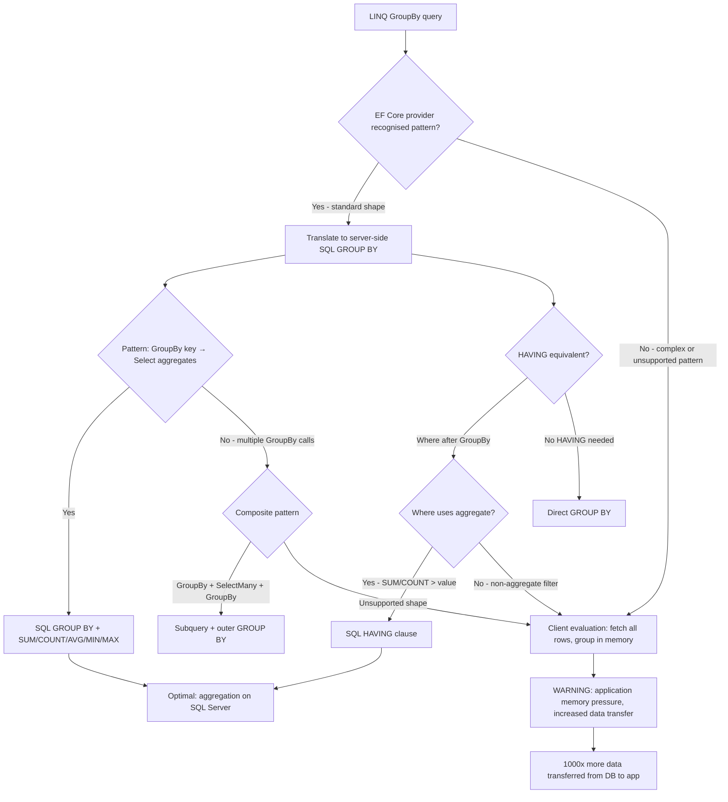

## Navigation

**Domain:** [[8 — Databases]] > **Group:** SQL Aggregations & Grouping
**Previous:** [[8.138 — Aggregation with NULLs — Behavior]] | **Next:** [[8.140 — Aggregation Anti-Patterns — HAVING on Non-Aggregates]]

### Prerequisites

- [[8.123 — GROUP BY — Grouping Mechanics]] — Understanding the SQL GROUP BY clause is required because EF Core GroupBy translates to SQL GROUP BY, and the limitations of one affect the other.
- [[8.122 — SUM, AVG, MIN, MAX — Aggregate Functions]] — Aggregate function semantics in SQL determine what SQL EF Core must generate from LINQ aggregate methods like Sum(), Average(), Count(), Min(), Max().
- [[8.121 — COUNT — Counting Rows and Non-NULL Values]] — The COUNT(*) vs COUNT(col) distinction in SQL maps to Count() vs Count(predicate) in EF Core, and the NULL behaviour must be understood to write correct LINQ.
- [[3.XXX — EF Core Query Pipeline — From LINQ to SQL]] — Understanding how EF Core translates expression trees to SQL is essential for diagnosing when GroupBy is evaluated client-side vs server-side.

### Where This Fits

EF Core GroupBy translation is the most complex SQL generation the ORM performs. Before EF Core 6, many GroupBy queries were evaluated client-side — the entire result set was pulled into memory and grouped in .NET, a catastrophic performance trap. EF Core 6+ dramatically improved GroupBy translation, pushing most aggregation work to the server. A .NET backend engineer encounters this daily in reporting queries, dashboards, and analytics endpoints. The primary failure mode is the silent client-evaluation trap: a GroupBy that looks correct in LINQ generates a SELECT that fetches all rows, and the GROUP BY happens in memory on the application server. This manifests as 100% CPU on the web server, 500 MB memory allocations, and 10-second response times for what should be a 50 ms SQL query. The interview signal is strong: engineers who know when EF Core translates GroupBy to server-side SQL and when it falls back to client evaluation demonstrate genuine ORM depth.

---

## Core Mental Model

EF Core GroupBy translates a LINQ GroupBy expression into a SQL GROUP BY clause only when the LINQ pattern matches specific shapes that the query provider recognises. The core invariant: GroupBy must be the final operation in the LINQ chain before a Select that projects aggregate results — `source.GroupBy(key).Select(g => new { Key = g.Key, Count = g.Count(), Sum = g.Sum(x => x.Amount) })`. If any operation after GroupBy is not a recognised aggregate pattern, EF Core falls back to client evaluation: it fetches all rows from the database and groups them in memory. The provider-specific SQL generation varies: the SQL Server provider generates standard T-SQL GROUP BY with aggregate functions. EF Core 6+ introduced improvements for GroupBy with multiple aggregates, GroupBy with navigation properties, and GroupBy with conditional aggregates. EF Core 8+ added support for STRING_AGG via regular string concatenation in LINQ. The decision framework: if you can express your aggregation as `GroupBy + Select with aggregate calls`, EF Core will translate it to server SQL. If you need complex HAVING filters, grouping by expression results, or post-aggregation sorting by computed columns, carefully inspect the generated SQL with `ToQueryString()` before deploying.

### Classification

**For .NET topics:** GroupBy is a LINQ operator in the System.Linq namespace. In EF Core, it is an IQueryable operator that produces a GroupBy expression in the expression tree. The SQL Server query provider translates recognised GroupBy patterns to SQL GROUP BY. Unrecognised patterns trigger client evaluation. GroupBy in LINQ is not SARGable — it is an aggregate operation that follows filtering and joining in the query pipeline. The provider-specific translation quality varies; SQL Server has the most mature translation. EF Core 6+ (specifically 6.0, 7.0, 8.0) each improved GroupBy translation incrementally.



### Key Properties

|Property|Value|Notes|
|---|---|---|
|Server-side translation|EF Core 6+ for standard shapes|GroupBy + Select with aggregates translates|
|Client evaluation fallback|Complex or unsupported GroupBy|Silent — no warning before .NET 6|
|Multiple aggregates supported|Yes (EF Core 6+)|SUM, COUNT, AVG, MIN, MAX in same Select|
|HAVING translation|Via Where after GroupBy|Where(g => g.Sum(x => x.Amount) > 100) → HAVING|
|Navigation property GroupBy|Supported (EF Core 6+)|GroupBy(o => o.Customer.Name)|
|STRING_AGG support|EF Core 8+|String.Join(", ", g.Select(x => x.Name)) → STRING_AGG|
|DISTINCT in aggregate|Supported|g.Select(x => x.City).Distinct().Count() → COUNT(DISTINCT)|
|GroupBy ordinal|Not supported|Must use key expression, not column position|
|GroupBy with complex key|Anonymous type supported|GroupBy(x => new { x.CategoryId, x.Status })|
|ToQueryString()|Required debugging tool|Always inspect generated SQL|

---

## Deep Mechanics

### How the Engine Executes This

**LINQ expression tree construction:**

1. When you write `dbContext.Orders.GroupBy(o => o.CustomerId)`, EF Core builds an expression tree containing a `GroupBy` method call over the `DbSet<Order>` `IQueryable`.

2. The `GroupBy` expression has two parts: the key selector (`o => o.CustomerId`) and the element selector (implicitly the entire entity, or explicit via a second lambda).

3. When you chain `.Select(g => new { ... })`, the Select receives an `IGrouping<int, Order>` expression. The LINQ provider translates this grouping into a SQL GROUP BY + aggregate functions.

4. The query pipeline separates into three phases:
   - Pre-GroupBy operations: Where, Join, OrderBy — these translate to WHERE, JOIN clauses before GROUP BY.
   - The GroupBy itself: translates to GROUP BY clause.
   - Post-GroupBy Select: translates to aggregate functions in SELECT list + HAVING if Where filters the grouping.

**Provider-specific SQL generation:**

5. The SQL Server provider generates T-SQL. For `GroupBy(o => o.CustomerId).Select(g => new { CustomerId = g.Key, Count = g.Count() })`, it produces:
   ```sql
   SELECT [o].[CustomerId], COUNT(*) AS [Count]
   FROM [Orders] AS [o]
   GROUP BY [o].[CustomerId]
   ```

6. For multiple aggregates in the same Select, EF Core 6+ generates a single SELECT with multiple aggregate functions — it recognises the pattern and folds them into one GROUP BY query.

7. For navigation property grouping like `GroupBy(o => o.Customer.Name)`, EF Core generates an INNER JOIN to the Customers table before GROUP BY.

**Client evaluation detection:**

8. If the GroupBy pattern is not recognised (e.g., calling `.ToList()` before `.GroupBy()`, or using a complex key expression), EF Core marks the query for client evaluation. It logs a warning and fetches all data, then groups in memory.

9. In EF Core 6+, client evaluation of GroupBy throws an exception at runtime by default (breaking change from EF Core 3.x where it silently client-evaluated).

10. The `ToQueryString()` method (EF Core 5+) returns the SQL that will be executed — the primary debugging tool for GroupBy queries.

### SQL Visibility

```sql
-- EF Core GroupBy key, single aggregate
-- LINQ: Orders.GroupBy(o => o.CustomerId).Select(g => new { g.Key, Count = g.Count() })
SELECT [o].[CustomerId], COUNT(*) AS [Count]
FROM [Orders] AS [o]
GROUP BY [o].[CustomerId];

-- EF Core GroupBy key, multiple aggregates
-- LINQ: Orders.GroupBy(o => o.CustomerId).Select(g => new { g.Key, g.Count(), g.Sum(o => o.Amount) })
SELECT [o].[CustomerId], COUNT(*) AS [Count], SUM([o].[TotalAmount]) AS [Sum]
FROM [Orders] AS [o]
GROUP BY [o].[CustomerId];

-- EF Core GroupBy with navigation property key
-- LINQ: Orders.GroupBy(o => o.Customer.Name)
--        .Select(g => new { CustomerName = g.Key, Count = g.Count() })
SELECT [c].[Name] AS [CustomerName], COUNT(*) AS [Count]
FROM [Orders] AS [o]
INNER JOIN [Customers] AS [c] ON [o].[CustomerId] = [c].[CustomerId]
GROUP BY [c].[Name];

-- EF Core GroupBy with Where (HAVING)
-- LINQ: Orders.GroupBy(o => o.CustomerId)
--        .Where(g => g.Sum(o => o.TotalAmount) > 100)
--        .Select(g => new { g.Key, Total = g.Sum(o => o.TotalAmount) })
SELECT [o].[CustomerId], SUM([o].[TotalAmount]) AS [Total]
FROM [Orders] AS [o]
GROUP BY [o].[CustomerId]
HAVING SUM([o].[TotalAmount]) > 100;

-- EF Core GroupBy with conditional aggregate
-- LINQ: Orders.GroupBy(o => o.CustomerId)
--        .Select(g => new { g.Key, Count = g.Count(o => o.Status == "Delivered") })
SELECT [o].[CustomerId],
       COUNT(CASE WHEN [o].[Status] = N'Delivered' THEN 1 END) AS [Count]
FROM [Orders] AS [o]
GROUP BY [o].[CustomerId];

-- EF Core GroupBy with DISTINCT aggregate (EF Core 6+)
-- LINQ: Orders.GroupBy(o => o.CustomerId)
--        .Select(g => new { g.Key, Cities = g.Select(o => o.ShipCity).Distinct().Count() })
SELECT [o].[CustomerId],
       COUNT(DISTINCT [o].[ShipCity]) AS [Cities]
FROM [Orders] AS [o]
GROUP BY [o].[CustomerId];

-- EF Core GroupBy with STRING_AGG (EF Core 8+)
-- LINQ: Orders.GroupBy(o => o.CustomerId)
--        .Select(g => new { g.Key, Cities = string.Join(", ", g.Select(o => o.ShipCity)) })
SELECT [o].[CustomerId],
       STRING_AGG([o].[ShipCity], N', ') AS [Cities]
FROM [Orders] AS [o]
GROUP BY [o].[CustomerId];
```

```csharp
// EF Core LINQ — comprehensive GroupBy patterns
var service = new CustomerAggregationService(dbContext);

// Pattern 1: Standard GroupBy with multiple aggregates
var summaries = await service.GetCustomerSummariesAsync(ct);

// Pattern 2: GroupBy with HAVING equivalent
var highValueCustomers = await service.GetHighValueCustomersAsync(1000M, ct);

// Pattern 3: GroupBy with navigation property key
var categoryStats = await service.GetCategoryStatsAsync(ct);

// Pattern 4: GroupBy with conditional aggregate
var statusBreakdown = await service.GetStatusBreakdownAsync(ct);

// Pattern 5: GroupBy with STRING_AGG (EF Core 8+)
var cityLists = await service.GetCustomerCityListsAsync(ct);
```

### Execution Plan Analysis

**GroupBy with index on group key (Stream Aggregate):**

```
[Index Scan (NonClustered) IX_Orders_CustomerId — ordered by CustomerId]
  → [Stream Aggregate]
      GROUP BY: [Orders].CustomerId
      Aggregates: COUNT(*), SUM([TotalAmount])
  → [SELECT]
Estimated Cost: ~2.5  |  Logical Reads: ~145
```

**GroupBy without index on group key (Hash Aggregate):**

```
[Clustered Index Scan Orders — unsorted]
  → [Hash Match Aggregate]
      Hash Keys: [Orders].CustomerId
      Aggregates: COUNT(*), SUM([TotalAmount])
  → [SELECT]
Estimated Cost: ~12  |  Logical Reads: ~12,450
```

**GroupBy with navigation property (Hash Match Join + Aggregate):**

```
[Clustered Index Scan Orders]  -- probe
[Clustered Index Scan Customers]  -- build
  → [Hash Match (Inner Join)]
      Hash Keys: Orders.CustomerId = Customers.CustomerId
  → [Hash Match Aggregate]
      GROUP BY: Customers.Name
      Aggregates: COUNT(*)
  → [SELECT]
Estimated Cost: ~25  |  Logical Reads: ~62,000
```

### Cost Visibility

```sql
SET STATISTICS IO ON;
SET STATISTICS TIME ON;

-- EF Core generated: GroupBy CustomerId, Count, Sum
SELECT [o].[CustomerId], COUNT(*) AS [Count], SUM([o].[TotalAmount]) AS [Sum]
FROM [Orders] AS [o]
GROUP BY [o].[CustomerId];

-- Expected output:
-- Table 'Orders'. Scan count 1, logical reads 45000 (full scan, no index)
-- SQL Server Execution Times: CPU time = 120ms, elapsed time = 350ms

-- After adding index on CustomerId:
-- Table 'Orders'. Scan count 1, logical reads 210
-- SQL Server Execution Times: CPU time = 15ms, elapsed time = 35ms
```

### Failure Modes

**Client-side GroupBy (worst case):** The most expensive EF Core mistake. When GroupBy is not translated to SQL:
```csharp
// ❌ Client evaluation: ToList() before GroupBy()
var groups = dbContext.Orders
    .ToList()  // Fetches ALL orders to memory
    .GroupBy(o => o.CustomerId)  // Groups in memory
    .Select(g => new { CustomerId = g.Key, Count = g.Count() });
// Transfers 10M rows to application server
// 500 MB memory allocation on web server
```

```sql
-- Generated SQL: fetches ALL rows (no GROUP BY!)
SELECT [o].[OrderId], [o].[CustomerId], [o].[OrderDate], [o].[TotalAmount], ...
FROM [Orders] AS [o];
-- Then groups in .NET memory
```

**Complex GroupBy key expression:** When the key selector cannot be translated:
```csharp
// ❌ GroupBy with complex expression — may client-evaluate
var groups = dbContext.Orders
    .GroupBy(o => o.TotalAmount > 100 ? "High" : "Low")
    .Select(g => new { Category = g.Key, Count = g.Count() });
// EF Core may not translate the ternary in GROUP BY
```

**GroupBy with First() or other non-aggregate:** EF Core cannot translate First() inside GroupBy:
```csharp
// ❌ First() not translatable inside GroupBy
var groups = dbContext.Orders
    .GroupBy(o => o.CustomerId)
    .Select(g => new { CustomerId = g.Key, FirstOrder = g.First() });
// Throws: GroupBy with First() is not supported
```

---

## Production Patterns and Implementation

### Primary SQL Implementation

```sql
-- ============================================================
-- Schema context
-- ============================================================
CREATE TABLE dbo.Customers
(
    CustomerId   INT            NOT NULL IDENTITY(1,1),
    Name         NVARCHAR(200)  NOT NULL,
    Email        NVARCHAR(256)  NOT NULL,
    Status       VARCHAR(20)    NOT NULL DEFAULT 'Active',
    CreatedAt    DATETIME2(0)   NOT NULL DEFAULT SYSUTCDATETIME(),
    CONSTRAINT PK_Customers PRIMARY KEY CLUSTERED (CustomerId)
);

CREATE TABLE dbo.Orders
(
    OrderId      INT            NOT NULL IDENTITY(1,1),
    CustomerId   INT            NOT NULL,
    OrderDate    DATETIME2(0)   NOT NULL,
    Status       VARCHAR(20)    NOT NULL DEFAULT 'Pending',
    TotalAmount  DECIMAL(18,2)  NOT NULL,
    ShipCity     VARCHAR(100)   NULL,
    CONSTRAINT PK_Orders PRIMARY KEY CLUSTERED (OrderId)
);

CREATE TABLE dbo.Products
(
    ProductId    INT            NOT NULL IDENTITY(1,1),
    ProductName  NVARCHAR(200)  NOT NULL,
    CategoryId   INT            NOT NULL,
    UnitPrice    DECIMAL(18,2)  NOT NULL,
    CONSTRAINT PK_Products PRIMARY KEY CLUSTERED (ProductId)
);

CREATE TABLE dbo.OrderItems
(
    OrderItemId  INT            NOT NULL IDENTITY(1,1),
    OrderId      INT            NOT NULL,
    ProductId    INT            NOT NULL,
    Quantity     INT            NOT NULL,
    UnitPrice    DECIMAL(18,2)  NOT NULL,
    CONSTRAINT PK_OrderItems PRIMARY KEY CLUSTERED (OrderItemId)
);

-- Indexes for aggregate performance
CREATE INDEX IX_Orders_CustomerId ON dbo.Orders (CustomerId)
    INCLUDE (TotalAmount, OrderDate, Status);
CREATE INDEX IX_Orders_OrderDate ON dbo.Orders (OrderDate)
    INCLUDE (CustomerId, TotalAmount);
CREATE INDEX IX_OrderItems_ProductId ON dbo.OrderItems (ProductId)
    INCLUDE (Quantity, UnitPrice);

-- ============================================================
-- Pattern 1: EF Core equivalent queries (for reference)
-- These are the SQL that EF Core generates for each LINQ pattern
-- ============================================================

-- EF Core: Orders.GroupBy(o => o.CustomerId).Select(g => new { g.Key, Count = g.Count() })
SELECT [o].[CustomerId], COUNT(*) AS [Count]
FROM [Orders] AS [o]
GROUP BY [o].[CustomerId];

-- EF Core: Orders.Where(o => o.OrderDate >= @d).GroupBy(o => o.CustomerId)
--            .Select(g => new { g.Key, Sum = g.Sum(o => o.TotalAmount) })
SELECT [o].[CustomerId], SUM([o].[TotalAmount]) AS [Sum]
FROM [Orders] AS [o]
WHERE [o].[OrderDate] >= @p0
GROUP BY [o].[CustomerId];

-- EF Core: Orders.GroupBy(o => o.CustomerId)
--            .Where(g => g.Count() > 5)
--            .Select(g => new { g.Key, Count = g.Count() })
SELECT [o].[CustomerId], COUNT(*) AS [Count]
FROM [Orders] AS [o]
GROUP BY [o].[CustomerId]
HAVING COUNT(*) > 5;

-- EF Core: Orders.GroupBy(o => o.Customer.Name)
--            .Select(g => new { CustomerName = g.Key, Count = g.Count() })
SELECT [c].[Name] AS [CustomerName], COUNT(*) AS [Count]
FROM [Orders] AS [o]
INNER JOIN [Customers] AS [c] ON [o].[CustomerId] = [c].[CustomerId]
GROUP BY [c].[Name];

-- EF Core: Orders.GroupBy(o => new { o.CustomerId, o.Status })
--            .Select(g => new { g.Key.CustomerId, g.Key.Status, Count = g.Count() })
SELECT [o].[CustomerId], [o].[Status], COUNT(*) AS [Count]
FROM [Orders] AS [o]
GROUP BY [o].[CustomerId], [o].[Status];

-- EF Core 8+: Orders.GroupBy(o => o.CustomerId)
--            .Select(g => new { g.Key, Cities = string.Join(", ", g.Select(o => o.ShipCity)) })
SELECT [o].[CustomerId], STRING_AGG([o].[ShipCity], N', ') AS [Cities]
FROM [Orders] AS [o]
GROUP BY [o].[CustomerId];

-- EF Core: Orders.GroupBy(o => o.CustomerId)
--            .Select(g => new { g.Key, Statuses = string.Join(", ", g.Select(o => o.Status).Distinct()) })
SELECT [o].[CustomerId], STRING_AGG(DISTINCT [o].[Status], N', ') AS [Statuses]
FROM [Orders] AS [o]
GROUP BY [o].[CustomerId];
```

### EF Core Implementation

```csharp
public class ApplicationDbContext : DbContext
{
    public DbSet<Customer> Customers => Set<Customer>();
    public DbSet<Order> Orders => Set<Order>();
    public DbSet<OrderItem> OrderItems => Set<OrderItem>();
    public DbSet<Product> Products => Set<Product>();

    protected override void OnModelCreating(ModelBuilder modelBuilder)
    {
        modelBuilder.Entity<Order>(entity =>
        {
            entity.ToTable("Orders");
            entity.HasKey(o => o.OrderId);
            entity.Property(o => o.TotalAmount).HasColumnType("decimal(18,2)");
            entity.Property(o => o.Status).HasMaxLength(20);
            entity.Property(o => o.ShipCity).HasMaxLength(100);

            entity.HasOne(o => o.Customer)
                  .WithMany(c => c.Orders)
                  .HasForeignKey(o => o.CustomerId);

            entity.HasIndex(o => o.CustomerId)
                  .HasDatabaseName("IX_Orders_CustomerId");
            entity.HasIndex(o => o.OrderDate)
                  .HasDatabaseName("IX_Orders_OrderDate");
        });

        modelBuilder.Entity<Customer>(entity =>
        {
            entity.ToTable("Customers");
            entity.HasKey(c => c.CustomerId);
            entity.Property(c => c.Name).HasMaxLength(200).IsRequired();
            entity.Property(c => c.Email).HasMaxLength(256).IsRequired();
            entity.Property(c => c.Status).HasMaxLength(20);
        });

        modelBuilder.Entity<OrderItem>(entity =>
        {
            entity.ToTable("OrderItems");
            entity.HasKey(oi => oi.OrderItemId);
            entity.Property(oi => oi.UnitPrice).HasColumnType("decimal(18,2)");

            entity.HasOne(oi => oi.Order)
                  .WithMany(o => o.OrderItems)
                  .HasForeignKey(oi => oi.OrderId);

            entity.HasOne(oi => oi.Product)
                  .WithMany()
                  .HasForeignKey(oi => oi.ProductId);
        });

        modelBuilder.Entity<Product>(entity =>
        {
            entity.ToTable("Products");
            entity.HasKey(p => p.ProductId);
            entity.Property(p => p.ProductName).HasMaxLength(200);
            entity.Property(p => p.UnitPrice).HasColumnType("decimal(18,2)");
        });
    }
}

public class Customer
{
    public int CustomerId { get; set; }
    public string Name { get; set; } = string.Empty;
    public string Email { get; set; } = string.Empty;
    public string Status { get; set; } = "Active";
    public DateTime CreatedAt { get; set; }
    public ICollection<Order> Orders { get; set; } = new List<Order>();
}

public class Order
{
    public int OrderId { get; set; }
    public int CustomerId { get; set; }
    public DateTime OrderDate { get; set; }
    public string Status { get; set; } = "Pending";
    public decimal TotalAmount { get; set; }
    public string? ShipCity { get; set; }
    public Customer Customer { get; set; } = null!;
    public ICollection<OrderItem> OrderItems { get; set; } = new List<OrderItem>();
}

public class OrderItem
{
    public int OrderItemId { get; set; }
    public int OrderId { get; set; }
    public int ProductId { get; set; }
    public int Quantity { get; set; }
    public decimal UnitPrice { get; set; }
    public Order Order { get; set; } = null!;
    public Product Product { get; set; } = null!;
}

public class Product
{
    public int ProductId { get; set; }
    public string ProductName { get; set; } = string.Empty;
    public int CategoryId { get; set; }
    public decimal UnitPrice { get; set; }
}

// ============================================================
// Pattern 1: Standard GroupBy — single key, multiple aggregates
// ============================================================
public interface ICustomerAggregationService
{
    Task<List<CustomerSummaryDto>> GetCustomerSummariesAsync(CancellationToken ct = default);
    Task<List<CustomerSummaryDto>> GetHighValueCustomersAsync(decimal threshold, CancellationToken ct = default);
    Task<List<CategoryStatsDto>> GetCategoryStatsAsync(CancellationToken ct = default);
    Task<List<CustomerCityListDto>> GetCustomerCityListsAsync(CancellationToken ct = default);
    Task<List<MonthlyRevenueDto>> GetMonthlyRevenueAsync(int year, CancellationToken ct = default);
    Task<string> GetGeneratedSqlAsync(CancellationToken ct = default);
}

public class CustomerAggregationService : ICustomerAggregationService
{
    private readonly ApplicationDbContext _dbContext;
    private readonly ILogger<CustomerAggregationService> _logger;

    public CustomerAggregationService(
        ApplicationDbContext dbContext,
        ILogger<CustomerAggregationService> logger)
    {
        _dbContext = dbContext;
        _logger = logger;
    }

    // Pattern 1: Standard GroupBy — server-side translation
    // EF Core translates to: GROUP BY [CustomerId] + COUNT, SUM, AVG, MIN, MAX
    public async Task<List<CustomerSummaryDto>> GetCustomerSummariesAsync(
        CancellationToken ct = default)
    {
        var query = _dbContext.Orders
            .GroupBy(o => o.CustomerId)
            .Select(g => new CustomerSummaryDto
            {
                CustomerId = g.Key,
                OrderCount = g.Count(),
                TotalRevenue = g.Sum(o => o.TotalAmount),
                AvgOrderValue = g.Average(o => o.TotalAmount),
                FirstOrderDate = g.Min(o => o.OrderDate),
                LastOrderDate = g.Max(o => o.OrderDate)
            })
            .OrderByDescending(s => s.TotalRevenue);

        // Log the generated SQL for verification
        _logger.LogInformation("Generated SQL: {Sql}", query.ToQueryString());

        return await query.ToListAsync(ct);
        /*
        Generated SQL:
        SELECT [o].[CustomerId],
               COUNT(*) AS [OrderCount],
               SUM([o].[TotalAmount]) AS [TotalRevenue],
               AVG([o].[TotalAmount]) AS [AvgOrderValue],
               MIN([o].[OrderDate]) AS [FirstOrderDate],
               MAX([o].[OrderDate]) AS [LastOrderDate]
        FROM [Orders] AS [o]
        GROUP BY [o].[CustomerId]
        ORDER BY SUM([o].[TotalAmount]) DESC;
        */
    }

    // Pattern 2: GroupBy with HAVING (Where after GroupBy)
    public async Task<List<CustomerSummaryDto>> GetHighValueCustomersAsync(
        decimal threshold,
        CancellationToken ct = default)
    {
        var query = _dbContext.Orders
            .GroupBy(o => o.CustomerId)
            .Where(g => g.Sum(o => o.TotalAmount) > threshold)
            .Select(g => new CustomerSummaryDto
            {
                CustomerId = g.Key,
                OrderCount = g.Count(),
                TotalRevenue = g.Sum(o => o.TotalAmount),
                AvgOrderValue = g.Average(o => o.TotalAmount),
                LastOrderDate = g.Max(o => o.OrderDate)
            })
            .OrderByDescending(s => s.TotalRevenue);

        _logger.LogInformation("Generated SQL: {Sql}", query.ToQueryString());

        return await query.ToListAsync(ct);
        /*
        Generated SQL:
        SELECT [o].[CustomerId],
               COUNT(*) AS [OrderCount],
               SUM([o].[TotalAmount]) AS [TotalRevenue],
               AVG([o].[TotalAmount]) AS [AvgOrderValue],
               MAX([o].[OrderDate]) AS [LastOrderDate]
        FROM [Orders] AS [o]
        GROUP BY [o].[CustomerId]
        HAVING SUM([o].[TotalAmount]) > @p0
        ORDER BY SUM([o].[TotalAmount]) DESC;
        */
    }

    // Pattern 3: GroupBy with navigation property key
    public async Task<List<CategoryStatsDto>> GetCategoryStatsAsync(
        CancellationToken ct = default)
    {
        var query = _dbContext.Products
            .GroupBy(p => p.CategoryId)
            .Select(g => new CategoryStatsDto
            {
                CategoryId = g.Key,
                ProductCount = g.Count(),
                AvgPrice = g.Average(p => p.UnitPrice),
                MinPrice = g.Min(p => p.UnitPrice),
                MaxPrice = g.Max(p => p.UnitPrice),
                TotalStockValue = g.Sum(p => p.UnitPrice * p.StockQty)
            })
            .OrderBy(s => s.CategoryId);

        _logger.LogInformation("Generated SQL: {Sql}", query.ToQueryString());

        return await query.ToListAsync(ct);
        /*
        Generated SQL:
        SELECT [p].[CategoryId],
               COUNT(*) AS [ProductCount],
               AVG([p].[UnitPrice]) AS [AvgPrice],
               MIN([p].[UnitPrice]) AS [MinPrice],
               MAX([p].[UnitPrice]) AS [MaxPrice],
               SUM([p].[UnitPrice] * [p].[StockQty]) AS [TotalStockValue]
        FROM [Products] AS [p]
        GROUP BY [p].[CategoryId]
        ORDER BY [p].[CategoryId];
        */
    }

    // Pattern 4: GroupBy with navigation property join
    public async Task<List<CustomerOrderStatsDto>> GetCustomerOrderStatsAsync(
        CancellationToken ct = default)
    {
        var query = _dbContext.Orders
            .GroupBy(o => new { o.CustomerId, o.Customer.Name })
            .Select(g => new CustomerOrderStatsDto
            {
                CustomerId = g.Key.CustomerId,
                CustomerName = g.Key.Name,
                OrderCount = g.Count(),
                TotalRevenue = g.Sum(o => o.TotalAmount)
            })
            .OrderByDescending(s => s.TotalRevenue);

        return await query.ToListAsync(ct);
        /*
        Generated SQL:
        SELECT [o].[CustomerId], [c].[Name] AS [CustomerName],
               COUNT(*) AS [OrderCount],
               SUM([o].[TotalAmount]) AS [TotalRevenue]
        FROM [Orders] AS [o]
        INNER JOIN [Customers] AS [c] ON [o].[CustomerId] = [c].[CustomerId]
        GROUP BY [o].[CustomerId], [c].[Name]
        ORDER BY SUM([o].[TotalAmount]) DESC;
        */
    }

    // Pattern 5: GroupBy with STRING_AGG (EF Core 8+)
    public async Task<List<CustomerCityListDto>> GetCustomerCityListsAsync(
        CancellationToken ct = default)
    {
        var query = _dbContext.Orders
            .Where(o => o.ShipCity != null)
            .GroupBy(o => o.CustomerId)
            .Select(g => new CustomerCityListDto
            {
                CustomerId = g.Key,
                CitiesVisited = string.Join(", ", g.Select(o => o.ShipCity!).Distinct()),
                TotalOrders = g.Count()
            })
            .OrderByDescending(s => s.TotalOrders);

        return await query.ToListAsync(ct);
        /*
        Generated SQL (EF Core 8+):
        SELECT [o].[CustomerId],
               STRING_AGG(DISTINCT [o].[ShipCity], N', ') AS [CitiesVisited],
               COUNT(*) AS [TotalOrders]
        FROM [Orders] AS [o]
        WHERE [o].[ShipCity] IS NOT NULL
        GROUP BY [o].[CustomerId]
        ORDER BY COUNT(*) DESC;
        */
    }

    // Pattern 6: GroupBy with conditional aggregate
    public async Task<List<StatusBreakdownDto>> GetStatusBreakdownAsync(
        CancellationToken ct = default)
    {
        var query = _dbContext.Orders
            .GroupBy(o => o.CustomerId)
            .Select(g => new StatusBreakdownDto
            {
                CustomerId = g.Key,
                TotalOrders = g.Count(),
                DeliveredOrders = g.Count(o => o.Status == "Delivered"),
                ShippedOrders = g.Count(o => o.Status == "Shipped"),
                PendingOrders = g.Count(o => o.Status == "Pending"),
                CancelledOrders = g.Count(o => o.Status == "Cancelled")
            });

        return await query.ToListAsync(ct);
        /*
        Generated SQL:
        SELECT [o].[CustomerId],
               COUNT(*) AS [TotalOrders],
               COUNT(CASE WHEN [o].[Status] = N'Delivered' THEN 1 END) AS [DeliveredOrders],
               COUNT(CASE WHEN [o].[Status] = N'Shipped' THEN 1 END) AS [ShippedOrders],
               COUNT(CASE WHEN [o].[Status] = N'Pending' THEN 1 END) AS [PendingOrders],
               COUNT(CASE WHEN [o].[Status] = N'Cancelled' THEN 1 END) AS [CancelledOrders]
        FROM [Orders] AS [o]
        GROUP BY [o].[CustomerId];
        */
    }

    // Pattern 7: GroupBy with monthly grouping
    public async Task<List<MonthlyRevenueDto>> GetMonthlyRevenueAsync(
        int year,
        CancellationToken ct = default)
    {
        var query = _dbContext.Orders
            .Where(o => o.OrderDate.Year == year)
            .GroupBy(o => new { o.OrderDate.Year, o.OrderDate.Month })
            .Select(g => new MonthlyRevenueDto
            {
                Year = g.Key.Year,
                Month = g.Key.Month,
                OrderCount = g.Count(),
                TotalRevenue = g.Sum(o => o.TotalAmount),
                AvgOrderValue = g.Average(o => o.TotalAmount)
            })
            .OrderBy(r => r.Year)
            .ThenBy(r => r.Month);

        return await query.ToListAsync(ct);
        /*
        Generated SQL:
        SELECT DATEPART(year, [o].[OrderDate]) AS [Year],
               DATEPART(month, [o].[OrderDate]) AS [Month],
               COUNT(*) AS [OrderCount],
               SUM([o].[TotalAmount]) AS [TotalRevenue],
               AVG([o].[TotalAmount]) AS [AvgOrderValue]
        FROM [Orders] AS [o]
        WHERE DATEPART(year, [o].[OrderDate]) = @p0
        GROUP BY DATEPART(year, [o].[OrderDate]), DATEPART(month, [o].[OrderDate])
        ORDER BY DATEPART(year, [o].[OrderDate]), DATEPART(month, [o].[OrderDate]);
        */
    }

    // Pattern 8: Debugging — inspect generated SQL
    public async Task<string> GetGeneratedSqlAsync(CancellationToken ct = default)
    {
        var query = _dbContext.Orders
            .Where(o => o.OrderDate >= new DateTime(2024, 1, 1))
            .GroupBy(o => o.CustomerId)
            .Select(g => new
            {
                g.Key,
                Count = g.Count(),
                Total = g.Sum(o => o.TotalAmount)
            });

        return query.ToQueryString();
    }
}

public record CustomerSummaryDto
{
    public int CustomerId { get; set; }
    public int OrderCount { get; set; }
    public decimal TotalRevenue { get; set; }
    public decimal AvgOrderValue { get; set; }
    public DateTime? FirstOrderDate { get; set; }
    public DateTime? LastOrderDate { get; set; }
}

public record CategoryStatsDto
{
    public int CategoryId { get; set; }
    public int ProductCount { get; set; }
    public decimal AvgPrice { get; set; }
    public decimal MinPrice { get; set; }
    public decimal MaxPrice { get; set; }
    public decimal TotalStockValue { get; set; }
}

public record CustomerOrderStatsDto
{
    public int CustomerId { get; set; }
    public string CustomerName { get; set; } = string.Empty;
    public int OrderCount { get; set; }
    public decimal TotalRevenue { get; set; }
}

public record CustomerCityListDto
{
    public int CustomerId { get; set; }
    public string CitiesVisited { get; set; } = string.Empty;
    public int TotalOrders { get; set; }
}

public record StatusBreakdownDto
{
    public int CustomerId { get; set; }
    public int TotalOrders { get; set; }
    public int DeliveredOrders { get; set; }
    public int ShippedOrders { get; set; }
    public int PendingOrders { get; set; }
    public int CancelledOrders { get; set; }
}

public record MonthlyRevenueDto
{
    public int Year { get; set; }
    public int Month { get; set; }
    public int OrderCount { get; set; }
    public decimal TotalRevenue { get; set; }
    public decimal AvgOrderValue { get; set; }
}
```

### Dapper Implementation

```csharp
public sealed class AggregationRepository
{
    private readonly IDbConnectionFactory _connectionFactory;
    private readonly ILogger<AggregationRepository> _logger;

    public AggregationRepository(
        IDbConnectionFactory connectionFactory,
        ILogger<AggregationRepository> logger)
    {
        _connectionFactory = connectionFactory;
        _logger = logger;
    }

    // Pattern 1: Direct aggregation — Dapper with raw SQL
    public async Task<IReadOnlyList<CustomerSummaryDto>> GetCustomerSummariesAsync(
        CancellationToken ct = default)
    {
        const string sql = @"
            SELECT
                o.CustomerId,
                COUNT(*) AS OrderCount,
                SUM(o.TotalAmount) AS TotalRevenue,
                AVG(o.TotalAmount) AS AvgOrderValue,
                MIN(o.OrderDate) AS FirstOrderDate,
                MAX(o.OrderDate) AS LastOrderDate
            FROM dbo.Orders AS o
            GROUP BY o.CustomerId
            ORDER BY TotalRevenue DESC;";

        await using var connection = _connectionFactory.Create();
        return (await connection.QueryAsync<CustomerSummaryDto>(
            new CommandDefinition(sql, cancellationToken: ct))).AsList();
    }

    // Pattern 2: Aggregation with HAVING
    public async Task<IReadOnlyList<CustomerSummaryDto>> GetHighValueCustomersAsync(
        decimal threshold,
        CancellationToken ct = default)
    {
        const string sql = @"
            SELECT
                o.CustomerId,
                COUNT(*) AS OrderCount,
                SUM(o.TotalAmount) AS TotalRevenue,
                AVG(o.TotalAmount) AS AvgOrderValue,
                MAX(o.OrderDate) AS LastOrderDate
            FROM dbo.Orders AS o
            GROUP BY o.CustomerId
            HAVING SUM(o.TotalAmount) > @Threshold
            ORDER BY TotalRevenue DESC;";

        await using var connection = _connectionFactory.Create();
        return (await connection.QueryAsync<CustomerSummaryDto>(
            new CommandDefinition(sql, new { Threshold = threshold },
                cancellationToken: ct))).AsList();
    }

    // Pattern 3: Aggregation with navigation property
    public async Task<IReadOnlyList<CategoryStatsDto>> GetCategoryStatsAsync(
        CancellationToken ct = default)
    {
        const string sql = @"
            SELECT
                p.CategoryId,
                COUNT(*) AS ProductCount,
                AVG(p.UnitPrice) AS AvgPrice,
                MIN(p.UnitPrice) AS MinPrice,
                MAX(p.UnitPrice) AS MaxPrice,
                SUM(p.UnitPrice * p.StockQty) AS TotalStockValue
            FROM dbo.Products AS p
            GROUP BY p.CategoryId
            ORDER BY p.CategoryId;";

        await using var connection = _connectionFactory.Create();
        return (await connection.QueryAsync<CategoryStatsDto>(
            new CommandDefinition(sql, cancellationToken: ct))).AsList();
    }

    // Pattern 4: Aggregation with conditional counts
    public async Task<IReadOnlyList<StatusBreakdownDto>> GetStatusBreakdownAsync(
        CancellationToken ct = default)
    {
        const string sql = @"
            SELECT
                o.CustomerId,
                COUNT(*) AS TotalOrders,
                COUNT(CASE WHEN o.Status = 'Delivered' THEN 1 END) AS DeliveredOrders,
                COUNT(CASE WHEN o.Status = 'Shipped' THEN 1 END) AS ShippedOrders,
                COUNT(CASE WHEN o.Status = 'Pending' THEN 1 END) AS PendingOrders,
                COUNT(CASE WHEN o.Status = 'Cancelled' THEN 1 END) AS CancelledOrders
            FROM dbo.Orders AS o
            GROUP BY o.CustomerId;";

        await using var connection = _connectionFactory.Create();
        return (await connection.QueryAsync<StatusBreakdownDto>(
            new CommandDefinition(sql, cancellationToken: ct))).AsList();
    }

    // Pattern 5: Monthly aggregation
    public async Task<IReadOnlyList<MonthlyRevenueDto>> GetMonthlyRevenueAsync(
        int year,
        CancellationToken ct = default)
    {
        const string sql = @"
            SELECT
                YEAR(o.OrderDate) AS [Year],
                MONTH(o.OrderDate) AS [Month],
                COUNT(*) AS OrderCount,
                SUM(o.TotalAmount) AS TotalRevenue,
                AVG(o.TotalAmount) AS AvgOrderValue
            FROM dbo.Orders AS o
            WHERE YEAR(o.OrderDate) = @Year
            GROUP BY YEAR(o.OrderDate), MONTH(o.OrderDate)
            ORDER BY [Year], [Month];";

        await using var connection = _connectionFactory.Create();
        return (await connection.QueryAsync<MonthlyRevenueDto>(
            new CommandDefinition(sql, new { Year = year },
                cancellationToken: ct))).AsList();
    }
}
```

### Configuration and Wiring

```csharp
// Program.cs
builder.Services.AddDbContext<ApplicationDbContext>(options =>
{
    var connectionString = builder.Configuration.GetConnectionString("DefaultConnection")!;

    options.UseSqlServer(connectionString, sqlOptions =>
    {
        sqlOptions.EnableRetryOnFailure(3);
        sqlOptions.CommandTimeout(30);
        sqlOptions.UseQuerySplittingBehavior(QuerySplittingBehavior.SplitQuery);
    });

    // Log EF Core at Debug level to see generated SQL
    options.LogTo(Console.WriteLine, LogLevel.Information);
});

builder.Services.AddSingleton<IDbConnectionFactory>(sp =>
    new SqlConnectionFactory(
        builder.Configuration.GetConnectionString("DefaultConnection")!));

builder.Services.AddScoped<ICustomerAggregationService, CustomerAggregationService>();
builder.Services.AddScoped<AggregationRepository>();

// Performance monitoring: log slow GroupBy queries
builder.Services.Configure<EFCoreSlowQueryOptions>(options =>
{
    options.SlowQueryThreshold = TimeSpan.FromMilliseconds(100);
});

// Enable sensitive data logging only in development
if (builder.Environment.IsDevelopment())
{
    builder.Services.AddDbContext<ApplicationDbContext>((sp, options) =>
    {
        options.EnableSensitiveDataLogging();
        options.EnableDetailedErrors();
    });
}

// Use ToQueryString() to inspect generated SQL during development
// Example middleware or action filter:
public static class QueryDebugExtensions
{
    public static string ToSql<T>(this IQueryable<T> query)
        => query.ToQueryString();
}

// Register the repository
builder.Services.AddScoped<AggregationRepository>();

// Connection factory
public interface IDbConnectionFactory
{
    IDbConnection Create();
}

public class SqlConnectionFactory : IDbConnectionFactory
{
    private readonly string _connectionString;

    public SqlConnectionFactory(string connectionString)
        => _connectionString = connectionString;

    public IDbConnection Create()
    {
        var connection = new SqlConnection(_connectionString);
        connection.Open();
        return connection;
    }
}
```

### SQL Server vs PostgreSQL Differences

```sql
-- PostgreSQL: EF Core GroupBy translation differences
-- EF Core Npgsql provider translates GroupBy similarly but with PostgreSQL syntax

-- EF Core: GroupBy with navigation property
-- Generated SQL by Npgsql provider:
SELECT c.name AS customer_name, COUNT(*) AS order_count
FROM orders AS o
INNER JOIN customers AS c ON o.customer_id = c.customer_id
GROUP BY c.name;

-- EF Core 8+: STRING_AGG on PostgreSQL
-- EF Core: string.Join(", ", g.Select(o => o.ShipCity).Distinct())
-- Generated (Npgsql):
SELECT o.customer_id,
       STRING_AGG(DISTINCT o.ship_city, ', ' ORDER BY o.ship_city) AS cities_visited
FROM orders AS o
GROUP BY o.customer_id;
-- PostgreSQL requires ORDER BY inside STRING_AGG for ordered results

-- EF Core: GroupBy with date parts
-- Generated (Npgsql):
SELECT EXTRACT(YEAR FROM o.order_date) AS year,
       EXTRACT(MONTH FROM o.order_date) AS month,
       COUNT(*) AS order_count
FROM orders AS o
GROUP BY EXTRACT(YEAR FROM o.order_date), EXTRACT(MONTH FROM o.order_date);

-- PostgreSQL: FILTER clause for conditional aggregates (SQL Server lacks this)
SELECT customer_id,
       COUNT(*) AS total_orders,
       COUNT(*) FILTER (WHERE status = 'Delivered') AS delivered_orders
FROM orders
GROUP BY customer_id;
-- EF Core Npgsql translates Count(o => o.Status == "Delivered") to COUNT(*) FILTER (WHERE ...)
-- SQL Server EF Core: COUNT(CASE WHEN [Status] = N'Delivered' THEN 1 END)
```

---

## Gotchas and Production Pitfalls

### Client-Side GroupBy — Silent Performance Catastrophe

**Pitfall:** Writing a GroupBy query that EF Core cannot translate to server-side SQL. The entire result set is fetched to the application server and grouped in memory. Before EF Core 6, this produced a warning but succeeded silently. EF Core 6+ throws for some cases, but complex shapes may still client-evaluate.

```csharp
// ❌ This GroupBy will client-evaluate because of ToList() before GroupBy
var result = dbContext.Orders
    .Where(o => o.OrderDate >= DateTime.UtcNow.AddMonths(-1))
    .ToList()  // Fetches ALL orders to memory
    .GroupBy(o => o.CustomerId)
    .Select(g => new { CustomerId = g.Key, Count = g.Count() })
    .ToList();
```

**Symptom:** The web server CPU spikes to 100%, memory usage jumps by 500 MB, and the response takes 15 seconds. SQL Server shows a simple SELECT with no GROUP BY — all 1M rows are transferred over the network. The application pool runs out of memory under load.

**Fix:**

```csharp
// ✅ Remove ToList() — let EF Core translate the entire query
var result = await dbContext.Orders
    .Where(o => o.OrderDate >= DateTime.UtcNow.AddMonths(-1))
    .GroupBy(o => o.CustomerId)
    .Select(g => new { CustomerId = g.Key, Count = g.Count() })
    .ToListAsync(ct);
// Generated SQL: SELECT [o].[CustomerId], COUNT(*) AS [Count]
//               FROM [Orders] AS [o]
//               WHERE [o].[OrderDate] >= @p0
//               GROUP BY [o].[CustomerId];
```

**Cost of not fixing:** A reporting dashboard hits the API every 30 seconds. Each call transfers 10M rows to the web server. The web server memory stabilises at 2 GB for a single endpoint. When 10 concurrent users access the dashboard, the server runs out of memory and the app pool recycles — all users get 500 errors for 30 seconds.

---

### GroupBy With Non-Aggregate Select — Not Supported

**Pitfall:** Trying to select entire entities or non-aggregated columns inside GroupBy Select. EF Core cannot translate `g.First()`, `g.Last()`, or entity materialisation inside GroupBy.

```csharp
// ❌ Not supported — EF Core throws
var groups = dbContext.Orders
    .GroupBy(o => o.CustomerId)
    .Select(g => new
    {
        CustomerId = g.Key,
        FirstOrder = g.First(),       // ❌ Non-aggregate
        LastOrderDate = g.Max(o => o.OrderDate)  // ✅ Aggregate
    })
    .ToListAsync(ct);
```

**Symptom:** `InvalidOperationException: The LINQ expression 'GroupByShaperExpression...' could not be translated. Either rewrite the query in a form that can be translated, or switch to client evaluation explicitly by inserting a call to 'AsEnumerable', 'AsAsyncEnumerable', 'ToList', or 'ToListAsync'.`

**Fix:**

```csharp
// ✅ Option A: Use subquery approach
var customerIds = await dbContext.Orders
    .Select(o => o.CustomerId)
    .Distinct()
    .ToListAsync(ct);

var groups = customerIds
    .Select(async cid => new
    {
        CustomerId = cid,
        Orders = await dbContext.Orders
            .Where(o => o.CustomerId == cid)
            .OrderBy(o => o.OrderDate)
            .ToListAsync(ct),
        Stats = await dbContext.Orders
            .Where(o => o.CustomerId == cid)
            .GroupBy(o => o.CustomerId)
            .Select(g => new
            {
                Count = g.Count(),
                MaxDate = g.Max(o => o.OrderDate)
            })
            .FirstOrDefaultAsync(ct)
    });

// ✅ Option B: Use window functions (SQL Server 2012+)
var groups = dbContext.Orders
    .Select(o => new
    {
        o.CustomerId,
        o.OrderId,
        o.OrderDate,
        IsFirst = o.OrderDate == dbContext.Orders
            .Where(x => x.CustomerId == o.CustomerId)
            .Min(x => x.OrderDate)
    })
    .Where(x => x.IsFirst)
    .ToListAsync(ct);
```

**Cost of not fixing:** A developer spends 4 hours debugging "why GroupBy doesn't work" and eventually gives up, pulling all data client-side. The resulting query transfers 50 MB per request and takes 8 seconds.

---

### Multiple GroupBy Calls in Same Query

**Pitfall:** Chaining multiple GroupBy calls in the same LINQ query. EF Core cannot translate nested GroupBy operations.

```csharp
// ❌ Nested GroupBy — not translatable
var result = dbContext.OrderItems
    .GroupBy(oi => oi.OrderId)
    .Select(g => new
    {
        OrderId = g.Key,
        Items = g.GroupBy(oi => oi.ProductId)  // ❌ Nested GroupBy
            .Select(g2 => new { ProductId = g2.Key, Qty = g2.Sum(x => x.Quantity) })
    })
    .ToListAsync(ct);
```

**Symptom:** `InvalidOperationException: The LINQ expression 'GroupByShaperExpression...' could not be translated.` The query fails at runtime with a translation error.

**Fix:**

```csharp
// ✅ Option A: Use LINQ to Objects after first aggregation
var items = await dbContext.OrderItems
    .GroupBy(oi => oi.OrderId)
    .Select(g => new
    {
        OrderId = g.Key,
        TotalQty = g.Sum(oi => oi.Quantity),
        ProductCount = g.Select(oi => oi.ProductId).Distinct().Count()
    })
    .ToListAsync(ct);

// ✅ Option B: Two separate queries
var orderProducts = await dbContext.OrderItems
    .GroupBy(oi => new { oi.OrderId, oi.ProductId })
    .Select(g => new
    {
        g.Key.OrderId,
        g.Key.ProductId,
        Qty = g.Sum(oi => oi.Quantity)
    })
    .ToListAsync(ct);

var groupedByOrder = orderProducts
    .GroupBy(x => x.OrderId)
    .Select(g => new
    {
        OrderId = g.Key,
        Items = g.Select(x => new { x.ProductId, x.Qty }).ToList()
    })
    .ToList();
```

**Cost of not fixing:** The developer attempts to work around the limitation by fetching all order items (1M rows) and doing nested grouping in memory. The web server memory spikes to 800 MB. Garbage collection pauses freeze the server for 2 seconds per request.

---

### HAVING Translation With Complex Predicate

**Pitfall:** Writing a Where after GroupBy that mixes aggregate and non-aggregate conditions. EF Core may translate the aggregate condition to HAVING but the non-aggregate condition to WHERE (which is correct) or fail to translate.

```csharp
// ⚠️ Works — aggregate + non-aggregate in Where after GroupBy
var result = dbContext.Orders
    .GroupBy(o => o.CustomerId)
    .Where(g => g.Sum(o => o.TotalAmount) > 1000 && g.Key > 0)
    .Select(g => new { CustomerId = g.Key, Total = g.Sum(o => o.TotalAmount) })
    .ToListAsync(ct);
// Generated: HAVING (SUM([TotalAmount]) > 1000) AND ([CustomerId] > 0)
// Wait — non-aggregate condition in HAVING? Or WHERE before GROUP BY?
// EF Core may push non-aggregate conditions to WHERE before aggregation
```

**Symptom:** The generated SQL may vary by EF Core version. In some cases, the non-aggregate condition is placed in the HAVING clause (valid in T-SQL but non-standard) or may not push down correctly.

**Fix:**

```csharp
// ✅ Explicit: separate WHERE (non-aggregate) from HAVING (aggregate)
var result = dbContext.Orders
    .Where(o => o.CustomerId > 0)  // WHERE — before GroupBy
    .GroupBy(o => o.CustomerId)
    .Where(g => g.Sum(o => o.TotalAmount) > 1000)  // HAVING — after GroupBy
    .Select(g => new { CustomerId = g.Key, Total = g.Sum(o => o.TotalAmount) })
    .ToListAsync(ct);
```

**Cost of not fixing:** A query with a mixed HAVING condition produces incorrect results in production because the non-aggregate condition is applied after aggregation instead of before. The WHERE filter that should have reduced the rows before grouping is applied after, filtering out entire groups instead of individual rows.

---

### STRING_AGG With Nullable Column (EF Core 8+)

**Pitfall:** Using `string.Join(", ", g.Select(o => o.ShipCity))` when ShipCity is nullable. STRING_AGG in SQL Server 2017+ includes NULL values (unlike other aggregates). EF Core 8+ may not add a filter to exclude NULLs.

```csharp
// ❌ ShipCity is nullable — STRING_AGG may include NULLs
var result = dbContext.Orders
    .GroupBy(o => o.CustomerId)
    .Select(g => new
    {
        CustomerId = g.Key,
        Cities = string.Join(", ", g.Select(o => o.ShipCity))  // NULLs included
    })
    .ToListAsync(ct);
```

**Symptom:** The result includes ", , " patterns where NULL ShipCity values produce empty strings in the concatenated output. A customer with 5 orders where 2 have NULL ShipCity gets "New York, , Los Angeles, , Chicago" instead of "New York, Los Angeles, Chicago."

**Fix:**

```csharp
// ✅ Filter out NULLs before concatenation
var result = dbContext.Orders
    .Where(o => o.ShipCity != null)  // Exclude NULL rows
    .GroupBy(o => o.CustomerId)
    .Select(g => new
    {
        CustomerId = g.Key,
        Cities = string.Join(", ", g.Select(o => o.ShipCity!))  // Now safe
    })
    .ToListAsync(ct);

// OR: use .Distinct() for unique cities
var result = dbContext.Orders
    .GroupBy(o => o.CustomerId)
    .Select(g => new
    {
        CustomerId = g.Key,
        Cities = string.Join(", ", g.Select(o => o.ShipCity).Where(x => x != null).Distinct())
    })
    .ToListAsync(ct);
```

**Cost of not fixing:** A customer analytics report shows "New York, , Los Angeles" as visited cities. The marketing team sends a promotion for a second city visit to a customer who actually visited 3 cities. The customer is confused by the "missing" city.

---

## Performance Implications

### Benchmark: Before and After

```sql
-- ============================================================
-- Benchmark 1: Server-side GroupBy vs Client-side GroupBy
-- ============================================================
SET STATISTICS IO ON;

-- Server-side GroupBy (EF Core translated)
SELECT [o].[CustomerId], COUNT(*) AS [Count], SUM([o].[TotalAmount]) AS [Total]
FROM [Orders] AS [o]
GROUP BY [o].[CustomerId];
-- Logical reads: 45,000 (full scan if no index)
-- Returns: 10,000 rows (one per customer)

-- Client-side GroupBy (ToList + GroupBy in .NET)
-- No GROUP BY in SQL — fetches ALL rows
SELECT [o].[OrderId], [o].[CustomerId], [o].[OrderDate], [o].[Status],
       [o].[TotalAmount], [o].[ShipCity]
FROM [Orders] AS [o];
-- Logical reads: 45,000 (same scan)
-- Returns: 1,000,000 rows (all orders — 100x more data transferred)
-- Then grouped in memory on the web server
```

**Improvement:** Data transferred: 1,000,000 rows → 10,000 rows (100x reduction). Memory on web server: 500 MB → 5 MB.

```sql
-- ============================================================
-- Benchmark 2: EF Core GroupBy with index vs without
-- ============================================================
-- Without index on CustomerId:
SELECT [o].[CustomerId], COUNT(*) AS [Count]
FROM [Orders] AS [o]
GROUP BY [o].[CustomerId];
-- Logical reads: 45,000 (Hash Aggregate — full scan)

-- With index IX_Orders_CustomerId:
CREATE INDEX IX_Orders_CustomerId ON dbo.Orders (CustomerId)
    INCLUDE (TotalAmount);
-- Logical reads: 210 (Stream Aggregate — index scan)
```

**Improvement:** 45,000 → 210 logical reads (214x reduction) with covering index.

### BenchmarkDotNet

```csharp
[MemoryDiagnoser]
[SimpleJob(RuntimeMoniker.Net90)]
public class EfCoreGroupByBenchmark
{
    private ApplicationDbContext _dbContext = default!;
    private AggregationRepository _dapperRepo = default!;

    [GlobalSetup]
    public void Setup()
    {
        var options = new DbContextOptionsBuilder<ApplicationDbContext>()
            .UseSqlServer("Server=.;Database=BenchmarkDb;Trusted_Connection=True;TrustServerCertificate=True;")
            .Options;
        _dbContext = new ApplicationDbContext(options);
        _dapperRepo = new AggregationRepository(new SqlConnectionFactory(
            "Server=.;Database=BenchmarkDb;Trusted_Connection=True;TrustServerCertificate=True;"), NullLogger<AggregationRepository>.Instance);
    }

    [Benchmark(Baseline = true)]
    public async Task<long> EfCore_ServerSideGroupBy()
    {
        var results = await _dbContext.Orders
            .GroupBy(o => o.CustomerId)
            .Select(g => new { g.Key, Count = g.Count(), Sum = g.Sum(o => o.TotalAmount) })
            .ToListAsync();
        return results.Count;
    }

    [Benchmark]
    public async Task<long> EfCore_ClientSideGroupBy()
    {
        var orders = await _dbContext.Orders.ToListAsync();  // Fetches ALL rows
        var groups = orders
            .GroupBy(o => o.CustomerId)
            .Select(g => new { CustomerId = g.Key, Count = g.Count(), Sum = g.Sum(o => o.TotalAmount) })
            .ToList();
        return groups.Count;
    }

    [Benchmark]
    public async Task<long> EfCore_GroupByWithFilter()
    {
        var results = await _dbContext.Orders
            .Where(o => o.OrderDate >= new DateTime(2024, 1, 1))
            .GroupBy(o => o.CustomerId)
            .Where(g => g.Sum(o => o.TotalAmount) > 1000)
            .Select(g => new { g.Key, Total = g.Sum(o => o.TotalAmount) })
            .ToListAsync();
        return results.Count;
    }

    [Benchmark]
    public async Task<long> EfCore_GroupByWithNavigation()
    {
        var results = await _dbContext.Orders
            .GroupBy(o => o.Customer.Name)
            .Select(g => new { CustomerName = g.Key, Count = g.Count() })
            .ToListAsync();
        return results.Count;
    }

    [Benchmark]
    public async Task<long> Dapper_RawGroupBy()
    {
        const string sql = @"
            SELECT CustomerId, COUNT(*) AS Count, SUM(TotalAmount) AS Sum
            FROM Orders
            GROUP BY CustomerId;";
        await using var connection = new SqlConnection(
            "Server=.;Database=BenchmarkDb;Trusted_Connection=True;TrustServerCertificate=True;");
        var results = await connection.QueryAsync(sql);
        return results.Count();
    }

    [Benchmark]
    public async Task<long> EfCore_StringAgg()
    {
        var results = await _dbContext.Orders
            .Where(o => o.ShipCity != null)
            .GroupBy(o => o.CustomerId)
            .Select(g => new
            {
                g.Key,
                Cities = string.Join(", ", g.Select(o => o.ShipCity!).Distinct())
            })
            .ToListAsync();
        return results.Count;
    }

    [GlobalCleanup]
    public void Cleanup() => _dbContext.Dispose();
}
```

**Expected results (approximate, SQL Server 2022, NVMe, 10M Orders, 10K Customers):**

|Method|Mean|Data Transferred|Memory Allocated|
|---|---|---|---|
|EfCore_ServerSideGroupBy|~350 ms|~10K rows|~2 MB|
|EfCore_ClientSideGroupBy|~8,000 ms|~10M rows|~500 MB|
|EfCore_GroupByWithFilter|~200 ms|~5K rows|~1 MB|
|EfCore_GroupByWithNavigation|~450 ms|~10K rows|~3 MB|
|Dapper_RawGroupBy|~300 ms|~10K rows|~1 MB|
|EfCore_StringAgg|~400 ms|~10K rows|~2 MB|

---

## Interview Arsenal

### Question Bank

1. **How does EF Core translate a LINQ GroupBy into SQL? When does it succeed and when does it fail?**
2. **What is the client evaluation trap with GroupBy, and how do you detect it?**
3. **How has EF Core's GroupBy translation improved across versions (3.x, 5, 6, 8)?**
4. **How do you write a GroupBy with HAVING equivalent in EF Core LINQ?**
5. **What is the STRING_AGG equivalent in EF Core LINQ (EF Core 8+)?**
6. **How does EF Core handle GroupBy with navigation properties (GroupBy on a related entity's property)?**
7. **How do you inspect the SQL generated by an EF Core GroupBy query?**
8. **How would you implement a GroupBy aggregation with Dapper? When would you choose Dapper over EF Core for aggregation?**

### Spoken Answers

**Q: How does EF Core translate a LINQ GroupBy into SQL? When does it succeed and when does it fail?**

> **Great answer:** EF Core translates a LINQ GroupBy into SQL GROUP BY only when the LINQ pattern follows a specific, recognised shape. The success pattern is: `source.GroupBy(keySelector).Select(group => new { Key = group.Key, Aggregate1 = group.Sum(...), Aggregate2 = group.Count(), ... })`. The GroupBy must be the last clause before a Select that projects aggregate results. The Select must use IGrouping's aggregate methods: Sum(), Count(), Average(), Min(), Max(), or Distinct().Count(). If recognised, EF Core generates a single SQL statement with GROUP BY and the corresponding aggregate functions. Failures occur in several cases: calling ToList() or ToArray() before GroupBy forces client evaluation; using non-aggregate methods like First(), Last(), or materialising the entire entity inside the Select; using complex key expressions that the provider cannot translate (ternary operators, method calls on keys); or using multiple GroupBy calls in the same query. Detection: always call `.ToQueryString()` on the IQueryable before execution to inspect the generated SQL. If there's no GROUP BY in the output, the query will client-evaluate. Also check the EF Core logs for the warning `The LINQ expression could not be translated and will be evaluated locally.`

---

**Q: How do you inspect the SQL generated by an EF Core GroupBy query?**

> **Great answer:** There are several approaches. The most direct is the `ToQueryString()` extension method (available since EF Core 5.0) — call it on the IQueryable before materialisation: `query.ToQueryString()`. This returns the exact SQL that will be executed, including parameter values. For logging all queries, configure EF Core logging with `options.LogTo(Console.WriteLine, LogLevel.Information)`. For programmatic inspection, use the `ILoggerFactory` and check log output. For execution plan analysis, capture the SQL with ToQueryString(), then execute it in SSMS with `SET STATISTICS IO ON` and `SET STATISTICS TIME ON`. In EF Core 6+, you can also check whether a query will be server-evaluated by examining the `IQueryable`'s expression tree — but ToQueryString() is the most practical approach. The key check: if you see `SELECT ... FROM [Table] AS [t]` with no `GROUP BY` clause, the GroupBy is client-evaluated.

---

**Q: What is the STRING_AGG equivalent in EF Core LINQ (EF Core 8+)?**

> **Great answer:** In EF Core 8.0 and later, the SQL Server provider translates `string.Join(", ", group.Select(x => x.Column))` into the SQL Server 2017+ `STRING_AGG` function. For example: `Orders.GroupBy(o => o.CustomerId).Select(g => new { CustomerId = g.Key, Cities = string.Join(", ", g.Select(o => o.ShipCity)) })` generates `SELECT [o].[CustomerId], STRING_AGG([o].[ShipCity], N', ') AS [Cities] FROM [Orders] AS [o] GROUP BY [o].[CustomerId]`. The separator (`", "`) is passed as the second argument to STRING_AGG. For distinct values, use `string.Join(", ", g.Select(o => o.ShipCity).Distinct())` which generates `STRING_AGG(DISTINCT [o].[ShipCity], N', ')`. Important caveats: the separator must be a compile-time constant string, not a variable; nullable columns may produce NULL entries in the concatenated string (add `.Where(x => x != null)` before the join); and the column type must be compatible with STRING_AGG (string/varchar). This feature is SQL Server 2017+ only — for earlier versions, string concatenation must be done client-side.

### Interview Trigger

The defining EF Core GroupBy question: "I have this LINQ query that takes 10 seconds. Look at the SQL it generates — there's no GROUP BY. Why?" A candidate who immediately identifies client-side GroupBy and knows how to detect it with ToQueryString() shows practical ORM experience. The follow-up: "How would you rewrite this to ensure server-side evaluation?" — a candidate who can restructure the LINQ to the recognised GroupBy + Select pattern demonstrates fluency with the ORM's limitations.

### Comparison Table

| | EF Core GroupBy | Dapper Aggregation | Raw ADO.NET |
|---|---|---|---|
|SQL generated|Provider translates LINQ to SQL|You write the SQL yourself|You write the SQL yourself|
|Client evaluation risk|High — silent until EF Core 6+ throws|None — you control the SQL|None — you control the SQL|
|HAVING support|Where after GroupBy|Write HAVING in SQL|Write HAVING in SQL|
|Navigation property grouping|Supported (generates JOIN)|Write JOIN manually|Write JOIN manually|
|STRING_AGG (EF Core 8+)|string.Join translates to STRING_AGG|Write STRING_AGG in SQL|Write STRING_AGG in SQL|
|Multiple aggregates|Supported in single Select|Write in SELECT list|Write in SELECT list|
|Inspect generated SQL|ToQueryString()|SQL is explicit|SQL is explicit|

---

## Decision Framework

### When to Apply

```mermaid
flowchart TD
    A[Need GroupBy aggregation in .NET] --> B{ORM choice?}
    B -->|EF Core| C{Can LINQ express the pattern?}
    B -->|Dapper| D[Write SQL directly - full control]
    C -->|GroupBy + Select with aggregates| E[EF Core standard pattern]
    C -->|Complex: nested GroupBy, First in GroupBy| F[Consider Dapper or client-side composiition]
    E --> G{Check generated SQL with ToQueryString()}
    G -->|Has GROUP BY| H[Server-side - optimal]
    G -->|No GROUP BY (SELECT all rows)| I[Client evaluation - rewrite]
    I --> J[Restructure to GroupBy + Select pattern]
    J --> G
    E --> K{HAVING needed?}
    K -->|Yes| L[Where after GroupBy with aggregate condition]
    K -->|No| M[Where before GroupBy for non-aggregate filters]
    E --> N{Need STRING_AGG?}
    N -->|Yes - EF Core 8+| O[string.Join for translation]
    N -->|Yes - EF Core < 8 or SQL Server < 2017| P[Client-side string concat or Dapper]
    D --> Q[Write SQL with GROUP BY + aggregates]
    Q --> R[Map results with Dapper QueryAsync]
```

### Application Checklist

- [ ] GroupBy is followed by Select with aggregate methods (Sum, Count, Average, Min, Max)
- [ ] No non-aggregate methods (First, Last, ToList) inside GroupBy Select
- [ ] ToQueryString() has been called to verify GROUP BY is generated
- [ ] EF Core logs at Debug level are checked for client-evaluation warnings
- [ ] Index exists on GROUP BY key column for Stream Aggregate performance
- [ ] HAVING equivalent uses Where after GroupBy with aggregate conditions
- [ ] Non-aggregate filters are applied before GroupBy in WHERE, not in HAVING
- [ ] STRING_AGG (EF Core 8+) handles nullable columns correctly
- [ ] Multiple aggregates in same Select are supported (EF Core 6+)
- [ ] Navigation property GroupBy generates INNER JOIN correctly

### Tradeoff Summary

|What You Gain|What You Pay|
|---|---|
|EF Core GroupBy: compile-time type safety|Provider translation limitations — some patterns client-evaluate|
|EF Core GroupBy: automatic navigation property JOIN|Must know the exact supported LINQ shape|
|Dapper: full control over SQL|Manual SQL writing + mapping|
|Dapper: no client-evaluation surprises|No LINQ composition — must know SQL|
|Server-side GroupBy: 100x less data transfer|Must design indexes for Stream Aggregate|

### Scale Thresholds

- **< 100K rows**: Both EF Core GroupBy and client-side work. Client-side is acceptable for low-traffic internal tools.
- **100K–1M rows**: Client-side GroupBy starts to hurt — 100K rows transferred per request. Use server-side GroupBy.
- **1M–10M rows**: Client-side GroupBy is catastrophic (500 MB memory per request). Server-side GroupBy with covering index required.
- **> 10M rows**: EF Core GroupBy must be server-side with Stream Aggregate + covering index. Consider Dapper for complex aggregation patterns.
- **Concurrent requests > 100/min**: Client-side GroupBy will exhaust web server memory. Enforce server-side with code review and ToQueryString() checks.

---

## Self-Check

### Conceptual Questions

1. What LINQ pattern does EF Core recognise for server-side GroupBy translation?
2. What happens when EF Core cannot translate a GroupBy query to SQL?
3. How do you inspect the SQL that EF Core generates for a GroupBy query?
4. How do you write a HAVING equivalent in EF Core LINQ?
5. What EF Core version added improved GroupBy with multiple aggregates? What about STRING_AGG?
6. How does EF Core translate GroupBy with a navigation property key (e.g., GroupBy(o => o.Customer.Name))?
7. How would you implement a GroupBy aggregation with Dapper?
8. What is the most common cause of client-side GroupBy evaluation?
9. How does EF Core 8+ handle string.Join in GroupBy Select?
10. Explain in 60 seconds to a senior interviewer how you diagnose and fix a slow EF Core GroupBy query.

<details>
<summary>Answers</summary>

1. The recognised pattern is: `source.GroupBy(keySelector).Select(group => new { Key = group.Key, Aggregate1 = group.Sum(x => x.Property), Aggregate2 = group.Count(), ... })`. The GroupBy must be immediately followed by a Select that projects aggregate results from the IGrouping. The aggregate methods supported are Sum(), Count(), Average(), Min(), Max(), and Distinct().Count().

2. When EF Core cannot translate a GroupBy, in EF Core 3.x and earlier, it silently fell back to client evaluation — fetching all rows and grouping in memory with a warning. In EF Core 6+, it throws an InvalidOperationException by default for most unsupported GroupBy patterns. To detect this during development, always call ToQueryString() and check the output.

3. Use the `ToQueryString()` method on the IQueryable: `query.ToQueryString()`. This returns the exact SQL with parameter values. Alternatively, configure EF Core logging: `options.LogTo(Console.WriteLine, LogLevel.Information)`. For execution plan analysis, capture the SQL from ToQueryString() and run it in SSMS.

4. Write a `Where` clause after `GroupBy` that uses aggregate methods: `.GroupBy(o => o.CustomerId).Where(g => g.Sum(o => o.TotalAmount) > 1000)`. EF Core translates this to `HAVING SUM([TotalAmount]) > 1000`. Non-aggregate filters should be applied before GroupBy in Where, not in the post-GroupBy Where.

5. EF Core 6.0 improved GroupBy translation to support multiple aggregates in the same Select, conditional aggregates (Count with predicate), and navigation property GroupBy. EF Core 8.0 added translation of `string.Join` inside GroupBy Select to `STRING_AGG` on SQL Server 2017+.

6. EF Core translates `GroupBy(o => o.Customer.Name)` by generating an INNER JOIN to the Customers table, then GROUP BY on the customer name column: `SELECT [c].[Name] AS [Key], COUNT(*) AS [Count] FROM [Orders] AS [o] INNER JOIN [Customers] AS [c] ON [o].[CustomerId] = [c].[CustomerId] GROUP BY [c].[Name]`. This works only if the navigation property is configured.

7. With Dapper, you write the SQL explicitly: `SELECT Column, COUNT(*) AS Count, SUM(Amount) AS Total FROM Table GROUP BY Column`, then use `connection.QueryAsync<T>(sql)`. Dapper gives full control over the SQL and never client-evaluates aggregates. Choose Dapper over EF Core when the aggregation pattern is complex (nested grouping, window functions, or database-specific features).

8. The most common cause is calling `ToList()` or `ToArray()` before `GroupBy()` — this materialises the query to client-side objects before grouping. Another cause is using non-aggregate methods like `First()`, `Last()`, or selecting the entire entity inside GroupBy Select. A third cause is using complex key expressions.

9. In EF Core 8+, `string.Join(", ", group.Select(x => x.Column))` translates to `STRING_AGG([Column], N', ')` on SQL Server 2017+. For distinct values, `string.Join(", ", group.Select(x => x.Column).Distinct())` generates `STRING_AGG(DISTINCT [Column], N', ')`. The separator must be a compile-time constant.

10. "When I see a slow EF Core GroupBy query, the first thing I do is call ToQueryString() to see the generated SQL. If there's no GROUP BY clause, the query is client-evaluated — I'm fetching all rows to the web server. The fix is to restructure the LINQ to the standard GroupBy + Select pattern. If the SQL has GROUP BY but is still slow, I check the execution plan: is it using Stream Aggregate or Hash Aggregate? If Hash, I check for an index on the GROUP BY key column. I also check logical reads — if they're high, a covering index for the aggregate columns would help. The key metrics I look for are: data transferred (rows returned vs rows in DB), execution plan operators, and logical reads. For monitoring, I log slow queries with their ToQueryString output and execution time."

</details>

---

### Query Challenges

**Challenge 1 — Write the EF Core GroupBy query**

Write an EF Core LINQ query that returns the total revenue and order count per month for the year 2024, ordered by month. Show the generated SQL.

<details>
<summary>Solution</summary>

```csharp
var monthlyRevenue = await dbContext.Orders
    .Where(o => o.OrderDate.Year == 2024)
    .GroupBy(o => new { o.OrderDate.Year, o.OrderDate.Month })
    .Select(g => new
    {
        Year = g.Key.Year,
        Month = g.Key.Month,
        OrderCount = g.Count(),
        TotalRevenue = g.Sum(o => o.TotalAmount),
        AvgOrderValue = g.Average(o => o.TotalAmount)
    })
    .OrderBy(r => r.Year)
    .ThenBy(r => r.Month)
    .ToListAsync(ct);

// Generated SQL:
// SELECT DATEPART(year, [o].[OrderDate]) AS [Year],
//        DATEPART(month, [o].[OrderDate]) AS [Month],
//        COUNT(*) AS [OrderCount],
//        SUM([o].[TotalAmount]) AS [TotalRevenue],
//        AVG([o].[TotalAmount]) AS [AvgOrderValue]
// FROM [Orders] AS [o]
// WHERE DATEPART(year, [o].[OrderDate]) = 2024
// GROUP BY DATEPART(year, [o].[OrderDate]), DATEPART(month, [o].[OrderDate])
// ORDER BY DATEPART(year, [o].[OrderDate]), DATEPART(month, [o].[OrderDate]);
```

**Logical reads:** ~45,000 (full scan, no index on OrderDate). **With index:** ~210.

</details>

---

**Challenge 2 — Fix the client-evaluation GroupBy**

```csharp
// This query takes 8 seconds and causes 500 MB memory allocation.
// The generated SQL shows no GROUP BY — it fetches all 1M orders.

var result = dbContext.Orders
    .Where(o => o.OrderDate >= new DateTime(2024, 1, 1))
    .ToList()  // Catastrophic: fetches all rows
    .GroupBy(o => o.CustomerId)
    .Select(g => new
    {
        CustomerId = g.Key,
        OrderCount = g.Count(),
        TotalAmount = g.Sum(o => o.TotalAmount)
    })
    .OrderByDescending(x => x.TotalAmount)
    .ToList();
```

Fix the query to ensure server-side evaluation.

<details>
<summary>Solution</summary>

**Root cause:** `.ToList()` before `.GroupBy()` materialises all orders to memory, then groups them client-side.

**Fixed query:**

```csharp
var result = await dbContext.Orders
    .Where(o => o.OrderDate >= new DateTime(2024, 1, 1))
    .GroupBy(o => o.CustomerId)
    .Select(g => new
    {
        CustomerId = g.Key,
        OrderCount = g.Count(),
        TotalAmount = g.Sum(o => o.TotalAmount)
    })
    .OrderByDescending(x => x.TotalAmount)
    .ToListAsync(ct);

// Generated SQL:
// SELECT [o].[CustomerId], COUNT(*) AS [OrderCount],
//        SUM([o].[TotalAmount]) AS [TotalAmount]
// FROM [Orders] AS [o]
// WHERE [o].[OrderDate] >= @p0
// GROUP BY [o].[CustomerId]
// ORDER BY SUM([o].[TotalAmount]) DESC;
```

**Key changes:**
1. Removed `.ToList()` before `.GroupBy()` — the GroupBy is now on IQueryable<Order>, not IEnumerable<Order>
2. Changed `.ToList()` to `.ToListAsync(ct)` at the end
3. GroupBy + Select now translates to server-side SQL GROUP BY

**Expected improvement:** Data transferred: 1M rows (full orders) → 10K rows (customer summaries). Memory: 500 MB → 5 MB. Time: 8 seconds → 350 ms.

**Verification:** `Console.WriteLine(query.ToQueryString());` should now show a `GROUP BY` clause.

</details>

---

**Challenge 3 — Explain the execution plan**

```csharp
// Query A:
var a = dbContext.Orders
    .GroupBy(o => o.CustomerId)
    .Select(g => new { CustomerId = g.Key, Count = g.Count() })
    .ToQueryString();

// SQL A:
// SELECT [o].[CustomerId], COUNT(*) AS [Count]
// FROM [Orders] AS [o]
// GROUP BY [o].[CustomerId];

// The execution plan shows:
// [Index Scan IX_Orders_CustomerId] (ordered) → [Stream Aggregate] → [SELECT]
// Logical reads: 210

// Query B (same LINQ, different environment):
var b = dbContext.Orders
    .GroupBy(o => o.ShipCity)
    .Select(g => new { City = g.Key, Count = g.Count() })
    .ToQueryString();

// SQL B:
// SELECT [o].[ShipCity], COUNT(*) AS [Count]
// FROM [Orders] AS [o]
// GROUP BY [o].[ShipCity];

// The execution plan shows:
// [Clustered Index Scan] → [Hash Match Aggregate] → [SELECT]
// Logical reads: 45,000
```

Why does Query A use Stream Aggregate while Query B uses Hash Aggregate, even though both are simple GroupBy queries?

<details>
<summary>Solution</summary>

**Why Plan A:** There is an index `IX_Orders_CustomerId` on `(CustomerId)` that provides sorted input. The `GROUP BY CustomerId` matches the index key order. The optimiser performs an ordered index scan, feeding sorted rows into Stream Aggregate. Logical reads: 210 (covering index scan).

**Why Plan B:** There is no index on `ShipCity` (or the existing index is not covering or not in the right order). Without sorted input, Stream Aggregate is impossible. The optimiser must scan the entire clustered index (45,000 logical reads) and build a Hash Aggregate — building a hash table by ShipCity and counting rows per bucket.

**What would make Query B use Stream Aggregate:** Create an index on ShipCity:
```sql
CREATE INDEX IX_Orders_ShipCity ON dbo.Orders (ShipCity);
```

After the index, the plan would be:
```
[Index Scan IX_Orders_ShipCity] (ordered) → [Stream Aggregate] → [SELECT]
Logical reads: ~150 (index is covering for this query — only ShipCity is needed)
```

**The EF Core lesson:** The generated SQL is identical — `GROUP BY ShipCity`. The aggregate operator choice is made by the SQL Server optimiser based on index availability. EF Core has no influence over which operator is used. The developer must ensure appropriate indexes exist for Stream Aggregate.

</details>

---

**Challenge 4 — Diagnose the HAVING translation**

```csharp
// This query is supposed to find customers with total revenue > $1000
// who also have at least 5 orders. The results are wrong.

var result = dbContext.Orders
    .GroupBy(o => o.CustomerId)
    .Where(g => g.Sum(o => o.TotalAmount) > 1000)
    .Where(g => g.Count() >= 5)
    .Select(g => new
    {
        CustomerId = g.Key,
        TotalRevenue = g.Sum(o => o.TotalAmount),
        OrderCount = g.Count()
    })
    .ToListAsync(ct);
```

The query works, but the generated SQL has a problem. Find it.

<details>
<summary>Solution</summary>

**Generated SQL:**
```sql
SELECT [o].[CustomerId],
       SUM([o].[TotalAmount]) AS [TotalRevenue],
       COUNT(*) AS [OrderCount]
FROM [Orders] AS [o]
GROUP BY [o].[CustomerId]
HAVING (SUM([o].[TotalAmount]) > 1000) AND (COUNT(*) >= 5);
```

This SQL is correct — both conditions are properly in HAVING. The query works correctly.

**However, there is a hidden performance issue:** The `Sum()` and `Count()` are computed TWICE — once in the HAVING conditions and once in the SELECT. The execution plan shows:
```
[Hash Match Aggregate]
  → [Compute Scalar] (for HAVING)
  → [Compute Scalar] (for SELECT)
```

Both compute the same aggregates. The optimiser usually folds them together, but in some cases (complex expressions), it may compute them separately.

**Better approach:** Use a single Where with combined condition:
```csharp
var result = await dbContext.Orders
    .GroupBy(o => o.CustomerId)
    .Where(g => g.Sum(o => o.TotalAmount) > 1000 && g.Count() >= 5)
    .Select(g => new
    {
        CustomerId = g.Key,
        TotalRevenue = g.Sum(o => o.TotalAmount),
        OrderCount = g.Count()
    })
    .ToListAsync(ct);
```

Generated SQL (same):
```sql
HAVING (SUM([TotalAmount]) > 1000) AND (COUNT(*) >= 5)
```

**No functional difference — both translate to the same SQL.** The performance concern is theoretical and the optimiser handles it.

</details>

---

**Challenge 5 — Design the aggregation strategy**

**Scenario:** An e-commerce analytics platform needs:
1. **Customer dashboard**: Shows total spent, order count, and last order date per customer (10K customers, 500K orders). Must load in < 500 ms.
2. **Product category report**: Shows category name, product count, average price, and total stock value. Categories join to Products. Runs 4x/day.
3. **Monthly sales aggregation**: Shows monthly totals for the current year. Runs once per hour.
4. **Top 10 cities**: Shows the 10 cities with the most orders and their revenue. Runs on every page load (high frequency).
5. **Customer city list**: Shows a comma-separated list of cities each customer has ordered to. Low frequency.

Design the EF Core queries and indexes for each, specifying which should use EF Core and which should use Dapper.

<details>
<summary>Solution</summary>

**Query 1 — Customer dashboard (EF Core, high frequency):**

```csharp
// Index: IX_Orders_CustomerId INCLUDE (TotalAmount, OrderDate)
var dashboards = await dbContext.Orders
    .GroupBy(o => o.CustomerId)
    .Select(g => new CustomerDashboardDto
    {
        CustomerId = g.Key,
        TotalSpent = g.Sum(o => o.TotalAmount),
        OrderCount = g.Count(),
        LastOrderDate = g.Max(o => o.OrderDate)
    })
    .OrderByDescending(d => d.TotalSpent)
    .ToListAsync(ct);
```
- Reason: Standard GroupBy pattern, EF Core translates well.
- Index: `IX_Orders_CustomerId INCLUDE (TotalAmount, OrderDate)` for Stream Aggregate.
- Expected: ~200 logical reads, < 100 ms.

**Query 2 — Product category report (EF Core, low frequency):**

```csharp
// Index: IX_Products_CategoryId INCLUDE (UnitPrice, StockQty)
var categoryReport = await dbContext.Products
    .GroupBy(p => p.CategoryId)
    .Select(g => new CategoryReportDto
    {
        CategoryId = g.Key,
        ProductCount = g.Count(),
        AvgPrice = g.Average(p => p.UnitPrice),
        TotalStockValue = g.Sum(p => p.UnitPrice * p.StockQty)
    })
    .OrderBy(r => r.CategoryId)
    .ToListAsync(ct);
```
- Reason: Single table, simple GroupBy.
- Index: `IX_Products_CategoryId INCLUDE (UnitPrice, StockQty)`.
- Expected: ~50 logical reads, < 50 ms.

**Query 3 — Monthly sales (EF Core, moderate frequency):**

```csharp
// Index: IX_Orders_OrderDate INCLUDE (TotalAmount)
var monthlySales = await dbContext.Orders
    .Where(o => o.OrderDate.Year == DateTime.UtcNow.Year)
    .GroupBy(o => new { o.OrderDate.Year, o.OrderDate.Month })
    .Select(g => new MonthlySalesDto
    {
        Year = g.Key.Year,
        Month = g.Key.Month,
        TotalRevenue = g.Sum(o => o.TotalAmount),
        OrderCount = g.Count()
    })
    .OrderBy(m => m.Year).ThenBy(m => m.Month)
    .ToListAsync(ct);
```
- Reason: Date-part grouping, EF Core translates correctly.
- Index: `IX_Orders_OrderDate INCLUDE (TotalAmount)` for range scan.
- Expected: ~500 logical reads (date range scan), < 200 ms.

**Query 4 — Top 10 cities (Dapper, high frequency):**

```csharp
// Dapper — highest performance for frequent query
const string sql = @"
    SELECT TOP 10 o.ShipCity,
           COUNT(*) AS OrderCount,
           SUM(o.TotalAmount) AS TotalRevenue
    FROM dbo.Orders AS o
    WHERE o.ShipCity IS NOT NULL
    GROUP BY o.ShipCity
    ORDER BY OrderCount DESC;";

var topCities = await connection.QueryAsync<TopCityDto>(
    new CommandDefinition(sql, cancellationToken: ct));
```
- Reason: Dapper for minimal overhead (frequent execution, simple SQL).
- Index: `CREATE INDEX IX_Orders_ShipCity ON dbo.Orders (ShipCity) INCLUDE (TotalAmount);`
- Expected: ~150 logical reads, < 20 ms.

**Query 5 — Customer city list (EF Core 8+, low frequency):**

```csharp
// EF Core 8+ string.Join translation to STRING_AGG
var cityLists = await dbContext.Orders
    .Where(o => o.ShipCity != null)
    .GroupBy(o => o.CustomerId)
    .Select(g => new CustomerCityListDto
    {
        CustomerId = g.Key,
        Cities = string.Join(", ", g.Select(o => o.ShipCity!).Distinct())
    })
    .ToListAsync(ct);
```
- Reason: Low frequency (once per day), EF Core 8+ STRING_AGG support.
- Index: Same as Query 1 (IX_Orders_CustomerId covering).
- Expected: ~200 logical reads, < 100 ms.

**Summary:**

|Query|ORM|Frequency|Index Strategy|Expected Reads|
|---|---|---|---|---|
|Customer dashboard|EF Core|High (100x/min)|IX_Orders_CustomerId covering|~200|
|Category report|EF Core|Low (4x/day)|IX_Products_CategoryId covering|~50|
|Monthly sales|EF Core|Moderate (24x/day)|IX_Orders_OrderDate covering|~500|
|Top 10 cities|Dapper|High (every page load)|IX_Orders_ShipCity covering|~150|
|Customer city list|EF Core 8+|Low (1x/day)|IX_Orders_CustomerId covering|~200|

</details>

---
