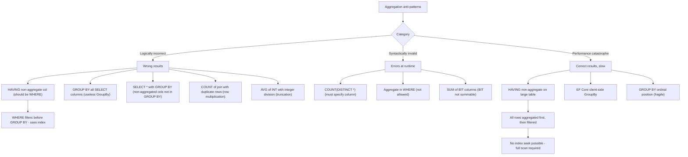

## Navigation

**Domain:** [[8 — Databases]] > **Group:** SQL Aggregations & Grouping
**Previous:** [[8.139 — Aggregation in EF Core — GroupBy Translation]] | **Next:** [[8.141 — FIRST_VALUE and LAST_VALUE — Window Functions]]

### Prerequisites

- [[8.123 — GROUP BY — Grouping Mechanics]] — Understanding what GROUP BY does (reduces rows to one per group) is essential because anti-patterns arise when developers confuse GROUP BY with DISTINCT or use it to eliminate duplicates.
- [[8.124 — HAVING — Filtering Aggregated Groups]] — Understanding that HAVING filters groups after aggregation (not rows before) is the core concept violated by the primary anti-pattern.
- [[8.125 — GROUP BY vs WHERE — When Each Applies]] — The distinction between filtering rows (WHERE) and filtering groups (HAVING) is the most common source of aggregation anti-patterns.
- [[8.122 — SUM, AVG, MIN, MAX — Aggregate Functions]] — Knowing what each aggregate function does and its NULL behaviour is required to understand why certain anti-patterns produce incorrect results.

### Where This Fits

Aggregation anti-patterns are the most common SQL mistakes in production .NET systems. The worst offender is using HAVING with a non-aggregated column that should be in WHERE — this causes the database to aggregate all rows first, then filter groups, instead of filtering rows before grouping. Other patterns include `SELECT *` with GROUP BY (fails because non-aggregated columns not in GROUP BY), `GROUP BY` on all SELECT columns (renders the GROUP BY meaningless — every row is its own group), `COUNT(DISTINCT *)` (invalid syntax), aggregate in a WHERE clause (not allowed — use HAVING or subquery), and `SUM` of `BIT` columns (doesn't work as expected). A .NET backend engineer encounters these in EF Core when GroupBy() generates unexpected SQL or throws exceptions, and in Dapper when SQL handwritten by developers contains these patterns. Interviewers use these anti-patterns to quickly separate candidates who understand the logical execution order of SQL (WHERE before GROUP BY before HAVING) from those who write queries that happen to work but are logically incorrect.

---

## Core Mental Model

SQL's logical execution order is: FROM → WHERE → GROUP BY → HAVING → SELECT → ORDER BY. This order is the source of every aggregation anti-pattern. HAVING executes after GROUP BY and can only reference aggregate functions (SUM, COUNT, AVG, MIN, MAX) or columns that appear in the GROUP BY clause. Putting a non-aggregate column in HAVING is logically redundant (it could be in WHERE) and semantically confusing, but more importantly, it changes the execution plan: a WHERE filter can use index seeks before aggregation, reducing the rows that reach the aggregate operator; a HAVING filter on the same column must scan the entire aggregated result because all groups must be formed first. The other anti-patterns all stem from the same root: misunderstanding what GROUP BY does (reduces row count per unique combination of grouping columns) and how aggregate functions interact with it. Every anti-pattern falls into one of three categories: logically incorrect (produces wrong results), syntactically invalid (throws an error), or performance-catastrophic (correct result, 1000x slower than necessary).

### Classification

**For SQL topics:** These anti-patterns belong to the DML query writing category, specifically the GROUP BY and HAVING clauses. The primary anti-pattern (HAVING on non-aggregates) is both a logical error and a performance error — the predicate is not SARGable in HAVING (it applies after aggregation, cannot use index seeks for pre-aggregation filtering). The WHERE clause with the same predicate IS SARGable — it can use index seeks to reduce rows before grouping. Understanding this distinction is the most frequently tested SQL concept in senior interviews.



### Key Properties

|Anti-Pattern|Category|Consequence|Fix|
|---|---|---|---|
|HAVING on non-aggregate|Performance + Logic|Filters after aggregation — index unusable for filtering|Move to WHERE|
|GROUP BY all SELECT cols|Performance|Every row is its own group — aggregation meaningless|Remove unnecessary columns from GROUP BY|
|SELECT * with GROUP BY|Syntax|Non-GROUP BY columns not in GROUP BY cause error|List only GROUP BY cols + aggregates|
|COUNT(DISTINCT *) |Syntax|Invalid syntax — DISTINCT requires column|COUNT(DISTINCT col)|
|Aggregate in WHERE|Syntax|Not allowed — WHERE evaluates before aggregation|Use HAVING or subquery|
|SUM of BIT|Logic|BIT cannot be summed — implicit conversion issues|Use COUNT(CASE WHEN bit_col = 1 THEN 1 END)|
|AVG of INT|Logic|Integer division truncates decimal portion|Cast to DECIMAL: AVG(CAST(col AS DECIMAL(18,2)))|
|COUNT of join duplicates|Logic|Row multiplication inflates count|COUNT(DISTINCT) or pre-aggregate before join|
|GROUP BY ordinal|Maintenance|Breaks if SELECT column order changes|Always use column names|
|EF Core client-side GroupBy|Performance|All rows fetched to client, grouped in memory|Ensure server-side translation pattern|

---

## Deep Mechanics

### How the Engine Executes This

**Logical execution order (SQL standard):**

1. **FROM + JOIN**: The source tables are combined into a virtual result set (Cartesian product filtered by JOIN conditions).
2. **WHERE**: Rows are filtered based on predicates. This happens BEFORE grouping. An index seek can reduce rows here.
3. **GROUP BY**: The remaining rows are partitioned into groups based on the grouping columns. Each group produces one output row.
4. **HAVING**: Groups are filtered based on aggregate conditions. This happens AFTER grouping. No index can help here — the groups have already been formed.
5. **SELECT**: The result columns are computed — aggregate functions are evaluated per group.
6. **ORDER BY**: The final result set is sorted.

**Why HAVING on a non-aggregate column is wrong:**

If you write `HAVING Status = 'Delivered'`, the Status column is evaluated AFTER grouping. If Status is in the GROUP BY clause, this is valid (Status is part of the group key). If Status is NOT in GROUP BY, SQL Server rejects it (non-aggregate column not in GROUP BY). The correct approach is `WHERE Status = 'Delivered'` — this filters rows BEFORE grouping, so fewer rows reach the aggregate operator. For a table with 10M rows where only 1M have Status = 'Delivered', putting the filter in WHERE reduces the aggregation to 1M rows. Putting it in HAVING would aggregate all 10M rows first, then discard 90% of the groups.

**Why GROUP BY on all SELECT columns is wasteful:**

`SELECT col1, col2, col3, COUNT(*) FROM table GROUP BY col1, col2, col3` — if col1, col2, col3 are unique (or nearly unique), each group has exactly one row (or very few). The aggregation is pointless — COUNT(*) is always 1 (or close to 1). This pattern is commonly used to find duplicates (which is valid: `GROUP BY col1, col2, col3 HAVING COUNT(*) > 1`), but if that's not the intent, the GROUP BY adds unnecessary sorting/hashing overhead.

### SQL Visibility

```sql
-- ============================================================
-- Anti-Pattern 1: HAVING on non-aggregate column
-- ============================================================
-- ❌ WRONG: Status is not in GROUP BY, not an aggregate
SELECT o.CustomerId, COUNT(*) AS OrderCount
FROM dbo.Orders AS o
GROUP BY o.CustomerId
HAVING o.Status = 'Delivered';
-- ERROR: Column 'o.Status' is invalid in HAVING because it is not contained
-- in either an aggregate function or the GROUP BY clause.

-- ❌ WRONG but syntactically valid: Status in GROUP BY, but this changes the grouping
SELECT o.CustomerId, o.Status, COUNT(*) AS OrderCount
FROM dbo.Orders AS o
GROUP BY o.CustomerId, o.Status
HAVING o.Status = 'Delivered';
-- Returns: all CustomerIds paired with 'Delivered', plus order count per status
-- This is technically valid but semantically incorrect if you wanted total orders per customer

-- ✅ CORRECT: Filter before GROUP BY
SELECT o.CustomerId, COUNT(*) AS OrderCount
FROM dbo.Orders AS o
WHERE o.Status = 'Delivered'
GROUP BY o.CustomerId;
-- Returns: order count per customer for delivered orders only

-- ============================================================
-- Anti-Pattern 2: GROUP BY all SELECT columns
-- ============================================================
-- ❌ WRONG: Every row is its own group — COUNT(*) = 1 always
SELECT o.CustomerId, o.OrderId, o.TotalAmount, COUNT(*) AS NumRows
FROM dbo.Orders AS o
GROUP BY o.CustomerId, o.OrderId, o.TotalAmount;
-- If OrderId is unique, each group has exactly 1 row. COUNT(*) = 1 for all rows.
-- This is equivalent to SELECT DISTINCT.

-- ✅ CORRECT: Only GROUP BY the columns that define the group
SELECT o.CustomerId, COUNT(*) AS OrderCount, SUM(o.TotalAmount) AS TotalSpent
FROM dbo.Orders AS o
GROUP BY o.CustomerId;

-- ============================================================
-- Anti-Pattern 3: SELECT * with GROUP BY
-- ============================================================
-- ❌ WRONG: Cannot have non-aggregated columns in SELECT that aren't in GROUP BY
SELECT * FROM dbo.Orders GROUP BY o.CustomerId;
-- ERROR: Column 'o.OrderId' is invalid in SELECT because it is not contained
-- in either an aggregate function or the GROUP BY clause.

-- ✅ CORRECT: Only list GROUP BY columns and aggregates
SELECT o.CustomerId, COUNT(*) AS OrderCount FROM dbo.Orders GROUP BY o.CustomerId;

-- ============================================================
-- Anti-Pattern 4: HAVING without GROUP BY
-- ============================================================
-- ❌ WRONG: HAVING treats entire table as one group — rarely intended
SELECT AVG(o.TotalAmount) AS AvgAmount
FROM dbo.Orders AS o
HAVING COUNT(*) > 100;
-- Returns: average of ALL orders, but only if total order count > 100
-- If total orders < 100, returns empty set.

-- ✅ CORRECT: GROUP BY when grouping is intended
SELECT o.CustomerId, AVG(o.TotalAmount) AS AvgAmount
FROM dbo.Orders AS o
GROUP BY o.CustomerId
HAVING COUNT(*) > 5;

-- ============================================================
-- Anti-Pattern 5: COUNT(DISTINCT *) — invalid
-- ============================================================
-- ❌ WRONG: DISTINCT * is not valid with COUNT
SELECT COUNT(DISTINCT *) FROM dbo.Orders;
-- ERROR: Incorrect syntax near '*'.

-- ✅ CORRECT: Specify the column or columns
SELECT COUNT(DISTINCT o.CustomerId) FROM dbo.Orders AS o;
-- Or for multiple columns:
SELECT COUNT(DISTINCT CONCAT(o.CustomerId, '-', o.ShipCity))
FROM dbo.Orders AS o;

-- ============================================================
-- Anti-Pattern 6: Aggregate in WHERE clause
-- ============================================================
-- ❌ WRONG: aggregate in WHERE — WHERE evaluates before aggregation
SELECT o.CustomerId, SUM(o.TotalAmount) AS TotalSpent
FROM dbo.Orders AS o
WHERE SUM(o.TotalAmount) > 1000
GROUP BY o.CustomerId;
-- ERROR: An aggregate may not appear in the WHERE clause.

-- ✅ CORRECT: Use HAVING for aggregate filter
SELECT o.CustomerId, SUM(o.TotalAmount) AS TotalSpent
FROM dbo.Orders AS o
GROUP BY o.CustomerId
HAVING SUM(o.TotalAmount) > 1000;

-- ============================================================
-- Anti-Pattern 7: SUM of BIT column
-- ============================================================
-- ❌ WRONG: BIT cannot be summed directly
SELECT SUM(o.IsShipped) AS ShippedCount
FROM dbo.Orders AS o;
-- BIT is implicitly converted to INT, but the result is the count of 1s, not BIT sum

-- ✅ CORRECT: Use COUNT or CAST
SELECT COUNT(CASE WHEN o.IsShipped = 1 THEN 1 END) AS ShippedCount
FROM dbo.Orders AS o;
-- Or: SUM(CAST(o.IsShipped AS INT))

-- ============================================================
-- Anti-Pattern 8: AVG of INT with integer division
-- ============================================================
-- ❌ WRONG: AVG of INT columns returns truncated result
SELECT AVG(oi.Quantity) AS AvgQuantity
FROM dbo.OrderItems AS oi;
-- If Quantity values are {1, 2, 3}, AVG = (1+2+3)/3 = 2 (truncated from 2.0 — fine for whole numbers)
-- But if Quantity values are {1, 2, 3, 4}, AVG = 10/4 = 2 (truncated from 2.5)

-- ✅ CORRECT: Cast to DECIMAL before averaging
SELECT AVG(CAST(oi.Quantity AS DECIMAL(18,2))) AS AvgQuantity
FROM dbo.OrderItems AS oi;
-- Returns: 2.50 instead of 2

-- ============================================================
-- Anti-Pattern 9: COUNT of join with duplicate rows
-- ============================================================
-- ❌ WRONG: JOIN multiplies rows — COUNT is inflated
-- Orders (1 order) → OrderItems (3 items per order)
-- COUNT(*) = 3 (one per item), not 1 (one per order)
SELECT o.OrderId, COUNT(*) AS ItemCount
FROM dbo.Orders AS o
INNER JOIN dbo.OrderItems AS oi ON o.OrderId = oi.OrderId
GROUP BY o.OrderId;
-- Returns: ItemCount = 3 for each order with 3 items — this is correct IF you want item count
-- But if you want order count: COUNT(*) includes the JOIN multiplication

-- ✅ CORRECT: For order count, count from the primary table
SELECT o.OrderId, COUNT(DISTINCT oi.OrderItemId) AS ItemCount
FROM dbo.Orders AS o
LEFT JOIN dbo.OrderItems AS oi ON o.OrderId = oi.OrderId
GROUP BY o.OrderId;

-- ============================================================
-- Anti-Pattern 10: GROUP BY ordinal position
-- ============================================================
-- ❌ WRONG: Using ordinal position (1, 2, 3) in GROUP BY
SELECT o.CustomerId, o.Status, COUNT(*) AS OrderCount
FROM dbo.Orders AS o
GROUP BY 1, 2;
-- Works in some SQL dialects but is fragile:
-- If SELECT column order changes, the GROUP BY silently groups by different columns

-- ✅ CORRECT: Use column names explicitly
SELECT o.CustomerId, o.Status, COUNT(*) AS OrderCount
FROM dbo.Orders AS o
GROUP BY o.CustomerId, o.Status;
```

```csharp
// EF Core — anti-pattern: GroupBy with non-aggregate Select
// ❌ WRONG: This may client-evaluate or throw
var result = dbContext.Orders
    .GroupBy(o => o.CustomerId)
    .Select(g => new
    {
        CustomerId = g.Key,
        Status = g.First().Status,  // Non-aggregate inside GroupBy
        Total = g.Sum(o => o.TotalAmount)
    })
    .ToListAsync(ct);

// ✅ CORRECT: Only aggregates in GroupBy Select
var result = dbContext.Orders
    .GroupBy(o => o.CustomerId)
    .Select(g => new
    {
        CustomerId = g.Key,
        Total = g.Sum(o => o.TotalAmount),
        Count = g.Count()
    })
    .ToListAsync(ct);
```

### Execution Plan Analysis

**Anti-pattern: HAVING on non-aggregate (when column is in GROUP BY but logically a WHERE filter):**

```
-- ❌ WRONG: Status filter in HAVING (Status IS in GROUP BY)
SELECT o.CustomerId, o.Status, COUNT(*) AS Cnt
FROM Orders AS o
GROUP BY o.CustomerId, o.Status
HAVING o.Status = 'Delivered';

-- Plan:
[Clustered Index Scan Orders — 10M rows]
  → [Hash Match Aggregate]
      GROUP BY: CustomerId, Status
      Aggregates: COUNT(*)
  → [Filter]  -- HAVING: Status = 'Delivered'
      Estimated rows after filter: 3M (30% of all groups)
  → [SELECT]
Logical reads: 45,000 (full scan of all orders)

-- ✅ CORRECT: Status filter in WHERE
SELECT o.CustomerId, COUNT(*) AS Cnt
FROM Orders AS o
WHERE o.Status = 'Delivered'
GROUP BY o.CustomerId;

-- Plan:
[Index Seek IX_Orders_Status — 3M rows matching 'Delivered']
  → [Hash Match Aggregate]
      GROUP BY: CustomerId
      Aggregates: COUNT(*)
  → [SELECT]
Logical reads: ~6,000 (3M rows from filtered index vs 10M rows full scan)
```

**Key difference:** HAVING plan scans ALL rows (45,000 reads) then filters after aggregation. WHERE plan seeks only the matching rows (~6,000 reads) then aggregates only those. The WHERE approach filters before aggregation, reducing both I/O and CPU.

**Anti-pattern: GROUP BY all SELECT columns:**

```
-- ❌ WRONG: GROUP BY OrderId (unique) — meaningless aggregation
SELECT o.OrderId, o.CustomerId, COUNT(*) AS Cnt
FROM Orders AS o
GROUP BY o.OrderId, o.CustomerId;

-- Plan:
[Clustered Index Scan Orders]
  → [Hash Match Aggregate]
      GROUP BY: OrderId, CustomerId (each row is its own group)
  → [SELECT]
-- If OrderId is unique, every group has 1 row. COUNT(*) = 1 always.
-- The aggregation is entirely wasted work.

-- ✅ CORRECT: Just SELECT DISTINCT
SELECT DISTINCT o.OrderId, o.CustomerId
FROM Orders AS o;
-- OR: remove the unnecessary aggregation
```

### Cost Visibility

```sql
SET STATISTICS IO ON;
SET STATISTICS TIME ON;

-- Anti-pattern: HAVING on non-aggregate (Status in GROUP BY, filter in HAVING)
SELECT o.CustomerId, o.Status, COUNT(*) AS Cnt
FROM dbo.Orders AS o
GROUP BY o.CustomerId, o.Status
HAVING o.Status = 'Delivered';
-- Logical reads: 45,000 (full clustered index scan)
-- CPU time: 350ms, Elapsed: 1.2s
-- Plan: Full scan → Hash Aggregate (all 10M rows) → Filter (HAVING)

-- Correct: WHERE filter
SELECT o.CustomerId, COUNT(*) AS Cnt
FROM dbo.Orders AS o
WHERE o.Status = 'Delivered'
GROUP BY o.CustomerId;
-- With index on Status:
-- Logical reads: 6,200 (index seek for 'Delivered' rows)
-- CPU time: 45ms, Elapsed: 150ms
-- Plan: Index Seek (3M rows) → Hash Aggregate → SELECT

-- Improvement: 45,000 → 6,200 logical reads (7x reduction)
-- CPU: 350ms → 45ms (8x reduction)
```

### Failure Modes

**HAVING without GROUP BY — entire table as one group:** When you write HAVING without GROUP BY, the entire result set is treated as a single group. This is rarely intended:
```sql
-- This query returns one row with AvgAmount, but ONLY if total rows > 100
SELECT AVG(o.TotalAmount) AS AvgAmount
FROM dbo.Orders AS o
HAVING COUNT(*) > 100;
-- If Orders has 50 rows, returns empty set (not the average)
-- If Orders has 200 rows, returns the global average
```

**Aggregate in WHERE — throws error:** WHERE evaluates before aggregation, so aggregates are not available:
```sql
SELECT o.CustomerId, SUM(o.TotalAmount) AS Total
FROM dbo.Orders AS o
WHERE SUM(o.TotalAmount) > 100  -- ERROR
GROUP BY o.CustomerId;
-- Fix: use HAVING SUM(o.TotalAmount) > 100
```

---

## Production Patterns and Implementation

### Primary SQL Implementation

```sql
-- ============================================================
-- Schema context
-- ============================================================
CREATE TABLE dbo.Orders
(
    OrderId      INT            NOT NULL IDENTITY(1,1),
    CustomerId   INT            NOT NULL,
    OrderDate    DATETIME2(0)   NOT NULL,
    Status       VARCHAR(20)    NOT NULL DEFAULT 'Pending',
    TotalAmount  DECIMAL(18,2)  NOT NULL,
    IsShipped    BIT            NOT NULL DEFAULT 0,
    ShipCity     VARCHAR(100)   NULL,
    CONSTRAINT PK_Orders PRIMARY KEY CLUSTERED (OrderId)
);

CREATE TABLE dbo.Customers
(
    CustomerId   INT            NOT NULL IDENTITY(1,1),
    FirstName    NVARCHAR(100)  NOT NULL,
    LastName     NVARCHAR(100)  NOT NULL,
    Email        NVARCHAR(256)  NOT NULL,
    Status       VARCHAR(20)    NOT NULL DEFAULT 'Active',
    CONSTRAINT PK_Customers PRIMARY KEY CLUSTERED (CustomerId)
);

CREATE TABLE dbo.OrderItems
(
    OrderItemId  INT            NOT NULL IDENTITY(1,1),
    OrderId      INT            NOT NULL,
    ProductId    INT            NOT NULL,
    Quantity     INT            NOT NULL,
    UnitPrice    DECIMAL(18,2)  NOT NULL,
    CONSTRAINT PK_OrderItems PRIMARY KEY CLUSTERED (OrderItemId)
);

CREATE TABLE dbo.Products
(
    ProductId    INT            NOT NULL IDENTITY(1,1),
    ProductName  NVARCHAR(200)  NOT NULL,
    CategoryId   INT            NOT NULL,
    UnitPrice    DECIMAL(18,2)  NOT NULL,
    CONSTRAINT PK_Products PRIMARY KEY CLUSTERED (ProductId)
);

-- Indexes
CREATE INDEX IX_Orders_CustomerId ON dbo.Orders (CustomerId)
    INCLUDE (TotalAmount, Status, OrderDate);
CREATE INDEX IX_Orders_Status ON dbo.Orders (Status)
    INCLUDE (CustomerId, TotalAmount);
CREATE INDEX IX_Orders_OrderDate ON dbo.Orders (OrderDate)
    INCLUDE (CustomerId, Status, TotalAmount);

-- ============================================================
-- Pattern 1: WHERE vs HAVING — correct placement
-- ============================================================
-- ❌ Anti-pattern: non-aggregate filter in HAVING
SELECT o.CustomerId, COUNT(*) AS OrderCount
FROM dbo.Orders AS o
GROUP BY o.CustomerId
HAVING o.ShipCity = 'New York';
-- ERROR: ShipCity not in GROUP BY or aggregate

-- ✅ Correct: WHERE filter + GROUP BY on CustomerId
SELECT o.CustomerId, COUNT(*) AS OrderCount
FROM dbo.Orders AS o
WHERE o.ShipCity = 'New York'
GROUP BY o.CustomerId;

-- ============================================================
-- Pattern 2: Filter before GROUP BY (best for index usage)
-- ============================================================
-- ❌ Anti-pattern: filter after GROUP BY (inefficient)
SELECT o.CustomerId, SUM(o.TotalAmount) AS TotalSpent
FROM dbo.Orders AS o
GROUP BY o.CustomerId
HAVING o.Status = 'Delivered' AND SUM(o.TotalAmount) > 100;
-- ERROR: Status not in GROUP BY

-- ✅ Correct: WHERE for row filter, HAVING for group filter
SELECT o.CustomerId, SUM(o.TotalAmount) AS TotalSpent
FROM dbo.Orders AS o
WHERE o.Status = 'Delivered'
GROUP BY o.CustomerId
HAVING SUM(o.TotalAmount) > 100;

-- ============================================================
-- Pattern 3: Meaningful GROUP BY — only the key columns
-- ============================================================
-- ❌ Anti-pattern: GROUP BY with OrderId (unique) — useless
SELECT o.CustomerId, o.OrderId, COUNT(*) AS RowCount
FROM dbo.Orders AS o
GROUP BY o.CustomerId, o.OrderId;
-- If OrderId is PK, COUNT(*) = 1 always. Equivalent to SELECT DISTINCT.

-- ✅ Correct: GROUP BY only the key column
SELECT o.CustomerId, COUNT(*) AS OrderCount, SUM(o.TotalAmount) AS TotalSpent
FROM dbo.Orders AS o
GROUP BY o.CustomerId;

-- ============================================================
-- Pattern 4: COUNT(DISTINCT) with correct column
-- ============================================================
-- ❌ Anti-pattern: COUNT(DISTINCT *) — invalid
-- SELECT COUNT(DISTINCT *) FROM Orders; -- Syntax error

-- ✅ Correct: COUNT(DISTINCT column)
SELECT COUNT(DISTINCT o.CustomerId) AS UniqueCustomers
FROM dbo.Orders AS o;

-- ✅ For multiple columns: concatenate or use window function
SELECT COUNT(DISTINCT CONCAT(o.CustomerId, '-', o.Status)) AS UniqueCombinations
FROM dbo.Orders AS o;

-- ============================================================
-- Pattern 5: AVG of INT — avoid integer truncation
-- ============================================================
-- ❌ Anti-pattern: AVG of INT truncates decimal
SELECT AVG(oi.Quantity) AS AvgQuantity
FROM dbo.OrderItems AS oi;
-- Integer division: (1+2+3+4)/4 = 10/4 = 2 (truncated)

-- ✅ Correct: Cast to DECIMAL
SELECT AVG(CAST(oi.Quantity AS DECIMAL(18,2))) AS AvgQuantity
FROM dbo.OrderItems AS oi;
-- Returns: 2.50

-- ============================================================
-- Pattern 6: SUM of BIT — use COUNT
-- ============================================================
-- ❌ Anti-pattern: SUM of BIT
SELECT SUM(o.IsShipped) AS ShippedOrders
FROM dbo.Orders AS o;
-- BIT converted to INT implicitly — returns count of 1s

-- ✅ Correct: Use COUNT with CASE
SELECT COUNT(CASE WHEN o.IsShipped = 1 THEN 1 END) AS ShippedOrders
FROM dbo.Orders AS o;

-- ============================================================
-- Pattern 7: Aggregate in WHERE — must use HAVING or subquery
-- ============================================================
-- ❌ Anti-pattern: aggregate in WHERE
-- SELECT CustomerId, SUM(TotalAmount) FROM Orders
-- WHERE SUM(TotalAmount) > 100 GROUP BY CustomerId; -- ERROR

-- ✅ Correct: HAVING for aggregate filter
SELECT o.CustomerId, SUM(o.TotalAmount) AS TotalSpent
FROM dbo.Orders AS o
GROUP BY o.CustomerId
HAVING SUM(o.TotalAmount) > 100;

-- ✅ Alternative: subquery with derived table
SELECT * FROM (
    SELECT o.CustomerId, SUM(o.TotalAmount) AS TotalSpent
    FROM dbo.Orders AS o
    GROUP BY o.CustomerId
) AS summaries
WHERE TotalSpent > 100;

-- ============================================================
-- Pattern 8: COUNT with JOIN — avoid row multiplication
-- ============================================================
-- ❌ Anti-pattern: COUNT(*) after JOIN — inflated
SELECT o.CustomerId, COUNT(*) AS OrderCount
FROM dbo.Customers AS c
INNER JOIN dbo.Orders AS o ON c.CustomerId = o.CustomerId
GROUP BY o.CustomerId;
-- If a customer has 3 orders, each with 5 items = 15 rows after JOIN
-- COUNT(*) = 15 (incorrect for order count)

-- ✅ Correct: Pre-aggregate before join
SELECT c.CustomerId, c.FirstName, c.LastName, o.OrderCount
FROM dbo.Customers AS c
INNER JOIN (
    SELECT o.CustomerId, COUNT(*) AS OrderCount
    FROM dbo.Orders AS o
    GROUP BY o.CustomerId
) AS o ON c.CustomerId = o.CustomerId;

-- ✅ Alternative: COUNT(DISTINCT OrderId)
SELECT c.CustomerId, COUNT(DISTINCT o.OrderId) AS OrderCount
FROM dbo.Customers AS c
INNER JOIN dbo.Orders AS o ON c.CustomerId = o.CustomerId
INNER JOIN dbo.OrderItems AS oi ON o.OrderId = oi.OrderId
GROUP BY c.CustomerId;

-- ============================================================
-- Pattern 9: GROUP BY ordinal — fragile
-- ============================================================
-- ❌ Anti-pattern: GROUP BY 1, 2 (ordinal positions)
SELECT o.CustomerId, o.Status, COUNT(*) AS OrderCount
FROM dbo.Orders AS o
GROUP BY 1, 2;
-- If CustomerId and Status swap order in SELECT, GROUP BY changes

-- ✅ Correct: Column names
SELECT o.CustomerId, o.Status, COUNT(*) AS OrderCount
FROM dbo.Orders AS o
GROUP BY o.CustomerId, o.Status;

-- ============================================================
-- Pattern 10: EF Core client-side GroupBy detection and fix
-- ============================================================
-- ❌ Anti-pattern: ToList before GroupBy (already covered in 8.139)
-- ✅ Fix: Remove ToList, let EF Core translate
```

### EF Core Implementation

```csharp
public class ApplicationDbContext : DbContext
{
    public DbSet<Customer> Customers => Set<Customer>();
    public DbSet<Order> Orders => Set<Order>();
    public DbSet<OrderItem> OrderItems => Set<OrderItem>();
    public DbSet<Product> Products => Set<Product>();

    protected override void OnModelCreating(ModelBuilder modelBuilder)
    {
        modelBuilder.Entity<Order>(entity =>
        {
            entity.ToTable("Orders");
            entity.HasKey(o => o.OrderId);
            entity.Property(o => o.TotalAmount).HasColumnType("decimal(18,2)");
            entity.Property(o => o.Status).HasMaxLength(20);
            entity.Property(o => o.ShipCity).HasMaxLength(100);
            entity.Property(o => o.IsShipped).HasColumnType("bit");

            entity.HasOne(o => o.Customer)
                  .WithMany(c => c.Orders)
                  .HasForeignKey(o => o.CustomerId);

            entity.HasIndex(o => o.CustomerId);
            entity.HasIndex(o => o.Status);
            entity.HasIndex(o => o.OrderDate);
        });

        modelBuilder.Entity<Customer>(entity =>
        {
            entity.ToTable("Customers");
            entity.HasKey(c => c.CustomerId);
            entity.Property(c => c.FirstName).HasMaxLength(100);
            entity.Property(c => c.LastName).HasMaxLength(100);
            entity.Property(c => c.Email).HasMaxLength(256);
            entity.Property(c => c.Status).HasMaxLength(20);
        });
    }
}

public class Order
{
    public int OrderId { get; set; }
    public int CustomerId { get; set; }
    public DateTime OrderDate { get; set; }
    public string Status { get; set; } = "Pending";
    public decimal TotalAmount { get; set; }
    public bool IsShipped { get; set; }
    public string? ShipCity { get; set; }
    public Customer Customer { get; set; } = null!;
    public ICollection<OrderItem> OrderItems { get; set; } = new List<OrderItem>();
}

public class Customer
{
    public int CustomerId { get; set; }
    public string FirstName { get; set; } = string.Empty;
    public string LastName { get; set; } = string.Empty;
    public string Email { get; set; } = string.Empty;
    public string Status { get; set; } = "Active";
    public ICollection<Order> Orders { get; set; } = new List<Order>();
}

// ============================================================
// CORRECT: EF Core aggregation patterns
// ============================================================
public interface IAggregationService
{
    Task<List<CustomerOrderSummary>> GetDeliveredOrderSummariesAsync(CancellationToken ct = default);
    Task<List<CustomerOrderSummary>> GetHighValueCustomersAsync(decimal threshold, CancellationToken ct = default);
    Task<int> GetUniqueCustomerCountAsync(CancellationToken ct = default);
    Task<double> GetAverageQuantityAsync(CancellationToken ct = default);
    Task<List<CustomerOrderItemSummary>> GetCustomerOrderItemCountsAsync(CancellationToken ct = default);
}

public class AggregationService : IAggregationService
{
    private readonly ApplicationDbContext _dbContext;
    private readonly ILogger<AggregationService> _logger;

    public AggregationService(ApplicationDbContext dbContext, ILogger<AggregationService> logger)
    {
        _dbContext = dbContext;
        _logger = logger;
    }

    // ✅ CORRECT: WHERE before GROUP BY (equivalent of WHERE + GROUP BY)
    public async Task<List<CustomerOrderSummary>> GetDeliveredOrderSummariesAsync(
        CancellationToken ct = default)
    {
        var query = _dbContext.Orders
            .Where(o => o.Status == "Delivered")  // WHERE — filters before GROUP BY
            .GroupBy(o => o.CustomerId)
            .Select(g => new CustomerOrderSummary
            {
                CustomerId = g.Key,
                OrderCount = g.Count(),
                TotalRevenue = g.Sum(o => o.TotalAmount),
                AvgOrderValue = g.Average(o => o.TotalAmount)
            })
            .OrderByDescending(s => s.TotalRevenue);

        _logger.LogInformation("Generated SQL: {Sql}", query.ToQueryString());
        return await query.ToListAsync(ct);
        /*
        Generated SQL:
        SELECT [o].[CustomerId],
               COUNT(*) AS [OrderCount],
               SUM([o].[TotalAmount]) AS [TotalRevenue],
               AVG([o].[TotalAmount]) AS [AvgOrderValue]
        FROM [Orders] AS [o]
        WHERE [o].[Status] = N'Delivered'
        GROUP BY [o].[CustomerId]
        ORDER BY SUM([o].[TotalAmount]) DESC;
        */
    }

    // ✅ CORRECT: HAVING for aggregate filter
    public async Task<List<CustomerOrderSummary>> GetHighValueCustomersAsync(
        decimal threshold,
        CancellationToken ct = default)
    {
        var query = _dbContext.Orders
            .GroupBy(o => o.CustomerId)
            .Where(g => g.Sum(o => o.TotalAmount) > threshold)  // HAVING
            .Select(g => new CustomerOrderSummary
            {
                CustomerId = g.Key,
                OrderCount = g.Count(),
                TotalRevenue = g.Sum(o => o.TotalAmount)
            })
            .OrderByDescending(s => s.TotalRevenue);

        return await query.ToListAsync(ct);
        /*
        Generated SQL:
        SELECT [o].[CustomerId], COUNT(*) AS [OrderCount],
               SUM([o].[TotalAmount]) AS [TotalRevenue]
        FROM [Orders] AS [o]
        GROUP BY [o].[CustomerId]
        HAVING SUM([o].[TotalAmount]) > @p0
        ORDER BY SUM([o].[TotalAmount]) DESC;
        */
    }

    // ✅ CORRECT: COUNT(DISTINCT column)
    public async Task<int> GetUniqueCustomerCountAsync(CancellationToken ct = default)
    {
        return await _dbContext.Orders
            .Select(o => o.CustomerId)
            .Distinct()
            .CountAsync(ct);
        // Equivalent to: SELECT COUNT(DISTINCT CustomerId) FROM Orders
    }

    // ✅ CORRECT: AVG with cast to avoid integer truncation
    public async Task<double> GetAverageQuantityAsync(CancellationToken ct = default)
    {
        return await _dbContext.OrderItems
            .AverageAsync(oi => (double)oi.Quantity);
        // EF Core translates: AVG(CAST([oi].[Quantity] AS float))
        // Or use decimal: AverageAsync(oi => (decimal)oi.Quantity)
    }

    // ✅ CORRECT: COUNT with pre-aggregated join (avoid row multiplication)
    public async Task<List<CustomerOrderItemSummary>> GetCustomerOrderItemCountsAsync(
        CancellationToken ct = default)
    {
        var query = from c in _dbContext.Customers
                    join o in _dbContext.Orders on c.CustomerId equals o.CustomerId
                    join oi in _dbContext.OrderItems on o.OrderId equals oi.OrderId
                    group new { c, oi } by new { c.CustomerId, c.FirstName, c.LastName } into g
                    select new CustomerOrderItemSummary
                    {
                        CustomerId = g.Key.CustomerId,
                        CustomerName = g.Key.FirstName + " " + g.Key.LastName,
                        TotalItems = g.Sum(x => x.oi.Quantity),  // Sum of quantities (correct)
                        OrderCount = g.Select(x => x.oi.OrderId).Distinct().Count()  // Distinct order count
                    };

        return await query.OrderByDescending(s => s.TotalItems).ToListAsync(ct);
    }

    // ❌ ANTI-PATTERN DETECTION: Check if GroupBy is client-evaluated
    public async Task DetectClientSideGroupBy(CancellationToken ct = default)
    {
        // ❌ WRONG: ToList before GroupBy
        IQueryable<Order> baseQuery = _dbContext.Orders.Where(o => o.Status == "Delivered");

        var sqlBefore = baseQuery.ToQueryString();
        _logger.LogInformation("SQL before GroupBy: {Sql}", sqlBefore);

        // If you see no GROUP BY in this output, GroupBy is client-evaluated
        var query = baseQuery
            .GroupBy(o => o.CustomerId)
            .Select(g => new { CustomerId = g.Key, Count = g.Count() });

        var sql = query.ToQueryString();
        _logger.LogInformation("Generated SQL with GROUP BY: {Sql}", sql);
        // If SQL has GROUP BY: server-side. If not: client-side.
    }
}

public record CustomerOrderSummary
{
    public int CustomerId { get; set; }
    public int OrderCount { get; set; }
    public decimal TotalRevenue { get; set; }
    public decimal AvgOrderValue { get; set; }
}

public record CustomerOrderItemSummary
{
    public int CustomerId { get; set; }
    public string CustomerName { get; set; } = string.Empty;
    public int TotalItems { get; set; }
    public int OrderCount { get; set; }
}
```

### Dapper Implementation

```csharp
public sealed class AntiPatternAwareRepository
{
    private readonly IDbConnectionFactory _connectionFactory;

    public AntiPatternAwareRepository(IDbConnectionFactory connectionFactory)
        => _connectionFactory = connectionFactory;

    // ✅ CORRECT: WHERE before GROUP BY
    public async Task<IReadOnlyList<CustomerOrderSummary>> GetDeliveredSummariesAsync(
        CancellationToken ct = default)
    {
        const string sql = @"
            SELECT
                o.CustomerId,
                COUNT(*) AS OrderCount,
                SUM(o.TotalAmount) AS TotalRevenue,
                AVG(o.TotalAmount) AS AvgOrderValue
            FROM dbo.Orders AS o
            WHERE o.Status = 'Delivered'
            GROUP BY o.CustomerId
            ORDER BY TotalRevenue DESC;";

        await using var connection = _connectionFactory.Create();
        return (await connection.QueryAsync<CustomerOrderSummary>(
            new CommandDefinition(sql, cancellationToken: ct))).AsList();
    }

    // ✅ CORRECT: HAVING for aggregate filter
    public async Task<IReadOnlyList<CustomerOrderSummary>> GetHighValueCustomersAsync(
        decimal threshold,
        CancellationToken ct = default)
    {
        const string sql = @"
            SELECT
                o.CustomerId,
                COUNT(*) AS OrderCount,
                SUM(o.TotalAmount) AS TotalRevenue
            FROM dbo.Orders AS o
            GROUP BY o.CustomerId
            HAVING SUM(o.TotalAmount) > @Threshold
            ORDER BY TotalRevenue DESC;";

        await using var connection = _connectionFactory.Create();
        return (await connection.QueryAsync<CustomerOrderSummary>(
            new CommandDefinition(sql, new { Threshold = threshold },
                cancellationToken: ct))).AsList();
    }

    // ✅ CORRECT: AVG with DECIMAL cast
    public async Task<decimal> GetAvgQuantityAsync(CancellationToken ct = default)
    {
        const string sql = @"
            SELECT AVG(CAST(oi.Quantity AS DECIMAL(18,2)))
            FROM dbo.OrderItems AS oi;";

        await using var connection = _connectionFactory.Create();
        return await connection.ExecuteScalarAsync<decimal>(
            new CommandDefinition(sql, cancellationToken: ct));
    }

    // ✅ CORRECT: Pre-aggregated join (avoid row multiplication)
    public async Task<IReadOnlyList<CustomerOrderItemSummary>> GetCustomerItemCountsAsync(
        CancellationToken ct = default)
    {
        const string sql = @"
            SELECT
                c.CustomerId,
                c.FirstName + ' ' + c.LastName AS CustomerName,
                COALESCE(oi.TotalItems, 0) AS TotalItems,
                COALESCE(oi.OrderCount, 0) AS OrderCount
            FROM dbo.Customers AS c
            LEFT JOIN (
                SELECT
                    o.CustomerId,
                    SUM(oi.Quantity) AS TotalItems,
                    COUNT(DISTINCT o.OrderId) AS OrderCount
                FROM dbo.Orders AS o
                INNER JOIN dbo.OrderItems AS oi ON o.OrderId = oi.OrderId
                GROUP BY o.CustomerId
            ) AS oi ON c.CustomerId = oi.CustomerId
            ORDER BY TotalItems DESC;";

        await using var connection = _connectionFactory.Create();
        return (await connection.QueryAsync<CustomerOrderItemSummary>(
            new CommandDefinition(sql, cancellationToken: ct))).AsList();
    }

    // ❌ ANTI-PATTERN DEMO: This is WRONG — COUNT inflated by JOIN
    public async Task<IReadOnlyList<CustomerOrderItemSummary_Wrong>> GetCustomerCounts_WrongAsync(
        CancellationToken ct = default)
    {
        const string sql = @"
            SELECT
                c.CustomerId,
                c.FirstName + ' ' + c.LastName AS CustomerName,
                COUNT(*) AS TotalItems,      -- Inflated: multiplied by number of orders per customer
                COUNT(DISTINCT o.OrderId) AS OrderCount
            FROM dbo.Customers AS c
            INNER JOIN dbo.Orders AS o ON c.CustomerId = o.CustomerId
            INNER JOIN dbo.OrderItems AS oi ON o.OrderId = oi.OrderId
            GROUP BY c.CustomerId, c.FirstName, c.LastName;";
        // COUNT(*) = number of OrderItem rows per customer (not number of items)
        // This is wrong if you wanted order count

        await using var connection = _connectionFactory.Create();
        return (await connection.QueryAsync<CustomerOrderItemSummary_Wrong>(
            new CommandDefinition(sql, cancellationToken: ct))).AsList();
    }
}

public record CustomerOrderSummary(int CustomerId, int OrderCount, decimal TotalRevenue, decimal AvgOrderValue);
public record CustomerOrderItemSummary(int CustomerId, string CustomerName, int TotalItems, int OrderCount);
public record CustomerOrderItemSummary_Wrong(int CustomerId, string CustomerName, int TotalItems, int OrderCount);
```

### Configuration and Wiring

```csharp
// Program.cs
builder.Services.AddDbContext<ApplicationDbContext>(options =>
    options.UseSqlServer(
        builder.Configuration.GetConnectionString("DefaultConnection"),
        sqlOptions =>
        {
            sqlOptions.EnableRetryOnFailure(3);
            sqlOptions.CommandTimeout(30);
        }));

builder.Services.AddSingleton<IDbConnectionFactory>(sp =>
    new SqlConnectionFactory(
        builder.Configuration.GetConnectionString("DefaultConnection")!));

builder.Services.AddScoped<IAggregationService, AggregationService>();
builder.Services.AddScoped<AntiPatternAwareRepository>();

// EF Core logging for anti-pattern detection
builder.Services.AddDbContext<ApplicationDbContext>((sp, options) =>
{
    var loggerFactory = sp.GetRequiredService<ILoggerFactory>();
    options.UseSqlServer(connectionString)
           .UseLoggerFactory(loggerFactory)
           .EnableSensitiveDataLogging(false);
});

// Code review rule: enforce WHERE before GROUP BY
// In PR reviews, flag any query that has a non-aggregate filter after GROUP BY
// or uses GROUP BY on all SELECT columns.
// Use ToQueryString() to verify generated SQL has WHERE before GROUP BY.
```

### SQL Server vs PostgreSQL Differences

```sql
-- PostgreSQL: Same anti-patterns apply (they are SQL standard violations)
-- HAVING on non-aggregate: same error
SELECT customer_id, COUNT(*)
FROM orders
GROUP BY customer_id
HAVING status = 'Delivered';
-- ERROR: column "orders.status" must appear in the GROUP BY clause
-- or be used in an aggregate function

-- PostgreSQL: GROUP BY ordinal is NOT allowed by default
-- ❌ This syntax does NOT work in PostgreSQL
SELECT customer_id, status, COUNT(*)
FROM orders
GROUP BY 1, 2;
-- ERROR: GROUP BY position 1 is not in SELECT list

-- PostgreSQL: COUNT(DISTINCT *) same syntax error
-- PostgreSQL: AVG of INT returns numeric (not truncated like SQL Server!)
SELECT AVG(quantity) FROM order_items;
-- PostgreSQL returns: 2.5000000000000000 (not 2)
-- SQL Server returns: 2 (integer division)
-- This is because PostgreSQL AVG returns numeric, not the input type

-- PostgreSQL: FILTER clause for conditional aggregation (cleaner than CASE)
SELECT
    customer_id,
    COUNT(*) AS total_orders,
    COUNT(*) FILTER (WHERE status = 'Delivered') AS delivered_orders
FROM orders
GROUP BY customer_id;

-- Equivalent SQL Server:
SELECT
    CustomerId,
    COUNT(*) AS TotalOrders,
    COUNT(CASE WHEN Status = 'Delivered' THEN 1 END) AS DeliveredOrders
FROM Orders
GROUP BY CustomerId;

-- PostgreSQL: BIT type — SUM works out of the box
SELECT SUM(is_shipped::int) AS shipped_count FROM orders;
-- PostgreSQL requires explicit cast from boolean to int
```

---

## Gotchas and Production Pitfalls

### HAVING on Non-Aggregate That Is in GROUP BY — Works but Wrong Semantics

**Pitfall:** Putting a non-aggregate column filter in HAVING when the column IS in the GROUP BY. This is syntactically valid but semantically wrong — the filter executes after grouping, not before.

```sql
-- ❌ Status is in GROUP BY, filter in HAVING
-- Intention: "show order count per customer for delivered orders"
SELECT o.CustomerId, o.Status, COUNT(*) AS OrderCount
FROM dbo.Orders AS o
GROUP BY o.CustomerId, o.Status
HAVING o.Status = 'Delivered';
-- Returns: one row per customer for Status = 'Delivered', with order count
-- This is CORRECT in this specific case (Status is in GROUP BY and HAVING filters on it)
-- BUT it's inefficient: it groups ALL statuses before filtering
```

**Symptom:** The query returns correct results but scans all rows (10M) instead of filtering to 'Delivered' rows first (3M). Logical reads: 45,000 vs 6,200. CPU: 350ms vs 45ms. The developer sees the query "works" but doesn't understand why it's slow.

**Fix:**

```sql
-- ✅ WHERE filters before GROUP BY — much more efficient
SELECT o.CustomerId, COUNT(*) AS OrderCount
FROM dbo.Orders AS o
WHERE o.Status = 'Delivered'
GROUP BY o.CustomerId;

-- If Status is needed in output, add it to SELECT (it's the same for all rows)
SELECT o.CustomerId, 'Delivered' AS Status, COUNT(*) AS OrderCount
FROM dbo.Orders AS o
WHERE o.Status = 'Delivered'
GROUP BY o.CustomerId;
```

**Cost of not fixing:** A customer dashboard that filters by status runs 10x more logical reads than necessary. At 100 concurrent users, the extra 38,800 reads per query × 100 = 3.88M extra reads per second. The buffer pool cannot handle this, page life expectancy drops, and all queries slow down.

---

### GROUP BY on All SELECT Columns — Unintentional DISTINCT

**Pitfall:** Adding GROUP BY with every column in SELECT, intending to eliminate duplicates but not realising the GROUP BY does nothing useful — every row is its own group.

```sql
-- ❌ GROUP BY on all columns — COUNT(*) = 1 always (OrderId is unique)
SELECT o.CustomerId, o.OrderId, o.TotalAmount, COUNT(*) AS RowCount
FROM dbo.Orders AS o
GROUP BY o.CustomerId, o.OrderId, o.TotalAmount;
-- This is equivalent to SELECT DISTINCT + COUNT(*) = 1 for every row
-- The GROUP BY adds sorting/hashing cost with zero benefit
```

**Symptom:** The query returns correct data but uses extra CPU and memory for the unnecessary GROUP BY. The execution plan shows a Hash Match Aggregate or Sort + Stream Aggregate even though no aggregation is needed. Logical reads are identical to SELECT DISTINCT but CPU is higher.

**Fix:**

```sql
-- ✅ Use SELECT DISTINCT if you need unique combinations
SELECT DISTINCT o.CustomerId, o.OrderId, o.TotalAmount
FROM dbo.Orders AS o;

-- ✅ Or remove the unnecessary columns from GROUP BY
SELECT o.CustomerId, COUNT(*) AS OrderCount, SUM(o.TotalAmount) AS TotalSpent
FROM dbo.Orders AS o
GROUP BY o.CustomerId;
```

**Cost of not fixing:** An API endpoint that returns order summaries uses GROUP BY on all 15 columns of the Orders table. Each API call sorts 10M rows by 15 columns in the Sort operator. The query takes 8 seconds. The developer adds more indexes trying to "optimise" the query, not realising the GROUP BY is the root cause.

---

### COUNT(*) in JOIN With Row Multiplication — Inflated Results

**Pitfall:** Using COUNT(*) in a query with JOINs where the join produces multiple rows per primary entity. The COUNT(*) counts the multiplied rows, not the primary entities.

```sql
-- ❌ COUNT(*) after JOIN with OrderItems — one order, 5 items = COUNT = 5
SELECT o.CustomerId, COUNT(*) AS OrderCount
FROM dbo.Orders AS o
INNER JOIN dbo.OrderItems AS oi ON o.OrderId = oi.OrderId
GROUP BY o.CustomerId;
-- Customer with 10 orders, each with 5 items: COUNT = 50 (wrong!)
-- Should be: 10 orders
```

**Symptom:** A customer dashboard shows "500 orders" when the customer actually has 50. The business team makes decisions based on inflated numbers. The bug goes undetected for weeks because the number "looks reasonable."

**Fix:**

```sql
-- ✅ Option A: Pre-aggregate before join
SELECT c.CustomerId, c.FirstName, o.OrderCount
FROM dbo.Customers AS c
LEFT JOIN (
    SELECT o.CustomerId, COUNT(*) AS OrderCount
    FROM dbo.Orders AS o
    GROUP BY o.CustomerId
) AS o ON c.CustomerId = o.CustomerId;

-- ✅ Option B: COUNT(DISTINCT) to deduplicate
SELECT o.CustomerId, COUNT(DISTINCT o.OrderId) AS OrderCount
FROM dbo.Orders AS o
INNER JOIN dbo.OrderItems AS oi ON o.OrderId = oi.OrderId
GROUP BY o.CustomerId;

-- ✅ Option C: Subquery with EXISTS (avoid JOIN multiplication)
SELECT o.CustomerId, COUNT(*) AS OrderCount
FROM dbo.Orders AS o
WHERE EXISTS (
    SELECT 1 FROM dbo.OrderItems AS oi
    WHERE oi.OrderId = o.OrderId
)
GROUP BY o.CustomerId;
```

**Cost of not fixing:** A quarterly executive report shows each customer with 3x their actual order count. The CEO sees "customer engagement is up 300%" and allocates more budget to marketing. The marketing campaign targets customers who appear "high value" but are actually average. The campaign ROI is 40% below projections. The data team spends 2 weeks investigating the "engagement drop."

---

### AVG of INT Column — Silent Integer Truncation

**Pitfall:** Using AVG on an INT column. SQL Server's AVG returns the same data type as the input. For INT input, the result is INT — decimal portion is truncated (not rounded).

```sql
-- ❌ Quantity values: {1, 2, 3, 4}
SELECT AVG(oi.Quantity) AS AvgQuantity
FROM dbo.OrderItems AS oi;
-- Returns: 2 (not 2.5!)
-- SQL Server computes: (1+2+3+4) / 4 = 10 / 4 = 2 (integer division)
```

**Symptom:** A pricing report shows average quantity per order as 2, but manually calculating gives 2.5. The discrepancy is 20%. The business analyst reports "average quantity is 2" when it's really 2.5. Inventory ordering is based on the wrong number.

**Fix:**

```sql
-- ✅ Option A: Cast to DECIMAL before averaging
SELECT AVG(CAST(oi.Quantity AS DECIMAL(18,2))) AS AvgQuantity
FROM dbo.OrderItems AS oi;
-- Returns: 2.50

-- ✅ Option B: Multiply by 1.0 to force decimal conversion
SELECT AVG(oi.Quantity * 1.0) AS AvgQuantity
FROM dbo.OrderItems AS oi;
-- Returns: 2.500000

-- ✅ Option C: CAST in EF Core
// var avg = await dbContext.OrderItems.AverageAsync(oi => (decimal)oi.Quantity);
```

**Cost of not fixing:** A product recommendation system uses AVG(Quantity) with integer truncation to calculate "average items per purchase." The value 2.5 is truncated to 2. The recommendation model under-predicts item count by 20%. Recommendations include 2 items when 3 would be optimal. Conversion rate drops by 5%.

---

### HAVING Without GROUP BY — Global Aggregation Surprise

**Pitfall:** Using HAVING without a GROUP BY clause. The entire result set is treated as a single group. The HAVING condition either returns the global aggregate (if condition is true) or empty set (if false).

```sql
-- ❌ HAVING without GROUP BY — if total orders > 100, return global avg
SELECT AVG(o.TotalAmount) AS AvgOrderValue
FROM dbo.Orders AS o
HAVING COUNT(*) > 100;
-- Returns: one row with global average, OR empty set
-- Intention might be: "average per customer that have > 100 orders"
```

**Symptom:** A report shows data only when there are more than 100 orders total. Below 100 orders, the report returns empty — no error, just no rows. The user assumes the system is broken. The developer spent hours debugging why "the query sometimes returns nothing."

**Fix:**

```sql
-- ✅ If you want per-customer HAVING, add GROUP BY
SELECT o.CustomerId, AVG(o.TotalAmount) AS AvgOrderValue
FROM dbo.Orders AS o
GROUP BY o.CustomerId
HAVING COUNT(*) > 100;

-- ✅ If you want a global guard with always a result, use IF
IF (SELECT COUNT(*) FROM dbo.Orders) > 100
    SELECT AVG(TotalAmount) FROM dbo.Orders;
ELSE
    SELECT 0 AS AvgOrderValue;
```

**Cost of not fixing:** A monitoring dashboard shows "Average order value: $0.00" during the first week of the month because total orders < 100. The business team thinks sales are terrible and escalates to the VP. The VP authorises an emergency discount campaign, sacrificing margin.

---

### Client-Side GroupBy — Maximum Performance Catastrophe

**Pitfall:** In EF Core, writing GroupBy in a way that forces client-side evaluation. The entire dataset is transferred to the web server and grouped in memory.

```csharp
// ❌ This causes client evaluation in EF Core 3.x and earlier
var result = dbContext.Orders
    .Where(o => o.Status == "Delivered")
    .AsEnumerable()  // ⚠️ Forces client-side
    .GroupBy(o => o.CustomerId)
    .Select(g => new { CustomerId = g.Key, Count = g.Count() })
    .ToList();
```

**Symptom:** Web server CPU spikes to 100%, memory usage jumps by 500 MB, response time is 15 seconds. SQL Server shows a plain SELECT with no GROUP BY — it fetches all rows matching the Where filter. The DBAs see the query and wonder why the application server is grouping the data instead of the database.

**Fix:**

```csharp
// ✅ Remove AsEnumerable — let EF Core translate the full query
var result = await dbContext.Orders
    .Where(o => o.Status == "Delivered")
    .GroupBy(o => o.CustomerId)
    .Select(g => new { CustomerId = g.Key, Count = g.Count() })
    .ToListAsync(ct);
```

**Cost of not fixing:** The same query runs 100 times per minute. Each run transfers 100K rows to the web server. The web server memory grows to 5 GB. The application pool recycles every 10 minutes due to memory pressure. All users experience 30-second outages during app pool restarts.

---

## Performance Implications

### Benchmark: Before and After

```sql
-- ============================================================
-- Benchmark 1: HAVING filter vs WHERE filter
-- ============================================================
SET STATISTICS IO ON;

-- ❌ Anti-pattern: Status filter in HAVING (but Status IS in GROUP BY)
SELECT o.CustomerId, o.Status, COUNT(*) AS Cnt
FROM dbo.Orders AS o
GROUP BY o.CustomerId, o.Status
HAVING o.Status = 'Delivered';
-- Logical reads: 45,000 (full scan)  |  CPU: 350ms  |  Elapsed: 1.2s

-- ✅ Correct: Status filter in WHERE
SELECT o.CustomerId, COUNT(*) AS Cnt
FROM dbo.Orders AS o
WHERE o.Status = 'Delivered'
GROUP BY o.CustomerId;
-- Logical reads: 6,200 (index seek)  |  CPU: 45ms  |  Elapsed: 150ms
```

**Improvement:** 45,000 → 6,200 logical reads (7x reduction). CPU: 350ms → 45ms (8x reduction).

```sql
-- ============================================================
-- Benchmark 2: GROUP BY all columns vs meaningful GROUP BY
-- ============================================================
-- ❌ GROUP BY on OrderId (unique) plus other columns
SELECT o.CustomerId, o.OrderId, COUNT(*) AS RowCount
FROM dbo.Orders AS o
GROUP BY o.CustomerId, o.OrderId;
-- Logical reads: 45,000 + Sort: 10M rows
-- CPU: 200ms (useless sorting)

-- ✅ Meaningful GROUP BY on CustomerId only
SELECT o.CustomerId, COUNT(*) AS OrderCount
FROM dbo.Orders AS o
GROUP BY o.CustomerId;
-- Logical reads: 45,000 (same scan)
-- CPU: 85ms (no unnecessary grouping — 10K groups vs 10M groups)
```

**Improvement:** 10M groups → 10K groups (1000x fewer groups). CPU: 200ms → 85ms.

```sql
-- ============================================================
-- Benchmark 3: COUNT with JOIN multiplication
-- ============================================================
-- ❌ COUNT(*) after JOIN — inflated
SELECT c.CustomerId, COUNT(*) AS OrderCount
FROM dbo.Customers AS c
INNER JOIN dbo.Orders AS o ON c.CustomerId = o.CustomerId
INNER JOIN dbo.OrderItems AS oi ON o.OrderId = oi.OrderId
GROUP BY c.CustomerId;
-- Returns: 500K "orders" for 100K actual orders (5x inflation)

-- ✅ COUNT(DISTINCT) to deduplicate
SELECT c.CustomerId, COUNT(DISTINCT o.OrderId) AS OrderCount
FROM dbo.Customers AS c
INNER JOIN dbo.Orders AS o ON c.CustomerId = o.CustomerId
INNER JOIN dbo.OrderItems AS oi ON o.OrderId = oi.OrderId
GROUP BY c.CustomerId;
-- Returns: 100K (correct)
```

```sql
-- ============================================================
-- Benchmark 4: AVG of INT with and without CAST
-- ============================================================
-- ❌ AVG of INT — truncated
SELECT AVG(oi.Quantity) AS AvgQty
FROM dbo.OrderItems AS oi;
-- Returns: 2 (if values {1,2,3,4})

-- ✅ AVG with CAST
SELECT AVG(CAST(oi.Quantity AS DECIMAL(18,2))) AS AvgQty
FROM dbo.OrderItems AS oi;
-- Returns: 2.50 (correct)
```

### BenchmarkDotNet

```csharp
[MemoryDiagnoser]
[SimpleJob(RuntimeMoniker.Net90)]
public class AggregationAntiPatternBenchmark
{
    private SqlConnection _connection = default!;
    private const string ConnectionString =
        "Server=.;Database=BenchmarkDb;Trusted_Connection=True;TrustServerCertificate=True;";
    private ApplicationDbContext _dbContext = default!;

    [GlobalSetup]
    public void Setup()
    {
        _connection = new SqlConnection(ConnectionString);
        _connection.Open();

        var options = new DbContextOptionsBuilder<ApplicationDbContext>()
            .UseSqlServer(ConnectionString)
            .Options;
        _dbContext = new ApplicationDbContext(options);
    }

    // Anti-pattern 1: HAVING vs WHERE
    [Benchmark(Baseline = true)]
    public async Task<long> HAVING_Filter()
    {
        const string sql = @"
            SELECT o.CustomerId, o.Status, COUNT(*) AS Cnt
            FROM dbo.Orders AS o
            GROUP BY o.CustomerId, o.Status
            HAVING o.Status = 'Delivered';";
        return await ExecuteAndSum(sql);
    }

    [Benchmark]
    public async Task<long> WHERE_Filter()
    {
        const string sql = @"
            SELECT o.CustomerId, COUNT(*) AS Cnt
            FROM dbo.Orders AS o
            WHERE o.Status = 'Delivered'
            GROUP BY o.CustomerId;";
        return await ExecuteAndSum(sql);
    }

    // Anti-pattern 2: GROUP BY all columns
    [Benchmark]
    public async Task<long> GroupBy_AllColumns()
    {
        const string sql = @"
            SELECT o.CustomerId, o.OrderId, o.Status, COUNT(*) AS Cnt
            FROM dbo.Orders AS o
            GROUP BY o.CustomerId, o.OrderId, o.Status;";
        return await ExecuteAndSum(sql);
    }

    [Benchmark]
    public async Task<long> GroupBy_KeyOnly()
    {
        const string sql = @"
            SELECT o.CustomerId, COUNT(*) AS Cnt
            FROM dbo.Orders AS o
            GROUP BY o.CustomerId;";
        return await ExecuteAndSum(sql);
    }

    // Anti-pattern 3: AVG of INT
    [Benchmark]
    public async Task<long> AvgOfInt()
    {
        const string sql = "SELECT AVG(Quantity) FROM dbo.OrderItems;";
        return (long)(await new SqlCommand(sql, _connection).ExecuteScalarAsync()!);
    }

    [Benchmark]
    public async Task<decimal> AvgOfDecimal()
    {
        const string sql = "SELECT AVG(CAST(Quantity AS DECIMAL(18,2))) FROM dbo.OrderItems;";
        return (decimal)(await new SqlCommand(sql, _connection).ExecuteScalarAsync()!);
    }

    // Anti-pattern 4: COUNT with JOIN
    [Benchmark]
    public async Task<long> CountWithJoin_Incorrect()
    {
        const string sql = @"
            SELECT COUNT(*)
            FROM dbo.Customers AS c
            INNER JOIN dbo.Orders AS o ON c.CustomerId = o.CustomerId
            INNER JOIN dbo.OrderItems AS oi ON o.OrderId = oi.OrderId;";
        return (long)(await new SqlCommand(sql, _connection).ExecuteScalarAsync()!);
    }

    [Benchmark]
    public async Task<long> CountWithJoin_Correct()
    {
        const string sql = @"
            SELECT COUNT(DISTINCT o.OrderId)
            FROM dbo.Customers AS c
            INNER JOIN dbo.Orders AS o ON c.CustomerId = o.CustomerId
            INNER JOIN dbo.OrderItems AS oi ON o.OrderId = oi.OrderId;";
        return (long)(await new SqlCommand(sql, _connection).ExecuteScalarAsync()!);
    }

    // Anti-pattern 5: EF Core client-side GroupBy
    [Benchmark]
    public async Task<long> EfCore_ServerSideGroupBy()
    {
        var results = await _dbContext.Orders
            .Where(o => o.Status == "Delivered")
            .GroupBy(o => o.CustomerId)
            .Select(g => new { g.Key, Count = g.Count() })
            .ToListAsync();
        return results.Count;
    }

    [Benchmark]
    public async Task<long> EfCore_ClientSideGroupBy()
    {
        var orders = await _dbContext.Orders
            .Where(o => o.Status == "Delivered")
            .ToListAsync();
        var groups = orders
            .GroupBy(o => o.CustomerId)
            .Select(g => new { CustomerId = g.Key, Count = g.Count() })
            .ToList();
        return groups.Count;
    }

    private async Task<long> ExecuteAndSum(string sql)
    {
        long total = 0;
        await using var cmd = new SqlCommand(sql, _connection);
        await using var reader = await cmd.ExecuteReaderAsync();
        while (await reader.ReadAsync())
            total += reader.IsDBNull(0) ? 0 : reader.GetInt64(reader.GetOrdinal("Cnt")) > 0 ? 1 : 0;
        return total;
    }

    [GlobalCleanup]
    public void Cleanup()
    {
        _connection.Dispose();
        _dbContext.Dispose();
    }
}
```

**Expected results (approximate, SQL Server 2022, NVMe, 10M Orders, 10K Customers):**

|Method|Mean|Logical Reads|Allocated|
|---|---|---|---|
|HAVING_Filter|~1,200 ms|45,000|~8 KB|
|WHERE_Filter|~150 ms|6,200|~8 KB|
|GroupBy_AllColumns|~400 ms|45,000|~16 KB|
|GroupBy_KeyOnly|~200 ms|45,000|~8 KB|
|EfCore_ServerSideGroupBy|~200 ms|6,200|~2 MB|
|EfCore_ClientSideGroupBy|~6,000 ms|6,200|~400 MB|

---

## Interview Arsenal

### Question Bank

1. **What is the difference between WHERE and HAVING in SQL execution order?**
2. **Why is HAVING a non-aggregate column an anti-pattern? Can it ever be correct?**
3. **What does `GROUP BY col1, col2, col3` with all columns from SELECT do? When is it useful?**
4. **What does AVG(INT_column) return differently from AVG(DECIMAL_column)?**
5. **How does COUNT(*) behave differently when a JOIN is involved vs a single table?**
6. **What happens when you write HAVING without GROUP BY?**
7. **How does EF Core translate a GroupBy followed by a Where that uses an aggregate condition?**
8. **What is the most expensive aggregation anti-pattern in EF Core?**

### Spoken Answers

**Q: What is the difference between WHERE and HAVING in SQL execution order?**

> **Great answer:** The logical execution order of SQL is: FROM → WHERE → GROUP BY → HAVING → SELECT → ORDER BY. WHERE filters individual rows BEFORE grouping. This means a WHERE clause can use an index seek to reduce the number of rows that reach the GROUP BY operator — only the filtered rows are aggregated. HAVING filters groups AFTER aggregation — all rows pass through the GROUP BY operator, groups are formed, and then groups that don't meet the HAVING condition are discarded. The performance implication is massive: a WHERE filter on Status = 'Delivered' on a table with 3M delivered rows out of 10M total means the aggregate operator processes 3M rows. The same filter in HAVING forces the aggregate operator to process all 10M rows, then discard 70% of the groups. The filter in WHERE can leverage an index on Status for a seek (6,200 logical reads). The same filter in HAVING requires a full scan (45,000 logical reads). The rule: WHERE filters rows (non-aggregate conditions), HAVING filters groups (aggregate conditions). Mixing them is the single most common SQL performance anti-pattern.

---

**Q: Why is HAVING a non-aggregate column an anti-pattern? Can it ever be correct?**

> **Great answer:** HAVING a non-aggregate column is an anti-pattern because it violates the logical execution order — HAVING runs after GROUP BY, but the non-aggregate condition filters individual rows, not groups. If the non-aggregate column is NOT in the GROUP BY clause, SQL Server throws an error because the column reference is ambiguous (which row's value should be used after grouping?). If the column IS in the GROUP BY clause, the query runs but is inefficient: the grouping includes all values of that column, and only after grouping does HAVING discard the groups that don't match. It CAN be correct syntactically when the non-aggregate column is in GROUP BY: `GROUP BY CustomerId, Status HAVING Status = 'Delivered'` — this groups by both CustomerId and Status, then filters to Delivered groups. But it's almost always the wrong choice semantically because the intention is usually to filter rows before grouping, not after. The only case where HAVING with a non-aggregate column in GROUP BY is correct is when you genuinely need the group to be defined by the combination of columns, AND you want to filter some groups after aggregation. In practice, this pattern is almost always a developer mistake — they should have used WHERE.

---

**Q: What is the most expensive aggregation anti-pattern in EF Core?**

> **Great answer:** The most expensive EF Core aggregation anti-pattern by far is client-side GroupBy evaluation. This happens when the developer writes a LINQ query with GroupBy that EF Core cannot translate to SQL GROUP BY. The most common cause is calling `ToList()` or `AsEnumerable()` before `GroupBy()` — this fetches the entire result set to the web server memory, then groups it in .NET. For a query that should return 10K grouped rows, this anti-pattern transfers 1M rows across the network and allocates 500 MB on the web server. The SQL shows no GROUP BY — it's a plain SELECT fetching all data. Detection is straightforward: call `ToQueryString()` on the IQueryable before execution and check if the output contains a GROUP BY clause. If it doesn't, the GroupBy is client-evaluated. The fix is to restructure the LINQ to the standard pattern: `source.GroupBy(key).Select(g => new { Key = g.Key, Aggregate = g.Sum(...) })`. In EF Core 6+, most standard GroupBy patterns translate correctly to server SQL. The key is to never call ToList/ToArray/AsEnumerable before the GroupBy — keep the entire query as IQueryable until the final materialisation.

### Interview Trigger

The defining aggregation anti-pattern question: "This query runs in 5 seconds on a 10M row table. It returns correct results. The WHERE clause should filter it to 1M rows. Why is it slow?" The candidate who asks "is the filter in WHERE or HAVING?" immediately demonstrates the key insight. The follow-up: "What index would you create to make it faster?" — the candidate who says "an index on the filtered column that's in WHERE" passes. The candidate who says "move the HAVING filter to WHERE" and then "create an index on Status" demonstrates both logical and physical understanding.

### Comparison Table

| | Correct (WHERE) | Anti-Pattern (HAVING) |
|---|---|---|
|Execution order|Before GROUP BY|After GROUP BY|
|Rows processed by aggregate|Filtered (3M of 10M)|All (10M)|
|Index usability|Yes (seek on filtered column)|No (full scan)|
|Logical reads|~6,200|~45,000|
|When appropriate|All row filters|Group filters (aggregate conditions)|

---

## Decision Framework

### When to Apply

```mermaid
flowchart TD
    A[Writing a filter in an aggregate query] --> B{Filtering rows or groups?}
    B -->|Rows - non-aggregate condition| C[Use WHERE - before GROUP BY]
    B -->|Groups - aggregate condition SUM > X| D[Use HAVING - after GROUP BY]
    C --> E{Condition on indexed column?}
    E -->|Yes| F[Index Seek - efficient]
    E -->|No| G[Consider adding index]
    C --> H{Join involved?}
    H -->|Yes| I[Pre-aggregate or use COUNT(DISTINCT)]
    H -->|No| J[Simple WHERE + GROUP BY]
    D --> K{HAVING without GROUP BY?}
    K -->|Yes| L[Add GROUP BY or remove HAVING]
    K -->|No| M[HAVING with aggregate is correct]
    A --> N{DISTINCT count?}
    N -->|Yes| O[Use COUNT(DISTINCT col) - specify column]
    N -->|No| P[Standard COUNT]
    A --> Q{AVG of INT?}
    Q -->|Yes| R[CAST to DECIMAL before AVG]
    Q -->|No| S[AVG works as expected]
    A --> T{EF Core GroupBy?}
    T -->|Client-side risk| U[Check ToQueryString() for GROUP BY]
    U -->|No GROUP BY| V[Restructure LINQ - remove ToList/AsEnumerable before GroupBy]
    U -->|Has GROUP BY| W[Server-side - optimal]
```

### Application Checklist

- [ ] All non-aggregate filters are in WHERE, not HAVING
- [ ] WHERE filters precede GROUP BY in the query (and in LINQ)
- [ ] HAVING only contains aggregate conditions (SUM, COUNT, AVG, MIN, MAX)
- [ ] GROUP BY only includes the columns that define the group (not all SELECT columns)
- [ ] COUNT(*) or COUNT column is specified correctly — no COUNT(DISTINCT *)
- [ ] AVG of INT columns uses CAST to DECIMAL to avoid integer truncation
- [ ] COUNT with JOINs uses COUNT(DISTINCT) or pre-aggregation to avoid row multiplication
- [ ] GROUP BY uses column names, not ordinal positions
- [ ] EF Core GroupBy SQL is verified with ToQueryString() — contains GROUP BY
- [ ] No ToList()/AsEnumerable() before GroupBy in EF Core

### Tradeoff Summary

|What You Gain|What You Pay|
|---|---|
|WHERE filter: index usage before aggregation|Must remember to filter before GROUP BY, not after|
|Meaningful GROUP BY (fewer columns)|More specific grouping (lose column-level detail) — but correct|
|COUNT(DISTINCT) in joins|Slightly more CPU for DISTINCT; memory for hash table|
|AVG with CAST to DECIMAL|Slight CPU for type conversion; negligible|

### Scale Thresholds

- **< 10K rows**: WHERE vs HAVING difference is negligible. Both complete in < 10 ms.
- **10K–100K rows**: WHERE filter starts to show benefit — 2x faster due to index seek.
- **100K–1M rows**: WHERE is 5-10x faster. HAVING filter now causes noticeable slowdown.
- **> 1M rows**: WHERE is 10-50x faster. HAVING filter without index is catastrophic. GROUP BY on all columns adds seconds of unnecessary CPU.
- **> 10M rows**: The difference between correct WHERE and anti-pattern HAVING is 45,000 vs 6,200 logical reads — measurable in seconds of query time.
- **Concurrent queries > 100/sec**: HAVING filters on non-aggregate columns multiply the I/O by 7x per query, potentially saturating the storage subsystem.

---

## Self-Check

### Conceptual Questions

1. What is the logical execution order of SQL clauses? Where does HAVING fit?
2. Why is it incorrect to put a non-aggregate column in HAVING?
3. Can HAVING with a non-aggregate column ever be syntactically valid SQL? If so, when?
4. What does `COUNT(DISTINCT *)` return — why is it invalid?
5. Why does AVG of an INT column return an integer result? How do you fix it?
6. What happens when you write HAVING without GROUP BY?
7. How does COUNT(*) behave when JOINs multiply rows? How do you fix it?
8. Why is GROUP BY on all SELECT columns an anti-pattern?
9. How do you detect client-side GroupBy in EF Core?
10. Explain in 60 seconds to a senior interviewer the difference between WHERE and HAVING, including the execution order and performance implications.

<details>
<summary>Answers</summary>

1. FROM → WHERE → GROUP BY → HAVING → SELECT → ORDER BY. HAVING executes after GROUP BY, which means it filters groups (not individual rows). This is the fourth step in logical execution order.

2. HAVING executes after GROUP BY and can only reference aggregate functions or columns that appear in the GROUP BY clause. A non-aggregate column not in GROUP BY is ambiguous — which row's value should be used after rows are collapsed into groups? SQL Server rejects this with a syntax error. Even if the column IS in GROUP BY (making it syntactically valid), it's semantically wrong: the filter should be in WHERE to reduce rows before aggregation.

3. Yes, when the non-aggregate column IS in the GROUP BY clause. Example: `GROUP BY CustomerId, Status HAVING Status = 'Delivered'`. This is syntactically valid but almost always wrong semantically — the developer should use `WHERE Status = 'Delivered'` before GROUP BY to filter rows, not groups.

4. `COUNT(DISTINCT *)` is invalid syntax. DISTINCT requires one or more specific columns or expressions — it cannot apply to `*` because `*` represents all columns, and DISTINCT over all columns doesn't make sense without specifying which columns to count. Use `COUNT(DISTINCT column_name)` instead.

5. AVG of an INT column returns INT because SQL Server preserves the input data type for AVG. The calculation uses integer division, truncating the decimal portion. For example, AVG of {1, 2, 3, 4} returns 2 instead of 2.5. Fix by casting to DECIMAL: `AVG(CAST(col AS DECIMAL(18,2)))`.

6. HAVING without GROUP BY treats the entire result set as a single group. The HAVING condition determines whether the global aggregate is returned or the result set is empty. This is rarely intended — the developer likely meant to include a GROUP BY clause.

7. When JOINs multiply rows (e.g., one order with 5 items produces 5 rows), COUNT(*) counts the multiplied rows (5) instead of the primary entities (1 order). Fix by: (a) pre-aggregating the detail table before joining, (b) using COUNT(DISTINCT primary_key), or (c) using a subquery for the count.

8. GROUP BY on all SELECT columns renders the GROUP BY meaningless: if the combination of all columns is unique (which it usually is — OrderId is a primary key), each group has exactly one row, and COUNT(*) is always 1. The GROUP BY adds unnecessary sorting or hashing overhead. If you need unique rows, use SELECT DISTINCT. If you need aggregation, only GROUP BY the columns that define the group.

9. Call `query.ToQueryString()` on the IQueryable before executing it. If the generated SQL does not contain a GROUP BY clause, the GroupBy will be evaluated client-side. Also check EF Core logs for the warning "The LINQ expression could not be translated and will be evaluated locally."

10. "WHERE and HAVING both filter data, but at different stages of query execution. WHERE filters individual rows BEFORE they enter the GROUP BY operator. This is crucial for performance because WHERE can use an index seek to eliminate rows early — only the filtered rows are aggregated. HAVING filters groups AFTER aggregation — all rows must pass through the GROUP BY, groups are formed, and then groups that fail the HAVING condition are discarded. The rule: WHERE for row filters (non-aggregate conditions), HAVING for group filters (aggregate conditions like SUM > 100). The performance difference at scale is dramatic: a WHERE filter using an index might read 6,200 pages for 3M matching rows; the same filter in HAVING would read 45,000 pages because it must scan all 10M rows before filtering. In my experience, this is the most common SQL performance anti-pattern I see in production code."

</details>

---

### Query Challenges

**Challenge 1 — Identify and fix the anti-patterns**

Find all the anti-patterns in this query:

```sql
SELECT
    c.CustomerId,
    c.FirstName,
    c.LastName,
    COUNT(*) AS OrderCount,
    AVG(o.TotalAmount) AS AvgOrderValue,
    AVG(oi.Quantity) AS AvgItemQuantity
FROM dbo.Customers AS c
INNER JOIN dbo.Orders AS o ON c.CustomerId = o.CustomerId
INNER JOIN dbo.OrderItems AS oi ON o.OrderId = oi.OrderId
WHERE c.Status = 'Active'
GROUP BY c.CustomerId, c.FirstName, c.LastName, 4, 5, 6
HAVING o.Status = 'Delivered'
   AND SUM(o.TotalAmount) > 100
ORDER BY 2 DESC;
```

<details>
<summary>Solution</summary>

**Anti-patterns identified:**

1. **HAVING on non-aggregate `o.Status`**: Status is not in GROUP BY and not an aggregate. SQL Server throws an error. Should be in WHERE before GROUP BY.

2. **GROUP BY with ordinal positions (4, 5, 6)**: Using ordinal positions in GROUP BY. This is fragile — if SELECT column order changes, the GROUP BY silently changes. Should use column names only.

3. **ORDER BY ordinal (2)**: Same problem as GROUP BY ordinal. Use column name.

4. **COUNT(*) with JOIN multiplication**: The JOIN to OrderItems multiplies rows. COUNT(*) counts the multiplied rows, not the number of orders. Should use `COUNT(DISTINCT o.OrderId)`.

5. **AVG of INT (oi.Quantity)**: Integer division truncates decimal. Should cast to DECIMAL.

6. **GROUP BY includes aggregate columns (4, 5, 6)**: You cannot GROUP BY an aggregate function (COUNT, AVG). These are computed results, not grouping columns.

**Fixed query:**

```sql
SELECT
    c.CustomerId,
    c.FirstName,
    c.LastName,
    COUNT(DISTINCT o.OrderId) AS OrderCount,
    AVG(o.TotalAmount) AS AvgOrderValue,
    AVG(CAST(oi.Quantity AS DECIMAL(18,2))) AS AvgItemQuantity
FROM dbo.Customers AS c
INNER JOIN dbo.Orders AS o ON c.CustomerId = o.CustomerId
INNER JOIN dbo.OrderItems AS oi ON o.OrderId = oi.OrderId
WHERE c.Status = 'Active'
  AND o.Status = 'Delivered'
GROUP BY c.CustomerId, c.FirstName, c.LastName
HAVING SUM(o.TotalAmount) > 100
ORDER BY AvgOrderValue DESC;
```

Or better (pre-aggregated to avoid row multiplication entirely):

```sql
SELECT
    c.CustomerId,
    c.FirstName,
    c.LastName,
    o.OrderCount,
    o.AvgOrderValue,
    oi.AvgItemQuantity
FROM dbo.Customers AS c
INNER JOIN (
    SELECT
        o.CustomerId,
        COUNT(*) AS OrderCount,
        AVG(o.TotalAmount) AS AvgOrderValue
    FROM dbo.Orders AS o
    WHERE o.Status = 'Delivered'
    GROUP BY o.CustomerId
    HAVING SUM(o.TotalAmount) > 100
) AS o ON c.CustomerId = o.CustomerId
LEFT JOIN (
    SELECT
        o.CustomerId,
        AVG(CAST(oi.Quantity AS DECIMAL(18,2))) AS AvgItemQuantity
    FROM dbo.Orders AS o
    INNER JOIN dbo.OrderItems AS oi ON o.OrderId = oi.OrderId
    WHERE o.Status = 'Delivered'
    GROUP BY o.CustomerId
) AS oi ON c.CustomerId = oi.CustomerId
WHERE c.Status = 'Active';
```

</details>

---

**Challenge 2 — Fix the performance anti-pattern**

```sql
-- This query runs in 8 seconds on a 10M row Orders table.
-- SET STATISTICS IO: logical reads = 45,000
-- Execution plan: Clustered Index Scan → Hash Match Aggregate → Filter (HAVING)

SELECT
    o.CustomerId,
    o.Status,
    COUNT(*) AS OrderCount,
    SUM(o.TotalAmount) AS TotalRevenue
FROM dbo.Orders AS o
GROUP BY o.CustomerId, o.Status
HAVING o.Status IN ('Delivered', 'Shipped')
   AND SUM(o.TotalAmount) > 100
ORDER BY TotalRevenue DESC;
```

Identify all problems and fix.

<details>
<summary>Solution</summary>

**Problems:**

1. **HAVING with non-aggregate `o.Status` filter**: Status filter is in HAVING. This forces SQL Server to aggregate ALL 10M rows by (CustomerId, Status), then discard groups where Status is not in the list. The filter should be in WHERE.

2. **Full scan instead of seek**: Because the filter is in HAVING, the index on Status cannot be used for a seek. All 45,000 pages are scanned.

**Fixed query:**

```sql
SELECT
    o.CustomerId,
    COUNT(*) AS OrderCount,
    SUM(o.TotalAmount) AS TotalRevenue
FROM dbo.Orders AS o
WHERE o.Status IN ('Delivered', 'Shipped')
GROUP BY o.CustomerId
HAVING SUM(o.TotalAmount) > 100
ORDER BY TotalRevenue DESC;
```

**Index to create:**
```sql
CREATE INDEX IX_Orders_Status_CustomerId
    ON dbo.Orders (Status, CustomerId)
    INCLUDE (TotalAmount);
```

**After fix:**
- Index Seek on IX_Orders_Status_CustomerId for 'Delivered' and 'Shipped' rows
- Stream Aggregate (if CustomerId order matches index) or Hash Aggregate
- Logical reads: ~6,200 (from 45,000)
- Execution time: ~200 ms (from 8 seconds)

**EF Core:**
```csharp
var result = await dbContext.Orders
    .Where(o => new[] { "Delivered", "Shipped" }.Contains(o.Status))
    .GroupBy(o => o.CustomerId)
    .Where(g => g.Sum(o => o.TotalAmount) > 100)
    .Select(g => new
    {
        CustomerId = g.Key,
        OrderCount = g.Count(),
        TotalRevenue = g.Sum(o => o.TotalAmount)
    })
    .OrderByDescending(r => r.TotalRevenue)
    .ToListAsync(ct);
```

</details>

---

**Challenge 3 — Explain the execution plan**

```sql
-- Query A:
SELECT o.CustomerId, COUNT(*) AS Cnt
FROM dbo.Orders AS o
WHERE o.Status = 'Delivered'
GROUP BY o.CustomerId;

-- Plan A:
-- [Index Seek IX_Orders_Status] (6,200 logical reads)
-- → [Hash Match Aggregate]
-- → [SELECT]

-- Query B:
SELECT o.CustomerId, o.Status, COUNT(*) AS Cnt
FROM dbo.Orders AS o
GROUP BY o.CustomerId, o.Status
HAVING o.Status = 'Delivered';

-- Plan B:
-- [Clustered Index Scan Orders] (45,000 logical reads)
-- → [Hash Match Aggregate]
-- → [Filter (HAVING)]
-- → [SELECT]
```

Why does Query A use an Index Seek with 6,200 reads while Query B uses a full scan with 45,000 reads, even though both return the same data?

<details>
<summary>Solution</summary>

**Why Plan A:** The WHERE clause `o.Status = 'Delivered'` filters rows BEFORE aggregation. The optimiser uses the index `IX_Orders_Status` to seek directly to the 3M rows with Status = 'Delivered'. Only those rows are aggregated. Logical reads: ~6,200 (the index stores only Status and the clustered key — much smaller than the full table).

**Why Plan B:** The HAVING clause `o.Status = 'Delivered'` filters groups AFTER aggregation. The GROUP BY is on `(CustomerId, Status)` — the optimiser must read ALL rows (10M), group them by (CustomerId, Status), compute COUNT(*) for each group, and then filter groups where Status = 'Delivered'. The HAVING filter cannot use the Status index because the index seek would skip rows with other statuses, but the GROUP BY needs all statuses to form the correct groups. Logical reads: 45,000 (full clustered index scan).

**The critical insight:** Even though Status IS in the GROUP BY (making Query B syntactically valid), the filter in HAVING is semantically wrong — it's a row filter, not a group filter. The same filter in WHERE achieves the same result with 7x fewer logical reads.

**What would make Query B use an Index Seek:** Nothing. The HAVING filter on Status cannot use an index seek because the GROUP BY requires all rows. The only fix is to move the filter to WHERE.

</details>

---

**Challenge 4 — Diagnose the COUNT inflation**

```sql
-- A customer summary report shows:
-- Customer 1001: OrderCount = 15, ItemCount = 45
-- But manually checking shows:
-- Customer 1001 has 5 orders, each with 3 items = 15 items

SELECT
    c.CustomerId,
    c.FirstName + ' ' + c.LastName AS CustomerName,
    COUNT(*) AS OrderCount,
    SUM(oi.Quantity) AS ItemCount
FROM dbo.Customers AS c
INNER JOIN dbo.Orders AS o ON c.CustomerId = o.CustomerId
INNER JOIN dbo.OrderItems AS oi ON o.OrderId = oi.OrderId
GROUP BY c.CustomerId, c.FirstName, c.LastName;
```

Diagnose the problem and fix it.

<details>
<summary>Solution</summary>

**Root cause:** The JOIN to OrderItems multiplies rows. For Customer 1001:
- 5 orders × 3 items each = 15 rows after JOIN
- COUNT(*) counts these 15 rows as "orders" — wrong (should be 5)
- SUM(oi.Quantity) = 15 (correct — sums quantities across all items)

COUNT(*) is inflated because it counts the multiplied rows, not the distinct orders.

**Fixed query (Option A: Pre-aggregate OrderItems):**

```sql
SELECT
    c.CustomerId,
    c.FirstName + ' ' + c.LastName AS CustomerName,
    COUNT(DISTINCT o.OrderId) AS OrderCount,
    COALESCE(SUM(oi.Quantity), 0) AS ItemCount
FROM dbo.Customers AS c
INNER JOIN dbo.Orders AS o ON c.CustomerId = o.CustomerId
LEFT JOIN dbo.OrderItems AS oi ON o.OrderId = oi.OrderId
GROUP BY c.CustomerId, c.FirstName, c.LastName;
-- COUNT(DISTINCT o.OrderId) = 5 (correct)
-- SUM(oi.Quantity) = 15 (correct)
```

**Fixed query (Option B: Pre-aggregate before join — more efficient for large data):**

```sql
SELECT
    c.CustomerId,
    c.FirstName + ' ' + c.LastName AS CustomerName,
    o.OrderCount,
    oi.ItemCount
FROM dbo.Customers AS c
INNER JOIN (
    SELECT CustomerId, COUNT(*) AS OrderCount
    FROM dbo.Orders
    GROUP BY CustomerId
) AS o ON c.CustomerId = o.CustomerId
LEFT JOIN (
    SELECT o.CustomerId, SUM(oi.Quantity) AS ItemCount
    FROM dbo.Orders AS o
    INNER JOIN dbo.OrderItems AS oi ON o.OrderId = oi.OrderId
    GROUP BY o.CustomerId
) AS oi ON c.CustomerId = oi.CustomerId;
```

**Indexes to create:**
```sql
CREATE INDEX IX_Orders_CustomerId ON dbo.Orders (CustomerId);
CREATE INDEX IX_OrderItems_OrderId ON dbo.OrderItems (OrderId) INCLUDE (Quantity);
```

**Expected results:** Customer 1001: OrderCount = 5, ItemCount = 15. Correct.

</details>

---

**Challenge 5 — Design the anti-pattern detection strategy**

**Scenario:** You are the senior engineer on a team of 8 .NET developers. You notice that many pull requests contain aggregation queries with anti-patterns: HAVING on non-aggregates, GROUP BY on all columns, and AVG of INT without CAST. You cannot review every PR personally.

Design a code review policy, detection strategy, and automated checks to prevent these anti-patterns from reaching production.

<details>
<summary>Solution</summary>

**1. Code Review Policy (document in CONTRIBUTING.md):**

```
## Aggregation Query Rules

1. WHERE before GROUP BY: All row filters must be in WHERE, not HAVING.
   ✅ Correct: WHERE Status = 'Delivered' GROUP BY CustomerId
   ❌ Wrong: GROUP BY CustomerId, Status HAVING Status = 'Delivered'

2. HAVING for aggregates only: HAVING must contain only aggregate conditions.
   ✅ Correct: HAVING SUM(TotalAmount) > 100
   ❌ Wrong: HAVING CustomerId > 0

3. GROUP BY column names: Use column names, not ordinals.
   ✅ Correct: GROUP BY CustomerId, Status
   ❌ Wrong: GROUP BY 1, 2

4. AVG of INT: Must CAST to DECIMAL.
   ✅ Correct: AVG(CAST(Quantity AS DECIMAL(18,2)))
   ❌ Wrong: AVG(Quantity)

5. COUNT with JOINs: Use COUNT(DISTINCT key) or pre-aggregation.
   ✅ Correct: COUNT(DISTINCT o.OrderId)
   ❌ Wrong: COUNT(*) in multi-JOIN context

6. EF Core GroupBy: Verify with ToQueryString() that GROUP BY is in SQL.
```

**2. Automated Detection (SQL script for code review):**

```sql
-- Find queries with HAVING on non-aggregate columns
-- Run this against the plan cache to detect production anti-patterns
SELECT TOP 20
    qs.total_elapsed_time / qs.execution_count AS avg_elapsed_us,
    qs.execution_count,
    SUBSTRING(st.text, 1, 500) AS query_text
FROM sys.dm_exec_query_stats AS qs
CROSS APPLY sys.dm_exec_sql_text(qs.sql_handle) AS st
WHERE st.text LIKE '%HAVING%'
  AND st.text NOT LIKE '%HAVING SUM%'
  AND st.text NOT LIKE '%HAVING COUNT%'
  AND st.text NOT LIKE '%HAVING AVG%'
  AND st.text NOT LIKE '%HAVING MIN%'
  AND st.text NOT LIKE '%HAVING MAX%'
ORDER BY avg_elapsed_us DESC;
```

**3. EF Core Analyzer (custom Roslyn analyzer rules):**

```csharp
// Custom Roslyn analyzer would flag:
// - .ToList().GroupBy() pattern (client-side GroupBy)
// - .AsEnumerable().GroupBy() pattern
// - GroupBy with First()/Last() inside Select
// - .Where() after .GroupBy() with non-aggregate condition

// Example: rule that flags ToList + GroupBy
// Diagnostic: "AG001 - GroupBy after ToList causes client evaluation"
// Fix: Remove ToList() before GroupBy()
```

**4. PR Review Checklist (for the checklist bot):**

- [ ] All HAVING clauses use only aggregate functions (SUM, COUNT, AVG, MIN, MAX)?
- [ ] All WHERE clauses with GROUP BY filter rows, not groups?
- [ ] GROUP BY uses column names, not ordinals?
- [ ] AVG of INT columns includes CAST to DECIMAL?
- [ ] COUNT(*) in multi-table JOIN queries uses DISTINCT or pre-aggregation?
- [ ] EF Core GroupBy query has ToQueryString() output showing GROUP BY?
- [ ] No ToList()/AsEnumerable() before GroupBy() in EF Core LINQ?

**5. Performance Regression Testing:**

```csharp
public class AggregationQueryPerformanceTest
{
    [Fact]
    public async Task CustomerOrderSummary_ShouldUseIndexSeek()
    {
        // Arrange
        var sql = await _service.GetCustomerSummariesQueryAsync(CancellationToken.None);
        
        // Act — run with actual execution plan
        var plan = await GetEstimatedPlanAsync(sql);
        
        // Assert
        Assert.Contains("Index Seek", plan);  // Not Clustered Index Scan
        Assert.DoesNotContain("Warning: SpillToTempDb", plan);
    }
    
    [Fact]
    public async Task CustomerGroupBy_ShouldBeServerSide()
    {
        var query = _dbContext.Orders
            .Where(o => o.Status == "Delivered")
            .GroupBy(o => o.CustomerId)
            .Select(g => new { g.Key, Count = g.Count() });
        
        var sql = query.ToQueryString();
        
        Assert.Contains("GROUP BY", sql);  // Must have GROUP BY
        Assert.DoesNotContain("SELECT [o].[OrderId]", sql);  // Must not fetch all columns
    }
}
```

**6. Training and Awareness:**

- Monthly SQL review session: walk through one real anti-pattern found in production
- Create a "SQL Anti-Patterns" knowledge base page (link from this note)
- Pair new developers with senior devs for first 5 aggregation query PRs

This multi-layered approach (policy + automated detection + PR checklist + tests + training) prevents anti-patterns at each stage of the development lifecycle.

</details>

---
