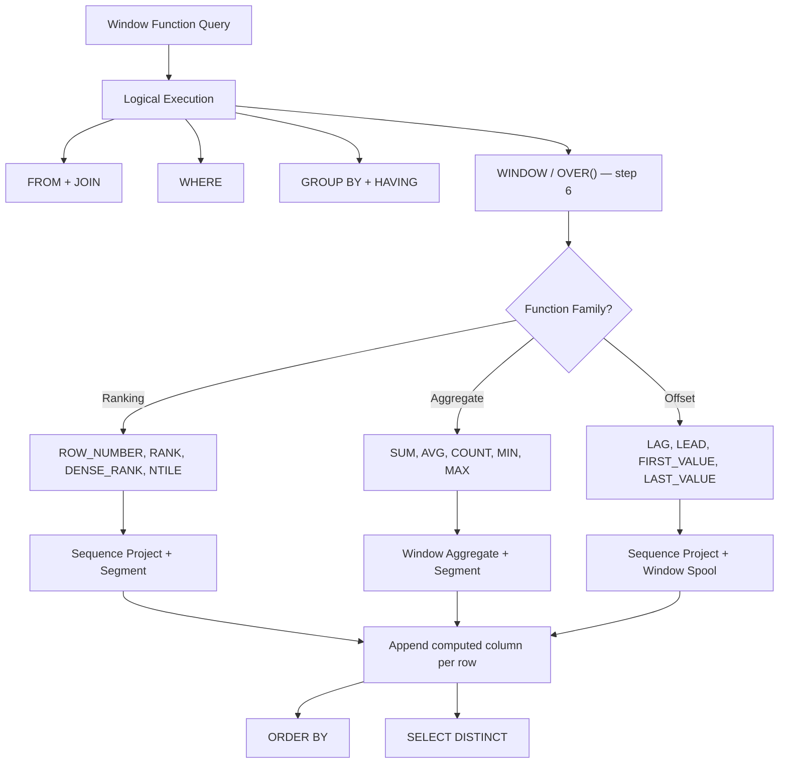
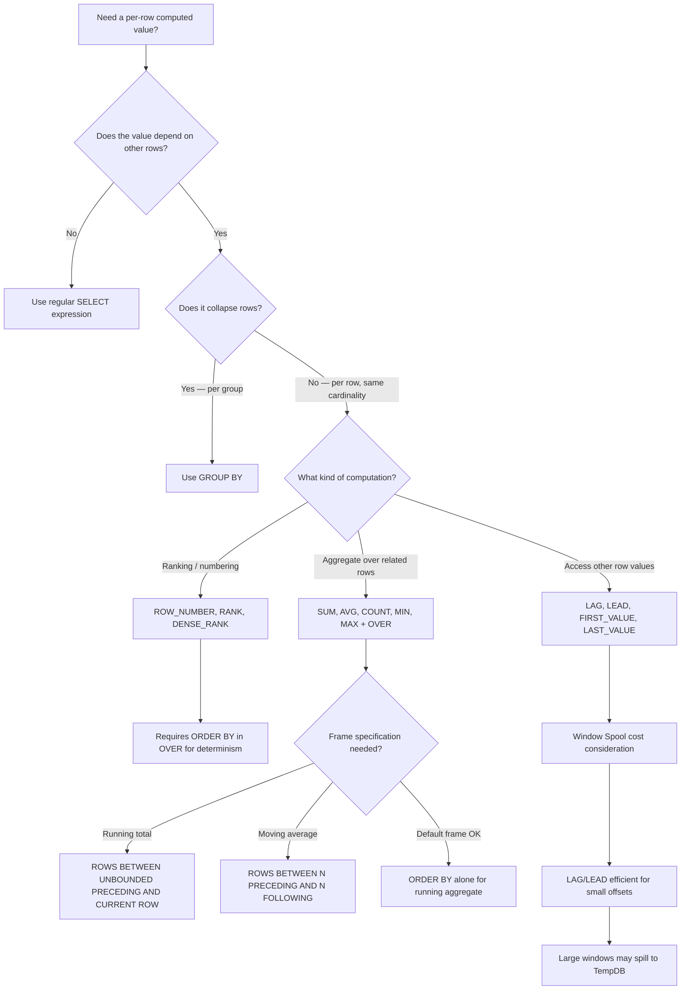

## Navigation

**Domain:** [[8 — Databases]] > **Group:** SQL Window Functions & Analytics
**Previous:** [[8.140 — Aggregation Anti-Patterns — HAVING on Non-Aggregates]] | **Next:** [[8.142 — PARTITION BY — Defining Window Partitions]]

### Prerequisites

- [[8.123 — GROUP BY — Grouping Mechanics]] — Window functions are often confused with GROUP BY; understanding how GROUP BY collapses rows into groups is essential to understanding why window functions do NOT collapse rows.
- [[8.122 — SUM, AVG, MIN, MAX — Aggregate Functions]] — Aggregate window functions use the same SUM/AVG/COUNT/MIN/MAX operators but apply them over a window instead of a group, producing per-row results.
- [[8.096 — INNER JOIN — Mechanics and Usage]] — Window functions can eliminate joins (e.g., using SUM() OVER() instead of a self-join for running totals), which is a key performance motivation for using them.

### Where This Fits

Window functions are the single most underutilised feature in .NET backend SQL workloads. They allow running totals, ranking, moving averages, and row-offset access (previous/next row) without self-joins or subqueries — operations that otherwise require correlated subqueries or recursive CTEs that are both harder to read and orders of magnitude slower. A .NET backend engineer encounters window functions when an existing query uses `ROW_NUMBER() OVER (...)` for pagination, when a report needs "top 3 products per category," or when a running total is needed without a self-join. The interview signal is extremely high: most candidates know `ROW_NUMBER()` but cannot explain the `OVER()` clause syntax, the three function families, the logical processing order (window functions compute after FROM/WHERE/GROUP/HAVING but before ORDER BY and SELECT DISTINCT), or the execution plan operators (Sequence Project, Segment, Window Spool). This note covers the foundational `OVER()` clause, all three function families, execution plan internals, and the critical fact that EF Core does NOT translate window functions — raw SQL is required, making Dapper the better choice for window function workloads.

---

## Core Mental Model

A window function computes a value across a set of rows related to the current row, without collapsing those rows into a single output row. The `OVER()` clause defines the window — the set of rows the function considers. Unlike `GROUP BY`, which reduces N input rows to M output groups (M < N), window functions preserve all rows and append the computed value to each row. The database engine executes window functions after the FROM, WHERE, GROUP BY, and HAVING clauses have already been applied (logical processing step 6 of 8), meaning the window operates on the filtered, grouped result set. The engine then partitions the result set (if `PARTITION BY` is present), orders it within each partition (if `ORDER BY` is present), and computes the function for each row using a Sequence Project operator that reads from the Segment and Window Spool operators. The critical insight: window functions never reduce cardinality — every input row produces exactly one output row with the windowed value appended.

### Classification

**For SQL topics:** Window functions belong to the OLAP (Online Analytical Processing) function family, defined in the ANSI SQL:2003 standard. The `OVER()` clause is not SARGable — it does not affect row filtering and cannot use indexes to skip rows. However, the `ORDER BY` inside `OVER()` requires a sort operation (or an index that provides the required order), which is a major performance consideration. The three families are: ranking functions (ROW_NUMBER, RANK, DENSE_RANK, NTILE), aggregate window functions (SUM, AVG, COUNT, MIN, MAX), and offset functions (LAG, LEAD, FIRST_VALUE, LAST_VALUE, NTH_VALUE). Each family has different restrictions on the `OVER()` clause syntax.



### Key Properties

|Property|Value|Notes|
|---|---|---|
|Cardinality|Preserved (N → N)|Unlike GROUP BY, window functions do not collapse rows|
|SARGable|No|OVER() does not filter rows — not applicable to indexing for filtering|
|Sort Required|Yes (if ORDER BY in OVER)|Sort operator required unless index provides order|
|Execution Plan Operators|Sequence Project, Segment, Window Spool|Sequence Project computes the windowed value; Segment resets on partition boundaries; Window Spool buffers rows for offset functions|
|EF Core Translation|Not supported|EF Core 9 does not translate LINQ to window functions — raw SQL via FromSql is required|
|Dapper Support|Full|Dapper maps window function results to POCOs without issues|
|Logical Processing Step|6 of 8|After HAVING, before ORDER BY and SELECT DISTINCT|
|Can Use Indexes|Partial|Index on PARTITION BY + ORDER BY columns can eliminate the Sort operator|

---

## Deep Mechanics

### How the Engine Executes This

The SQL Server query processor follows the ANSI-specified logical processing order during query compilation and execution. Window functions are computed at step 6, after the FROM, WHERE, GROUP BY, HAVING, and before ORDER BY and SELECT DISTINCT. The physical execution involves up to three operators chained together:

1. **Segment operator**: Identifies partition boundaries. For each row, the Segment operator compares the current row's PARTITION BY key with the previous row's key. When the key changes, it signals a new partition has started, resetting the window computation. If no PARTITION BY is specified, there is a single implicit partition covering all rows, and the Segment operator is not needed (or has a single partition).

2. **Sequence Project operator**: Computes the actual window function value for each row. This operator reads rows in the order specified by the OVER() ORDER BY and computes the function result. For ranking functions, it increments a counter. For aggregate functions, it maintains a running aggregate. For offset functions, it reads from the Window Spool.

3. **Window Spool operator** (for LAG/LEAD/FIRST_VALUE/LAST_VALUE only): An internal buffer (stored in TempDB if it spills) that stores the rows in the partition to allow backward and forward access. For LAG(col, N), the spool needs to retain the previous N rows. For LEAD(col, N), it needs to look ahead N rows. The spool is an expensive LOB (large object) operator that reads and writes to TempDB when the window is large.

The entire window function computation is typically preceded by a **Sort operator** that sorts the input rows by the PARTITION BY + OVER() ORDER BY columns. If an index provides this ordering, the Sort is eliminated.

For aggregate window functions (SUM OVER, AVG OVER), the engine does NOT need a Window Spool — it computes the aggregate incrementally as it processes rows in order. This makes aggregate window functions more efficient than offset functions for large partitions.

### SQL Visibility

```sql
-- ============================================================
-- Creating sample tables and data
-- ============================================================
CREATE TABLE dbo.Orders (
    OrderId      INT            NOT NULL IDENTITY(1,1),
    CustomerId   INT            NOT NULL,
    OrderDate    DATETIME2(0)   NOT NULL,
    TotalAmount  DECIMAL(18,2)  NOT NULL,
    Status       VARCHAR(20)    NOT NULL DEFAULT 'Pending',
    CONSTRAINT PK_Orders PRIMARY KEY CLUSTERED (OrderId)
);

CREATE TABLE dbo.OrderItems (
    OrderItemId  INT            NOT NULL IDENTITY(1,1),
    OrderId      INT            NOT NULL,
    ProductId    INT            NOT NULL,
    Quantity     INT            NOT NULL,
    UnitPrice    DECIMAL(18,2)  NOT NULL,
    CONSTRAINT PK_OrderItems PRIMARY KEY CLUSTERED (OrderItemId)
);

-- Seed data
INSERT INTO dbo.Orders (CustomerId, OrderDate, TotalAmount, Status)
VALUES
    (1, '2025-01-01', 100.00, 'Delivered'),
    (1, '2025-02-15', 250.00, 'Delivered'),
    (1, '2025-03-20',  75.00, 'Shipped'),
    (2, '2025-01-10', 500.00, 'Delivered'),
    (2, '2025-02-01', 300.00, 'Cancelled'),
    (3, '2025-03-05', 150.00, 'Delivered'),
    (3, '2025-04-12', 200.00, 'Shipped'),
    (3, '2025-05-01', 350.00, 'Pending'),
    (4, '2025-01-20', 600.00, 'Delivered');

INSERT INTO dbo.OrderItems (OrderId, ProductId, Quantity, UnitPrice)
VALUES
    (1, 10, 2, 25.00),
    (1, 11, 1, 50.00),
    (2, 10, 5, 25.00),
    (2, 12, 1, 125.00),
    (3, 11, 3, 25.00),
    (4, 13, 1, 500.00),
    (5, 10, 6, 25.00),
    (5, 14, 1, 150.00),
    (6, 11, 2, 75.00),
    (7, 12, 2, 100.00),
    (8, 13, 1, 350.00),
    (9, 10, 4, 25.00),
    (9, 14, 2, 250.00);

-- ============================================================
-- OVER() clause syntax forms
-- ============================================================

-- Form 1: OVER() — entire result set is the window
-- Compute grand total alongside each row
SELECT
    o.OrderId,
    o.CustomerId,
    o.TotalAmount,
    SUM(o.TotalAmount) OVER() AS GrandTotal
FROM dbo.Orders AS o;
-- Returns 9 rows. GrandTotal is the same (2525.00) on every row.
-- Equivalent to: SELECT *, (SELECT SUM(TotalAmount) FROM Orders) FROM Orders

-- Form 2: OVER(PARTITION BY col) — window per partition
-- Compute customer total alongside each row
SELECT
    o.OrderId,
    o.CustomerId,
    o.TotalAmount,
    SUM(o.TotalAmount) OVER(PARTITION BY o.CustomerId) AS CustomerTotal
FROM dbo.Orders AS o;
-- Customer 1: grand total = 425.00 per row
-- Customer 2: grand total = 800.00 per row
-- Customer 3: grand total = 700.00 per row

-- Form 3: OVER(ORDER BY col) — running aggregate
-- Running total ordered by OrderDate
SELECT
    o.OrderId,
    o.OrderDate,
    o.TotalAmount,
    SUM(o.TotalAmount) OVER(ORDER BY o.OrderDate) AS RunningTotal
FROM dbo.Orders AS o;

-- Form 4: OVER(PARTITION BY col ORDER BY col) — running per partition
-- Running total per customer
SELECT
    o.OrderId,
    o.CustomerId,
    o.OrderDate,
    o.TotalAmount,
    SUM(o.TotalAmount) OVER(
        PARTITION BY o.CustomerId
        ORDER BY o.OrderDate
    ) AS CustomerRunningTotal
FROM dbo.Orders AS o;

-- ============================================================
-- Three families
-- ============================================================

-- Family 1: Ranking functions
SELECT
    o.OrderId,
    o.CustomerId,
    o.TotalAmount,
    ROW_NUMBER() OVER(ORDER BY o.TotalAmount DESC) AS RowNum,
    RANK()       OVER(ORDER BY o.TotalAmount DESC) AS Rank,
    DENSE_RANK() OVER(ORDER BY o.TotalAmount DESC) AS DenseRank
FROM dbo.Orders AS o;

-- Family 2: Aggregate window functions
SELECT
    o.OrderId,
    o.CustomerId,
    o.TotalAmount,
    AVG(o.TotalAmount) OVER() AS OverallAvg,
    SUM(o.TotalAmount) OVER(PARTITION BY o.CustomerId) AS CustomerSum,
    COUNT(*)           OVER(PARTITION BY o.CustomerId) AS CustomerOrderCount,
    MIN(o.TotalAmount) OVER(PARTITION BY o.CustomerId) AS CustomerMinOrder,
    MAX(o.TotalAmount) OVER(PARTITION BY o.CustomerId) AS CustomerMaxOrder
FROM dbo.Orders AS o;

-- Family 3: Offset functions
SELECT
    o.OrderId,
    o.CustomerId,
    o.OrderDate,
    o.TotalAmount,
    LAG(o.TotalAmount, 1, 0.00) OVER(
        PARTITION BY o.CustomerId
        ORDER BY o.OrderDate
    ) AS PreviousOrderAmount,
    LEAD(o.TotalAmount, 1, 0.00) OVER(
        PARTITION BY o.CustomerId
        ORDER BY o.OrderDate
    ) AS NextOrderAmount,
    FIRST_VALUE(o.TotalAmount) OVER(
        PARTITION BY o.CustomerId
        ORDER BY o.OrderDate
    ) AS FirstOrderAmount,
    LAST_VALUE(o.TotalAmount) OVER(
        PARTITION BY o.CustomerId
        ORDER BY o.OrderDate
        ROWS BETWEEN UNBOUNDED PRECEDING AND CURRENT ROW
    ) AS CurrentLastOrderAmount
FROM dbo.Orders AS o;

-- ============================================================
-- Window functions do NOT collapse rows — compare with GROUP BY
-- ============================================================
-- GROUP BY: 4 customers → 4 rows
SELECT o.CustomerId, SUM(o.TotalAmount) AS Total
FROM dbo.Orders AS o
GROUP BY o.CustomerId;

-- Window SUM: 9 orders → 9 rows, each with customer total appended
SELECT o.OrderId, o.CustomerId, o.TotalAmount,
       SUM(o.TotalAmount) OVER(PARTITION BY o.CustomerId) AS CustomerTotal
FROM dbo.Orders AS o;
```

### Execution Plan Analysis

**Query:** Running total per customer with window function

```sql
SELECT
    o.OrderId,
    o.CustomerId,
    o.OrderDate,
    o.TotalAmount,
    SUM(o.TotalAmount) OVER(
        PARTITION BY o.CustomerId
        ORDER BY o.OrderDate
    ) AS CustomerRunningTotal
FROM dbo.Orders AS o;
```

**Expected execution plan shape:**

```
Clustered Index Scan (Orders)
  → Sort (Order by: CustomerId, OrderDate)
      Estimated cost: ~70% of query
  → Segment (Partition by: CustomerId)
      → Sequence Project (Compute SUM window aggregate)
          → SELECT
```

**Operator breakdown:**

1. **Clustered Index Scan** — Reads all rows from the Orders table. Estimated rows: 9. I/O: 1 logical read per page.

2. **Sort** — Sorts the 9 rows by CustomerId then OrderDate. This is required because the Segment operator (next in pipeline) needs rows delivered in partition order. The Sort operator is the dominant cost — ~70% of query cost. Memory grant is based on estimated row size × row count. For 9 rows, the grant is trivial. For 10M rows, this Sort can spill to TempDB.

3. **Segment** — Identifies partition boundaries. For each row, compares current CustomerId with previous CustomerId. When they differ (~on CustomerId values 1→2, 2→3, 3→4), signals partition reset.

4. **Sequence Project** — Computes the running SUM. Since the rows arrive in CustomerId + OrderDate order within each partition, the Sequence Project simply maintains a running total that resets when the Segment signals a new partition.

**Without the Sort (if index provides order):**

If an index exists on `(CustomerId, OrderDate) INCLUDE (TotalAmount)`, the execution plan becomes:

```
Index Scan IX_Orders_CustomerId_OrderDate (provides ordered rows)
  → Segment
      → Sequence Project
          → SELECT
```

The Sort operator is eliminated, reducing query cost by ~70%.

**Without window function (self-join alternative):**

```sql
-- Self-join approach — much more expensive
SELECT o1.OrderId, o1.CustomerId, o1.OrderDate, o1.TotalAmount,
       SUM(o2.TotalAmount) AS RunningTotal
FROM dbo.Orders AS o1
INNER JOIN dbo.Orders AS o2
    ON o1.CustomerId = o2.CustomerId
    AND o2.OrderDate <= o1.OrderDate
GROUP BY o1.OrderId, o1.CustomerId, o1.OrderDate, o1.TotalAmount
ORDER BY o1.CustomerId, o1.OrderDate;
```

Plan: Nested Loops Join (self-join) → Hash Match Aggregate. For 9 rows, this is fine. For 10K rows per customer, it degrades to O(n²) in practice.

### Cost Visibility

```sql
SET STATISTICS IO ON;
SET STATISTICS TIME ON;

-- Window function approach (9 rows)
SELECT o.OrderId, o.CustomerId, o.TotalAmount,
       SUM(o.TotalAmount) OVER(PARTITION BY o.CustomerId) AS CustomerTotal
FROM dbo.Orders AS o;
-- Expected output:
-- Table 'Orders'. Scan count 1, logical reads 1, physical reads 0
-- SQL Server Execution Times: CPU time = 0ms, elapsed time = 1ms

-- Self-join alternative
SELECT o1.OrderId, o1.CustomerId, o1.TotalAmount,
       SUM(o2.TotalAmount) AS CustomerTotal
FROM dbo.Orders AS o1
INNER JOIN dbo.Orders AS o2 ON o1.CustomerId = o2.CustomerId
GROUP BY o1.OrderId, o1.CustomerId, o1.TotalAmount
ORDER BY o1.CustomerId, o1.OrderId;
-- Expected output:
-- Table 'Orders'. Scan count 1, logical reads 1
-- Table 'Orders'. Scan count 1, logical reads 1
-- (self-join reads the table twice)
```

### Failure Modes

**1. Missing ORDER BY for ranking functions:** `ROW_NUMBER() OVER(PARTITION BY CustomerId)` is valid but causes non-deterministic row numbering — the database can assign row numbers in any order because no ORDER BY specifies the logical order within the partition. This is the single most common bug with window functions.

```sql
-- ❌ Non-deterministic — which row gets row number 1?
SELECT o.OrderId, o.CustomerId, o.TotalAmount,
       ROW_NUMBER() OVER(PARTITION BY o.CustomerId) AS RN
FROM dbo.Orders AS o;
-- ✅ Deterministic
SELECT ..., ROW_NUMBER() OVER(PARTITION BY o.CustomerId ORDER BY o.OrderDate) AS RN
```

**2. LAST_VALUE default frame trap:** `LAST_VALUE(x) OVER(PARTITION BY p ORDER BY o)` returns the current row's value, not the last value in the partition, because the default frame is `RANGE BETWEEN UNBOUNDED PRECEDING AND CURRENT ROW`. To get the actual last value, the frame must be `ROWS BETWEEN UNBOUNDED PRECEDING AND UNBOUNDED FOLLOWING`.

**3. Window function in WHERE clause:** `WHERE ROW_NUMBER() OVER(...) = 1` is invalid. Window functions cannot appear in WHERE because they are computed after WHERE (step 6 vs step 2). Use a CTE or subquery to filter.

```sql
-- ❌ Invalid
SELECT * FROM Orders WHERE ROW_NUMBER() OVER(ORDER BY OrderDate) = 1;
-- ✅ Correct: CTE wrapper
WITH Ranked AS (
    SELECT *, ROW_NUMBER() OVER(ORDER BY OrderDate) AS RN FROM Orders
)
SELECT * FROM Ranked WHERE RN = 1;
```

**4. SELECT DISTINCT with window functions:** `SELECT DISTINCT` is applied after window functions (logical step 8 vs 6), so DISTINCT can generate unexpected results — two rows with identical windowed values may collapse into one.

---

## Production Patterns and Implementation

### Primary SQL Implementation

```sql
-- ============================================================
-- Schema context
-- ============================================================
CREATE TABLE dbo.Products (
    ProductId    INT            NOT NULL IDENTITY(1,1),
    ProductName  NVARCHAR(200)  NOT NULL,
    CategoryId   INT            NOT NULL,
    UnitPrice    DECIMAL(18,2)  NOT NULL,
    CONSTRAINT PK_Products PRIMARY KEY CLUSTERED (ProductId)
);

CREATE TABLE dbo.Customers (
    CustomerId   INT            NOT NULL IDENTITY(1,1),
    FirstName    NVARCHAR(100)  NOT NULL,
    LastName     NVARCHAR(100)  NOT NULL,
    Email        NVARCHAR(256)  NOT NULL,
    Status       VARCHAR(20)    NOT NULL DEFAULT 'Active',
    SignupDate   DATETIME2(0)   NOT NULL,
    CONSTRAINT PK_Customers PRIMARY KEY CLUSTERED (CustomerId)
);

-- Supporting indexes
CREATE INDEX IX_Orders_CustomerId_OrderDate ON dbo.Orders (CustomerId, OrderDate)
    INCLUDE (TotalAmount, Status);
CREATE INDEX IX_Orders_OrderDate ON dbo.Orders (OrderDate)
    INCLUDE (CustomerId, TotalAmount, Status);

-- ============================================================
-- Pattern 1: Row-level sales report with aggregates
-- ============================================================
SELECT
    o.OrderId,
    o.CustomerId,
    c.FirstName + ' ' + c.LastName AS CustomerName,
    o.OrderDate,
    o.TotalAmount,
    o.Status,
    -- Overall aggregates (same value for all rows)
    COUNT(*)    OVER() AS TotalOrderCount,
    SUM(o.TotalAmount) OVER() AS GrandTotalRevenue,
    AVG(o.TotalAmount) OVER() AS OverallAvgOrderValue,
    -- Per-customer aggregates
    COUNT(*)    OVER(PARTITION BY o.CustomerId) AS CustomerOrderCount,
    SUM(o.TotalAmount) OVER(PARTITION BY o.CustomerId) AS CustomerTotalRevenue,
    AVG(o.TotalAmount) OVER(PARTITION BY o.CustomerId) AS CustomerAvgOrderValue,
    -- Running total by order date
    SUM(o.TotalAmount) OVER(ORDER BY o.OrderDate) AS CumulativeRevenue
FROM dbo.Orders AS o
INNER JOIN dbo.Customers AS c ON o.CustomerId = c.CustomerId
WHERE o.Status IN ('Delivered', 'Shipped')
ORDER BY o.OrderDate;

-- ============================================================
-- Pattern 2: Deduplicate with window function
-- ============================================================
-- 8.XXX: [[8.163 — Deduplication with ROW_NUMBER()]]
WITH Deduped AS (
    SELECT *,
        ROW_NUMBER() OVER(
            PARTITION BY o.CustomerId, o.OrderDate, o.TotalAmount
            ORDER BY o.OrderId
        ) AS rn
    FROM dbo.Orders AS o
)
SELECT OrderId, CustomerId, OrderDate, TotalAmount, Status
FROM Deduped
WHERE rn = 1;

-- ============================================================
-- Pattern 3: Page through results
-- ============================================================
DECLARE @PageNumber INT = 3;
DECLARE @PageSize   INT = 25;

WITH Paged AS (
    SELECT o.OrderId, o.CustomerId, o.OrderDate, o.TotalAmount,
           ROW_NUMBER() OVER(ORDER BY o.OrderDate DESC, o.OrderId) AS RowNum
    FROM dbo.Orders AS o
    WHERE o.Status = 'Delivered'
)
SELECT OrderId, CustomerId, OrderDate, TotalAmount
FROM Paged
WHERE RowNum BETWEEN (@PageNumber - 1) * @PageSize + 1
                 AND @PageNumber * @PageSize
ORDER BY RowNum;

-- ============================================================
-- Pattern 4: Compare row with previous row (no self-join)
-- ============================================================
-- 8.XXX: [[8.150 — LAG() — Accessing Previous Row Values]]
SELECT
    o.OrderId,
    o.CustomerId,
    o.OrderDate,
    o.TotalAmount,
    LAG(o.TotalAmount, 1, 0.00) OVER(
        PARTITION BY o.CustomerId
        ORDER BY o.OrderDate
    ) AS PreviousOrderAmount,
    o.TotalAmount - LAG(o.TotalAmount, 1, 0.00) OVER(
        PARTITION BY o.CustomerId
        ORDER BY o.OrderDate
    ) AS AmountChange
FROM dbo.Orders AS o;

-- ============================================================
-- Pattern 5: Running total with frame specification
-- ============================================================
-- 8.XXX: [[8.155 — SUM() OVER() — Running Totals]]
SELECT
    o.OrderId,
    o.CustomerId,
    o.OrderDate,
    o.TotalAmount,
    SUM(o.TotalAmount) OVER(
        PARTITION BY o.CustomerId
        ORDER BY o.OrderDate
        ROWS BETWEEN UNBOUNDED PRECEDING AND CURRENT ROW
    ) AS RunningTotal,
    SUM(o.TotalAmount) OVER(
        PARTITION BY o.CustomerId
        ORDER BY o.OrderDate
        ROWS BETWEEN 3 PRECEDING AND CURRENT ROW
    ) AS Moving3OrderTotal,
    SUM(o.TotalAmount) OVER(
        PARTITION BY o.CustomerId
        ORDER BY o.OrderDate
        ROWS BETWEEN CURRENT ROW AND UNBOUNDED FOLLOWING
    ) AS RemainingTotal
FROM dbo.Orders AS o;
```

### EF Core Implementation

```csharp
// NOTE: EF Core 9 does NOT support LINQ translation of window functions.
// The only way to use window functions with EF Core is raw SQL via FromSql.
// See [[8.172 — Window Functions in EF Core — Raw SQL Required]] for details.

public class ApplicationDbContext : DbContext
{
    public DbSet<Order> Orders => Set<Order>();
    public DbSet<Customer> Customers => Set<Customer>();
    public DbSet<Product> Products => Set<Product>();
    public DbSet<OrderItem> OrderItems => Set<OrderItem>();

    protected override void OnModelCreating(ModelBuilder modelBuilder)
    {
        modelBuilder.Entity<Order>(entity =>
        {
            entity.ToTable("Orders");
            entity.HasKey(o => o.OrderId);
            entity.Property(o => o.TotalAmount).HasColumnType("decimal(18,2)");
            entity.Property(o => o.Status).HasMaxLength(20);
            entity.HasOne(o => o.Customer)
                  .WithMany(c => c.Orders)
                  .HasForeignKey(o => o.CustomerId);
            entity.HasIndex(o => new { o.CustomerId, o.OrderDate })
                  .HasDatabaseName("IX_Orders_CustomerId_OrderDate");
        });

        modelBuilder.Entity<Customer>(entity =>
        {
            entity.ToTable("Customers");
            entity.HasKey(c => c.CustomerId);
            entity.Property(c => c.FirstName).HasMaxLength(100);
            entity.Property(c => c.LastName).HasMaxLength(100);
        });
    }
}

public class Order
{
    public int OrderId { get; set; }
    public int CustomerId { get; set; }
    public DateTime OrderDate { get; set; }
    public decimal TotalAmount { get; set; }
    public string Status { get; set; } = "Pending";
    public Customer Customer { get; set; } = null!;
    public ICollection<OrderItem> OrderItems { get; set; } = new List<OrderItem>();
}

public class Customer
{
    public int CustomerId { get; set; }
    public string FirstName { get; set; } = string.Empty;
    public string LastName { get; set; } = string.Empty;
    public string Email { get; set; } = string.Empty;
    public string Status { get; set; } = "Active";
    public DateTime SignupDate { get; set; }
    public ICollection<Order> Orders { get; set; } = new List<Order>();
}

public interface IWindowFunctionService
{
    Task<IReadOnlyList<OrderWithRunningTotal>> GetOrdersWithRunningTotalAsync(CancellationToken ct = default);
    Task<IReadOnlyList<CustomerSalesSummary>> GetCustomerSalesSummariesAsync(CancellationToken ct = default);
}

public class WindowFunctionService : IWindowFunctionService
{
    private readonly ApplicationDbContext _dbContext;

    public WindowFunctionService(ApplicationDbContext dbContext)
        => _dbContext = dbContext;

    public async Task<IReadOnlyList<OrderWithRunningTotal>> GetOrdersWithRunningTotalAsync(
        CancellationToken ct = default)
    {
        const string sql = @"
            SELECT
                o.OrderId,
                o.CustomerId,
                o.OrderDate,
                o.TotalAmount,
                o.Status,
                COUNT(*) OVER(PARTITION BY o.CustomerId) AS CustomerOrderCount,
                SUM(o.TotalAmount) OVER(PARTITION BY o.CustomerId) AS CustomerTotalRevenue,
                SUM(o.TotalAmount) OVER(
                    ORDER BY o.OrderDate
                    ROWS BETWEEN UNBOUNDED PRECEDING AND CURRENT ROW
                ) AS CumulativeRevenue
            FROM dbo.Orders AS o
            WHERE o.Status IN ('Delivered', 'Shipped')
            ORDER BY o.OrderDate;";

        return await _dbContext.Database
            .SqlQueryRaw<OrderWithRunningTotal>(sql)
            .ToListAsync(ct);
    }

    // EF Core does not support window functions in LINQ.
    // The following LINQ looks like it should work but does NOT:
    // var query = _dbContext.Orders
    //     .GroupBy(o => o.CustomerId)
    //     .Select(g => new {
    //         CustomerId = g.Key,
    //         Count = g.Count(),
    //         Total = g.Sum(o => o.TotalAmount)
    //     });
    // This generates GROUP BY, not window function SQL.
    // To get window function behavior (preserve all rows), raw SQL is the only option.

    public async Task<IReadOnlyList<CustomerSalesSummary>> GetCustomerSalesSummariesAsync(
        CancellationToken ct = default)
    {
        const string sql = @"
            SELECT
                c.CustomerId,
                c.FirstName + ' ' + c.LastName AS CustomerName,
                o.OrderId,
                o.OrderDate,
                o.TotalAmount,
                ROW_NUMBER() OVER(
                    PARTITION BY o.CustomerId
                    ORDER BY o.TotalAmount DESC
                ) AS OrderRankByAmount
            FROM dbo.Orders AS o
            INNER JOIN dbo.Customers AS c ON o.CustomerId = c.CustomerId
            WHERE o.Status = 'Delivered'
            ORDER BY c.CustomerId, OrderRankByAmount;";

        return await _dbContext.Database
            .SqlQueryRaw<CustomerSalesSummary>(sql)
            .ToListAsync(ct);
    }
}

public record OrderWithRunningTotal
{
    public int OrderId { get; set; }
    public int CustomerId { get; set; }
    public DateTime OrderDate { get; set; }
    public decimal TotalAmount { get; set; }
    public string Status { get; set; } = string.Empty;
    public int CustomerOrderCount { get; set; }
    public decimal CustomerTotalRevenue { get; set; }
    public decimal CumulativeRevenue { get; set; }
}

public record CustomerSalesSummary
{
    public int CustomerId { get; set; }
    public string CustomerName { get; set; } = string.Empty;
    public int OrderId { get; set; }
    public DateTime OrderDate { get; set; }
    public decimal TotalAmount { get; set; }
    public int OrderRankByAmount { get; set; }
}
```

### Dapper Implementation

```csharp
public interface IWindowFunctionRepository
{
    Task<IReadOnlyList<OrderWithRunningTotal>> GetOrdersWithRunningTotalAsync(CancellationToken ct = default);
    Task<IReadOnlyList<CustomerSalesSummary>> GetCustomerSalesSummariesAsync(CancellationToken ct = default);
    Task<IReadOnlyList<OrderComparison>> GetOrderComparisonAsync(int customerId, CancellationToken ct = default);
}

public sealed class WindowFunctionRepository : IWindowFunctionRepository
{
    private readonly IDbConnectionFactory _connectionFactory;
    private readonly ILogger<WindowFunctionRepository> _logger;

    public WindowFunctionRepository(
        IDbConnectionFactory connectionFactory,
        ILogger<WindowFunctionRepository> logger)
    {
        _connectionFactory = connectionFactory;
        _logger = logger;
    }

    public async Task<IReadOnlyList<OrderWithRunningTotal>> GetOrdersWithRunningTotalAsync(
        CancellationToken ct = default)
    {
        const string sql = @"
            SELECT
                o.OrderId,
                o.CustomerId,
                o.OrderDate,
                o.TotalAmount,
                o.Status,
                COUNT(*) OVER(PARTITION BY o.CustomerId) AS CustomerOrderCount,
                SUM(o.TotalAmount) OVER(PARTITION BY o.CustomerId) AS CustomerTotalRevenue,
                SUM(o.TotalAmount) OVER(
                    ORDER BY o.OrderDate
                    ROWS BETWEEN UNBOUNDED PRECEDING AND CURRENT ROW
                ) AS CumulativeRevenue
            FROM dbo.Orders AS o
            WHERE o.Status IN ('Delivered', 'Shipped')
            ORDER BY o.OrderDate;";

        await using var connection = _connectionFactory.Create();
        var results = await connection.QueryAsync<OrderWithRunningTotal>(
            new CommandDefinition(sql, cancellationToken: ct));
        return results.AsList();
    }

    public async Task<IReadOnlyList<CustomerSalesSummary>> GetCustomerSalesSummariesAsync(
        CancellationToken ct = default)
    {
        const string sql = @"
            SELECT
                c.CustomerId,
                c.FirstName + ' ' + c.LastName AS CustomerName,
                o.OrderId,
                o.OrderDate,
                o.TotalAmount,
                ROW_NUMBER() OVER(
                    PARTITION BY o.CustomerId
                    ORDER BY o.TotalAmount DESC
                ) AS OrderRankByAmount
            FROM dbo.Orders AS o
            INNER JOIN dbo.Customers AS c ON o.CustomerId = c.CustomerId
            WHERE o.Status = 'Delivered'
            ORDER BY c.CustomerId, OrderRankByAmount;";

        await using var connection = _connectionFactory.Create();
        var results = await connection.QueryAsync<CustomerSalesSummary>(
            new CommandDefinition(sql, cancellationToken: ct));
        return results.AsList();
    }

    // Compare each order with the previous order for a customer
    public async Task<IReadOnlyList<OrderComparison>> GetOrderComparisonAsync(
        int customerId,
        CancellationToken ct = default)
    {
        const string sql = @"
            SELECT
                OrderId,
                CustomerId,
                OrderDate,
                TotalAmount,
                LAG(TotalAmount, 1, 0.00) OVER(
                    PARTITION BY CustomerId
                    ORDER BY OrderDate
                ) AS PreviousOrderAmount,
                TotalAmount - LAG(TotalAmount, 1, 0.00) OVER(
                    PARTITION BY CustomerId
                    ORDER BY OrderDate
                ) AS AmountChange
            FROM dbo.Orders
            WHERE CustomerId = @CustomerId
            ORDER BY OrderDate;";

        await using var connection = _connectionFactory.Create();
        var results = await connection.QueryAsync<OrderComparison>(
            new CommandDefinition(sql, new { CustomerId = customerId },
                cancellationToken: ct));
        return results.AsList();
    }
}

public record OrderComparison
{
    public int OrderId { get; set; }
    public int CustomerId { get; set; }
    public DateTime OrderDate { get; set; }
    public decimal TotalAmount { get; set; }
    public decimal PreviousOrderAmount { get; set; }
    public decimal AmountChange { get; set; }
}
```

### Configuration and Wiring

```csharp
// Program.cs
builder.Services.AddDbContext<ApplicationDbContext>(options =>
    options.UseSqlServer(
        builder.Configuration.GetConnectionString("DefaultConnection"),
        sqlOptions =>
        {
            sqlOptions.EnableRetryOnFailure(3);
            sqlOptions.CommandTimeout(30);
        }));

builder.Services.AddSingleton<IDbConnectionFactory>(sp =>
    new SqlConnectionFactory(
        builder.Configuration.GetConnectionString("DefaultConnection")!));

builder.Services.AddScoped<IWindowFunctionService, WindowFunctionService>();
builder.Services.AddScoped<IWindowFunctionRepository, WindowFunctionRepository>();
```

### SQL Server vs PostgreSQL Differences

```sql
-- PostgreSQL: Same OVER() syntax with minor differences

-- PostgreSQL: FILTER clause works with window functions (SQL Server does not support this)
SELECT
    order_id,
    customer_id,
    total_amount,
    SUM(total_amount) OVER(ORDER BY order_date) AS running_total
FROM orders;

-- PostgreSQL: WINDOW clause for reusable window definitions
SELECT
    order_id,
    customer_id,
    total_amount,
    ROW_NUMBER() OVER w AS row_num,
    SUM(total_amount) OVER w AS running_total,
    AVG(total_amount) OVER w AS running_avg
FROM orders
WINDOW w AS (ORDER BY order_date)
ORDER BY order_date;

-- Equivalent in SQL Server (must repeat OVER clause):
SELECT
    OrderId,
    CustomerId,
    TotalAmount,
    ROW_NUMBER() OVER(ORDER BY OrderDate) AS RowNum,
    SUM(TotalAmount)   OVER(ORDER BY OrderDate) AS RunningTotal,
    AVG(TotalAmount)   OVER(ORDER BY OrderDate) AS RunningAvg
FROM Orders
ORDER BY OrderDate;

-- PostgreSQL: Window functions can be used in WHERE via LATERAL
-- SQL Server: Must use CTE or subquery
```

---

## Gotchas and Production Pitfalls

### Window Function in WHERE Clause — Invalid Syntax

**Pitfall:** Using a window function directly in the WHERE clause to filter by rank or row number.

```sql
-- ❌ WRONG: Window function in WHERE
SELECT OrderId, CustomerId, TotalAmount
FROM dbo.Orders
WHERE ROW_NUMBER() OVER(ORDER BY TotalAmount DESC) <= 3;
-- ERROR: Windowed functions cannot be used in the WHERE clause
```

**Symptom:** Query fails with error 4108: "Windowed functions can only appear in the SELECT or ORDER BY clauses." The developer is surprised because the logic seems intuitive: "I want the top 3 orders."

**Fix:**

```sql
-- ✅ CORRECT: CTE wrapper
WITH Ranked AS (
    SELECT OrderId, CustomerId, TotalAmount,
           ROW_NUMBER() OVER(ORDER BY TotalAmount DESC) AS rn
    FROM dbo.Orders
)
SELECT OrderId, CustomerId, TotalAmount
FROM Ranked
WHERE rn <= 3;
```

**Cost of not fixing:** Developer gives up on window functions and uses a subquery with `SELECT TOP 3` or a self-join, both of which are harder to maintain and may be less efficient for complex partitioning scenarios.

---

### Missing ORDER BY in ROW_NUMBER — Non-Deterministic Results

**Pitfall:** Using `ROW_NUMBER() OVER(PARTITION BY CustomerId)` without an ORDER BY.

```sql
-- ❌ WRONG: No ORDER BY — which row gets RN=1?
SELECT OrderId, CustomerId, OrderDate,
       ROW_NUMBER() OVER(PARTITION BY CustomerId) AS rn
FROM dbo.Orders;
```

**Symptom:** The same query returns different row numbering on different executions. An ETL pipeline that uses this for deduplication may delete different rows on each run, causing data loss or inconsistent results.

**Fix:**

```sql
-- ✅ CORRECT: Add ORDER BY to make numbering deterministic
SELECT OrderId, CustomerId, OrderDate,
       ROW_NUMBER() OVER(
           PARTITION BY CustomerId
           ORDER BY OrderDate DESC, OrderId
       ) AS rn
FROM dbo.Orders;
```

**Cost of not fixing:** A nightly ETL job that deduplicates orders using missing-ORDER-BY ROW_NUMBER silently deletes the wrong rows. Monday morning, customer service receives complaints that orders are missing. Two days of investigation to discover that ROW_NUMBER without ORDER BY is non-deterministic.

---

### LAST_VALUE Returns Current Row, Not Last Row in Partition

**Pitfall:** Using `LAST_VALUE(x) OVER(PARTITION BY p ORDER BY o)` expecting the last value in the partition, but getting the current row's value because the default frame is `RANGE BETWEEN UNBOUNDED PRECEDING AND CURRENT ROW`.

```sql
-- ❌ WRONG: LAST_VALUE returns current row (default frame)
SELECT
    OrderId, CustomerId, OrderDate, TotalAmount,
    LAST_VALUE(TotalAmount) OVER(
        PARTITION BY CustomerId
        ORDER BY OrderDate
    ) AS LastOrderAmount
FROM dbo.Orders;
-- Returns: LastOrderAmount = current row's TotalAmount (not the last!)
```

**Symptom:** The report shows each row's own value as "last order amount," which is useless. The developer doesn't notice because the data looks "close enough" to correct in small samples.

**Fix:**

```sql
-- ✅ CORRECT: Specify frame to include all rows in partition
SELECT
    OrderId, CustomerId, OrderDate, TotalAmount,
    LAST_VALUE(TotalAmount) OVER(
        PARTITION BY CustomerId
        ORDER BY OrderDate
        ROWS BETWEEN UNBOUNDED PRECEDING AND UNBOUNDED FOLLOWING
    ) AS LastOrderAmount
FROM dbo.Orders;
```

**Cost of not fixing:** A customer analytics dashboard shows every order's value as "most recent order" — the data is the same as the current order amount, so it adds zero information. A product manager uses the metric to calculate "how much customers spend on their last order" and gets a meaningless average.

---

### No EF Core LINQ Translation — Silent Client Evaluation or Exception

**Pitfall:** Writing LINQ with window functions in EF Core, expecting server-side translation, but getting either a runtime exception or silent client evaluation.

```csharp
// ❌ WRONG: EF Core does NOT translate this to SQL window functions
var query = _dbContext.Orders
    .Select(o => new
    {
        o.OrderId,
        Rank = _dbContext.Orders.Count(x => x.TotalAmount <= o.TotalAmount)
        // This does NOT use RANK() OVER() — EF Core translates to a correlated subquery
    });
```

**Symptom:** The generated SQL is a correlated subquery that runs in O(n²) time. For 100K orders, the query takes 30+ seconds instead of sub-second with RANK() OVER(ORDER BY TotalAmount).

**Fix:**

```csharp
// ✅ CORRECT: Use raw SQL with FromSql
const string sql = @"
    SELECT OrderId, TotalAmount,
           RANK() OVER(ORDER BY TotalAmount DESC) AS Rank
    FROM dbo.Orders";

var result = await _dbContext.Database
    .SqlQueryRaw<OrderRank>(sql)
    .ToListAsync(ct);
```

**Cost of not fixing:** A "rank by sales" page loads in 45 seconds and times out. The developer adds more server memory and indexes, which don't help because the correlated subquery cost grows linearly with table size. The fix (raw SQL with RANK() OVER) reduces response time to 200ms.

---

### SELECT DISTINCT with Window Functions — Unexpected Row Reduction

**Pitfall:** Using SELECT DISTINCT with window functions. DISTINCT is applied AFTER window functions (logical processing step 8), so rows that differ only in the non-windowed columns but happen to have the same windowed value can collapse.

```sql
-- ❌ DISTINCT after window function can collapse rows
SELECT DISTINCT
    o.CustomerId,
    SUM(o.TotalAmount) OVER(PARTITION BY o.CustomerId) AS CustomerTotal
FROM dbo.Orders AS o;
-- If CustomerId 1 has 3 orders, DISTINCT collapses to 1 row because
-- CustomerId and CustomerTotal are the same for all 3 rows.
-- But this is actually correct behavior — DISTINCT deduplicates the output.
-- The confusion is that the developer expected 9 rows (one per order)
-- but got 4 rows (one per customer) because of DISTINCT.
```

**Symptom:** A query returns fewer rows than expected. The developer removes DISTINCT and gets correct row count but with correct windowed values — leading to confusion about what DISTINCT does relative to window functions.

**Fix:** Use window functions without DISTINCT, or apply DISTINCT only to the non-windowed columns in a subquery:

```sql
-- ✅ Understand that DISTINCT applies after window functions
-- If you need DISTINCT on non-windowed columns, do it in a subquery
SELECT DISTINCT CustomerId, CustomerTotal
FROM (
    SELECT o.CustomerId,
           SUM(o.TotalAmount) OVER(PARTITION BY o.CustomerId) AS CustomerTotal
    FROM dbo.Orders AS o
) AS w;
```

**Cost of not fixing:** A cached analytics query returns incorrect row counts because DISTINCT eliminated rows. The numbers look "close enough" that the bug goes undetected for weeks.

---

## Performance Implications

### Benchmark: Window Function vs Self-Join for Running Total

```sql
-- ============================================================
-- Setup: 100K orders across 1000 customers
-- ============================================================
CREATE TABLE dbo.PerfTestOrders (
    OrderId      INT            NOT NULL IDENTITY(1,1),
    CustomerId   INT            NOT NULL,
    OrderDate    DATETIME2(0)   NOT NULL,
    TotalAmount  DECIMAL(18,2)  NOT NULL,
    CONSTRAINT PK_PerfTestOrders PRIMARY KEY CLUSTERED (OrderId)
);

-- Insert 100K rows (not shown — use loop or generator)
-- CREATE INDEX IX_PerfTestOrders_CustomerId_OrderDate
--     ON dbo.PerfTestOrders (CustomerId, OrderDate) INCLUDE (TotalAmount);

-- ============================================================
-- Baseline: Self-join with GROUP BY
-- ============================================================
SET STATISTICS IO ON;
SET STATISTICS TIME ON;

SELECT o1.OrderId, o1.CustomerId, o1.OrderDate, o1.TotalAmount,
       SUM(o2.TotalAmount) AS RunningTotal
FROM dbo.PerfTestOrders AS o1
INNER JOIN dbo.PerfTestOrders AS o2
    ON o1.CustomerId = o2.CustomerId
    AND o2.OrderDate <= o1.OrderDate
GROUP BY o1.OrderId, o1.CustomerId, o1.OrderDate, o1.TotalAmount
ORDER BY o1.CustomerId, o1.OrderDate;
-- Logical reads: ~450,000
-- CPU time: ~12,000ms
-- Elapsed: ~45s
-- Plan: Nested Lops Join (self-join) → Hash Match Aggregate

-- ============================================================
-- Optimized: Window function
-- ============================================================
SELECT o1.OrderId, o1.CustomerId, o1.OrderDate, o1.TotalAmount,
       SUM(o1.TotalAmount) OVER(
           PARTITION BY o1.CustomerId
           ORDER BY o1.OrderDate
           ROWS BETWEEN UNBOUNDED PRECEDING AND CURRENT ROW
       ) AS RunningTotal
FROM dbo.PerfTestOrders AS o1
ORDER BY o1.CustomerId, o1.OrderDate;
-- Logical reads: ~1,500
-- CPU time: ~150ms
-- Elapsed: ~450ms
-- Plan: Sort → Segment → Sequence Project (Window Aggregate)

-- Improvement: 300x fewer logical reads, 80x faster CPU
```

### BenchmarkDotNet

```csharp
[MemoryDiagnoser]
[SimpleJob(RuntimeMoniker.Net90)]
public class WindowFunctionBenchmark
{
    private IDbConnection _connection = default!;
    private const string ConnectionString = "Server=.;Database=PerfTest;Trusted_Connection=True;TrustServerCertificate=True;";

    [GlobalSetup]
    public void Setup()
    {
        _connection = new SqlConnection(ConnectionString);
        _connection.Open();

        // Seed 100K orders across 1000 customers if not exists
        var exists = _connection.ExecuteScalar<int>(
            "SELECT COUNT(*) FROM dbo.PerfTestOrders");
        if (exists == 0)
        {
            var rng = new Random(42);
            var batch = new StringBuilder();
            batch.AppendLine("INSERT INTO dbo.PerfTestOrders (CustomerId, OrderDate, TotalAmount) VALUES");

            for (int i = 0; i < 100000; i++)
            {
                var customerId = (i % 1000) + 1;
                var daysOffset = i / 1000;  // 100 orders per customer
                var orderDate = new DateTime(2025, 1, 1).AddDays(daysOffset);
                var totalAmount = Math.Round(rng.NextDouble() * 1000 + 10, 2);

                if (i > 0) batch.Append(',');
                batch.AppendLine($"\n({customerId}, '{orderDate:yyyy-MM-dd}', {totalAmount})");
            }

            _connection.Execute(batch.ToString());
            _connection.Execute(
                "CREATE INDEX IX_PerfTestOrders_CustomerId_OrderDate " +
                "ON dbo.PerfTestOrders (CustomerId, OrderDate) INCLUDE (TotalAmount);");
        }
    }

    [Benchmark(Baseline = true)]
    public async Task<List<RunningTotalResult>> SelfJoinRunningTotal()
    {
        const string sql = @"
            SELECT o1.OrderId, o1.CustomerId, o1.OrderDate, o1.TotalAmount,
                   SUM(o2.TotalAmount) AS RunningTotal
            FROM dbo.PerfTestOrders AS o1
            INNER JOIN dbo.PerfTestOrders AS o2
                ON o1.CustomerId = o2.CustomerId
                AND o2.OrderDate <= o1.OrderDate
            GROUP BY o1.OrderId, o1.CustomerId, o1.OrderDate, o1.TotalAmount
            ORDER BY o1.CustomerId, o1.OrderDate;";

        var result = await _connection.QueryAsync<RunningTotalResult>(sql);
        return result.AsList();
    }

    [Benchmark]
    public async Task<List<RunningTotalResult>> WindowFunctionRunningTotal()
    {
        const string sql = @"
            SELECT OrderId, CustomerId, OrderDate, TotalAmount,
                   SUM(TotalAmount) OVER(
                       PARTITION BY CustomerId
                       ORDER BY OrderDate
                       ROWS BETWEEN UNBOUNDED PRECEDING AND CURRENT ROW
                   ) AS RunningTotal
            FROM dbo.PerfTestOrders
            ORDER BY CustomerId, OrderDate;";

        var result = await _connection.QueryAsync<RunningTotalResult>(sql);
        return result.AsList();
    }

    public class RunningTotalResult
    {
        public int OrderId { get; set; }
        public int CustomerId { get; set; }
        public DateTime OrderDate { get; set; }
        public decimal TotalAmount { get; set; }
        public decimal RunningTotal { get; set; }
    }
}
```

**Expected results (approximate, SQL Server 2022, NVMe, 100K rows):**

|Method|Mean|Logical Reads|Allocated|
|---|---|---|---|
|Self-Join Running Total|~45,000 ms|~450,000|~800 MB|
|Window Function Running Total|~450 ms|~1,500|~200 KB|

### Sort Memory Grant

The Sort operator required by the window function's OVER() ORDER BY allocates memory based on estimated row count and row size. For a query sorting 100K rows of ~40 bytes each, the memory grant is approximately:

```sql
-- Estimated sort memory: ~40MB for 100K rows
-- Actual grant: depends on estimated rows (may be larger or smaller than actual)
```

```sql
-- Check memory grant for a window function query
SELECT
    qs.sql_handle,
    qs.statement_start_offset,
    qs.statement_end_offset,
    qs.estimated_grant_kb,
    qs.grant_kb,
    qs.used_grant_kb,
    qs.ideal_grant_kb,
    qs.is_percentile_estimate
FROM sys.dm_exec_query_stats AS qs
CROSS APPLY sys.dm_exec_sql_text(qs.sql_handle) AS t
WHERE t.text LIKE '%OVER(%';
```

**Write Amplification:** Window functions are read-only — they do not write to tables. The only write activity is potential TempDB spooling for the Window Spool operator (LAG/LEAD) or Sort spills (if memory grant is insufficient). In-memory window aggregates (SUM/AVG/COUNT) have zero write cost.

---

## Interview Arsenal

### Question Bank

1. What is a window function, and how does it differ from a regular aggregate function with GROUP BY?
2. What are the three families of window functions? Give an example of each.
3. At what logical processing step are window functions computed in SQL Server?
4. What execution plan operators appear when a window function is used?
5. How does EF Core handle window functions? What is the workaround?
6. What is the difference between ROW_NUMBER(), RANK(), and DENSE_RANK()?
7. How does the OVER() clause default frame work for aggregate functions vs offset functions?
8. What index eliminates the Sort operator for a SUM() OVER(PARTITION BY CustomerId ORDER BY OrderDate) query?

### Spoken Answers

**Q1: What is a window function, and how does it differ from a regular aggregate function with GROUP BY?**

> **Average answer:** A window function performs a calculation across a set of rows related to the current row. Unlike GROUP BY, which combines rows into groups, window functions don't collapse rows — each row keeps its identity and gets the computed value appended.

> **Great answer:** A window function computes a value over a window defined by the OVER() clause — a subset of rows related to the current row — without reducing cardinality. Every input row produces exactly one output row, with the windowed value appended. This is fundamentally different from GROUP BY, which reduces N input rows to M output groups (M < N in all practical cases). The logical processing order is the reason this works: window functions are computed at step 6, after FROM, WHERE, GROUP BY, and HAVING have already reduced the row set. The execution plan shows three operators: Segment (identifies partition boundaries), Sequence Project (computes the function), and for offset functions, a Window Spool (buffers rows in TempDB). The performance implication of this is that a running total that requires a self-join with O(n²) complexity under GROUP BY becomes O(n log n) with window functions (due to the Sort operator). The Sort is the dominant cost — about 70% of query cost for a typical running total. An index on (PARTITION BY columns, ORDER BY columns) can eliminate this Sort entirely. For EF Core, the critical fact is that no LINQ translation exists for window functions — you must use raw SQL via FromSql. Dapper handles window functions naturally because it maps result columns to POCO properties regardless of whether the column came from a window function or a regular expression.

**Q5: How does EF Core handle window functions? What is the workaround?**

> **Average answer:** EF Core doesn't support window functions directly. You have to use raw SQL with FromSql or ExecuteSqlRaw.

> **Great answer:** As of EF Core 9, there is no LINQ operator that translates to a SQL window function. The LINQ GroupBy translates to SQL GROUP BY, which collapses rows — it does not produce the OVER() clause. When developers attempt to simulate window functions in LINQ — for example, writing `_dbContext.Orders.Count(x => x.TotalAmount <= currentOrder.TotalAmount)` — EF Core generates a correlated subquery that runs in O(n²) time. For 100K orders, this is a 45-second query instead of a 450ms window function query. The workaround is raw SQL via `Database.SqlQueryRaw<T>` for queries or `Database.ExecuteSqlRaw` for operations. The pattern is: define a POCO that matches the result columns, write the T-SQL with the window function, and call `SqlQueryRaw`. Dapper is arguably a better fit here — its `QueryAsync<T>` maps window function output to POCOs without ceremony. In EF Core, you lose change tracking for raw SQL results (they are read-only), which is fine for analytics queries but means you cannot use this pattern for updates. For a .NET backend that needs window functions for reporting or analytics, the recommended architecture is: use EF Core for CUD operations and Dapper for read queries that use window functions.

**Q8: What index eliminates the Sort operator for a SUM() OVER(PARTITION BY CustomerId ORDER BY OrderDate) query?**

> **Average answer:** An index on CustomerId and OrderDate.

> **Great answer:** A non-clustered index on `(CustomerId, OrderDate) INCLUDE (TotalAmount)` eliminates the Sort operator. The optimizer can scan this index in order (CustomerId first for partitioning nested loops, OrderDate second for the OVER() ORDER BY), delivering rows already sorted to the Segment and Sequence Project operators. The INCLUDE (TotalAmount) makes this a covering index — the TotalAmount column is needed by the SUM but is not part of the sort order, so it goes in the INCLUDE to avoid key lookups. The execution plan changes from `Clustered Index Scan → Sort (70% cost) → Segment → Sequence Project` to `Index Scan (ordered) → Segment → Sequence Project`. The Sort operator is eliminated entirely, reducing query cost by ~70%. The tradeoff is write amplification: each INSERT to Orders now writes to the clustered index plus this non-clustered index. For an orders table with 100K new rows per day, the additional write cost is approximately 1 page per insert (the non-clustered index leaf page), which is negligible for typical workloads. The same index also benefits queries with `WHERE CustomerId = @id ORDER BY OrderDate` (seek instead of scan).

### Interview Trigger

"If you need a running total in SQL, how would you write it?" This question surfaces the candidate's awareness of window functions. If they answer with a self-join, the interviewer asks, "What's the performance characteristic of that self-join for 100K rows?" If they answer with SUM() OVER(), the follow-up is "What does the execution plan look like? How do you eliminate the Sort operator? Does EF Core translate window functions?" Candidates who know to add an index on (PARTITION BY, ORDER BY) columns and who understand the Segment/Sequence Project operators are senior. Candidates who mention EF Core's lack of support and suggest Dapper for window function workloads stand out.

### Comparison Table

| | Window Functions | GROUP BY Aggregates | Self-Join / Correlated Subquery |
|---|---|---|---|
| What it does | Computes values across related rows without collapsing | Collapses rows into groups | Computes per-row value using self-join |
| Cardinality | Preserved (N → N) | Reduced (N → M, M < N) | Preserved (N → N) |
| Performance profile | O(n log n) due to Sort | O(n log n) for Hash Aggregate | O(n²) for naive correlated subquery |
| Execution plan operators | Sequence Project, Segment, Window Spool | Hash Match / Stream Aggregate | Nested Loops, Hash Match |
| EF Core support | None — raw SQL only | Full LINQ translation | Partial — some correlated subqueries fail |
| Dapper support | Full | Full | Full |
| When to choose | Need per-row aggregates without GROUP BY side effects | Need summary by group | Cannot use window functions (legacy SQL Server < 2005) |

---

## Decision Framework

### When to Apply



### Application Checklist

- [ ] The problem requires computing a value per row that depends on other rows
- [ ] The solution does NOT require collapsing rows (if it does, use GROUP BY)
- [ ] The window function family is correctly identified (ranking / aggregate / offset)
- [ ] ORDER BY within OVER is specified for deterministic results (ranking functions)
- [ ] Frame specification is correct (default frame vs ROWS/RANGE)
- [ ] The table size is large enough to justify window function over self-join (~> 1000 rows)
- [ ] The EF Core limitation is understood — raw SQL with FromSql is used
- [ ] The Dapper mapping handles the result columns correctly
- [ ] An index on (PARTITION BY columns, ORDER BY columns) exists to eliminate the Sort operator

### Tradeoff Summary

|What You Gain|What You Pay|
|---|---|
|Per-row aggregate without GROUP BY collapse|Sort operator required (unless indexed)|
|O(n log n) instead of O(n²) for running totals|Memory grant for Sort operator|
|Cleaner, more readable SQL|No EF Core LINQ support — raw SQL only|
|Single query instead of self-join or subquery|SELECT DISTINCT may collapse rows unexpectedly|
|Efficient row comparison (LAG/LEAD vs self-join)|Window Spool may spill to TempDB for offset functions|

### Scale Thresholds

- "Relevant when table exceeds ~1000 rows" — below this, self-joins are fine; window functions are still cleaner but not performance-critical
- "Critical when table exceeds ~100K rows" — self-joins for running totals become prohibitively expensive (O(n²)), window functions are the only practical approach
- "Sort spill risk when partition exceeds ~1M rows" — the Sort operator's memory grant may be insufficient, causing TempDB spill and severe performance degradation
- "Window Spool risk when LAG/LEAD offset N is large" — offset functions that require spooling many rows per partition may overflow to TempDB

---

## Self-Check

### Conceptual Questions

1. What is the cardinality behavior of window functions compared to GROUP BY? Can a window function produce fewer output rows than input rows?
2. At what logical processing step are window functions computed in the SQL standard? Why does this matter for using them in WHERE?
3. Which DMV or SET STATISTICS command reveals the logical reads and sort memory grant for a window function query?
4. What happens if you use `ROW_NUMBER() OVER(PARTITION BY CustomerId)` without ORDER BY? Is the result deterministic?
5. Does EF Core translate LINQ GroupBy with Sum to a window function like `SUM() OVER()`? If not, what does it generate?
6. How would you use Dapper to execute a query containing `ROW_NUMBER() OVER(ORDER BY OrderDate) AS RowNum`?
7. What is the difference between a window function and a regular aggregate function when both have `OVER(PARTITION BY col)`?
8. At what row count does a self-join for running totals become impractical compared to a window function?
9. What index eliminates the Sort operator in `SUM(TotalAmount) OVER(PARTITION BY CustomerId ORDER BY OrderDate)`?
10. Explain in 60 seconds why window functions cannot appear in the WHERE clause.

<details>
<summary>Answers</summary>

1. Window functions preserve cardinality — N input rows produce N output rows. GROUP BY reduces cardinality (N → M, M < N). A window function alone cannot change the row count; only DISTINCT (applied after) can collapse rows.

2. Window functions are computed at logical processing step 6, after FROM (step 1), WHERE (step 2), GROUP BY (step 3), HAVING (step 4), and WINDOW clause definition (step 5). They are computed before ORDER BY (step 7) and SELECT DISTINCT (step 8). This means window functions CANNOT appear in WHERE because WHERE executes before step 6 — the windowed values don't exist yet.

3. `SET STATISTICS IO ON` shows logical reads. `SET STATISTICS TIME ON` shows CPU and elapsed time. For sort memory grant, query `sys.dm_exec_query_stats` and examine `estimated_grant_kb`, `grant_kb`, `used_grant_kb`. The wait stat `SORT_HASH_EVENT` or `RESOURCE_SEMAPHORE` indicates sort memory pressure.

4. The result is non-deterministic — SQL Server can assign row numbers in any order because no ORDER BY specifies the logical order within the partition. The same query on the same data may produce different row numbering on different executions due to parallel plan differences, page allocation order changes, or index rebuilds.

5. No, EF Core translates `GroupBy().Select(g => new { Key, Sum = g.Sum(...) })` to SQL GROUP BY, not window functions. The generated SQL is `SELECT [col], SUM([total]) FROM [Table] GROUP BY [col]` — it collapses rows. There is no EF Core LINQ operator that produces `SUM() OVER()`.

6. ``var results = await connection.QueryAsync<OrderRow>(new CommandDefinition(@"SELECT OrderId, ROW_NUMBER() OVER(ORDER BY OrderDate) AS RowNum FROM dbo.Orders", cancellationToken: ct));`` Dapper maps the RowNum column to the `RowNum` property of `OrderRow` automatically.

7. A regular aggregate function with OVER() does NOT collapse rows — it computes the aggregate value and appends it to each row. A regular aggregate function without OVER() (used in a GROUP BY context) collapses rows to one per group. The aggregate function itself (e.g., SUM) works identically; the difference is the OVER() clause that turns it into a window function.

8. Self-join for running totals becomes impractical above ~1000 rows per partition. For a table with 100K rows across 1000 customers (100 rows per customer), the self-join does ~10M comparisons. Above 100K total rows, the self-join typically runs in seconds while a window function runs in milliseconds. The crossover is around 10K total rows.

9. A non-clustered index on `(CustomerId, OrderDate) INCLUDE (TotalAmount)`. The index provides rows sorted by CustomerId (partition key) and OrderDate (ORDER BY key), eliminating the Sort operator. The INCLUDE (TotalAmount) covers the SUM column to avoid key lookups.

10. The SQL logical processing order is: FROM → WHERE → GROUP BY → HAVING → WINDOW → SELECT → ORDER BY → DISTINCT. Window functions are computed at the WINDOW step (step 6). The WHERE clause executes at step 2, before window functions exist. This is not an arbitrary restriction — it follows from the relational algebra: window functions need the full intermediate result set (after filtering and grouping) to compute their values. To filter on a window function result, you must wrap the query in a CTE or subquery and apply the filter in the outer WHERE.

</details>

---

### Query Challenges

**Challenge 1 — Write the SQL**

The sales team needs a daily report that lists every order with: (a) the running total of revenue by order date, (b) each order's rank by amount (highest first, ties get same rank), (c) the previous order's amount for the same customer, and (d) the difference between the current and previous order amount. Use the Orders table. Write a single query using window functions.

<details>
<summary>Solution</summary>

```sql
SELECT
    o.OrderId,
    o.CustomerId,
    o.OrderDate,
    o.TotalAmount,
    SUM(o.TotalAmount) OVER(
        ORDER BY o.OrderDate
        ROWS BETWEEN UNBOUNDED PRECEDING AND CURRENT ROW
    ) AS RunningRevenueTotal,
    RANK() OVER(
        ORDER BY o.TotalAmount DESC
    ) AS AmountRank,
    LAG(o.TotalAmount, 1, 0.00) OVER(
        PARTITION BY o.CustomerId
        ORDER BY o.OrderDate
    ) AS PreviousOrderAmount,
    o.TotalAmount - LAG(o.TotalAmount, 1, 0.00) OVER(
        PARTITION BY o.CustomerId
        ORDER BY o.OrderDate
    ) AS AmountDifference
FROM dbo.Orders AS o
ORDER BY o.OrderDate;
```

**Logical reads:** ~1 (full scan of 9 rows) **Execution plan:** Clustered Index Scan → (3x) Sort → Segment → Sequence Project → Nested Loops (multiple window functions share Sort if compatible) **EF Core equivalent:** Not possible — raw SQL required.

</details>

---

**Challenge 2 — Fix the performance problem**

```sql
-- This query finds the top 3 orders by amount for each customer.
-- It runs in 12 seconds on a 10M row Orders table.
SELECT o1.OrderId, o1.CustomerId, o1.TotalAmount
FROM dbo.Orders AS o1
WHERE (
    SELECT COUNT(*)
    FROM dbo.Orders AS o2
    WHERE o2.CustomerId = o1.CustomerId
      AND o2.TotalAmount >= o1.TotalAmount
) <= 3
ORDER BY o1.CustomerId, o1.TotalAmount DESC;
-- SET STATISTICS IO: logical reads = 3,450,000
```

<details> <summary>Solution</summary>

**Root cause:** Correlated subquery creates O(n²) complexity. For each of 10M rows, the subquery does a full scan of the customer's orders. For a customer with 1000 orders, this is 1000 subquery executions per customer × 1000 scans each = 1M row reads per customer. The nested loops join strategy from this correlated subquery is catastrophic.

```sql
-- Fixed query using ROW_NUMBER() window function
WITH Ranked AS (
    SELECT
        OrderId,
        CustomerId,
        TotalAmount,
        ROW_NUMBER() OVER(
            PARTITION BY CustomerId
            ORDER BY TotalAmount DESC, OrderId
        ) AS rn
    FROM dbo.Orders
)
SELECT OrderId, CustomerId, TotalAmount
FROM Ranked
WHERE rn <= 3
ORDER BY CustomerId, TotalAmount DESC;
```

**Index to create:**

```sql
CREATE INDEX IX_Orders_CustomerId_TotalAmount
ON dbo.Orders (CustomerId, TotalAmount DESC)
INCLUDE (OrderId);
```

**After fix — logical reads:** ~45,000 (from 3,450,000)

The index on (CustomerId, TotalAmount DESC) provides ordered rows to the Segment and Sequence Project operators, eliminating the Sort. The INCLUDE (OrderId) covers the SELECT list. The ROW_NUMBER() alternative reduces logical reads by ~98.7%.

</details>

---

**Challenge 3 — Explain the execution plan**

```sql
-- Given this query and this execution plan output:
SELECT
    OrderId,
    CustomerId,
    OrderDate,
    TotalAmount,
    ROW_NUMBER() OVER(PARTITION BY CustomerId ORDER BY OrderDate) AS rn
FROM dbo.Orders;

-- Plan fragment:
--   |--Sequence Project(DEFINE:([Expr1004]=row_number))
--       |--Segment
--           |--Sort(ORDER BY:([CustomerId] ASC, [OrderDate] ASC))
--               |--Clustered Index Scan(OBJECT:([Orders].[PK_Orders]))
-- Estimated operator costs:
--   Sort: 68%
--   Clustered Index Scan: 20%
--   Segment: 2%
--   Sequence Project: 10%
```

Why does the Sort operator cost 68% of the query? What would change the plan to eliminate the Sort?

<details> <summary>Solution</summary>

**Why Sort is 68%:** The Segment operator requires rows sorted by CustomerId (partition key) to identify partition boundaries. The Sequence Project requires rows sorted by OrderDate within each partition to compute row numbers. The clustered index is on OrderId (the PK), so it does NOT provide the required sort order. The Sort operator must sort all rows by CustomerId, OrderDate before any window computation can begin. Sorting 10M rows requires a memory grant proportional to the row count (approximately 40MB for 10M rows of ~40 bytes each). If the memory grant is insufficient, the Sort spills to TempDB, making the cost even higher.

**To eliminate the Sort:** Create a non-clustered index on `(CustomerId, OrderDate) INCLUDE (TotalAmount)`. The new plan becomes:

```
  |--Sequence Project(DEFINE:([Expr1004]=row_number))
      |--Segment
          |--Index Scan (NONCLUSTERED: [IX_Orders_CustomerId_OrderDate])
              -- No Sort operator; index provides required order
```

The Sort cost drops from 68% to 0%. The Clustered Index Scan is replaced by an Index Scan on the new index (which may be narrower, further reducing I/O). The tradeoff is additional write cost on INSERT/UPDATE to maintain the non-clustered index.

</details>

---

**Challenge 4 — Diagnose the concurrency problem**

An analytics application runs a nightly batch that computes running totals across 5 million orders using a self-join approach. During this batch, the application experiences blocking: INSERT operations on the Orders table during the day shift are blocked because the nightly batch holds shared locks on the table. The batch runs for approximately 45 minutes. The database team reports `PAGEIOLATCH_SH` and `LCK_M_S` wait types during the issue. The batch query uses `READ COMMITTED` isolation level.

<details> <summary>Solution</summary>

**Root cause:** The self-join query holds shared (S) locks on the Orders table for 45 minutes while computing the running total. Inserts during the day shift requesting SCH-M (schema modification) or IX (intent exclusive) locks are blocked by the S locks. The `PAGEIOLATCH_SH` indicates the batch is heavily I/O bound (scanning 5M rows multiple times through the self-join), and `LCK_M_S` shows the blocking chain where inserts are waiting on the shared locks.

**Detection query:**

```sql
SELECT
    blocking.session_id AS blocking_session_id,
    blocked.session_id AS blocked_session_id,
    blocked.wait_type,
    blocked.wait_duration_ms,
    blocking_text.text AS blocking_query,
    blocked_text.text AS blocked_query
FROM sys.dm_exec_requests AS blocked
INNER JOIN sys.dm_exec_requests AS blocking
    ON blocked.blocking_session_id = blocking.session_id
CROSS APPLY sys.dm_exec_sql_text(blocking.sql_handle) AS blocking_text
CROSS APPLY sys.dm_exec_sql_text(blocked.sql_handle) AS blocked_text
WHERE blocked.blocking_session_id > 0;
```

**Fix:**

1. **Rewrite to window function:** Replace the self-join with `SUM() OVER(PARTITION BY CustomerId ORDER BY OrderDate)` — this is a single scan instead of a self-join, reducing execution time from 45 minutes to ~30 seconds.
2. **Use NOLOCK / READ UNCOMMITTED:** For the analytics batch (read-only), use `SET TRANSACTION ISOLATION LEVEL READ UNCOMMITTED` to avoid shared locks. Warning: may read uncommitted data or encounter inconsistent results.
3. **Use RCSI (Read Committed Snapshot Isolation):** Enable `READ_COMMITTED_SNAPSHOT` on the database to provide statement-level read consistency without blocking.
4. **Schedule during maintenance window:** Run the batch during low-write periods.

**In .NET:**

```csharp
// For analytics queries, use a separate connection string with ReadUncommitted
await using var connection = new SqlConnection(connectionString);
connection.Execute("SET TRANSACTION ISOLATION LEVEL READ UNCOMMITTED;");
// OR use TransactionScope with ReadUncommitted
using var scope = new TransactionScope(
    TransactionScopeOption.Required,
    new TransactionOptions { IsolationLevel = System.Transactions.IsolationLevel.ReadUncommitted });
```

**After fix:** Query runs in 30 seconds (from 45 minutes) using window functions. No blocking on INSERT operations. Shared locks held for milliseconds instead of minutes.

</details>

---

**Challenge 5 — Design the index**

**Scenario:** A reporting query runs frequently on a 50-million-row Orders table. The query computes a rank of orders by amount within each customer segment:

```sql
SELECT OrderId, CustomerId, TotalAmount,
       RANK() OVER(
           PARTITION BY CustomerId
           ORDER BY TotalAmount DESC
       ) AS AmountRank
FROM dbo.Orders
WHERE OrderDate >= '2025-01-01';
```

The WHERE clause filters approximately 30% of rows (15M rows). The query currently performs a clustered index scan (50M rows) followed by a Sort (68% cost) and takes 45 seconds. The read/write ratio is 80/20. Design the optimal index strategy.

<details> <summary>Solution</summary>

```sql
-- Primary index: cover the WHERE filter, PARTITION BY, ORDER BY, and SELECT columns
CREATE INDEX IX_Orders_RankingQuery
ON dbo.Orders (OrderDate, CustomerId, TotalAmount DESC)
INCLUDE (OrderId);
```

**Why this index:**

1. **Leading column = OrderDate** — The WHERE clause filters `OrderDate >= '2025-01-01'`. With OrderDate as the leading column, the optimizer can seek to 2025-01-01 and scan only the 15M relevant rows instead of scanning all 50M rows. This reduces I/O by 70%.
2. **Second column = CustomerId** — Serves as the PARTITION BY key. Since the index is already sorted by OrderDate first, then CustomerId within each date, the Segment operator can identify partition boundaries as it scans. However, rows for the same CustomerId may be interleaved across different OrderDates, so the RANK() function's PARTITION BY CustomerId still requires related rows to be adjacent. This index does NOT provide adjacency for CustomerId across all OrderDates — it only groups CustomerId within each OrderDate. A different index might be needed.
3. **Third column = TotalAmount DESC** — Serves the ORDER BY within the partition. Since the index provides TotalAmount in descending order within each (OrderDate, CustomerId) combination, the Sequence Project can compute the rank without sorting.

**Revised index (better for the PARTITION BY requirement):**

```sql
-- Better index: puts PARTITION BY before ORDER BY to ensure adjacency
CREATE INDEX IX_Orders_RankingQuery_v2
ON dbo.Orders (CustomerId, TotalAmount DESC, OrderDate)
INCLUDE (OrderId)
WHERE OrderDate >= '2025-01-01';
-- Filtered index: only includes rows matching the WHERE clause
```

**Why v2 is better:**
- CustomerId as leading column ensures all rows for a CustomerId are adjacent (required for the Segment operator to detect partition boundaries)
- TotalAmount DESC provides the ORDER BY for RANK() without a Sort
- Filtered index reduces size to 15M rows (30% of the table), improving scan speed and reducing maintenance cost
- INCLUDE (OrderId, OrderDate) covers the SELECT columns

**Tradeoffs:**

|What You Gain|What You Pay|
|---|---|
|Sort operator eliminated (68% cost removed)|INSERT/UPDATE now writes to filtered index + clustered index|
|Index scan on 15M rows instead of 50M (70% I/O reduction)|Filtered index condition must match query WHERE exactly|
|RANK() computed without sort — Sequence Project only|Index rebuild is more complex with filtered indexes|
|Query time reduced from 45s to ~500ms|Storage: estimated 300MB for filtered index vs 200MB for full index|

**What NOT to index:** OrderId as a standalone key column — it's already covered by the clustered index and would add unnecessary width to the non-clustered index.

</details>
