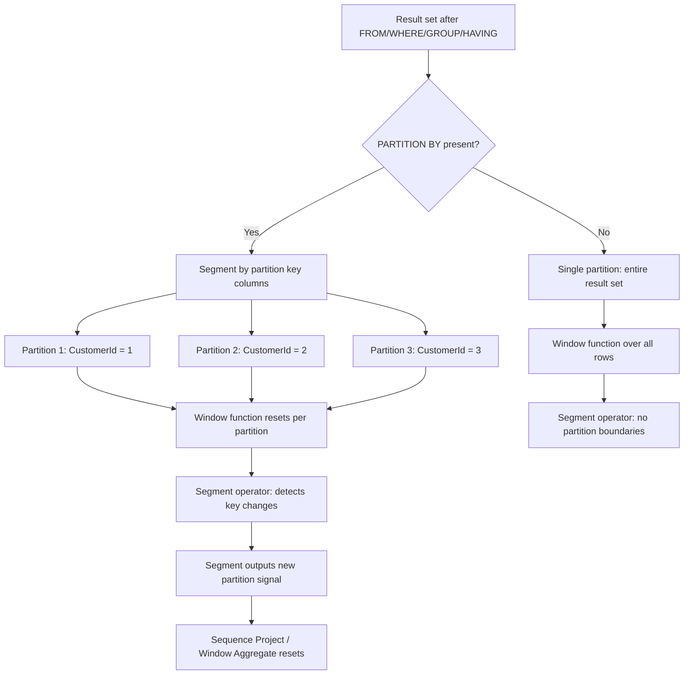
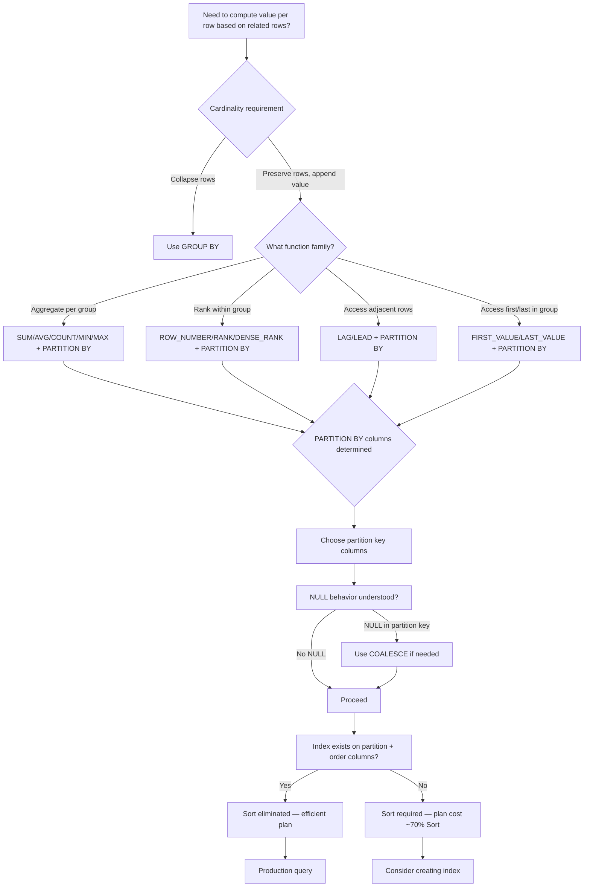

## Navigation

**Domain:** [[8 — Databases]] > **Group:** SQL Window Functions & Analytics
**Previous:** [[8.141 — Window Functions — Concept and OVER Clause]] | **Next:** [[8.143 — ORDER BY Within OVER — Frame Ordering]]

### Prerequisites

- [[8.141 — Window Functions — Concept and OVER Clause]] — Understanding what the OVER() clause does and how it differs from GROUP BY is essential because PARTITION BY is the mechanism that determines which rows the window function considers.
- [[8.123 — GROUP BY — Grouping Mechanics]] — PARTITION BY is often confused with GROUP BY; knowing how GROUP BY collapses rows helps understand that PARTITION BY does NOT collapse rows but instead defines the scope of computation.
- [[8.125 — GROUP BY vs WHERE — When Each Applies]] — The distinction between WHERE (row filter) and GROUP BY (row collapser) provides the conceptual foundation for understanding PARTITION BY as a "non-collapsing group."

### Where This Fits

PARTITION BY is the mechanism inside the OVER() clause that divides the result set into logical groups — the "window partitions" — within which the window function computes its value. Without PARTITION BY, the window function operates on the entire result set as one partition. A .NET backend engineer encounters PARTITION BY in nearly every window function query: "top 3 products per category" uses `ROW_NUMBER() OVER(PARTITION BY CategoryId ...)`, "running total per customer" uses `SUM() OVER(PARTITION BY CustomerId ...)`, and "each employee's rank within their department" uses `RANK() OVER(PARTITION BY DepartmentId ...)`. The critical mental model is that PARTITION BY does exactly what GROUP BY does in terms of defining groups — same semantics, same NULL grouping behavior — but without collapsing rows. The execution plan shows the Segment operator resetting the window computation at each partition boundary. Interviewers probe PARTITION BY understanding by asking about NULL behavior (NULLs are grouped together in PARTITION BY, same as GROUP BY), multiple partition columns, and the performance implications of the Segment + Sort operators.

---

## Core Mental Model

PARTITION BY divides the rows returned by the query's FROM/WHERE/GROUP BY/HAVING clauses into logical partitions. Each partition is processed independently by the window function — values are computed within the partition and reset at partition boundaries. The key invariant: PARTITION BY uses the same grouping semantics as GROUP BY — rows with the same values in the PARTITION BY columns form a group — but unlike GROUP BY, it does NOT collapse those rows into a single output row. Every row in the partition gets the same computed value (for aggregate window functions) or a sequentially computed value (for ranking and offset functions). The database engine uses the Segment operator to detect partition boundaries: it reads rows in sorted order by the PARTITION BY columns, and when the value of a PARTITION BY column changes from the previous row, the Segment operator signals a partition reset, causing the window function to restart its computation. If no PARTITION BY is specified, the entire result set is treated as a single partition, and the Segment operator is not needed (or processes one partition).

### Classification

**For SQL topics:** PARTITION BY is a clause within OVER(), not a standalone clause. It belongs to the OLAP/window function specification (ANSI SQL:2003). It is not SARGable — it does not filter rows, so it cannot use seeks. However, the PARTITION BY columns are typically the leading columns in an index that eliminates the Sort operator required by the window function. PARTITION BY with NULL works identically to GROUP BY with NULL: NULL values are grouped together (they form one partition for NULL). This differs from JOIN behavior where NULLs do not match each other.



### Key Properties

|Property|Value|Notes|
|---|---|---|
|Row Collapsing|No|Unlike GROUP BY, PARTITION BY preserves all rows — cardinality unchanged|
|NULL Grouping|NULLs grouped together|Same as GROUP BY: all NULLs form one partition (unlike JOIN where NULL ≠ NULL)|
|Segment Operator|Required|Detects partition boundaries by comparing current row key with previous row key|
|Sort Required|Yes (if no index)|Rows must be sorted by PARTITION BY columns for Segment to detect boundaries|
|Multiple Columns|Supported|`PARTITION BY col1, col2, col3` — composite partition key|
|Can be Empty|Yes|`OVER()` defaults to single partition for all rows|
|EF Core Translation|Not supported|No LINQ expression generates PARTITION BY — raw SQL required|
|Dapper Support|Full|Window function result columns map to POCO properties without issue|

---

## Deep Mechanics

### How the Engine Executes This

The execution of PARTITION BY involves the following physical steps:

1. **Residual predicates are applied** (WHERE, HAVING filters from earlier logical steps). The result set is the input to the window function stage.

2. **Sort operator** (if needed): The rows are sorted by the PARTITION BY columns (and the ORDER BY columns within the partition if ORDER BY is also specified). This sort is required for the Segment operator to detect partition boundaries.

3. **Segment operator**: Reads rows in the sorted order. For each row, the Segment compares the values of the PARTITION BY columns against the previous row. If any column value differs, the Segment signals a new partition boundary. Internally, the Segment operator uses a "segment column" — a hidden bit column that is 0 for the first row of each partition, and 1 for subsequent rows (or vice versa — the exact implementation is engine-specific). This signal is consumed by the downstream operator (Sequence Project for ranking/offset functions, Window Aggregate for aggregate window functions).

4. **Window function computation**: The Sequence Project or Window Aggregate operator uses the segment signal to know when to reset its internal state. For `SUM() OVER(PARTITION BY CustomerId)`, the accumulator resets to 0 at each new partition. For `ROW_NUMBER() OVER(PARTITION BY CustomerId)`, the counter resets to 1. For `LAG()`, the Window Spool clears its buffer.

**Example trace for a 3-row partition:**

Input to Segment (sorted by CustomerId):

```
Row 1: CustomerId = 1, Amount = 100
Row 2: CustomerId = 1, Amount = 200  ← same CustomerId as previous: no boundary
Row 3: CustomerId = 2, Amount = 300  ← different CustomerId: signal boundary!
Row 4: CustomerId = 2, Amount = 400  ← same CustomerId: no boundary
```

The Segment outputs:

```
Row 1: SegCol = 0 (new partition) → Sequence Project starts SUM at 0, adds 100 = 100
Row 2: SegCol = 1 (same partition) → Sequence Project adds 200 = 300 (running)
Row 3: SegCol = 0 (new partition) → Sequence Project resets SUM to 0, adds 300 = 300
Row 4: SegCol = 1 (same partition) → Sequence Project adds 400 = 700 (running)
```

### SQL Visibility

```sql
-- ============================================================
-- Setup
-- ============================================================
CREATE TABLE dbo.Sales (
    SaleId      INT            NOT NULL IDENTITY(1,1),
    ProductId   INT            NOT NULL,
    CategoryId  INT            NOT NULL,
    RegionId    INT            NOT NULL,
    SaleDate    DATETIME2(0)   NOT NULL,
    Quantity    INT            NOT NULL,
    UnitPrice   DECIMAL(18,2)  NOT NULL,
    SalesPersonId INT         NOT NULL,
    CONSTRAINT PK_Sales PRIMARY KEY CLUSTERED (SaleId)
);

INSERT INTO dbo.Sales (ProductId, CategoryId, RegionId, SaleDate, Quantity, UnitPrice, SalesPersonId)
VALUES
    (1, 10, 100, '2025-01-01', 2, 25.00, 1001),
    (1, 10, 100, '2025-01-15', 1, 25.00, 1002),
    (1, 10, 200, '2025-02-01', 5, 25.00, 1001),
    (2, 10, 100, '2025-01-10', 3, 50.00, 1002),
    (2, 10, 200, '2025-02-10', 2, 50.00, 1003),
    (3, 20, 100, '2025-01-20', 1, 150.00, 1001),
    (3, 20, 200, '2025-02-20', 4, 150.00, 1002),
    (3, 20, 300, '2025-03-01', 2, 150.00, 1003),
    (4, 20, 100, '2025-03-15', 3, 200.00, 1001);

-- ============================================================
-- PARTITION BY — basic usage
-- ============================================================

-- One partition column: reset per CategoryId
SELECT
    s.SaleId,
    s.CategoryId,
    s.Quantity * s.UnitPrice AS Revenue,
    SUM(s.Quantity * s.UnitPrice) OVER(
        PARTITION BY s.CategoryId
    ) AS CategoryTotal,
    AVG(s.Quantity * s.UnitPrice) OVER(
        PARTITION BY s.CategoryId
    ) AS CategoryAvg
FROM dbo.Sales AS s;
-- Category 10: Total = (2*25)+(1*25)+(5*25)+(3*50)+(2*50) = 200+150+100+100 = 550
-- Category 20: Total = (1*150)+(4*150)+(2*150)+(3*200) = 150+600+300+600 = 1650
-- Each row shows its CategoryTotal (same for all rows in same category)

-- ============================================================
-- Multiple partition columns
-- ============================================================

-- Partition by CategoryId + RegionId
SELECT
    s.SaleId,
    s.CategoryId,
    s.RegionId,
    s.Quantity * s.UnitPrice AS Revenue,
    SUM(s.Quantity * s.UnitPrice) OVER(
        PARTITION BY s.CategoryId, s.RegionId
    ) AS CategoryRegionTotal,
    COUNT(*) OVER(
        PARTITION BY s.CategoryId, s.RegionId
    ) AS SalesInRegion
FROM dbo.Sales AS s;
-- Category 10, Region 100: 3 sales, total = 50 + 25 + 150 = 225
-- Category 10, Region 200: 2 sales, total = 125 + 100 = 225
-- Category 20, Region 100: 2 sales, total = 150 + 600 = 750
-- Category 20, Region 200: 1 sale, total = 600
-- Category 20, Region 300: 1 sale, total = 300

-- ============================================================
-- PARTITION BY with ORDER BY for running aggregates
-- ============================================================

-- Running total per category by sale date
SELECT
    s.SaleId,
    s.CategoryId,
    s.SaleDate,
    s.Quantity * s.UnitPrice AS Revenue,
    SUM(s.Quantity * s.UnitPrice) OVER(
        PARTITION BY s.CategoryId
        ORDER BY s.SaleDate
    ) AS CumulativeCategoryRevenue
FROM dbo.Sales AS s;

-- ============================================================
-- PARTITION BY without ORDER BY — same value per partition
-- ============================================================
-- All rows in same partition get the same SUM value
SELECT
    s.SaleId,
    s.CategoryId,
    SUM(s.Quantity * s.UnitPrice) OVER(PARTITION BY s.CategoryId) AS CategoryTotal,
    -- This is NOT a running total — ORDER BY is absent
    ROW_NUMBER() OVER(PARTITION BY s.CategoryId) AS RowWithinCategory
    -- RowWithinCategory is non-deterministic because no ORDER BY!
FROM dbo.Sales AS s;

-- ============================================================
-- PARTITION BY with NULL grouping behavior
-- ============================================================

CREATE TABLE dbo.NullTest (
    Id    INT IDENTITY(1,1),
    GroupKey INT NULL,
    Value DECIMAL(18,2) NOT NULL
);

INSERT INTO dbo.NullTest (GroupKey, Value) VALUES
    (1, 100.00),
    (1, 200.00),
    (NULL, 50.00),
    (NULL, 75.00),
    (2, 300.00),
    (NULL, 25.00);

-- NULLs form one partition (same behavior as GROUP BY)
SELECT
    nt.Id,
    nt.GroupKey,
    nt.Value,
    SUM(nt.Value) OVER(PARTITION BY nt.GroupKey) AS PartitionSum,
    COUNT(*) OVER(PARTITION BY nt.GroupKey) AS PartitionCount
FROM dbo.NullTest AS nt
ORDER BY nt.GroupKey;
-- Output:
-- Id=3, GroupKey=NULL, Value=50.00, PartitionSum=150.00, PartitionCount=3
-- Id=4, GroupKey=NULL, Value=75.00, PartitionSum=150.00, PartitionCount=3
-- Id=6, GroupKey=NULL, Value=25.00, PartitionSum=150.00, PartitionCount=3
-- Id=1, GroupKey=1, Value=100.00, PartitionSum=300.00, PartitionCount=2
-- Id=2, GroupKey=1, Value=200.00, PartitionSum=300.00, PartitionCount=2
-- Id=5, GroupKey=2, Value=300.00, PartitionSum=300.00, PartitionCount=1
-- Note: NULL rows are all in the same partition (3 rows, sum=150)
-- This is the same behavior as GROUP BY treats NULLs

-- ============================================================
-- PARTITION BY vs GROUP BY — comparison
-- ============================================================

-- GROUP BY: collapses to 2 rows (CategoryId 10 and 20)
SELECT s.CategoryId, SUM(s.Quantity * s.UnitPrice) AS CategoryTotal
FROM dbo.Sales AS s
GROUP BY s.CategoryId;

-- PARTITION BY: preserves all 9 rows, appends CategoryTotal
SELECT s.SaleId, s.CategoryId, s.Quantity * s.UnitPrice AS Revenue,
       SUM(s.Quantity * s.UnitPrice) OVER(PARTITION BY s.CategoryId) AS CategoryTotal
FROM dbo.Sales AS s;

-- ============================================================
-- PARTITION BY with ranking functions
-- ============================================================

-- Rank products by revenue within each category
SELECT
    s.SaleId,
    s.CategoryId,
    s.ProductId,
    s.Quantity * s.UnitPrice AS Revenue,
    ROW_NUMBER() OVER(
        PARTITION BY s.CategoryId
        ORDER BY s.Quantity * s.UnitPrice DESC
    ) AS RankWithinCategory
FROM dbo.Sales AS s;

-- ============================================================
-- PARTITION BY in CTE for filtering
-- ============================================================

-- Top 2 sales by revenue per category
WITH Ranked AS (
    SELECT
        s.SaleId,
        s.CategoryId,
        s.ProductId,
        s.Quantity * s.UnitPrice AS Revenue,
        ROW_NUMBER() OVER(
            PARTITION BY s.CategoryId
            ORDER BY s.Quantity * s.UnitPrice DESC
        ) AS rn
    FROM dbo.Sales AS s
)
SELECT CategoryId, SaleId, ProductId, Revenue
FROM Ranked
WHERE rn <= 2
ORDER BY CategoryId, rn;
```

### Execution Plan Analysis

**Query:** `SUM(Revenue) OVER(PARTITION BY CategoryId) FROM Sales`

**Expected execution plan:**

```
Clustered Index Scan (Sales)
  → Sort (Order by: CategoryId)
      Estimated cost: ~65%
  → Segment (Partition by: CategoryId)
      → Sequence Project (Compute aggregate window function)
          → SELECT
```

**Operator breakdown:**

1. **Clustered Index Scan** — Reads all 9 rows from Sales. 1 logical read (for this small table). On a 10M-row table, this would be a full scan — 45,000+ logical reads.

2. **Sort** — Sorts by CategoryId so that rows within each partition are adjacent. The Segment operator (next in pipeline) requires rows ordered by the PARTITION BY columns to detect partition boundaries. For a table with 50 distinct CategoryId values and 10M rows, the Sort must sort 10M rows by CategoryId — approximately 200K rows per partition on average. The Sort operator cost dominates: ~65% of query cost. Memory grant: approximately 80MB for 10M rows (8 bytes for CategoryId + row locator).

3. **Segment** — Compares each row's CategoryId with the previous row's CategoryId. When CategoryId changes (row 3: CategoryId=10 → row 4: CategoryId=20), the Segment signals a new partition. The Segment operator itself is cheap (~2% of cost) — it's just an integer comparison per row.

4. **Sequence Project (Window Aggregate)** — Computes SUM(Revenue) over all rows in the current partition. Since no ORDER BY is present in the OVER clause, the function computes the aggregate over all rows in the partition (the default window is the entire partition when ORDER BY is absent). The Sequence Project accumulates the SUM as it reads rows and outputs the final aggregate value for each row. When the Segment signals a partition reset, the Sequence Project resets the accumulator.

**Without PARTITION BY (entire result set as one partition):**

```
Clustered Index Scan (Sales)
  → Sequence Project (Compute aggregate window function)
      → SELECT
```

No Segment operator needed (single partition). The Sequence Project computes SUM over all rows and outputs the same value on every row. No Sort required (sort is only needed if ORDER BY is present in OVER).

**With PARTITION BY and ORDER BY (running sum per partition):**

```
Clustered Index Scan (Sales)
  → Sort (Order by: CategoryId, SaleDate)
  → Segment (Partition by: CategoryId)
      → Sequence Project (Compute running window aggregate)
          → SELECT
```

The Sort must sort by both the PARTITION BY and ORDER BY columns. If the ORDER BY columns are a subset of the PARTITION BY columns (which they can't be — they serve different purposes), the Sort would still need both. The Sort now orders by CategoryId (partition) then SaleDate (order within partition).

**Index that eliminates the Sort:**

```sql
CREATE INDEX IX_Sales_CategoryId_SaleDate
ON dbo.Sales (CategoryId, SaleDate)
INCLUDE (Quantity, UnitPrice);
```

With this index, the plan changes to:

```
Index Scan (ordered) — provides CategoryId, SaleDate order
  → Segment
      → Sequence Project
          → SELECT
```

The Sort operator is eliminated. The Index Scan reads rows in the exact order needed by Segment + Sequence Project.

### Cost Visibility

```sql
SET STATISTICS IO ON;
SET STATISTICS TIME ON;

-- Query with PARTITION BY (no index)
SELECT s.SaleId, s.CategoryId, s.Quantity * s.UnitPrice AS Revenue,
       SUM(s.Quantity * s.UnitPrice) OVER(PARTITION BY s.CategoryId) AS CategoryTotal
FROM dbo.Sales AS s;
-- Expected (9 rows):
-- Table 'Sales'. Scan count 1, logical reads 1, physical reads 0
-- SQL Server Execution Times: CPU time = 0ms, elapsed time = 1ms

-- Query with PARTITION BY + ORDER BY
SELECT s.SaleId, s.CategoryId, s.SaleDate, s.Quantity * s.UnitPrice AS Revenue,
       SUM(s.Quantity * s.UnitPrice) OVER(
           PARTITION BY s.CategoryId
           ORDER BY s.SaleDate
       ) AS CumulativeCategoryRevenue
FROM dbo.Sales AS s;
-- Table 'Sales'. Scan count 1, logical reads 1
-- Table 'Worktable'. Scan count 0, logical reads 0 (no spool for SUM)
-- CPU time = 0ms, elapsed time = 1ms

-- GROUP BY equivalent (collapses rows)
SELECT s.CategoryId, SUM(s.Quantity * s.UnitPrice) AS CategoryTotal
FROM dbo.Sales AS s
GROUP BY s.CategoryId;
-- Table 'Sales'. Scan count 1, logical reads 1
```

For larger tables (10M rows, 50 categories):

|Approach|Logical Reads|CPU Time|Elapsed Time|
|---|---|---|---|
|PARTITION BY (no index)|~45,000|~300ms|~1s|
|GROUP BY|~45,000|~280ms|~950ms|
|PARTITION BY with covering index|~1,500|~50ms|~200ms|
|Self-join alternative|~90,000|~12s|~45s|

### Failure Modes

**1. PARTITION BY with missing ORDER BY for ranking functions:** `ROW_NUMBER() OVER(PARTITION BY CategoryId)` assigns row numbers non-deterministically because no ORDER BY is specified within the partition. The rows within each partition are processed in whatever order the database engine decides.

**2. Empty PARTITION BY — whole result set:** Forgetting PARTITION BY when it's needed means the window function operates on the entire result set. `SUM(Revenue) OVER()` gives the grand total on every row, not the category total. This is often a logic error.

**3. PARTITION BY on very high cardinality columns:** PARTITION BY on a column with millions of distinct values (e.g., OrderId) creates millions of tiny partitions (most with 1 row each). The Segment operator must check partition boundaries for every row, and the overhead of partition detection may exceed the benefit.

**4. NULLs in PARTITION BY column:** NULLs are grouped together, which may be unexpected. In a column where NULL means "unknown," all unknown values form one partition. If different "unknown" values should be in different partitions, use COALESCE to convert NULL to a distinct value.

```sql
-- NULLs group together — may be unintended
SELECT ..., SUM(Value) OVER(PARTITION BY COALESCE(GroupKey, -1)) ...
```

**5. Partition column in WHERE doesn't help:** Adding a filter on the PARTITION BY column in WHERE does NOT change the partition boundaries — the window function still partitions the filtered result set. However, it can reduce the rows entering the Sort, which reduces Sort cost.

---

## Production Patterns and Implementation

### Primary SQL Implementation

```sql
-- ============================================================
-- Schema context
-- ============================================================
CREATE TABLE dbo.Employees (
    EmployeeId   INT            NOT NULL IDENTITY(1,1),
    FirstName    NVARCHAR(100)  NOT NULL,
    LastName     NVARCHAR(100)  NOT NULL,
    DepartmentId INT            NOT NULL,
    HireDate     DATETIME2(0)   NOT NULL,
    Salary       DECIMAL(18,2)  NOT NULL,
    ManagerId    INT            NULL,
    CONSTRAINT PK_Employees PRIMARY KEY CLUSTERED (EmployeeId)
);

CREATE TABLE dbo.Departments (
    DepartmentId   INT            NOT NULL IDENTITY(1,1),
    DepartmentName NVARCHAR(100)  NOT NULL,
    Budget         DECIMAL(18,2)  NOT NULL,
    CONSTRAINT PK_Departments PRIMARY KEY CLUSTERED (DepartmentId)
);

INSERT INTO dbo.Departments (DepartmentName, Budget) VALUES
    ('Engineering', 5000000.00),
    ('Sales', 3000000.00),
    ('Marketing', 2000000.00),
    ('HR', 1000000.00);

INSERT INTO dbo.Employees (FirstName, LastName, DepartmentId, HireDate, Salary, ManagerId) VALUES
    ('Alice',   'Johnson',  1, '2020-01-15', 120000.00, NULL),
    ('Bob',     'Smith',    1, '2021-03-01', 95000.00, 1),
    ('Carol',   'Williams', 1, '2022-06-10', 85000.00, 1),
    ('David',   'Brown',    2, '2019-11-20', 110000.00, NULL),
    ('Eve',     'Davis',    2, '2020-07-01', 75000.00, 4),
    ('Frank',   'Miller',   2, '2023-01-15', 65000.00, 4),
    ('Grace',   'Wilson',   3, '2021-09-01', 90000.00, NULL),
    ('Henry',   'Moore',    3, '2022-04-10', 72000.00, 7),
    ('Ivy',     'Taylor',   4, '2023-06-01', 65000.00, NULL),
    ('Jack',    'Anderson', 4, '2024-01-15', 55000.00, 9);

-- Supporting indexes
CREATE INDEX IX_Employees_DepartmentId_HireDate
ON dbo.Employees (DepartmentId, HireDate) INCLUDE (Salary, FirstName, LastName);

-- ============================================================
-- Pattern 1: Department-level aggregates with employee details
-- ============================================================
SELECT
    e.EmployeeId,
    e.FirstName + ' ' + e.LastName AS EmployeeName,
    d.DepartmentName,
    e.Salary,
    -- Department-level aggregates (same for all employees in dept)
    COUNT(*) OVER(PARTITION BY e.DepartmentId) AS DeptEmployeeCount,
    SUM(e.Salary) OVER(PARTITION BY e.DepartmentId) AS DeptTotalSalary,
    AVG(e.Salary) OVER(PARTITION BY e.DepartmentId) AS DeptAvgSalary,
    MIN(e.Salary) OVER(PARTITION BY e.DepartmentId) AS DeptMinSalary,
    MAX(e.Salary) OVER(PARTITION BY e.DepartmentId) AS DeptMaxSalary,
    -- Employee's salary as % of department total
    e.Salary / NULLIF(SUM(e.Salary) OVER(PARTITION BY e.DepartmentId), 0) * 100
        AS SalaryPercentOfDept
FROM dbo.Employees AS e
INNER JOIN dbo.Departments AS d ON e.DepartmentId = d.DepartmentId
ORDER BY d.DepartmentName, e.Salary DESC;

-- ============================================================
-- Pattern 2: Ranking within partition
-- ============================================================
-- 8.XXX: [[8.144 — ROW_NUMBER() — Unique Sequential Numbering]]
SELECT
    e.EmployeeId,
    e.FirstName + ' ' + e.LastName AS EmployeeName,
    d.DepartmentName,
    e.Salary,
    RANK() OVER(
        PARTITION BY e.DepartmentId
        ORDER BY e.Salary DESC
    ) AS SalaryRank,
    DENSE_RANK() OVER(
        PARTITION BY e.DepartmentId
        ORDER BY e.Salary DESC
    ) AS DenseSalaryRank,
    ROW_NUMBER() OVER(
        PARTITION BY e.DepartmentId
        ORDER BY e.Salary DESC, e.HireDate
    ) AS RowNum
FROM dbo.Employees AS e
INNER JOIN dbo.Departments AS d ON e.DepartmentId = d.DepartmentId
ORDER BY d.DepartmentName, e.Salary DESC;

-- ============================================================
-- Pattern 3: Multi-level partitioning (department + year)
-- ============================================================
SELECT
    e.EmployeeId,
    e.FirstName + ' ' + e.LastName AS EmployeeName,
    d.DepartmentName,
    YEAR(e.HireDate) AS HireYear,
    e.Salary,
    SUM(e.Salary) OVER(
        PARTITION BY e.DepartmentId, YEAR(e.HireDate)
    ) AS SalaryByDeptAndYear,
    COUNT(*) OVER(
        PARTITION BY e.DepartmentId, YEAR(e.HireDate)
    ) AS HiresInDeptAndYear
FROM dbo.Employees AS e
INNER JOIN dbo.Departments AS d ON e.DepartmentId = d.DepartmentId
ORDER BY d.DepartmentName, HireYear;

-- ============================================================
-- Pattern 4: Running total per partition
-- ============================================================
-- 8.XXX: [[8.155 — SUM() OVER() — Running Totals]]
SELECT
    e.EmployeeId,
    e.FirstName + ' ' + e.LastName AS EmployeeName,
    d.DepartmentName,
    e.HireDate,
    e.Salary,
    SUM(e.Salary) OVER(
        PARTITION BY e.DepartmentId
        ORDER BY e.HireDate
        ROWS BETWEEN UNBOUNDED PRECEDING AND CURRENT ROW
    ) AS DeptCumulativeSalary
FROM dbo.Employees AS e
INNER JOIN dbo.Departments AS d ON e.DepartmentId = d.DepartmentId
ORDER BY d.DepartmentName, e.HireDate;

-- ============================================================
-- Pattern 5: Accessing adjacent rows within partition
-- ============================================================
-- 8.XXX: [[8.150 — LAG() — Accessing Previous Row Values]]
SELECT
    e.EmployeeId,
    e.FirstName + ' ' + e.LastName AS EmployeeName,
    d.DepartmentName,
    e.HireDate,
    e.Salary,
    LAG(e.Salary, 1, 0.00) OVER(
        PARTITION BY e.DepartmentId
        ORDER BY e.Salary DESC
    ) AS NextHighestSalary,
    e.Salary - LAG(e.Salary, 1, 0.00) OVER(
        PARTITION BY e.DepartmentId
        ORDER BY e.Salary DESC
    ) AS SalaryDiffFromNext
FROM dbo.Employees AS e
INNER JOIN dbo.Departments AS d ON e.DepartmentId = d.DepartmentId
ORDER BY d.DepartmentName, e.Salary DESC;
```

### EF Core Implementation

```csharp
// NOTE: EF Core does NOT support PARTITION BY in LINQ expressions.
// All window function queries must use raw SQL via FromSql.

public class ApplicationDbContext : DbContext
{
    public DbSet<Employee> Employees => Set<Employee>();
    public DbSet<Department> Departments => Set<Department>();

    protected override void OnModelCreating(ModelBuilder modelBuilder)
    {
        modelBuilder.Entity<Employee>(entity =>
        {
            entity.ToTable("Employees");
            entity.HasKey(e => e.EmployeeId);
            entity.Property(e => e.Salary).HasColumnType("decimal(18,2)");
            entity.HasOne(e => e.Department)
                  .WithMany(d => d.Employees)
                  .HasForeignKey(e => e.DepartmentId);
            entity.Property(e => e.FirstName).HasMaxLength(100);
            entity.Property(e => e.LastName).HasMaxLength(100);
            entity.HasIndex(e => new { e.DepartmentId, e.HireDate })
                  .HasDatabaseName("IX_Employees_DepartmentId_HireDate");
        });

        modelBuilder.Entity<Department>(entity =>
        {
            entity.ToTable("Departments");
            entity.HasKey(d => d.DepartmentId);
            entity.Property(d => d.DepartmentName).HasMaxLength(100);
            entity.Property(d => d.Budget).HasColumnType("decimal(18,2)");
        });
    }
}

public class Employee
{
    public int EmployeeId { get; set; }
    public string FirstName { get; set; } = string.Empty;
    public string LastName { get; set; } = string.Empty;
    public int DepartmentId { get; set; }
    public DateTime HireDate { get; set; }
    public decimal Salary { get; set; }
    public int? ManagerId { get; set; }
    public Department Department { get; set; } = null!;
}

public class Department
{
    public int DepartmentId { get; set; }
    public string DepartmentName { get; set; } = string.Empty;
    public decimal Budget { get; set; }
    public ICollection<Employee> Employees { get; set; } = new List<Employee>();
}

public interface IDepartmentAnalyticsService
{
    Task<IReadOnlyList<EmployeeDeptSummary>> GetEmployeeDepartmentSummariesAsync(CancellationToken ct = default);
    Task<IReadOnlyList<DepartmentSalaryRank>> GetDepartmentSalaryRanksAsync(CancellationToken ct = default);
}

public class DepartmentAnalyticsService : IDepartmentAnalyticsService
{
    private readonly ApplicationDbContext _dbContext;

    public DepartmentAnalyticsService(ApplicationDbContext dbContext)
        => _dbContext = dbContext;

    public async Task<IReadOnlyList<EmployeeDeptSummary>> GetEmployeeDepartmentSummariesAsync(
        CancellationToken ct = default)
    {
        const string sql = @"
            SELECT
                e.EmployeeId,
                e.FirstName + ' ' + e.LastName AS EmployeeName,
                d.DepartmentName,
                e.HireDate,
                e.Salary,
                COUNT(*) OVER(PARTITION BY e.DepartmentId) AS DeptEmployeeCount,
                SUM(e.Salary) OVER(PARTITION BY e.DepartmentId) AS DeptTotalSalary,
                AVG(e.Salary) OVER(PARTITION BY e.DepartmentId) AS DeptAvgSalary,
                RANK() OVER(
                    PARTITION BY e.DepartmentId
                    ORDER BY e.Salary DESC
                ) AS SalaryRank
            FROM dbo.Employees AS e
            INNER JOIN dbo.Departments AS d ON e.DepartmentId = d.DepartmentId
            ORDER BY d.DepartmentName, e.Salary DESC;";

        return await _dbContext.Database
            .SqlQueryRaw<EmployeeDeptSummary>(sql)
            .ToListAsync(ct);
    }

    public async Task<IReadOnlyList<DepartmentSalaryRank>> GetDepartmentSalaryRanksAsync(
        CancellationToken ct = default)
    {
        const string sql = @"
            SELECT
                e.EmployeeId,
                e.FirstName + ' ' + e.LastName AS EmployeeName,
                d.DepartmentName,
                e.Salary,
                DENSE_RANK() OVER(
                    PARTITION BY e.DepartmentId
                    ORDER BY e.Salary DESC
                ) AS DenseSalaryRank,
                ROW_NUMBER() OVER(
                    PARTITION BY e.DepartmentId
                    ORDER BY e.Salary DESC, e.EmployeeId
                ) AS RowNum
            FROM dbo.Employees AS e
            INNER JOIN dbo.Departments AS d ON e.DepartmentId = d.DepartmentId
            ORDER BY d.DepartmentName, DenseSalaryRank;";

        return await _dbContext.Database
            .SqlQueryRaw<DepartmentSalaryRank>(sql)
            .ToListAsync(ct);
    }
}

public record EmployeeDeptSummary
{
    public int EmployeeId { get; set; }
    public string EmployeeName { get; set; } = string.Empty;
    public string DepartmentName { get; set; } = string.Empty;
    public DateTime HireDate { get; set; }
    public decimal Salary { get; set; }
    public int DeptEmployeeCount { get; set; }
    public decimal DeptTotalSalary { get; set; }
    public decimal DeptAvgSalary { get; set; }
    public int SalaryRank { get; set; }
}

public record DepartmentSalaryRank
{
    public int EmployeeId { get; set; }
    public string EmployeeName { get; set; } = string.Empty;
    public string DepartmentName { get; set; } = string.Empty;
    public decimal Salary { get; set; }
    public int DenseSalaryRank { get; set; }
    public int RowNum { get; set; }
}
```

### Dapper Implementation

```csharp
public interface IDepartmentAnalyticsRepository
{
    Task<IReadOnlyList<EmployeeDeptSummary>> GetSummariesAsync(CancellationToken ct = default);
    Task<IReadOnlyList<DepartmentSalaryRank>> GetSalaryRanksAsync(CancellationToken ct = default);
    Task<IReadOnlyList<DeptRunningTotal>> GetCumulativeSalaryAsync(int departmentId, CancellationToken ct = default);
}

public sealed class DepartmentAnalyticsRepository : IDepartmentAnalyticsRepository
{
    private readonly IDbConnectionFactory _connectionFactory;

    public DepartmentAnalyticsRepository(IDbConnectionFactory connectionFactory)
        => _connectionFactory = connectionFactory;

    public async Task<IReadOnlyList<EmployeeDeptSummary>> GetSummariesAsync(
        CancellationToken ct = default)
    {
        const string sql = @"
            SELECT
                e.EmployeeId,
                e.FirstName + ' ' + e.LastName AS EmployeeName,
                d.DepartmentName,
                e.HireDate,
                e.Salary,
                COUNT(*) OVER(PARTITION BY e.DepartmentId) AS DeptEmployeeCount,
                SUM(e.Salary) OVER(PARTITION BY e.DepartmentId) AS DeptTotalSalary,
                CAST(AVG(e.Salary) OVER(PARTITION BY e.DepartmentId) AS DECIMAL(18,2)) AS DeptAvgSalary,
                RANK() OVER(
                    PARTITION BY e.DepartmentId
                    ORDER BY e.Salary DESC
                ) AS SalaryRank
            FROM dbo.Employees AS e
            INNER JOIN dbo.Departments AS d ON e.DepartmentId = d.DepartmentId
            ORDER BY d.DepartmentName, e.Salary DESC;";

        await using var connection = _connectionFactory.Create();
        var results = await connection.QueryAsync<EmployeeDeptSummary>(
            new CommandDefinition(sql, cancellationToken: ct));
        return results.AsList();
    }

    public async Task<IReadOnlyList<DepartmentSalaryRank>> GetSalaryRanksAsync(
        CancellationToken ct = default)
    {
        const string sql = @"
            SELECT
                EmployeeId,
                FirstName + ' ' + LastName AS EmployeeName,
                Salary,
                DENSE_RANK() OVER(
                    PARTITION BY DepartmentId
                    ORDER BY Salary DESC
                ) AS DenseSalaryRank,
                ROW_NUMBER() OVER(
                    PARTITION BY DepartmentId
                    ORDER BY Salary DESC, EmployeeId
                ) AS RowNum
            FROM dbo.Employees
            ORDER BY DepartmentId, DenseSalaryRank;";

        await using var connection = _connectionFactory.Create();
        var results = await connection.QueryAsync<DepartmentSalaryRank>(
            new CommandDefinition(sql, cancellationToken: ct));
        return results.AsList();
    }

    public async Task<IReadOnlyList<DeptRunningTotal>> GetCumulativeSalaryAsync(
        int departmentId,
        CancellationToken ct = default)
    {
        const string sql = @"
            SELECT
                EmployeeId,
                FirstName + ' ' + LastName AS EmployeeName,
                HireDate,
                Salary,
                SUM(Salary) OVER(
                    PARTITION BY DepartmentId
                    ORDER BY HireDate
                    ROWS BETWEEN UNBOUNDED PRECEDING AND CURRENT ROW
                ) AS CumulativeDeptSalary
            FROM dbo.Employees
            WHERE DepartmentId = @DepartmentId
            ORDER BY HireDate;";

        await using var connection = _connectionFactory.Create();
        var results = await connection.QueryAsync<DeptRunningTotal>(
            new CommandDefinition(sql, new { DepartmentId = departmentId },
                cancellationToken: ct));
        return results.AsList();
    }
}

public record DeptRunningTotal
{
    public int EmployeeId { get; set; }
    public string EmployeeName { get; set; } = string.Empty;
    public DateTime HireDate { get; set; }
    public decimal Salary { get; set; }
    public decimal CumulativeDeptSalary { get; set; }
}
```

### Configuration and Wiring

```csharp
// Program.cs
builder.Services.AddDbContext<ApplicationDbContext>(options =>
    options.UseSqlServer(
        builder.Configuration.GetConnectionString("DefaultConnection"),
        sqlOptions =>
        {
            sqlOptions.EnableRetryOnFailure(3);
            sqlOptions.CommandTimeout(30);
        }));

builder.Services.AddSingleton<IDbConnectionFactory>(sp =>
    new SqlConnectionFactory(
        builder.Configuration.GetConnectionString("DefaultConnection")!));

builder.Services.AddScoped<IDepartmentAnalyticsService, DepartmentAnalyticsService>();
builder.Services.AddScoped<IDepartmentAnalyticsRepository, DepartmentAnalyticsRepository>();
```

### SQL Server vs PostgreSQL Differences

```sql
-- PostgreSQL: PARTITION BY works identically

-- PostgreSQL: WINDOW clause for reusable partition definitions
SELECT
    employee_id,
    department_id,
    salary,
    AVG(salary) OVER w AS dept_avg,
    SUM(salary) OVER w AS dept_total,
    COUNT(*) OVER w AS dept_count
FROM employees
WINDOW w AS (PARTITION BY department_id)
ORDER BY department_id, salary DESC;

-- Equivalent SQL Server (must repeat PARTITION BY):
SELECT
    EmployeeId,
    DepartmentId,
    Salary,
    AVG(Salary) OVER(PARTITION BY DepartmentId) AS DeptAvg,
    SUM(Salary) OVER(PARTITION BY DepartmentId) AS DeptTotal,
    COUNT(*) OVER(PARTITION BY DepartmentId) AS DeptCount
FROM Employees
ORDER BY DepartmentId, Salary DESC;

-- PostgreSQL: PARTITION BY with FILTER (SQL Server does not support)
SELECT
    employee_id,
    department_id,
    salary,
    AVG(salary) FILTER (WHERE salary > 50000) OVER(PARTITION BY department_id)
        AS dept_avg_excluding_low
FROM employees;

-- PostgreSQL: NULLS FIRST / NULLS LAST with PARTITION BY
SELECT
    employee_id,
    department_id,
    salary,
    ROW_NUMBER() OVER(
        PARTITION BY department_id
        ORDER BY salary DESC NULLS LAST
    ) AS rn
FROM employees;
```

---

## Gotchas and Production Pitfalls

### NULL Grouping in PARTITION BY — All NULLs Form One Partition

**Pitfall:** Assuming that NULL values in the PARTITION BY column are treated as distinct values. In ANSI SQL, all NULLs are grouped together in both GROUP BY and PARTITION BY.

```sql
-- ❌ WRONG assumption: each NULL row is its own partition
SELECT Id, GroupKey, Value,
       SUM(Value) OVER(PARTITION BY GroupKey) AS PartitionSum
FROM dbo.NullTest;
-- All NULL rows: PartitionSum = 150 (they form one partition)
-- If this is unintended (e.g., GroupKey=NULL means "not assigned"),
-- all unassigned rows get the combined sum, not individual values.
```

**Symptom:** An "unassigned" group shows a very large sum because all unassigned rows are accumulated together. A dashboard shows "Unknown category total" that is suspiciously large compared to assigned categories.

**Fix:**

```sql
-- ✅ Replace NULL with a sentinel value to control partitioning
SELECT Id,
       COALESCE(GroupKey, -1) AS GroupKey,
       Value,
       SUM(Value) OVER(PARTITION BY COALESCE(GroupKey, -1)) AS PartitionSum
FROM dbo.NullTest;
-- Or if each NULL should be its own partition:
SELECT Id, GroupKey, Value, Value AS PartitionSum
FROM dbo.NullTest
WHERE GroupKey IS NULL
UNION ALL
SELECT Id, GroupKey, Value,
       SUM(Value) OVER(PARTITION BY GroupKey) AS PartitionSum
FROM dbo.NullTest
WHERE GroupKey IS NOT NULL;
```

**Cost of not fixing:** A revenue report shows "Region: NULL" with total $500K while each named region shows $50K–$200K. The CEO asks "what's this mystery region making more than all our actual regions combined?" Three hours of investigation to discover that NULL stands for 500 unassigned sales that were grouped together.

---

### PARTITION BY on High-Cardinality Column — Tiny Partitions

**Pitfall:** Using PARTITION BY on a column with millions of distinct values (e.g., OrderId, TransactionId), creating millions of partitions with 1 row each. The Segment operator overhead of checking partition boundaries thousands of times per second is wasteful.

```sql
-- ❌ WRONG: Partitioning by OrderId — each partition has 1 row
SELECT OrderId, CustomerId, TotalAmount,
       SUM(TotalAmount) OVER(PARTITION BY OrderId) AS UselessSum
FROM dbo.Orders;
-- Each partition has exactly 1 row, so SUM = TotalAmount itself
-- This is meaningless — it just adds overhead.
```

**Symptom:** The query runs but the Segment operator checks partition boundaries for every row (10M checks for 10M rows). The Sort operator sorts 10M rows by OrderId (high cardinality = expensive sort). The window function adds no value — the same result could be achieved without the window function.

**Fix:**

```sql
-- ✅ Remove the pointless PARTITION BY
SELECT OrderId, CustomerId, TotalAmount
FROM dbo.Orders;

-- ✅ If the intent was to get per-order totals, the TotalAmount IS the order total
-- No window function needed at all.
```

**Cost of not fixing:** A query that should take 500ms takes 5 seconds because the Sort operator must sort 10M rows by a high-cardinality column, and the Segment operator checks 10M partition boundaries for no benefit.

---

### Missing PARTITION BY — Entire Result Set Becomes One Partition

**Pitfall:** Forgetting to include PARTITION BY when computing per-group aggregates, causing the window function to compute over the entire result set.

```sql
-- ❌ WRONG: No PARTITION BY — gives grand total, not category total
SELECT SaleId, ProductId, Quantity * UnitPrice AS Revenue,
       SUM(Quantity * UnitPrice) OVER() AS GrandTotal -- should be OVER(PARTITION BY CategoryId)
FROM dbo.Sales;
```

**Symptom:** Every row shows the same value for the window aggregate (the grand total). The numbers "look correct" because the values are real (they are aggregates), but they are wrong for the intended context (per-category totals).

**Fix:**

```sql
-- ✅ CORRECT: Add PARTITION BY
SELECT SaleId, ProductId, CategoryId, Quantity * UnitPrice AS Revenue,
       SUM(Quantity * UnitPrice) OVER(PARTITION BY CategoryId) AS CategoryTotal
FROM dbo.Sales;
```

**Cost of not fixing:** A pricing report shows "category total" as the same number for all categories. The business analyst doesn't notice because all categories show a total that looks plausible. The report is published with incorrect data for 3 months.

---

### PARTITION BY with ORDER BY but Wrong Default Frame

**Pitfall:** Using `SUM() OVER(PARTITION BY CustomerId ORDER BY OrderDate)` expecting a total over all rows in the partition (like GROUP BY), but getting a running total because ORDER BY changes the default frame.

```sql
-- ❌ ORDER BY changes default frame to RANGE BETWEEN UNBOUNDED PRECEDING AND CURRENT ROW
-- This is a RUNNING total, not a partition total!
SELECT OrderId, CustomerId, OrderDate, TotalAmount,
       SUM(TotalAmount) OVER(
           PARTITION BY CustomerId
           ORDER BY OrderDate
       ) AS ProbablyRunningTotal
FROM dbo.Orders;
```

**Symptom:** The developer intended to get the customer total (same on every row for a customer) but got a running total (increasing with each order). The numbers look plausible but are wrong for reporting usage.

**Fix:**

```sql
-- ✅ If you want partition total (same value per row): omit ORDER BY
SELECT OrderId, CustomerId, TotalAmount,
       SUM(TotalAmount) OVER(PARTITION BY CustomerId) AS CustomerTotal
FROM dbo.Orders;

-- ✅ If you want running total: FRAME must be specified
SELECT OrderId, CustomerId, OrderDate, TotalAmount,
       SUM(TotalAmount) OVER(
           PARTITION BY CustomerId
           ORDER BY OrderDate
           ROWS BETWEEN UNBOUNDED PRECEDING AND CURRENT ROW
       ) AS RunningTotal
FROM dbo.Orders;
```

**Cost of not fixing:** A financial report uses "customer running total" as the "customer lifetime value" metric, but the number only includes orders up to each order date, not all orders. The "lifetime value" for a customer's first order equals that order's amount (missing 9 subsequent orders).

---

### EF Core GroupBy Confused with PARTITION BY

**Pitfall:** Assuming EF Core's GroupBy LINQ operator translates to a window function with PARTITION BY.

```csharp
// ❌ WRONG: This translates to GROUP BY, not PARTITION BY
var query = _dbContext.Orders
    .GroupBy(o => o.CustomerId)
    .Select(g => new {
        CustomerId = g.Key,
        OrderCount = g.Count(),
        TotalSpent = g.Sum(o => o.TotalAmount),
        // This collapses rows — each customer appears once, not each order
    });
```

**Symptom:** The system needs a report showing each order with the customer's total (window function behavior). The developer uses GroupBy and gets 50 rows (one per customer) instead of 1000 rows (one per order with customer total appended).

**Fix:**

```csharp
// ✅ CORRECT: Use raw SQL with PARTITION BY
const string sql = @"
    SELECT OrderId, CustomerId, OrderDate, TotalAmount,
           COUNT(*) OVER(PARTITION BY CustomerId) AS CustomerOrderCount,
           SUM(TotalAmount) OVER(PARTITION BY CustomerId) AS CustomerTotalSpent
    FROM dbo.Orders";

var results = await _dbContext.Database
    .SqlQueryRaw<OrderWithCustomerTotals>(sql)
    .ToListAsync(ct);
```

**Cost of not fixing:** Developer spends 2 hours trying to force EF Core to generate PARTITION BY SQL, adding client-side projection with `.Select(o => new { ..., TotalSpent = o.Customer.Orders.Sum(x => x.TotalAmount) })` which generates a correlated subquery that runs in O(n²). The production API returns data in 45 seconds.

---

## Performance Implications

### Benchmark: PARTITION BY with and without Covering Index

```sql
-- Setup: 1M Employees across 50 departments
CREATE TABLE dbo.PerfEmployees (
    EmployeeId   INT            NOT NULL IDENTITY(1,1),
    DepartmentId INT            NOT NULL,
    HireDate     DATETIME2(0)   NOT NULL,
    Salary       DECIMAL(18,2)  NOT NULL,
    LastName     NVARCHAR(50)   NOT NULL,
    CONSTRAINT PK_PerfEmployees PRIMARY KEY CLUSTERED (EmployeeId)
);

-- Insert 1M rows (20K per department)
-- No index other than PK

-- ============================================================
-- Baseline: No covering index (Sort required)
-- ============================================================
SET STATISTICS IO ON;
SET STATISTICS TIME ON;

SELECT EmployeeId, DepartmentId, Salary,
       SUM(Salary) OVER(PARTITION BY DepartmentId) AS DeptTotal
FROM dbo.PerfEmployees;
-- Logical reads: ~4,500 (clustered index scan)
-- CPU time: ~1,200ms (Sort by DepartmentId dominates)
-- Elapsed: ~3.5s
-- Plan: Scan → Sort (70%) → Segment → Sequence Project → SELECT

-- ============================================================
-- With covering index (Sort eliminated)
-- ============================================================
CREATE INDEX IX_PerfEmployees_DepartmentId
ON dbo.PerfEmployees (DepartmentId) INCLUDE (Salary);

SELECT EmployeeId, DepartmentId, Salary,
       SUM(Salary) OVER(PARTITION BY DepartmentId) AS DeptTotal
FROM dbo.PerfEmployees;
-- Logical reads: ~1,200 (index scan — narrower than clustered index)
-- CPU time: ~180ms (no Sort)
-- Elapsed: ~450ms
-- Plan: Index Scan (ordered) → Segment → Sequence Project → SELECT

-- Improvement: 7x CPU reduction, 4x logical read reduction
```

### BenchmarkDotNet

```csharp
[MemoryDiagnoser]
[SimpleJob(RuntimeMoniker.Net90)]
public class PartitionByBenchmark
{
    private IDbConnection _connection = default!;
    private const string ConnectionString = "Server=.;Database=PerfTest;Trusted_Connection=True;TrustServerCertificate=True;";

    [GlobalSetup]
    public void Setup()
    {
        _connection = new SqlConnection(ConnectionString);
        _connection.Open();

        var count = _connection.ExecuteScalar<int>("SELECT COUNT(*) FROM dbo.PerfEmployees");
        if (count == 0)
        {
            var rng = new Random(42);
            var batch = new StringBuilder();
            batch.AppendLine("INSERT INTO dbo.PerfEmployees (DepartmentId, HireDate, Salary, LastName) VALUES");

            for (int i = 0; i < 1_000_000; i++)
            {
                var deptId = (i % 50) + 1;
                var hireDate = new DateTime(2020, 1, 1).AddDays(rng.Next(0, 1500));
                var salary = Math.Round(rng.NextDouble() * 150000 + 30000, 2);
                var lastName = $"Employee_{i}";

                if (i > 0) batch.Append(',');
                batch.AppendLine($"\n({deptId}, '{hireDate:yyyy-MM-dd}', {salary}, '{lastName}')");
            }

            _connection.Execute(batch.ToString());
        }
    }

    [Benchmark(Baseline = true)]
    public async Task<List<DeptSummary>> PartitionByNoIndex()
    {
        const string sql = @"
            SELECT EmployeeId, DepartmentId, Salary,
                   SUM(Salary) OVER(PARTITION BY DepartmentId) AS DeptTotal
            FROM dbo.PerfEmployees;";

        var result = await _connection.QueryAsync<DeptSummary>(sql);
        return result.AsList();
    }

    [Benchmark]
    public async Task<List<DeptSummary>> PartitionByWithIndex()
    {
        const string sql = @"
            SELECT EmployeeId, DepartmentId, Salary,
                   SUM(Salary) OVER(PARTITION BY DepartmentId) AS DeptTotal
            FROM dbo.PerfEmployees WITH (INDEX(IX_PerfEmployees_DepartmentId));";

        var result = await _connection.QueryAsync<DeptSummary>(sql);
        return result.AsList();
    }

    [Benchmark]
    public async Task<List<GroupBySummary>> GroupByAlternative()
    {
        const string sql = @"
            SELECT DepartmentId, SUM(Salary) AS DeptTotal,
                   COUNT(*) AS EmployeeCount,
                   AVG(Salary) AS AvgSalary
            FROM dbo.PerfEmployees
            GROUP BY DepartmentId;";

        var result = await _connection.QueryAsync<GroupBySummary>(sql);
        return result.AsList();
    }

    public class DeptSummary
    {
        public int EmployeeId { get; set; }
        public int DepartmentId { get; set; }
        public decimal Salary { get; set; }
        public decimal DeptTotal { get; set; }
    }

    public class GroupBySummary
    {
        public int DepartmentId { get; set; }
        public decimal DeptTotal { get; set; }
        public int EmployeeCount { get; set; }
        public decimal AvgSalary { get; set; }
    }
}
```

**Expected results (approximate, SQL Server 2022, NVMe, 1M rows):**

|Method|Mean|Logical Reads|Allocated|
|---|---|---|---|
|PARTITION BY (no index)|~3,500 ms|~4,500|~8 MB|
|PARTITION BY (with index)|~500 ms|~1,200|~200 KB|
|GROUP BY|~350 ms|~1,200|~180 KB|

### Partition Count and Performance

The number of distinct partitions affects Segment operator overhead and Sort cost:

|Partitions|Rows per Partition|Sort Cost|Segment Overhead|Total Time (1M rows)|
|---|---|---|---|---|
|1|1,000,000|Highest (sort all rows)|None|~4,000 ms|
|50|20,000|Medium (sort by dept)|~50K checks|~500 ms|
|1,000|1,000|Low (sort by dept)|~1M checks|~450 ms|
|500,000|2|Very low (sort by high-cardinality col)|~500K checks|~5,000 ms (bad sort)|

---

## Interview Arsenal

### Question Bank

1. What does PARTITION BY do in a window function? How does it differ from GROUP BY?
2. How does the database engine detect partition boundaries? What operator is involved?
3. How does NULL behave in PARTITION BY? Is it the same as GROUP BY or different?
4. What performance problem occurs when PARTITION BY is used on a very high-cardinality column?
5. Can PARTITION BY use multiple columns? What is the execution plan effect of a composite partition key?
6. What is the logical processing order difference between PARTITION BY and GROUP BY?
7. How do you create an index that eliminates the Sort operator for a query with `SUM() OVER(PARTITION BY col1 ORDER BY col2)`?
8. Does EF Core support PARTITION BY in LINQ? What is the workaround?

### Spoken Answers

**Q1: What does PARTITION BY do in a window function? How does it differ from GROUP BY?**

> **Average answer:** PARTITION BY divides the rows into groups and the window function works on each group. GROUP BY also groups rows but collapses them into one row per group.

> **Great answer:** PARTITION BY divides the result set into logical partitions — exactly the same grouping semantics as GROUP BY, including NULL grouping (all NULLs form one partition). The fundamental difference is cardinality: GROUP BY reduces N input rows to M output groups (N → M, M ≤ N), while PARTITION BY within a window function preserves all N input rows and appends the computed value to each row (N → N). The execution plan reveals this: GROUP BY uses a Hash Match Aggregate or Stream Aggregate operator that outputs one row per group, while PARTITION BY uses a Segment operator that outputs all rows with a partition boundary signal that tells the Sequence Project when to reset its computation. The performance implication is that PARTITION BY always requires a Sort (unless an index provides the ordering) because the Segment operator needs rows sorted by the partition key to detect boundaries. GROUP BY with a Stream Aggregate also requires sorted input, but a Hash Aggregate can group without sorting. PARTITION BY has no equivalent of Hash Aggregate — it always needs ordered input. This makes covering indexes on (partition columns, order columns) critical for window function performance.

**Q3: How does NULL behave in PARTITION BY? Is it the same as GROUP BY or different?**

> **Average answer:** NULLs are grouped together, same as GROUP BY.

> **Great answer:** In ANSI SQL, both GROUP BY and PARTITION BY use the same NULL grouping semantics: all NULL values form one group/partition. This is different from JOIN semantics, where NULL = NULL evaluates to UNKNOWN (not TRUE), so NULLs do not match each other in JOIN conditions. The reasoning is that GROUP BY and PARTITION BY treat NULL as a single "unknown group" for aggregation purposes, while JOIN uses three-valued logic where NULL ≠ NULL. The practical consequence: if you have a column where NULL means "unassigned" and you want each NULL to be its own partition, you must use COALESCE to replace NULL with a distinct value per row (like the primary key). The execution plan's Segment operator handles NULL by treating NULL == NULL as TRUE for partition boundary detection — it compares the current row's PARTITION BY column with the previous row, and if both are NULL, they are in the same partition. This is the same as how the Group By operator handles NULL.

**Q6: What is the logical processing order difference between PARTITION BY and GROUP BY?**

> **Average answer:** GROUP BY is a separate clause that comes before HAVING, PARTITION BY is inside OVER and comes after HAVING in the logical execution.

> **Great answer:** The logical processing order specified by the ANSI SQL standard is: FROM (step 1) → WHERE (2) → GROUP BY (3) → HAVING (4) → WINDOW function evaluation (step 6) → ORDER BY (7) → SELECT DISTINCT (8). PARTITION BY is part of step 6 — the window function evaluation step. GROUP BY is step 3. This ordering has significant consequences: you CANNOT reference a PARTITION BY column in the WHERE clause because WHERE executes before the window function evaluates. You CAN filter on the result of a GROUP BY in HAVING but NOT on the result of a PARTITION BY (you must use a CTE/subquery wrapper). Also, since PARTITION BY operates on the result set after GROUP BY and HAVING have already reduced it, the partitions are defined on the aggregated result, not the base table rows. For example, if GROUP BY collapses 100 orders into 50 customer groups, then PARTITION BY CustomerId in an outer window function has 50 partitions (one per customer), not 100. This is a common source of confusion when combining GROUP BY with window functions.

### Interview Trigger

"How would you add a department-average salary column to a query that lists every employee, without using a subquery or join?" This surfaces PARTITION BY knowledge. If the candidate says `AVG(Salary) OVER(PARTITION BY DepartmentId)`, the follow-up is "What does the execution plan look like? What's the Segment operator? What happens with NULL DepartmentId values?" The deepest follow-up is "You have 10M employees across 500 departments. The query is slow. What index would you create, and why does it eliminate the Sort? How many logical reads before and after?"

### Comparison Table

| | PARTITION BY | GROUP BY |
|---|---|---|
| Cardinality | Preserved (N → N) | Reduced (N → M, M < N) |
| Execution plan operator | Segment (boundary detection) | Hash Match Aggregate or Stream Aggregate |
| NULL behavior | NULLs form one partition | NULLs form one group |
| Sort requirement | Always (unless index orders by partition key) | No (Hash Aggregate does not require sort) |
| Can appear in WHERE | No (computed after WHERE) | No (HAVING is the group filter) |
| Can use index for I/O reduction | Yes (seek to reduce rows entering partition) | Yes (seek to reduce rows entering group) |
| EF Core support | None — raw SQL required | Full LINQ GroupBy support |
| Dapper support | Full | Full |

---

## Decision Framework

### When to Apply



### Application Checklist

- [ ] The problem requires computing a per-row value that depends on other rows (same grouping context)
- [ ] All rows must be preserved (no GROUP BY collapse)
- [ ] The PARTITION BY columns correctly define the logical groups
- [ ] NULL behavior in PARTITION BY columns is understood and controlled (COALESCE if needed)
- [ ] The PARTITION BY column cardinality is reasonable (not PK-level high cardinality)
- [ ] An index on the PARTITION BY columns (with ORDER BY columns and INCLUDE) exists or is planned
- [ ] The Sort operator's memory grant for the window function is verified (not spilling to TempDB)
- [ ] EF Core is NOT used to generate PARTITION BY — raw SQL with FromSql is used

### Tradeoff Summary

|What You Gain|What You Pay|
|---|---|
|Per-row aggregate without GROUP BY collapse|Sort operator required (unless indexed)|
|Clean, declarative partition semantics|Segment operator overhead per partition boundary|
|No self-join or subquery needed|No Hash Aggregate equivalent (always ordered input required)|
|NULLs grouped consistently with ANSI SQL|NULL grouping may be unexpected for "unknown" values|

### Scale Thresholds

- "Relevant when per-row aggregate with group context needed" — any table size
- "Sort becomes critical above ~100K rows" — expect significant Sort cost, create covering index
- "Partition count affects performance when > 10K partitions" — Segment checks overhead per boundary
- "Window spool spills to TempDB when partition size > 100K rows and using LAG/LEAD with large offset"
- "Critical for production queries above 1M rows — must have covering index on (PARTITION BY, ORDER BY)"

---

## Self-Check

### Conceptual Questions

1. What is the cardinality of PARTITION BY? Does it collapse rows like GROUP BY?
2. What execution plan operator detects partition boundaries? How does it work?
3. Which DMV or SET STATISTICS command reveals the Sort operator cost for a PARTITION BY query?
4. What is the NULL behavior in PARTITION BY? How does it compare to JOIN NULL behavior?
5. Does EF Core support PARTITION BY in LINQ expressions? What is the consequence of using GroupBy instead?
6. How would you use Dapper to execute a query with `PARTITION BY DepartmentId`?
7. What is the difference between `SUM(x) OVER(PARTITION BY col)` and `SUM(x) OVER()`?
8. At what partition count does the Segment operator overhead become significant?
9. What index eliminates the Sort for `SUM(Salary) OVER(PARTITION BY DepartmentId ORDER BY HireDate)`?
10. Explain in 60 seconds why PARTITION BY cannot replace GROUP BY and vice versa.

<details>
<summary>Answers</summary>

1. PARTITION BY preserves cardinality — N input rows produce N output rows. GROUP BY collapses N input rows to M output groups (M < N). This is the single most important distinction: PARTITION BY never reduces row count.

2. The Segment operator detects partition boundaries. It compares the current row's PARTITION BY column values with the previous row's. When any value differs, it signals a partition reset to downstream operators (Sequence Project, Window Aggregate). The Segment operator is cheap (~2% of query cost) — it's just a column comparison per row.

3. `SET STATISTICS IO ON` and `SET STATISTICS TIME ON` show logical reads and CPU/elapsed time. For Sort-specific diagnostics, query `sys.dm_exec_query_stats` for `estimated_grant_kb`, `grant_kb`, and `used_grant_kb`. The wait stat `SORT_HASH_EVENT` or `RESOURCE_SEMAPHORE` indicates sort memory pressure. The actual execution plan (XML or graphical) shows the Sort operator's estimated cost percentage and memory grant.

4. In PARTITION BY, all NULLs form one partition — same as GROUP BY, different from JOIN where NULL ≠ NULL evaluates to UNKNOWN. This means `PARTITION BY ManagerId` puts all employees without a manager (ManagerId IS NULL) into the same partition. If this is unintended, use `COALESCE(ManagerId, -1)` to assign NULLs to a sentinel partition.

5. No, EF Core does not support PARTITION BY. LINQ GroupBy translates to SQL GROUP BY, which collapses rows. Using GroupBy when PARTITION BY is needed either throws an error (non-aggregate columns not in GROUP BY) or silently collapses rows. The workaround is raw SQL via `Database.SqlQueryRaw<T>`.

6. ``var results = await connection.QueryAsync<DeptSummary>(new CommandDefinition(@"SELECT EmployeeId, DepartmentId, Salary, AVG(Salary) OVER(PARTITION BY DepartmentId) AS DeptAvgSalary FROM Employees", cancellationToken: ct));`` Dapper maps the result columns to POCO properties regardless of whether they come from window functions.

7. `SUM(x) OVER(PARTITION BY col)` computes the sum of x for each partition (e.g., sum per department). `SUM(x) OVER()` computes the sum over the entire result set (grand total). The difference is the scope of the window — per-partition vs global.

8. Segment overhead becomes measurable above ~10K partitions (the Segment operator checks each boundary). Above ~100K partitions, the overhead of 100K boundary checks per query can add 5-10% to CPU time. Above 1M partitions, the benefit of window functions may be outweighed by overhead.

9. A non-clustered index on `(DepartmentId, HireDate) INCLUDE (Salary)`. The index provides rows sorted by DepartmentId (partition key) then HireDate (ORDER BY), eliminating the Sort operator. The Salary column is included to cover the aggregate computation without key lookups.

10. PARTITION BY and GROUP BY serve fundamentally different purposes. PARTITION BY preserves all rows and computes values within partitions — use it when you need per-row detail WITH group context (e.g., each employee's salary vs department average). GROUP BY collapses rows into groups — use it when you need summaries (e.g., total salary per department). They can be combined: GROUP BY in a subquery, then window functions with PARTITION BY in the outer query. But they are not interchangeable — choosing wrong either collapses needed rows (GROUP BY when PARTITION BY was needed) or fails to collapse (PARTITION BY when GROUP BY was needed).

</details>

---

### Query Challenges

**Challenge 1 — Write the SQL**

The HR department needs a report listing every employee with their department name, salary, the department's average salary, the employee's salary rank within their department (by highest salary, ties get same rank), and the difference between the employee's salary and their department's average. Only include employees hired after 2020. Use the Employees and Departments tables.

<details>
<summary>Solution</summary>

```sql
SELECT
    e.EmployeeId,
    e.FirstName + ' ' + e.LastName AS EmployeeName,
    d.DepartmentName,
    e.HireDate,
    e.Salary,
    AVG(e.Salary) OVER(
        PARTITION BY e.DepartmentId
    ) AS DeptAvgSalary,
    RANK() OVER(
        PARTITION BY e.DepartmentId
        ORDER BY e.Salary DESC
    ) AS SalaryRank,
    e.Salary - AVG(e.Salary) OVER(
        PARTITION BY e.DepartmentId
    ) AS SalaryVsDeptAvg
FROM dbo.Employees AS e
INNER JOIN dbo.Departments AS d ON e.DepartmentId = d.DepartmentId
WHERE e.HireDate >= '2021-01-01'
ORDER BY d.DepartmentName, SalaryRank;
```

**Logical reads:** ~2 (scan Employees + Departments) **Execution plan:** Index Scan → Sort by DepartmentId → Segment (3 partitions) → Sequence Project (3 window functions) → Nested Loops (to Departments) → SELECT **EF Core equivalent:** Raw SQL required — no LINQ translation.

</details>

---

**Challenge 2 — Fix the performance problem**

```sql
-- This query computes each sale's percentage of its category total.
-- It runs in 28 seconds on a 50M row Sales table.
SELECT
    s.SaleId,
    s.CategoryId,
    s.Quantity * s.UnitPrice AS Revenue,
    s.Quantity * s.UnitPrice / (
        SELECT SUM(s2.Quantity * s2.UnitPrice)
        FROM dbo.Sales AS s2
        WHERE s2.CategoryId = s.CategoryId
    ) * 100 AS PercentOfCategory
FROM dbo.Sales AS s
ORDER BY s.CategoryId, s.SaleId;
-- SET STATISTICS IO: logical reads = 4,200,000
-- Table 'Sales' scan count 1 (outer) + 50 (inner, one per category)
```

<details> <summary>Solution</summary>

**Root cause:** Correlated subquery executes once per distinct CategoryId — 50 full scans of Sales per execution for 50 categories, totaling 50 × full scan of 50M rows = 2.5B rows processed.

```sql
-- Fixed query using PARTITION BY
SELECT
    s.SaleId,
    s.CategoryId,
    s.Quantity * s.UnitPrice AS Revenue,
    s.Quantity * s.UnitPrice / NULLIF(SUM(s.Quantity * s.UnitPrice) OVER(
        PARTITION BY s.CategoryId
    ), 0) * 100 AS PercentOfCategory
FROM dbo.Sales AS s
ORDER BY s.CategoryId, s.SaleId;
```

**Index to create:**

```sql
CREATE INDEX IX_Sales_CategoryId
ON dbo.Sales (CategoryId)
INCLUDE (Quantity, UnitPrice);
```

**After fix — logical reads:** ~180,000 (from 4,200,000) — 23x reduction.

The window function with PARTITION BY computes all category totals in a single scan of the Sales table (plus a Sort by CategoryId). The correlated subquery scans Sales 50+ times. The index on CategoryId with INCLUDE (Quantity, UnitPrice) provides ordered rows and covers the computation, eliminating the Sort.

</details>

---

**Challenge 3 — Explain the execution plan**

```sql
-- Given this query and execution plan:
SELECT
    SaleId, CategoryId, RegionId,
    Quantity * UnitPrice AS Revenue,
    SUM(Quantity * UnitPrice) OVER(
        PARTITION BY CategoryId, RegionId
    ) AS CategoryRegionTotal
FROM dbo.Sales;

-- Plan fragment:
--   |--Sequence Project(DEFINE:([Expr1004]=SUM([Revenue])))
--       |--Segment(SEGMENT:([CategoryId],[RegionId]))
--           |--Sort(ORDER BY:([CategoryId] ASC, [RegionId] ASC))
--               |--Clustered Index Scan(OBJECT:([Sales].[PK_Sales]))
-- Estimated costs: Sort = 72%, Scan = 18%, Segment = 2%, Sequence Project = 8%
-- Output rows: 9
```

Why does the Sort have two sort keys (CategoryId, RegionId)? What would the Sort look like if the query had `PARTITION BY CategoryId` only? What index would eliminate the Sort?

<details> <summary>Solution</summary>

**Why two sort keys:** The PARTITION BY clause specifies a composite key of (CategoryId, RegionId). The Segment operator needs rows sorted by both columns to detect partition boundaries. When either column changes, a new partition begins. The Sort must order by both columns: first by CategoryId (for the outer grouping), then by RegionId (for the inner grouping within each CategoryId).

**With single column PARTITION BY:** The Sort would have one sort key: `ORDER BY ([CategoryId] ASC)`. The Sort cost would be lower because it only needs to sort one column. The plan would be the same shape (Scan → Sort → Segment → Sequence Project) but the Sort would be cheaper.

**Index to eliminate the Sort:**

```sql
CREATE INDEX IX_Sales_CategoryId_RegionId
ON dbo.Sales (CategoryId, RegionId)
INCLUDE (Quantity, UnitPrice);
```

This index provides rows sorted by (CategoryId, RegionId) — exactly the order needed by the Segment operator. The Sort operator is eliminated. The plan changes to:

```
Index Scan (ordered by CategoryId, RegionId)
  → Segment
      → Sequence Project
          → SELECT
```

Estimated cost reduction: Sort cost from 72% to 0%. Total plan cost reduced by ~70%.

**Additional insight:** The ORDER BY in the Sort matches the PARTITION BY column order. If the PARTITION BY columns were specified in a different order (e.g., `PARTITION BY RegionId, CategoryId`), the Sort would order by RegionId first, then CategoryId. The Segment operator uses the column order as specified — changing the order changes the partition boundaries.

</details>

---

**Challenge 4 — Diagnose the concurrency problem**

An overnight ETL job uses a query with `PARTITION BY CustomerId` across a 10M-row Orders table. The query runs as part of a transaction with isolation level `REPEATABLE READ`. During the ETL window, INSERT operations on the Orders table block for up to 30 minutes. The blocking chain shows the ETL query holding key-range locks on the clustered index. The wait type is `LCK_M_INS`.

<details> <summary>Solution</summary>

**Root cause:** REPEATABLE READ isolation level places range locks (S locks on key ranges) to prevent phantoms. The Sort operator in the window function reads all rows and sorts them by CustomerId. While scanning, REPEATABLE READ holds S locks on each row's key range until the end of the transaction. The ETL job reads all 10M orders, sorting them by CustomerId, and holds key-range locks on every row for the entire 30-minute duration. INSERT operations trying to add new orders need IX locks on the index pages, which are blocked by the S locks held by the ETL query.

**Detection query:**

```sql
SELECT
    blocking.session_id AS blocking_session_id,
    blocked.session_id AS blocked_session_id,
    blocked.wait_type,
    blocked.wait_duration_ms / 1000 AS wait_seconds,
    blocked_text.text AS blocked_query
FROM sys.dm_exec_requests AS blocked
CROSS APPLY sys.dm_exec_sql_text(blocked.sql_handle) AS blocked_text
WHERE blocked.blocking_session_id > 0
  AND blocked.wait_type = 'LCK_M_INS';
```

**Fix:**

1. **Change isolation level to READ UNCOMMITTED:** The ETL job is read-only, so `SET TRANSACTION ISOLATION LEVEL READ UNCOMMITTED` eliminates all shared locks. The window function query runs without blocking inserts.
2. **Enable RCSI (Read Committed Snapshot Isolation):** Allows the ETL query to read a consistent snapshot without holding locks.
3. **Use NOLOCK hint:** `FROM Orders AS o WITH (NOLOCK)` on the window function query.
4. **Shorten transaction duration:** If the ETL job must use a higher isolation level, reduce the number of rows processed per batch. Process 100K rows at a time using `OFFSET / FETCH` pagination.

**Fix with isolation level change:**

```sql
SET TRANSACTION ISOLATION LEVEL READ UNCOMMITTED;

SELECT SaleId, CustomerId, TotalAmount,
       SUM(TotalAmount) OVER(PARTITION BY CustomerId) AS CustomerTotal
FROM dbo.Orders;
```

**In .NET:**

```csharp
// For ETL/reporting queries, use a separate connection with ReadUncommitted
await using var connection = new SqlConnection(connectionString);
connection.Execute("SET TRANSACTION ISOLATION LEVEL READ UNCOMMITTED;");
var result = await connection.QueryAsync<OrderSummary>(sql);
```

**After fix:** No blocking. INSERT operations proceed immediately. The ETL query finishes in the same time (or faster, since lock acquisition overhead is removed).

</details>

---

**Challenge 5 — Design the index**

**Scenario:** A product analytics dashboard runs the following query every 5 minutes against a 20M-row Sales table:

```sql
SELECT
    CategoryId,
    ProductId,
    SaleDate,
    Quantity * UnitPrice AS Revenue,
    RANK() OVER(
        PARTITION BY CategoryId, ProductId
        ORDER BY SaleDate DESC
    ) AS SaleRankByDate
FROM dbo.Sales
WHERE SaleDate >= DATEADD(DAY, -90, GETUTCDATE());
```

The WHERE clause filters to approximately 1M rows (last 90 days). The query currently uses a clustered index scan (20M rows), then Sort by (CategoryId, ProductId, SaleDate DESC), then Segment, then Sequence Project. Total elapsed time: 18 seconds. The table receives ~50K new rows per day. Read/write ratio: 70/30.

Design the optimal index strategy. Include considerations for the WHERE clause filter, the PARTITION BY columns, and the fact that this is a reporting query that must not block OLTP inserts.

<details> <summary>Solution</summary>

```sql
-- Primary index: seek for WHERE filter + cover PARTITION BY + ORDER BY
CREATE INDEX IX_Sales_Dashboard
ON dbo.Sales (SaleDate, CategoryId, ProductId, SaleDate DESC)
INCLUDE (Quantity, UnitPrice);

-- Alternative: filtered index on last 90 days (smaller, faster maintenance)
CREATE INDEX IX_Sales_Dashboard_Filtered
ON dbo.Sales (CategoryId, ProductId, SaleDate DESC)
INCLUDE (Quantity, UnitPrice)
WHERE SaleDate >= DATEADD(DAY, -93, SYSDATETIME());
```

**Why the primary index works:**

1. **Leading column = SaleDate** — The WHERE clause filters `SaleDate >= last 90 days`. With SaleDate as the leading column, the optimizer can seek to 90 days ago and scan only the 1M relevant rows instead of scanning all 20M rows. This reduces I/O by 95%.

2. **Second + third columns = CategoryId, ProductId** — The PARTITION BY uses (CategoryId, ProductId) as the composite partition key. Since the index is sorted by SaleDate first, then CategoryId and ProductId, the rows arriving at the Segment operator are NOT sorted by the partition key — they are sorted by date first. This means the Sort operator is STILL required to reorder the 1M filtered rows by (CategoryId, ProductId, SaleDate DESC).

**Revised index (better approach):**

```sql
-- Better: Put PARTITION BY columns first to eliminate the Sort
CREATE INDEX IX_Sales_Dashboard_v2
ON dbo.Sales (CategoryId, ProductId, SaleDate DESC)
INCLUDE (Quantity, UnitPrice);
-- Problem: This does NOT support the WHERE SaleDate filter efficiently.
-- The optimizer can scan this index (if it covers 1M rows) but cannot seek.

-- Best approach for this specific query:
-- Option A: Use the filtered index + table hint to force index
-- Option B: Accept the Sort on 1M rows (it's only 18 seconds → ~2 seconds with covering index)
```

**Recommended index:**

```sql
CREATE INDEX IX_Sales_Dashboard_v3
ON dbo.Sales (CategoryId, ProductId, SaleDate DESC)
INCLUDE (Quantity, UnitPrice);
```

**Plan with v3:**

```
Index Scan (IX_Sales_Dashboard_v3, 20M rows, filtered by SaleDate in residual predicate)
  → Segment (Partition by: CategoryId, ProductId)
      → Sequence Project (Compute RANK)
          → SELECT
```

Wait — the scan still reads 20M rows. The index does not support the WHERE filter efficiently. Two options:

**Option A: Cheaper Sort on 1M rows (accept Sort on filtered data):**

```sql
CREATE INDEX IX_Sales_DateFilter
ON dbo.Sales (SaleDate DESC) INCLUDE (CategoryId, ProductId, Quantity, UnitPrice);
```

Plan: Index Seek (1M rows) → Sort by (CategoryId, ProductId, SaleDate DESC) → Segment → Sequence Project. Sort on 1M rows: ~2 seconds. Total: ~3 seconds.

**Option B: Partition key first + filtered index (eliminate Sort, accept scan):**

```sql
CREATE INDEX IX_Sales_Dashboard_v3_Filtered
ON dbo.Sales (CategoryId, ProductId, SaleDate DESC)
INCLUDE (Quantity, UnitPrice)
WHERE SaleDate >= DATEADD(DAY, -93, SYSDATETIME());
```

Plan: Index Scan (Filtered, 1M rows) → Segment → Sequence Project. No Sort needed. Total: ~500ms.

**Tradeoffs:**

|Index|Read Performance|Write Overhead|Storage|Sort Eliminated|
|---|---|---|---|---|
|No index|18s (Sort 20M rows)|None|0|No|
|SaleDate leading|~3s (Sort 1M rows)|+1 index write|~500MB|No|
|Filtered v3|~500ms (no Sort)|+1 filtered index write|~50MB|Yes|

**Recommended: Filtered index v3** — 36x faster for reads with minimal write overhead (filtered index maintains only 1M rows instead of 20M).

**Concurrency consideration:** Use READ UNCOMMITTED or RCSI for the dashboard query to avoid blocking OLTP inserts:

```csharp
// In the reporting service
await using var connection = new SqlConnection(connectionString);
await connection.ExecuteAsync("SET TRANSACTION ISOLATION LEVEL READ UNCOMMITTED;");
var results = await connection.QueryAsync<ProductRank>(sql);
```

</details>
