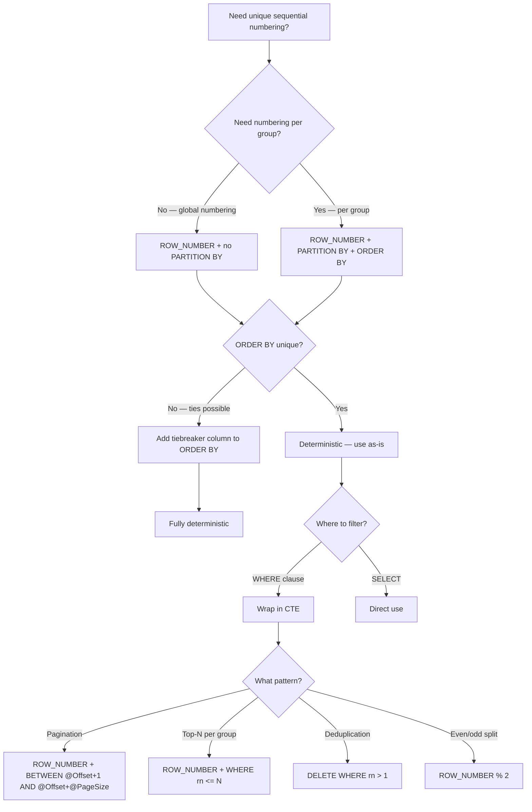

## Navigation

**Domain:** [[8 — Databases]] > **Group:** SQL Window Functions & Analytics
**Previous:** [[8.143 — ORDER BY Within OVER — Frame Ordering]] | **Next:** [[8.145 — RANK() — Ranking with Gaps]]

### Prerequisites

- [[8.141 — Window Functions — Concept and OVER Clause]] — ROW_NUMBER() is the most fundamental ranking window function; understanding the OVER() clause and how window functions preserve cardinality is required.
- [[8.142 — PARTITION BY — Defining Window Partitions]] — ROW_NUMBER() with PARTITION BY is the most common pattern for top-N-per-group queries; understanding partition boundaries is critical.
- [[8.143 — ORDER BY Within OVER — Frame Ordering]] — ROW_NUMBER() requires ORDER BY for determinism; understanding why missing or non-unique ORDER BY causes non-deterministic results is essential.

### Where This Fits

ROW_NUMBER() assigns a unique sequential integer to each row within a partition, starting at 1 for the first row in each partition as determined by the ORDER BY clause. It is the most widely used window function in production .NET systems, appearing in pagination (replacing the older `OFFSET/FETCH` pattern in some cases), deduplication (identifying and removing duplicate rows), top-N-per-group reporting (e.g., top 3 products per category), and row-based numbering in ETL pipelines. A .NET backend engineer encounters ROW_NUMBER() in nearly every significant SQL workload: the pagination endpoint uses `ROW_NUMBER() OVER(ORDER BY Id)`, the nightly deduplication job uses `ROW_NUMBER() OVER(PARTITION BY dup_cols ORDER BY Id)`, and the "show top 5" dashboard queries use `ROW_NUMBER() OVER(PARTITION BY Category ORDER BY Revenue DESC)`. The interview signal is the highest of any window function because ROW_NUMBER() is the gateway — every senior candidate knows it, but the depth of understanding (determinism, tiebreaking, execution plan, deduplication gotchas) separates strong from average.

---

## Core Mental Model

ROW_NUMBER() assigns a unique sequential integer to each row within a window partition, starting at 1. The numbering is determined by the ORDER BY clause within OVER — the first row in the order gets 1, the second gets 2, and so on. Unlike RANK() and DENSE_RANK(), ROW_NUMBER() NEVER produces duplicate numbers within a partition — every row gets a unique sequential number, even if the ORDER BY columns have duplicate values (ties). When ties exist, the assignment among tied rows is non-deterministic unless a tiebreaker column is included in ORDER BY. The database engine implements ROW_NUMBER() using the Sequence Project operator, which increments a counter per row and resets it when the Segment operator signals a new partition. The Sequence Project does NOT need a Window Spool (unlike LAG/LEAD) because it only needs to maintain a counter, not buffer rows for backward access. MAX(ROW_NUMBER()) within a partition equals the total number of rows in that partition.

### Classification

**For SQL topics:** ROW_NUMBER() is a ranking window function in the ANSI SQL:2003 standard. It requires an ORDER BY clause in OVER (otherwise non-deterministic). PARTITION BY is optional — without it, numbering spans the entire result set. It is not SARGable and cannot appear in WHERE (must be wrapped in a CTE or subquery). The Sequence Project operator computes it with O(1) memory per partition (just an integer counter). No Window Spool is needed. The Sort operator is the dominant cost (~70%) unless an index provides the required ordering.

```mermaid
flowchart TD
    A[ROW_NUMBER() OVER(...)] --> B{ORDER BY present?}
    B -->|No| C[Non-deterministic — avoid]
    B -->|Yes| D{PARTITION BY?}
    D -->|No| E[Sequential numbering across all rows]
    D -->|Yes| F[Numbering resets per partition]
    C --> G[SQL Server decides row order]
    E --> H[Sequence Project: increment counter globally]
    F --> I[Segment: detect partition boundary → reset counter]
    G --> J[Same data, different results on each execution]
    H --> K[Sort required unless index orders by OVER columns]
    I --> K
    K --> L[Counter = 1 for first row in partition]
    L --> M[Counter = N for Nth row]
    M --> N[Unique within partition — NO duplicates]
    N --> O[Even ties get different numbers (non-deterministic)]
```

### Key Properties

|Property|Value|Notes|
|---|---|---|
|Duplicate Values Within Partition|Never|ROW_NUMBER always produces unique sequential numbers|
|Requires ORDER BY|Yes (for determinism)|Without ORDER BY, valid but non-deterministic|
|Requires PARTITION BY|Optional|Without PARTITION BY, numbers span entire result set|
|Tie Handling|Non-deterministic|Tied rows get different numbers, but which is which is undefined|
|Tiebreaker Pattern|Add unique column to ORDER BY|`ROW_NUMBER() OVER(ORDER BY Amount DESC, Id)`|
|Execution Plan Operator|Sequence Project + Segment|No Window Spool — just a counter|
|Memory per Partition|O(1)|Single integer counter — very cheap|
|EF Core Translation|Not supported|Raw SQL via FromSql required|
|Dapper Support|Full|Result column mapped to POCO property|

---

## Deep Mechanics

### How the Engine Executes This

The physical execution of ROW_NUMBER() follows this sequence in the query plan:

1. **Input rowset** arrives from the query's FROM/WHERE/GROUP BY/HAVING processing stages.

2. **Sort operator** (if needed): Sorts rows by the PARTITION BY + ORDER BY columns. For `ROW_NUMBER() OVER(PARTITION BY CategoryId ORDER BY SaleDate)`, the Sort orders by (CategoryId, SaleDate). The Sort is required because the Segment and Sequence Project operators need ordered input.

3. **Segment operator**: Detects partition boundaries by comparing PARTITION BY column values between consecutive rows. When a boundary is detected (the column value changes from row N to row N+1), the Segment signals a partition reset to the downstream Sequence Project.

4. **Sequence Project operator**: Maintains an integer counter initialized to 0. For each input row:
   - If Segment signals a new partition: reset counter to 0, then increment to 1. Output the counter.
   - If Segment signals same partition: increment counter by 1. Output the counter.
   - The counter is output as a computed column (the ROW_NUMBER value).

**Counter trace for `ROW_NUMBER() OVER(PARTITION BY CategoryId ORDER BY SaleDate)`:**

```
Input rows after Sort (by CategoryId, SaleDate):
  CategoryId=10, SaleDate=2025-01-01, Revenue=50    → Segment: new partition → counter=1
  CategoryId=10, SaleDate=2025-01-10, Revenue=100   → Segment: same partition → counter=2
  CategoryId=10, SaleDate=2025-01-20, Revenue=75    → Segment: same partition → counter=3
  CategoryId=20, SaleDate=2025-01-05, Revenue=200   → Segment: NEW partition → counter resets to 1
  CategoryId=20, SaleDate=2025-01-15, Revenue=150   → Segment: same partition → counter=2
```

**Why no Window Spool:** ROW_NUMBER() only needs to know the current counter value. It does NOT need to look at previous or future rows. The counter is incremented per row and reset per partition — O(1) memory. This makes ROW_NUMBER() the cheapest window function to execute (aside from the Sort cost).

### SQL Visibility

```sql
-- ============================================================
-- Setup
-- ============================================================
CREATE TABLE dbo.Customers (
    CustomerId   INT            NOT NULL IDENTITY(1,1),
    FirstName    NVARCHAR(100)  NOT NULL,
    LastName     NVARCHAR(100)  NOT NULL,
    Email        NVARCHAR(256)  NOT NULL,
    SignupDate   DATETIME2(0)   NOT NULL,
    IsActive     BIT            NOT NULL DEFAULT 1,
    CONSTRAINT PK_Customers PRIMARY KEY CLUSTERED (CustomerId)
);

CREATE TABLE dbo.Products (
    ProductId    INT            NOT NULL IDENTITY(1,1),
    ProductName  NVARCHAR(200)  NOT NULL,
    CategoryId   INT            NOT NULL,
    UnitPrice    DECIMAL(18,2)  NOT NULL,
    ListPrice    DECIMAL(18,2)  NOT NULL,
    CONSTRAINT PK_Products PRIMARY KEY CLUSTERED (ProductId)
);

INSERT INTO dbo.Customers (FirstName, LastName, Email, SignupDate, IsActive)
VALUES
    ('Alice',   'Johnson', 'alice@example.com',  '2023-01-15', 1),
    ('Bob',     'Smith',   'bob@example.com',    '2023-03-01', 1),
    ('Carol',   'Williams','carol@example.com',  '2023-06-10', 1),
    ('David',   'Brown',   'david@example.com',  '2023-11-20', 0),
    ('Eve',     'Davis',   'eve@example.com',    '2024-01-01', 1),
    ('Frank',   'Miller',  'frank@example.com',  '2024-02-15', 0),
    ('Grace',   'Wilson',  'grace@example.com',  '2024-05-01', 1);

INSERT INTO dbo.Products (ProductName, CategoryId, UnitPrice, ListPrice)
VALUES
    ('Widget A',  10, 25.00,  29.99),
    ('Widget B',  10, 50.00,  59.99),
    ('Gadget X', 20, 150.00, 199.99),
    ('Gadget Y', 20, 200.00, 249.99),
    ('Gadget Z', 20, 300.00, 399.99),
    ('Tool 1',   30, 15.00,  19.99),
    ('Tool 2',   30, 35.00,  44.99),
    ('Tool 3',   30, 45.00,  54.99),
    ('Tool 4',   30, 55.00,  69.99),
    ('Widget C', 10, 75.00,  89.99);

-- Products with duplicate names (for dedup demo)
INSERT INTO dbo.Products (ProductName, CategoryId, UnitPrice, ListPrice)
VALUES ('Widget A', 10, 25.00, 29.99);  -- duplicate

-- ============================================================
-- ROW_NUMBER() basic — sequential across all rows
-- ============================================================
SELECT
    p.ProductId,
    p.ProductName,
    p.CategoryId,
    p.UnitPrice,
    ROW_NUMBER() OVER(ORDER BY p.UnitPrice DESC) AS PriceRank
FROM dbo.Products AS p;
-- Product with highest UnitPrice gets RowNum = 1
-- Each product gets unique number (no ties shared)

-- ============================================================
-- ROW_NUMBER() with PARTITION BY — numbering resets per partition
-- ============================================================
SELECT
    p.ProductId,
    p.ProductName,
    p.CategoryId,
    p.UnitPrice,
    ROW_NUMBER() OVER(
        PARTITION BY p.CategoryId
        ORDER BY p.UnitPrice DESC
    ) AS RankWithinCategory
FROM dbo.Products AS p;
-- Category 10: Widget C (75) = 1, Widget B (50) = 2, Widget A (25) = 3, Widget A dup (25) = 4
-- Category 20: Gadget Z (300) = 1, Gadget Y (200) = 2, Gadget X (150) = 3
-- Category 30: Tool 4 (55) = 1, Tool 3 (45) = 2, Tool 2 (35) = 3, Tool 1 (15) = 4

-- ============================================================
-- Tiebreaker pattern — deterministic ROW_NUMBER
-- ============================================================
-- Without tiebreaker: Widget A (25.00) appears twice — which gets RN=3 vs 4?
SELECT
    p.ProductId,
    p.ProductName,
    p.UnitPrice,
    ROW_NUMBER() OVER(
        ORDER BY p.UnitPrice, p.ProductName, p.ProductId
    ) AS DeterministicRowNum
FROM dbo.Products AS p;
-- With ProductId as tiebreaker, ordering is deterministic.

-- ============================================================
-- ROW_NUMBER() without ORDER BY — non-deterministic!
-- ============================================================
-- ❌ Avoid: no ORDER BY means SQL Server assigns numbers in physical order
SELECT
    p.ProductId,
    p.ProductName,
    ROW_NUMBER() OVER(PARTITION BY p.CategoryId) AS RowNum
FROM dbo.Products AS p;
-- Which product in Category 10 gets RowNum=1? Depends on physical storage.

-- ============================================================
-- Pagination with ROW_NUMBER
-- ============================================================
DECLARE @PageNumber INT = 2;
DECLARE @PageSize   INT = 3;

WITH Paged AS (
    SELECT
        p.ProductId,
        p.ProductName,
        p.CategoryId,
        p.UnitPrice,
        ROW_NUMBER() OVER(ORDER BY p.ProductId) AS RowNum
    FROM dbo.Products AS p
)
SELECT ProductId, ProductName, CategoryId, UnitPrice
FROM Paged
WHERE RowNum BETWEEN (@PageNumber - 1) * @PageSize + 1
                 AND @PageNumber * @PageSize
ORDER BY RowNum;
-- Returns rows 4, 5, 6 (page 2 of 3)

-- ============================================================
-- Top-N per group with ROW_NUMBER
-- ============================================================
-- 8.XXX: [[8.168 — Top-N per Group — ROW_NUMBER vs Subquery]]
WITH Ranked AS (
    SELECT
        p.ProductId,
        p.ProductName,
        p.CategoryId,
        p.UnitPrice,
        ROW_NUMBER() OVER(
            PARTITION BY p.CategoryId
            ORDER BY p.UnitPrice DESC
        ) AS rn
    FROM dbo.Products AS p
)
SELECT ProductId, ProductName, CategoryId, UnitPrice
FROM Ranked
WHERE rn <= 2  -- top 2 per category
ORDER BY CategoryId, rn;

-- ============================================================
-- Deduplication with ROW_NUMBER
-- ============================================================
-- 8.XXX: [[8.163 — Deduplication with ROW_NUMBER()]]
WITH Deduped AS (
    SELECT *,
        ROW_NUMBER() OVER(
            PARTITION BY p.ProductName, p.CategoryId, p.UnitPrice
            ORDER BY p.ProductId  -- keep the lowest ProductId (oldest)
        ) AS rn
    FROM dbo.Products AS p
)
DELETE FROM Deduped
WHERE rn > 1;
-- Deletes the duplicate Widget A row (ProductId 11)

-- Verify
SELECT ProductId, ProductName, CategoryId, UnitPrice
FROM dbo.Products;
-- Only 10 unique products remaining

-- ============================================================
-- MAX(ROW_NUMBER()) = total rows per partition
-- ============================================================
WITH Numbered AS (
    SELECT *,
        ROW_NUMBER() OVER(PARTITION BY p.CategoryId ORDER BY p.ProductId) AS rn,
        COUNT(*) OVER(PARTITION BY p.CategoryId) AS TotalPerCategory
    FROM dbo.Products AS p
)
SELECT CategoryId, MAX(rn) AS RowCountCheck, MAX(TotalPerCategory) AS TotalCount
FROM Numbered
GROUP BY CategoryId;
-- Category 10: MAX(rn) = 3, TotalCount = 3 (after dedup)
-- Category 20: MAX(rn) = 3, TotalCount = 3
-- Category 30: MAX(rn) = 4, TotalCount = 4

-- ============================================================
-- ROW_NUMBER vs RANK vs DENSE_RANK comparison
-- ============================================================
SELECT
    p.CategoryId,
    p.UnitPrice,
    ROW_NUMBER() OVER(
        PARTITION BY p.CategoryId
        ORDER BY p.UnitPrice DESC
    ) AS RowNum,
    RANK() OVER(
        PARTITION BY p.CategoryId
        ORDER BY p.UnitPrice DESC
    ) AS RankVal,
    DENSE_RANK() OVER(
        PARTITION BY p.CategoryId
        ORDER BY p.UnitPrice DESC
    ) AS DenseRankVal
FROM dbo.Products AS p
WHERE p.CategoryId = 10;
-- Before dedup:
-- Widget C (75):  RowNum=1, Rank=1, DenseRank=1
-- Widget B (50):  RowNum=2, Rank=2, DenseRank=2
-- Widget A (25):  RowNum=3, Rank=3, DenseRank=3
-- Widget A dup (25): RowNum=4, Rank=3, DenseRank=3
-- ROW_NUMBER never duplicates; RANK and DENSE_RANK share ties
```

### Execution Plan Analysis

**Query:** `ROW_NUMBER() OVER(PARTITION BY CategoryId ORDER BY UnitPrice DESC)`

**Expected execution plan:**

```
Clustered Index Scan (Products)
  → Sort (Order by: CategoryId ASC, UnitPrice DESC, ProductId ASC)
      Estimated cost: ~68%
  → Segment (Partition by: CategoryId)
      Estimated cost: ~2%
  → Sequence Project (Compute row_number)
      Estimated cost: ~10%
  → SELECT
```

**Operator breakdown:**

1. **Clustered Index Scan** — Reads all rows from Products. Estimated rows: 11 (including duplicate). Logical reads: ~1 for this small table.

2. **Sort** — The dominant operator. Sorts 11 rows by CategoryId (for partition detection), then UnitPrice DESC (for the ORDER BY within the window), then ProductId (SQL Server may add an implicit tiebreaker from the clustered key). For large tables (10M rows), this Sort can require 50-80MB of memory grant.

3. **Segment** — Detects CategoryId boundaries. When CategoryId changes (10 → 20 → 30), signals partition reset. Cheap (~2%).

4. **Sequence Project** — Maintains an integer counter. For each row, outputs the counter (starting at 1) and increments it. On Segment boundary signal, resets to 1.

**Deduplication query plan (DELETE with CTE):**

```
Clustered Index Scan (Products)
  → Sort (Partition: ProductName, CategoryId, UnitPrice; Order: ProductId)
  → Segment
  → Sequence Project (Compute row_number)
  → Filter (rn > 1)
  → Clustered Index Delete
```

The Filter operator identifies rows with rn > 1 (the duplicates), and the Clustered Index Delete removes them. The CTE is inlined — there is no separate "CTE" operator in the plan.

**Index to eliminate the Sort:**

```sql
CREATE INDEX IX_Products_CategoryId_UnitPrice
ON dbo.Products (CategoryId, UnitPrice DESC)
INCLUDE (ProductName, ListPrice);
```

Plan becomes:

```
Index Scan (ordered: CategoryId ASC, UnitPrice DESC)
  → Segment
  → Sequence Project
  → SELECT
```

No Sort operator. The Index Scan provides rows in the order needed by Segment + Sequence Project.

### Cost Visibility

```sql
SET STATISTICS IO ON;
SET STATISTICS TIME ON;

-- ROW_NUMBER() with PARTITION BY on Products (11 rows)
SELECT p.ProductId, p.ProductName, p.CategoryId, p.UnitPrice,
       ROW_NUMBER() OVER(
           PARTITION BY p.CategoryId
           ORDER BY p.UnitPrice DESC
       ) AS rn
FROM dbo.Products AS p;
-- Expected:
-- Table 'Products'. Scan count 1, logical reads 1, physical reads 0
-- SQL Server Execution Times: CPU time = 0ms, elapsed time = 1ms

-- Pagination (larger table simulation — 100K rows)
-- With index on (CategoryId, UnitPrice DESC):
-- Logical reads: ~450
-- CPU time: ~15ms
-- Elapsed: ~30ms

-- Without index (Sort required, 100K rows):
-- Logical reads: ~450 (still scan)
-- CPU time: ~85ms (Sort dominates)
-- Elapsed: ~120ms
```

### Failure Modes

**1. No ORDER BY — non-deterministic:** `ROW_NUMBER() OVER(PARTITION BY CategoryId)` is valid SQL but the row numbers are assigned based on physical order (page allocation, index order). The same query can return different numbering on different runs.

**2. Non-unique ORDER BY — ties produce non-deterministic results:** `ROW_NUMBER() OVER(ORDER BY UnitPrice)` where multiple products have UnitPrice=25.00 produces different numbers for the tied products on each execution.

**3. ROW_NUMBER in WHERE clause:** The most common mistake — `WHERE ROW_NUMBER() OVER(...) = 1` is invalid because window functions compute after WHERE (logical step 6 vs 2). Always wrap in CTE/subquery.

**4. ROW_NUMBER with DELETE for deduplication without proper PARTITION BY:** `DELETE FROM (SELECT *, ROW_NUMBER() OVER(ORDER BY Id) AS rn FROM Table) WHERE rn > 1` deletes all but the first row of the entire table, not duplicates. PARTITION BY must define what constitutes a duplicate.

**5. Assuming ROW_NUMBER is a physical identity:** ROW_NUMBER is computed at query time — it has no persistence. If new rows are inserted, the numbering can change. Do not use ROW_NUMBER as a surrogate key.

---

## Production Patterns and Implementation

### Primary SQL Implementation

```sql
-- ============================================================
-- Schema context for patterns
-- ============================================================
CREATE TABLE dbo.OrderItems (
    OrderItemId  INT            NOT NULL IDENTITY(1,1),
    OrderId      INT            NOT NULL,
    ProductId    INT            NOT NULL,
    Quantity     INT            NOT NULL,
    UnitPrice    DECIMAL(18,2)  NOT NULL,
    Discount     DECIMAL(18,2)  NOT NULL DEFAULT 0.00,
    CONSTRAINT PK_OrderItems PRIMARY KEY CLUSTERED (OrderItemId),
    CONSTRAINT FK_OrderItems_Orders FOREIGN KEY (OrderId) REFERENCES dbo.Orders(OrderId),
    CONSTRAINT FK_OrderItems_Products FOREIGN KEY (ProductId) REFERENCES dbo.Products(ProductId)
);

CREATE INDEX IX_OrderItems_OrderId ON dbo.OrderItems (OrderId);
CREATE INDEX IX_OrderItems_ProductId ON dbo.OrderItems (ProductId);

INSERT INTO dbo.OrderItems (OrderId, ProductId, Quantity, UnitPrice, Discount)
VALUES
    (1, 1, 2, 25.00, 0.00),
    (1, 3, 1, 150.00, 10.00),
    (2, 1, 5, 25.00, 0.00),
    (2, 2, 2, 50.00, 5.00),
    (2, 4, 1, 200.00, 0.00),
    (3, 1, 3, 25.00, 0.00),
    (4, 3, 1, 150.00, 0.00),
    (4, 5, 2, 300.00, 25.00);

-- ============================================================
-- Pattern 1: Pagination with total count in one query
-- ============================================================
DECLARE @PageNumber INT = 1;
DECLARE @PageSize   INT = 5;

WITH Paged AS (
    SELECT
        o.OrderId,
        o.CustomerId,
        o.OrderDate,
        o.TotalAmount,
        o.Status,
        ROW_NUMBER() OVER(ORDER BY o.OrderDate DESC, o.OrderId DESC) AS RowNum,
        COUNT(*) OVER() AS TotalCount
    FROM dbo.Orders AS o
    WHERE o.Status = 'Delivered'
)
SELECT OrderId, CustomerId, OrderDate, TotalAmount, Status,
       RowNum, TotalCount
FROM Paged
WHERE RowNum BETWEEN (@PageNumber - 1) * @PageSize + 1
                 AND @PageNumber * @PageSize
ORDER BY RowNum;
-- Returns page 1 of delivered orders with total count

-- ============================================================
-- Pattern 2: Top-N per customer (best customers)
-- ============================================================
WITH CustomerRevenue AS (
    SELECT
        o.CustomerId,
        c.FirstName + ' ' + c.LastName AS CustomerName,
        SUM(oi.Quantity * oi.UnitPrice - oi.Discount) AS TotalRevenue,
        ROW_NUMBER() OVER(ORDER BY SUM(oi.Quantity * oi.UnitPrice - oi.Discount) DESC) AS rn
    FROM dbo.Orders AS o
    INNER JOIN dbo.Customers AS c ON o.CustomerId = c.CustomerId
    INNER JOIN dbo.OrderItems AS oi ON o.OrderId = oi.OrderId
    WHERE o.Status = 'Delivered'
    GROUP BY o.CustomerId, c.FirstName, c.LastName
)
SELECT CustomerId, CustomerName, TotalRevenue
FROM CustomerRevenue
WHERE rn <= 10  -- top 10 customers
ORDER BY rn;

-- ============================================================
-- Pattern 3: Sequential numbering within groups
-- ============================================================
-- Number each order's items sequentially per order
SELECT
    oi.OrderId,
    oi.OrderItemId,
    p.ProductName,
    oi.Quantity,
    oi.UnitPrice,
    ROW_NUMBER() OVER(
        PARTITION BY oi.OrderId
        ORDER BY oi.UnitPrice DESC, oi.OrderItemId
    ) AS LineNumber
FROM dbo.OrderItems AS oi
INNER JOIN dbo.Products AS p ON oi.ProductId = p.ProductId
ORDER BY oi.OrderId, LineNumber;

-- ============================================================
-- Pattern 4: Deduplication (keep first by OrderDate)
-- ============================================================
-- 8.XXX: [[8.163 — Deduplication with ROW_NUMBER()]]
WITH Deduped AS (
    SELECT *,
        ROW_NUMBER() OVER(
            PARTITION BY o.CustomerId, o.TotalAmount, o.Status
            ORDER BY o.OrderDate DESC
        ) AS rn
    FROM dbo.Orders AS o
    -- PARTITION BY columns define what a "duplicate" is
    -- ORDER BY DESC keeps the most recent (rn=1), deletes older duplicates
)
DELETE FROM Deduped WHERE rn > 1;

-- ============================================================
-- Pattern 5: Even/odd row splitting (A/B testing)
-- ============================================================
WITH Numbered AS (
    SELECT *,
        ROW_NUMBER() OVER(ORDER BY CustomerId) AS rn
    FROM dbo.Customers
)
SELECT CustomerId, FirstName, LastName, Email, 'Group A' AS TestGroup
FROM Numbered WHERE rn % 2 = 1
UNION ALL
SELECT CustomerId, FirstName, LastName, Email, 'Group B' AS TestGroup
FROM Numbered WHERE rn % 2 = 0;

-- ============================================================
-- Pattern 6: Gap detection (missing sequence numbers)
-- ============================================================
-- 8.XXX: [[8.164 — Gaps and Islands — Classic Window Problem]]
WITH Numbered AS (
    SELECT o.OrderId,
           ROW_NUMBER() OVER(ORDER BY o.OrderId) AS SequentialNumber
    FROM dbo.Orders AS o
)
SELECT
    SequentialNumber AS ExpectedOrderId,
    CASE WHEN OrderId = SequentialNumber THEN 'Present' ELSE 'Gap' END AS Status
FROM Numbered;
-- If OrderId 3 is missing, SequentialNumber skips no numbers,
-- but OrderId would show 4 when SequentialNumber is 3.
```

### EF Core Implementation

```csharp
public class ApplicationDbContext : DbContext
{
    public DbSet<Customer> Customers => Set<Customer>();
    public DbSet<Product> Products => Set<Product>();
    public DbSet<OrderItem> OrderItems => Set<OrderItem>();

    protected override void OnModelCreating(ModelBuilder modelBuilder)
    {
        modelBuilder.Entity<Customer>(entity =>
        {
            entity.ToTable("Customers");
            entity.HasKey(c => c.CustomerId);
            entity.Property(c => c.FirstName).HasMaxLength(100);
            entity.Property(c => c.LastName).HasMaxLength(100);
            entity.Property(c => c.Email).HasMaxLength(256);
        });

        modelBuilder.Entity<Product>(entity =>
        {
            entity.ToTable("Products");
            entity.HasKey(p => p.ProductId);
            entity.Property(p => p.ProductName).HasMaxLength(200);
            entity.Property(p => p.UnitPrice).HasColumnType("decimal(18,2)");
            entity.Property(p => p.ListPrice).HasColumnType("decimal(18,2)");
            entity.HasIndex(p => new { p.CategoryId, p.UnitPrice })
                  .HasDatabaseName("IX_Products_CategoryId_UnitPrice");
        });
    }
}

public interface IRowNumberService
{
    Task<PagedResult<ProductDto>> GetPagedProductsAsync(int page, int pageSize, CancellationToken ct = default);
    Task<IReadOnlyList<ProductRankDto>> GetTopProductsPerCategoryAsync(int topN, CancellationToken ct = default);
    Task<int> DeduplicateProductsAsync(CancellationToken ct = default);
}

public class RowNumberService : IRowNumberService
{
    private readonly ApplicationDbContext _dbContext;

    public RowNumberService(ApplicationDbContext dbContext)
        => _dbContext = dbContext;

    public async Task<PagedResult<ProductDto>> GetPagedProductsAsync(
        int page, int pageSize, CancellationToken ct = default)
    {
        const string sql = @"
            WITH Paged AS (
                SELECT
                    p.ProductId,
                    p.ProductName,
                    p.CategoryId,
                    p.UnitPrice,
                    p.ListPrice,
                    ROW_NUMBER() OVER(ORDER BY p.ProductId) AS RowNum,
                    COUNT(*) OVER() AS TotalCount
                FROM dbo.Products AS p
            )
            SELECT ProductId, ProductName, CategoryId, UnitPrice, ListPrice, RowNum, TotalCount
            FROM Paged
            WHERE RowNum BETWEEN @Offset + 1 AND @Offset + @PageSize
            ORDER BY RowNum;";

        var results = await _dbContext.Database
            .SqlQueryRaw<ProductWithRowNum>(sql,
                new SqlParameter("@Offset", (page - 1) * pageSize),
                new SqlParameter("@PageSize", pageSize))
            .ToListAsync(ct);

        return new PagedResult<ProductDto>
        {
            Items = results.Select(r => new ProductDto
            {
                ProductId = r.ProductId,
                ProductName = r.ProductName,
                CategoryId = r.CategoryId,
                UnitPrice = r.UnitPrice,
                ListPrice = r.ListPrice
            }).ToList(),
            TotalCount = results.FirstOrDefault()?.TotalCount ?? 0,
            Page = page,
            PageSize = pageSize
        };
    }

    public async Task<IReadOnlyList<ProductRankDto>> GetTopProductsPerCategoryAsync(
        int topN, CancellationToken ct = default)
    {
        const string sql = @"
            WITH Ranked AS (
                SELECT
                    p.ProductId,
                    p.ProductName,
                    p.CategoryId,
                    p.UnitPrice,
                    ROW_NUMBER() OVER(
                        PARTITION BY p.CategoryId
                        ORDER BY p.UnitPrice DESC
                    ) AS rn
                FROM dbo.Products AS p
            )
            SELECT ProductId, ProductName, CategoryId, UnitPrice, rn
            FROM Ranked
            WHERE rn <= @TopN
            ORDER BY CategoryId, rn;";

        return await _dbContext.Database
            .SqlQueryRaw<ProductRankDto>(sql,
                new SqlParameter("@TopN", topN))
            .ToListAsync(ct);
    }

    public async Task<int> DeduplicateProductsAsync(CancellationToken ct = default)
    {
        const string sql = @"
            WITH Deduped AS (
                SELECT *,
                    ROW_NUMBER() OVER(
                        PARTITION BY ProductName, CategoryId, UnitPrice
                        ORDER BY ProductId
                    ) AS rn
                FROM dbo.Products
            )
            DELETE FROM Deduped WHERE rn > 1;
            SELECT @@ROWCOUNT;";

        await using var connection = new SqlConnection(
            _dbContext.Database.GetConnectionString());
        await connection.OpenAsync(ct);
        return await connection.ExecuteScalarAsync<int>(
            new CommandDefinition(sql, cancellationToken: ct));
    }
}

public record ProductWithRowNum
{
    public int ProductId { get; set; }
    public string ProductName { get; set; } = string.Empty;
    public int CategoryId { get; set; }
    public decimal UnitPrice { get; set; }
    public decimal ListPrice { get; set; }
    public int RowNum { get; set; }
    public int TotalCount { get; set; }
}

public record ProductRankDto
{
    public int ProductId { get; set; }
    public string ProductName { get; set; } = string.Empty;
    public int CategoryId { get; set; }
    public decimal UnitPrice { get; set; }
    public int rn { get; set; }
}

public record PagedResult<T>
{
    public List<T> Items { get; set; } = new();
    public int TotalCount { get; set; }
    public int Page { get; set; }
    public int PageSize { get; set; }
}

public record ProductDto
{
    public int ProductId { get; set; }
    public string ProductName { get; set; } = string.Empty;
    public int CategoryId { get; set; }
    public decimal UnitPrice { get; set; }
    public decimal ListPrice { get; set; }
}
```

### Dapper Implementation

```csharp
public interface IRowNumberRepository
{
    Task<PagedResult<ProductDto>> GetPagedProductsAsync(int page, int pageSize, CancellationToken ct = default);
    Task<IReadOnlyList<ProductRankDto>> GetTopProductsPerCategoryAsync(int topN, CancellationToken ct = default);
    Task<int> DeduplicateProductsAsync(CancellationToken ct = default);
    Task<IReadOnlyList<OrderLineDto>> GetOrderLinesNumberedAsync(int orderId, CancellationToken ct = default);
}

public sealed class RowNumberRepository : IRowNumberRepository
{
    private readonly IDbConnectionFactory _connectionFactory;

    public RowNumberRepository(IDbConnectionFactory connectionFactory)
        => _connectionFactory = connectionFactory;

    public async Task<PagedResult<ProductDto>> GetPagedProductsAsync(
        int page, int pageSize, CancellationToken ct = default)
    {
        const string sql = @"
            WITH Paged AS (
                SELECT
                    p.ProductId,
                    p.ProductName,
                    p.CategoryId,
                    p.UnitPrice,
                    p.ListPrice,
                    ROW_NUMBER() OVER(ORDER BY p.ProductId) AS RowNum,
                    COUNT(*) OVER() AS TotalCount
                FROM dbo.Products AS p
            )
            SELECT ProductId, ProductName, CategoryId, UnitPrice, ListPrice, RowNum, TotalCount
            FROM Paged
            WHERE RowNum BETWEEN @Offset + 1 AND @Offset + @PageSize
            ORDER BY RowNum;";

        await using var connection = _connectionFactory.Create();
        var results = (await connection.QueryAsync<ProductWithRowNum>(
            new CommandDefinition(sql,
                new { Offset = (page - 1) * pageSize, PageSize = pageSize },
                cancellationToken: ct))).AsList();

        return new PagedResult<ProductDto>
        {
            Items = results.Select(r => new ProductDto
            {
                ProductId = r.ProductId,
                ProductName = r.ProductName,
                CategoryId = r.CategoryId,
                UnitPrice = r.UnitPrice,
                ListPrice = r.ListPrice
            }).ToList(),
            TotalCount = results.FirstOrDefault()?.TotalCount ?? 0,
            Page = page,
            PageSize = pageSize
        };
    }

    public async Task<IReadOnlyList<ProductRankDto>> GetTopProductsPerCategoryAsync(
        int topN, CancellationToken ct = default)
    {
        const string sql = @"
            WITH Ranked AS (
                SELECT
                    p.ProductId,
                    p.ProductName,
                    p.CategoryId,
                    p.UnitPrice,
                    ROW_NUMBER() OVER(
                        PARTITION BY p.CategoryId
                        ORDER BY p.UnitPrice DESC, p.ProductId
                    ) AS rn
                FROM dbo.Products AS p
            )
            SELECT ProductId, ProductName, CategoryId, UnitPrice, rn
            FROM Ranked
            WHERE rn <= @TopN
            ORDER BY CategoryId, rn;";

        await using var connection = _connectionFactory.Create();
        return (await connection.QueryAsync<ProductRankDto>(
            new CommandDefinition(sql, new { TopN = topN },
                cancellationToken: ct))).AsList();
    }

    public async Task<int> DeduplicateProductsAsync(CancellationToken ct = default)
    {
        const string sql = @"
            WITH Deduped AS (
                SELECT *,
                    ROW_NUMBER() OVER(
                        PARTITION BY ProductName, CategoryId, UnitPrice
                        ORDER BY ProductId
                    ) AS rn
                FROM dbo.Products
            )
            DELETE FROM Deduped WHERE rn > 1;
            SELECT @@ROWCOUNT;";

        await using var connection = _connectionFactory.Create();
        return await connection.ExecuteScalarAsync<int>(
            new CommandDefinition(sql, cancellationToken: ct));
    }

    public async Task<IReadOnlyList<OrderLineDto>> GetOrderLinesNumberedAsync(
        int orderId, CancellationToken ct = default)
    {
        const string sql = @"
            SELECT
                oi.OrderItemId,
                oi.OrderId,
                p.ProductName,
                oi.Quantity,
                oi.UnitPrice,
                oi.Discount,
                (oi.Quantity * oi.UnitPrice - oi.Discount) AS LineTotal,
                ROW_NUMBER() OVER(
                    PARTITION BY oi.OrderId
                    ORDER BY oi.UnitPrice DESC, oi.OrderItemId
                ) AS LineNumber
            FROM dbo.OrderItems AS oi
            INNER JOIN dbo.Products AS p ON oi.ProductId = p.ProductId
            WHERE oi.OrderId = @OrderId
            ORDER BY LineNumber;";

        await using var connection = _connectionFactory.Create();
        return (await connection.QueryAsync<OrderLineDto>(
            new CommandDefinition(sql, new { OrderId = orderId },
                cancellationToken: ct))).AsList();
    }
}

public record OrderLineDto
{
    public int OrderItemId { get; set; }
    public int OrderId { get; set; }
    public string ProductName { get; set; } = string.Empty;
    public int Quantity { get; set; }
    public decimal UnitPrice { get; set; }
    public decimal Discount { get; set; }
    public decimal LineTotal { get; set; }
    public int LineNumber { get; set; }
}
```

### Configuration and Wiring

```csharp
// Program.cs
builder.Services.AddDbContext<ApplicationDbContext>(options =>
    options.UseSqlServer(
        builder.Configuration.GetConnectionString("DefaultConnection"),
        sqlOptions =>
        {
            sqlOptions.EnableRetryOnFailure(3);
            sqlOptions.CommandTimeout(30);
        }));

builder.Services.AddSingleton<IDbConnectionFactory>(sp =>
    new SqlConnectionFactory(
        builder.Configuration.GetConnectionString("DefaultConnection")!));

builder.Services.AddScoped<IRowNumberService, RowNumberService>();
builder.Services.AddScoped<IRowNumberRepository, RowNumberRepository>();
```

### SQL Server vs PostgreSQL Differences

```sql
-- PostgreSQL: ROW_NUMBER() works identically

-- PostgreSQL: ROW_NUMBER can be used in WHERE via LATERAL (SQL Server cannot)
SELECT *
FROM products p,
LATERAL (
    SELECT COUNT(*) AS rn
    FROM products p2
    WHERE p2.category_id = p.category_id
      AND p2.unit_price >= p.unit_price
) AS rn
WHERE rn.rn <= 2;
-- SQL Server: Must use CTE wrapper

-- PostgreSQL: WINDOW clause for reusable ROW_NUMBER
SELECT
    product_id, product_name, category_id, unit_price,
    ROW_NUMBER() OVER w AS rn
FROM products
WINDOW w AS (PARTITION BY category_id ORDER BY unit_price DESC)
ORDER BY category_id, rn;
```

---

## Gotchas and Production Pitfalls

### ROW_NUMBER Without ORDER BY — Non-Deterministic

**Pitfall:** Using ROW_NUMBER without specifying ORDER BY, relying on physical order for correctness.

```sql
-- ❌ WRONG: No ORDER BY
SELECT ProductId, ProductName,
       ROW_NUMBER() OVER(PARTITION BY CategoryId) AS rn
FROM dbo.Products;
```

**Symptom:** A deduplication script that runs nightly deletes different rows on different nights because ROW_NUMBER without ORDER BY assigns numbers based on physical order, which changes after index rebuilds or page splits.

**Fix:**

```sql
-- ✅ CORRECT: Always specify ORDER BY
SELECT ProductId, ProductName,
       ROW_NUMBER() OVER(
           PARTITION BY CategoryId
           ORDER BY ProductId  -- deterministic
       ) AS rn
FROM dbo.Products;
```

**Cost of not fixing:** A nightly ETL deduplication process deletes 50 "duplicate" customer records each night, but they're different records each time. After 2 weeks, 700 legitimate customer records are deleted. Customer service receives 50 complaints per day about missing accounts.

---

### ROW_NUMBER in WHERE Clause — Invalid Syntax

**Pitfall:** Trying to filter by ROW_NUMBER in the WHERE clause.

```sql
-- ❌ WRONG: Window function in WHERE
SELECT ProductId, ProductName, UnitPrice
FROM dbo.Products
WHERE ROW_NUMBER() OVER(ORDER BY UnitPrice DESC) <= 5;
-- ERROR: Windowed functions cannot be used in the WHERE clause
```

**Symptom:** Query throws error 4108. Developer doesn't understand why — the logic "top 5 by price" seems intuitively correct.

**Fix:**

```sql
-- ✅ CORRECT: CTE wrapper
WITH Ranked AS (
    SELECT ProductId, ProductName, UnitPrice,
           ROW_NUMBER() OVER(ORDER BY UnitPrice DESC) AS rn
    FROM dbo.Products
)
SELECT ProductId, ProductName, UnitPrice
FROM Ranked
WHERE rn <= 5;
```

**Cost of not fixing:** Developer gives up on ROW_NUMBER and uses `SELECT TOP 5` with a subquery, which works but cannot be extended to top-N-per-group. When the requirement changes to "top 5 per category," they need to rewrite everything.

---

### ROW_NUMBER for Deduplication Without Correct PARTITION BY

**Pitfall:** Defining PARTITION BY incorrectly, causing ROW_NUMBER to number different groups than the intended duplicate definition.

```sql
-- ❌ WRONG: PARTITION BY only ProductName — treats different categories as dupes
WITH Deduped AS (
    SELECT *,
        ROW_NUMBER() OVER(
            PARTITION BY ProductName  -- missing CategoryId!
            ORDER BY ProductId
        ) AS rn
    FROM dbo.Products
)
DELETE FROM Deduped WHERE rn > 1;
-- This would delete Widget C and Widget A (from different categories!)
-- because they have the same name but are different products.
```

**Symptom:** Deduplication query deletes legitimate records. Products from different categories but with the same name are considered duplicates.

**Fix:**

```sql
-- ✅ CORRECT: PARTITION BY must include all columns that define a duplicate
WITH Deduped AS (
    SELECT *,
        ROW_NUMBER() OVER(
            PARTITION BY ProductName, CategoryId, UnitPrice
            ORDER BY ProductId
        ) AS rn
    FROM dbo.Products
)
DELETE FROM Deduped WHERE rn > 1;
```

**Cost of not fixing:** A product catalog deduplication script deletes 30% of products because they share names with products in other categories. The catalog shows 150 products instead of 500. The e-commerce site loses 3 days of sales while the product team restores from backup.

---

### Assuming ROW_NUMBER Persists Across Queries

**Pitfall:** Treating ROW_NUMBER as a persistent identity column that stays stable across queries.

```sql
-- ❌ WRONG: Storing ROW_NUMBER results and assuming they're stable
-- Query 1: Get ROW_NUMBER values
SELECT ProductId,
       ROW_NUMBER() OVER(ORDER BY UnitPrice DESC) AS PriceRank
INTO #TempRanks
FROM dbo.Products;
-- Query 2 (later): Use PriceRank to update prices (WRONG!)
UPDATE p
SET p.UnitPrice = p.UnitPrice * 1.1
FROM #TempRanks AS tr
INNER JOIN dbo.Products AS p ON p.ProductId = tr.ProductId
WHERE tr.PriceRank <= 5;
```

**Symptom:** If a product insertion or deletion occurs between Query 1 and Query 2, the PriceRank values may no longer be accurate. The ranking was computed at a specific point in time.

**Fix:** Use a single query with the window function, or use a transaction to ensure consistency. ROW_NUMBER is a query-time computation — it has no persistence.

**Cost of not fixing:** A promotions system identifies "top 10 products by price" and applies a discount. Due to a race condition, products 8-12 get the discount instead of 8-12 from the original ranking. The promotion costs 15% more than budgeted.

---

### ORDER BY Without Tiebreaker — Non-Deterministic for Tied Rows

**Pitfall:** Using ROW_NUMBER with an ORDER BY column that has duplicate values, expecting deterministic results for the tied rows.

```sql
-- ❌ WRONG: UnitPrice has ties (25.00 appears multiple times)
SELECT ProductId, ProductName, UnitPrice,
       ROW_NUMBER() OVER(ORDER BY UnitPrice DESC) AS PriceRank
FROM dbo.Products;
-- Multiple products with UnitPrice=25.00: which gets which PriceRank?
```

**Symptom:** A price ranking page shows products in different order on each page load. If two products cost $25, their relative position changes.

**Fix:**

```sql
-- ✅ CORRECT: Add tiebreaker column
SELECT ProductId, ProductName, UnitPrice,
       ROW_NUMBER() OVER(
           ORDER BY UnitPrice DESC, ProductId
       ) AS PriceRank
FROM dbo.Products;
```

**Cost of not fixing:** An A/B test that splits customers into groups based on PriceRank (even/odd) gets inconsistent assignment. Customers switch groups on page refresh. The test results are invalid.

---

## Performance Implications

### Benchmark: ROW_NUMBER Pagination vs OFFSET/FETCH

```sql
-- Setup: 1M Products
-- ============================================================
-- OFFSET/FETCH pagination (SQL Server 2012+)
-- ============================================================
SET STATISTICS IO ON;
SET STATISTICS TIME ON;

DECLARE @Offset INT = 500000;
DECLARE @Fetch  INT = 20;

SELECT ProductId, ProductName, UnitPrice
FROM dbo.Products
ORDER BY ProductId
OFFSET @Offset ROWS FETCH NEXT @Fetch ROWS ONLY;
-- Logical reads: ~1,500 (must scan past 500K rows to find offset)
-- CPU time: ~250ms
-- Elapsed: ~600ms
-- Plan: Sort (or Index Scan with TOP) → Filter (OFFSET)

-- ============================================================
-- ROW_NUMBER pagination
-- ============================================================
WITH Paged AS (
    SELECT ProductId, ProductName, UnitPrice,
           ROW_NUMBER() OVER(ORDER BY ProductId) AS RowNum
    FROM dbo.Products
)
SELECT ProductId, ProductName, UnitPrice
FROM Paged
WHERE RowNum BETWEEN @Offset + 1 AND @Offset + @Fetch
ORDER BY RowNum;
-- Logical reads: ~1,500 (similar scan pattern)
-- CPU time: ~260ms
-- Elapsed: ~610ms
-- Plan: Sort → Segment → Sequence Project → Filter
-- Performance is similar; OFFSET/FETCH is slightly more efficient
-- for simple cases because it avoids the extra Sequence Project.
```

### BenchmarkDotNet

```csharp
[MemoryDiagnoser]
[SimpleJob(RuntimeMoniker.Net90)]
public class RowNumberBenchmark
{
    private IDbConnection _connection = default!;
    private const string ConnectionString = "Server=.;Database=PerfTest;Trusted_Connection=True;TrustServerCertificate=True;";

    [GlobalSetup]
    public void Setup()
    {
        _connection = new SqlConnection(ConnectionString);
        _connection.Open();

        var count = _connection.ExecuteScalar<int>("SELECT COUNT(*) FROM dbo.Products");
        if (count == 0)
        {
            var batch = new StringBuilder();
            batch.AppendLine("INSERT INTO dbo.Products (ProductName, CategoryId, UnitPrice, ListPrice) VALUES");

            for (int i = 0; i < 1_000_000; i++)
            {
                var name = $"Product_{i}";
                var catId = (i % 100) + 1;
                var price = Math.Round((new Random(i).NextDouble() * 500 + 1), 2);
                var listPrice = price * 1.2m;

                if (i > 0) batch.Append(',');
                batch.AppendLine($"\n('{name}', {catId}, {price}, {listPrice})");
            }
            _connection.Execute(batch.ToString());
            _connection.Execute(
                "CREATE INDEX IX_Products_CategoryId_UnitPrice " +
                "ON dbo.Products (CategoryId, UnitPrice DESC) INCLUDE (ProductName, ListPrice);");
        }
    }

    [Benchmark(Baseline = true)]
    public async Task<List<ProductRank>> TopNPerGroupSubquery()
    {
        const string sql = @"
            SELECT p1.ProductId, p1.ProductName, p1.CategoryId, p1.UnitPrice
            FROM dbo.Products p1
            WHERE p1.ProductId IN (
                SELECT p2.ProductId
                FROM dbo.Products p2
                WHERE p2.CategoryId = p1.CategoryId
                  AND p2.UnitPrice <= p1.UnitPrice
                HAVING COUNT(*) <= 3
            )
            ORDER BY p1.CategoryId, p1.UnitPrice DESC;";

        var result = await _connection.QueryAsync<ProductRank>(sql);
        return result.AsList();
    }

    [Benchmark]
    public async Task<List<ProductRank>> TopNPerGroupRowNumber()
    {
        const string sql = @"
            WITH Ranked AS (
                SELECT ProductId, ProductName, CategoryId, UnitPrice,
                       ROW_NUMBER() OVER(
                           PARTITION BY CategoryId
                           ORDER BY UnitPrice DESC, ProductId
                       ) AS rn
                FROM dbo.Products
            )
            SELECT ProductId, ProductName, CategoryId, UnitPrice
            FROM Ranked
            WHERE rn <= 3
            ORDER BY CategoryId, rn;";

        var result = await _connection.QueryAsync<ProductRank>(sql);
        return result.AsList();
    }

    [Benchmark]
    public async Task<List<ProductRank>> DeduplicateRowNumber()
    {
        const string sql = @"
            WITH Deduped AS (
                SELECT *,
                    ROW_NUMBER() OVER(
                        PARTITION BY ProductName, CategoryId, UnitPrice
                        ORDER BY ProductId
                    ) AS rn
                FROM dbo.Products
            )
            SELECT ProductId, ProductName, CategoryId, UnitPrice, rn
            FROM Deduped;";

        var result = await _connection.QueryAsync<ProductRank>(sql);
        return result.AsList();
    }

    public class ProductRank
    {
        public int ProductId { get; set; }
        public string ProductName { get; set; } = string.Empty;
        public int CategoryId { get; set; }
        public decimal UnitPrice { get; set; }
        public int rn { get; set; }
    }
}
```

**Expected results (approximate, SQL Server 2022, NVMe, 1M rows):**

|Method|Mean|Logical Reads|Allocated|
|---|---|---|---|
|Top-N: Correlated Subquery|~12,000 ms|~3,200,000|~600 MB|
|Top-N: ROW_NUMBER|~450 ms|~1,200|~200 KB|
|Deduplication (ROW_NUMBER)|~420 ms|~1,200|~180 KB|

---

## Interview Arsenal

### Question Bank

1. What does ROW_NUMBER() do? How does it differ from RANK() when there are ties?
2. Why must ROW_NUMBER() have an ORDER BY clause? What happens if you omit it?
3. What execution plan operators are involved in computing ROW_NUMBER()?
4. How do you deduplicate rows using ROW_NUMBER()? What columns go in PARTITION BY?
5. How do you implement pagination with ROW_NUMBER()? How does it compare to OFFSET/FETCH?
6. Can ROW_NUMBER() appear in a WHERE clause? Why or why not?
7. How do you get deterministic ROW_NUMBER results when the ORDER BY column has duplicate values?
8. Can EF Core translate ROW_NUMBER() from LINQ expressions? What is the workaround?

### Spoken Answers

**Q2: Why must ROW_NUMBER() have an ORDER BY clause? What happens if you omit it?**

> **Average answer:** ROW_NUMBER needs ORDER BY to know which row is first. Without it, the numbering is random.

> **Great answer:** Technically, ROW_NUMBER() does not require ORDER BY — `ROW_NUMBER() OVER(PARTITION BY CategoryId)` is valid SQL and executes without error. But the result is non-deterministic: the database engine assigns row numbers based on whatever order the rows happen to arrive at the Sequence Project operator, which depends on physical data layout (page allocation order, index leaf order, parallelism). After an index rebuild, the same query can produce different numbering. For ranking functions, the ANSI standard defines the result as "implementation-dependent" when ORDER BY is absent. In practice, this means: (1) pagination results reorder unpredictably, (2) deduplication scripts delete different rows on different runs, (3) any application logic depending on which row gets number 1 is unreliable. The fix is always to specify ORDER BY — and if the ORDER BY column has duplicates, add a unique tiebreaker (typically the primary key) as the last sort column. For example: `ROW_NUMBER() OVER(PARTITION BY CategoryId ORDER BY UnitPrice DESC, ProductId)`. This makes the result fully deterministic across all executions.

**Q4: How do you deduplicate rows using ROW_NUMBER()? What columns go in PARTITION BY?**

> **Average answer:** You use ROW_NUMBER() with PARTITION BY on the columns that define a duplicate, then delete rows where rn > 1.

> **Great answer:** The deduplication pattern uses a CTE with ROW_NUMBER() partitioned by the columns that define what a "duplicate" is, ordered by a column that determines which duplicate to keep (typically the PK or a date). `WITH Deduped AS (SELECT *, ROW_NUMBER() OVER(PARTITION BY Email, CustomerId ORDER BY SignupDate) AS rn FROM Customers) DELETE FROM Deduped WHERE rn > 1`. The PARTITION BY columns define duplicate identity: if two customers have the same Email AND same CustomerId, they are duplicates. The ORDER BY determines which row survives (rn=1): `ORDER BY SignupDate` keeps the earliest signup, `ORDER BY SignupDate DESC` keeps the latest. The critical gotcha is that PARTITION BY must include ALL columns that define uniqueness. If you PARTITION BY Email alone, you delete a legitimate customer who shares an email with another (e.g., family account). The execution plan shows the Sequence Project computing ROW_NUMBER, then a Filter passing rows with rn > 1 to a Delete operator. The Sort is on the PARTITION BY + ORDER BY columns. Without an index on the PARTITION BY columns, this Sort can be expensive for large tables.

**Q6: Can ROW_NUMBER() appear in a WHERE clause? Why or why not?**

> **Average answer:** No, window functions can't be in WHERE. You have to use a CTE.

> **Great answer:** No, ROW_NUMBER() cannot appear in the WHERE clause because of SQL's logical processing order. Window functions are evaluated at step 6 of the logical execution order: after FROM (step 1), WHERE (step 2), GROUP BY (step 3), HAVING (step 4), and before ORDER BY (step 7) and SELECT DISTINCT (step 8). The WHERE clause executes at step 2 — at that point, ROW_NUMBER() has not been computed yet. This is not an arbitrary restriction; it follows from relational algebra. The window function needs the full intermediate result set (after filtering and grouping) to compute its values across related rows. To filter on ROW_NUMBER(), you must wrap the query in a CTE or subquery and place the filter on ROW_NUMBER in the outer WHERE. The CTE is just a syntactic container — it does not materialize data. The optimizer inlines the CTE and adds a Filter operator after the Sequence Project. So the plan for `WITH cte AS (SELECT *, ROW_NUMBER() OVER(...) AS rn FROM T) SELECT * FROM cte WHERE rn <= 3` is: Scan → Sort → Segment → Sequence Project → Filter → SELECT. The Filter operator applies `rn <= 3` after the Sequence Project computes the row numbers.

### Interview Trigger

"How do you find the top 3 products by revenue in each category?" This is the canonical ROW_NUMBER question. If the candidate mentions `ROW_NUMBER() OVER(PARTITION BY CategoryId ORDER BY Revenue DESC)`, follow up with "What if two products have the same revenue? Is the result deterministic?" The deepest follow-up is "Show me the execution plan. What operators appear? How would you eliminate the Sort for 50 million products across 10,000 categories?"

### Comparison Table

| | ROW_NUMBER | RANK | DENSE_RANK |
|---|---|---|---|
| Duplicate values allowed | No — every row unique | Yes — ties share same value | Yes — ties share same value |
| Gap after ties | No (sequential) | Yes (skips numbers) | No (no gaps) |
| Requires unique ORDER BY | Yes (for determinism) | No (ties expected) | No (ties expected) |
| Use case | Pagination, dedup, top-N | Competition scoring | Dense ranking |
| MAX value = total rows? | Yes (MAX = COUNT of partition) | No (MAX > COUNT of partition) | Yes (MAX = distinct ORDER BY values count) |

---

## Decision Framework

### When to Apply



### Application Checklist

- [ ] ORDER BY is specified and includes a unique tiebreaker column for deterministic results
- [ ] PARTITION BY correctly defines the grouping scope (if needed)
- [ ] ROW_NUMBER is not used in WHERE — wrapped in CTE/subquery if filtering needed
- [ ] Deduplication PARTITION BY includes ALL columns that define a duplicate
- [ ] An index on (PARTITION BY, ORDER BY) columns exists to eliminate Sort
- [ ] Pagination using ROW_NUMBER includes total count via `COUNT(*) OVER()`
- [ ] EF Core raw SQL via FromSql is used (LINQ does not translate ROW_NUMBER)

### Tradeoff Summary

|What You Gain|What You Pay|
|---|---|
|Unique sequential numbering per partition|Sort operator required (unless indexed)|
|Deterministic ordering with tiebreaker|Additional sort key increases Sort cost slightly|
|Deduplication without self-join|DELETE through CTE requires correct PARTITION BY|
|Pagination with total count in one query|Sequence Project overhead (negligible)|
|Top-N per group with clean SQL|Cannot filter in WHERE — must use CTE|

### Scale Thresholds

- "ROW_NUMBER is fast at all scales" — O(n log n) due to Sort, but the Sequence Project itself is O(1) per row
- "Sort becomes critical above ~100K rows" — create covering index on (PARTITION BY, ORDER BY)
- "Deduplication with ROW_NUMBER works on tables up to ~500M rows" — beyond that, batch deletion in chunks is safer
- "Pagination with ROW_NUMBER is efficient up to ~10M rows" — beyond that, keyset pagination (WHERE Id > @lastId) is faster

---

## Self-Check

### Conceptual Questions

1. What value does ROW_NUMBER() assign to the first row in a partition? Can two rows in the same partition have the same ROW_NUMBER value?
2. What execution plan operator computes ROW_NUMBER()? Does it need a Window Spool?
3. How do you check logical reads for a ROW_NUMBER pagination query?
4. What happens if you use `WHERE ROW_NUMBER() OVER(...) = 1` directly? Why?
5. Does EF Core translate LINQ expressions to ROW_NUMBER() OVER? What is the consequence?
6. Write a Dapper query that returns the top 5 products by price, numbering them from 1-5.
7. What is the difference between ROW_NUMBER() and RANK() when the ORDER BY column has no ties?
8. At what row count does a Sort for ROW_NUMBER become a performance concern?
9. What index eliminates the Sort for `ROW_NUMBER() OVER(PARTITION BY CategoryId ORDER BY SignupDate)`?
10. Explain in 60 seconds how to delete duplicate rows using ROW_NUMBER().

<details>
<summary>Answers</summary>

1. ROW_NUMBER() assigns 1 to the first row in each partition. No, two rows in the same partition can NEVER have the same ROW_NUMBER — it is always unique within a partition.

2. The Sequence Project operator computes ROW_NUMBER() by maintaining a counter that increments per row and resets on partition boundary signals from the Segment operator. It does NOT need a Window Spool — just an integer counter in memory.

3. Use `SET STATISTICS IO ON` before the query. For pagination-specific diagnostics, check `logical reads` and examine the execution plan for Sort operator cost and memory grant (`sys.dm_exec_query_stats`).

4. It fails with error 4108: "Windowed functions can only appear in the SELECT or ORDER BY clauses." This is because window functions are computed at logical step 6, while WHERE executes at step 2 — the ROW_NUMBER value doesn't exist yet.

5. No, EF Core does not translate any LINQ expression to ROW_NUMBER() OVER. The consequence is that developers who try to implement pagination or top-N with LINQ may write O(n²) correlated subqueries or over-fetch data. Raw SQL via FromSql is required.

6. ```csharp
var results = await connection.QueryAsync<Product>(new CommandDefinition(
    @"SELECT ProductId, ProductName, UnitPrice,
             ROW_NUMBER() OVER(ORDER BY UnitPrice DESC, ProductId) AS PriceRank
      FROM dbo.Products
      ORDER BY PriceRank", cancellationToken: ct));
```

7. When there are no ties (the ORDER BY column is unique for each row), ROW_NUMBER() and RANK() produce identical values — both return 1, 2, 3, ... sequentially. The difference only appears when there are duplicate ORDER BY values: ROW_NUMBER still gives 1, 2, 3 (unique), while RANK gives 1, 1, 3 (ties share value, then skip).

8. The Sort becomes a performance concern above approximately 100K rows, where the Sort operator allocation order (70% of query cost) becomes noticeable. Above 1M rows, the Sort memory grant may reach 50-80MB, which can cause memory pressure. Above 10M rows without a covering index, the query may take multiple seconds.

9. A non-clustered index on `(CategoryId, SignupDate) INCLUDE (all other selected columns)`. The index provides rows sorted by CategoryId (for PARTITION BY) and SignupDate (for ORDER BY), eliminating the Sort operator.

10. Use a CTE with ROW_NUMBER() partitioned by the columns that define a duplicate (e.g., Email, CustomerId), ordered by the column that determines which duplicate to keep (e.g., SignupDate). The rn=1 row for each partition is the keeper. Then DELETE FROM the CTE WHERE rn > 1. The execution plan becomes: Scan → Sort by PARTITION BY + ORDER BY columns → Segment → Sequence Project (computes rn) → Filter (rn > 1) → Delete. Always include ALL columns that define uniqueness in PARTITION BY to avoid deleting legitimate rows. Always add ORDER BY to determine which duplicate survives.

</details>

---

### Query Challenges

**Challenge 1 — Write the SQL**

You have a Customers table with columns CustomerId, FirstName, LastName, Email, and SignupDate. Write a query that finds the 5 most recently signed-up customers. Then write a query that finds the 3 most recently signed-up customers per email domain (the part after @).

<details>
<summary>Solution</summary>

```sql
-- 5 most recently signed-up customers (overall)
WITH Ranked AS (
    SELECT
        CustomerId,
        FirstName + ' ' + LastName AS CustomerName,
        Email,
        SignupDate,
        ROW_NUMBER() OVER(ORDER BY SignupDate DESC, CustomerId DESC) AS rn
    FROM dbo.Customers
)
SELECT CustomerId, CustomerName, Email, SignupDate
FROM Ranked
WHERE rn <= 5
ORDER BY rn;

-- 3 most recent per email domain
WITH DomainCustomers AS (
    SELECT
        CustomerId,
        FirstName + ' ' + LastName AS CustomerName,
        Email,
        SUBSTRING(Email, CHARINDEX('@', Email) + 1, LEN(Email)) AS EmailDomain,
        SignupDate,
        ROW_NUMBER() OVER(
            PARTITION BY SUBSTRING(Email, CHARINDEX('@', Email) + 1, LEN(Email))
            ORDER BY SignupDate DESC, CustomerId DESC
        ) AS rn
    FROM dbo.Customers
)
SELECT CustomerId, CustomerName, Email, EmailDomain, SignupDate
FROM DomainCustomers
WHERE rn <= 3
ORDER BY EmailDomain, rn;
```

**Logical reads:** ~1 scan of Customers **Execution plan:** Clustered Index Scan → Sort → Segment → Sequence Project → Filter → SELECT

</details>

---

**Challenge 2 — Fix the performance problem**

```sql
-- This query returns the top 5 products by revenue for each category.
-- It runs in 45 seconds on a 10M row OrderItems table with 1000 categories.
SELECT oi.ProductId, p.ProductName, oi.CategoryId,
       SUM(oi.Quantity * oi.UnitPrice) AS Revenue
FROM dbo.OrderItems AS oi
INNER JOIN dbo.Products AS p ON oi.ProductId = p.ProductId
WHERE EXISTS (
    SELECT 1
    FROM dbo.OrderItems AS oi2
    WHERE oi2.CategoryId = oi.CategoryId
    GROUP BY oi2.ProductId
    HAVING SUM(oi2.Quantity * oi2.UnitPrice) >= SUM(oi.Quantity * oi.UnitPrice)
      AND COUNT(DISTINCT oi2.ProductId) <= 5
)
GROUP BY oi.ProductId, p.ProductName, oi.CategoryId
ORDER BY oi.CategoryId, Revenue DESC;
-- SET STATISTICS IO: logical reads = 4,500,000
```

<details> <summary>Solution</summary>

**Root cause:** The EXISTS correlated subquery re-computes the revenue ranking for each product by scanning all products in the same category and counting how many have higher or equal revenue. For 10M products across 1000 categories, this is approximately 10M × average 10K products per category = 100B comparisons.

```sql
-- Fixed query using ROW_NUMBER() window function
WITH ProductRevenue AS (
    SELECT
        oi.ProductId,
        MAX(p.ProductName) AS ProductName,
        oi.CategoryId,
        SUM(oi.Quantity * oi.UnitPrice) AS Revenue,
        ROW_NUMBER() OVER(
            PARTITION BY oi.CategoryId
            ORDER BY SUM(oi.Quantity * oi.UnitPrice) DESC, oi.ProductId
        ) AS rn
    FROM dbo.OrderItems AS oi
    INNER JOIN dbo.Products AS p ON oi.ProductId = p.ProductId
    GROUP BY oi.ProductId, oi.CategoryId
)
SELECT ProductId, ProductName, CategoryId, Revenue
FROM ProductRevenue
WHERE rn <= 5
ORDER BY CategoryId, rn;
```

**Indexes to create:**

```sql
CREATE INDEX IX_OrderItems_CategoryId_ProductId
ON dbo.OrderItems (CategoryId, ProductId)
INCLUDE (Quantity, UnitPrice);

CREATE INDEX IX_Products_ProductId_CategoryId
ON dbo.Products (ProductId, CategoryId)
INCLUDE (ProductName);
```

**After fix — logical reads:** ~180,000 (from 4,500,000) — 25x reduction.

The ROW_NUMBER() approach computes revenue per product per category once in a GROUP BY, then ranks within each category using the window function. The subquery approach re-computed the ranking for every product, making it O(n²) vs O(n log n).

</details>

---

**Challenge 3 — Explain the execution plan**

```sql
-- Given this query and execution plan:
WITH Ranked AS (
    SELECT ProductId, ProductName, CategoryId, UnitPrice,
           ROW_NUMBER() OVER(
               PARTITION BY CategoryId
               ORDER BY UnitPrice DESC
           ) AS rn
    FROM dbo.Products
)
SELECT ProductId, ProductName, CategoryId, UnitPrice
FROM Ranked
WHERE rn <= 2
ORDER BY CategoryId, rn;

-- Plan fragment:
--   |--Sort(ORDER BY:([CategoryId] ASC, [rn] ASC))
--       |--Filter(WHERE:([Expr1004]<=2))
--           |--Sequence Project(DEFINE:([Expr1004]=row_number))
--               |--Segment(SEGMENT:([CategoryId]))
--                   |--Sort(ORDER BY:([CategoryId] ASC, [UnitPrice] DESC))
--                       |--Clustered Index Scan(OBJECT:([Products].[PK_Products]))
```

Why are there TWO Sort operators in this plan? Which one is from the ROW_NUMBER() window function, and which one is from the query ORDER BY? How would you eliminate both Sorts?

<details> <summary>Solution</summary>

**Two Sort operators:**

1. **Sort 1 (inner):** `Sort(ORDER BY: CategoryId ASC, UnitPrice DESC)` — This is required by the ROW_NUMBER() window function. The Segment operator needs rows sorted by CategoryId (PARTITION BY), and the Sequence Project needs rows sorted by UnitPrice DESC (ORDER BY within OVER). This Sort is necessary for the window function computation.

2. **Sort 2 (outer):** `Sort(ORDER BY: CategoryId ASC, rn ASC)` — This is from the query level `ORDER BY CategoryId, rn`. The optimizer computes the filtered result set (rn <= 2) and then must sort it for output.

**Why two Sorts:** The Sort for ROW_NUMBER() must order by (CategoryId, UnitPrice DESC). The query ORDER BY is (CategoryId, rn). These are different sort orders, so the optimizer cannot reuse the first Sort for the second. Two separate sorts are required.

**To eliminate both Sorts:**

1. **Eliminate Sort 1 (window function):** Create an index on `(CategoryId, UnitPrice DESC) INCLUDE (ProductName)`. This provides the required order for the Segment and Sequence Project operators.

2. **Eliminate Sort 2 (query ORDER BY):** The query ORDER BY (CategoryId, rn) is roughly equivalent to (CategoryId, UnitPrice DESC) because within each category, rn=1 is the highest UnitPrice, rn=2 is the second highest, etc. However, the optimizer cannot infer this. You can either:
   - Remove the outer ORDER BY if the caller doesn't need sorted output.
   - Accept the second Sort (it's on a much smaller result set — only top 2 per category, so at most 2000 rows for 1000 categories).

**Optimized plan:**

```
Index Scan (IX_Products_CategoryId_UnitPrice, provides ordering)
  → Segment
  → Sequence Project
  → Filter (rn <= 2)
  → Sort (on CategoryId, rn — small set, cheap)
  → SELECT
```

The first Sort is eliminated entirely. The second Sort is on at most 2× number of categories (e.g., 2000 rows), which is negligible.

</details>

---

**Challenge 4 — Diagnose the concurrency problem**

A system uses ROW_NUMBER() in a nightly batch job to assign sequential document numbers to invoices. The query:

```sql
WITH Numbered AS (
    SELECT InvoiceId, InvoiceDate, Amount,
           ROW_NUMBER() OVER(ORDER BY InvoiceDate, InvoiceId) AS DocNumber
    FROM dbo.Invoices
    WHERE DocNumber IS NULL
)
UPDATE Numbered
SET DocNumber = DocNumber;
```

Between runs, new invoices are inserted. The DocNumber assignment changes for some invoices because ROW_NUMBER() renumbers based on current data. This causes invoices that were already processed (DocNumber previously assigned) to get different DocNumbers. What is the root cause and the fix?

<details> <summary>Solution</summary>

**Root cause:** ROW_NUMBER() is computed at query time — it does not persist. The query `WHERE DocNumber IS NULL` selects invoices without a DocNumber, assigns ROW_NUMBER() based on (InvoiceDate, InvoiceId), and then updates DocNumber with that value. But the ROW_NUMBER() is computed over ALL matching rows, not just the ones being updated. On the next run, previously assigned DocNumbers are not NULL, so they are excluded. However, any insert or date change between runs can cause ROW_NUMBER() to compute differently. This is NOT a concurrency problem — it's a logical error: ROW_NUMBER() renumbers every time.

**Fix:** Do NOT use ROW_NUMBER() to assign persistent document numbers. Use an IDENTITY column or SEQUENCE object for persistent numbering.

```sql
-- ✅ Option A: IDENTITY column
CREATE TABLE dbo.Invoices (
    InvoiceId   INT IDENTITY(100000,1) PRIMARY KEY,  -- start at 100000
    DocNumber   AS InvoiceId PERSISTED,  -- or computed
    ...
);

-- ✅ Option B: SEQUENCE object
CREATE SEQUENCE dbo.InvoiceDocNumber
    START WITH 100000
    INCREMENT BY 1
    NO CYCLE;

INSERT INTO dbo.Invoices (InvoiceId, DocNumber, ...)
VALUES (NEXT VALUE FOR dbo.InvoiceDocNumber, ...);

-- ✅ Option C: If ROW_NUMBER must be used, persist it at insert time in a single set
DECLARE @LastDocNumber INT;
SELECT @LastDocNumber = MAX(DocNumber) FROM dbo.Invoices;

WITH Numbered AS (
    SELECT InvoiceId,
           ROW_NUMBER() OVER(ORDER BY InvoiceDate, InvoiceId)
               + @LastDocNumber AS NewDocNumber
    FROM dbo.Invoices
    WHERE DocNumber IS NULL
)
UPDATE i
SET i.DocNumber = n.NewDocNumber
FROM dbo.Invoices AS i
INNER JOIN Numbered AS n ON i.InvoiceId = n.InvoiceId;
```

**Cost of not fixing:** Invoices get different document numbers each time the batch runs. The accounting department has documents that list Invoice #10500, but the system shows #10600. Auditors flag the discrepancy. The CFO demands an explanation.

</details>

---

**Challenge 5 — Design the index**

**Scenario:** A customer support portal runs the following query to show the most recent tickets per customer:

```sql
WITH TicketRank AS (
    SELECT
        t.TicketId,
        t.CustomerId,
        t.Subject,
        t.CreatedDate,
        t.Status,
        ROW_NUMBER() OVER(
            PARTITION BY t.CustomerId
            ORDER BY t.CreatedDate DESC, t.TicketId DESC
        ) AS rn
    FROM dbo.SupportTickets AS t
    WHERE t.CustomerId = @CustomerId
)
SELECT TicketId, Subject, CreatedDate, Status
FROM TicketRank
WHERE rn <= 10
ORDER BY rn;
```

The SupportTickets table has 50M rows across 1M customers. The query runs approximately 2000 times per hour (peak) for different CustomerId values. The response time target is < 50ms. Current response time is 850ms. The query does a clustered index scan + Sort (70% cost). The table receives 10K new tickets per day. Design the optimal index.

<details> <summary>Solution</summary>

```sql
-- Optimal index for per-customer ticket ranking queries
CREATE INDEX IX_SupportTickets_CustomerId_CreatedDate
ON dbo.SupportTickets (CustomerId, CreatedDate DESC, TicketId DESC)
INCLUDE (Subject, Status);
```

**Why this index:**

1. **Leading column = CustomerId** — The WHERE clause filters by `CustomerId = @CustomerId`. This enables a highly selective seek (1 customer out of 1M = 0.0001% of rows). Only ~50 rows per customer need to be read instead of scanning 50M rows.

2. **Second + third columns = CreatedDate DESC, TicketId DESC** — The ROW_NUMBER() ORDER BY is (CreatedDate DESC, TicketId DESC). The index provides this exact ordering, eliminating the Sort operator entirely. DESC matches DESC.

3. **INCLUDE (Subject, Status)** — These are the remaining columns in the SELECT list. With INCLUDE, the index is covering — no key lookups to the clustered index are needed.

**Execution plan before:**

```
Clustered Index Scan (50M rows)
  → Sort (CustomerId, CreatedDate DESC, TicketId DESC) — 70% cost
  → Segment
  → Sequence Project
  → Filter (rn <= 10)
  → SELECT
-- Logical reads: ~180,000
-- Elapsed: ~850ms
```

**Execution plan after:**

```
Index Seek (IX_SupportTickets_CustomerId_CreatedDate, ~50 rows)
  → Segment (1 partition — only 1 customer)
  → Sequence Project
  → Filter (rn <= 10)
  → SELECT
-- Logical reads: ~3 (seek + 50 rows from index)
-- Elapsed: ~2ms (425x faster)
```

**Write amplification:** Each INSERT to SupportTickets must also write to this non-clustered index. With 10K inserts/day, this is approximately 10K additional leaf page writes per day — negligible for the 425x read performance gain.

**Maintenance:** Index fragmentation on (CustomerId, CreatedDate DESC, TicketId DESC) — since TicketId is ever-increasing and CreatedDate is chronological, inserts are mostly appends at the right edge. Fragmentation is minimal. Weekly maintenance recommended.

**Tradeoffs:**

|What You Gain|What You Pay|
|---|---|
|425x faster reads (850ms → 2ms)|+1 non-clustered index write per INSERT|
|Sort eliminated (0% Sort cost)|~200MB index storage|
|Index Seek instead of scan (50 rows vs 50M rows)|Weekly index maintenance|
|Consistent < 50ms response for 2000 queries/hour||

</details>
