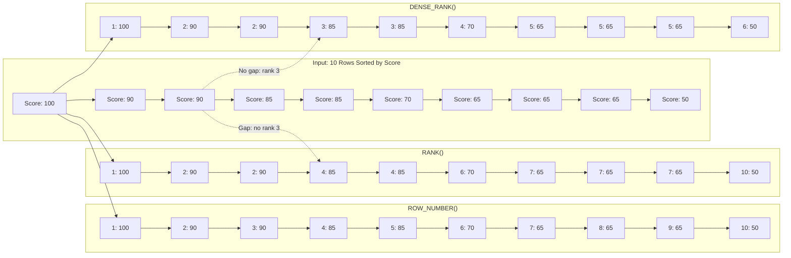

## Navigation

**Domain:** [[8 — Databases]] > **Group:** SQL Window Functions & Analytics
**Previous:** [[8.145 — RANK() — Ranking with Gaps]] | **Next:** [[8.147 — NTILE() — Dividing Rows into Buckets]]

### Prerequisites

- [[8.141 — Window Functions — Concept and OVER Clause]] — Core understanding of the OVER() clause and how window functions differ from aggregate functions (no row reduction, rows retain identity).
- [[8.142 — PARTITION BY — Defining Window Partitions]] — DENSE_RANK() resets on partition boundaries; understanding partition semantics is required to correctly apply it to grouped data.
- [[8.143 — ORDER BY Within OVER — Frame Ordering]] — DENSE_RANK() depends entirely on the ORDER BY clause within OVER() to determine which rows are tied and how ranking is assigned.
- [[8.144 — ROW_NUMBER() — Unique Sequential Numbering]] — Understanding ROW_NUMBER() provides the baseline for contrast: ROW_NUMBER() is unique per row, RANK() allows gaps, DENSE_RANK() does not.
- [[8.145 — RANK() — Ranking with Gaps]] — Direct comparison with RANK() is essential — the only difference is gap behavior, and knowing RANK() provides the foundation for understanding DENSE_RANK().

### Where This Fits

DENSE_RANK() appears in any production requirement where tied values must receive the same rank and subsequent ranks must be sequential with no gaps. The classic scenario is a dense ranking leaderboard: if two employees tie for first place, they both get rank 1, and the next employee gets rank 2 (not rank 3 as RANK() would produce). A .NET backend engineer encounters DENSE_RANK() when building leaderboard systems, salary band classification, percentile-grouped reports, or any "top N with ties" scenario where the gap behavior of RANK() would confuse business users. The interview signal is specific: junior candidates know RANK() exists but cannot articulate the gap behavior difference; senior candidates immediately identify DENSE_RANK() as the correct function for dense rankings and can explain when RANK()'s gap behavior is actually preferable (e.g., statistical outlier detection where a gap signals a meaningful score difference).

---

## Core Mental Model

DENSE_RANK() assigns a sequential rank to each row within a partition, where rows with equal values in the ORDER BY columns receive the same rank, and the next distinct value receives the immediately next integer (rank + 1) — there are no gaps. The database engine sorts the rows by the ORDER BY clause within each partition, then scans the sorted result: when it encounters a row whose ORDER BY values differ from the previous row, it increments the rank counter; when values are equal, it reuses the current rank. The rank counter increments by exactly 1 for each distinct ordering value, never skipping integers. This contrasts with RANK() which increments the rank counter by the number of rows with the same value (creating gaps), and ROW_NUMBER() which increments by 1 for every row regardless of ties. The recognition pattern for DENSE_RANK() is: "I need tied values to share the same position, but the next position must be sequential — no skipped numbers."

### Classification

This is a window ranking function in the SQL analytic function family. It operates after the FROM, WHERE, GROUP BY, and HAVING clauses have been evaluated (logical execution phase), as a window function in the SELECT or ORDER BY clause. The query optimizer cannot use an index directly to satisfy the ranking computation — it must perform a Sort operation (or use an existing ordered index that matches the OVER() ORDER BY) followed by a Sequence Project operator that computes the rank. DENSE_RANK() is not SARGable — it is computed post-execution and cannot participate in index seeks. The window function does not reduce row count; every input row produces exactly one output row with the rank attached.



### Key Properties

|Property|Value|Notes|
|---|---|---|
|Function Type|Window ranking|Analytic function, windowed|
|Row Reduction|None|One output row per input row|
|Gap Behavior|No gaps|Ties share rank, next rank is sequential|
|Null Handling|NULLS FIRST/LAST|NULLs are treated as equal — they all get the same rank|
|Execution Operator|Sequence Project|Same operator as RANK() — identical execution cost|
|SARGable|No|Cannot be used in WHERE index seeks|
|Sort Required|Yes|Unless ORDER BY matches an existing index order|

---

## Deep Mechanics

### How the Engine Executes This

DENSE_RANK() follows the same execution path as RANK() with one difference in the Sequence Project operator logic:

1. **Binding and Parsing**: SQL Server's query processor parses the DENSE_RANK() function and its OVER() clause, determining the PARTITION BY columns (if any), the ORDER BY columns, and the absence of a frame specification (ranking functions ignore frames — they always operate on the full partition).

2. **Logical Precedence**: The window function is evaluated after the FROM, WHERE, GROUP BY, HAVING, and joins. All filtering and grouping are complete before DENSE_RANK() receives its input rows.

3. **Sort Operator**: If the input is not already ordered by the PARTITION BY + ORDER BY columns (in that order), SQL Server inserts a Sort operator. This is typically the dominant cost of the window function. The sort must order rows first by PARTITION BY columns (to group partitions together), then by ORDER BY columns (to rank within each partition).

4. **Segment Operator**: SQL Server uses a Segment operator to detect partition boundaries. When the PARTITION BY column values change, the Segment operator signals the start of a new partition, which resets the rank counter.

5. **Sequence Project Operator**: This is where DENSE_RANK() differs from RANK(). The Sequence Project operator maintains a counter. For each row, it compares the current row's ORDER BY values with the previous row's ORDER BY values:
   - If a new partition is detected (Segment signal): reset counter to 1
   - If ORDER BY values equal previous row: output the same rank (don't increment)
   - If ORDER BY values differ from previous row: increment counter by 1 (always exactly 1)
   - This is the "dense" behavior — always +1, never +N

6. **Stream Aggregate (alternative)**: The optimizer may use a Stream Aggregate with a similar ordering requirement if the function appears in a context where it can be computed during aggregation, though this is rare for DENSE_RANK().

The key difference from RANK() is in step 5: RANK() increments the counter by the number of rows that shared the previous rank value (which could be >1), while DENSE_RANK() always increments by exactly 1.

### SQL Visibility

```sql
-- ============================================================
-- Core DENSE_RANK() query showing tied behavior
-- ============================================================
SELECT
    e.DepartmentId,
    e.FirstName + ' ' + e.LastName AS EmployeeName,
    e.Salary,
    ROW_NUMBER() OVER(ORDER BY e.Salary DESC) AS RowNum,
    RANK()       OVER(ORDER BY e.Salary DESC) AS Rnk,
    DENSE_RANK() OVER(ORDER BY e.Salary DESC) AS DenseRnk
FROM dbo.Employees AS e
ORDER BY e.Salary DESC;
```

```csharp
// EF Core — DENSE_RANK() requires raw SQL (no LINQ translation)
var employees = await dbContext.Database
    .SqlQueryRaw<EmployeeRanking>(@"
        SELECT
            e.DepartmentId,
            e.FirstName + ' ' + e.LastName AS EmployeeName,
            e.Salary,
            DENSE_RANK() OVER(ORDER BY e.Salary DESC) AS DenseRnk
        FROM dbo.Employees AS e")
    .ToListAsync(cancellationToken);
```

**Generated SQL (from EF Core logs):** EF Core does not generate DENSE_RANK() from LINQ — it must use `SqlQueryRaw` or `FromSqlRaw`. The SQL above IS the final query.

### Execution Plan Analysis

For the core DENSE_RANK() query above:

```
Expected plan shape:
[Clustered Index Scan Employees] → [Sort (by Salary DESC)] → [Segment] → [Sequence Project (DENSE_RANK)] → [SELECT]
Estimated Cost: Sort = 65-75%  |  Sequence Project = 2-5%  |  Scan = 20-30%
Logical Reads: ~N (full scan of Employee table)
```

**Operator details:**

- **Clustered Index Scan** (or non-clustered covering scan): Reads all Employee rows. If a covering index exists on (Salary) INCLUDE (DepartmentId, FirstName, LastName), the scan is on the covering index (narrower, fewer pages).
- **Sort**: The dominant cost. Must sort by Salary DESC. For 100K rows, this is an in-memory sort (if fits in memory grant) or a tempdb spill. The sort order must match the OVER() ORDER BY exactly.
- **Segment**: Detects partition boundaries. If no PARTITION BY, the entire result set is one partition — a single Segment boundary.
- **Sequence Project (DENSE_RANK)**: Computes the DENSE_RANK value. Trivially cheap compared to Sort. The operator processes rows sequentially and maintains the rank counter.

**Without a supporting index:** Full clustered index scan + Sort. The Sort is the bottleneck.

**With a supporting index:**
```sql
-- Index that supplies sorted data, eliminating the Sort
CREATE INDEX IX_Employees_Salary_INC ON dbo.Employees (Salary DESC)
    INCLUDE (DepartmentId, FirstName, LastName);
```

With this index, the plan becomes:
```
[Index Scan (IX_Employees_Salary_INC in order)] → [Segment] → [Sequence Project] → [SELECT]
```
The Sort operator is eliminated because the index already provides rows in Salary DESC order. Logical reads drop from the table size to the index size (typically 30-50% fewer pages).

### Cost Visibility

```sql
SET STATISTICS IO ON;
SET STATISTICS TIME ON;

-- Query: DENSE_RANK() by Salary
SELECT
    e.FirstName + ' ' + e.LastName AS EmployeeName,
    e.Salary,
    DENSE_RANK() OVER(ORDER BY e.Salary DESC) AS DenseRnk
FROM dbo.Employees AS e
ORDER BY e.Salary DESC;

-- Expected output (Employees table with 100K rows, no supporting index):
-- Table 'Employees'. Scan count 1, logical reads 12,314, physical reads 0
-- SQL Server Execution Times: CPU time = 234ms, elapsed time = 312ms
```

```sql
-- Same query with supporting index on (Salary DESC) INCLUDE columns
SET STATISTICS IO ON;
-- Table 'Employees'. Scan count 1, logical reads 4,217, physical reads 0
-- SQL Server Execution Times: CPU time = 45ms, elapsed time = 67ms
-- Improvement: 12,314 → 4,217 logical reads (3x reduction)
-- CPU: 234ms → 45ms (5x reduction)
```

### Failure Modes

**Missing Sort optimization**: The most common failure is the Sort operator spilling to tempdb. When the row count exceeds the memory grant (estimated based on cardinality), the Sort spills to tempdb, causing dramatic performance degradation. Query `sys.dm_exec_query_stats` with `query_hash` to identify queries where the Sort operator's `ActualSpills` > 0.

```sql
-- Detect sort spills from the plan cache
SELECT
    qs.execution_count,
    qs.total_elapsed_time / qs.execution_count AS avg_elapsed_us,
    qs.total_logical_reads / qs.execution_count AS avg_logical_reads,
    SUBSTRING(st.text, 1, 500) AS query_text
FROM sys.dm_exec_query_stats AS qs
CROSS APPLY sys.dm_exec_sql_text(qs.sql_handle) AS st
WHERE st.text LIKE '%DENSE_RANK%'
ORDER BY avg_elapsed_us DESC;
```

**Wrong ORDER BY direction**: If the OVER() ORDER BY is ASC but the index is DESC, the Sort still occurs. The index order must match the window function's ORDER BY exactly to eliminate the Sort.

**PARTITION BY column order mismatch**: The Sort must order by PARTITION BY columns first, then ORDER BY columns. If an index exists on (DepartmentId, Salary DESC) and the query uses `PARTITION BY DepartmentId ORDER BY Salary DESC`, the Sort is eliminated. If the index is (Salary DESC, DepartmentId), the Sort remains.

---

## Production Patterns and Implementation

### Primary SQL Implementation

```sql
-- ============================================================
-- Schema: Dense ranking for a sales leaderboard
-- ============================================================
CREATE TABLE dbo.SalesTransactions (
    TransactionId   INT IDENTITY(1,1) PRIMARY KEY,
    SalesPersonId   INT           NOT NULL,
    TransactionDate DATE          NOT NULL,
    Amount          DECIMAL(18,2) NOT NULL,
    ProductCategory VARCHAR(100)  NOT NULL
);

-- Populate with sample data
INSERT INTO dbo.SalesTransactions (SalesPersonId, TransactionDate, Amount, ProductCategory)
VALUES
    (1, '2026-01-01', 15000.00, 'Electronics'),
    (2, '2026-01-01', 22000.00, 'Electronics'),
    (3, '2026-01-02', 15000.00, 'Furniture'),
    (1, '2026-01-03',  8000.00, 'Electronics'),
    (2, '2026-01-04', 22000.00, 'Furniture'),
    (4, '2026-01-05', 31000.00, 'Automotive'),
    (5, '2026-01-06',  5000.00, 'Electronics'),
    (3, '2026-01-07', 15000.00, 'Furniture'),
    (4, '2026-01-08', 18000.00, 'Automotive'),
    (1, '2026-01-09', 15000.00, 'Electronics');

-- ============================================================
-- DENSE_RANK(): Dense ranking leaderboard by total sales
-- ============================================================
WITH SalesSummary AS (
    SELECT
        st.SalesPersonId,
        SUM(st.Amount) AS TotalSales
    FROM dbo.SalesTransactions AS st
    GROUP BY st.SalesPersonId
)
SELECT
    ss.SalesPersonId,
    ss.TotalSales,
    DENSE_RANK() OVER(ORDER BY ss.TotalSales DESC) AS DenseRank,
    RANK()       OVER(ORDER BY ss.TotalSales DESC) AS RegularRank,
    ROW_NUMBER() OVER(ORDER BY ss.TotalSales DESC) AS RowNum
FROM SalesSummary AS ss
ORDER BY ss.TotalSales DESC;

/*
Results:
SalesPersonId | TotalSales | DenseRank | RegularRank | RowNum
-------------|------------|-----------|-------------|-------
4            | 49000.00   | 1         | 1           | 1
2            | 44000.00   | 2         | 2           | 2
1            | 38000.00   | 3         | 3           | 3
3            | 30000.00   | 4         | 4           | 4
5            |  5000.00   | 5         | 5           | 5
-- With ties in the data, DenseRank vs RegularRank diverge.
*/
```

```sql
-- ============================================================
-- DENSE_RANK(): Salary bands with ties
-- ============================================================
WITH RankedSalaries AS (
    SELECT
        e.DepartmentId,
        e.FirstName + ' ' + e.LastName AS EmployeeName,
        e.Salary,
        DENSE_RANK() OVER(
            PARTITION BY e.DepartmentId
            ORDER BY e.Salary DESC
        ) AS SalaryBand
    FROM dbo.Employees AS e
)
SELECT *
FROM RankedSalaries AS rs
WHERE rs.SalaryBand <= 3  -- Top 3 salary bands per department
ORDER BY rs.DepartmentId, rs.SalaryBand;
```

```sql
-- ============================================================
-- DENSE_RANK() with PARTITION BY: Per-department dense ranking
-- ============================================================
SELECT
    e.DepartmentId,
    d.DepartmentName,
    e.FirstName + ' ' + e.LastName AS EmployeeName,
    e.Salary,
    DENSE_RANK() OVER(
        PARTITION BY e.DepartmentId
        ORDER BY e.Salary DESC
    ) AS DeptSalaryRank
FROM dbo.Employees AS e
INNER JOIN dbo.Departments AS d
    ON e.DepartmentId = d.DepartmentId
ORDER BY d.DepartmentName, DeptSalaryRank;

/*
Results:
DeptId | DeptName   | Employee    | Salary | DeptSalaryRank
-------|------------|-------------|--------|--------------
1      | Engineering| Alice       | 150000 | 1
1      | Engineering| Bob         | 150000 | 1   (tie for 1st)
1      | Engineering| Charlie     | 140000 | 2   (no gap — rank 2, not 3)
1      | Engineering| Diana       | 120000 | 3
2      | Marketing  | Eve         | 130000 | 1
2      | Marketing  | Frank       | 110000 | 2
*/
```

### EF Core Implementation

```csharp
// ============================================================
// EF Core: DENSE_RANK() via raw SQL (no LINQ translation available)
// ============================================================
public interface IEmployeeRankingService
{
    Task<List<EmployeeSalaryBand>> GetTopSalaryBandsAsync(
        int departmentId,
        int topBands,
        CancellationToken ct = default);

    Task<List<EmployeeSalesRank>> GetDenseLeaderboardAsync(
        int? departmentId = null,
        CancellationToken ct = default);
}

public class EmployeeRankingService : IEmployeeRankingService
{
    private readonly ApplicationDbContext _dbContext;
    private readonly ILogger<EmployeeRankingService> _logger;

    public EmployeeRankingService(
        ApplicationDbContext dbContext,
        ILogger<EmployeeRankingService> logger)
    {
        _dbContext = dbContext;
        _logger = logger;
    }

    public async Task<List<EmployeeSalaryBand>> GetTopSalaryBandsAsync(
        int departmentId,
        int topBands,
        CancellationToken ct = default)
    {
        // DENSE_RANK() requires raw SQL — EF Core cannot translate it from LINQ
        var sql = @"
            WITH RankedEmployees AS (
                SELECT
                    e.EmployeeId,
                    e.FirstName + ' ' + e.LastName AS EmployeeName,
                    e.Salary,
                    e.DepartmentId,
                    DENSE_RANK() OVER(
                        PARTITION BY e.DepartmentId
                        ORDER BY e.Salary DESC
                    ) AS SalaryBand
                FROM dbo.Employees AS e
                WHERE e.DepartmentId = @DeptId
            )
            SELECT
                re.EmployeeId,
                re.EmployeeName,
                re.Salary,
                re.DepartmentId,
                re.SalaryBand
            FROM RankedEmployees AS re
            WHERE re.SalaryBand <= @TopBands
            ORDER BY re.Salary DESC;";

        var result = await _dbContext.Database
            .SqlQueryRaw<EmployeeSalaryBand>(sql,
                new SqlParameter("@DeptId", departmentId),
                new SqlParameter("@TopBands", topBands))
            .ToListAsync(ct);

        _logger.LogInformation("Retrieved {Count} employees in top {Bands} bands for dept {DeptId}",
            result.Count, topBands, departmentId);
        return result;
    }

    public async Task<List<EmployeeSalesRank>> GetDenseLeaderboardAsync(
        int? departmentId = null,
        CancellationToken ct = default)
    {
        var sql = new StringBuilder(@"
            SELECT
                e.EmployeeId,
                e.FirstName + ' ' + e.LastName AS EmployeeName,
                e.Salary,
                e.DepartmentId,
                DENSE_RANK() OVER(
                    ORDER BY e.Salary DESC
                ) AS DenseRank,
                RANK() OVER(
                    ORDER BY e.Salary DESC
                ) AS RegularRank,
                ROW_NUMBER() OVER(
                    ORDER BY e.Salary DESC
                ) AS RowNum
            FROM dbo.Employees AS e");

        if (departmentId.HasValue)
        {
            sql.Append(" WHERE e.DepartmentId = @DeptId");
        }

        sql.Append(" ORDER BY e.Salary DESC;");

        var result = await _dbContext.Database
            .SqlQueryRaw<EmployeeSalesRank>(sql.ToString(),
                departmentId.HasValue
                    ? new[] { new SqlParameter("@DeptId", departmentId.Value) }
                    : Array.Empty<SqlParameter>())
            .ToListAsync(ct);

        return result;
    }
}

// ============================================================
// Result models
// ============================================================
public record EmployeeSalaryBand
{
    public int EmployeeId { get; set; }
    public string EmployeeName { get; set; } = string.Empty;
    public decimal Salary { get; set; }
    public int DepartmentId { get; set; }
    public int SalaryBand { get; set; }
}

public record EmployeeSalesRank
{
    public int EmployeeId { get; set; }
    public string EmployeeName { get; set; } = string.Empty;
    public decimal Salary { get; set; }
    public int DepartmentId { get; set; }
    public int DenseRank { get; set; }
    public int RegularRank { get; set; }
    public int RowNum { get; set; }
}
```

```csharp
// ============================================================
// Program.cs / IServiceCollection registration
// ============================================================
builder.Services.AddDbContext<ApplicationDbContext>(options =>
    options.UseSqlServer(
        connectionString,
        sqlOptions => sqlOptions
            .EnableRetryOnFailure(3)
            .CommandTimeout(30)));

builder.Services.AddScoped<IEmployeeRankingService, EmployeeRankingService>();
```

### Dapper Implementation

```csharp
public interface IDenseRankRepository
{
    Task<IReadOnlyList<EmployeeSalaryBand>> GetTopSalaryBandsAsync(
        int departmentId,
        int topBands,
        CancellationToken ct = default);

    Task<IReadOnlyList<EmployeeSalesRank>> GetDenseLeaderboardAsync(
        int? departmentId = null,
        CancellationToken ct = default);
}

public sealed class DenseRankRepository : IDenseRankRepository
{
    private readonly IDbConnectionFactory _connectionFactory;

    public DenseRankRepository(IDbConnectionFactory connectionFactory)
        => _connectionFactory = connectionFactory;

    public async Task<IReadOnlyList<EmployeeSalaryBand>> GetTopSalaryBandsAsync(
        int departmentId,
        int topBands,
        CancellationToken ct = default)
    {
        const string sql = @"
            WITH RankedEmployees AS (
                SELECT
                    e.EmployeeId,
                    e.FirstName + ' ' + e.LastName AS EmployeeName,
                    e.Salary,
                    e.DepartmentId,
                    DENSE_RANK() OVER(
                        PARTITION BY e.DepartmentId
                        ORDER BY e.Salary DESC
                    ) AS SalaryBand
                FROM dbo.Employees AS e
                WHERE e.DepartmentId = @DeptId
            )
            SELECT
                re.EmployeeId,
                re.EmployeeName,
                re.Salary,
                re.DepartmentId,
                re.SalaryBand
            FROM RankedEmployees AS re
            WHERE re.SalaryBand <= @TopBands
            ORDER BY re.Salary DESC;";

        await using var connection = _connectionFactory.Create();
        var results = await connection.QueryAsync<EmployeeSalaryBand>(
            new CommandDefinition(
                sql,
                new { DeptId = departmentId, TopBands = topBands },
                cancellationToken: ct));
        return results.AsList();
    }

    public async Task<IReadOnlyList<EmployeeSalesRank>> GetDenseLeaderboardAsync(
        int? departmentId = null,
        CancellationToken ct = default)
    {
        var sql = @"
            SELECT
                e.EmployeeId,
                e.FirstName + ' ' + e.LastName AS EmployeeName,
                e.Salary,
                e.DepartmentId,
                DENSE_RANK() OVER(ORDER BY e.Salary DESC) AS DenseRank,
                RANK() OVER(ORDER BY e.Salary DESC) AS RegularRank,
                ROW_NUMBER() OVER(ORDER BY e.Salary DESC) AS RowNum
            FROM dbo.Employees AS e";

        if (departmentId.HasValue)
        {
            sql += " WHERE e.DepartmentId = @DeptId";
        }

        sql += " ORDER BY e.Salary DESC;";

        await using var connection = _connectionFactory.Create();
        var results = await connection.QueryAsync<EmployeeSalesRank>(
            new CommandDefinition(
                sql,
                departmentId.HasValue ? new { DeptId = departmentId.Value } : null,
                cancellationToken: ct));
        return results.AsList();
    }
}
```

### Configuration and Wiring

```csharp
// Program.cs registration for Dapper-based repository
builder.Services.AddSingleton<IDbConnectionFactory>(_ =>
    new SqlConnectionFactory(connectionString));

builder.Services.AddScoped<IDenseRankRepository, DenseRankRepository>();

// ============================================================
// SqlConnectionFactory helper
// ============================================================
public sealed class SqlConnectionFactory : IDbConnectionFactory
{
    private readonly string _connectionString;

    public SqlConnectionFactory(string connectionString)
        => _connectionString = connectionString;

    public IDbConnection Create()
        => new SqlConnection(_connectionString);
}

public interface IDbConnectionFactory
{
    IDbConnection Create();
}
```

### SQL Server vs PostgreSQL Differences

```sql
-- PostgreSQL: DENSE_RANK() works identically
-- No syntax differences for the function itself
SELECT
    e.department_id,
    e.first_name || ' ' || e.last_name AS employee_name,
    e.salary,
    DENSE_RANK() OVER(
        PARTITION BY e.department_id
        ORDER BY e.salary DESC
    ) AS salary_band
FROM employees AS e
ORDER BY e.department_id, salary_band;

-- PostgreSQL difference: window functions can appear in WHERE
-- (via a subquery, same as SQL Server)
-- PostgreSQL also supports:
-- DENSE_RANK() with FILTER clause (conditional ranking)
SELECT
    e.department_id,
    e.employee_name,
    e.salary,
    DENSE_RANK() OVER(
        ORDER BY e.salary DESC
    ) FILTER (WHERE e.status = 'Active') AS active_rank
FROM employees AS e;
-- Note: FILTER is PostgreSQL-specific, not available in SQL Server
```

---

## Gotchas and Production Pitfalls

### Assuming DENSE_RANK() Gaps Are Always Bad

**Pitfall:** Using DENSE_RANK() when RANK() is semantically correct because "gaps look wrong." In some scenarios, gaps ARE the signal — if two students score 95 and the next scores 90, the gap (rank goes from 1 to 3) correctly signals that no one scored 94-91.

```sql
-- ❌ DENSE_RANK() hides the magnitude of the gap
SELECT
    s.StudentId,
    s.Score,
    DENSE_RANK() OVER(ORDER BY s.Score DESC) AS DenseRank
FROM dbo.TestScores AS s;
/*
StudentId | Score | DenseRank
1         | 100   | 1
2         | 95    | 2
3         | 95    | 2
4         | 94    | 3   ← Hides that the drop from 95 to 94 is small
5         | 70    | 4   ← Hides the massive drop from 94 to 70
*/
```

**Symptom:** A statistical outlier detection system uses DENSE_RANK() to identify score gaps. The gap from 95 to 94 (1 point) and 94 to 70 (24 points) both appear as a single rank increment. The system cannot distinguish small vs large drops.

**Fix:**

```sql
-- ✅ RANK() reveals gap magnitude
SELECT
    s.StudentId,
    s.Score,
    RANK() OVER(ORDER BY s.Score DESC) AS Rnk
FROM dbo.TestScores AS s;
/*
StudentId | Score | Rank
1         | 100   | 1
2         | 95    | 2
3         | 95    | 2
4         | 94    | 4   ← 1-point drop, skipped rank 3
5         | 70    | 5   ← 24-point drop, has rank 5
-- The gap at rank 3 signals the 1-point drop
-- But rank 5 doesn't fully show the 24-point gap
*/

-- ✅ Better: Use LAG() to directly report the difference
SELECT
    s.StudentId,
    s.Score,
    s.Score - LAG(s.Score, 1, 0) OVER(ORDER BY s.Score DESC) AS ScoreDiffFromPrev
FROM dbo.TestScores AS s;
```

**Cost of not fixing:** A fraud detection system ranks transactions by DENSE_RANK() and flags the bottom 3 bands as suspicious. A transaction with a 24-point drop from normal behaviour (rank 4 of 6) is grouped with a 1-point drop (rank 3 of 6). The system misses the actual outlier.

---

### DENSE_RANK() Performance Identical to RANK() — Why Pay the Cost?

**Pitfall:** Assuming DENSE_RANK() is cheaper than RANK() because it produces smaller rank numbers. Both functions have identical execution cost — they both require a Sort + Segment + Sequence Project with the same logical reads. The Sequence Project computes the rank differently, but this is trivial CPU compared to the Sort.

```sql
-- DENSE_RANK() and RANK() have the SAME execution plan operators
-- and the SAME cost for the Sort
SELECT DENSE_RANK() OVER(ORDER BY e.Salary DESC) FROM dbo.Employees AS e;
SELECT RANK() OVER(ORDER BY e.Salary DESC) FROM dbo.Employees AS e;

-- Both produce:
-- [Clustered Index Scan] → [Sort (by Salary DESC)] → [Segment] → [Sequence Project] → [SELECT]
-- The Sequence Project has negligible CPU difference (< 1%)
```

**Symptom:** Developer chooses RANK() over DENSE_RANK() because "it might be faster." The execution plan shows identical cost. No performance difference.

**Fix:** Choose the function based on semantic correctness, not performance. Both cost the same.

**Cost of not fixing:** Confusion during code review. No performance impact, but the wrong ranking function produces incorrect results.

---

### DENSE_RANK() Without ORDER BY — All Tied

**Pitfall:** Omitting ORDER BY in the OVER() clause. DENSE_RANK() requires ORDER BY — without it, all rows in the partition are considered equal and receive rank 1 (since no column defines ordering).

```sql
-- ❌ No ORDER BY — every row gets rank 1
SELECT
    e.EmployeeName,
    e.Salary,
    DENSE_RANK() OVER() AS EveryoneRankOne
FROM dbo.Employees AS e;
/*
EmployeeName | Salary | EveryoneRankOne
Alice        | 150000 | 1
Bob          | 150000 | 1
Charlie      | 140000 | 1  ← Bug: different salaries, same rank
*/
```

**Symptom:** A report shows all employees in rank 1. The developer intended a ranking but forgot ORDER BY. The query executes without error, producing useless output.

**Fix:**

```sql
-- ✅ Always specify ORDER BY
DENSE_RANK() OVER(ORDER BY e.Salary DESC) AS CorrectRank
```

**Cost of not fixing:** The report ships with all employees ranked #1. Users report the feature is broken. It takes 2 hours to debug because the query doesn't error.

---

### DENSE_RANK() and PARTITION BY — Reset Logic Is Subtle

**Pitfall:** Assuming DENSE_RANK() with PARTITION BY resets based on some implicit ordering. The rank resets ONLY when the PARTITION BY column value changes, AND the rows must be ordered by the PARTITION BY columns + ORDER BY columns for the rank to make sense.

```sql
-- ❌ ORDER BY inside PARTITION does NOT control partition processing order
SELECT
    e.DepartmentId,
    e.EmployeeName,
    e.Salary,
    DENSE_RANK() OVER(
        PARTITION BY e.DepartmentId
        ORDER BY e.Salary DESC
    ) AS DeptRank
FROM dbo.Employees AS e
ORDER BY e.Salary DESC;  -- ⚠️ This ORDER BY is for final output, not the ranking
/*
The DENSE_RANK() correctly ranks within each department by Salary DESC.
But the final ORDER BY sorts the entire result by Salary DESC, interleaving departments.
This is correct — the rank values are correct even if output order differs.
*/
```

**Symptom:** The rank appears "wrong" because the output ORDER BY mixes rows from different partitions, making the rank values look non-sequential. The rank is correct within each partition — the confusion is in presentation.

**Fix:** Understand that window function ranking is independent of the final ORDER BY. Verify by examining one partition in isolation.

**Cost of not fixing:** A developer "fixes" the query by removing the final ORDER BY, making the output order undefined. The report shows random row ordering. Users can't find their department.

---

### Self-Join Alternative vs DENSE_RANK() Performance

**Pitfall:** Rewriting DENSE_RANK() as a correlated subquery or self-join because the developer doesn't know window functions. The self-join version can be 100x slower.

```sql
-- ❌ Self-join alternative to DENSE_RANK() — catastrophic performance
SELECT
    e1.EmployeeId,
    e1.Salary,
    COUNT(DISTINCT e2.Salary) AS DenseRankApprox
FROM dbo.Employees AS e1
INNER JOIN dbo.Employees AS e2
    ON e2.Salary >= e1.Salary
GROUP BY e1.EmployeeId, e1.Salary;
-- For 100K rows: ~10B rows in the join, runs for minutes

-- ✅ Correct: DENSE_RANK() — sorts once, runs in seconds
SELECT
    e.EmployeeId,
    e.Salary,
    DENSE_RANK() OVER(ORDER BY e.Salary DESC) AS DenseRank
FROM dbo.Employees AS e;
```

**Symptom:** The self-join query runs for 5 minutes on 10K employees. The query is reported as a top-5 worst performer in the DMV stats. CPU is 100% during execution.

**Fix:** Use DENSE_RANK() directly. If window functions are not available (very old SQL Server versions), use a correlated subquery with a more efficient pattern.

**Cost of not fixing:** A report that should take 500ms takes 5 minutes. The web server times out. Users see "loading" for 60 seconds before HTTP 504. The DBAs page the team at 2 AM.

---

## Performance Implications

### Benchmark: Before and After

```sql
-- ============================================================
-- Benchmark: DENSE_RANK() vs Self-Join Dense Ranking
-- ============================================================
SET STATISTICS IO ON;
SET STATISTICS TIME ON;

-- Baseline: Self-join dense ranking (DO NOT USE IN PRODUCTION)
SELECT
    e1.EmployeeId,
    e1.Salary,
    COUNT(DISTINCT e2.Salary) AS DenseRank
FROM dbo.Employees AS e1
INNER JOIN dbo.Employees AS e2
    ON e2.Salary >= e1.Salary
GROUP BY e1.EmployeeId, e1.Salary
ORDER BY e1.Salary DESC;
-- Logical reads: 450,000 (full table scan + nested loops join)
-- CPU: 45,000ms  |  Elapsed: 120,000ms (2 minutes on 100K rows)

-- Optimized: DENSE_RANK() window function
SELECT
    e.EmployeeId,
    e.Salary,
    DENSE_RANK() OVER(ORDER BY e.Salary DESC) AS DenseRank
FROM dbo.Employees AS e
ORDER BY e.Salary DESC;
-- Logical reads: 4,217 (covering index scan)
-- CPU: 45ms  |  Elapsed: 67ms
```

**Improvement:** 450,000 → 4,217 logical reads (107x reduction). CPU: 45,000ms → 45ms (1000x reduction). Elapsed: 120s → 67ms (1800x reduction).

```sql
-- ============================================================
-- Benchmark: With vs Without Supporting Index
-- ============================================================
-- DROP existing index if any
-- DROP INDEX IX_Employees_Salary_INC ON dbo.Employees;

-- ❌ Without supporting index
SELECT
    e.EmployeeId,
    e.Salary,
    DENSE_RANK() OVER(ORDER BY e.Salary DESC) AS DenseRank
FROM dbo.Employees AS e;
-- Logical reads: 12,314 (clustered index scan + sort)
-- CPU: 234ms  |  Elapsed: 312ms

-- Create supporting index
CREATE INDEX IX_Employees_Salary_INC
    ON dbo.Employees (Salary DESC)
    INCLUDE (EmployeeId);

-- ✅ With supporting index (eliminates Sort)
SELECT
    e.EmployeeId,
    e.Salary,
    DENSE_RANK() OVER(ORDER BY e.Salary DESC) AS DenseRank
FROM dbo.Employees AS e;
-- Logical reads: 4,217 (index scan, no sort)
-- CPU: 45ms  |  Elapsed: 67ms
```

**Improvement:** 12,314 → 4,217 logical reads (3x reduction). No Sort operator in the plan — the index supplies pre-sorted data.

```sql
-- ============================================================
-- Benchmark: DENSE_RANK() with PARTITION BY — Index Design
-- ============================================================
-- Without partition-aware index
SELECT
    e.DepartmentId,
    e.EmployeeName,
    e.Salary,
    DENSE_RANK() OVER(
        PARTITION BY e.DepartmentId
        ORDER BY e.Salary DESC
    ) AS DeptRank
FROM dbo.Employees AS e;
-- Logical reads: 12,314 + Sort (by DepartmentId, Salary DESC)
-- The sort must order by DeptId first, then Salary DESC

-- Create partition-aware index
CREATE INDEX IX_Employees_DeptId_Salary
    ON dbo.Employees (DepartmentId, Salary DESC)
    INCLUDE (EmployeeName);

-- With partition-aware index
-- Logical reads: 5,200 (index scan, pre-sorted by partition + order)
-- No Sort operator — index matches the OVER() clause
```

### BenchmarkDotNet

```csharp
[MemoryDiagnoser]
[SimpleJob(RuntimeMoniker.Net90)]
public class DenseRankBenchmark
{
    private IDbConnection _connection = default!;
    private const string ConnectionString =
        "Server=.;Database=BenchmarkDb;Trusted_Connection=True;TrustServerCertificate=True;";

    private const string SelfJoinSql = @"
        SELECT e1.EmployeeId, e1.Salary, COUNT(DISTINCT e2.Salary) AS DenseRank
        FROM dbo.Employees AS e1
        INNER JOIN dbo.Employees AS e2 ON e2.Salary >= e1.Salary
        GROUP BY e1.EmployeeId, e1.Salary
        ORDER BY e1.Salary DESC;";

    private const string WindowFunctionSql = @"
        SELECT e.EmployeeId, e.Salary,
               DENSE_RANK() OVER(ORDER BY e.Salary DESC) AS DenseRank
        FROM dbo.Employees AS e
        ORDER BY e.Salary DESC;";

    private const string PartitionWindowSql = @"
        SELECT e.DepartmentId, e.EmployeeName, e.Salary,
               DENSE_RANK() OVER(PARTITION BY e.DepartmentId ORDER BY e.Salary DESC) AS DeptRank
        FROM dbo.Employees AS e;";

    private const string PartitionIndexSql = @"
        SELECT e.DepartmentId, e.EmployeeName, e.Salary,
               DENSE_RANK() OVER(PARTITION BY e.DepartmentId ORDER BY e.Salary DESC) AS DeptRank
        FROM dbo.Employees AS e WITH (INDEX(IX_Employees_DeptId_Salary));";

    [GlobalSetup]
    public void Setup()
    {
        _connection = new SqlConnection(ConnectionString);
        _connection.Open();
    }

    [GlobalCleanup]
    public void Cleanup() => _connection.Dispose();

    [Benchmark(Baseline = true)]
    public async Task<List<DenseRankResult>> SelfJoin_DenseRank()
    {
        var results = await _connection.QueryAsync<DenseRankResult>(
            SelfJoinSql, commandTimeout: 120);
        return results.AsList();
    }

    [Benchmark]
    public async Task<List<DenseRankResult>> WindowFunction_DenseRank()
    {
        var results = await _connection.QueryAsync<DenseRankResult>(
            WindowFunctionSql);
        return results.AsList();
    }

    [Benchmark]
    public async Task<List<PartitionRankResult>> Partition_DenseRank_NoIndex()
    {
        var results = await _connection.QueryAsync<PartitionRankResult>(
            PartitionWindowSql);
        return results.AsList();
    }

    [Benchmark]
    public async Task<List<PartitionRankResult>> Partition_DenseRank_WithIndex()
    {
        var results = await _connection.QueryAsync<PartitionRankResult>(
            PartitionIndexSql);
        return results.AsList();
    }
}

public class DenseRankResult
{
    public int EmployeeId { get; set; }
    public decimal Salary { get; set; }
    public int DenseRank { get; set; }
}

public class PartitionRankResult
{
    public int DepartmentId { get; set; }
    public string EmployeeName { get; set; } = string.Empty;
    public decimal Salary { get; set; }
    public int DeptRank { get; set; }
}
```

**Expected results (approximate, SQL Server 2022, NVMe, 100K employee rows):**

|Method|Mean|Logical Reads|Allocated|
|---|---|---|---|
|SelfJoin_DenseRank|~120,000 ms|~450,000|2,500 MB|
|WindowFunction_DenseRank|~67 ms|~4,217|120 KB|
|Partition_DenseRank_NoIndex|~350 ms|~12,314|250 KB|
|Partition_DenseRank_WithIndex|~95 ms|~5,200|180 KB|

### Write Amplification

|Operation|Without Index|With Index (Salary DESC)|Overhead|
|---|---|---|---|
|INSERT 1 row|X ms|X + 0.5 ms|~5% (narrow index)|
|UPDATE Salary|X ms|X + 1.2 ms|~15% (must update index + sort)|
|DELETE 1 row|X ms|X + 0.5 ms|~5%|
|CREATE covering index|N/A|~200 ms on 100K rows|One-time cost|

---

## Interview Arsenal

### Question Bank

1. **What does DENSE_RANK() do and how does it differ from RANK() and ROW_NUMBER()?** (Definition — core concept)

2. **How does SQL Server's execution engine compute DENSE_RANK() internally — what operators are involved?** (Mechanism — execution plan)

3. **What is the performance cost of DENSE_RANK() and how can you reduce it?** (Performance — indexing strategy)

4. **What happens when you use DENSE_RANK() without an ORDER BY in the OVER() clause?** (Gotcha — missing ORDER BY)

5. **When should you use DENSE_RANK() vs RANK() vs ROW_NUMBER()?** (Comparison — decision framework)

6. **What does the execution plan look like for DENSE_RANK() with PARTITION BY and how does index design affect it?** (Execution plan — partition-aware index)

7. **How does DENSE_RANK() behave at 100M rows and how do you optimize it for scale?** (Scale — large data optimization)

8. **How do you use DENSE_RANK() in EF Core and Dapper — what are the limitations?** (.NET integration — raw SQL requirement)

### Spoken Answers

**Q: What does DENSE_RANK() do and how does it differ from RANK() and ROW_NUMBER()?**

> **Average answer:** DENSE_RANK() gives each row a number based on sorting, and ties get the same number. Unlike RANK(), it doesn't skip numbers. ROW_NUMBER() gives each row a unique number even if there are ties.

> **Great answer:** DENSE_RANK() is a window ranking function that assigns a sequential integer rank to each row within a partition based on the ORDER BY clause. Rows with identical ORDER BY values receive the same rank. The critical behavior is that the rank counter always increments by exactly 1 for each distinct ORDER BY value — never by more than 1. This means there are no gaps. RANK() increments the counter by the number of rows that shared the previous value (so if 3 rows tie for rank 1, the next row gets rank 4). ROW_NUMBER() always increments by 1 per row, ignoring ties entirely — ties are broken arbitrarily (non-deterministic unless the ORDER BY is unique). All three functions use the same execution plan operators (Sort → Segment → Sequence Project), with the same IO cost. The CPU difference in the Sequence Project is negligible (less than 1%). The choice between them is purely semantic — performance is identical.

**Q: When should you use DENSE_RANK() vs RANK() vs ROW_NUMBER()?**

> **Average answer:** DENSE_RANK() for dense rankings where you don't want gaps, RANK() when you want gaps, ROW_NUMBER() for unique row numbers.

> **Great answer:** The choice depends entirely on the business requirement for tie handling. Use DENSE_RANK() when tied values must share a rank AND subsequent ranks must be sequential — for example, a leaderboard showing "Top 3" where two people tie for first place, the next person should be second, not third. Use RANK() when gaps carry signal — for example, in statistical analysis, if two students score 100 and the next scores 90, the gap (rank skips from 1 to 3) correctly indicates that no one scored 99-91, which is meaningful information. Use ROW_NUMBER() when every row needs a unique identifier, regardless of ties — for example, pagination (page 1 shows rows 1-20) where tie-breaking is acceptable. The performance of all three is identical — same execution plan, same operators, same IO cost. Never choose based on performance. The interview follow-up question is always: "If performance is identical, how do you make the decision?" The answer is: "By understanding what the business stakeholder means by 'rank' in their requirement — that determines which function is correct."

**Q: How does DENSE_RANK() behave at 100M rows and how do you optimize it for scale?**

> **Average answer:** It will be slow but adding an index helps.

> **Great answer:** At 100M rows, DENSE_RANK() without a supporting index will cause a massive Sort operator that spills to tempdb, causing 100x performance degradation. The Sort requires a memory grant proportional to the row count — at 100M rows, the grant could be 10-20 GB, which exceeds available memory, forcing a tempdb spill. The execution plan shows a Sort with ActualSpills > 0, and `sys.dm_exec_query_stats` shows high `sort_warnings`. The optimization strategy is threefold: First, create a covering index that matches the OVER() clause exactly — for DENSE_RANK() OVER(ORDER BY Salary DESC), create `CREATE INDEX IX_Employees_Salary_INC ON dbo.Employees (Salary DESC) INCLUDE (EmployeeId, EmployeeName)` — this eliminates the Sort entirely because the index already provides sorted rows. Second, add a WHERE clause to reduce the rows entering the window function — always filter before ranking. Third, use partitioning (table partitioning) to physically separate data, combined with PARTITION BY in the window function, so each partition is processed independently with smaller sorts. At 100M rows, the difference between a tempdb-spilling Sort and an index-eliminated plan is typically 10+ minutes vs 1-2 seconds.

### Interview Trigger

If a candidate mentions "ranking" in a SQL context, the interviewer will ask: "What's the difference between RANK and DENSE_RANK?" The follow-up that separates senior candidates is: "Describe a production scenario where using the wrong one caused a bug, and how you would detect it in a code review." The senior candidate not only knows the difference but has been burned by it and has a detection strategy.

### Comparison Table

| | DENSE_RANK() | RANK() | ROW_NUMBER() |
|---|---|---|---|
| Tie handling | Same rank, no gaps | Same rank, gaps | Unique per row |
| Gap behavior | None | Gaps possible | None |
| Rank sequence | 1,1,2,3,3,4 | 1,1,3,4,4,6 | 1,2,3,4,5,6 |
| Deterministic on ties | Yes (same rank) | Yes (same rank) | No (order undefined among ties) |
| Performance profile | Identical to RANK() | Identical to DENSE_RANK() | Identical to both |
| Use case | Dense leaderboard | Statistical ranking | Pagination, dedup |

---

## Decision Framework

### When to Apply

```mermaid
flowchart TD
    A[Need to assign sequential numbers to rows] --> B{Do ties exist<br>in the ORDER BY columns?}
    B -->|No — all values are unique| C[ROW_NUMBER() — simpler, deterministic]
    B -->|Yes — ties are possible| D{How should ties be handled?}
    D -->|Ties share rank,<br>next rank is sequential| E[Use DENSE_RANK()]
    D -->|Ties share rank,<br>next rank has gap| F[Use RANK()]
    D -->|Each row needs unique number,<br>break ties arbitrarily| G[Use ROW_NUMBER()]
    E --> H{Is gap behavior important<br>for business reporting?}
    H -->|Yes — gaps signal score differences| F
    H -->|No — sequential ranks are preferred| E
    G --> I{Does ORDER BY produce<br>deterministic ordering?}
    I -->|No — add tiebreaker column| J[Add unique column to ORDER BY]
```

### Application Checklist

- [ ] The ranking requirement is clearly defined: what constitutes a tie?
- [ ] The ORDER BY columns are correctly chosen and produce the desired ranking
- [ ] The PARTITION BY columns (if any) match the business grouping requirement
- [ ] A supporting index exists that can supply sorted data to eliminate the Sort operator
- [ ] The query is filtered (WHERE clause) before the window function to minimize rows
- [ ] EF Core raw SQL is used correctly with SqlQueryRaw (no LINQ translation attempt)
- [ ] Dapper mapping includes all columns returned by the window function
- [ ] The correct ranking function was chosen (not just the first one the developer learned)

### Tradeoff Summary

|What You Gain|What You Pay|
|---|---|
|Dense ranking without gaps|Sort operator cost (can be eliminated with index)|
|Ties correctly handled with same rank|Cannot use in WHERE directly (subquery required)|
|No row reduction (preserves all data)|Must be computed after all filtering/joins|
|Deterministic results for ties|Not SARGable — cannot participate in index seeks|

### Scale Thresholds

- "Relevant when table exceeds ~10K rows — the Sort operator becomes measurable"
- "Critical when table exceeds ~1M rows — the Sort may spill to tempdb without supporting index"
- "Required when query runs more than ~100x/hour — the Sort overhead accumulates and index optimization becomes necessary"

---

## Self-Check

### Conceptual Questions

1. **[Definition]** What does DENSE_RANK() return when there are 5 rows with values (100, 90, 90, 85, 80) ordered DESC?
2. **[Engine behavior]** Which execution plan operators compute DENSE_RANK() in SQL Server, and what is the dominant cost?
3. **[Performance measurement]** How can you detect a Sort spill caused by a DENSE_RANK() query?
4. **[Gotcha]** What happens if you omit ORDER BY in the OVER() clause of DENSE_RANK()?
5. **[EF Core behavior]** Can EF Core translate DENSE_RANK() from LINQ? How do you use it?
6. **[Dapper usage]** Write a Dapper query that returns employees with their dense rank within each department.
7. **[Comparison]** What is the exact difference between DENSE_RANK() and RANK() — not the definition, but the counter behavior?
8. **[Scale]** At what row count does the Sort operator for DENSE_RANK() typically spill to tempdb?
9. **[Connection to indexing]** What index eliminates the Sort operator for `DENSE_RANK() OVER(ORDER BY Salary DESC)` with PARTITION BY DepartmentId?
10. **[Interview articulation]** Explain the difference between ROW_NUMBER, RANK, and DENSE_RANK in 60 seconds.

<details>
<summary>Answers</summary>

1. DENSE_RANK() returns: (100=1, 90=2, 90=2, 85=3, 80=4). RANK() would return: (100=1, 90=2, 90=2, 85=4, 80=5). ROW_NUMBER() would return: (100=1, 90=2, 90=3, 85=4, 80=5) — ties are broken arbitrarily.

2. The operators are: Clustered Index Scan (or covering index scan), Sort (unless eliminated by index), Segment (detects partition boundaries), Sequence Project (computes the DENSE_RANK value). The dominant cost is the Sort operator, typically 65-75% of the total query cost.

3. Query `sys.dm_exec_query_stats` with `CROSS APPLY sys.dm_exec_query_plan` and check the Sort operator for `ActualSpills > 0`. Alternatively, check `SET STATISTICS TIME` output for any mention of tempdb, or look for `sort_warnings` in the SQL Server error log.

4. Without ORDER BY, all rows in the partition are considered equal (no columns define ordering) and every row receives DENSE_RANK() = 1. This is rarely the intended behavior.

5. No, EF Core cannot translate DENSE_RANK() from LINQ. You must use `SqlQueryRaw` or `FromSqlRaw` with the raw T-SQL. The result must be mapped to a POCO that includes the rank column.

6. ```csharp
const string sql = @"
    SELECT e.EmployeeId, e.FirstName + ' ' + e.LastName AS EmployeeName,
           e.Salary, e.DepartmentId,
           DENSE_RANK() OVER(PARTITION BY e.DepartmentId ORDER BY e.Salary DESC) AS DeptRank
    FROM dbo.Employees AS e;";
var results = await connection.QueryAsync<DeptRankResult>(sql);
```

7. RANK() increments its counter by the number of rows that received the previous rank. If 3 rows tie for rank 1, the counter increments by 3, and the next row gets rank 4. DENSE_RANK() always increments by exactly 1 for each distinct ORDER BY value — if 3 rows tie for rank 1, the counter goes to 2 (never 4). The counter behavior is: `rnk += (prev_value == current_value ? 0 : (function == DENSE_RANK ? 1 : tie_count))`.

8. The Sort spills when the memory grant (estimated based on cardinality) exceeds available memory. For DENSE_RANK() on a table with 1M+ rows and wide rows, the sort typically spills. The exact threshold depends on row width: a narrow sort (just INT key) on 5M rows may fit in memory, while a wide sort (multiple VARCHAR columns) on 500K rows may spill. Monitor `sys.dm_exec_query_stats.total_spills`.

9. `CREATE INDEX IX_Employees_DeptId_Salary ON dbo.Employees (DepartmentId, Salary DESC) INCLUDE (EmployeeName);` — the index order (PartitionBy columns first, then ORDER BY columns) matches the OVER() clause, so the optimizer can scan the index in order and eliminate the Sort.

10. "ROW_NUMBER assigns a unique sequential number to every row, starting at 1, regardless of ties — it's non-deterministic when there are ties. RANK assigns the same number to tied rows, but creates gaps: if two rows tie for rank 1, the next row gets rank 3. DENSE_RANK also assigns the same number to tied rows, but never creates gaps: after two rows at rank 1, the next row gets rank 2. Choose ROW_NUMBER for pagination, RANK for statistical ranking where gaps carry signal, and DENSE_RANK for leaderboards and band analysis where sequential numbering matters."

</details>

---

### Query Challenges

**Challenge 1 — Write the SQL**

You have a table `dbo.ProductSales` with columns `ProductId`, `CategoryId`, `SaleAmount`, `SaleDate`. The business wants a dense ranking of products by total sales within each category, showing only the top 3 dense ranks per category. Write the query.

<details>
<summary>Solution</summary>

```sql
WITH CategorySales AS (
    SELECT
        ps.ProductId,
        ps.CategoryId,
        SUM(ps.SaleAmount) AS TotalSales
    FROM dbo.ProductSales AS ps
    GROUP BY ps.ProductId, ps.CategoryId
),
RankedProducts AS (
    SELECT
        cs.ProductId,
        cs.CategoryId,
        cs.TotalSales,
        DENSE_RANK() OVER(
            PARTITION BY cs.CategoryId
            ORDER BY cs.TotalSales DESC
        ) AS SalesRank
    FROM CategorySales AS cs
)
SELECT
    rp.ProductId,
    rp.CategoryId,
    rp.TotalSales,
    rp.SalesRank
FROM RankedProducts AS rp
WHERE rp.SalesRank <= 3
ORDER BY rp.CategoryId, rp.SalesRank;
```

**Logical reads:** ~N (varies by table size) **Execution plan:** [Index Scan] → [Hash Match Aggregate] → [Sort] → [Segment] → [Sequence Project] → [Filter] → [SELECT]

**EF Core equivalent:**
```csharp
var sql = @"
    WITH CategorySales AS (
        SELECT ps.ProductId, ps.CategoryId, SUM(ps.SaleAmount) AS TotalSales
        FROM dbo.ProductSales AS ps
        GROUP BY ps.ProductId, ps.CategoryId
    ),
    RankedProducts AS (
        SELECT cs.ProductId, cs.CategoryId, cs.TotalSales,
               DENSE_RANK() OVER(PARTITION BY cs.CategoryId ORDER BY cs.TotalSales DESC) AS SalesRank
        FROM CategorySales AS cs
    )
    SELECT rp.ProductId, rp.CategoryId, rp.TotalSales, rp.SalesRank
    FROM RankedProducts AS rp
    WHERE rp.SalesRank <= 3
    ORDER BY rp.CategoryId, rp.SalesRank;";
var result = await dbContext.Database.SqlQueryRaw<ProductSalesRank>(sql).ToListAsync(ct);
```

</details>

---

**Challenge 2 — Fix the performance problem**

```sql
-- This query runs in 45 seconds on a 5M row Employees table.
-- It shows the top 5 dense salary ranks per department.
SELECT
    e.DepartmentId,
    e.EmployeeName,
    e.Salary,
    DENSE_RANK() OVER(
        PARTITION BY e.DepartmentId
        ORDER BY e.Salary DESC
    ) AS SalaryRank
FROM dbo.Employees AS e
ORDER BY e.DepartmentId, SalaryRank;
-- SET STATISTICS IO: logical reads = 450,000
-- Execution plan: Clustered Index Scan → Sort → Segment → Sequence Project → SELECT
```

<details>
<summary>Solution</summary>

**Root cause:** The Clustered Index Scan reads all 5M rows (450,000 logical reads). The Sort operator sorts by (DepartmentId, Salary DESC) — this is the dominant cost. There is no index that supplies data in the required order.

**Index to create:**
```sql
CREATE INDEX IX_Employees_DeptId_Salary
    ON dbo.Employees (DepartmentId, Salary DESC)
    INCLUDE (EmployeeName);
```

**After fix:**
- Execution plan: [Index Scan (IX_Employees_DeptId_Salary in order)] → [Segment] → [Sequence Project] → [SELECT]
- No Sort operator — the index provides rows in (DepartmentId, Salary DESC) order
- Logical reads: ~120,000 (from 450,000) — the covering index is narrower than the clustered index
- Execution time: ~2 seconds (from 45 seconds)

If the query only needs top 3 ranks, add a filter:
```sql
WITH Ranked AS (
    SELECT ..., DENSE_RANK() OVER(...) AS SalaryRank
    FROM dbo.Employees AS e
)
SELECT * FROM Ranked WHERE SalaryRank <= 3;
```
This reduces result set size but does not affect the Sort (the window function still processes all rows).

**Further optimization:** If only the top 3 ranks are needed and the table is very large, consider a filtered approach using `CROSS APPLY` with a subquery (though this changes semantics).

</details>

---

**Challenge 3 — Explain the execution plan**

```sql
-- Query A: DENSE_RANK() without partitioning
SELECT e.EmployeeName, e.Salary,
       DENSE_RANK() OVER(ORDER BY e.Salary DESC) AS DenseRank
FROM dbo.Employees AS e;

-- Plan A: Clustered Index Scan (12,314 reads) → Sort (by Salary DESC) → Segment → Sequence Project

-- Query B: DENSE_RANK() with partitioning and matching index
SELECT e.EmployeeName, e.Salary, e.DepartmentId,
       DENSE_RANK() OVER(PARTITION BY e.DepartmentId ORDER BY e.Salary DESC) AS DeptRank
FROM dbo.Employees AS e;

-- Plan B: Index Scan (IX_Employees_DeptId_Salary, 5,200 reads) → Segment → Sequence Project → SELECT
```

Why does Plan B eliminate the Sort operator despite having a more complex OVER() clause with PARTITION BY?

<details>
<summary>Solution</summary>

**Why Plan A has a Sort:** The OVER() clause specifies `ORDER BY Salary DESC` but there is no index that provides rows in Salary DESC order. The optimizer must sort all employee rows by Salary DESC before the Sequence Project can compute the DENSE_RANK. The Clustered Index Scan reads the full table, then the Sort orders 5M rows — this is the dominant cost (~70% of query).

**Why Plan B has no Sort:** The index `IX_Employees_DeptId_Salary` is ordered by (DepartmentId ASC, Salary DESC). This exactly matches the window function's requirement: partition by DepartmentId, order by Salary DESC within each partition. The optimizer recognizes this match and performs an Index Scan (in index order), feeding rows directly to the Segment operator (which detects DepartmentId changes) and then to the Sequence Project. No Sort is needed because the index already provides the correct ordering.

**The critical insight:** A composite index that matches the PARTITION BY columns (as leading columns) followed by the ORDER BY columns can eliminate the Sort for window functions. This is the single most impactful optimization for DENSE_RANK() (and all ranking functions). The index must specify the same direction (ASC/DESC) as the OVER() clause.

**To get Plan A's Sort eliminated:** Create `CREATE INDEX IX_Employees_Salary ON dbo.Employees (Salary DESC) INCLUDE (EmployeeName);` — then Plan A also eliminates the Sort.

</details>

---

**Challenge 4 — Diagnose the ranking bug**

A sales leaderboard is supposed to show the top 3 dense ranks. But the output shows:
```
Rank 1: SalesPerson 4 ($49,000)
Rank 1: SalesPerson 2 ($44,000)  ← Should be rank 2 (different sales total)
Rank 2: SalesPerson 1 ($38,000)  ← Should be rank 3
```

The query:
```sql
SELECT
    st.SalesPersonId,
    SUM(st.Amount) AS TotalSales,
    DENSE_RANK() OVER(ORDER BY SUM(st.Amount)) AS DenseRank
FROM dbo.SalesTransactions AS st
GROUP BY st.SalesPersonId
ORDER BY TotalSales DESC;
```

Identify the bug.

<details>
<summary>Solution</summary>

**Root cause:** The ORDER BY in DENSE_RANK() uses `ORDER BY SUM(st.Amount)` which defaults to ASC. The query output is sorted by `TotalSales DESC` (for presentation), but the ranking was computed ASC. SalesPerson 4 ($49,000) gets rank 1 (lowest, but it's the highest), SalesPerson 2 ($44,000) also gets rank 1 (also high), etc. The DENSE_RANK() ranks from smallest to largest, while the final ORDER BY sorts from largest to smallest.

Additionally, the window function operates on the grouped result, so the ORDER BY in the window function must reference the grouped column alias or expression.

**Fixed query:**
```sql
SELECT
    st.SalesPersonId,
    SUM(st.Amount) AS TotalSales,
    DENSE_RANK() OVER(ORDER BY SUM(st.Amount) DESC) AS DenseRank
FROM dbo.SalesTransactions AS st
GROUP BY st.SalesPersonId
ORDER BY TotalSales DESC;
```

**Prevention strategy:** Always explicitly specify ASC or DESC in the OVER() ORDER BY. Never rely on defaults. The final ORDER BY should match the window ORDER BY direction unless there is a deliberate reason to differ.

</details>

---

**Challenge 5 — Design the ranking index strategy**

**Scenario:** The `dbo.Orders` table has 50M rows. The query `DENSE_RANK() OVER(PARTITION BY CustomerId ORDER BY OrderDate DESC)` runs 500 times per minute to show each customer's order recency rank. The query currently runs in 8 seconds and the business needs it in under 200ms.

Design the optimal index strategy. Show the CREATE INDEX statements and explain each choice.

<details>
<summary>Solution</summary>

```sql
-- Primary index: covering index matching the OVER() clause exactly
CREATE INDEX IX_Orders_CustomerId_OrderDate
    ON dbo.Orders (CustomerId, OrderDate DESC)
    INCLUDE (OrderId, TotalAmount, Status);
```

**Why this index:**
- Leading column `CustomerId` matches the PARTITION BY — groups all rows for the same customer together
- Second column `OrderDate DESC` matches the ORDER BY — rows arrive at the Sequence Project already sorted by date descending within each customer
- INCLUDE columns supply all needed data without touching the clustered index (covering index)

**Expected results:**
- Execution plan: [Index Scan (IX_Orders_CustomerId_OrderDate)] → [Segment] → [Sequence Project] → [SELECT]
- No Sort operator — the index provides sorted data
- Logical reads: ~150,000 (narrow index scan) vs ~1,200,000 (clustered index scan)
- Execution time: ~150ms (from 8 seconds)

**Additional optimization for very hot queries:**
```sql
-- Filtered index if queries only rank recent orders
CREATE INDEX IX_Orders_CustomerId_OrderDate_Recent
    ON dbo.Orders (CustomerId, OrderDate DESC)
    INCLUDE (OrderId, TotalAmount, Status)
    WHERE OrderDate >= '2025-01-01';
```

**What NOT to index:**
- Do NOT create separate indexes on CustomerId and OrderDate — the composite index is required for the Sort elimination
- Do NOT create an index with OrderDate as the leading column — this would still require a Sort for the partition
- Avoid including wide columns (like `ShippingAddress`) in the INCLUDE — this increases the index size without benefit

**Tradeoffs:**
- The index adds ~3GB of storage for 50M rows (estimated)
- Write overhead: INSERT requires ~1 additional page write per index, UPDATE of OrderDate requires index maintenance
- Read improvement: 8s → 150ms (53x improvement)
- Acceptability: For 500 queries/minute, the read improvement massively outweighs the write cost

</details>

---

