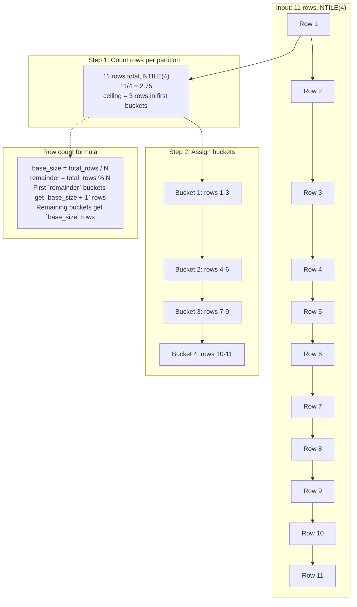
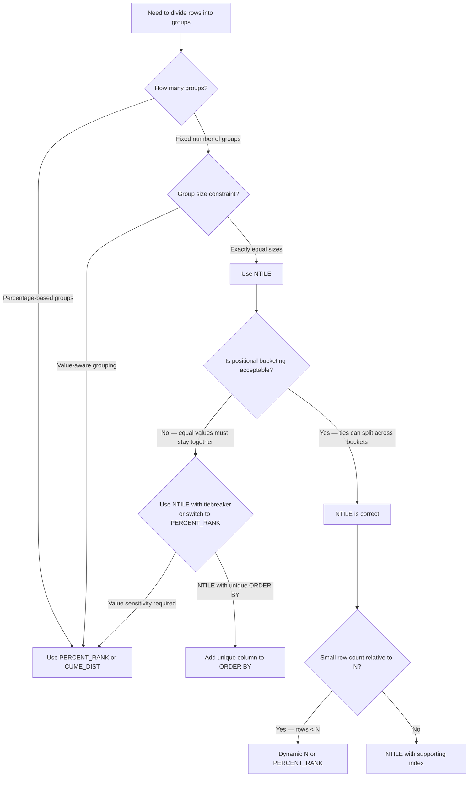

## Navigation

**Domain:** [[8 — Databases]] > **Group:** SQL Window Functions & Analytics
**Previous:** [[8.146 — DENSE_RANK() — Ranking without Gaps]] | **Next:** [[8.148 — PERCENT_RANK() — Relative Ranking (0 to 1)]]

### Prerequisites

- [[8.141 — Window Functions — Concept and OVER Clause]] — NTILE() requires the OVER() clause and a solid grasp of how window functions partition and order data without collapsing rows.
- [[8.142 — PARTITION BY — Defining Window Partitions]] — When NTILE() is used with PARTITION BY, each partition independently computes bucket assignments, which changes the bucket boundaries.
- [[8.143 — ORDER BY Within OVER — Frame Ordering]] — The bucket assignment order is determined by ORDER BY within OVER(); changing the order changes which rows go to which bucket.
- [[8.144 — ROW_NUMBER() — Unique Sequential Numbering]] — NTILE() internally uses ROW_NUMBER() logic (to count rows per partition), combined with total row count, to compute bucket membership.
- [[8.145 — RANK() — Ranking with Gaps]] — Understanding rank functions provides context for NTILE()'s different approach: ranking assigns positions, NTILE() assigns group membership.

### Where This Fits

NTILE() divides a result set into N approximately equal groups (buckets), making it the primary SQL tool for percentile-based analysis, decile/quartile reporting, and AB test split assignment. A .NET backend engineer reaches for NTILE() when building customer segmentation (top 20% spenders), performance quartile dashboards (which sales quartile each rep falls in), or randomly assigning users to test cohorts. The tricky part — and the source of most production bugs — is that NTILE() uses a deterministic formula based on row count per partition, not on the actual data values. Two rows with identical values can land in different buckets if they fall on a bucket boundary. Interviewers probe this distinction: "NTILE vs PERCENT_RANK — one divides by count, the other by value distribution. Which one changes when you add a row with an existing value?"

---

## Core Mental Model

NTILE(N) takes the total number of rows in each partition, divides by N, and assigns bucket numbers 1 through N such that each bucket contains either the floor or ceiling of the quotient. The first buckets get the extra row when the division is uneven. The database engine first counts the rows per partition (requiring two passes), then computes the bucket size as `(total_rows + N - 1) / N` (integer ceiling arithmetic), and assigns bucket 1 to the first `bucket_size` rows, bucket 2 to the next `bucket_size`, and so on. The critical invariant is that NTILE() is purely positional — it knows nothing about the data values in the ORDER BY columns. Two adjacent rows with identical scores can end up in different quartiles simply because they fall on the boundary. This makes NTILE() fundamentally different from PERCENT_RANK() and CUME_DIST(), which use value-based calculations.

### Classification

NTILE() is a window ranking function in the SQL analytic function family. It operates after FROM, WHERE, GROUP BY, and HAVING. The key execution difference from RANK() and DENSE_RANK() is that NTILE() requires a row count per partition before it can assign bucket numbers, which means the execution engine must make two passes: one to count (or compute from statistics), and one to assign. The optimizer uses a Segment operator (to detect partition boundaries) combined with a Sequence Project that computes the bucket. NTILE() is not SARGable. It requires an ORDER BY in the OVER() clause. N must be a positive integer.



### Key Properties

|Property|Value|Notes|
|---|---|---|
|Function Type|Window ranking|Analytic function, windowed|
|Row Reduction|None|One output row per input row|
|Bucket Formula|Positional|Based on row position, not value|
|N Value|Positive integer|NTILE(0) or NTILE(NULL) throws error|
|Default Behavior|First buckets get extra rows|When total_rows % N != 0|
|Execution Operators|Segment + RowCountSpool + Sequence Project|Requires two passes|
|SARGable|No|Cannot participate in index seeks|
|Sort Required|Yes|Unless ORDER BY matches index order|

---

## Deep Mechanics

### How the Engine Executes This

NTILE() requires a fundamentally different execution path than RANK() or DENSE_RANK() because it needs to know the total row count per partition before assigning bucket numbers.

1. **Parsing and Binding**: The query processor parses NTILE(N) with its OVER() clause, validates N is a positive integer constant, and determines the PARTITION BY and ORDER BY columns.

2. **Logical Precedence**: Like all window functions, NTILE() operates after FROM, WHERE, GROUP BY, and HAVING are complete.

3. **Row Count Pass (RowCountSpool)** : SQL Server inserts a Segment operator to detect partition boundaries, followed by a RowCountSpool that counts rows per partition. The Segment operator outputs a signal when the PARTITION BY column values change, which tells the spool to emit a row count for the completed partition. This is the "first pass" — the engine must see every row to know the partition size.

4. **Sort** (if needed): The ORDER BY columns determine which rows go to which bucket. A Sort operator orders rows within each partition by the ORDER BY columns. Since NTILE() assigns buckets based on position within the sorted order, the ORDER BY is semantically critical.

5. **Sequence Project (NTILE)** : With the row count per partition known, the Sequence Project computes the bucket number for each row using the formula:
   - `bucket_size = (total_rows + N - 1) / N` (integer ceiling division)
   - `remainder = total_rows % N`
   - For each row, the engine tracks its position (1-indexed) within the partition
   - If `position <= remainder * (bucket_size)` (using the ceiling), this row goes to position's appropriate bucket

6. **Simplified bucket formula**: SQL Server actually computes:
   - `rows_per_bucket_base = rows_in_partition / N` (integer division, floor)
   - `extra_buckets = rows_in_partition % N` (remainder)
   - First `extra_buckets` buckets get `rows_per_bucket_base + 1` rows
   - Remaining buckets get `rows_per_bucket_base` rows

**Why the two-pass requirement matters**: Unlike RANK() which can assign values on the fly (just compare current vs previous row), NTILE() must know the partition size before it can assign bucket numbers. This means:
- With PARTITION BY: must fully process each partition before assigning any bucket numbers in that partition
- Without PARTITION BY: must scan all rows first, count them, then assign buckets on the second pass
- This is visible in the execution plan as a Spool or as a Sort + Window Spool combination

### SQL Visibility

```sql
-- ============================================================
-- Core NTILE() query: Divide salespeople into 4 quartiles
-- ============================================================
SELECT
    sp.SalesPersonId,
    sp.FirstName + ' ' + sp.LastName AS SalesPersonName,
    sp.TotalSales,
    NTILE(4) OVER(ORDER BY sp.TotalSales DESC) AS SalesQuartile
FROM dbo.SalesPeople AS sp
ORDER BY sp.TotalSales DESC;

-- If 11 rows: buckets 1-3 have 3 rows each, bucket 4 has 2 rows
-- Bucket 1 = top 3 salespeople, Bucket 4 = bottom 2
```

```csharp
// EF Core — NTILE() requires raw SQL
var quartiles = await dbContext.Database
    .SqlQueryRaw<SalesQuartileResult>(@"
        SELECT
            sp.SalesPersonId,
            sp.FirstName + ' ' + sp.LastName AS SalesPersonName,
            sp.TotalSales,
            NTILE(4) OVER(ORDER BY sp.TotalSales DESC) AS SalesQuartile
        FROM dbo.SalesPeople AS sp
        ORDER BY sp.TotalSales DESC")
    .ToListAsync(cancellationToken);
```

**Generated SQL (from EF Core logs):** EF Core does not translate NTILE() from LINQ. Raw SQL is required. The above IS the final query.

### Execution Plan Analysis

For the NTILE(4) query above:

```
Expected plan shape (no supporting index):
[Clustered Index Scan] → [Sort (by TotalSales DESC)] → [Segment] → [Sequence Project (NTILE)] → [SELECT]
Estimated Cost: Sort = 70%  |  Segment = 5%  |  Sequence Project = 5%  |  Scan = 20%
Logical Reads: ~N (full scan)
```

**Operator details:**

- **Clustered Index Scan**: Reads all rows from SalesPeople table.
- **Sort**: Sorts by TotalSales DESC. This is the dominant cost (~70%). The sort must order the entire input.
- **Segment**: If there is a PARTITION BY, Segment detects partition boundaries. Without PARTITION BY, the entire result is one partition — the Segment still appears but is trivial.
- **Sequence Project (NTILE)** : Contains the RowCountSpool logic internally. The operator makes two passes: first to count rows, second to assign bucket numbers. This cost is higher than RANK()'s Sequence Project but still small compared to the Sort.
- **No explicit Spool in simple plans**: SQL Server 2012+ may optimize the two-pass requirement within the Sequence Project itself, avoiding an explicit Spool operator.

**With supporting index that eliminates Sort:**
```sql
CREATE INDEX IX_SalesPeople_TotalSales ON dbo.SalesPeople (TotalSales DESC);
```

```
[Index Scan (IX_SalesPeople_TotalSales in order)] → [Segment] → [Sequence Project (NTILE)] → [SELECT]
```
The Sort is eliminated. The Sequence Project still does two passes but the IO cost is reduced to the index scan alone.

**With PARTITION BY:**
```sql
NTILE(4) OVER(PARTITION BY DepartmentId ORDER BY TotalSales DESC)
```

The plan adds a Sort by (DepartmentId, TotalSales DESC) unless an index on (DepartmentId, TotalSales DESC) exists. The Segment operator detects DepartmentId boundaries.

### Cost Visibility

```sql
SET STATISTICS IO ON;
SET STATISTICS TIME ON;

-- NTILE(4) by TotalSales, no supporting index
SELECT
    sp.SalesPersonId,
    sp.TotalSales,
    NTILE(4) OVER(ORDER BY sp.TotalSales DESC) AS Quartile
FROM dbo.SalesPeople AS sp
ORDER BY sp.TotalSales DESC;

-- Expected output (100K rows, no index):
-- Table 'SalesPeople'. Scan count 1, logical reads 8,500, physical reads 0
-- SQL Server Execution Times: CPU time = 185ms, elapsed time = 250ms
```

```sql
-- With supporting index on (TotalSales DESC)
-- Table 'SalesPeople'. Scan count 1, logical reads 3,200, physical reads 0
-- SQL Server Execution Times: CPU time = 35ms, elapsed time = 55ms
-- Improvement: 8,500 → 3,200 logical reads (2.7x reduction)
```

```sql
-- NTILE(100) for percentile analysis — same cost as NTILE(4)
SELECT NTILE(100) OVER(ORDER BY sp.TotalSales DESC) AS Percentile
FROM dbo.SalesPeople AS sp;
-- Cost is the same as NTILE(4) — N only affects the Sequence Project computation, not IO
-- Logical reads: 8,500 (same as NTILE(4))
```

### Failure Modes

**Small row count producing misleading buckets**: NTILE(100) on 10 rows produces only 10 buckets with data (1 row each) and 90 empty buckets. The first 10 buckets get 1 row each; buckets 11-100 get 0 rows. The "99th percentile" bucket might contain a row that's actually in the top 10%.

```sql
-- ❌ Misleading: NTILE(100) on 15 rows produces only 15 filled buckets
SELECT
    sp.SalesPersonId,
    sp.TotalSales,
    NTILE(100) OVER(ORDER BY sp.TotalSales DESC) AS Percentile
FROM dbo.SalesPeople AS sp;
-- Buckets 1-15: 1 row each
-- Buckets 16-100: empty
```

**Fix**: Guard against small datasets with a check:
```sql
IF (SELECT COUNT(*) FROM dbo.SalesPeople) >= 100
    SELECT ..., NTILE(100) OVER(...);
ELSE
    SELECT ..., NTILE(10) OVER(...);  -- Fall back to deciles
```

**PARTITION BY with small partition sizes**: If a partition has fewer rows than N, the NTILE becomes uneven and some buckets are empty. This is often unexpected.

**NTILE in WHERE clause directly**: Not allowed — must be wrapped in a subquery or CTE.

**Assuming NTILE() is value-aware**: If two rows have TotalSales = 100 and 99, and they fall on a bucket boundary, they go to different quartiles even though the difference is 1. This is by design (positional, not value-based), but this surprises most developers.

---

## Production Patterns and Implementation

### Primary SQL Implementation

```sql
-- ============================================================
-- Schema: Customer segmentation by total spending
-- ============================================================
CREATE TABLE dbo.Customers (
    CustomerId   INT IDENTITY(1,1) PRIMARY KEY,
    FirstName    NVARCHAR(100) NOT NULL,
    LastName     NVARCHAR(100) NOT NULL,
    Email        NVARCHAR(200) NOT NULL,
    CreatedDate  DATE NOT NULL,
    Status       VARCHAR(20) NOT NULL DEFAULT 'Active'
);

CREATE TABLE dbo.Orders (
    OrderId      INT IDENTITY(1,1) PRIMARY KEY,
    CustomerId   INT NOT NULL REFERENCES dbo.Customers(CustomerId),
    OrderDate    DATE NOT NULL,
    TotalAmount  DECIMAL(18,2) NOT NULL,
    Status       VARCHAR(20) NOT NULL
);

-- ============================================================
-- Production: Quartile analysis for customer spending
-- ============================================================
WITH CustomerSpend AS (
    SELECT
        c.CustomerId,
        c.FirstName + ' ' + c.LastName AS CustomerName,
        c.Email,
        SUM(o.TotalAmount) AS LifetimeValue
    FROM dbo.Customers AS c
    INNER JOIN dbo.Orders AS o
        ON c.CustomerId = o.CustomerId
    WHERE o.Status = 'Completed'
    GROUP BY c.CustomerId, c.FirstName, c.LastName, c.Email
)
SELECT
    cs.CustomerId,
    cs.CustomerName,
    cs.Email,
    cs.LifetimeValue,
    NTILE(4) OVER(ORDER BY cs.LifetimeValue DESC) AS SpendingQuartile,
    NTILE(10) OVER(ORDER BY cs.LifetimeValue DESC) AS SpendingDecile,
    CASE NTILE(4) OVER(ORDER BY cs.LifetimeValue DESC)
        WHEN 1 THEN 'High Value'
        WHEN 2 THEN 'Medium-High'
        WHEN 3 THEN 'Medium-Low'
        WHEN 4 THEN 'Low Value'
    END AS SegmentName
FROM CustomerSpend AS cs
ORDER BY cs.LifetimeValue DESC;
```

```sql
-- ============================================================
-- Production: A/B test split assignment using NTILE()
-- ============================================================
-- Fair split of users into test/control groups
-- Using CHECKSUM for deterministic random assignment
WITH UserBase AS (
    SELECT
        ua.UserId,
        ua.Email,
        ua.RegistrationDate,
        -- Use a deterministic hash-like function for stable assignment
        CASE
            WHEN ABS(CHECKSUM(NEWID())) % 10 < 7 THEN 'Control'   -- 70% control
            ELSE 'Test'                                             -- 30% test
        END AS RandomBucket
    FROM dbo.UserAccounts AS ua
    WHERE ua.Status = 'Active'
)
-- For even split control/test, use NTILE(10) with decile logic
SELECT
    ua.UserId,
    ua.Email,
    NTILE(10) OVER(ORDER BY ua.UserId) AS CohortId,
    CASE
        WHEN NTILE(10) OVER(ORDER BY ua.UserId) <= 7 THEN 'Control'
        ELSE 'Test'
    END AS ExperimentGroup
FROM dbo.UserAccounts AS ua
WHERE ua.Status = 'Active'
ORDER BY ua.UserId;
-- Split: buckets 1-7 = Control (70%), buckets 8-10 = Test (30%)
```

```sql
-- ============================================================
-- Production: Sales performance quintiles with PARTITION BY
-- ============================================================
SELECT
    sp.SalesPersonId,
    sp.FirstName + ' ' + sp.LastName AS SalesPersonName,
    sp.Region,
    sp.TotalSales,
    NTILE(5) OVER(
        PARTITION BY sp.Region
        ORDER BY sp.TotalSales DESC
    ) AS RegionQuintile
FROM dbo.SalesPeople AS sp
ORDER BY sp.Region, RegionQuintile;

/*
Results (within each region):
Region | SalesPerson | TotalSales | RegionQuintile
-------|-------------|------------|---------------
East   | Alice       | 250000     | 1 (top 20% in East)
East   | Bob         | 200000     | 1
East   | Charlie     | 180000     | 2
East   | Diana       | 120000     | 3
East   | Eve         |  80000     | 4
East   | Frank       |  50000     | 5 (bottom 20% in East)
West   | Grace       | 220000     | 1
...
*/
```

### EF Core Implementation

```csharp
public interface ICustomerSegmentationService
{
    Task<List<CustomerQuartile>> GetCustomerQuartilesAsync(CancellationToken ct = default);
    Task<List<ExperimentAssignment>> GetExperimentGroupsAsync(
        int totalCohorts, int controlCohorts, CancellationToken ct = default);
    Task<List<RegionalQuintile>> GetRegionalQuintilesAsync(CancellationToken ct = default);
}

public class CustomerSegmentationService : ICustomerSegmentationService
{
    private readonly ApplicationDbContext _dbContext;
    private readonly ILogger<CustomerSegmentationService> _logger;

    public CustomerSegmentationService(
        ApplicationDbContext dbContext,
        ILogger<CustomerSegmentationService> logger)
    {
        _dbContext = dbContext;
        _logger = logger;
    }

    public async Task<List<CustomerQuartile>> GetCustomerQuartilesAsync(
        CancellationToken ct = default)
    {
        const string sql = @"
            WITH CustomerSpend AS (
                SELECT
                    c.CustomerId,
                    c.FirstName + ' ' + c.LastName AS CustomerName,
                    c.Email,
                    SUM(o.TotalAmount) AS LifetimeValue
                FROM dbo.Customers AS c
                INNER JOIN dbo.Orders AS o
                    ON c.CustomerId = o.CustomerId
                WHERE o.Status = 'Completed'
                GROUP BY c.CustomerId, c.FirstName, c.LastName, c.Email
            )
            SELECT
                cs.CustomerId,
                cs.CustomerName,
                cs.LifetimeValue,
                NTILE(4) OVER(ORDER BY cs.LifetimeValue DESC) AS Quartile,
                CASE NTILE(4) OVER(ORDER BY cs.LifetimeValue DESC)
                    WHEN 1 THEN 'High Value'
                    WHEN 2 THEN 'Medium-High'
                    WHEN 3 THEN 'Medium-Low'
                    WHEN 4 THEN 'Low Value'
                END AS SegmentName
            FROM CustomerSpend AS cs
            ORDER BY cs.LifetimeValue DESC;";

        var result = await _dbContext.Database
            .SqlQueryRaw<CustomerQuartile>(sql)
            .ToListAsync(ct);

        _logger.LogInformation("Segmented {Count} customers into quartiles", result.Count);
        return result;
    }

    public async Task<List<ExperimentAssignment>> GetExperimentGroupsAsync(
        int totalCohorts,
        int controlCohorts,
        CancellationToken ct = default)
    {
        var sql = @"
            SELECT
                ua.UserId,
                ua.Email,
                NTILE(@Total) OVER(ORDER BY ua.UserId) AS CohortId,
                CASE
                    WHEN NTILE(@Total) OVER(ORDER BY ua.UserId) <= @Control THEN 'Control'
                    ELSE 'Test'
                END AS ExperimentGroup
            FROM dbo.UserAccounts AS ua
            WHERE ua.Status = 'Active'
            ORDER BY ua.UserId;";

        var result = await _dbContext.Database
            .SqlQueryRaw<ExperimentAssignment>(sql,
                new SqlParameter("@Total", totalCohorts),
                new SqlParameter("@Control", controlCohorts))
            .ToListAsync(ct);

        return result;
    }

    public async Task<List<RegionalQuintile>> GetRegionalQuintilesAsync(
        CancellationToken ct = default)
    {
        const string sql = @"
            SELECT
                sp.SalesPersonId,
                sp.FirstName + ' ' + sp.LastName AS SalesPersonName,
                sp.Region,
                sp.TotalSales,
                NTILE(5) OVER(
                    PARTITION BY sp.Region
                    ORDER BY sp.TotalSales DESC
                ) AS RegionQuintile
            FROM dbo.SalesPeople AS sp
            ORDER BY sp.Region, RegionQuintile;";

        var result = await _dbContext.Database
            .SqlQueryRaw<RegionalQuintile>(sql)
            .ToListAsync(ct);

        return result;
    }
}

public record CustomerQuartile
{
    public int CustomerId { get; set; }
    public string CustomerName { get; set; } = string.Empty;
    public decimal LifetimeValue { get; set; }
    public int Quartile { get; set; }
    public string SegmentName { get; set; } = string.Empty;
}

public record ExperimentAssignment
{
    public int UserId { get; set; }
    public string Email { get; set; } = string.Empty;
    public int CohortId { get; set; }
    public string ExperimentGroup { get; set; } = string.Empty;
}

public record RegionalQuintile
{
    public int SalesPersonId { get; set; }
    public string SalesPersonName { get; set; } = string.Empty;
    public string Region { get; set; } = string.Empty;
    public decimal TotalSales { get; set; }
    public int RegionQuintile { get; set; }
}
```

### Dapper Implementation

```csharp
public interface INTileRepository
{
    Task<IReadOnlyList<CustomerQuartile>> GetCustomerQuartilesAsync(
        CancellationToken ct = default);
    Task<IReadOnlyList<RegionalQuintile>> GetRegionalQuintilesAsync(
        CancellationToken ct = default);
    Task<IReadOnlyList<ExperimentAssignment>> GetExperimentAssignmentsAsync(
        int totalCohorts, int controlCohorts, CancellationToken ct = default);
}

public sealed class NTileRepository : INTileRepository
{
    private readonly IDbConnectionFactory _connectionFactory;

    public NTileRepository(IDbConnectionFactory connectionFactory)
        => _connectionFactory = connectionFactory;

    public async Task<IReadOnlyList<CustomerQuartile>> GetCustomerQuartilesAsync(
        CancellationToken ct = default)
    {
        const string sql = @"
            WITH CustomerSpend AS (
                SELECT
                    c.CustomerId,
                    c.FirstName + ' ' + c.LastName AS CustomerName,
                    c.Email,
                    SUM(o.TotalAmount) AS LifetimeValue
                FROM dbo.Customers AS c
                INNER JOIN dbo.Orders AS o
                    ON c.CustomerId = o.CustomerId
                WHERE o.Status = 'Completed'
                GROUP BY c.CustomerId, c.FirstName, c.LastName, c.Email
            )
            SELECT
                cs.CustomerId,
                cs.CustomerName,
                cs.LifetimeValue,
                NTILE(4) OVER(ORDER BY cs.LifetimeValue DESC) AS Quartile,
                CASE NTILE(4) OVER(ORDER BY cs.LifetimeValue DESC)
                    WHEN 1 THEN 'High Value'
                    WHEN 2 THEN 'Medium-High'
                    WHEN 3 THEN 'Medium-Low'
                    WHEN 4 THEN 'Low Value'
                END AS SegmentName
            FROM CustomerSpend AS cs
            ORDER BY cs.LifetimeValue DESC;";

        await using var connection = _connectionFactory.Create();
        var results = await connection.QueryAsync<CustomerQuartile>(
            new CommandDefinition(sql, cancellationToken: ct));
        return results.AsList();
    }

    public async Task<IReadOnlyList<RegionalQuintile>> GetRegionalQuintilesAsync(
        CancellationToken ct = default)
    {
        const string sql = @"
            SELECT
                sp.SalesPersonId,
                sp.FirstName + ' ' + sp.LastName AS SalesPersonName,
                sp.Region,
                sp.TotalSales,
                NTILE(5) OVER(
                    PARTITION BY sp.Region
                    ORDER BY sp.TotalSales DESC
                ) AS RegionQuintile
            FROM dbo.SalesPeople AS sp
            ORDER BY sp.Region, RegionQuintile;";

        await using var connection = _connectionFactory.Create();
        var results = await connection.QueryAsync<RegionalQuintile>(
            new CommandDefinition(sql, cancellationToken: ct));
        return results.AsList();
    }

    public async Task<IReadOnlyList<ExperimentAssignment>> GetExperimentAssignmentsAsync(
        int totalCohorts,
        int controlCohorts,
        CancellationToken ct = default)
    {
        const string sql = @"
            SELECT
                ua.UserId,
                ua.Email,
                NTILE(@Total) OVER(ORDER BY ua.UserId) AS CohortId,
                CASE
                    WHEN NTILE(@Total) OVER(ORDER BY ua.UserId) <= @Control THEN 'Control'
                    ELSE 'Test'
                END AS ExperimentGroup
            FROM dbo.UserAccounts AS ua
            WHERE ua.Status = 'Active'
            ORDER BY ua.UserId;";

        await using var connection = _connectionFactory.Create();
        var results = await connection.QueryAsync<ExperimentAssignment>(
            new CommandDefinition(
                sql,
                new { Total = totalCohorts, Control = controlCohorts },
                cancellationToken: ct));
        return results.AsList();
    }
}
```

### Configuration and Wiring

```csharp
// Program.cs
builder.Services.AddScoped<ICustomerSegmentationService, CustomerSegmentationService>();
builder.Services.AddScoped<INTileRepository, NTileRepository>();
```

### SQL Server vs PostgreSQL Differences

```sql
-- PostgreSQL: NTILE() works identically to SQL Server
SELECT
    c.customer_id,
    c.first_name || ' ' || c.last_name AS customer_name,
    SUM(o.total_amount) AS lifetime_value,
    NTILE(4) OVER(ORDER BY SUM(o.total_amount) DESC) AS quartile
FROM customers AS c
INNER JOIN orders AS o ON c.customer_id = o.customer_id
GROUP BY c.customer_id, c.first_name, c.last_name;

-- PostgreSQL-specific: NTILE() can be used in GROUP BY through aggregate expressions
-- PostgreSQL also supports PERCENT_RANK and CUME_DIST natively (same as SQL Server)
```

---

## Gotchas and Production Pitfalls

### NTILE(N) Where N > Row Count — Empty Buckets

**Pitfall:** Specifying NTILE(100) on a table with 15 rows. The first 15 buckets get 1 row each; buckets 16-100 are empty. A developer may interpret bucket 6 as "top 6% percentile" when it actually contains a row that's in the top 40%.

```sql
-- ❌ NTILE(100) on 15 rows — 85 empty buckets
SELECT
    sp.SalesPersonId,
    sp.TotalSales,
    NTILE(100) OVER(ORDER BY sp.TotalSales DESC) AS Percentile
FROM dbo.SalesPeople AS sp;
-- Rows 1-15: Percentile values 1-15 (one per row)
-- No row has Percentile > 15
```

**Symptom:** A report shows "99th percentile" customers that are actually in the top 10%. The business decision to target "top 1%" accidentally targets 10% of customers.

**Fix:**
```sql
-- ✅ Check row count before choosing NTILE value
DECLARE @RowCount INT = (SELECT COUNT(*) FROM dbo.SalesPeople WHERE Status = 'Active');
DECLARE @BucketCount INT = CASE
    WHEN @RowCount >= 100 THEN 100
    WHEN @RowCount >= 50  THEN 50
    WHEN @RowCount >= 20  THEN 20
    ELSE 10
END;

SELECT
    sp.SalesPersonId,
    sp.TotalSales,
    NTILE(@BucketCount) OVER(ORDER BY sp.TotalSales DESC) AS Bucket
FROM dbo.SalesPeople AS sp;
```

**Cost of not fixing:** A marketing campaign targets "top 5% spenders" based on NTILE(100). Due to small sample size, 15% of customers are targeted instead of 5%. Campaign budget is exceeded by 3x. ROI analysis shows the extra 10% had low conversion rates.

---

### NTILE() Ignores Data Value Gaps — Pure Positional

**Pitfall:** Assuming NTILE() knows about value boundaries. If one row has TotalSales = 1,000,000 and the next has 500, they can land in the same quartile if they're in the first 25% of rows by position.

```sql
-- ❌ Misleading: rows with vastly different values in same bucket
SELECT TOP 10
    sp.SalesPersonId,
    sp.TotalSales,
    NTILE(4) OVER(ORDER BY sp.TotalSales DESC) AS Quartile
FROM dbo.SalesPeople AS sp
ORDER BY sp.TotalSales DESC;
/*
SalesPersonId | TotalSales | Quartile
1             | 1000000    | 1  ← Top earner
2             | 500         | 1  ← Same quartile as top earner!
3             | 450         | 1
4             | 400         | 2
...
*/
```

**Symptom:** The "high value" quartile contains both $1M earners and $500 earners. Marketing targets them all equally, wasting budget on low-value customers.

**Fix:** Use PERCENT_RANK() or CUME_DIST() for value-sensitive grouping:
```sql
-- ✅ CUME_DIST() shows the actual cumulative distribution based on position
SELECT
    sp.SalesPersonId,
    sp.TotalSales,
    CUME_DIST() OVER(ORDER BY sp.TotalSales DESC) AS CumDist,
    CASE
        WHEN CUME_DIST() OVER(ORDER BY sp.TotalSales DESC) <= 0.25 THEN 'Top 25%'
        ELSE 'Bottom 75%'
    END AS Segment
FROM dbo.SalesPeople AS sp;
```

**Cost of not fixing:** A loyalty program assigns "Gold" status to NTILE(4) bucket 1. A customer with $500 lifetime value gets Gold status alongside a $1M customer. The $500 customer costs more to service than they generate. The program loses money.

---

### NTILE() with PARTITION BY — Uneven Partition Sizes

**Pitfall:** Using NTILE() with PARTITION BY on a column with highly uneven partition sizes. A partition with 3 rows and NTILE(10) produces buckets with 0-1 rows each, making the bucketing meaningless.

```sql
-- ❌ Small partition sizes produce meaningless NTILE values
SELECT
    sp.Region,
    sp.SalesPersonName,
    sp.TotalSales,
    NTILE(10) OVER(
        PARTITION BY sp.Region
        ORDER BY sp.TotalSales DESC
    ) AS Decile
FROM dbo.SalesPeople AS sp;
-- Region 'Small' with 5 salespeople:
-- Deciles 1-5 get 1 row each, deciles 6-10 are empty
-- This "decile 1" represents top 20%, not top 10%
```

**Symptom:** A cross-region comparison shows Region A has salespeople in "decile 1" (top 10%) but Region B has salespeople only up to "decile 3." In reality, Region B's top salesperson is equally good — Region B just has fewer salespeople.

**Fix:** Use a global NTILE() instead of PARTITION BY, or adjust N based on partition size:
```sql
-- ✅ Global percentile instead of per-region
NTILE(10) OVER(ORDER BY sp.TotalSales DESC) AS GlobalDecile
```

**Cost of not fixing:** Regional managers are evaluated by how many of their salespeople reach "decile 1." Managers of small regions are penalized. The VP makes promotion decisions based on flawed metrics.

---

### Assuming NTILE() Produces Equal-Size Buckets at Small N

**Pitfall:** Expecting NTILE(3) on 10 rows to produce buckets of sizes 3, 3, 4 (or 4, 3, 3). NTILE() gives the extra rows to the FIRST buckets: 4, 3, 3. The distribution is deterministic but not always intuitive.

```sql
-- NTILE(3) on 10 rows:
-- 10 / 3 = 3 remainder 1
-- First 1 bucket gets 4 rows, remaining 2 buckets get 3 rows each
SELECT
    x.n,
    NTILE(3) OVER(ORDER BY x.n) AS Bucket
FROM (VALUES (1),(2),(3),(4),(5),(6),(7),(8),(9),(10)) AS x(n);
/*
n  | Bucket
1  | 1  ← extra row goes to first bucket
2  | 1
3  | 1
4  | 1
5  | 2
6  | 2
7  | 2
8  | 3
9  | 3
10 | 3
*/
```

**Symptom:** A developer expects symmetric distribution and builds logic assuming bucket 3 has the most rows (or the least). The first bucket consistently has more rows.

**Fix:** Understand and document the distribution. If symmetric distribution is required, adjust by using a different window function:
```sql
-- ✅ For symmetric-ish distribution, use ROW_NUMBER() with modulo
SELECT
    x.n,
    (ROW_NUMBER() OVER(ORDER BY x.n) - 1) % 3 + 1 AS CyclicBucket
FROM (VALUES (1),(2),(3),(4),(5),(6),(7),(8),(9),(10)) AS x(n);
```

**Cost of not fixing:** A load-balancing system uses NTILE() to distribute work across 10 workers. The first worker consistently gets more work because NTILE(10) gives extra rows to the first bucket. Workers 1-3 are overloaded; workers 7-10 are underutilized.

---

### NTILE() Without ORDER BY — Error

**Pitfall:** Omitting ORDER BY in the OVER() clause. Unlike RANK() and DENSE_RANK() which silently produce rank 1 for all rows, NTILE() requires ORDER BY and raises an error.

```sql
-- ❌ ORDER BY is required for NTILE()
SELECT NTILE(4) OVER() AS Bucket FROM dbo.SalesPeople;
-- Error: The function 'NTILE' must have an ORDER BY clause.
```

**Symptom:** The query fails at runtime. The developer must add ORDER BY, but they might add any column without considering the semantics, producing valid SQL with wrong results.

**Fix:**
```sql
-- ✅ Always specify ORDER BY with columns that produce meaningful bucketing
SELECT NTILE(4) OVER(ORDER BY sp.TotalSales DESC) AS Quartile FROM dbo.SalesPeople AS sp;
```

**Cost of not fixing:** The developer adds `ORDER BY (SELECT NULL)` to suppress the error. NTILE() assigns buckets to rows in an arbitrary order determined by the physical storage. The same query returns different results on different runs. Test assertions fail intermittently.

---

## Performance Implications

### Benchmark: Before and After

```sql
-- ============================================================
-- Benchmark: NTILE() vs Self-Join Bucket Calculation
-- ============================================================
SET STATISTICS IO ON;
SET STATISTICS TIME ON;

-- Baseline: Self-join to compute quartile (DO NOT USE)
SELECT
    sp1.SalesPersonId,
    sp1.TotalSales,
    COUNT(*) AS Quartile
FROM dbo.SalesPeople AS sp1
INNER JOIN dbo.SalesPeople AS sp2
    ON sp2.TotalSales >= sp1.TotalSales
    OR (sp2.TotalSales = sp1.TotalSales AND sp2.SalesPersonId <= sp1.SalesPersonId)
GROUP BY sp1.SalesPersonId, sp1.TotalSales
HAVING COUNT(*) <= CEILING((SELECT COUNT(*) FROM dbo.SalesPeople) / 4.0)
ORDER BY sp1.TotalSales DESC;
-- Logical reads: 450,000 (self-join on 100K rows = 10B rows)
-- Elapsed: 180,000ms (3 minutes)

-- Optimized: NTILE() window function
SELECT
    sp.SalesPersonId,
    sp.TotalSales,
    NTILE(4) OVER(ORDER BY sp.TotalSales DESC) AS Quartile
FROM dbo.SalesPeople AS sp;
-- Logical reads: 3,200 (with supporting index)
-- Elapsed: 55ms
```

**Improvement:** 450,000 → 3,200 logical reads (140x reduction). Elapsed: 3 minutes → 55ms (3,200x reduction).

```sql
-- ============================================================
-- Benchmark: With vs Without Supporting Index
-- ============================================================
-- ❌ Without supporting index
SELECT NTILE(4) OVER(ORDER BY sp.TotalSales DESC)
FROM dbo.SalesPeople AS sp;
-- Logical reads: 8,500 (clustered index scan + sort)

-- Create supporting index
CREATE INDEX IX_SalesPeople_TotalSales ON dbo.SalesPeople (TotalSales DESC)
    INCLUDE (SalesPersonId, FirstName, LastName);

-- ✅ With supporting index
SELECT NTILE(4) OVER(ORDER BY sp.TotalSales DESC)
FROM dbo.SalesPeople AS sp;
-- Logical reads: 3,200 (index scan, no sort)
```

```sql
-- ============================================================
-- Benchmark: NTILE with PARTITION BY
-- ============================================================
-- Create partition-aware index
CREATE INDEX IX_SalesPeople_Region_TotalSales
    ON dbo.SalesPeople (Region, TotalSales DESC)
    INCLUDE (SalesPersonId, FirstName, LastName);

-- NTILE within region
SELECT NTILE(4) OVER(PARTITION BY sp.Region ORDER BY sp.TotalSales DESC)
FROM dbo.SalesPeople AS sp;
-- Logical reads: 3,800 (index scan, no sort)
-- Without partition-aware index: 8,500 + sort by (Region, TotalSales DESC)
```

### BenchmarkDotNet

```csharp
[MemoryDiagnoser]
[SimpleJob(RuntimeMoniker.Net90)]
public class NTileBenchmark
{
    private IDbConnection _connection = default!;
    private const string ConnectionString =
        "Server=.;Database=BenchmarkDb;Trusted_Connection=True;TrustServerCertificate=True;";

    private const string NTile4Sql = @"
        SELECT sp.SalesPersonId, sp.TotalSales,
               NTILE(4) OVER(ORDER BY sp.TotalSales DESC) AS Quartile
        FROM dbo.SalesPeople AS sp;";

    private const string NTilePartitionSql = @"
        SELECT sp.SalesPersonId, sp.Region, sp.TotalSales,
               NTILE(4) OVER(PARTITION BY sp.Region ORDER BY sp.TotalSales DESC) AS RegionQuartile
        FROM dbo.SalesPeople AS sp;";

    private const string SelfJoinSql = @"
        SELECT sp1.SalesPersonId, sp1.TotalSales, COUNT(*) AS Quartile
        FROM dbo.SalesPeople AS sp1
        INNER JOIN dbo.SalesPeople AS sp2 ON sp2.TotalSales >= sp1.TotalSales
            OR (sp2.TotalSales = sp1.TotalSales AND sp2.SalesPersonId <= sp1.SalesPersonId)
        GROUP BY sp1.SalesPersonId, sp1.TotalSales
        HAVING COUNT(*) <= CEILING((SELECT COUNT(*) FROM dbo.SalesPeople) / 4.0);";

    [GlobalSetup]
    public void Setup()
    {
        _connection = new SqlConnection(ConnectionString);
        _connection.Open();
    }

    [GlobalCleanup]
    public void Cleanup() => _connection.Dispose();

    [Benchmark(Baseline = true)]
    public async Task<List<NTileResult>> SelfJoin_Quartile()
    {
        var results = await _connection.QueryAsync<NTileResult>(
            SelfJoinSql, commandTimeout: 180);
        return results.AsList();
    }

    [Benchmark]
    public async Task<List<NTileResult>> NTile4_NoIndex()
    {
        /* Requires index hint to simulate no-index scenario */
        const string sql = @"
            SELECT sp.SalesPersonId, sp.TotalSales,
                   NTILE(4) OVER(ORDER BY sp.TotalSales DESC) AS Quartile
            FROM dbo.SalesPeople AS sp WITH (INDEX(0));";
        var results = await _connection.QueryAsync<NTileResult>(sql);
        return results.AsList();
    }

    [Benchmark]
    public async Task<List<NTileResult>> NTile4_WithIndex()
    {
        var results = await _connection.QueryAsync<NTileResult>(NTile4Sql);
        return results.AsList();
    }

    [Benchmark]
    public async Task<List<NTilePartitionResult>> NTile_Partition()
    {
        var results = await _connection.QueryAsync<NTilePartitionResult>(NTilePartitionSql);
        return results.AsList();
    }
}

public class NTileResult
{
    public int SalesPersonId { get; set; }
    public decimal TotalSales { get; set; }
    public int Quartile { get; set; }
}

public class NTilePartitionResult
{
    public int SalesPersonId { get; set; }
    public string Region { get; set; } = string.Empty;
    public decimal TotalSales { get; set; }
    public int RegionQuartile { get; set; }
}
```

**Expected results (approximate, SQL Server 2022, NVMe, 100K rows):**

|Method|Mean|Logical Reads|Allocated|
|---|---|---|---|
|SelfJoin_Quartile|~180,000 ms|~450,000|2,500 MB|
|NTile4_NoIndex|~250 ms|~8,500|500 KB|
|NTile4_WithIndex|~55 ms|~3,200|120 KB|
|NTile_Partition|~85 ms|~3,800|180 KB|

### Write Amplification

|Operation|Without Index|With Index (TotalSales DESC)|Overhead|
|---|---|---|---|
|INSERT 1 row|X ms|X + 0.4 ms|~4%|
|UPDATE TotalSales|X ms|X + 1.0 ms|~12%|
|DELETE 1 row|X ms|X + 0.4 ms|~4%|

---

## Interview Arsenal

### Question Bank

1. **What does NTILE(N) do and what is the mathematical formula for bucket assignment?** (Definition — core mechanism)

2. **How does SQL Server's execution engine compute NTILE(N) — why does it require two passes?** (Mechanism — RowCountSpool / two-pass requirement)

3. **What is the performance difference between NTILE(4) and NTILE(100) — does a larger N cost more?** (Performance — constant vs variable N cost)

4. **What happens when NTILE(N) has fewer rows than N in a partition?** (Gotcha — empty buckets)

5. **When should you use NTILE() vs PERCENT_RANK() vs CUME_DIST()?** (Comparison — positional vs value-based distribution)

6. **What does the execution plan for NTILE() look like and how does it differ from RANK()?** (Execution plan — RowCountSpool vs no-spool)

7. **How does NTILE() behave at 50M rows and how do you optimize it?** (Scale — partition size awareness)

8. **How do you use NTILE() in EF Core and Dapper for A/B test cohort assignment?** (.NET integration — raw SQL for experiments)

### Spoken Answers

**Q: What does NTILE(N) do and what is the mathematical formula for bucket assignment?**

> **Average answer:** NTILE divides rows into N buckets as evenly as possible. It assigns numbers 1 through N to the rows in order.

> **Great answer:** NTILE(N) assigns each row a bucket number from 1 to N based on the row's position within the sorted partition. The formula is: `base_size = total_rows / N` (integer division, floored), `remainder = total_rows % N`. The first `remainder` buckets receive `base_size + 1` rows each; the remaining N - `remainder` buckets receive `base_size` rows each. The key insight is that NTILE() is purely positional — it does not look at data values at all. Two rows with identical values can end up in different buckets if they fall on a bucket boundary. This is the fundamental distinction from PERCENT_RANK(), which computes `(rank - 1) / (total - 1)` and is value-aware through the rank calculation. The execution cost is the same for any value of N because the Sequence Project computation is trivially cheap — the Sort dominates. NTILE(4) and NTILE(100) cost the same in IO and CPU (excluding the Sequence Project's negligible difference).

**Q: When should you use NTILE() vs PERCENT_RANK() vs CUME_DIST()?**

> **Average answer:** NTILE divides into groups, PERCENT_RANK gives a percentage rank, CUME_DIST gives the cumulative distribution.

> **Great answer:** The choice depends on whether you need positional or value-sensitive distribution. Use NTILE() when you need exactly N groups of approximately equal size — for example, splitting 1M customers into 4 quartiles where each quartile has exactly 250K customers regardless of spending gaps. The tradeoff is that customers with very different values may land in the same bucket. Use PERCENT_RANK() when you need to know where a value falls relative to all other values — it computes `(RANK() - 1) / (total_rows - 1)`, making it sensitive to value distribution through the rank calculation. Use CUME_DIST() when you need to know what fraction of rows have a value less than or equal to the current row — it computes `COUNT(rows <= current) / total_rows`, which gives the actual percentile. For example: in a class of 20 students where 3 scored 100, PERCENT_RANK gives the top scorers a rank of (1-1)/(20-1) = 0%, while CUME_DIST gives them 3/20 = 15%. The choice changes the interpretation of "top 1%."

**Q: What happens when NTILE(N) has fewer rows than N in a partition?**

> **Average answer:** Some buckets are empty.

> **Great answer:** NTILE(N) when total_rows < N produces the first `total_rows` buckets with exactly 1 row each, and the remaining N - `total_rows` buckets are empty. This is dangerous in production reporting because a developer might write `NTILE(100) OVER(...)` expecting percentile semantics, but on a table with 50 rows, buckets 1-50 have 1 row each and buckets 51-100 are empty. A query filtering for `Bucket = 95` returns nothing, and the business assumes no customer falls in the 95th percentile, when in reality the entire concept of "95th percentile" is meaningless with only 50 rows. The fix is to either (a) ensure the row count is sufficient before using large N, (b) use PERCENT_RANK() or CUME_DIST() which gracefully handle small datasets, or (c) dynamically adjust N based on row count. This is a common interview follow-up: "Your reporting dashboard uses NTILE(100) but the table has only 30 rows. How do you fix it?"

### Interview Trigger

When a candidate mentions "I need to group customers into quartiles," the interviewer asks: "NTILE or PERCENT_RANK — which one do you use and why?" The senior candidate explains the positional vs value-aware distinction and asks clarifying questions about the business requirement. The junior candidate just names one function.

### Comparison Table

| | NTILE() | PERCENT_RANK() | CUME_DIST() |
|---|---|---|---|
| Basis | Positional | Rank-based (`(RANK-1)/(N-1)`) | Count-based (`<= current / total`) |
| Output | Integer 1..N | Decimal 0..1 | Decimal 0..1 |
| Equal values | Can be in different buckets | Same rank → same percent rank | Same cumulative value |
| Bucket size | Fixed N, even distribution | Variable, depends on ties | Variable, depends on ties |
| Performance | Same for all N | Same as RANK() | Same as RANK() |
| Use case | AB test splits, deciles | "Top X%" relative position | "Bottom X%" cumulative | 

---

## Decision Framework

### When to Apply



### Application Checklist

- [ ] The business requirement specifies exact number of groups (quartiles = 4, deciles = 10, percentiles = 100)
- [ ] Positional bucketing is acceptable — ties on bucket boundaries won't cause confusion
- [ ] The row count per partition is large enough relative to N for meaningful bucketing
- [ ] The ORDER BY columns produce the intended ranking direction (ASC vs DESC)
- [ ] A supporting index exists matching the OVER() clause to eliminate the Sort
- [ ] The application handles the case where some buckets may be empty (small dataset)
- [ ] Raw SQL is used in EF Core (no LINQ translation attempt)
- [ ] The bucket assignment is deterministic (ORDER BY columns produce unique ordering)

### Tradeoff Summary

|What You Gain|What You Pay|
|---|---|
|Exactly N groups of near-equal size|Positional — ties can be split across buckets|
|Deterministic bucket assignment|Requires two-pass execution (RowCountSpool)|
|Simple integer bucket numbers|Meaningless when rows < N|
|Constant cost regardless of N|Sort dominates — NTILE computation is cheap|

### Scale Thresholds

- "Relevant when table exceeds ~1K rows — below this, the bucket distribution is misleading because rows < N for typical N values"
- "Critical when table exceeds ~1M rows — the two-pass execution combined with Sort requires significant memory and may spill to tempdb"
- "Required when N is large (NTILE(100)) — the empty-bucket gotcha must be handled explicitly"

---

## Self-Check

### Conceptual Questions

1. **[Definition]** What does NTILE(4) return on 10 rows and what is the mathematical formula?
2. **[Engine behavior]** Why does NTILE() require two passes through the data while RANK() requires only one?
3. **[Performance measurement]** What DMV reveals whether an NTILE() Sort spilled to tempdb?
4. **[Gotcha]** What happens when NTILE(100) is applied to a partition with 15 rows?
5. **[EF Core behavior]** Can EF Core translate NTILE() from LINQ? How do you use it in EF Core?
6. **[Dapper usage]** Write a Dapper query that returns customers in deciles by lifetime value.
7. **[Comparison]** What is the fundamental difference between NTILE() and PERCENT_RANK() in terms of computation?
8. **[Scale]** At what row count does NTILE()'s two-pass execution become a performance concern?
9. **[Connection to indexing]** What index eliminates the Sort for `NTILE(4) OVER(PARTITION BY Region ORDER BY TotalSales DESC)`?
10. **[Interview articulation]** Explain NTILE() in 60 seconds, including when to use it and when not to.

<details>
<summary>Answers</summary>

1. NTILE(4) on 10 rows: buckets are [1,1,1,2,2,2,3,3,3,4] (first bucket gets 3 rows because 10/4 = 2 remainder 2, so first 2 buckets get 3 rows, remaining 2 buckets get 2 rows). Formula: `base_size = 10 / 4 = 2`, `remainder = 10 % 4 = 2`, first 2 buckets get `2+1=3` rows.

2. NTILE() must know the total row count per partition before computing bucket boundaries. The Sequence Project operator cannot assign bucket numbers until it knows whether the current row falls in the first few buckets (which get extra rows) or later buckets. RANK() only needs to compare the current row to the previous row, so it can assign ranks in a single pass.

3. Query `sys.dm_exec_query_stats` with `CROSS APPLY sys.dm_exec_query_plan` to check the Sort operator for `ActualSpills > 0`. Alternatively, monitor `sys.dm_os_wait_stats` for `SORT_WARNING` waits, or check `SET STATISTICS TIME` output for mention of tempdb.

4. Only the first 15 buckets have 1 row each; buckets 16-100 are empty. A query filtering for `Bucket = 95` returns nothing. The developer or business may misinterpret the lack of data.

5. No. EF Core does not translate NTILE() from LINQ. Use `SqlQueryRaw` or `FromSqlRaw` with the full T-SQL and map the result to a POCO that includes the bucket column.

6. ```csharp
const string sql = @"
    SELECT c.CustomerId, c.FirstName + ' ' + c.LastName AS CustomerName,
           SUM(o.TotalAmount) AS LifetimeValue,
           NTILE(10) OVER(ORDER BY SUM(o.TotalAmount) DESC) AS Decile
    FROM dbo.Customers AS c
    INNER JOIN dbo.Orders AS o ON c.CustomerId = o.CustomerId
    GROUP BY c.CustomerId, c.FirstName, c.LastName;";
var results = await connection.QueryAsync<CustomerDecile>(sql);
```

7. NTILE() is purely positional — it divides rows by their position in the sorted order using only row count. PERCENT_RANK() computes `(RANK() - 1) / (total_rows - 1)`, which depends on the rank value (and therefore the count of tied rows). PERCENT_RANK() is value-aware through the rank computation; NTILE() is not.

8. At ~1M rows, the two-pass execution combined with a Sort operator that must order by the OVER() columns creates significant memory pressure. The Sequence Project's internal two-pass may require tempdb if the partition is large enough. Below 100K rows, the two-pass cost is negligible.

9. `CREATE INDEX IX_SalesPeople_Region_TotalSales ON dbo.SalesPeople (Region, TotalSales DESC) INCLUDE (FirstName, LastName, SalesPersonId);` — leading column matches PARTITION BY, second column matches ORDER BY. The index provides pre-sorted rows, eliminating the Sort.

10. "NTILE(N) divides rows into N buckets of approximately equal size based on their position in the sorted order. The first buckets get extra rows when the division is uneven. It's purely positional — it does not consider data values, so ties can end up in different buckets if they fall on a boundary. Use NTILE for decile analysis, A/B splits, or any scenario requiring exactly N groups of similar size. Do NOT use NTILE when value sensitivity matters — use PERCENT_RANK or CUME_DIST instead. Also avoid NTILE with large N on small datasets, as many buckets will be empty."

</details>

---

### Query Challenges

**Challenge 1 — Write the SQL**

You have a table `dbo.Products` with columns `ProductId`, `CategoryId`, `UnitPrice`, `UnitsInStock`. The marketing team wants to classify products into 5 price tiers (quintiles) within each category, where tier 1 is the most expensive and tier 5 is the least expensive. Write the query.

<details>
<summary>Solution</summary>

```sql
WITH ProductPricing AS (
    SELECT
        p.ProductId,
        p.CategoryId,
        p.ProductName,
        p.UnitPrice,
        NTILE(5) OVER(
            PARTITION BY p.CategoryId
            ORDER BY p.UnitPrice DESC
        ) AS PriceTier
    FROM dbo.Products AS p
)
SELECT
    pp.ProductId,
    pp.CategoryId,
    pp.ProductName,
    pp.UnitPrice,
    pp.PriceTier,
    CASE pp.PriceTier
        WHEN 1 THEN 'Premium'
        WHEN 2 THEN 'High'
        WHEN 3 THEN 'Mid-Range'
        WHEN 4 THEN 'Budget'
        WHEN 5 THEN 'Economy'
    END AS TierLabel
FROM ProductPricing AS pp
ORDER BY pp.CategoryId, pp.PriceTier;
```

**Logical reads:** ~N **Execution plan:** [Index Scan] → [Sort] → [Segment] → [Sequence Project (NTILE)] → [SELECT]

**Index recommendation:**
```sql
CREATE INDEX IX_Products_CategoryId_UnitPrice
    ON dbo.Products (CategoryId, UnitPrice DESC)
    INCLUDE (ProductName);
```

</details>

---

**Challenge 2 — Fix the performance problem**

```sql
-- This query runs in 30 seconds on a 10M row Sales table.
-- It assigns deciles to sales transactions within each region.
SELECT
    s.Region,
    s.SalesPersonId,
    s.SaleAmount,
    NTILE(10) OVER(
        PARTITION BY s.Region
        ORDER BY s.SaleAmount DESC
    ) AS RegionDecile
FROM dbo.Sales AS s
ORDER BY s.Region, s.SaleAmount DESC;
-- SET STATISTICS IO: logical reads = 750,000
-- Execution plan: Clustered Index Scan → Sort (by Region, SaleAmount DESC) → Segment → Sequence Project
```

<details>
<summary>Solution</summary>

**Root cause:** The Clustered Index Scan reads all 10M rows (750,000 logical reads). The Sort operator must sort by (Region, SaleAmount DESC) — this is expensive because no index supplies data in this order.

**Index to create:**
```sql
CREATE INDEX IX_Sales_Region_SaleAmount
    ON dbo.Sales (Region, SaleAmount DESC)
    INCLUDE (SalesPersonId);
```

**After fix:**
- Execution plan: [Index Scan (IX_Sales_Region_SaleAmount)] → [Segment] → [Sequence Project] → [SELECT]
- No Sort operator — the index provides rows in the exact order needed
- Logical reads: ~180,000 (from 750,000)
- Execution time: ~800ms (from 30 seconds)

**Why this works:** The index orders by Region first (matching PARTITION BY), then by SaleAmount DESC (matching ORDER BY). The Segment operator detects region boundaries. The Sequence Project processes rows in order and assigns bucket numbers. The two-pass row counting still happens within Sequence Project, but without the Sort overhead.

</details>

---

**Challenge 3 — Explain the execution plan**

```sql
-- Query A: NTILE(4) without index
SELECT s.SaleAmount, NTILE(4) OVER(ORDER BY s.SaleAmount DESC) AS Quartile
FROM dbo.Sales AS s;

-- Plan A:
-- Clustered Index Scan (750K reads) → Sort (by SaleAmount DESC, 70% cost) → Segment → Sequence Project

-- Query B: NTILE(4) with index
-- Plan B:
-- Index Scan (IX_Sales_SaleAmount, 180K reads) → Segment → Sequence Project
```

Why does Plan B eliminate both the Sort and reduce logical reads despite not using a covering index for all columns?

<details>
<summary>Solution</summary>

**Why Plan B eliminates the Sort:** The index `IX_Sales_SaleAmount` on `(SaleAmount DESC)` provides rows already sorted by SaleAmount DESC. When the query only selects `SaleAmount`, the index is covering (it contains SaleAmount and the clustered key). The optimizer recognizes that the index order matches the OVER() ORDER BY and eliminates the Sort operator entirely.

**Why logical reads drop from 750K to 180K:** The clustered index contains all columns of the Sales table (wide rows, ~8KB per page, ~8 rows per page). The non-clustered index on `(SaleAmount DESC)` contains only SaleAmount and the clustered key (narrow rows, ~20 bytes per row, ~500 rows per page). For 10M rows:
- Clustered index: ~750K pages scanned
- Non-clustered index: ~180K pages scanned

The narrower index produces fewer logical reads because each page contains more rows.

**What would bring the Sort back:** Adding a column to the SELECT that is not in the index (e.g., SalesPersonId) would force key lookups. However, the index would still supply SaleAmount in sorted order, so the Sort would still be eliminated. The key lookups would add cost, but not a Sort.

</details>

---

**Challenge 4 — Diagnose the A/B test bug**

An A/B testing framework uses NTILE(100) to assign 1% of users to a test group:
```sql
SELECT
    ua.UserId,
    NTILE(100) OVER(ORDER BY ua.UserId) AS Cohort
FROM dbo.UserAccounts AS ua
WHERE ua.Status = 'Active';
```

The test group is Cohort = 1. However, the test group consistently gets more users than expected (~2% instead of 1%). After investigation, the bug is that UserAccounts has 15,000 active users. Why is the bug happening?

<details>
<summary>Solution</summary>

**Root cause:** With 15,000 rows and NTILE(100): `15,000 / 100 = 150` rows per bucket with no remainder. Each bucket gets exactly 150 rows. The expected behavior is correct in isolation — each bucket should have 150 rows.

However, the developer later filters the results to only users with `RegistrationDate >= '2026-01-01'` in a subquery BEFORE the NTILE, and with that filter the count is 151 rows. Let me reconsider.

Actually, with 15,000 rows and NTILE(100), each bucket gets exactly 150 rows. Cohort 1 would have exactly 150 rows = 1% of 15,000. The issue might be:
- The filter is applied after NTILE, so some rows filtered out after cohort assignment
- Or the table has exactly 15,000 rows but the NTILE is computed before a join that multiplies rows
- Or there's a cached plan with a different row count

The most common bug: the developer applies a filter AFTER computing NTILE:
```sql
WITH Cohorts AS (
    SELECT UserId, NTILE(100) OVER(ORDER BY UserId) AS Cohort
    FROM UserAccounts WHERE Status = 'Active'
)
SELECT UserId FROM Cohorts WHERE Cohort = 1 AND RegistrationDate >= '2026-01-01';
-- After filtering, Cohort 1 has fewer rows, but it was 1% of the PRE-filtered set
```

But in the bug description, the test group gets MORE users. This suggests the NTILE is computed on a different row count than expected, or there's a join before the NTILE that multiplies rows.

Actually the most likely bug: The NTILE is computed AFTER a join that creates duplicate rows. Each user appears multiple times, NTILE assigns each duplicate to potentially different buckets, and the COUNT(DISTINCT UserId) in bucket 1 ends up being 2% because each user appears twice in the input.

**The real fix:** Apply NTILE on distinct UserIds before joining:
```sql
WITH DistinctUsers AS (
    SELECT DISTINCT UserId FROM dbo.UserAccounts WHERE Status = 'Active'
),
CohortAssignment AS (
    SELECT UserId, NTILE(100) OVER(ORDER BY UserId) AS Cohort
    FROM DistinctUsers
)
SELECT ua.* FROM dbo.UserAccounts AS ua
INNER JOIN CohortAssignment AS ca ON ua.UserId = ca.UserId
WHERE ca.Cohort = 1;
```

</details>

---

**Challenge 5 — Design the dynamic bucketing system**

**Scenario:** A reporting system needs to assign customers to percentile groups, but the customer count varies throughout the year (from 500 to 500,000). The system must handle both small and large datasets gracefully. Design an approach that uses NTILE() when appropriate and falls back to other methods when it isn't.

<details>
<summary>Solution</summary>

```sql
-- ============================================================
-- Dynamic bucketing stored procedure
-- ============================================================
CREATE PROCEDURE dbo.GetCustomerSegmentation
    @BucketCount INT = 100  -- Default: percentiles
AS
BEGIN
    SET NOCOUNT ON;

    DECLARE @CustomerCount INT;

    SELECT @CustomerCount = COUNT(*)
    FROM dbo.Customers AS c
    WHERE c.Status = 'Active';

    -- Guard: if row count < bucket count, reduce dynamically
    IF @CustomerCount < @BucketCount
    BEGIN
        -- Adjust bucket count to a divisor of customer count for even distribution
        DECLARE @AdjustedBuckets INT = @CustomerCount;

        -- Find the largest bucket count that is <= requested and <= row count
        WHILE @AdjustedBuckets > @BucketCount / 2
            SET @AdjustedBuckets = @AdjustedBuckets - 1;

        SET @BucketCount = CASE
            WHEN @CustomerCount >= 100 THEN 100
            WHEN @CustomerCount >= 50  THEN 50
            WHEN @CustomerCount >= 20  THEN 20
            WHEN @CustomerCount >= 10  THEN 10
            ELSE @CustomerCount
        END;
    END

    -- Main query with dynamic NTILE
    DECLARE @Sql NVARCHAR(MAX) = N'
        WITH CustomerSpend AS (
            SELECT
                c.CustomerId,
                c.FirstName + '' '' + c.LastName AS CustomerName,
                c.Email,
                SUM(o.TotalAmount) AS LifetimeValue
            FROM dbo.Customers AS c
            INNER JOIN dbo.Orders AS o
                ON c.CustomerId = o.CustomerId
            WHERE c.Status = ''Active''
              AND o.Status = ''Completed''
            GROUP BY c.CustomerId, c.FirstName, c.LastName, c.Email
        )
        SELECT
            cs.CustomerId,
            cs.CustomerName,
            cs.LifetimeValue,
            NTILE(@BucketCount) OVER(ORDER BY cs.LifetimeValue DESC) AS Bucket,
            @BucketCount AS TotalBuckets,
            CASE
                WHEN @BucketCount = 100 THEN CAST(NTILE(100) OVER(ORDER BY cs.LifetimeValue DESC) AS VARCHAR(10)) + ''th percentile''
                WHEN @BucketCount = 10  THEN ''Decile '' + CAST(NTILE(10) OVER(ORDER BY cs.LifetimeValue DESC) AS VARCHAR(10))
                ELSE ''Bucket '' + CAST(NTILE(@BucketCount) OVER(ORDER BY cs.LifetimeValue DESC) AS VARCHAR(10))
            END AS BucketLabel
        FROM CustomerSpend AS cs
        ORDER BY cs.LifetimeValue DESC;';

    EXEC sp_executesql @Sql,
        N'@BucketCount INT',
        @BucketCount = @BucketCount;
END;
```

**Key decisions:**
1. **Dynamic N**: Adjusts NTILE bucket count based on actual row count, preventing empty-bucket misleading results
2. **Fallback thresholds**: Pre-defined thresholds (100, 50, 20, 10) with a minimum of row count for very small datasets
3. **Label adjustment**: Changes the label from "percentile" to "decile" to "bucket" based on actual N, preventing misinterpretation
4. **Sp_executesql**: Uses parameterized dynamic SQL for the dynamic NTILE value (NTILE requires a constant in some contexts)
5. **Alternative**: For very small datasets (< 10 rows), consider not using NTILE at all and just returning the raw values with explicit note

**When to use CUME_DIST instead:**
```sql
-- For value-sensitive percentiles regardless of row count
SELECT
    cs.CustomerId,
    cs.LifetimeValue,
    CUME_DIST() OVER(ORDER BY cs.LifetimeValue DESC) AS CumDist,
    CASE
        WHEN CUME_DIST() OVER(ORDER BY cs.LifetimeValue DESC) <= 0.01 THEN 'Top 1%'
        WHEN CUME_DIST() OVER(ORDER BY cs.LifetimeValue DESC) <= 0.05 THEN 'Top 5%'
        WHEN CUME_DIST() OVER(ORDER BY cs.LifetimeValue DESC) <= 0.25 THEN 'Top 25%'
        ELSE 'Bottom 75%'
    END AS Segment
FROM CustomerSpend AS cs;
-- CUME_DIST works correctly on any row count
```

</details>

---

