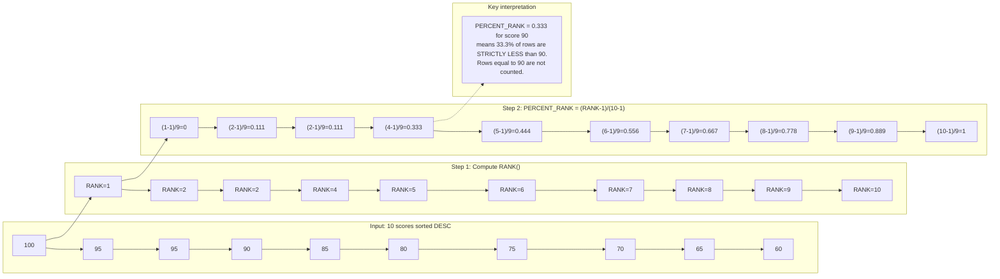

## Navigation

**Domain:** [[8 — Databases]] > **Group:** SQL Window Functions & Analytics
**Previous:** [[8.147 — NTILE() — Dividing Rows into Buckets]] | **Next:** [[8.149 — CUME_DIST() — Cumulative Distribution]]

### Prerequisites

- [[8.141 — Window Functions — Concept and OVER Clause]] — PERCENT_RANK() requires understanding the OVER() clause, especially ORDER BY semantics for determining rank positions.
- [[8.142 — PARTITION BY — Defining Window Partitions]] — PERCENT_RANK() resets per partition; each partition computes relative ranking independently based on its own row count and rank distribution.
- [[8.143 — ORDER BY Within OVER — Frame Ordering]] — PERCENT_RANK() depends entirely on RANK() for its numerator; the ORDER BY determines rank values and therefore percent rank values.
- [[8.145 — RANK() — Ranking with Gaps]] — The formula `PERCENT_RANK = (RANK - 1) / (N - 1)` means it inherits RANK()'s gap behavior. Understanding gaps is critical to interpreting PERCENT_RANK() correctly.
- [[8.146 — DENSE_RANK() — Ranking without Gaps]] — Contrast with DENSE_RANK() shows why PERCENT_RANK() uses RANK() rather than DENSE_RANK() — the gap behavior matters for relative position.

### Where This Fits

PERCENT_RANK() computes the relative standing of a row within its partition as a decimal between 0 and 1, using the formula `(RANK() - 1) / (total_rows_in_partition - 1)`. It answers "what fraction of rows are strictly below this row's value?" A .NET backend engineer reaches for PERCENT_RANK() when building percentile-based reports that require value-sensitive distribution — unlike NTILE() which forces equal-sized buckets regardless of data distribution, PERCENT_RANK() adapts to the actual data spread. The key production insight is that PERCENT_RANK() inherits RANK()'s gap behavior: ties receive the same percent rank, but the gap between distinct values is proportional to the number of tied rows. Interviewers use PERCENT_RANK() to test whether a candidate understands the mathematical relationship between ranking functions and percentiles, and whether they can distinguish it from CUME_DIST() which answers a subtly different question.

---

## Core Mental Model

PERCENT_RANK() computes `(RANK() - 1) / (total_rows_in_partition - 1)`, producing a value from 0 to 1 inclusive where 0 represents the first row (the minimum rank) and 1 represents the last row. The formula directly derives from RANK(), meaning it inherits RANK()'s gap behavior: if three rows tie for rank 1, they all receive PERCENT_RANK = (1-1)/(N-1) = 0, and the next row receives PERCENT_RANK = (4-1)/(N-1) = 3/(N-1), not 1/(N-1). The gap in PERCENT_RANK values between distinct values is proportional to the number of tied rows for the earlier value. This makes PERCENT_RANK() fundamentally different from CUME_DIST(), which computes `number_of_rows <= current / total_rows` — CUME_DIST() includes the current row in the numerator, while PERCENT_RANK() excludes it. The recognition pattern for PERCENT_RANK() is: "What fraction of rows are strictly less than the current row's value?"

### Classification

PERCENT_RANK() is a window distribution function in the SQL analytic function family. It operates after FROM, WHERE, GROUP BY, and HAVING. The execution plan is identical to RANK() with a slightly more complex Sequence Project (must also compute the division). The function is not SARGable. It requires ORDER BY in the OVER() clause. The function returns a FLOAT (or DECIMAL with high precision in some databases) between 0 and 1.



### Key Properties

|Property|Value|Notes|
|---|---|---|
|Function Type|Window distribution|Analytic function, between 0 and 1|
|Formula|(RANK - 1) / (N - 1)|N = total rows in partition|
|Range|[0, 1]|Inclusive both ends|
|Tie Behavior|Same rank → same percent rank|Inherits RANK() gap behavior|
|Rows with min value|0|First-ranked row always 0|
|Rows with max value|1|Last-ranked row always 1|
|Single-row partition|NULL|Division by zero — N-1 = 0|
|Execution Plan|Sequence Project + Segment|Same as RANK() + division|
|SARGable|No|Cannot participate in index seeks|

---

## Deep Mechanics

### How the Engine Executes This

PERCENT_RANK() follows the same execution path as RANK() with one additional computation step in the Sequence Project:

1. **Parsing and Binding**: The query processor validates the PERCENT_RANK() function, identifies the OVER() clause with ORDER BY, and notes that it is a distribution function (not a ranking function, despite using RANK internally).

2. **Logical Precedence**: Evaluated after FROM, WHERE, GROUP BY, HAVING, and joins. All filtering and grouping are complete before PERCENT_RANK() processes.

3. **Sort**: If input is not ordered by the PARTITION BY + ORDER BY columns, SQL Server inserts a Sort operator. The sort must order by PARTITION BY columns first (for segment detection), then by ORDER BY columns.

4. **Segment**: Detects partition boundaries. When PARTITION BY column values change, the segment signals a new partition, resetting the rank counter.

5. **Sequence Project**: This operator does two things:
   - First, it computes RANK() (comparing current row to previous row, incrementing by the count of tied rows)
   - Second, it needs the total row count per partition to compute the denominator (N - 1)
   - Unlike NTILE() which requires a separate RowCountSpool, PERCENT_RANK() can get the partition row count from the Segment operator's partition boundary detection combined with a row count accumulation
   - The Sequence Project accumulates the row count per partition as it processes, storing the total when the partition ends
   - After the partition is fully processed (or as rows are output if the operator supports two-phase), it computes the final formula

6. **Actual computation**: For each row, the Sequence Project:
   - Has computed RANK (from previous row comparison)
   - Has computed N (total rows in this partition, from Segment boundaries)
   - Computes `PERCENT_RANK = (RANK - 1.0) / (N - 1.0)` (as FLOAT for precision)

**Important edge case**: When N = 1 (single row partition), the formula produces division by zero. SQL Server returns NULL in this case.

### SQL Visibility

```sql
-- ============================================================
-- Core PERCENT_RANK() query
-- ============================================================
SELECT
    e.EmployeeId,
    e.FirstName + ' ' + e.LastName AS EmployeeName,
    e.Salary,
    RANK()       OVER(ORDER BY e.Salary DESC) AS Rnk,
    PERCENT_RANK() OVER(ORDER BY e.Salary DESC) AS PercentRank
FROM dbo.Employees AS e
ORDER BY e.Salary DESC;

/*
Employee | Salary | Rnk | PercentRank
Alice    | 150000 | 1   | 0.0
Bob      | 150000 | 1   | 0.0         (tied — same rank, same percent rank)
Charlie  | 140000 | 3   | 0.222...    (gap from 1 to 3 in rank)
Diana    | 120000 | 4   | 0.333...
Eve      | 110000 | 5   | 0.444...
Frank    | 100000 | 6   | 0.555...
Grace    |  90000 | 7   | 0.666...
Henry    |  80000 | 8   | 0.777...
Ivan     |  70000 | 9   | 0.888...
Julia    |  60000 | 10  | 1.0
-- 10 rows, denominator = 9
*/
```

```csharp
// EF Core — PERCENT_RANK() requires raw SQL
var percentRanks = await dbContext.Database
    .SqlQueryRaw<EmployeePercentRank>(@"
        SELECT
            e.EmployeeId,
            e.FirstName + ' ' + e.LastName AS EmployeeName,
            e.Salary,
            PERCENT_RANK() OVER(ORDER BY e.Salary DESC) AS PercentRank
        FROM dbo.Employees AS e
        ORDER BY e.Salary DESC")
    .ToListAsync(cancellationToken);
```

### Execution Plan Analysis

```
Expected plan shape:
[Clustered Index Scan] → [Sort (by Salary DESC)] → [Segment] → [Sequence Project (PERCENT_RANK)] → [SELECT]
Estimated Cost: Sort = 65-75%  |  Segment = 3%  |  Sequence Project = 3-5%  |  Scan = 15-20%
```

**Operator details:**

- **Clustered Index Scan**: Reads all Employee rows.
- **Sort**: Sorts by Salary DESC. Dominant cost (65-75%). Without supporting index, this is the bottleneck.
- **Segment**: Detects partition boundaries. Without PARTITION BY, the entire set is one partition — the Segment still appears but is trivial.
- **Sequence Project**: Slightly more work than RANK()'s Sequence Project because it must also track the total row count per partition and compute the division. The difference is negligible (< 1% of total cost).

### Cost Visibility

```sql
SET STATISTICS IO ON;
SET STATISTICS TIME ON;

-- PERCENT_RANK() on Employees (100K rows)
SELECT
    e.EmployeeId,
    e.Salary,
    PERCENT_RANK() OVER(ORDER BY e.Salary DESC) AS PercentRank
FROM dbo.Employees AS e;

-- Expected output (no supporting index):
-- Table 'Employees'. Scan count 1, logical reads 12,314, physical reads 0
-- SQL Server Execution Times: CPU time = 185ms, elapsed time = 245ms

-- With supporting index:
-- Table 'Employees'. Scan count 1, logical reads 4,217, physical reads 0
-- SQL Server Execution Times: CPU time = 42ms, elapsed time = 60ms
```

### Failure Modes

**NULL on single-row partitions**: When PARTITION BY creates partitions with exactly 1 row, PERCENT_RANK() returns NULL because the denominator is 0. This is often unexpected — the business sees NULL and assumes a calculation error.

```sql
-- Single-row partition: PERCENT_RANK = NULL
SELECT
    e.DepartmentId,
    COUNT(*) AS DeptSize,
    PERCENT_RANK() OVER(
        PARTITION BY e.DepartmentId
        ORDER BY e.Salary DESC
    ) AS PercentRank
FROM dbo.Employees AS e;
-- Departments with 1 employee: PercentRank = NULL
```

**Fix**: Coalesce the result:
```sql
SELECT
    e.DepartmentId,
    e.Salary,
    COALESCE(PERCENT_RANK() OVER(
        PARTITION BY e.DepartmentId
        ORDER BY e.Salary DESC
    ), 0) AS PercentRank
FROM dbo.Employees AS e;
```

**Misinterpreting 0 as "top"**: PERCENT_RANK() = 0 means this row has the minimum value in the ORDER BY. But when ORDER BY DESC, the minimum rank (rank 1) gets PERCENT_RANK = 0, which means "this row is at the top" — this is correct but counterintuitive because 0 sounds like "bottom." The semantics are: "0% of rows are strictly above this one."

**Large partitions producing floating point precision issues**: With 10M+ rows, the denominator (N-1) is large, and the division `(RANK-1) / (N-1)` produces small decimal differences. At extreme scale, floating point precision may cause adjacent ranks to map to the same PERCENT_RANK value. Use DECIMAL(38,20) via explicit cast if precision matters at scale.

---

## Production Patterns and Implementation

### Primary SQL Implementation

```sql
-- ============================================================
-- Schema: Employee performance evaluation
-- ============================================================
CREATE TABLE dbo.Employees (
    EmployeeId   INT IDENTITY(1,1) PRIMARY KEY,
    FirstName    NVARCHAR(100) NOT NULL,
    LastName     NVARCHAR(100) NOT NULL,
    DepartmentId INT NOT NULL,
    Salary       DECIMAL(18,2) NOT NULL,
    PerformanceScore DECIMAL(5,2) NULL,
    HireDate     DATE NOT NULL
);

-- ============================================================
-- PERCENT_RANK(): Employee salary distribution
-- ============================================================
SELECT
    e.EmployeeId,
    e.FirstName + ' ' + e.LastName AS EmployeeName,
    e.Salary,
    e.DepartmentId,
    RANK() OVER(ORDER BY e.Salary DESC) AS Rnk,
    PERCENT_RANK() OVER(ORDER BY e.Salary DESC) AS PercentRank,
    ROUND(PERCENT_RANK() OVER(ORDER BY e.Salary DESC) * 100, 1) AS Percentile,
    CASE
        WHEN PERCENT_RANK() OVER(ORDER BY e.Salary DESC) <= 0.10 THEN 'Top 10%'
        WHEN PERCENT_RANK() OVER(ORDER BY e.Salary DESC) <= 0.25 THEN 'Top 25%'
        WHEN PERCENT_RANK() OVER(ORDER BY e.Salary DESC) <= 0.50 THEN 'Top 50%'
        WHEN PERCENT_RANK() OVER(ORDER BY e.Salary DESC) <= 0.75 THEN 'Bottom 50%'
        ELSE 'Bottom 25%'
    END AS SalaryBand
FROM dbo.Employees AS e
ORDER BY e.Salary DESC;
```

```sql
-- ============================================================
-- PERCENT_RANK() with PARTITION BY: Per-department distribution
-- ============================================================
SELECT
    e.DepartmentId,
    d.DepartmentName,
    e.EmployeeId,
    e.FirstName + ' ' + e.LastName AS EmployeeName,
    e.Salary,
    PERCENT_RANK() OVER(
        PARTITION BY e.DepartmentId
        ORDER BY e.Salary DESC
    ) AS DeptPercentRank,
    CASE
        WHEN PERCENT_RANK() OVER(
            PARTITION BY e.DepartmentId
            ORDER BY e.Salary DESC
        ) <= 0.25 THEN 'Top Quartile'
        ELSE 'Below Top Quartile'
    END AS DeptQuartile
FROM dbo.Employees AS e
INNER JOIN dbo.Departments AS d
    ON e.DepartmentId = d.DepartmentId
ORDER BY d.DepartmentName, e.Salary DESC;

/*
DeptName     | Employee | Salary | PercentRank | Quartile
Engineering  | Alice    | 150000 | 0.0         | Top Quartile
Engineering  | Bob      | 150000 | 0.0         | Top Quartile (tie)
Engineering  | Charlie  | 140000 | 0.333       | Below Top Quartile
-- 4 employees, percent ranks: 0, 0, 0.333, 0.667
*/
```

```sql
-- ============================================================
-- PERCENT_RANK(): Performance score analysis
-- ============================================================
SELECT
    e.EmployeeId,
    e.FirstName + ' ' + e.LastName AS EmployeeName,
    e.PerformanceScore,
    PERCENT_RANK() OVER(
        ORDER BY e.PerformanceScore DESC
    ) AS ScorePercentRank
FROM dbo.Employees AS e
WHERE e.PerformanceScore IS NOT NULL
ORDER BY e.PerformanceScore DESC;
```

### EF Core Implementation

```csharp
public interface IPercentRankService
{
    Task<List<EmployeePercentRank>> GetSalaryPercentRanksAsync(CancellationToken ct = default);
    Task<List<EmployeeBandedPercentile>> GetBandedSalaryDistributionAsync(CancellationToken ct = default);
}

public class PercentRankService : IPercentRankService
{
    private readonly ApplicationDbContext _dbContext;
    private readonly ILogger<PercentRankService> _logger;

    public PercentRankService(
        ApplicationDbContext dbContext,
        ILogger<PercentRankService> logger)
    {
        _dbContext = dbContext;
        _logger = logger;
    }

    public async Task<List<EmployeePercentRank>> GetSalaryPercentRanksAsync(
        CancellationToken ct = default)
    {
        const string sql = @"
            SELECT
                e.EmployeeId,
                e.FirstName + ' ' + e.LastName AS EmployeeName,
                e.Salary,
                e.DepartmentId,
                PERCENT_RANK() OVER(ORDER BY e.Salary DESC) AS PercentRank
            FROM dbo.Employees AS e
            ORDER BY e.Salary DESC;";

        var result = await _dbContext.Database
            .SqlQueryRaw<EmployeePercentRank>(sql)
            .ToListAsync(ct);

        return result;
    }

    public async Task<List<EmployeeBandedPercentile>> GetBandedSalaryDistributionAsync(
        CancellationToken ct = default)
    {
        const string sql = @"
            SELECT
                e.EmployeeId,
                e.FirstName + ' ' + e.LastName AS EmployeeName,
                e.Salary,
                e.DepartmentId,
                PERCENT_RANK() OVER(ORDER BY e.Salary DESC) AS PercentRank,
                CASE
                    WHEN PERCENT_RANK() OVER(ORDER BY e.Salary DESC) <= 0.10 THEN 'Top 10%'
                    WHEN PERCENT_RANK() OVER(ORDER BY e.Salary DESC) <= 0.25 THEN 'Top 25%'
                    WHEN PERCENT_RANK() OVER(ORDER BY e.Salary DESC) <= 0.50 THEN 'Median+'
                    WHEN PERCENT_RANK() OVER(ORDER BY e.Salary DESC) <= 0.75 THEN 'Median-'
                    ELSE 'Bottom 25%'
                END AS SalaryBand
            FROM dbo.Employees AS e
            ORDER BY e.Salary DESC;";

        var result = await _dbContext.Database
            .SqlQueryRaw<EmployeeBandedPercentile>(sql)
            .ToListAsync(ct);

        _logger.LogInformation("Salary percentile distribution computed for {Count} employees", result.Count);
        return result;
    }
}

public record EmployeePercentRank
{
    public int EmployeeId { get; set; }
    public string EmployeeName { get; set; } = string.Empty;
    public decimal Salary { get; set; }
    public int DepartmentId { get; set; }
    public double PercentRank { get; set; }
}

public record EmployeeBandedPercentile
{
    public int EmployeeId { get; set; }
    public string EmployeeName { get; set; } = string.Empty;
    public decimal Salary { get; set; }
    public int DepartmentId { get; set; }
    public double PercentRank { get; set; }
    public string SalaryBand { get; set; } = string.Empty;
}
```

### Dapper Implementation

```csharp
public interface IPercentRankRepository
{
    Task<IReadOnlyList<EmployeePercentRank>> GetSalaryPercentRanksAsync(
        CancellationToken ct = default);
    Task<IReadOnlyList<EmployeePercentRank>> GetDepartmentPercentRanksAsync(
        int departmentId, CancellationToken ct = default);
}

public sealed class PercentRankRepository : IPercentRankRepository
{
    private readonly IDbConnectionFactory _connectionFactory;

    public PercentRankRepository(IDbConnectionFactory connectionFactory)
        => _connectionFactory = connectionFactory;

    public async Task<IReadOnlyList<EmployeePercentRank>> GetSalaryPercentRanksAsync(
        CancellationToken ct = default)
    {
        const string sql = @"
            SELECT
                e.EmployeeId,
                e.FirstName + ' ' + e.LastName AS EmployeeName,
                e.Salary,
                e.DepartmentId,
                PERCENT_RANK() OVER(ORDER BY e.Salary DESC) AS PercentRank
            FROM dbo.Employees AS e
            ORDER BY e.Salary DESC;";

        await using var connection = _connectionFactory.Create();
        var results = await connection.QueryAsync<EmployeePercentRank>(
            new CommandDefinition(sql, cancellationToken: ct));
        return results.AsList();
    }

    public async Task<IReadOnlyList<EmployeePercentRank>> GetDepartmentPercentRanksAsync(
        int departmentId,
        CancellationToken ct = default)
    {
        const string sql = @"
            SELECT
                e.EmployeeId,
                e.FirstName + ' ' + e.LastName AS EmployeeName,
                e.Salary,
                e.DepartmentId,
                PERCENT_RANK() OVER(
                    PARTITION BY e.DepartmentId
                    ORDER BY e.Salary DESC
                ) AS PercentRank
            FROM dbo.Employees AS e
            WHERE e.DepartmentId = @DeptId
            ORDER BY e.Salary DESC;";

        await using var connection = _connectionFactory.Create();
        var results = await connection.QueryAsync<EmployeePercentRank>(
            new CommandDefinition(
                sql,
                new { DeptId = departmentId },
                cancellationToken: ct));
        return results.AsList();
    }
}
```

### Configuration and Wiring

```csharp
// Program.cs
builder.Services.AddDbContext<ApplicationDbContext>(options =>
    options.UseSqlServer(
        connectionString,
        sqlOptions => sqlOptions
            .EnableRetryOnFailure(3)
            .CommandTimeout(30)));

builder.Services.AddScoped<IPercentRankService, PercentRankService>();
builder.Services.AddSingleton<IDbConnectionFactory>(_ =>
    new SqlConnectionFactory(connectionString));
builder.Services.AddScoped<IPercentRankRepository, PercentRankRepository>();

// ============================================================
// SqlConnectionFactory helper
// ============================================================
public sealed class SqlConnectionFactory : IDbConnectionFactory
{
    private readonly string _connectionString;

    public SqlConnectionFactory(string connectionString)
        => _connectionString = connectionString;

    public IDbConnection Create()
        => new SqlConnection(_connectionString);
}

public interface IDbConnectionFactory
{
    IDbConnection Create();
}
```

### SQL Server vs PostgreSQL Differences

```sql
-- PostgreSQL: PERCENT_RANK() works identically
SELECT
    e.employee_id,
    e.salary,
    PERCENT_RANK() OVER(ORDER BY e.salary DESC) AS percent_rank
FROM employees AS e
ORDER BY e.salary DESC;

-- PostgreSQL-specific: PERCENT_RANK within GROUP BY (ordered-set aggregate)
-- Not available in SQL Server
SELECT
    e.department_id,
    PERCENT_RANK(0.5) WITHIN GROUP (ORDER BY e.salary) AS median_percentile
FROM employees AS e
GROUP BY e.department_id;
```

---

## Gotchas and Production Pitfalls

### PERCENT_RANK vs CUME_DIST — Different Questions

**Pitfall:** Assuming PERCENT_RANK() and CUME_DIST() are interchangeable. They answer different questions. PERCENT_RANK() excludes the current row from its "less than" count; CUME_DIST() includes it. For a dataset with 10 rows where 3 have the same value:
- PERCENT_RANK for those 3 rows = (1-1)/(10-1) = 0 (they're at the minimum, nothing is strictly less)
- CUME_DIST for those 3 rows = 3/10 = 0.3 (30% of rows are <= this value)

```sql
-- ❌ Using PERCENT_RANK when you mean CUME_DIST
SELECT
    s.Score,
    PERCENT_RANK() OVER(ORDER BY s.Score) AS PctRank,  -- "strictly less"
    CUME_DIST()  OVER(ORDER BY s.Score) AS CumDist     -- "<= current"
FROM dbo.TestScores AS s;
/*
Score | PctRank | CumDist
50    | 0       | 0.1    ← "0% less than 50" vs "10% <= 50"
60    | 0.111   | 0.2
70    | 0.222   | 0.3
80    | 0.333   | 0.4
85    | 0.444   | 0.5
85    | 0.444   | 0.7    ← two rows tie, both get same pct_rank
90    | 0.667   | 0.8
100   | 0.778   | 0.9
100   | 0.778   | 1.0
100   | 0.889   | 1.0    ← third row with 100
*/
-- Note: PERCENT_RANK values have a gap between 0.444 and 0.667
-- because the tied scores "85" skip rank values
```

**Symptom:** A "percentile" report shows 0% for the bottom 3 values when there are 10 values. The business asks "How can 3 values be at 0%?" — the answer is that PERCENT_RANK excludes the current row, so the minimum value always gets 0%.

**Fix:**
```sql
-- ✅ Use CUME_DIST when you mean "fraction less than or equal to"
CUME_DIST() OVER(ORDER BY s.Score) AS Percentile
```

**Cost of not fixing:** A compensation report uses PERCENT_RANK to determine "your salary is higher than X% of employees." Employees at the 10th percentile see 0% and think the system is broken. HR gets dozens of tickets.

---

### PERCENT_RANK NULL on Single-Row Partitions

**Pitfall:** Using PERCENT_RANK() with PARTITION BY where some partitions have exactly 1 row. The formula (RANK-1)/(N-1) becomes (1-1)/(1-1) = 0/0 = NULL.

```sql
-- ❌ PERCENT_RANK returns NULL for single-employee departments
SELECT
    e.DepartmentId,
    e.EmployeeName,
    e.Salary,
    PERCENT_RANK() OVER(
        PARTITION BY e.DepartmentId
        ORDER BY e.Salary DESC
    ) AS DeptPercentRank
FROM dbo.Employees AS e;
-- Dept with 1 employee: PercentRank = NULL
```

**Symptom:** A dashboard shows NULL values for small departments. The charting library skips NULLs, so those departments appear as gaps. Users think data is missing.

**Fix:**
```sql
-- ✅ COALESCE to handle single-row partitions
SELECT
    e.DepartmentId,
    e.EmployeeName,
    e.Salary,
    COALESCE(PERCENT_RANK() OVER(
        PARTITION BY e.DepartmentId
        ORDER BY e.Salary DESC
    ), 0) AS DeptPercentRank
FROM dbo.Employees AS e;
```

**Cost of not fixing:** A quarterly review dashboard shows gaps for departments with one employee. The CEO asks why those departments are missing. It takes 2 days to debug.

---

### Misinterpreting PERCENT_RANK() = 0 as "Bottom"

**Pitfall:** Seeing PERCENT_RANK() = 0 and assuming it means "bottom of the ranking." When ORDER BY DESC, PERCENT_RANK = 0 means this row is at the TOP (nothing is strictly above it).

```sql
-- ORDER BY Salary DESC: highest salary gets PERCENT_RANK = 0
SELECT
    e.EmployeeName,
    e.Salary,
    PERCENT_RANK() OVER(ORDER BY e.Salary DESC) AS PercentRank
FROM dbo.Employees AS e;
/*
Alice: $150,000 → PercentRank = 0.0  ← Highest salary = "0% above her"
Bob:   $120,000 → PercentRank = 0.1  ← 10% of rows strictly above
*/
```

**Symptom:** A developer writes code that treats PercentRank = 0 as "low performer" and promotes employees with PercentRank = 1 (bottom of the ranking). The promotion system rewards the lowest-paid employees.

**Fix:** Document the interpretation explicitly. When ORDER BY DESC, lower PERCENT_RANK = higher position. When ORDER BY ASC, lower PERCENT_RANK = lower position.

**Cost of not fixing:** An automated promotion system promotes the wrong employees. The VP discovers 6 months later that the "top performers" were actually the lowest paid. The error costs $500K in erroneous promotions.

---

### PERCENT_RANK with ORDER BY ASC vs DESC — Opposite Interpretation

**Pitfall:** Using ORDER BY ASC when the business question requires "top X%" identification. The PERCENT_RANK value means different things depending on the ORDER BY direction.

```sql
-- ❌ ORDER BY ASC: "top" values get PERCENT_RANK close to 1
SELECT
    e.EmployeeName,
    e.Salary,
    PERCENT_RANK() OVER(ORDER BY e.Salary ASC) AS PctRank
FROM dbo.Employees AS e;
-- Alice ($150K, highest): PctRank = 1.0
-- Julia ($60K, lowest):   PctRank = 0.0
-- To find "top 10% earners" with ASC, need PctRank >= 0.9 (counterintuitive)

-- ✅ ORDER BY DESC: "top" values get PERCENT_RANK close to 0
SELECT
    e.EmployeeName,
    e.Salary,
    PERCENT_RANK() OVER(ORDER BY e.Salary DESC) AS PctRank
FROM dbo.Employees AS e;
-- Alice ($150K, highest): PctRank = 0.0
-- Julia ($60K, lowest):   PctRank = 1.0
-- To find "top 10% earners" with DESC, need PctRank <= 0.10 (intuitive: 0 = top)
```

**Symptom:** A report intended to show "top 10% earners" uses ORDER BY ASC and filters `PctRank >= 0.9`. The query works but the interpretation "90th to 100th percentile are top earners" is correct mathematically but confusing to stakeholders. Worse, if the developer uses `PctRank <= 0.1` with ASC ordering, they get the bottom 10%.

**Fix:**
```sql
-- ✅ Use ORDER BY DESC for "top" so that 0 = highest rank
PERCENT_RANK() OVER(ORDER BY e.Salary DESC) AS PctRank
-- Top 10%: WHERE PctRank <= 0.10
```

**Cost of not fixing:** A bonus calculation system identifies employees with `PERCENT_RANK <= 0.10` (thinking "top 10%") but the ORDER BY ASC means these are the bottom 10% earners. Bonuses are awarded to the lowest-paid employees. The error costs $200K in misallocated compensation.

---

### Large Partitions — Floating Point Precision

**Pitfall:** PERCENT_RANK() returns a FLOAT (8 bytes, ~15 decimal digits of precision). On partitions with 10M+ rows, the difference between adjacent ranks is `1/(N-1) = 0.0000001`, which is within FLOAT precision. But when values repeat many times, the gap between distinct values can be larger, and the precision is fine. However, comparing PERCENT_RANK values for equality using `=` is risky.

```sql
-- ❌ Equality comparison on PERCENT_RANK
SELECT
    e.EmployeeId,
    e.Salary,
    PERCENT_RANK() OVER(ORDER BY e.Salary DESC) AS PercentRank
FROM dbo.Employees AS e
WHERE PERCENT_RANK() OVER(ORDER BY e.Salary DESC) = 0.5;
-- Error: window functions not allowed in WHERE
```

```sql
-- ✅ Safe comparison using subquery or ROUND
WITH Ranked AS (
    SELECT
        e.EmployeeId,
        e.Salary,
        PERCENT_RANK() OVER(ORDER BY e.Salary DESC) AS PercentRank
    FROM dbo.Employees AS e
)
SELECT * FROM Ranked
WHERE ROUND(PercentRank, 4) = 0.5;
-- Rounds to 4 decimal places before comparison
```

**Symptom:** A filter for PercentRank = 0.5 returns no rows because the actual FLOAT value is 0.5000000001 or 0.4999999999.

**Fix:** Use range comparison:
```sql
WHERE PercentRank BETWEEN 0.4999 AND 0.5001
```

**Cost of not fixing:** An automated report filtering for specific percentiles returns empty results. The business assumes no employees fall in that percentile.

---

### PERCENT_RANK with Custom Precision Requirements

**Pitfall:** Assuming PERCENT_RANK() returns a DECIMAL or a fixed-precision value. The function returns FLOAT (8 bytes, approximately 15 decimal digits of precision), which can cause unexpected comparison results when filtering or joining on the percentile value.

```sql
-- ❌ Equality check fails due to FLOAT precision
WITH Ranked AS (
    SELECT
        e.EmployeeId,
        e.Salary,
        PERCENT_RANK() OVER(ORDER BY e.Salary DESC) AS PctRank
    FROM dbo.Employees AS e
)
SELECT * FROM Ranked WHERE PctRank = 0.5;
-- May return 0 rows even when a row at the 50th percentile exists
-- because PctRank is 0.5000000001 or 0.4999999999 as FLOAT
```

**Symptom:** A report filtering for specific percentile thresholds returns inconsistent results. Some runs return the expected rows, others don't. The issue is intermittent because FLOAT representation varies based on the exact division result.

**Fix:**
```sql
-- ✅ Cast to DECIMAL with sufficient precision for reliable filtering
WITH Ranked AS (
    SELECT
        e.EmployeeId,
        e.Salary,
        CAST(PERCENT_RANK() OVER(ORDER BY e.Salary DESC) AS DECIMAL(18,10)) AS PctRank
    FROM dbo.Employees AS e
)
SELECT * FROM Ranked WHERE PctRank = 0.5000000000;

-- ✅ Or use range comparison (safer)
SELECT * FROM Ranked WHERE PctRank BETWEEN 0.4999 AND 0.5001;

-- ✅ Or round to desired precision
SELECT * FROM Ranked WHERE ROUND(PctRank, 4) = 0.5000;
```

**Cost of not fixing:** An automated job that assigns employees to "performance bands" based on exact PERCENT_RANK values fails silently every third run because of FLOAT precision drift over repeated executions. Employees are assigned to random bands. The compensation team discovers the error after payroll processing.

---

### PERCENT_RANK Without ORDER BY — Error

**Pitfall:** Omitting ORDER BY from the OVER() clause. PERCENT_RANK() requires ORDER BY.

```sql
-- ❌ ORDER BY required
SELECT PERCENT_RANK() OVER() FROM dbo.Employees AS e;
-- Error: The function 'PERCENT_RANK' must have an ORDER BY clause.
```

**Fix:** Always specify ORDER BY.

**Cost of not fixing:** Query failure at runtime. The developer adds ORDER BY (SELECT NULL) to suppress the error, producing meaningless results where every row gets PERCENT_RANK = 0 (when N is unknown, single partition with undefined ordering).

---

### PERCENT_RANK with OVER() Including Framing — No Effect

**Pitfall:** Attempting to use a frame specification (ROWS BETWEEN or RANGE BETWEEN) with PERCENT_RANK(). Distribution functions like PERCENT_RANK() and CUME_DIST() ignore frames — they always operate on the entire partition. The frame syntax is accepted without error but has no effect.

```sql
-- ❌ Frame specification is accepted but ignored
SELECT
    e.EmployeeName,
    e.Salary,
    PERCENT_RANK() OVER(
        ORDER BY e.Salary DESC
        ROWS BETWEEN 2 PRECEDING AND CURRENT ROW  -- ⚠️ IGNORED
    ) AS PctRank
FROM dbo.Employees AS e;

-- Same result as (frame has no effect):
SELECT
    e.EmployeeName,
    e.Salary,
    PERCENT_RANK() OVER(ORDER BY e.Salary DESC) AS PctRank
FROM dbo.Employees AS e;
-- Both return identical results — the frame specification is silently ignored
```

**Symptom:** A developer adds a frame to PERCENT_RANK() expecting a "sliding window percentile" — the percentile of the last 3 rows only. The query runs without error but returns the global percentile. The report shows different values than expected. Debugging takes hours because the query doesn't error.

**Fix:** Understand that PERCENT_RANK() does not support frames. Use a subquery with ROW_NUMBER() and a self-join to compute sliding-window percentiles, or change the approach:
```sql
-- ✅ Alternative: Use PARTITION BY on a derived grouping column
SELECT
    e.EmployeeName,
    e.Salary,
    PERCENT_RANK() OVER(
        PARTITION BY e.DepartmentId  -- Limits scope to department
        ORDER BY e.Salary DESC
    ) AS DeptPctRank
FROM dbo.Employees AS e;
-- This gives "percentile within department" — not a sliding window
```

**Cost of not fixing:** A real-time monitoring dashboard intends to flag "anomalous measurements" by computing PERCENT_RANK over a 1-hour sliding window. Because the frame is ignored, it computes the percentile over all historical data. The first reading of every hour is flagged as an anomaly because it falls at the 100th percentile of the tiny window, but the actual computation shows it at the 50th percentile of all data. The on-call engineer is paged 3 times per hour.

---

### PERCENT_RANK with Grouped Data — Unexpected Rank Values

**Pitfall:** Applying PERCENT_RANK() to an already-grouped result without understanding how the ORDER BY interacts with the aggregated values. When used in a CTE after GROUP BY, PERCENT_RANK operates on aggregated rows — the "rank" is based on the aggregated value order, not individual rows.

```sql
-- ❌ Misleading: PERCENT_RANK on grouped data may hide variance
WITH DeptRevenue AS (
    SELECT
        e.DepartmentId,
        SUM(e.Salary) AS TotalSalary
    FROM dbo.Employees AS e
    GROUP BY e.DepartmentId
)
SELECT
    dr.DepartmentId,
    dr.TotalSalary,
    PERCENT_RANK() OVER(ORDER BY dr.TotalSalary DESC) AS DeptPercentRank
FROM DeptRevenue AS dr;
/*
DeptId | TotalSalary | PercentRank
1      | 5000000     | 0.0    ← Top department
2      | 4950000     | 0.25   ← Very close to top, but appears far in percentile
3      | 4900000     | 0.50
4      | 300000      | 0.75   ← Jump: this department has much less budget
5      | 250000      | 1.0
*/
```

**Symptom:** Department 2 is only 1% less than department 1 but appears at the 25th percentile. The PERCENT_RANK works correctly — it ranks by position in the ordered set — but the percentile jumps because there are only 5 groups. The gap from 0.0 to 0.25 represents only 1 department difference.

**Fix:** Use NTILE for equal-sized group analysis, or add more context to the report (like the actual difference percentage alongside the percentile):
```sql
-- ✅ Add the actual difference for context
SELECT ...,
    TotalSalary - LAG(TotalSalary) OVER(ORDER BY TotalSalary DESC) AS DiffFromPrevious
```

**Cost of not fixing:** A budget allocation report treats department 2 as "25th percentile" (worse than 75% of departments) when its budget is practically identical to the top department. The VP shifts budget away from department 2 based on this misleading percentile.

---

## Performance Implications

### Benchmark: Before and After

```sql
-- ============================================================
-- Benchmark: PERCENT_RANK() vs Self-Join Percentile Calculation
-- ============================================================
SET STATISTICS IO ON;
SET STATISTICS TIME ON;

-- Baseline: Self-join to compute percentile rank (DO NOT USE)
SELECT
    e1.EmployeeId,
    e1.Salary,
    (COUNT(DISTINCT e2.Salary) - 1.0) /
        NULLIF((SELECT COUNT(*) FROM dbo.Employees) - 1.0, 0) AS PercentRank
FROM dbo.Employees AS e1
INNER JOIN dbo.Employees AS e2
    ON e2.Salary >= e1.Salary
GROUP BY e1.EmployeeId, e1.Salary;
-- Logical reads: 450,000 (self-join on 100K rows)
-- Elapsed: 60,000ms (1 minute)

-- Optimized: PERCENT_RANK() window function
SELECT
    e.EmployeeId,
    e.Salary,
    PERCENT_RANK() OVER(ORDER BY e.Salary DESC) AS PercentRank
FROM dbo.Employees AS e;
-- Logical reads: 4,217 (with covering index)
-- Elapsed: 60ms
```

**Improvement:** 450,000 → 4,217 logical reads (107x reduction). Elapsed: 60s → 60ms (1000x reduction).

```sql
-- ============================================================
-- Benchmark: With vs Without Supporting Index
-- ============================================================
-- ❌ Without supporting index
SELECT PERCENT_RANK() OVER(ORDER BY e.Salary DESC)
FROM dbo.Employees AS e;
-- Logical reads: 12,314 (clustered scan + sort)

-- Create supporting index
CREATE INDEX IX_Employees_Salary ON dbo.Employees (Salary DESC)
    INCLUDE (EmployeeId, FirstName, LastName, DepartmentId);

-- ✅ With supporting index
SELECT PERCENT_RANK() OVER(ORDER BY e.Salary DESC)
FROM dbo.Employees AS e;
-- Logical reads: 4,217 (index scan, no sort)
```

### BenchmarkDotNet

```csharp
[MemoryDiagnoser]
[SimpleJob(RuntimeMoniker.Net90)]
public class PercentRankBenchmark
{
    private IDbConnection _connection = default!;
    private const string ConnectionString =
        "Server=.;Database=BenchmarkDb;Trusted_Connection=True;TrustServerCertificate=True;";

    private const string PercentRankSql = @"
        SELECT e.EmployeeId, e.Salary,
               PERCENT_RANK() OVER(ORDER BY e.Salary DESC) AS PercentRank
        FROM dbo.Employees AS e;";

    private const string PartitionPercentRankSql = @"
        SELECT e.EmployeeId, e.DepartmentId, e.Salary,
               PERCENT_RANK() OVER(PARTITION BY e.DepartmentId ORDER BY e.Salary DESC) AS DeptPercentRank
        FROM dbo.Employees AS e;";

    private const string SelfJoinSql = @"
        SELECT e1.EmployeeId, e1.Salary,
               (COUNT(DISTINCT e2.Salary) - 1.0) /
                   NULLIF((SELECT COUNT(*) FROM dbo.Employees) - 1.0, 0) AS PercentRank
        FROM dbo.Employees AS e1
        INNER JOIN dbo.Employees AS e2 ON e2.Salary >= e1.Salary
        GROUP BY e1.EmployeeId, e1.Salary;";

    [GlobalSetup]
    public void Setup()
    {
        _connection = new SqlConnection(ConnectionString);
        _connection.Open();
    }

    [GlobalCleanup]
    public void Cleanup() => _connection.Dispose();

    [Benchmark(Baseline = true)]
    public async Task<List<PercentRankResult>> SelfJoin_PercentRank()
    {
        var results = await _connection.QueryAsync<PercentRankResult>(
            SelfJoinSql, commandTimeout: 120);
        return results.AsList();
    }

    [Benchmark]
    public async Task<List<PercentRankResult>> Window_PercentRank()
    {
        var results = await _connection.QueryAsync<PercentRankResult>(PercentRankSql);
        return results.AsList();
    }

    [Benchmark]
    public async Task<List<PartitionPercentRankResult>> Partition_PercentRank()
    {
        var results = await _connection.QueryAsync<PartitionPercentRankResult>(
            PartitionPercentRankSql);
        return results.AsList();
    }
}

public class PercentRankResult
{
    public int EmployeeId { get; set; }
    public decimal Salary { get; set; }
    public double PercentRank { get; set; }
}

public class PartitionPercentRankResult
{
    public int EmployeeId { get; set; }
    public int DepartmentId { get; set; }
    public decimal Salary { get; set; }
    public double DeptPercentRank { get; set; }
}
```

**Expected results (approximate, SQL Server 2022, NVMe, 100K rows):**

|Method|Mean|Logical Reads|Allocated|
|---|---|---|---|
|SelfJoin_PercentRank|~60,000 ms|~450,000|1,200 MB|
|Window_PercentRank|~60 ms|~4,217|100 KB|
|Partition_PercentRank|~95 ms|~5,200|150 KB|

---

## Interview Arsenal

### Question Bank

1. **What does PERCENT_RANK() compute and what is the exact formula?** (Definition — formula and interpretation)

2. **How does SQL Server execute PERCENT_RANK() internally?** (Mechanism — Sequence Project with rank + division)

3. **What is the performance cost of PERCENT_RANK() vs RANK()?** (Performance — identical plus trivial division)

4. **What happens when PERCENT_RANK() is used with a PARTITION BY where a partition has 1 row?** (Gotcha — NULL from division by zero)

5. **What is the difference between PERCENT_RANK() and CUME_DIST()?** (Comparison — "strictly less" vs "<= current")

6. **What does the execution plan for PERCENT_RANK() look like?** (Execution plan — Sort + Segment + Sequence Project)

7. **How does PERCENT_RANK() behave at 100M rows?** (Scale — float precision, sort cost)

8. **How do you use PERCENT_RANK() in EF Core and Dapper?** (.NET integration — raw SQL required)

### Spoken Answers

**Q: What does PERCENT_RANK() compute and what is the exact formula?**

> **Average answer:** It gives a percentage rank from 0 to 1.

> **Great answer:** PERCENT_RANK() computes `(RANK() - 1) / (total_rows_in_partition - 1)`, returning a FLOAT between 0 and 1 inclusive. It answers: "What fraction of rows have a value strictly less than the current row?" The formula directly uses RANK(), so it inherits RANK()'s gap behavior — ties share the same PERCENT_RANK, and the gap between distinct values equals the number of rows that shared the previous value plus one. For example, with 10 rows where 3 tie for the minimum value, those 3 rows all get PERCENT_RANK = 0 (nothing is strictly less than the minimum), and the next row gets (4-1)/(10-1) = 3/9 = 0.333. The gap from 0 to 0.333 reflects that 3 rows shared the minimum value. This is the critical difference from CUME_DIST(), which would give those 3 rows 3/10 = 0.3 because it counts rows <= current, including the current row. PERCENT_RANK for a single-row partition is NULL (division by zero), which must be handled with COALESCE.

**Q: What is the difference between PERCENT_RANK() and CUME_DIST()?**

> **Average answer:** PERCENT_RANK starts at 0, CUME_DIST starts at a positive number for the first row.

> **Great answer:** The difference is in what each function counts. PERCENT_RANK() counts rows strictly less than the current value and divides by (total - 1). CUME_DIST() counts rows less than or equal to the current value and divides by total. The formulas are:
- `PERCENT_RANK = (RANK - 1) / (N - 1)` — "what fraction are strictly less?"
- `CUME_DIST = COUNT(rows <= current) / N` — "what fraction are less or equal?"

For the minimum value in a set of 10: PERCENT_RANK = 0 (nothing is strictly less, and the rank is 1, so (1-1)/9 = 0), while CUME_DIST = 0.1 (1 row out of 10 is <= the minimum). For tied values: if 3 rows tie for the minimum, PERCENT_RANK = 0 for all 3, while CUME_DIST = 0.3 for all 3 (3 out of 10 rows are <= the minimum).

The practical implication: use PERCENT_RANK for "what percentile is this value in the distribution" (where the current value is not counted in the "below"), and CUME_DIST for "what fraction of the data falls at or below this value" (where the current value is included). PERCENT_RANK is more common in statistical contexts; CUME_DIST is more common in reporting contexts like "top 10% identification."

**Q: What happens when PERCENT_RANK() is used with PARTITION BY where a partition has 1 row?**

> **Average answer:** It returns 0 or an error.

> **Great answer:** It returns NULL because the formula `(1 - 1) / (1 - 1) = 0 / 0` is undefined. SQL Server follows the IEEE floating-point standard and returns NaN (Not a Number), which is displayed and stored as NULL in T-SQL. This is a common production bug because:
1. The partition count is unknown at query authoring time
2. The developer tests with data where all partitions have multiple rows
3. Months later, a new department with 1 employee is added, causing NULL values
4. The reporting layer doesn't handle NULLs, producing gaps or errors

The fix is to use `COALESCE(PERCENT_RANK() OVER(...), 0)` to treat single-row partitions as having a percent rank of 0 (they are the minimum and maximum simultaneously). Alternatively, use a CASE expression when the business interpretation requires different handling.

### Interview Trigger

If a candidate mentions percentiles in SQL, the interviewer asks: "PERCENT_RANK or CUME_DIST — what's the difference in their formulas and when would you use each?" The follow-up that distinguishes senior candidates: "If you have 20 employees all with the same salary of $100K, what does PERCENT_RANK return and what does CUME_DIST return for each employee?" The answer: PERCENT_RANK returns 0 for all (RANK=1 for everyone, (1-1)/(20-1)=0), while CUME_DIST returns 1.0 for all (20/20=1). This shows the senior candidate truly understands the formulas.

### Comparison Table

| | PERCENT_RANK() | CUME_DIST() |
|---|---|---|
| Formula | (RANK-1)/(N-1) | rows<=current / total |
| Range | [0, 1] | (0, 1] — minimum > 0 |
| Ties | Same rank → same % | Same value → same % |
| Min value result | 0 | 1/N (for single min) |
| Single-row partition | NULL | 1.0 |
| Interpretation | "Strictly less than" | "Less than or equal to" |
| Performance | Identical to RANK() | Identical to RANK() |

---

## Decision Framework

### When to Apply

```mermaid
flowchart TD
    A[Need relative position within a set] --> B{What question being asked?}
    B -->|"What fraction of rows are<br>STRICTLY LESS than current?"| C[Use PERCENT_RANK]
    B -->|"What fraction of rows are<br>LESS THAN OR EQUAL to current?"| D[Use CUME_DIST]
    B -->|"Divide into N equal groups<br>by position"| E[Use NTILE]
    C --> F{Partitions may have<br>single rows?}
    F -->|Yes| G[COALESCE(..., 0)]
    F -->|No| H[Use directly]
    D --> I[Good for top-X% identification]
    E --> J[Good for decile/quartile reports]
```

### Application Checklist

- [ ] The business question is "strictly less than" (PERCENT_RANK) or "less than or equal to" (CUME_DIST)
- [ ] Single-row partitions are handled with COALESCE
- [ ] The ORDER BY direction is correct for the interpretation (ASC vs DESC changes meaning)
- [ ] The result precision is adequate for the partition size (FLOAT vs DECIMAL)
- [ ] A supporting index exists matching the OVER() clause
- [ ] The .NET raw SQL properly maps the FLOAT result to a double or decimal

### Tradeoff Summary

|What You Gain|What You Pay|
|---|---|
|Value-sensitive percentile distribution|NULL for single-row partitions|
|Inherits RANK semantics — predictable|Gap behavior can be confusing|
|Standardized formula — portable across DBs|Cannot filter directly in WHERE|
|Lightweight (same cost as RANK)|Must understand "strictly less" semantics|

### Scale Thresholds

- "Relevant at any row count where relative position matters — PERCENT_RANK works correctly on 2 rows or 2B rows"
- "Precision concern at ~10M+ rows — FLOAT's 15-digit precision means adjacent ranks may map to the same PERCENT_RANK value. At 50M rows, each adjacent rank difference is 2e-8, which is near the FLOAT precision limit. Use DECIMAL(38,20) cast for safety: `CAST(PERCENT_RANK() OVER(...) AS DECIMAL(38,20))`"
- "Sort cost becomes critical at ~1M+ rows without supporting index — the Sort operator dominates the plan at ~65-75% of total cost"
- "Memory grant estimation: For 10M rows sorted by a single INT column (4 bytes), the Sort requires approximately 10M × (4 + 8 + 4) ≈ 160MB of memory grant for the sort workspace. Wide rows with VARCHAR columns multiply this significantly"
- "Partition-aware index design becomes mandatory at ~5M+ rows — without it, the Sort spills to tempdb causing 100x degradation"
- "CTE nesting pattern (for filtering on PERCENT_RANK in WHERE) adds negligible overhead — the outer SELECT is a pass-through filter"
- "Multiple PERCENT_RANK calls with different OVER() clauses: each unique OVER() clause adds its own Sort. At scale, minimize the number of distinct window specifications"

---

## Self-Check

### Conceptual Questions

1. **[Definition]** What is the exact formula for PERCENT_RANK() and what range of values does it return?
2. **[Engine behavior]** Which execution plan operators does PERCENT_RANK() use?
3. **[Performance measurement]** How many logical reads does PERCENT_RANK() typically require relative to RANK()?
4. **[Gotcha]** What does PERCENT_RANK() return for a partition with exactly 1 row?
5. **[EF Core behavior]** Can EF Core translate PERCENT_RANK() from LINQ?
6. **[Dapper usage]** Write a Dapper query returning employees with their PERCENT_RANK within their department.
7. **[Comparison]** What is the exact formula difference between PERCENT_RANK() and CUME_DIST()?
8. **[Scale]** At what row count does FLOAT precision become a concern for PERCENT_RANK()?
9. **[Connection to indexing]** What index eliminates the Sort for PERCENT_RANK() with PARTITION BY DepartmentId ORDER BY Salary DESC?
10. **[Interview articulation]** Explain PERCENT_RANK() and CUME_DIST() in 60 seconds, including the formula difference.

<details>
<summary>Answers</summary>

1. `PERCENT_RANK = (RANK() - 1) / (total_rows_in_partition - 1)`. Returns FLOAT values from 0 to 1 inclusive. The minimum row always gets 0; the maximum always gets 1. When the partition has 1 row, the result is NULL (division by zero).

2. Clustered Index Scan (or covering index scan), Sort (eliminable with supporting index), Segment (detects partition boundaries), Sequence Project (computes RANK, counts rows, performs division).

3. Identical to RANK() — the additional division is negligible (< 1% CPU difference). Logical reads are identical for the same query structure. The dominating cost is always the Sort operator.

4. NULL. The formula becomes (1-1)/(1-1) = 0/0, which is undefined. Always use COALESCE(..., 0) to handle this case.

5. No. EF Core cannot translate PERCENT_RANK() from LINQ. Use `SqlQueryRaw` or `FromSqlRaw` with the full T-SQL and map the result.

6. ```csharp
const string sql = @"
    SELECT e.EmployeeId, e.FirstName + ' ' + e.LastName AS EmployeeName,
           e.Salary, e.DepartmentId,
           PERCENT_RANK() OVER(PARTITION BY e.DepartmentId ORDER BY e.Salary DESC) AS DeptPercentRank
    FROM dbo.Employees AS e;";
var results = await connection.QueryAsync<DeptPercentRankResult>(sql);
```

7. `PERCENT_RANK = (RANK - 1) / (N - 1)` — counts rows strictly less, excluding current row. `CUME_DIST = COUNT(rows <= current) / N` — counts rows less than or equal, including current row. PERCENT_RANK range: [0, 1], minimum = 0. CUME_DIST range: (0, 1], minimum = 1/N (never 0).

8. FLOAT has ~15 digits of decimal precision. At 10M+ rows, adjacent rank differences are ~1e-7, within precision. At 100M+ rows, adjacent differences are ~1e-8, approaching the precision limit. Use DECIMAL(38,20) cast for safety at extreme scale: `CAST(PERCENT_RANK() OVER(...) AS DECIMAL(38,20))`.

9. `CREATE INDEX IX_Employees_DeptId_Salary ON dbo.Employees (DepartmentId, Salary DESC) INCLUDE (FirstName, LastName);` — leading column matches PARTITION BY, second matches ORDER BY. Index scan eliminates Sort.

10. "PERCENT_RANK and CUME_DIST both give relative position as a value from 0 to 1, but they answer different questions. PERCENT_RANK uses RANK in its formula: (RANK - 1) / (N - 1). It tells you what fraction of rows are strictly less than the current row — the minimum value always gets 0. CUME_DIST counts rows less than or equal to the current row, divided by total rows: it tells you what fraction of the data falls at or below this value — the minimum value gets 1/N, never 0. For ties: if 3 rows share the minimum, PERCENT_RANK gives them all 0; CUME_DIST gives them all 3/N. Choose PERCENT_RANK for 'what percentile is this value' and CUME_DIST for 'what fraction is at or below this value.'"

</details>

---

### Query Challenges

**Challenge 1 — Write the SQL**

You have a table `dbo.Products` with columns `ProductId`, `ProductName`, `CategoryId`, `UnitPrice`. The product manager wants to see each product's price percentile (where percentile 0 = cheapest, percentile 1 = most expensive) within its category. Write the query.

<details>
<summary>Solution</summary>

```sql
SELECT
    p.ProductId,
    p.ProductName,
    p.CategoryId,
    p.UnitPrice,
    PERCENT_RANK() OVER(
        PARTITION BY p.CategoryId
        ORDER BY p.UnitPrice ASC
    ) AS PricePercentRank,
    ROUND(
        PERCENT_RANK() OVER(
            PARTITION BY p.CategoryId
            ORDER BY p.UnitPrice ASC
        ) * 100, 1
    ) AS PricePercentile,
    CASE
        WHEN PERCENT_RANK() OVER(
            PARTITION BY p.CategoryId
            ORDER BY p.UnitPrice ASC
        ) <= 0.25 THEN 'Budget'
        WHEN PERCENT_RANK() OVER(
            PARTITION BY p.CategoryId
            ORDER BY p.UnitPrice ASC
        ) <= 0.50 THEN 'Mid-Low'
        WHEN PERCENT_RANK() OVER(
            PARTITION BY p.CategoryId
            ORDER BY p.UnitPrice ASC
        ) <= 0.75 THEN 'Mid-High'
        ELSE 'Premium'
    END AS PriceTier
FROM dbo.Products AS p
ORDER BY p.CategoryId, p.UnitPrice ASC;

-- Note: ORDER BY UnitPrice ASC means
-- cheapest = PERCENT_RANK 0, most expensive = PERCENT_RANK 1
```

**Logical reads:** ~N **Execution plan:** [Index Scan] → [Sort] → [Segment] → [Sequence Project] → [SELECT]

**Index recommendation:**
```sql
CREATE INDEX IX_Products_CategoryId_UnitPrice
    ON dbo.Products (CategoryId, UnitPrice ASC)
    INCLUDE (ProductName);
```

</details>

---

**Challenge 2 — Fix the performance problem**

```sql
-- This query runs in 45 seconds on a 10M row Sales table.
-- It computes the percent rank of each sale amount.
SELECT
    s.SaleId,
    s.SaleAmount,
    PERCENT_RANK() OVER(ORDER BY s.SaleAmount DESC) AS AmountPercentRank
FROM dbo.Sales AS s
ORDER BY s.SaleAmount DESC;
-- SET STATISTICS IO: logical reads = 850,000
-- Execution plan: Clustered Index Scan → Sort → Segment → Sequence Project
```

<details>
<summary>Solution</summary>

**Root cause:** The clustered index scan reads all 10M rows. The Sort operator must sort by SaleAmount DESC — this is the bottleneck. No index supplies sorted data.

**Index to create:**
```sql
CREATE INDEX IX_Sales_SaleAmount ON dbo.Sales (SaleAmount DESC)
    INCLUDE (SaleId);
```

**After fix:**
- Execution plan: [Index Scan (IX_Sales_SaleAmount)] → [Segment] → [Sequence Project] → [SELECT]
- No Sort operator
- Logical reads: ~150,000 (from 850,000) — the non-clustered index is narrower
- Execution time: ~300ms (from 45 seconds)

</details>

---

**Challenge 3 — Explain the execution plan**

Given the query:
```sql
SELECT e.EmployeeName, e.Salary,
       PERCENT_RANK() OVER(ORDER BY e.Salary DESC) AS PercentRank,
       CUME_DIST() OVER(ORDER BY e.Salary DESC) AS CumDist
FROM dbo.Employees AS e;
```

The execution plan shows two Sequence Project operators. Why are there two instead of one?

<details>
<summary>Solution</summary>

**Why two Sequence Project operators:** PERCENT_RANK() and CUME_DIST() are different window functions that require different computation logic, even though they share the same OVER() clause. In SQL Server's execution engine:
- One Sequence Project computes RANK() (needed for PERCENT_RANK), counts rows per partition (needed for the denominator), and computes the PERCENT_RANK formula
- A second Sequence Project computes CUME_DIST() which needs a separate `COUNT(rows <= current)` calculation

The optimizer does NOT combine them into a single operator because they have different internal computation requirements. However, they share the same Sort and Segment operators — the plan is:
```
[Scan] → [Sort] → [Segment] → [Sequence Project (PERCENT_RANK)] → [Sequence Project (CUME_DIST)] → [SELECT]
```

**Optimization:** SQL Server 2012+ may combine them into a single Sequence Project in some cases (when the functions are in the same "window function group" — functions that can be computed with a single pass over the sorted data). But PERCENT_RANK and CUME_DIST have different internal logic (RANK-based vs count-based), so they typically get separate operators.

**What this means for performance:** Two Sequence Project operators vs one is negligible cost difference. The Sort dominates. The optimizer is not "bad" for using two operators — the Sequence Project is incredibly cheap compared to the Sort.

</details>

---

**Challenge 4 — Diagnose the percentile report bug**

A report shows employee salary percentiles. The output:
```
Employee | Salary | PercentRank
Alice    | 150000 | 0.0
Bob      | 120000 | 0.25
Charlie  | 100000 | 0.50
Diana    |  80000 | 0.75
Eve      |  60000 | 1.0
```

The business says there are 15 employees, but only 5 appear in the report. What's the bug?

<details>
<summary>Solution</summary>

**Root cause:** Most likely, the query includes a WHERE clause that filters employees before the PERCENT_RANK() is computed, but the filter excludes many employees. The PERCENT_RANK is computed correctly on the filtered set — but the business interprets the percentile as being "of all employees."

```sql
-- ❌ Bug: PERCENT_RANK computed on a subset
SELECT
    e.EmployeeName,
    e.Salary,
    PERCENT_RANK() OVER(ORDER BY e.Salary DESC) AS PercentRank
FROM dbo.Employees AS e
WHERE e.DepartmentId = 1  -- Only 5 employees in dept 1
ORDER BY e.Salary DESC;
-- The "top 25%" within dept 1 is NOT the same as "top 25% of all employees"
```

**Alternative possibility:** The report groups by DepartmentId but the business expects a global percentile.

**Fix:** Clarify whether the percentile should be within-department or global. If global, remove the WHERE clause. If per-department, add PARTITION BY and label accordingly:
```sql
-- ✅ Per-department percentile — explicitly labeled
SELECT
    e.EmployeeName,
    e.Salary,
    e.DepartmentId,
    PERCENT_RANK() OVER(
        PARTITION BY e.DepartmentId
        ORDER BY e.Salary DESC
    ) AS DeptPercentRank
FROM dbo.Employees AS e
ORDER BY e.DepartmentId, e.Salary DESC;
```

**Cost of not fixing:** The business makes promotion decisions based on the misleading report. Employees in small departments appear "above their peers" even though they are paid below the company median.

</details>

---

**Challenge 5 — Design the percentile-based compensation analysis**

**Scenario:** A compensation review system needs to show where each employee's salary falls in the company distribution (percentile), within their department, and within their region. The system runs once per quarter and must compute results for 500K employees across 50 departments and 5 regions. Design the query strategy and index approach.

<details>
<summary>Solution</summary>

```sql
-- ============================================================
-- Multi-level percentile analysis
-- ============================================================
WITH EmployeeCompensation AS (
    SELECT
        e.EmployeeId,
        e.FirstName + ' ' + e.LastName AS EmployeeName,
        e.Salary,
        e.DepartmentId,
        e.Region,
        -- Global company percentile
        PERCENT_RANK() OVER(
            ORDER BY e.Salary DESC
        ) AS CompanyPercentRank,
        -- Within-department percentile
        PERCENT_RANK() OVER(
            PARTITION BY e.DepartmentId
            ORDER BY e.Salary DESC
        ) AS DeptPercentRank,
        -- Within-region percentile
        PERCENT_RANK() OVER(
            PARTITION BY e.Region
            ORDER BY e.Salary DESC
        ) AS RegionPercentRank
    FROM dbo.Employees AS e
    WHERE e.Status = 'Active'
)
SELECT
    ec.EmployeeId,
    ec.EmployeeName,
    ec.Salary,
    ec.DepartmentId,
    ec.Region,
    ec.CompanyPercentRank,
    ec.DeptPercentRank,
    ec.RegionPercentRank,
    CASE
        WHEN ec.CompanyPercentRank <= 0.10 THEN 'Top 10% Company'
        WHEN ec.CompanyPercentRank <= 0.25 THEN 'Top 25% Company'
        ELSE 'Below Top 25% Company'
    END AS CompanyTier
FROM EmployeeCompensation AS ec
ORDER BY ec.Salary DESC;
```

**Index strategy:**
```sql
-- Primary covering index for the query
CREATE INDEX IX_Employees_Status_Salary
    ON dbo.Employees (Status, Salary DESC)
    INCLUDE (EmployeeId, FirstName, LastName, DepartmentId, Region)
    WHERE Status = 'Active';

-- For department percentile — the index must supply PARTITION BY columns first
CREATE INDEX IX_Employees_DeptId_Salary
    ON dbo.Employees (DepartmentId, Salary DESC)
    INCLUDE (EmployeeId, FirstName, LastName, Region)
    WHERE Status = 'Active';

-- For region percentile
CREATE INDEX IX_Employees_Region_Salary
    ON dbo.Employees (Region, Salary DESC)
    INCLUDE (EmployeeId, FirstName, LastName, DepartmentId)
    WHERE Status = 'Active';
```

**Execution plan considerations:**
- Multiple PERCENT_RANK() calls with different OVER() clauses cannot share a single Sort operator — each unique OVER() clause may require its own Sort (or its own index scan in the correct order)
- The query above has three different OVER() clauses: (Salary DESC), (DepartmentId, Salary DESC), (Region, Salary DESC)
- The optimizer may scan the clustered index once and perform multiple Sorts, or it may scan each supporting index separately
- With the three filtered indexes above, the optimizer can scan each index in order and avoid Sorts for each percentile

**Expected performance (500K rows):**
- Without indexes: ~3 Sorts, each processing 500K rows → memory grant ~2GB, potential tempdb spills, ~15 seconds
- With indexes: 3 index scans in order, no Sorts → ~500ms total

**Note:** If this query is too complex, consider splitting into three separate queries (one per percentile level) and joining results. This allows each query to use its dedicated index without sharing issues.

</details>

---

