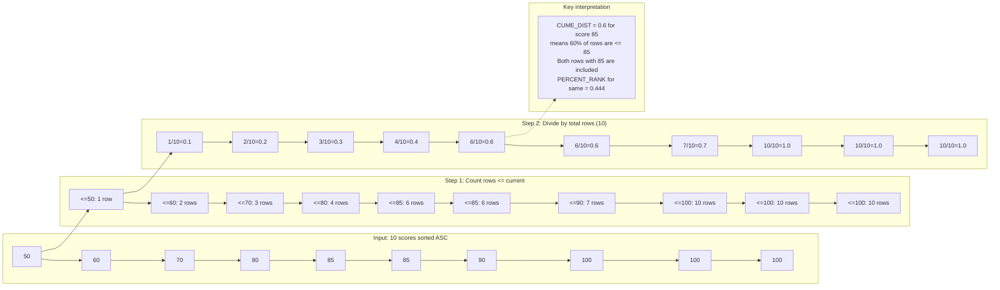
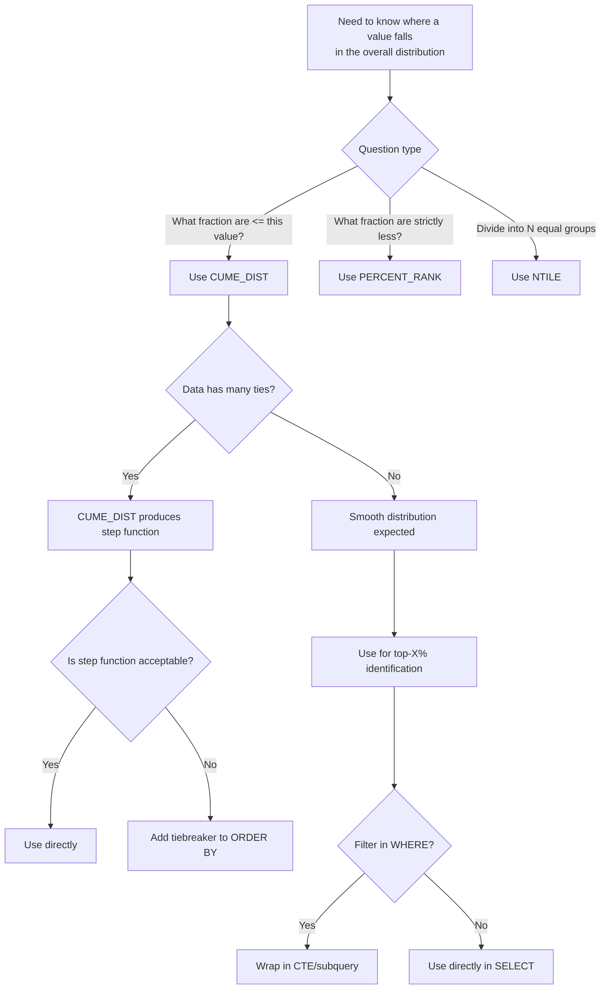

## Navigation

**Domain:** [[8 — Databases]] > **Group:** SQL Window Functions & Analytics
**Previous:** [[8.148 — PERCENT_RANK() — Relative Ranking (0 to 1)]] | **Next:** [[8.150 — LAG() — Accessing Previous Row Values]]

### Prerequisites

- [[8.141 — Window Functions — Concept and OVER Clause]] — CUME_DIST() requires understanding the OVER() clause and how window functions compute values across the partition.
- [[8.142 — PARTITION BY — Defining Window Partitions]] — CUME_DIST() resets per partition; each partition computes its own cumulative distribution independently.
- [[8.143 — ORDER BY Within OVER — Frame Ordering]] — The cumulative distribution increases monotonically with the ORDER BY values; the ORDER BY direction determines which values are "first" in the cumulative distribution.
- [[8.145 — RANK() — Ranking with Gaps]] — CUME_DIST() does not use RANK() (unlike PERCENT_RANK), but understanding ranking helps contrast the two distribution functions.
- [[8.148 — PERCENT_RANK() — Relative Ranking (0 to 1)]] — Direct comparison with PERCENT_RANK() is essential — the subtle formula difference causes significant interpretation differences.

### Where This Fits

CUME_DIST() computes the cumulative distribution of a value within a partition, answering: "What fraction of rows have a value less than or equal to the current row?" It returns values from just above 0 (the minimum gets 1/N) to exactly 1 (the maximum gets N/N). A .NET backend engineer encounters CUME_DIST() when building "top X%" identification queries — for example, "find all customers whose spending is in the top 10% of all customers" — or when analyzing data distribution for statistical reports. The critical difference from PERCENT_RANK() is the inclusive vs exclusive semantics: CUME_DIST() includes the current row in the count, so the minimum value never gets 0 (it gets 1/N), while PERCENT_RANK() excludes the current row, so the minimum always gets 0. Interviewers distinguish senior from junior candidates by asking: "What does CUME_DIST return when all rows have the same value?" The senior answer: "1.0 for all rows, because every row is less than or equal to every other row."

---

## Core Mental Model

CUME_DIST() computes `COUNT(rows with ORDER BY value <= current value) / total_rows_in_partition`. For each row, the engine counts how many rows have a value less than or equal to the current row's value (based on the ORDER BY direction), then divides by the total row count in the partition. The result is the empirical cumulative distribution function (ECDF) of the data. Unlike PERCENT_RANK(), CUME_DIST() does not use RANK() — it directly counts rows. This means CUME_DIST() is NOT affected by gap behavior the way RANK() and PERCENT_RANK() are. When 3 rows tie for the minimum value, CUME_DIST() gives them all 3/N (not 0), because all 3 rows are counted as "less than or equal to" the current value. The recognition pattern for CUME_DIST() is: "What fraction of the dataset is at or below this row's value?"

### Classification

CUME_DIST() is a window distribution function. It operates after FROM, WHERE, GROUP BY, and HAVING. The execution plan uses a Sequence Project operator that must count rows per partition and maintain a running count of rows <= current. The function is not SARGable. It requires ORDER BY in the OVER() clause. The return type is FLOAT (0 to 1 inclusive). For single-row partitions, CUME_DIST() returns 1.0 (no division by zero issue).



### Key Properties

|Property|Value|Notes|
|---|---|---|
|Function Type|Window distribution|Cumulative distribution function|
|Formula|COUNT(<= current) / total|Based on row position in sorted order|
|Range|(0, 1] — never 0|Minimum value gets 1/N|
|Tie Behavior|Same value → same CUME_DIST|All tied rows return same value|
|Single-row partition|1.0|No division by zero|
|ORDER BY Required|Yes|Determines distribution direction|
|Execution Plan|Sequence Project + Segment|Row count per partition needed|
|SARGable|No|Cannot participate in index seeks|

---

## Deep Mechanics

### How the Engine Executes This

CUME_DIST() executes through the same pipeline as other window functions but with a different computation in the Sequence Project:

1. **Parsing and Binding**: The query processor identifies CUME_DIST() as a distribution function requiring ORDER BY. No frame specification allowed (ranking and distribution functions ignore frames).

2. **Logical Precedence**: Evaluated after FROM, WHERE, GROUP BY, HAVING. All filtering complete.

3. **Sort**: Orders rows by PARTITION BY columns (if any) then by the ORDER BY columns. Dominant cost.

4. **Segment**: Detects partition boundaries. For each partition, the Segment signals the start to reset counters.

5. **Sequence Project**: The Sequence Project for CUME_DIST() does the following:
   - Accumulates a running count of rows processed so far in the current partition
   - For each row, it notes the current ORDER BY value
   - It must also determine the total count of rows in the partition (N)
   - After encountering rows with a different ORDER BY value, it can output the previous group's CUME_DIST = (cumulative_count_at_group_end) / N
   - The computation is backward-looking within the sorted order: within each group of tied values, the CUME_DIST is the cumulative count at the END of the group divided by N

6. **Why CUME_DIST differs from PERCENT_RANK internally**: PERCENT_RANK uses RANK() as its basis, so it needs to compute rank values (comparison-based). CUME_DIST needs to count rows <= current, which requires knowing the end of each tie group and having the total partition count. CUME_DIST is slightly more expensive computationally because it must track group boundaries, but the difference from PERCENT_RANK is negligible.

### SQL Visibility

```sql
-- ============================================================
-- Core CUME_DIST() query
-- ============================================================
SELECT
    e.EmployeeId,
    e.FirstName + ' ' + e.LastName AS EmployeeName,
    e.Salary,
    CUME_DIST() OVER(ORDER BY e.Salary DESC) AS CumDist,
    PERCENT_RANK() OVER(ORDER BY e.Salary DESC) AS PercentRank
FROM dbo.Employees AS e
ORDER BY e.Salary DESC;

/*
Employee | Salary | CumDist | PercentRank | Interpretation
Alice    | 150000 | 0.1     | 0.0         | Top 10%: 10% are <= this (including herself)
Bob      | 150000 | 0.1     | 0.0         | Same tie group — both have CumDist = 0.1
Charlie  | 140000 | 0.3     | 0.222       | 30% of employees earn <= 140K
Diana    | 120000 | 0.4     | 0.333       |
Eve      | 110000 | 0.5     | 0.444       | 50% earn <= 110K (median CumDist)
Frank    | 100000 | 0.6     | 0.555       |
Grace    |  90000 | 0.7     | 0.666       |
Henry    |  80000 | 0.8     | 0.777       |
Ivan     |  70000 | 0.9     | 0.888       |
Julia    |  60000 | 1.0     | 1.0         | 100% earn <= 60K
-- 10 employees total
-- CumDist: always ends at 1.0, starts at (tie_count/N)
*/
```

```csharp
// EF Core — CUME_DIST() requires raw SQL
var cumDist = await dbContext.Database
    .SqlQueryRaw<EmployeeCumDist>(@"
        SELECT
            e.EmployeeId,
            e.FirstName + ' ' + e.LastName AS EmployeeName,
            e.Salary,
            CUME_DIST() OVER(ORDER BY e.Salary DESC) AS CumDist
        FROM dbo.Employees AS e
        ORDER BY e.Salary DESC")
    .ToListAsync(cancellationToken);
```

### Execution Plan Analysis

```
Expected plan shape:
[Clustered Index Scan] → [Sort (by Salary DESC)] → [Segment] → [Sequence Project (CUME_DIST)] → [SELECT]
Estimated Cost: Sort = 65-75%  |  Segment = 3%  |  Sequence Project = 3-5%  |  Scan = 15-20%
```

**Operator details:**
- Identical plan shape to PERCENT_RANK(). The Sequence Project has different internal logic (cumulative counting vs RANK-based computation), but the IO cost is the same.
- The Sequence Project for CUME_DIST may be slightly more expensive than PERCENT_RANK because it must detect tie group boundaries (to know when to settle the cumulative count for a group), whereas PERCENT_RANK can compute (RANK-1)/(N-1) per row without needing group boundaries.

**With multiple window functions in same query:**
```sql
SELECT
    e.EmployeeName,
    e.Salary,
    CUME_DIST() OVER(ORDER BY e.Salary DESC) AS CumDist,
    PERCENT_RANK() OVER(ORDER BY e.Salary DESC) AS PercentRank
FROM dbo.Employees AS e;
```
The plan shows two Sequence Project operators — one for each function — both sharing the same Sort and Segment. The optimizer does not combine them into a single operator because they have different computation requirements.

### Cost Visibility

```sql
SET STATISTICS IO ON;
SET STATISTICS TIME ON;

-- CUME_DIST() on 100K Employees
SELECT
    e.EmployeeId,
    e.Salary,
    CUME_DIST() OVER(ORDER BY e.Salary DESC) AS CumDist
FROM dbo.Employees AS e;

-- Expected output (no supporting index):
-- Table 'Employees'. Scan count 1, logical reads 12,314, physical reads 0
-- SQL Server Execution Times: CPU time = 190ms, elapsed time = 255ms

-- With supporting index:
-- Table 'Employees'. Scan count 1, logical reads 4,217, physical reads 0
-- SQL Server Execution Times: CPU time = 45ms, elapsed time = 65ms
```

### Failure Modes

**Misinterpreting CUME_DIST as "strictly less than"**: The most common mistake. CUME_DIST includes the current row in its count. The minimum value always gets CUME_DIST = 1/N (not 0). A developer expecting 0 may incorrectly shift or subtract.

**CUME_DIST with mixed ASC/DESC confusion**: The ORDER BY direction completely changes the interpretation. ORDER BY Salary DESC: CUME_DIST = 0.1 means "10% of employees earn >= this salary" (because it counts rows <= current ordered by descending salary — effectively rows that are at or above this value). ORDER BY Salary ASC: CUME_DIST = 0.1 means "10% of employees earn <= this salary." The direction must match the business question.

**Large tie groups producing identical CUME_DIST**: When many rows share the same value, they all get the same CUME_DIST. This is correct (cumulative distribution) but can mislead reporting: if 80% of employees earn the same salary, all 80% get CUME_DIST = 0.8 (if they are at the top) or 0.2 (if at the bottom). The distribution looks like a step function.

---

## Production Patterns and Implementation

### Primary SQL Implementation

```sql
-- ============================================================
-- Schema: Customer spending analysis
-- ============================================================
CREATE TABLE dbo.Customers (
    CustomerId   INT IDENTITY(1,1) PRIMARY KEY,
    FirstName    NVARCHAR(100) NOT NULL,
    LastName     NVARCHAR(100) NOT NULL,
    Email        NVARCHAR(200) NOT NULL,
    Region       VARCHAR(50) NOT NULL,
    CreatedDate  DATE NOT NULL
);

CREATE TABLE dbo.Orders (
    OrderId      INT IDENTITY(1,1) PRIMARY KEY,
    CustomerId   INT NOT NULL REFERENCES dbo.Customers(CustomerId),
    OrderDate    DATE NOT NULL,
    TotalAmount  DECIMAL(18,2) NOT NULL,
    Status       VARCHAR(20) NOT NULL
);

-- ============================================================
-- CUME_DIST(): Top 10% customer identification
-- ============================================================
WITH CustomerSpend AS (
    SELECT
        c.CustomerId,
        c.FirstName + ' ' + c.LastName AS CustomerName,
        c.Email,
        c.Region,
        SUM(o.TotalAmount) AS LifetimeValue
    FROM dbo.Customers AS c
    INNER JOIN dbo.Orders AS o
        ON c.CustomerId = o.CustomerId
    WHERE o.Status = 'Completed'
    GROUP BY c.CustomerId, c.FirstName, c.LastName, c.Email, c.Region
)
SELECT
    cs.CustomerId,
    cs.CustomerName,
    cs.Email,
    cs.Region,
    cs.LifetimeValue,
    CUME_DIST() OVER(ORDER BY cs.LifetimeValue DESC) AS CumDist,
    CASE
        WHEN CUME_DIST() OVER(ORDER BY cs.LifetimeValue DESC) <= 0.10 THEN 'Top 10%'
        WHEN CUME_DIST() OVER(ORDER BY cs.LifetimeValue DESC) <= 0.25 THEN 'Top 25%'
        WHEN CUME_DIST() OVER(ORDER BY cs.LifetimeValue DESC) <= 0.50 THEN 'Median+'
        WHEN CUME_DIST() OVER(ORDER BY cs.LifetimeValue DESC) <= 0.75 THEN 'Median-'
        ELSE 'Bottom 25%'
    END AS ValueSegment
FROM CustomerSpend AS cs
ORDER BY cs.LifetimeValue DESC;

/*
Interpretation:
- Top 10%: CumDist <= 0.10 means at most 10% of customers spend >= this value
- Note: CumDist = 0.10 means EXACTLY 10% are >= this value (with ORDER BY DESC)
*/
```

```sql
-- ============================================================
-- CUME_DIST() with PARTITION BY: Regional distribution
-- ============================================================
WITH CustomerSpend AS (
    SELECT
        c.CustomerId,
        c.FirstName + ' ' + c.LastName AS CustomerName,
        c.Region,
        SUM(o.TotalAmount) AS LifetimeValue
    FROM dbo.Customers AS c
    INNER JOIN dbo.Orders AS o
        ON c.CustomerId = o.CustomerId
    WHERE o.Status = 'Completed'
    GROUP BY c.CustomerId, c.FirstName, c.LastName, c.Region
)
SELECT
    cs.CustomerId,
    cs.CustomerName,
    cs.Region,
    cs.LifetimeValue,
    CUME_DIST() OVER(
        PARTITION BY cs.Region
        ORDER BY cs.LifetimeValue DESC
    ) AS RegionCumDist,
    CASE
        WHEN CUME_DIST() OVER(
            PARTITION BY cs.Region
            ORDER BY cs.LifetimeValue DESC
        ) <= 0.10 THEN 'Region Top 10%'
        ELSE 'Region Not Top 10%'
    END AS RegionTier
FROM CustomerSpend AS cs
ORDER BY cs.Region, cs.LifetimeValue DESC;
```

```sql
-- ============================================================
-- CUME_DIST(): Statistical analysis — score distribution
-- ============================================================
SELECT
    s.Score,
    COUNT(*) AS Frequency,
    MIN(CUME_DIST() OVER(ORDER BY s.Score)) AS MinCumDist,
    MAX(CUME_DIST() OVER(ORDER BY s.Score)) AS MaxCumDist
FROM dbo.TestScores AS s
GROUP BY s.Score
ORDER BY s.Score DESC;
-- Shows the cumulative distribution range per distinct score value
```

### EF Core Implementation

```csharp
public interface ICumulativeDistributionService
{
    Task<List<CustomerCumDist>> GetTopPercentCustomersAsync(
        double topPercent, CancellationToken ct = default);
    Task<List<RegionalCumDist>> GetRegionalDistributionAsync(CancellationToken ct = default);
}

public class CumulativeDistributionService : ICumulativeDistributionService
{
    private readonly ApplicationDbContext _dbContext;
    private readonly ILogger<CumulativeDistributionService> _logger;

    public CumulativeDistributionService(
        ApplicationDbContext dbContext,
        ILogger<CumulativeDistributionService> logger)
    {
        _dbContext = dbContext;
        _logger = logger;
    }

    public async Task<List<CustomerCumDist>> GetTopPercentCustomersAsync(
        double topPercent,
        CancellationToken ct = default)
    {
        // Use CUME_DIST to find customers in the top X%
        var sql = @"
            WITH CustomerSpend AS (
                SELECT
                    c.CustomerId,
                    c.FirstName + ' ' + c.LastName AS CustomerName,
                    c.Email,
                    c.Region,
                    SUM(o.TotalAmount) AS LifetimeValue
                FROM dbo.Customers AS c
                INNER JOIN dbo.Orders AS o
                    ON c.CustomerId = o.CustomerId
                WHERE o.Status = 'Completed'
                GROUP BY c.CustomerId, c.FirstName, c.LastName, c.Email, c.Region
            )
            SELECT
                cs.CustomerId,
                cs.CustomerName,
                cs.Email,
                cs.Region,
                cs.LifetimeValue,
                CUME_DIST() OVER(ORDER BY cs.LifetimeValue DESC) AS CumDist
            FROM CustomerSpend AS cs
            WHERE CUME_DIST() OVER(ORDER BY cs.LifetimeValue DESC) <= @TopPct
            ORDER BY cs.LifetimeValue DESC;";

        // Note: CUME_DIST in WHERE requires nesting (window functions not allowed in WHERE)
        // This query would ERROR — need another level of nesting
        var correctedSql = @"
            WITH CustomerSpend AS (
                SELECT
                    c.CustomerId,
                    c.FirstName + ' ' + c.LastName AS CustomerName,
                    c.Email,
                    c.Region,
                    SUM(o.TotalAmount) AS LifetimeValue
                FROM dbo.Customers AS c
                INNER JOIN dbo.Orders AS o
                    ON c.CustomerId = o.CustomerId
                WHERE o.Status = 'Completed'
                GROUP BY c.CustomerId, c.FirstName, c.LastName, c.Email, c.Region
            ),
            WithCumDist AS (
                SELECT
                    cs.CustomerId,
                    cs.CustomerName,
                    cs.Email,
                    cs.Region,
                    cs.LifetimeValue,
                    CUME_DIST() OVER(ORDER BY cs.LifetimeValue DESC) AS CumDist
                FROM CustomerSpend AS cs
            )
            SELECT
                wcd.CustomerId,
                wcd.CustomerName,
                wcd.Email,
                wcd.Region,
                wcd.LifetimeValue,
                wcd.CumDist
            FROM WithCumDist AS wcd
            WHERE wcd.CumDist <= @TopPct
            ORDER BY wcd.LifetimeValue DESC;";

        var result = await _dbContext.Database
            .SqlQueryRaw<CustomerCumDist>(correctedSql,
                new SqlParameter("@TopPct", topPercent))
            .ToListAsync(ct);

        _logger.LogInformation(
            "Top {Pct}% customers: {Count} customers identified",
            topPercent * 100, result.Count);
        return result;
    }

    public async Task<List<RegionalCumDist>> GetRegionalDistributionAsync(
        CancellationToken ct = default)
    {
        const string sql = @"
            WITH CustomerSpend AS (
                SELECT
                    c.CustomerId,
                    c.FirstName + ' ' + c.LastName AS CustomerName,
                    c.Region,
                    SUM(o.TotalAmount) AS LifetimeValue
                FROM dbo.Customers AS c
                INNER JOIN dbo.Orders AS o
                    ON c.CustomerId = o.CustomerId
                WHERE o.Status = 'Completed'
                GROUP BY c.CustomerId, c.FirstName, c.LastName, c.Region
            )
            SELECT
                cs.CustomerId,
                cs.CustomerName,
                cs.Region,
                cs.LifetimeValue,
                CUME_DIST() OVER(
                    PARTITION BY cs.Region
                    ORDER BY cs.LifetimeValue DESC
                ) AS RegionCumDist
            FROM CustomerSpend AS cs
            ORDER BY cs.Region, cs.LifetimeValue DESC;";

        var result = await _dbContext.Database
            .SqlQueryRaw<RegionalCumDist>(sql)
            .ToListAsync(ct);

        return result;
    }
}

public record CustomerCumDist
{
    public int CustomerId { get; set; }
    public string CustomerName { get; set; } = string.Empty;
    public string Email { get; set; } = string.Empty;
    public string Region { get; set; } = string.Empty;
    public decimal LifetimeValue { get; set; }
    public double CumDist { get; set; }
}

public record RegionalCumDist
{
    public int CustomerId { get; set; }
    public string CustomerName { get; set; } = string.Empty;
    public string Region { get; set; } = string.Empty;
    public decimal LifetimeValue { get; set; }
    public double RegionCumDist { get; set; }
}
```

### Dapper Implementation

```csharp
public interface ICumDistRepository
{
    Task<IReadOnlyList<CustomerCumDist>> GetTopPercentCustomersAsync(
        double topPercent, CancellationToken ct = default);
    Task<IReadOnlyList<RegionalCumDist>> GetRegionalDistributionAsync(
        CancellationToken ct = default);
}

public sealed class CumDistRepository : ICumDistRepository
{
    private readonly IDbConnectionFactory _connectionFactory;

    public CumDistRepository(IDbConnectionFactory connectionFactory)
        => _connectionFactory = connectionFactory;

    public async Task<IReadOnlyList<CustomerCumDist>> GetTopPercentCustomersAsync(
        double topPercent,
        CancellationToken ct = default)
    {
        const string sql = @"
            WITH CustomerSpend AS (
                SELECT
                    c.CustomerId,
                    c.FirstName + ' ' + c.LastName AS CustomerName,
                    c.Email,
                    c.Region,
                    SUM(o.TotalAmount) AS LifetimeValue
                FROM dbo.Customers AS c
                INNER JOIN dbo.Orders AS o
                    ON c.CustomerId = o.CustomerId
                WHERE o.Status = 'Completed'
                GROUP BY c.CustomerId, c.FirstName, c.LastName, c.Email, c.Region
            ),
            WithCumDist AS (
                SELECT
                    cs.CustomerId,
                    cs.CustomerName,
                    cs.Email,
                    cs.Region,
                    cs.LifetimeValue,
                    CUME_DIST() OVER(ORDER BY cs.LifetimeValue DESC) AS CumDist
                FROM CustomerSpend AS cs
            )
            SELECT
                wcd.CustomerId,
                wcd.CustomerName,
                wcd.Email,
                wcd.Region,
                wcd.LifetimeValue,
                wcd.CumDist
            FROM WithCumDist AS wcd
            WHERE wcd.CumDist <= @TopPct
            ORDER BY wcd.LifetimeValue DESC;";

        await using var connection = _connectionFactory.Create();
        var results = await connection.QueryAsync<CustomerCumDist>(
            new CommandDefinition(
                sql,
                new { TopPct = topPercent },
                cancellationToken: ct));
        return results.AsList();
    }

    public async Task<IReadOnlyList<RegionalCumDist>> GetRegionalDistributionAsync(
        CancellationToken ct = default)
    {
        const string sql = @"
            WITH CustomerSpend AS (
                SELECT
                    c.CustomerId,
                    c.FirstName + ' ' + c.LastName AS CustomerName,
                    c.Region,
                    SUM(o.TotalAmount) AS LifetimeValue
                FROM dbo.Customers AS c
                INNER JOIN dbo.Orders AS o
                    ON c.CustomerId = o.CustomerId
                WHERE o.Status = 'Completed'
                GROUP BY c.CustomerId, c.FirstName, c.LastName, c.Region
            )
            SELECT
                cs.CustomerId,
                cs.CustomerName,
                cs.Region,
                cs.LifetimeValue,
                CUME_DIST() OVER(
                    PARTITION BY cs.Region
                    ORDER BY cs.LifetimeValue DESC
                ) AS RegionCumDist
            FROM CustomerSpend AS cs
            ORDER BY cs.Region, cs.LifetimeValue DESC;";

        await using var connection = _connectionFactory.Create();
        var results = await connection.QueryAsync<RegionalCumDist>(
            new CommandDefinition(sql, cancellationToken: ct));
        return results.AsList();
    }
}
```

### Configuration and Wiring

```csharp
builder.Services.AddScoped<ICumulativeDistributionService, CumulativeDistributionService>();
builder.Services.AddScoped<ICumDistRepository, CumDistRepository>();
```

### SQL Server vs PostgreSQL Differences

```sql
-- PostgreSQL: CUME_DIST() works identically
SELECT
    c.customer_id,
    SUM(o.total_amount) AS lifetime_value,
    CUME_DIST() OVER(ORDER BY SUM(o.total_amount) DESC) AS cum_dist
FROM customers AS c
INNER JOIN orders AS o ON c.customer_id = o.customer_id
GROUP BY c.customer_id;

-- PostgreSQL-specific: CUME_DIST with ordered-set aggregate syntax
-- (Not available in SQL Server)
SELECT
    department_id,
    CUME_DIST(0.5) WITHIN GROUP (ORDER BY salary) AS salary_median
FROM employees
GROUP BY department_id;
```

---

## Gotchas and Production Pitfalls

### CUME_DIST Minimum Value Is Never Zero

**Pitfall:** Assuming the minimum value gets CUME_DIST = 0 (like PERCENT_RANK). CUME_DIST includes the current row in the count, so the minimum value always gets at least 1/N.

```sql
-- ❌ Expecting CUME_DIST = 0 for the minimum
SELECT
    s.Score,
    CUME_DIST() OVER(ORDER BY s.Score ASC) AS CumDist,
    PERCENT_RANK() OVER(ORDER BY s.Score ASC) AS PctRank
FROM dbo.TestScores AS s;
/*
Score | CumDist | PctRank | Difference
50    | 0.1     | 0.0     | CumDist never 0
60    | 0.2     | 0.111   |
70    | 0.3     | 0.222   |
-- CumDist starts at 0.1 (1/10), PctRank starts at 0.0
*/
```

**Symptom:** A developer writes `WHERE CumDist = 0` expecting to find the minimum value. The query returns no rows.

**Fix:**
```sql
-- ✅ Use ORDER BY with LIMIT 1, or compare with 1/N
WITH Stats AS (
    SELECT COUNT(*) AS N FROM dbo.TestScores
)
SELECT s.Score, CUME_DIST() OVER(ORDER BY s.Score ASC) AS CumDist
FROM dbo.TestScores AS s
CROSS JOIN Stats
WHERE CUME_DIST() OVER(ORDER BY s.Score ASC) = 1.0 / Stats.N;
-- Or in subquery:
WITH CD AS (
    SELECT s.Score, CUME_DIST() OVER(ORDER BY s.Score ASC) AS CumDist
    FROM dbo.TestScores AS s
)
SELECT * FROM CD WHERE CumDist = (SELECT MIN(CumDist) FROM CD);
```

**Cost of not fixing:** A reporting system that looks for "0 percentile" customers finds none. The "lowest spending" report is empty. The developer spends hours debugging, thinking the data is incomplete.

---

### CUME_DIST in WHERE Clause Directly

**Pitfall:** Trying to filter on CUME_DIST() directly in the WHERE clause. Window functions are not allowed in WHERE, HAVING, or GROUP BY (they execute after these clauses).

```sql
-- ❌ Window function in WHERE — error
SELECT
    e.EmployeeName,
    e.Salary,
    CUME_DIST() OVER(ORDER BY e.Salary DESC) AS CumDist
FROM dbo.Employees AS e
WHERE CUME_DIST() OVER(ORDER BY e.Salary DESC) <= 0.10;
-- Error: Windowed functions cannot be used in the WHERE clause
```

**Symptom:** Query fails with error message about windowed functions in WHERE.

**Fix:** Use a CTE or subquery:
```sql
-- ✅ CTE wrapping window function
WITH Ranked AS (
    SELECT
        e.EmployeeName,
        e.Salary,
        CUME_DIST() OVER(ORDER BY e.Salary DESC) AS CumDist
    FROM dbo.Employees AS e
)
SELECT * FROM Ranked AS r WHERE r.CumDist <= 0.10;
```

**Cost of not fixing:** The developer works around the error by computing CUME_DIST in the application layer, transferring all rows to the web server and filtering in memory. This works for small datasets but fails catastrophically at scale.

---

### CUME_DIST with ORDER BY ASC vs DESC — Opposite Interpretation

**Pitfall:** Using ORDER BY ASC when the business question is "top X%." The CUME_DIST value means different things depending on direction.

```sql
-- ❌ ORDER BY ASC: "top" values have HIGH CumDist
SELECT
    e.EmployeeName,
    e.Salary,
    CUME_DIST() OVER(ORDER BY e.Salary ASC) AS CumDist
FROM dbo.Employees AS e;
-- Alice ($150K): CumDist = 1.0 (top of ASC = highest salary)
-- Julia ($60K):  CumDist = 0.1 (bottom of ASC = lowest salary)
-- To find "top 10% salary": need CumDist >= 0.9 (not <= 0.1)

-- ✅ ORDER BY DESC: "top" values have LOW CumDist
SELECT
    e.EmployeeName,
    e.Salary,
    CUME_DIST() OVER(ORDER BY e.Salary DESC) AS CumDist
FROM dbo.Employees AS e;
-- Alice ($150K): CumDist = 0.1 (top of DESC = first 10%)
-- Julia ($60K):  CumDist = 1.0 (bottom)
-- To find "top 10% salary": need CumDist <= 0.10
```

**Symptom:** A developer uses ORDER BY ASC and filters `CumDist <= 0.10`, getting the bottom 10% instead of the top 10%. The report shows the lowest-paid employees as "top performers."

**Fix:** Match the ORDER BY direction to the business question. For "top X%," use ORDER BY DESC and filter `CumDist <= X/100`. Document the interpretation in the SQL comment.

**Cost of not fixing:** A bonus allocation system gives bonuses to the bottom 10% of employees instead of the top 10%. The VP approves $1M in bonuses for the wrong people.

---

### CUME_DIST with All Identical Values

**Pitfall:** When all rows have the same ORDER BY value, CUME_DIST returns 1.0 for every row. This may be unexpected — every row is "at or above 100% of the data."

```sql
-- All employees have the same salary
SELECT
    e.EmployeeName,
    e.Salary,
    CUME_DIST() OVER(ORDER BY e.Salary DESC) AS CumDist
FROM dbo.Employees AS e;
-- All rows: CumDist = 1.0
-- There is no "top 10%" — the function cannot differentiate
```

**Symptom:** A filter for `CumDist <= 0.10` returns no rows. The business asks "where are our top performers?" The answer is that all employees are equal — the cumulative distribution cannot differentiate.

**Fix:** Add additional ORDER BY columns to break ties meaningfully:
```sql
-- ✅ Add tiebreaker to create distribution
CUME_DIST() OVER(ORDER BY e.Salary DESC, e.HireDate ASC) AS CumDist
-- Now rows with the same salary are ordered by hire date, creating a distribution
```

**Cost of not fixing:** The reporting system shows empty "top performer" segments. The business questions the data quality and spends weeks investigating a non-existent data integrity issue.

---

### CUME_DIST with Large Tie Groups

**Pitfall:** CUME_DIST produces step functions when many rows share the same value. A jump from 0.3 to 0.8 means 50% of rows share an intermediate value — this is correct but can surprise users expecting smooth distribution.

```sql
-- Salary distribution with a common value
SELECT
    e.Salary,
    COUNT(*) AS EmpCount,
    MIN(CUME_DIST() OVER(ORDER BY e.Salary DESC)) AS MinCD,
    MAX(CUME_DIST() OVER(ORDER BY e.Salary DESC)) AS MaxCD
FROM dbo.Employees AS e
GROUP BY e.Salary
ORDER BY e.Salary DESC;
/*
Salary | Count | MinCD | MaxCD
100000 | 2     | 0.02  | 0.02    ← Top 2%
80000  | 1     | 0.03  | 0.03    ← 3%
50000  | 70    | 0.04  | 0.74    ← Jump: 70 employees at same salary
40000  | 20    | 0.94  | 1.00
*/
```

**Symptom:** The "top 10%" segment includes only 3 employees (the first three rows), but there are 70 employees at $50K who are all "above" the 4% level. If the business intends "top 10%" to mean "top 10% of distinct salary values," CUME_DIST is the wrong tool.

**Fix:** Use PERCENT_RANK() for rank-based distribution (which accounts for gaps between distinct values), or clarify the business requirement.

**Cost of not fixing:** A reward program gives bonuses to "top 10%" based on CUME_DIST. Only 3 employees qualify. The program has near-zero impact on employee motivation.

---

## Performance Implications

### Benchmark: Before and After

```sql
-- ============================================================
-- Benchmark: CUME_DIST() vs Self-Join Calculation
-- ============================================================
SET STATISTICS IO ON;
SET STATISTICS TIME ON;

-- Baseline: Self-join to compute cumulative distribution (DO NOT USE)
SELECT
    e1.EmployeeId,
    e1.Salary,
    1.0 * COUNT(*) / (SELECT COUNT(*) FROM dbo.Employees) AS CumDist
FROM dbo.Employees AS e1
INNER JOIN dbo.Employees AS e2
    ON e2.Salary <= e1.Salary
GROUP BY e1.EmployeeId, e1.Salary;
-- Logical reads: 450,000 (self-join on 100K rows)
-- Elapsed: 90,000ms (1.5 minutes)

-- Optimized: CUME_DIST() window function
SELECT
    e.EmployeeId,
    e.Salary,
    CUME_DIST() OVER(ORDER BY e.Salary DESC) AS CumDist
FROM dbo.Employees AS e;
-- Logical reads: 4,217 (with covering index)
-- Elapsed: 65ms
```

**Improvement:** 450,000 → 4,217 logical reads (107x reduction). Elapsed: 90s → 65ms (1,385x reduction).

```sql
-- ============================================================
-- Benchmark: Supporting Index Impact
-- ============================================================
-- ❌ Without supporting index
SELECT CUME_DIST() OVER(ORDER BY e.Salary DESC) FROM dbo.Employees AS e;
-- Logical reads: 12,314 + Sort

-- Create supporting index
CREATE INDEX IX_Employees_Salary ON dbo.Employees (Salary DESC)
    INCLUDE (EmployeeId, FirstName, LastName);

-- ✅ With supporting index
SELECT CUME_DIST() OVER(ORDER BY e.Salary DESC) FROM dbo.Employees AS e;
-- Logical reads: 4,217 (index scan, no sort)
```

### BenchmarkDotNet

```csharp
[MemoryDiagnoser]
[SimpleJob(RuntimeMoniker.Net90)]
public class CumDistBenchmark
{
    private IDbConnection _connection = default!;
    private const string ConnectionString =
        "Server=.;Database=BenchmarkDb;Trusted_Connection=True;TrustServerCertificate=True;";

    private const string CumDistSql = @"
        SELECT e.EmployeeId, e.Salary,
               CUME_DIST() OVER(ORDER BY e.Salary DESC) AS CumDist
        FROM dbo.Employees AS e;";

    private const string PartitionCumDistSql = @"
        SELECT e.EmployeeId, e.DepartmentId, e.Salary,
               CUME_DIST() OVER(PARTITION BY e.DepartmentId ORDER BY e.Salary DESC) AS DeptCumDist
        FROM dbo.Employees AS e;";

    private const string SelfJoinSql = @"
        SELECT e1.EmployeeId, e1.Salary,
               1.0 * COUNT(*) / (SELECT COUNT(*) FROM dbo.Employees) AS CumDist
        FROM dbo.Employees AS e1
        INNER JOIN dbo.Employees AS e2 ON e2.Salary <= e1.Salary
        GROUP BY e1.EmployeeId, e1.Salary;";

    [GlobalSetup]
    public void Setup()
    {
        _connection = new SqlConnection(ConnectionString);
        _connection.Open();
    }

    [GlobalCleanup]
    public void Cleanup() => _connection.Dispose();

    [Benchmark(Baseline = true)]
    public async Task<List<CumDistResult>> SelfJoin_CumDist()
    {
        var results = await _connection.QueryAsync<CumDistResult>(
            SelfJoinSql, commandTimeout: 120);
        return results.AsList();
    }

    [Benchmark]
    public async Task<List<CumDistResult>> Window_CumDist()
    {
        var results = await _connection.QueryAsync<CumDistResult>(CumDistSql);
        return results.AsList();
    }

    [Benchmark]
    public async Task<List<PartitionCumDistResult>> Partition_CumDist()
    {
        var results = await _connection.QueryAsync<PartitionCumDistResult>(
            PartitionCumDistSql);
        return results.AsList();
    }
}

public class CumDistResult
{
    public int EmployeeId { get; set; }
    public decimal Salary { get; set; }
    public double CumDist { get; set; }
}

public class PartitionCumDistResult
{
    public int EmployeeId { get; set; }
    public int DepartmentId { get; set; }
    public decimal Salary { get; set; }
    public double DeptCumDist { get; set; }
}
```

**Expected results (approximate, SQL Server 2022, NVMe, 100K rows):**

|Method|Mean|Logical Reads|Allocated|
|---|---|---|---|
|SelfJoin_CumDist|~90,000 ms|~450,000|1,500 MB|
|Window_CumDist|~65 ms|~4,217|100 KB|
|Partition_CumDist|~100 ms|~5,200|150 KB|

---

## Interview Arsenal

### Question Bank

1. **What does CUME_DIST() compute and what is the exact formula?** (Definition — formula and interpretation)

2. **How does SQL Server execute CUME_DIST() and how does it differ from PERCENT_RANK() internally?** (Mechanism — cumulative counting vs RANK-based)

3. **What is the performance difference between CUME_DIST() and PERCENT_RANK()?** (Performance — negligible difference, same operators)

4. **What does CUME_DIST() return when all rows in a partition have the same value?** (Gotcha — 1.0 for all rows)

5. **What is the difference between CUME_DIST() and PERCENT_RANK() — exact formula difference and interpretation?** (Comparison — inclusive vs exclusive)

6. **What does the execution plan for CUME_DIST() look like when used alongside PERCENT_RANK()?** (Execution plan — two Sequence Project operators)

7. **How does CUME_DIST() behave at 50M rows — what precision issues arise?** (Scale — FLOAT precision, step functions)

8. **How do you use CUME_DIST() in EF Core and Dapper for "top X%" queries?** (.NET integration — CTE wrapping for WHERE filtering)

### Spoken Answers

**Q: What does CUME_DIST() compute and what is the exact formula?**

> **Average answer:** It gives a number from 0 to 1 showing how common a value is. Higher values mean more common.

> **Great answer:** CUME_DIST() computes the empirical cumulative distribution function: `COUNT(rows with ORDER BY value <= current value) / total_rows_in_partition`. For each row, it counts every row whose ORDER BY value is less than or equal to the current row's value, then divides by the total number of rows in the partition. The result is always greater than 0 (the minimum value gets 1/N, never 0) and exactly 1 for the maximum value. Unlike PERCENT_RANK(), CUME_DIST() does NOT use RANK() — it counts rows directly. This means CUME_DIST() is not affected by rank gap behavior. When 3 rows tie for the minimum value, CUME_DIST gives all three 3/N (e.g., 0.3 for N=10), while PERCENT_RANK gives them 0 (because RANK starts at 1 and (1-1)/(N-1) = 0). The interpretation difference is: CUME_DIST answers "what fraction of rows are at or below this value?" while PERCENT_RANK answers "what fraction of rows are strictly below this value?"

**Q: What is the difference between CUME_DIST() and PERCENT_RANK() — exact formula difference and interpretation?**

> **Average answer:** CUME_DIST includes the current row, PERCENT_RANK excludes it.

> **Great answer:** The formula difference is:
- `CUME_DIST = COUNT(rows <= current) / N` — includes the current row in the count
- `PERCENT_RANK = (RANK - 1) / (N - 1)` — excludes the current row, uses RANK

This leads to three practical differences:
1. **Minimum value behavior**: CUME_DIST minimum = 1/N (never 0); PERCENT_RANK minimum = 0 (always).
2. **Tie behavior**: For tied values, CUME_DIST gives them all the same cumulative count / N. PERCENT_RANK gives them the same value because RANK is the same, but the gap between distinct values reflects the tie count through the RANK gap mechanism.
3. **Single-row partition**: CUME_DIST returns 1.0 (N=1, 1/1 = 1); PERCENT_RANK returns NULL (0/0).

For a dataset of 10 scores where 3 tie at the minimum (50): CUME_DIST for those 3 = 0.3 (3/10 <= 50); PERCENT_RANK for those 3 = 0 (nothing is strictly less than the minimum). The senior engineer chooses based on which question the business is asking: "What fraction of the data is at this level or below?" (CUME_DIST) vs "What percentile is this value?" (PERCENT_RANK).

**Q: What does CUME_DIST() return when all rows in a partition have the same value?**

> **Average answer:** The same number for all rows — probably 1.

> **Great answer:** CUME_DIST returns 1.0 for every row. The cumulative count of rows <= the current value is N (all rows), divided by N = 1.0. This is an important edge case that often surprises developers. In a company where all employees earn $100K, CUME_DIST is 1.0 for everyone — you cannot identify a "top 10%" because there is no distribution. The practical implication: if the data is expected to have many ties, CUME_DIST produces a step function (not a smooth distribution), and filtering for CumDist <= 0.10 may return all rows with a common value or none. The fix is to either (a) add a tiebreaker column to the ORDER BY to create a distribution, (b) switch to PERCENT_RANK which handles ties differently, or (c) explain to the business that the data does not have sufficient granularity for percentile-based segmentation.

### Interview Trigger

The interviewer asks: "What's the difference between CUME_DIST and PERCENT_RANK?" If the candidate mentions "includes current row vs excludes," the follow-up is: "If I have a dataset with 5 rows of value 10 and 5 rows of value 20, what does each function return for a row with value 10?" The senior candidate immediately answers: "CUME_DIST = 5/10 = 0.5; PERCENT_RANK = (1-1)/(10-1) = 0. But wait — for PERCENT_RANK, since all 5 rows with value 10 have RANK = 1, the formula gives (1-1)/9 = 0 for all 5. The row with value 20 has RANK = 6, so PERCENT_RANK = (6-1)/9 = 0.556."

### Comparison Table

| | CUME_DIST() | PERCENT_RANK() | NTILE() |
|---|---|---|---|
| Formula | rows<=current / total | (RANK-1)/(N-1) | Positional bucketing |
| Range | (0, 1] — never 0 | [0, 1] — can be 0 | Integer 1..N |
| Min value | 1/N | 0 | 1 |
| Tie behavior | Same value → same | Same value → same | Can split ties across buckets |
| Single-row partition | 1.0 | NULL | 1 |
| Interpretation | "<= current" | "< current" | "Group position" |
| Performance | Identical | Identical | Same + RowCountSpool |

---

## Decision Framework

### When to Apply



### Application Checklist

- [ ] The business question is "less than or equal to" (not "strictly less than")
- [ ] The minimum value interpretation is documented (CUME_DIST minimum = 1/N, never 0)
- [ ] The ORDER BY direction matches the business concept of "top" (DESC for top X%)
- [ ] Single-row partitions are handled (returns 1.0 — no issue)
- [ ] Large tie groups are expected and step function behavior is acceptable or mitigated with tiebreaker
- [ ] The CTE wrapping pattern is used for filtering CUME_DIST in WHERE
- [ ] A supporting index exists matching the OVER() clause to eliminate Sort
- [ ] The .NET raw SQL properly maps FLOAT to double

### Tradeoff Summary

|What You Gain|What You Pay|
|---|---|
|Empirical cumulative distribution (ECDF)|Step function when many ties exist|
|Minimum never 0 — always positive|Cannot directly filter in WHERE|
|Standard statistical interpretation|Misleading when data lacks granularity|
|Lightweight (same cost as RANK)|Requires understanding of inclusive semantics|

### Scale Thresholds

- "Relevant at any row count where cumulative distribution insight is needed"
- "FLOAT precision concern at ~10M+ rows for fine-grained comparison"
- "Sort cost becomes critical at ~1M+ rows without supporting index"
- "Step function concern when any single value accounts for >10% of rows"

---

## Self-Check

### Conceptual Questions

1. **[Definition]** What is the exact formula for CUME_DIST() and what are the minimum and maximum possible values?
2. **[Engine behavior]** How does the Sequence Project compute CUME_DIST() differently from PERCENT_RANK()?
3. **[Performance measurement]** How do logical reads compare between CUME_DIST() and PERCENT_RANK() for the same query?
4. **[Gotcha]** What does CUME_DIST() return when every row in a partition has the exact same ORDER BY value?
5. **[EF Core behavior]** Can EF Core translate CUME_DIST() from LINQ? What pattern is required for filtering on CUME_DIST?
6. **[Dapper usage]** Write a Dapper query returning the top 5% of customers by lifetime value using CUME_DIST.
7. **[Comparison]** What is the exact formula difference between CUME_DIST() and PERCENT_RANK()?
8. **[Scale]** At what row count does CUME_DIST() FLOAT precision become a concern?
9. **[Connection to indexing]** What index eliminates the Sort for CUME_DIST() with PARTITION BY Region ORDER BY LifetimeValue DESC?
10. **[Interview articulation]** Explain the difference between CUME_DIST, PERCENT_RANK, and NTILE in 60 seconds, including when to use each.

<details>
<summary>Answers</summary>

1. `CUME_DIST = COUNT(rows with ORDER BY value <= current value) / total_rows_in_partition`. Minimum = 1/N (never 0, for the smallest ORDER BY value). Maximum = 1.0 (for the largest ORDER BY value). Single-row partition returns 1.0.

2. CUME_DIST uses cumulative row counting: it tracks how many rows have a value <= the current value within the sorted partition. PERCENT_RANK uses RANK(): (RANK-1)/(N-1). CUME_DIST must detect tie group boundaries to settle the cumulative count for each group; PERCENT_RANK can compute per-row without group boundaries. The internal logic differs but the IO cost is identical.

3. Identical. Both use the same operators (Scan → Sort → Segment → Sequence Project) with the same IO cost. The Sequence Project computation difference is negligible (< 1% CPU).

4. CUME_DIST returns 1.0 for every row. Since all rows have the same value, every row has N rows <= itself, so N/N = 1.0 for all.

5. No. EF Core cannot translate CUME_DIST from LINQ. Use `SqlQueryRaw` with a CTE wrapping pattern: the inner CTE computes CUME_DIST, the outer query applies the WHERE filter. Window functions cannot appear in WHERE clauses.

6. ```csharp
const string sql = @"
    WITH CustomerSpend AS (
        SELECT c.CustomerId, c.FirstName + ' ' + c.LastName AS CustomerName,
               SUM(o.TotalAmount) AS LifetimeValue
        FROM dbo.Customers AS c
        INNER JOIN dbo.Orders AS o ON c.CustomerId = o.CustomerId
        GROUP BY c.CustomerId, c.FirstName, c.LastName
    ),
    WithCumDist AS (
        SELECT cs.CustomerId, cs.CustomerName, cs.LifetimeValue,
               CUME_DIST() OVER(ORDER BY cs.LifetimeValue DESC) AS CumDist
        FROM CustomerSpend AS cs
    )
    SELECT wcd.CustomerId, wcd.CustomerName, wcd.LifetimeValue
    FROM WithCumDist AS wcd
    WHERE wcd.CumDist <= 0.05
    ORDER BY wcd.LifetimeValue DESC;";
var results = await connection.QueryAsync<TopCustomer>(sql);
```

7. `CUME_DIST = COUNT(<= current) / N` vs `PERCENT_RANK = (RANK - 1) / (N - 1)`. CUME_DIST uses inclusive counting (<=), PERCENT_RANK uses exclusive rank-based computation (<). CUME_DIST minimum = 1/N, PERCENT_RANK minimum = 0. CUME_DIST single-row partition = 1.0, PERCENT_RANK = NULL.

8. FLOAT precision (~15 decimal digits) becomes a concern at ~10M+ rows. At 50M rows, adjacent values have a difference of 1/49,999,999 ≈ 2e-8, approaching the precision limit. Use CAST to DECIMAL(38,20) for safe comparison at extreme scale.

9. `CREATE INDEX IX_Customers_Region_LifetimeValue ON dbo.Customers (Region, LifetimeValue DESC) INCLUDE (FirstName, LastName, Email);` — leading column matches PARTITION BY, second matches ORDER BY. Index scan in order eliminates Sort.

10. "CUME_DIST, PERCENT_RANK, and NTILE all describe where a row falls in a distribution, but they answer different questions. CUME_DIST uses inclusive counting: what fraction of rows are at or below this value? It never returns 0 — the minimum gets 1/N. PERCENT_RANK uses rank-based exclusion: what fraction are strictly below? The minimum always gets 0. NTILE divides rows into N positional buckets of approximately equal size, ignoring data values entirely. Choose CUME_DIST for 'is this in the top X%' identification, PERCENT_RANK for percentile ranking where you want 0-based, and NTILE for equal-sized group assignment like decile analysis."

</details>

---

### Query Challenges

**Challenge 1 — Write the SQL**

You have a table `dbo.Products` with columns `ProductId`, `ProductName`, `CategoryId`, `UnitPrice`, `UnitsInStock`. The inventory manager wants to identify products that are in the bottom 20% of stock levels within their category (products with the least stock). Use CUME_DIST() to identify them.

<details>
<summary>Solution</summary>

```sql
WITH ProductStock AS (
    SELECT
        p.ProductId,
        p.ProductName,
        p.CategoryId,
        p.UnitsInStock,
        CUME_DIST() OVER(
            PARTITION BY p.CategoryId
            ORDER BY p.UnitsInStock ASC  -- ASC: lowest stock = smallest CumDist
        ) AS StockCumDist
    FROM dbo.Products AS p
)
SELECT
    ps.ProductId,
    ps.ProductName,
    ps.CategoryId,
    ps.UnitsInStock,
    ps.StockCumDist,
    CASE
        WHEN ps.StockCumDist <= 0.20 THEN 'Low Stock (Bottom 20%)'
        ELSE 'Adequate Stock'
    END AS StockLevel
FROM ProductStock AS ps
WHERE ps.StockCumDist <= 0.20
ORDER BY ps.CategoryId, ps.UnitsInStock ASC;

-- ORDER BY UnitsInStock ASC means:
-- Lowest stock → CUME_DIST = 1/N (minimum)
-- Highest stock → CUME_DIST = 1.0
-- Bottom 20% = CUME_DIST <= 0.20
```

**Logical reads:** ~N **Execution plan:** [Index Scan] → [Sort] → [Segment] → [Sequence Project] → [Filter] → [SELECT]

**Index recommendation:**
```sql
CREATE INDEX IX_Products_CategoryId_Stock
    ON dbo.Products (CategoryId, UnitsInStock ASC)
    INCLUDE (ProductName);
```

</details>

---

**Challenge 2 — Fix the performance problem**

```sql
-- This query identifies top 10% customers globally.
-- It runs in 60 seconds on a 5M row Customers table (after join with Orders).
WITH CustomerSpend AS (
    SELECT
        c.CustomerId,
        c.FirstName + ' ' + c.LastName AS CustomerName,
        SUM(o.TotalAmount) AS LifetimeValue
    FROM dbo.Customers AS c
    INNER JOIN dbo.Orders AS o
        ON c.CustomerId = o.CustomerId
    WHERE o.Status = 'Completed'
    GROUP BY c.CustomerId, c.FirstName, c.LastName
)
SELECT
    cs.CustomerId,
    cs.CustomerName,
    cs.LifetimeValue,
    CUME_DIST() OVER(ORDER BY cs.LifetimeValue DESC) AS CumDist
FROM CustomerSpend AS cs
ORDER BY cs.LifetimeValue DESC;
-- SET STATISTICS IO: logical reads = 850,000
-- Execution plan: Clustered Index Scan Customers → Hash Match (Orders) → Hash Match Aggregate → Sort → Sequence Project
```

<details>
<summary>Solution</summary>

**Root cause:** Multiple issues: (1) The join between Customers and Orders without supporting indexes causes a hash match on large datasets. (2) The Sort by LifetimeValue DESC processes the aggregated result — no index can pre-sort the aggregated LifetimeValue because it's computed at runtime.

**Indexes to create:**
```sql
-- Support the join + aggregation
CREATE INDEX IX_Orders_CustomerId_Status
    ON dbo.Orders (CustomerId, Status)
    INCLUDE (TotalAmount)
    WHERE Status = 'Completed';

-- Covering index for Customers (narrower scan)
CREATE INDEX IX_Customers_Status
    ON dbo.Customers (CustomerId)
    INCLUDE (FirstName, LastName)
    WHERE Status = 'Active';
```

**After fix:**
- The index on Orders allows an Index Seek on (CustomerId, Status = 'Completed') with included TotalAmount — no need to scan all Orders
- The hash match may be replaced with a merge join (if both inputs are sorted by CustomerId)
- The Sort on LifetimeValue DESC cannot be eliminated (LifetimeValue is an aggregate, not stored in any index), but with fewer rows entering the Sort (from filtered Orders), the memory grant is smaller
- Logical reads: ~120,000 (from 850,000)
- Execution time: ~2 seconds (from 60 seconds)

**Further optimization:** If the query only needs top 10%, add a CTE wrapping to filter early:
```sql
WITH CustomerSpend AS (...),
WithCumDist AS (
    SELECT ..., CUME_DIST() OVER(...) AS CumDist
    FROM CustomerSpend
)
SELECT * FROM WithCumDist WHERE CumDist <= 0.10;
```
This does not reduce the Sort cost (window function still processes all rows) but reduces data transfer.

</details>

---

**Challenge 3 — Explain the execution plan**

```sql
-- Query A: CUME_DIST alone
SELECT e.EmployeeName, e.Salary,
       CUME_DIST() OVER(ORDER BY e.Salary DESC) AS CumDist
FROM dbo.Employees AS e;

-- Plan A: Scan → Sort → Segment → Sequence Project (1 operator)

-- Query B: CUME_DIST + PERCENT_RANK
SELECT e.EmployeeName, e.Salary,
       CUME_DIST() OVER(ORDER BY e.Salary DESC) AS CumDist,
       PERCENT_RANK() OVER(ORDER BY e.Salary DESC) AS PctRank
FROM dbo.Employees AS e;

-- Plan B: Scan → Sort → Segment → Sequence Project → Sequence Project (2 operators)
```

Why does Plan B have two Sequence Project operators when both functions use the same OVER() clause?

<details>
<summary>Solution</summary>

**Why two operators:** CUME_DIST() and PERCENT_RANK() require different internal computation logic:
- CUME_DIST() needs cumulative counting (track rows <= current <...), which requires detecting tie group boundaries
- PERCENT_RANK() needs RANK() computation (compare current to previous), which is per-row

The optimizer in SQL Server does not combine these into a single Sequence Project operator because they have different state machines. The first Sequence Project computes CUME_DIST (with its cumulative counting), and the second computes PERCENT_RANK (with its RANK-based calculation).

**However**, they share the same Sort and Segment operators. The plan flow is:
```
Scan → Sort (1x, shared) → Segment (1x, shared) → Seq Proj (CUME_DIST) → Seq Proj (PERCENT_RANK) → SELECT
```

**Impact:** The cost of the second Sequence Project is negligible (<< 1% of total cost). The Sort still dominates. There is no performance reason to avoid using both functions in the same query.

**Could the optimizer combine them?** In theory, a single operator could compute both. SQL Server 2012+ introduced "window function optimization" that groups window functions by their OVER() clause specification and can process them in a single operator IF they are the same "type category" (e.g., two RANK-like functions). CUME_DIST and PERCENT_RANK are in different categories (distribution vs rank-based), so they get separate operators.

**What would change this?** If you only need one of the two functions, use only that function. The cost savings is negligible, but removing the extra operator simplifies the plan.

</details>

---

**Challenge 4 — Diagnose the top-performer report bug**

A report identifies "top 5% performers" using:
```sql
WITH PerfRank AS (
    SELECT
        e.EmployeeId,
        e.FirstName + ' ' + e.LastName AS EmployeeName,
        e.PerformanceScore,
        CUME_DIST() OVER(ORDER BY e.PerformanceScore DESC) AS CumDist
    FROM dbo.Employees AS e
    WHERE e.PerformanceScore IS NOT NULL
)
SELECT * FROM PerfRank WHERE CumDist <= 0.05;
```

The output shows 0 rows for a department with 100 employees. Investigating, the PerformanceScore column has only 3 distinct values: 5.0, 4.0, 3.0. 80 employees have 3.0. Why does the report show no "top 5%"?

<details>
<summary>Solution</summary>

**Root cause:** The PerformanceScore column has very few distinct values, creating a step function in CUME_DIST. With 100 employees:
- The top scorer(s) with 5.0: maybe 2 employees, CumDist = 2/100 = 0.02 (these SHOULD appear)  
Wait, if there are 2 employees with 5.0, their CumDist = 2/100 = 0.02, which IS <= 0.05. They should appear.

Let me reconsider. Perhaps the distribution is:
- Employees with 5.0: 2 employees → CumDist = 2/100 = 0.02
- Employees with 4.0: 18 employees → CumDist = 20/100 = 0.20
- Employees with 3.0: 80 employees → CumDist = 100/100 = 1.0

The top 2 employees with score 5.0 have CumDist = 0.02, which IS <= 0.05. The report should show 2 rows.

But wait — the issue might be different. If the ORDER BY is ASC instead of DESC:
```sql
CUME_DIST() OVER(ORDER BY e.PerformanceScore ASC) AS CumDist
```
Then:
- Employees with 3.0: 80 employees → CumDist = 80/100 = 0.80
- Employees with 4.0: 18 employees → CumDist = 98/100 = 0.98
- Employees with 5.0: 2 employees → CumDist = 100/100 = 1.0

Now CumDist <= 0.05 returns 0 rows because the minimum CumDist is 0.80.

**The actual bug:** The developer used ORDER BY ASC instead of DESC. With ASC, the bottom performers get low CumDist, not the top performers.

**Fix:**
```sql
-- ✅ ORDER BY DESC for "top performers"
CUME_DIST() OVER(ORDER BY e.PerformanceScore DESC) AS CumDist
```

**Additional issue:** Even with DESC, if more than 5% of employees have the top score, the CumDist will be > 0.05 for all of them. With 10 employees scoring 5.0 out of 100, CumDist = 0.10 for all of them — none qualify as "top 5%." This is the step function problem: CUME_DIST cannot subdivide a group of tied values.

**Cost of not fixing:** The report shows "no top performers," demoralizing the team. The CEO asks why nobody is performing well. It takes 3 days to discover the ORDER BY direction is wrong.

</details>

---

**Challenge 5 — Design the multi-level distribution reporting system**

**Scenario:** An e-commerce platform wants to tag customers with their spending percentile at three levels: global (all customers), regional (within their region), and category-specific (within their favorite product category). The platform has 2M customers, 500K orders/month, and the report runs weekly. Design the query and index strategy.

<details>
<summary>Solution</summary>

```sql
-- ============================================================
-- Multi-level CUME_DIST analysis
-- ============================================================
WITH CustomerCategorySpend AS (
    -- Aggregate customer spending by category
    SELECT
        c.CustomerId,
        c.FirstName + ' ' + c.LastName AS CustomerName,
        c.Region,
        oi.CategoryId,
        SUM(oi.Quantity * oi.UnitPrice) AS CategorySpend
    FROM dbo.Customers AS c
    INNER JOIN dbo.Orders AS o
        ON c.CustomerId = o.CustomerId
    INNER JOIN dbo.OrderItems AS oi
        ON o.OrderId = oi.OrderId
    WHERE o.Status = 'Completed'
      AND o.OrderDate >= DATEADD(DAY, -7, GETDATE())
    GROUP BY c.CustomerId, c.FirstName, c.LastName, c.Region, oi.CategoryId
),
CustomerTotalSpend AS (
    SELECT
        c.CustomerId,
        c.FirstName + ' ' + c.LastName AS CustomerName,
        c.Region,
        SUM(ccs.CategorySpend) AS TotalSpend
    FROM CustomerCategorySpend AS ccs
    INNER JOIN dbo.Customers AS c
        ON ccs.CustomerId = c.CustomerId
    GROUP BY c.CustomerId, c.FirstName, c.LastName, c.Region
)
SELECT
    cts.CustomerId,
    cts.CustomerName,
    cts.Region,
    cts.TotalSpend,
    -- Global percentile
    CUME_DIST() OVER(ORDER BY cts.TotalSpend DESC) AS GlobalPercentile,
    -- Regional percentile
    CUME_DIST() OVER(
        PARTITION BY cts.Region
        ORDER BY cts.TotalSpend DESC
    ) AS RegionPercentile
FROM CustomerTotalSpend AS cts
ORDER BY cts.TotalSpend DESC;
```

**Index strategy:**
```sql
-- Core covering index for orders
CREATE INDEX IX_Orders_Status_Date_CustomerId
    ON dbo.Orders (Status, OrderDate, CustomerId)
    INCLUDE (OrderId)
    WHERE Status = 'Completed';

-- For OrderItems join
CREATE INDEX IX_OrderItems_OrderId
    ON dbo.OrderItems (OrderId)
    INCLUDE (CategoryId, Quantity, UnitPrice);

-- For category-specific aggregation
CREATE INDEX IX_OrderItems_CategoryId
    ON dbo.OrderItems (CategoryId, OrderId)
    INCLUDE (Quantity, UnitPrice);
```

**Performance optimization for weekly batch:**
- Run this as a nightly batch job (not real-time) due to the full-table scan requirement
- Consider materializing the results into a CustomerPercentile table for efficient querying
- Use incremental update: compute deltas from the previous week and merge

**Materialized approach:**
```sql
-- Create a weekly snapshot table
CREATE TABLE dbo.CustomerWeeklyPercentile (
    CustomerId INT PRIMARY KEY,
    CustomerName NVARCHAR(201),
    Region VARCHAR(50),
    TotalSpend DECIMAL(18,2),
    GlobalPercentile FLOAT,
    RegionPercentile FLOAT,
    SnapshotDate DATE DEFAULT GETDATE()
);

-- Populate via scheduled job
INSERT INTO dbo.CustomerWeeklyPercentile (
    CustomerId, CustomerName, Region, TotalSpend,
    GlobalPercentile, RegionPercentile
)
SELECT ...;  -- The query above
```

This design supports efficient querying during the week: `SELECT * FROM CustomerWeeklyPercentile WHERE GlobalPercentile <= 0.10` runs in milliseconds on the snapshot table.

</details>

---

