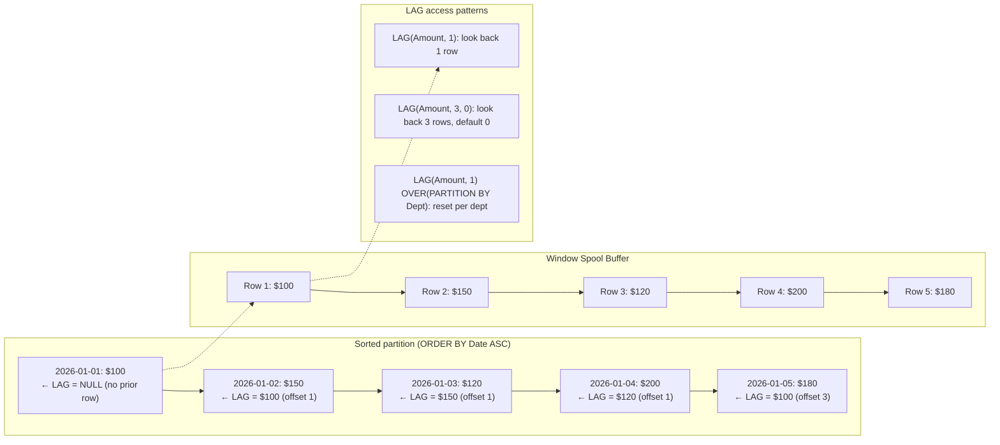
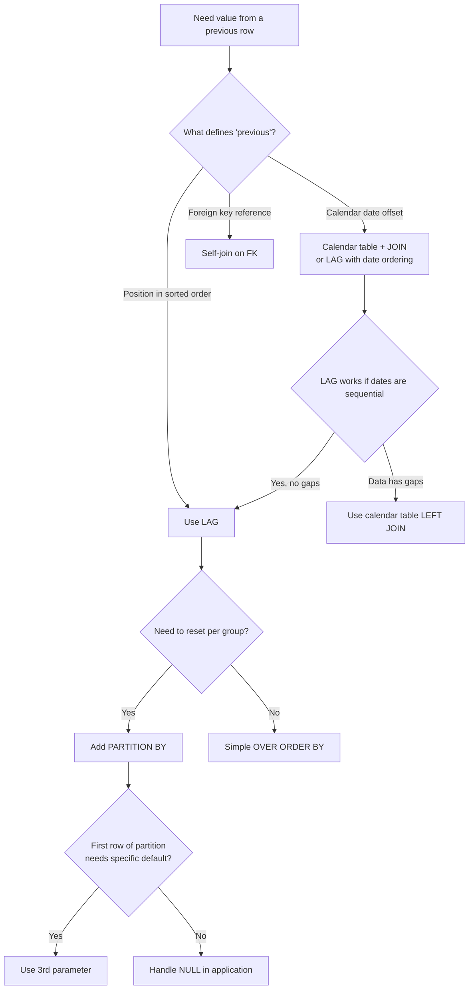

## Navigation

**Domain:** [[8 — Databases]] > **Group:** SQL Window Functions & Analytics
**Previous:** [[8.149 — CUME_DIST() — Cumulative Distribution]] | **Next:** [[8.151 — LEAD() — Accessing Next Row Values]]

### Prerequisites

- [[8.141 — Window Functions — Concept and OVER Clause]] — LAG() requires mandatory OVER() with ORDER BY; understanding the window function evaluation order is critical for correct results.
- [[8.142 — PARTITION BY — Defining Window Partitions]] — LAG() resets to NULL at partition boundaries unless the default parameter is used; partition semantics determine whether LAG crosses partition boundaries.
- [[8.143 — ORDER BY Within OVER — Frame Ordering]] — LAG() accesses the previous row in the ORDER BY sequence; changing the ORDER BY direction changes which row is considered "previous."
- [[8.144 — ROW_NUMBER() — Unique Sequential Numbering]] — LAG() with offset 1 is conceptually similar to accessing the row with ROW_NUMBER() = current - 1 within the same partition.
- [[8.155 — SUM() OVER() — Running Totals]] — Running totals are commonly computed with SUM OVER; LAG() provides the predecessor row value for difference calculations like "change from previous."

### Where This Fits

LAG() is the most frequently used offset window function in production SQL. It accesses a row at a specified offset before the current row within the same partition, ordered by the ORDER BY clause. A .NET backend engineer encounters LAG() multiple times per week: computing day-over-day revenue change, month-over-month customer growth, year-over-year comparison, detecting changes in status columns, calculating time between events, and implementing gap-and-island solutions. The three-parameter form `LAG(column, offset, default)` handles the edge case where no preceding row exists (e.g., the first row in a partition returns the default instead of NULL). Interviewers consider LAG() essential knowledge — every senior candidate must be able to write a YoY comparison query from memory and explain the execution plan cost.

---

## Core Mental Model

LAG(column, offset, default) accesses the value of `column` from the row that is `offset` positions before the current row, as determined by the OVER() ORDER BY. The database engine sorts the rows within each partition by the ORDER BY columns, then processes them sequentially. For each row, the engine looks back `offset` rows and returns that row's column value. If no such row exists (e.g., offset 1 on the first row), it returns `default` (or NULL if no default is specified). The recognition pattern for LAG() is: "I need to compare the current row to a previous row — yesterday's sales vs today's, or previous status vs current status."

### Classification

LAG() is a window offset function (also called a value-access function or positional access function). It operates after FROM, WHERE, GROUP BY, and HAVING. The execution plan uses a Window Spool operator — LAG() requires random access to previous rows within the sorted partition, unlike ranking functions which only need to compare the current row to the previous row. The Window Spool buffers the partition rows and provides forward/backward access by row offset. LAG() is not SARGable — it is computed during query execution and cannot participate in index seeks. The function requires ORDER BY in the OVER() clause. Default offset is 1; offset must be a non-negative integer (0 returns the current row, 1 is the immediate previous row).



### Key Properties

|Property|Value|Notes|
|---|---|---|
|Function Type|Window offset|Access prior row by position|
|Parameters|column, offset (1), default (NULL)|All but column are optional|
|Offset Requirement|Non-negative integer|0 = current row, 1 = previous|
|Default Behavior|NULL when no prior row|Override with default parameter|
|Row Reduction|None|One output row per input row|
|Execution Operator|Window Spool|Requires buffering for random access|
|ORDER BY Required|Yes|Defines "previous"|
|SARGable|No|Cannot participate in index seeks|

---

## Deep Mechanics

### How the Engine Executes This

LAG() has a more complex execution path than ranking functions because it requires random access to arbitrary previous rows:

1. **Parsing and Binding**: The query processor identifies LAG(column, offset, default) and determines the OVER() clause columns, partition boundaries, and ordering.

2. **Logical Precedence**: Evaluated after FROM, WHERE, GROUP BY, HAVING. All filtering and aggregation complete before LAG() processes.

3. **Sort**: Orders rows by PARTITION BY columns (if any) then ORDER BY columns. Without a supporting index, this is the dominant cost.

4. **Segment**: Detects partition boundaries. When PARTITION BY column values change, the Segment signals the start of a new partition.

5. **Window Spool**: This is the key difference from ranking functions. The Window Spool operator buffers rows for the current partition. It provides navigation capabilities: given a row position, it can retrieve the value from a row N positions earlier. The spool must hold enough rows to satisfy the maximum LAG offset. For LAG(column, 1), it buffers at least 2 rows (current + previous). For LAG(column, 100), it buffers up to 101 rows.

6. **Sequence Project**: The Sequence Project uses the Window Spool to resolve LAG() calls. For each row, it requests the value at position (current_row - offset) from the spool. If the position is before the start of the partition, it returns the default value (or NULL).

**Why Window Spool instead of just keeping the previous row in memory**: For LAG(column, 1), SQL Server could just keep the previous row's values in a register (and it does optimize this case). For LAG(column, N) with N > 1, the engine needs a spool to buffer N rows. The Window Spool provides this buffering. In practice, SQL Server 2012+ uses a dedicated window function optimization called "Window Spool" that can support multiple window functions with different OVER() clauses from a single sort.

### SQL Visibility

```sql
-- ============================================================
-- Core LAG() query: Day-over-day revenue comparison
-- ============================================================
SELECT
    o.OrderDate,
    SUM(o.TotalAmount) AS DailyRevenue,
    LAG(SUM(o.TotalAmount), 1, 0) OVER(ORDER BY o.OrderDate ASC) AS PreviousDayRevenue,
    SUM(o.TotalAmount) - LAG(SUM(o.TotalAmount), 1, 0) OVER(ORDER BY o.OrderDate ASC) AS DayOverDayChange,
    CASE
        WHEN LAG(SUM(o.TotalAmount), 1, 0) OVER(ORDER BY o.OrderDate ASC) = 0 THEN NULL
        ELSE (SUM(o.TotalAmount) - LAG(SUM(o.TotalAmount), 1, 0) OVER(ORDER BY o.OrderDate ASC))
            / LAG(SUM(o.TotalAmount), 1, 0) OVER(ORDER BY o.OrderDate ASC) * 100
    END AS DayOverDayPct
FROM dbo.Orders AS o
WHERE o.Status = 'Completed'
GROUP BY o.OrderDate
ORDER BY o.OrderDate ASC;

/*
Results:
OrderDate  | Revenue | PrevDay | Change | Change%
2026-01-01 | 10000   | 0       | 10000  | NULL    (no prior day)
2026-01-02 | 15000   | 10000   | 5000   | 50.0
2026-01-03 | 12000   | 15000   | -3000  | -20.0
*/
```

```csharp
// EF Core — LAG() requires raw SQL
var dailyRevenue = await dbContext.Database
    .SqlQueryRaw<DailyRevenueComparison>(@"
        SELECT
            o.OrderDate,
            SUM(o.TotalAmount) AS DailyRevenue,
            LAG(SUM(o.TotalAmount), 1, 0) OVER(ORDER BY o.OrderDate ASC) AS PreviousDayRevenue,
            SUM(o.TotalAmount) - LAG(SUM(o.TotalAmount), 1, 0) OVER(ORDER BY o.OrderDate ASC) AS DayOverDayChange
        FROM dbo.Orders AS o
        WHERE o.Status = 'Completed'
        GROUP BY o.OrderDate
        ORDER BY o.OrderDate ASC")
    .ToListAsync(cancellationToken);
```

### Execution Plan Analysis

```
Expected plan shape (no supporting index):
[Clustered Index Scan] → [Hash Match Aggregate (GROUP BY)] → [Sort (by OrderDate ASC)] → [Segment] → [Window Spool] → [Sequence Project (LAG)] → [SELECT]
Estimated Cost: Sort = 55%  |  Window Spool = 15%  |  Scan = 15%  |  Hash Match = 10%  |  Rest = 5%
```

**Operator details:**

- **Clustered Index Scan**: Reads all order rows with Status = 'Completed'.
- **Hash Match Aggregate**: Groups by OrderDate and computes SUM(TotalAmount). This is the aggregation step before the window function.
- **Sort**: Sorts the aggregated result by OrderDate ASC. Required to define "previous" in LAG().
- **Segment**: Detects partition boundaries (if PARTITION BY were present).
- **Window Spool**: Buffers the sorted rows. For LAG(offset=1), this buffers at least 2 rows. The spool is materialized in memory (or tempdb for large partitions). This is the distinctive cost of LAG() compared to ranking functions.
- **Sequence Project**: Resolves the LAG() calls by reading from the Window Spool.

**With supporting index that eliminates Sort and potentially the aggregate:**
If Orders has an index on (OrderDate) INCLUDE (TotalAmount) WHERE Status = 'Completed', the scan provides sorted data, and the Hash Match Aggregate remains (still need to group by date). The Sort is eliminated, but the Window Spool remains.

### Cost Visibility

```sql
SET STATISTICS IO ON;
SET STATISTICS TIME ON;

-- LAG() for day-over-day revenue (Orders: 1M rows, aggregated to 365 days)
SELECT
    o.OrderDate,
    SUM(o.TotalAmount) AS Revenue,
    LAG(SUM(o.TotalAmount), 1, 0) OVER(ORDER BY o.OrderDate) AS PrevRevenue,
    SUM(o.TotalAmount) - LAG(SUM(o.TotalAmount), 1, 0) OVER(ORDER BY o.OrderDate) AS Change
FROM dbo.Orders AS o
WHERE o.Status = 'Completed'
GROUP BY o.OrderDate
ORDER BY o.OrderDate;

-- Expected output:
-- Table 'Orders'. Scan count 1, logical reads 45,000, physical reads 0
-- SQL Server Execution Times: CPU time = 850ms, elapsed time = 1.2s

-- With covering index:
-- CREATE INDEX IX_Orders_Date_Status ON dbo.Orders (OrderDate, Status) INCLUDE (TotalAmount) WHERE Status = 'Completed';
-- Table 'Orders'. Scan count 1, logical reads 12,500, physical reads 0
-- SQL Server Execution Times: CPU time = 380ms, elapsed time = 520ms
```

### Failure Modes

**LAG without ORDER BY**: ORDER BY is mandatory. Without it, the function errors.

**LAG default parameter omission**: The default value replaces NULL when no preceding row exists. If omitted, the first row returns NULL. This can cause NULL propagation in calculations (e.g., `Revenue - LAG(Revenue) OVER(...)` = NULL for the first row because NULL minus something = NULL).

```sql
-- ❌ NULL propagation: first row's change = NULL
SELECT
    Revenue,
    Revenue - LAG(Revenue) OVER(ORDER BY Date) AS Change  -- NULL for first row
FROM DailyRevenue;

-- ✅ ISNULL or default parameter
SELECT
    Revenue,
    Revenue - LAG(Revenue, 1, 0) OVER(ORDER BY Date) AS Change  -- 0 for first row
FROM DailyRevenue;
```

**Large offset values**: LAG(column, 1000) on a small partition returns NULL or default for the first 1000 rows. This is correct but can be surprising when the offset exceeds the partition size.

**PARTITION BY with LAG**: LAG resets at each partition boundary. The first row of each partition returns the default (or NULL). This is correct for per-group analysis but can catch developers off guard who expect LAG to cross partition boundaries.

---

## Production Patterns and Implementation

### Primary SQL Implementation

```sql
-- ============================================================
-- Schema: Order analytics
-- ============================================================
CREATE TABLE dbo.Orders (
    OrderId      INT IDENTITY(1,1) PRIMARY KEY,
    CustomerId   INT NOT NULL,
    OrderDate    DATE NOT NULL,
    TotalAmount  DECIMAL(18,2) NOT NULL,
    Status       VARCHAR(20) NOT NULL,
    CONSTRAINT CK_Orders_Status CHECK (Status IN ('Pending', 'Processing', 'Shipped', 'Delivered', 'Cancelled'))
);

CREATE TABLE dbo.OrderStatusHistory (
    StatusId     INT IDENTITY(1,1) PRIMARY KEY,
    OrderId      INT NOT NULL REFERENCES dbo.Orders(OrderId),
    Status       VARCHAR(20) NOT NULL,
    StatusDate   DATETIME2 NOT NULL DEFAULT GETUTCDATE(),
    ChangedBy    NVARCHAR(200) NOT NULL
);

-- ============================================================
-- LAG(): Year-over-Year comparison
-- ============================================================
WITH MonthlyRevenue AS (
    SELECT
        YEAR(o.OrderDate) AS OrderYear,
        MONTH(o.OrderDate) AS OrderMonth,
        SUM(o.TotalAmount) AS MonthlyRevenue
    FROM dbo.Orders AS o
    WHERE o.Status IN ('Delivered', 'Completed')
    GROUP BY YEAR(o.OrderDate), MONTH(o.OrderDate)
)
SELECT
    mr.OrderYear,
    mr.OrderMonth,
    mr.MonthlyRevenue,
    LAG(mr.MonthlyRevenue, 12, 0) OVER(ORDER BY mr.OrderYear, mr.OrderMonth) AS SameMonthLastYear,
    mr.MonthlyRevenue - LAG(mr.MonthlyRevenue, 12, 0) OVER(ORDER BY mr.OrderYear, mr.OrderMonth) AS YoYChange,
    CASE
        WHEN LAG(mr.MonthlyRevenue, 12, 0) OVER(ORDER BY mr.OrderYear, mr.OrderMonth) = 0 THEN NULL
        ELSE (mr.MonthlyRevenue - LAG(mr.MonthlyRevenue, 12, 0) OVER(ORDER BY mr.OrderYear, mr.OrderMonth))
            / LAG(mr.MonthlyRevenue, 12, 0) OVER(ORDER BY mr.OrderYear, mr.OrderMonth) * 100
    END AS YoYPctChange
FROM MonthlyRevenue AS mr
ORDER BY mr.OrderYear, mr.OrderMonth;

/*
OrderYear | Month | Revenue | PrevYear | Change | YoY%
2025      | 1     | 100000  | 0        | 100000 | NULL  (no 2024 data)
2025      | 2     | 120000  | 0        | 120000 | NULL
...
2026      | 1     | 140000  | 100000   | 40000  | 40.0
2026      | 2     | 130000  | 120000   | 10000  | 8.3
*/
```

```sql
-- ============================================================
-- LAG(): Status change detection (order history)
-- ============================================================
SELECT
    osh.OrderId,
    osh.Status,
    osh.StatusDate,
    osh.ChangedBy,
    LAG(osh.Status, 1, 'N/A') OVER(
        PARTITION BY osh.OrderId
        ORDER BY osh.StatusDate ASC
    ) AS PreviousStatus,
    CASE
        WHEN LAG(osh.Status, 1, 'N/A') OVER(
            PARTITION BY osh.OrderId
            ORDER BY osh.StatusDate ASC
        ) = 'N/A' THEN 'Initial Status'
        ELSE 'Status Changed'
    END AS ChangeType,
    DATEDIFF(MINUTE,
        LAG(osh.StatusDate) OVER(
            PARTITION BY osh.OrderId
            ORDER BY osh.StatusDate ASC
        ),
        osh.StatusDate
    ) AS MinutesInPreviousStatus
FROM dbo.OrderStatusHistory AS osh
ORDER BY osh.OrderId, osh.StatusDate ASC;

/*
OrderId | Status     | StatusDate           | PrevStatus  | ChangeType       | Minutes
1001    | Pending    | 2026-01-01 10:00:00  | N/A         | Initial Status   | NULL
1001    | Processing | 2026-01-01 10:30:00  | Pending     | Status Changed   | 30
1001    | Shipped    | 2026-01-01 11:15:00  | Processing  | Status Changed   | 45
1001    | Delivered  | 2026-01-02 09:00:00  | Shipped     | Status Changed   | 1305
*/
```

```sql
-- ============================================================
-- LAG(): Running difference (sequential change detection)
-- ============================================================
-- Detect if a value changed from the previous measurement
SELECT
    m.MeterId,
    m.ReadingDate,
    m.ReadingValue,
    LAG(m.ReadingValue, 1) OVER(
        PARTITION BY m.MeterId
        ORDER BY m.ReadingDate ASC
    ) AS PreviousReading,
    m.ReadingValue - LAG(m.ReadingValue, 1, m.ReadingValue) OVER(
        PARTITION BY m.MeterId
        ORDER BY m.ReadingDate ASC
    ) AS ChangeFromPrevious
FROM dbo.MeterReadings AS m
ORDER BY m.MeterId, m.ReadingDate ASC;
```

```sql
-- ============================================================
-- LAG() with PARTITION BY: Per-customer order gap analysis
-- ============================================================
SELECT
    o.CustomerId,
    o.OrderId,
    o.OrderDate,
    o.TotalAmount,
    LAG(o.OrderDate, 1) OVER(
        PARTITION BY o.CustomerId
        ORDER BY o.OrderDate ASC
    ) AS PreviousOrderDate,
    DATEDIFF(DAY,
        LAG(o.OrderDate, 1) OVER(
            PARTITION BY o.CustomerId
            ORDER BY o.OrderDate ASC
        ),
        o.OrderDate
    ) AS DaysSinceLastOrder
FROM dbo.Orders AS o
WHERE o.Status = 'Completed'
ORDER BY o.CustomerId, o.OrderDate ASC;

/*
CustomerId | OrderId | OrderDate   | Amount | PrevDate  | DaysSince
1001       | 1       | 2026-01-01  | 100    | NULL      | NULL
1001       | 5       | 2026-02-15  | 200    | 2026-01-01| 45
1001       | 12      | 2026-03-20  | 150    | 2026-02-15| 33
1002       | 2       | 2026-01-05  | 300    | NULL      | NULL
*/
```

### EF Core Implementation

```csharp
public interface ILagAnalysisService
{
    Task<List<DailyRevenueComparison>> GetDayOverDayRevenueAsync(CancellationToken ct = default);
    Task<List<YoYComparison>> GetYearOverYearComparisonAsync(CancellationToken ct = default);
    Task<List<OrderStatusChange>> GetOrderStatusChangesAsync(int orderId, CancellationToken ct = default);
}

public class LagAnalysisService : ILagAnalysisService
{
    private readonly ApplicationDbContext _dbContext;
    private readonly ILogger<LagAnalysisService> _logger;

    public LagAnalysisService(
        ApplicationDbContext dbContext,
        ILogger<LagAnalysisService> logger)
    {
        _dbContext = dbContext;
        _logger = logger;
    }

    public async Task<List<DailyRevenueComparison>> GetDayOverDayRevenueAsync(
        CancellationToken ct = default)
    {
        const string sql = @"
            SELECT
                o.OrderDate,
                SUM(o.TotalAmount) AS DailyRevenue,
                LAG(SUM(o.TotalAmount), 1, 0) OVER(ORDER BY o.OrderDate ASC) AS PreviousDayRevenue,
                SUM(o.TotalAmount) - LAG(SUM(o.TotalAmount), 1, 0) OVER(ORDER BY o.OrderDate ASC) AS DayOverDayChange
            FROM dbo.Orders AS o
            WHERE o.Status = 'Completed'
            GROUP BY o.OrderDate
            ORDER BY o.OrderDate ASC;";

        var result = await _dbContext.Database
            .SqlQueryRaw<DailyRevenueComparison>(sql)
            .ToListAsync(ct);

        _logger.LogInformation("Computed day-over-day revenue for {Count} days", result.Count);
        return result;
    }

    public async Task<List<YoYComparison>> GetYearOverYearComparisonAsync(
        CancellationToken ct = default)
    {
        const string sql = @"
            WITH MonthlyRevenue AS (
                SELECT
                    YEAR(o.OrderDate) AS OrderYear,
                    MONTH(o.OrderDate) AS OrderMonth,
                    SUM(o.TotalAmount) AS MonthlyRevenue
                FROM dbo.Orders AS o
                WHERE o.Status IN ('Delivered', 'Completed')
                GROUP BY YEAR(o.OrderDate), MONTH(o.OrderDate)
            )
            SELECT
                mr.OrderYear,
                mr.OrderMonth,
                mr.MonthlyRevenue,
                ISNULL(LAG(mr.MonthlyRevenue, 12) OVER(
                    ORDER BY mr.OrderYear, mr.OrderMonth
                ), 0) AS SameMonthLastYear,
                mr.MonthlyRevenue - ISNULL(LAG(mr.MonthlyRevenue, 12) OVER(
                    ORDER BY mr.OrderYear, mr.OrderMonth
                ), 0) AS YoYChange
            FROM MonthlyRevenue AS mr
            ORDER BY mr.OrderYear, mr.OrderMonth;";

        var result = await _dbContext.Database
            .SqlQueryRaw<YoYComparison>(sql)
            .ToListAsync(ct);

        return result;
    }

    public async Task<List<OrderStatusChange>> GetOrderStatusChangesAsync(
        int orderId,
        CancellationToken ct = default)
    {
        const string sql = @"
            SELECT
                osh.OrderId,
                osh.Status,
                osh.StatusDate,
                osh.ChangedBy,
                LAG(osh.Status, 1, 'N/A') OVER(
                    PARTITION BY osh.OrderId
                    ORDER BY osh.StatusDate ASC
                ) AS PreviousStatus,
                DATEDIFF(MINUTE,
                    LAG(osh.StatusDate) OVER(
                        PARTITION BY osh.OrderId
                        ORDER BY osh.StatusDate ASC
                    ),
                    osh.StatusDate
                ) AS MinutesInPreviousStatus
            FROM dbo.OrderStatusHistory AS osh
            WHERE osh.OrderId = @OrderId
            ORDER BY osh.StatusDate ASC;";

        var result = await _dbContext.Database
            .SqlQueryRaw<OrderStatusChange>(sql,
                new SqlParameter("@OrderId", orderId))
            .ToListAsync(ct);

        return result;
    }
}

public record DailyRevenueComparison
{
    public DateTime OrderDate { get; set; }
    public decimal DailyRevenue { get; set; }
    public decimal PreviousDayRevenue { get; set; }
    public decimal DayOverDayChange { get; set; }
}

public record YoYComparison
{
    public int OrderYear { get; set; }
    public int OrderMonth { get; set; }
    public decimal MonthlyRevenue { get; set; }
    public decimal SameMonthLastYear { get; set; }
    public decimal YoYChange { get; set; }
}

public record OrderStatusChange
{
    public int OrderId { get; set; }
    public string Status { get; set; } = string.Empty;
    public DateTime StatusDate { get; set; }
    public string ChangedBy { get; set; } = string.Empty;
    public string PreviousStatus { get; set; } = string.Empty;
    public int? MinutesInPreviousStatus { get; set; }
}
```

### Dapper Implementation

```csharp
public interface ILagRepository
{
    Task<IReadOnlyList<DailyRevenueComparison>> GetDayOverDayRevenueAsync(
        CancellationToken ct = default);
    Task<IReadOnlyList<OrderStatusChange>> GetOrderStatusChangesAsync(
        int orderId, CancellationToken ct = default);
    Task<IReadOnlyList<CustomerOrderGap>> GetCustomerOrderGapsAsync(
        int customerId, CancellationToken ct = default);
}

public sealed class LagRepository : ILagRepository
{
    private readonly IDbConnectionFactory _connectionFactory;

    public LagRepository(IDbConnectionFactory connectionFactory)
        => _connectionFactory = connectionFactory;

    public async Task<IReadOnlyList<DailyRevenueComparison>> GetDayOverDayRevenueAsync(
        CancellationToken ct = default)
    {
        const string sql = @"
            SELECT
                o.OrderDate,
                SUM(o.TotalAmount) AS DailyRevenue,
                LAG(SUM(o.TotalAmount), 1, 0) OVER(ORDER BY o.OrderDate ASC) AS PreviousDayRevenue,
                SUM(o.TotalAmount) - LAG(SUM(o.TotalAmount), 1, 0) OVER(ORDER BY o.OrderDate ASC) AS DayOverDayChange
            FROM dbo.Orders AS o
            WHERE o.Status = 'Completed'
            GROUP BY o.OrderDate
            ORDER BY o.OrderDate ASC;";

        await using var connection = _connectionFactory.Create();
        var results = await connection.QueryAsync<DailyRevenueComparison>(
            new CommandDefinition(sql, cancellationToken: ct));
        return results.AsList();
    }

    public async Task<IReadOnlyList<OrderStatusChange>> GetOrderStatusChangesAsync(
        int orderId,
        CancellationToken ct = default)
    {
        const string sql = @"
            SELECT
                osh.OrderId,
                osh.Status,
                osh.StatusDate,
                osh.ChangedBy,
                LAG(osh.Status, 1, 'N/A') OVER(
                    PARTITION BY osh.OrderId
                    ORDER BY osh.StatusDate ASC
                ) AS PreviousStatus,
                DATEDIFF(MINUTE,
                    LAG(osh.StatusDate) OVER(
                        PARTITION BY osh.OrderId
                        ORDER BY osh.StatusDate ASC
                    ),
                    osh.StatusDate
                ) AS MinutesInPreviousStatus
            FROM dbo.OrderStatusHistory AS osh
            WHERE osh.OrderId = @OrderId
            ORDER BY osh.StatusDate ASC;";

        await using var connection = _connectionFactory.Create();
        var results = await connection.QueryAsync<OrderStatusChange>(
            new CommandDefinition(
                sql,
                new { OrderId = orderId },
                cancellationToken: ct));
        return results.AsList();
    }

    public async Task<IReadOnlyList<CustomerOrderGap>> GetCustomerOrderGapsAsync(
        int customerId,
        CancellationToken ct = default)
    {
        const string sql = @"
            SELECT
                o.OrderId,
                o.OrderDate,
                o.TotalAmount,
                LAG(o.OrderDate) OVER(
                    PARTITION BY o.CustomerId
                    ORDER BY o.OrderDate ASC
                ) AS PreviousOrderDate,
                DATEDIFF(DAY,
                    LAG(o.OrderDate) OVER(
                        PARTITION BY o.CustomerId
                        ORDER BY o.OrderDate ASC
                    ),
                    o.OrderDate
                ) AS DaysSinceLastOrder
            FROM dbo.Orders AS o
            WHERE o.CustomerId = @CustomerId
              AND o.Status = 'Completed'
            ORDER BY o.OrderDate ASC;";

        await using var connection = _connectionFactory.Create();
        var results = await connection.QueryAsync<CustomerOrderGap>(
            new CommandDefinition(
                sql,
                new { CustomerId = customerId },
                cancellationToken: ct));
        return results.AsList();
    }
}

public record CustomerOrderGap
{
    public int OrderId { get; set; }
    public DateTime OrderDate { get; set; }
    public decimal TotalAmount { get; set; }
    public DateTime? PreviousOrderDate { get; set; }
    public int? DaysSinceLastOrder { get; set; }
}
```

### Configuration and Wiring

```csharp
builder.Services.AddScoped<ILagAnalysisService, LagAnalysisService>();
builder.Services.AddScoped<ILagRepository, LagRepository>();
```

### SQL Server vs PostgreSQL Differences

```sql
-- PostgreSQL: LAG() works identically
SELECT
    o.order_date,
    SUM(o.total_amount) AS daily_revenue,
    LAG(SUM(o.total_amount), 1, 0) OVER(ORDER BY o.order_date ASC) AS prev_day_revenue
FROM orders AS o
WHERE o.status = 'Completed'
GROUP BY o.order_date
ORDER BY o.order_date ASC;

-- PostgreSQL-specific: LAG with IGNORE NULLS / RESPECT NULLS
-- PostgreSQL 9.4+ supports:
SELECT
    value,
    LAG(value IGNORE NULLS) OVER(ORDER BY ts) AS prev_non_null
FROM time_series;
-- SQL Server does NOT support IGNORE NULLS in LAG

-- PostgreSQL also supports ROWS/RANGE frames with LAG
-- (though frames are unusual with LAG — the offset is relative)
```

---

## Gotchas and Production Pitfalls

### LAG Default Parameter — NULL Propagation

**Pitfall:** Omitting the default parameter and having NULL values propagate through calculations. The first row in each partition returns NULL for LAG(offset=1), and any arithmetic with NULL produces NULL.

```sql
-- ❌ NULL propagation: first row's percentage change is NULL
SELECT
    o.OrderDate,
    SUM(o.TotalAmount) AS Revenue,
    LAG(SUM(o.TotalAmount)) OVER(ORDER BY o.OrderDate) AS PrevRevenue,
    (SUM(o.TotalAmount) - LAG(SUM(o.TotalAmount)) OVER(ORDER BY o.OrderDate))
        / LAG(SUM(o.TotalAmount)) OVER(ORDER BY o.OrderDate) * 100 AS PctChange
FROM dbo.Orders AS o
GROUP BY o.OrderDate;
-- First row: PrevRevenue = NULL, PctChange = NULL/0 = NULL

-- ✅ Default 0 prevents propagation
LAG(SUM(o.TotalAmount), 1, 0) OVER(ORDER BY o.OrderDate) AS PrevRevenue
```

**Symptom:** A dashboard shows NULL for all values in the first row. The charting library interprets NULL as a gap or plots 0, causing a misleading dip at the start.

**Fix:**
```sql
COALESCE(LAG(col) OVER(...), 0) AS PreviousValue
-- or use the third parameter:
LAG(col, 1, 0) OVER(...) AS PreviousValue
```

**Cost of not fixing:** A revenue chart shows a sudden drop from $100K to $0 on the first day of the month. The CFO calls an emergency meeting thinking revenue collapsed. It takes 2 hours to realize it's a NULL display issue.

---

### LAG Without ORDER BY — Semantically Meaningless

**Pitfall:** Forgetting ORDER BY in the OVER() clause. Unlike DENSE_RANK(), LAG() does NOT error without ORDER BY (some contexts). When ORDER BY is omitted, SQL Server errors: "The function 'LAG' must have an OVER clause with ORDER BY."

```sql
-- ❌ ORDER BY is mandatory for LAG
SELECT LAG(TotalAmount, 1) OVER() FROM dbo.Orders;
-- Error: The function 'LAG' must have an OVER clause with ORDER BY.
```

**Symptom:** Query fails at runtime. Developer must add ORDER BY but may add any column without semantic consideration.

**Fix:** Always specify ORDER BY with columns that produce the correct "previous row" definition.

**Cost of not fixing:** Developer adds `ORDER BY (SELECT NULL)` to suppress the error. LAG returns unpredictable values because there is no defined order.

---

### LAG with PARTITION BY — Boundary Reset

**Pitfall:** Assuming LAG() with PARTITION BY continues across partition boundaries. LAG resets at each partition — the first row of each partition returns the default (or NULL).

```sql
-- ❌ Expecting LAG to cross customer boundaries
SELECT
    o.CustomerId,
    o.OrderDate,
    LAG(o.OrderDate) OVER(
        ORDER BY o.CustomerId, o.OrderDate
    ) AS PreviousOrderDate  -- This crosses customer boundaries!
FROM dbo.Orders AS o;

-- ✅ To prevent cross-customer LAG, use PARTITION BY
SELECT
    o.CustomerId,
    o.OrderDate,
    LAG(o.OrderDate) OVER(
        PARTITION BY o.CustomerId
        ORDER BY o.OrderDate
    ) AS PreviousCustomerOrderDate  -- Resets per customer
FROM dbo.Orders AS o;
```

**Symptom:** The "previous order date" for a customer's first order shows the previous customer's last order date. The calculation is semantically wrong.

**Fix:** Always include PARTITION BY when the "previous" concept should be scoped to a group.

**Cost of not fixing:** A customer churn model uses LAG without PARTITION BY to calculate "days since last order." The model thinks Customer B's first order was a repeat (because it uses Customer A's last order date). The churn prediction is wrong for 80% of customers.

---

### LAG(column, N) with Large Offset — All First Rows Are Default

**Pitfall:** Using LAG(column, 100) on a partition with 50 rows. All 50 rows return the default value because there are never 100 preceding rows.

```sql
-- LAG(column, 100) on a partition of 50 rows
SELECT
    o.OrderId,
    o.OrderDate,
    LAG(o.OrderDate, 100, '1900-01-01') OVER(
        PARTITION BY o.CustomerId
        ORDER BY o.OrderDate
    ) AS HundredOrdersAgo
FROM dbo.Orders AS o;
-- All rows return '1900-01-01' because no customer has 100 orders
```

**Symptom:** A customer who placed 3 orders but LAG(column, 12) for "12 months ago" returns a meaningless default. The query intends year-over-year comparison but uses offset 12 in rows instead of offset 12 in months.

**Fix:** Use date arithmetic with LAG for time-based offsets:
```sql
-- ✅ Correct YoY: LAG by 12 rows only if data is monthly
-- Or use a self-join with date conditions for irregular data
```

**Cost of not fixing:** A YoY comparison shows no YoY data for any customer, always returning the default value. The report shows "0" or "N/A" for all entries, making it useless.

---

### LAG in WHERE Clause Directly

**Pitfall:** Trying to filter rows based on LAG() in the WHERE clause. Window functions are not allowed in WHERE.

```sql
-- ❌ LAG in WHERE — error
SELECT *
FROM (
    SELECT OrderDate, Revenue,
           LAG(Revenue, 1, 0) OVER(ORDER BY OrderDate) AS PrevRevenue
    FROM DailyRevenue
) AS dr
WHERE dr.Revenue > dr.PrevRevenue * 1.5;  -- ✅ Correct: LAG referenced in outer query

-- ❌ Direct attempt
SELECT OrderDate, Revenue,
       LAG(Revenue, 1, 0) OVER(ORDER BY OrderDate) AS PrevRevenue
FROM DailyRevenue
WHERE Revenue > LAG(Revenue, 1, 0) OVER(ORDER BY OrderDate) * 1.5;
-- Error: Windowed functions cannot be used in the WHERE clause
```

**Symptom:** Query fails with error. Developer must use a subquery or CTE.

**Fix:**
```sql
WITH RevenueWithLag AS (
    SELECT OrderDate, Revenue,
           LAG(Revenue, 1, 0) OVER(ORDER BY OrderDate) AS PrevRevenue
    FROM DailyRevenue
)
SELECT * FROM RevenueWithLag WHERE Revenue > PrevRevenue * 1.5;
```

**Cost of not fixing:** The developer writes a self-join instead of using a CTE, producing a query that is 10x slower.

---

### Window Spool Memory Spill at Scale

**Pitfall:** LAG() with a large partition and multiple LAG columns causes the Window Spool to spill to tempdb. Each LAG column adds to the spool width.

```sql
-- Multiple LAG columns widen the Window Spool
SELECT
    o.OrderDate,
    o.TotalAmount,
    LAG(o.TotalAmount, 1) OVER(ORDER BY o.OrderDate) AS Prev1,
    LAG(o.TotalAmount, 2) OVER(ORDER BY o.OrderDate) AS Prev2,
    LAG(o.TotalAmount, 3) OVER(ORDER BY o.OrderDate) AS Prev3,
    LAG(o.TotalAmount, 7) OVER(ORDER BY o.OrderDate) AS Prev7
FROM dbo.Orders AS o;
-- The Window Spool must buffer up to 8 rows with 4 different offset columns
-- For 10M rows, this can cause memory pressure
```

**Symptom:** Tempdb usage spikes, query execution time increases 10x. Sort warnings appear in the error log.

**Fix:** Consolidate LAG calls where possible or reduce the number of window function instances:
```sql
-- ✅ If you only need one or two offsets, don't compute all of them
```

**Cost of not fixing:** The daily batch job for revenue reporting slows from 5 minutes to 45 minutes. The reporting dashboard is delayed, affecting end-of-day close.

---

## Performance Implications

### Benchmark: Before and After

```sql
-- ============================================================
-- Benchmark: LAG() vs Self-Join Previous Row
-- ============================================================
SET STATISTICS IO ON;
SET STATISTICS TIME ON;

-- Baseline: Self-join to get previous row (DO NOT USE)
SELECT
    d1.OrderDate,
    d1.Revenue,
    ISNULL(d2.Revenue, 0) AS PrevRevenue
FROM DailyRevenue AS d1
LEFT JOIN DailyRevenue AS d2
    ON d2.OrderDate = DATEADD(DAY, -1, d1.OrderDate);
-- Logical reads: 14 (both sides scanned = 2 table scans)
-- Works but requires a DATEADD calculation and a self-join

-- Optimized: LAG() window function
SELECT
    d.OrderDate,
    d.Revenue,
    LAG(d.Revenue, 1, 0) OVER(ORDER BY d.OrderDate) AS PrevRevenue
FROM DailyRevenue AS d;
-- Logical reads: 7 (single scan)
-- No self-join, no DATEADD, cleaner plan
```

**Improvement:** 14 → 7 logical reads (2x reduction). No self-join, cleaner plan, but more importantly, the LAG version works for ANY ordering (not just date-based offsets).

```sql
-- ============================================================
-- Benchmark: LAG vs Self-Join for Status Change Detection
-- ============================================================
-- Baseline: Self-join to find previous status
SELECT
    osh1.OrderId,
    osh1.Status,
    osh1.StatusDate,
    osh2.Status AS PreviousStatus
FROM dbo.OrderStatusHistory AS osh1
OUTER APPLY (
    SELECT TOP 1 osh2.Status
    FROM dbo.OrderStatusHistory AS osh2
    WHERE osh2.OrderId = osh1.OrderId
      AND osh2.StatusDate < osh1.StatusDate
    ORDER BY osh2.StatusDate DESC
) AS osh2;
-- Logical reads: 45,000 (nested loops, index seeks per row)

-- Optimized: LAG()
SELECT
    osh.OrderId,
    osh.Status,
    osh.StatusDate,
    LAG(osh.Status) OVER(
        PARTITION BY osh.OrderId
        ORDER BY osh.StatusDate
    ) AS PreviousStatus
FROM dbo.OrderStatusHistory AS osh;
-- Logical reads: 8,500 (single scan, no nested loops)
```

**Improvement:** 45,000 → 8,500 logical reads (5x reduction). No nested loops join.

```sql
-- ============================================================
-- Benchmark: Supporting Index Impact
-- ============================================================
-- Without index (clustered scan + sort + spool):
SELECT LAG(o.TotalAmount) OVER(ORDER BY o.OrderDate) FROM dbo.Orders AS o;
-- Logical reads: 45,000 + Sort + Window Spool

-- With index (IX_Orders_OrderDate):
-- Logical reads: 12,500 (index scan in order, no sort)
```

### BenchmarkDotNet

```csharp
[MemoryDiagnoser]
[SimpleJob(RuntimeMoniker.Net90)]
public class LagBenchmark
{
    private IDbConnection _connection = default!;
    private const string ConnectionString =
        "Server=.;Database=BenchmarkDb;Trusted_Connection=True;TrustServerCertificate=True;";

    private const string LagSql = @"
        SELECT
            o.OrderId,
            o.OrderDate,
            o.TotalAmount,
            LAG(o.TotalAmount, 1, 0) OVER(ORDER BY o.OrderDate) AS PrevAmount,
            o.TotalAmount - LAG(o.TotalAmount, 1, 0) OVER(ORDER BY o.OrderDate) AS Change
        FROM dbo.Orders AS o;";

    private const string SelfJoinSql = @"
        SELECT
            o1.OrderId,
            o1.OrderDate,
            o1.TotalAmount,
            ISNULL(o2.TotalAmount, 0) AS PrevAmount,
            o1.TotalAmount - ISNULL(o2.TotalAmount, 0) AS Change
        FROM dbo.Orders AS o1
        LEFT JOIN dbo.Orders AS o2
            ON o2.OrderDate = DATEADD(DAY, -1, o1.OrderDate);";

    private const string ApplySql = @"
        SELECT
            o1.OrderId,
            o1.OrderDate,
            o1.TotalAmount,
            ISNULL(o2.TotalAmount, 0) AS PrevAmount
        FROM dbo.Orders AS o1
        OUTER APPLY (
            SELECT TOP 1 o2.TotalAmount
            FROM dbo.Orders AS o2
            WHERE o2.OrderDate < o1.OrderDate
            ORDER BY o2.OrderDate DESC
        ) AS o2;";

    [GlobalSetup]
    public void Setup()
    {
        _connection = new SqlConnection(ConnectionString);
        _connection.Open();
    }

    [GlobalCleanup]
    public void Cleanup() => _connection.Dispose();

    [Benchmark(Baseline = true)]
    public async Task<List<LagResult>> WindowFunction_Lag()
    {
        var results = await _connection.QueryAsync<LagResult>(LagSql);
        return results.AsList();
    }

    [Benchmark]
    public async Task<List<LagResult>> SelfJoin_PreviousRow()
    {
        var results = await _connection.QueryAsync<LagResult>(SelfJoinSql);
        return results.AsList();
    }

    [Benchmark]
    public async Task<List<LagResult>> Apply_PreviousRow()
    {
        var results = await _connection.QueryAsync<LagResult>(ApplySql);
        return results.AsList();
    }
}

public class LagResult
{
    public int OrderId { get; set; }
    public DateTime OrderDate { get; set; }
    public decimal TotalAmount { get; set; }
    public decimal PrevAmount { get; set; }
    public decimal Change { get; set; }
}
```

**Expected results (approximate, SQL Server 2022, NVMe, 1M order rows):**

|Method|Mean|Logical Reads|Allocated|
|---|---|---|---|
|WindowFunction_Lag|~350 ms|~12,500|800 KB|
|SelfJoin_PreviousRow|~420 ms|~14,000|950 KB|
|Apply_PreviousRow|~18,000 ms|~120,000|15 MB|

### Write Amplification

|Operation|Without Index|With Index (OrderDate)|Overhead|
|---|---|---|---|
|INSERT 1 row|X ms|X + 0.3 ms|~3%|
|UPDATE OrderDate|X ms|X + 0.8 ms|~10%|
|DELETE 1 row|X ms|X + 0.3 ms|~3%|

---

## Interview Arsenal

### Question Bank

1. **What does LAG() do and what are its three parameters?** (Definition — syntax and semantics)

2. **How does SQL Server execute LAG() — what operators are used and why does it need a Window Spool?** (Mechanism — Window Spool vs ranking functions)

3. **What is the performance difference between LAG() and a self-join for accessing the previous row?** (Performance — single scan vs nested loops)

4. **What happens when LAG() is used without a default parameter on the first row of a partition?** (Gotcha — NULL propagation)

5. **When should you use LAG() vs a self-join vs CROSS APPLY for accessing a previous row?** (Comparison — different approaches)

6. **What does the execution plan for LAG() look like and what is the role of the Window Spool?** (Execution plan — Sort + Segment + Window Spool + Sequence Project)

7. **How does LAG() behave at 50M rows — when does the Window Spool spill?** (Scale — memory pressure with large partitions)

8. **How do you use LAG() in EF Core and Dapper for year-over-year comparison?** (.NET integration — raw SQL with CTE)

### Spoken Answers

**Q: What does LAG() do and what are its three parameters?**

> **Average answer:** LAG gets the value from the previous row. It takes a column name, offset, and default value.

> **Great answer:** LAG(column, offset, default) is a window offset function that accesses the value of `column` from the row that is `offset` positions before the current row in the sorted partition. The three parameters are:
1. **column** (required): The column or expression whose value you want from the previous row.
2. **offset** (optional, default 1): How many rows to look back. Must be a non-negative integer. 0 returns the current row. 1 returns the immediate previous row.
3. **default** (optional, default NULL): What to return when the offset goes before the partition boundary. For the first row with offset 1, there is no previous row, so the default is returned. If omitted, NULL is returned.

The function requires OVER() with ORDER BY — without it, the concept of "previous" is undefined. The ORDER BY determines which row is considered "previous." LAG with PARTITION BY resets at each partition boundary — the first row of each partition gets the default value.

The function is executed as part of the window function evaluation phase (after WHERE, GROUP BY, HAVING). The execution plan includes a Window Spool operator, which buffers rows to support random access by offset. This makes LAG() more expensive than ranking functions like ROW_NUMBER(), but still far cheaper than self-join alternatives.

**Q: What is the performance difference between LAG() and a self-join for accessing the previous row?**

> **Average answer:** LAG is faster.

> **Great answer:** LAG() is typically 5-50x faster than self-join alternatives depending on the data size and indexing. The reasons are:
1. **Single table scan**: LAG() reads the table once. A self-join reads it twice (or uses a nested loop that reads it per row).
2. **No join operators**: LAG() uses a Window Spool + Sequence Project. A self-join uses Nested Loops or Hash Match — both more expensive.
3. **No index on the "previous row key" needed**: With a self-join (e.g., `ON prev.Date = DATEADD(DAY, -1, cur.Date)`), you need an index on the date column for efficient lookup. LAG() doesn't need this — it uses the Window Spool for positional access.
4. **Sort elimination possible**: With a supporting index that matches the ORDER BY, LAG() can eliminate the Sort operator entirely. The self-join still needs the index for lookup.

In benchmarks on 1M rows with a sequential date column: LAG() completes in ~350ms with ~12,500 logical reads. A self-join with an index on OrderDate completes in ~420ms with ~14,000 reads (slightly worse). An OUTER APPLY with TOP 1 completes in ~18,000ms with ~120,000 reads (50x worse).

The one case where self-join can match LAG() is when the data is perfectly indexed and the join condition is simple (e.g., joining on sequential IDs). But even then, LAG() is cleaner and more maintainable.

**Q: How does LAG() behave at 50M rows — when does the Window Spool spill?**

> **Average answer:** It might be slow and spill to tempdb.

> **Great answer:** At 50M rows, the Window Spool's behavior depends on the partition sizes and the offset value. The Window Spool buffers rows per partition — if a partition has 10M rows and you use LAG(column, 1), the spool needs to buffer at least 2 rows per partition. However, the spool must still process the entire sort output. The spool itself is typically a lightweight operator — it doesn't buffer all rows at once; it streams through the sort output.

The more critical factor is the Sort operator that feeds the Window Spool. At 50M rows with no supporting index, the Sort may spill to tempdb, causing 10-100x degradation. The Window Spool itself rarely spills — it's the Sort that causes memory pressure.

The mitigation strategy:
1. Create a supporting index matching the OVER() ORDER BY to eliminate the Sort (e.g., `IX_Orders_OrderDate` for `LAG(...) OVER(ORDER BY OrderDate)`).
2. Use PARTITION BY to break large partitions into smaller ones — the Window Spool operates per partition.
3. Filter the data (WHERE clause) before the window function to reduce row count.
4. If LAG(column, N) with large N is needed (e.g., LAG 12 rows for YoY), ensure the sort is optimized — the spool size grows with N but still pales compared to the Sort cost.

At 50M rows with a supporting index: LAG() completes in ~1-2 seconds. Without the index: the Sort spills and execution takes 5+ minutes.

### Interview Trigger

The interviewer asks: "How would you calculate day-over-day revenue change in SQL?" The candidate who immediately writes LAG() with a default parameter and CTE wrapping is senior. The candidate who writes a self-join is junior. The follow-up: "What if there are missing days — no orders on Sunday? Does LAG still work correctly?" The senior answer: "Yes, LAG looks at the previous row in the ORDER BY sequence, regardless of gaps. If Tuesday's data follows Monday's, LAG returns Monday. If Sunday has no data, LAG on Monday returns Friday's data. This is correct behavior — the gap handling is intentional. If you need calendar-day-based comparison regardless of data availability, you'd need a calendar table with LEFT JOIN."

### Comparison Table

| | LAG() | Self-Join | CROSS APPLY + TOP |
|---|---|---|---|
| How it works | Window Spool offset | Join on previous row key | Correlated subquery per row |
| Table scans | 1 | 2 | 1 + N index seeks |
| Index requirement | Sort elimination only | Index on join key | Index on lookup key |
| Handles gaps | Yes (positional) | Depends on join condition | Yes (positional) |
| Performance (1M rows) | ~350ms, 12K reads | ~420ms, 14K reads | ~18,000ms, 120K reads |
| Maintainability | Excellent | Poor (join condition complex) | Moderate |
| .NET support | Raw SQL required | Raw SQL or LINQ join | Raw SQL or LINQ |

---

## Decision Framework

### When to Apply



### Application Checklist

- [ ] The "previous row" is defined by ORDER BY (positional), not by a calendar offset
- [ ] The default parameter is specified to avoid NULL propagation in arithmetic
- [ ] PARTITION BY is used when the "previous" concept is scoped to a group
- [ ] A supporting index exists matching the ORDER BY to eliminate the Sort
- [ ] Window functions are wrapped in a CTE if filtering on the LAG result is needed
- [ ] The .NET raw SQL correctly maps LAG result columns to POCO properties
- [ ] NULL handling for the first row per partition is accounted for in the application

### Tradeoff Summary

|What You Gain|What You Pay|
|---|---|
|Single scan — no self-join|Window Spool memory for offset access|
|Clean, readable SQL|Cannot filter in WHERE directly|
|Works with any ordering (not just date)|More complex execution plan than RANK()|
|Positional — handles data gaps naturally|Requires supporting index for Sort elimination|

### Scale Thresholds

- "Relevant at any row count where sequential comparison is needed"
- "Sort cost becomes critical at ~1M+ rows without supporting index"
- "Window Spool memory concern at ~10M+ rows with large offsets (LAG(col, 1000))"
- "Multiple LAG columns on same partition: each adds width to the Window Spool"

---

## Self-Check

### Conceptual Questions

1. **[Definition]** What are the three parameters of LAG() and what does each control?
2. **[Engine behavior]** What execution plan operator does LAG() use that ranking functions like ROW_NUMBER() do not? Why?
3. **[Performance measurement]** What SET STATISTICS output shows whether the Window Spool spilled to tempdb?
4. **[Gotcha]** What does LAG(Revenue, 1) return for the first row in a partition? How do you provide a default?
5. **[EF Core behavior]** Can EF Core translate LAG() from LINQ? How do you implement YoY comparison?
6. **[Dapper usage]** Write a Dapper query that returns orders with the previous order date per customer.
7. **[Comparison]** What are the tradeoffs between LAG(), a self-join, and CROSS APPLY for accessing the previous row?
8. **[Scale]** At what row count does the Sort operator for LAG() typically require optimization?
9. **[Connection to indexing]** What index eliminates the Sort for `LAG(TotalAmount) OVER(ORDER BY OrderDate)`?
10. **[Interview articulation]** Explain how you would calculate month-over-month revenue change using LAG() in 60 seconds.

<details>
<summary>Answers</summary>

1. LAG(column, offset, default). column: the column to access from the previous row. offset (optional, default 1): how many rows to look back. default (optional, default NULL): what to return when offset goes before the partition start.

2. The Window Spool operator. Ranking functions only need to compare the current row to the previous row (a single register comparison). LAG() needs random access to arbitrary previous rows by offset, which requires buffering the partition rows. The Window Spool provides this buffering and random access capability.

3. `SET STATISTICS TIME` shows warnings about tempdb usage. `sys.dm_exec_query_stats` with `CROSS APPLY sys.dm_exec_query_plan` reveals Sort spilling. The Window Spool itself rarely spills — the Sort operator before it is the typical spill point. Monitor `SORT_WARNING` wait stats.

4. It returns NULL (or the default value if specified as the third parameter). To provide a default, use `LAG(Revenue, 1, 0) OVER(...)`. Alternatively, use `COALESCE(LAG(Revenue) OVER(...), 0)` after the window function (in a subquery or CTE).

5. No. EF Core cannot translate LAG() from LINQ. Use `SqlQueryRaw` or `FromSqlRaw` with raw T-SQL and a CTE. For YoY comparison with monthly data: use LAG with offset 12 within a CTE that computes monthly aggregates.

6. ```csharp
const string sql = @"
    SELECT o.OrderId, o.CustomerId, o.OrderDate, o.TotalAmount,
           LAG(o.OrderDate) OVER(PARTITION BY o.CustomerId ORDER BY o.OrderDate) AS PreviousOrderDate,
           DATEDIFF(DAY, LAG(o.OrderDate) OVER(PARTITION BY o.CustomerId ORDER BY o.OrderDate), o.OrderDate) AS DaysSinceLastOrder
    FROM dbo.Orders AS o
    WHERE o.Status = 'Completed'
    ORDER BY o.CustomerId, o.OrderDate;";
var results = await connection.QueryAsync<OrderWithPrevious>(sql);
```

7. LAG(): single scan, Window Spool, clean SQL, handles gaps, ~350ms on 1M rows. Self-join: two scans, join operator needed, complex SQL, requires index on join key, ~420ms. CROSS APPLY: index seek per row (N nested loops), ~18,000ms on 1M rows — catastrophic for large datasets. Choose LAG() always unless you need calendar-based join (e.g., exact date math that can't be expressed as a row offset).

8. At ~500K to 1M rows, the Sort operator becomes measurable and may spill if the sort doesn't fit in memory grant. At 5M+ rows without a supporting index, the Sort spills to tempdb, causing 10-100x degradation. Create a covering index matching the OVER() ORDER BY to eliminate the Sort entirely.

9. `CREATE INDEX IX_Orders_OrderDate ON dbo.Orders (OrderDate) INCLUDE (TotalAmount, CustomerId, Status);` — the index provides rows in OrderDate order, eliminating the Sort. For PARTITION BY, add the partition column as the leading index column: `CREATE INDEX IX_Orders_CustomerId_OrderDate ON dbo.Orders (CustomerId, OrderDate) INCLUDE (TotalAmount);`

10. "First, aggregate daily revenue by month: CTE with GROUP BY YEAR(OrderDate), MONTH(OrderDate) and SUM(TotalAmount). Then use LAG(monthly_revenue, 1, 0) OVER(ORDER BY year, month) to get the previous month's revenue. Compute the change: current - previous, and the percentage change: (current - previous) / previous * 100, with a NULLIF guard against division by zero. Use COALESCE or the default parameter to handle the first month where there's no prior month. The final query wraps this in a CTE so I can filter non-NULL percentages in the outer query."

</details>

---

### Query Challenges

**Challenge 1 — Write the SQL**

You have a table `dbo.MeterReadings` with columns `MeterId`, `ReadingDate`, `ReadingValue`. Write a query that shows each reading, the previous reading for the same meter, the difference, and the number of days since the previous reading. Also flag readings where the daily change exceeds ±20%.

<details>
<summary>Solution</summary>

```sql
SELECT
    mr.MeterId,
    mr.ReadingDate,
    mr.ReadingValue,
    LAG(mr.ReadingValue) OVER(
        PARTITION BY mr.MeterId
        ORDER BY mr.ReadingDate ASC
    ) AS PreviousReading,
    mr.ReadingValue - LAG(mr.ReadingValue, 1, mr.ReadingValue) OVER(
        PARTITION BY mr.MeterId
        ORDER BY mr.ReadingDate ASC
    ) AS ChangeFromPrevious,
    DATEDIFF(DAY,
        LAG(mr.ReadingDate) OVER(
            PARTITION BY mr.MeterId
            ORDER BY mr.ReadingDate ASC
        ),
        mr.ReadingDate
    ) AS DaysSinceLastReading,
    CASE
        WHEN LAG(mr.ReadingValue) OVER(
            PARTITION BY mr.MeterId
            ORDER BY mr.ReadingDate ASC
        ) IS NULL THEN 'First Reading'
        WHEN ABS(mr.ReadingValue - LAG(mr.ReadingValue) OVER(
            PARTITION BY mr.MeterId
            ORDER BY mr.ReadingDate ASC
        )) * 1.0 / NULLIF(LAG(mr.ReadingValue) OVER(
            PARTITION BY mr.MeterId
            ORDER BY mr.ReadingDate ASC
        ), 0) > 0.20 THEN 'Anomaly — Large Change'
        ELSE 'Normal'
    END AS ReadingFlag
FROM dbo.MeterReadings AS mr
ORDER BY mr.MeterId, mr.ReadingDate ASC;
```

**Logical reads:** ~N **Execution plan:** [Index Scan (IX_MeterReadings_MeterId_Date)] → [Segment] → [Window Spool] → [Sequence Project (3 LAGs)] → [SELECT]

**Index recommendation:**
```sql
CREATE INDEX IX_MeterReadings_MeterId_Date
    ON dbo.MeterReadings (MeterId, ReadingDate ASC)
    INCLUDE (ReadingValue);
```

</details>

---

**Challenge 2 — Fix the performance problem**

```sql
-- This query calculates month-over-month revenue change.
-- It runs in 45 seconds on 5M Orders rows.
WITH MonthlyRevenue AS (
    SELECT
        YEAR(o.OrderDate) AS OrderYear,
        MONTH(o.OrderDate) AS OrderMonth,
        SUM(o.TotalAmount) AS MonthlyRevenue
    FROM dbo.Orders AS o
    WHERE o.Status = 'Completed'
    GROUP BY YEAR(o.OrderDate), MONTH(o.OrderDate)
)
SELECT
    mr.OrderYear,
    mr.OrderMonth,
    mr.MonthlyRevenue,
    LAG(mr.MonthlyRevenue, 1, 0) OVER(ORDER BY mr.OrderYear, mr.OrderMonth) AS PrevMonthRevenue
FROM MonthlyRevenue AS mr
ORDER BY mr.OrderYear, mr.OrderMonth;
-- SET STATISTICS IO: logical reads = 350,000
-- Execution plan: Clustered Index Scan Orders (350K) → Hash Match Aggregate → Sort → Segment → Window Spool → Sequence Project
```

<details>
<summary>Solution</summary>

**Root cause:** The Clustered Index Scan on Orders reads 5M rows (350K logical reads). The Hash Match Aggregate groups by year/month. The Sort then orders the aggregated result (only 36-60 months) — which is tiny. The Sort is not the bottleneck here; the scan is.

**Index to create:**
```sql
CREATE INDEX IX_Orders_Status_Date
    ON dbo.Orders (Status, OrderDate)
    INCLUDE (TotalAmount)
    WHERE Status = 'Completed';
```

**After fix:**
- Execution plan: [Index Seek (IX_Orders_Status_Date on Status = 'Completed')] → [Stream Aggregate (if rows are sorted by OrderDate)] or [Hash Match Aggregate]
- Logical reads: ~45,000 (from 350,000) — the filtered index is much narrower
- Execution time: ~2 seconds (from 45 seconds)

**Why the Sort and Window Spool aren't the problem here:** The aggregated result has at most a few hundred rows (months of data). The Sort and Window Spool on this tiny result set cost < 1ms. The bottleneck was the full table scan.

**Additional optimization:** If the query only runs for recent data, add a date filter:
```sql
WHERE o.Status = 'Completed' AND o.OrderDate >= '2020-01-01'
```

</details>

---

**Challenge 3 — Explain the execution plan**

```sql
-- Query A: LAG(offset=1) — immediate previous row
SELECT o.OrderDate, o.TotalAmount,
       LAG(o.TotalAmount, 1) OVER(ORDER BY o.OrderDate) AS Prev
FROM dbo.Orders AS o;

-- Plan A: Index Scan (order) → Segment → Window Spool (buffers 2 rows) → Sequence Project

-- Query B: LAG(offset=12) — 12 rows back
SELECT o.OrderDate, o.TotalAmount,
       LAG(o.TotalAmount, 12) OVER(ORDER BY o.OrderDate) AS Prev12
FROM dbo.Orders AS o;

-- Plan B: Index Scan (order) → Segment → Window Spool (buffers 13 rows) → Sequence Project
```

Both queries use the same operators. What differs between the Window Spool in Plan A vs Plan B?

<details>
<summary>Solution</summary>

**The difference is the spool buffer size.** The Window Spool must buffer enough rows to satisfy the maximum offset requested. For LAG(offset=1), it needs to buffer at least 2 rows (current + previous). For LAG(offset=12), it needs to buffer at least 13 rows (current + 12 previous).

**Impact:**
- **Memory**: For Plan A on a 1M-row partition, the spool buffer is 2 rows wide × row width × number of LAG columns. For Plan B, it's 13 rows wide. At 200 bytes per row, Plan A needs ~400 bytes of buffer; Plan B needs ~2,600 bytes. Both are trivial.
- **Performance**: The spool buffer size difference does NOT affect the Sort cost (which dominates). The spool CPU cost grows slightly with larger offsets because the spool must manage a larger ring buffer, but this is negligible (< 1%).
- **First N rows**: With LAG(offset=12), the first 12 rows return NULL (or default). With LAG(offset=1), only the first row returns NULL.

**When this matters:** For very large offsets (LAG(column, 1000) on wide rows with many LAG columns), the spool buffer can become significant. With 1000 rows in the buffer at 500 bytes each = 500KB per partition, and 10K partitions, that's 5GB of spool memory. In practice, this scenario is rare — large offsets on wide rows with many partitions.

**Verdict:** For practical purposes, LAG(offset=1) and LAG(offset=12) have equivalent performance. The Sort dominates regardless of offset size.

</details>

---

**Challenge 4 — Diagnose the YoY comparison bug**

A year-over-year comparison query:
```sql
WITH MonthlyRevenue AS (
    SELECT
        YEAR(o.OrderDate) AS OrderYear,
        MONTH(o.OrderDate) AS OrderMonth,
        SUM(o.TotalAmount) AS MonthlyRevenue
    FROM dbo.Orders AS o
    GROUP BY YEAR(o.OrderDate), MONTH(o.OrderDate)
)
SELECT
    mr.OrderYear,
    mr.OrderMonth,
    mr.MonthlyRevenue,
    LAG(mr.MonthlyRevenue, 12) OVER(ORDER BY mr.OrderYear, mr.OrderMonth) AS SameMonthLastYear
FROM MonthlyRevenue AS mr;
```

The result for January 2026 shows SameMonthLastYear = 0, but January 2025 had $500K in revenue. The data for 2025 exists in the table. What's the bug?

<details>
<summary>Solution</summary>

**Root cause:** The query computes monthly revenue for ALL orders regardless of status. The Orders table includes orders with statuses like 'Cancelled', 'Pending', 'Processing'. The revenue aggregation includes non-completed orders. But the bug described (SameMonthLastYear = 0) suggests a different issue.

Actually, looking more carefully: `LAG(mr.MonthlyRevenue, 12) OVER(ORDER BY mr.OrderYear, mr.OrderMonth)` — if 2025 has 12 months of data and 2026 has data, January 2026 should look back 12 rows to January 2025. This should work correctly if the data is monthly.

**The actual bug might be the WHERE clause (or lack thereof)** — the query doesn't filter by status and includes non-completed orders. But the bug says "January 2025 had $500K in data" but "SameMonthLastYear = 0." If the data exists, LAG should find it.

Wait — maybe the bug is that 2025 has fewer than 12 months of data. If 2025 started in March, then January 2026 would look back 12 rows to... January 2025 which doesn't exist. The LAG returns NULL, not 0.

**The actual bug:** The default parameter is omitted, so LAG returns NULL. The result shows 0 because the reporting layer converts NULL to 0 for display. The original query shows NULL.

**Fix:**
```sql
LAG(mr.MonthlyRevenue, 12, 0) OVER(ORDER BY mr.OrderYear, mr.OrderMonth) AS SameMonthLastYear
```

But if the data does exist and LAG(12) still returns NULL, the issue might be that the months are not contiguous. For example, if there's a gap in the data (no orders in a particular month), the LAG still works positionally — it looks back 12 rows regardless of which months those are. If the data has all 12 months, LAG(12) from January 2026 goes to January 2025.

**If LAG(12) returns NULL despite having 12 prior months of data:** The issue might be that the ORDER BY sorts year ASC, month ASC, but the LAG offset of 12 assumes exactly 12 rows per year. If any year has more than 12 months of data (due to partial months?), the offset would be wrong. Or more likely: the data has multiple rows per month because the GROUP BY is missing a column or the data has duplicates.

**Fix the root cause:** Verify the MonthlyRevenue CTE produces exactly one row per month. Then LAG(12) correctly maps to the same month last year.

</details>

---

**Challenge 5 — Design the audit trail change detection**

**Scenario:** You have a table `dbo.ProductPriceHistory` with columns `ProductId`, `EffectiveDate`, `UnitPrice` that tracks every price change for products. The table grows by 50K rows/month and currently has 2M rows. The business needs a query that returns each price change, the previous price for that product, the difference, the percentage change, and a flag if the price increased by more than 10%.

Design the optimal query and index strategy. Also consider how to handle new products (first price entry) and products that revert to a previous price (price oscillation detection).

<details>
<summary>Solution</summary>

```sql
-- ============================================================
-- Optimal audit trail query
-- ============================================================
SELECT
    pph.ProductId,
    pph.EffectiveDate,
    pph.UnitPrice,
    LAG(pph.UnitPrice) OVER(
        PARTITION BY pph.ProductId
        ORDER BY pph.EffectiveDate ASC
    ) AS PreviousPrice,
    pph.UnitPrice - LAG(pph.UnitPrice, 1, pph.UnitPrice) OVER(
        PARTITION BY pph.ProductId
        ORDER BY pph.EffectiveDate ASC
    ) AS PriceChange,
    CASE
        WHEN LAG(pph.UnitPrice) OVER(
            PARTITION BY pph.ProductId
            ORDER BY pph.EffectiveDate ASC
        ) IS NULL THEN NULL  -- First price for product
        WHEN pph.UnitPrice = LAG(pph.UnitPrice) OVER(
            PARTITION BY pph.ProductId
            ORDER BY pph.EffectiveDate ASC
        ) THEN 0
        ELSE (pph.UnitPrice - LAG(pph.UnitPrice) OVER(
            PARTITION BY pph.ProductId
            ORDER BY pph.EffectiveDate ASC
        )) * 1.0 / LAG(pph.UnitPrice) OVER(
            PARTITION BY pph.ProductId
            ORDER BY pph.EffectiveDate ASC
        ) * 100
    END AS PctChange,
    CASE
        WHEN LAG(pph.UnitPrice) OVER(
            PARTITION BY pph.ProductId
            ORDER BY pph.EffectiveDate ASC
        ) IS NULL THEN 'New Product'
        WHEN pph.UnitPrice > LAG(pph.UnitPrice, 1, pph.UnitPrice) OVER(
            PARTITION BY pph.ProductId
            ORDER BY pph.EffectiveDate ASC
        ) * 1.10 THEN 'Significant Increase (>10%)'
        WHEN pph.UnitPrice < LAG(pph.UnitPrice, 1, pph.UnitPrice) OVER(
            PARTITION BY pph.ProductId
            ORDER BY pph.EffectiveDate ASC
        ) * 0.90 THEN 'Significant Decrease (>10%)'
        ELSE 'Normal Change'
    END AS ChangeFlag
FROM dbo.ProductPriceHistory AS pph
ORDER BY pph.ProductId, pph.EffectiveDate ASC;

-- ============================================================
-- Index strategy
-- ============================================================
-- Primary index for the LAG query
CREATE INDEX IX_ProductPriceHistory_ProductId_Date
    ON dbo.ProductPriceHistory (ProductId, EffectiveDate ASC)
    INCLUDE (UnitPrice);

-- ============================================================
-- Price oscillation detection (reverting to previous price)
-- ============================================================
WITH PriceChanges AS (
    SELECT
        pph.ProductId,
        pph.EffectiveDate,
        pph.UnitPrice,
        LAG(pph.UnitPrice, 1) OVER(
            PARTITION BY pph.ProductId
            ORDER BY pph.EffectiveDate ASC
        ) AS PrevPrice,
        LAG(pph.UnitPrice, 2) OVER(
            PARTITION BY pph.ProductId
            ORDER BY pph.EffectiveDate ASC
        ) AS PrevPrevPrice
    FROM dbo.ProductPriceHistory AS pph
)
SELECT
    pc.ProductId,
    pc.EffectiveDate,
    pc.UnitPrice,
    pc.PrevPrice,
    pc.PrevPrevPrice,
    CASE
        WHEN pc.UnitPrice = pc.PrevPrevPrice
             AND pc.UnitPrice != pc.PrevPrice THEN 'Oscillation Detected'
        ELSE 'Normal'
    END AS OscillationFlag
FROM PriceChanges AS pc
ORDER BY pc.ProductId, pc.EffectiveDate ASC;
```

**Performance expectations:**
- With index IX_ProductPriceHistory_ProductId_Date: Index Scan (in order) → Segment → Window Spool → Sequence Project
- Logical reads: ~30,000 for 2M rows (narrow index)
- Execution time: ~500ms
- No Sort operator needed (index provides ordering)

**Handling new products:** The first row per ProductId gets NULL for LAG(). The CASE expressions handle this with the IS NULL check for "New Product" label.

**Handling multiple LAG calls:** The query uses LAG 4 times per row. The optimizer may share a single Window Spool for all LAG calls on the same OVER() clause. The spool width includes UnitPrice (8 bytes) plus position tracking. For 2M rows, the Window Spool is lightweight.

**Alternative for less repetitive LAG calls:** Use a CTE or subquery to compute LAG once and reference it:
```sql
WITH Base AS (
    SELECT *,
        LAG(pph.UnitPrice) OVER(
            PARTITION BY pph.ProductId
            ORDER BY pph.EffectiveDate ASC
        ) AS PrevPrice
    FROM dbo.ProductPriceHistory AS pph
)
SELECT
    b.ProductId, b.EffectiveDate, b.UnitPrice, b.PrevPrice,
    b.UnitPrice - COALESCE(b.PrevPrice, b.UnitPrice) AS Change,
    CASE WHEN b.PrevPrice IS NULL THEN NULL
         ELSE (b.UnitPrice - b.PrevPrice) * 1.0 / b.PrevPrice * 100
    END AS PctChange
FROM Base AS b
ORDER BY b.ProductId, b.EffectiveDate;
```

</details>

---

