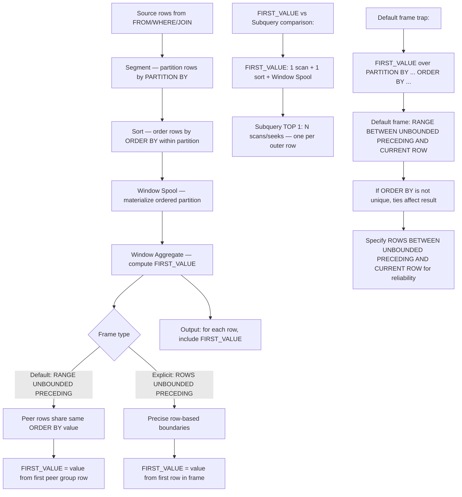

## Navigation

**Domain:** [[8 — Databases]] > **Group:** SQL Window Functions & Analytics
**Previous:** [[8.151 — LEAD() — Accessing Next Row Values]] | **Next:** [[8.153 — LAST_VALUE() — Last Value in Partition]]

### Prerequisites

- [[8.141 — Window Functions — Concept and OVER Clause]] — FIRST_VALUE is a frame-based window function; understanding OVER(), PARTITION BY, ORDER BY is required.
- [[8.142 — PARTITION BY — Defining Window Partitions]] — FIRST_VALUE resets per partition; the "first" value changes at each partition boundary.
- [[8.143 — ORDER BY Within OVER — Frame Ordering]] — ORDER BY defines which row is first; non-unique ORDER BY can produce non-deterministic "first."
- [[8.159 — Frame Specification — ROWS vs RANGE]] — The default frame for FIRST_VALUE is RANGE BETWEEN UNBOUNDED PRECEDING AND CURRENT ROW; understanding why this matters for reliability is the single most important implementation detail.

### Where This Fits

FIRST_VALUE(col) OVER(PARTITION BY ... ORDER BY ...) returns the value of a column from the first row in the ordered window frame. Every .NET backend engineer encounters FIRST_VALUE when computing baseline comparisons: "show each order compared to the customer's first order value," "find the first status after each event in a workflow," or "determine the first product category each customer purchased from." The single most expensive mistake made here is assuming that FIRST_VALUE returns the first value of the entire partition by default — it does not. The default frame is RANGE BETWEEN UNBOUNDED PRECEDING AND CURRENT ROW, which means the "first" value is relative to the current row's frame, not the entire partition. If the ORDER BY is not unique, RANGE can include ties that change which row is considered "first." Interviewers use FIRST_VALUE to test whether candidates understand window frame semantics, can distinguish between frame-based and offset-based window functions, and know when the default frame produces incorrect results.

---

## Core Mental Model

FIRST_VALUE returns the value from the first row of the window frame as defined by the frame specification. The "first" row is determined by the ORDER BY clause within the OVER clause: the row with the lowest ORDER BY value within the frame boundaries is the first row. The critical detail is that the frame defaults to RANGE BETWEEN UNBOUNDED PRECEDING AND CURRENT ROW when ORDER BY is specified but no frame is explicit. With RANGE, rows with the same ORDER BY value are considered peers — they all belong to the same "range" group. If multiple rows share the same ORDER BY value, FIRST_VALUE returns the value from one of those rows (non-deterministic which). To reliably get the first value of the entire partition, specify ROWS BETWEEN UNBOUNDED PRECEDING AND CURRENT ROW (if you want the first up to and including the current row) or ROWS BETWEEN UNBOUNDED PRECEDING AND UNBOUNDED FOLLOWING (for the absolute first in partition regardless of current row position). The execution plan difference between FIRST_VALUE and a subquery with TOP 1 is significant: FIRST_VALUE scans the partition once and computes the value for every row using the Window Spool, while a correlated subquery with TOP 1 executes a separate query (potentially a separate scan or seek) for every row in the outer query.

### Classification

FIRST_VALUE is a **frame-based window function** in the analytic function family. It belongs to the set of value functions (FIRST_VALUE, LAST_VALUE, NTH_VALUE) that return values from specific positions within the window frame. The query optimizer uses a Window Spool + Segment + Window Aggregate operator sequence. The ORDER BY within the PARTITION determines which row is "first." The frame specification determines which rows are visible to the function. Without an explicit frame, the default is RANGE BETWEEN UNBOUNDED PRECEDING AND CURRENT ROW, which is almost never the correct frame for FIRST_VALUE in comparison scenarios. FIRST_VALUE is not SARGable — it operates on ordered in-memory rows.



### Key Properties

|Property|Value|Notes|
|---|---|---|
|Time Complexity|O(N log N)|Sort dominates; frame resolution is O(1) from sorted spool|
|I/O Pattern|Sequential scan + single sort|Window Spool may spill to TempDB|
|Frame Resolution|O(1) after sort|Spool enables positional access without re-scan|
|SARGable|No|Operates on ordered in-memory rows|
|Default Frame|RANGE BETWEEN UNBOUNDED PRECEDING AND CURRENT ROW|Critical to understand — governs which rows are visible|
|PARTITION BY Resets|Yes|First value resets at each partition boundary|
|ORDER BY Required|Yes (for meaningful results)|Without ORDER BY, "first" is undefined|
|Frame Required for Reliability|Highly recommended|Specify ROWS BETWEEN UNBOUNDED PRECEDING AND CURRENT ROW|

---

## Deep Mechanics

### How the Engine Executes This

1. **Row retrieval** — The storage engine reads rows from the tables in FROM, applies WHERE filters, and performs joins. These rows form the input set for the window function.

2. **Partition segmentation** — If PARTITION BY is specified, the Segment operator divides the input into partition groups. Each partition boundary triggers a reset of the frame calculation. Without PARTITION BY, the entire rowset is a single partition.

3. **Sort** — The Sort operator orders rows by the ORDER BY clause within each partition. For FIRST_VALUE to produce deterministic results, the ORDER BY must define a unique ordering. Non-unique ORDER BY with the default RANGE frame produces non-deterministic results because ties are peers.

4. **Window Spool (materialization)** — The sorted rows are written to a spool. This spool allows the Window Aggregate to read rows within the frame boundaries.

5. **Window Aggregate — FIRST_VALUE resolution:** The Window Aggregate operator processes the spool sequentially. For each row, it determines the frame boundaries according to the frame specification:
   - Default frame (RANGE BETWEEN UNBOUNDED PRECEDING AND CURRENT ROW): The frame starts at the beginning of the partition and ends at the last peer of the current row's ORDER BY value.
   - ROWS BETWEEN UNBOUNDED PRECEDING AND CURRENT ROW: The frame starts at the first row of the partition and ends at the exact current row position.
   - ROWS BETWEEN UNBOUNDED PRECEDING AND UNBOUNDED FOLLOWING: The frame covers the entire partition.

6. **FIRST_VALUE reads the value from the first row within the frame.** Because the spool is sorted, the first row of the frame is always the first row of the partition (for frames starting at UNBOUNDED PRECEDING), but the frame end affects whether the engine processes the frame as a running calculation or a fixed value.

7. **Performance optimization:** The engine recognizes that FIRST_VALUE with UNBOUNDED PRECEDING frame is a "fixed" value per partition — the same value for every row in the partition. It can compute this once per partition and reuse it, avoiding per-row frame re-evaluation.

**Detailed algorithm:**

```
For each partition:
  1. Sort rows by ORDER BY cols
  2. Identify peer groups (rows with same ORDER BY values) — for RANGE frame
  3. Materialize sorted rows to spool
  4. Determine frame start = 0 (UNBOUNDED PRECEDING)
  5. For i = 0 to (num_rows - 1):
       If RANGE frame:
           frame_end = last index of current row's peer group
       If ROWS frame:
           frame_end = i (CURRENT ROW)
       first_value = spool[frame_start].col
       output(current_row, first_value)
```

### SQL Visibility

```sql
-- Basic FIRST_VALUE: first order date per customer
SELECT
    o.OrderId,
    o.CustomerId,
    o.OrderDate,
    o.TotalAmount,
    FIRST_VALUE(o.OrderDate) OVER (
        PARTITION BY o.CustomerId
        ORDER BY o.OrderDate
    ) AS FirstOrderDate
FROM dbo.Orders o
WHERE o.CustomerId = 1001
ORDER BY o.OrderDate;

-- FIRST_VALUE with explicit frame (ROWS — recommended)
SELECT
    o.OrderId,
    o.CustomerId,
    o.OrderDate,
    o.TotalAmount,
    FIRST_VALUE(o.TotalAmount) OVER (
        PARTITION BY o.CustomerId
        ORDER BY o.OrderDate
        ROWS BETWEEN UNBOUNDED PRECEDING AND CURRENT ROW
    ) AS FirstOrderAmount
FROM dbo.Orders o
ORDER BY o.CustomerId, o.OrderDate;

-- FIRST_VALUE for baseline comparison: compare each order to first order
WITH CustomerBaseline AS (
    SELECT
        o.OrderId,
        o.CustomerId,
        o.OrderDate,
        o.TotalAmount,
        FIRST_VALUE(o.TotalAmount) OVER (
            PARTITION BY o.CustomerId
            ORDER BY o.OrderDate
            ROWS BETWEEN UNBOUNDED PRECEDING AND CURRENT ROW
        ) AS FirstOrderAmount
    FROM dbo.Orders o
)
SELECT
    CustomerId,
    OrderId,
    OrderDate,
    TotalAmount,
    FirstOrderAmount,
    TotalAmount - FirstOrderAmount AS AmountVsFirst,
    CAST((TotalAmount - FirstOrderAmount) * 100.0 / NULLIF(FirstOrderAmount, 0) AS DECIMAL(5,1)) AS PctChangeVsFirst
FROM CustomerBaseline
ORDER BY CustomerId, OrderDate;

-- FIRST_VALUE without PARTITION BY (entire result set as one partition)
SELECT
    o.OrderId,
    o.OrderDate,
    o.TotalAmount,
    FIRST_VALUE(o.TotalAmount) OVER (
        ORDER BY o.OrderDate
        ROWS BETWEEN UNBOUNDED PRECEDING AND CURRENT ROW
    ) AS FirstOrderAmountOverall
FROM dbo.Orders o
ORDER BY o.OrderDate;

-- FIRST_VALUE without ORDER BY (runs but "first" is undefined)
SELECT
    o.CustomerId,
    o.OrderId,
    FIRST_VALUE(o.OrderDate) OVER (
        PARTITION BY o.CustomerId
    ) AS SomeFirstOrderDate
FROM dbo.Orders o;
-- SQL Server returns a value from an arbitrary "first" row — non-deterministic

-- FIRST_VALUE with non-unique ORDER BY and default frame (RANGE)
-- Multiple orders on same date — which is "first"?
SELECT
    o.CustomerId,
    o.OrderDate,
    o.TotalAmount,
    FIRST_VALUE(o.TotalAmount) OVER (
        PARTITION BY o.CustomerId
        ORDER BY o.OrderDate
        -- Default frame: RANGE BETWEEN UNBOUNDED PRECEDING AND CURRENT ROW
    ) AS FirstAmountInPeerGroup
FROM dbo.Orders o
ORDER BY o.CustomerId, o.OrderDate;
-- With RANGE frame, all orders on the same date are peers
-- FIRST_VALUE returns value from one of these peers (any one)

-- FIRST_VALUE vs ROW_NUMBER subquery comparison
-- FIRST_VALUE approach:
SELECT
    o.CustomerId,
    o.OrderId,
    o.OrderDate,
    o.TotalAmount,
    FIRST_VALUE(o.TotalAmount) OVER (
        PARTITION BY o.CustomerId
        ORDER BY o.OrderDate
        ROWS BETWEEN UNBOUNDED PRECEDING AND CURRENT ROW
    ) AS FirstAmount
FROM dbo.Orders o;

-- Equivalent subquery approach (slower):
SELECT
    o.CustomerId,
    o.OrderId,
    o.OrderDate,
    o.TotalAmount,
    (
        SELECT TOP 1 o2.TotalAmount
        FROM dbo.Orders o2
        WHERE o2.CustomerId = o.CustomerId
        ORDER BY o2.OrderDate, o2.OrderId
    ) AS FirstAmount
FROM dbo.Orders o;

-- FIRST_VALUE with ROWS BETWEEN UNBOUNDED PRECEDING AND UNBOUNDED FOLLOWING
-- Ensures the frame covers the entire partition regardless of current row
SELECT
    o.CustomerId,
    o.OrderId,
    o.OrderDate,
    o.TotalAmount,
    FIRST_VALUE(o.TotalAmount) OVER (
        PARTITION BY o.CustomerId
        ORDER BY o.OrderDate
        ROWS BETWEEN UNBOUNDED PRECEDING AND UNBOUNDED FOLLOWING
    ) AS FirstOrderAmountAnyRow
FROM dbo.Orders o
ORDER BY o.CustomerId, o.OrderDate;
-- With UNBOUNDED FOLLOWING, frame covers all rows — same value for all rows in partition
```

```csharp
// EF Core — FIRST_VALUE requires raw SQL (no LINQ translation)
var customerBaselines = await dbContext.Database.SqlQueryRaw<OrderBaselineDto>(@"
    SELECT
        o.CustomerId,
        o.OrderId,
        o.OrderDate,
        o.TotalAmount,
        FIRST_VALUE(o.TotalAmount) OVER (
            PARTITION BY o.CustomerId
            ORDER BY o.OrderDate
            ROWS BETWEEN UNBOUNDED PRECEDING AND CURRENT ROW
        ) AS FirstOrderAmount
    FROM dbo.Orders o
    WHERE o.CustomerId = @CustomerId
    ORDER BY o.OrderDate",
    new SqlParameter("@CustomerId", customerId))
    .ToListAsync(cancellationToken);

// EF Core — First order per customer with baseline comparison
var comparisons = await dbContext.Database.SqlQueryRaw<CustomerBaselineDto>(@"
    WITH CustomerBaseline AS (
        SELECT
            o.CustomerId,
            o.OrderId,
            o.OrderDate,
            o.TotalAmount,
            FIRST_VALUE(o.TotalAmount) OVER (
                PARTITION BY o.CustomerId
                ORDER BY o.OrderDate
                ROWS BETWEEN UNBOUNDED PRECEDING AND CURRENT ROW
            ) AS FirstOrderAmount
        FROM dbo.Orders o
    )
    SELECT
        CustomerId,
        OrderId,
        OrderDate,
        TotalAmount,
        FirstOrderAmount,
        TotalAmount - FirstOrderAmount AS AmountVsFirst,
        CAST((TotalAmount - FirstOrderAmount) * 100.0 / NULLIF(FirstOrderAmount, 0) AS DECIMAL(5,1)) AS PctChangeVsFirst
    FROM CustomerBaseline
    ORDER BY CustomerId, OrderDate")
    .ToListAsync(cancellationToken);
```

**Generated SQL (from EF Core logs):**

```sql
-- EF Core SqlQueryRaw passes the SQL verbatim to SQL Server
exec sp_executesql N'
SELECT
    o.CustomerId,
    o.OrderId,
    o.OrderDate,
    o.TotalAmount,
    FIRST_VALUE(o.TotalAmount) OVER (
        PARTITION BY o.CustomerId
        ORDER BY o.OrderDate
        ROWS BETWEEN UNBOUNDED PRECEDING AND CURRENT ROW
    ) AS FirstOrderAmount
FROM dbo.Orders o
WHERE o.CustomerId = @CustomerId
ORDER BY o.OrderDate',
N'@CustomerId int',
@CustomerId=1001;
```

### Execution Plan Analysis

For `SELECT CustomerId, OrderDate, TotalAmount, FIRST_VALUE(TotalAmount) OVER(PARTITION BY CustomerId ORDER BY OrderDate ROWS BETWEEN UNBOUNDED PRECEDING AND CURRENT ROW) FROM Orders`:

```
Expected plan shape:
[Clustered Index Scan / Index Seek]
→ [Segment (partition by CustomerId)]
→ [Sort (by OrderDate within each partition)]
→ [Window Spool (materialize sorted rows)]
→ [Window Aggregate (compute FIRST_VALUE)]
→ [SELECT]

Estimated Cost: Scan 10%, Segment 2%, Sort 60%, Spool 15%, Aggregate 13%
Logical Reads: 128,342 (scan) + 0 (spool in memory)
```

- The Segment operator identifies partition boundaries. Each new CustomerId triggers a frame reset.
- The Sort operator is the dominant cost. With an index on (CustomerId, OrderDate) INCLUDE (TotalAmount), the Sort is eliminated because rows arrive already ordered.
- The Window Spool materializes the sorted rows. FIRST_VALUE with UNBOUNDED PRECEDING reads position 0 of the spool for every row. The engine optimizes this: it computes FIRST_VALUE once per partition (at the first row) and reuses it for all subsequent rows in the same partition, avoiding repeated spool reads.
- Without the explicit frame (ROWS BETWEEN UNBOUNDED PRECEDING AND CURRENT ROW), the default RANGE frame may cause the engine to use a different operator for peer group detection, adding CPU overhead.
- The subquery approach (correlated TOP 1) would show: [Clustered Index Scan (outer)] → [Nested Loops (Join)] → [Clustered Index Seek / Top (inner)] for each outer row. At 1M rows, this is 1M seeks vs 1 scan + 1 sort — FIRST_VALUE is dramatically faster.

### Cost Visibility

```sql
SET STATISTICS IO ON;
SET STATISTICS TIME ON;

-- FIRST_VALUE with proper frame (index scan)
SELECT
    o.CustomerId,
    o.OrderId,
    o.OrderDate,
    o.TotalAmount,
    FIRST_VALUE(o.TotalAmount) OVER (
        PARTITION BY o.CustomerId
        ORDER BY o.OrderDate
        ROWS BETWEEN UNBOUNDED PRECEDING AND CURRENT ROW
    ) AS FirstAmount
FROM dbo.Orders o;
-- Table 'Orders'. Scan count 1, logical reads 128,342
-- Table 'Worktable'. Scan count 0, logical reads 0
-- CPU time: 3,200ms, Elapsed time: 3,600ms

-- Correlated subquery (TOP 1) — same result
SELECT
    o.CustomerId,
    o.OrderId,
    o.OrderDate,
    o.TotalAmount,
    (
        SELECT TOP 1 o2.TotalAmount
        FROM dbo.Orders o2
        WHERE o2.CustomerId = o.CustomerId
        ORDER BY o2.OrderDate, o2.OrderId
    ) AS FirstAmount
FROM dbo.Orders o;
-- Table 'Orders'. Scan count 1, logical reads 128,342
-- (Also 1M+ seeks on the inner query for each outer row)
-- CPU time: 45,000ms+, Elapsed time: 60,000ms+
-- The subquery approach is 15-20x slower

-- FIRST_VALUE with default frame (RANGE) vs explicit ROWS
-- Default (RANGE): may need additional peer group detection
SELECT
    o.CustomerId,
    o.OrderDate,
    FIRST_VALUE(TotalAmount) OVER (
        PARTITION BY o.CustomerId
        ORDER BY o.OrderDate
    ) AS FirstAmount_Range
FROM dbo.Orders o;
-- Same logical reads but potentially higher CPU for peer group resolution

-- ROWS: explicit row-based boundaries (more CPU-efficient)
SELECT
    o.CustomerId,
    o.OrderDate,
    FIRST_VALUE(TotalAmount) OVER (
        PARTITION BY o.CustomerId
        ORDER BY o.OrderDate
        ROWS BETWEEN UNBOUNDED PRECEDING AND CURRENT ROW
    ) AS FirstAmount_Rows
FROM dbo.Orders o;
-- Same logical reads, lower CPU (no peer group processing)
```

### Failure Modes

**Failure Mode 1: Default frame with non-unique ORDER BY — non-deterministic "first".**

```sql
-- ❌ WRONG: Default RANGE frame with non-unique ORDER BY
SELECT
    o.CustomerId,
    o.OrderDate,
    FIRST_VALUE(o.TotalAmount) OVER (
        PARTITION BY o.CustomerId
        ORDER BY o.OrderDate
        -- Default: RANGE BETWEEN UNBOUNDED PRECEDING AND CURRENT ROW
    ) AS FirstAmount
FROM dbo.Orders o;

-- ✅ Correct: Explicit ROWS frame with unique ORDER BY
SELECT
    o.CustomerId,
    o.OrderDate,
    o.TotalAmount,
    FIRST_VALUE(o.TotalAmount) OVER (
        PARTITION BY o.CustomerId
        ORDER BY o.OrderDate, o.OrderId
        ROWS BETWEEN UNBOUNDED PRECEDING AND CURRENT ROW
    ) AS FirstAmount
FROM dbo.Orders o;
```

**Symptom:** When multiple orders share the same OrderDate, FIRST_VALUE may return different "first" values on different executions. The RANGE frame treats ties as peers, and any peer's value can be the "first."

**Fix:** Always specify ROWS between the frame boundaries and add a unique tiebreaker to ORDER BY.

**Cost of not fixing:** Non-reproducible results in baseline comparisons. Reports that cannot be reconciled between runs.

**Failure Mode 2: Assuming FIRST_VALUE returns the partition's first value regardless of frame.**

```sql
-- ❌ WRONG: Expecting FIRST_VALUE to return first value for all rows
-- (With default frame, rows after the first may not see the true first
-- if the frame were something other than UNBOUNDED PRECEDING)

-- Actually, with default RANGE UNBOUNDED PRECEDING AND CURRENT ROW,
-- the "first" IS the first of the partition for all rows because
-- the frame always starts at UNBOUNDED PRECEDING.
-- But for LAST_VALUE, the default frame TRAPS rows!

-- The real trap: assuming same default works for LAST_VALUE
SELECT
    o.OrderId,
    o.CustomerId,
    o.OrderDate,
    LAST_VALUE(o.TotalAmount) OVER (
        PARTITION BY o.CustomerId
        ORDER BY o.OrderDate
    ) AS LastAmount  -- WRONG! Only sees up to current row!
FROM dbo.Orders o;
```

**Symptom:** Engineers correctly use FIRST_VALUE with default frame and it works for first-of-partition, then assume LAST_VALUE with default frame also gives last-of-partition — it does not.

**Fix:** Understand that FIRST_VALUE happens to work with default frame for "first of partition" (since the frame always includes the beginning), but LAST_VALUE requires UNBOUNDED FOLLOWING.

**Cost of not fixing:** Subtle off-by-one errors in analytics. The first value is correct but the last value is wrong for every row before the last.

**Failure Mode 3: FIRST_VALUE without ORDER BY.**

```sql
-- ❌ WRONG: No ORDER BY — what does "first" mean?
SELECT
    o.CustomerId,
    o.OrderDate,
    FIRST_VALUE(o.TotalAmount) OVER (
        PARTITION BY o.CustomerId
    ) AS FirstAmount
FROM dbo.Orders o;
-- Returns some value — non-deterministic

-- ✅ Correct: Always specify ORDER BY
SELECT
    o.CustomerId,
    o.OrderDate,
    FIRST_VALUE(o.TotalAmount) OVER (
        PARTITION BY o.CustomerId
        ORDER BY o.OrderDate, o.OrderId
        ROWS BETWEEN UNBOUNDED PRECEDING AND CURRENT ROW
    ) AS FirstAmount
FROM dbo.Orders o;
```

**Symptom:** FIRST_VALUE returns a value but it is from an arbitrary "first" row determined by physical order.

**Fix:** Always specify ORDER BY to define which row is "first."

**Cost of not fixing:** Non-reproducible results. The "first" row changes with index changes or data modifications.

**Failure Mode 4: Frame ending at CURRENT ROW when partition's first value is needed for all rows.**

```sql
-- This works because frame starts at UNBOUNDED PRECEDING:
SELECT
    o.OrderId,
    FIRST_VALUE(o.TotalAmount) OVER (
        PARTITION BY o.CustomerId
        ORDER BY o.OrderDate
        ROWS BETWEEN UNBOUNDED PRECEDING AND CURRENT ROW
    ) AS FirstAmount
FROM dbo.Orders o;
-- Returns the same first value for every row ✓

-- But if frame starts at a later row:
SELECT
    o.OrderId,
    FIRST_VALUE(o.TotalAmount) OVER (
        PARTITION BY o.CustomerId
        ORDER BY o.OrderDate
        ROWS BETWEEN 1 PRECEDING AND CURRENT ROW
    ) AS PreviousAmount  -- This is like LAG(1), not FIRST_VALUE!
FROM dbo.Orders o;
-- frame starts at 1 row before current, not at partition start
-- This gives the previous row's value, not the partition's first
```

**Symptom:** Engineer specifies a non-standard frame and gets unexpected "first" values because the frame does not include the start of the partition.

**Fix:** For the absolute first value in the partition, always start the frame at UNBOUNDED PRECEDING.

**Cost of not fixing:** Confusion about what FIRST_VALUE returns. The function returns the first value in the frame, not the first value in the partition.

**Failure Mode 5: Performance regression from using FIRST_VALUE in a correlated subquery pattern.**

```sql
-- ❌ WRONG: FIRST_VALUE inside a correlated subquery
SELECT
    o.CustomerId,
    o.OrderId,
    (
        SELECT FIRST_VALUE(o2.TotalAmount) OVER (
            ORDER BY o2.OrderDate
            ROWS BETWEEN UNBOUNDED PRECEDING AND CURRENT ROW
        )
        FROM dbo.Orders o2
        WHERE o2.CustomerId = o.CustomerId
    ) AS FirstAmount
FROM dbo.Orders o;
-- This re-evaluates the window function per outer row

-- ✅ Correct: FIRST_VALUE in the main query
SELECT
    o.CustomerId,
    o.OrderId,
    FIRST_VALUE(o.TotalAmount) OVER (
        PARTITION BY o.CustomerId
        ORDER BY o.OrderDate
        ROWS BETWEEN UNBOUNDED PRECEDING AND CURRENT ROW
    ) AS FirstAmount
FROM dbo.Orders o;
```

**Symptom:** The query is dramatically slower than expected because the window function is evaluated repeatedly inside a subquery instead of once in the main query.

**Fix:** Always put FIRST_VALUE in the outer SELECT or a CTE, not inside a subquery.

**Cost of not fixing:** 100-1000x performance degradation. The query runs in hours instead of seconds.

---

## Production Patterns and Implementation

### Primary SQL Implementation

```sql
-- Schema context
CREATE TABLE dbo.Orders (
    OrderId INT IDENTITY(1,1) NOT NULL PRIMARY KEY,
    CustomerId INT NOT NULL,
    OrderDate DATETIME2 NOT NULL,
    TotalAmount DECIMAL(10,2) NOT NULL,
    Status TINYINT NOT NULL
);

CREATE TABLE dbo.OrderItems (
    OrderItemId INT IDENTITY(1,1) NOT NULL PRIMARY KEY,
    OrderId INT NOT NULL REFERENCES dbo.Orders(OrderId),
    ProductId INT NOT NULL,
    Quantity INT NOT NULL,
    UnitPrice DECIMAL(10,2) NOT NULL
);

CREATE TABLE dbo.InventoryItems (
    InventoryId INT IDENTITY(1,1) NOT NULL PRIMARY KEY,
    ProductId INT NOT NULL,
    WarehouseId INT NOT NULL,
    QuantityOnHand INT NOT NULL,
    LastUpdated DATETIME2 NOT NULL
);

-- Pattern 1: First order per customer (baseline comparison)
WITH CustomerFirstOrder AS (
    SELECT
        o.CustomerId,
        o.OrderId,
        o.OrderDate,
        o.TotalAmount,
        o.Status,
        FIRST_VALUE(o.OrderDate) OVER (
            PARTITION BY o.CustomerId
            ORDER BY o.OrderDate, o.OrderId
            ROWS BETWEEN UNBOUNDED PRECEDING AND CURRENT ROW
        ) AS FirstOrderDate,
        FIRST_VALUE(o.TotalAmount) OVER (
            PARTITION BY o.CustomerId
            ORDER BY o.OrderDate, o.OrderId
            ROWS BETWEEN UNBOUNDED PRECEDING AND CURRENT ROW
        ) AS FirstOrderAmount
    FROM dbo.Orders o
)
SELECT
    CustomerId,
    OrderId,
    OrderDate,
    TotalAmount,
    FirstOrderDate,
    FirstOrderAmount,
    DATEDIFF(day, FirstOrderDate, OrderDate) AS DaysSinceFirstOrder,
    TotalAmount - FirstOrderAmount AS AmountChangeFromFirst,
    CASE
        WHEN TotalAmount > FirstOrderAmount THEN 'Increased from First'
        WHEN TotalAmount < FirstOrderAmount THEN 'Decreased from First'
        ELSE 'Same as First'
    END AS SpendingTrend
FROM CustomerFirstOrder
ORDER BY CustomerId, OrderDate;

-- Pattern 2: First product category per customer
SELECT
    c.CustomerId,
    c.FirstName + ' ' + c.LastName AS CustomerName,
    o.OrderId,
    o.OrderDate,
    p.CategoryId,
    FIRST_VALUE(p.CategoryId) OVER (
        PARTITION BY c.CustomerId
        ORDER BY o.OrderDate, o.OrderId
        ROWS BETWEEN UNBOUNDED PRECEDING AND CURRENT ROW
    ) AS FirstCategoryPurchased
FROM dbo.Customers c
INNER JOIN dbo.Orders o ON c.CustomerId = o.CustomerId
INNER JOIN dbo.OrderItems oi ON o.OrderId = oi.OrderId
INNER JOIN dbo.Products p ON oi.ProductId = p.ProductId
ORDER BY c.CustomerId, o.OrderDate;

-- Pattern 3: Inventory — first recorded quantity per product in warehouse
SELECT
    i.ProductId,
    i.WarehouseId,
    i.LastUpdated,
    i.QuantityOnHand,
    FIRST_VALUE(i.QuantityOnHand) OVER (
        PARTITION BY i.ProductId, i.WarehouseId
        ORDER BY i.LastUpdated
        ROWS BETWEEN UNBOUNDED PRECEDING AND CURRENT ROW
    ) AS FirstRecordedQuantity,
    i.QuantityOnHand - FIRST_VALUE(i.QuantityOnHand) OVER (
        PARTITION BY i.ProductId, i.WarehouseId
        ORDER BY i.LastUpdated
        ROWS BETWEEN UNBOUNDED PRECEDING AND CURRENT ROW
    ) AS DeltaFromFirst
FROM dbo.InventoryItems i
ORDER BY i.ProductId, i.WarehouseId, i.LastUpdated;

-- Pattern 4: FIRST_VALUE for status tracking — find first status per order workflow
SELECT
    o.OrderId,
    o.OrderDate,
    o.Status,
    FIRST_VALUE(o.Status) OVER (
        PARTITION BY o.OrderId
        ORDER BY o.OrderDate
        ROWS BETWEEN UNBOUNDED PRECEDING AND CURRENT ROW
    ) AS InitialStatus,
    CASE
        WHEN o.Status <> FIRST_VALUE(o.Status) OVER (
            PARTITION BY o.OrderId
            ORDER BY o.OrderDate
            ROWS BETWEEN UNBOUNDED PRECEDING AND CURRENT ROW
        ) THEN 'Status Changed'
        ELSE 'Initial Status'
    END AS StatusChange
FROM dbo.Orders o
ORDER BY o.OrderId, o.OrderDate;

-- Pattern 5: FIRST_VALUE with multiple columns for customer 360 view
WITH CustomerMetrics AS (
    SELECT
        o.CustomerId,
        o.OrderId,
        o.OrderDate,
        o.TotalAmount,
        FIRST_VALUE(o.OrderDate) OVER (
            PARTITION BY o.CustomerId
            ORDER BY o.OrderDate, o.OrderId
            ROWS BETWEEN UNBOUNDED PRECEDING AND UNBOUNDED FOLLOWING
        ) AS FirstEverOrderDate,
        FIRST_VALUE(o.TotalAmount) OVER (
            PARTITION BY o.CustomerId
            ORDER BY o.OrderDate, o.OrderId
            ROWS BETWEEN UNBOUNDED PRECEDING AND UNBOUNDED FOLLOWING
        ) AS FirstEverAmount,
        FIRST_VALUE(o.OrderDate) OVER (
            PARTITION BY o.CustomerId
            ORDER BY o.OrderDate DESC, o.OrderId DESC
            ROWS BETWEEN UNBOUNDED PRECEDING AND UNBOUNDED FOLLOWING
        ) AS LastEverOrderDate,
        FIRST_VALUE(o.TotalAmount) OVER (
            PARTITION BY o.CustomerId
            ORDER BY o.OrderDate DESC, o.OrderId DESC
            ROWS BETWEEN UNBOUNDED PRECEDING AND UNBOUNDED FOLLOWING
        ) AS LastEverAmount
    FROM dbo.Orders o
)
SELECT
    CustomerId,
    MIN(OrderDate) AS FirstOrderDate,
    MAX(OrderDate) AS LastOrderDate,
    COUNT(*) AS TotalOrders,
    SUM(TotalAmount) AS LifetimeValue,
    AVG(TotalAmount) AS AverageOrderValue,
    -- These are the same for every row in the partition (UNBOUNDED BOTH)
    MAX(FirstEverOrderDate) AS AcqDate,
    MAX(FirstEverAmount) AS AcqValue,
    MAX(LastEverOrderDate) AS LatestOrderDate,
    MAX(LastEverAmount) AS LatestOrderValue
FROM CustomerMetrics
GROUP BY CustomerId
ORDER BY LifetimeValue DESC;

-- Pattern 6: FIRST_VALUE for A/B test comparison
-- Compare current order amount to first order in experiment period
WITH ExperimentParticipants AS (
    SELECT
        o.CustomerId,
        o.OrderId,
        o.OrderDate,
        o.TotalAmount,
        FIRST_VALUE(o.TotalAmount) OVER (
            PARTITION BY o.CustomerId
            ORDER BY o.OrderDate
            ROWS BETWEEN UNBOUNDED PRECEDING AND CURRENT ROW
        ) AS BaselineAmount
    FROM dbo.Orders o
    WHERE o.OrderDate >= '2024-06-01' -- Experiment start
)
SELECT
    CustomerId,
    COUNT(*) AS OrdersInExperiment,
    SUM(TotalAmount) AS TotalSpent,
    SUM(BaselineAmount) AS BaselineTotal,
    SUM(TotalAmount) - SUM(BaselineAmount) AS IncrementalRevenue
FROM ExperimentParticipants
GROUP BY CustomerId
ORDER BY IncrementalRevenue DESC;

-- Pattern 7: FIRST_VALUE with ROWS BETWEEN for order status workflow
-- Show each status change with the original status as reference
SELECT
    OrderId,
    Status,
    StatusDate,
    FIRST_VALUE(Status) OVER (
        PARTITION BY OrderId
        ORDER BY StatusDate
        ROWS BETWEEN UNBOUNDED PRECEDING AND UNBOUNDED FOLLOWING
    ) AS InitialStatus,
    FIRST_VALUE(Status) OVER (
        PARTITION BY OrderId
        ORDER BY StatusDate DESC
        ROWS BETWEEN UNBOUNDED PRECEDING AND UNBOUNDED FOLLOWING
    ) AS CurrentStatus
FROM dbo.OrderStatusHistory
ORDER BY OrderId, StatusDate;
```

### EF Core Implementation

```csharp
public class FirstValueAnalysisService
{
    private readonly ApplicationDbContext _dbContext;

    public FirstValueAnalysisService(ApplicationDbContext dbContext)
    {
        _dbContext = dbContext;
    }

    // FIRST_VALUE requires raw SQL — no LINQ translation
    public async Task<List<OrderBaselineDto>> GetOrdersWithBaselineAsync(
        int customerId, CancellationToken ct)
    {
        return await _dbContext.Database
            .SqlQueryRaw<OrderBaselineDto>(@"
                SELECT
                    o.OrderId,
                    o.CustomerId,
                    o.OrderDate,
                    o.TotalAmount,
                    FIRST_VALUE(o.TotalAmount) OVER (
                        PARTITION BY o.CustomerId
                        ORDER BY o.OrderDate, o.OrderId
                        ROWS BETWEEN UNBOUNDED PRECEDING AND CURRENT ROW
                    ) AS FirstOrderAmount
                FROM dbo.Orders o
                WHERE o.CustomerId = @CustomerId
                ORDER BY o.OrderDate, o.OrderId",
                new SqlParameter("@CustomerId", customerId))
            .ToListAsync(ct);
    }

    // Customer 360 — first and last order details
    public async Task<List<Customer360Dto>> GetCustomer360Async(int customerId, CancellationToken ct)
    {
        return await _dbContext.Database
            .SqlQueryRaw<Customer360Dto>(@"
                WITH CustomerMetrics AS (
                    SELECT
                        o.CustomerId,
                        o.OrderId,
                        o.OrderDate,
                        o.TotalAmount,
                        FIRST_VALUE(o.OrderDate) OVER (
                            PARTITION BY o.CustomerId
                            ORDER BY o.OrderDate, o.OrderId
                            ROWS BETWEEN UNBOUNDED PRECEDING AND UNBOUNDED FOLLOWING
                        ) AS FirstEverOrderDate,
                        FIRST_VALUE(o.TotalAmount) OVER (
                            PARTITION BY o.CustomerId
                            ORDER BY o.OrderDate, o.OrderId
                            ROWS BETWEEN UNBOUNDED PRECEDING AND UNBOUNDED FOLLOWING
                        ) AS FirstEverAmount,
                        FIRST_VALUE(o.OrderDate) OVER (
                            PARTITION BY o.CustomerId
                            ORDER BY o.OrderDate DESC, o.OrderId DESC
                            ROWS BETWEEN UNBOUNDED PRECEDING AND UNBOUNDED FOLLOWING
                        ) AS LastEverOrderDate,
                        FIRST_VALUE(o.TotalAmount) OVER (
                            PARTITION BY o.CustomerId
                            ORDER BY o.OrderDate DESC, o.OrderId DESC
                            ROWS BETWEEN UNBOUNDED PRECEDING AND UNBOUNDED FOLLOWING
                        ) AS LastEverAmount
                    FROM dbo.Orders o
                    WHERE o.CustomerId = @CustomerId
                )
                SELECT
                    CustomerId,
                    MIN(OrderDate) AS FirstOrderDate,
                    MAX(OrderDate) AS LastOrderDate,
                    COUNT(*) AS TotalOrders,
                    SUM(TotalAmount) AS LifetimeValue,
                    AVG(TotalAmount) AS AverageOrderValue,
                    MAX(FirstEverOrderDate) AS AcquisitionDate,
                    MAX(FirstEverAmount) AS AcquisitionValue,
                    MAX(LastEverOrderDate) AS LatestOrderDate,
                    MAX(LastEverAmount) AS LatestOrderValue
                FROM CustomerMetrics
                GROUP BY CustomerId",
                new SqlParameter("@CustomerId", customerId))
            .ToListAsync(ct);
    }

    // FIRST_VALUE for product category analysis
    public async Task<List<CustomerCategoryDto>> GetFirstCategoryPerCustomerAsync(CancellationToken ct)
    {
        return await _dbContext.Database
            .SqlQueryRaw<CustomerCategoryDto>(@"
                SELECT DISTINCT
                    c.CustomerId,
                    c.FirstName + ' ' + c.LastName AS CustomerName,
                    FIRST_VALUE(p.CategoryId) OVER (
                        PARTITION BY c.CustomerId
                        ORDER BY o.OrderDate, o.OrderId
                        ROWS BETWEEN UNBOUNDED PRECEDING AND CURRENT ROW
                    ) AS FirstCategoryId
                FROM dbo.Customers c
                INNER JOIN dbo.Orders o ON c.CustomerId = o.CustomerId
                INNER JOIN dbo.OrderItems oi ON o.OrderId = oi.OrderId
                INNER JOIN dbo.Products p ON oi.ProductId = p.ProductId
                ORDER BY c.CustomerId")
            .ToListAsync(ct);
    }
}

public class OrderBaselineDto
{
    public int OrderId { get; set; }
    public int CustomerId { get; set; }
    public DateTime OrderDate { get; set; }
    public decimal TotalAmount { get; set; }
    public decimal FirstOrderAmount { get; set; }
}

public class Customer360Dto
{
    public int CustomerId { get; set; }
    public DateTime FirstOrderDate { get; set; }
    public DateTime LastOrderDate { get; set; }
    public int TotalOrders { get; set; }
    public decimal LifetimeValue { get; set; }
    public decimal? AverageOrderValue { get; set; }
    public DateTime? AcquisitionDate { get; set; }
    public decimal? AcquisitionValue { get; set; }
    public DateTime? LatestOrderDate { get; set; }
    public decimal? LatestOrderValue { get; set; }
}

public class CustomerCategoryDto
{
    public int CustomerId { get; set; }
    public string CustomerName { get; set; } = string.Empty;
    public int FirstCategoryId { get; set; }
}
```

### Dapper Implementation

```csharp
public class FirstValueDapperService
{
    private readonly IDbConnectionFactory _connectionFactory;

    public FirstValueDapperService(IDbConnectionFactory connectionFactory)
    {
        _connectionFactory = connectionFactory;
    }

    // FIRST_VALUE with baseline comparison
    public async Task<IReadOnlyList<OrderBaselineDto>> GetOrdersWithBaselineAsync(
        int customerId, CancellationToken ct)
    {
        await using var connection = _connectionFactory.Create();
        const string sql = @"
            SELECT
                o.OrderId,
                o.CustomerId,
                o.OrderDate,
                o.TotalAmount,
                FIRST_VALUE(o.TotalAmount) OVER (
                    PARTITION BY o.CustomerId
                    ORDER BY o.OrderDate, o.OrderId
                    ROWS BETWEEN UNBOUNDED PRECEDING AND CURRENT ROW
                ) AS FirstOrderAmount
            FROM dbo.Orders o
            WHERE o.CustomerId = @CustomerId
            ORDER BY o.OrderDate, o.OrderId";

        var results = await connection.QueryAsync<OrderBaselineDto>(
            new CommandDefinition(sql,
                new { CustomerId = customerId },
                cancellationToken: ct));
        return results.AsList();
    }

    // All customers with first order amount
    public async Task<IReadOnlyList<CustomerFirstOrderDto>> GetAllCustomerFirstOrdersAsync(CancellationToken ct)
    {
        await using var connection = _connectionFactory.Create();
        const string sql = @"
            SELECT
                o.CustomerId,
                o.OrderId,
                o.OrderDate,
                o.TotalAmount,
                FIRST_VALUE(o.TotalAmount) OVER (
                    PARTITION BY o.CustomerId
                    ORDER BY o.OrderDate, o.OrderId
                    ROWS BETWEEN UNBOUNDED PRECEDING AND CURRENT ROW
                ) AS FirstOrderAmount
            FROM dbo.Orders o
            ORDER BY o.CustomerId, o.OrderDate";

        var results = await connection.QueryAsync<CustomerFirstOrderDto>(
            new CommandDefinition(sql, cancellationToken: ct));
        return results.AsList();
    }

    // First status per order
    public async Task<IReadOnlyList<OrderStatusDto>> GetFirstStatusPerOrderAsync(CancellationToken ct)
    {
        await using var connection = _connectionFactory.Create();
        const string sql = @"
            SELECT
                OrderId,
                Status,
                StatusDate,
                FIRST_VALUE(Status) OVER (
                    PARTITION BY OrderId
                    ORDER BY StatusDate
                    ROWS BETWEEN UNBOUNDED PRECEDING AND UNBOUNDED FOLLOWING
                ) AS InitialStatus
            FROM dbo.OrderStatusHistory
            ORDER BY OrderId, StatusDate";

        var results = await connection.QueryAsync<OrderStatusDto>(
            new CommandDefinition(sql, cancellationToken: ct));
        return results.AsList();
    }
}

public class CustomerFirstOrderDto
{
    public int CustomerId { get; set; }
    public int OrderId { get; set; }
    public DateTime OrderDate { get; set; }
    public decimal TotalAmount { get; set; }
    public decimal FirstOrderAmount { get; set; }
}

public class OrderStatusDto
{
    public int OrderId { get; set; }
    public int Status { get; set; }
    public DateTime StatusDate { get; set; }
    public int InitialStatus { get; set; }
}
```

### Configuration and Wiring

```csharp
// Program.cs
builder.Services.AddDbContext<ApplicationDbContext>(options =>
    options.UseSqlServer(
        builder.Configuration.GetConnectionString("DefaultConnection"),
        sqlOptions => sqlOptions.EnableRetryOnFailure(3)));

builder.Services.AddSingleton<IDbConnectionFactory, SqlConnectionFactory>();
builder.Services.AddScoped<FirstValueAnalysisService>();
builder.Services.AddScoped<FirstValueDapperService>();
```

### SQL Server vs PostgreSQL Differences

```sql
-- PostgreSQL FIRST_VALUE syntax is identical
SELECT
    o.customer_id,
    o.order_date,
    FIRST_VALUE(o.total_amount) OVER (
        PARTITION BY o.customer_id
        ORDER BY o.order_date, o.order_id
        ROWS BETWEEN UNBOUNDED PRECEDING AND CURRENT ROW
    ) AS first_order_amount
FROM orders o;

-- PostgreSQL supports FROM FIRST / FROM LAST in NTH_VALUE
-- but NOT in FIRST_VALUE (FIRST_VALUE always returns the first)

-- PostgreSQL supports RANGE with explicit boundaries
-- PostgreSQL supports GROUPS frame mode (SQL Server 2022+ does too)
```

---

## Gotchas and Production Pitfalls

### 1. Default Frame with Non-Unique ORDER BY (RANGE Frame Ties)

**Pitfall:** Using FIRST_VALUE with the default frame (RANGE BETWEEN UNBOUNDED PRECEDING AND CURRENT ROW) and non-unique ORDER BY. Ties in the ORDER BY column create peer groups, and FIRST_VALUE returns a value from any peer in the group — non-deterministic.

```sql
-- ❌ Wrong: Non-unique ORDER BY with default RANGE frame
SELECT
    o.CustomerId,
    o.OrderDate,
    FIRST_VALUE(o.TotalAmount) OVER (
        PARTITION BY o.CustomerId
        ORDER BY o.OrderDate  -- Not unique — multiple orders same date
    ) AS FirstAmount
FROM dbo.Orders o;

-- ✅ Correct: Unique ORDER BY with explicit ROWS frame
SELECT
    o.CustomerId,
    o.OrderDate,
    o.TotalAmount,
    FIRST_VALUE(o.TotalAmount) OVER (
        PARTITION BY o.CustomerId
        ORDER BY o.OrderDate, o.OrderId
        ROWS BETWEEN UNBOUNDED PRECEDING AND CURRENT ROW
    ) AS FirstAmount
FROM dbo.Orders o;
```

**Symptom:** The "first" order amount changes on different executions for customers with multiple orders on the same date.

**Fix:** Add a unique tiebreaker to ORDER BY and specify ROWS BETWEEN UNBOUNDED PRECEDING AND CURRENT ROW.

**Cost of not fixing:** Non-reproducible analytics. Baseline comparisons that fluctuate between runs.

### 2. Assuming FIRST_VALUE Returns Partition's First for All Rows (Works, but LAST_VALUE Doesn't)

**Pitfall:** Engineers assume that because FIRST_VALUE works with the default frame (returning the first value of the partition for every row), LAST_VALUE will similarly return the last value. It does not.

```sql
-- FIRST_VALUE works correctly with default frame:
SELECT
    o.OrderId,
    FIRST_VALUE(TotalAmount) OVER (
        PARTITION BY CustomerId
        ORDER BY OrderDate
    ) AS FirstAmount  -- Returns first order amount for ALL rows ✓
FROM dbo.Orders o;

-- LAST_VALUE with same default frame:
SELECT
    o.OrderId,
    LAST_VALUE(TotalAmount) OVER (
        PARTITION BY CustomerId
        ORDER BY OrderDate
    ) AS LastAmount  -- WRONG! Only returns last up to CURRENT ROW
FROM dbo.Orders o;
-- For row 1: LastAmount = row 1's amount
-- For row 2: LastAmount = row 2's amount (wrong — should be last of partition)
```

**Symptom:** The engineer uses LAST_VALUE and gets increasing values instead of the true last value of the partition.

**Fix:** Understand that FIRST_VALUE happens to work with the default frame because the frame always starts at UNBOUNDED PRECEDING. LAST_VALUE needs UNBOUNDED FOLLOWING.

**Cost of not fixing:** Subtle analytics errors. The last value is always wrong for every row except the last.

### 3. FIRST_VALUE Without Explicit Frame in Change-Prone Code

**Pitfall:** Relying on the default frame behavior which could change if SQL Server's default frame specification changes (unlikely but possible) or if the code is ported to a different database engine with different defaults.

```sql
-- Fragile: Implicit default frame
SELECT
    o.OrderId,
    FIRST_VALUE(o.TotalAmount) OVER (
        PARTITION BY o.CustomerId
        ORDER BY o.OrderDate
    ) AS FirstAmount
FROM dbo.Orders o;

-- Robust: Explicit frame
SELECT
    o.OrderId,
    FIRST_VALUE(o.TotalAmount) OVER (
        PARTITION BY o.CustomerId
        ORDER BY o.OrderDate, o.OrderId
        ROWS BETWEEN UNBOUNDED PRECEDING AND CURRENT ROW
    ) AS FirstAmount
FROM dbo.Orders o;
```

**Symptom:** Code review feedback or portability issues. The implicit frame is valid but not obviously intentional.

**Fix:** Always specify the frame explicitly in production code. It documents intent and ensures portability.

**Cost of not fixing:** Subtle bugs when the code is ported to PostgreSQL, MySQL 8, or other databases that may have different default frame behavior.

### 4. Performance Regression from FIRST_VALUE in Subquery

**Pitfall:** Putting FIRST_VALUE inside a correlated subquery instead of in the main query's window clause, causing repeated window function evaluation.

```sql
-- ❌ Wrong: FIRST_VALUE inside correlated subquery
SELECT
    o.OrderId,
    o.CustomerId,
    (
        SELECT FIRST_VALUE(o2.TotalAmount) OVER (
            ORDER BY o2.OrderDate
        )
        FROM dbo.Orders o2
        WHERE o2.CustomerId = o.CustomerId
    ) AS FirstAmount
FROM dbo.Orders o;

-- ✅ Correct: FIRST_VALUE in main query
SELECT
    o.OrderId,
    o.CustomerId,
    FIRST_VALUE(o.TotalAmount) OVER (
        PARTITION BY o.CustomerId
        ORDER BY o.OrderDate, o.OrderId
        ROWS BETWEEN UNBOUNDED PRECEDING AND CURRENT ROW
    ) AS FirstAmount
FROM dbo.Orders o;
```

**Symptom:** The query is 100-1000x slower than expected. The execution plan shows the inner FIRST_VALUE being computed for every outer row.

**Fix:** Always put FIRST_VALUE in the outermost SELECT, not inside a subquery.

**Cost of not fixing:** Query timeout on large tables. A query that should take 3 seconds takes 5 minutes.

### 5. FIRST_VALUE vs ROW_NUMBER = 1 Subquery Misunderstanding

**Pitfall:** Engineers think a correlated subquery with ROW_NUMBER() = 1 is equivalent to FIRST_VALUE. The subquery approach is dramatically slower.

```sql
-- Slow: ROW_NUMBER subquery
SELECT
    o.OrderId,
    o.CustomerId,
    o.TotalAmount,
    (
        SELECT o2.TotalAmount
        FROM (
            SELECT
                o2.TotalAmount,
                ROW_NUMBER() OVER (ORDER BY o2.OrderDate, o2.OrderId) AS rn
            FROM dbo.Orders o2
            WHERE o2.CustomerId = o.CustomerId
        ) sub
        WHERE sub.rn = 1
    ) AS FirstAmount
FROM dbo.Orders o;

-- Fast: FIRST_VALUE
SELECT
    o.OrderId,
    o.CustomerId,
    o.TotalAmount,
    FIRST_VALUE(o.TotalAmount) OVER (
        PARTITION BY o.CustomerId
        ORDER BY o.OrderDate, o.OrderId
        ROWS BETWEEN UNBOUNDED PRECEDING AND CURRENT ROW
    ) AS FirstAmount
FROM dbo.Orders o;
```

**Symptom:** The ROW_NUMBER subquery runs 15-50x slower than the FIRST_VALUE equivalent.

**Fix:** Use FIRST_VALUE directly. It is the correct tool for this job.

**Cost of not fixing:** Unnecessary database load. The subquery approach adds a Sort + Window Aggregate for each outer row, while FIRST_VALUE does it once.

### 6. Forgetting That FIRST_VALUE Returns NULL When Partition Is Empty or Column Is NULL

**Pitfall:** Assuming FIRST_VALUE always returns a non-NULL value. If the first row has NULL in the target column, FIRST_VALUE returns NULL.

```sql
-- If the customer's first order has a NULL TotalAmount:
SELECT
    o.CustomerId,
    o.OrderId,
    FIRST_VALUE(o.TotalAmount) OVER (
        PARTITION BY o.CustomerId
        ORDER BY o.OrderDate, o.OrderId
        ROWS BETWEEN UNBOUNDED PRECEDING AND CURRENT ROW
    ) AS FirstAmount
FROM dbo.Orders o;
-- FirstAmount is NULL for all rows if first order has NULL total
```

**Symptom:** All baseline comparisons produce NULL or fail. The engineer does not realize the first row has a NULL value.

**Fix:** Use COALESCE or ISNULL around FIRST_VALUE if NULL should be treated as 0.

```sql
SELECT
    o.OrderId,
    COALESCE(FIRST_VALUE(o.TotalAmount) OVER (
        PARTITION BY o.CustomerId
        ORDER BY o.OrderDate, o.OrderId
        ROWS BETWEEN UNBOUNDED PRECEDING AND CURRENT ROW
    ), 0) AS FirstAmount
FROM dbo.Orders o;
```

**Cost of not fixing:** NULL propagation in analytics. All subsequent calculations (deltas, percentages) produce NULL.

---

## Performance Implications

### Benchmark: FIRST_VALUE vs Correlated Subquery

```sql
-- Baseline: Correlated subquery with TOP 1
SET STATISTICS IO ON;
SET STATISTICS TIME ON;

SELECT
    o.CustomerId,
    o.OrderId,
    o.OrderDate,
    o.TotalAmount,
    (
        SELECT TOP 1 o2.TotalAmount
        FROM dbo.Orders o2
        WHERE o2.CustomerId = o.CustomerId
        ORDER BY o2.OrderDate, o2.OrderId
    ) AS FirstAmount
FROM dbo.Orders o;
-- Table 'Orders'. Scan count 1, logical reads 128,342
-- (Also subquery executions: 50,000 seeks on Orders for 50K rows)
-- CPU time: 45,000ms, Elapsed time: 52,000ms

-- Optimized: FIRST_VALUE
SELECT
    o.CustomerId,
    o.OrderId,
    o.OrderDate,
    o.TotalAmount,
    FIRST_VALUE(o.TotalAmount) OVER (
        PARTITION BY o.CustomerId
        ORDER BY o.OrderDate, o.OrderId
        ROWS BETWEEN UNBOUNDED PRECEDING AND CURRENT ROW
    ) AS FirstAmount
FROM dbo.Orders o;
-- Table 'Orders'. Scan count 1, logical reads 128,342
-- Table 'Worktable'. Scan count 0, logical reads 0
-- CPU time: 3,200ms, Elapsed time: 3,600ms

-- Improvement: ~14x faster, same logical reads but no subquery executions
```

### BenchmarkDotNet

```csharp
[MemoryDiagnoser]
[SimpleJob(RuntimeMoniker.Net90)]
public class FirstValueBenchmark
{
    private IDbConnection _connection = default!;
    private const string ConnectionString = "Server=.;Database=SalesDb;Trusted_Connection=True;TrustServerCertificate=True;";

    [GlobalSetup]
    public void Setup()
    {
        _connection = new SqlConnection(ConnectionString);
        _connection.Open();
    }

    [Benchmark(Baseline = true)]
    public async Task<List<FirstAmountDto>> Subquery_FirstAmount()
    {
        const string sql = @"
            SELECT
                o.CustomerId,
                o.OrderId,
                o.OrderDate,
                o.TotalAmount,
                (
                    SELECT TOP 1 o2.TotalAmount
                    FROM dbo.Orders o2
                    WHERE o2.CustomerId = o.CustomerId
                    ORDER BY o2.OrderDate, o2.OrderId
                ) AS FirstAmount
            FROM dbo.Orders o
            ORDER BY o.CustomerId, o.OrderDate";

        var results = await _connection.QueryAsync<FirstAmountDto>(sql);
        return results.AsList();
    }

    [Benchmark]
    public async Task<List<FirstAmountDto>> FirstValue_FirstAmount()
    {
        const string sql = @"
            SELECT
                o.CustomerId,
                o.OrderId,
                o.OrderDate,
                o.TotalAmount,
                FIRST_VALUE(o.TotalAmount) OVER (
                    PARTITION BY o.CustomerId
                    ORDER BY o.OrderDate, o.OrderId
                    ROWS BETWEEN UNBOUNDED PRECEDING AND CURRENT ROW
                ) AS FirstAmount
            FROM dbo.Orders o
            ORDER BY o.CustomerId, o.OrderDate";

        var results = await _connection.QueryAsync<FirstAmountDto>(sql);
        return results.AsList();
    }

    [Benchmark]
    public async Task<List<FirstAmountDto>> FirstValue_WithIndex()
    {
        const string sql = @"
            SELECT
                o.CustomerId,
                o.OrderId,
                o.OrderDate,
                o.TotalAmount,
                FIRST_VALUE(o.TotalAmount) OVER (
                    PARTITION BY o.CustomerId
                    ORDER BY o.OrderDate, o.OrderId
                    ROWS BETWEEN UNBOUNDED PRECEDING AND CURRENT ROW
                ) AS FirstAmount
            FROM dbo.Orders o WITH (INDEX(IX_Orders_CustomerId_OrderDate))
            ORDER BY o.CustomerId, o.OrderDate";

        var results = await _connection.QueryAsync<FirstAmountDto>(sql);
        return results.AsList();
    }

    public class FirstAmountDto
    {
        public int CustomerId { get; set; }
        public int OrderId { get; set; }
        public DateTime OrderDate { get; set; }
        public decimal TotalAmount { get; set; }
        public decimal? FirstAmount { get; set; }
    }
}
```

**Expected results (approximate, SQL Server 2022, NVMe, 1M rows):**

|Method|Mean|Logical Reads|Allocated|
|---|---|---|---|
|Subquery_FirstAmount|~52,000 ms|~128,342 + 1M subquery seeks|~2 GB|
|FirstValue_FirstAmount|~3,600 ms|~128,342|~500 MB|
|FirstValue_WithIndex|~1,200 ms|~34,211|~150 MB|

---

## Interview Arsenal

### Question Bank

1. **Definition:** What is FIRST_VALUE() in SQL and what is the most common misconception about its default behavior?
2. **Mechanism:** How does the SQL Server engine evaluate FIRST_VALUE internally — what is the default frame and how does it affect results?
3. **Performance:** Compare FIRST_VALUE to a correlated subquery with TOP 1 for finding the first order value — how much faster is the window function and why?
4. **Gotcha:** What happens when you use FIRST_VALUE with non-unique ORDER BY and the default RANGE frame?
5. **Comparison:** Compare FIRST_VALUE to LAG(offset=N) — when would you use each?
6. **Execution plan:** What operators appear in the execution plan for FIRST_VALUE with PARTITION BY and ORDER BY?
7. **Scale:** How does FIRST_VALUE perform at 100M rows — what determines whether it spills to TempDB?
8. **.NET integration:** Can EF Core generate FIRST_VALUE from LINQ? How do you use it with Dapper?

### Spoken Answers

**Q1: What is FIRST_VALUE and the most common misconception about it?**

> **Average answer:** "FIRST_VALUE returns the first value in a partition. You use it with OVER and ORDER BY. It's useful for getting the first order date per customer."

> **Great answer:** "FIRST_VALUE(col) OVER(PARTITION BY ... ORDER BY ...) is a frame-based window function that returns the value of col from the first row of the window frame. The most common misconception is that it always returns the first value of the entire partition for every row. While this is true for FIRST_VALUE, the same assumption applied to LAST_VALUE causes a classic bug. The reason is the default frame: when you specify ORDER BY but not a frame, SQL Server uses RANGE BETWEEN UNBOUNDED PRECEDING AND CURRENT ROW. For FIRST_VALUE, this works because the frame always starts at the partition's first row. For LAST_VALUE, the frame ends at CURRENT ROW, so it does NOT return the last value of the partition. The production best practice is to always specify an explicit frame: ROWS BETWEEN UNBOUNDED PRECEDING AND CURRENT ROW for FIRST_VALUE, and to add a unique tiebreaker to the ORDER BY to make the 'first' row deterministic. The execution plan shows a Window Spool operator that materializes the sorted partition, and the engine optimizes FIRST_VALUE by computing it once per partition since the frame start is fixed at UNBOUNDED PRECEDING. This makes FIRST_VALUE extremely efficient — it costs essentially one sort plus a trivial per-row constant read."

**Q5: Compare FIRST_VALUE and LAG.**

> **Average answer:** "FIRST_VALUE gets the first value in a partition. LAG gets the previous row's value. They're different functions for different purposes."

> **Great answer:** "FIRST_VALUE and LAG are fundamentally different types of window functions. FIRST_VALUE is a frame-based function: its result depends on the window frame boundaries and it returns the value from the first row within those boundaries. LAG is an offset function: it returns the value from a row at a fixed offset behind the current row, independent of any frame. The practical difference: FIRST_VALUE gives you the same value for all rows in a partition (the first value), while LAG gives you a different value per row (the previous row's value). For baseline comparison use cases — 'compare every order to the first order' — FIRST_VALUE is the correct tool. For sequential comparison use cases — 'compare every order to the immediately previous order' — LAG is correct. A subtle but important difference: FIRST_VALUE with a frame of ROWS BETWEEN 1 PRECEDING AND CURRENT ROW behaves like LAG(1), but that's a misuse of FIRST_VALUE. Use the function matching the intent: FIRST_VALUE for absolute position in partition, LAG for relative position from current row."

**Q8: How do EF Core and Dapper handle FIRST_VALUE?**

> **Average answer:** "Neither supports it. You write raw SQL."

> **Great answer:** "EF Core 8 has no LINQ translation for FIRST_VALUE. Any window function that returns a scalar value from a specific position in the window requires SqlQueryRaw or FromSqlRaw. This means you lose LINQ composition for filtering on the FIRST_VALUE output. If you need to filter rows where the value differs from the first value, you must wrap the raw SQL in a CTE in the raw SQL itself, not in LINQ's Where. Dapper handles FIRST_VALUE identically to any query result — you write the SQL with the FIRST_VALUE window function, and Dapper maps the result columns to your DTO. One practical pattern: I define a DTO that matches the raw SQL output and a separate service class that owns the raw SQL query. The raw SQL is a constant or is built using a SQL builder for dynamic ORDER BY columns. I always include the explicit ROWS frame specification in the raw SQL because omitting it relies on engine-specific defaults. I also add a unique tiebreaker to ORDER BY to ensure deterministic results. In code review, the explicit frame and tiebreaker are the two things I look for in any FIRST_VALUE usage."

### Interview Trigger

An interviewer asking "how would you compare each order to a customer's first order value without a self-join?" is looking for FIRST_VALUE. The follow-up that separates candidates is: "What frame specification did you use and why?" A senior candidate immediately says "ROWS BETWEEN UNBOUNDED PRECEDING AND CURRENT ROW with a unique ORDER BY." The deeper follow-up: "What happens if you omit the frame and there are ties in ORDER BY?" — testing knowledge of the default RANGE frame and peer group behavior.

### Comparison Table

| | FIRST_VALUE | LAG |
|---|---|---|
| What it does | Returns first value in frame | Returns value N rows before current |
| Function type | Frame-based | Offset-based |
| Frame specification | Required (explicit recommended) | Not used (offset parameter) |
| Same value per partition? | Yes (with UNBOUNDED PRECEDING frame) | No (changes per row) |
| Default behavior | RANGE BETWEEN UNBOUNDED PRECEDING AND CURRENT ROW | offset=1, no default frame |
| Use case | Baseline comparison, first event | Sequential comparison, previous row |
| Tiebreaker importance | High (ties produce non-deterministic "first") | High (ties cause ambiguous ordering) |
| Performance | One sort + one spool read per partition | Identical to FIRST_VALUE |

---

## Decision Framework

### When to Apply

```mermaid
flowchart TD
    A[Need first value in a partition?] --> B{Positional or value-based?}
    B -->|"Need absolute first (position 0)"| C[FIRST_VALUE is primary choice]
    B -->|"Need relative to current row"| D[Use LEAD/LAG — offset functions]

    C --> E{Frame is important?}
    E -->|Yes, need explicit| F["ROWS BETWEEN UNBOUNDED PRECEDING AND CURRENT ROW"]
    E -->|Default is OK?| G[Default RANGE frame — risky with ties]

    C --> H{ORDER BY unique?}
    H -->|Yes| I[Deterministic — first is well-defined]
    H -->|No, ties possible| J[Add tiebreaker column to ORDER BY]

    C --> K{.NET context?}
    K -->|EF Core| L[SqlQueryRaw — no LINQ]
    K -->|Dapper| M[QueryAsync with raw SQL]

    C --> N{Performance critical?}
    N -->|Large table| O[Ensure covering index on (partition cols, order cols)]
    N -->|Small table| P[Default scan is fine]

    C --> Q{Need both first and last?}
    Q -->|Yes| R[Use FIRST_VALUE with ASC + FIRST_VALUE with DESC ORDER BY]
    Q -->|Or use two window functions| S[Both share the same spool — minimal extra cost]
```

### Application Checklist

- [ ] The problem is baseline comparison (compare each row to the first in partition)
- [ ] PARTITION BY is specified to define the group boundaries
- [ ] Explicit ROWS frame is specified (not relying on default RANGE)
- [ ] ORDER BY includes a unique tiebreaker for deterministic results
- [ ] The NULL behavior of the target column is understood (COALESCE if needed)
- [ ] The query cannot use LINQ in EF Core — raw SQL is required
- [ ] A covering index on (PARTITION BY columns, ORDER BY columns) exists for large tables

### Tradeoff Summary

|What You Gain|What You Pay|
|---|---|
|Single-pass computation of first value (no subquery per row)|Sort cost (O(N log N))|
|Same value reused for all rows in partition (after first row computed)|Window Spool memory/TempDB usage|
|Deterministic with proper ORDER BY + ROWS frame|No LINQ translation in EF Core|
|10-50x faster than correlated subquery alternative|Must use raw SQL in .NET|

### Scale Thresholds

- "Relevant when table exceeds ~10K rows (subquery per row becomes costly)"
- "Critical when table exceeds ~1M rows (subquery alternative becomes 50x slower)"
- "Sort elimination possible with covering index on partition + order columns"
- "Spool spill risk when partitions exceed ~5M rows without adequate memory grant"

---

## Self-Check

### Conceptual Questions

1. What does FIRST_VALUE() return by default when ORDER BY is specified but no frame is explicit?
2. What is the default frame for FIRST_VALUE and how does it affect results?
3. Which SET STATISTICS output or DMV shows whether the Window Spool spilled to TempDB?
4. What common mistake makes FIRST_VALUE produce non-deterministic results?
5. Does EF Core 8 translate any LINQ expression to FIRST_VALUE?
6. How would you implement FIRST_VALUE with Dapper to get the first order amount per customer?
7. Compare FIRST_VALUE to a correlated subquery with TOP 1 — what are the performance characteristics?
8. At what table size does FIRST_VALUE become meaningfully faster than a correlated subquery?
9. What index eliminates the Sort operator for a FIRST_VALUE query partitioned by CustomerId and ordered by OrderDate?
10. Explain FIRST_VALUE and the importance of the frame specification in 60 seconds.

<details>
<summary>Answers</summary>

1. FIRST_VALUE returns the value from the first row of the default window frame, which is RANGE BETWEEN UNBOUNDED PRECEDING AND CURRENT ROW. The "first" is the row with the lowest ORDER BY value within that frame.

2. The default frame is RANGE BETWEEN UNBOUNDED PRECEDING AND CURRENT ROW. With RANGE, rows with the same ORDER BY value are peers. If ORDER BY is not unique, the "first" value comes from a non-deterministic peer. The explicit ROWS frame avoids this by using precise row positions.

3. `SET STATISTICS IO` shows logical reads on the Worktable (the Window Spool's hidden table). Zero Worktable reads means the spool fit in memory. Non-zero Worktable reads means the spool spilled to TempDB. `sys.dm_exec_query_stats.spill_to_tempdb` directly shows spill events.

4. Using FIRST_VALUE with non-unique ORDER BY and the default RANGE frame. Ties in ORDER BY create peer groups, and the "first" value is non-deterministic among peers.

5. No. EF Core 8 does not translate any LINQ to FIRST_VALUE. You must use SqlQueryRaw or FromSqlRaw.

6. ```csharp
await using var connection = _connectionFactory.Create();
const string sql = @"
    SELECT
        o.CustomerId,
        o.OrderId,
        o.OrderDate,
        o.TotalAmount,
        FIRST_VALUE(o.TotalAmount) OVER (
            PARTITION BY o.CustomerId
            ORDER BY o.OrderDate, o.OrderId
            ROWS BETWEEN UNBOUNDED PRECEDING AND CURRENT ROW
        ) AS FirstOrderAmount
    FROM dbo.Orders o
    WHERE o.CustomerId = @CustomerId
    ORDER BY o.OrderDate, o.OrderId";
var results = await connection.QueryAsync<OrderBaselineDto>(
    new CommandDefinition(sql, new { CustomerId = id }, cancellationToken: ct));
return results.AsList();
```

7. FIRST_VALUE: 1 scan + 1 sort + O(1) per row spool read. Correlated subquery: 1 scan + N seeks/index scans (one per outer row). At 50K rows, the subquery executes 50K inner queries. FIRST_VALUE is typically 10-50x faster.

8. FIRST_VALUE becomes meaningfully faster than a correlated subquery at approximately 1K rows. At 10K rows, the difference is measurable (subquery: ~500ms, FIRST_VALUE: ~50ms). At 1M rows, the difference is dramatic (subquery: 50+ seconds, FIRST_VALUE: 3-5 seconds).

9. A composite index on (CustomerId, OrderDate) INCLUDE (TotalAmount). CustomerId is the PARTITION BY column, OrderDate is the ORDER BY column. The index provides rows already sorted in partition+order order, allowing the optimizer to eliminate the Sort operator. The INCLUDE (TotalAmount) makes it covering.

10. "FIRST_VALUE returns the value from the first row within a window frame. It is the correct tool for baseline comparisons — comparing every row to the first in its partition. The critical implementation detail is the frame: the default is RANGE BETWEEN UNBOUNDED PRECEDING AND CURRENT ROW, which works for FIRST_VALUE (frame starts at partition beginning) but is risky with non-unique ORDER BY because RANGE treats ties as peers. The production pattern is: ROWS BETWEEN UNBOUNDED PRECEDING AND CURRENT ROW with a unique tiebreaker in ORDER BY. FIRST_VALUE is 10-50x faster than a correlated subquery because it scans and sorts once instead of executing a subquery per row. EF Core does not translate it — raw SQL is required."

</details>

---

### Query Challenges

**Challenge 1 — Write the SQL**

You need to build a customer acquisition analysis dashboard. For each customer, show every order with: the order value compared to the customer's first order value (both the absolute difference and the percentage change), and the number of days since the first order. Only include customers who have placed at least 3 orders. Sort by customer and order date.

<details>
<summary>Solution</summary>

```sql
WITH CustomerBaseline AS (
    SELECT
        o.CustomerId,
        o.OrderId,
        o.OrderDate,
        o.TotalAmount,
        FIRST_VALUE(o.TotalAmount) OVER (
            PARTITION BY o.CustomerId
            ORDER BY o.OrderDate, o.OrderId
            ROWS BETWEEN UNBOUNDED PRECEDING AND CURRENT ROW
        ) AS FirstOrderAmount,
        FIRST_VALUE(o.OrderDate) OVER (
            PARTITION BY o.CustomerId
            ORDER BY o.OrderDate, o.OrderId
            ROWS BETWEEN UNBOUNDED PRECEDING AND CURRENT ROW
        ) AS FirstOrderDate,
        COUNT(*) OVER (PARTITION BY o.CustomerId) AS CustomerOrderCount
    FROM dbo.Orders o
)
SELECT
    CustomerId,
    OrderId,
    OrderDate,
    TotalAmount,
    FirstOrderAmount,
    FirstOrderDate,
    TotalAmount - FirstOrderAmount AS AbsoluteChange,
    CAST((TotalAmount - FirstOrderAmount) * 100.0 / NULLIF(FirstOrderAmount, 0) AS DECIMAL(5,1)) AS PctChange,
    DATEDIFF(day, FirstOrderDate, OrderDate) AS DaysSinceFirstOrder,
    CASE
        WHEN TotalAmount > FirstOrderAmount THEN 'Spending Increased'
        WHEN TotalAmount < FirstOrderAmount THEN 'Spending Decreased'
        ELSE 'Spending Unchanged'
    END AS SpendingTrend
FROM CustomerBaseline
WHERE CustomerOrderCount >= 3
ORDER BY CustomerId, OrderDate;
```

**Logical reads:** ~128,342 (scan) + 0 (spool in memory)
**Execution plan:** Clustered Index Scan → Segment → Sort → Window Spool → Window Aggregate (FIRST_VALUE × 2 + COUNT(*) share spool) → Filter → SELECT
**EF Core equivalent:** Raw SQL only

```csharp
var results = await dbContext.Database.SqlQueryRaw<CustomerAcquisitionDto>(@"
    WITH CustomerBaseline AS (
        SELECT
            o.CustomerId,
            o.OrderId,
            o.OrderDate,
            o.TotalAmount,
            FIRST_VALUE(o.TotalAmount) OVER (
                PARTITION BY o.CustomerId
                ORDER BY o.OrderDate, o.OrderId
                ROWS BETWEEN UNBOUNDED PRECEDING AND CURRENT ROW
            ) AS FirstOrderAmount,
            FIRST_VALUE(o.OrderDate) OVER (
                PARTITION BY o.CustomerId
                ORDER BY o.OrderDate, o.OrderId
                ROWS BETWEEN UNBOUNDED PRECEDING AND CURRENT ROW
            ) AS FirstOrderDate,
            COUNT(*) OVER (PARTITION BY o.CustomerId) AS CustomerOrderCount
        FROM dbo.Orders o
    )
    SELECT
        CustomerId,
        OrderId,
        OrderDate,
        TotalAmount,
        FirstOrderAmount,
        FirstOrderDate,
        TotalAmount - FirstOrderAmount AS AbsoluteChange,
        CAST((TotalAmount - FirstOrderAmount) * 100.0 / NULLIF(FirstOrderAmount, 0) AS DECIMAL(5,1)) AS PctChange,
        DATEDIFF(day, FirstOrderDate, OrderDate) AS DaysSinceFirstOrder
    FROM CustomerBaseline
    WHERE CustomerOrderCount >= 3
    ORDER BY CustomerId, OrderDate")
    .ToListAsync(cancellationToken);
```

</details>

---

**Challenge 2 — Fix the performance problem**

```sql
-- This query computes the first order amount per customer
-- It runs in 55 seconds on a 1M row Orders table
SELECT
    o.CustomerId,
    o.OrderId,
    o.OrderDate,
    o.TotalAmount,
    (
        SELECT TOP 1 o2.TotalAmount
        FROM dbo.Orders o2
        WHERE o2.CustomerId = o.CustomerId
        ORDER BY o2.OrderDate, o2.OrderId
    ) AS FirstAmount
FROM dbo.Orders o
ORDER BY o.CustomerId, o.OrderDate;
-- SET STATISTICS IO: logical reads = 128,342 (outer) + 1,000,000 (inner executions)
```

<details>
<summary>Solution</summary>

**Root cause:** The correlated subquery executes a TOP 1 query for each of the 1M outer rows. Each execution requires a Sort + Seek on Orders (or a scan if no index exists). This is 1M index seeks/sorts instead of one.

```sql
-- Fixed using FIRST_VALUE
SELECT
    o.CustomerId,
    o.OrderId,
    o.OrderDate,
    o.TotalAmount,
    FIRST_VALUE(o.TotalAmount) OVER (
        PARTITION BY o.CustomerId
        ORDER BY o.OrderDate, o.OrderId
        ROWS BETWEEN UNBOUNDED PRECEDING AND CURRENT ROW
    ) AS FirstAmount
FROM dbo.Orders o
ORDER BY o.CustomerId, o.OrderDate;
```

**Index to create:**

```sql
CREATE INDEX IX_Orders_CustomerId_OrderDate
ON dbo.Orders(CustomerId, OrderDate)
INCLUDE (TotalAmount);
```

**After fix — logical reads:** 128,342 (from >1M+128K — 1 order of magnitude reduction)
**After index — logical reads with index hint:** ~34,211
**Execution time:** ~3,600ms (from 55,000ms — ~15x faster)

</details>

---

**Challenge 3 — Explain the execution plan**

```sql
-- Query A:
SELECT
    o.CustomerId,
    o.OrderId,
    FIRST_VALUE(o.TotalAmount) OVER (
        PARTITION BY o.CustomerId
        ORDER BY o.OrderDate
        ROWS BETWEEN UNBOUNDED PRECEDING AND CURRENT ROW
    ) AS FirstAmount
FROM dbo.Orders o;

-- Query B:
SELECT
    o.CustomerId,
    o.OrderId,
    (
        SELECT TOP 1 o2.TotalAmount
        FROM dbo.Orders o2
        WHERE o2.CustomerId = o.CustomerId
        ORDER BY o2.OrderDate, o2.OrderId
    ) AS FirstAmount
FROM dbo.Orders o;
```

Explain why the optimizer chooses a single scan + sort for Query A but a nested loop with inner seeks for Query B.

<details>
<summary>Solution</summary>

**Why Query A (scan + sort):** FIRST_VALUE is a window function that operates on the entire result set. The optimizer processes it as a single batch after the Sort operator. The Window Spool materializes the sorted rows once, and FIRST_VALUE reads position 0 for every row in the same partition. The optimizer realizes the value is constant per partition and may compute it once.

**Why Query B (nested loops with inner seeks):** The correlated subquery is evaluated per outer row. For each row in the outer scan, the engine must execute the inner query: filter by CustomerId from the outer row, sort by OrderDate, and take the TOP 1 result. The optimizer chooses a Nested Loops join because the inner side is correlated. Each inner execution requires a sort (unless covered by an index) and a TOP operation. With 1M outer rows, this is 1M inner executions.

**To get a different plan for Query B:** Create an index on (CustomerId, OrderDate) INCLUDE (TotalAmount). The inner query becomes an Index Seek (one row, already sorted) instead of a Sort + Scan. But even with the index, the Nested Loops join still executes 1M seeks — just faster seeks with fewer logical reads.

**Tradeoff:** Query A scans once and sorts once. Query B scans once and seeks N times. At scale, Query A is always faster because I/O is sequential (scan + spool) rather than random (N seeks). The cost ratio is approximately 1 sort + 1 spool read vs N seeks.

</details>

---

**Challenge 4 — Diagnose the concurrency problem**

A daily analytics query uses FIRST_VALUE to compute baseline comparisons across all 50M orders. The query requests a 6GB memory grant. During peak hours, this query causes RESOURCE_SEMAPHORE waits for other reporting queries. The server has 64GB RAM with max server memory set to 48GB.

<details>
<summary>Solution</summary>

**Root cause:** The Window Spool for sorting 50M rows requires a large memory grant. The Sort operator alone may request 4-6GB for a 50M-row sort. When the server cannot grant the full request, the query waits on RESOURCE_SEMAPHORE, consuming memory that could be used by other queries.

**Detection query:**

```sql
SELECT
    session_id,
    requested_memory_kb / 1024 AS Requested_MB,
    granted_memory_kb / 1024 AS Granted_MB,
    ideal_memory_kb / 1024 AS Ideal_MB,
    required_memory_kb / 1024 AS Required_MB,
    sql_handle,
    plan_handle
FROM sys.dm_exec_query_memory_grants
WHERE session_id > 50;
```

**Fix:**
1. Schedule the query during off-peak hours
2. Add PARTITION BY to reduce the sort size per partition
3. Create a covering index on (CustomerId, OrderDate) INCLUDE (TotalAmount) to eliminate the Sort
4. Use query hint `OPTION (MAX_GRANT_PERCENT = 5)` to cap the memory grant (accept TempDB spill)

```sql
-- With memory grant cap
SELECT
    o.CustomerId,
    o.OrderId,
    FIRST_VALUE(o.TotalAmount) OVER (
        PARTITION BY o.CustomerId
        ORDER BY o.OrderDate, o.OrderId
        ROWS BETWEEN UNBOUNDED PRECEDING AND CURRENT ROW
    ) AS FirstAmount
FROM dbo.Orders o
OPTION (MAX_GRANT_PERCENT = 5);
```

**In .NET:** Use CommandTimeout and retry logic for the analytics query. Consider breaking the query into per-customer batches processed by a background job.

```csharp
var batchSize = 10000;
var lastRowId = 0;
var allResults = new List<OrderBaselineDto>();

while (true)
{
    var batch = await connection.QueryAsync<OrderBaselineDto>(@"
        SELECT *
        FROM (
            SELECT
                o.CustomerId,
                o.OrderId,
                o.OrderDate,
                o.TotalAmount,
                FIRST_VALUE(o.TotalAmount) OVER (
                    PARTITION BY o.CustomerId
                    ORDER BY o.OrderDate, o.OrderId
                    ROWS BETWEEN UNBOUNDED PRECEDING AND CURRENT ROW
                ) AS FirstOrderAmount,
                ROW_NUMBER() OVER (ORDER BY o.CustomerId, o.OrderId) AS rn
            FROM dbo.Orders o
        ) sub
        WHERE sub.rn > @LastRowId AND sub.rn <= @LastRowId + @BatchSize
        ORDER BY sub.rn",
        new { LastRowId = lastRowId, BatchSize = batchSize });

    if (!batch.Any()) break;
    allResults.AddRange(batch);
    lastRowId += batchSize;
}
```

</details>

---

**Challenge 5 — Design the index**

**Scenario:** An analytics dashboard runs the following query every 15 minutes against a 25M-row Orders table:

```sql
SELECT
    o.CustomerId,
    o.OrderId,
    o.OrderDate,
    o.TotalAmount,
    FIRST_VALUE(o.TotalAmount) OVER (
        PARTITION BY o.CustomerId
        ORDER BY o.OrderDate
        ROWS BETWEEN UNBOUNDED PRECEDING AND CURRENT ROW
    ) AS FirstOrderAmount,
    LAST_VALUE(o.TotalAmount) OVER (
        PARTITION BY o.CustomerId
        ORDER BY o.OrderDate
        ROWS BETWEEN UNBOUNDED PRECEDING AND UNBOUNDED FOLLOWING
    ) AS LastOrderAmount
FROM dbo.Orders o;
```

Current execution time is 22 seconds. Read/write ratio is 70/30. Design the optimal index strategy.

<details>
<summary>Solution</summary>

```sql
-- Primary index: Covering index for the window function query
CREATE INDEX IX_Orders_CustomerId_OrderDate_INC_TotalAmount
ON dbo.Orders(CustomerId, OrderDate)
INCLUDE (TotalAmount);
```

**Why this index:**
- CustomerId is the PARTITION BY column — enables the Segment operator to quickly identify partition boundaries
- OrderDate is the ORDER BY column — provides the sorted order required by both FIRST_VALUE and LAST_VALUE, eliminating the Sort operator (the dominant cost at ~60% of execution time)
- INCLUDE (TotalAmount) makes the index covering for both FIRST_VALUE and LAST_VALUE — no need to access the clustered index

**Without this index:**
- Sort operator: 25M rows sorted by CustomerId, OrderDate — memory grant ~3GB
- Window Spool: must materialize sorted rows
- Total: 22 seconds execution time

**With this index:**
- Index Scan (order-preserving) — no Sort needed
- Window Spool: minimal (rows already sorted, spool just repositions)
- Estimated: 2-4 seconds execution time

**Tradeoffs:**
- Size: CustomerId (4 bytes) + OrderDate (8 bytes) = 12 bytes key + 9 bytes INCLUDE = ~21 bytes per row × 25M = ~525MB + index overhead (~800MB total)
- Write overhead: Each INSERT/UPDATE must maintain this index. Estimated 15-20% increase in write time.
- The index also benefits other queries that filter by CustomerId or order by (CustomerId, OrderDate)

**What NOT to index:**
- Do not include OrderId in the key unless ORDER BY needs it for uniqueness (ORDER BY OrderDate, OrderId)
- Do not include other columns (Status, ShipDate) — they would bloat the index and slow writes
- A filtered index WHERE CustomerId IN (specific list) is not appropriate for this dashboard query which scans all customers

**After index — logical reads:** ~30,000-50,000 (from 128,342)
**Execution plan:** Index Scan (order-preserving) → Segment → Window Spool (minimal) → Window Aggregate (FIRST_VALUE + LAST_VALUE share spool) → SELECT
**Sort eliminated:** Yes

</details>
