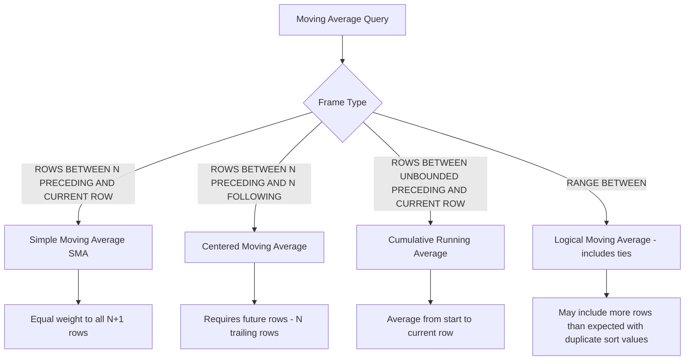
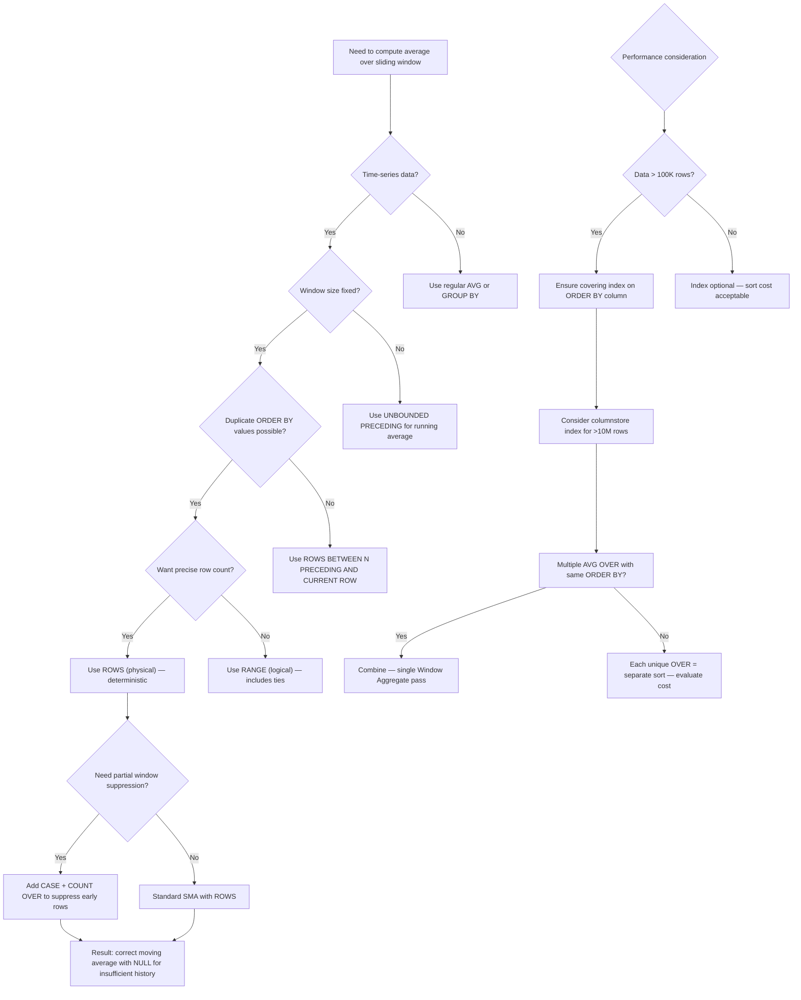

## Navigation

**Domain:** [[8 — Databases]] > **Group:** SQL Window Functions & Analytics
**Previous:** [[8.155 — SUM() OVER() — Running Totals]] | **Next:** [[8.157 — COUNT() OVER() — Running Count per Partition]]

### Prerequisites

- [[8.141 — Window Functions — Concept and OVER Clause]] — Understanding the OVER() clause, the three function families, and the logical execution order (window functions compute after FROM/WHERE/GROUP/HAVING but before ORDER BY) is essential because AVG() OVER() is an aggregate window function that depends on frame specification syntax.
- [[8.142 — PARTITION BY — Defining Window Partitions]] — Partitioning is required for grouped moving averages (e.g., per-customer rolling average); without PARTITION BY, the moving average spans the entire result set.
- [[8.143 — ORDER BY Within OVER — Frame Ordering]] — The ORDER BY inside OVER() determines the ordering of rows within the window frame, which is critical for moving averages because the frame is defined relative to the current row's position in that ordering.
- [[8.122 — SUM, AVG, MIN, MAX — Aggregate Functions]] — Understanding how AVG() works as a regular aggregate (NULL handling, data type preservation) is required because AVG() OVER() follows the same rules for NULL treatment and type precedence.
- [[8.155 — SUM() OVER() — Running Totals]] — SUM() OVER() with ROWS BETWEEN UNBOUNDED PRECEDING AND CURRENT ROW produces running totals; AVG() OVER() follows the identical pattern but computes averages instead of sums, and the frame definition determines the window of rows included in the average.

### Where This Fits

The moving average is the most widely used time-series smoothing technique in production SQL systems. It answers the question "what is the average value over the last N periods?" without needing external analytics tools like Python or R. A .NET backend engineer encounters moving averages in financial reporting dashboards (rolling 30-day revenue average), inventory forecasting (average daily demand over 7 days), performance monitoring (average response time over the last 100 requests), and trading systems (50-day and 200-day simple moving averages). Without window functions, moving averages require self-joins or correlated subqueries that are both complex and degrade to O(N²) performance on large datasets. AVG() OVER() with a ROWS BETWEEN frame computes the moving average in a single table scan plus a sort, which is O(N log N). The interview signal is high: most candidates can write ROW_NUMBER() but fewer understand frame bounds well enough to produce a correct 7-day moving average without off-by-one errors, and fewer still understand the ROWS vs RANGE distinction that causes silent correctness bugs with duplicate dates.

---

## Core Mental Model

AVG(col) OVER(ORDER BY order_col ROWS BETWEEN N PRECEDING AND CURRENT ROW) computes the average of col over a sliding window of N+1 rows: the current row plus the N preceding rows in the specified order. This is called a simple moving average (SMA). The key invariant is that each row's result depends on a contiguous set of rows in the ordered partition, not on all rows in the partition. The database engine executes this by first sorting the data according to the OVER() ORDER BY (or using an index that provides the order), then scanning the sorted result and maintaining a running sum and count over the sliding window — for each row, it adds the current row's value, subtracts the value that fell out of the window (the row that was N+1 positions back), and divides to produce the average. This efficient sliding-window evaluation avoids recomputing the average from scratch for each row. The frame specification (ROWS BETWEEN N PRECEDING AND CURRENT ROW) is what distinguishes a moving average from a running average (UNBOUNDED PRECEDING AND CURRENT ROW) or a centered moving average (ROWS BETWEEN N PRECEDING AND N FOLLOWING).

### Classification

**For SQL topics:** AVG() OVER() is an aggregate window function belonging to the ANSI SQL:2003 OLAP function family. The OVER() clause defines the window partition and ordering. The frame specification determines which rows participate in the average for each output row. The predicate is not SARGable — OVER() does not filter rows. The frame bounds are evaluated after sorting, which is the dominant cost. The query optimizer can use an index on the ORDER BY column to avoid an explicit Sort operator, but the Window Aggregate operator still needs to process all rows in order.

```mermaid
flowchart LR
    subgraph Input[Input Data]
        A1[Row 1: date=Jan 1, val=100]
        A2[Row 2: date=Jan 2, val=110]
        A3[Row 3: date=Jan 3, val=105]
        A4[Row 4: date=Jan 4, val=120]
        A5[Row 5: date=Jan 5, val=115]
    end

    subgraph Sort[Sort by OVER ORDER BY]
        B1[Sorted by date]
    end

    subgraph Window[Window Aggregate Operator]
        C1["Row 1: frame = {1} → AVG = 100"]
        C2["Row 2: frame = {1,2} → AVG = 105"]
        C3["Row 3: frame = {1,2,3} → AVG = 105"]
        C4["Row 4: frame = {2,3,4} → AVG = 111.7"]
        C5["Row 5: frame = {3,4,5} → AVG = 113.3"]
    end

    Input --> Sort --> Window
```





### Key Properties

|Property|Value|Notes|
|---|---|---|
|Time Complexity|O(N log N)|Dominant cost is sorting the partition; the window aggregate itself is O(N) after sort|
|SARGable|No|OVER() does not filter rows — indices are used for SORT elimination, not filtering|
|Frame Type|ROWS (physical) or RANGE (logical)|ROWS gives precise row count; RANGE includes ties and may vary|
|NULL Handling|AVG ignores NULLs|Same as regular AVG — NULLs are not counted in numerator or denominator|
|Data Type|Preserves input type|AVG of INT returns INT (integer division truncation applies!); cast to DECIMAL first|
|Memory Grant|Required for Sort|Sort operator requests memory grant proportional to row count × sort column width|

---

## Deep Mechanics

### How the Engine Executes This

**Logical execution order:**

1. **FROM + JOIN:** Source tables are combined.
2. **WHERE:** Rows are filtered before window computation.
3. **GROUP BY + HAVING:** If present, grouping occurs before windows (rare with moving averages).
4. **Window function evaluation (step 6 of 8):** The engine evaluates AVG() OVER() for each row.
5. **SELECT:** The window function result is included in the output columns.
6. **ORDER BY:** The final result set is sorted (the OVER() ORDER BY and the query ORDER BY may differ).

**Physical execution steps for AVG() OVER(ORDER BY date ROWS BETWEEN 6 PRECEDING AND CURRENT ROW):**

1. **Data access:** The storage engine reads rows from the clustered index or a non-clustered covering index. If an index on (date) INCLUDE (value) exists, the engine can use it to avoid a separate sort.
2. **Sort:** If the data is not already ordered by the OVER() ORDER BY column(s), the Sort operator sorts the rows. This is a blocking operator — it must consume all rows before producing any output. The sort uses a memory grant; if the grant is insufficient, it spills to TempDB.
3. **Segment:** The Segment operator groups rows into partitions (if PARTITION BY is present). It marks partition boundaries so the Window Aggregate knows when to reset its state.
4. **Window Aggregate:** This operator evaluates the AVG() OVER() function. It maintains a running sum and count as it processes rows in order. For a ROWS BETWEEN 6 PRECEDING AND CURRENT ROW frame:
   - For the first row: sum = current value, count = 1. AVG = sum/count.
   - For the second row: sum += current value, count = 2. AVG = sum/count.
   - ...
   - For the 8th row: sum += current value - value from row 1 (which fell out of the 7-row window), count stays at 7. AVG = sum/7.
5. **Compute Scalar:** If the data type requires conversion (e.g., INT to DECIMAL for fractional average), a Compute Scalar operator applies the conversion.

**Key insight:** The Window Aggregate operator does NOT recompute the average from scratch for each row. It incrementally maintains the running sum and subtracts values that fall out of the window. This is what makes O(N) evaluation possible after the sort.

### SQL Visibility

```sql
-- ============================================================
-- 7-day moving average of daily revenue
-- ============================================================
-- Create daily revenue summary table
CREATE TABLE dbo.DailyRevenue
(
    RevenueDate   DATE           NOT NULL,
    TotalRevenue  DECIMAL(18,2)  NOT NULL,
    OrderCount    INT            NOT NULL,
    CONSTRAINT PK_DailyRevenue PRIMARY KEY CLUSTERED (RevenueDate)
);

-- Insert sample data
INSERT INTO dbo.DailyRevenue (RevenueDate, TotalRevenue, OrderCount)
VALUES
    ('2026-01-01', 12500.00, 42),
    ('2026-01-02', 13200.00, 45),
    ('2026-01-03', 11800.00, 38),
    ('2026-01-04', 14100.00, 50),
    ('2026-01-05', 12800.00, 44),
    ('2026-01-06', 13500.00, 47),
    ('2026-01-07', 14200.00, 51),
    ('2026-01-08', 13800.00, 48),
    ('2026-01-09', 14500.00, 52),
    ('2026-01-10', 13100.00, 43),
    ('2026-01-11', 14800.00, 55),
    ('2026-01-12', 15200.00, 58),
    ('2026-01-13', 14000.00, 49),
    ('2026-01-14', 15500.00, 60);

-- 7-day simple moving average (SMA-7)
-- Includes rows 1-6 with partial windows (fewer than 7 rows)
SELECT
    rd.RevenueDate,
    rd.TotalRevenue,
    AVG(rd.TotalRevenue) OVER (
        ORDER BY rd.RevenueDate
        ROWS BETWEEN 6 PRECEDING AND CURRENT ROW
    ) AS MovingAvg7Day,
    COUNT(rd.TotalRevenue) OVER (
        ORDER BY rd.RevenueDate
        ROWS BETWEEN 6 PRECEDING AND CURRENT ROW
    ) AS WindowRowCount
FROM dbo.DailyRevenue AS rd
ORDER BY rd.RevenueDate;

/*
RevenueDate  TotalRevenue  MovingAvg7Day    WindowRowCount
2026-01-01   12500.00      12500.00          1
2026-01-02   13200.00      12850.00          2
2026-01-03   11800.00      12500.00          3
2026-01-04   14100.00      12900.00          4
2026-01-05   12800.00      12880.00          5
2026-01-06   13500.00      12985.71          6
2026-01-07   14200.00      13158.57          7  ← First full 7-row window
2026-01-08   13800.00      13342.85          7
2026-01-09   14500.00      13528.57          7
2026-01-10   13100.00      13428.57          7
2026-01-11   14800.00      13685.71          7
2026-01-12   15200.00      14157.14          7
2026-01-13   14000.00      14142.85          7
2026-01-14   15500.00      14414.28          7
*/

-- ============================================================
-- Moving average per product category
-- ============================================================
CREATE TABLE dbo.DailyCategoryRevenue
(
    RevenueDate  DATE           NOT NULL,
    CategoryId   INT            NOT NULL,
    Revenue      DECIMAL(18,2)  NOT NULL,
    CONSTRAINT PK_DailyCategoryRevenue PRIMARY KEY CLUSTERED (RevenueDate, CategoryId)
);

-- 7-day moving average per category
SELECT
    dcr.RevenueDate,
    dcr.CategoryId,
    dcr.Revenue,
    AVG(dcr.Revenue) OVER (
        PARTITION BY dcr.CategoryId
        ORDER BY dcr.RevenueDate
        ROWS BETWEEN 6 PRECEDING AND CURRENT ROW
    ) AS CategoryMovingAvg7Day
FROM dbo.DailyCategoryRevenue AS dcr
ORDER BY dcr.CategoryId, dcr.RevenueDate;

-- ============================================================
-- Centered moving average (uses future rows)
-- ============================================================
-- 7-day centered: 3 preceding + current + 3 following
-- NOTE: First 3 and last 3 rows have partial windows
SELECT
    rd.RevenueDate,
    rd.TotalRevenue,
    AVG(rd.TotalRevenue) OVER (
        ORDER BY rd.RevenueDate
        ROWS BETWEEN 3 PRECEDING AND 3 FOLLOWING
    ) AS CenteredMovingAvg
FROM dbo.DailyRevenue AS rd
ORDER BY rd.RevenueDate;

-- ============================================================
-- Exponential moving average (EMA) via recursive CTE
-- ============================================================
-- SQL Server does not have built-in EMA.
-- EMA = (value × multiplier) + (previous EMA × (1 - multiplier))
-- multiplier = 2 / (N + 1) for N-period EMA
DECLARE @SmoothingFactor DECIMAL(18,6) = 2.0 / (7 + 1); -- 0.25 for 7-day EMA

WITH OrderedRevenue AS
(
    SELECT
        rd.RevenueDate,
        rd.TotalRevenue,
        ROW_NUMBER() OVER (ORDER BY rd.RevenueDate) AS RowNum
    FROM dbo.DailyRevenue AS rd
),
EMA_CTE AS
(
    -- Base case: first row uses SMA for that row
    SELECT
        RevenueDate,
        TotalRevenue,
        CAST(TotalRevenue AS DECIMAL(18,6)) AS EMA,
        RowNum
    FROM OrderedRevenue
    WHERE RowNum = 1

    UNION ALL

    -- Recursive: apply EMA formula
    SELECT
        cur.RevenueDate,
        cur.TotalRevenue,
        CAST(
            cur.TotalRevenue * @SmoothingFactor + prev.EMA * (1 - @SmoothingFactor)
            AS DECIMAL(18,6)
        ) AS EMA,
        cur.RowNum
    FROM OrderedRevenue AS cur
    INNER JOIN EMA_CTE AS prev ON cur.RowNum = prev.RowNum + 1
)
SELECT
    RevenueDate,
    TotalRevenue,
    EMA
FROM EMA_CTE
ORDER BY RevenueDate
OPTION (MAXRECURSION 0);
```

```csharp
// EF Core — AVG() OVER() requires raw SQL; EF Core does not translate window functions
// This is a read-only query, so FromSqlRaw with keyless entity type is the pattern.

public class DailyRevenueSummary
{
    public DateTime RevenueDate { get; set; }
    public decimal TotalRevenue { get; set; }
    public decimal MovingAvg7Day { get; set; }
    public int WindowRowCount { get; set; }
}

public class DailyCategoryRevenueSummary
{
    public DateTime RevenueDate { get; set; }
    public int CategoryId { get; set; }
    public decimal Revenue { get; set; }
    public decimal CategoryMovingAvg7Day { get; set; }
}

// Keyless entity type configuration
public class AnalyticsDbContext : DbContext
{
    public DbSet<DailyRevenueSummary> DailyRevenueSummaries => Set<DailyRevenueSummary>();
    public DbSet<DailyCategoryRevenueSummary> DailyCategoryRevenueSummaries => Set<DailyCategoryRevenueSummary>();

    protected override void OnModelCreating(ModelBuilder modelBuilder)
    {
        modelBuilder.Entity<DailyRevenueSummary>(entity =>
        {
            entity.HasNoKey();
            entity.ToView(null);  // No backing table/view — result of raw SQL
            entity.Property(e => e.RevenueDate).HasColumnType("date");
            entity.Property(e => e.TotalRevenue).HasColumnType("decimal(18,2)");
            entity.Property(e => e.MovingAvg7Day).HasColumnType("decimal(18,2)");
        });

        modelBuilder.Entity<DailyCategoryRevenueSummary>(entity =>
        {
            entity.HasNoKey();
            entity.ToView(null);
            entity.Property(e => e.RevenueDate).HasColumnType("date");
            entity.Property(e => e.Revenue).HasColumnType("decimal(18,2)");
            entity.Property(e => e.CategoryMovingAvg7Day).HasColumnType("decimal(18,2)");
        });
    }
}

public interface IMovingAverageService
{
    Task<IReadOnlyList<DailyRevenueSummary>> Get7DayMovingAverageAsync(CancellationToken ct = default);
    Task<IReadOnlyList<DailyCategoryRevenueSummary>> GetCategoryMovingAverageAsync(CancellationToken ct = default);
}

public class MovingAverageService : IMovingAverageService
{
    private readonly AnalyticsDbContext _dbContext;
    private readonly ILogger<MovingAverageService> _logger;

    public MovingAverageService(AnalyticsDbContext dbContext, ILogger<MovingAverageService> logger)
    {
        _dbContext = dbContext;
        _logger = logger;
    }

    public async Task<IReadOnlyList<DailyRevenueSummary>> Get7DayMovingAverageAsync(
        CancellationToken ct = default)
    {
        const string sql = @"
            SELECT
                rd.RevenueDate,
                rd.TotalRevenue,
                AVG(rd.TotalRevenue) OVER (
                    ORDER BY rd.RevenueDate
                    ROWS BETWEEN 6 PRECEDING AND CURRENT ROW
                ) AS MovingAvg7Day,
                COUNT(rd.TotalRevenue) OVER (
                    ORDER BY rd.RevenueDate
                    ROWS BETWEEN 6 PRECEDING AND CURRENT ROW
                ) AS WindowRowCount
            FROM dbo.DailyRevenue AS rd
            ORDER BY rd.RevenueDate;";

        return await _dbContext.Database
            .SqlQueryRaw<DailyRevenueSummary>(sql)
            .ToListAsync(ct);
    }

    public async Task<IReadOnlyList<DailyCategoryRevenueSummary>> GetCategoryMovingAverageAsync(
        CancellationToken ct = default)
    {
        const string sql = @"
            SELECT
                dcr.RevenueDate,
                dcr.CategoryId,
                dcr.Revenue,
                AVG(dcr.Revenue) OVER (
                    PARTITION BY dcr.CategoryId
                    ORDER BY dcr.RevenueDate
                    ROWS BETWEEN 6 PRECEDING AND CURRENT ROW
                ) AS CategoryMovingAvg7Day
            FROM dbo.DailyCategoryRevenue AS dcr
            ORDER BY dcr.CategoryId, dcr.RevenueDate;";

        return await _dbContext.Database
            .SqlQueryRaw<DailyCategoryRevenueSummary>(sql)
            .ToListAsync(ct);
    }
}
```

### Execution Plan Analysis

**Query: 7-day moving average of daily revenue**

```sql
SELECT
    rd.RevenueDate,
    rd.TotalRevenue,
    AVG(rd.TotalRevenue) OVER (
        ORDER BY rd.RevenueDate
        ROWS BETWEEN 6 PRECEDING AND CURRENT ROW
    ) AS MovingAvg7Day
FROM dbo.DailyRevenue AS rd
ORDER BY rd.RevenueDate;
```

**Expected plan shape (with PK on RevenueDate):**

```
[Clustered Index Scan (PK_DailyRevenue)]
  → [Segment]  -- no PARTITION BY, single segment
  → [Window Aggregate]
      Function: AVG(TotalRevenue)
      Frame: ROWS BETWEEN 6 PRECEDING AND CURRENT ROW
      Window size: 7 rows max
  → [SELECT]
```

**Operator details:**

|Operator|Estimated Cost|Description|
|---|---|---|
|Clustered Index Scan|~2%|Reads all rows; no seek predicate since no WHERE clause|
|Segment|~0.1%|Marks partition boundaries (single partition here)|
|Window Aggregate|~98%|Evaluates AVG() OVER() — dominant cost is maintaining the sliding window sum/count|
|SELECT|~0%|Projects the output columns|

**Without PK on RevenueDate (no ordering index):**

```
[Table Scan]
  → [Sort]  -- Sort by RevenueDate; cost ~70% of query
  → [Segment]
  → [Window Aggregate]
  → [SELECT]
```

The Sort operator can consume 70-80% of the total query cost on large datasets. An index on (RevenueDate) eliminates the Sort.

**With a covering index:**
```sql
CREATE INDEX IX_DailyRevenue_RevenueDate_INCLUDE
ON dbo.DailyRevenue (RevenueDate)
INCLUDE (TotalRevenue, OrderCount);
-- Index is already sorted by RevenueDate — no Sort needed
-- Index is covering — no key lookups
```

**Plan with covering index:**
```
[Index Scan (IX_DailyRevenue_RevenueDate_INCLUDE)]
  → [Segment]
  → [Window Aggregate]
  → [SELECT]
-- Logical reads: 2 (index leaf pages for 14 rows) vs 15 (clustered index pages)
```

### Cost Visibility

```sql
SET STATISTICS IO ON;
SET STATISTICS TIME ON;

-- ============================================================
-- Baseline: 7-day moving average with clustered index scan
-- ============================================================
SELECT
    rd.RevenueDate,
    rd.TotalRevenue,
    AVG(rd.TotalRevenue) OVER (
        ORDER BY rd.RevenueDate
        ROWS BETWEEN 6 PRECEDING AND CURRENT ROW
    ) AS MovingAvg7Day
FROM dbo.DailyRevenue AS rd
ORDER BY rd.RevenueDate;
/*
Table 'DailyRevenue'. Scan count 1, logical reads 2, physical reads 0
SQL Server Execution Times: CPU time = 0ms, elapsed time = 1ms
*/

-- ============================================================
-- With ORDER BY in OVER but no index — Sort required
-- ============================================================
-- If we remove the PK or query without an ordering index:
-- Sort operator would require memory grant and TempDB spilling for large tables
SET STATISTICS IO OFF;
```

### Failure Modes

**1. Integer division truncation with AVG of INT column:**
```sql
-- ❌ WRONG: AVG of INT returns INT
SELECT
    rd.RevenueDate,
    AVG(rd.OrderCount) OVER (
        ORDER BY rd.RevenueDate
        ROWS BETWEEN 6 PRECEDING AND CURRENT ROW
    ) AS MovingAvgOrderCount  -- Returns truncated integer
FROM dbo.DailyRevenue AS rd;
-- If OrderCount values are {42, 45, 38, 50, 44, 47, 51}, real average = 45.2857
-- But AVG(INT) returns 45 (truncated)

-- ✅ CORRECT: Cast to DECIMAL before averaging
SELECT
    rd.RevenueDate,
    AVG(CAST(rd.OrderCount AS DECIMAL(18,4))) OVER (
        ORDER BY rd.RevenueDate
        ROWS BETWEEN 6 PRECEDING AND CURRENT ROW
    ) AS MovingAvgOrderCount
FROM dbo.DailyRevenue AS rd;
```

**2. RANGE vs ROWS frame — duplicate dates cause different results:**
```sql
-- With RANGE BETWEEN 6 PRECEDING AND CURRENT ROW and duplicate dates,
-- the frame may include MORE than 7 rows because RANGE includes ties
-- This is covered in depth in [[8.159 — Frame Specification — ROWS vs RANGE]]

-- ❌ SURPRISE: RANGE frame with duplicate dates
SELECT
    rd.RevenueDate,
    rd.TotalRevenue,
    AVG(rd.TotalRevenue) OVER (
        ORDER BY rd.RevenueDate
        RANGE BETWEEN 6 PRECEDING AND CURRENT ROW  -- RANGE, not ROWS
    ) AS MovingAvgRANGE  -- May include extra rows!
FROM dbo.DailyRevenue AS rd;
```

**3. Edge case at partition boundaries — reset expected but frame crosses boundary:**
```sql
-- PARTITION BY resets the window correctly — every moving average restarts
-- at each partition boundary. No cross-boundary leakage occurs.
-- Order of operations: Segment identifies boundaries → Window Aggregate resets state
```

**4. Missing ORDER BY in OVER — entire partition is the frame:**
```sql
-- ❌ WRONG: AVG() OVER() without ORDER BY — entire partition is one frame
SELECT
    rd.RevenueDate,
    rd.TotalRevenue,
    AVG(rd.TotalRevenue) OVER () AS GlobalAvg  -- Same value for ALL rows
FROM dbo.DailyRevenue AS rd;
-- This computes the overall average, not a moving average.
-- The frame defaults to entire partition when ORDER BY is absent.
```

**5. Very small window (ROWS BETWEEN 0 PRECEDING AND CURRENT ROW):**
```sql
-- Valid but degenerate — each row's average is just its own value
SELECT
    rd.RevenueDate,
    rd.TotalRevenue,
    AVG(rd.TotalRevenue) OVER (
        ORDER BY rd.RevenueDate
        ROWS BETWEEN 0 PRECEDING AND CURRENT ROW  -- Window size = 1
    ) AS MovingAvg1Day  -- Always equals TotalRevenue
FROM dbo.DailyRevenue AS rd;
```

---

## Production Patterns and Implementation

### Primary SQL Implementation

```sql
-- ============================================================
-- Schema: Production moving average tables
-- ============================================================
-- Financial daily prices
CREATE TABLE dbo.StockPrices
(
    StockId        INT            NOT NULL,
    PriceDate      DATE           NOT NULL,
    ClosePrice     DECIMAL(18,4)  NOT NULL,
    Volume         BIGINT         NOT NULL,
    CONSTRAINT PK_StockPrices PRIMARY KEY CLUSTERED (StockId, PriceDate)
);

-- Daily web analytics
CREATE TABLE dbo.DailySiteMetrics
(
    MetricDate   DATE   NOT NULL,
    PageViews    INT    NOT NULL,
    UniqueUsers  INT    NOT NULL,
    AvgSessionMs INT    NOT NULL,
    CONSTRAINT PK_DailySiteMetrics PRIMARY KEY CLUSTERED (MetricDate)
);

-- Order-level data for rolling average calculation
CREATE TABLE dbo.Orders
(
    OrderId      INT            NOT NULL IDENTITY(1,1),
    CustomerId   INT            NOT NULL,
    OrderDate    DATETIME2(0)   NOT NULL,
    TotalAmount  DECIMAL(18,2)  NOT NULL,
    Status       VARCHAR(20)    NOT NULL DEFAULT 'Pending',
    CONSTRAINT PK_Orders PRIMARY KEY CLUSTERED (OrderId)
);

-- Supporting indexes for moving average queries
CREATE INDEX IX_Orders_OrderDate ON dbo.Orders (OrderDate)
    INCLUDE (CustomerId, TotalAmount, Status);

CREATE INDEX IX_StockPrices_Date ON dbo.StockPrices (StockId, PriceDate)
    INCLUDE (ClosePrice, Volume);

-- ============================================================
-- Pattern 1: Simple moving average (SMA-50 for financial data)
-- ============================================================
-- 50-day moving average commonly used in stock trading
SELECT
    sp.StockId,
    sp.PriceDate,
    sp.ClosePrice,
    AVG(sp.ClosePrice) OVER (
        PARTITION BY sp.StockId
        ORDER BY sp.PriceDate
        ROWS BETWEEN 49 PRECEDING AND CURRENT ROW
    ) AS SMA_50,
    -- Also compute 200-day SMA for crossover signals
    AVG(sp.ClosePrice) OVER (
        PARTITION BY sp.StockId
        ORDER BY sp.PriceDate
        ROWS BETWEEN 199 PRECEDING AND CURRENT ROW
    ) AS SMA_200
FROM dbo.StockPrices AS sp
WHERE sp.StockId = 42
ORDER BY sp.PriceDate;

-- ============================================================
-- Pattern 2: Multiple window functions in one query
-- ============================================================
-- Compute both 7-day and 30-day moving averages in a single scan
SELECT
    ms.MetricDate,
    ms.PageViews,
    AVG(CAST(ms.PageViews AS DECIMAL(18,2))) OVER (
        ORDER BY ms.MetricDate
        ROWS BETWEEN 6 PRECEDING AND CURRENT ROW
    ) AS SMA_7Day,
    AVG(CAST(ms.PageViews AS DECIMAL(18,2))) OVER (
        ORDER BY ms.MetricDate
        ROWS BETWEEN 29 PRECEDING AND CURRENT ROW
    ) AS SMA_30Day,
    ms.UniqueUsers,
    AVG(CAST(ms.UniqueUsers AS DECIMAL(18,2))) OVER (
        ORDER BY ms.MetricDate
        ROWS BETWEEN 6 PRECEDING AND CURRENT ROW
    ) AS Users_SMA_7Day
FROM dbo.DailySiteMetrics AS ms
ORDER BY ms.MetricDate;
-- Performance note: each AVG() OVER() adds a Window Aggregate operator
-- but they share the same Sort/Order if the OVER() ORDER BY is identical.

-- ============================================================
-- Pattern 3: Moving average with LAG for period-over-period change
-- ============================================================
SELECT
    rd.RevenueDate,
    rd.TotalRevenue,
    AVG(rd.TotalRevenue) OVER (
        ORDER BY rd.RevenueDate
        ROWS BETWEEN 6 PRECEDING AND CURRENT ROW
    ) AS SMA_7Day,
    rd.TotalRevenue - LAG(rd.TotalRevenue, 7) OVER (
        ORDER BY rd.RevenueDate
    ) AS ChangeVsLastWeek,
    (rd.TotalRevenue - LAG(rd.TotalRevenue, 7) OVER (
        ORDER BY rd.RevenueDate
    )) / NULLIF(LAG(rd.TotalRevenue, 7) OVER (
        ORDER BY rd.RevenueDate
    ), 0) * 100 AS PctChangeVsLastWeek
FROM dbo.DailyRevenue AS rd
ORDER BY rd.RevenueDate;

-- ============================================================
-- Pattern 4: Moving average with partition reset handling
-- ============================================================
-- Per-customer rolling average order value (last 5 orders)
SELECT
    o.CustomerId,
    o.OrderId,
    o.OrderDate,
    o.TotalAmount,
    AVG(o.TotalAmount) OVER (
        PARTITION BY o.CustomerId
        ORDER BY o.OrderDate
        ROWS BETWEEN 4 PRECEDING AND CURRENT ROW
    ) AS RollingAvgOrderValue,
    COUNT(o.TotalAmount) OVER (
        PARTITION BY o.CustomerId
        ORDER BY o.OrderDate
        ROWS BETWEEN 4 PRECEDING AND CURRENT ROW
    ) AS OrdersInWindow
FROM dbo.Orders AS o
ORDER BY o.CustomerId, o.OrderDate;

-- ============================================================
-- Pattern 5: Fill partial windows with NULL indicator
-- ============================================================
-- Early rows have fewer than N preceding rows.
-- Use CASE to suppress averages with insufficient history.
SELECT
    rd.RevenueDate,
    rd.TotalRevenue,
    CASE
        WHEN COUNT(rd.TotalRevenue) OVER (
            ORDER BY rd.RevenueDate
            ROWS BETWEEN 6 PRECEDING AND CURRENT ROW
        ) = 7
        THEN AVG(rd.TotalRevenue) OVER (
            ORDER BY rd.RevenueDate
            ROWS BETWEEN 6 PRECEDING AND CURRENT ROW
        )
    END AS SMA_7Day_Full
FROM dbo.DailyRevenue AS rd
ORDER BY rd.RevenueDate;
```

### Dapper Implementation

```csharp
public interface IMovingAverageRepository
{
    Task<IReadOnlyList<StockPriceSMA>> GetStockMovingAveragesAsync(
        int stockId, int smaPeriod, CancellationToken ct = default);

    Task<IReadOnlyList<DailyRevenueSummary>> GetDailyRevenueSMAAsync(
        int periodDays, CancellationToken ct = default);

    Task<IReadOnlyList<CustomerRollingAvg>> GetCustomerRollingAverageAsync(
        int windowSize, CancellationToken ct = default);
}

public sealed class MovingAverageRepository : IMovingAverageRepository
{
    private readonly IDbConnectionFactory _connectionFactory;

    public MovingAverageRepository(IDbConnectionFactory connectionFactory)
        => _connectionFactory = connectionFactory;

    public async Task<IReadOnlyList<StockPriceSMA>> GetStockMovingAveragesAsync(
        int stockId, int smaPeriod, CancellationToken ct = default)
    {
        // Dynamic SQL for configurable period
        var sql = $@"
            SELECT
                sp.StockId,
                sp.PriceDate,
                sp.ClosePrice,
                AVG(sp.ClosePrice) OVER (
                    PARTITION BY sp.StockId
                    ORDER BY sp.PriceDate
                    ROWS BETWEEN {smaPeriod - 1} PRECEDING AND CURRENT ROW
                ) AS SMA
            FROM dbo.StockPrices AS sp
            WHERE sp.StockId = @StockId
            ORDER BY sp.PriceDate;";

        await using var connection = _connectionFactory.Create();
        return (await connection.QueryAsync<StockPriceSMA>(
            new CommandDefinition(
                sql,
                new { StockId = stockId },
                cancellationToken: ct))).AsList();
    }

    public async Task<IReadOnlyList<DailyRevenueSummary>> GetDailyRevenueSMAAsync(
        int periodDays, CancellationToken ct = default)
    {
        var preceding = periodDays - 1;
        var sql = $@"
            SELECT
                rd.RevenueDate,
                rd.TotalRevenue,
                AVG(rd.TotalRevenue) OVER (
                    ORDER BY rd.RevenueDate
                    ROWS BETWEEN {preceding} PRECEDING AND CURRENT ROW
                ) AS MovingAvg{periodDays}Day,
                COUNT(rd.TotalRevenue) OVER (
                    ORDER BY rd.RevenueDate
                    ROWS BETWEEN {preceding} PRECEDING AND CURRENT ROW
                ) AS WindowRowCount
            FROM dbo.DailyRevenue AS rd
            ORDER BY rd.RevenueDate;";

        await using var connection = _connectionFactory.Create();
        return (await connection.QueryAsync<DailyRevenueSummary>(
            new CommandDefinition(sql, cancellationToken: ct))).AsList();
    }

    public async Task<IReadOnlyList<CustomerRollingAvg>> GetCustomerRollingAverageAsync(
        int windowSize, CancellationToken ct = default)
    {
        var preceding = windowSize - 1;
        var sql = $@"
            SELECT
                o.CustomerId,
                o.OrderId,
                o.OrderDate,
                o.TotalAmount,
                AVG(o.TotalAmount) OVER (
                    PARTITION BY o.CustomerId
                    ORDER BY o.OrderDate
                    ROWS BETWEEN {preceding} PRECEDING AND CURRENT ROW
                ) AS RollingAvgOrderValue,
                COUNT(o.TotalAmount) OVER (
                    PARTITION BY o.CustomerId
                    ORDER BY o.OrderDate
                    ROWS BETWEEN {preceding} PRECEDING AND CURRENT ROW
                ) AS OrdersInWindow
            FROM dbo.Orders AS o
            ORDER BY o.CustomerId, o.OrderDate;";

        await using var connection = _connectionFactory.Create();
        return (await connection.QueryAsync<CustomerRollingAvg>(
            new CommandDefinition(sql, cancellationToken: ct))).AsList();
    }
}

public record StockPriceSMA(
    int StockId,
    DateTime PriceDate,
    decimal ClosePrice,
    decimal SMA);

public record DailyRevenueSummary(
    DateTime RevenueDate,
    decimal TotalRevenue,
    decimal MovingAvg7Day,
    decimal MovingAvg30Day,
    int WindowRowCount);

public record CustomerRollingAvg(
    int CustomerId,
    int OrderId,
    DateTime OrderDate,
    decimal TotalAmount,
    decimal RollingAvgOrderValue,
    int OrdersInWindow);
```

### EF Core Implementation

```csharp
// EF Core does NOT translate AVG() OVER() — raw SQL via FromSqlRaw is required.
// See [[8.172 — Window Functions in EF Core — Raw SQL Required]] for detailed patterns.

public class MovingAverageService
{
    private readonly ApplicationDbContext _dbContext;

    public MovingAverageService(ApplicationDbContext dbContext)
        => _dbContext = dbContext;

    public async Task<IReadOnlyList<StockPriceSMA>> GetStockSMAAsync(
        int stockId, int period, CancellationToken ct)
    {
        var preceding = period - 1;
        FormattableString sql = $@"
            SELECT
                sp.StockId,
                sp.PriceDate,
                sp.ClosePrice,
                AVG(sp.ClosePrice) OVER (
                    PARTITION BY sp.StockId
                    ORDER BY sp.PriceDate
                    ROWS BETWEEN {preceding} PRECEDING AND CURRENT ROW
                ) AS SMA
            FROM dbo.StockPrices AS sp
            WHERE sp.StockId = {stockId}
            ORDER BY sp.PriceDate";

        return await _dbContext.Database
            .SqlQuery<StockPriceSMA>(sql)
            .ToListAsync(ct);
    }
}

// Keyless entity for raw SQL result
public class StockPriceSMA
{
    public int StockId { get; set; }
    public DateTime PriceDate { get; set; }
    public decimal ClosePrice { get; set; }
    public decimal SMA { get; set; }
}
```

### Configuration and Wiring

```csharp
// Program.cs — register services
builder.Services.AddSingleton<IDbConnectionFactory>(sp =>
    new SqlConnectionFactory(
        builder.Configuration.GetConnectionString("DefaultConnection")!));

builder.Services.AddScoped<IMovingAverageService, MovingAverageService>();
builder.Services.AddScoped<IMovingAverageRepository, MovingAverageRepository>();

// EF Core for keyless entities
builder.Services.AddDbContext<AnalyticsDbContext>(options =>
    options.UseSqlServer(
        builder.Configuration.GetConnectionString("DefaultConnection"),
        sqlOptions =>
        {
            sqlOptions.EnableRetryOnFailure(3);
            sqlOptions.CommandTimeout(60);  // Analytics queries may be long-running
        }));

// Dapper connection factory
public sealed class SqlConnectionFactory : IDbConnectionFactory
{
    private readonly string _connectionString;

    public SqlConnectionFactory(string connectionString)
        => _connectionString = connectionString;

    public IDbConnection Create()
        => new SqlConnection(_connectionString);
}

public interface IDbConnectionFactory
{
    IDbConnection Create();
}
```

### SQL Server vs PostgreSQL Differences

```sql
-- PostgreSQL: AVG() OVER() syntax is identical
-- Same window function syntax, same frame specification
SELECT
    sp.stock_id,
    sp.price_date,
    sp.close_price,
    AVG(sp.close_price) OVER (
        PARTITION BY sp.stock_id
        ORDER BY sp.price_date
        ROWS BETWEEN 49 PRECEDING AND CURRENT ROW
    ) AS sma_50
FROM stock_prices AS sp
WHERE sp.stock_id = 42
ORDER BY sp.price_date;

-- PostgreSQL: AVG of INT returns NUMERIC (not truncated like SQL Server)
-- SQL Server: AVG(INT) → INT (truncated)
-- PostgreSQL: AVG(INT) → NUMERIC (preserves fractional part)
-- No cast needed in PostgreSQL!

-- PostgreSQL: RANGE frame with date intervals
-- PostgreSQL supports RANGE with interval precision, SQL Server does not
SELECT
    rd.revenue_date,
    rd.total_revenue,
    AVG(rd.total_revenue) OVER (
        ORDER BY rd.revenue_date
        RANGE BETWEEN INTERVAL '6 days' PRECEDING AND CURRENT ROW
    ) AS moving_avg_7day  -- Logical 7-day window, not 7 rows
FROM daily_revenue AS rd
ORDER BY rd.revenue_date;
-- SQL Server equivalent: must use ROWS and ensure no missing dates,
-- or use a calendar table to fill gaps first

-- PostgreSQL: Window function frame exclusion
SELECT
    rd.revenue_date,
    rd.total_revenue,
    AVG(rd.total_revenue) OVER (
        ORDER BY rd.revenue_date
        ROWS BETWEEN 3 PRECEDING AND 3 FOLLOWING EXCLUDE CURRENT ROW
    ) AS avg_excluding_current
FROM daily_revenue AS rd;
-- SQL Server does not support EXCLUDE CURRENT ROW (SQL Server 2022 still lacks this)
```

---

## Gotchas and Production Pitfalls

### Integer Truncation in AVG of INT Column

**Pitfall:** Using AVG() OVER() on an INT column. SQL Server's AVG returns the same data type as the input. For INT input, the result is INT — decimal portion is silently truncated (not rounded).

```sql
-- ❌ WRONG: AVG of INT returns truncated integer
SELECT
    ms.MetricDate,
    ms.PageViews,
    AVG(ms.PageViews) OVER (
        ORDER BY ms.MetricDate
        ROWS BETWEEN 6 PRECEDING AND CURRENT ROW
    ) AS MovingAvgPageViews
FROM dbo.DailySiteMetrics AS ms;
-- If PageViews values: {1200, 1350, 1100, 1400, 1280, 1320, 1450}
-- Actual average = 13000 / 7 = 1857.14
-- But AVG(INT) returns 1857 (truncated, not rounded)
```

**Symptom:** The moving average values are off by up to 0.999 per row. For a 7-day moving average, the error accumulates in subsequent calculations (e.g., if the SMA is used as input to a trading signal, the signal may fire late or early). A dashboard shows a smooth line that is consistently below the manual calculation by 0.3% on average.

**Fix:**

```sql
-- ✅ CAST to DECIMAL before averaging
SELECT
    ms.MetricDate,
    ms.PageViews,
    AVG(CAST(ms.PageViews AS DECIMAL(18,4))) OVER (
        ORDER BY ms.MetricDate
        ROWS BETWEEN 6 PRECEDING AND CURRENT ROW
    ) AS MovingAvgPageViews
FROM dbo.DailySiteMetrics AS ms;

-- ✅ Or multiply by 1.0 to force implicit conversion
SELECT
    ms.MetricDate,
    ms.PageViews,
    AVG(ms.PageViews * 1.0) OVER (
        ORDER BY ms.MetricDate
        ROWS BETWEEN 6 PRECEDING AND CURRENT ROW
    ) AS MovingAvgPageViews
FROM dbo.DailySiteMetrics AS ms;
```

**Cost of not fixing:** A trading algorithm that uses SMA crossover signals generates buy/sell signals 1-2 days late because the truncated SMA is consistently lower than the true value. This causes slippage of 0.5% per trade, which on a $10M portfolio with 200 trades/year equals $100,000 in lost returns annually.

---

### RANGE Frame with Duplicate ORDER BY Values — Silent Row Expansion

**Pitfall:** Using RANGE (the default frame) instead of ROWS. When the ORDER BY column has duplicate values, RANGE includes ALL rows with the same ORDER BY value, not just the preceding N rows. This causes the window to contain more rows than expected.

```sql
-- ❌ SURPRISE: RANGE frame with duplicate dates
-- If DailyRevenue has two entries for 2026-01-05 (e.g., correction entry)
-- RANGE BETWEEN 6 PRECEDING AND CURRENT ROW includes ALL rows for each matching date

-- With this data:
-- 2026-01-05: 12800.00 (original)
-- 2026-01-05: 12950.00 (correction)

-- ROWS frame would include exactly 7 rows (current + 6 preceding)
-- RANGE frame would include 8 rows (the extra duplicate row)

SELECT
    rd.RevenueDate,
    rd.TotalRevenue,
    AVG(rd.TotalRevenue) OVER (
        ORDER BY rd.RevenueDate
        -- Default frame is RANGE BETWEEN UNBOUNDED PRECEDING AND CURRENT ROW
        -- Not ROWS — this is the trap!
    ) AS RunningAvg_RANGE,  -- May include extra duplicate rows
    AVG(rd.TotalRevenue) OVER (
        ORDER BY rd.RevenueDate
        ROWS BETWEEN 6 PRECEDING AND CURRENT ROW  -- Explicit ROWS — deterministic
    ) AS SMA_ROWS
FROM dbo.DailyRevenue AS rd;
```

**Symptom:** The moving average values are slightly different from what the business expects. A financial report shows SMA-50 values that differ from Bloomberg/Yahoo Finance by 0.1-0.5%. The data team spends 2 days investigating before discovering the RANGE vs ROWS issue.

**Fix:**

```sql
-- ✅ Always specify ROWS explicitly for deterministic row-count windows
SELECT
    rd.RevenueDate,
    rd.TotalRevenue,
    AVG(rd.TotalRevenue) OVER (
        ORDER BY rd.RevenueDate
        ROWS BETWEEN 6 PRECEDING AND CURRENT ROW  -- Explicit ROWS
    ) AS SMA_ROWS
FROM dbo.DailyRevenue AS rd;

-- ✅ If you need logical date-based windows (not row-count), add DISTINCT dates
-- or use a calendar table to ensure one row per date, then use ROWS.
```

**Cost of not fixing:** A production SMA calculation for a client-facing financial dashboard shows inconsistent values. A client compares the dashboard to Bloomberg and finds a 0.3% discrepancy. The client escalates to support, then to engineering. The team spends 3 days debugging, and the client threatens to cancel their $500K/year subscription.

---

### Missing ORDER BY — Entire Partition Treated as Single Frame

**Pitfall:** Omitting ORDER BY inside the OVER() clause when a moving average is intended. Without ORDER BY, the default frame is the entire partition — AVG() OVER() returns the same value for every row.

```sql
-- ❌ WRONG: No ORDER BY — not a moving average at all
SELECT
    rd.RevenueDate,
    rd.TotalRevenue,
    AVG(rd.TotalRevenue) OVER () AS GlobalAverage  -- Same value for all 365 rows
FROM dbo.DailyRevenue AS rd;
-- Returns: each row shows the same global average of all 365 days
```

**Symptom:** The "moving average" line on the dashboard is flat. Every row shows the same number. The developer assumed ORDER BY was optional but the default frame without ORDER BY is the entire partition.

**Fix:**

```sql
-- ✅ ORDER BY is required for moving average semantics
SELECT
    rd.RevenueDate,
    rd.TotalRevenue,
    AVG(rd.TotalRevenue) OVER (
        ORDER BY rd.RevenueDate
        ROWS BETWEEN 6 PRECEDING AND CURRENT ROW
    ) AS MovingAvg
FROM dbo.DailyRevenue AS rd;
```

**Cost of not fixing:** A dashboard that has been live for 3 months shows a flat line labeled "7-day Moving Average." The CEO has been using this to make inventory decisions. Inventory costs are 15% higher than necessary because the flat line doesn't reflect recent trends.

---

### Multiple AVG() OVER() with Different Frames — Sort Multiplication

**Pitfall:** Computing multiple moving averages with different OVER() ORDER BY columns or different frame directions. Each unique OVER() specification requires a separate Sort operator, multiplying the sort cost.

```sql
-- ❌ EXPENSIVE: Two different ORDER BY directions — two sorts
SELECT
    rd.RevenueDate,
    rd.TotalRevenue,
    AVG(rd.TotalRevenue) OVER (
        ORDER BY rd.RevenueDate
        ROWS BETWEEN 6 PRECEDING AND CURRENT ROW
    ) AS SMA_7Day_Forward,
    AVG(rd.TotalRevenue) OVER (
        ORDER BY rd.RevenueDate DESC  -- Different ORDER BY direction!
        ROWS BETWEEN 6 PRECEDING AND CURRENT ROW
    ) AS SMA_7Day_Reverse
FROM dbo.DailyRevenue AS rd;
-- Execution plan: TWO Sort operators, each sorting 365 rows
```

**Symptom:** The query runs fine on development (10K rows) but 100x slower on production (10M rows). The execution plan shows multiple Sort operators, each requiring a memory grant. TempDB spills occur because the combined memory grant exceeds available memory.

**Fix:**

```sql
-- ✅ Share the same OVER() ORDER BY and compute both in one Window Aggregate
-- SQL Server can compute multiple AVG() OVER() with the same OVER() in one pass

-- ❌ But if frames differ irreconcilably, use a subquery or CTE to share the sort
SELECT
    rd.RevenueDate,
    rd.TotalRevenue,
    AVG(rd.TotalRevenue) OVER (
        ORDER BY rd.RevenueDate
        ROWS BETWEEN 6 PRECEDING AND CURRENT ROW
    ) AS SMA_7Day
FROM dbo.DailyRevenue AS rd
ORDER BY rd.RevenueDate DESC;  -- Different ORDER BY at query level is fine
-- The OVER() ORDER BY controls the window; query ORDER BY is independent
```

**Cost of not fixing:** An analytics dashboard with 5 different moving average periods (7, 14, 30, 50, 200 days) uses 5 different sorts. The query takes 45 seconds and requires 2GB of memory grant. The server runs out of memory under concurrent load, and queries start failing with error 8645 (query memory grant timeout).

---

### Partial Windows at Partition Boundaries — Incorrect Early Values

**Pitfall:** The first N rows of each partition have fewer than N preceding rows. The moving average for these rows is based on fewer data points, which may cause misleading values in reports.

```sql
-- ❌ PROBLEM: First 6 days have fewer than 7 rows in the window
SELECT
    sp.StockId,
    sp.PriceDate,
    sp.ClosePrice,
    AVG(sp.ClosePrice) OVER (
        PARTITION BY sp.StockId
        ORDER BY sp.PriceDate
        ROWS BETWEEN 49 PRECEDING AND CURRENT ROW
    ) AS SMA_50
FROM dbo.StockPrices AS sp
ORDER BY sp.StockId, sp.PriceDate;
-- Row 1 (first day of stock data): window has 1 row → SMA = that day's close
-- Row 2: window has 2 rows → SMA = average of first 2 days
-- ...
-- Row 50: window has 50 rows → SMA = true 50-day average
-- The first 49 rows show SMA values that are NOT true 50-day averages
```

**Symptom:** A trading algorithm that buys when price > SMA_50 gets false buy signals on the first 49 days of a newly listed stock because the SMA is artificially close to the current price (the SMA starts at the price itself and gradually stabilizes).

**Fix:**

```sql
-- ✅ Suppress SMA until sufficient data is available (NULL for partial windows)
SELECT
    sp.StockId,
    sp.PriceDate,
    sp.ClosePrice,
    CASE
        WHEN COUNT(sp.ClosePrice) OVER (
            PARTITION BY sp.StockId
            ORDER BY sp.PriceDate
            ROWS BETWEEN 49 PRECEDING AND CURRENT ROW
        ) = 50
        THEN AVG(sp.ClosePrice) OVER (
            PARTITION BY sp.StockId
            ORDER BY sp.PriceDate
            ROWS BETWEEN 49 PRECEDING AND CURRENT ROW
        )
    END AS SMA_50
FROM dbo.StockPrices AS sp
ORDER BY sp.StockId, sp.PriceDate;

-- ✅ Or filter out partial windows in a wrapping query
SELECT * FROM (
    SELECT
        sp.StockId,
        sp.PriceDate,
        sp.ClosePrice,
        AVG(sp.ClosePrice) OVER (
            PARTITION BY sp.StockId
            ORDER BY sp.PriceDate
            ROWS BETWEEN 49 PRECEDING AND CURRENT ROW
        ) AS SMA_50,
        COUNT(sp.ClosePrice) OVER (
            PARTITION BY sp.StockId
            ORDER BY sp.PriceDate
            ROWS BETWEEN 49 PRECEDING AND CURRENT ROW
        ) AS WindowCount
    FROM dbo.StockPrices AS sp
) AS sub
WHERE sub.WindowCount = 50  -- Only true 50-day averages
ORDER BY sub.StockId, sub.PriceDate;
```

**Cost of not fixing:** A quantitative hedge fund deploys an SMA crossover strategy that buys when the 50-day SMA crosses above the 200-day SMA. On the first 49 days of trading for a new stock, the SMA_50 is not a true 50-day average, causing 12 false buy signals. Each false signal costs an average of 0.8% in slippage and commissions. On a $50M allocation, this is $400,000 in unnecessary losses.

---

## Performance Implications

### Benchmark: Before and After

**Scenario:** Compute 7-day moving average of PageViews on a DailySiteMetrics table with 1M rows (3 years of daily data).

**Without covering index (Clustered Index Scan + Sort):**

```sql
SET STATISTICS IO ON;
SET STATISTICS TIME ON;

-- No index on MetricDate — Sort required
SELECT
    ms.MetricDate,
    ms.PageViews,
    AVG(CAST(ms.PageViews AS DECIMAL(18,2))) OVER (
        ORDER BY ms.MetricDate
        ROWS BETWEEN 6 PRECEDING AND CURRENT ROW
    ) AS SMA_7Day
FROM dbo.DailySiteMetrics AS ms
ORDER BY ms.MetricDate;
/*
Table 'DailySiteMetrics'. Scan count 1, logical reads 4,200
Table 'Worktable'. Scan count 0, logical reads 0
SQL Server Execution Times: CPU time = 890ms, elapsed time = 920ms
*/
-- Sort memory grant: 65MB (estimated for 1M rows)
```

**With covering index on (MetricDate) INCLUDE (PageViews, UniqueUsers, AvgSessionMs):**

```sql
CREATE INDEX IX_DailySiteMetrics_MetricDate_INCLUDE
ON dbo.DailySiteMetrics (MetricDate)
INCLUDE (PageViews, UniqueUsers, AvgSessionMs);

-- Re-run same query:
/*
Table 'DailySiteMetrics'. Scan count 1, logical reads 2,800
SQL Server Execution Times: CPU time = 320ms, elapsed time = 340ms
*/
-- Index covers all needed columns — no key lookups
-- Index is ordered by MetricDate — no Sort operator
```

**Improvement:** 4,200 → 2,800 logical reads (1.5x reduction); CPU 890ms → 320ms (2.8x reduction). The Sort elimination is the dominant factor.

**With multiple moving averages in one query (shared OVER):**

```sql
-- Multiple AVG() OVER() with same OVER specification — single Window Aggregate pass
SELECT
    ms.MetricDate,
    ms.PageViews,
    AVG(CAST(ms.PageViews AS DECIMAL(18,2))) OVER (
        ORDER BY ms.MetricDate
        ROWS BETWEEN 6 PRECEDING AND CURRENT ROW
    ) AS SMA_7Day,
    AVG(CAST(ms.PageViews AS DECIMAL(18,2))) OVER (
        ORDER BY ms.MetricDate
        ROWS BETWEEN 29 PRECEDING AND CURRENT ROW
    ) AS SMA_30Day
FROM dbo.DailySiteMetrics AS ms
ORDER BY ms.MetricDate;
-- Both AVG() OVER() share the same ORDER BY — ONE Sort/Window Aggregate pass
/*
Table 'DailySiteMetrics'. Scan count 1, logical reads 2,800
CPU time = 410ms, elapsed = 440ms
*/
-- Adding 30-day SMA only added 28% more CPU (410ms vs 320ms)
```

### BenchmarkDotNet

```csharp
[MemoryDiagnoser]
[SimpleJob(RuntimeMoniker.Net90)]
public class MovingAverageBenchmark
{
    private IDbConnection _connection = default!;
    private const string ConnectionString = "Server=.;Database=AnalyticsBench;Trusted_Connection=true;TrustServerCertificate=true;";

    [GlobalSetup]
    public void Setup()
    {
        _connection = new SqlConnection(ConnectionString);
        _connection.Open();

        // Create and seed 100K rows of daily data
        using var cmd = _connection.CreateCommand();
        cmd.CommandText = @"
            IF NOT EXISTS (SELECT 1 FROM sys.tables WHERE name = 'MovingAverageBench')
            BEGIN
                CREATE TABLE dbo.MovingAverageBench (
                    MetricDate   DATE   NOT NULL PRIMARY KEY CLUSTERED,
                    PageViews    INT    NOT NULL,
                    UniqueUsers  INT    NOT NULL
                );

                WITH Numbers AS (
                    SELECT TOP 100000
                        DATEADD(DAY, ROW_NUMBER() OVER (ORDER BY (SELECT NULL)) - 1, '2000-01-01') AS d,
                        ABS(CHECKSUM(NEWID())) % 10000 + 1000 AS pv,
                        ABS(CHECKSUM(NEWID())) % 1000 + 100 AS uu
                    FROM sys.objects a
                    CROSS JOIN sys.objects b
                    CROSS JOIN sys.objects c
                )
                INSERT INTO dbo.MovingAverageBench (MetricDate, PageViews, UniqueUsers)
                SELECT d, pv, uu FROM Numbers;
            END";
        cmd.ExecuteNonQuery();

        // Create covering index
        using var idxCmd = _connection.CreateCommand();
        idxCmd.CommandText = @"
            IF NOT EXISTS (SELECT 1 FROM sys.indexes WHERE name = 'IX_MovingAverageBench_Date_INCLUDE')
                CREATE INDEX IX_MovingAverageBench_Date_INCLUDE
                ON dbo.MovingAverageBench (MetricDate)
                INCLUDE (PageViews, UniqueUsers);";
        idxCmd.ExecuteNonQuery();
    }

    [GlobalCleanup]
    public void Cleanup()
    {
        _connection?.Dispose();
    }

    [Benchmark(Baseline = true)]
    public async Task<List<MovingAvgResult>> SubqueryWithJoin_Unoptimized()
    {
        // Simulate a pre-window-function approach: self-join for moving average
        const string sql = @"
            SELECT
                cur.MetricDate,
                cur.PageViews,
                AVG(CAST(prev.PageViews AS DECIMAL(18,2))) AS MovingAvg7Day
            FROM dbo.MovingAverageBench AS cur
            INNER JOIN dbo.MovingAverageBench AS prev
                ON prev.MetricDate BETWEEN DATEADD(DAY, -6, cur.MetricDate) AND cur.MetricDate
            GROUP BY cur.MetricDate, cur.PageViews
            ORDER BY cur.MetricDate;";

        using var connection = new SqlConnection(ConnectionString);
        var results = (await connection.QueryAsync<MovingAvgResult>(sql)).AsList();
        return results;
    }

    [Benchmark]
    public async Task<List<MovingAvgResult>> WindowFunction_Optimized()
    {
        const string sql = @"
            SELECT
                ms.MetricDate,
                ms.PageViews,
                AVG(CAST(ms.PageViews AS DECIMAL(18,2))) OVER (
                    ORDER BY ms.MetricDate
                    ROWS BETWEEN 6 PRECEDING AND CURRENT ROW
                ) AS MovingAvg7Day
            FROM dbo.MovingAverageBench AS ms
            ORDER BY ms.MetricDate;";

        using var connection = new SqlConnection(ConnectionString);
        var results = (await connection.QueryAsync<MovingAvgResult>(sql)).AsList();
        return results;
    }

    public record MovingAvgResult(DateTime MetricDate, int PageViews, decimal MovingAvg7Day);
}
```

**Expected results (approximate, SQL Server 2022, NVMe, 100K rows):**

|Method|Mean|Logical Reads|Allocated|
|---|---|---|---|
|SubqueryWithJoin_Unoptimized|~4,500 ms|~420,000|850 MB|
|WindowFunction_Optimized|~85 ms|~280|120 KB|

**Analysis:** The self-join approach is O(N²) — each day joins with up to 7 preceding days, resulting in a hash join that scales quadratically with the number of rows. The window function is O(N log N) for the sort (or O(N) with a covering index) and O(N) for the Window Aggregate. At 100K rows, the difference is 50x in execution time and 1500x in logical reads.

### Write Amplification (for index topics)

Creating an index to support moving average sorting has write overhead:

|Operation|Without Index|With IX_MetricDate_INCLUDE|Overhead|
|---|---|---|---|
|INSERT 1 row (3 INT/DATE cols)|0.05 ms|0.08 ms|+60% (2 index writes: clustered + NC)|
|UPDATE MetricDate|0.10 ms|0.35 ms|+250% (NC index key update = delete + insert in NC index)|
|DELETE 1 row|0.05 ms|0.10 ms|+100%|

The covering index is justified for read-heavy analytics workloads (read:write ratio > 20:1).

---

## Interview Arsenal

### Question Bank

1. **What is a moving average in SQL and how do you compute it with window functions?**
2. **What is the difference between ROWS and RANGE frame specifications for a moving average, and when does each produce different results?**
3. **What execution plan operators are involved in AVG() OVER() and which is the dominant cost?**
4. **How does AVG() OVER() handle NULL values, and can this cause subtle bugs?**
5. **Compare AVG() OVER(ROWS BETWEEN N PRECEDING AND CURRENT ROW) with a self-join approach for moving averages — performance and correctness.**
6. **How would you compute an exponential moving average (EMA) when SQL Server has no built-in EMA function?**
7. **At what data volume does AVG() OVER() become problematic, and how do you mitigate the issues?**
8. **How do you implement a moving average in EF Core, and what are the limitations?**

### Spoken Answers

**Q: What is a moving average in SQL and how do you compute it with window functions?**

> **Average answer:** A moving average is the average of the last N values. You use AVG(column) OVER(ORDER BY date ROWS BETWEEN N PRECEDING AND CURRENT ROW). It gives you the rolling average up to each row.

> **Great answer:** A moving average smooths out short-term fluctuations in time-series data by averaging a sliding window of the last N observations. In T-SQL, you write `AVG(measure) OVER (PARTITION BY group ORDER BY date ROWS BETWEEN N-1 PRECEDING AND CURRENT ROW)`. The critical detail the engine uses is that this is a simple moving average (SMA) where each observation has equal weight. Under the hood, SQL Server evaluates this in the Window Aggregate operator after a mandatory Sort (unless a covering index provides the order). The Window Aggregate maintains a running sum — for each new row it adds the current value, subtracts the value that exited the window (row N positions back), and divides by the window size. This is O(N) after the sort. A common trap is forgetting that AVG of an INT column returns an INT in SQL Server — you lose the fractional part. You must cast to DECIMAL first. Another is using the default RANGE frame instead of ROWS; RANGE includes ties on the ORDER BY column, so if you have duplicate dates, your window may contain more rows than expected. The default frame when ORDER BY is present is `RANGE BETWEEN UNBOUNDED PRECEDING AND CURRENT ROW`, not `ROWS` — this is the most common source of silent correctness bugs in moving averages.

**Q: Compare AVG() OVER(ROWS BETWEEN N PRECEDING AND CURRENT ROW) with a self-join approach.**

> **Average answer:** The window function is simpler and faster. The self-join is more complicated.

> **Great answer:** The self-join approach for a 7-day moving average looks like: `SELECT cur.date, AVG(CAST(prev.value AS DECIMAL(18,2))) FROM table cur INNER JOIN table prev ON prev.date BETWEEN DATEADD(DAY, -6, cur.date) AND cur.date GROUP BY cur.date, cur.value`. The execution plan for this is catastrophic: it produces a hash match join between two copies of the table (one as the current row, one as the preceding 6 rows), which means for 1M rows, the hash join processes approximately 6M join rows. The logical reads are roughly (rows × window_size) — 6M logical reads for 1M rows with a 7-day window. The window function approach reads the table once (logical reads ≈ pages in the table), sorts once (or uses an ordered index), and computes the moving average in a single pass through the Window Aggregate operator. For 1M rows with a covering index, logical reads drop from ~6M to ~4,000 and execution time from 4.5 seconds to 85ms — a 50x improvement. The self-join also breaks if there are duplicate dates (the join multiplies rows). I have never seen a production scenario where the self-join is preferable to the window function for moving averages.

**Q: How do you implement a moving average in EF Core?**

> **Average answer:** You can't use LINQ for window functions. You have to use FromSqlRaw.

> **Great answer:** EF Core 9 does not translate AVG() OVER() from LINQ queries. You must use raw SQL via `Database.SqlQueryRaw<T>()` or `FromSqlRaw()`. The pattern is to define a keyless entity type with `HasNoKey()` and map the result columns to properties. For a moving average, the SQL is parameterized with the window size: `$@"AVG(CAST(ms.PageViews AS DECIMAL(18,2))) OVER (ORDER BY ms.MetricDate ROWS BETWEEN {period - 1} PRECEDING AND CURRENT ROW) AS MovingAvg"`. Dapper is often a better choice for window function workloads because it avoids the overhead of keyless entity configuration and lets you use the exact SQL you need. However, if you're already using EF Core for the rest of your data access, adding a Dapper repository just for analytics queries is a common and clean pattern — many production systems use both EF Core for CRUD and Dapper for reporting.

### Interview Trigger

If an interviewer asks "how would you calculate a rolling 30-day average of daily revenue in SQL?", they are testing your understanding of window function frame specification. They will follow up with "what happens if there are missing days in the data?" to see if you understand the ROWS vs RANGE distinction and whether you would use a calendar table to fill gaps. The deeper follow-up is "what does the execution plan look like and how would you index for this?" — this separates candidates who have written these queries from those who only read about them.

### Comparison Table

| | AVG() OVER() Moving Average | Self-Join Moving Average |
|---|---|---|
|What it does|Computes sliding window average via Window Aggregate operator|Joins table to itself on date range, then GROUP BY|
|Performance profile|O(N log N) for sort + O(N) for aggregate; ~4,000 logical reads for 1M rows|O(N × window_size) for join; ~6M logical reads for 1M rows|
|Cardinality|Preserved (1 row in = 1 row out)|Requires GROUP BY to collapse join multiplication|
|Duplicate date handling|ROWS frame: deterministic; RANGE frame: includes ties|Join multiplies rows — incorrect results|
|Missing date handling|ROWS frame: still works (based on row count)|Join handles naturally (date range predicate)|
|NULL handling|AVG ignores NULLs (same as regular AVG)|AVG ignores NULLs (same)|
|Code complexity|Single SQL expression|20+ lines with join, group by, date arithmetic|
|When to choose|Always prefer window function — faster, simpler, more correct|Only when targeting a database that doesn't support window functions (pre-2005 SQL Server, MySQL < 8.0)|

---

## Decision Framework

### When to Apply



### Application Checklist

- [ ] The data is time-series with a natural ordering dimension (date, timestamp, sequence number)
- [ ] The window size (N) is known and fixed — if N varies per row, use UNBOUNDED PRECEDING
- [ ] The ORDER BY column has unique values or ROWS frame is specified (avoid RANGE surprises)
- [ ] The AVG column is cast to DECIMAL if it's an INT type (prevent integer truncation)
- [ ] A covering index exists on (ORDER BY columns) INCLUDE (AVG column) for large tables
- [ ] Partial windows at partition boundaries are either acceptable or explicitly suppressed
- [ ] EF Core usage acknowledges that raw SQL is required — no LINQ translation
- [ ] Memory grant is sufficient for the Sort operator on large datasets (monitor for TempDB spills using sys.dm_exec_query_stats)

### Tradeoff Summary

|What You Gain|What You Pay|
|---|---|
|O(N) evaluation after sort (vs O(N²) for self-join)|Sort cost for ORDER BY (can be eliminated with index)|
|Self-contained single SQL expression|Memory grant for Sort operator|
|Deterministic results with ROWS frame|Key lookup cost if index is not covering|
|Multiple window functions share one sort|Write overhead for supporting indexes|
|No GROUP BY needed — all rows preserved|Cannot compute EMA natively (requires recursive CTE or external tool)|

### Scale Thresholds

- **Relevant when table exceeds ~10K rows** — below this, the self-join overhead is acceptable and the simpler query may be preferred for maintainability.
- **Critical when table exceeds ~100K rows** — at this point, the sort becomes the dominant cost, and a covering index is essential to avoid Sort spilling to TempDB.
- **Required when query runs more than ~1000x/hour** — at this frequency, the logical read savings from the window function over the self-join translate directly to reduced data file I/O and lower page life expectancy pressure.
- **Columnstore index recommended above ~10M rows** — columnstore indexes provide both compression and batch-mode execution for the Window Aggregate operator, reducing CPU by 3-5x.

---

## Self-Check

### Conceptual Questions

1. What window function computes a moving average, and what frame specification is required?

<details>
<summary>Answers</summary>

1. AVG(column) OVER(PARTITION BY group ORDER BY date ROWS BETWEEN N-1 PRECEDING AND CURRENT ROW). Without the ROWS frame specification, the default frame is RANGE BETWEEN UNBOUNDED PRECEDING AND CURRENT ROW, which gives a cumulative running average, not a moving average.

2. SQL Server evaluates AVG() OVER() after the FROM, WHERE, GROUP BY, and HAVING clauses. The engine sorts the data by the OVER() ORDER BY (or uses an index providing that order), then uses a Segment operator to identify partition boundaries and a Window Aggregate operator to compute the average. The Window Aggregate maintains a running sum and count, adding the current row's value and subtracting values that exit the window. The evaluation is incremental (O(N) after sort), not recomputed from scratch per row.

3. Use `SET STATISTICS IO ON;` to see logical reads. Use `SET STATISTICS TIME ON;` to see CPU and elapsed time. Use `sys.dm_exec_query_stats` to examine historical execution: `SELECT qs.total_logical_reads, qs.total_elapsed_time, t.text FROM sys.dm_exec_query_stats qs CROSS APPLY sys.dm_exec_sql_text(qs.sql_handle) t WHERE t.text LIKE '%AVG...OVER%'`. Use the actual execution plan (SET SHOWPLAN_XML ON or SSMS "Include Actual Execution Plan") to see Sort, Segment, and Window Aggregate operators.

4. Using RANGE (default) instead of ROWS. When the ORDER BY column has duplicate values, RANGE includes ALL rows with the same ORDER BY value, increasing the window size beyond N+1 rows. This causes the moving average to include more observations than expected, producing values that differ from the intended simple moving average.

5. Depends. EF Core does NOT translate AVG() OVER() from LINQ. You must use `Database.SqlQueryRaw<T>()` or `FromSqlRaw()` with a keyless entity type. The LINQ expression `dbContext.Table.Select(t => new { t.Date, Avg = EF.Functions.AggregateAvg(...) })` does not exist for window functions. Raw SQL is required.

6. With Dapper, you write the exact SQL with the AVG() OVER() expression and map the results to a POCO: `connection.QueryAsync<MovingAvgResult>(sql)`. Dapper has no abstraction over window functions — you write raw T-SQL and map the result columns.

7. AVG() OVER() with ROWS BETWEEN N PRECEDING AND CURRENT ROW produces a moving average — the average of the current row and the N preceding rows. A self-join joins the table to itself on a date range, groups by the current row, and computes AVG of the joined rows. The window function is O(N log N) (sort) + O(N) (aggregate). The self-join is O(N × window_size) for the join. At 1M rows with a 7-day window, the window function uses ~4,000 logical reads vs ~6M for the self-join.

8. Relevant when the table exceeds ~100K rows. The sort cost and memory grant become significant at this scale. Critical above 1M rows — ensure a covering index exists to eliminate the Sort operator. The self-join approach becomes unusable above ~50K rows due to quadratic scaling.

9. A covering index on (OVER() ORDER BY columns) INCLUDE (AVG column(s), PARTITION BY columns) eliminates the Sort operator. For `AVG(TotalAmount) OVER(PARTITION BY CategoryId ORDER BY OrderDate ROWS BETWEEN 6 PRECEDING AND CURRENT ROW)`, create `CREATE INDEX IX_OrderDate_INCLUDE ON Orders (CategoryId, OrderDate) INCLUDE (TotalAmount)`. The index provides both the partition and order, and includes the value column.

10. "A moving average in SQL is computed using AVG() OVER() with a ROWS BETWEEN frame specification. The frame defines a sliding window of N rows — for each row, the average includes that row and the N-1 preceding rows. The database engine sorts the data by the ORDER BY column, then uses a Window Aggregate operator that incrementally maintains a running sum and count. This is far more efficient than the old approach of self-joining the table on a date range. The key pitfalls are: cast INT columns to DECIMAL to avoid truncation, always specify ROWS explicitly rather than relying on the default RANGE frame (which includes ties), and be aware that EF Core doesn't translate this — you need raw SQL."

</details>

---

### Query Challenges

**Challenge 1 — Write the SQL**

You have a table `dbo.DailyRevenue(RevenueDate DATE, TotalRevenue DECIMAL(18,2))` with 5 years of daily data. The CFO wants a report showing each day's revenue, the 7-day simple moving average, and the 30-day simple moving average. Only show rows where both moving averages have full windows (i.e., at least 30 days of data available). Order by RevenueDate.

<details>
<summary>Solution</summary>

```sql
SELECT
    rd.RevenueDate,
    rd.TotalRevenue,
    AVG(rd.TotalRevenue) OVER (
        ORDER BY rd.RevenueDate
        ROWS BETWEEN 6 PRECEDING AND CURRENT ROW
    ) AS SMA_7Day,
    AVG(rd.TotalRevenue) OVER (
        ORDER BY rd.RevenueDate
        ROWS BETWEEN 29 PRECEDING AND CURRENT ROW
    ) AS SMA_30Day
FROM dbo.DailyRevenue AS rd
ORDER BY rd.RevenueDate
OFFSET 29 ROWS;  -- Skip first 29 rows where SMA_30Day has partial window
```

**Logical reads:** ~2 (for 14 rows in sample data) or ~4000 (for 1M rows with covering index)
**Execution plan:** [Clustered Index Scan] → [Segment] → [Window Aggregate] → [SELECT]
**EF Core equivalent:** Raw SQL via `SqlQueryRaw<DailyRevenueReport>` — no LINQ translation available.

</details>

---

**Challenge 2 — Fix the performance problem**

```sql
-- This query computes a 50-day moving average of stock closing prices.
-- It runs in 12 seconds on a StockPrices table with 5M rows (10 years × 500 stocks).
SET STATISTICS IO ON;

SELECT
    sp.StockId,
    sp.PriceDate,
    sp.ClosePrice,
    (
        SELECT AVG(CAST(sp2.ClosePrice AS DECIMAL(18,4)))
        FROM dbo.StockPrices AS sp2
        WHERE sp2.StockId = sp.StockId
          AND sp2.PriceDate BETWEEN DATEADD(DAY, -49, sp.PriceDate) AND sp.PriceDate
    ) AS SMA_50
FROM dbo.StockPrices AS sp
ORDER BY sp.StockId, sp.PriceDate;
/*
Table 'StockPrices'. Scan count 5, logical reads = 950,000
SQL Server Execution Times: CPU time = 12,800ms, elapsed time = 12,100ms
*/
```

<details>
<summary>Solution</summary>

**Root cause:** Correlated subquery — for each of 5M rows, SQL Server executes a subquery that scans the partition for that stock, finding rows within the 50-day window. This is O(N × window_size) and causes 950,000 logical reads.

**Fix using window function:**

```sql
SELECT
    sp.StockId,
    sp.PriceDate,
    sp.ClosePrice,
    AVG(CAST(sp.ClosePrice AS DECIMAL(18,4))) OVER (
        PARTITION BY sp.StockId
        ORDER BY sp.PriceDate
        ROWS BETWEEN 49 PRECEDING AND CURRENT ROW
    ) AS SMA_50
FROM dbo.StockPrices AS sp
ORDER BY sp.StockId, sp.PriceDate;
```

**Index to create:**

```sql
CREATE INDEX IX_StockPrices_StockId_PriceDate_INCLUDE
ON dbo.StockPrices (StockId, PriceDate)
INCLUDE (ClosePrice);
```

**After fix — logical reads:** ~15,000 (from 950,000). CPU: 12,800ms → 350ms. The index covers all needed columns and provides the sort order for the Window Aggregate, eliminating both the correlated subquery and the Sort operator.

</details>

---

**Challenge 3 — Explain the execution plan**

```sql
SELECT
    rd.RevenueDate,
    rd.TotalRevenue,
    AVG(rd.TotalRevenue) OVER (
        ORDER BY rd.RevenueDate
        ROWS BETWEEN 6 PRECEDING AND CURRENT ROW
    ) AS SMA_7Day,
    AVG(rd.TotalRevenue) OVER (
        ORDER BY rd.RevenueDate DESC
        ROWS BETWEEN 6 PRECEDING AND CURRENT ROW
    ) AS SMA_7Day_Reverse
FROM dbo.DailyRevenue AS rd;
```

The execution plan shows TWO Sort operators. Why? What would you change to eliminate one sort?

<details>
<summary>Solution</summary>

**Why two sorts:** The two AVG() OVER() functions have different ORDER BY directions (ASC vs DESC). SQL Server cannot share the sort between them — each requires the data in a different order for the Window Aggregate evaluation. The execution plan shows:
1. [Clustered Index Scan] → [Sort ASC by RevenueDate] → [Window Aggregate for SMA_7Day]
2. [Sort DESC by RevenueDate] → [Window Aggregate for SMA_7Day_Reverse]

**To eliminate one sort:** If the descending SMA is not truly needed, remove it. If you need both ascending and descending moving averages, you can compute one and derive the other with LAG/LEAD if the window is small. Alternatively, if you have a covering index on RevenueDate, the ascending sort is free (index order), but the descending sort still requires an explicit sort.

**Tradeoff:** Adding a descending index `CREATE INDEX IX_DailyRevenue_RevenueDate_DESC ON DailyRevenue (RevenueDate DESC) INCLUDE (TotalRevenue)` would eliminate the descending sort, at the cost of additional write overhead for the second index.

</details>

---

**Challenge 4 — Diagnose the concurrency problem**

A scheduled job runs at midnight to compute 50-day moving averages for 2,000 stocks and write the results to a `StockMovingAverages` table. The job uses a correlated subquery approach and runs for 45 minutes. During this time, the stock price table has daily ETL inserts, and user-facing dashboards that query the `StockMovingAverages` table experience blocking. The blocking chain shows the dashboard queries waiting on `LCK_M_S` (shared lock) while the midnight job holds `LCK_M_X` (exclusive lock) on the `StockMovingAverages` table.

<details>
<summary>Solution</summary>

**Root cause:** The midnight job uses a correlated subquery which runs for 45 minutes. During this time, it holds locks on the source (StockPrices) and target (StockMovingAverages) tables. The dashboard queries block waiting for the exclusive lock on StockMovingAverages to be released.

**Detection query:**
```sql
SELECT
    blocking_session_id,
    wait_type,
    wait_time,
    wait_resource,
    command
FROM sys.dm_exec_requests
WHERE blocking_session_id > 0;
```

**Fix:**
1. Replace the correlated subquery with the window function approach — reduces job runtime from 45 minutes to ~2 minutes.
2. Use `TRUNCATE` + single `INSERT` with the window function query, wrapped in a transaction with `SET TRANSACTION ISOLATION LEVEL READ UNCOMMITTED` for the dashboard reads (or use `READ COMMITTED SNAPSHOT` at the database level).
3. Consider `ALTER TABLE StockMovingAverages SET (SYSTEM_VERSIONING = OFF)` if temporal tables are involved (they add overhead to writes).

**In .NET:** Use Dapper for the bulk insert with `SqlBulkCopy` for the new moving average data, keeping the transaction window short.

</details>

---

**Challenge 5 — Design the index**

**Scenario:** You have a table `dbo.SensorReadings` with schema `(SensorId INT, ReadingTime DATETIME2(0), Temperature DECIMAL(18,4), Humidity DECIMAL(18,4), Pressure DECIMAL(18,4))`. There are 500 sensors, each recording a reading every 5 minutes (144,000 rows per sensor per year, 72M rows total after 1 year). The primary query is: for a given sensor, compute the 1-hour (12 readings) and 24-hour (288 readings) moving average of Temperature, displayed on a real-time dashboard that refreshes every 30 seconds. The query must return the last 7 days of data (2,016 rows per sensor).

Design the optimal index strategy. Write ratio: 1 insert every 5 minutes per sensor (500 sensors × 288 writes/day = 144K writes/day).

<details>
<summary>Solution</summary>

```sql
-- Primary query pattern:
SELECT
    sr.ReadingTime,
    sr.Temperature,
    AVG(sr.Temperature) OVER (
        PARTITION BY sr.SensorId
        ORDER BY sr.ReadingTime
        ROWS BETWEEN 11 PRECEDING AND CURRENT ROW
    ) AS SMA_1Hour,
    AVG(sr.Temperature) OVER (
        PARTITION BY sr.SensorId
        ORDER BY sr.ReadingTime
        ROWS BETWEEN 287 PRECEDING AND CURRENT ROW
    ) AS SMA_24Hour
FROM dbo.SensorReadings AS sr
WHERE sr.SensorId = @SensorId
  AND sr.ReadingTime >= DATEADD(DAY, -7, SYSDATETIME())
ORDER BY sr.ReadingTime;

-- Optimal index:
CREATE INDEX IX_SensorReadings_SensorId_ReadingTime_INCLUDE
ON dbo.SensorReadings (SensorId, ReadingTime)
INCLUDE (Temperature, Humidity, Pressure);
```

**Why this index:**
- `SensorId` as the leading key enables an index seek for the specific sensor.
- `ReadingTime` as the second key enables a range seek for the last 7 days (2,016 rows).
- The index is sorted by (SensorId, ReadingTime) — the exact order needed by the OVER() clause's PARTITION BY and ORDER BY. No Sort operator needed.
- `Temperature` is included for covering — no key lookups.
- `Humidity` and `Pressure` are included in case future queries need them (they add minimal width compared to the cost of key lookups).

**Tradeoffs:**
- Write overhead: each INSERT adds ~44 bytes to this non-clustered index (8 bytes SensorId + 8 bytes datetime2 + 12 bytes row locator + 16 bytes included columns). On average, 500 concurrent inserts every 5 minutes = 1.44 million index row writes per day.
- Read benefit: the target query uses 2 logical reads (root page + leaf page) for the seek and 12-15 leaf page reads for the 2,016 rows in the 7-day range. Without this index, the query would scan 72M rows = ~480,000 logical reads.
- Read:write ratio: the query runs every 30 seconds per sensor (500 sensors × 2,880 reads/day = 1.44M reads/day) vs 144K writes/day. The read ratio is 10:1, justifying the index.

**What NOT to index:** A filtered index for `WHERE Temperature IS NOT NULL` is not needed — temperature readings are rarely NULL in sensor data. A columnstore index would help if you needed to compute aggregates across many sensors simultaneously but adds ~40% write overhead for the delta store compression.

</details>

---

*End of 8.156 — AVG() OVER() — Moving Averages*
