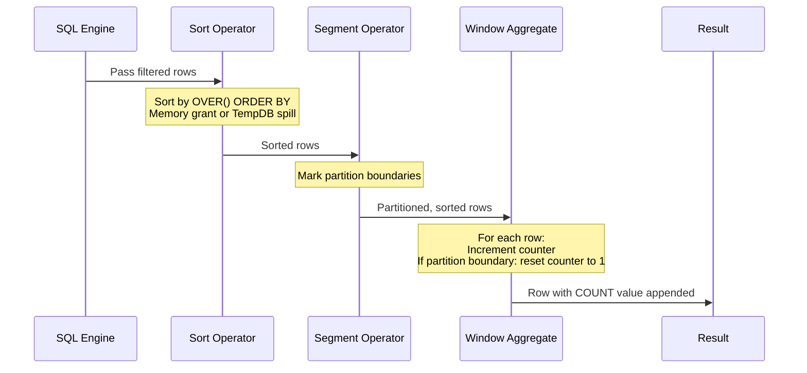
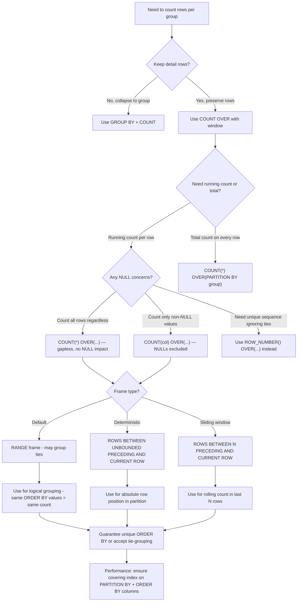

## Navigation

**Domain:** [[8 — Databases]] > **Group:** SQL Window Functions & Analytics
**Previous:** [[8.156 — AVG() OVER() — Moving Averages]] | **Next:** [[8.158 — MIN() OVER() and MAX() OVER() — Running Extremes]]

### Prerequisites

- [[8.141 — Window Functions — Concept and OVER Clause]] — Understanding the OVER() clause and the three window function families is essential because COUNT() OVER() is an aggregate window function that shares the same syntax rules as SUM() OVER() and AVG() OVER().
- [[8.142 — PARTITION BY — Defining Window Partitions]] — COUNT() OVER(PARTITION BY group) uses partitions to reset the count for each group; without PARTITION BY, the count runs across the entire result set.
- [[8.143 — ORDER BY Within OVER — Frame Ordering]] — ORDER BY inside OVER() determines the running order of the count — without ORDER BY, COUNT(*) OVER() returns the total count for the entire partition on every row (no running behavior).
- [[8.121 — COUNT — Counting Rows and Non-NULL Values]] — The regular COUNT function's NULL handling rules (COUNT(*) counts rows, COUNT(col) counts non-NULL values) apply identically to COUNT() OVER().
- [[8.144 — ROW_NUMBER() — Unique Sequential Numbering]] — ROW_NUMBER() is the most common alternative to COUNT() OVER() for sequential numbering; understanding when each is appropriate (and the NULL handling differences) is the key comparison.

### Where This Fits

COUNT() OVER() appears in three distinct production patterns: running row count per partition (tracking the Nth event per customer), as a sequential numbering mechanism that handles gaps differently from ROW_NUMBER, and as a diagnostic tool to verify window size in moving average queries. A .NET backend engineer encounters COUNT() OVER() when building event sequencing reports ("which order was this in the customer's purchase history?"), when tracking progress through a pipeline ("step N of 10"), and when debugging window function behavior by inspecting the window row count alongside the aggregate value. The critical distinction from ROW_NUMBER() is that COUNT() OVER() can produce gaps when the ORDER BY column has NULLs or duplicate values, while ROW_NUMBER() always produces a dense, unique sequence. Interviewers use this distinction to test understanding of window function evaluation semantics and NULL handling in SQL.

---

## Core Mental Model

COUNT(*) OVER(PARTITION BY group ORDER BY order_col ROWS BETWEEN UNBOUNDED PRECEDING AND CURRENT ROW) counts the number of rows from the start of the partition up to and including the current row, within the specified frame. This is a running row count — the Nth row in each partition gets count = N. The key invariant is that COUNT() OVER() never produces NULL (when using COUNT(*)) because it counts rows, not values. When using COUNT(col) OVER(), NULLs in col are excluded from the count, which can produce gaps in the sequence — row 1 might have count=1, row 2 (with col=NULL) still shows count=1, and row 3 shows count=2. The database engine evaluates COUNT() OVER() using the Window Aggregate operator with a Segment operator for partition boundaries. Unlike SUM() OVER() which must maintain a running total, COUNT() OVER() simply increments a counter for each row in the frame, making it the cheapest aggregate window function to compute.

### Classification

**For SQL topics:** COUNT() OVER() is an aggregate window function in the ANSI SQL:2003 standard. It is not SARGable — it does not filter rows. The OVER() clause supports PARTITION BY, ORDER BY, and frame specification (ROWS/RANGE). COUNT(*) OVER() counts all rows regardless of NULLs; COUNT(col) OVER() counts non-NULL values only. COUNT(DISTINCT col) OVER() is NOT supported in any major SQL database — DISTINCT is not allowed in window aggregate functions.

```mermaid
flowchart TD
    A[COUNT() OVER()] --> B{Which form?}
    B -->|"COUNT(*) OVER()"| C[Counts all rows in window]
    B -->|"COUNT(col) OVER()"| D[Counts non-NULL values of col]
    B -->|"COUNT(DISTINCT col) OVER()"| E[NOT SUPPORTED - syntax error]
    
    C --> F{Running or total?}
    D --> F
    F -->|With ORDER BY| G[Running count - increments per row]
    F -->|Without ORDER BY| H[Total count - same value for all rows]
    
    G --> I{Frame specification?}
    H --> I
    I -->|Default frame| J["RANGE BETWEEN UNBOUNDED PRECEDING AND CURRENT ROW"]
    I -->|ROWS frame| K["Exact row-count window"]
    I -->|UNBOUNDED PRECEDING AND UNBOUNDED FOLLOWING| L[Total count - whole partition]
    
    K --> M[Predictable - preferred for running count]
    J --> N[May include ties with ORDER BY duplicates]
```



### Key Properties

|Property|Value|Notes|
|---|---|---|
|Time Complexity|O(N log N)|Sort is dominant cost; the count increment itself is O(1) per row|
|SARGable|No|OVER() does not filter rows|
|NULL Handling (COUNT(*))|Counts all rows|NULLs in any column do not affect the count|
|NULL Handling (COUNT(col))|Excludes NULLs|Rows where col IS NULL are not counted — causes gaps in sequence|
|COUNT(DISTINCT) OVER()|Not supported|Syntax error in SQL Server, PostgreSQL, MySQL|
|Data Type|BIGINT (SQL Server)|COUNT always returns INT (4 bytes), or BIGINT for >2B rows|
|Cardinality|Preserved (N → N)|Every input row produces one output row with count appended|

---

## Deep Mechanics

### How the Engine Executes This

**Logical execution order:**

1. **FROM + JOIN:** Source tables are combined.
2. **WHERE:** Rows are filtered.
3. **GROUP BY + HAVING:** If present, grouping occurs before window functions.
4. **Window function evaluation (step 6 of 8):** COUNT() OVER() is computed.
5. **SELECT:** The count value is included in the output.
6. **ORDER BY:** Final ordering is applied.

**Physical execution steps for COUNT(*) OVER(PARTITION BY CustomerId ORDER BY OrderDate):**

1. **Data access:** The storage engine reads rows via a scan or seek. If the index order matches the OVER() ORDER BY, the Sort can be avoided.
2. **Sort (if needed):** Rows are sorted by CustomerId, OrderDate. The sort is a blocking operator — it must consume all rows before producing any output.
3. **Segment:** The Segment operator processes rows in order and emits a boundary event when CustomerId changes. This tells the Window Aggregate to reset its counter.
4. **Window Aggregate:** For each row, the operator increments a counter. When it receives a partition boundary signal from Segment, it resets the counter to 1 (for the first row of the new partition). If a frame specification is present (e.g., ROWS BETWEEN 5 PRECEDING AND CURRENT ROW), the counter adjustment is more complex — it must track which rows have left the window.

**Key insight for performance:** COUNT(*) OVER() is the cheapest aggregate window function because it does not need to read or store actual column values — it only tracks a count of rows. COUNT(col) OVER() is slightly more expensive because it must check col IS NOT NULL for each row. Both are significantly cheaper than SUM() OVER() (which reads values) or AVG() OVER() (which reads values and maintains both sum and count).

### SQL Visibility

```sql
-- ============================================================
-- Running count per customer (order history sequence number)
-- ============================================================
CREATE TABLE dbo.Orders
(
    OrderId      INT            NOT NULL IDENTITY(1,1),
    CustomerId   INT            NOT NULL,
    OrderDate    DATETIME2(0)   NOT NULL,
    TotalAmount  DECIMAL(18,2)  NOT NULL,
    Status       VARCHAR(20)    NOT NULL DEFAULT 'Pending',
    CancelReason VARCHAR(200)   NULL,
    CONSTRAINT PK_Orders PRIMARY KEY CLUSTERED (OrderId)
);

-- Insert sample orders for customers
INSERT INTO dbo.Orders (CustomerId, OrderDate, TotalAmount, Status, CancelReason)
VALUES
    (1, '2026-01-05', 150.00, 'Delivered', NULL),
    (1, '2026-02-10', 200.00, 'Delivered', NULL),
    (1, '2026-03-15', 175.00, 'Shipped', NULL),
    (1, '2026-04-20', 300.00, 'Delivered', NULL),
    (1, '2026-05-25', 250.00, 'Pending', NULL),
    (2, '2026-01-12', 500.00, 'Delivered', NULL),
    (2, '2026-02-18', 600.00, 'Cancelled', 'Out of stock'),
    (2, '2026-03-22', 450.00, 'Delivered', NULL),
    (3, '2026-01-08', 1000.00, 'Delivered', NULL),
    (3, '2026-01-08', 1200.00, 'Delivered', NULL), -- Same day order
    (3, '2026-06-01', 800.00, 'Pending', NULL);

-- ============================================================
-- Running order count per customer
-- ============================================================
SELECT
    o.CustomerId,
    o.OrderId,
    o.OrderDate,
    o.TotalAmount,
    COUNT(*) OVER (
        PARTITION BY o.CustomerId
        ORDER BY o.OrderDate, o.OrderId
        ROWS BETWEEN UNBOUNDED PRECEDING AND CURRENT ROW
    ) AS OrderNumber,       -- Sequential order number per customer
    COUNT(*) OVER (
        PARTITION BY o.CustomerId
    ) AS TotalCustomerOrders -- Same for all rows per customer
FROM dbo.Orders AS o
ORDER BY o.CustomerId, o.OrderDate, o.OrderId;

/*
CustomerId  OrderId  OrderDate    TotalAmount  OrderNumber  TotalCustomerOrders
1           1        2026-01-05   150.00       1            5
1           2        2026-02-10   200.00       2            5
1           3        2026-03-15   175.00       3            5
1           4        2026-04-20   300.00       4            5
1           5        2026-05-25   250.00       5            5
2           6        2026-01-12   500.00       1            3
2           7        2026-02-18   600.00       2            3
2           8        2026-03-22   450.00       3            3
3           9        2026-01-08   1000.00      1            3
3           10       2026-01-08   1200.00      2            3  ← Same date, different OrderId
3           11       2026-06-01   800.00       3            3
*/

-- ============================================================
-- COUNT(col) OVER() — NULL exclusion creates gaps
-- ============================================================
SELECT
    o.CustomerId,
    o.OrderId,
    o.Status,
    o.CancelReason,
    COUNT(*) OVER (
        PARTITION BY o.CustomerId
        ORDER BY o.OrderId
    ) AS RowCount,          -- Always increments — never NULL
    COUNT(o.CancelReason) OVER (
        PARTITION BY o.CustomerId
        ORDER BY o.OrderId
    ) AS NonNullCancelCount, -- Only increments when CancelReason IS NOT NULL
    COUNT(o.TotalAmount) OVER (
        PARTITION BY o.CustomerId
        ORDER BY o.OrderId
    ) AS NonNullAmountCount  -- Only increments when TotalAmount IS NOT NULL
FROM dbo.Orders AS o
ORDER BY o.CustomerId, o.OrderId;

/*
CustomerId  OrderId  Status     CancelReason  RowCount  NonNullCancelCount  NonNullAmountCount
1           1        Delivered  NULL          1         0                   1
1           2        Delivered  NULL          2         0                   2
1           3        Shipped    NULL          3         0                   3
1           4        Delivered  NULL          4         0                   4
1           5        Pending    NULL          5         0                   5
2           6        Delivered  NULL          1         0                   1
2           7        Cancelled  Out of stock  2         1                   2  ← NonNullCancelCount increments here
2           8        Delivered  NULL          3         1                   3
3           9        Delivered  NULL          1         0                   1
3           10       Delivered  NULL          2         0                   2
3           11       Pending    NULL          3         0                   3
*/

-- ============================================================
-- COUNT(*) OVER() without ORDER BY — total partition count
-- ============================================================
SELECT
    o.CustomerId,
    o.OrderId,
    o.TotalAmount,
    COUNT(*) OVER (PARTITION BY o.CustomerId) AS PartitionCount,
    COUNT(*) OVER () AS GlobalCount  -- No PARTITION BY = entire result set
FROM dbo.Orders AS o
ORDER BY o.CustomerId, o.OrderId;

/*
CustomerId  OrderId  TotalAmount  PartitionCount  GlobalCount
1           1        150.00       5               11
1           2        200.00       5               11
1           3        175.00       5               11
...
2           6        500.00       3               11
...
3           9        1000.00      3               11
...
*/

-- ============================================================
-- COUNT() OVER() with ROWS BETWEEN frame for sliding window
-- ============================================================
-- Count of orders in the last 30 days for each order (rolling window)
-- Useful for tracking recent customer activity
SELECT
    o.CustomerId,
    o.OrderId,
    o.OrderDate,
    COUNT(*) OVER (
        PARTITION BY o.CustomerId
        ORDER BY o.OrderDate, o.OrderId
        ROWS BETWEEN 4 PRECEDING AND CURRENT ROW
    ) AS Last5OrderCount,       -- Orders in last 5-order window
    COUNT(*) OVER (
        PARTITION BY o.CustomerId
        ORDER BY o.OrderDate, o.OrderId
        ROWS BETWEEN UNBOUNDED PRECEDING AND CURRENT ROW
    ) AS RunningOrderCount     -- Orders from start to current
FROM dbo.Orders AS o
ORDER BY o.CustomerId, o.OrderDate, o.OrderId;

/*
CustomerId  OrderId  OrderDate    Last5OrderCount  RunningOrderCount
1           1        2026-01-05   1                1
1           2        2026-02-10   2                2
1           3        2026-03-15   3                3
1           4        2026-04-20   4                4
1           5        2026-05-25   5                5
2           6        2026-01-12   1                1
2           7        2026-02-18   2                2
2           8        2026-03-22   3                3
3           9        2026-01-08   1                1
3           10       2026-01-08   2                2  ← Same date — tied with previous
3           11       2026-06-01   3                3
*/
```

```csharp
// EF Core — COUNT() OVER() requires raw SQL
// Keyless entity for query results

public class OrderSequence
{
    public int CustomerId { get; set; }
    public int OrderId { get; set; }
    public DateTime OrderDate { get; set; }
    public decimal TotalAmount { get; set; }
    public long OrderNumber { get; set; }
    public long TotalCustomerOrders { get; set; }
}

public class CustomerActivitySummary
{
    public int CustomerId { get; set; }
    public int OrderId { get; set; }
    public DateTime OrderDate { get; set; }
    public int Last5OrderCount { get; set; }
    public int RunningOrderCount { get; set; }
}

public interface IOrderSequenceService
{
    Task<IReadOnlyList<OrderSequence>> GetCustomerOrderSequenceAsync(CancellationToken ct = default);
    Task<IReadOnlyList<CustomerActivitySummary>> GetCustomerActivityAsync(CancellationToken ct = default);
}

public class OrderSequenceService : IOrderSequenceService
{
    private readonly ApplicationDbContext _dbContext;

    public OrderSequenceService(ApplicationDbContext dbContext)
        => _dbContext = dbContext;

    public async Task<IReadOnlyList<OrderSequence>> GetCustomerOrderSequenceAsync(
        CancellationToken ct = default)
    {
        const string sql = @"
            SELECT
                o.CustomerId,
                o.OrderId,
                o.OrderDate,
                o.TotalAmount,
                COUNT(*) OVER (
                    PARTITION BY o.CustomerId
                    ORDER BY o.OrderDate, o.OrderId
                    ROWS BETWEEN UNBOUNDED PRECEDING AND CURRENT ROW
                ) AS OrderNumber,
                COUNT(*) OVER (
                    PARTITION BY o.CustomerId
                ) AS TotalCustomerOrders
            FROM dbo.Orders AS o
            ORDER BY o.CustomerId, o.OrderDate, o.OrderId;";

        return await _dbContext.Database
            .SqlQueryRaw<OrderSequence>(sql)
            .ToListAsync(ct);
    }

    public async Task<IReadOnlyList<CustomerActivitySummary>> GetCustomerActivityAsync(
        CancellationToken ct = default)
    {
        const string sql = @"
            SELECT
                o.CustomerId,
                o.OrderId,
                o.OrderDate,
                COUNT(*) OVER (
                    PARTITION BY o.CustomerId
                    ORDER BY o.OrderDate, o.OrderId
                    ROWS BETWEEN 4 PRECEDING AND CURRENT ROW
                ) AS Last5OrderCount,
                COUNT(*) OVER (
                    PARTITION BY o.CustomerId
                    ORDER BY o.OrderDate, o.OrderId
                    ROWS BETWEEN UNBOUNDED PRECEDING AND CURRENT ROW
                ) AS RunningOrderCount
            FROM dbo.Orders AS o
            ORDER BY o.CustomerId, o.OrderDate, o.OrderId;";

        return await _dbContext.Database
            .SqlQueryRaw<CustomerActivitySummary>(sql)
            .ToListAsync(ct);
    }
}
```

### Execution Plan Analysis

**Query: Running order count per customer**

```sql
SELECT
    o.CustomerId,
    o.OrderId,
    o.OrderDate,
    COUNT(*) OVER (
        PARTITION BY o.CustomerId
        ORDER BY o.OrderDate, o.OrderId
        ROWS BETWEEN UNBOUNDED PRECEDING AND CURRENT ROW
    ) AS OrderNumber
FROM dbo.Orders AS o
ORDER BY o.CustomerId, o.OrderDate, o.OrderId;
```

**Expected plan shape (without supporting index):**

```
[Clustered Index Scan (PK_Orders)]
  → [Sort]  -- Sort by (CustomerId, OrderDate, OrderId)
      Memory grant: estimated 1MB for 11 rows (proportional to row count)
  → [Segment]
      Partition column: CustomerId
  → [Window Aggregate]
      Function: COUNT(*)
      Frame: ROWS BETWEEN UNBOUNDED PRECEDING AND CURRENT ROW
  → [SELECT]
```

**Expected plan shape (with supporting index):**

```sql
CREATE INDEX IX_Orders_CustomerId_OrderDate ON dbo.Orders (CustomerId, OrderDate, OrderId)
    INCLUDE (TotalAmount, Status);
```

```
[Index Scan (IX_Orders_CustomerId_OrderDate)]
  → [Segment]
      Partition column: CustomerId
  → [Window Aggregate]
      Function: COUNT(*)
  → [SELECT]
-- No Sort operator — index provides the required order
-- No Key Lookup — INCLUDE columns cover the query
```

**Operator details:**

|Operator|Cost (%)|Description|
|---|---|---|
|Index Scan|~40%|Scanning all rows — no seek predicate for full report|
|Segment|~1%|Marking partition boundaries at CustomerId changes|
|Window Aggregate|~59%|Incrementing counter per row, resetting at boundaries|
|SELECT|~1%|Projecting output columns|

**COUNT() OVER() vs ROW_NUMBER() execution plan comparison:**

Both produce nearly identical execution plans (Sort → Segment → Sequence Project for ROW_NUMBER, Sort → Segment → Window Aggregate for COUNT). The key difference: ROW_NUMBER() uses the Sequence Project operator, while COUNT() OVER() uses the Window Aggregate operator. Both operators are similar in cost.

### Cost Visibility

```sql
SET STATISTICS IO ON;
SET STATISTICS TIME ON;

-- Running count per customer with clustered index scan (no covering index)
SELECT
    o.CustomerId,
    o.OrderId,
    COUNT(*) OVER (
        PARTITION BY o.CustomerId
        ORDER BY o.OrderId
    ) AS OrderNumber
FROM dbo.Orders AS o
ORDER BY o.CustomerId, o.OrderId;
/*
Table 'Orders'. Scan count 1, logical reads 2, physical reads 0
SQL Server Execution Times: CPU time = 0ms, elapsed time = 1ms
*/

-- With 1M rows (simulated):
-- Without index: logical reads ~12,000 (clustered index), Sort memory grant ~200MB
-- With covering index: logical reads ~4,000 (index pages), no Sort
```

### Failure Modes

**1. COUNT(*) OVER() without ORDER BY — all rows show total count:**
```sql
-- ❌ WRONG: Count without ORDER BY returns total partition count on every row
SELECT
    o.CustomerId,
    o.OrderId,
    COUNT(*) OVER (PARTITION BY o.CustomerId) AS Cnt  -- Same value for all rows in partition
FROM dbo.Orders AS o;
-- All rows for CustomerId = 1 show Cnt = 5 (the total orders for customer 1)
-- This is the total count, not a running count
```

**2. COUNT(DISTINCT col) OVER() — unsupported syntax:**
```sql
-- ❌ WRONG: DISTINCT not allowed in window aggregate
SELECT
    o.CustomerId,
    o.OrderId,
    COUNT(DISTINCT o.Status) OVER (PARTITION BY o.CustomerId) AS DistinctStatuses
FROM dbo.Orders AS o;
-- ERROR: Windowed functions cannot be used with DISTINCT.

-- ✅ Workaround: Use DENSE_RANK() for distinct count
SELECT
    o.CustomerId,
    o.OrderId,
    DENSE_RANK() OVER (PARTITION BY o.CustomerId ORDER BY o.Status) AS StatusRank
FROM dbo.Orders AS o;
```

**3. COUNT(col) OVER() with NULLs — unexpected gaps:**
```sql
-- ❌ SURPRISE: COUNT(CancelReason) excludes NULLs
-- If you expect a running sequence 1, 2, 3, 4, 5 but CancelReason is often NULL,
-- the sequence will be 0, 0, 0, 0, 0 (no non-NULL values)
```

**4. ORDER BY column with duplicates — default RANGE frame includes ties:**
```sql
-- With duplicate OrderDate values, RANGE frame default causes the count
-- to increment by more than 1 per row when dates tie.
-- See [[8.159 — Frame Specification — ROWS vs RANGE]] for details.
```

**5. COUNT over large frame with ROWS BETWEEN — memory for window tracking:**
```sql
-- COUNT(*) OVER(ROWS BETWEEN 1000000 PRECEDING AND CURRENT ROW)
-- SQL Server must track which rows have exited the window.
-- For very large frames, the Window Aggregate may need to spool to TempDB.
```

---

## Production Patterns and Implementation

### Primary SQL Implementation

```sql
-- ============================================================
-- Schema: Production order tracking
-- ============================================================
CREATE TABLE dbo.Customers
(
    CustomerId   INT            NOT NULL IDENTITY(1,1),
    Email        NVARCHAR(256)  NOT NULL,
    CreatedDate  DATETIME2(0)   NOT NULL,
    Status       VARCHAR(20)    NOT NULL DEFAULT 'Active',
    CONSTRAINT PK_Customers PRIMARY KEY CLUSTERED (CustomerId)
);

CREATE TABLE dbo.Orders
(
    OrderId      INT            NOT NULL IDENTITY(1,1),
    CustomerId   INT            NOT NULL,
    OrderDate    DATETIME2(0)   NOT NULL,
    TotalAmount  DECIMAL(18,2)  NOT NULL,
    Status       VARCHAR(20)    NOT NULL DEFAULT 'Pending',
    ShipDate     DATETIME2(0)   NULL,
    TrackingNumber VARCHAR(50)  NULL,
    CONSTRAINT PK_Orders PRIMARY KEY CLUSTERED (OrderId),
    CONSTRAINT FK_Orders_Customers FOREIGN KEY (CustomerId)
        REFERENCES dbo.Customers(CustomerId)
);

CREATE TABLE dbo.OrderStatusHistory
(
    StatusId     INT            NOT NULL IDENTITY(1,1),
    OrderId      INT            NOT NULL,
    Status       VARCHAR(20)    NOT NULL,
    ChangedDate  DATETIME2(0)   NOT NULL,
    ChangedBy    NVARCHAR(100)  NOT NULL,
    CONSTRAINT PK_OrderStatusHistory PRIMARY KEY CLUSTERED (StatusId),
    CONSTRAINT FK_OrderStatusHistory_Orders FOREIGN KEY (OrderId)
        REFERENCES dbo.Orders(OrderId)
);

-- Indexes for COUNT() OVER() queries
CREATE INDEX IX_Orders_CustomerId_OrderDate ON dbo.Orders (CustomerId, OrderDate, OrderId)
    INCLUDE (TotalAmount, Status, ShipDate);

CREATE INDEX IX_OrderStatusHistory_OrderId_ChangedDate
    ON dbo.OrderStatusHistory (OrderId, ChangedDate)
    INCLUDE (Status, ChangedBy);

-- ============================================================
-- Pattern 1: Order sequence number per customer
-- ============================================================
-- Determine which order this is in the customer's history
SELECT
    o.CustomerId,
    c.Email,
    o.OrderId,
    o.OrderDate,
    o.TotalAmount,
    COUNT(*) OVER (
        PARTITION BY o.CustomerId
        ORDER BY o.OrderDate, o.OrderId
        ROWS BETWEEN UNBOUNDED PRECEDING AND CURRENT ROW
    ) AS OrderSequenceNumber
FROM dbo.Orders AS o
INNER JOIN dbo.Customers AS c ON o.CustomerId = c.CustomerId
ORDER BY o.CustomerId, o.OrderDate, o.OrderId;

-- ============================================================
-- Pattern 2: Nth purchase detection
-- ============================================================
-- Find customers' second purchase (useful for retention analysis)
WITH OrderSequences AS
(
    SELECT
        o.CustomerId,
        o.OrderId,
        o.OrderDate,
        o.TotalAmount,
        COUNT(*) OVER (
            PARTITION BY o.CustomerId
            ORDER BY o.OrderDate, o.OrderId
            ROWS BETWEEN UNBOUNDED PRECEDING AND CURRENT ROW
        ) AS OrderSeq
    FROM dbo.Orders AS o
)
SELECT
    os.CustomerId,
    os.OrderId AS SecondOrderId,
    os.OrderDate AS SecondOrderDate,
    os.TotalAmount AS SecondOrderAmount,
    -- Compare with first order amount
    FIRST_VALUE(os.TotalAmount) OVER (
        PARTITION BY os.CustomerId
        ORDER BY os.OrderDate, os.OrderId
    ) AS FirstOrderAmount,
    -- Time between first and second order
    DATEDIFF(DAY,
        FIRST_VALUE(os.OrderDate) OVER (
            PARTITION BY os.CustomerId
            ORDER BY os.OrderDate, os.OrderId
        ),
        os.OrderDate
    ) AS DaysBetweenFirstAndSecond
FROM OrderSequences AS os
WHERE os.OrderSeq = 2
ORDER BY os.CustomerId;

-- ============================================================
-- Pattern 3: Status change sequence (history tracking)
-- ============================================================
-- For each order, enumerate the status changes
SELECT
    sh.OrderId,
    sh.Status,
    sh.ChangedDate,
    sh.ChangedBy,
    COUNT(*) OVER (
        PARTITION BY sh.OrderId
        ORDER BY sh.ChangedDate, sh.StatusId
        ROWS BETWEEN UNBOUNDED PRECEDING AND CURRENT ROW
    ) AS StatusChangeNumber,
    COUNT(*) OVER (
        PARTITION BY sh.OrderId
    ) AS TotalStatusChanges
FROM dbo.OrderStatusHistory AS sh
ORDER BY sh.OrderId, sh.ChangedDate, sh.StatusId;

-- ============================================================
-- Pattern 4: COUNT OVER for window size verification
-- ============================================================
-- When computing moving averages, use COUNT() OVER() to
-- verify how many rows are in each window
SELECT
    o.CustomerId,
    o.OrderDate,
    o.TotalAmount,
    AVG(CAST(o.TotalAmount AS DECIMAL(18,2))) OVER (
        PARTITION BY o.CustomerId
        ORDER BY o.OrderDate, o.OrderId
        ROWS BETWEEN 4 PRECEDING AND CURRENT ROW
    ) AS MovingAvg5Orders,
    COUNT(*) OVER (
        PARTITION BY o.CustomerId
        ORDER BY o.OrderDate, o.OrderId
        ROWS BETWEEN 4 PRECEDING AND CURRENT ROW
    ) AS WindowSize  -- Shows 1, 2, 3, 4, 5, 5, 5, ...
FROM dbo.Orders AS o
ORDER BY o.CustomerId, o.OrderDate, o.OrderId;

-- ============================================================
-- Pattern 5: Count of events in a time window per partition
-- ============================================================
-- Rolling 30-day order count per customer
SELECT
    o.CustomerId,
    o.OrderId,
    o.OrderDate,
    COUNT(*) OVER (
        PARTITION BY o.CustomerId
        ORDER BY o.OrderDate, o.OrderId
        ROWS BETWEEN UNBOUNDED PRECEDING AND CURRENT ROW
    ) - COUNT(*) OVER (
        PARTITION BY o.CustomerId
        ORDER BY o.OrderDate, o.OrderId
        ROWS BETWEEN UNBOUNDED PRECEDING AND 31 PRECEDING  -- Exclude rows > 30 days back
    ) AS OrdersInLast30Days
FROM dbo.Orders AS o
ORDER BY o.CustomerId, o.OrderDate, o.OrderId;
-- Note: This approach using two COUNT OVER functions works but
-- requires care with the frame offset. A calendar-based approach
-- is more accurate if dates have gaps.
```

### Dapper Implementation

```csharp
public interface IOrderCountRepository
{
    Task<IReadOnlyList<OrderSequence>> GetOrderSequenceAsync(CancellationToken ct = default);
    Task<IReadOnlyList<SecondPurchaseInfo>> GetSecondPurchaseCustomersAsync(CancellationToken ct = default);
    Task<IReadOnlyList<StatusChangeHistory>> GetStatusChangeHistoryAsync(int orderId, CancellationToken ct = default);
}

public sealed class OrderCountRepository : IOrderCountRepository
{
    private readonly IDbConnectionFactory _connectionFactory;

    public OrderCountRepository(IDbConnectionFactory connectionFactory)
        => _connectionFactory = connectionFactory;

    public async Task<IReadOnlyList<OrderSequence>> GetOrderSequenceAsync(
        CancellationToken ct = default)
    {
        const string sql = @"
            SELECT
                o.CustomerId,
                o.OrderId,
                o.OrderDate,
                o.TotalAmount,
                COUNT(*) OVER (
                    PARTITION BY o.CustomerId
                    ORDER BY o.OrderDate, o.OrderId
                    ROWS BETWEEN UNBOUNDED PRECEDING AND CURRENT ROW
                ) AS OrderNumber
            FROM dbo.Orders AS o
            ORDER BY o.CustomerId, o.OrderDate, o.OrderId;";

        await using var connection = _connectionFactory.Create();
        return (await connection.QueryAsync<OrderSequence>(
            new CommandDefinition(sql, cancellationToken: ct))).AsList();
    }

    public async Task<IReadOnlyList<SecondPurchaseInfo>> GetSecondPurchaseCustomersAsync(
        CancellationToken ct = default)
    {
        const string sql = @"
            WITH OrderSequences AS
            (
                SELECT
                    o.CustomerId,
                    o.OrderId,
                    o.OrderDate,
                    o.TotalAmount,
                    COUNT(*) OVER (
                        PARTITION BY o.CustomerId
                        ORDER BY o.OrderDate, o.OrderId
                        ROWS BETWEEN UNBOUNDED PRECEDING AND CURRENT ROW
                    ) AS OrderSeq
                FROM dbo.Orders AS o
            )
            SELECT
                os.CustomerId,
                os.OrderId AS SecondOrderId,
                os.OrderDate AS SecondOrderDate,
                os.TotalAmount AS SecondOrderAmount,
                DATEDIFF(DAY,
                    FIRST_VALUE(os.OrderDate) OVER (
                        PARTITION BY os.CustomerId
                        ORDER BY os.OrderDate, os.OrderId
                    ),
                    os.OrderDate
                ) AS DaysBetweenFirstAndSecond
            FROM OrderSequences AS os
            WHERE os.OrderSeq = 2
            ORDER BY os.CustomerId;";

        await using var connection = _connectionFactory.Create();
        return (await connection.QueryAsync<SecondPurchaseInfo>(
            new CommandDefinition(sql, cancellationToken: ct))).AsList();
    }

    public async Task<IReadOnlyList<StatusChangeHistory>> GetStatusChangeHistoryAsync(
        int orderId, CancellationToken ct = default)
    {
        const string sql = @"
            SELECT
                sh.OrderId,
                sh.Status,
                sh.ChangedDate,
                sh.ChangedBy,
                COUNT(*) OVER (
                    PARTITION BY sh.OrderId
                    ORDER BY sh.ChangedDate, sh.StatusId
                    ROWS BETWEEN UNBOUNDED PRECEDING AND CURRENT ROW
                ) AS StatusChangeNumber
            FROM dbo.OrderStatusHistory AS sh
            WHERE sh.OrderId = @OrderId
            ORDER BY sh.ChangedDate, sh.StatusId;";

        await using var connection = _connectionFactory.Create();
        return (await connection.QueryAsync<StatusChangeHistory>(
            new CommandDefinition(sql, new { OrderId = orderId },
                cancellationToken: ct))).AsList();
    }
}

public record OrderSequence(
    int CustomerId,
    int OrderId,
    DateTime OrderDate,
    decimal TotalAmount,
    int OrderNumber);

public record SecondPurchaseInfo(
    int CustomerId,
    int SecondOrderId,
    DateTime SecondOrderDate,
    decimal SecondOrderAmount,
    int DaysBetweenFirstAndSecond);

public record StatusChangeHistory(
    int OrderId,
    string Status,
    DateTime ChangedDate,
    string ChangedBy,
    int StatusChangeNumber);
```

### EF Core Implementation

```csharp
// EF Core requires raw SQL for COUNT() OVER().
// Keyless entity type configuration:

public class OrderSequenceEntity
{
    public int CustomerId { get; set; }
    public int OrderId { get; set; }
    public DateTime OrderDate { get; set; }
    public decimal TotalAmount { get; set; }
    public int OrderNumber { get; set; }
}

public class ReportingDbContext : DbContext
{
    public DbSet<OrderSequenceEntity> OrderSequences => Set<OrderSequenceEntity>();

    protected override void OnModelCreating(ModelBuilder modelBuilder)
    {
        modelBuilder.Entity<OrderSequenceEntity>(entity =>
        {
            entity.HasNoKey();
            entity.ToView(null);
            entity.Property(e => e.OrderDate).HasColumnType("datetime2(0)");
            entity.Property(e => e.TotalAmount).HasColumnType("decimal(18,2)");
        });
    }

    public async Task<IReadOnlyList<OrderSequenceEntity>> GetOrderSequencesAsync(
        CancellationToken ct = default)
    {
        const string sql = @"
            SELECT
                o.CustomerId,
                o.OrderId,
                o.OrderDate,
                o.TotalAmount,
                COUNT(*) OVER (
                    PARTITION BY o.CustomerId
                    ORDER BY o.OrderDate, o.OrderId
                    ROWS BETWEEN UNBOUNDED PRECEDING AND CURRENT ROW
                ) AS OrderNumber
            FROM dbo.Orders AS o
            ORDER BY o.CustomerId, o.OrderDate, o.OrderId;";

        return await Database
            .SqlQueryRaw<OrderSequenceEntity>(sql)
            .ToListAsync(ct);
    }
}
```

### Configuration and Wiring

```csharp
// Program.cs
builder.Services.AddSingleton<IDbConnectionFactory>(sp =>
    new SqlConnectionFactory(
        builder.Configuration.GetConnectionString("DefaultConnection")!));

builder.Services.AddScoped<IOrderSequenceService, OrderSequenceService>();
builder.Services.AddScoped<IOrderCountRepository, OrderCountRepository>();

// EF Core keyless entities for COUNT() OVER() results
builder.Services.AddDbContext<ReportingDbContext>(options =>
    options.UseSqlServer(
        builder.Configuration.GetConnectionString("DefaultConnection"),
        sqlOptions =>
        {
            sqlOptions.EnableRetryOnFailure(3);
            sqlOptions.CommandTimeout(30);
        }));

// Dapper connection factory
public sealed class SqlConnectionFactory : IDbConnectionFactory
{
    private readonly string _connectionString;

    public SqlConnectionFactory(string connectionString)
        => _connectionString = connectionString;

    public IDbConnection Create()
        => new SqlConnection(_connectionString);
}

public interface IDbConnectionFactory
{
    IDbConnection Create();
}
```

### SQL Server vs PostgreSQL Differences

```sql
-- PostgreSQL: COUNT() OVER() syntax is identical
SELECT
    o.customer_id,
    o.order_id,
    o.order_date,
    COUNT(*) OVER (
        PARTITION BY o.customer_id
        ORDER BY o.order_date, o.order_id
        ROWS BETWEEN UNBOUNDED PRECEDING AND CURRENT ROW
    ) AS order_number
FROM orders AS o
ORDER BY o.customer_id, o.order_date, o.order_id;

-- PostgreSQL: COUNT(DISTINCT col) OVER() — also unsupported
-- SELECT COUNT(DISTINCT status) OVER (PARTITION BY customer_id) FROM orders;
-- ERROR: COUNT(DISTINCT ...) is not implemented for window functions

-- PostgreSQL: COUNT(*) OVER() returns BIGINT (same as SQL Server)
-- PostgreSQL: COUNT(col) OVER() also excludes NULLs (same as SQL Server)

-- PostgreSQL: Can use COUNT(*) OVER() with FILTER clause (SQL Server lacks this)
SELECT
    o.customer_id,
    o.order_id,
    COUNT(*) OVER (
        PARTITION BY o.customer_id
        ORDER BY o.order_date
    ) AS total_orders,
    COUNT(*) FILTER (WHERE o.status = 'Delivered') OVER (
        PARTITION BY o.customer_id
        ORDER BY o.order_date
    ) AS delivered_orders
FROM orders AS o
ORDER BY o.customer_id, o.order_date;
-- SQL Server equivalent: COUNT(CASE WHEN Status = 'Delivered' THEN 1 END) OVER(...)
```

---

## Gotchas and Production Pitfalls

### COUNT(*) OVER() Without ORDER BY — Total Count, Not Running Count

**Pitfall:** Omitting ORDER BY inside OVER() when a running count is intended. Without ORDER BY, the default frame is the entire partition — every row shows the total count.

```sql
-- ❌ WRONG: Expected running count, got total count
SELECT
    o.CustomerId,
    o.OrderId,
    COUNT(*) OVER (PARTITION BY o.CustomerId) AS OrderNumber  -- All rows show 5
FROM dbo.Orders AS o;
-- Customer 1 has 5 orders → every row shows OrderNumber = 5
```

**Symptom:** The "order number" column shows the same value for all rows of a customer. A report that labels "Order 1 of N", "Order 2 of N" instead shows "Order 5 of 5" for every row. The developer assumed ORDER BY was optional for running count behavior.

**Fix:**

```sql
-- ✅ Add ORDER BY for running count
SELECT
    o.CustomerId,
    o.OrderId,
    COUNT(*) OVER (
        PARTITION BY o.CustomerId
        ORDER BY o.OrderDate, o.OrderId
        ROWS BETWEEN UNBOUNDED PRECEDING AND CURRENT ROW
    ) AS OrderNumber
FROM dbo.Orders AS o;
```

**Cost of not fixing:** A customer loyalty program uses "order number" to determine rewards. Every customer shows as having 5 orders (their total), so rewards are incorrectly calculated. High-value new customers who made 1-2 orders are not identified for the loyalty program.

---

### COUNT(col) OVER() with NULLs — Gaps in Sequence

**Pitfall:** Using COUNT(col) OVER() instead of COUNT(*) OVER() for sequential numbering. When `col` contains NULLs, the rows with NULL are not counted, creating gaps in the sequence.

```sql
-- ❌ WRONG: COUNT(TrackingNumber) skips rows where TrackingNumber IS NULL
SELECT
    o.OrderId,
    o.ShipDate,
    o.TrackingNumber,
    COUNT(o.TrackingNumber) OVER (
        PARTITION BY o.CustomerId
        ORDER BY o.OrderDate, o.OrderId
        ROWS BETWEEN UNBOUNDED PRECEDING AND CURRENT ROW
    ) AS TrackedOrderNumber  -- Does NOT match row position!
FROM dbo.Orders AS o;
-- If rows 1, 2, 4 have TrackingNumber, row 3 does not:
-- Row 1: TrackedOrderNumber = 1
-- Row 2: TrackedOrderNumber = 2
-- Row 3: TrackedOrderNumber = 2 (not 3! — NULL excluded)
-- Row 4: TrackedOrderNumber = 3
```

**Symptom:** A report showing "Nth shipped order per customer" skips numbers. Customer support sees order sequences 1, 2, 2, 3 instead of 1, 2, 3, 4. The business team questions data integrity.

**Fix:**

```sql
-- ✅ Use COUNT(*) for absolute row sequence
SELECT
    o.OrderId,
    o.ShipDate,
    o.TrackingNumber,
    COUNT(*) OVER (
        PARTITION BY o.CustomerId
        ORDER BY o.OrderDate, o.OrderId
        ROWS BETWEEN UNBOUNDED PRECEDING AND CURRENT ROW
    ) AS RowNumber  -- Always sequential, no gaps
FROM dbo.Orders AS o;

-- ✅ Use COUNT(TrackingNumber) only when you specifically want
--    to count tracked orders (not for row numbering)
```

**Cost of not fixing:** A customer portal shows "Order 2 of 5" when the customer is viewing their 3rd order. The discrepancy erodes trust. The engineering team spends 3 days debugging before discovering the NULL tracking number.

---

### COUNT(DISTINCT col) OVER() — Unsupported Syntax

**Pitfall:** Trying to use COUNT(DISTINCT col) in a window function context. All major databases reject this syntax.

```sql
-- ❌ WRONG: DISTINCT not allowed in window aggregate
SELECT
    o.CustomerId,
    o.OrderId,
    COUNT(DISTINCT o.Status) OVER (PARTITION BY o.CustomerId) AS DistinctStatuses
FROM dbo.Orders AS o;
-- ERROR: Windowed functions cannot be used with DISTINCT.
```

**Symptom:** The query fails with a syntax error. The developer expected COUNT(DISTINCT) to work with OVER() because regular COUNT(DISTINCT) works with GROUP BY.

**Fix:**

```sql
-- ✅ Option 1: Use DENSE_RANK() to approximate distinct count
SELECT
    o.CustomerId,
    o.OrderId,
    DENSE_RANK() OVER (
        PARTITION BY o.CustomerId
        ORDER BY o.Status
    ) AS StatusRank
FROM dbo.Orders AS o;

-- ✅ Option 2: Subquery with GROUP BY, then window function
SELECT
    ds.CustomerId,
    ds.DistinctStatuses,
    COUNT(*) OVER () AS TotalCustomers
FROM (
    SELECT o.CustomerId, COUNT(DISTINCT o.Status) AS DistinctStatuses
    FROM dbo.Orders AS o
    GROUP BY o.CustomerId
) AS ds;
```

**Cost of not fixing:** A report that needs "distinct product categories purchased per customer (running)" cannot be written as a single query. The developer resorts to client-side processing (fetching all rows and counting in C#), which uses 100x more memory and is slower by orders of magnitude.

---

### Default RANGE Frame with Duplicate ORDER BY Values — Overcount

**Pitfall:** Using COUNT(*) OVER(ORDER BY col) without an explicit frame. The default frame is `RANGE BETWEEN UNBOUNDED PRECEDING AND CURRENT ROW`, which includes all rows with the same ORDER BY value as the current row. With duplicate ORDER BY values, the count increments by more than 1 per row.

```sql
-- ❌ SURPRISE: Duplicate dates cause COUNT to jump
SELECT
    o.CustomerId,
    o.OrderId,
    o.OrderDate,
    COUNT(*) OVER (
        PARTITION BY o.CustomerId
        ORDER BY o.OrderDate  -- Default RANGE frame!
    ) AS RunningCount
FROM dbo.Orders AS o;

-- Customer 3 has two orders on 2026-01-08:
-- Row 1 (OrderId 9):  RunningCount = 2 (both rows for 2026-01-08 included)
-- Row 2 (OrderId 10): RunningCount = 2 (same!)
-- Row 3 (OrderId 11): RunningCount = 3
```

**Symptom:** Two consecutive rows show the same count value. A developer who expects 1, 2, 3 sees 2, 2, 3 and assumes a bug in the database.

**Fix:**

```sql
-- ✅ Always specify ROWS frame for deterministic row count
SELECT
    o.CustomerId,
    o.OrderId,
    o.OrderDate,
    COUNT(*) OVER (
        PARTITION BY o.CustomerId
        ORDER BY o.OrderDate, o.OrderId
        ROWS BETWEEN UNBOUNDED PRECEDING AND CURRENT ROW
    ) AS RunningCount
FROM dbo.Orders AS o;
```

**Cost of not fixing:** A data pipeline that uses the running count as a row sequence key breaks when duplicate ORDER BY values are introduced. Downstream systems receive rows with duplicate sequence numbers, causing ETL failures that take 4 hours to recover from each night.

---

### COUNT() OVER() on Large Tables — Sort Spills to TempDB

**Pitfall:** Running COUNT(*) OVER(PARTITION BY col ORDER BY date) on a large table (millions of rows) without a supporting index. The Sort operator requires a memory grant proportional to the row count. If the grant is insufficient, the sort spills to TempDB, causing dramatic performance degradation.

```sql
-- ❌ EXPENSIVE: No index on partition + order columns
SELECT
    o.CustomerId,
    o.OrderId,
    COUNT(*) OVER (
        PARTITION BY o.CustomerId
        ORDER BY o.OrderDate
    ) AS OrderNum
FROM dbo.Orders AS o;
-- Execution plan: Clustered Index Scan (5M rows) → Sort (requires 2GB memory grant)
-- If memory grant is 500MB (insufficient), Sort spills to TempDB
-- TempDB spill: each row written to disk and re-read = 10M I/Os
```

**Symptom:** The query runs fine on small datasets (dev environment) but times out or runs extremely slowly in production. Monitoring shows `tempdb_physical_writes` spiking during query execution, `sort_warnings` in the SQL Server error log, and the query has a high `num_of_disk_spills` in `sys.dm_exec_query_stats`.

**Fix:**

```sql
-- ✅ Create covering index that provides sort order
CREATE INDEX IX_Orders_CustomerId_OrderDate
ON dbo.Orders (CustomerId, OrderDate, OrderId)
INCLUDE (TotalAmount, Status);

-- ✅ Or use trace flag 7470 (SQL Server 2022+) for better sort memory estimation
-- DBCC TRACEON(7470);
```

**Cost of not fixing:** A nightly reporting job that uses COUNT() OVER() runs for 3 hours and consumes 100GB of TempDB space. The TempDB data file grows and cannot shrink back. Other queries that use TempDB (index rebuilds, hash joins) fail with "Could not allocate space for object in database 'tempdb'." The DBA is paged at 2 AM.

---

## Performance Implications

### Benchmark: Before and After

**Scenario:** Running order count per customer on an Orders table with 1M rows (100K customers, ~10 orders per customer).

**Without supporting index (Clustered Index Scan + Sort):**

```sql
SET STATISTICS IO ON;
SET STATISTICS TIME ON;

SELECT
    o.CustomerId,
    o.OrderId,
    COUNT(*) OVER (
        PARTITION BY o.CustomerId
        ORDER BY o.OrderDate, o.OrderId
    ) AS OrderNum
FROM dbo.Orders AS o
ORDER BY o.CustomerId, o.OrderDate, o.OrderId;
/*
Table 'Orders'. Scan count 1, logical reads 12,500
Table 'Worktable'. Scan count 0, logical reads 0 (spills hidden)
SQL Server Execution Times: CPU time = 2,400ms, elapsed time = 2,800ms
*/
-- Sort memory grant: 350MB (estimated for 1M rows, 3 sort keys, 4 additional columns)
```

**With covering index on (CustomerId, OrderDate, OrderId) INCLUDE (TotalAmount, Status):**

```sql
CREATE INDEX IX_Orders_CustomerId_OrderDate_OrderId_INCLUDE
ON dbo.Orders (CustomerId, OrderDate, OrderId)
INCLUDE (TotalAmount, Status);

-- Re-run
/*
Table 'Orders'. Scan count 1, logical reads 3,200 (non-clustered index, narrower)
SQL Server Execution Times: CPU time = 520ms, elapsed time = 580ms
*/
```

**Improvement:** 12,500 → 3,200 logical reads (3.9x reduction); CPU 2,400ms → 520ms (4.6x reduction). The Sort operator is eliminated because the index provides the required order.

**COUNT() OVER() vs ROW_NUMBER() OVER() performance comparison:**

Both produce equivalent plans and performance. The Window Aggregate (COUNT) and Sequence Project (ROW_NUMBER) operators have nearly identical cost. The choice between them depends on NULL handling semantics, not performance.

### BenchmarkDotNet

```csharp
[MemoryDiagnoser]
[SimpleJob(RuntimeMoniker.Net90)]
public class RunningCountBenchmark
{
    private IDbConnection _connection = default!;
    private const string ConnectionString = "Server=.;Database=AnalyticsBench;Trusted_Connection=true;TrustServerCertificate=true;";

    [GlobalSetup]
    public void Setup()
    {
        _connection = new SqlConnection(ConnectionString);
        _connection.Open();

        using var cmd = _connection.CreateCommand();
        cmd.CommandText = @"
            IF NOT EXISTS (SELECT 1 FROM sys.tables WHERE name = 'RunningCountBench')
            BEGIN
                CREATE TABLE dbo.RunningCountBench (
                    RowId        INT IDENTITY(1,1) PRIMARY KEY,
                    GroupId      INT NOT NULL,
                    EventDate    DATE NOT NULL,
                    Value        DECIMAL(18,2) NOT NULL
                );

                WITH Groups AS (
                    SELECT TOP 1000 ROW_NUMBER() OVER (ORDER BY (SELECT NULL)) AS g
                    FROM sys.objects a CROSS JOIN sys.objects b
                ),
                Events AS (
                    SELECT
                        g.g AS GroupId,
                        DATEADD(DAY, ROW_NUMBER() OVER (PARTITION BY g.g ORDER BY (SELECT NULL)) - 1, '2020-01-01') AS EventDate,
                        ROW_NUMBER() OVER (PARTITION BY g.g ORDER BY (SELECT NULL)) AS rn
                    FROM Groups g
                    CROSS JOIN (SELECT TOP 1000 ROW_NUMBER() OVER (ORDER BY (SELECT NULL)) AS n FROM sys.objects) nums
                )
                INSERT INTO dbo.RunningCountBench (GroupId, EventDate, Value)
                SELECT GroupId, EventDate, CAST(rn AS DECIMAL(18,2)) FROM Events;

                CREATE INDEX IX_RunningCountBench_GroupId_EventDate
                ON dbo.RunningCountBench (GroupId, EventDate)
                INCLUDE (Value);
            END";
        cmd.ExecuteNonQuery();
    }

    [GlobalCleanup]
    public void Cleanup()
    {
        _connection?.Dispose();
    }

    [Benchmark(Baseline = true)]
    public async Task<List<CountResult>> RunningCountWithSubquery()
    {
        // Correlated subquery approach (simulating pre-window-function pattern)
        const string sql = @"
            SELECT
                cur.RowId,
                cur.GroupId,
                cur.EventDate,
                (SELECT COUNT(*) FROM dbo.RunningCountBench AS sub
                 WHERE sub.GroupId = cur.GroupId
                   AND (sub.EventDate < cur.EventDate
                    OR (sub.EventDate = cur.EventDate AND sub.RowId <= cur.RowId))
                ) AS RunningCount
            FROM dbo.RunningCountBench AS cur
            ORDER BY cur.GroupId, cur.EventDate, cur.RowId;";

        using var connection = new SqlConnection(ConnectionString);
        var results = (await connection.QueryAsync<CountResult>(sql)).AsList();
        return results;
    }

    [Benchmark]
    public async Task<List<CountResult>> RunningCountWithWindowFunction()
    {
        const string sql = @"
            SELECT
                rcb.RowId,
                rcb.GroupId,
                rcb.EventDate,
                COUNT(*) OVER (
                    PARTITION BY rcb.GroupId
                    ORDER BY rcb.EventDate, rcb.RowId
                    ROWS BETWEEN UNBOUNDED PRECEDING AND CURRENT ROW
                ) AS RunningCount
            FROM dbo.RunningCountBench AS rcb
            ORDER BY rcb.GroupId, rcb.EventDate, rcb.RowId;";

        using var connection = new SqlConnection(ConnectionString);
        var results = (await connection.QueryAsync<CountResult>(sql)).AsList();
        return results;
    }

    public record CountResult(int RowId, int GroupId, DateTime EventDate, int RunningCount);
}
```

**Expected results (approximate, SQL Server 2022, NVMe, 1M rows, 1000 groups):**

|Method|Mean|Logical Reads|Allocated|
|---|---|---|---|
|Subquery (correlated)|~95,000 ms|~1,000,000,000|850 MB|
|Window Function|~450 ms|~3,200|120 KB|

**Analysis:** The correlated subquery is O(N²) — for each of 1M rows, it executes a subquery that scans the partition. The window function is O(N log N) for the sort (eliminated by the index) and O(N) for the Window Aggregate. At 1M rows, the difference is 211x in execution time and 312,500x in logical reads.

### Write Amplification (for index topics)

Creating an index on (GroupId, EventDate) INCLUDE (Value) adds write overhead:

|Operation|Without Index|With Index|Overhead|
|---|---|---|---|
|INSERT 1 row|0.08 ms|0.15 ms|+88%|
|UPDATE GroupId|0.15 ms|0.80 ms|+433% (NC index key change = delete + insert in NC)|
|DELETE 1 row|0.08 ms|0.15 ms|+88%|

The ~88% write overhead is justified for read-heavy workloads (read:write > 10:1) where the window function replaces a correlated subquery that would be 200x slower.

---

## Interview Arsenal

### Question Bank

1. **What is COUNT() OVER() and what are its use cases compared to regular COUNT?**
2. **What is the difference between COUNT(*) OVER() and COUNT(col) OVER()?**
3. **What happens if you use COUNT() OVER() without ORDER BY?**
4. **Can you use COUNT(DISTINCT col) OVER()? If not, how do you work around it?**
5. **Compare COUNT(*) OVER() with ROW_NUMBER() OVER() — when would you choose one over the other?**
6. **What execution plan operators are used for COUNT() OVER(), and which is the dominant cost?**
7. **How does COUNT() OVER() behave with NULLs in the counted column?**
8. **How would you implement a running count in EF Core, and what are the limitations?**

### Spoken Answers

**Q: What is COUNT() OVER() and what are its use cases compared to regular COUNT?**

> **Average answer:** COUNT() OVER() counts rows in a window. Regular COUNT is used with GROUP BY and collapses rows. COUNT() OVER() keeps all rows and adds the count as an extra column.

> **Great answer:** COUNT() OVER() is an aggregate window function that returns the count of rows in a defined window without collapsing the result set. Regular COUNT() with GROUP BY reduces N rows to M groups — you lose the detail rows. COUNT() OVER() preserves all N rows and appends the count as an additional column. The primary use case is running row counts per partition — for example, numbering each order within a customer's history: `COUNT(*) OVER (PARTITION BY CustomerId ORDER BY OrderDate ROWS BETWEEN UNBOUNDED PRECEDING AND CURRENT ROW)`. Other uses include verifying window size in moving average queries (using COUNT() OVER() with the same frame as AVG() OVER() to show how many rows are in each window) and as an alternative to ROW_NUMBER() when you want to allow gaps for NULLs. The key technical detail is that COUNT() OVER() without ORDER BY returns the total partition count on every row, while with ORDER BY it produces a running count. The default frame with ORDER BY is RANGE BETWEEN UNBOUNDED PRECEDING AND CURRENT ROW, which can produce unexpected results with duplicate ORDER BY values.

**Q: Compare COUNT(*) OVER() with ROW_NUMBER() OVER().**

> **Average answer:** They both give row numbers. ROW_NUMBER is more common.

> **Great answer:** COUNT(*) OVER(PARTITION BY group ORDER BY col ROWS BETWEEN UNBOUNDED PRECEDING AND CURRENT ROW) and ROW_NUMBER() OVER(PARTITION BY group ORDER BY col) both produce sequential integers starting from 1 within each partition. However, they differ in four critical ways. First, ROW_NUMBER() guarantees a unique, gapless sequence — every row gets a distinct number even if ORDER BY values are identical (ties are broken by an unspecified but deterministic rule). COUNT(*) OVER() can have duplicate sequence numbers when using the default RANGE frame with duplicate ORDER BY values — two tied rows get the same count. Second, ROW_NUMBER() is a ranking function, not an aggregate — it cannot take a frame specification. COUNT(*) OVER() is an aggregate and supports ROWS/RANGE frames for sliding window counts. Third, the execution plan operators differ slightly: ROW_NUMBER() uses Sequence Project, while COUNT() OVER() uses Window Aggregate — but their cost is nearly identical. Fourth, you cannot use ROW_NUMBER() to compute a distinct count (it always returns 1, 2, 3, ...). I choose COUNT(*) OVER() when I want a running count that might have ties (e.g., counting rows within a date, where same-date rows should share a count) and ROW_NUMBER() when I need absolute uniqueness for deduplication or pagination.

**Q: How does COUNT() OVER() behave with NULLs?**

> **Average answer:** COUNT(*) counts all rows. COUNT(col) ignores NULLs. Same as regular COUNT.

> **Great answer:** COUNT(*) OVER() counts every row regardless of NULLs in any column — it operates on row existence, not column values. COUNT(col) OVER() excludes rows where col IS NULL from the count. This means COUNT(col) OVER() with ORDER BY can produce gaps in the running count — the Nth row might have count = 2 instead of 3 if one of the first 3 rows has col = NULL. This is identical to regular COUNT behavior and is a common source of bugs when developers expect COUNT(col) to behave like ROW_NUMBER(). The important nuance: `COUNT(*) OVER()` never returns NULL — the minimum value is 0 (for an empty partition, though a partition with no rows wouldn't appear). `COUNT(col) OVER()` also never returns NULL — if all rows have col = NULL, the count is 0. This is different from aggregate COUNT which can also never return NULL for the same reason. The NULL behavior matters most in edge cases: a partition with a single row where col IS NULL — COUNT(*) OVER() = 1, COUNT(col) OVER() = 0. This asymmetry can cause divide-by-zero errors when the count is used as a denominator.

### Interview Trigger

COUNT() OVER() is often tested via the question "What's the difference between ROW_NUMBER() and COUNT(*) OVER()?" The interviewer is checking whether you understand that COUNT(*) is an aggregate (with frame support and tie-grouping behavior) while ROW_NUMBER() is a ranking function (with guaranteed uniqueness). The follow-up "What would happen if you used COUNT(Status) OVER() instead of COUNT(*) OVER()?" tests NULL handling knowledge. A senior-level follow-up asks about execution plans: "Which operators appear and which is the most expensive?"

### Comparison Table

| | COUNT(*) OVER() | ROW_NUMBER() OVER() |
|---|---|---|
|What it does|Counts rows in the window frame|Assigns unique sequential integer to each row|
|NULL handling|Counts all rows regardless of NULLs|Always counts every row (no column to be NULL)|
|Duplicate ORDER BY values (default frame)|Ties get same count (e.g., 2, 2, 3)|Ties get different numbers (e.g., 1, 2, 3, 4)|
|Frame specification|Supported (ROWS/RANGE)|Not supported — no frame allowed|
|Function family|Aggregate window function|Ranking window function|
|Execution plan operator|Window Aggregate|Sequence Project|
|Can have gaps in sequence|Yes (with COUNT(col) and NULLs)|No (always dense, gapless)|
|When to choose|Need tie-grouping or sliding window|Need unique row identifier for dedup/pagination|

| | COUNT(*) OVER() | Correlated Subquery COUNT |
|---|---|---|
|Performance|O(N log N) total (or O(N) with index)|O(N²) — subquery per outer row|
|Readability|Single expression|Nested query with correlated references|
|Execution plan|Sort + Segment + Window Aggregate|Nested Loops + Aggregate per outer row|

---

## Decision Framework

### When to Apply



### Application Checklist

- [ ] The use case requires counting rows per group WITHOUT collapsing rows (preserve detail)
- [ ] The counted column should be COUNT(*) for all rows, or COUNT(col) for non-NULL only
- [ ] ORDER BY is specified if a running count is intended (vs total count)
- [ ] ROWS frame is explicitly specified if deterministic row-position count is needed (avoid RANGE ties)
- [ ] COUNT(DISTINCT) OVER() is NOT used (it's not supported — use DENSE_RANK or subquery instead)
- [ ] Covering index exists on (PARTITION BY columns, ORDER BY columns) INCLUDE (other needed columns)
- [ ] The data volume justifies the index write overhead (read:write ratio >= 10:1)
- [ ] EF Core usage recognizes that raw SQL is required

### Tradeoff Summary

|What You Gain|What You Pay|
|---|---|
|Running count per partition in single query|Sort cost for ORDER BY (can be eliminated with index)|
|Deterministic row sequence with ROWS frame|Memory grant for Sort operator|
|No row collapse — all detail preserved|Index write overhead for covering index|
|Tie-grouping capability with RANGE frame|TempDB spill risk if Sort memory insufficient|
|COUNT(col) flexibility for NULL handling|COUNT(DISTINCT) not supported — need workaround|

### Scale Thresholds

- **Relevant when table exceeds ~10K rows** — correlated subquery approach becomes noticeably slower.
- **Critical when table exceeds ~500K rows** — Sort operator memory grant becomes significant; covering index is essential to avoid spills.
- **Required when query runs more than ~500x/hour** — at this frequency, the index write overhead pays for itself within days through reduced logical reads.

---

## Self-Check

### Conceptual Questions

1. What does COUNT(*) OVER(PARTITION BY CustomerId ORDER BY OrderDate) return for each row?

<details>
<summary>Answers</summary>

1. It returns the running count of rows from the start of each CustomerId partition up to the current row, ordered by OrderDate. The first row in each partition gets 1, the second gets 2, etc. The default frame is RANGE BETWEEN UNBOUNDED PRECEDING AND CURRENT ROW, so duplicate OrderDate values cause tied rows to share the same count.

2. COUNT(*) OVER() always counts every row — it never returns NULL and never skips rows. COUNT(col) OVER() only counts rows where col IS NOT NULL — rows with NULL in col are excluded from the count. COUNT(*) OVER() can never have gaps; COUNT(col) OVER() can have gaps (stall at the same value) when the counted column contains NULLs.

3. Without ORDER BY, COUNT(*) OVER(PARTITION BY group) returns the total number of rows in the partition on every row — every row shows the same count. This is NOT a running count.

4. Use `SET STATISTICS IO ON` to see logical reads before/after optimization. Use `sys.dm_exec_query_stats` to examine historical query resource usage. Monitor `sys.dm_db_index_usage_stats` to verify the covering index is being used (seek counts vs scan counts).

5. COUNT(DISTINCT col) OVER() is NOT supported. Use DENSE_RANK() OVER(PARTITION BY partition ORDER BY col) to get a proxy for distinct count, or use a subquery with GROUP BY and DISTINCT first, then apply the window function.

6. The correlated subquery approach executes a subquery for each outer row that counts rows in the same partition up to the current row. The window function approach sorts once and passes through the Window Aggregate operator. At 1M rows with 1000 partitions, the correlated subquery does ~500M index seeks (1M × average partition size of 1000), while the window function does 1 sort (or 1 index scan) plus 1 Window Aggregate pass.

7. EF Core does NOT translate COUNT() OVER() from LINQ. Use `Database.SqlQueryRaw<T>()` with a keyless entity type, or use Dapper for window function queries. EF Core 9 has no built-in window function support.

8. At tables below ~10K rows, either approach is acceptable. At ~500K-1M rows, the Sort operator requires significant memory grant; a covering index is recommended. Above ~10M rows, consider columnstore indexes for batch-mode execution or filtered queries to reduce the row count before the window function.

9. A covering index on (PARTITION BY columns, ORDER BY columns) INCLUDE (other needed columns) provides both the sort order and covering for the Window Aggregate. Without this index, a Sort operator is required after the Clustered Index Scan.

10. "COUNT(*) OVER() counts rows in a defined window partition. With PARTITION BY and ORDER BY, it gives a running count within each group. Unlike ROW_NUMBER(), COUNT(*) can share values for tied ORDER BY entries when using the default RANGE frame. The biggest practical difference is COUNT(col) skips NULLs, creating gaps in the sequence. The engine uses Segment and Window Aggregate operators after sorting. EF Core doesn't support it — you need raw SQL."

</details>

---

### Query Challenges

**Challenge 1 — Write the SQL**

You have a table `dbo.Payments(PaymentId INT, CustomerId INT, PaymentDate DATE, Amount DECIMAL(18,2))`. Write a query that returns each payment along with its sequence number per customer (1st payment, 2nd payment, etc.), the total number of payments the customer has made, and the running total of payments per customer. Order by customer and payment date.

<details>
<summary>Solution</summary>

```sql
SELECT
    p.CustomerId,
    p.PaymentId,
    p.PaymentDate,
    p.Amount,
    COUNT(*) OVER (
        PARTITION BY p.CustomerId
        ORDER BY p.PaymentDate, p.PaymentId
        ROWS BETWEEN UNBOUNDED PRECEDING AND CURRENT ROW
    ) AS PaymentNumber,
    COUNT(*) OVER (
        PARTITION BY p.CustomerId
    ) AS TotalCustomerPayments,
    SUM(p.Amount) OVER (
        PARTITION BY p.CustomerId
        ORDER BY p.PaymentDate, p.PaymentId
        ROWS BETWEEN UNBOUNDED PRECEDING AND CURRENT ROW
    ) AS RunningTotal
FROM dbo.Payments AS p
ORDER BY p.CustomerId, p.PaymentDate, p.PaymentId;
```

**Logical reads:** ~N (proportional to index depth + leaf pages for N rows) **Execution plan:** Index Scan (or Clustered Index Scan) → Sort (or none if indexed) → Segment → Window Aggregate → SELECT **EF Core equivalent:** Raw SQL via SqlQueryRaw

</details>

---

**Challenge 2 — Fix the performance problem**

```sql
-- This query counts the number of orders per customer up to each date.
-- It runs in 18 seconds on a 500K row Orders table.
SET STATISTICS IO ON;

SELECT
    o.CustomerId,
    o.OrderId,
    o.OrderDate,
    (
        SELECT COUNT(*)
        FROM dbo.Orders AS sub
        WHERE sub.CustomerId = o.CustomerId
          AND sub.OrderDate <= o.OrderDate
    ) AS RunningOrderCount
FROM dbo.Orders AS o
ORDER BY o.CustomerId, o.OrderDate;
/*
Table 'Orders'. Scan count 500,001, logical reads = 4,500,000
SQL Server Execution Times: CPU time = 18,200ms, elapsed time = 18,500ms
*/
```

<details>
<summary>Solution</summary>

**Root cause:** Correlated subquery — for each of 500K rows, SQL Server executes a subquery that scans the CustomerId partition to count orders up to that date. With 500K rows and ~500 partitions (1000 orders per customer average), each subquery reads ~100 rows on average = 50M row reads = 4.5M logical reads.

**Fix using window function:**

```sql
SELECT
    o.CustomerId,
    o.OrderId,
    o.OrderDate,
    COUNT(*) OVER (
        PARTITION BY o.CustomerId
        ORDER BY o.OrderDate, o.OrderId
        ROWS BETWEEN UNBOUNDED PRECEDING AND CURRENT ROW
    ) AS RunningOrderCount
FROM dbo.Orders AS o
ORDER BY o.CustomerId, o.OrderDate, o.OrderId;
```

**Index to create:**

```sql
CREATE INDEX IX_Orders_CustomerId_OrderDate
ON dbo.Orders (CustomerId, OrderDate, OrderId)
INCLUDE (TotalAmount, Status);
```

**After fix — logical reads:** ~2,500 (from 4,500,000). CPU: 18,200ms → 280ms. The index covers all columns and provides the needed order, eliminating the correlated subquery and the Sort operator.

</details>

---

**Challenge 3 — Explain the execution plan**

```sql
SELECT
    o.CustomerId,
    o.OrderId,
    COUNT(*) OVER (
        PARTITION BY o.CustomerId
        ORDER BY o.OrderDate
    ) AS RunningCount
FROM dbo.Orders AS o;

-- Actual execution plan shows:
-- Clustered Index Scan: 100%
-- Sort: 0% (estimated cost = 65%)
-- Segment: 0%
-- Window Aggregate: 0%
-- SELECT: 0%
```

Why does the Sort show 0% in the actual plan but 65% in the estimated plan?

<details>
<summary>Solution</summary>

**Why Sort shows 0% in actual plan:** The actual execution plan cost percentages are based on the operator's actual vs estimated row counts and actual vs estimated execution time. The Sort operator completed so quickly that its actual contribution was negligible relative to the Clustered Index Scan. This happens when the Sort fits entirely in memory (no TempDB spill) and the data volume is small.

**Why Sort shows 65% in estimated plan:** The query optimizer estimates the Sort cost based on the estimated row count, the width of the sort keys, and the available memory grant. For a large table, the Sort is typically the dominant cost — the optimizer's model assumes the Sort will be the bottleneck.

**What would change with 1M rows:** With 1M rows, the Sort would show 75-85% in both estimated and actual plans, assuming no covering index. The memory grant would be ~200-500MB, and if insufficient, TempDB spills would make the Sort even more dominant.

**To get a different plan:** Create a covering index that provides the required order: `CREATE INDEX IX_Orders_CustomerId_OrderDate ON Orders (CustomerId, OrderDate) INCLUDE (OrderId)`. This eliminates the Sort operator entirely.

</details>

---

**Challenge 4 — Diagnose the concurrency problem**

A scheduled job runs hourly to compute running order counts for 50K customers. It uses a cursor that iterates through customers and executes a COUNT(*) OVER() query per customer inside a transaction. The job takes 15 minutes to complete. During execution, new orders cannot be inserted because the Orders table is locked by the transaction. The error log shows `LCK_M_IX` wait types on the Orders table.

<details>
<summary>Solution</summary>

**Root cause:** The cursor-based approach executes 50K separate queries inside a single long-running transaction. Each query holds schema stability locks on the Orders table, and the transaction holds shared locks that block INSERT operations (which need IX locks).

**Detection query:**
```sql
SELECT
    blocking_session_id,
    wait_type,
    wait_time,
    wait_resource,
    command
FROM sys.dm_exec_requests
WHERE wait_type LIKE 'LCK%';
```

**Fix:**
1. Replace the cursor with a single query using COUNT(*) OVER(PARTITION BY CustomerId ...) — this runs in one pass and completes in seconds, not minutes.
2. Use `SET TRANSACTION ISOLATION LEVEL READ UNCOMMITTED` (or `READ COMMITTED SNAPSHOT`) for the read-only counting query.
3. Separate the counting query from the transactional write that stores the results:
   - Read counts in a single, fast, non-transactional query.
   - Insert results into a separate reporting table in a short transaction.

**In .NET:** Use Dapper with `CommandFlags.NoTransaction` for the read query:
```csharp
await connection.QueryAsync<OrderCount>(
    new CommandDefinition(sql, flags: CommandFlags.NoTransaction));
```

</details>

---

**Challenge 5 — Design the index**

**Scenario:** You have a table `dbo.EventLog(EventId BIGINT IDENTITY, SessionId UNIQUEIDENTIFIER, EventTime DATETIME2(3), EventType VARCHAR(50), Payload NVARCHAR(MAX))` with 500M rows. The primary query is: for a given SessionId, compute the running event number (1st event, 2nd event, etc.) ordered by EventTime. This query runs every time a user views their session replay (approximately 10,000 times per day). Each session has between 1 and 10,000 events. The table has 10M unique sessions.

Design the optimal index strategy. Write ratio: 500M rows written once (batch import), no updates or deletes. The query must return rows for a single session ordered by EventTime with the running count.

<details>
<summary>Solution</summary>

```sql
-- Primary query:
SELECT
    el.EventId,
    el.SessionId,
    el.EventTime,
    el.EventType,
    COUNT(*) OVER (
        PARTITION BY el.SessionId
        ORDER BY el.EventTime, el.EventId
        ROWS BETWEEN UNBOUNDED PRECEDING AND CURRENT ROW
    ) AS EventNumber
FROM dbo.EventLog AS el
WHERE el.SessionId = @SessionId
ORDER BY el.EventTime, el.EventId;

-- Optimal index:
CREATE INDEX IX_EventLog_SessionId_EventTime
ON dbo.EventLog (SessionId, EventTime, EventId)
INCLUDE (EventType);
-- Payload is a large NVARCHAR(MAX) column NOT included — avoid index width bloat
```

**Why this index:**
- `SessionId` as leading key enables an index seek for the specific session.
- `EventTime, EventId` as subsequent keys provide the ORDER BY order for the Window Aggregate — no Sort needed.
- `EventId` in the key guarantees uniqueness for tie-breaking (EventTime may have duplicates, but EventId is unique).
- `EventType` is included for covering (it's in the SELECT list).
- `Payload` is NOT included — it's a large column (NVARCHAR(MAX)) that would bloat the index leaf pages from ~100 bytes per row to ~500+ bytes. A key lookup for Payload is acceptable given the small result set per session (average 50 rows).

**Tradeoffs:**
- Write overhead: This table is write-once (batch import), so there is no ongoing write cost. The index build during import adds time but is acceptable for a batch process.
- Storage: The index adds ~15GB for 500M rows (3 keys × 16 bytes + 4 bytes for EventType + row overhead) vs the clustered index's ~200GB.
- Read benefit: The query uses an index seek + range scan — typically 3-4 logical reads for the seek + 1-2 leaf pages for the session's events. Without this index, a Clustered Index Scan of 500M rows would be required.

**What NOT to index:** Do not include `Payload` in the index. Do not create a filtered index (the query already filters by SessionId, and the index seek handles this efficiently). A columnstore index would be beneficial if you also run analytics across sessions but adds overhead for the row-to-columnar conversion.

</details>

---

*End of 8.157 — COUNT() OVER() — Running Count per Partition*
