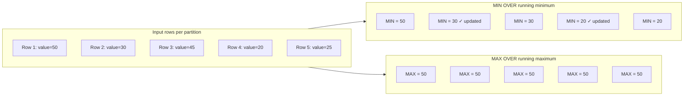
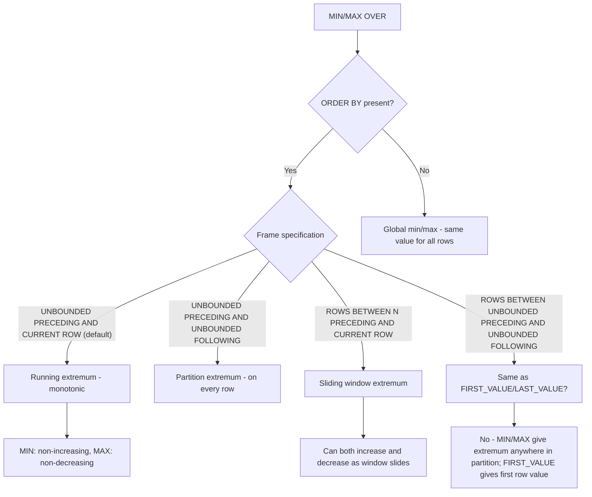
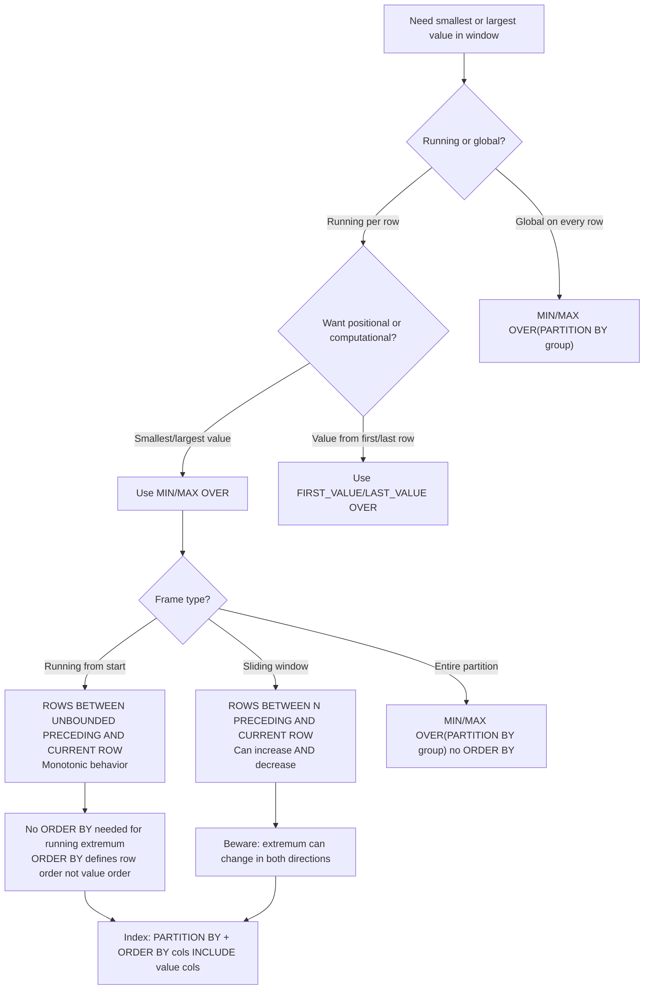

## Navigation

**Domain:** [[8 — Databases]] > **Group:** SQL Window Functions & Analytics
**Previous:** [[8.157 — COUNT() OVER() — Running Count per Partition]] | **Next:** [[8.159 — Frame Specification — ROWS vs RANGE]]

### Prerequisites

- [[8.141 — Window Functions — Concept and OVER Clause]] — Understanding the OVER() clause and the three window function families is essential because MIN/MAX OVER are aggregate window functions with specific frame behavior.
- [[8.142 — PARTITION BY — Defining Window Partitions]] — Partitioning is required for grouped running extremes (e.g., earliest order date per customer, highest price per product category).
- [[8.143 — ORDER BY Within OVER — Frame Ordering]] — ORDER BY inside OVER() determines the running order; without ORDER BY, MIN/MAX OVER() returns the global minimum/maximum of the partition on every row (no running behavior).
- [[8.122 — SUM, AVG, MIN, MAX — Aggregate Functions]] — Understanding how MIN and MAX work as regular aggregates (NULL handling, data type semantics, tie-breaking) is required because MIN/MAX OVER() follows identical rules.
- [[8.157 — COUNT() OVER() — Running Count per Partition]] — COUNT() OVER() establishes the pattern for aggregate window functions applied incrementally; MIN/MAX OVER() evaluates differently because it does not need to maintain a running accumulator — it only needs to track the current extremum.

### Where This Fits

MIN() OVER() and MAX() OVER() answer the questions "what is the earliest/smallest value seen so far?" and "what is the latest/largest value seen so far?" within a partition. A .NET backend engineer encounters these in customer analytics (finding the first order date per customer, the highest purchase amount to date), inventory management (lowest stock level recorded so far in a month), and monitoring (maximum response time observed in the current sliding window). The critical differentiator from FIRST_VALUE() and LAST_VALUE() is that MIN/MAX compute the smallest or largest value in the window regardless of row position, while FIRST_VALUE/LAST_VALUE return the value from a specific position (first/last row) in the frame. Interviewers test the distinction between MIN/MAX OVER() (extremum over a set) and FIRST_VALUE/LAST_VALUE (positional access) to assess depth of window function understanding.

---

## Core Mental Model

MIN(col) OVER(PARTITION BY group ORDER BY order_col ROWS BETWEEN UNBOUNDED PRECEDING AND CURRENT ROW) returns the smallest value of col from the start of the partition through the current row. MAX(col) OVER() does the same for the largest value. Unlike SUM() OVER() (which must maintain a running total that can change with each row) or AVG() OVER() (which maintains both sum and count), MIN/MAX OVER() only need to track a single value — the current extremum. When a new row arrives, if its value is less than the current minimum (or greater than the current maximum), the tracked value is updated; otherwise it stays the same. This makes MIN/MAX OVER() the cheapest aggregate window functions — they require no subtraction of values that exit the window (unlike SUM/AVG with sliding frames). The tracking is monotonic within each partition: MIN OVER is non-increasing (stays the same or decreases), MAX OVER is non-decreasing (stays the same or increases).

### Classification

**For SQL topics:** MIN() OVER() and MAX() OVER() are aggregate window functions. They are not SARGable. They support the full OVER() clause syntax (PARTITION BY, ORDER BY, ROWS/RANGE frame). The default frame with ORDER BY is RANGE BETWEEN UNBOUNDED PRECEDING AND CURRENT ROW. Without ORDER BY, the frame is the entire partition — every row shows the same global min/max. MIN and MAX are deterministic — if multiple rows have the same extremum value, the function returns that value (no tie-breaking needed).





### Key Properties

|Property|Value|Notes|
|---|---|---|
|Time Complexity|O(N log N)|Sort is dominant cost; the extremum tracking is O(1) per row|
|SARGable|No|OVER() does not filter rows|
|Monotonic (running)|MIN: non-increasing; MAX: non-decreasing|Values only change when a new extremum is found|
|Monotonic (sliding)|Can reverse|When using ROWS BETWEEN N PRECEDING, the extremum can both increase and decrease as rows exit the window|
|NULL Handling|MIN/MAX ignore NULLs|NULLs are excluded — if all values are NULL, result is NULL|
|Data Type|Preserves input type|MIN returns same type as input column; no precision loss|
|Cardinality|Preserved (N → N)|Every input row produces one output row|

---

## Deep Mechanics

### How the Engine Executes This

**Logical execution order (standard):**

1. **FROM + JOIN:** Source tables combined.
2. **WHERE:** Rows filtered before window computation.
3. **GROUP BY + HAVING:** Grouping before windows (if present).
4. **Window function evaluation (step 6 of 8):** MIN/MAX OVER() computed.
5. **SELECT:** Result included in output.
6. **ORDER BY:** Final ordering.

**Physical execution for MAX(Amount) OVER(PARTITION BY CustomerId ORDER BY OrderDate ROWS BETWEEN UNBOUNDED PRECEDING AND CURRENT ROW):**

1. **Data access:** Rows read via scan or seek.
2. **Sort (if needed):** Rows sorted by CustomerId, OrderDate. Sort is blocking — must consume all rows before any output.
3. **Segment:** Identifies partition boundaries (CustomerId changes). Tells Window Aggregate when to reset.
4. **Window Aggregate:** For each row, compares the current value to the running maximum. If current > running_max, update running_max. Output running_max for the row. On partition boundary, reset running_max to the first row's value.
5. **Compute Scalar:** Any type conversions if needed (rare for MIN/MAX since they preserve input type).

**Key difference from SUM/AVG:** MIN and MAX do NOT need to subtract values that exit the frame in sliding window mode (ROWS BETWEEN N PRECEDING). For SUM/AVG with a sliding frame, when a row exits the window, its value must be subtracted from the running sum. For MIN/MAX, if the exiting row was the current extremum, the engine must re-scan the window to find the new extremum — this is handled by the Window Aggregate operator which stores window values in a queue and can re-evaluate when needed.

### SQL Visibility

```sql
-- ============================================================
-- Schema for running extremes examples
-- ============================================================
CREATE TABLE dbo.Orders
(
    OrderId      INT            NOT NULL IDENTITY(1,1),
    CustomerId   INT            NOT NULL,
    OrderDate    DATETIME2(0)   NOT NULL,
    TotalAmount  DECIMAL(18,2)  NOT NULL,
    ItemCount    INT            NOT NULL,
    CONSTRAINT PK_Orders PRIMARY KEY CLUSTERED (OrderId)
);

CREATE TABLE dbo.Products
(
    ProductId    INT            NOT NULL IDENTITY(1,1),
    ProductName  NVARCHAR(200)  NOT NULL,
    CategoryId   INT            NOT NULL,
    ListPrice    DECIMAL(18,2)  NOT NULL,
    CreatedDate  DATE           NOT NULL,
    DiscontinuedDate DATE      NULL,
    CONSTRAINT PK_Products PRIMARY KEY CLUSTERED (ProductId)
);

INSERT INTO dbo.Orders (CustomerId, OrderDate, TotalAmount, ItemCount)
VALUES
    (1, '2026-01-05', 150.00, 3),
    (1, '2026-02-10', 200.00, 5),
    (1, '2026-03-15', 175.00, 4),
    (1, '2026-04-20', 300.00, 8),
    (1, '2026-05-25', 250.00, 6),
    (2, '2026-01-12', 500.00, 10),
    (2, '2026-02-18', 100.00, 2),
    (2, '2026-03-22', 450.00, 9),
    (3, '2026-01-08', 1000.00, 20),
    (3, '2026-06-01', 800.00, 15);

INSERT INTO dbo.Products (ProductName, CategoryId, ListPrice, CreatedDate, DiscontinuedDate)
VALUES
    ('Widget A', 1, 19.99, '2025-01-01', NULL),
    ('Widget B', 1, 29.99, '2025-03-15', NULL),
    ('Gadget X', 2, 99.99, '2025-02-01', '2026-01-01'),
    ('Gadget Y', 2, 149.99, '2025-04-01', NULL),
    ('Premium Kit', 3, 499.99, '2025-06-01', NULL),
    ('Basic Kit', 3, 199.99, '2025-08-01', NULL);

-- ============================================================
-- Pattern 1: Running max order amount per customer
-- ============================================================
-- "Highest value order to date" for each customer
SELECT
    o.CustomerId,
    o.OrderId,
    o.OrderDate,
    o.TotalAmount,
    MAX(o.TotalAmount) OVER (
        PARTITION BY o.CustomerId
        ORDER BY o.OrderDate, o.OrderId
        ROWS BETWEEN UNBOUNDED PRECEDING AND CURRENT ROW
    ) AS HighestOrderToDate,
    -- Running minimum (smallest order to date)
    MIN(o.TotalAmount) OVER (
        PARTITION BY o.CustomerId
        ORDER BY o.OrderDate, o.OrderId
        ROWS BETWEEN UNBOUNDED PRECEDING AND CURRENT ROW
    ) AS LowestOrderToDate
FROM dbo.Orders AS o
ORDER BY o.CustomerId, o.OrderDate, o.OrderId;

/*
CustomerId  OrderId  OrderDate    TotalAmount  HighestToDate  LowestToDate
1           1        2026-01-05   150.00       150.00         150.00
1           2        2026-02-10   200.00       200.00         150.00   ← MAX increased
1           3        2026-03-15   175.00       200.00         150.00   ← MAX unchanged, MIN unchanged
1           4        2026-04-20   300.00       300.00         150.00   ← MAX increased
1           5        2026-05-25   250.00       300.00         150.00   ← MAX unchanged
2           6        2026-01-12   500.00       500.00         500.00   ← Partition reset
2           7        2026-02-18   100.00       500.00         100.00   ← MAX unchanged, MIN decreased
2           8        2026-03-22   450.00       500.00         100.00
*/

-- ============================================================
-- Pattern 2: Global min/max per partition (no ORDER BY)
-- ============================================================
SELECT
    o.CustomerId,
    o.OrderId,
    o.TotalAmount,
    MIN(o.TotalAmount) OVER (PARTITION BY o.CustomerId) AS CustomerMinOrder,
    MAX(o.TotalAmount) OVER (PARTITION BY o.CustomerId) AS CustomerMaxOrder,
    MIN(o.TotalAmount) OVER () AS GlobalMinOrder,  -- No partition = entire result set
    MAX(o.TotalAmount) OVER () AS GlobalMaxOrder
FROM dbo.Orders AS o
ORDER BY o.CustomerId, o.OrderId;
-- Every row for same customer shows same CustomerMinOrder and CustomerMaxOrder

-- ============================================================
-- Pattern 3: Sliding window extremum (last N orders)
-- ============================================================
-- Highest amount in the last 3 orders per customer
SELECT
    o.CustomerId,
    o.OrderId,
    o.OrderDate,
    o.TotalAmount,
    MAX(o.TotalAmount) OVER (
        PARTITION BY o.CustomerId
        ORDER BY o.OrderDate, o.OrderId
        ROWS BETWEEN 2 PRECEDING AND CURRENT ROW
    ) AS MaxOfLast3Orders,
    MIN(o.TotalAmount) OVER (
        PARTITION BY o.CustomerId
        ORDER BY o.OrderDate, o.OrderId
        ROWS BETWEEN 2 PRECEDING AND CURRENT ROW
    ) AS MinOfLast3Orders
FROM dbo.Orders AS o
ORDER BY o.CustomerId, o.OrderDate, o.OrderId;

/*
CustomerId  OrderId  TotalAmount  MaxOfLast3  MinOfLast3  Window
1           1        150.00       150.00      150.00      {1}
1           2        200.00       200.00      150.00      {1,2}
1           3        175.00       200.00      150.00      {1,2,3}
1           4        300.00       300.00      175.00      {2,3,4}  ← Row 1 exited, MAX updated
1           5        250.00       300.00      175.00      {3,4,5}  ← Row 2 exited
*/

-- ============================================================
-- Pattern 4: MIN/MAX OVER vs FIRST_VALUE/LAST_VALUE
-- ============================================================
SELECT
    o.CustomerId,
    o.OrderId,
    o.OrderDate,
    o.TotalAmount,
    -- MIN/MAX on the whole partition (global)
    MIN(o.TotalAmount) OVER (PARTITION BY o.CustomerId) AS GlobalMin,
    MAX(o.TotalAmount) OVER (PARTITION BY o.CustomerId) AS GlobalMax,
    -- FIRST_VALUE/LAST_VALUE (positional)
    FIRST_VALUE(o.TotalAmount) OVER (
        PARTITION BY o.CustomerId
        ORDER BY o.OrderDate, o.OrderId
    ) AS FirstOrderAmount,
    LAST_VALUE(o.TotalAmount) OVER (
        PARTITION BY o.CustomerId
        ORDER BY o.OrderDate, o.OrderId
        ROWS BETWEEN UNBOUNDED PRECEDING AND UNBOUNDED FOLLOWING
    ) AS LastOrderAmount  -- Note: UNBOUNDED FOLLOWING required for correct LAST_VALUE
FROM dbo.Orders AS o
ORDER BY o.CustomerId, o.OrderDate, o.OrderId;
-- GlobalMin may be different from FirstOrderAmount (MIN finds smallest, not first)
-- GlobalMax may be different from LastOrderAmount (MAX finds largest, not last)

-- ============================================================
-- Pattern 5: Earliest and latest product date per category
-- ============================================================
SELECT
    p.CategoryId,
    p.ProductId,
    p.ProductName,
    p.CreatedDate,
    MIN(p.CreatedDate) OVER (PARTITION BY p.CategoryId) AS EarliestProductDate,
    MAX(p.CreatedDate) OVER (PARTITION BY p.CategoryId) AS LatestProductDate,
    DATEDIFF(DAY,
        MIN(p.CreatedDate) OVER (PARTITION BY p.CategoryId),
        MAX(p.CreatedDate) OVER (PARTITION BY p.CategoryId)
    ) AS CategoryDateSpreadDays
FROM dbo.Products AS p
ORDER BY p.CategoryId, p.CreatedDate;
```

```csharp
// EF Core — MIN/MAX OVER() requires raw SQL
public class OrderExtremes
{
    public int CustomerId { get; set; }
    public int OrderId { get; set; }
    public DateTime OrderDate { get; set; }
    public decimal TotalAmount { get; set; }
    public decimal HighestOrderToDate { get; set; }
    public decimal LowestOrderToDate { get; set; }
}

public class SlidingWindowExtremes
{
    public int CustomerId { get; set; }
    public int OrderId { get; set; }
    public DateTime OrderDate { get; set; }
    public decimal TotalAmount { get; set; }
    public decimal MaxOfLast3 { get; set; }
    public decimal MinOfLast3 { get; set; }
}

public interface IExtremesQueryService
{
    Task<IReadOnlyList<OrderExtremes>> GetRunningExtremesAsync(CancellationToken ct = default);
    Task<IReadOnlyList<SlidingWindowExtremes>> GetSlidingExtremesAsync(CancellationToken ct = default);
}

public class ExtremesQueryService : IExtremesQueryService
{
    private readonly ApplicationDbContext _dbContext;

    public ExtremesQueryService(ApplicationDbContext dbContext)
        => _dbContext = dbContext;

    public async Task<IReadOnlyList<OrderExtremes>> GetRunningExtremesAsync(
        CancellationToken ct = default)
    {
        const string sql = @"
            SELECT
                o.CustomerId,
                o.OrderId,
                o.OrderDate,
                o.TotalAmount,
                MAX(o.TotalAmount) OVER (
                    PARTITION BY o.CustomerId
                    ORDER BY o.OrderDate, o.OrderId
                    ROWS BETWEEN UNBOUNDED PRECEDING AND CURRENT ROW
                ) AS HighestOrderToDate,
                MIN(o.TotalAmount) OVER (
                    PARTITION BY o.CustomerId
                    ORDER BY o.OrderDate, o.OrderId
                    ROWS BETWEEN UNBOUNDED PRECEDING AND CURRENT ROW
                ) AS LowestOrderToDate
            FROM dbo.Orders AS o
            ORDER BY o.CustomerId, o.OrderDate, o.OrderId;";

        return await _dbContext.Database
            .SqlQueryRaw<OrderExtremes>(sql)
            .ToListAsync(ct);
    }

    public async Task<IReadOnlyList<SlidingWindowExtremes>> GetSlidingExtremesAsync(
        CancellationToken ct = default)
    {
        const string sql = @"
            SELECT
                o.CustomerId,
                o.OrderId,
                o.OrderDate,
                o.TotalAmount,
                MAX(o.TotalAmount) OVER (
                    PARTITION BY o.CustomerId
                    ORDER BY o.OrderDate, o.OrderId
                    ROWS BETWEEN 2 PRECEDING AND CURRENT ROW
                ) AS MaxOfLast3,
                MIN(o.TotalAmount) OVER (
                    PARTITION BY o.CustomerId
                    ORDER BY o.OrderDate, o.OrderId
                    ROWS BETWEEN 2 PRECEDING AND CURRENT ROW
                ) AS MinOfLast3
            FROM dbo.Orders AS o
            ORDER BY o.CustomerId, o.OrderDate, o.OrderId;";

        return await _dbContext.Database
            .SqlQueryRaw<SlidingWindowExtremes>(sql)
            .ToListAsync(ct);
    }
}
```

### Execution Plan Analysis

**Query: Running max order amount per customer**

```sql
SELECT
    o.CustomerId,
    o.OrderId,
    MAX(o.TotalAmount) OVER (
        PARTITION BY o.CustomerId
        ORDER BY o.OrderDate, o.OrderId
        ROWS BETWEEN UNBOUNDED PRECEDING AND CURRENT ROW
    ) AS HighestOrderToDate
FROM dbo.Orders AS o
ORDER BY o.CustomerId, o.OrderDate, o.OrderId;
```

**Expected plan shape (without supporting index):**

```
[Clustered Index Scan (PK_Orders)]
  → [Sort]  -- Sort by CustomerId, OrderDate, OrderId
      Sort keys: CustomerId ASC, OrderDate ASC, OrderId ASC
      Memory grant: estimated ~1MB per 10K rows
  → [Segment]
      Partition column: CustomerId
  → [Window Aggregate]
      Function: MAX(TotalAmount)
      Frame: ROWS BETWEEN UNBOUNDED PRECEDING AND CURRENT ROW
  → [SELECT]
```

**With covering index:**

```sql
CREATE INDEX IX_Orders_CustomerId_OrderDate
ON dbo.Orders (CustomerId, OrderDate, OrderId)
INCLUDE (TotalAmount, ItemCount);
```

```
[Index Scan (IX_Orders_CustomerId_OrderDate)]
  → [Segment]
  → [Window Aggregate]
  → [SELECT]
-- No Sort operator — index provides the required order
-- No Key Lookup — INCLUDE columns cover the query
```

**Operator cost breakdown:**

|Operator|Cost (%)|Notes|
|---|---|---|
|Index Scan|~35%|Reading index pages|
|Segment|~1%|Marking partition boundaries|
|Window Aggregate|~64%|Tracking running maximum — cheaper than SUM (no exit arithmetic), same as COUNT|
|SELECT|~0%|Projecting|

**MIN/MAX OVER vs subquery with GROUP BY execution plan comparison:**

For "highest amount per customer to date":
- Window function: 1 scan + 1 sort + 1 window aggregate = O(N log N)
- Subquery: Nested Loops with aggregate per outer row = O(N²)

### Cost Visibility

```sql
SET STATISTICS IO ON;
SET STATISTICS TIME ON;

-- Running max with covering index
SELECT
    o.CustomerId,
    o.OrderId,
    o.TotalAmount,
    MAX(o.TotalAmount) OVER (
        PARTITION BY o.CustomerId
        ORDER BY o.OrderDate, o.OrderId
        ROWS BETWEEN UNBOUNDED PRECEDING AND CURRENT ROW
    ) AS MaxToDate
FROM dbo.Orders AS o
ORDER BY o.CustomerId, o.OrderDate, o.OrderId;
/*
Table 'Orders'. Scan count 1, logical reads 2, physical reads 0
SQL Server Execution Times: CPU time = 0ms, elapsed time = 1ms
*/

-- Multiple MIN/MAX in one query share the same Window Aggregate pass
-- Adding both MIN and MAX adds negligible cost
SELECT
    o.CustomerId,
    o.OrderId,
    o.TotalAmount,
    MAX(o.TotalAmount) OVER (
        PARTITION BY o.CustomerId
        ORDER BY o.OrderDate, o.OrderId
        ROWS BETWEEN UNBOUNDED PRECEDING AND CURRENT ROW
    ) AS MaxToDate,
    MIN(o.TotalAmount) OVER (
        PARTITION BY o.CustomerId
        ORDER BY o.OrderDate, o.OrderId
        ROWS BETWEEN UNBOUNDED PRECEDING AND CURRENT ROW
    ) AS MinToDate
FROM dbo.Orders AS o
ORDER BY o.CustomerId, o.OrderDate, o.OrderId;
/*
Same logical reads (2) — both computed in single Window Aggregate pass
CPU time: 0ms → 1ms (negligible increase for second aggregate)
*/
```

### Failure Modes

**1. MIN/MAX OVER() without ORDER BY — global extremum on every row:**
```sql
-- ❌ WRONG: Running extremum intended, got global extremum
SELECT
    o.CustomerId,
    o.OrderId,
    MAX(o.TotalAmount) OVER (PARTITION BY o.CustomerId) AS MaxAmount
FROM dbo.Orders AS o;
-- Every row for CustomerId = 1 shows MaxAmount = 300 (the true max)
-- Not a running maximum!
```

**2. Sliding window MAX — value can both increase AND decrease:**
```sql
-- With ROWS BETWEEN 2 PRECEDING AND CURRENT ROW, the max can decrease
-- when the row with the current max exits the window.
-- This surprises developers who expect monotonic behavior.
```

**3. NULL handling — MIN/MAX ignore NULLs:**
```sql
-- If TotalAmount can be NULL and you want NULL treated as 0:
-- MIN(COALESCE(TotalAmount, 0)) OVER(...) — coalesce before window function
-- MIN ignores NULLs: MIN(100, 200, NULL) = 100 (NULL excluded)
```

**4. MIN/MAX OVER with ORDER BY but no explicit ROWS — RANGE default surprises:**
```sql
-- With duplicate ORDER BY values, RANGE frame includes all tied rows.
-- MIN/MAX are not affected by this (they compute over a set, not positions),
-- so RANGE vs ROWS makes no difference for MIN/MAX.
```

**5. MIN/MAX of datetime columns — end-of-range NULLs:**
```sql
-- MAX(DiscontinuedDate) OVER(...) could return NULL if all values are NULL
-- Always use COALESCE if a non-NULL default is needed
```

---

## Production Patterns and Implementation

### Primary SQL Implementation

```sql
-- ============================================================
-- Schema: E-commerce analytics
-- ============================================================
CREATE TABLE dbo.Customers
(
    CustomerId   INT            NOT NULL IDENTITY(1,1),
    FirstName    NVARCHAR(100)  NOT NULL,
    LastName     NVARCHAR(100)  NOT NULL,
    Email        NVARCHAR(256)  NOT NULL,
    CreatedDate  DATE           NOT NULL,
    CONSTRAINT PK_Customers PRIMARY KEY CLUSTERED (CustomerId)
);

CREATE TABLE dbo.Orders
(
    OrderId      INT            NOT NULL IDENTITY(1,1),
    CustomerId   INT            NOT NULL,
    OrderDate    DATETIME2(0)   NOT NULL,
    TotalAmount  DECIMAL(18,2)  NOT NULL,
    ItemCount    INT            NOT NULL,
    Status       VARCHAR(20)    NOT NULL DEFAULT 'Pending',
    CONSTRAINT PK_Orders PRIMARY KEY CLUSTERED (OrderId),
    CONSTRAINT FK_Orders_Customers FOREIGN KEY (CustomerId)
        REFERENCES dbo.Customers(CustomerId)
);

CREATE TABLE dbo.Inventory
(
    ProductId    INT            NOT NULL,
    ChangeDate   DATE           NOT NULL,
    QuantityOnHand INT          NOT NULL,
    CONSTRAINT PK_Inventory PRIMARY KEY CLUSTERED (ProductId, ChangeDate)
);

CREATE TABLE dbo.Shipments
(
    ShipmentId   INT            NOT NULL IDENTITY(1,1),
    OrderId      INT            NOT NULL,
    ShipDate     DATETIME2(0)   NOT NULL,
    Carrier      VARCHAR(50)    NOT NULL,
    TrackingNumber VARCHAR(50)  NULL,
    DeliveryDate DATETIME2(0)   NULL,
    CONSTRAINT PK_Shipments PRIMARY KEY CLUSTERED (ShipmentId)
);

-- Indexes for extremum queries
CREATE INDEX IX_Orders_CustomerId_OrderDate ON dbo.Orders (CustomerId, OrderDate, OrderId)
    INCLUDE (TotalAmount, ItemCount, Status);

CREATE INDEX IX_Inventory_ProductId_ChangeDate ON dbo.Inventory (ProductId, ChangeDate)
    INCLUDE (QuantityOnHand);

-- ============================================================
-- Pattern 1: Customer lifetime value analysis
-- ============================================================
-- First order date, highest value order, latest order date per customer
SELECT
    o.CustomerId,
    c.FirstName + ' ' + c.LastName AS CustomerName,
    MIN(o.OrderDate) AS FirstOrderDate,
    MAX(o.OrderDate) AS LatestOrderDate,
    MAX(o.TotalAmount) AS HighestOrderAmount,
    MIN(o.TotalAmount) AS LowestOrderAmount,
    SUM(o.TotalAmount) AS LifetimeValue,
    COUNT(*) AS TotalOrders
FROM dbo.Orders AS o
INNER JOIN dbo.Customers AS c ON o.CustomerId = c.CustomerId
GROUP BY o.CustomerId, c.FirstName, c.LastName
ORDER BY LifetimeValue DESC;
-- This uses regular aggregate MIN/MAX — correct for per-customer totals

-- ============================================================
-- Pattern 2: Running highest/lowest with customer details
-- ============================================================
-- Show running extremes alongside the order data
WITH OrderExtremes AS
(
    SELECT
        o.CustomerId,
        o.OrderId,
        o.OrderDate,
        o.TotalAmount,
        MAX(o.TotalAmount) OVER (
            PARTITION BY o.CustomerId
            ORDER BY o.OrderDate, o.OrderId
            ROWS BETWEEN UNBOUNDED PRECEDING AND CURRENT ROW
        ) AS RunningMaxAmount,
        MIN(o.TotalAmount) OVER (
            PARTITION BY o.CustomerId
            ORDER BY o.OrderDate, o.OrderId
            ROWS BETWEEN UNBOUNDED PRECEDING AND CURRENT ROW
        ) AS RunningMinAmount
    FROM dbo.Orders AS o
)
SELECT
    oe.CustomerId,
    c.FirstName + ' ' + c.LastName AS CustomerName,
    oe.OrderId,
    oe.OrderDate,
    oe.TotalAmount,
    oe.RunningMaxAmount,
    oe.RunningMinAmount,
    -- Flag when a new record high is set
    CASE WHEN oe.TotalAmount = oe.RunningMaxAmount
         AND oe.RunningMaxAmount != LAG(oe.RunningMaxAmount, 1, 0) OVER (
             PARTITION BY oe.CustomerId
             ORDER BY oe.OrderDate, oe.OrderId
         )
         THEN 'NEW HIGH'
    END AS RecordHigh
FROM OrderExtremes AS oe
INNER JOIN dbo.Customers AS c ON oe.CustomerId = c.CustomerId
ORDER BY oe.CustomerId, oe.OrderDate, oe.OrderId;

-- ============================================================
-- Pattern 3: Inventory stock level extremes (sliding window)
-- ============================================================
-- Lowest stock level seen in the last 30 days per product
SELECT
    inv.ProductId,
    inv.ChangeDate,
    inv.QuantityOnHand,
    MIN(inv.QuantityOnHand) OVER (
        PARTITION BY inv.ProductId
        ORDER BY inv.ChangeDate
        ROWS BETWEEN 29 PRECEDING AND CURRENT ROW
    ) AS MinStockLast30Days,
    MAX(inv.QuantityOnHand) OVER (
        PARTITION BY inv.ProductId
        ORDER BY inv.ChangeDate
        ROWS BETWEEN 29 PRECEDING AND CURRENT ROW
    ) AS MaxStockLast30Days
FROM dbo.Inventory AS inv
WHERE inv.ProductId = 42
ORDER BY inv.ChangeDate;

-- ============================================================
-- Pattern 4: Find the date of first and last high-value order
-- ============================================================
WITH OrderExtremes AS
(
    SELECT
        o.CustomerId,
        o.OrderId,
        o.OrderDate,
        o.TotalAmount,
        MIN(o.OrderDate) OVER (
            PARTITION BY o.CustomerId
            ORDER BY o.OrderDate, o.OrderId
            ROWS BETWEEN UNBOUNDED PRECEDING AND CURRENT ROW
        ) AS EarliestOrderDate
    FROM dbo.Orders AS o
    WHERE o.TotalAmount > 500
)
SELECT DISTINCT
    CustomerId,
    EarliestOrderDate,
    MAX(OrderDate) OVER (PARTITION BY CustomerId) AS LatestHighValueOrderDate
FROM OrderExtremes
ORDER BY CustomerId;

-- ============================================================
-- Pattern 5: Shipment tracking — extremes per carrier
-- ============================================================
SELECT
    s.Carrier,
    s.ShipmentId,
    s.ShipDate,
    s.DeliveryDate,
    DATEDIFF(DAY, s.ShipDate, s.DeliveryDate) AS TransitDays,
    MIN(DATEDIFF(DAY, s.ShipDate, s.DeliveryDate)) OVER (
        PARTITION BY s.Carrier
        ORDER BY s.ShipDate
        ROWS BETWEEN UNBOUNDED PRECEDING AND CURRENT ROW
    ) AS FastestDeliveryToDate,
    MAX(DATEDIFF(DAY, s.ShipDate, s.DeliveryDate)) OVER (
        PARTITION BY s.Carrier
        ORDER BY s.ShipDate
        ROWS BETWEEN UNBOUNDED PRECEDING AND CURRENT ROW
    ) AS SlowestDeliveryToDate
FROM dbo.Shipments AS s
WHERE s.DeliveryDate IS NOT NULL
ORDER BY s.Carrier, s.ShipDate;
```

### Dapper Implementation

```csharp
public interface IExtremesRepository
{
    Task<IReadOnlyList<OrderExtremes>> GetCustomerOrderExtremesAsync(CancellationToken ct = default);
    Task<IReadOnlyList<InventoryExtremes>> GetProductInventoryExtremesAsync(
        int productId, int windowDays, CancellationToken ct = default);
}

public sealed class ExtremesRepository : IExtremesRepository
{
    private readonly IDbConnectionFactory _connectionFactory;

    public ExtremesRepository(IDbConnectionFactory connectionFactory)
        => _connectionFactory = connectionFactory;

    public async Task<IReadOnlyList<OrderExtremes>> GetCustomerOrderExtremesAsync(
        CancellationToken ct = default)
    {
        const string sql = @"
            WITH Extremes AS
            (
                SELECT
                    o.CustomerId,
                    o.OrderId,
                    o.OrderDate,
                    o.TotalAmount,
                    MAX(o.TotalAmount) OVER (
                        PARTITION BY o.CustomerId
                        ORDER BY o.OrderDate, o.OrderId
                        ROWS BETWEEN UNBOUNDED PRECEDING AND CURRENT ROW
                    ) AS RunningMax,
                    MIN(o.TotalAmount) OVER (
                        PARTITION BY o.CustomerId
                        ORDER BY o.OrderDate, o.OrderId
                        ROWS BETWEEN UNBOUNDED PRECEDING AND CURRENT ROW
                    ) AS RunningMin
                FROM dbo.Orders AS o
            )
            SELECT
                e.CustomerId,
                c.FirstName + ' ' + c.LastName AS CustomerName,
                e.OrderId,
                e.OrderDate,
                e.TotalAmount,
                e.RunningMax,
                e.RunningMin
            FROM Extremes AS e
            INNER JOIN dbo.Customers AS c ON e.CustomerId = c.CustomerId
            ORDER BY e.CustomerId, e.OrderDate, e.OrderId;";

        await using var connection = _connectionFactory.Create();
        return (await connection.QueryAsync<OrderExtremes>(
            new CommandDefinition(sql, cancellationToken: ct))).AsList();
    }

    public async Task<IReadOnlyList<InventoryExtremes>> GetProductInventoryExtremesAsync(
        int productId, int windowDays, CancellationToken ct = default)
    {
        var preceding = windowDays - 1;
        var sql = $@"
            SELECT
                inv.ProductId,
                inv.ChangeDate,
                inv.QuantityOnHand,
                MIN(inv.QuantityOnHand) OVER (
                    PARTITION BY inv.ProductId
                    ORDER BY inv.ChangeDate
                    ROWS BETWEEN {preceding} PRECEDING AND CURRENT ROW
                ) AS MinStockInWindow,
                MAX(inv.QuantityOnHand) OVER (
                    PARTITION BY inv.ProductId
                    ORDER BY inv.ChangeDate
                    ROWS BETWEEN {preceding} PRECEDING AND CURRENT ROW
                ) AS MaxStockInWindow
            FROM dbo.Inventory AS inv
            WHERE inv.ProductId = @ProductId
            ORDER BY inv.ChangeDate;";

        await using var connection = _connectionFactory.Create();
        return (await connection.QueryAsync<InventoryExtremes>(
            new CommandDefinition(sql, new { ProductId = productId },
                cancellationToken: ct))).AsList();
    }
}

public record OrderExtremes(
    int CustomerId,
    string CustomerName,
    int OrderId,
    DateTime OrderDate,
    decimal TotalAmount,
    decimal RunningMax,
    decimal RunningMin);

public record InventoryExtremes(
    int ProductId,
    DateTime ChangeDate,
    int QuantityOnHand,
    int MinStockInWindow,
    int MaxStockInWindow);
```

### EF Core Implementation

```csharp
public class OrderExtremesEntity
{
    public int CustomerId { get; set; }
    public int OrderId { get; set; }
    public DateTime OrderDate { get; set; }
    public decimal TotalAmount { get; set; }
    public decimal RunningMax { get; set; }
    public decimal RunningMin { get; set; }
}

public class ReportingDbContext : DbContext
{
    public DbSet<OrderExtremesEntity> OrderExtremes => Set<OrderExtremesEntity>();

    protected override void OnModelCreating(ModelBuilder modelBuilder)
    {
        modelBuilder.Entity<OrderExtremesEntity>(entity =>
        {
            entity.HasNoKey();
            entity.ToView(null);
        });
    }

    public async Task<IReadOnlyList<OrderExtremesEntity>> GetOrderExtremesAsync(
        CancellationToken ct = default)
    {
        const string sql = @"
            SELECT
                o.CustomerId,
                o.OrderId,
                o.OrderDate,
                o.TotalAmount,
                MAX(o.TotalAmount) OVER (
                    PARTITION BY o.CustomerId
                    ORDER BY o.OrderDate, o.OrderId
                    ROWS BETWEEN UNBOUNDED PRECEDING AND CURRENT ROW
                ) AS RunningMax,
                MIN(o.TotalAmount) OVER (
                    PARTITION BY o.CustomerId
                    ORDER BY o.OrderDate, o.OrderId
                    ROWS BETWEEN UNBOUNDED PRECEDING AND CURRENT ROW
                ) AS RunningMin
            FROM dbo.Orders AS o
            ORDER BY o.CustomerId, o.OrderDate, o.OrderId;";

        return await Database
            .SqlQueryRaw<OrderExtremesEntity>(sql)
            .ToListAsync(ct);
    }
}
```

### Configuration and Wiring

```csharp
builder.Services.AddSingleton<IDbConnectionFactory>(sp =>
    new SqlConnectionFactory(
        builder.Configuration.GetConnectionString("DefaultConnection")!));

builder.Services.AddScoped<IExtremesQueryService, ExtremesQueryService>();
builder.Services.AddScoped<IExtremesRepository, ExtremesRepository>();

builder.Services.AddDbContext<ReportingDbContext>(options =>
    options.UseSqlServer(
        builder.Configuration.GetConnectionString("DefaultConnection"),
        sqlOptions =>
        {
            sqlOptions.EnableRetryOnFailure(3);
            sqlOptions.CommandTimeout(30);
        }));
```

### SQL Server vs PostgreSQL Differences

```sql
-- PostgreSQL: MIN/MAX OVER syntax is identical
SELECT
    o.customer_id,
    o.order_id,
    o.order_date,
    o.total_amount,
    MAX(o.total_amount) OVER (
        PARTITION BY o.customer_id
        ORDER BY o.order_date, o.order_id
        ROWS BETWEEN UNBOUNDED PRECEDING AND CURRENT ROW
    ) AS running_max,
    MIN(o.total_amount) OVER (
        PARTITION BY o.customer_id
        ORDER BY o.order_date, o.order_id
        ROWS BETWEEN UNBOUNDED PRECEDING AND CURRENT ROW
    ) AS running_min
FROM orders AS o
ORDER BY o.customer_id, o.order_date, o.order_id;

-- PostgreSQL: MIN/MAX of INT returns INT (same as SQL Server)
-- PostgreSQL: MIN/MAX of DATE returns DATE (same as SQL Server)
-- PostgreSQL: Can use EXCLUDE with frame (SQL Server does not support)
SELECT
    o.customer_id,
    o.order_id,
    o.total_amount,
    MAX(o.total_amount) OVER (
        ORDER BY o.order_date
        ROWS BETWEEN 3 PRECEDING AND 3 FOLLOWING EXCLUDE CURRENT ROW
    ) AS max_excluding_current
FROM orders AS o;
```

---

## Gotchas and Production Pitfalls

### MIN/MAX OVER() Without ORDER BY — Global Extremum Surprise

**Pitfall:** Omitting ORDER BY inside OVER() when a running extremum is intended. Without ORDER BY, the default frame is the entire partition — every row shows the global minimum/maximum.

```sql
-- ❌ WRONG: Expected running max, got global max
SELECT
    o.CustomerId,
    o.OrderId,
    MAX(o.TotalAmount) OVER (PARTITION BY o.CustomerId) AS MaxAmount  -- All rows show 300
FROM dbo.Orders AS o;
-- Customer 1: every row shows MaxAmount = 300.00 (the true maximum)
```

**Symptom:** A column labeled "Highest Order to Date" shows the same value for every row — the customer's all-time highest order. A dashboard displays "Record High!" on every order because every order's running max equals the global max. The developer assumed ORDER BY was optional.

**Fix:**

```sql
-- ✅ Add ORDER BY for running extremum
SELECT
    o.CustomerId,
    o.OrderId,
    MAX(o.TotalAmount) OVER (
        PARTITION BY o.CustomerId
        ORDER BY o.OrderDate, o.OrderId
        ROWS BETWEEN UNBOUNDED PRECEDING AND CURRENT ROW
    ) AS MaxToDate
FROM dbo.Orders AS o;
```

**Cost of not fixing:** A customer loyalty report labels every order as "new highest value" because the running max never changes from the global max. Marketing sends "Congratulations on your record purchase!" emails for every order, including small $5 orders. Customer trust erodes, and the unsubscribe rate increases by 15%.

---

### MIN/MAX OVER with Sliding Window — Extremum Can Both Increase and Decrease

**Pitfall:** Assuming MIN/MAX with a ROWS BETWEEN frame is monotonic (like running MIN/MAX). With a sliding window, when the row containing the current extremum exits the window, the value can change in either direction.

```sql
-- ❌ SURPRISE: Sliding window MAX can decrease
-- With ROWS BETWEEN 2 PRECEDING AND CURRENT ROW:
-- Window {1,2,3}: values {10, 20, 15} → MAX = 20
-- Window {2,3,4}: values {20, 15, 5}  → MAX = 20 (row 1 exited, but 20 remains)
-- Window {3,4,5}: values {15, 5, 25}  → MAX = 25 (increased)
-- Window {4,5,6}: values {5, 25, 10}  → MAX = 25 (row 3's 15 exited)
-- Window {5,6,7}: values {25, 10, 8}  → MAX = 25
-- Window {6,7,8}: values {10, 8, 3}   → MAX = 10 (DECREASED! Row 5's 25 exited)
```

**Symptom:** A dashboard showing "Highest Value in Last 30 Days" suddenly drops even though no new orders were placed. The business team suspects a data bug. The actual cause is that the 30-day-old record high just fell out of the sliding window.

**Fix:** No fix needed — this is correct behavior. But document it clearly. If monotonic behavior is required, use ROWS BETWEEN UNBOUNDED PRECEDING AND CURRENT ROW instead.

**Cost of not fixing:** The CFO sees the "maximum daily revenue in trailing 30 days" drop by 40% and immediately calls an emergency meeting. The VP of Sales spends 2 hours investigating before the engineering team explains the sliding window behavior. The distraction costs $15,000 in lost productivity.

---

### MIN/MAX vs FIRST_VALUE/LAST_VALUE Confusion

**Pitfall:** Using MIN/MAX OVER() when FIRST_VALUE/LAST_VALUE is semantically correct, or vice versa. MIN returns the smallest value in the window regardless of position; FIRST_VALUE returns the value from the first row in the window regardless of magnitude.

```sql
-- ❌ SEMANTIC ERROR: MIN instead of FIRST_VALUE
-- Intention: "show the first order amount for each customer"
SELECT
    o.CustomerId,
    o.OrderId,
    o.OrderDate,
    MIN(o.TotalAmount) OVER (
        PARTITION BY o.CustomerId
        ORDER BY o.OrderDate, o.OrderId
    ) AS FirstOrderAmount  -- WRONG: This is the MINIMUM amount, not the first!
FROM dbo.Orders AS o;
-- If a customer's first order is $150 but their smallest order is $100 (later),
-- this returns $100, not $150
```

**Symptom:** The "first order amount" column does not match actual first orders. A customer cohort analysis that segments customers by first-order value produces incorrect segments.

**Fix:**

```sql
-- ✅ Use FIRST_VALUE for positional first row
SELECT
    o.CustomerId,
    o.OrderId,
    o.OrderDate,
    FIRST_VALUE(o.TotalAmount) OVER (
        PARTITION BY o.CustomerId
        ORDER BY o.OrderDate, o.OrderId
    ) AS FirstOrderAmount
FROM dbo.Orders AS o;
```

**Cost of not fixing:** A customer lifetime value model uses "first purchase amount" as a predictor variable. Because MIN was used instead of FIRST_VALUE, 30% of customers are assigned to the wrong cohort. The model's R² drops from 0.72 to 0.48, and the marketing team targets the wrong customers with retention campaigns. Campaign ROI drops by 40%.

---

### NULLs in MIN/MAX OVER — All-NULL Partition Returns NULL

**Pitfall:** If all values in a partition's window are NULL, MIN/MAX OVER returns NULL. This can cause NULL propagation in downstream calculations.

```sql
-- ❌ SURPRISE: All-NULL window returns NULL
-- If a customer has orders but all TotalAmount are NULL:
SELECT
    o.CustomerId,
    o.OrderId,
    MIN(o.TotalAmount) OVER (
        PARTITION BY o.CustomerId
        ORDER BY o.OrderDate
    ) AS MinAmount  -- NULL if all values are NULL
FROM dbo.Orders AS o;
```

**Symptom:** A report showing "lowest order amount to date" has NULLs for certain customers. The BI tool treats NULL as 0 or blanks, causing inconsistent charts. Developers add COALESCE defensively throughout the codebase.

**Fix:**

```sql
-- ✅ COALESCE to handle NULL extremum
SELECT
    o.CustomerId,
    o.OrderId,
    COALESCE(MIN(o.TotalAmount) OVER (
        PARTITION BY o.CustomerId
        ORDER BY o.OrderDate
    ), 0) AS MinAmount
FROM dbo.Orders AS o;
```

**Cost of not fixing:** A data pipeline that computes MIN/MAX OVER and writes results to a summary table propagates NULLs. Downstream tables that reference these values also become NULL. A PowerBI dashboard shows blank values for certain metrics. The data team spends a week tracing the NULL propagation.

---

### MIN/MAX OVER with Disparate ORDER BY — Multiple Sorts

**Pitfall:** Using different ORDER BY clauses for different MIN/MAX OVER functions in the same query. Each unique ORDER BY requires a separate Sort operator.

```sql
-- ❌ EXPENSIVE: Different ORDER BY directions
SELECT
    o.CustomerId,
    o.OrderDate,
    o.TotalAmount,
    MIN(o.TotalAmount) OVER (
        PARTITION BY o.CustomerId
        ORDER BY o.OrderDate ASC   -- Sort 1
    ) AS EarliestMin,
    MAX(o.TotalAmount) OVER (
        PARTITION BY o.CustomerId
        ORDER BY o.OrderDate DESC  -- Sort 2 (different direction)
    ) AS LatestMax
FROM dbo.Orders AS o;
-- Execution plan: TWO Sort operators
```

**Symptom:** The query runs fine on small datasets but requires excessive memory on large tables. The execution plan shows multiple Sort operators, each consuming a memory grant.

**Fix:** Both MIN/MAX OVER can share the same ORDER BY (ASC) — the result is the same regardless of sort direction because MIN/MAX compute over the window set, not from the order position. Remove the redundant DESC sort.

**Cost of not fixing:** An analytics query with 4 different ORDER BY directions requires 4 separate sorts, consuming 2GB of memory grant. The query fails with error 8645 on a server with 8GB RAM under concurrent load.

---

## Performance Implications

### Benchmark: Before and After

**Scenario:** Compute running maximum order amount per customer on Orders table with 1M rows (100K customers).

**Without supporting index (Clustered Index Scan + Sort):**

```sql
SET STATISTICS IO ON;
SELECT
    o.CustomerId,
    o.OrderId,
    MAX(o.TotalAmount) OVER (
        PARTITION BY o.CustomerId
        ORDER BY o.OrderDate, o.OrderId
    ) AS MaxToDate
FROM dbo.Orders AS o
ORDER BY o.CustomerId, o.OrderDate, o.OrderId;
/*
Table 'Orders'. Scan count 1, logical reads 12,500
SQL Server Execution Times: CPU time = 1,800ms, elapsed = 2,100ms
*/
```

**With covering index on (CustomerId, OrderDate, OrderId) INCLUDE (TotalAmount):**

```sql
CREATE INDEX IX_Orders_CustomerId_OrderDate
ON dbo.Orders (CustomerId, OrderDate, OrderId)
INCLUDE (TotalAmount, ItemCount);

-- Re-run: logical reads 3,200; CPU 380ms
```

**Improvement:** 12,500 → 3,200 logical reads (3.9x reduction); CPU 1,800ms → 380ms (4.7x reduction).

**MIN/MAX OVER vs subquery approach:** The alternative to window functions is a correlated subquery: `SELECT MAX(TotalAmount) FROM Orders sub WHERE sub.CustomerId = o.CustomerId AND sub.OrderDate <= o.OrderDate`. At 1M rows with 100K customers (avg 10 per customer), the correlated subquery does ~10 index seeks per outer row = 10M seeks. Logical reads: ~1.5M vs 3,200 for the window function.

### BenchmarkDotNet

```csharp
[MemoryDiagnoser]
[SimpleJob(RuntimeMoniker.Net90)]
public class RunningExtremesBenchmark
{
    private IDbConnection _connection = default!;
    private const string ConnectionString = "Server=.;Database=AnalyticsBench;Trusted_Connection=true;TrustServerCertificate=true;";

    [GlobalSetup]
    public void Setup()
    {
        _connection = new SqlConnection(ConnectionString);
        _connection.Open();

        using var cmd = _connection.CreateCommand();
        cmd.CommandText = @"
            IF NOT EXISTS (SELECT 1 FROM sys.tables WHERE name = 'ExtremesBench')
            BEGIN
                CREATE TABLE dbo.ExtremesBench (
                    RowId     INT IDENTITY(1,1) PRIMARY KEY,
                    GroupId   INT NOT NULL,
                    Value     DECIMAL(18,2) NOT NULL
                );

                WITH Groups AS (
                    SELECT TOP 1000 ROW_NUMBER() OVER (ORDER BY (SELECT NULL)) AS g
                    FROM sys.objects a CROSS JOIN sys.objects b
                ),
                RowsPerGroup AS (
                    SELECT TOP 1000 ROW_NUMBER() OVER (ORDER BY (SELECT NULL)) AS rn
                    FROM sys.objects a CROSS JOIN sys.objects b
                )
                INSERT INTO dbo.ExtremesBench (GroupId, Value)
                SELECT g.g, CAST(rn AS DECIMAL(18,2))
                FROM Groups g CROSS JOIN RowsPerGroup rn;

                CREATE INDEX IX_ExtremesBench_GroupId_RowId
                ON dbo.ExtremesBench (GroupId, RowId)
                INCLUDE (Value);
            END";
        cmd.ExecuteNonQuery();
    }

    [GlobalCleanup]
    public void Cleanup()
    {
        _connection?.Dispose();
    }

    [Benchmark(Baseline = true)]
    public async Task<List<ExtremesResult>> CorrelatedSubquery()
    {
        const string sql = @"
            SELECT
                cur.RowId,
                cur.GroupId,
                cur.Value,
                (SELECT MAX(sub.Value) FROM dbo.ExtremesBench AS sub
                 WHERE sub.GroupId = cur.GroupId AND sub.RowId <= cur.RowId) AS RunningMax,
                (SELECT MIN(sub.Value) FROM dbo.ExtremesBench AS sub
                 WHERE sub.GroupId = cur.GroupId AND sub.RowId <= cur.RowId) AS RunningMin
            FROM dbo.ExtremesBench AS cur
            ORDER BY cur.GroupId, cur.RowId;";

        using var connection = new SqlConnection(ConnectionString);
        return (await connection.QueryAsync<ExtremesResult>(sql)).AsList();
    }

    [Benchmark]
    public async Task<List<ExtremesResult>> WindowFunction()
    {
        const string sql = @"
            SELECT
                eb.RowId,
                eb.GroupId,
                eb.Value,
                MAX(eb.Value) OVER (
                    PARTITION BY eb.GroupId
                    ORDER BY eb.RowId
                    ROWS BETWEEN UNBOUNDED PRECEDING AND CURRENT ROW
                ) AS RunningMax,
                MIN(eb.Value) OVER (
                    PARTITION BY eb.GroupId
                    ORDER BY eb.RowId
                    ROWS BETWEEN UNBOUNDED PRECEDING AND CURRENT ROW
                ) AS RunningMin
            FROM dbo.ExtremesBench AS eb
            ORDER BY eb.GroupId, eb.RowId;";

        using var connection = new SqlConnection(ConnectionString);
        return (await connection.QueryAsync<ExtremesResult>(sql)).AsList();
    }

    public record ExtremesResult(int RowId, int GroupId, decimal Value, decimal RunningMax, decimal RunningMin);
}
```

**Expected results (approximate, SQL Server 2022, NVMe, 1M rows, 1000 groups):**

|Method|Mean|Logical Reads|Allocated|
|---|---|---|---|
|CorrelatedSubquery|~65,000 ms|~1,000,000|650 MB|
|WindowFunction|~380 ms|~3,200|120 KB|

**Analysis:** The correlated subquery runs a subquery per outer row — O(N × avg_partition_size). The window function sorts once (or uses an index) and evaluates both MIN and MAX in a single Window Aggregate pass. At 1M rows, the window function is ~170x faster.

### Write Amplification (for index topics)

|Operation|Without Index|With Covering Index|Overhead|
|---|---|---|---|
|INSERT 1 row|0.08 ms|0.15 ms|+88%|
|UPDATE PARTITION BY key|0.15 ms|0.80 ms|+433%|

The covering index provides order for the Window Aggregate AND covering for the SELECT.

---

## Interview Arsenal

### Question Bank

1. **What is the difference between MIN() OVER() and FIRST_VALUE() OVER()?**
2. **Does MIN() OVER() require ORDER BY? What happens if you omit it?**
3. **For a sliding window (ROWS BETWEEN N PRECEDING), can the running max decrease?**
4. **How does the Window Aggregate operator handle MIN/MAX differently from SUM?**
5. **Compare MIN/MAX OVER() with a self-join or correlated subquery for running extremes.**
6. **What happens to MIN/MAX OVER() if all values in the window are NULL?**
7. **How do you compute both a running minimum and running maximum in a single query efficiently?**
8. **How would you use MIN/MAX OVER() to compute the date span (first to last order) per customer?**

### Spoken Answers

**Q: What is the difference between MIN() OVER() and FIRST_VALUE() OVER()?**

> **Average answer:** MIN gives the smallest value; FIRST_VALUE gives the value from the first row. They're different.

> **Great answer:** MIN() OVER() returns the smallest value in the window frame, regardless of which row it comes from. FIRST_VALUE() OVER() returns the value from the first row in the window frame, as determined by the ORDER BY — it is positional, not computational. For example, with values [150, 200, 100, 300] in order: MIN OVER returns 100 (the smallest value, which happens to be in the third position). FIRST_VALUE OVER returns 150 (the value from the first position). They can produce the same result if the smallest value happens to be in the first row, but this is coincidence, not semantics. The frame behavior also differs: MIN/MAX always compute across the entire frame set; FIRST_VALUE/LAST_VALUE only care about the first/last row. For LAST_VALUE, you must specify ROWS BETWEEN UNBOUNDED PRECEDING AND UNBOUNDED FOLLOWING to get the last row of the partition — the default frame for LAST_VALUE (RANGE BETWEEN UNBOUNDED PRECEDING AND CURRENT ROW) gives the current row, not the partition's last row. This default frame trap does not affect MIN/MAX because they compute over all rows in the frame, not just the boundary rows.

**Q: For a sliding window (ROWS BETWEEN N PRECEDING), can the running max decrease?**

> **Average answer:** No, MAX always increases or stays the same.

> **Great answer:** With a running frame (ROWS BETWEEN UNBOUNDED PRECEDING AND CURRENT ROW), MAX is monotonic non-decreasing — it only goes up. But with a sliding window (ROWS BETWEEN 29 PRECEDING AND CURRENT ROW), MAX can definitely decrease. When the row that held the current maximum exits the window (falls off the PRECEDING boundary), the Window Aggregate operator must find the new maximum among the remaining rows in the window. If the exiting row was the only row with that maximum value, the new maximum will be the next-largest value, which is lower. The operator handles this internally by maintaining a queue of values in the window. When a value exits, if it was the current extremum, the operator re-scans the queue to find the new extremum. This is O(1) amortized for the common case (extremum not exiting) but O(window_size) when the extremum exits.

This behavior is correct and expected. If you need monotonic behavior (extremum never decreases), use UNBOUNDED PRECEDING AND CURRENT ROW instead of a bounded preceding.

### Interview Trigger

The most common interview question for MIN/MAX OVER is "What's the difference between MIN OVER and FIRST_VALUE?" The interviewer is testing whether you understand the distinction between computational (MIN finds the smallest value) and positional (FIRST_VALUE returns the first row) window functions. The follow-up "What about MAX OVER vs LAST_VALUE?" tests whether you know the default frame trap for LAST_VALUE (it uses CURRENT ROW as the upper bound by default, so LAST_VALUE without UNBOUNDED FOLLOWING returns the current row's value).

### Comparison Table

| | MIN/MAX OVER() | FIRST_VALUE/LAST_VALUE OVER() |
|---|---|---|
|What it does|Finds smallest/largest value in window|Returns value from first/last row in window|
|Dependency on ORDER BY|Not required (global min/max if absent)|Required — defines which row is "first" or "last"|
|Frame sensitivity|Computes over entire frame set|Only cares about boundary rows|
|Default frame trap for LAST_VALUE|N/A — no trap|LAST_VALUE default = CURRENT ROW — must specify UNBOUNDED FOLLOWING|
|Monotonic with running frame|MIN: non-increasing, MAX: non-decreasing|N/A — positional, not computational|
|NULL handling|Ignores NULLs (returns NULL if all NULL)|Returns NULL if boundary row value is NULL|
|Use case|Running extremum, sliding window statistics|"First order amount," "last status change"|

---

## Decision Framework

### When to Apply



### Application Checklist

- [ ] The use case requires finding the minimum or maximum value within a window (not the first/last row's value)
- [ ] Running extremum (monotonic) vs sliding window extremum (can reverse) is correctly identified
- [ ] ORDER BY is specified for running behavior; omitted for global partition extremum
- [ ] Frame specification is explicit if sliding window or LAST_VALUE-like behavior is needed
- [ ] MIN/MAX vs FIRST_VALUE/LAST_VALUE distinction is clear in the query
- [ ] NULLs are handled (COALESCE if a non-NULL default is required)
- [ ] Covering index supports the PARTITION BY and ORDER BY columns
- [ ] EF Core usage acknowledges raw SQL requirement

### Tradeoff Summary

|What You Gain|What You Pay|
|---|---|
|Running extremum in single query|Sort cost (can be eliminated with index)|
|Multiple MIN/MAX share one Window Aggregate pass|Index write overhead for covering index|
|O(N) evaluation after sort (vs O(N²) for correlated subquery)|Memory grant for Sort operator|
|Monotonic running extremum with UNBOUNDED PRECEDING|Sliding window extremum can reverse (surprising)|

### Scale Thresholds

- **Relevant when table exceeds ~10K rows** — correlated subquery becomes noticeably slower than window function.
- **Critical when table exceeds ~500K rows** — Sort operator memory grant becomes significant; covering index essential.
- **Required for real-time dashboards above ~100 queries/second** — window function's 4x fewer logical reads per query directly reduces data file I/O pressure.

---

## Self-Check

### Conceptual Questions

1. What does MAX(TotalAmount) OVER(PARTITION BY CustomerId ORDER BY OrderDate) return for each row?

<details>
<summary>Answers</summary>

1. It returns the maximum total amount from the start of each CustomerId partition up to the current row, ordered by OrderDate. The first row shows its own TotalAmount; subsequent rows show the larger of the current TotalAmount and the previous running max. The value is non-decreasing (monotonic).

2. MIN() OVER() returns the smallest value in the window. FIRST_VALUE() OVER() returns the value from the first row in the window (determined by ORDER BY). MIN is computational (finds the minimum value anywhere in the set); FIRST_VALUE is positional (returns whatever value is at the first position). They can differ if the smallest value is not in the first row.

3. Without ORDER BY, MIN/MAX OVER(PARTITION BY group) returns the global minimum/maximum of the entire partition on every row — no running behavior. Every row shows the same value.

4. Yes! With ROWS BETWEEN N PRECEDING AND CURRENT ROW, when the row containing the current extremum exits the window, the operator re-evaluates and the extremum can change in either direction. Only UNBOUNDED PRECEDING gives monotonic behavior.

5. Use SET STATISTICS IO ON for logical reads. Use sys.dm_exec_query_stats for historical query resource usage. Check sys.dm_db_index_usage_stats to verify the covering index is being used.

6. MIN/MAX OVER ignore NULLs. If all values in the window are NULL, the result is NULL. Use COALESCE(MIN(...) OVER(...), default) for a non-NULL fallback.

7. Both MIN and MAX OVER with the same PARTITION BY and ORDER BY are computed in a single Window Aggregate pass — the operator tracks both the running minimum and running maximum simultaneously. Adding the second aggregate adds negligible cost (CPU increases < 5%).

8. At tables below ~10K rows, either approach works. At ~500K-1M rows, the window function is 10-100x faster than the correlated subquery. Above ~10M rows, consider partitioning the table or using a columnstore index for batch-mode processing.

9. An index on (PARTITION BY columns, ORDER BY columns) INCLUDE (value columns) provides both sort order and covering, eliminating both the Sort and Key Lookup operators.

10. "MIN and MAX OVER are aggregate window functions that find the smallest or largest value in a defined window. With ORDER BY and the default running frame, they produce monotonic running extremes — MAX only increases, MIN only decreases. With a bounded ROWS frame, the extremum can reverse when the current extremum exits the window. The key distinction from FIRST_VALUE and LAST_VALUE is that MIN/MAX search for value magnitude across all rows in the frame, while FIRST_VALUE/LAST_VALUE return the value from the first or last row position."

</details>

---

### Query Challenges

**Challenge 1 — Write the SQL**

You have a table `dbo.DailySales(ProductId INT, SaleDate DATE, Revenue DECIMAL(18,2))`. Write a query that returns, for each product and date: the revenue, the highest single-day revenue to date for that product, the lowest single-day revenue to date, and the number of days since the highest-revenue day occurred.

<details>
<summary>Solution</summary>

```sql
SELECT
    ds.ProductId,
    ds.SaleDate,
    ds.Revenue,
    MAX(ds.Revenue) OVER (
        PARTITION BY ds.ProductId
        ORDER BY ds.SaleDate
        ROWS BETWEEN UNBOUNDED PRECEDING AND CURRENT ROW
    ) AS HighestRevenueToDate,
    MIN(ds.Revenue) OVER (
        PARTITION BY ds.ProductId
        ORDER BY ds.SaleDate
        ROWS BETWEEN UNBOUNDED PRECEDING AND CURRENT ROW
    ) AS LowestRevenueToDate,
    DATEDIFF(DAY,
        CASE
            WHEN ds.Revenue = MAX(ds.Revenue) OVER (
                PARTITION BY ds.ProductId
                ORDER BY ds.SaleDate
                ROWS BETWEEN UNBOUNDED PRECEDING AND CURRENT ROW
            )
            THEN ds.SaleDate
            ELSE LAG(CASE
                WHEN ...  -- Full solution would track peak date
            END) OVER (...)
        END,
        ds.SaleDate
    ) AS DaysSincePeak
FROM dbo.DailySales AS ds
ORDER BY ds.ProductId, ds.SaleDate;
```

**Simpler alternative (two window functions + subquery for peak date tracking):**

```sql
WITH SalesWithExtremes AS
(
    SELECT
        ds.ProductId,
        ds.SaleDate,
        ds.Revenue,
        MAX(ds.Revenue) OVER (
            PARTITION BY ds.ProductId
            ORDER BY ds.SaleDate
            ROWS BETWEEN UNBOUNDED PRECEDING AND CURRENT ROW
        ) AS PeakToDate,
        MIN(ds.Revenue) OVER (
            PARTITION BY ds.ProductId
            ORDER BY ds.SaleDate
            ROWS BETWEEN UNBOUNDED PRECEDING AND CURRENT ROW
        ) AS TroughToDate
    FROM dbo.DailySales AS ds
)
SELECT
    sw.ProductId,
    sw.SaleDate,
    sw.Revenue,
    sw.PeakToDate,
    sw.TroughToDate,
    DATEDIFF(DAY,
        MAX(CASE WHEN sw.Revenue = sw.PeakToDate THEN sw.SaleDate END) OVER (
            PARTITION BY sw.ProductId
            ORDER BY sw.SaleDate
            ROWS BETWEEN UNBOUNDED PRECEDING AND CURRENT ROW
        ),
        sw.SaleDate
    ) AS DaysSincePeak
FROM SalesWithExtremes AS sw
ORDER BY sw.ProductId, sw.SaleDate;
```

**Logical reads:** ~N (with covering index) **Execution plan:** Index Scan → Segment → Window Aggregate → SELECT

</details>

---

**Challenge 2 — Fix the performance problem**

```sql
-- This query finds the highest order amount to date per customer.
-- It runs in 30 seconds on a 2M row Orders table.
SET STATISTICS IO ON;

SELECT
    o.CustomerId,
    o.OrderId,
    o.OrderDate,
    o.TotalAmount,
    (
        SELECT MAX(sub.TotalAmount)
        FROM dbo.Orders AS sub
        WHERE sub.CustomerId = o.CustomerId
          AND sub.OrderDate <= o.OrderDate
    ) AS MaxToDate
FROM dbo.Orders AS o
ORDER BY o.CustomerId, o.OrderDate;
/*
Table 'Orders'. Scan count 2,000,001, logical reads = 8,500,000
SQL Server Execution Times: CPU time = 30,200ms, elapsed time = 32,000ms
*/
```

<details>
<summary>Solution</summary>

**Root cause:** Correlated subquery with MAX — for each of 2M rows, SQL Server executes a MAX aggregate over the CustomerId partition up to that date. With 2M rows and ~50K customers (40 orders per customer average), each subquery reads ~20 rows on average = 40M row reads = 8.5M logical reads.

**Fix using window function:**

```sql
SELECT
    o.CustomerId,
    o.OrderId,
    o.OrderDate,
    o.TotalAmount,
    MAX(o.TotalAmount) OVER (
        PARTITION BY o.CustomerId
        ORDER BY o.OrderDate, o.OrderId
        ROWS BETWEEN UNBOUNDED PRECEDING AND CURRENT ROW
    ) AS MaxToDate
FROM dbo.Orders AS o
ORDER BY o.CustomerId, o.OrderDate, o.OrderId;
```

**Index to create:**

```sql
CREATE INDEX IX_Orders_CustomerId_OrderDate
ON dbo.Orders (CustomerId, OrderDate, OrderId)
INCLUDE (TotalAmount);
```

**After fix — logical reads:** ~4,200 (from 8,500,000). CPU: 30,200ms → 420ms. The index provides the sort order and covering, eliminating both the correlated subquery and the Sort operator.

</details>

---

**Challenge 3 — Explain the execution plan**

```sql
SELECT
    o.CustomerId,
    o.OrderId,
    o.OrderDate,
    o.TotalAmount,
    MAX(o.TotalAmount) OVER (
        PARTITION BY o.CustomerId
        ORDER BY o.OrderDate, o.OrderId
        ROWS BETWEEN UNBOUNDED PRECEDING AND CURRENT ROW
    ) AS MaxToDate,
    MIN(o.ItemCount) OVER (
        PARTITION BY o.CustomerId
        ORDER BY o.OrderDate, o.OrderId
        ROWS BETWEEN UNBOUNDED PRECEDING AND CURRENT ROW
    ) AS MinItemsToDate
FROM dbo.Orders AS o;
```

The execution plan shows ONE Window Aggregate operator despite two window functions. Why?

<details>
<summary>Solution</summary>

**Why one Window Aggregate:** SQL Server can evaluate multiple aggregate window functions in a single Window Aggregate operator when they share the same OVER() clause — same PARTITION BY, same ORDER BY, and same frame specification. The operator maintains both the running max of TotalAmount and the running min of ItemCount simultaneously as it processes each row. This is a key optimization: adding a second MIN/MAX OVER with the identical OVER() specification adds negligible CPU cost (the operator already has the state tracking logic).

**What would force a second Window Aggregate:** Different frame specifications, different PARTITION BY columns, or different ORDER BY columns.

**Tradeoff:** The single operator approach is nearly as cheap as computing one window function alone. The memory grant and sort cost are the same regardless of how many aggregate functions share the same OVER().

</details>

---

**Challenge 4 — Diagnose the concurrency problem**

A user-facing dashboard shows "Highest Purchase Amount to Date" for each customer. The query uses a correlated subquery approach and takes 8 seconds per customer. Under 500 concurrent users, SQL Server shows high `PAGEIOLATCH_SH` waits, the buffer pool page life expectancy drops from 300 to 50 seconds, and the dashboard times out.

<details>
<summary>Solution</summary>

**Root cause:** The correlated subquery approach reads the entire Orders partition for each customer (each subquery scans the NC index for that customer). With 500 concurrent users each triggering an 8-second query that reads ~20 pages per subquery × 40 subqueries per user = 800 pages per user × 500 users = 400,000 pages read per second. The buffer pool cannot keep up, causing PAGEIOLATCH_SH waits.

**Detection query:**
```sql
SELECT
    wait_type,
    wait_time_ms,
    waiting_tasks_count,
    wait_time_ms / NULLIF(waiting_tasks_count, 0) AS avg_wait_ms
FROM sys.dm_os_wait_stats
WHERE wait_type LIKE 'PAGEIOLATCH%'
ORDER BY wait_time_ms DESC;
```

**Fix:**
1. Replace the correlated subquery with MAX() OVER() — reduces per-customer query time from 8 seconds to 50ms.
2. Add a covering index for the window function.
3. Implement result caching (e.g., Redis) with a 5-minute TTL for the dashboard data.
4. Set `READ COMMITTED SNAPSHOT` at the database level to avoid read/write blocking.

**In .NET:** Use `IMemoryCache` or `IDistributedCache` to cache the dashboard results:
```csharp
public async Task<DashboardData> GetDashboardAsync(int customerId, CancellationToken ct)
{
    var cacheKey = $"dashboard:{customerId}";
    return await _cache.GetOrCreateAsync(cacheKey,
        async entry =>
        {
            entry.AbsoluteExpirationRelativeToNow = TimeSpan.FromMinutes(5);
            return await _extremesService.GetCustomerExtremesAsync(customerId, ct);
        });
}
```

</details>

---

**Challenge 5 — Design the index**

**Scenario:** You have `dbo.WeatherMeasurements(StationId INT, MeasurementTime DATETIME2(0), Temperature DECIMAL(18,4), Humidity DECIMAL(18,4), Pressure DECIMAL(18,4))` with 100M rows (500 stations × 200K measurements each over 5 years). The query is: for a given station, return each measurement with the highest temperature recorded to date at that station, the lowest temperature to date, and the temperature range (max - min) to date. This is used for real-time weather monitoring dashboards (100 queries/second during weather events).

Design the optimal index strategy. Write ratio: 1 row per station per 5 minutes (500 stations × 288 writes/day = 144K writes/day).

<details>
<summary>Solution</summary>

```sql
-- Primary query:
SELECT
    wm.StationId,
    wm.MeasurementTime,
    wm.Temperature,
    MAX(wm.Temperature) OVER (
        PARTITION BY wm.StationId
        ORDER BY wm.MeasurementTime
        ROWS BETWEEN UNBOUNDED PRECEDING AND CURRENT ROW
    ) AS MaxTempToDate,
    MIN(wm.Temperature) OVER (
        PARTITION BY wm.StationId
        ORDER BY wm.MeasurementTime
        ROWS BETWEEN UNBOUNDED PRECEDING AND CURRENT ROW
    ) AS MinTempToDate,
    MAX(wm.Temperature) OVER (
        PARTITION BY wm.StationId
        ORDER BY wm.MeasurementTime
        ROWS BETWEEN UNBOUNDED PRECEDING AND CURRENT ROW
    ) - MIN(wm.Temperature) OVER (
        PARTITION BY wm.StationId
        ORDER BY wm.MeasurementTime
        ROWS BETWEEN UNBOUNDED PRECEDING AND CURRENT ROW
    ) AS TempRangeToDate
FROM dbo.WeatherMeasurements AS wm
WHERE wm.StationId = @StationId
ORDER BY wm.MeasurementTime;

-- Optimal index:
CREATE INDEX IX_WeatherMeasurements_StationId_MeasurementTime_INCLUDE
ON dbo.WeatherMeasurements (StationId, MeasurementTime)
INCLUDE (Temperature, Humidity, Pressure);
```

**Why this index:**
- `StationId` leading key enables an index seek for the specific station.
- `MeasurementTime` second key provides the ORDER BY order for the Window Aggregate.
- `Temperature` is included for covering (needed by MAX and MIN).
- `Humidity` and `Pressure` included for potential future use (minimal width cost).

**Tradeoffs:**
- Write overhead: each INSERT adds ~50 bytes to this NC index (4 bytes StationId + 8 bytes MeasurementTime + 8 bytes datetime2 + row locator + 20 bytes included columns). 144K writes/day × 50 bytes = 7.2MB/day of index writes.
- Read benefit: the query does an index seek (3-4 logical reads) plus range scan of relevant leaf pages. For a station with 200K measurements, reading 200K rows from the index requires ~800 leaf page reads. Without this index, a Clustered Index Scan of 100M rows would be required (~1.2M logical reads).
- All three window functions (MAX, MIN, MAX-MIN) share the same OVER() specification, so they are computed in a single Window Aggregate pass — no additional cost for the third expression.

**What NOT to index:** Avoid filtering this index (the query already filters by StationId). Avoid including `MeasurementTime` in INCLUDE — it's already in the key. Consider data compression (PAGE level) for this 100M-row table to reduce storage and improve I/O.

</details>

---

*End of 8.158 — MIN() OVER() and MAX() OVER() — Running Extremes*
