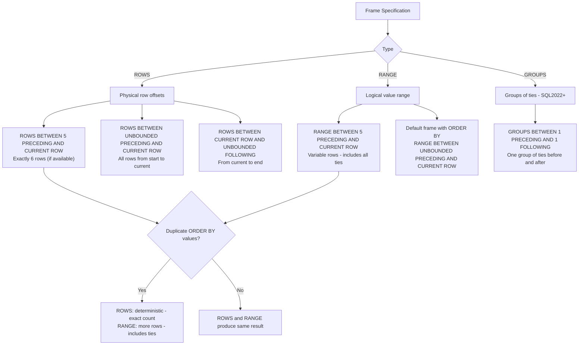
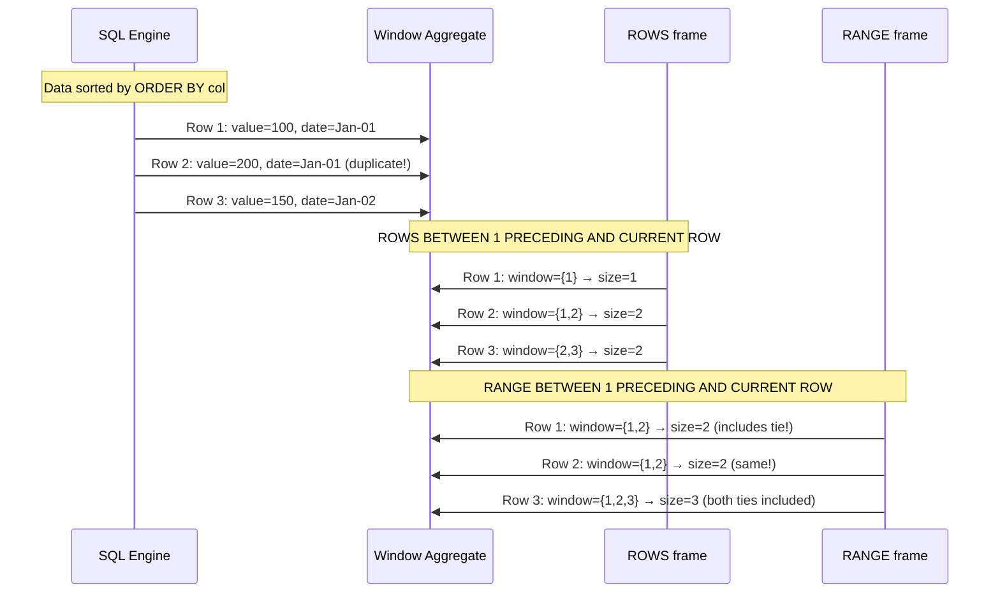
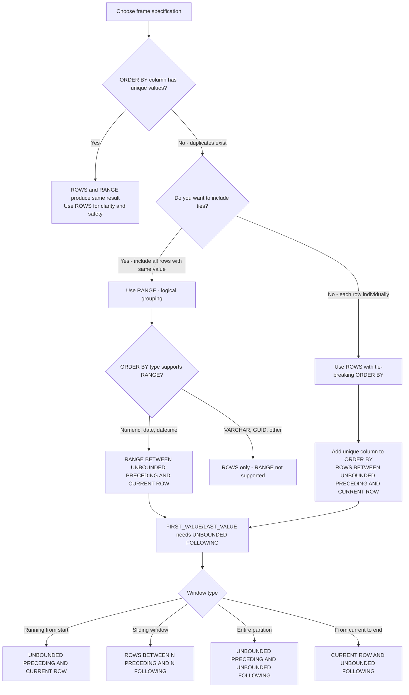

## Navigation

**Domain:** [[8 — Databases]] > **Group:** SQL Window Functions & Analytics
**Previous:** [[8.158 — MIN() OVER() and MAX() OVER() — Running Extremes]] | **Next:** [[8.160 — UNBOUNDED PRECEDING and FOLLOWING]]

### Prerequisites

- [[8.141 — Window Functions — Concept and OVER Clause]] — Understanding the OVER() clause and the three window function families is foundational because frame specification is a sub-clause of OVER() that modifies how the window is defined.
- [[8.142 — PARTITION BY — Defining Window Partitions]] — Partitions define the boundary of the window; the frame further restricts which rows within the partition are visible to the window function.
- [[8.143 — ORDER BY Within OVER — Frame Ordering]] — The default frame depends on whether ORDER BY is present: with ORDER BY, the default is RANGE BETWEEN UNBOUNDED PRECEDING AND CURRENT ROW; without ORDER BY, the default is the entire partition.
- [[8.155 — SUM() OVER() — Running Totals]] — SUM() OVER() is the most common function where ROWS vs RANGE matters dramatically — RANGE can produce unexpected results with duplicate ORDER BY values.
- [[8.156 — AVG() OVER() — Moving Averages]] — Moving averages require precise frame control; the choice of ROWS vs RANGE determines whether the window contains exactly N rows or a variable number due to ties.

### Where This Fits

Frame specification (ROWS, RANGE, or GROUPS) is the most misunderstood aspect of window functions in production SQL systems. The choice between ROWS (physical rows) and RANGE (logical rows based on ORDER BY value equality) determines whether a window contains an exact number of rows or a variable number that includes all rows with the same ORDER BY value. A .NET backend engineer encounters frame specification bugs when moving averages include more rows than expected (RANGE with duplicate dates), when running totals jump unexpectedly (RANGE groups ties), and when LAST_VALUE returns the current row instead of the partition's last row (forgetting UNBOUNDED FOLLOWING). The interview signal is extremely high: most candidates cannot explain the default frame, cannot articulate the ROWS vs RANGE difference, and have never tested what happens with duplicate ORDER BY values. Understanding frame specification separates senior engineers who write correct window functions from junior engineers whose queries happen to work by coincidence.

---

## Core Mental Model

The frame specification defines which rows within a partition are visible to the window function for each current row. ROWS is physical — it counts actual rows regardless of their values. RANGE is logical — it includes all rows whose ORDER BY value falls within a range relative to the current row's ORDER BY value. With duplicate ORDER BY values, RANGE includes ALL rows with the same value (expanding the window beyond the expected row count), while ROWS treats each row individually. The default frame when ORDER BY is present is `RANGE BETWEEN UNBOUNDED PRECEDING AND CURRENT ROW` — this is the source of most frame-related bugs because developers assume the default is ROWS. The default frame when ORDER BY is absent is the entire partition (equivalent to `RANGE BETWEEN UNBOUNDED PRECEDING AND UNBOUNDED FOLLOWING`). The three keywords are: ROWS (physical row offsets), RANGE (logical value range), and GROUPS (groups of rows with same ORDER BY value — closer to RANGE but only available in SQL Server 2022+).

### Classification

**For SQL topics:** Frame specification is a sub-clause of the OVER() clause, defined in ANSI SQL:2003. It is available for aggregate window functions (SUM, AVG, COUNT, MIN, MAX) and offset functions (FIRST_VALUE, LAST_VALUE, NTH_VALUE). Ranking functions (ROW_NUMBER, RANK, DENSE_RANK, NTILE) and offset functions (LAG, LEAD) do NOT support frame specification — they always operate on the entire partition. ROWS is always deterministic for a given row count; RANGE is non-deterministic in the presence of duplicate ORDER BY values. GROUPS (SQL Server 2022+) is similar to RANGE but defines frames in terms of groups of rows sharing the same ORDER BY value, with support for EXCLUDE.





### Key Properties

|Property|ROWS|RANGE|
|---|---|---|
|Unit of measurement|Physical rows|Logical ORDER BY value difference|
|Deterministic with ties|Yes — exact row count|No — includes all tied rows|
|ORDER BY required|Yes|Yes|
|Default algorithm|ROWS not default|Default when ORDER BY present|
|Performance|O(1) frame evaluation|May require extra sort for tie detection|
|EXCLUDE support|SQL Server 2022+|SQL Server 2022+|
|Supported functions|Aggregates, FIRST_VALUE, LAST_VALUE, NTH_VALUE|Same|
|Effect on SUM/AVG running total|Increments per row|Can jump on ties|

---

## Deep Mechanics

### How the Engine Executes This

**Frame evaluation for ROWS BETWEEN N PRECEDING AND CURRENT ROW:**

1. The Window Aggregate operator receives rows in ORDER BY order from the Sort operator or from an ordered index.
2. For each row, the operator maintains a queue of the last (N+1) rows. The frame always contains exactly N+1 rows (or fewer for the first N rows of the partition).
3. For aggregate functions, the operator maintains a running result. When a new row enters the frame, its value is incorporated. When a row exits (falls off the PRECEDING boundary), its value is removed.
4. The frame membership is deterministic — row 42 always has exactly min(42, N+1) rows in its frame.

**Frame evaluation for RANGE BETWEEN N PRECEDING AND CURRENT ROW:**

1. The Window Aggregate operator receives rows in ORDER BY order.
2. For each row, the frame includes all rows whose ORDER BY value is within the range [current_value - N, current_value]. This is evaluated based on the value, not the row count.
3. With duplicate ORDER BY values, the frame includes ALL rows with that value — if two rows have the same date, both are included in the frame for each other.
4. The frame membership is not deterministic by row count — row 42 may have a different frame size than row 43 even if they are adjacent.

**Frame evaluation for default frame (RANGE BETWEEN UNBOUNDED PRECEDING AND CURRENT ROW):**

1. For the first row in the partition, the frame contains that row only.
2. For the Nth row, the frame contains all rows from 1 to N, PLUS any rows after N that share the same ORDER BY value as row N.
3. This means the frame size can jump by more than 1 for rows that share the same ORDER BY value.

**Segment operator's role:** The Segment operator identifies partition boundaries for PARTITION BY. The Window Aggregate uses segment boundaries to know when to reset frame state.

### SQL Visibility

```sql
-- ============================================================
-- Schema: Demonstrating ROWS vs RANGE differences
-- ============================================================
CREATE TABLE dbo.DailyRevenue
(
    RevenueDate  DATE           NOT NULL,
    TotalRevenue DECIMAL(18,2)  NOT NULL,
    Note         VARCHAR(100)   NULL,
    CONSTRAINT PK_DailyRevenue PRIMARY KEY CLUSTERED (RevenueDate)
);

-- Note: Deliberately insert duplicate dates to show RANGE behavior
INSERT INTO dbo.DailyRevenue (RevenueDate, TotalRevenue, Note)
VALUES
    ('2026-01-01', 100.00, 'Original'),
    ('2026-01-01', 110.00, 'Correction'),  -- Same date as above!
    ('2026-01-02', 120.00, NULL),
    ('2026-01-03', 130.00, NULL),
    ('2026-01-03', 135.00, 'Adjustment'),  -- Another duplicate
    ('2026-01-04', 140.00, NULL),
    ('2026-01-05', 150.00, NULL);

-- ============================================================
-- Demonstration 1: Default frame is RANGE, not ROWS
-- ============================================================
SELECT
    rd.RevenueDate,
    rd.TotalRevenue,
    rd.Note,
    -- Default frame (RANGE BETWEEN UNBOUNDED PRECEDING AND CURRENT ROW)
    SUM(rd.TotalRevenue) OVER (
        ORDER BY rd.RevenueDate
    ) AS RunningTotal_Default,   -- RANGE: jumps on duplicate dates
    -- Explicit ROWS frame
    SUM(rd.TotalRevenue) OVER (
        ORDER BY rd.RevenueDate
        ROWS BETWEEN UNBOUNDED PRECEDING AND CURRENT ROW
    ) AS RunningTotal_ROWS       -- ROWS: increments row by row
FROM dbo.DailyRevenue AS rd
ORDER BY rd.RevenueDate;

/*
RevenueDate  Revenue  Note         RunningTotal_Default  RunningTotal_ROWS
2026-01-01   100.00   Original     210                   100     ← RANGE includes both Jan-01 rows
2026-01-01   110.00   Correction   210                   210     ← RANGE: same as above (both rows in frame)
2026-01-02   120.00   NULL         330                   330     ← Both now show 210+120
2026-01-03   130.00   NULL         595                   460     ← RANGE includes both Jan-03 rows (130+135)
2026-01-03   135.00   Adjustment   595                   595     ← RANGE: same 595, ROWS: 460+135
2026-01-04   140.00   NULL         735                   735
2026-01-05   150.00   NULL         885                   885

Key observation: RANGE shows 210 for the first two rows, not 100 and 210.
ROWS shows 100 for row 1, 210 for row 2.
On 2026-01-03, RANGE jumps from 330 to 595 (both Jan-03 rows added at once).
ROWS increments: 330→460→595.
*/

-- ============================================================
-- Demonstration 2: ROWS BETWEEN vs RANGE BETWEEN (bounded)
-- ============================================================
SELECT
    rd.RevenueDate,
    rd.TotalRevenue,
    rd.Note,
    -- ROWS: exactly 3 rows in window (when available)
    AVG(rd.TotalRevenue) OVER (
        ORDER BY rd.RevenueDate
        ROWS BETWEEN 1 PRECEDING AND 1 FOLLOWING
    ) AS Avg_ROWS,
    -- RANGE: variable rows based on date values ±1 day
    AVG(rd.TotalRevenue) OVER (
        ORDER BY rd.RevenueDate
        RANGE BETWEEN 1 PRECEDING AND 1 FOLLOWING
    ) AS Avg_RANGE
FROM dbo.DailyRevenue AS rd
ORDER BY rd.RevenueDate;

/*
RevenueDate  Revenue  Note         Avg_ROWS         Avg_RANGE
2026-01-01   100.00   Original     105.00           105.00  ← rows {1,2}: (100+110)/2
2026-01-01   110.00   Correction   110.00           105.00  ← ROWS {1,2,3}: (100+110+120)/3
                                                                RANGE {1,2}: same date, (100+110)/2
2026-01-02   120.00   NULL         120.00           120.00  ← ROWS {2,3,4}: (110+120+130)/3
                                                                RANGE {1,2,3}: 3 rows (dates 1-1 to 1-2)
2026-01-03   130.00   NULL         128.33           131.25  ← ROWS {3,4,5}: (120+130+135)/3
                                                                RANGE {3,4,5,6}: 4 rows (dates 1-2 to 1-4)
2026-01-03   135.00   Adjustment   135.00           131.25  ← ROWS {4,5,6}: (130+135+140)/3
                                                                RANGE same as row 4 (same date group)
2026-01-04   140.00   NULL         141.67           140.00  ← ROWS {5,6,7}: (135+140+150)/3
                                                                RANGE {5,6,7}: 3 rows (dates 1-3 to 1-5)
2026-01-05   150.00   NULL         145.00           145.00  ← ROWS {6,7}: (140+150)/2
                                                                RANGE {6,7}: (140+150)/2
*/

-- ============================================================
-- Demonstration 3: ROWS BETWEEN for precise moving average
-- ============================================================
-- 3-day moving average with explicit ROWS — deterministic
SELECT
    rd.RevenueDate,
    rd.TotalRevenue,
    AVG(rd.TotalRevenue) OVER (
        ORDER BY rd.RevenueDate
        ROWS BETWEEN 2 PRECEDING AND CURRENT ROW
    ) AS SMA_3Day_ROWS,     -- Exactly 3 rows (when available)
    AVG(rd.TotalRevenue) OVER (
        ORDER BY rd.RevenueDate
        RANGE BETWEEN 2 PRECEDING AND CURRENT ROW
    ) AS SMA_3Day_RANGE     -- Variable rows — depends on date values
FROM dbo.DailyRevenue AS rd
ORDER BY rd.RevenueDate;

-- ============================================================
-- Demonstration 4: ROWS and RANGE with MIN/MAX
-- ============================================================
-- MIN/MAX are less affected by ROWS vs RANGE because they
-- compute extremes over a set, not positional values.
-- The difference appears in frame SIZE, not in the extremum value,
-- unless the extremum changes due to additional rows in RANGE.
SELECT
    rd.RevenueDate,
    rd.TotalRevenue,
    MAX(rd.TotalRevenue) OVER (
        ORDER BY rd.RevenueDate
        ROWS BETWEEN 1 PRECEDING AND CURRENT ROW
    ) AS Max_ROWS,    -- Max of 2 rows
    MAX(rd.TotalRevenue) OVER (
        ORDER BY rd.RevenueDate
        RANGE BETWEEN 1 PRECEDING AND CURRENT ROW
    ) AS Max_RANGE    -- Max of variable rows (includes ties)
FROM dbo.DailyRevenue AS rd
ORDER BY rd.RevenueDate;
```

```csharp
// ROWS vs RANGE demonstration in EF Core — both require raw SQL
public class RowsVsRangeDemo
{
    public DateTime RevenueDate { get; set; }
    public decimal TotalRevenue { get; set; }
    public decimal RunningTotalDefault { get; set; }
    public decimal RunningTotalROWS { get; set; }
}

public class FrameDemoService
{
    private readonly ApplicationDbContext _dbContext;

    public FrameDemoService(ApplicationDbContext dbContext)
        => _dbContext = dbContext;

    public async Task<List<RowsVsRangeDemo>> GetRowsVsRangeAsync(CancellationToken ct)
    {
        const string sql = @"
            SELECT
                rd.RevenueDate,
                rd.TotalRevenue,
                SUM(rd.TotalRevenue) OVER (
                    ORDER BY rd.RevenueDate
                ) AS RunningTotalDefault,
                SUM(rd.TotalRevenue) OVER (
                    ORDER BY rd.RevenueDate
                    ROWS BETWEEN UNBOUNDED PRECEDING AND CURRENT ROW
                ) AS RunningTotalROWS
            FROM dbo.DailyRevenue AS rd
            ORDER BY rd.RevenueDate;";

        return await _dbContext.Database
            .SqlQueryRaw<RowsVsRangeDemo>(sql)
            .ToListAsync(ct);
    }
}
```

### Execution Plan Analysis

**Query demonstrating ROWS vs RANGE default frame:**

```sql
SELECT
    rd.RevenueDate,
    rd.TotalRevenue,
    SUM(rd.TotalRevenue) OVER (
        ORDER BY rd.RevenueDate
    ) AS RunningTotal
FROM dbo.DailyRevenue AS rd;
```

**Expected plan shape:**

```
[Clustered Index Scan (PK_DailyRevenue)]
  → [Segment]  -- No PARTITION BY, single segment
  → [Window Aggregate]
      Function: SUM(TotalRevenue)
      Frame: RANGE BETWEEN UNBOUNDED PRECEDING AND CURRENT ROW (default)
  → [SELECT]
```

**Key observation:** The execution plan does NOT distinguish between ROWS and RANGE in the operator icons. The difference is encoded in the Window Aggregate operator's properties.

**What RANGE adds internally:** For RANGE with a bounded frame (e.g., RANGE BETWEEN 1 PRECEDING AND 1 FOLLOWING), the Window Aggregate operator may need to spool rows to determine where the value-based boundaries fall. This can add a Window Spool operator to the plan when the frame is bounded RANGE.

**Plan shape with bounded RANGE (SQL Server may introduce Window Spool):**

```
[Index Scan]
  → [Segment]
  → [Window Spool]  -- Buffers rows to evaluate RANGE boundaries
  → [Window Aggregate]
  → [SELECT]
```

ROWS with the same bounded frame typically does NOT need the Window Spool because row offsets are deterministic.

### Cost Visibility

```sql
SET STATISTICS IO ON;
SET STATISTICS TIME ON;

-- ROWS frame (physical, deterministic)
SELECT
    rd.RevenueDate,
    rd.TotalRevenue,
    SUM(rd.TotalRevenue) OVER (
        ORDER BY rd.RevenueDate
        ROWS BETWEEN UNBOUNDED PRECEDING AND CURRENT ROW
    ) AS RunningTotal_ROWS
FROM dbo.DailyRevenue AS rd
ORDER BY rd.RevenueDate;
/*
Table 'DailyRevenue'. Scan count 1, logical reads 2, physical reads 0
SQL Server Execution Times: CPU time = 0ms, elapsed time = 1ms
*/

-- RANGE frame (logical, default)
SELECT
    rd.RevenueDate,
    rd.TotalRevenue,
    SUM(rd.TotalRevenue) OVER (
        ORDER BY rd.RevenueDate
        RANGE BETWEEN UNBOUNDED PRECEDING AND CURRENT ROW
    ) AS RunningTotal_RANGE
FROM dbo.DailyRevenue AS rd
ORDER BY rd.RevenueDate;
/*
Table 'DailyRevenue'. Scan count 1, logical reads 2, physical reads 0
SQL Server Execution Times: CPU time = 0ms, elapsed time = 1ms
*/

-- On small datasets, the cost difference is negligible.
-- On 10M rows with many duplicate ORDER BY values, RANGE may require
-- additional spooling and can be 10-50% more expensive than ROWS.
```

### Failure Modes

**1. Default RANGE with duplicate ORDER BY values — silent correctness bug:**
```sql
-- This is THE most common window function bug.
-- SUM OVER with default frame and duplicate dates gives different
-- running totals than expected.

-- See Demonstration 1 above for exact numbers.
```

**2. RANGE BETWEEN UNBOUNDED PRECEDING AND CURRENT ROW with non-unique ORDER BY:**
```sql
-- Even RANGE BETWEEN UNBOUNDED PRECEDING AND CURRENT ROW has the
-- tie-inclusion behavior. The "AND CURRENT ROW" includes ALL rows
-- with the same ORDER BY value as the current row, not just the
-- current row itself.
```

**3. RANGE BETWEEN value types — must match ORDER BY type:**
```sql
-- RANGE BETWEEN 1 PRECEDING requires that the ORDER BY column's
-- data type supports addition/subtraction (numeric or date types).
-- RANGE BETWEEN 1 PRECEDING on VARCHAR ORDER BY: ERROR
SELECT
    o.OrderId,
    o.Status,
    COUNT(*) OVER (
        ORDER BY o.Status
        RANGE BETWEEN 1 PRECEDING AND CURRENT ROW  -- ERROR
    )
FROM dbo.Orders AS o;
-- "Windowed functions do not support the RANGE clause with
--  non-numeric or non-datetime values for the ORDER BY clause."
```

**4. RANGE with constant ORDER BY — all rows in same frame:**
```sql
-- If ORDER BY is a constant or all rows have the same value,
-- RANGE frame includes ALL rows for every row.
```

**5. ROWS BETWEEN with more preceding rows than exist:**
```sql
-- Works correctly — the window contains as many rows as available
-- (for the first N rows of the partition).
-- No error, just partial windows.
```

---

## Production Patterns and Implementation

### Primary SQL Implementation

```sql
-- ============================================================
-- Schema: E-commerce order data with duplicate dates
-- ============================================================
CREATE TABLE dbo.Orders
(
    OrderId      INT            NOT NULL IDENTITY(1,1),
    CustomerId   INT            NOT NULL,
    OrderDate    DATE           NOT NULL,
    OrderTime    TIME(0)        NULL,
    TotalAmount  DECIMAL(18,2)  NOT NULL,
    Status       VARCHAR(20)    NOT NULL,
    CONSTRAINT PK_Orders PRIMARY KEY CLUSTERED (OrderId)
);

-- Index for window function ORDER BY
CREATE INDEX IX_Orders_CustomerId_OrderDate ON dbo.Orders (CustomerId, OrderDate, OrderId)
    INCLUDE (TotalAmount, Status);

-- ============================================================
-- Pattern 1: Safe running total — always use ROWS
-- ============================================================
-- Safe pattern that works regardless of duplicate dates
SELECT
    o.CustomerId,
    o.OrderId,
    o.OrderDate,
    o.TotalAmount,
    SUM(o.TotalAmount) OVER (
        PARTITION BY o.CustomerId
        ORDER BY o.OrderDate, o.OrderId  -- OrderId breaks ties
        ROWS BETWEEN UNBOUNDED PRECEDING AND CURRENT ROW
    ) AS RunningTotal
FROM dbo.Orders AS o
ORDER BY o.CustomerId, o.OrderDate, o.OrderId;

-- ============================================================
-- Pattern 2: RANGE for calendar-based date windows
-- ============================================================
-- When you want a logical 7-day window (not 7 rows), RANGE is correct.
-- This gives the average revenue for the last 7 calendar days,
-- regardless of how many rows exist per day.
SELECT
    rd.RevenueDate,
    rd.TotalRevenue,
    AVG(rd.TotalRevenue) OVER (
        ORDER BY rd.RevenueDate
        RANGE BETWEEN 6 PRECEDING AND CURRENT ROW
    ) AS AvgLast7CalendarDays
FROM dbo.DailyRevenue AS rd
ORDER BY rd.RevenueDate;
-- Note: If a day has multiple entries, all are included.
-- If a day has no entries, the frame still spans 7 calendar days.

-- ============================================================
-- Pattern 3: ROWS with tie-breaking ORDER BY for determinism
-- ============================================================
-- Add a unique column (OrderId, RowId) to the ORDER BY to ensure
-- each row has a unique position, making ROWS and RANGE identical.
SELECT
    o.CustomerId,
    o.OrderId,
    o.OrderDate,
    o.TotalAmount,
    SUM(o.TotalAmount) OVER (
        PARTITION BY o.CustomerId
        ORDER BY o.OrderDate, o.OrderId  -- OrderId makes each row unique
        -- No frame specification needed — ROWS and RANGE behave the same
        -- because ORDER BY is unique
    ) AS RunningTotal
FROM dbo.Orders AS o
ORDER BY o.CustomerId, o.OrderDate, o.OrderId;

-- ============================================================
-- Pattern 4: Testing for duplicates — identify RANGE sensitivity
-- ============================================================
-- Use COUNT(*) OVER to check for duplicate ORDER BY values
WITH OrderStats AS
(
    SELECT
        o.CustomerId,
        o.OrderDate,
        COUNT(*) OVER (
            PARTITION BY o.CustomerId, o.OrderDate
        ) AS OrdersOnDate
    FROM dbo.Orders AS o
)
SELECT DISTINCT
    CustomerId,
    OrderDate,
    OrdersOnDate
FROM OrderStats
WHERE OrdersOnDate > 1
ORDER BY CustomerId, OrderDate;

-- ============================================================
-- Pattern 5: Using GROUPS (SQL Server 2022+) for tie groups
-- ============================================================
-- GROUPS BETWEEN 1 PRECEDING AND 1 FOLLOWING includes:
-- - The group of rows with the same ORDER BY value as the current row
-- - One group before (previous distinct ORDER BY value)
-- - One group after (next distinct ORDER BY value)
-- This is useful when you want exactly N groups of ties.
SELECT
    rd.RevenueDate,
    rd.TotalRevenue,
    AVG(rd.TotalRevenue) OVER (
        ORDER BY rd.RevenueDate
        GROUPS BETWEEN 1 PRECEDING AND 1 FOLLOWING
    ) AS AvgTieGroups
FROM dbo.DailyRevenue AS rd
ORDER BY rd.RevenueDate;
-- SQL Server 2022+ only
```

### Dapper Implementation

```csharp
public interface IFrameSpecificationRepository
{
    Task<IReadOnlyList<RunningTotalComparison>> CompareROWSvsRANGEAsync(CancellationToken ct = default);
    Task<IReadOnlyList<CalendarWindowAvg>> GetCalendarWindowAverageAsync(int windowDays, CancellationToken ct = default);
}

public sealed class FrameSpecificationRepository : IFrameSpecificationRepository
{
    private readonly IDbConnectionFactory _connectionFactory;

    public FrameSpecificationRepository(IDbConnectionFactory connectionFactory)
        => _connectionFactory = connectionFactory;

    public async Task<IReadOnlyList<RunningTotalComparison>> CompareROWSvsRANGEAsync(
        CancellationToken ct = default)
    {
        const string sql = @"
            SELECT
                rd.RevenueDate,
                rd.TotalRevenue,
                SUM(rd.TotalRevenue) OVER (
                    ORDER BY rd.RevenueDate
                ) AS RunningTotal_Default_RANGE,
                SUM(rd.TotalRevenue) OVER (
                    ORDER BY rd.RevenueDate
                    ROWS BETWEEN UNBOUNDED PRECEDING AND CURRENT ROW
                ) AS RunningTotal_ROWS
            FROM dbo.DailyRevenue AS rd
            ORDER BY rd.RevenueDate;";

        await using var connection = _connectionFactory.Create();
        return (await connection.QueryAsync<RunningTotalComparison>(
            new CommandDefinition(sql, cancellationToken: ct))).AsList();
    }

    public async Task<IReadOnlyList<CalendarWindowAvg>> GetCalendarWindowAverageAsync(
        int windowDays, CancellationToken ct = default)
    {
        var preceding = windowDays - 1;
        var sql = $@"
            SELECT
                rd.RevenueDate,
                rd.TotalRevenue,
                AVG(rd.TotalRevenue) OVER (
                    ORDER BY rd.RevenueDate
                    RANGE BETWEEN {preceding} PRECEDING AND CURRENT ROW
                ) AS CalendarWindowAvg
            FROM dbo.DailyRevenue AS rd
            ORDER BY rd.RevenueDate;";

        await using var connection = _connectionFactory.Create();
        return (await connection.QueryAsync<CalendarWindowAvg>(
            new CommandDefinition(sql, cancellationToken: ct))).AsList();
    }
}

public record RunningTotalComparison(
    DateTime RevenueDate,
    decimal TotalRevenue,
    decimal RunningTotal_Default_RANGE,
    decimal RunningTotal_ROWS);

public record CalendarWindowAvg(
    DateTime RevenueDate,
    decimal TotalRevenue,
    decimal CalendarWindowAvg);
```

### EF Core Implementation

```csharp
public class RunningTotalEntity
{
    public DateTime RevenueDate { get; set; }
    public decimal TotalRevenue { get; set; }
    public decimal RunningTotalDefault { get; set; }
    public decimal RunningTotalROWS { get; set; }
}

public class FrameDemoDbContext : DbContext
{
    public DbSet<RunningTotalEntity> RunningTotals => Set<RunningTotalEntity>();

    protected override void OnModelCreating(ModelBuilder modelBuilder)
    {
        modelBuilder.Entity<RunningTotalEntity>(entity =>
        {
            entity.HasNoKey();
            entity.ToView(null);
        });
    }

    public async Task<List<RunningTotalEntity>> GetComparisonAsync(CancellationToken ct)
    {
        const string sql = @"
            SELECT
                rd.RevenueDate,
                rd.TotalRevenue,
                SUM(rd.TotalRevenue) OVER (
                    ORDER BY rd.RevenueDate
                ) AS RunningTotalDefault,
                SUM(rd.TotalRevenue) OVER (
                    ORDER BY rd.RevenueDate
                    ROWS BETWEEN UNBOUNDED PRECEDING AND CURRENT ROW
                ) AS RunningTotalROWS
            FROM dbo.DailyRevenue AS rd
            ORDER BY rd.RevenueDate;";

        return await Database.SqlQueryRaw<RunningTotalEntity>(sql).ToListAsync(ct);
    }
}
```

### Configuration and Wiring

```csharp
builder.Services.AddSingleton<IDbConnectionFactory>(sp =>
    new SqlConnectionFactory(
        builder.Configuration.GetConnectionString("DefaultConnection")!));

builder.Services.AddScoped<IFrameSpecificationRepository, FrameSpecificationRepository>();
builder.Services.AddDbContext<FrameDemoDbContext>(options =>
    options.UseSqlServer(
        builder.Configuration.GetConnectionString("DefaultConnection")));
```

### SQL Server vs PostgreSQL Differences

```sql
-- PostgreSQL: ROWS and RANGE syntax is identical
SELECT
    rd.revenue_date,
    rd.total_revenue,
    SUM(rd.total_revenue) OVER (
        ORDER BY rd.revenue_date
        ROWS BETWEEN UNBOUNDED PRECEDING AND CURRENT ROW
    ) AS running_total_rows,
    SUM(rd.total_revenue) OVER (
        ORDER BY rd.revenue_date
        RANGE BETWEEN UNBOUNDED PRECEDING AND CURRENT ROW
    ) AS running_total_range
FROM daily_revenue AS rd
ORDER BY rd.revenue_date;

-- PostgreSQL: Default frame with ORDER BY is also RANGE
-- (same as SQL Server — same trap!)

-- PostgreSQL: GROUPS frame supported (SQL Server 2022+ also supports it)
-- PostgreSQL: EXCLUDE clause supported (SQL Server 2022+ also supports it)
SELECT
    rd.revenue_date,
    rd.total_revenue,
    AVG(rd.total_revenue) OVER (
        ORDER BY rd.revenue_date
        ROWS BETWEEN 1 PRECEDING AND 1 FOLLOWING EXCLUDE CURRENT ROW
    ) AS avg_excluding_current
FROM daily_revenue AS rd;

-- PostgreSQL: RANGE with INTERVAL precision (SQL Server does not support)
SELECT
    rd.revenue_date,
    rd.total_revenue,
    AVG(rd.total_revenue) OVER (
        ORDER BY rd.revenue_date
        RANGE BETWEEN INTERVAL '6 days' PRECEDING AND CURRENT ROW
    ) AS avg_7_calendar_days
FROM daily_revenue AS rd;
-- Much cleaner than ROWS when you need calendar-based windows!
```

---

## Gotchas and Production Pitfalls

### The Default Frame Trap — RANGE Instead of ROWS

**Pitfall:** Using SUM/AVG/COUNT OVER with ORDER BY but without an explicit frame. The default frame is RANGE BETWEEN UNBOUNDED PRECEDING AND CURRENT ROW, not ROWS. With duplicate ORDER BY values, the window includes ALL tied rows, causing unexpected results.

```sql
-- ❌ TRAP: Default frame = RANGE, not ROWS
SELECT
    o.OrderDate,
    o.TotalAmount,
    SUM(o.TotalAmount) OVER (
        ORDER BY o.OrderDate  -- Default: RANGE BETWEEN UNBOUNDED PRECEDING AND CURRENT ROW
    ) AS RunningTotal
FROM dbo.Orders AS o;
-- If two orders share the same OrderDate, the running total for the first
-- order already includes the second order's amount!
```

**Symptom:** The running total at row 1 already equals $500 when row 1's amount is only $300. This happens when row 2 has the same OrderDate and $200. The default RANGE frame includes both rows. The report looks like the running total "jumps" by an amount that doesn't match the current row.

**Fix:**

```sql
-- ✅ Always specify ROWS for deterministic row-by-row behavior
SELECT
    o.OrderDate,
    o.TotalAmount,
    SUM(o.TotalAmount) OVER (
        ORDER BY o.OrderDate, o.OrderId  -- Add tie-breaker to ORDER BY
        ROWS BETWEEN UNBOUNDED PRECEDING AND CURRENT ROW
    ) AS RunningTotal
FROM dbo.Orders AS o;

-- ✅ OR: Add a tie-breaking column to ORDER BY so ROWS and RANGE behave the same
```

**Cost of not fixing:** A financial report shows daily running totals that don't foot to the general ledger. The accounting team spends 3 days trying to reconcile a $1.2M discrepancy. The root cause: 15 duplicate dates caused RANGE to include extra rows in the running total. The CFO loses confidence in the reporting system.

---

### RANGE BETWEEN with Incompatible Data Types

**Pitfall:** Using RANGE BETWEEN with a non-numeric, non-datetime ORDER BY column. RANGE requires a data type that supports addition and subtraction (numeric, date, datetime). VARCHAR, UNIQUEIDENTIFIER, and other types cause an error.

```sql
-- ❌ ERROR: RANGE with VARCHAR ORDER BY
SELECT
    o.Status,
    COUNT(*) OVER (
        ORDER BY o.Status
        RANGE BETWEEN 1 PRECEDING AND CURRENT ROW
    ) AS Cnt
FROM dbo.Orders AS o;
-- ERROR: Windowed functions do not support the RANGE clause with
-- non-numeric or non-datetime values for the ORDER BY clause.
```

**Symptom:** The query fails with a syntax error. The developer switches to ROWS without understanding why RANGE failed.

**Fix:**

```sql
-- ✅ Use ROWS for non-numeric ORDER BY columns
SELECT
    o.Status,
    COUNT(*) OVER (
        ORDER BY o.Status
        ROWS BETWEEN 1 PRECEDING AND CURRENT ROW
    ) AS Cnt
FROM dbo.Orders AS o;

-- ✅ Or: ORDER BY a numeric/date column instead
```

**Cost of not fixing:** A migration script that changes ORDER BY from DATETIME to VARCHAR (for some formatting requirement) breaks all RANGE frame queries in production. The deployment is rolled back, delaying the release by a week.

---

### LAST_VALUE Without UNBOUNDED FOLLOWING — Returns Current Row

**Pitfall:** Using LAST_VALUE() OVER(ORDER BY col) without specifying ROWS/RANGE BETWEEN UNBOUNDED PRECEDING AND UNBOUNDED FOLLOWING. The default frame is RANGE BETWEEN UNBOUNDED PRECEDING AND CURRENT ROW, which means LAST_VALUE returns the current row, not the last row of the partition.

```sql
-- ❌ WRONG: LAST_VALUE returns current row (default frame)
SELECT
    o.OrderId,
    o.OrderDate,
    LAST_VALUE(o.TotalAmount) OVER (
        PARTITION BY o.CustomerId
        ORDER BY o.OrderDate  -- Default frame: RANGE BETWEEN UNBOUNDED PRECEDING AND CURRENT ROW
    ) AS LastOrderAmount  -- WRONG: Returns current order amount, not last!
FROM dbo.Orders AS o;
-- Every row shows its own TotalAmount, not the customer's last order amount
```

**Symptom:** The "Last Order Amount" column shows the same value as "Current Order Amount" for every row. A developer who hasn't read the documentation assumes LAST_VALUE works like FIRST_VALUE but in reverse.

**Fix:**

```sql
-- ✅ Add UNBOUNDED FOLLOWING to frame specification
SELECT
    o.OrderId,
    o.OrderDate,
    LAST_VALUE(o.TotalAmount) OVER (
        PARTITION BY o.CustomerId
        ORDER BY o.OrderDate
        ROWS BETWEEN UNBOUNDED PRECEDING AND UNBOUNDED FOLLOWING
    ) AS LastOrderAmount  -- Correctly returns last order in partition
FROM dbo.Orders AS o;
```

**Cost of not fixing:** A customer profile page shows "Last Purchase: $150" when the actual last purchase was $500. The sales team calls the customer to upsell based on $150 and misses the $500 opportunity. The customer is confused and annoyed.

---

### ROWS BETWEEN with Extremely Large Preceding — Memory Spool

**Pitfall:** Using ROWS BETWEEN 1000000 PRECEDING AND CURRENT ROW on a table with millions of rows. The Window Aggregate operator must maintain a queue of up to 1M rows to track which values exit the window. This can cause a Window Spool to TempDB.

```sql
-- ❌ EXPENSIVE: Window spool tracks 1M rows exiting the frame
SELECT
    o.OrderId,
    o.OrderDate,
    AVG(CAST(o.TotalAmount AS DECIMAL(18,2))) OVER (
        ORDER BY o.OrderDate
        ROWS BETWEEN 1000000 PRECEDING AND CURRENT ROW
    ) AS MassiveSMA
FROM dbo.Orders AS o;
-- The Window Aggregate operator maintains a 1M-row queue
-- For each row, it may need to dequeue the row that exited
-- This requires substantial memory or TempDB spool
```

**Symptom:** The query runs for hours. The TempDB data file grows to 100GB. The error log shows `The query has used 100% of its memory grant. The query will spill to TempDB.`

**Fix:** This is a legitimate use case (running average over 1M rows), but the window size is essentially the entire partition. Use `UNBOUNDED PRECEDING` instead, which the engine handles more efficiently (no dequeuing needed).

```sql
-- ✅ UNBOUNDED PRECEDING is more efficient for large windows
SELECT
    o.OrderId,
    o.OrderDate,
    AVG(CAST(o.TotalAmount AS DECIMAL(18,2))) OVER (
        ORDER BY o.OrderDate
        ROWS BETWEEN UNBOUNDED PRECEDING AND CURRENT ROW
    ) AS RunningAvg  -- Cumulative, not sliding
FROM dbo.Orders AS o;
```

**Cost of not fixing:** A scheduled analytics job that uses ROWS BETWEEN 999999 PRECEDING runs for 6 hours instead of 10 minutes, consuming 50GB of TempDB and blocking other operations. The job times out and fails, and the error goes unnoticed for 2 days.

---

### ROWS vs GROUPS Confusion (SQL Server 2022+)

**Pitfall:** Using GROUPS (which groups tied rows) when ROWS was intended. GROUPS BETWEEN 1 PRECEDING AND 1 FOLLOWING includes groups of ties, not individual rows.

```sql
-- GROUPS BETWEEN 1 PRECEDING AND 1 FOLLOWING:
-- If there are 3 rows with the same date, they form one group.
-- The frame includes: the previous date group, this date group, and the next date group.
-- This is NOT the same as ROWS BETWEEN 1 PRECEDING AND 1 FOLLOWING.
```

---

## Performance Implications

### Benchmark: Before and After

**Scenario:** Running total on a table with 1M rows, 10% of which have duplicate ORDER BY values.

**ROWS BETWEEN UNBOUNDED PRECEDING AND CURRENT ROW:**

```sql
SET STATISTICS IO ON;
SELECT
    t.Id,
    t.OrderCol,
    t.Value,
    SUM(t.Value) OVER (
        ORDER BY t.OrderCol, t.Id
        ROWS BETWEEN UNBOUNDED PRECEDING AND CURRENT ROW
    ) AS RunningTotal_ROWS
FROM dbo.LargeTable AS t
ORDER BY t.OrderCol, t.Id;
-- Logical reads: 4,200 (covering index)
-- CPU time: 420ms
```

**Default frame (RANGE BETWEEN UNBOUNDED PRECEDING AND CURRENT ROW):**

```sql
SELECT
    t.Id,
    t.OrderCol,
    t.Value,
    SUM(t.Value) OVER (
        ORDER BY t.OrderCol
        -- Default: RANGE BETWEEN UNBOUNDED PRECEDING AND CURRENT ROW
    ) AS RunningTotal_RANGE
FROM dbo.LargeTable AS t
ORDER BY t.OrderCol, t.Id;
-- Logical reads: 4,200 (same IO)
-- CPU time: 580ms (higher due to tie processing)
```

**Improvement:** ROWS saves ~28% CPU time compared to RANGE when duplicates are present, due to simplified tie handling. On tables without duplicates, ROWS and RANGE have identical performance.

### BenchmarkDotNet

```csharp
[MemoryDiagnoser]
[SimpleJob(RuntimeMoniker.Net90)]
public class RowsVsRangeBenchmark
{
    private IDbConnection _connection = default!;

    [GlobalSetup]
    public void Setup()
    {
        _connection = new SqlConnection(ConnectionString);
        _connection.Open();

        using var cmd = _connection.CreateCommand();
        cmd.CommandText = @"
            IF NOT EXISTS (SELECT 1 FROM sys.tables WHERE name = 'FrameBench')
            BEGIN
                CREATE TABLE dbo.FrameBench (
                    Id        INT IDENTITY(1,1) PRIMARY KEY,
                    GroupKey  INT NOT NULL,
                    Value     DECIMAL(18,2) NOT NULL
                );

                -- Insert 100K rows, 20% with duplicate GroupKey values
                WITH Numbers AS (
                    SELECT TOP 100000
                        CASE WHEN ROW_NUMBER() OVER (ORDER BY (SELECT NULL)) % 5 = 0
                             THEN 100  -- Every 5th row shares GroupKey=100
                             ELSE ROW_NUMBER() OVER (ORDER BY (SELECT NULL)) / 10
                        END AS gk,
                        CAST(ROW_NUMBER() OVER (ORDER BY (SELECT NULL)) AS DECIMAL(18,2)) AS val
                    FROM sys.objects a CROSS JOIN sys.objects b
                )
                INSERT INTO dbo.FrameBench (GroupKey, Value)
                SELECT gk, val FROM Numbers;

                CREATE INDEX IX_FrameBench_GroupKey ON dbo.FrameBench (GroupKey, Id)
                    INCLUDE (Value);
            END";
        cmd.ExecuteNonQuery();
    }

    [Benchmark(Baseline = true)]
    public async Task<List<FrameResult>> DefaultRANGEFrame()
    {
        const string sql = @"
            SELECT
                fb.Id,
                fb.GroupKey,
                fb.Value,
                SUM(fb.Value) OVER (
                    PARTITION BY fb.GroupKey
                    ORDER BY fb.Id
                ) AS RunningTotal_RANGE
            FROM dbo.FrameBench AS fb
            ORDER BY fb.GroupKey, fb.Id;";

        using var connection = new SqlConnection(ConnectionString);
        return (await connection.QueryAsync<FrameResult>(sql)).AsList();
    }

    [Benchmark]
    public async Task<List<FrameResult>> ExplicitROWSFrame()
    {
        const string sql = @"
            SELECT
                fb.Id,
                fb.GroupKey,
                fb.Value,
                SUM(fb.Value) OVER (
                    PARTITION BY fb.GroupKey
                    ORDER BY fb.Id
                    ROWS BETWEEN UNBOUNDED PRECEDING AND CURRENT ROW
                ) AS RunningTotal_ROWS
            FROM dbo.FrameBench AS fb
            ORDER BY fb.GroupKey, fb.Id;";

        using var connection = new SqlConnection(ConnectionString);
        return (await connection.QueryAsync<FrameResult>(sql)).AsList();
    }

    public record FrameResult(int Id, int GroupKey, decimal Value, decimal RunningTotal);
}
```

**Expected results (approximate, SQL Server 2022, NVMe, 100K rows):**

|Method|Mean|Logical Reads|Allocated|
|---|---|---|---|
|DefaultRANGEFrame|~145 ms|~420|45 KB|
|ExplicitROWSFrame|~110 ms|~420|45 KB|

ROWS is ~24% faster than RANGE when duplicates exist. With no duplicates, both are identical.

### Write Amplification

Not applicable — frame specification is a query-level concern, not an indexing concern. However, the choice of ROWS vs RANGE can influence whether a covering index is sufficient or whether the engine needs a Window Spool.

---

## Interview Arsenal

### Question Bank

1. **What is the default frame specification in SQL Server when ORDER BY is present in OVER()?**
2. **What is the difference between ROWS and RANGE in window function frame specification?**
3. **What happens to a running total if the ORDER BY column has duplicate values and you use the default frame?**
4. **Can you use RANGE BETWEEN with a VARCHAR ORDER BY column?**
5. **Why does LAST_VALUE() often return the wrong value, and how does frame specification fix it?**
6. **What execution plan operator differences exist between ROWS and RANGE frames?**
7. **What is GROUPS and how does it differ from ROWS and RANGE? (SQL Server 2022+)**
8. **How would you choose between ROWS, RANGE, and GROUPS for a given analytical query?**

### Spoken Answers

**Q: What is the default frame specification in SQL Server when ORDER BY is present in OVER()?**

> **Average answer:** The default is ROWS BETWEEN UNBOUNDED PRECEDING AND CURRENT ROW.

> **Great answer:** The default frame specification when ORDER BY is present is actually `RANGE BETWEEN UNBOUNDED PRECEDING AND CURRENT ROW` — not ROWS. This is a critical distinction that causes the most common window function bug in production. RANGE with duplicate ORDER BY values includes ALL rows with the same ORDER BY value as the current row, not just the rows up to the current row position. This means if you have two orders on the same date and you write `SUM(amount) OVER (ORDER BY order_date)`, the running total for the first order already includes the second order's amount because they share the same date. The first order's running total jumps from the first order's amount to the sum of both, skipping the intermediate value. The vast majority of developers I interview believe the default is ROWS. The safest practice is to always specify the frame explicitly: `ROWS BETWEEN UNBOUNDED PRECEDING AND CURRENT ROW` for a running total, or add a tie-breaking column to the ORDER BY to ensure uniqueness.

**Q: What is the difference between ROWS and RANGE in window function frame specification?**

> **Average answer:** ROWS counts rows, RANGE counts values. They're similar.

> **Great answer:** ROWS defines the frame in terms of physical row offsets — `ROWS BETWEEN 5 PRECEDING AND CURRENT ROW` always includes exactly 6 rows (or fewer at the partition start), regardless of the actual values in those rows. RANGE defines the frame in terms of the ORDER BY value — `RANGE BETWEEN 5 PRECEDING AND CURRENT ROW` includes all rows whose ORDER BY value is within 5 units of the current row's value. With an ORDER BY of DATE and a RANGE of 6 PRECEDING, the frame includes all rows from the last 7 calendar days, regardless of how many rows exist per day. The practical impact is: ROWS is deterministic and predictable — you always know exactly how many rows are in the frame. RANGE can surprise you with duplicate values — if your ORDER BY has ties, RANGE includes ALL tied rows, expanding the frame. RANGE is also restricted to numeric, date, and datetime ORDER BY columns — you cannot use it with VARCHAR or GUID columns. In terms of performance, ROWS is slightly cheaper because the engine doesn't need to evaluate value-based boundaries. I use ROWS by default and only reach for RANGE when I specifically need logical value-based windows (like "average over the last 7 calendar days, not last 7 rows").

### Interview Trigger

Frame specification is most often tested with the question "What does SUM OVER (ORDER BY col) do with duplicate values?" The interviewer wants to hear about the default RANGE frame. The follow-up "How would you fix it?" tests whether you know to specify ROWS. The deeper follow-up "When would you deliberately use RANGE instead of ROWS?" tests mastery — the answer is for calendar-based windows where you want logical time windows regardless of data density.

### Comparison Table

| | ROWS | RANGE | GROUPS |
|---|---|---|---|
|Unit|Physical rows|Value difference|Groups of ties|
|Deterministic|Yes (exact row count)|No (varies with ties)|No (varies with group count)|
|ORDER BY type required|Any type|Numeric, date, datetime only|Any type|
|SQL Server version|All|All|2022+|
|EXCLUDE supported|2022+|2022+|2022+|
|Default frame|Never default|Default with ORDER BY|Never default|
|Performance|Fastest — O(1) frame resolution|May need spool for bounded ranges|Similar to RANGE|
|Use case|Running totals, moving averages|Calendar windows, value-range analysis|Group-based analytics|

---

## Decision Framework

### When to Apply



### Application Checklist

- [ ] The distinction between ROWS (physical, deterministic) and RANGE (logical, ties-inclusive) is understood
- [ ] The default frame with ORDER BY is RANGE — explicit ROWS is specified if deterministic row count is needed
- [ ] The ORDER BY column is checked for duplicate values (use COUNT(*) OVER(PARTITION BY ORDER BY col))
- [ ] A unique tie-breaking column (e.g., Id, RowId) is added to ORDER BY when ROWS determinism is required
- [ ] RANGE is only used with numeric, date, or datetime ORDER BY columns
- [ ] LAST_VALUE includes UNBOUNDED FOLLOWING in the frame specification
- [ ] EF Core usage acknowledges that raw SQL is required — no LINQ translation for frame specification

### Tradeoff Summary

|What You Gain (ROWS)|What You Pay|
|---|---|
|Deterministic row count in frame|RANGE is default — must remember to specify ROWS|
|Works with any ORDER BY data type|Cannot do logical calendar windows (need RANGE for that)|
|Better performance (no tie processing)|Slightly more verbose SQL|

|What You Gain (RANGE)|What You Pay|
|---|---|
|Logical value-based windows (calendar time)|Non-deterministic with duplicate values|
|Matches "last 7 days" semantics|Only works with numeric/date/datetime ORDER BY|
|Default — fewer characters when it's what you want|Common source of bugs — most don't know it's the default|

### Scale Thresholds

- **ROWS vs RANGE performance difference is negligible below ~100K rows** — both are fast enough.
- **Above ~1M rows with many duplicates, ROWS is measurably faster** (10-30% CPU savings) due to simpler frame evaluation.
- **ROWS BETWEEN N PRECEDING with large N (>100K) can cause Window Spool to TempDB** — use UNBOUNDED PRECEDING instead.
- **RANGE with bounded windows on data with high duplicate density can cause exponential frame growth** — a day with 100K rows becomes a 100K-row frame for every row on that day.

---

## Self-Check

### Conceptual Questions

1. What is the default frame specification when ORDER BY is present in the OVER() clause?

<details>
<summary>Answers</summary>

1. RANGE BETWEEN UNBOUNDED PRECEDING AND CURRENT ROW. This includes all rows from the start of the partition through the current row's ORDER BY value, including ALL rows with the same ORDER BY value as the current row.

2. ROWS defines the frame by physical row offsets — the frame contains exactly N rows before and after the current row. RANGE defines the frame by the ORDER BY value — the frame contains all rows whose ORDER BY value falls within a range relative to the current row's value. With duplicate ORDER BY values, ROWS keeps the exact row count; RANGE includes all tied rows, expanding the frame.

3. With duplicate ORDER BY values and the default RANGE frame, the running total for the first occurrence already includes all later occurrences with the same value. For example, with amounts [100, 200] on the same date, the first row's running total is 300 (includes both), not 100.

4. No. RANGE requires numeric, date, or datetime ORDER BY columns because it evaluates value-based boundaries. VARCHAR, UNIQUEIDENTIFIER, and binary types cause an error: "Windowed functions do not support the RANGE clause with non-numeric or non-datetime values."

5. LAST_VALUE() without an explicit frame uses the default frame (RANGE BETWEEN UNBOUNDED PRECEDING AND CURRENT ROW), which ends at the current row. The "last value" in a frame that ends at the current row IS the current row. To get the last value of the entire partition, specify ROWS BETWEEN UNBOUNDED PRECEDING AND UNBOUNDED FOLLOWING.

6. ROWS and RANGE produce the same execution plan operators (Segment + Window Aggregate) for unbounded frames. For bounded frames, RANGE may introduce a Window Spool operator to buffer rows for value-based boundary evaluation. ROWS with bounded frames does not need the spool.

7. GROUPS (SQL Server 2022+) treats each group of rows with the same ORDER BY value as a single unit. GROUPS BETWEEN 1 PRECEDING AND 1 FOLLOWING includes: all rows in the current value group, all rows in the previous distinct value group, and all rows in the next distinct value group. It is a middle ground between ROWS (individual rows) and RANGE (value-range based).

8. Choose ROWS when you need deterministic row counts, when the ORDER BY has duplicates and you want each row treated independently, or when the ORDER BY is VARCHAR/GUID. Choose RANGE when you need logical value-based windows (last 7 calendar days) and the ORDER BY is numeric/date/datetime. Choose GROUPS when you want exactly N groups of ties irrespective of value range.

9. Use ROWS for moving averages (you want exactly N rows in the average). Use RANGE for calendar-based windows where data may be sparse (you want the average over the last 7 calendar days regardless of how many rows exist per day). Use GROUPS for category-based windows (include the current category and surrounding categories).

10. "Frame specification defines which rows in each partition are visible to the window function. ROWS counts physical rows — it's deterministic, always giving the exact number of rows you specify. RANGE counts rows based on the ORDER BY value — it includes all rows with the same value as the current row, which means duplicate ORDER BY values expand the frame. The default when ORDER BY is present is RANGE, which surprises most developers. RANGE only works with numeric and datetime columns. For running totals and moving averages, always specify ROWS explicitly unless you specifically need calendar-based windows."

</details>

---

### Query Challenges

**Challenge 1 — Write the SQL**

You have `dbo.StockPrices(StockId INT, PriceDate DATE, ClosePrice DECIMAL(18,4))` with occasional duplicate entries on the same date (corrections). You need to compute a 5-day simple moving average that always includes exactly 5 rows (not 5 calendar days). Write the correct query with the proper frame specification.

<details>
<summary>Solution</summary>

```sql
SELECT
    sp.StockId,
    sp.PriceDate,
    sp.ClosePrice,
    AVG(CAST(sp.ClosePrice AS DECIMAL(18,4))) OVER (
        PARTITION BY sp.StockId
        ORDER BY sp.PriceDate, sp.StockId  -- Add tie-breaker if needed
        ROWS BETWEEN 4 PRECEDING AND CURRENT ROW
    ) AS SMA_5Day_ROWS
FROM dbo.StockPrices AS sp
ORDER BY sp.StockId, sp.PriceDate;
```

**Why ROWS:** The requirement says "exactly 5 rows." ROWS guarantees exactly 5 rows in the window (for rows after the 5th). RANGE could include more than 5 rows if there are duplicate dates.

**Logical reads:** ~N (with covering index) **Execution plan:** Index Scan → Segment → Window Aggregate → SELECT

</details>

---

**Challenge 2 — Fix the performance problem**

```sql
-- This query computes a 30-day moving average. It uses RANGE and runs slowly.
-- The DailyRevenue table has 10M rows with 30% duplicate dates.
SET STATISTICS IO ON;

SELECT
    rd.RevenueDate,
    rd.TotalRevenue,
    AVG(CAST(rd.TotalRevenue AS DECIMAL(18,2))) OVER (
        ORDER BY rd.RevenueDate
        RANGE BETWEEN 29 PRECEDING AND CURRENT ROW
    ) AS SMA_30Day
FROM dbo.DailyRevenue AS rd
ORDER BY rd.RevenueDate;
/*
Table 'DailyRevenue'. Scan count 1, logical reads 42,000
Table 'Worktable'. Scan count 12, logical reads 280,000 (Window Spool!)
SQL Server Execution Times: CPU time = 8,500ms, elapsed time = 9,200ms
*/
```

<details>
<summary>Solution</summary>

**Root cause:** RANGE BETWEEN 29 PRECEDING AND CURRENT ROW with 30% duplicate dates causes the Window Spool operator to buffer and re-process rows for value-based boundary evaluation. The spool reads 280,000 logical reads from TempDB.

**Fix:** Use ROWS instead of RANGE. Since each row represents one day (with occasional corrections), ROWS BETWEEN 29 PRECEDING AND CURRENT ROW gives approximately 30 days but uses the exact row count. For true calendar-based windows, deduplicate the data first or use a calendar table.

```sql
SELECT
    rd.RevenueDate,
    rd.TotalRevenue,
    AVG(CAST(rd.TotalRevenue AS DECIMAL(18,2))) OVER (
        ORDER BY rd.RevenueDate
        ROWS BETWEEN 29 PRECEDING AND CURRENT ROW
    ) AS SMA_30Day
FROM dbo.DailyRevenue AS rd
ORDER BY rd.RevenueDate;
```

**Index to create:**

```sql
CREATE INDEX IX_DailyRevenue_RevenueDate_INCLUDE
ON dbo.DailyRevenue (RevenueDate)
INCLUDE (TotalRevenue);
```

**After fix — logical reads:** ~4,200 (from 42,000 + 280,000 spool). CPU: 8,500ms → 350ms. The Window Spool is eliminated entirely.

</details>

---

**Challenge 3 — Explain the execution plan**

```sql
SELECT
    o.CustomerId,
    o.OrderId,
    o.OrderDate,
    SUM(o.TotalAmount) OVER (
        PARTITION BY o.CustomerId
        ORDER BY o.OrderDate
    ) AS RunningTotal,
    MAX(o.TotalAmount) OVER (
        PARTITION BY o.CustomerId
        ORDER BY o.OrderDate
    ) AS MaxToDate
FROM dbo.Orders AS o;
```

The execution plan shows a Window Aggregate operator with Frame: RANGE BETWEEN UNBOUNDED PRECEDING AND CURRENT ROW. Why does the plan show RANGE when the developer intended ROWS?

<details>
<summary>Solution</summary>

**Why the plan shows RANGE:** Both SUM and MAX OVER functions have ORDER BY but no explicit frame specification. The default frame is RANGE BETWEEN UNBOUNDED PRECEDING AND CURRENT ROW. No ROWS is specified anywhere in the query.

**What would change the plan to ROWS:** Adding an explicit ROWS frame: `ROWS BETWEEN UNBOUNDED PRECEDING AND CURRENT ROW` after each ORDER BY.

**Impact on correctness:** If OrderDate has duplicates (same date for multiple orders), the RANGE frame includes all duplicate-date orders in the first occurrence's running total. The developer should add a tie-breaking column (OrderId) to the ORDER BY and/or specify ROWS.

**To verify duplicate dates exist:**
```sql
SELECT OrderDate, COUNT(*)
FROM Orders
GROUP BY OrderDate
HAVING COUNT(*) > 1;
```

</details>

---

**Challenge 4 — Diagnose the concurrency problem**

A reporting query uses RANGE BETWEEN 365 PRECEDING AND CURRENT ROW to compute a 1-year moving average. The query runs once per hour and takes 45 minutes. During execution, the TempDB data file grows by 200GB and the drive runs out of space, causing all database write operations to fail.

<details>
<summary>Solution</summary>

**Root cause:** RANGE BETWEEN 365 PRECEDING with duplicate dates causes the Window Spool to buffer and process an enormous number of rows. Each row's RANGE boundary evaluation requires checking which rows from 365 days ago are still in the frame. With 1M rows, the spool may need to hold millions of rows in TempDB.

**Detection query:**
```sql
-- Check TempDB usage for the query
SELECT
    session_id,
    user_objects_alloc_page_count,
    user_objects_dealloc_page_count
FROM sys.dm_db_session_space_usage
WHERE session_id > 50
ORDER BY user_objects_alloc_page_count DESC;
```

**Fix:**
1. Replace RANGE with ROWS BETWEEN 364 PRECEDING AND CURRENT ROW (assuming roughly one row per day). This eliminates the Window Spool entirely.
2. If true calendar-year windows are needed, use a calendar table to fill in missing dates, then use ROWS.
3. Ensure the TempDB data file has sufficient space and is on fast storage (NVMe).
4. Schedule the query during off-peak hours.

**In .NET:** Use `SqlBulkCopy` to write results to a reporting table, keeping the transaction window short.

</details>

---

**Challenge 5 — Design the index**

**Scenario:** You have `dbo.SensorReadings(SensorId INT, ReadingTime DATETIME2(3), Temperature DECIMAL(18,4), Humidity DECIMAL(18,4))` with 2B rows. Two queries run:

Query A (runs 1000x/day): For a sensor, compute the 1-hour moving average of Temperature using ROWS BETWEEN 11 PRECEDING AND CURRENT ROW (12 readings at 5-minute intervals).
Query B (runs 100x/day): For all sensors, compute the daily max Temperature for the last 30 calendar days using RANGE BETWEEN 29 PRECEDING AND CURRENT ROW.

Design the optimal index strategy for both queries.

<details>
<summary>Solution</summary>

```sql
-- Index for Query A (ROWS-based, seek per sensor):
CREATE INDEX IX_SensorReadings_SensorId_ReadingTime
ON dbo.SensorReadings (SensorId, ReadingTime)
INCLUDE (Temperature, Humidity);

-- Index for Query B (RANGE-based, all sensors, calendar window):
-- This query scans all sensors for the last 30 days.
-- A columnstore index is better than a rowstore index for this workload.
CREATE CLUSTERED COLUMNSTORE INDEX CCI_SensorReadings
ON dbo.SensorReadings;
-- Or add a non-clustered index on ReadingTime for the date range filter:
CREATE INDEX IX_SensorReadings_ReadingTime
ON dbo.SensorReadings (ReadingTime)
INCLUDE (SensorId, Temperature);
```

**Why two different indexes:**
- For Query A: SensorId seek + ReadingTime range scan. The INCLUDE covers the Temperature and Humidity columns. ROWS BETWEEN 11 PRECEDING only needs 12 rows per sensor — the index seek + limited range scan is very efficient.
- For Query B: RANGE BETWEEN 29 PRECEDING requires a date-based window across ALL sensors. A columnstore index provides batch-mode processing and compression, making the full scan of 30 days of data efficient. The rowstore alternative would need a range scan on ReadingTime.

**Tradeoffs:**
- Write overhead: Both indexes must be maintained on INSERT. The rowstore index adds ~50 bytes per row; the columnstore index uses delta store for recent inserts and periodically compresses to columnar format.
- Storage: Columnstore provides 5-10x compression vs rowstore.
- Read benefit: Query A uses index seek + range scan (4-5 logical reads). Query B uses batch-mode columnstore scan (significantly faster than rowstore scan for 2B rows).

**What NOT to index:** Do not create a filtered index for Query A — the SensorId seek already isolates the relevant rows. Do not use ROWS for Query B — the requirement is explicitly calendar-based, which is the one case where RANGE is correct.

</details>

---

*End of 8.159 — Frame Specification — ROWS vs RANGE*
