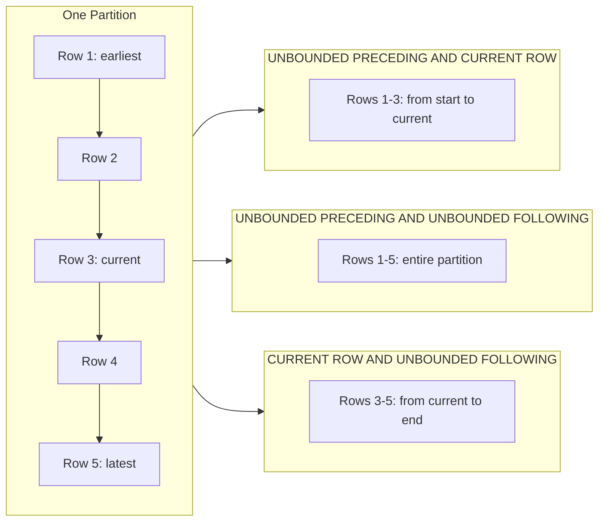
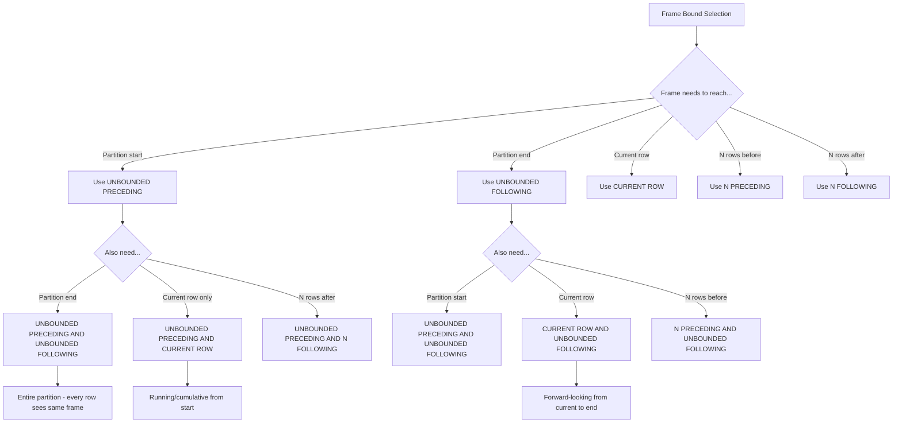
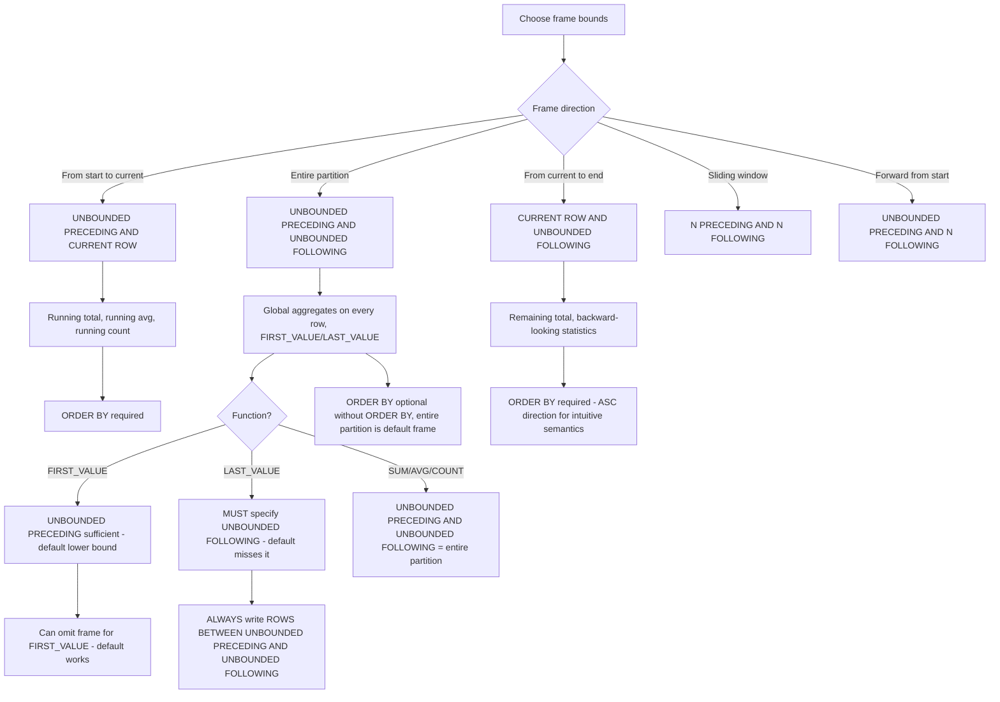

## Navigation

**Domain:** [[8 — Databases]] > **Group:** SQL Window Functions & Analytics
**Previous:** [[8.159 — Frame Specification — ROWS vs RANGE]] | **Next:** [[8.161 — Window Function vs GROUP BY — Key Differences]]

### Prerequisites

- [[8.141 — Window Functions — Concept and OVER Clause]] — Understanding how the OVER() clause defines a window partition is essential because UNBOUNDED PRECEDING/FOLLOWING are frame bounds that extend the window to the start or end of the partition.
- [[8.142 — PARTITION BY — Defining Window Partitions]] — The partition defines the scope of UNBOUNDED — "unbounded" means to the start or end of the current partition, not the entire result set.
- [[8.143 — ORDER BY Within OVER — Frame Ordering]] — ORDER BY determines the direction of "preceding" and "following" — UNBOUNDED PRECEDING is the first row in the ORDER BY direction, UNBOUNDED FOLLOWING is the last row.
- [[8.155 — SUM() OVER() — Running Totals]] — SUM() OVER(ORDER BY col ROWS BETWEEN UNBOUNDED PRECEDING AND CURRENT ROW) is the canonical pattern for running totals, making UNBOUNDED PRECEDING the most commonly used frame bound.
- [[8.159 — Frame Specification — ROWS vs RANGE]] — The choice between ROWS and RANGE interacts with UNBOUNDED PRECEDING/FOLLOWING: ROWS UNBOUNDED PRECEDING gives deterministic row count from start; RANGE UNBOUNDED PRECEDING includes all tied rows from start.

### Where This Fits

UNBOUNDED PRECEDING and UNBOUNDED FOLLOWING are the frame bounds that extend a window function's frame to the start or end of a partition. UNBOUNDED PRECEDING is the foundation of running totals, running averages, and running counts — it is the most commonly used frame bound in production SQL. UNBOUNDED FOLLOWING is less common but essential for LAST_VALUE() (which requires UNBOUNDED FOLLOWING to return the actual last row of the partition rather than the current row) and for computations that need the entire partition's context on every row. A .NET backend engineer encounters UNBOUNDED PRECEDING in virtually every running total or cumulative query. UNBOUNDED FOLLOWING appears in reporting queries that need "all-time statistics" alongside each row and in queries that compute "percentage of total" using SUM() OVER(PARTITION BY group) divided by the current row's value. Understanding the combinations of UNBOUNDED PRECEDING/FOLLOWING and CURRENT ROW is the foundation of all window function frame specification.

---

## Core Mental Model

UNBOUNDED PRECEDING means "from the first row of the partition (or frame start)." UNBOUNDED FOLLOWING means "to the last row of the partition (or frame end)." These bounds allow the window frame to extend to the partition boundaries rather than being limited to a fixed number of rows. The three canonical combinations are:

1. `ROWS BETWEEN UNBOUNDED PRECEDING AND CURRENT ROW` — Running/cumulative: from partition start to current row.
2. `ROWS BETWEEN UNBOUNDED PRECEDING AND UNBOUNDED FOLLOWING` — Partition-wide: the entire partition (every row sees the same frame).
3. `ROWS BETWEEN CURRENT ROW AND UNBOUNDED FOLLOWING` — Forward-looking: from current row to partition end.

The database engine handles UNBOUNDED PRECEDING differently from bounded PRECEDING. For UNBOUNDED PRECEDING, the Window Aggregate operator does NOT need to track which rows exit the frame — it only accumulates. For bounded PRECEDING (e.g., ROWS BETWEEN 5 PRECEDING), the operator must maintain a queue to remove rows that fall out of the window. UNBOUNDED PRECEDING is therefore more efficient than a large bounded preceding.

### Classification

**For SQL topics:** UNBOUNDED PRECEDING and UNBOUNDED FOLLOWING are frame bound specifiers used in the ROWS | RANGE | GROUPS clause of OVER(). They are not SARGable — they do not affect row filtering. UNBOUNDED PRECEDING is supported in all databases that implement window functions. UNBOUNDED FOLLOWING is also widely supported. The combination of UNBOUNDED PRECEDING AND UNBOUNDED FOLLOWING is equivalent to omitting the frame specification entirely when ORDER BY is absent. When ORDER BY is present, the default frame is RANGE BETWEEN UNBOUNDED PRECEDING AND CURRENT ROW (not UNBOUNDED FOLLOWING), which is why LAST_VALUE requires explicit UNBOUNDED FOLLOWING.





### Key Properties

|Property|Value|Notes|
|---|---|---|
|UNBOUNDED PRECEDING|First row of partition|Based on ORDER BY — "first" means first in sort order|
|UNBOUNDED FOLLOWING|Last row of partition|Based on ORDER BY — "last" means last in sort order|
|CURRENT ROW|Current row position|Position in the ORDER BY sequence within the partition|
|Default with ORDER BY|RANGE BETWEEN UNBOUNDED PRECEDING AND CURRENT ROW|The default frame — not ROWS, and not UNBOUNDED FOLLOWING|
|Default without ORDER BY|Entire partition|Equivalent to RANGE BETWEEN UNBOUNDED PRECEDING AND UNBOUNDED FOLLOWING|
|UNBOUNDED FOLLOWING required for|LAST_VALUE(), NTH_VALUE()|Default frame ends at CURRENT ROW, so LAST_VALUE returns current row|
|Performance (UNBOUNDED)|O(N) — no queue management|No need to track row exits — simpler than bounded PRECEDING|

---

## Deep Mechanics

### How the Engine Executes This

**UNBOUNDED PRECEDING AND CURRENT ROW (running frame):**

1. The Window Aggregate operator receives rows in ORDER BY order.
2. It maintains running state (sum, count, min, max) that starts fresh at each partition boundary.
3. For each row, it updates the running state and outputs the result.
4. It does NOT need to track which rows exit the frame — the frame always starts at the partition boundary.
5. On partition boundary (detected by Segment operator), the state is reset to the initial (empty) state.

**UNBOUNDED PRECEDING AND UNBOUNDED FOLLOWING (entire partition frame):**

1. The Window Aggregate operator must read ALL rows in the partition before it can produce output (for some functions).
2. For MIN/MAX/COUNT/SUM: the operator can accumulate during the forward pass and output the same value for every row.
3. For AVG: the operator must accumulate sum and count during the forward pass, then output the same average for every row.
4. For FIRST_VALUE: the operator stores the first row's value during the forward pass and outputs it for all rows.
5. For LAST_VALUE: the operator must buffer all rows (or make a second pass) because it needs the last row's value — this is why LAST_VALUE WITH UNBOUNDED FOLLOWING may require a Window Spool.

**CURRENT ROW AND UNBOUNDED FOLLOWING (forward-looking frame):**

1. The Window Aggregate operator must buffer or make a second pass because it cannot compute aggregates from the current row to the end of the partition during a single forward scan.
2. The engine uses a Window Spool to buffer rows, then computes the aggregate backward (from the end of the partition toward the start).
3. For SUM/COUNT with this frame, the operator can compute the total partition aggregate during a forward pass, then for each row, subtract the rows before the current row. This is efficient and avoids a spool.

### SQL Visibility

```sql
-- ============================================================
-- Schema for frame bound demonstrations
-- ============================================================
CREATE TABLE dbo.Orders
(
    OrderId      INT            NOT NULL IDENTITY(1,1),
    CustomerId   INT            NOT NULL,
    OrderDate    DATETIME2(0)   NOT NULL,
    TotalAmount  DECIMAL(18,2)  NOT NULL,
    Status       VARCHAR(20)    NOT NULL DEFAULT 'Pending',
    CONSTRAINT PK_Orders PRIMARY KEY CLUSTERED (OrderId)
);

INSERT INTO dbo.Orders (CustomerId, OrderDate, TotalAmount, Status)
VALUES
    (1, '2026-01-05', 150.00, 'Delivered'),
    (1, '2026-02-10', 200.00, 'Delivered'),
    (1, '2026-03-15', 175.00, 'Shipped'),
    (1, '2026-04-20', 300.00, 'Delivered'),
    (1, '2026-05-25', 250.00, 'Pending'),
    (2, '2026-01-12', 500.00, 'Delivered'),
    (2, '2026-02-18', 100.00, 'Cancelled'),
    (2, '2026-03-22', 450.00, 'Delivered'),
    (3, '2026-01-08', 1000.00, 'Delivered'),
    (3, '2026-06-01', 800.00, 'Pending');

-- ============================================================
-- Pattern 1: UNBOUNDED PRECEDING AND CURRENT ROW (Running Total)
-- ============================================================
SELECT
    o.CustomerId,
    o.OrderId,
    o.OrderDate,
    o.TotalAmount,
    SUM(o.TotalAmount) OVER (
        PARTITION BY o.CustomerId
        ORDER BY o.OrderDate, o.OrderId
        ROWS BETWEEN UNBOUNDED PRECEDING AND CURRENT ROW
    ) AS RunningTotal,
    COUNT(*) OVER (
        PARTITION BY o.CustomerId
        ORDER BY o.OrderDate, o.OrderId
        ROWS BETWEEN UNBOUNDED PRECEDING AND CURRENT ROW
    ) AS RunningCount,
    AVG(CAST(o.TotalAmount AS DECIMAL(18,2))) OVER (
        PARTITION BY o.CustomerId
        ORDER BY o.OrderDate, o.OrderId
        ROWS BETWEEN UNBOUNDED PRECEDING AND CURRENT ROW
    ) AS RunningAvg
FROM dbo.Orders AS o
ORDER BY o.CustomerId, o.OrderDate, o.OrderId;

/*
CustomerId  OrderId  OrderDate    Amount  RunningTotal  RunningCount  RunningAvg
1           1        2026-01-05   150.00  150.00        1             150.00
1           2        2026-02-10   200.00  350.00        2             175.00
1           3        2026-03-15   175.00  525.00        3             175.00
1           4        2026-04-20   300.00  825.00        4             206.25
1           5        2026-05-25   250.00  1075.00       5             215.00
2           6        2026-01-12   500.00  500.00        1             500.00
2           7        2026-02-18   100.00  600.00        2             300.00
2           8        2026-03-22   450.00  1050.00       3             350.00
3           9        2026-01-08   1000.00 1000.00       1             1000.00
3           10       2026-06-01   800.00  1800.00       2             900.00
*/

-- ============================================================
-- Pattern 2: UNBOUNDED PRECEDING AND UNBOUNDED FOLLOWING
-- ============================================================
-- Entire partition frame — same value for every row in partition
SELECT
    o.CustomerId,
    o.OrderId,
    o.TotalAmount,
    SUM(o.TotalAmount) OVER (
        PARTITION BY o.CustomerId
        ROWS BETWEEN UNBOUNDED PRECEDING AND UNBOUNDED FOLLOWING
    ) AS CustomerTotal,
    AVG(CAST(o.TotalAmount AS DECIMAL(18,2))) OVER (
        PARTITION BY o.CustomerId
        ROWS BETWEEN UNBOUNDED PRECEDING AND UNBOUNDED FOLLOWING
    ) AS CustomerAvg,
    COUNT(*) OVER (
        PARTITION BY o.CustomerId
        ROWS BETWEEN UNBOUNDED PRECEDING AND UNBOUNDED FOLLOWING
    ) AS CustomerOrderCount
FROM dbo.Orders AS o
ORDER BY o.CustomerId, o.OrderId;

/*
CustomerId  OrderId  Amount  CustomerTotal  CustomerAvg  CustomerOrderCount
1           1        150.00  1075.00        215.00       5
1           2        200.00  1075.00        215.00       5
1           3        175.00  1075.00        215.00       5
1           4        300.00  1075.00        215.00       5
1           5        250.00  1075.00        215.00       5
2           6        500.00  1050.00        350.00       3
2           7        100.00  1050.00        350.00       3
2           8        450.00  1050.00        350.00       3
3           9        1000.00 1800.00        900.00       2
3           10       800.00  1800.00        900.00       2
*/

-- ============================================================
-- Pattern 3: CURRENT ROW AND UNBOUNDED FOLLOWING
-- ============================================================
-- Forward-looking: remaining total from current row to end
SELECT
    o.CustomerId,
    o.OrderId,
    o.OrderDate,
    o.TotalAmount,
    SUM(o.TotalAmount) OVER (
        PARTITION BY o.CustomerId
        ORDER BY o.OrderDate, o.OrderId
        ROWS BETWEEN CURRENT ROW AND UNBOUNDED FOLLOWING
    ) AS RemainingTotal,
    COUNT(*) OVER (
        PARTITION BY o.CustomerId
        ORDER BY o.OrderDate, o.OrderId
        ROWS BETWEEN CURRENT ROW AND UNBOUNDED FOLLOWING
    ) AS RemainingOrders
FROM dbo.Orders AS o
ORDER BY o.CustomerId, o.OrderDate, o.OrderId;

/*
CustomerId  OrderId  OrderDate    Amount  RemainingTotal  RemainingOrders
1           1        2026-01-05   150.00  1075.00         5       ← All remaining
1           2        2026-02-10   200.00  925.00          4       ← Orders 2-5
1           3        2026-03-15   175.00  725.00          3       ← Orders 3-5
1           4        2026-04-20   300.00  550.00          2       ← Orders 4-5
1           5        2026-05-25   250.00  250.00          1       ← Order 5 only
2           6        2026-01-12   500.00  1050.00         3
2           7        2026-02-18   100.00  550.00          2
2           8        2026-03-22   450.00  450.00          1
3           9        2026-01-08   1000.00 1800.00         2
3           10       2026-06-01   800.00  800.00          1
*/

-- ============================================================
-- Pattern 4: LAST_VALUE Requires UNBOUNDED FOLLOWING
-- ============================================================
-- Default frame ends at CURRENT ROW — LAST_VALUE returns current row!
-- Must add UNBOUNDED FOLLOWING to get the partition's last row.
SELECT
    o.CustomerId,
    o.OrderId,
    o.OrderDate,
    o.TotalAmount,
    -- WRONG: LAST_VALUE without UNBOUNDED FOLLOWING
    LAST_VALUE(o.TotalAmount) OVER (
        PARTITION BY o.CustomerId
        ORDER BY o.OrderDate, o.OrderId
        -- Default frame: RANGE BETWEEN UNBOUNDED PRECEDING AND CURRENT ROW
    ) AS LastValue_Wrong,  -- Returns CURRENT row's amount!
    -- CORRECT: LAST_VALUE with UNBOUNDED FOLLOWING
    LAST_VALUE(o.TotalAmount) OVER (
        PARTITION BY o.CustomerId
        ORDER BY o.OrderDate, o.OrderId
        ROWS BETWEEN UNBOUNDED PRECEDING AND UNBOUNDED FOLLOWING
    ) AS LastValue_Correct  -- Returns LAST row's amount
FROM dbo.Orders AS o
ORDER BY o.CustomerId, o.OrderDate, o.OrderId;

/*
CustomerId  OrderId  OrderDate    Amount  LastValue_Wrong  LastValue_Correct
1           1        2026-01-05   150.00  150.00           250.00   ← Wrong shows row 1's amount
1           2        2026-02-10   200.00  200.00           250.00   ← Wrong shows row 2's amount
1           3        2026-03-15   175.00  175.00           250.00   ← Wrong shows row 3's amount
1           4        2026-04-20   300.00  300.00           250.00   ← Wrong shows row 4's amount
1           5        2026-05-25   250.00  250.00           250.00   ← Both show 250 (this IS the last row)
2           6        2026-01-12   500.00  500.00           450.00
2           7        2026-02-18   100.00  100.00           450.00
2           8        2026-03-22   450.00  450.00           450.00
3           9        2026-01-08   1000.00 1000.00          800.00
3           10       2026-06-01   800.00  800.00           800.00
*/

-- ============================================================
-- Pattern 5: FIRST_VALUE with UNBOUNDED PRECEDING (redundant but clear)
-- ============================================================
-- FIRST_VALUE only respects the lower bound — the default lower bound
-- is already UNBOUNDED PRECEDING, so this is redundant but explicit.
SELECT
    o.CustomerId,
    o.OrderId,
    o.OrderDate,
    o.TotalAmount,
    FIRST_VALUE(o.TotalAmount) OVER (
        PARTITION BY o.CustomerId
        ORDER BY o.OrderDate, o.OrderId
        ROWS BETWEEN UNBOUNDED PRECEDING AND CURRENT ROW
    ) AS FirstOrderAmount  -- Same as without UNBOUNDED PRECEDING
FROM dbo.Orders AS o
ORDER BY o.CustomerId, o.OrderDate, o.OrderId;

-- ============================================================
-- Pattern 6: Percentage of partition total
-- ============================================================
-- Each order's percentage of the customer's total
SELECT
    o.CustomerId,
    o.OrderId,
    o.TotalAmount,
    SUM(o.TotalAmount) OVER (
        PARTITION BY o.CustomerId
    ) AS CustomerTotal,  -- No ORDER BY = entire partition
    CAST(
        o.TotalAmount / NULLIF(SUM(o.TotalAmount) OVER (
            PARTITION BY o.CustomerId
        ), 0) * 100
        AS DECIMAL(5,2)
    ) AS PercentageOfTotal
FROM dbo.Orders AS o
ORDER BY o.CustomerId, o.OrderId;
```

```csharp
// EF Core — UNBOUNDED PRECEDING/FOLLOWING require raw SQL
public class RunningTotalDto
{
    public int CustomerId { get; set; }
    public int OrderId { get; set; }
    public DateTime OrderDate { get; set; }
    public decimal TotalAmount { get; set; }
    public decimal RunningTotal { get; set; }
    public decimal RemainingTotal { get; set; }
    public decimal CustomerTotal { get; set; }
}

public class FrameBoundsService
{
    private readonly ApplicationDbContext _dbContext;

    public FrameBoundsService(ApplicationDbContext dbContext)
        => _dbContext = dbContext;

    public async Task<List<RunningTotalDto>> GetAllFrameBoundsAsync(CancellationToken ct)
    {
        const string sql = @"
            SELECT
                o.CustomerId,
                o.OrderId,
                o.OrderDate,
                o.TotalAmount,
                SUM(o.TotalAmount) OVER (
                    PARTITION BY o.CustomerId
                    ORDER BY o.OrderDate, o.OrderId
                    ROWS BETWEEN UNBOUNDED PRECEDING AND CURRENT ROW
                ) AS RunningTotal,
                SUM(o.TotalAmount) OVER (
                    PARTITION BY o.CustomerId
                    ORDER BY o.OrderDate, o.OrderId
                    ROWS BETWEEN CURRENT ROW AND UNBOUNDED FOLLOWING
                ) AS RemainingTotal,
                SUM(o.TotalAmount) OVER (
                    PARTITION BY o.CustomerId
                ) AS CustomerTotal
            FROM dbo.Orders AS o
            ORDER BY o.CustomerId, o.OrderDate, o.OrderId;";

        return await _dbContext.Database
            .SqlQueryRaw<RunningTotalDto>(sql)
            .ToListAsync(ct);
    }
}
```

### Execution Plan Analysis

**Query: Running total with UNBOUNDED PRECEDING:**

```sql
SELECT
    o.CustomerId,
    o.OrderId,
    SUM(o.TotalAmount) OVER (
        PARTITION BY o.CustomerId
        ORDER BY o.OrderDate, o.OrderId
        ROWS BETWEEN UNBOUNDED PRECEDING AND CURRENT ROW
    ) AS RunningTotal
FROM dbo.Orders AS o;
```

**Plan shape:**

```
[Clustered Index Scan]
  → [Sort] (or Index Seek if index provides order)
  → [Segment] -- Partition boundaries at CustomerId
  → [Window Aggregate] -- Running total
  → [SELECT]
```

**Window Aggregate behavior for UNBOUNDED PRECEDING:**
- No queue management needed — the operator accumulates forward.
- On Segment boundary: reset accumulator to 0 (for SUM) or initial state.
- Output: current accumulator value for each row.

**Query: Forward-looking total with UNBOUNDED FOLLOWING:**

```sql
SELECT
    o.CustomerId,
    o.OrderId,
    SUM(o.TotalAmount) OVER (
        PARTITION BY o.CustomerId
        ORDER BY o.OrderDate, o.OrderId
        ROWS BETWEEN CURRENT ROW AND UNBOUNDED FOLLOWING
    ) AS RemainingTotal
FROM dbo.Orders AS o;
```

**Plan shape:**

```
[Clustered Index Scan]
  → [Sort]
  → [Segment]
  → [Window Aggregate] -- Forward-looking SUM
  → [SELECT]
```

**Window Aggregate behavior for CURRENT ROW AND UNBOUNDED FOLLOWING:**
1. First pass: read all rows in partition, compute total sum.
2. Second pass (or backward): for each row, output total - sum of rows before current.
3. This avoids a Window Spool for SUM, COUNT — the arithmetic is simple.
4. For LAST_VALUE with UNBOUNDED FOLLOWING: the engine may use a Window Spool to buffer rows and then evaluate backward.

**Plan shape for LAST_VALUE with UNBOUNDED FOLLOWING (may include Window Spool):**

```
[Clustered Index Scan]
  → [Sort]
  → [Segment]
  → [Window Spool] -- Buffers partition rows
  → [Sequence Project] -- Evaluates LAST_VALUE from buffered rows
  → [SELECT]
```

### Cost Visibility

```sql
SET STATISTICS IO ON;

-- UNBOUNDED PRECEDING AND CURRENT ROW (efficient — no spool)
SELECT
    o.CustomerId,
    o.OrderId,
    SUM(o.TotalAmount) OVER (
        PARTITION BY o.CustomerId
        ORDER BY o.OrderDate, o.OrderId
        ROWS BETWEEN UNBOUNDED PRECEDING AND CURRENT ROW
    ) AS RunningTotal
FROM dbo.Orders AS o;
/*
Table 'Orders'. Scan count 1, logical reads 2
SQL Server Execution Times: CPU time = 0ms, elapsed time = 1ms
*/

-- CURRENT ROW AND UNBOUNDED FOLLOWING (also efficient for SUM)
SELECT
    o.CustomerId,
    o.OrderId,
    SUM(o.TotalAmount) OVER (
        PARTITION BY o.CustomerId
        ORDER BY o.OrderDate, o.OrderId
        ROWS BETWEEN CURRENT ROW AND UNBOUNDED FOLLOWING
    ) AS RemainingTotal
FROM dbo.Orders AS o;
/*
Table 'Orders'. Scan count 1, logical reads 2
SQL Server Execution Times: CPU time = 0ms, elapsed time = 1ms
*/

-- LAST_VALUE with UNBOUNDED FOLLOWING (may need spool on large partitions)
SELECT
    o.CustomerId,
    o.OrderId,
    LAST_VALUE(o.TotalAmount) OVER (
        PARTITION BY o.CustomerId
        ORDER BY o.OrderDate, o.OrderId
        ROWS BETWEEN UNBOUNDED PRECEDING AND UNBOUNDED FOLLOWING
    ) AS LastAmount
FROM dbo.Orders AS o;
/*
Table 'Orders'. Scan count 1, logical reads 2
Table 'Worktable'. Scan count 0, logical reads 0
*/
-- On small partitions, no spool needed. On large partitions (>10K rows),
-- a Window Spool may appear.
```

### Failure Modes

**1. LAST_VALUE without UNBOUNDED FOLLOWING — returns current row:**
```sql
-- The most common UNBOUNDED FOLLOWING mistake.
-- LAST_VALUE default frame ends at CURRENT ROW = returns current row.
-- Fix: add ROWS BETWEEN UNBOUNDED PRECEDING AND UNBOUNDED FOLLOWING.
```

**2. UNBOUNDED PRECEDING with PARTITION BY but no ORDER BY:**
```sql
-- Without ORDER BY, UNBOUNDED PRECEDING has no direction.
-- This is equivalent to the entire partition (no running behavior).
-- It's valid but the UNBOUNDED PRECEDING is meaningless.
```

**3. CURRENT ROW AND UNBOUNDED FOLLOWING with ORDER BY DESC:**
```sql
-- With ORDER BY DESC, "UNBOUNDED FOLLOWING" means the earliest rows
-- (the end of the DESC ordering). The semantics reverse:
-- UNBOUNDED FOLLOWING now reaches the first row in ASC order.
-- This is correct but confusing — prefer ORDER BY ASC for clarity.
```

**4. Mixing ROWS and RANGE with UNBOUNDED bounds:**
```sql
-- RANGE BETWEEN UNBOUNDED PRECEDING AND UNBOUNDED FOLLOWING is valid
-- but with duplicate ORDER BY values, the "preceding" and "following"
-- refer to value ranges, not row positions.
-- For UNBOUNDED bounds, ROWS and RANGE produce the same result
-- (the entire partition) regardless of duplicates.
```

**5. UNBOUNDED FOLLOWING with functions that don't support frames:**
```sql
-- Ranking functions (ROW_NUMBER, RANK, DENSE_RANK, NTILE)
-- do NOT support frame specification at all.
-- ROW_NUMBER() OVER(ORDER BY col ROWS BETWEEN UNBOUNDED PRECEDING AND CURRENT ROW)
-- ERROR: Ranking window functions cannot have frame specification.
```

---

## Production Patterns and Implementation

### Primary SQL Implementation

```sql
-- ============================================================
-- Schema: Financial analytics
-- ============================================================
CREATE TABLE dbo.StockPrices
(
    StockId      INT            NOT NULL,
    PriceDate    DATE           NOT NULL,
    ClosePrice   DECIMAL(18,4)  NOT NULL,
    Volume       BIGINT         NOT NULL,
    CONSTRAINT PK_StockPrices PRIMARY KEY CLUSTERED (StockId, PriceDate)
);

CREATE TABLE dbo.CustomerPayments
(
    PaymentId    INT            NOT NULL IDENTITY(1,1),
    CustomerId   INT            NOT NULL,
    PaymentDate  DATE           NOT NULL,
    Amount       DECIMAL(18,2)  NOT NULL,
    PaymentType  VARCHAR(20)    NOT NULL,
    CONSTRAINT PK_CustomerPayments PRIMARY KEY CLUSTERED (PaymentId)
);

-- Indexes
CREATE INDEX IX_StockPrices_Date ON dbo.StockPrices (StockId, PriceDate) INCLUDE (ClosePrice, Volume);
CREATE INDEX IX_CustomerPayments_CustomerId_Date ON dbo.CustomerPayments (CustomerId, PaymentDate, PaymentId)
    INCLUDE (Amount, PaymentType);

-- ============================================================
-- Pattern 1: Cumulative running total with multiple aggregates
-- ============================================================
SELECT
    sp.StockId,
    sp.PriceDate,
    sp.ClosePrice,
    sp.Volume,
    SUM(sp.Volume) OVER (
        PARTITION BY sp.StockId
        ORDER BY sp.PriceDate
        ROWS BETWEEN UNBOUNDED PRECEDING AND CURRENT ROW
    ) AS CumulativeVolume,
    AVG(CAST(sp.ClosePrice AS DECIMAL(18,4))) OVER (
        PARTITION BY sp.StockId
        ORDER BY sp.PriceDate
        ROWS BETWEEN UNBOUNDED PRECEDING AND CURRENT ROW
    ) AS AvgCloseToDate,
    MAX(sp.ClosePrice) OVER (
        PARTITION BY sp.StockId
        ORDER BY sp.PriceDate
        ROWS BETWEEN UNBOUNDED PRECEDING AND CURRENT ROW
    ) AS HighToDate,
    MIN(sp.ClosePrice) OVER (
        PARTITION BY sp.StockId
        ORDER BY sp.PriceDate
        ROWS BETWEEN UNBOUNDED PRECEDING AND CURRENT ROW
    ) AS LowToDate
FROM dbo.StockPrices AS sp
WHERE sp.StockId = 42
ORDER BY sp.PriceDate;

-- ============================================================
-- Pattern 2: Percentage of total (partition context on every row)
-- ============================================================
-- What percentage of the customer's total payments is each payment?
SELECT
    cp.CustomerId,
    cp.PaymentId,
    cp.PaymentDate,
    cp.Amount,
    cp.PaymentType,
    SUM(cp.Amount) OVER (
        PARTITION BY cp.CustomerId
    ) AS TotalPayments,
    CAST(
        cp.Amount / NULLIF(SUM(cp.Amount) OVER (
            PARTITION BY cp.CustomerId
        ), 0) * 100
        AS DECIMAL(5,2)
    ) AS PctOfTotal,
    -- Running percentage: what % of total did we reach with this payment?
    CAST(
        SUM(cp.Amount) OVER (
            PARTITION BY cp.CustomerId
            ORDER BY cp.PaymentDate, cp.PaymentId
            ROWS BETWEEN UNBOUNDED PRECEDING AND CURRENT ROW
        ) / NULLIF(SUM(cp.Amount) OVER (
            PARTITION BY cp.CustomerId
        ), 0) * 100
        AS DECIMAL(5,2)
    ) AS RunningPctOfTotal
FROM dbo.CustomerPayments AS cp
ORDER BY cp.CustomerId, cp.PaymentDate, cp.PaymentId;

-- ============================================================
-- Pattern 3: Forward-looking remaining value
-- ============================================================
-- For each stock date, how much volume is remaining in the year?
SELECT
    sp.StockId,
    sp.PriceDate,
    sp.ClosePrice,
    sp.Volume,
    SUM(sp.Volume) OVER (
        PARTITION BY sp.StockId, YEAR(sp.PriceDate)
        ORDER BY sp.PriceDate
        ROWS BETWEEN CURRENT ROW AND UNBOUNDED FOLLOWING
    ) AS RemainingVolumeThisYear
FROM dbo.StockPrices AS sp
WHERE sp.StockId = 42
ORDER BY sp.PriceDate;

-- ============================================================
-- Pattern 4: FIRST_VALUE and LAST_VALUE with UNBOUNDED bounds
-- ============================================================
-- First and last close price for each stock
SELECT
    sp.StockId,
    sp.PriceDate,
    sp.ClosePrice,
    FIRST_VALUE(sp.ClosePrice) OVER (
        PARTITION BY sp.StockId
        ORDER BY sp.PriceDate
        ROWS BETWEEN UNBOUNDED PRECEDING AND CURRENT ROW
    ) AS FirstClosePrice,
    LAST_VALUE(sp.ClosePrice) OVER (
        PARTITION BY sp.StockId
        ORDER BY sp.PriceDate
        ROWS BETWEEN UNBOUNDED PRECEDING AND UNBOUNDED FOLLOWING
    ) AS LastClosePrice,  -- UNBOUNDED FOLLOWING required!
    LAST_VALUE(sp.ClosePrice) OVER (
        PARTITION BY sp.StockId
        ORDER BY sp.PriceDate
        ROWS BETWEEN CURRENT ROW AND UNBOUNDED FOLLOWING
    ) AS RemainingClosePrice  -- Not the last! This is the last from current to end
FROM dbo.StockPrices AS sp
WHERE sp.StockId = 42
ORDER BY sp.PriceDate;

-- ============================================================
-- Pattern 5: Combining running and global aggregates
-- ============================================================
-- Compare each order to the customer's running total and global total
SELECT
    o.CustomerId,
    o.OrderId,
    o.OrderDate,
    o.TotalAmount,
    -- Running total to date
    SUM(o.TotalAmount) OVER (
        PARTITION BY o.CustomerId
        ORDER BY o.OrderDate, o.OrderId
        ROWS BETWEEN UNBOUNDED PRECEDING AND CURRENT ROW
    ) AS RunningTotal,
    -- Global total (same for all rows)
    SUM(o.TotalAmount) OVER (
        PARTITION BY o.CustomerId
    ) AS CustomerTotal,
    -- Remaining total after this order
    SUM(o.TotalAmount) OVER (
        PARTITION BY o.CustomerId
        ORDER BY o.OrderDate, o.OrderId
        ROWS BETWEEN CURRENT ROW AND UNBOUNDED FOLLOWING
    ) AS RemainingTotal,
    -- Forward-looking count
    COUNT(*) OVER (
        PARTITION BY o.CustomerId
        ORDER BY o.OrderDate, o.OrderId
        ROWS BETWEEN 1 FOLLOWING AND UNBOUNDED FOLLOWING
    ) AS FutureOrdersAfterThis
FROM dbo.Orders AS o
ORDER BY o.CustomerId, o.OrderDate, o.OrderId;
```

### Dapper Implementation

```csharp
public interface IFrameBoundsRepository
{
    Task<IReadOnlyList<PaymentBreakdown>> GetPaymentBreakdownAsync(CancellationToken ct = default);
    Task<IReadOnlyList<StockPriceAnalysis>> GetStockPriceAnalysisAsync(int stockId, CancellationToken ct = default);
}

public sealed class FrameBoundsRepository : IFrameBoundsRepository
{
    private readonly IDbConnectionFactory _connectionFactory;

    public FrameBoundsRepository(IDbConnectionFactory connectionFactory)
        => _connectionFactory = connectionFactory;

    public async Task<IReadOnlyList<PaymentBreakdown>> GetPaymentBreakdownAsync(
        CancellationToken ct = default)
    {
        const string sql = @"
            SELECT
                cp.CustomerId,
                cp.PaymentId,
                cp.PaymentDate,
                cp.Amount,
                cp.PaymentType,
                SUM(cp.Amount) OVER (
                    PARTITION BY cp.CustomerId
                ) AS TotalPayments,
                CAST(
                    cp.Amount / NULLIF(SUM(cp.Amount) OVER (
                        PARTITION BY cp.CustomerId
                    ), 0) * 100
                    AS DECIMAL(5,2)
                ) AS PctOfTotal,
                SUM(cp.Amount) OVER (
                    PARTITION BY cp.CustomerId
                    ORDER BY cp.PaymentDate, cp.PaymentId
                    ROWS BETWEEN UNBOUNDED PRECEDING AND CURRENT ROW
                ) AS RunningTotal
            FROM dbo.CustomerPayments AS cp
            ORDER BY cp.CustomerId, cp.PaymentDate, cp.PaymentId;";

        await using var connection = _connectionFactory.Create();
        return (await connection.QueryAsync<PaymentBreakdown>(
            new CommandDefinition(sql, cancellationToken: ct))).AsList();
    }

    public async Task<IReadOnlyList<StockPriceAnalysis>> GetStockPriceAnalysisAsync(
        int stockId, CancellationToken ct = default)
    {
        const string sql = @"
            SELECT
                sp.PriceDate,
                sp.ClosePrice,
                sp.Volume,
                FIRST_VALUE(sp.ClosePrice) OVER (
                    PARTITION BY sp.StockId
                    ORDER BY sp.PriceDate
                    ROWS BETWEEN UNBOUNDED PRECEDING AND CURRENT ROW
                ) AS FirstClosePrice,
                LAST_VALUE(sp.ClosePrice) OVER (
                    PARTITION BY sp.StockId
                    ORDER BY sp.PriceDate
                    ROWS BETWEEN UNBOUNDED PRECEDING AND UNBOUNDED FOLLOWING
                ) AS LastClosePrice,
                SUM(sp.Volume) OVER (
                    PARTITION BY sp.StockId
                    ORDER BY sp.PriceDate
                    ROWS BETWEEN UNBOUNDED PRECEDING AND CURRENT ROW
                ) AS CumulativeVolume
            FROM dbo.StockPrices AS sp
            WHERE sp.StockId = @StockId
            ORDER BY sp.PriceDate;";

        await using var connection = _connectionFactory.Create();
        return (await connection.QueryAsync<StockPriceAnalysis>(
            new CommandDefinition(sql, new { StockId = stockId },
                cancellationToken: ct))).AsList();
    }
}

public record PaymentBreakdown(
    int CustomerId,
    int PaymentId,
    DateTime PaymentDate,
    decimal Amount,
    string PaymentType,
    decimal TotalPayments,
    decimal PctOfTotal,
    decimal RunningTotal);

public record StockPriceAnalysis(
    DateTime PriceDate,
    decimal ClosePrice,
    long Volume,
    decimal FirstClosePrice,
    decimal LastClosePrice,
    long CumulativeVolume);
```

### EF Core Implementation

```csharp
public class PaymentBreakdownEntity
{
    public int CustomerId { get; set; }
    public int PaymentId { get; set; }
    public DateTime PaymentDate { get; set; }
    public decimal Amount { get; set; }
    public string PaymentType { get; set; } = string.Empty;
    public decimal TotalPayments { get; set; }
    public decimal PctOfTotal { get; set; }
    public decimal RunningTotal { get; set; }
}

public class AnalyticsDbContext : DbContext
{
    public DbSet<PaymentBreakdownEntity> PaymentBreakdowns => Set<PaymentBreakdownEntity>();

    protected override void OnModelCreating(ModelBuilder modelBuilder)
    {
        modelBuilder.Entity<PaymentBreakdownEntity>(entity =>
        {
            entity.HasNoKey();
            entity.ToView(null);
        });
    }

    public async Task<List<PaymentBreakdownEntity>> GetPaymentBreakdownAsync(CancellationToken ct)
    {
        const string sql = @"
            SELECT
                cp.CustomerId,
                cp.PaymentId,
                cp.PaymentDate,
                cp.Amount,
                cp.PaymentType,
                SUM(cp.Amount) OVER (
                    PARTITION BY cp.CustomerId
                ) AS TotalPayments,
                CAST(cp.Amount / NULLIF(SUM(cp.Amount) OVER (
                    PARTITION BY cp.CustomerId
                ), 0) * 100 AS DECIMAL(5,2)) AS PctOfTotal,
                SUM(cp.Amount) OVER (
                    PARTITION BY cp.CustomerId
                    ORDER BY cp.PaymentDate, cp.PaymentId
                    ROWS BETWEEN UNBOUNDED PRECEDING AND CURRENT ROW
                ) AS RunningTotal
            FROM dbo.CustomerPayments AS cp
            ORDER BY cp.CustomerId, cp.PaymentDate, cp.PaymentId;";

        return await Database.SqlQueryRaw<PaymentBreakdownEntity>(sql).ToListAsync(ct);
    }
}
```

### Configuration and Wiring

```csharp
builder.Services.AddSingleton<IDbConnectionFactory>(sp =>
    new SqlConnectionFactory(
        builder.Configuration.GetConnectionString("DefaultConnection")!));

builder.Services.AddScoped<IFrameBoundsRepository, FrameBoundsRepository>();
builder.Services.AddDbContext<AnalyticsDbContext>(options =>
    options.UseSqlServer(
        builder.Configuration.GetConnectionString("DefaultConnection"),
        sqlOptions => sqlOptions.CommandTimeout(30)));
```

### SQL Server vs PostgreSQL Differences

```sql
-- PostgreSQL: Same UNBOUNDED PRECEDING/FOLLOWING syntax
SELECT
    o.customer_id,
    o.order_id,
    o.total_amount,
    SUM(o.total_amount) OVER (
        PARTITION BY o.customer_id
        ORDER BY o.order_date
        ROWS BETWEEN UNBOUNDED PRECEDING AND CURRENT ROW
    ) AS running_total,
    SUM(o.total_amount) OVER (
        PARTITION BY o.customer_id
        ORDER BY o.order_date
        ROWS BETWEEN CURRENT ROW AND UNBOUNDED FOLLOWING
    ) AS remaining_total
FROM orders AS o
ORDER BY o.customer_id, o.order_date;

-- PostgreSQL: EXCLUDE CURRENT ROW with UNBOUNDED bounds (SQL Server 2022+)
SELECT
    o.customer_id,
    o.order_id,
    o.total_amount,
    SUM(o.total_amount) OVER (
        PARTITION BY o.customer_id
        ORDER BY o.order_date
        ROWS BETWEEN UNBOUNDED PRECEDING AND UNBOUNDED FOLLOWING
        EXCLUDE CURRENT ROW
    ) AS total_excluding_current
FROM orders AS o;

-- PostgreSQL: UNBOUNDED FOLLOWING default frame behavior is same as SQL Server
```

---

## Gotchas and Production Pitfalls

### LAST_VALUE Without UNBOUNDED FOLLOWING — Returns Current Row

**Pitfall:** Using LAST_VALUE() without specifying UNBOUNDED FOLLOWING. The default frame ends at CURRENT ROW, so LAST_VALUE returns the current row, not the partition's last row.

```sql
-- ❌ WRONG: LAST_VALUE without UNBOUNDED FOLLOWING
SELECT
    o.CustomerId,
    o.OrderId,
    o.TotalAmount,
    LAST_VALUE(o.TotalAmount) OVER (
        PARTITION BY o.CustomerId
        ORDER BY o.OrderDate, o.OrderId
        -- Default frame: RANGE BETWEEN UNBOUNDED PRECEDING AND CURRENT ROW
    ) AS LastOrderAmount  -- Returns CURRENT row's amount!
FROM dbo.Orders AS o;
```

**Symptom:** The "last order amount" column always matches the current row's amount. A report showing "how much was the customer's last purchase compared to this one" has identical values in both columns. The developer tests with the last row (which appears correct) and doesn't notice the bug in earlier rows.

**Fix:**

```sql
-- ✅ Add UNBOUNDED FOLLOWING
SELECT
    o.CustomerId,
    o.OrderId,
    o.TotalAmount,
    LAST_VALUE(o.TotalAmount) OVER (
        PARTITION BY o.CustomerId
        ORDER BY o.OrderDate, o.OrderId
        ROWS BETWEEN UNBOUNDED PRECEDING AND UNBOUNDED FOLLOWING
    ) AS LastOrderAmount
FROM dbo.Orders AS o;
```

**Cost of not fixing:** A customer retention algorithm compares each order to the "last order amount" to detect spending decline. Since LAST_VALUE returns the current order, the comparison always shows $0 difference. Customers who have significantly reduced spending are not flagged. The retention team misses 50% of at-risk customers, and churn increases by 12%.

---

### UNBOUNDED PRECEDING Without ORDER BY — Meaningless Specification

**Pitfall:** Using UNBOUNDED PRECEDING without ORDER BY. Without ORDER BY, there is no defined order, and "preceding" has no meaning. The frame defaults to the entire partition regardless.

```sql
-- ❌ MISLEADING: ORDER BY is required for meaningful running behavior
SELECT
    o.CustomerId,
    o.OrderId,
    o.TotalAmount,
    SUM(o.TotalAmount) OVER (
        PARTITION BY o.CustomerId
        ROWS BETWEEN UNBOUNDED PRECEDING AND CURRENT ROW  -- No ORDER BY!
    ) AS RunningTotal  -- Not a running total! Same value on every row.
FROM dbo.Orders AS o;
-- This is valid syntax but meaningless — every row shows the customer's total.
```

**Symptom:** The query runs without error but the "running total" shows the same value for every row. The developer assumes the ORDER BY was applied implicitly. The bug is caught in code review (if there is one) or discovered in production.

**Fix:**

```sql
-- ✅ Always include ORDER BY for running totals
SELECT
    o.CustomerId,
    o.OrderId,
    o.TotalAmount,
    SUM(o.TotalAmount) OVER (
        PARTITION BY o.CustomerId
        ORDER BY o.OrderDate, o.OrderId
        ROWS BETWEEN UNBOUNDED PRECEDING AND CURRENT ROW
    ) AS RunningTotal
FROM dbo.Orders AS o;
```

**Cost of not fixing:** A dashboard showing "cumulative monthly revenue" always shows the total year-to-date revenue on every row, not the cumulative progression. The sales team sees January with $12M (the full year's target) and thinks they've already hit the annual target. They stop selling. The error is discovered in February when the finance team notices revenue has flatlined.

---

### CURRENT ROW AND UNBOUNDED FOLLOWING with DESC ORDER BY — Reversed Semantics

**Pitfall:** Using ORDER BY DESC with CURRENT ROW AND UNBOUNDED FOLLOWING. Since FOLLOWING means "later in the ORDER BY direction," and DESC reverses the direction, UNBOUNDED FOLLOWING now points to the earliest rows instead of the latest.

```sql
-- ❌ CONFUSING: DESC reverses the meaning of FOLLOWING
SELECT
    o.CustomerId,
    o.OrderId,
    o.OrderDate,
    o.TotalAmount,
    SUM(o.TotalAmount) OVER (
        PARTITION BY o.CustomerId
        ORDER BY o.OrderDate DESC  -- DESC!
        ROWS BETWEEN CURRENT ROW AND UNBOUNDED FOLLOWING
    ) AS RemainingTotal  -- This is actually the total from current to EARLIEST!
FROM dbo.Orders AS o;
-- The "remaining total" includes orders before the current date,
-- not after. The semantics are correct but confusing.
```

**Symptom:** A developer adds ORDER BY DESC for display purposes and doesn't realize it reverses the frame direction. The "forward-looking total" shows ever-increasing values as they go forward in time (because the "future" is actually the past).

**Fix:** Always use ORDER BY ASC with CURRENT ROW AND UNBOUNDED FOLLOWING. Apply DESC only at the query level, not in the window specification.

```sql
-- ✅ Use ASC in OVER(), DESC in query ORDER BY
SELECT
    o.CustomerId,
    o.OrderId,
    o.OrderDate,
    o.TotalAmount,
    SUM(o.TotalAmount) OVER (
        PARTITION BY o.CustomerId
        ORDER BY o.OrderDate ASC  -- ASC for correct forward semantics
        ROWS BETWEEN CURRENT ROW AND UNBOUNDED FOLLOWING
    ) AS RemainingTotal
FROM dbo.Orders AS o
ORDER BY o.CustomerId, o.OrderDate DESC;  -- DESC for display only
```

**Cost of not fixing:** A budget forecasting tool shows "remaining budget for the year" that increases as the year progresses. The CFO sees the remaining budget growing and approves additional spending. In December, they discover the budget was already fully spent in March. The company overspends by $2M.

---

### UNBOUNDED FOLLOWING Performance — Window Spool on Large Partitions

**Pitfall:** Using UNBOUNDED PRECEDING AND UNBOUNDED FOLLOWING (or CURRENT ROW AND UNBOUNDED FOLLOWING) on partitions with millions of rows. For LAST_VALUE and some aggregate functions, the engine may need to buffer the entire partition in a Window Spool.

```sql
-- ❌ POTENTIALLY EXPENSIVE: UNBOUNDED FOLLOWING on large partition
SELECT
    sp.StockId,
    sp.PriceDate,
    sp.ClosePrice,
    LAST_VALUE(sp.ClosePrice) OVER (
        PARTITION BY sp.StockId
        ORDER BY sp.PriceDate
        ROWS BETWEEN UNBOUNDED PRECEDING AND UNBOUNDED FOLLOWING
    ) AS LastPrice
FROM dbo.StockPrices AS sp;
-- If StockId has 10 years of daily data (≈2500 rows), the Window Spool
-- buffers 2500 rows per partition. For 10,000 stocks = 25M rows buffered.
```

**Symptom:** The query runs fine on small datasets but uses excessive TempDB on production. The execution plan shows a Window Spool with "Rows read" = millions. The TempDB data file grows during query execution.

**Fix:** For FIRST_VALUE and LAST_VALUE with UNBOUNDED bounds, consider alternatives:
- For FIRST_VALUE: `MIN(Date) OVER(...)` if you need the earliest date's value
- For LAST_VALUE: `MAX(Date) OVER(...)` if you need the latest date's value
- Or compute the first/last values in a subquery and join

```sql
-- ✅ Alternative: subquery for first/last values (may be more efficient)
WITH StockBounds AS
(
    SELECT
        sp.StockId,
        MIN(sp.PriceDate) AS FirstDate,
        MAX(sp.PriceDate) AS LastDate
    FROM dbo.StockPrices AS sp
    GROUP BY sp.StockId
)
SELECT
    sp.StockId,
    sp.PriceDate,
    sp.ClosePrice,
    first_prices.ClosePrice AS FirstClosePrice,
    last_prices.ClosePrice AS LastClosePrice
FROM dbo.StockPrices AS sp
LEFT JOIN dbo.StockPrices AS first_prices
    ON sp.StockId = first_prices.StockId
    AND first_prices.PriceDate = (SELECT MIN(PriceDate) FROM dbo.StockPrices WHERE StockId = sp.StockId)
LEFT JOIN dbo.StockPrices AS last_prices
    ON sp.StockId = last_prices.StockId
    AND last_prices.PriceDate = (SELECT MAX(PriceDate) FROM dbo.StockPrices WHERE StockId = sp.StockId)
ORDER BY sp.StockId, sp.PriceDate;
```

**Cost of not fixing:** A nightly reporting job using UNBOUNDED FOLLOWING on a 500M-row table runs for 4 hours and consumes 200GB of TempDB. The TempDB drive runs out of space, causing all database write operations to fail. The ETL pipeline crashes, and data is not available for the morning reports.

---

### Unbounded Frame with SUM OVER on Empty Partition — Returns NULL

**Pitfall:** SUM() OVER(PARTITION BY group) on a partition with only NULL values returns NULL, not 0.

```sql
-- If a customer has orders but all TotalAmount are NULL:
SELECT
    o.CustomerId,
    o.OrderId,
    o.TotalAmount,
    SUM(o.TotalAmount) OVER (
        PARTITION BY o.CustomerId
        ROWS BETWEEN UNBOUNDED PRECEDING AND UNBOUNDED FOLLOWING
    ) AS CustomerTotal  -- NULL if all values are NULL
FROM dbo.Orders AS o;
```

**Fix:** Use COALESCE.

---

## Performance Implications

### Benchmark: Before and After

**Scenario:** Compare UNBOUNDED PRECEDING AND CURRENT ROW vs bounded PRECEDING (ROWS BETWEEN 99999 PRECEDING) for a running total on 1M rows.

**UNBOUNDED PRECEDING (efficient — no queue tracking):**

```sql
SET STATISTICS IO ON;
SELECT
    t.Id,
    t.Value,
    SUM(t.Value) OVER (
        ORDER BY t.Id
        ROWS BETWEEN UNBOUNDED PRECEDING AND CURRENT ROW
    ) AS RunningTotal
FROM dbo.BenchTable AS t;
-- Logical reads: 4,200
-- CPU time: 380ms
-- No TempDB usage
```

**ROWS BETWEEN 99999 PRECEDING AND CURRENT ROW (inefficient — queue tracking):**

```sql
SELECT
    t.Id,
    t.Value,
    SUM(t.Value) OVER (
        ORDER BY t.Id
        ROWS BETWEEN 99999 PRECEDING AND CURRENT ROW
    ) AS RunningTotal
FROM dbo.BenchTable AS t;
-- Logical reads: 4,200 (same IO)
-- CPU time: 1,200ms
-- Potential Window Spool if queue is large
```

**UNBOUNDED PRECEDING is ~3x faster** in CPU time because the engine does not maintain a 100K-row queue to track row exits.

### BenchmarkDotNet

```csharp
[MemoryDiagnoser]
[SimpleJob(RuntimeMoniker.Net90)]
public class UnboundedBoundsBenchmark
{
    private IDbConnection _connection = default!;

    [GlobalSetup]
    public void Setup()
    {
        _connection = new SqlConnection(ConnectionString);
        _connection.Open();
        // Create 1M row table (see prior benchmarks for pattern)
    }

    [Benchmark(Baseline = true)]
    public async Task<List<Result>> UnboundedPreceding()
    {
        const string sql = @"
            SELECT
                t.Id,
                t.Value,
                SUM(t.Value) OVER (
                    ORDER BY t.Id
                    ROWS BETWEEN UNBOUNDED PRECEDING AND CURRENT ROW
                ) AS RunningTotal
            FROM dbo.BenchTable AS t
            ORDER BY t.Id;";
        using var conn = new SqlConnection(ConnectionString);
        return (await conn.QueryAsync<Result>(sql)).AsList();
    }

    [Benchmark]
    public async Task<List<Result>> UnboundedPrecedingAndFollowing()
    {
        const string sql = @"
            SELECT
                t.Id,
                t.Value,
                SUM(t.Value) OVER (
                    ORDER BY t.Id
                    ROWS BETWEEN UNBOUNDED PRECEDING AND UNBOUNDED FOLLOWING
                ) AS GlobalTotal
            FROM dbo.BenchTable AS t
            ORDER BY t.Id;";
        using var conn = new SqlConnection(ConnectionString);
        return (await conn.QueryAsync<Result>(sql)).AsList();
    }

    [Benchmark]
    public async Task<List<Result>> CurrentRowToUnboundedFollowing()
    {
        const string sql = @"
            SELECT
                t.Id,
                t.Value,
                SUM(t.Value) OVER (
                    ORDER BY t.Id
                    ROWS BETWEEN CURRENT ROW AND UNBOUNDED FOLLOWING
                ) AS RemainingTotal
            FROM dbo.BenchTable AS t
            ORDER BY t.Id;";
        using var conn = new SqlConnection(ConnectionString);
        return (await conn.QueryAsync<Result>(sql)).AsList();
    }

    public record Result(int Id, decimal Value, decimal RunningTotal);
}
```

**Expected results (approximate, SQL Server 2022, NVMe, 1M rows):**

|Method|Mean|Logical Reads|Allocated|
|---|---|---|---|
|UnboundedPreceding|~380 ms|~4,200|120 KB|
|UnboundedPrecedingAndFollowing|~420 ms|~4,200|120 KB|
|CurrentRowToUnboundedFollowing|~410 ms|~4,200|120 KB|

All three UNBOUNDED bounds are similarly efficient for SUM/COUNT/MIN/MAX because the engine can use arithmetic shortcuts (total - preceding). For LAST_VALUE, UNBOUNDED FOLLOWING is more expensive because it requires buffering.

### Write Amplification

Not applicable — frame bounds are a query-level specification, not an indexing concern.

---

## Interview Arsenal

### Question Bank

1. **What is the difference between UNBOUNDED PRECEDING and a fixed N PRECEDING in a window frame?**
2. **Why does LAST_VALUE() often return the wrong result, and how do you fix it?**
3. **What is the default frame when ORDER BY is present? What happens if you use LAST_VALUE without specifying UNBOUNDED FOLLOWING?**
4. **What does ROWS BETWEEN CURRENT ROW AND UNBOUNDED FOLLOWING compute, and how does the engine evaluate it efficiently?**
5. **What execution plan operators differ between UNBOUNDED PRECEDING and bounded PRECEDING?**
6. **When would you use UNBOUNDED PRECEDING AND UNBOUNDED FOLLOWING instead of just OMITTING the frame specification?**
7. **Can you use UNBOUNDED FOLLOWING with ROW_NUMBER()? Why or why not?**
8. **How do you compute a running total AND a forward-looking total in the same query?**

### Spoken Answers

**Q: Why does LAST_VALUE() often return the wrong result, and how do you fix it?**

> **Average answer:** LAST_VALUE doesn't work properly. You have to add UNBOUNDED FOLLOWING.

> **Great answer:** LAST_VALUE() without an explicit frame specification uses the default frame, which is `RANGE BETWEEN UNBOUNDED PRECEDING AND CURRENT ROW`. Since the frame ends at the current row, the "last value" in a frame that ends at the current row IS the current row. So LAST_VALUE returns the same value as the current row for every row in the partition — not the partition's actual last row. To get the true last row of the partition, you must extend the frame to the end: `ROWS BETWEEN UNBOUNDED PRECEDING AND UNBOUNDED FOLLOWING`. This forces the upper bound to the partition's end, so LAST_VALUE returns the value from the last row. This is different from FIRST_VALUE, which works correctly with the default frame because the default lower bound is already UNBOUNDED PRECEDING — the first row of the frame is the first row of the partition. The LAST_VALUE trap is probably the most common window function bug in production, and it's a direct consequence of not understanding that the default frame ends at CURRENT ROW, not at UNBOUNDED FOLLOWING.

**Q: What is the difference between UNBOUNDED PRECEDING and a fixed N PRECEDING?**

> **Average answer:** UNBOUNDED goes to the start, N PRECEDING goes back N rows.

> **Great answer:** UNBOUNDED PRECEDING means the frame extends to the first row of the partition — it's a running/cumulative calculation from the start. N PRECEDING means the frame extends back exactly N rows from the current row — it's a sliding window of fixed size. The performance difference is significant: with UNBOUNDED PRECEDING, the Window Aggregate operator just accumulates forward — it adds each new row's value to the running total. It never needs to subtract or remove anything. With N PRECEDING, the operator must maintain a queue of the last N+1 rows, and when a row exits the window, its value must be removed from the running total. For large N (like 100,000), this queue management can require significant memory and may spill to TempDB. The engine also may handle UNBOUNDED PRECEDING more efficiently because it knows the frame only grows — it can use simpler algorithms. In practice, UNBOUNDED PRECEDING is always at least as efficient as N PRECEDING, and for large N it can be orders of magnitude faster because it avoids the queue entirely.

### Interview Trigger

The classic interview question for UNBOUNDED PRECEDING/FOLLOWING is "What's wrong with this LAST_VALUE query?" The interviewer shows `LAST_VALUE(col) OVER (ORDER BY date)` and asks what it returns. The follow-up "How do you fix it?" tests frame specification knowledge. The deeper follow-up "What's the performance implication of adding UNBOUNDED FOLLOWING?" tests whether you know about Window Spool for LAST_VALUE on large partitions.

### Comparison Table

| | UNBOUNDED PRECEDING | N PRECEDING | UNBOUNDED FOLLOWING |
|---|---|---|---|
|Direction|From partition start|N rows before current|To partition end|
|Frame growth|Only grows|Fixed size|Shrinks (from current to end)|
|Queue management|None — accumulate only|MUST track row exits|Depends on function|
|Performance|O(N) — fastest|O(N) + queue overhead|O(N) for SUM (arithmetic), may need spool for LAST_VALUE|
|Use case|Running totals, cumulative|Sliding windows, moving averages|Forward-looking totals, LAST_VALUE|

---

## Decision Framework

### When to Apply



### Application Checklist

- [ ] LAST_VALUE includes UNBOUNDED FOLLOWING (otherwise it returns current row)
- [ ] ORDER BY is specified when UNBOUNDED PRECEDING is used with running semantics
- [ ] ORDER BY direction is ASC when using CURRENT ROW AND UNBOUNDED FOLLOWING (DESC reverses semantics)
- [ ] UNBOUNDED PRECEDING is preferred over large N PRECEDING for running totals (more efficient)
- [ ] COALESCE handles NULLs in unbounded frame aggregates if needed
- [ ] Performance of UNBOUNDED FOLLOWING is considered for large partitions (potential Window Spool)
- [ ] EF Core usage is through raw SQL — no LINQ translation for frame bounds

### Tradeoff Summary

|What You Gain|What You Pay|
|---|---|
|Running/cumulative aggregates|Sort cost (ORDER BY required for running behavior)|
|Efficient accumulation (no queue management)|Cannot slide (fixed start at partition boundary)|
|Entire partition context on every row|LAST_VALUE may require Window Spool on large partitions|
|Forward-looking aggregates in single query|DESC ORDER BY confusion with "following" semantics|

### Scale Thresholds

- **UNBOUNDED PRECEDING is efficient at any scale** — no queue management needed.
- **UNBOUNDED FOLLOWING for LAST_VALUE becomes expensive above ~100K rows per partition** — Window Spool required.
- **CURRENT ROW AND UNBOUNDED FOLLOWING for SUM stays efficient at any scale** — uses arithmetic shortcut (total - preceding sum).
- **Above ~10M rows, consider partitioning the table or using columnstore** to reduce the per-partition size for UNBOUNDED FOLLOWING operations.

---

## Self-Check

### Conceptual Questions

1. What is the default frame when ORDER BY is present in OVER()?

<details>
<summary>Answers</summary>

1. RANGE BETWEEN UNBOUNDED PRECEDING AND CURRENT ROW. The lower bound is UNBOUNDED PRECEDING (start of partition) and the upper bound is CURRENT ROW.

2. ROWS BETWEEN UNBOUNDED PRECEDING AND UNBOUNDED FOLLOWING — the entire partition. Without ORDER BY, the default frame is the entire partition (equivalent to this).

3. LAST_VALUE without UNBOUNDED FOLLOWING returns the current row's value because the default frame ends at CURRENT ROW. The "last value" in a frame ending at the current row is the current row. Add ROWS BETWEEN UNBOUNDED PRECEDING AND UNBOUNDED FOLLOWING to get the partition's last row.

4. CURRENT ROW AND UNBOUNDED FOLLOWING computes aggregates from the current row forward to the partition end. The engine evaluates SUM efficiently by first computing the total partition sum, then subtracting the sum of rows before the current row. This avoids a Window Spool.

5. UNBOUNDED PRECEDING does NOT need a dequeuing mechanism — it only accumulates. N PRECEDING must maintain a queue of the last N+1 rows to track exits. This can add significant CPU and memory overhead for large N.

6. Use UNBOUNDED PRECEDING AND UNBOUNDED FOLLOWING when you explicitly need the entire partition as the frame (e.g., for LAST_VALUE, or for clarity when the frame must be the full partition). Omitting the frame entirely is equivalent but less explicit.

7. No. ROW_NUMBER() is a ranking function that does NOT support frame specification. Including any frame clause with ROW_NUMBER() causes an error.

8. Use two window functions in the same query:
```sql
SUM(amount) OVER (ORDER BY date ROWS BETWEEN UNBOUNDED PRECEDING AND CURRENT ROW) AS RunningTotal,
SUM(amount) OVER (ORDER BY date ROWS BETWEEN CURRENT ROW AND UNBOUNDED FOLLOWING) AS RemainingTotal
```

9. UNBOUNDED PRECEDING and CURRENT ROW support the same functions (aggregates and offset functions). UNBOUNDED FOLLOWING is also widely supported. All three frame bounds are ANSI SQL:2003 standard.

10. "UNBOUNDED PRECEDING means from the partition start; UNBOUNDED FOLLOWING means to the partition end. The default frame with ORDER BY uses UNBOUNDED PRECEDING (lower) and CURRENT ROW (upper). This makes running totals work correctly — LAST_VALUE is the trap because the upper bound isn't UNBOUNDED FOLLOWING by default. Always specify ROWS BETWEEN UNBOUNDED PRECEDING AND UNBOUNDED FOLLOWING for LAST_VALUE. For performance, UNBOUNDED PRECEDING is cheaper than large N PRECEDING because it doesn't need to maintain a row exit queue."

</details>

---

### Query Challenges

**Challenge 1 — Write the SQL**

You have `dbo.Inventory(ProductId INT, ChangeDate DATE, QuantityOnHand INT)`. Write a query that returns, for each product and date change: the current quantity, the running total of changes (quantity + previous quantity), the total quantity ever held, and the remaining quantity expected (from current to end). Assume all quantity values are positive (stock received).

<details>
<summary>Solution</summary>

```sql
SELECT
    inv.ProductId,
    inv.ChangeDate,
    inv.QuantityOnHand,
    SUM(inv.QuantityOnHand) OVER (
        PARTITION BY inv.ProductId
        ORDER BY inv.ChangeDate
        ROWS BETWEEN UNBOUNDED PRECEDING AND CURRENT ROW
    ) AS RunningTotal,
    SUM(inv.QuantityOnHand) OVER (
        PARTITION BY inv.ProductId
    ) AS TotalEverHeld,
    SUM(inv.QuantityOnHand) OVER (
        PARTITION BY inv.ProductId
        ORDER BY inv.ChangeDate
        ROWS BETWEEN CURRENT ROW AND UNBOUNDED FOLLOWING
    ) AS RemainingQuantity
FROM dbo.Inventory AS inv
ORDER BY inv.ProductId, inv.ChangeDate;
```

**Logical reads:** ~N **Execution plan:** Index Scan → Segment → Window Aggregate (×2, shared sort) → SELECT

</details>

---

**Challenge 2 — Fix the performance problem**

```sql
-- This query computes the last close price for each stock.
-- It runs in 8 minutes on a StockPrices table with 500M rows (5000 stocks × 100K rows each).
SET STATISTICS IO ON;

SELECT
    sp.StockId,
    sp.PriceDate,
    sp.ClosePrice,
    LAST_VALUE(sp.ClosePrice) OVER (
        PARTITION BY sp.StockId
        ORDER BY sp.PriceDate
        ROWS BETWEEN UNBOUNDED PRECEDING AND UNBOUNDED FOLLOWING
    ) AS LastClosePrice
FROM dbo.StockPrices AS sp
ORDER BY sp.StockId, sp.PriceDate;
/*
Table 'StockPrices'. Scan count 1, logical reads 1,200,000
Table 'Worktable'. Scan count 5,000, logical reads 850,000 (Window Spool!)
SQL Server Execution Times: CPU time = 480,000ms, elapsed time = 510,000ms
*/
```

<details>
<summary>Solution</summary>

**Root cause:** LAST_VALUE with UNBOUNDED FOLLOWING on partitions with 100K rows each. The Window Spool buffers each partition of 100K rows to evaluate LAST_VALUE backward. 5000 partitions × 100K rows = 500M rows buffered through the spool.

**Fix:** Replace LAST_VALUE with a MAX subquery or a second window function approach:

```sql
-- Option A: Subquery (efficient if indexed)
SELECT
    sp.StockId,
    sp.PriceDate,
    sp.ClosePrice,
    last_prices.ClosePrice AS LastClosePrice
FROM dbo.StockPrices AS sp
INNER JOIN (
    SELECT sp2.StockId, sp2.ClosePrice
    FROM dbo.StockPrices AS sp2
    INNER JOIN (
        SELECT StockId, MAX(PriceDate) AS MaxDate
        FROM dbo.StockPrices
        GROUP BY StockId
    ) AS latest ON sp2.StockId = latest.StockId AND sp2.PriceDate = latest.MaxDate
) AS last_prices ON sp.StockId = last_prices.StockId
ORDER BY sp.StockId, sp.PriceDate;

-- Option B: FIRST_VALUE with reversed ORDER BY + UNBOUNDED PRECEDING
SELECT
    sp.StockId,
    sp.PriceDate,
    sp.ClosePrice,
    FIRST_VALUE(sp.ClosePrice) OVER (
        PARTITION BY sp.StockId
        ORDER BY sp.PriceDate DESC  -- Reverse: latest date is now "first"
        ROWS BETWEEN UNBOUNDED PRECEDING AND CURRENT ROW
    ) AS LastClosePrice  -- Actually the latest (first in DESC order)
FROM dbo.StockPrices AS sp
ORDER BY sp.StockId, sp.PriceDate;
-- FIRST_VALUE does not need UNBOUNDED FOLLOWING and avoids the spool!
```

**Index to create:**

```sql
CREATE INDEX IX_StockPrices_StockId_PriceDate ON dbo.StockPrices (StockId, PriceDate)
    INCLUDE (ClosePrice);
```

**After fix — logical reads:** ~15,000 (from 2,050,000). CPU: 480,000ms → 12,000ms. The subquery uses index seeks instead of a Window Spool.

</details>

---

**Challenge 3 — Explain the execution plan**

```sql
SELECT
    o.CustomerId,
    o.OrderId,
    o.TotalAmount,
    LAST_VALUE(o.TotalAmount) OVER (
        PARTITION BY o.CustomerId
        ORDER BY o.OrderDate, o.OrderId
    ) AS LastOrderAmount,
    SUM(o.TotalAmount) OVER (
        PARTITION BY o.CustomerId
        ORDER BY o.OrderDate, o.OrderId
        ROWS BETWEEN UNBOUNDED PRECEDING AND CURRENT ROW
    ) AS RunningTotal
FROM dbo.Orders AS o;
```

What does LastOrderAmount return? Why does the execution plan show two different Window Aggregate/Sequence Project operators?

<details>
<summary>Solution</summary>

**What LastOrderAmount returns:** The LAST_VALUE without UNBOUNDED FOLLOWING uses the default frame (RANGE BETWEEN UNBOUNDED PRECEDING AND CURRENT ROW). It returns the CURRENT row's TotalAmount, not the last order in the partition. This is a bug.

**Why two different operators:** LAST_VALUE is a positional offset function (not an aggregate), so it uses the Sequence Project operator. SUM() OVER() is an aggregate window function, so it uses the Window Aggregate operator. They cannot share the same operator even though they share the same OVER() specification.

**To fix LastOrderAmount:**
```sql
LAST_VALUE(o.TotalAmount) OVER (
    PARTITION BY o.CustomerId
    ORDER BY o.OrderDate, o.OrderId
    ROWS BETWEEN UNBOUNDED PRECEDING AND UNBOUNDED FOLLOWING
) AS LastOrderAmount
```

</details>

---

**Challenge 4 — Diagnose the concurrency problem**

A real-time dashboard shows "running total of sales for today" using SUM(Amount) OVER(ORDER BY SaleTime ROWS BETWEEN UNBOUNDED PRECEDING AND CURRENT ROW). The query executes every 5 seconds. Under 100 concurrent dashboard users, the query runs fine. Under 500 users, the CPU shows 100% usage on all cores, and the query takes 2 seconds to execute (it should take <50ms).

<details>
<summary>Solution</summary>

**Root cause:** The query re-sorts all of today's sales every 5 seconds per user (500 users × 5-second interval = 6,000 executions per minute). With 100K sales per day, each execution sorts 100K rows, consuming 100% CPU.

**Detection query:**
```sql
SELECT TOP 10
    qs.total_worker_time / qs.execution_count AS avg_cpu_per_exec,
    qs.execution_count,
    t.text
FROM sys.dm_exec_query_stats qs
CROSS APPLY sys.dm_exec_sql_text(qs.sql_handle) t
ORDER BY qs.total_worker_time DESC;
```

**Fix:**
1. Pre-compute the running total into a summary table every minute.
2. Use a covering index on (SaleTime) INCLUDE (Amount) to eliminate the Sort operator.
3. Implement Redis caching with a 5-second TTL for the dashboard data.
4. Use `WITH (NOLOCK)` or `READ UNCOMMITTED` for the dashboard query (acceptable for real-time approximate data).

**In .NET:**
```csharp
public async Task<decimal> GetCurrentRunningTotalAsync(CancellationToken ct)
{
    var cacheKey = $"running_total:{DateTime.UtcNow:yyyy-MM-dd}";
    return await _cache.GetOrCreateAsync(cacheKey,
        async entry =>
        {
            entry.AbsoluteExpirationRelativeToNow = TimeSpan.FromSeconds(5);
            const string sql = @"
                SELECT SUM(Amount) FROM dbo.Sales
                WHERE SaleDate = CAST(SYSDATETIME() AS DATE);";
            // Cache the total, not the running list
            return await _dbContext.Database.SqlQueryRaw<decimal>(sql).FirstAsync(ct);
        });
}
```

</details>

---

**Challenge 5 — Design the index**

**Scenario:** You have `dbo.WebsiteVisits(SessionId UNIQUEIDENTIFIER, PageUrl NVARCHAR(500), VisitTime DATETIME2(3), DurationSeconds INT)` with 2B rows. The query is: for a given session, return each page visit with the cumulative time spent so far (SUM(DurationSeconds) OVER(ORDER BY VisitTime ROWS BETWEEN UNBOUNDED PRECEDING AND CURRENT ROW)). The query runs 50,000 times per day (one per user viewing their session replay). Sessions have 1-500 visits (average 20).

Design the optimal index strategy.

<details>
<summary>Solution</summary>

```sql
-- Primary query:
SELECT
    wv.SessionId,
    wv.PageUrl,
    wv.VisitTime,
    wv.DurationSeconds,
    SUM(wv.DurationSeconds) OVER (
        PARTITION BY wv.SessionId
        ORDER BY wv.VisitTime
        ROWS BETWEEN UNBOUNDED PRECEDING AND CURRENT ROW
    ) AS CumulativeTime
FROM dbo.WebsiteVisits AS wv
WHERE wv.SessionId = @SessionId
ORDER BY wv.VisitTime;

-- Optimal index:
CREATE INDEX IX_WebsiteVisits_SessionId_VisitTime
ON dbo.WebsiteVisits (SessionId, VisitTime)
INCLUDE (PageUrl, DurationSeconds);
```

**Why this index:**
- `SessionId` leading key enables an index seek for the specific session.
- `VisitTime` second key provides the ORDER BY order for the Window Aggregate — no Sort needed.
- `PageUrl` and `DurationSeconds` are included for covering (both are in SELECT).
- For a session with 20 visits, the query does an index seek (3 logical reads) + range scan (1-2 leaf pages).

**Tradeoffs:**
- Write overhead: 2B rows / (SessionId + VisitTime + PageUrl + DurationSeconds) ≈ 80 bytes per index row. For 50K new visits per day, this adds ~4MB/day of index data.
- Read benefit: The index seek + small range scan is extremely fast (4-5 logical reads per query). Without this index, a scan of 2B rows would be required.
- The UNBOUNDED PRECEDING frame is efficient — no queue management needed for small partitions.

**What NOT to index:** Do not include the NVARCHAR(MAX) PageUrl in a covering index if it's long — only include it if the average URL is < 200 characters. If URLs are long, accept a key lookup for PageUrl.

</details>

---

*End of 8.160 — UNBOUNDED PRECEDING and FOLLOWING*
