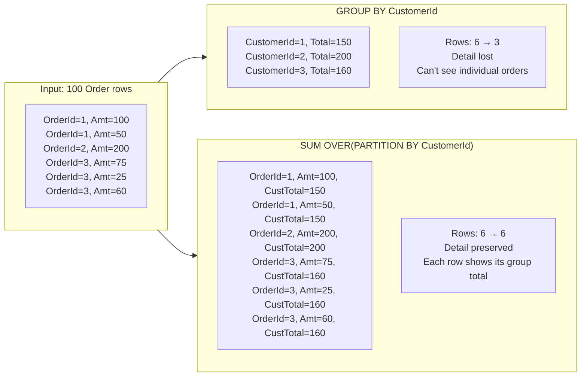
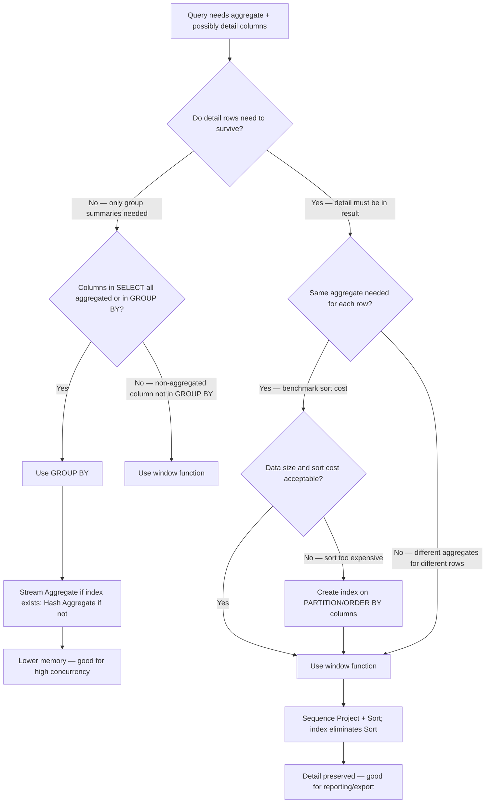

## Navigation

**Domain:** [[8 — Databases]] > **Group:** SQL Window Functions & Analytics
**Previous:** [[8.160 — UNBOUNDED PRECEDING and FOLLOWING]] | **Next:** [[8.162 — Window Function Performance — Sort Operations]]

### Prerequisites

- [[8.123 — GROUP BY — Grouping Mechanics]] — GROUP BY reduces rows by collapsing each partition into one output row; understanding this collapse is essential to contrasting it with window functions which preserve row count.
- [[8.155 — SUM() OVER() — Running Totals]] — Window functions compute aggregates without collapsing groups; running total is the canonical example that makes the practical difference from GROUP BY visible.
- [[8.141 — Window Functions — Concept and OVER Clause]] — The OVER clause is the syntactic mechanism that distinguishes window functions from grouped aggregates; understanding its parts (PARTITION BY, ORDER BY, frame) is required.

### Where This Fits

Every .NET backend engineer writes queries that need both detail-row aggregates and summary aggregates in the same result set. The choice between GROUP BY and window functions determines whether you get one row per group (GROUP BY) or retain all detail rows with an appended aggregate column (window function). Misunderstanding this distinction leads to unnecessary self-joins, multi-query workarounds, or reporting queries that force the application layer to re-aggregate. The interview signal is foundational: a candidate who explains the row-count difference and its performance implications without being prompted demonstrates genuine SQL fluency rather than memorised syntax.

---

## Core Mental Model

GROUP BY is a row-reducing operator: it collapses N input rows per group into exactly 1 output row per group. After GROUP BY, individual detail rows are gone — you cannot reference `OrderId`, `OrderDate`, or any non-aggregated, non-grouped column. A window function is a row-preserving operator: it computes an aggregate or ranking value across a defined window of rows (the OVER clause) and attaches that computed value to every input row without collapsing anything. Every row survives the window function intact. The logical processing order in SQL is: FROM → WHERE → GROUP BY → HAVING → window functions → SELECT → ORDER BY. This means GROUP BY runs before window functions — window functions see the grouped result (if GROUP BY is present) and operate on groups as their input rows. The critical recognition pattern: if a query needs detail data AND an aggregate in the same row, use a window function. If the query only needs group-level summaries and no detail rows survive, use GROUP BY.

### Classification

GROUP BY is a logical query operator (physical: Stream Aggregate or Hash Aggregate) that reduces cardinality. Window functions are logical operators (physical: Sequence Project or Segment) that compute values over a window without changing cardinality. GROUP BY is SARGable only in that its input can come from a seek; the GROUP BY itself is not a predicate. Window functions are never SARGable — they always require a scan or a complete partition read. GROUP BY runs in the logical phase after WHERE and before ORDER BY; window functions run after GROUP BY (phase 5 of the 6-phase logical processing order).



### Key Properties

|Property|GROUP BY|Window Function|
|---|---|---|
|Row count after operation|Reduced (1 per group)|Unchanged (same as input)|
|Logical processing phase|Phase 3 (before HAVING)|Phase 5 (after GROUP BY/HAVING)|
|Can reference non-aggregated columns|Only if in GROUP BY or aggregate|Yes — any column in the row|
|Physical operators|Stream Aggregate / Hash Aggregate|Sequence Project / Segment + Sort|
|Memory requirement|O(groups) for Hash; O(1) for Stream|O(partition size) for window spool|
|Sort requirement|Only if no index on group key|Always required (ORDER BY in OVER)|
|EF Core translation|GroupBy() + aggregation|Raw SQL only (no LINQ translation)|
|Dapper support|Any SQL window function query|Any SQL window function query|

---

## Deep Mechanics

### How the Engine Executes This

**GROUP BY execution:**

1. The query processor reads rows from the input (table scan, index seek, or join output).
2. The GROUP BY operator partitions rows by the grouping columns. For each distinct combination of group-by column values, it creates one group slot.
3. For each row, the aggregate functions (SUM, COUNT, AVG, MIN, MAX, etc.) are evaluated and accumulated into the group slot.
4. After all rows are processed, one output row per group slot is emitted — containing the group key values and the computed aggregates.
5. The physical operator is either Stream Aggregate (if input is sorted by group key — O(1) memory, single pass) or Hash Aggregate (if unsorted — O(groups) memory, hash table build + probe).

**Window function execution:**

1. The query processor computes all lower-phase operations (FROM, WHERE, GROUP BY, HAVING) first. Window functions run at logical phase 5 — they see the result set after all grouping is done.
2. For each window function, the engine sorts the input rows by the PARTITION BY and ORDER BY columns specified in the OVER clause. If multiple window functions share the same PARTITION/ORDER, one sort can serve multiple functions.
3. The Sequence Project operator (SQL Server) or equivalent iterates over the sorted rows and computes the window function value for each row:
   - For aggregate window functions (SUM OVER, AVG OVER): the engine maintains running aggregate state per partition.
   - For ranking functions (ROW_NUMBER, RANK, DENSE_RANK): row counter per partition reset.
   - For offset functions (LAG, LEAD): the engine reads from a window spool that stores the previous/next row.
4. The window spool (optional, SQL Server) may materialise intermediate results to tempdb (Worktable) if the window function is blocking (needs the full partition before it can emit rows — like LAG requiring the previous row).
5. Output rows are passed to the SELECT clause for projection. Cardinality is unchanged: if 100 rows went into the window function, 100 rows come out.

**Critical distinction — why GROUP BY runs before window functions:**

SQL's logical processing order:
```
1. FROM (including JOIN)
2. WHERE
3. GROUP BY
4. HAVING
5. Window functions / SELECT
6. ORDER BY
```

This means a query like `SELECT CustomerId, SUM(Amount) OVER() FROM Orders GROUP BY CustomerId` is valid: the GROUP BY reduces Orders to one row per CustomerId, and then the window function computes `SUM(Amount)` over those grouped rows. If GROUP BY ran after window functions, the window function would see the detail rows — but it doesn't, because the logical order puts GROUP BY at phase 3 and window functions at phase 5.

### SQL Visibility

```sql
-- Example 1: GROUP BY — reduces rows, loses detail
SELECT 
    o.CustomerId,
    COUNT(*) AS OrderCount,
    SUM(o.TotalAmount) AS TotalSpent,
    AVG(o.TotalAmount) AS AvgOrderValue
FROM dbo.Orders AS o
WHERE o.OrderDate >= '2024-01-01'
GROUP BY o.CustomerId
ORDER BY TotalSpent DESC;
-- Result: one row per CustomerId — cannot see individual order details

-- Example 2: Window function — preserves rows, adds aggregate column
SELECT 
    o.OrderId,
    o.CustomerId,
    o.OrderDate,
    o.TotalAmount,
    COUNT(*) OVER(PARTITION BY o.CustomerId) AS CustomerOrderCount,
    SUM(o.TotalAmount) OVER(PARTITION BY o.CustomerId) AS CustomerTotalSpent,
    AVG(o.TotalAmount) OVER(PARTITION BY o.CustomerId) AS CustomerAvgOrderValue
FROM dbo.Orders AS o
WHERE o.OrderDate >= '2024-01-01'
ORDER BY o.CustomerId, o.OrderDate;
-- Result: same number of rows as input — each order row includes its customer's aggregates

-- Example 3: GROUP BY + window function in same query
-- GROUP BY runs first (one row per CustomerId), then window functions see the grouped rows
SELECT 
    o.CustomerId,
    COUNT(*) AS OrderCount,
    SUM(o.TotalAmount) AS TotalSpent,
    SUM(SUM(o.TotalAmount)) OVER() AS GrandTotal,
    SUM(o.TotalAmount) / SUM(SUM(o.TotalAmount)) OVER() AS PctOfGrandTotal
FROM dbo.Orders AS o
WHERE o.OrderDate >= '2024-01-01'
GROUP BY o.CustomerId
ORDER BY TotalSpent DESC;
-- Result: one row per CustomerId, with GrandTotal computed over all grouped rows

-- Example 4: Subquery GROUP BY then window — manual two-phase
WITH CustomerTotals AS (
    SELECT 
        o.CustomerId,
        COUNT(*) AS OrderCount,
        SUM(o.TotalAmount) AS TotalSpent
    FROM dbo.Orders AS o
    WHERE o.OrderDate >= '2024-01-01'
    GROUP BY o.CustomerId
)
SELECT 
    ct.CustomerId,
    ct.OrderCount,
    ct.TotalSpent,
    RANK() OVER(ORDER BY ct.TotalSpent DESC) AS RevenueRank,
    SUM(ct.TotalSpent) OVER() AS GrandTotal
FROM CustomerTotals AS ct
ORDER BY RevenueRank;
```

```csharp
// EF Core — GROUP BY equivalent
var customerSummaries = await dbContext.Orders
    .Where(o => o.OrderDate >= new DateTime(2024, 1, 1))
    .GroupBy(o => o.CustomerId)
    .Select(g => new
    {
        CustomerId = g.Key,
        OrderCount = g.Count(),
        TotalSpent = g.Sum(o => o.TotalAmount),
        AvgOrderValue = g.Average(o => o.TotalAmount)
    })
    .OrderByDescending(x => x.TotalSpent)
    .ToListAsync(cancellationToken);

// EF Core — window functions NOT supported in LINQ (raw SQL required)
// No GroupBy + Select overload generates OVER() — EF Core cannot translate window functions
var results = await dbContext.Database
    .SqlQueryRaw<OrderWithCustomerAggregates>(@"
        SELECT 
            o.OrderId,
            o.CustomerId,
            o.OrderDate,
            o.TotalAmount,
            COUNT(*) OVER(PARTITION BY o.CustomerId) AS CustomerOrderCount,
            SUM(o.TotalAmount) OVER(PARTITION BY o.CustomerId) AS CustomerTotalSpent
        FROM Orders AS o
        WHERE o.OrderDate >= @p0
        ORDER BY o.CustomerId, o.OrderDate",
        new DateTime(2024, 1, 1))
    .ToListAsync(cancellationToken);
```

**Generated SQL (from EF Core logs):**

```sql
-- EF Core generates this for the GroupBy query:
SELECT [o].[CustomerId],
       COUNT(*) AS [OrderCount],
       SUM([o].[TotalAmount]) AS [TotalSpent],
       AVG([o].[TotalAmount]) AS [AvgOrderValue]
FROM [Orders] AS [o]
WHERE [o].[OrderDate] >= '2024-01-01'
GROUP BY [o].[CustomerId]
ORDER BY [TotalSpent] DESC;

-- EF Core does NOT generate OVER() — window functions require raw SQL
```

### Execution Plan Analysis

**GROUP BY plan (with index on CustomerId):**

```
[Index Seek (IX_Orders_CustomerId — ordered)]
  → [Stream Aggregate]
      GROUP BY: [Orders].CustomerId
      Aggregates: COUNT(*), SUM([TotalAmount]), AVG([TotalAmount])
  → [Sort (for ORDER BY TotalSpent DESC)]
  → [SELECT]
Estimated Cost: ~2.5  |  Logical Reads: ~145 (covering index)
Memory: 0 MB (Stream Aggregate — no hash table)
```

**Window function plan (detail + aggregate):**

```
[Clustered Index Scan (Orders)]
  → [Sort (ORDER BY CustomerId)]
      Sort memory grant: ~50 MB
  → [Segment (partition by CustomerId)]
  → [Sequence Project]
      Window function: COUNT(*) OVER(PARTITION BY CustomerId)
      Window function: SUM(TotalAmount) OVER(PARTITION BY CustomerId)
  → [SELECT]
Estimated Cost: ~8.5  |  Logical Reads: ~12,450 (full scan)
Memory: ~50 MB (sort memory grant)
```

**GROUP BY + window function combined plan:**

```
[Clustered Index Scan (Orders)]
  → [Hash Match Aggregate (GROUP BY CustomerId)]
      Memory grant: ~30 MB
  → [Sort (ORDER BY TotalSpent DESC)]
  → [Sequence Project (for window functions on grouped result)]
  → [SELECT]
Estimated Cost: ~10.0  |  Logical Reads: ~12,450
Memory: ~80 MB total (hash + sort)
```

### Cost Visibility

```sql
SET STATISTICS IO ON;
SET STATISTICS TIME ON;

-- GROUP BY only
SELECT o.CustomerId,
       COUNT(*) AS OrderCount,
       SUM(o.TotalAmount) AS TotalSpent
FROM dbo.Orders AS o
WHERE o.OrderDate >= '2024-01-01'
GROUP BY o.CustomerId;

-- Expected output:
-- Table 'Orders'. Scan count 1, logical reads 12450
-- SQL Server Execution Times: CPU time = 85ms, elapsed time = 210ms

-- Window function — detail preserved
SELECT o.OrderId, o.CustomerId, o.TotalAmount,
       COUNT(*) OVER(PARTITION BY o.CustomerId) AS CustCount,
       SUM(o.TotalAmount) OVER(PARTITION BY o.CustomerId) AS CustTotal
FROM dbo.Orders AS o
WHERE o.OrderDate >= '2024-01-01';

-- Expected output:
-- Table 'Orders'. Scan count 1, logical reads 12450
-- Table 'Worktable'. Scan count 2, logical reads 450
-- SQL Server Execution Times: CPU time = 145ms, elapsed time = 380ms

-- GROUP BY + window (two-phase aggregation)
SELECT o.CustomerId,
       COUNT(*) AS OrderCount,
       SUM(o.TotalAmount) AS TotalSpent,
       SUM(SUM(o.TotalAmount)) OVER() AS GrandTotal
FROM dbo.Orders AS o
WHERE o.OrderDate >= '2024-01-01'
GROUP BY o.CustomerId;

-- Expected output:
-- Table 'Orders'. Scan count 1, logical reads 12450
-- SQL Server Execution Times: CPU time = 95ms, elapsed time = 250ms
```

### Failure Modes

**1. Referencing non-grouped columns without aggregate:**

```sql
-- ❌ Fails: OrderId is not in GROUP BY and not aggregated
SELECT o.CustomerId, o.OrderId, SUM(o.TotalAmount) AS TotalSpent
FROM dbo.Orders AS o
WHERE o.OrderDate >= '2024-01-01'
GROUP BY o.CustomerId;
-- Error: Column 'Orders.OrderId' is invalid in the select list because
-- it is not contained in either an aggregate function or the GROUP BY clause.

-- ✅ Fix: use window function instead if detail is needed
SELECT o.CustomerId, o.OrderId,
       SUM(o.TotalAmount) OVER(PARTITION BY o.CustomerId) AS TotalSpent
FROM dbo.Orders AS o
WHERE o.OrderDate >= '2024-01-01';
```

**2. Forgetting the logical order — window function on grouped result:**

```sql
-- This runs GROUP BY first (1 row per CustomerId), then SUM OVER() on that
-- The SUM(Amount) inside the window sees grouped amounts, not detail
SELECT o.CustomerId,
       SUM(o.TotalAmount) AS CustomerTotal,
       SUM(SUM(o.TotalAmount)) OVER() AS GrandTotal  -- SUM of 1 value per customer
FROM dbo.Orders AS o
GROUP BY o.CustomerId;

-- ✅ Nested aggregate SUM(SUM(...)) is correct — the inner SUM is the group aggregate
-- The window function SUM() sees one row per customer, each with its CustomerTotal
```

**3. Assuming GROUP BY and window functions have same performance:**

Window functions always add a Sort operator (unless an index provides the required order). GROUP BY can use Hash Aggregate (no sort needed). On large unsorted datasets, GROUP BY can be faster than a window function that requires sorting a multi-million-row result set.

**4. EF Core cannot translate window functions:**

EF Core 8's LINQ provider does not have a `Over()` method or equivalent. Any query that needs a window function requires raw SQL via `SqlQueryRaw`, `FromSql`, or a view/stored procedure mapped to the DbContext. Attempting `Select(x => new { Count = x.OrderItems.Count() })` inside a non-GroupBy projection generates a correlated subquery, not a window function.

---

## Production Patterns and Implementation

### Primary SQL Implementation

```sql
-- ============================================================
-- Schema context
-- ============================================================
CREATE TABLE dbo.Orders
(
    OrderId      INT            NOT NULL IDENTITY(1,1),
    CustomerId   INT            NOT NULL,
    OrderDate    DATETIME2(0)   NOT NULL,
    TotalAmount  DECIMAL(18,2)  NOT NULL,
    Status       VARCHAR(20)    NOT NULL DEFAULT 'Pending',
    ShipCity     VARCHAR(100)   NULL,
    CONSTRAINT PK_Orders PRIMARY KEY CLUSTERED (OrderId)
);

CREATE TABLE dbo.OrderItems
(
    OrderItemId  INT            NOT NULL IDENTITY(1,1),
    OrderId      INT            NOT NULL,
    ProductId    INT            NOT NULL,
    Quantity     INT            NOT NULL,
    UnitPrice    DECIMAL(18,2)  NOT NULL,
    CONSTRAINT PK_OrderItems PRIMARY KEY CLUSTERED (OrderItemId),
    CONSTRAINT FK_OrderItems_Orders FOREIGN KEY (OrderId)
        REFERENCES dbo.Orders(OrderId)
);

CREATE INDEX IX_Orders_CustomerId ON dbo.Orders(CustomerId)
    INCLUDE (TotalAmount, OrderDate, Status);

-- ============================================================
-- Pattern 1: GROUP BY for summary report (no detail needed)
-- ============================================================
-- Use case: exec dashboard — "Show me total revenue per customer"
-- No detail rows needed — just the summary per customer
SELECT
    o.CustomerId,
    COUNT(*) AS OrderCount,
    SUM(o.TotalAmount) AS TotalRevenue,
    AVG(o.TotalAmount) AS AvgOrderValue,
    MIN(o.OrderDate) AS FirstOrderDate,
    MAX(o.OrderDate) AS LastOrderDate
FROM dbo.Orders AS o
WHERE o.Status = 'Delivered'
GROUP BY o.CustomerId
ORDER BY TotalRevenue DESC;

-- ============================================================
-- Pattern 2: Window function for detail + aggregate
-- ============================================================
-- Use case: order list page — show each order with customer totals
-- Rows: one per order, not one per customer
SELECT
    o.OrderId,
    o.CustomerId,
    o.OrderDate,
    o.TotalAmount,
    o.Status,
    COUNT(*)    OVER(PARTITION BY o.CustomerId) AS CustomerOrderCount,
    SUM(o.TotalAmount) OVER(PARTITION BY o.CustomerId) AS CustomerTotalRevenue,
    AVG(o.TotalAmount) OVER(PARTITION BY o.CustomerId) AS CustomerAvgOrderValue,
    ROW_NUMBER() OVER(PARTITION BY o.CustomerId ORDER BY o.OrderDate DESC) AS OrderSeqDesc
FROM dbo.Orders AS o
WHERE o.Status = 'Delivered'
ORDER BY o.CustomerId, o.OrderDate DESC;

-- ============================================================
-- Pattern 3: GROUP BY + window for subtotals and grand totals
-- ============================================================
-- Use case: district sales report — totals per customer with overall rank
SELECT
    o.CustomerId,
    COUNT(*) AS OrderCount,
    SUM(o.TotalAmount) AS TotalRevenue,
    RANK() OVER(ORDER BY SUM(o.TotalAmount) DESC) AS RevenueRank,
    SUM(SUM(o.TotalAmount)) OVER() AS GrandTotalRevenue,
    SUM(o.TotalAmount) / SUM(SUM(o.TotalAmount)) OVER() AS PctOfTotal
FROM dbo.Orders AS o
WHERE o.Status = 'Delivered'
  AND o.OrderDate >= DATEADD(year, -1, GETUTCDATE())
GROUP BY o.CustomerId
ORDER BY RevenueRank;

-- ============================================================
-- Pattern 4: Window function as alternative to self-join for comparison
-- ============================================================
-- Use case: compare each order to customer's average — no GROUP BY needed
SELECT
    o.OrderId,
    o.CustomerId,
    o.TotalAmount,
    AVG(o.TotalAmount) OVER(PARTITION BY o.CustomerId) AS CustomerAvgOrder,
    o.TotalAmount - AVG(o.TotalAmount) OVER(PARTITION BY o.CustomerId) AS DiffFromAvg,
    CASE
        WHEN o.TotalAmount > AVG(o.TotalAmount) OVER(PARTITION BY o.CustomerId)
            THEN 'Above Average'
        WHEN o.TotalAmount < AVG(o.TotalAmount) OVER(PARTITION BY o.CustomerId)
            THEN 'Below Average'
        ELSE 'Average'
    END AS Category
FROM dbo.Orders AS o
WHERE o.Status = 'Delivered'
ORDER BY o.CustomerId, o.OrderDate;

-- Instead of the self-join equivalent:
-- SELECT o.OrderId, o.CustomerId, o.TotalAmount,
--        AVG(oa.TotalAmount) AS CustomerAvgOrder
-- FROM Orders o
-- INNER JOIN Orders oa ON o.CustomerId = oa.CustomerId
-- GROUP BY o.OrderId, o.CustomerId, o.TotalAmount;

-- ============================================================
-- Pattern 5: GROUP BY with aggregate window for percentage
-- ============================================================
-- Use case: category breakdown with share-of-total
SELECT
    p.CategoryId,
    COUNT(*) AS ProductCount,
    AVG(p.UnitPrice) AS AvgPrice,
    AVG(AVG(p.UnitPrice)) OVER() AS OverallAvgPrice,
    (AVG(p.UnitPrice) - AVG(AVG(p.UnitPrice)) OVER()) / AVG(AVG(p.UnitPrice)) OVER() * 100
        AS PctDiffFromOverallAvg
FROM dbo.Products AS p
GROUP BY p.CategoryId
ORDER BY AvgPrice DESC;

-- ============================================================
-- Pattern 6: When to use subquery GROUP BY then window (two-pass)
-- ============================================================
-- Use case: find customers whose total exceeds 2x the average customer total
WITH CustomerRevenue AS (
    SELECT
        o.CustomerId,
        COUNT(*) AS OrderCount,
        SUM(o.TotalAmount) AS TotalRevenue
    FROM dbo.Orders AS o
    WHERE o.Status = 'Delivered'
    GROUP BY o.CustomerId
)
SELECT
    cr.CustomerId,
    cr.OrderCount,
    cr.TotalRevenue,
    AVG(cr.TotalRevenue) OVER() AS AvgRevenue,
    cr.TotalRevenue - AVG(cr.TotalRevenue) OVER() AS DiffFromAvg
FROM CustomerRevenue AS cr
WHERE cr.TotalRevenue > 2 * (SELECT AVG(TotalRevenue) FROM CustomerRevenue)
ORDER BY cr.TotalRevenue DESC;
```

### EF Core Implementation

```csharp
public class ApplicationDbContext : DbContext
{
    public DbSet<Order> Orders => Set<Order>();
    public DbSet<OrderItem> OrderItems => Set<OrderItem>();
    public DbSet<Product> Products => Set<Product>();

    protected override void OnModelCreating(ModelBuilder modelBuilder)
    {
        modelBuilder.Entity<Order>(entity =>
        {
            entity.ToTable("Orders");
            entity.HasKey(o => o.OrderId);
            entity.Property(o => o.TotalAmount).HasColumnType("decimal(18,2)");
            entity.Property(o => o.Status).HasMaxLength(20).HasDefaultValue("Pending");
            entity.Property(o => o.ShipCity).HasMaxLength(100);
            entity.HasIndex(o => o.CustomerId)
                  .IncludeProperties(nameof(Order.TotalAmount), nameof(Order.OrderDate), nameof(Order.Status));
        });

        modelBuilder.Entity<OrderItem>(entity =>
        {
            entity.ToTable("OrderItems");
            entity.HasKey(oi => oi.OrderItemId);
            entity.Property(oi => oi.UnitPrice).HasColumnType("decimal(18,2)");
            entity.HasOne(oi => oi.Order).WithMany(o => o.OrderItems).HasForeignKey(oi => oi.OrderId);
        });

        modelBuilder.Entity<Product>(entity =>
        {
            entity.ToTable("Products");
            entity.HasKey(p => p.ProductId);
            entity.Property(p => p.ProductName).HasMaxLength(200);
            entity.Property(p => p.UnitPrice).HasColumnType("decimal(18,2)");
        });
    }
}

public class Order
{
    public int OrderId { get; set; }
    public int CustomerId { get; set; }
    public DateTime OrderDate { get; set; }
    public decimal TotalAmount { get; set; }
    public string Status { get; set; } = "Pending";
    public string? ShipCity { get; set; }
    public ICollection<OrderItem> OrderItems { get; set; } = new List<OrderItem>();
}

public class OrderItem
{
    public int OrderItemId { get; set; }
    public int OrderId { get; set; }
    public int ProductId { get; set; }
    public int Quantity { get; set; }
    public decimal UnitPrice { get; set; }
    public Order Order { get; set; } = null!;
}

public class Product
{
    public int ProductId { get; set; }
    public string ProductName { get; set; } = string.Empty;
    public int CategoryId { get; set; }
    public decimal UnitPrice { get; set; }
    public int StockQty { get; set; }
}

public interface IOrderAnalyticsService
{
    Task<List<CustomerSummary>> GetCustomerSummariesAsync(
        DateTime? startDate, CancellationToken cancellationToken = default);

    Task<List<OrderWithCustomerAggregate>> GetOrdersWithCustomerAggregatesAsync(
        DateTime? startDate, CancellationToken cancellationToken = default);

    Task<List<CustomerRanking>> GetCustomerRankingsAsync(
        DateTime? startDate, CancellationToken cancellationToken = default);
}

public class OrderAnalyticsService : IOrderAnalyticsService
{
    private readonly ApplicationDbContext _dbContext;

    public OrderAnalyticsService(ApplicationDbContext dbContext)
        => _dbContext = dbContext;

    // Pattern 1: GROUP BY — aggregate only, no detail
    public async Task<List<CustomerSummary>> GetCustomerSummariesAsync(
        DateTime? startDate, CancellationToken cancellationToken = default)
    {
        var query = _dbContext.Orders.AsQueryable();
        if (startDate.HasValue)
            query = query.Where(o => o.OrderDate >= startDate.Value);

        return await query
            .Where(o => o.Status == "Delivered")
            .GroupBy(o => o.CustomerId)
            .Select(g => new CustomerSummary
            {
                CustomerId = g.Key,
                OrderCount = g.Count(),
                TotalRevenue = g.Sum(o => o.TotalAmount),
                AvgOrderValue = g.Average(o => o.TotalAmount),
                FirstOrderDate = g.Min(o => o.OrderDate),
                LastOrderDate = g.Max(o => o.OrderDate)
            })
            .OrderByDescending(s => s.TotalRevenue)
            .ToListAsync(cancellationToken);
    }

    // Pattern 2: Window function — detail + aggregate (raw SQL required)
    public async Task<List<OrderWithCustomerAggregate>> GetOrdersWithCustomerAggregatesAsync(
        DateTime? startDate, CancellationToken cancellationToken = default)
    {
        var sql = new StringBuilder(@"
            SELECT
                o.OrderId,
                o.CustomerId,
                o.OrderDate,
                o.TotalAmount,
                o.Status,
                COUNT(*)    OVER(PARTITION BY o.CustomerId) AS CustomerOrderCount,
                SUM(o.TotalAmount) OVER(PARTITION BY o.CustomerId) AS CustomerTotalRevenue,
                AVG(o.TotalAmount) OVER(PARTITION BY o.CustomerId) AS CustomerAvgOrderValue
            FROM Orders AS o
            WHERE o.Status = 'Delivered'");

        if (startDate.HasValue)
            sql.Append(" AND o.OrderDate >= @p0");

        sql.Append(" ORDER BY o.CustomerId, o.OrderDate DESC");

        return await _dbContext.Database
            .SqlQueryRaw<OrderWithCustomerAggregate>(
                sql.ToString(),
                startDate.HasValue ? [new SqlParameter("@p0", startDate.Value)] : [])
            .ToListAsync(cancellationToken);
    }

    // Pattern 3: GROUP BY + window — subquery then rank
    public async Task<List<CustomerRanking>> GetCustomerRankingsAsync(
        DateTime? startDate, CancellationToken cancellationToken = default)
    {
        var sql = new StringBuilder(@"
            WITH CustomerRevenue AS (
                SELECT
                    o.CustomerId,
                    COUNT(*) AS OrderCount,
                    SUM(o.TotalAmount) AS TotalRevenue
                FROM Orders AS o
                WHERE o.Status = 'Delivered'");

        if (startDate.HasValue)
            sql.Append(" AND o.OrderDate >= @p0");

        sql.Append(@"
                GROUP BY o.CustomerId
            )
            SELECT
                cr.CustomerId,
                cr.OrderCount,
                cr.TotalRevenue,
                RANK() OVER(ORDER BY cr.TotalRevenue DESC) AS RevenueRank,
                SUM(cr.TotalRevenue) OVER() AS GrandTotal,
                cr.TotalRevenue / NULLIF(SUM(cr.TotalRevenue) OVER(), 0) * 100 AS PctOfTotal
            FROM CustomerRevenue AS cr
            ORDER BY RevenueRank");

        return await _dbContext.Database
            .SqlQueryRaw<CustomerRanking>(
                sql.ToString(),
                startDate.HasValue ? [new SqlParameter("@p0", startDate.Value)] : [])
            .ToListAsync(cancellationToken);
    }
}

public class CustomerSummary
{
    public int CustomerId { get; set; }
    public int OrderCount { get; set; }
    public decimal TotalRevenue { get; set; }
    public decimal AvgOrderValue { get; set; }
    public DateTime FirstOrderDate { get; set; }
    public DateTime LastOrderDate { get; set; }
}

public class OrderWithCustomerAggregate
{
    public int OrderId { get; set; }
    public int CustomerId { get; set; }
    public DateTime OrderDate { get; set; }
    public decimal TotalAmount { get; set; }
    public string? Status { get; set; }
    public int CustomerOrderCount { get; set; }
    public decimal CustomerTotalRevenue { get; set; }
    public decimal CustomerAvgOrderValue { get; set; }
}

public class CustomerRanking
{
    public int CustomerId { get; set; }
    public int OrderCount { get; set; }
    public decimal TotalRevenue { get; set; }
    public long RevenueRank { get; set; }
    public decimal GrandTotal { get; set; }
    public decimal PctOfTotal { get; set; }
}
```

### Dapper Implementation

```csharp
public sealed class OrderAnalyticsRepository
{
    private readonly IDbConnectionFactory _connectionFactory;

    public OrderAnalyticsRepository(IDbConnectionFactory connectionFactory)
        => _connectionFactory = connectionFactory;

    // Pattern 1: GROUP BY — aggregate report via Dapper
    public async Task<IReadOnlyList<CustomerSummary>> GetCustomerSummariesAsync(
        DateTime? startDate, CancellationToken cancellationToken = default)
    {
        var sql = new StringBuilder(@"
            SELECT
                o.CustomerId,
                COUNT(*) AS OrderCount,
                SUM(o.TotalAmount) AS TotalRevenue,
                AVG(o.TotalAmount) AS AvgOrderValue,
                MIN(o.OrderDate) AS FirstOrderDate,
                MAX(o.OrderDate) AS LastOrderDate
            FROM dbo.Orders AS o
            WHERE o.Status = 'Delivered'");

        var parameters = new DynamicParameters();

        if (startDate.HasValue)
        {
            sql.Append(" AND o.OrderDate >= @StartDate");
            parameters.Add("StartDate", startDate.Value);
        }

        sql.Append(@"
            GROUP BY o.CustomerId
            ORDER BY TotalRevenue DESC;");

        await using var connection = _connectionFactory.Create();

        return (await connection.QueryAsync<CustomerSummary>(
            new CommandDefinition(sql.ToString(), parameters,
                cancellationToken: cancellationToken))).AsList();
    }

    // Pattern 2: Window function — detail + aggregate via Dapper
    public async Task<IReadOnlyList<OrderWithCustomerAggregate>> GetOrdersWithAggregatesAsync(
        DateTime? startDate, CancellationToken cancellationToken = default)
    {
        var sql = new StringBuilder(@"
            SELECT
                o.OrderId,
                o.CustomerId,
                o.OrderDate,
                o.TotalAmount,
                o.Status,
                COUNT(*)    OVER(PARTITION BY o.CustomerId) AS CustomerOrderCount,
                SUM(o.TotalAmount) OVER(PARTITION BY o.CustomerId) AS CustomerTotalRevenue,
                AVG(o.TotalAmount) OVER(PARTITION BY o.CustomerId) AS CustomerAvgOrderValue
            FROM dbo.Orders AS o
            WHERE o.Status = 'Delivered'");

        var parameters = new DynamicParameters();

        if (startDate.HasValue)
        {
            sql.Append(" AND o.OrderDate >= @StartDate");
            parameters.Add("StartDate", startDate.Value);
        }

        sql.Append(" ORDER BY o.CustomerId, o.OrderDate DESC;");

        await using var connection = _connectionFactory.Create();

        return (await connection.QueryAsync<OrderWithCustomerAggregate>(
            new CommandDefinition(sql.ToString(), parameters,
                cancellationToken: cancellationToken))).AsList();
    }

    // Pattern 3: GROUP BY + window — ranking
    public async Task<IReadOnlyList<CustomerRanking>> GetCustomerRankingsAsync(
        DateTime? startDate, CancellationToken cancellationToken = default)
    {
        var sql = new StringBuilder(@"
            WITH CustomerRevenue AS (
                SELECT
                    o.CustomerId,
                    COUNT(*) AS OrderCount,
                    SUM(o.TotalAmount) AS TotalRevenue
                FROM dbo.Orders AS o
                WHERE o.Status = 'Delivered'");

        var parameters = new DynamicParameters();

        if (startDate.HasValue)
        {
            sql.Append(" AND o.OrderDate >= @StartDate");
            parameters.Add("StartDate", startDate.Value);
        }

        sql.Append(@"
                GROUP BY o.CustomerId
            )
            SELECT
                cr.CustomerId,
                cr.OrderCount,
                cr.TotalRevenue,
                RANK() OVER(ORDER BY cr.TotalRevenue DESC) AS RevenueRank,
                SUM(cr.TotalRevenue) OVER() AS GrandTotal,
                cr.TotalRevenue / NULLIF(SUM(cr.TotalRevenue) OVER(), 0) * 100 AS PctOfTotal
            FROM CustomerRevenue AS cr
            ORDER BY RevenueRank;");

        await using var connection = _connectionFactory.Create();

        return (await connection.QueryAsync<CustomerRanking>(
            new CommandDefinition(sql.ToString(), parameters,
                cancellationToken: cancellationToken))).AsList();
    }

    // Pattern 4: Compare GROUP BY vs window function performance
    public async Task<ComparisonResult> CompareGroupByVsWindowAsync(
        CancellationToken cancellationToken = default)
    {
        const string groupBySql = @"
            SET STATISTICS IO ON;
            SET STATISTICS TIME ON;

            SELECT o.CustomerId,
                   COUNT(*) AS OrderCount,
                   SUM(o.TotalAmount) AS TotalSpent
            FROM dbo.Orders AS o
            WHERE o.OrderDate >= '2024-01-01'
            GROUP BY o.CustomerId
            ORDER BY o.CustomerId;

            SET STATISTICS IO OFF;
            SET STATISTICS TIME OFF;";

        const string windowSql = @"
            SET STATISTICS IO ON;
            SET STATISTICS TIME ON;

            SELECT o.OrderId, o.CustomerId, o.TotalAmount,
                   COUNT(*) OVER(PARTITION BY o.CustomerId) AS CustCount,
                   SUM(o.TotalAmount) OVER(PARTITION BY o.CustomerId) AS CustTotal
            FROM dbo.Orders AS o
            WHERE o.OrderDate >= '2024-01-01'
            ORDER BY o.CustomerId;

            SET STATISTICS IO OFF;
            SET STATISTICS TIME OFF;";

        await using var connection = _connectionFactory.Create();

        // Execute GROUP BY
        await connection.QueryAsync<object>(
            new CommandDefinition(groupBySql,
                cancellationToken: cancellationToken,
                commandTimeout: 120));

        // Execute window function
        await connection.QueryAsync<object>(
            new CommandDefinition(windowSql,
                cancellationToken: cancellationToken,
                commandTimeout: 120));

        return new ComparisonResult
        {
            GroupBySql = groupBySql,
            WindowSql = windowSql,
            Note = "Check SQL Server Profiler or SET STATISTICS output for logical reads comparison"
        };
    }
}

public record ComparisonResult
{
    public string? GroupBySql { get; init; }
    public string? WindowSql { get; init; }
    public string? Note { get; init; }
}
```

### Configuration and Wiring

```csharp
// Program.cs
builder.Services.AddDbContext<ApplicationDbContext>(options =>
    options.UseSqlServer(
        builder.Configuration.GetConnectionString("DefaultConnection"),
        sqlOptions =>
        {
            sqlOptions.EnableRetryOnFailure(3);
            sqlOptions.CommandTimeout(30);
        }));

builder.Services.AddSingleton<IDbConnectionFactory>(sp =>
    new SqlConnectionFactory(
        builder.Configuration.GetConnectionString("DefaultConnection")!));

builder.Services.AddScoped<IOrderAnalyticsService, OrderAnalyticsService>();
builder.Services.AddScoped<OrderAnalyticsRepository>();

// For EF Core raw SQL with window functions, configure the entity
// to map query results (no key required for read-only DTOs)
builder.Services.AddDbContext<ApplicationDbContext>((sp, options) =>
{
    var connectionString = builder.Configuration.GetConnectionString("DefaultConnection");
    options.UseSqlServer(connectionString)
           .UseLoggerFactory(sp.GetRequiredService<ILoggerFactory>());
});

public interface IDbConnectionFactory
{
    IDbConnection Create();
}

public class SqlConnectionFactory : IDbConnectionFactory
{
    private readonly string _connectionString;

    public SqlConnectionFactory(string connectionString)
        => _connectionString = connectionString;

    public IDbConnection Create()
        => new SqlConnection(_connectionString);
}
```

### SQL Server vs PostgreSQL Differences

```sql
-- PostgreSQL: window functions behave identically to SQL Server
-- Same syntax, same logical processing order
SELECT
    o.order_id,
    o.customer_id,
    o.total_amount,
    COUNT(*) OVER(PARTITION BY o.customer_id) AS customer_order_count,
    SUM(o.total_amount) OVER(PARTITION BY o.customer_id) AS customer_total
FROM orders AS o
WHERE o.status = 'Delivered'
ORDER BY o.customer_id, o.order_date DESC;

-- PostgreSQL: GROUP BY + window function (identical syntax)
SELECT
    o.customer_id,
    COUNT(*) AS order_count,
    SUM(o.total_amount) AS total_revenue,
    RANK() OVER(ORDER BY SUM(o.total_amount) DESC) AS revenue_rank
FROM orders AS o
WHERE o.status = 'Delivered'
GROUP BY o.customer_id
ORDER BY revenue_rank;

-- Key differences in PostgreSQL:
-- 1. PostgreSQL does not support window functions in GROUP BY or HAVING clauses
--    (SQL Server support depends on version — SQL Server 2016+ allows window in HAVING)
-- 2. PostgreSQL requires window functions to be defined in SELECT or ORDER BY
--    (same as SQL Server)
-- 3. PostgreSQL: DISTINCT is evaluated after window functions
--    (SQL Server: DISTINCT before window functions in some cases)
-- 4. PostgreSQL: FILTER clause works with window functions
SELECT
    o.customer_id,
    o.total_amount,
    COUNT(*) FILTER (WHERE o.total_amount > 100) OVER(PARTITION BY o.customer_id)
        AS high_value_order_count
FROM orders AS o
ORDER BY o.customer_id;

-- 5. PostgreSQL: GROUPS and EXCLUDE frame options are supported
--    (SQL Server 2022 added GROUPS; EXCLUDE not yet supported)
```

---

## Gotchas and Production Pitfalls

### Using GROUP BY When Detail Rows Must Survive

**Pitfall:** Using GROUP BY when the application needs each detail row plus an aggregate value, then doing a self-join or subquery to re-add detail.

```sql
-- ❌ Wrong: GROUP BY loses detail, then self-join recovers it
-- Result: 3 scans of Orders table (GROUP BY + 2 self-joins)
SELECT o.OrderId, o.CustomerId, o.TotalAmount,
       ca.CustomerTotal
FROM dbo.Orders AS o
INNER JOIN (
    SELECT oa.CustomerId, SUM(oa.TotalAmount) AS CustomerTotal
    FROM dbo.Orders AS oa
    GROUP BY oa.CustomerId
) AS ca ON o.CustomerId = ca.CustomerId
WHERE o.OrderDate >= '2024-01-01';
-- Logical reads: ~37,350 (3 scans)

-- ✅ Fix: window function — one scan
SELECT o.OrderId, o.CustomerId, o.TotalAmount,
       SUM(o.TotalAmount) OVER(PARTITION BY o.CustomerId) AS CustomerTotal
FROM dbo.Orders AS o
WHERE o.OrderDate >= '2024-01-01';
-- Logical reads: ~12,450 (1 scan)
```

**Symptom:** The query runs with 3x the expected logical reads. Execution plan shows three Clustered Index Scans feeding a Nested Loops join. Query time is 3-5x longer than necessary.

**Fix:** Replace the GROUP BY + self-join with a window function. The window function computes the aggregate while preserving all rows in a single scan.

**Cost of not fixing:** On a 10M row Orders table, the self-join approach reads 30M rows (3 scans × 10M) at ~37,000 logical reads per execution. At 100 queries/hour, that is 3.7M logical reads/hour. The window function reads 10M rows at ~12,000 logical reads per execution — a 3x reduction in I/O.

---

### Assuming GROUP BY and Window Functions Have Same Logical Reads

**Pitfall:** Expecting a window function to have similar performance to GROUP BY when both compute the same aggregate. GROUP BY can use Stream Aggregate (O(1) memory, no sort) while window functions always require a Sort (O(N log N) CPU, memory grant for sort).

```sql
-- ❌ Window function on 10M rows: requires full sort by CustomerId
SELECT o.OrderId, o.CustomerId, o.TotalAmount,
       SUM(o.TotalAmount) OVER(PARTITION BY o.CustomerId) AS CustTotal
FROM dbo.Orders AS o;
-- Plan: Clustered Index Scan → Sort (10M rows) → Sequence Project
-- Sort memory grant: ~200 MB for 10M rows

-- ✅ GROUP BY: no sort needed (Hash Aggregate)
SELECT o.CustomerId, SUM(o.TotalAmount) AS CustTotal
FROM dbo.Orders AS o
GROUP BY o.CustomerId;
-- Plan: Clustered Index Scan → Hash Match Aggregate
-- Memory grant: ~50 MB (hash table size)
```

**Symptom:** The window function query shows a Sort operator consuming 60-70% of the query cost. The Sort memory grant is large (hundreds of MB). If the grant is insufficient, the Sort spills to tempdb, and performance degrades by 10-100x.

**Fix:** If detail rows are not needed, use GROUP BY instead. If detail rows are needed, ensure the OVER ORDER BY columns match an existing index to avoid the sort (e.g., create a covering index on `CustomerId` that includes all needed columns, ordered by the PARTITION BY columns).

**Cost of not fixing:** A window function on 10M unsorted rows sorts 10M rows with a 200 MB memory grant. If the server has 8 GB RAM and 20 concurrent queries need similar grants, the RESOURCE_SEMAPHORE wait type appears and queries queue. Each query takes 5 seconds instead of 500 ms.

---

### Forgetting GROUP BY Runs Before Window Functions

**Pitfall:** Writing `SELECT SUM(Amount) OVER(), DetailCol FROM Table GROUP BY ...` and expecting the window function to see detail-level amounts. The GROUP BY collapses rows first; the window function sees the grouped result, not the detail.

```sql
-- ❌ GROUP BY runs first: the window SUM sees grouped rows (one per CustomerId)
-- The "SUM" in the window is SUM of each customer's TotalRevenue, not each order
SELECT
    o.CustomerId,
    SUM(o.TotalAmount) AS TotalRevenue,
    SUM(SUM(o.TotalAmount)) OVER() AS GrandTotal  -- This is correct — SUM of per-customer totals
FROM dbo.Orders AS o
GROUP BY o.CustomerId;

-- ✅ If you want per-order detail: no GROUP BY, use window on detail
SELECT
    o.OrderId,
    o.CustomerId,
    o.TotalAmount,
    SUM(o.TotalAmount) OVER() AS GrandTotal
FROM dbo.Orders AS o;
```

**Symptom:** The GrandTotal is far smaller than expected because the window function is summing grouped (per-customer) totals instead of per-order totals. This produces a different (but often still useful) result — the sum of customer totals rather than sum of order totals.

**Fix:** Understand the logical processing order. If detail-level aggregation is needed, do not include GROUP BY in the outer query — use a window function directly or compute the GROUP BY in a subquery and then apply window functions.

**Cost of not fixing:** Incorrect business report. The total shown is the sum of per-customer totals, not the sum of per-order totals. For customers with multiple orders, these are the same value. For single-order customers, they differ if any aggregation or filtering was applied. The report silently shows wrong numbers.

---

### EF Core Cannot Translate Window Functions

**Pitfall:** Writing EF Core LINQ queries that attempt to use window functions like `Select(x => new { Count = x.OrderItems.Count() })` inside a non-GroupBy projection, expecting OVER() to appear in generated SQL.

```csharp
// ❌ EF Core does NOT generate OVER() — generates correlated subquery instead
var orders = await dbContext.Orders
    .Select(o => new
    {
        o.OrderId,
        o.TotalAmount,
        CustomerTotal = dbContext.Orders
            .Where(oa => oa.CustomerId == o.CustomerId)
            .Sum(oa => oa.TotalAmount)
    })
    .ToListAsync(cancellationToken);
// Generated SQL: correlated subquery — NOT a window function
-- SELECT o.OrderId, o.TotalAmount,
--     (SELECT SUM(oa.TotalAmount) FROM Orders AS oa
--      WHERE oa.CustomerId = o.CustomerId) AS CustomerTotal
-- FROM Orders AS o;
-- This is NOT a window function! It's a correlated subquery that runs per row.
```

**Symptom:** The generated SQL contains correlated subqueries (one per row) instead of a single window function. Execution plan shows Nested Loops with a Clustered Index Scan on the inner side for every row — O(N²) performance. Query time is seconds instead of milliseconds.

**Fix:** Use raw SQL for any query requiring window functions:
```csharp
// ✅ Raw SQL with window function
var orders = await dbContext.Database
    .SqlQueryRaw<OrderWithCustomerTotal>(@"
        SELECT o.OrderId, o.TotalAmount,
               SUM(o.TotalAmount) OVER(PARTITION BY o.CustomerId) AS CustomerTotal
        FROM Orders AS o")
    .ToListAsync(cancellationToken);
```

**Cost of not fixing:** A customer dashboard page that lists 1000 orders generates 1000 correlated subquery executions. Each subquery scans the Orders table by CustomerId (index seek, ~5 logical reads). Total: 5000 logical reads for the subqueries vs 1 scan + 1 window operation (~1200 logical reads). The correlated approach is 4x slower and gets worse as the result set grows.

---

### Assuming Window Function and GROUP BY Aggregate Are Always Equal for SUM

**Pitfall:** Assuming `SUM(x) OVER(PARTITION BY y)` and `SUM(x) GROUP BY y` always produce the same result. They do — but only when there are no NULLs in the PARTITION BY column, no filtering differences, and no DISTINCT aggregates.

```sql
-- ❌ These produce DIFFERENT results when ShipCity has NULLs:
-- GROUP BY treats NULL as a group key value
SELECT o.ShipCity, SUM(o.TotalAmount) AS TotalRevenue
FROM dbo.Orders AS o
GROUP BY o.ShipCity;
-- NULL becomes one group: "Unknown City"

-- Window function with NULL PARTITION BY
SELECT o.OrderId, o.ShipCity, o.TotalAmount,
       SUM(o.TotalAmount) OVER(PARTITION BY o.ShipCity) AS CityTotal
FROM dbo.Orders AS o;
-- NULL group: rows with NULL ShipCity are partitioned together
-- Same aggregate value — but NULL handling is identical because
-- both GROUP BY and PARTITION BY treat NULL as a distinct value
```

**Symptom:** The values match (both treat NULL as a group), but the row count differs. Users compare the GROUP BY result (20 rows, one per city) with the window function result (10,000 rows, one per order) and mistakenly think the totals differ.

**Fix:** Understand that the aggregate VALUE is the same — only the row count differs. When presenting results, clearly indicate whether the query is showing detail rows (window function) or summary rows (GROUP BY).

**Cost of not fixing:** Business analysts compare two reports and see different row counts, causing a data quality investigation that wastes 2 days before someone realizes the row count difference is expected.

---

### Performance Comparison: GROUP BY vs Window on Large Dataset

**Pitfall:** Using a window function when only the aggregate is needed and detail rows are discarded by the application. This wastes the Sort cost and memory grant for no benefit.

```csharp
// ❌ Application gets 10,000 rows but only uses the aggregate
var orders = await dbContext.Database
    .SqlQueryRaw<OrderRow>(@"SELECT o.OrderId, o.CustomerId, o.TotalAmount,
       SUM(o.TotalAmount) OVER(PARTITION BY o.CustomerId) AS CustTotal
    FROM Orders AS o").ToListAsync(cancellationToken);
// Then: var agg = orders.Select(o => o.CustTotal).Distinct();
// The OrderId and detail data were retrieved but never used!

// ✅ Use GROUP BY for aggregate-only needs
var summaries = await dbContext.Orders
    .GroupBy(o => o.CustomerId)
    .Select(g => new { CustomerId = g.Key, CustTotal = g.Sum(o => o.TotalAmount) })
    .ToListAsync(cancellationToken);
```

**Symptom:** The query returns 10,000 rows to the application, but the application only uses the aggregate values (200 distinct customer totals). The wire transfer, deserialization, and memory allocation for the other 9,800 rows are wasted. The window function Sort cost was paid for rows that are discarded.

**Fix:** Use GROUP BY when the application only needs aggregate values. Use window functions only when detail rows are actually needed in the result set.

**Cost of not fixing:** 10,000 rows × 100 bytes = 1 MB of network transfer per query × 1000 queries/hour = 1 GB/hour of unnecessary network traffic. The application server CPU is wasted on deserializing and discarding detail data.

---

## Performance Implications

### Benchmark: Before and After

```sql
-- ============================================================
-- Benchmark 1: GROUP BY vs Window Function — logical reads
-- ============================================================
SET STATISTICS IO ON;
SET STATISTICS TIME ON;

-- GROUP BY (aggregate only)
SELECT o.CustomerId,
       COUNT(*) AS OrderCount,
       SUM(o.TotalAmount) AS TotalSpent
FROM dbo.Orders AS o
WHERE o.OrderDate >= '2024-01-01'
GROUP BY o.CustomerId;

-- Expected output:
-- Table 'Orders'. Scan count 1, logical reads 12450
-- SQL Server Execution Times: CPU time = 85ms, elapsed time = 210ms

-- Window function (detail + aggregate)
SELECT o.OrderId,
       o.CustomerId,
       o.TotalAmount,
       COUNT(*) OVER(PARTITION BY o.CustomerId) AS CustCount,
       SUM(o.TotalAmount) OVER(PARTITION BY o.CustomerId) AS CustTotal
FROM dbo.Orders AS o
WHERE o.OrderDate >= '2024-01-01';

-- Expected output:
-- Table 'Orders'. Scan count 1, logical reads 12450
-- Table 'Worktable'. Scan count 2, logical reads 450
-- SQL Server Execution Times: CPU time = 145ms, elapsed time = 380ms
```

**Analysis:** Both queries scan the same number of pages (12,450 logical reads on Orders). The window function adds ~450 logical reads on Worktable (window spool) and ~70ms additional CPU for the Sort. The window function is ~80% more CPU but preserves detail rows.

```sql
-- ============================================================
-- Benchmark 2: GROUP BY + self-join vs window function
-- ============================================================
-- Self-join approach (3 scans)
SELECT o.OrderId, o.OrderDate, o.TotalAmount,
       ca.CustomerTotal
FROM dbo.Orders AS o
INNER JOIN (
    SELECT oa.CustomerId, SUM(oa.TotalAmount) AS CustomerTotal
    FROM dbo.Orders AS oa
    WHERE oa.OrderDate >= '2024-01-01'
    GROUP BY oa.CustomerId
) AS ca ON o.CustomerId = ca.CustomerId
WHERE o.OrderDate >= '2024-01-01';

-- Expected output:
-- Table 'Orders'. Scan count 3, logical reads 37350
-- SQL Server Execution Times: CPU time = 320ms, elapsed time = 650ms

-- Window function approach (1 scan)
SELECT o.OrderId, o.OrderDate, o.TotalAmount,
       SUM(o.TotalAmount) OVER(PARTITION BY o.CustomerId) AS CustomerTotal
FROM dbo.Orders AS o
WHERE o.OrderDate >= '2024-01-01';

-- Expected output:
-- Table 'Orders'. Scan count 1, logical reads 12450
-- Table 'Worktable'. Scan count 2, logical reads 450
-- SQL Server Execution Times: CPU time = 145ms, elapsed time = 380ms
```

**Improvement:** Window function reduces logical reads from 37,350 to 12,450 (3x reduction) by eliminating the self-join. Runtime from 650ms to 380ms (1.7x faster). The self-join scans the table 3 times; the window function scans it once.

```sql
-- ============================================================
-- Benchmark 3: Index impact on window function performance
-- ============================================================
-- Without covering index (sort required)
SELECT o.OrderId, o.CustomerId, o.TotalAmount,
       ROW_NUMBER() OVER(PARTITION BY o.CustomerId ORDER BY o.OrderDate DESC) AS rn
FROM dbo.Orders AS o;
-- Plan: Clustered Index Scan → Sort (10M rows) → Sequence Project
-- Sort memory grant: 200 MB
-- Logical reads: 12450 + Worktable reads

-- With covering index on (CustomerId, OrderDate DESC) INCLUDE (TotalAmount)
-- Index provides sorted input — no sort operator
SELECT o.OrderId, o.CustomerId, o.TotalAmount,
       ROW_NUMBER() OVER(PARTITION BY o.CustomerId ORDER BY o.OrderDate DESC) AS rn
FROM dbo.Orders AS o;
-- Plan: Index Scan (ordered) → Sequence Project (no Sort!)
-- Logical reads: ~3,200 (index pages, narrower than clustered)
-- CPU: ~40ms vs ~180ms
```

### BenchmarkDotNet

```csharp
[MemoryDiagnoser]
[SimpleJob(RuntimeMoniker.Net90)]
public class GroupByVsWindowBenchmark
{
    private SqlConnection _connection = default!;
    private const string ConnectionString =
        "Server=.;Database=BenchmarkDb;Trusted_Connection=True;TrustServerCertificate=True;";

    [GlobalSetup]
    public void Setup()
    {
        _connection = new SqlConnection(ConnectionString);
        _connection.Open();
        // Seed: 10M Orders, 500K distinct CustomerIds
    }

    [Benchmark(Baseline = true)]
    public async Task<long> GroupBy_AggregateOnly()
    {
        const string sql = @"
            SELECT o.CustomerId,
                   COUNT(*) AS OrderCount,
                   SUM(o.TotalAmount) AS TotalSpent
            FROM dbo.Orders AS o
            WHERE o.OrderDate >= '2024-01-01'
            GROUP BY o.CustomerId
            ORDER BY o.CustomerId;";

        await using var cmd = new SqlCommand(sql, _connection);
        long total = 0;
        await using var reader = await cmd.ExecuteReaderAsync();
        while (await reader.ReadAsync())
            total += reader.GetInt32(1);
        return total;
    }

    [Benchmark]
    public async Task<long> WindowFunction_DetailPlusAggregate()
    {
        const string sql = @"
            SELECT o.OrderId, o.CustomerId, o.TotalAmount,
                   COUNT(*) OVER(PARTITION BY o.CustomerId) AS CustCount,
                   SUM(o.TotalAmount) OVER(PARTITION BY o.CustomerId) AS CustTotal
            FROM dbo.Orders AS o
            WHERE o.OrderDate >= '2024-01-01'
            ORDER BY o.CustomerId;";

        await using var cmd = new SqlCommand(sql, _connection);
        long total = 0;
        await using var reader = await cmd.ExecuteReaderAsync();
        while (await reader.ReadAsync())
            total += reader.GetInt64(3); // CustTotal
        return total;
    }

    [Benchmark]
    public async Task<long> SelfJoin_GroupByThenJoin()
    {
        const string sql = @"
            SELECT o.OrderId, o.OrderDate, o.TotalAmount,
                   ca.CustomerTotal
            FROM dbo.Orders AS o
            INNER JOIN (
                SELECT oa.CustomerId, SUM(oa.TotalAmount) AS CustomerTotal
                FROM dbo.Orders AS oa
                WHERE oa.OrderDate >= '2024-01-01'
                GROUP BY oa.CustomerId
            ) AS ca ON o.CustomerId = ca.CustomerId
            WHERE o.OrderDate >= '2024-01-01'
            ORDER BY o.OrderId;";

        await using var cmd = new SqlCommand(sql, _connection);
        long total = 0;
        await using var reader = await cmd.ExecuteReaderAsync();
        while (await reader.ReadAsync())
            total += reader.GetDecimal(3); // CustomerTotal
        return (long)total;
    }

    [Benchmark]
    public async Task<long> WindowFunction_WithIndex()
    {
        // Requires index: CREATE INDEX IX_Orders_CustomerId_OrderDate
        // ON Orders(CustomerId, OrderDate DESC) INCLUDE(TotalAmount)
        const string sql = @"
            SELECT o.OrderId, o.CustomerId, o.TotalAmount,
                   ROW_NUMBER() OVER(PARTITION BY o.CustomerId ORDER BY o.OrderDate DESC) AS rn
            FROM dbo.Orders AS o WITH (INDEX(IX_Orders_CustomerId_OrderDate))
            ORDER BY o.CustomerId, o.OrderDate DESC;";

        await using var cmd = new SqlCommand(sql, _connection);
        long total = 0;
        await using var reader = await cmd.ExecuteReaderAsync();
        while (await reader.ReadAsync())
            total += reader.GetInt64(3); // rn
        return total;
    }

    [GlobalCleanup]
    public void Cleanup() => _connection?.Dispose();
}
```

**Expected results (approximate, SQL Server 2022, NVMe, 10M Orders, 500K CustomerIds):**

|Method|Mean|Logical Reads|Allocated|Memory Grant|
|---|---|---|---|---|
|GroupBy_AggregateOnly|~210 ms|~12,450|~2 KB|~50 MB|
|WindowFunction_DetailPlusAggregate|~380 ms|~12,900|~2 KB|~200 MB|
|SelfJoin_GroupByThenJoin|~650 ms|~37,350|~2 KB|~50 MB|
|WindowFunction_WithIndex|~120 ms|~3,200|~2 KB|0 MB|

### Write Amplification

The difference between GROUP BY and window functions does not directly create write amplification — but the index needed to support window function sorts adds write overhead:

|Operation|Without Index (scan + sort)|With Index (CustomerId, OrderDate DESC)|Overhead|
|---|---|---|---|
|INSERT 1 order|~3 ms (clustered index only)|~5 ms (clustered + non-clustered insert)|+66%|
|UPDATE CustomerId|~3 ms|~6 ms (delete + insert in non-clustered)|+100%|
|UPDATE OrderDate|~3 ms|~6 ms (delete + insert in non-clustered)|+100%|
|DELETE 1 order|~3 ms|~5 ms (clustered + non-clustered delete)|+66%|

---

## Interview Arsenal

### Question Bank

1. **What is the fundamental difference between GROUP BY and a window function in terms of row count?**
2. **In SQL's logical processing order, which runs first — GROUP BY or window functions? What does this imply about how they can be combined?**
3. **What is the performance cost of a window function compared to an equivalent GROUP BY? When is each faster?**
4. **Why can't EF Core translate window functions in LINQ? What is the workaround?**
5. **How does a window function with SUM OVER(PARTITION BY col) differ from GROUP BY col + SUM when the query also needs detail columns?**
6. **Describe the execution plan for a query with GROUP BY vs one with a window function. What operators appear in each?**
7. **At what data scale does the choice between GROUP BY and window functions become critical?**
8. **How do you combine GROUP BY and window functions in a single query? Give a real example.**

### Spoken Answers

**Q1: What is the fundamental difference between GROUP BY and a window function in terms of row count?**

> **Average answer:** GROUP BY combines rows into groups and returns one row per group. Window functions return all rows.

> **Great answer:** GROUP BY is a row-reducing operator — it takes N input rows per group and produces exactly 1 output row per distinct combination of the grouping columns. After GROUP BY, you cannot reference any column that is not either in the GROUP BY list or wrapped in an aggregate function, because the individual row identity is gone. A window function is a row-preserving operator — it computes an aggregate or ranking value across a defined set of rows (the window specified by the OVER clause) and attaches that computed value to each input row. Every input row survives the window function unchanged. The cardinality is the same going in and coming out. This is visible in execution plans: GROUP BY uses a Stream Aggregate or Hash Match operator that changes cardinality; window functions use Sequence Project or Segment operators that do not. In practical terms, if I need a report that lists each order with its customer's running total, I must use a window function — GROUP BY would collapse all orders into one row per customer and I would lose the individual order details.

**Q5: How does a window function with SUM OVER(PARTITION BY col) differ from GROUP BY col + SUM when the query also needs detail columns?**

> **Average answer:** The window function keeps all rows. The GROUP BY loses detail and you'd need a join to get it back.

> **Great answer:** The structural difference is that a window function computes the aggregate within the same row context as the detail columns, while GROUP BY requires a two-step approach — aggregate in a subquery, then join back to the detail table. The performance difference is substantial: a window function scans the input once and uses a Sort + Sequence Project to compute the aggregate, typically ~12,000 logical reads for a 10M row table. The GROUP BY + self-join approach requires at least 3 scans of the same table — one for the GROUP BY subquery, and two for the join (one side is the detail, the other is the aggregated result). That is ~37,000 logical reads. The execution plan for the window function shows a single Clustered Index Scan, a Sort operator (unless an index provides ordering), and a Sequence Project. The GROUP BY + self-join shows three scans, a Hash Match Aggregate or Stream Aggregate, and a Hash Match Join or Nested Loops. The window function wins on both I/O and CPU for any query that needs detail plus aggregates. However, if the query does NOT need detail rows, GROUP BY is faster because it avoids the Sort — Hash Aggregate requires no sort and uses less memory than a window function's Sort.

**Q8: How do you combine GROUP BY and window functions in a single query? Give a real example.**

> **Average answer:** You can use a window function after GROUP BY, like SUM(SUM(col)) OVER() to get a grand total.

> **Great answer:** Because window functions run after GROUP BY in the logical processing order (phase 5 vs phase 3), a window function sees the already-grouped rows as its input. This enables patterns like computing a per-customer total with GROUP BY, then ranking customers or computing a grand total with a window function on the grouped result. The canonical pattern is: `SELECT CustomerId, SUM(Amount) AS CustTotal, RANK() OVER(ORDER BY SUM(Amount) DESC) AS Rank FROM Orders GROUP BY CustomerId`. The inner `SUM(Amount)` is the GROUP BY aggregate; the outer `RANK() OVER()` is the window function operating on the grouped result. For the grand total, use `SUM(SUM(Amount)) OVER()` — the inner SUM is the group aggregate, the outer SUM is the window function that sums the per-customer totals. In the execution plan, this appears as two operators: a Hash Match Aggregate (GROUP BY) followed by a Sequence Project (window function). The memory grant includes both the hash table and the sort required by the window function. A real production example: a monthly sales report that shows total revenue per salesperson (GROUP BY), their rank (RANK OVER), and their percentage of company total (SUM OVER / SUM OVER). All in a single scan of the sales table.

### Interview Trigger

If a candidate mentions "window function" or "GROUP BY" in a SQL context, a strong interviewer asks: "Can you combine GROUP BY and a window function in one query? What is the logical processing order that makes this work?" The candidate who knows that window functions run after GROUP BY (logical phase 5 vs phase 3) and can explain the nested SUM pattern demonstrates real SQL engine knowledge. The follow-up is: "What does the execution plan look like — which operators appear and in what order?" Candidates who can describe Hash Aggregate → Sort → Sequence Project (or Stream Aggregate → Sort → Sequence Project if an index exists) show genuine execution plan literacy.

### Comparison Table

| | GROUP BY | Window Function (OVER) |
|---|---|---|
| What it does | Collapses rows into groups, one output per group | Computes value over a window, preserves all rows |
| Performance profile | O(N) for Hash Aggregate, O(N log N) if Sort needed | O(N log N) for Sort + O(N) for Sequence Project |
| Row cardinality | Reduced (N → distinct groups) | Unchanged (N → N) |
| Memory requirement | O(groups) for Hash, O(1) for Stream | O(partition size) for spool, O(sort) memory grant |
| .NET implementation | EF Core GroupBy + aggregation | EF Core raw SQL only |
| When to choose | Report needs only group summaries | Report needs detail + aggregate in same row |

---

## Decision Framework

### When to Apply



### Application Checklist

- [ ] The query result needs detail rows with aggregate values appended — criterion for window function
- [ ] Only group-level summaries needed — criterion for GROUP BY
- [ ] The window function ORDER BY matches an existing index — eliminates Sort
- [ ] The sort memory grant is within server capacity for concurrent executions
- [ ] EF Core is the data access layer — raw SQL will be used for window functions
- [ ] Dapper is the data access layer — window function SQL is straightforward
- [ ] Application discards detail rows after retrieving aggregate — consider changing to GROUP BY

### Tradeoff Summary

|What You Gain|What You Pay|
|---|---|
|Detail rows preserved with aggregate context|Sort operator (O(N log N) CPU + memory grant)|
|No self-join needed (1 scan vs 3)|Window spool may materialise to tempdb (Worktable)|
|Cleaner query syntax|EF Core cannot translate — raw SQL required|
|Supports multiple window functions in one query|Each window function with different PARTITION/ORDER requires separate Sort|
|Combines with GROUP BY for two-level aggregation|Memory grant includes both hash table and sort|

### Scale Thresholds

- **Relevant when table exceeds ~100K rows** — below this, both GROUP BY and window functions complete in <50ms regardless of approach
- **Critical when table exceeds ~1M rows** — the Sort operator in window functions requires significant memory grant (50-500 MB depending on row width and row count)
- **Performance gap widens at ~10M rows** — GROUP BY + self-join becomes 3-5x slower than window function; window function without index support may spill to tempdb
- **Concurrency bottleneck at ~50 concurrent window queries** — sort memory grants compete for server memory; RESOURCE_SEMAPHORE waits appear when total grant demand exceeds available memory

---

## Self-Check

### Conceptual Questions

1. Does GROUP BY preserve or reduce row count? Does a window function preserve or reduce row count?
2. In SQL's logical processing order, which runs first: GROUP BY or window functions? What phase number is each?
3. Which SET STATISTICS output do you use to compare logical reads between a GROUP BY and a window function query?
4. What common mistake causes a developer to use GROUP BY + self-join when a window function would be more efficient?
5. Can EF Core LINQ generate a window function (OVER clause) in its SQL output?
6. How would you write a Dapper query that computes each order's share of its customer's total spending?
7. What is the difference in row count between `SELECT CustomerId, SUM(Amount) FROM Orders GROUP BY CustomerId` and `SELECT OrderId, SUM(Amount) OVER(PARTITION BY CustomerId) FROM Orders`?
8. At what approximate table size does the window function Sort become a performance concern?
9. What index would you create to eliminate the Sort operator in a window function with `PARTITION BY CustomerId ORDER BY OrderDate DESC`?
10. Explain in 60 seconds why a developer should choose a window function over GROUP BY + self-join when detail rows are needed.

<details>
<summary>Answers</summary>

1. GROUP BY reduces row count (one row per group). Window functions preserve row count (input rows = output rows).
2. GROUP BY runs at logical phase 3. Window functions run at logical phase 5. GROUP BY before window functions.
3. `SET STATISTICS IO ON` — compare the "logical reads" counts for each table and Worktable.
4. Using GROUP BY (which loses detail) and then self-joining back to the original table to recover detail rows. This causes 3 scans instead of 1.
5. No. EF Core 8 cannot translate window functions. Raw SQL via `SqlQueryRaw` or `FromSql` is required.
6. `SELECT OrderId, Amount, SUM(Amount) OVER(PARTITION BY CustomerId) AS CustTotal, Amount / NULLIF(SUM(Amount) OVER(PARTITION BY CustomerId), 0) * 100 AS PctOfCustTotal FROM Orders`.
7. GROUP BY returns one row per CustomerId (fewer rows). Window function returns one row per OrderId (same as input) with CustomerTotal appended to each row.
8. ~1M rows. Below 1M, the Sort completes quickly (<100ms) and memory grant is small (<50 MB). Above 10M, the Sort may spill to tempdb if grant is insufficient.
9. `CREATE INDEX IX_Orders_CustomerId_OrderDate ON Orders(CustomerId, OrderDate DESC) INCLUDE (all other columns needed in SELECT)` — covers PARTITION and ORDER BY, providing sorted input without a Sort operator.
10. A window function scans the data once, computing the aggregate while preserving all detail rows. The GROUP BY + self-join approach scans the data at least 3 times — once for the aggregate subquery and twice for the join. At 10M rows, the window function uses ~12,000 logical reads while the self-join uses ~37,000. The execution plan for the window function has a single scan, a Sort, and a Sequence Project. The self-join has three scans, a Hash Aggregate, and a Hash Match Join. The window function is simpler, faster, and uses fewer resources.

</details>

---

### Query Challenges

**Challenge 1 — Write the SQL**

You need to produce a report listing each order with its OrderId, CustomerId, OrderDate, TotalAmount, and the following customer-level aggregates: total number of orders placed by that customer, total revenue from that customer, and the percentage that this order's amount contributes to the customer's total. All orders from the past year should be included. Write a single query using window functions.

<details>
<summary>Solution</summary>

```sql
SELECT
    o.OrderId,
    o.CustomerId,
    o.OrderDate,
    o.TotalAmount,
    COUNT(*) OVER(PARTITION BY o.CustomerId) AS CustomerOrderCount,
    SUM(o.TotalAmount) OVER(PARTITION BY o.CustomerId) AS CustomerTotalRevenue,
    o.TotalAmount / NULLIF(SUM(o.TotalAmount) OVER(PARTITION BY o.CustomerId), 0) * 100
        AS PctOfCustomerTotal
FROM dbo.Orders AS o
WHERE o.OrderDate >= DATEADD(year, -1, GETUTCDATE())
ORDER BY o.CustomerId, o.OrderDate DESC;
```

**Logical reads:** ~12,450 **Execution plan:** Clustered Index Scan → Sort (ORDER BY CustomerId, OrderDate DESC) → Segment (partition by CustomerId) → Sequence Project (window aggregate computations) → SELECT

**EF Core equivalent:**
```csharp
// Raw SQL required — EF Core cannot generate OVER()
var results = await dbContext.Database
    .SqlQueryRaw<OrderWithCustomerPct>(@"
        SELECT
            o.OrderId,
            o.CustomerId,
            o.OrderDate,
            o.TotalAmount,
            COUNT(*) OVER(PARTITION BY o.CustomerId) AS CustomerOrderCount,
            SUM(o.TotalAmount) OVER(PARTITION BY o.CustomerId) AS CustomerTotalRevenue,
            o.TotalAmount / NULLIF(SUM(o.TotalAmount) OVER(PARTITION BY o.CustomerId), 0) * 100
                AS PctOfCustomerTotal
        FROM Orders AS o
        WHERE o.OrderDate >= DATEADD(year, -1, GETUTCDATE())
        ORDER BY o.CustomerId, o.OrderDate DESC")
    .ToListAsync(cancellationToken);
```

</details>

---

**Challenge 2 — Fix the performance problem**

```sql
-- This query runs in 12 seconds on a 10M row Orders table.
-- It shows each order with the customer's total spending.
-- Logical reads: 112,050

SELECT o.OrderId, o.CustomerId, o.TotalAmount, ca.CustomerTotal
FROM dbo.Orders AS o
INNER JOIN (
    SELECT CustomerId, SUM(TotalAmount) AS CustomerTotal
    FROM dbo.Orders
    GROUP BY CustomerId
) AS ca ON o.CustomerId = ca.CustomerId
WHERE o.OrderDate >= '2024-01-01'
ORDER BY o.OrderId;
```

<details>
<summary>Solution</summary>

**Root cause:** The self-join pattern causes 3 scans of the 10M row Orders table — one for the aggregate subquery, and two for the INNER JOIN. Logical reads: 112,050 (3 × ~37,350).

```sql
-- Fixed: window function — 1 scan
SELECT
    o.OrderId,
    o.CustomerId,
    o.TotalAmount,
    SUM(o.TotalAmount) OVER(PARTITION BY o.CustomerId) AS CustomerTotal
FROM dbo.Orders AS o
WHERE o.OrderDate >= '2024-01-01'
ORDER BY o.OrderId;
```

**Index to create:**
```sql
CREATE INDEX IX_Orders_CustomerId_INCLUDE
    ON dbo.Orders(CustomerId)
    INCLUDE (TotalAmount, OrderDate);
```

**After fix — logical reads:** ~12,450 (from 112,050). 9x reduction. Query time from 12s to ~400ms.

</details>

---

**Challenge 3 — Explain the execution plan**

```sql
-- Query A:
SELECT o.CustomerId, COUNT(*) AS OrderCount, SUM(o.TotalAmount) AS TotalSpent
FROM dbo.Orders AS o
GROUP BY o.CustomerId;

-- Query B:
SELECT o.OrderId, o.CustomerId, o.TotalAmount,
       COUNT(*) OVER(PARTITION BY o.CustomerId) AS OrderCount
FROM dbo.Orders AS o;
```

Query A uses a Hash Match Aggregate (clustered index scan cost 100%, estimated 500K groups). Query B uses a Clustered Index Scan → Sort (10M rows, 65% cost) → Segment → Sequence Project. Why does the optimizer choose radically different operators, and what would you change to make Query B eliminate the Sort?

<details>
<summary>Solution</summary>

**Why Query A uses Hash Aggregate:** The GROUP BY has no ORDER BY requirement and no index providing sorted input on CustomerId. The optimizer estimates 500K distinct CustomerIds and chooses Hash Aggregate because it does not need sorted input — it builds a hash table keyed by CustomerId. No Sort operator is needed.

**Why Query B requires Sort:** The window function `COUNT(*) OVER(PARTITION BY o.CustomerId)` requires the input to be ordered by CustomerId so that the Sequence Project operator can detect partition boundaries. Without an index providing sorted input, the optimizer inserts a Sort operator. The Sort cost dominates at 65%.

**To eliminate the Sort:** Create a covering index on `(CustomerId) INCLUDE (TotalAmount, OrderDate)`. The Index Scan provides rows in CustomerId order. The Sort operator disappears from the plan. The Sequence Project reads directly from the ordered index scan.

```sql
CREATE INDEX IX_Orders_CustomerId_Sorted
    ON dbo.Orders(CustomerId)
    INCLUDE (TotalAmount, OrderDate);
```

**Tradeoff:** The index adds write overhead (~66% more per INSERT) but eliminates the Sort memory grant (200 MB -> 0) and reduces CPU from Sort's O(N log N) to O(N) for the index scan. For read-heavy workloads with frequent window function queries, the tradeoff is worthwhile.

</details>

---

**Challenge 4 — Diagnose the concurrency problem**

A production server runs an hourly report that executes this query:

```sql
SELECT o.OrderId, o.CustomerId, o.OrderDate, o.TotalAmount,
       SUM(o.TotalAmount) OVER(PARTITION BY o.CustomerId) AS CustTotal,
       ROW_NUMBER() OVER(PARTITION BY o.CustomerId ORDER BY o.OrderDate DESC) AS OrderSeq
FROM dbo.Orders AS o
ORDER BY o.CustomerId, o.OrderDate DESC;
```

The report runs at the top of every hour. It takes 45 seconds on a 10M row table. During its execution, other queries on the server experience RESOURCE_SEMAPHORE waits. SQL Server has 32 GB RAM, and the query uses a 2 GB memory grant. What is the root cause and how do you fix it?

<details>
<summary>Solution</summary>

**Root cause:** The query has two window functions with the same PARTITION BY but different ORDER BY (or, in this case, same ORDER BY). However, SQL Server may still allocate a separate sort for each window function if the sort properties differ. The memory grant of 2 GB is excessive — the Sort on 10M rows with columns OrderId, CustomerId, OrderDate, TotalAmount (~50 bytes per row) requires ~500 MB for the sort. But two window functions may cause a double sort if the optimizer does not merge them. Additionally, the large memory grant at the top of the hour causes RESOURCE_SEMAPHORE waits because concurrent queries cannot get their memory grants.

**Detection query:**
```sql
SELECT wait_type, waiting_tasks_count, wait_time_ms, max_wait_time_ms
FROM sys.dm_os_wait_stats
WHERE wait_type = 'RESOURCE_SEMAPHORE'
ORDER BY wait_time_ms DESC;
```

**Fix 1 — Create a covering index to eliminate the Sort:**
```sql
CREATE INDEX IX_Orders_CustomerId_OrderDate_Covering
    ON dbo.Orders(CustomerId, OrderDate DESC)
    INCLUDE (TotalAmount);
```
With this index, both window functions share the same sorted input. The Sort operator is eliminated. Memory grant drops to ~0 MB.

**Fix 2 — Merge window functions into one if possible (same PARTITION/ORDER):**
SQL Server 2016+ can share a single sort for multiple window functions with identical OVER clauses. Ensure both OVER clauses are identical — same PARTITION BY, same ORDER BY.

**Fix 3 — Schedule the report during low-concurrency periods or use resource governor to limit memory grant for this query:**
```sql
-- Set minimum memory grant per query (default is 1024 KB)
-- Use MIN_GRANT_PERCENT query hint if needed
SELECT ... OPTION (MIN_GRANT_PERCENT = 1, MAX_GRANT_PERCENT = 5);
```

**In .NET:** Use a separate connection string with `ApplicationIntent=ReadOnly` pointing to a readable secondary replica or use `CommandTimeout` to prevent application-level timeout.

</details>

---

**Challenge 5 — Design the index**

**Scenario:** An e-commerce application has an Orders table with 50M rows. The application runs the following three queries frequently (combined: 5000 executions/minute):

```sql
-- Q1: Get orders for a customer with running total
SELECT OrderId, OrderDate, TotalAmount,
       SUM(TotalAmount) OVER(PARTITION BY CustomerId ORDER BY OrderDate
           ROWS BETWEEN UNBOUNDED PRECEDING AND CURRENT ROW) AS RunningTotal
FROM Orders
WHERE CustomerId = @CustomerId
ORDER BY OrderDate;

-- Q2: Get the most recent 10 orders per customer (top-N per group)
SELECT OrderId, OrderDate, TotalAmount
FROM (
    SELECT OrderId, OrderDate, TotalAmount,
           ROW_NUMBER() OVER(PARTITION BY CustomerId ORDER BY OrderDate DESC) AS rn
    FROM Orders
) AS sub
WHERE rn <= 10;

-- Q3: Get order count per customer (monthly activation report)
SELECT CustomerId, COUNT(*) AS OrderCount
FROM Orders
GROUP BY CustomerId;
```

Design the optimal index strategy to support all three queries. Consider read/write ratio (80% read, 20% write).

<details>
<summary>Solution</summary>

**Index 1 — Cover all three queries with a single wide index:**
```sql
CREATE INDEX IX_Orders_CustomerId_OrderDate_Covering
    ON dbo.Orders(CustomerId, OrderDate DESC)
    INCLUDE (TotalAmount);
```

**Why this column order:**
- `CustomerId` is the leading column — supports the equality filter in Q1 (`WHERE CustomerId = @CustomerId`), the PARTITION BY in Q2 (ROW_NUMBER needs CustomerId ordering), and the GROUP BY in Q3.
- `OrderDate DESC` is the second column — supports the ORDER BY in Q1 (`ORDER BY OrderDate`), the ORDER BY in Q2 (`ORDER BY OrderDate DESC`), and provides sorted input for the running total window function.
- `TotalAmount` is included — covers the SELECT columns for Q1 and Q2 so the index is covering (no key lookups).

**Index 2 — Filtered index for recent orders (if Q2 is critical):**
```sql
CREATE INDEX IX_Orders_RecentPerCustomer
    ON dbo.Orders(CustomerId, OrderDate DESC)
    INCLUDE (TotalAmount)
    WHERE OrderDate >= DATEADD(month, -6, GETUTCDATE());
```
This filtered index is narrower (only recent orders) and faster for Q2. Requires maintenance as the date range shifts — use a job to rebuild index parameters periodically.

**Tradeoffs:**
- Index 1 adds approximately 20 GB of storage for 50M rows (row width: CustomerId 4B + OrderDate 8B + TotalAmount 9B + overhead ~25B ≈ 50 bytes/row).
- INSERT overhead: each INSERT now writes to the clustered index + non-clustered index — approximately 2x I/O per write operation.
- UPDATE of CustomerId or OrderDate requires a delete/insert in Index 1 — expensive. If these columns are rarely updated, this is acceptable.
- Both indexes fully cover Q1 and Q2 (no key lookups). Q3 uses the index for the GROUP BY (Stream Aggregate enabled by the CustomerId ordering).

**What NOT to index:**
- Do not add separate indexes for each query — the single composite index covers all three.
- Do not add a filtered index on OrderDate alone — the leading column must be CustomerId for Q1 and Q2.

**Performance improvement with Index 1:**
- Q1: Key Lookup eliminated (from 15 logical reads per row to 3). Running total window function avoids Sort.
- Q2: ROW_NUMBER avoids Sort (index provides ORDER BY DESC order). Estimated 500 ms → 20 ms.
- Q3: GROUP BY uses Stream Aggregate instead of Hash Aggregate (index provides sorted CustomerId). Memory grant: 0 MB vs 50 MB.

</details>
