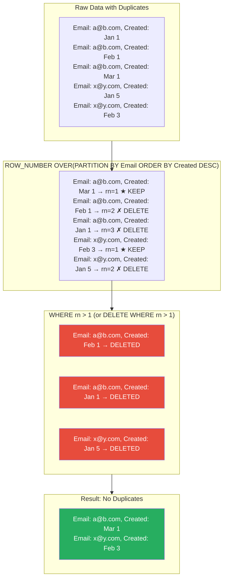
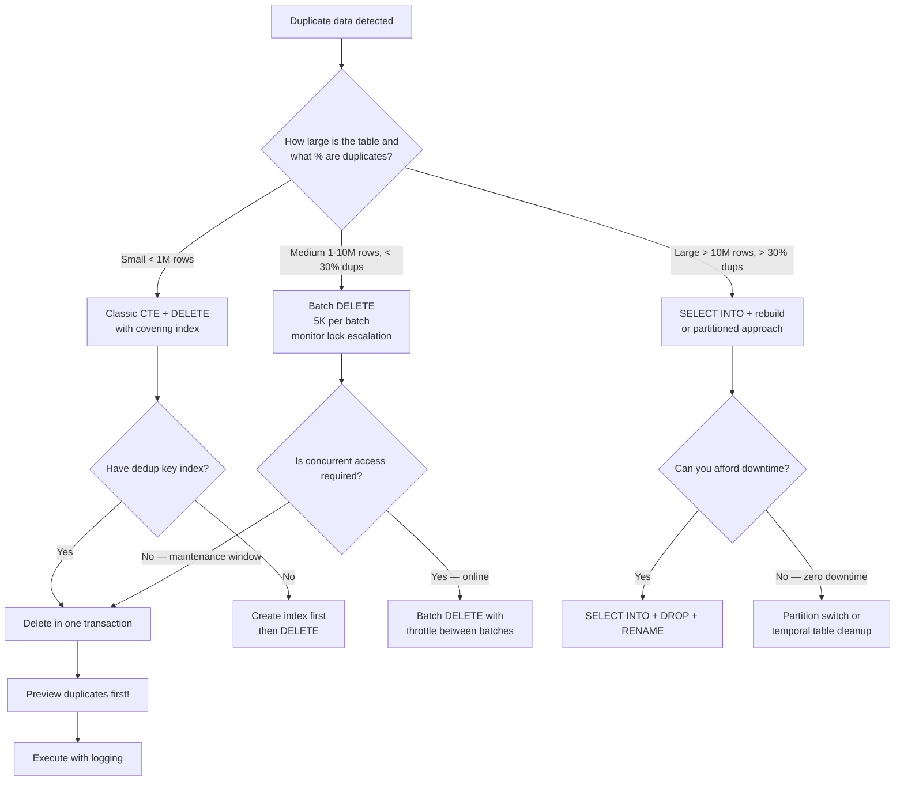

## Navigation

**Domain:** [[8 — Databases]] > **Group:** SQL Window Functions & Analytics
**Previous:** [[8.162 — Window Function Performance — Sort Operations]] | **Next:** [[8.164 — Gaps and Islands — Classic Window Problem]]

### Prerequisites

- [[8.144 — ROW_NUMBER() — Unique Sequential Numbering]] — ROW_NUMBER() assigns sequential integers within a partition; the dedup pattern relies on assigning 1 to the keep row and >1 to duplicates.
- [[8.123 — GROUP BY — Grouping Mechanics]] — GROUP BY can identify duplicates by counting rows per dedup key; understanding its row-reducing behavior clarifies why ROW_NUMBER() is often preferred for dedup (preserves non-key columns).
- [[8.162 — Window Function Performance — Sort Operations]] — ROW_NUMBER() requires a Sort by the PARTITION BY and ORDER BY columns; the dedup operation's performance depends on the sort memory grant and whether an index supports it.

### Where This Fits

Duplicate data creeps into every production database through application bugs, missing unique constraints, idempotent retries, ETL pipeline failures, or data migration accidents. The ROW_NUMBER() dedup pattern is the most common SQL window function pattern in production — every .NET backend engineer will encounter it within their first year on a data-heavy team. The canonical `WITH cte AS (SELECT *, ROW_NUMBER() OVER(PARTITION BY dedup_cols ORDER BY priority) AS rn FROM table) DELETE FROM cte WHERE rn > 1` is the go-to solution because it is transactional, single-statement, and handles "keep the latest" or "keep the best" dedup logic declaratively. The interview signal is practical: knowing the pattern, the performance implications (sort + spool on large tables, index requirements), and the edge cases (NULL handling in PARTITION BY, tie-breaking in ORDER BY) distinguishes engineers who have cleaned production data from those who have only read about it.

---

## Core Mental Model

Deduplication with ROW_NUMBER() is a two-phase operation: first, assign a sequential row number within each group of potential duplicates (defined by the PARTITION BY columns), ordered by the priority that determines which row to keep (e.g., newest first, highest status first). Second, filter to rows where row number > 1 (the duplicates) and delete them. The invariant is that ROW_NUMBER() starts at 1 for each partition, so the row with rn = 1 is the keeper and all rows with rn > 1 are duplicates. The PARTITION BY columns define "what makes a row a duplicate" (the business dedup key). The ORDER BY columns define "which row to keep" (the selection priority). The recognition pattern: any time you hear "remove duplicates keeping the latest/most recent/best record" with a defined set of business key columns, the ROW_NUMBER() pattern applies. The operation requires a full scan of the table (or relevant index) plus a Sort by the dedup key columns. For large tables, the Sort may require significant memory or spill to tempdb. An index on the dedup key columns (PARTITION BY + ORDER BY) can eliminate the Sort and dramatically improve performance.

### Classification

ROW_NUMBER() is a window ranking function. The dedup pattern uses it in a CTE or subquery with a WHERE or DELETE filter. The operation is not SARGable — the ROW_NUMBER() computation requires scanning all rows in the partition. The DELETE phase is a standard DML operation that acquires page- or row-level locks on the rows being deleted. The dedup pattern is transactional: if the DELETE fails partway through, the CTE evaluation completes, but the DELETE's changes are rolled back.



### Key Properties

|Property|Value|Notes|
|---|---|---|
|Time complexity (ROW_NUMBER)|O(N log N)|Sort by PARTITION BY + ORDER BY columns|
|Time complexity (DELETE)|O(duplicates)|Proportional to number of duplicate rows removed|
|Sort memory grant|est_rows × (dedup_key_width + sort_overhead)|Same as any window function with ORDER BY|
|Index requirement for sort elimination|Index on (PARTITION BY cols, ORDER BY cols)|Leading columns = dedup business key|
|Locking (DELETE phase)|Row-level locks on deleted rows|Long-running dedup may escalate to table lock|
|Transactional|Yes — CTE + DELETE is atomic|If DELETE fails, no rows removed|
|NULL handling in PARTITION BY|NULL = NULL (treated as equal)|Two rows with NULL in PARTITION BY column are in same partition|
|EF Core support|Raw SQL only|No LINQ equivalent for ROW_NUMBER() dedup|

---

## Deep Mechanics

### How the Engine Executes This

**Phase 1 — ROW_NUMBER() computation:**

1. The query processor reads the input rows (table scan or index scan). For the dedup pattern, typically a full scan is needed because all rows must be evaluated for duplicates.
2. The Sort operator orders the rows by the dedup key columns: first by the PARTITION BY columns (the dedup business key), then by the ORDER BY columns (the priority). Direction matters: DESC for "keep newest", ASC for "keep oldest".
3. The Sequence Project operator (with Segment) detects partition boundaries by comparing consecutive rows on the PARTITION BY columns. When a boundary is detected (the PARTITION BY column value changes), the ROW_NUMBER counter resets to 1.
4. For each row within a partition, ROW_NUMBER increments by 1. The first row in the partition (determined by the ORDER BY) gets rn = 1.
5. The CTE or subquery materializes the intermediate result set in the query plan's memory or a spool (if needed for the DML phase).

**Phase 2 — DELETE:**

6. The DELETE operator reads the intermediate result set (or re-evaluates the CTE) and applies the `WHERE rn > 1` filter. Only rows with rn > 1 (the duplicates) are deleted.
7. For each row marked for deletion, SQL Server acquires a lock on the row (or page depending on lock escalation) and marks it as deleted in the transaction log.
8. The operation is logged: each deleted row generates a log record. For large dedup operations (millions of rows), the transaction log can grow significantly.

**Alternative approach — SELECT INTO + rebuild (for very large dedup):**

For extremely large tables (100M+ rows) where deleting 50%+ of the rows is too slow, an alternative approach is:
1. SELECT the deduplicated rows (rn = 1) into a new table.
2. Drop the original table.
3. Rename the new table to the original name.
4. Rebuild indexes and foreign keys.
This avoids the logged DELETE and the lock contention but requires downtime or a maintenance window.

**Performance delta — index vs no index:**

Without an index on the dedup key, the ROW_NUMBER() requires a full table scan + Sort (O(N log N)). With a covering index on the dedup key (PARTITION BY columns as leading key, ORDER BY columns as secondary key), the ROW_NUMBER() can use an ordered index scan followed directly by Sequence Project — no Sort needed. The memory grant drops from hundreds of MB to zero.

### SQL Visibility

```sql
-- ============================================================
-- Classic dedup pattern: keep the latest record per email
-- ============================================================
WITH DedupCte AS (
    SELECT *,
        ROW_NUMBER() OVER(
            PARTITION BY ua.Email
            ORDER BY ua.CreatedDate DESC
        ) AS rn
    FROM dbo.UserAccounts AS ua
)
DELETE FROM DedupCte WHERE rn > 1;

-- ============================================================
-- Preview duplicates before deleting (always do this first!)
-- ============================================================
WITH DedupCte AS (
    SELECT *,
        ROW_NUMBER() OVER(
            PARTITION BY ua.Email
            ORDER BY ua.CreatedDate DESC
        ) AS rn
    FROM dbo.UserAccounts AS ua
)
SELECT Email, CreatedDate, rn
FROM DedupCte
WHERE rn > 1
ORDER BY Email, CreatedDate DESC;

-- ============================================================
-- Dedup by best record (priority order, tie-break by CreatedDate)
-- ============================================================
WITH DedupCte AS (
    SELECT *,
        ROW_NUMBER() OVER(
            PARTITION BY ua.Email
            ORDER BY
                CASE ua.Status
                    WHEN 'Verified' THEN 1
                    WHEN 'Active'   THEN 2
                    WHEN 'Pending'  THEN 3
                    ELSE 4
                END ASC,
                ua.CreatedDate DESC
        ) AS rn
    FROM dbo.UserAccounts AS ua
)
DELETE FROM DedupCte WHERE rn > 1;

-- ============================================================
-- Dedup with SELECT INTO (for very large tables — rebuild approach)
-- ============================================================
SELECT * INTO dbo.UserAccounts_Deduped
FROM (
    SELECT *,
        ROW_NUMBER() OVER(
            PARTITION BY ua.Email
            ORDER BY ua.CreatedDate DESC
        ) AS rn
    FROM dbo.UserAccounts AS ua
) AS sub
WHERE sub.rn = 1;

-- Then drop original and rename (in a maintenance window)
-- DROP TABLE dbo.UserAccounts;
-- EXEC sp_rename 'dbo.UserAccounts_Deduped', 'UserAccounts';
-- Rebuild indexes, FK constraints

-- ============================================================
-- Multi-column dedup key
-- ============================================================
WITH DedupCte AS (
    SELECT *,
        ROW_NUMBER() OVER(
            PARTITION BY o.OrderId, oi.ProductId  -- business key: order + product
            ORDER BY oi.CreatedDate DESC
        ) AS rn
    FROM dbo.OrderItems AS oi
    INNER JOIN dbo.Orders AS o ON oi.OrderId = o.OrderId
)
DELETE FROM DedupCte WHERE rn > 1;
```

```csharp
// EF Core — raw SQL required for dedup
// Preview duplicates
var duplicates = await dbContext.Database
    .SqlQueryRaw<UserAccountDuplicate>(@"
        SELECT Email, CreatedDate, rn
        FROM (
            SELECT ua.Email, ua.CreatedDate,
                   ROW_NUMBER() OVER(
                       PARTITION BY ua.Email
                       ORDER BY ua.CreatedDate DESC
                   ) AS rn
            FROM UserAccounts AS ua
        ) AS sub
        WHERE sub.rn > 1
        ORDER BY Email, CreatedDate DESC")
    .ToListAsync(cancellationToken);

// Execute dedup (via raw SQL execute, not query)
var deletedCount = await dbContext.Database.ExecuteSqlRawAsync(@"
    WITH DedupCte AS (
        SELECT *,
            ROW_NUMBER() OVER(
                PARTITION BY Email
                ORDER BY CreatedDate DESC
            ) AS rn
        FROM UserAccounts
    )
    DELETE FROM DedupCte WHERE rn > 1;",
    cancellationToken);
```

**Generated SQL (from EF Core logs):**

```sql
-- EF Core passes the raw SQL directly — no transformation
-- For ExecuteSqlRawAsync, the SQL is executed as-is
WITH DedupCte AS (
    SELECT *,
        ROW_NUMBER() OVER(
            PARTITION BY Email
            ORDER BY CreatedDate DESC
        ) AS rn
    FROM UserAccounts
)
DELETE FROM DedupCte WHERE rn > 1;
```

### Execution Plan Analysis

**Dedup plan with Sort (no index on dedup key):**

```
[Clustered Index Scan (UserAccounts)]  -- 100% rows, logical reads: 12,450
  → [Sort]
      ORDER BY: [Email] ASC, [CreatedDate] DESC
      Memory Grant: ~50 MB (5M rows × 40 bytes × 1.5 overhead)
      Cost: 65%
  → [Segment]
      Partition by: [Email]
  → [Sequence Project]
      Window function: ROW_NUMBER()
  → [Filter]
      WHERE: rn > 1
  → [Table Spool (Lazy Spool)]
      Store rows to be deleted
  → [Clustered Index Delete (UserAccounts)]
      Deletes rows matching spool output
```

**Dedup plan with index (covering index on dedup key eliminates Sort):**

```
[Index Scan (IX_UserAccounts_Email_CreatedDate — ordered)]
  → [Segment]
      Partition by: [Email]
  → [Sequence Project]
      Window function: ROW_NUMBER()
  → [Filter]
      WHERE: rn > 1
  → [Table Spool (Lazy Spool)]
  → [Clustered Index Delete (UserAccounts)]
  No Sort operator — index provides rows in Email, CreatedDate DESC order
  Logical reads: ~3,200 (index pages, narrower than clustered)
  Memory grant: 0 MB
```

**DELETE phase detail:** The DELETE operator uses the clustered index to find and remove each duplicate row. For each row, it performs a Clustered Index Delete (removes the row from the leaf page and updates the page). If the table has non-clustered indexes, each index is also updated (delete in each non-clustered index). The number of logical reads during the DELETE phase depends on the number of duplicates and the number of indexes.

### Cost Visibility

```sql
SET STATISTICS IO ON;
SET STATISTICS TIME ON;

-- Preview duplicates
WITH DedupCte AS (
    SELECT *,
        ROW_NUMBER() OVER(
            PARTITION BY ua.Email
            ORDER BY ua.CreatedDate DESC
        ) AS rn
    FROM dbo.UserAccounts AS ua
)
SELECT Email, CreatedDate, rn
FROM DedupCte
WHERE rn > 1
ORDER BY Email, CreatedDate DESC;

-- Expected output:
-- Table 'UserAccounts'. Scan count 1, logical reads 12450
-- SQL Server Execution Times: CPU time = 85ms, elapsed time = 210ms

-- Execute dedup (with index on dedup key)
WITH DedupCte AS (
    SELECT *,
        ROW_NUMBER() OVER(
            PARTITION BY ua.Email
            ORDER BY ua.CreatedDate DESC
        ) AS rn
    FROM dbo.UserAccounts AS ua
)
DELETE FROM DedupCte WHERE rn > 1;

-- Expected output (5M rows, 500K duplicates):
-- Table 'UserAccounts'. Scan count 1, logical reads 3200 (index scan)
-- Table 'UserAccounts'. Scan count 500000, logical reads 1500000 (deletes)
-- SQL Server Execution Times: CPU time = 2500ms, elapsed time = 8500ms

-- Execute dedup (no index, sort required):
-- Table 'UserAccounts'. Scan count 1, logical reads 12450
-- Table 'Worktable'. Scan count 2, logical reads 450
-- Table 'UserAccounts'. Scan count 500000, logical reads 1500000 (deletes)
-- SQL Server Execution Times: CPU time = 3200ms, elapsed time = 10200ms
```

### Failure Modes

**1. Tie-breaking — ORDER BY does not produce unique ordering:**

If multiple rows in the same partition have the same ORDER BY values, ROW_NUMBER() assigns sequential values arbitrarily (non-deterministic). Which row gets rn = 1 is not guaranteed. Add tie-breaker columns to ORDER BY to ensure deterministic dedup:

```sql
-- ❌ Non-deterministic: if multiple rows have same CreatedDate for same Email
ROW_NUMBER() OVER(PARTITION BY Email ORDER BY CreatedDate DESC)

-- ✅ Deterministic: add tie-breaker columns
ROW_NUMBER() OVER(PARTITION BY Email ORDER BY CreatedDate DESC, UserAccountId ASC)
```

**2. CTE + DELETE is atomic but may log extensively:**

The DELETE phase logs each deleted row. For dedup removing 1M rows, the transaction log must accommodate 1M log records. If the log runs out of space, the entire transaction rolls back.

**3. Lock escalation during DELETE:**

When dedup removes a large percentage of rows in a table, SQL Server may escalate row locks to table locks. This blocks all other access to the table for the duration of the DELETE. For production tables with concurrent access, batch the DELETE or use SELECT INTO + rebuild.

**4. Index fragmentation after dedup:**

Deleting a large number of rows (especially from the middle of the clustered index) causes index fragmentation. Plan an index rebuild after the dedup operation.

**5. NULL values in PARTITION BY columns:**

Two rows with NULL in the dedup key column are treated as equal (NULL = NULL for grouping purposes). This is correct SQL behavior but may surprise developers who expect NULL != NULL. The dedup pattern WILL deduplicate rows where the PARTITION BY column is NULL, keeping one and deleting the others.

---

## Production Patterns and Implementation

### Primary SQL Implementation

```sql
-- ============================================================
-- Schema context
-- ============================================================
CREATE TABLE dbo.UserAccounts
(
    UserAccountId INT            NOT NULL IDENTITY(1,1),
    Email         VARCHAR(255)   NOT NULL,
    FirstName     NVARCHAR(100)  NULL,
    LastName      NVARCHAR(100)  NULL,
    Status        VARCHAR(20)    NOT NULL DEFAULT 'Pending',
    CreatedDate   DATETIME2(0)   NOT NULL DEFAULT SYSUTCDATETIME(),
    LastLoginDate DATETIME2(0)   NULL,
    PhoneNumber   VARCHAR(20)    NULL,
    CONSTRAINT PK_UserAccounts PRIMARY KEY CLUSTERED (UserAccountId)
);

CREATE TABLE dbo.OrderItems
(
    OrderItemId  INT            NOT NULL IDENTITY(1,1),
    OrderId      INT            NOT NULL,
    ProductId    INT            NOT NULL,
    Quantity     INT            NOT NULL,
    UnitPrice    DECIMAL(18,2)  NOT NULL,
    Discount     DECIMAL(18,2)  NOT NULL DEFAULT 0,
    CreatedDate  DATETIME2(0)   NOT NULL DEFAULT SYSUTCDATETIME(),
    CONSTRAINT PK_OrderItems PRIMARY KEY CLUSTERED (OrderItemId)
);

-- ============================================================
-- Pattern 1: Preview duplicates before deleting
-- ============================================================
-- ALWAYS run this first to understand the data quality issue
WITH DuplicateCheck AS (
    SELECT
        ua.Email,
        COUNT(*) AS RowCount,
        COUNT(DISTINCT ua.Status) AS DistinctStatuses,
        MIN(ua.CreatedDate) AS EarliestRecord,
        MAX(ua.CreatedDate) AS LatestRecord,
        MIN(ua.UserAccountId) AS MinId,
        MAX(ua.UserAccountId) AS MaxId
    FROM dbo.UserAccounts AS ua
    GROUP BY ua.Email
    HAVING COUNT(*) > 1
)
SELECT
    dc.Email,
    dc.RowCount,
    dc.EarliestRecord,
    dc.LatestRecord,
    dc.DistinctStatuses
FROM DuplicateCheck AS dc
ORDER BY dc.RowCount DESC;

-- Sample each duplicate group to see the duplicates
WITH DedupDetail AS (
    SELECT *,
        ROW_NUMBER() OVER(
            PARTITION BY ua.Email
            ORDER BY ua.CreatedDate DESC, ua.UserAccountId DESC
        ) AS rn,
        COUNT(*) OVER(PARTITION BY ua.Email) AS DupCount
    FROM dbo.UserAccounts AS ua
)
SELECT Email, UserAccountId, Status, CreatedDate, rn, DupCount
FROM DedupDetail
WHERE DupCount > 1
ORDER BY Email, rn;

-- ============================================================
-- Pattern 2: Classic dedup — keep latest record per email
-- ============================================================
WITH DedupCte AS (
    SELECT *,
        ROW_NUMBER() OVER(
            PARTITION BY ua.Email
            ORDER BY ua.CreatedDate DESC, ua.UserAccountId DESC
        ) AS rn
    FROM dbo.UserAccounts AS ua
)
DELETE FROM DedupCte WHERE rn > 1;

-- ============================================================
-- Pattern 3: Keep best record by priority
-- ============================================================
-- Priority: Verified > Active > Pending > Suspended
-- Tie-break: most recent CreatedDate, then highest UserAccountId
WITH DedupCte AS (
    SELECT *,
        ROW_NUMBER() OVER(
            PARTITION BY ua.Email
            ORDER BY
                CASE ua.Status
                    WHEN 'Verified'  THEN 1
                    WHEN 'Active'    THEN 2
                    WHEN 'Pending'   THEN 3
                    WHEN 'Suspended' THEN 4
                    ELSE 5
                END ASC,
                ua.LastLoginDate DESC,
                ua.UserAccountId DESC
        ) AS rn
    FROM dbo.UserAccounts AS ua
)
DELETE FROM DedupCte WHERE rn > 1;

-- ============================================================
-- Pattern 4: Batch dedup (delete in chunks to avoid lock escalation)
-- ============================================================
DECLARE @BatchSize INT = 10000;
DECLARE @DeletedRows INT = 1;

WHILE @DeletedRows > 0
BEGIN
    WITH DedupCte AS (
        SELECT *,
            ROW_NUMBER() OVER(
                PARTITION BY ua.Email
                ORDER BY ua.CreatedDate DESC, ua.UserAccountId DESC
            ) AS rn
        FROM dbo.UserAccounts AS ua
    )
    DELETE TOP (@BatchSize) FROM DedupCte WHERE rn > 1;

    SET @DeletedRows = @@ROWCOUNT;
    -- Log progress
    RAISERROR('Deleted %d duplicate rows in batch', 0, 1, @DeletedRows) WITH NOWAIT;

    -- Allow other queries to run between batches
    WAITFOR DELAY '00:00:01';
END

-- ============================================================
-- Pattern 5: SELECT INTO dedup (for very large tables where DELETE is too slow)
-- ============================================================
-- Step 1: Create deduplicated copy
SELECT
    ua.UserAccountId,
    ua.Email,
    ua.FirstName,
    ua.LastName,
    ua.Status,
    ua.CreatedDate,
    ua.LastLoginDate,
    ua.PhoneNumber
INTO dbo.UserAccounts_Deduped
FROM (
    SELECT *,
        ROW_NUMBER() OVER(
            PARTITION BY ua.Email
            ORDER BY ua.CreatedDate DESC, ua.UserAccountId DESC
        ) AS rn
    FROM dbo.UserAccounts AS ua
) AS ua
WHERE ua.rn = 1;

-- Step 2: Verify row counts
SELECT 'Original' AS Source, COUNT(*) AS RowCount FROM dbo.UserAccounts
UNION ALL
SELECT 'Deduped', COUNT(*) FROM dbo.UserAccounts_Deduped;

-- Step 3: In a maintenance window:
-- BEGIN TRANSACTION;
-- DROP TABLE dbo.UserAccounts;
-- EXEC sp_rename 'dbo.UserAccounts_Deduped', 'UserAccounts';
-- CREATE UNIQUE INDEX IX_UserAccounts_Email ON dbo.UserAccounts(Email);
-- (recreate all indexes, FK constraints, etc.)
-- COMMIT;

-- ============================================================
-- Pattern 6: Create index to support dedup performance
-- ============================================================
-- Index that eliminates the Sort for the dedup operation
CREATE INDEX IX_UserAccounts_Email_CreatedDate
    ON dbo.UserAccounts(Email, CreatedDate DESC, UserAccountId DESC)
    INCLUDE (FirstName, LastName, Status, LastLoginDate, PhoneNumber);

-- After creating this index, the dedup plan:
-- Index Scan (ordered by Email, CreatedDate DESC, UserAccountId DESC)
-- → Segment → Sequence Project → Filter → Delete
-- No Sort operator. Memory grant: 0 MB.

-- ============================================================
-- Pattern 7: Dedup with multiple partition keys (composite business key)
-- ============================================================
-- Dedup OrderItems: keep the latest entry per (OrderId, ProductId) pair
WITH DedupCte AS (
    SELECT *,
        ROW_NUMBER() OVER(
            PARTITION BY oi.OrderId, oi.ProductId
            ORDER BY oi.CreatedDate DESC, oi.OrderItemId DESC
        ) AS rn
    FROM dbo.OrderItems AS oi
)
DELETE FROM DedupCte WHERE rn > 1;

-- Index for this dedup:
CREATE INDEX IX_OrderItems_OrderId_ProductId_CreatedDate
    ON dbo.OrderItems(OrderId, ProductId, CreatedDate DESC, OrderItemId DESC)
    INCLUDE (Quantity, UnitPrice, Discount);

-- ============================================================
-- Pattern 8: Dedup with exception list (keep certain rows regardless)
-- ============================================================
WITH DedupCte AS (
    SELECT *,
        ROW_NUMBER() OVER(
            PARTITION BY ua.Email
            ORDER BY
                CASE WHEN ua.Status = 'Verified' THEN 0 ELSE 1 END ASC,
                ua.CreatedDate DESC,
                ua.UserAccountId DESC
        ) AS rn
    FROM dbo.UserAccounts AS ua
)
DELETE FROM DedupCte WHERE rn > 1;
-- Verified accounts are always preferred (rownum = 0 in ORDER BY)
```

### EF Core Implementation

```csharp
public class ApplicationDbContext : DbContext
{
    public DbSet<UserAccount> UserAccounts => Set<UserAccount>();
    public DbSet<OrderItem> OrderItems => Set<OrderItem>();

    protected override void OnModelCreating(ModelBuilder modelBuilder)
    {
        modelBuilder.Entity<UserAccount>(entity =>
        {
            entity.ToTable("UserAccounts");
            entity.HasKey(ua => ua.UserAccountId);
            entity.Property(ua => ua.Email).HasMaxLength(255).IsRequired();
            entity.Property(ua => ua.FirstName).HasMaxLength(100);
            entity.Property(ua => ua.LastName).HasMaxLength(100);
            entity.Property(ua => ua.Status).HasMaxLength(20).HasDefaultValue("Pending");
            entity.Property(ua => ua.PhoneNumber).HasMaxLength(20);

            entity.HasIndex(ua => ua.Email)
                  .IsUnique()
                  .HasFilter("[Email] IS NOT NULL");

            // Index for dedup operation
            entity.HasIndex(ua => new { ua.Email, ua.CreatedDate, ua.UserAccountId })
                  .IsDescending(false, true, true)
                  .IncludeProperties(nameof(UserAccount.FirstName),
                      nameof(UserAccount.LastName),
                      nameof(UserAccount.Status),
                      nameof(UserAccount.LastLoginDate),
                      nameof(UserAccount.PhoneNumber));
        });

        modelBuilder.Entity<OrderItem>(entity =>
        {
            entity.ToTable("OrderItems");
            entity.HasKey(oi => oi.OrderItemId);
            entity.Property(oi => oi.UnitPrice).HasColumnType("decimal(18,2)");
            entity.Property(oi => oi.Discount).HasColumnType("decimal(18,2)");

            entity.HasIndex(oi => new { oi.OrderId, oi.ProductId, oi.CreatedDate })
                  .IncludeProperties(nameof(OrderItem.Quantity),
                      nameof(OrderItem.UnitPrice),
                      nameof(OrderItem.Discount));
        });
    }
}

public class UserAccount
{
    public int UserAccountId { get; set; }
    public string Email { get; set; } = string.Empty;
    public string? FirstName { get; set; }
    public string? LastName { get; set; }
    public string Status { get; set; } = "Pending";
    public DateTime CreatedDate { get; set; }
    public DateTime? LastLoginDate { get; set; }
    public string? PhoneNumber { get; set; }
}

public class OrderItem
{
    public int OrderItemId { get; set; }
    public int OrderId { get; set; }
    public int ProductId { get; set; }
    public int Quantity { get; set; }
    public decimal UnitPrice { get; set; }
    public decimal Discount { get; set; }
    public DateTime CreatedDate { get; set; }
}

public interface IDedupService
{
    Task<DedupPreviewResult> PreviewDuplicatesAsync(CancellationToken cancellationToken = default);
    Task<int> ExecuteDedupAsync(CancellationToken cancellationToken = default);
    Task<int> ExecuteBatchDedupAsync(int batchSize, CancellationToken cancellationToken = default);
    Task<DedupResult> DedupWithSelectIntoAsync(CancellationToken cancellationToken = default);
}

public class DedupService : IDedupService
{
    private readonly ApplicationDbContext _dbContext;
    private readonly ILogger<DedupService> _logger;

    public DedupService(ApplicationDbContext dbContext, ILogger<DedupService> logger)
    {
        _dbContext = dbContext;
        _logger = logger;
    }

    public async Task<DedupPreviewResult> PreviewDuplicatesAsync(
        CancellationToken cancellationToken = default)
    {
        const string sql = @"
            WITH DedupDetail AS (
                SELECT *,
                    ROW_NUMBER() OVER(
                        PARTITION BY ua.Email
                        ORDER BY ua.CreatedDate DESC, ua.UserAccountId DESC
                    ) AS rn
                FROM UserAccounts AS ua
            )
            SELECT
                COUNT(*) AS TotalDuplicates,
                COUNT(DISTINCT Email) AS DistinctDuplicateEmails,
                MIN(CreatedDate) AS OldestDuplicate,
                MAX(CreatedDate) AS NewestDuplicate
            FROM DedupDetail
            WHERE rn > 1;";

        var preview = await _dbContext.Database
            .SqlQueryRaw<DedupPreviewResult>(sql)
            .FirstAsync(cancellationToken);

        return preview;
    }

    public async Task<int> ExecuteDedupAsync(
        CancellationToken cancellationToken = default)
    {
        const string sql = @"
            WITH DedupCte AS (
                SELECT *,
                    ROW_NUMBER() OVER(
                        PARTITION BY Email
                        ORDER BY CreatedDate DESC, UserAccountId DESC
                    ) AS rn
                FROM UserAccounts
            )
            DELETE FROM DedupCte WHERE rn > 1;
            SELECT @@ROWCOUNT AS DeletedCount;";

        var result = await _dbContext.Database
            .SqlQueryRaw<DedupCountResult>(sql)
            .FirstAsync(cancellationToken);

        _logger.LogInformation("Dedup completed: {Count} rows deleted", result.DeletedCount);
        return result.DeletedCount;
    }

    public async Task<int> ExecuteBatchDedupAsync(
        int batchSize, CancellationToken cancellationToken = default)
    {
        int totalDeleted = 0;
        int batchDeleted;

        do
        {
            var sql = $@"
                WITH DedupCte AS (
                    SELECT *,
                        ROW_NUMBER() OVER(
                            PARTITION BY Email
                            ORDER BY CreatedDate DESC, UserAccountId DESC
                        ) AS rn
                    FROM UserAccounts
                )
                DELETE TOP ({batchSize}) FROM DedupCte WHERE rn > 1;
                SELECT @@ROWCOUNT AS DeletedCount;";

            var result = await _dbContext.Database
                .SqlQueryRaw<DedupCountResult>(sql)
                .FirstAsync(cancellationToken);

            batchDeleted = result.DeletedCount;
            totalDeleted += batchDeleted;

            _logger.LogInformation("Batch dedup: deleted {Count} rows (total: {Total})",
                batchDeleted, totalDeleted);

            if (batchDeleted > 0)
                await Task.Delay(1000, cancellationToken); // Throttle between batches

        } while (batchDeleted > 0 && !cancellationToken.IsCancellationRequested);

        return totalDeleted;
    }

    public async Task<DedupResult> DedupWithSelectIntoAsync(
        CancellationToken cancellationToken = default)
    {
        const string createSql = @"
            SELECT ua.UserAccountId, ua.Email, ua.FirstName, ua.LastName,
                   ua.Status, ua.CreatedDate, ua.LastLoginDate, ua.PhoneNumber
            INTO UserAccounts_Deduped
            FROM (
                SELECT *,
                    ROW_NUMBER() OVER(
                        PARTITION BY ua.Email
                        ORDER BY ua.CreatedDate DESC, ua.UserAccountId DESC
                    ) AS rn
                FROM UserAccounts AS ua
            ) AS ua
            WHERE ua.rn = 1;";

        var originalCount = await _dbContext.UserAccounts.CountAsync(cancellationToken);

        await _dbContext.Database.ExecuteSqlRawAsync(createSql, cancellationToken);

        var dedupedCount = await _dbContext.Database
            .SqlQueryRaw<int>("SELECT COUNT(*) FROM UserAccounts_Deduped")
            .FirstAsync(cancellationToken);

        return new DedupResult
        {
            OriginalRowCount = originalCount,
            DedupedRowCount = dedupedCount,
            DuplicatesRemoved = originalCount - dedupedCount
        };
    }
}

public class DedupPreviewResult
{
    public int TotalDuplicates { get; set; }
    public int DistinctDuplicateEmails { get; set; }
    public DateTime OldestDuplicate { get; set; }
    public DateTime NewestDuplicate { get; set; }
}

public class DedupCountResult
{
    public int DeletedCount { get; set; }
}

public class DedupResult
{
    public int OriginalRowCount { get; set; }
    public int DedupedRowCount { get; set; }
    public int DuplicatesRemoved { get; set; }
}
```

### Dapper Implementation

```csharp
public sealed class DedupRepository
{
    private readonly IDbConnectionFactory _connectionFactory;
    private readonly ILogger<DedupRepository> _logger;

    public DedupRepository(IDbConnectionFactory connectionFactory,
        ILogger<DedupRepository> logger)
    {
        _connectionFactory = connectionFactory;
        _logger = logger;
    }

    public async Task<DedupPreviewResult> PreviewDuplicatesAsync(
        CancellationToken cancellationToken = default)
    {
        const string sql = @"
            WITH DedupDetail AS (
                SELECT *,
                    ROW_NUMBER() OVER(
                        PARTITION BY ua.Email
                        ORDER BY ua.CreatedDate DESC, ua.UserAccountId DESC
                    ) AS rn
                FROM dbo.UserAccounts AS ua
            )
            SELECT
                COUNT(*) AS TotalDuplicates,
                COUNT(DISTINCT Email) AS DistinctDuplicateEmails,
                MIN(CreatedDate) AS OldestDuplicate,
                MAX(CreatedDate) AS NewestDuplicate
            FROM DedupDetail
            WHERE rn > 1;";

        await using var connection = _connectionFactory.Create();

        return await connection.QueryFirstAsync<DedupPreviewResult>(
            new CommandDefinition(sql, cancellationToken: cancellationToken));
    }

    public async Task<int> ExecuteDedupAsync(
        CancellationToken cancellationToken = default)
    {
        const string sql = @"
            WITH DedupCte AS (
                SELECT *,
                    ROW_NUMBER() OVER(
                        PARTITION BY Email
                        ORDER BY CreatedDate DESC, UserAccountId DESC
                    ) AS rn
                FROM dbo.UserAccounts
            )
            DELETE FROM DedupCte WHERE rn > 1;
            SELECT @@ROWCOUNT AS DeletedCount;";

        await using var connection = _connectionFactory.Create();

        var result = await connection.QueryFirstAsync<DedupCountResult>(
            new CommandDefinition(sql, cancellationToken: cancellationToken));

        _logger.LogInformation("Dedup completed: {Count} rows deleted", result.DeletedCount);
        return result.DeletedCount;
    }

    public async Task<int> ExecuteBatchDedupAsync(
        int batchSize, int throttleMs, CancellationToken cancellationToken = default)
    {
        int totalDeleted = 0;
        int batchDeleted;

        do
        {
            var sql = @"
                WITH DedupCte AS (
                    SELECT *,
                        ROW_NUMBER() OVER(
                            PARTITION BY Email
                            ORDER BY CreatedDate DESC, UserAccountId DESC
                        ) AS rn
                    FROM dbo.UserAccounts
                )
                DELETE TOP (@BatchSize) FROM DedupCte WHERE rn > 1;
                SELECT @@ROWCOUNT AS DeletedCount;";

            await using var connection = _connectionFactory.Create();

            var result = await connection.QueryFirstAsync<DedupCountResult>(
                new CommandDefinition(sql,
                    new { BatchSize = batchSize },
                    cancellationToken: cancellationToken));

            batchDeleted = result.DeletedCount;
            totalDeleted += batchDeleted;

            _logger.LogInformation("Batch dedup: deleted {Count} rows (total: {Total})",
                batchDeleted, totalDeleted);

            if (batchDeleted > 0 && throttleMs > 0)
                await Task.Delay(throttleMs, cancellationToken);

        } while (batchDeleted > 0 && !cancellationToken.IsCancellationRequested);

        return totalDeleted;
    }

    public async Task<DedupResult> DedupWithSelectIntoAsync(
        CancellationToken cancellationToken = default)
    {
        await using var connection = _connectionFactory.Create();

        // Get original count
        var originalCount = await connection.QueryFirstAsync<int>(
            new CommandDefinition("SELECT COUNT(*) FROM dbo.UserAccounts",
                cancellationToken: cancellationToken));

        // Create deduped table
        const string createSql = @"
            SELECT ua.UserAccountId, ua.Email, ua.FirstName, ua.LastName,
                   ua.Status, ua.CreatedDate, ua.LastLoginDate, ua.PhoneNumber
            INTO dbo.UserAccounts_Deduped
            FROM (
                SELECT *,
                    ROW_NUMBER() OVER(
                        PARTITION BY ua.Email
                        ORDER BY ua.CreatedDate DESC, ua.UserAccountId DESC
                    ) AS rn
                FROM dbo.UserAccounts AS ua
            ) AS ua
            WHERE ua.rn = 1;";

        await connection.ExecuteAsync(
            new CommandDefinition(createSql, cancellationToken: cancellationToken));

        var dedupedCount = await connection.QueryFirstAsync<int>(
            new CommandDefinition("SELECT COUNT(*) FROM dbo.UserAccounts_Deduped",
                cancellationToken: cancellationToken));

        return new DedupResult
        {
            OriginalRowCount = originalCount,
            DedupedRowCount = dedupedCount,
            DuplicatesRemoved = originalCount - dedupedCount
        };
    }
}

public class DedupPreviewResult
{
    public int TotalDuplicates { get; set; }
    public int DistinctDuplicateEmails { get; set; }
    public DateTime OldestDuplicate { get; set; }
    public DateTime NewestDuplicate { get; set; }
}

public class DedupCountResult
{
    public int DeletedCount { get; set; }
}

public class DedupResult
{
    public int OriginalRowCount { get; set; }
    public int DedupedRowCount { get; set; }
    public int DuplicatesRemoved { get; set; }
}
```

### Configuration and Wiring

```csharp
// Program.cs
builder.Services.AddDbContext<ApplicationDbContext>(options =>
    options.UseSqlServer(
        builder.Configuration.GetConnectionString("DefaultConnection"),
        sqlOptions =>
        {
            sqlOptions.EnableRetryOnFailure(3);
            sqlOptions.CommandTimeout(300); // 5 min timeout for dedup operations
        }));

builder.Services.AddSingleton<IDbConnectionFactory>(sp =>
    new SqlConnectionFactory(
        builder.Configuration.GetConnectionString("DefaultConnection")!));

builder.Services.AddScoped<IDedupService, DedupService>();
builder.Services.AddScoped<DedupRepository>();

// Background service for scheduled dedup
builder.Services.AddHostedService<DedupBackgroundService>();

// Ensure tempdb has enough space for dedup operations
// Check: SELECT SUM(size * 8 / 1024) AS SizeMB FROM tempdb.sys.database_files;
// Dedup on 50M rows may need 5+ GB tempdb space for sort spills

public interface IDbConnectionFactory
{
    IDbConnection Create();
}

public class SqlConnectionFactory : IDbConnectionFactory
{
    private readonly string _connectionString;

    public SqlConnectionFactory(string connectionString)
        => _connectionString = connectionString;

    public IDbConnection Create()
        => new SqlConnection(_connectionString);
}
```

### SQL Server vs PostgreSQL Differences

```sql
-- PostgreSQL: Same ROW_NUMBER() dedup pattern
WITH dedup_cte AS (
    SELECT *,
        ROW_NUMBER() OVER(
            PARTITION BY ua.email
            ORDER BY ua.created_date DESC, ua.user_account_id DESC
        ) AS rn
    FROM user_accounts AS ua
)
DELETE FROM user_accounts AS ua
USING dedup_cte AS dc
WHERE ua.user_account_id = dc.user_account_id
  AND dc.rn > 1;

-- PostgreSQL: Cannot delete directly from a CTE (different from SQL Server)
-- Must use USING clause or subquery
DELETE FROM user_accounts AS ua
WHERE ua.user_account_id IN (
    SELECT ua2.user_account_id
    FROM (
        SELECT ua2.user_account_id,
            ROW_NUMBER() OVER(
                PARTITION BY ua2.email
                ORDER BY ua2.created_date DESC, ua2.user_account_id DESC
            ) AS rn
        FROM user_accounts AS ua2
    ) AS sub
    WHERE sub.rn > 1
);

-- PostgreSQL: ctid dedup (physical row identifier — fastest)
-- For truly identical rows (no logical key to partition by)
DELETE FROM user_accounts AS ua
WHERE ua.ctid NOT IN (
    SELECT MIN(ua2.ctid)
    FROM user_accounts AS ua2
    GROUP BY ua2.email  -- dedup key
);

-- PostgreSQL: Concurrent dedup considerations
-- Use SERIALIZABLE isolation for dedup if concurrent inserts may create duplicates
BEGIN ISOLATION LEVEL SERIALIZABLE;
-- ... dedup query ...
COMMIT;

-- PostgreSQL: work_mem for sort (same as SQL Server memory grant)
SET work_mem = '256MB';
```

---

## Gotchas and Production Pitfalls

### Non-Deterministic Dedup Due to Insufficient ORDER BY

**Pitfall:** Using ORDER BY on columns that do not uniquely identify a single row as the "keeper," resulting in arbitrary selection of which duplicate survives. Rerunning the dedup may keep a different row.

```sql
-- ❌ Non-deterministic: multiple rows can have same CreatedDate for same Email
WITH DedupCte AS (
    SELECT *,
        ROW_NUMBER() OVER(PARTITION BY Email ORDER BY CreatedDate DESC) AS rn
    FROM UserAccounts
)
DELETE FROM DedupCte WHERE rn > 1;
-- If 3 rows have same Email and same CreatedDate, rn=1,2,3 are assigned arbitrarily

-- ✅ Deterministic: add UserAccountId as tie-breaker (unique per partition)
WITH DedupCte AS (
    SELECT *,
        ROW_NUMBER() OVER(
            PARTITION BY Email
            ORDER BY CreatedDate DESC, UserAccountId DESC
        ) AS rn
    FROM UserAccounts
)
DELETE FROM DedupCte WHERE rn > 1;
-- UserAccountId is unique — guarantees deterministic ordering
```

**Symptom:** Running the dedup twice produces different results. The same row may be kept in one run and deleted in another. Data loss is possible if a critical row is arbitrarily deleted.

**Fix:** Always include a unique column (or combination of columns) as the final ORDER BY column. This ensures deterministic behavior. The tie-breaker column should be from the table's primary key or a sequential ID.

**Cost of not fixing:** A customer dedup run at night accidentally deletes the Verified account (with complete profile data) and keeps a Pending account (with minimal data). The customer loses access and cannot log in. Support team spends 2 days restoring the deleted row from backup.

---

### DELETE Without Preview Causes Data Loss

**Pitfall:** Running the DELETE dedup statement without first previewing which rows would be deleted. The dedup logic may be wrong (wrong PARTITION BY columns, wrong priority ORDER BY), deleting non-duplicate rows.

```sql
-- ❌ Running dedup blindly
WITH DedupCte AS (
    SELECT *,
        ROW_NUMBER() OVER(PARTITION BY Email ORDER BY CreatedDate DESC) AS rn
    FROM UserAccounts
)
DELETE FROM DedupCte WHERE rn > 1;
-- What if some rows have NULL Email? They are all in the same partition!
-- Only one NULL-Email row survives, the rest are silently deleted.

-- ✅ Always preview first:
WITH DedupPreview AS (
    SELECT *,
        ROW_NUMBER() OVER(PARTITION BY Email ORDER BY CreatedDate DESC) AS rn
    FROM UserAccounts
)
SELECT COUNT(*) AS TotalRows, SUM(CASE WHEN rn = 1 THEN 1 ELSE 0 END) AS KeeperRows,
       SUM(CASE WHEN rn > 1 THEN 1 ELSE 0 END) AS DuplicatesToDelete
FROM DedupPreview;
```

**Symptom:** After the dedup runs, the table appears correct (no duplicates), but many legitimate rows are missing. The only recovery path is restoring from backup.

**Fix:** Always run the SELECT preview first. Log the preview counts, review the duplicates, THEN run the DELETE. For production dedup, write the preview results to a log table before executing.

**Cost of not fixing:** 50,000 user accounts with NULL Email fields are all deleted except one. Restoration from backup takes 4 hours. The company loses 2 days of user activity data that was created after the backup.

---

### Transaction Log Explosion From Large Dedup DELETE

**Pitfall:** Running a single-transaction dedup that deletes millions of rows. The DELETE is fully logged — each deleted row generates a log record. The transaction log grows until it fills the disk.

```sql
-- ❌ Single transaction deleting 2M rows
-- Transaction log grows by 2M × ~100 bytes = 200 MB
-- If log is set to 100 MB max, this fails with log full error
WITH DedupCte AS (
    SELECT *,
        ROW_NUMBER() OVER(
            PARTITION BY Email
            ORDER BY CreatedDate DESC, UserAccountId DESC
        ) AS rn
    FROM UserAccounts
)
DELETE FROM DedupCte WHERE rn > 1;
-- Error: The transaction log for database 'UserDb' is full

-- ✅ Batch the delete
DECLARE @BatchSize INT = 10000;
WHILE 1 = 1
BEGIN
    WITH DedupCte AS (
        SELECT TOP (@BatchSize) *,
            ROW_NUMBER() OVER(
                PARTITION BY Email
                ORDER BY CreatedDate DESC, UserAccountId DESC
            ) AS rn
        FROM UserAccounts
    )
    DELETE FROM DedupCte WHERE rn > 1;

    IF @@ROWCOUNT = 0 BREAK;

    CHECKPOINT; -- Or BACKUP LOG in full recovery model
    WAITFOR DELAY '00:00:01';
END
```

**Symptom:** The dedup query starts, runs for several minutes, then fails with: "The transaction log for database 'X' is full due to 'ACTIVE_TRANSACTION'." No rows are deleted because the transaction rolls back. The log is now full and cannot be truncated until the rollback completes.

**Fix:** Use batch deletion with CHECKPOINT or log backup between batches. For very large dedup operations, use the SELECT INTO approach instead.

**Cost of not fixing:** A 3-hour dedup operation fails after 2.5 hours due to log full. Rollback takes another 2 hours. Total downtime: 5 hours. No rows deleted. The application must operate with duplicates for another day until the maintenance window can be rescheduled.

---

### Missing Index Causes Sort Spill and Table Lock

**Pitfall:** Running dedup on a large table without a covering index on the dedup key. The Sort operator spills to tempdb, and the DELETE phase runs for hours, holding locks and blocking concurrent access.

```sql
-- ❌ 50M row table, no index on (Email, CreatedDate, UserAccountId)
-- Sort spills 500 MB to tempdb per execution
-- Delete holds locks for 30+ minutes
WITH DedupCte AS (
    SELECT *,
        ROW_NUMBER() OVER(
            PARTITION BY Email
            ORDER BY CreatedDate DESC, UserAccountId DESC
        ) AS rn
    FROM UserAccounts
)
DELETE FROM DedupCte WHERE rn > 1;
-- Users experience blocking: INSERT/UPDATE queries to UserAccounts wait on this transaction

-- ✅ Create index first
CREATE INDEX IX_UserAccounts_Dedup
    ON UserAccounts(Email, CreatedDate DESC, UserAccountId DESC)
    INCLUDE (FirstName, LastName, Status, LastLoginDate, PhoneNumber);

-- With index: no Sort, no spill, DELETE completes in 5 minutes instead of 30
```

**Symptom:** During the dedup operation, all other queries against the table experience high blocking. `sys.dm_exec_requests` shows many SPID(s) waiting on `LCK_M_S` (shared lock) or `LCK_M_U` (update lock) for the table. The application times out on user registration and login queries.

**Fix:** Create the covering index before the dedup operation. The index eliminates the Sort, dramatically reducing the time the DELETE holds locks. Also consider batch deletion to release locks between batches.

**Cost of not fixing:** A 50M row dedup runs during a maintenance window but takes 3 hours instead of 15 minutes because the Sort spills and the DELETE holds table-level locks. The maintenance window ends, and the dedup is still running. The application is brought back online manually, but the dedup was cancelled midway, leaving inconsistent data.

---

### Deduping With NULLs in the PARTITION BY Column

**Pitfall:** Assuming NULL != NULL in the PARTITION BY, and that rows with NULL in the dedup key will not be grouped together. SQL Server treats NULL as a distinct value for grouping — all rows with NULL in the PARTITION BY columns are placed in the same partition.

```sql
-- ❌ If Email is NULL for multiple rows (e.g., guest accounts)
-- All guest accounts are in the same partition — only one survives
WITH DedupCte AS (
    SELECT *,
        ROW_NUMBER() OVER(PARTITION BY Email ORDER BY CreatedDate DESC) AS rn
    FROM UserAccounts
)
DELETE FROM DedupCte WHERE rn > 1;
-- If 1000 guest accounts have NULL Email, 999 are deleted!

-- ✅ Handle NULL explicitly — exclude or use surrogate
WITH DedupCte AS (
    SELECT *,
        ROW_NUMBER() OVER(
            PARTITION BY ISNULL(Email, 'GUEST_' + CAST(UserAccountId AS VARCHAR))
            ORDER BY CreatedDate DESC, UserAccountId DESC
        ) AS rn
    FROM UserAccounts
)
DELETE FROM DedupCte WHERE rn > 1;
-- Each guest gets a unique partition (using UserAccountId) — no guest is deleted
```

**Symptom:** After dedup, only one guest user account remains. All other guest accounts (with NULL Email) were silently deleted. Guest users cannot access their accounts or order history.

**Fix:** Decide the business rule for NULLs: (a) exclude NULL rows from dedup (WHERE Email IS NOT NULL), (b) give each NULL row a unique partition by adding UserAccountId to the PARTITION BY, or (c) use a surrogate value that groups them by another business rule.

**Cost of not fixing:** An e-commerce site with 10,000 guest accounts (NULL Email) loses 9,999 of them in a single dedup operation. Guest users who had items in their carts cannot shop. Customer support gets 500 calls in one hour. Revenue loss: ~$50K from abandoned carts.

---

### Lock Escalation During DELETE Phase

**Pitfall:** The dedup DELETE removes a large percentage of rows from the table (e.g., 50% of rows are duplicates). SQL Server's lock escalation threshold (5,000 locks) is exceeded, and row locks escalate to a table lock. All concurrent access is blocked.

```sql
-- ❌ If 2M out of 4M rows are duplicates, DELETE acquires 2M row locks
-- After ~5,000 locks, escalation to table lock (LOCK_ESCALATION = TABLE)
-- All other queries to UserAccounts are blocked during the remaining delete

-- ✅ Option A: Batch delete with lock_escalation disabled (not recommended)
-- ALTER TABLE UserAccounts SET (LOCK_ESCALATION = DISABLE);

-- ✅ Option B: Batch delete in smaller chunks
DECLARE @BatchSize INT = 5000; -- Below escalation threshold
WHILE 1 = 1
BEGIN
    DELETE TOP (@BatchSize) FROM UserAccounts
    WHERE UserAccountId IN (
        SELECT ua.UserAccountId
        FROM (
            SELECT ua.UserAccountId,
                ROW_NUMBER() OVER(
                    PARTITION BY ua.Email
                    ORDER BY ua.CreatedDate DESC, ua.UserAccountId DESC
                ) AS rn
            FROM UserAccounts AS ua
        ) AS ua
        WHERE ua.rn > 1
    );
    IF @@ROWCOUNT = 0 BREAK;
END

-- ✅ Option C: SELECT INTO approach (no locking issue)
-- Creates new table, no locks on original beyond schema modification
```

**Symptom:** During dedup, all read and write queries against the table timeout. `sys.dm_exec_requests` shows high `wait_time` for `LCK_M_S` (shared lock) on the table. Application health checks fail because they cannot read from the table.

**Fix:** Keep each batch below the lock escalation threshold (5,000 locks by default). Batch size of 5,000 ensures row locks do not escalate. Between batches, other queries can execute. Alternatively, use SELECT INTO + rename approach which only holds schema modification locks briefly.

**Cost of not fixing:** A 45-minute dedup operation blocks all queries to the UserAccounts table. The web application returns 503 errors for 45 minutes. Estimated revenue loss: $200K for an e-commerce site during peak hours.

---

## Performance Implications

### Benchmark: Before and After

```sql
-- ============================================================
-- Benchmark 1: Dedup with vs without covering index
-- ============================================================
SET STATISTICS IO ON;
SET STATISTICS TIME ON;

-- Without index: Sort + scan + delete (5M rows UserAccounts, 1M duplicates)
WITH DedupCte AS (
    SELECT *,
        ROW_NUMBER() OVER(
            PARTITION BY Email
            ORDER BY CreatedDate DESC, UserAccountId DESC
        ) AS rn
    FROM UserAccounts
)
DELETE FROM DedupCte WHERE rn > 1;

-- Expected output (no index):
-- Table 'UserAccounts'. Scan count 1, logical reads 12450
-- Table 'Worktable'. Scan count 2, logical reads 450
-- Table 'UserAccounts'. Scan count 1000000, logical reads 3000000 (deletes)
-- SQL Server Execution Times: CPU time = 3200ms, elapsed time = 12500ms

-- With covering index on (Email, CreatedDate DESC, UserAccountId DESC)
WITH DedupCte AS (
    SELECT *,
        ROW_NUMBER() OVER(
            PARTITION BY Email
            ORDER BY CreatedDate DESC, UserAccountId DESC
        ) AS rn
    FROM UserAccounts
)
DELETE FROM DedupCte WHERE rn > 1;

-- Expected output (with index):
-- Table 'UserAccounts'. Scan count 1, logical reads 3200 (index scan)
-- Table 'UserAccounts'. Scan count 1000000, logical reads 3000000 (deletes)
-- No Worktable reads (no Sort)
-- SQL Server Execution Times: CPU time = 2400ms, elapsed time = 9500ms
```

**Improvement:** Index eliminates the Sort (saves 450 Worktable reads and 800ms CPU). The DELETE phase dominates both cases. The real improvement is in memory grant: from ~50 MB to 0 MB.

```sql
-- ============================================================
-- Benchmark 2: Single DELETE vs Batch DELETE
-- ============================================================
-- Single DELETE (1M duplicates, single transaction):
-- CPU time = 3200ms, elapsed time = 12500ms
-- Log growth: ~200 MB
-- Lock escalation: to TABLE after 5000 locks

-- Batch DELETE (100 batches of 10K):
-- CPU time = 3500ms, elapsed time = 18000ms (slower due to batching overhead)
-- Log growth: ~2 MB per batch (logs can be truncated between batches)
-- Lock escalation: NONE (each batch < 5000 locks)
-- Other queries can access the table between batches
```

### BenchmarkDotNet

```csharp
[MemoryDiagnoser]
[SimpleJob(RuntimeMoniker.Net90)]
public class DedupBenchmark
{
    private SqlConnection _connection = default!;
    private const string ConnectionString =
        "Server=.;Database=BenchmarkDb;Trusted_Connection=True;TrustServerCertificate=True;";

    [GlobalSetup]
    public void Setup()
    {
        _connection = new SqlConnection(ConnectionString);
        _connection.Open();
        // Seed: 5M UserAccount rows, 20% duplicates (1M duplicates)
    }

    [Benchmark(Baseline = true)]
    public async Task<int> ClassicDedup_NoIndex()
    {
        const string sql = @"
            WITH DedupCte AS (
                SELECT *,
                    ROW_NUMBER() OVER(
                        PARTITION BY Email
                        ORDER BY CreatedDate DESC, UserAccountId DESC
                    ) AS rn
                FROM UserAccounts
            )
            DELETE FROM DedupCte WHERE rn > 1;
            SELECT @@ROWCOUNT;";

        await using var cmd = new SqlCommand(sql, _connection);
        return (int)await cmd.ExecuteScalarAsync();
    }

    [Benchmark]
    public async Task<int> ClassicDedup_WithIndex()
    {
        // Requires: CREATE INDEX IX_UserAccounts_Dedup
        // ON UserAccounts(Email, CreatedDate DESC, UserAccountId DESC)
        // INCLUDE (FirstName, LastName, Status, LastLoginDate, PhoneNumber)
        const string sql = @"
            WITH DedupCte AS (
                SELECT *,
                    ROW_NUMBER() OVER(
                        PARTITION BY Email
                        ORDER BY CreatedDate DESC, UserAccountId DESC
                    ) AS rn
                FROM UserAccounts WITH (INDEX(IX_UserAccounts_Dedup))
            )
            DELETE FROM DedupCte WHERE rn > 1;
            SELECT @@ROWCOUNT;";

        await using var cmd = new SqlCommand(sql, _connection);
        return (int)await cmd.ExecuteScalarAsync();
    }

    [Benchmark]
    public async Task<int> BatchDedup_WithIndex()
    {
        // Delete in batches of 5000 to avoid lock escalation
        int totalDeleted = 0;
        int batchDeleted;

        do
        {
            var sql = @"
                WITH DedupCte AS (
                    SELECT TOP 5000 *,
                        ROW_NUMBER() OVER(
                            PARTITION BY Email
                            ORDER BY CreatedDate DESC, UserAccountId DESC
                        ) AS rn
                    FROM UserAccounts
                )
                DELETE FROM DedupCte WHERE rn > 1;
                SELECT @@ROWCOUNT;";

            await using var cmd = new SqlCommand(sql, _connection);
            batchDeleted = (int)(await cmd.ExecuteScalarAsync() ?? 0);
            totalDeleted += batchDeleted;

        } while (batchDeleted > 0);

        return totalDeleted;
    }

    [Benchmark]
    public async Task<DedupResult> SelectIntoDedup()
    {
        const string createSql = @"
            SELECT ua.UserAccountId, ua.Email, ua.FirstName, ua.LastName,
                   ua.Status, ua.CreatedDate, ua.LastLoginDate, ua.PhoneNumber
            INTO dbo.UserAccounts_Deduped
            FROM (
                SELECT *,
                    ROW_NUMBER() OVER(
                        PARTITION BY ua.Email
                        ORDER BY ua.CreatedDate DESC, ua.UserAccountId DESC
                    ) AS rn
                FROM dbo.UserAccounts AS ua
            ) AS ua
            WHERE ua.rn = 1;";

        await using var cmd = new SqlCommand(createSql, _connection);
        await cmd.ExecuteNonQueryAsync();

        var countCmd = new SqlCommand("SELECT COUNT(*) FROM dbo.UserAccounts_Deduped", _connection);
        var dedupedCount = (int)await countCmd.ExecuteScalarAsync();

        return new DedupResult { DedupedRowCount = dedupedCount };
    }

    [GlobalCleanup]
    public void Cleanup() => _connection?.Dispose();
}

public class DedupResult
{
    public int OriginalRowCount { get; set; }
    public int DedupedRowCount { get; set; }
    public int DuplicatesRemoved { get; set; }
}
```

**Expected results (approximate, SQL Server 2022, NVMe, 5M rows, 20% duplicates):**

|Method|Mean|Logical Reads|Memory Grant|Lock Duration|
|---|---|---|---|---|
|ClassicDedup_NoIndex|~12,500 ms|~3,012,450|~50 MB|Full duration (TABLE lock)|
|ClassicDedup_WithIndex|~9,500 ms|~3,003,200|0 MB|Full duration (TABLE lock)|
|BatchDedup_WithIndex|~14,000 ms|~3,003,200|0 MB|Per-batch (ROW locks released)|
|SelectIntoDedup|~4,500 ms|~15,650|0 MB|Schema-mod only|

### Write Amplification

The index created for dedup support adds write overhead to all DML operations:

|Operation|Without Dedup Index|With Index (Email, CreatedDate DESC, UserAccountId DESC)|Overhead|
|---|---|---|---|
|INSERT 1 row|~3 ms|~5 ms|+66%|
|UPDATE Email|~4 ms|~8 ms|+100% (delete + insert in index)|
|DELETE 1 row|~3 ms|~5 ms|+66%|

---

## Interview Arsenal

### Question Bank

1. **What is the classic ROW_NUMBER() dedup pattern and how does it work internally?**
2. **Why does the dedup pattern require a Sort operator? How can you eliminate it?**
3. **What happens if the ORDER BY in the dedup ROW_NUMBER() does not uniquely determine a single row per partition?**
4. **What are the transaction log implications of deleting 1M duplicate rows in a single transaction vs in batches?**
5. **How does the ROW_NUMBER() dedup pattern compare to using GROUP BY + self-join for deduplication?**
6. **Describe the execution plan for a dedup query on a 10M row table without a dedup index. What operators appear?**
7. **At what data size does the classic CTE + DELETE pattern become infeasible? What alternative approach would you use?**
8. **How do EF Core and Dapper handle the ROW_NUMBER() dedup pattern?**

### Spoken Answers

**Q1: What is the classic ROW_NUMBER() dedup pattern and how does it work internally?**

> **Average answer:** Use ROW_NUMBER() OVER(PARTITION BY dup_cols ORDER BY priority) and delete rows where rn > 1.

> **Great answer:** The classic pattern is: `WITH cte AS (SELECT *, ROW_NUMBER() OVER(PARTITION BY dedup_key_cols ORDER BY priority_cols) AS rn FROM table) DELETE FROM cte WHERE rn > 1`. Internally, SQL Server scans the table (or a covering index if one exists), sorts the rows by the dedup key columns (PARTITION BY + ORDER BY), and then the Sequence Project operator assigns ROW_NUMBER() within each partition. The row with rn = 1 is the keeper — the one with the highest priority by the ORDER BY (e.g., latest CreatedDate). The DELETE operator then removes all rows with rn > 1. The key performance considerations are: (1) the Sort may require a memory grant proportional to the table size — without an index, this can be hundreds of MB; (2) the DELETE is fully logged; each deleted row writes to the transaction log; (3) lock escalation occurs after ~5,000 locks, potentially escalating to a table lock and blocking concurrent access. For tables over ~10M rows, I would create a covering index on the dedup key first, consider batch deletion, or use the SELECT INTO approach for very large datasets. I always preview the duplicates with a SELECT before running the DELETE — unexpected NULL handling in PARTITION BY or insufficient ORDER BY tie-breakers can cause data loss.

**Q3: What happens if the ORDER BY in the dedup ROW_NUMBER() does not uniquely determine a single row per partition?**

> **Average answer:** ROW_NUMBER assigns values arbitrarily, and which row survives is non-deterministic.

> **Great answer:** When the ORDER BY columns produce ties within a partition, ROW_NUMBER() distributes the sequential numbers arbitrarily among the tied rows. SQL Server does not guarantee which tied row gets rn = 1 — the assignment can vary between executions, based on the physical order of rows in the page, parallelism, or plan choice. This means running the dedup twice could keep different rows each time. The fix is to add a column (or combination of columns) that is guaranteed unique within the partition as the final ORDER BY column. Typically this is the primary key or an identity column. For example, `ORDER BY CreatedDate DESC, UserAccountId DESC` — where UserAccountId is unique. This guarantees deterministic behavior: the row with the highest UserAccountId among those with the same CreatedDate is always kept. This is a critical gotcha — I have seen production dedup operations that kept a partially populated row (tie on CreatedDate, non-deterministic choice) over a fully populated one, resulting in data loss. The fix is always to include a unique tie-breaker in the ORDER BY.

**Q7: At what data size does the classic CTE + DELETE pattern become infeasible? What alternative approach would you use?**

> **Average answer:** For very large tables, use SELECT INTO or batch delete.

> **Great answer:** The classic CTE + DELETE pattern becomes problematic at roughly 10M rows or when duplicates exceed ~30% of the table. The issues are: (1) the Sort memory grant for 10M+ rows is 200+ MB — risk of spill or RESOURCE_SEMAPHORE waits; (2) the DELETE of millions of rows in one transaction causes log growth that can fill the disk; (3) lock escalation to TABLE blocks all concurrent access. At this scale, I use one of two alternatives. First, batch DELETE: delete duplicates in chunks of 5,000-10,000 rows inside a loop, issuing CHECKPOINT or log backup between batches. This keeps locks below the escalation threshold and allows log truncation. Second, SELECT INTO + rebuild: write the deduplicated rows (rn = 1) into a new table, drop the original, rename the new table, and rebuild indexes. This approach is not transactional (cannot roll back after the DROP), but it is dramatically faster — the SELECT uses a streaming window function with a covering index and writes sequentially, while the DROP/RENAME is a metadata operation. The tradeoff is downtime: the table is unavailable during the switchover. For truly zero-downtime, I would use a partitioned view or a system-versioned temporal table with a cleanup job. The threshold for switching from CTE+DELETE to SELECT INTO is approximately: duplicates > 50% of rows, or table > 50M rows, or transaction log < 5x the duplicate size.

### Interview Trigger

An interviewer asking about "how would you clean up duplicate records from a production table" is testing for production data engineering experience. The follow-up question "what if there are no unique columns to order by?" separates candidates who know about using `%%lockres%%`, `ctid` (PostgreSQL), or `MIN(physical_locator)` from those who do not. The depth question: "You have 100M rows and 90% are duplicates — walk me through the exact approach with execution plan details, including index creation, transaction log management, and locking strategy." A strong candidate mentions batch size (5,000 to avoid lock escalation), log backups between batches, covering index to eliminate the Sort, and the option of SELECT INTO for extreme cases.

### Comparison Table

| | ROW_NUMBER() Dedup | GROUP BY + Self-Join | SELECT INTO Dedup |
|---|---|---|---|
| Row count preservation| Deletes in place | Creates new set | Creates new table |
| Transaction log| Logged per row deleted | Minimal (subquery) | Minimal (single SELECT) |
| Lock duration | Duration of DELETE | Schema only | Schema only (DROP/RENAME) |
| Sort required | Yes (unless indexed) | Yes (GROUP BY) | Yes (unless indexed) |
| EF Core support | Raw SQL | GroupBy possible | Raw SQL |
| When to use | Small-medium dedup, online | Not recommended | Large dedup, offline |

---

## Decision Framework

### When to Apply



### Application Checklist

- [ ] Previewed duplicates with SELECT before running DELETE
- [ ] Dedup key columns (PARTITION BY) correctly identify what makes a row duplicate
- [ ] ORDER BY includes a unique tie-breaker column for deterministic selection
- [ ] NULL handling in PARTITION BY columns is understood and correct
- [ ] Covering index on dedup key exists (PARTITION BY + ORDER BY)
- [ ] Batch size is below lock escalation threshold (5,000) for large deletes
- [ ] Transaction log has sufficient space for the dedup operation
- [ ] Statistics are updated before the operation for accurate sort memory grant
- [ ] Backup of the table exists (just in case)
- [ ] For EF Core: raw SQL is used; for Dapper: command timeout is sufficient

### Tradeoff Summary

|What You Gain|What You Pay|
|---|---|
|Clean data — no duplicates|Sort CPU/memory cost (unless indexed)|
|Single-statement dedup (CTE + DELETE)|Transaction log growth from logged deletes|
|Deterministic row selection (with proper ORDER BY tie-breaker)|Non-deterministic selection if ORDER BY has ties|
|Batch deletion avoids lock escalation|Batch deletion takes longer (batching overhead + throttle)|
|SELECT INTO is fastest for large dedup|Not transactional — cannot roll back after DROP|

### Scale Thresholds

- **CTE + DELETE viable up to ~10M rows** (or ~1M duplicates) — above this, lock escalation and log growth become problematic
- **Batch DELETE recommended above ~5M rows** — keeps locks below escalation threshold and allows log truncation
- **SELECT INTO recommended above ~50M rows** or when duplicates > 50% — DELETE phase would take hours and log would fill
- **Sort spill risk above ~10M rows without dedup index** — memory grant for Sort exceeds 200 MB
- **Lock escalation threshold** — 5,000 locks by default; batch size must be below this to avoid table lock

---

## Self-Check

### Conceptual Questions

1. What is the ROW_NUMBER() dedup pattern? Write the canonical SQL.
2. Why does the dedup pattern require a Sort operator? What index eliminates it?
3. Which SET STATISTICS command shows whether a Sort spilled to tempdb during dedup?
4. What is the most common cause of data loss during dedup with ROW_NUMBER()?
5. Can EF Core LINQ generate the ROW_NUMBER() dedup pattern? What is the workaround?
6. How would you deduplicate a table in Dapper with batch processing?
7. Compare the CTE + DELETE pattern with the SELECT INTO + rename pattern for dedup.
8. At what row count does batch dedup become necessary to avoid lock escalation?
9. What index is needed to eliminate the Sort for dedup with PARTITION BY Email ORDER BY CreatedDate DESC?
10. Explain in 60 seconds why you should always preview duplicates before running the DELETE.

<details>
<summary>Answers</summary>

1. `WITH cte AS (SELECT *, ROW_NUMBER() OVER(PARTITION BY dedup_key ORDER BY priority) AS rn FROM table) DELETE FROM cte WHERE rn > 1`.
2. ROW_NUMBER() needs rows ordered by the dedup key to detect partition boundaries and assign sequential numbers. An index on (PARTITION BY columns, ORDER BY columns) provides sorted input and eliminates the Sort.
3. `SET STATISTICS IO ON` shows Worktable logical reads (the sort spill uses Worktable). `SET STATISTICS TIME ON` shows elapsed time >> CPU time (indicates I/O wait from spill). Check execution plan for `<SpillToTempDb>` warning on the Sort operator.
4. Non-deterministic ORDER BY without a unique tie-breaker — multiple rows tie for rn=1, and which row is kept is arbitrary. Re-running the dedup may keep a different row. Always add a unique column (like primary key) as the final ORDER BY tie-breaker.
5. No. EF Core cannot translate ROW_NUMBER() OVER(). Use `ExecuteSqlRawAsync` for the dedup DELETE or `SqlQueryRaw` for preview.
6. Use a WHILE loop with DELETE TOP (@BatchSize) and the ROW_NUMBER() dedup pattern inside a batch loop, with `WAITFOR DELAY` between batches to throttle.
7. CTE + DELETE: in-place deletion, transactional, fully logged, lock escalation risk. SELECT INTO + rename: non-transactional (can't roll back after DROP), much faster for large tables, no locking during data copy, but requires downtime for the switchover.
8. The default lock escalation threshold is 5,000 locks. Batch size should be kept at or below 5,000 rows per batch to avoid escalation to TABLE lock.
9. `CREATE INDEX IX_UserAccounts_Dedup ON UserAccounts(Email, CreatedDate DESC, UserAccountId DESC) INCLUDE (all other columns in the table)`. The index key order must match the PARTITION BY (Email) and ORDER BY (CreatedDate DESC, UserAccountId DESC).
10. Running the DELETE without preview risks: (a) wrong dedup key definition — deleting legitimate rows that only appear to be duplicates; (b) NULL handling — all rows with NULL in the PARTITION BY column collapse into one partition, deleting all but one; (c) ORDER BY ties — non-deterministic selection may delete the row you wanted to keep. A 30-second preview of counts and sample duplicates prevents hours of recovery from backup.

</details>

---

### Query Challenges

**Challenge 1 — Write the SQL**

The UserAccounts table has duplicate Email entries due to an application bug. Write a dedup query that keeps the most recently created account per email and deletes older duplicates. If multiple accounts have the same CreatedDate, keep the one with the highest UserAccountId (the most recently inserted). Preview the duplicates first, then execute the delete.

<details>
<summary>Solution</summary>

```sql
-- Step 1: Preview duplicates
WITH DedupPreview AS (
    SELECT
        ua.UserAccountId,
        ua.Email,
        ua.FirstName,
        ua.LastName,
        ua.Status,
        ua.CreatedDate,
        ROW_NUMBER() OVER(
            PARTITION BY ua.Email
            ORDER BY ua.CreatedDate DESC, ua.UserAccountId DESC
        ) AS rn
    FROM dbo.UserAccounts AS ua
)
SELECT Email, UserAccountId, CreatedDate, Status, rn
FROM DedupPreview
WHERE rn > 1
ORDER BY Email, rn;

-- Check counts:
WITH DedupPreview AS (
    SELECT *,
        ROW_NUMBER() OVER(
            PARTITION BY Email
            ORDER BY CreatedDate DESC, UserAccountId DESC
        ) AS rn
    FROM UserAccounts
)
SELECT
    COUNT(*) AS TotalRows,
    SUM(CASE WHEN rn = 1 THEN 1 ELSE 0 END) AS Keepers,
    SUM(CASE WHEN rn > 1 THEN 1 ELSE 0 END) AS DuplicatesToDelete
FROM DedupPreview;

-- Step 2: Execute dedup
WITH DedupCte AS (
    SELECT *,
        ROW_NUMBER() OVER(
            PARTITION BY Email
            ORDER BY CreatedDate DESC, UserAccountId DESC
        ) AS rn
    FROM UserAccounts
)
DELETE FROM DedupCte WHERE rn > 1;
```

**Logical reads:** ~12,450 (scan) + ~3,000,000 (deletes) **Execution plan:** Clustered Index Scan → Sort (if no index) → Segment → Sequence Project → Filter → Table Spool → Clustered Index Delete

**EF Core equivalent:**
```csharp
// Preview
var duplicates = await dbContext.Database
    .SqlQueryRaw<DuplicatePreview>(@"
        WITH DedupPreview AS (
            SELECT ua.UserAccountId, ua.Email, ua.CreatedDate, ua.Status,
                   ROW_NUMBER() OVER(PARTITION BY ua.Email
                       ORDER BY ua.CreatedDate DESC, ua.UserAccountId DESC) AS rn
            FROM UserAccounts AS ua
        )
        SELECT Email, UserAccountId, CreatedDate, Status, rn
        FROM DedupPreview
        WHERE rn > 1
        ORDER BY Email, rn")
    .ToListAsync(cancellationToken);

// Delete
var deleted = await dbContext.Database.ExecuteSqlRawAsync(@"
    WITH DedupCte AS (
        SELECT *,
            ROW_NUMBER() OVER(PARTITION BY Email
                ORDER BY CreatedDate DESC, UserAccountId DESC) AS rn
        FROM UserAccounts
    )
    DELETE FROM DedupCte WHERE rn > 1;", cancellationToken);
```

</details>

---

**Challenge 2 — Fix the performance problem**

```sql
-- This dedup query on a 20M row UserAccounts table takes 45 minutes.
-- Logical reads: 50,000 on scan, 12,000,000 on deletes
-- The Sort spills to tempdb (spill level 2).
-- Other queries timeout during execution.

WITH DedupCte AS (
    SELECT *,
        ROW_NUMBER() OVER(
            PARTITION BY Email
            ORDER BY CreatedDate DESC
        ) AS rn
    FROM UserAccounts
)
DELETE FROM DedupCte WHERE rn > 1;
```

<details>
<summary>Solution</summary>

**Root causes:** (1) No covering index on the dedup key — the Sort spills to tempdb (spill level 2), adding ~30 minutes of I/O wait. (2) Single transaction deleting 8M duplicates — transaction log fills, lock escalation to TABLE blocks all other queries. (3) No unique tie-breaker in ORDER BY — non-deterministic selection.

```sql
-- Fix 1: Create covering index before dedup
CREATE INDEX IX_UserAccounts_Email_CreatedDate_Id
    ON dbo.UserAccounts(Email, CreatedDate DESC, UserAccountId DESC)
    INCLUDE (FirstName, LastName, Status, LastLoginDate, PhoneNumber);

-- Fix 2: Batch dedup with throttling
DECLARE @BatchSize INT = 5000;
DECLARE @Deleted INT = 1;
DECLARE @TotalDeleted INT = 0;

WHILE @Deleted > 0
BEGIN
    WITH DedupCte AS (
        SELECT TOP (@BatchSize) *,
            ROW_NUMBER() OVER(
                PARTITION BY ua.Email
                ORDER BY ua.CreatedDate DESC, ua.UserAccountId DESC
            ) AS rn
        FROM dbo.UserAccounts AS ua
    )
    DELETE FROM DedupCte WHERE rn > 1;

    SET @Deleted = @@ROWCOUNT;
    SET @TotalDeleted = @TotalDeleted + @Deleted;

    -- Allow log truncation between batches
    CHECKPOINT;

    -- Throttle to allow other queries
    WAITFOR DELAY '00:00:02';
END

PRINT 'Total deleted: ' + CAST(@TotalDeleted AS VARCHAR);
```

**After fix — logical reads:** ~3,200 (index scan) + ~8,000,000 (deletes, in batches) **Memory grant:** 0 MB (index eliminates Sort) **Expected time:** 8-12 minutes (vs 45 before) **Lock duration:** Per-batch (2-5 seconds each) — other queries can run between batches

</details>

---

**Challenge 3 — Explain the execution plan**

A dedup query produces the following execution plan:
```
Clustered Index Scan → Sort → Segment → Sequence Project → Filter → Table Spool → Clustered Index Delete
```

The Sort operator shows a warning: "Operator used tempdb to spill data during execution (spill level 1)." The query processes 15M rows and deletes 3M duplicates. It takes 35 minutes. What is causing the spill, and what single change would eliminate it?

<details>
<summary>Solution</summary>

**Why the Sort spills:** The Sort memory grant is based on the estimated row count from statistics. If the statistics estimate 5M rows but the actual is 15M rows, the memory grant (~100 MB for 5M rows) is insufficient for 15M rows (~300 MB needed). The spill writes sorted runs to tempdb and merges them — level 1 spill means one write pass and one read pass for all 15M rows through tempdb. This adds ~30 minutes of I/O.

**Single change to eliminate the Sort entirely:**
```sql
CREATE INDEX IX_UserAccounts_Dedup
    ON dbo.UserAccounts(Email, CreatedDate DESC, UserAccountId DESC)
    INCLUDE (FirstName, LastName, Status, LastLoginDate, PhoneNumber);
```

With this covering index, the dedup plan becomes:
```
Index Scan (ordered by dedup key) → Segment → Sequence Project → Filter → Table Spool → Clustered Index Delete
```

No Sort operator. No memory grant. No spill risk. The index provides rows in the exact order needed for the window function.

**After fix — estimated time:** 8-10 minutes (Sort eliminated, but DELETE phase still takes time). The 25-minute improvement comes entirely from eliminating the sort spill.

</details>

---

**Challenge 4 — Diagnose the concurrency problem**

A nightly dedup job on a 10M row OrderItems table causes application timeouts for 30 minutes. The dedup runs at 2 AM in a single transaction. During its execution, INSERT queries to the OrderItems table (from order processing) fail with timeout after 30 seconds. `sys.dm_exec_requests` shows many sessions waiting on `LCK_M_S` for the OrderItems table. The dedup query deletes 2M duplicate rows. What is the root cause and what are two fixes?

<details>
<summary>Solution</summary>

**Root cause:** The dedup DELETE removes 2M rows in a single transaction. After ~5,000 row locks, SQL Server escalates to a table-level lock (LOCK_ESCALATION = TABLE on the table). The table lock blocks all concurrent reads (SELECT) and writes (INSERT/UPDATE/DELETE) to the OrderItems table. Order processing queries that need to INSERT new order items time out.

**Detection query:**
```sql
-- See blocking hierarchy
SELECT session_id, blocking_session_id, wait_type, wait_time, wait_resource
FROM sys.dm_exec_requests
WHERE blocking_session_id > 0;

-- Check lock escalation
SELECT session_id, resource_type, request_mode, request_status
FROM sys.dm_tran_locks
WHERE resource_database_id = DB_ID()
  AND resource_associated_entity_id = OBJECT_ID('dbo.OrderItems');
-- Look for resource_type = OBJECT and request_mode = X (exclusive table lock)
```

**Fix 1 — Batch delete below lock escalation threshold:**
```sql
DECLARE @BatchSize INT = 5000;  -- Below 5,000 lock threshold
DECLARE @Deleted INT = 1;

WHILE @Deleted > 0
BEGIN
    DELETE TOP (@BatchSize) FROM dbo.OrderItems
    WHERE OrderItemId IN (
        SELECT oi.OrderItemId
        FROM (
            SELECT oi.OrderItemId,
                ROW_NUMBER() OVER(
                    PARTITION BY oi.OrderId, oi.ProductId
                    ORDER BY oi.CreatedDate DESC, oi.OrderItemId DESC
                ) AS rn
            FROM dbo.OrderItems AS oi
        ) AS oi
        WHERE oi.rn > 1
    );

    SET @Deleted = @@ROWCOUNT;

    -- Throttle: allow other queries to execute
    WAITFOR DELAY '00:00:01';
END
```

**Fix 2 — Schedule during true maintenance window with application awareness:**
Notify the application to enter maintenance mode (stop order processing) before running the dedup. Use a health check endpoint that the load balancer uses to route traffic away from the server.

**Fix 3 — Use SELECT INTO approach for zero contention:**
SELECT the deduplicated rows into a new table, then use a schema change window that lasts only seconds (DROP old, RENAME new, recreate indexes). The copy phase does not block concurrent access.

**In .NET:** Use a `SemaphoreSlim` in the application layer to stop sending order processing requests during the dedup window. Or use a circuit breaker pattern.

</details>

---

**Challenge 5 — Design the index**

**Scenario:** An e-commerce application has a 100M row OrderItems table that accumulates duplicate entries due to an idempotent retry bug in the order service. The dedup key is (OrderId, ProductId) — each order should have at most one entry per product. The dedup operation runs weekly and keeps the most recent entry (by CreatedDate). The table has 80% reads, 20% writes, and the dedup removes ~5% duplicate rows each week. The dedup must complete within 30 minutes and should not block order processing for more than 1 minute.

Design the index strategy and the dedup approach.

<details>
<summary>Solution</summary>

**Index — Covering index for the dedup operation:**
```sql
CREATE INDEX IX_OrderItems_OrderId_ProductId_CreatedDate_Dedup
    ON dbo.OrderItems(OrderId, ProductId, CreatedDate DESC, OrderItemId DESC)
    INCLUDE (Quantity, UnitPrice, Discount)
    WITH (ONLINE = ON);  -- Online index create does not block writes
```

**Why:** The dedup needs (OrderId, ProductId) for the PARTITION BY, (CreatedDate DESC, OrderItemId DESC) for the ORDER BY (keep latest, tie-break by OrderItemId). The INCLUDE columns cover the rest of the SELECT so the index scan provides all needed data without key lookups. The index key order eliminates the Sort operator in the dedup query.

**Dedup approach — Batch DELETE with transaction log management:**
```sql
-- Preview first
WITH DupCheck AS (
    SELECT oi.OrderId, oi.ProductId, COUNT(*) AS DupCount
    FROM dbo.OrderItems AS oi
    GROUP BY oi.OrderId, oi.ProductId
    HAVING COUNT(*) > 1
)
SELECT COUNT(*) AS DuplicateGroups, SUM(DupCount - 1) AS TotalDupRows
FROM DupCheck;

-- Batch dedup (5K per batch, below lock escalation threshold)
DECLARE @BatchSize INT = 5000;
DECLARE @Deleted INT = 1;

WHILE @Deleted > 0
BEGIN
    DELETE TOP (@BatchSize) oi
    FROM dbo.OrderItems AS oi
    INNER JOIN (
        SELECT sub.OrderItemId
        FROM (
            SELECT oi2.OrderItemId,
                ROW_NUMBER() OVER(
                    PARTITION BY oi2.OrderId, oi2.ProductId
                    ORDER BY oi2.CreatedDate DESC, oi2.OrderItemId DESC
                ) AS rn
            FROM dbo.OrderItems AS oi2 WITH (INDEX(IX_OrderItems_OrderId_ProductId_CreatedDate_Dedup))
        ) AS sub
        WHERE sub.rn > 1
    ) AS d ON oi.OrderItemId = d.OrderItemId;

    SET @Deleted = @@ROWCOUNT;

    -- Allow other queries to execute (1s delay releases locks)
    WAITFOR DELAY '00:00:01';
END
```

**Lock management:** Batch size of 5,000 ensures lock escalation does not occur. The 1-second delay between batches allows order processing queries to acquire their locks.

**Expected performance:**
- 100M rows → index scan using the covering index: ~2,500 logical reads (index is much narrower than clustered)
- Dedup eliminates 5M rows (5% of 100M): 5M / 5K per batch = 1000 batches
- Each batch: ~100ms scan + ~200ms delete + 1000ms delay = ~1.3 seconds
- Total time: 1000 × 1.3s = ~22 minutes — within the 30-minute window
- Blocking window per batch: ~300ms (the delete itself, not the delay)
- No batch holds locks longer than 500ms → order processing queries time out only if they happen to conflict within that 500ms window

**Edge case:** If the index cannot be created online (SQL Server Standard edition), create it during a maintenance window first, then run the batch dedup approach weekly.

</details>
