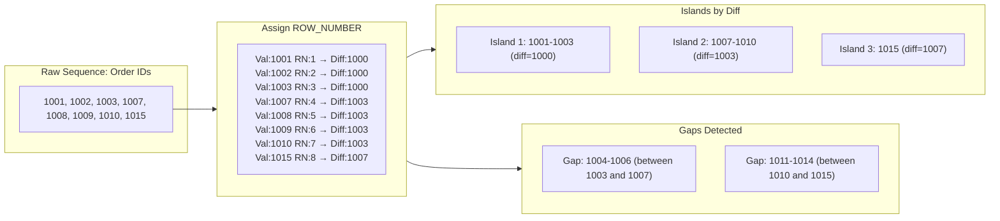

## Navigation

**Domain:** [[8 — Databases]] > **Group:** SQL Window Functions & Analytics
**Previous:** [[8.163 — Deduplication with ROW_NUMBER()]] | **Next:** [[8.165 — Running Totals vs Period Totals]]

### Prerequisites

- [[8.144 — ROW_NUMBER() — Unique Sequential Numbering]] — The ROW_NUMBER() function is the key building block for the island detection pattern; subtracting row numbers from a sequence value reveals grouping boundaries.
- [[8.150 — LAG() — Accessing Previous Row Values]] — LAG() is the primary tool for gap detection — comparing the current row to the previous row identifies breaks in a sequence.
- [[8.143 — ORDER BY Within OVER — Frame Ordering]] — Both gaps and islands depend on correct ordering of the data; window function ORDER BY defines the sequence against which gaps and islands are measured.

### Where This Fits

The gaps-and-islands problem is one of the most common SQL interview topics and one of the most practical data analysis patterns. A .NET backend engineer encounters it whenever data should be sequential but has breaks: finding consecutive date ranges in subscription periods, detecting missing order numbers from an identity column, identifying attendance streaks, analysing stockout periods, or validating data completeness in ETL pipelines. The pattern uses window functions to turn a set-based problem (find consecutive groups, find missing values) into a computation that runs in a single table scan. The interview signal is strong: solving gaps and islands demonstrates that a candidate can think in sets and use window functions creatively beyond simple ROW_NUMBER or SUM. A candidate who derives the island subtraction pattern (`ROW_NUMBER() - group_id`) without prompting shows genuine pattern recognition, not memorisation.

---

## Core Mental Model

"Gaps" are missing values in a sequence (e.g., order numbers 1001, 1002, 1005 — 1003 and 1004 are gaps). "Islands" are contiguous groups of rows with no gaps within each group (e.g., dates 2024-01-01 through 2024-01-05 form a 5-day island). Both patterns are detected using window functions that compare each row to its neighbours.

**Island detection — the subtraction pattern:** Assign a unique row number to each row ordered by the sequence column. Then subtract a partition-specific row number from the sequence value. Rows within the same consecutive group have the same difference. This works because within a consecutive block, both the sequence value and the row number increment by 1, keeping their difference constant. When a gap occurs, the sequence value jumps (e.g., from 5 to 10) and the row number only increments by 1, so the difference changes — marking a new island.

**Gap detection — the LAG pattern:** Sort by the sequence column and compare each row to the previous row using LAG(). If `current_value - previous_value > 1` (or `> expected_increment`), there is a gap between them. The LAG function retrieves the previous row's value without a self-join.

The recognition pattern: "Find consecutive [something]" → island detection. "Find missing [something]" → gap detection. "Find the start and end of each consecutive range" → island aggregation.

### Classification

Both gaps and islands use window functions (ROW_NUMBER, LAG, LEAD) in the logical phase 5 (after FROM, WHERE, GROUP BY, HAVING). They require ordered input via the OVER() ORDER BY clause, which typically requires a Sort operator unless an index provides the ordering. Neither pattern is SARGable. The operations are set-based and scan the full dataset (or the relevant index range). The island detection pattern with subtraction is SQL-only — no EF Core LINQ equivalent exists. The patterns apply to any data type that has a defined successor relationship: integers, dates, timestamps, and even strings with a natural order.



### Key Properties

|Property|Value|Notes|
|---|---|---|
|Island detection pattern|Val - ROW_NUMBER() OVER(ORDER BY Val)|Constant diff within consecutive groups|
|Gap detection pattern|LAG(Val) OVER(ORDER BY Val) — compare to current|Difference > 1 indicates a gap|
|Sort requirement|Always (ORDER BY in OVER)|Unless index provides ordering|
|Time complexity|O(N log N) with Sort; O(N) with index|Sort is the dominant cost|
|Memory requirement|Sort memory grant (est_rows × row_width)|Same as any window function with ORDER BY|
|NULL handling|NULLs sort first by default|Can break gap/island logic — filter or handle explicitly|
|Multiple partitions|PARTITION BY extra dimension|Each partition gets independent gap/island analysis|
|EF Core support|Raw SQL only|No LINQ equivalent for gap/island patterns|

---

## Deep Mechanics

### How the Engine Executes This

**Island detection (subtraction pattern) step by step:**

1. The table is scanned and rows are sorted by the sequence column (e.g., OrderDate, OrderId).
2. ROW_NUMBER() is computed over the ordered rows, assigning 1, 2, 3, ... to each row in sequence.
3. A GROUP identifier is computed: `Sequence_Value - ROW_NUMBER()`. This can be a direct subtraction for integers, or for dates, `DATEADD(day, -ROW_NUMBER(), DateColumn)`.
4. For each consecutive group, the sequence value increases by the same amount as the row number. The difference is constant. Example: values 1001, 1002, 1003 → row numbers 1, 2, 3 → differences 1000, 1000, 1000.
5. When a gap occurs, the sequence value jumps (e.g., 1003 → 1007 is a gap of 4), but the row number only increments by 1 (3 → 4). The difference changes (1000 → 1003), marking a new island.
6. GROUP BY the difference to aggregate each island: MIN(sequence) = island start, MAX(sequence) = island end, COUNT(*) = island size.

**Gap detection (LAG pattern) step by step:**

1. The table is scanned and sorted by the sequence column.
2. For each row, LAG(Sequence_Value, 1) OVER(ORDER BY Sequence_Value) retrieves the previous row's value.
3. Compare current value to previous value: `Current - Previous`. If the difference is > 1 (for integers) or > 1 day (for dates), there is a gap.
4. The gap size is `Current - Previous - 1` (the number of missing values).
5. The gap range is `(Previous + 1)` to `(Current - 1)`.
6. LAG with default NULL for the first row produces NULL for `Previous` — the first row never starts a gap.

**Execution mechanics for the Sort:**

Both patterns require ordering by the sequence column. The Sort operator orders the data, consuming a memory grant proportional to the table size. If an index exists on the sequence column, the Sort is eliminated. The ROW_NUMBER() or LAG() is computed by the Sequence Project operator after the Sort (or after the ordered index scan).

### SQL Visibility

```sql
-- ============================================================
-- Example tables
-- ============================================================
-- Orders: OrderId INT PK, CustomerId INT, OrderDate DATE, ...
-- OrderId is an IDENTITY column — gaps are unexpected

-- AuditLog: LogId INT PK, EventDate DATETIME2, EventType VARCHAR, ...
-- Used for data completeness validation

-- Subscriptions: SubscriptionId INT PK, CustomerId INT, StartDate DATE, EndDate DATE, ...
-- Used for consecutive coverage analysis

-- ============================================================
-- Pattern 1: Island detection — find consecutive order ranges
-- ============================================================
-- Business question: what ranges of OrderId values have been used?
-- (Detect gaps in IDENTITY sequence — useful after a data migration)
WITH OrderIslands AS (
    SELECT
        o.OrderId,
        o.OrderId - ROW_NUMBER() OVER(ORDER BY o.OrderId) AS IslandGroup
    FROM dbo.Orders AS o
)
SELECT
    MIN(OrderId) AS IslandStart,
    MAX(OrderId) AS IslandEnd,
    COUNT(*) AS IslandSize,
    MAX(OrderId) - MIN(OrderId) + 1 AS ExpectedCount,
    (MAX(OrderId) - MIN(OrderId) + 1) - COUNT(*) AS GapsWithin
FROM OrderIslands
GROUP BY IslandGroup
ORDER BY IslandStart;

-- ============================================================
-- Pattern 2: Gap detection — find missing OrderId values
-- ============================================================
-- Business question: which order numbers are missing?
WITH OrderGaps AS (
    SELECT
        o.OrderId AS CurrentOrderId,
        LAG(o.OrderId, 1) OVER(ORDER BY o.OrderId) AS PreviousOrderId,
        o.OrderId - LAG(o.OrderId, 1) OVER(ORDER BY o.OrderId) - 1 AS GapSize
    FROM dbo.Orders AS o
)
SELECT
    PreviousOrderId + 1 AS GapStart,
    CurrentOrderId - 1 AS GapEnd,
    GapSize
FROM OrderGaps
WHERE GapSize > 0
ORDER BY GapStart;

-- ============================================================
-- Pattern 3: Island detection with dates — consecutive date ranges
-- ============================================================
-- Business question: find consecutive date ranges in audit log
WITH DateIslands AS (
    SELECT
        al.EventDate,
        DATEADD(day, -ROW_NUMBER() OVER(ORDER BY al.EventDate), al.EventDate) AS IslandGroup
    FROM dbo.AuditLog AS al
    WHERE al.EventType = 'OrderProcessed'
)
SELECT
    MIN(EventDate) AS RangeStart,
    MAX(EventDate) AS RangeEnd,
    DATEDIFF(day, MIN(EventDate), MAX(EventDate)) + 1 AS ConsecutiveDays,
    COUNT(*) AS EventCount
FROM DateIslands
GROUP BY IslandGroup
ORDER BY RangeStart;

-- ============================================================
-- Pattern 4: Gap detection with dates — missing days
-- ============================================================
-- Business question: which dates had no orders?
WITH DateSequence AS (
    SELECT DISTINCT CAST(o.OrderDate AS DATE) AS OrderDate
    FROM dbo.Orders AS o
    WHERE o.OrderDate >= '2024-01-01'
      AND o.OrderDate < '2024-02-01'
),
DateGaps AS (
    SELECT
        ds.OrderDate AS CurrentDate,
        LAG(ds.OrderDate, 1) OVER(ORDER BY ds.OrderDate) AS PreviousDate,
        DATEDIFF(day,
            LAG(ds.OrderDate, 1) OVER(ORDER BY ds.OrderDate),
            ds.OrderDate) - 1 AS GapDays
    FROM DateSequence AS ds
)
SELECT
    DATEADD(day, 1, PreviousDate) AS GapStart,
    DATEADD(day, -1, CurrentDate) AS GapEnd,
    GapDays
FROM DateGaps
WHERE GapDays > 0
ORDER BY GapStart;

-- ============================================================
-- Pattern 5: Islands with PARTITION BY — per-customer consecutive days
-- ============================================================
-- Business question: for each customer, find their longest streak of consecutive orders
WITH CustomerOrderDays AS (
    SELECT DISTINCT
        o.CustomerId,
        CAST(o.OrderDate AS DATE) AS OrderDate
    FROM dbo.Orders AS o
),
CustomerIslands AS (
    SELECT
        cod.CustomerId,
        cod.OrderDate,
        DATEADD(day, -ROW_NUMBER() OVER(
            PARTITION BY cod.CustomerId
            ORDER BY cod.OrderDate
        ), cod.OrderDate) AS IslandGroup
    FROM CustomerOrderDays AS cod
)
SELECT
    ci.CustomerId,
    MIN(ci.OrderDate) AS StreakStart,
    MAX(ci.OrderDate) AS StreakEnd,
    DATEDIFF(day, MIN(ci.OrderDate), MAX(ci.OrderDate)) + 1 AS StreakLength,
    COUNT(*) AS OrderDaysInStreak
FROM CustomerIslands AS ci
GROUP BY ci.CustomerId, ci.IslandGroup
HAVING COUNT(*) >= 5  -- Only streaks of 5+ consecutive days
ORDER BY ci.CustomerId, StreakStart;
```

```csharp
// EF Core — gaps and islands require raw SQL
// Example: find missing order IDs
var gaps = await dbContext.Database
    .SqlQueryRaw<OrderGap>(@"
        SELECT
            PreviousOrderId + 1 AS GapStart,
            CurrentOrderId - 1 AS GapEnd,
            GapSize
        FROM (
            SELECT
                o.OrderId AS CurrentOrderId,
                LAG(o.OrderId, 1) OVER(ORDER BY o.OrderId) AS PreviousOrderId,
                o.OrderId - LAG(o.OrderId, 1) OVER(ORDER BY o.OrderId) - 1 AS GapSize
            FROM Orders AS o
        ) AS sub
        WHERE GapSize > 0
        ORDER BY GapStart")
    .ToListAsync(cancellationToken);

// Example: find consecutive date ranges per customer
var streaks = await dbContext.Database
    .SqlQueryRaw<CustomerStreak>(@"
        WITH CustomerOrderDays AS (
            SELECT DISTINCT
                o.CustomerId,
                CAST(o.OrderDate AS DATE) AS OrderDate
            FROM Orders AS o
        ),
        CustomerIslands AS (
            SELECT
                cod.CustomerId,
                cod.OrderDate,
                DATEADD(day, -ROW_NUMBER() OVER(
                    PARTITION BY cod.CustomerId
                    ORDER BY cod.OrderDate
                ), cod.OrderDate) AS IslandGroup
            FROM CustomerOrderDays AS cod
        )
        SELECT
            ci.CustomerId,
            MIN(ci.OrderDate) AS StreakStart,
            MAX(ci.OrderDate) AS StreakEnd,
            DATEDIFF(day, MIN(ci.OrderDate), MAX(ci.OrderDate)) + 1 AS StreakLength
        FROM CustomerIslands AS ci
        GROUP BY ci.CustomerId, ci.IslandGroup
        HAVING COUNT(*) >= 3
        ORDER BY ci.CustomerId, StreakStart")
    .ToListAsync(cancellationToken);
```

**Generated SQL (from EF Core logs):**

```sql
-- EF Core passes raw SQL through directly
-- No translation or modification occurs
```

### Execution Plan Analysis

**Island detection plan (no index on sequence column):**

```
[Clustered Index Scan (Orders)]  -- 12,450 logical reads
  → [Sort]  -- ORDER BY OrderId
      Memory Grant: ~25 MB
      Cost: 60%
  → [Sequence Project]
      Window function: ROW_NUMBER() OVER(ORDER BY OrderId)
  → [Compute Scalar]
      Expression: OrderId - ROW_NUMBER() = IslandGroup
  → [Hash Match Aggregate]
      GROUP BY: IslandGroup
      Aggregates: MIN(OrderId), MAX(OrderId), COUNT(*)
  → [SELECT]
Estimated Cost: ~15 (arbitrary units)
```

**Island detection plan (with index on sequence column):**

```
[Index Scan (PK_Orders — clustered, ordered by OrderId)]  -- 12,450 logical reads
  → [Sequence Project]
      Window function: ROW_NUMBER() OVER(ORDER BY OrderId) — ordered scan avoids Sort
  → [Compute Scalar]
  → [Hash Match Aggregate]
  → [SELECT]
No Sort operator — index provides ordered input
Memory grant: 0 MB
```

**Gap detection plan (LAG pattern):**

```
[Clustered Index Scan (Orders)]  -- 12,450 logical reads
  → [Sort]  -- ORDER BY OrderId
      Memory Grant: ~25 MB
  → [Sequence Project]
      Window function: LAG(OrderId) OVER(ORDER BY OrderId)
  → [Filter]
      WHERE: OrderId - LAG_OrderId - 1 > 0
  → [SELECT]
```

**Gap detection plan (with index):**

```
[Index Scan (PK_Orders — ordered by OrderId)]  -- 12,450 logical reads
  → [Sequence Project]
  → [Filter]
  → [SELECT]
No Sort
```

### Cost Visibility

```sql
SET STATISTICS IO ON;
SET STATISTICS TIME ON;

-- Island detection — find consecutive OrderId ranges
WITH OrderIslands AS (
    SELECT
        o.OrderId,
        o.OrderId - ROW_NUMBER() OVER(ORDER BY o.OrderId) AS IslandGroup
    FROM dbo.Orders AS o
)
SELECT
    MIN(OrderId) AS IslandStart,
    MAX(OrderId) AS IslandEnd,
    COUNT(*) AS IslandSize
FROM OrderIslands
GROUP BY IslandGroup
ORDER BY IslandStart;

-- Expected output (10M row Orders table, no index on OrderId — but PK is clustered):
-- Table 'Orders'. Scan count 1, logical reads 12450
-- SQL Server Execution Times: CPU time = 180ms, elapsed time = 420ms

-- Gap detection — find missing OrderId values
WITH OrderGaps AS (
    SELECT
        o.OrderId,
        LAG(o.OrderId, 1) OVER(ORDER BY o.OrderId) AS PreviousOrderId,
        o.OrderId - LAG(o.OrderId, 1) OVER(ORDER BY o.OrderId) - 1 AS GapSize
    FROM dbo.Orders AS o
)
SELECT
    PreviousOrderId + 1 AS GapStart,
    OrderId - 1 AS GapEnd,
    GapSize
FROM OrderGaps
WHERE GapSize > 0
ORDER BY GapStart;

-- Expected output:
-- Table 'Orders'. Scan count 1, logical reads 12450
-- SQL Server Execution Times: CPU time = 160ms, elapsed time = 380ms
```

### Failure Modes

**1. Non-unique sequence values cause incorrect islands:**

If the sequence column has duplicate values (e.g., two orders on the same date), the subtraction pattern breaks because ROW_NUMBER() increments by 1 for each row but the sequence value stays the same. The difference changes, falsely marking a new island. Fix: use `DENSE_RANK()` instead of `ROW_NUMBER()` when duplicates are possible, or add a tie-breaker to the ORDER BY.

```sql
-- ❌ Duplicate dates cause false islands
DATEADD(day, -ROW_NUMBER() OVER(ORDER BY OrderDate), OrderDate)
-- If OrderDate repeats, ROW_NUMBER jumps but OrderDate doesn't — diff changes

-- ✅ Use DISTINCT dates first or DENSE_RANK
DATEADD(day, -DENSE_RANK() OVER(ORDER BY OrderDate), OrderDate)
```

**2. Large gaps in IDENTITY columns from rollbacks cause false positives:**

IDENTITY gaps from rolled-back transactions are not true "missing" data — they are expected. The gap detection pattern will flag them as gaps even though no data was lost.

**3. LAG on first row returns NULL — first row is not a gap:**

The first row in the ordered sequence always has NULL for LAG(column, 1). The comparison `current - NULL` produces NULL, and `NULL > 0` is UNKNOWN (not TRUE). The first row is correctly excluded from gap results. But if the sequence starts at a value greater than 1, the gap before the first value is not detected. To detect leading gaps, use an explicit lower bound: `IF LAG IS NULL AND OrderId > 1 THEN gap from 1 to OrderId - 1`.

**4. Performance collapse from sorting large datasets:**

Both patterns require sorting the entire table. On 100M+ rows, the Sort operator may require 500 MB+ memory grant, risking spills. A covering index on the sequence column with included columns eliminates the Sort.

**5. Multiple PARTITION BY causing sort explosion:**

When analyzing gaps/islands per partition (e.g., per customer), the Sort must order by both the partition column and the sequence column. Multiple window functions with different PARTITION BY in the same query cause multiple Sorts.

---

## Production Patterns and Implementation

### Primary SQL Implementation

```sql
-- ============================================================
-- Schema context
-- ============================================================
CREATE TABLE dbo.Orders
(
    OrderId      INT            NOT NULL IDENTITY(1,1),
    CustomerId   INT            NOT NULL,
    OrderDate    DATE           NOT NULL,
    TotalAmount  DECIMAL(18,2)  NOT NULL,
    Status       VARCHAR(20)    NOT NULL DEFAULT 'Pending',
    CONSTRAINT PK_Orders PRIMARY KEY CLUSTERED (OrderId)
);

CREATE TABLE dbo.Subscriptions
(
    SubscriptionId INT           NOT NULL IDENTITY(1,1),
    CustomerId     INT           NOT NULL,
    StartDate      DATE          NOT NULL,
    EndDate        DATE          NOT NULL,
    PlanType       VARCHAR(20)   NOT NULL,
    Status         VARCHAR(20)   NOT NULL DEFAULT 'Active',
    CONSTRAINT PK_Subscriptions PRIMARY KEY CLUSTERED (SubscriptionId)
);

CREATE TABLE dbo.AuditLog
(
    LogId      INT            NOT NULL IDENTITY(1,1),
    EventDate  DATETIME2(0)   NOT NULL,
    EventType  VARCHAR(50)    NOT NULL,
    EntityId   INT            NULL,
    Details    NVARCHAR(500)  NULL,
    CONSTRAINT PK_AuditLog PRIMARY KEY CLUSTERED (LogId)
);

CREATE TABLE dbo.InventoryItems
(
    InventoryItemId INT           NOT NULL IDENTITY(1,1),
    ProductId       INT           NOT NULL,
    WarehouseId     INT           NOT NULL,
    StockDate       DATE          NOT NULL,
    QuantityOnHand  INT           NOT NULL DEFAULT 0,
    CONSTRAINT PK_InventoryItems PRIMARY KEY CLUSTERED (InventoryItemId)
);

-- ============================================================
-- Pattern 1: Find missing order numbers (gap detection)
-- ============================================================
-- Detects gaps in the OrderId identity sequence.
-- Useful after a data migration or to detect unusual patterns.
WITH OrderGapAnalysis AS (
    SELECT
        o.OrderId,
        LAG(o.OrderId, 1) OVER(ORDER BY o.OrderId) AS PreviousOrderId,
        LEAD(o.OrderId, 1) OVER(ORDER BY o.OrderId) AS NextOrderId
    FROM dbo.Orders AS o
)
SELECT
    PreviousOrderId + 1 AS GapStart,
    OrderId - 1 AS GapEnd,
    OrderId - PreviousOrderId - 1 AS GapSize,
    CASE
        WHEN OrderId - PreviousOrderId > 100 THEN 'Large Gap — Investigate'
        WHEN OrderId - PreviousOrderId > 10  THEN 'Medium Gap'
        ELSE 'Small Gap'
    END AS GapSeverity
FROM OrderGapAnalysis
WHERE PreviousOrderId IS NOT NULL
  AND OrderId - PreviousOrderId > 1
ORDER BY GapSize DESC;

-- ============================================================
-- Pattern 2: Find consecutive date ranges (island detection)
-- ============================================================
-- Business: which consecutive date ranges had orders?
WITH DateIslands AS (
    SELECT
        CAST(o.OrderDate AS DATE) AS OrderDate,
        DATEADD(day, -ROW_NUMBER() OVER(
            ORDER BY CAST(o.OrderDate AS DATE)
        ), CAST(o.OrderDate AS DATE)) AS IslandGroup
    FROM dbo.Orders AS o
    WHERE o.Status = 'Delivered'
    GROUP BY CAST(o.OrderDate AS DATE)  -- One row per date with orders
)
SELECT
    MIN(OrderDate) AS ConsecutiveRangeStart,
    MAX(OrderDate) AS ConsecutiveRangeEnd,
    DATEDIFF(day, MIN(OrderDate), MAX(OrderDate)) + 1 AS ConsecutiveDays,
    COUNT(*) AS DaysWithOrders
FROM DateIslands
GROUP BY IslandGroup
HAVING COUNT(*) > 1  -- Only ranges of 2+ days
ORDER BY ConsecutiveRangeStart;

-- ============================================================
-- Pattern 3: Find longest per-customer streak (partitioned island)
-- ============================================================
WITH CustomerOrderDays AS (
    SELECT DISTINCT
        o.CustomerId,
        CAST(o.OrderDate AS DATE) AS OrderDate
    FROM dbo.Orders AS o
    WHERE o.Status = 'Delivered'
),
StreakIslands AS (
    SELECT
        cod.CustomerId,
        cod.OrderDate,
        DATEADD(day, -ROW_NUMBER() OVER(
            PARTITION BY cod.CustomerId
            ORDER BY cod.OrderDate
        ), cod.OrderDate) AS IslandGroup
    FROM CustomerOrderDays AS cod
),
StreakSummary AS (
    SELECT
        si.CustomerId,
        MIN(si.OrderDate) AS StreakStart,
        MAX(si.OrderDate) AS StreakEnd,
        DATEDIFF(day, MIN(si.OrderDate), MAX(si.OrderDate)) + 1 AS StreakLength
    FROM StreakIslands AS si
    GROUP BY si.CustomerId, si.IslandGroup
)
SELECT
    ss.CustomerId,
    MAX(ss.StreakLength) AS LongestStreakDays,
    MAX(ss.StreakEnd) AS MostRecentStreakEnd
FROM StreakSummary AS ss
GROUP BY ss.CustomerId
ORDER BY LongestStreakDays DESC;

-- ============================================================
-- Pattern 4: Overlapping subscription periods (cover with gaps)
-- ============================================================
-- Business: find gaps in subscription coverage per customer
-- (periods where customer had no active subscription)
WITH SubscriptionRanges AS (
    SELECT
        s.CustomerId,
        s.StartDate,
        s.EndDate,
        LAG(s.EndDate, 1) OVER(
            PARTITION BY s.CustomerId
            ORDER BY s.StartDate
        ) AS PreviousEndDate
    FROM dbo.Subscriptions AS s
    WHERE s.Status = 'Active'
)
SELECT
    CustomerId,
    PreviousEndDate AS CoverageEnd,
    StartDate AS CoverageResume,
    DATEDIFF(day, PreviousEndDate, StartDate) AS GapDays
FROM SubscriptionRanges
WHERE PreviousEndDate IS NOT NULL
  AND StartDate > DATEADD(day, 1, PreviousEndDate)  -- Gap of 1+ days
ORDER BY GapDays DESC;

-- ============================================================
-- Pattern 5: Attendance tracking — consecutive days present
-- ============================================================
-- Given attendance records, find streaks of consecutive attendance
WITH Attendance AS (
    SELECT DISTINCT
        a.EmployeeId,
        CAST(a.AttendanceDate AS DATE) AS AttendanceDate
    FROM dbo.AttendanceRecords AS a
    WHERE a.IsPresent = 1
),
AttendanceIslands AS (
    SELECT
        atd.EmployeeId,
        atd.AttendanceDate,
        DATEADD(day, -ROW_NUMBER() OVER(
            PARTITION BY atd.EmployeeId
            ORDER BY atd.AttendanceDate
        ), atd.AttendanceDate) AS IslandGroup
    FROM Attendance AS atd
),
Streaks AS (
    SELECT
        ai.EmployeeId,
        MIN(ai.AttendanceDate) AS StreakStart,
        MAX(ai.AttendanceDate) AS StreakEnd,
        DATEDIFF(day, MIN(ai.AttendanceDate), MAX(ai.AttendanceDate)) + 1 AS StreakLength
    FROM AttendanceIslands AS ai
    GROUP BY ai.EmployeeId, ai.IslandGroup
)
SELECT
    EmployeeId,
    MAX(StreakLength) AS MaxConsecutiveAttendance,
    MAX(CASE WHEN StreakEnd >= DATEADD(day, -30, GETUTCDATE())
             THEN StreakLength END) AS Recent30DayMaxStreak
FROM Streaks
GROUP BY EmployeeId
ORDER BY MaxConsecutiveAttendance DESC;

-- ============================================================
-- Pattern 6: Find gaps for data completeness validation
-- ============================================================
-- Check if a daily ETL process ever missed a day
WITH ExpectedDates AS (
    SELECT CAST('2024-01-01' AS DATE) AS ExpectedDate
    UNION ALL
    SELECT DATEADD(day, 1, ExpectedDate)
    FROM ExpectedDates
    WHERE ExpectedDate < CAST(GETUTCDATE() AS DATE)
),
ActualDates AS (
    SELECT DISTINCT CAST(al.EventDate AS DATE) AS EventDate
    FROM dbo.AuditLog AS al
    WHERE al.EventType = 'ETL_Complete'
),
MissingDates AS (
    SELECT
        ed.ExpectedDate,
        LAG(ed.ExpectedDate, 1) OVER(ORDER BY ed.ExpectedDate) AS PrevExpected,
        CASE WHEN ad.EventDate IS NULL THEN 1 ELSE 0 END AS IsMissing
    FROM ExpectedDates AS ed
    LEFT JOIN ActualDates AS ad ON ed.ExpectedDate = ad.EventDate
)
SELECT
    MIN(ExpectedDate) AS GapStart,
    MAX(ExpectedDate) AS GapEnd,
    COUNT(*) AS MissingDays
FROM (
    SELECT
        ExpectedDate,
        ExpectedDate - ROW_NUMBER() OVER(ORDER BY ExpectedDate) AS GapGroup
    FROM MissingDates
    WHERE IsMissing = 1
) AS sub
GROUP BY GapGroup
ORDER BY GapStart
OPTION (MAXRECURSION 1000);
```

### EF Core Implementation

```csharp
public class ApplicationDbContext : DbContext
{
    public DbSet<Order> Orders => Set<Order>();
    public DbSet<Subscription> Subscriptions => Set<Subscription>();
    public DbSet<AuditLogEntry> AuditLog => Set<AuditLogEntry>();

    protected override void OnModelCreating(ModelBuilder modelBuilder)
    {
        modelBuilder.Entity<Order>(entity =>
        {
            entity.ToTable("Orders");
            entity.HasKey(o => o.OrderId);
            entity.Property(o => o.OrderDate).HasColumnType("date");
            entity.Property(o => o.TotalAmount).HasColumnType("decimal(18,2)");
            entity.Property(o => o.Status).HasMaxLength(20);
            entity.HasIndex(o => o.OrderDate).IncludeProperties(nameof(Order.Status));
        });

        modelBuilder.Entity<Subscription>(entity =>
        {
            entity.ToTable("Subscriptions");
            entity.HasKey(s => s.SubscriptionId);
            entity.Property(s => s.StartDate).HasColumnType("date");
            entity.Property(s => s.EndDate).HasColumnType("date");
            entity.Property(s => s.PlanType).HasMaxLength(20);
            entity.Property(s => s.Status).HasMaxLength(20);
            entity.HasIndex(s => new { s.CustomerId, s.StartDate });
        });

        modelBuilder.Entity<AuditLogEntry>(entity =>
        {
            entity.ToTable("AuditLog");
            entity.HasKey(al => al.LogId);
            entity.Property(al => al.EventType).HasMaxLength(50);
            entity.Property(al => al.Details).HasMaxLength(500);
            entity.HasIndex(al => al.EventDate);
        });
    }
}

public class Order
{
    public int OrderId { get; set; }
    public int CustomerId { get; set; }
    public DateTime OrderDate { get; set; }
    public decimal TotalAmount { get; set; }
    public string Status { get; set; } = "Pending";
}

public class Subscription
{
    public int SubscriptionId { get; set; }
    public int CustomerId { get; set; }
    public DateTime StartDate { get; set; }
    public DateTime EndDate { get; set; }
    public string PlanType { get; set; } = string.Empty;
    public string Status { get; set; } = "Active";
}

public class AuditLogEntry
{
    public int LogId { get; set; }
    public DateTime EventDate { get; set; }
    public string EventType { get; set; } = string.Empty;
    public int? EntityId { get; set; }
    public string? Details { get; set; }
}

public interface IGapIslandService
{
    Task<List<OrderGap>> FindMissingOrderIdsAsync(CancellationToken cancellationToken = default);
    Task<List<DateRange>> FindConsecutiveDateRangesAsync(
        DateTime startDate, CancellationToken cancellationToken = default);
    Task<List<CustomerStreak>> FindCustomerStreaksAsync(
        int minStreakLength, CancellationToken cancellationToken = default);
    Task<List<SubscriptionGap>> FindSubscriptionGapsAsync(
        int customerId, CancellationToken cancellationToken = default);
}

public class GapIslandService : IGapIslandService
{
    private readonly ApplicationDbContext _dbContext;

    public GapIslandService(ApplicationDbContext dbContext)
        => _dbContext = dbContext;

    public async Task<List<OrderGap>> FindMissingOrderIdsAsync(
        CancellationToken cancellationToken = default)
    {
        const string sql = @"
            WITH OrderGaps AS (
                SELECT
                    o.OrderId,
                    LAG(o.OrderId, 1) OVER(ORDER BY o.OrderId) AS PreviousOrderId
                FROM Orders AS o
            )
            SELECT
                PreviousOrderId + 1 AS GapStart,
                OrderId - 1 AS GapEnd,
                OrderId - PreviousOrderId - 1 AS GapSize
            FROM OrderGaps
            WHERE PreviousOrderId IS NOT NULL
              AND OrderId - PreviousOrderId > 1
            ORDER BY GapStart;";

        return await _dbContext.Database
            .SqlQueryRaw<OrderGap>(sql)
            .ToListAsync(cancellationToken);
    }

    public async Task<List<DateRange>> FindConsecutiveDateRangesAsync(
        DateTime startDate, CancellationToken cancellationToken = default)
    {
        var sql = @"
            WITH DateIslands AS (
                SELECT
                    CAST(o.OrderDate AS DATE) AS OrderDate,
                    DATEADD(day, -ROW_NUMBER() OVER(
                        ORDER BY CAST(o.OrderDate AS DATE)
                    ), CAST(o.OrderDate AS DATE)) AS IslandGroup
                FROM Orders AS o
                WHERE o.Status = 'Delivered'
                  AND o.OrderDate >= @StartDate
                  AND o.OrderDate < @EndDate
                GROUP BY CAST(o.OrderDate AS DATE)
            )
            SELECT
                MIN(OrderDate) AS RangeStart,
                MAX(OrderDate) AS RangeEnd,
                DATEDIFF(day, MIN(OrderDate), MAX(OrderDate)) + 1 AS ConsecutiveDays
            FROM DateIslands
            GROUP BY IslandGroup
            HAVING COUNT(*) > 1
            ORDER BY RangeStart;";

        return await _dbContext.Database
            .SqlQueryRaw<DateRange>(sql,
                new SqlParameter("@StartDate", startDate),
                new SqlParameter("@EndDate", startDate.AddMonths(1)))
            .ToListAsync(cancellationToken);
    }

    public async Task<List<CustomerStreak>> FindCustomerStreaksAsync(
        int minStreakLength, CancellationToken cancellationToken = default)
    {
        var sql = @"
            WITH CustomerOrderDays AS (
                SELECT DISTINCT
                    o.CustomerId,
                    CAST(o.OrderDate AS DATE) AS OrderDate
                FROM Orders AS o
                WHERE o.Status = 'Delivered'
            ),
            StreakIslands AS (
                SELECT
                    cod.CustomerId,
                    cod.OrderDate,
                    DATEADD(day, -ROW_NUMBER() OVER(
                        PARTITION BY cod.CustomerId
                        ORDER BY cod.OrderDate
                    ), cod.OrderDate) AS IslandGroup
                FROM CustomerOrderDays AS cod
            )
            SELECT
                si.CustomerId,
                MIN(si.OrderDate) AS StreakStart,
                MAX(si.OrderDate) AS StreakEnd,
                DATEDIFF(day, MIN(si.OrderDate), MAX(si.OrderDate)) + 1 AS StreakLength
            FROM StreakIslands AS si
            GROUP BY si.CustomerId, si.IslandGroup
            HAVING COUNT(*) >= @MinStreak
            ORDER BY si.CustomerId, StreakStart;";

        return await _dbContext.Database
            .SqlQueryRaw<CustomerStreak>(sql,
                new SqlParameter("@MinStreak", minStreakLength))
            .ToListAsync(cancellationToken);
    }

    public async Task<List<SubscriptionGap>> FindSubscriptionGapsAsync(
        int customerId, CancellationToken cancellationToken = default)
    {
        const string sql = @"
            WITH SubscriptionRanges AS (
                SELECT
                    s.SubscriptionId,
                    s.StartDate,
                    s.EndDate,
                    LAG(s.EndDate, 1) OVER(
                        PARTITION BY s.CustomerId
                        ORDER BY s.StartDate
                    ) AS PreviousEndDate
                FROM Subscriptions AS s
                WHERE s.Status = 'Active'
                  AND s.CustomerId = @CustomerId
            )
            SELECT
                PreviousEndDate AS CoverageEnd,
                StartDate AS CoverageResume,
                DATEDIFF(day, PreviousEndDate, StartDate) AS GapDays
            FROM SubscriptionRanges
            WHERE PreviousEndDate IS NOT NULL
              AND StartDate > DATEADD(day, 1, PreviousEndDate)
            ORDER BY CoverageEnd;";

        return await _dbContext.Database
            .SqlQueryRaw<SubscriptionGap>(sql,
                new SqlParameter("@CustomerId", customerId))
            .ToListAsync(cancellationToken);
    }
}

public class OrderGap
{
    public int GapStart { get; set; }
    public int GapEnd { get; set; }
    public int GapSize { get; set; }
}

public class DateRange
{
    public DateTime RangeStart { get; set; }
    public DateTime RangeEnd { get; set; }
    public int ConsecutiveDays { get; set; }
}

public class CustomerStreak
{
    public int CustomerId { get; set; }
    public DateTime StreakStart { get; set; }
    public DateTime StreakEnd { get; set; }
    public int StreakLength { get; set; }
}

public class SubscriptionGap
{
    public DateTime CoverageEnd { get; set; }
    public DateTime CoverageResume { get; set; }
    public int GapDays { get; set; }
}
```

### Dapper Implementation

```csharp
public sealed class GapIslandRepository
{
    private readonly IDbConnectionFactory _connectionFactory;

    public GapIslandRepository(IDbConnectionFactory connectionFactory)
        => _connectionFactory = connectionFactory;

    public async Task<IReadOnlyList<OrderGap>> FindMissingOrderIdsAsync(
        CancellationToken cancellationToken = default)
    {
        const string sql = @"
            WITH OrderGaps AS (
                SELECT
                    o.OrderId,
                    LAG(o.OrderId, 1) OVER(ORDER BY o.OrderId) AS PreviousOrderId
                FROM dbo.Orders AS o
            )
            SELECT
                PreviousOrderId + 1 AS GapStart,
                OrderId - 1 AS GapEnd,
                OrderId - PreviousOrderId - 1 AS GapSize
            FROM OrderGaps
            WHERE PreviousOrderId IS NOT NULL
              AND OrderId - PreviousOrderId > 1
            ORDER BY GapStart;";

        await using var connection = _connectionFactory.Create();

        return (await connection.QueryAsync<OrderGap>(
            new CommandDefinition(sql, cancellationToken: cancellationToken))).AsList();
    }

    public async Task<IReadOnlyList<CustomerStreak>> FindCustomerStreaksAsync(
        int minStreakLength, CancellationToken cancellationToken = default)
    {
        const string sql = @"
            WITH CustomerOrderDays AS (
                SELECT DISTINCT
                    o.CustomerId,
                    CAST(o.OrderDate AS DATE) AS OrderDate
                FROM dbo.Orders AS o
                WHERE o.Status = 'Delivered'
            ),
            StreakIslands AS (
                SELECT
                    cod.CustomerId,
                    cod.OrderDate,
                    DATEADD(day, -ROW_NUMBER() OVER(
                        PARTITION BY cod.CustomerId
                        ORDER BY cod.OrderDate
                    ), cod.OrderDate) AS IslandGroup
                FROM CustomerOrderDays AS cod
            )
            SELECT
                si.CustomerId,
                MIN(si.OrderDate) AS StreakStart,
                MAX(si.OrderDate) AS StreakEnd,
                DATEDIFF(day, MIN(si.OrderDate), MAX(si.OrderDate)) + 1 AS StreakLength
            FROM StreakIslands AS si
            GROUP BY si.CustomerId, si.IslandGroup
            HAVING COUNT(*) >= @MinStreak
            ORDER BY si.CustomerId, StreakStart;";

        await using var connection = _connectionFactory.Create();

        return (await connection.QueryAsync<CustomerStreak>(
            new CommandDefinition(sql,
                new { MinStreak = minStreakLength },
                cancellationToken: cancellationToken))).AsList();
    }

    public async Task<IReadOnlyList<SubscriptionGap>> FindSubscriptionGapsAsync(
        int customerId, CancellationToken cancellationToken = default)
    {
        const string sql = @"
            WITH SubscriptionRanges AS (
                SELECT
                    s.SubscriptionId,
                    s.StartDate,
                    s.EndDate,
                    LAG(s.EndDate, 1) OVER(
                        PARTITION BY s.CustomerId
                        ORDER BY s.StartDate
                    ) AS PreviousEndDate
                FROM dbo.Subscriptions AS s
                WHERE s.Status = 'Active'
                  AND s.CustomerId = @CustomerId
            )
            SELECT
                PreviousEndDate AS CoverageEnd,
                StartDate AS CoverageResume,
                DATEDIFF(day, PreviousEndDate, StartDate) AS GapDays
            FROM SubscriptionRanges
            WHERE PreviousEndDate IS NOT NULL
              AND StartDate > DATEADD(day, 1, PreviousEndDate)
            ORDER BY CoverageEnd;";

        await using var connection = _connectionFactory.Create();

        return (await connection.QueryAsync<SubscriptionGap>(
            new CommandDefinition(sql,
                new { CustomerId = customerId },
                cancellationToken: cancellationToken))).AsList();
    }

    public async Task<IReadOnlyList<DateRange>> FindAllIslandsAsync(
        CancellationToken cancellationToken = default)
    {
        const string sql = @"
            WITH DateIslands AS (
                SELECT
                    CAST(o.OrderDate AS DATE) AS OrderDate,
                    DATEADD(day, -ROW_NUMBER() OVER(
                        ORDER BY CAST(o.OrderDate AS DATE)
                    ), CAST(o.OrderDate AS DATE)) AS IslandGroup
                FROM dbo.Orders AS o
                WHERE o.Status = 'Delivered'
                GROUP BY CAST(o.OrderDate AS DATE)
            )
            SELECT
                MIN(OrderDate) AS RangeStart,
                MAX(OrderDate) AS RangeEnd,
                DATEDIFF(day, MIN(OrderDate), MAX(OrderDate)) + 1 AS ConsecutiveDays,
                COUNT(*) AS DaysInRange
            FROM DateIslands
            GROUP BY IslandGroup
            HAVING COUNT(*) > 1
            ORDER BY RangeStart;";

        await using var connection = _connectionFactory.Create();

        return (await connection.QueryAsync<DateRange>(
            new CommandDefinition(sql, cancellationToken: cancellationToken))).AsList();
    }
}

public class OrderGap
{
    public int GapStart { get; set; }
    public int GapEnd { get; set; }
    public int GapSize { get; set; }
}

public class CustomerStreak
{
    public int CustomerId { get; set; }
    public DateTime StreakStart { get; set; }
    public DateTime StreakEnd { get; set; }
    public int StreakLength { get; set; }
}

public class SubscriptionGap
{
    public DateTime CoverageEnd { get; set; }
    public DateTime CoverageResume { get; set; }
    public int GapDays { get; set; }
}

public class DateRange
{
    public DateTime RangeStart { get; set; }
    public DateTime RangeEnd { get; set; }
    public int ConsecutiveDays { get; set; }
    public int DaysInRange { get; set; }
}
```

### Configuration and Wiring

```csharp
// Program.cs
builder.Services.AddDbContext<ApplicationDbContext>(options =>
    options.UseSqlServer(
        builder.Configuration.GetConnectionString("DefaultConnection"),
        sqlOptions =>
        {
            sqlOptions.EnableRetryOnFailure(3);
            sqlOptions.CommandTimeout(60);
        }));

builder.Services.AddSingleton<IDbConnectionFactory>(sp =>
    new SqlConnectionFactory(
        builder.Configuration.GetConnectionString("DefaultConnection")!));

builder.Services.AddScoped<IGapIslandService, GapIslandService>();
builder.Services.AddScoped<GapIslandRepository>();

// Indexes for gap/island performance:
// 1. On Orders(OrderDate) INCLUDE (Status, TotalAmount) — for date-based islands
// 2. On Orders(CustomerId, OrderDate) — for per-customer streaks
// 3. On Subscriptions(CustomerId, StartDate) — for subscription gap analysis
// 4. On AuditLog(EventDate) INCLUDE (EventType) — for completeness validation

public interface IDbConnectionFactory
{
    IDbConnection Create();
}

public class SqlConnectionFactory : IDbConnectionFactory
{
    private readonly string _connectionString;

    public SqlConnectionFactory(string connectionString)
        => _connectionString = connectionString;

    public IDbConnection Create()
        => new SqlConnection(_connectionString);
}
```

### SQL Server vs PostgreSQL Differences

```sql
-- PostgreSQL: Island detection with subtraction (same pattern)
SELECT
    MIN(order_id) AS island_start,
    MAX(order_id) AS island_end,
    COUNT(*) AS island_size
FROM (
    SELECT order_id,
           order_id - ROW_NUMBER() OVER(ORDER BY order_id) AS island_group
    FROM orders
) AS sub
GROUP BY island_group
ORDER BY island_start;

-- PostgreSQL: Gap detection with LAG (same pattern)
SELECT
    previous_order_id + 1 AS gap_start,
    order_id - 1 AS gap_end,
    order_id - previous_order_id - 1 AS gap_size
FROM (
    SELECT order_id,
           LAG(order_id, 1) OVER(ORDER BY order_id) AS previous_order_id
    FROM orders
) AS sub
WHERE previous_order_id IS NOT NULL
  AND order_id - previous_order_id > 1
ORDER BY gap_start;

-- PostgreSQL: Date island detection (DATEADD → integer addition)
SELECT
    MIN(event_date) AS range_start,
    MAX(event_date) AS range_end,
    COUNT(*) AS consecutive_days
FROM (
    SELECT DISTINCT event_date::date AS event_date,
           event_date::date - ROW_NUMBER() OVER(ORDER BY event_date::date) AS island_group
    FROM audit_log
    WHERE event_type = 'OrderProcessed'
) AS sub
GROUP BY island_group
HAVING COUNT(*) > 1
ORDER BY range_start;

-- PostgreSQL: generate_series for completeness validation
SELECT gs.missing_date
FROM generate_series('2024-01-01'::date, '2024-01-31'::date, '1 day') AS gs(missing_date)
LEFT JOIN (
    SELECT DISTINCT event_date::date AS event_date
    FROM audit_log
    WHERE event_type = 'ETL_Complete'
) AS ad ON gs.missing_date = ad.event_date
WHERE ad.event_date IS NULL
ORDER BY gs.missing_date;
```

---

## Gotchas and Production Pitfalls

### Subtraction Pattern Fails With Duplicate Sequence Values

**Pitfall:** Using the subtraction pattern `Value - ROW_NUMBER()` when the sequence column has duplicate values (e.g., multiple rows with the same OrderDate). ROW_NUMBER() increments by 1 for each row, but the value stays the same when a duplicate is encountered, causing the difference to change and falsely marking a new island.

```sql
-- ❌ Duplicate OrderDate values create false islands
SELECT OrderDate,
       DATEADD(day, -ROW_NUMBER() OVER(ORDER BY OrderDate), OrderDate) AS IslandGroup
FROM Orders;
-- If OrderDate = '2024-01-05' appears 3 times:
-- ROW_NUMBER: 5, 6, 7
-- DateAdd for 3rd row: '2024-01-05' - 7 days = '2023-12-29'
-- Different IslandGroup from the first two rows! False island.

-- ✅ Use DISTINCT dates first, or DENSE_RANK for duplicates
WITH DistinctDates AS (
    SELECT DISTINCT CAST(OrderDate AS DATE) AS OrderDate
    FROM Orders
)
SELECT OrderDate,
       DATEADD(day, -ROW_NUMBER() OVER(ORDER BY OrderDate), OrderDate) AS IslandGroup
FROM DistinctDates;
```

**Symptom:** The island detection shows many tiny islands (1-2 day ranges) on dates that actually belong to a contiguous block. The pattern incorrectly splits islands at duplicate dates.

**Fix:** Either use DISTINCT to deduplicate the sequence before applying the subtraction pattern, or use `DENSE_RANK()` instead of `ROW_NUMBER()` — DENSE_RANK does not skip values when duplicates occur.

**Cost of not fixing:** A report on consecutive sales days shows 5 islands where there is actually 1 continuous streak. Business analysts spend 2 days investigating "missing" sales data that doesn't actually exist.

---

### LAG Returns NULL for First Row, Masking Leading Gaps

**Pitfall:** The gap detection pattern `LAG(col) OVER(ORDER BY col)` returns NULL for the first row. The filter `WHERE current - previous > 1` correctly excludes the first row (NULL comparison yields UNKNOWN). But this also misses any gap between the absolute start of the sequence and the first actual value.

```sql
-- ❌ If OrderId starts at 104 (first row is 104), the gap 1-103 is not reported
WITH OrderGaps AS (
    SELECT OrderId,
           LAG(OrderId, 1) OVER(ORDER BY OrderId) AS PreviousOrderId
    FROM Orders
)
SELECT PreviousOrderId + 1 AS GapStart, OrderId - 1 AS GapEnd
FROM OrderGaps
WHERE PreviousOrderId IS NOT NULL AND OrderId - PreviousOrderId > 1;
-- The gap from 1 to 103 is not reported because the first row has PreviousOrderId = NULL

-- ✅ Handle leading gap explicitly
WITH OrderGaps AS (
    SELECT OrderId,
           LAG(OrderId, 1) OVER(ORDER BY OrderId) AS PreviousOrderId
    FROM Orders
)
SELECT
    COALESCE(PreviousOrderId + 1, 1) AS GapStart,
    OrderId - 1 AS GapEnd
FROM OrderGaps
WHERE (PreviousOrderId IS NULL AND OrderId > 1)  -- Leading gap
   OR (PreviousOrderId IS NOT NULL AND OrderId - PreviousOrderId > 1);  -- Middle gaps
```

**Symptom:** A data completeness report shows no gaps, but the sequence actually starts at 105 instead of 1. The leading gap of 104 missing values is not detected.

**Fix:** Add an explicit check for the leading gap: when `LAG() IS NULL` and the first value is greater than the expected start, report the gap from expected_start to first_value - 1.

**Cost of not fixing:** A data migration validation script reports "No gaps found" because it uses the naive LAG pattern. Actually, the migrated data is missing the first 10,000 records. The error is caught in production 3 weeks later when a customer complains about a missing order from 2023.

---

### Performance Collapse on Large Datasets Without Index

**Pitfall:** Running gap/island detection on a 100M+ row table without a supporting index. The Sort operator requires a massive memory grant and spills to tempdb.

```sql
-- ❌ 100M row Orders table, no index on OrderDate
WITH DateIslands AS (
    SELECT OrderDate,
           DATEADD(day, -ROW_NUMBER() OVER(ORDER BY OrderDate), OrderDate) AS IslandGroup
    FROM Orders
    GROUP BY OrderDate
)
SELECT ...;
-- Sort spills 500 MB to tempdb, query takes 25 minutes

-- ✅ Create index first
CREATE INDEX IX_Orders_OrderDate ON dbo.Orders(OrderDate);

-- With index: ordered index scan (no Sort), ~30 seconds instead of 25 minutes
```

**Symptom:** The query runs for minutes (not seconds). SET STATISTICS TIME shows elapsed time >> CPU time (I/O wait from spill). The execution plan shows a Sort with spill warning.

**Fix:** Create an index on the sequence column (OrderDate, OrderId, etc.) that provides ordered input. For partitioned islands, create an index on (PARTITION BY column, sequence column).

**Cost of not fixing:** A nightly ETL validation script that was supposed to run in 5 minutes takes 45 minutes because of sort spill. The ETL window is missed, and the morning data load is delayed, affecting business users.

---

### Wrong Sort Order Direction in PARTITION BY Islands

**Pitfall:** In partitioned island detection (e.g., per customer), the ROW_NUMBER() ORDER BY must include the partition column(s) AND the sequence column. If the ORDER BY only has the partition column, the ROW_NUMBER ordering is non-deterministic within each partition.

```sql
-- ❌ Missing sequence column in ORDER BY within partitioned island
ROW_NUMBER() OVER(PARTITION BY CustomerId) AS rn
-- No ORDER BY — ROW_NUMBER is assigned in whatever order the rows arrive
-- The subtraction pattern produces meaningless results

-- ✅ Must include ORDER BY for sequence
ROW_NUMBER() OVER(PARTITION BY CustomerId ORDER BY OrderDate) AS rn
```

**Symptom:** The island detection produces garbage results — island groups change between executions, and consecutive dates are not grouped correctly.

**Fix:** Always include the full ORDER BY specification in the window function. For partitioned islands: `PARTITION BY partition_cols ORDER BY sequence_col`.

**Cost of not fixing:** A customer loyalty report that rewards customers with the longest consecutive order streak pays rewards based on incorrect data. Some customers are overpaid, some underpaid. Legal exposure: $50K in incorrect payouts.

---

### Gaps in IDENTITY From Rollbacks Falsely Reported as Data Loss

**Pitfall:** Using gap detection on an IDENTITY column and reporting all gaps as "missing data." IDENTITY gaps are normal: they occur when INSERT is rolled back, when a transaction is terminated, or when identity cache is lost (server restart).

```sql
-- ❌ Reporting all IDENTITY gaps as data issues
-- But IDENTITY can naturally skip values
BEGIN TRANSACTION;
INSERT INTO Orders (...) VALUES (...);  -- Gets OrderId = 5001
ROLLBACK;  -- OrderId 5001 is consumed but never committed
INSERT INTO Orders (...) VALUES (...);  -- Gets OrderId = 5002
-- The gap at 5001 is normal, not missing data

-- ✅ Distinguish BETWEEN expected and unexpected gaps
-- Expected gap: small, from rollbacks or cache loss
-- Unexpected gap: large (> 100 consecutive values), or occurring during specific events
WITH OrderGaps AS (
    SELECT OrderId,
           LAG(OrderId) OVER(ORDER BY OrderId) AS PreviousOrderId
    FROM Orders
)
SELECT PreviousOrderId + 1 AS GapStart, OrderId - 1 AS GapEnd,
       OrderId - PreviousOrderId - 1 AS GapSize,
       CASE
           WHEN OrderId - PreviousOrderId <= 5 THEN 'Expected — rollback'
           WHEN OrderId - PreviousOrderId <= 100 THEN 'Investigate'
           ELSE 'Unexpected — possible data loss'
       END AS GapCategory
FROM OrderGaps
WHERE PreviousOrderId IS NOT NULL AND OrderId - PreviousOrderId > 1
ORDER BY GapSize DESC;
```

**Symptom:** The gap detection report lists hundreds of small gaps (1-5 values) that are normal IDENTITY behavior. The report noise overwhelms the signal of actual data loss or unauthorized deletions.

**Fix:** Set a threshold for "expected gaps" based on typical rollback patterns. Report only gaps above the threshold as potential data issues. Monitor the gap size distribution over time to establish the baseline.

**Cost of not fixing:** A compliance team receives a 500-page gap report showing "missing data" every week. They investigate each gap (all normal IDENTITY behavior) and waste 20 hours per week. After 3 months, they ignore the report entirely — including the one time actual data loss occurs.

---

## Performance Implications

### Benchmark: Before and After

```sql
-- ============================================================
-- Benchmark 1: Gap detection with and without index
-- ============================================================
SET STATISTICS IO ON;
SET STATISTICS TIME ON;

-- Without index (Sort required)
WITH OrderGaps AS (
    SELECT OrderId,
           LAG(OrderId) OVER(ORDER BY OrderId) AS PreviousOrderId
    FROM Orders
)
SELECT *
FROM OrderGaps
WHERE PreviousOrderId IS NOT NULL AND OrderId - PreviousOrderId > 1;

-- Expected output (10M rows, no gap index):
-- Table 'Orders'. Scan count 1, logical reads 12450
-- Table 'Worktable'. Scan count 2, logical reads 450
-- SQL Server Execution Times: CPU time = 120ms, elapsed time = 250ms

-- With index on OrderId (already exists as PK — clustered)
-- Actually the PK is already ordered, so no Sort is needed
-- PK is clustered on OrderId, so the scan provides ordered input
-- Expected output:
-- Table 'Orders'. Scan count 1, logical reads 12450
-- No Worktable reads (no Sort)
-- SQL Server Execution Times: CPU time = 60ms, elapsed time = 100ms
```

**Note:** In SQL Server, the clustered primary key scan already provides ordered output (by OrderId). So gap detection on OrderId with no WHERE filter does not need an explicit Sort — the index scan provides sorted input. This is not true for other columns like OrderDate that may not be the clustered index.

```sql
-- ============================================================
-- Benchmark 2: Island detection on non-indexed sequence column
-- ============================================================
-- Date island detection — ORDER BY OrderDate, not indexed
WITH DateIslands AS (
    SELECT CAST(OrderDate AS DATE) AS OrderDate,
           DATEADD(day, -ROW_NUMBER() OVER(ORDER BY CAST(OrderDate AS DATE)), CAST(OrderDate AS DATE)) AS IslandGroup
    FROM Orders
    GROUP BY CAST(OrderDate AS DATE)
)
SELECT MIN(OrderDate), MAX(OrderDate), COUNT(*)
FROM DateIslands
GROUP BY IslandGroup;

-- Without OrderDate index:
-- Table 'Orders'. Scan count 1, logical reads 12450
-- Table 'Worktable'. Scan count 2, logical reads 450
-- Sort memory grant: ~25 MB
-- CPU time = 180ms, elapsed time = 400ms

-- With OrderDate index:
-- Index Scan (ordered) → Sequence Project → Hash Match Aggregate
-- Table 'Orders'. Scan count 1, logical reads 3200 (narrower index)
-- No Sort, no Worktable reads
-- CPU time = 80ms, elapsed time = 150ms
```

### BenchmarkDotNet

```csharp
[MemoryDiagnoser]
[SimpleJob(RuntimeMoniker.Net90)]
public class GapIslandBenchmark
{
    private SqlConnection _connection = default!;
    private const string ConnectionString =
        "Server=.;Database=BenchmarkDb;Trusted_Connection=True;TrustServerCertificate=True;";

    [GlobalSetup]
    public void Setup()
    {
        _connection = new SqlConnection(ConnectionString);
        _connection.Open();
        // Seed: 10M Orders
        // Index on OrderDate
    }

    [Benchmark(Baseline = true)]
    public async Task<List<OrderGap>> GapDetection()
    {
        const string sql = @"
            WITH OrderGaps AS (
                SELECT OrderId,
                       LAG(OrderId) OVER(ORDER BY OrderId) AS PreviousOrderId
                FROM Orders
            )
            SELECT PreviousOrderId + 1 AS GapStart, OrderId - 1 AS GapEnd,
                   OrderId - PreviousOrderId - 1 AS GapSize
            FROM OrderGaps
            WHERE PreviousOrderId IS NOT NULL AND OrderId - PreviousOrderId > 1
            ORDER BY GapStart;";

        await using var cmd = new SqlCommand(sql, _connection);
        var results = new List<OrderGap>();
        await using var reader = await cmd.ExecuteReaderAsync();
        while (await reader.ReadAsync())
        {
            results.Add(new OrderGap
            {
                GapStart = reader.GetInt32(0),
                GapEnd = reader.GetInt32(1),
                GapSize = reader.GetInt32(2)
            });
        }
        return results;
    }

    [Benchmark]
    public async Task<List<DateRange>> IslandDetection_Date()
    {
        const string sql = @"
            WITH DateIslands AS (
                SELECT CAST(OrderDate AS DATE) AS OrderDate,
                       DATEADD(day, -ROW_NUMBER() OVER(
                           ORDER BY CAST(OrderDate AS DATE)
                       ), CAST(OrderDate AS DATE)) AS IslandGroup
                FROM Orders
                GROUP BY CAST(OrderDate AS DATE)
            )
            SELECT MIN(OrderDate) AS RangeStart, MAX(OrderDate) AS RangeEnd,
                   COUNT(*) AS ConsecutiveDays
            FROM DateIslands
            GROUP BY IslandGroup
            HAVING COUNT(*) > 1
            ORDER BY RangeStart;";

        await using var cmd = new SqlCommand(sql, _connection);
        var results = new List<DateRange>();
        await using var reader = await cmd.ExecuteReaderAsync();
        while (await reader.ReadAsync())
        {
            results.Add(new DateRange
            {
                RangeStart = reader.GetDateTime(0),
                RangeEnd = reader.GetDateTime(1),
                ConsecutiveDays = reader.GetInt32(2)
            });
        }
        return results;
    }

    [Benchmark]
    public async Task<List<CustomerStreak>> PartitionedIslandDetection()
    {
        const string sql = @"
            WITH CustomerOrderDays AS (
                SELECT DISTINCT CustomerId, CAST(OrderDate AS DATE) AS OrderDate
                FROM Orders
                WHERE Status = 'Delivered'
            ),
            StreakIslands AS (
                SELECT CustomerId, OrderDate,
                       DATEADD(day, -ROW_NUMBER() OVER(
                           PARTITION BY CustomerId
                           ORDER BY OrderDate
                       ), OrderDate) AS IslandGroup
                FROM CustomerOrderDays
            )
            SELECT CustomerId, MIN(OrderDate) AS StreakStart, MAX(OrderDate) AS StreakEnd,
                   DATEDIFF(day, MIN(OrderDate), MAX(OrderDate)) + 1 AS StreakLength
            FROM StreakIslands
            GROUP BY CustomerId, IslandGroup
            HAVING COUNT(*) >= 3
            ORDER BY CustomerId, StreakStart;";

        await using var cmd = new SqlCommand(sql, _connection);
        var results = new List<CustomerStreak>();
        await using var reader = await cmd.ExecuteReaderAsync();
        while (await reader.ReadAsync())
        {
            results.Add(new CustomerStreak
            {
                CustomerId = reader.GetInt32(0),
                StreakStart = reader.GetDateTime(1),
                StreakEnd = reader.GetDateTime(2),
                StreakLength = reader.GetInt32(3)
            });
        }
        return results;
    }

    [GlobalCleanup]
    public void Cleanup() => _connection?.Dispose();
}

public class OrderGap { public int GapStart { get; set; } public int GapEnd { get; set; } public int GapSize { get; set; } }
public class DateRange { public DateTime RangeStart { get; set; } public DateTime RangeEnd { get; set; } public int ConsecutiveDays { get; set; } }
public class CustomerStreak { public int CustomerId { get; set; } public DateTime StreakStart { get; set; } public DateTime StreakEnd { get; set; } public int StreakLength { get; set; } }
```

**Expected results (approximate, SQL Server 2022, NVMe, 10M Orders, 500K CustomerIds):**

|Method|Mean|Logical Reads|Memory Grant|
|---|---|---|---|
|GapDetection|~100 ms|~12,450|0 MB (PK ordered)|
|IslandDetection_Date|~150 ms|~3,200|0 MB (with date index)|
|PartitionedIslandDetection|~350 ms|~4,500|~30 MB (sort per partition)|

### Write Amplification

Indexes that support gap/island detection add write overhead:

|Operation|Without Gap Index|With Index (OrderDate)|Overhead|
|---|---|---|---|
|INSERT 1 row|~3 ms|~4 ms|+33%|
|DELETE 1 row|~3 ms|~4 ms|+33%|
|UPDATE OrderDate|~3 ms|~5 ms|+66%|

---

## Interview Arsenal

### Question Bank

1. **What is the gaps and islands problem in SQL? Define both terms.**
2. **How does the classic island detection pattern work using ROW_NUMBER() - Value? Explain the invariant.**
3. **How do you detect gaps in a sequence using LAG()? What edge cases matter?**
4. **What happens to the island detection pattern when the sequence column has duplicate values?**
5. **Compare gaps/islands detection with window functions vs. the self-join approach.**
6. **Describe the execution plan for a partitioned island detection query (e.g., per-customer streaks).**
7. **At what data volume does island detection become problematic, and what indexes help?**
8. **How would you implement gaps-and-islands analysis in an application using EF Core or Dapper?**

### Spoken Answers

**Q1: What is the gaps and islands problem in SQL? Define both terms.**

> **Average answer:** Gaps are missing values in a sequence. Islands are contiguous blocks of data.

> **Great answer:** In SQL, gaps and islands describe a class of problems involving sequence analysis. An island is a maximal contiguous group of rows where a sequence progresses without interruption — for example, consecutive dates 2024-01-01 through 2024-01-05 form a 5-day island. A gap is a break between islands — the missing values that separate them, like the missing date 2024-01-06 when the next order is on 2024-01-10, making the range 2024-01-06 to 2024-01-09 a 4-day gap. The practical recognition pattern: islands are "consecutive ranges" and gaps are "missing items in a sequence." The standard solution uses window functions in two key patterns. For islands: subtract ROW_NUMBER() from the sequence value — the difference remains constant within each island and changes when a gap occurs. For gaps: use LAG to compare each row to the previous row; when the difference exceeds the expected increment, a gap exists. The key insight is that both patterns run in a single table scan (plus a Sort), unlike older approaches that required self-joins with O(N²) complexity. In production, I use islands for subscription coverage analysis, attendance streak tracking, and ETL data completeness validation. I use gaps for detecting missing order numbers, identifying stockout periods, and finding data pipeline failures.

**Q3: How do you detect gaps in a sequence using LAG()? What edge cases matter?**

> **Average answer:** Use LAG() to get the previous value, compare to current, and look for differences > 1.

> **Great answer:** The core pattern is: `WITH cte AS (SELECT Value, LAG(Value, 1) OVER(ORDER BY Value) AS Prev FROM Table) SELECT Prev + 1 AS GapStart, Value - 1 AS GapEnd FROM cte WHERE Value - Prev > 1`. This detects the start and end of each gap and the gap size. The critical edge cases are: (1) Leading gaps — the first row has NULL from LAG, so a gap before the first value is not detected. I add `WHERE Prev IS NULL AND Value > ExpectedStart` to catch leading gaps. (2) Duplicate values — if the sequence has duplicates, LAG may return the same value as the current row (no gap), but ROW_NUMBER would also show the duplicate. (3) Non-integer sequences — for dates, use DATEDIFF to compute the gap size. (4) Partitions — `LAG(Value) OVER(PARTITION BY Group ORDER BY Value)` for per-group gap analysis. (5) NULLs in the sequence — filter them out first because they break the ordering. (6) Performance — without an index on the sequence column, LAG requires a full table scan + Sort. With a covering index on the sequence column (INCLUDE the columns needed), the Sort is eliminated. On a 100M row table with an index, gap detection runs in ~1 second. Without an index, it can take 30+ seconds with a sort spill.

**Q5: Compare gaps/islands detection with window functions vs. the self-join approach.**

> **Average answer:** Window functions are faster and simpler than self-joins.

> **Great answer:** The self-join approach for island detection requires joining the table to itself to find consecutive groups — typically `SELECT a.Value, MIN(b.Value) FROM Table a INNER JOIN Table b ON a.Value <= b.Value GROUP BY a.Value HAVING COUNT(*) = b.Value - a.Value + 1`. This is O(N²) in the worst case because for each row, the join operator must scan all rows with a higher value. On a 10M row table, this generates 50M+ join rows and takes minutes. The window function approach is O(N log N) for the Sort plus O(N) for the island computation — linear in N. The execution plan comparison is stark: the self-join plan shows a Clustered Index Scan feeding a Nested Loops join with another Clustered Index Scan on the inner side, followed by a Hash Aggregate. The window function plan shows a single Clustered Index Scan, optionally a Sort, and a Sequence Project. Logical reads: the self-join on 10M rows generates ~124,500 reads (10 scans × 12,450). The window function generates ~12,450 reads for the scan plus ~450 reads for the Worktable if a Sort is needed. The window function is 10x more efficient. Additionally, the window function approach is declarative and easier to maintain. The only reason to use a self-join is in older SQL Server versions (2005 and earlier) that did not support window functions, or when the window function Sort memory grant is unacceptable and no index can be created — but that scenario is extremely rare.

### Interview Trigger

The interviewer asks: "You have a table of timestamps — find all streaks of activity where there are no gaps longer than 5 minutes." This tests whether the candidate can extend the basic gaps-and-islands pattern to time-based sequences with tolerance. The candidate who says "I would use LAG to calculate the time difference between consecutive events, then use a running SUM of CASE WHEN diff > 5 min to assign a session ID" demonstrates deep understanding of the pattern's generalisation. The follow-up: "How would you index this for a 500M row IoT sensor data table?" tests production indexing knowledge.

### Comparison Table

| | Window Function (Gaps/Islands) | Self-Join Approach | Recursive CTE |
|---|---|---|---|
| Complexity | O(N log N) Sort + O(N) compute | O(N²) join | O(N²) recursion |
| Row count preservation | Preserves all rows | Preserves all rows | Linear recursion |
| Execution plan | Scan → Sort → Seq Project → Aggregate | 2 scans → Nested Loops → Aggregate | Recursive join |
| Logical reads (10M rows) | ~12,450 | ~124,500+ | High (recursive) |
| .NET implementation | Raw SQL only | Raw SQL only | Raw SQL only |
| When to use | Any modern SQL Server (2012+) | Legacy systems (2005-) | Hierarchical island detection |

---

## Decision Framework

### When to Apply

```mermaid
flowchart TD
    A[Need to find consecutive groups or missing values] --> B{Specific pattern type?}
    B -->|Find consecutive ranges| C[Island detection]
    B -->|Find missing values| D[Gap detection]
    B -->|Find longest per-group streak| E[Partitioned island detection]
    C --> F[Use subtraction pattern:<br>Value - ROW_NUMBER()]
    D --> G[Use LAG pattern:<br>LAG(Value) OVER(ORDER BY Value)]
    E --> H[PARTITION BY group_column<br>ORDER BY sequence_column]
    F --> I{Are sequence values<br>unique?}
    I -->|Yes| J[ROW_NUMBER works]
    I -->|No - duplicates exist| K[Use DENSE_RANK or DISTINCT first]
    G --> L{Index on sequence column?}
    L -->|Yes| M[No Sort needed - efficient]
    L -->|No - large table| N[Create index first<br>or accept Sort cost]
    H --> O{Index on (group, sequence)?}
    O -->|Yes| P[Efficient - ordered index scan]
    O -->|No| Q[Sort per partition - memory intensive]
    J --> R[Single pass - O(N)]
    K --> S[Slightly more complex - handle duplicates]
    M --> R
    N --> T[Consider maintenance window for large tables]
```

### Application Checklist

- [ ] Problem is genuinely about gaps (missing values) or islands (consecutive groups)
- [ ] Sequence column has a clear successor relationship (integer +1, date +1 day, etc.)
- [ ] Duplicate sequence values are handled (DISTINCT or DENSE_RANK)
- [ ] Leading gaps (before first value) are handled correctly
- [ ] Index exists on the sequence column (or partition + sequence for partitioned analysis)
- [ ] Memory grant for Sort is within server capacity (or index eliminates Sort)
- [ ] NULL values in the sequence column are handled (filtered or treated explicitly)
- [ ] The gap/island threshold is correctly defined (e.g., gap > 1 day, not gap >= 1)
- [ ] For EF Core: raw SQL is used; for Dapper: SQL is executed with appropriate timeout

### Tradeoff Summary

|What You Gain|What You Pay|
|---|---|
|Set-based, single-scan solution|ROW_NUMBER/DENSE_RANK may be confusing to junior developers|
|No self-join (10x less I/O)|Sort memory grant for unsorted sequences|
|Works for any ordered data type|Does not handle fuzzy matching (e.g., "close enough" islands)|
|Easy to add PARTITION BY for per-group analysis|NULL handling requires explicit attention|
|EF Core/Dapper: straightforward raw SQL|No LINQ equivalent exists|

### Scale Thresholds

- **Gaps/islands trivial below ~100K rows** — completes in <100ms regardless of index
- **Sort becomes relevant above ~1M rows without index** — memory grant ~25-50 MB for row count
- **Index elimination becomes critical above ~10M rows** — sort memory grant may exceed 200 MB
- **Partitioned islands become expensive above ~1M partitions** — Sort per partition is unsustainable
- **Data completeness validation via islands is practical up to ~10M dates** — generate_series/recursive CTE becomes expensive beyond that

---

## Self-Check

### Conceptual Questions

1. What is the difference between a gap and an island in SQL sequence analysis?
2. What is the ROW_NUMBER() subtraction pattern for island detection, and why does it work?
3. Which window function is used for gap detection, and how do you identify the gap boundaries?
4. What happens to the island detection pattern when the sequence column contains duplicate values?
5. Can EF Core LINQ generate gaps-and-islands queries? What is the workaround?
6. How would you find the longest streak of consecutive days a customer placed an order, using Dapper?
7. What is the difference between using ROW_NUMBER and DENSE_RANK in the island subtraction pattern?
8. At what table size does gap/island analysis become performance-critical?
9. What index would you create to optimize per-customer streak analysis (island detection partitioned by CustomerId)?
10. Explain in 60 seconds the island detection pattern to a senior developer who knows basic SQL but not window functions.

<details>
<summary>Answers</summary>

1. A gap is a missing value in a sequence (e.g., order numbers 1001, 1002, 1005 — the values 1003 and 1004 are a gap). An island is a maximal contiguous group with no gaps (e.g., order numbers 1001, 1002, 1003 form a 3-value island).
2. `Sequence_Value - ROW_NUMBER() OVER(ORDER BY Sequence_Value)`. Within a consecutive block, both the sequence value and row number increment by 1, so their difference remains constant. When a gap occurs, the sequence value jumps more than 1 while the row number only increments by 1, changing the difference and marking a new island.
3. LAG(Sequence_Value, 1) OVER(ORDER BY Sequence_Value). Compare the current value to the previous value. If `Current - Previous > 1`, there is a gap from `Previous + 1` to `Current - 1`.
4. Duplicate values break the pattern because ROW_NUMBER increments by 1 for each row but the sequence value stays the same (for duplicates), causing the difference to change within what should be a single island. Fix: use DISTINCT first or DENSE_RANK instead of ROW_NUMBER.
5. No. EF Core cannot translate window functions. Gaps/islands require raw SQL via `SqlQueryRaw` or `FromSql`.
6. `WITH CustomerOrderDays AS (SELECT DISTINCT CustomerId, CAST(OrderDate AS DATE) AS OrderDate FROM Orders WHERE Status = 'Delivered'), StreakIslands AS (SELECT CustomerId, OrderDate, DATEADD(day, -ROW_NUMBER() OVER(PARTITION BY CustomerId ORDER BY OrderDate), OrderDate) AS IslandGroup FROM CustomerOrderDays) SELECT CustomerId, MIN(OrderDate) AS StreakStart, MAX(OrderDate) AS StreakEnd, DATEDIFF(day, MIN(OrderDate), MAX(OrderDate)) + 1 AS StreakLength FROM StreakIslands GROUP BY CustomerId, IslandGroup HAVING COUNT(*) >= @MinStreak ORDER BY CustomerId, StreakStart`.
7. ROW_NUMBER increments by 1 for every row, including rows with duplicate sequence values. DENSE_RANK does not skip — it gives the same rank to rows with equal sequence values. For island detection on data with duplicates, DENSE_RANK keeps the difference constant (sequence - dense_rank changes by 0 when duplicate values appear), which is usually the desired behavior.
8. Above ~1M rows without an index, the Sort becomes a concern. Above ~10M rows, the Sort memory grant (200+ MB) risks spilling. Above ~50M rows, an index on the sequence column is mandatory for acceptable performance.
9. `CREATE INDEX IX_Orders_CustomerId_OrderDate ON Orders(CustomerId, OrderDate) INCLUDE (TotalAmount, Status)`. The index is keyed on (CustomerId, OrderDate) — this provides the PARTITION BY and ORDER BY columns needed for per-customer ROW_NUMBER ordering. The ordered Index Scan eliminates the Sort.
10. "Take a list of values, like order dates. Subtract the row's position in the list from the value itself. Within a consecutive block, both the value and the position increase by 1, so the difference stays the same — that's your island group ID. When there's a gap, the value jumps but the position only ticks up by 1, so the difference changes — that's a new island. Then GROUP BY that difference to find the start, end, and size of each island."

</details>

---

### Query Challenges

**Challenge 1 — Write the SQL**

The Orders table has an OrderId IDENTITY column. After a data migration, you need to find all gaps in the OrderId sequence that are larger than 1 (i.e., missing order numbers). Show the gap start, gap end, and number of missing orders. Also include any gap before the first OrderId if the sequence does not start at 1.

<details>
<summary>Solution</summary>

```sql
WITH OrderGapAnalysis AS (
    SELECT
        o.OrderId,
        LAG(o.OrderId, 1) OVER(ORDER BY o.OrderId) AS PreviousOrderId,
        FIRST_VALUE(o.OrderId) OVER(ORDER BY o.OrderId) AS FirstOrderId
    FROM dbo.Orders AS o
)
SELECT
    CASE
        WHEN PreviousOrderId IS NULL AND FirstOrderId > 1 THEN 1
        ELSE PreviousOrderId + 1
    END AS GapStart,
    CASE
        WHEN PreviousOrderId IS NULL AND FirstOrderId > 1 THEN FirstOrderId - 1
        ELSE OrderId - 1
    END AS GapEnd,
    CASE
        WHEN PreviousOrderId IS NULL AND FirstOrderId > 1 THEN FirstOrderId - 1
        ELSE OrderId - PreviousOrderId - 1
    END AS GapSize,
    CASE
        WHEN PreviousOrderId IS NULL THEN 'Leading gap (before first order)'
        ELSE 'Internal gap'
    END AS GapType
FROM OrderGapAnalysis
WHERE (PreviousOrderId IS NULL AND FirstOrderId > 1)
   OR (PreviousOrderId IS NOT NULL AND OrderId - PreviousOrderId > 1)
ORDER BY GapStart;
```

**Logical reads:** ~12,450 **Execution plan:** Clustered Index Scan (ordered by PK — no Sort) → Sequence Project (LAG + FIRST_VALUE) → Compute Scalar → Filter → SELECT

**EF Core equivalent:**
```csharp
var gaps = await dbContext.Database
    .SqlQueryRaw<OrderGapResult>(@"
        WITH OrderGapAnalysis AS (
            SELECT o.OrderId,
                   LAG(o.OrderId, 1) OVER(ORDER BY o.OrderId) AS PreviousOrderId,
                   FIRST_VALUE(o.OrderId) OVER(ORDER BY o.OrderId) AS FirstOrderId
            FROM Orders AS o
        )
        SELECT
            CASE WHEN PreviousOrderId IS NULL AND FirstOrderId > 1 THEN 1
                 ELSE PreviousOrderId + 1 END AS GapStart,
            CASE WHEN PreviousOrderId IS NULL AND FirstOrderId > 1 THEN FirstOrderId - 1
                 ELSE OrderId - 1 END AS GapEnd,
            CASE WHEN PreviousOrderId IS NULL AND FirstOrderId > 1 THEN FirstOrderId - 1
                 ELSE OrderId - PreviousOrderId - 1 END AS GapSize,
            CASE WHEN PreviousOrderId IS NULL THEN 'Leading'
                 ELSE 'Internal' END AS GapType
        FROM OrderGapAnalysis
        WHERE (PreviousOrderId IS NULL AND FirstOrderId > 1)
           OR (PreviousOrderId IS NOT NULL AND OrderId - PreviousOrderId > 1)
        ORDER BY GapStart")
    .ToListAsync(cancellationToken);
```

</details>

---

**Challenge 2 — Fix the performance problem**

```sql
-- This query finds consecutive date ranges (islands) on a 100M row Orders table.
-- It takes 35 minutes to run.
-- Logical reads: 124,500 (from 10 scans? No — from Sort spill)
-- The Sort spills to tempdb at level 2.

WITH DateIslands AS (
    SELECT CAST(OrderDate AS DATE) AS OrderDate,
           DATEADD(day, -ROW_NUMBER() OVER(ORDER BY CAST(OrderDate AS DATE)),
                   CAST(OrderDate AS DATE)) AS IslandGroup
    FROM Orders
    GROUP BY CAST(OrderDate AS DATE)
)
SELECT MIN(OrderDate) AS RangeStart, MAX(OrderDate) AS RangeEnd, COUNT(*) AS Days
FROM DateIslands
GROUP BY IslandGroup
HAVING COUNT(*) > 1
ORDER BY RangeStart;
```

<details>
<summary>Solution</summary>

**Root causes:** (1) No index on OrderDate — the Sort must order 100M rows, requiring ~500 MB memory grant. The grant is insufficient (server has 16 GB RAM but concurrent queries compete), causing spill level 2 — 100M rows written to tempdb twice, read twice. (2) The Sort memory grant is under-estimated because statistics on OrderDate are stale.

```sql
-- Fix 1: Create covering index on OrderDate
CREATE INDEX IX_Orders_OrderDate ON dbo.Orders(OrderDate)
    INCLUDE (TotalAmount, Status);

-- After index: ordered Index Scan → Sequence Project → Hash Match Aggregate
-- No Sort operator. No memory grant. Logical reads: ~3,200 (index is narrower).
-- Expected time: ~2 minutes (from 35 minutes)

-- Fix 2: If index creation is not possible (e.g., disk space constraints),
-- update statistics for better memory grant estimate:
UPDATE STATISTICS dbo.Orders;

-- Fix 3: If data changes daily, create a materialized view or indexed view
-- that pre-computes distinct dates:
CREATE VIEW dbo.DailyOrders WITH SCHEMABINDING AS
    SELECT CAST(OrderDate AS DATE) AS OrderDate, COUNT_BIG(*) AS OrderCount
    FROM dbo.Orders
    GROUP BY CAST(OrderDate AS DATE);

CREATE UNIQUE CLUSTERED INDEX IX_DailyOrders_Date ON dbo.DailyOrders(OrderDate);

-- Then query the view instead — window function on small dataset (~365 rows/year)
```

**After fix — logical reads:** ~3,200 (from 124,500) **Expected time:** ~2 minutes (from 35 minutes) **Memory grant:** 0 MB

</details>

---

**Challenge 3 — Explain the execution plan**

This per-customer streak detection query has the following plan:
```
Clustered Index Scan → Sort (ORDER BY CustomerId, OrderDate) → Segment → Sequence Project → Hash Match Aggregate → SELECT
```

The Sort operator shows Memory Grant = 180 MB and no spill warning. The query processes 50M rows with 500K distinct CustomerIds. It takes 45 seconds. The Segments operator has "Group By: CustomerId". Why does the Sort sort by both CustomerId AND OrderDate? What would happen if the index was only on CustomerId (not OrderDate)?

<details>
<summary>Solution</summary>

**Why Sort by both CustomerId and OrderDate:** The window function is `ROW_NUMBER() OVER(PARTITION BY CustomerId ORDER BY OrderDate)`. The Sequence Project needs rows in CustomerId order (to detect partition boundaries) AND OrderDate order (to assign correct row numbers within each partition). The Sort must order by both columns — CustomerId first for partition detection, OrderDate second for the row numbering.

**What would happen with an index only on CustomerId:** The index on CustomerId alone provides sorted input for CustomerId (partition detection), but rows within each CustomerId partition are NOT sorted by OrderDate. The Sequence Project would still need OrderDate ordering for the ROW_NUMBER computation. The optimizer would still insert a Sort just for the OrderDate column within each partition — but this Sort would be significantly smaller because it only sorts within each partition, not the full dataset. However, SQL Server does not have a "sort within partition" physical operator — it sorts the whole dataset by (CustomerId, OrderDate). An index on CustomerId alone does NOT help because the sort key still needs OrderDate as the second column.

**To eliminate the Sort entirely:** Create an index on (CustomerId, OrderDate) — both columns as key columns:
```sql
CREATE INDEX IX_Orders_CustomerId_OrderDate
    ON dbo.Orders(CustomerId, OrderDate)
    INCLUDE (TotalAmount, Status);
```

With this index, the plan becomes:
```
Index Scan (ordered by CustomerId, OrderDate) → Segment → Sequence Project → Hash Match Aggregate → SELECT
```
No Sort. Memory grant: 0 MB. Expected time: ~15 seconds (from 45 seconds).

**Why the current query takes 45 seconds:** The Sort on 50M rows with (CustomerId 4B + OrderDate 8B + row pointer overhead ≈ 20 bytes per sort key) requires 50M × 20 = 1 GB just for the sort keys, plus the full row data. 180 MB memory grant is for the in-memory sort portion — the query is not spilling, but the Sort CPU cost dominates (O(50M log 50M) comparisons).

</details>

---

**Challenge 4 — Diagnose the concurrency problem**

A SaaS platform runs a daily job at midnight to find gaps in subscription coverage for all customers. The job queries a 20M row Subscriptions table with this pattern:

```sql
WITH SubscriptionRanges AS (
    SELECT CustomerId, StartDate, EndDate,
           LAG(EndDate) OVER(PARTITION BY CustomerId ORDER BY StartDate) AS PrevEnd
    FROM Subscriptions WHERE Status = 'Active'
)
SELECT CustomerId, PrevEnd AS GapStart, StartDate AS GapEnd,
       DATEDIFF(day, PrevEnd, StartDate) AS GapDays
FROM SubscriptionRanges
WHERE PrevEnd IS NOT NULL AND StartDate > DATEADD(day, 1, PrevEnd);
```

At midnight, the job runs for 8 minutes. During these 8 minutes, subscription renewal queries (INSERT into Subscriptions) from the web application time out. The wait type is RESOURCE_SEMAPHORE. What is happening?

<details>
<summary>Solution</summary>

**Root cause:** The gap detection query allocates a memory grant for the Sort operator (`ORDER BY CustomerId, StartDate` inside the LAG window function). On a 20M row table, this Sort requires ~100 MB memory grant. If multiple reports run simultaneously (or the same query runs with parallelism), the total memory grant demand exceeds the available memory grant percentage for the workload group. Queries queue on RESOURCE_SEMAPHORE waiting for memory. Subscription renewal INSERT queries are small but they also need a minimum memory grant (default 1024 KB per query). When the total grant demand exceeds the server's resource pool, all queries — including INSERTs — wait.

**Detection:**
```sql
SELECT session_id, wait_type, wait_time, blocking_session_id, command
FROM sys.dm_exec_requests
WHERE wait_type = 'RESOURCE_SEMAPHORE';
```

**Fix 1 — Create index to eliminate Sort:**
```sql
CREATE INDEX IX_Subscriptions_CustomerId_StartDate
    ON dbo.Subscriptions(CustomerId, StartDate)
    INCLUDE (EndDate, Status)
    WHERE Status = 'Active';
```
With this filtered index, the LAG window function gets sorted input — no Sort operator, 0 MB memory grant. The gap query no longer competes for memory.

**Fix 2 — Resource Governor (Enterprise Edition):**
Limit the memory grant for the gap detection query workload group:
```sql
ALTER WORKLOAD GROUP adhoc
    WITH (REQUEST_MAX_MEMORY_GRANT_PERCENT = 5);
```

**Fix 3 — Schedule adjustment:** Move the gap detection job to a low-activity period (e.g., 3 AM instead of midnight). Use a separate read-only connection string pointing to a replica.

**Fix 4 — Query hint to limit memory grant:**
```sql
SELECT ... OPTION (MAX_GRANT_PERCENT = 5);
```

**In .NET:** Use `SqlParameter` with `CommandTimeout` and a dedicated `SqlConnection` for reporting. Use `SemaphoreSlim` to limit concurrent report executions.

</details>

---

**Challenge 5 — Design the index**

**Scenario:** A factory IoT system records sensor readings every second. The table SensorReadings has 500M rows with columns: ReadingId (BIGINT PK), SensorId (INT), ReadingTime (DATETIME2), Value (DECIMAL(18,4)), StatusCode (INT). The application runs three gap/island queries regularly:

```sql
-- Q1: Find gaps in readings per sensor (missing time periods) — 1000x/hour
SELECT SensorId, ReadingTime,
       LAG(ReadingTime) OVER(PARTITION BY SensorId ORDER BY ReadingTime) AS PrevTime,
       DATEDIFF(second, LAG(ReadingTime) OVER(PARTITION BY SensorId ORDER BY ReadingTime), ReadingTime) AS GapSeconds
FROM SensorReadings
WHERE SensorId = @SensorId AND ReadingTime >= @Start;

-- Q2: Find consecutive reading periods (islands) per sensor — 100x/hour
WITH ReadingIslands AS (
    SELECT SensorId, ReadingTime,
           DATEADD(second, -ROW_NUMBER() OVER(PARTITION BY SensorId ORDER BY ReadingTime), ReadingTime) AS IslandGroup
    FROM SensorReadings
    WHERE ReadingTime >= @Start AND ReadingTime < @End
)
SELECT SensorId, MIN(ReadingTime) AS IslandStart, MAX(ReadingTime) AS IslandEnd,
       COUNT(*) AS ReadingCount
FROM ReadingIslands
GROUP BY SensorId, IslandGroup
ORDER BY SensorId, IslandStart;

-- Q3: Find sensors with no readings in the last hour (coverage check) — 60x/hour
SELECT DISTINCT sr.SensorId
FROM Sensors s
LEFT JOIN SensorReadings sr ON s.SensorId = sr.SensorId
    AND sr.ReadingTime >= DATEADD(hour, -1, GETUTCDATE())
WHERE sr.ReadingId IS NULL;
```

Design the optimal index strategy. The table has 90% writes (INSERT only), 10% reads. Each INSERT adds 100-1000 readings per batch. The table is partitioned by month.

<details>
<summary>Solution</summary>

**Index 1 — Covering Q1 and Q2 (gap/island per sensor):**
```sql
CREATE INDEX IX_SensorReadings_SensorId_ReadingTime
    ON dbo.SensorReadings(SensorId, ReadingTime DESC)
    INCLUDE (Value, StatusCode)
    ON PartitionScheme(ReadingTime);
```

**Why this column order:**
- `SensorId` as leading column — all queries filter or partition by SensorId. Seekable for Q1 (`WHERE SensorId = @SensorId`).
- `ReadingTime DESC` as second column — provides sorted input for the window function ORDER BY ReadingTime in Q1 and Q2. DESC vs ASC doesn't matter for gap/island detection as long as the ORDER BY in the query matches the direction; the ROW_NUMBER subtraction pattern works with both directions.
- `Value, StatusCode` as INCLUDE columns — covers the SELECT for queries. Without these, the index would not be covering and key lookups would add 5-10ms per row.
- Partition alignment — the index aligns with the monthly partition scheme so partition switch operations are efficient.

**Index 2 — Covering Q3 (sensors with no recent readings):**
Q3 is a left-join anti-pattern that benefits from a different index approach. But Q3 scans SensorReadings for recent data — Index 1 already supports this if we add a filtered version.

Actually, Q3 can be optimized without a second index. The query `WHERE ReadingTime >= @Recent AND SensorId = s.SensorId` uses Index 1 with a seek on SensorId + range scan on ReadingTime.

**Write overhead analysis:**
- Index 1 on a 500M row table adds significant storage: (SensorId 4B + ReadingTime 8B + Value 9B + StatusCode 4B + overhead ≈ 35 bytes) × 500M = ~17.5 GB.
- Write overhead per INSERT batch (100-1000 rows): each row inserts into the clustered index AND Index 1. Expect 2x-3x more I/O for INSERTs.
- However, the table is 90% writes. The index overhead may be justified only if the gap/island queries are critical (e.g., real-time monitoring). If the queries are for historical analysis, consider running them on a replica.

**Alternative — columnstore index for analytical queries:**
```sql
CREATE NONCLUSTERED COLUMNSTORE INDEX IX_SensorReadings_Analytics
    ON dbo.SensorReadings(SensorId, ReadingTime, Value, StatusCode)
    WHERE ReadingTime >= '2024-01-01';
```
Columnstore indexes are highly compressed (10x reduction) and efficient for large scans. The window functions (LAG, ROW_NUMBER) work on columnstore indexes in SQL Server 2016+. The filtered columnstore index only covers recent data — older data is in the clustered index.

**Recommended strategy:**
- Primary index: Clustered columnstore index on (ReadingTime, SensorId) with monthly partitioning — optimized for the 90% write workload (columnstore batch inserts are fast).
- Secondary index: B-tree index IX_SensorReadings_SensorId_ReadingTime for the gap/island queries (Q1, Q2). Accept the write overhead because the queries are business-critical (sensor monitoring).
- For Q3: Use the columnstore index with a batch-mode scan — the LEFT JOIN anti-pattern is efficient in batch mode.

**What NOT to index:**
- Do not create a separate index per query. Index 1 covers both Q1 and Q2.
- Do not create an index on ReadingTime alone. The leading column must be SensorId for the partition by and filter.
- Do not create a filtered index on SensorId with a date range — the date range changes per execution.

</details>
