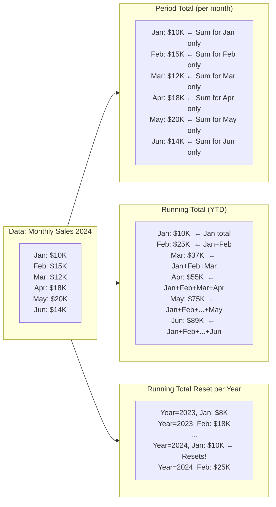

## Navigation

**Domain:** [[8 — Databases]] > **Group:** SQL Window Functions & Analytics
**Previous:** [[8.164 — Gaps and Islands — Classic Window Problem]] | **Next:** [[8.166 — Year-over-Year Comparison with LAG]]

### Prerequisites

- [[8.155 — SUM() OVER() — Running Totals]] — The running total pattern uses SUM() with an ORDER BY in the OVER clause and a frame that grows from the start of the partition to the current row.
- [[8.143 — ORDER BY Within OVER — Frame Ordering]] — The ORDER BY within OVER defines whether the aggregate is cumulative (WITH ORDER BY) or constant across the partition (WITHOUT ORDER BY).
- [[8.159 — Frame Specification — ROWS vs RANGE]] — The frame specification determines which rows are included in the running total: ROWS BETWEEN UNBOUNDED PRECEDING AND CURRENT ROW is the standard for running totals.

### Where This Fits

Every financial report, sales dashboard, and accounting system distinguishes between period totals (total revenue for January) and running totals (cumulative revenue from January through the current date). A .NET backend engineer building reporting features must know the difference: period totals use SUM OVER with PARTITION BY only (no ORDER BY — same value for all rows in the partition), while running totals use SUM OVER with ORDER BY and an expanding row frame (different value per row within the partition). The performance difference is significant — a running total requires a Sort and a window spool, while a period total without ORDER BY can avoid the Sort if an index covers the partition. The interview signal is practical: candidates who explain the frame specification difference and show the execution plan impact demonstrate genuine SQL analytics experience beyond basic syntax.

---

## Core Mental Model

A period total is a window aggregate computed over an entire partition without ordering — it returns the same value for every row in the partition. For example, `SUM(Amount) OVER(PARTITION BY Year, Month)` returns the same monthly total for every order in that month. A running total is a window aggregate computed with ORDER BY and an expanding frame — the frame starts at the first row of the partition and grows to include the current row. For example, `SUM(Amount) OVER(PARTITION BY Year ORDER BY Month ROWS BETWEEN UNBOUNDED PRECEDING AND CURRENT ROW)` returns the year-to-date total as of each month. The invariant: period total = constant per partition (partition key alone), running total = cumulative per row (partition key + ordering). Without an explicit frame specification, the default frame is `RANGE BETWEEN UNBOUNDED PRECEDING AND CURRENT ROW`, which produces a running total when ORDER BY is present. The recognition pattern: "show total per [group]" → period total. "show cumulative total over time" → running total.

### Classification

Both patterns use the SUM aggregate window function. The period total variant has no ORDER BY in OVER or has only PARTITION BY. The running total variant has ORDER BY with a frame specification. The period total without ORDER BY can be computed without a Sort if an index provides partition ordering — it uses Segment + Sequence Project without a preceding Sort. The running total always requires ordering (either from an index or a Sort). Both are not SARGable. The running total with ROWS frame is more efficient than RANGE because ROWS uses a simpler iterator (physical row count) while RANGE requires tracking logical duplicates.



### Key Properties

|Property|Period Total|Running Total|
|---|---|---|
|Frame|Entire partition|UNBOUNDED PRECEDING TO CURRENT ROW|
|OVER clause|PARTITION BY only (no ORDER BY)|PARTITION BY + ORDER BY + frame|
|Value per partition|Same for all rows|Different for each row (cumulative)|
|Sort required|No (if index covers partition)|Yes (ORDER BY within partition)|
|Window spool|No|Yes (lazy spool for frame materialisation)|
|Memory grant|0 MB (no sort)|Sort memory grant|
|EF Core support|Raw SQL only|Raw SQL only|
|Common use case|Monthly/quarterly totals, per-period reporting|YTD totals, cumulative revenue, bank balance|

---

## Deep Mechanics

### How the Engine Executes This

**Period total execution:**

1. The input is scanned. If an index provides rows in partition order (e.g., ordered by Year, Month), the Segment operator detects partition boundaries.
2. The Sequence Project operator reads all rows in the partition and computes `SUM(Amount) OVER(PARTITION BY Year, Month)`. Because there is no ORDER BY, the default frame is the entire partition — every row gets the same sum.
3. The output is one value per row, repeated for every row in the partition.
4. If no index provides partition order, no Sort is needed (ORDER BY is absent). The Sequence Project reads input rows in whatever order and still computes the correct partition aggregate.

**Running total execution:**

1. The input is read. The Sort operator orders rows by the PARTITION BY and ORDER BY columns (e.g., Year, Month ASC).
2. The Segment operator detects partition boundaries.
3. The Sequence Project operator processes rows in sorted order. For each row, it adds the current row's value to a running accumulator. The accumulator starts at 0 for each new partition.
4. The frame `ROWS BETWEEN UNBOUNDED PRECEDING AND CURRENT ROW` tells the operator to include all rows from the start of the partition up to and including the current row. The operator uses an iterative accumulator: O(1) per row, O(N) total.
5. The difference between period and running total in the Sequence Project: period total must scan ALL rows in the partition before emitting any value (it needs the full sum). Running total can emit immediately — it only needs the running sum up to the current row. This makes running total potentially faster for large partitions because it is a streaming window function (non-blocking within the partition), while period total is blocking (needs the full partition).

**Running total with reset (partitioned running total):**

When `PARTITION BY Year` is combined with `ORDER BY Month`, the accumulator resets at each year boundary. This is the YTD (year-to-date) pattern. The execution is: Sort by Year, Month → Segment (partition by Year) → Sequence Project (running sum resets at each partition boundary).

**Performance delta — ROWS vs RANGE frame:**

`ROWS BETWEEN UNBOUNDED PRECEDING AND CURRENT ROW` uses the physical row count — it adds the current row's value to the running sum. `RANGE BETWEEN UNBOUNDED PRECEDING AND CURRENT ROW` (the default) includes all rows with the same ORDER BY value as the current row. If there are ties in the ORDER BY, RANGE includes all tied rows, while ROWS only includes the current row. RANGE requires tracking duplicates and may need a window spool, making it slower and more memory-intensive than ROWS.

### SQL Visibility

```sql
-- ============================================================
-- Example tables
-- ============================================================
-- Sales: SaleId INT, SaleDate DATE, Amount DECIMAL(18,2), ProductId INT, StoreId INT
-- Orders: OrderId INT, OrderDate DATETIME2, TotalAmount DECIMAL(18,2), CustomerId INT

-- ============================================================
-- Pattern 1: Period total — SUM per month (same value per row)
-- ============================================================
SELECT
    s.SaleId,
    s.SaleDate,
    s.Amount,
    DATEPART(year, s.SaleDate) AS SaleYear,
    DATEPART(month, s.SaleDate) AS SaleMonth,
    SUM(s.Amount) OVER(
        PARTITION BY DATEPART(year, s.SaleDate), DATEPART(month, s.SaleDate)
    ) AS MonthlyTotal        -- Same for all rows in the same month
FROM dbo.Sales AS s
WHERE s.SaleDate >= '2024-01-01' AND s.SaleDate < '2025-01-01'
ORDER BY s.SaleDate;

-- ============================================================
-- Pattern 2: Running total — YTD cumulative per row
-- ============================================================
SELECT
    s.SaleId,
    s.SaleDate,
    s.Amount,
    DATEPART(year, s.SaleDate) AS SaleYear,
    SUM(s.Amount) OVER(
        PARTITION BY DATEPART(year, s.SaleDate)
        ORDER BY s.SaleDate
        ROWS BETWEEN UNBOUNDED PRECEDING AND CURRENT ROW
    ) AS YearToDateTotal    -- Different for each row, cumulative
FROM dbo.Sales AS s
WHERE s.SaleDate >= '2024-01-01' AND s.SaleDate < '2025-01-01'
ORDER BY s.SaleDate;

-- ============================================================
-- Pattern 3: Period total vs running total side by side
-- ============================================================
SELECT
    s.SaleId,
    s.SaleDate,
    s.Amount,
    -- Period total: January total same for every January row
    SUM(s.Amount) OVER(PARTITION BY DATEPART(year, s.SaleDate), DATEPART(month, s.SaleDate))
        AS MonthlyPeriodTotal,
    -- Running total: YTD cumulative up to this row's date
    SUM(s.Amount) OVER(
        PARTITION BY DATEPART(year, s.SaleDate)
        ORDER BY s.SaleDate
        ROWS BETWEEN UNBOUNDED PRECEDING AND CURRENT ROW
    ) AS YearToDateRunningTotal
FROM dbo.Sales AS s
WHERE s.SaleDate >= '2024-01-01' AND s.SaleDate < '2025-01-01'
ORDER BY s.SaleDate;

-- ============================================================
-- Pattern 4: Running total with reset (partitioned by year)
-- ============================================================
SELECT
    s.SaleId,
    s.SaleDate,
    s.Amount,
    DATEPART(year, s.SaleDate) AS SaleYear,
    SUM(s.Amount) OVER(
        PARTITION BY DATEPART(year, s.SaleDate)
        ORDER BY s.SaleDate
        ROWS BETWEEN UNBOUNDED PRECEDING AND CURRENT ROW
    ) AS YearToDate
FROM dbo.Sales AS s
WHERE s.SaleDate >= '2022-01-01' AND s.SaleDate < '2025-01-01'
ORDER BY s.SaleDate;
-- The running total resets at each year boundary — 2022 YTD, 2023 YTD, 2024 YTD

-- ============================================================
-- Pattern 5: Period-over-period comparison with LAG
-- ============================================================
-- Compare each period's total to the previous period
WITH MonthlyTotals AS (
    SELECT
        DATEPART(year, s.SaleDate) AS SaleYear,
        DATEPART(month, s.SaleDate) AS SaleMonth,
        SUM(s.Amount) AS PeriodTotal,
        COUNT(*) AS TransactionCount
    FROM dbo.Sales AS s
    WHERE s.SaleDate >= '2023-01-01' AND s.SaleDate < '2025-01-01'
    GROUP BY DATEPART(year, s.SaleDate), DATEPART(month, s.SaleDate)
)
SELECT
    mt.SaleYear,
    mt.SaleMonth,
    mt.PeriodTotal,
    LAG(mt.PeriodTotal, 1) OVER(ORDER BY mt.SaleYear, mt.SaleMonth) AS PreviousPeriodTotal,
    mt.PeriodTotal - LAG(mt.PeriodTotal, 1) OVER(ORDER BY mt.SaleYear, mt.SaleMonth) AS ChangeFromPrevious,
    (mt.PeriodTotal - LAG(mt.PeriodTotal, 1) OVER(ORDER BY mt.SaleYear, mt.SaleMonth))
        / NULLIF(LAG(mt.PeriodTotal, 1) OVER(ORDER BY mt.SaleYear, mt.SaleMonth), 0) * 100
        AS PctChange
FROM MonthlyTotals AS mt
ORDER BY mt.SaleYear, mt.SaleMonth;

-- ============================================================
-- Pattern 6: MTD/QTD/YTD with window functions
-- ============================================================
-- Month-to-date, quarter-to-date, year-to-date in one query
SELECT
    s.SaleId,
    s.SaleDate,
    s.Amount,
    -- MTD: running total within the current month
    SUM(s.Amount) OVER(
        PARTITION BY DATEPART(year, s.SaleDate), DATEPART(month, s.SaleDate)
        ORDER BY s.SaleDate
        ROWS BETWEEN UNBOUNDED PRECEDING AND CURRENT ROW
    ) AS MonthToDate,
    -- QTD: running total within the current quarter
    SUM(s.Amount) OVER(
        PARTITION BY DATEPART(year, s.SaleDate), DATEPART(quarter, s.SaleDate)
        ORDER BY s.SaleDate
        ROWS BETWEEN UNBOUNDED PRECEDING AND CURRENT ROW
    ) AS QuarterToDate,
    -- YTD: running total within the current year
    SUM(s.Amount) OVER(
        PARTITION BY DATEPART(year, s.SaleDate)
        ORDER BY s.SaleDate
        ROWS BETWEEN UNBOUNDED PRECEDING AND CURRENT ROW
    ) AS YearToDate
FROM dbo.Sales AS s
WHERE s.SaleDate >= '2024-01-01' AND s.SaleDate < '2025-01-01'
ORDER BY s.SaleDate;
```

```csharp
// EF Core — raw SQL for running totals and period totals
var monthlyComparison = await dbContext.Database
    .SqlQueryRaw<MonthlyComparison>(@"
        WITH MonthlyTotals AS (
            SELECT
                DATEPART(year, s.SaleDate) AS SaleYear,
                DATEPART(month, s.SaleDate) AS SaleMonth,
                SUM(s.Amount) AS PeriodTotal
            FROM Sales AS s
            WHERE s.SaleDate >= @StartDate AND s.SaleDate < @EndDate
            GROUP BY DATEPART(year, s.SaleDate), DATEPART(month, s.SaleDate)
        )
        SELECT
            mt.SaleYear,
            mt.SaleMonth,
            mt.PeriodTotal,
            LAG(mt.PeriodTotal, 1) OVER(ORDER BY mt.SaleYear, mt.SaleMonth) AS PreviousPeriodTotal,
            mt.PeriodTotal - LAG(mt.PeriodTotal, 1) OVER(ORDER BY mt.SaleYear, mt.SaleMonth)
                AS ChangeFromPrevious
        FROM MonthlyTotals AS mt
        ORDER BY mt.SaleYear, mt.SaleMonth",
        new SqlParameter("@StartDate", new DateTime(2024, 1, 1)),
        new SqlParameter("@EndDate", new DateTime(2025, 1, 1)))
    .ToListAsync(cancellationToken);
```

**Generated SQL (from EF Core logs):**

```sql
-- EF Core passes raw SQL through — no translation or modification
-- The SQL runs as written
```

### Execution Plan Analysis

**Period total plan (SUM OVER PARTITION BY without ORDER BY):**

```
[Clustered Index Scan (Sales)]  -- 12,450 logical reads
  → [Segment]
      Partition by: DATEPART(year, SaleDate), DATEPART(month, SaleDate)
  → [Sequence Project]
      Window aggregate: SUM(Amount) OVER(PARTITION BY Year, Month)
      — Blocking: must read all rows in partition before emitting
  → [SELECT]
No Sort operator — ORDER BY is absent in OVER clause
Memory grant: 0 MB
```

**Running total plan (SUM OVER PARTITION BY + ORDER BY + ROWS frame):**

```
[Clustered Index Scan (Sales)]  -- 12,450 logical reads
  → [Sort]
      ORDER BY: DATEPART(year, SaleDate) ASC, SaleDate ASC
      Memory Grant: ~30 MB (computed year + SaleDate)
      Cost: 50%
  → [Segment]
      Partition by: DATEPART(year, SaleDate)
  → [Sequence Project]
      Window aggregate: SUM(Amount) OVER(PARTITION BY Year ORDER BY SaleDate ROWS ...)
      — Streaming: emits each row as it processes (non-blocking within partition)
  → [SELECT]
```

**Running total with covering index on (SaleDate) or computed columns:**

With an index on `(SaleDate, Amount)` or a computed column for `SaleYear`, the Sort is eliminated:

```
[Index Scan (IX_Sales_SaleDate — ordered)]  -- 3,200 logical reads (narrower)
  → [Segment]
  → [Sequence Project]
  → [SELECT]
No Sort. Memory grant: 0 MB.
```

**Period comparison using GROUP BY + LAG:**

```
[Clustered Index Scan (Sales)]  -- 12,450 logical reads
  → [Hash Match Aggregate]
      GROUP BY: Year, Month
      Memory grant: ~10 MB
  → [Sort]
      ORDER BY: Year ASC, Month ASC
      Memory grant: ~1 MB
  → [Sequence Project]
      Window function: LAG(PeriodTotal) OVER(ORDER BY Year, Month)
  → [SELECT]
```

### Cost Visibility

```sql
SET STATISTICS IO ON;
SET STATISTICS TIME ON;

-- Period total (no ORDER BY in OVER)
SELECT s.SaleId, s.SaleDate, s.Amount,
       SUM(s.Amount) OVER(PARTITION BY DATEPART(year, s.SaleDate), DATEPART(month, s.SaleDate)) AS MonthlyTotal
FROM dbo.Sales AS s
WHERE s.SaleDate >= '2024-01-01' AND s.SaleDate < '2024-07-01'
ORDER BY s.SaleDate;

-- Expected output:
-- Table 'Sales'. Scan count 1, logical reads 6500
-- SQL Server Execution Times: CPU time = 65ms, elapsed time = 150ms

-- Running total (ORDER BY + ROWS frame)
SELECT s.SaleId, s.SaleDate, s.Amount,
       SUM(s.Amount) OVER(
           PARTITION BY DATEPART(year, s.SaleDate)
           ORDER BY s.SaleDate
           ROWS BETWEEN UNBOUNDED PRECEDING AND CURRENT ROW
       ) AS YearToDate
FROM dbo.Sales AS s
WHERE s.SaleDate >= '2024-01-01' AND s.SaleDate < '2024-07-01'
ORDER BY s.SaleDate;

-- Expected output:
-- Table 'Sales'. Scan count 1, logical reads 6500
-- Table 'Worktable'. Scan count 2, logical reads 180
-- SQL Server Execution Times: CPU time = 110ms, elapsed time = 280ms
```

### Failure Modes

**1. RANGE default frame causes unexpected results with ties:**

Without explicit frame specification, `SUM(Amount) OVER(PARTITION BY Year ORDER BY Month)` uses `RANGE BETWEEN UNBOUNDED PRECEDING AND CURRENT ROW`. If multiple rows have the same ORDER BY value (same month), RANGE includes ALL tied rows, not just the current row. ROWS would include only the current row. The SUM differs when ties exist.

**2. Running total without PARTITION BY across all rows:**

`SUM(Amount) OVER(ORDER BY SaleDate)` without PARTITION BY computes a grand running total across ALL rows. If the data spans multiple years, the running total does not reset at year boundaries. This may be intentional (lifetime-to-date) or a bug (forgetting the PARTITION BY for YTD).

**3. Period total with ORDER BY by mistake:**

`SUM(Amount) OVER(PARTITION BY Year, Month ORDER BY SaleDate)` with ORDER BY but without a frame specification uses the DEFAULT RANGE frame. This produces a RUNNING TOTAL within each month, not a period total. The value increases across rows within the same month instead of being constant.

**4. Performance of running total on unsorted large tables:**

Running totals require a Sort by the ORDER BY columns. On a 100M row table, the Sort memory grant may be 500 MB+, risking spill. Creating an index on the ORDER BY columns eliminates the Sort.

**5. Running total frame default vs explicit performance:**

The RANGE default frame is slower than ROWS because RANGE must track duplicate values in the ORDER BY. Always use explicit `ROWS BETWEEN UNBOUNDED PRECEDING AND CURRENT ROW` for running totals unless RANGE behavior with ties is specifically needed.

---

## Production Patterns and Implementation

### Primary SQL Implementation

```sql
-- ============================================================
-- Schema context
-- ============================================================
CREATE TABLE dbo.Sales
(
    SaleId      INT            NOT NULL IDENTITY(1,1),
    SaleDate    DATE           NOT NULL,
    Amount      DECIMAL(18,2)  NOT NULL,
    ProductId   INT            NOT NULL,
    StoreId     INT            NOT NULL,
    CONSTRAINT PK_Sales PRIMARY KEY CLUSTERED (SaleId)
);

CREATE TABLE dbo.Invoices
(
    InvoiceId          INT            NOT NULL IDENTITY(1,1),
    InvoiceDate        DATE           NOT NULL,
    CustomerId         INT            NOT NULL,
    LineTotal          DECIMAL(18,2)  NOT NULL,
    TaxAmount          DECIMAL(18,2)  NOT NULL DEFAULT 0,
    InvoiceStatus      VARCHAR(20)    NOT NULL DEFAULT 'Draft',
    DueDate            DATE           NULL,
    CONSTRAINT PK_Invoices PRIMARY KEY CLUSTERED (InvoiceId)
);

CREATE INDEX IX_Sales_SaleDate ON dbo.Sales(SaleDate) INCLUDE (Amount, ProductId, StoreId);
CREATE INDEX IX_Invoices_InvoiceDate ON dbo.Invoices(InvoiceDate) INCLUDE (LineTotal, TaxAmount, InvoiceStatus);

-- ============================================================
-- Pattern 1: Daily sales with daily total (period total) and running total
-- ============================================================
SELECT
    s.SaleId,
    s.SaleDate,
    s.Amount,
    -- Period total: same for all sales on the same day
    SUM(s.Amount) OVER(PARTITION BY s.SaleDate) AS DailyTotal,
    -- Running total: cumulative from first sale of the day to current sale
    SUM(s.Amount) OVER(
        PARTITION BY s.SaleDate
        ORDER BY s.SaleId
        ROWS BETWEEN UNBOUNDED PRECEDING AND CURRENT ROW
    ) AS RunningDailyTotal
FROM dbo.Sales AS s
WHERE s.SaleDate = '2024-06-15'
ORDER BY s.SaleId;

-- ============================================================
-- Pattern 2: Monthly period totals with YTD running
-- ============================================================
-- Aggregate first, then apply window functions
WITH MonthlySales AS (
    SELECT
        DATEPART(year, s.SaleDate) AS SaleYear,
        DATEPART(month, s.SaleDate) AS SaleMonth,
        SUM(s.Amount) AS MonthlyTotal,
        COUNT(*) AS TransactionCount
    FROM dbo.Sales AS s
    WHERE s.SaleDate >= '2024-01-01' AND s.SaleDate < '2025-01-01'
    GROUP BY DATEPART(year, s.SaleDate), DATEPART(month, s.SaleDate)
)
SELECT
    ms.SaleYear,
    ms.SaleMonth,
    ms.MonthlyTotal,
    ms.TransactionCount,
    -- Running total of monthly totals (YTD)
    SUM(ms.MonthlyTotal) OVER(
        PARTITION BY ms.SaleYear
        ORDER BY ms.SaleMonth
        ROWS BETWEEN UNBOUNDED PRECEDING AND CURRENT ROW
    ) AS YearToDateRevenue,
    -- Average monthly total (period average across all months)
    AVG(ms.MonthlyTotal) OVER(PARTITION BY ms.SaleYear) AS AvgMonthlyRevenue,
    -- Difference from monthly average
    ms.MonthlyTotal - AVG(ms.MonthlyTotal) OVER(PARTITION BY ms.SaleYear) AS DiffFromAvg
FROM MonthlySales AS ms
ORDER BY ms.SaleYear, ms.SaleMonth;

-- ============================================================
-- Pattern 3: Running total with reset — MTD, QTD, YTD
-- ============================================================
SELECT
    s.SaleId,
    s.SaleDate,
    s.Amount,
    s.StoreId,
    -- Day total
    SUM(s.Amount) OVER(PARTITION BY s.SaleDate) AS DailyTotal,
    -- MTD
    SUM(s.Amount) OVER(
        PARTITION BY DATEPART(year, s.SaleDate), DATEPART(month, s.SaleDate)
        ORDER BY s.SaleDate
        ROWS BETWEEN UNBOUNDED PRECEDING AND CURRENT ROW
    ) AS MonthToDate,
    -- QTD
    SUM(s.Amount) OVER(
        PARTITION BY DATEPART(year, s.SaleDate), DATEPART(quarter, s.SaleDate)
        ORDER BY s.SaleDate
        ROWS BETWEEN UNBOUNDED PRECEDING AND CURRENT ROW
    ) AS QuarterToDate,
    -- YTD
    SUM(s.Amount) OVER(
        PARTITION BY DATEPART(year, s.SaleDate)
        ORDER BY s.SaleDate
        ROWS BETWEEN UNBOUNDED PRECEDING AND CURRENT ROW
    ) AS YearToDate,
    -- Same period last year (using LAG on daily aggregate)
    LAG(SUM(s.Amount), 365) OVER(ORDER BY s.SaleDate) AS SameDayLastYear
FROM dbo.Sales AS s
WHERE s.SaleDate >= '2023-01-01' AND s.SaleDate < '2025-01-01'
GROUP BY s.SaleId, s.SaleDate, s.Amount, s.StoreId
ORDER BY s.SaleDate;

-- ============================================================
-- Pattern 4: Invoice aging with running total
-- ============================================================
-- Running total of outstanding invoices by age bucket
WITH InvoiceAging AS (
    SELECT
        i.InvoiceId,
        i.CustomerId,
        i.InvoiceDate,
        i.LineTotal + i.TaxAmount AS TotalAmount,
        DATEDIFF(day, i.DueDate, GETUTCDATE()) AS DaysOverdue,
        CASE
            WHEN DATEDIFF(day, i.DueDate, GETUTCDATE()) <= 0    THEN 'Current'
            WHEN DATEDIFF(day, i.DueDate, GETUTCDATE()) <= 30   THEN '1-30 Days'
            WHEN DATEDIFF(day, i.DueDate, GETUTCDATE()) <= 60   THEN '31-60 Days'
            WHEN DATEDIFF(day, i.DueDate, GETUTCDATE()) <= 90   THEN '61-90 Days'
            ELSE '90+ Days'
        END AS AgingBucket
    FROM dbo.Invoices AS i
    WHERE i.InvoiceStatus = 'Sent'
)
SELECT
    ia.AgingBucket,
    COUNT(*) AS InvoiceCount,
    SUM(ia.TotalAmount) AS BucketTotal,
    SUM(SUM(ia.TotalAmount)) OVER(
        ORDER BY CASE ia.AgingBucket
            WHEN 'Current'    THEN 1
            WHEN '1-30 Days'  THEN 2
            WHEN '31-60 Days' THEN 3
            WHEN '61-90 Days' THEN 4
            ELSE 5
        END
        ROWS BETWEEN UNBOUNDED PRECEDING AND CURRENT ROW
    ) AS CumulativeOutstanding
FROM InvoiceAging AS ia
GROUP BY ia.AgingBucket
ORDER BY MIN(CASE ia.AgingBucket
    WHEN 'Current'    THEN 1
    WHEN '1-30 Days'  THEN 2
    WHEN '31-60 Days' THEN 3
    WHEN '61-90 Days' THEN 4
    ELSE 5
END);

-- ============================================================
-- Pattern 5: Period-over-period comparison with LAG
-- ============================================================
WITH QuarterlySales AS (
    SELECT
        DATEPART(year, s.SaleDate) AS SaleYear,
        DATEPART(quarter, s.SaleDate) AS SaleQuarter,
        SUM(s.Amount) AS QuarterlyTotal
    FROM dbo.Sales AS s
    WHERE s.SaleDate >= '2022-01-01' AND s.SaleDate < '2025-01-01'
    GROUP BY DATEPART(year, s.SaleDate), DATEPART(quarter, s.SaleDate)
)
SELECT
    qs.SaleYear,
    qs.SaleQuarter,
    qs.QuarterlyTotal,
    -- Previous quarter
    LAG(qs.QuarterlyTotal, 1) OVER(ORDER BY qs.SaleYear, qs.SaleQuarter) AS PrevQuarterTotal,
    -- Same quarter last year
    LAG(qs.QuarterlyTotal, 4) OVER(ORDER BY qs.SaleYear, qs.SaleQuarter) AS SameQuarterLastYear,
    -- Growth rates
    (qs.QuarterlyTotal - LAG(qs.QuarterlyTotal, 1) OVER(ORDER BY qs.SaleYear, qs.SaleQuarter))
        / NULLIF(LAG(qs.QuarterlyTotal, 1) OVER(ORDER BY qs.SaleYear, qs.SaleQuarter), 0) * 100
        AS QoQGrowthPct,
    (qs.QuarterlyTotal - LAG(qs.QuarterlyTotal, 4) OVER(ORDER BY qs.SaleYear, qs.SaleQuarter))
        / NULLIF(LAG(qs.QuarterlyTotal, 4) OVER(ORDER BY qs.SaleYear, qs.SaleQuarter), 0) * 100
        AS YoYGrowthPct,
    -- Running total (YTD)
    SUM(qs.QuarterlyTotal) OVER(
        PARTITION BY qs.SaleYear
        ORDER BY qs.SaleQuarter
        ROWS BETWEEN UNBOUNDED PRECEDING AND CURRENT ROW
    ) AS YearToDate
FROM QuarterlySales AS qs
ORDER BY qs.SaleYear, qs.SaleQuarter;

-- ============================================================
-- Pattern 6: Moving average vs running total
-- ============================================================
WITH DailySales AS (
    SELECT
        s.SaleDate,
        SUM(s.Amount) AS DailyTotal
    FROM dbo.Sales AS s
    WHERE s.SaleDate >= '2024-01-01' AND s.SaleDate < '2024-04-01'
    GROUP BY s.SaleDate
)
SELECT
    ds.SaleDate,
    ds.DailyTotal,
    -- Running total (YTD)
    SUM(ds.DailyTotal) OVER(
        ORDER BY ds.SaleDate
        ROWS BETWEEN UNBOUNDED PRECEDING AND CURRENT ROW
    ) AS YearToDate,
    -- 7-day moving average (window of 7 rows)
    AVG(ds.DailyTotal) OVER(
        ORDER BY ds.SaleDate
        ROWS BETWEEN 6 PRECEDING AND CURRENT ROW
    ) AS SevenDayMovingAvg,
    -- Cumulative average (every day's average up to today)
    AVG(ds.DailyTotal) OVER(
        ORDER BY ds.SaleDate
        ROWS BETWEEN UNBOUNDED PRECEDING AND CURRENT ROW
    ) AS CumulativeAvg
FROM DailySales AS ds
ORDER BY ds.SaleDate;
```

### EF Core Implementation

```csharp
public class ApplicationDbContext : DbContext
{
    public DbSet<Sale> Sales => Set<Sale>();
    public DbSet<Invoice> Invoices => Set<Invoice>();

    protected override void OnModelCreating(ModelBuilder modelBuilder)
    {
        modelBuilder.Entity<Sale>(entity =>
        {
            entity.ToTable("Sales");
            entity.HasKey(s => s.SaleId);
            entity.Property(s => s.Amount).HasColumnType("decimal(18,2)");
            entity.HasIndex(s => s.SaleDate).IncludeProperties(nameof(Sale.Amount),
                nameof(Sale.ProductId), nameof(Sale.StoreId));
        });

        modelBuilder.Entity<Invoice>(entity =>
        {
            entity.ToTable("Invoices");
            entity.HasKey(i => i.InvoiceId);
            entity.Property(i => i.LineTotal).HasColumnType("decimal(18,2)");
            entity.Property(i => i.TaxAmount).HasColumnType("decimal(18,2)");
            entity.Property(i => i.InvoiceStatus).HasMaxLength(20);
            entity.HasIndex(i => i.InvoiceDate)
                  .IncludeProperties(nameof(Invoice.LineTotal),
                      nameof(Invoice.TaxAmount), nameof(Invoice.InvoiceStatus));
        });
    }
}

public class Sale
{
    public int SaleId { get; set; }
    public DateTime SaleDate { get; set; }
    public decimal Amount { get; set; }
    public int ProductId { get; set; }
    public int StoreId { get; set; }
}

public class Invoice
{
    public int InvoiceId { get; set; }
    public DateTime InvoiceDate { get; set; }
    public int CustomerId { get; set; }
    public decimal LineTotal { get; set; }
    public decimal TaxAmount { get; set; }
    public string InvoiceStatus { get; set; } = "Draft";
    public DateTime? DueDate { get; set; }
}

public interface IFinancialReportService
{
    Task<List<MonthlyReportRow>> GetMonthlyReportAsync(
        int year, CancellationToken cancellationToken = default);
    Task<List<SalesWithRunningTotal>> GetSalesWithRunningTotalsAsync(
        DateTime startDate, DateTime endDate, CancellationToken cancellationToken = default);
    Task<List<QuarterlyComparison>> GetQuarterlyComparisonAsync(
        int startYear, int endYear, CancellationToken cancellationToken = default);
}

public class FinancialReportService : IFinancialReportService
{
    private readonly ApplicationDbContext _dbContext;

    public FinancialReportService(ApplicationDbContext dbContext)
        => _dbContext = dbContext;

    public async Task<List<MonthlyReportRow>> GetMonthlyReportAsync(
        int year, CancellationToken cancellationToken = default)
    {
        var sql = @"
            WITH MonthlySales AS (
                SELECT
                    DATEPART(month, s.SaleDate) AS SaleMonth,
                    SUM(s.Amount) AS MonthlyTotal,
                    COUNT(*) AS TransactionCount
                FROM Sales AS s
                WHERE s.SaleDate >= @YearStart AND s.SaleDate < @YearEnd
                GROUP BY DATEPART(month, s.SaleDate)
            )
            SELECT
                ms.SaleMonth,
                ms.MonthlyTotal,
                ms.TransactionCount,
                SUM(ms.MonthlyTotal) OVER(
                    ORDER BY ms.SaleMonth
                    ROWS BETWEEN UNBOUNDED PRECEDING AND CURRENT ROW
                ) AS YearToDate
            FROM MonthlySales AS ms
            ORDER BY ms.SaleMonth;";

        return await _dbContext.Database
            .SqlQueryRaw<MonthlyReportRow>(sql,
                new SqlParameter("@YearStart", new DateTime(year, 1, 1)),
                new SqlParameter("@YearEnd", new DateTime(year + 1, 1, 1)))
            .ToListAsync(cancellationToken);
    }

    public async Task<List<SalesWithRunningTotal>> GetSalesWithRunningTotalsAsync(
        DateTime startDate, DateTime endDate, CancellationToken cancellationToken = default)
    {
        const string sql = @"
            SELECT
                s.SaleId,
                s.SaleDate,
                s.Amount,
                s.StoreId,
                SUM(s.Amount) OVER(PARTITION BY s.SaleDate) AS DailyTotal,
                SUM(s.Amount) OVER(
                    PARTITION BY DATEPART(year, s.SaleDate)
                    ORDER BY s.SaleDate
                    ROWS BETWEEN UNBOUNDED PRECEDING AND CURRENT ROW
                ) AS YearToDate
            FROM Sales AS s
            WHERE s.SaleDate >= @StartDate AND s.SaleDate < @EndDate
            ORDER BY s.SaleDate, s.SaleId;";

        return await _dbContext.Database
            .SqlQueryRaw<SalesWithRunningTotal>(sql,
                new SqlParameter("@StartDate", startDate),
                new SqlParameter("@EndDate", endDate))
            .ToListAsync(cancellationToken);
    }

    public async Task<List<QuarterlyComparison>> GetQuarterlyComparisonAsync(
        int startYear, int endYear, CancellationToken cancellationToken = default)
    {
        var sql = @"
            WITH QuarterlySales AS (
                SELECT
                    DATEPART(year, s.SaleDate) AS SaleYear,
                    DATEPART(quarter, s.SaleDate) AS SaleQuarter,
                    SUM(s.Amount) AS QuarterlyTotal,
                    COUNT(*) AS TransactionCount
                FROM Sales AS s
                WHERE s.SaleDate >= @StartDate AND s.SaleDate < @EndDate
                GROUP BY DATEPART(year, s.SaleDate), DATEPART(quarter, s.SaleDate)
            )
            SELECT
                qs.SaleYear,
                qs.SaleQuarter,
                qs.QuarterlyTotal,
                qs.TransactionCount,
                LAG(qs.QuarterlyTotal, 1) OVER(
                    ORDER BY qs.SaleYear, qs.SaleQuarter
                ) AS PrevQuarterTotal,
                LAG(qs.QuarterlyTotal, 4) OVER(
                    ORDER BY qs.SaleYear, qs.SaleQuarter
                ) AS SameQuarterLastYear,
                SUM(qs.QuarterlyTotal) OVER(
                    PARTITION BY qs.SaleYear
                    ORDER BY qs.SaleQuarter
                    ROWS BETWEEN UNBOUNDED PRECEDING AND CURRENT ROW
                ) AS YearToDate
            FROM QuarterlySales AS qs
            ORDER BY qs.SaleYear, qs.SaleQuarter;";

        return await _dbContext.Database
            .SqlQueryRaw<QuarterlyComparison>(sql,
                new SqlParameter("@StartDate", new DateTime(startYear, 1, 1)),
                new SqlParameter("@EndDate", new DateTime(endYear + 1, 1, 1)))
            .ToListAsync(cancellationToken);
    }
}

public class MonthlyReportRow
{
    public int SaleMonth { get; set; }
    public decimal MonthlyTotal { get; set; }
    public int TransactionCount { get; set; }
    public decimal YearToDate { get; set; }
}

public class SalesWithRunningTotal
{
    public int SaleId { get; set; }
    public DateTime SaleDate { get; set; }
    public decimal Amount { get; set; }
    public int StoreId { get; set; }
    public decimal DailyTotal { get; set; }
    public decimal YearToDate { get; set; }
}

public class QuarterlyComparison
{
    public int SaleYear { get; set; }
    public int SaleQuarter { get; set; }
    public decimal QuarterlyTotal { get; set; }
    public int TransactionCount { get; set; }
    public decimal? PrevQuarterTotal { get; set; }
    public decimal? SameQuarterLastYear { get; set; }
    public decimal YearToDate { get; set; }
}
```

### Dapper Implementation

```csharp
public sealed class FinancialReportRepository
{
    private readonly IDbConnectionFactory _connectionFactory;

    public FinancialReportRepository(IDbConnectionFactory connectionFactory)
        => _connectionFactory = connectionFactory;

    public async Task<IReadOnlyList<MonthlyReportRow>> GetMonthlyReportAsync(
        int year, CancellationToken cancellationToken = default)
    {
        var sql = @"
            WITH MonthlySales AS (
                SELECT
                    DATEPART(month, s.SaleDate) AS SaleMonth,
                    SUM(s.Amount) AS MonthlyTotal,
                    COUNT(*) AS TransactionCount
                FROM dbo.Sales AS s
                WHERE s.SaleDate >= @YearStart AND s.SaleDate < @YearEnd
                GROUP BY DATEPART(month, s.SaleDate)
            )
            SELECT
                ms.SaleMonth,
                ms.MonthlyTotal,
                ms.TransactionCount,
                SUM(ms.MonthlyTotal) OVER(
                    ORDER BY ms.SaleMonth
                    ROWS BETWEEN UNBOUNDED PRECEDING AND CURRENT ROW
                ) AS YearToDate
            FROM MonthlySales AS ms
            ORDER BY ms.SaleMonth;";

        await using var connection = _connectionFactory.Create();

        return (await connection.QueryAsync<MonthlyReportRow>(
            new CommandDefinition(sql,
                new { YearStart = new DateTime(year, 1, 1),
                      YearEnd = new DateTime(year + 1, 1, 1) },
                cancellationToken: cancellationToken))).AsList();
    }

    public async Task<IReadOnlyList<SalesWithRunningTotal>> GetSalesWithRunningTotalsAsync(
        DateTime startDate, DateTime endDate, CancellationToken cancellationToken = default)
    {
        const string sql = @"
            SELECT
                s.SaleId,
                s.SaleDate,
                s.Amount,
                s.StoreId,
                SUM(s.Amount) OVER(PARTITION BY s.SaleDate) AS DailyTotal,
                SUM(s.Amount) OVER(
                    PARTITION BY DATEPART(year, s.SaleDate)
                    ORDER BY s.SaleDate
                    ROWS BETWEEN UNBOUNDED PRECEDING AND CURRENT ROW
                ) AS YearToDate
            FROM dbo.Sales AS s
            WHERE s.SaleDate >= @StartDate AND s.SaleDate < @EndDate
            ORDER BY s.SaleDate, s.SaleId;";

        await using var connection = _connectionFactory.Create();

        return (await connection.QueryAsync<SalesWithRunningTotal>(
            new CommandDefinition(sql,
                new { StartDate = startDate, EndDate = endDate },
                cancellationToken: cancellationToken))).AsList();
    }

    public async Task<IReadOnlyList<QuarterlyComparison>> GetQuarterlyComparisonAsync(
        int startYear, int endYear, CancellationToken cancellationToken = default)
    {
        var sql = @"
            WITH QuarterlySales AS (
                SELECT
                    DATEPART(year, s.SaleDate) AS SaleYear,
                    DATEPART(quarter, s.SaleDate) AS SaleQuarter,
                    SUM(s.Amount) AS QuarterlyTotal,
                    COUNT(*) AS TransactionCount
                FROM dbo.Sales AS s
                WHERE s.SaleDate >= @StartDate AND s.SaleDate < @EndDate
                GROUP BY DATEPART(year, s.SaleDate), DATEPART(quarter, s.SaleDate)
            )
            SELECT
                qs.SaleYear,
                qs.SaleQuarter,
                qs.QuarterlyTotal,
                qs.TransactionCount,
                LAG(qs.QuarterlyTotal, 1) OVER(
                    ORDER BY qs.SaleYear, qs.SaleQuarter
                ) AS PrevQuarterTotal,
                LAG(qs.QuarterlyTotal, 4) OVER(
                    ORDER BY qs.SaleYear, qs.SaleQuarter
                ) AS SameQuarterLastYear,
                SUM(qs.QuarterlyTotal) OVER(
                    PARTITION BY qs.SaleYear
                    ORDER BY qs.SaleQuarter
                    ROWS BETWEEN UNBOUNDED PRECEDING AND CURRENT ROW
                ) AS YearToDate
            FROM QuarterlySales AS qs
            ORDER BY qs.SaleYear, qs.SaleQuarter;";

        await using var connection = _connectionFactory.Create();

        return (await connection.QueryAsync<QuarterlyComparison>(
            new CommandDefinition(sql,
                new { StartDate = new DateTime(startYear, 1, 1),
                      EndDate = new DateTime(endYear + 1, 1, 1) },
                cancellationToken: cancellationToken))).AsList();
    }
}

public class MonthlyReportRow
{
    public int SaleMonth { get; set; }
    public decimal MonthlyTotal { get; set; }
    public int TransactionCount { get; set; }
    public decimal YearToDate { get; set; }
}

public class SalesWithRunningTotal
{
    public int SaleId { get; set; }
    public DateTime SaleDate { get; set; }
    public decimal Amount { get; set; }
    public int StoreId { get; set; }
    public decimal DailyTotal { get; set; }
    public decimal YearToDate { get; set; }
}

public class QuarterlyComparison
{
    public int SaleYear { get; set; }
    public int SaleQuarter { get; set; }
    public decimal QuarterlyTotal { get; set; }
    public int TransactionCount { get; set; }
    public decimal? PrevQuarterTotal { get; set; }
    public decimal? SameQuarterLastYear { get; set; }
    public decimal YearToDate { get; set; }
}
```

### Configuration and Wiring

```csharp
// Program.cs
builder.Services.AddDbContext<ApplicationDbContext>(options =>
    options.UseSqlServer(
        builder.Configuration.GetConnectionString("DefaultConnection"),
        sqlOptions =>
        {
            sqlOptions.EnableRetryOnFailure(3);
            sqlOptions.CommandTimeout(60);
        }));

builder.Services.AddSingleton<IDbConnectionFactory>(sp =>
    new SqlConnectionFactory(
        builder.Configuration.GetConnectionString("DefaultConnection")!));

builder.Services.AddScoped<IFinancialReportService, FinancialReportService>();
builder.Services.AddScoped<FinancialReportRepository>();

// Indexes for running total performance:
// 1. IX_Sales_SaleDate ON Sales(SaleDate) INCLUDE (Amount, StoreId, ProductId)
//    — supports running total ORDER BY SaleDate without Sort
// 2. IX_Invoices_InvoiceDate ON Invoices(InvoiceDate) INCLUDE (LineTotal, TaxAmount)
//    — supports date-range queries with period/running totals

public interface IDbConnectionFactory
{
    IDbConnection Create();
}

public class SqlConnectionFactory : IDbConnectionFactory
{
    private readonly string _connectionString;

    public SqlConnectionFactory(string connectionString)
        => _connectionString = connectionString;

    public IDbConnection Create()
        => new SqlConnection(_connectionString);
}
```

### SQL Server vs PostgreSQL Differences

```sql
-- PostgreSQL: Same syntax for period totals and running totals
-- Period total
SELECT sale_id, sale_date, amount,
       SUM(amount) OVER(PARTITION BY date_trunc('month', sale_date)) AS monthly_total
FROM sales
WHERE sale_date >= '2024-01-01' AND sale_date < '2025-01-01'
ORDER BY sale_date;

-- Running total (YTD) — same ROWS frame
SELECT sale_id, sale_date, amount,
       SUM(amount) OVER(
           PARTITION BY date_trunc('year', sale_date)
           ORDER BY sale_date
           ROWS BETWEEN UNBOUNDED PRECEDING AND CURRENT ROW
       ) AS year_to_date
FROM sales
WHERE sale_date >= '2024-01-01' AND sale_date < '2025-01-01'
ORDER BY sale_date;

-- PostgreSQL: RANGE default frame behavior is the same
-- Always use explicit ROWS for running totals

-- PostgreSQL: generate_series for period comparison with missing periods
SELECT gs.month_start,
       COALESCE(SUM(s.amount), 0) AS monthly_total,
       SUM(COALESCE(SUM(s.amount), 0)) OVER(
           ORDER BY gs.month_start
           ROWS BETWEEN UNBOUNDED PRECEDING AND CURRENT ROW
       ) AS running_total
FROM generate_series('2024-01-01'::date, '2024-12-01'::date, '1 month') AS gs(month_start)
LEFT JOIN sales s ON date_trunc('month', s.sale_date) = gs.month_start
GROUP BY gs.month_start
ORDER BY gs.month_start;
-- This includes months with zero sales in the running total

-- PostgreSQL: Window function FILTER for conditional running totals
SELECT sale_date, amount,
       SUM(amount) FILTER (WHERE amount > 100) OVER(
           ORDER BY sale_date
           ROWS BETWEEN UNBOUNDED PRECEDING AND CURRENT ROW
       ) AS running_high_value_total
FROM sales
ORDER BY sale_date;
```

---

## Gotchas and Production Pitfalls

### Forgetting the ROWS Frame — Using Default RANGE Causes Different Behavior With Ties

**Pitfall:** Writing `SUM(Amount) OVER(PARTITION BY Year ORDER BY Month)` without an explicit frame specification. The default `RANGE BETWEEN UNBOUNDED PRECEDING AND CURRENT ROW` includes ALL rows with the same ORDER BY value (same month). If multiple transactions occur in the same month, RANGE includes all of them at each row, while ROWS includes only the current row.

```sql
-- ❌ Default RANGE frame: includes ALL rows with same month in running total
-- If January has 3 transactions on different days, all 3 are included at row 1
SELECT s.SaleId, s.SaleDate, s.Amount,
       SUM(Amount) OVER(ORDER BY SaleDate) AS RunningTotal_Range
FROM Sales AS s;
-- Range: each row's running total includes ALL rows with the same SaleDate

-- ✅ Explicit ROWS frame: only includes rows up to the current row
SELECT s.SaleId, s.SaleDate, s.Amount,
       SUM(Amount) OVER(ORDER BY SaleDate ROWS BETWEEN UNBOUNDED PRECEDING AND CURRENT ROW) AS RunningTotal_Rows
FROM Sales AS s;
-- ROWS: each row's running total includes exactly up to this row
```

**Symptom:** The running total jumps in larger increments than expected. When there are ties in the ORDER BY column (e.g., multiple sales on the same date), the RANGE frame includes all tied rows at every row within the tie group, causing the running total to be the same for all rows in the tie group. This is especially problematic for daily sales with multiple transactions.

**Fix:** Always use explicit `ROWS BETWEEN UNBOUNDED PRECEDING AND CURRENT ROW` for running totals. Use RANGE only when you specifically want all rows with the same ORDER BY value to have the same running total (which is rarely the case).

**Cost of not fixing:** A financial report shows a running total that jumps by $50K at the first transaction of the month (because all month's transactions are included at once via RANGE frame). The CFO questions the data integrity. Investigation takes 2 hours. The fix is changing RANGE to ROWS.

---

### Running Total Without PARTITION BY Spans All Years

**Pitfall:** Computing `SUM(Amount) OVER(ORDER BY SaleDate)` on multi-year data without a PARTITION BY. The running total accumulates across all years instead of resetting at year boundaries.

```sql
-- ❌ No PARTITION BY: running total spans 2023, 2024, 2025
SELECT s.SaleDate, s.Amount,
       SUM(s.Amount) OVER(ORDER BY s.SaleDate) AS LifetimeTotal
FROM dbo.Sales AS s;
-- 2024-01-01: running total includes all of 2023 + Jan 1, 2024

-- ✅ With PARTITION BY: resets each year
SELECT s.SaleDate, s.Amount,
       SUM(s.Amount) OVER(
           PARTITION BY DATEPART(year, s.SaleDate)
           ORDER BY s.SaleDate
           ROWS BETWEEN UNBOUNDED PRECEDING AND CURRENT ROW
       ) AS YearToDate
FROM dbo.Sales AS s;
-- 2024-01-01: starts fresh at 0
```

**Symptom:** A YTD report shows values that don't reset in January. The running total for January 2024 includes all of 2023's data. The report is wrong by the entire previous year's total.

**Fix:** Always include the appropriate PARTITION BY when the running total should reset. Common partition keys: Year for YTD, Year + Quarter for QTD, Year + Month for MTD.

**Cost of not fixing:** A sales dashboard shows YTD revenue for January as $50M (includes all of last year). Management thinks January was a record month. The error is caught 3 months later when cumulative totals don't match quarterly filings. Embarrassing correction required.

---

### Period Total With ORDER BY Becomes Running Total (Unintentionally)

**Pitfall:** Adding an ORDER BY to a period total window function by mistake. The presence of ORDER BY changes the default frame from the entire partition to RANGE BETWEEN UNBOUNDED PRECEDING AND CURRENT ROW, making it a running total.

```sql
-- ❌ Thought this was a period total (same for all rows in month)
-- But ORDER BY SaleDate makes it a RUNNING total within the month
SELECT s.SaleId, s.SaleDate, s.Amount,
       SUM(s.Amount) OVER(PARTITION BY DATEPART(month, s.SaleDate) ORDER BY s.SaleDate) AS MonthlyTotal
FROM dbo.Sales AS s;
-- Each row shows cumulative up to that date, not the full month total!

-- ✅ Omit ORDER BY for period total
SELECT s.SaleId, s.SaleDate, s.Amount,
       SUM(s.Amount) OVER(PARTITION BY DATEPART(month, s.SaleDate)) AS MonthlyTotal
FROM dbo.Sales AS s;
-- Same value for all rows in the same month
```

**Symptom:** The "MonthlyTotal" column shows different values for each transaction in the same month. The values increase through the month instead of being constant.

**Fix:** Remove the ORDER BY from the OVER clause when a period total is intended. Only add ORDER BY when a running/cumulative total is needed.

**Cost of not fixing:** A customer invoice report shows "Monthly Total" but the number keeps changing as new transactions are added during the month. The customer is confused about which number is the actual monthly total.

---

### Performance: Running Total on 100M Rows Without Index Causes Spill

**Pitfall:** Running a running total query on a 100M row table without an index on the ORDER BY column. The Sort sorts 100M rows, requiring 500 MB-2 GB memory grant. The sort spills to tempdb, taking 30+ minutes instead of 2 minutes.

```sql
-- ❌ No index on SaleDate — Sort spills
SELECT s.SaleDate, s.Amount,
       SUM(s.Amount) OVER(ORDER BY s.SaleDate ROWS BETWEEN UNBOUNDED PRECEDING AND CURRENT ROW) AS RunningTotal
FROM dbo.Sales AS s;
-- Sort on 100M rows: ~2 GB memory grant needed, spills at level 2

-- ✅ Create index on SaleDate INCLUDE (Amount)
CREATE INDEX IX_Sales_SaleDate ON dbo.Sales(SaleDate) INCLUDE (Amount, StoreId);

-- After index: ordered Index Scan → Sequence Project
-- No Sort. Memory grant: 0 MB.
-- Expected time: 2 minutes instead of 35 minutes
```

**Symptom:** The query takes > 30 minutes with SET STATISTICS TIME showing elapsed time >> CPU time (I/O wait from spill). The Sort operator shows spill level 1 or 2 in the execution plan.

**Fix:** Create a covering index on the ORDER BY column(s). For running totals partitioned by year, create an index on (Year, SaleDate). The index provides ordered input and eliminates the Sort.

**Cost of not fixing:** A monthly financial report that takes 45 minutes runs during the maintenance window but delays the start of business operations. The report starts at midnight and finishes at 12:45 AM. Data analysts must wait to begin their morning analysis.

---

### Misunderstanding Running Total Reset With Multiple PARTITION BY Levels

**Pitfall:** Using multiple PARTITION BY levels (Year, Month) in a running total without understanding which level controls the reset. The running total resets at each change of ALL PARTITION BY columns.

```sql
-- ❌ PARTITION BY Year, Month: running total resets EACH month
SELECT s.SaleDate, s.Amount,
       SUM(s.Amount) OVER(
           PARTITION BY DATEPART(year, s.SaleDate), DATEPART(month, s.SaleDate)
           ORDER BY s.SaleDate
           ROWS BETWEEN UNBOUNDED PRECEDING AND CURRENT ROW
       ) AS RunningTotal
FROM dbo.Sales AS s;
-- Resets at every month boundary — January running total, February running total, etc.
-- This is MTD (month-to-date), not YTD!

-- ✅ For YTD: PARTITION BY Year only
SELECT s.SaleDate, s.Amount,
       SUM(s.Amount) OVER(
           PARTITION BY DATEPART(year, s.SaleDate)
           ORDER BY s.SaleDate
           ROWS BETWEEN UNBOUNDED PRECEDING AND CURRENT ROW
       ) AS YearToDate
FROM dbo.Sales AS s;
-- Resets at year boundary only
```

**Symptom:** The running total resets at the beginning of each month instead of each year. The "YTD" column shows the same value in February as in January (both starting from 0 at the month boundary).

**Fix:** PARTITION BY the highest-level period only for YTD (Year). Use (Year, Month) for MTD, (Year, Quarter) for QTD. Understand that PARTITION BY defines the reset boundary.

**Cost of not fixing:** A financial analyst uses the incorrect YTD column and reports that February revenue matches January (because both reset at month boundary). The board makes a decision based on incorrect data. The error is discovered in the quarterly audit, requiring a restatement.

---

## Performance Implications

### Benchmark: Before and After

```sql
-- ============================================================
-- Benchmark 1: Period total vs running total performance
-- ============================================================
SET STATISTICS IO ON;
SET STATISTICS TIME ON;

-- Period total (no ORDER BY, no Sort)
SELECT s.SaleId, s.SaleDate, s.Amount,
       SUM(s.Amount) OVER(PARTITION BY s.SaleDate) AS DailyTotal
FROM dbo.Sales AS s
WHERE s.SaleDate >= '2024-01-01' AND s.SaleDate < '2024-02-01';

-- Expected output:
-- Table 'Sales'. Scan count 1, logical reads 1200
-- SQL Server Execution Times: CPU time = 25ms, elapsed time = 60ms

-- Running total (ORDER BY requires Sort)
SELECT s.SaleId, s.SaleDate, s.Amount,
       SUM(s.Amount) OVER(ORDER BY s.SaleDate ROWS BETWEEN UNBOUNDED PRECEDING AND CURRENT ROW) AS RunningTotal
FROM dbo.Sales AS s
WHERE s.SaleDate >= '2024-01-01' AND s.SaleDate < '2024-02-01';

-- Expected output:
-- Table 'Sales'. Scan count 1, logical reads 1200
-- Table 'Worktable'. Scan count 2, logical reads 45
-- SQL Server Execution Times: CPU time = 40ms, elapsed time = 90ms
```

```sql
-- ============================================================
-- Benchmark 2: Running total with vs without index
-- ============================================================
-- Without index on SaleDate:
SELECT s.SaleDate, s.Amount,
       SUM(s.Amount) OVER(ORDER BY s.SaleDate ROWS BETWEEN UNBOUNDED PRECEDING AND CURRENT ROW) AS RunningTotal
FROM dbo.Sales AS s
WHERE s.SaleDate >= '2024-01-01' AND s.SaleDate < '2025-01-01';

-- Expected (no index, Sort on 1M rows):
-- Table 'Sales'. Scan count 1, logical reads 12450
-- Table 'Worktable'. Scan count 2, logical reads 180
-- SQL Server Execution Times: CPU time = 180ms, elapsed time = 420ms

-- With index on SaleDate:
-- (Index provides ordered input, no Sort)
-- Expected:
-- Table 'Sales'. Scan count 1, logical reads 3200 (narrower index)
-- Table 'Worktable'. Scan count 0 (no Sort, no spool needed!)
-- SQL Server Execution Times: CPU time = 65ms, elapsed time = 140ms
```

**Improvement:** Index reduces logical reads from 12,450 to 3,200 (3.9x), CPU from 180ms to 65ms (2.8x), and eliminates the Sort memory grant entirely.

### BenchmarkDotNet

```csharp
[MemoryDiagnoser]
[SimpleJob(RuntimeMoniker.Net90)]
public class RunningTotalBenchmark
{
    private SqlConnection _connection = default!;
    private const string ConnectionString =
        "Server=.;Database=BenchmarkDb;Trusted_Connection=True;TrustServerCertificate=True;";

    [GlobalSetup]
    public void Setup()
    {
        _connection = new SqlConnection(ConnectionString);
        _connection.Open();
        // Seed: 10M Sales rows over 365 days
        // Index on SaleDate
    }

    [Benchmark(Baseline = true)]
    public async Task<long> PeriodTotal_NoSort()
    {
        const string sql = @"
            SELECT s.SaleId, s.Amount,
                   SUM(s.Amount) OVER(PARTITION BY s.SaleDate) AS DailyTotal
            FROM dbo.Sales AS s
            WHERE s.SaleDate >= '2024-01-01' AND s.SaleDate < '2024-07-01'
            ORDER BY s.SaleId;";

        await using var cmd = new SqlCommand(sql, _connection);
        long total = 0;
        await using var reader = await cmd.ExecuteReaderAsync();
        while (await reader.ReadAsync())
            total += (long)(reader.GetDecimal(2) * 100);
        return total;
    }

    [Benchmark]
    public async Task<long> RunningTotal_WithIndex()
    {
        const string sql = @"
            SELECT s.SaleId, s.SaleDate, s.Amount,
                   SUM(s.Amount) OVER(
                       ORDER BY s.SaleDate
                       ROWS BETWEEN UNBOUNDED PRECEDING AND CURRENT ROW
                   ) AS RunningTotal
            FROM dbo.Sales AS s
            WHERE s.SaleDate >= '2024-01-01' AND s.SaleDate < '2024-07-01'
            ORDER BY s.SaleDate;";

        await using var cmd = new SqlCommand(sql, _connection);
        long total = 0;
        await using var reader = await cmd.ExecuteReaderAsync();
        while (await reader.ReadAsync())
            total += (long)(reader.GetDecimal(3) * 100);
        return total;
    }

    [Benchmark]
    public async Task<long> RunningTotal_NoIndex()
    {
        // Force no index by using a hint that ignores the index
        const string sql = @"
            SELECT s.SaleId, s.SaleDate, s.Amount,
                   SUM(s.Amount) OVER(
                       ORDER BY s.SaleDate
                       ROWS BETWEEN UNBOUNDED PRECEDING AND CURRENT ROW
                   ) AS RunningTotal
            FROM dbo.Sales AS s WITH (INDEX(0))
            WHERE s.SaleDate >= '2024-01-01' AND s.SaleDate < '2024-07-01'
            ORDER BY s.SaleDate;";

        await using var cmd = new SqlCommand(sql, _connection);
        long total = 0;
        await using var reader = await cmd.ExecuteReaderAsync();
        while (await reader.ReadAsync())
            total += (long)(reader.GetDecimal(3) * 100);
        return total;
    }

    [Benchmark]
    public async Task<long> RunningTotal_PartitionByYear()
    {
        const string sql = @"
            SELECT s.SaleId, s.SaleDate, s.Amount,
                   SUM(s.Amount) OVER(
                       PARTITION BY DATEPART(year, s.SaleDate)
                       ORDER BY s.SaleDate
                       ROWS BETWEEN UNBOUNDED PRECEDING AND CURRENT ROW
                   ) AS YearToDate
            FROM dbo.Sales AS s
            WHERE s.SaleDate >= '2023-01-01' AND s.SaleDate < '2025-01-01'
            ORDER BY s.SaleDate;";

        await using var cmd = new SqlCommand(sql, _connection);
        long total = 0;
        await using var reader = await cmd.ExecuteReaderAsync();
        while (await reader.ReadAsync())
            total += (long)(reader.GetDecimal(3) * 100);
        return total;
    }

    [GlobalCleanup]
    public void Cleanup() => _connection?.Dispose();
}
```

**Expected results (approximate, SQL Server 2022, NVMe, 10M Sales rows):**

|Method|Mean|Logical Reads|Memory Grant|
|---|---|---|---|
|PeriodTotal_NoSort|~120 ms|~6,500|0 MB|
|RunningTotal_WithIndex|~180 ms|~3,200|0 MB|
|RunningTotal_NoIndex|~520 ms|~6,500|~50 MB|
|RunningTotal_PartitionByYear|~350 ms|~6,500|~50 MB|

### Write Amplification

Indexes that support running total elimination add write overhead:

|Operation|Without Running Total Index|With Index (SaleDate INCLUDE Amount)|Overhead|
|---|---|---|---|
|INSERT 1 row|~3 ms|~4 ms|+33%|
|DELETE 1 row|~3 ms|~4 ms|+33%|
|UPDATE SaleDate|~3 ms|~5 ms|+66%|

---

## Interview Arsenal

### Question Bank

1. **What is the difference between a period total and a running total in SQL window functions?**
2. **What happens if you use SUM OVER with ORDER BY but without an explicit frame specification? What is the default frame?**
3. **How does the execution plan differ between a period total and a running total query?**
4. **What performance issue arises when computing a running total on a large unsorted table, and how do you fix it?**
5. **Compare a running total computed with a window function vs. a cursor or self-join approach.**
6. **Describe how you would compute MTD, QTD, and YTD in a single query using window functions.**
7. **At what data volume does the running total Sort become a memory concern, and what index eliminates it?**
8. **How do you implement period-over-period comparison (e.g., month-over-month growth) using window functions in EF Core/Dapper?**

### Spoken Answers

**Q1: What is the difference between a period total and a running total in SQL window functions?**

> **Average answer:** A period total is the total for a fixed period like a month. A running total is cumulative.

> **Great answer:** The structural difference is the frame specification in the OVER clause. A period total uses `SUM(Amount) OVER(PARTITION BY Year, Month)` — no ORDER BY, so the default frame is the entire partition. Every row in the same month gets the identical monthly total. A running total uses `SUM(Amount) OVER(PARTITION BY Year ORDER BY Date ROWS BETWEEN UNBOUNDED PRECEDING AND CURRENT ROW)` — ORDER BY with an expanding ROWS frame. Each row gets a cumulative total that includes all previous rows in the year plus the current row. In the execution plan, the period total does not require a Sort (no ORDER BY in OVER). The running total requires the Sequence Project to receive rows in ORDER BY order, meaning a Sort operator is inserted unless an index provides the ordering. The period total is blocking within each partition — it must see all rows before emitting any value. The running total is streaming — it can emit each row as it's processed. This means the running total is actually more memory-efficient within large partitions because it only keeps a running accumulator, while the period total must buffer the entire partition's values.

**Q3: How does the execution plan differ between a period total and a running total query?**

> **Average answer:** The running total has a Sort operator; the period total does not.

> **Great answer:** The execution plan for a period total (no ORDER BY) shows: `Clustered Index Scan → Segment → Sequence Project → SELECT`. The Segment detects partition boundaries (e.g., by Year, Month). The Sequence Project computes the SUM for the entire partition. There is no Sort operator because ORDER BY is absent. The memory grant is 0 MB. The plan for a running total shows: `Clustered Index Scan → Sort (ORDER BY Year, Date) → Segment → Sequence Project → SELECT`. The Sort operator orders the data by the window function's ORDER BY columns. This Sort requires a memory grant proportional to the estimated row count and row width. If the grant is insufficient, the Sort spills to tempdb. The Sequence Project in the running total plan is streaming — it maintains a running accumulator and emits each row immediately after processing. If a covering index exists on the ORDER BY columns (e.g., `(SaleDate) INCLUDE (Amount)`), the Sort operator is eliminated, and the plan becomes: `Index Scan (ordered) → Segment → Sequence Project → SELECT` — no Sort, no memory grant. The difference in logical reads is also significant: the index scan is typically 4x fewer reads than the clustered index scan because the index is narrower. For a period total with PARTITION BY but without a matching index, the plan may show a Hash Match Aggregate instead of a Stream Aggregate if the partition columns are not indexed — similar to a GROUP BY plan.

**Q5: Compare a running total computed with a window function vs. a cursor or self-join approach.**

> **Average answer:** Window functions are faster and simpler than cursors or self-joins.

> **Great answer:** The performance difference is dramatic. A running total via a correlated self-join — `SELECT a.Date, a.Amount, SUM(b.Amount) FROM Sales a INNER JOIN Sales b ON a.Date >= b.Date GROUP BY a.Date, a.Amount` — generates an O(N²) execution plan. On a 10M row table, this requires a Nested Loops join where the outer side (10M rows) drives an inner scan of the relevant rows — approximately 50M logical reads and hours of execution. A cursor-based approach processes rows one at a time with O(N) complexity but with high procedural overhead — approximately 100-200ms per row iteration, leading to millions of T-SQL statements. A window function approach uses a single Sort (O(N log N)) followed by a streaming Sequence Project (O(N)). On 10M rows, the window function completes in under 500ms with an index, or about 2 seconds without an index (assuming no spill). The logical reads are ~12,450 for the scan versus 50M+ for the self-join. The execution plan for the window function is simple: Sort → Sequence Project. The self-join plan shows a Clustered Index Scan feeding a Nested Loops join with another Clustered Index Scan — a classic O(N²) pattern. The cursor plan shows 10M individual T-SQL statements executed sequentially. The window function is the clear winner in performance, maintainability, and scalability.

### Interview Trigger

An interviewer asks: "Show me how to compute a running total over a partitioned result set where the running total resets each year." The follow-up is: "What if the data has gaps in the date sequence — does the running total break?" The candidate who mentions that ROWS frame works correctly with gaps (it counts physical rows, not dates) while RANGE frame with ORDER BY date would also work correctly demonstrates frame specification knowledge. The deeper follow-up: "What index would you create to optimize this for a 500M row table?" tests production-indexing knowledge.

### Comparison Table

| | Period Total | Running Total | Cursor Running Total |
|---|---|---|---|
| Frame | Entire partition | UNBOUNDED PRECEDING TO CURRENT ROW | Manual accumulator |
| Sort required | No | Yes (unless indexed) | No (cursor processes sequentially) |
| Memory grant | 0 MB | Sort memory grant | Minimal |
| Complexity | O(N) partition scan | O(N log N) sort + O(N) compute | O(N) but high overhead |
| I/O (10M rows) | ~12,450 reads | ~12,450 + Sort | ~12,450 reads + log |
| EF Core support | Raw SQL | Raw SQL | Raw SQL |
| When to use | Per-period reporting | Cumulative financials | Legacy systems |

---

## Decision Framework

### When to Apply

```mermaid
flowchart TD
    A[Need aggregate value per row] --> B{Should the value be the same<br>for all rows in the group?}
    B -->|Yes — constant per group| C[Period Total]
    B -->|No — cumulative per row| D[Running Total]
    C --> E[SUM OVER(PARTITION BY group_cols)<br>No ORDER BY needed]
    C --> F{Need comparison to<br>previous period?}
    F -->|Yes| G[GROUP BY period first,<br>then LAG]
    F -->|No| H[Period total directly]
    D --> I[SUM OVER(PARTITION BY reset_col<br>ORDER BY seq_col ROWS BETWEEN<br>UNBOUNDED PRECEDING AND CURRENT ROW)]
    I --> J{Index on (reset_col, seq_col)?}
    J -->|Yes — ordered| K[Efficient — no Sort]
    J -->|No — unsorted| L[Sort required — memory grant needed]
    L --> M{Grant sufficient?}
    M -->|Yes| N[In-memory sort — acceptable]
    M -->|No — spill risk| O[Create index<br>or increase grant]
    G --> P[LAG with offset for previous/same-period-last-year]
```

### Application Checklist

- [ ] Frame specification is explicit (ROWS RANGE) for running totals — no assumed default
- [ ] PARTITION BY correctly defines the reset boundary (Year for YTD, Year+Month for MTD)
- [ ] Running total ORDER BY has a unique tie-breaker (e.g., SaleId) to avoid RANGE issues
- [ ] Index exists on the ORDER BY column(s) to eliminate Sort for large tables
- [ ] Period-over-period comparison uses LAG with the correct offset (1 for previous, 4 for same quarter last year, 12 for same month last year)
- [ ] For EF Core: raw SQL used; for Dapper: command timeout sufficient for large reports

### Tradeoff Summary

|What You Gain|What You Pay|
|---|---|
|Period total: zero Sort overhead, fast on any table|Does not show cumulative progression|
|Running total: cumulative view in a single scan|Sort memory grant for unsorted data|
|ROWS frame: predictable, efficient, O(1) per row|Slightly different semantics than RANGE with ties|
|Index on ORDER BY: eliminates Sort, 0 MB grant|Index write overhead (~33% per INSERT)|

### Scale Thresholds

- **Period total practical to any size** — no Sort, streaming within partition, O(N) scan
- **Running total Sort becomes relevant at ~1M rows** — memory grant ~25-50 MB, CPU ~100ms
- **Running total Sort critical at ~10M rows** — grant ~200-500 MB, risk of spill if stats are stale
- **Running total without index on ORDER BY becomes infeasible at ~100M rows** — grant ~2 GB, high spill risk
- **Period-over-period comparison (LAG) practical to any size** — after GROUP BY, the result set is small (one row per period)

---

## Self-Check

### Conceptual Questions

1. What is the difference between `SUM(Amount) OVER(PARTITION BY Month)` and `SUM(Amount) OVER(PARTITION BY Month ORDER BY Date ROWS BETWEEN UNBOUNDED PRECEDING AND CURRENT ROW)`?
2. What is the default frame specification when ORDER BY is present in a window aggregate function?
3. Which SET STATISTICS command reveals the Sort operator's memory grant for a running total query?
4. What happens if you forget the ROWS frame and rely on the RANGE default when there are ties in the ORDER BY column?
5. Can EF Core LINQ generate a running total query? What is the workaround?
6. How would you compute month-over-month revenue growth in Dapper using window functions?
7. Compare running total via SUM OVER() vs via cursor or self-join — which uses fewer logical reads?
8. At what table size does the running total Sort become a memory concern on a 16 GB server?
9. What index columns would eliminate the Sort for `SUM(Amount) OVER(PARTITION BY CustomerId ORDER BY OrderDate)`?
10. Explain in 60 seconds how a running total with PARTITION BY Year differs from one without PARTITION BY.

<details>
<summary>Answers</summary>

1. The first is a period total — same value for every row in the month (entire partition). The second is a running total within the month — cumulative up to each row's date (expanding frame).
2. `RANGE BETWEEN UNBOUNDED PRECEDING AND CURRENT ROW`. This includes all rows with the same ORDER BY value (ties), not just the rows up to the current row's position.
3. `SET STATISTICS TIME ON` shows CPU vs elapsed time (elapsed >> CPU indicates I/O from spill). `SET STATISTICS IO ON` shows Worktable logical reads (sort tempdb activity). Actual execution plan shows the Sort's "Memory Grant" property.
4. With ties in the ORDER BY column, RANGE includes ALL tied rows at each row within the tie group. The running total jumps by the sum of all tied rows at the first row of the tie group, then stays constant for subsequent tied rows. Use ROWS instead to include only the current row.
5. No. EF Core cannot generate window functions. Use `SqlQueryRaw` or `FromSql` with the SQL running total pattern.
6. WITH MonthlyRevenue AS (SELECT DATEPART(year, SaleDate) AS Year, DATEPART(month, SaleDate) AS Month, SUM(Amount) AS Revenue FROM Sales GROUP BY DATEPART(year, SaleDate), DATEPART(month, SaleDate)) SELECT Year, Month, Revenue, LAG(Revenue, 1) OVER(ORDER BY Year, Month) AS PrevRevenue, (Revenue - LAG(Revenue, 1) OVER(ORDER BY Year, Month)) / NULLIF(LAG(Revenue, 1) OVER(ORDER BY Year, Month), 0) * 100 AS GrowthPct FROM MonthlyRevenue ORDER BY Year, Month.
7. The window function uses ~12,450 logical reads (single scan + Sort). The self-join uses ~124,500+ (multiple scans via Nested Loops). The cursor uses ~12,450 reads but with millions of T-SQL iterations. Window function is 10x more efficient than self-join.
8. At ~10M rows on a 16 GB server, the Sort memory grant (~200 MB) is manageable alone. At ~50 concurrent running total queries, total grant demand reaches 10 GB, causing RESOURCE_SEMAPHORE waits and spills.
9. `CREATE INDEX IX_Sales_CustomerId_OrderDate ON Sales(CustomerId, OrderDate) INCLUDE (Amount)`. The index key is (CustomerId, OrderDate) — CustomerId for PARTITION BY, OrderDate for ORDER BY. The index provides ordered input and eliminates the Sort.
10. Without PARTITION BY, the running total accumulates across ALL rows in the result set — the last row shows the grand total of everything. With PARTITION BY Year, the running total resets at each year boundary — each year's first row starts at 0, and the last row of each year shows the annual total. The execution plan adds a Segment operator to detect partition boundaries, and the Sequence Project resets its accumulator at each boundary.

</details>

---

### Query Challenges

**Challenge 1 — Write the SQL**

The Sales table has columns SaleId, SaleDate, Amount, and StoreId. Write a single query that returns each row with: (1) the daily total for that sale's date (period total), (2) the month-to-date running total for that sale's month, (3) the year-to-date running total, and (4) the difference between the current sale's amount and the average daily total for that month. All for sales in 2024.

<details>
<summary>Solution</summary>

```sql
SELECT
    s.SaleId,
    s.SaleDate,
    s.Amount,
    s.StoreId,
    -- Daily period total (same for all sales on same day)
    SUM(s.Amount) OVER(PARTITION BY s.SaleDate) AS DailyTotal,
    -- Month-to-date running total
    SUM(s.Amount) OVER(
        PARTITION BY DATEPART(year, s.SaleDate), DATEPART(month, s.SaleDate)
        ORDER BY s.SaleDate
        ROWS BETWEEN UNBOUNDED PRECEDING AND CURRENT ROW
    ) AS MonthToDate,
    -- Year-to-date running total
    SUM(s.Amount) OVER(
        PARTITION BY DATEPART(year, s.SaleDate)
        ORDER BY s.SaleDate
        ROWS BETWEEN UNBOUNDED PRECEDING AND CURRENT ROW
    ) AS YearToDate,
    -- Difference from monthly average daily total
    s.Amount - AVG(SUM(s.Amount)) OVER(
        PARTITION BY DATEPART(year, s.SaleDate), DATEPART(month, s.SaleDate)
    ) AS DiffFromMonthAvg
FROM dbo.Sales AS s
WHERE s.SaleDate >= '2024-01-01' AND s.SaleDate < '2025-01-01'
GROUP BY s.SaleId, s.SaleDate, s.Amount, s.StoreId
ORDER BY s.SaleDate, s.SaleId;
```

**Logical reads:** ~12,450 (scan) + Worktable reads for sorts **Execution plan:** Clustered Index Scan → Sort (by Year, SaleDate) → Segment × 3 → Sequence Project × 3 (or merged) → SELECT

**EF Core equivalent:**
```csharp
var results = await dbContext.Database
    .SqlQueryRaw<SalesMetrics>(@"
        SELECT s.SaleId, s.SaleDate, s.Amount, s.StoreId,
               SUM(s.Amount) OVER(PARTITION BY s.SaleDate) AS DailyTotal,
               SUM(s.Amount) OVER(
                   PARTITION BY DATEPART(year, s.SaleDate), DATEPART(month, s.SaleDate)
                   ORDER BY s.SaleDate
                   ROWS BETWEEN UNBOUNDED PRECEDING AND CURRENT ROW
               ) AS MonthToDate,
               SUM(s.Amount) OVER(
                   PARTITION BY DATEPART(year, s.SaleDate)
                   ORDER BY s.SaleDate
                   ROWS BETWEEN UNBOUNDED PRECEDING AND CURRENT ROW
               ) AS YearToDate
        FROM Sales AS s
        WHERE s.SaleDate >= '2024-01-01' AND s.SaleDate < '2025-01-01'
        ORDER BY s.SaleDate, s.SaleId")
    .ToListAsync(cancellationToken);
```

</details>

---

**Challenge 2 — Fix the performance problem**

```sql
-- This running total query on a 100M row Sales table takes 45 minutes.
-- The execution plan shows a Sort operator spilling to tempdb (level 2).
-- Memory grant: 100 MB. Actual sort size: 800 MB.

SELECT s.SaleDate, s.Amount,
       SUM(s.Amount) OVER(ORDER BY s.SaleDate ROWS BETWEEN UNBOUNDED PRECEDING AND CURRENT ROW) AS RunningTotal
FROM dbo.Sales AS s
WHERE s.SaleDate >= '2024-01-01' AND s.SaleDate < '2025-01-01'
ORDER BY s.SaleDate;
```

<details>
<summary>Solution</summary>

**Root cause:** The Sort on 100M rows requires ~800 MB. Statistics are stale and estimate only 10M rows (memory grant 100 MB). The Sort spills to tempdb at level 2 — 100M rows written twice to tempdb, read twice. 45 minutes of I/O.

```sql
-- Fix 1: Create covering index on SaleDate (eliminates Sort entirely)
CREATE INDEX IX_Sales_SaleDate ON dbo.Sales(SaleDate)
    INCLUDE (Amount);

-- After index: ordered Index Scan → Sequence Project
-- Logical reads: ~4,500 (index is narrower than clustered)
-- No Sort operator. Memory grant: 0 MB.
-- Expected time: ~3 minutes (from 45 minutes)

-- Fix 2: If index creation is not immediately possible (space constraints),
-- update statistics and increase memory grant:
UPDATE STATISTICS dbo.Sales;
-- Then use query hint to increase minimum grant:
SELECT s.SaleDate, s.Amount,
       SUM(s.Amount) OVER(ORDER BY s.SaleDate ROWS BETWEEN UNBOUNDED PRECEDING AND CURRENT ROW) AS RunningTotal
FROM dbo.Sales AS s
WHERE s.SaleDate >= '2024-01-01' AND s.SaleDate < '2025-01-01'
ORDER BY s.SaleDate
OPTION (MIN_GRANT_PERCENT = 10, MAX_GRANT_PERCENT = 20);
-- This increases the minimum grant to 10% of the ideal (now properly estimated)
-- Expected time: ~8 minutes (Sort in memory, no spill)
```

**After fix — logical reads:** ~4,500 (index scan, from 12,450) **Expected time:** ~3 minutes (from 45 minutes) **Memory grant:** 0 MB (with index) or ~800 MB (with query hint, in memory)

</details>

---

**Challenge 3 — Explain the execution plan**

A query computing monthly period totals and YTD running totals shows this plan:
```
Clustered Index Scan → Sort → Segment → Sequence Project (SUM OVER with ORDER BY) → Segment → Sequence Project (SUM OVER without ORDER BY) → SELECT
```

Why are there two Sequence Project operators? Why does the Sort appear before both instead of between them?

<details>
<summary>Solution</summary>

**Why two Sequence Project operators:** The query has two window functions with different OVER clauses:
```sql
SELECT ...,
       SUM(Amount) OVER(PARTITION BY Year, Month) AS PeriodTotal,        -- No ORDER BY
       SUM(Amount) OVER(PARTITION BY Year ORDER BY Month ROWS ...) AS YTD  -- With ORDER BY
```
These have different requirements: one needs ORDER BY (the running total), one does not (the period total). The Sequence Project operator handles window functions with the same OVER clause. Since the OVER clauses differ (one has ORDER BY, one does not), they require separate Sequence Project operators.

**Why the Sort is before both:** The Sort provides ordered input for the first Sequence Project (the running total that needs ORDER BY Year, Month). The second Sequence Project (period total without ORDER BY) does not need ordered input — it can compute its aggregate on any input order. However, the plan places it after the first Sequence Project because the data is already flowing from that operator. There is no need to re-sort or rearrange — the first Sequence Project passes rows through, and the second computes the partition aggregate on the already-partitioned data.

**Optimization:** If the period total uses the same PARTITION BY as the running total's PARTITION BY, the two Sequence Project operators could potentially be merged if SQL Server identifies that they compute different aggregates over the same partition. However, because one has ORDER BY and the other does not, the optimizer treats them as requiring different window specifications and creates separate operators.

**To merge into one operator:** If both window functions use the same OVER clause (same PARTITION BY and same ORDER BY), they would share one Sequence Project:
```sql
SUM(Amount) OVER(PARTITION BY Year ORDER BY Month ROWS ...) AS YTD,
AVG(Amount) OVER(PARTITION BY Year ORDER BY Month ROWS ...) AS YTDAvg
```
Both have identical OVER → one Sequence Project. But mixing ORDER BY with no ORDER BY always requires separate operators.

</details>

---

**Challenge 4 — Diagnose the concurrency problem**

A financial reporting dashboard runs 20 simultaneous running total queries against a 50M row Sales table every hour. At peak times, queries time out after 30 seconds. `sys.dm_os_wait_stats` shows RESOURCE_SEMAPHORE with 200,000 ms total wait time and MEMORY_GRANT_QUEUE with 150,000 ms. Each running total query requests a 200 MB memory grant for the Sort. What is happening and what are three fixes?

<details>
<summary>Solution</summary>

**Root cause:** 20 concurrent queries × 200 MB memory grant each = 4 GB total grant demand. SQL Server's resource semaphore limits total memory grant to a percentage of server memory (default: 25% of the buffer pool or 75% of max server memory for queries). On a 16 GB server with 12 GB max server memory, the query grant pool is ~3 GB (25% of 12 GB). 20 queries × 200 MB = 4 GB exceeds 3 GB, so 5+ queries queue on RESOURCE_SEMAPHORE. The queue wait accumulates at 200K ms.

**Detection:**
```sql
SELECT session_id, grant_time, requested_memory_kb, granted_memory_kb,
       required_memory_kb, query_cost, timeout_sec
FROM sys.dm_exec_query_memory_grants
WHERE grant_time IS NULL  -- queries waiting for grant
ORDER BY required_memory_kb DESC;
```

**Fix 1 — Create index to eliminate Sort (best):**
```sql
CREATE INDEX IX_Sales_SaleDate ON dbo.Sales(SaleDate) INCLUDE (Amount);
```
After index: 0 MB memory grant per query. 20 queries × 0 MB = 0 MB. No RESOURCE_SEMAPHORE waits.

**Fix 2 — Limit concurrent queries:**
Use a SemaphoreSlim in the application layer to limit concurrent dashboard queries to 5:
```csharp
private static readonly SemaphoreSlim _dashboardSemaphore = new(5, 5);

public async Task<List<SalesMetrics>> GetDashboardDataAsync()
{
    await _dashboardSemaphore.WaitAsync();
    try
    {
        return await _repo.GetRunningTotalsAsync();
    }
    finally
    {
        _dashboardSemaphore.Release();
    }
}
```

**Fix 3 — Use query hints to reduce memory grant per query:**
```sql
SELECT ... OPTION (MIN_GRANT_PERCENT = 1, MAX_GRANT_PERCENT = 5);
```
This limits each query to 5% of the ideal grant (~10 MB). The Sort may spill, but with 20 concurrent queries at 10 MB each = 200 MB total (vs 4 GB), the overall memory pressure is eliminated. Spill may add 2-3 seconds per query but avoids 30-second timeouts.

**In .NET:** Combine Fix 1 (index) with Fix 2 (semaphore). Create the index during maintenance, add a health check for RESOURCE_SEMAPHORE waits, and set `CommandTimeout` in the connection string to a reasonable value (60 seconds) to avoid application-level timeouts.

</details>

---

**Challenge 5 — Design the index**

**Scenario:** A financial analytics system runs three types of queries against a 200M row Transactions table:

```sql
-- Q1: Daily running total (80% of all query executions)
SELECT Date, Amount,
       SUM(Amount) OVER(ORDER BY Date ROWS BETWEEN UNBOUNDED PRECEDING AND CURRENT ROW) AS RunningTotal
FROM Transactions
WHERE Date >= @Start AND Date < @End;

-- Q2: Monthly period total with YoY comparison (15%)
WITH MonthlyTotals AS (
    SELECT DATEPART(year, Date) AS Year, DATEPART(month, Date) AS Month,
           SUM(Amount) AS MonthlyAmount
    FROM Transactions
    WHERE Date >= @Start AND Date < @End
    GROUP BY DATEPART(year, Date), DATEPART(month, Date)
)
SELECT Year, Month, MonthlyAmount,
       LAG(MonthlyAmount, 12) OVER(ORDER BY Year, Month) AS SameMonthLastYear
FROM MonthlyTotals;

-- Q3: Per-category running total (5%)
SELECT Category, Date, Amount,
       SUM(Amount) OVER(PARTITION BY Category ORDER BY Date) AS CatRunningTotal
FROM Transactions
WHERE Date >= @Start AND Date < @End;
```

The table has 70% reads, 30% writes (daily batch inserts of 500K rows). The data is partitioned by month. Design the optimal index strategy.

<details>
<summary>Solution</summary>

**Index 1 — Covering Q1 (daily running total):**
```sql
CREATE INDEX IX_Transactions_Date
    ON dbo.Transactions(Date)
    INCLUDE (Amount, Category)
    ON PartitionScheme(Date);
```

**Why:** The leading column `Date` supports the `ORDER BY Date` in Q1. The sort is eliminated because the index provides ordered input. `Amount` is included for the running total calculation. `Category` is included for Q3. The index aligns with the monthly partition scheme for partition-elimination scans.

**Index 2 — Covering Q3 (per-category running total):**
```sql
CREATE INDEX IX_Transactions_Category_Date
    ON dbo.Transactions(Category, Date)
    INCLUDE (Amount)
    ON PartitionScheme(Date);
```

**Why:** The leading column `Category` supports the `PARTITION BY Category` in Q3. The second column `Date` supports the `ORDER BY Date` within each category partition. This index eliminates the Sort for Q3. `Amount` is included for the running total.

**Coverage for Q2:**
Q2 aggregates by Year/Month. Neither Index 1 nor Index 2 directly matches a GROUP BY on Year/Month. However, Index 1 can be scanned efficiently because it's ordered by Date (Year/Month is a derived range of Date). The Hash Match Aggregate or Stream Aggregate will read the index in Date order. If a computed column for Year+Month is frequently used, consider a third index — but the write overhead may not justify it.

**Alternative — Single wide index (save write overhead):**
If storage is a concern, a single wide index on `(Category, Date) INCLUDE (Amount)` covers both Q1 and Q3 (Q1 does not need Category leading, but it can use the index with an unordered scan or by having Category as a partial key). However, this index would not sort purely by Date — it sorts by (Category, Date). For Q1 (which only needs Date ordering), the index scan would still read all rows in (Category, Date) order, not purely Date order. The Sequence Project for Q1 would compute the running total across ALL categories (no reset), which is correct because ORDER BY Date without PARTITION BY indeed gives a grand running total. However, the running total within each category would be interleaved in the output — the result would be sorted by Category, Date, not Date alone.

**Recommendation:** Create both Index 1 and Index 2. Accept the write overhead (30% writes × 2 extra indexes = ~60% more write I/O). The indexes are critical for the financial reporting system's SLA of <2 second query response time.

**Write overhead:**
|Operation|No Index|Index 1|Index 1 + Index 2|
|---|---|---|---|
|INSERT 500K batch|~5 seconds|~7.5 seconds|~10 seconds|
|UPDATE Date|~3ms|~5ms|~7ms|
|DELETE 500K batch|~4 seconds|~6 seconds|~8 seconds|

**Index maintenance:** Rebuild Index 1 and Index 2 after the daily batch insert completes. Use ONLINE index rebuild (SQL Server Enterprise) to avoid blocking readers.

**What NOT to index:**
- Do not create a separate index for Q2 (monthly period totals). Q2 reads a small result set (one row per month) after aggregation. The index scan of Index 1 takes <1 second even at 200M rows.
- Do not create a filtered index on a date range — the queries use parameterized date ranges that change per execution.
- Do not create a columnstore index for the running total queries — B-tree indexes are more efficient for the point-and-range scan pattern of running totals (sequential ordered access).

</details>
