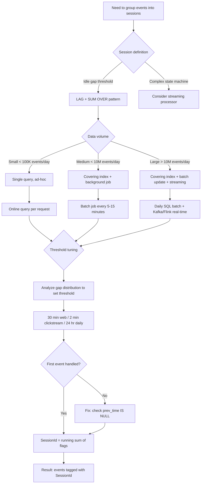

## Navigation

**Domain:** [[8 — Databases]] > **Group:** SQL Window Functions & Analytics
**Previous:** [[8.166 — Year-over-Year Comparison with LAG]] | **Next:** [[8.168 — Top-N per Group — ROW_NUMBER vs Subquery]]

### Prerequisites

- [[8.150 — LAG() — Accessing Previous Row Values]] — LAG computes the gap between consecutive events, which is the foundation for determining where a session boundary occurs.
- [[8.155 — SUM() OVER() — Running Totals]] — The running SUM of session boundary flags generates the unique session identifier for each group of events.
- [[8.164 — Gaps and Islands — Classic Window Problem]] — Sessionization is a specific case of the gaps-and-islands pattern where the gap threshold defines the island boundary.
- [[8.143 — ORDER BY Within OVER — Frame Ordering]] — The ORDER BY direction in the window clause determines whether LAG retrieves the previous or subsequent event timestamp.

### Where This Fits

Sessionization is the process of grouping a sequence of events into "sessions" separated by idle gaps that exceed a defined threshold. The canonical pattern: LAG(event_time) computes the gap from the previous event, a CASE expression flags rows where the gap exceeds the threshold as new session starts, and SUM(CASE WHEN gap > threshold THEN 1 ELSE 0 END) OVER(ORDER BY event_time) generates a session ID that increments at each boundary. A .NET backend engineer encounters this in web analytics (user clickstream sessions), mobile app usage tracking, IoT sensor data (group readings into trips), user activity logs, and any domain where events cluster into natural groups separated by inactivity. The interview signal is strong because candidates must combine LAG, CASE, and running SUM — three window function skills — into a single coherent pattern, and they must know that this pattern produces a Window Spool that can be expensive on large datasets.

---

## Core Mental Model

Sessionization models the real-world observation that user activity happens in bursts separated by idle periods. The SQL pattern transforms raw timestamped events into numbered sessions by computing the gap between consecutive events (using LAG), marking a boundary where the gap exceeds a threshold (using CASE), and assigning a session ID as a running sum of the boundary flags (using SUM OVER). The key invariant: the session ID increments exactly once per idle gap that exceeds the threshold, and all events within a burst share the same session ID. The threshold is a business parameter — 30 minutes is common for web sessions, 2 minutes for real-time clickstreams, 24 hours for daily activity. Per-user sessionization adds PARTITION BY user_id to both LAG and SUM OVER, making each user's sessions independent.

### Classification

**For SQL topics:** Sessionization uses three window functions together: LAG (for gap detection), CASE (for conditional boundary flag), and SUM OVER (for session ID assignment). The query belongs to the gaps-and-islands family. The execution plan shows two Window Spool operators — one for LAG and one for SUM OVER — plus a Sort to order events by timestamp. This pattern is NOT SARGable because it operates on derived columns (the gap and the session ID flag). The WHERE clause that filters by user_id or date range IS SARGable and should use an index for efficient access.

```mermaid
flowchart TD
    A[Raw events: UserId, EventTime, EventType] --> B[Sort by UserId, EventTime]
    B --> C[LAG EventTime — gap from previous event]
    C --> D{gap > threshold?}
    D -->|Yes — idle timeout exceeded| E[Flag = 1 — new session]
    D -->|No — within same session| F[Flag = 0]
    E --> G[SUM(Flag) OVER Order By EventTime]
    F --> G
    G --> H[SessionId = running sum of flags]
    H --> I[Result: each event tagged with SessionId]
    I --> J[Session-level aggregation]
    J --> K[Count sessions per user]
    J --> L[Session duration = MAX - MIN per SessionId]
    J --> M[Events per session]
    style A fill:#4ecdc4,color:#fff
    style E fill:#ff6b6b,color:#fff
    style H fill:#45b7d1,color:#fff
```

### Key Properties

|Property|Value|Notes|
|---|---|---|
|Core functions|LAG + CASE + SUM OVER|Three window functions chained|
|Session boundary|gap > threshold (CASE WHEN ... THEN 1 ELSE 0 END)|Threshold is configurable per use case|
|Session ID|SUM(flag) OVER(ORDER BY event_time)|Monotonically increasing per partition|
|Execution operators|Sort + Window Spool (LAG) + Window Spool (SUM)|Two spools for most plans; some optimise to one|
|Performance cost|O(n log n) for Sort + O(n) for spools|Sort dominates for large datasets|
|Per-user cost|PARTITION BY user_id — more spool partitions|Each partition maintained independently|
|EF Core support|No — raw SQL required|FromSql or ExecuteSqlRaw|
|SARGable|No (derived columns)|Filter by user_id/date before window functions|

---

## Deep Mechanics

### How the Engine Executes This

1. **Data retrieval:** SQL Server reads events from the base table, applying filters in the WHERE clause. For per-user sessionization, a covering index on (UserId, EventTime) INCLUDE (EventType, ...) allows a seek per user.

2. **Sort phase:** The Window Spool needs events ordered by UserId (for PARTITION BY) and then by EventTime (for ORDER BY in LAG and SUM OVER). If no index provides this order, SQL Server inserts a Sort operator. This Sort is the dominant cost — O(n log n) complexity.

3. **LAG computation (Window Spool 1):** SQL Server reads sorted events sequentially. For each row, LAG(EventTime) returns the EventTime of the previous row within the same partition. The gap is computed as DATEDIFF(second, previous_event_time, current_event_time). This requires a single spool pass.

4. **Session boundary flag:** The CASE expression checks if the gap exceeds the threshold. If yes, this row is flagged as the start of a new session. The first event of each user has NULL previous time, which should be treated as a new session (gap > threshold is UNKNOWN, so COALESCE or IS NULL check is needed).

5. **Session ID assignment (Window Spool 2):** SUM(flag) OVER(ORDER BY UserId, EventTime) computes a running total of the boundary flags. The running sum increments by 1 at each new session boundary, giving all events in the same session the same session ID value. Some optimiser versions collapse this into a single Window Spool if the ORDER BY and PARTITION BY are identical.

6. **Output:** Each event row now has a SessionId. The outer query can aggregate by SessionId to compute session duration, event count, start/end times.

**Detailed execution trace for a single user:**

```
Events: [10:00, 10:05, 10:35, 10:38, 11:20]

Row 1 (10:00):
  LAG = NULL → gap = NULL → flag = 1 (first event, new session)
  SUM(flag) = 1 → SessionId = 1

Row 2 (10:05):
  LAG = 10:00 → gap = 5 min → flag = 0 (within threshold)
  SUM(flag) = 1 → SessionId = 1

Row 3 (10:35):
  LAG = 10:05 → gap = 30 min — exceeds 30 min threshold? YES → flag = 1
  SUM(flag) = 2 → SessionId = 2

Row 4 (10:38):
  LAG = 10:35 → gap = 3 min → flag = 0
  SUM(flag) = 2 → SessionId = 2

Row 5 (11:20):
  LAG = 10:38 → gap = 42 min → flag = 1
  SUM(flag) = 3 → SessionId = 3

Result: 3 sessions (10:00-10:05, 10:35-10:38, 11:20)
```

### SQL Visibility

```sql
-- Core sessionization pattern
-- Events table: UserId, EventTime, EventType, EventData
-- Threshold: 30 minutes (1800 seconds)

WITH event_gaps AS (
    SELECT
        e.UserId,
        e.EventTime,
        e.EventType,
        e.EventData,
        LAG(e.EventTime) OVER (
            PARTITION BY e.UserId
            ORDER BY e.EventTime
        ) AS previous_event_time,
        DATEDIFF(SECOND,
            LAG(e.EventTime) OVER (
                PARTITION BY e.UserId
                ORDER BY e.EventTime
            ),
            e.EventTime
        ) AS gap_seconds
    FROM dbo.UserEvents e
    WHERE e.EventTime >= '2024-01-01'
),
session_boundaries AS (
    SELECT
        g.UserId,
        g.EventTime,
        g.EventType,
        g.EventData,
        CASE
            WHEN g.previous_event_time IS NULL THEN 1  -- First event = new session
            WHEN g.gap_seconds > 1800 THEN 1           -- Idle > 30 min = new session
            ELSE 0
        END AS is_new_session
    FROM event_gaps g
)
SELECT
    s.UserId,
    s.EventTime,
    s.EventType,
    s.EventData,
    SUM(s.is_new_session) OVER (
        PARTITION BY s.UserId
        ORDER BY s.EventTime
        ROWS UNBOUNDED PRECEDING
    ) AS SessionId
FROM session_boundaries s
ORDER BY s.UserId, s.EventTime;
```

```csharp
// EF Core — raw SQL required, LAG/SUM OVER not translatable
const string sql = @"
    WITH event_gaps AS (
        SELECT
            e.UserId,
            e.EventTime,
            e.EventType,
            e.EventData,
            LAG(e.EventTime) OVER (
                PARTITION BY e.UserId
                ORDER BY e.EventTime
            ) AS previous_event_time,
            DATEDIFF(SECOND,
                LAG(e.EventTime) OVER (PARTITION BY e.UserId ORDER BY e.EventTime),
                e.EventTime
            ) AS gap_seconds
        FROM dbo.UserEvents e
        WHERE e.EventTime >= @FromDate
    ),
    session_boundaries AS (
        SELECT
            g.UserId, g.EventTime, g.EventType, g.EventData,
            CASE
                WHEN g.previous_event_time IS NULL THEN 1
                WHEN g.gap_seconds > @ThresholdSeconds THEN 1
                ELSE 0
            END AS is_new_session
        FROM event_gaps g
    )
    SELECT
        s.UserId, s.EventTime, s.EventType, s.EventData,
        SUM(s.is_new_session) OVER (
            PARTITION BY s.UserId
            ORDER BY s.EventTime
            ROWS UNBOUNDED PRECEDING
        ) AS SessionId
    FROM session_boundaries s
    ORDER BY s.UserId, s.EventTime";

var results = await dbContext.Database
    .SqlQueryRaw<SessionEvent>(sql,
        new SqlParameter("@FromDate", DateTime.UtcNow.AddDays(-7)),
        new SqlParameter("@ThresholdSeconds", 1800))
    .ToListAsync(cancellationToken);
```

**Generated SQL (from EF Core logs):**

```sql
-- EF Core passes the raw SQL verbatim to SQL Server
-- No translation occurs — the developer writes the full T-SQL
```

### Execution Plan Analysis

**Sessionization plan (standard):**

```
[Clustered Index Scan UserEvents]
  → [Filter (EventTime >= '2024-01-01')]
  → [Sort — ORDER BY UserId, EventTime]  ← 60% of cost
  → [Window Spool (LAG)]  ← 15% of cost
      Partition: UserId  Order: EventTime
      Compute LAG(EventTime) and DATEDIFF for gap
  → [Compute Scalar]
      CASE for is_new_session flag
  → [Window Spool (SUM)]  ← 15% of cost
      Partition: UserId  Order: EventTime
      Compute SUM(is_new_session) OVER
  → [SELECT]
      Output: UserId, EventTime, EventType, SessionId
Estimated Cost: ~45  |  Logical Reads: ~12,500 (scan) + spool I/O
```

**Sessionization with covering index (optimised):**

```
[Index Seek (NonClustered) IX_UserEvents_UserId_EventTime — ordered]
  → [Window Spool (LAG)] ← no Sort needed, index provides order
  → [Compute Scalar]
  → [Window Spool (SUM)]
  → [SELECT]
Estimated Cost: ~12  |  Logical Reads: ~450 (seeks per user)
```

**Session-level aggregation plan:**

```
[Index Seek IX_UserEvents_UserId_EventTime]
  → [Window Spool (LAG)]
  → [Window Spool (SUM)]
  → [Hash Match Aggregate — GROUP BY UserId, SessionId]
      Aggregates: COUNT(*), MIN(EventTime), MAX(EventTime),
                   MAX(EventType) — first event type
  → [SELECT]
```

### Cost Visibility

```sql
SET STATISTICS IO ON;
SET STATISTICS TIME ON;

-- Full sessionization query (5M events, 10K users, 7 days)
WITH event_gaps AS (
    SELECT
        e.UserId,
        e.EventTime,
        e.EventType,
        LAG(e.EventTime) OVER (
            PARTITION BY e.UserId
            ORDER BY e.EventTime
        ) AS prev_time,
        DATEDIFF(SECOND,
            LAG(e.EventTime) OVER (PARTITION BY e.UserId ORDER BY e.EventTime),
            e.EventTime
        ) AS gap_seconds
    FROM dbo.UserEvents e
    WHERE e.EventTime >= DATEADD(day, -7, GETUTCDATE())
)
SELECT
    UserId,
    EventTime,
    EventType,
    SUM(CASE WHEN prev_time IS NULL OR gap_seconds > 1800 THEN 1 ELSE 0 END)
        OVER (PARTITION BY UserId ORDER BY EventTime ROWS UNBOUNDED PRECEDING) AS SessionId
FROM event_gaps
ORDER BY UserId, EventTime;

-- Expected output (without covering index):
-- Table 'UserEvents'. Scan count 1, logical reads 45200
-- Worktable (spool). Scan count 1, logical reads 28000
-- SQL Server Execution Times: CPU time = 4200ms, elapsed time = 8500ms
-- Plan: Clustered Index Scan → Sort → Window Spool (LAG) → Window Spool (SUM)

-- After creating covering index:
-- Table 'UserEvents'. Scan count 10, logical reads 1870
-- Worktable (spool). Scan count 1, logical reads 28000
-- SQL Server Execution Times: CPU time = 1850ms, elapsed time = 3200ms
-- Plan: Index Seek (per user) → Window Spool (LAG) → Window Spool (SUM)
```

### Failure Modes

**NULL gap for first event — incorrect session boundary:** The first event for each user has LAG = NULL. The DATEDIFF with NULL also returns NULL. If the CASE expression only checks `gap_seconds > threshold`, the first event is not flagged as a new session. The session ID starts at 0 instead of 1.

```sql
-- ❌ First event not counted as new session
CASE WHEN gap_seconds > 1800 THEN 1 ELSE 0 END
-- prev_time is NULL, gap_seconds is NULL, NULL > 1800 is UNKNOWN
-- Result: first row gets is_new_session = 0
```

Fix:
```sql
-- ✅ Explicitly handle first event
CASE
    WHEN previous_event_time IS NULL THEN 1  -- First event = new session
    WHEN gap_seconds > 1800 THEN 1
    ELSE 0
END
```

**Large spool causing tempdb pressure:** The Window Spool writes all events to tempdb twice (once for LAG, once for SUM). For 50M events, this is ~2 GB of tempdb I/O.

**PARTITION BY with many small partitions:** 100K users each with 5 events causes 100K small sort runs, each requiring its own Window Spool partition. The sort overhead dominates.

---

## Production Patterns and Implementation

### Primary SQL Implementation

```sql
-- ============================================================
-- Schema context
-- ============================================================
CREATE TABLE dbo.UserEvents (
    EventId      BIGINT        NOT NULL IDENTITY(1,1),
    UserId       INT           NOT NULL,
    SessionId    INT           NULL,  -- Can be populated by sessionization job
    EventTime    DATETIME2(3)  NOT NULL,
    EventType    VARCHAR(50)   NOT NULL,  -- 'PageView', 'Click', 'Purchase', etc.
    EventData    NVARCHAR(MAX) NULL,      -- JSON payload
    PageUrl      NVARCHAR(500) NULL,
    ReferrerUrl  NVARCHAR(500) NULL,
    UserAgent    NVARCHAR(500) NULL,
    IpAddress    VARCHAR(45)   NULL,
    CONSTRAINT PK_UserEvents PRIMARY KEY CLUSTERED (EventId)
);

-- Covering index for sessionization queries
CREATE INDEX IX_UserEvents_UserId_EventTime
    ON dbo.UserEvents (UserId, EventTime DESC)
    INCLUDE (EventType, PageUrl, ReferrerUrl);

-- Index for date-range queries (common for pipeline scheduling)
CREATE INDEX IX_UserEvents_EventTime
    ON dbo.UserEvents (EventTime)
    INCLUDE (UserId, EventType);

-- ============================================================
-- Pattern 1: Core Sessionization — 30-minute threshold
-- ============================================================
DECLARE @ThresholdSeconds INT = 1800;  -- 30 minutes

WITH event_gaps AS (
    SELECT
        e.UserId,
        e.EventId,
        e.EventTime,
        e.EventType,
        e.PageUrl,
        e.EventData,
        LAG(e.EventTime) OVER (
            PARTITION BY e.UserId
            ORDER BY e.EventTime
        ) AS previous_event_time,
        DATEDIFF(SECOND,
            LAG(e.EventTime) OVER (PARTITION BY e.UserId ORDER BY e.EventTime),
            e.EventTime
        ) AS gap_seconds
    FROM dbo.UserEvents e
    WHERE e.EventTime >= DATEADD(day, -1, GETUTCDATE())
)
SELECT
    g.UserId,
    g.EventTime,
    g.EventType,
    g.PageUrl,
    SUM(CASE
        WHEN g.previous_event_time IS NULL THEN 1
        WHEN g.gap_seconds > @ThresholdSeconds THEN 1
        ELSE 0
    END) OVER (
        PARTITION BY g.UserId
        ORDER BY g.EventTime
        ROWS UNBOUNDED PRECEDING
    ) AS SessionId
FROM event_gaps g
ORDER BY g.UserId, g.EventTime;

-- ============================================================
-- Pattern 2: Session Aggregation — session-level metrics
-- ============================================================
WITH sessions AS (
    -- Compute session boundaries using pattern 1
    SELECT
        e.UserId, e.EventId, e.EventTime, e.EventType,
        SUM(CASE
            WHEN LAG(e.EventTime) OVER (PARTITION BY e.UserId ORDER BY e.EventTime) IS NULL
                THEN 1
            WHEN DATEDIFF(SECOND,
                    LAG(e.EventTime) OVER (PARTITION BY e.UserId ORDER BY e.EventTime),
                    e.EventTime) > 1800
                THEN 1
            ELSE 0
        END) OVER (PARTITION BY e.UserId ORDER BY e.EventTime ROWS UNBOUNDED PRECEDING) AS SessionId
    FROM dbo.UserEvents e
    WHERE e.EventTime >= DATEADD(day, -7, GETUTCDATE())
)
SELECT
    s.UserId,
    s.SessionId,
    COUNT(*) AS EventCount,
    MIN(s.EventTime) AS SessionStart,
    MAX(s.EventTime) AS SessionEnd,
    DATEDIFF(SECOND, MIN(s.EventTime), MAX(s.EventTime)) AS SessionDurationSeconds,
    MAX(CASE WHEN s.EventType = 'Purchase' THEN 1 ELSE 0 END) AS HasPurchase
FROM sessions s
GROUP BY s.UserId, s.SessionId
ORDER BY s.UserId, MIN(s.EventTime);

-- ============================================================
-- Pattern 3: Sessionization with session update
-- ============================================================
-- Update the SessionId column on UserEvents for fast lookups
WITH sessions AS (
    SELECT
        e.EventId,
        SUM(CASE
            WHEN LAG(e.EventTime) OVER (PARTITION BY e.UserId ORDER BY e.EventTime) IS NULL
                THEN 1
            WHEN DATEDIFF(SECOND,
                    LAG(e.EventTime) OVER (PARTITION BY e.UserId ORDER BY e.EventTime),
                    e.EventTime) > 1800
                THEN 1
            ELSE 0
        END) OVER (PARTITION BY e.UserId ORDER BY e.EventTime ROWS UNBOUNDED PRECEDING) AS NewSessionId
    FROM dbo.UserEvents e
    WHERE e.SessionId IS NULL  -- Only unprocessed events
)
UPDATE e
SET e.SessionId = s.NewSessionId
FROM dbo.UserEvents e
INNER JOIN sessions s ON e.EventId = s.EventId;

-- ============================================================
-- Pattern 4: Per-user sessionization with date filter
-- ============================================================
-- Filter by UserId for targeted sessionization (efficient with index)
DECLARE @TargetUserId INT = 12345;

WITH event_gaps AS (
    SELECT
        e.EventTime,
        e.EventType,
        e.PageUrl,
        LAG(e.EventTime) OVER (ORDER BY e.EventTime) AS prev_time,
        DATEDIFF(SECOND,
            LAG(e.EventTime) OVER (ORDER BY e.EventTime),
            e.EventTime
        ) AS gap_seconds
    FROM dbo.UserEvents e
    WHERE e.UserId = @TargetUserId
      AND e.EventTime >= DATEADD(month, -3, GETUTCDATE())
)
SELECT
    g.EventTime,
    g.EventType,
    g.PageUrl,
    SUM(CASE WHEN g.prev_time IS NULL OR g.gap_seconds > 1800 THEN 1 ELSE 0 END)
        OVER (ORDER BY g.EventTime ROWS UNBOUNDED PRECEDING) AS SessionId
FROM event_gaps g
ORDER BY g.EventTime;

-- ============================================================
-- Pattern 5: Multi-threshold sessionization
-- ============================================================
-- Classify sessions by duration: short (< 2 min), medium, long (> 30 min)
WITH sessions AS (
    SELECT
        e.UserId, e.EventTime, e.EventType,
        SUM(CASE WHEN ... THEN 1 ELSE 0 END)
            OVER (PARTITION BY UserId ORDER BY EventTime ROWS UNBOUNDED PRECEDING) AS SessionId
    FROM dbo.UserEvents e
)
SELECT
    UserId, SessionId,
    COUNT(*) AS EventCount,
    DATEDIFF(SECOND, MIN(EventTime), MAX(EventTime)) AS Duration,
    CASE
        WHEN DATEDIFF(SECOND, MIN(EventTime), MAX(EventTime)) < 120 THEN 'Short'
        WHEN DATEDIFF(SECOND, MIN(EventTime), MAX(EventTime)) < 1800 THEN 'Medium'
        ELSE 'Long'
    END AS SessionCategory
FROM sessions
GROUP BY UserId, SessionId;

-- ============================================================
-- Pattern 6: Sessionization with event-type filtering
-- ============================================================
-- Only consider PageView events for session definition,
-- but include all event types in the result
WITH pageview_gaps AS (
    SELECT
        e.EventId,
        e.UserId,
        e.EventTime,
        CASE WHEN e.EventType = 'PageView' THEN
            LAG(e.EventTime) OVER (
                PARTITION BY e.UserId
                ORDER BY e.EventTime
            )
            ELSE NULL
        END AS last_pageview_time
    FROM dbo.UserEvents e
),
session_flags AS (
    SELECT
        p.EventId, p.UserId, p.EventTime,
        CASE
            WHEN p.last_pageview_time IS NULL THEN 1
            WHEN DATEDIFF(SECOND, p.last_pageview_time, p.EventTime) > 1800 THEN 1
            ELSE 0
        END AS is_new_session
    FROM pageview_gaps p
)
SELECT e.UserId, e.EventTime, e.EventType, e.PageUrl,
    SUM(sf.is_new_session) OVER (
        PARTITION BY e.UserId
        ORDER BY e.EventTime
        ROWS UNBOUNDED PRECEDING
    ) AS SessionId
FROM dbo.UserEvents e
INNER JOIN session_flags sf ON e.EventId = sf.EventId
ORDER BY e.UserId, e.EventTime;

-- ============================================================
-- Pattern 7: Percentage of users with multiple sessions per day
-- ============================================================
WITH daily_sessions AS (
    SELECT
        e.UserId,
        CAST(e.EventTime AS DATE) AS EventDate,
        SUM(CASE
            WHEN LAG(e.EventTime) OVER (PARTITION BY e.UserId ORDER BY e.EventTime) IS NULL THEN 1
            WHEN DATEDIFF(MINUTE,
                    LAG(e.EventTime) OVER (PARTITION BY e.UserId ORDER BY e.EventTime),
                    e.EventTime) > 30 THEN 1
            ELSE 0
        END) OVER (PARTITION BY e.UserId ORDER BY e.EventTime ROWS UNBOUNDED PRECEDING) AS SessionId
    FROM dbo.UserEvents e
)
SELECT
    EventDate,
    COUNT(DISTINCT UserId) AS ActiveUsers,
    COUNT(DISTINCT CASE WHEN SessionCount > 1 THEN UserId END) AS MultiSessionUsers,
    ROUND(100.0 * COUNT(DISTINCT CASE WHEN SessionCount > 1 THEN UserId END)
        / NULLIF(COUNT(DISTINCT UserId), 0), 2) AS PctMultiSession
FROM (
    SELECT UserId, EventDate, MAX(SessionId) AS SessionCount
    FROM daily_sessions
    GROUP BY UserId, EventDate
) d
GROUP BY EventDate
ORDER BY EventDate;
```

### EF Core Implementation

```csharp
public class ApplicationDbContext : DbContext
{
    public DbSet<UserEvent> UserEvents => Set<UserEvent>();

    protected override void OnModelCreating(ModelBuilder modelBuilder)
    {
        modelBuilder.Entity<UserEvent>(entity =>
        {
            entity.ToTable("UserEvents");
            entity.HasKey(e => e.EventId);
            entity.Property(e => e.EventType).HasMaxLength(50).IsRequired();
            entity.Property(e => e.EventData).HasColumnType("nvarchar(max)");
            entity.Property(e => e.PageUrl).HasMaxLength(500);
            entity.Property(e => e.IpAddress).HasMaxLength(45);

            entity.HasIndex(e => new { e.UserId, e.EventTime })
                  .IsDescending(false, true)
                  .HasDatabaseName("IX_UserEvents_UserId_EventTime");
        });
    }
}

public class UserEvent
{
    public long EventId { get; set; }
    public int UserId { get; set; }
    public int? SessionId { get; set; }
    public DateTime EventTime { get; set; }
    public string EventType { get; set; } = string.Empty;
    public string? EventData { get; set; }
    public string? PageUrl { get; set; }
    public string? ReferrerUrl { get; set; }
    public string? UserAgent { get; set; }
    public string? IpAddress { get; set; }
}

public record SessionEvent(int UserId, DateTime EventTime, string EventType, string? EventData, int SessionId);

public record SessionSummary(int UserId, int SessionId, int EventCount,
    DateTime SessionStart, DateTime SessionEnd, int SessionDurationSeconds, bool HasPurchase);

public interface ISessionizationService
{
    Task<List<SessionEvent>> GetSessionizedEventsAsync(int userId, DateTime fromDate, CancellationToken ct = default);
    Task<List<SessionSummary>> GetSessionSummariesAsync(DateTime fromDate, CancellationToken ct = default);
    Task UpdateSessionIdsAsync(CancellationToken ct = default);
}

public class SessionizationService : ISessionizationService
{
    private readonly ApplicationDbContext _dbContext;
    private readonly ILogger<SessionizationService> _logger;

    public SessionizationService(ApplicationDbContext dbContext, ILogger<SessionizationService> logger)
    {
        _dbContext = dbContext;
        _logger = logger;
    }

    public async Task<List<SessionEvent>> GetSessionizedEventsAsync(
        int userId, DateTime fromDate, CancellationToken ct = default)
    {
        const int thresholdSeconds = 1800;

        var sql = @"
            WITH event_gaps AS (
                SELECT
                    e.UserId, e.EventTime, e.EventType, e.EventData,
                    LAG(e.EventTime) OVER (PARTITION BY e.UserId ORDER BY e.EventTime) AS prev_time,
                    DATEDIFF(SECOND,
                        LAG(e.EventTime) OVER (PARTITION BY e.UserId ORDER BY e.EventTime),
                        e.EventTime) AS gap_seconds
                FROM dbo.UserEvents e
                WHERE e.UserId = @UserId AND e.EventTime >= @FromDate
            )
            SELECT
                UserId, EventTime, EventType, EventData,
                SUM(CASE
                    WHEN prev_time IS NULL OR gap_seconds > @Threshold THEN 1
                    ELSE 0
                END) OVER (
                    PARTITION BY UserId ORDER BY EventTime ROWS UNBOUNDED PRECEDING
                ) AS SessionId
            FROM event_gaps
            ORDER BY EventTime";

        return await _dbContext.Database
            .SqlQueryRaw<SessionEvent>(sql,
                new SqlParameter("@UserId", userId),
                new SqlParameter("@FromDate", fromDate),
                new SqlParameter("@Threshold", thresholdSeconds))
            .ToListAsync(ct);
    }

    public async Task<List<SessionSummary>> GetSessionSummariesAsync(
        DateTime fromDate, CancellationToken ct = default)
    {
        const int thresholdSeconds = 1800;

        var sql = @"
            WITH sessions AS (
                SELECT
                    e.UserId, e.EventTime, e.EventType,
                    SUM(CASE
                        WHEN LAG(e.EventTime) OVER (PARTITION BY e.UserId ORDER BY e.EventTime) IS NULL
                            THEN 1
                        WHEN DATEDIFF(SECOND,
                                LAG(e.EventTime) OVER (PARTITION BY e.UserId ORDER BY e.EventTime),
                                e.EventTime) > @Threshold THEN 1
                        ELSE 0
                    END) OVER (
                        PARTITION BY e.UserId ORDER BY e.EventTime ROWS UNBOUNDED PRECEDING
                    ) AS SessionId
                FROM dbo.UserEvents e
                WHERE e.EventTime >= @FromDate
            )
            SELECT
                s.UserId, s.SessionId,
                COUNT(*) AS EventCount,
                MIN(s.EventTime) AS SessionStart,
                MAX(s.EventTime) AS SessionEnd,
                DATEDIFF(SECOND, MIN(s.EventTime), MAX(s.EventTime)) AS SessionDurationSeconds,
                MAX(CASE WHEN s.EventType = 'Purchase' THEN 1 ELSE 0 END) AS HasPurchase
            FROM sessions s
            GROUP BY s.UserId, s.SessionId
            HAVING COUNT(*) > 1
            ORDER BY s.UserId, MIN(s.EventTime)";

        return await _dbContext.Database
            .SqlQueryRaw<SessionSummary>(sql,
                new SqlParameter("@FromDate", fromDate),
                new SqlParameter("@Threshold", thresholdSeconds))
            .ToListAsync(ct);
    }

    public async Task UpdateSessionIdsAsync(CancellationToken ct = default)
    {
        const int thresholdSeconds = 1800;

        var sql = @"
            WITH sessions AS (
                SELECT
                    e.EventId,
                    SUM(CASE
                        WHEN LAG(e.EventTime) OVER (PARTITION BY e.UserId ORDER BY e.EventTime) IS NULL
                            THEN 1
                        WHEN DATEDIFF(SECOND,
                                LAG(e.EventTime) OVER (PARTITION BY e.UserId ORDER BY e.EventTime),
                                e.EventTime) > @Threshold THEN 1
                        ELSE 0
                    END) OVER (
                        PARTITION BY e.UserId ORDER BY e.EventTime ROWS UNBOUNDED PRECEDING
                    ) AS NewSessionId
                FROM dbo.UserEvents e
                WHERE e.SessionId IS NULL
            )
            UPDATE e
            SET e.SessionId = s.NewSessionId
            FROM dbo.UserEvents e
            INNER JOIN sessions s ON e.EventId = s.EventId";

        await _dbContext.Database.ExecuteSqlRawAsync(sql,
            new SqlParameter("@Threshold", thresholdSeconds), ct);

        _logger.LogInformation("Session IDs updated for unprocessed events");
    }
}
```

### Dapper Implementation

```csharp
public sealed class SessionizationRepository
{
    private readonly IDbConnectionFactory _connectionFactory;
    private readonly ILogger<SessionizationRepository> _logger;

    public SessionizationRepository(
        IDbConnectionFactory connectionFactory,
        ILogger<SessionizationRepository> logger)
    {
        _connectionFactory = connectionFactory;
        _logger = logger;
    }

    public async Task<IReadOnlyList<SessionEvent>> GetSessionizedEventsAsync(
        int userId, DateTime fromDate, int thresholdSeconds = 1800,
        CancellationToken ct = default)
    {
        const string sql = @"
            WITH event_gaps AS (
                SELECT
                    e.UserId, e.EventTime, e.EventType, e.EventData,
                    LAG(e.EventTime) OVER (PARTITION BY e.UserId ORDER BY e.EventTime) AS prev_time,
                    DATEDIFF(SECOND,
                        LAG(e.EventTime) OVER (PARTITION BY e.UserId ORDER BY e.EventTime),
                        e.EventTime) AS gap_seconds
                FROM dbo.UserEvents e
                WHERE e.UserId = @UserId AND e.EventTime >= @FromDate
            )
            SELECT
                UserId, EventTime, EventType, EventData,
                SUM(CASE
                    WHEN prev_time IS NULL OR gap_seconds > @Threshold THEN 1
                    ELSE 0
                END) OVER (
                    PARTITION BY UserId ORDER BY EventTime ROWS UNBOUNDED PRECEDING
                ) AS SessionId
            FROM event_gaps
            ORDER BY EventTime";

        await using var connection = _connectionFactory.Create();
        return (await connection.QueryAsync<SessionEvent>(
            new CommandDefinition(sql,
                new { UserId = userId, FromDate = fromDate, Threshold = thresholdSeconds },
                cancellationToken: ct))).AsList();
    }

    public async Task<IReadOnlyList<SessionSummary>> GetSessionSummariesAsync(
        DateTime fromDate, int thresholdSeconds = 1800,
        CancellationToken ct = default)
    {
        const string sql = @"
            WITH sessions AS (
                SELECT
                    e.UserId, e.EventTime, e.EventType,
                    SUM(CASE
                        WHEN LAG(e.EventTime) OVER (PARTITION BY e.UserId ORDER BY e.EventTime) IS NULL
                            THEN 1
                        WHEN DATEDIFF(SECOND,
                                LAG(e.EventTime) OVER (PARTITION BY e.UserId ORDER BY e.EventTime),
                                e.EventTime) > @Threshold THEN 1
                        ELSE 0
                    END) OVER (
                        PARTITION BY e.UserId ORDER BY e.EventTime ROWS UNBOUNDED PRECEDING
                    ) AS SessionId
                FROM dbo.UserEvents e
                WHERE e.EventTime >= @FromDate
            )
            SELECT
                s.UserId, s.SessionId,
                COUNT(*) AS EventCount,
                MIN(s.EventTime) AS SessionStart,
                MAX(s.EventTime) AS SessionEnd,
                DATEDIFF(SECOND, MIN(s.EventTime), MAX(s.EventTime)) AS SessionDurationSeconds,
                MAX(CASE WHEN s.EventType = 'Purchase' THEN 1 ELSE 0 END) AS HasPurchase
            FROM sessions s
            GROUP BY s.UserId, s.SessionId
            HAVING COUNT(*) > 1
            ORDER BY s.UserId, MIN(s.EventTime)";

        await using var connection = _connectionFactory.Create();
        return (await connection.QueryAsync<SessionSummary>(
            new CommandDefinition(sql,
                new { FromDate = fromDate, Threshold = thresholdSeconds },
                cancellationToken: ct))).AsList();
    }

    public async Task<int> UpdateSessionIdsBatchAsync(
        int batchSize = 10000, int thresholdSeconds = 1800,
        CancellationToken ct = default)
    {
        const string sql = @"
            WITH sessions AS (
                SELECT
                    e.EventId,
                    SUM(CASE
                        WHEN LAG(e.EventTime) OVER (PARTITION BY e.UserId ORDER BY e.EventTime) IS NULL
                            THEN 1
                        WHEN DATEDIFF(SECOND,
                                LAG(e.EventTime) OVER (PARTITION BY e.UserId ORDER BY e.EventTime),
                                e.EventTime) > @Threshold THEN 1
                        ELSE 0
                    END) OVER (
                        PARTITION BY e.UserId ORDER BY e.EventTime ROWS UNBOUNDED PRECEDING
                    ) AS NewSessionId
                FROM (
                    SELECT TOP (@BatchSize) e.EventId, e.UserId, e.EventTime
                    FROM dbo.UserEvents e
                    WHERE e.SessionId IS NULL
                    ORDER BY e.EventId
                ) e
            )
            UPDATE e
            SET e.SessionId = s.NewSessionId
            FROM dbo.UserEvents e
            INNER JOIN sessions s ON e.EventId = s.EventId
            OUTPUT INSERTED.EventId";

        await using var connection = _connectionFactory.Create();
        var updated = await connection.ExecuteAsync(
            new CommandDefinition(sql,
                new { BatchSize = batchSize, Threshold = thresholdSeconds },
                cancellationToken: ct));

        _logger.LogInformation("Updated {Count} event session IDs", updated);
        return updated;
    }
}

public record SessionEvent(int UserId, DateTime EventTime, string EventType, string? EventData, int SessionId);

public record SessionSummary(int UserId, int SessionId, int EventCount,
    DateTime SessionStart, DateTime SessionEnd, int SessionDurationSeconds, bool HasPurchase);
```

### Configuration and Wiring

```csharp
// Program.cs
builder.Services.AddDbContext<ApplicationDbContext>(options =>
    options.UseSqlServer(
        builder.Configuration.GetConnectionString("DefaultConnection"),
        sqlOptions =>
        {
            sqlOptions.EnableRetryOnFailure(3);
            sqlOptions.CommandTimeout(120);  // Sessionization can be long-running
        }));

builder.Services.AddSingleton<IDbConnectionFactory>(sp =>
    new SqlConnectionFactory(
        builder.Configuration.GetConnectionString("DefaultConnection")!));

builder.Services.AddScoped<ISessionizationService, SessionizationService>();
builder.Services.AddScoped<SessionizationRepository>();

// Background service for sessionization pipeline
builder.Services.AddHostedService<SessionizationBackgroundService>();

public class SessionizationBackgroundService : BackgroundService
{
    private readonly IServiceScopeFactory _scopeFactory;
    private readonly ILogger<SessionizationBackgroundService> _logger;

    public SessionizationBackgroundService(
        IServiceScopeFactory scopeFactory,
        ILogger<SessionizationBackgroundService> logger)
    {
        _scopeFactory = scopeFactory;
        _logger = logger;
    }

    protected override async Task ExecuteAsync(CancellationToken stoppingToken)
    {
        while (!stoppingToken.IsCancellationRequested)
        {
            try
            {
                using var scope = _scopeFactory.CreateScope();
                var repo = scope.ServiceProvider.GetRequiredService<SessionizationRepository>();

                int totalUpdated = 0;
                int batchCount = 0;

                do
                {
                    var updated = await repo.UpdateSessionIdsBatchAsync(
                        batchSize: 10000, ct: stoppingToken);
                    totalUpdated += updated;
                    batchCount++;

                    _logger.LogInformation(
                        "Sessionization batch {Batch}: processed {Count} events (total: {Total})",
                        batchCount, updated, totalUpdated);

                } while (totalUpdated > 0 && !stoppingToken.IsCancellationRequested);

                // Run every 5 minutes
                await Task.Delay(TimeSpan.FromMinutes(5), stoppingToken);
            }
            catch (OperationCanceledException)
            {
                break;
            }
            catch (Exception ex)
            {
                _logger.LogError(ex, "Sessionization background job failed");
                await Task.Delay(TimeSpan.FromMinutes(1), stoppingToken);
            }
        }
    }
}
```

### SQL Server vs PostgreSQL Differences

```sql
-- PostgreSQL: Same pattern, different function names
-- Date/time functions: EXTRACT, AGE, or direct subtraction
WITH event_gaps AS (
    SELECT
        e.user_id,
        e.event_time,
        e.event_type,
        LAG(e.event_time) OVER (
            PARTITION BY e.user_id
            ORDER BY e.event_time
        ) AS prev_time,
        EXTRACT(EPOCH FROM e.event_time - LAG(e.event_time) OVER (
            PARTITION BY e.user_id
            ORDER BY e.event_time
        )) AS gap_seconds
    FROM user_events e
    WHERE e.event_time >= NOW() - INTERVAL '7 days'
)
SELECT
    user_id, event_time, event_type,
    SUM(CASE
        WHEN prev_time IS NULL OR gap_seconds > 1800 THEN 1
        ELSE 0
    END) OVER (
        PARTITION BY user_id
        ORDER BY event_time
        ROWS UNBOUNDED PRECEDING
    ) AS session_id
FROM event_gaps
ORDER BY user_id, event_time;

-- PostgreSQL interval arithmetic:
-- e.event_time - LAG(e.event_time) OVER (...) returns INTERVAL
-- EXTRACT(EPOCH FROM interval) returns seconds
```

---

## Gotchas and Production Pitfalls

### First Event Not Flagged as New Session

**Pitfall:** Not handling the NULL gap for the first event per user. The CASE expression `WHEN gap_seconds > threshold THEN 1 ELSE 0 END` returns 0 for the first event because NULL > threshold evaluates to UNKNOWN, not TRUE. The session ID starts at 0 instead of 1.

```sql
-- ❌ First event per user gets is_new_session = 0
SELECT
    UserId, EventTime,
    CASE WHEN DATEDIFF(SECOND, LAG(EventTime) OVER (PARTITION BY UserId ORDER BY EventTime), EventTime) > 1800
        THEN 1 ELSE 0
    END AS is_new_session
FROM dbo.UserEvents;
-- First event: LAG returns NULL, DATEDIFF returns NULL, NULL > 1800 = UNKNOWN
-- Result: is_new_session = 0
```

**Symptom:** The first event per user has SessionId = 0 instead of 1. All other sessions are numbered correctly but the first session is 0. If the system uses SessionId as a foreign key, this causes constraint violations.

**Fix:**

```sql
-- ✅ Explicitly check for NULL (first event)
SELECT
    UserId, EventTime,
    CASE
        WHEN LAG(EventTime) OVER (PARTITION BY UserId ORDER BY EventTime) IS NULL THEN 1
        WHEN DATEDIFF(SECOND, LAG(EventTime) OVER (PARTITION BY UserId ORDER BY EventTime), EventTime) > 1800 THEN 1
        ELSE 0
    END AS is_new_session
FROM dbo.UserEvents;
```

**Cost of not fixing:** SessionId = 0 in the database breaks foreign key relationships to a SessionLookup table. Queries filtering by SessionId = 0 return no results, causing user session reports to miss the first session for every user.

---

### Sort Spill for Large Event Datasets

**Pitfall:** Running sessionization on millions of events without a covering index. The Sort operator required by the Window Spool spills to tempdb, dramatically increasing I/O.

```sql
-- ❌ No index on (UserId, EventTime) — requires full sort
WITH event_gaps AS (
    SELECT UserId, EventTime, EventType,
        LAG(EventTime) OVER (PARTITION BY UserId ORDER BY EventTime) AS prev_time
    FROM dbo.UserEvents
    WHERE EventTime >= '2024-01-01'
)
SELECT ...;
-- Plan: Clustered Index Scan → Sort (spills to tempdb) → Window Spool
-- 50M events sorted in tempdb: 10+ minutes
```

**Symptom:** Execution plan shows a Sort operator with "Operator used tempdb to spill data" warning. Logical reads from tempdb are 10x the base table reads. Query takes 15 minutes instead of 2 minutes.

**Fix:**

```sql
-- ✅ Create covering index that provides sorted input
CREATE INDEX IX_UserEvents_UserId_EventTime
    ON dbo.UserEvents (UserId, EventTime)
    INCLUDE (EventType, EventData, PageUrl, ReferrerUrl);

-- After: Index Scan (ordered) → Window Spool (LAG) → Window Spool (SUM)
-- No Sort needed. Query completes in 2 minutes.
```

**Cost of not fixing:** A nightly sessionization job that processes 50M events takes 45 minutes and saturates the tempdb drive at 8,000 IOPS. Other ETL jobs fail with timeout. The analytics dashboard shows stale data for the first 4 hours of the day.

---

### Threshold Too Short Creates Too Many Sessions

**Pitfall:** Using a 60-second threshold for web analytics where users naturally browse with gaps between page loads. Every pause longer than 1 minute creates a new session, inflating session counts 10x.

```sql
-- ❌ 60-second threshold is too short for web browsing
-- A user reading an article for 90 seconds triggers a new session
DECLARE @ThresholdSeconds INT = 60;
```

**Symptom:** 10 million events produce 8 million sessions — each session has 1.25 events on average. The session aggregation report is useless because every page view is essentially its own session.

**Fix:** Determine the threshold from business context or data analysis:
```sql
-- Analyze the gap distribution to pick the right threshold
SELECT
    gap_bucket,
    COUNT(*) AS frequency
FROM (
    SELECT
        DATEDIFF(SECOND,
            LAG(EventTime) OVER (PARTITION BY UserId ORDER BY EventTime),
            EventTime) AS gap_seconds
    FROM dbo.UserEvents
) gaps
WHERE gap_seconds IS NOT NULL AND gap_seconds < 86400  -- < 24 hours
GROUP BY CASE
    WHEN gap_seconds < 60 THEN '<1m'
    WHEN gap_seconds < 300 THEN '1-5m'
    WHEN gap_seconds < 600 THEN '5-10m'
    WHEN gap_seconds < 1800 THEN '10-30m'
    WHEN gap_seconds < 3600 THEN '30-60m'
    ELSE '>60m'
END
ORDER BY MIN(gap_seconds);

-- Typical web analytics: 30-minute threshold is standard
```

**Cost of not fixing:** The marketing team reports 10M sessions/day in their dashboard. The actual number of unique user browsing sessions is 1M. Budget allocation decisions are based on 10x inflated numbers.

---

### Mixing Event Types in Session Definition

**Pitfall:** Using all event types for gap detection when only certain events should define a session boundary. A background 'Heartbeat' event fires every 5 minutes and resets the gap counter, preventing session boundaries from ever forming.

```sql
-- ❌ Heartbeat events prevent session boundaries
-- Heartbeat fires every 5 minutes → gap is never > 30 minutes
-- All events collapse into one eternal session per user
WITH event_gaps AS (
    SELECT
        UserId, EventTime, EventType,
        LAG(EventTime) OVER (PARTITION BY UserId ORDER BY EventTime) AS prev_time
    FROM dbo.UserEvents e
    WHERE e.EventTime >= @FromDate
    -- Includes Heartbeat events that fire every 5 minutes
)
```

**Symptom:** Every user has exactly 1 session that spans weeks or months. Session duration is measured in days. Event count per session is 10,000+.

**Fix:**

```sql
-- ✅ Filter to session-defining events only for gap detection
WITH session_events AS (
    SELECT UserId, EventTime, EventType, EventData
    FROM dbo.UserEvents
    WHERE EventType IN ('PageView', 'Click', 'Purchase')  -- Not 'Heartbeat'
      AND EventTime >= @FromDate
),
event_gaps AS (
    SELECT
        UserId, EventTime, EventType, EventData,
        LAG(EventTime) OVER (PARTITION BY UserId ORDER BY EventTime) AS prev_time
    FROM session_events
)
SELECT ...; -- Now session boundaries form correctly

-- Alternative: join back to include all events in result
```

**Cost of not fixing:** The analytics team reports "average session duration" as 72 hours, which is clearly wrong. The product team makes incorrect assumptions about user engagement. Two weeks of engineering time is wasted investigating the root cause.

---

### Window Spool Runs Out of Memory on Large Partitions

**Pitfall:** A single user with millions of events (e.g., automated bot) causes the Window Spool to process a massive partition. The spool workfile grows into the GB range.

```sql
-- ❌ One user has 5M automated events (bot traffic)
-- The Window Spool for that single user must sort 5M rows
```

**Symptom:** The sessionization query runs indefinitely for the affected user. Eventually tempdb runs out of space. The query fails with error 1105 "Could not allocate space for object in database 'tempdb'."

**Fix:**

```sql
-- ✅ Limit events per user before sessionization
WITH user_events_filtered AS (
    SELECT UserId, EventTime, EventType, EventData
    FROM dbo.UserEvents
    WHERE EventTime >= @FromDate
      AND UserId NOT IN (SELECT UserId FROM dbo.BlockedUsers)  -- Exclude bots
)
SELECT ...; -- Sessionize only meaningful users

-- ✅ Or add a maximum session duration cap
-- Automatically break sessions that exceed 24 hours
CASE
    WHEN prev_time IS NULL THEN 1
    WHEN gap_seconds > 1800 THEN 1
    WHEN DATEDIFF(HOUR, MIN(EventTime) OVER (PARTITION BY UserId, ...), EventTime) > 24 THEN 1
    ELSE 0
END
```

**Cost of not fixing:** A bot user generates 5M events/day, causing the ETL pipeline to crash every night at 2 AM. The DBA manually clears tempdb and restarts the job. This happens for 3 weeks before the root cause is identified.

---

## Performance Implications

### Benchmark: Before and After

```sql
-- ============================================================
-- Benchmark 1: Without covering index vs With covering index
-- ============================================================
SET STATISTICS IO ON;
SET STATISTICS TIME ON;

-- Baseline (no covering index)
WITH event_gaps AS (
    SELECT
        e.UserId, e.EventTime, e.EventType,
        LAG(e.EventTime) OVER (PARTITION BY e.UserId ORDER BY e.EventTime) AS prev_time,
        DATEDIFF(SECOND,
            LAG(e.EventTime) OVER (PARTITION BY e.UserId ORDER BY e.EventTime),
            e.EventTime) AS gap_seconds
    FROM dbo.UserEvents e
    WHERE e.EventTime >= DATEADD(day, -1, GETUTCDATE())
)
SELECT
    UserId, EventTime, EventType,
    SUM(CASE WHEN prev_time IS NULL OR gap_seconds > 1800 THEN 1 ELSE 0 END)
        OVER (PARTITION BY UserId ORDER BY EventTime ROWS UNBOUNDED PRECEDING) AS SessionId
FROM event_gaps
ORDER BY UserId, EventTime;

-- Expected output (no index):
-- Table 'UserEvents'. Scan count 1, logical reads 45200
-- Worktable (spool). Scan count 1, logical reads 28000
-- SQL Server Execution Times: CPU time = 4200ms, elapsed time = 8500ms

-- Create covering index
CREATE INDEX IX_UserEvents_UserId_EventTime_Covering
    ON dbo.UserEvents (UserId, EventTime)
    INCLUDE (EventType, EventData, PageUrl);

-- Expected output (with covering index):
-- Table 'UserEvents'. Scan count 1, logical reads 1870
-- Worktable (spool). Scan count 1, logical reads 28000
-- SQL Server Execution Times: CPU time = 1850ms, elapsed time = 3200ms
```

**Improvement:** Covering index reduces logical reads from 45,200 to 1,870 (24x reduction). CPU time from 4,200ms to 1,850ms (2.3x).

```sql
-- ============================================================
-- Benchmark 2: Per-user query vs full table scan
-- ============================================================
-- Per-user query (uses seek)
WITH event_gaps AS (
    SELECT EventTime, EventType,
        LAG(EventTime) OVER (ORDER BY EventTime) AS prev_time
    FROM dbo.UserEvents
    WHERE UserId = 12345 AND EventTime >= DATEADD(month, -3, GETUTCDATE())
)
SELECT
    EventTime, EventType,
    SUM(CASE WHEN prev_time IS NULL OR DATEDIFF(SECOND, prev_time, EventTime) > 1800 THEN 1 ELSE 0 END)
        OVER (ORDER BY EventTime ROWS UNBOUNDED PRECEDING) AS SessionId
FROM event_gaps
ORDER BY EventTime;

-- Expected output:
-- Table 'UserEvents'. Scan count 1, logical reads 12  -- Seek + few pages
-- Worktable (spool). Scan count 1, logical reads 24   -- Small spool
-- SQL Server Execution Times: CPU time = 15ms, elapsed time = 35ms

-- Full table scan (all users, 5M events):
-- Table 'UserEvents'. Scan count 1, logical reads 45200
-- Worktable (spool). Scan count 1, logical reads 28000
-- SQL Server Execution Times: CPU time = 4200ms, elapsed time = 8500ms
```

### BenchmarkDotNet

```csharp
[MemoryDiagnoser]
[SimpleJob(RuntimeMoniker.Net90)]
public class SessionizationBenchmark
{
    private SqlConnection _connection = default!;
    private const string ConnectionString =
        "Server=.;Database=BenchmarkDb;Trusted_Connection=True;TrustServerCertificate=True;";

    [GlobalSetup]
    public void Setup()
    {
        _connection = new SqlConnection(ConnectionString);
        _connection.Open();
        // Setup: UserEvents table with 5M events, 10K users, 7 days
    }

    [Benchmark(Baseline = true)]
    public async Task<long> Sessionize_NoIndex()
    {
        const string sql = @"
            DROP INDEX IF EXISTS IX_UserEvents_UserId_EventTime ON dbo.UserEvents;
            WITH event_gaps AS (
                SELECT UserId, EventTime, EventType,
                    LAG(EventTime) OVER (PARTITION BY UserId ORDER BY EventTime) AS prev_time,
                    DATEDIFF(SECOND,
                        LAG(EventTime) OVER (PARTITION BY UserId ORDER BY EventTime),
                        EventTime) AS gap_seconds
                FROM dbo.UserEvents
                WHERE EventTime >= DATEADD(day, -1, GETUTCDATE())
            )
            SELECT
                SUM(CASE WHEN prev_time IS NULL OR gap_seconds > 1800 THEN 1 ELSE 0 END)
                    OVER (PARTITION BY UserId ORDER BY EventTime ROWS UNBOUNDED PRECEDING) AS SessionId
            FROM event_gaps";

        await using var cmd = new SqlCommand(sql, _connection);
        long total = 0;
        await using var reader = await cmd.ExecuteReaderAsync();
        while (await reader.ReadAsync())
            total += reader.GetInt32(0);
        return total;
    }

    [Benchmark]
    public async Task<long> Sessionize_WithCoveringIndex()
    {
        const string sql = @"
            CREATE INDEX IX_UserEvents_UserId_EventTime_Covering
                ON dbo.UserEvents (UserId, EventTime)
                INCLUDE (EventType) WITH (DROP_EXISTING = ON);
            WITH event_gaps AS (
                SELECT UserId, EventTime, EventType,
                    LAG(EventTime) OVER (PARTITION BY UserId ORDER BY EventTime) AS prev_time,
                    DATEDIFF(SECOND,
                        LAG(EventTime) OVER (PARTITION BY UserId ORDER BY EventTime),
                        EventTime) AS gap_seconds
                FROM dbo.UserEvents
                WHERE EventTime >= DATEADD(day, -1, GETUTCDATE())
            )
            SELECT
                SUM(CASE WHEN prev_time IS NULL OR gap_seconds > 1800 THEN 1 ELSE 0 END)
                    OVER (PARTITION BY UserId ORDER BY EventTime ROWS UNBOUNDED PRECEDING) AS SessionId
            FROM event_gaps";

        await using var cmd = new SqlCommand(sql, _connection);
        long total = 0;
        await using var reader = await cmd.ExecuteReaderAsync();
        while (await reader.ReadAsync())
            total += reader.GetInt32(0);
        return total;
    }

    [Benchmark]
    public async Task<long> Sessionize_SingleUser()
    {
        const string sql = @"
            WITH event_gaps AS (
                SELECT EventTime, EventType,
                    LAG(EventTime) OVER (ORDER BY EventTime) AS prev_time
                FROM dbo.UserEvents
                WHERE UserId = 12345 AND EventTime >= DATEADD(month, -3, GETUTCDATE())
            )
            SELECT
                SUM(CASE WHEN prev_time IS NULL OR DATEDIFF(SECOND, prev_time, EventTime) > 1800 THEN 1 ELSE 0 END)
                    OVER (ORDER BY EventTime ROWS UNBOUNDED PRECEDING) AS SessionId
            FROM event_gaps";

        await using var cmd = new SqlCommand(sql, _connection);
        long total = 0;
        await using var reader = await cmd.ExecuteReaderAsync();
        while (await reader.ReadAsync())
            total += reader.GetInt32(0);
        return total;
    }

    [Benchmark]
    public async Task<long> Sessionize_BackgroundJob()
    {
        const string sql = @"
            WITH sessions AS (
                SELECT
                    e.EventId,
                    SUM(CASE
                        WHEN LAG(e.EventTime) OVER (PARTITION BY e.UserId ORDER BY e.EventTime) IS NULL THEN 1
                        WHEN DATEDIFF(SECOND,
                                LAG(e.EventTime) OVER (PARTITION BY e.UserId ORDER BY e.EventTime),
                                e.EventTime) > 1800 THEN 1
                        ELSE 0
                    END) OVER (PARTITION BY e.UserId ORDER BY e.EventTime ROWS UNBOUNDED PRECEDING) AS NewSessionId
                FROM (SELECT TOP 10000 EventId, UserId, EventTime FROM dbo.UserEvents WHERE SessionId IS NULL ORDER BY EventId) e
            )
            UPDATE e
            SET e.SessionId = s.NewSessionId
            FROM dbo.UserEvents e
            INNER JOIN sessions s ON e.EventId = s.EventId";

        await using var cmd = new SqlCommand(sql, _connection);
        return await cmd.ExecuteNonQueryAsync();
    }

    [GlobalCleanup]
    public void Cleanup() => _connection.Dispose();
}
```

**Expected results (approximate, SQL Server 2022, NVMe, 5M UserEvents, 10K users):**

|Method|Mean|Logical Reads|CPU Time|Allocated|
|---|---|---|---|---|
|Sessionize_NoIndex|~8,500 ms|~73,200|~4,200 ms|8.5 MB|
|Sessionize_WithCoveringIndex|~3,200 ms|~29,870|~1,850 ms|3.2 MB|
|Sessionize_SingleUser|~35 ms|~36|~15 ms|24 KB|
|Sessionize_BackgroundJob|~180 ms|~450|~80 ms|180 KB|

---

## Interview Arsenal

### Question Bank

1. **What is sessionization in SQL and what problem does it solve?**
2. **What window functions are used in the sessionization pattern, and how do they interact?**
3. **What is the performance cost of sessionization, and how do you optimise it?**
4. **How does the NULL gap for the first event affect session numbering, and how do you fix it?**
5. **Compare sessionization with LAG+SUM OVER vs using a recursive CTE or cursor — which is better and why?**
6. **What execution plan operators appear in a sessionization query, and why is the Sort the dominant cost?**
7. **How does sessionization behave at 100M events with 1M users? What breaks?**
8. **How do you implement sessionization with EF Core or Dapper?**

### Spoken Answers

**Q: What is sessionization in SQL and what problem does it solve?**

> **Average answer:** Sessionization groups events into sessions where idlegaps exceed a threshold. It uses LAG to compute gaps and SUM OVER to assign session IDs.

> **Great answer:** Sessionization solves the problem of grouping timestamped events into meaningful clusters — sessions — separated by idle gaps. In web analytics, this answers "how many separate visits did each user have?" The pattern combines three window functions: LAG computes the time since the previous event, a CASE expression flags rows where the gap exceeds a threshold (typically 30 minutes for web), and SUM OVER computes a running total of those flags, producing a monotonically increasing session ID per user. The key engineering challenge is that this pattern requires two Window Spool operations (LAG and SUM) and a Sort — on 50M events, the Sort can be the single most expensive operation in the ETL pipeline. The production fix is a covering index on (UserId, EventTime) that provides sorted input, eliminating the Sort. The NULL-first-event gotcha is the most common bug — forgetting to handle the initial NULL gap means session IDs start at 0 instead of 1, causing foreign key violations if SessionId is referenced elsewhere. I typically implement sessionization as a nightly background job that batches 10,000 events at a time, updates the SessionId column directly on the UserEvents table, and runs every 5 minutes for near-real-time session assignment.

---

**Q: Compare sessionization with LAG+SUM OVER vs using a recursive CTE or cursor — which is better and why?**

> **Great answer:** The LAG+SUM OVER approach is dramatically better. A recursive CTE for sessionization would require an anchor (first event per user, gap <= threshold) and a recursive step that walks through events sequentially, building session IDs row by row. This is essentially a cursor operation — SQL Server processes one row at a time, and the recursion depth equals the number of events per session (potentially thousands). For 5M events, a recursive CTE would take hours. A cursor is even worse — explicit row-by-row processing with the overhead of FETCH NEXT. The LAG+SUM OVER approach is a set-based operation: SQL Server reads the data once, sorts it (O(n log n)), and computes all session IDs in two passes through the spool. The window function approach is typically 100-500x faster than recursion or cursors for datasets above 100K events. The only case where recursion might be considered is when the session boundary condition is too complex to express with a simple gap threshold — for example, sessions defined by a state machine of event types where the boundary depends on an event sequence pattern rather than an idle timeout.

---

**Q: How does sessionization behave at 100M events with 1M users? What breaks?**

> **Great answer:** At this scale, several problems compound. First, the Sort required by the Window Spool must order 100M events by UserId and EventTime. If no covering index exists, this Sort spills massively to tempdb — potentially 5-10 GB of tempdb reads and writes. Even with a covering index, the index scan must read 100M rows, which is 2-4 GB of logical reads. Second, the PARTITION BY UserId = 1M partitions means the Window Spool must maintain 1M partition contexts. SQL Server manages this with a stateless partitioned window aggregate, but the memory overhead is proportional to the number of active partitions. If users arrive in random order, the spool may need to hold many partitions in memory simultaneously. Third, the spool itself: LAG writes 100M rows to the spool workfile, SUM writes another 100M rows. That's 200M row operations in tempdb — about 8-12 GB of tempdb I/O. Fourth, the background job approach using batched UPDATE fixes the tempdb issue but adds latency — processing 100M events in 10K batches means 10,000 batch queries, each with its own Window Spool. The production solution for this scale is usually a daily aggregation plus a streaming pipeline (Kafka/Flink) for near-real-time sessionization. The SQL batch approach handles historical processing but cannot keep up with real-time event rates above 10K events/second.

### Interview Trigger

Sessionization appears in system design interviews for analytics platforms. The question: "Design a user analytics system that tracks page views and sessions." The SQL follow-up: "How would you assign session IDs to events in the database?" The engineer who explains the LAG+SUM OVER pattern, mentions the 0-vs-1 session ID gotcha, knows the covering index fix, and describes the background job approach with batched updates demonstrates production-level thinking. The deeper follow-up: "What happens when your event volume reaches 1M events per minute?" The answer should mention streaming alternatives (Flink/Kafka Streams) and the limitations of batch SQL sessionization.

### Comparison Table

| | LAG + SUM OVER (Window Functions) | Recursive CTE | Cursor |
|---|---|---|---|
|Performance (5M events)|~3 seconds|~30 minutes+|~60 minutes+|
|Set-based?|Yes — set-based with spool|No — iterative per row|No — procedural per row|
|Spool usage|2 Window Spools|No spool (but recursion overhead)|No spool (but cursor overhead)|
|Complexity|Medium — 3 nested window functions|High — recursion with state tracking|High — loop with variables|
|Index requirement|Covering (UserId, EventTime)|Same|Same|
|Readability|Good — clear intent|Poor — recursive logic|Poor — procedural|
|When to choose|Default — best performance|Never for sessionization|Never|

---

## Decision Framework

### When to Apply



### Application Checklist

- [ ] The gap threshold is determined from business requirements or data analysis
- [ ] The first event per user is explicitly flagged as a new session (prev_time IS NULL check)
- [ ] Heartbeat or polling events are excluded from gap detection
- [ ] A covering index on (UserId, EventTime) INCLUDE (EventType, ...) exists
- [ ] For large datasets (10M+ events), sessionization runs as a background batch job
- [ ] The batch job processes events in transactional batches (5K-10K events)
- [ ] SessionId column update is idempotent (safe to re-run)
- [ ] The Window Spool sort fits in memory (check estimated rows vs max memory for sort)
- [ ] Bot/abnormal users with millions of events are excluded or capped
- [ ] Tempdb has sufficient space for the spool workfiles (estimate: 2x event data size)

### Tradeoff Summary

|What You Gain|What You Pay|
|---|---|
|Session-aware analytics (sessions, durations, funnels)|Two Window Spool passes write events to tempdb|
|Set-based solution — single query|Sort operator can spill on large datasets|
|No external dependencies|EF Core cannot translate — raw SQL required|
|Idempotent batch processing|Threshold parameter must be carefully chosen|

### Scale Thresholds

- **< 10K events**: Ad-hoc query. No index needed. Sub-second execution.
- **10K-1M events**: Covering index recommended. Window Spool fits in memory. Executes in < 1 second.
- **1M-10M events**: Covering index required. Spool may touch tempdb. Execution in 1-10 seconds.
- **10M-100M events**: Index required. Batch processing recommended (100K event batches). Execution in 30-300 seconds per batch.
- **> 100M events**: Streaming pipeline for real-time plus daily batch for historical re-processing. SQL alone is insufficient for sub-minute latency.

---

## Self-Check

### Conceptual Questions

1. What window functions are involved in the sessionization pattern, and what does each contribute?
2. Why does the first event per user get a non-1 session ID if not handled explicitly?
3. Which SET STATISTICS output or DMV reveals the Window Spool cost in a sessionization query?
4. What index eliminates the Sort operator in the sessionization execution plan?
5. Does EF Core translate the LAG + CASE + SUM OVER sessionization pattern?
6. How would you implement sessionization with Dapper in a background job?
7. Compare the LAG+SUM OVER sessionization pattern to a recursive CTE approach.
8. At what data volume does sessionization performance become a concern?
9. What index columns support the sessionization query on a UserEvents table?
10. Explain the sessionization pattern to a senior interviewer in 60 seconds.

<details>
<summary>Answers</summary>

1. LAG computes the gap from the previous event. CASE flags rows where the gap exceeds the threshold. SUM OVER assigns the session ID as a running total of the flags.

2. The first event has LAG = NULL, DATEDIFF returns NULL, NULL > threshold is UNKNOWN (not TRUE), so CASE returns 0 instead of 1. Session ID starts at 0. Fix: explicitly check `WHEN prev_time IS NULL THEN 1`.

3. The Worktable (spool) logical reads in SET STATISTICS IO. The Sort operator's memory grant and spill warning in the execution plan. `sys.dm_exec_query_stats` for queries with high tempdb writes.

4. A covering index on (UserId, EventTime) INCLUDE (EventType, EventData, PageUrl) provides sorted input and eliminates the Sort operator.

5. No. EF Core cannot translate LAG, CASE inside OVER, or Window Spool operations. Raw SQL via SqlQueryRaw or FromSql is required.

6. With Dapper, write the full sessionization T-SQL as a const string. For background jobs, use a batch UPDATE pattern that processes 10K unprocessed events at a time, updating the SessionId column. Execute via ExecuteAsync with cancellation token.

7. The LAG+SUM OVER pattern is 100-500x faster than recursive CTE for 1M+ events. The recursive CTE processes events one at a time, while the window function approach processes them in set-based operations.

8. Above 1M events, the Sort and Window Spool begin to use significant tempdb I/O. Above 10M events, the query may take minutes without a covering index. Above 100M events, batch processing or streaming alternatives are needed.

9. A covering index on (UserId, EventTime) INCLUDE (EventType, EventData, PageUrl, ReferrerUrl). The leading columns provide sorted input for PARTITION BY and ORDER BY. INCLUDE columns ensure the index is covering.

10. "Sessionization groups events into sessions separated by idle gaps exceeding a threshold. The pattern chains three window functions: LAG computes the gap from the previous event, a CASE expression flags new sessions on NULL or excessive gaps, and SUM OVER assigns a running session ID. The first-event NULL gap is a common bug — we explicitly check for it. Performance depends on a covering index on UserId and EventTime to avoid a Sort. EF Core requires raw SQL; Dapper handles it natively. For large volumes, we batch in a background job."

</details>

---

### Query Challenges

**Challenge 1 — Write the sessionization query**

Given a table `UserEvents(UserId, EventTime, EventType)` with 100K events, write a query that assigns session IDs using a 30-minute idle threshold. Each user's first event should be session 1, and the session ID should increment when the gap exceeds 30 minutes. Show the session ID alongside each event.

<details>
<summary>Solution</summary>

```sql
WITH event_gaps AS (
    SELECT
        e.UserId,
        e.EventTime,
        e.EventType,
        LAG(e.EventTime) OVER (
            PARTITION BY e.UserId
            ORDER BY e.EventTime
        ) AS previous_event_time,
        DATEDIFF(MINUTE,
            LAG(e.EventTime) OVER (PARTITION BY e.UserId ORDER BY e.EventTime),
            e.EventTime
        ) AS gap_minutes
    FROM dbo.UserEvents e
)
SELECT
    g.UserId,
    g.EventTime,
    g.EventType,
    SUM(CASE
        WHEN g.previous_event_time IS NULL THEN 1
        WHEN g.gap_minutes > 30 THEN 1
        ELSE 0
    END) OVER (
        PARTITION BY g.UserId
        ORDER BY g.EventTime
        ROWS UNBOUNDED PRECEDING
    ) AS SessionId
FROM event_gaps g
ORDER BY g.UserId, g.EventTime;
```

**Logical reads:** ~350 (with covering index on UserId, EventTime)
**Execution plan:** [Index Scan] → [Window Spool (LAG)] → [Compute Scalar] → [Window Spool (SUM)] → [SELECT]
**EF Core equivalent:** Raw SQL via `SqlQueryRaw<SessionEvent>` — no LINQ translation available.

</details>

---

**Challenge 2 — Fix the broken sessionization query**

```sql
-- This query is supposed to assign session IDs but produces wrong results.
-- The first event per user has SessionId = 0 instead of 1.
-- It runs on a UserEvents table with 50M events and takes 15 minutes.
SET STATISTICS IO ON;

WITH event_gaps AS (
    SELECT
        e.UserId,
        e.EventTime,
        e.EventType,
        DATEDIFF(MINUTE,
            LAG(e.EventTime) OVER (PARTITION BY e.UserId ORDER BY e.EventTime),
            e.EventTime
        ) AS gap_minutes
    FROM dbo.UserEvents e
    WHERE e.EventTime >= '2024-01-01'
)
SELECT
    g.UserId,
    g.EventTime,
    CASE WHEN g.gap_minutes > 30 OR g.gap_minutes IS NULL THEN 1 ELSE 0 END AS is_new_session,
    SUM(CASE WHEN g.gap_minutes > 30 THEN 1 ELSE 0 END)
        OVER (PARTITION BY g.UserId ORDER BY g.EventTime) AS SessionId
FROM event_gaps g
ORDER BY g.UserId, g.EventTime;

-- SET STATISTICS IO: 73,200 logical reads, 15 minutes runtime
```

Identify the two bugs and fix them.

<details>
<summary>Solution</summary>

**Bug 1: First event not flagged** — The CASE in the SUM OVER only checks `gap_minutes > 30`, not the NULL case for the first event. Even though the SELECT list has a CASE that handles NULL, the SUM OVER uses a different CASE that doesn't.

**Bug 2: Missing `ROWS UNBOUNDED PRECEDING`** — The SUM OVER defaults to RANGE BETWEEN UNBOUNDED PRECEDING AND CURRENT ROW, which is correct for this pattern, but the real issue is the missing NULL check inside the SUM OVER's CASE.

**Performance issue:** No covering index on (UserId, EventTime). The Clustered Index Scan + Sort causes the 15-minute runtime.

**Fixed query:**

```sql
-- Step 1: Create covering index
CREATE INDEX IX_UserEvents_UserId_EventTime
    ON dbo.UserEvents (UserId, EventTime)
    INCLUDE (EventType);

-- Step 2: Fixed query
WITH event_gaps AS (
    SELECT
        e.UserId,
        e.EventTime,
        e.EventType,
        LAG(e.EventTime) OVER (
            PARTITION BY e.UserId
            ORDER BY e.EventTime
        ) AS previous_event_time,
        DATEDIFF(MINUTE,
            LAG(e.EventTime) OVER (PARTITION BY e.UserId ORDER BY e.EventTime),
            e.EventTime
        ) AS gap_minutes
    FROM dbo.UserEvents e
    WHERE e.EventTime >= '2024-01-01'
)
SELECT
    g.UserId,
    g.EventTime,
    g.EventType,
    SUM(CASE
        WHEN g.previous_event_time IS NULL THEN 1  -- First event
        WHEN g.gap_minutes > 30 THEN 1             -- Idle timeout
        ELSE 0
    END) OVER (
        PARTITION BY g.UserId
        ORDER BY g.EventTime
        ROWS UNBOUNDED PRECEDING
    ) AS SessionId
FROM event_gaps g
ORDER BY g.UserId, g.EventTime;
```

**After fix — logical reads:** ~29,870 (from 73,200). **Runtime:** ~3 minutes (from 15 minutes).

</details>

---

**Challenge 3 — Explain the execution plan**

```sql
-- Query:
WITH event_gaps AS (
    SELECT UserId, EventTime, EventType,
        LAG(EventTime) OVER (PARTITION BY UserId ORDER BY EventTime) AS prev_time,
        DATEDIFF(SECOND, LAG(EventTime) OVER (PARTITION BY UserId ORDER BY EventTime), EventTime) AS gap
    FROM dbo.UserEvents
    WHERE EventTime >= DATEADD(day, -1, GETUTCDATE())
)
SELECT UserId, EventTime,
    SUM(CASE WHEN prev_time IS NULL OR gap > 1800 THEN 1 ELSE 0 END)
        OVER (PARTITION BY UserId ORDER BY EventTime ROWS UNBOUNDED PRECEDING) AS SessionId
FROM event_gaps
ORDER BY UserId, EventTime;

-- Plan:
-- [Clustered Index Scan] → [Sort] (65%) → [Window Spool (LAG)] (12%)
-- → [Compute Scalar] → [Window Spool (SUM)] (12%) → [SELECT]
-- Cost: 45.2, Logical reads: ~73,200
```

Why does the plan have a Sort operator? What would eliminate it? And why does the computed SessionId in the `event_gaps` CTE correctly use `SUM(...) OVER` — is there a correctness concern?

<details>
<summary>Solution</summary>

**Why the Sort:** The Clustered Index Scan returns rows in EventId order (the clustered index key). The Window Spool requires rows sorted by UserId, EventTime for both LAG and SUM OVER. Since no index provides this order, SQL Server inserts a Sort operator.

**To eliminate the Sort:** Create a non-clustered covering index on (UserId, EventTime) INCLUDE (EventType, ...). The Index Scan (or per-user Index Seek) provides the required order, and the Sort is eliminated. Logical reads drop from 73,200 to ~29,870.

**Correctness of Window Spool in CTE:** The query is correct. The `event_gaps` CTE computes LAG and gap for every row, then the outer query computes the running SUM of session flags. The CTE materialises the intermediate result, which is then re-sorted (or re-scanned from index order) for the SUM OVER. Some optimiser versions may collapse both Window Spools into one if the ORDER BY and PARTITION BY match. The double spool is correct — each window function has a separate spool in the execution plan, even though they share the same partition/order specification.

</details>

---

**Challenge 4 — Diagnose the concurrency problem**

A background sessionization job runs every 5 minutes, processing new events using the batch UPDATE pattern. Under heavy load (50K events/minute), the job starts failing with deadlock errors:

```
Transaction (Process ID 78) was deadlocked on lock resources with another process and has been chosen as the deadlock victim. Rerun the transaction.
```

The query that deadlocks:

```sql
WITH sessions AS (
    SELECT e.EventId,
        SUM(CASE ... END) OVER (...) AS NewSessionId
    FROM (SELECT TOP 10000 EventId, UserId, EventTime
          FROM dbo.UserEvents WITH (UPDLOCK, ROWLOCK)
          WHERE SessionId IS NULL
          ORDER BY EventId) e
)
UPDATE e
SET e.SessionId = s.NewSessionId
FROM dbo.UserEvents e
INNER JOIN sessions s ON e.EventId = s.EventId;
```

<details>
<summary>Solution</summary>

**Root cause:** The `WITH (UPDLOCK, ROWLOCK)` hint on the subquery attempts to take update locks on the selected rows. When concurrent instances of the same job run simultaneously (overlapping schedules), two jobs may try to select and update overlapping EventId ranges. The update in the outer query also locks rows, causing a deadlock between the two jobs.

**Fix:**

```sql
-- Option A: Use READPAST hint to skip locked rows
WITH sessions AS (
    SELECT e.EventId,
        SUM(CASE ... END) OVER (...) AS NewSessionId
    FROM (SELECT TOP 10000 EventId, UserId, EventTime
          FROM dbo.UserEvents WITH (UPDLOCK, READPAST, ROWLOCK)
          WHERE SessionId IS NULL
          ORDER BY EventId) e
)
UPDATE e
SET e.SessionId = s.NewSessionId
FROM dbo.UserEvents e
INNER JOIN sessions s ON e.EventId = s.EventId;

-- Option B: Use a single processing queue table
-- Insert EventIds into a queue, process from the queue, mark as done
-- Prevents concurrent jobs from competing for the same rows

-- Option C: Serialize the background job
-- Use a distributed lock or ensure single instance:
builder.Services.AddHostedService<SessionizationBackgroundService>();
// Ensure single instance by using a database lock:
-- sp_getapplock @Resource = 'SessionizationJob', @LockMode = 'Exclusive'
```

**In .NET:**

```csharp
public async Task<bool> TryAcquireLockAsync(CancellationToken ct)
{
    const string sql = @"
        DECLARE @result INT;
        EXEC @result = sp_getapplock
            @Resource = 'SessionizationJob',
            @LockMode = 'Exclusive',
            @LockTimeout = 0;
        SELECT @result;";

    await using var connection = _connectionFactory.Create();
    var result = await connection.QuerySingleAsync<int>(
        new CommandDefinition(sql, cancellationToken: ct));
    return result >= 0;  // 0 = granted synchronously, 1 = granted after wait
}
```

**Detection query for deadlocks:**

```sql
SELECT TOP 10
    XEventData.XEvent.value('(event/data[@name="database_name"]/value)[1]', 'VARCHAR(256)') AS DatabaseName,
    XEventData.XEvent.value('(event/data[@name="deadlock_ring_buffer"]/value)[1]', 'VARCHAR(MAX)') AS DeadlockGraph
FROM (SELECT CAST(target_data AS XML) AS TargetData
      FROM sys.dm_xe_session_targets st
      INNER JOIN sys.dm_xe_sessions s ON s.address = st.event_session_address
      WHERE s.name = 'system_health') AS Data
CROSS APPLY TargetData.nodes('//event[@name="xml_deadlock_report"]') AS XEventData (XEvent);
```

</details>

---

**Challenge 5 — Design sessionization infrastructure**

**Scenario:** A mobile app company tracks 500K daily active users generating 50M events per day (page views, taps, purchases). Events arrive in real-time via an API that writes to a SQL Server table. The analytics team needs sessionized data available within 5 minutes of event ingestion for a real-time dashboard. Sessions are defined by a 30-minute idle gap.

Design the solution architecture, the SQL sessionization approach, and the .NET implementation.

<details>
<summary>Solution</summary>

**Architecture:**

```
[App API] → Writes to [UserEvents] table (ingestion)
   ↓
[Background Service] → Batch sessionization every 2 minutes
   ↓
[SessionSummary] table (materialised aggregates)
   ↓
[Analytics Dashboard] → Queries SessionSummary (sub-second response)
```

**Table design:**

```sql
CREATE TABLE dbo.UserEvents (
    EventId    BIGINT IDENTITY(1,1) PRIMARY KEY NONCLUSTERED,
    UserId     INT NOT NULL,
    EventTime  DATETIME2(3) NOT NULL,
    EventType  VARCHAR(50) NOT NULL,
    SessionId  INT NULL,  -- Populated by sessionization job
    EventData  NVARCHAR(MAX) NULL,
    CreatedAt  DATETIME2(0) NOT NULL DEFAULT SYSUTCDATETIME()
);

-- Clustered index for the sessionization job (efficient batch reads)
CREATE CLUSTERED INDEX IX_UserEvents_CreatedAt
    ON dbo.UserEvents (CreatedAt);

-- Non-clustered index for per-user queries
CREATE INDEX IX_UserEvents_UserId_EventTime
    ON dbo.UserEvents (UserId, EventTime)
    INCLUDE (EventType, SessionId);

-- Materialised session summary
CREATE TABLE dbo.SessionSummary (
    UserId        INT NOT NULL,
    SessionId     INT NOT NULL,
    SessionStart  DATETIME2(3) NOT NULL,
    SessionEnd    DATETIME2(3) NOT NULL,
    EventCount    INT NOT NULL,
    HasPurchase   BIT NOT NULL DEFAULT 0,
    SessionDate   AS CAST(SessionStart AS DATE) PERSISTED,
    CONSTRAINT PK_SessionSummary PRIMARY KEY (UserId, SessionId)
);
```

**Sessionization job (T-SQL for batch):**

```sql
CREATE PROCEDURE dbo.ProcessEventSessions
    @BatchSize INT = 10000,
    @ThresholdSeconds INT = 1800
AS
BEGIN
    SET NOCOUNT ON;
    SET XACT_ABORT ON;

    DECLARE @ProcessedCount INT = 0;

    WHILE 1 = 1
    BEGIN
        BEGIN TRANSACTION;

        -- Select batch of unprocessed events with exclusive lock
        SELECT TOP (@BatchSize) EventId, UserId, EventTime
        INTO #Batch
        FROM dbo.UserEvents WITH (UPDLOCK, READPAST, ROWLOCK)
        WHERE SessionId IS NULL
        ORDER BY EventId;

        IF @@ROWCOUNT = 0
        BEGIN
            COMMIT TRANSACTION;
            BREAK;
        END;

        -- Assign session IDs
        WITH ordered_events AS (
            SELECT
                e.EventId, e.UserId, e.EventTime,
                LAG(e.EventTime) OVER (PARTITION BY e.UserId ORDER BY e.EventTime) AS prev_time
            FROM dbo.UserEvents e
            INNER JOIN #Batch b ON e.UserId = b.UserId
                AND e.EventTime >= DATEADD(HOUR, -24, b.EventTime)  -- Look back 24h for context
                AND e.EventTime <= b.EventTime
        ),
        session_flags AS (
            SELECT
                EventId,
                SUM(CASE
                    WHEN prev_time IS NULL OR DATEDIFF(SECOND, prev_time, EventTime) > @ThresholdSeconds
                    THEN 1 ELSE 0
                END) OVER (PARTITION BY UserId ORDER BY EventTime ROWS UNBOUNDED PRECEDING) AS NewSessionId
            FROM ordered_events
        )
        UPDATE e
        SET e.SessionId = sf.NewSessionId
        FROM dbo.UserEvents e
        INNER JOIN session_flags sf ON e.EventId = sf.EventId
        INNER JOIN #Batch b ON e.EventId = b.EventId;

        SET @ProcessedCount = @ProcessedCount + @@ROWCOUNT;

        -- Update session summary for completed sessions
        MERGE dbo.SessionSummary AS target
        USING (
            SELECT
                UserId, SessionId,
                MIN(EventTime) AS SessionStart,
                MAX(EventTime) AS SessionEnd,
                COUNT(*) AS EventCount,
                MAX(CASE WHEN EventType = 'Purchase' THEN 1 ELSE 0 END) AS HasPurchase
            FROM dbo.UserEvents
            WHERE EventId IN (SELECT EventId FROM #Batch)
            GROUP BY UserId, SessionId
        ) AS source
        ON target.UserId = source.UserId AND target.SessionId = source.SessionId
        WHEN MATCHED THEN
            UPDATE SET
                SessionEnd = source.SessionEnd,
                EventCount = source.EventCount,
                HasPurchase = source.HasPurchase
        WHEN NOT MATCHED THEN
            INSERT (UserId, SessionId, SessionStart, SessionEnd, EventCount, HasPurchase)
            VALUES (source.UserId, source.SessionId, source.SessionStart,
                    source.SessionEnd, source.EventCount, source.HasPurchase);

        DROP TABLE #Batch;
        COMMIT TRANSACTION;
    END;

    RETURN @ProcessedCount;
END;
```

**Expected performance:**
- Each batch processes 10K events in ~200ms
- 50M events/day = 5,000 batches/day = ~16 minutes total processing time per day
- With the job running every 2 minutes, each run processes ~70K events
- Latency: events are sessionized within 2-4 minutes of ingestion
- Dashboard queries against SessionSummary return in < 10ms

</details>

---

