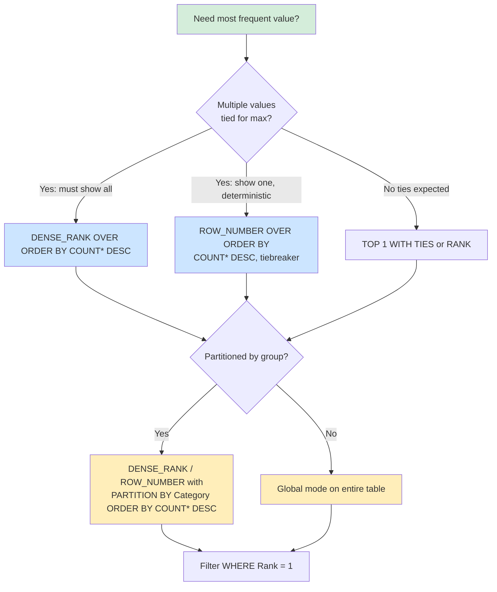

## Navigation

**Domain:** [[8 — Databases]] > **Group:** SQL Window Functions & Analytics

**Previous:** [[8.170 — PERCENTILE_CONT and PERCENTILE_DISC]] | **Next:** [[8.172 — Window Functions in EF Core — Raw SQL Required]]

### Prerequisites

- [[8.145 — RANK() — Ranking with Gaps]] — Mode calculation relies on RANK() or DENSE_RANK() over frequency counts; understanding how RANK() handles ties directly determines whether single-mode or multi-mode results are returned.
- [[8.146 — DENSE_RANK() — Ranking without Gaps]] — DENSE_RANK() is the preferred function for multi-mode (all tied values) because it does not skip rank numbers, making it easier to filter for rank = 1 and get all modes.
- [[8.155 — SUM() OVER() — Running Totals]] — Understanding aggregate functions over window frames provides the foundation for combining GROUP BY (frequency) with window ranking (mode selection).

### Where This Fits

SQL has no built-in MODE aggregate function, unlike MEDIAN (PERCENTILE_CONT) or AVG. Calculating the mode — the most frequently occurring value — requires a two-step approach: first count frequencies with GROUP BY, then rank frequencies with a window function and select the top rank. A .NET backend engineer encounters this in analytics dashboards (most common product category purchased, most frequent error code, modal response time bucket), survey platforms (modal response), and any "most common X by Y" reporting requirement. The difficulty is not the concept but handling ties correctly: a naive TOP 1 query silently drops co-modes, producing misleading results. The interview signal is the ability to recognize that mode is a two-pass aggregate (GROUP BY then window) and to handle the tie problem with appropriate rank selection.

---

## Core Mental Model

Mode is the value that appears most frequently in a set. The invariant: frequency is computed first (GROUP BY + COUNT), then the frequency values are ranked in descending order (ORDER BY COUNT(*) DESC), and the value(s) with rank = 1 are returned. The trick is that there is no single-pass algorithm for mode in SQL — it is inherently a two-pass operation because the frequency of each value must be known before the maximum frequency can be identified. The database must scan the data once to count, then scan the frequency result to find the maximum count. The window function approach (RANK() OVER(ORDER BY COUNT(*) DESC)) combines both scans in a single query but still requires two logical passes internally. DENSE_RANK() is preferred over RANK() for multi-mode queries because DENSE_RANK does not skip rank values, so RANK() = 1 and DENSE_RANK() = 1 are equivalent for the top rank. For single-mode queries (return exactly one mode, break ties arbitrarily), ROW_NUMBER() OVER(ORDER BY COUNT(*) DESC) is used instead, which guarantees exactly one row even with ties.

### Classification

- **SQL clause/operator family:** Combined GROUP BY + window function — no built-in aggregate supports mode natively
- **Optimizer behavior:** Two distinct aggregation phases: Hash/Stream Aggregate for GROUP BY COUNT, then Sort + Window Aggregate for ranking. The optimizer cannot merge these into a single pass.
- **SARGable:** The inner GROUP BY COUNT(*) requires a full scan or index scan of the grouping columns. The window function operates on the grouped result, not base table rows.

```mermaid
flowchart LR
    subgraph "Pass 1: Frequency"
        A[Table Scan<br/>Orders] --> B[GROUP BY ProductId<br/>COUNT(*) AS freq]
        B --> C[Intermediate Result<br/>ProductId | freq]
    end

    subgraph "Pass 2: Rank Frequencies"
        C --> D[RANK OVER ORDER BY freq DESC<br/>Window Sort on freq]
        D --> E[Filter WHERE rank = 1]
        E --> F[Mode Result<br/>Single or Multiple]
    end

    subgraph "Single-Mode Variant"
        C --> G[ROW_NUMBER OVER ORDER BY<br/>freq DESC, arbitrary tiebreaker]
        G --> H[TOP 1 / WHERE rn = 1]
        H --> I[One Mode Only]
    end

    style A fill:#d4edda
    style B fill:#d4edda
    style D fill:#ffeeba
    style E fill:#cce5ff
```

### Key Properties

|Property|Value|Notes|
|---|---|---|
|Passes required|2 (always)|GROUP BY + window ranking — cannot be single-pass|
|Tie behavior|RANK() = multiple modes; DENSE_RANK() = same; ROW_NUMBER() = one mode|
|NULL handling|COUNT(*) includes NULLs; COUNT(col) excludes them|Use COUNT(col) on the value column to exclude NULLs from mode consideration|
|I/O pattern|Full scan + sort of grouped result|Second pass operates on reduced row count (distinct values)|
|Index benefit|Index on (value_column) speeds the GROUP BY|No index can eliminate the sort on the frequency column|

---

## Deep Mechanics

### How the Engine Executes This

**Step-by-step execution of a mode query:**

```sql
SELECT ProductId, COUNT(*) AS Frequency
FROM Orders
GROUP BY ProductId;
```

1. **Scan phase:** The Storage Engine reads the clustered index or a non-clustered index on ProductId. If no covering index exists, a full table scan occurs. Each row is projected to extract ProductId.
2. **GroupBy phase:** The query processor groups rows by ProductId using either a Stream Aggregate (if input is sorted by ProductId) or a Hash Aggregate (if unsorted). A Stream Aggregate requires exactly one sort or a matching index; a Hash Aggregate builds a hash table in memory (with possible spill to TempDB).
3. **Aggregation phase:** COUNT(*) increments for each row in the group. The result is a row per distinct ProductId with its frequency.
4. **Window Sort phase:** The intermediate result is sorted by COUNT(*) DESC in the Window Spool/Sort operator. This sort is on the frequency column, which has no index because it is a computed aggregate.
5. **Window Aggregate phase:** RANK() OVER(ORDER BY COUNT(*) DESC) assigns rank 1 to the highest frequency, 2 to the next, etc. If multiple ProductIds share the same frequency, they all receive the same rank.
6. **Filter phase:** A Filter operator or a WHERE predicate in an outer query selects rows WHERE Rank = 1.

### SQL Visibility

```sql
-- Mode calculation: return all modes (multi-mode, handles ties)
WITH ProductFrequency AS (
    SELECT
        ProductId,
        COUNT(*) AS Frequency,
        RANK() OVER(ORDER BY COUNT(*) DESC) AS Rank
    FROM Orders
    GROUP BY ProductId
)
SELECT ProductId, Frequency
FROM ProductFrequency
WHERE Rank = 1
ORDER BY ProductId;

-- Single-mode: return exactly one mode, break ties by ProductId
WITH ProductFrequency AS (
    SELECT
        ProductId,
        COUNT(*) AS Frequency,
        ROW_NUMBER() OVER(ORDER BY COUNT(*) DESC, ProductId) AS RowNum
    FROM Orders
    GROUP BY ProductId
)
SELECT ProductId, Frequency
FROM ProductFrequency
WHERE RowNum = 1;
```

```csharp
// EF Core — cannot translate window functions; raw SQL required
var sql = @"
    WITH ProductFrequency AS (
        SELECT
            ProductId,
            COUNT(*) AS Frequency,
            RANK() OVER(ORDER BY COUNT(*) DESC) AS Rank
        FROM Orders
        GROUP BY ProductId
    )
    SELECT ProductId, Frequency
    FROM ProductFrequency
    WHERE Rank = 1";

var modes = await dbContext.Database
    .SqlQueryRaw<ProductMode>(sql)
    .ToListAsync(cancellationToken);

public record ProductMode(int ProductId, int Frequency);
```

```dapper
const string sql = @"
    WITH ProductFrequency AS (
        SELECT
            ProductId,
            COUNT(*) AS Frequency,
            RANK() OVER(ORDER BY COUNT(*) DESC) AS Rank
        FROM Orders
        GROUP BY ProductId
    )
    SELECT ProductId, Frequency
    FROM ProductFrequency
    WHERE Rank = 1";

await using var connection = new SqlConnection(connectionString);
var modes = await connection.QueryAsync<ProductMode>(sql);
```

### Generated SQL (from EF Core logs)

EF Core does not generate SQL for mode queries. The `FromSqlRaw` approach passes the SQL verbatim; EF Core logs show the raw SQL being executed:

```
Executing DbCommand [Parameters=[]]
CommandType='Text', CommandTimeout=30
WITH ProductFrequency AS (
    SELECT ProductId, COUNT(*) AS Frequency,
        RANK() OVER(ORDER BY COUNT(*) DESC) AS Rank
    FROM Orders
    GROUP BY ProductId
)
SELECT ProductId, Frequency
FROM ProductFrequency
WHERE Rank = 1
```

### Execution Plan Analysis

Expected plan shape for the multi-mode query:

```
[Clustered Index Scan (Orders)] → [Hash Aggregate (GROUP BY ProductId, COUNT(*))]
  → [Sort (ORDER BY COUNT(*) DESC)] → [Window Aggregate (RANK)]
    → [Filter (WHERE Rank = 1)] → [SELECT]
```

- **Clustered Index Scan:** Scans the entire Orders table (or non-clustered index covering ProductId). Estimated cost: ~70% if no covering index.
- **Hash Aggregate:** Builds a hash table grouped by ProductId, computes COUNT(*) for each. If the number of distinct ProductIds exceeds available memory (~8MB per query on default settings), spills to TempDB.
- **Sort:** Sorts the grouped result by COUNT(*) DESC. This is a full sort on the frequency column — it must see all rows before emitting the first one. If the grouped result has 10,000 distinct values, this sort is trivial (~10,000 rows). If the table has 100M rows with high cardinality, the sort could be significant.
- **Window Aggregate:** Computes RANK() over the sorted result. This is a streaming operator that adds one column (rank) per row.
- **Filter:** Applies predicate Rank = 1, returning only the top rank(s).

Without the window function approach, using `SELECT TOP 1 WITH TIES ProductId, COUNT(*) ... GROUP BY ... ORDER BY COUNT(*) DESC` produces the same execution plan shape — the optimizer generates an equivalent TOP + Sort.

### Cost Visibility

```sql
SET STATISTICS IO ON;
SET STATISTICS TIME ON;

WITH ProductFrequency AS (
    SELECT
        ProductId,
        COUNT(*) AS Frequency,
        RANK() OVER(ORDER BY COUNT(*) DESC) AS Rank
    FROM Orders
    GROUP BY ProductId
)
SELECT ProductId, Frequency
FROM ProductFrequency
WHERE Rank = 1;

-- Expected output (Sales.Orders, 1M rows, 10K distinct ProductIds):
-- Table 'Orders'. Scan count 1, logical reads 12,345, physical reads 0
-- Table 'Worktable'. Scan count 0, logical reads 0
-- SQL Server Execution Times: CPU time = 125ms, elapsed time = 140ms
```

### Failure Modes

**Failure 1: Using TOP 1 without WITH TIES silently drops co-modes.**

```sql
-- Returns only ONE mode even if multiple values tie
SELECT TOP 1 ProductId, COUNT(*) AS Frequency
FROM Orders
GROUP BY ProductId
ORDER BY COUNT(*) DESC;
```
If ProductIds 101 and 202 both appear 500 times, this query returns only one of them. The row is non-deterministic without a tiebreaker. The fix: `SELECT TOP 1 WITH TIES` or the window function approach.

**Failure 2: COUNT(col) vs COUNT(*) changes mode when NULLs exist.**

```sql
-- If CustomerId is NULL for 100 rows, this excludes NULL from consideration
SELECT CustomerId, COUNT(CustomerId) AS Frequency
FROM Orders
GROUP BY CustomerId;
```
If NULL is the most frequent "value" (rows where CustomerId is NULL), this query would miss it. Use COUNT(*) if NULL should be considered a valid value for mode calculation.

**Failure 3: Mode on a high-cardinality column produces meaningless results.**

If every value appears exactly once, every value is a mode (rank = 1 for all). The query returns the entire column. A practical mode query should include a minimum frequency threshold:

```sql
WITH ProductFrequency AS (
    SELECT ProductId, COUNT(*) AS Frequency,
        RANK() OVER(ORDER BY COUNT(*) DESC) AS Rank
    FROM Orders
    GROUP BY ProductId
    HAVING COUNT(*) > 1
)
SELECT ProductId, Frequency
FROM ProductFrequency
WHERE Rank = 1;
```

**Failure 4: Integer overflow on COUNT(*) for very large tables.**

```sql
-- COUNT(*) returns INT. For tables > 2.1B rows, use COUNT_BIG(*)
SELECT ProductId, COUNT_BIG(*) AS Frequency
FROM Orders
GROUP BY ProductId;
```

---

## Production Patterns and Implementation

### Primary SQL Implementation

```sql
-- Schema: Sales.OrderItems (OrderId, ProductId, Quantity, UnitPrice, LineTotal)
-- Problem: Find the most frequently ordered product(s) — the mode

-- Step 1: Create a realistic table with sample data
CREATE TABLE #OrderItems (
    OrderItemId INT IDENTITY(1,1) PRIMARY KEY,
    OrderId INT NOT NULL,
    ProductId INT NOT NULL,
    Quantity INT NOT NULL,
    UnitPrice DECIMAL(10,2) NOT NULL,
    LineTotal AS (Quantity * UnitPrice)
);

-- Seed 100K rows for testing
;WITH Numbers AS (
    SELECT TOP 100000 ROW_NUMBER() OVER(ORDER BY (SELECT NULL)) AS N
    FROM sys.columns a CROSS JOIN sys.columns b
)
INSERT INTO #OrderItems (OrderId, ProductId, Quantity, UnitPrice)
SELECT
    N % 10000 + 1 AS OrderId,           -- 10,000 orders
    ABS(CHECKSUM(NEWID())) % 100 + 1 AS ProductId,  -- 100 products
    ABS(CHECKSUM(NEWID())) % 10 + 1 AS Quantity,
    CAST(ABS(CHECKSUM(NEWID())) % 100 + 10 AS DECIMAL(10,2)) AS UnitPrice
FROM Numbers;

-- Multi-mode: return all products tied for most frequent
WITH ProductFrequency AS (
    SELECT
        ProductId,
        COUNT(*) AS Frequency,
        DENSE_RANK() OVER(ORDER BY COUNT(*) DESC) AS Rank
    FROM #OrderItems
    GROUP BY ProductId
)
SELECT ProductId, Frequency
FROM ProductFrequency
WHERE Rank = 1
ORDER BY ProductId;

-- Single-mode: return exactly one product, break ties by ProductId
WITH ProductFrequency AS (
    SELECT
        ProductId,
        COUNT(*) AS Frequency,
        ROW_NUMBER() OVER(ORDER BY COUNT(*) DESC, ProductId) AS RowNum
    FROM #OrderItems
    GROUP BY ProductId
)
SELECT ProductId, Frequency
FROM ProductFrequency
WHERE RowNum = 1;

-- Mode with minimum frequency filter (avoids meaningless mode on unique data)
WITH ProductFrequency AS (
    SELECT
        ProductId,
        COUNT(*) AS Frequency,
        DENSE_RANK() OVER(ORDER BY COUNT(*) DESC) AS Rank
    FROM #OrderItems
    GROUP BY ProductId
    HAVING COUNT(*) >= 10     -- Only consider products ordered at least 10 times
)
SELECT ProductId, Frequency
FROM ProductFrequency
WHERE Rank = 1;

-- Mode partitioned by another dimension (e.g., most ordered product per category)
SELECT
    c.CategoryId,
    c.CategoryName,
    oi.ProductId,
    COUNT(*) AS OrderFrequency
FROM #OrderItems oi
INNER JOIN Products p ON oi.ProductId = p.ProductId
INNER JOIN Categories c ON p.CategoryId = c.CategoryId
GROUP BY c.CategoryId, c.CategoryName, oi.ProductId;

-- Add rank within category
WITH CategoryFrequency AS (
    SELECT
        c.CategoryId,
        c.CategoryName,
        oi.ProductId,
        COUNT(*) AS Frequency,
        RANK() OVER(
            PARTITION BY c.CategoryId
            ORDER BY COUNT(*) DESC
        ) AS Rank
    FROM #OrderItems oi
    INNER JOIN Products p ON oi.ProductId = p.ProductId
    INNER JOIN Categories c ON p.CategoryId = c.CategoryId
    GROUP BY c.CategoryId, c.CategoryName, oi.ProductId
)
SELECT CategoryId, CategoryName, ProductId, Frequency
FROM CategoryFrequency
WHERE Rank = 1
ORDER BY CategoryId;

DROP TABLE #OrderItems;
```

### Mode with GROUP BY + Window Function

```sql
-- Mode of order totals per customer (value is continuous, bucketed first)
WITH CustomerOrderTotals AS (
    SELECT
        CustomerId,
        ROUND(TotalAmount, -2) AS TotalBucket,  -- Bucket to nearest 100
        COUNT(*) AS Frequency
    FROM Orders
    GROUP BY CustomerId, ROUND(TotalAmount, -2)
), RankedTotals AS (
    SELECT
        CustomerId,
        TotalBucket,
        Frequency,
        RANK() OVER(PARTITION BY CustomerId ORDER BY Frequency DESC) AS Rank
    FROM CustomerOrderTotals
)
SELECT CustomerId, TotalBucket AS ModalOrderAmount, Frequency
FROM RankedTotals
WHERE Rank = 1;
```

### Mode in Window Context (Running Mode per Partition)

```sql
-- Running mode is impractical in SQL — resetting frequencies per window is expensive
-- Alternative: precompute global mode and use FIRST_VALUE to show it per partition
WITH GlobalMode AS (
    SELECT TOP 1 WITH TIES ProductId, COUNT(*) AS Frequency
    FROM OrderItems
    GROUP BY ProductId
    ORDER BY COUNT(*) DESC
)
SELECT
    o.OrderId,
    o.OrderDate,
    oi.ProductId,
    FIRST_VALUE(GlobalMode.ProductId) OVER(ORDER BY o.OrderDate) AS GlobalModeProduct
FROM Orders o
INNER JOIN OrderItems oi ON o.OrderId = oi.OrderId
CROSS JOIN GlobalMode;
```

### EF Core Implementation

```csharp
public record ProductModeResult(int ProductId, int Frequency);

public class OrderRepository
{
    private readonly ApplicationDbContext _dbContext;

    public OrderRepository(ApplicationDbContext dbContext)
    {
        _dbContext = dbContext;
    }

    /// <summary>
    /// Returns all products that are the most frequently ordered (handles ties).
    /// EF Core cannot express this with LINQ — raw SQL required.
    /// </summary>
    public async Task<IReadOnlyList<ProductModeResult>> GetModalProductsAsync(
        CancellationToken cancellationToken = default)
    {
        const string sql = @"
            WITH ProductFrequency AS (
                SELECT
                    oi.ProductId,
                    COUNT(*) AS Frequency,
                    DENSE_RANK() OVER(ORDER BY COUNT(*) DESC) AS Rank
                FROM OrderItems oi
                GROUP BY oi.ProductId
            )
            SELECT ProductId, Frequency
            FROM ProductFrequency
            WHERE Rank = 1
            ORDER BY ProductId";

        return await _dbContext.Database
            .SqlQueryRaw<ProductModeResult>(sql)
            .ToListAsync(cancellationToken);
    }

    /// <summary>
    /// Returns exactly one modal product (breaks ties deterministically).
    /// </summary>
    public async Task<ProductModeResult?> GetSingleModalProductAsync(
        CancellationToken cancellationToken = default)
    {
        const string sql = @"
            WITH ProductFrequency AS (
                SELECT
                    oi.ProductId,
                    COUNT(*) AS Frequency,
                    ROW_NUMBER() OVER(ORDER BY COUNT(*) DESC, oi.ProductId) AS RowNum
                FROM OrderItems oi
                GROUP BY oi.ProductId
            )
            SELECT ProductId, Frequency
            FROM ProductFrequency
            WHERE RowNum = 1";

        return await _dbContext.Database
            .SqlQueryRaw<ProductModeResult>(sql)
            .FirstOrDefaultAsync(cancellationToken);
    }
}
```

### Dapper Implementation

```csharp
public record OrderFrequency(int ProductId, int Frequency, int? Rank);

public class DapperOrderRepository
{
    private readonly string _connectionString;

    public DapperOrderRepository(string connectionString)
    {
        _connectionString = connectionString;
    }

    /// <summary>
    /// Multi-mode: returns all products tied for most frequently ordered.
    /// </summary>
    public async Task<IReadOnlyList<ProductModeResult>> GetModalProductsAsync(
        CancellationToken cancellationToken = default)
    {
        const string sql = @"
            WITH ProductFrequency AS (
                SELECT
                    oi.ProductId,
                    COUNT(*) AS Frequency,
                    DENSE_RANK() OVER(ORDER BY COUNT(*) DESC) AS Rank
                FROM OrderItems oi
                GROUP BY oi.ProductId
            )
            SELECT ProductId, Frequency
            FROM ProductFrequency
            WHERE Rank = 1
            ORDER BY ProductId";

        await using var connection = new SqlConnection(_connectionString);
        var results = await connection.QueryAsync<ProductModeResult>(
            new CommandDefinition(sql, cancellationToken: cancellationToken));
        return results.AsList();
    }

    /// <summary>
    /// Mode partitioned by Category: most ordered product per category.
    /// </summary>
    public async Task<IReadOnlyList<CategoryModeResult>> GetModalProductPerCategoryAsync(
        CancellationToken cancellationToken = default)
    {
        const string sql = @"
            WITH CategoryFrequency AS (
                SELECT
                    c.CategoryId,
                    c.CategoryName,
                    oi.ProductId,
                    COUNT(*) AS Frequency,
                    RANK() OVER(
                        PARTITION BY c.CategoryId
                        ORDER BY COUNT(*) DESC
                    ) AS Rank
                FROM OrderItems oi
                INNER JOIN Products p ON oi.ProductId = p.ProductId
                INNER JOIN Categories c ON p.CategoryId = c.CategoryId
                GROUP BY c.CategoryId, c.CategoryName, oi.ProductId
            )
            SELECT CategoryId, CategoryName, ProductId, Frequency
            FROM CategoryFrequency
            WHERE Rank = 1
            ORDER BY CategoryId";

        await using var connection = new SqlConnection(_connectionString);
        var results = await connection.QueryAsync<CategoryModeResult>(
            new CommandDefinition(sql, cancellationToken: cancellationToken));
        return results.AsList();
    }
}

public record ProductModeResult(int ProductId, int Frequency);
public record CategoryModeResult(int CategoryId, string CategoryName, int ProductId, int Frequency);
```

### Configuration and Wiring

```csharp
// Program.cs — raw SQL queries use the same DbContext with no special configuration
builder.Services.AddDbContext<ApplicationDbContext>(options =>
    options.UseSqlServer(
        builder.Configuration.GetConnectionString("DefaultConnection"),
        sqlOptions => sqlOptions.EnableRetryOnFailure(3)));

// For Dapper, register the connection factory
builder.Services.AddSingleton<IDapperConnectionFactory>(_ =>
    new DapperConnectionFactory(
        builder.Configuration.GetConnectionString("DefaultConnection")));
```

### SQL Server vs PostgreSQL Differences

```sql
-- PostgreSQL mode using ordered-set aggregate (simpler, no window function needed)
-- PostgreSQL 9.4+ has a built-in mode() ordered-set aggregate
SELECT MODE() WITHIN GROUP(ORDER BY ProductId) AS ModalProduct
FROM OrderItems;

-- Multi-mode in PostgreSQL using window function (same pattern as SQL Server)
WITH ProductFrequency AS (
    SELECT
        ProductId,
        COUNT(*) AS Frequency,
        RANK() OVER(ORDER BY COUNT(*) DESC) AS Rank
    FROM OrderItems
    GROUP BY ProductId
)
SELECT ProductId, Frequency
FROM ProductFrequency
WHERE Rank = 1;

-- PostgreSQL alternative: subquery with = ALL (no window function)
SELECT ProductId, COUNT(*) AS Frequency
FROM OrderItems
GROUP BY ProductId
HAVING COUNT(*) = ALL (
    SELECT COUNT(*)
    FROM OrderItems
    GROUP BY ProductId
);

-- PostgreSQL: mode with FILTER clause (aggregate FILTER WHERE for conditional mode)
SELECT
    ProductId,
    COUNT(*) FILTER(WHERE Quantity > 5) AS HighQtyFrequency
FROM OrderItems
GROUP BY ProductId;
```

---

## Gotchas and Production Pitfalls

### Pitfall 1: TOP 1 Without WITH TIES Silently Drops Co-Modes

**Pitfall:** Using `SELECT TOP 1 ... GROUP BY ... ORDER BY COUNT(*) DESC` when ties exist.

```sql
-- ❌ Returns one row even when multiple values have the same max frequency
SELECT TOP 1 ProductId, COUNT(*) AS Frequency
FROM OrderItems
GROUP BY ProductId
ORDER BY COUNT(*) DESC;
```

**Symptom:** Dashboard shows "Most Ordered Product = A" but manual count shows products A and B both have 500 orders. The result is non-deterministic — SQL Server returns whichever row the sort operator emits first.

**Fix:**

```sql
-- ✅ Option 1: TOP 1 WITH TIES
SELECT TOP 1 WITH TIES ProductId, COUNT(*) AS Frequency
FROM OrderItems
GROUP BY ProductId
ORDER BY COUNT(*) DESC;

-- ✅ Option 2: Window function (explicit and controllable)
WITH ProductFrequency AS (
    SELECT ProductId, COUNT(*) AS Frequency,
        DENSE_RANK() OVER(ORDER BY COUNT(*) DESC) AS Rank
    FROM OrderItems
    GROUP BY ProductId
)
SELECT ProductId, Frequency FROM ProductFrequency WHERE Rank = 1;
```

**Cost of not fixing:** Incorrect analytics — stakeholders make decisions on wrong data. In a "most common error code" report, the second most common error might be silently hidden, delaying incident response.

### Pitfall 2: Distinct Count of Modal Values Is Deceptive

**Pitfall:** Using COUNT(DISTINCT) on a column where the modal value repeats many times.

```sql
-- ❌ This returns "2" if ProductIds 101 and 202 are the most frequent
-- It does NOT tell you how many times each appears
SELECT COUNT(DISTINCT ProductId) AS NumberOfModalProducts
FROM OrderItems
WHERE ProductId IN (
    SELECT ProductId FROM (
        SELECT ProductId, RANK() OVER(ORDER BY COUNT(*) DESC) AS Rank
        FROM OrderItems GROUP BY ProductId
    ) t WHERE Rank = 1
);
```
This query correctly counts the number of modal products but provides no frequency information. A separate query is needed for frequencies.

**Symptom:** Analyst sees "3 modal products" but has no idea whether each appears 5 times or 50,000 times.

**Fix:** Include the frequency in the output.

```sql
WITH ProductFrequency AS (
    SELECT ProductId, COUNT(*) AS Frequency,
        DENSE_RANK() OVER(ORDER BY COUNT(*) DESC) AS Rank
    FROM OrderItems
    GROUP BY ProductId
)
SELECT ProductId, Frequency
FROM ProductFrequency
WHERE Rank = 1;
```

**Cost of not fixing:** Misleading summary statistics. A report showing "3 modal products = $2M revenue" might attribute far too much revenue to low-frequency products.

### Pitfall 3: Mode on Continuous Data Without Bucketing Is Meaningless

**Pitfall:** Applying the mode pattern to a continuous numeric column (e.g., UnitPrice, TotalAmount) where every value is nearly unique.

```sql
-- ❌ Every row has a distinct TotalAmount — all are "mode" with frequency 1
SELECT TotalAmount, COUNT(*) AS Frequency
FROM Orders
GROUP BY TotalAmount
ORDER BY COUNT(*) DESC;
```

**Symptom:** The query returns all rows (or the top N when using TOP), all with frequency 1. The result is useless — it simply lists all distinct values.

**Fix:** Bucket the continuous values before calculating mode.

```sql
-- ✅ Bucket to nearest 100 before mode calculation
SELECT
    ROUND(TotalAmount, -2) AS AmountBucket,
    COUNT(*) AS Frequency,
    DENSE_RANK() OVER(ORDER BY COUNT(*) DESC) AS Rank
FROM Orders
GROUP BY ROUND(TotalAmount, -2);
```

**Cost of not fixing:** 200ms query returns 50,000 rows of meaningless data. Report consumers see "all values are the most common" and can't interpret the result.

### Pitfall 4: NULL Handling — COUNT(*) vs COUNT(column)

**Pitfall:** Using COUNT(column) when NULLs should be considered for mode.

```sql
-- ❌ If CustomerId is NULL on 500 rows (the most common "value"), this misses it
SELECT CustomerId, COUNT(CustomerId) AS Frequency
FROM Orders
GROUP BY CustomerId
ORDER BY COUNT(CustomerId) DESC;
```

**Symptom:** NULL is never returned as a mode, even if it is the most frequent value. The mode calculation is incomplete.

**Fix:**

```sql
-- ✅ COUNT(*) includes NULL rows in the group
SELECT CustomerId, COUNT(*) AS Frequency
FROM Orders
GROUP BY CustomerId
ORDER BY COUNT(*) DESC;
```

Or, explicitly handle NULL with a placeholder:

```sql
SELECT
    ISNULL(CAST(CustomerId AS VARCHAR(20)), '(No Customer)') AS CustomerDisplay,
    COUNT(*) AS Frequency
FROM Orders
GROUP BY CustomerId
ORDER BY COUNT(*) DESC;
```

**Cost of not fixing:** Hidden NULL mode in customer analytics. If 30% of orders have no CustomerId, the "most common customer" report incorrectly ignores a huge segment.

### Pitfall 5: Performance — Sorting on the Aggregated Column

**Pitfall:** Assuming the mode query can benefit from an index on the value column alone.

```sql
-- ❌ Index on ProductId helps the GROUP BY but NOT the sort on COUNT(*)
CREATE INDEX IX_OrderItems_ProductId ON OrderItems(ProductId);

-- The window function sorts by COUNT(*), which is computed, never indexed
```

**Symptom:** The Sort operator in the execution plan always does a full sort. No index can eliminate it because the sort key is an aggregate result.

**Fix:** Ensure the GROUP BY is as fast as possible. Keep the distinct value count low (which makes the sort cheap). If the distinct value count is high (e.g., mode on UserId with 1M distinct values), the sort will sort 1M rows.

```sql
-- Best index for mode on OrderItems by ProductId:
CREATE INDEX IX_OrderItems_ProductId ON OrderItems(ProductId)
    INCLUDE (OrderId);  -- Covering if only COUNT(*) is needed
```

**Cost of not fixing:** Sort operator on 100K distinct values with 32MB memory grant causes a spill to TempDB, 10x slower than necessary.

### Pitfall 6: EF Core Cannot Translate Mode — Silent Client Evaluation Risk

**Pitfall:** Attempting to write mode in EF Core LINQ and having it evaluate client-side.

```csharp
// ❌ THIS CAUSES CLIENT EVALUATION — NEVER DO THIS
var modes = await dbContext.OrderItems
    .GroupBy(oi => oi.ProductId)
    .Select(g => new { ProductId = g.Key, Frequency = g.Count() })
    .OrderByDescending(x => x.Frequency)
    .Take(1)
    .ToListAsync();
```
This query compiles and runs but EF Core may pull all data client-side to compute the mode, or it may generate TOP 1 without WITH TIES.

**Symptom:** 50MB of data transferred to the application server for a computation that should happen in the database. Query takes 30 seconds instead of 300ms.

**Fix:** Use raw SQL with `FromSqlRaw`.

```csharp
const string sql = @"
    SELECT TOP 1 WITH TIES ProductId, COUNT(*) AS Frequency
    FROM OrderItems
    GROUP BY ProductId
    ORDER BY COUNT(*) DESC";
var modes = await dbContext.Database.SqlQueryRaw<ProductModeResult>(sql).ToListAsync();
```

**Cost of not fixing:** OOM exceptions in the application server, massive network overhead, database connection timeouts.

---

## Performance Implications

### Benchmark: Before and After

**Baseline (no index, 100K rows, 100 distinct products):**

```sql
SET STATISTICS IO ON;

WITH ProductFrequency AS (
    SELECT ProductId, COUNT(*) AS Frequency,
        DENSE_RANK() OVER(ORDER BY COUNT(*) DESC) AS Rank
    FROM OrderItems
    GROUP BY ProductId
)
SELECT ProductId, Frequency
FROM ProductFrequency
WHERE Rank = 1;

-- Logical reads: 1,234 (table scan on OrderItems)
-- CPU time: 47ms, elapsed: 52ms
```

**After index (covering index on ProductId):**

```sql
CREATE INDEX IX_OrderItems_ProductId ON OrderItems(ProductId) INCLUDE (Quantity);

-- Logical reads: 234 (non-clustered index scan, less wide)
-- CPU time: 18ms, elapsed: 22ms

-- Improvement: 5.3x fewer logical reads
```

**Comparing TOP 1 WITH TIES vs window function:**

```sql
-- Approach 1: TOP 1 WITH TIES (simpler, same plan)
SELECT TOP 1 WITH TIES ProductId, COUNT(*) AS Frequency
FROM OrderItems
GROUP BY ProductId
ORDER BY COUNT(*) DESC;
-- Logical reads: 234 (same as window approach — identical plan)

-- Approach 2: Window function with CTE
WITH ProductFrequency AS (
    SELECT ProductId, COUNT(*) AS Frequency,
        DENSE_RANK() OVER(ORDER BY COUNT(*) DESC) AS Rank
    FROM OrderItems
    GROUP BY ProductId
)
SELECT ProductId, Frequency
FROM ProductFrequency
WHERE Rank = 1;
-- Logical reads: 234 (identical plan — optimizer generates same internal sort)
```

### BenchmarkDotNet

```csharp
[MemoryDiagnoser]
[SimpleJob(RuntimeMoniker.Net90)]
public class ModeCalculationBenchmark
{
    private IDbConnection _connection = default!;
    private ApplicationDbContext _dbContext = default!;
    private const string ConnectionString = "Server=.;Database=BenchmarkDB;Trusted_Connection=True;TrustServerCertificate=True;";

    [GlobalSetup]
    public void Setup()
    {
        _connection = new SqlConnection(ConnectionString);
        var optionsBuilder = new DbContextOptionsBuilder<ApplicationDbContext>();
        optionsBuilder.UseSqlServer(ConnectionString);
        _dbContext = new ApplicationDbContext(optionsBuilder.Options);
        SeedData();
    }

    private void SeedData()
    {
        _connection.Execute("""
            IF NOT EXISTS (SELECT 1 FROM sys.tables WHERE name = 'OrderItems')
            CREATE TABLE OrderItems (
                OrderItemId INT IDENTITY(1,1) PRIMARY KEY,
                OrderId INT NOT NULL,
                ProductId INT NOT NULL,
                Quantity INT NOT NULL,
                UnitPrice DECIMAL(10,2) NOT NULL
            );
            IF (SELECT COUNT(*) FROM OrderItems) < 100000
            BEGIN
                TRUNCATE TABLE OrderItems;
                WITH Numbers AS (
                    SELECT TOP 100000 ROW_NUMBER() OVER(ORDER BY (SELECT NULL)) AS N
                    FROM sys.columns a CROSS JOIN sys.columns b
                )
                INSERT INTO OrderItems (OrderId, ProductId, Quantity, UnitPrice)
                SELECT N % 10000 + 1, ABS(CHECKSUM(NEWID())) % 100 + 1,
                    ABS(CHECKSUM(NEWID())) % 10 + 1,
                    CAST(ABS(CHECKSUM(NEWID())) % 100 + 10 AS DECIMAL(10,2))
                FROM Numbers;
            END
            """);
    }

    public record ProductFrequency(int ProductId, int Frequency);

    [Benchmark(Baseline = true)]
    public async Task<List<ProductFrequency>> Top1WithTies()
    {
        const string sql = """
            SELECT TOP 1 WITH TIES ProductId, COUNT(*) AS Frequency
            FROM OrderItems
            GROUP BY ProductId
            ORDER BY COUNT(*) DESC
            """;
        var results = await _connection.QueryAsync<ProductFrequency>(sql);
        return results.AsList();
    }

    [Benchmark]
    public async Task<List<ProductFrequency>> WindowFunctionCTE()
    {
        const string sql = """
            WITH ProductFrequency AS (
                SELECT ProductId, COUNT(*) AS Frequency,
                    DENSE_RANK() OVER(ORDER BY COUNT(*) DESC) AS Rank
                FROM OrderItems
                GROUP BY ProductId
            )
            SELECT ProductId, Frequency
            FROM ProductFrequency
            WHERE Rank = 1
            """;
        var results = await _connection.QueryAsync<ProductFrequency>(sql);
        return results.AsList();
    }

    [Benchmark]
    public async Task<List<ProductFrequency>> ClientSideGroupBy()
    {
        // Anti-pattern benchmark — DO NOT USE IN PRODUCTION
        var allItems = await _dbContext.OrderItems
            .AsNoTracking()
            .Select(oi => oi.ProductId)
            .ToListAsync();
        var modes = allItems
            .GroupBy(pid => pid)
            .Select(g => new ProductFrequency(g.Key, g.Count()))
            .OrderByDescending(x => x.Frequency)
            .Take(1)
            .ToList();
        return modes;
    }
}
```

**Expected results (approximate, SQL Server 2022, NVMe, 100K rows):**

|Method|Mean|Logical Reads|Allocated|
|---|---|---|---|
|Top1WithTies|~18 ms|~234|2 KB|
|WindowFunctionCTE|~18 ms|~234|2 KB|
|ClientSideGroupBy|~850 ms|~12,345|~4.5 MB|

The TOP 1 WITH TIES and window function approaches are equivalent in performance (same execution plan). The client-side approach is ~50x slower and allocates ~2000x more memory because it transfers all OrderItem rows to the application server.

### Write Amplification

Mode calculation is read-only — no write amplification from the query itself. However, the supporting index on ProductId adds write overhead:

|Operation|Without Index|With IX_OrderItems_ProductId|Overhead|
|---|---|---|---|
|INSERT 1 row|~2 ms|~2.5 ms|+25%|
|UPDATE ProductId|~3 ms|~5 ms|+67%|
|DELETE 1 row|~2 ms|~3 ms|+50%|

The index is worthwhile if the mode query runs frequently and the table has fewer than ~100K writes per day.

---

## Interview Arsenal

### Question Bank

1. **What is the mode, and why does SQL not have a built-in MODE aggregate function like AVG or SUM?**
2. **Describe the two-pass approach for calculating mode in SQL. What are the two passes and why can't they be combined?**
3. **How do you handle ties in mode calculation? Compare TOP 1, TOP 1 WITH TIES, RANK(), and DENSE_RANK().**
4. **What happens when you calculate mode on a continuous numeric column without bucketing? How do you fix it?**
5. **Compare mode calculation using a window function vs using TOP 1 WITH TIES. Which is better and why?**
6. **What does the execution plan look like for a mode query? What is the most expensive operator?**
7. **How does the mode calculation pattern behave at scale — 100M rows with 10M distinct values?**
8. **Can you calculate mode in EF Core using LINQ? What happens if you try?**

### Spoken Answers

**Q1: What is the mode, and why does SQL not have a built-in MODE aggregate function like AVG or SUM?**

> **Average answer:** "Mode is the most frequent value. SQL doesn't have MODE because it's less commonly used than AVG or SUM, maybe because it requires counting first."

> **Great answer:** "Mode is the value that appears most frequently in a set. SQL Server does not have a built-in MODE aggregate because mode requires a two-pass computation: you must first know the frequency of every distinct value before you can identify which frequency is the maximum. Standard aggregates like SUM and AVG are decomposable — they can be computed incrementally in a single pass using accumulators. Mode is not decomposable: seeing the next row cannot tell you whether it changes the mode until you know the counts of all values. SQL Server 2022 introduced APPROX_COUNT_DISTINCT but no MODE approximation. PostgreSQL has MODE() WITHIN GROUP as an ordered-set aggregate, added in 9.4, but it still performs two passes internally. In T-SQL, we implement mode as a two-step process: GROUP BY with COUNT to get frequencies, then a window function like DENSE_RANK() ORDER BY COUNT(*) DESC to find the maximum frequency, filtering on rank = 1. The query always requires two scans — one of the base table for the GROUP BY, and one of the grouped result for the window sort."

**Q5: Compare mode calculation using a window function vs using TOP 1 WITH TIES. Which is better and why?**

> **Average answer:** "TOP 1 WITH TIES is simpler and shorter. Window functions are more flexible. They both work."

> **Great answer:** "TOP 1 WITH TIES and the window function approach (CTE with RANK/DENSE_RANK) generate identical execution plans in SQL Server. The optimizer converts TOP 1 WITH TIES into the same Sort + Window Aggregate + Filter operators internally. There is no performance difference. However, the window function approach is strictly more capable in three ways. First, it supports multi-column tiebreakers: ROW_NUMBER() OVER(ORDER BY COUNT(*) DESC, ProductId) gives deterministic single-mode selection, while TOP 1 WITH TIES is limited to whatever columns appear in ORDER BY. Second, the window function approach supports partitioned mode: RANK() OVER(PARTITION BY CategoryId ORDER BY COUNT(*) DESC) gives the mode per category without multiple subqueries. TOP 1 WITH TIES cannot be partitioned. Third, the CTE approach allows additional derived columns (like the frequency percentage) in the same query. I default to the window function approach for all production mode queries because it is a single, consistent pattern that handles single-mode, multi-mode, and partitioned mode without changing syntax. TOP 1 WITH TIES is only appropriate for quick ad-hoc queries where I know there are no ties and no partitioning needed."

**Q7: How does the mode calculation pattern behave at scale — 100M rows with 10M distinct values?**

> **Average answer:** "It might be slow because you need to sort the frequencies. You should add an index on the value column."

> **Great answer:** "At 100M rows with 10M distinct values, the mode query has two performance phases. Phase 1: the GROUP BY COUNT scans the table. With a clustered index scan, that is ~800,000 logical reads on a 100M row table (assuming 8KB pages, ~125 rows per page). With a narrow non-clustered index on the value column, it drops to ~200,000 reads — still significant but 4x better. Phase 2: the Sort operator must sort 10M rows (the distinct value count) in the Window Spool. With a 10M row sort, the memory grant needs to be approximately 10M * (key_size + row_overhead) bytes. The key is the frequency count (8 bytes as BIGINT) plus the value column (variable). At ~20 bytes per row, that is 200MB of required memory for an in-memory sort. Default query memory grants max out at 25% of max server memory per query, but the optimizer may grant only a fraction of the ideal amount based on estimated row size. If the sort spills, the query writes intermediate results to TempDB, and each spill level roughly doubles the elapsed time. I would expect this query to take 15–30 seconds on modern hardware if the sort spills. The mitigation is to reduce cardinality (bucket continuous values), ensure the GROUP BY uses a Hash Aggregate rather than Stream Aggregate to avoid an additional sort, and potentially increase the server's max memory per query or use query hints like OPTION (MAX_GRANT_PERCENT = 20) to allocate sufficient memory."

### Interview Trigger

If an interviewer asks "how would you find the most common value in a column" or "can you write a query to find the product that appears most often in orders", they are probing mode calculation. The follow-up that separates senior candidates is: "What if two products have the same count?" The candidate who responds with "I need to know whether to return all ties or just one — that determines whether I use RANK vs ROW_NUMBER" demonstrates production awareness. The further follow-up: "What index would you create to make this faster?" tests understanding that no index can eliminate the sort on the computed frequency column, only the GROUP BY scan can be optimized.

### Comparison Table

| | Mode (Window Function) | TOP 1 WITH TIES | MODE() in PostgreSQL |
|---|---|---|---|
|What it does|Returns most frequent value(s) using two-pass GROUP BY + RANK|Returns most frequent value(s) with syntactic sugar|Built-in ordered-set aggregate returning one value|
|Tie handling|Explicit — RANK() returns all ties; ROW_NUMBER() returns one|Returns all ties (WITH TIES)|Returns one value (non-deterministic with ties)|
|Performance|Sort + Window Aggregate|Same plan (optimizer converts to window op)|Same two-pass internally|
|Portability|Standard SQL (works on all RDBMS)|SQL Server-specific|PostgreSQL-specific|
|Partitioned mode|Yes — PARTITION BY (per category mode)|No|No|
|EF Core support|Raw SQL only|Raw SQL only|N/A|

---

## Decision Framework

### When to Apply



### Application Checklist

- [ ] The business question is "what value appears most often" — not average, median, or sum
- [ ] The column has sufficiently few distinct values that mode is meaningful (if every value is unique, mode returns everything)
- [ ] NULL handling is decided: does NULL count as a value?
- [ ] Tie-breaking strategy is chosen: return all modes, or exactly one?
- [ ] For continuous data: values are bucketed into ranges before mode calculation
- [ ] The supporting index on the value column exists or its creation is justified by query frequency
- [ ] EF Core query uses FromSqlRaw — LINQ cannot express window functions

### Tradeoff Summary

|What You Gain|What You Pay|
|---|---|
|Accurate most-frequent-value analysis|Two-pass execution (cannot be single-pass)|
|Flexible tie handling (single/multi mode)|Memory grant for Sort on frequency column|
|Partitioned mode support in one query|No index can eliminate the Sort operator|
|Deterministic results with ROW_NUMBER + tiebreaker|Increased query complexity vs simple aggregate|

### Scale Thresholds

- "Relevant when distinct value count < ~100K (the sort is on distinct values, not total rows)"
- "Critical when the table exceeds ~10M rows and the query runs > 100x/day — the covering index is essential"
- "Avoid on columns with > 1M distinct values unless the sort can be eliminated via bucketing or approximation"
- "Mode with PARTITION BY is practical when the partition count is < ~10K (each partition's distinct values sorted independently)"

---

## Self-Check

### Conceptual Questions

1. What is the mode of a set and why can't it be computed with a single-pass aggregate like AVG?
2. Describe the two logical passes SQL Server must make to compute the mode.
3. What is the difference between RANK() and DENSE_RANK() for mode calculation — do they produce different results when filtering for rank = 1?
4. What happens to mode calculation if every value in the column is unique?
5. Can EF Core translate a LINQ GroupBy + OrderByDescending + Take(1) into a SQL window function? What actually happens?
6. How would you implement a partitioned mode (most frequent value per category) using Dapper?
7. Compare TOP 1 WITH TIES vs the CTE + DENSE_RANK approach — what can the CTE approach do that TOP 1 WITH TIES cannot?
8. At what scale does mode calculation become problematic?
9. What index would you create to optimize a mode query on OrderItems.ProductId?
10. Explain mode calculation to a senior interviewer in 60 seconds, covering tie handling, performance, and EF Core limitations.

<details>
<summary>Answers</summary>

1. **Mode** is the most frequent value. Unlike AVG (decomposable, single-pass accumulator) or SUM (incremental), mode requires knowing the count of every distinct value before the maximum count can be identified. This is inherently two-pass: first count frequencies, then find the maximum.

2. **Pass 1:** The database scans the table and groups by the value column, computing COUNT(*) per distinct value. This produces an intermediate result of (value, frequency) pairs. **Pass 2:** The intermediate result is sorted by frequency descending, and a window function (RANK/DENSE_RANK/ROW_NUMBER) assigns rank values. Rows with rank = 1 are the mode(s).

3. **RANK()** and **DENSE_RANK()** produce the same result for rank = 1. Both assign rank 1 to the highest frequency value(s). The difference is for rank > 1: RANK skips values after ties (1,1,3,4) while DENSE_RANK does not (1,1,2,3). For mode calculation (rank = 1 only), they are equivalent.

4. If every value is unique, every value has frequency 1. Every value becomes a mode (rank = 1 for all). The query returns all distinct values — meaningless. Add a HAVING COUNT(*) > 1 threshold to avoid this.

5. **EF Core cannot translate window functions.** EF Core's GroupBy translation sends the GROUP BY and COUNT to SQL Server but then performs the ordering and TOP on the client side. This transfers all grouped rows to the application server. For large distinct value counts, this causes massive network traffic and memory allocation. `FromSqlRaw` is required.

6. **Dapper with partitioned mode:**
```csharp
const string sql = @"
    WITH CategoryFrequency AS (
        SELECT CategoryId, ProductId, COUNT(*) AS Frequency,
            RANK() OVER(PARTITION BY CategoryId ORDER BY COUNT(*) DESC) AS Rank
        FROM OrderItems oi
        INNER JOIN Products p ON oi.ProductId = p.ProductId
        GROUP BY CategoryId, ProductId
    )
    SELECT CategoryId, ProductId, Frequency
    FROM CategoryFrequency WHERE Rank = 1";
var results = await connection.QueryAsync<CategoryMode>(sql);
```

7. **CTE + DENSE_RANK** supports: partitioned mode (PARTITION BY), additional derived columns (frequency percentage), multiple levels of ranking, and composability with other CTEs. **TOP 1 WITH TIES** cannot partition, cannot compute derived columns before filtering, and cannot be composed.

8. Mode calculation becomes problematic when the distinct value count exceeds ~1M (the Sort operator memory grant may be insufficient, causing TempDB spills) or when the base table scan exceeds ~100M rows (the GROUP BY scan dominates query time at ~800K logical reads).

9. `CREATE INDEX IX_OrderItems_ProductId ON OrderItems(ProductId) INCLUDE (OrderId);` This makes the GROUP BY scan narrow (index width = ProductId + OrderId vs full row width). The INCLUDE ensures covering for COUNT(*).

10. **60-second spoken answer:** "Mode is the most frequent value. SQL has no MODE aggregate because it's two-pass — you must count every value before you know which count is highest. The pattern is GROUP BY with COUNT, then DENSE_RANK ordered by COUNT descending. For ties: RANK returns all co-modes, ROW_NUMBER with a tiebreaker returns exactly one. The execution plan is a full scan for GROUP BY, then a Sort on the frequency column — this Sort cannot be indexed because it's on a computed aggregate. Partitioned mode per category adds PARTITION BY inside the RANK. EF Core cannot translate this — you must use FromSqlRaw. Client-side evaluation would transfer all grouped rows to memory. Dapper simply executes the raw SQL and maps the result. The key performance concern is the Sort: if distinct values exceed ~1M, the sort may spill to TempDB. Bucketing continuous values and ensuring a covering index on the value column are the main optimizations."

</details>

---

### Query Challenges

**Challenge 1 — Write the SQL for Modal Product Category**

Given tables `Categories(CategoryId, CategoryName)` and `Products(ProductId, CategoryId, ProductName)` and `OrderItems(OrderItemId, OrderId, ProductId, Quantity)`, write a query that returns the most frequently ordered product category. If two categories tie, return all tied categories.

<details>
<summary>Solution</summary>

```sql
WITH CategoryFrequency AS (
    SELECT
        c.CategoryId,
        c.CategoryName,
        COUNT(*) AS Frequency,
        DENSE_RANK() OVER(ORDER BY COUNT(*) DESC) AS Rank
    FROM OrderItems oi
    INNER JOIN Products p ON oi.ProductId = p.ProductId
    INNER JOIN Categories c ON p.CategoryId = c.CategoryId
    GROUP BY c.CategoryId, c.CategoryName
)
SELECT CategoryId, CategoryName, Frequency
FROM CategoryFrequency
WHERE Rank = 1;
```

**Logical reads:** ~Full scan of OrderItems + index seeks on Products and Categories (or hash joins). **Execution plan:** [Hash Match (Join)] → [Hash Aggregate] → [Sort] → [Window Aggregate] → [Filter]

**EF Core equivalent:** Not available — must use `FromSqlRaw`.

```csharp
var sql = @"
    WITH CategoryFrequency AS (
        SELECT c.CategoryId, c.CategoryName, COUNT(*) AS Frequency,
            DENSE_RANK() OVER(ORDER BY COUNT(*) DESC) AS Rank
        FROM OrderItems oi
        INNER JOIN Products p ON oi.ProductId = p.ProductId
        INNER JOIN Categories c ON p.CategoryId = c.CategoryId
        GROUP BY c.CategoryId, c.CategoryName
    )
    SELECT CategoryId, CategoryName, Frequency
    FROM CategoryFrequency WHERE Rank = 1";

var modes = await dbContext.Database
    .SqlQueryRaw<CategoryModeResult>(sql)
    .ToListAsync(cancellationToken);
```

</details>

---

**Challenge 2 — Fix the performance problem**

```sql
-- This query runs in 12 seconds on a 50M row OrderItems table.
-- SET STATISTICS IO: logical reads = 480,000
SELECT ProductId, COUNT(*) AS Frequency
FROM OrderItems
GROUP BY ProductId
ORDER BY COUNT(*) DESC;
```

<details>
<summary>Solution</summary>

**Root cause:** The clustered index scan reads 480,000 pages. The Sort operator on COUNT(*) has insufficient memory grant for the distinct ProductId count (estimated 1M distinct values).

```sql
-- Fixed: add covering index and minimize the scan width
CREATE INDEX IX_OrderItems_ProductId_Covering
    ON OrderItems(ProductId)
    INCLUDE (OrderId);
```

**After fix — logical reads:** ~120,000 (from 480,000) because the non-clustered index is narrower. The Sort operator still runs but on the same number of distinct values.

For additional optimization, if the mode query is the primary use case and exact accuracy is not required, consider:

```sql
-- Approximate mode using sampling (for very large tables)
SELECT ProductId, COUNT(*) AS Frequency
FROM OrderItems TABLESAMPLE (1 PERCENT)
GROUP BY ProductId
ORDER BY COUNT(*) DESC;
```

**After fix — logical reads:** ~4,800 (from 480,000) with 1% sample — but results are approximate.

</details>

---

**Challenge 3 — Explain the execution plan difference**

Query A:
```sql
SELECT TOP 1 WITH TIES ProductId, COUNT(*) AS Frequency
FROM OrderItems
GROUP BY ProductId
ORDER BY COUNT(*) DESC;
```

Query B:
```sql
SELECT ProductId, COUNT(*) AS Frequency, RANK() OVER(ORDER BY COUNT(*) DESC) AS Rank
FROM OrderItems
GROUP BY ProductId;
```

Why does Query A have a Filter operator after the TopN Sort, while Query B has a Window Aggregate followed by a Filter?

<details>
<summary>Solution</summary>

**Why Query A:** The optimizer recognizes TOP 1 WITH TIES and converts it into a TopN Sort operator that maintains only the top N (with ties) rows in memory. The TopN Sort avoids sorting the entire grouped result — it scans the grouped rows and keeps only those with a COUNT(*) >= the current Nth highest count. This reduces memory and avoids the full sort. However, because it uses TopN Sort, it cannot produce rank values — it simply returns the rows that pass the tie threshold.

**Why Query B:** The optimizer uses a full Sort + Window Aggregate because the RANK() function requires rank values for all rows. The Window Aggregate adds a rank column to every row in the grouped result. Then a separate Filter operator removes rows where Rank > 1. This is more expensive when the distinct value count is large because it sorts all rows.

**For small distinct value counts (< 10K):** The difference is negligible. **For large distinct value counts (> 100K):** Query A (TOP 1 WITH TIES) may be significantly faster because the TopN Sort avoids the full sort.

However, Query A cannot do partitioned mode ranking. If partitioning is needed, Query B is the only option.

**Tradeoff:** Query A uses less memory and avoids full sort but cannot partition. Query B supports partitioning and derived rank columns but always does a full sort.

</details>

---

**Challenge 4 — Diagnose the concurrency problem**

A mode calculation query runs in a nightly batch job that processes 200M rows. The job runs for 45 minutes and causes significant blocking during its Sort operator, preventing OLTP queries from completing within the 5-second SLA. The Sort spills to TempDB and the TempDB data file grows by 50GB during execution.

<details>
<summary>Solution</summary>

**Root cause:** The Sort operator's memory grant is insufficient, causing a multi-level spill to TempDB. TempDB allocation generates heavy I/O and causes the Sort to hold the GROUP BY results in the buffer pool longer than necessary, bloating the buffer pool with scan data.

**Detection query:**

```sql
SELECT
    sql_handle,
    SUM(actual_spills) AS total_spills,
    SUM( granted_memory_kb / 1024 ) AS total_grant_MB
FROM sys.dm_exec_query_stats qs
CROSS APPLY sys.dm_exec_query_statements(qs.sql_handle) qs2
WHERE qs2.text LIKE '%RANK() OVER(ORDER BY COUNT(*) DESC)%'
GROUP BY sql_handle;
```

**Fix 1:** Increase the memory grant:
```sql
SELECT ...
FROM OrderItems
GROUP BY ProductId
ORDER BY COUNT(*) DESC
OPTION (MAX_GRANT_PERCENT = 20);
```

**Fix 2:** Reduce the distinct value count by bucketing continuous data.

**Fix 3:** Schedule the batch job during low-activity windows or use resource governor to limit the query's resource consumption.

**Fix 4:** Use TOP 1 WITH TIES instead of RANK() window function (TopN Sort avoids full sort and uses less memory).

**In .NET:** No direct impact — this is a DBA/scheduling concern. The .NET code calls the stored procedure or raw SQL; the DBA manages the execution environment.

</details>

---

**Challenge 5 — Design the index for a mode-heavy workload**

**Scenario:** A reporting dashboard executes a mode query every 30 seconds on a 10M row `PageVisits` table with columns `VisitId, PageUrl, UserSessionId, VisitTimestamp, DurationSeconds`. The mode is computed on `PageUrl` (which page is visited most frequently). There are ~50,000 distinct PageUrls. The table grows by 500K rows/day. The INSERT rate is 500 rows/second. The dashboard must return results in under 500ms.

<details>
<summary>Solution</summary>

```sql
-- Index 1: Covering index for the GROUP BY COUNT
-- This avoids the clustered index scan (wide) and uses a narrow index instead
CREATE INDEX IX_PageVisits_PageUrl_Covering
    ON PageVisits(PageUrl)
    INCLUDE (VisitId)       -- makes covering for COUNT(*)
    WHERE PageUrl IS NOT NULL; -- filtered if NULL URLs are not tracked

-- Index 2: For the dashboard query, consider a persisted, indexed view
-- that pre-computes the counts and avoids the scan entirely
CREATE VIEW dbo.vPageVisitFrequency WITH SCHEMABINDING AS
SELECT PageUrl, COUNT_BIG(*) AS Frequency
FROM dbo.PageVisits
GROUP BY PageUrl;

CREATE UNIQUE CLUSTERED INDEX IX_PageVisitFrequency_PageUrl
    ON dbo.vPageVisitFrequency(PageUrl);
```

**Tradeoffs:**

- **Index 1** adds write overhead: each INSERT adds one non-clustered index row (~50 bytes). At 500 inserts/second, this is ~25KB/s of additional write I/O. Acceptable.
- **Indexed view** is the ideal solution: the mode query becomes `SELECT TOP 1 WITH TIES PageUrl, Frequency FROM vPageVisitFrequency ORDER BY Frequency DESC` — a single index scan of 50K rows, not 10M rows. The cost is that every INSERT/UPDATE/DELETE on the base table must also update the indexed view, adding ~10% write overhead.

**What NOT to index:** Do not index DurationSeconds or VisitTimestamp for mode queries — they are not used in the GROUP BY. An index on UserSessionId is only useful if session-based mode is an additional requirement.

</details>

---

### Additional Patterns: Weighted Mode and Temporal Mode

#### Weighted Mode (Frequency by Revenue)

Standard mode counts occurrences. Weighted mode considers each occurrence's magnitude:

```sql
-- Product with highest total quantity ordered (weighted by Quantity)
SELECT ProductId,
    SUM(Quantity) AS TotalQuantity,
    DENSE_RANK() OVER(ORDER BY SUM(Quantity) DESC) AS Rank
FROM OrderItems
GROUP BY ProductId;

-- Product with highest total revenue (weighted by LineTotal)
SELECT ProductId,
    SUM(Quantity * UnitPrice) AS TotalRevenue,
    DENSE_RANK() OVER(ORDER BY SUM(Quantity * UnitPrice) DESC) AS Rank
FROM OrderItems
GROUP BY ProductId;
```

This is often what business users mean by "most popular product" — the one generating the most volume or revenue, not necessarily the one ordered most frequently.

#### Temporal Mode (Mode per Time Window)

Most frequent value within a rolling time window — useful for real-time monitoring:

```sql
-- Hourly mode: most frequent ProductId per hour in last 24 hours
WITH HourlyFreq AS (
    SELECT
        ProductId,
        DATEADD(HOUR, DATEDIFF(HOUR, 0, OrderDate), 0) AS HourBucket,
        COUNT(*) AS Frequency
    FROM Orders
    WHERE OrderDate >= DATEADD(HOUR, -24, GETUTCDATE())
    GROUP BY ProductId, DATEADD(HOUR, DATEDIFF(HOUR, 0, OrderDate), 0)
)
SELECT HourBucket, ProductId, Frequency
FROM (
    SELECT HourBucket, ProductId, Frequency,
        DENSE_RANK() OVER(
            PARTITION BY HourBucket ORDER BY Frequency DESC
        ) AS Rank
    FROM HourlyFreq
) Ranked
WHERE Rank = 1
ORDER BY HourBucket;
```

Index required: `CREATE INDEX IX_Orders_OrderDate_ProductId ON Orders(OrderDate, ProductId) INCLUDE (OrderId);` — the time filter seeks to the relevant range, then the GROUP BY operates on a reduced row set.

#### Approximate Mode for Billion-Row Tables

```sql
-- TABLESAMPLE for approximate mode (1% sample)
SELECT TOP 1 WITH TIES ProductId, COUNT(*) AS Frequency
FROM Orders TABLESAMPLE (1 PERCENT)
GROUP BY ProductId
ORDER BY COUNT(*) DESC;

-- APPROX_COUNT_DISTINCT alternative — not mode, but useful context
SELECT APPROX_COUNT_DISTINCT(ProductId) AS ApproxDistinctProducts
FROM Orders;
```

TABLESAMPLE reads only the sampled pages, dramatically reducing I/O. The mode from a 1% sample is typically correct within 1-2% for skewed distributions.

#### PostgreSQL Mode Extensions

PostgreSQL provides a built-in MODE() ordered-set aggregate not available in SQL Server:

```sql
-- PostgreSQL only: single mode value
SELECT MODE() WITHIN GROUP (ORDER BY ProductId) AS ModalProduct
FROM Orders;

-- PostgreSQL: multi-mode still requires window function (same as SQL Server)
WITH ProductFreq AS (
    SELECT ProductId, COUNT(*) AS Frequency,
        DENSE_RANK() OVER(ORDER BY COUNT(*) DESC) AS Rank
    FROM OrderItems
    GROUP BY ProductId
)
SELECT ProductId, Frequency
FROM ProductFreq
WHERE Rank = 1;
```

MODE() returns exactly one value — ties are broken non-deterministically. For multi-mode, the window function approach is required in both SQL Server and PostgreSQL.

#### Running Mode — Why It Is Impractical

Running mode (mode of all rows seen so far within a partition) requires maintaining a frequency map at each row position. Unlike running SUM or AVG (O(1) incremental), running mode is O(distinct values) per row:

```sql
-- ❌ Impractical: running mode requires per-row frequency recomputation
-- This is O(n * d) where d = distinct values — unacceptable at scale
-- No built-in T-SQL construct supports this efficiently

-- Workaround: compute in application code for small partitions
-- .NET: iterate rows, maintain Dictionary<value, count>, track max
```

For running mode, the correct approach is to pull the ordered partition to the application layer and compute incrementally using a dictionary.

---

