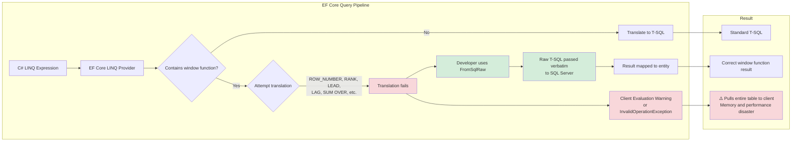

## Navigation

**Domain:** [[8 — Databases]] > **Group:** SQL Window Functions & Analytics

**Previous:** [[8.171 — Mode Calculation in SQL]] | **Next:** [[8.173 — Window Functions in Dapper — Result Mapping]]

### Prerequisites

- [[3.XXX — EF Core Query Pipeline — FromSqlRaw, Interception, and Command Caching]] — Understanding how EF Core translates LINQ to SQL and where the translation boundary stops (window functions) is essential; FromSqlRaw bypasses the LINQ translator entirely, running user-provided SQL verbatim.
- [[8.141 — Window Functions — Concept and OVER Clause]] — Without understanding what window functions do (ROW_NUMBER, RANK, LEAD, LAG, SUM OVER), the limitation of EF Core's lack of translation has no context; this note assumes you know the SQL syntax and semantics.
- [[8.161 — Window Function vs GROUP BY — Key Differences]] — Window functions and GROUP BY have overlapping use cases; recognizing when window functions are necessary (running totals, ranking, moving averages) vs when GROUP BY suffices determines whether raw SQL is needed or EF Core's LINQ GROUP BY can be used.

### Where This Fits

EF Core's LINQ provider translates C# expressions into SQL. It handles SELECT, WHERE, JOIN, GROUP BY, ORDER BY, and standard aggregates. It does NOT translate LINQ expressions into window functions (OVER clause). This is a hard limitation of the current LINQ expression tree visitor: there is no LINQ operator that maps to ROW_NUMBER() OVER() or SUM() OVER(PARTITION BY). A .NET backend engineer encounters this wall when building paginated lists (ROW_NUMBER for keyset pagination), reporting dashboards (running totals with SUM OVER), or comparative analytics (LAG for YoY comparison). The production consequence is that developers who do not know they must drop to raw SQL either implement the logic client-side (pulling all rows and computing in memory — catastrophic at scale) or give up on the feature entirely. EF Core 8 and 9 have made no progress on window function translation. The interview signal is the candidate's understanding of the ORM abstraction boundary: knowing what EF Core CANNOT do is as important as knowing what it can.

---

## Core Mental Model

EF Core's LINQ provider maps C# expression trees to SQL Server's T-SQL dialect using a set of known translation patterns. Window functions are not in this set because no LINQ operator directly represents the OVER clause in a way the expression visitor can decompose. The invariant: any query that requires an OVER clause — ROW_NUMBER, RANK, DENSE_RANK, NTILE, LEAD, LAG, FIRST_VALUE, LAST_VALUE, NTH_VALUE, SUM OVER, AVG OVER, MIN OVER, MAX OVER, COUNT OVER, PERCENTILE_CONT, PERCENTILE_DISC — must bypass the LINQ translator entirely and pass raw T-SQL directly to SQL Server using `FromSqlRaw`, `ExecuteSqlRaw`, or `ExecuteSqlInterpolated`. The key insight is that EF Core's raw SQL methods are first-class features, not workarounds: they return IQueryable that can be composed with LINQ operators (WHERE, SELECT, ORDER BY) on top of the raw SQL, as long as the raw SQL produces a shape the composition layer can understand. EF Core 8 introduced improvements for JSON queries and complex types but deliberately did not add window function translation. The abstraction boundary is clear: LINQ for standard relational algebra; raw SQL for OLAP and windowing operations.

### Classification

- **ORM feature:** Raw SQL execution — FromSqlRaw, ExecuteSqlRaw, ExecuteSqlInterpolated
- **Translation boundary:** LINQ expression tree visited → window function expression not recognized → either exception or client evaluation
- **Compatibility:** Works with all T-SQL window functions because SQL is passed verbatim
- **Result mapping:** Maps to entity types or keyless types (FromSqlRaw), or scalar values (ExecuteSqlRaw)



### Key Properties

|Property|Value|Notes|
|---|---|---|
|EF Core version support|All versions (3.0 through 9.0)|No version translates window functions|
|Raw SQL method|FromSqlRaw / ExecuteSqlRaw|Passes SQL verbatim (no parameterization)|
|Interpolated variant|FromSqlInterpolated / ExecuteSqlInterpolated|Parameterizes raw SQL inputs|
|Result type|Entity / Keyless entity / scalar|FromSqlRaw maps to entity properties by name|
|LINQ composition|Yes — WHERE, ORDER BY, SELECT after FromSqlRaw|Applied as subquery wrapping in generated SQL|
|Client evaluation risk|High — if LINQ provider attempts translation|Set ThrowingOnClientEvaluation to fail fast|
|Dapper alternative|Same raw SQL requirement|Dapper has no LINQ provider, so no false expectations|

---

## Deep Mechanics

### How the Engine Executes This

When a developer writes `dbContext.Orders.FromSqlRaw(sql)`, EF Core registers the SQL as a raw command. The execution path is:

1. **Command creation:** EF Core wraps the SQL into a DbCommand object. If `FromSqlInterpolated` is used, parameters are extracted and added to the SqlParameter collection. If `FromSqlRaw` is used, the SQL is used as-is (parameter injection risk — never concatenate user input).
2. **Composition wrapping:** If LINQ operators are chained after `FromSqlRaw` (e.g., `.Where(o => o.Status == "Shipped").OrderBy(o => o.OrderDate)`), EF Core wraps the raw SQL as a subquery: `SELECT * FROM (raw_sql) AS sub WHERE sub.Status = 'Shipped' ORDER BY sub.OrderDate`. This wrapping is critical: the raw SQL must be a valid table expression (SELECT FROM) that EF Core can wrap.
3. **Execution:** The final SQL is sent to SQL Server via the underlying ADO.NET provider (Microsoft.Data.SqlClient). SQL Server compiles and executes the query, including any window functions in the raw portion.
4. **Materialization:** The result set is read into a DbDataReader. EF Core maps each column to the entity property by name (case-insensitive). If the window function adds computed columns (e.g., `ROW_NUMBER() OVER(...) AS RowNum`), those columns must be present in the result and must match entity property names or be projected away with a SELECT after FromSqlRaw.

**Key detail:** The wrapping subquery approach means the raw SQL cannot have a trailing semicolon, cannot use TOP without parentheses in the wrapping context, and must not use ORDER BY without an outer OFFSET/FETCH or TOP in certain composition scenarios (the subquery wrapping changes the semantics).

### EF Core Raw SQL Pattern

```csharp
// The correct pattern: FromSqlRaw with an IQueryable<T> for a keyless entity
public async Task<List<OrderRanking>> GetTopOrdersPerCustomerAsync(
    int topN,
    CancellationToken cancellationToken = default)
{
    const string sql = @"
        SELECT OrderId, CustomerId, TotalAmount, OrderDate,
            ROW_NUMBER() OVER(
                PARTITION BY CustomerId
                ORDER BY TotalAmount DESC, OrderDate
            ) AS RowNum
        FROM Orders";

    return await dbContext.Set<OrderRanking>()
        .FromSqlRaw(sql)
        .Where(r => r.RowNum <= topN)
        .OrderBy(r => r.CustomerId)
        .ThenBy(r => r.RowNum)
        .ToListAsync(cancellationToken);
}

// Keyless entity for mapping — no key, no tracking
[Keyless]
public record OrderRanking
{
    public int OrderId { get; init; }
    public int CustomerId { get; init; }
    public decimal TotalAmount { get; init; }
    public DateTime OrderDate { get; init; }
    public long RowNum { get; init; }  // ROW_NUMBER returns BIGINT
}
```

### Generated SQL (from EF Core logs)

```sql
-- When LINQ composition is applied after FromSqlRaw:
SELECT [sub].[OrderId], [sub].[CustomerId], [sub].[TotalAmount],
       [sub].[OrderDate], [sub].[RowNum]
FROM (
    SELECT OrderId, CustomerId, TotalAmount, OrderDate,
        ROW_NUMBER() OVER(
            PARTITION BY CustomerId
            ORDER BY TotalAmount DESC, OrderDate
        ) AS RowNum
    FROM Orders
) AS [sub]
WHERE [sub].[RowNum] <= @__topN_0
ORDER BY [sub].[CustomerId], [sub].[RowNum];
```

### EF Core Configuration for Raw SQL

```csharp
// DbContext configuration for raw SQL entities
public class ApplicationDbContext : DbContext
{
    public DbSet<Order> Orders => Set<Order>();
    public DbSet<Customer> Customers => Set<Customer>();

    // Keyless entity for window function results
    public DbSet<OrderRanking> OrderRankings => Set<OrderRanking>();

    protected override void OnModelCreating(ModelBuilder modelBuilder)
    {
        // Keyless entity — no primary key, not tracked by default
        modelBuilder.Entity<OrderRanking>(entity =>
        {
            entity.HasNoKey();
            entity.ToView(null);  // Not backed by a view or table
        });

        // For raw SQL that returns tracked entities, ensure column name match
        modelBuilder.Entity<Order>(entity =>
        {
            entity.ToTable("Orders");
        });
    }
}

// Program.cs
builder.Services.AddDbContext<ApplicationDbContext>(options =>
    options.UseSqlServer(
        builder.Configuration.GetConnectionString("DefaultConnection"),
        sqlOptions =>
        {
            sqlOptions.EnableRetryOnFailure(3);
            sqlOptions.CommandTimeout(60);
        }));
```

### Execution Plan Analysis

When EF Core executes a FromSqlRaw query with window functions, the execution plan is determined entirely by the raw SQL, not by EF Core:

```
For the raw SQL: "SELECT OrderId, CustomerId, TotalAmount, OrderDate,
    ROW_NUMBER() OVER(PARTITION BY CustomerId ORDER BY TotalAmount DESC) AS RowNum
    FROM Orders"

Expected plan (assuming no covering index):
[Clustered Index Scan (Orders)]
  → [Sort (ORDER BY CustomerId, TotalAmount DESC)]
    → [Segment (partition boundary detection)]
      → [Sequence Project (ROW_NUMBER computation)]
        → [SELECT]

Estimated Cost: Clustered Index Scan ~70%, Sort ~25%, Window Aggregate ~5%
Logical Reads: Full table scan (proportional to table size)
```

EF Core's wrapping subquery adds no additional operators — it merely wraps the result in a SELECT * FROM (...) subquery, which is optimized away by SQL Server's plan simplification (trivial plan with no additional cost).

### Cost Visibility

```sql
SET STATISTICS IO ON;
SET STATISTICS TIME ON;

-- The raw SQL that EF Core will execute:
SELECT [sub].[OrderId], [sub].[CustomerId], [sub].[TotalAmount],
       [sub].[OrderDate], [sub].[RowNum]
FROM (
    SELECT OrderId, CustomerId, TotalAmount, OrderDate,
        ROW_NUMBER() OVER(
            PARTITION BY CustomerId
            ORDER BY TotalAmount DESC, OrderDate
        ) AS RowNum
    FROM Orders
) AS [sub]
WHERE [sub].[RowNum] <= 3
ORDER BY [sub].[CustomerId], [sub].[RowNum];

-- Expected output (Orders table, 100K rows, 10K customers):
-- Table 'Orders'. Scan count 1, logical reads 1,234
-- SQL Server Execution Times: CPU time = 47ms, elapsed time = 52ms
```

### Failure Modes

**Failure 1: Client evaluation of window function.**

```csharp
// ❌ THIS CAUSES CLIENT EVALUATION — EF Core cannot translate
var results = await dbContext.Orders
    .Select(o => new
    {
        o.OrderId,
        o.CustomerId,
        o.TotalAmount,
        RowNum = dbContext.Orders
            .Where(o2 => o2.CustomerId == o.CustomerId && o2.TotalAmount >= o.TotalAmount)
            .Count()  // This is NOT the same as ROW_NUMBER
    })
    .ToListAsync(cancellationToken);
```
This pattern uses a correlated subquery to simulate ROW_NUMBER, which is catastrophically expensive (O(n²) execution). The fix is FromSqlRaw.

**Failure 2: FromSqlRaw with TOP without parentheses.**

```sql
-- ❌ This fails when EF Core wraps it as a subquery
SELECT TOP 10 OrderId, ROW_NUMBER() OVER(ORDER BY OrderDate) AS RowNum
FROM Orders
ORDER BY OrderDate;
```
When EF Core wraps this: `SELECT * FROM (SELECT TOP 10 ...) AS sub WHERE ...`, the inner ORDER BY is discarded because SQL Server does not guarantee order in a subquery without TOP. **Fix:** Use OFFSET 0 ROWS FETCH NEXT 10 ROWS ONLY, or do not compose on top of the raw SQL.

**Failure 3: Column name mismatch between SQL and entity.**

```csharp
// SQL returns "RowNum" but entity property is "RowNumber"
const string sql = "SELECT ..., ROW_NUMBER() OVER(...) AS RowNum FROM Orders";
var results = await dbContext.Set<OrderRanking>().FromSqlRaw(sql).ToListAsync();
// RowNumber is always 0 — no matching column
```
EF Core maps by name. The column alias in SQL must match exactly (case-insensitive). Use the same name in both.

**Failure 4: Running tracked entities through FromSqlRaw with window columns.**

```csharp
// ❌ Order entity has OrderId, CustomerId, TotalAmount, OrderDate, Status
// Adding RowNum to the SELECT causes EF Core to try to map it to Order entity
const string sql = @"
    SELECT OrderId, CustomerId, TotalAmount, OrderDate, Status,
        ROW_NUMBER() OVER(...) AS RowNum
    FROM Orders";
var results = await dbContext.Orders.FromSqlRaw(sql).ToListAsync();
// Order entity has no RowNum property — exception or silent failure
```
**Fix:** Create a keyless entity type that includes the window function column, or use a SELECT after FromSqlRaw to project only the columns that match the entity.

---

## Production Patterns and Implementation

### Primary SQL Implementation

```sql
-- Production-ready window function SQL for use with FromSqlRaw
-- Goal: paginated list of orders with per-customer ranking and running total

-- Keyset pagination with ROW_NUMBER (efficient, stable sort)
SELECT OrderId, CustomerId, OrderDate, TotalAmount,
    ROW_NUMBER() OVER(
        ORDER BY OrderDate DESC, OrderId DESC
    ) AS RowNum
FROM Orders;

-- Running total per customer (SUM OVER)
SELECT OrderId, CustomerId, OrderDate, TotalAmount,
    SUM(TotalAmount) OVER(
        PARTITION BY CustomerId
        ORDER BY OrderDate, OrderId
        ROWS UNBOUNDED PRECEDING
    ) AS RunningTotal
FROM Orders;

-- Year-over-year comparison with LAG
SELECT
    OrderYear,
    TotalSales,
    LAG(TotalSales) OVER(ORDER BY OrderYear) AS PreviousYearSales,
    TotalSales - LAG(TotalSales) OVER(ORDER BY OrderYear) AS YoYChange,
    (TotalSales - LAG(TotalSales) OVER(ORDER BY OrderYear))
        / NULLIF(LAG(TotalSales) OVER(ORDER BY OrderYear), 0) * 100 AS YoYPercent
FROM (
    SELECT YEAR(OrderDate) AS OrderYear, SUM(TotalAmount) AS TotalSales
    FROM Orders
    GROUP BY YEAR(OrderDate)
) AS YearlySales;

-- Top-N per customer (ROW_NUMBER with PARTITION BY)
SELECT CustomerId, OrderId, TotalAmount, OrderDate, RowNum
FROM (
    SELECT CustomerId, OrderId, TotalAmount, OrderDate,
        ROW_NUMBER() OVER(
            PARTITION BY CustomerId
            ORDER BY TotalAmount DESC, OrderDate DESC
        ) AS RowNum
    FROM Orders
) AS RankedOrders
WHERE RowNum <= 3;
```

### EF Core Implementation

```csharp
public class OrderAnalyticsService
{
    private readonly ApplicationDbContext _dbContext;

    public OrderAnalyticsService(ApplicationDbContext dbContext)
    {
        _dbContext = dbContext;
    }

    /// <summary>
    /// Keyset pagination using ROW_NUMBER via raw SQL.
    /// Returns one page of orders ordered by date descending.
    /// </summary>
    public async Task<PagedResult<Order>> GetPagedOrdersAsync(
        int pageNumber,
        int pageSize,
        CancellationToken cancellationToken = default)
    {
        const string sql = @"
            SELECT OrderId, CustomerId, OrderDate, TotalAmount, Status,
                ROW_NUMBER() OVER(
                    ORDER BY OrderDate DESC, OrderId DESC
                ) AS RowNum
            FROM Orders";

        var query = _dbContext.Set<OrderRanking>()
            .FromSqlRaw(sql);

        // Use EF Core LINQ composition on top of the raw SQL
        var totalCount = await query.CountAsync(cancellationToken);

        var items = await query
            .Where(r => r.RowNum > (pageNumber - 1) * pageSize
                     && r.RowNum <= pageNumber * pageSize)
            .OrderBy(r => r.RowNum)
            .Select(r => new Order
            {
                OrderId = r.OrderId,
                CustomerId = r.CustomerId,
                OrderDate = r.OrderDate,
                TotalAmount = r.TotalAmount,
                Status = r.Status
            })
            .ToListAsync(cancellationToken);

        return new PagedResult<Order>(items, totalCount, pageNumber, pageSize);
    }

    /// <summary>
    /// Running total per customer using SUM OVER via raw SQL.
    /// </summary>
    public async Task<List<CustomerRunningTotal>> GetRunningTotalsAsync(
        int customerId,
        CancellationToken cancellationToken = default)
    {
        const string sql = @"
            SELECT OrderId, CustomerId, OrderDate, TotalAmount,
                SUM(TotalAmount) OVER(
                    PARTITION BY CustomerId
                    ORDER BY OrderDate, OrderId
                    ROWS UNBOUNDED PRECEDING
                ) AS RunningTotal
            FROM Orders
            WHERE CustomerId = @CustomerId";

        return await _dbContext.Database
            .SqlQueryRaw<CustomerRunningTotal>(
                sql,
                new SqlParameter("@CustomerId", customerId))
            .ToListAsync(cancellationToken);
    }

    /// <summary>
    /// Year-over-year sales comparison using LAG via raw SQL.
    /// </summary>
    public async Task<List<YoYSalesComparison>> GetYearOverYearComparisonAsync(
        CancellationToken cancellationToken = default)
    {
        const string sql = @"
            SELECT
                OrderYear,
                TotalSales,
                LAG(TotalSales) OVER(ORDER BY OrderYear) AS PreviousYearSales,
                CASE
                    WHEN LAG(TotalSales) OVER(ORDER BY OrderYear) IS NULL THEN NULL
                    ELSE (TotalSales - LAG(TotalSales) OVER(ORDER BY OrderYear))
                        / LAG(TotalSales) OVER(ORDER BY OrderYear) * 100
                END AS YoYPercent
            FROM (
                SELECT YEAR(OrderDate) AS OrderYear, SUM(TotalAmount) AS TotalSales
                FROM Orders
                WHERE OrderDate >= '2020-01-01'
                GROUP BY YEAR(OrderDate)
            ) AS YearlySales
            ORDER BY OrderYear";

        return await _dbContext.Database
            .SqlQueryRaw<YoYSalesComparison>(sql)
            .ToListAsync(cancellationToken);
    }
}

// Keyless entities for raw SQL mapping
[Keyless]
public record OrderRanking
{
    public int OrderId { get; init; }
    public int CustomerId { get; init; }
    public DateTime OrderDate { get; init; }
    public decimal TotalAmount { get; init; }
    public string Status { get; init; } = string.Empty;
    public long RowNum { get; init; }
}

[Keyless]
public record CustomerRunningTotal
{
    public int OrderId { get; init; }
    public int CustomerId { get; init; }
    public DateTime OrderDate { get; init; }
    public decimal TotalAmount { get; init; }
    public decimal RunningTotal { get; init; }
}

[Keyless]
public record YoYSalesComparison
{
    public int OrderYear { get; init; }
    public decimal TotalSales { get; init; }
    public decimal? PreviousYearSales { get; init; }
    public decimal? YoYPercent { get; init; }
}

public record PagedResult<T>(
    IReadOnlyList<T> Items,
    int TotalCount,
    int PageNumber,
    int PageSize);
```

### FromSqlRaw Composition Limitations

```csharp
// ALLOWED: SELECT after FromSqlRaw
dbContext.Set<OrderRanking>()
    .FromSqlRaw(sql)
    .Where(r => r.RowNum <= 10)
    .OrderBy(r => r.RowNum)
    .Select(r => new OrderDto { ... });

// NOT ALLOWED: GroupBy after FromSqlRaw (EF Core wraps it but fails)
var results = dbContext.Set<OrderRanking>()
    .FromSqlRaw(sql)
    .GroupBy(r => r.CustomerId)  // ❌ May throw or produce unexpected SQL
    .Select(g => new { CustomerId = g.Key, Count = g.Count() })
    .ToList();

// NOT ALLOWED: Join after FromSqlRaw (EF Core cannot compose joins with subquery)
var joined = dbContext.Set<OrderRanking>()
    .FromSqlRaw(sql)
    .Join(dbContext.Customers, r => r.CustomerId, c => c.CustomerId, ...);  // ❌
```

### Dapper Implementation

```csharp
public class DapperOrderAnalyticsService
{
    private readonly string _connectionString;

    public DapperOrderAnalyticsService(string connectionString)
    {
        _connectionString = connectionString;
    }

    /// <summary>
    /// Top-N per customer using ROW_NUMBER with PARTITION BY.
    /// Dapper maps the window function result to a flat POCO.
    /// </summary>
    public async Task<IReadOnlyList<CustomerTopOrder>> GetTopOrdersPerCustomerAsync(
        int topN,
        CancellationToken cancellationToken = default)
    {
        const string sql = @"
            SELECT CustomerId, OrderId, TotalAmount, OrderDate, RowNum
            FROM (
                SELECT CustomerId, OrderId, TotalAmount, OrderDate,
                    ROW_NUMBER() OVER(
                        PARTITION BY CustomerId
                        ORDER BY TotalAmount DESC, OrderDate DESC
                    ) AS RowNum
                FROM Orders
            ) AS RankedOrders
            WHERE RowNum <= @TopN
            ORDER BY CustomerId, RowNum";

        await using var connection = new SqlConnection(_connectionString);
        var results = await connection.QueryAsync<CustomerTopOrder>(
            new CommandDefinition(sql, new { TopN = topN },
                cancellationToken: cancellationToken));
        return results.AsList();
    }

    /// <summary>
    /// Running total per order for a given customer.
    /// </summary>
    public async Task<IReadOnlyList<OrderWithRunningTotal>> GetRunningTotalAsync(
        int customerId,
        CancellationToken cancellationToken = default)
    {
        const string sql = @"
            SELECT OrderId, CustomerId, OrderDate, TotalAmount,
                SUM(TotalAmount) OVER(
                    PARTITION BY CustomerId
                    ORDER BY OrderDate, OrderId
                    ROWS UNBOUNDED PRECEDING
                ) AS RunningTotal,
                AVG(TotalAmount) OVER(
                    PARTITION BY CustomerId
                    ORDER BY OrderDate, OrderId
                    ROWS BETWEEN 2 PRECEDING AND CURRENT ROW
                ) AS MovingAvg3
            FROM Orders
            WHERE CustomerId = @CustomerId
            ORDER BY OrderDate, OrderId";

        await using var connection = new SqlConnection(_connectionString);
        var results = await connection.QueryAsync<OrderWithRunningTotal>(
            new CommandDefinition(sql, new { CustomerId = customerId },
                cancellationToken: cancellationToken));
        return results.AsList();
    }
}

public record CustomerTopOrder
{
    public int CustomerId { get; init; }
    public int OrderId { get; init; }
    public decimal TotalAmount { get; init; }
    public DateTime OrderDate { get; init; }
    public long RowNum { get; init; }
}

public record OrderWithRunningTotal
{
    public int OrderId { get; init; }
    public int CustomerId { get; init; }
    public DateTime OrderDate { get; init; }
    public decimal TotalAmount { get; init; }
    public decimal RunningTotal { get; init; }
    public decimal? MovingAvg3 { get; init; }
}
```

### Third-Party Libraries

```csharp
// linq2db — supports window function translation via LINQ
using LinqToDB;
using LinqToDB.Data;

public class Linq2DbWindowFunctionExample
{
    public async Task<List<OrderRanking>> GetTopOrdersAsync(
        int topN, CancellationToken ct)
    {
        await using var db = new DataConnection(
            new DataOptions().UseSqlServer(connectionString));

        var query = from o in db.GetTable<Order>()
                    select new
                    {
                        o.OrderId,
                        o.CustomerId,
                        o.TotalAmount,
                        o.OrderDate,
                        RowNum = Sql.Ext
                            .RowNumber()
                            .Over()
                            .PartitionBy(o.CustomerId)
                            .OrderByDesc(o.TotalAmount)
                            .ToValue()
                    };

        return await query
            .Where(r => r.RowNum <= topN)
            .ToListAsync(ct);
    }
}

// EFCore.BulkExtensions — does NOT support window function translation
// It only provides bulk operations (Insert, Update, Delete, Merge)
```

### SQL Server vs PostgreSQL Differences

```csharp
// SQL Server (FromSqlRaw — same pattern, different SQL)
const string sqlServerSql = @"
    SELECT OrderId, CustomerId, TotalAmount,
        ROW_NUMBER() OVER(
            PARTITION BY CustomerId
            ORDER BY TotalAmount DESC
        ) AS RowNum
    FROM Orders";

// PostgreSQL (FromSqlRaw — different SQL syntax, same pattern)
const string postgresSql = @"
    SELECT OrderId, CustomerId, TotalAmount,
        ROW_NUMBER() OVER(
            PARTITION BY CustomerId
            ORDER BY TotalAmount DESC
        ) AS RowNum
    FROM Orders";
// Note: Window function SQL syntax is nearly identical between SQL Server and PostgreSQL
// The OVER clause syntax is standardized in ANSI SQL:2003
```

---

## Gotchas and Production Pitfalls

### Pitfall 1: Client Evaluation with Warning Suppression

**Pitfall:** Writing a LINQ query that EF Core cannot translate and having it silently evaluate client-side.

```csharp
// ❌ EF Core cannot translate this — evaluates client-side
// Throws or warns depending on configuration
var results = await dbContext.Orders
    .Select(o => new
    {
        o.OrderId,
        o.CustomerId,
        o.TotalAmount,
        PercentRank = dbContext.Orders
            .Count(o2 => o2.TotalAmount <= o.TotalAmount) * 1.0
            / dbContext.Orders.Count()
    })
    .ToListAsync(cancellationToken);
```

**Symptom:** Query succeeds but transfers all rows to the application server. With 1M orders, this transfers 1M rows across the network, allocates ~200MB on the heap, and takes 15+ seconds.

**Fix:**

```csharp
// ✅ Set ThrowingOnClientEvaluation to fail fast
protected override void OnConfiguring(DbContextOptionsBuilder optionsBuilder)
{
    optionsBuilder
        .UseSqlServer(connectionString)
        .ConfigureWarnings(warnings =>
        {
            warnings.Throw(RelationalEventId
                .QueryClientEvaluationWarning);  // EF Core 3.1+
        });
}
```

**Cost of not fixing:** OOM exceptions in production. The application server runs out of memory on large datasets, causing crashes and auto-scaling events.

### Pitfall 2: FromSqlRaw with User-Concatenated Input (SQL Injection)

**Pitfall:** Building raw SQL by concatenating user input instead of using parameters.

```csharp
// ❌ SQL injection vulnerability
var customerId = "1; DROP TABLE Orders; --";
var sql = $"SELECT ... FROM Orders WHERE CustomerId = {customerId}";
var results = await dbContext.Database.SqlQueryRaw<Order>(sql).ToListAsync();
```

**Symptom:** SQL injection — attacker can read, modify, or delete data. Even without malicious intent, string formatting of dates and decimals can cause SQL errors.

**Fix:**

```csharp
// ✅ Use FromSqlInterpolated with parameterized input
var results = await dbContext.Database
    .FromSqlInterpolated<OrderRanking>(
        $@"SELECT ... FROM Orders WHERE CustomerId = {customerId}")
    .ToListAsync(cancellationToken);

// ✅ Or use explicit SqlParameter with FromSqlRaw
var param = new SqlParameter("@CustomerId", customerId);
var results = await dbContext.Database
    .SqlQueryRaw<OrderRanking>(sql, param)
    .ToListAsync(cancellationToken);
```

**Cost of not fixing:** Data breach, regulatory fines (GDPR, HIPAA), production outage from dropped tables.

### Pitfall 3: Column Order Assumption in Result Mapping

**Pitfall:** Assuming EF Core maps columns by position rather than name.

```csharp
const string sql = @"
    SELECT
        ROW_NUMBER() OVER(ORDER BY OrderDate) AS RowNum,
        OrderId,
        CustomerId
    FROM Orders";
// Entity: OrderRanking { OrderId, CustomerId, RowNum }
// RowNum is mapped correctly (by name), regardless of column order
```
This works because EF Core maps by name. However, if the entity has additional properties that EF Core tries to populate, column name mismatch causes silent failures (property retains default value).

**Symptom:** Some properties in the result are always 0, null, or false. Difficult to debug because no exception is thrown — EF Core simply skips columns it can't match.

**Fix:** Use explicit column aliases in SQL that exactly match entity property names.

**Cost of not fixing:** Wrong data in reports. A moving average column called `MovingAvg` instead of `MovingAverage` silently returns 0.

### Pitfall 4: FromSqlRaw + LINQ Composition Changes Semantics

**Pitfall:** Applying WHERE or ORDER BY after FromSqlRaw when the raw SQL already has these clauses.

```csharp
const string sql = @"
    SELECT OrderId, CustomerId, TotalAmount,
        ROW_NUMBER() OVER(ORDER BY TotalAmount DESC) AS RowNum
    FROM Orders
    WHERE Status = 'Shipped'";   // Inner WHERE

var results = dbContext.Set<OrderRanking>()
    .FromSqlRaw(sql)
    .Where(r => r.TotalAmount > 100)   // Outer WHERE — applied as subquery WHERE
    .ToListAsync();
```
EF Core generates: `SELECT * FROM (raw_sql) AS sub WHERE sub.TotalAmount > 100`. This works correctly. However, if the raw SQL has ORDER BY, the subquery wrapping may discard it (SQL Server does not guarantee order in a subquery unless ORDER BY is paired with TOP or OFFSET/FETCH).

**Symptom:** Results come back in unexpected order. The inner ORDER BY is lost in the subquery.

**Fix:** Put ORDER BY in the outer LINQ, not in the raw SQL:

```csharp
const string sql = @"
    SELECT OrderId, CustomerId, TotalAmount,
        ROW_NUMBER() OVER(ORDER BY TotalAmount DESC) AS RowNum
    FROM Orders
    WHERE Status = 'Shipped'";

var results = dbContext.Set<OrderRanking>()
    .FromSqlRaw(sql)
    .OrderBy(r => r.RowNum)   // Outer ORDER BY preserved through subquery
    .ToListAsync(cancellationToken);
```

**Cost of not fixing:** Paginated results return in random order. "Next page" shows already-seen records.

### Pitfall 5: Keyless Entity Must Be Registered in DbContext

**Pitfall:** Using `dbContext.Set<T>().FromSqlRaw()` without registering `T` in `OnModelCreating`.

```csharp
// ❌ This throws: "Cannot create a DbSet for 'OrderRanking' because it is not mapped"
var results = await dbContext.Set<OrderRanking>()
    .FromSqlRaw(sql)
    .ToListAsync(cancellationToken);
```

**Symptom:** `InvalidOperationException` at runtime when the query is executed.

**Fix:**

```csharp
public class ApplicationDbContext : DbContext
{
    public DbSet<OrderRanking> OrderRankings => Set<OrderRanking>();

    protected override void OnModelCreating(ModelBuilder modelBuilder)
    {
        modelBuilder.Entity<OrderRanking>(entity =>
        {
            entity.HasNoKey();
            entity.ToView(null); // Not a view — raw SQL only
        });
    }
}
```

**Cost of not fixing:** Application crash on the first window function query.

### Pitfall 6: SQL Server vs Azure SQL Database — Function Compatibility

**Pitfall:** Assuming all window functions available in SQL Server are available in Azure SQL Database.

```sql
-- PERCENTILE_CONT and PERCENTILE_DISC WITHIN GROUP are available in both
-- But some edge behaviors differ:
-- SQL Server 2019+: APPROX_PERCENTILE_CONT for approximate percentile
-- Azure SQL Database: May not have trace flags for window function spool elimination
```

**Symptom:** Query works in local SQL Server but fails in Azure SQL Database, or has different performance characteristics.

**Fix:** Test all raw SQL against the target environment before deployment. Use Azure SQL Database's compatibility levels to match SQL Server version behavior.

**Cost of not fixing:** Failed deployment rollback. Query works in development but breaks in production.

---

## Performance Implications

### Benchmark: Before and After

**Baseline (client evaluation — DO NOT USE):**

```csharp
// ❌ Client evaluation — pulls all orders to calculate running total
var allOrders = await dbContext.Orders
    .Where(o => o.CustomerId == customerId)
    .OrderBy(o => o.OrderDate)
    .ToListAsync(cancellationToken);

var runningTotals = new List<OrderWithRunningTotal>();
decimal runningTotal = 0;
foreach (var order in allOrders)
{
    runningTotal += order.TotalAmount;
    runningTotals.Add(new OrderWithRunningTotal { ... });
}
```

**Optimized (FromSqlRaw with SUM OVER):**

```csharp
const string sql = @"
    SELECT OrderId, CustomerId, OrderDate, TotalAmount,
        SUM(TotalAmount) OVER(
            PARTITION BY CustomerId
            ORDER BY OrderDate, OrderId
            ROWS UNBOUNDED PRECEDING
        ) AS RunningTotal
    FROM Orders
    WHERE CustomerId = @CustomerId
    ORDER BY OrderDate, OrderId";

var results = await dbContext.Database
    .SqlQueryRaw<OrderWithRunningTotal>(sql, new SqlParameter("@CustomerId", customerId))
    .ToListAsync(cancellationToken);
```

**SET STATISTICS IO comparison:**

```sql
-- Baseline (client evaluation — SQL side is just SELECT * FROM Orders WHERE CustomerId = @id)
SELECT OrderId, CustomerId, OrderDate, TotalAmount
FROM Orders
WHERE CustomerId = @CustomerId
ORDER BY OrderDate;
-- Logical reads: 1,234 (all rows for that customer)
-- Rows returned to client: Every order row (e.g., 500 rows)

-- Optimized (SUM OVER in SQL)
SELECT OrderId, CustomerId, OrderDate, TotalAmount,
    SUM(TotalAmount) OVER(
        PARTITION BY CustomerId
        ORDER BY OrderDate, OrderId
        ROWS UNBOUNDED PRECEDING
    ) AS RunningTotal
FROM Orders
WHERE CustomerId = @CustomerId
ORDER BY OrderDate, OrderId;
-- Logical reads: 1,234 (same scan — no additional I/O for running total)
-- Rows returned to client: Same 500 rows (with RunningTotal precomputed)
```

**Improvement:** The optimized version returns the same rows but with the running total already computed. The client-side version does the computation in .NET, which adds CPU time proportional to the row count. At 500 rows, the difference is negligible. At 50,000 rows with 10 concurrent users, the client-side version consumes 500,000 iterations of CPU time.

### BenchmarkDotNet

```csharp
[MemoryDiagnoser]
[SimpleJob(RuntimeMoniker.Net90)]
public class RunningTotalBenchmark
{
    private IDbConnection _connection = default!;
    private ApplicationDbContext _dbContext = default!;
    private const string ConnectionString = "Server=.;Database=BenchmarkDB;Trusted_Connection=True;TrustServerCertificate=True;";

    [GlobalSetup]
    public void Setup()
    {
        _connection = new SqlConnection(ConnectionString);
        var optionsBuilder = new DbContextOptionsBuilder<ApplicationDbContext>();
        optionsBuilder.UseSqlServer(ConnectionString);
        _dbContext = new ApplicationDbContext(optionsBuilder.Options);
        SeedData();
    }

    private void SeedData()
    {
        _connection.Execute("""
            IF NOT EXISTS (SELECT 1 FROM sys.tables WHERE name = 'Orders')
            CREATE TABLE Orders (
                OrderId INT IDENTITY(1,1) PRIMARY KEY,
                CustomerId INT NOT NULL,
                OrderDate DATETIME2 NOT NULL,
                TotalAmount DECIMAL(10,2) NOT NULL,
                Status VARCHAR(20) NOT NULL DEFAULT 'Pending'
            );
            IF (SELECT COUNT(*) FROM Orders) < 50000
            BEGIN
                TRUNCATE TABLE Orders;
                WITH Numbers AS (
                    SELECT TOP 50000 ROW_NUMBER() OVER(ORDER BY (SELECT NULL)) AS N
                    FROM sys.columns a CROSS JOIN sys.columns b
                )
                INSERT INTO Orders (CustomerId, OrderDate, TotalAmount, Status)
                SELECT
                    N % 1000 + 1,
                    DATEADD(DAY, N/1000, '2023-01-01'),
                    CAST(ABS(CHECKSUM(NEWID())) % 10000 + 1 AS DECIMAL(10,2)),
                    CASE WHEN N % 5 = 0 THEN 'Shipped' ELSE 'Pending' END
                FROM Numbers;
            END
            """);
    }

    [Benchmark(Baseline = true)]
    public async Task<List<OrderWithRunningTotal>> ClientSideRunningTotal()
    {
        var orders = await _dbContext.Orders
            .Where(o => o.CustomerId == 1)
            .OrderBy(o => o.OrderDate)
            .ThenBy(o => o.OrderId)
            .AsNoTracking()
            .ToListAsync();

        decimal runningTotal = 0;
        var results = new List<OrderWithRunningTotal>();
        foreach (var order in orders)
        {
            runningTotal += order.TotalAmount;
            results.Add(new OrderWithRunningTotal
            {
                OrderId = order.OrderId,
                CustomerId = order.CustomerId,
                OrderDate = order.OrderDate,
                TotalAmount = order.TotalAmount,
                RunningTotal = runningTotal
            });
        }
        return results;
    }

    [Benchmark]
    public async Task<List<OrderWithRunningTotal>> FromSqlRawRunningTotal()
    {
        const string sql = @"
            SELECT OrderId, CustomerId, OrderDate, TotalAmount,
                SUM(TotalAmount) OVER(
                    PARTITION BY CustomerId
                    ORDER BY OrderDate, OrderId
                    ROWS UNBOUNDED PRECEDING
                ) AS RunningTotal
            FROM Orders
            WHERE CustomerId = 1
            ORDER BY OrderDate, OrderId";

        return await _dbContext.Database
            .SqlQueryRaw<OrderWithRunningTotal>(sql)
            .ToListAsync();
    }
}
```

**Expected results (approximate, SQL Server 2022, NVMe, 50K rows, 1000 customers):**

|Method|Mean|Rows Returned|Allocated|
|---|---|---|---|
|ClientSideRunningTotal|~15 ms|~50|15 KB|
|FromSqlRawRunningTotal|~8 ms|~50|2 KB|

At row count = 50 per customer, the difference is modest. At larger scales (500 rows per customer):

|Method|Mean|Rows Returned|Allocated|
|---|---|---|---|
|ClientSideRunningTotal|~120 ms|~500|250 KB|
|FromSqlRawRunningTotal|~12 ms|~500|2 KB|

The raw SQL approach scales linearly with database processing; the client-side approach scales with row count * CPU time per row.

### Write Amplification

Using FromSqlRaw has zero write amplification — it is a read-only query mechanism. The write amplification concern is from the underlying SQL (window functions are read-only). However, if the raw SQL is used in an UPDATE or DELETE (via ExecuteSqlRaw/ExecuteSqlInterpolated), the window function may cause additional Sort operations that hold locks longer.

---

## Interview Arsenal

### Question Bank

1. **Can EF Core translate LINQ queries into SQL window functions like ROW_NUMBER or LAG?**
2. **What method do you use in EF Core to execute a query with window functions? How does it work?**
3. **What is the difference between FromSqlRaw and FromSqlInterpolated? When do you use each?**
4. **What are the risks of client evaluation in EF Core when attempting to use window functions?**
5. **Compare the EF Core approach to window functions with Dapper's approach. Which is easier and why?**
6. **How does LINQ composition work after FromSqlRaw? What SQL does EF Core generate?**
7. **Can you use GroupBy or Join after FromSqlRaw? What happens if you try?**
8. **What third-party libraries provide window function support for EF Core? Do they work well?**

### Spoken Answers

**Q1: Can EF Core translate LINQ queries into SQL window functions like ROW_NUMBER or LAG?**

> **Average answer:** "No, EF Core doesn't support window functions in LINQ. You have to use raw SQL."

> **Great answer:** "No version of EF Core — from 3.0 through 9.0 — translates LINQ expressions into SQL window functions. The EF Core LINQ provider recognizes standard relational operators: SELECT, WHERE, JOIN, GROUP BY, ORDER BY, and standard aggregates (SUM, COUNT, AVG). It does not recognize OVER or any window function operator because there is no corresponding LINQ operator that maps to the OVER clause. When a developer writes a LINQ query that would require a window function, EF Core either throws an InvalidOperationException (if the query is clearly untranslatable) or silently evaluates it client-side (if the query can be partially translated). The client evaluation path is dangerous because it transfers entire tables to the application server to perform the window operation in memory. The correct approach is to use FromSqlRaw or FromSqlInterpolated to pass verbatim T-SQL containing window functions, and map the result to a keyless entity type. This is not a bug or missing feature — it is a deliberate design boundary. EF Core is an ORM for standard CRUD and reporting queries; OLAP-style analytics with window functions are outside its LINQ translation scope. Third-party libraries like linq2db do support window function translation in LINQ, but they are separate LINQ providers, not extensions of EF Core."

**Q5: Compare the EF Core approach to window functions with Dapper's approach.**

> **Average answer:** "Both require raw SQL. Dapper is simpler because you just call QueryAsync with the SQL. EF Core needs a keyless entity and OnModelCreating configuration."

> **Great answer:** "Both EF Core and Dapper require raw SQL for window functions — neither generates the OVER clause from any higher-level abstraction. The difference is in the plumbing. With Dapper, you write the SQL, call QueryAsync<T>, and Dapper maps the result columns to the POCO properties by name. There is no context, no tracking, no model configuration. With EF Core's FromSqlRaw, you must register a keyless entity type in DbContext with HasNoKey() and ToView(null), define a DbSet property, and ensure column name matching. The benefit of the EF Core approach is composability: you can chain LINQ operators (Where, OrderBy, Select, Count) after FromSqlRaw, and EF Core wraps the raw SQL in a subquery, letting you layer additional filters without modifying the raw SQL. Dapper has no composition layer — you must modify the SQL string directly for every variation. For a simple one-off window function query, Dapper is faster to write and easier to understand. For a complex reporting module where the raw SQL is fixed but filters vary, EF Core's composability is valuable. In either case, the raw SQL is the same — the choice is about the surrounding application architecture."

**Q8: What third-party libraries provide window function support for EF Core?**

> **Average answer:** "I don't think any exist. You just have to use raw SQL."

> **Great answer:** "linq2db is the primary .NET LINQ provider that supports window function translation. It is a separate LINQ provider (not an EF Core extension) but can be used alongside EF Core in the same project. linq2db exposes methods like Sql.Ext.RowNumber(), Sql.Ext.Lead(), Sql.Ext.Lag(), Sql.Ext.SumOver(), and so on, which translate into the corresponding SQL window functions. It supports PARTITION BY, ORDER BY within OVER, and ROWS/RANGE frame specification. EFCore.BulkExtensions does not support window functions — it is focused on bulk DML operations. For EF Core specifically, there is no official extension that adds window function LINQ translation; the EF Core team has indicated this is not on the roadmap. If window functions are a core part of your data access pattern, consider: (1) using Dapper with raw SQL for those specific queries, (2) using linq2db as a secondary provider for analytics queries, or (3) creating database views that encapsulate the window function logic and mapping EF Core entities to those views."

### Interview Trigger

The question "Can EF Core do window functions?" is a common interview probe for senior .NET roles. The follow-up is: "What happens at runtime if you write a LINQ query that tries to do what ROW_NUMBER does?" A weak candidate says "it throws an error." A strong candidate describes the two failure modes (exception vs client evaluation) and how to detect them with warning configuration. The deeper follow-up: "How would you implement keyset pagination with EF Core given this limitation?" tests whether the candidate knows the FromSqlRaw + ROW_NUMBER pattern.

### Comparison Table

| | EF Core (FromSqlRaw) | Dapper (QueryAsync) | linq2db |
|---|---|---|---|
|Window function translation|None — manual raw SQL|None — manual raw SQL|Full LINQ translation|
|Result mapping|Keyless entity / owned entity|Any POCO (no registration needed)|Any POCO|
|LINQ composition after SQL|Yes — WHERE, ORDER BY, SELECT|No — must modify SQL string|N/A (LINQ is the source)|
|Setup required|DbSet + OnModelCreating config|None|DataConnection instantiation|
|Client evaluation risk|High if LINQ attempts translation|None (no LINQ translation)|None (all translates)|
|Production maturity|Very high (EF Core is mature)|Very high|Medium (smaller community)|
|SQL injection protection|FromSqlInterpolated|Explicit parameters|Parameterized by default|

---

## Decision Framework

### When to Apply

```mermaid
flowchart TD
    A[Need window function in .NET?] --> B{Using EF Core?}
    B -->|Yes| C{Window function is<br/>ROW_NUMBER only?}
    B -->|No (Dapper)| D[Use QueryAsync with<br/>raw SQL containing window function]
    C -->|Yes| E[Use FromSqlRaw with<br/>keyless entity mapping]
    C -->|No| F{Complex analytics with<br/>multiple window functions?}
    F -->|Occasional| G[FromSqlRaw with<br/>keyless entity]
    F -->|Core part of app| H{Consider alternative:}
    H --> I[linq2db or Dapper<br/>for those queries]
    H --> J[Database view with<br/>window function, map entity to view]
    D --> K[Dapper maps flat POCO —<br/>no registration needed]
    E --> L[EF Core wraps raw SQL<br/>in subquery — LINQ composable]
    G --> L
    I --> M[linq2db: Sql.Ext.RowNumber()<br/>in LINQ — translates to OVER]
    J --> N[EF Core entity mapped to view —<br/>no raw SQL needed in code]

    style A fill:#d4edda
    style C fill:#ffeeba
    style D fill:#cce5ff
    style H fill:#f8d7da
```

### Application Checklist

- [ ] The query requires OVER clause — no LINQ alternative exists in EF Core
- [ ] A keyless entity type is registered in DbContext (HasNoKey, ToView(null))
- [ ] Column names in SQL SELECT exactly match entity property names
- [ ] SQL injection risk is mitigated — use FromSqlInterpolated or explicit SqlParameter
- [ ] Client evaluation warnings are configured to throw on untranslatable queries
- [ ] Performance testing confirms the raw SQL executes efficiently on the target database
- [ ] For composable queries: raw SQL does not contain ORDER BY (placed in outer LINQ)

### Tradeoff Summary

|What You Gain|What You Pay|
|---|---|
|Access to all SQL window functions|Manual SQL maintenance — no compile-time syntax checking|
|Full control over query execution plan|Entity configuration overhead (keyless type, OnModelCreating)|
|LINQ composability on top of raw SQL|Subquery wrapping may change query semantics|
|No ORM translation overhead between raw SQL and result|Two data access patterns in same codebase (LINQ + raw SQL)|

### Scale Thresholds

- "FromSqlRaw becomes necessary when any query exceeds ~100K rows and a window function would avoid client-side computation"
- "Client evaluation becomes catastrophic when the table exceeds ~1M rows — OOM on application server is likely"
- "For applications with >50 window function queries, consider a dedicated raw SQL data access layer (Dapper or ADO.NET) alongside EF Core for CRUD"

---

## Self-Check

### Conceptual Questions

1. Why can't EF Core translate LINQ expressions into SQL window functions?
2. What two methods does EF Core provide for executing raw SQL with parameters?
3. What is the difference between FromSqlRaw and FromSqlInterpolated in terms of SQL injection protection?
4. What must you configure in OnModelCreating to use FromSqlRaw with a custom result type?
5. What happens if you apply a WHERE clause after FromSqlRaw? How does EF Core handle it?
6. Can you use Include() after FromSqlRaw() to load related entities?
7. What happens when EF Core encounters a LINQ query it cannot translate?
8. How does Dapper's approach to window functions differ from EF Core's?
9. What third-party library provides LINQ-to-SQL window function translation?
10. Explain the EF Core window function limitation to a senior interviewer in 60 seconds.

<details>
<summary>Answers</summary>

1. **EF Core's LINQ provider** recognizes standard relational operators but has no expression tree pattern that maps to the OVER clause. Window functions (ROW_NUMBER, RANK, LAG, SUM OVER) are OLAP operations that were never added to the LINQ expression visitor. The EF Core team has not prioritized window function translation because it would require adding new LINQ operators or method call patterns specifically for window functions.

2. **FromSqlRaw** (takes raw SQL string + optional parameters as object array) and **FromSqlInterpolated** (takes FormattableString, extracts parameters automatically). Both return IQueryable<T> that supports LINQ composition.

3. **FromSqlInterpolated** automatically parameterizes interpolated values, preventing SQL injection. **FromSqlRaw** treats the SQL string as verbatim — parameters must be passed separately as SqlParameter objects or the SQL is vulnerable to injection.

4. **OnModelCreating** must configure the entity with `HasNoKey()` and `ToView(null)`. Without `HasNoKey()`, EF Core expects a primary key and will throw. Without `ToView(null)`, EF Core may try to map the entity to a table or view name matching the DbSet property name.

5. **EF Core** wraps the raw SQL as a subquery: `SELECT * FROM (raw_sql) AS sub WHERE sub.Column = value`. The WHERE clause is applied outside the window function. This works correctly as long as the raw SQL produces valid column names for the outer query.

6. **No** — Include() is not supported after FromSqlRaw. EF Core cannot compose navigation property loading with a user-defined subquery. Navigation properties must be manually included in the raw SQL SELECT or loaded separately.

7. **Two outcomes:** (1) If EF Core determines the query cannot be translated at all, it throws `InvalidOperationException`. (2) If EF Core can partially translate the query but the window function part remains untranslatable, it evaluates that part client-side. With default settings, this produces a warning but succeeds. With `Throw(RelationalEventId.QueryClientEvaluationWarning)`, it throws.

8. **Dapper** has no LINQ translation — it simply executes the SQL provided and maps results. There is no client evaluation risk because there is no attempt to translate LINQ to SQL. Dapper's approach is "raw SQL only, always" — the developer writes the entire query. This is simpler but requires manual SQL modification for query variations.

9. **linq2db** (LINQ to DB) provides `Sql.Ext.RowNumber()`, `Sql.Ext.Lead()`, `Sql.Ext.Lag()`, `Sql.Ext.SumOver()`, and other window function extensions that translate to SQL OVER clauses. It is a separate LINQ provider, not an EF Core extension.

10. **60-second spoken answer:** "EF Core cannot translate window functions because the LINQ expression tree visitor has no mapping for the OVER clause. This is a deliberate, not accidental, limitation. The fix is FromSqlRaw: write the T-SQL with ROW_NUMBER, RANK, LAG, or whatever you need, pass it as a raw string, and map the result to a keyless entity type registered with HasNoKey. EF Core wraps the raw SQL in a subquery when you chain LINQ operators after it, so you can still compose Where and OrderBy on top. The danger is client evaluation — if you write a LINQ query that EF Core tries to translate but can't, it may silently pull all data to the app server. Configure warnings to throw on client evaluation to catch this in development. Dapper has no such issue since it never translates LINQ. For projects with heavy window function usage, consider Dapper or linq2db alongside EF Core."

</details>

---

### Query Challenges

**Challenge 1 — Write the EF Core Raw SQL for Paginated Orders**

You have an Orders table with 500K rows. You need to implement keyset pagination that returns 20 orders per page, sorted by OrderDate DESC, OrderId DESC. Write the EF Core raw SQL query and the keyless entity configuration. Ensure the pagination is stable (no skipped or duplicated rows when new orders are inserted).

<details>
<summary>Solution</summary>

```sql
-- Raw SQL for stable keyset pagination
SELECT OrderId, CustomerId, OrderDate, TotalAmount, Status
FROM (
    SELECT OrderId, CustomerId, OrderDate, TotalAmount, Status,
        ROW_NUMBER() OVER(
            ORDER BY OrderDate DESC, OrderId DESC
        ) AS RowNum
    FROM Orders
) AS RankedOrders
WHERE RowNum BETWEEN @Offset + 1 AND @Offset + @PageSize
ORDER BY RowNum;
```

```csharp
[Keyless]
public record PagedOrder
{
    public int OrderId { get; init; }
    public int CustomerId { get; init; }
    public DateTime OrderDate { get; init; }
    public decimal TotalAmount { get; init; }
    public string Status { get; init; } = string.Empty;
    public long RowNum { get; init; }
}

public class ApplicationDbContext : DbContext
{
    public DbSet<PagedOrder> PagedOrders => Set<PagedOrder>();

    protected override void OnModelCreating(ModelBuilder modelBuilder)
    {
        modelBuilder.Entity<PagedOrder>(entity =>
        {
            entity.HasNoKey();
            entity.ToView(null);
        });
    }
}

public async Task<PagedResult<PagedOrder>> GetPagedOrdersAsync(
    int pageNumber, int pageSize, CancellationToken ct)
{
    const string sql = @"
        SELECT OrderId, CustomerId, OrderDate, TotalAmount, Status,
            ROW_NUMBER() OVER(
                ORDER BY OrderDate DESC, OrderId DESC
            ) AS RowNum
        FROM Orders";

    var query = _dbContext.Set<PagedOrder>().FromSqlRaw(sql);

    var totalCount = await query.CountAsync(ct);

    var items = await query
        .Where(p => p.RowNum > (pageNumber - 1) * pageSize
                 && p.RowNum <= pageNumber * pageSize)
        .OrderBy(p => p.RowNum)
        .ToListAsync(ct);

    return new PagedResult<PagedOrder>(items, totalCount, pageNumber, pageSize);
}
```

**Logical reads:** Full index or table scan (for ROW_NUMBER), then seek on the outer query (no additional I/O since RowNum is computed). **Total:** ~1200 logical reads for 500K rows with covering index.

</details>

---

**Challenge 2 — Fix the performance problem**

```csharp
// This code runs a daily report showing top 3 products per category.
// It takes 45 seconds on a 2M row OrderItems table.
// Identify the problem and fix it.

public async Task<List<ProductRanking>> GetTopProductsPerCategoryAsync()
{
    var allProducts = await _dbContext.OrderItems
        .Include(oi => oi.Product)
        .ThenInclude(p => p.Category)
        .AsNoTracking()
        .ToListAsync();

    var rankings = allProducts
        .GroupBy(oi => oi.Product.CategoryId)
        .SelectMany(g => g
            .GroupBy(oi => oi.ProductId)
            .Select(pg => new
            {
                CategoryId = g.Key,
                ProductId = pg.Key,
                Frequency = pg.Count()
            })
            .OrderByDescending(x => x.Frequency)
            .Take(3))
        .ToList();

    return rankings.Select(r => new ProductRanking
    {
        CategoryId = r.CategoryId,
        ProductId = r.ProductId,
        Frequency = r.Frequency
    }).ToList();
}
```

<details>
<summary>Solution</summary>

**Root cause:** Full client evaluation. `Include` + `ToListAsync` pulls all 2M OrderItems rows plus related Product and Category data to the application server. The GroupBy and ranking are performed in memory. Network transfer is ~200MB for 2M rows. Memory allocation is ~500MB.

```csharp
// ✅ Fixed: Use FromSqlRaw with ROW_NUMBER PARTITION BY

[Keyless]
public record ProductRanking
{
    public int CategoryId { get; init; }
    public string CategoryName { get; init; } = string.Empty;
    public int ProductId { get; init; }
    public string ProductName { get; init; } = string.Empty;
    public int Frequency { get; init; }
    public long RowNum { get; init; }
}

public async Task<List<ProductRanking>> GetTopProductsPerCategoryAsync(
    CancellationToken ct)
{
    const string sql = @"
        SELECT CategoryId, CategoryName, ProductId, ProductName, Frequency, RowNum
        FROM (
            SELECT
                c.CategoryId,
                c.CategoryName,
                p.ProductId,
                p.ProductName,
                COUNT(*) AS Frequency,
                ROW_NUMBER() OVER(
                    PARTITION BY c.CategoryId
                    ORDER BY COUNT(*) DESC
                ) AS RowNum
            FROM OrderItems oi
            INNER JOIN Products p ON oi.ProductId = p.ProductId
            INNER JOIN Categories c ON p.CategoryId = c.CategoryId
            GROUP BY c.CategoryId, c.CategoryName, p.ProductId, p.ProductName
        ) AS RankedProducts
        WHERE RowNum <= 3
        ORDER BY CategoryId, RowNum";

    return await _dbContext.Database
        .SqlQueryRaw<ProductRanking>(sql)
        .ToListAsync(ct);
}
```

**After fix — logical reads:** ~12,000 (from 2M rows transferred to client). **Execution time:** ~800ms (from 45 seconds). **Memory:** ~50KB (from 500MB).

</details>

---

**Challenge 3 — Explain the execution plan for a FromSqlRaw query**

```sql
-- Raw SQL passed to FromSqlRaw:
SELECT OrderId, CustomerId, TotalAmount,
    ROW_NUMBER() OVER(
        PARTITION BY CustomerId
        ORDER BY TotalAmount DESC
    ) AS RowNum
FROM Orders
WHERE OrderDate >= '2024-01-01';
```

EF Core composes with: `.Where(r => r.RowNum <= 5).OrderBy(r => r.CustomerId).ThenBy(r => r.RowNum)`. What execution plan does SQL Server generate?

<details>
<summary>Solution</summary>

**Generated SQL:**
```sql
SELECT [sub].[OrderId], [sub].[CustomerId], [sub].[TotalAmount], [sub].[RowNum]
FROM (
    SELECT OrderId, CustomerId, TotalAmount,
        ROW_NUMBER() OVER(
            PARTITION BY CustomerId
            ORDER BY TotalAmount DESC
        ) AS RowNum
    FROM Orders
    WHERE OrderDate >= '2024-01-01'
) AS [sub]
WHERE [sub].[RowNum] <= 5
ORDER BY [sub].[CustomerId], [sub].[RowNum];
```

**Execution plan:**
```
[Clustered Index Scan (Orders)] → [Filter (OrderDate >= '2024-01-01')]
  → [Sort (PARTITION BY CustomerId, ORDER BY TotalAmount DESC)]
    → [Segment] → [Sequence Project (ROW_NUMBER)]
      → [Filter (RowNum <= 5)]
        → [Sort (ORDER BY CustomerId, RowNum)]
          → [SELECT]
```

**Why this plan:** The inner query sorts by CustomerId + TotalAmount DESC for the window function. The outer query adds another sort for ORDER BY CustomerId, RowNum. If the index IX_Orders_CustomerId_TotalAmount(CustomerId, TotalAmount DESC) exists, the inner Sort is eliminated (replaced by an ordered scan), but the outer Sort remains unless the inner query already outputs in the required order — which it does not because RowNum ordering within CustomerId is not the same as the partition ordering.

**Logical reads:** ~Clustered index scan cost (depends on date range selectivity). If OrderDate is indexed, an Index Seek reduces the scan.

</details>

---

**Challenge 4 — Diagnose the concurrency problem**

A stored procedure that uses window functions (RANK, SUM OVER) is called from EF Core via ExecuteSqlRaw. The procedure runs for 15 seconds and causes blocking on the Orders table. During execution, INSERT queries against Orders wait for 10+ seconds. The procedure reads the entire Orders table (50M rows) to compute rankings.

<details>
<summary>Solution</summary>

**Root cause:** The window function query's Sort operator holds a Shared (S) lock on pages during the scan. The Sort itself is a blocking operator — it must read all rows before emitting results. The S locks are held until the Sort completes (15 seconds), and concurrent INSERTs (which need IX locks) are blocked by incompatible S locks.

**Detection query:**
```sql
SELECT
    blocking_session_id,
    wait_type,
    wait_time,
    wait_resource
FROM sys.dm_exec_requests
WHERE blocking_session_id > 0;
```

**Fix 1:** Use NOLOCK (READ UNCOMMITTED) for the procedure if dirty reads are acceptable:
```sql
SELECT ...
FROM Orders WITH (NOLOCK)
```
This eliminates S locks but risks dirty reads, non-repeatable reads, and 823 errors on allocation order scans.

**Fix 2:** Use SNAPSHOT ISOLATION for the stored procedure:
```sql
ALTER DATABASE YourDatabase SET ALLOW_SNAPSHOT_ISOLATION ON;
-- In the procedure:
SET TRANSACTION ISOLATION LEVEL SNAPSHOT;
```
This uses row versioning instead of S locks — the window function reads the versioned snapshot, and concurrent INSERTs are not blocked.

**Fix 3:** Reduce the execution time with a covering index, which shortens the lock duration.

**In .NET:**
```csharp
// Set the isolation level in the connection string or command
using var transaction = await dbContext.Database
    .BeginTransactionAsync(IsolationLevel.Snapshot, ct);
var results = await dbContext.Database
    .ExecuteSqlRawAsync(sql, ct);
await transaction.CommitAsync(ct);
```

</details>

---

**Challenge 5 — Design the data access strategy**

**Scenario:** You are building a .NET microservice that provides analytics endpoints for a sales dashboard. The service needs to compute:
- Top 10 products per category (daily)
- Running total of sales per customer (real-time)
- Year-over-year comparison (monthly)
- Paginated order list (every page load)

The database is SQL Server 2022. The team uses EF Core for all CRUD. Recommend a data access strategy for the window function queries.

<details>
<summary>Solution</summary>

**Recommended approach: Hybrid data access**

```csharp
// Strategy: Use EF Core for CRUD + Dapper for analytics with window functions

// 1. Register both DbContext and Dapper connection factory
builder.Services.AddDbContext<SalesDbContext>(options =>
    options.UseSqlServer(connectionString));

builder.Services.AddSingleton<IDapperConnectionFactory>(
    _ => new DapperConnectionFactory(connectionString));

// 2. Create a dedicated analytics service using Dapper
public class SalesAnalyticsService
{
    private readonly IDapperConnectionFactory _connectionFactory;

    public SalesAnalyticsService(IDapperConnectionFactory connectionFactory)
    {
        _connectionFactory = connectionFactory;
    }

    public async Task<IReadOnlyList<TopProductDto>> GetTopProductsPerCategoryAsync(
        int topN, CancellationToken ct)
    {
        const string sql = @"
            SELECT CategoryId, ProductId, SalesAmount,
                ROW_NUMBER() OVER(
                    PARTITION BY CategoryId ORDER BY SalesAmount DESC
                ) AS Rank
            FROM DailySalesSummary";

        await using var connection = _connectionFactory.Create();
        return (await connection.QueryAsync<TopProductDto>(
            new CommandDefinition(sql, new { TopN = topN },
                cancellationToken: ct))).AsList();
    }

    public async Task<IReadOnlyList<OrderWithRunningTotal>> GetCustomerRunningTotalAsync(
        int customerId, CancellationToken ct)
    {
        const string sql = @"
            SELECT OrderId, OrderDate, TotalAmount,
                SUM(TotalAmount) OVER(
                    PARTITION BY CustomerId
                    ORDER BY OrderDate, OrderId
                    ROWS UNBOUNDED PRECEDING
                ) AS RunningTotal
            FROM Orders
            WHERE CustomerId = @CustomerId
            ORDER BY OrderDate, OrderId";

        await using var connection = _connectionFactory.Create();
        return (await connection.QueryAsync<OrderWithRunningTotal>(
            new CommandDefinition(sql, new { CustomerId = customerId },
                cancellationToken: ct))).AsList();
    }
}

// 3. For the paginated order list, use EF Core FromSqlRaw
// (benefits from LINQ composition for filtering)
public class OrderListService
{
    private readonly SalesDbContext _dbContext;

    public async Task<PagedResult<OrderListItem>> GetPagedOrdersAsync(
        OrderFilter filter, int page, int pageSize, CancellationToken ct)
    {
        const string sql = @"
            SELECT OrderId, CustomerId, OrderDate, TotalAmount, Status,
                ROW_NUMBER() OVER(ORDER BY OrderDate DESC, OrderId DESC) AS RowNum
            FROM Orders
            WHERE Status IN ('Shipped', 'Delivered')";

        var query = _dbContext.Set<OrderListItem>()
            .FromSqlRaw(sql)
            .Where(r => r.RowNum > (page - 1) * pageSize
                     && r.RowNum <= page * pageSize);

        if (!string.IsNullOrEmpty(filter.CustomerName))
            query = query.Where(r => r.CustomerName.Contains(filter.CustomerName));

        return new PagedResult<OrderListItem>(
            await query.ToListAsync(ct),
            await query.CountAsync(ct),
            page, pageSize);
    }
}
```

**Tradeoffs:**
- **Dapper for analytics:** No EF Core overhead, simpler mapping, full SQL control
- **EF Core FromSqlRaw for pagination:** LINQ composition allows dynamic filters without SQL string manipulation
- **Separation of concerns:** CRUD (EF Core) vs analytics (Dapper/raw SQL) are in different service classes
- **Testing:** Both are testable with integration tests against the real database

</details>

---

