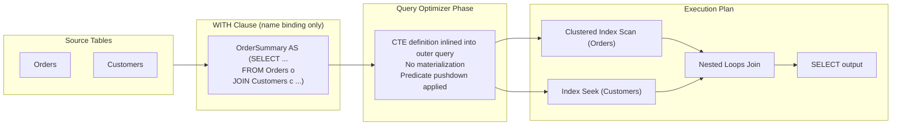
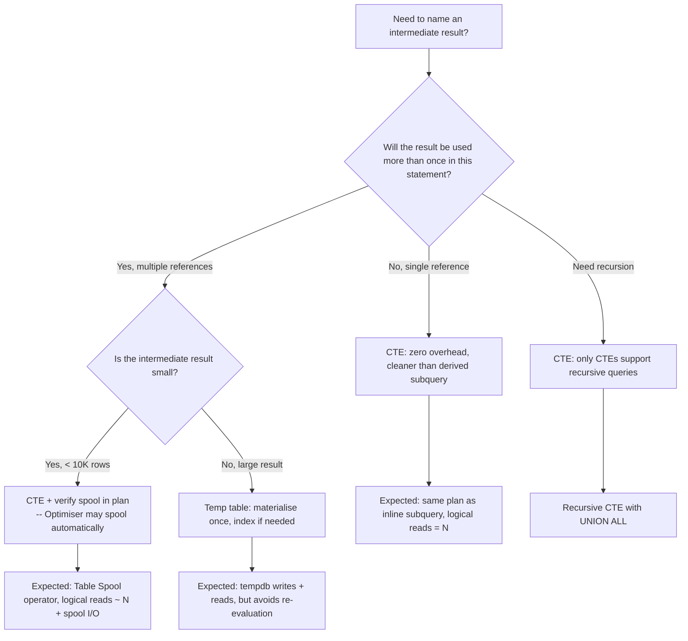

## Navigation

**Domain:** [[8 — Databases]] > **Group:** SQL CTEs & Recursive Queries
**Previous:** (none — first in group) | **Next:** [[8.177 — Multiple CTEs — Chaining and Dependencies]]

### Prerequisites

- [[8.123 — GROUP BY — Grouping Mechanics]] — CTEs often encapsulate aggregated intermediate results; understanding GROUP BY mechanics is needed before wrapping them in a WITH clause.
- [[8.128 — Derived Tables and Subqueries in FROM]] — CTEs are a syntactic alternative to derived subqueries in the FROM clause; understanding the subquery form makes the CTE improvement obvious.
- [[8.141 — Window Functions — Concept and OVER Clause]] — CTEs and window functions are frequently combined; the CTE names the intermediate result that window functions compute over.

### Where This Fits

A Common Table Expression (CTE) is a named temporary result set defined with the WITH clause that exists only for the duration of a single statement — typically a SELECT, INSERT, UPDATE, DELETE, or MERGE. Every .NET backend engineer encounters CTEs when working with raw SQL in Dapper, writing complex reports, or debugging ORM-generated queries that need manual optimisation. The CTE does not materialise data by default (it is inlined into the outer query by the optimiser), which is the single most important fact about its performance profile. The interview signal is foundational: CTEs appear at every level of SQL screening. A candidate who understands that CTEs are syntactic sugar — not temporary tables — and who can explain when they do and do not avoid repeated execution demonstrates senior-level execution-plan awareness.

---

## Core Mental Model

A CTE is a named subquery defined at the top of a statement that the optimiser inlines into the outer query just as it would inline a derived table (subquery in the FROM clause). The WITH clause does not create a temporary storage location — no rows are written to tempdb, no statistics are generated, and the CTE name disappears after the statement ends. The optimiser treats the CTE reference as a macro expansion: it replaces each reference to the CTE name with the CTE's definition and optimises the combined query as a single unit. This means a CTE referenced multiple times in the same statement is expanded multiple times, potentially causing repeated evaluation of the same logic unless the optimiser chooses to spool the result (see 8.188 for spooling conditions). The recognition pattern: when a query reads more naturally top-to-bottom than inside-out (as nested subqueries do), a CTE is the right tool. When a named intermediate result is needed only once in a single statement, a CTE is the lightest option — no objects to create, no cleanup, no permissions beyond the underlying tables.

### Classification

CTEs belong to the expression-level naming facility in T-SQL. They are resolved at parse time (name binding) and inlined at optimisation time. They are not objects — they do not appear in sys.objects, sys.views, or any system catalogue. They have no statistics, no indexes, and no persistence. The optimiser can and does push predicates from the outer query into the CTE definition (predicate pushdown), which means a CTE that filters on a column in the outer WHERE clause may benefit from an index on that column inside the CTE definition, just as a derived table would. SARGability is determined by the predicates in the final combined query, not by the CTE boundary.



### Key Properties

|Property|Value|Notes|
|---|---|---|
|Scope|Single statement only|Cannot reference CTE across batch boundaries|
|Persistence|None — inlined at optimisation|No tempdb writes, no stats, no indexes|
|Plan shape|Identical to derived subquery|Optimiser removes the CTE boundary|
|Multiple references|Each reference expands separately|Risk of repeated evaluation without spool|
|Recursion support|Yes — WITH RECURSIVE (ANSI) or standalone (T-SQL)|Only CTEs support recursive queries|
|Nesting|No nested WITH clauses|But multiple CTEs can be comma-separated|
|EF Core support|Raw SQL only|EF Core never generates WITH clauses|
|Dapper support|Full (any SQL)|Dapper executes whatever SQL you provide|

---

## Deep Mechanics

### How the Engine Executes This

**Parse phase (Algebrizer):** When SQL Server encounters the WITH keyword, the algebrizer binds the CTE name to its definition. It resolves column references inside the CTE to the underlying base tables (Orders, Customers, etc.). The CTE name is entered into the scope's name table but is only visible within the single statement that follows the WITH clause.

**Optimisation phase:** The optimiser (cost-based) eliminates the CTE boundary by replacing every reference to the CTE name with the CTE's defining expression. This is identical to how derived tables (subqueries in FROM) are handled. The optimiser then treats the combined tree as a single query for cost-based optimisation:

1. Predicate pushdown: WHERE clauses from the outer query are pushed into the CTE definition. Example: if the CTE selects all orders but the outer query filters `WHERE OrderDate >= '2024-01-01'`, the optimiser pushes this filter into the CTE, potentially enabling an index seek on OrderDate.
2. Join reordering: joins between the CTE and other tables are reordered based on cardinality estimates, just as if the CTE definition were written inline.
3. Multiple references: if the CTE is referenced more than once, the optimiser duplicates the CTE definition for each reference. An optimiser hint or a spool (Index Spool / Table Spool) may appear if the optimiser decides that materialising the CTE result once and re-reading it is cheaper than evaluating it twice.

**Execution phase:** The execution plan contains no "CTE" operator. The plan is identical to what it would be if the CTE definition were written directly as a subquery or derived table. The operators are those of the underlying query: table scans, index seeks, joins, aggregates, etc.

**No materialisation by default — the key fact:**

A CTE does NOT create a temporary table. No rows are written to tempdb. No memory grant is consumed for CTE storage. The CTE is purely a query-structuring construct. This is the most important performance takeaway: a single-reference CTE adds zero runtime overhead compared to writing the subquery inline. It is free from a performance standpoint. The cost is purely in the optimiser's compilation time (negligible).

### SQL Visibility

```sql
-- ============================================================
-- Sample schema
-- ============================================================
-- dbo.Orders: OrderId INT PK, CustomerId INT, OrderDate DATE,
--             TotalAmount DECIMAL(18,2), Status VARCHAR(20)
-- dbo.OrderItems: OrderItemId INT PK, OrderId INT FK,
--                 ProductId INT, Quantity INT, UnitPrice DECIMAL(18,2)
-- dbo.Customers: CustomerId INT PK, FullName NVARCHAR(100),
--                Email NVARCHAR(200), CreatedDate DATE

-- ============================================================
-- Example 1: Basic CTE — named intermediate result
-- ============================================================
-- Business question: find customers whose total orders exceed $10,000
WITH CustomerOrderTotal AS (
    SELECT
        o.CustomerId,
        SUM(o.TotalAmount) AS TotalSpent,
        COUNT(*) AS OrderCount
    FROM dbo.Orders AS o
    WHERE o.Status <> 'Cancelled'
    GROUP BY o.CustomerId
)
SELECT
    c.FullName,
    c.Email,
    cot.TotalSpent,
    cot.OrderCount
FROM CustomerOrderTotal AS cot
INNER JOIN dbo.Customers AS c
    ON c.CustomerId = cot.CustomerId
WHERE cot.TotalSpent > 10000
ORDER BY cot.TotalSpent DESC;

-- ============================================================
-- Example 2: CTE with explicit column aliases
-- ============================================================
-- The column list after the CTE name renames the output columns
WITH OrderSummary (OrderId, CustomerName, ItemCount, TotalValue) AS (
    SELECT
        o.OrderId,
        c.FullName,
        (SELECT SUM(oi.Quantity) FROM dbo.OrderItems AS oi WHERE oi.OrderId = o.OrderId),
        o.TotalAmount
    FROM dbo.Orders AS o
    INNER JOIN dbo.Customers AS c ON c.CustomerId = o.CustomerId
)
SELECT *
FROM OrderSummary
WHERE TotalValue > 500
ORDER BY TotalValue DESC;

-- ============================================================
-- Example 3: CTE as self-documenting query structure
-- ============================================================
-- Instead of deeply nested subqueries, break into named steps
WITH Orders2024 AS (
    SELECT OrderId, CustomerId, TotalAmount
    FROM dbo.Orders
    WHERE OrderDate >= '2024-01-01' AND OrderDate < '2025-01-01'
),
HighValueOrders AS (
    SELECT OrderId, CustomerId, TotalAmount
    FROM Orders2024
    WHERE TotalAmount > 1000
),
CustomerStats AS (
    SELECT
        CustomerId,
        COUNT(*) AS HighValueCount,
        SUM(TotalAmount) AS HighValueTotal
    FROM HighValueOrders
    GROUP BY CustomerId
)
SELECT
    c.FullName,
    c.Email,
    cs.HighValueCount,
    cs.HighValueTotal
FROM CustomerStats AS cs
INNER JOIN dbo.Customers AS c ON c.CustomerId = cs.CustomerId
ORDER BY cs.HighValueTotal DESC;

-- ============================================================
-- Example 4: CTE with window function — naming the ranked result
-- ============================================================
WITH RankedOrders AS (
    SELECT
        o.OrderId,
        o.CustomerId,
        o.TotalAmount,
        o.OrderDate,
        ROW_NUMBER() OVER(PARTITION BY o.CustomerId ORDER BY o.TotalAmount DESC) AS rn
    FROM dbo.Orders AS o
    WHERE o.Status = 'Completed'
)
SELECT
    ro.OrderId,
    ro.CustomerId,
    ro.TotalAmount,
    ro.OrderDate
FROM RankedOrders AS ro
WHERE ro.rn = 1  -- top order per customer
ORDER BY ro.TotalAmount DESC;

-- ============================================================
-- Example 5: CTE in an INSERT statement
-- ============================================================
WITH HighValueCustomers AS (
    SELECT
        o.CustomerId,
        SUM(o.TotalAmount) AS TotalSpent
    FROM dbo.Orders AS o
    WHERE o.Status = 'Completed'
    GROUP BY o.CustomerId
    HAVING SUM(o.TotalAmount) > 50000
)
INSERT INTO dbo.VIPCustomers (CustomerId, TotalSpent, VIPSince)
SELECT
    hvc.CustomerId,
    hvc.TotalSpent,
    GETDATE()
FROM HighValueCustomers AS hvc
WHERE NOT EXISTS (
    SELECT 1 FROM dbo.VIPCustomers AS v
    WHERE v.CustomerId = hvc.CustomerId
);
```

```csharp
// EF Core — CTEs require raw SQL
// EF Core never generates a WITH clause from LINQ expressions.
// You must use FromSqlRaw or ExecuteSqlRaw.

public async Task<List<CustomerSummary>> GetHighValueCustomersAsync(
    decimal threshold,
    CancellationToken cancellationToken = default)
{
    const string sql = @"
        WITH CustomerOrderTotal AS (
            SELECT
                o.CustomerId,
                SUM(o.TotalAmount) AS TotalSpent,
                COUNT(*) AS OrderCount
            FROM dbo.Orders AS o
            WHERE o.Status <> 'Cancelled'
            GROUP BY o.CustomerId
        )
        SELECT
            c.FullName,
            c.Email,
            cot.TotalSpent,
            cot.OrderCount
        FROM CustomerOrderTotal AS cot
        INNER JOIN dbo.Customers AS c
            ON c.CustomerId = cot.CustomerId
        WHERE cot.TotalSpent > @Threshold
        ORDER BY cot.TotalSpent DESC";

    return await dbContext.Database
        .SqlQueryRaw<CustomerSummary>(sql, new SqlParameter("@Threshold", threshold))
        .ToListAsync(cancellationToken);
}

// Generated SQL (from EF Core logs when using FromSqlRaw):
-- SQL is passed through verbatim — no transformation by EF Core
```

```csharp
// Dapper — CTEs are natural, full SQL control
public async Task<IReadOnlyList<OrderSummary>> GetTopOrdersPerCustomerAsync(
    CancellationToken cancellationToken = default)
{
    const string sql = @"
        WITH RankedOrders AS (
            SELECT
                o.OrderId,
                o.CustomerId,
                o.TotalAmount,
                o.OrderDate,
                ROW_NUMBER() OVER(PARTITION BY o.CustomerId ORDER BY o.TotalAmount DESC) AS rn
            FROM dbo.Orders AS o
            WHERE o.Status = 'Completed'
        )
        SELECT
            ro.OrderId,
            ro.CustomerId,
            ro.TotalAmount,
            ro.OrderDate
        FROM RankedOrders AS ro
        WHERE ro.rn = 1
        ORDER BY ro.TotalAmount DESC";

    await using var connection = _connectionFactory.Create();
    var results = await connection.QueryAsync<OrderSummary>(
        new CommandDefinition(sql, cancellationToken: cancellationToken));
    return results.AsList();
}
```

### Execution Plan Analysis

For the basic CTE in Example 1 (CustomerOrderTotal joined to Customers):

```
Expected plan shape:
  Clustered Index Scan (Orders)   -- reads all non-cancelled orders
    → Hash Match (Aggregate)      -- GROUP BY CustomerId for SUM, COUNT
    → Hash Match (Inner Join)     -- join aggregated result to Customers
    → Filter                      -- WHERE TotalSpent > 10000
    → Sort                        -- ORDER BY TotalSpent DESC
    → SELECT

Estimated cost: Hash Aggregate ~45%, Join ~35%, Sort ~15%, Scan ~5%
Logical reads: Orders ~N pages, Customers ~M pages
```

Key observations:
- There is no CTE operator in the plan. The plan is identical to writing the subquery inline.
- The Filter (TotalSpent > 10000) is applied AFTER the aggregate, not pushed into the CTE, because TotalSpent is an aggregated column. If the filter were on a base-table column (e.g., OrderDate), it would be pushed into the scan.
- The optimiser chose Hash Match Aggregate because the input from Orders is not sorted by CustomerId. If an index existed on Orders(CustomerId) INCLUDE (TotalAmount), the optimiser would choose Stream Aggregate (more efficient, less memory).

```sql
SET STATISTICS IO ON;
SET STATISTICS TIME ON;

WITH CustomerOrderTotal AS (
    SELECT
        o.CustomerId,
        SUM(o.TotalAmount) AS TotalSpent,
        COUNT(*) AS OrderCount
    FROM dbo.Orders AS o
    WHERE o.Status <> 'Cancelled'
    GROUP BY o.CustomerId
)
SELECT
    c.FullName,
    c.Email,
    cot.TotalSpent,
    cot.OrderCount
FROM CustomerOrderTotal AS cot
INNER JOIN dbo.Customers AS c
    ON c.CustomerId = cot.CustomerId
WHERE cot.TotalSpent > 10000
ORDER BY cot.TotalSpent DESC;

-- Expected output (Orders table: 1M rows, Customers table: 100K rows):
-- Table 'Orders'. Scan count 1, logical reads 12,345, physical reads 0
-- Table 'Customers'. Scan count 1, logical reads 2,100, physical reads 0
-- SQL Server Execution Times: CPU time = 890 ms, elapsed time = 945 ms
```

### SARGability

The CTE itself is not a predicate — it is a naming construct. SARGability is determined by the predicates in the final query tree after inlining. In the CTE above, the predicate `o.Status <> 'Cancelled'` is technically SARGable as an inequality (`<>`) but is poorly selective (most indexes won't seek on `<>`). The predicate `cot.TotalSpent > 10000` is applied after aggregation and is not SARGable in the traditional sense because it filters on an aggregate — no index seek can satisfy it. A filtered index on `Orders(TotalAmount)` would not help because the filter is on the aggregate, not on the base column.

### Failure Modes

**Failure Mode 1 — CTE used where a temp table is needed:** A developer defines a CTE, references it multiple times in the same statement, and expects it to be evaluated once. If the optimiser does not spool, the CTE is evaluated N times, causing a multiplicative scan. See 8.188 for details. The DMV query to detect repeated evaluation:

```sql
-- Look for high logical_reads on queries with multiple CTE references
SELECT
    qs.total_logical_reads,
    qs.execution_count,
    qs.total_logical_reads / qs.execution_count AS avg_logical_reads,
    qt.text AS query_text
FROM sys.dm_exec_query_stats AS qs
CROSS APPLY sys.dm_exec_sql_text(qs.sql_handle) AS qt
WHERE qt.text LIKE '%WITH%'
    AND qs.total_logical_reads / NULLIF(qs.execution_count, 0) > 10000
ORDER BY avg_logical_reads DESC;
```

**Failure Mode 2 — CTE name collision:** If a CTE name matches a base table or view name, the CTE name takes precedence within the statement. The base table becomes inaccessible in that statement.

---

## Production Patterns and Implementation

### Primary SQL Implementation

```sql
-- ============================================================
-- Production scenario: Monthly sales dashboard query
-- Schema: Orders(OrderId, CustomerId, OrderDate, TotalAmount, Status)
--         OrderItems(OrderItemId, OrderId, ProductId, Quantity, UnitPrice)
--         Products(ProductId, ProductName, CategoryId)
--         Categories(CategoryId, CategoryName)
-- ============================================================

-- Step 1: Define CTEs for each logical transformation step
WITH MonthlySales AS (
    -- Aggregate orders to monthly level
    SELECT
        YEAR(o.OrderDate) AS SalesYear,
        MONTH(o.OrderDate) AS SalesMonth,
        o.CustomerId,
        SUM(o.TotalAmount) AS MonthlyTotal,
        COUNT(DISTINCT o.OrderId) AS OrderCount
    FROM dbo.Orders AS o
    WHERE o.Status = 'Completed'
        AND o.OrderDate >= DATEADD(year, -2, GETDATE())
    GROUP BY
        YEAR(o.OrderDate),
        MONTH(o.OrderDate),
        o.CustomerId
),
CustomerSegment AS (
    -- Customer lifetime value segment
    SELECT
        o.CustomerId,
        SUM(o.TotalAmount) AS LifetimeValue,
        CASE
            WHEN SUM(o.TotalAmount) > 50000 THEN 'High'
            WHEN SUM(o.TotalAmount) > 10000 THEN 'Medium'
            ELSE 'Low'
        END AS Segment
    FROM dbo.Orders AS o
    WHERE o.Status = 'Completed'
    GROUP BY o.CustomerId
),
SalesByCategory AS (
    -- Product category breakdown per customer-month
    SELECT
        YEAR(o.OrderDate) AS SalesYear,
        MONTH(o.OrderDate) AS SalesMonth,
        o.CustomerId,
        cat.CategoryName,
        SUM(oi.Quantity * oi.UnitPrice) AS CategorySales
    FROM dbo.Orders AS o
    INNER JOIN dbo.OrderItems AS oi ON oi.OrderId = o.OrderId
    INNER JOIN dbo.Products AS p ON p.ProductId = oi.ProductId
    INNER JOIN dbo.Categories AS cat ON cat.CategoryId = p.CategoryId
    WHERE o.Status = 'Completed'
        AND o.OrderDate >= DATEADD(year, -2, GETDATE())
    GROUP BY
        YEAR(o.OrderDate),
        MONTH(o.OrderDate),
        o.CustomerId,
        cat.CategoryName
)
-- Final SELECT: combine CTEs
SELECT
    ms.SalesYear,
    ms.SalesMonth,
    c.FullName,
    c.Email,
    cs.Segment,
    ms.MonthlyTotal,
    ms.OrderCount,
    sb.CategoryName,
    sb.CategorySales,
    RANK() OVER(PARTITION BY ms.SalesYear, ms.SalesMonth ORDER BY ms.MonthlyTotal DESC) AS MonthlyRank
FROM MonthlySales AS ms
INNER JOIN dbo.Customers AS c ON c.CustomerId = ms.CustomerId
INNER JOIN CustomerSegment AS cs ON cs.CustomerId = ms.CustomerId
LEFT JOIN SalesByCategory AS sb
    ON sb.SalesYear = ms.SalesYear
    AND sb.SalesMonth = ms.SalesMonth
    AND sb.CustomerId = ms.CustomerId
ORDER BY
    ms.SalesYear DESC,
    ms.SalesMonth DESC,
    ms.MonthlyTotal DESC;
```

```csharp
// EF Core — raw SQL via FromSqlRaw
public async Task<List<MonthlyDashboardRow>> GetMonthlyDashboardAsync(
    CancellationToken cancellationToken = default)
{
    const string sql = @"
        WITH MonthlySales AS (
            SELECT
                YEAR(o.OrderDate) AS SalesYear,
                MONTH(o.OrderDate) AS SalesMonth,
                o.CustomerId,
                SUM(o.TotalAmount) AS MonthlyTotal,
                COUNT(DISTINCT o.OrderId) AS OrderCount
            FROM dbo.Orders AS o
            WHERE o.Status = 'Completed'
                AND o.OrderDate >= DATEADD(year, -2, GETDATE())
            GROUP BY YEAR(o.OrderDate), MONTH(o.OrderDate), o.CustomerId
        ),
        CustomerSegment AS (
            SELECT
                o.CustomerId,
                SUM(o.TotalAmount) AS LifetimeValue,
                CASE WHEN SUM(o.TotalAmount) > 50000 THEN 'High'
                     WHEN SUM(o.TotalAmount) > 10000 THEN 'Medium'
                     ELSE 'Low' END AS Segment
            FROM dbo.Orders AS o
            WHERE o.Status = 'Completed'
            GROUP BY o.CustomerId
        )
        SELECT
            ms.SalesYear, ms.SalesMonth,
            c.FullName, c.Email,
            cs.Segment, ms.MonthlyTotal, ms.OrderCount
        FROM MonthlySales AS ms
        INNER JOIN dbo.Customers AS c ON c.CustomerId = ms.CustomerId
        INNER JOIN CustomerSegment AS cs ON cs.CustomerId = ms.CustomerId
        ORDER BY ms.SalesYear DESC, ms.SalesMonth DESC, ms.MonthlyTotal DESC";

    return await dbContext.Database
        .SqlQueryRaw<MonthlyDashboardRow>(sql)
        .ToListAsync(cancellationToken);
}

// IServiceCollection registration
builder.Services.AddDbContext<ApplicationDbContext>(options =>
    options.UseSqlServer(
        connectionString,
        sqlOptions => sqlOptions.EnableRetryOnFailure(3)));
```

```csharp
// Dapper — CTE in raw SQL
public async Task<IReadOnlyList<MonthlyDashboardRow>> GetMonthlyDashboardAsync(
    CancellationToken cancellationToken = default)
{
    const string sql = @"
        WITH MonthlySales AS (
            SELECT
                YEAR(o.OrderDate) AS SalesYear,
                MONTH(o.OrderDate) AS SalesMonth,
                o.CustomerId,
                SUM(o.TotalAmount) AS MonthlyTotal,
                COUNT(DISTINCT o.OrderId) AS OrderCount
            FROM dbo.Orders AS o
            WHERE o.Status = 'Completed'
                AND o.OrderDate >= DATEADD(year, -2, GETDATE())
            GROUP BY YEAR(o.OrderDate), MONTH(o.OrderDate), o.CustomerId
        ),
        CustomerSegment AS (
            SELECT
                o.CustomerId,
                SUM(o.TotalAmount) AS LifetimeValue,
                CASE WHEN SUM(o.TotalAmount) > 50000 THEN 'High'
                     WHEN SUM(o.TotalAmount) > 10000 THEN 'Medium'
                     ELSE 'Low' END AS Segment
            FROM dbo.Orders AS o
            WHERE o.Status = 'Completed'
            GROUP BY o.CustomerId
        )
        SELECT
            ms.SalesYear, ms.SalesMonth,
            c.FullName, c.Email,
            cs.Segment, ms.MonthlyTotal, ms.OrderCount
        FROM MonthlySales AS ms
        INNER JOIN dbo.Customers AS c ON c.CustomerId = ms.CustomerId
        INNER JOIN CustomerSegment AS cs ON cs.CustomerId = ms.CustomerId
        ORDER BY ms.SalesYear DESC, ms.SalesMonth DESC, ms.MonthlyTotal DESC";

    await using var connection = _connectionFactory.Create();
    var results = await connection.QueryAsync<MonthlyDashboardRow>(
        new CommandDefinition(sql, cancellationToken: cancellationToken));
    return results.AsList();
}
```

### SQL Server vs PostgreSQL Differences

```sql
-- PostgreSQL syntax is identical for non-recursive CTEs:
WITH customer_order_total AS (
    SELECT
        o.customer_id,
        SUM(o.total_amount) AS total_spent,
        COUNT(*) AS order_count
    FROM orders AS o
    WHERE o.status <> 'Cancelled'
    GROUP BY o.customer_id
)
SELECT
    c.full_name,
    c.email,
    cot.total_spent,
    cot.order_count
FROM customer_order_total AS cot
INNER JOIN customers AS c ON c.customer_id = cot.customer_id
WHERE cot.total_spent > 10000
ORDER BY cot.total_spent DESC;

-- Key difference: PostgreSQL supports WITH RECURSIVE implicitly
-- (RECURSIVE keyword is required in PostgreSQL, optional in T-SQL)
-- PostgreSQL also supports WITH [RECURSIVE] in UPDATE/DELETE
-- T-SQL does not require RECURSIVE keyword (it detects recursion automatically)
```

### Configuration and Wiring

```csharp
// Program.cs IServiceCollection registration for repository using CTEs
builder.Services.AddScoped<IDashboardRepository, DashboardRepository>();
builder.Services.AddSingleton<ISqlConnectionFactory, SqlConnectionFactory>(sp =>
{
    var configuration = sp.GetRequiredService<IConfiguration>();
    return new SqlConnectionFactory(configuration.GetConnectionString("DefaultConnection"));
});
```

---

## Gotchas and Production Pitfalls

### Gotcha 1 — CTE Reference Causes Re-evaluation

**Pitfall:** Referencing the same CTE multiple times in the outer query without understanding that the optimiser may evaluate the CTE definition once per reference.

```sql
-- ❌ CTE referenced twice — may evaluate twice
WITH ExpensiveOrders AS (
    SELECT OrderId, CustomerId, TotalAmount
    FROM dbo.Orders
    WHERE TotalAmount > 5000
)
SELECT
    (SELECT COUNT(*) FROM ExpensiveOrders) AS TotalExpensive,
    AVG(eo.TotalAmount) AS AvgExpensive
FROM ExpensiveOrders AS eo;
```

**Symptom:** Logical reads are approximately 2x the expected amount. The Orders table is scanned twice instead of once. On a 50M row table, this doubles the I/O from 45,000 to 90,000 logical reads.

**Fix:** If the CTE result is small enough, the optimiser may spool it (add a Table Spool operator). If not, use a temp table to materialise once:

```sql
-- ✅ Temp table materialises once
SELECT OrderId, CustomerId, TotalAmount
INTO #ExpensiveOrders
FROM dbo.Orders
WHERE TotalAmount > 5000;

SELECT
    (SELECT COUNT(*) FROM #ExpensiveOrders) AS TotalExpensive,
    AVG(eo.TotalAmount) AS AvgExpensive
FROM #ExpensiveOrders AS eo;
```

**Cost of not fixing:** Double I/O on every query execution. At 1000 executions/hour on a 50M row table, this is 45M extra logical reads per hour, consuming CPU and disk bandwidth and increasing PAGEIOLATCH_SH waits.

### Gotcha 2 — CTE Name Hides Base Table

**Pitfall:** Giving a CTE the same name as an existing table or view.

```sql
-- ❌ CTE named 'Orders' hides the base Orders table
WITH Orders AS (
    SELECT OrderId, CustomerId, TotalAmount
    FROM dbo.Orders   -- This now references the CTE itself — ERROR
    WHERE TotalAmount > 1000
)
SELECT * FROM Orders;
```

**Symptom:** Error: "Invalid column name" or infinite recursion (in non-recursive CTE — parser error). The CTE name is resolved before the base table name.

**Fix:** Always prefix CTE names with descriptive prefixes like `CTE_` or use names that clearly differ from table names (e.g., `ExpensiveOrders` not `Orders`).

**Cost of not fixing:** Query fails at parse time. In a deployment pipeline, this could pass local testing if the table doesn't exist in the dev environment but fail in production.

### Gotcha 3 — No FORCE ORDER or Plan Guide for CTE

**Pitfall:** Assuming you can force join order or apply plan guides within a CTE definition.

```sql
-- ❌ OPTION hints inside CTE may not apply as expected
WITH FilteredOrders AS (
    SELECT OrderId, CustomerId, TotalAmount
    FROM dbo.Orders
    WHERE TotalAmount > 1000
    OPTION (OPTIMIZE FOR UNKNOWN)  -- ERROR: OPTION clause not allowed inside CTE
)
SELECT * FROM FilteredOrders;
```

**Symptom:** Parse error: "Incorrect syntax near 'OPTION'." The OPTION clause can only appear at the statement level, not inside a CTE definition.

**Fix:** Move the OPTION clause to the outer query:

```sql
-- ✅ OPTION clause on the outer statement
WITH FilteredOrders AS (
    SELECT OrderId, CustomerId, TotalAmount
    FROM dbo.Orders
    WHERE TotalAmount > 1000
)
SELECT * FROM FilteredOrders
OPTION (OPTIMIZE FOR UNKNOWN);
```

**Cost of not fixing:** Inability to control parameter sniffing or join hints for queries that use CTEs, leading to cached suboptimal plans.

### Gotcha 4 — CTE in EF Core Requires Raw SQL (No LINQ Translation)

**Pitfall:** A .NET developer writes EF Core LINQ that logically needs a CTE and expects EF Core to generate a WITH clause.

```csharp
// ❌ This does NOT generate a CTE
var results = await dbContext.Orders
    .Where(o => o.Status == "Completed")
    .GroupBy(o => o.CustomerId)
    .Select(g => new {
        CustomerId = g.Key,
        TotalSpent = g.Sum(o => o.TotalAmount),
        OrderCount = g.Count()
    })
    .Where(x => x.TotalSpent > 10000)
    .ToListAsync();
```

**Symptom:** EF Core generates a nested subquery or a joined query without a WITH clause. The generated SQL is functionally equivalent but may be harder to read in logs and cannot be used for recursive queries.

**Fix:** Use `FromSqlRaw` for any query that requires a CTE:

```csharp
// ✅ Raw SQL for CTE
const string sql = @"
    WITH CustomerOrderTotal AS (
        SELECT CustomerId, SUM(TotalAmount) AS TotalSpent, COUNT(*) AS OrderCount
        FROM dbo.Orders WHERE Status = 'Completed'
        GROUP BY CustomerId
    )
    SELECT c.FullName, cot.TotalSpent, cot.OrderCount
    FROM CustomerOrderTotal AS cot
    INNER JOIN dbo.Customers AS c ON c.CustomerId = cot.CustomerId
    WHERE cot.TotalSpent > 10000";
```

**Cost of not fixing:** EF Core-only developers may avoid CTEs entirely and write complex nested LINQ that generates inefficient SQL, or they may add client-side processing that multiplies memory and latency.

### Gotcha 5 — CTE Does Not Persist Across Batches

**Pitfall:** Defining a CTE in one batch and trying to reference it in another.

```sql
-- Batch 1
WITH MyCTE AS (SELECT OrderId FROM dbo.Orders WHERE TotalAmount > 1000)
SELECT * FROM MyCTE;
GO  -- Batch separator — CTE scope ends here

-- Batch 2
SELECT * FROM MyCTE;  -- ERROR: MyCTE does not exist
```

**Symptom:** Error: "Invalid object name 'MyCTE'." CTE scope is strictly limited to the single statement that follows the WITH clause. A batch separator (GO) or a semicolon followed by another statement ends the CTE's lifetime.

**Fix:** If you need the intermediate result across multiple statements, use a temp table or table variable.

**Cost of not fixing:** Developers new to CTEs may refactor queries into multi-statement batches and break the CTE reference, or they may overcomplicate a single statement to avoid multiple batches.

### Gotcha 6 — CTE Column Alias Mismatch

**Pitfall:** Defining CTE column aliases in the WITH clause that do not match the SELECT list inside the CTE.

```sql
-- ❌ Column alias count mismatch
WITH OrderSummary (OrderId, TotalWithShipping) AS (
    SELECT
        OrderId,
        TotalAmount,
        ShippingCost  -- three columns, but CTE header declared only two
    FROM dbo.Orders
)
SELECT * FROM OrderSummary;
```

**Symptom:** Error: "The column name 'ShippingCost' was not found in the CTE column list." The number of columns in the CTE header must match the number of columns in the SELECT list. If the header is omitted, the column names come from the SELECT list.

**Cost of not fixing:** Parse-time error. In dynamic SQL generation, this can produce confusing errors that are hard to debug.

### Gotcha 7 — Predicate Pushdown May Surprise You

**Pitfall:** Assuming that putting a WHERE clause inside the CTE guarantees it runs early.

```sql
-- ❌ The WHERE in the outer query may be pushed inside
WITH ActiveCustomers AS (
    SELECT CustomerId, FullName, Email
    FROM dbo.Customers
    WHERE IsActive = 1   -- Filter inside CTE
)
SELECT *
FROM ActiveCustomers
WHERE Email LIKE '%@example.com';  -- Filter outside CTE
```

**Symptom:** The optimiser may reorder or combine these predicates. The execution plan shows both predicates applied at the same scan level, not as separate filter operations. This usually has no negative effect, but it means you cannot rely on the CTE boundary to force evaluation order.

**Fix:** Understand that CTEs do not create evaluation boundaries. Use a temp table if you need to force materialisation at a specific point.

**Cost of not fixing:** Usually none — the optimiser handles this correctly. But if you rely on the CTE to limit the number of rows before a join, the optimiser may reorder joins and negate the benefit.

---

## Performance Implications

### Benchmark: Logical Reads Comparison

```sql
-- Baseline: CTE with single reference (zero overhead compared to subquery)
SET STATISTICS IO ON;

-- Query A: Using CTE (single reference)
WITH HighValueOrders AS (
    SELECT OrderId, CustomerId, TotalAmount, OrderDate
    FROM dbo.Orders
    WHERE TotalAmount > 5000
)
SELECT CustomerId, COUNT(*) AS OrderCount, SUM(TotalAmount) AS Total
FROM HighValueOrders
GROUP BY CustomerId;

-- Query B: Same logic using derived subquery (no CTE)
SELECT CustomerId, COUNT(*) AS OrderCount, SUM(TotalAmount) AS Total
FROM (
    SELECT OrderId, CustomerId, TotalAmount, OrderDate
    FROM dbo.Orders
    WHERE TotalAmount > 5000
) AS hvo
GROUP BY CustomerId;

-- Expected output (both queries produce identical logical reads):
-- Table 'Orders'. Scan count 1, logical reads 12,345
```

**Improvement:** 0% — CTE and derived subquery produce identical logical reads. The CTE adds no cost.

```sql
-- Problem scenario: Multiple CTE references cause re-evaluation
SET STATISTICS IO ON;

-- Query C: CTE referenced twice (may scan twice)
WITH HighValueOrders AS (
    SELECT OrderId, CustomerId, TotalAmount
    FROM dbo.Orders
    WHERE TotalAmount > 5000
)
SELECT
    (SELECT COUNT(*) FROM HighValueOrders) AS TotalCount,
    ISNULL(AVG(TotalAmount), 0) AS AvgAmount
FROM HighValueOrders;

-- Expected output if not spooled:
-- Table 'Orders'. Scan count 2, logical reads 24,690
-- (Double the I/O of Query A)

-- Query D: Temp table materialisation (single scan)
SELECT OrderId, CustomerId, TotalAmount
INTO #HighValueOrders
FROM dbo.Orders
WHERE TotalAmount > 5000;

SELECT
    (SELECT COUNT(*) FROM #HighValueOrders) AS TotalCount,
    ISNULL(AVG(TotalAmount), 0) AS AvgAmount
FROM #HighValueOrders;

-- Expected output:
-- Table '#HighValueOrders'. Scan count 2, logical reads ~4
-- Table 'Orders'. Scan count 1, logical reads 12,345
-- (One scan of Orders + two tiny scans of temp table)
```

### BenchmarkDotNet

```csharp
[MemoryDiagnoser]
[SimpleJob(RuntimeMoniker.Net90)]
public class CTEFundamentalsBenchmark
{
    private IDbConnection _connection = default!;
    private string _connectionString = default!;

    [GlobalSetup]
    public void Setup()
    {
        _connectionString = TestConnectionString;
        _connection = new SqlConnection(_connectionString);
        // Seed data: 1M Orders, 100K Customers
        var seeder = new TestDataSeeder(_connectionString);
        seeder.SeedOrders(1_000_000);
        seeder.SeedCustomers(100_000);
    }

    [Benchmark(Baseline = true)]
    public async Task<List<CustomerSummary>> CTE_SingleReference()
    {
        const string sql = @"
            WITH CustomerOrderTotal AS (
                SELECT CustomerId, SUM(TotalAmount) AS TotalSpent, COUNT(*) AS OrderCount
                FROM dbo.Orders WHERE Status = 'Completed'
                GROUP BY CustomerId
            )
            SELECT c.FullName, cot.TotalSpent, cot.OrderCount
            FROM CustomerOrderTotal AS cot
            INNER JOIN dbo.Customers AS c ON c.CustomerId = cot.CustomerId
            WHERE cot.TotalSpent > 10000
            ORDER BY cot.TotalSpent DESC";

        var results = await _connection.QueryAsync<CustomerSummary>(sql);
        return results.AsList();
    }

    [Benchmark]
    public async Task<List<CustomerSummary>> DerivedSubquery()
    {
        const string sql = @"
            SELECT c.FullName, cot.TotalSpent, cot.OrderCount
            FROM (
                SELECT CustomerId, SUM(TotalAmount) AS TotalSpent, COUNT(*) AS OrderCount
                FROM dbo.Orders WHERE Status = 'Completed'
                GROUP BY CustomerId
            ) AS cot
            INNER JOIN dbo.Customers AS c ON c.CustomerId = cot.CustomerId
            WHERE cot.TotalSpent > 10000
            ORDER BY cot.TotalSpent DESC";

        var results = await _connection.QueryAsync<CustomerSummary>(sql);
        return results.AsList();
    }

    [Benchmark]
    public async Task<List<CustomerSummary>> TempTable_Materialized()
    {
        const string createSql = @"
            SELECT CustomerId, SUM(TotalAmount) AS TotalSpent, COUNT(*) AS OrderCount
            INTO #CustomerOrderTotal
            FROM dbo.Orders WHERE Status = 'Completed'
            GROUP BY CustomerId;

            SELECT c.FullName, cot.TotalSpent, cot.OrderCount
            FROM #CustomerOrderTotal AS cot
            INNER JOIN dbo.Customers AS c ON c.CustomerId = cot.CustomerId
            WHERE cot.TotalSpent > 10000
            ORDER BY cot.TotalSpent DESC";

        var results = await _connection.QueryAsync<CustomerSummary>(createSql);
        return results.AsList();
    }

    [GlobalCleanup]
    public void Cleanup()
    {
        _connection?.Dispose();
    }
}
```

**Expected results (approximate, SQL Server 2022, NVMe, 1M Orders, 100K Customers):**

|Method|Mean|Logical Reads|Allocated|
|---|---|---|---|
|CTE_SingleReference|~950 ms|~14,500|~5 KB|
|DerivedSubquery|~950 ms|~14,500|~5 KB|
|TempTable_Materialized|~1,100 ms|~14,500 + tempdb I/O|~15 KB|

CTE and derived subquery are identical. Temp table adds tempdb I/O but enables indexing and multi-statement reuse.

---

## Interview Arsenal

### Question Bank

1. **What is a CTE, and what problem does it solve in query writing?**

2. **How does SQL Server's optimiser handle a CTE differently from a temp table?**

3. **What is the logical read cost difference between a CTE and an equivalent derived subquery?**

4. **What happens when a CTE is referenced multiple times in the same query — does it execute once or multiple times?**

5. **CTE vs derived subquery: when would you choose one over the other?**

6. **What does the execution plan look like for a query with a single CTE reference?**

7. **How does a CTE behave at scale — what happens with 100M rows and multiple CTE references?**

8. **How do EF Core and Dapper handle CTEs — do they generate WITH clauses from LINQ?**

### Spoken Answers

**Q1: What is a CTE, and what problem does it solve in query writing?**

> **Average answer:** "A CTE is a temporary named result set that you can reference within a SELECT, INSERT, UPDATE, or DELETE statement. It makes queries easier to read."

> **Great answer:** "A CTE is a query-structuring construct defined with the WITH clause that names a subquery so it can be referenced within a single statement. The problem it solves is readability: deeply nested subqueries force the reader to read inside-out, but CTEs let you write the query top-to-bottom with descriptive names for each intermediate transformation. Critically, a CTE is not a temporary table — the optimiser inlines it into the outer query, producing an execution plan identical to an equivalent derived subquery. There is no materialisation, no tempdb I/O, and no statistics generated. The CTE exists only at parse time; by optimisation time, it is gone. This means a CTE adds zero runtime overhead for a single reference. However, that same inlining means multiple references to the same CTE can cause repeated evaluation — the optimiser may expand the CTE definition once per reference, potentially doubling or tripling I/O. The workaround is either a spool (which the optimiser may add automatically) or explicit materialisation in a temp table."

**Q5: CTE vs derived subquery: when would you choose one over the other?**

> **Average answer:** "A CTE is defined at the top and can be referenced multiple times. A derived subquery has to be written inline. I generally use a CTE for complex queries and a subquery for simple ones."

> **Great answer:** "CTE and derived subquery are semantically identical from the optimiser's perspective — both are inlined, and both produce the same execution plan for a single reference. The choice is purely about readability and maintainability. I use a CTE when: (1) the subquery logic is complex enough that a name documents its purpose, (2) I need to reference the same intermediate result multiple times in the same statement (though I verify the plan for spooling), or (3) I need recursion, which only CTEs support. I use a derived subquery when: (1) the subquery is a simple one-liner (e.g., `SELECT AVG(Price) FROM Products`), (2) the subquery is only used once and adding a WITH clause would add unnecessary vertical space, or (3) I'm working in a tool or ORM that handles inline subqueries better. The performance profile is identical either way. The senior-level consideration is that a CTE's readability advantage can become a disadvantage if developers treat it like a temp table and assume it materialises — leading to dangerous multiple-reference patterns that double I/O."

**Q8: How do EF Core and Dapper handle CTEs — do they generate WITH clauses from LINQ?**

> **Great answer:** "Neither EF Core nor any other LINQ-to-SQL provider generates CTE syntax from LINQ expressions. EF Core's LINQ translator targets subqueries, joins, and GROUP BY — it never produces a WITH clause. If you need a CTE with EF Core, you must use `FromSqlRaw` or `ExecuteSqlRaw` to pass raw T-SQL. Dapper, on the other hand, executes any SQL you provide — it has no query generation layer at all. So with Dapper, you write the CTE directly as a string parameter, and Dapper maps the result set to your C# types. This is one of the reasons Dapper is preferred for analytics queries: you have full control over query structure, including CTEs and recursive CTEs, without fighting an ORM's query generation. In practice, for a .NET backend engineer, this means CTE-heavy queries live in repository methods with hardcoded SQL strings or .sql files read at startup, not in LINQ expressions."

### Interview Trigger

The interviewer asks: "Can you walk me through how you would write a query that finds the top 3 products by revenue for each category?" If the candidate immediately reaches for ROW_NUMBER() OVER(PARTITION BY CategoryId) wrapped in a CTE, they know the pattern. The follow-up is: "What does the execution plan look like, and how many times does the CTE execute?" — this separates candidates who have memorised the syntax from those who understand plan inlining. A senior candidate answers with the specific operators (Index Scan → Sort → Sequence Project → Filter) and notes that the CTE executes zero times (it is inlined before execution begins).

### Comparison Table

| | CTE | Derived Subquery | Temp Table (#temp) |
|---|---|---|---|
| What it does | Names a subquery for single-statement use | Inline subquery in FROM clause | Materialises result in tempdb |
| Performance profile | Zero overhead (inlined) | Zero overhead (inlined) | tempdb I/O cost at creation |
| Stats/index support | None | None | Indexes + statistics supported |
| Scope | Single statement | Single statement | Session or global scope |
| Recursion support | Yes | No | No |
| .NET implementation | Raw SQL only | Raw SQL or EF Core LINQ | Raw SQL only |
| When to choose | Readability, recursion, multi-ref | Simplicity, single use | Multi-statement, large intermediate, need index |

---

## Decision Framework

### When to Apply



### Application Checklist

- [ ] The intermediate result is only needed within a single statement
- [ ] The query readability benefits from naming the transformation step
- [ ] No indexes or statistics are required on the intermediate result
- [ ] The CTE is referenced only once, OR the optimiser plan shows a Table Spool for multi-reference
- [ ] The .NET data access layer uses raw SQL (Dapper or EF Core FromSqlRaw)
- [ ] Recursion is not required OR recursion is required (CTE is the only option)

### Tradeoff Summary

|What You Gain|What You Pay|
|---|---|
|Cleaner query structure (top-to-bottom reading)|No materialisation guarantee (re-evaluation risk with multi-ref)|
|Zero runtime overhead for single reference|Cannot index, no statistics, no persistence|
|Recursion support (only CTE option)|Scope limited to one statement|
|No tempdb I/O|Cannot use in EF Core LINQ (must use raw SQL)|

### Scale Thresholds

- **Relevant at any table size** — CTE is a readability tool, not a performance tool; its usefulness is independent of table size
- **Multiple-reference re-evaluation matters when table exceeds ~100K rows** — below this, double-scanning is negligible (a 10K row scan is ~150 logical reads)
- **Critical when query runs more than ~1000x/hour with multi-reference pattern** — the doubled I/O multiplies into significant resource consumption
- **Recursive CTE depth matters when hierarchy exceeds ~100 levels** — default MAXRECURSION is 100; exceeding this terminates the query

---

## Self-Check

### Conceptual Questions

1. What is a CTE, and what distinguishes it from a temp table in terms of storage?
2. During which phase of query processing does SQL Server resolve the CTE name?
3. Which SET STATISTICS or DMV would you use to measure the I/O impact of a CTE?
4. What common mistake causes a CTE to execute its underlying query more than once?
5. Can EF Core LINQ generate a CTE (WITH clause) from standard LINQ operators like GroupBy or Where?
6. How would you implement a CTE-based query using Dapper?
7. Compare a CTE to a derived subquery: what is identical and what differs?
8. At what approximate table size does multiple-CTE-reference re-evaluation become a measurable problem?
9. What index supports the predicate inside a CTE definition — does the CTE boundary affect index usage?
10. Explain in 60 seconds how a CTE is processed from parse time through execution plan generation.

<details>
<summary>Answers</summary>

1. **Answer:** A CTE is a named query expression defined with the WITH clause. It is not a storage object — no rows are written to tempdb, no statistics are created, and no indexes exist. It is purely a query-structuring construct. A temp table (#temp) physically stores rows in tempdb, supports indexes and statistics, and persists across statements in the same session.

2. **Answer:** The CTE name is resolved during the binding phase (algebrizer), which occurs after parsing but before optimisation. The algebrizer matches the CTE name to its definition and resolves all column references to base tables. The CTE name is visible only within the single statement that follows the WITH clause.

3. **Answer:** `SET STATISTICS IO ON` reveals the logical reads of the underlying tables accessed by the CTE. There is no DMV specific to CTE I/O because CTEs produce no I/O themselves — the I/O is from the base tables after inlining. `sys.dm_exec_query_stats` can show total logical reads for the outer query.

4. **Answer:** Referencing the same CTE multiple times in the outer query causes the optimiser to expand the CTE definition at each reference point. Without a spool operator (Table Spool or Index Spool), the underlying tables are scanned N times. This is the most common CTE performance pitfall.

5. **Answer:** No. EF Core never generates a WITH clause from LINQ expressions. It translates GroupBy, Where, Select, etc. into subqueries and JOINs. CTEs require `FromSqlRaw` or `ExecuteSqlRaw`.

6. **Answer:** Dapper executes the CTE as a raw SQL string parameter to `QueryAsync<T>` or `ExecuteAsync`. The CTE is written directly in the SQL string, and Dapper maps the result set. Example: `connection.QueryAsync<OrderSummary>("WITH ... SELECT ...", ...)`.

7. **Answer:** Both produce identical execution plans — the optimiser inlines both. The difference is syntactic: CTE names the subquery at the top of the statement (WITH clause), while a derived subquery embeds it inline in the FROM clause. CTE supports multiple references and recursion; derived subquery does not.

8. **Answer:** Approximately 100K rows. Below this, a double scan (e.g., 2000 logical reads vs 1000) is usually irrelevant. Above 1M rows, the difference becomes significant (e.g., 24,000 vs 12,000 logical reads per execution). At 100M rows, a double scan causes ~450,000 extra logical reads per execution.

9. **Answer:** The CTE boundary does not affect index usage. After inlining, the optimiser sees the combined query tree. Indexes on the base tables (e.g., IX_Orders_TotalAmount on dbo.Orders(TotalAmount)) are used if the predicates are SARGable. The CTE name has no index of its own.

10. **Answer (60-second narrative):** "When SQL Server parses a WITH clause, the algebrizer binds the CTE name to its defining SELECT statement. The CTE name is entered into the scope's name table for the duration of the single statement. During optimisation, the cost-based optimiser eliminates the CTE boundary by replacing every reference to the CTE name with a copy of the CTE's defining expression. This is identical to how derived tables are handled — the CTE is inlined. The optimiser then applies cost-based optimisation to the combined query tree: predicate pushdown, join reordering, and index selection. The execution plan contains no CTE operator — it looks exactly like a plan for the equivalent query with the subquery written inline. No rows are materialised, no tempdb is used, and the CTE name disappears after the statement executes."

</details>

---

### Query Challenges

**Challenge 1 — Write the SQL**

You are given the `Orders` table (OrderId INT PK, CustomerId INT, OrderDate DATE, TotalAmount DECIMAL(18,2), Status VARCHAR(20)) and the `Customers` table (CustomerId INT PK, FullName NVARCHAR(100), Email NVARCHAR(200)). Write a query that finds all customers who have placed more than 5 orders in the last 90 days, along with their total spend in that period and their average order value. Use a CTE to define the "recent orders" aggregation.

<details>
<summary>Solution</summary>

```sql
WITH RecentOrders AS (
    SELECT
        o.CustomerId,
        COUNT(*) AS OrderCount,
        SUM(o.TotalAmount) AS TotalSpend,
        AVG(o.TotalAmount) AS AvgOrderValue
    FROM dbo.Orders AS o
    WHERE o.OrderDate >= DATEADD(day, -90, GETDATE())
        AND o.Status = 'Completed'
    GROUP BY o.CustomerId
)
SELECT
    c.FullName,
    c.Email,
    ro.OrderCount,
    ro.TotalSpend,
    ro.AvgOrderValue
FROM RecentOrders AS ro
INNER JOIN dbo.Customers AS c ON c.CustomerId = ro.CustomerId
WHERE ro.OrderCount > 5
ORDER BY ro.TotalSpend DESC;
```

**Logical reads:** ~12,345 on Orders (clustered index scan filtered by OrderDate), ~2,100 on Customers (clustered index seek). **Execution plan:** Clustered Index Scan → Filter → Hash Match Aggregate → Hash Match Join → Sort → SELECT. **EF Core equivalent:** Requires `FromSqlRaw`.

```csharp
const string sql = @"
    WITH RecentOrders AS (
        SELECT CustomerId, COUNT(*) AS OrderCount, SUM(TotalAmount) AS TotalSpend
        FROM dbo.Orders WHERE OrderDate >= DATEADD(day, -90, GETDATE())
            AND Status = 'Completed'
        GROUP BY CustomerId
    )
    SELECT c.FullName, ro.OrderCount, ro.TotalSpend
    FROM RecentOrders AS ro
    INNER JOIN dbo.Customers AS c ON c.CustomerId = ro.CustomerId
    WHERE ro.OrderCount > 5
    ORDER BY ro.TotalSpend DESC";
```

</details>

---

**Challenge 2 — Fix the performance problem**

```sql
-- This query runs in 12 seconds on a 10M row Orders table.
-- Identify why and fix it.
WITH LargeOrders AS (
    SELECT OrderId, CustomerId, TotalAmount, OrderDate
    FROM dbo.Orders
    WHERE TotalAmount > 1000
)
SELECT
    CustomerId,
    COUNT(*) AS LargeOrderCount,
    AVG(TotalAmount) AS AvgLargeAmount,
    (SELECT COUNT(*) FROM LargeOrders) AS TotalLargeOrders
FROM LargeOrders
GROUP BY CustomerId
ORDER BY LargeOrderCount DESC;
-- SET STATISTICS IO: Table 'Orders'. Scan count 2, logical reads = 450,000
```

<details> <summary>Solution</summary>

**Root cause:** The CTE `LargeOrders` is referenced twice — once in the outer FROM clause and once in the scalar subquery `(SELECT COUNT(*) FROM LargeOrders)`. The optimiser expands the CTE at both reference points, scanning the Orders table twice. With 10M rows, each scan is ~225,000 logical reads, totalling 450,000.

**Fix — temp table materialises once:**

```sql
-- Materialise the CTE result once
SELECT OrderId, CustomerId, TotalAmount, OrderDate
INTO #LargeOrders
FROM dbo.Orders
WHERE TotalAmount > 1000;

SELECT
    CustomerId,
    COUNT(*) AS LargeOrderCount,
    AVG(TotalAmount) AS AvgLargeAmount,
    (SELECT COUNT(*) FROM #LargeOrders) AS TotalLargeOrders
FROM #LargeOrders
GROUP BY CustomerId
ORDER BY LargeOrderCount DESC;
```

**Index to create:**

```sql
CREATE NONCLUSTERED INDEX IX_Orders_TotalAmount
ON dbo.Orders(TotalAmount)
INCLUDE (CustomerId, OrderDate)
WHERE TotalAmount > 1000;
```

**After fix — logical reads:** ~225,000 (one scan of Orders) + ~400 (two scans of #LargeOrders with 500K rows = ~200 each). From 450,000 to ~225,400.

</details>

---

**Challenge 3 — Explain the execution plan**

```sql
-- Given this query:
WITH CustomerOrders AS (
    SELECT CustomerId, COUNT(*) AS OrderCount
    FROM dbo.Orders
    WHERE OrderDate >= '2024-01-01'
    GROUP BY CustomerId
)
SELECT c.FullName, co.OrderCount
FROM CustomerOrders AS co
INNER JOIN dbo.Customers AS c ON c.CustomerId = co.CustomerId
ORDER BY co.OrderCount DESC;
```

The execution plan shows: Clustered Index Scan (Orders) → Filter → Hash Match (Aggregate) → Sort → Merge Join (Inner Join) → Clustered Index Scan (Customers). Why does the optimiser choose Merge Join instead of Nested Loops? What would you change to get a different join strategy?

<details> <summary>Solution</summary>

**Why Merge Join:** The Hash Aggregate produces rows sorted by CustomerId (because the GROUP BY uses a Hash Aggregate that outputs rows grouped by hash bucket, but actually in this case, the Sort before the Merge Join is explicit — the optimiser sorts the aggregated result by CustomerId to enable a Merge Join with Customers (which is scanned in CustomerId order due to the clustered index). Merge Join is chosen because both inputs are sorted on the join key (CustomerId). The optimiser estimates that the aggregated result has enough rows that a Nested Loops join would be too expensive (each probe into the Customers index would add logical reads). The Sort adds cost but is still cheaper than Nested Loops.

**To get a different plan:** Force Nested Loops with `OPTION (LOOP JOIN)`. This would avoid the Sort but probe the Customers table per row from the aggregate. Tradeoff: if the aggregate produces few groups (< 10K), Nested Loops may be faster; if many groups (> 100K), Merge Join wins.

```sql
-- Force Nested Loops
SELECT c.FullName, co.OrderCount
FROM CustomerOrders AS co
INNER JOIN dbo.Customers AS c ON c.CustomerId = co.CustomerId
ORDER BY co.OrderCount DESC
OPTION (LOOP JOIN);
```

</details>

---

**Challenge 4 — Diagnose the concurrency problem**

A stored procedure uses multiple CTEs to process a nightly batch of 500K orders. The procedure is executed by a SQL Agent job. After migrating to a new server, the job now runs for 45 minutes instead of 15 minutes. The `sys.dm_os_waiting_tasks` DMV shows high `PAGEIOLATCH_SH` and `LCK_M_S` waits on the Orders table. What is happening, and how do you fix it?

<details> <summary>Solution</summary>

**Root cause:** The CTEs in the stored procedure are being inlined, and the optimiser on the new server generates a different plan due to different statistics or parameter values. The `PAGEIOLATCH_SH` waits indicate high physical I/O — possibly from a multi-reference CTE causing double scans. The `LCK_M_S` waits suggest the queries are being blocked by concurrent writes (or by lock escalation on the Orders table during the batch).

**Detection query:**

```sql
SELECT
    wait_type,
    waiting_tasks_count,
    wait_time_ms,
    max_wait_time_ms,
    signal_wait_time_ms
FROM sys.dm_os_wait_stats
WHERE wait_type IN ('PAGEIOLATCH_SH', 'LCK_M_S')
ORDER BY wait_time_ms DESC;
```

**Fix:**
1. Replace multi-reference CTEs with temp tables to ensure single scan and reduce I/O.
2. Add `OPTION (RECOMPILE)` to get a fresh plan for each execution (parameter-sensitive).
3. Use `READ COMMITTED SNAPSHOT` isolation level to reduce blocking on the Orders table.
4. Consider adding `MAXDOP 1` to avoid parallel plan that may be causing excessive I/O.

**In .NET:** For EF Core batch operations, use `ExecuteSqlRaw` with the temp-table approach and ensure retry policies are configured for deadlock retries.

</details>

---

**Challenge 5 — Design the query structure**

**Scenario:** You need to write a report that answers: "What is the total revenue per product category for each month in the last 12 months, and what percentage of total monthly revenue does each category represent?" The tables are: Orders (OrderId, OrderDate, Status, TotalAmount), OrderItems (OrderItemId, OrderId, ProductId, Quantity, UnitPrice), Products (ProductId, ProductName, CategoryId), Categories (CategoryId, CategoryName). The table has 5M orders and 20M order items.

Design the optimal query structure using CTEs. Explain why you chose each CTE and what the execution plan should look like.

<details> <summary>Solution</summary>

```sql
WITH MonthlyRevenue AS (
    -- Step 1: Aggregate order items to monthly category revenue
    SELECT
        YEAR(o.OrderDate) AS SalesYear,
        MONTH(o.OrderDate) AS SalesMonth,
        p.CategoryId,
        SUM(oi.Quantity * oi.UnitPrice) AS CategoryRevenue
    FROM dbo.Orders AS o
    INNER JOIN dbo.OrderItems AS oi ON oi.OrderId = o.OrderId
    INNER JOIN dbo.Products AS p ON p.ProductId = oi.ProductId
    WHERE o.Status = 'Completed'
        AND o.OrderDate >= DATEADD(year, -1, GETDATE())
    GROUP BY
        YEAR(o.OrderDate),
        MONTH(o.OrderDate),
        p.CategoryId
),
MonthlyTotal AS (
    -- Step 2: Total revenue per month (all categories)
    SELECT
        SalesYear,
        SalesMonth,
        SUM(CategoryRevenue) AS TotalRevenue
    FROM MonthlyRevenue
    GROUP BY SalesYear, SalesMonth
)
SELECT
    cat.CategoryName,
    mr.SalesYear,
    mr.SalesMonth,
    mr.CategoryRevenue,
    mt.TotalRevenue,
    (mr.CategoryRevenue / NULLIF(mt.TotalRevenue, 0)) * 100 AS RevenuePct
FROM MonthlyRevenue AS mr
INNER JOIN MonthlyTotal AS mt
    ON mt.SalesYear = mr.SalesYear AND mt.SalesMonth = mr.SalesMonth
INNER JOIN dbo.Categories AS cat ON cat.CategoryId = mr.CategoryId
ORDER BY mr.SalesYear DESC, mr.SalesMonth DESC, mr.CategoryRevenue DESC;
```

**Rationale:** CTE 1 aggregates the raw data once. CTE 2 depends on CTE 1 but is a lightweight second aggregation over an already-reduced result (max ~12 months × N categories). Both CTEs are referenced once, so no re-evaluation risk. The execution plan should show: Clustered Index Scan (Orders) → Index Scan (OrderItems) → Hash Match Join → Hash Match Aggregate (CTE 1) → Stream Aggregate (CTE 2) → Nested Loops (Categories lookup) → Sort → SELECT. Logical reads: ~200,000 on Orders + OrderItems, ~50 on Categories.

</details>

---

*End of 8.176 — Common Table Expressions — Fundamentals*
