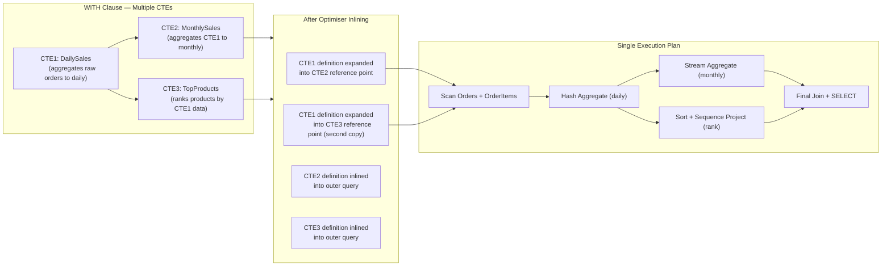

## Navigation

**Domain:** [[8 — Databases]] > **Group:** SQL CTEs & Recursive Queries
**Previous:** [[8.176 — Common Table Expressions — Fundamentals]] | **Next:** [[8.178 — CTE vs Subquery — Readability and Performance]]

### Prerequisites

- [[8.176 — Common Table Expressions — Fundamentals]] — Multiple CTEs build on the single-CTE syntax; you must understand basic WITH clause structure and inlining before chaining CTEs.
- [[8.128 — Derived Tables and Subqueries in FROM]] — CTE chaining replaces deeply nested derived tables; understanding the nested alternative highlights why chaining matters.
- [[8.123 — GROUP BY — Grouping Mechanics]] — Multiple CTEs often involve progressive aggregation (aggregate → aggregate the aggregation); knowing GROUP BY behaviour is essential.

### Where This Fits

Multiple CTEs in a single WITH clause let you break a complex query into sequential, named transformation steps. Each CTE can reference any CTE defined before it, creating a dependency graph that the optimiser resolves into a single execution plan. A .NET backend engineer uses this pattern for multi-stage ETL transformations, reporting dashboards that need progressive aggregation (daily → monthly → quarterly totals), and any query where the output of one calculation feeds the input of another. The interview signal is senior-level: candidates who reach for multiple CTEs naturally when describing complex data transformations demonstrate production experience. The gotcha is that CTE dependencies are not always linear — the optimiser inlines all CTEs together, so a CTE referenced by two downstream CTEs may be expanded twice, causing double evaluation just like multiple references in a single CTE scenario.

---

## Core Mental Model

Multiple CTEs in a single WITH clause are separated by commas, with no comma before the final SELECT. Each CTE can reference any CTE defined earlier in the same WITH clause, as well as base tables, views, and table-valued functions. This creates a dependency chain: CTE2 may reference CTE1, CTE3 may reference CTE1 and CTE2, and so on. The optimiser does not process CTEs sequentially — it inlines all CTE definitions into the outer query tree, then optimises the combined tree. This means that if CTE3 references CTE1, and CTE4 also references CTE1, the CTE1 definition is expanded at both reference points in the final tree (unless the optimiser chooses to spool). The dependency structure can be linear (CTE1 → CTE2 → CTE3) or tree-shaped (CTE1 feeds CTE2 and CTE3 independently). The recognition pattern: when a query needs multiple transformation steps where each step processes the output of the previous step, multiple CTEs turn nested subqueries into a flat, readable list of named steps.

### Classification

Multiple CTEs belong to the WITH clause syntax for statement-scoped name definitions. Each CTE in the comma-separated list is an independent named expression that undergoes the same inlining process as a single CTE. The dependency graph among CTEs is resolved at parse time (name binding phase). The optimiser sees the fully expanded tree with no CTE boundaries. No statistics are shared between CTEs — each inlined reference uses the statistics of the underlying base tables. SARGability is determined by the final combined query predicates, independent of which CTE each predicate was written in.



### Key Properties

|Property|Value|Notes|
|---|---|---|
|Syntax|WITH CTE1 AS (...), CTE2 AS (...), ...|Comma-separated, no comma before outer query|
|Visibility|CTE can reference any prior CTE|Forward-only — cannot reference CTEs defined later|
|Dependency graph|Linear or tree (DAG)|No circular dependencies allowed|
|Scope|Single statement|All CTEs vanish after the statement ends|
|Inlining|All CTEs inlined, no boundaries|Plan identical to equivalent nested subqueries|
|Multi-reference expansion|Each reference to a CTE expands independently|Risk of duplicated scan without spool|
|Recursion|Only one recursive CTE per WITH|Cannot have two recursive CTEs in same WITH|
|EF Core|Raw SQL only|No LINQ generates multiple CTEs|
|Dapper|Full SQL control|Write multiple CTEs directly|

---

## Deep Mechanics

### How the Engine Executes This

**Parse phase:** The T-SQL parser reads the WITH keyword followed by a comma-separated list of CTE definitions. Each CTE definition has the form: `CTEName [(column_list)] AS (SELECT_statement)`. The parser builds a name table for the scope containing all CTE names defined in the current WITH clause.

**Binding phase (algebrizer):** The algebrizer binds each CTE's column references. When a CTE references another CTE (e.g., `FROM CTE1` inside CTE2's definition), the algebrizer resolves CTE1's name from the current scope's name table. The binding is sequential — CTE1 must be defined before it is referenced. The algebrizer also resolves column names in each CTE to the base tables or prior CTEs. If a column name is ambiguous (appears in multiple source tables), the CTE must qualify it.

**Optimisation phase:** The optimiser collects all CTE definitions and creates a combined query tree by replacing each CTE reference with its defining expression. This is a recursive expansion: if CTE2 references CTE1, the optimiser replaces CTE2's reference to CTE1 with CTE1's definition. If CTE3 also references CTE1, a separate copy of CTE1's definition is placed at that reference point. After full expansion, the optimiser has a single tree with no CTE boundaries. Cost-based optimisation proceeds normally: predicate pushdown, join reordering, index selection.

**Execution phase:** The execution plan contains operators for the underlying base table access, joins, aggregations, and sorting. There is no "CTE" or "Multiple CTE" operator. The plan shape reflects the combined query tree. If a CTE definition was expanded at multiple points, the plan shows multiple access paths to the same base tables — potentially multiple scans.

**Key insight — no separation in the plan:** Unlike a temp table that appears as a separate object in the plan (with its own Table Scan operator), multiple CTEs leave no trace in the execution plan. The plan for:

```sql
WITH CTE1 AS (SELECT ... FROM Orders WHERE ...),
CTE2 AS (SELECT ... FROM CTE1 WHERE ...)
SELECT ... FROM CTE2;
```

is identical to:

```sql
SELECT ... FROM (
    SELECT ... FROM (
        SELECT ... FROM Orders WHERE ...
    ) AS CTE1 WHERE ...
) AS CTE2;
```

### SQL Visibility

```sql
-- ============================================================
-- Sample schema
-- ============================================================
-- dbo.Orders: OrderId, CustomerId, OrderDate, TotalAmount, Status
-- dbo.OrderItems: OrderItemId, OrderId, ProductId, Quantity, UnitPrice
-- dbo.Products: ProductId, ProductName, CategoryId, UnitCost
-- dbo.Categories: CategoryId, CategoryName
-- dbo.Customers: CustomerId, FullName, Email, RegistrationDate

-- ============================================================
-- Example 1: Linear dependency — simple transformation chain
-- ============================================================
-- Business question: what are the top 10 months by profit margin
-- for orders with at least 100 orders in that month?
WITH MonthlyOrders AS (
    -- Step 1: Aggregate orders by month
    SELECT
        YEAR(o.OrderDate) AS SalesYear,
        MONTH(o.OrderDate) AS SalesMonth,
        COUNT(*) AS OrderCount,
        SUM(o.TotalAmount) AS Revenue
    FROM dbo.Orders AS o
    WHERE o.Status = 'Completed'
    GROUP BY YEAR(o.OrderDate), MONTH(o.OrderDate)
),
MonthlyCost AS (
    -- Step 2: Calculate total cost of goods sold per month
    SELECT
        YEAR(o.OrderDate) AS SalesYear,
        MONTH(o.OrderDate) AS SalesMonth,
        SUM(oi.Quantity * p.UnitCost) AS COGS
    FROM dbo.Orders AS o
    INNER JOIN dbo.OrderItems AS oi ON oi.OrderId = o.OrderId
    INNER JOIN dbo.Products AS p ON p.ProductId = oi.ProductId
    WHERE o.Status = 'Completed'
    GROUP BY YEAR(o.OrderDate), MONTH(o.OrderDate)
),
MonthlyProfit AS (
    -- Step 3: Combine revenue and cost, calculate profit margin
    SELECT
        mo.SalesYear,
        mo.SalesMonth,
        mo.OrderCount,
        mo.Revenue,
        mc.COGS,
        mo.Revenue - mc.COGS AS GrossProfit,
        ((mo.Revenue - mc.COGS) / NULLIF(mo.Revenue, 0)) * 100 AS ProfitMarginPct
    FROM MonthlyOrders AS mo
    INNER JOIN MonthlyCost AS mc
        ON mc.SalesYear = mo.SalesYear AND mc.SalesMonth = mo.SalesMonth
)
SELECT
    SalesYear,
    SalesMonth,
    OrderCount,
    Revenue,
    COGS,
    GrossProfit,
    ProfitMarginPct
FROM MonthlyProfit
WHERE OrderCount >= 100
ORDER BY ProfitMarginPct DESC
OFFSET 0 ROWS FETCH NEXT 10 ROWS ONLY;

-- Note: MonthlyOrders and MonthlyCost both scan Orders independently
-- (two scans of Orders table). This is a common tradeoff with
-- parallel CTE branches — see the Temp Table fix in Gotchas.

-- ============================================================
-- Example 2: Tree dependency — one CTE feeds multiple consumers
-- ============================================================
-- Business question: find customers who placed orders in the last
-- 30 days, their rank by total spend, and their rank by order count
WITH RecentOrders AS (
    SELECT
        o.CustomerId,
        o.OrderId,
        o.TotalAmount
    FROM dbo.Orders AS o
    WHERE o.OrderDate >= DATEADD(day, -30, GETDATE())
        AND o.Status = 'Completed'
),
CustomerSpend AS (
    SELECT
        ro.CustomerId,
        SUM(ro.TotalAmount) AS TotalSpend,
        COUNT(*) AS OrderCount
    FROM RecentOrders AS ro
    GROUP BY ro.CustomerId
),
RankedBySpend AS (
    SELECT
        cs.CustomerId,
        cs.TotalSpend,
        cs.OrderCount,
        RANK() OVER(ORDER BY cs.TotalSpend DESC) AS SpendRank
    FROM CustomerSpend AS cs
),
RankedByCount AS (
    SELECT
        cs.CustomerId,
        cs.TotalSpend,
        cs.OrderCount,
        RANK() OVER(ORDER BY cs.OrderCount DESC) AS CountRank
    FROM CustomerSpend AS cs
)
SELECT
    c.FullName,
    c.Email,
    COALESCE(rs.TotalSpend, 0) AS TotalSpend,
    COALESCE(rs.OrderCount, 0) AS OrderCount,
    rs.SpendRank,
    rc.CountRank
FROM dbo.Customers AS c
LEFT JOIN RankedBySpend AS rs ON rs.CustomerId = c.CustomerId
LEFT JOIN RankedByCount AS rc ON rc.CustomerId = c.CustomerId
ORDER BY rs.SpendRank;

-- Note: RecentOrders is referenced by both CustomerSpend and
-- RankedByCount (indirectly through CustomerSpend). The optimiser
-- may expand RecentOrders twice unless it introduces a spool.

-- ============================================================
-- Example 3: Combining multiple CTE results with UNION
-- ============================================================
-- Business question: create a unified top-performers list
-- combining top customers by revenue and top products by quantity
WITH TopCustomers AS (
    SELECT TOP 100
        o.CustomerId,
        SUM(o.TotalAmount) AS Metric,
        'Customer_Revenue' AS Category
    FROM dbo.Orders AS o
    WHERE o.Status = 'Completed'
    GROUP BY o.CustomerId
    ORDER BY SUM(o.TotalAmount) DESC
),
TopProducts AS (
    SELECT TOP 100
        p.ProductId AS EntityId,
        SUM(oi.Quantity) AS Metric,
        'Product_Quantity' AS Category
    FROM dbo.OrderItems AS oi
    INNER JOIN dbo.Products AS p ON p.ProductId = oi.ProductId
    INNER JOIN dbo.Orders AS o ON o.OrderId = oi.OrderId
    WHERE o.Status = 'Completed'
    GROUP BY p.ProductId
    ORDER BY SUM(oi.Quantity) DESC
)
SELECT EntityId, Metric, Category FROM TopCustomers
UNION ALL
SELECT EntityId, Metric, Category FROM TopProducts;

-- ============================================================
-- Example 4: CTE chaining with window functions — gaps and islands
-- ============================================================
-- Business question: find consecutive order ID ranges within
-- each customer's orders (per-customer islands)
WITH OrderedOrders AS (
    SELECT
        o.OrderId,
        o.CustomerId,
        o.OrderDate,
        ROW_NUMBER() OVER(
            PARTITION BY o.CustomerId
            ORDER BY o.OrderId
        ) AS rn
    FROM dbo.Orders AS o
    WHERE o.Status = 'Completed'
),
IslandGroups AS (
    SELECT
        oo.OrderId,
        oo.CustomerId,
        oo.OrderDate,
        oo.OrderId - oo.rn AS IslandGroup
    FROM OrderedOrders AS oo
)
SELECT
    ig.CustomerId,
    MIN(ig.OrderId) AS IslandStart,
    MAX(ig.OrderId) AS IslandEnd,
    COUNT(*) AS IslandSize,
    MAX(ig.OrderId) - MIN(ig.OrderId) + 1 AS SequenceLength,
    DATEDIFF(day, MIN(ig.OrderDate), MAX(ig.OrderDate)) + 1 AS DateSpan
FROM IslandGroups AS ig
GROUP BY ig.CustomerId, ig.IslandGroup
ORDER BY ig.CustomerId, IslandStart;
```

```csharp
// EF Core — multiple CTEs require raw SQL
public async Task<List<MonthlyProfitRow>> GetMonthlyProfitMarginAsync(
    CancellationToken cancellationToken = default)
{
    const string sql = @"
        WITH MonthlyOrders AS (
            SELECT YEAR(o.OrderDate) AS SalesYear, MONTH(o.OrderDate) AS SalesMonth,
                   COUNT(*) AS OrderCount, SUM(o.TotalAmount) AS Revenue
            FROM dbo.Orders AS o
            WHERE o.Status = 'Completed'
            GROUP BY YEAR(o.OrderDate), MONTH(o.OrderDate)
        ),
        MonthlyCost AS (
            SELECT YEAR(o.OrderDate) AS SalesYear, MONTH(o.OrderDate) AS SalesMonth,
                   SUM(oi.Quantity * p.UnitCost) AS COGS
            FROM dbo.Orders AS o
            INNER JOIN dbo.OrderItems AS oi ON oi.OrderId = o.OrderId
            INNER JOIN dbo.Products AS p ON p.ProductId = oi.ProductId
            WHERE o.Status = 'Completed'
            GROUP BY YEAR(o.OrderDate), MONTH(o.OrderDate)
        ),
        MonthlyProfit AS (
            SELECT mo.SalesYear, mo.SalesMonth, mo.OrderCount, mo.Revenue,
                   mc.COGS, mo.Revenue - mc.COGS AS GrossProfit,
                   ((mo.Revenue - mc.COGS) / NULLIF(mo.Revenue, 0)) * 100 AS ProfitMarginPct
            FROM MonthlyOrders AS mo
            INNER JOIN MonthlyCost AS mc
                ON mc.SalesYear = mo.SalesYear AND mc.SalesMonth = mo.SalesMonth
        )
        SELECT SalesYear, SalesMonth, OrderCount, Revenue, COGS,
               GrossProfit, ProfitMarginPct
        FROM MonthlyProfit
        WHERE OrderCount >= 100
        ORDER BY ProfitMarginPct DESC
        OFFSET 0 ROWS FETCH NEXT 10 ROWS ONLY";

    return await dbContext.Database
        .SqlQueryRaw<MonthlyProfitRow>(sql)
        .ToListAsync(cancellationToken);
}
```

```csharp
// Dapper — multiple CTEs in a single query
public async Task<IReadOnlyList<UnifiedTopPerformer>> GetUnifiedTopPerformersAsync(
    CancellationToken cancellationToken = default)
{
    const string sql = @"
        WITH TopCustomers AS (
            SELECT TOP 100
                CAST(o.CustomerId AS VARCHAR(50)) AS EntityId,
                SUM(o.TotalAmount) AS Metric,
                'Customer_Revenue' AS Category
            FROM dbo.Orders AS o
            WHERE o.Status = 'Completed'
            GROUP BY o.CustomerId
            ORDER BY SUM(o.TotalAmount) DESC
        ),
        TopProducts AS (
            SELECT TOP 100
                CAST(p.ProductId AS VARCHAR(50)) AS EntityId,
                SUM(oi.Quantity) AS Metric,
                'Product_Quantity' AS Category
            FROM dbo.OrderItems AS oi
            INNER JOIN dbo.Products AS p ON p.ProductId = oi.ProductId
            INNER JOIN dbo.Orders AS o ON o.OrderId = oi.OrderId
            WHERE o.Status = 'Completed'
            GROUP BY p.ProductId
            ORDER BY SUM(oi.Quantity) DESC
        )
        SELECT EntityId, Metric, Category FROM TopCustomers
        UNION ALL
        SELECT EntityId, Metric, Category FROM TopProducts";

    await using var connection = _connectionFactory.Create();
    var results = await connection.QueryAsync<UnifiedTopPerformer>(
        new CommandDefinition(sql, cancellationToken: cancellationToken));
    return results.AsList();
}
```

### Execution Plan Analysis

For the monthly profit margin query (Example 1):

```
Expected plan shape:
  Clustered Index Scan (Orders)       -- CTE MonthlyOrders
    → Hash Match (Aggregate)          -- GROUP BY year, month for revenue
  Clustered Index Scan (Orders)       -- CTE MonthlyCost (second scan!)
    → Nested Loops                    -- join to OrderItems
      → Clustered Index Scan (OrderItems)
      → Clustered Index Seek (Products)
    → Hash Match (Aggregate)          -- GROUP BY year, month for COGS
  → Hash Match (Inner Join)           -- CTE MonthlyProfit: join on year/month
  → Filter                            -- OrderCount >= 100
  → Sort (Top N Sort)                 -- ORDER BY ProfitMarginPct DESC
  → SELECT

Estimated cost: ~60% for the two Orders scans + aggregation
                ~25% for the OrderItems/Products joins
                ~15% for the final join, filter, and sort
Logical reads: ~24,000 (two scans of Orders at ~12,000 each)
```

Key observations:
- The plan shows TWO scans of the Orders table — one for MonthlyOrders and one for MonthlyCost. These are independent CTE branches.
- The optimiser does NOT combine the two scans into one because they aggregate different columns differently (Revenue vs COGS via OrderItems).
- If the query were refactored to compute Revenue and COGS in a single scan, logical reads would halve.
- There is no CTE operator in the plan — only base table access and aggregation operators.

```sql
SET STATISTICS IO ON;
SET STATISTICS TIME ON;

WITH MonthlyOrders AS (
    SELECT YEAR(o.OrderDate) AS SalesYear, MONTH(o.OrderDate) AS SalesMonth,
           COUNT(*) AS OrderCount, SUM(o.TotalAmount) AS Revenue
    FROM dbo.Orders AS o
    WHERE o.Status = 'Completed'
    GROUP BY YEAR(o.OrderDate), MONTH(o.OrderDate)
),
MonthlyCost AS (
    SELECT YEAR(o.OrderDate) AS SalesYear, MONTH(o.OrderDate) AS SalesMonth,
           SUM(oi.Quantity * p.UnitCost) AS COGS
    FROM dbo.Orders AS o
    INNER JOIN dbo.OrderItems AS oi ON oi.OrderId = o.OrderId
    INNER JOIN dbo.Products AS p ON p.ProductId = oi.ProductId
    WHERE o.Status = 'Completed'
    GROUP BY YEAR(o.OrderDate), MONTH(o.OrderDate)
),
MonthlyProfit AS (
    SELECT mo.SalesYear, mo.SalesMonth, mo.OrderCount, mo.Revenue,
           mc.COGS, mo.Revenue - mc.COGS AS GrossProfit
    FROM MonthlyOrders AS mo
    INNER JOIN MonthlyCost AS mc
        ON mc.SalesYear = mo.SalesYear AND mc.SalesMonth = mo.SalesMonth
)
SELECT SalesYear, SalesMonth, OrderCount, Revenue, COGS, GrossProfit
FROM MonthlyProfit
WHERE OrderCount >= 100
ORDER BY ProfitMarginPct DESC OFFSET 0 ROWS FETCH NEXT 10 ROWS ONLY;

-- Expected output (1M Orders, 5M OrderItems, 100K Products):
-- Table 'Orders'. Scan count 2, logical reads 24,000
-- Table 'OrderItems'. Scan count 1, logical reads 18,000
-- Table 'Products'. Scan count 1, logical reads 450
-- SQL Server Execution Times: CPU time = 3,200 ms, elapsed time = 3,500 ms
```

### SARGability

Multiple CTEs do not introduce new SARGability considerations beyond those of the underlying queries. Each inlined CTE's predicates are evaluated against base table indexes independently. In Example 1, the predicate `o.Status = 'Completed'` is SARGable as an equality predicate, but without an index on `Orders(Status)`, it will still scan. The join predicate `oi.OrderId = o.OrderId` is SARGable with an index on `OrderItems(OrderId)`. The filter `OrderCount >= 100` applies after aggregation and is not indexable.

### Failure Modes

**Failure Mode — Branching CTEs cause redundant scans:** When two CTEs in the same WITH clause both access the same base table independently (like MonthlyOrders and MonthlyCost both scanning Orders), the optimiser does not merge them. Each CTE's inlined definition accesses the base table separately. Use a temp table if the intermediate result is large and shared.

```sql
-- Detection DMV: high logical_reads with multiple CTEs accessing same table
SELECT
    OBJECT_NAME(qt.objectid) AS object_name,
    qs.total_logical_reads,
    qs.execution_count,
    qt.text
FROM sys.dm_exec_query_stats AS qs
CROSS APPLY sys.dm_exec_sql_text(qs.sql_handle) AS qt
WHERE qt.text LIKE '%WITH%' AND qt.text LIKE '%,%'  -- multiple CTEs
ORDER BY qs.total_logical_reads DESC;
```

---

## Production Patterns and Implementation

### Primary SQL Implementation

```sql
-- ============================================================
-- Production scenario: Sales dashboard with progressive aggregation
-- Schema: Orders, OrderItems, Products, Categories, Customers
-- ============================================================

-- Progressive aggregation: daily → monthly → quarterly → yearly
-- Each step reads from the previous, not from base tables

WITH DailySales AS (
    -- Level 1: aggregate raw order items to daily granularity
    SELECT
        CAST(o.OrderDate AS DATE) AS SaleDate,
        p.CategoryId,
        COUNT(DISTINCT o.OrderId) AS OrderCount,
        COUNT(DISTINCT o.CustomerId) AS UniqueCustomers,
        SUM(oi.Quantity) AS TotalUnits,
        SUM(oi.Quantity * oi.UnitPrice) AS Revenue,
        SUM(oi.Quantity * p.UnitCost) AS COGS
    FROM dbo.Orders AS o
    INNER JOIN dbo.OrderItems AS oi ON oi.OrderId = o.OrderId
    INNER JOIN dbo.Products AS p ON p.ProductId = oi.ProductId
    WHERE o.Status = 'Completed'
        AND o.OrderDate >= DATEADD(year, -2, GETDATE())
    GROUP BY
        CAST(o.OrderDate AS DATE),
        p.CategoryId
),
MonthlySales AS (
    -- Level 2: roll up daily to monthly
    SELECT
        YEAR(ds.SaleDate) AS SalesYear,
        MONTH(ds.SaleDate) AS SalesMonth,
        ds.CategoryId,
        SUM(ds.OrderCount) AS TotalOrders,
        SUM(ds.UniqueCustomers) AS TotalUniqueCustomers,
        SUM(ds.TotalUnits) AS TotalUnits,
        SUM(ds.Revenue) AS TotalRevenue,
        SUM(ds.COGS) AS TotalCOGS,
        SUM(ds.Revenue) - SUM(ds.COGS) AS GrossProfit,
        CASE
            WHEN SUM(ds.Revenue) > 0
            THEN (SUM(ds.Revenue) - SUM(ds.COGS)) / SUM(ds.Revenue) * 100
            ELSE 0
        END AS ProfitMarginPct
    FROM DailySales AS ds
    GROUP BY
        YEAR(ds.SaleDate),
        MONTH(ds.SaleDate),
        ds.CategoryId
),
MonthlyRanked AS (
    -- Level 3: rank categories within each month
    SELECT
        ms.SalesYear,
        ms.SalesMonth,
        cat.CategoryName,
        ms.TotalRevenue,
        ms.GrossProfit,
        ms.ProfitMarginPct,
        ROW_NUMBER() OVER(
            PARTITION BY ms.SalesYear, ms.SalesMonth
            ORDER BY ms.TotalRevenue DESC
        ) AS CategoryRank,
        SUM(ms.TotalRevenue) OVER(
            PARTITION BY ms.SalesYear, ms.SalesMonth
        ) AS MonthTotalRevenue
    FROM MonthlySales AS ms
    INNER JOIN dbo.Categories AS cat ON cat.CategoryId = ms.CategoryId
)
-- Level 4: final output — top 5 categories per month with percentage
SELECT
    mr.SalesYear,
    mr.SalesMonth,
    DATENAME(month, DATEFROMPARTS(mr.SalesYear, mr.SalesMonth, 1)) AS MonthName,
    mr.CategoryName,
    mr.TotalRevenue,
    mr.GrossProfit,
    mr.ProfitMarginPct,
    mr.CategoryRank,
    mr.MonthTotalRevenue,
    (mr.TotalRevenue / NULLIF(mr.MonthTotalRevenue, 0)) * 100 AS RevenueSharePct
FROM MonthlyRanked AS mr
WHERE mr.CategoryRank <= 5
ORDER BY
    mr.SalesYear DESC,
    mr.SalesMonth DESC,
    mr.CategoryRank;
```

```csharp
// EF Core — raw SQL for multi-CTE dashboard
public async Task<List<CategoryMonthlyDashboard>> GetCategoryDashboardAsync(
    CancellationToken cancellationToken = default)
{
    const string sql = @"
        WITH DailySales AS (
            SELECT CAST(o.OrderDate AS DATE) AS SaleDate, p.CategoryId,
                   COUNT(DISTINCT o.OrderId) AS OrderCount,
                   SUM(oi.Quantity * oi.UnitPrice) AS Revenue,
                   SUM(oi.Quantity * p.UnitCost) AS COGS
            FROM dbo.Orders AS o
            INNER JOIN dbo.OrderItems AS oi ON oi.OrderId = o.OrderId
            INNER JOIN dbo.Products AS p ON p.ProductId = oi.ProductId
            WHERE o.Status = 'Completed' AND o.OrderDate >= DATEADD(year, -2, GETDATE())
            GROUP BY CAST(o.OrderDate AS DATE), p.CategoryId
        ),
        MonthlySales AS (
            SELECT YEAR(SaleDate) AS SalesYear, MONTH(SaleDate) AS SalesMonth,
                   CategoryId, SUM(Revenue) AS TotalRevenue, SUM(COGS) AS TotalCOGS
            FROM DailySales GROUP BY YEAR(SaleDate), MONTH(SaleDate), CategoryId
        ),
        MonthlyRanked AS (
            SELECT ms.SalesYear, ms.SalesMonth, cat.CategoryName,
                   ms.TotalRevenue, ms.TotalRevenue - ms.TotalCOGS AS GrossProfit,
                   ROW_NUMBER() OVER(PARTITION BY ms.SalesYear, ms.SalesMonth ORDER BY ms.TotalRevenue DESC) AS CategoryRank
            FROM MonthlySales AS ms
            INNER JOIN dbo.Categories AS cat ON cat.CategoryId = ms.CategoryId
        )
        SELECT SalesYear, SalesMonth, CategoryName, TotalRevenue, GrossProfit, CategoryRank
        FROM MonthlyRanked WHERE CategoryRank <= 5
        ORDER BY SalesYear DESC, SalesMonth DESC, CategoryRank";

    return await dbContext.Database
        .SqlQueryRaw<CategoryMonthlyDashboard>(sql)
        .ToListAsync(cancellationToken);
}
```

```csharp
// Dapper — multi-CTE analytics query
public async Task<IReadOnlyList<CategoryMonthlyDashboard>> GetCategoryDashboardAsync(
    CancellationToken cancellationToken = default)
{
    const string sql = @"
        WITH DailySales AS (
            SELECT CAST(o.OrderDate AS DATE) AS SaleDate, p.CategoryId,
                   COUNT(DISTINCT o.OrderId) AS OrderCount,
                   SUM(oi.Quantity * oi.UnitPrice) AS Revenue,
                   SUM(oi.Quantity * p.UnitCost) AS COGS
            FROM dbo.Orders AS o
            INNER JOIN dbo.OrderItems AS oi ON oi.OrderId = o.OrderId
            INNER JOIN dbo.Products AS p ON p.ProductId = oi.ProductId
            WHERE o.Status = 'Completed' AND o.OrderDate >= DATEADD(year, -2, GETDATE())
            GROUP BY CAST(o.OrderDate AS DATE), p.CategoryId
        ),
        MonthlySales AS (
            SELECT YEAR(SaleDate) AS SalesYear, MONTH(SaleDate) AS SalesMonth,
                   CategoryId, SUM(Revenue) AS TotalRevenue, SUM(COGS) AS TotalCOGS
            FROM DailySales GROUP BY YEAR(SaleDate), MONTH(SaleDate), CategoryId
        ),
        MonthlyRanked AS (
            SELECT ms.SalesYear, ms.SalesMonth, cat.CategoryName,
                   ms.TotalRevenue, ms.TotalRevenue - ms.TotalCOGS AS GrossProfit,
                   ROW_NUMBER() OVER(PARTITION BY ms.SalesYear, ms.SalesMonth ORDER BY ms.TotalRevenue DESC) AS CategoryRank
            FROM MonthlySales AS ms
            INNER JOIN dbo.Categories AS cat ON cat.CategoryId = ms.CategoryId
        )
        SELECT SalesYear, SalesMonth, CategoryName, TotalRevenue, GrossProfit, CategoryRank
        FROM MonthlyRanked WHERE CategoryRank <= 5
        ORDER BY SalesYear DESC, SalesMonth DESC, CategoryRank";

    await using var connection = _connectionFactory.Create();
    var results = await connection.QueryAsync<CategoryMonthlyDashboard>(
        new CommandDefinition(sql, cancellationToken: cancellationToken));
    return results.AsList();
}
```

### SQL Server vs PostgreSQL Differences

```sql
-- PostgreSQL: same syntax for multiple CTEs
WITH daily_sales AS (
    SELECT
        o.order_date::DATE AS sale_date,
        p.category_id,
        COUNT(DISTINCT o.order_id) AS order_count,
        SUM(oi.quantity * oi.unit_price) AS revenue
    FROM orders AS o
    INNER JOIN order_items AS oi ON oi.order_id = o.order_id
    INNER JOIN products AS p ON p.product_id = oi.product_id
    WHERE o.status = 'Completed'
        AND o.order_date >= NOW() - INTERVAL '2 years'
    GROUP BY o.order_date::DATE, p.category_id
),
monthly_sales AS (
    SELECT
        EXTRACT(YEAR FROM sale_date) AS sales_year,
        EXTRACT(MONTH FROM sale_date) AS sales_month,
        category_id,
        SUM(revenue) AS total_revenue
    FROM daily_sales
    GROUP BY EXTRACT(YEAR FROM sale_date), EXTRACT(MONTH FROM sale_date), category_id
)
SELECT * FROM monthly_sales;

-- Key differences:
-- 1. PostgreSQL requires RECURSIVE keyword for recursive CTEs (T-SQL detects auto)
-- 2. PostgreSQL supports CTE modification via RETURNING in INSERT/UPDATE/DELETE
-- 3. PostgreSQL has CTE materialization (WITH [NOT] MATERIALIZED) as of PG 12
--    — can force materialization to avoid re-evaluation
-- 4. T-SQL does not support MATERIALIZED clause
```

---

## Gotchas and Production Pitfalls

### Gotcha 1 — Branching CTEs Cause Redundant Base Table Scans

**Pitfall:** Defining two CTEs that both read from the same base table independently, expecting the optimiser to combine them.

```sql
-- ❌ CTE1 and CTE2 both scan Orders independently
WITH CTE1 AS (
    SELECT CustomerId, SUM(TotalAmount) AS TotalSpent
    FROM dbo.Orders WHERE Status = 'Completed'
    GROUP BY CustomerId
),
CTE2 AS (
    SELECT CustomerId, COUNT(*) AS OrderCount
    FROM dbo.Orders WHERE Status = 'Completed'
    GROUP BY CustomerId
)
SELECT * FROM CTE1 INNER JOIN CTE2 ON CTE1.CustomerId = CTE2.CustomerId;
```

**Symptom:** Orders table is scanned twice (logical reads = 2 × full table size). At 50M rows, this is 2 × 225,000 = 450,000 logical reads instead of 225,000.

**Fix:** Combine both aggregations into a single CTE, or use a temp table:

```sql
-- ✅ Single scan with combined aggregation
WITH CustomerStats AS (
    SELECT CustomerId, SUM(TotalAmount) AS TotalSpent, COUNT(*) AS OrderCount
    FROM dbo.Orders WHERE Status = 'Completed'
    GROUP BY CustomerId
)
SELECT * FROM CustomerStats;
```

**Cost of not fixing:** Double I/O for every execution. At 500 executions/hour, 112M extra logical reads per hour.

### Gotcha 2 — Forward-Only Visibility (Cannot Reference Later CTE)

**Pitfall:** Assuming CTEs in a WITH clause can be referenced in any order, like variables in a programming language.

```sql
-- ❌ CTE2 references CTE3, but CTE3 is defined after CTE2
WITH CTE1 AS (SELECT 1 AS x),
CTE2 AS (SELECT * FROM CTE3 WHERE x > 0),  -- CTE3 not yet defined
CTE3 AS (SELECT 1 AS x)
SELECT * FROM CTE2;
```

**Symptom:** Error: "Invalid object name 'CTE3'." The name resolution is forward-only within the WITH clause.

**Fix:** Reorder CTE definitions so each CTE references only CTEs defined earlier.

**Cost of not fixing:** Parse-time error. In complex queries with many CTEs, this causes frustrating trial-and-error reordering. Plan the dependency graph before writing.

### Gotcha 3 — No Circular Dependencies (No Self-Reference Without RECURSIVE)

**Pitfall:** Accidentally creating a circular dependency or self-reference in a non-recursive CTE.

```sql
-- ❌ CTE1 tries to reference itself — requires recursive CTE
WITH CTE1 AS (
    SELECT OrderId, ParentOrderId FROM dbo.Orders
    UNION ALL
    SELECT o.OrderId, o.ParentOrderId
    FROM dbo.Orders AS o
    INNER JOIN CTE1 ON CTE1.OrderId = o.ParentOrderId  -- self-reference without RECURSIVE
)
SELECT * FROM CTE1;
```

**Symptom:** Error: "A common table expression (CTE) cannot reference itself in the same clause unless the CTE is recursive."

**Fix:** Add the `RECURSIVE` keyword (not needed in T-SQL — but the CTE must be structured as a recursive CTE with UNION ALL and an anchor member).

**Cost of not fixing:** Parse error. In T-SQL, recursion is auto-detected, but the CTE must still follow recursive CTE structure (anchor + recursive member separated by UNION ALL).

### Gotcha 4 — No Column Name Deduplication Across CTEs

**Pitfall:** Assuming that column names from different CTEs in the same WITH clause share a common namespace or are automatically deduplicated.

```sql
-- ❌ Two CTEs with same column name — outer SELECT must qualify
WITH CTE_A AS (SELECT 1 AS Id, 'A' AS Name),
CTE_B AS (SELECT 2 AS Id, 'B' AS Name)
SELECT Id FROM CTE_A  -- Which Id? This works (CTE_A.Id)
UNION ALL
SELECT Id FROM CTE_B;  -- This works (CTE_B.Id)
```

**Symptom:** No error — this works correctly because each CTE reference is qualified by its own CTE name in the outer query. But if the outer SELECT references an unqualified column name that exists in both CTEs, the error depends on context.

**Fix:** Always qualify column names with the CTE alias in the outer query when ambiguity could arise.

**Cost of not fixing:** Subtle bugs where the wrong column is projected. In UNION queries, column names are determined by the first SELECT, so this is less risky but still confusing.

### Gotcha 5 — Multiple CTEs Do Not Create a Pipeline (No Partial Aggregation)

**Pitfall:** Assuming that CTEs execute sequentially like a pipeline, where CTE2 starts processing as soon as CTE1 produces its first row.

```sql
-- ❌ This does NOT pipeline — all CTEs are inlined and optimised together
WITH Step1 AS (
    SELECT CustomerId, SUM(TotalAmount) AS Total
    FROM dbo.Orders
    GROUP BY CustomerId
),
Step2 AS (
    SELECT CustomerId, Total,
           RANK() OVER(ORDER BY Total DESC) AS rn
    FROM Step1
)
SELECT * FROM Step2 WHERE rn <= 10;
```

**Symptom:** No error — the query runs correctly. But the optimiser may choose an execution strategy that does not respect the "step" boundaries. For example, it may push the `rn <= 10` predicate down as a Top N Sort applied before computing all ranks, reducing the work. This is usually beneficial but can surprise developers who expect strict step-by-step execution.

**Fix:** Understand that CTEs are not pipelined stages — they are naming constructs. The optimiser may reorder operations across CTE boundaries. If you need strict sequential execution with materialisation boundaries, use temp tables.

**Cost of not fixing:** None in most cases — optimiser reordering is almost always beneficial. But when debugging execution plans, you may be confused by operations that seem to "cross" CTE boundaries.

### Gotcha 6 — UNION ALL Between CTE Results Has Different Column Requirements

**Pitfall:** Using UNION to combine results from multiple CTEs without ensuring column compatibility and naming consistency.

```sql
-- ❌ UNION ALL between CTEs with different column types
WITH TopRevenue AS (
    SELECT TOP 10 CustomerId, SUM(TotalAmount) AS Metric
    FROM dbo.Orders GROUP BY CustomerId ORDER BY SUM(TotalAmount) DESC
),
TopFreq AS (
    SELECT TOP 10 CustomerId, COUNT(*) AS Metric
    FROM dbo.Orders GROUP BY CustomerId ORDER BY COUNT(*) DESC
)
SELECT CustomerId, Metric FROM TopRevenue
UNION ALL
SELECT CustomerId, Metric FROM TopFreq;
-- Result: rows from both CTEs combined — but we can't tell which is which
```

**Symptom:** No error — the query runs. But the result loses the information about whether each row came from the revenue list or the frequency list.

**Fix:** Add a discriminator column:

```sql
SELECT CustomerId, Metric, 'Revenue' AS Source FROM TopRevenue
UNION ALL
SELECT CustomerId, Metric, 'Frequency' AS Source FROM TopFreq;
```

**Cost of not fixing:** Data ambiguity in the result set. The application layer cannot distinguish the source of each row without adding a discriminator in a later processing step.

### Gotcha 7 — Multiple CTEs with the Same Name (Not Allowed)

**Pitfall:** Defining two CTEs with the same name in the same WITH clause.

```sql
-- ❌ Duplicate CTE name
WITH MyCTE AS (SELECT 1 AS x),
MyCTE AS (SELECT 2 AS x)  -- ERROR: duplicate name
SELECT * FROM MyCTE;
```

**Symptom:** Error: "A CTE name is not allowed to be defined more than once in the same WITH clause."

**Fix:** Use unique names for each CTE.

**Cost of not fixing:** Parse error. In automated SQL generation (e.g., from a reporting tool), ensure CTE names are unique per query.

---

## Performance Implications

### Benchmark: Linear Dependency vs Branching CTEs

```sql
-- Benchmark 1: Linear dependency (each CTE reads from previous)
SET STATISTICS IO ON;

WITH Base AS (
    SELECT CustomerId, SUM(TotalAmount) AS Total
    FROM dbo.Orders WHERE Status = 'Completed'
    GROUP BY CustomerId
),
Ranked AS (
    SELECT *, RANK() OVER(ORDER BY Total DESC) AS rn
    FROM Base
)
SELECT * FROM Ranked WHERE rn <= 100;
-- Expected: Table 'Orders'. Scan count 1, logical reads ~12,000

-- Benchmark 2: Branching CTEs (both read from base table independently)
WITH Spend AS (
    SELECT CustomerId, SUM(TotalAmount) AS Total
    FROM dbo.Orders WHERE Status = 'Completed'
    GROUP BY CustomerId
),
Counts AS (
    SELECT CustomerId, COUNT(*) AS Cnt
    FROM dbo.Orders WHERE Status = 'Completed'
    GROUP BY CustomerId
)
SELECT * FROM Spend INNER JOIN Counts ON Spend.CustomerId = Counts.CustomerId;
-- Expected: Table 'Orders'. Scan count 2, logical reads ~24,000
```

**Improvement:** Refactoring branching CTEs into a single CTE reduces logical reads by 50%.

```sql
-- Optimised version: single scan
WITH Combined AS (
    SELECT CustomerId, SUM(TotalAmount) AS Total, COUNT(*) AS Cnt
    FROM dbo.Orders WHERE Status = 'Completed'
    GROUP BY CustomerId
)
SELECT * FROM Combined;
-- Logical reads: ~12,000 (1 scan instead of 2)
```

### BenchmarkDotNet

```csharp
[MemoryDiagnoser]
[SimpleJob(RuntimeMoniker.Net90)]
public class MultipleCTEsBenchmark
{
    private IDbConnection _connection = default!;

    [GlobalSetup]
    public void Setup()
    {
        _connection = new SqlConnection(TestConnectionString);
        // Seed: 1M Orders
    }

    [Benchmark(Baseline = true)]
    public async Task<List<CustomerStats>> BranchingCTEs()
    {
        const string sql = @"
            WITH Spend AS (
                SELECT CustomerId, SUM(TotalAmount) AS TotalSpent
                FROM dbo.Orders WHERE Status = 'Completed'
                GROUP BY CustomerId
            ),
            Counts AS (
                SELECT CustomerId, COUNT(*) AS OrderCount
                FROM dbo.Orders WHERE Status = 'Completed'
                GROUP BY CustomerId
            )
            SELECT s.CustomerId, s.TotalSpent, c.OrderCount
            FROM Spend AS s
            INNER JOIN Counts AS c ON c.CustomerId = s.CustomerId";

        var results = await _connection.QueryAsync<CustomerStats>(sql);
        return results.AsList();
    }

    [Benchmark]
    public async Task<List<CustomerStats>> CombinedSingleCTE()
    {
        const string sql = @"
            WITH Combined AS (
                SELECT CustomerId, SUM(TotalAmount) AS TotalSpent, COUNT(*) AS OrderCount
                FROM dbo.Orders WHERE Status = 'Completed'
                GROUP BY CustomerId
            )
            SELECT CustomerId, TotalSpent, OrderCount FROM Combined";

        var results = await _connection.QueryAsync<CustomerStats>(sql);
        return results.AsList();
    }

    [Benchmark]
    public async Task<List<CustomerStats>> TempTable_Materialized()
    {
        const string sql = @"
            SELECT CustomerId, SUM(TotalAmount) AS TotalSpent, COUNT(*) AS OrderCount
            INTO #Stats
            FROM dbo.Orders WHERE Status = 'Completed'
            GROUP BY CustomerId;

            SELECT CustomerId, TotalSpent, OrderCount FROM #Stats";

        var results = await _connection.QueryAsync<CustomerStats>(sql);
        return results.AsList();
    }

    [GlobalCleanup]
    public void Cleanup() => _connection?.Dispose();
}
```

**Expected results (1M Orders, SQL Server 2022, NVMe):**

|Method|Mean|Logical Reads|Allocated|
|---|---|---|---|
|BranchingCTEs|~1,800 ms|~24,000|~5 KB|
|CombinedSingleCTE|~950 ms|~12,000|~5 KB|
|TempTable_Materialized|~1,100 ms|~12,000 + tempdb|~12 KB|

Branching CTEs (two independent scans) are ~2x slower than a combined single CTE. The temp table adds a small overhead for tempdb writes but does not re-scan the base table.

---

## Interview Arsenal

### Question Bank

1. **How do you define multiple CTEs in a single WITH clause, and what are the visibility rules between them?**

2. **When you have two CTEs that both read from the same base table, does the optimiser combine the scans? Explain.**

3. **What is the difference between a linear CTE dependency chain and a tree-shaped dependency chain in terms of execution plan?**

4. **What happens if you reference a CTE that is defined later in the WITH clause — is that allowed?**

5. **Multiple CTEs vs temp tables: when would you choose chained CTEs over creating multiple temp tables?**

6. **How does SQL Server handle a CTE that is referenced by two different downstream CTEs? Does it evaluate it once or twice?**

7. **At scale, what is the dominant cost when using four or five chained CTEs against a 100M row fact table?**

8. **How do EF Core and Dapper handle queries with multiple CTEs — can EF Core LINQ generate them?**

### Spoken Answers

**Q1: How do you define multiple CTEs in a single WITH clause, and what are the visibility rules between them?**

> **Average answer:** "You use commas between the CTE definitions. Each CTE can see the ones before it."

> **Great answer:** "Multiple CTEs are comma-separated after the WITH keyword: `WITH CTE1 AS (...), CTE2 AS (...), CTE3 AS (...) SELECT ...`. The visibility rule is forward-only: each CTE can reference any CTE defined before it in the same WITH clause and all base tables and views. CTE2 can reference CTE1, and CTE3 can reference both CTE1 and CTE2. No CTE can reference a CTE defined after it — that causes a parse error. The final SELECT (or INSERT, UPDATE, DELETE) can reference any CTE in the clause. Critically, there is no comma before the outer query — the final CTE is followed directly by the outer statement. The optimiser inlines all CTEs into a single query tree — the multiple CTEs are a syntactic convenience that get eliminated during optimisation. This means there is no runtime concept of 'CTE1 finished, now CTE2 runs' — the entire combined query is optimised as one unit."

**Q5: Multiple CTEs vs temp tables: when would you choose chained CTEs over creating multiple temp tables?**

> **Great answer:** "I choose chained CTEs when: (1) the intermediate results are used only once in the chain, (2) the total data volume is moderate (under a few million rows), (3) I don't need indexes or statistics on intermediate results, and (4) the readability benefit of naming each transformation step justifies the approach. I choose temp tables when: (1) the same intermediate result is referenced by multiple downstream consumers (branching pattern), (2) the intermediate result is large enough that re-scanning the base tables is prohibitive, (3) I need to index the intermediate result for subsequent joins, or (4) I need to debug or inspect the intermediate result between steps. The key insight is that multiple CTEs give you readability at zero runtime cost IF the dependency graph is linear and each CTE is referenced only once. As soon as you have branching (one CTE feeding two consumers) or repeated base table access, the inlining model works against you and a temp table becomes the better choice."

**Q8: How do EF Core and Dapper handle queries with multiple CTEs?**

> **Great answer:** "EF Core has no LINQ translation for multiple CTEs. The LINQ expression tree model does not support the WITH clause or CTE chaining at all. If you need multiple CTEs with EF Core, you must use `FromSqlRaw` and write the entire query as a T-SQL string — the ORM passes it through verbatim. Dapper, being a micro-ORM with no query generation, handles multiple CTEs perfectly — you just write the full SQL string including the WITH clause and all CTE definitions. Dapper executes the SQL and maps the result set to your POCOs. In practice, for .NET backend engineers, complex multi-CTE queries live in repository methods with the SQL either as a const string, a raw string loaded from a .sql file, or built using a SQL builder like SqlKata. The key point is that EF Core's LINQ is simply not an option for CTEs — you must drop to raw SQL."

### Interview Trigger

The interviewer asks: "Can you write me a query that finds the top 5 products by revenue for each month over the last year, and also shows what percentage of monthly revenue each product represents?" This requires multiple CTEs: one to aggregate daily data to monthly-product level, one to compute monthly totals, and a final SELECT to join and compute percentages. The follow-up is: "How many times does the Orders table get scanned?" — testing whether the candidate understands that branching CTEs cause redundant scans. A senior candidate says "two scans if the monthly totals CTE independently scans Orders, or one scan if I structure the CTEs as progressive aggregation where each CTE reads from the previous one."

### Comparison Table

| | Multiple CTEs (Chained) | Temp Tables (#temp) | Nested Subqueries |
|---|---|---|---|
| Readability | Best — flat, named steps | Good — separate batches | Worst — inside-out reading |
| Performance (single chain) | Zero overhead (inlined) | tempdb I/O cost | Zero overhead (inlined) |
| Branching support | May re-evaluate (no merge) | Single materialisation | May re-evaluate |
| Index/statistics on intermediate | No | Yes | No |
| Scope | Single statement | Session | Single statement |
| Recursion support | Only CTEs | No | No |
| .NET integration | Raw SQL only | Raw SQL only | LINQ possible (subqueries) |
| Debuggability | Cannot inspect intermediate | Can SELECT from #temp mid-batch | Cannot inspect intermediate |

---

## Decision Framework

### When to Apply

```mermaid
flowchart TD
    A[Need multiple transformation steps?] --> B{Do steps share a base table scan?}
    B -->|No, each step reads from previous CTE| C[Linear chain: multiple CTEs<br/>Optimal — no redundant scans]
    B -->|Yes, two steps scan same table| D{Can the steps be combined?}
    D -->|Yes, combine into one CTE with multiple aggregations| E[Single CTE: best performance<br/>One scan, all aggregations]
    D -->|No, different filters or joins| F{Branching pattern<br/>CTE feeds multiple consumers?}
    F -->|No, independent scans| G[Multiple CTEs but accept 2x I/O<br/>OR use temp table for single scan]
    F -->|Yes, one CTE feeds multiple consumers| H{Is intermediate result small?}
    H -->|Yes, < 10K rows| I[CTE with spool in plan is acceptable]
    H -->|No, large result| J[Temp table: materialise once, index if needed]
    
    C --> K[Expected: same plan as nested subqueries, N logical reads]
    E --> L[Expected: N logical reads (one scan)]
    G --> M[Expected: 2N logical reads but simpler code]
    J --> N[Expected: N + tempdb I/O, but no re-evaluation]
```

### Application Checklist

- [ ] The query requires multiple transformation steps where each step processes the previous step's output
- [ ] No two CTEs scan the same base table independently (or if they do, the table is small enough that double scan is acceptable)
- [ ] The CTE dependency graph is acyclic and forward-only
- [ ] No indexes or statistics are needed on intermediate results
- [ ] The final statement references each CTE only once (no multi-reference expansion)
- [ ] The .NET data access layer uses raw SQL (Dapper or EF Core FromSqlRaw)

### Tradeoff Summary

|What You Gain|What You Pay|
|---|---|
|Flat, readable transformation pipeline (no nesting)|May cause redundant base table scans with branching CTEs|
|Zero runtime overhead for linear chains|Cannot index or add statistics to intermediate steps|
|Easy to add/remove transformation steps|Cannot inspect intermediate results (unlike temp tables)|
|All logic in one statement (no multi-batch complexity)|CTE name visibility is forward-only (must plan ordering)|

### Scale Thresholds

- **Linear chains are efficient at any size** — each CTE reads from the previous CTE's inlined result, so no redundant I/O
- **Branching CTEs (two independent scans of same table) matter when table exceeds ~100K rows** — below this, double scan is negligible
- **At 100M rows, a branching CTE pattern costs ~450,000 extra logical reads** — this is the difference between a 3-second query and a 6-second query
- **When a CTE feeds multiple downstream consumers and the intermediate result exceeds ~1M rows, use a temp table** — the spool I/O cost is less than re-evaluating the CTE definition

---

## Self-Check

### Conceptual Questions

1. What is the syntax for defining multiple CTEs in a single WITH clause, and how are they separated?
2. Can CTE2 reference CTE3 if CTE3 is defined after CTE2? What error would occur?
3. Which SET STATISTICS or DMV reveals that two CTEs in the same WITH clause are causing redundant table scans?
4. What common mistake causes multiple CTEs to double the logical reads of a query that uses two independent aggregations from the same base table?
5. Can EF Core LINQ generate a query with multiple CTEs from a chain of LINQ Select/GroupBy calls?
6. How would you implement a three-CTE progressive aggregation query using Dapper?
7. Compare multiple CTEs (chained) to multiple temp tables: what are the key differences in performance and flexibility?
8. At what approximate table size does a branching CTE pattern become a measurable performance concern?
9. If CTE1 aggregates Orders and CTE2 also aggregates Orders independently, does an index on Orders help both CTEs equally?
10. Explain in 60 seconds how SQL Server processes a query with four chained CTEs from parse through execution.

<details>
<summary>Answers</summary>

1. **Answer:** `WITH CTE1 AS (...), CTE2 AS (...), CTE3 AS (...) SELECT ...`. CTEs are separated by commas. There is no comma before the outer query. The number of CTEs is limited only by available memory for query compilation.

2. **Answer:** No — CTEs have forward-only visibility. CTE2 cannot reference CTE3 if CTE3 is defined after CTE2. The error is: "Invalid object name 'CTE3'." The dependency graph must be a DAG where each CTE only references previously defined CTEs.

3. **Answer:** `SET STATISTICS IO ON` shows the scan count for each table referenced in the query. If the `Scan count` for a table is 2 when you expect 1, two CTEs are independently scanning the same base table. `sys.dm_exec_query_stats` shows total logical reads for the query.

4. **Answer:** Defining two CTEs that both SELECT and aggregate from the same base table independently (e.g., `CTE1 AS (SELECT SUM(...) FROM Orders GROUP BY ...)` and `CTE2 AS (SELECT COUNT(...) FROM Orders GROUP BY ...)`) causes the Orders table to be scanned twice. The fix is to combine both aggregations into a single CTE.

5. **Answer:** No. EF Core never generates the WITH clause from LINQ. Multiple CTEs require `FromSqlRaw` with the entire T-SQL query as a string.

6. **Answer:** Dapper executes the SQL string containing all CTE definitions directly: `connection.QueryAsync<T>("WITH CTE1 AS (...), CTE2 AS (SELECT ... FROM CTE1), CTE3 AS (...) SELECT ... FROM CTE3", ...);`

7. **Answer:** Multiple CTEs are inlined — no tempdb I/O, no intermediate materialisation, best for linear chains. Multiple temp tables materialise each step in tempdb, enabling indexing and inspection, but add write I/O. CTEs are faster for linear chains; temp tables are more flexible for branching or multi-statement scenarios.

8. **Answer:** Approximately 100K rows. Below this, the extra scan is ~1500 logical reads — negligible. Above 1M rows, it becomes significant (~12,000 extra reads). At 100M rows, branching doubles a 225,000-read query to 450,000.

9. **Answer:** Yes — both CTEs access the same base table through separate inlined references, and each reference can use the same index independently. An index on `Orders(Status) INCLUDE (CustomerId, TotalAmount)` would benefit both CTEs equally by enabling an index seek on `Status = 'Completed'` for each scan.

10. **Answer (60-second narrative):** "SQL Server parses the WITH clause and builds a name table containing all four CTE names. During binding, the algebrizer resolves each CTE's column references to base tables and to earlier CTEs in the chain. If CTE4 references CTE1, the algebrizer resolves CTE1 from the current scope's name table. During optimisation, the cost-based optimiser inlines all four CTEs by replacing each CTE reference with a copy of its defining expression. The result is a single query tree with no CTE boundaries — it looks exactly as if I had written the entire query as nested subqueries. The optimiser then applies predicate pushdown, join reordering, and index selection to the combined tree. The execution plan contains operators only for the underlying base table access and transformations — no CTE operators exist. If CTE2 is referenced by both CTE3 and CTE4, its definition appears twice in the expanded tree, which may result in two scans of the base tables unless the optimiser introduces a spool."

</details>

---

### Query Challenges

**Challenge 1 — Write the SQL**

You have `Orders` (OrderId, CustomerId, OrderDate, TotalAmount, Status) and `OrderItems` (OrderItemId, OrderId, ProductId, Quantity, UnitPrice). Write a query using multiple CTEs that computes for each month in the last 6 months: (a) total revenue, (b) total units sold, (c) average order value, and (d) the month-over-month revenue growth percentage. Each CTE should represent one logical transformation step.

<details>
<summary>Solution</summary>

```sql
WITH MonthlyRevenue AS (
    SELECT
        YEAR(o.OrderDate) AS SalesYear,
        MONTH(o.OrderDate) AS SalesMonth,
        SUM(o.TotalAmount) AS TotalRevenue,
        COUNT(DISTINCT o.OrderId) AS OrderCount,
        SUM(oi.Quantity) AS TotalUnits
    FROM dbo.Orders AS o
    INNER JOIN dbo.OrderItems AS oi ON oi.OrderId = o.OrderId
    WHERE o.Status = 'Completed'
        AND o.OrderDate >= DATEADD(month, -6, GETDATE())
    GROUP BY YEAR(o.OrderDate), MONTH(o.OrderDate)
),
MonthlyWithLag AS (
    SELECT
        SalesYear,
        SalesMonth,
        TotalRevenue,
        OrderCount,
        TotalUnits,
        TotalRevenue / NULLIF(OrderCount, 0) AS AvgOrderValue,
        LAG(TotalRevenue, 1) OVER(ORDER BY SalesYear, SalesMonth) AS PrevRevenue
    FROM MonthlyRevenue
)
SELECT
    SalesYear,
    SalesMonth,
    DATENAME(month, DATEFROMPARTS(SalesYear, SalesMonth, 1)) AS MonthName,
    TotalRevenue,
    TotalUnits,
    AvgOrderValue,
    CASE
        WHEN PrevRevenue IS NULL THEN NULL
        ELSE ((TotalRevenue - PrevRevenue) / PrevRevenue) * 100
    END AS MoMGrowthPct
FROM MonthlyWithLag
ORDER BY SalesYear DESC, SalesMonth DESC;
```

**Logical reads:** ~12,000 on Orders (scan), ~18,000 on OrderItems (scan). **Execution plan:** Two scans → Hash Match Join → Hash Match Aggregate → Sort (for LAG) → Sequence Project → SELECT. **EF Core equivalent:** Requires `FromSqlRaw`.

</details>

---

**Challenge 2 — Fix the performance problem**

```sql
-- This query runs in 15 seconds on a 20M row Orders table.
-- Identify why and fix it.
WITH RevenueCTE AS (
    SELECT CustomerId, SUM(TotalAmount) AS TotalRevenue
    FROM dbo.Orders WHERE Status = 'Completed'
    GROUP BY CustomerId
),
CountCTE AS (
    SELECT CustomerId, COUNT(*) AS OrderCount
    FROM dbo.Orders WHERE Status = 'Completed'
    GROUP BY CustomerId
),
AvgCTE AS (
    SELECT CustomerId, AVG(TotalAmount) AS AvgOrderValue
    FROM dbo.Orders WHERE Status = 'Completed'
    GROUP BY CustomerId
)
SELECT
    c.FullName,
    r.TotalRevenue,
    cnt.OrderCount,
    a.AvgOrderValue
FROM RevenueCTE AS r
INNER JOIN CountCTE AS cnt ON cnt.CustomerId = r.CustomerId
INNER JOIN AvgCTE AS avg ON avg.CustomerId = r.CustomerId
INNER JOIN dbo.Customers AS c ON c.CustomerId = r.CustomerId
ORDER BY r.TotalRevenue DESC;
-- SET STATISTICS IO: Table 'Orders'. Scan count 3, logical reads = 675,000
```

<details> <summary>Solution</summary>

**Root cause:** Three CTEs independently scan the Orders table — each with its own GROUP BY. 3 scans × 225,000 reads = 675,000 logical reads.

**Fix — combine all three aggregations into a single CTE:**

```sql
WITH CustomerStats AS (
    SELECT
        CustomerId,
        SUM(TotalAmount) AS TotalRevenue,
        COUNT(*) AS OrderCount,
        AVG(TotalAmount) AS AvgOrderValue
    FROM dbo.Orders
    WHERE Status = 'Completed'
    GROUP BY CustomerId
)
SELECT
    c.FullName,
    cs.TotalRevenue,
    cs.OrderCount,
    cs.AvgOrderValue
FROM CustomerStats AS cs
INNER JOIN dbo.Customers AS c ON c.CustomerId = cs.CustomerId
ORDER BY cs.TotalRevenue DESC;
```

**Index to create:**

```sql
CREATE NONCLUSTERED INDEX IX_Orders_Status_Includes
ON dbo.Orders(Status)
INCLUDE (CustomerId, TotalAmount)
WHERE Status = 'Completed';
```

**After fix — logical reads:** ~225,000 (from 675,000). Reduction of 67%.

</details>

---

**Challenge 3 — Explain the execution plan**

```sql
WITH CTE1 AS (
    SELECT CustomerId, COUNT(*) AS Cnt
    FROM dbo.Orders GROUP BY CustomerId
),
CTE2 AS (
    SELECT CustomerId, SUM(TotalAmount) AS Amt
    FROM dbo.Orders GROUP BY CustomerId
)
SELECT CTE1.CustomerId, CTE1.Cnt, CTE2.Amt
FROM CTE1
INNER JOIN CTE2 ON CTE1.CustomerId = CTE2.CustomerId;
```

The execution plan shows two Clustered Index Scan operators on Orders, each feeding into a separate Hash Match Aggregate, then a Merge Join on CustomerId (with a Sort before the Merge Join for one of the streams). Why does the optimiser introduce a Sort before the Merge Join on only one stream, and what would make it choose Hash Match Join instead?

<details> <summary>Solution</summary>

**Why one Sort:** The two Hash Match Aggregate operators produce output rows in hash bucket order, which is not guaranteed to match the join key order. However, if one of the aggregations (e.g., CTE1 with COUNT) happens to produce rows in CustomerId order due to the hash algorithm choosing a particular bucket ordering, the optimiser may sort only the second stream to match. More likely: both Hash Aggregates produce unsorted output, and the optimiser adds a Sort to one input to enable a Merge Join (which requires both inputs sorted on the join key). The Sort on only one input happens if the optimiser estimates that the other input is already sorted (perhaps due to a specific hash bucket distribution or because statistics suggest one aggregate output is small enough to sort quickly).

**To get Hash Match Join:** The optimiser would choose Hash Match Join if the estimated row counts from both aggregates are large and the Sort cost is high relative to a hash probe. You can force it with `OPTION (HASH JOIN)`, but the best fix is to combine both CTEs into one:

```sql
WITH Combined AS (
    SELECT CustomerId, COUNT(*) AS Cnt, SUM(TotalAmount) AS Amt
    FROM dbo.Orders GROUP BY CustomerId
)
SELECT CustomerId, Cnt, Amt FROM Combined
ORDER BY Amt DESC;
```

This eliminates the double scan, the two sorts, and the join entirely.

</details>

---

**Challenge 4 — Diagnose the concurrency problem**

A nightly batch process uses four chained CTEs to transform 5M orders into a reporting table via INSERT INTO ... SELECT. The job runs under `READ COMMITTED` isolation level and causes 20-minute blocks on the Orders table during peak hours (the job was supposed to run at 2 AM but sometimes overlaps with late-night orders from other time zones). The wait stats show high `LCK_M_S` on Orders during the CTE execution.

<details> <summary>Solution</summary>

**Root cause:** The CTEs in the INSERT ... SELECT query hold shared (S) locks on Orders for the duration of the query's execution. Under `READ COMMITTED`, locks are held until the end of the statement (not the transaction). Since the CTE query scans Orders and then does complex aggregations, the S locks on Orders persist for the full query duration — potentially 20 minutes — blocking concurrent write operations that need exclusive (X) locks.

**Detection query:**

```sql
SELECT
    request_session_id,
    resource_type,
    resource_description,
    request_mode,
    request_status
FROM sys.dm_tran_locks
WHERE resource_database_id = DB_ID()
AND resource_associated_entity_id = OBJECT_ID('dbo.Orders');
```

**Fix:**
1. Use `READ COMMITTED SNAPSHOT` isolation level to provide statement-level row versioning, avoiding S locks on readers.
2. Alternatively, move the CTE logic into a temp table first (INSERT INTO #temp ... SELECT FROM Orders), then do the INSERT into the reporting table. The temp table materialisation shortens the lock duration on Orders.
3. Use `WITH (NOLOCK)` or `READ UNCOMMITTED` only if dirty reads are acceptable (not recommended for financial data).
4. Schedule the job with enough buffer (and monitor for overlap using `sys.dm_exec_requests`).

**In .NET:** Configure retry policies for deadlock victims: `sqlOptions.EnableRetryOnFailure(5)`.

</details>

---

**Challenge 5 — Design the query structure**

**Scenario:** You need to build a quarterly sales analytics query that produces: (a) total revenue per customer per quarter for the last 2 years, (b) each customer's rank within their region for each quarter, (c) the quarter-over-quarter revenue growth for each customer, and (d) the customer's contribution percentage to their region's total. Tables: Orders (20M rows), Customers (500K rows), Regions (50 rows). You cannot use temp tables (the DBA restricts tempdb usage for reporting queries). Design the optimal CTE chain.

<details> <summary>Solution</summary>

```sql
WITH CustomerQuarterly AS (
    -- Level 1: aggregate orders to customer-quarter level
    SELECT
        o.CustomerId,
        YEAR(o.OrderDate) AS Year,
        DATEPART(quarter, o.OrderDate) AS Quarter,
        SUM(o.TotalAmount) AS Revenue
    FROM dbo.Orders AS o
    WHERE o.Status = 'Completed'
        AND o.OrderDate >= DATEADD(year, -2, GETDATE())
    GROUP BY o.CustomerId, YEAR(o.OrderDate), DATEPART(quarter, o.OrderDate)
),
CustomerWithRegion AS (
    -- Level 2: enrich with region (join to Customers, Regions)
    SELECT
        cq.CustomerId,
        cq.Year,
        cq.Quarter,
        cq.Revenue,
        c.RegionId,
        r.RegionName
    FROM CustomerQuarterly AS cq
    INNER JOIN dbo.Customers AS c ON c.CustomerId = cq.CustomerId
    INNER JOIN dbo.Regions AS r ON r.RegionId = c.RegionId
),
RegionQuarterly AS (
    -- Level 3: total revenue per region per quarter
    SELECT
        RegionId,
        Year,
        Quarter,
        SUM(Revenue) AS RegionRevenue
    FROM CustomerWithRegion
    GROUP BY RegionId, Year, Quarter
),
CustomerWithRank AS (
    -- Level 4: rank customers within region per quarter
    SELECT
        cwr.CustomerId,
        cwr.Year,
        cwr.Quarter,
        cwr.Revenue,
        cwr.RegionId,
        cwr.RegionName,
        rq.RegionRevenue,
        ROW_NUMBER() OVER(
            PARTITION BY cwr.RegionId, cwr.Year, cwr.Quarter
            ORDER BY cwr.Revenue DESC
        ) AS CustomerRank,
        LAG(cwr.Revenue, 1) OVER(
            PARTITION BY cwr.CustomerId
            ORDER BY cwr.Year, cwr.Quarter
        ) AS PrevRevenue
    FROM CustomerWithRegion AS cwr
    INNER JOIN RegionQuarterly AS rq
        ON rq.RegionId = cwr.RegionId
        AND rq.Year = cwr.Year
        AND rq.Quarter = cwr.Quarter
)
SELECT
    CustomerId,
    Year,
    Quarter,
    Revenue,
    RegionName,
    CustomerRank,
    (Revenue / NULLIF(RegionRevenue, 0)) * 100 AS ContributionPct,
    CASE
        WHEN PrevRevenue IS NULL THEN NULL
        ELSE ((Revenue - PrevRevenue) / PrevRevenue) * 100
    END AS QoQGrowthPct
FROM CustomerWithRank
WHERE CustomerRank <= 20
ORDER BY Year DESC, Quarter DESC, CustomerRank;
```

**Rationale:** Each CTE reads only from the previous CTE (linear dependency). No branching that causes redundant scans. The first CTE does the only scan of Orders (20M rows). The remaining CTEs process the already-reduced result. Without temp tables, this CTE chain is the optimal approach — single scan of the large table, progressive aggregation at each level.

</details>

---

*End of 8.177 — Multiple CTEs — Chaining and Dependencies*
