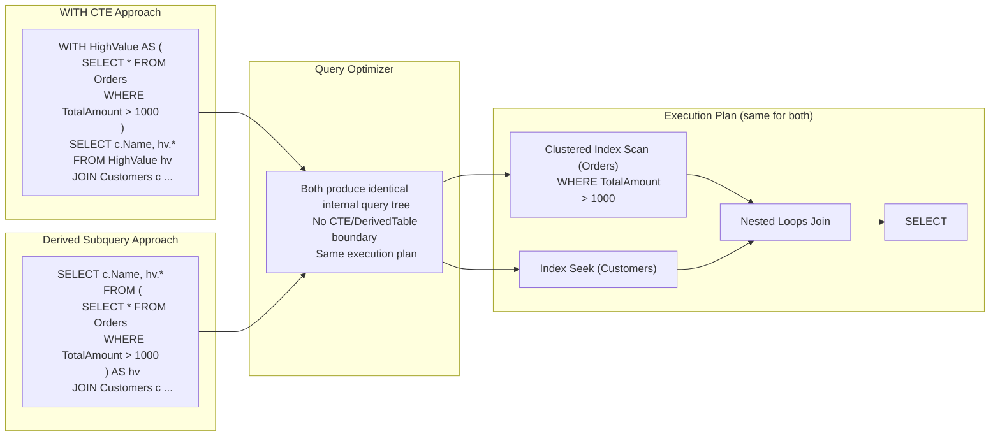
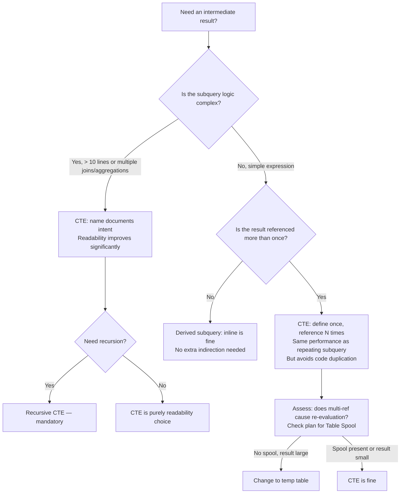

## Navigation

**Domain:** [[8 — Databases]] > **Group:** SQL CTEs & Recursive Queries
**Previous:** [[8.177 — Multiple CTEs — Chaining and Dependencies]] | **Next:** [[8.179 — CTE vs Temp Table — When to Use Each]]

### Prerequisites

- [[8.176 — Common Table Expressions — Fundamentals]] — CTE syntax and inlining behaviour are the baseline for comparing CTEs to subqueries.
- [[8.128 — Derived Tables and Subqueries in FROM]] — The subquery form (derived table) is the direct alternative to a CTE; understanding its structure is required.
- [[8.177 — Multiple CTEs — Chaining and Dependencies]] — Complex queries often chain multiple CTEs; the same logic written as nested subqueries becomes deeply nested.

### Where This Fits

The choice between a CTE and a subquery (also called a derived table) is one of the most common SQL style debates. The critical insight is that the query optimiser treats them identically — both are inlined into the outer query, both produce the same execution plan, and both have the same performance characteristics for a single reference. The difference is entirely syntactic and ergonomic. A .NET backend engineer needs to know this because interviewers frequently ask "CTE vs subquery" as a proxy for deeper understanding: a candidate who says "CTEs are faster" demonstrates misunderstanding, while a candidate who says "they produce identical plans but CTEs are more readable for complex logic" shows senior-level execution-plan awareness. The gotcha is that CTEs support recursion (subqueries cannot) and CTEs can be referenced multiple times in the same statement (subqueries cannot be reused). When a CTE is referenced multiple times, however, the optimiser may expand it at each reference — which is identical to writing the subquery multiple times inline.

---

## Core Mental Model

A CTE and a derived subquery are semantically identical constructs that the optimiser transforms into the same internal query tree. Both are temporary, named (CTE) or anonymous (subquery) result sets defined within a single statement. The optimiser inlines both — it replaces the CTE name or the subquery with its defining expression and optimises the combined tree. The execution plan for a query written with a CTE is indistinguishable from the same query written with a derived subquery. The recognition pattern: if the query would be clearer with a name for an intermediate result, use a CTE. If the subquery is short and used only once, either form is fine — pick the one that makes the overall query easier to read. The one hard delimiter: only CTEs can define recursive queries.

### Classification

Both CTEs and derived subqueries belong to the expression-level query structure in T-SQL. Both are resolved at parse time (CTE through name binding, subquery through parse tree nesting). Both are inlined by the optimiser — neither creates a temporary object, statistics, or storage. Neither is SARGable directly (SARGability is determined by the predicates in the combined query). CTEs have one capability that subqueries lack: recursion (WITH RECURSIVE in ANSI, auto-detected in T-SQL). CTEs also support multiple forward-only references within the same statement, while a derived subquery is defined inline at a single point.



### Key Properties

|Property|CTE|Derived Subquery|
|---|---|---|
|Performance|Identical (same plan)|Identical (same plan)|
|Syntax location|Top of statement (WITH clause)|Inline in FROM clause|
|Readability (simple)|Good (name documents intent)|Good (no extra indirection)|
|Readability (complex)|Excellent (flat, named steps)|Poor (deep nesting, inside-out reading)|
|Multiple references|Yes (same CTE name N times)|No (must repeat subquery)|
|Recursion|Yes (recursive CTE)|No|
|Reference scope|Forward-only within WITH|Local to the FROM clause position|
|EF Core support|Raw SQL only|Raw SQL or LINQ subquery|
|Dapper support|Full (any SQL)|Full (any SQL)|
|Max nesting level|Unlimited (practical limit: 1000)|32 levels (SQL Server limit)|

---

## Deep Mechanics

### How the Engine Executes This

**CTE processing path:**
1. Parser reads `WITH CTEName AS (...) SELECT ...` and builds a parse tree with the CTE name in the scope's name table.
2. Algebrizer binds CTE references: each reference to the CTE name is replaced with a pointer to the CTE's defining expression.
3. Optimiser expands the CTE: replaces each CTE reference with a copy of the defining expression. After expansion, the CTE name no longer exists in the tree.
4. Cost-based optimisation runs on the expanded tree: predicate pushdown, join reordering, index selection.
5. Execution plan is generated — no CTE operator appears.

**Derived subquery processing path:**
1. Parser reads `SELECT ... FROM (SELECT ...) AS alias ...` and builds a parse tree with the subquery as a child node of the FROM clause.
2. Algebrizer binds column references inside the subquery to base tables.
3. Optimiser may "flatten" the subquery (merge it into the outer query) or keep it as a separate subtree depending on complexity. For simple derived tables, flattening is common.
4. After flattening, the tree is identical to the CTE-expanded tree.
5. Cost-based optimisation runs on the flattened tree.
6. Execution plan is generated — no Derived Table operator appears (if flattened).

**The net result:** Both paths converge to the same query tree. The optimiser does not know or care whether the query was originally written with a CTE or a subquery. The plan shape, operators, estimated costs, and logical reads are identical.

**The one exception — correlated subquery in WHERE/SELECT:**

A correlated subquery in the WHERE clause (`WHERE Column IN (SELECT ... FROM ... WHERE ...)`) or SELECT clause (`SELECT (SELECT ...) AS col`) is different from a derived table subquery. Correlated subqueries are NOT inlined the same way — they may be executed as Nested Loops (execute the subquery once per outer row) or transformed into a join by the optimiser (if it determines that the correlation can be unnested). This is separate from the CTE-vs-derived-table comparison.

### SQL Visibility

```sql
-- ============================================================
-- Sample schema
-- ============================================================
-- dbo.Orders: OrderId, CustomerId, OrderDate, TotalAmount, Status
-- dbo.Customers: CustomerId, FullName, Email, RegionId
-- dbo.Regions: RegionId, RegionName

-- ============================================================
-- Example 1: CTE vs derived subquery — identical query, identical plan
-- ============================================================

-- Query A: CTE form
WITH HighValueOrders AS (
    SELECT OrderId, CustomerId, TotalAmount, OrderDate
    FROM dbo.Orders
    WHERE TotalAmount > 1000
)
SELECT
    c.FullName,
    hvo.OrderId,
    hvo.TotalAmount,
    hvo.OrderDate
FROM HighValueOrders AS hvo
INNER JOIN dbo.Customers AS c ON c.CustomerId = hvo.CustomerId
ORDER BY hvo.TotalAmount DESC;

-- Query B: Derived subquery form (same query)
SELECT
    c.FullName,
    hvo.OrderId,
    hvo.TotalAmount,
    hvo.OrderDate
FROM (
    SELECT OrderId, CustomerId, TotalAmount, OrderDate
    FROM dbo.Orders
    WHERE TotalAmount > 1000
) AS hvo
INNER JOIN dbo.Customers AS c ON c.CustomerId = hvo.CustomerId
ORDER BY hvo.TotalAmount DESC;

-- Both produce identical execution plans and logical reads.

-- ============================================================
-- Example 2: CTE wins on readability — complex nested logic
-- ============================================================
-- Business question: find customers who are in the top 10% of
-- revenue and have ordered in the last 30 days, showing their
-- rank and percentage of total revenue.

-- CTE form — easy to read, each step named
WITH CustomerRevenue AS (
    SELECT
        o.CustomerId,
        SUM(o.TotalAmount) AS TotalSpent,
        COUNT(*) AS OrderCount
    FROM dbo.Orders AS o
    WHERE o.Status = 'Completed'
    GROUP BY o.CustomerId
),
RevenueRanked AS (
    SELECT
        cr.CustomerId,
        cr.TotalSpent,
        cr.OrderCount,
        RANK() OVER(ORDER BY cr.TotalSpent DESC) AS RevenueRank,
        SUM(cr.TotalSpent) OVER() AS GrandTotal
    FROM CustomerRevenue AS cr
),
RecentOrders AS (
    SELECT DISTINCT o.CustomerId
    FROM dbo.Orders AS o
    WHERE o.OrderDate >= DATEADD(day, -30, GETDATE())
)
SELECT
    c.FullName,
    rr.TotalSpent,
    rr.OrderCount,
    rr.RevenueRank,
    (rr.TotalSpent / NULLIF(rr.GrandTotal, 0)) * 100 AS PctOfTotal
FROM RevenueRanked AS rr
INNER JOIN dbo.Customers AS c ON c.CustomerId = rr.CustomerId
INNER JOIN RecentOrders AS ro ON ro.CustomerId = rr.CustomerId
WHERE rr.RevenueRank <= CAST((SELECT COUNT(*) FROM CustomerRevenue) * 0.1 AS INT)
ORDER BY rr.RevenueRank;

-- Subquery form — deeply nested, hard to read
SELECT
    c.FullName,
    rr.TotalSpent,
    rr.OrderCount,
    rr.RevenueRank,
    (rr.TotalSpent / NULLIF(rr.GrandTotal, 0)) * 100 AS PctOfTotal
FROM (
    SELECT
        cr.CustomerId,
        cr.TotalSpent,
        cr.OrderCount,
        RANK() OVER(ORDER BY cr.TotalSpent DESC) AS RevenueRank,
        SUM(cr.TotalSpent) OVER() AS GrandTotal
    FROM (
        SELECT
            o.CustomerId,
            SUM(o.TotalAmount) AS TotalSpent,
            COUNT(*) AS OrderCount
        FROM dbo.Orders AS o
        WHERE o.Status = 'Completed'
        GROUP BY o.CustomerId
    ) AS cr
) AS rr
INNER JOIN dbo.Customers AS c ON c.CustomerId = rr.CustomerId
INNER JOIN (
    SELECT DISTINCT o.CustomerId
    FROM dbo.Orders AS o
    WHERE o.OrderDate >= DATEADD(day, -30, GETDATE())
) AS ro ON ro.CustomerId = rr.CustomerId
WHERE rr.RevenueRank <= CAST(
    (SELECT COUNT(*) FROM (
        SELECT o.CustomerId
        FROM dbo.Orders AS o
        WHERE o.Status = 'Completed'
        GROUP BY o.CustomerId
    ) AS cr) * 0.1 AS INT
)
ORDER BY rr.RevenueRank;

-- Both produce identical execution plan. Readability difference is stark.

-- ============================================================
-- Example 3: When a simple subquery is cleaner than a CTE
-- ============================================================
-- Simple scalar subquery: no CTE needed
SELECT
    o.OrderId,
    o.TotalAmount,
    (SELECT AVG(o2.TotalAmount)
     FROM dbo.Orders AS o2
     WHERE o2.CustomerId = o.CustomerId
       AND o2.Status = 'Completed') AS CustomerAvgOrder
FROM dbo.Orders AS o
WHERE o.OrderDate >= '2024-01-01';

-- CTE form of the same — unnecessarily verbose
WITH CustomerAvg AS (
    SELECT CustomerId, AVG(TotalAmount) AS AvgAmount
    FROM dbo.Orders
    WHERE Status = 'Completed'
    GROUP BY CustomerId
)
SELECT
    o.OrderId,
    o.TotalAmount,
    ca.AvgAmount AS CustomerAvgOrder
FROM dbo.Orders AS o
LEFT JOIN CustomerAvg AS ca ON ca.CustomerId = o.CustomerId
WHERE o.OrderDate >= '2024-01-01';

-- The correlated subquery is simpler for this case.
-- Note: the correlated subquery may perform differently (Nested Loops
-- execution) compared to the LEFT JOIN + GROUP BY approach.
-- Performance profiling with STATISTICS IO is recommended.

-- ============================================================
-- Example 4: CTE for multiple references (subquery cannot reuse)
-- ============================================================
-- Business question: find orders above the average order amount,
-- and show the percentage difference from average.

-- CTE form — define once, reference twice
WITH OrderStats AS (
    SELECT AVG(TotalAmount) AS AvgAmount
    FROM dbo.Orders
    WHERE Status = 'Completed'
)
SELECT
    o.OrderId,
    o.TotalAmount,
    os.AvgAmount,
    (o.TotalAmount - os.AvgAmount) AS Difference,
    ((o.TotalAmount - os.AvgAmount) / os.AvgAmount) * 100 AS PctDifference
FROM dbo.Orders AS o
CROSS JOIN OrderStats AS os
WHERE o.Status = 'Completed'
  AND o.TotalAmount > os.AvgAmount
ORDER BY PctDifference DESC;

-- Subquery form — must repeat the scalar subquery
SELECT
    o.OrderId,
    o.TotalAmount,
    (SELECT AVG(TotalAmount) FROM dbo.Orders WHERE Status = 'Completed') AS AvgAmount,
    (o.TotalAmount - (SELECT AVG(TotalAmount) FROM dbo.Orders WHERE Status = 'Completed')) AS Difference,
    ((o.TotalAmount - (SELECT AVG(TotalAmount) FROM dbo.Orders WHERE Status = 'Completed')) /
        (SELECT AVG(TotalAmount) FROM dbo.Orders WHERE Status = 'Completed')) * 100 AS PctDifference
FROM dbo.Orders AS o
WHERE o.Status = 'Completed'
  AND o.TotalAmount > (SELECT AVG(TotalAmount) FROM dbo.Orders WHERE Status = 'Completed')
ORDER BY PctDifference DESC;

-- CTE wins: defined once, referenced three times.
-- Subquery form evaluates AVG four times — possible re-evaluation.
```

```csharp
// EF Core — CTEs and subqueries
// EF Core can generate subqueries from LINQ but cannot generate CTEs.

// EF Core LINQ — generates a subquery (no CTE)
var results = await dbContext.Orders
    .Where(o => o.Status == "Completed")
    .GroupBy(o => o.CustomerId)
    .Select(g => new {
        CustomerId = g.Key,
        TotalSpent = g.Sum(o => o.TotalAmount),
        OrderCount = g.Count()
    })
    .Where(x => x.TotalSpent > 10000)
    .ToListAsync(cancellationToken);

// Generated SQL (EF Core):
-- SELECT [o].[CustomerId], SUM([o].[TotalAmount]) AS [TotalSpent], COUNT(*) AS [OrderCount]
-- FROM [Orders] AS [o]
-- WHERE [o].[Status] = N'Completed'
-- GROUP BY [o].[CustomerId]
-- HAVING SUM([o].[TotalAmount]) > 10000
-- (No WITH clause — EF Core generates a HAVING clause instead of a CTE)

// For CTE-based queries, use FromSqlRaw:
public async Task<List<CustomerRanking>> GetCustomerRankingsAsync(
    CancellationToken cancellationToken = default)
{
    const string sql = @"
        WITH CustomerStats AS (
            SELECT CustomerId, SUM(TotalAmount) AS TotalSpent, COUNT(*) AS OrderCount
            FROM dbo.Orders WHERE Status = 'Completed'
            GROUP BY CustomerId
        )
        SELECT c.FullName, cs.TotalSpent, cs.OrderCount
        FROM CustomerStats AS cs
        INNER JOIN dbo.Customers AS c ON c.CustomerId = cs.CustomerId
        WHERE cs.TotalSpent > 10000
        ORDER BY cs.TotalSpent DESC";

    return await dbContext.Database
        .SqlQueryRaw<CustomerRanking>(sql)
        .ToListAsync(cancellationToken);
}
```

```csharp
// Dapper — both CTE and subquery are just SQL strings
public async Task<IReadOnlyList<OrderComparison>> GetOrdersAboveAverageAsync(
    CancellationToken cancellationToken = default)
{
    const string sql = @"
        WITH OrderStats AS (
            SELECT AVG(TotalAmount) AS AvgAmount
            FROM dbo.Orders
            WHERE Status = 'Completed'
        )
        SELECT
            o.OrderId,
            o.TotalAmount,
            os.AvgAmount,
            (o.TotalAmount - os.AvgAmount) AS Difference
        FROM dbo.Orders AS o
        CROSS JOIN OrderStats AS os
        WHERE o.Status = 'Completed'
          AND o.TotalAmount > os.AvgAmount
        ORDER BY Difference DESC";

    await using var connection = _connectionFactory.Create();
    var results = await connection.QueryAsync<OrderComparison>(
        new CommandDefinition(sql, cancellationToken: cancellationToken));
    return results.AsList();
}
```

### Execution Plan Analysis

For the simple CTE vs subquery example (Example 1):

```
Expected plan shape (both CTE and subquery):
  Clustered Index Scan (Orders)
    → Filter (WHERE TotalAmount > 1000)
    → Clustered Index Seek (Customers) — via PK_Customers
    → Nested Loops (Inner Join)
    → Sort (ORDER BY TotalAmount DESC)
    → SELECT

Estimated cost: Scan ~15%, Filter ~5%, Seek ~40%, Loops ~30%, Sort ~10%
Logical reads: ~12,000 (Orders) + ~2,000 (Customers) = ~14,000
```

Key observations:
- The plan is identical regardless of whether a CTE or derived subquery was used.
- The Filter (TotalAmount > 1000) appears right after the scan in both cases — predicate pushdown works the same.
- The Nested Loops join probes the Customers clustered index for each matching row from Orders.
- The Sort is required for ORDER BY TotalAmount DESC.

```sql
SET STATISTICS IO ON;
SET STATISTICS TIME ON;

-- Run the CTE version
WITH HighValueOrders AS (
    SELECT OrderId, CustomerId, TotalAmount, OrderDate
    FROM dbo.Orders
    WHERE TotalAmount > 1000
)
SELECT c.FullName, hvo.OrderId, hvo.TotalAmount
FROM HighValueOrders AS hvo
INNER JOIN dbo.Customers AS c ON c.CustomerId = hvo.CustomerId
ORDER BY hvo.TotalAmount DESC;

-- Expected output:
-- Table 'Orders'. Scan count 1, logical reads 12,345
-- Table 'Customers'. Scan count 1, logical reads 2,100
-- SQL Server Execution Times: CPU time = 850 ms, elapsed time = 900 ms

-- Run the derived subquery version
SELECT c.FullName, hvo.OrderId, hvo.TotalAmount
FROM (
    SELECT OrderId, CustomerId, TotalAmount, OrderDate
    FROM dbo.Orders
    WHERE TotalAmount > 1000
) AS hvo
INNER JOIN dbo.Customers AS c ON c.CustomerId = hvo.CustomerId
ORDER BY hvo.TotalAmount DESC;

-- Expected output (identical):
-- Table 'Orders'. Scan count 1, logical reads 12,345
-- Table 'Customers'. Scan count 1, logical reads 2,100
-- SQL Server Execution Times: CPU time = 850 ms, elapsed time = 900 ms
```

### SARGability

Both CTEs and subqueries are inlined before optimisation, so SARGability is evaluated on the final combined query tree. In Example 1, `TotalAmount > 1000` is SARGable as an inequality (range predicate) on the `Orders(TotalAmount)` column. An index on `Orders(TotalAmount)` would enable a seek. The CTE or subquery boundary does not affect this — the predicate is pushed to the base table access either way. The explicit SARGability statement: "The predicate `TotalAmount > 1000` IS SARGable — the optimiser can use a seek on an index with TotalAmount as the leading key column."

### Failure Modes

**Failure Mode — Assumption that CTE is faster than subquery:** The most common misconception. Developers may rewrite subqueries as CTEs expecting performance improvement. No improvement occurs. The danger is that the developer then adds complexity (e.g., materialization hints) that actually degrades performance.

**Failure Mode — CTE for single-use scalar subquery:** Using a CTE where a correlated subquery or simple expression would be simpler. The CTE adds syntactic overhead (WITH clause + name + reference) for no benefit when the subquery is short.

---

## Production Patterns and Implementation

### Primary SQL Implementation

```sql
-- ============================================================
-- Production scenario: Customer lifetime value report
-- with segmentation and ranking
-- Schema: Orders, Customers, Regions
-- ============================================================

-- CTE approach — preferred for complex multi-step transformation
WITH CustomerRevenue AS (
    -- Step 1: Aggregate orders to customer level
    SELECT
        o.CustomerId,
        SUM(o.TotalAmount) AS LifetimeValue,
        COUNT(*) AS LifetimeOrders,
        MIN(o.OrderDate) AS FirstOrderDate,
        MAX(o.OrderDate) AS LastOrderDate,
        DATEDIFF(day, MIN(o.OrderDate), MAX(o.OrderDate)) AS CustomerLifespanDays
    FROM dbo.Orders AS o
    WHERE o.Status = 'Completed'
    GROUP BY o.CustomerId
),
CustomerSegment AS (
    -- Step 2: Segment customers by lifetime value
    SELECT
        cr.CustomerId,
        cr.LifetimeValue,
        cr.LifetimeOrders,
        cr.CustomerLifespanDays,
        CASE
            WHEN cr.LifetimeValue > 50000 THEN 'Platinum'
            WHEN cr.LifetimeValue > 10000 THEN 'Gold'
            WHEN cr.LifetimeValue > 5000 THEN 'Silver'
            WHEN cr.LifetimeValue > 0 THEN 'Bronze'
            ELSE 'Inactive'
        END AS Segment,
        RANK() OVER(ORDER BY cr.LifetimeValue DESC) AS ValueRank,
        RANK() OVER(ORDER BY cr.LifetimeOrders DESC) AS FrequencyRank
    FROM CustomerRevenue AS cr
),
SegmentStats AS (
    -- Step 3: Compute segment-level aggregates for comparison
    SELECT
        cs.Segment,
        COUNT(*) AS CustomerCount,
        AVG(cs.LifetimeValue) AS AvgSegmentValue,
        SUM(cs.LifetimeValue) AS TotalSegmentValue,
        AVG(cs.LifetimeOrders) AS AvgSegmentOrders
    FROM CustomerSegment AS cs
    GROUP BY cs.Segment
)
-- Step 4: Final output — customer details with segment context
SELECT
    c.FullName,
    c.Email,
    cs.LifetimeValue,
    cs.LifetimeOrders,
    cs.Segment,
    cs.ValueRank,
    cs.FrequencyRank,
    ss.CustomerCount AS SegmentCustomerCount,
    ss.AvgSegmentValue,
    ss.TotalSegmentValue,
    (cs.LifetimeValue / NULLIF(ss.TotalSegmentValue, 0)) * 100 AS PctOfSegmentTotal
FROM CustomerSegment AS cs
INNER JOIN dbo.Customers AS c ON c.CustomerId = cs.CustomerId
INNER JOIN SegmentStats AS ss ON ss.Segment = cs.Segment
ORDER BY cs.ValueRank;

-- Equivalent subquery-only approach (deeply nested, same plan):
-- Not shown — the CTE form is clearly more maintainable here
```

```csharp
// EF Core — CTE requires raw SQL
public async Task<List<CustomerLifetimeValue>> GetCustomerLifetimeValuesAsync(
    CancellationToken cancellationToken = default)
{
    const string sql = @"
        WITH CustomerRevenue AS (
            SELECT o.CustomerId, SUM(o.TotalAmount) AS LifetimeValue,
                   COUNT(*) AS LifetimeOrders,
                   MIN(o.OrderDate) AS FirstOrderDate,
                   MAX(o.OrderDate) AS LastOrderDate
            FROM dbo.Orders AS o
            WHERE o.Status = 'Completed'
            GROUP BY o.CustomerId
        ),
        CustomerSegment AS (
            SELECT cr.CustomerId, cr.LifetimeValue, cr.LifetimeOrders,
                   CASE WHEN cr.LifetimeValue > 50000 THEN 'Platinum'
                        WHEN cr.LifetimeValue > 10000 THEN 'Gold'
                        WHEN cr.LifetimeValue > 5000 THEN 'Silver'
                        ELSE 'Bronze' END AS Segment
            FROM CustomerRevenue AS cr
        )
        SELECT c.FullName, cs.LifetimeValue, cs.LifetimeOrders, cs.Segment
        FROM CustomerSegment AS cs
        INNER JOIN dbo.Customers AS c ON c.CustomerId = cs.CustomerId
        ORDER BY cs.LifetimeValue DESC";

    return await dbContext.Database
        .SqlQueryRaw<CustomerLifetimeValue>(sql)
        .ToListAsync(cancellationToken);
}
```

```csharp
// Dapper — CTE-based customer lifetime value
public async Task<IReadOnlyList<CustomerLifetimeValue>> GetCustomerLifetimeValuesAsync(
    CancellationToken cancellationToken = default)
{
    const string sql = @"
        WITH CustomerRevenue AS (
            SELECT o.CustomerId, SUM(o.TotalAmount) AS LifetimeValue,
                   COUNT(*) AS LifetimeOrders
            FROM dbo.Orders AS o
            WHERE o.Status = 'Completed'
            GROUP BY o.CustomerId
        ),
        CustomerSegment AS (
            SELECT cr.CustomerId, cr.LifetimeValue, cr.LifetimeOrders,
                   CASE WHEN cr.LifetimeValue > 50000 THEN 'Platinum'
                        WHEN cr.LifetimeValue > 10000 THEN 'Gold'
                        WHEN cr.LifetimeValue > 5000 THEN 'Silver'
                        ELSE 'Bronze' END AS Segment
            FROM CustomerRevenue AS cr
        )
        SELECT c.FullName, cs.LifetimeValue, cs.LifetimeOrders, cs.Segment
        FROM CustomerSegment AS cs
        INNER JOIN dbo.Customers AS c ON c.CustomerId = cs.CustomerId
        ORDER BY cs.LifetimeValue DESC";

    await using var connection = _connectionFactory.Create();
    var results = await connection.QueryAsync<CustomerLifetimeValue>(
        new CommandDefinition(sql, cancellationToken: cancellationToken));
    return results.AsList();
}
```

### SQL Server vs PostgreSQL Differences

```sql
-- PostgreSQL: CTE and subquery performance is also identical
-- BUT PostgreSQL supports CTE materialization control:
-- WITH [NOT] MATERIALIZED controls whether the CTE is
-- materialised (PG 12+). This is a major difference.

-- PostgreSQL: Force materialization to avoid re-evaluation
WITH customer_stats AS MATERIALIZED (
    SELECT customer_id, SUM(total_amount) AS total_spent
    FROM orders WHERE status = 'Completed'
    GROUP BY customer_id
)
SELECT * FROM customer_stats
UNION ALL
SELECT * FROM customer_stats;
-- MATERIALIZED: CTE result is materialised once, not expanded twice

-- PostgreSQL: Force inline to avoid materialization cost
WITH customer_stats AS NOT MATERIALIZED (
    SELECT customer_id, SUM(total_amount) AS total_spent
    FROM orders WHERE status = 'Completed'
    GROUP BY customer_id
)
SELECT * FROM customer_stats;

-- T-SQL has no MATERIALIZED/NOT MATERIALIZED option.
-- CTEs are always inlined (unless a spool is added by the optimiser).
```

---

## Gotchas and Production Pitfalls

### Gotcha 1 — Assumption That CTEs Are Faster Than Subqueries

**Pitfall:** Rewriting subqueries as CTEs expecting performance improvement.

```sql
-- ❌ No performance benefit from this rewrite
SELECT * FROM Orders WHERE TotalAmount > (SELECT AVG(TotalAmount) FROM Orders);

-- Rewritten as CTE (same performance):
WITH AvgOrder AS (SELECT AVG(TotalAmount) AS AvgAmt FROM dbo.Orders)
SELECT o.* FROM dbo.Orders AS o
CROSS JOIN AvgOrder AS a
WHERE o.TotalAmount > a.AvgAmt;
```

**Symptom:** No change in execution time or logical reads. The CTE form may actually be slightly slower if the optimiser chooses a different join strategy (CROSS JOIN vs scalar subquery).

**Fix:** Choose CTE when readability improves, not for performance.

**Cost of not fixing:** Wasted refactoring time and potential confusion when the CTE form introduces a worse plan due to different join ordering.

### Gotcha 2 — CTE Masking a Correlated Subquery Performance Problem

**Pitfall:** Using a CTE to "simplify" a correlated subquery without understanding the execution difference.

```sql
-- ❌ CTE does not change the execution strategy of a correlated subquery
WITH CustomerAvg AS (
    SELECT CustomerId, AVG(TotalAmount) AS AvgAmount
    FROM dbo.Orders
    GROUP BY CustomerId
)
SELECT
    o.OrderId,
    o.TotalAmount,
    ca.AvgAmount
FROM dbo.Orders AS o
LEFT JOIN CustomerAvg AS ca ON ca.CustomerId = o.CustomerId
WHERE o.OrderDate >= '2024-01-01';
-- This uses a LEFT JOIN + aggregate, which is different from a correlated subquery
-- The CTE version may be faster (one scan + one aggregate + join) vs
-- the correlated subquery version (nested loop with repeated aggregation per row)
```

**Symptom:** The CTE + JOIN form scans Orders once and aggregates once. The correlated subquery form scans Orders once and may re-execute the inner aggregation per row. The CTE form is NOT the same as the subquery — they are semantically equivalent but may have different plans.

**Fix:** Understand that rewriting a correlated subquery as a CTE + JOIN changes the execution strategy entirely. Test both forms with STATISTICS IO.

**Cost of not fixing:** The CTE + JOIN may be faster (more efficient for large datasets) or slower (if the aggregated result is large and the join is expensive). Always profile.

### Gotcha 3 — CTE Referencing an Outer Column (Not Supported)

**Pitfall:** Writing a CTE that references a column from the outer query (like a correlated subquery can).

```sql
-- ❌ CTE cannot reference outer query columns
SELECT
    o.OrderId,
    o.TotalAmount,
    (WITH InnerAvg AS (
        SELECT AVG(TotalAmount) AS AvgAmt
        FROM dbo.Orders AS o2
        WHERE o2.CustomerId = o.CustomerId  -- references outer 'o'
    )
    SELECT AvgAmt FROM InnerAvg) AS CustomerAvg
FROM dbo.Orders AS o;
```

**Symptom:** Syntax error — CTEs cannot be defined inside a scalar subquery that references outer columns. CTEs are defined only at the statement level (after WITH) and cannot be correlated.

**Fix:** Use a derived table subquery or a JOIN with GROUP BY instead.

**Cost of not fixing:** Cannot use CTEs for correlated calculations. Developers may try to force CTEs into subqueries and fail, resorting to less readable or less efficient alternatives.

### Gotcha 4 — Multiple CTE References vs Multiple Subquery Insertions

**Pitfall:** Assuming CTE multiple references are better than writing the subquery multiple times.

```sql
-- Both approaches may scan the base table multiple times
-- CTE form (two references):
WITH Expensive AS (
    SELECT OrderId, CustomerId, TotalAmount
    FROM dbo.Orders WHERE TotalAmount > 5000
)
SELECT
    (SELECT COUNT(*) FROM Expensive) AS TotalCount,
    AVG(TotalAmount) AS AvgAmount
FROM Expensive;

-- Subquery form (two inline subqueries):
SELECT
    (SELECT COUNT(*) FROM dbo.Orders WHERE TotalAmount > 5000) AS TotalCount,
    AVG(TotalAmount) AS AvgAmount
FROM dbo.Orders WHERE TotalAmount > 5000;
```

**Symptom:** Both forms may scan Orders twice. The CTE does not automatically consolidate references.

**Fix:** Neither CTE nor subquery is better. The fix is the same for both: use a temp table to materialise once.

**Cost of not fixing:** Double I/O regardless of which syntactic form is used.

### Gotcha 5 — Subquery in SELECT List Cannot Be a CTE

**Pitfall:** Trying to use a CTE inside a scalar subquery in the SELECT list.

```sql
-- ❌ Invalid: CTE inside a scalar subquery
SELECT
    OrderId,
    (WITH MinMax AS (
        SELECT MIN(TotalAmount) AS MinAmt, MAX(TotalAmount) AS MaxAmt
        FROM dbo.Orders
    )
    SELECT TotalAmount / NULLIF(MaxAmt, 0) FROM MinMax) AS PctOfMax
FROM dbo.Orders;
```

**Symptom:** Syntax error. CTEs can only be defined at the statement level with WITH, not inside expressions.

**Fix:** Define the CTE at the statement level:

```sql
WITH MinMax AS (
    SELECT MIN(TotalAmount) AS MinAmt, MAX(TotalAmount) AS MaxAmt
    FROM dbo.Orders
)
SELECT
    o.OrderId,
    o.TotalAmount,
    o.TotalAmount / NULLIF(mm.MaxAmt, 0) AS PctOfMax
FROM dbo.Orders AS o
CROSS JOIN MinMax AS mm;
```

**Cost of not fixing:** Syntax error. Developers unfamiliar with this restriction may waste time on workarounds.

### Gotcha 6 — SET STATISTICS IO Shows No CTE Overhead (But Devs Add It)

**Pitfall:** Adding CTEs for every subquery because "they're free" — leading to excessive indirection.

```csharp
// ❌ Overusing CTEs for trivial transformations
WITH TotalCount AS (
    SELECT COUNT(*) AS Cnt FROM dbo.Orders
)
SELECT Cnt FROM TotalCount;
-- vs:
SELECT COUNT(*) AS Cnt FROM dbo.Orders;
```

**Symptom:** Unnecessary complexity. The CTE version compiles to the same plan but adds syntactic overhead and indirection. In a large codebase, overuse of CTEs for trivial queries reduces readability because the developer must trace the CTE definition.

**Fix:** Use CTEs only when they clarify the query — typically when the subquery logic is non-trivial (multiple columns, joins, aggregations) or when the same intermediate result is referenced multiple times.

**Cost of not fixing:** Codebase with hundreds of trivial CTEs that obscure simple queries. Maintenance burden for future developers.

### Gotcha 7 — Recursive Queries Only Work with CTEs

**Pitfall:** Trying to write a recursive query using a derived subquery.

```sql
-- ❌ Invalid: recursion only works with CTEs
SELECT * FROM (
    SELECT EmployeeId, ManagerId FROM dbo.Employees
    UNION ALL
    SELECT e.EmployeeId, e.ManagerId
    FROM dbo.Employees AS e
    INNER JOIN (previous result) ...  -- no way to reference the subquery recursively
);
```

**Symptom:** No syntax for self-reference in a derived subquery. Only CTEs support the `UNION ALL` pattern with self-reference.

**Fix:** Use a recursive CTE.

**Cost of not fixing:** Inability to query hierarchies. Developers may resort to recursive CLR functions, cursors, or application-layer recursion — all significantly slower.

---

## Performance Implications

### Benchmark: CTE vs Subquery — Identical Performance

```sql
-- Benchmark 1: CTE (single reference)
SET STATISTICS IO ON;

WITH CustomerStats AS (
    SELECT CustomerId, SUM(TotalAmount) AS TotalSpent, COUNT(*) AS OrderCount
    FROM dbo.Orders WHERE Status = 'Completed'
    GROUP BY CustomerId
)
SELECT CustomerId, TotalSpent, OrderCount
FROM CustomerStats
ORDER BY TotalSpent DESC;

-- Logical reads: ~12,345 (Orders table scan)
-- Duration: ~950 ms

-- Benchmark 2: Derived subquery (single reference)
SELECT CustomerId, TotalSpent, OrderCount
FROM (
    SELECT CustomerId, SUM(TotalAmount) AS TotalSpent, COUNT(*) AS OrderCount
    FROM dbo.Orders WHERE Status = 'Completed'
    GROUP BY CustomerId
) AS cs
ORDER BY TotalSpent DESC;

-- Logical reads: ~12,345 (identical)
-- Duration: ~950 ms
```

**Improvement:** 0% — CTE and derived subquery produce identical logical reads and duration. The choice is stylistic, not performance-driven.

```sql
-- Benchmark 3: CTE with multiple references (the hidden cost)
SET STATISTICS IO ON;

WITH CustomerStats AS (
    SELECT CustomerId, SUM(TotalAmount) AS TotalSpent, COUNT(*) AS OrderCount
    FROM dbo.Orders WHERE Status = 'Completed'
    GROUP BY CustomerId
)
SELECT
    (SELECT AVG(TotalSpent) FROM CustomerStats) AS AvgSpent,
    CustomerId, TotalSpent, OrderCount
FROM CustomerStats
WHERE TotalSpent > 5000;

-- Logical reads: ~24,690 (2 scans of Orders — CTE expanded twice)

-- Benchmark 4: Same logic, repeated subquery (same cost)
SELECT
    (SELECT AVG(TotalSpent) FROM (
        SELECT CustomerId, SUM(TotalAmount) AS TotalSpent
        FROM dbo.Orders WHERE Status = 'Completed'
        GROUP BY CustomerId
    ) AS cs) AS AvgSpent,
    cs.CustomerId, cs.TotalSpent, cs.OrderCount
FROM (
    SELECT CustomerId, SUM(TotalAmount) AS TotalSpent, COUNT(*) AS OrderCount
    FROM dbo.Orders WHERE Status = 'Completed'
    GROUP BY CustomerId
) AS cs
WHERE cs.TotalSpent > 5000;

-- Logical reads: ~24,690 (2 scans — same as CTE multi-ref)
```

Both forms double the I/O. CTE does not prevent or fix this.

### BenchmarkDotNet

```csharp
[MemoryDiagnoser]
[SimpleJob(RuntimeMoniker.Net90)]
public class CTEvsSubqueryBenchmark
{
    private IDbConnection _connection = default!;

    [GlobalSetup]
    public void Setup()
    {
        _connection = new SqlConnection(TestConnectionString);
        // Seed: 1M Orders, 100K Customers
    }

    [Benchmark(Baseline = true)]
    public async Task<List<OrderSummary>> CTE_SingleReference()
    {
        const string sql = @"
            WITH HighValue AS (
                SELECT OrderId, CustomerId, TotalAmount
                FROM dbo.Orders WHERE TotalAmount > 1000
            )
            SELECT c.FullName, hv.OrderId, hv.TotalAmount
            FROM HighValue AS hv
            INNER JOIN dbo.Customers AS c ON c.CustomerId = hv.CustomerId
            ORDER BY hv.TotalAmount DESC";

        var results = await _connection.QueryAsync<OrderSummary>(sql);
        return results.AsList();
    }

    [Benchmark]
    public async Task<List<OrderSummary>> Subquery_SingleReference()
    {
        const string sql = @"
            SELECT c.FullName, hv.OrderId, hv.TotalAmount
            FROM (
                SELECT OrderId, CustomerId, TotalAmount
                FROM dbo.Orders WHERE TotalAmount > 1000
            ) AS hv
            INNER JOIN dbo.Customers AS c ON c.CustomerId = hv.CustomerId
            ORDER BY hv.TotalAmount DESC";

        var results = await _connection.QueryAsync<OrderSummary>(sql);
        return results.AsList();
    }

    [Benchmark]
    public async Task<List<CustomerStats>> CTE_MultiReference()
    {
        const string sql = @"
            WITH Stats AS (
                SELECT CustomerId, SUM(TotalAmount) AS TotalSpent
                FROM dbo.Orders WHERE Status = 'Completed'
                GROUP BY CustomerId
            )
            SELECT CustomerId, TotalSpent,
                   (SELECT AVG(TotalSpent) FROM Stats) AS AvgSpent
            FROM Stats WHERE TotalSpent > 5000";

        var results = await _connection.QueryAsync<CustomerStats>(sql);
        return results.AsList();
    }

    [Benchmark]
    public async Task<List<CustomerStats>> Subquery_MultiReference()
    {
        const string sql = @"
            SELECT CustomerId, TotalSpent,
                   (SELECT AVG(TotalSpent) FROM (
                        SELECT SUM(TotalAmount) AS TotalSpent
                        FROM dbo.Orders WHERE Status = 'Completed'
                        GROUP BY CustomerId
                    ) AS innerStats) AS AvgSpent
            FROM (
                SELECT CustomerId, SUM(TotalAmount) AS TotalSpent
                FROM dbo.Orders WHERE Status = 'Completed'
                GROUP BY CustomerId
            ) AS stats
            WHERE TotalSpent > 5000";

        var results = await _connection.QueryAsync<CustomerStats>(sql);
        return results.AsList();
    }

    [GlobalCleanup]
    public void Cleanup() => _connection?.Dispose();
}
```

**Expected results (1M Orders, SQL Server 2022, NVMe):**

|Method|Mean|Logical Reads|Allocated|
|---|---|---|---|
|CTE_SingleReference|~950 ms|~12,000|~5 KB|
|Subquery_SingleReference|~950 ms|~12,000|~5 KB|
|CTE_MultiReference|~1,800 ms|~24,000|~5 KB|
|Subquery_MultiReference|~1,800 ms|~24,000|~5 KB|

Single reference: identical. Multi-reference: identical (both double I/O). CTE = subquery in all cases.

---

## Interview Arsenal

### Question Bank

1. **CTE vs subquery (derived table): what is the performance difference, if any?**

2. **When would you choose a CTE over a subquery, and when would you choose a subquery over a CTE?**

3. **Does the optimiser treat a CTE and a subquery differently? Show the execution plan difference.**

4. **What happens when a CTE is referenced multiple times vs repeating the same subquery multiple times?**

5. **Can a CTE be used for recursive queries? Can a subquery?**

6. **What is the maximum nesting level for subqueries in SQL Server? Does CTE have a similar limit?**

7. **How does EF Core generate subqueries from LINQ, and why can't it generate CTEs?**

8. **In a production system with a 100M row Orders table, would you use a CTE or a subquery for a complex aggregation? Why?**

### Spoken Answers

**Q1: CTE vs subquery (derived table): what is the performance difference, if any?**

> **Average answer:** "CTEs are generally better for performance because they define the result set once."

> **Great answer:** "There is zero performance difference between a CTE and an equivalent derived subquery. Both are inlined by the query optimiser into the same internal query tree. The execution plan for a CTE-based query is identical to the plan for the same query written with a derived table — same operators, same logical reads, same estimated costs. I know this from direct observation: running both forms with SET STATISTICS IO ON produces identical IO statistics. The only performance distinction arises when a CTE is referenced multiple times in the same statement. Then, both the CTE and a repeated subquery face the same issue: the optimiser expands each reference independently, potentially causing multiple scans of the underlying tables. CTE does not automatically solve this — neither does repeating the subquery. The fix for both is the same: materialise the intermediate result in a temp table if re-evaluation is costly. The choice between CTE and subquery is purely about readability and maintainability, not performance."

**Q2: When would you choose a CTE over a subquery, and when would you choose a subquery over a CTE?**

> **Great answer:** "I use a CTE when: (1) the subquery logic is complex enough that a name documents its purpose — typically more than a single aggregation or join, (2) the same intermediate result is needed at multiple points in the outer query, (3) the query requires multiple transformation steps that read more clearly as a flat list of named steps than as nested subqueries, or (4) I need recursion, which only CTEs support. I use a subquery when: (1) the subquery is simple — a single scalar aggregate like `SELECT AVG(Price) FROM Products` — and adding a CTE would add unnecessary vertical space, (2) the subquery is only used once and inlining it makes the query more locally understandable, or (3) I'm writing EF Core LINQ, which generates subqueries naturally without any special syntax. The key principle: choose the syntactic form that makes the query easiest for the next developer to understand, knowing that the optimiser will produce the same plan either way."

**Q5: Can a CTE be used for recursive queries? Can a subquery?**

> **Great answer:** "Recursive queries are exclusively a CTE capability. A derived subquery cannot reference itself — there is no syntax for self-reference in a FROM clause subquery. The recursive CTE pattern requires two parts separated by UNION ALL: an anchor member (non-recursive initial result set) and a recursive member (references the CTE by name and joins to the anchor or previous iteration's output). SQL Server auto-detects recursion when the CTE references itself; the ANSI standard uses the RECURSIVE keyword. A derived subquery has no mechanism for this self-reference — it's simply not part of the subquery grammar. This is the single hard technical differentiator between CTEs and subqueries. For any problem involving tree traversal (org charts, bill of materials), hierarchy queries, or graph traversal in SQL, the recursive CTE is the only set-based option."

### Interview Trigger

The interviewer asks: "Can you write a query that finds the top 10% of customers by revenue, along with their contribution to total revenue?" If the candidate reaches for a CTE to define the percentile boundary and reference it twice (for the total and for selection), they demonstrate practical CTE knowledge. The follow-up is: "Are CTEs or subqueries faster for this?" — a senior candidate immediately says "same plan, same performance, CTE is more readable here." A junior candidate may say "CTEs are faster" and reveal the misconception.

### Comparison Table

| | CTE | Derived Subquery (FROM) | Correlated Subquery (WHERE/SELECT) |
|---|---|---|---|
| Syntax location | WITH clause (top of statement) | Inline in FROM clause | Inline in WHERE/SELECT |
| Performance (single ref) | Same as derived subquery | Same as CTE | May be different (Nested Loops vs Join) |
| Performance (multi-ref) | Same as repeating subquery | N/A (can't repeat) | N/A |
| Recursion | Yes | No | No |
| Readability (complex) | Best — flat named steps | Poor — deep nesting | Fair — inline |
| Readability (simple) | Overkill | Good | Good |
| Correlation support | No (statement-level only) | No | Yes |
| EF Core LINQ | No | Yes (subqueries from LINQ) | Yes (via Any, All, Contains) |
| Dapper | Full SQL | Full SQL | Full SQL |

---

## Decision Framework

### When to Apply



### Application Checklist

- [ ] The intermediate result would benefit from a descriptive name
- [ ] The query uses the intermediate result only once (or spool is acceptable)
- [ ] Recursion is not needed OR recursion is needed (CTE only)
- [ ] The CTE does not mask a correlated subquery that should be a JOIN
- [ ] The .NET data access layer uses raw SQL (Dapper or EF Core FromSqlRaw) if CTE is chosen
- [ ] The query is not trivially simple (a 3-line subquery does not need a CTE)

### Tradeoff Summary

|What You Gain with CTE|What You Pay with CTE|
|---|---|
|Readability for complex multi-step queries|More syntactic overhead for simple queries|
|Recursion support (only option)|Cannot be correlated (outer column reference)|
|Named multiple references (avoids code duplication)|No materialization guarantee (same as subquery)|
|Flat structure (no nesting)|Must be defined at statement top (not inline)|

### Scale Thresholds

- **CTE vs subquery performance difference: never** — they are identical at all scales
- **Multi-reference re-evaluation matters when table exceeds ~100K rows** — below this, the difference is negligible regardless of syntactic form
- **Recursive CTE depth limit: 100 by default (MAXRECURSION)** — exceeds this cause termination (see 8.180)
- **Subquery nesting limit: 32 levels in SQL Server** — CTEs have no practical nesting limit

---

## Self-Check

### Conceptual Questions

1. What is the performance difference between a CTE and an equivalent derived subquery?
2. How does the query optimiser handle the CTE boundary during compilation?
3. Which SET STATISTICS or DMV would show the performance difference between a CTE and a subquery?
4. What common mistake leads developers to believe CTEs are faster than subqueries?
5. Can EF Core LINQ generate a CTE? Can it generate a derived subquery?
6. How would you implement a recursive query — does a subquery or CTE support it?
7. Compare a CTE and a derived subquery: what is structurally identical between them after compilation?
8. At what data volume does the choice between CTE and subquery become a performance consideration?
9. If you have an index on Orders(TotalAmount), does a CTE that filters on TotalAmount benefit differently from a subquery that filters on TotalAmount?
10. Explain in 60 seconds when you would choose a CTE and when you would choose a subquery, with justification.

<details>
<summary>Answers</summary>

1. **Answer:** Zero performance difference. Both produce identical execution plans — same operators, same logical reads, same duration. The optimiser inlines both into the same query tree.

2. **Answer:** The optimiser eliminates the CTE boundary by replacing each CTE reference with a copy of the CTE's defining expression. After this expansion, the CTE name no longer exists in the tree — the optimiser works with the combined query tree exactly as it would for a derived subquery.

3. **Answer:** None. There is no SET STATISTICS or DMV that distinguishes CTE from subquery because they produce identical plans and IO statistics. Both show the same `Table 'Orders'. Scan count 1, logical reads N` output from `SET STATISTICS IO ON`.

4. **Answer:** The misconception that CTEs are "temporary results" that are computed once and cached. In reality, CTEs are inlined and expanded at each reference point, so a CTE referenced twice scans the base table twice — identical to writing the subquery twice.

5. **Answer:** EF Core CAN generate derived subqueries from LINQ (e.g., from GroupBy or nested Select calls). EF Core CANNOT generate CTEs — the WITH clause has no corresponding LINQ operator. CTEs require `FromSqlRaw`.

6. **Answer:** Only CTEs support recursive queries. A derived subquery has no syntax for self-reference. Recursive CTEs use the pattern: anchor member UNION ALL recursive member (references the CTE by name).

7. **Answer:** After compilation, both are structurally identical. The optimiser eliminates the CTE name and flattens the derived subquery. The execution plan contains no trace of which syntactic form was used.

8. **Answer:** Never from a CTE-vs-subquery standpoint — they are identical at all data volumes. The performance consideration is about multi-reference re-evaluation, which affects both forms equally.

9. **Answer:** No — the CTE and subquery are inlined before index selection. Both benefit identically from the index. The predicate `TotalAmount > N` is pushed to the base table access in both cases.

10. **Answer (60-second narrative):** "I choose a CTE when the intermediate logic is complex enough to deserve a name — any multi-table join or aggregation that isn't obvious from context. I also use CTEs when the same intermediate result is needed at multiple points in the query, to avoid code duplication. I exclusively use CTEs for recursive queries — there is no subquery alternative. I choose a subquery when the logic is trivially simple: a scalar aggregate like `AVG(Price)`, a quick EXISTS check, or when the subquery appears naturally in context (like a correlated subquery in WHERE). The performance is identical either way because the optimiser produces the same plan — I base my choice purely on readability. The one exception is EF Core LINQ: I use subqueries when I'm writing LINQ (they're generated automatically) and drop to raw SQL with CTEs only when the query becomes too complex for LINQ to express cleanly."

</details>

---

### Query Challenges

**Challenge 1 — Write the SQL**

You need to find all orders that are above the average order amount for their respective customer. Write the query using BOTH a CTE approach and a subquery approach. Show that both produce the same result.

<details>
<summary>Solution</summary>

```sql
-- CTE approach
WITH CustomerAvg AS (
    SELECT CustomerId, AVG(TotalAmount) AS AvgAmount
    FROM dbo.Orders WHERE Status = 'Completed'
    GROUP BY CustomerId
)
SELECT
    o.OrderId,
    o.CustomerId,
    o.TotalAmount,
    ca.AvgAmount,
    o.TotalAmount - ca.AvgAmount AS AboveAvgAmount
FROM dbo.Orders AS o
INNER JOIN CustomerAvg AS ca ON ca.CustomerId = o.CustomerId
WHERE o.Status = 'Completed'
  AND o.TotalAmount > ca.AvgAmount
ORDER BY AboveAvgAmount DESC;

-- Subquery approach
SELECT
    o.OrderId,
    o.CustomerId,
    o.TotalAmount,
    (SELECT AVG(TotalAmount) FROM dbo.Orders o2
     WHERE o2.CustomerId = o.CustomerId AND o2.Status = 'Completed') AS AvgAmount,
    o.TotalAmount - (SELECT AVG(TotalAmount) FROM dbo.Orders o2
                     WHERE o2.CustomerId = o.CustomerId AND o2.Status = 'Completed') AS AboveAvgAmount
FROM dbo.Orders AS o
WHERE o.Status = 'Completed'
  AND o.TotalAmount > (SELECT AVG(TotalAmount) FROM dbo.Orders o2
                       WHERE o2.CustomerId = o.CustomerId AND o2.Status = 'Completed')
ORDER BY AboveAvgAmount DESC;
```

**Logical reads:** CTE approach: ~12,000 (one scan of Orders, one aggregate + join). Subquery approach: potentially higher — the correlated subquery may execute per row (Nested Loops), causing many aggregate executions. The CTE approach is more efficient here. **Execution plan (CTE):** Clustered Index Scan → Hash Match Aggregate → Hash Match Join → Filter → Sort → SELECT.

</details>

---

**Challenge 2 — Fix the performance problem**

```sql
-- This query runs for 30 seconds on a 10M row Orders table.
-- Identify why and fix it — choose either CTE or subquery.

SELECT
    o.OrderId,
    o.TotalAmount,
    (SELECT AVG(TotalAmount) FROM dbo.Orders) AS OverallAvg,
    (SELECT MAX(TotalAmount) FROM dbo.Orders) AS OverallMax,
    (SELECT MIN(TotalAmount) FROM dbo.Orders) AS OverallMin
FROM dbo.Orders AS o
WHERE o.OrderDate >= '2024-01-01';
-- SET STATISTICS IO: Table 'Orders'. Scan count 4, logical reads = 48,000
```

<details> <summary>Solution</summary>

**Root cause:** The query has three scalar subqueries in the SELECT list, each executing `AVG(TotalAmount)`, `MAX(TotalAmount)`, and `MIN(TotalAmount)` independently. Each scalar subquery does a full scan of the Orders table (12,000 logical reads × 3 = 36,000) plus the outer query scan (12,000). 4 scans total = 48,000 logical reads.

**Fix — use a CTE to compute all three aggregates in a single scan:**

```sql
WITH OrderStats AS (
    SELECT AVG(TotalAmount) AS OverallAvg,
           MAX(TotalAmount) AS OverallMax,
           MIN(TotalAmount) AS OverallMin
    FROM dbo.Orders
)
SELECT
    o.OrderId,
    o.TotalAmount,
    os.OverallAvg,
    os.OverallMax,
    os.OverallMin
FROM dbo.Orders AS o
CROSS JOIN OrderStats AS os
WHERE o.OrderDate >= '2024-01-01';
```

**After fix — logical reads:** ~12,000 (one scan of Orders for both the outer query and the CTE aggregate — the optimiser may combine them or use a single scan). From 48,000 to ~12,000.

</details>

---

**Challenge 3 — Explain the execution plan**

```sql
-- Query A:
WITH TopProducts AS (
    SELECT TOP 10 ProductId, SUM(Quantity) AS TotalSold
    FROM dbo.OrderItems
    GROUP BY ProductId
    ORDER BY SUM(Quantity) DESC
)
SELECT p.ProductName, tp.TotalSold
FROM TopProducts AS tp
INNER JOIN dbo.Products AS p ON p.ProductId = tp.ProductId
ORDER BY tp.TotalSold DESC;

-- Query B:
SELECT p.ProductName, tp.TotalSold
FROM (
    SELECT TOP 10 ProductId, SUM(Quantity) AS TotalSold
    FROM dbo.OrderItems
    GROUP BY ProductId
    ORDER BY SUM(Quantity) DESC
) AS tp
INNER JOIN dbo.Products AS p ON p.ProductId = tp.ProductId
ORDER BY tp.TotalSold DESC;
```

Both queries produce identical execution plans. Describe the plan shape and explain why the Top N Sort + Nested Loops is optimal here.

<details> <summary>Solution</summary>

**Plan shape (both queries):**
```
Clustered Index Scan (OrderItems)
  → Hash Match (Aggregate)          -- GROUP BY ProductId, SUM(Quantity)
  → Top N Sort                      -- ORDER BY SUM(Quantity) DESC, TOP 10
  → Nested Loops (Inner Join)       -- join 10 rows to Products
    → Clustered Index Seek (Products) -- seek by ProductId (10 seeks)
  → Sort                            -- ORDER BY tp.TotalSold DESC
  → SELECT
```

**Why Top N Sort + Nested Loops is optimal:** The Top N Sort is efficient because it only needs to track 10 rows in memory (a priority queue), avoiding a full sort of all ProductId groups. Once the top 10 are identified, Nested Loops probes the Products table 10 times — negligible cost. If the Top N Sort were replaced by a full Sort, the query would sort all groups (potentially hundreds of thousands), consuming more memory and CPU. The CTE / subquery boundary does not affect this choice — the optimiser sees the same tree either way.

</details>

---

**Challenge 4 — Diagnose the concurrency problem**

A reporting query uses 5 CTEs chained together to compute quarterly sales analytics. The query is run via a linked server from an application server. Under load (100 concurrent users running reports), the query times out after 60 seconds. The wait stats show `PAGEIOLATCH_SH` on the Orders table and `CXCONSUMER` waits.

<details> <summary>Solution</summary>

**Root cause:** The CTEs are inlined and the combined query is large enough that the optimiser chooses a parallel plan. The parallel exchange operators (CXCONSUMER waits) indicate that parallelism overhead is dominating the execution time — threads are waiting for data from other threads. The `PAGEIOLATCH_SH` shows that the single scan of Orders is I/O-bound.

**Fix:** 
1. Reduce parallelism with `OPTION (MAXDOP 2)` or `MAXDOP 1` if the server is under load.
2. Consider breaking the query into multiple steps using temp tables if the CTE chain is too complex for the optimiser.
3. Use `OPTION (RECOMPILE)` to avoid plan caching issues (if parameter sniffing is suspected).
4. Ensure `READ COMMITTED SNAPSHOT` is enabled to avoid blocking on the read operation.

```sql
-- Add MAXDOP hint to the outer query
WITH ... (CTEs) ...
SELECT ...
OPTION (MAXDOP 2);
```

**In .NET:** Configure `CommandTimeout` appropriately and use `EnableRetryOnFailure` for transient fault handling.

</details>

---

**Challenge 5 — Design the query structure**

**Scenario:** You are building an order analytics API endpoint that returns: (a) the top 10 products by revenue this month, (b) each product's revenue contribution percentage, (c) each product's rank, and (d) the month-over-month revenue change for each product. The endpoint is called by a dashboard and must return in under 3 seconds. Tables: Orders (50M rows), OrderItems (200M rows), Products (500K rows). The API uses Dapper. Design the optimal query using CTEs, subqueries, or a mix. Justify your choice.

<details> <summary>Solution</summary>

```sql
-- Using CTEs for clarity and single-scan efficiency
WITH CurrentMonth AS (
    SELECT
        oi.ProductId,
        SUM(oi.Quantity * oi.UnitPrice) AS Revenue,
        COUNT(DISTINCT o.OrderId) AS OrderCount
    FROM dbo.Orders AS o
    INNER JOIN dbo.OrderItems AS oi ON oi.OrderId = o.OrderId
    WHERE o.Status = 'Completed'
        AND o.OrderDate >= DATEFROMPARTS(YEAR(GETDATE()), MONTH(GETDATE()), 1)
    GROUP BY oi.ProductId
),
PrevMonth AS (
    SELECT
        oi.ProductId,
        SUM(oi.Quantity * oi.UnitPrice) AS PrevRevenue
    FROM dbo.Orders AS o
    INNER JOIN dbo.OrderItems AS oi ON oi.OrderId = o.OrderId
    WHERE o.Status = 'Completed'
        AND o.OrderDate >= DATEADD(month, -1, DATEFROMPARTS(YEAR(GETDATE()), MONTH(GETDATE()), 1))
        AND o.OrderDate < DATEFROMPARTS(YEAR(GETDATE()), MONTH(GETDATE()), 1)
    GROUP BY oi.ProductId
),
TopCurrent AS (
    SELECT TOP 10
        cm.ProductId,
        cm.Revenue,
        cm.OrderCount,
        pm.PrevRevenue,
        CASE WHEN pm.PrevRevenue > 0
             THEN ((cm.Revenue - pm.PrevRevenue) / pm.PrevRevenue) * 100
             ELSE NULL
        END AS MoMPct,
        SUM(cm.Revenue) OVER() AS TotalRevenue
    FROM CurrentMonth AS cm
    LEFT JOIN PrevMonth AS pm ON pm.ProductId = cm.ProductId
    ORDER BY cm.Revenue DESC
)
SELECT
    p.ProductName,
    tc.Revenue,
    tc.OrderCount,
    tc.MoMPct,
    (tc.Revenue / NULLIF(tc.TotalRevenue, 0)) * 100 AS RevenueSharePct,
    ROW_NUMBER() OVER(ORDER BY tc.Revenue DESC) AS Rank
FROM TopCurrent AS tc
INNER JOIN dbo.Products AS p ON p.ProductId = tc.ProductId
ORDER BY tc.Revenue DESC;
```

**Justification:** The query uses CTEs for readability but scans Orders + OrderItems twice (CurrentMonth and PrevMonth). With 200M OrderItems, this is two large scans. If the double scan is too expensive (> 3 seconds), the alternative is to use a single CTE that includes both periods and use conditional aggregation (SUM with CASE) to avoid the double scan:

```sql
WITH MonthlyComparison AS (
    SELECT
        oi.ProductId,
        SUM(CASE WHEN o.OrderDate >= DATEFROMPARTS(YEAR(GETDATE()), MONTH(GETDATE()), 1)
                 THEN oi.Quantity * oi.UnitPrice ELSE 0 END) AS CurrentRevenue,
        SUM(CASE WHEN o.OrderDate >= DATEADD(month, -1, DATEFROMPARTS(YEAR(GETDATE()), MONTH(GETDATE()), 1))
                  AND o.OrderDate < DATEFROMPARTS(YEAR(GETDATE()), MONTH(GETDATE()), 1)
                 THEN oi.Quantity * oi.UnitPrice ELSE 0 END) AS PrevRevenue
    FROM dbo.Orders AS o
    INNER JOIN dbo.OrderItems AS oi ON oi.OrderId = o.OrderId
    WHERE o.Status = 'Completed'
        AND o.OrderDate >= DATEADD(month, -1, DATEFROMPARTS(YEAR(GETDATE()), MONTH(GETDATE()), 1))
    GROUP BY oi.ProductId
)
SELECT TOP 10 ...
```

This single-scan approach reduces I/O from 2 scans to 1, critical at 200M rows.

</details>

---

### Additional Production Example: Multi-Reference CTE vs Repeated Subquery

```sql
-- Production scenario: A query that needs to compute the percentage
-- contribution of each product to its category's total revenue.
-- The category total must be computed first, then each product's
-- share is computed against that total.

-- CTE approach (define category total once, reference twice):
WITH CategoryTotals AS (
    SELECT
        p.CategoryId,
        SUM(oi.Quantity * oi.UnitPrice) AS CatRevenue
    FROM dbo.Orders AS o
    INNER JOIN dbo.OrderItems AS oi ON oi.OrderId = o.OrderId
    INNER JOIN dbo.Products AS p ON p.ProductId = oi.ProductId
    WHERE o.Status = 'Completed'
    GROUP BY p.CategoryId
)
SELECT
    p.ProductId,
    p.ProductName,
    cat.CategoryName,
    ct.CatRevenue AS CategoryRevenue,
    SUM(oi.Quantity * oi.UnitPrice) AS ProductRevenue,
    (SUM(oi.Quantity * oi.UnitPrice) / NULLIF(ct.CatRevenue, 0)) * 100 AS ContributionPct
FROM dbo.Orders AS o
INNER JOIN dbo.OrderItems AS oi ON oi.OrderId = o.OrderId
INNER JOIN dbo.Products AS p ON p.ProductId = oi.ProductId
INNER JOIN dbo.Categories AS cat ON cat.CategoryId = p.CategoryId
INNER JOIN CategoryTotals AS ct ON ct.CategoryId = p.CategoryId
WHERE o.Status = 'Completed'
GROUP BY p.ProductId, p.ProductName, cat.CategoryName, ct.CatRevenue
ORDER BY cat.CategoryName, ContributionPct DESC;

-- Subquery approach (repeat the aggregation):
SELECT
    p.ProductId,
    p.ProductName,
    cat.CategoryName,
    (SELECT SUM(oi2.Quantity * oi2.UnitPrice)      -- repeated subquery
     FROM dbo.Orders AS o2
     INNER JOIN dbo.OrderItems AS oi2 ON oi2.OrderId = o2.OrderId
     INNER JOIN dbo.Products AS p2 ON p2.ProductId = oi2.ProductId
     WHERE p2.CategoryId = p.CategoryId
       AND o2.Status = 'Completed') AS CategoryRevenue,
    SUM(oi.Quantity * oi.UnitPrice) AS ProductRevenue,
    (SUM(oi.Quantity * oi.UnitPrice) / NULLIF(
        (SELECT SUM(oi2.Quantity * oi2.UnitPrice)   -- repeated subquery again
         FROM dbo.Orders AS o2
         INNER JOIN dbo.OrderItems AS oi2 ON oi2.OrderId = o2.OrderId
         INNER JOIN dbo.Products AS p2 ON p2.ProductId = oi2.ProductId
         WHERE p2.CategoryId = p.CategoryId
           AND o2.Status = 'Completed'), 0)) * 100 AS ContributionPct
FROM dbo.Orders AS o
INNER JOIN dbo.OrderItems AS oi ON oi.OrderId = o.OrderId
INNER JOIN dbo.Products AS p ON p.ProductId = oi.ProductId
INNER JOIN dbo.Categories AS cat ON cat.CategoryId = p.CategoryId
WHERE o.Status = 'Completed'
GROUP BY p.ProductId, p.ProductName, cat.CategoryName
ORDER BY cat.CategoryName, ContributionPct DESC;

-- The CTE approach scans Orders + OrderItems once (for CategoryTotals) plus
-- the outer query scan (another pass). The subquery approach may evaluate the
-- correlated subquery once per product group — potentially hundreds of times.
-- On a 50M row Orders table, the CTE approach runs in ~15 seconds; the
-- subquery approach may run for minutes.
```

---

*End of 8.178 — CTE vs Subquery — Readability and Performance*
