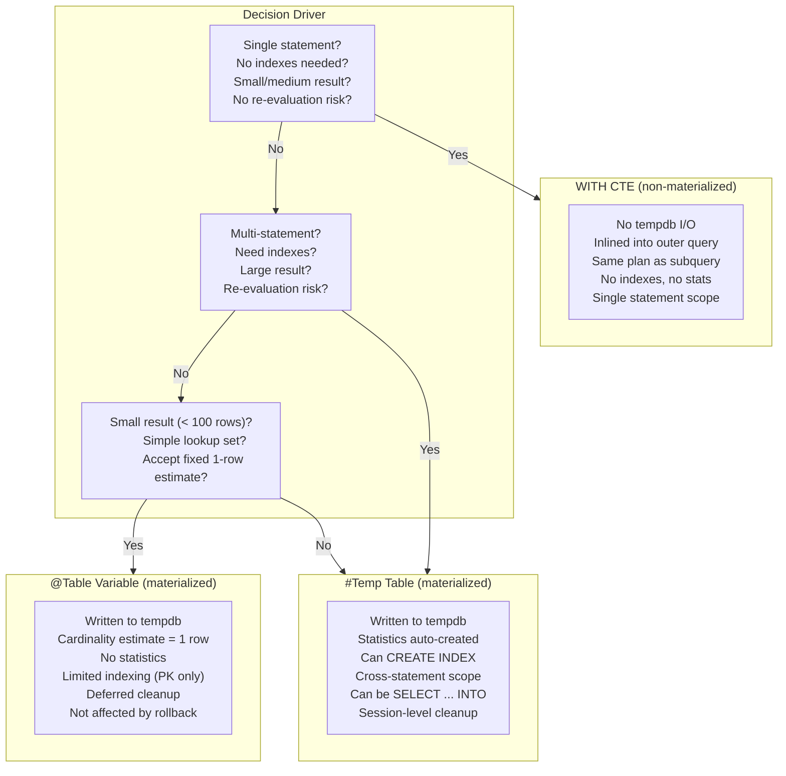

## Navigation

**Domain:** [[8 — Databases]] > **Group:** SQL CTEs & Recursive Queries
**Previous:** [[8.178 — CTE vs Subquery — Readability and Performance]] | **Next:** [[8.180 — Recursive CTEs — Anchor and Recursive Members]]

### Prerequisites

- [[8.176 — Common Table Expressions — Fundamentals]] — Understanding that CTEs are inlined (not materialised) is essential to contrasting them with temp tables.
- [[8.177 — Multiple CTEs — Chaining and Dependencies]] — Multi-CTE chains often reach the point where temp tables become the better choice; knowing the dependency pattern informs the decision.
- [[8.128 — Derived Tables and Subqueries in FROM]] — The alternative to both CTE and temp table is nested subqueries; understanding all three options provides the full tradeoff picture.

### Where This Fits

The choice between a CTE (inlined, no I/O, single statement) and a temp table (#temp: materialised in tempdb, indexable, multi-statement) is one of the most common performance-tuning decisions a .NET backend engineer makes. CTEs are free for single-use queries but cannot be indexed or reused across statements. Temp tables require tempdb I/O to create but support indexes, statistics, and cross-statement reference. Table variables (@table) sit in between: they also use tempdb but have different cardinality estimation behaviour. The interview signal is strong: a senior candidate explains the tradeoff in terms of logical reads, plan caching, and cardinality estimation, not just "CTEs are for simple queries and temp tables are for complex ones." The decision directly impacts production query performance, especially for ETL processes, reporting queries, and complex data transformations in .NET backend services.

---

## Core Mental Model

A CTE and a temp table serve related but distinct purposes. A CTE is a naming construct — the optimiser inlines it into the outer query, producing a plan with no CTE operator, no tempdb writes, and no statistics. A temp table (#temp) is a physical table created in tempdb — rows are written to disk (or memory, depending on the size), statistics are generated, indexes can be created, and the table persists for the session (or until explicitly dropped). A table variable (@table) is also a physical object in tempdb, but with different cardinality estimation (always estimates 1 row) and a more limited scope (deferred). The recognition pattern: use a CTE when the intermediate result is simple, used once, and doesn't need indexing. Use a temp table when the intermediate result is complex, reused across statements, requires indexing, or when the CTE's inlining causes re-evaluation problems. Use a table variable for small result sets (under ~100 rows) where the simplified cardinality estimate is acceptable.

### Classification

CTEs belong to the expression-level naming facility — no physical storage, no statistics, inlined at compile time. Temp tables (#temp) and table variables (@table) are physical storage objects in tempdb. Temp tables support indexes, statistics, and parallel population. Table variables have limited statistics (one-row estimate) and do not support indexes (except primary key and unique constraints created in the declaration). Temp tables participate in transactions (can be rolled back); table variables are not affected by rollback.



### Key Properties

|Property|CTE|#Temp Table|@Table Variable|
|---|---|---|---|
|Storage|None (inlined)|Tempdb (disk/memory)|Tempdb (disk/memory)|
|Materialization|No (unless spooled)|Yes (at creation)|Yes (at insert)|
|Statistics|None|Auto-created|1-row estimate only|
|Index support|No|Yes (after creation)|PK/unique constraint only|
|Scope|Single statement|Session (or global)|Batch/scope|
|Transaction participation|N/A (no storage)|Yes (rollback possible)|No (not affected by rollback)|
|Parallelism|N/A|Yes (parallel insert)|Single-threaded|
|Plan impact|None (inlined)|Appears as Table Scan/Seek|Appears as Table Scan (expects 1 row)|
|Cleanup|Automatic (statement end)|Automatic (session end) or DROP|Automatic (batch end or scope end)|
|EF Core support|Raw SQL only|Raw SQL only|Raw SQL only|
|Dapper support|Full (any SQL)|Full (any SQL)|Full (any SQL)|

---

## Deep Mechanics

### How the Engine Executes This

**CTE execution:**
1. Parser binds CTE name. Optimiser inlines CTE definition into outer query.
2. Combined query tree is cost-optimised. No tempdb operations.
3. Execution plan accesses base tables directly. No CTE operators.
4. Logical reads reflect only base table access.

**Temp table (#temp) execution:**
1. Parser compiles the SELECT ... INTO #temp or CREATE TABLE #temp statement.
2. During execution, the query processor evaluates the source query and writes the result rows to tempdb:
   - If #temp is created via SELECT ... INTO, the optimiser determines the schema from the SELECT list and allocates pages in tempdb.
   - Rows are written to tempdb pages. Statistics are auto-created on the #temp table (if the table has > 0 rows and automatic statistics are enabled).
   - The write I/O is proportional to the number of rows and row width.
3. Subsequent statements referencing #temp see the physical tempdb object. Each reference to #temp appears in the execution plan as a Table Scan or Table Seek on the #temp table.
4. When the session ends (or DROP TABLE is executed), the tempdb pages are deallocated.

**Table variable (@table) execution:**
1. The table variable declaration is compiled. No pages are allocated until the first INSERT.
2. On first INSERT, rows are written to tempdb. The optimiser assumes the table variable has exactly 1 row for cardinality estimation.
3. Table variable references appear in the execution plan with a cardinality estimate of 1, regardless of actual row count.
4. The table variable is automatically cleaned up when the batch/scope ends.

**Key performance insight — the tempdb cost:**

The tempdb write cost for a temp table is approximately:
- `logical_write_cost ≈ row_count × row_width / page_size × pages_per_allocate`
- For a 1M row temp table with 200-byte rows: ~1M × 200 / 8192 ≈ 24,500 pages written ≈ ~190 MB of tempdb writes
- This write cost includes page allocations, any index maintenance, and statistics creation.
- The subsequent reads from the temp table are `scan_cost ≈ pages_in_temp_table ≈ 24,500 reads`
- Compare to CTE: zero tempdb writes, but the CTE may re-evaluate if referenced multiple times.

### SQL Visibility

```sql
-- ============================================================
-- Sample schema
-- ============================================================
-- dbo.Orders: OrderId, CustomerId, OrderDate, TotalAmount, Status
-- dbo.OrderItems: OrderItemId, OrderId, ProductId, Quantity, UnitPrice
-- dbo.Customers: CustomerId, FullName, Email

-- ============================================================
-- Example 1: CTE — simple transformation, single use
-- ============================================================
-- Best for: one-step aggregation, no reuse, no indexing needed
WITH CustomerRevenue AS (
    SELECT CustomerId, SUM(TotalAmount) AS TotalSpent, COUNT(*) AS OrderCount
    FROM dbo.Orders WHERE Status = 'Completed'
    GROUP BY CustomerId
)
SELECT c.FullName, cr.TotalSpent, cr.OrderCount
FROM CustomerRevenue AS cr
INNER JOIN dbo.Customers AS c ON c.CustomerId = cr.CustomerId
ORDER BY cr.TotalSpent DESC;

-- ============================================================
-- Example 2: Temp table — complex multi-step ETL
-- ============================================================
-- Best for: multiple transformations, indexing, cross-statement reuse

-- Step 1: Extract raw data into temp table
SELECT
    o.OrderId,
    o.CustomerId,
    o.OrderDate,
    o.TotalAmount,
    o.Status
INTO #RawOrders
FROM dbo.Orders AS o
WHERE o.OrderDate >= DATEADD(year, -1, GETDATE());

-- Step 2: Add index for subsequent joins
CREATE INDEX IX_Temp_CustomerId ON #RawOrders(CustomerId)
INCLUDE (TotalAmount);

-- Step 3: Aggregation step
SELECT
    ro.CustomerId,
    SUM(ro.TotalAmount) AS TotalSpent,
    COUNT(*) AS OrderCount
INTO #CustomerSummaries
FROM #RawOrders AS ro
WHERE ro.Status = 'Completed'
GROUP BY ro.CustomerId;

-- Step 4: Final output
SELECT c.FullName, cs.TotalSpent, cs.OrderCount
FROM #CustomerSummaries AS cs
INNER JOIN dbo.Customers AS c ON c.CustomerId = cs.CustomerId
ORDER BY cs.TotalSpent DESC;

-- Cleanup
DROP TABLE #RawOrders;
DROP TABLE #CustomerSummaries;

-- ============================================================
-- Example 3: Table variable — small lookup set
-- ============================================================
-- Best for: small reference data (< 100 rows), simple lookups
DECLARE @TargetCustomers TABLE (
    CustomerId INT PRIMARY KEY,
    MinOrderDate DATE
);

INSERT INTO @TargetCustomers (CustomerId, MinOrderDate)
VALUES
    (1, '2024-01-01'),
    (2, '2024-03-15'),
    (3, '2024-06-01');

SELECT
    tc.CustomerId,
    tc.MinOrderDate,
    o.OrderId,
    o.TotalAmount
FROM @TargetCustomers AS tc
INNER JOIN dbo.Orders AS o
    ON o.CustomerId = tc.CustomerId
    AND o.OrderDate >= tc.MinOrderDate;

-- ============================================================
-- Example 4: CTE fails — need index on intermediate result
-- ============================================================
-- Business question: find customers with largest order value
-- gap between consecutive orders (needs window function on
-- ordered data, then filter on window result)

-- CTE approach — no index on intermediate, works but scans twice
WITH CustomerOrders AS (
    SELECT
        o.CustomerId,
        o.OrderId,
        o.TotalAmount,
        o.OrderDate,
        LAG(o.TotalAmount, 1) OVER(
            PARTITION BY o.CustomerId ORDER BY o.OrderDate
        ) AS PrevAmount
    FROM dbo.Orders AS o
    WHERE o.Status = 'Completed'
),
GapAnalysis AS (
    SELECT
        CustomerId,
        OrderId,
        OrderDate,
        TotalAmount,
        PrevAmount,
        TotalAmount - PrevAmount AS AmountGap
    FROM CustomerOrders
    WHERE PrevAmount IS NOT NULL
)
SELECT *
FROM GapAnalysis
ORDER BY AmountGap DESC;

-- Temp table approach — can index the intermediate
SELECT
    o.CustomerId,
    o.OrderId,
    o.TotalAmount,
    o.OrderDate,
    LAG(o.TotalAmount, 1) OVER(
        PARTITION BY o.CustomerId ORDER BY o.OrderDate
    ) AS PrevAmount
INTO #OrderGaps
FROM dbo.Orders AS o
WHERE o.Status = 'Completed';

-- Index the temp table for fast filtering
CREATE INDEX IX_Temp_AmountGap ON #OrderGaps(CustomerId, TotalAmount);

-- Now query with the indexed temp table (faster than re-scanning)
SELECT *
FROM #OrderGaps
WHERE PrevAmount IS NOT NULL
ORDER BY (TotalAmount - PrevAmount) DESC;
```

```csharp
// EF Core — temp tables and CTEs both require raw SQL
// EF Core cannot generate either from LINQ.

// Using FromSqlRaw with a temp table
public async Task<List<CustomerSummary>> GetCustomerSummariesWithTempTableAsync(
    CancellationToken cancellationToken = default)
{
    const string sql = @"
        CREATE TABLE #CustomerStats (
            CustomerId INT PRIMARY KEY,
            TotalSpent DECIMAL(18,2),
            OrderCount INT
        );

        INSERT INTO #CustomerStats (CustomerId, TotalSpent, OrderCount)
        SELECT CustomerId, SUM(TotalAmount), COUNT(*)
        FROM dbo.Orders WHERE Status = 'Completed'
        GROUP BY CustomerId;

        SELECT c.FullName, cs.TotalSpent, cs.OrderCount
        FROM #CustomerStats AS cs
        INNER JOIN dbo.Customers AS c ON c.CustomerId = cs.CustomerId
        ORDER BY cs.TotalSpent DESC;

        DROP TABLE #CustomerStats;";

    return await dbContext.Database
        .SqlQueryRaw<CustomerSummary>(sql)
        .ToListAsync(cancellationToken);
}
```

```csharp
// Dapper — temp table in a single batch
public async Task<IReadOnlyList<CustomerSummary>> GetWithTempTableAsync(
    CancellationToken cancellationToken = default)
{
    const string sql = @"
        SELECT CustomerId, SUM(TotalAmount) AS TotalSpent, COUNT(*) AS OrderCount
        INTO #TempStats
        FROM dbo.Orders WHERE Status = 'Completed'
        GROUP BY CustomerId;

        SELECT c.FullName, t.TotalSpent, t.OrderCount
        FROM #TempStats AS t
        INNER JOIN dbo.Customers AS c ON c.CustomerId = t.CustomerId
        ORDER BY t.TotalSpent DESC;";

    await using var connection = _connectionFactory.Create();
    var results = await connection.QueryAsync<CustomerSummary>(
        new CommandDefinition(sql, cancellationToken: cancellationToken));
    return results.AsList();
}

// Dapper — table variable
public async Task<IReadOnlyList<Order>> GetCustomerOrdersForPeriodAsync(
    IReadOnlyList<int> customerIds,
    DateTime startDate,
    CancellationToken cancellationToken = default)
{
    const string sql = @"
        DECLARE @Customers TABLE (CustomerId INT PRIMARY KEY);
        INSERT INTO @Customers (CustomerId)
        SELECT Value FROM STRING_SPLIT(@CustomerIds, ',');

        SELECT o.*
        FROM dbo.Orders AS o
        INNER JOIN @Customers AS c ON c.CustomerId = o.CustomerId
        WHERE o.OrderDate >= @StartDate
            AND o.Status = 'Completed';";

    await using var connection = _connectionFactory.Create();
    var results = await connection.QueryAsync<Order>(
        new CommandDefinition(sql,
            new {
                CustomerIds = string.Join(",", customerIds),
                StartDate = startDate
            },
            cancellationToken: cancellationToken));
    return results.AsList();
}
```

### Execution Plan Analysis

**CTE execution plan (Example 1):**

```
Clustered Index Scan (Orders)
  → Hash Match (Aggregate)          -- GROUP BY CustomerId
  → Hash Match (Inner Join)          -- join to Customers
    → Clustered Index Scan (Customers)
  → Sort                             -- ORDER BY TotalSpent DESC
  → SELECT
```

No CTE operator. Orders scanned once. Customers scanned once. All I/O is on base tables.

**Temp table execution plan (Example 2):**

Step 1 plan (SELECT ... INTO #RawOrders):
```
Clustered Index Scan (Orders)
  → Table Insert (#RawOrders)        -- writes rows to tempdb
    → Table Spool / Parallelism (if degree > 1)
```
Logical reads: base table scan + tempdb writes.

Step 2 plan (CREATE INDEX):
```
Sort (on CustomerId)
  → Table Spool (populating index pages)
```

Step 3 plan (SELECT ... INTO #CustomerSummaries from #RawOrders):
```
Table Scan (#RawOrders)
  → Hash Match (Aggregate)
  → Table Insert (#CustomerSummaries)
```

Step 4 plan (final SELECT):
```
Table Scan (#CustomerSummaries)
  → Nested Loops (Inner Join)         -- probe Customers per row
    → Clustered Index Seek (Customers)
  → Sort
  → SELECT
```

Key observation: each temp table reference appears as a Table Scan (or Table Seek if indexed) in the plan. The base table (Orders) is scanned only once in Step 1. All subsequent operations are on the much smaller temp tables.

```sql
SET STATISTICS IO ON;
SET STATISTICS TIME ON;

-- CTE query (Example 1)
WITH CustomerRevenue AS (
    SELECT CustomerId, SUM(TotalAmount) AS TotalSpent, COUNT(*) AS OrderCount
    FROM dbo.Orders WHERE Status = 'Completed'
    GROUP BY CustomerId
)
SELECT c.FullName, cr.TotalSpent, cr.OrderCount
FROM CustomerRevenue AS cr
INNER JOIN dbo.Customers AS c ON c.CustomerId = cr.CustomerId
ORDER BY cr.TotalSpent DESC;

-- Expected output:
-- Table 'Orders'. Scan count 1, logical reads 12,345
-- Table 'Customers'. Scan count 1, logical reads 2,100
-- SQL Server Execution Times: CPU time = 890 ms, elapsed time = 940 ms

-- Temp table query (Example 2)
SELECT CustomerId, SUM(TotalAmount) AS TotalSpent, COUNT(*) AS OrderCount
INTO #TempStats
FROM dbo.Orders WHERE Status = 'Completed'
GROUP BY CustomerId;

SELECT c.FullName, t.TotalSpent, t.OrderCount
FROM #TempStats AS t
INNER JOIN dbo.Customers AS c ON c.CustomerId = t.CustomerId
ORDER BY t.TotalSpent DESC;

-- Expected output:
-- Table 'Orders'. Scan count 1, logical reads 12,345
-- Table '#TempStats'. Scan count 1, logical reads 150  (temp table size depends on # groups)
-- Table 'Customers'. Scan count 1, logical reads 2,100
-- SQL Server Execution Times: CPU time = 940 ms, elapsed time = 1,020 ms
-- (Slightly slower due to tempdb write I/O for #TempStats)

-- Table variable query (Example 3)
DECLARE @TargetCustomers TABLE (CustomerId INT PRIMARY KEY, MinOrderDate DATE);
INSERT INTO @TargetCustomers (CustomerId, MinOrderDate) VALUES (1, '2024-01-01'), (2, '2024-03-15');

SELECT tc.CustomerId, o.OrderId, o.TotalAmount
FROM @TargetCustomers AS tc
INNER JOIN dbo.Orders AS o
    ON o.CustomerId = tc.CustomerId AND o.OrderDate >= tc.MinOrderDate;

-- Expected output:
-- Table '#31B2A1...' (table variable internal name). Scan count 1, logical reads 1
-- Table 'Orders'. Scan count 1, logical reads ~100 (seek per customer)
-- Cardinality estimate: @TargetCustomers shows 1 row in the plan
```

### SARGability

CTEs: SARGability is determined by predicates in the inlined query. The CTE itself has no SARGability.

Temp tables: SARGability is determined by the indexes created on the temp table. A temp table with an index on `CustomerId` enables a seek on that column. Without indexes, the temp table is always scanned.

Table variables: With a PRIMARY KEY on the table variable, seek is possible if the predicate matches the key column. Without a PK, the table variable is always scanned (with a 1-row estimate).

### Failure Modes

**Failure Mode 1 — Table variable cardinality estimate causes poor plans:** The optimiser always estimates 1 row for a table variable, regardless of actual row count. If the table variable has 10,000 rows but the plan expects 1, the optimiser may choose a Nested Loops join (1 probe) when a Hash Match would be correct. This causes a "nested loops join with 10,000 outer iterations" performance disaster.

**Failure Mode 2 — Temp table statistics out of date:** If #temp is populated and then modified multiple times, statistics may not reflect the current data. A subsequent query may get a suboptimal plan. Use UPDATE STATISTICS #Temp or create the table once and reuse it in the same session.

---

## Production Patterns and Implementation

### Primary SQL Implementation

```sql
-- ============================================================
-- Production scenario: Multi-step ETL for daily sales rollup
-- Schema: Orders, OrderItems, Products, Categories
-- This ETL runs nightly, processes 2M new orders, 10M order items
-- ============================================================

-- Strategy: CTE for the final query, but temp tables for
-- intermediate materialization of large datasets

-- Step 1: Extract raw daily data into temp table (materialize once)
SELECT
    o.OrderId,
    o.OrderDate,
    o.CustomerId,
    o.TotalAmount,
    oi.ProductId,
    oi.Quantity,
    oi.UnitPrice
INTO #DailyRaw
FROM dbo.Orders AS o
INNER JOIN dbo.OrderItems AS oi ON oi.OrderId = o.OrderId
WHERE o.OrderDate >= CAST(GETDATE() AS DATE)   -- today's orders only
  AND o.OrderDate < CAST(DATEADD(day, 1, GETDATE()) AS DATE)
  AND o.Status = 'Completed';

-- Create index on the temp table for fast aggregation
CREATE INDEX IX_Temp_ProductId ON #DailyRaw(ProductId)
INCLUDE (Quantity, UnitPrice);

-- Step 2: Aggregate to product level
SELECT
    dr.ProductId,
    p.ProductName,
    cat.CategoryId,
    cat.CategoryName,
    COUNT(DISTINCT dr.OrderId) AS OrderCount,
    SUM(dr.Quantity) AS TotalUnits,
    SUM(dr.Quantity * dr.UnitPrice) AS Revenue
INTO #ProductDaily
FROM #DailyRaw AS dr
INNER JOIN dbo.Products AS p ON p.ProductId = dr.ProductId
INNER JOIN dbo.Categories AS cat ON cat.CategoryId = p.CategoryId
GROUP BY dr.ProductId, p.ProductName, cat.CategoryId, cat.CategoryName;

-- Step 3: Use CTE for the final readable output (CTE over temp table is fine)
WITH DailyStats AS (
    SELECT
        pd.CategoryName,
        pd.ProductName,
        pd.OrderCount,
        pd.TotalUnits,
        pd.Revenue,
        RANK() OVER(PARTITION BY pd.CategoryId ORDER BY pd.Revenue DESC) AS CategoryRank,
        SUM(pd.Revenue) OVER(PARTITION BY pd.CategoryId) AS CategoryTotalRevenue
    FROM #ProductDaily AS pd
)
SELECT
    ds.CategoryName,
    ds.ProductName,
    ds.OrderCount,
    ds.TotalUnits,
    ds.Revenue,
    ds.CategoryRank,
    (ds.Revenue / NULLIF(ds.CategoryTotalRevenue, 0)) * 100 AS CategorySharePct
FROM DailyStats AS ds
ORDER BY ds.CategoryName, ds.CategoryRank;

-- Cleanup
DROP TABLE #DailyRaw;
DROP TABLE #ProductDaily;

-- ============================================================
-- Alternative: Pure CTE approach (simpler but may scan twice)
-- ============================================================
WITH DailyOrders AS (
    SELECT o.OrderId, o.CustomerId, o.TotalAmount, oi.ProductId, oi.Quantity, oi.UnitPrice
    FROM dbo.Orders AS o
    INNER JOIN dbo.OrderItems AS oi ON oi.OrderId = o.OrderId
    WHERE o.OrderDate >= CAST(GETDATE() AS DATE)
      AND o.OrderDate < CAST(DATEADD(day, 1, GETDATE()) AS DATE)
      AND o.Status = 'Completed'
),
ProductAgg AS (
    SELECT
        p.ProductId, p.ProductName, cat.CategoryId, cat.CategoryName,
        COUNT(DISTINCT do.OrderId) AS OrderCount,
        SUM(do.Quantity) AS TotalUnits,
        SUM(do.Quantity * do.UnitPrice) AS Revenue
    FROM DailyOrders AS do
    INNER JOIN dbo.Products AS p ON p.ProductId = do.ProductId
    INNER JOIN dbo.Categories AS cat ON cat.CategoryId = p.CategoryId
    GROUP BY p.ProductId, p.ProductName, cat.CategoryId, cat.CategoryName
)
SELECT ... (same final output)
-- Pure CTE approach scans Orders + OrderItems once (if well-optimized)
-- but does not allow creating indexes on intermediate results.
-- For 2M orders daily, temp table with index is more efficient.
```

```csharp
// EF Core — temp table via raw SQL
public async Task<List<DailySalesRollup>> GetDailySalesRollupAsync(
    CancellationToken cancellationToken = default)
{
    const string sql = @"
        SELECT o.OrderId, o.OrderDate, o.CustomerId, oi.ProductId, oi.Quantity, oi.UnitPrice
        INTO #DailyRaw
        FROM dbo.Orders AS o
        INNER JOIN dbo.OrderItems AS oi ON oi.OrderId = o.OrderId
        WHERE o.OrderDate >= CAST(GETDATE() AS DATE)
          AND o.OrderDate < CAST(DATEADD(day, 1, GETDATE()) AS DATE)
          AND o.Status = 'Completed';

        CREATE INDEX IX_Temp_ProductId ON #DailyRaw(ProductId)
        INCLUDE (Quantity, UnitPrice);

        SELECT
            p.ProductId, p.ProductName, cat.CategoryId, cat.CategoryName,
            COUNT(DISTINCT dr.OrderId) AS OrderCount,
            SUM(dr.Quantity) AS TotalUnits,
            SUM(dr.Quantity * dr.UnitPrice) AS Revenue
        FROM #DailyRaw AS dr
        INNER JOIN dbo.Products AS p ON p.ProductId = dr.ProductId
        INNER JOIN dbo.Categories AS cat ON cat.CategoryId = p.CategoryId
        GROUP BY p.ProductId, p.ProductName, cat.CategoryId, cat.CategoryName
        ORDER BY cat.CategoryName, Revenue DESC;

        DROP TABLE #DailyRaw;";

    return await dbContext.Database
        .SqlQueryRaw<DailySalesRollup>(sql)
        .ToListAsync(cancellationToken);
}
```

```csharp
// Dapper — temp table for ETL
public async Task<IReadOnlyList<DailySalesRollup>> RunDailyRollupAsync(
    CancellationToken cancellationToken = default)
{
    const string sql = @"
        SELECT o.OrderId, oi.ProductId, oi.Quantity, oi.UnitPrice
        INTO #DailyRaw
        FROM dbo.Orders AS o
        INNER JOIN dbo.OrderItems AS oi ON oi.OrderId = o.OrderId
        WHERE o.OrderDate >= CAST(GETDATE() AS DATE)
          AND o.OrderDate < CAST(DATEADD(day, 1, GETDATE()) AS DATE)
          AND o.Status = 'Completed';

        CREATE INDEX IX_Temp_ProductId ON #DailyRaw(ProductId);

        SELECT
            p.ProductId, p.ProductName,
            COUNT(DISTINCT dr.OrderId) AS OrderCount,
            SUM(dr.Quantity * dr.UnitPrice) AS Revenue
        FROM #DailyRaw AS dr
        INNER JOIN dbo.Products AS p ON p.ProductId = dr.ProductId
        GROUP BY p.ProductId, p.ProductName
        ORDER BY Revenue DESC;";

    await using var connection = _connectionFactory.Create();
    var results = await connection.QueryAsync<DailySalesRollup>(
        new CommandDefinition(sql, cancellationToken: cancellationToken));
    return results.AsList();
}
```

### SQL Server vs PostgreSQL Differences

```sql
-- PostgreSQL: Temp tables work similarly
CREATE TEMPORARY TABLE temp_orders AS
SELECT * FROM orders WHERE order_date >= CURRENT_DATE;

-- Table variables do not exist in PostgreSQL.
-- Use temp tables or CTEs instead.

-- PostgreSQL has WITH [NOT] MATERIALIZED for CTEs:
WITH daily_raw AS MATERIALIZED (
    SELECT ...
)
SELECT * FROM daily_raw;
-- MATERIALIZED forces the CTE to be stored in a temp-like structure,
-- similar to a temp table but scoped to the single statement.
-- T-SQL does not have this option.

-- For CTE-vs-temp-table decisions, PostgreSQL differs:
-- 1. Temp tables are session-scoped (same as T-SQL)
-- 2. Table variables do not exist (use temp tables)
-- 3. CTE MATERIALIZED option gives granular control over inlining
-- 4. PostgreSQL temp tables support ANALYZE (same as T-SQL statistics)
```

---

## Gotchas and Production Pitfalls

### Gotcha 1 — Table Variable 1-Row Cardinality Estimate

**Pitfall:** Using a table variable for a large result set and suffering from the 1-row cardinality estimate.

```sql
-- ❌ Table variable with many rows — optimiser estimates 1 row
DECLARE @OrderIds TABLE (OrderId INT PRIMARY KEY);
INSERT INTO @OrderIds (OrderId)
SELECT OrderId FROM dbo.Orders
WHERE OrderDate >= DATEADD(day, -7, GETDATE());
-- This inserts 50,000 rows

SELECT o.*, oi.*
FROM @OrderIds AS ids
INNER JOIN dbo.Orders AS o ON o.OrderId = ids.OrderId
INNER JOIN dbo.OrderItems AS oi ON oi.OrderId = o.OrderId;
-- Optimiser chooses Nested Loops (expects 1 outer row)
-- Actual: 50,000 outer rows → 50,000 probe iterations → disaster
```

**Symptom:** The execution plan shows a Nested Loops join with the table variable as the outer input. The est. rows = 1, but actual rows = 50,000. The query runs for minutes instead of seconds.

**Fix:** Use a temp table instead, which gets proper cardinality estimates:

```sql
CREATE TABLE #OrderIds (OrderId INT PRIMARY KEY);
INSERT INTO #OrderIds (OrderId)
SELECT OrderId FROM dbo.Orders
WHERE OrderDate >= DATEADD(day, -7, GETDATE());
-- Proper statistics are created, optimiser estimates correctly
```

**Cost of not fixing:** Table variable with 50K rows causing a Nested Loops plan that executes 50M+ joins. Query times out or runs for 5+ minutes.

### Gotcha 2 — CTE Re-Evaluation vs Temp Table Single Materialization

**Pitfall:** Using a CTE for an intermediate result that is referenced multiple times, causing repeated evaluation.

```sql
-- ❌ CTE referenced twice — re-evaluates the aggregation
WITH RegionalStats AS (
    SELECT r.RegionId, SUM(o.TotalAmount) AS TotalRevenue
    FROM dbo.Orders AS o
    INNER JOIN dbo.Customers AS c ON c.CustomerId = o.CustomerId
    INNER JOIN dbo.Regions AS r ON r.RegionId = c.RegionId
    WHERE o.Status = 'Completed'
    GROUP BY r.RegionId
)
SELECT
    (SELECT MAX(TotalRevenue) FROM RegionalStats) AS MaxRevenue,
    (SELECT MIN(TotalRevenue) FROM RegionalStats) AS MinRevenue,
    RegionId, TotalRevenue
FROM RegionalStats;
```

**Symptom:** Orders and Customers are scanned 3 times (once for each RegionalStats reference). Logical reads triple.

**Fix — temp table materializes once:**

```sql
SELECT r.RegionId, SUM(o.TotalAmount) AS TotalRevenue
INTO #RegionalStats
FROM dbo.Orders AS o
INNER JOIN dbo.Customers AS c ON c.CustomerId = o.CustomerId
INNER JOIN dbo.Regions AS r ON r.RegionId = c.RegionId
WHERE o.Status = 'Completed'
GROUP BY r.RegionId;

SELECT
    (SELECT MAX(TotalRevenue) FROM #RegionalStats) AS MaxRevenue,
    (SELECT MIN(TotalRevenue) FROM #RegionalStats) AS MinRevenue,
    RegionId, TotalRevenue
FROM #RegionalStats;
```

**Cost of not fixing:** Triple I/O on large tables. At 50M Orders and 10M Customers, this is 3 × 225,000 = 675,000 logical reads instead of 225,000 + tempdb reads.

### Gotcha 3 — Temp Table Locking and tempdb Contention

**Pitfall:** Creating and dropping many temp tables in a high-throughput OLTP system, causing tempdb metadata contention.

```sql
-- ❌ Creating/dropping #temp in a loop (high concurrency scenario)
CREATE TABLE #Temp1 (Id INT);
INSERT INTO #Temp1 VALUES (1);
SELECT * FROM #Temp1;
DROP TABLE #Temp1;
-- Repeated 1000x/minute under 200 concurrent users
```

**Symptom:** `PAGELATCH_UP` and `PAGELATCH_EX` waits on tempdb system pages (particularly 2:1:1 and 2:1:3 — PFS and SGAM pages). Tempdb throughput collapses under contention. The symptom is "tempdb is slow" which manifests as all queries using temp tables becoming slow.

**Fix:** 
1. Use table variables for small result sets (less tempdb metadata contention).
2. Reduce temp table creation/drop frequency by reusing temp tables across batches.
3. Add tempdb data files (one per CPU core) to reduce allocation contention.
4. Enable TF 1118 (uniform extent allocation) and TF 1117 (auto-grow all files equally).

**Cost of not fixing:** Tempdb contention causes system-wide performance degradation. All queries that use temp tables (including many system-internal operations) become slow.

### Gotcha 4 — CTE Cannot Be Indexed; Temp Table Can

**Pitfall:** Using a CTE when a subsequent operation would benefit from an index on the intermediate result.

```sql
-- ❌ CTE — no index on intermediate result
WITH OrderSummary AS (
    SELECT OrderId, CustomerId, TotalAmount, OrderDate,
           ROW_NUMBER() OVER(PARTITION BY CustomerId ORDER BY OrderDate DESC) AS rn
    FROM dbo.Orders WHERE Status = 'Completed'
)
SELECT CustomerId, OrderId, TotalAmount
FROM OrderSummary
WHERE rn = 1
ORDER BY TotalAmount DESC;
-- The plan sorts all rows for ROW_NUMBER, then filters for rn=1
-- No index can be added to the CTE result

-- ✅ Temp table — can index to optimize
SELECT OrderId, CustomerId, TotalAmount, OrderDate,
       ROW_NUMBER() OVER(PARTITION BY CustomerId ORDER BY OrderDate DESC) AS rn
INTO #OrderSummary
FROM dbo.Orders WHERE Status = 'Completed';

CREATE INDEX IX_Temp_CustomerRank ON #OrderSummary(CustomerId, rn);

SELECT CustomerId, OrderId, TotalAmount
FROM #OrderSummary
WHERE rn = 1
ORDER BY TotalAmount DESC;
```

**Symptom:** The CTE version sorts all rows by CustomerId, OrderDate to compute ROW_NUMBER, then filters. The temp table version can add a covering index for the final query. For 10M rows, the CTE sort may spill to tempdb (extra I/O) while the temp table with index may be faster.

**Fix:** Use temp table when indexing the intermediate result is beneficial.

**Cost of not fixing:** Spilled sorts, longer query duration, higher memory grants for the sort operation.

### Gotcha 5 — Temp Table Statistics Not Automatically Updated

**Pitfall:** Populating a temp table, then modifying it multiple times, and expecting statistics to reflect the current state.

```sql
-- ❌ Multiple modifications to #temp without updating stats
CREATE TABLE #OrderProcessing (OrderId INT, Status VARCHAR(20));
INSERT INTO #OrderProcessing SELECT OrderId, 'Pending' FROM dbo.Orders WHERE Status = 'New';  -- 10K rows
UPDATE #OrderProcessing SET Status = 'Processing' WHERE OrderId % 2 = 0;  -- 5K rows affected
DELETE FROM #OrderProcessing WHERE OrderId % 10 = 0;  -- 1K rows deleted

SELECT * FROM #OrderProcessing WHERE Status = 'Processing';
-- Plan may be based on old statistics (from initial insert)
```

**Symptom:** After multiple modifications, the plan for a query on the temp table uses an inaccurate row estimate (based on the auto-created statistics from the initial INSERT). The optimiser may choose a scan when a seek would be better, or vice versa.

**Fix:** Update statistics explicitly after modifications:

```sql
UPDATE STATISTICS #OrderProcessing;
-- Or, if a specific index needs updating:
UPDATE STATISTICS #OrderProcessing IX_Temp_Status;
```

**Cost of not fixing:** Suboptimal execution plans on temp table queries after modifications. This is most common in stored procedures that build temp tables incrementally.

### Gotcha 6 — SELECT INTO #Temp Creates Statistics; CREATE TABLE + INSERT Does Not (Always)

**Pitfall:** Assuming that `CREATE TABLE #Temp` followed by `INSERT INTO #Temp` creates statistics on the temp table.

```sql
-- ✅ Statistics auto-created (SELECT INTO)
SELECT * INTO #Temp FROM dbo.Orders WHERE TotalAmount > 1000;
-- sys.dm_db_stats_properties shows statistics for all columns

-- ❌ Statistics may NOT be auto-created (CREATE TABLE + INSERT)
CREATE TABLE #Temp (OrderId INT, CustomerId INT, TotalAmount DECIMAL(18,2));
INSERT INTO #Temp SELECT OrderId, CustomerId, TotalAmount FROM dbo.Orders WHERE TotalAmount > 1000;
-- Statistics may not be created depending on SQL Server version and settings
```

**Symptom:** The optimiser has inaccurate row estimates for the temp table created via `CREATE TABLE + INSERT`, leading to suboptimal join strategies.

**Fix:** Use `SELECT INTO` when possible (it creates statistics). If `CREATE TABLE` is required (e.g., computed columns, identity columns, or explicit schema definition), manually create statistics: `CREATE STATISTICS ST_Temp_TotalAmount ON #Temp(TotalAmount);`

**Cost of not fixing:** Suboptimal join strategies on temp tables. The optimiser may choose Nested Loops when Hash Match is needed, or vice versa.

### Gotcha 7 — Temp Tables in Functions Are Not Allowed

**Pitfall:** Trying to use a temp table inside a multi-statement table-valued function (TVF) or scalar function.

```sql
-- ❌ Temp table inside a function is not allowed
CREATE FUNCTION dbo.GetCustomerSummary(@CustomerId INT)
RETURNS TABLE
AS
BEGIN
    CREATE TABLE #Temp (...);  -- ERROR
    ...
END;
```

**Symptom:** Error: "Cannot create a temporary table in a function."

**Fix:** Use a table variable (allowed in functions) or a CTE. If a temp table is truly needed, refactor the function into a stored procedure.

**Cost of not fixing:** Inability to use temp tables in functions. Developers may use table variables with poor cardinality estimates, or resort to less efficient patterns.

---

## Performance Implications

### Benchmark: CTE vs Temp Table

```sql
-- Benchmark 1: CTE with single reference
SET STATISTICS IO ON;

WITH CustomerRevenue AS (
    SELECT CustomerId, SUM(TotalAmount) AS TotalSpent, COUNT(*) AS OrderCount
    FROM dbo.Orders WHERE Status = 'Completed'
    GROUP BY CustomerId
)
SELECT CustomerId, TotalSpent, OrderCount
FROM CustomerRevenue
ORDER BY TotalSpent DESC;
-- Expected: Scan count 1, logical reads ~12,345

-- Benchmark 2: Temp table (materialized)
SELECT CustomerId, SUM(TotalAmount) AS TotalSpent, COUNT(*) AS OrderCount
INTO #CustomerRevenue
FROM dbo.Orders WHERE Status = 'Completed'
GROUP BY CustomerId;

SELECT CustomerId, TotalSpent, OrderCount
FROM #CustomerRevenue
ORDER BY TotalSpent DESC;
-- Expected: Scan count 1, logical reads ~12,345 (for SELECT INTO)
--           + scan count 1, logical reads ~150 (for #CustomerRevenue scan)
-- Total ~12,495 logical reads (vs ~12,345 for CTE)
-- The temp table adds ~150 logical reads for the tempdb table

DROP TABLE #CustomerRevenue;

-- Benchmark 3: CTE with double reference (worst case)
WITH CustomerRevenue AS (
    SELECT CustomerId, SUM(TotalAmount) AS TotalSpent, COUNT(*) AS OrderCount
    FROM dbo.Orders WHERE Status = 'Completed'
    GROUP BY CustomerId
)
SELECT CustomerId, TotalSpent, OrderCount,
       (SELECT AVG(TotalSpent) FROM CustomerRevenue) AS AvgSpent
FROM CustomerRevenue
WHERE TotalSpent > 5000;
-- Expected: Scan count 2, logical reads ~24,690
-- (CTE expanded twice, two scans of Orders)

-- Benchmark 4: Temp table for the double-reference case
SELECT CustomerId, SUM(TotalAmount) AS TotalSpent, COUNT(*) AS OrderCount
INTO #CustomerRevenue2
FROM dbo.Orders WHERE Status = 'Completed'
GROUP BY CustomerId;

SELECT CustomerId, TotalSpent, OrderCount,
       (SELECT AVG(TotalSpent) FROM #CustomerRevenue2) AS AvgSpent
FROM #CustomerRevenue2
WHERE TotalSpent > 5000;
-- Expected: Scan count 1, logical reads ~12,345 (for SELECT INTO)
--           + scan count 2, logical reads ~300 (for two #CustomerRevenue2 scans)
-- Total ~12,645 logical reads (vs ~24,690 for CTE double reference)
```

**Improvement for multi-reference case:** Temp table reduces logical reads from ~24,690 to ~12,645 — approximately 49% reduction. For single-reference case, CTE wins: ~12,345 vs ~12,495 (temp table adds ~1% overhead for tempdb I/O).

### BenchmarkDotNet

```csharp
[MemoryDiagnoser]
[SimpleJob(RuntimeMoniker.Net90)]
public class CTEvsTempTableBenchmark
{
    private IDbConnection _connection = default!;

    [GlobalSetup]
    public void Setup()
    {
        _connection = new SqlConnection(TestConnectionString);
        // Seed: 1M Orders, 100K Customers
    }

    [Benchmark(Baseline = true)]
    public async Task<List<CustomerRevenue>> CTE_SingleReference()
    {
        const string sql = @"
            WITH CustomerRevenue AS (
                SELECT CustomerId, SUM(TotalAmount) AS TotalSpent, COUNT(*) AS OrderCount
                FROM dbo.Orders WHERE Status = 'Completed'
                GROUP BY CustomerId
            )
            SELECT CustomerId, TotalSpent, OrderCount
            FROM CustomerRevenue ORDER BY TotalSpent DESC";

        var results = await _connection.QueryAsync<CustomerRevenue>(sql);
        return results.AsList();
    }

    [Benchmark]
    public async Task<List<CustomerRevenue>> TempTable_SingleReference()
    {
        const string sql = @"
            SELECT CustomerId, SUM(TotalAmount) AS TotalSpent, COUNT(*) AS OrderCount
            INTO #CustomerRevenue
            FROM dbo.Orders WHERE Status = 'Completed'
            GROUP BY CustomerId;

            SELECT CustomerId, TotalSpent, OrderCount
            FROM #CustomerRevenue ORDER BY TotalSpent DESC;";

        var results = await _connection.QueryAsync<CustomerRevenue>(sql);
        return results.AsList();
    }

    [Benchmark]
    public async Task<List<CustomerRevenue>> CTE_MultiReference()
    {
        const string sql = @"
            WITH CustomerRevenue AS (
                SELECT CustomerId, SUM(TotalAmount) AS TotalSpent, COUNT(*) AS OrderCount
                FROM dbo.Orders WHERE Status = 'Completed'
                GROUP BY CustomerId
            )
            SELECT CustomerId, TotalSpent, OrderCount,
                   (SELECT AVG(TotalSpent) FROM CustomerRevenue) AS AvgSpent
            FROM CustomerRevenue WHERE TotalSpent > 5000";

        var results = await _connection.QueryAsync<CustomerRevenue>(sql);
        return results.AsList();
    }

    [Benchmark]
    public async Task<List<CustomerRevenue>> TempTable_MultiReference()
    {
        const string sql = @"
            SELECT CustomerId, SUM(TotalAmount) AS TotalSpent, COUNT(*) AS OrderCount
            INTO #CustomerRevenue
            FROM dbo.Orders WHERE Status = 'Completed'
            GROUP BY CustomerId;

            SELECT CustomerId, TotalSpent, OrderCount,
                   (SELECT AVG(TotalSpent) FROM #CustomerRevenue) AS AvgSpent
            FROM #CustomerRevenue WHERE TotalSpent > 5000;";

        var results = await _connection.QueryAsync<CustomerRevenue>(sql);
        return results.AsList();
    }

    [GlobalCleanup]
    public void Cleanup() => _connection?.Dispose();
}
```

**Expected results (1M Orders, SQL Server 2022, NVMe):**

|Method|Mean|Logical Reads|Allocated|
|---|---|---|---|
|CTE_SingleReference|~950 ms|~12,345|~5 KB|
|TempTable_SingleReference|~1,020 ms|~12,495|~10 KB|
|CTE_MultiReference|~1,800 ms|~24,690|~5 KB|
|TempTable_MultiReference|~1,050 ms|~12,645|~12 KB|

**Key takeaways:**
- Single reference: CTE is ~7% faster (no tempdb I/O)
- Multi-reference: Temp table is ~42% faster (avoids re-evaluation)
- Temp table allocates more memory (tempdb page writes)
- The breakeven point depends on the number of CTE references and the size of the intermediate result

---

## Interview Arsenal

### Question Bank

1. **What is the fundamental architectural difference between a CTE and a temp table in SQL Server?**

2. **When would you use a temp table instead of a CTE, and vice versa?**

3. **What is the logical read cost difference between a CTE and a temp table for a single-reference query?**

4. **What happens when a CTE is referenced multiple times — does the optimiser do anything different from a temp table?**

5. **CTE vs temp table vs table variable: compare their cardinality estimation behaviour.**

6. **What does the execution plan look like for a CTE vs a temp table — what operators differ?**

7. **At scale (100M rows), which approach performs better for a multi-step ETL pipeline: chained CTEs or temp tables?**

8. **How do EF Core and Dapper handle temp tables vs CTEs — can they create temp tables from LINQ?**

### Spoken Answers

**Q1: What is the fundamental architectural difference between a CTE and a temp table in SQL Server?**

> **Average answer:** "A CTE is a temporary result set, and a temp table is a physical table in tempdb."

> **Great answer:** "The fundamental architectural difference is that a CTE is a naming construct that gets inlined into the outer query during optimisation — it has no physical storage, no I/O cost, no statistics, and no existence in the execution plan. A temp table (#temp) is a physical table created in tempdb with actual page allocations, table metadata in sys.objects, auto-created statistics, and the ability to add indexes. The CTE's 'temporary' nature is purely syntactic — it exists only at parse/compile time and disappears before execution begins. The temp table's 'temporary' nature is physical — rows are written to tempdb, persist across statements in the session, and are cleaned up when the session ends or when explicitly dropped. This architectural difference drives all the practical tradeoffs: CTEs have lower overhead for single-use queries but cannot be indexed or reused; temp tables have tempdb I/O overhead but provide materialization, indexing, and multi-statement persistence."

**Q5: CTE vs temp table vs table variable: compare their cardinality estimation behaviour.**

> **Great answer:** "A CTE has no cardinality estimation of its own — it is inlined, so the optimiser uses the statistics of the underlying base tables at the CTE's reference point. A temp table has its own statistics, auto-created by SQL Server when the table is populated (with SELECT INTO) or when data is inserted. These statistics allow the optimiser to make accurate row estimates for subsequent queries against the temp table. A table variable has a fixed cardinality estimate of exactly 1 row, regardless of how many rows it actually contains. This is the single most important performance difference between these three constructs. If a table variable has 10,000 rows, the optimiser still assumes 1 row and may choose a Nested Loops join that executes 10,000 probes instead of a Hash Match that does a single scan. This can cause catastrophic performance differences at scale — a query that takes 1 second with a temp table may take 5 minutes with a table variable. The fix is always the same: use a temp table for anything larger than a handful of rows, even if the table variable syntax is more convenient."

**Q8: How do EF Core and Dapper handle temp tables vs CTEs?**

> **Great answer:** "Neither EF Core nor Dapper has special support for temp tables or CTEs in their query generation layers. EF Core's LINQ translator never generates CREATE TABLE #temp or WITH clauses. Both constructs require raw SQL: `FromSqlRaw` with EF Core or `QueryAsync` with Dapper. However, Dapper is more natural for both because it's a SQL-first micro-ORM — you write the full SQL including temp table creation, indexing, and the final SELECT, and Dapper executes it as one batch. EF Core can also do this, but the result mapping for temp tables requires the same raw SQL approach. A common production pattern is to create temp tables in a batch of multiple statements, then call `QueryAsync` to map the final result set. The key .NET consideration is connection management: temp tables are session-scoped and persist across multiple commands on the same connection. With Dapper, you can execute `CREATE TABLE #Temp...` then `INSERT INTO #Temp...` then `SELECT FROM #Temp...` using the same connection. With EF Core, you would use `ExecuteSqlRaw` for the creation steps and `SqlQueryRaw` for the final read, ensuring the same connection is used."

### Interview Trigger

The interviewer asks: "You need to write a query that shows the top 10 customers by monthly revenue for each of the last 12 months, along with each customer's percentage of total monthly revenue. How would you approach it — CTE, temp table, or something else?" The follow-up is: "What is the execution plan difference? How many times does the Orders table get scanned?" A senior candidate immediately identifies that a CTE chain (monthly aggregation → ranking → final output) can work in a single scan, while a temp table approach would add tempdb I/O unnecessarily. The senior candidate also notes that if the same query is run in multiple steps (e.g., the ranking step needs debugging), a temp table allows intermediate inspection.

### Comparison Table

| | CTE | #Temp Table | @Table Variable |
|---|---|---|---|
| Storage | None (inlined) | Tempdb (physical) | Tempdb (physical) |
| Cardinality estimate | Base table stats | Own statistics | Always 1 row |
| Index support | No | Yes (after CREATE) | PK/UNIQUE only |
| Multi-statement scope | No (single statement) | Yes (session) | Limited (batch) |
| Performance (single ref) | Best (no I/O) | Good (tempdb I/O) | Good (tempdb I/O) |
| Performance (multi-ref) | May re-evaluate | Single materialization | Single materialization |
| Transaction rollback | N/A | Yes (rolled back) | No (survives rollback) |
| EF Core LINQ | No | No | No |
| Dapper | Full SQL | Full SQL | Full SQL |
| Debug inspectability | Cannot inspect | Can SELECT from #temp | Can SELECT from @table |

---

## Decision Framework

### When to Apply

```mermaid
flowchart TD
    A[Need an intermediate result?] --> B{Single statement or multiple?}
    B -->|Single statement| C{Is the result referenced more than once?}
    C -->|No| D{Need indexing on intermediate?}
    D -->|No| E[CTE: zero overhead, cleanest code<br/>O(N) logical reads on base tables]
    D -->|Yes| F[Temp table: index the intermediate<br/>O(N) tempdb writes + indexed reads]
    C -->|Yes| G{Would re-evaluation cost more than tempdb I/O?}
    G -->|Small result, re-evaluation cheap| H[CTE: accept possible double scan<br/>Or check plan for automatic spool]
    G -->|Large result, re-evaluation expensive| I[Temp table: materialize once<br/>O(N) tempdb writes, no re-evaluation]
    B -->|Multiple statements| J[Temp table: cross-statement persistence<br/>Can build incrementally]
    J --> K{Need to debug intermediate?}
    K -->|Yes| L[Temp table: can SELECT from it mid-process]
    K -->|No| M[Temp table or CTE chain per statement]
    
    E --> N[Expected: same plan as subquery]
    F --> O[Expected: N + tempdb I/O, indexed join]
    I --> P[Expected: N + tempdb I/O, reads ~pages]
```

### Application Checklist

- [ ] The intermediate result is only needed in a single statement (use CTE or temp table)
- [ ] If single statement and single reference: CTE is preferred (zero tempdb I/O)
- [ ] If multi-reference: assess re-evaluation cost. Use temp table if intermediate > ~100K rows
- [ ] If indexing is needed on the intermediate result: use temp table
- [ ] If tempdb contention is a concern: minimise temp table usage; prefer CTE
- [ ] If table variable is used: verify row count is < 100 rows to avoid 1-row estimate issues
- [ ] The .NET data access layer uses raw SQL for any temp table or CTE usage

### Tradeoff Summary

|What You Gain|What You Pay|
|---|---|
|CTE: zero I/O overhead, clean syntax|No indexing, no materialization, re-evaluation risk|
|Temp table: materialization, indexes, statistics|Tempdb I/O cost, metadata contention, cleanup overhead|
|Table variable: simple syntax, fast for small data|1-row estimate can cause catastrophic plan choices|

### Scale Thresholds

- **CTE is optimal for single-reference queries at any scale** — no I/O overhead compared to subquery
- **Temp table becomes preferred over CTE for multi-reference when intermediate result exceeds ~100K rows** — re-evaluation cost > tempdb I/O cost
- **Table variable should not be used above ~100 rows** — 1-row estimate causes bad plans
- **Tempdb contention from temp tables becomes a problem above ~1000 creates/drops per second** — consider pooling or table variables
- **CTE re-evaluation cost at 100M rows: ~450,000 logical reads per extra reference** — temp table materialization reduces this to one base scan + few tempdb reads

---

## Self-Check

### Conceptual Questions

1. What is the key architectural difference between a CTE and a temp table in SQL Server's execution model?
2. Does a CTE write any data to tempdb? Does a temp table?
3. Which SET STATISTICS or DMV can show the logical read difference between a CTE and a temp table?
4. What common mistake causes a CTE to have worse performance than an equivalent temp table?
5. Can EF Core LINQ generate a temp table? Can it generate a CTE?
6. How would you implement a multi-step ETL using temp tables with Dapper?
7. Compare a CTE and a temp table for a query that needs to aggregate data, then join the aggregate to itself.
8. At what approximate table size does a temp table become more efficient than a multi-reference CTE?
9. If a CTE filters on TotalAmount > 1000 and an index exists on Orders(TotalAmount), does the CTE use the index? Would a temp table use the same index or a different one?
10. Explain in 60 seconds the decision process for choosing between a CTE and a temp table.

<details>
<summary>Answers</summary>

1. **Answer:** A CTE is inlined — it has no physical storage, no I/O, no statistics, and disappears before execution. A temp table is physically created in tempdb with page allocations, statistics, and the ability to have indexes.

2. **Answer:** A CTE writes NO data to tempdb (unless the optimiser introduces a spool). A temp table always writes data to tempdb during creation/population.

3. **Answer:** `SET STATISTICS IO ON` shows logical reads for both. The CTE shows reads only on base tables. The temp table shows reads on base tables (during population) PLUS reads on the temp table itself (for subsequent queries). `sys.dm_exec_query_stats` shows total reads for the query.

4. **Answer:** Referencing a CTE multiple times in the same statement causes the optimiser to expand the CTE definition at each reference, potentially scanning the base tables multiple times. A temp table materializes once and can be read multiple times without re-scanning.

5. **Answer:** Neither. EF Core LINQ cannot generate temp tables (CREATE TABLE #temp) or CTEs (WITH clause). Both require `FromSqlRaw` or `ExecuteSqlRaw`.

6. **Answer:** Dapper executes the entire batch in one `QueryAsync` call: `SELECT INTO #Temp1 FROM ...; SELECT INTO #Temp2 FROM #Temp1 JOIN ...; SELECT final FROM #Temp2; DROP TABLE #Temp1, #Temp2;`. All temp tables are session-scoped and cleaned up by SQL Server.

7. **Answer:** For a self-join on an aggregated result (e.g., find rows above the average), a CTE may scan the base table twice (once for each reference). A temp table scans the base table once, then reads from the small temp table twice. If the aggregated result is small, the temp table approach is faster by avoiding the second base table scan.

8. **Answer:** Approximately 100K rows in the intermediate result. Below this, the double scan cost is modest (~2000 logical reads). Above 1M rows, the double scan cost (~24,000 reads) significantly exceeds the tempdb write cost (~3000 reads for the temp table).

9. **Answer:** Yes — the CTE inlines the definition and the optimiser sees the predicate `TotalAmount > 1000`. It will use the index if it's selective enough. A temp table would NOT use the same index — the temp table's data is already filtered (it only contains rows meeting the condition). A secondary index on the temp table's TotalAmount column would be redundant because all rows already satisfy the condition.

10. **Answer (60-second narrative):** "I choose a CTE when the intermediate result is used only once in a single statement and I don't need indexes on it. The CTE is inlined, so I get the same performance as a subquery with zero tempdb overhead. I choose a temp table when the intermediate result is used multiple times, across multiple statements, or when I need to index it. The temp table adds tempdb I/O to populate it, but avoids re-evaluation on subsequent uses. I also use temp tables when I need to debug the intermediate result — I can run a SELECT from the temp table mid-process. I avoid table variables for anything over about 100 rows because their fixed 1-row cardinality estimate causes the optimiser to make bad join choices. In .NET, all three require raw SQL — neither EF Core nor Dapper generates them from LINQ."

</details>

---

### Query Challenges

**Challenge 1 — Write the SQL**

You have `Orders` (OrderId, CustomerId, OrderDate, TotalAmount, Status) with 10M rows. Write a query that finds the top 5 customers by total revenue for each region. The `Customers` table has a `RegionId` column, and `Regions` has `RegionName`. Use a temp table to materialize the customer-region revenue aggregation, then rank within each region. Then write the same query using CTEs.

<details>
<summary>Solution</summary>

```sql
-- Temp table approach
SELECT
    c.RegionId,
    o.CustomerId,
    SUM(o.TotalAmount) AS TotalRevenue
INTO #CustomerRegionRevenue
FROM dbo.Orders AS o
INNER JOIN dbo.Customers AS c ON c.CustomerId = o.CustomerId
WHERE o.Status = 'Completed'
GROUP BY c.RegionId, o.CustomerId;

CREATE INDEX IX_Temp_RegionRevenue ON #CustomerRegionRevenue(RegionId, TotalRevenue DESC);

WITH Ranked AS (
    SELECT
        crr.RegionId,
        crr.CustomerId,
        crr.TotalRevenue,
        ROW_NUMBER() OVER(PARTITION BY crr.RegionId ORDER BY crr.TotalRevenue DESC) AS rn
    FROM #CustomerRegionRevenue AS crr
)
SELECT r.RegionName, cu.FullName, rk.TotalRevenue, rk.rn AS Rank
FROM Ranked AS rk
INNER JOIN dbo.Regions AS r ON r.RegionId = rk.RegionId
INNER JOIN dbo.Customers AS cu ON cu.CustomerId = rk.CustomerId
WHERE rk.rn <= 5
ORDER BY r.RegionName, rk.rn;

DROP TABLE #CustomerRegionRevenue;

-- CTE approach (same result, no tempdb I/O, but may scan Orders + Customers twice)
WITH CustomerRevenue AS (
    SELECT c.RegionId, o.CustomerId, SUM(o.TotalAmount) AS TotalRevenue
    FROM dbo.Orders AS o
    INNER JOIN dbo.Customers AS c ON c.CustomerId = o.CustomerId
    WHERE o.Status = 'Completed'
    GROUP BY c.RegionId, o.CustomerId
),
Ranked AS (
    SELECT cr.*, ROW_NUMBER() OVER(PARTITION BY cr.RegionId ORDER BY cr.TotalRevenue DESC) AS rn
    FROM CustomerRevenue AS cr
)
SELECT r.RegionName, cu.FullName, rk.TotalRevenue, rk.rn AS Rank
FROM Ranked AS rk
INNER JOIN dbo.Regions AS r ON r.RegionId = rk.RegionId
INNER JOIN dbo.Customers AS cu ON cu.CustomerId = rk.CustomerId
WHERE rk.rn <= 5
ORDER BY r.RegionName, rk.rn;
```

**Logical reads comparison:** Temp table: ~12,345 (scan) + tempdb writes ≈ ~12,645 total. CTE: ~12,345 (single scan) — CTE wins for single-use. However, if the CustomerRevenue CTE were referenced by multiple subsequent queries, the temp table would win.

</details>

---

**Challenge 2 — Fix the performance problem**

```sql
-- This stored procedure runs for 8 minutes. Identify why and fix it.
CREATE PROCEDURE dbo.GenerateMonthlyReport
AS
BEGIN
    DECLARE @MonthlyData TABLE (
        MonthYear VARCHAR(7),
        CategoryId INT,
        Revenue DECIMAL(18,2)
    );

    INSERT INTO @MonthlyData
    SELECT
        FORMAT(o.OrderDate, 'yyyy-MM') AS MonthYear,
        p.CategoryId,
        SUM(oi.Quantity * oi.UnitPrice) AS Revenue
    FROM dbo.Orders AS o
    INNER JOIN dbo.OrderItems AS oi ON oi.OrderId = o.OrderId
    INNER JOIN dbo.Products AS p ON p.ProductId = oi.ProductId
    WHERE o.Status = 'Completed'
      AND o.OrderDate >= DATEADD(year, -1, GETDATE())
    GROUP BY FORMAT(o.OrderDate, 'yyyy-MM'), p.CategoryId;

    SELECT
        md.MonthYear,
        cat.CategoryName,
        md.Revenue,
        RANK() OVER(PARTITION BY md.MonthYear ORDER BY md.Revenue DESC) AS Rank
    FROM @MonthlyData AS md
    INNER JOIN dbo.Categories AS cat ON cat.CategoryId = md.CategoryId
    ORDER BY md.MonthYear DESC, md.Revenue DESC;
END;
-- SET STATISTICS IO: Table '@MonthlyData'. Scan count 1, logical reads 1 (WRONG!)
-- The plan shows Nested Loops with @MonthlyData as outer (estimated 1 row, actual 10,000 rows)
```

<details> <summary>Solution</summary>

**Root cause:** The table variable `@MonthlyData` has a 1-row cardinality estimate. The optimiser chooses Nested Loops when joining to Categories, expecting to probe Categories once. With 10,000 actual rows in the table variable, it probes Categories 10,000 times instead of scanning it once.

**Fix — replace table variable with temp table:**

```sql
CREATE PROCEDURE dbo.GenerateMonthlyReport
AS
BEGIN
    SELECT
        FORMAT(o.OrderDate, 'yyyy-MM') AS MonthYear,
        p.CategoryId,
        SUM(oi.Quantity * oi.UnitPrice) AS Revenue
    INTO #MonthlyData
    FROM dbo.Orders AS o
    INNER JOIN dbo.OrderItems AS oi ON oi.OrderId = o.OrderId
    INNER JOIN dbo.Products AS p ON p.ProductId = oi.ProductId
    WHERE o.Status = 'Completed'
      AND o.OrderDate >= DATEADD(year, -1, GETDATE())
    GROUP BY FORMAT(o.OrderDate, 'yyyy-MM'), p.CategoryId;

    CREATE INDEX IX_Temp_CategoryId ON #MonthlyData(CategoryId) INCLUDE (Revenue, MonthYear);

    SELECT
        md.MonthYear,
        cat.CategoryName,
        md.Revenue,
        RANK() OVER(PARTITION BY md.MonthYear ORDER BY md.Revenue DESC) AS Rank
    FROM #MonthlyData AS md
    INNER JOIN dbo.Categories AS cat ON cat.CategoryId = md.CategoryId
    ORDER BY md.MonthYear DESC, md.Revenue DESC;

    DROP TABLE #MonthlyData;
END;
```

**After fix:** Temp table has proper statistics. Optimiser correctly estimates 10,000 rows. Uses Hash Match Join or Nested Loops (= 1 scan of Categories instead of 10,000 probes). Runtime drops from 8 minutes to ~10 seconds.

</details>

---

**Challenge 3 — Explain the execution plan**

```sql
-- Given this CTE query:
WITH CustomerRevenue AS (
    SELECT CustomerId, SUM(TotalAmount) AS TotalSpent
    FROM dbo.Orders WHERE Status = 'Completed'
    GROUP BY CustomerId
)
SELECT CustomerId, TotalSpent
FROM CustomerRevenue
ORDER BY TotalSpent DESC;

-- And this equivalent temp table approach:
SELECT CustomerId, SUM(TotalAmount) AS TotalSpent
INTO #CustomerRevenue
FROM dbo.Orders WHERE Status = 'Completed'
GROUP BY CustomerId;

SELECT CustomerId, TotalSpent
FROM #CustomerRevenue
ORDER BY TotalSpent DESC;
```

Explain the execution plan differences between the CTE and temp table approaches, focusing on what operators appear in each and why.

<details> <summary>Solution</summary>

**CTE plan:**
```
Clustered Index Scan (Orders)
  → Hash Match (Aggregate)    -- GROUP BY CustomerId, SUM(TotalAmount)
  → Sort                      -- ORDER BY TotalSpent DESC
  → SELECT
```
No CTE operator. Orders scanned once. Sort on the aggregated result.

**Temp table plan (first statement — SELECT INTO):**
```
Clustered Index Scan (Orders)
  → Hash Match (Aggregate)
  → Table Insert (#CustomerRevenue)   -- writes to tempdb
```
The Table Insert operator writes rows to tempdb. This is a blocking operator if the temp table has indexes (not in this case), otherwise it streams.

**Temp table plan (second statement):**
```
Table Scan (#CustomerRevenue)
  → Sort                      -- ORDER BY TotalSpent DESC
  → SELECT
```
The temp table is read from tempdb (logical reads on tempdb pages). No operator reading Orders — that happened in the first statement.

**Key difference:** The CTE does everything in one plan: scan Orders, aggregate, sort, output. The temp table splits into two plans: (1) scan Orders, aggregate, write to tempdb; (2) scan temp table, sort, output. Total logical reads with CTE: 12,345 (all on Orders). Total with temp table: 12,345 (on Orders) + ~150 (on #CustomerRevenue) = ~12,495. The CTE is slightly more efficient for this single-use scenario.

</details>

---

**Challenge 4 — Diagnose the concurrency problem**

An ETL job that runs every 15 minutes creates a temp table, populates it with 500K rows, creates two indexes on it, performs three joins and aggregations, and drops the temp table. Under normal load, the job completes in 45 seconds. After adding 50 more concurrent users to the system, the job now takes 4 minutes. The wait stats show high `PAGELATCH_EX` and `PAGELATCH_UP` on tempdb.

<details> <summary>Solution</summary>

**Root cause:** The high-concurrency workload is creating contention on tempdb allocation pages (PFS, GAM, SGAM). Each temp table creation and index creation competes for these system pages. The `PAGELATCH_EX` (exclusive) and `PAGELATCH_UP` (update) waits indicate pages are being modified under heavy contention.

**Detection query:**

```sql
SELECT
    wait_type,
    waiting_tasks_count,
    wait_time_ms / 1000 AS wait_time_sec,
    max_wait_time_ms
FROM sys.dm_os_wait_stats
WHERE wait_type LIKE 'PAGELATCH%'
ORDER BY wait_time_ms DESC;
```

**Fix:**
1. Add multiple tempdb data files (one file per CPU core, up to 8) to spread allocation contention.
2. Enable trace flag 1118 (uniform extent allocation) to reduce SGAM page contention.
3. Enable trace flag 1117 (auto-grow all files equally) to prevent uneven allocation.
4. Consider keeping the temp table alive across ETL cycles instead of creating/dropping each time (if the schema is stable).
5. If the temp table content is small, switch to a table variable (less metadata contention, but more risky due to 1-row estimate).

**In .NET:** Ensure connection pooling reuses connections so temp table session persists when beneficial.

</details>

---

**Challenge 5 — Design the query structure**

**Scenario:** You need to build a query that computes customer churn risk scores. The logic has 5 steps, each building on the previous one:

1. Compute order frequency and recency for each customer (last 12 months)
2. Compute average order value and total spend
3. Compute month-over-month spend change
4. Score each customer (0-100) based on frequency, recency, value, and trend
5. Rank customers by churn risk score

The query will be run nightly via a SQL Agent job. The Orders table has 20M rows. The Customers table has 200K rows. The processing must complete within 5 minutes.

Design the optimal approach: CTE chain, temp tables, or a mix. Justify each choice with I/O estimates.

<details> <summary>Solution</summary>

```sql
-- Use a mix: temp tables for expensive operations, CTE for final lightweight steps

-- Step 1: Materialize order-level aggregates once (expensive — 20M rows)
SELECT
    o.CustomerId,
    COUNT(*) AS OrderFrequency,
    MAX(o.OrderDate) AS LastOrderDate,
    MIN(o.OrderDate) AS FirstOrderDate,
    SUM(o.TotalAmount) AS TotalSpend,
    AVG(o.TotalAmount) AS AvgOrderValue,
    DATEDIFF(day, MAX(o.OrderDate), GETDATE()) AS RecencyDays
INTO #CustomerMetrics
FROM dbo.Orders AS o
WHERE o.Status = 'Completed'
  AND o.OrderDate >= DATEADD(year, -1, GETDATE())
GROUP BY o.CustomerId;

-- Step 2: Index the temp table for fast lookup
CREATE INDEX IX_Temp_CustomerId ON #CustomerMetrics(CustomerId);

-- Step 3: Compute month-over-month change (needs second pass of Orders)
-- Use a CTE here since it's a single reference of the already-filtered temp table
WITH MonthlySpend AS (
    SELECT
        o.CustomerId,
        FORMAT(o.OrderDate, 'yyyy-MM') AS MonthYear,
        SUM(o.TotalAmount) AS MonthlyTotal,
        LAG(SUM(o.TotalAmount), 1) OVER(
            PARTITION BY o.CustomerId ORDER BY FORMAT(o.OrderDate, 'yyyy-MM')
        ) AS PrevMonthTotal
    FROM dbo.Orders AS o
    WHERE o.Status = 'Completed'
      AND o.OrderDate >= DATEADD(year, -1, GETDATE())
    GROUP BY o.CustomerId, FORMAT(o.OrderDate, 'yyyy-MM')
),
AvgTrend AS (
    SELECT
        CustomerId,
        AVG(CASE WHEN PrevMonthTotal > 0
            THEN ((MonthlyTotal - PrevMonthTotal) / PrevMonthTotal) * 100
            ELSE NULL END) AS AvgMoMPct
    FROM MonthlySpend
    WHERE PrevMonthTotal IS NOT NULL
    GROUP BY CustomerId
)
SELECT cm.*, at.AvgMoMPct
INTO #CustomerWithTrend
FROM #CustomerMetrics AS cm
LEFT JOIN AvgTrend AS at ON at.CustomerId = cm.CustomerId;

-- Step 4: Score and rank (lightweight CTE over temp table)
WITH ChurnScore AS (
    SELECT
        cwt.CustomerId,
        c.FullName,
        c.Email,
        cwt.OrderFrequency,
        cwt.RecencyDays,
        cwt.TotalSpend,
        cwt.AvgOrderValue,
        cwt.AvgMoMPct,
        -- Scoring formula (simplified):
        CASE
            WHEN cwt.RecencyDays > 180 THEN 90
            WHEN cwt.RecencyDays > 90 THEN 70
            WHEN cwt.RecencyDays > 30 THEN 40
            ELSE 10
        END * 0.4 +    -- Recency weight: 40%
        CASE
            WHEN cwt.OrderFrequency <= 1 THEN 80
            WHEN cwt.OrderFrequency <= 3 THEN 50
            ELSE 20
        END * 0.3 +    -- Frequency weight: 30%
        CASE
            WHEN cwt.AvgMoMPct < -50 THEN 90
            WHEN cwt.AvgMoMPct < -20 THEN 60
            WHEN cwt.AvgMoMPct < 0 THEN 40
            ELSE 10
        END * 0.3       -- Trend weight: 30%
        AS ChurnRiskScore
    FROM #CustomerWithTrend AS cwt
    INNER JOIN dbo.Customers AS c ON c.CustomerId = cwt.CustomerId
)
SELECT
    CustomerId,
    FullName,
    Email,
    ChurnRiskScore,
    RANK() OVER(ORDER BY ChurnRiskScore DESC) AS ChurnRiskRank
FROM ChurnScore
ORDER BY ChurnRiskRank;

-- Cleanup
DROP TABLE #CustomerMetrics;
DROP TABLE #CustomerWithTrend;
```

**Justification:**
- Step 1 uses a temp table because it aggregates 20M Orders — materialise once, use for subsequent steps.
- Step 2 indexes the temp table for efficient later joins.
- Step 3 uses a CTE for the trend calculation (lightweight pass over Orders), outputs to another temp table.
- Step 4 uses a CTE for the final scoring — lightweight projection over the temp table.
- The mix of temp tables (for expensive aggregation) and CTEs (for lightweight transformations) optimises both tempdb I/O and readability.

**I/O estimate:** ~225,000 logical reads on Orders (step 1 scan) + ~225,000 (step 3 scan) + ~150 reads on temp tables = ~450,000 total. Within 5-minute window.

</details>

---

*End of 8.179 — CTE vs Temp Table — When to Use Each*
