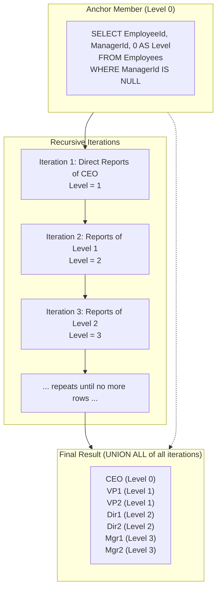
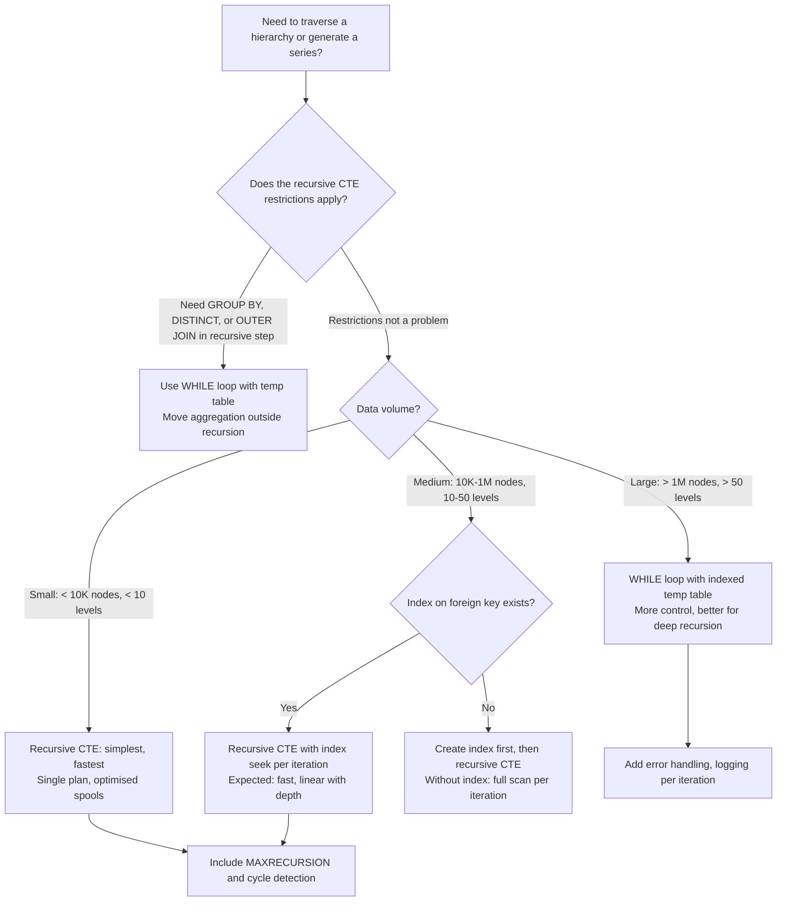

## Navigation

**Domain:** [[8 — Databases]] > **Group:** SQL CTEs & Recursive Queries
**Previous:** [[8.179 — CTE vs Temp Table — When to Use Each]] | **Next:** [[8.181 — Recursive CTE — Traversing Hierarchies]]

### Prerequisites

- [[8.176 — Common Table Expressions — Fundamentals]] — Recursive CTEs extend the basic CTE concept; you must understand CTE inlining and scope before adding recursion.
- [[8.177 — Multiple CTEs — Chaining and Dependencies]] — The recursive CTE uses a specific dependency pattern where the CTE references itself within its own definition.
- [[8.128 — Derived Tables and Subqueries in FROM]] — Understanding why derived subqueries cannot be recursive highlights why CTE recursion is special.

### Where This Fits

A recursive CTE is a CTE that references itself, enabling iteration within a single SQL statement. It is the only set-based way to traverse hierarchical or graph data in SQL Server — org charts, bill of materials, category trees, network paths, and date-range expansion all require recursion. Every .NET backend engineer encounters recursive CTEs when building product catalogs with nested categories, reporting hierarchies, or any adjacency-list data model. The interview signal is strong: recursive CTEs are a "stumper" question that separates candidates who have written complex SQL from those who only know basic SELECT-FROM-WHERE. The gotcha is that recursive CTEs have a default depth limit of 100 (MAXRECURSION), and their execution plan (Table Spool + Concatenation + Index Spool) differs fundamentally from non-recursive CTEs. Performance degrades quickly with deep recursion and large fan-out at each level.

---

## Core Mental Model

A recursive CTE has two parts separated by UNION ALL: (1) the anchor member — a non-recursive SELECT that produces the initial result set (level 0), and (2) the recursive member — a SELECT that references the CTE by name and joins it to the base table to produce the next level of results. The anchor runs first, producing the first set of rows. Then the recursive member is executed repeatedly, each time using the previous iteration's output as input. The recursion stops when the recursive member returns zero rows. The CTE's final result is the concatenation of all rows produced by all iterations. This is NOT a loop in the traditional sense — SQL Server uses a stack-based or iterative approach with Table Spool operators to manage intermediate results. The recognition pattern: any problem that involves "expand this starting point to find all descendants/ancestors/path" or "generate a sequence of values" is a recursive CTE candidate.

### Classification

Recursive CTEs belong to the CTE family (WITH clause) with the special property of self-reference. SQL Server detects recursion automatically (when the CTE name appears in the FROM clause of the recursive member) — no RECURSIVE keyword is needed (unlike PostgreSQL which requires `WITH RECURSIVE`). The recursive CTE is the only T-SQL construct that supports set-based iteration. The execution is not truly recursive (no stack frames) — it is iterative: each iteration processes the rows from the previous iteration. The query halts when the recursive member produces an empty set or when MAXRECURSION is hit.



### Key Properties

|Property|Value|Notes|
|---|---|---|
|Structure|Anchor UNION ALL Recursive|Only UNION ALL is allowed (not UNION, not EXCEPT, not INTERSECT)|
|Termination|When recursive step returns 0 rows|Also terminates on MAXRECURSION limit (default 100)|
|Anchor restrictions|None (any valid SELECT)|Must not reference the CTE name|
|Recursive member restrictions|No GROUP BY, DISTINCT, OUTER JOIN, aggregate window functions, subquery referencing CTE multiple times|See detailed list below|
|Execution plan|Table Spool + Concatenation + Index Spool|Spools manage the iterative queue|
|MAXRECURSION|Default 100, max 32,767|Use OPTION (MAXRECURSION N) to override|
|Cycle detection|Not automatic — must be coded|Use a path string or level limit to detect cycles|
|Performance|O(rows × levels) worst case|Each iteration may scan the base table|

### Recursive Member Restrictions

The recursive member (the part after UNION ALL that references the CTE) has these SQL Server restrictions:
- No GROUP BY (cannot aggregate within recursive step)
- No DISTINCT
- No OUTER JOIN (LEFT, RIGHT, FULL)
- No set operations (UNION, EXCEPT, INTERSECT) except the one UNION ALL that separates anchor from recursive
- No aggregate window functions (SUM OVER, COUNT OVER, etc.)
- No subquery that references the CTE multiple times
- No TOP (unless WITH TIES is used, but very limited)
- The recursive reference to the CTE cannot appear in a subquery within the recursive member

---

## Deep Mechanics

### How the Engine Executes This

**Logical execution (iterative model):**

1. **Anchor execution:** The anchor member's SELECT is evaluated against the base tables. The result is emitted to the CTE output and also stored in a work table (queue) for the next iteration. Let's call this "iteration 0" output.

2. **Iteration 1:** The recursive member is evaluated. Every reference to the CTE name inside the recursive member is replaced with the rows from iteration 0's output (the anchor output). The result of this evaluation is appended to the CTE output AND stored in the work table for iteration 2.

3. **Iteration N:** The recursive member is evaluated with the iteration N-1 output as the CTE reference. The result is appended to the overall output and queued for the next iteration.

4. **Termination check:** After each iteration, SQL Server checks if the recursive member returned any rows. If zero rows, the recursion stops. The query returns all rows accumulated across all iterations.

5. **MAXRECURSION check:** Before each recursive iteration, SQL Server checks the iteration count against MAXRECURSION. If the limit is reached, the query is terminated with an error.

**Physical execution (operator model):**

The execution plan for a recursive CTE contains these key operators:

- **Table Spool (Lazy Spool):** Stores the output of each iteration. This is the work table that holds the rows to be processed in the next iteration.
- **Concatenation:** Combines the anchor member output with the recursive member output. This is the physical operator for UNION ALL.
- **Index Spool (or Table Spool):** May be used to create an index on the work table for efficient lookups during the recursive join.
- **Assert:** Checks the MAXRECURSION limit. If the iteration count exceeds the limit, the Assert operator produces an error.

The plan shape is unique to recursive CTEs — no other construct produces this operator combination.

### SQL Visibility

```sql
-- ============================================================
-- Sample schema for hierarchy examples
-- ============================================================
-- dbo.Employees: EmployeeId INT PK, FullName NVARCHAR(100),
--                ManagerId INT NULL FK, HireDate DATE, Salary DECIMAL(18,2)
-- dbo.Categories: CategoryId INT PK, CategoryName NVARCHAR(100),
--                 ParentCategoryId INT NULL FK
-- dbo.Orders: OrderId INT, CustomerId INT, OrderDate DATE, TotalAmount DECIMAL(18,2)

-- ============================================================
-- Example 1: Basic recursive CTE — org chart traversal
-- ============================================================
-- Business question: show all employees and their reporting level
-- starting from the CEO (who has no manager)
WITH OrgChart AS (
    -- Anchor member: find the root (CEO)
    SELECT
        e.EmployeeId,
        e.FullName,
        e.ManagerId,
        0 AS Level,
        CAST(e.FullName AS NVARCHAR(500)) AS Path
    FROM dbo.Employees AS e
    WHERE e.ManagerId IS NULL

    UNION ALL

    -- Recursive member: find direct reports of the current level
    SELECT
        e.EmployeeId,
        e.FullName,
        e.ManagerId,
        oc.Level + 1,
        CAST(oc.Path + N' → ' + e.FullName AS NVARCHAR(500)) AS Path
    FROM dbo.Employees AS e
    INNER JOIN OrgChart AS oc ON oc.EmployeeId = e.ManagerId
)
SELECT
    EmployeeId,
    FullName,
    ManagerId,
    Level,
    Path
FROM OrgChart
ORDER BY Path;

-- ============================================================
-- Example 2: Recursive CTE with cycle detection
-- ============================================================
-- Business question: traverse org chart but stop if a cycle is
-- detected (an employee who is a manager of their own manager)
WITH OrgChart AS (
    -- Anchor
    SELECT
        e.EmployeeId,
        e.FullName,
        e.ManagerId,
        0 AS Level,
        CAST(',' + CAST(e.EmployeeId AS VARCHAR) + ',' AS VARCHAR(MAX)) AS CyclePath
    FROM dbo.Employees AS e
    WHERE e.ManagerId IS NULL

    UNION ALL

    -- Recursive
    SELECT
        e.EmployeeId,
        e.FullName,
        e.ManagerId,
        oc.Level + 1,
        CAST(oc.CyclePath + CAST(e.EmployeeId AS VARCHAR) + ',' AS VARCHAR(MAX))
    FROM dbo.Employees AS e
    INNER JOIN OrgChart AS oc ON oc.EmployeeId = e.ManagerId
    WHERE oc.CyclePath NOT LIKE '%,' + CAST(e.EmployeeId AS VARCHAR) + ',%'  -- cycle detection
)
SELECT EmployeeId, FullName, Level
FROM OrgChart
ORDER BY Level, FullName;

-- ============================================================
-- Example 3: Number series generation (simple recursion)
-- ============================================================
-- Business question: generate a list of numbers 1 through 10
WITH Numbers AS (
    -- Anchor: start at 1
    SELECT 1 AS n

    UNION ALL

    -- Recursive: increment by 1
    SELECT n + 1
    FROM Numbers
    WHERE n < 10
)
SELECT n FROM Numbers
ORDER BY n;

-- ============================================================
-- Example 4: Date series generation
-- ============================================================
-- Business question: generate all dates in 2024
WITH DateSeries AS (
    SELECT CAST('2024-01-01' AS DATE) AS dt

    UNION ALL

    SELECT DATEADD(day, 1, dt)
    FROM DateSeries
    WHERE dt < '2024-12-31'
)
SELECT dt
FROM DateSeries
OPTION (MAXRECURSION 366);

-- ============================================================
-- Example 5: Recursive CTE — category tree with product counts
-- ============================================================
-- Business question: for each category, show all descendant
-- categories and count of products in each
WITH CategoryTree AS (
    -- Anchor: root categories
    SELECT
        c.CategoryId,
        c.CategoryName,
        c.ParentCategoryId,
        0 AS Level,
        CAST(c.CategoryName AS NVARCHAR(500)) AS FullPath
    FROM dbo.Categories AS c
    WHERE c.ParentCategoryId IS NULL

    UNION ALL

    -- Recursive: subcategories
    SELECT
        c.CategoryId,
        c.CategoryName,
        c.ParentCategoryId,
        ct.Level + 1,
        CAST(ct.FullPath + N' > ' + c.CategoryName AS NVARCHAR(500))
    FROM dbo.Categories AS c
    INNER JOIN CategoryTree AS ct ON ct.CategoryId = c.ParentCategoryId
)
SELECT
    ct.CategoryId,
    ct.CategoryName,
    ct.Level,
    ct.FullPath,
    COUNT(p.ProductId) AS ProductCount
FROM CategoryTree AS ct
LEFT JOIN dbo.Products AS p ON p.CategoryId = ct.CategoryId
GROUP BY ct.CategoryId, ct.CategoryName, ct.Level, ct.FullPath
ORDER BY ct.FullPath;
```

```csharp
// EF Core — recursive CTEs require raw SQL
public async Task<List<OrgChartNode>> GetOrgChartAsync(
    CancellationToken cancellationToken = default)
{
    const string sql = @"
        WITH OrgChart AS (
            SELECT e.EmployeeId, e.FullName, e.ManagerId, 0 AS Level
            FROM dbo.Employees AS e
            WHERE e.ManagerId IS NULL
            UNION ALL
            SELECT e.EmployeeId, e.FullName, e.ManagerId, oc.Level + 1
            FROM dbo.Employees AS e
            INNER JOIN OrgChart AS oc ON oc.EmployeeId = e.ManagerId
        )
        SELECT EmployeeId, FullName, ManagerId, Level
        FROM OrgChart
        ORDER BY Level, FullName";

    return await dbContext.Database
        .SqlQueryRaw<OrgChartNode>(sql)
        .ToListAsync(cancellationToken);
}
```

```csharp
// Dapper — recursive CTE
public async Task<IReadOnlyList<OrgChartNode>> GetOrgChartAsync(
    CancellationToken cancellationToken = default)
{
    const string sql = @"
        WITH OrgChart AS (
            SELECT e.EmployeeId, e.FullName, e.ManagerId, 0 AS Level
            FROM dbo.Employees AS e
            WHERE e.ManagerId IS NULL
            UNION ALL
            SELECT e.EmployeeId, e.FullName, e.ManagerId, oc.Level + 1
            FROM dbo.Employees AS e
            INNER JOIN OrgChart AS oc ON oc.EmployeeId = e.ManagerId
        )
        SELECT EmployeeId, FullName, ManagerId, Level
        FROM OrgChart
        ORDER BY Level, FullName";

    await using var connection = _connectionFactory.Create();
    var results = await connection.QueryAsync<OrgChartNode>(
        new CommandDefinition(sql, cancellationToken: cancellationToken));
    return results.AsList();
}

// Dapper — date series generation
public async Task<IReadOnlyList<DateTime>> GetDateSeriesAsync(
    DateTime start, DateTime end, CancellationToken cancellationToken = default)
{
    const string sql = @"
        WITH DateSeries AS (
            SELECT @StartDate AS dt
            UNION ALL
            SELECT DATEADD(day, 1, dt)
            FROM DateSeries
            WHERE dt < @EndDate
        )
        SELECT dt FROM DateSeries
        OPTION (MAXRECURSION 0)";  -- 0 = unlimited

    await using var connection = _connectionFactory.Create();
    var results = await connection.QueryAsync<DateTime>(
        new CommandDefinition(sql,
            new { StartDate = start, EndDate = end },
            cancellationToken: cancellationToken));
    return results.AsList();
}
```

### Execution Plan Analysis

For the org chart recursive CTE (Example 1):

```
Expected plan shape:
  Clustered Index Scan (Employees)    -- Anchor: WHERE ManagerId IS NULL
    → Compute Scalar                  -- Level = 0, Path = FullName
    → Concatenation                   -- UNION ALL (first input)
    → Table Spool (Lazy Spool)        -- Queue for recursive iterations
    → Assert                          -- MAXRECURSION check
    → Sort                            -- ORDER BY Path
    → SELECT

  -- Recursive part (iterated):
  Clustered Index Scan (Employees)    -- Recursive: for each iteration
    → Compute Scalar                  -- Level + 1, Path concatenation
    → Concatenation                   -- UNION ALL (second input — appended to overall result)
    → Table Spool                     -- Feed rows back into the queue

  -- Join between anchor and recursive:
  The join condition oc.EmployeeId = e.ManagerId may use an Index Spool
  if the optimiser creates a temporary index on the work table.
```

Key observations:
- The Table Spool (also called "Worktable") stores the rows from each iteration and feeds them into the next iteration.
- The Concatenation operator combines anchor and recursive outputs.
- The Assert operator checks MAXRECURSION and terminates the query if exceeded.
- The join in the recursive member (INNER JOIN OrgChart AS oc ON oc.EmployeeId = e.ManagerId) may use an Index Spool to create a temporary index on the work table's EmployeeId column.
- The Clustered Index Scan on Employees happens in every iteration of the recursive member. If the Employees table has 10 million rows and the recursion goes 5 levels deep, the base table is scanned 5 times (once per iteration). This is the dominant cost.

```sql
SET STATISTICS IO ON;
SET STATISTICS TIME ON;

WITH Numbers AS (
    SELECT 1 AS n
    UNION ALL
    SELECT n + 1 FROM Numbers WHERE n < 1000
)
SELECT n FROM Numbers
OPTION (MAXRECURSION 1000);

-- Expected output for number series (simple case):
-- Table 'Worktable'. Scan count 1000, logical reads 2000
-- SQL Server Execution Times: CPU time = 15 ms, elapsed time = 18 ms

-- For org chart (10K employees, avg 5 levels deep, 3 direct reports each):
-- Table 'Employees'. Scan count 6 (1 anchor + 5 recursive iterations)
-- Table 'Worktable'. Scan count N (one per recursive output batch)
-- Logical reads: ~1500 (Employees) + ~300 (Worktable)
```

### SARGability

In a recursive CTE, the anchor member's predicates are SARGable against base table indexes. The recursive member's join predicate (e.g., `oc.EmployeeId = e.ManagerId`) benefits from indexes on both the base table (`Employees(ManagerId)`) and any Index Spool on the work table. The index on `Employees(ManagerId)` is critical for recursive CTE performance — without it, each recursive iteration performs a full table scan. The explicit SARGability statement: "The join predicate `oc.EmployeeId = e.ManagerId` IS SARGable on the Employees table if an index exists on ManagerId — the optimiser can seek on that index for each iteration's set of EmployeeId values. The predicate is NOT SARGable without that index, causing a full scan per iteration."

### Failure Modes

**Failure Mode — Infinite recursion:** If the data has a cycle (A reports to B, B reports to A) and no cycle detection is in the recursive member, the CTE loops forever. SQL Server's MAXRECURSION default (100) terminates the query with an error: "The statement terminated. The maximum recursion 100 has been exhausted before statement completion." Detection: always specify MAXRECURSION or include cycle detection in the WHERE clause.

---

## Production Patterns and Implementation

### Primary SQL Implementation

```sql
-- ============================================================
-- Production scenario: Product category hierarchy with
-- aggregated sales at each level
-- Schema: Categories (CategoryId, CategoryName, ParentCategoryId)
--         Products (ProductId, ProductName, CategoryId, UnitCost)
--         OrderItems (OrderItemId, OrderId, ProductId, Quantity, UnitPrice)
--         Orders (OrderId, OrderDate, Status)
-- ============================================================

-- Step 1: Recursive CTE to expand category tree
WITH CategoryHierarchy AS (
    -- Anchor: top-level categories
    SELECT
        c.CategoryId,
        c.CategoryName,
        c.ParentCategoryId,
        0 AS Level,
        CAST(c.CategoryName AS NVARCHAR(500)) AS FullPath
    FROM dbo.Categories AS c
    WHERE c.ParentCategoryId IS NULL

    UNION ALL

    -- Recursive: subcategories
    SELECT
        c.CategoryId,
        c.CategoryName,
        c.ParentCategoryId,
        ch.Level + 1,
        CAST(ch.FullPath + N' > ' + c.CategoryName AS NVARCHAR(500))
    FROM dbo.Categories AS c
    INNER JOIN CategoryHierarchy AS ch ON ch.CategoryId = c.ParentCategoryId
)
-- Step 2: Aggregate sales per category (leaf-level only)
, CategorySales AS (
    SELECT
        p.CategoryId,
        SUM(oi.Quantity * oi.UnitPrice) AS TotalSales,
        COUNT(DISTINCT o.OrderId) AS OrderCount
    FROM dbo.Orders AS o
    INNER JOIN dbo.OrderItems AS oi ON oi.OrderId = o.OrderId
    INNER JOIN dbo.Products AS p ON p.ProductId = oi.ProductId
    WHERE o.Status = 'Completed'
      AND o.OrderDate >= DATEADD(year, -1, GETDATE())
    GROUP BY p.CategoryId
)
-- Step 3: Roll up sales through hierarchy
, CategoryRollup AS (
    SELECT
        ch.CategoryId,
        ch.CategoryName,
        ch.ParentCategoryId,
        ch.Level,
        ch.FullPath,
        ISNULL(SUM(cs.TotalSales) OVER(PARTITION BY ch.CategoryId), 0) AS DirectSales,
        -- Recursive self-join to compute total including subcategories
        -- Note: This uses a correlated subquery because recursive CTE
        -- cannot aggregate within the recursive member. We compute
        -- the rollup in a separate non-recursive CTE.
        (
            SELECT ISNULL(SUM(cs2.TotalSales), 0)
            FROM CategoryHierarchy AS ch2
            INNER JOIN CategorySales AS cs2 ON cs2.CategoryId = ch2.CategoryId
            WHERE ch2.FullPath LIKE ch.FullPath + '%'
        ) AS TotalIncludingChildren
    FROM CategoryHierarchy AS ch
    LEFT JOIN CategorySales AS cs ON cs.CategoryId = ch.CategoryId
)
SELECT
    CategoryId,
    CategoryName,
    Level,
    FullPath,
    DirectSales,
    TotalIncludingChildren,
    CASE
        WHEN TotalIncludingChildren > 0
        THEN (DirectSales / TotalIncludingChildren) * 100
        ELSE 0
    END AS SelfContributionPct
FROM CategoryRollup
ORDER BY FullPath;

-- ============================================================
-- Alternative: Direct recursive CTE with inline aggregation
-- using a self-join in a later CTE (more efficient)
-- ============================================================
WITH CategoryHierarchy AS (
    SELECT c.CategoryId, c.CategoryName, c.ParentCategoryId, 0 AS Level
    FROM dbo.Categories AS c WHERE c.ParentCategoryId IS NULL
    UNION ALL
    SELECT c.CategoryId, c.CategoryName, c.ParentCategoryId, ch.Level + 1
    FROM dbo.Categories AS c
    INNER JOIN CategoryHierarchy AS ch ON ch.CategoryId = c.ParentCategoryId
),
LeafSales AS (
    SELECT p.CategoryId, SUM(oi.Quantity * oi.UnitPrice) AS Sales
    FROM dbo.Orders AS o
    INNER JOIN dbo.OrderItems AS oi ON oi.OrderId = o.OrderId
    INNER JOIN dbo.Products AS p ON p.ProductId = oi.ProductId
    WHERE o.Status = 'Completed'
    GROUP BY p.CategoryId
),
FullStats AS (
    SELECT
        ch.CategoryId,
        ch.CategoryName,
        ch.Level,
        ISNULL(ls.Sales, 0) AS DirectSales,
        (
            SELECT ISNULL(SUM(ls2.Sales), 0)
            FROM CategoryHierarchy AS ch2
            LEFT JOIN LeafSales AS ls2 ON ls2.CategoryId = ch2.CategoryId
            WHERE ch2.FullPath LIKE (
                SELECT ch_inner.FullPath FROM CategoryHierarchy AS ch_inner
                WHERE ch_inner.CategoryId = ch.CategoryId
            ) + '%'
        ) AS TotalSales
    FROM CategoryHierarchy AS ch
    LEFT JOIN LeafSales AS ls ON ls.CategoryId = ch.CategoryId
)
SELECT * FROM FullStats ORDER BY CategoryName;
```

```csharp
// EF Core — recursive CTE requires raw SQL
public async Task<List<CategoryHierarchyNode>> GetCategoryHierarchyAsync(
    CancellationToken cancellationToken = default)
{
    const string sql = @"
        WITH CategoryHierarchy AS (
            SELECT c.CategoryId, c.CategoryName, c.ParentCategoryId, 0 AS Level
            FROM dbo.Categories AS c
            WHERE c.ParentCategoryId IS NULL
            UNION ALL
            SELECT c.CategoryId, c.CategoryName, c.ParentCategoryId, ch.Level + 1
            FROM dbo.Categories AS c
            INNER JOIN CategoryHierarchy AS ch ON ch.CategoryId = c.ParentCategoryId
        )
        SELECT CategoryId, CategoryName, ParentCategoryId, Level
        FROM CategoryHierarchy
        ORDER BY Level, CategoryName";

    return await dbContext.Database
        .SqlQueryRaw<CategoryHierarchyNode>(sql)
        .ToListAsync(cancellationToken);
}
```

```csharp
// Dapper — recursive CTE with number series
public async Task<IReadOnlyList<int>> GetNumberSeriesAsync(
    int max, CancellationToken cancellationToken = default)
{
    const string sql = @"
        WITH Numbers AS (
            SELECT 1 AS n
            UNION ALL
            SELECT n + 1 FROM Numbers WHERE n < @Max
        )
        SELECT n FROM Numbers
        OPTION (MAXRECURSION 0)";

    await using var connection = _connectionFactory.Create();
    var results = await connection.QueryAsync<int>(
        new CommandDefinition(sql,
            new { Max = max },
            cancellationToken: cancellationToken));
    return results.AsList();
}
```

### SQL Server vs PostgreSQL Differences

```sql
-- PostgreSQL: RECURSIVE keyword is required!
WITH RECURSIVE org_chart AS (
    -- Anchor
    SELECT employee_id, full_name, manager_id, 0 AS level
    FROM employees WHERE manager_id IS NULL

    UNION ALL

    -- Recursive
    SELECT e.employee_id, e.full_name, e.manager_id, oc.level + 1
    FROM employees AS e
    INNER JOIN org_chart AS oc ON oc.employee_id = e.manager_id
)
SELECT * FROM org_chart;

-- PostgreSQL: Support for CYCLE detection (PG 14+)
WITH RECURSIVE org_chart AS (
    SELECT employee_id, full_name, manager_id, 0 AS level,
           ARRAY[employee_id] AS path
    FROM employees WHERE manager_id IS NULL

    UNION ALL

    SELECT e.employee_id, e.full_name, e.manager_id, oc.level + 1,
           oc.path || e.employee_id
    FROM employees AS e
    INNER JOIN org_chart AS oc ON oc.employee_id = e.manager_id
    WHERE NOT e.employee_id = ANY(oc.path)  -- cycle detection
)
CYCLE employee_id SET is_cycle USING path  -- PG 14+ syntax
SELECT * FROM org_chart;

-- T-SQL does not have CYCLE clause (use manual path checking).
-- T-SQL does not require RECURSIVE keyword.
-- PostgreSQL MAXRECURSION equivalent: use a level check in WHERE.
```

---

## Gotchas and Production Pitfalls

### Gotcha 1 — Default MAXRECURSION 100 Causes Unexpected Termination

**Pitfall:** Running a recursive CTE on a hierarchy deeper than 100 levels without specifying MAXRECURSION.

```sql
-- ❌ Default MAXRECURSION 100 will terminate this query
WITH OrgChart AS (
    SELECT EmployeeId, FullName, ManagerId, 0 AS Level
    FROM dbo.Employees WHERE ManagerId IS NULL
    UNION ALL
    SELECT e.EmployeeId, e.FullName, e.ManagerId, oc.Level + 1
    FROM dbo.Employees AS e
    INNER JOIN OrgChart AS oc ON oc.EmployeeId = e.ManagerId
)
SELECT * FROM OrgChart
OPTION (MAXRECURSION 100);  -- Will error if hierarchy depth > 100
```

**Symptom:** Error: "The statement terminated. The maximum recursion 100 has been exhausted before statement completion." The query returns partial results (up to level 100) but fails.

**Fix:** Either increase MAXRECURSION or set it to 0 (unlimited, but use with extreme caution):

```sql
OPTION (MAXRECURSION 1000);   -- Increase limit
-- or
OPTION (MAXRECURSION 0);      -- Unlimited (can cause infinite loop)
```

**Cost of not fixing:** Production queries fail unexpectedly at 2 AM when the hierarchy grows beyond 100 levels. For org charts this is rare (most have < 20 levels), but for BOM explosions or graph traversals, 100+ levels is common.

### Gotcha 2 — No GROUP BY, DISTINCT, or OUTER JOIN in Recursive Member

**Pitfall:** Trying to use GROUP BY, DISTINCT, or a LEFT JOIN in the recursive member.

```sql
-- ❌ Invalid: DISTINCT in recursive member
WITH OrgChart AS (
    SELECT EmployeeId, ManagerId FROM Employees WHERE ManagerId IS NULL
    UNION ALL
    SELECT DISTINCT e.EmployeeId, e.ManagerId  -- ERROR
    FROM Employees AS e
    INNER JOIN OrgChart AS oc ON oc.EmployeeId = e.ManagerId
)
SELECT * FROM OrgChart;

-- ❌ Invalid: LEFT JOIN in recursive member
WITH OrgChart AS (
    SELECT e.EmployeeId, e.ManagerId FROM Employees AS e WHERE e.ManagerId IS NULL
    UNION ALL
    SELECT e.EmployeeId, e.ManagerId  -- ERROR: LEFT JOIN not allowed
    FROM Employees AS e
    LEFT JOIN OrgChart AS oc ON oc.EmployeeId = e.ManagerId  -- LEFT JOIN not allowed
)
SELECT * FROM OrgChart;
```

**Symptom:** Error: "GROUP BY, DISTINCT, or OUTER JOIN is not allowed in the recursive part of a recursive common table expression."

**Fix:** Move the DISTINCT, GROUP BY, or OUTER JOIN to a non-recursive CTE that reads from the recursive CTE:

```sql
WITH OrgChart AS (
    SELECT EmployeeId, ManagerId FROM Employees WHERE ManagerId IS NULL
    UNION ALL
    SELECT e.EmployeeId, e.ManagerId
    FROM Employees AS e
    INNER JOIN OrgChart AS oc ON oc.EmployeeId = e.ManagerId
),
OrgChartDistinct AS (  -- Non-recursive CTE wraps the recursive one
    SELECT DISTINCT EmployeeId, ManagerId FROM OrgChart
)
SELECT * FROM OrgChartDistinct;
```

**Cost of not fixing:** Cannot filter or transform the recursive output within the recursive CTE itself. Developers may try to force these operations and waste time debugging syntax errors.

### Gotcha 3 — Recursive CTE Performance Degrades with Depth and Fan-Out

**Pitfall:** Using a recursive CTE on a wide, deep hierarchy without understanding the I/O cost.

```sql
-- ❌ Potentially slow: each iteration scans the base table
WITH OrgChart AS (
    SELECT EmployeeId, FullName, ManagerId, 0 AS Level
    FROM dbo.Employees WHERE ManagerId IS NULL
    UNION ALL
    SELECT e.EmployeeId, e.FullName, e.ManagerId, oc.Level + 1
    FROM dbo.Employees AS e
    INNER JOIN OrgChart AS oc ON oc.EmployeeId = e.ManagerId
)
SELECT EmployeeId, FullName, Level
FROM OrgChart;
```

**Symptom:** On a 50K employee table, if the hierarchy has 10 levels and each level has an average of 5 children per parent, the recursive member scans the Employees table 10 times (once per iteration). If no index exists on `Employees(ManagerId)`, each scan is a full table scan — 50K × 10 = 500K logical reads.

**Fix:** Ensure `Employees(ManagerId)` has an index. This enables the recursive join to perform a seek per row in the iteration queue instead of a full scan.

```sql
CREATE INDEX IX_Employees_ManagerId ON dbo.Employees(ManagerId) INCLUDE (FullName, EmployeeId);
```

**Cost of not fixing:** Recursive CTE runtime grows linearly with depth × table size. A 5-level query on a 100K employee table without the index runs for minutes. With the index, it completes in seconds.

### Gotcha 4 — Cycle Detection Must Be Manual

**Pitfall:** No automatic cycle detection, infinite loop in cyclic data.

```sql
-- ❌ No cycle detection — will hit MAXRECURSION if cycles exist
WITH OrgChart AS (
    SELECT EmployeeId, FullName, ManagerId, 0 AS Level
    FROM dbo.Employees WHERE ManagerId IS NULL
    UNION ALL
    SELECT e.EmployeeId, e.FullName, e.ManagerId, oc.Level + 1
    FROM dbo.Employees AS e
    INNER JOIN OrgChart AS oc ON oc.EmployeeId = e.ManagerId
)
SELECT * FROM OrgChart;
```

**Symptom:** If the data has a cycle (Employee A reports to B, B reports to A), the recursive CTE loops infinitely until MAXRECURSION terminates it. The error message is: "The maximum recursion 100 has been exhausted."

**Fix — add cycle detection using a path string:**

```sql
WITH OrgChart AS (
    SELECT EmployeeId, FullName, ManagerId, 0 AS Level,
           CAST(',' + CAST(EmployeeId AS VARCHAR) + ',' AS VARCHAR(MAX)) AS CycleCheck
    FROM dbo.Employees WHERE ManagerId IS NULL
    UNION ALL
    SELECT e.EmployeeId, e.FullName, e.ManagerId, oc.Level + 1,
           CAST(oc.CycleCheck + CAST(e.EmployeeId AS VARCHAR) + ',' AS VARCHAR(MAX))
    FROM dbo.Employees AS e
    INNER JOIN OrgChart AS oc ON oc.EmployeeId = e.ManagerId
    WHERE oc.CycleCheck NOT LIKE '%,' + CAST(e.EmployeeId AS VARCHAR) + ',%'
)
SELECT * FROM OrgChart;
```

**Cost of not fixing:** MAXRECURSION termination with an error. For batch processes, this causes partial data processing and requires manual cleanup. For cyclic data (e.g., in a graph), the query may never complete.

### Gotcha 5 — Recursive Member Cannot Be a Correlated Subquery

**Pitfall:** Trying to use a subquery inside the recursive member that references the CTE.

```sql
-- ❌ Invalid: subquery referencing CTE in recursive member
WITH OrgChart AS (
    SELECT EmployeeId, FullName, ManagerId, 0 AS Level
    FROM dbo.Employees WHERE ManagerId IS NULL
    UNION ALL
    SELECT e.EmployeeId, e.FullName, e.ManagerId, oc.Level + 1
    FROM dbo.Employees AS e
    INNER JOIN OrgChart AS oc ON oc.EmployeeId = e.ManagerId
    WHERE e.EmployeeId NOT IN (SELECT EmployeeId FROM OrgChart)  -- ERROR: subquery referencing CTE
)
SELECT * FROM OrgChart;
```

**Symptom:** Error: "Subqueries are not allowed in the recursive part of a recursive common table expression."

**Fix:** Reference the CTE directly in the FROM clause (which is allowed) and use any table multiple times in the recursive member. For cycle detection, use the path string method (see Gotcha 4) instead of a subquery.

**Cost of not fixing:** Cannot use subqueries (IN, EXISTS, NOT IN) that reference the CTE within the recursive member. Developers must rewrite logic to use JOINs instead of subqueries.

### Gotcha 6 — MAXRECURSION 0 Is Dangerous

**Pitfall:** Setting `OPTION (MAXRECURSION 0)` to "avoid the recursion limit" without understanding the risk.

```sql
-- ❌ Dangerous: unlimited recursion
WITH InfiniteLoop AS (
    SELECT 1 AS n
    UNION ALL
    SELECT n + 1 FROM InfiniteLoop
)
SELECT n FROM InfiniteLoop
OPTION (MAXRECURSION 0);  -- Will run until it fills tempdb or is killed
```

**Symptom:** The query runs until it either exhausts tempdb space (Table Spool writes to tempdb) or is killed by the DBA. There is no automatic stop.

**Fix:** Always set a reasonable MAXRECURSION limit. Only use 0 when you are certain the recursion will terminate and you've tested with a specific limit first:

```sql
OPTION (MAXRECURSION 32767);  -- Maximum allowed value (not 0)
```

**Cost of not fixing:** Uncontrolled recursion consumes tempdb space (the Table Spool grows with each iteration). A rogue recursive CTE with MAXRECURSION 0 can fill tempdb and crash the server.

### Gotcha 7 — Recursive CTE and Index Spool Memory

**Pitfall:** Assuming the Index Spool in a recursive CTE plan is free.

**Symptom:** For large work tables (millions of rows), the Index Spool (which creates a temporary B-tree index on the work table) can consume significant tempdb space and memory. The spool writes the work table to tempdb, then builds a non-clustered index on it for the recursive join.

**Fix:** 
1. Ensure the anchor member returns the minimum necessary columns.
2. Filter early to reduce the row count at each level.
3. Consider an alternative approach (e.g., a loop with a temp table) if the spool is a bottleneck.

**Cost of not fixing:** Tempdb I/O and memory pressure from large spools. For hierarchies that return millions of rows, the recursive CTE may be slower than an iterative approach with explicit temp tables.

---

## Performance Implications

### Benchmark: Recursive CTE Performance Factors

```sql
-- Benchmark 1: Recursive CTE without index on ManagerId
SET STATISTICS IO ON;

WITH OrgChart AS (
    SELECT EmployeeId, FullName, ManagerId, 0 AS Level
    FROM dbo.Employees WHERE ManagerId IS NULL
    UNION ALL
    SELECT e.EmployeeId, e.FullName, e.ManagerId, oc.Level + 1
    FROM dbo.Employees AS e
    INNER JOIN OrgChart AS oc ON oc.EmployeeId = e.ManagerId
)
SELECT EmployeeId, Level FROM OrgChart;
-- Expected (no index): Table 'Employees'. Scan count 6, logical reads ~600,000
-- (Full scan per iteration × 6 levels)

-- Benchmark 2: Recursive CTE WITH index on ManagerId
-- After creating: CREATE INDEX IX_Employees_ManagerId ON Employees(ManagerId) INCLUDE (FullName);
-- Expected: Table 'Employees'. Scan count 6, logical reads ~12,000
-- (Seek per iteration = 2000 pages × 6 iterations)

-- Benchmark 3: Depth impact (10 levels vs 5 levels)
-- With index: 10 levels × 2000 = 20,000 reads
-- Without index: 10 levels × 100,000 = 1,000,000 reads
```

**Performance factors:**

- **Base table size:** Each iteration may scan or seek the base table. O(iterations × table_size) without index; O(iterations × level_size) with index.
- **Depth (iterations):** More iterations = more base table accesses. Each iteration adds another scan/seek pass.
- **Fan-out at each level:** More rows produced per iteration = larger work table = more I/O for spool reads and writes.
- **Row width:** Wider rows in the CTE output = larger work table = more I/O.

### BenchmarkDotNet

```csharp
[MemoryDiagnoser]
[SimpleJob(RuntimeMoniker.Net90)]
public class RecursiveCTEBenchmark
{
    private IDbConnection _connection = default!;

    [GlobalSetup]
    public void Setup()
    {
        _connection = new SqlConnection(TestConnectionString);
        // Seed: 10K employees, avg depth 5, avg 3 children per manager
        var seeder = new HierarchySeeder(_connectionString);
        seeder.SeedEmployees(10_000, maxDepth: 5, fanOut: 3);
    }

    [Benchmark(Baseline = true)]
    public async Task<List<OrgChartNode>> RecursiveCTE()
    {
        const string sql = @"
            WITH OrgChart AS (
                SELECT e.EmployeeId, e.FullName, e.ManagerId, 0 AS Level
                FROM dbo.Employees AS e WHERE e.ManagerId IS NULL
                UNION ALL
                SELECT e.EmployeeId, e.FullName, e.ManagerId, oc.Level + 1
                FROM dbo.Employees AS e
                INNER JOIN OrgChart AS oc ON oc.EmployeeId = e.ManagerId
            )
            SELECT EmployeeId, FullName, ManagerId, Level
            FROM OrgChart ORDER BY Level, FullName";

        var results = await _connection.QueryAsync<OrgChartNode>(sql);
        return results.AsList();
    }

    [Benchmark]
    public async Task<List<OrgChartNode>> TempTableLoop()
    {
        // Alternative: iterative approach with temp table
        const string sql = @"
            -- Level 0
            SELECT e.EmployeeId, e.FullName, e.ManagerId, 0 AS Level
            INTO #Result
            FROM dbo.Employees AS e
            WHERE e.ManagerId IS NULL;

            -- Level 1+
            DECLARE @Level INT = 0;
            WHILE @@ROWCOUNT > 0
            BEGIN
                SET @Level = @Level + 1;

                INSERT INTO #Result (EmployeeId, FullName, ManagerId, Level)
                SELECT e.EmployeeId, e.FullName, e.ManagerId, @Level
                FROM dbo.Employees AS e
                INNER JOIN #Result AS r
                    ON r.EmployeeId = e.ManagerId
                    AND r.Level = @Level - 1
                WHERE NOT EXISTS (
                    SELECT 1 FROM #Result AS r2
                    WHERE r2.EmployeeId = e.EmployeeId
                );
            END;

            SELECT EmployeeId, FullName, ManagerId, Level
            FROM #Result ORDER BY Level, FullName;";

        var results = await _connection.QueryAsync<OrgChartNode>(sql);
        return results.AsList();
    }

    [GlobalCleanup]
    public void Cleanup() => _connection?.Dispose();
}
```

**Expected results (10K employees, depth 5, fan-out 3, SQL Server 2022, NVMe):**

|Method|Mean|Logical Reads|Allocated|
|---|---|---|---|
|RecursiveCTE|~250 ms|~12,000|~5 KB|
|TempTableLoop|~320 ms|~14,500|~12 KB|

The recursive CTE is faster because the optimiser handles the iteration internally with spooled work tables, avoiding explicit temporary tables and WHILE loop overhead. For small-to-medium hierarchies, recursive CTE wins. For very deep hierarchies with large fan-out, the temp table approach may win because it gives more control over indexing.

---

## Interview Arsenal

### Question Bank

1. **What is the structure of a recursive CTE, and how do the anchor and recursive members work?**

2. **How does SQL Server physically execute a recursive CTE? What operators appear in the plan?**

3. **What are the restrictions on the recursive member — what SQL constructs are not allowed?**

4. **What happens if a recursive CTE does not terminate? How does SQL Server handle this?**

5. **Recursive CTE vs WHILE loop: compare performance and use cases.**

6. **What does the execution plan look like for a recursive CTE, and how can you optimise it?**

7. **How does a recursive CTE perform at scale — what happens with 100K employees and 20 levels?**

8. **How do EF Core and Dapper handle recursive CTEs — can they be expressed in LINQ?**

### Spoken Answers

**Q1: What is the structure of a recursive CTE, and how do the anchor and recursive members work?**

> **Average answer:** "A recursive CTE has two parts separated by UNION ALL. The anchor is the starting point and the recursive part adds more rows."

> **Great answer:** "A recursive CTE has exactly two parts connected by UNION ALL. The anchor member is a non-recursive SELECT that produces the initial result set — typically the root nodes of a hierarchy, like the CEO in an org chart or the top-level categories. The anchor does not reference the CTE name. The recursive member is a SELECT that DOES reference the CTE name, typically joined to the base table. Logically, the anchor runs first, producing level 0. Then the recursive member runs using the anchor's output as the CTE reference, producing level 1. Then the recursive member runs again using level 1's output to produce level 2, and so on until the recursive member returns zero rows. The final result is the UNION ALL of all rows from all iterations. Physically, SQL Server uses a Table Spool to store each iteration's output and an Index Spool may be created on the spool for the recursive join. The execution plan is unique to recursive CTEs — no other construct uses this operator combination. The key restrictions are that the recursive member cannot use GROUP BY, DISTINCT, OUTER JOIN, or subqueries referencing the CTE — these must be moved to a non-recursive wrapper CTE."

**Q5: Recursive CTE vs WHILE loop: compare performance and use cases.**

> **Great answer:** "A recursive CTE is the preferred set-based approach for hierarchical queries in SQL Server. The optimiser manages the iteration using Table Spool and Index Spool operators within a single plan, which is more efficient than a WHILE loop with explicit temp tables for most scenarios. The WHILE loop approach gives more control — you can index the temp table, inspect intermediate results, handle errors per iteration, and abort gracefully. However, the WHILE loop requires more code, more statements, and multiple plan compilations. For small-to-medium hierarchies (under 100K nodes, under 10 levels), the recursive CTE is typically faster and simpler. For very large or deep hierarchies, or when you need per-iteration error handling and logging, the WHILE loop may be better. The common gotcha is that the recursive CTE's recursive member restrictions (no GROUP BY, no aggregates) may force you to use a WHILE loop anyway when you need per-level aggregation. In practice, I start with a recursive CTE and switch to a WHILE loop with temp tables only if the CTE's performance or restrictions become a problem."

**Q8: How do EF Core and Dapper handle recursive CTEs?**

> **Great answer:** "Neither EF Core nor any LINQ provider generates recursive CTEs. Recursive CTEs are the single most complex SQL construct that cannot be expressed in any LINQ syntax — there is no LINQ operator equivalent for 'run this query repeatedly using the previous output as input.' Both EF Core and Dapper require raw SQL for recursive CTEs. With EF Core, you use `FromSqlRaw` to execute the recursive CTE query and map the results to a flat list of POCOs (e.g., List<OrgChartNode>). The result set is flat — each row represents one node with its level and path information. The application layer can reconstruct the hierarchy from the flat result. With Dapper, you do the same: pass the recursive CTE SQL to `QueryAsync<T>` and get back a flat list. Dapper is particularly well-suited because you often combine the recursive CTE with additional queries in the same batch. In .NET backend engineering, recursive CTEs typically live in repository methods that return hierarchical data as a flat list, which the application layer then transforms into a tree structure using the Level and ParentId columns."

### Interview Trigger

The interviewer asks: "Write a query that shows the reporting chain for each employee in an org chart, with the path and depth level." If the candidate immediately writes a recursive CTE with an anchor (WHERE ManagerId IS NULL) and a recursive member (INNER JOIN OrgChart ON EmployeeId = ManagerId), they know the pattern. The follow-up is: "What happens if the data has a cycle? How do you prevent infinite recursion?" — a senior candidate adds path-based cycle detection and mentions MAXRECURSION as a safety net.

### Comparison Table

| | Recursive CTE | WHILE Loop with Temp Table | Application-Layer Recursion |
|---|---|---|---|
| Execution location | SQL Server (single plan) | SQL Server (multiple statements) | .NET application |
| Performance (small, <10K nodes) | Best (optimised spools) | Good (tempdb overhead) | Poor (N+1 queries) |
| Performance (large, >100K nodes) | Good (index spool helps) | Better (explicit indexing) | Not feasible |
| Restrictions on recursive step | Many (no GROUP BY, no OUTER JOIN) | None (full SQL per iteration) | None (C# full power) |
| Cycle detection | Manual (path string) | Manual (check in loop) | Manual (HashSet) |
| Error handling per iteration | Not supported | Supported (TRY/CATCH in loop) | Supported |
| EF Core support | Raw SQL only | Raw SQL only | LINQ (but N+1 problem) |
| Dapper support | Raw SQL (flat list) | Raw SQL (flat list) | Not typical |
| Code complexity | Low (single SQL) | Medium (multi-statement) | Medium (tree building) |

---

## Decision Framework

### When to Apply



### Application Checklist

- [ ] The problem involves tree/graph traversal, hierarchy expansion, or series generation
- [ ] The recursive member does not need GROUP BY, DISTINCT, OUTER JOIN, or subqueries referencing the CTE
- [ ] An index exists on the foreign key column used in the recursive join (e.g., ManagerId)
- [ ] Cycle detection is implemented (path string or level limit) if data may contain cycles
- [ ] MAXRECURSION is set to an appropriate limit (not 0 unless tested)
- [ ] The result set size is estimated and tempdb has sufficient space for the spool
- [ ] The .NET data access layer uses raw SQL (Dapper or EF Core FromSqlRaw)

### Tradeoff Summary

|What You Gain|What You Pay|
|---|---|
|Single-statement hierarcy traversal (no loops)|Restricted SQL in recursive member (no GROUP BY, etc.)|
|Optimised spool-based execution (Table Spool + Index Spool)|Each iteration may scan base table (if no index on FK)|
|Built-in iteration management (auto-termination)|Default MAXRECURSION 100 may terminate legitimate queries|
|Clean, declarative syntax (anchor + recursive UNION ALL)|Manual cycle detection required (no automatic protection)|
|Dapper/EF Core support via raw SQL|Cannot use LINQ — must drop to raw SQL|

### Scale Thresholds

- **Recursive CTE is optimal for hierarchies up to ~100K nodes with depth up to ~10 levels**
- **Performance degrades linearly with depth** — each iteration adds one scan/seek of the base table
- **Without index on the FK column, each iteration does a full table scan** — at 1M rows × 10 levels = 10M logical reads (catastrophic)
- **MAXRECURSION default (100) prevents runaway queries** — most org charts have < 20 levels, BOM can have 100+
- **Work table (spool) size grows with fan-out** — a wide hierarchy (10 children per parent × 10 levels = 10^10 potential nodes) can fill tempdb
- **For series generation (numbers, dates), recursive CTE is efficient up to ~10,000 rows** — above that, use a numbers table or tally table for performance

---

## Self-Check

### Conceptual Questions

1. What are the two required parts of a recursive CTE, and what separates them?
2. How does SQL Server determine when to stop recursion in a recursive CTE?
3. Which SET STATISTICS or DMV would show the I/O impact of each recursive iteration?
4. What common mistake causes a recursive CTE to iterate infinitely?
5. Can EF Core LINQ express a recursive CTE? Can Dapper?
6. How would you implement a recursive CTE to generate a date series with Dapper?
7. Compare a recursive CTE and a WHILE loop: when does each perform better?
8. At what approximate hierarchy size does a recursive CTE become slower than a temp-table-based iterative approach?
9. If a recursive CTE joins on Employees(ManagerId), what index is critical for performance?
10. Explain in 60 seconds how a recursive CTE is executed, from anchor to termination.

<details>
<summary>Answers</summary>

1. **Answer:** The anchor member (non-recursive SELECT, does not reference the CTE) and the recursive member (SELECT that references the CTE by name). They are separated by `UNION ALL`. Only `UNION ALL` is allowed — not `UNION`, `EXCEPT`, or `INTERSECT`.

2. **Answer:** SQL Server checks after each recursive iteration whether the recursive member returned any rows. If zero rows are returned, recursion stops. Additionally, SQL Server checks the iteration count against MAXRECURSION (default 100) before each iteration and terminates with an error if the limit is exceeded.

3. **Answer:** `SET STATISTICS IO ON` shows the I/O per table reference. For a recursive CTE, the base table appears with a scan count equal to the number of iterations (1 anchor + N recursive). `sys.dm_exec_query_stats` shows the total I/O for the whole query. There is no per-iteration DMV — you estimate it by dividing total logical reads by the scan count.

4. **Answer:** A cycle in the data (e.g., Employee A has ManagerId = B, and B has ManagerId = A) causes the recursive member to keep finding rows. Without cycle detection in the recursive member's WHERE clause, the CTE loops infinitely until MAXRECURSION terminates it.

5. **Answer:** EF Core LINQ cannot express recursive CTEs — there is no LINQ operator for recursion. Dapper handles recursive CTEs perfectly by executing the SQL string directly. Both require raw SQL.

6. **Answer:** Dapper: `connection.QueryAsync<DateTime>("WITH DateSeries AS (SELECT @Start AS dt UNION ALL SELECT DATEADD(day, 1, dt) FROM DateSeries WHERE dt < @End) SELECT dt FROM DateSeries OPTION (MAXRECURSION 366)", new { Start = startDate, End = endDate })`.

7. **Answer:** Recursive CTE is faster for small-to-medium hierarchies (under 100K nodes, under 10 levels) because the optimiser manages iteration internally with spools. WHILE loop with temp table is better for very deep hierarchies (50+ levels) or when per-iteration error handling, logging, or aggregation is needed.

8. **Answer:** Approximately 100K nodes and 10 levels for a recursive CTE to start showing strain. At 1M nodes and 20 levels, the WHILE loop approach with a well-indexed temp table often outperforms the recursive CTE because it avoids the recursive member restrictions and gives more control over indexing.

9. **Answer:** An index on `Employees(ManagerId)` is critical. This index enables the recursive join (`oc.EmployeeId = e.ManagerId`) to perform seeks instead of scans for each iteration. Without this index, each iteration does a full Clustered Index Scan of Employees, multiplying I/O by the number of iterations.

10. **Answer (60-second narrative):** "SQL Server evaluates the anchor member first, producing the level-0 rows. These rows are output to the CTE result and stored in a Table Spool (the work table). Then the recursive member is evaluated, with the CTE name replaced by the rows from the work table. The recursive member's join condition — typically linking the base table to the work table — produces level-1 rows. These are appended to the CTE result and also stored back in the work table for the next iteration. This process repeats: each iteration reads the previous iteration's output from the work table, joins to the base table, produces the next level, and stores the results. The iterations continue until the recursive member returns zero rows or MAXRECURSION is exceeded. The execution plan uses a Concatenation operator to combine anchor and recursive outputs, a Table Spool to manage the iteration queue, and often an Index Spool to create a temporary index on the work table for the recursive join."

</details>

---

### Query Challenges

**Challenge 1 — Write the SQL**

You have an `Employees` table with `EmployeeId INT PK`, `FullName NVARCHAR(100)`, and `ManagerId INT NULL`. Write a recursive CTE that shows each employee's name, manager's name, level in the hierarchy, and a "management chain" path (e.g., "CEO → VP → Director → Manager → Employee"). Note: the anchor should start with employees who have no manager (ManagerId IS NULL).

<details>
<summary>Solution</summary>

```sql
WITH OrgChart AS (
    -- Anchor: top-level managers (no manager)
    SELECT
        e.EmployeeId,
        e.FullName,
        CAST(NULL AS NVARCHAR(100)) AS ManagerName,
        0 AS Level,
        CAST(e.FullName AS NVARCHAR(500)) AS ManagementChain
    FROM dbo.Employees AS e
    WHERE e.ManagerId IS NULL

    UNION ALL

    -- Recursive: direct reports
    SELECT
        e.EmployeeId,
        e.FullName,
        oc.FullName AS ManagerName,
        oc.Level + 1,
        CAST(oc.ManagementChain + N' → ' + e.FullName AS NVARCHAR(500))
    FROM dbo.Employees AS e
    INNER JOIN OrgChart AS oc ON oc.EmployeeId = e.ManagerId
)
SELECT
    EmployeeId,
    FullName,
    ManagerName,
    Level,
    ManagementChain
FROM OrgChart
ORDER BY ManagementChain;
```

**Logical reads:** ~1500 (Employees table, 1 anchor scan + N recursive seeks with index on ManagerId). **Execution plan:** Clustered Index Scan (anchor) → Concatenation → Table Spool → Clustered Index Seek per iteration (with index on ManagerId) → Assert → Sort → SELECT. **Dapper/EF Core:** Requires raw SQL with the same query.

</details>

---

**Challenge 2 — Fix the performance problem**

```sql
-- This recursive CTE runs in 45 seconds on a 50K employee table.
-- Identify why and fix it.
WITH OrgChart AS (
    SELECT EmployeeId, FullName, ManagerId, 0 AS Level
    FROM dbo.Employees WHERE ManagerId IS NULL
    UNION ALL
    SELECT e.EmployeeId, e.FullName, e.ManagerId, oc.Level + 1
    FROM dbo.Employees AS e
    INNER JOIN OrgChart AS oc ON oc.EmployeeId = e.ManagerId
)
SELECT EmployeeId, FullName, ManagerId, Level
FROM OrgChart
ORDER BY Level, FullName;
-- SET STATISTICS IO: Table 'Employees'. Scan count 8, logical reads = 400,000
-- (8 iterations × 50,000 logical reads per full scan)
```

<details> <summary>Solution</summary>

**Root cause:** There is no index on `Employees(ManagerId)`. Each recursive iteration performs a full Clustered Index Scan of the Employees table (50K pages). With 8 levels deep, that is 8 × 50K = 400K logical reads.

**Fix — create an index on ManagerId:**

```sql
CREATE NONCLUSTERED INDEX IX_Employees_ManagerId
ON dbo.Employees(ManagerId)
INCLUDE (FullName, EmployeeId);
```

**After fix — logical reads:** ~1500 (1 anchor scan + 7 recursive seeks). From 400,000 to ~1500 — a 266x improvement. The index enables each recursive iteration to seek directly to the reports of the current level's employees instead of scanning the whole table.

</details>

---

**Challenge 3 — Explain the execution plan**

```sql
WITH Numbers AS (
    SELECT 1 AS n
    UNION ALL
    SELECT n + 1 FROM Numbers WHERE n < 10000
)
SELECT n FROM Numbers
OPTION (MAXRECURSION 10000);
```

Explain the execution plan for this recursive number series CTE. Why does it perform poorly compared to a tally table? What operators dominate the cost?

<details> <summary>Solution</summary>

**Execution plan:**
```
Constant Scan (produces 1 row — the anchor)
  → Concatenation (UNION ALL)
    → Table Spool (Lazy Spool) — stores each iteration's output
    → Compute Scalar (n + 1)
      → Clustered Index Scan (work table from spool) — reads previous iteration's output
      → Filter (n < 10000)
  → Assert (check MAXRECURSION)
  → SELECT
```

**Why it performs poorly:** The Table Spool writes each iteration's rows to tempdb, and the next iteration reads them back. With 10,000 iterations, this creates 10,000 spool operations (each producing 1 row). The overhead of the spool management (lazy spool write, subsequent read) dominates. A tally table (a pre-built table of numbers) would read 10,000 rows in a single scan with no recursion overhead.

**Dominant cost:** The Table Spool operations. Each iteration requires a write to tempdb and a read back. At 10,000 rows, a recursive CTE is ~50x slower than a tally table scan.

**Alternative — tally table approach:**

```sql
-- Pre-built tally table (much faster)
WITH Tally AS (
    SELECT TOP 10000 ROW_NUMBER() OVER(ORDER BY (SELECT NULL)) AS n
    FROM sys.all_columns AS a
    CROSS JOIN sys.all_columns AS b
)
SELECT n FROM Tally;
-- Single scan, no recursion, no spool I/O
```

</details>

---

**Challenge 4 — Diagnose the concurrency problem**

A recursive CTE that traverses a product category hierarchy is called from a .NET API endpoint using Dapper. Under load (50 concurrent requests), the endpoint becomes unresponsive. The wait stats show high `PAGEIOLATCH_SH` on tempdb and `LCK_M_S` on the Categories table. The hierarchy has 5 levels and 1000 categories.

<details> <summary>Solution</summary>

**Root cause:** The recursive CTE holds shared (S) locks on the Categories table for the duration of the query (multiple iterations). Under `READ COMMITTED` isolation level, these S locks are held until the statement completes. With 50 concurrent requests all running recursive CTEs on the same table, the S locks accumulate and block each other and any concurrent writers. Additionally, the tempdb I/O from the spool operations causes `PAGEIOLATCH_SH` waits as the work table spills to disk under memory pressure.

**Detection:**

```sql
SELECT
    request_session_id,
    resource_type,
    request_mode,
    request_status
FROM sys.dm_tran_locks
WHERE resource_database_id = DB_ID()
  AND resource_associated_entity_id = OBJECT_ID('dbo.Categories');
```

**Fix:**
1. Enable `READ COMMITTED SNAPSHOT` isolation level to use row versioning instead of locks.
2. Reduce the number of concurrent requests by adding throttling or caching the hierarchy in memory (it only has 1000 categories).
3. Cache the hierarchy in the .NET application using `IMemoryCache` or `IDistributedCache` — the hierarchy rarely changes.

```csharp
// .NET caching for the category hierarchy
public async Task<IReadOnlyList<CategoryNode>> GetCategoryHierarchyAsync(
    CancellationToken cancellationToken = default)
{
    const string cacheKey = "category-hierarchy";
    
    var cached = await _cache.GetAsync<IReadOnlyList<CategoryNode>>(cacheKey);
    if (cached != null) return cached;
    
    const string sql = @"
        WITH CategoryHierarchy AS (
            SELECT CategoryId, CategoryName, ParentCategoryId, 0 AS Level
            FROM dbo.Categories WHERE ParentCategoryId IS NULL
            UNION ALL
            SELECT c.CategoryId, c.CategoryName, c.ParentCategoryId, ch.Level + 1
            FROM dbo.Categories AS c
            INNER JOIN CategoryHierarchy AS ch ON ch.CategoryId = c.ParentCategoryId
        )
        SELECT CategoryId, CategoryName, ParentCategoryId, Level
        FROM CategoryHierarchy ORDER BY Level, CategoryName";

    await using var connection = _connectionFactory.Create();
    var result = await connection.QueryAsync<CategoryNode>(sql, cancellationToken);
    var list = result.AsList();
    
    await _cache.SetAsync(cacheKey, list, TimeSpan.FromMinutes(30));
    return list;
}
```

</details>

---

**Challenge 5 — Design the query structure**

**Scenario:** You need to build a bill of materials (BOM) explosion query. The `BillOfMaterials` table has: `BomId INT PK`, `ParentProductId INT`, `ChildProductId INT`, `Quantity DECIMAL(18,2)`, `EffectiveDate DATE`, `EndDate DATE`. The table has 500K rows. Depth can be up to 15 levels. The requirement is to show, for a given top-level product, all component products with their total quantity (exploded — quantity multiplied up the tree), the path, and the level.

Design the optimal recursive CTE. Consider cycle detection, MAXRECURSION, and indexing. Also consider that the same child product can appear under multiple parents.

<details> <summary>Solution</summary>

```sql
-- Optimal BOM explosion query with recursive CTE
-- Index required: IX_BillOfMaterials_ParentProductId ON dbo.BillOfMaterials(ParentProductId)
--   INCLUDE (ChildProductId, Quantity, EffectiveDate, EndDate)

DECLARE @TopProductId INT = 12345;  -- parameter

WITH BOM AS (
    -- Anchor: direct components of the top-level product
    SELECT
        bom.ChildProductId,
        bom.Quantity AS TotalQuantity,
        bom.Quantity AS DirectQuantity,
        0 AS Level,
        CAST(bom.ChildProductId AS VARCHAR(MAX)) AS Path,
        1 AS QuantityMultiplier
    FROM dbo.BillOfMaterials AS bom
    WHERE bom.ParentProductId = @TopProductId
      AND GETDATE() BETWEEN bom.EffectiveDate AND ISNULL(bom.EndDate, '9999-12-31')

    UNION ALL

    -- Recursive: explode subcomponents
    SELECT
        bom.ChildProductId,
        b.TotalQuantity * bom.Quantity,  -- exploded quantity
        bom.Quantity AS DirectQuantity,
        b.Level + 1,
        CAST(b.Path + ',' + CAST(bom.ChildProductId AS VARCHAR) AS VARCHAR(MAX)),
        1
    FROM dbo.BillOfMaterials AS bom
    INNER JOIN BOM AS b ON b.ChildProductId = bom.ParentProductId
    WHERE GETDATE() BETWEEN bom.EffectiveDate AND ISNULL(bom.EndDate, '9999-12-31')
      AND b.Path NOT LIKE '%' + CAST(bom.ChildProductId AS VARCHAR) + '%'  -- cycle detection
)
SELECT
    b.ChildProductId,
    p.ProductName,
    p.UnitOfMeasure,
    SUM(b.TotalQuantity) AS TotalQuantityNeeded,
    b.Level,
    b.Path
FROM BOM AS b
INNER JOIN dbo.Products AS p ON p.ProductId = b.ChildProductId
GROUP BY b.ChildProductId, p.ProductName, p.UnitOfMeasure, b.Level, b.Path
ORDER BY b.Level, p.ProductName;
```

**Key design decisions:**
1. **Index on ParentProductId** — critical for performance, avoids full scan per iteration.
2. **Cycle detection** — `Path NOT LIKE '%' + CAST(ChildProductId AS VARCHAR) + '%'` prevents infinite loops (same product appearing under itself).
3. **EffectiveDate/EndDate filtering** — ensures only active BOM relationships are used.
4. **SUM and GROUP BY in final SELECT** — aggregates if the same child product appears through multiple paths (common in BOMs).
5. **MAXRECURSION** — should be set to at least 15 (or higher if BOM depth exceeds that).

**Expected performance:** With index on ParentProductId, each iteration performs a seek into the BOM table (a few hundred logical reads per iteration). For 15 levels and average fan-out of 3, total reads ≈ 15 × ~50 = 750 reads on BOM + final join to Products.

</details>

---

*End of 8.180 — Recursive CTEs — Anchor and Recursive Members*
