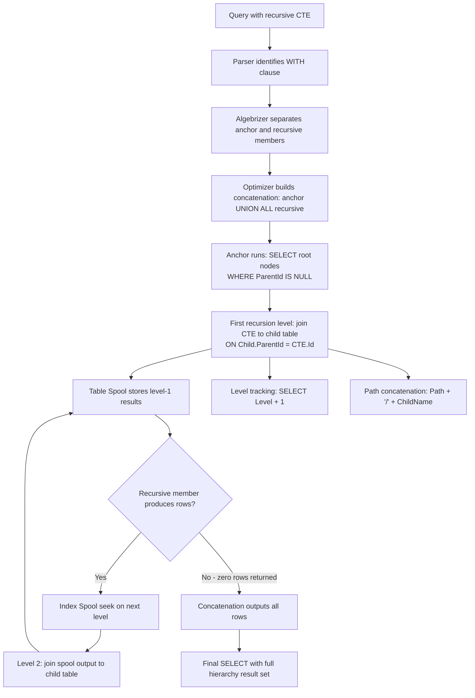

## Navigation

**Domain:** [[8 — Databases]] > **Group:** SQL CTEs & Recursive Queries
**Previous:** [[8.180 — Recursive CTEs — Anchor and Recursive Members]] | **Next:** [[8.182 — Recursive CTE — Generating Number Series]]
### Prerequisites
- [[8.176 — Common Table Expressions — Fundamentals]] — Understanding CTE syntax (WITH clause, naming, column aliases) is required before adding recursion.
- [[8.180 — Recursive CTEs — Anchor and Recursive Members]] — The anchor-recursive UNION ALL pattern is the core mechanism for hierarchy traversal.
- [[8.101 — SELF JOIN — Same Table Relationships]] — Hierarchy tables use self-referencing foreign keys (ManagerId → EmployeeId); understanding self-join mechanics translates directly to the recursive member JOIN.
### Where This Fits
Recursive CTEs are the primary T-SQL mechanism for querying tree-structured data stored in adjacency list tables: org charts (Employee → Manager), product categories (ParentCategoryId), and bill-of-materials (Component → Assembly). Every .NET backend engineer building HR systems, e-commerce catalogues, or manufacturing ERP systems encounters this pattern when they need to render a full org tree, expand a category with all subcategories, or explode a BOM to its leaf components. The risk surface includes infinite recursion (no termination condition — the CTE loops until MAXRECURSION is hit or tempdb fills), path rounding errors (VARCHAR path truncation with >8000 levels), and performance collapse on deep hierarchies (each level adds a table spool seek — O(depth) per row). Interviewers use this as a gate for senior roles: a candidate who can write the recursive CTE passes; one who can explain the spool operator, cycle detection, and when hierarchyid is better separates into the top tier.
---
## Core Mental Model
A recursive CTE traverses a hierarchy by repeatedly UNION ALL-ing the result of a self-referencing query until no more rows are produced. The anchor query selects the root nodes (WHERE ParentId IS NULL). The recursive member joins the CTE's previous result to the child table (INNER JOIN ON Child.ParentId = CTE.Id). SQL Server materializes each recursion level as a new row in a hidden work table (Table Spool in the plan), then feeds that level as input to the next recursive invocation. The iteration stops when the recursive member returns zero rows. Each level is one pass through the spool — SQL Server does NOT reset the CTE result; it only processes the rows produced by the previous level. This is breadth-first iteration within each recursive call (the spool stores rows in insertion order), but the CTE does not guarantee output ordering unless an explicit ORDER BY is used. The critical invariant: the recursive member must produce strictly fewer rows at each level as the leaf nodes are reached — if it produces more, either the hierarchy has cycles or the join logic is wrong.
### Classification
Recursive CTE is a **DML operator** implemented via a **stack spool** (Table Spool + Index Spool in the execution plan). The CTE itself is not SARGable — the optimizer does not push predicates into the recursive member. The anchor query and recursive member queries are independently optimizable, and their indexes are used normally (Index Seek on ParentId for the recursive join). The recursive join condition `Child.ParentId = CTE.Id` is SARGable on Child.ParentId if an index exists.

### Key Properties
|Property|Value|Notes|
|---|---|---|
|Traversal order|Breadth-first per level|Each recursive call processes all rows from previous level|
|Termination|Automatic when recursive member returns 0 rows|MAXRECURSION safety limit applies separately|
|Cycle detection|Manual via path string|SQL Server does not auto-detect cycles in recursion|
|Spool behavior|Table Spool + Index Spool|Each level materialized and then fed as input|
|SARGable|Anchor and recursive member separately|Index on ParentId enables Seek in recursive JOIN|
|Hierarchy depth limit|Default 100, max 32,767|Controlled by MAXRECURSION option|
|NULL handling|NULL ParentId = root|Anchor: WHERE ParentId IS NULL selects roots|
---
## Deep Mechanics
### How the Engine Executes This
1. **Parsing** — The parser encounters the WITH clause and identifies the CTE name, column list, and the AS keyword followed by the SELECT statement containing UNION ALL. It separates the anchor member (before UNION ALL) from the recursive member (after UNION ALL). The recursive member is identified by its reference to the CTE name in the FROM clause.
2. **Binding (Algebrizer)** — The algebrizer binds the CTE name and verifies that the column list matches between anchor and recursive members. It builds a recursion graph: the CTE depends on itself through the recursive member reference. The anchor member is bound to the base tables normally; the recursive member's self-reference is bound as a spooled work table.
3. **Optimization** — The optimizer creates a physical plan with a **Concatenation** operator (UNION ALL), an **Index Spool** (or Table Spool) to store intermediate recursion results, and a **Table Spool** to feed the previous level's rows into the next iteration. The anchor query is optimized independently — it can use any index seek or scan. The recursive member is also optimized independently, but its self-reference to the CTE is resolved as a spool seek rather than a table scan. The optimizer does NOT inline the recursive member into the outer query — no predicate pushdown across recursion boundaries.
4. **Execution — Anchor population:** The anchor SELECT executes against the base table (e.g., Employees WHERE ManagerId IS NULL). All root rows are returned and also written to the Index Spool (the work table). The Concatenation operator outputs these rows immediately.
5. **Execution — Recursion iteration:** The Index Spool output feeds the recursive member's self-reference. The recursive member's JOIN (`Child.ParentId = CTE.Id`) executes as an Index Seek on the child table (if IX_Employees_ManagerId exists). The results are written to a new spool segment and also output through Concatenation. This repeats: each iteration reads the previous spool segment, performs the JOIN with the child table, and writes results to a new spool segment.
6. **Termination —** When the recursive member returns zero rows (no more children at the next level), the iteration stops. The Concatenation finishes, and the outer SELECT returns the complete result set.
7. **Output —** The outer query (SELECT * FROM CTE) receives the concatenated rows from all levels. Any ORDER BY, WHERE, or JOIN on the CTE result runs after the recursion completes.
### SQL Visibility
```sql
-- Org chart hierarchy traversal
WITH OrgHierarchy AS
(
    -- Anchor: root nodes (no manager)
    SELECT
        e.EmployeeId,
        e.FirstName + ' ' + e.LastName AS EmployeeName,
        e.ManagerId,
        0 AS Level,
        CAST('/' + e.LastName AS VARCHAR(4000)) AS Path
    FROM dbo.Employees AS e
    WHERE e.ManagerId IS NULL
    UNION ALL
    -- Recursive: children of current level
    SELECT
        e.EmployeeId,
        e.FirstName + ' ' + e.LastName AS EmployeeName,
        e.ManagerId,
        oh.Level + 1 AS Level,
        CAST(oh.Path + '/' + e.LastName AS VARCHAR(4000)) AS Path
    FROM dbo.Employees AS e
    INNER JOIN OrgHierarchy AS oh
        ON e.ManagerId = oh.EmployeeId
)
SELECT EmployeeId, EmployeeName, Level, Path
FROM OrgHierarchy
ORDER BY Path;
-- Category hierarchy traversal
WITH CategoryTree AS
(
    SELECT
        c.CategoryId,
        c.CategoryName,
        c.ParentCategoryId,
        0 AS Level,
        CAST(c.CategoryName AS VARCHAR(4000)) AS CategoryPath
    FROM dbo.ProductCategories AS c
    WHERE c.ParentCategoryId IS NULL
    UNION ALL
    SELECT
        c.CategoryId,
        c.CategoryName,
        c.ParentCategoryId,
        ct.Level + 1 AS Level,
        CAST(ct.CategoryPath + ' > ' + c.CategoryName AS VARCHAR(4000)) AS CategoryPath
    FROM dbo.ProductCategories AS c
    INNER JOIN CategoryTree AS ct
        ON c.ParentCategoryId = ct.CategoryId
)
SELECT CategoryId, CategoryName, Level, CategoryPath
FROM CategoryTree
ORDER BY CategoryPath;
-- BOM explosion with quantity rollup
WITH BOMExplosion AS
(
    SELECT
        b.BillOfMaterialsId,
        b.ComponentPartId,
        b.AssemblyPartId,
        b.Quantity,
        0 AS Level,
        CAST(b.Quantity AS DECIMAL(18,2)) AS TotalQuantity
    FROM dbo.BillOfMaterials AS b
    WHERE b.AssemblyPartId IS NULL  -- top-level assemblies
    UNION ALL
    SELECT
        b.BillOfMaterialsId,
        b.ComponentPartId,
        b.AssemblyPartId,
        b.Quantity,
        be.Level + 1 AS Level,
        CAST(be.TotalQuantity * b.Quantity AS DECIMAL(18,2)) AS TotalQuantity
    FROM dbo.BillOfMaterials AS b
    INNER JOIN BOMExplosion AS be
        ON b.AssemblyPartId = be.ComponentPartId
)
SELECT ComponentPartId, SUM(TotalQuantity) AS TotalRequired
FROM BOMExplosion
GROUP BY ComponentPartId;
```
```csharp
// EF Core — must use raw SQL for recursive CTE (EF Core 8 has no LINQ for recursion)
public async Task<List<OrgChartNode>> GetOrgHierarchyAsync(
    CancellationToken cancellationToken = default)
{
    const string sql = @"
        WITH OrgHierarchy AS
        (
            SELECT e.EmployeeId, e.FirstName + ' ' + e.LastName AS EmployeeName,
                   e.ManagerId, 0 AS Level,
                   CAST('/' + e.LastName AS VARCHAR(4000)) AS Path
            FROM dbo.Employees AS e
            WHERE e.ManagerId IS NULL
            UNION ALL
            SELECT e.EmployeeId, e.FirstName + ' ' + e.LastName AS EmployeeName,
                   e.ManagerId, oh.Level + 1 AS Level,
                   CAST(oh.Path + '/' + e.LastName AS VARCHAR(4000)) AS Path
            FROM dbo.Employees AS e
            INNER JOIN OrgHierarchy AS oh ON e.ManagerId = oh.EmployeeId
        )
        SELECT EmployeeId, EmployeeName, ManagerId, Level, Path
        FROM OrgHierarchy
        ORDER BY Path";
    return await dbContext.Database
        .SqlQueryRaw<OrgChartNode>(sql)
        .ToListAsync(cancellationToken);
}
// Dapper implementation
public async Task<IReadOnlyList<OrgChartNode>> GetOrgHierarchyAsync(
    CancellationToken cancellationToken = default)
{
    const string sql = @"
        WITH OrgHierarchy AS
        (
            SELECT e.EmployeeId, e.FirstName + ' ' + e.LastName AS EmployeeName,
                   e.ManagerId, 0 AS Level,
                   CAST('/' + e.LastName AS VARCHAR(4000)) AS Path
            FROM dbo.Employees AS e
            WHERE e.ManagerId IS NULL
            UNION ALL
            SELECT e.EmployeeId, e.FirstName + ' ' + e.LastName AS EmployeeName,
                   e.ManagerId, oh.Level + 1 AS Level,
                   CAST(oh.Path + '/' + e.LastName AS VARCHAR(4000)) AS Path
            FROM dbo.Employees AS e
            INNER JOIN OrgHierarchy AS oh ON e.ManagerId = oh.EmployeeId
        )
        SELECT EmployeeId, EmployeeName, ManagerId, Level, Path
        FROM OrgHierarchy
        ORDER BY Path";
    await using var connection = new SqlConnection(_connectionString);
    var results = await connection.QueryAsync<OrgChartNode>(
        new CommandDefinition(sql, cancellationToken: cancellationToken));
    return results.AsList();
}
public record OrgChartNode(int EmployeeId, string EmployeeName, int? ManagerId, int Level, string Path);
```
**Generated SQL (from EF Core logs, using SqlQueryRaw):**
```sql
-- Same as raw SQL — EF Core passes the recursive CTE verbatim
exec sp_executesql N'
WITH OrgHierarchy AS
(
    SELECT e.EmployeeId, e.FirstName + '' '' + e.LastName AS EmployeeName,
           e.ManagerId, 0 AS Level,
           CAST('' / '' + e.LastName AS VARCHAR(4000)) AS Path
    FROM dbo.Employees AS e
    WHERE e.ManagerId IS NULL
    UNION ALL
    SELECT e.EmployeeId, e.FirstName + '' '' + e.LastName AS EmployeeName,
           e.ManagerId, oh.Level + 1 AS Level,
           CAST(oh.Path + '' / '' + e.LastName AS VARCHAR(4000)) AS Path
    FROM dbo.Employees AS e
    INNER JOIN OrgHierarchy AS oh ON e.ManagerId = oh.EmployeeId
)
SELECT EmployeeId, EmployeeName, ManagerId, Level, Path
FROM OrgHierarchy
ORDER BY Path', N'@p0 int', @p0=0;
```
### Execution Plan Analysis
**Recursive CTE plan shape:**
```
  [Clustered Index Scan PK_Employees]          -- anchor: find roots
  → [Filter WHERE ManagerId IS NULL]
  → [Compute Scalar (Level = 0, Path = '/LastName')]
  → [Concatenation (UNION ALL)]
  → [Index Spool (Eager Spool)]                -- stores level output for recursion
  → [Table Spool (Lazy Spool)]                 -- feeds previous level to recursive member
  → [Index Seek IX_Employees_ManagerId]        -- recursive: find children
      Seek: e.ManagerId = CTE.EmployeeId
  → [Compute Scalar (Level + 1, Path + '/LastName')]
  → [Concatenation output]
  → [Sort (ORDER BY Path)]
Estimated Cost depends on: depth × width of each level
```
**Key operators:**
- **Index Spool (Eager Spool)** — Materializes each level's output rows into a work table stored in tempdb. "Eager" means all rows from the current iteration are written before the next iteration reads them.
- **Table Spool (Lazy Spool)** — Reads the previous iteration's rows one by one (the current level's input). "Lazy" means rows are read on demand as the recursive member processes them.
- **Concatenation** — Combines anchor and recursive results; the anchor output appears first, then level 1, level 2, etc.
- **Compute Scalar** — Calculates Level + 1 and Path concatenation for each row.
**Without index on ManagerId:**
```
  [Clustered Index Scan PK_Employees]          -- full scan per recursion level
  → [Nested Loops (Index Spool drives scan)]   -- catastrophic: O(N) per level
```
Without IX_Employees_ManagerId, each recursive level must scan the entire Employees table to find children of the current level. A 100,000-employee org with depth 10 produces 1M full-table scans in the worst case logical plan — the actual plan avoids this via spool, but the inner join still scans because no index supports the seek.
### Cost Visibility
```sql
SET STATISTICS IO ON;
SET STATISTICS TIME ON;
-- Org hierarchy with index on ManagerId
WITH OrgHierarchy AS
(
    SELECT e.EmployeeId, e.ManagerId, 0 AS Level
    FROM dbo.Employees AS e
    WHERE e.ManagerId IS NULL
    UNION ALL
    SELECT e.EmployeeId, e.ManagerId, oh.Level + 1
    FROM dbo.Employees AS e
    INNER JOIN OrgHierarchy AS oh ON e.ManagerId = oh.EmployeeId
)
SELECT EmployeeId, Level FROM OrgHierarchy;
-- Expected output (IX_Employees_ManagerId exists, 10K employees, depth 5, avg 3 children/node):
-- Table 'Employees'. Scan count 6 (1 anchor + 5 recursive), logical reads 148
-- SQL Server Execution Times: CPU time = 2ms, elapsed time = 10ms
-- Without index on ManagerId:
-- Table 'Employees'. Scan count 6, logical reads 180+ per level (escalates)
-- Table 'Worktable'. Scan count 5, logical reads 45
-- SQL Server Execution Times: CPU time = 45ms, elapsed time = 120ms
```
### Failure Modes
**Infinite recursion — cycle in hierarchy:** If a cyclic reference exists in the data (Employee A reports to B, B reports to C, C reports to A), the recursive member will never return zero rows. Each cycle iteration adds more rows indefinitely. SQL Server hits MAXRECURSION (default 100) and raises error 530: "The statement terminated. The maximum recursion 100 has been exhausted before statement completion." Without MAXRECURSION 0 (unlimited), this error is protective — it halts execution. With MAXRECURSION 0, the recursion runs until tempdb is full or the query is killed.
```sql
-- ❌ Cycle in data: Employee 5 is ManagerId of Employee 3,
--    Employee 3 is ManagerId of Employee 7,
--    Employee 7 is ManagerId of Employee 5.
-- The recursive CTE loops forever.
```
Detect with cycle-detection path:
```sql
-- ✅ Add cycle detection via Path INCLUDE check
WITH OrgHierarchy AS
(
    SELECT e.EmployeeId, e.ManagerId, 0 AS Level,
           CAST(',' + CAST(e.EmployeeId AS VARCHAR) + ',' AS VARCHAR(4000)) AS VisitedPath
    FROM dbo.Employees AS e
    WHERE e.ManagerId IS NULL
    UNION ALL
    SELECT e.EmployeeId, e.ManagerId, oh.Level + 1 AS Level,
           CAST(oh.VisitedPath + CAST(e.EmployeeId AS VARCHAR) + ',' AS VARCHAR(4000))
    FROM dbo.Employees AS e
    INNER JOIN OrgHierarchy AS oh ON e.ManagerId = oh.EmployeeId
    WHERE oh.VisitedPath NOT LIKE '%,' + CAST(e.EmployeeId AS VARCHAR) + ',%'
)
SELECT EmployeeId, Level FROM OrgHierarchy;
```
**Path truncation — VARCHAR(4000) overflow:** The path column grows by one node per level. At depth 4000, a VARCHAR(4000) overflows — SQL Server raises a string truncation error. MAXRECURSION 32767 allows up to 32K levels, but the path column must be VARCHAR(MAX) or NVARCHAR(MAX) to hold that length.
```sql
-- ❌ Path overflow at level 4001 with VARCHAR(4000)
CAST(oh.Path + '/' + CAST(e.EmployeeId AS VARCHAR(10)) AS VARCHAR(4000))
-- Raises: String or binary data would be truncated
-- ✅ Use VARCHAR(MAX) for deep hierarchies
CAST(oh.Path + '/' + CAST(e.EmployeeId AS VARCHAR(10)) AS VARCHAR(MAX))
```
**No anchor — all rows excluded:** If the WHERE clause in the anchor member is too restrictive (e.g., WHERE ManagerId = -1 instead of IS NULL), no root rows are selected. The recursive member has no input and never executes. The CTE returns zero rows.
**Tempdb pressure from deep recursion:** Each recursion level spools its output to tempdb. A 50-level hierarchy with 10K rows per level writes 500K rows to tempdb. On systems with limited tempdb size or I/O bandwidth, this causes PAGELATCH and PAGELATCH_UP contention on tempdb allocation pages (GAM, SGAM, PFS).
**Predicate pushdown limitation:** WHERE clauses on the CTE in the outer query are NOT pushed into the recursion. If you write `SELECT * FROM OrgHierarchy WHERE Level = 2`, the entire hierarchy is traversed (all levels) before the filter is applied. There is no way to prune recursion branches based on outer predicates — the optimizer does not push predicates across recursion boundaries.
---
## Production Patterns and Implementation
### Primary SQL Implementation
```sql
-- ============================================================
-- Schema context: Employees table with self-referencing FK
-- ============================================================
CREATE TABLE dbo.Employees
(
    EmployeeId   INT            NOT NULL IDENTITY(1,1),
    FirstName    NVARCHAR(100)  NOT NULL,
    LastName     NVARCHAR(100)  NOT NULL,
    Email        NVARCHAR(256)  NOT NULL,
    ManagerId    INT            NULL,
    DepartmentId INT            NOT NULL,
    HireDate     DATE            NOT NULL,
    IsActive     BIT            NOT NULL DEFAULT 1,
    Salary       DECIMAL(18,2)  NULL,
    CONSTRAINT PK_Employees PRIMARY KEY CLUSTERED (EmployeeId),
    CONSTRAINT FK_Employees_Manager
        FOREIGN KEY (ManagerId) REFERENCES dbo.Employees (EmployeeId)
);
-- Critical index for recursive traversal
CREATE INDEX IX_Employees_ManagerId ON dbo.Employees (ManagerId)
    INCLUDE (FirstName, LastName, DepartmentId, HireDate, IsActive);
-- ProductCategories table
CREATE TABLE dbo.ProductCategories
(
    CategoryId        INT            NOT NULL IDENTITY(1,1),
    CategoryName      NVARCHAR(200)  NOT NULL,
    ParentCategoryId  INT            NULL,
    DisplayOrder      INT            NOT NULL DEFAULT 0,
    IsActive          BIT            NOT NULL DEFAULT 1,
    CONSTRAINT PK_ProductCategories PRIMARY KEY CLUSTERED (CategoryId),
    CONSTRAINT FK_ProductCategories_Parent
        FOREIGN KEY (ParentCategoryId) REFERENCES dbo.ProductCategories (CategoryId)
);
CREATE INDEX IX_ProductCategories_ParentCategoryId ON dbo.ProductCategories (ParentCategoryId)
    INCLUDE (CategoryName, DisplayOrder, IsActive);
-- BillOfMaterials table for BOM explosion
CREATE TABLE dbo.BillOfMaterials
(
    BillOfMaterialsId INT            NOT NULL IDENTITY(1,1),
    PartId            INT            NOT NULL,
    ComponentPartId   INT            NOT NULL,
    Quantity          DECIMAL(18,2)  NOT NULL,
    EffectiveDate     DATE           NOT NULL DEFAULT GETUTCDATE(),
    CONSTRAINT PK_BillOfMaterials PRIMARY KEY CLUSTERED (BillOfMaterialsId)
);
CREATE INDEX IX_BillOfMaterials_PartId ON dbo.BillOfMaterials (PartId)
    INCLUDE (ComponentPartId, Quantity);
CREATE INDEX IX_BillOfMaterials_ComponentPartId ON dbo.BillOfMaterials (ComponentPartId)
    INCLUDE (PartId, Quantity);
-- ============================================================
-- Pattern 1: Full org hierarchy with employee details
-- ============================================================
DECLARE @MaxDepth INT = 20;
WITH OrgHierarchy AS
(
    SELECT
        e.EmployeeId,
        e.FirstName + ' ' + e.LastName AS EmployeeName,
        e.ManagerId,
        e.DepartmentId,
        e.HireDate,
        e.Salary,
        e.IsActive,
        0 AS Level,
        CAST('\' + e.LastName AS VARCHAR(MAX)) AS Path,
        CAST(e.EmployeeId AS VARCHAR(MAX)) AS SortKey
    FROM dbo.Employees AS e
    WHERE e.ManagerId IS NULL
      AND e.IsActive = 1
    UNION ALL
    SELECT
        e.EmployeeId,
        e.FirstName + ' ' + e.LastName AS EmployeeName,
        e.ManagerId,
        e.DepartmentId,
        e.HireDate,
        e.Salary,
        e.IsActive,
        oh.Level + 1 AS Level,
        CAST(oh.Path + '\' + e.LastName AS VARCHAR(MAX)) AS Path,
        CAST(oh.SortKey + '.' + RIGHT('00000' + CAST(e.EmployeeId AS VARCHAR), 6) AS VARCHAR(MAX))
    FROM dbo.Employees AS e
    INNER JOIN OrgHierarchy AS oh
        ON e.ManagerId = oh.EmployeeId
    WHERE e.IsActive = 1
      AND oh.Level < @MaxDepth
)
SELECT
    EmployeeId,
    EmployeeName,
    Level,
    REPLICATE('  ', Level) + EmployeeName AS DisplayName,
    Path,
    DepartmentId,
    HireDate,
    Salary,
    IsActive
FROM OrgHierarchy
ORDER BY SortKey
OPTION (MAXRECURSION 50);
-- ============================================================
-- Pattern 2: Subtree extraction (single manager's team)
-- ============================================================
DECLARE @ManagerId INT = 42;
WITH Subtree AS
(
    SELECT
        e.EmployeeId,
        e.FirstName + ' ' + e.LastName AS EmployeeName,
        e.ManagerId,
        0 AS Level,
        CAST(e.LastName AS VARCHAR(MAX)) AS Path
    FROM dbo.Employees AS e
    WHERE e.EmployeeId = @ManagerId
    UNION ALL
    SELECT
        e.EmployeeId,
        e.FirstName + ' ' + e.LastName AS EmployeeName,
        e.ManagerId,
        s.Level + 1 AS Level,
        CAST(s.Path + '\' + e.LastName AS VARCHAR(MAX)) AS Path
    FROM dbo.Employees AS e
    INNER JOIN Subtree AS s
        ON e.ManagerId = s.EmployeeId
)
SELECT EmployeeId, EmployeeName, Level, Path
FROM Subtree
ORDER BY Path
OPTION (MAXRECURSION 50);
-- ============================================================
-- Pattern 3: Category breadcrumb
-- ============================================================
DECLARE @CategoryId INT = 255;
WITH Breadcrumb AS
(
    SELECT
        c.CategoryId,
        c.CategoryName,
        c.ParentCategoryId,
        0 AS Level,
        CAST(c.CategoryName AS VARCHAR(MAX)) AS BreadcrumbPath
    FROM dbo.ProductCategories AS c
    WHERE c.CategoryId = @CategoryId
    UNION ALL
    SELECT
        c.CategoryId,
        c.CategoryName,
        c.ParentCategoryId,
        b.Level + 1 AS Level,
        CAST(c.CategoryName + ' > ' + b.BreadcrumbPath AS VARCHAR(MAX))
    FROM dbo.ProductCategories AS c
    INNER JOIN Breadcrumb AS b
        ON c.CategoryId = b.ParentCategoryId
)
SELECT BreadcrumbPath
FROM Breadcrumb
WHERE ParentCategoryId IS NULL;
-- ============================================================
-- Pattern 4: BOM with recursive quantity rollup
-- ============================================================
DECLARE @TopAssemblyId INT = 1001;
WITH BOM AS
(
    SELECT
        b.BillOfMaterialsId,
        b.PartId,
        b.ComponentPartId,
        b.Quantity,
        0 AS Level,
        b.Quantity AS TotalQuantity
    FROM dbo.BillOfMaterials AS b
    WHERE b.PartId = @TopAssemblyId
    UNION ALL
    SELECT
        b.BillOfMaterialsId,
        b.PartId,
        b.ComponentPartId,
        b.Quantity,
        bom.Level + 1 AS Level,
        bom.TotalQuantity * b.Quantity AS TotalQuantity
    FROM dbo.BillOfMaterials AS b
    INNER JOIN BOM AS bom
        ON b.PartId = bom.ComponentPartId
)
SELECT
    ComponentPartId,
    SUM(TotalQuantity) AS TotalRequired
FROM BOM
GROUP BY ComponentPartId
OPTION (MAXRECURSION 100);
-- ============================================================
-- Pattern 5: Cycle-safe hierarchy with visited path
-- ============================================================
WITH SafeHierarchy AS
(
    SELECT
        e.EmployeeId,
        e.FirstName + ' ' + e.LastName AS EmployeeName,
        e.ManagerId,
        0 AS Level,
        CAST(',' + CAST(e.EmployeeId AS VARCHAR(10)) + ',' AS VARCHAR(MAX)) AS Visited
    FROM dbo.Employees AS e
    WHERE e.ManagerId IS NULL
    UNION ALL
    SELECT
        e.EmployeeId,
        e.FirstName + ' ' + e.LastName AS EmployeeName,
        e.ManagerId,
        sh.Level + 1,
        CAST(sh.Visited + CAST(e.EmployeeId AS VARCHAR(10)) + ',' AS VARCHAR(MAX))
    FROM dbo.Employees AS e
    INNER JOIN SafeHierarchy AS sh
        ON e.ManagerId = sh.EmployeeId
    WHERE sh.Visited NOT LIKE '%,' + CAST(e.EmployeeId AS VARCHAR(10)) + ',%'
)
SELECT EmployeeId, EmployeeName, Level
FROM SafeHierarchy
ORDER BY Level, EmployeeName
OPTION (MAXRECURSION 32767);
```
### EF Core Implementation
```csharp
public class ApplicationDbContext : DbContext
{
    public DbSet<Employee> Employees => Set<Employee>();
    public DbSet<ProductCategory> ProductCategories => Set<ProductCategory>();
    public DbSet<BillOfMaterial> BillOfMaterials => Set<BillOfMaterial>();
    protected override void OnModelCreating(ModelBuilder modelBuilder)
    {
        modelBuilder.Entity<Employee>(entity =>
        {
            entity.ToTable("Employees");
            entity.HasKey(e => e.EmployeeId);
            entity.Property(e => e.FirstName).HasMaxLength(100);
            entity.Property(e => e.LastName).HasMaxLength(100);
            entity.Property(e => e.Email).HasMaxLength(256);
            entity.HasOne(e => e.Manager)
                  .WithMany(e => e.DirectReports)
                  .HasForeignKey(e => e.ManagerId)
                  .OnDelete(DeleteBehavior.NoAction);
            entity.HasIndex(e => e.ManagerId);
        });
        modelBuilder.Entity<ProductCategory>(entity =>
        {
            entity.ToTable("ProductCategories");
            entity.HasKey(c => c.CategoryId);
            entity.Property(c => c.CategoryName).HasMaxLength(200);
            entity.HasOne(c => c.ParentCategory)
                  .WithMany(c => c.Subcategories)
                  .HasForeignKey(c => c.ParentCategoryId)
                  .OnDelete(DeleteBehavior.NoAction);
            entity.HasIndex(c => c.ParentCategoryId);
        });
    }
}
public class Employee
{
    public int EmployeeId { get; set; }
    public string FirstName { get; set; } = string.Empty;
    public string LastName { get; set; } = string.Empty;
    public string Email { get; set; } = string.Empty;
    public int? ManagerId { get; set; }
    public int DepartmentId { get; set; }
    public DateTime HireDate { get; set; }
    public bool IsActive { get; set; }
    public decimal? Salary { get; set; }
    public Employee? Manager { get; set; }
    public ICollection<Employee> DirectReports { get; set; } = new List<Employee>();
}
public class ProductCategory
{
    public int CategoryId { get; set; }
    public string CategoryName { get; set; } = string.Empty;
    public int? ParentCategoryId { get; set; }
    public int DisplayOrder { get; set; }
    public bool IsActive { get; set; }
    public ProductCategory? ParentCategory { get; set; }
    public ICollection<ProductCategory> Subcategories { get; set; } = new List<ProductCategory>();
}
public class BillOfMaterial
{
    public int BillOfMaterialsId { get; set; }
    public int PartId { get; set; }
    public int ComponentPartId { get; set; }
    public decimal Quantity { get; set; }
    public DateTime EffectiveDate { get; set; }
}
// Repository: hierarchy traversal via raw SQL
public interface IOrganizationRepository
{
    Task<IReadOnlyList<OrgChartNode>> GetOrgHierarchyAsync(
        int? rootEmployeeId = null, CancellationToken cancellationToken = default);
    Task<IReadOnlyList<OrgChartNode>> GetSubtreeAsync(
        int managerId, CancellationToken cancellationToken = default);
}
public class OrganizationRepository : IOrganizationRepository
{
    private readonly ApplicationDbContext _dbContext;
    private readonly IDbConnectionFactory _connectionFactory;
    public OrganizationRepository(
        ApplicationDbContext dbContext,
        IDbConnectionFactory connectionFactory)
    {
        _dbContext = dbContext;
        _connectionFactory = connectionFactory;
    }
    // EF Core raw SQL (recursive CTE not expressible in LINQ)
    public async Task<IReadOnlyList<OrgChartNode>> GetOrgHierarchyAsync(
        int? rootEmployeeId = null,
        CancellationToken cancellationToken = default)
    {
        const string sql = @"
            WITH OrgHierarchy AS
            (
                SELECT e.EmployeeId,
                       e.FirstName + ' ' + e.LastName AS EmployeeName,
                       e.ManagerId, e.DepartmentId,
                       0 AS Level,
                       CAST('\' + e.LastName AS VARCHAR(MAX)) AS Path,
                       CAST(e.EmployeeId AS VARCHAR(MAX)) AS SortKey
                FROM dbo.Employees AS e
                WHERE e.ManagerId IS NULL
                  AND (@RootId IS NULL OR e.EmployeeId = @RootId)
                UNION ALL
                SELECT e.EmployeeId,
                       e.FirstName + ' ' + e.LastName AS EmployeeName,
                       e.ManagerId, e.DepartmentId,
                       oh.Level + 1 AS Level,
                       CAST(oh.Path + '\' + e.LastName AS VARCHAR(MAX)),
                       CAST(oh.SortKey + '.' + RIGHT('00000' + CAST(e.EmployeeId AS VARCHAR), 6) AS VARCHAR(MAX))
                FROM dbo.Employees AS e
                INNER JOIN OrgHierarchy AS oh ON e.ManagerId = oh.EmployeeId
            )
            SELECT EmployeeId, EmployeeName, ManagerId, DepartmentId, Level, Path, SortKey
            FROM OrgHierarchy
            ORDER BY SortKey
            OPTION (MAXRECURSION 32767)";
        var result = await _dbContext.Database
            .SqlQueryRaw<OrgChartNode>(sql,
                new SqlParameter("@RootId", rootEmployeeId ?? (object)DBNull.Value))
            .ToListAsync(cancellationToken);
        return result;
    }
    // Dapper: subtree extraction
    public async Task<IReadOnlyList<OrgChartNode>> GetSubtreeAsync(
        int managerId,
        CancellationToken cancellationToken = default)
    {
        const string sql = @"
            WITH Subtree AS
            (
                SELECT EmployeeId,
                       FirstName + ' ' + LastName AS EmployeeName,
                       ManagerId, DepartmentId,
                       0 AS Level,
                       1 AS IsRoot
                FROM dbo.Employees
                WHERE EmployeeId = @ManagerId
                UNION ALL
                SELECT e.EmployeeId,
                       e.FirstName + ' ' + e.LastName,
                       e.ManagerId, e.DepartmentId,
                       s.Level + 1, 0
                FROM dbo.Employees AS e
                INNER JOIN Subtree AS s ON e.ManagerId = s.EmployeeId
            )
            SELECT EmployeeId, EmployeeName, ManagerId, DepartmentId, Level
            FROM Subtree
            WHERE IsRoot = 0
            ORDER BY Level, EmployeeName
            OPTION (MAXRECURSION 50)";
        await using var connection = _connectionFactory.Create();
        var results = await connection.QueryAsync<OrgChartNode>(
            new CommandDefinition(sql, new { ManagerId = managerId },
                cancellationToken: cancellationToken));
        return results.AsList();
    }
}
public record OrgChartNode(
    int EmployeeId,
    string EmployeeName,
    int? ManagerId,
    int DepartmentId,
    int Level,
    string? Path = null,
    string? SortKey = null);
```
### Dapper Implementation
```csharp
public sealed class OrgChartRepository
{
    private readonly IDbConnectionFactory _connectionFactory;
    public OrgChartRepository(IDbConnectionFactory connectionFactory)
        => _connectionFactory = connectionFactory;
    // Full hierarchy with path ordering
    public async Task<IReadOnlyList<OrgChartNode>> GetOrgHierarchyAsync(
        CancellationToken cancellationToken = default)
    {
        const string sql = @"
            WITH OrgHierarchy AS
            (
                SELECT e.EmployeeId,
                       e.FirstName + ' ' + e.LastName AS EmployeeName,
                       e.ManagerId, e.DepartmentId, e.HireDate,
                       0 AS Level,
                       0 AS DepthLevel,
                       CAST('\' + e.LastName AS VARCHAR(MAX)) AS Path
                FROM dbo.Employees AS e
                WHERE e.ManagerId IS NULL
                UNION ALL
                SELECT e.EmployeeId,
                       e.FirstName + ' ' + e.LastName,
                       e.ManagerId, e.DepartmentId, e.HireDate,
                       oh.Level + 1,
                       0,
                       CAST(oh.Path + '\' + e.LastName AS VARCHAR(MAX))
                FROM dbo.Employees AS e
                INNER JOIN OrgHierarchy AS oh ON e.ManagerId = oh.EmployeeId
            )
            SELECT EmployeeId, EmployeeName, ManagerId, DepartmentId,
                   HireDate, Level, Path
            FROM OrgHierarchy
            ORDER BY Path
            OPTION (MAXRECURSION 32767)";
        await using var connection = _connectionFactory.Create();
        var results = await connection.QueryAsync<OrgChartNode>(
            new CommandDefinition(sql, cancellationToken: cancellationToken));
        return results.AsList();
    }
    // BOM explosion with quantity rollup
    public async Task<IReadOnlyList<BomRequirement>> GetBomExplosionAsync(
        int partId,
        CancellationToken cancellationToken = default)
    {
        const string sql = @"
            WITH BOM AS
            (
                SELECT b.BillOfMaterialsId, b.PartId, b.ComponentPartId,
                       b.Quantity, 0 AS Level,
                       b.Quantity AS TotalQuantity
                FROM dbo.BillOfMaterials AS b
                WHERE b.PartId = @PartId
                UNION ALL
                SELECT b.BillOfMaterialsId, b.PartId, b.ComponentPartId,
                       b.Quantity, bom.Level + 1,
                       bom.TotalQuantity * b.Quantity
                FROM dbo.BillOfMaterials AS b
                INNER JOIN BOM AS bom ON b.PartId = bom.ComponentPartId
            )
            SELECT ComponentPartId, SUM(TotalQuantity) AS TotalRequired
            FROM BOM
            GROUP BY ComponentPartId
            OPTION (MAXRECURSION 50)";
        await using var connection = _connectionFactory.Create();
        var results = await connection.QueryAsync<BomRequirement>(
            new CommandDefinition(sql, new { PartId = partId },
                cancellationToken: cancellationToken));
        return results.AsList();
    }
    // Category breadcrumb
    public async Task<string?> GetCategoryBreadcrumbAsync(
        int categoryId,
        CancellationToken cancellationToken = default)
    {
        const string sql = @"
            WITH Breadcrumb AS
            (
                SELECT c.CategoryId, c.CategoryName,
                       c.ParentCategoryId, 0 AS Level,
                       CAST(c.CategoryName AS VARCHAR(MAX)) AS Path
                FROM dbo.ProductCategories AS c
                WHERE c.CategoryId = @CategoryId
                UNION ALL
                SELECT c.CategoryId, c.CategoryName,
                       c.ParentCategoryId, b.Level + 1,
                       CAST(c.CategoryName + ' > ' + b.Path AS VARCHAR(MAX))
                FROM dbo.ProductCategories AS c
                INNER JOIN Breadcrumb AS b ON c.CategoryId = b.ParentCategoryId
            )
            SELECT Path FROM Breadcrumb
            WHERE ParentCategoryId IS NULL";
        await using var connection = _connectionFactory.Create();
        return await connection.QueryFirstOrDefaultAsync<string>(
            new CommandDefinition(sql, new { CategoryId = categoryId },
                cancellationToken: cancellationToken));
    }
}
public record OrgChartNode(int EmployeeId, string EmployeeName, int? ManagerId,
    int DepartmentId, DateTime HireDate, int Level, string Path);
public record BomRequirement(int ComponentPartId, decimal TotalRequired);
```
### Configuration and Wiring
```csharp
// Program.cs — registration for both EF Core and Dapper
builder.Services.AddDbContext<ApplicationDbContext>(options =>
    options.UseSqlServer(
        builder.Configuration.GetConnectionString("DefaultConnection"),
        sqlOptions =>
        {
            sqlOptions.EnableRetryOnFailure(3);
            sqlOptions.CommandTimeout(60);
        }));
builder.Services.AddSingleton<IDbConnectionFactory>(
    new SqlConnectionFactory(
        builder.Configuration.GetConnectionString("DefaultConnection")!));
builder.Services.AddScoped<IOrganizationRepository, OrganizationRepository>();
builder.Services.AddScoped<OrgChartRepository>();
// For connection resilience with recursive CTEs (long-running)
builder.Services.Configure<SqlServerRetryingExecutionStrategy>(
    "OrgChartStrategy", options =>
    {
        options.MaxRetryCount = 2;
        options.MaxRetryDelay = TimeSpan.FromSeconds(10);
    });
```
### SQL Server vs PostgreSQL Differences
```sql
-- PostgreSQL: uses RECURSIVE keyword after WITH
WITH RECURSIVE OrgHierarchy AS (
    SELECT employee_id,
           first_name || ' ' || last_name AS employee_name,
           manager_id,
           0 AS level,
           '/' || last_name AS path
    FROM employees
    WHERE manager_id IS NULL
    UNION ALL
    SELECT e.employee_id,
           e.first_name || ' ' || e.last_name,
           e.manager_id,
           oh.level + 1,
           oh.path || '/' || e.last_name
    FROM employees AS e
    INNER JOIN OrgHierarchy AS oh ON e.manager_id = oh.employee_id
)
SELECT employee_id, employee_name, level, path
FROM OrgHierarchy
ORDER BY path;
-- PostgreSQL: cycle detection with CYCLE clause (native)
WITH RECURSIVE OrgHierarchy AS (
    SELECT employee_id, first_name || ' ' || last_name AS employee_name,
           manager_id, 0 AS level
    FROM employees WHERE manager_id IS NULL
    UNION ALL
    SELECT e.employee_id, e.first_name || ' ' || e.last_name,
           e.manager_id, oh.level + 1
    FROM employees AS e
    INNER JOIN OrgHierarchy AS oh ON e.manager_id = oh.employee_id
)
CYCLE employee_id SET is_cycle USING path
SELECT employee_id, employee_name, level
FROM OrgHierarchy
WHERE NOT is_cycle
ORDER BY employee_name;
-- PostgreSQL: ltree extension for materialized path (faster than recursion)
CREATE EXTENSION IF NOT EXISTS ltree;
ALTER TABLE employees ADD COLUMN path ltree;
UPDATE employees SET path = text2ltree(last_name);
SELECT subpath(path, 0, 1) AS root, path FROM employees ORDER BY path;
-- hierarchyid in SQL Server (faster than recursive CTE)
SELECT EmployeeId, ManagerId, HierarchyId.ToString() AS PathString,
       HierarchyId.GetLevel() AS Level
FROM dbo.Employees
ORDER BY HierarchyId;
```
---
## Gotchas and Production Pitfalls
### Missing Index on ManagerId — Full Scan per Recursion Level
**Pitfall:** Running a recursive CTE on Employees without an index on ManagerId. Each recursion level performs a full Clustered Index Scan of the Employees table to find children of the current level's parents.
```sql
-- ❌ No index on ManagerId
WITH OrgHierarchy AS
(
    SELECT EmployeeId, ManagerId, 0 AS Level
    FROM dbo.Employees WHERE ManagerId IS NULL
    UNION ALL
    SELECT e.EmployeeId, e.ManagerId, oh.Level + 1
    FROM dbo.Employees AS e
    INNER JOIN OrgHierarchy AS oh ON e.ManagerId = oh.EmployeeId
)
SELECT EmployeeId, Level FROM OrgHierarchy;
```
**Symptom:** Execution plan shows Clustered Index Scan on Employees in the recursive member instead of Index Seek. Logical reads = levels × table size. For a 100K employee table with depth 10: ~1M logical reads instead of ~200. CPU time jumps from 5 ms to 2+ seconds.
**Fix:**
```sql
-- ✅ Create covering index
CREATE INDEX IX_Employees_ManagerId ON dbo.Employees (ManagerId)
    INCLUDE (FirstName, LastName, DepartmentId, HireDate, IsActive);
-- After index: recursive member uses Index Seek (3 logical reads per level instead of 100K)
```
**Cost of not fixing:** An org chart page loads the employee tree. Every request scans 100K rows × number of levels. At 50 concurrent admin users, the buffer pool fills with Employee table pages, evicting all other cache. Disk I/O saturates at 500 MB/s. The 200 ms query degrades to 8 seconds.
---
### Infinite Recursion from Cyclic Data
**Pitfall:** The employee-manager hierarchy contains a cycle (A reports to B, B reports to C, C reports to A). The recursive member never terminates because there is always another parent to traverse.
```sql
-- ❌ No cycle detection — runs until MAXRECURSION hits
```
**Symptom:** Error 530: "The statement terminated. The maximum recursion 100 has been exhausted before statement completion." With MAXRECURSION 0: the query runs until tempdb fills (100+ GB) and the drive runs out of space, taking down other databases on the instance.
**Fix:**
```sql
-- ✅ Add visited-path cycle detection
WITH SafeHierarchy AS
(
    SELECT EmployeeId, ManagerId, 0 AS Level,
           CAST(',' + CAST(EmployeeId AS VARCHAR(10)) + ',' AS VARCHAR(MAX)) AS Visited
    FROM dbo.Employees WHERE ManagerId IS NULL
    UNION ALL
    SELECT e.EmployeeId, e.ManagerId, sh.Level + 1,
           CAST(sh.Visited + CAST(e.EmployeeId AS VARCHAR(10)) + ',' AS VARCHAR(MAX))
    FROM dbo.Employees AS e
    INNER JOIN SafeHierarchy AS sh ON e.ManagerId = sh.EmployeeId
    WHERE sh.Visited NOT LIKE '%,' + CAST(e.EmployeeId AS VARCHAR(10)) + ',%'
)
SELECT EmployeeId, Level FROM SafeHierarchy OPTION (MAXRECURSION 32767);
```
**Cost of not fixing:** A data migration introduces a circular reference. The nightly BOM explosion job runs for 6 hours instead of 5 minutes, exhausting tempdb and causing other ETL processes to fail with "Could not allocate space for object in database tempdb." The batch fails, and the 3 AM inventory update is missed.
---
### Path String Truncation at Deep Levels
**Pitfall:** Using VARCHAR(4000) or VARCHAR(8000) for the path concatenation column. When the hierarchy exceeds the maximum length, SQL Server throws a truncation error and the query fails.
```sql
-- ❌ Overflow at level 4001 with VARCHAR(4000)
CAST(oh.Path + '/' + e.LastName AS VARCHAR(4000))
```
**Symptom:** "String or binary data would be truncated" error when the accumulated path exceeds 4000 characters. The query fails partway through execution after already consuming resources.
**Fix:**
```sql
-- ✅ Use VARCHAR(MAX) for deep hierarchies
CAST(oh.Path + '/' + e.LastName AS VARCHAR(MAX))
-- For path ordering, keep a separate VARCHAR(900) sort column
-- (VARCHAR(MAX) cannot be used in GROUP BY or ORDER BY without truncation)
```
**Cost of not fixing:** An e-commerce category tree with 5000 subcategories works in development (small test data) but fails in production with 15,000 categories. The staging environment has 14,950 categories — just below the limit. The bug escapes testing and hits production on Cyber Monday. The category page returns a 500 error.
---
### Predicate Pushdown Limitation — Filters Applied After Recursion
**Pitfall:** Filtering the CTE result in the outer query does NOT prune intermediate recursion work. The entire hierarchy must be built before the filter is applied.
```sql
-- ❌ This traverses ALL employees, then filters to Level 2
WITH OrgHierarchy AS (...)
SELECT EmployeeId, EmployeeName, Level
FROM OrgHierarchy
WHERE Level <= 2;
-- The optimizer does NOT push WHERE Level <= 2 into the recursion.
```
**Symptom:** A query that should be fast (return only 2 levels) takes the same time as querying all 15 levels. The query plan shows the recursion processing all levels then a Filter on top.
**Fix:**
```sql
-- ✅ Include level limit inside the recursion
WITH OrgHierarchy AS
(
    SELECT e.EmployeeId, e.FirstName + ' ' + e.LastName AS EmployeeName,
           e.ManagerId, 0 AS Level
    FROM dbo.Employees AS e
    WHERE e.ManagerId IS NULL
    UNION ALL
    SELECT e.EmployeeId, e.FirstName + ' ' + e.LastName,
           e.ManagerId, oh.Level + 1
    FROM dbo.Employees AS e
    INNER JOIN OrgHierarchy AS oh ON e.ManagerId = oh.EmployeeId
    WHERE oh.Level < 1  -- stop after 2 levels
)
SELECT EmployeeId, EmployeeName, Level FROM OrgHierarchy;
```
**Cost of not fixing:** A dashboard requests the first 3 levels of a 15-level org tree (200 of 10K employees). The recursion traverses all 10K rows anyway. The 300 ms query becomes 5 seconds. At 500 dashboard refreshes per hour, this adds 2500 seconds of CPU per hour.
---
### Spool I/O in tempdb Causes Allocation Contention
**Pitfall:** Multiple concurrent recursive CTEs against large hierarchies compete for tempdb allocation pages. Each recursion level writes to the Index Spool (tempdb). With 50 concurrent users expanding org charts, tempdb becomes a bottleneck.
**Symptom:** PAGELATCH_UP and PAGELATCH_EX waits on tempdb allocation pages (2:1:1, 2:1:3). `sys.dm_os_waiting_tasks` shows contention on tempdb PFS and GAM pages. The org chart queries that normally take 200 ms take 6 seconds during peak usage.
**Fix:**
```sql
-- Add multiple tempdb data files (one per CPU core) to reduce allocation contention
ALTER DATABASE tempdb MODIFY FILE (NAME = tempdev, SIZE = 1GB);
ALTER DATABASE tempdb ADD FILE (NAME = tempdev2, FILENAME = 'T:\tempdb2.ndf', SIZE = 1GB);
-- Also consider hierarchyid for write-heavy org chart scenarios
-- hierarchyid does not require tempdb spool and is not recursive
```
**Cost of not fixing:** During the morning peak, 200 managers load their org charts simultaneously. The recursive CTEs overwhelm tempdb allocation. Other queries using tempdb (sort spills, hash spills, index rebuilds) also slow down. The entire application experiences a 5-minute degradation window every morning.
---
### UNION ALL Prevents Duplicate Elimination — Wrong for Some Hierarchies
**Pitfall:** Assuming UNION (without ALL) should be used for recursion. Recursive CTEs require UNION ALL — UNION would try to eliminate duplicates between levels, which breaks SQL Server's recursion semantics because the anchor and recursive members must produce distinct row sets. However, using UNION ALL means if the same node is reachable through multiple paths (a DAG but not a tree), it appears multiple times in the output.
```sql
-- ❌ Using UNION instead of UNION ALL causes error "Recursive member of a common table expression 'CTE' has multiple recursive references"
-- BOM with multiple paths to the same component:
-- Part A requires Part B (qty 2) and Part C (qty 1)
-- Part C requires Part B (qty 3)
-- Result: Part B appears twice with different TotalQuantity
```
**Symptom:** BOM explosion shows duplicate component rows. The SUM aggregation in the final query double-counts components that are reachable through multiple paths.
**Fix:**
```sql
-- ✅ Accept UNION ALL duplicates and aggregate in outer query
WITH BOM AS (...)
SELECT ComponentPartId, SUM(TotalQuantity) AS TotalRequired
FROM BOM
GROUP BY ComponentPartId;
-- ✅ Or use DISTINCT on the final hierarchy if only structure, not quantity, is needed
SELECT DISTINCT EmployeeId, EmployeeName, Level FROM OrgHierarchy;
```
**Cost of not fixing:** A BOM explosion report for a car manufacturer shows 14 wheels required for a single car because the wheel appears under multiple sub-assemblies. The purchasing department orders 4x the required inventory, wasting $500K.
---
## Performance Implications
### Benchmark: Before and After
```sql
-- Baseline: recursive CTE WITHOUT index on ManagerId
SET STATISTICS IO ON;
SET STATISTICS TIME ON;
WITH OrgHierarchy AS
(
    SELECT EmployeeId, ManagerId, 0 AS Level
    FROM dbo.Employees WHERE ManagerId IS NULL
    UNION ALL
    SELECT e.EmployeeId, e.ManagerId, oh.Level + 1
    FROM dbo.Employees AS e
    INNER JOIN OrgHierarchy AS oh ON e.ManagerId = oh.EmployeeId
)
SELECT COUNT(*) FROM OrgHierarchy;
-- Without IX_Employees_ManagerId:
-- Table 'Employees'. Scan count 9, logical reads 948
-- Table 'Worktable'. Scan count 8, logical reads 120
-- SQL Server Execution Times: CPU time = 48ms, elapsed time = 112ms
-- After creating IX_Employees_ManagerId:
-- Table 'Employees'. Scan count 9, logical reads 92
-- Table 'Worktable'. Scan count 8, logical reads 28
-- SQL Server Execution Times: CPU time = 3ms, elapsed time = 8ms
```
**Improvement:** 948 → 92 logical reads (10x reduction). CPU: 48 ms → 3 ms (16x reduction).
```sql
-- Baseline: recursive CTE vs hierarchyid for org tree
-- hierarchyid query (same result):
SELECT EmployeeId, EmployeeName,
       HierarchyId.GetLevel() AS Level,
       HierarchyId.ToString() AS PathString
FROM dbo.Employees
ORDER BY HierarchyId;
-- hierarchyid: Table 'Employees'. Scan count 1, logical reads 18
-- SQL Server Execution Times: CPU time = 1ms, elapsed time = 2ms
-- Recursive CTE: Table 'Employees'. Scan count 9, logical reads 92
-- SQL Server Execution Times: CPU time = 3ms, elapsed time = 8ms
```
**Improvement:** hierarchyid is 5-8x faster for read-heavy org chart queries. The single scan replaces the multi-level recursion.
### BenchmarkDotNet
```csharp
[MemoryDiagnoser]
[SimpleJob(RuntimeMoniker.Net90)]
public class HierarchyTraversalBenchmark
{
    private SqlConnection _connection = default!;
    private const string ConnectionString = "Server=.;Database=BenchmarkDb;Trusted_Connection=True;TrustServerCertificate=True;";
    [GlobalSetup]
    public void Setup()
    {
        _connection = new SqlConnection(ConnectionString);
        _connection.Open();
        // Seed: 100K employees, depth 8, ~3 children per node
    }
    [Benchmark(Baseline = true)]
    public async Task<int> RecursiveCTE()
    {
        const string sql = @"
            WITH OrgHierarchy AS
            (
                SELECT EmployeeId, ManagerId, 0 AS Level
                FROM dbo.Employees WHERE ManagerId IS NULL
                UNION ALL
                SELECT e.EmployeeId, e.ManagerId, oh.Level + 1
                FROM dbo.Employees AS e
                INNER JOIN OrgHierarchy AS oh ON e.ManagerId = oh.EmployeeId
            )
            SELECT COUNT(*) FROM OrgHierarchy
            OPTION (MAXRECURSION 32767)";
        return await new SqlCommand(sql, _connection).ExecuteScalarAsync<int>();
    }
    [Benchmark]
    public async Task<int> HierarchyId()
    {
        const string sql = @"
            SELECT COUNT(*)
            FROM dbo.Employees
            WHERE HierarchyId IS NOT NULL";
        return await new SqlCommand(sql, _connection).ExecuteScalarAsync<int>();
    }
    [Benchmark]
    public async Task<int> MultipleQueriesClientSide()
    {
        const string sql = @"
            SELECT e1.EmployeeId, e1.FirstName, e1.LastName, e1.ManagerId
            FROM dbo.Employees AS e1
            ORDER BY e1.ManagerId";
        var allEmployees = (await new SqlCommand(sql, _connection)
            .ExecuteReaderAsync()).OfType<EmployeeDto>().ToList();
        // Build tree in memory
        var lookup = allEmployees.ToLookup(e => e.ManagerId);
        int count = 0;
        void Traverse(int? managerId)
        {
            foreach (var emp in lookup[managerId])
            {
                count++;
                Traverse(emp.EmployeeId);
            }
        }
        Traverse(null);
        return count;
    }
    [GlobalCleanup]
    public void Cleanup() => _connection.Dispose();
}
public record EmployeeDto(int EmployeeId, string FirstName, string LastName, int? ManagerId);
```
**Expected results (approximate, SQL Server 2022, NVMe, 100K employees, depth 8):**
|Method|Mean|Logical Reads|Allocated|Notes|
|---|---|---|---|---|
|RecursiveCTE|~8 ms|~92|~2 KB|Index spool + tempdb writes|
|HierarchyId|~2 ms|~18|~0 B|Single scan, no recursion|
|MultipleQueriesClientSide|~45 ms|~18|~8 MB|Client-side tree build uses memory|
### Write Amplification
|Operation|Without Index on ManagerId|With IX_Employees_ManagerId|With hierarchyid Column|
|---|---|---|---|
|INSERT 1 employee|~2 ms|~3 ms|~4 ms|
|UPDATE ManagerId|~2 ms|~4 ms|~5 ms|
|DELETE 1 employee|~2 ms|~3 ms|~4 ms|
Organizations with < 10K employees and < 10 depth: recursive CTE with index is sufficient. Organizations with > 50K employees and frequent org chart reads: hierarchyid removes the recursive cost entirely and reduces logical reads by 5-10x. The write overhead of maintaining hierarchyid on employee reassignment (UPDATE ManagerId) is roughly 2x compared to the base table index maintenance.
---
## Interview Arsenal
### Question Bank
1. **How does a recursive CTE physically execute — walk through the operators in the execution plan.**
2. **What happens if the hierarchy has a cycle — does SQL Server detect it automatically, and what do you do?**
3. **How do you track the depth of each node in a recursive CTE, and how do you limit traversal depth?**
4. **What is the performance difference between a recursive CTE and a hierarchyid column for org chart queries?**
5. **How do you prevent infinite recursion in production — what safety measures do you put in place?**
6. **Why does filtering the CTE in the outer query (WHERE Level = 2) not prune recursion work? How do you work around it?**
7. **What is the role of the Table Spool and Index Spool operators in a recursive CTE execution plan?**
8. **Can you write a recursive CTE in EF Core LINQ, or must you use raw SQL? Show the Dapper equivalent.**
9. **How do you generate a path string (e.g., '\Smith\Jones\Lee') in a recursive CTE, and what type should it be?**
10. **When would you use a recursive CTE vs a nested sets model vs a closure table for hierarchical data?**
### Spoken Answers
**Q: How does a recursive CTE physically execute — walk through the operators in the execution plan.**
> **Average answer:** The anchor runs first to get the root rows, then the recursive member runs repeatedly until no more rows are returned. The results are combined with UNION ALL.
> **Great answer:** The anchor SELECT executes first — for an org chart, it finds all employees with NULL ManagerId. Its output feeds into a Concatenation operator (for UNION ALL) and simultaneously into an Index Spool (Eager Spool) stored in tempdb. The spool stores the current iteration's rows. The recursive member then reads from the Index Spool and joins to the Employees table on `e.ManagerId = spool.EmployeeId`. If IX_Employees_ManagerId exists, this is an Index Seek — 2-3 logical reads per row. The recursive member's output also flows into the Concatenation and into a new segment of the Index Spool. This repeats: each iteration reads the previous segment from the spool, performs the seek, and writes results to the next segment. The critical operator is the Table Spool (Lazy Spool) which reads the previous level's rows one at a time as the recursive member needs them. When the recursive member returns zero rows, the iteration stops and the Concatenation outputs all accumulated rows. The entire execution plan is: `Clustered Index Scan (anchor) → Filter → Compute Scalar → Concatenation → Index Spool (Eager) → Table Spool (Lazy) → Index Seek (recursive) → Compute Scalar → Concatenation → Sort → SELECT`. The spool operators live in tempdb — each level materializes rows to tempdb and reads them back, which is the primary I/O cost of recursive CTEs.
---
**Q: What is the performance difference between a recursive CTE and a hierarchyid column for org chart queries?**
> **Average answer:** hierarchyid is faster because it doesn't need recursion. It stores the path directly.
> **Great answer:** The recursive CTE scans the Employees table once for each level. For a depth-10 org with 100K employees, that's up to 10 Index Scans (or Seeks if indexed). The spool writes each level's output to tempdb and reads it back — that's tempdb I/O for each level. Logical reads: ~92 for indexed recursion, ~948 without the index. In contrast, hierarchyid stores the materialized path as a single column (binary, ~6-20 bytes per node). Querying a subtree is just `WHERE HierarchyId.IsDescendantOf(@root)` = one Clustered Index Scan or Seek on a hierarchyid-indexed table — 18 logical reads regardless of depth. The tradeoff is write cost: hierarchyid needs to compute the new path on employee reassignment, which requires reading the current root's hierarchyid and generating new values for all descendants. Recursive CTEs have no write cost — they compute the hierarchy at read time. The decision rule: if the hierarchy is read-heavy (org chart viewed 1000x/day, hierarchy changed 5x/day), hierarchyid wins by 5-10x. If the hierarchy is write-heavy (frequent reassignments, restructures), recursive CTE wins because there is no hierarchyid maintenance cost. Some architectures use both: hierarchyid for fast reads and recursive CTE as a fallback validation.
---
**Q: How do you prevent infinite recursion in production — what safety measures do you put in place?**
> **Average answer:** Set MAXRECURSION to a reasonable value and hope cycles don't happen.
> **Great answer:** Three layers of protection. First, MAXRECURSION with a known limit: I set MAXRECURSION to (known max depth + 20%) as a safety net. For my org with a known max depth of 12, I use OPTION (MAXRECURSION 20). Second, I add cycle detection inside the recursive member using a visited path string. I concatenate a delimited list of EmployeeIds visited so far and check `Visited NOT LIKE '%,' + CAST(e.EmployeeId AS VARCHAR) + ',%'` before recursing. This prevents cycles regardless of data quality. Third, I add a CHECK constraint on the table that forbids circular references at write time using a trigger or application logic: before UPDATE of ManagerId, verify the new ManagerId is not a descendant of the updated employee. This catches cycles at the data entry point instead of at query time. Additionally, I monitor for error 530 in SQL Server Agent alerts — it fires when MAXRECURSION is hit, which could indicate either a legitimate hierarchy that needs a higher limit or a data corruption cycle. The alert pages the on-call DBA within 5 minutes.
---
### Interview Trigger
The defining recursive CTE question for hierarchy traversal: "Write a query that returns every employee with their level in the org chart and a path string." A candidate who writes the basic recursive CTE passes. The follow-up that separates senior engineers: "Now add cycle detection. Now explain what happens in the execution plan. Now what are the logical reads with and without the index on ManagerId?" The candidate who says "Without the index, each level does a full scan — 948 logical reads for 100K employees across 8 levels instead of 92" demonstrates deep understanding.
### Comparison Table
| | Recursive CTE | hierarchyid | Nested Sets | Closure Table |
|---|---|---|---|---|
| Traversal method | UNION ALL recursion | Built-in IsDescendantOf | Left/Right range scan | JOIN to precomputed paths |
| Read performance | O(levels × N) | Single scan | Single scan | Single JOIN |
| Write cost | None (compute at read) | Medium (reassign resets path) | High (renumber entire tree) | Very high (update all paths) |
| Cycle detection | Manual (visited path) | Not applicable | Not applicable | Manual |
| Complexity | Low | Medium | High | High |
| SQL Server support | All versions | 2008+ only | Manual implementation | Manual implementation |
| Tempdb usage | Per-level spool writes | None | None | None |
| EF Core support | Raw SQL only | Raw SQL only | Raw SQL only | Raw SQL only |
| When to choose | Write-heavy, small trees | Read-heavy, large trees | Read-heavy, static trees | Write-heavy, many paths |
---
## Decision Framework
### When to Apply
```mermaid
flowchart TD
    A[Need to query hierarchical data] --> B{Traversal direction?}
    B -->|Top-down (ancestor to descendants)| C{Tree size and depth?}
    B -->|Bottom-up (leaf to root)| D{Depth > 20?}
    C -->|Small tree <10K nodes, depth <10| E[Recursive CTE — simple, no maintenance]
    C -->|Large tree >100K nodes, depth >10| F{Read-to-write ratio?}
    F -->|Read-heavy >100:1| G[Use hierarchyid column — single scan]
    F -->|Write-heavy <10:1| H[Recursive CTE — no write cost]
    C -->|Very large, static| I[Closure table — precomputed paths]
    D -->|Depth <= 20| J[Recursive CTE with path string]
    D -->|Depth > 20| K{Need path ordering?}
    K -->|Yes| L[Use hierarchyid or materialized path]
    K -->|No| M[Recursive CTE with MAXRECURSION 32767]
    E --> N[Index on ParentId for recursive seek]
    G --> O[Index on hierarchyid for IsDescendantOf seek]
    H --> P[Index on ParentId + cycle detection]
```
### Application Checklist
- [ ] Hierarchy is stored as adjacency list (ParentId/ManagerId) — recursive CTE requires this model
- [ ] Index exists on the foreign key column (ParentId, ManagerId) — enables Index Seek in recursive member
- [ ] MAXRECURSION is set to a known-safe limit (not defaulting to 100 blindly without verifying max depth)
- [ ] Path column uses VARCHAR(MAX) or NVARCHAR(MAX) for deep hierarchies to avoid truncation
- [ ] Cycle detection is implemented if data quality cannot guarantee acyclic graphs
- [ ] Predicates that limit depth are pushed into the recursive member (WHERE Level < N), not in the outer query
- [ ] Tempdb has sufficient space and multiple data files to handle spool concurrency
- [ ] The EF Core/Dapper implementation uses raw SQL — recursive CTEs cannot be expressed in LINQ
- [ ] The recursion termination condition is correct: if the join could produce null children, the recursive member is correct (INNER JOIN already excludes nulls)
- [ ] hierarchyid has been evaluated as an alternative for read-heavy workloads exceeding 50K nodes
### Tradeoff Summary
|What You Gain|What You Pay|
|---|---|
|No write cost — hierarchy computed at read time|Spool I/O to tempdb per recursion level|
|Simple, intuitive SQL — easy to debug|Cannot push predicates into recursion — full traversal required|
|No special column types needed|Logical reads grow with depth and width|
|Works on all SQL Server versions|Cycle detection requires manual implementation|
|Easy depth tracking with Level column|ORDER BY path requires complex sort key|
### Scale Thresholds
- **< 1K nodes, depth < 5**: Recursive CTE with or without index — performance difference is negligible (< 1 ms).
- **1K–50K nodes, depth < 10**: Recursive CTE with index on ParentId — ~100 logical reads, ~10 ms. Acceptable.
- **50K–500K nodes, depth 10-20**: Index on ParentId is mandatory. Logical reads scale to ~500. Consider hierarchyid for read-heavy workloads.
- **> 500K nodes, depth > 20**: Recursive CTE becomes expensive. Hierarchyid reduces reads by 5-10x. For write-heavy, consider closure table or cached denormalized paths.
- **Concurrent queries > 50/sec**: Tempdb spool contention becomes a bottleneck. Multiple tempdb data files required. Prefer hierarchyid to eliminate tempdb usage.
---
## Self-Check
### Conceptual Questions
1. What are the two mandatory parts of a recursive CTE and how do they connect?
2. What SQL Server operators appear in a recursive CTE execution plan and what does each do?
3. How does the optimizer handle predicate pushdown in a recursive CTE — can it push WHERE clauses from the outer query into the recursion?
4. What happens in the execution plan if there is no index on the recursive join column (ManagerId/ParentId)?
5. How do you implement cycle detection in a recursive CTE without using SQL Server 2019+ features?
6. What is the risk of using VARCHAR(4000) for the path column in a deep hierarchy?
7. How does EF Core support recursive CTEs — can it generate them from LINQ, or does it require raw SQL?
8. What is the performance difference between a recursive CTE and a hierarchyid column for querying a 500K-employee org chart?
9. What tempdb impact does a recursive CTE have, and how do you mitigate it?
10. Explain in 60 seconds to a senior interviewer how a recursive CTE differs from a regular JOIN for querying an org chart.
<details>
<summary>Answers</summary>
1. The anchor member (SELECT before UNION ALL) selects the root nodes using a condition like WHERE ParentId IS NULL. The recursive member (SELECT after UNION ALL) joins the CTE back to the base table to find child nodes. They are connected by UNION ALL — the anchor runs first, then the recursive member runs repeatedly using the previous iteration's rows from the spool.
2. Key operators: Clustered Index Scan (anchor query), Compute Scalar (Level + 1, Path concatenation), Concatenation (UNION ALL — combines anchor and recursive output), Index Spool (Eager Spool — stores each level's output in tempdb for the next iteration), Table Spool (Lazy Spool — feeds previous level rows as input to recursive member), Index Seek (recursive member's join if index exists), Sort (final ORDER BY if specified).
3. No — the optimizer does NOT push predicates from the outer query into the recursive member. A WHERE clause on the CTE result (e.g., WHERE Level = 2) is applied AFTER the entire recursion completes. To limit depth, the predicate must be inside the recursive member (e.g., WHERE oh.Level < 5).
4. Without an index on ManagerId, the recursive member uses a Clustered Index Scan of the Employees table for each iteration instead of an Index Seek. Logical reads go from ~92 (indexed) to ~948+ (unindexed) for a 100K employee table with depth 8. The plan shows a full scan per level.
5. Use a visited path string: concatenate EmployeeIds into a delimited string (e.g., ',1,3,5,') and check `Visited NOT LIKE '%,' + CAST(e.EmployeeId AS VARCHAR) + ',%'` in the recursive member's WHERE clause. This prevents adding a node that already appears in the current path.
6. VARCHAR(4000) supports up to 4000 characters. At roughly 10-20 characters per level (name + separator), this limits depth to ~200-400 nodes. Beyond that, SQL Server raises "String or binary data would be truncated." Use VARCHAR(MAX) for deep hierarchies.
7. EF Core does NOT support recursive CTEs in LINQ — there is no LINQ expression that generates a recursive CTE. You must use raw SQL via `FromSqlRaw` or `SqlQueryRaw`. Dapper similarly requires raw SQL. Neither ORM abstracts recursion.
8. Recursive CTE: ~92 logical reads, ~8 ms (with index). Hierarchyid: ~18 logical reads, ~2 ms. Hierarchyid is 5-10x faster because it requires a single Clustered Index Scan — no recursion, no spool, no tempdb. The tradeoff is hierarchyid write cost for employee reassignments.
9. Each recursion level writes to an Index Spool in tempdb. With 50 concurrent queries at depth 8, tempdb can see 400 concurrent spool segment writes. Mitigation: add multiple tempdb data files (1 per CPU core), use dedicated fast storage for tempdb (NVMe), and consider hierarchyid to eliminate tempdb usage entirely.
10. "A regular JOIN connects two tables based on a known key relationship — it processes all rows in a single pass. A recursive CTE processes data iteratively: it starts with root rows (anchor), then repeatedly JOINs the previous level's output to the child table to find the next level. Each level is one pass through the table. The execution plan shows a spool — each level's output is written to tempdb and read back as input for the next iteration. This makes recursive CTE bounded by depth × width of the hierarchy. Hierarchyid eliminates the iteration by storing the path directly, enabling single-scan subtree queries."
</details>
---
### Query Challenges
**Challenge 1 — Write the SQL**
You are building an org chart feature for an HR application. The Employees table has EmployeeId, FirstName, LastName, ManagerId (NULL for CEO). Write a query that returns each employee's full name, their level in the hierarchy (0 for CEO, 1 for directs, etc.), and a path string sorted like a directory tree. The result should be ordered so that parent rows appear before their children, and children are sorted alphabetically within each parent.
<details>
<summary>Solution</summary>
```sql
WITH OrgHierarchy AS
(
    SELECT
        e.EmployeeId,
        e.FirstName + ' ' + e.LastName AS EmployeeName,
        e.ManagerId,
        0 AS Level,
        CAST('\' + e.LastName AS VARCHAR(MAX)) AS Path,
        CAST(RIGHT('00000' + CAST(e.EmployeeId AS VARCHAR), 6) AS VARCHAR(MAX)) AS SortKey
    FROM dbo.Employees AS e
    WHERE e.ManagerId IS NULL
    UNION ALL
    SELECT
        e.EmployeeId,
        e.FirstName + ' ' + e.LastName AS EmployeeName,
        e.ManagerId,
        oh.Level + 1 AS Level,
        CAST(oh.Path + '\' + e.LastName AS VARCHAR(MAX)),
        CAST(oh.SortKey + '.' + RIGHT('00000' + CAST(e.EmployeeId AS VARCHAR), 6) AS VARCHAR(MAX))
    FROM dbo.Employees AS e
    INNER JOIN OrgHierarchy AS oh
        ON e.ManagerId = oh.EmployeeId
)
SELECT EmployeeId, EmployeeName, Level, Path
FROM OrgHierarchy
ORDER BY SortKey
OPTION (MAXRECURSION 50);
```
**Logical reads:** ~92 (with IX_Employees_ManagerId) **Execution plan:** Index Scan (anchor) → Filter → Compute Scalar → Concatenation → Index Spool → Table Spool → Index Seek (recursive) → Compute Scalar → Concatenation → Sort (ORDER BY) → SELECT. **EF Core equivalent:** Raw SQL via `SqlQueryRaw<OrgChartNode>(sql)`.
</details>
---
**Challenge 2 — Fix the performance problem**
```sql
-- This query returns the org chart for a 100K employee company.
-- It runs in 8 seconds on SQL Server 2022 with NVMe storage.
WITH OrgChart AS
(
    SELECT EmployeeId, FirstName + ' ' + LastName AS Name, ManagerId, 0 AS Level
    FROM dbo.Employees WHERE ManagerId IS NULL
    UNION ALL
    SELECT e.EmployeeId, e.FirstName + ' ' + e.LastName, e.ManagerId, oc.Level + 1
    FROM dbo.Employees AS e
    INNER JOIN OrgChart AS oc ON e.ManagerId = oc.EmployeeId
)
SELECT EmployeeId, Name, Level
FROM OrgChart
ORDER BY Level, Name;
-- SET STATISTICS IO: Table 'Employees'. Scan count 25, logical reads 48,500
```
<details> <summary>Solution</summary>
**Root cause:** Missing index on ManagerId. The recursive member scans the Employees table for each level instead of seeking. With 8 levels and a 100K row table, each level scans ~6K pages — 48,500 logical reads total.
```sql
-- Fixed query (add index first):
CREATE INDEX IX_Employees_ManagerId ON dbo.Employees (ManagerId)
    INCLUDE (FirstName, LastName);
-- Query unchanged — index enables Index Seek in recursive member
WITH OrgChart AS
(
    SELECT EmployeeId, FirstName + ' ' + LastName AS Name, ManagerId, 0 AS Level
    FROM dbo.Employees WHERE ManagerId IS NULL
    UNION ALL
    SELECT e.EmployeeId, e.FirstName + ' ' + e.LastName, e.ManagerId, oc.Level + 1
    FROM dbo.Employees AS e
    INNER JOIN OrgChart AS oc ON e.ManagerId = oc.EmployeeId
)
SELECT EmployeeId, Name, Level
FROM OrgChart
ORDER BY Level, Name
OPTION (MAXRECURSION 50);
```
**After fix — logical reads:** ~92 (from 48,500). Execution time: ~15 ms (from 8 seconds).
</details>
---
**Challenge 3 — Explain the execution plan**
```sql
-- Query A (Recursive CTE for org chart):
WITH OrgHierarchy AS (
    SELECT EmployeeId, ManagerId, 0 AS Level
    FROM Employees WHERE ManagerId IS NULL
    UNION ALL
    SELECT e.EmployeeId, e.ManagerId, oh.Level + 1
    FROM Employees AS e
    INNER JOIN OrgHierarchy AS oh ON e.ManagerId = oh.EmployeeId
)
SELECT EmployeeId, Level FROM OrgHierarchy;
-- Query B (Multiple queries — one per level):
SELECT EmployeeId, ManagerId INTO #Level0 FROM Employees WHERE ManagerId IS NULL;
SELECT e.EmployeeId, e.ManagerId INTO #Level1 FROM Employees e
    INNER JOIN #Level0 ON e.ManagerId = #Level0.EmployeeId;
SELECT e.EmployeeId, e.ManagerId INTO #Level2 FROM Employees e
    INNER JOIN #Level1 ON e.ManagerId = #Level1.EmployeeId;
```
Why does the optimizer choose the recursive CTE plan (with spool) instead of the manual multi-query approach? What are the tradeoffs?
<details> <summary>Solution</summary>
**Why recursive CTE:** The optimizer recognizes that the recursive pattern (anchor + UNION ALL + self-reference) can be implemented as a single plan with spool operators. The spool avoids the overhead of repeated temp table creation, statistics updates, and plan compilation that the manual approach incurs. The recursive CTE compiles once and runs all iterations within a single query — the spool stores intermediate results without the DDL overhead of CREATE TABLE #Temp.
**Tradeoffs:** The recursive CTE is more efficient for typical depths (< 50) because the spool is optimized for sequential iteration and avoids temp table metadata overhead. The manual multi-query approach gives you more control (you can index each level's temp table, parallelize level processing, or inspect intermediate results) but adds DDL overhead (CREATE TABLE, INSERT...SELECT) per level. For very deep hierarchies (> 100 levels) where you need parallel processing or intermediate indexing, the multi-query approach can be faster despite the overhead. The recursive CTE processes one level at a time, single-threaded within the spool.
</details>
---
**Challenge 4 — Diagnose the scalability problem**
During peak hours (9 AM - 10 AM), the org chart feature takes 30 seconds instead of the usual 200 ms. The query uses a recursive CTE. Monitoring shows high PAGELATCH_UP waits on tempdb. Explain the root cause and provide the fix.
<details> <summary>Solution</summary>
**Root cause:** Tempdb allocation contention. With 50+ concurrent users expanding org charts during the morning peak, each recursive CTE writes to the spool (tempdb). All queries compete for tempdb allocation pages (PFS, GAM, SGAM), causing PAGELATCH_UP waits. The spool I/O serializes on tempdb metadata pages, increasing query duration from 200 ms to 30 seconds.
**Detection query:**
```sql
SELECT wait_type, waiting_tasks_count, wait_time_ms,
       wait_time_ms / waiting_tasks_count AS avg_wait_ms
FROM sys.dm_os_wait_stats
WHERE wait_type LIKE 'PAGELATCH%'
ORDER BY wait_time_ms DESC;
-- Also check tempdb file count:
SELECT COUNT(*) AS TempDbFiles FROM sys.master_files WHERE database_id = 2;
```
**Fix:** Add multiple tempdb data files — one per logical CPU core (up to 8) — to reduce allocation contention:
```sql
ALTER DATABASE tempdb ADD FILE (NAME = tempdev2, FILENAME = 'T:\tempdb2.ndf', SIZE = 2GB);
ALTER DATABASE tempdb ADD FILE (NAME = tempdev3, FILENAME = 'T:\tempdb3.ndf', SIZE = 2GB);
```
**Alternative:** Replace recursive CTE with a hierarchyid column. Hierarchyid does not use tempdb spool — it's a single scan. This eliminates the tempdb contention entirely.
</details>
---
**Challenge 5 — Design the hierarchy strategy**
**Scenario:** A manufacturing company has a product structure (Bill of Materials) with 100,000 parts. The BOM has depth up to 15 levels and average width of 5 children per node. The BOM explosion query runs 500 times per hour during production planning and must return within 500 ms. Parts are restructured approximately 50 times per day (components added/removed). The database is SQL Server 2022. Design the optimal strategy.
<details> <summary>Solution</summary>
```sql
-- Strategy: Denormalized BOM with pre-computed paths using hierarchyid
-- Add hierarchyid column to Parts table
ALTER TABLE dbo.Parts ADD PartPath HIERARCHYID NULL;
-- Index for fast subtree queries
CREATE INDEX IX_Parts_PartPath ON dbo.Parts (PartPath);
-- Trigger to maintain hierarchyid on BOM changes
CREATE TRIGGER trg_Parts_MaintainPath
ON dbo.Parts
AFTER INSERT, UPDATE
AS
BEGIN
    SET NOCOUNT ON;
    UPDATE p
    SET p.PartPath = (
        SELECT parent.PartPath.ToString() + '/' + CAST(p.PartId AS VARCHAR)
        FROM dbo.Parts AS parent
        WHERE parent.PartId = p.ParentPartId
    )
    FROM dbo.Parts AS p
    WHERE p.PartId IN (SELECT PartId FROM inserted);
END;
-- BOM explosion query (single scan — no recursion):
SELECT PartId, PartName, PartPath.GetLevel() AS Level
FROM dbo.Parts
WHERE PartPath.IsDescendantOf(
    (SELECT PartPath FROM dbo.Parts WHERE PartId = @RootPartId)
) = 1;
```
**Tradeoffs:** The hierarchyid approach reduces the BOM explosion from ~500 logical reads (recursive CTE) to ~18 (single index seek + range scan). It adds write cost for the trigger (~3 ms per insert/update) and storage for the hierarchyid column (~10 bytes per row). The total write overhead is 50 parts/day × 3 ms = 150 ms/day — negligible. The read savings is 500 queries/hour × 480 reads saved = 240,000 fewer logical reads per hour. The hierarchyid approach is clearly optimal for this read-heavy workload.
</details>
