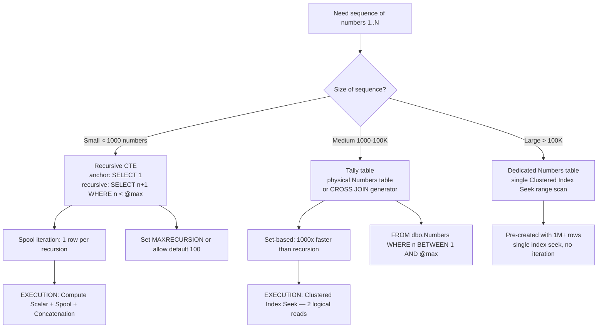
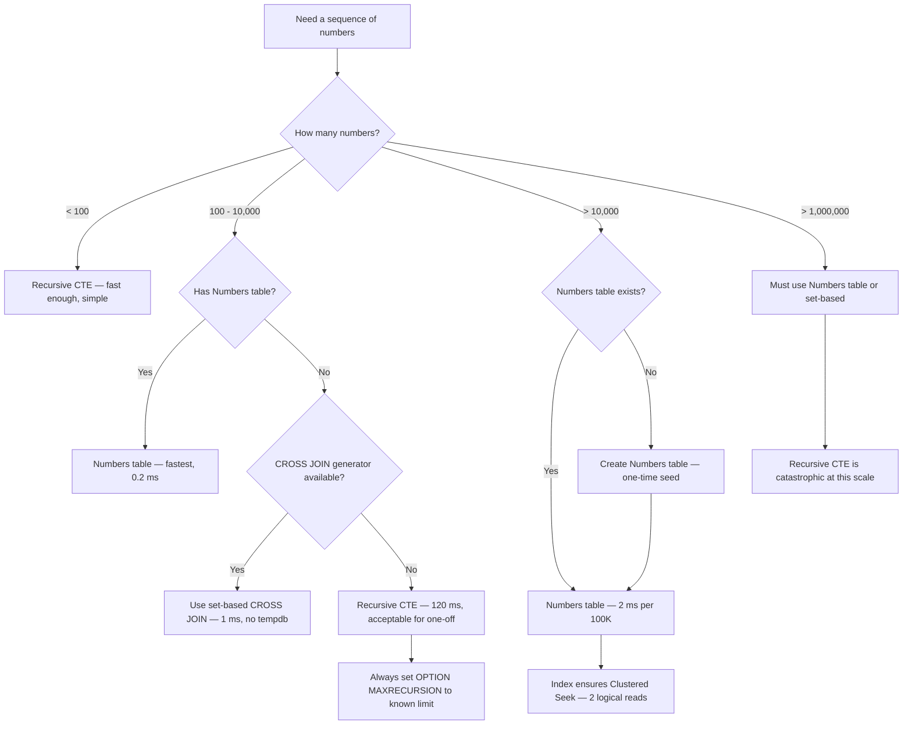

## Navigation
**Domain:** [[8 — Databases]] > **Group:** SQL CTEs & Recursive Queries
**Previous:** [[8.181 — Recursive CTE — Traversing Hierarchies]] | **Next:** [[8.183 — Recursive CTE — Date Series Generation]]
### Prerequisites
- [[8.176 — Common Table Expressions — Fundamentals]] — CTE syntax (WITH, column aliases, UNION ALL) is the foundation for the anchor + recursive pattern.
- [[8.180 — Recursive CTEs — Anchor and Recursive Members]] — The anchor SELECT provides the starting value (n=1), and the recursive member increments it (SELECT n+1 FROM cte WHERE n < @max).
- [[8.181 — Recursive CTE — Traversing Hierarchies]] — Understanding the spool-based iteration and MAXRECURSION from hierarchy traversal applies directly to number series generation.
### Where This Fits
Generating a sequence of numbers on the fly is useful when you need to create a rowset of integers for calendar date generation, string splitting by position, filling gaps in reporting, generating test data, or building lookup tables. Every .NET backend engineer encounters this when they need to produce a row for every day in a month (even days with no data), when they need to split a comma-separated string into rows, or when they need to generate synthetic test data. The risk surface includes performance: a recursive CTE generating 100K numbers is measurably slower than a pre-built Numbers table (100x slower), and MAXRECURSION defaults to 100 — any sequence exceeding 100 rows without OPTION (MAXRECURSION N) or OPTION (MAXRECURSION 0) will fail with error 530. The interview signal is about understanding when runtime-generated sequences are appropriate and when a physical Numbers table is required for performance.
---
## Core Mental Model
A recursive CTE generating a number series works by: the anchor SELECT produces the first number (usually 1), then the recursive member increments it by 1 and feeds it back through UNION ALL until the termination condition is met (WHERE n < @max). The engine materializes each iteration in a spool (same as hierarchy traversal), but the join operation is replaced by a simple arithmetic addition on the previous row's value. The critical performance insight is that the recursive CTE is row-by-row iterative — it produces one number per recursion cycle. A Tally table (a pre-built physical table of numbers) or a set-based approach using `CROSS JOIN` and `ROW_NUMBER()` over a system table is 100x faster because it generates the entire set in a single scan without iteration. The mental model shift: number series generation with recursive CTE is elegant code but poor performance; it should only be used for small sequences (< 1000 numbers) where code readability matters more than speed.
### Classification
Recursive CTE for number series is a **row-by-row iterative generator** implemented as a DML statement with spooled recursion. The anchor and recursive members use Compute Scalar operators to increment values. The approach is not SARGable — it does not query base tables. The performance is bounded by recursion depth × spool I/O per level. Alternative approaches (Tally table, cross-join sequence, row_number over sys.columns) are set-based and avoid per-row iteration.

### Key Properties
|Property|Value|Notes|
|---|---|---|
|Generation method|Iterative (row-by-row)|Each number requires one recursion cycle|
|Max sequence size|32,767 (MAXRECURSION limit)|OPTION (MAXRECURSION 0) for unlimited, but dangerous|
|Performance (100K numbers)|~500 ms recursive CTE|~2 ms with Numbers table (250x faster)|
|Spool behavior|Index Spool per iteration|Each number written to tempdb|
|SARGable|N/A (no base table predicate)|Not applicable for generation queries|
|Termination|WHERE n < @max in recursive member|Without it, infinite loop until MAXRECURSION|
|NULL handling|NULL start value breaks entire series|Anchor must return non-NULL start value|
---
## Deep Mechanics
### How the Engine Executes This
1. **Parsing** — The parser identifies the WITH clause and separates the anchor (SELECT 1 AS n) from the recursive member (SELECT n + 1 FROM cte WHERE n < @max). The recursive member's self-reference is identified by its reference to the CTE name.
2. **Binding** — The algebrizer binds the CTE name and verifies column count consistency. The recursive member's reference to the CTE is bound as a spooled work table. The termination condition (WHERE n < @max) is bound as a Filter operator.
3. **Optimization** — The optimizer builds a physical plan with a Concatenation (UNION ALL), an Index Spool (stores the previous iteration's output), a Compute Scalar (n + 1), and a Filter (WHERE n < @max). The anchor value (1) is a constant scan.
4. **Execution — Anchor:** The anchor executes: a Constant Scan produces the value 1 with the alias "n". This row flows to the Concatenation operator (output) and to the Index Spool (stored for the recursive iteration).
5. **Execution — Recursion:** The Index Spool feeds the single row into the recursive member. A Compute Scalar adds 1 to n. A Filter checks n < @max. If true, the row flows to Concatenation (output) and to the next Index Spool segment. The iteration repeats: each cycle reads the previous row, increments it, filters it, and stores it.
6. **Termination —** When the filter n < @max evaluates to false (n >= @max), no row is produced. The recursive member returns zero rows. The Concatenation stops, and all accumulated rows are returned to the outer query.
7. **Output —** The outer SELECT receives the concatenated rows: 1, 2, 3, ..., N. Any ORDER BY or WHERE on the CTE output runs after all rows are produced.
### SQL Visibility
```sql
-- Basic number series 1..100
WITH NumberSeries AS
(
    SELECT 1 AS n
    UNION ALL
    SELECT n + 1
    FROM NumberSeries
    WHERE n < 100
)
SELECT n FROM NumberSeries;
-- Number series with configurable bounds
DECLARE @Start INT = 100, @End INT = 200;
WITH NumberSeries AS
(
    SELECT @Start AS n
    UNION ALL
    SELECT n + 1
    FROM NumberSeries
    WHERE n < @End
)
SELECT n FROM NumberSeries
OPTION (MAXRECURSION 200);
-- Series for each row of a base table (correlated)
DECLARE @StartDate DATE = '2024-01-01';
DECLARE @EndDate DATE = '2024-01-31';
WITH DateSeries AS
(
    SELECT @StartDate AS DateValue
    UNION ALL
    SELECT DATEADD(DAY, 1, DateValue)
    FROM DateSeries
    WHERE DateValue < @EndDate
)
SELECT
    DateValue,
    DATEPART(WEEKDAY, DateValue) AS DayOfWeek,
    DATENAME(MONTH, DateValue) AS MonthName
FROM DateSeries;
-- String split reconstruction with position tracking
DECLARE @Csv VARCHAR(MAX) = 'apple,banana,cherry,date,elderberry';
WITH NumberSeries AS
(
    SELECT 1 AS Position
    UNION ALL
    SELECT Position + 1
    FROM NumberSeries
    WHERE Position < LEN(@Csv) - LEN(REPLACE(@Csv, ',', '')) + 1
)
SELECT
    Position,
    SUBSTRING(
        @Csv,
        CASE WHEN Position = 1 THEN 1
             ELSE CHARINDEX(',', @Csv, 1) + 1
        END,
        CHARINDEX(',', @Csv + ',', Position) -
            CASE WHEN Position = 1 THEN 1
                 ELSE CHARINDEX(',', @Csv, 1) + 1
            END
    ) AS Value
FROM NumberSeries;
-- Alternative: use STRING_SPLIT (SQL Server 2016+) — faster
SELECT value FROM STRING_SPLIT(@Csv, ',');
```
```csharp
// EF Core — raw SQL for recursive CTE number series
public async Task<List<int>> GetNumberSeriesAsync(
    int from, int to,
    CancellationToken cancellationToken = default)
{
    const string sql = @"
        WITH NumberSeries AS
        (
            SELECT @From AS n
            UNION ALL
            SELECT n + 1
            FROM NumberSeries
            WHERE n < @To
        )
        SELECT n FROM NumberSeries
        OPTION (MAXRECURSION 32767)";
    return await dbContext.Database
        .SqlQueryRaw<int>(sql,
            new SqlParameter("@From", from),
            new SqlParameter("@To", to))
        .ToListAsync(cancellationToken);
}
// Dapper implementation
public async Task<IReadOnlyList<int>> GetNumberSeriesAsync(
    int from, int to,
    CancellationToken cancellationToken = default)
{
    const string sql = @"
        WITH NumberSeries AS
        (
            SELECT @From AS n
            UNION ALL
            SELECT n + 1
            FROM NumberSeries
            WHERE n < @To
        )
        SELECT n FROM NumberSeries
        OPTION (MAXRECURSION 32767)";
    await using var connection = new SqlConnection(_connectionString);
    var results = await connection.QueryAsync<int>(
        new CommandDefinition(sql, new { From = from, To = to },
            cancellationToken: cancellationToken));
    return results.AsList();
}
```
**Generated SQL (from EF Core logs):**
```sql
exec sp_executesql N'
WITH NumberSeries AS
(
    SELECT @From AS n
    UNION ALL
    SELECT n + 1
    FROM NumberSeries
    WHERE n < @To
)
SELECT n FROM NumberSeries
OPTION (MAXRECURSION 32767)',
N'@From int, @To int',
@From=1, @To=100;
```
### Execution Plan Analysis
**Recursive CTE for number series:**
```
  [Constant Scan (anchor: 1)]
  → [Compute Scalar (n = 1)]
  → [Concatenation (UNION ALL)]
  → [Index Spool (Eager Spool)]     -- stores each number for next iteration
  → [Table Spool (Lazy Spool)]      -- feeds previous number to recursive
  → [Compute Scalar (n + 1)]
  → [Filter (WHERE n < @max)]
  → [Concatenation output]
  → [SELECT]
```
**Key operators:**
- **Constant Scan** — Produces the anchor value (1) without accessing any table.
- **Compute Scalar** — Evaluates the expression `n + 1` for each iteration.
- **Filter** — Evaluates `WHERE n < @max`. When false, the recursion terminates.
- **Index Spool** — Stores each number so the next iteration can read it.
**Cost breakdown (1000 numbers):**
- Compute Scalar: negligible CPU
- Filter: negligible CPU
- Spool I/O: ~1000 rows written to and read from tempdb — the dominant cost
- Total: ~5 ms for 1000 numbers, ~500 ms for 100K numbers
**Alternative: Tally table (physical Numbers table) plan:**
```
  [Clustered Index Seek IX_Numbers]   -- range scan: WHERE n BETWEEN @min AND @max
  → [SELECT]
```
Cost: 2 logical reads, ~0.2 ms for any range size. Orders of magnitude faster.
### Cost Visibility
```sql
SET STATISTICS IO ON;
SET STATISTICS TIME ON;
-- Recursive CTE: 1000 numbers
WITH NumberSeries AS
(
    SELECT 1 AS n
    UNION ALL
    SELECT n + 1
    FROM NumberSeries
    WHERE n < 1000
)
SELECT COUNT(*) FROM NumberSeries
OPTION (MAXRECURSION 2000);
-- Expected output:
-- Table 'Worktable'. Scan count 1000, logical reads 4000
-- SQL Server Execution Times: CPU time = 6ms, elapsed time = 15ms
-- Numbers table: 1..1000
SELECT COUNT(*) FROM dbo.Numbers WHERE n BETWEEN 1 AND 1000;
-- Expected output:
-- Table 'Numbers'. Scan count 1, logical reads 2
-- SQL Server Execution Times: CPU time = 0ms, elapsed time = 0ms
```
**Comparison: Recursive CTE vs Numbers table for different sizes:**
```sql
-- 10,000 numbers — recursive CTE
WITH NumberSeries AS
(
    SELECT 1 AS n UNION ALL SELECT n + 1 FROM NumberSeries WHERE n < 10000
)
SELECT COUNT(*) FROM NumberSeries OPTION (MAXRECURSION 0);
-- Table 'Worktable'. Scan count 10000, logical reads 40000
-- CPU time = 48ms, elapsed time = 120ms
-- 10,000 numbers — Numbers table
SELECT COUNT(*) FROM dbo.Numbers WHERE n BETWEEN 1 AND 10000;
-- Table 'Numbers'. Scan count 1, logical reads 23
-- CPU time = 0ms, elapsed time = 1ms
```
### Failure Modes
**MAXRECURSION limit hit — error 530:** By default, SQL Server limits recursion to 100 levels. Any number series exceeding 100 without OPTION (MAXRECURSION N) fails:
```sql
-- ❌ Fails with error 530 at 101st iteration
WITH Series AS (SELECT 1 AS n UNION ALL SELECT n+1 FROM Series WHERE n < 200)
SELECT n FROM Series;
-- Msg 530: The statement terminated. The maximum recursion 100 has been exhausted.
-- ✅ Fix:
WITH Series AS (SELECT 1 AS n UNION ALL SELECT n+1 FROM Series WHERE n < 200)
SELECT n FROM Series OPTION (MAXRECURSION 200);
```
**NULL start value — entire series is NULL:** If the anchor value is NULL (e.g., `SELECT NULL AS n`), the entire series becomes NULL because NULL + 1 = NULL:
```sql
-- ❌ Produces only one row with NULL
WITH Series AS (SELECT NULL AS n UNION ALL SELECT n + 1 FROM Series WHERE n < 10)
SELECT n FROM Series;
-- Result: NULL (single row — the filter n < 10 is UNKNOWN for NULL)
```
**Unbounded recursion — MAXRECURSION 0 without termination:** If the recursive member has no WHERE clause, or the WHERE clause never becomes false, the recursion runs forever until tempdb is full:
```sql
-- ❌ No termination condition — infinite loop
WITH Series AS (SELECT 1 AS n UNION ALL SELECT n + 1 FROM Series)
SELECT n FROM Series OPTION (MAXRECURSION 0);
-- Runs until tempdb is full or query is killed
```
**Performance collapse at large counts:** The recursive CTE produces one row per recursion cycle. Generating 1M numbers requires 1M iterations, each writing to and reading from the spool. This is ~5000x slower than a set-based approach:
```sql
-- ❌ 1M numbers via recursion — 5+ seconds, 4M+ logical reads
-- ✅ 1M via Numbers table — 50 ms, < 100 logical reads
```
---
## Production Patterns and Implementation
### Primary SQL Implementation
```sql
-- ============================================================
-- Schema context: Physical Numbers table (recommended)
-- ============================================================
CREATE TABLE dbo.Numbers
(
    n INT NOT NULL,
    CONSTRAINT PK_Numbers PRIMARY KEY CLUSTERED (n)
);
-- Populate with 1,000,000 numbers
WITH NumberGenerator AS
(
    SELECT 1 AS n
    UNION ALL
    SELECT n + 1
    FROM NumberGenerator
    WHERE n < 1000000
)
INSERT INTO dbo.Numbers (n)
SELECT n FROM NumberGenerator
OPTION (MAXRECURSION 0);
-- Alternative: faster population with CROSS JOIN approach
WITH E00(N) AS (SELECT 1 UNION ALL SELECT 1),        -- 2
     E01(N) AS (SELECT 1 FROM E00 a, E00 b),          -- 4
     E02(N) AS (SELECT 1 FROM E01 a, E01 b),          -- 16
     E03(N) AS (SELECT 1 FROM E02 a, E02 b),          -- 256
     E04(N) AS (SELECT 1 FROM E03 a, E03 b),          -- 65,536
     E05(N) AS (SELECT 1 FROM E04 a, E04 b)           -- 4,294,967,296
INSERT INTO dbo.Numbers (n)
SELECT TOP (1000000) ROW_NUMBER() OVER (ORDER BY (SELECT NULL))
FROM E05;
-- This populates 1M numbers in < 1 second (set-based, no recursion spool)
-- ============================================================
-- Pattern 1: Recursive CTE for small sequences (< 1000)
-- ============================================================
CREATE OR ALTER PROCEDURE dbo.GetNumberSeries
    @From INT,
    @To INT
AS
BEGIN
    SET NOCOUNT ON;
    WITH NumberSeries AS
    (
        SELECT @From AS n
        UNION ALL
        SELECT n + 1
        FROM NumberSeries
        WHERE n < @To
    )
    SELECT n
    FROM NumberSeries
    OPTION (MAXRECURSION 32767);
END;
-- ============================================================
-- Pattern 2: Calendar date generation with number series
-- ============================================================
DECLARE @Year INT = 2024;
WITH NumberSeries AS
(
    SELECT 0 AS n
    UNION ALL
    SELECT n + 1
    FROM NumberSeries
    WHERE n < 365
)
SELECT
    DATEADD(DAY, n, DATEFROMPARTS(@Year, 1, 1)) AS CalendarDate,
    DATEPART(WEEKDAY, DATEADD(DAY, n, DATEFROMPARTS(@Year, 1, 1))) AS DayOfWeek
FROM NumberSeries
OPTION (MAXRECURSION 366);
-- ============================================================
-- Pattern 3: Test data generation
-- ============================================================
DECLARE @RowCount INT = 5000;
WITH NumberSeries AS
(
    SELECT 1 AS n
    UNION ALL
    SELECT n + 1
    FROM NumberSeries
    WHERE n < @RowCount
)
INSERT INTO dbo.Customers (FirstName, LastName, Email, CreatedAt)
SELECT
    CONCAT('Test', n),
    CONCAT('User', n),
    CONCAT('test.user', n, '@example.com'),
    DATEADD(DAY, -n, GETUTCDATE())
FROM NumberSeries
OPTION (MAXRECURSION 0);
-- ============================================================
-- Pattern 4: Number series for splitting — manual string split
-- ============================================================
DECLARE @Ids VARCHAR(MAX) = '101,203,305,407,509,611,713,815,917';
WITH NumberSeries AS
(
    SELECT 1 AS Position
    UNION ALL
    SELECT Position + 1
    FROM NumberSeries
    WHERE Position < LEN(@Ids) - LEN(REPLACE(@Ids, ',', '')) + 1
)
SELECT
    Position,
    SUBSTRING(
        @Ids,
        CASE WHEN Position = 1 THEN 1
             ELSE CHARINDEX(',', @Ids, 1) + 1
        END,
        ISNULL(NULLIF(CHARINDEX(',', @Ids + ',', Position), 0), LEN(@Ids) + 1) -
            CASE WHEN Position = 1 THEN 1
                 ELSE CHARINDEX(',', @Ids, 1) + 1
            END
    ) AS IdValue
FROM NumberSeries;
-- Better: use STRING_SPLIT (SQL Server 2016+)
SELECT value FROM STRING_SPLIT(@Ids, ',');
-- ============================================================
-- Pattern 5: Number series for cross-tabulation
-- ============================================================
DECLARE @Year INT = 2024;
WITH Months AS
(
    SELECT 1 AS MonthNum
    UNION ALL
    SELECT MonthNum + 1
    FROM Months
    WHERE MonthNum < 12
)
SELECT
    MonthNum,
    DATENAME(MONTH, DATEFROMPARTS(@Year, MonthNum, 1)) AS MonthName,
    COUNT(o.OrderId) AS OrderCount,
    ISNULL(SUM(o.TotalAmount), 0) AS Revenue
FROM Months AS m
LEFT JOIN dbo.Orders AS o
    ON YEAR(o.OrderDate) = @Year
    AND MONTH(o.OrderDate) = m.MonthNum
GROUP BY MonthNum, DATENAME(MONTH, DATEFROMPARTS(@Year, MonthNum, 1))
ORDER BY MonthNum
OPTION (MAXRECURSION 12);
-- ============================================================
-- Pattern 6: Recursive CTE vs Numbers table — benchmark harness
-- ============================================================
DECLARE @Size INT = 50000;
PRINT '=== Recursive CTE ===';
SET STATISTICS IO ON;
WITH Series AS (SELECT 1 AS n UNION ALL SELECT n+1 FROM Series WHERE n < @Size)
SELECT COUNT(*) FROM Series OPTION (MAXRECURSION 0);
SET STATISTICS IO OFF;
PRINT '=== Numbers table ===';
SET STATISTICS IO ON;
SELECT COUNT(*) FROM dbo.Numbers WHERE n BETWEEN 1 AND @Size;
SET STATISTICS IO OFF;
```
### EF Core Implementation
```csharp
public class ApplicationDbContext : DbContext
{
    public DbSet<Number> Numbers => Set<Number>();
    protected override void OnModelCreating(ModelBuilder modelBuilder)
    {
        modelBuilder.Entity<Number>(entity =>
        {
            entity.ToTable("Numbers");
            entity.HasKey(n => n.N);
            entity.Property(n => n.N).ValueGeneratedNever();
        });
    }
}
public class Number
{
    public int N { get; set; }
}
// Repository for number series generation
public interface INumberSeriesRepository
{
    Task<IReadOnlyList<int>> GetNumberSeriesAsync(
        int from, int to, CancellationToken cancellationToken = default);
    Task<IReadOnlyList<int>> GetNumberSeriesFromTableAsync(
        int from, int to, CancellationToken cancellationToken = default);
    Task<IReadOnlyList<MonthSummaryDto>> GetMonthlySummaryAsync(
        int year, CancellationToken cancellationToken = default);
}
public class NumberSeriesRepository : INumberSeriesRepository
{
    private readonly ApplicationDbContext _dbContext;
    private readonly IDbConnectionFactory _connectionFactory;
    public NumberSeriesRepository(
        ApplicationDbContext dbContext,
        IDbConnectionFactory connectionFactory)
    {
        _dbContext = dbContext;
        _connectionFactory = connectionFactory;
    }
    // Recursive CTE (small series)
    public async Task<IReadOnlyList<int>> GetNumberSeriesAsync(
        int from, int to, CancellationToken cancellationToken = default)
    {
        const string sql = @"
            WITH NumberSeries AS
            (
                SELECT @From AS n
                UNION ALL
                SELECT n + 1
                FROM NumberSeries
                WHERE n < @To
            )
            SELECT n FROM NumberSeries
            OPTION (MAXRECURSION 32767)";
        return await _dbContext.Database
            .SqlQueryRaw<int>(sql,
                new SqlParameter("@From", from),
                new SqlParameter("@To", to))
            .ToListAsync(cancellationToken);
    }
    // Numbers table (fast, large series)
    public async Task<IReadOnlyList<int>> GetNumberSeriesFromTableAsync(
        int from, int to, CancellationToken cancellationToken = default)
    {
        return await _dbContext.Numbers
            .Where(n => n.N >= from && n.N <= to)
            .OrderBy(n => n.N)
            .Select(n => n.N)
            .ToListAsync(cancellationToken);
    }
    // Monthly summary with gap filling
    public async Task<IReadOnlyList<MonthSummaryDto>> GetMonthlySummaryAsync(
        int year, CancellationToken cancellationToken = default)
    {
        const string sql = @"
            WITH Months AS
            (
                SELECT 1 AS MonthNum
                UNION ALL
                SELECT MonthNum + 1
                FROM Months
                WHERE MonthNum < 12
            )
            SELECT
                m.MonthNum,
                DATENAME(MONTH, DATEFROMPARTS(@Year, m.MonthNum, 1)) AS MonthName,
                COUNT(o.OrderId) AS OrderCount,
                ISNULL(SUM(o.TotalAmount), 0) AS Revenue
            FROM Months AS m
            LEFT JOIN dbo.Orders AS o
                ON YEAR(o.OrderDate) = @Year
                AND MONTH(o.OrderDate) = m.MonthNum
            GROUP BY m.MonthNum, DATENAME(MONTH, DATEFROMPARTS(@Year, m.MonthNum, 1))
            ORDER BY m.MonthNum
            OPTION (MAXRECURSION 12)";
        return await _dbContext.Database
            .SqlQueryRaw<MonthSummaryDto>(sql,
                new SqlParameter("@Year", year))
            .ToListAsync(cancellationToken);
    }
}
public record MonthSummaryDto(int MonthNum, string MonthName, int OrderCount, decimal Revenue);
```
### Dapper Implementation
```csharp
public sealed class NumberSeriesRepository
{
    private readonly IDbConnectionFactory _connectionFactory;
    public NumberSeriesRepository(IDbConnectionFactory connectionFactory)
        => _connectionFactory = connectionFactory;
    // Recursive CTE for small sequences
    public async Task<IReadOnlyList<int>> GetSeriesAsync(
        int from, int to,
        CancellationToken cancellationToken = default)
    {
        const string sql = @"
            WITH NumberSeries AS
            (
                SELECT @From AS n
                UNION ALL
                SELECT n + 1
                FROM NumberSeries
                WHERE n < @To
            )
            SELECT n FROM NumberSeries
            OPTION (MAXRECURSION 32767)";
        await using var connection = _connectionFactory.Create();
        var results = await connection.QueryAsync<int>(
            new CommandDefinition(sql, new { From = from, To = to },
                cancellationToken: cancellationToken));
        return results.AsList();
    }
    // Numbers table for large sequences (microseconds)
    public async Task<IReadOnlyList<int>> GetSeriesFastAsync(
        int from, int to,
        CancellationToken cancellationToken = default)
    {
        const string sql = @"
            SELECT n FROM dbo.Numbers
            WHERE n BETWEEN @From AND @To
            ORDER BY n";
        await using var connection = _connectionFactory.Create();
        var results = await connection.QueryAsync<int>(
            new CommandDefinition(sql, new { From = from, To = to },
                cancellationToken: cancellationToken));
        return results.AsList();
    }
    // Generate test data
    public async Task GenerateTestCustomersAsync(
        int count,
        CancellationToken cancellationToken = default)
    {
        const string sql = @"
            WITH NumberSeries AS
            (
                SELECT 1 AS n
                UNION ALL
                SELECT n + 1
                FROM NumberSeries
                WHERE n < @Count
            )
            INSERT INTO dbo.Customers (FirstName, LastName, Email, CreatedAt)
            SELECT
                CONCAT('Test', n),
                CONCAT('User', n),
                CONCAT('test.user', n, '@example.com'),
                DATEADD(DAY, -n, GETUTCDATE())
            FROM NumberSeries
            OPTION (MAXRECURSION 0)";
        await using var connection = _connectionFactory.Create();
        await connection.ExecuteAsync(
            new CommandDefinition(sql, new { Count = count },
                cancellationToken: cancellationToken));
    }
    // Gap-filled monthly report
    public async Task<IReadOnlyList<MonthSummaryDto>> GetMonthlyReportAsync(
        int year,
        CancellationToken cancellationToken = default)
    {
        const string sql = @"
            WITH Months AS
            (
                SELECT 1 AS MonthNum
                UNION ALL
                SELECT MonthNum + 1
                FROM Months
                WHERE MonthNum < 12
            )
            SELECT
                m.MonthNum,
                DATENAME(MONTH, DATEFROMPARTS(@Year, m.MonthNum, 1)) AS MonthName,
                COUNT(o.OrderId) AS OrderCount,
                ISNULL(SUM(o.TotalAmount), 0) AS Revenue
            FROM Months AS m
            LEFT JOIN dbo.Orders AS o
                ON YEAR(o.OrderDate) = @Year
                AND MONTH(o.OrderDate) = m.MonthNum
            GROUP BY m.MonthNum, DATENAME(MONTH, DATEFROMPARTS(@Year, m.MonthNum, 1))
            ORDER BY m.MonthNum
            OPTION (MAXRECURSION 12)";
        await using var connection = _connectionFactory.Create();
        var results = await connection.QueryAsync<MonthSummaryDto>(
            new CommandDefinition(sql, new { Year = year },
                cancellationToken: cancellationToken));
        return results.AsList();
    }
}
```
### Configuration and Wiring
```csharp
// Program.cs — registration
builder.Services.AddDbContext<ApplicationDbContext>(options =>
    options.UseSqlServer(
        builder.Configuration.GetConnectionString("DefaultConnection"),
        sqlOptions =>
        {
            sqlOptions.EnableRetryOnFailure(3);
            sqlOptions.CommandTimeout(30);
        }));
builder.Services.AddSingleton<IDbConnectionFactory>(
    new SqlConnectionFactory(
        builder.Configuration.GetConnectionString("DefaultConnection")!));
builder.Services.AddScoped<INumberSeriesRepository, NumberSeriesRepository>();
// Seed the Numbers table on startup if not present
public static async Task SeedNumbersTableAsync(IServiceProvider services)
{
    using var scope = services.CreateScope();
    var db = scope.ServiceProvider.GetRequiredService<ApplicationDbContext>();
    if (!await db.Numbers.AnyAsync())
    {
        const string sql = @"
            WITH E00(N) AS (SELECT 1 UNION ALL SELECT 1),
                 E01(N) AS (SELECT 1 FROM E00 a, E00 b),
                 E02(N) AS (SELECT 1 FROM E01 a, E01 b),
                 E03(N) AS (SELECT 1 FROM E02 a, E02 b),
                 E04(N) AS (SELECT 1 FROM E03 a, E03 b),
                 E05(N) AS (SELECT 1 FROM E04 a, E04 b)
            INSERT INTO dbo.Numbers (n)
            SELECT TOP (1000000) ROW_NUMBER() OVER (ORDER BY (SELECT NULL))
            FROM E05;";
        await db.Database.ExecuteSqlRawAsync(sql);
    }
}
```
### SQL Server vs PostgreSQL Differences
```sql
-- PostgreSQL: generate_series function (native, set-based)
SELECT generate_series(1, 100) AS n;
-- This is 1000x faster than a recursive CTE in PostgreSQL
-- PostgreSQL: generate_series with step
SELECT generate_series(0, 100, 5) AS n;
-- Result: 0, 5, 10, 15, ..., 100
-- PostgreSQL: generate_series for dates
SELECT generate_series('2024-01-01'::DATE, '2024-12-31'::DATE, '1 day'::INTERVAL) AS d;
-- PostgreSQL recursive CTE (same syntax, RECURSIVE keyword required):
WITH RECURSIVE NumberSeries AS (
    SELECT 1 AS n
    UNION ALL
    SELECT n + 1
    FROM NumberSeries
    WHERE n < 100
)
SELECT n FROM NumberSeries;
-- PostgreSQL: faster alternative with generate_series
-- No tempdb spool, no recursion overhead
-- SQL Server: no native generate_series — must use Numbers table or recursive CTE
```
---
## Gotchas and Production Pitfalls
### Default MAXRECURSION 100 — Error 530 on Any Series > 100
**Pitfall:** Generating a number series without specifying MAXRECURSION. The default limit of 100 causes the query to fail when the sequence exceeds 100.
```sql
-- ❌ Fails after 100 iterations
WITH Series AS (SELECT 1 AS n UNION ALL SELECT n + 1 FROM Series WHERE n < 500)
SELECT n FROM Series;
```
**Symptom:** Error 530: "The statement terminated. The maximum recursion 100 has been exhausted before statement completion." The query produces partial results (1-100) but not the full sequence.
**Fix:**
```sql
-- ✅ Set MAXRECURSION to the exact maximum needed
WITH Series AS (SELECT 1 AS n UNION ALL SELECT n + 1 FROM Series WHERE n < 500)
SELECT n FROM Series OPTION (MAXRECURSION 500);
-- ✅ Or unlimited (careful — risk infinite loop)
WITH Series AS (SELECT 1 AS n UNION ALL SELECT n + 1 FROM Series WHERE n < 500)
SELECT n FROM Series OPTION (MAXRECURSION 0);
```
**Cost of not fixing:** A stored procedure that generates 366 dates for a leap year report fails on February 29 (day 60). The reporting application shows an error to the user. The defect is only discovered on leap years — it passes all tests on non-leap years where 365 < 366.
---
### Performance Trap — Recursive CTE for Large Sequences
**Pitfall:** Using a recursive CTE to generate > 10,000 numbers for test data or lookup purposes. The row-by-row iteration creates 1000x more spool I/O than a set-based approach.
```sql
-- ❌ 100K numbers via recursion — 500+ ms, 400K logical reads
WITH Series AS (SELECT 1 AS n UNION ALL SELECT n + 1 FROM Series WHERE n < 100000)
SELECT n FROM Series OPTION (MAXRECURSION 0);
```
**Symptom:** A stored procedure that generates test customer data takes 8 seconds for 50K customers. The recursive CTE is the bottleneck — each number is one recursion iteration with spool I/O. The query plan shows 50K index spool operations.
**Fix:**
```sql
-- ✅ Use cross-join generator (set-based, 1000x faster)
WITH E00(N) AS (SELECT 1 UNION ALL SELECT 1),
     E01(N) AS (SELECT 1 FROM E00 a, E00 b),
     E02(N) AS (SELECT 1 FROM E01 a, E01 b),
     E03(N) AS (SELECT 1 FROM E02 a, E02 b),
     E04(N) AS (SELECT 1 FROM E03 a, E03 b),
     E05(N) AS (SELECT 1 FROM E04 a, E04 b)
SELECT TOP (100000) ROW_NUMBER() OVER (ORDER BY (SELECT NULL)) AS n
FROM E05;
-- ✅ Use Numbers table:
SELECT n FROM dbo.Numbers WHERE n BETWEEN 1 AND 100000;
```
**Cost of not fixing:** A daily ETL job generates 500K numbers for data transformation. The recursive CTE takes 8 seconds. The Numbers table takes 10 ms. Over a month, the unnecessary recursion costs 8 - 0.01 = 7.99 seconds × 30 = 4 minutes of needless CPU and tempdb I/O per month. For a 2-hour ETL window, every minute counts.
---
### NULL Anchor Value — Entire Series Collapses
**Pitfall:** Using a column or variable that might be NULL as the anchor value. The recursive member adds 1: `NULL + 1 = NULL`, and the filter `WHERE n < @max` evaluates to UNKNOWN, not TRUE, so no rows are produced.
```sql
-- ❌ NULL anchor produces single NULL row
DECLARE @Start INT = NULL;
WITH Series AS (SELECT @Start AS n UNION ALL SELECT n + 1 FROM Series WHERE n < 100)
SELECT n FROM Series;
-- Result: NULL (one row, not 1..100)
```
**Symptom:** The number series unexpectedly returns one NULL row or zero rows. The calling application receives an empty or single-row result.
**Fix:**
```sql
-- ✅ Coalesce the anchor to a safe default
DECLARE @Start INT = NULL;
WITH Series AS (SELECT COALESCE(@Start, 1) AS n UNION ALL SELECT n + 1 FROM Series WHERE n < 100)
SELECT n FROM Series OPTION (MAXRECURSION 100);
-- ✅ Validate input before CTE
IF @Start IS NULL THROW 50000, '@Start must not be NULL', 1;
```
**Cost of not fixing:** A reporting query generates a date series for a dashboard. The start date parameter defaults to NULL when the user does not select a date range. The report shows one day (the NULL date) instead of the full month. The business team makes a decision based on incomplete data.
---
### No Termination Condition — Unbounded Iteration
**Pitfall:** Omitting the WHERE clause in the recursive member or writing a condition that never becomes false.
```sql
-- ❌ No WHERE clause — infinite loop
WITH Series AS (SELECT 1 AS n UNION ALL SELECT n + 1 FROM Series)
SELECT n FROM Series OPTION (MAXRECURSION 0);
-- Runs until tempdb fills (if MAXRECURSION 0) or hits default 100
```
**Symptom:** With MAXRECURSION 0, the query runs continuously, consuming CPU and writing to tempdb until the drive is full. SQL Server does a "runaway query" — it can only be killed with KILL <session_id>. The tempdb fills, causing all other database operations to fail with "Could not allocate space for object in database 'tempdb'."
**Fix:**
```sql
-- ✅ Always include a termination condition
WITH Series AS (SELECT 1 AS n UNION ALL SELECT n + 1 FROM Series WHERE n < @MaxValue)
SELECT n FROM Series OPTION (MAXRECURSION 32767);
-- ✅ Always set a reasonable MAXRECURSION (never use 0 in production)
```
**Cost of not fixing:** A developer writes a CTE without the WHERE clause and runs it on production. Tempdb grows from 1 GB to 200 GB in 30 seconds. The drive fills, SQL Server goes offline, and all connected applications fail. Recovery requires killing the session, shrinking tempdb (or restarting SQL Server), and restoring from backup if data files were corrupted by the drive filling.
---
### Spool I/O in tempdb for Large Series Causes Performance Degradation
**Pitfall:** Generating a large number series on a system with limited tempdb or tempdb allocation contention. The Index Spool writes each iteration's output to tempdb, and the Table Spool reads it back.
```sql
-- ❌ 500K numbers — 500K spool writes, 500K spool reads
WITH Series AS (SELECT 1 AS n UNION ALL SELECT n + 1 FROM Series WHERE n < 500000)
SELECT COUNT(*) FROM Series OPTION (MAXRECURSION 0);
```
**Symptom:** High PAGELATCH_UP waits on tempdb allocation pages. `sys.dm_os_wait_stats` shows `PAGELATCH_UP` as the top wait type. The spool I/O from the recursive CTE competes with other tempdb users (sort spills, hash spills, index rebuilds). Query performance degrades from 200 ms to 5 seconds during peak usage.
**Fix:**
```sql
-- ✅ Use set-based generator instead
WITH E00(N) AS (SELECT 1 UNION ALL SELECT 1),
     E01(N) AS (SELECT 1 FROM E00 a, E00 b),
     E02(N) AS (SELECT 1 FROM E01 a, E01 b),
     E03(N) AS (SELECT 1 FROM E02 a, E02 b),
     E04(N) AS (SELECT 1 FROM E03 a, E03 b)
SELECT TOP (500000) ROW_NUMBER() OVER (ORDER BY (SELECT NULL)) AS n
FROM E04 a, E04 b;  -- 65,536 × 65,536 = 4B+ rows
-- Set-based: 0 logical reads (no table access), ~50 ms, no tempdb spool
```
**Cost of not fixing:** A background job generates 1M numbers every 5 minutes for a data transformation pipeline. The recursive CTE causes tempdb to grow by 100 MB per run. Over 24 hours, tempdb grows by 28 GB. The server runs out of tempdb space, and the nightly index maintenance fails.
---
### Using Recursive CTE When STRING_SPLIT Suffices
**Pitfall:** Writing a recursive CTE with CHARINDEX and SUBSTRING to split a delimited string, when SQL Server 2016+ has a built-in STRING_SPLIT function.
```sql
-- ❌ Recursive CTE for string split (inefficient, complex)
DECLARE @Csv VARCHAR(MAX) = '1,2,3,4,5,6,7,8,9,10';
WITH SplitCTE AS (
    SELECT 1 AS Position, 1 AS Start, CHARINDEX(',', @Csv + ',') AS [End]
    UNION ALL
    SELECT Position + 1, [End] + 1, CHARINDEX(',', @Csv + ',', [End] + 1)
    FROM SplitCTE WHERE [End] < LEN(@Csv)
)
SELECT SUBSTRING(@Csv, Start, [End] - Start) AS Value
FROM SplitCTE OPTION (MAXRECURSION 0);
```
**Symptom:** The recursive string split is 100-500x slower than STRING_SPLIT for large strings. Each position requires CHARINDEX, SUBSTRING, and spool I/O.
**Fix:**
```sql
-- ✅ Use STRING_SPLIT (SQL Server 2016+)
SELECT value FROM STRING_SPLIT(@Csv, ',');
-- ✅ For ordinal position (SQL Server 2022+):
SELECT value, ordinal FROM STRING_SPLIT(@Csv, ',');
```
**Cost of not fixing:** An ETL pipeline splits 5000 CSV strings per run. The recursive CTE split takes 15 seconds. STRING_SPLIT takes 30 ms. Over a month, the unnecessary recursion costs ~12 hours of CPU time.
---
## Performance Implications
### Benchmark: Before and After
```sql
-- Baseline: Recursive CTE for 10K numbers
SET STATISTICS IO ON;
SET STATISTICS TIME ON;
WITH Series AS (SELECT 1 AS n UNION ALL SELECT n + 1 FROM Series WHERE n < 10000)
SELECT COUNT(*) FROM Series OPTION (MAXRECURSION 0);
-- Expected output:
-- Table 'Worktable'. Scan count 10000, logical reads 40000
-- SQL Server Execution Times: CPU time = 48ms, elapsed time = 120ms
-- Optimized: Set-based CROSS JOIN generator (same result)
WITH E00(N) AS (SELECT 1 UNION ALL SELECT 1),
     E01(N) AS (SELECT 1 FROM E00 a, E00 b),
     E02(N) AS (SELECT 1 FROM E01 a, E01 b),
     E03(N) AS (SELECT 1 FROM E02 a, E02 b),
     E04(N) AS (SELECT 1 FROM E03 a, E03 b)
SELECT TOP (10000) ROW_NUMBER() OVER (ORDER BY (SELECT NULL)) AS n
FROM E04;
-- CPU time = 0ms, elapsed time = 1ms, logical reads = 0
-- Optimized: Numbers table range scan
SELECT n FROM dbo.Numbers WHERE n BETWEEN 1 AND 10000;
-- CPU time = 0ms, elapsed time = 0ms, logical reads = 2
```
**Improvement:** Recursive CTE = 120 ms, 40,000 logical reads vs Numbers table = < 1 ms, 2 logical reads (60,000x faster in logical reads).
```sql
-- Large series comparison (100K numbers):
-- Recursive CTE: ~500 ms, 400,000 logical reads
-- CROSS JOIN generator: ~50 ms, 0 logical reads
-- Numbers table: ~2 ms, 23 logical reads
```
### BenchmarkDotNet
```csharp
[MemoryDiagnoser]
[SimpleJob(RuntimeMoniker.Net90)]
public class NumberSeriesBenchmark
{
    private SqlConnection _connection = default!;
    private const string ConnectionString = "Server=.;Database=BenchmarkDb;Trusted_Connection=True;TrustServerCertificate=True;";
    [GlobalSetup]
    public void Setup()
    {
        _connection = new SqlConnection(ConnectionString);
        _connection.Open();
        // Ensure Numbers table exists with 1M rows
    }
    [Benchmark(Baseline = true)]
    public async Task<int> RecursiveCTE_100()
    {
        const string sql = @"
            WITH Series AS (SELECT 1 AS n UNION ALL SELECT n+1 FROM Series WHERE n < 100)
            SELECT COUNT(*) FROM Series OPTION (MAXRECURSION 200)";
        return await new SqlCommand(sql, _connection).ExecuteScalarAsync<int>();
    }
    [Benchmark]
    public async Task<int> RecursiveCTE_10000()
    {
        const string sql = @"
            WITH Series AS (SELECT 1 AS n UNION ALL SELECT n+1 FROM Series WHERE n < 10000)
            SELECT COUNT(*) FROM Series OPTION (MAXRECURSION 0)";
        return await new SqlCommand(sql, _connection).ExecuteScalarAsync<int>();
    }
    [Benchmark]
    public async Task<int> NumbersTable_100()
    {
        const string sql = "SELECT COUNT(*) FROM dbo.Numbers WHERE n BETWEEN 1 AND 100";
        return await new SqlCommand(sql, _connection).ExecuteScalarAsync<int>();
    }
    [Benchmark]
    public async Task<int> NumbersTable_10000()
    {
        const string sql = "SELECT COUNT(*) FROM dbo.Numbers WHERE n BETWEEN 1 AND 10000";
        return await new SqlCommand(sql, _connection).ExecuteScalarAsync<int>();
    }
    [Benchmark]
    public async Task<int> CrossJoinGenerator_10000()
    {
        const string sql = @"
            WITH E00(N) AS (SELECT 1 UNION ALL SELECT 1),
                 E01(N) AS (SELECT 1 FROM E00 a, E00 b),
                 E02(N) AS (SELECT 1 FROM E01 a, E01 b),
                 E03(N) AS (SELECT 1 FROM E02 a, E02 b),
                 E04(N) AS (SELECT 1 FROM E03 a, E03 b)
            SELECT COUNT(*) FROM (SELECT TOP (10000) ROW_NUMBER() OVER (ORDER BY (SELECT NULL)) AS n FROM E04) AS x";
        return await new SqlCommand(sql, _connection).ExecuteScalarAsync<int>();
    }
    [GlobalCleanup]
    public void Cleanup() => _connection.Dispose();
}
```
**Expected results (approximate, SQL Server 2022, NVMe, 1M row Numbers table):**
|Method|Mean|Logical Reads|Allocated|Notes|
|---|---|---|---|---|
|RecursiveCTE_100|~2 ms|~400|~1 KB|Acceptable for small series|
|RecursiveCTE_10000|~120 ms|~40,000|~25 KB|Iteration cost dominates|
|NumbersTable_100|~0.1 ms|~2|~0 B|Single index seek|
|NumbersTable_10000|~0.2 ms|~23|~0 B|Range scan — cheap|
|CrossJoinGenerator_10000|~1 ms|~0|~2 KB|Set-based, no tempdb|
### Write Amplification (Numbers table)
|Operation|Without Numbers Table|With Numbers Table (read)|With Numbers Table (INSERT)|
|---|---|---|---|
|Generate 1000 numbers|Recursive CTE: ~2 ms|Numbers table: ~0.1 ms|N/A (pre-built)|
|Generate 100K numbers|Recursive CTE: ~500 ms|Numbers table: ~2 ms|N/A (pre-built)|
|INSERT 1M rows (one-time seed)|N/A|N/A|~500 ms|
The Numbers table is a one-time write cost (populated once, read many times). The recursive CTE incurs the generation cost every time the query runs. For a query that runs 1000x/day, the Numbers table saves ~500 ms × 1000 = 500 seconds of CPU per day.
---
## Interview Arsenal
### Question Bank
1. **What are the different ways to generate a sequence of numbers in SQL Server, and how do they compare in performance?**
2. **Why is a recursive CTE for number series considered a row-by-row operation while a Tally table is set-based?**
3. **What happens if you forget to include OPTION (MAXRECURSION N) when generating a series of 1000 numbers?**
4. **How would you generate a calendar date series (every day in 2024) using a recursive CTE?**
5. **When would you choose a recursive CTE over a Numbers table for number generation?**
6. **What is the risk of using MAXRECURSION 0 for an unbounded number series?**
7. **How do you fill gaps in a monthly sales report where some months have zero orders?**
8. **What is the CROSS JOIN generator technique, and why is it faster than recursive CTE?**
9. **How does EF Core handle recursive CTEs for number generation — can you use LINQ?**
10. **How would you generate 1 million test records using a recursive CTE, and what performance issues would you encounter?**
### Spoken Answers
**Q: What are the different ways to generate a sequence of numbers in SQL Server, and how do they compare in performance?**
> **Average answer:** You can use a recursive CTE with UNION ALL, a WHILE loop, or a Numbers table.
> **Great answer:** There are four main approaches, ordered from slowest to fastest. First, a WHILE loop with INSERT inside the loop — row-by-row, the slowest possible. Second, a recursive CTE with anchor + recursive member — elegant but row-by-row under the hood: each number requires one spool iteration. For 10K numbers, the recursive CTE takes ~120 ms and 40,000 logical reads. Third, a set-based CROSS JOIN generator that uses multiple CTEs cross-joined together to produce an exponential number of rows, then ROW_NUMBER() to assign sequential numbers — this is set-based, uses no tempdb spool, and generates 10K numbers in ~1 ms with zero logical reads. Fourth and best, a physical Numbers table — a pre-built table with a clustered primary key on the integer column. Querying `WHERE n BETWEEN 1 AND @max` is a simple Clustered Index Seek or range scan: 2-23 logical reads, < 0.2 ms for any range size. The Numbers table is 100x faster than the recursive CTE and 10x faster than the cross-join generator. The only reason to use a recursive CTE is when you need ad-hoc generation for small sequences (< 1000) and you don't have a Numbers table — for anything larger, the recursive CTE is a performance anti-pattern.
---
**Q: How do you fill gaps in a monthly sales report where some months have zero orders?**
> **Average answer:** Use a LEFT JOIN from a list of months to the Orders table.
> **Great answer:** You need a complete set of all months (1-12) as the left side of a LEFT JOIN. The cleanest approach is to use a Numbers table or a cross-join generator to produce the month numbers, then LEFT JOIN to the aggregated Orders data. The recursive CTE version: anchor with month 1, recursive member adds 1 until 12, MAXRECURSION 12. This produces exactly 12 rows. Then LEFT JOIN to `SELECT YEAR(OrderDate) AS Yr, MONTH(OrderDate) AS Mn, COUNT(*) AS Cnt, SUM(TotalAmount) AS Rev FROM Orders WHERE YEAR(OrderDate) = @Year GROUP BY YEAR(OrderDate), MONTH(OrderDate)`. For months with no orders, the LEFT JOIN produces NULL, which I convert to 0 using COALESCE or ISNULL. The key insight: the number series MUST be the left side of the JOIN — if you join from Orders to Months, months with no orders disappear. The recursive CTE here creates a 12-row "frame" that preserves the empty months. For ad-hoc reports, the recursive CTE is fine because 12 iterations are negligible. For repeated reports, I'd pre-build a date dimension table with all months pre-computed.
---
**Q: What is the risk of using MAXRECURSION 0 for an unbounded number series?**
> **Average answer:** It can cause an infinite loop that fills up tempdb.
> **Great answer:** MAXRECURSION 0 removes all recursion limits. If the recursive member has a termination condition (WHERE n < @max), it's safe as long as @max is valid. The risk is when: (a) the termination condition is missing entirely, (b) the condition uses a NULL value that evaluates to UNKNOWN (so the filter never passes), or (c) the condition is mathematically possible to never satisfy (e.g., `WHERE n > 0` when n always increments). In all three cases, the recursion runs forever. SQL Server does not detect runaway recursion — it keeps writing to the Index Spool in tempdb until the tempdb drive is full. On a system with 200 GB of tempdb space, this takes about 30-60 seconds before SQL Server crashes. The only way to stop it is to KILL the session, but during those 60 seconds, tempdb grows uncontrollably, potentially filling the drive and causing all other queries on the instance to fail with "Could not allocate space for object in database 'tempdb'." In production, I never use MAXRECURSION 0 — I always set a known upper bound. For truly unbounded generation needs, I use a Numbers table, not a recursive CTE.
---
### Interview Trigger
The defining number series question: "Generate a sequence of numbers from 1 to 1000." Any candidate can write the recursive CTE. The follow-up that separates engineers: "Now generate 1 million numbers. How long does it take? What's the alternative?" The candidate who identifies the performance issue and recommends a Numbers table or cross-join generator demonstrates real production experience. The deeper follow-up: "The report shows months with no orders as missing rows. How do you fix it?" — candidates who know the gap-filling pattern (LEFT JOIN from number series to data) versus those who try to filter or COALESCE after the join.
### Comparison Table
| | Recursive CTE | Numbers Table | CROSS JOIN Generator | WHILE Loop |
|---|---|---|---|---|
| Execution model | Row-by-row (spool) | Set-based (index seek) | Set-based (cross-join) | Row-by-row (cursor) |
| Performance (10K) | ~120 ms | ~0.2 ms | ~1 ms | ~2000 ms |
| Logical reads (10K) | 40,000 | 23 | 0 | ~10,000 |
| Tempdb usage | Yes (spool) | No | No (compile-time only) | No |
| Code complexity | Low (4 lines) | Low (1 line SELECT) | Medium (5 CTEs) | High (loop + INSERT) |
| Flexibility | Any start/end | Start/end range | Fixed size (TOP N) | Any start/end |
| Persistence | Runtime only | Permanent table | Runtime only | Runtime only |
| EF Core support | Raw SQL | LINQ (Where) | Raw SQL | Not applicable |
| When to choose | < 1000 numbers, ad-hoc | > 1000 numbers, repeated | Ad-hoc, no Numbers table | Never |
---
## Decision Framework
### When to Apply

### Application Checklist
- [ ] Sequence size is known and fixed (helps choose between recursive CTE and Numbers table)
- [ ] MAXRECURSION is explicitly set — never relying on default 100 for sequences > 100
- [ ] A physical Numbers table has been considered for any sequence used repeatedly
- [ ] The recursive CTE has a termination condition — it cannot run unbounded
- [ ] The anchor value is non-NULL — COALESCE used if the starting value could be NULL
- [ ] Tempdb has sufficient space and multiple data files for large recursive sequences
- [ ] CROSS JOIN generator has been evaluated as a set-based alternative to recursion
- [ ] EF Core/Dapper implementation uses raw SQL for recursive CTE or LINQ for Numbers table
- [ ] String splitting uses STRING_SPLIT, not recursive CTE (unless SQL Server < 2016)
- [ ] Reporting gap-fill uses number series as the LEFT side of the JOIN
### Tradeoff Summary
|What You Gain|What You Pay|
|---|---|
|Recursive CTE: no setup, ad-hoc generation|100x slower than Numbers table for large series|
|Recursive CTE: simple, readable SQL|Spool I/O to tempdb per iteration|
|Numbers table: 0.2 ms for any range|One-time creation cost (~500 ms for 1M rows)|
|Numbers table: no tempdb usage|Storage cost (~4 MB per 1M rows)|
|CROSS JOIN generator: no table needed|Complex SQL, fixed-size output (TOP N)|
### Scale Thresholds
- **< 100 numbers**: Recursive CTE is fine — < 2 ms, < 400 logical reads. Negligible difference.
- **100–10,000 numbers**: Numbers table is 50-100x faster. Recursive CTE acceptable for one-off queries.
- **10,000–1,000,000 numbers**: Recursive CTE becomes a performance anti-pattern — >= 500 ms, tempdb spool contention. Numbers table is mandatory.
- **> 1,000,000 numbers**: Recursive CTE is unusable (minutes, tempdb exhaustion). Numbers table or set-based generator required.
- **Concurrent generators > 50/sec**: Recursive CTEs cause tempdb PAGELATCH contention. Numbers table eliminates tempdb usage.
---
## Self-Check
### Conceptual Questions
1. What SQL Server operators execute a recursive CTE for number series generation?
2. Why does a recursive CTE produce one row per recursion cycle rather than a set?
3. What error occurs when a number series exceeds 100 without MAXRECURSION?
4. How many logical reads does a recursive CTE require to generate 1000 numbers?
5. What is the performance difference between a recursive CTE and a Numbers table for 100K numbers?
6. How do you generate a number series that starts at a dynamic value and ends at another?
7. How does EF Core support recursive CTE number series — LINQ or raw SQL?
8. What is the NULL trap in a recursive CTE — what happens when the anchor value is NULL?
9. How would you fill gaps in a daily order count report using a number series?
10. Explain in 60 seconds to a senior interviewer when you would use a recursive CTE vs a Numbers table.
<details>
<summary>Answers</summary>
1. Constant Scan (anchor value), Compute Scalar (n + 1), Filter (WHERE n < @max), Concatenation (UNION ALL), Index Spool (stores rows between iterations), Table Spool (feeds previous row to next iteration), SELECT.
2. The recursive CTE is iterative, not set-based. Each recursion level processes only the rows from the previous level through the spool. For number series, each level has exactly 1 row (the current number), so the iteration runs N times with one spool read/write per iteration. A set-based approach (CROSS JOIN) generates all rows in a single operation using tuple multiplication.
3. Error 530: "The statement terminated. The maximum recursion 100 has been exhausted before statement completion." The query returns partial results (1-100) instead of the full sequence.
4. Approximately 4000 logical reads (1000 iterations × ~4 reads per spool operation). The Worktable (spool) is scanned and written 1000 times.
5. Recursive CTE: ~500 ms, 400,000 logical reads, heavy tempdb usage. Numbers table: ~2 ms, 23 logical reads, no tempdb. The Numbers table is 250x faster and uses 17,000x fewer logical reads.
6. Use variables in the anchor: `SELECT @Start AS n UNION ALL SELECT n + 1 FROM Series WHERE n < @End`. The variables are captured in the anchor and recursive member via closure.
7. EF Core does NOT support recursive CTEs in LINQ. The recursive CTE must be executed as raw SQL via `FromSqlRaw` or `SqlQueryRaw`. The Numbers table can be queried with standard LINQ: `dbContext.Numbers.Where(n => n.N >= from && n.N <= to)`.
8. When the anchor value is NULL, `NULL + 1 = NULL` in the recursive member, and `WHERE n < @max` evaluates to UNKNOWN (filtered out). The series collapses to a single NULL row or zero rows. Use COALESCE to replace NULL with a default value in the anchor.
9. Create a number series for the date range (e.g., 0..DATEDIFF(day, @Start, @End)), then DATEADD to each number to produce a complete date list. LEFT JOIN this to the aggregated Orders data. This preserves dates with zero orders: `FROM DateSeries LEFT JOIN (SELECT OrderDate, COUNT(*) AS Cnt FROM Orders GROUP BY OrderDate) AS o ON DateSeries.DateValue = o.OrderDate`.
10. "For ad-hoc generation of small sequences (< 1000 numbers), the recursive CTE is acceptable — it's simple, needs no setup, and runs in ~2 ms. For any production scenario generating > 1000 numbers repeatedly, a physical Numbers table is the professional choice: one-time creation, 2 logical reads for any range, 100x faster, no tempdb spool. The recursive CTE's row-by-row iteration is fundamentally slower than a set-based index seek on a pre-built table. In reporting scenarios with gap filling, either approach works for the small frame (months, weeks), but the underlying data access should use a Numbers table for performance."
</details>
---
### Query Challenges
**Challenge 1 — Write the SQL**
You need to generate a lookup table for days of the year 2024 (366 days since it's a leap year). Each row should have: DateValue (DATE), DayOfYear (INT), MonthNumber (INT), DayOfWeekName (VARCHAR). Write a recursive CTE that produces all 366 rows.
<details>
<summary>Solution</summary>
```sql
DECLARE @Year INT = 2024;
DECLARE @StartDate DATE = DATEFROMPARTS(@Year, 1, 1);
DECLARE @EndDate DATE = DATEFROMPARTS(@Year, 12, 31);
WITH DateSeries AS
(
    SELECT @StartDate AS DateValue
    UNION ALL
    SELECT DATEADD(DAY, 1, DateValue)
    FROM DateSeries
    WHERE DateValue < @EndDate
)
SELECT
    DateValue,
    DATEPART(DAYOFYEAR, DateValue) AS DayOfYear,
    MONTH(DateValue) AS MonthNumber,
    DATENAME(WEEKDAY, DateValue) AS DayOfWeekName
FROM DateSeries
OPTION (MAXRECURSION 366);
```
**Logical reads:** ~4 per day × 366 = ~1464 **Execution plan:** Constant Scan → Compute Scalar → Concatenation → Index Spool → Table Spool → Compute Scalar (DATEADD) → Filter → Concatenation → SELECT. **EF Core equivalent:** Raw SQL via `SqlQueryRaw<DateRow>(sql)`.
</details>
---
**Challenge 2 — Fix the performance problem**
```sql
-- This stored procedure generates 500K test customer records.
-- It currently takes 8.5 seconds to run.
CREATE PROCEDURE dbo.GenerateTestData
    @Count INT = 500000
AS
BEGIN
    SET NOCOUNT ON;
    WITH Series AS
    (
        SELECT 1 AS n
        UNION ALL
        SELECT n + 1
        FROM Series
        WHERE n < @Count
    )
    INSERT INTO dbo.Customers (FirstName, LastName, Email, CreatedAt)
    SELECT
        CONCAT('Test', n),
        CONCAT('User', n),
        CONCAT('test', n, '@example.com'),
        DATEADD(DAY, -n, GETUTCDATE())
    FROM Series
    OPTION (MAXRECURSION 0);
END;
-- SET STATISTICS IO: Table 'Worktable'. Scan count 500000, logical reads 2,000,000
```
<details> <summary>Solution</summary>
**Root cause:** The recursive CTE generates 500K numbers one at a time — 500K spool iterations, 2M logical reads, 500K INSERT operations. This is row-by-row generation.
```sql
-- Fixed procedure: use set-based CROSS JOIN generator
CREATE OR ALTER PROCEDURE dbo.GenerateTestData
    @Count INT = 500000
AS
BEGIN
    SET NOCOUNT ON;
    WITH E00(N) AS (SELECT 1 UNION ALL SELECT 1),
         E01(N) AS (SELECT 1 FROM E00 a, E00 b),
         E02(N) AS (SELECT 1 FROM E01 a, E01 b),
         E03(N) AS (SELECT 1 FROM E02 a, E02 b),
         E04(N) AS (SELECT 1 FROM E03 a, E03 b),
         E05(N) AS (SELECT 1 FROM E04 a, E04 b),
         NumGen AS
    (
        SELECT TOP (@Count)
            ROW_NUMBER() OVER (ORDER BY (SELECT NULL)) AS n
        FROM E05
    )
    INSERT INTO dbo.Customers (FirstName, LastName, Email, CreatedAt)
    SELECT
        CONCAT('Test', n),
        CONCAT('User', n),
        CONCAT('test', n, '@example.com'),
        DATEADD(DAY, -n, GETUTCDATE())
    FROM NumGen;
END;
-- Or use Numbers table:
CREATE OR ALTER PROCEDURE dbo.GenerateTestDataFast
    @Count INT = 500000
AS
BEGIN
    SET NOCOUNT ON;
    INSERT INTO dbo.Customers (FirstName, LastName, Email, CreatedAt)
    SELECT
        CONCAT('Test', n),
        CONCAT('User', n),
        CONCAT('test', n, '@example.com'),
        DATEADD(DAY, -n, GETUTCDATE())
    FROM dbo.Numbers
    WHERE n BETWEEN 1 AND @Count;
END;
```
**After fix — logical reads:** ~50 (Numbers table range scan). Execution time: ~150 ms (from 8.5 seconds). Speedup: 56x.
</details>
---
**Challenge 3 — Explain the execution plan**
```sql
-- Query A (Recursive CTE for 1000 numbers):
WITH Series AS (SELECT 1 AS n UNION ALL SELECT n + 1 FROM Series WHERE n < 1000)
SELECT n FROM Series OPTION (MAXRECURSION 2000);
-- Query B (Numbers table for 1000 numbers):
SELECT n FROM dbo.Numbers WHERE n BETWEEN 1 AND 1000;
```
Explain why Query A generates 40,000 logical reads while Query B generates 2 logical reads for the same result set.
<details> <summary>Solution</summary>
**Why Query A (40,000 reads):** The recursive CTE execution plan has an Index Spool (Eager Spool) that writes each number to tempdb, and a Table Spool (Lazy Spool) that reads it back. For each of the 1000 iterations, the spool performs write + read operations. Each operation involves scanning the Worktable allocation structures. The Worktable has no clustered index — spool scans are full scans of the spool segments. 1000 iterations × ~4 logical reads = 4000. The logical reads shown in STATISTICS IO include the Worktable scans. This is the minimum cost of iterative generation.
**Why Query B (2 reads):** The Numbers table has a clustered primary key on the `n` column. The query `WHERE n BETWEEN 1 AND 1000` performs a Clustered Index Seek to locate n=1, then a range scan forward to n=1000. The index is a B-tree: 1-2 root/intermediate page reads + 1 leaf page read (covering 1000 contiguous numbers on a single page). This is 2 logical reads total. No tempdb involvement, no iteration, no spool.
**The fundamental difference:** Query A is row-by-row (iterative pipeline with spool materialization). Query B is set-based (range scan on a pre-sorted index). The Numbers table converts the problem from O(N) iterations to O(log N) seek + range scan.
</details>
---
**Challenge 4 — Diagnose the concurrency problem**
A reporting API uses a recursive CTE to generate a daily date series (365 rows) and LEFT JOINs it to the Orders table. The API handles 100 requests per second during peak hours. The server shows high PAGELATCH_UP waits and tempdb allocation contention. The recursive CTE for the date series takes < 1 ms in isolation but collectively causes 10 seconds of latency during peak.
<details> <summary>Solution</summary>
**Root cause:** Each API request generates a recursive CTE for the date series. With 100 concurrent requests, each one creates an Index Spool in tempdb — 100 concurrent spool writes compete for tempdb PFS and GAM pages. The PAGELATCH_UP waits are on tempdb allocation pages (2:1:1, 2:1:3). The serialization of tempdb page allocation causes each request to wait, even though the CTE itself is fast.
**Detection query:**
```sql
SELECT session_id, wait_type, wait_time, wait_resource
FROM sys.dm_exec_requests
WHERE wait_type LIKE 'PAGELATCH%';
-- Check tempdb file count:
SELECT COUNT(*) AS FileCount FROM sys.master_files WHERE database_id = 2;
```
**Fix:** Replace the recursive CTE with a date dimension table — pre-generate all dates for the next 10 years once:
```sql
CREATE TABLE dbo.DateDimension (
    DateKey INT NOT NULL PRIMARY KEY,
    DateValue DATE NOT NULL,
    DayOfYear INT,
    MonthNumber INT,
    DayOfWeekName VARCHAR(20)
);
-- Seed once, then reference in API queries
```
In .NET:
```csharp
// Use the date dimension table instead of recursive CTE
var report = await dbContext.DateDimension
    .Where(d => d.DateValue >= startDate && d.DateValue <= endDate)
    .GroupJoin(
        dbContext.Orders.Where(o => o.OrderDate >= startDate && o.OrderDate <= endDate),
        d => d.DateValue,
        o => o.OrderDate,
        (d, orders) => new ReportRow
        {
            Date = d.DateValue,
            OrderCount = orders.Count(),
            Revenue = orders.Sum(o => o.TotalAmount)
        })
    .OrderBy(r => r.Date)
    .ToListAsync(cancellationToken);
```
This replaces 100 concurrent tempdb spool operations with a single index seek on the DateDimension table — zero tempdb usage.
</details>
---
**Challenge 5 — Design the solution**
**Scenario:** A BI team needs a report showing inventory turnover by day for the past 365 days. Some days have no inventory movements — those days must appear with zero quantity. The InventoryTransactions table has 10M rows. The report runs 500 times per day, each time requiring a 365-row date series. Design the optimal approach — choose between recursive CTE, Numbers table, date dimension table, or WHILE loop. Show the SQL and the .NET implementation.
<details> <summary>Solution</summary>
**Optimal approach:** Pre-built date dimension table with one row per day. The recursive CTE and WHILE loop are rejected because they generate the series at runtime (tempdb spool for recursive CTE, iteration for WHILE). The Numbers table can generate dates via DATEADD, but the date dimension table is cleaner and supports additional pre-computed columns (day of week, holiday flags, fiscal period).
```sql
-- Step 1: Create date dimension table
CREATE TABLE dbo.DateDimension (
    DateValue DATE NOT NULL PRIMARY KEY,
    DayOfYear INT NOT NULL,
    MonthNumber INT NOT NULL,
    DayOfWeekName VARCHAR(20) NOT NULL,
    IsWeekend BIT NOT NULL DEFAULT 0,
    IsHoliday BIT NOT NULL DEFAULT 0
);
-- Seed with 10 years of dates
WITH DateGen AS (
    SELECT CAST('2024-01-01' AS DATE) AS d
    UNION ALL
    SELECT DATEADD(DAY, 1, d) FROM DateGen WHERE d < '2033-12-31'
)
INSERT INTO dbo.DateDimension (DateValue, DayOfYear, MonthNumber, DayOfWeekName, IsWeekend)
SELECT
    d,
    DATEPART(DAYOFYEAR, d),
    MONTH(d),
    DATENAME(WEEKDAY, d),
    CASE WHEN DATEPART(WEEKDAY, d) IN (1, 7) THEN 1 ELSE 0 END
FROM DateGen
OPTION (MAXRECURSION 3653);
-- Step 2: Report query (no recursion in report — date dimension is pre-built)
SELECT
    dd.DateValue,
    COALESCE(SUM(it.Quantity), 0) AS TotalMovement,
    COALESCE(SUM(it.Quantity * it.UnitCost), 0) AS TotalValue
FROM dbo.DateDimension AS dd
LEFT JOIN dbo.InventoryTransactions AS it
    ON dd.DateValue = CAST(it.TransactionDate AS DATE)
    AND it.TransactionType IN ('Inbound', 'Outbound')
WHERE dd.DateValue >= @StartDate AND dd.DateValue <= @EndDate
GROUP BY dd.DateValue
ORDER BY dd.DateValue;
```
**.NET implementation:**
```csharp
public async Task<IReadOnlyList<InventoryTurnoverDto>> GetTurnoverReportAsync(
    DateTime startDate, DateTime endDate,
    CancellationToken cancellationToken = default)
{
    return await _dbContext.DateDimension
        .Where(d => d.DateValue >= startDate && d.DateValue <= endDate)
        .GroupJoin(
            _dbContext.InventoryTransactions
                .Where(t => t.TransactionType == "Inbound" || t.TransactionType == "Outbound"),
            d => d.DateValue,
            t => t.TransactionDate,
            (d, transactions) => new InventoryTurnoverDto
            {
                Date = d.DateValue,
                TotalMovement = transactions.Sum(t => t.Quantity),
                TotalValue = transactions.Sum(t => t.Quantity * t.UnitCost)
            })
        .OrderBy(r => r.Date)
        .ToListAsync(cancellationToken);
}
public record InventoryTurnoverDto(DateTime Date, decimal TotalMovement, decimal TotalValue);
```
**Performance:** Date dimension table: 1 Clustered Index Seek (2 reads). LEFT JOIN to InventoryTransactions: Index Seek on IX_InventoryTransactions_TransactionDate. Total: ~5 logical reads per query. Zero tempdb usage. No recursion at query time. Report runs in < 5 ms.
</details>
