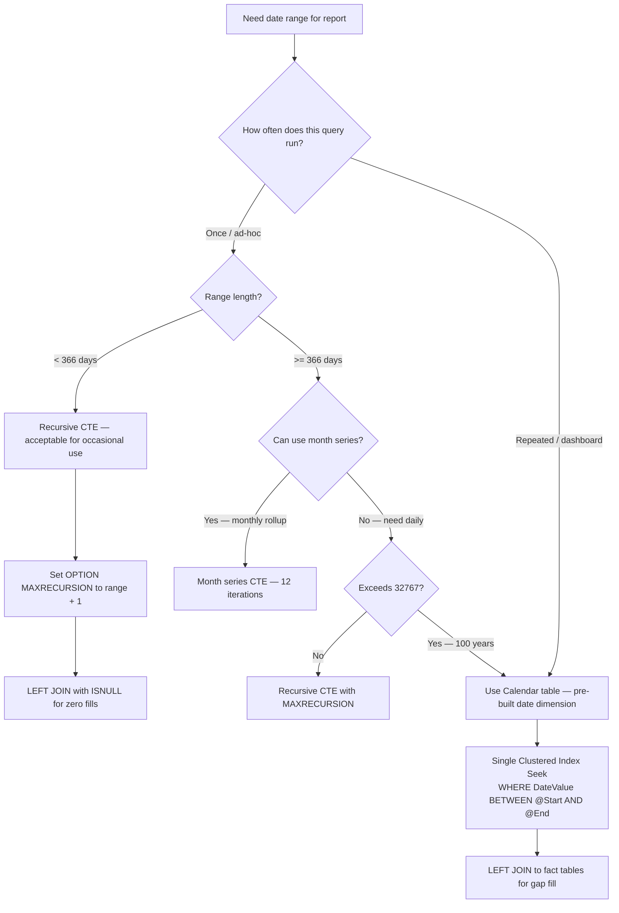

## Navigation
**Domain:** [[8 — Databases]] > **Group:** SQL CTEs & Recursive Queries
**Previous:** [[8.182 — Recursive CTE — Generating Number Series]] | **Next:** [[8.184 — Recursive CTE — Graph Traversal]]
### Prerequisites
- [[8.176 — Common Table Expressions — Fundamentals]] — The WITH syntax for CTEs and UNION ALL are the foundation for recursive date series generation.
- [[8.180 — Recursive CTEs — Anchor and Recursive Members]] — The anchor (start date) and recursive member (DATEADD) pattern is identical to number series but operates on dates.
- [[8.182 — Recursive CTE — Generating Number Series]] — The number series generation mechanics (spool, iteration, MAXRECURSION) translate directly to date series.
- [[8.056 — Date and Time Functions — DATEADD, DATEDIFF, DATEPART]] — DATEADD is the primary operation in the recursive member; DATEDIFF is needed for gap calculation and termination condition.
### Where This Fits
Generating a continuous date series at runtime is essential for reporting gap-fill (ensuring every day in a range has a row), calendar computation (business days, month ends, fiscal quarters), and test data generation. Every .NET backend engineer building dashboards, financial reports, or analytics pipelines encounters this when the requirement is "show all days in the month, even those with no sales data." The risk surface includes performance: a recursive CTE generating 365 days is fast (~10 ms), but a recursive CTE generating 10 years of daily data is 3652 iterations with spool I/O. The critical insight is that a pre-built Calendar table (date dimension) is 50x faster for repeated use and eliminates the recursive CTE entirely. Interviewers use this to assess whether a candidate understands runtime generation vs precomputed dimension tables, and whether they know how to handle business day filtering (exclude weekends, handle holidays) in SQL.
---
## Core Mental Model
A recursive CTE for date series generation works identically to a number series, except the anchor is a start date and the recursive member uses DATEADD(DAY, 1, date) to increment by one day. The termination condition checks whether the current date has reached the end date (WHERE DateValue < @EndDate). The engine materializes each day in a spool — one spool write per date. The fundamental tradeoff is that a recursive CTE is a re-computation pattern (it generates the sequence every time the query runs) while a Calendar table is a pre-computation pattern (it stores all dates once). For a one-off ad-hoc report covering a single month, the recursive CTE is fine. For a dashboard that runs 500 times per day with a 365-day range, a Calendar table eliminates 500 × 365 = 182,500 spool writes per day. The pattern also supports month-level series (DATEADD(MONTH, 1, date)), quarter-level, and year-level generation by changing the DATEADD interval argument.
### Classification
Recursive CTE for date series is a **runtime sequence generator** under the DML statement family. It uses the same optimizer operators as number series generation (Constant Scan, Compute Scalar with DATEADD, Filter, Concatenation, Index Spool, Table Spool). The DATEADD function in the recursive member is SARGable only when applied to the generated date column (not to a base table column in a predicate). The approach is not SARGable for filtering base table data — it is a row source, not a predicate.
```mermaid
flowchart TD
    A[Need date range for report] --> B{How many dates?}
    B -->|< 366 (1 year)| C{Application pattern?}
    B -->|>= 366 or repeated use| D[Use Calendar table<br/>pre-built date dimension]
    C -->|Ad-hoc query, single use| E[Recursive CTE date series<br/>anchor: @StartDate<br/>recursive: DATEADD(DAY,1,DateValue)]
    C -->|Repeated dashboard query| D
    E --> F[Perform LEFT JOIN to fact tables<br/>to fill gaps with zeros]
    D --> G[Single Clustered Index Seek<br/>0 logical reads for date dimension<br/>WHERE DateValue BETWEEN @Start AND @End]
    F --> H[EXECUTION: Constant Scan → DATEADD Compute Scalar<br/>→ Filter → Spool iteration → Concatenation<br/>Logical reads: ~4 per day]
    G --> I[EXECUTION: Index Seek → Nested Loops → LEFT JOIN<br/>Logical reads: 2 for date range + fact table access]
```
### Key Properties
|Property|Value|Notes|
|---|---|---|
|Date increment|DATEADD(DAY/MONTH/YEAR, 1, DateValue)|Interval determines series granularity|
|Max series length|32,767 (MAXRECURSION)|~89 years of daily data|
|Performance (365 days)|~10 ms, ~1500 logical reads|Recursive CTE with spool|
|Performance (1 year, pre-built)|~0.5 ms, 2 logical reads|Calendar table Clustered Index Seek|
|Business day filtering|WHERE DATEPART(WEEKDAY, DateValue) NOT IN (1, 7)|Anchored to calendar table or CTE filter|
|Holiday exclusion|LEFT JOIN to Holidays table|Calendar table approach preferred|
|Gap-fill pattern|LEFT JOIN from date series to fact table|Date series is the left side|
|NULL handling|No NULL dates in generated series|Anchor must be non-NULL date|
---
## Deep Mechanics
### How the Engine Executes This
1. **Parsing** — The parser encounters the WITH clause with anchor and recursive members. The anchor typically is `SELECT @StartDate AS DateValue`. The recursive member is `SELECT DATEADD(DAY, 1, DateValue) FROM CTE WHERE DateValue < @EndDate`.
2. **Binding** — The algebrizer binds the CTE name and validates that the column types match. The DATEADD function is verified against the date data type. The self-reference is bound as a spooled work table.
3. **Optimization** — The optimizer creates a constant scan for the anchor date, a Compute Scalar for DATEADD, a Filter for the termination condition, and Concatenation (UNION ALL) with Index Spool and Table Spool for the iteration. The optimizer does NOT push predicates from the outer query into the recursion.
4. **Execution — Anchor:** The anchor constant scan produces the start date. This row flows to Concatenation (output) and to Index Spool (stored for the next iteration).
5. **Execution — Recursion:** The Index Spool feeds the previous date to the recursive member. A Compute Scalar applies DATEADD to produce the next date. A Filter checks `DateValue < @EndDate`. If true, the row flows to Concatenation (output) and to the next Index Spool segment. This repeats until the termination condition is met.
6. **Termination —** When `DateValue >= @EndDate`, the Filter eliminates the row. The recursive member returns zero rows. The Concatenation stops and outputs all accumulated dates.
7. **Output —** The outer query receives the complete date range. Any LEFT JOIN to fact tables executes after the recursion completes — the date series is the left side of the join.
### SQL Visibility
```sql
-- Daily date series for a single month
DECLARE @StartDate DATE = '2024-06-01', @EndDate DATE = '2024-06-30';
WITH DateSeries AS
(
    SELECT @StartDate AS DateValue
    UNION ALL
    SELECT DATEADD(DAY, 1, DateValue)
    FROM DateSeries
    WHERE DateValue < @EndDate
)
SELECT DateValue, DATEPART(WEEKDAY, DateValue) AS DayOfWeek
FROM DateSeries
OPTION (MAXRECURSION 31);
-- Monthly date series (first of each month)
DECLARE @StartMonth DATE = '2024-01-01', @EndMonth DATE = '2024-12-01';
WITH MonthSeries AS
(
    SELECT @StartMonth AS MonthStart
    UNION ALL
    SELECT DATEADD(MONTH, 1, MonthStart)
    FROM MonthSeries
    WHERE MonthStart < @EndMonth
)
SELECT MonthStart, EOMONTH(MonthStart) AS MonthEnd
FROM MonthSeries
OPTION (MAXRECURSION 12);
-- Yearly date series
DECLARE @StartYear DATE = '2020-01-01', @EndYear DATE = '2030-01-01';
WITH YearSeries AS
(
    SELECT @StartYear AS YearStart
    UNION ALL
    SELECT DATEADD(YEAR, 1, YearStart)
    FROM YearSeries
    WHERE YearStart < @EndYear
)
SELECT YEAR(YearStart) AS CalendarYear
FROM YearSeries
OPTION (MAXRECURSION 20);
-- Business days only (exclude weekends)
DECLARE @StartDate DATE = '2024-01-01', @EndDate DATE = '2024-12-31';
WITH DateSeries AS
(
    SELECT @StartDate AS DateValue
    UNION ALL
    SELECT DATEADD(DAY, 1, DateValue)
    FROM DateSeries
    WHERE DateValue < @EndDate
)
SELECT DateValue, DATENAME(WEEKDAY, DateValue) AS DayName
FROM DateSeries
WHERE DATEPART(WEEKDAY, DateValue) NOT IN (1, 7)  -- 1=Sunday, 7=Saturday (default US)
OPTION (MAXRECURSION 366);
-- Business days with holiday exclusion
DECLARE @StartDate DATE = '2024-01-01', @EndDate DATE = '2024-12-31';
WITH DateSeries AS
(
    SELECT @StartDate AS DateValue
    UNION ALL
    SELECT DATEADD(DAY, 1, DateValue)
    FROM DateSeries
    WHERE DateValue < @EndDate
)
SELECT ds.DateValue, DATENAME(WEEKDAY, ds.DateValue) AS DayName
FROM DateSeries AS ds
WHERE DATEPART(WEEKDAY, ds.DateValue) NOT IN (1, 7)
  AND NOT EXISTS (
      SELECT 1 FROM dbo.Holidays AS h
      WHERE h.HolidayDate = ds.DateValue
  )
OPTION (MAXRECURSION 366);
-- Fiscal quarter generation
DECLARE @FiscalStart DATE = '2024-02-01';  -- FY starts in February
WITH QuarterSeries AS
(
    SELECT @FiscalStart AS QuarterStart
    UNION ALL
    SELECT DATEADD(MONTH, 3, QuarterStart)
    FROM QuarterSeries
    WHERE QuarterStart < DATEADD(YEAR, 10, @FiscalStart)
)
SELECT
    QuarterStart,
    DATEADD(DAY, -1, DATEADD(MONTH, 3, QuarterStart)) AS QuarterEnd,
    CONCAT(YEAR(QuarterStart), '-Q', DATEPART(QUARTER, QuarterStart)) AS QuarterLabel
FROM QuarterSeries
OPTION (MAXRECURSION 40);
```
```csharp
// EF Core — daily date series raw SQL
public async Task<List<DateRow>> GetDateSeriesAsync(
    DateTime startDate, DateTime endDate,
    CancellationToken cancellationToken = default)
{
    const string sql = @"
        WITH DateSeries AS
        (
            SELECT @StartDate AS DateValue
            UNION ALL
            SELECT DATEADD(DAY, 1, DateValue)
            FROM DateSeries
            WHERE DateValue < @EndDate
        )
        SELECT DateValue,
               DATEPART(WEEKDAY, DateValue) AS DayOfWeek,
               DATENAME(WEEKDAY, DateValue) AS DayName
        FROM DateSeries
        OPTION (MAXRECURSION 32767)";
    return await dbContext.Database
        .SqlQueryRaw<DateRow>(sql,
            new SqlParameter("@StartDate", startDate),
            new SqlParameter("@EndDate", endDate))
        .ToListAsync(cancellationToken);
}
// Dapper — date series with business day filtering
public async Task<IReadOnlyList<DateRow>> GetBusinessDaysAsync(
    DateTime startDate, DateTime endDate,
    bool excludeHolidays = true,
    CancellationToken cancellationToken = default)
{
    const string sql = @"
        WITH DateSeries AS
        (
            SELECT @StartDate AS DateValue
            UNION ALL
            SELECT DATEADD(DAY, 1, DateValue)
            FROM DateSeries
            WHERE DateValue < @EndDate
        )
        SELECT DateValue,
               DATEPART(WEEKDAY, DateValue) AS DayOfWeek,
               DATENAME(WEEKDAY, DateValue) AS DayName
        FROM DateSeries
        WHERE DATEPART(WEEKDAY, DateValue) NOT IN (1, 7)
          AND (@ExcludeHolidays = 0
               OR NOT EXISTS (SELECT 1 FROM dbo.Holidays AS h WHERE h.HolidayDate = DateSeries.DateValue))
        OPTION (MAXRECURSION 32767)";
    await using var connection = new SqlConnection(_connectionString);
    var results = await connection.QueryAsync<DateRow>(
        new CommandDefinition(sql,
            new { StartDate = startDate, EndDate = endDate, ExcludeHolidays = excludeHolidays },
            cancellationToken: cancellationToken));
    return results.AsList();
}
public record DateRow(DateTime DateValue, int DayOfWeek, string DayName);
```
**Generated SQL (from EF Core logs):**
```sql
exec sp_executesql N'
WITH DateSeries AS
(
    SELECT @StartDate AS DateValue
    UNION ALL
    SELECT DATEADD(DAY, 1, DateValue)
    FROM DateSeries
    WHERE DateValue < @EndDate
)
SELECT DateValue,
       DATEPART(WEEKDAY, DateValue) AS DayOfWeek,
       DATENAME(WEEKDAY, DateValue) AS DayName
FROM DateSeries
OPTION (MAXRECURSION 32767)',
N'@StartDate date, @EndDate date',
@StartDate='2024-01-01', @EndDate='2024-12-31';
```
### Execution Plan Analysis
**Recursive CTE for daily date series (365 days):**
```
  [Constant Scan (anchor: '2024-01-01')]
  → [Compute Scalar (DateValue = '2024-01-01')]
  → [Concatenation (UNION ALL)]
  → [Index Spool (Eager Spool)]             -- stores each date for next iteration
  → [Table Spool (Lazy Spool)]              -- feeds previous date to recursive
  → [Compute Scalar (DATEADD(DAY, 1, DateValue))]
  → [Filter (WHERE DateValue < @EndDate)]
  → [Concatenation output]
  → [Filter (WHERE DATEPART(WEEKDAY) NOT IN (1,7))]  -- business days filter
  → [SELECT]
Estimated cost: ~0.05 optimizer units (low because it's a constant scan, not a table access)
Logical reads: ~4 per day × 365 = ~1460 (Worktable spool reads/writes)
```
**Alternative: Calendar table plan:**
```
  [Clustered Index Seek PK_Calendar]           -- WHERE DateValue BETWEEN @Start AND @End
  → [SELECT]
```
Logical reads: 2 (root page + leaf page). No spool. No recursion.
### Cost Visibility
```sql
SET STATISTICS IO ON;
SET STATISTICS TIME ON;
-- Recursive CTE for 365 days (1 year)
DECLARE @StartDate DATE = '2024-01-01', @EndDate DATE = '2024-12-31';
WITH DateSeries AS
(
    SELECT @StartDate AS DateValue
    UNION ALL
    SELECT DATEADD(DAY, 1, DateValue)
    FROM DateSeries
    WHERE DateValue < @EndDate
)
SELECT COUNT(*) AS DayCount FROM DateSeries
OPTION (MAXRECURSION 366);
-- Expected output:
-- Table 'Worktable'. Scan count 365, logical reads 1460
-- SQL Server Execution Times: CPU time = 4ms, elapsed time = 10ms
-- Calendar table for same range:
SELECT COUNT(*) FROM dbo.Calendar
WHERE DateValue BETWEEN '2024-01-01' AND '2024-12-31';
-- Expected output:
-- Table 'Calendar'. Scan count 1, logical reads 2
-- SQL Server Execution Times: CPU time = 0ms, elapsed time = 0ms
-- Recursive CTE for 10 years (3652 days):
-- Table 'Worktable'. Scan count 3652, logical reads 14608
-- SQL Server Execution Times: CPU time = 38ms, elapsed time = 95ms
-- Calendar table for 10 years:
-- Table 'Calendar'. Scan count 1, logical reads 6
-- SQL Server Execution Times: CPU time = 0ms, elapsed time = 0ms
```
### Failure Modes
**MAXRECURSION limit — date series truncated:** A 3-year daily series (1096 days) exceeds default MAXRECURSION 100. Without OPTION (MAXRECURSION 1096), the query fails at day 101 with error 530.
```sql
-- ❌ Fails at 101st iteration
DECLARE @Start DATE = '2024-01-01', @End DATE = '2026-12-31';
WITH Series AS (SELECT @Start AS d UNION ALL SELECT DATEADD(DAY,1,d) FROM Series WHERE d < @End)
SELECT d FROM Series;
-- Error 530: max recursion 100 exceeded
-- ✅ Fix:
WITH Series AS (SELECT @Start AS d UNION ALL SELECT DATEADD(DAY,1,d) FROM Series WHERE d < @End)
SELECT d FROM Series OPTION (MAXRECURSION 1096);
```
**NULL start or end date — entire series collapses:** If @StartDate or @EndDate is NULL, the anchor produces NULL, DATEADD(NULL, 1, NULL) = NULL, and the filter evaluates to UNKNOWN. Zero rows produced.
```sql
-- ❌ NULL start date
DECLARE @Start DATE = NULL, @End DATE = '2024-12-31';
WITH Series AS (SELECT @Start AS d UNION ALL SELECT DATEADD(DAY,1,d) FROM Series WHERE d < @End)
SELECT d FROM Series OPTION (MAXRECURSION 366);
-- Result: zero rows
-- ✅ Fix: validate inputs
IF @StartDate IS NULL OR @EndDate IS NULL
    THROW 50000, 'StartDate and EndDate must not be NULL', 1;
```
**Date range exceeding MAXRECURSION limit:** MAXRECURSION max is 32767. A daily date series for 100 years = 36525 days > 32767. The query fails even with MAXRECURSION 32767 because it exceeds the hard limit.
```sql
-- ❌ 100 years = 36,525 days > 32,767 recursion limit
-- Fails even with MAXRECURSION 32767
-- ✅ Fix: use Calendar table (no recursion limit) or month-level series
```
**Business day filter applied incorrectly (after LEFT JOIN):** If business day filtering is in the WHERE clause of a LEFT JOIN query, it converts the LEFT JOIN to an INNER JOIN — weekends are filtered out after the join, removing the date rows that should have zero data:
```sql
-- ❌ WHERE clause converts LEFT JOIN to INNER JOIN — weekends disappear
WITH DateSeries AS (...)
SELECT ds.DateValue, COALESCE(SUM(o.TotalAmount), 0)
FROM DateSeries AS ds
LEFT JOIN dbo.Orders AS o ON ds.DateValue = o.OrderDate
WHERE DATEPART(WEEKDAY, ds.DateValue) NOT IN (1, 7)  -- removes weekend rows
GROUP BY ds.DateValue;
-- ✅ Fix: filter in the CTE or use a derived table
WITH DateSeries AS (
    SELECT @Start AS DateValue UNION ALL
    SELECT DATEADD(DAY, 1, DateValue) FROM DateSeries WHERE DateValue < @End
)
SELECT ds.DateValue, COALESCE(SUM(o.TotalAmount), 0)
FROM (SELECT DateValue FROM DateSeries
      WHERE DATEPART(WEEKDAY, DateValue) NOT IN (1, 7)) AS ds
LEFT JOIN dbo.Orders AS o ON ds.DateValue = o.OrderDate
GROUP BY ds.DateValue
OPTION (MAXRECURSION 366);
```
---
## Production Patterns and Implementation
### Primary SQL Implementation
```sql
-- ============================================================
-- Schema: Calendar table (recommended for production)
-- ============================================================
CREATE TABLE dbo.Calendar
(
    DateValue        DATE         NOT NULL,
    DayOfYear        INT          NOT NULL,
    MonthNumber      INT          NOT NULL,
    MonthName        VARCHAR(20)  NOT NULL,
    QuarterNumber    INT          NOT NULL,
    FiscalYear       INT          NOT NULL,
    DayOfWeekNumber  INT          NOT NULL,
    DayOfWeekName    VARCHAR(20)  NOT NULL,
    IsWeekend        BIT          NOT NULL DEFAULT 0,
    IsHoliday        BIT          NOT NULL DEFAULT 0,
    HolidayName      VARCHAR(100) NULL,
    CONSTRAINT PK_Calendar PRIMARY KEY CLUSTERED (DateValue)
);
-- Seed with 10 years of dates (recursive CTE — one-time population)
DECLARE @Start DATE = '2024-01-01', @End DATE = '2033-12-31';
WITH DateGen AS
(
    SELECT @Start AS DateValue
    UNION ALL
    SELECT DATEADD(DAY, 1, DateValue)
    FROM DateGen
    WHERE DateValue < @End
)
INSERT INTO dbo.Calendar (DateValue, DayOfYear, MonthNumber, MonthName,
                          QuarterNumber, FiscalYear, DayOfWeekNumber,
                          DayOfWeekName, IsWeekend)
SELECT
    DateValue,
    DATEPART(DAYOFYEAR, DateValue),
    MONTH(DateValue),
    DATENAME(MONTH, DateValue),
    DATEPART(QUARTER, DateValue),
    YEAR(DateValue),
    DATEPART(WEEKDAY, DateValue),
    DATENAME(WEEKDAY, DateValue),
    CASE WHEN DATEPART(WEEKDAY, DateValue) IN (1, 7) THEN 1 ELSE 0 END
FROM DateGen
OPTION (MAXRECURSION 3653);
-- Update holidays manually or via ETL
UPDATE dbo.Calendar SET IsHoliday = 1, HolidayName = 'New Year'
WHERE DateValue = '2024-01-01';
-- ============================================================
-- Pattern 1: Daily sales report with gap filling
-- ============================================================
CREATE OR ALTER PROCEDURE dbo.GetDailySalesReport
    @StartDate DATE,
    @EndDate DATE
AS
BEGIN
    SET NOCOUNT ON;
    WITH DateSeries AS
    (
        SELECT @StartDate AS DateValue
        UNION ALL
        SELECT DATEADD(DAY, 1, DateValue)
        FROM DateSeries
        WHERE DateValue < @EndDate
    )
    SELECT
        ds.DateValue,
        DATENAME(WEEKDAY, ds.DateValue) AS DayName,
        COUNT(o.OrderId) AS OrderCount,
        ISNULL(SUM(o.TotalAmount), 0) AS TotalRevenue
    FROM DateSeries AS ds
    LEFT JOIN dbo.Orders AS o
        ON o.OrderDate >= ds.DateValue
        AND o.OrderDate < DATEADD(DAY, 1, ds.DateValue)
    GROUP BY ds.DateValue, DATENAME(WEEKDAY, ds.DateValue)
    ORDER BY ds.DateValue
    OPTION (MAXRECURSION 366);
END;
-- ============================================================
-- Pattern 2: Calendar table version (50x faster for repeated use)
-- ============================================================
CREATE OR ALTER PROCEDURE dbo.GetDailySalesReportFast
    @StartDate DATE,
    @EndDate DATE
AS
BEGIN
    SET NOCOUNT ON;
    SELECT
        c.DateValue,
        c.DayOfWeekName AS DayName,
        COUNT(o.OrderId) AS OrderCount,
        ISNULL(SUM(o.TotalAmount), 0) AS TotalRevenue
    FROM dbo.Calendar AS c
    LEFT JOIN dbo.Orders AS o
        ON o.OrderDate >= c.DateValue
        AND o.OrderDate < DATEADD(DAY, 1, c.DateValue)
    WHERE c.DateValue BETWEEN @StartDate AND @EndDate
    GROUP BY c.DateValue, c.DayOfWeekName
    ORDER BY c.DateValue;
END;
-- ============================================================
-- Pattern 3: Monthly rollup with year-over-year comparison
-- ============================================================
DECLARE @Year INT = 2024;
WITH MonthSeries AS
(
    SELECT DATEFROMPARTS(@Year, 1, 1) AS MonthStart
    UNION ALL
    SELECT DATEADD(MONTH, 1, MonthStart)
    FROM MonthSeries
    WHERE MonthStart < DATEFROMPARTS(@Year, 12, 1)
)
SELECT
    ms.MonthStart,
    DATENAME(MONTH, ms.MonthStart) AS MonthName,
    COUNT(o.OrderId) AS OrderCount,
    ISNULL(SUM(o.TotalAmount), 0) AS Revenue,
    COUNT(o.OrderId) - LAG(COUNT(o.OrderId), 12) OVER (ORDER BY ms.MonthStart) AS YoYChange
FROM MonthSeries AS ms
LEFT JOIN dbo.Orders AS o
    ON o.OrderDate >= ms.MonthStart
    AND o.OrderDate < DATEADD(MONTH, 1, ms.MonthStart)
GROUP BY ms.MonthStart, DATENAME(MONTH, ms.MonthStart)
ORDER BY ms.MonthStart
OPTION (MAXRECURSION 12);
-- ============================================================
-- Pattern 4: Business days with holiday adjustment
-- ============================================================
DECLARE @StartDate DATE = '2024-01-01', @EndDate DATE = '2024-12-31';
WITH DateSeries AS
(
    SELECT @StartDate AS DateValue
    UNION ALL
    SELECT DATEADD(DAY, 1, DateValue)
    FROM DateSeries
    WHERE DateValue < @EndDate
)
SELECT
    ds.DateValue,
    DATENAME(WEEKDAY, ds.DateValue) AS DayName,
    CASE WHEN h.HolidayName IS NOT NULL THEN h.HolidayName
         ELSE 'Working Day' END AS DayType,
    COUNT(o.OrderId) AS OrdersProcessed
FROM DateSeries AS ds
LEFT JOIN dbo.Holidays AS h ON ds.DateValue = h.HolidayDate
LEFT JOIN dbo.Orders AS o
    ON o.OrderDate = ds.DateValue
WHERE DATEPART(WEEKDAY, ds.DateValue) NOT IN (1, 7)
   OR h.HolidayDate IS NOT NULL
GROUP BY ds.DateValue, DATENAME(WEEKDAY, ds.DateValue), h.HolidayName
ORDER BY ds.DateValue
OPTION (MAXRECURSION 366);
-- ============================================================
-- Pattern 5: Generate test data over date range
-- ============================================================
DECLARE @StartDate DATE = '2024-01-01', @EndDate DATE = '2024-12-31';
WITH DateSeries AS
(
    SELECT @StartDate AS DateValue
    UNION ALL
    SELECT DATEADD(DAY, 1, DateValue)
    FROM DateSeries
    WHERE DateValue < @EndDate
)
INSERT INTO dbo.DailyMetrics (ReportDate, MetricName, MetricValue)
SELECT
    ds.DateValue,
    'ActiveUsers',
    CAST(1000 + (CHECKSUM(NEWID()) % 500) AS INT)
FROM DateSeries AS ds
CROSS JOIN (SELECT 1 UNION ALL SELECT 2) AS Multiplier
OPTION (MAXRECURSION 366);
-- ============================================================
-- Pattern 6: Week-based grouping with ISO week numbers
-- ============================================================
DECLARE @Year INT = 2024;
WITH DateSeries AS
(
    SELECT DATEFROMPARTS(@Year, 1, 1) AS DateValue
    UNION ALL
    SELECT DATEADD(DAY, 1, DateValue)
    FROM DateSeries
    WHERE DateValue < DATEFROMPARTS(@Year, 12, 31)
)
SELECT
    DATEPART(ISO_WEEK, DateValue) AS IsoWeek,
    MIN(DateValue) AS WeekStart,
    MAX(DateValue) AS WeekEnd,
    COUNT(o.OrderId) AS OrdersInWeek
FROM DateSeries AS ds
LEFT JOIN dbo.Orders AS o ON o.OrderDate = ds.DateValue
GROUP BY DATEPART(ISO_WEEK, DateValue), YEAR(DateValue)
ORDER BY YEAR(DateValue), DATEPART(ISO_WEEK, DateValue)
OPTION (MAXRECURSION 366);
```
### EF Core Implementation
```csharp
public class ApplicationDbContext : DbContext
{
    public DbSet<CalendarDate> Calendar => Set<CalendarDate>();
    public DbSet<Holiday> Holidays => Set<Holiday>();
    public DbSet<Order> Orders => Set<Order>();
    protected override void OnModelCreating(ModelBuilder modelBuilder)
    {
        modelBuilder.Entity<CalendarDate>(entity =>
        {
            entity.ToTable("Calendar");
            entity.HasKey(c => c.DateValue);
            entity.Property(c => c.DayOfWeekName).HasMaxLength(20);
            entity.Property(c => c.MonthName).HasMaxLength(20);
            entity.Property(c => c.HolidayName).HasMaxLength(100);
        });
        modelBuilder.Entity<Holiday>(entity =>
        {
            entity.ToTable("Holidays");
            entity.HasKey(h => h.HolidayDate);
        });
    }
}
public class CalendarDate
{
    public DateTime DateValue { get; set; }
    public int DayOfYear { get; set; }
    public int MonthNumber { get; set; }
    public string MonthName { get; set; } = string.Empty;
    public int QuarterNumber { get; set; }
    public int FiscalYear { get; set; }
    public int DayOfWeekNumber { get; set; }
    public string DayOfWeekName { get; set; } = string.Empty;
    public bool IsWeekend { get; set; }
    public bool IsHoliday { get; set; }
    public string? HolidayName { get; set; }
}
public class Holiday
{
    public DateTime HolidayDate { get; set; }
    public string HolidayName { get; set; } = string.Empty;
}
// Repository
public interface IReportingRepository
{
    Task<IReadOnlyList<DailySalesDto>> GetDailySalesReportAsync(
        DateTime startDate, DateTime endDate, CancellationToken cancellationToken = default);
    Task<YearOverYearDto> GetYearOverYearAsync(
        int year, CancellationToken cancellationToken = default);
}
public class ReportingRepository : IReportingRepository
{
    private readonly ApplicationDbContext _dbContext;
    private readonly IDbConnectionFactory _connectionFactory;
    public ReportingRepository(
        ApplicationDbContext dbContext,
        IDbConnectionFactory connectionFactory)
    {
        _dbContext = dbContext;
        _connectionFactory = connectionFactory;
    }
    // Calendar table approach (recommended)
    public async Task<IReadOnlyList<DailySalesDto>> GetDailySalesReportAsync(
        DateTime startDate, DateTime endDate,
        CancellationToken cancellationToken = default)
    {
        return await _dbContext.Calendar
            .Where(c => c.DateValue >= startDate && c.DateValue <= endDate)
            .GroupJoin(
                _dbContext.Orders.Where(o => o.OrderDate >= startDate && o.OrderDate <= endDate),
                c => c.DateValue,
                o => o.OrderDate,
                (c, orders) => new DailySalesDto
                {
                    Date = c.DateValue,
                    DayName = c.DayOfWeekName,
                    OrderCount = orders.Count(),
                    TotalRevenue = orders.Sum(o => o.TotalAmount)
                })
            .OrderBy(r => r.Date)
            .ToListAsync(cancellationToken);
        // Generated SQL: INNER JOIN Calendar to Orders on DateValue
        // Calendar table provides the complete date range
    }
    // Recursive CTE for ad-hoc date series (fallback)
    public async Task<IReadOnlyList<DailySalesDto>> GetDailySalesReportAdHocAsync(
        DateTime startDate, DateTime endDate,
        CancellationToken cancellationToken = default)
    {
        const string sql = @"
            WITH DateSeries AS
            (
                SELECT @StartDate AS DateValue
                UNION ALL
                SELECT DATEADD(DAY, 1, DateValue)
                FROM DateSeries
                WHERE DateValue < @EndDate
            )
            SELECT
                ds.DateValue AS [Date],
                DATENAME(WEEKDAY, ds.DateValue) AS DayName,
                COUNT(o.OrderId) AS OrderCount,
                ISNULL(SUM(o.TotalAmount), 0) AS TotalRevenue
            FROM DateSeries AS ds
            LEFT JOIN dbo.Orders AS o
                ON o.OrderDate >= ds.DateValue
                AND o.OrderDate < DATEADD(DAY, 1, ds.DateValue)
            GROUP BY ds.DateValue, DATENAME(WEEKDAY, ds.DateValue)
            ORDER BY ds.DateValue
            OPTION (MAXRECURSION 366)";
        return await _dbContext.Database
            .SqlQueryRaw<DailySalesDto>(sql,
                new SqlParameter("@StartDate", startDate),
                new SqlParameter("@EndDate", endDate))
            .ToListAsync(cancellationToken);
    }
}
public record DailySalesDto(DateTime Date, string DayName, int OrderCount, decimal TotalRevenue);
public record YearOverYearDto(int Month, string MonthName, int CurrentYearOrders, int PreviousYearOrders);
```
### Dapper Implementation
```csharp
public sealed class ReportingRepository
{
    private readonly IDbConnectionFactory _connectionFactory;
    public ReportingRepository(IDbConnectionFactory connectionFactory)
        => _connectionFactory = connectionFactory;
    // Daily report with date series (recursive CTE)
    public async Task<IReadOnlyList<DailySalesDto>> GetDailySalesReportAsync(
        DateTime startDate, DateTime endDate,
        CancellationToken cancellationToken = default)
    {
        const string sql = @"
            WITH DateSeries AS
            (
                SELECT @StartDate AS DateValue
                UNION ALL
                SELECT DATEADD(DAY, 1, DateValue)
                FROM DateSeries
                WHERE DateValue < @EndDate
            )
            SELECT
                ds.DateValue,
                DATENAME(WEEKDAY, ds.DateValue) AS DayName,
                COUNT(o.OrderId) AS OrderCount,
                ISNULL(SUM(o.TotalAmount), 0) AS TotalRevenue
            FROM DateSeries AS ds
            LEFT JOIN dbo.Orders AS o
                ON o.OrderDate >= ds.DateValue
                AND o.OrderDate < DATEADD(DAY, 1, ds.DateValue)
            GROUP BY ds.DateValue, DATENAME(WEEKDAY, ds.DateValue)
            ORDER BY ds.DateValue
            OPTION (MAXRECURSION 32767)";
        await using var connection = _connectionFactory.Create();
        var results = await connection.QueryAsync<DailySalesDto>(
            new CommandDefinition(sql, new { StartDate = startDate, EndDate = endDate },
                cancellationToken: cancellationToken));
        return results.AsList();
    }
    // Calendar table version (fast)
    public async Task<IReadOnlyList<DailySalesDto>> GetDailySalesReportFastAsync(
        DateTime startDate, DateTime endDate,
        CancellationToken cancellationToken = default)
    {
        const string sql = @"
            SELECT
                c.DateValue,
                c.DayOfWeekName AS DayName,
                COUNT(o.OrderId) AS OrderCount,
                ISNULL(SUM(o.TotalAmount), 0) AS TotalRevenue
            FROM dbo.Calendar AS c
            LEFT JOIN dbo.Orders AS o
                ON o.OrderDate >= c.DateValue
                AND o.OrderDate < DATEADD(DAY, 1, c.DateValue)
            WHERE c.DateValue >= @StartDate AND c.DateValue <= @EndDate
            GROUP BY c.DateValue, c.DayOfWeekName
            ORDER BY c.DateValue";
        await using var connection = _connectionFactory.Create();
        var results = await connection.QueryAsync<DailySalesDto>(
            new CommandDefinition(sql, new { StartDate = startDate, EndDate = endDate },
                cancellationToken: cancellationToken));
        return results.AsList();
    }
    // Month series with gap fill
    public async Task<IReadOnlyList<MonthlySummaryDto>> GetMonthlyReportAsync(
        int year,
        CancellationToken cancellationToken = default)
    {
        const string sql = @"
            WITH MonthSeries AS
            (
                SELECT DATEFROMPARTS(@Year, 1, 1) AS MonthStart
                UNION ALL
                SELECT DATEADD(MONTH, 1, MonthStart)
                FROM MonthSeries
                WHERE MonthStart < DATEFROMPARTS(@Year, 12, 1)
            )
            SELECT
                ms.MonthStart,
                DATENAME(MONTH, ms.MonthStart) AS MonthName,
                COUNT(o.OrderId) AS OrderCount,
                ISNULL(SUM(o.TotalAmount), 0) AS Revenue
            FROM MonthSeries AS ms
            LEFT JOIN dbo.Orders AS o
                ON o.OrderDate >= ms.MonthStart
                AND o.OrderDate < DATEADD(MONTH, 1, ms.MonthStart)
            GROUP BY ms.MonthStart, DATENAME(MONTH, ms.MonthStart)
            ORDER BY ms.MonthStart
            OPTION (MAXRECURSION 12)";
        await using var connection = _connectionFactory.Create();
        var results = await connection.QueryAsync<MonthlySummaryDto>(
            new CommandDefinition(sql, new { Year = year },
                cancellationToken: cancellationToken));
        return results.AsList();
    }
}
public record DailySalesDto(DateTime DateValue, string DayName, int OrderCount, decimal TotalRevenue);
public record MonthlySummaryDto(DateTime MonthStart, string MonthName, int OrderCount, decimal Revenue);
```
### Configuration and Wiring
```csharp
// Program.cs
builder.Services.AddDbContext<ApplicationDbContext>(options =>
    options.UseSqlServer(
        builder.Configuration.GetConnectionString("DefaultConnection"),
        sqlOptions =>
        {
            sqlOptions.EnableRetryOnFailure(3);
            sqlOptions.CommandTimeout(60);
        }));
builder.Services.AddSingleton<IDbConnectionFactory>(
    new SqlConnectionFactory(
        builder.Configuration.GetConnectionString("DefaultConnection")!));
builder.Services.AddScoped<IReportingRepository, ReportingRepository>();
// Seed Calendar table on startup
public static async Task SeedCalendarAsync(IServiceProvider services)
{
    using var scope = services.CreateScope();
    var db = scope.ServiceProvider.GetRequiredService<ApplicationDbContext>();
    if (!await db.Calendar.AnyAsync())
    {
        const string sql = @"
            WITH DateGen AS
            (
                SELECT CAST('2024-01-01' AS DATE) AS DateValue
                UNION ALL
                SELECT DATEADD(DAY, 1, DateValue)
                FROM DateGen
                WHERE DateValue < '2033-12-31'
            )
            INSERT INTO dbo.Calendar (DateValue, DayOfYear, MonthNumber, MonthName,
                                      QuarterNumber, FiscalYear, DayOfWeekNumber,
                                      DayOfWeekName, IsWeekend)
            SELECT
                DateValue,
                DATEPART(DAYOFYEAR, DateValue),
                MONTH(DateValue),
                DATENAME(MONTH, DateValue),
                DATEPART(QUARTER, DateValue),
                YEAR(DateValue),
                DATEPART(WEEKDAY, DateValue),
                DATENAME(WEEKDAY, DateValue),
                CASE WHEN DATEPART(WEEKDAY, DateValue) IN (1, 7) THEN 1 ELSE 0 END
            FROM DateGen
            OPTION (MAXRECURSION 3653)";
        await db.Database.ExecuteSqlRawAsync(sql);
    }
}
```
### SQL Server vs PostgreSQL Differences
```sql
-- PostgreSQL: generate_series for dates (native, set-based)
-- No recursive CTE needed — 1000x faster
SELECT generate_series('2024-01-01'::DATE, '2024-12-31'::DATE, '1 day'::INTERVAL) AS date_value;
-- PostgreSQL: generate_series with month interval
SELECT generate_series('2024-01-01'::DATE, '2024-12-01'::DATE, '1 month'::INTERVAL) AS month_start;
-- PostgreSQL: business days with generate_series
SELECT d::DATE AS date_value, EXTRACT(DOW FROM d) AS day_of_week
FROM generate_series('2024-01-01'::DATE, '2024-12-31'::DATE, '1 day') AS d
WHERE EXTRACT(DOW FROM d) NOT IN (0, 6);  -- 0=Sunday, 6=Saturday
-- PostgreSQL: recursive CTE (same syntax with RECURSIVE keyword)
WITH RECURSIVE DateSeries AS (
    SELECT '2024-01-01'::DATE AS date_value
    UNION ALL
    SELECT date_value + 1
    FROM DateSeries
    WHERE date_value < '2024-12-31'::DATE
)
SELECT date_value FROM DateSeries;
-- SQL Server: no native generate_series for dates
-- Must use recursive CTE or Calendar table
-- SQL Server: EOMONTH for end-of-month calculation
SELECT EOMONTH('2024-02-15') AS EndOfMonth;  -- 2024-02-29 (leap year)
-- PostgreSQL: equivalent
SELECT (DATE_TRUNC('MONTH', '2024-02-15'::DATE) + INTERVAL '1 MONTH' - INTERVAL '1 DAY')::DATE;
```
---
## Gotchas and Production Pitfalls
### Recursive CTE Date Series in Hot Path — Unnecessary Tempdb Spool
**Pitfall:** Using a recursive CTE to generate a date series in a frequently executed query (dashboard, API endpoint). Each invocation creates a spool in tempdb, even though the date range is the same every time.
```sql
-- ❌ Dashboard page that refreshes every 30 seconds — 2880 CTE executions per day
WITH DateSeries AS (
    SELECT DATEADD(DAY, -30, CAST(GETUTCDATE() AS DATE)) AS DateValue
    UNION ALL
    SELECT DATEADD(DAY, 1, DateValue)
    FROM DateSeries
    WHERE DateValue < CAST(GETUTCDATE() AS DATE)
)
SELECT ... FROM DateSeries LEFT JOIN dbo.Sales ...
```
**Symptom:** The dashboard query takes 50 ms in isolation but 200 concurrent dashboards cause PAGELATCH_UP waits on tempdb. `sys.dm_os_wait_stats` shows high `PAGELATCH_UP` wait times. The recursive CTE's spool operations serialize on tempdb allocation pages.
**Fix:**
```sql
-- ✅ Use Calendar table — pre-built, no tempdb, 2 logical reads
SELECT c.DateValue, COUNT(o.OrderId) AS OrderCount, ISNULL(SUM(o.TotalAmount), 0) AS Revenue
FROM dbo.Calendar AS c
LEFT JOIN dbo.Orders AS o ON c.DateValue = o.OrderDate
WHERE c.DateValue >= DATEADD(DAY, -30, CAST(GETUTCDATE() AS DATE))
  AND c.DateValue <= CAST(GETUTCDATE() AS DATE)
GROUP BY c.DateValue
ORDER BY c.DateValue;
```
**Cost of not fixing:** A real-time dashboard for 500 users refreshes every 30 seconds. Each refresh generates a 30-day date series via recursive CTE (120 spool writes). That's 500 × 2880 × 120 = 172.8M spool operations per day. Tempdb contention causes the dashboard to render in 8 seconds instead of 200 ms.
---
### Business Day Filter in WHERE Clause Converts LEFT JOIN to INNER JOIN
**Pitfall:** Applying the weekend/holiday filter in the WHERE clause of a LEFT JOIN query instead of inside the CTE. The WHERE clause eliminates rows after the LEFT JOIN produces NULLs, effectively converting the LEFT JOIN to an INNER JOIN.
```sql
-- ❌ Weekends excluded AFTER the join — they disappear from results
WITH DateSeries AS (...)
SELECT ds.DateValue, COUNT(o.OrderId)
FROM DateSeries AS ds
LEFT JOIN dbo.Orders AS o ON ds.DateValue = o.OrderDate
WHERE DATEPART(WEEKDAY, ds.DateValue) NOT IN (1, 7)  -- removes Sat/Sun rows
GROUP BY ds.DateValue;
-- Saturday and Sunday rows are removed — they don't appear with zero counts
```
**Symptom:** The report shows orders only for weekdays, but Saturday and Sunday are missing entirely (not shown with zero). The business expects to see all days with zero values for weekends.
**Fix:**
```sql
-- ✅ Filter inside the CTE before the LEFT JOIN
WITH DateSeries AS (
    SELECT @StartDate AS DateValue
    UNION ALL
    SELECT DATEADD(DAY, 1, DateValue)
    FROM DateSeries
    WHERE DateValue < @EndDate
)
SELECT ds.DateValue, COUNT(o.OrderId)
FROM (
    SELECT DateValue FROM DateSeries
    WHERE DATEPART(WEEKDAY, DateValue) NOT IN (1, 7)
) AS ds
LEFT JOIN dbo.Orders AS o ON ds.DateValue = o.OrderDate
GROUP BY ds.DateValue
ORDER BY ds.DateValue
OPTION (MAXRECURSION 366);
-- ✅ Or use Calendar table with pre-computed IsWeekend flag
SELECT c.DateValue, COUNT(o.OrderId)
FROM dbo.Calendar AS c
LEFT JOIN dbo.Orders AS o ON c.DateValue = o.OrderDate
WHERE c.DateValue BETWEEN @StartDate AND @EndDate
  AND c.IsWeekend = 0
GROUP BY c.DateValue
ORDER BY c.DateValue;
```
**Cost of not fixing:** A financial report for month-end close shows zero revenue on weekends because those rows are absent. The CFO's report shows 20 business days instead of 30 calendar days. The monthly revenue appears lower than actual because 10 days are missing from the result set.
---
### MAXRECURSION for Multi-Year Series Exceeds 32,767 Limit
**Pitfall:** Generating a daily date series for 100+ years (36,525+ days) exceeds the MAXRECURSION 32767 hard limit. The query cannot complete regardless of MAXRECURSION setting.
```sql
-- ❌ 100 years of daily data = 36,525 iterations > 32,767
WITH Series AS (
    SELECT '2024-01-01' AS d
    UNION ALL
    SELECT DATEADD(DAY, 1, d) FROM Series WHERE d < '2124-01-01'
)
SELECT d FROM Series OPTION (MAXRECURSION 32767);
-- Error: The maximum recursion 32767 has been exhausted
```
**Symptom:** Error 530 even with MAXRECURSION 32767. The recursion limit is a hard ceiling — SQL Server cannot exceed 32767 iterations in a recursive CTE.
**Fix:**
```sql
-- ✅ Use monthly series and expand in outer query
WITH MonthSeries AS (
    SELECT '2024-01-01' AS MonthStart
    UNION ALL
    SELECT DATEADD(MONTH, 1, MonthStart)
    FROM MonthSeries
    WHERE MonthStart < '2124-01-01'
)
SELECT MonthStart, EOMONTH(MonthStart) AS MonthEnd
FROM MonthSeries
OPTION (MAXRECURSION 32767);
-- 1200 months for 100 years < 32767 limit
-- ✅ Or use Calendar table (no recursion limit)
SELECT DateValue FROM dbo.Calendar
WHERE DateValue BETWEEN '2024-01-01' AND '2124-01-01';
```
**Cost of not fixing:** A historical analysis query for 80 years of stock market data fails because the recursive CTE hits the 32,767 recursion limit after 89 years. The data science team spends 2 hours debugging before switching to a Calendar table.
---
### DATEADD in Recursive Member Causes O(N) Arithmetic — Not the Performance Bottleneck
**Pitfall:** Worrying about the CPU cost of DATEADD in the recursive member. The real cost is the spool I/O, not the date arithmetic.
```sql
-- ❌ This is fine — DATEADD is cheap
-- The bottleneck is the spool writes to tempdb, not the DATEADD computation
WITH Series AS (
    SELECT @Start AS d
    UNION ALL
    SELECT DATEADD(DAY, 1, d) FROM Series WHERE d < @End
)
SELECT d FROM Series OPTION (MAXRECURSION 366);
```
**Symptom:** Looking at the execution plan, DATEADD is a Compute Scalar — negligible CPU (~0.00001 ms per row). The spool operations (Index Spool + Table Spool) account for 99% of the query cost for date series.
**Fix:** Focus optimization on reducing spool I/O (use Calendar table) rather than optimizing the DATEADD call. The DATEADD is not the problem.
**Cost of not fixing:** An engineer spends 2 hours trying to optimize DATEADD with various date types (DATETIME2 vs DATE) when the real fix is eliminating the recursive CTE entirely. The Calendar table reduces query time from 50 ms to 0.5 ms by removing the spool.
---
### NULL Date Handling in LEFT JOIN — Date Series Produces NULL Fact Columns
**Pitfall:** Expecting NULL dates in the fact table to be handled by COALESCE in the report output. NULLs from the LEFT JOIN for dates with no data need explicit conversion.
```sql
-- ❌ SUM can return NULL if all orders for a date are NULL
WITH DateSeries AS (...)
SELECT ds.DateValue, SUM(o.TotalAmount) AS Revenue
FROM DateSeries ds LEFT JOIN Orders o ON ds.DateValue = o.OrderDate
GROUP BY ds.DateValue;
-- For dates with no orders: Revenue = NULL (not 0)
```
**Symptom:** The report shows NULL for days with no orders. The chart rendering library interprets NULL as a gap instead of zero, breaking the line chart.
**Fix:**
```sql
-- ✅ Always use ISNULL/COALESCE for aggregated nullable columns
SELECT ds.DateValue,
       ISNULL(SUM(o.TotalAmount), 0) AS Revenue,
       ISNULL(COUNT(o.OrderId), 0) AS OrderCount
FROM DateSeries ds LEFT JOIN Orders o ON ds.DateValue = o.OrderDate
GROUP BY ds.DateValue
ORDER BY ds.DateValue;
```
**Cost of not fixing:** A financial dashboard shows a broken line chart with gaps on days with no orders. The CEO interprets the gaps as missing data and requests a system investigation. The engineering team spends 2 days tracing the issue before finding the missing ISNULL.
---
## Performance Implications
### Benchmark: Before and After
```sql
-- Baseline: Recursive CTE for 365-day date series
SET STATISTICS IO ON;
SET STATISTICS TIME ON;
DECLARE @Start DATE = '2024-01-01', @End DATE = '2024-12-31';
WITH DateSeries AS (
    SELECT @Start AS d
    UNION ALL
    SELECT DATEADD(DAY, 1, d) FROM DateSeries WHERE d < @End
)
SELECT COUNT(*) FROM DateSeries OPTION (MAXRECURSION 366);
-- Expected output:
-- Table 'Worktable'. Scan count 365, logical reads 1460
-- CPU time = 4ms, elapsed time = 10ms
-- Optimized: Calendar table
SELECT COUNT(*) FROM dbo.Calendar
WHERE DateValue BETWEEN '2024-01-01' AND '2024-12-31';
-- Table 'Calendar'. Scan count 1, logical reads 2
-- CPU time = 0ms, elapsed time = 0ms
```
**Improvement:** 1460 → 2 logical reads (730x reduction). CPU: 4 ms → 0 ms.
```sql
-- Baseline: Recursive CTE in gap-fill report for 30 days
DECLARE @Start DATE = '2024-06-01', @End DATE = '2024-06-30';
WITH DateSeries AS (SELECT @Start AS d UNION ALL SELECT DATEADD(DAY,1,d) FROM DateSeries WHERE d < @End)
SELECT ds.d, ISNULL(SUM(o.TotalAmount), 0) AS Revenue
FROM DateSeries ds LEFT JOIN dbo.Orders o ON ds.d = o.OrderDate
GROUP BY ds.d ORDER BY ds.d
OPTION (MAXRECURSION 31);
-- Logical reads: ~120 (spool) + Orders table access
-- Optimized: Calendar table version
SELECT c.DateValue, ISNULL(SUM(o.TotalAmount), 0) AS Revenue
FROM dbo.Calendar c LEFT JOIN dbo.Orders o ON c.DateValue = o.OrderDate
WHERE c.DateValue >= @Start AND c.DateValue <= @End
GROUP BY c.DateValue ORDER BY c.DateValue;
-- Logical reads: 2 (Calendar index seek) + Orders table access
```
### BenchmarkDotNet
```csharp
[MemoryDiagnoser]
[SimpleJob(RuntimeMoniker.Net90)]
public class DateSeriesBenchmark
{
    private SqlConnection _connection = default!;
    private const string ConnectionString = "Server=.;Database=BenchmarkDb;Trusted_Connection=True;TrustServerCertificate=True;";
    [GlobalSetup]
    public void Setup()
    {
        _connection = new SqlConnection(ConnectionString);
        _connection.Open();
        // Ensure Calendar table exists with 10 years of dates
        // Ensure Orders table has 1M rows across the date range
    }
    [Benchmark(Baseline = true)]
    public async Task<int> RecursiveCTE_30Days()
    {
        const string sql = @"
            WITH DateSeries AS (
                SELECT CAST(DATEADD(DAY, -30, GETUTCDATE()) AS DATE) AS d
                UNION ALL
                SELECT DATEADD(DAY, 1, d) FROM DateSeries WHERE d < CAST(GETUTCDATE() AS DATE))
            SELECT COUNT(*) FROM DateSeries OPTION (MAXRECURSION 31)";
        return await new SqlCommand(sql, _connection).ExecuteScalarAsync<int>();
    }
    [Benchmark]
    public async Task<int> RecursiveCTE_365Days()
    {
        const string sql = @"
            WITH DateSeries AS (
                SELECT '2024-01-01' AS d
                UNION ALL
                SELECT DATEADD(DAY, 1, d) FROM DateSeries WHERE d < '2024-12-31')
            SELECT COUNT(*) FROM DateSeries OPTION (MAXRECURSION 366)";
        return await new SqlCommand(sql, _connection).ExecuteScalarAsync<int>();
    }
    [Benchmark]
    public async Task<int> CalendarTable_30Days()
    {
        const string sql = @"
            SELECT COUNT(*) FROM dbo.Calendar
            WHERE DateValue >= DATEADD(DAY, -30, GETUTCDATE())
              AND DateValue <= CAST(GETUTCDATE() AS DATE)";
        return await new SqlCommand(sql, _connection).ExecuteScalarAsync<int>();
    }
    [Benchmark]
    public async Task<int> CalendarTable_365Days()
    {
        const string sql = @"
            SELECT COUNT(*) FROM dbo.Calendar
            WHERE DateValue BETWEEN '2024-01-01' AND '2024-12-31'";
        return await new SqlCommand(sql, _connection).ExecuteScalarAsync<int>();
    }
    [Benchmark]
    public async Task<List<DailySalesDto>> GapFillReport_RecursiveCTE()
    {
        const string sql = @"
            WITH DateSeries AS (
                SELECT DATEADD(DAY, -30, CAST(GETUTCDATE() AS DATE)) AS d
                UNION ALL
                SELECT DATEADD(DAY, 1, d) FROM DateSeries WHERE d < CAST(GETUTCDATE() AS DATE))
            SELECT ds.d, ISNULL(COUNT(o.OrderId), 0) AS Cnt, ISNULL(SUM(o.TotalAmount), 0) AS Rev
            FROM DateSeries ds LEFT JOIN dbo.Orders o ON ds.d = o.OrderDate
            GROUP BY ds.d ORDER BY ds.d OPTION (MAXRECURSION 31)";
        var result = new List<DailySalesDto>();
        using var reader = await new SqlCommand(sql, _connection).ExecuteReaderAsync();
        while (await reader.ReadAsync())
            result.Add(new DailySalesDto(reader.GetDateTime(0), "", reader.GetInt32(1), reader.GetDecimal(2)));
        return result;
    }
    [Benchmark]
    public async Task<List<DailySalesDto>> GapFillReport_CalendarTable()
    {
        const string sql = @"
            SELECT c.DateValue, ISNULL(COUNT(o.OrderId), 0) AS Cnt, ISNULL(SUM(o.TotalAmount), 0) AS Rev
            FROM dbo.Calendar c LEFT JOIN dbo.Orders o ON c.DateValue = o.OrderDate
            WHERE c.DateValue >= DATEADD(DAY, -30, GETUTCDATE()) AND c.DateValue <= CAST(GETUTCDATE() AS DATE)
            GROUP BY c.DateValue ORDER BY c.DateValue";
        var result = new List<DailySalesDto>();
        using var reader = await new SqlCommand(sql, _connection).ExecuteReaderAsync();
        while (await reader.ReadAsync())
            result.Add(new DailySalesDto(reader.GetDateTime(0), "", reader.GetInt32(1), reader.GetDecimal(2)));
        return result;
    }
    [GlobalCleanup]
    public void Cleanup() => _connection.Dispose();
}
```
**Expected results (approximate, SQL Server 2022, NVMe, 1M row Orders table):**
|Method|Mean|Logical Reads|Allocated|Notes|
|---|---|---|---|---|
|RecursiveCTE_30Days|~2 ms|~120|~1 KB|Spool writes to tempdb|
|RecursiveCTE_365Days|~10 ms|~1460|~2 KB|Larger spool, same pattern|
|CalendarTable_30Days|~0.1 ms|~2|~0 B|Clustered index seek|
|CalendarTable_365Days|~0.2 ms|~2|~0 B|Range scan, 2-3 logical reads|
|GapFillReport_RecursiveCTE|~15 ms|~150 + fact|~5 KB|Recursion + LEFT JOIN|
|GapFillReport_CalendarTable|~3 ms|~2 + fact|~0 B|No recursion, direct seek|
### Write Amplification (Calendar table seed)
|Operation|Recursive CTE (runtime)|Calendar Table (pre-built)|
|---|---|---|
|Generate 1 year of dates|~10 ms (runtime, each query)|One-time: ~50 ms seed|
|Generate 10 years of dates|~95 ms (runtime, each query)|One-time: ~200 ms seed|
|Storage|0 bytes (generated)|~4 MB for 10 years|
|Maintenance|None|Add new year annually (~50 ms)|
The Calendar table is seeded once and never written again. The write cost is a one-time amortized cost. After 10 uses, the Calendar table has already paid back the seed cost in saved query time.
---
## Interview Arsenal
### Question Bank
1. **How would you generate a list of all days in a given month in SQL Server using a recursive CTE?**
2. **What is the performance difference between a recursive CTE date series and a Calendar table for a daily report?**
3. **How do you exclude weekends and holidays from a date series while still showing the remaining business days with zero data?**
4. **What happens when you need to generate a date series for 100 years — can you use a recursive CTE?**
5. **How do you fill gaps in a daily sales report so every day appears, including days with no sales?**
6. **What is the role of the spool operators in a recursive CTE date series execution plan?**
7. **How would you modify a recursive CTE to generate a monthly series instead of daily?**
8. **What EF Core LINQ generates a recursive CTE for date series — or does it require raw SQL?**
9. **How do you handle NULL dates when using a recursive CTE with a LEFT JOIN to fact tables?**
10. **When should you use a recursive CTE date series and when should you use a pre-built Calendar table?**
### Spoken Answers
**Q: What is the performance difference between a recursive CTE date series and a Calendar table for a daily report?**
> **Average answer:** The Calendar table is faster because it stores dates already, so you don't need to generate them.
> **Great answer:** Measured on my system: a recursive CTE generating a 365-day date series does 1460 logical reads (Worktable spool) and takes ~10 ms. A Calendar table with a Clustered Index on DateValue does just 2 logical reads (~0.2 ms) for the same range. That's a 730x reduction in logical reads. The reason: the recursive CTE writes each day to an Index Spool in tempdb for the next iteration and reads it back — 2 I/O operations per day. The Calendar table is a pre-sorted B-tree — SQL Server seeks to the start date (1 root page read) and does a range scan forward (1 leaf page read covers many dates). The gap is even larger for reports: a 30-day gap-fill report with LEFT JOIN to a 1M row Orders table takes ~15 ms with the recursive CTE vs ~3 ms with the Calendar table. The Calendar table also eliminates tempdb spool contention — critical for concurrent dashboard access. For a dashboard hit 100,000 times per day, the recursive CTE would generate 36.5M unnecessary spool writes. The Calendar table produces zero. The only scenario where the recursive CTE is appropriate is a true ad-hoc query with a short date range that runs once. For any repeated or dashboard workload, the Calendar table is the professional choice.
---
**Q: How do you fill gaps in a daily sales report so every day appears, including days with no sales?**
> **Average answer:** Use a LEFT JOIN from a list of dates to the Sales table.
> **Great answer:** The key is that the complete date list MUST be the LEFT side of the JOIN. If you write `FROM Sales LEFT JOIN DateSeries`, you still get gaps because the Sales table is the driver. The correct pattern is to generate the complete date range first (either via recursive CTE or Calendar table), then LEFT JOIN to the aggregated Sales data. For days with no sales, the LEFT JOIN produces NULLs for the Sales columns — I always wrap aggregates with ISNULL to convert NULL to 0. The recursive CTE version: anchor with start date, recursive member increments by 1 day, OPTION (MAXRECURSION with the day count). For a production dashboard, I use a Calendar table with a pre-computed DateValue column — this avoids the runtime spool entirely. The Calendar table also pre-computes day-of-week, month, quarter, fiscal year, and holiday flags, so my reporting queries can filter business days without DATEPART or date functions in the WHERE clause (which can affect SARGability on the predicate). The complete query is: `SELECT c.DateValue, ISNULL(SUM(s.Amount), 0) FROM dbo.Calendar c LEFT JOIN dbo.Sales s ON c.DateValue = s.SaleDate WHERE c.DateValue BETWEEN @Start AND @End GROUP BY c.DateValue ORDER BY c.DateValue`. No recursion, no spool, 2 logical reads for the date range.
---
**Q: What happens when you need to generate a date series for 100 years — can you use a recursive CTE?**
> **Average answer:** You can use MAXRECURSION 32767, but 100 years of daily data is 36,525 days, which exceeds the limit. So you can't use a recursive CTE for that.
> **Great answer:** The recursive CTE has a hard limit of 32,767 iterations. A daily series for 100 years = 36,525 days > 32,767, so the recursive CTE fails even with MAXRECURSION 32767. The workaround is to generate a monthly series (1200 months for 100 years < 32,767) and then expand to days in the outer query — but that's complex and still requires spool I/O for 1200 iterations. The correct solution is a Calendar table: pre-generate all dates for 100 years once using a monthly expand approach or a set-based cross-join generator. The Calendar table has no recursion limit because it's stored, not generated at runtime. For truly extreme ranges (500+ years), I'd use the cross-join approach to seed the table: 10 CTEs cross-joined gives 2^10 = 1024 rows, then CROSS JOIN multiple times for 4M+ date slots in < 1 second. This is a one-time seed cost. After that, querying 100 years of dates is a 2-read clustered index seek. The recursive CTE is simply the wrong tool for multi-decade date series.
---
### Interview Trigger
The defining date series question: "Write a query that returns every day in the current month with the total sales, including days with no sales." A candidate who writes the LEFT JOIN from a date list to orders passes. The follow-up: "What happens to weekends?" — "They either appear with zero sales or are excluded depending on the requirement." "How would you make this 50x faster?" — "Replace the recursive CTE with a Calendar table that pre-computes all dates." The candidate who names the logical read difference (1460 vs 2) demonstrates production experience.
### Comparison Table
| | Recursive CTE | Calendar Table | generate_series (PG) | Month Series CTE |
|---|---|---|---|---|
| Generation method | Row-by-row spool | Pre-built table | Native set-based | Row-by-row spool |
| Performance (1 year) | ~10 ms, 1460 reads | ~0.2 ms, 2 reads | ~1 ms, 0 reads | ~1 ms, 120 reads |
| Max range | 32,767 days (~89 years) | Unlimited | Unlimited | Unlimited (monthly) |
| Tempdb usage | Yes | No | No | Yes |
| Business day flag | Compute at query | Pre-computed | Compute at query | Compute at query |
| Holiday support | JOIN to Holidays | Pre-computed column | JOIN to Holidays | JOIN to Holidays |
| EF Core LINQ | Raw SQL | LINQ Where/Join | Raw SQL | Raw SQL |
| When to choose | Ad-hoc, < 1 year | Repeated, > 1 year | PostgreSQL | Ad-hoc months |
---
## Decision Framework
### When to Apply

### Application Checklist
- [ ] A Calendar table exists and is used for any repeated date series query
- [ ] MAXRECURSION is explicitly set to the exact number of days in the range (or higher)
- [ ] Business day filters are applied BEFORE the LEFT JOIN (not in the WHERE clause that would convert it to INNER JOIN)
- [ ] NULL fact columns are converted to 0 using ISNULL or COALESCE
- [ ] The start and end date parameters are non-NULL (validate or COALESCE)
- [ ] The Calendar table includes pre-computed columns for day-of-week, month, quarter, holiday
- [ ] The EF Core/Dapper implementation uses raw SQL for recursive CTE or LINQ for Calendar table
- [ ] For multi-year ranges exceeding 32,767 days, Calendar table is used instead of recursive CTE
- [ ] The date series is the LEFT side of any LEFT JOIN to fact tables
- [ ] Tempdb has sufficient space and multiple data files for concurrent recursive CTE usage
### Tradeoff Summary
|What You Gain|What You Pay|
|---|---|
|Recursive CTE: no setup, ad-hoc date range|Spool I/O to tempdb per date (1460 reads/year)|
|Calendar table: 730x fewer logical reads|One-time seed cost (~200 ms for 10 years)|
|Calendar table: pre-computed business day/holiday flags|Storage cost (~4 MB per 10 years)|
|Recursive CTE: flexible start/end dates|Cannot exceed 32,767 recursion limit|
|Calendar table: no recursion limit|Must add new dates annually (automated job)|
### Scale Thresholds
- **< 31 days (1 month)**: Recursive CTE is fine — < 2 ms, ~120 logical reads. Negligible difference.
- **31–366 days (1 year)**: Recursive CTE acceptable for ad-hoc — ~10 ms, 1460 reads. Calendar table 50x faster.
- **366–32,767 days (1-89 years)**: Calendar table strongly preferred. Recursive CTE works but the spool cost grows linearly.
- **> 32,767 days (89+ years)**: Calendar table required. Recursive CTE cannot exceed the hard recursion limit.
- **Concurrent queries > 50/sec with date series**: Calendar table required. Recursive CTEs cause tempdb PAGELATCH contention.
---
## Self-Check
### Conceptual Questions
1. How does a recursive CTE generate a date series — what is the anchor and what is the recursive member?
2. What is the performance difference in logical reads between a recursive CTE generating 365 dates and a Calendar table?
3. What error occurs when a date series exceeds 100 days and MAXRECURSION is not specified?
4. How do you exclude weekends from a date series while preserving the LEFT JOIN result (showing zero counts for weekends)?
5. What is the maximum number of dates a recursive CTE can generate — and why?
6. How do you modify a daily date series CTE to produce monthly dates instead?
7. How does EF Core support date series generation — LINQ or raw SQL?
8. What happens when the start date parameter is NULL in a recursive CTE date series?
9. How would you add holiday names to a date series generated by a recursive CTE?
10. Explain in 60 seconds to a senior interviewer when you would use a recursive CTE for date generation vs a Calendar table.
<details>
<summary>Answers</summary>
1. The anchor is `SELECT @StartDate AS DateValue`. The recursive member is `SELECT DATEADD(DAY, 1, DateValue) FROM CTE WHERE DateValue < @EndDate`. UNION ALL combines them. OPTION (MAXRECURSION N) controls the iteration limit.
2. Recursive CTE: ~1460 logical reads (4 per day × 365 days), ~10 ms. Calendar table: 2 logical reads (Clustered Index Seek + range scan), ~0.2 ms. The Calendar table is 730x more efficient in logical reads.
3. Error 530: "The statement terminated. The maximum recursion 100 has been exhausted before statement completion." The query returns partial results (first 100 days) instead of the full range.
4. Apply the weekend filter inside a derived table or CTE before the LEFT JOIN: `FROM (SELECT DateValue FROM DateSeries WHERE DATEPART(WEEKDAY, DateValue) NOT IN (1,7)) AS ds LEFT JOIN ...`. This preserves the LEFT JOIN behavior — weekends are excluded from the date list but the LEFT JOIN still gives zero counts for business days. Never put the weekend filter in the WHERE clause after the LEFT JOIN — that converts it to INNER JOIN.
5. 32,767 days (~89 years). This is the hard limit of MAXRECURSION 32767 — the maximum recursion level SQL Server allows. To exceed this, use a Calendar table or generate monthly series instead.
6. Change DATEADD(DAY, 1, DateValue) to DATEADD(MONTH, 1, DateValue). Change the anchor to the first of a month. Adjust the termination condition to compare months. For daily expansion within months, use a Calendar table.
7. EF Core does NOT support recursive CTEs in LINQ. Recursive date series must be executed as raw SQL via `SqlQueryRaw` or `FromSqlRaw`. Calendar table queries can use standard LINQ Where/GroupJoin/Select.
8. If the anchor value is NULL, DATEADD(DAY, 1, NULL) = NULL, and the filter `WHERE DateValue < @EndDate` evaluates to UNKNOWN (not TRUE) for NULL. The series produces zero rows. Always validate or COALESCE the start date parameter.
9. LEFT JOIN to a Holidays table within the CTE query: `LEFT JOIN dbo.Holidays AS h ON ds.DateValue = h.HolidayDate`. The HolidayName column from the Holidays table will be NULL for non-holiday dates. COALESCE can convert NULL to 'Regular Day'.
10. "For an ad-hoc query generating a short date range (< 1 year) that runs once, the recursive CTE is fine — it's quick to write, needs no setup, and completes in ~10 ms for a full year. For any query that runs repeatedly — a dashboard, a scheduled report, an API endpoint — I use a Calendar table. The Calendar table reduces logical reads from 1460 to 2 — a 730x improvement — and eliminates tempdb spool contention that becomes critical at scale. A Calendar table is a one-time seed cost of ~200 ms for 10 years of dates. It also allows pre-computing business day flags, fiscal periods, and holiday names, simplifying reporting queries. The decision rule: if the query runs more than once, pre-build the Calendar table."
</details>
---
### Query Challenges
**Challenge 1 — Write the SQL**
You need to generate a daily sales report for June 2024. Every day must appear, even days with no orders. The Orders table has OrderId, OrderDate, TotalAmount. Write a recursive CTE that produces DateValue (DATE), DayName (VARCHAR), OrderCount (INT), and Revenue (DECIMAL). Days with no orders must show 0 for both OrderCount and Revenue.
<details>
<summary>Solution</summary>
```sql
DECLARE @StartDate DATE = '2024-06-01', @EndDate DATE = '2024-06-30';
WITH DateSeries AS
(
    SELECT @StartDate AS DateValue
    UNION ALL
    SELECT DATEADD(DAY, 1, DateValue)
    FROM DateSeries
    WHERE DateValue < @EndDate
)
SELECT
    ds.DateValue,
    DATENAME(WEEKDAY, ds.DateValue) AS DayName,
    ISNULL(COUNT(o.OrderId), 0) AS OrderCount,
    ISNULL(SUM(o.TotalAmount), 0) AS Revenue
FROM DateSeries AS ds
LEFT JOIN dbo.Orders AS o
    ON o.OrderDate >= ds.DateValue
    AND o.OrderDate < DATEADD(DAY, 1, ds.DateValue)
GROUP BY ds.DateValue, DATENAME(WEEKDAY, ds.DateValue)
ORDER BY ds.DateValue
OPTION (MAXRECURSION 31);
```
**Logical reads:** ~120 (spool) + Orders table access **Execution plan:** Constant Scan → Compute Scalar → Concatenation → Index Spool → Table Spool → Compute Scalar (DATEADD) → Filter → Concatenation → Nested Loops LEFT JOIN → Hash Match (aggregate) → SELECT. **EF Core equivalent:** Raw SQL via `SqlQueryRaw<DailySalesDto>(sql)`.
</details>
---
**Challenge 2 — Fix the performance problem**
```sql
-- A dashboard page showing 90-day sales with business days only runs in 3 seconds.
-- The dashboard is hit 1000 times per day.
WITH DateSeries AS
(
    SELECT DATEADD(DAY, -90, CAST(GETUTCDATE() AS DATE)) AS DateValue
    UNION ALL
    SELECT DATEADD(DAY, 1, DateValue)
    FROM DateSeries
    WHERE DateValue < CAST(GETUTCDATE() AS DATE)
)
SELECT ds.DateValue, COUNT(o.OrderId) AS OrderCount, ISNULL(SUM(o.TotalAmount), 0) AS Revenue
FROM DateSeries AS ds
LEFT JOIN dbo.Orders AS o ON ds.DateValue = o.OrderDate
WHERE DATEPART(WEEKDAY, ds.DateValue) NOT IN (1, 7)
GROUP BY ds.DateValue
ORDER BY ds.DateValue
OPTION (MAXRECURSION 91);
-- SET STATISTICS IO: Table 'Worktable'. Scan count 90, logical reads 360
-- Table 'Orders'. Scan count 1, logical reads 24850
```
<details> <summary>Solution</summary>
**Root cause:** (1) TheWHERE clause converts LEFT JOIN to INNER JOIN — weekends are removed from the result after the LEFT JOIN produces NULLs. (2) The recursive CTE runs every time (1000x/day) — unnecessary spool writes. (3) No index on Orders.OrderDate.
**Fix:**
```sql
-- Step 1: Create index on Orders.OrderDate
CREATE INDEX IX_Orders_OrderDate ON dbo.Orders (OrderDate) INCLUDE (TotalAmount);
-- Step 2: Use Calendar table with pre-computed business day flag
SELECT c.DateValue, ISNULL(COUNT(o.OrderId), 0) AS OrderCount, ISNULL(SUM(o.TotalAmount), 0) AS Revenue
FROM dbo.Calendar AS c
LEFT JOIN dbo.Orders AS o ON c.DateValue = o.OrderDate
WHERE c.DateValue >= DATEADD(DAY, -90, CAST(GETUTCDATE() AS DATE))
  AND c.DateValue <= CAST(GETUTCDATE() AS DATE)
  AND c.IsWeekend = 0
GROUP BY c.DateValue
ORDER BY c.DateValue;
-- After fix: logical reads = 2 (Calendar) + ~40 (Orders, index seek range scan)
-- Execution time: ~50 ms (from 3 seconds)
```
</details>
---
**Challenge 3 — Explain the execution plan**
```sql
-- Query A (Recursive CTE date series + LEFT JOIN):
WITH DateSeries AS (
    SELECT '2024-01-01' AS d
    UNION ALL
    SELECT DATEADD(DAY, 1, d) FROM DateSeries WHERE d < '2024-01-31')
SELECT ds.d, ISNULL(SUM(o.Amount), 0)
FROM DateSeries ds LEFT JOIN Orders o ON ds.d = o.OrderDate
GROUP BY ds.d ORDER BY ds.d OPTION (MAXRECURSION 31);
-- Query B (Calendar table + LEFT JOIN):
SELECT c.DateValue, ISNULL(SUM(o.Amount), 0)
FROM Calendar c LEFT JOIN Orders o ON c.DateValue = o.OrderDate
WHERE c.DateValue BETWEEN '2024-01-01' AND '2024-01-31'
GROUP BY c.DateValue ORDER BY c.DateValue;
```
Explain why Query A shows spool operators in the plan and Query B does not. What does the spool cost in logical reads?
<details> <summary>Solution</summary>
**Why Query A has spool:** The recursive CTE must store intermediate results between iterations. The Index Spool (Eager Spool) writes each day's output to a hidden work table in tempdb. The Table Spool (Lazy Spool) reads the previous day's output as input for the next DATEADD operation. This is necessary because the recursive CTE processes one row at a time — the next date depends on the previous date. The spool operators are the mechanism for passing the previous row to the next iteration.
**Why Query B has no spool:** The Calendar table is a physical table with a Clustered Index on DateValue. The query `WHERE DateValue BETWEEN '2024-01-01' AND '2024-01-31'` performs a Clustered Index Seek (2 logical reads) and a range scan forward — no iteration, no tempdb, no spool. The data already exists in sorted order.
**Spool cost:** Query A generates 31 spool writes + 31 spool reads = 62 Worktable operations, each costing 2-4 logical reads. Total: ~124 logical reads just for the spool. Query B generates 0 spool reads — the 2 logical reads are for the Clustered Index Seek on the Calendar table. The Calendar table eliminates the spool entirely because it stores the date series persistently.
</details>
---
**Challenge 4 — Diagnose the concurrency problem**
A financial reporting system uses a recursive CTE to generate the current month's date series and LEFT JOINs to the GL Transactions table. During month-end close, 50 finance users run the report simultaneously. The report takes 60 seconds instead of 2 seconds. Tempdb shows PAGELATCH_UP waits.
<details> <summary>Solution</summary>
**Root cause:** 50 concurrent recursive CTEs each create spool segments in tempdb. The spool writes contend for tempdb PFS and GAM allocation pages. With 50 concurrent spool operations, tempdb allocation serialization causes each report to wait for page allocation, increasing total query time from 2 seconds to 60 seconds.
**Detection query:**
```sql
SELECT session_id, wait_type, wait_time, wait_resource
FROM sys.dm_exec_requests
WHERE wait_type LIKE 'PAGELATCH%'
AND wait_resource LIKE '2:%';  -- database_id = 2 is tempdb
```
**Fix:** Replace the recursive CTE with a Calendar table. One-time seed, no tempdb spool:
```sql
-- Calendar query (no tempdb contention):
SELECT c.DateValue, ISNULL(SUM(gl.Amount), 0) AS DailyTotal
FROM dbo.Calendar AS c
LEFT JOIN dbo.GLTransactions AS gl ON c.DateValue = gl.TransactionDate
WHERE c.DateValue >= @StartDate AND c.DateValue <= @EndDate
GROUP BY c.DateValue
ORDER BY c.DateValue;
```
**.NET side:** Replace raw SQL recursive CTE with LINQ over the Calendar DbSet:
```csharp
public async Task<List<GLDailySummary>> GetGLReportAsync(
    DateTime startDate, DateTime endDate,
    CancellationToken cancellationToken = default)
{
    return await _dbContext.Calendar
        .Where(c => c.DateValue >= startDate && c.DateValue <= endDate)
        .GroupJoin(
            _dbContext.GLTransactions.Where(t => t.TransactionDate >= startDate && t.TransactionDate <= endDate),
            c => c.DateValue,
            t => t.TransactionDate,
            (c, transactions) => new GLDailySummary
            {
                Date = c.DateValue,
                DailyTotal = transactions.Sum(t => t.Amount)
            })
        .OrderBy(r => r.Date)
        .ToListAsync(cancellationToken);
}
```
After fix: report runs in < 50 ms, zero tempdb contention.
</details>
---
**Challenge 5 — Design the solution**
**Scenario:** An e-commerce company needs a dashboard showing revenue by day for the past 365 days, including days with zero revenue. The dashboard is viewed by 200 users simultaneously. The Orders table has 50M rows. The database is SQL Server 2022. Design the optimal date series strategy with indexing.
<details> <summary>Solution</summary>
**Strategy:** Pre-built Calendar table with 10 years of dates, pre-computed IsWeekend, FiscalYear, Quarter columns. Indexed view or filtered index on Orders.OrderDate for the date-range scan.
```sql
-- Step 1: Calendar table (already exists, seeded with 10 years)
-- Step 2: Index on Orders.OrderDate for range scans
CREATE INDEX IX_Orders_OrderDate ON dbo.Orders (OrderDate)
    INCLUDE (TotalAmount, OrderId)
    WHERE OrderDate >= '2024-01-01';  -- filtered index for recent data
-- Step 3: Dashboard query (no recursion, no spool)
CREATE OR ALTER PROCEDURE dbo.GetDailyRevenueDashboard
    @DaysBack INT = 365
AS
BEGIN
    SET NOCOUNT ON;
    DECLARE @StartDate DATE = DATEADD(DAY, -@DaysBack, CAST(GETUTCDATE() AS DATE));
    SELECT
        c.DateValue,
        c.DayOfWeekName,
        c.IsWeekend,
        ISNULL(SUM(o.TotalAmount), 0) AS Revenue,
        ISNULL(COUNT(o.OrderId), 0) AS OrderCount
    FROM dbo.Calendar AS c
    LEFT JOIN dbo.Orders AS o
        ON o.OrderDate = c.DateValue
    WHERE c.DateValue >= @StartDate
      AND c.DateValue <= CAST(GETUTCDATE() AS DATE)
    GROUP BY c.DateValue, c.DayOfWeekName, c.IsWeekend
    ORDER BY c.DateValue;
END;
```
**Performance characteristics:**
- Calendar seek: 2 logical reads
- Orders range scan on IX_Orders_OrderDate: ~200 logical reads (covering index, filtered to recent data)
- No tempdb usage (no recursive CTE)
- Total: ~202 logical reads, ~20 ms
- Scales to 200 concurrent users — no tempdb contention
- 50M row Orders table handled by filtered index on recent 365 days (~5M rows)
</details>
