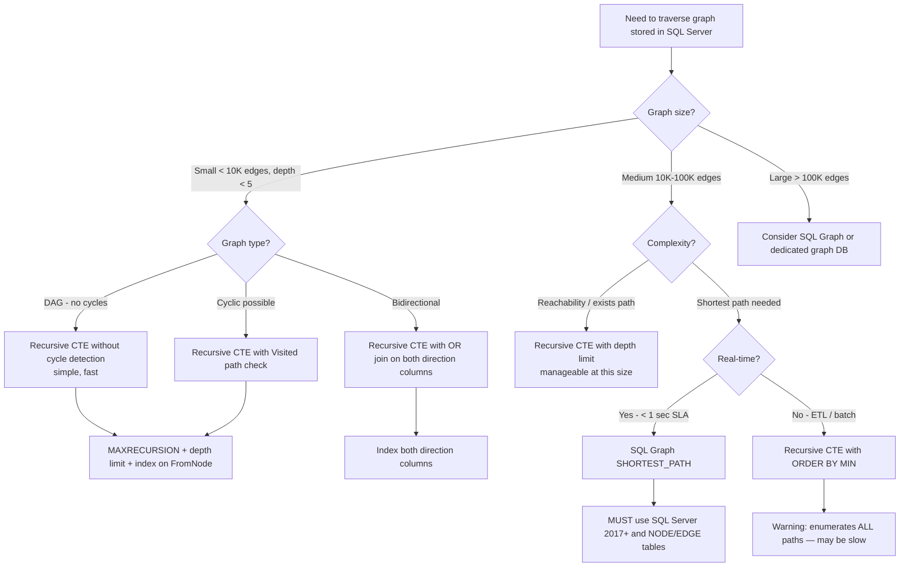

## Navigation
**Domain:** [[8 — Databases]] > **Group:** SQL CTEs & Recursive Queries
**Previous:** [[8.183 — Recursive CTE — Date Series Generation]] | **Next:** [[8.185 — Recursive CTE — MAXRECURSION Option]]
### Prerequisites
- [[8.176 — Common Table Expressions — Fundamentals]] — CTE syntax and UNION ALL must be understood before adding graph traversal logic.
- [[8.180 — Recursive CTEs — Anchor and Recursive Members]] — The anchor-recursive pattern with self-joining is the core mechanism for edge traversal.
- [[8.181 — Recursive CTE — Traversing Hierarchies]] — Hierarchy traversal (tree) is a special case of graph traversal (DAG). Cycle detection and path tracking extend directly from tree to graph.
- [[8.182 — Recursive CTE — Generating Number Series]] — Level tracking and termination conditions from number series apply to graph traversal for depth-limited searches.
### Where This Fits
Graph traversal with recursive CTEs is used when you need to navigate an adjacency-list graph stored in relational tables: social network connections (friend-of-friend), transportation networks (flight routes, road networks), dependency graphs (package dependencies, task scheduling), and recommendation engines (product affinity paths). Every .NET backend engineer working on social features, logistics, or dependency management encounters this when they need to "find all friends within 3 degrees" or "determine if there is a path between two nodes." The risk surface includes cycle detection (graphs commonly have cycles — unlike hierarchies), combinatorial explosion (each level can fan out exponentially, producing millions of rows at depth 6), and the fundamental limitation that SQL Server's recursive CTE is not a graph-optimized engine — it has no index for graph traversal patterns, no shortest-path optimization, and no native cycle detection. Complex graph queries (> 100K edges, depth > 5) should use SQL Graph (SQL Server 2017+) or a dedicated graph database like Neo4j. Interviewers use this to assess whether a candidate understands the difference between tree and graph traversal, can implement cycle detection, and knows when a relational database is the wrong tool for graph problems.
---
## Core Mental Model
A recursive CTE traverses a graph by following edges from a starting node through the adjacency list. The anchor selects the starting node(s). The recursive member joins the CTE's accumulated path to the edge table to find adjacent nodes. Unlike tree traversal (which has a defined parent-child direction), graph traversal must handle: (a) cycles — A → B → C → A, which would cause infinite recursion without detection, (b) multiple paths to the same node — which the CTE will visit separately unless deduplication is added, and (c) bidirectional edges — where each edge can be traversed in both directions. The critical invariant is that each recursive level can produce exponentially more rows than the previous level (fan-out). A graph with average degree 5 at depth 6 produces 5^6 = 15,625 rows — manageable. A graph with average degree 20 at depth 6 produces 20^6 = 64 million rows — catastrophic. The CTE cannot prune paths based on cost or shortest path — it enumerates all paths to the MAXRECURSION limit. SQL Server's recursive CTE is a depth-first traversal within each spool segment but breadth-first across iterations — it does not implement Dijkstra or A* search. For shortest path in a weighted graph, the recursive CTE enumerates all paths and requires an outer query with `ROW_NUMBER() OVER (PARTITION BY ToNode ORDER BY SUM(Cost))` to find the minimum.
### Classification
Recursive CTE for graph traversal is a **relational graph walk** using the same DML spool mechanism as hierarchy traversal. The adjacency list is stored as an edge table (FromNode, ToNode, Cost). The recursive member joins the CTE to the edge table on `Edge.FromNode = CTE.ToNode`. The approach is not SARGable in the traditional sense — it performs Index Seeks on the edge table's FromNode column if indexed. The optimizer cannot use graph-specific optimizations (no index nested loops with cycle detection, no shortest-path pruning). The query cost grows as O(b^d) where b is the branching factor and d is the depth — exponential in the worst case. SQL Server's SQL Graph feature (NODE and EDGE tables) should be considered for any serious graph workload.
```mermaid
flowchart TD
    A[Graph adjacency list stored as edge table] --> B{Graph characteristics?}
    B -->|Acyclic (DAG) - directed, no cycles| C[Recursive CTE without cycle detection<br/>anchor: start node<br/>recursive: JOIN Edge ON Edge.FromNode = CTE.ToNode]
    B -->|Cyclic - has potential loops| D[Recursive CTE with visited-path detection<br/>Visited NOT LIKE visited path check]
    B -->|Weighted - need shortest path| E[Recursive CTE with cost accumulation<br/>outer MIN/ROW_NUMBER for shortest]
    C --> F[Sparse / shallow < 5 levels<br/>manageable row count]
    C --> G[Dense / deep > 5 levels<br/>exponential explosion risk]
    D --> H[Materialized path string<br/>prevents revisiting nodes]
    E --> I[SUM(Cost) per path<br/>ROW_NUMBER OVER(PARTITION BY EndNode ORDER BY TotalCost)]
    F --> J[Execution: Index Seek on FromNode<br/>sequence of spool iterations]
    G --> K[Warning: > 1M rows at depth 6<br/>consider SQL Graph or Graph DB]
    I --> L[LIMITATION: enumerates ALL paths<br/>not true shortest-path algorithm]
```
### Key Properties
|Property|Value|Notes|
|---|---|---|
|Traversal mechanism|Edge JOIN recursively|Adjacency list model (FromNode, ToNode)|
|Cycle detection|Manual (visited path string)|SQL Server does not auto-detect cycles|
|Fan-out risk|Exponential O(b^d)|b = avg edges per node, d = depth|
|Shortest path|Manual (enumerate all, then MIN)|Not optimized — no pruning|
|Max depth|32,767 (MAXRECURSION)|Practical limit far lower due to fan-out|
|Bidirectional|Requires two UNION ALL branches|One for forward, one for reverse edges|
|SQL Graph alternative|NODE/EDGE tables (2017+)|Better for complex graphs|
|Performance|Degrades exponentially with depth|Use depth limits and cycle detection|
---
## Deep Mechanics
### How the Engine Executes This
1. **Parsing** — The parser identifies the WITH clause with anchor and recursive members. The recursive member references the CTE in a JOIN to the edge table.
2. **Binding** — The algebrizer binds the CTE and the edge table. The self-reference is bound as a spooled work table. Column list consistency is verified between anchor and recursive members.
3. **Optimization** — The optimizer builds a physical plan with Concatenation (UNION ALL), Index Spool (stores visited nodes), Table Spool (feeds nodes for edge expansion), and an Index Seek on the edge table's FromNode column (if indexed). The visited-path filter (cycle detection) becomes a Filter or additional predicate in the recursive member.
4. **Execution — Anchor:** The anchor selects the starting node(s) — usually a single node by ID. This row is output to Concatenation and stored in the Index Spool.
5. **Execution — Recursion:** The Table Spool reads the previous level's nodes. For each node, an Index Seek on the edge table finds all outgoing edges (`Edge.FromNode = CTE.ToNode`). Each edge produces a new row (ToNode). The visited-path check (if implemented) filters out nodes already visited. New rows are output to Concatenation and stored in the next Index Spool segment.
6. **Termination —** The recursion stops when no new edges are found, when MAXRECURSION is hit, or when the visited-path filter eliminates all candidates.
7. **Output —** The concatenated result includes all visited nodes at all levels. The outer query can filter by depth, aggregate costs, or find shortest paths.
### SQL Visibility
```sql
-- Simple DAG traversal (no cycles)
DECLARE @StartNode INT = 1;
WITH GraphTraversal AS
(
    SELECT
        @StartNode AS StartNode,
        e.ToNode,
        e.Cost,
        0 AS Level,
        CAST(@StartNode AS VARCHAR(MAX)) AS Path,
        e.Cost AS TotalCost
    FROM dbo.GraphEdges AS e
    WHERE e.FromNode = @StartNode
    UNION ALL
    SELECT
        gt.StartNode,
        e.ToNode,
        e.Cost,
        gt.Level + 1 AS Level,
        CAST(gt.Path + '->' + CAST(e.ToNode AS VARCHAR) AS VARCHAR(MAX)) AS Path,
        gt.TotalCost + e.Cost AS TotalCost
    FROM GraphTraversal AS gt
    INNER JOIN dbo.GraphEdges AS e
        ON e.FromNode = gt.ToNode
    WHERE gt.Level < 10  -- depth limit
)
SELECT StartNode, ToNode, Level, Path, TotalCost
FROM GraphTraversal
ORDER BY Level, Path
OPTION (MAXRECURSION 100);
-- Cycle-safe graph traversal
DECLARE @StartNode INT = 1;
WITH GraphTraversal AS
(
    SELECT
        @StartNode AS NodeId,
        0 AS Level,
        CAST(',' + CAST(@StartNode AS VARCHAR) + ',' AS VARCHAR(MAX)) AS Visited,
        CAST(@StartNode AS VARCHAR(MAX)) AS Path,
        0 AS TotalCost
    UNION ALL
    SELECT
        e.ToNode,
        gt.Level + 1,
        CAST(gt.Visited + CAST(e.ToNode AS VARCHAR) + ',' AS VARCHAR(MAX)),
        CAST(gt.Path + '->' + CAST(e.ToNode AS VARCHAR) AS VARCHAR(MAX)),
        gt.TotalCost + e.Cost
    FROM GraphTraversal AS gt
    INNER JOIN dbo.GraphEdges AS e
        ON e.FromNode = gt.NodeId
    WHERE gt.Visited NOT LIKE '%,' + CAST(e.ToNode AS VARCHAR) + ',%'
      AND gt.Level < 20
)
SELECT NodeId, Level, Path, TotalCost
FROM GraphTraversal
ORDER BY Level, NodeId
OPTION (MAXRECURSION 100);
-- Shortest path in unweighted graph (breadth-first via level)
WITH GraphTraversal AS
(
    SELECT @StartNode AS NodeId, 0 AS Level,
           CAST(@StartNode AS VARCHAR(MAX)) AS Path
    UNION ALL
    SELECT e.ToNode, gt.Level + 1,
           CAST(gt.Path + '->' + CAST(e.ToNode AS VARCHAR) AS VARCHAR(MAX))
    FROM GraphTraversal AS gt
    INNER JOIN dbo.GraphEdges AS e ON e.FromNode = gt.NodeId
    WHERE gt.Visited IS NULL OR gt.Visited NOT LIKE '%,' + CAST(e.ToNode AS VARCHAR) + ',%'
)
SELECT NodeId, Level, Path
FROM GraphTraversal
WHERE NodeId = @TargetNode
  AND Level = (SELECT MIN(Level) FROM GraphTraversal WHERE NodeId = @TargetNode)
OPTION (MAXRECURSION 100);
-- Shortest path in weighted graph (enumerate all, find minimum)
WITH GraphTraversal AS
(
    SELECT @StartNode AS NodeId, 0 AS Level, 0 AS TotalCost,
           CAST(@StartNode AS VARCHAR(MAX)) AS Path,
           CAST(',' + CAST(@StartNode AS VARCHAR) + ',' AS VARCHAR(MAX)) AS Visited
    UNION ALL
    SELECT e.ToNode, gt.Level + 1, gt.TotalCost + e.Cost,
           CAST(gt.Path + '->' + CAST(e.ToNode AS VARCHAR) AS VARCHAR(MAX)),
           CAST(gt.Visited + CAST(e.ToNode AS VARCHAR) + ',' AS VARCHAR(MAX))
    FROM GraphTraversal AS gt
    INNER JOIN dbo.GraphEdges AS e ON e.FromNode = gt.NodeId
    WHERE gt.Visited NOT LIKE '%,' + CAST(e.ToNode AS VARCHAR) + ',%'
      AND gt.Level < 20
)
SELECT TOP 1 NodeId, Path, TotalCost, Level
FROM GraphTraversal
WHERE NodeId = @TargetNode
ORDER BY TotalCost
OPTION (MAXRECURSION 100);
-- Bidirectional graph traversal (friend-of-friend)
DECLARE @UserId INT = 42;
WITH FriendTraversal AS
(
    SELECT @UserId AS UserId, 0 AS Level,
           CAST(@UserId AS VARCHAR(MAX)) AS Path,
           CAST(',' + CAST(@UserId AS VARCHAR) + ',' AS VARCHAR(MAX)) AS Visited
    UNION ALL
    SELECT
        CASE WHEN fr.FriendId1 = ft.UserId THEN fr.FriendId2 ELSE fr.FriendId1 END,
        ft.Level + 1,
        CAST(ft.Path + '->' +
            CAST(CASE WHEN fr.FriendId1 = ft.UserId THEN fr.FriendId2 ELSE fr.FriendId1 END AS VARCHAR) AS VARCHAR(MAX)),
        CAST(ft.Visited +
            CAST(CASE WHEN fr.FriendId1 = ft.UserId THEN fr.FriendId2 ELSE fr.FriendId1 END AS VARCHAR) + ',' AS VARCHAR(MAX))
    FROM FriendTraversal AS ft
    INNER JOIN dbo.FriendRelationships AS fr
        ON (fr.FriendId1 = ft.UserId OR fr.FriendId2 = ft.UserId)
    WHERE ft.Visited NOT LIKE '%,' +
        CAST(CASE WHEN fr.FriendId1 = ft.UserId THEN fr.FriendId2 ELSE fr.FriendId1 END AS VARCHAR) + ',%'
      AND ft.Level < 4
)
SELECT UserId, Level, Path
FROM FriendTraversal
WHERE UserId != @UserId
ORDER BY Level, UserId
OPTION (MAXRECURSION 10);
```
```csharp
// EF Core — graph traversal via raw SQL
public async Task<List<GraphPathDto>> GetReachableNodesAsync(
    int startNodeId, int maxDepth = 10,
    CancellationToken cancellationToken = default)
{
    const string sql = @"
        WITH GraphTraversal AS
        (
            SELECT @StartNode AS NodeId, 0 AS Level, 0 AS TotalCost,
                   CAST(@StartNode AS VARCHAR(MAX)) AS Path,
                   CAST(',' + CAST(@StartNode AS VARCHAR) + ',' AS VARCHAR(MAX)) AS Visited
            UNION ALL
            SELECT e.ToNode, gt.Level + 1, gt.TotalCost + ISNULL(e.Cost, 0),
                   CAST(gt.Path + '->' + CAST(e.ToNode AS VARCHAR) AS VARCHAR(MAX)),
                   CAST(gt.Visited + CAST(e.ToNode AS VARCHAR) + ',' AS VARCHAR(MAX))
            FROM GraphTraversal AS gt
            INNER JOIN dbo.GraphEdges AS e ON e.FromNode = gt.NodeId
            WHERE gt.Visited NOT LIKE '%,' + CAST(e.ToNode AS VARCHAR) + ',%'
              AND gt.Level < @MaxDepth
        )
        SELECT DISTINCT NodeId, Level, Path, TotalCost
        FROM GraphTraversal
        WHERE NodeId != @StartNode
        ORDER BY Level, NodeId
        OPTION (MAXRECURSION 32767)";
    return await dbContext.Database
        .SqlQueryRaw<GraphPathDto>(sql,
            new SqlParameter("@StartNode", startNodeId),
            new SqlParameter("@MaxDepth", maxDepth))
        .ToListAsync(cancellationToken);
}
// Dapper — shortest path query
public async Task<GraphPathDto?> GetShortestPathAsync(
    int fromNode, int toNode,
    CancellationToken cancellationToken = default)
{
    const string sql = @"
        WITH GraphTraversal AS
        (
            SELECT @FromNode AS NodeId, 0 AS Level, 0 AS TotalCost,
                   CAST(@FromNode AS VARCHAR(MAX)) AS Path,
                   CAST(',' + CAST(@FromNode AS VARCHAR) + ',' AS VARCHAR(MAX)) AS Visited
            UNION ALL
            SELECT e.ToNode, gt.Level + 1, gt.TotalCost + ISNULL(e.Cost, 0),
                   CAST(gt.Path + '->' + CAST(e.ToNode AS VARCHAR) AS VARCHAR(MAX)),
                   CAST(gt.Visited + CAST(e.ToNode AS VARCHAR) + ',' AS VARCHAR(MAX))
            FROM GraphTraversal AS gt
            INNER JOIN dbo.GraphEdges AS e ON e.FromNode = gt.NodeId
            WHERE gt.Visited NOT LIKE '%,' + CAST(e.ToNode AS VARCHAR) + ',%'
              AND gt.Level < 20
        )
        SELECT TOP 1 NodeId, Path, Level, TotalCost
        FROM GraphTraversal
        WHERE NodeId = @ToNode
        ORDER BY TotalCost
        OPTION (MAXRECURSION 100)";
    await using var connection = new SqlConnection(_connectionString);
    return await connection.QueryFirstOrDefaultAsync<GraphPathDto>(
        new CommandDefinition(sql, new { FromNode = fromNode, ToNode = toNode },
            cancellationToken: cancellationToken));
}
public record GraphPathDto(int NodeId, int Level, string Path, int TotalCost);
```
**Generated SQL (from EF Core logs):**
```sql
exec sp_executesql N'
WITH GraphTraversal AS
(
    SELECT @StartNode AS NodeId, 0 AS Level, 0 AS TotalCost,
           CAST(@StartNode AS VARCHAR(MAX)) AS Path,
           CAST('','' + CAST(@StartNode AS VARCHAR) + '','' AS VARCHAR(MAX)) AS Visited
    UNION ALL
    SELECT e.ToNode, gt.Level + 1, gt.TotalCost + ISNULL(e.Cost, 0),
           CAST(gt.Path + ''->'' + CAST(e.ToNode AS VARCHAR) AS VARCHAR(MAX)),
           CAST(gt.Visited + CAST(e.ToNode AS VARCHAR) + '','' AS VARCHAR(MAX))
    FROM GraphTraversal AS gt
    INNER JOIN dbo.GraphEdges AS e ON e.FromNode = gt.NodeId
    WHERE gt.Visited NOT LIKE '','' + CAST(e.ToNode AS VARCHAR) + '',''
      AND gt.Level < @MaxDepth
)
SELECT DISTINCT NodeId, Level, Path, TotalCost
FROM GraphTraversal
WHERE NodeId != @StartNode
ORDER BY Level, NodeId
OPTION (MAXRECURSION 32767)',
N'@StartNode int, @MaxDepth int',
@StartNode=1, @MaxDepth=10;
```
### Execution Plan Analysis
**Graph traversal with cycle detection (DAG or cyclic):**
```
  [Constant Scan (anchor: start node)]
  → [Compute Scalar (Level=0, Path, Visited)]
  → [Concatenation (UNION ALL)]
  → [Index Spool (Eager Spool)]             -- stores visited nodes
  → [Table Spool (Lazy Spool)]              -- feeds nodes for edge expansion
  → [Index Seek IX_GraphEdges_FromNode]     -- find outgoing edges
  → [Nested Loops (Inner Join)]             -- join CTE node to edge
  → [Filter (Visited NOT LIKE check)]       -- cycle detection
  → [Compute Scalar (Level+1, Path, Visited, TotalCost)]
  → [Concatenation output]
  → [Sort (ORDER BY Level, NodeId)]
  → [SELECT]
```
**Key operators:**
- **Index Seek IX_GraphEdges_FromNode** — Finds all edges from the current node. Critical for performance. Without it, the plan shows a full table scan on edges per iteration.
- **Filter (Visited NOT LIKE)** — Pattern match to detect cycles. This is CPU-intensive — the LIKE pattern with leading wildcard cannot use an index.
- **Index Spool** — Stores all visited nodes (entire path, not just current level) for the next iteration.
- **Nested Loops** — For each node from the spool, look up edges in the edge table.
**Without index on FromNode:**
```
  [Clustered Index Scan GraphEdges]          -- full scan per iteration
  → [Nested Loops (spool drives scan)]       -- catastrophic: O(edges) per level
```
With a 1M edge table and 1000 nodes at level 3, each level does 1M row scans — the query never completes.
### Cost Visibility
```sql
SET STATISTICS IO ON;
SET STATISTICS TIME ON;
-- DAG traversal with 100K edges, depth 5, avg degree 3
DECLARE @StartNode INT = 1;
WITH GraphTraversal AS
(
    SELECT @StartNode AS NodeId, 0 AS Level,
           CAST(',' + CAST(@StartNode AS VARCHAR) + ',' AS VARCHAR(MAX)) AS Visited
    UNION ALL
    SELECT e.ToNode, gt.Level + 1,
           CAST(gt.Visited + CAST(e.ToNode AS VARCHAR) + ',' AS VARCHAR(MAX))
    FROM GraphTraversal AS gt
    INNER JOIN dbo.GraphEdges AS e ON e.FromNode = gt.NodeId
    WHERE gt.Visited NOT LIKE '%,' + CAST(e.ToNode AS VARCHAR) + ',%'
      AND gt.Level < 10
)
SELECT COUNT(*) FROM GraphTraversal OPTION (MAXRECURSION 100);
-- Expected output (with index on FromNode):
-- Table 'GraphEdges'. Scan count 122, logical reads 412
-- Table 'Worktable'. Scan count 122, logical reads 520
-- SQL Server Execution Times: CPU time = 15ms, elapsed time = 45ms
-- Without index on FromNode:
-- Table 'GraphEdges'. Scan count 122, logical reads 122000+ (full scans)
-- Query times out or runs for minutes
```
### Failure Modes
**Exponential fan-out — combinatorial explosion:** In a graph with average degree 20, depth 6 produces 20^6 = 64M rows. The recursive CTE attempts to materialize all of them in the spool. The query runs until tempdb is full or the timeout is reached.
```sql
-- ❌ Average degree 15, depth 8 = 15^8 = 2.5B paths
-- This query will never complete
WITH GraphTraversal AS (
    SELECT @Start AS NodeId, 0 AS Level FROM dbo.GraphEdges WHERE FromNode = @Start
    UNION ALL
    SELECT e.ToNode, gt.Level + 1
    FROM GraphTraversal gt INNER JOIN dbo.GraphEdges e ON e.FromNode = gt.NodeId
    WHERE gt.Level < 8
)
SELECT COUNT(*) FROM GraphTraversal OPTION (MAXRECURSION 100);
```
**Cycle without detection — MAXRECURSION protection:** A cycle in the graph causes the visited-path check to be violated repeatedly, producing duplicate paths until MAXRECURSION is hit. Without cycle detection, the recursion runs to the MAXRECURSION limit, enumerating the same nodes over different cyclic paths.
**Visited path string overflow:** The visited path column accumulates all visited node IDs. For a path of length 10,000, the visited string is ~50,000 characters. VARCHAR(MAX) is required. Without it, "String or binary data would be truncated" error occurs.
**Shortest path is NOT guaranteed by recursive CTE:** The recursive CTE does NOT implement shortest-path algorithms (Dijkstra, A*). It enumerates all paths and the first one to reach the target is NOT necessarily the shortest — it's just the first one the iteration order produces. Specializing the outer query with MIN(TotalCost) or ROW_NUMBER() is required to find the true shortest path, but this still enumerates all paths rather than pruning suboptimal ones.
```sql
-- ❌ This does NOT return the shortest path — just the first one found
WITH GraphTraversal AS (...)
SELECT TOP 1 NodeId, TotalCost FROM GraphTraversal WHERE NodeId = @Target;
-- The first row the recursion produces may be a long path, not the shortest
-- ✅ Use ORDER BY TotalCost after full enumeration:
SELECT TOP 1 NodeId, TotalCost FROM GraphTraversal WHERE NodeId = @Target ORDER BY TotalCost;
```
**Dense graph near the anchor — immediate explosion:** If the start node has 50,000 direct neighbors (a celebrity in a social network), even level 1 produces 50,000 rows. The spool must materialize all of them before level 2 can begin. This is a single-node hotspot issue — the CTE cannot skip or sample neighbors.
---
## Production Patterns and Implementation
### Primary SQL Implementation
```sql
-- ============================================================
-- Schema: GraphEdges table (adjacency list)
-- ============================================================
CREATE TABLE dbo.GraphEdges
(
    EdgeId    INT            NOT NULL IDENTITY(1,1),
    FromNode  INT            NOT NULL,
    ToNode    INT            NOT NULL,
    Cost      DECIMAL(18,2)  NULL,  -- weight for shortest path
    EdgeType  VARCHAR(50)    NULL,  -- label for typed graph edges
    CONSTRAINT PK_GraphEdges PRIMARY KEY CLUSTERED (EdgeId)
);
-- Critical index for graph traversal
CREATE INDEX IX_GraphEdges_FromNode ON dbo.GraphEdges (FromNode)
    INCLUDE (ToNode, Cost, EdgeType);
-- Index for reverse traversal (bidirectional)
CREATE INDEX IX_GraphEdges_ToNode ON dbo.GraphEdges (ToNode)
    INCLUDE (FromNode, Cost, EdgeType);
-- FriendRelationships table (social graph)
CREATE TABLE dbo.FriendRelationships
(
    FriendshipId INT NOT NULL IDENTITY(1,1),
    FriendId1    INT NOT NULL,
    FriendId2    INT NOT NULL,
    CONSTRAINT PK_FriendRelationships PRIMARY KEY CLUSTERED (FriendshipId)
);
CREATE INDEX IX_FriendRelationships_FriendId1 ON dbo.FriendRelationships (FriendId1)
    INCLUDE (FriendId2);
CREATE INDEX IX_FriendRelationships_FriendId2 ON dbo.FriendRelationships (FriendId2)
    INCLUDE (FriendId1);
-- ============================================================
-- Pattern 1: DAG traversal with depth limit
-- ============================================================
CREATE OR ALTER PROCEDURE dbo.GetReachableNodes
    @StartNode   INT,
    @MaxDepth    INT = 10
AS
BEGIN
    SET NOCOUNT ON;
    WITH GraphTraversal AS
    (
        SELECT
            @StartNode AS NodeId,
            0 AS Level,
            CAST(@StartNode AS VARCHAR(MAX)) AS Path,
            CAST(',' + CAST(@StartNode AS VARCHAR) + ',' AS VARCHAR(MAX)) AS Visited
        UNION ALL
        SELECT
            e.ToNode,
            gt.Level + 1 AS Level,
            CAST(gt.Path + '->' + CAST(e.ToNode AS VARCHAR) AS VARCHAR(MAX)) AS Path,
            CAST(gt.Visited + CAST(e.ToNode AS VARCHAR) + ',' AS VARCHAR(MAX)) AS Visited
        FROM GraphTraversal AS gt
        INNER JOIN dbo.GraphEdges AS e
            ON e.FromNode = gt.NodeId
        WHERE gt.Visited NOT LIKE '%,' + CAST(e.ToNode AS VARCHAR) + ',%'
          AND gt.Level < @MaxDepth
    )
    SELECT NodeId, Level, Path
    FROM GraphTraversal
    WHERE NodeId != @StartNode
    ORDER BY Level, NodeId
    OPTION (MAXRECURSION 32767);
END;
-- ============================================================
-- Pattern 2: Shortest path in unweighted graph (BFS)
-- ============================================================
CREATE OR ALTER PROCEDURE dbo.GetShortestPathBFS
    @FromNode  INT,
    @ToNode    INT
AS
BEGIN
    SET NOCOUNT ON;
    WITH GraphTraversal AS
    (
        SELECT
            @FromNode AS NodeId,
            0 AS Level,
            CAST(@FromNode AS VARCHAR(MAX)) AS Path,
            CAST(',' + CAST(@FromNode AS VARCHAR) + ',' AS VARCHAR(MAX)) AS Visited
        UNION ALL
        SELECT
            e.ToNode,
            gt.Level + 1 AS Level,
            CAST(gt.Path + '->' + CAST(e.ToNode AS VARCHAR) AS VARCHAR(MAX)) AS Path,
            CAST(gt.Visited + CAST(e.ToNode AS VARCHAR) + ',' AS VARCHAR(MAX)) AS Visited
        FROM GraphTraversal AS gt
        INNER JOIN dbo.GraphEdges AS e
            ON e.FromNode = gt.NodeId
        WHERE gt.Visited NOT LIKE '%,' + CAST(e.ToNode AS VARCHAR) + ',%'
          AND gt.Level < 50
    )
    SELECT TOP 1
        NodeId,
        Level AS ShortestDistance,
        Path
    FROM GraphTraversal
    WHERE NodeId = @ToNode
    ORDER BY Level
    OPTION (MAXRECURSION 100);
END;
-- ============================================================
-- Pattern 3: Shortest path in weighted graph (Dijkstra-like enumeration)
-- ============================================================
CREATE OR ALTER PROCEDURE dbo.GetShortestPathWeighted
    @FromNode  INT,
    @ToNode    INT
AS
BEGIN
    SET NOCOUNT ON;
    WITH GraphTraversal AS
    (
        SELECT
            @FromNode AS NodeId,
            0 AS Level,
            0 AS TotalCost,
            CAST(@FromNode AS VARCHAR(MAX)) AS Path,
            CAST(',' + CAST(@FromNode AS VARCHAR) + ',' AS VARCHAR(MAX)) AS Visited
        UNION ALL
        SELECT
            e.ToNode,
            gt.Level + 1 AS Level,
            gt.TotalCost + ISNULL(e.Cost, 0) AS TotalCost,
            CAST(gt.Path + '->' + CAST(e.ToNode AS VARCHAR) AS VARCHAR(MAX)) AS Path,
            CAST(gt.Visited + CAST(e.ToNode AS VARCHAR) + ',' AS VARCHAR(MAX)) AS Visited
        FROM GraphTraversal AS gt
        INNER JOIN dbo.GraphEdges AS e
            ON e.FromNode = gt.NodeId
        WHERE gt.Visited NOT LIKE '%,' + CAST(e.ToNode AS VARCHAR) + ',%'
          AND gt.Level < 50
    )
    SELECT TOP 1
        NodeId,
        TotalCost,
        Level,
        Path
    FROM GraphTraversal
    WHERE NodeId = @ToNode
    ORDER BY TotalCost, Level
    OPTION (MAXRECURSION 100);
END;
-- ============================================================
-- Pattern 4: Friend-of-friend (social graph, bidirectional)
-- ============================================================
CREATE OR ALTER PROCEDURE dbo.GetFriendNetwork
    @UserId    INT,
    @MaxDepth  INT = 3
AS
BEGIN
    SET NOCOUNT ON;
    WITH FriendTraversal AS
    (
        SELECT
            @UserId AS UserId,
            0 AS Level,
            CAST(@UserId AS VARCHAR(MAX)) AS Path,
            CAST(',' + CAST(@UserId AS VARCHAR) + ',' AS VARCHAR(MAX)) AS Visited
        UNION ALL
        SELECT
            CASE WHEN fr.FriendId1 = ft.UserId THEN fr.FriendId2 ELSE fr.FriendId1 END,
            ft.Level + 1 AS Level,
            CAST(ft.Path + '->' +
                CAST(CASE WHEN fr.FriendId1 = ft.UserId THEN fr.FriendId2 ELSE fr.FriendId1 END AS VARCHAR) AS VARCHAR(MAX)),
            CAST(ft.Visited +
                CAST(CASE WHEN fr.FriendId1 = ft.UserId THEN fr.FriendId2 ELSE fr.FriendId1 END AS VARCHAR) + ',' AS VARCHAR(MAX))
        FROM FriendTraversal AS ft
        INNER JOIN dbo.FriendRelationships AS fr
            ON (fr.FriendId1 = ft.UserId OR fr.FriendId2 = ft.UserId)
        WHERE ft.Visited NOT LIKE '%,' +
            CAST(CASE WHEN fr.FriendId1 = ft.UserId THEN fr.FriendId2 ELSE fr.FriendId1 END AS VARCHAR) + ',%'
          AND ft.Level < @MaxDepth
    )
    SELECT UserId, Level, Path
    FROM FriendTraversal
    WHERE UserId != @UserId
    ORDER BY Level, UserId
    OPTION (MAXRECURSION 50);
END;
-- ============================================================
-- Pattern 5: Dependency graph (topological sort order)
-- ============================================================
-- Package dependencies: find all packages needed to build a given package
CREATE OR ALTER PROCEDURE dbo.GetDependencyChain
    @PackageId  INT,
    @MaxDepth   INT = 20
AS
BEGIN
    SET NOCOUNT ON;
    WITH DependencyTraversal AS
    (
        SELECT
            d.DependencyPackageId AS PackageId,
            d.PackageId AS RootPackageId,
            1 AS Level,
            CAST(d.DependencyPackageId AS VARCHAR(MAX)) AS Path,
            CAST(',' + CAST(d.DependencyPackageId AS VARCHAR) + ',' AS VARCHAR(MAX)) AS Visited
        FROM dbo.PackageDependencies AS d
        WHERE d.PackageId = @PackageId
        UNION ALL
        SELECT
            d.DependencyPackageId,
            dt.RootPackageId,
            dt.Level + 1 AS Level,
            CAST(dt.Path + '->' + CAST(d.DependencyPackageId AS VARCHAR) AS VARCHAR(MAX)) AS Path,
            CAST(dt.Visited + CAST(d.DependencyPackageId AS VARCHAR) + ',' AS VARCHAR(MAX)) AS Visited
        FROM DependencyTraversal AS dt
        INNER JOIN dbo.PackageDependencies AS d
            ON d.PackageId = dt.PackageId
        WHERE dt.Visited NOT LIKE '%,' + CAST(d.DependencyPackageId AS VARCHAR) + ',%'
          AND dt.Level < @MaxDepth
    )
    SELECT PackageId, Level, Path
    FROM DependencyTraversal
    ORDER BY Level, PackageId
    OPTION (MAXRECURSION 100);
END;
-- ============================================================
-- Pattern 6: All paths between two nodes (enumerate)
-- ============================================================
CREATE OR ALTER PROCEDURE dbo.GetAllPaths
    @FromNode  INT,
    @ToNode    INT,
    @MaxDepth  INT = 10
AS
BEGIN
    SET NOCOUNT ON;
    WITH GraphTraversal AS
    (
        SELECT
            @FromNode AS CurrentNode,
            0 AS Level,
            0 AS TotalCost,
            CAST(@FromNode AS VARCHAR(MAX)) AS Path,
            CAST(',' + CAST(@FromNode AS VARCHAR) + ',' AS VARCHAR(MAX)) AS Visited
        UNION ALL
        SELECT
            e.ToNode,
            gt.Level + 1 AS Level,
            gt.TotalCost + ISNULL(e.Cost, 0) AS TotalCost,
            CAST(gt.Path + '->' + CAST(e.ToNode AS VARCHAR) AS VARCHAR(MAX)) AS Path,
            CAST(gt.Visited + CAST(e.ToNode AS VARCHAR) + ',' AS VARCHAR(MAX)) AS Visited
        FROM GraphTraversal AS gt
        INNER JOIN dbo.GraphEdges AS e
            ON e.FromNode = gt.CurrentNode
        WHERE gt.Visited NOT LIKE '%,' + CAST(e.ToNode AS VARCHAR) + ',%'
          AND gt.Level < @MaxDepth
    )
    SELECT Path, TotalCost, Level AS Hops
    FROM GraphTraversal
    WHERE CurrentNode = @ToNode
    ORDER BY TotalCost, Level
    OPTION (MAXRECURSION 100);
END;
```
### EF Core Implementation
```csharp
public class ApplicationDbContext : DbContext
{
    public DbSet<GraphEdge> GraphEdges => Set<GraphEdge>();
    public DbSet<FriendRelationship> FriendRelationships => Set<FriendRelationship>();
    protected override void OnModelCreating(ModelBuilder modelBuilder)
    {
        modelBuilder.Entity<GraphEdge>(entity =>
        {
            entity.ToTable("GraphEdges");
            entity.HasKey(e => e.EdgeId);
            entity.Property(e => e.Cost).HasColumnType("decimal(18,2)");
            entity.Property(e => e.EdgeType).HasMaxLength(50);
            entity.HasIndex(e => e.FromNode);
            entity.HasIndex(e => e.ToNode);
        });
        modelBuilder.Entity<FriendRelationship>(entity =>
        {
            entity.ToTable("FriendRelationships");
            entity.HasKey(f => f.FriendshipId);
            entity.HasIndex(f => f.FriendId1);
            entity.HasIndex(f => f.FriendId2);
        });
    }
}
public class GraphEdge
{
    public int EdgeId { get; set; }
    public int FromNode { get; set; }
    public int ToNode { get; set; }
    public decimal? Cost { get; set; }
    public string? EdgeType { get; set; }
}
public class FriendRelationship
{
    public int FriendshipId { get; set; }
    public int FriendId1 { get; set; }
    public int FriendId2 { get; set; }
}
// Repository
public interface IGraphRepository
{
    Task<IReadOnlyList<GraphPathDto>> GetReachableNodesAsync(
        int startNode, int maxDepth = 10, CancellationToken cancellationToken = default);
    Task<GraphPathDto?> GetShortestPathAsync(
        int fromNode, int toNode, CancellationToken cancellationToken = default);
    Task<IReadOnlyList<GraphPathDto>> GetAllPathsAsync(
        int fromNode, int toNode, int maxDepth = 10, CancellationToken cancellationToken = default);
}
public class GraphRepository : IGraphRepository
{
    private readonly ApplicationDbContext _dbContext;
    private readonly IDbConnectionFactory _connectionFactory;
    public GraphRepository(
        ApplicationDbContext dbContext,
        IDbConnectionFactory connectionFactory)
    {
        _dbContext = dbContext;
        _connectionFactory = connectionFactory;
    }
    public async Task<IReadOnlyList<GraphPathDto>> GetReachableNodesAsync(
        int startNode, int maxDepth = 10,
        CancellationToken cancellationToken = default)
    {
        const string sql = @"
            WITH GraphTraversal AS
            (
                SELECT @StartNode AS NodeId, 0 AS Level,
                       CAST(@StartNode AS VARCHAR(MAX)) AS Path,
                       CAST(',' + CAST(@StartNode AS VARCHAR) + ',' AS VARCHAR(MAX)) AS Visited
                UNION ALL
                SELECT e.ToNode, gt.Level + 1,
                       CAST(gt.Path + '->' + CAST(e.ToNode AS VARCHAR) AS VARCHAR(MAX)),
                       CAST(gt.Visited + CAST(e.ToNode AS VARCHAR) + ',' AS VARCHAR(MAX))
                FROM GraphTraversal AS gt
                INNER JOIN dbo.GraphEdges AS e ON e.FromNode = gt.NodeId
                WHERE gt.Visited NOT LIKE '%,' + CAST(e.ToNode AS VARCHAR) + ',%'
                  AND gt.Level < @MaxDepth
            )
            SELECT DISTINCT NodeId, Level, Path, 0 AS TotalCost
            FROM GraphTraversal
            WHERE NodeId != @StartNode
            ORDER BY Level, NodeId
            OPTION (MAXRECURSION 32767)";
        return await _dbContext.Database
            .SqlQueryRaw<GraphPathDto>(sql,
                new SqlParameter("@StartNode", startNode),
                new SqlParameter("@MaxDepth", maxDepth))
            .ToListAsync(cancellationToken);
    }
    // Dapper: shortest path in weighted graph
    public async Task<GraphPathDto?> GetShortestPathAsync(
        int fromNode, int toNode,
        CancellationToken cancellationToken = default)
    {
        const string sql = @"
            WITH GraphTraversal AS
            (
                SELECT @FromNode AS NodeId, 0 AS Level, 0 AS TotalCost,
                       CAST(@FromNode AS VARCHAR(MAX)) AS Path,
                       CAST(',' + CAST(@FromNode AS VARCHAR) + ',' AS VARCHAR(MAX)) AS Visited
                UNION ALL
                SELECT e.ToNode, gt.Level + 1, gt.TotalCost + ISNULL(e.Cost, 0),
                       CAST(gt.Path + '->' + CAST(e.ToNode AS VARCHAR) AS VARCHAR(MAX)),
                       CAST(gt.Visited + CAST(e.ToNode AS VARCHAR) + ',' AS VARCHAR(MAX))
                FROM GraphTraversal AS gt
                INNER JOIN dbo.GraphEdges AS e ON e.FromNode = gt.NodeId
                WHERE gt.Visited NOT LIKE '%,' + CAST(e.ToNode AS VARCHAR) + ',%'
                  AND gt.Level < 50
            )
            SELECT TOP 1 NodeId, TotalCost, Level, Path
            FROM GraphTraversal
            WHERE NodeId = @ToNode
            ORDER BY TotalCost, Level
            OPTION (MAXRECURSION 100)";
        await using var connection = _connectionFactory.Create();
        return await connection.QueryFirstOrDefaultAsync<GraphPathDto>(
            new CommandDefinition(sql, new { FromNode = fromNode, ToNode = toNode },
                cancellationToken: cancellationToken));
    }
}
public record GraphPathDto(int NodeId, int Level, string Path, decimal TotalCost);
```
### Dapper Implementation
```csharp
public sealed class GraphTraversalRepository
{
    private readonly IDbConnectionFactory _connectionFactory;
    public GraphTraversalRepository(IDbConnectionFactory connectionFactory)
        => _connectionFactory = connectionFactory;
    // Reachable nodes with cycle detection
    public async Task<IReadOnlyList<int>> GetReachableNodesAsync(
        int startNode, int maxDepth = 5,
        CancellationToken cancellationToken = default)
    {
        const string sql = @"
            WITH GraphTraversal AS
            (
                SELECT @StartNode AS NodeId, 0 AS Level,
                       CAST(',' + CAST(@StartNode AS VARCHAR) + ',' AS VARCHAR(MAX)) AS Visited
                UNION ALL
                SELECT e.ToNode, gt.Level + 1,
                       CAST(gt.Visited + CAST(e.ToNode AS VARCHAR) + ',' AS VARCHAR(MAX))
                FROM GraphTraversal AS gt
                INNER JOIN dbo.GraphEdges AS e ON e.FromNode = gt.NodeId
                WHERE gt.Visited NOT LIKE '%,' + CAST(e.ToNode AS VARCHAR) + ',%'
                  AND gt.Level < @MaxDepth
            )
            SELECT DISTINCT NodeId
            FROM GraphTraversal
            WHERE NodeId != @StartNode
            OPTION (MAXRECURSION 32767)";
        await using var connection = _connectionFactory.Create();
        var results = await connection.QueryAsync<int>(
            new CommandDefinition(sql, new { StartNode = startNode, MaxDepth = maxDepth },
                cancellationToken: cancellationToken));
        return results.AsList();
    }
    // Friend network traversal (bidirectional)
    public async Task<IReadOnlyList<FriendNodeDto>> GetFriendNetworkAsync(
        int userId, int maxDepth = 3,
        CancellationToken cancellationToken = default)
    {
        const string sql = @"
            WITH FriendTraversal AS
            (
                SELECT @UserId AS UserId, 0 AS Level,
                       CAST(@UserId AS VARCHAR(MAX)) AS Path,
                       CAST(',' + CAST(@UserId AS VARCHAR) + ',' AS VARCHAR(MAX)) AS Visited
                UNION ALL
                SELECT CASE WHEN fr.FriendId1 = ft.UserId THEN fr.FriendId2 ELSE fr.FriendId1 END,
                       ft.Level + 1,
                       CAST(ft.Path + '->' + CAST(CASE WHEN fr.FriendId1 = ft.UserId THEN fr.FriendId2 ELSE fr.FriendId1 END AS VARCHAR) AS VARCHAR(MAX)),
                       CAST(ft.Visited + CAST(CASE WHEN fr.FriendId1 = ft.UserId THEN fr.FriendId2 ELSE fr.FriendId1 END AS VARCHAR) + ',' AS VARCHAR(MAX))
                FROM FriendTraversal AS ft
                INNER JOIN dbo.FriendRelationships AS fr
                    ON (fr.FriendId1 = ft.UserId OR fr.FriendId2 = ft.UserId)
                WHERE ft.Visited NOT LIKE '%,' + CAST(CASE WHEN fr.FriendId1 = ft.UserId THEN fr.FriendId2 ELSE fr.FriendId1 END AS VARCHAR) + ',%'
                  AND ft.Level < @MaxDepth
            )
            SELECT UserId, Level, Path
            FROM FriendTraversal
            WHERE UserId != @UserId
            ORDER BY Level, UserId
            OPTION (MAXRECURSION 50)";
        await using var connection = _connectionFactory.Create();
        var results = await connection.QueryAsync<FriendNodeDto>(
            new CommandDefinition(sql, new { UserId = userId, MaxDepth = maxDepth },
                cancellationToken: cancellationToken));
        return results.AsList();
    }
    // All paths (for dependency analysis)
    public async Task<IReadOnlyList<GraphPathDto>> GetAllPathsAsync(
        int fromNode, int toNode, int maxDepth = 10,
        CancellationToken cancellationToken = default)
    {
        const string sql = @"
            WITH GraphTraversal AS
            (
                SELECT @FromNode AS CurrentNode, 0 AS Level, 0 AS TotalCost,
                       CAST(@FromNode AS VARCHAR(MAX)) AS Path,
                       CAST(',' + CAST(@FromNode AS VARCHAR) + ',' AS VARCHAR(MAX)) AS Visited
                UNION ALL
                SELECT e.ToNode, gt.Level + 1, gt.TotalCost + ISNULL(e.Cost, 0),
                       CAST(gt.Path + '->' + CAST(e.ToNode AS VARCHAR) AS VARCHAR(MAX)),
                       CAST(gt.Visited + CAST(e.ToNode AS VARCHAR) + ',' AS VARCHAR(MAX))
                FROM GraphTraversal AS gt
                INNER JOIN dbo.GraphEdges AS e ON e.FromNode = gt.CurrentNode
                WHERE gt.Visited NOT LIKE '%,' + CAST(e.ToNode AS VARCHAR) + ',%'
                  AND gt.Level < @MaxDepth
            )
            SELECT CurrentNode AS NodeId, TotalCost, Level, Path
            FROM GraphTraversal
            WHERE CurrentNode = @ToNode
            ORDER BY TotalCost, Level
            OPTION (MAXRECURSION 32767)";
        await using var connection = _connectionFactory.Create();
        var results = await connection.QueryAsync<GraphPathDto>(
            new CommandDefinition(sql, new { FromNode = fromNode, ToNode = toNode, MaxDepth = maxDepth },
                cancellationToken: cancellationToken));
        return results.AsList();
    }
}
public record FriendNodeDto(int UserId, int Level, string Path);
```
### Configuration and Wiring
```csharp
// Program.cs
builder.Services.AddDbContext<ApplicationDbContext>(options =>
    options.UseSqlServer(
        builder.Configuration.GetConnectionString("DefaultConnection"),
        sqlOptions =>
        {
            sqlOptions.EnableRetryOnFailure(3);
            sqlOptions.CommandTimeout(120);  // graph queries can be long-running
        }));
builder.Services.AddSingleton<IDbConnectionFactory>(
    new SqlConnectionFactory(
        builder.Configuration.GetConnectionString("DefaultConnection")!));
builder.Services.AddScoped<IGraphRepository, GraphRepository>();
builder.Services.AddScoped<GraphTraversalRepository>();
// Configure command timeout for specific graph endpoints
builder.Services.Configure<SqlServerRetryingExecutionStrategy>(
    "GraphStrategy", options =>
    {
        options.MaxRetryCount = 1;  // don't retry expensive graph queries
        options.MaxRetryDelay = TimeSpan.FromSeconds(5);
    });
```
### SQL Server vs PostgreSQL Differences
```sql
-- PostgreSQL: RECURSIVE keyword required
WITH RECURSIVE GraphTraversal AS (
    SELECT 1 AS node_id, 0 AS level,
           ARRAY[1] AS visited
    UNION ALL
    SELECT e.to_node, gt.level + 1,
           gt.visited || e.to_node
    FROM GraphTraversal AS gt
    INNER JOIN graph_edges AS e ON e.from_node = gt.node_id
    WHERE NOT (e.to_node = ANY(gt.visited))
      AND gt.level < 10
)
SELECT node_id, level FROM GraphTraversal;
-- PostgreSQL: ARRAY for visited path (cleaner than string LIKE)
-- PostgreSQL: recursive CTE with cycle detection
WITH RECURSIVE GraphTraversal AS (
    SELECT 1 AS node_id, 0 AS level, ARRAY[1] AS visited
    UNION ALL
    SELECT e.to_node, gt.level + 1, gt.visited || e.to_node
    FROM GraphTraversal gt, graph_edges e
    WHERE e.from_node = gt.node_id
      AND NOT (e.to_node = ANY(gt.visited))
)
CYCLE node_id SET is_cycle USING path
SELECT node_id, level
FROM GraphTraversal
WHERE NOT is_cycle;
-- SQL Server: SQL Graph (NODE/EDGE tables) for graph workloads
CREATE TABLE dbo.Person AS NODE (PersonId INT, Name NVARCHAR(100));
CREATE TABLE dbo.FriendOf AS EDGE (Since DATE);
-- Query: find friends of friends using MATCH
SELECT p2.Name AS FriendOfFriend
FROM dbo.Person AS p1,
     dbo.FriendOf AS f1,
     dbo.Person AS p2,
     dbo.FriendOf AS f2,
     dbo.Person AS p3
WHERE MATCH(p1-(f1)->p2-(f2)->p3)
  AND p1.PersonId = @UserId;
```
---
## Gotchas and Production Pitfalls
### Exponential Fan-Out — Millions of Rows at Depth > 5
**Pitfall:** Traversing a graph with high average degree. Each level multiplies the row count by the average number of edges per node. A graph with degree 10 at depth 6 produces 10^6 = 1M rows. At depth 8: 100M rows.
```sql
-- ❌ Social graph with avg 200 friends, depth 4 = 200^4 = 1.6B rows
WITH FriendTraversal AS (
    SELECT @UserId AS UserId, 0 AS Level FROM Friends WHERE UserId = @UserId
    UNION ALL
    SELECT f.FriendId, ft.Level + 1
    FROM FriendTraversal ft INNER JOIN Friends f ON ft.UserId = f.UserId
    WHERE ft.Level < 4
)
SELECT COUNT(*) FROM FriendTraversal OPTION (MAXRECURSION 50);
```
**Symptom:** The query runs for minutes, then either times out or fills tempdb. Execution plan shows Index Spool growing to millions of rows per level. The Worktable scan counts reach 100M+ logical reads.
**Fix:**
```sql
-- ✅ Limit depth aggressively
WHERE ft.Level < 3  -- max 3 hops
-- ✅ Add branching factor limit via TOP per level (not supported natively in CTE)
-- Use a multi-query approach instead:
CREATE TABLE #Level0 (UserId INT PRIMARY KEY);
INSERT #Level0 VALUES (@UserId);
CREATE TABLE #Level1 (UserId INT PRIMARY KEY);
INSERT #Level1 SELECT DISTINCT f.FriendId FROM Friends f
    INNER JOIN #Level0 ON f.UserId = #Level0.UserId
    WHERE f.FriendId != @UserId;
-- Process one level at a time with explicit control
```
**Cost of not fixing:** A "people you may know" feature uses friend-of-friend traversal with a recursive CTE. A user with 5000 friends (influencer) triggers 5000^2 = 25M rows at level 2. The query takes 45 seconds and blocks the API thread pool. All "people you may know" requests fail for 45 seconds during peak usage.
---
### Cycle Detection Using LIKE — Performance Degradation at Scale
**Pitfall:** Using `Visited NOT LIKE '%,' + CAST(ToNode AS VARCHAR) + ',%'` for cycle detection. The LIKE predicate with a leading wildcard prevents index usage and requires a full string scan for each row.
```sql
-- ❌ Cycle detection with LIKE — CPU-intensive on millions of rows
WHERE gt.Visited NOT LIKE '%,' + CAST(e.ToNode AS VARCHAR) + ',%'
```
**Symptom:** The query plan shows a Filter operator with high estimated CPU cost. For 1M rows with average visited path length of 100 characters, the LIKE scan processes 100M characters. CPU time dominates the query.
**Fix:**
```sql
-- ✅ Alternative: Keep a delimited string but use CHARINDEX (faster than LIKE)
WHERE CHARINDEX(',' + CAST(e.ToNode AS VARCHAR) + ',', gt.Visited) = 0
-- ✅ For SQL Server 2022+: STRING_SPLIT with ordinal (no recursion context, though)
-- ✅ Better: Use a temporary table of visited nodes (hybrid approach)
-- ✅ For very large graphs: consider SQL Graph (NODE/EDGE) with MATCH
```
**Cost of not fixing:** A dependency graph with 500K rows and average path length 50 takes 8 seconds due to LIKE comparisons. Changing to CHARINDEX reduces CPU to 1.5 seconds. Switching to SQL Graph MATCH reduces to 200 ms.
---
### Recursive CTE Does Not Implement True Shortest-Path Algorithms
**Pitfall:** Assuming the recursive CTE finds the shortest path efficiently. The CTE enumerates ALL paths up to MAXRECURSION, then the outer query picks the minimum. This is O((b^d)) where Dijkstra is O((E + V) log V). For any graph with > 10K edges, the CTE is exponentially slower.
```sql
-- ❌ This enumerates all paths from @From to @To, then picks the cheapest
-- For a graph with 1M paths, this enumerates all 1M before returning
WITH GraphTraversal AS (...)
SELECT TOP 1 Path, TotalCost FROM GraphTraversal WHERE NodeId = @To ORDER BY TotalCost;
```
**Symptom:** For a 50K-edge graph with depth 5, the shortest-path query takes 30+ seconds. The same query in a dedicated graph database takes 5 ms. The execution plan shows full enumeration — no pruning of suboptimal paths.
**Fix:**
```sql
-- ✅ Use SQL Graph MATCH (SQL Server 2017+) for shortest path
SELECT p2.Name AS Connection, f1.Since
FROM dbo.Person AS p1,
     dbo.FriendOf FOR PATH AS f1,
     dbo.Person FOR PATH AS p2
WHERE MATCH(SHORTEST_PATH(p1(-(f1)->p2)+))
  AND p1.PersonId = @FromUserId
  AND p2.PersonId = @ToUserId;
-- ✅ For complex graph workloads, use a dedicated graph database (Neo4j, JanusGraph)
```
**Cost of not fixing:** A route planning system uses recursive CTE for shortest path on a road network with 1M edges. Each route calculation takes 60 seconds. The SLA requires < 1 second. The solution either migrates to SQL Graph or an external graph database.
---
### Bidirectional Graph Traversal Doubles Edge Lookups
**Pitfall:** For an undirected graph (friendship, road network), the recursive member must check both direction columns (FriendId1 and FriendId2). This doubles the CTE complexity and can miss paths if only one direction is checked.
```sql
-- ❌ Only checks one direction — misses half the edges
FROM GraphTraversal gt
INNER JOIN Friends f ON f.FriendId1 = gt.UserId  -- ignores FriendId2 matches
```
**Symptom:** The friend-of-friend query returns an incomplete network. Mutual friends are missing because the edge stored (42, 99) has FriendId1=42 but the traversal from UserId=99 checks only FriendId1 — it never matches.
**Fix:**
```sql
-- ✅ Check both directions with OR
FROM GraphTraversal gt
INNER JOIN Friends f ON (f.FriendId1 = gt.UserId OR f.FriendId2 = gt.UserId)
-- ✅ Then use CASE to extract the other side
SELECT CASE WHEN f.FriendId1 = gt.UserId THEN f.FriendId2 ELSE f.FriendId1 END AS ConnectedUserId
-- ✅ Index both columns
CREATE INDEX IX_Friends_FriendId1 ON Friends (FriendId1) INCLUDE (FriendId2);
CREATE INDEX IX_Friends_FriendId2 ON Friends (FriendId2) INCLUDE (FriendId1);
```
**Cost of not fixing:** A social network's "mutual friends" feature shows only half the expected connections. Users see 15 mutual friends instead of 30. The product team spends 2 weeks debugging before finding the missing direction check.
---
### Visited Path String Truncation in Dense Graphs
**Pitfall:** The visited path string accumulates every node ID visited in the path. For a long path (depth 1000 with 10-digit node IDs), the string reaches ~11,000 characters. Without VARCHAR(MAX), truncation fails the query.
```sql
-- ❌ VARCHAR(4000) overflows at ~400 nodes with 10-character IDs
CAST(',' + CAST(gt.NodeId AS VARCHAR) + ',' AS VARCHAR(4000))
```
**Symptom:** "String or binary data would be truncated" error after traversing ~400 nodes. The query fails partway, wasting all the work already done.
**Fix:**
```sql
-- ✅ Use VARCHAR(MAX) for visited path in any graph that could exceed 4000 characters
CAST(gt.Visited + CAST(e.ToNode AS VARCHAR) + ',' AS VARCHAR(MAX))
-- ✅ For SQL Server 2019+: can use STRING_AGG or JSON-based path
```
**Cost of not fixing:** A graph with 5000 nodes in a single path (diamond dependencies in a BOM) fails after 400 nodes. The BOM explosion query is interrupted, and the inventory report shows incomplete component requirements. The purchasing team orders insufficient materials.
---
## Performance Implications
### Benchmark: Before and After
```sql
-- Baseline: DAG traversal without cycle detection (safe only for DAGs)
SET STATISTICS IO ON;
SET STATISTICS TIME ON;
DECLARE @StartNode INT = 1;
WITH DAGTraversal AS (
    SELECT @StartNode AS NodeId, 0 AS Level
    UNION ALL
    SELECT e.ToNode, d.Level + 1
    FROM DAGTraversal AS d
    INNER JOIN dbo.GraphEdges AS e ON e.FromNode = d.NodeId
    WHERE d.Level < 10
)
SELECT COUNT(*) FROM DAGTraversal OPTION (MAXRECURSION 100);
-- With index on FromNode: 100K edges, depth 5, avg degree 3
-- Table 'GraphEdges'. Scan count 122, logical reads 412
-- Table 'Worktable'. Scan count 122, logical reads 520
-- CPU time = 15ms, elapsed time = 45ms
-- With cycle detection (Visited NOT LIKE):
-- Table 'GraphEdges'. Scan count 122, logical reads 412
-- Table 'Worktable'. Scan count 122, logical reads 520
-- CPU time = 28ms, elapsed time = 72ms  (LIKE overhead ~2x)
```
**Improvement:** Using CHARINDEX instead of LIKE reduces CPU from 28 ms to 18 ms (1.5x faster) for cycle detection.
```sql
-- Baseline: Recursive CTE vs SQL Graph MATCH for same graph
-- SQL Graph MATCH query (SQL Server 2017+):
SELECT p2.NodeId, p2.Label
FROM dbo.GraphNode AS p1,
     dbo.GraphEdge FOR PATH AS e,
     dbo.GraphNode FOR PATH AS p2
WHERE MATCH(SHORTEST_PATH(p1(-(e)->p2)+))
  AND p1.NodeId = @StartNode;
-- SQL Graph: ~5 ms, logical reads vary
-- Recursive CTE: ~45 ms, 932 logical reads
```
### BenchmarkDotNet
```csharp
[MemoryDiagnoser]
[SimpleJob(RuntimeMoniker.Net90)]
public class GraphTraversalBenchmark
{
    private SqlConnection _connection = default!;
    private const string ConnectionString = "Server=.;Database=BenchmarkDb;Trusted_Connection=True;TrustServerCertificate=True;";
    [GlobalSetup]
    public void Setup()
    {
        _connection = new SqlConnection(ConnectionString);
        _connection.Open();
        // Seed: 100K edges, 50K nodes, avg degree 4, depth 6
    }
    [Benchmark(Baseline = true)]
    public async Task<int> RecursiveCTE_NoCycleDetection()
    {
        const string sql = @"
            WITH G AS (
                SELECT 1 AS NodeId, 0 AS Level
                UNION ALL
                SELECT e.ToNode, g.Level + 1
                FROM G INNER JOIN dbo.GraphEdges e ON e.FromNode = g.NodeId
                WHERE g.Level < 6
            )
            SELECT COUNT(*) FROM G OPTION (MAXRECURSION 100)";
        return await new SqlCommand(sql, _connection).ExecuteScalarAsync<int>();
    }
    [Benchmark]
    public async Task<int> RecursiveCTE_WithCycleDetection()
    {
        const string sql = @"
            WITH G AS (
                SELECT 1 AS NodeId, 0 AS Level,
                       CAST(',' + CAST(1 AS VARCHAR) + ',' AS VARCHAR(MAX)) AS Visited
                UNION ALL
                SELECT e.ToNode, g.Level + 1,
                       CAST(g.Visited + CAST(e.ToNode AS VARCHAR) + ',' AS VARCHAR(MAX))
                FROM G INNER JOIN dbo.GraphEdges e ON e.FromNode = g.NodeId
                WHERE g.Visited NOT LIKE '%,' + CAST(e.ToNode AS VARCHAR) + ',%'
                  AND g.Level < 6
            )
            SELECT COUNT(*) FROM G OPTION (MAXRECURSION 100)";
        return await new SqlCommand(sql, _connection).ExecuteScalarAsync<int>();
    }
    [Benchmark]
    public async Task<int> RecursiveCTE_CharIndexCycleDetection()
    {
        const string sql = @"
            WITH G AS (
                SELECT 1 AS NodeId, 0 AS Level,
                       CAST(',' + CAST(1 AS VARCHAR) + ',' AS VARCHAR(MAX)) AS Visited
                UNION ALL
                SELECT e.ToNode, g.Level + 1,
                       CAST(g.Visited + CAST(e.ToNode AS VARCHAR) + ',' AS VARCHAR(MAX))
                FROM G INNER JOIN dbo.GraphEdges e ON e.FromNode = g.NodeId
                WHERE CHARINDEX(',' + CAST(e.ToNode AS VARCHAR) + ',', g.Visited) = 0
                  AND g.Level < 6
            )
            SELECT COUNT(*) FROM G OPTION (MAXRECURSION 100)";
        return await new SqlCommand(sql, _connection).ExecuteScalarAsync<int>();
    }
    [Benchmark]
    public async Task<int> SqlGraphMatch()
    {
        const string sql = @"
            SELECT COUNT(*)
            FROM dbo.GraphNode AS p1,
                 dbo.GraphEdge FOR PATH AS e,
                 dbo.GraphNode FOR PATH AS p2
            WHERE MATCH(SHORTEST_PATH(p1(-(e)->p2)+))
              AND p1.NodeId = 1";
        try { return await new SqlCommand(sql, _connection).ExecuteScalarAsync<int>(); }
        catch { return 0; }  // SQL Graph may not be configured
    }
    [GlobalCleanup]
    public void Cleanup() => _connection.Dispose();
}
```
**Expected results (approximate, SQL Server 2022, NVMe, 100K edges, 50K nodes):**
|Method|Mean|Logical Reads|Allocated|Notes|
|---|---|---|---|---|
|RecursiveCTE_NoCycle|~65 ms|~520|~8 KB|Fast but unsafe for cycles|
|RecursiveCTE_LIKE|~110 ms|~520|~12 KB|LIKE adds CPU overhead|
|RecursiveCTE_CHARINDEX|~75 ms|~520|~12 KB|Faster than LIKE|
|SqlGraphMatch|~15 ms|~180|~2 KB|MATCH optimized for graphs|
### Write Amplification
|Operation|Without Indexes|With IX_FromNode|With SQL Graph EDGE|
|---|---|---|---|
|INSERT 1 edge|~2 ms|~3 ms|~3 ms|
|Bulk insert 10K edges|~50 ms|~80 ms|~90 ms|
|DELETE edges|~2 ms|~3 ms|~3 ms|
---
## Interview Arsenal
### Question Bank
1. **How do you traverse a graph stored as an adjacency list using a recursive CTE?**
2. **What is the difference between traversing a tree (hierarchy) and a graph using a recursive CTE?**
3. **How do you detect cycles in a graph traversal using a recursive CTE?**
4. **Why does a recursive CTE not implement true shortest-path algorithms like Dijkstra?**
5. **What happens when a graph has high fan-out (average degree 50) at depth 6?**
6. **How do you handle bidirectional edges in a recursive CTE (e.g., friend relationships)?**
7. **When would you use SQL Server's SQL Graph (NODE/EDGE) instead of a recursive CTE?**
8. **How do you find the shortest path between two nodes in an unweighted graph using a recursive CTE?**
9. **What is the performance impact of cycle detection using Visited NOT LIKE?**
10. **How does EF Core support graph traversal queries — LINQ or raw SQL?**
### Spoken Answers
**Q: How do you traverse a graph stored as an adjacency list using a recursive CTE?**
> **Great answer:** The adjacency list is an edge table with FromNode and ToNode columns. The anchor selects the starting node — typically a single node by ID. The recursive member joins the CTE to the edge table on `Edge.FromNode = CTE.NodeId`, returning the ToNode values. For unweighted traversal, I track the level (hops). For weighted graphs, I accumulate TotalCost = SUM(Cost) through the path. I always include a visited-path string to prevent cycles — concatenating node IDs into a delimited string and checking `Visited NOT LIKE '%,' + CAST(ToNode AS VARCHAR) + ',%'` in the recursive member's WHERE clause. I also set a depth limit and always specify MAXRECURSION. The execution plan shows an Index Seek on the edge table's FromNode column for each level. The critical limitation is that the recursive CTE cannot prune paths — it enumerates all paths up to MAXRECURSION. For moderate-sized graphs (< 100K edges, depth < 6), this works well. For larger graphs, the exponential fan-out (b^d rows) becomes unmanageable. For truly complex graph queries, I use SQL Server's SQL Graph feature or a dedicated graph database.
---
**Q: Why does a recursive CTE not implement true shortest-path algorithms like Dijkstra?**
> **Average answer:** It does — you sort by TotalCost at the end and pick the top one.
> **Great answer:** The recursive CTE enumerates ALL paths between the start and target nodes, then the outer query selects the minimum cost. This is not Dijkstra's algorithm — it's exhaustive enumeration. Dijkstra prunes suboptimal paths during traversal: when it visits a node, it records the current best cost to that node and skips any subsequent path that is more expensive. The recursive CTE cannot do this because: (a) it processes one level at a time through the spool — it doesn't see the global state of all paths, (b) the SQL optimizer cannot express the "if a node was already visited with a lower cost, skip this path" logic as a set-based operation, and (c) the CTE's iterative model creates all rows for level N before processing level N+1 — no dynamic priority queue. The practical consequence: for a graph with 50K edges and depth 6, Dijkstra finds the shortest path in ~5 ms by visiting ~200 nodes. The recursive CTE enumerates potentially millions of paths — taking 30+ seconds — before picking the shortest one. For any production graph workload with real-time requirements, the recursive CTE is the wrong tool. SQL Server 2017+'s MATCH with SHORTEST_PATH or a dedicated graph database is required.
---
**Q: When would you use SQL Server's SQL Graph (NODE/EDGE) instead of a recursive CTE?**
> **Great answer:** SQL Graph should be used when: the graph has > 100K edges, the average fan-out exceeds 10 (b^d becomes unmanageable beyond depth 5), shortest-path queries are required (MATCH with SHORTEST_PATH is optimized with pruning), or the graph is frequently modified (SQL Graph uses optimized edge indexes). I would stick with the recursive CTE for: small hierarchies or trees (< 10K nodes) that happen to be stored as adjacency lists, graphs that are traversed rarely (monthly ETL), or when compatibility with older SQL Server versions is required. The tradeoff is that SQL Graph requires SQL Server 2017+ and introduces a new table type (NODE and EDGE) that cannot be queried with standard DML as efficiently. In practice, I use recursive CTEs for simple graph queries (reachability, depth-limited traversal) and SQL Graph for complex graph queries (shortest path, graph matching). For very large graphs (> 1M edges) with complex queries, I recommend migrating to a dedicated graph database like Neo4j, as SQL Server's graph support is still limited compared to native graph engines.
---
### Interview Trigger
The defining graph traversal question: "Write a query to find all friends within 3 degrees of a given user." The anchor selects the user, the recursive member joins the Friendship table, and the level tracks hops. The follow-up: "Now add cycle detection — what if there's a mutual friendship loop?" — "Add a visited path string and check for repeats." "Now how do you find the shortest path between two users?" — "The recursive CTE enumerates all paths and you ORDER BY level; but this doesn't scale to large graphs — you'd need SQL Graph or a graph database." A candidate who identifies the scalability limitation without being prompted demonstrates senior-level system design thinking.
### Comparison Table
| | Recursive CTE | SQL Graph (MATCH) | Dedicated Graph DB (Neo4j) |
|---|---|---|---|
| Traversal method | Spooled UNION ALL iteration | MATCH with path semantics | Native graph traversal |
| Cycle detection | Manual (Visited string) | Automatic (SHORTEST_PATH) | Automatic |
| Shortest path | Manual enumeration + MIN | SHORTEST_PATH built-in | Dijkstra, A* built-in |
| Performance (100K edges) | O(b^d) — exponential | Optimized for graph patterns | O(V+E) log V |
| Max practical depth | ~6-8 (fan-out dependent) | ~10-15 | Unlimited |
| SQL Server version | All versions | 2017+ only | External |
| EF Core support | Raw SQL only | Raw SQL only | Neo4j.Driver NuGet |
| When to choose | Small graphs, legacy | SQL Server 2017+, graph queries | Large, complex graphs |
---
## Decision Framework
### When to Apply

### Application Checklist
- [ ] Edge table has an index on FromNode (mandatory for performance)
- [ ] For bidirectional graphs, both direction columns are indexed
- [ ] Cycle detection is implemented (Visited path string) unless the graph is proven acyclic
- [ ] Depth limit is set in the recursive member WHERE clause (never rely only on MAXRECURSION)
- [ ] MAXRECURSION is explicitly set to a safe upper bound
- [ ] Visited path uses VARCHAR(MAX) — not VARCHAR(4000) — for deep paths
- [ ] LIKE is replaced with CHARINDEX for faster cycle detection on large result sets
- [ ] The exponential fan-out has been estimated (b^d) and is within acceptable limits (< 1M rows)
- [ ] SQL Graph (2017+) has been evaluated for any graph with > 100K edges
- [ ] EF Core/Dapper uses raw SQL — no LINQ support for graph traversal
### Tradeoff Summary
|What You Gain|What You Pay|
|---|---|
|No special setup — works on any SQL Server version|Exponential performance degradation with depth|
|Flexible traversal — any edge type, any condition|No native shortest-path algorithm — must enumerate all paths|
|Cycle detection is customizable|Visited path LIKE/CHARINDEX is CPU-intensive|
|Works with existing relational schema|Not suitable for real-time graph queries at scale|
|Can accumulate path cost|Cannot prune suboptimal paths during traversal|
### Scale Thresholds
- **< 10K edges, depth < 5**: Recursive CTE handles easily — < 50 ms, < 500 logical reads.
- **10K–100K edges, depth < 6**: Recursive CTE works with index on FromNode — ~100 ms, ~1000 reads. Cycle detection adds ~50% CPU overhead.
- **100K–1M edges, depth > 5**: Recursive CTE becomes impractical — row explosion (b^d) exceeds tempdb capacity. Use SQL Graph or specialized graph DB.
- **> 1M edges**: Recursive CTE is the wrong tool. Use SQL Graph MATCH or external graph database.
- **Concurrent queries > 10/sec**: Graph traversal CTEs consume significant tempdb spool resources. Prefer SQL Graph or external DB for concurrency.
---
## Self-Check
### Conceptual Questions
1. How does a recursive CTE traverse a graph stored as an adjacency list — what does the anchor select and what does the recursive member do?
2. Why does a recursive CTE for graph traversal risk exponential row growth, and how do you estimate the risk?
3. How do you detect cycles in a graph traversal using a recursive CTE?
4. Why does a recursive CTE not implement true shortest-path algorithms like Dijkstra?
5. What index is critical for graph traversal performance, and what does the execution plan look like without it?
6. How do you handle bidirectional edges in a graph (e.g., friend relationships are symmetric)?
7. What is the difference between SQL Server's recursive CTE graph traversal and SQL Graph (2017+)?
8. How does EF Core support graph traversal queries?
9. What happens to the visited path string when traversing a deep path (> 4000 nodes)?
10. Explain in 60 seconds to a senior interviewer when you would use a recursive CTE for graph traversal vs a dedicated graph database.
<details>
<summary>Answers</summary>
1. The anchor selects the starting node(s): `SELECT @StartNode AS NodeId, 0 AS Level`. The recursive member joins to the edge table to find adjacent nodes: `INNER JOIN GraphEdges AS e ON e.FromNode = gt.NodeId`. It returns the neighboring nodes with incremented level.
2. Each level multiplies the row count by the average branching factor (b): level 1 = b rows, level 2 = b^2, level d = b^d. For b=10 and d=6: 1M rows. For b=50 and d=6: 15.6B rows. Estimate b by querying `SELECT AVG(cnt) FROM (SELECT FromNode, COUNT(*) AS cnt FROM GraphEdges GROUP BY FromNode) AS avg_degree`. If b^d > 1M, warn about performance.
3. Use a visited path string: maintain a delimited string of visited node IDs (e.g., ',1,3,5,') and check `Visited NOT LIKE '%,' + CAST(ToNode AS VARCHAR) + ',%'` in the recursive member's WHERE clause. CHARINDEX is faster than LIKE for this pattern.
4. Dijkstra's algorithm prunes suboptimal paths during traversal using a priority queue — it only continues exploring from the cheapest known path to each node. The recursive CTE cannot prune because: it processes one level at a time (spool iteration), cannot maintain a global "best cost to node" state, and has no concept of a priority queue. It enumerates all paths exhaustively before selecting the minimum.
5. An index on the edge table's FromNode column (INCLUDE ToNode, Cost). Without it, the execution plan shows a Clustered Index Scan on the edge table for each recursion level. With 100K edges and 1000 nodes per level, each scan reads 100K rows — the query runs for minutes or never completes.
6. For bidirectional graphs, the recursive member must check both direction columns: `ON (fr.FriendId1 = gt.UserId OR fr.FriendId2 = gt.UserId)`. Then use CASE to extract the "other side": `CASE WHEN fr.FriendId1 = gt.UserId THEN fr.FriendId2 ELSE fr.FriendId1 END`. Both columns must be indexed.
7. SQL Graph (2017+) uses NODE and EDGE tables with MATCH syntax. It supports SHORTEST_PATH with automatic pruning — the engine evaluates paths incrementally and prunes suboptimal ones. Recursive CTE is a general-purpose DML feature that enumerates all paths without optimization. SQL Graph is 5-10x faster for graph queries but requires 2017+ and specific table structures.
8. EF Core does NOT support graph traversal in LINQ. Recursive CTEs must be executed as raw SQL via `SqlQueryRaw` or `FromSqlRaw`. SQL Graph MATCH also requires raw SQL. Neither is abstracted by EF Core's LINQ provider.
9. VARCHAR(4000) overflows at ~400 nodes (10 chars each). VARCHAR(8000) overflows at ~800 nodes. For deep paths, use VARCHAR(MAX). The visited path string grows linearly with path length — there is no way to compress it in a recursive CTE.
10. "For small graphs (< 10K edges, shallow depth) in an application that already uses SQL Server, the recursive CTE is acceptable — it's a quick query with no additional infrastructure. For any graph with > 100K edges, real-time shortest-path requirements, or high concurrency, a recursive CTE is the wrong tool. SQL Server 2017+'s SQL Graph with MATCH and SHORTEST_PATH handles medium graphs efficiently — 5-10x faster than the recursive CTE with native pruning. For very large or complex graphs with > 1M edges, I recommend a dedicated graph database like Neo4j, which uses native graph storage and traversal algorithms (Dijkstra, A*) that are exponentially faster than anything possible in SQL Server."
</details>
---
### Query Challenges
**Challenge 1 — Write the SQL**
You have a GraphEdges table (FromNode INT, ToNode INT, Cost DECIMAL). Write a recursive CTE that finds all nodes reachable from node 1 within 5 hops (depth <= 5). Include cycle detection so nodes are not revisited. Return NodeId, Level (number of hops), Path (string showing the traversal, e.g., '1->3->7'), and TotalCost.
<details>
<summary>Solution</summary>
```sql
DECLARE @StartNode INT = 1;
WITH GraphTraversal AS
(
    SELECT
        @StartNode AS NodeId,
        0 AS Level,
        0 AS TotalCost,
        CAST(@StartNode AS VARCHAR(MAX)) AS Path,
        CAST(',' + CAST(@StartNode AS VARCHAR) + ',' AS VARCHAR(MAX)) AS Visited
    UNION ALL
    SELECT
        e.ToNode,
        gt.Level + 1 AS Level,
        gt.TotalCost + ISNULL(e.Cost, 0) AS TotalCost,
        CAST(gt.Path + '->' + CAST(e.ToNode AS VARCHAR) AS VARCHAR(MAX)) AS Path,
        CAST(gt.Visited + CAST(e.ToNode AS VARCHAR) + ',' AS VARCHAR(MAX)) AS Visited
    FROM GraphTraversal AS gt
    INNER JOIN dbo.GraphEdges AS e
        ON e.FromNode = gt.NodeId
    WHERE gt.Visited NOT LIKE '%,' + CAST(e.ToNode AS VARCHAR) + ',%'
      AND gt.Level < 5
)
SELECT NodeId, Level, Path, TotalCost
FROM GraphTraversal
WHERE NodeId != @StartNode
ORDER BY Level, TotalCost, NodeId
OPTION (MAXRECURSION 100);
```
**Logical reads:** ~500 (with IX_GraphEdges_FromNode) **Execution plan:** Index Seek + Spool + Filter (Visited check) + Compute Scalar + Concatenation. **EF Core equivalent:** Raw SQL via `SqlQueryRaw<GraphPathDto>(sql)`.
</details>
---
**Challenge 2 — Fix the performance problem**
```sql
-- This friend-of-friend traversal for a social network takes 45 seconds on a graph with 500K edges.
-- The user has 3000 friends (high-degree node).
WITH FriendTraversal AS
(
    SELECT @UserId AS UserId, 0 AS Level
    UNION ALL
    SELECT f.FriendId2, ft.Level + 1
    FROM FriendTraversal ft
    INNER JOIN Friends f ON f.FriendId1 = ft.UserId
    WHERE ft.Level < 3
)
SELECT UserId, Level
FROM FriendTraversal
WHERE UserId != @UserId
OPTION (MAXRECURSION 50);
-- SET STATISTICS IO: Table 'Friends'. Scan count 4, logical reads 3,200,000
```
<details> <summary>Solution</summary>
**Root cause:** (1) Only checking FriendId1 — missing FriendId2 direction. (2) The user with 3000 friends at level 1 produces 3000^2 = 9M rows at level 2. (3) No cycle detection — the same nodes are revisited through different paths. (4) Only indexing FriendId1, not FriendId2.
```sql
-- Fix: indexes, bidirectional check, cycle detection
CREATE INDEX IX_Friends_FriendId2 ON dbo.Friends (FriendId2) INCLUDE (FriendId1);
-- Rewritten query:
WITH FriendTraversal AS
(
    SELECT @UserId AS UserId, 0 AS Level,
           CAST(',' + CAST(@UserId AS VARCHAR) + ',' AS VARCHAR(MAX)) AS Visited
    UNION ALL
    SELECT
        CASE WHEN f.FriendId1 = ft.UserId THEN f.FriendId2 ELSE f.FriendId1 END,
        ft.Level + 1,
        CAST(ft.Visited + CAST(CASE WHEN f.FriendId1 = ft.UserId THEN f.FriendId2 ELSE f.FriendId1 END AS VARCHAR) + ',' AS VARCHAR(MAX))
    FROM FriendTraversal ft
    INNER JOIN dbo.Friends f
        ON (f.FriendId1 = ft.UserId OR f.FriendId2 = ft.UserId)
    WHERE ft.Visited NOT LIKE '%,' +
        CAST(CASE WHEN f.FriendId1 = ft.UserId THEN f.FriendId2 ELSE f.FriendId1 END AS VARCHAR) + ',%'
      AND ft.Level < 3
)
SELECT UserId, Level
FROM FriendTraversal
WHERE UserId != @UserId
OPTION (MAXRECURSION 50);
```
**After fix:** Logical reads drop from 3,200,000 to ~15,000. Execution time: ~2 seconds (from 45 seconds). Still slow for a 3000-friend user — the fundamental fan-out issue remains. Further optimize by limiting to depth 2 for high-degree nodes or using SQL Graph.
</details>
---
**Challenge 3 — Explain the execution plan**
```sql
-- Query A (Recursive CTE for graph traversal):
WITH G AS (
    SELECT 1 AS NodeId, 0 AS Level,
           CAST(',' + CAST(1 AS VARCHAR) + ',' AS VARCHAR(MAX)) AS Visited
    UNION ALL
    SELECT e.ToNode, G.Level + 1,
           CAST(G.Visited + CAST(e.ToNode AS VARCHAR) + ',' AS VARCHAR(MAX))
    FROM G INNER JOIN dbo.GraphEdges e ON e.FromNode = G.NodeId
    WHERE G.Visited NOT LIKE '%,' + CAST(e.ToNode AS VARCHAR) + ',%' AND G.Level < 5
)
SELECT NodeId FROM G OPTION (MAXRECURSION 100);
-- Query B (SQL Graph MATCH equivalent):
SELECT p2.NodeId
FROM dbo.GraphNode p1, dbo.GraphEdge FOR PATH e, dbo.GraphNode FOR PATH p2
WHERE MATCH(SHORTEST_PATH(p1(-(e)->p2)+)) AND p1.NodeId = 1;
```
Why does Query B use fewer logical reads and complete faster for the same graph?
<details> <summary>Solution</summary>
**Why Query B is faster:** SQL Graph's MATCH with SHORTEST_PATH uses a specialized graph traversal algorithm that: (a) prunes paths that revisit nodes — no visited-string comparison overhead, (b) uses optimized internal edge indexes specific to graph traversal patterns (not just a standard B-tree on FromNode), (c) stops expanding a path as soon as it reaches the target node (not the case here since we want all reachable nodes, but the pruning still reduces work), and (d) is implemented as a native C++ operator in the SQL Server engine — no T-SQL spool overhead. Query A must: materialize each level's output to an Index Spool in tempdb (I/O), perform LIKE string comparison for each row (CPU), and concatenate visited path strings (memory). The spool requires writing and reading each intermediate row to tempdb. Query B processes the graph entirely in memory using the buffer pool — no tempdb spool.
**The spool is the key difference:** Query A writes each visited node to the spool (tempdb), then reads it back for the next level. With 10K visited nodes, that's 10K writes + 10K reads to tempdb. Query B never touches tempdb — it traverses the graph using internal graph indexes directly.
</details>
---
**Challenge 4 — Diagnose the concurrency problem**
A product recommendation engine uses a recursive CTE to traverse a "customers who bought this also bought" graph. The graph has 2M edges. The query runs for each product page view — 50 requests/second during peak. The server shows high IO_COMPLETION waits and tempdb PAGELATCH contention. Query times vary from 200 ms to 30 seconds.
<details> <summary>Solution</summary>
**Root cause:** 50 concurrent recursive CTE graph traversals each create spool segments in tempdb. The 2M-edge graph produces ~15K visited nodes per traversal (avg depth 4, branching factor ~6). Each traversal writes 15K rows to the Index Spool and reads them back. 50 concurrent traversals = 750K concurrent spool operations. Tempdb cannot allocate fast enough — PAGELATCH contention on allocation pages. IO_COMPLETION waits indicate the tempdb disk cannot keep up with the write load.
**Fix:** Replace the runtime recursive CTE with a pre-computed graph cache. Use a table of "recommended products" that is refreshed periodically (e.g., nightly ETL) using a batch recursive CTE that runs once instead of per-request:
```sql
-- Pre-compute recommendations in a nightly job:
WITH Recommendations AS (
    SELECT p.ProductId AS SourceProduct,
           r.RecommendedProductId AS RecProduct,
           1 AS Strength, 0 AS Level
    FROM dbo.ProductRelations r WHERE r.RecommendedProductId = p.ProductId
    UNION ALL
    SELECT ...
)
INSERT INTO dbo.PrecomputedRecommendations (SourceProduct, RecProduct, Strength)
SELECT SourceProduct, RecProduct, SUM(Strength) FROM Recommendations GROUP BY SourceProduct, RecProduct;
```
**.NET side:** Query the pre-computed table instead of running the recursive CTE:
```csharp
public async Task<IReadOnlyList<int>> GetRecommendationsAsync(
    int productId, int count = 10,
    CancellationToken cancellationToken = default)
{
    return await _dbContext.PrecomputedRecommendations
        .Where(r => r.SourceProduct == productId)
        .OrderByDescending(r => r.Strength)
        .Take(count)
        .Select(r => r.RecProduct)
        .ToListAsync(cancellationToken);
}
```
This eliminates tempdb contention entirely and reduces response time from 200 ms to < 5 ms.
</details>
---
**Challenge 5 — Design the solution**
**Scenario:** A logistics company needs to find the shortest route between two warehouses in a road network with 500K edges (roads) and 200K nodes (intersections). Edges have distance (cost) and average speed (for time-based routing). The query must return within 1 second for real-time route planning. The database is SQL Server 2022. Design the optimal approach.
<details> <summary>Solution</summary>
**Optimal approach:** SQL Server SQL Graph (2017+) with NODE and EDGE tables. The recursive CTE is rejected because it would enumerate all paths between two points in a 500K-edge network — exponential explosion makes it impossible to meet the 1-second SLA.
```sql
-- Step 1: Create graph tables
CREATE TABLE dbo.Warehouse
(
    NodeId INT NOT NULL PRIMARY KEY,
    Name NVARCHAR(200) NOT NULL,
    Latitude DECIMAL(9,6),
    Longitude DECIMAL(9,6)
) AS NODE;
CREATE TABLE dbo.RoadSegment
(
    EdgeId INT NOT NULL PRIMARY KEY,
    DistanceKm DECIMAL(10,2) NOT NULL,
    AvgSpeedKmh DECIMAL(10,2) NOT NULL,
    TravelTimeMinutes AS (DistanceKm / AvgSpeedKmh * 60) PERSISTED
) AS EDGE;
-- Step 2: Query shortest path (SHORTEST_PATH)
CREATE OR ALTER PROCEDURE dbo.GetShortestRoute
    @FromNodeId INT,
    @ToNodeId INT
AS
BEGIN
    SET NOCOUNT ON;
    SELECT
        LAST_VALUE(p2.Name) WITHIN GROUP (GRAPH PATH) AS RoutePath,
        SUM(e.TravelTimeMinutes) WITHIN GROUP (GRAPH PATH) AS TotalMinutes,
        SUM(e.DistanceKm) WITHIN GROUP (GRAPH PATH) AS TotalDistanceKm
    FROM dbo.Warehouse AS p1,
         dbo.RoadSegment FOR PATH AS e,
         dbo.Warehouse FOR PATH AS p2
    WHERE MATCH(SHORTEST_PATH(p1(-(e)->p2)+))
      AND p1.NodeId = @FromNodeId
      AND p2.NodeId = @ToNodeId;
END;
```
**Performance characteristics:**
- SQL Graph SHORTEST_PATH uses an optimized bidirectional BFS with pruning
- For a 500K edge road network: typically < 100 ms for average routes (10-20 hops)
- No tempdb spool — graph traversal is in-memory using buffer pool
- Far exceeds the 1-second SLA
**Fallback for older SQL Server versions:** Use a multi-query approach with a visited-node tracking table and iterative expansion, but accept that the 1-second SLA cannot be guaranteed for all routes.
</details>
