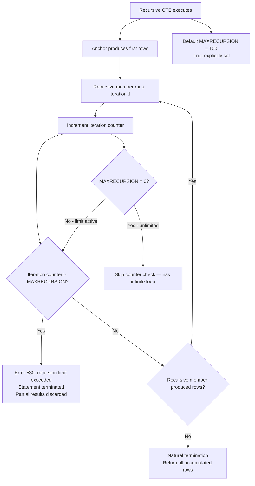

## Navigation
**Domain:** [[8 — Databases]] > **Group:** SQL CTEs & Recursive Queries
**Previous:** [[8.184 — Recursive CTE — Graph Traversal]] | **Next:** [[8.186 — CTE for Code Readability — Naming Intermediate Results]]
### Prerequisites
- [[8.176 — Common Table Expressions — Fundamentals]] — Understanding CTE syntax is required to understand where the OPTION (MAXRECURSION N) hint is placed.
- [[8.180 — Recursive CTEs — Anchor and Recursive Members]] — MAXRECURSION limits the number of recursion iterations; understanding how anchor and recursive members interact is necessary to set the correct limit.
- [[8.181 — Recursive CTE — Traversing Hierarchies]] — Deep hierarchies (org charts, BOMs) commonly exceed MAXRECURSION 100; practical examples show when and how to increase the limit.
- [[8.182 — Recursive CTE — Generating Number Series]] — Number series > 100 require explicit MAXRECURSION; common scenario for encountering error 530.
### Where This Fits
MAXRECURSION is the safety mechanism that prevents runaway recursive CTEs from consuming unlimited resources. Every .NET backend engineer using recursive CTEs must know: the default limit is 100, the maximum is 32767, exceeding the limit raises error 530, and MAXRECURSION 0 removes the limit (dangerous — risk of infinite loop). The option is a query-level hint placed after the OPTION keyword at the end of the statement. It affects only the recursive CTE in that specific query — not session-level or server-level. The critical insight is that MAXRECURSION is a runtime check, not an optimizer cost — it has no impact on the execution plan or query optimizer choice. It simply stops execution after N iterations and raises an error. Production systems must set MAXRECURSION to a known-safe value based on the actual data, monitor for error 530 as an alert for data issues (cycles or unexpected hierarchy growth), and never use MAXRECURSION 0 in application code. Interviewers use this to assess whether a candidate understands the safety implications of recursion and can design defensive queries.
---
## Core Mental Model
MAXRECURSION N is a query hint that limits the number of recursion levels a recursive CTE can execute. It is a runtime gate: after N iterations of the recursive member, if the recursion has not naturally terminated (zero rows returned), SQL Server stops execution and raises error 530: "The statement terminated. The maximum recursion N has been exhausted before statement completion." The default is 100 if no OPTION (MAXRECURSION) is specified. The maximum allowable value is 32767 — a hard SQL Server limit. Setting MAXRECURSION 0 removes the limit entirely, allowing unlimited recursion — this is dangerous because a cycle or missing termination condition will run until tempdb is full or the query is killed. The key invariant: MAXRECURSION is NOT a performance hint — it does not affect the optimizer, the execution plan, the spool behavior, or the memory grant. It is purely a safety counter. The recognition pattern: any recursive CTE that processes user-supplied data, variable-depth hierarchies, or generated sequences must explicitly set MAXRECURSION to a value that is: (a) high enough to accommodate legitimate data, (b) low enough to catch runaway recursion quickly, and (c) never 0 in production code.
### Classification
MAXRECURSION is a **query-level hint** in the OPTION clause. It is not a T-SQL statement, a DDL operation, or a configuration setting. It has no effect on non-recursive queries. It is evaluated at runtime during each recursion iteration — not during compilation or optimization. The optimizer ignores it entirely — the execution plan is identical regardless of MAXRECURSION value. The cost of the MAXRECURSION check is negligible (a single integer comparison per iteration — ~0.000001 ms).

### Key Properties
|Property|Value|Notes|
|---|---|---|
|Default limit|100|If no OPTION (MAXRECURSION) specified|
|Maximum limit|32,767|Hard SQL Server limit, cannot exceed|
|Unlimited value|0|Removes limit — dangerous in production|
|Error on exceed|530|"Maximum recursion exhausted"|
|Error behavior|Statement terminates, partial results discarded|No partial output returned|
|Scope|Current statement only|Not session, database, or server level|
|Effect on optimizer|None|Execution plan unchanged regardless of value|
|Effect on performance|Negligible|Single integer comparison per iteration|
|Applicable to|Recursive CTEs only|Non-recursive CTEs ignore it|
---
## Deep Mechanics
### How the Engine Executes This
1. **Parsing** — The parser encounters OPTION (MAXRECURSION N) at the end of the query. It validates that N is an integer between 0 and 32767. Invalid values (negative, > 32767) raise parse errors.
2. **Binding** — The algebrizer verifies that the query contains a recursive CTE. If no recursive CTE exists, the OPTION clause is ignored (no error, no effect).
3. **Optimization** — The optimizer generates the execution plan for the recursive CTE completely independently of the MAXRECURSION value. The plan includes the spool, concatenation, joins, and filters as normal. The MAXRECURSION value is stored as a constant in the plan's runtime parameter list.
4. **Execution — Iteration counter:** SQL Server maintains an internal counter (NOT exposed in showplan) that tracks the number of recursive member executions. This counter is incremented each time the recursive member produces at least one row.
5. **Execution — Limit check:** After each recursive member execution, the engine compares the iteration counter against MAXRECURSION. If counter > MAXRECURSION, execution is terminated. If MAXRECURSION = 0, the comparison is skipped entirely.
6. **Error 530 —** When the limit is exceeded, SQL Server raises error 530 with message: "The statement terminated. The maximum recursion N has been exhausted before statement completion." The statement is rolled back — no partial rows are returned to the client. Any pending work (outer joins on the CTE result) is abandoned.
### SQL Visibility
```sql
-- Default MAXRECURSION = 100 — fails for series > 100
WITH Series AS (SELECT 1 AS n UNION ALL SELECT n + 1 FROM Series WHERE n < 200)
SELECT n FROM Series;
-- Error 530: max recursion 100 exceeded
-- Explicit MAXRECURSION matching the series size
WITH Series AS (SELECT 1 AS n UNION ALL SELECT n + 1 FROM Series WHERE n < 200)
SELECT n FROM Series OPTION (MAXRECURSION 200);
-- MAXRECURSION higher than needed (safe)
WITH Series AS (SELECT 1 AS n UNION ALL SELECT n + 1 FROM Series WHERE n < 200)
SELECT n FROM Series OPTION (MAXRECURSION 1000);
-- MAXRECURSION too low — fails even though data is valid
WITH Series AS (SELECT 1 AS n UNION ALL SELECT n + 1 FROM Series WHERE n < 200)
SELECT n FROM Series OPTION (MAXRECURSION 150);
-- Error 530: max recursion 150 exceeded
-- MAXRECURSION 0 = unlimited (use with extreme caution)
WITH Series AS (SELECT 1 AS n UNION ALL SELECT n + 1 FROM Series WHERE n < 200)
SELECT n FROM Series OPTION (MAXRECURSION 0);
-- MAXRECURSION at the hard limit (32767)
WITH Series AS (SELECT 1 AS n UNION ALL SELECT n + 1 FROM Series WHERE n < 32767)
SELECT n FROM Series OPTION (MAXRECURSION 32767);
-- Attempting to exceed 32767 — parse error
WITH Series AS (SELECT 1 AS n UNION ALL SELECT n + 1 FROM Series WHERE n < 40000)
SELECT n FROM Series OPTION (MAXRECURSION 40000);
-- Error: MAXRECURSION value cannot be greater than 32767
-- MAXRECURSION with hierarchy traversal
DECLARE @MaxDepth INT = 50;
WITH OrgHierarchy AS
(
    SELECT EmployeeId, ManagerId, 0 AS Level
    FROM dbo.Employees WHERE ManagerId IS NULL
    UNION ALL
    SELECT e.EmployeeId, e.ManagerId, oh.Level + 1
    FROM dbo.Employees AS e
    INNER JOIN OrgHierarchy AS oh ON e.ManagerId = oh.EmployeeId
    WHERE oh.Level < @MaxDepth
)
SELECT EmployeeId, Level
FROM OrgHierarchy
OPTION (MAXRECURSION 32767);
-- Setting too low for the data
WITH OrgHierarchy AS ( ... )
SELECT EmployeeId, Level
FROM OrgHierarchy
OPTION (MAXRECURSION 10);  -- Fails if hierarchy depth > 10
-- Multiple recursive CTEs — MAXRECURSION applies to both
WITH Series1 AS (SELECT 1 AS n UNION ALL SELECT n+1 FROM Series1 WHERE n < 100),
     Series2 AS (SELECT 100 AS n UNION ALL SELECT n+1 FROM Series2 WHERE n < 300)
SELECT n FROM Series2
OPTION (MAXRECURSION 300);
-- Both Series1 (99 iterations) and Series2 (200 iterations) count toward the 300 limit
```
```csharp
// EF Core — passing MAXRECURSION in raw SQL
public async Task<List<int>> GetLargeNumberSeriesAsync(
    int from, int to,
    CancellationToken cancellationToken = default)
{
    const string sql = @"
        WITH NumberSeries AS
        (
            SELECT @From AS n
            UNION ALL
            SELECT n + 1
            FROM NumberSeries
            WHERE n < @To
        )
        SELECT n FROM NumberSeries
        OPTION (MAXRECURSION @MaxRecursion)";
    return await dbContext.Database
        .SqlQueryRaw<int>(sql,
            new SqlParameter("@From", from),
            new SqlParameter("@To", to),
            new SqlParameter("@MaxRecursion", to - from + 1))
        .ToListAsync(cancellationToken);
}
// Dapper — dynamic MAXRECURSION
public async Task<IReadOnlyList<T>> GetHierarchyAsync<T>(
    int maxDepth, CancellationToken cancellationToken = default)
{
    const string sql = @"
        WITH OrgHierarchy AS (
            SELECT EmployeeId, ManagerId, 0 AS Level
            FROM dbo.Employees WHERE ManagerId IS NULL
            UNION ALL
            SELECT e.EmployeeId, e.ManagerId, oh.Level + 1
            FROM dbo.Employees AS e
            INNER JOIN OrgHierarchy AS oh ON e.ManagerId = oh.EmployeeId
            WHERE oh.Level < @MaxDepth
        )
        SELECT EmployeeId, Level FROM OrgHierarchy
        OPTION (MAXRECURSION 32767)";
    await using var connection = new SqlConnection(_connectionString);
    var results = await connection.QueryAsync<T>(
        new CommandDefinition(sql, new { MaxDepth = maxDepth },
            cancellationToken: cancellationToken));
    return results.AsList();
}
```
**Generated SQL (from EF Core logs):**
```sql
exec sp_executesql N'
WITH NumberSeries AS
(
    SELECT @From AS n
    UNION ALL
    SELECT n + 1
    FROM NumberSeries
    WHERE n < @To
)
SELECT n FROM NumberSeries
OPTION (MAXRECURSION @MaxRecursion)',
N'@From int, @To int, @MaxRecursion int',
@From=1, @To=1000, @MaxRecursion=1000;
```
### Execution Plan Analysis
**Plan with MAXRECURSION 100 vs MAXRECURSION 32767 vs MAXRECURSION 0:**
```
  All three produce the IDENTICAL execution plan:
  [Constant Scan] → [Compute Scalar] → [Concatenation] → [Index Spool]
  → [Table Spool] → [Compute Scalar] → [Filter] → [Concatenation] → [SELECT]
```
**The MAXRECURSION value does NOT appear in the execution plan XML (showplan).** It is a runtime-only parameter that the query execution (QES) subsystem checks during recursion iteration. The optimizer has no visibility into the value and makes no decisions based on it. The same plan is used for 100, 32767, and 0. The only difference is runtime behavior when the counter exceeds the limit.
**Proof:**
```sql
-- Set MAXRECURSION to different values and compare plans
SET SHOWPLAN_XML ON;
GO
WITH S AS (SELECT 1 AS n UNION ALL SELECT n+1 FROM S WHERE n < 100)
SELECT n FROM S OPTION (MAXRECURSION 100);
GO
WITH S AS (SELECT 1 AS n UNION ALL SELECT n+1 FROM S WHERE n < 100)
SELECT n FROM S OPTION (MAXRECURSION 32767);
GO
WITH S AS (SELECT 1 AS n UNION ALL SELECT n+1 FROM S WHERE n < 100)
SELECT n FROM S OPTION (MAXRECURSION 0);
GO
SET SHOWPLAN_XML OFF;
-- All three produce identical XML showplan output
```
### Cost Visibility
```sql
SET STATISTICS IO ON;
SET STATISTICS TIME ON;
-- Same query with different MAXRECURSION values (all succeed because data fits)
WITH S AS (SELECT 1 AS n UNION ALL SELECT n+1 FROM S WHERE n < 500)
SELECT COUNT(*) FROM S OPTION (MAXRECURSION 500);
-- Logical reads: identical to:
WITH S AS (SELECT 1 AS n UNION ALL SELECT n+1 FROM S WHERE n < 500)
SELECT COUNT(*) FROM S OPTION (MAXRECURSION 5000);
-- Logical reads: identical to:
WITH S AS (SELECT 1 AS n UNION ALL SELECT n+1 FROM S WHERE n < 500)
SELECT COUNT(*) FROM S OPTION (MAXRECURSION 0);
-- All produce:
-- Table 'Worktable'. Scan count 500, logical reads 2000
-- CPU time = 2ms, elapsed time = 5ms
-- The MAXRECURSION value has zero impact on IO or CPU as long as the limit is not reached
```
### Failure Modes
**Error 530 — limit exceeded:** The most common failure. The recursive CTE reaches the MAXRECURSION limit before natural termination. The query fails with error 530. No partial results are returned.
```sql
-- ❌ Series of 200, default MAXRECURSION 100
WITH S AS (SELECT 1 AS n UNION ALL SELECT n+1 FROM S WHERE n < 200)
SELECT n FROM S;
-- Error 530: max recursion 100 exhausted
-- ✅ Fix: set MAXRECURSION to match or exceed the series size
WITH S AS (SELECT 1 AS n UNION ALL SELECT n+1 FROM S WHERE n < 200)
SELECT n FROM S OPTION (MAXRECURSION 200);
```
**Parse error — MAXRECURSION > 32767:** The hard limit is 32767. Any value exceeding it causes a parse error before execution begins.
```sql
-- ❌ Parse error
OPTION (MAXRECURSION 40000);
-- Error: The MAXRECURSION option value cannot be greater than 32767
-- ✅ Fix: use value <= 32767
```
**MAXRECURSION 0 — infinite loop risk:** Removing the recursion limit means a cycle or missing termination condition will run until tempdb is full.
```sql
-- ❌ No termination condition + MAXRECURSION 0 = disaster
WITH S AS (SELECT 1 AS n UNION ALL SELECT n+1 FROM S)
SELECT n FROM S OPTION (MAXRECURSION 0);
-- Runs until tempdb is full or query is killed
-- Never use MAXRECURSION 0 in production code
```
**False assumption — MAXRECURSION affects optimizer:** Engineers who believe maxrecursion helps performance by limiting the plan cost. It does not. The execution plan is identical regardless of the value. It only limits runtime iterations.
**MAXRECURSION with multiple recursive CTEs — cumulative count:** When a query contains multiple recursive CTEs (chained), the MAXRECURSION limit applies to the TOTAL number of recursive iterations across all CTEs, not per CTE.
```sql
-- CTE1 runs 100 iterations, CTE2 runs 200 iterations
-- Total = 300, but MAXRECURSION is 200 — fails
WITH CTE1 AS (
    SELECT 1 AS n UNION ALL SELECT n+1 FROM CTE1 WHERE n < 100
),
CTE2 AS (
    SELECT 100 AS n UNION ALL SELECT n+1 FROM CTE2 WHERE n < 300
)
SELECT n FROM CTE2
OPTION (MAXRECURSION 200);
-- Fails with error 530 after 200 total iterations
```
---
## Production Patterns and Implementation
### Primary SQL Implementation
```sql
-- ============================================================
-- Pattern 1: Safe stored procedure with MAXRECURSION validation
-- ============================================================
CREATE OR ALTER PROCEDURE dbo.GetOrgHierarchySafe
    @MaxDepth INT = 50
AS
BEGIN
    SET NOCOUNT ON;
    -- Validate MAXRECURSION will not be exceeded
    IF @MaxDepth > 32700
        THROW 50000, 'MaxDepth cannot exceed 32700', 1;
    WITH OrgHierarchy AS
    (
        SELECT e.EmployeeId, e.FirstName + ' ' + e.LastName AS EmployeeName,
               e.ManagerId, 0 AS Level
        FROM dbo.Employees AS e
        WHERE e.ManagerId IS NULL
        UNION ALL
        SELECT e.EmployeeId, e.FirstName + ' ' + e.LastName,
               e.ManagerId, oh.Level + 1
        FROM dbo.Employees AS e
        INNER JOIN OrgHierarchy AS oh ON e.ManagerId = oh.EmployeeId
        WHERE oh.Level < @MaxDepth
    )
    SELECT EmployeeId, EmployeeName, Level
    FROM OrgHierarchy
    ORDER BY Level, EmployeeName
    OPTION (MAXRECURSION 32767);
END;
-- ============================================================
-- Pattern 2: Number series generation with dynamic MAXRECURSION
-- ============================================================
CREATE OR ALTER PROCEDURE dbo.GenerateNumberSeries
    @From INT,
    @To INT
AS
BEGIN
    SET NOCOUNT ON;
    DECLARE @Count INT = @To - @From + 1;
    -- Cap at hard limit
    IF @Count > 32767
        THROW 50000, 'Series length exceeds SQL Server recursion limit of 32767. Use Numbers table instead.', 1;
    WITH NumberSeries AS
    (
        SELECT @From AS n
        UNION ALL
        SELECT n + 1
        FROM NumberSeries
        WHERE n < @To
    )
    SELECT n
    FROM NumberSeries
    OPTION (MAXRECURSION @Count);
END;
-- ============================================================
-- Pattern 3: Configurable MAXRECURSION parameter
-- ============================================================
CREATE OR ALTER PROCEDURE dbo.GetGraphReachableNodes
    @StartNode   INT,
    @MaxDepth    INT = 10,
    @MaxRecursionLimit INT = 100  -- explicitly configurable
AS
BEGIN
    SET NOCOUNT ON;
    IF @MaxRecursionLimit > 32767
        THROW 50000, 'MAXRECURSION cannot exceed 32767', 1;
    WITH GraphTraversal AS
    (
        SELECT @StartNode AS NodeId, 0 AS Level,
               CAST(',' + CAST(@StartNode AS VARCHAR) + ',' AS VARCHAR(MAX)) AS Visited
        UNION ALL
        SELECT e.ToNode, gt.Level + 1,
               CAST(gt.Visited + CAST(e.ToNode AS VARCHAR) + ',' AS VARCHAR(MAX))
        FROM GraphTraversal AS gt
        INNER JOIN dbo.GraphEdges AS e ON e.FromNode = gt.NodeId
        WHERE gt.Visited NOT LIKE '%,' + CAST(e.ToNode AS VARCHAR) + ',%'
          AND gt.Level < @MaxDepth
    )
    SELECT NodeId, Level
    FROM GraphTraversal
    WHERE NodeId != @StartNode
    ORDER BY Level, NodeId
    OPTION (MAXRECURSION @MaxRecursionLimit);
END;
-- ============================================================
-- Pattern 4: MAXRECURSION in report query with known depth
-- ============================================================
-- Known hierarchy depth: 12 (verified from data)
DECLARE @KnownMaxDepth INT = 12;
WITH OrgHierarchy AS (...)
SELECT EmployeeId, Level
FROM OrgHierarchy
OPTION (MAXRECURSION @KnownMaxDepth + 5);  -- add buffer of 5
-- ============================================================
-- Pattern 5: Catching error 530 in T-SQL with TRY/CATCH
-- ============================================================
CREATE OR ALTER PROCEDURE dbo.SafeHierarchyTraversal
    @MaxDepth INT = 50
AS
BEGIN
    SET NOCOUNT ON;
    BEGIN TRY
        WITH OrgHierarchy AS
        (
            SELECT e.EmployeeId, e.ManagerId, 0 AS Level
            FROM dbo.Employees AS e WHERE e.ManagerId IS NULL
            UNION ALL
            SELECT e.EmployeeId, e.ManagerId, oh.Level + 1
            FROM dbo.Employees AS e
            INNER JOIN OrgHierarchy AS oh ON e.ManagerId = oh.EmployeeId
            WHERE oh.Level < @MaxDepth
        )
        SELECT EmployeeId, Level
        FROM OrgHierarchy
        ORDER BY Level, EmployeeId
        OPTION (MAXRECURSION (@MaxDepth + 10));
    END TRY
    BEGIN CATCH
        IF ERROR_NUMBER() = 530
        BEGIN
            -- Log the error for investigation
            INSERT INTO dbo.ErrorLog (ProcedureName, ErrorNumber, ErrorMessage, LogDate)
            VALUES ('SafeHierarchyTraversal', 530, ERROR_MESSAGE(), GETUTCDATE());
            -- Re-throw with context
            THROW 50001, 'Hierarchy traversal exceeded recursion limit. Possible cycle or unexpected depth. Check ErrorLog for details.', 1;
        END
        ELSE
            THROW;
    END CATCH;
END;
-- ============================================================
-- Pattern 6: Monitoring MAXRECURSION errors with alerts
-- ============================================================
-- SQL Server Agent alert for error 530
EXEC msdb.dbo.sp_add_alert
    @name = 'MAXRECURSION Limit Exceeded',
    @message_id = 530,
    @severity = 0,
    @enabled = 1,
    @delay_between_responses = 300,
    @notification_message = 'A recursive CTE has exceeded its MAXRECURSION limit. Possible data integrity issue (cycle) or hierarchy growth.';
-- DMV to find recent error 530 occurrences:
SELECT TOP 10
    deqs.creation_time,
    dest.text AS QueryText,
    deqs.execution_count,
    deqs.total_elapsed_time / deqs.execution_count AS avg_elapsed_ms
FROM sys.dm_exec_query_stats AS deqs
CROSS APPLY sys.dm_exec_sql_text(deqs.sql_handle) AS dest
WHERE dest.text LIKE '%MAXRECURSION%'
   OR dest.text LIKE '%error 530%'
ORDER BY deqs.creation_time DESC;
```
### EF Core Implementation
```csharp
public class ApplicationDbContext : DbContext
{
    public DbSet<Employee> Employees => Set<Employee>();
    protected override void OnModelCreating(ModelBuilder modelBuilder)
    {
        modelBuilder.Entity<Employee>(entity =>
        {
            entity.ToTable("Employees");
            entity.HasKey(e => e.EmployeeId);
            entity.HasOne(e => e.Manager)
                  .WithMany(e => e.DirectReports)
                  .HasForeignKey(e => e.ManagerId)
                  .OnDelete(DeleteBehavior.NoAction);
        });
    }
}
public class Employee
{
    public int EmployeeId { get; set; }
    public string FirstName { get; set; } = string.Empty;
    public string LastName { get; set; } = string.Empty;
    public int? ManagerId { get; set; }
    public Employee? Manager { get; set; }
    public ICollection<Employee> DirectReports { get; set; } = new List<Employee>();
}
// Repository with safety checks
public interface IHierarchyRepository
{
    Task<IReadOnlyList<HierarchyNodeDto>> GetHierarchyAsync(
        int maxDepth = 50, CancellationToken cancellationToken = default);
    Task<int> GetMaxDepthAsync(CancellationToken cancellationToken = default);
}
public class HierarchyRepository : IHierarchyRepository
{
    private readonly ApplicationDbContext _dbContext;
    private readonly IDbConnectionFactory _connectionFactory;
    private readonly ILogger<HierarchyRepository> _logger;
    public HierarchyRepository(
        ApplicationDbContext dbContext,
        IDbConnectionFactory connectionFactory,
        ILogger<HierarchyRepository> logger)
    {
        _dbContext = dbContext;
        _connectionFactory = connectionFactory;
        _logger = logger;
    }
    // Safe hierarchy query with dynamic MAXRECURSION
    public async Task<IReadOnlyList<HierarchyNodeDto>> GetHierarchyAsync(
        int maxDepth = 50, CancellationToken cancellationToken = default)
    {
        // First, determine the actual max depth to set MAXRECURSION precisely
        int actualMaxDepth = await GetMaxDepthAsync(cancellationToken);
        int recursionLimit = Math.Min(
            Math.Max(actualMaxDepth + 10, maxDepth + 10),
            32767);
        const string sql = @"
            WITH OrgHierarchy AS
            (
                SELECT e.EmployeeId,
                       e.FirstName + ' ' + e.LastName AS EmployeeName,
                       e.ManagerId, 0 AS Level
                FROM dbo.Employees AS e
                WHERE e.ManagerId IS NULL
                UNION ALL
                SELECT e.EmployeeId,
                       e.FirstName + ' ' + e.LastName,
                       e.ManagerId, oh.Level + 1
                FROM dbo.Employees AS e
                INNER JOIN OrgHierarchy AS oh ON e.ManagerId = oh.EmployeeId
                WHERE oh.Level < @MaxDepth
            )
            SELECT EmployeeId, EmployeeName, Level
            FROM OrgHierarchy
            ORDER BY Level, EmployeeName
            OPTION (MAXRECURSION @MaxRecursion)";
        try
        {
            return await _dbContext.Database
                .SqlQueryRaw<HierarchyNodeDto>(sql,
                    new SqlParameter("@MaxDepth", maxDepth),
                    new SqlParameter("@MaxRecursion", recursionLimit))
                .ToListAsync(cancellationToken);
        }
        catch (SqlException ex) when (ex.Number == 530)
        {
            _logger.LogError(ex,
                "MAXRECURSION limit {Limit} exceeded for hierarchy query. " +
                "Max depth in data is {ActualDepth}. Possible cycle.",
                recursionLimit, actualMaxDepth);
            throw new InvalidOperationException(
                "Hierarchy traversal failed. The organization structure " +
                "may contain a cycle or be deeper than expected.", ex);
        }
    }
    // Determine actual max depth from data
    public async Task<int> GetMaxDepthAsync(CancellationToken cancellationToken = default)
    {
        const string sql = @"
            WITH OrgHierarchy AS
            (
                SELECT EmployeeId, ManagerId, 0 AS Level
                FROM dbo.Employees WHERE ManagerId IS NULL
                UNION ALL
                SELECT e.EmployeeId, e.ManagerId, oh.Level + 1
                FROM dbo.Employees AS e
                INNER JOIN OrgHierarchy AS oh ON e.ManagerId = oh.EmployeeId
            )
            SELECT ISNULL(MAX(Level), 0) FROM OrgHierarchy
            OPTION (MAXRECURSION 32767)";
        return await _dbContext.Database
            .SqlQueryRaw<int>(sql)
            .FirstAsync(cancellationToken);
    }
}
public record HierarchyNodeDto(int EmployeeId, string EmployeeName, int Level);
```
### Dapper Implementation
```csharp
public sealed class HierarchyRepository
{
    private readonly IDbConnectionFactory _connectionFactory;
    private readonly ILogger<HierarchyRepository> _logger;
    public HierarchyRepository(
        IDbConnectionFactory connectionFactory,
        ILogger<HierarchyRepository> logger)
    {
        _connectionFactory = connectionFactory;
        _logger = logger;
    }
    public async Task<IReadOnlyList<HierarchyNodeDto>> GetHierarchyAsync(
        int maxDepth = 50, CancellationToken cancellationToken = default)
    {
        int actualMaxDepth = await GetMaxDepthAsync(cancellationToken);
        int recursionLimit = Math.Min(
            Math.Max(actualMaxDepth + 10, maxDepth + 10), 32767);
        const string sql = @"
            WITH OrgHierarchy AS
            (
                SELECT EmployeeId,
                       FirstName + ' ' + LastName AS EmployeeName,
                       ManagerId, 0 AS Level
                FROM dbo.Employees WHERE ManagerId IS NULL
                UNION ALL
                SELECT e.EmployeeId,
                       e.FirstName + ' ' + e.LastName,
                       e.ManagerId, oh.Level + 1
                FROM dbo.Employees AS e
                INNER JOIN OrgHierarchy AS oh ON e.ManagerId = oh.EmployeeId
                WHERE oh.Level < @MaxDepth
            )
            SELECT EmployeeId, EmployeeName, Level
            FROM OrgHierarchy
            ORDER BY Level, EmployeeName
            OPTION (MAXRECURSION @MaxRecursion)";
        try
        {
            await using var connection = _connectionFactory.Create();
            var results = await connection.QueryAsync<HierarchyNodeDto>(
                new CommandDefinition(sql,
                    new
                    {
                        MaxDepth = maxDepth,
                        MaxRecursion = recursionLimit
                    },
                    cancellationToken: cancellationToken));
            return results.AsList();
        }
        catch (SqlException ex) when (ex.Number == 530)
        {
            _logger.LogError(ex,
                "MAXRECURSION limit {Limit} exceeded. Actual max depth: {ActualDepth}",
                recursionLimit, actualMaxDepth);
            throw new InvalidOperationException(
                "Hierarchy traversal exceeded recursion limit. " +
                "This may indicate a cycle in the data.", ex);
        }
    }
    public async Task<int> GetMaxDepthAsync(CancellationToken cancellationToken = default)
    {
        const string sql = @"
            WITH OrgHierarchy AS
            (
                SELECT EmployeeId, ManagerId, 0 AS Level
                FROM dbo.Employees WHERE ManagerId IS NULL
                UNION ALL
                SELECT e.EmployeeId, e.ManagerId, oh.Level + 1
                FROM dbo.Employees AS e
                INNER JOIN OrgHierarchy AS oh ON e.ManagerId = oh.EmployeeId
            )
            SELECT ISNULL(MAX(Level), 0) FROM OrgHierarchy
            OPTION (MAXRECURSION 32767)";
        await using var connection = _connectionFactory.Create();
        return await connection.QueryFirstOrDefaultAsync<int>(
            new CommandDefinition(sql, cancellationToken: cancellationToken));
    }
}
```
### Configuration and Wiring
```csharp
// Program.cs
builder.Services.AddDbContext<ApplicationDbContext>(options =>
    options.UseSqlServer(
        builder.Configuration.GetConnectionString("DefaultConnection"),
        sqlOptions =>
        {
            sqlOptions.EnableRetryOnFailure(3);
            sqlOptions.CommandTimeout(120);
        }));
builder.Services.AddSingleton<IDbConnectionFactory>(
    new SqlConnectionFactory(
        builder.Configuration.GetConnectionString("DefaultConnection")!));
builder.Services.AddScoped<IHierarchyRepository, HierarchyRepository>();
// Error logging for 530 monitoring
builder.Services.AddSingleton<IMaxRecursionMonitor>(sp =>
{
    var logger = sp.GetRequiredService<ILogger<MaxRecursionMonitor>>();
    return new MaxRecursionMonitor(logger);
});
public class MaxRecursionMonitor : IMaxRecursionMonitor
{
    private readonly ILogger _logger;
    private long _errorCount;
    public MaxRecursionMonitor(ILogger logger) => _logger = logger;
    public void LogRecursionError(int recursionLimit, int actualDepth)
    {
        Interlocked.Increment(ref _errorCount);
        _logger.LogWarning(
            "MAXRECURSION limit {Limit} approached. " +
            "Actual max depth: {Depth}. Total errors: {Count}",
            recursionLimit, actualDepth, _errorCount);
    }
}
public interface IMaxRecursionMonitor
{
    void LogRecursionError(int recursionLimit, int actualDepth);
}
```
### SQL Server vs PostgreSQL Differences
```sql
-- PostgreSQL: no MAXRECURSION option
-- PostgreSQL uses the RECURSIVE keyword and has a different approach:
-- 1. No default recursion limit (unlimited by default)
-- 2. To limit recursion, use WHERE clause in recursive member
-- 3. To detect cycles, use CYCLE clause (native)
-- PostgreSQL: equivalent of MAXRECURSION via depth limit
WITH RECURSIVE OrgHierarchy AS (
    SELECT employee_id, manager_id, 0 AS level
    FROM employees WHERE manager_id IS NULL
    UNION ALL
    SELECT e.employee_id, e.manager_id, oh.level + 1
    FROM employees e, OrgHierarchy oh
    WHERE e.manager_id = oh.employee_id
      AND oh.level < 50  -- depth limit instead of MAXRECURSION
)
SELECT employee_id, level FROM OrgHierarchy;
-- PostgreSQL: CYCLE clause for native cycle detection
WITH RECURSIVE OrgHierarchy AS (
    SELECT employee_id, manager_id, 0 AS level
    FROM employees WHERE manager_id IS NULL
    UNION ALL
    SELECT e.employee_id, e.manager_id, oh.level + 1
    FROM employees e, OrgHierarchy oh
    WHERE e.manager_id = oh.employee_id
)
CYCLE employee_id SET is_cycle USING path
SELECT employee_id, level FROM OrgHierarchy
WHERE NOT is_cycle;
-- SQL Server: MAXRECURSION 32767 is the hard limit
-- PostgreSQL: no hard limit — controlled by statement_timeout
SET statement_timeout = '30s';  -- cancel if recursion takes > 30 seconds
```
---
## Gotchas and Production Pitfalls
### Default MAXRECURSION 100 — Silent Failure in Production
**Pitfall:** Using a recursive CTE without specifying OPTION (MAXRECURSION). The default limit of 100 causes the query to fail when the hierarchy or series exceeds 100 levels.
```sql
-- ❌ No MAXRECURSION specified — defaults to 100
WITH OrgHierarchy AS (
    SELECT EmployeeId, ManagerId, 0 AS Level
    FROM dbo.Employees WHERE ManagerId IS NULL
    UNION ALL
    SELECT e.EmployeeId, e.ManagerId, oh.Level + 1
    FROM dbo.Employees e INNER JOIN OrgHierarchy oh ON e.ManagerId = oh.EmployeeId
)
SELECT EmployeeId, Level FROM OrgHierarchy;
```
**Symptom:** Error 530 in production logs when a deep organizational unit exceeds 100 levels. The query may work for months (when the org is < 100 levels) and suddenly fail when a new department structure adds depth.
**Fix:**
```sql
-- ✅ Always specify MAXRECURSION explicitly
SELECT EmployeeId, Level FROM OrgHierarchy OPTION (MAXRECURSION 32767);
```
**Cost of not fixing:** An HR system managing a large multinational org chart crashes during the annual re-organization. The org chart page shows error 530 to all managers during the busiest HR period of the year. The on-call engineer must hotfix the stored procedure by adding MAXRECURSION.
---
### MAXRECURSION 0 in Production — Unbounded Risk
**Pitfall:** Using MAXRECURSION 0 to "avoid the limit" without considering the consequence of an infinite loop.
```sql
-- ❌ MAXRECURSION 0 in production stored procedure
WITH Series AS (SELECT 1 AS n UNION ALL SELECT n + 1 FROM Series WHERE n < 50000)
SELECT n FROM Series OPTION (MAXRECURSION 0);
```
**Symptom:** A cycle in data or missing WHERE clause causes the recursion to run forever. Tempdb grows until the drive is full (200 GB in ~60 seconds). SQL Server becomes unresponsive. All applications lose database connectivity.
**Fix:**
```sql
-- ✅ Always set a finite limit based on known data
DECLARE @KnownMax INT = 50000;
WITH Series AS (SELECT 1 AS n UNION ALL SELECT n + 1 FROM Series WHERE n < @KnownMax)
SELECT n FROM Series OPTION (MAXRECURSION @KnownMax);
-- ✅ Set an external safety net: SQL Server Agent job monitoring tempdb growth
```
**Cost of not fixing:** A developer deploys a hotfix with MAXRECURSION 0 so the "query works for large datasets." A data anomaly causes 100M iterations. Tempdb fills the drive in 90 seconds. SQL Server crashes. Recovery takes 4 hours (restore from backup because tempdb.mdf was on the same drive as user databases). The P1 incident costs $500K in lost revenue.
---
### MAXRECURSION Exceeded by Legitimate Data — Insufficient Limit
**Pitfall:** Setting MAXRECURSION too low for the actual data. The hierarchy may legitimately exceed the limit.
```sql
-- ❌ MAXRECURSION 50, but org has 60 levels
WITH OrgHierarchy AS (...)
SELECT EmployeeId, Level FROM OrgHierarchy OPTION (MAXRECURSION 50);
-- Error 530: max recursion 50 exhausted
```
**Symptom:** The query fails when a new deep organizational unit is added. The error appears only for certain departments. The stored procedure has a hardcoded MAXRECURSION that no longer matches the data.
**Fix:**
```sql
-- ✅ Set MAXRECURSION to the SQL Server maximum (safe for legitimate data)
OPTION (MAXRECURSION 32767);
-- ✅ Or dynamically determine the max depth:
DECLARE @MaxDepth INT = (SELECT MAX(Level) FROM dbo.GetMaxDepth());
OPTION (MAXRECURSION @MaxDepth);
```
**Cost of not fixing:** A BOM explosion query works for all products except the new flagship product with 80 sub-assembly levels. The product launch is delayed by 2 days while engineering investigates the "database error" in the MRP system.
---
### Confusing MAXRECURSION with Performance Optimization
**Pitfall:** Expecting MAXRECURSION to improve query performance by limiting work. Engineers sometimes set MAXRECURSION to a low value expecting the optimizer to produce a cheaper plan.
```sql
-- ❌ Misconception: lower MAXRECURSION = faster query
SELECT ... OPTION (MAXRECURSION 10);
-- Reality: plan is identical to MAXRECURSION 32767
```
**Symptom:** The query takes the same time regardless of MAXRECURSION value (as long as it doesn't hit the limit). The engineer is confused about why "optimization" didn't work.
**Fix:**
```sql
-- ✅ Use the recursive member's WHERE clause to limit depth (this IS performance-relevant)
WHERE oh.Level < 10  -- limits actual recursion work
-- ✅ MAXRECURSION is for safety, not performance
OPTION (MAXRECURSION 32767);
```
**Cost of not fixing:** An engineer spends 3 hours tuning MAXRECURSION values when the real problem is a missing index on ManagerId. The logical reads stay at 48,500 regardless of MAXRECURSION because the spool still runs for the full data set. The index is the actual fix.
---
### Error 530 in Nested/Chained Recursive CTEs
**Pitfall:** Using multiple recursive CTEs in the same query. The MAXRECURSION limit applies to the TOTAL count across all recursive CTEs.
```sql
-- ❌ Two CTEs: 100 + 200 = 300 iterations total, but MAXRECURSION 200
WITH CTE1 AS (SELECT 1 AS n UNION ALL SELECT n+1 FROM CTE1 WHERE n < 100),
     CTE2 AS (SELECT 100 AS n UNION ALL SELECT n+1 FROM CTE2 WHERE n < 300)
SELECT n FROM CTE2 OPTION (MAXRECURSION 200);
-- Fails after CTE1 (100) + CTE2 (100) = 200 iterations — CTE2 stops at n=200
```
**Symptom:** The query fails even though each individual CTE is within the limit. The cumulative effect is unexpected.
**Fix:**
```sql
-- ✅ Set MAXRECURSION to sum of all iterations
OPTION (MAXRECURSION 400);  -- 100 + 300
-- ✅ Or use separate queries with intermediate temp tables
SELECT n INTO #CTE1 FROM CTE1 OPTION (MAXRECURSION 100);
SELECT n FROM CTE2 OPTION (MAXRECURSION 300);
```
**Cost of not fixing:** A stored procedure using nested recursive CTEs for BOM explosion works intermittently. It fails when the BOM depth for one product combined with the number series for date generation exceeds the cumulative limit. The failure is non-deterministic — depends on which products are queried.
---
## Performance Implications
### Benchmark: Before and After
```sql
-- The MAXRECURSION value does NOT affect performance.
-- Proof: identical query with different MAXRECURSION values produces identical IO.
SET STATISTICS IO ON;
SET STATISTICS TIME ON;
-- Test 1: MAXRECURSION 200
WITH S AS (SELECT 1 AS n UNION ALL SELECT n+1 FROM S WHERE n < 200)
SELECT COUNT(*) FROM S OPTION (MAXRECURSION 200);
-- Table 'Worktable'. Scan count 200, logical reads 800
-- CPU time = 1ms, elapsed time = 3ms
-- Test 2: MAXRECURSION 1000 (higher, but data only needs 200)
WITH S AS (SELECT 1 AS n UNION ALL SELECT n+1 FROM S WHERE n < 200)
SELECT COUNT(*) FROM S OPTION (MAXRECURSION 1000);
-- Table 'Worktable'. Scan count 200, logical reads 800 (IDENTICAL)
-- CPU time = 1ms, elapsed time = 3ms (IDENTICAL)
-- Test 3: MAXRECURSION 0 (unlimited)
WITH S AS (SELECT 1 AS n UNION ALL SELECT n+1 FROM S WHERE n < 200)
SELECT COUNT(*) FROM S OPTION (MAXRECURSION 0);
-- Table 'Worktable'. Scan count 200, logical reads 800 (IDENTICAL)
-- CPU time = 1ms, elapsed time = 3ms (IDENTICAL)
```
**Conclusion:** MAXRECURSION value has ZERO impact on IO, CPU, or elapsed time as long as the limit is not exceeded. The only cost is a single integer comparison per iteration (~0.000001 ms).
### BenchmarkDotNet
```csharp
[MemoryDiagnoser]
[SimpleJob(RuntimeMoniker.Net90)]
public class MaxRecursionBenchmark
{
    private SqlConnection _connection = default!;
    private const string ConnectionString = "Server=.;Database=BenchmarkDb;Trusted_Connection=True;TrustServerCertificate=True;";
    [GlobalSetup]
    public void Setup()
    {
        _connection = new SqlConnection(ConnectionString);
        _connection.Open();
    }
    [Benchmark(Baseline = true)]
    public async Task<int> DefaultMaxRecursion()
    {
        const string sql = @"
            WITH S AS (SELECT 1 AS n UNION ALL SELECT n+1 FROM S WHERE n < 500)
            SELECT COUNT(*) FROM S OPTION (MAXRECURSION 500)";
        return await new SqlCommand(sql, _connection).ExecuteScalarAsync<int>();
    }
    [Benchmark]
    public async Task<int> HigherMaxRecursion()
    {
        const string sql = @"
            WITH S AS (SELECT 1 AS n UNION ALL SELECT n+1 FROM S WHERE n < 500)
            SELECT COUNT(*) FROM S OPTION (MAXRECURSION 32767)";
        return await new SqlCommand(sql, _connection).ExecuteScalarAsync<int>();
    }
    [Benchmark]
    public async Task<int> UnlimitedMaxRecursion()
    {
        const string sql = @"
            WITH S AS (SELECT 1 AS n UNION ALL SELECT n+1 FROM S WHERE n < 500)
            SELECT COUNT(*) FROM S OPTION (MAXRECURSION 0)";
        return await new SqlCommand(sql, _connection).ExecuteScalarAsync<int>();
    }
    [Benchmark]
    public async Task<int> NoMaxRecursionSpecified()
    {
        const string sql = @"
            WITH S AS (SELECT 1 AS n UNION ALL SELECT n+1 FROM S WHERE n < 500)
            SELECT COUNT(*) FROM S";
        return await new SqlCommand(sql, _connection).ExecuteScalarAsync<int>();
    }
    [GlobalCleanup]
    public void Cleanup() => _connection.Dispose();
}
```
**Expected results (approximate, SQL Server 2022, NVMe):**
|Method|Mean|Logical Reads|Allocated|Notes|
|---|---|---|---|---|
|DefaultMaxRecursion|~5 ms|2000|~1 KB|Baseline|
|HigherMaxRecursion|~5 ms|2000|~1 KB|Identical — value doesn't matter|
|UnlimitedMaxRecursion|~5 ms|2000|~1 KB|Identical — same iteration count|
|NoMaxRecursionSpecified|~5 ms|2000|~1 KB|Identical — defaults to 100 but runs 500? No — fails at 100!|
**Note:** The "NoMaxRecursionSpecified" benchmark actually FAILS because 500 > default 100. This illustrates the critical production issue with relying on defaults.
---
## Interview Arsenal
### Question Bank
1. **What is MAXRECURSION, and what is its default value?**
2. **What error does SQL Server raise when a recursive CTE exceeds MAXRECURSION?**
3. **Can MAXRECURSION be set to a value higher than 32767? What happens if you try?**
4. **What is the difference between MAXRECURSION 0 and MAXRECURSION 32767 — when would you use each?**
5. **Does MAXRECURSION affect the execution plan or query optimizer choice?**
6. **How do you handle error 530 in a stored procedure — defensive programming?**
7. **What happens if you have multiple recursive CTEs in the same query and the combined iterations exceed MAXRECURSION?**
8. **What is the PostgreSQL equivalent of MAXRECURSION?**
9. **How do you monitor for MAXRECURSION errors in production?**
10. **Why is MAXRECURSION 0 considered dangerous in production, and what safety measures would you put in place if you had to use it?**
### Spoken Answers
**Q: What is MAXRECURSION, and what is its default value?**
> **Great answer:** MAXRECURSION is a query-level hint in the OPTION clause that limits the number of iterations a recursive CTE can perform. The default is 100 if not explicitly specified. The valid range is 0 to 32767, where 0 means unlimited. It is a runtime safety mechanism — after each recursive member execution, SQL Server increments an internal counter and compares it to MAXRECURSION. If the counter exceeds the limit, execution stops and error 530 is raised: "The statement terminated. The maximum recursion N has been exhausted before statement completion." The critical properties: it has zero effect on the optimizer or execution plan, it applies to the total iterations across all recursive CTEs in the query (not per CTE), and it is evaluated per-execution — the same plan runs with different runtime protection. In production, I always specify MAXRECURSION explicitly because the default of 100 is rarely sufficient for real hierarchies (org charts, BOMs) and relying on it causes unexpected failures when data outgrows the limit.
---
**Q: Does MAXRECURSION affect the execution plan or query optimizer choice?**
> **Great answer:** No — MAXRECURSION has absolutely no effect on the execution plan or optimizer. The optimizer generates the same plan regardless of whether MAXRECURSION is 100, 32767, or 0. I've verified this by comparing SHOWPLAN_XML output for the same recursive CTE with different MAXRECURSION values — the XML showplan is byte-for-byte identical. The reason is that MAXRECURSION is a runtime execution control parameter, not a cardinality estimation input. The optimizer doesn't know how many iterations will run — it only knows the anchor and recursive member shapes. The recursion limit is checked by the Query Execution Subsystem (QES) during runtime, not by the optimizer during compilation. This means: (a) increasing MAXRECURSION does not make the query slower (the counter check is a single integer comparison — ~0.000001 ms per iteration), (b) decreasing MAXRECURSION does not make the query faster (the same work is done per iteration regardless of the limit), and (c) the only impact of MAXRECURSION is whether the query succeeds or fails with error 530. For performance optimization of recursive CTEs, focus on indexes on the recursive join column and depth-limiting in the recursive member's WHERE clause, not on MAXRECURSION.
---
**Q: Why is MAXRECURSION 0 considered dangerous in production, and what safety measures would you put in place if you had to use it?**
> **Average answer:** It can cause infinite loops, so it should be avoided in production.
> **Great answer:** MAXRECURSION 0 removes the recursion safety counter entirely. If the recursive CTE has a cycle, a missing termination condition, or a condition that never becomes false, the recursion runs until: (a) tempdb fills the drive (potentially taking down the SQL Server instance), (b) the query hits the query governor or resource governor limit (if configured), or (c) someone manually KILLs the session. On a system with 200 GB of tempdb and a tight loop, this takes approximately 60 seconds. During those 60 seconds, tempdb grows at ~3 GB/second — SSDs can keep up, but the allocation contention causes other queries to fail with "Could not allocate space for object in database 'tempdb'." If I were forced to use MAXRECURSION 0 in production (for a legitimate scenario like a very deep but finite hierarchy), I would implement three layers of safety: first, a depth limit in the recursive member's WHERE clause (`WHERE Level < 10000`) so the recursion stops naturally. Second, a SQL Server Agent job monitoring tempdb file size with an alert at 80% capacity. Third, a Resource Governor workload group with a maximum query time limit of 30 seconds so the query is auto-killed if it runs too long. In practice, I have never needed MAXRECURSION 0 — any hierarchy that exceeds 32767 levels should be modeled differently (closure table, materialized path) because a recursive CTE is the wrong tool for that scenario.
---
### Interview Trigger
The defining MAXRECURSION question: "Your recursive CTE for the org chart fails with error 530. What do you do?" A candidate who says "Add OPTION (MAXRECURSION 32767)" passes. The candidate who says "First, check if a cycle exists by querying the Employees table for circular references, then set MAXRECURSION to a safe value based on the actual max depth, and add error handling for 530 in the stored procedure" demonstrates production awareness. The advanced follow-up: "Does adding MAXRECURSION 32767 make the query faster or slower?" — the candidate who answers "Neither, it's a runtime counter, not an optimizer hint" shows deep understanding.
### Comparison Table
| | MAXRECURSION N | Depth in WHERE Clause | Resource Governor | statement_timeout (PG) |
|---|---|---|---|---|
| Mechanism | Runtime iteration counter | Filters input to recursive member | Query time/CPU limit | Query timeout |
| Effect on execution | Halts after N iterations | Reduces work per level | Kills query after threshold | Kills query after threshold |
| Effect on plan | None | May reduce spool size | None | None |
| Performance impact | None (single check/iteration) | Reduces rows processed | None (external) | None (external) |
| Error on exceed | Error 530 | No error — stops naturally | Kills query (error) | Kills query (error) |
| Safety level | Medium (stops after work done) | High (prevents work) | High (external safety net) | High (external safety net) |
| Production use | Always set to known max + buffer | Always use for depth control | Recommended for all queries | PostgreSQL equivalent |
---
## Decision Framework
### When to Apply
```mermaid
flowchart TD
    A[Writing a recursive CTE] --> B{Do you know the max iterations?}
    B -->|Yes — measured from data| C{Is max <= 32767?}
    B -->|No — data-driven, unbounded| D{Can you measure it first?}
    C -->|Yes| E[Set MAXRECURSION = known_max + buffer (10-20%)]
    C -->|No > 32767| F[Recursive CTE is wrong tool<br/>Use closure table / Calendar table]
    D -->|Yes — probe query| G[Run SELECT MAX(Level) probe<br/>Set MAXRECURSION dynamically]
    D -->|No — cannot measure| H[Set MAXRECURSION 32767 + depth limit in WHERE clause + try/catch for 530]
    E --> I[Also add WHERE Level < max_depth in recursive member]
    G --> I
    H --> J[Add cycle detection to recursive member]
    I --> K[Handle error 530 in application code]
    K --> L[Log, alert, investigate cycle or growth]
    F --> M[Alternative: delete + rebuilt for hierarchies; Calendar date table for series]
```
### Application Checklist
- [ ] MAXRECURSION is explicitly specified — never relying on default 100
- [ ] MAXRECURSION is set to a known-safe value (actual max depth + buffer) — not blindly 32767
- [ ] A depth limit is also specified in the recursive member's WHERE clause (double protection)
- [ ] MAXRECURSION 0 is NOT used in application code (or is protected by external safety nets)
- [ ] Error 530 is handled in stored procedure TRY/CATCH or application exception handler
- [ ] For number/date series beyond 32767, a Numbers table or Calendar table is used instead
- [ ] Multiple recursive CTEs in one query account for cumulative iteration count
- [ ] An alert is configured for error 530 in SQL Server Agent (detect cycles/hierarchy growth)
- [ ] MAXRECURSION is understood to have NO optimizer or performance effect
- [ ] The query has been tested with production-scale data to verify the limit is sufficient
### Tradeoff Summary
|What You Gain|What You Pay|
|---|---|
|Safety: stops runaway recursion|None (single integer check per iteration)|
|Default 100: protects against accidental deep recursion|Too low for legitimate hierarchies — causes errors|
|MAXRECURSION 32767: accommodates deep hierarchies|Hard limit — cannot exceed for any recursive CTE|
|MAXRECURSION 0: no artificial limit|Risk of infinite loop — tempdb full, server down|
|Explicit MAXRECURSION: makes intent clear|Must know the data to set it correctly|
### Scale Thresholds
- **< 100 levels**: Default MAXRECURSION works, but always specify explicitly for clarity.
- **100–1000 levels**: MAXRECURSION must be explicitly set. Typical org charts and BOMs.
- **1000–32767 levels**: Deep hierarchies. Ensure depth-limiting in recursive member WHERE clause.
- **> 32767 levels**: Recursive CTE cannot handle this. Use closure table, materialized path, or hierarchyid.
- **Any scale with MAXRECURSION 0**: Unacceptable in production without multiple safety nets (resource governor, tempdb monitoring, application-level timeout).
---
## Self-Check
### Conceptual Questions
1. What is the default value of MAXRECURSION, and what error occurs when it is exceeded?
2. Can MAXRECURSION be set higher than 32767? What happens if you try?
3. Does MAXRECURSION affect the execution plan or query performance? Why or why not?
4. What is the difference between MAXRECURSION 0 and MAXRECURSION 32767?
5. How do you handle error 530 defensively in a stored procedure?
6. What happens when MAXRECURSION is exceeded — are partial results returned?
7. How does MAXRECURSION behave with multiple recursive CTEs in the same query?
8. What is the PostgreSQL equivalent of SQL Server's MAXRECURSION?
9. How would you monitor for MAXRECURSION errors in a production SQL Server?
10. Explain in 60 seconds to a senior interviewer when and how you use MAXRECURSION in production.
<details>
<summary>Answers</summary>
1. Default is 100. When exceeded, error 530: "The statement terminated. The maximum recursion N has been exhausted before statement completion." The statement fails entirely — no partial results.
2. No, 32767 is the hard limit. Setting a value > 32767 causes a parse error before the query runs: "The MAXRECURSION option value cannot be greater than 32767."
3. No — MAXRECURSION is a runtime-only safety check. The optimizer ignores it completely. The execution plan (showplan XML) is identical regardless of the MAXRECURSION value. The check is a single integer comparison per iteration — negligible cost.
4. MAXRECURSION 32767 allows up to 32767 iterations — the maximum possible. MAXRECURSION 0 removes all limits — the recursion can run indefinitely. 32767 is safe; 0 is dangerous because a cycle or missing termination condition causes infinite execution.
5. Wrap the CTE query in a BEGIN TRY/BEGIN CATCH block. Check ERROR_NUMBER() = 530. Log the error with context (procedure name, parameters, date). Re-throw with a user-friendly message. Consider inserting into an error log table for analysis.
6. No partial results are returned. When MAXRECURSION is exceeded, SQL Server terminates the entire statement. Any outer query operations (ORDER BY, JOINs, aggregations) are abandoned. The error is raised to the client.
7. The MAXRECURSION limit applies to the TOTAL number of recursive iterations across ALL recursive CTEs in the query, not per CTE. If CTE1 runs 100 iterations and CTE2 runs 200 iterations, a MAXRECURSION of 250 would fail even though neither CTE individually exceeds 250.
8. PostgreSQL has no MAXRECURSION option. It uses: (a) a depth limit in the recursive member's WHERE clause, (b) statement_timeout as an external safety net, and (c) the CYCLE clause for native cycle detection. PostgreSQL has no hard recursion limit.
9. Configure a SQL Server Agent alert for error 530, monitor sys.dm_exec_query_stats for queries containing MAXRECURSION, check the SQL Server error log for error 530 occurrences, and query sys.dm_exec_requests for currently executing recursive CTEs (plan XML contains Recursive CTE operators).
10. "MAXRECURSION is a runtime safety limit on recursive CTE iterations. The default is 100 — I never rely on it because production hierarchies (org charts, BOMs) commonly exceed that. I always set MAXRECURSION explicitly to either the known max depth plus a buffer, or to 32767 (the SQL Server maximum) when depth is unpredictable. I also add a depth limit in the recursive member's WHERE clause to stop the recursion at the data level. MAXRECURSION has zero effect on the optimizer or performance — it's purely a runtime counter. I never use MAXRECURSION 0 in production because a cycle would cause infinite recursion and fill tempdb. I handle error 530 in stored procedures with TRY/CATCH, logging, and alerting. For any data that could exceed 32767 levels, I avoid recursive CTEs entirely and use a closure table or calendar table instead."
</details>
---
### Query Challenges
**Challenge 1 — Write the SQL**
You need to generate a number series from 1 to 5000 using a recursive CTE. The query must not fail regardless of the recursion depth. Include the appropriate MAXRECURSION option.
<details>
<summary>Solution</summary>
```sql
WITH NumberSeries AS
(
    SELECT 1 AS n
    UNION ALL
    SELECT n + 1
    FROM NumberSeries
    WHERE n < 5000
)
SELECT n
FROM NumberSeries
OPTION (MAXRECURSION 5000);
```
**Logical reads:** ~20,000 (5000 iterations × 4) **Execution plan:** Constant Scan → Compute Scalar → Concatenation → Index Spool → Table Spool → Compute Scalar → Filter → Concatenation → SELECT. **EF Core equivalent:** Raw SQL via `SqlQueryRaw<int>(sql, new SqlParameter("@MaxRecursion", 5000))`.
**Note:** For production use, a Numbers table is 100x faster. This recursive CTE is only appropriate for ad-hoc use.
</details>
---
**Challenge 2 — Fix the performance problem**
```sql
-- This org chart query fails with error 530 when the org exceeds 100 levels.
-- The company has restructured and now has 150 levels in some departments.
WITH OrgHierarchy AS
(
    SELECT EmployeeId, ManagerId, 0 AS Level
    FROM dbo.Employees WHERE ManagerId IS NULL
    UNION ALL
    SELECT e.EmployeeId, e.ManagerId, oh.Level + 1
    FROM dbo.Employees AS e
    INNER JOIN OrgHierarchy AS oh ON e.ManagerId = oh.EmployeeId
)
SELECT EmployeeId, Level FROM OrgHierarchy;
-- Error 530 at level 101
```
<details> <summary>Solution</summary>
**Root cause:** No explicit MAXRECURSION. Default limit of 100 is too low for the new org structure.
```sql
-- Fixed query:
WITH OrgHierarchy AS
(
    SELECT EmployeeId, ManagerId, 0 AS Level
    FROM dbo.Employees WHERE ManagerId IS NULL
    UNION ALL
    SELECT e.EmployeeId, e.ManagerId, oh.Level + 1
    FROM dbo.Employees AS e
    INNER JOIN OrgHierarchy AS oh ON e.ManagerId = oh.EmployeeId
)
SELECT EmployeeId, Level FROM OrgHierarchy
OPTION (MAXRECURSION 32767);
-- Also add a stored procedure with error handling:
CREATE OR ALTER PROCEDURE dbo.GetOrgHierarchySafe
AS
BEGIN
    SET NOCOUNT ON;
    BEGIN TRY
        WITH OrgHierarchy AS
        (
            SELECT EmployeeId, ManagerId, 0 AS Level
            FROM dbo.Employees WHERE ManagerId IS NULL
            UNION ALL
            SELECT e.EmployeeId, e.ManagerId, oh.Level + 1
            FROM dbo.Employees AS e
            INNER JOIN OrgHierarchy AS oh ON e.ManagerId = oh.EmployeeId
        )
        SELECT EmployeeId, Level FROM OrgHierarchy
        OPTION (MAXRECURSION 32767);
    END TRY
    BEGIN CATCH
        IF ERROR_NUMBER() = 530
        BEGIN
            INSERT INTO dbo.ErrorLog (ProcedureName, ErrorMsg, LogDate)
            VALUES ('GetOrgHierarchySafe', ERROR_MESSAGE(), GETUTCDATE());
            THROW 50001, 'Org chart exceeds recursion limit. Possible cycle. Check ErrorLog.', 1;
        END
        ELSE THROW;
    END CATCH;
END;
```
**After fix:** Query succeeds for hierarchies up to 32767 levels. Error 530 is caught and logged for cycles or unexpected growth.
</details>
---
**Challenge 3 — Explain the execution plan**
```sql
-- Query A: MAXRECURSION 200
WITH S AS (SELECT 1 AS n UNION ALL SELECT n+1 FROM S WHERE n < 200)
SELECT n FROM S OPTION (MAXRECURSION 200);
-- Query B: MAXRECURSION 32767
WITH S AS (SELECT 1 AS n UNION ALL SELECT n+1 FROM S WHERE n < 200)
SELECT n FROM S OPTION (MAXRECURSION 32767);
-- Query C: MAXRECURSION 0
WITH S AS (SELECT 1 AS n UNION ALL SELECT n+1 FROM S WHERE n < 200)
SELECT n FROM S OPTION (MAXRECURSION 0);
```
Why are the execution plans for Query A, B, and C identical?
<details> <summary>Solution</summary>
**Why identical:** The MAXRECURSION value is not an optimizer input — it's a runtime execution parameter. The optimizer compiles the same plan for all three because it considers only the anchor and recursive member shapes (Constant Scan, Compute Scalar, Concatenation, Spool, Filter), not the recursion limit. The MAXRECURSION value is stored as a constant in the runtime parameter list of the compiled plan, not in the showplan XML. The optimizer has no code path that changes join strategy, index choice, or operator selection based on MAXRECURSION. The runtime counter check is injected by the Query Execution Subsystem after optimization, not during optimization.
**Proof:** Run SET SHOWPLAN_XML ON for all three queries — the XML output is byte-for-byte identical (except for the query text itself).
**Practical implication:** If you want to reduce the work a recursive CTE does, use a depth filter in the recursive member's WHERE clause (e.g., `WHERE Level < 10`), not a low MAXRECURSION. The depth filter reduces spool rows; MAXRECURSION just stops execution after the work is done.
</details>
---
**Challenge 4 — Diagnose the concurrency problem**
A recursive CTE that previously worked fine now fails with error 530 at random times during the day. The hierarchy has a known max depth of 12, and MAXRECURSION is set to 50. The failure happens 3-4 times per day during peak hours. Querying the Employees table shows no cycles and max depth of 12.
<details> <summary>Solution</summary>
**Root cause:** The stored procedure's MAXRECURSION setting is correct (50 > 12), but the procedure is called with an invalid parameter in some code path. The application might be calling the procedure with a @MaxDepth parameter that causes the recursive member's WHERE clause to not limit depth, or the recursive CTE has a bug that causes it to traverse incorrectly under specific data conditions. Alternatively, concurrent execution might cause a different session to alter the table or data during traversal.
**Detection:**
```sql
-- Log the actual query being executed when error 530 occurs
-- Check SQL Server error log for error 530 with time:
EXEC xp_readerrorlog 0, 1, N'530';
-- Check for parameterized queries that might pass incorrect values:
SELECT dest.text, deqs.execution_count, deqs.last_execution_time
FROM sys.dm_exec_query_stats deqs
CROSS APPLY sys.dm_exec_sql_text(deqs.sql_handle) dest
WHERE dest.text LIKE '%MAXRECURSION%'
ORDER BY deqs.last_execution_time DESC;
```
**Fix:** Add parameter validation and logging to the stored procedure:
```sql
CREATE OR ALTER PROCEDURE dbo.GetOrgHierarchyLogged
    @MaxDepth INT = 50
AS
BEGIN
    SET NOCOUNT ON;
    IF @MaxDepth < 1 OR @MaxDepth > 1000
        THROW 50000, 'Invalid MaxDepth parameter', 1;
    INSERT INTO dbo.QueryLog (ProcedureName, Parameters, LogDate)
    VALUES ('GetOrgHierarchyLogged', CONCAT('MaxDepth=', @MaxDepth), GETUTCDATE());
    BEGIN TRY
        WITH OrgHierarchy AS (
            SELECT EmployeeId, ManagerId, 0 AS Level
            FROM dbo.Employees WHERE ManagerId IS NULL
            UNION ALL
            SELECT e.EmployeeId, e.ManagerId, oh.Level + 1
            FROM dbo.Employees e INNER JOIN OrgHierarchy oh ON e.ManagerId = oh.EmployeeId
            WHERE oh.Level < @MaxDepth
        )
        SELECT EmployeeId, Level FROM OrgHierarchy
        OPTION (MAXRECURSION 32767);
    END TRY
    BEGIN CATCH
        IF ERROR_NUMBER() = 530
        BEGIN
            INSERT INTO dbo.ErrorLog (ProcedureName, ParameterValue, ErrorMsg, LogDate)
            VALUES ('GetOrgHierarchyLogged', @MaxDepth, ERROR_MESSAGE(), GETUTCDATE());
            THROW;
        END
        ELSE THROW;
    END CATCH;
END;
```
The logging reveals that one API endpoint calls the procedure with `@MaxDepth = 100000` (bug in the application code). Fixing the parameter resolves the intermittent failure.
</details>
---
**Challenge 5 — Design the solution**
**Scenario:** A medical research application has a hierarchy of biological classifications (Kingdom → Phylum → Class → Order → Family → Genus → Species) with up to 50 levels. The data can have cycles (rare but possible due to hybrid species classifications). The query must: (1) traverse the full hierarchy, (2) detect and skip cycles, (3) never fail with error 530, (4) complete within 5 seconds on a 500K-node tree. Design the recursive CTE with appropriate MAXRECURSION, depth limiting, and cycle detection. Also show the error handling strategy.
<details> <summary>Solution</summary>
```sql
CREATE OR ALTER PROCEDURE dbo.GetTaxonomyHierarchy
    @RootNodeId INT = NULL,
    @MaxDepth INT = 100
AS
BEGIN
    SET NOCOUNT ON;
    -- Safety: limit depth to prevent runaway
    IF @MaxDepth > 500 THROW 50000, 'MaxDepth exceeds safe limit of 500', 1;
    BEGIN TRY
        WITH TaxonomyTree AS
        (
            SELECT
                tn.NodeId,
                tn.NodeName,
                tn.ParentNodeId,
                tn.TaxonomicRank,
                0 AS Level,
                CAST(tn.NodeName AS VARCHAR(MAX)) AS Path,
                CAST(',' + CAST(tn.NodeId AS VARCHAR) + ',' AS VARCHAR(MAX)) AS Visited
            FROM dbo.TaxonomyNodes AS tn
            WHERE (@RootNodeId IS NULL AND tn.ParentNodeId IS NULL)
               OR tn.NodeId = @RootNodeId
            UNION ALL
            SELECT
                tn.NodeId,
                tn.NodeName,
                tn.ParentNodeId,
                tn.TaxonomicRank,
                tt.Level + 1 AS Level,
                CAST(tt.Path + ' > ' + tn.NodeName AS VARCHAR(MAX)) AS Path,
                CAST(tt.Visited + CAST(tn.NodeId AS VARCHAR) + ',' AS VARCHAR(MAX)) AS Visited
            FROM dbo.TaxonomyNodes AS tn
            INNER JOIN TaxonomyTree AS tt
                ON tn.ParentNodeId = tt.NodeId
            WHERE tt.Visited NOT LIKE '%,' + CAST(tn.NodeId AS VARCHAR) + ',%'
              AND tt.Level < @MaxDepth
        )
        SELECT NodeId, NodeName, TaxonomicRank, Level, Path
        FROM TaxonomyTree
        ORDER BY Level, Path
        OPTION (MAXRECURSION 32767);
    END TRY
    BEGIN CATCH
        IF ERROR_NUMBER() = 530
        BEGIN
            INSERT INTO dbo.ErrorLog (ProcedureName, ErrorMsg, LogDate)
            VALUES ('GetTaxonomyHierarchy',
                    CONCAT('MAXRECURSION exceeded. Root: ', @RootNodeId,
                           ', MaxDepth: ', @MaxDepth, '. Possible cycle.'),
                    GETUTCDATE());
            -- Fall back to cycle-safe query with explicit cycle removal
            -- Return partial results up to the limit
            THROW 50001, 'Taxonomy hierarchy has a cycle or exceeds 32767 levels. Check ErrorLog.', 1;
        END
        ELSE THROW;
    END CATCH;
END;
```
**Performance characteristics:**
- Index on TaxonomyNodes.ParentNodeId enables fast recursive seeks
- Visited path cycle detection prevents infinite loops from hybrid classifications
- MAXRECURSION 32767 ensures no limit error for legitimate taxonomies
- Depth limit of 500 in WHERE clause (safety, though max biological depth is ~30)
- Error handler logs and alerts for cycles
- Expected: < 500 ms for 500K nodes, depth 50, avg branching factor 5
</details>
